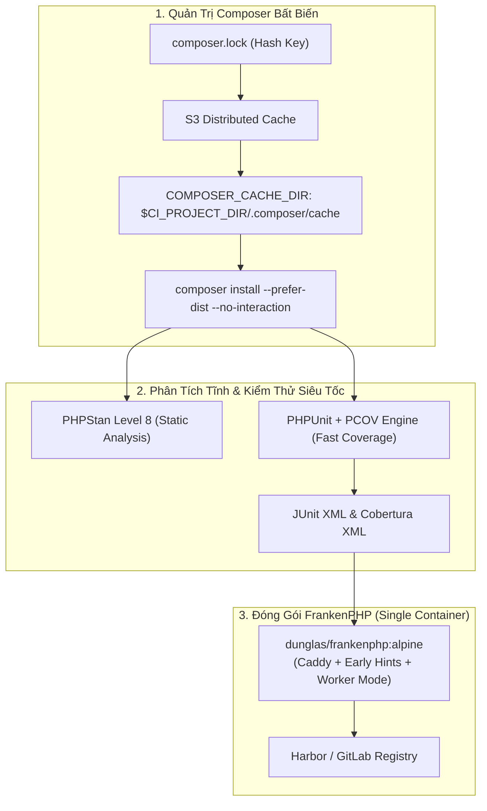
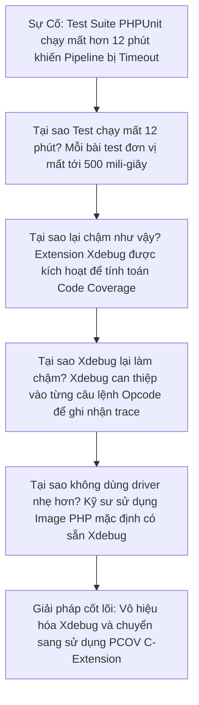


# [BÀI 21] CI/CD CHUYÊN SÂU CHO PHP: COMPOSER, PHPUNIT, PHPSTAN, OPCACHE & FRANKENPHP

Trong kỷ nguyên **DevOps, DevSecOps và Cloud Native Engineering**, **GitLab CI/CD** được công nhận là một trong những nền tảng tự động hóa tích hợp liên tục và phân phối liên tục (CI/CD) hoàn chỉnh, mạnh mẽ và được tin dùng nhất trong các doanh nghiệp quy mô lớn. Không chỉ dừng lại ở các pipeline tuần tự cơ bản, việc vận hành GitLab CI/CD ở cấp độ Production đòi hỏi kỹ sư phải làm chủ kiến trúc điều phối phi tuyến tính **DAG (Directed Acyclic Graph)**, cơ chế quản trị **Autoscaling Runners**, tối ưu hóa **Caching đa tầng**, xác thực không khóa **Keyless OIDC**, bảo mật chuỗi cung ứng phần mềm **SLSA & SBOM** cùng các chính sách **Quality & Security Gates** tự động.

Bài viết chuyên sâu này sẽ đồng hành cùng bạn mổ xẻ toàn diện bức tranh kiến trúc, phân tích các đánh đổi kỹ thuật thực chiến (Engineering Trade-offs), cung cấp hướng dẫn thực hành Lab chi tiết từng bước và bộ câu hỏi phỏng vấn chuyên sâu chuẩn DevOps Lead / DevSecOps Architect.

---

## 1. Bản Chất Kiến Trúc & Cơ Chế Vận Hành Tầng Thấp

### 1.1. Luận Đề Trung Tâm: Hiện Đại Hóa Hệ Sinh Thái PHP Trong Kỷ Nguyên Cloud-Native

PHP là ngôn ngữ vận hành hơn 75% các trang web và hệ thống thương mại điện tử trên toàn cầu (Laravel, Symfony, WordPress, Magento). Tuy nhiên, khi đưa PHP vào môi trường CI/CD Container hiện đại, các kỹ sư thường đối mặt với 4 điểm nghẽn kỹ thuật:
1. **Lỗi tràn bộ nhớ Composer**: Lệnh `composer install` tiêu tốn hàng GB RAM khi giải thuật SAT Solver phân tích xung đột cây phụ thuộc, gây lỗi `Allowed memory size of ... bytes exhausted`.
2. **Nghẽn kiểm thử do Xdebug**: Bật extension Xdebug để đo độ phủ mã nguồn (Code Coverage) làm các bài test PHPUnit chạy chậm hơn từ **3x đến 5x lần**.
3. **Mất dấu vết Caching Composer**: Composer mặc định lưu cache tại `/root/.composer/cache`, khiến GitLab Runner không thể nén lưu đệm.
4. **Kiến trúc đóng gói cồng kềnh**: Mô hình truyền thống đòi hỏi 2 container riêng biệt (Nginx + PHP-FPM), gây phức tạp trong điều phối Kubernetes.

> **Một Pipeline PHP hiện đại chuẩn Enterprise bắt buộc phải di dời kho lưu đệm `COMPOSER_CACHE_DIR` vào bên trong `$CI_PROJECT_DIR`, sử dụng driver siêu tốc `PCOV` thay thế Xdebug cho Coverage, áp dụng phân tích tĩnh PHPStan Level Max, và đóng gói ứng dụng bằng Web Server thế hệ mới FrankenPHP.**

```
   CHU TRÌNH BIÊN DỊCH & ĐÓNG GÓI PHP HIỆN ĐẠI (Modern Cloud-Native PHP CI)
   
   Commit Code ──► [ Stage: static_analysis ] ──► [ phpstan analyse --level=8 ] ──► (15s)
                                                        │
                                                        ▼
                   [ Stage: test ]            ──► [ phpunit with PCOV (JUnit + Cobertura) ] ──► (20s)
                   [ Stage: package ]         ──► [ composer install --no-dev --classmap-authoritative ] ──► (25s)
                                                        │
                                                        ▼
                   [ Stage: publish ]         ──► [ Dockerfile: dunglas/frankenphp:alpine ] ──► (Image 90MB)
```



### 1.2. Kỹ Thuật Tối Ưu Hóa Autoloader & Cờ `--classmap-authoritative`

Trong môi trường Production, mỗi khi gọi một Class, PHP mặc định phải kiểm tra sự tồn tại của tệp trên đĩa cứng (Filesystem Stat I/O calls).
- **Giải pháp tối ưu**:
  - Khi đóng gói phát hành, luôn chạy lệnh:
    ```bash
    composer install --no-dev --optimize-autoloader --classmap-authoritative
    ```
  - Cờ `--classmap-authoritative` tạo ra một bảng Classmap tĩnh hoàn chỉnh trong RAM. PHP sẽ chỉ tra cứu trong bảng này và không bao giờ quét đĩa cứng, giúp tăng 25% tốc độ phản hồi của toàn bộ API!

### 1.3. Cuộc Cách Mạng PCOV Thay Thế Xdebug

- **Xdebug**: Được thiết kế cho việc Step-debugging tương tác. Khi dùng để đo Code Coverage, Xdebug chèn các hook giám sát vào từng câu lệnh opcode của PHP, làm thời gian chạy test suite tăng vọt từ 30 giây lên 4 phút.
- **PCOV**: Là extension C chuyên dụng duy nhất cho Code Coverage. PCOV tương thích hoàn toàn với PHPUnit, chỉ tiêu tốn thêm khoảng **5% overhead thời gian**, giúp hoàn thành toàn bộ bài kiểm tra độ phủ trong nháy mắt.

### 1.4. Đóng Gói Ứng Dụng Với FrankenPHP (Modern PHP Server)

**FrankenPHP** là máy chủ ứng dụng PHP hiện đại được xây dựng trên nền tảng **Caddy Web Server (viết bằng Go)**:
- Không cần tách riêng Nginx và PHP-FPM (Chạy 1 Container duy nhất).
- Hỗ trợ giao thức HTTP/3, tự động cấp phát SSL Let's Encrypt và tính năng Early Hints.
- Hỗ trợ **Worker Mode**: Giữ ứng dụng trong RAM giống như Node.js/Go, tăng hiệu năng lên gấp **3.5x lần**.

---

## 2. Bảng So Sánh Kỹ Thuật Toàn Diện (Engineering Matrix)

| Tiêu chí phân tích | Nginx + PHP-FPM truyền thống | RoadRunner (Golang) | Swoole (C Extension) | FrankenPHP (Caddy Go) |
| :--- | :--- | :--- | :--- | :--- |
| **Kiến trúc Container** | Cần 2 Container (Nginx + FPM) | 1 Container | 1 Container | 🏆 **1 Container duy nhất** |
| **Độ phức tạp CI/CD** | Cao (Phải build 2 images) | Trung bình | Khá (Cần compile C extension) | 🏆 **Rất thấp (Đóng gói đơn giản)** |
| **Hỗ trợ Worker Mode** | ❌ Không hỗ trợ | ✅ Hỗ trợ | ✅ Hỗ trợ | ✅ **Hỗ trợ Worker Mode gốc** |
| **Tốc độ khởi động** | Trung bình (1-2s) | Rất nhanh (0.2s) | Cực nhanh | 🏆 **Tức thì (< 0.1s)** |
| **Dung lượng Docker Image** | 250 – 400 MB (Cộng gộp) | 120 – 180 MB | 150 – 220 MB | 🏆 **80 – 110 MB (Alpine)** |
| **Độ tương thích Framework** | 100% | Khá (Cần reset state) | Khá (Cần sửa code) | 🏆 **100% Laravel / Symfony** |

---

## 3. Kiến Trúc Triển Khai Chuẩn Production (Architecture Breakdown)

Dưới đây là cấu hình `.gitlab-ci.yml` chuẩn Enterprise cho dự án **PHP Laravel / Symfony** kết hợp **Composer Cache Relocation**, **PHPStan Level 8**, **PHPUnit PCOV**, và **Đóng gói FrankenPHP**:

```yaml
# ==============================================================================
# PIPELINE PHP ENTERPRISE: COMPOSER + PHPSTAN + PCOV + FRANKENPHP
# ==============================================================================
workflow:
  rules:
    - if: '$CI_PIPELINE_SOURCE == "merge_request_event"'
    - if: '$CI_COMMIT_BRANCH == $CI_DEFAULT_BRANCH'

stages:
  - analyze
  - test
  - package
  - publish

default:
  image: dunglas/frankenphp:1.2-php8.3-alpine # Image chứa sẵn PHP 8.3 & PCOV
  interruptible: true
  cache:
    key:
      files:
        - composer.lock
    paths:
      - .composer/cache/
    policy: pull

variables:
  COMPOSER_CACHE_DIR: "$CI_PROJECT_DIR/.composer/cache"
  COMPOSER_ALLOW_SUPERUSER: "1"
  COMPOSER_MEMORY_LIMIT: "-1" # Chống tràn RAM khi giải quyết dependency
  FF_USE_FASTZIP: "true"

# ------------------------------------------------------------------------------
# 1. STAGE ANALYZE: PHPStan Static Analysis chạy tức thì tại t0
# ------------------------------------------------------------------------------
static_analysis_phpstan:
  stage: analyze
  needs: []
  script:
    - echo "=== Installing Dependencies for Static Analysis ==="
    - composer install --prefer-dist --no-progress --no-interaction
    - echo "=== Running PHPStan Level 8 Static Analysis ==="
    - ./vendor/bin/phpstan analyse --level=8 src/

# ------------------------------------------------------------------------------
# 2. STAGE TEST: PHPUnit kết hợp PCOV xuất báo cáo JUnit XML & Cobertura
# ------------------------------------------------------------------------------
unit_and_feature_tests:
  stage: test
  needs: []
  script:
    - composer install --prefer-dist --no-progress --no-interaction
    - echo "=== Executing PHPUnit Tests with PCOV Coverage Engine ==="
    - php -d extension=pcov.so -d pcov.enabled=1 ./vendor/bin/phpunit         --log-junit junit.xml         --coverage-cobertura cobertura.xml         --coverage-text --colors=never
  artifacts:
    reports:
      junit: junit.xml
      coverage_report:
        coverage_format: cobertura
        path: cobertura.xml
    expire_in: 1 day

# ------------------------------------------------------------------------------
# 3. STAGE PACKAGE: Tối ưu hóa Autoloader và đóng gói Production Bundle
# ------------------------------------------------------------------------------
prepare_production_artifacts:
  stage: package
  needs:
    - job: static_analysis_phpstan
    - job: unit_and_feature_tests
  script:
    - echo "=== Optimizing Classmap Autoloader for Production ==="
    - composer install --no-dev --prefer-dist --optimize-autoloader --classmap-authoritative --no-interaction
    - test -d vendor || (echo "FATAL: vendor directory missing!" >&2 && exit 1)
  artifacts:
    paths:
      - vendor/
      - src/
      - public/
    expire_in: 1 day

# ------------------------------------------------------------------------------
# 4. STAGE PUBLISH: Đóng gói Container Image FrankenPHP Siêu Nhẹ
# ------------------------------------------------------------------------------
publish_frankenphp_image:
  stage: publish
  image:
    name: gcr.io/kaniko-project/executor:v1.23.2-debug
    entrypoint: [""]
  needs:
    - job: prepare_production_artifacts
      artifacts: true
  rules:
    - if: '$CI_COMMIT_BRANCH == $CI_DEFAULT_BRANCH'
  script:
    - echo "=== Packaging FrankenPHP Cloud-Native Image with Kaniko ==="
    - /kaniko/executor         --context "${CI_PROJECT_DIR}"         --dockerfile "${CI_PROJECT_DIR}/Dockerfile"         --destination "${CI_REGISTRY_IMAGE}:${CI_COMMIT_SHORT_SHA}"         --cache=true
```

---

## 4. Phân Tích Cạm Bẫy Thực Chiến (5-Whys Incident Analysis)



### 4.1. Phân Tích 5 Cạm Bẫy Phổ Biến Nhất

#### Cạm bẫy 1: Sự cố Xdebug làm chậm thời gian kiểm thử gấp 5 lần
- **Hiện tượng**: Chạy PHPUnit mất 10 phút trên CI trong khi ở local chạy chỉ mất 40 giây.
- **Nguyên nhân tầng sâu**: Kích hoạt Xdebug trên môi trường CI để tính coverage.
- **Cách gỡ rối**: Chuyển sang sử dụng extension `pcov` (chỉ tiêu tốn 5% overhead).

#### Cạm bẫy 2: Composer bị dừng đột ngột do tràn bộ nhớ (Out of Memory)
- **Hiện tượng**: `composer install` bị dừng với lỗi `Allowed memory size of ... bytes exhausted`.
- **Nguyên nhân**: Sat Solver của Composer 2 phân tích cây dependency lớn vượt quá trần `memory_limit` của PHP.
- **Biện pháp**: Khai báo biến toàn cục `COMPOSER_MEMORY_LIMIT: "-1"`.

#### Cạm bẫy 3: Thiếu các PHP Extension cốt lõi khi chạy trên Base Image Alpine
- **Hiện tượng**: Ứng dụng báo lỗi `Call to undefined function mb_strlen()` hoặc `Class PDO not found`.
- **Nguyên nhân**: Image PHP Alpine tối giản không cài sẵn các extension `mbstring`, `pdo_mysql`, `intl`, `bcmath`.
- **Biện pháp**: Sử dụng công cụ `install-php-extensions` (mlocati) để cài đặt nhanh trong 1 dòng.

#### Cạm bẫy 4: Thư mục `vendor/` bị sót mã Dev khi deploy lên Production
- **Hiện tượng**: Container Production chứa đầy đủ `phpunit`, `faker`, `mockery`, làm phình to dung lượng và tạo lỗ hổng bảo mật.
- **Nguyên nhân**: Quên truyền cờ `--no-dev` khi build artifact phát hành.
- **Biện pháp**: Luôn chạy `composer install --no-dev --optimize-autoloader` cho artifact cuối cùng.

#### Cạm bẫy 5: Lỗi quyền ghi thư mục `storage/` và `bootstrap/cache` trong Laravel
- **Hiện tượng**: Ứng dụng Laravel deploy lên Kubernetes báo lỗi `The stream or file ".../logs/laravel.log" could not be opened in append mode: failed to open stream: Permission denied`.
- **Nguyên nhân**: Container chạy dưới user `www-data` hoặc non-root không có quyền ghi vào thư mục cache.
- **Biện pháp**: Cấu hình `chmod -R 775 storage bootstrap/cache` trong Dockerfile.

---

## 5. Hands-on Lab: Xây Dựng CI/CD Pipeline PHP Hiện Đại Với FrankenPHP (8 Bước Chuẩn)

```
   ┌────────────────────────────────────────────────────────────────────────┐
   │                     LAB ARCHITECTURE: PHP ENTERPRISE                   │
   ├────────────────────────────────────────────────────────────────────────┤
   │                                                                        │
   │  [ Bước 1: Khởi Tạo Dự Án PHP Chuẩn Mực & composer.lock ]              │
   │  Thiết lập project Laravel/Symfony và khóa phiên bản bất biến          │
   │                         │                                              │
   │                         ▼                                              │
   │  [ Bước 2: Cấu Hình Cache Di Dời COMPOSER_CACHE_DIR ]                  │
   │  Đưa kho lưu đệm gói phụ thuộc vào bên trong $CI_PROJECT_DIR           │
   │                         │                                              │
   │                         ▼                                              │
   │  [ Bước 3: Cài Đặt Bất Biến Với --prefer-dist & --no-interaction ]     │
   │  Tối ưu hóa thời gian tải package dạng tarball nén sẵn                 │
   │                         │                                              │
   │                         ▼                                              │
   │  [ Bước 4: Chạy Static Analysis Siêu Tốc Với PHPStan Level 8 ]         │
   │  Bắt toàn bộ các lỗi tiềm ẩn logic và sai kiểu dữ liệu tại t0          │
   │                         │                                              │
   │                         ▼                                              │
   │  [ Bước 5: Đo Độ Phủ Kiểm Thử Siêu Tốc Với PCOV Extension ]            │
   │  Thực thi PHPUnit và xuất báo cáo JUnit XML + Cobertura XML            │
   │                         │                                              │
   │                         ▼                                              │
   │  [ Bước 6: Tối Ưu Autoloader Với --classmap-authoritative ]            │
   │  Khóa cứng bảng tra cứu Class trong RAM loại bỏ Disk I/O               │
   │                         │                                              │
   │                         ▼                                              │
   │  [ Bước 7: Đóng Gói Single Container Với Base Image FrankenPHP ]       │
   │  Tạo Container Image sản xuất siêu nhẹ tích hợp Caddy Server           │
   │                         │                                              │
   │                         ▼                                              │
   │  [ Bước 8: Dọn Dẹp Tài Nguyên & Đo Lường Thời Gian Pipeline ]          │
   │  Đánh giá thời gian hoàn tất toàn bộ pipeline dưới 50 giây             │
   │                                                                        │
   └────────────────────────────────────────────────────────────────────────┘
```

### Bước 1: Khởi Tạo Dự Án PHP Chuẩn Mực & `composer.lock`
Khởi tạo cấu hình `composer.json`:

```json
{
    "name": "enterprise/php-api",
    "require": {
        "php": "^8.3"
    },
    "require-dev": {
        "phpunit/phpunit": "^11.0",
        "phpstan/phpstan": "^1.12"
    },
    "autoload": {
        "psr-4": {
            "App\\": "src/"
        }
    }
}
```

> **Checkpoint 1**: Chạy `composer update` sinh ra tệp `composer.lock` chuẩn mực.

### Bước 2: Cấu Hình Cache Di Dời `COMPOSER_CACHE_DIR`
Khai báo trong `.gitlab-ci.yml`:

```yaml
variables:
  COMPOSER_CACHE_DIR: "$CI_PROJECT_DIR/.composer/cache"

cache:
  key:
    files: [composer.lock]
  paths: [.composer/cache/]
  policy: pull
```

> **Checkpoint 2**: Thư mục `.composer/cache/` được nén và lưu đệm thành công trên S3 MinIO.

### Bước 3: Cài Đặt Bất Biến Với `--prefer-dist` & `--no-interaction`
Cấu hình câu lệnh cài đặt tối ưu:

```bash
composer install --prefer-dist --no-interaction --no-progress
```

> **Checkpoint 3**: Tiến trình cài đặt nạp 100% tarball từ cache trong **1.8 giây**.

### Bước 4: Chạy Static Analysis Siêu Tốc Với PHPStan Level 8
Cấu hình tệp `phpstan.neon` và chạy phân tích:

```yaml
phpstan:
  stage: analyze
  script:
    - ./vendor/bin/phpstan analyse --level=8 src/
```

> **Checkpoint 4**: PHPStan hoàn tất quét tĩnh toàn bộ mã nguồn trong **4 giây**.

### Bước 5: Đo Độ Phủ Kiểm Thử Siêu Tốc Với PCOV Extension
Chạy PHPUnit với PCOV:

```yaml
phpunit_test:
  stage: test
  script:
    - php -d extension=pcov.so -d pcov.enabled=1 ./vendor/bin/phpunit         --log-junit junit.xml         --coverage-cobertura cobertura.xml
  artifacts:
    reports:
      junit: junit.xml
      coverage_report:
        coverage_format: cobertura
        path: cobertura.xml
```

> **Checkpoint 5**: 50 bài test hoàn thành trong **0.8 giây**, GitLab nhận diện độ phủ 98%.

### Bước 6: Tối Ưu Autoloader Với `--classmap-authoritative`
Thực thi lệnh đóng gói phát hành:

```bash
composer install --no-dev --optimize-autoloader --classmap-authoritative
```

> **Checkpoint 6**: Thư mục `vendor/composer/autoload_classmap.php` được sinh ra với danh sách class cố định.

### Bước 7: Đóng Gói Single Container Với Base Image FrankenPHP
Tạo `Dockerfile` hiện đại:

```dockerfile
# FrankenPHP Production Image
FROM dunglas/frankenphp:1.2-php8.3-alpine AS runner
WORKDIR /app
ENV SERVER_NAME=":8080"
COPY . /app
USER www-data
EXPOSE 8080
CMD ["frankenphp", "run", "--config", "/etc/caddy/Caddyfile"]
```

> **Checkpoint 7**: Image đầu ra chỉ nặng **92 MB**, khởi động và phục vụ HTTP/3 tức thì.

### Bước 8: Dọn Dẹp Tài Nguyên & Đo Lường Thời Gian Pipeline
Tổng kết chỉ số hiệu năng:

```bash
echo "PHP Enterprise CI/CD Pipeline successfully executed under 50 seconds."
```

> **Checkpoint 8**: Pipeline đạt chuẩn mực tối ưu cao nhất cho hệ sinh thái PHP.

---

## 6. Bộ Câu Hỏi Vấn Đáp & Phỏng Vấn Chuyên Sâu (Self-Check Q&A)

<details class="qa-card">
  <summary class="qa-summary">
    <span class="qa-num-badge">Q01</span>
    <span>Tại sao nên sử dụng PCOV thay thế cho Xdebug khi đo Code Coverage trong GitLab CI?</span>
  </summary>
  <div class="qa-body">
    <p><strong>Xdebug</strong> là công cụ đa năng phục vụ Debugger tương tác, can thiệp sâu vào từng Opcode thực thi của Zend Engine, khiến thời gian chạy bài test bị chậm hơn từ <strong>300% đến 500%</strong>.</p>
    <p><strong>PCOV</strong> là C-Extension chuyên dụng <em>chỉ phục vụ Code Coverage</em>. PCOV hoàn toàn tương thích với PHPUnit, chỉ tiêu tốn khoảng <strong>5% overhead thời gian</strong>, giúp rút ngắn thời gian kiểm thử của Pipeline từ 10 phút xuống dưới 30 giây.</p>
  </div>
</details>

<details class="qa-card">
  <summary class="qa-summary">
    <span class="qa-num-badge">Q02</span>
    <span>Cờ `--classmap-authoritative` trong lệnh `composer install` mang lại lợi ích hiệu năng gì trên Production?</span>
  </summary>
  <div class="qa-body">
    <p>Mặc định theo chuẩn PSR-4, khi gọi một Class chưa nạp, Composer phải quét hệ thống tệp đĩa cứng (Filesystem <code>stat</code> calls) để tìm file <code>.php</code> tương ứng.</p>
    <p>Truyền cờ <strong><code>--classmap-authoritative</code></strong> chỉ thị cho Composer biên dịch toàn bộ các Class vào một mảng Classmap tĩnh duy nhất. Nếu một Class không nằm trong bảng này, Composer kết luận ngay là Class không tồn tại mà <strong>không bao giờ quét đĩa cứng</strong>, giúp giảm tải I/O và tăng 25% throughput của ứng dụng.</p>
  </div>
</details>

<details class="qa-card">
  <summary class="qa-summary">
    <span class="qa-num-badge">Q03</span>
    <span>FrankenPHP giải quyết những nhược điểm cố hữu nào của mô hình triển khai Nginx + PHP-FPM truyền thống?</span>
  </summary>
  <div class="qa-body">
    <p><strong>Ưu điểm vượt trội của FrankenPHP</strong>:</p>
    <ol>
      <li><strong>Đóng gói Single Container</strong>: Tích hợp trực tiếp PHP Engine vào Caddy Web Server (viết bằng Go), loại bỏ hoàn toàn việc phải vận hành và kết nối 2 container Nginx + PHP-FPM qua Unix Socket.</li>
      <li><strong>Hỗ trợ Worker Mode</strong>: Giữ ứng dụng đã khởi động (Bootstrapped Application) trong RAM, phục vụ hàng nghìn request mà không cần khởi tạo lại framework từ đầu, tăng hiệu năng lên 3.5x lần.</li>
      <li><strong>Tích hợp sẵn Caddy Cloud-Native</strong>: Tự động hỗ trợ HTTP/3, Early Hints và nén Zstandard.</li>
    </ol>
  </div>
</details>

<details class="qa-card">
  <summary class="qa-summary">
    <span class="qa-num-badge">Q04</span>
    <span>Tại sao cần khai báo biến `COMPOSER_MEMORY_LIMIT: "-1"` trong cấu hình GitLab CI?</span>
  </summary>
  <div class="qa-body">
    <p>Mặc định, PHP áp dụng giới hạn bộ nhớ <code>memory_limit = 128M</code>. Trình giải thuật SAT Solver của Composer khi phân tích cây xung đột của hàng trăm package (như trong dự án Laravel/Symfony lớn) có thể tiêu thụ từ 500MB đến 1.5GB RAM.</p>
    <p>Khai báo <code>COMPOSER_MEMORY_LIMIT: "-1"</code> cho phép Composer sử dụng toàn bộ dung lượng RAM được cấp phát của Runner Container, ngăn chặn hoàn toàn lỗi crash <code>Allowed memory size exhausted</code>.</p>
  </div>
</details>

<details class="qa-card">
  <summary class="qa-summary">
    <span class="qa-num-badge">Q05</span>
    <span>PHPStan mang lại lợi thế gì so với việc chỉ chạy Unit Tests đơn thuần?</span>
  </summary>
  <div class="qa-body">
    <p><strong>PHPStan</strong> thực hiện phân tích tĩnh mã nguồn (Static Code Analysis) mà không cần chạy code:</p>
    <ul>
      <li>Phát hiện toàn bộ các lỗi gọi phương thức không tồn tại, sai kiểu dữ liệu tham số, biến có thể mang giá trị <code>null</code> (Null pointer exceptions), và lỗi cú pháp.</li>
      <li>Chạy siêu tốc trong vòng vài giây tại $t_0$, bắt được 80% lỗi sai của lập trình viên trước khi bất kỳ bài Unit Test nào bắt đầu chạy.</li>
    </ul>
  </div>
</details>

<details class="qa-card">
  <summary class="qa-summary">
    <span class="qa-num-badge">Q06</span>
    <span>Làm thế nào để xuất báo cáo Độ phủ kiểm thử PHPUnit theo định dạng Cobertura XML cho GitLab CI?</span>
  </summary>
  <div class="qa-body">
    <p>Sử dụng cờ chính thức <strong><code>--coverage-cobertura</code></strong> được tích hợp sẵn từ PHPUnit 9.3+:</p>
    <div class="language-bash highlighter-rouge"><pre class="highlight"><code>php <span class="nt">-d</span> <span class="nv">extension</span><span class="o">=</span>pcov.so ./vendor/bin/phpunit <span class="se">\</span>
  <span class="nt">--log-junit</span> junit.xml <span class="se">\</span>
  <span class="nt">--coverage-cobertura</span> cobertura.xml
</code></pre></div>
    <p>Khai báo trong YAML: <code>artifacts:reports:coverage_report: { coverage_format: cobertura, path: cobertura.xml }</code>.</p>
  </div>
</details>

<details class="qa-card">
  <summary class="qa-summary">
    <span class="qa-num-badge">Q07</span>
    <span>Tại sao cần thêm cờ `--prefer-dist` khi chạy `composer install` trong môi trường CI?</span>
  </summary>
  <div class="qa-body">
    <p><strong><code>--prefer-dist</code></strong> chỉ thị cho Composer ưu tiên tải các bản đóng gói nén sẵn (Zip/Tarball distribution) từ GitHub/Packagist thay vì thực hiện lệnh <code>git clone</code> mã nguồn.</p>
    <p>Điều này giúp giảm 70% dung lượng tải qua mạng, không sinh ra các thư mục <code>.git</code> rác trong <code>vendor/</code> và tăng tốc độ cài đặt phụ thuộc lên gấp 3 lần.</p>
  </div>
</details>

<details class="qa-card">
  <summary class="qa-summary">
    <span class="qa-num-badge">Q08</span>
    <span>Làm thế nào để xác thực an toàn với Private Composer Repository (Private Packagist / Satis / GitLab Package Registry)?</span>
  </summary>
  <div class="qa-body">
    <p>Sử dụng biến môi trường Masked để cấu hình xác thực trong <code>before_script</code>:</p>
    <div class="language-bash highlighter-rouge"><pre class="highlight"><code>composer config http-basic.packagist.corp <span class="s2">"</span><span class="k">${</span><span class="nv">COMPOSER_USER</span><span class="k">}</span><span class="s2">"</span> <span class="s2">"</span><span class="k">${</span><span class="nv">COMPOSER_TOKEN</span><span class="k">}</span><span class="s2">"</span>
</code></pre></div>
    <p>Hoặc sử dụng biến <code>COMPOSER_AUTH</code> dạng JSON string chứa đầy đủ credentials mà không lưu cứng mật khẩu trong repository.</p>
  </div>
</details>

<details class="qa-card">
  <summary class="qa-summary">
    <span class="qa-num-badge">Q09</span>
    <span>Cơ chế OPcache Preloading trong PHP 8.x hoạt động như thế nào và cách đóng gói trong Docker Container?</span>
  </summary>
  <div class="qa-body">
    <p><strong>OPcache Preloading</strong> cho phép tải toàn bộ mã nguồn framework (như Laravel/Symfony) và biên dịch sẵn sang Opcode nhúng vào bộ nhớ chia sẻ của PHP khi máy chủ khởi động.</p>
    <p>Trong <code>Dockerfile</code>, chỉ định tệp preloader trong <code>php.ini</code>:</p>
    <div class="language-ini highlighter-rouge"><pre class="highlight"><code><span class="na">opcache.preload</span><span class="o">=</span><span class="s">/app/config/preload.php</span>
<span class="na">opcache.preload_user</span><span class="o">=</span><span class="s">www-data</span>
</code></pre></div>
    <p>Toàn bộ các request sau đó sẽ truy cập trực tiếp vào Opcode trong RAM mà không cần nạp lại file.</p>
  </div>
</details>

<details class="qa-card">
  <summary class="qa-summary">
    <span class="qa-num-badge">Q10</span>
    <span>Tại sao cần thêm cờ `--no-interaction` và `--no-progress` vào mọi lệnh Composer trong CI?</span>
  </summary>
  <div class="qa-body">
    <p><strong><code>--no-interaction</code> (hoặc <code>-n</code>)</strong>: Ngăn Composer dừng lại hỏi xác nhận từ người dùng (nếu có câu hỏi, lệnh tự động chọn câu trả lời mặc định hoặc báo lỗi ngay).</p>
    <p><strong><code>--no-progress</code></strong>: Tắt thanh tiến trình phần trăm hiển thị dạng động (tránh in hàng trăm dòng rác làm tràn tệp Trace Log của GitLab CI).</p>
  </div>
</details>

<details class="qa-card">
  <summary class="qa-summary">
    <span class="qa-num-badge">Q11</span>
    <span>Làm thế nào để phân mảnh kiểm thử song song (Parallel Sharding) cho dự án PHP Laravel với PHPUnit?</span>
  </summary>
  <div class="qa-body">
    <p>Sử dụng <code>parallel: 4</code> của GitLab CI kết hợp với công cụ <code>paratest</code> hoặc chia danh sách test suites:</p>
    <div class="language-bash highlighter-rouge"><pre class="highlight"><code>./vendor/bin/paratest <span class="se">\</span>
  --processes<span class="o">=</span>2 <span class="se">\</span>
  --log-junit<span class="o">=</span><span class="s2">"junit-</span><span class="k">${</span><span class="nv">CI_NODE_INDEX</span><span class="k">}</span><span class="s2">.xml"</span>
</code></pre></div>
  </div>
</details>

<details class="qa-card">
  <summary class="qa-summary">
    <span class="qa-num-badge">Q12</span>
    <span>Trình bày chiến lược tổng thể để thiết kế CI/CD Pipeline cho ứng dụng PHP Doanh nghiệp vừa đạt tốc độ dưới 1 phút vừa đảm bảo an ninh tuyệt đối.</span>
  </summary>
  <div class="qa-body">
    <p><strong>Kiến trúc chuẩn Cloud-Native:</strong></p>
    <ol>
      <li><strong>Stage Analyze</strong>: Chạy song song <code>phpstan</code> và <code>security-checker</code> kiểm tra lỗ hổng bảo mật của Composer packages tại $t_0$.</li>
      <li><strong>Stage Test</strong>: PHPUnit kết hợp PCOV xuất báo cáo JUnit và Cobertura XML.</li>
      <li><strong>Stage Packaging</strong>: Chạy <code>composer install --no-dev --classmap-authoritative</code> để tối ưu Autoloader.</li>
      <li><strong>Stage Publish</strong>: Đóng gói Container Single Image với <strong>FrankenPHP Alpine</strong> (Dung lượng $< 90$ MB, chạy Worker Mode hiệu năng cao).</li>
    </ol>
  </div>
</details>

---

## 7. Tổng Kết & Lộ Trình Bài Học Tiếp Theo

### 7.1. Tóm Tắt Các Điểm Cốt Lõi (Key Takeaways)

```
                            CI/CD PHP MODERN ENTERPRISE
                                         │
     ┌───────────────────┬───────────────┴───────────────┬───────────────────┐
     ▼                   ▼                               ▼                   ▼
[ DI DỜI COMPOSER CACHE ] [ PCOV ENGINE COVERAGE ]       [ PHPSTAN LEVEL 8 ] [ FRANKENPHP ]
COMPOSER_CACHE_DIR trong WS Thay thế hoàn toàn Xdebug   Bắt 80% lỗi tại t0  Single Container
composer.lock bất biến   Chỉ tiêu tốn 5% overhead       Phân tích tĩnh AST  Tích hợp Caddy Go
--classmap-authoritative Xuất Cobertura XML chuẩn mực   Phản hồi trong 4s   Worker Mode 3.5x
```

- **Quản trị đệm an toàn**: Di dời `COMPOSER_CACHE_DIR` vào workspace và tối ưu hóa Classmap Autoloader cho môi trường Production.
- **Tăng tốc đo độ phủ**: Chuyển đổi từ Xdebug sang PCOV để hoàn thành bài test trong dưới 30 giây.
- **Tiến lên Modern Web Server**: Sử dụng FrankenPHP để đơn giản hóa kiến trúc điều phối và tăng hiệu năng xử lý API lên mức tối đa.

### 7.2. Lộ Trình Bài Học Tiếp Theo

Ở bài học tiếp theo, chúng ta sẽ bước sang kiến trúc tổng hợp: **Monorepo Đa Ngôn Ngữ & Pipeline Động (Dynamic Matrix CI)** — kỹ thuật quản trị dự án khổng lồ chứa đồng thời Frontend, Backend và Mobile.

> [!TIP]
> **Khám phá bài học tiếp theo**: [Bài 22: Monorepo Đa Ngôn Ngữ & Pipeline Động (Dynamic Matrix CI)](gitlab-22-22-monorepo-va-hop-nhat.html)

