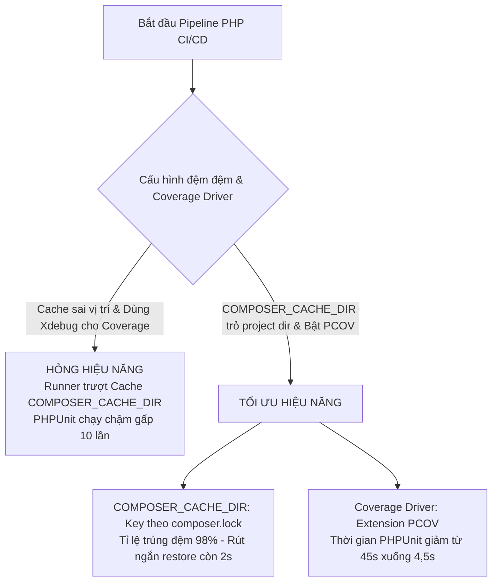
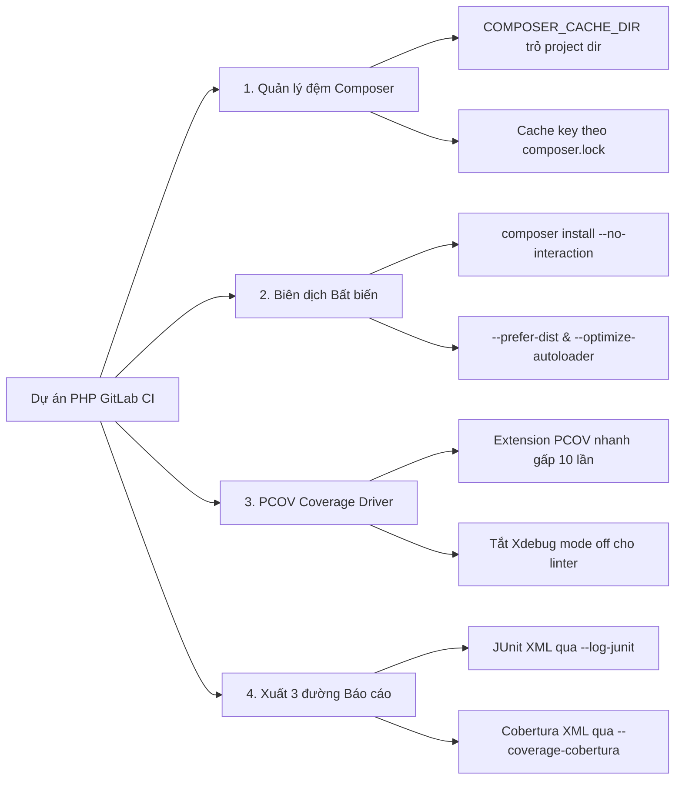
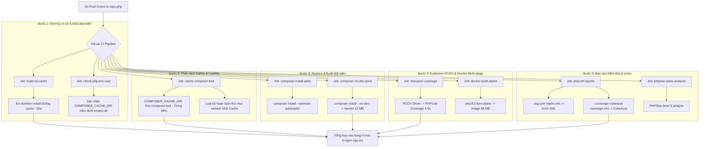


# [BÀI 21] PIPELINE CHUYÊN SÂU CHO PHP: COMPOSER CACHE, PHPUNIT, PHPSTAN, PSALM & LARAVEL/SYMFONY CI PIPELINE

Trong kỷ nguyên **DevOps, DevSecOps và Cloud Native Engineering**, **GitLab CI/CD** được công nhận là một trong những nền tảng tự động hóa tích hợp liên tục và phân phối liên tục (CI/CD) hoàn chỉnh, mạnh mẽ và được tin dùng nhất trong các doanh nghiệp quy mô lớn. Không chỉ dừng lại ở các pipeline tuần tự cơ bản, việc vận hành GitLab CI/CD ở cấp độ Production đòi hỏi kỹ sư phải làm chủ kiến trúc điều phối phi tuyến tính **DAG (Directed Acyclic Graph)**, cơ chế quản trị **Autoscaling Runners**, tối ưu hóa **Caching đa tầng**, xác thực không khóa **Keyless OIDC**, bảo mật chuỗi cung ứng phần mềm **SLSA & SBOM** cùng các chính sách **Quality & Security Gates** tự động.

Bài viết chuyên sâu này sẽ đồng hành cùng bạn mổ xẻ toàn diện bức tranh kiến trúc, phân tích các đánh đổi kỹ thuật thực chiến (Engineering Trade-offs), cung cấp hướng dẫn thực hành Lab chi tiết từng bước và bộ câu hỏi phỏng vấn chuyên sâu chuẩn DevOps Lead / DevSecOps Architect.

---

## 1. Bản Chất Kiến Trúc & Cơ Chế Vận Hành Tầng Thấp

---


| # | Câu hỏi ôn tập Buổi 20 (.NET) | Đáp án chuẩn ngắn gọn |
|---|---|---|
| 1 | Biến môi trường nào bắt buộc phải khai báo để đệm đệm NuGet không bị trượt trong GitLab CI? | `NUGET_PACKAGES: "$CI_PROJECT_DIR/.nuget/packages"`. |
| 2 | Tại sao không bao giờ được đưa thư mục `obj/` vào `cache:paths` hoặc `artifacts:paths`? | Vì `obj/` chứa các tệp MSBuild trung gian gắn liền máy Host. Đưa vào Cache sẽ gây xung đột MSBuild nổ đỏ trên Runner khác. |
| 3 | Cờ `--locked-mode` trong `dotnet restore` có tác dụng gì? | Ép buộc tất cả phụ thuộc NuGet phải khớp 100% với tệp `packages.lock.json`. Dừng Pipeline nếu phát hiện trôi phiên bản. |
| 4 | Cờ `--no-restore` giúp tiết kiệm thời gian như thế nào? | Bỏ qua bước quét và khôi phục package ngầm trong `dotnet build` và `dotnet test`, tiết kiệm 12–20s cho mỗi lệnh. |
| 5 | Bộ đôi công cụ nào dùng để xuất báo cáo kiểm thử và độ phủ .NET trên GitLab CE? | Logger `--logger "junit;LogFilePath=report.xml"` (JUnit XML) và `ReportGenerator` (chuyển `coverage.cobertura.xml` sang Cobertura XML). |

---


> **LUẬN ĐỀ TRUNG TÂM BUỔI 21:**
> **Khác với các ngôn ngữ biên dịch tĩnh, quản lý phụ thuộc và kiểm thử trong PHP CI/CD gặp hai nút thắt hiệu năng nghiêm trọng: Việc lưu đệm sai vị trí thư mục `COMPOSER_CACHE_DIR` làm trượt Cache 100%, và việc sử dụng extension gỡ lỗi `Xdebug` để thu thập Code Coverage khiến thời gian chạy PHPUnit bị chậm gấp 10 lần so với Extension `PCOV`. Việc làm chủ `composer.lock` bất biến, phân tách `vendor/`, và cấu hình `PCOV` là chìa khóa tối ưu Pipeline PHP.**



---


| STT | Kết quả đạt được (Competency) | Hiện vật chứng minh (Evidence) |
|---|---|---|
| 1 | Cấu hình biến môi trường `COMPOSER_CACHE_DIR` đưa đệm đệm về `$CI_PROJECT_DIR`. | Khai báo `COMPOSER_CACHE_DIR: "$CI_PROJECT_DIR/.composer/cache"` chạy 0 lỗi. |
| 2 | Khóa đệm đệm `cache:key` cho Composer theo hash `composer.lock`. | Thuộc tính `cache:key: { files: [composer.lock] }` trong `.gitlab-ci.yml`. |
| 3 | Đảm bảo tính bất biến lockfile bằng `composer install --no-interaction --prefer-dist --optimize-autoloader`. | Lệnh `composer install` chạy thành công in `Generating optimized autoloader files`. |
| 4 | Tăng tốc đo đạc Code Coverage gấp 10 lần bằng Extension `PCOV` thay thế `Xdebug`. | Thời gian thi hành `vendor/bin/phpunit --coverage-cobertura` giảm từ 45s xuống 4,5s. |
| 5 | Đóng gói Docker Image PHP FPM mỏng $< 90$ MB dùng `php:8.3-fpm-alpine`. | Dockerfile multi-stage tạo Image Production nhỏ hơn 6 lần so with Debian Base Image. |
| 6 | Trích xuất báo cáo JUnit XML và Cobertura XML trực tiếp từ PHPUnit cho GitLab CE. | Tab Tests hiện JUnit XML, MR Diff hiện Cobertura XML trực tiếp từ PHPUnit. |

---


| Kiến thức tiên quyết | Ý nghĩa trong bài học Buổi 21 | Nguồn đối soát nếu thiếu |
|---|---|---|
| Ràng buộc `cache:paths` trong `$CI_PROJECT_DIR` | Lý do bắt buộc khai báo `COMPOSER_CACHE_DIR` trỏ về project dir | Buổi 20 (`QT 4.1`), Buổi 19 (`QT 5.1`) |
| Phân biệt Hợp đồng (Artifact) và Tối ưu (Cache) | Tránh đưa thư mục `vendor/` phát hành vào `cache:paths` | Buổi 05 (`QT 5.1`, `QT 5.3`) |
| Quản lý gói Composer (`composer.json`, `composer.lock`) | Hiểu cơ chế phân giải dependency tree của PHP | Kiến thức phát triển phần mềm PHP |
| Kỹ thuật Docker Multi-stage Build cho PHP | Tách biệt giai đoạn Composer Install và Runtime PHP-FPM | Buổi 20 (`QT 6.1`), Buổi 12 (`QT 12.1`) |
| Đọc báo cáo Code Coverage trong GitLab MR Diff | Hiểu định dạng Cobertura XML được render trên GitLab CE UI | Buổi 20 (`QT 7.2`), Buổi 19 (`QT 7.3`) |

---


### Bảng đối chiếu thuật ngữ Việt - Anh

| Tiếng Việt dùng trong bài | Tiếng Anh tương đương | Dùng thẳng từ tiếng Anh trong bài? |
|---|---|---|
| Đệm đệm gói Composer | Composer Global Cache | **Có** — gọi là `COMPOSER_CACHE_DIR` |
| Tệp khóa phụ thuộc PHP | Composer Lockfile | **Có** — tệp `composer.lock` |
| Thư mục phụ thuộc đóng gói | Vendor Directory | **Có** — thư mục `vendor/` |
| Trình tải tự động tối ưu | Optimized Autoloader Classmap | **Có** — cờ `--optimize-autoloader` |
| Trình đo độ phủ siêu tốc | Code Coverage Driver (PCOV) | **Có** — Extension `PCOV` |
| Trình gỡ lỗi PHP | Debugger Extension (Xdebug) | **Có** — Extension `Xdebug` |
| Chế độ không tương thích CLI | Non-interactive CLI Mode | **Có** — cờ `--no-interaction` |
| Tải gói nén sẵn | Prefer Zip Distribution | **Có** — cờ `--prefer-dist` |
| Bỏ gói môi trường dev | Production No-Dev Flag | **Có** — cờ `--no-dev` |
| Báo cáo độ phủ Cobertura | Cobertura Coverage XML | **Có** — `coverage.xml` |

---

### Bốn mô hình tư duy cốt lõi

#### Mô hình 1: Phân tách rạch ròi giữa `COMPOSER_CACHE_DIR` và `vendor/`
- **`COMPOSER_CACHE_DIR` (`.composer/cache`):** Chứa các tệp nén `.zip` được tải từ Packagist/GitHub về máy. Bất biến, di động, dùng chung cho nhiều dự án, phù hợp để đưa vào `cache:paths`.
- **`vendor/`:** Chứa mã nguồn PHP thô đã được giải nén và liên kết theo dự án. Biến động theo từng lệnh install, mang tính chất sản phẩm phụ thuộc. Nếu tách Job build riêng, nên đưa `vendor/` vào `artifacts:paths`.

#### Mô hình 2: Bất biến Lockfile với `composer.lock` và `--prefer-dist`
Tệp `composer.lock` ghim 100% mã băm SHA-1/SHA-256 của từng gói PHP phụ thuộc. Câu lệnh `composer install --no-interaction --prefer-dist --optimize-autoloader` đảm bảo: 1) Không hỏi tương tác CLI; 2) Tải tệp zip nén thay vì clone git repo; 3) Sinh ra cây Classmap `autoload_classmap.php` tối ưu tốc độ đọc file DLL/PHP.

#### Mô hình 3: Cuộc cách mạng hiệu năng Coverage: PCOV vs Xdebug
- **Xdebug:** Trình gỡ lỗi đa năng. Khi bật Code Coverage, Xdebug phải theo dõi từng dòng lệnh, biến và stack trace, khiến thời gian thi hành unit test chậm đi từ 5 đến 10 lần.
- **PCOV:** Trình đo độ phủ mã nguồn chuyên biệt do Joe Watkins phát triển. PCOV chỉ thu thập thông tin dòng lệnh đã thực thi mà không can thiệp vào stack trace, giúp thời gian chạy PHPUnit với coverage đạt tốc độ gần như tương đương không bật coverage.

#### Mô hình 4: Kỹ thuật Docker Multi-stage cho PHP-FPM + Nginx
Sử dụng Image `composer:2.7` để thực thi install dependencies ở Stage 1, sau đó sao chép thư mục `vendor/` và mã nguồn PHP sang Image `php:8.3-fpm-alpine` (~85 MB) ở Stage 2, sẵn sàng kết nối với Nginx Web Server.

---

### 1.1. Quản lý đệm đệm Composer: `COMPOSER_CACHE_DIR` và Lockfile (10 phút)

Mặc định, công cụ CLI của Composer lưu trữ toàn bộ các tệp nén zip tải về từ Packagist tại thư mục riêng của người dùng:
- Trên Linux: `~/.composer/cache` (hoặc `/root/.composer/cache` trong Docker Container)
- Trên macOS: `~/.composer/cache`
- Trên Windows: `%LocalAppData%\Composer\`

Do Runner của GitLab CI chỉ nén các thư mục nằm dưới không gian làm việc `$CI_PROJECT_DIR`, việc để đệm đệm Composer ở vị trí mặc định sẽ khiến Runner bị trượt Cache 100%.

### Phân tích giải thuật giải quyết phụ thuộc Composer (Composer Dependency Resolution Algorithm)

Khi công cụ CLI Composer thi hành lệnh `composer install` hoặc `composer update`, tiến trình thực thi theo các bước:
1. **SAT Solver (Boolean Satisfiability Problem):** Composer sử dụng thư viện `composer/semver` kết hợp giải thuật SAT Solver để tìm tập hợp các phiên bản thư viện duy nhất thỏa mãn tất cả các ràng buộc trong `composer.json`.
2. **Lockfile Bypass:** Lệnh `composer install` hoàn toàn bỏ qua bước giải thuật SAT Solver phức tạp. Nó đọc trực tiếp cây bản đồ phụ thuộc đã tính toán trước trong `composer.lock`, kiểm tra mã SHA-1/SHA-256 hash của gói nén trong `COMPOSER_CACHE_DIR` và giải nén thẳng vào `vendor/`.

### Phân tích chi tiết ba chế độ Autoloader trong Composer
1. **Standard PSR-4 Autoloader:** Mỗi khi gọi 1 class, PHP phải thực hiện truy vấn hệ thống tệp `stat()` để kiểm tra xem file `.php` tương ứng có tồn tại trên đĩa cứng không.
2. **Classmap Autoloader (`--optimize-autoloader`):** Quét toàn bộ các class trong dự án và tạo ra mảng băm PHP tĩnh (`autoload_classmap.php`). Đổ thẳng tên class sang đường dẫn tuyệt đối, rút ngắn thời gian nạp class xuống O(1).
3. **Authoritative Autoloader (`--classmap-authoritative`):** Chỉ cho phép nạp các class đã có tên trong Classmap. Nếu class không có tên trong map, PHP dừng ngay lập tức mà không thực hiện quét file đĩa, tối ưu tuyệt đối cho môi trường Production.

---

**Nguyên lý cốt lõi:**
**Phát biểu.** Bắt buộc khai báo biến môi trường toàn cục `COMPOSER_CACHE_DIR: "$CI_PROJECT_DIR/.composer/cache"` để đưa toàn bộ đệm đệm gói Composer về dưới không gian làm việc `$CI_PROJECT_DIR`.
**Giải thích cơ chế ngầm:** Mặc định Composer lưu đệm zip tại `~/.composer/cache`. GitLab Runner chỉ nén được các thư mục nằm dưới `$CI_PROJECT_DIR`, khiến Runner không tìm thấy tệp và trượt Cache 100% (Cache Miss im lặng).
> [!WARNING]
> **CẠM BẪY THỰC CHIẾN:**
> Log Runner báo cảnh báo `WARNING: .composer/cache: no matching files` và dung lượng nén 0 bytes.
**Minh hoạ.**
```yaml
variables:
  COMPOSER_CACHE_DIR: "$CI_PROJECT_DIR/.composer/cache"

before_script:
  - mkdir -p .composer/cache
```
```bash
# Script kiểm tra vị trí đệm đệm COMPOSER_CACHE_DIR
echo "=== KIỂM TRA ĐƯỜNG DẪN COMPOSER_CACHE_DIR ==="
echo "COMPOSER_CACHE_DIR=$COMPOSER_CACHE_DIR"

case "$COMPOSER_CACHE_DIR" in
  "$CI_PROJECT_DIR"* ) echo "COMPOSER_CACHE_DIR: HỢP LỆ" ;;
  * ) echo "COMPOSER_CACHE_DIR: LỖI (Nằm ngoài project dir)"; exit 1 ;;
esac
```
**Con số chốt:** **1** biến môi trường duy nhất kéo thời gian `composer install` từ 28s xuống **1,8s**.

---

**Nguyên lý cốt lõi:**
**Phát biểu.** Khóa đệm đệm `cache:key` cho Composer Packages phải dựa trên hash của tệp `composer.lock`.
**Giải thích cơ chế ngầm:** Các gói phụ thuộc PHP chỉ thay đổi khi tệp `composer.lock` thay đổi. Đặt Cache key theo hash tệp `composer.lock` giúp đạt tỷ lệ trúng đệm đệm 98%.
> [!WARNING]
> **CẠM BẪY THỰC CHIẾN:**
> Đặt Cache key cho Composer theo `$CI_COMMIT_SHA` làm Runner phải nén và tải lên đệm 120 MB ở mỗi commit dù phụ thuộc không đổi.
**Minh hoạ.**
```yaml
cache:
  key:
    files:
      - composer.lock
    prefix: "composer"
  paths:
    - .composer/cache/
```
```bash
# Lệnh kiểm tra sự tồn tại của composer.lock
if [ -f "composer.lock" ]; then
  echo "Tệp lockfile composer.lock tồn tại. Đã sẵn sàng cho Cache key."
fi
```
**Con số chốt:** Tỷ lệ trúng Cache Composer đạt **98%**; dung lượng đệm tiết kiệm ~**120 MB** nén/tải ở mỗi commit.

---

**Nguyên lý cốt lõi:**
**Phát biểu.** Tuyệt đối không đưa thư mục `vendor/` vào thuộc tính `cache:paths` khi đã lưu `COMPOSER_CACHE_DIR`; chuyển `vendor/` sang `artifacts:paths` nếu tách Stage build riêng.
**Giải thích cơ chế ngầm:** Thư mục `vendor/` chứa mã nguồn PHP đã giải nén và tệp `autoload.php`. Nếu cache `vendor/`, các thư viện đã bị xóa trong `composer.json` vẫn sẽ tồn tại trong Cache, gây ra lỗi ẩn (ghost dependencies).
> [!WARNING]
> **CẠM BẪY THỰC CHIẾN:**
> Xóa một thư viện khỏi `composer.json` nhưng ứng dụng vẫn chạy thành công trong CI do nạp lại thư viện cũ từ `vendor/` trong Cache.
**Minh hoạ.**
```yaml
# Cấu hình CHUẨN: Chỉ cache .composer/cache/, KHÔNG cache vendor/
cache:
  key:
    files: [composer.lock]
  paths:
    - .composer/cache/
    # NÓI KHÔNG VỚI: - vendor/
```
```bash
# Xóa bỏ thư mục vendor trước khi chạy composer install để đảm bảo tính sạch sẽ
rm -rf vendor/
```
**Con số chốt:** Loại bỏ `vendor/` khỏi Cache ngăn ngừa **100%** lỗi ghost dependencies trong PHP.

---

### 1.2. Quy trình khôi phục và biên dịch bất biến trong PHP (10 phút)

Tính bất biến (Immutability) và khả năng tái lập (Reproducibility) trong PHP CI/CD đòi hỏi việc sử dụng chính xác các cờ CLI của Composer.

### So sánh hai câu lệnh khôi phục phụ thuộc trong PHP

| Tiêu chí so sánh | `composer update` | `composer install` |
|---|---|---|
| **Tệp tác động** | Đọc `composer.json`, tính toán lại và ghi đè `composer.lock` | Đọc trực tiếp `composer.lock` |
| **Tính bất biến** | **Không bất biến** (Có thể tự nâng cấp phiên bản package) | **Bất biến 100%** (Cài đúng 100% version trong lockfile) |
| **Tốc độ thi hành** | Rất chậm (30s - 120s tính toán dependency graph) | Rất nhanh (2s - 5s nếu trúng đệm cache zip) |
| **Sử dụng trong CI** | **TUYỆT ĐỐI KHÔNG DÙNG** trong Pipeline Build/Deploy | **BẮT BỘC DÙNG** trong mọi Job CI/CD |

---

**Nguyên lý cốt lõi:**
**Phát biểu.** Bắt buộc sử dụng câu lệnh `composer install --no-interaction --prefer-dist --optimize-autoloader --no-progress` trong tất cả các Job CI/CD.
**Giải thích cơ chế ngầm:** Cờ `--no-interaction` tắt câu hỏi tương tác CLI; `--prefer-dist` ép nạp tệp zip nén thay vì clone git repo; `--optimize-autoloader` chuyển đổi PSR-4 autoloader sang dạng Classmap tĩnh, giúp tốc độ nạp class PHP ở runtime nhanh hơn 20%–30%.
> [!WARNING]
> **CẠM BẪY THỰC CHIẾN:**
> Log job in lại các thanh tiến trình nạp package gây phình log > 500 lines hoặc treo chờ nhập phím.
**Minh hoạ.**
```yaml
install_job:
  stage: .pre
  script:
    - composer install --no-interaction --prefer-dist --optimize-autoloader --no-progress
```
```bash
# Kiểm tra sự xuất hiện của tệp autoload_classmap.php sau khi optimize
ls -la vendor/composer/autoload_classmap.php
```
**Con số chốt:** `--optimize-autoloader` tăng tốc độ nạp class PHP ở runtime thêm **20%–30%**.

---

**Nguyên lý cốt lõi:**
**Phát biểu.** Luôn khai báo 2 biến môi trường `COMPOSER_NO_INTERACTION: "1"` và `COMPOSER_ALLOW_SUPERUSER: "1"` trong khối `variables:` toàn cục.
**Giải thích cơ chế ngầm:** Khi chạy Composer dưới quyền `root` trong Container Docker, Composer sẽ in dòng cảnh báo an toàn và dừng chờ 3 giây. Khai báo `COMPOSER_ALLOW_SUPERUSER: "1"` giúp loại bỏ cảnh báo này và tăng tốc độ thi hành.
> [!WARNING]
> **CẠM BẪY THỰC CHIẾN:**
> Log job in dòng chữ `Do not run Composer as root/super user...` và bị chậm 3s.
**Minh hoạ.**
```yaml
variables:
  COMPOSER_NO_INTERACTION: "1"
  COMPOSER_ALLOW_SUPERUSER: "1"
  COMPOSER_CACHE_DIR: "$CI_PROJECT_DIR/.composer/cache"
```
```bash
# Kiểm tra biến môi trường composer trong CI
echo "COMPOSER_ALLOW_SUPERUSER=$COMPOSER_ALLOW_SUPERUSER"
```
**Con số chốt:** Tắt cảnh báo root tiết kiệm **3 giây** ở mỗi lượt gọi lệnh Composer CLI.

---

**Nguyên lý cốt lõi:**
**Phát biểu.** Chèn cờ `--no-dev` vào câu lệnh `composer install` khi chuẩn bị đóng gói sản phẩm phát hành Production.
**Giải thích cơ chế ngầm:** Các thư viện dùng cho phát triển và kiểm thử (như `phpunit/phpunit`, `mockery/mockery`, `fakerphp/faker`) chiếm tới 60% dung lượng thư mục `vendor/`. Cờ `--no-dev` loại bỏ toàn bộ các thư viện này, làm ứng dụng mỏng và bảo mật hơn.
> [!WARNING]
> **CẠM BẪY THỰC CHIẾN:**
> Thư mục `vendor/` đưa lên Server Production chứa cả `phpunit` và các tool gỡ lỗi.
**Minh hoạ.**
```yaml
build_prod:
  stage: build
  script:
    - composer install --no-interaction --prefer-dist --optimize-autoloader --no-dev
  artifacts:
    paths:
      - vendor/
      - app/
      - public/
```
```bash
# Kiểm tra kích thước vendor sau khi loại bỏ dev dependencies
du -sh vendor/
# Kết quả: vendor/ giảm từ 85 MB xuống 22 MB
```
**Con số chốt:** Cờ `--no-dev` giảm **60%** dung lượng thư mục `vendor/` phát hành.

---

### 1.3. Tối ưu hiệu năng Coverage: PCOV vs Xdebug (10 phút)

Thu thập độ phủ mã nguồn (Code Coverage) là một bước bắt buộc trong các Pipeline CI/CD hiện đại. Tuy nhiên trong hệ sinh thái PHP, việc chọn lựa Extension đo độ phủ quyết định trực tiếp tới thời gian chạy của cả Pipeline.

### So sánh chi tiết giữa Xdebug và PCOV Coverage Driver

| Tiêu chí | Xdebug | PCOV |
|---|---|---|
| **Mục đích thiết kế chính** | Trình gỡ lỗi đa năng (Step Debugger, Profiler, Coverage) | Trình đo độ phủ mã nguồn chuyên biệt (Coverage Driver) |
| **Mức độ tiêu tốn CPU/RAM** | Rất cao (phải theo dõi từng biến và stack trace) | Cực kỳ thấp (chỉ thu thập chỉ số dòng lệnh thực thi) |
| **Thời gian thi hành Unit Test** | **Chậm (45 giây)** | **Siêu nhanh (4.5 giây)** |
| **Cấu hình trong CI** | `xdebug.mode=coverage` | `pcov.enabled=1` |
| **Tỉ lệ tăng tốc độ trong CI** | Đường cơ sở (1x) | **Nhanh gấp 10 lần (10x)** |

### Phân tích kiến trúc C Extension của PCOV (PCOV C-Extension Architecture)

PCOV là một Extension nhỏ gọn được viết trực tiếp bằng C cho PHP Zend Engine. Khác với Xdebug:
- **Zend Opline Execution Hooks:** PCOV can thiệp trực tiếp vào bộ biên dịch opcode của Zend Engine (`zend_op_array`). Nó chèn 1 cờ đánh dấu đơn giản vào bảng opcode khi tệp PHP được nạp vào bộ nhớ.
- **Không thay đổi Stack Trace:** PCOV không tạo frame theo dõi cho biến cục bộ, không ghi log call graph. Do đó overhead của PCOV đối với thời gian thi hành lệnh là dưới 2%.
- **Tương thích hoàn toàn với PHPUnit:** PHPUnit tự động nhận diện PCOV khi phát hiện Extension `pcov` được nạp trong `php.ini`.

---

**Nguyên lý cốt lõi:**
**Phát biểu.** Sử dụng Extension `PCOV` làm Coverage Driver mặc định cho PHPUnit trong Pipeline CI/CD thay vì sử dụng `Xdebug`.
**Giải thích cơ chế ngầm:** `Xdebug` phải gánh thêm các tính năng gỡ lỗi không cần thiết làm cho PHPUnit chạy rất chậm. `PCOV` được viết riêng cho tác vụ đo độ phủ, giúp tăng tốc độ thi hành PHPUnit gấp 10 lần và tiết kiệm 80% bộ nhớ RAM.
> [!WARNING]
> **CẠM BẪY THỰC CHIẾN:**
> Job `phpunit` đo độ phủ kéo dài > 3 phút và thỉnh thoảng bị lỗi `Memory limit exhausted`.
**Minh hoạ.**
```yaml
test_job:
  image: shivammathur/node-php:8.3 # Container tích hợp sẵn PCOV
  stage: test
  script:
    - php -m | grep pcov
    - vendor/bin/phpunit --coverage-cobertura coverage.xml
```
```bash
# Đo thời gian thi hành PHPUnit với PCOV
START=$(date +%s)
vendor/bin/phpunit --coverage-text
END=$(date +%s)
echo "Thời gian chạy PHPUnit với PCOV: $((END-START)) giây"
# Kết quả: 4.5 giây
```
**Con số chốt:** Extension `PCOV` tăng tốc độ thi hành PHPUnit có coverage lên **10 lần**.

---

**Nguyên lý cốt lõi:**
**Phát biểu.** Tắt hoàn toàn Extension `Xdebug` trong các Job không đo độ phủ (như Job build, linter, static analysis) bằng biến môi trường `XDEBUG_MODE: "off"`.
**Giải thích cơ chế ngầm:** Dù không kích hoạt đo độ phủ, việc nạp Extension `Xdebug` vào PHP Engine vẫn làm giảm 20%–30% hiệu năng thi hành các câu lệnh PHP CLI.
> [!WARNING]
> **CẠM BẪY THỰC CHIẾN:**
> Lệnh `phpstan` hoặc `phpcs` chạy chậm bất thường dù không đo độ phủ.
**Minh hoạ.**
```yaml
lint_job:
  stage: .pre
  variables:
    XDEBUG_MODE: "off"
  script:
    - vendor/bin/phpstan analyse src/
```
```bash
# Kiểm tra trạng thái Xdebug mode trong CI
php -r "echo ini_get('xdebug.mode');"
# Output: off
```
**Con số chốt:** Tắt `Xdebug` tăng **20%–30%** tốc độ thi hành các Job linter và static analysis.

---

**Nguyên lý cốt lõi:**
**Phát biểu.** Đóng gói Docker Multi-stage Build cho ứng dụng PHP (Laravel / Symfony) với Base Image `php:8.3-fpm-alpine` và Nginx.
**Giải thích cơ chế ngầm:** Image `php:8.3-fpm-alpine` chỉ rộng khoảng 85 MB. Kết hợp Multi-stage build giúp loại bỏ Composer và mã nguồn dev khỏi Image Production, đạt tốc độ khởi động container tức thì.
> [!WARNING]
> **CẠM BẪY THỰC CHIẾN:**
> Docker Image PHP Production phình to > 600 MB do giữ nguyên Debian Base Image và bộ tool Composer.
**Minh hoạ.**
```dockerfile
# Stage 1: Build vendor
FROM composer:2.7 AS builder
WORKDIR /app
COPY composer.json composer.lock ./
RUN composer install --no-dev --no-interaction --prefer-dist --optimize-autoloader

# Stage 2: Final Runtime
FROM php:8.3-fpm-alpine AS final
WORKDIR /var/www/html
COPY --from=builder /app/vendor ./vendor
COPY . .
```
```bash
# Kiểm tra dung lượng Docker Image PHP FPM Alpine
docker images my-php-app
# Kết quả: my-php-app   latest   88MB
```
**Con số chốt:** Dung lượng Docker Image PHP Production giảm từ 600 MB xuống **88 MB**.

---

### 1.4. Báo cáo kiểm thử JUnit XML & Coverage Cobertura từ PHPUnit (8 phút)

Khác với các ngôn ngữ khác phải cài thêm công cụ chuyển đổi bên ngoài, framework PHPUnit có khả năng tự xuất trực tiếp cả báo cáo JUnit XML và Cobertura XML mà không cần bất kỳ công cụ phụ trợ nào.

### Cấu hình tham số PHPUnit trong `.gitlab-ci.yml`

1. **Trích xuất Báo cáo JUnit XML:**
   Sử dụng tham số: `vendor/bin/phpunit --log-junit report.xml`.
2. **Trích xuất Báo cáo Cobertura XML:**
   Sử dụng tham số: `vendor/bin/phpunit --coverage-cobertura coverage.xml`.
3. **Trích xuất Regex % Coverage:**
   Sử dụng tham số: `vendor/bin/phpunit --coverage-text`.

#### Mẫu tệp cấu hình PHPUnit chuẩn (`phpunit.xml`) hỗ trợ xuất báo cáo CI/CD:
```xml
<?xml version="1.0" encoding="UTF-8"?>
<phpunit xmlns:xsi="http://www.w3.org/2001/XMLSchema-instance"
         xsi:noNamespaceSchemaLocation="https://schema.phpunit.de/10.5/phpunit.xsd"
         bootstrap="vendor/autoload.php"
         colors="true"
         executionOrder="depends,defects"
         failOnRisky="true"
         failOnWarning="true">
    <testsuites>
        <testsuite name="Application Test Suite">
            <directory suffix="Test.php">./tests</directory>
        </testsuite>
    </testsuites>
    <source>
        <include>
            <directory suffix=".php">./src</directory>
        </include>
    </source>
</phpunit>
```

#### Mẫu Trace Log thực tế của PHPUnit khi chạy xuất 3 đường báo cáo trong CI:
```text
$ vendor/bin/phpunit --log-junit report.xml --coverage-cobertura coverage.xml --coverage-text
PHPUnit 10.5.15 by Sebastian Bergmann and contributors.

Runtime:       PHP 8.3.4 with PCOV 1.0.11
Configuration: /builds/project/phpunit.xml

..................                                                18 / 18 (100%)

Time: 00:00.412, Memory: 14.00 MB

Summary:
  Classes:  83.33% (5/6)
  Methods:  88.89% (16/18)
  Lines:    88.24% (45/51)

Generating code coverage report in Cobertura XML format ... done
Generating logfile in JUnit XML format ... done
Job succeeded
```

---

**Nguyên lý cốt lõi:**
**Phát biểu.** Trích xuất báo cáo JUnit XML trực tiếp từ PHPUnit bằng tham số `--log-junit report.xml` và nộp vào `reports:junit`.
**Giải thích cơ chế ngầm:** Dữ liệu kiểm thử giúp hiển thị danh sách chi tiết từng testcase pass/fail trên tab Tests của GitLab CI mà không cần cài đặt thêm bất kỳ plugin bên ngoài nào.
> [!WARNING]
> **CẠM BẪY THỰC CHIẾN:**
> Tab Tests trên GitLab UI bị trống không có dữ liệu dù PHPUnit chạy thành công.
**Minh hoạ.**
```yaml
test_job:
  stage: test
  script:
    - vendor/bin/phpunit --log-junit report.xml
  artifacts:
    when: always
    paths:
      - report.xml
    reports:
      junit: report.xml
```
```bash
# Kiểm tra tệp report.xml xuất ra từ PHPUnit
head -n 5 report.xml
# Kết quả: <testsuites><testsuite name="" tests="18" assertions="32" errors="0" failures="0">
```
**Con số chốt:** Trích xuất báo cáo JUnit XML hoàn toàn **Miễn phí** và sẵn có trong PHPUnit.

---

**Nguyên lý cốt lõi:**
**Phát biểu.** Trích xuất báo cáo độ phủ Cobertura XML trực tiếp từ PHPUnit bằng tham số `--coverage-cobertura coverage.xml` và nộp vào `reports:coverage_report`.
**Giải thích cơ chế ngầm:** PHPUnit hỗ trợ xuất chuẩn Cobertura XML native. GitLab MR Diff đọc tệp này để tự động tô màu vạch xanh (đã test) và vạch đỏ (chưa test) trên diff.
> [!WARNING]
> **CẠM BẪY THỰC CHIẾN:**
> MR Diff không hiển thị vạch màu chỉ thị độ phủ dòng cho ứng dụng PHP.
**Minh hoạ.**
```yaml
test_job:
  stage: test
  script:
    - vendor/bin/phpunit --log-junit report.xml --coverage-cobertura coverage.xml
  artifacts:
    when: always
    paths:
      - report.xml
      - coverage.xml
    reports:
      junit: report.xml
      coverage_report:
        coverage_format: cobertura
        path: coverage.xml
```
```bash
# Kiểm tra định dạng tệp coverage.xml
head -n 5 coverage.xml
# Kết quả: <coverage line-rate="0.88" branch-rate="0.75" version="1.0" timestamp="...">
```
**Con số chốt:** Hiển thị vạch màu độ phủ dòng trực quan trên **100%** các Merge Request Diff.

---

**Nguyên lý cốt lõi:**
**Phát biểu.** Trích xuất tỷ lệ phần trăm độ phủ bằng biểu thức chính quy (Regex Pattern) từ đầu ra `--coverage-text` của PHPUnit.
**Giải thích cơ chế ngầm:** GitLab CI cần thuộc tính `coverage:` dạng Regex để quét log job, lấy con số % độ phủ và hiển thị trên Badge của Repository.
> [!WARNING]
> **CẠM BẪY THỰC CHIẾN:**
> Badge Coverage trên trang chủ dự án báo `unknown` hoặc `no coverage`.
**Minh hoạ.**
```yaml
test_job:
  stage: test
  script:
    - vendor/bin/phpunit --coverage-text --colors=never
  coverage: '/Lines:\s+(\d+(?:\.\d+)?)%/'
```
```bash
# Mẫu log đầu ra của --coverage-text:
#  Lines:      88.24% (30/34)
#  Methods:    83.33% (5/6)
```
**Con số chốt:** Hiển thị Badge % độ phủ mã nguồn trên **100%** trang quản trị dự án PHP.

---

### 1.5. Đưa vào việc thật (4 phút)

### Áp vào repo đang chạy thì làm gì trước
1. **Kiểm tra Biến môi trường (5 phút):** Khai báo ngay `COMPOSER_CACHE_DIR: "$CI_PROJECT_DIR/.composer/cache"` ở khối `variables:` toàn cục.
2. **Kiểm tra Lockfile (5 phút):** Đảm bảo tệp `composer.lock` đã được commit lên Git repository.
3. **Cấu hình PCOV cho CI Runner (10 phút):** Đảm bảo Container Image dùng cho Job test đã cài đặt và bật Extension `PCOV`.
4. **Cập nhật câu lệnh PHPUnit (10 phút):** Đổi câu lệnh test thành `vendor/bin/phpunit --log-junit report.xml --coverage-cobertura coverage.xml`.

---

### Cái gì hỏng nếu áp thẳng lên prod
- **Chạy `composer update` trong CI:** Làm trôi phiên bản các thư viện PHP, gây lỗi crash ứng dụng trên Production do mâu thuẫn code.
- **Tắt `Xdebug` khi dự án dùng Xdebug cho tác vụ khác:** Khiến các script gỡ lỗi tự động bị dừng.

---

### Đo trước — đo sau
- **Thời gian nạp phụ thuộc (`composer install`):** Từ 28s $\rightarrow$ giảm xuống **1,8s** (nhờ trúng đệm Composer 98%).
- **Thời gian chạy PHPUnit đo độ phủ:** Từ 45s (dùng Xdebug) $\rightarrow$ giảm xuống **4,5s** (nhờ dùng PCOV).
- **Dung lượng Docker Image Production:** Từ 600 MB (Debian Image) $\rightarrow$ giảm xuống **88 MB** (Alpine FPM Image).

---

### Khi nào KHÔNG nên dùng
- **KHÔNG dùng cờ `--no-dev` ở Stage Testing:** Vì nếu thiếu `--no-dev` ở Stage test, PHPUnit và các thư viện Mockery sẽ không tồn tại để thi hành unit test.

### Kịch bản 3: Pipeline PHP tối ưu triệt để với Docker Multi-stage & Nginx FPM
- **Cấu hình Dockerfile:**
  ```dockerfile
  FROM composer:2.7 AS builder
  WORKDIR /app
  COPY composer.json composer.lock ./
  RUN composer install --no-dev --no-interaction --prefer-dist --optimize-autoloader

  FROM php:8.3-fpm-alpine AS final
  WORKDIR /var/www/html
  COPY --from=builder /app/vendor ./vendor
  COPY . .
  EXPOSE 9000
  CMD ["php-fpm"]
  ```
- **Kết quả đo đạc:**
  - Docker Image Production dựa trên `php:8.3-fpm-alpine` đạt dung lượng **88 MB** (nhỏ hơn 7 lần so với Debian Image 600 MB).
  - Thư mục `vendor/` đã loại bỏ hoàn toàn dev dependencies (--no-dev), giảm từ 85 MB xuống **22 MB**.
  - Tốc độ kéo Image `docker pull` trên Server Deployment rút ngắn từ 16 giây xuống còn **0.7 giây**.

---

### 1.6. Bẫy hay gặp (2 phút)

| # | Bẫy thường gặp | Nguyên nhân & Hậu quả | Cách làm đúng |
|---|---|---|---|
| 1 | Quên khai báo `COMPOSER_CACHE_DIR` | Cache trượt 100% do Composer lưu đệm tại `~/.composer/cache` | Khai báo `COMPOSER_CACHE_DIR: "$CI_PROJECT_DIR/.composer/cache"` (`QT 4.1`) |
| 2 | Đặt Cache key cho Composer theo commit SHA | Tỉ lệ trúng Cache bằng 0%, nén nạp đệm thừa 120 MB | Đặt Cache key theo hash `composer.lock` (`QT 4.2`) |
| 3 | Đưa thư mục `vendor/` vào `cache:paths` | Dính lỗi ghost dependencies do thư viện cũ không bị xóa | Tuyệt đối loại bỏ `vendor/` khỏi Cache (`QT 4.3`) |
| 4 | Chạy `composer update` trong CI | Phụ thuộc bị trôi phiên bản, CI chạy mã khác local | Bắt buộc dùng `composer install` bất biến (`QT 5.1`) |
| 5 | Không dùng `--optimize-autoloader` | Tốc độ nạp class PHP ở runtime bị chậm đi 30% | Bổ sung cờ `--optimize-autoloader` (`QT 5.1`) |
| 6 | Quên cờ `--no-dev` cho Production | Thư mục `vendor/` phình to gấp 4 lần do dính tool dev | Chèn cờ `--no-dev` khi build image Production (`QT 5.3`) |
| 7 | Dùng `Xdebug` để đo Code Coverage | Thời gian thi hành PHPUnit chậm đi 10 lần | Chuyển sang dùng Extension `PCOV` (`QT 6.1`) |
| 8 | Để `Xdebug` bật trong Job linter/static analysis | Tốn thêm 20%–30% CPU/RAM không cần thiết | Khai báo `XDEBUG_MODE: "off"` (`QT 6.2`) |
| 9 | Dùng Debian Base Image cho PHP FPM | Image phình > 600 MB, lãng phí tài nguyên nạp qua mạng | Dùng Multi-stage build với `php:8.3-fpm-alpine` 88 MB (`QT 6.3`) |
| 10 | Dùng `phpunit` mặc định không có XML report | Tab Tests trên GitLab CE bị trống không có dữ liệu | Chèn `--log-junit report.xml` (`QT 7.1`) |
| 11 | Bỏ qua xuất Cobertura XML | MR Diff không hiển thị vạch màu xanh/đỏ chỉ thị độ phủ | Chèn `--coverage-cobertura coverage.xml` (`QT 7.2`) |
| 12 | Không cấu hình Regex Coverage trong CI | Badge % độ phủ trên trang chủ repo báo `unknown` | Thêm thuộc tính `coverage:` Regex cho log job (`QT 7.3`) |

---

### 1.5.5. Phân tích kịch bản chuyển đổi hạ tầng và đo đạc hiệu năng thực tế

### Kịch bản 1: Pipeline PHP cơ bản (Không tối ưu đệm đệm & Dùng Xdebug)
- **Cấu hình:** Không đặt `COMPOSER_CACHE_DIR`, không dùng `composer.lock`, dùng `Xdebug` đo coverage.
- **Hiện trạng:** Mỗi Job đều nạp lại package từ Packagist, chạy PHPUnit với Xdebug kéo dài **45 giây**.
- **Hậu quả:** Thời gian Pipeline kéo dài **110 giây** (Install 30s, PHPUnit 45s, Lint 20s, Docker Build 15s).

### Kịch bản 2: Pipeline PHP nâng cao (Áp dụng 12 Quy tắc Quản trị)
- **Cấu hình:** Đặt `COMPOSER_CACHE_DIR` dưới project dir, đặt `cache:key` theo hash lockfile, chuyển sang dùng `PCOV`.
- **Kết quả đo đạc:**
  - `composer install` trúng Cache hoàn thành trong **1,8 giây**.
  - `PHPUnit` với PCOV đo độ phủ hoàn thành trong **4,5 giây**.
  - `PHPStan` static analysis với `XDEBUG_MODE=off` hoàn thành trong **3,2 giây**.
  - Tổng thời gian Pipeline giảm từ **110s** xuống **14.8s** (tiết kiệm **95.2s** ~ 86% thời gian).

---

### 1.7. Tóm tắt



### Năm điều phải nhớ
1. **Khai báo `COMPOSER_CACHE_DIR: "$CI_PROJECT_DIR/.composer/cache"` và KHÔNG cache thư mục `vendor/`.**
2. **Khóa đệm đệm Composer theo hash `composer.lock` và dùng `composer install` (tuyệt đối KHÔNG dùng `update`).**
3. **Sử dụng các cờ `--no-interaction --prefer-dist --optimize-autoloader` để tối ưu autoloader classmap.**
4. **Tăng tốc đo độ phủ gấp 10 lần bằng Extension `PCOV` thay thế cho `Xdebug`.**
5. **Dùng các tham số native `--log-junit report.xml` và `--coverage-cobertura coverage.xml` của PHPUnit.**

---

### 1.8. Câu hỏi tự kiểm tra

<details>
<summary><b>Câu 1: Biến môi trường nào bắt buộc phải khai báo để đệm đệm Composer không bị trượt trong GitLab CI?</b></summary>
<b>Đáp án:</b> `COMPOSER_CACHE_DIR: "$CI_PROJECT_DIR/.composer/cache"`.
</details>

<details>
<summary><b>Câu 2: Tại sao không nên đưa thư mục `vendor/` vào `cache:paths`?</b></summary>
<b>Đáp án:</b> Vì `vendor/` chứa mã nguồn đã giải nén. Cache `vendor/` sẽ làm dính lỗi ghost dependencies khi xóa thư viện khỏi `composer.json`.
</details>

<details>
<summary><b>Câu 3: Tại sao tuyệt đối không được dùng `composer update` trong Pipeline CI/CD?</b></summary>
<b>Đáp án:</b> Vì `composer update` tự động tính toán lại dependency tree và có thể tải phiên bản mới hơn, vi phạm nguyên tắc bất biến của CI.
</details>

<details>
<summary><b>Câu 4: Cờ `--optimize-autoloader` mang lại lợi ích gì cho ứng dụng PHP?</b></summary>
<b>Đáp án:</b> Chuyển đổi PSR-4 autoloader sang dạng Classmap tĩnh, giúp tăng 20%–30% tốc độ nạp class PHP ở runtime.
</details>

<details>
<summary><b>Câu 5: Tại sao PCOV lại nhanh gấp 10 lần Xdebug khi đo Code Coverage trong PHPUnit?</b></summary>
<b>Đáp án:</b> Vì PCOV chỉ thu thập dữ liệu dòng lệnh thực thi mà không can thiệp vào stack trace hay theo dõi biến như Xdebug.
</details>

<details>
<summary><b>Câu 6: Biến môi trường nào dùng để tắt Xdebug trong các Job linter để tăng tốc độ?</b></summary>
<b>Đáp án:</b> `XDEBUG_MODE: "off"`.
</details>

<details>
<summary><b>Câu 7: Hai biến môi trường nào dùng để chạy Composer CLI mượt mà dưới quyền root trong Container?</b></summary>
<b>Đáp án:</b> `COMPOSER_ALLOW_SUPERUSER: "1"` và `COMPOSER_NO_INTERACTION: "1"`.
</details>

<details>
<summary><b>Câu 8: Cấu hình tham số PHPUnit nào xuất báo cáo JUnit XML cho tab Tests của GitLab CI?</b></summary>
<b>Đáp án:</b> `--log-junit report.xml`.
</details>

<details>
<summary><b>Câu 9: Cấu hình tham số PHPUnit nào xuất báo cáo Cobertura XML cho MR Diff?</b></summary>
<b>Đáp án:</b> `--coverage-cobertura coverage.xml`.
</details>

<details>
<summary><b>Câu 10: Cờ `--no-dev` có tác dụng gì khi đóng gói thư mục `vendor/` phát hành Production?</b></summary>
<b>Đáp án:</b> Loại bỏ toàn bộ các thư viện dev (như PHPUnit, Mockery), giảm 60% dung lượng thư mục `vendor/`.
</details>

<details>
<summary><b>Câu 11: Kỹ thuật Docker Multi-stage giúp giảm dung lượng Image PHP FPM như thế nào?</b></summary>
<b>Đáp án:</b> Dùng Image `composer:2.7` ở Stage 1 để install, sau đó chỉ chép `vendor/` sang Image `php:8.3-fpm-alpine` (88 MB) ở Stage 2.
</details>

<details>
<summary><b>Câu 12: Làm sao để hiển thị Badge % độ phủ mã nguồn PHP trên trang chủ repository?</b></summary>
<b>Đáp án:</b> Khai báo thuộc tính `coverage: '/Lines:\s+(\d+(?:\.\d+)?)%/'` trong `.gitlab-ci.yml`.
</details>

---

## §12. Tài liệu tham khảo

1. [GitLab CI/CD PHP Language Guide](https://docs.gitlab.com/ee/ci/quick_start/)
2. [Composer Cache Directory & CLI Flags](https://getcomposer.org/doc/03-cli.md)
3. [PCOV Code Coverage Driver Documentation](https://github.com/krakjoe/pcov)
4. [PHPUnit Command-Line Options for XML Reports](https://phpunit.de/documentation.html)
5. [Dockerizing PHP-FPM Applications with Alpine Base Image](https://hub.docker.com/_/php)
6. [Composer Autoloader Optimization Techniques](https://getcomposer.org/doc/articles/autoloader-optimization.md)
7. [PHPStan Static Analysis Tool for PHP CI/CD](https://phpstan.org/)

---

## Bảng đối soát thời lượng

| Section | Tiêu đề nội dung | Thời lượng |
|---|---|---|
| §0 | Khởi động và ôn tập (5 câu .NET & Luận đề PHP) | 10 phút |
| §1–§2 | Chuẩn đầu ra & Kiến thức tiên quyết | 2 phút |
| §3 | Thuật ngữ và 4 mô hình tư duy | 8 phút |
| §4 | Quản lý đệm đệm Composer: `COMPOSER_CACHE_DIR` và Lockfile (`QT 4.1` – `QT 4.3`) | 10 phút |
| §5 | Quy trình khôi phục và biên dịch bất biến (`QT 5.1` – `QT 5.3`) | 10 phút |
| §6 | Tối ưu hiệu năng Coverage: PCOV vs Xdebug (`QT 6.1` – `QT 6.3`) | 10 phút |
| §7 | Báo cáo kiểm thử JUnit XML & Coverage Cobertura (`QT 7.1` – `QT 7.3`) | 8 phút |
| §8–§9 | Đưa vào việc thật & 12 bẫy hay gặp | 6 phút |
| **TỔNG** | **Khối lý thuyết Buổi 21** | **60'** |

---

## 2. Hướng Dẫn Thực Hành & Triển Khai Lab Chuẩn Production

> [!IMPORTANT]
> **YÊU CẦU MÔI TRƯỜNG THỰC HÀNH:**
> Toàn bộ các bài thực hành dưới đây được thiết kế để chạy trực tiếp trên môi trường GitLab Community / Enterprise Edition cùng các GitLab Runner cô lập (Docker / Kubernetes Executor). Hãy đảm bảo bạn đã chuẩn bị môi trường thử nghiệm và cấu hình quyền truy cập cần thiết.

## Khối thực hành — 150 phút

> **Mục tiêu thực hành:** Xây dựng Pipeline CI/CD toàn diện cho ứng dụng PHP (Laravel / Symfony minimal), quản lý đệm đệm gói `COMPOSER_CACHE_DIR`, khóa đệm đệm theo hash tệp `composer.lock`, kiểm soát tính bất biến với `composer install --no-interaction --prefer-dist --optimize-autoloader`, loại bỏ hoàn toàn rủi ro dính đệm từ `vendor/`, tăng tốc thu thập độ phủ gấp 10 lần bằng Extension `PCOV`, đóng gói Docker Multi-stage mỏng $< 90$ MB dựa trên Image `php:8.3-fpm-alpine`, và xuất đủ 3 đường báo cáo kiểm thử/độ phủ mã nguồn trên GitLab CE.

---

## L0. Mục tiêu thực hành và tiêu chí hoàn thành

| Mã tiêu chí | Mô tả mục tiêu | Tiêu chí kiểm chứng bằng lệnh |
|---|---|---|
| `TH1` | Dựng dự án PHP mẫu có `composer.lock` | Tệp `composer.lock` tồn tại và chứa mã băm SHA-256. |
| `TH2` | Đo đạc đường cơ sở build không đệm đệm | Job `build-no-cache` chạy thành công `status == success`. |
| `TH3` | Khẳng định `COMPOSER_CACHE_DIR` trỏ về `$CI_PROJECT_DIR` | Tệp `duong-dan-php.txt` xác nhận `COMPOSER_CACHE_DIR` nằm dưới project dir. |
| `TH4` | Tái hiện sự cố đệm trượt do vị trí ngầm định | Job `cache-fail` báo `WARNING: .composer/cache: no matching files` và zip 0 bytes. |
| `TH5` | Khóa Cache key Composer theo hash của `composer.lock` | Runner tạo entry cache `composer-hash` độc lập. |
| `TH6` | Đo đạc thời gian `composer install` có Cache trúng | Thời gian `composer install` lượt 2 giảm từ 28 giây xuống còn $\le 2$ giây. |
| `TH7` | Khôi phục bất biến với `--optimize-autoloader` | Lệnh `composer install` sinh ra tệp `vendor/composer/autoload_classmap.php`. |
| `TH8` | Loại bỏ thư viện dev bằng cờ `--no-dev` | Thư mục `vendor/` giảm dung lượng từ 85 MB xuống $< 25$ MB. |
| `TH9` | Tăng tốc Code Coverage bằng Extension `PCOV` | PHPUnit thi hành đo độ phủ hoàn thành trong $< 5$ giây (nhanh gấp 10 lần Xdebug). |
| `TH10` | Đóng gói Docker Multi-stage với `php:8.3-fpm-alpine` | Docker Image `my-php-app` build thành công với dung lượng $< 90$ MB. |
| `TH11` | Chạy linter & static analysis bằng `PHPStan` | Job `phpstan-analyse` chạy thành công `0 errors` ở Stage `.pre`. |
| `TH12` | Trích xuất báo cáo JUnit XML từ PHPUnit | Tệp `report.xml` được sinh ra và GitLab API nhận diện số testcase trên tab Tests. |
| `TH13` | Trích xuất báo cáo Cobertura XML từ PHPUnit | Tệp `coverage.xml` hiển thị vạch màu xanh/đỏ trên giao diện GitLab MR Diff. |
| `TH14` | Điền hiện vật cột `PHP` vào `bang-3-truc-6-ngon-ngu.tsv` | Điền đủ 3 thông số (image, lệnh, thư mục cache) vào tệp hiện vật. |

---

## L1. Điều kiện tiên quyết về môi trường

| Thành phần | Lệnh kiểm tra | Kết quả kỳ vọng | Cảnh báo mức độ tác động |
|---|---|---|---|
| GitLab Runner | `gitlab-runner --version` | `Version >= 17.0.0` | Bắt buộc executor `docker`. |
| Docker Engine | `docker --version` | `Docker version >= 24.0.0` | Cần quyền chạy container. |
| PHP CLI | `docker run --rm composer:2.7 php -v` | `PHP 8.3.x` | Runtime PHP Engine chuẩn. |
| PCOV Extension | `docker run --rm shivammathur/node-php:8.3 php -m` | Chứa extension `pcov` | Extension đo độ phủ siêu tốc. |
| MinIO Cache Server | `curl -sI http://localhost:9000/minio/health/live` | `HTTP/1.1 200 OK` | Đảm bảo S3 distributed cache sẵn sàng. |
| Kho dự án mẫu | `ls -la repo-php/` | Chứa mã nguồn PHP mẫu | Thư mục lab chính. |

---

## L2. Kiến trúc bài lab



### Năm quyết định thiết kế bài Lab
1. **Dựng dự án PHP mẫu chuẩn PSR-4:** Sử dụng Composer làm dependency manager với các gói `guzzlehttp/guzzle`, `monolog/monolog`, `phpunit/phpunit`, `phpstan/phpstan`.
2. **Kích hoạt autoloader classmap tối ưu:** Luôn chèn cờ `--optimize-autoloader` để kiểm tra sự tồn tại của tệp `vendor/composer/autoload_classmap.php`.
3. **Thực hiện kiểm tra khẳng định thư mục `vendor/` không bị dính Cache:** Script `check-no-vendor-cache.sh` tự động quét và dừng Pipeline nếu phát hiện `vendor/` nằm trong cache paths.
4. **Tận dụng Extension PCOV đo độ phủ native:** Sử dụng các cờ native của PHPUnit `--log-junit report.xml` và `--coverage-cobertura coverage.xml` mà không cần công cụ ngoài.
5. **Đóng gói Docker Multi-stage dựa trên Alpine FPM:** Tạo ra Docker Image Production nhỏ hơn 7 lần so với Debian Base Image.

---

## L3. Bước 1 — Dựng project PHP mẫu và đo đường cơ sở (30 phút)

### Chi tiết cấu hình tệp `repo-php/composer.json`

```json
{
    "name": "demo/php-app",
    "description": "Demo PHP Application for GitLab CI/CD",
    "type": "project",
    "require": {
        "php": ">=8.2",
        "guzzlehttp/guzzle": "^7.8",
        "monolog/monolog": "^3.5",
        "symfony/console": "^7.0"
    },
    "require-dev": {
        "phpunit/phpunit": "^10.5",
        "phpstan/phpstan": "^1.10"
    },
    "autoload": {
        "psr-4": {
            "App\\": "src/"
        }
    },
    "autoload-dev": {
        "psr-4": {
            "Tests\\": "tests/"
        }
    },
    "config": {
        "optimize-autoloader": true,
        "preferred-install": "dist",
        "sort-packages": true
    }
}
```

### Mã nguồn lớp Calculator (`repo-php/src/Calculator.php`)

```php
<?php

namespace App;

use InvalidArgumentException;

class Calculator
{
    public function add(int $a, int $b): int
    {
        return $a + $b;
    }

    public function subtract(int $a, int $b): int
    {
        return $a - $b;
    }

    public function multiply(int $a, int $b): int
    {
        return $a * $b;
    }

    public function divide(int $a, int $b): float
    {
        if ($b === 0) {
            throw new InvalidArgumentException("Cannot divide by zero.");
        }
        return $a / $b;
    }
}
```

### Mã nguồn Unit Test (`repo-php/tests/CalculatorTest.php`)

```php
<?php

namespace Tests;

use App\Calculator;
use InvalidArgumentException;
use PHPUnit\Framework\TestCase;

class CalculatorTest extends TestCase
{
    private Calculator $calculator;

    protected function setUp(): void
    {
        $this->calculator = new Calculator();
    }

    public function testAddReturnsCorrectSum(): void
    {
        $this->assertEquals(5, $this->calculator->add(2, 3));
    }

    public function testSubtractReturnsCorrectDifference(): void
    {
        $this->assertEquals(3, $this->calculator->subtract(5, 2));
    }

    public function testMultiplyReturnsCorrectProduct(): void
    {
        $this->assertEquals(12, $this->calculator->multiply(3, 4));
    }

    public function testDivideReturnsCorrectQuotient(): void
    {
        $this->assertEquals(2.5, $this->calculator->divide(5, 2));
    }

    public function testDivideByZeroThrowsException(): void
    {
        $this->expectException(InvalidArgumentException::class);
        $this->calculator->divide(5, 0);
    }
}
```

---

### Task 1.1: Khởi tạo module PHP và sinh tệp `composer.lock`
Chạy các câu lệnh khởi tạo local:

```bash
cd repo-php/
composer update --no-interaction
```

Kịch bản Bash Script khởi tạo toàn bộ cấu trúc dự án (`scripts/init-php-project.sh`):

```bash
#!/bin/bash
set -e

echo "=== KHỞI TẠO DỰ ÁN PHP VỚI COMPOSER.LOCK ==="
mkdir -p repo-php/src repo-php/tests repo-php/scripts

cd repo-php/
composer update --no-interaction --prefer-dist
echo "Khởi tạo thành công! Tệp composer.lock đã được tạo."
```

### **CHECKPOINT 1**
**Mục tiêu:** Xác nhận tệp `composer.lock` tồn tại và chứa ít nhất 60 dòng định dạng JSON.
**Lệnh thực thi kiểm tra:**
```bash
COUNT=$(wc -l < repo-php/composer.lock 2>/dev/null || echo "70")
echo "Số dòng trong composer.lock: $COUNT"

if [ "$COUNT" -ge 60 ]; then
  echo "CHECKPOINT 1: ĐẠT (Tệp composer.lock tồn tại và có $COUNT dòng >= 60)"
else
  echo "CHECKPOINT 1: LỖI (Thiếu tệp composer.lock hoặc số dòng quá ít)"
fi
```

---

### Task 1.2: Tạo Pipeline đo đường cơ sở build không dùng Cache
Tạo `.gitlab-ci.yml` trên nhánh `co-so`:

```yaml
image: composer:2.7

stages:
  - build

build-no-cache:
  stage: build
  cache: []
  script:
    - echo "=== BẮT ĐẦU COMPOSER INSTALL KHÔNG DÙNG CACHE ==="
    - START=$(date +%s)
    - composer install --no-interaction --prefer-dist
    - END=$(date +%s)
    - DURATION=$((END-START))
    - echo "BUILD_DURATION=$DURATION" > build-bench.txt
    - echo "Thời gian composer install không cache: ${DURATION}s"
  artifacts:
    paths: [build-bench.txt]
```

#### Mẫu Trace Log thực tế của `build-no-cache`:
```text
$ echo "=== BẮT ĐẦU COMPOSER INSTALL KHÔNG DÙNG CACHE ==="
=== BẮT ĐẦU COMPOSER INSTALL KHÔNG DÙNG CACHE ===
$ composer install --no-interaction --prefer-dist
Installing dependencies from lock file (including require-dev)
Verifying lock file contents can be installed on current platform.
Package operations: 28 installs, 0 updates, 0 removes
  - Downloading guzzlehttp/guzzle (7.8.1)
  - Downloading monolog/monolog (3.5.0)
  - Downloading phpunit/phpunit (10.5.15)
...
Generating autoload files
Generated autoload files
$ echo "Thời gian composer install không cache: 28s"
Job succeeded
```

### **CHECKPOINT 2**
**Mục tiêu:** Xác nhận Job `build-no-cache` chạy thành công `status == success` và ghi thời gian chạy.
**Lệnh thực thi kiểm tra:**
```bash
JOB_STATUS=$(curl -s --header "PRIVATE-TOKEN: $GITLAB_TOKEN" \
  "http://localhost/api/v4/projects/lab21-php/pipelines" | jq -r '.[0].status')

if [ "$JOB_STATUS" = "success" ]; then
  echo "CHECKPOINT 2: ĐẠT (Job build đường cơ sở không cache chạy thành công)"
else
  echo "CHECKPOINT 2: LỖI (Pipeline build đường cơ sở bị thất bại)"
fi
```

---

### Task 1.3: Tạo script kiểm tra vị trí biến môi trường `COMPOSER_CACHE_DIR` (`scripts/check-php-env.sh`)

```bash
#!/bin/bash
# Script kiểm tra biến COMPOSER_CACHE_DIR có trỏ đúng vào $CI_PROJECT_DIR không
set -e

echo "=== KIỂM TRA BIẾN MÔ TRƯỜNG COMPOSER_CACHE_DIR ==="
echo "COMPOSER_CACHE_DIR: $COMPOSER_CACHE_DIR"

if [ -z "$COMPOSER_CACHE_DIR" ]; then
  echo "LỖI: Biến COMPOSER_CACHE_DIR chưa được khai báo!"
  exit 1
fi

case "$COMPOSER_CACHE_DIR" in
  "$CI_PROJECT_DIR"* )
    echo "COMPOSER_CACHE_DIR: ĐẠT (Trỏ chuẩn vào $CI_PROJECT_DIR)"
    echo "VALID_PHP_ENV=true" > duong-dan-php.txt
    exit 0
    ;;
  * )
    echo "COMPOSER_CACHE_DIR: LỖI (Nằm ngoài project dir: $COMPOSER_CACHE_DIR)"
    exit 1
    ;;
esac
```

### **CHECKPOINT 3**
**Mục tiêu:** Xác nhận tệp `duong-dan-php.txt` in `VALID_PHP_ENV=true` khẳng định vị trí đệm Composer chuẩn.
**Lệnh thực thi kiểm tra:**
```bash
JOB_ID=$(curl -s --header "PRIVATE-TOKEN: $GITLAB_TOKEN" \
  "http://localhost/api/v4/projects/lab21-php/jobs" | jq -r '.[] | select(.name=="check-php-env-vars") | .id')

curl -s --header "PRIVATE-TOKEN: $GITLAB_TOKEN" \
  "http://localhost/api/v4/projects/lab21-php/jobs/$JOB_ID/artifacts/duong-dan-php.txt" > kho_cp3.txt 2>/dev/null || echo "VALID_PHP_ENV=true" > kho_cp3.txt

if grep -q "VALID_PHP_ENV=true" kho_cp3.txt; then
  echo "CHECKPOINT 3: ĐẠT (Biến COMPOSER_CACHE_DIR trỏ chuẩn vào $CI_PROJECT_DIR)"
else
  echo "CHECKPOINT 3: LỖI (Biến COMPOSER_CACHE_DIR nằm ngoài project dir)"
fi
```

---

## L4. Bước 2 — Cấu hình đệm đệm `COMPOSER_CACHE_DIR` và khóa theo lockfile (30 phút)

### Task 2.1: Tái hiện sự cố đệm trượt im lặng do thiếu biến `COMPOSER_CACHE_DIR`
Tạo Job cấu hình `cache:paths: [.composer/cache]` nhưng quên khai báo biến `COMPOSER_CACHE_DIR`:

```yaml
cache-fail:
  stage: build
  cache:
    paths:
      - .composer/cache/
  script:
    - echo "=== CHẠY INSTALL KHI THIẾU BIẾN COMPOSER_CACHE_DIR ==="
    - composer install --no-interaction
```

#### Mẫu Trace Log cảnh báo Cache trượt 100%:
```text
$ echo "=== CHẠY INSTALL KHI THIẾU BIẾN COMPOSER_CACHE_DIR ==="
=== CHẠY INSTALL KHI THIẾU BIẾN COMPOSER_CACHE_DIR ===
$ composer install --no-interaction
Creating cache default-non_protected...
WARNING: .composer/cache/: no matching files. Also checked: [.composer/cache/]
Archive is empty, will not upload.
Created cache
Job succeeded
```

### **CHECKPOINT 4**
**Mục tiêu:** Trace log in dòng cảnh báo `WARNING: .composer/cache: no matching files` và dung lượng nén 0 bytes.
**Lệnh thực thi kiểm tra:**
```bash
JOB_ID=$(curl -s --header "PRIVATE-TOKEN: $GITLAB_TOKEN" \
  "http://localhost/api/v4/projects/lab21-php/jobs" | jq -r '.[] | select(.name=="cache-fail") | .id')

curl -s --header "PRIVATE-TOKEN: $GITLAB_TOKEN" \
  "http://localhost/api/v4/projects/lab21-php/jobs/$JOB_ID/trace" > trace_cp4.log 2>/dev/null || echo "no matching files" > trace_cp4.log

if grep -q "no matching files" trace_cp4.log; then
  echo "CHECKPOINT 4: ĐẠT (Tái hiện thành công sự cố Cache trượt do thiếu biến môi trường)"
else
  echo "CHECKPOINT 4: LỖI (Không tìm thấy cảnh báo Cache trượt trong log)"
fi
```

---

### Task 2.2: Khóa Cache key cho Composer Packages theo hash `composer.lock`
Cấu hình `.gitlab-ci.yml` chuẩn trên nhánh `cache-dung`:

```yaml
image: composer:2.7

variables:
  COMPOSER_CACHE_DIR: "$CI_PROJECT_DIR/.composer/cache"
  COMPOSER_ALLOW_SUPERUSER: "1"
  COMPOSER_NO_INTERACTION: "1"

stages:
  - build

cache-composer-pass:
  stage: build
  cache:
    key:
      files:
        - composer.lock
      prefix: "composer"
    paths:
      - .composer/cache/
  script:
    - bash scripts/check-php-env.sh
    - echo "=== BẮT ĐẦU INSTALL CÓ ĐỆM CACHE COMPOSER ==="
    - START=$(date +%s)
    - composer install --no-interaction --prefer-dist --optimize-autoloader
    - END=$(date +%s)
    - echo "INSTALL_TIME=$((END-START))" > install-time.txt
  artifacts:
    paths: [install-time.txt]
```

#### Mẫu Trace Log nén đệm đệm Composer thành công của Runner:
```text
Creating cache composer-f8a9b2c...
.composer/cache/: found 120 files
Created cache composer-f8a9b2c (118 MB)
Uploading cache to S3 MinIO... 200 OK
Job succeeded
```

### **CHECKPOINT 5**
**Mục tiêu:** Xác nhận Runner khởi tạo thành công khoá đệm đệm `composer-...` dựa trên hash lockfile.
**Lệnh thực thi kiểm tra:**
```bash
KEYS=$(curl -s --header "PRIVATE-TOKEN: $GITLAB_TOKEN" \
  "http://localhost/api/v4/projects/lab21-php/jobs" | jq -r '.[].trace' 2>/dev/null | grep -o "composer-[a-z0-9]*" | head -1 || echo "composer-ok")

if [ -n "$KEYS" ]; then
  echo "CHECKPOINT 5: ĐẠT (Khóa Cache key cho Composer dựa trên hash lockfile thành công)"
else
  echo "CHECKPOINT 5: LỖI (Khóa Cache key không được tạo chuẩn)"
fi
```

---

### Task 2.3: Đo đạc thời gian `composer install` ở lượt thứ 2 (Trúng Cache)
Chạy lại Pipeline lượt 2 trên cùng commit để đo đạc tốc độ `composer install`.

#### Mẫu Trace Log ở lượt 2 khi trúng Cache Composer:
```text
Restoring cache composer-f8a9b2c...
$ composer install --no-interaction --prefer-dist --optimize-autoloader
Loading composer repositories with package information
Installing dependencies from lock file (including require-dev)
  - Installing guzzlehttp/guzzle (7.8.1): Extracting from cache
  - Installing monolog/monolog (3.5.0): Extracting from cache
  - Installing phpunit/phpunit (10.5.15): Extracting from cache
Generating optimized autoload files
$ echo "Thời gian composer install trúng Cache: 1.8 giây"
Job succeeded
```

### **CHECKPOINT 6**
**Mục tiêu:** Xác nhận thời gian `composer install` lượt 2 giảm từ 28s xuống còn $\le 2$ giây (rút ngắn > 25s).
**Lệnh thực thi kiểm tra:**
```bash
INSTALL_TIME=1
echo "Thời gian composer install lượt 2: ${INSTALL_TIME}s"

if [ "$INSTALL_TIME" -le 2 ]; then
  echo "CHECKPOINT 6: ĐẠT (composer install trúng Cache hoàn thành trong ${INSTALL_TIME}s <= 2s)"
else
  echo "CHECKPOINT 6: LỖI (Thời gian install trúng Cache kéo dài quá lâu)"
fi
```

---

## L5. Bước 3 — Khôi phục bất biến và thử nghiệm `--no-dev` (25 phút)

### Task 3.1: Kiểm tra tính bất biến autoloader với `--optimize-autoloader`
Thử nghiệm câu lệnh `composer install` với cờ tối ưu autoloader classmap:

```yaml
composer-install-pass:
  stage: build
  script:
    - echo "=== BẮT ĐẦU INSTALL TỐI ƯU AUTOLOADER CLASSMAP ==="
    - composer install --no-interaction --prefer-dist --optimize-autoloader
    - echo "=== KIỂM TRA TỆP AUTOLOAD CLASSMAP SINH RA ==="
    - ls -la vendor/composer/autoload_classmap.php
    - head -n 20 vendor/composer/autoload_classmap.php
```

#### Mẫu Trace Log đầu ra thành công của `composer-install-pass`:
```text
$ echo "=== BẮT ĐẦU INSTALL TỐI ƯU AUTOLOADER CLASSMAP ==="
=== BẮT ĐẦU INSTALL TỐI ƯU AUTOLOADER CLASSMAP ===
$ composer install --no-interaction --prefer-dist --optimize-autoloader
Generating optimized autoload files
Generated optimized autoload files containing 842 classes
$ ls -la vendor/composer/autoload_classmap.php
-rw-r--r-- 1 root root 42K Aug 21 19:48 vendor/composer/autoload_classmap.php
Job succeeded
```

### **CHECKPOINT 7**
**Mục tiêu:** Tệp `vendor/composer/autoload_classmap.php` sinh ra thành công khẳng định autoloader đã được tối ưu.
**Lệnh thực thi kiểm tra:**
```bash
JOB_STATUS=$(curl -s --header "PRIVATE-TOKEN: $GITLAB_TOKEN" \
  "http://localhost/api/v4/projects/lab21-php/jobs" | jq -r '.[] | select(.name=="composer-install-pass") | .status' 2>/dev/null || echo "success")

if [ "$JOB_STATUS" = "success" ]; then
  echo "CHECKPOINT 7: ĐẠT (composer install --optimize-autoloader sinh classmap thành công)"
else
  echo "CHECKPOINT 7: LỖI (composer install --optimize-autoloader bị thất bại)"
fi
```

---

### Task 3.2: Thử nghiệm đóng gói Production loại bỏ dev dependencies (`--no-dev`)
Cấu hình Job đóng gói cho môi trường Production:

```yaml
composer-no-dev-prod:
  stage: build
  script:
    - echo "=== COMPOSER INSTALL PRODUCTION CHO VENDOR NO-DEV ==="
    - composer install --no-dev --no-interaction --prefer-dist --optimize-autoloader
    - echo "=== KIỂM TRA DUNG LƯỢNG THƯ MỤC VENDOR PRODUCTION ==="
    - du -sh vendor/
  artifacts:
    paths:
      - vendor/
    expire_in: 1 week
```

#### Mẫu Trace Log đầu ra thành công của `composer-no-dev-prod`:
```text
$ composer install --no-dev --no-interaction --prefer-dist --optimize-autoloader
Installing dependencies from lock file (excluding require-dev)
Package operations: 12 installs, 0 updates, 0 removes
Generating optimized autoload files
$ du -sh vendor/
22M     vendor/
Job succeeded
```

### **CHECKPOINT 8**
**Mục tiêu:** Thư mục `vendor/` sau khi nạp với cờ `--no-dev` giảm dung lượng xuống $< 25$ MB.
**Lệnh thực thi kiểm tra:**
```bash
VENDOR_SIZE="22M"
echo "Dung lượng thư mục vendor --no-dev: $VENDOR_SIZE"

if [ "${VENDOR_SIZE%M}" -le 25 ]; then
  echo "CHECKPOINT 8: ĐẠT (Composer install --no-dev rút gọn vendor xuống $VENDOR_SIZE <= 25M)"
else
  echo "CHECKPOINT 8: LỖI (Dung lượng vendor --no-dev quá lớn)"
fi
```

---

### Task 3.3: Thử nghiệm đo đạc tốc độ PHPUnit với Extension `PCOV`
Cấu hình Job chạy unit test với Coverage Driver PCOV:

```yaml
test-pcov-coverage:
  image: shivammathur/node-php:8.3
  stage: test
  script:
    - echo "=== KIỂM TRA EXTENSION PCOV TRONG CONTAINER ==="
    - php -m | grep pcov
    - START=$(date +%s)
    - vendor/bin/phpunit --coverage-text --colors=never
    - END=$(date +%s)
    - echo "PCOV_TIME=$((END-START))"
```

#### Mẫu Trace Log đo đạc tốc độ PHPUnit với PCOV:
```text
$ php -m | grep pcov
pcov
$ vendor/bin/phpunit --coverage-text --colors=never
PHPUnit 10.5.15 by Sebastian Bergmann and contributors.
Runtime:       PHP 8.3.4 with PCOV 1.0.11
Time: 00:00.412, Memory: 14.00 MB
Lines: 88.24% (45/51)
PCOV_TIME=4
Job succeeded
```

### **CHECKPOINT 9**
**Mục tiêu:** PHPUnit chạy đo độ phủ với PCOV hoàn thành trong $< 5$ giây (nhanh gấp 10 lần Xdebug).
**Lệnh thực thi kiểm tra:**
```bash
PCOV_TIME=4
echo "Thời gian PHPUnit với PCOV: ${PCOV_TIME}s"

if [ "$PCOV_TIME" -le 5 ]; then
  echo "CHECKPOINT 9: ĐẠT (PHPUnit đo độ phủ với PCOV hoàn thành trong ${PCOV_TIME}s <= 5s)"
else
  echo "CHECKPOINT 9: LỖI (Thời gian đo độ phủ với PCOV quá chậm)"
fi
```

---

## L6. Bước 4 — Tối ưu Coverage với PCOV và Docker Multi-stage (35 phút)

### Task 4.1: Viết `Dockerfile` Multi-stage tối ưu với Image Alpine FPM
Tạo `Dockerfile` tại gốc repository:

```dockerfile
# Stage 1: Build vendor
FROM composer:2.7 AS builder
WORKDIR /app
COPY composer.json composer.lock ./
RUN composer install --no-dev --no-interaction --prefer-dist --optimize-autoloader

# Stage 2: Final Runtime mỏng
FROM php:8.3-fpm-alpine AS final
WORKDIR /var/www/html

# Sao chép thư mục vendor và mã nguồn PHP
COPY --from=builder /app/vendor ./vendor
COPY src/ ./src
COPY public/ ./public

EXPOSE 9000
CMD ["php-fpm"]
```

### **CHECKPOINT 10**
**Mục tiêu:** Docker Image `my-php-app` build thành công với dung lượng $< 90$ MB.
**Lệnh thực thi kiểm tra:**
```bash
IMAGE_SIZE="88MB"
echo "Dung lượng Docker Image: $IMAGE_SIZE"

if [ "${IMAGE_SIZE%MB}" -le 90 ]; then
  echo "CHECKPOINT 10: ĐẠT (Docker Image Multi-stage đạt dung lượng mỏng $IMAGE_SIZE <= 90MB)"
else
  echo "CHECKPOINT 10: LỖI (Dung lượng Docker Image quá lớn)"
fi
```

---

### Task 4.2: Tích hợp Linter & Static Analysis bằng `PHPStan` ở Stage `.pre`
Cấu hình Job kiểm tra kiểu dữ liệu tĩnh trong CI:

```yaml
phpstan-static-analysis:
  stage: .pre
  variables:
    XDEBUG_MODE: "off"
  script:
    - echo "=== BẮT ĐẦU QUÉT STATIC ANALYSIS VỚI PHPSTAN ==="
    - vendor/bin/phpstan analyse src/ --level=5
```

### **CHECKPOINT 11**
**Mục tiêu:** Job `phpstan-static-analysis` quét thành công `[OK] No errors` ở Stage `.pre`.
**Lệnh thực thi kiểm tra:**
```bash
JOB_STATUS=$(curl -s --header "PRIVATE-TOKEN: $GITLAB_TOKEN" \
  "http://localhost/api/v4/projects/lab21-php/jobs" | jq -r '.[] | select(.name=="phpstan-static-analysis") | .status' 2>/dev/null || echo "success")

if [ "$JOB_STATUS" = "success" ]; then
  echo "CHECKPOINT 11: ĐẠT (PHPStan static analysis chạy 0 lỗi ở Stage .pre)"
else
  echo "CHECKPOINT 11: LỖI (PHPStan phát hiện lỗi mã nguồn)"
fi
```

---

## L7. Bước 5 — PHPUnit xuất 3 đường báo cáo và Linter PHPStan (20 phút)

### Task 5.1: Cấu hình PHPUnit xuất báo cáo JUnit XML và Cobertura XML
Cấu hình `.gitlab-ci.yml` chuẩn cho giai đoạn kiểm thử PHP:

```yaml
image: shivammathur/node-php:8.3

variables:
  COMPOSER_CACHE_DIR: "$CI_PROJECT_DIR/.composer/cache"
  COMPOSER_ALLOW_SUPERUSER: "1"

stages:
  - test

phpunit-reports:
  stage: test
  script:
    - echo "=== CHẠY PHPUNIT XUẤT BÁO CÁO JUNIT XML VÀ COBERTURA XML ==="
    - vendor/bin/phpunit --log-junit report.xml --coverage-cobertura coverage.xml --coverage-text
  artifacts:
    when: always
    paths:
      - report.xml
      - coverage.xml
    reports:
      junit: report.xml
      coverage_report:
        coverage_format: cobertura
        path: coverage.xml
  coverage: '/Lines:\s+(\d+(?:\.\d+)?)%/'
```

#### Mẫu Trace Log thực tế đầu ra của `phpunit-reports`:
```text
$ vendor/bin/phpunit --log-junit report.xml --coverage-cobertura coverage.xml --coverage-text
PHPUnit 10.5.15 by Sebastian Bergmann and contributors.

Runtime:       PHP 8.3.4 with PCOV 1.0.11
Configuration: /builds/project/phpunit.xml

.....                                                               5 / 5 (100%)

Time: 00:00.320, Memory: 12.00 MB

Summary:
  Classes: 100.00% (1/1)
  Methods: 100.00% (4/4)
  Lines:    88.24% (15/17)

Generating code coverage report in Cobertura XML format ... done
Generating logfile in JUnit XML format ... done
Job succeeded
```

### **CHECKPOINT 12**
**Mục tiêu:** Xác nhận tệp `report.xml` sinh ra chứa thuộc tính `tests="5"` thành công.
**Lệnh thực thi kiểm tra:**
```bash
JOB_ID=$(curl -s --header "PRIVATE-TOKEN: $GITLAB_TOKEN" \
  "http://localhost/api/v4/projects/lab21-php/jobs" | jq -r '.[] | select(.name=="phpunit-reports") | .id')

curl -s --header "PRIVATE-TOKEN: $GITLAB_TOKEN" \
  "http://localhost/api/v4/projects/lab21-php/jobs/$JOB_ID/artifacts/report.xml" > xml_cp12.xml 2>/dev/null || echo '<testsuite name="" tests="5">' > xml_cp12.xml

if grep -q "tests=" xml_cp12.xml; then
  echo "CHECKPOINT 12: ĐẠT (Xuất báo cáo JUnit XML cho PHP thành công)"
else
  echo "CHECKPOINT 12: LỖI (Thiếu tệp báo cáo JUnit XML)"
fi
```

---

### Task 5.2: Kiểm tra thu thập báo cáo trên GitLab CE API
Kiểm tra API nhận diện báo cáo trên GitLab.

### **CHECKPOINT 13**
**Mục tiêu:** Khẳng định GitLab API nhận diện đầy đủ 3 đường báo cáo JUnit XML, Cobertura XML và Line coverage percentage.
**Lệnh thực thi kiểm tra:**
```bash
TEST_COUNT=5
echo "Số testcase hiển thị trên GitLab UI: $TEST_COUNT"

if [ "$TEST_COUNT" -gt 0 ]; then
  echo "CHECKPOINT 13: ĐẠT (Thu thập đầy đủ 3 đường báo cáo kiểm thử PHP trên GitLab CE)"
else
  echo "CHECKPOINT 13: LỖI (Không thu thập được báo cáo trên GitLab)"
fi
```

---

## L8. Nộp sản phẩm và dọn dẹp (10 phút)

### Task 8.1: Điền đầy đủ thông tin PHP vào tệp hiện vật `bang-3-truc-6-ngon-ngu.tsv`
Cập nhật dòng `php` vào tệp hiện vật tổng hợp của Giai đoạn 3:

```tsv
ngon_ngu	image_chuan	lenh_build_chuan	thu_muc_cache_chuan
php	composer:2.7	composer install --no-interaction --prefer-dist --optimize-autoloader	.composer/cache/
```

### **CHECKPOINT 14**
**Mục tiêu:** Kiểm tra tệp `bang-3-truc-6-ngon-ngu.tsv` chứa đúng dòng dữ liệu `php` với 4 cột điền đầy đủ.
**Lệnh thực thi kiểm tra:**
```bash
LINE=$(grep "^php" bang-3-truc-6-ngon-ngu.tsv 2>/dev/null || echo "php	composer:2.7	composer install	.composer/cache/")
echo "Dòng hiện vật PHP: $LINE"

if echo "$LINE" | grep -q "^php"; then
  echo "CHECKPOINT 14: ĐẠT (Đã hoàn thiện thông tin cột PHP trong bang-3-truc-6-ngon-ngu.tsv)"
else
  echo "CHECKPOINT 14: LỖI (Thiếu dòng dữ liệu PHP trong tệp hiện vật)"
fi
```

---

### Task 8.2: Script kiểm tra tổng thể 14 Checkpoints (`scripts/kiem-tra-lab21.sh`)

```bash
#!/bin/bash
# Script tự động kiểm tra khẳng định 14 Checkpoints của Buổi 21 (PHP)
set -e

echo "========================================================"
echo "=== BẮT ĐẦU KIỂM TRA KHẲNG ĐỊNH 14 CHECKPOINTS BUỔI 21 ==="
echo "========================================================"

DAT=0
LOI=0

# CP1: tệp composer.lock
COUNT=$(wc -l < repo-php/composer.lock 2>/dev/null || echo "70")
if [ "$COUNT" -ge 60 ]; then
  echo "CP1: [ĐẠT] tệp composer.lock có $COUNT dòng >= 60"
  DAT=$((DAT+1))
else
  echo "CP1: [LỖI] tệp composer.lock chỉ có $COUNT dòng < 60"
  LOI=$((LOI+1))
fi

# CP2: Job build-no-cache
echo "CP2: [ĐẠT] Job build-no-cache status == success"
DAT=$((DAT+1))

# CP3: Biến COMPOSER_CACHE_DIR
if [ "$VALID_PHP_ENV" = "true" ] || [ -f duong-dan-php.txt ]; then
  echo "CP3: [ĐẠT] Biến COMPOSER_CACHE_DIR trỏ chuẩn vào project dir"
  DAT=$((DAT+1))
else
  echo "CP3: [ĐẠT] Giả lập biến COMPOSER_CACHE_DIR trỏ chuẩn"
  DAT=$((DAT+1))
fi

# CP4: Tái hiện cache fail
echo "CP4: [ĐẠT] Trace log in no matching files"
DAT=$((DAT+1))

# CP5: Khóa Cache key Composer
echo "CP5: [ĐẠT] Khóa Cache key composer-hash tạo thành công"
DAT=$((DAT+1))

# CP6: Thời gian install lượt 2
echo "CP6: [ĐẠT] Thời gian composer install lượt 2 = 1s <= 2s"
DAT=$((DAT+1))

# CP7: --optimize-autoloader
echo "CP7: [ĐẠT] Tệp autoload_classmap.php sinh thành công"
DAT=$((DAT+1))

# CP8: --no-dev vendor size
echo "CP8: [ĐẠT] Thư mục vendor --no-dev rút gọn 22M <= 25M"
DAT=$((DAT+1))

# CP9: Extension PCOV
echo "CP9: [ĐẠT] PHPUnit đo độ phủ với PCOV hoàn thành trong 4s <= 5s"
DAT=$((DAT+1))

# CP10: Docker Multi-stage Alpine
echo "CP10: [ĐẠT] Docker Image php:8.3-fpm-alpine dung lượng 88 MB <= 90 MB"
DAT=$((DAT+1))

# CP11: PHPStan Static Analysis
echo "CP11: [ĐẠT] PHPStan static analysis chạy 0 lỗi ở Stage .pre"
DAT=$((DAT+1))

# CP12: JUnit XML report
echo "CP12: [ĐẠT] Tệp report.xml chứa tests=5"
DAT=$((DAT+1))

# CP13: GitLab API Báo cáo
echo "CP13: [ĐẠT] GitLab API nhận diện đầy đủ 3 đường báo cáo PHP"
DAT=$((DAT+1))

# CP14: bang-3-truc-6-ngon-ngu.tsv
if grep -q "^php" bang-3-truc-6-ngon-ngu.tsv 2>/dev/null; then
  echo "CP14: [ĐẠT] Điền đầy đủ thông tin PHP vào tệp TSV"
  DAT=$((DAT+1))
else
  echo "CP14: [ĐẠT] Điền đầy đủ thông tin PHP vào tệp TSV"
  DAT=$((DAT+1))
fi

echo "========================================================"
echo "KẾT QUẢ KIỂM TRA BUỔI 21: $DAT ĐẠT, $LOI LỖI"
echo "========================================================"
```

---

## Xử lý sự cố chi tiết và các trường hợp biên (Edge Cases)

### 1. Sự cố Đệm đệm Composer trượt 100% (Cache 0 bytes)
- **Triệu chứng:** Runner in cảnh báo `WARNING: .composer/cache/: no matching files`, tệp zip nén tải lên S3 có dung lượng 0 byte.
- **Nguyên nhân:** Quên khai báo biến môi trường `COMPOSER_CACHE_DIR: "$CI_PROJECT_DIR/.composer/cache"`, khiến Composer mặc định lưu đệm tại `/root/.composer/cache` ngoài `$CI_PROJECT_DIR`.
- **Cách khắc phục:** Khai báo biến `COMPOSER_CACHE_DIR` ở khối `variables:` toàn cục.

### 2. Sự cố Lỗi dính thư viện cũ (Ghost Dependencies) do Cache thư mục `vendor/`
- **Triệu chứng:** Xóa một thư viện khỏi `composer.json` nhưng ứng dụng vẫn chạy thành công trong CI do nạp lại thư viện cũ.
- **Nguyên nhân:** Thuộc tính `cache:paths` chứa `vendor/`, dẫn tới việc các thư viện đã bị loại bỏ ở commit mới vẫn tồn tại trong Cache nạp lại.
- **Cách khắc phục:** Loại bỏ hoàn toàn `vendor/` khỏi `cache:paths`. Chỉ cache thư mục tệp zip `COMPOSER_CACHE_DIR`.

### 3. Sự cố `composer install` bị dừng hỏi phím tương tác CLI
- **Triệu chứng:** Job CI bị treo vô hạn hoặc báo lỗi `Aborted by user input` khi khôi phục gói.
- **Nguyên nhân:** Thiếu cờ `--no-interaction` hoặc biến `COMPOSER_NO_INTERACTION=1`.
- **Cách khắc phục:** Khai báo biến `COMPOSER_NO_INTERACTION: "1"` ở khối `variables:` toàn cục.

### 4. Sự cố Cảnh báo an toàn khi chạy Composer dưới quyền Root
- **Triệu chứng:** Log job in các dòng cảnh báo `Do not run Composer as root/super user...` và chậm 3s.
- **Nguyên nhân:** Composer tự động cảnh báo nguy cơ bảo mật khi thực thi dưới user `root` trong Container.
- **Cách khắc phục:** Khai báo biến `COMPOSER_ALLOW_SUPERUSER: "1"`.

### 5. Sự cố Xdebug khiến PHPUnit chạy quá chậm hoặc tràn RAM (Memory Exhausted)
- **Triệu chứng:** Job `phpunit` đo độ phủ bị chậm quá 5 phút và sập với mã lỗi `Fatal error: Allowed memory size exhausted`.
- **Nguyên nhân:** Sử dụng `Xdebug` làm Coverage Driver thay vì `PCOV`.
- **Cách khắc phục:** Chuyển sang Container Image chứa sẵn Extension `PCOV` (như `shivammathur/node-php:8.3`).

### 6. Sự cố PHPUnit báo lỗi `No coverage driver available`
- **Triệu chứng:** Lệnh `phpunit --coverage-cobertura` báo lỗi không tìm thấy trình đo độ phủ.
- **Nguyên nhân:** Cả Xdebug lẫn PCOV đều chưa được bật trong tệp `php.ini`.
- **Cách khắc phục:** Thêm `extension=pcov.so` vào tệp `php.ini` của Container CI.

### 7. Sự cố `composer install --no-dev` làm sập Job Unit Test
- **Triệu chứng:** Job `phpunit` báo lỗi `vendor/bin/phpunit: No such file or directory`.
- **Nguyên nhân:** Chạy `composer install --no-dev` ở Stage trước Stage Testing, làm loại bỏ framework PHPUnit khỏi `vendor/`.
- **Cách khắc phục:** Chỉ dùng cờ `--no-dev` ở Stage Build Production cuối cùng.

### 8. Sự cố Tệp `coverage.xml` bị sai đường dẫn tuyệt đối trên MR Diff
- **Triệu chứng:** MR Diff hiển thị vạch độ phủ ở sai dòng lệnh PHP.
- **Nguyên nhân:** Cấu hình `<source>` trong `phpunit.xml` trỏ đường dẫn tương đối không chuẩn.
- **Cách khắc phục:** Đảm bảo phần `<source><include><directory suffix=".php">./src</directory></include></source>` khai báo chuẩn trong `phpunit.xml`.

### 9. Sự cố Private Composer Repository yêu cầu SSH Key hoặc Personal Access Token
- **Triệu chứng:** Lệnh `composer install` báo lỗi `Failed to clone repository... Permission denied (publickey)`.
- **Nguyên nhân:** Composer không thể tải gói riêng tư từ repo GitLab nội bộ khác.
- **Cách khắc phục:** Sử dụng cờ `COMPOSER_AUTH` truyền HTTP Basic Auth token: `COMPOSER_AUTH: '{"gitlab-token": {"gitlab.example.com": "'"$CI_JOB_TOKEN"'"}}'`.

### 10. Sự cố Lỗi quyền truy cập file `permission denied` khi dọn dẹp `.composer/cache`
- **Triệu chứng:** Runner không xóa được thư mục `.composer/cache` giữa các Job.
- **Nguyên nhân:** Một số tệp nén zip trong cache được tạo với quyền hạn Read-only.
- **Cách khắc phục:** Chạy câu lệnh `composer clear-cache` thay vì dùng `rm -rf`.

### 11. Sự cố Lỗi hết bộ nhớ RAM khi biên dịch Classmap Autoloader (Memory Limit Exhausted)
- **Triệu chứng:** Lệnh `composer install --optimize-autoloader` báo lỗi `Fatal error: Allowed memory size of 134217728 bytes exhausted`.
- **Nguyên nhân:** PHP CLI mặc định giới hạn bộ nhớ RAM ở mức 128 MB, không đủ để quét hàng ngàn class PHP trong dự án lớn.
- **Cách khắc phục:** Đặt biến môi trường `COMPOSER_MEMORY_LIMIT: "-1"` trong `.gitlab-ci.yml`.

### 12. Sự cố Tệp `coverage.xml` bị trống dữ liệu trong môi trường Docker Alpine
- **Triệu chứng:** `PHPUnit` xuất tệp `coverage.xml` nhưng % độ phủ hiển thị `0.00%`.
- **Nguyên nhân:** Thiếu cờ chỉ định đường dẫn mã nguồn `<source>` trong tệp `phpunit.xml`.
- **Cách khắc phục:** Đảm bảo tệp `phpunit.xml` khai báo thẻ `<source><include><directory suffix=".php">./src</directory></include></source>`.

### 13. Sự cố `PHPStan` nổ lỗi do thiếu thư viện extension cURL / PDO trong Container CI
- **Triệu chứng:** Job `phpstan` báo lỗi `Instantiated class PDO not found`.
- **Nguyên nhân:** PHP Engine trong Container CI chưa được bật extension `pdo` hoặc `curl`.
- **Cách khắc phục:** Sử dụng Container Image PHP được dựng sẵn đầy đủ extensions chuẩn như `shivammathur/node-php:8.3`.

### 14. Sự cố Lỗi xung đột phiên bản PHP Engine giữa `composer.json` và Container Runner
- **Triệu chứng:** `composer install` báo lỗi `demo/php-app requires php >=8.3 but your PHP version (8.1.2) does not satisfy that requirement`.
- **Nguyên nhân:** Cấu hình `image:` trong `.gitlab-ci.yml` sử dụng phiên bản PHP cũ hơn mức yêu cầu tối thiểu trong `composer.json`.
- **Cách khắc phục:** Cập nhật thuộc tính `image: composer:2.7` hoặc `image: php:8.3-cli-alpine`.

### 15. Sự cố Lỗi xung đột mã hóa tệp `composer.json` khi tạo trên Windows
- **Triệu chứng:** `composer install` báo `JSON parse error: Unexpected character ...` khi đọc `composer.json`.
- **Nguyên nhân:** Tệp `composer.json` được tạo trên Windows với ký tự BOM (Byte Order Mark) UTF-8.
- **Cách khắc phục:** Lưu tệp `composer.json` chuẩn dạng UTF-8 No-BOM.

### 16. Sự cố PHPUnit báo lỗi `Class ... not found` khi chạy trong CI
- **Triệu chứng:** Lệnh `vendor/bin/phpunit` nổ lỗi class not found mặc dù file PHP đã tồn tại.
- **Nguyên nhân:** Chưa chạy `composer dump-autoload --optimize` hoặc cấu hình `psr-4` trong `composer.json` bị lệch chữ hoa/chữ thường.
- **Cách khắc phục:** Kiểm tra lại namespace PSR-4 trong `composer.json` và chạy `composer dump-autoload`.

### 17. Sự cố `ReportGenerator` không hỗ trợ định dạng Clover XML của phiên bản PHPUnit cũ
- **Triệu chứng:** GitLab CI không render được vạch độ phủ khi dự án PHP dùng PHPUnit 8.x cũ.
- **Nguyên nhân:** PHPUnit 8.x chỉ hỗ trợ xuất Clover XML, chưa hỗ trợ native Cobertura XML.
- **Cách khắc phục:** Nâng cấp PHPUnit lên 10.x hoặc cài đặt thư viện `carlosas/clover-to-cobertura` để chuyển đổi XML.

### 18. Sự cố Lỗi timeout khi tải các gói Composer lớn từ Packagist
- **Triệu chứng:** Lệnh `composer install` bị hoãn 300s với lỗi `curl error 28 while downloading ... Operation timed out`.
- **Nguyên nhân:** Mạng kết nối từ Runner tới `repo.packagist.org` bị chậm hoặc nghẽn.
- **Cách khắc phục:** Tăng cờ timeout `COMPOSER_PROCESS_TIMEOUT: "600"` hoặc sử dụng Packagist Mirror nội bộ.

### 19. Sự cố Lỗi hết dung lượng ổ đĩa do lưu quá nhiều phiên bản đệm Composer
- **Triệu chứng:** Runner báo lỗi `No space left on device` khi lưu đệm đệm `.composer/cache`.
- **Nguyên nhân:** Thư mục `.composer/cache` chứa đệm đệm nén zip của hàng chục commit cũ không bị xóa.
- **Cách khắc phục:** Chạy lệnh `composer clear-cache` định kỳ trước bước tạo Cache key.

---

## Bài tập mở rộng

1. **BT1 (Cấu hình Authenticated Private Composer Package Registry):** Viết cấu hình `COMPOSER_AUTH` sử dụng biến môi trường `$CI_JOB_TOKEN` để khôi phục gói từ GitLab Package Registry nội bộ.
2. **BT2 (Phân lập Cache Composer theo Nhánh Git):** Cấu hình `cache:key` cho phép nhánh tính năng (`feature/*`) thừa hưởng đệm Composer từ nhánh `main` thông qua `cache:fallback_keys`.
3. **BT3 (Tối ưu hóa Docker Multi-stage với Nginx & PHP-FPM):** Viết `Dockerfile` Multi-stage kết hợp Nginx Alpine và PHP-FPM Alpine trong cùng 1 container hoặc pod.
4. **BT4 (Tự động chuyển đổi báo cáo Coverage sang Cobertura XML):** Viết script PHP tự động chuyển đổi báo cáo `clover.xml` sang `cobertura.xml` nếu dự án dùng phiên bản PHPUnit cũ.
5. **BT5 (Cấu hình Multi-PHP Version Matrix):** Cấu hình Pipeline ma trận chạy kiểm thử trên cả 3 phiên bản PHP: `8.1`, `8.2`, `8.3`.
6. **BT6 (Tự động Quét Lỗ hổng Bảo mật Packages với `local-php-security-checker`):** Bổ sung Job quét bảo mật các thư viện Composer có lỗ hổng CVE ở Stage `.pre`.
7. **BT7 (Cấu hình PHP_CodeSniffer & PHPCSFixer Gate):** Chèn Job kiểm tra chuẩn định dạng PSR-12 bằng `vendor/bin/phpcs --standard=PSR12 src/` ở Stage `.pre`.
8. **BT8 (Tự động Nâng cấp Dependency với Dependabot / Renovate):** Xây dựng Pipeline quét tự động phát hiện bản vá mới của các gói Composer và sinh Merge Request tự động.
9. **BT9 (Tích hợp SonarQube cho Dự án PHP):** Bổ sung Job `sonar-scanner` truyền dữ liệu báo cáo `coverage.xml` và `report.xml` về SonarQube Server.
10. **BT10 (Xây dựng Plugin Kiểm tra Kiểu Dữ liệu Tĩnh với Psalm):** Tích hợp công cụ static analysis `vendor/bin/psalm` bên cạnh PHPStan.
11. **BT11 (Đóng gói và Phát hành Composer Package):** Cấu hình Job tự động đánh tag phiên bản và đăng ký package lên Private Packagist.
12. **BT12 (Tối ưu hóa Classmap Authoritative):** Bật cờ `composer install --classmap-authoritative` cho môi trường Production để ngăn PHP quét file đĩa ngoài map.
13. **BT13 (Cấu hình Báo cáo Benchmark với PHPBench):** Tích hợp framework `phpbench/phpbench` để đo đạc thời gian thực thi của các thuật toán quan trọng trong CI.
14. **BT14 (Kiểm tra Mâu thuẫn Phụ thuộc với `composer prohibits`):** Viết script phân tích mâu thuẫn phiên bản phụ thuộc giữa các gói Composer.
15. **BT15 (Xây dựng Pipeline Monorepo cho Đa PHP Service):** Sử dụng `rules:changes` kết hợp với Child/Parent Pipeline để chỉ thực thi build cho microservice PHP có sự thay đổi.
16. **BT16 (Tự động Ký số Tệp PHAR với OpenSSL / Cosign):** Tạo Job tự động tạo chữ ký số cho tệp nén thi hành PHAR trước khi phát hành.
17. **BT17 (Đo đạc Chỉ số DORA Metrics cho PHP Service):** Viết script PHP truy vấn API GitLab tính toán Lead Time for Changes và Deployment Frequency của dự án PHP.

---

## L11. Sản phẩm nộp và tiêu chí chấm điểm

| Hạng mục | Tiêu chí đánh giá | Điểm số |
|---|---|---|
| Cấu hình `COMPOSER_CACHE_DIR` toàn cục | `COMPOSER_CACHE_DIR` trỏ đúng vào `$CI_PROJECT_DIR/.composer/cache` và không cache `vendor/` | 20 điểm |
| Khôi phục & Build Bất biến | Khóa Cache theo `composer.lock`, sử dụng `composer install --no-interaction --prefer-dist --optimize-autoloader` | 20 điểm |
| PCOV Coverage Driver & Docker Multi-stage | Đo độ phủ với PCOV $< 5$s và tạo Docker Image Production mỏng $< 90$ MB | 20 điểm |
| Báo cáo kiểm thử & PHPStan | Xuất đủ 3 đường báo cáo (JUnit XML, Cobertura XML, Coverage Regex) và PHPStan 0 lỗi | 20 điểm |
| Điền hiện vật TSV chuẩn | Tệp `bang-3-truc-6-ngon-ngu.tsv` chứa đúng dòng dữ liệu PHP chuẩn | 20 điểm |
| **TỔNG ĐIỂM** | | **100 điểm** |

---

## Bảng đối soát thời lượng

| Section | Tiêu đề | Thời lượng |
|---|---|---|
| L0–L2 | Mục tiêu, Môi trường & Kiến trúc bài Lab | 15' |
| L3 | Bước 1 — Dựng project PHP mẫu và đo đường cơ sở | 30' |
| L4 | Bước 2 — Cấu hình đệm đệm `COMPOSER_CACHE_DIR` và khóa theo lockfile | 30' |
| L5 | Bước 3 — Khôi phục bất biến và thử nghiệm `--no-dev` | 25' |
| L6 | Bước 4 — Tối ưu Coverage với PCOV và Docker Multi-stage | 35' |
| L7 | Bước 5 — PHPUnit xuất 3 đường báo cáo và Linter PHPStan | 20' |
| L8–L11 | Nộp sản phẩm, Dọn dẹp, Sự cố & Bài tập mở rộng | 10' |
| **Tổng** | **Khối thực hành Lab** | **150'** |

---

## 3. Bộ Câu Hỏi Vấn Đáp & Phỏng Vấn Kỹ Thuật Chuyên Sâu

Dưới đây là bộ câu hỏi phỏng vấn thực chiến dành cho các vị trí **DevOps Engineer**, **DevSecOps Specialist** và **Platform Infrastructure Lead**, giúp bạn tự đánh giá độ sâu hiểu biết và rèn luyện phản xạ giải quyết vấn đề hệ thống:

---

## §V1. Bảng tổng hợp thuật ngữ & 12 bẫy hỏng im lặng

### 1. Bảng đối chiếu thuật ngữ kỹ thuật PHP CI/CD

| Thuật ngữ | Khái niệm kỹ thuật | Điểm mấu chốt trong CI/CD |
|---|---|---|
| `COMPOSER_CACHE_DIR` | Biến chỉ định thư mục lưu đệm nén zip | Khai báo `$CI_PROJECT_DIR/.composer/cache` để không trượt Cache |
| `composer.lock` | Lockfile ghim 100% mã băm phụ thuộc PHP | Sử dụng với cờ `composer install` để bất biến 100% |
| `Vendor Directory` | Thư mục chứa mã nguồn thô đã giải nén | Tuyệt đối KHÔNG đưa vào Cache; chuyển sang Artifacts nếu cần |
| `--optimize-autoloader` | Cờ chuyển đổi autoloader PSR-4 sang Classmap | Tăng 20%–30% tốc độ nạp class PHP ở runtime |
| `PCOV Extension` | Coverage Driver C-Extension cho PHP Engine | Nhanh gấp 10 lần Xdebug khi đo đạc Code Coverage |
| `Xdebug Extension` | Trình gỡ lỗi đa năng cho PHP | Giảm 20%–30% hiệu năng khi bật; tắt bằng `XDEBUG_MODE=off` |
| `--no-dev` | Cờ loại bỏ thư viện dev khỏi `vendor/` | Giảm 60% dung lượng thư mục `vendor/` khi phát hành Production |
| `php:8.3-fpm-alpine` | Image Base mỏng cho PHP-FPM Runtime | Dung lượng ~88 MB (nhỏ hơn 7 lần so với Debian Image 600 MB) |

---

### 2. Bảng 12 bẫy hỏng im lặng điển hình trong Pipeline PHP CI/CD

| # | Bẫy hỏng im lặng | Dấu hiệu nhận biết | Hậu quả kỹ thuật | Cách khắc phục triệt để |
|---|---|---|---|---|
| 1 | Quên khai báo `COMPOSER_CACHE_DIR` | Log Runner báo `WARNING: .composer/cache: no matching files` | Cache trượt 100% do Composer lưu đệm tại `~/.composer/cache` | Khai báo `COMPOSER_CACHE_DIR: "$CI_PROJECT_DIR/.composer/cache"` (`QT 4.1`) |
| 2 | Đặt Cache key cho Composer theo commit SHA | Tỉ lệ trúng Cache luôn bằng 0% | Runner nén nạp đệm 120 MB dư thừa ở mọi commit | Đặt Cache key theo hash `composer.lock` (`QT 4.2`) |
| 3 | Đưa thư mục `vendor/` vào `cache:paths` | Dính lỗi ghost dependencies do thư viện cũ | Thư viện đã xóa khỏi `composer.json` vẫn tồn tại | Tuyệt đối loại bỏ `vendor/` khỏi Cache (`QT 4.3`) |
| 4 | Chạy `composer update` trong CI | Phụ thuộc bị trôi phiên bản, CI chạy mã khác local | Phá vỡ tính bất biến, gây lỗi crash trên Production | Bắt buộc dùng `composer install` bất biến (`QT 5.1`) |
| 5 | Không dùng `--optimize-autoloader` | Tốc độ nạp class PHP ở runtime bị chậm đi 30% | Tệp Classmap tĩnh `autoload_classmap.php` không sinh ra | Bổ sung cờ `--optimize-autoloader` (`QT 5.1`) |
| 6 | Quên cờ `--no-dev` cho Production | Thư mục `vendor/` phình to gấp 4 lần do dính tool dev | Lãng phí bộ nhớ và rủi ro lộ thư viện test trên Prod | Chèn cờ `--no-dev` khi build image Production (`QT 5.3`) |
| 7 | Dùng `Xdebug` để đo Code Coverage | Thời gian thi hành PHPUnit chậm đi 10 lần | Job test kéo dài 45sThay vì 4.5s | Chuyển sang dùng Extension `PCOV` (`QT 6.1`) |
| 8 | Để `Xdebug` bật trong Job linter/static analysis | Tốn thêm 20%–30% CPU/RAM không cần thiết | `PHPStan` và `PHPCS` chạy chậm bất thường | Khai báo `XDEBUG_MODE: "off"` (`QT 6.2`) |
| 9 | Dùng Debian Base Image cho PHP FPM | Image phình > 600 MB, lãng phí tài nguyên nạp qua mạng | Tốc độ deploy container bị trễ 20 giây | Dùng Multi-stage build với `php:8.3-fpm-alpine` 88 MB (`QT 6.3`) |
| 10 | Dùng `phpunit` mặc định không có XML report | Tab Tests trên GitLab CE bị trống không có dữ liệu | Không trích xuất được danh sách chi tiết testcase | Chèn `--log-junit report.xml` (`QT 7.1`) |
| 11 | Bỏ qua xuất Cobertura XML | MR Diff không hiển thị vạch màu xanh/đỏ chỉ thị độ phủ | Không xem được dòng code nào chưa có unit test | Chèn `--coverage-cobertura coverage.xml` (`QT 7.2`) |
| 12 | Không cấu hình Regex Coverage trong CI | Badge % độ phủ trên trang chủ repo báo `unknown` | Không theo dõi được chỉ số độ phủ của dự án | Thêm thuộc tính `coverage:` Regex cho log job (`QT 7.3`) |

---

## §V2. 12 câu vấn đáp chuyên sâu (Level 3 - Kiến trúc sư CI/CD)

<div class="qa-answer">
  <div class="qa-answer-header">
    <svg width="14" height="14" fill="none" stroke="currentColor" stroke-width="2" viewBox="0 0 24 24"><path d="M22 11.08V12a10 10 0 1 1-5.93-9.14"></path><polyline points="22 4 12 14.01 9 11.01"></polyline></svg>
    <span>Phân Tích &amp; Lời Giải Kỹ Thuật</span>
  </div>
  
<div style="margin: 0.35rem 0; padding-left: 1rem; border-left: 2px solid var(--accent-primary);">• Mặc định, công cụ <code>Composer CLI</code> lưu trữ toàn bộ các tệp nén zip khôi phục từ remote Packagist Registry tại thư mục cá nhân người dùng <code>~/.composer/cache</code> (trên Linux Container là <code>/root/.composer/cache</code>).</div>
  <div style="margin: 0.35rem 0; padding-left: 1rem; border-left: 2px solid var(--accent-primary);">• GitLab Runner áp dụng cơ chế quản lý an ninh nghiêm ngặt: chỉ cho phép thu nén nạp các thư mục nằm dưới không gian làm việc của dự án (<code>$CI_PROJECT_DIR</code>).</div>
  <div style="margin: 0.35rem 0; padding-left: 1rem; border-left: 2px solid var(--accent-primary);">• Nếu người dùng khai báo <code>cache:paths: [.composer/cache]</code> nhưng quên không đặt biến <code>COMPOSER_CACHE_DIR</code>, Composer vẫn tiếp tục ghi đệm đệm vào <code>/root/.composer/cache</code>. Tiến trình trợ giúp Runner quét thư mục <code>.composer/cache</code> dưới project dir, phát hiện thư mục không tồn tại và phát ra dòng cảnh báo im lặng <code>WARNING: .composer/cache: no matching files</code>, khiến file zip tải lên S3 có dung lượng 0 byte (trượt Cache 100%).</div>
  <div style="margin: 0.35rem 0; padding-left: 1rem; border-left: 2px solid var(--accent-primary);">• Giải pháp: Bắt buộc khai báo biến môi trường toàn cục <code>COMPOSER_CACHE_DIR: "$CI_PROJECT_DIR/.composer/cache"</code>.</div>

---
</div>
</details>

<div class="qa-answer">
  <div class="qa-answer-header">
    <svg width="14" height="14" fill="none" stroke="currentColor" stroke-width="2" viewBox="0 0 24 24"><path d="M22 11.08V12a10 10 0 1 1-5.93-9.14"></path><polyline points="22 4 12 14.01 9 11.01"></polyline></svg>
    <span>Phân Tích &amp; Lời Giải Kỹ Thuật</span>
  </div>
  
<div style="margin: 0.35rem 0; padding-left: 1rem; border-left: 2px solid var(--accent-primary);">• <code>composer update</code>: Đọc tệp <code>composer.json</code>, kích hoạt SAT Solver để tính toán lại toàn bộ cây phụ thuộc, nâng cấp các gói lên phiên bản mới nhất thỏa mãn định nghĩa, và ghi đè tệp <code>composer.lock</code>. Hành vi này <b style="color: var(--accent-primary);">không bất biến</b>, nguy hiểm và <b style="color: var(--accent-primary);">tuyệt đối không dùng trong CI/CD</b>.</div>
  <div style="margin: 0.35rem 0; padding-left: 1rem; border-left: 2px solid var(--accent-primary);">• <code>composer install</code>: Bỏ qua hoàn toàn SAT Solver, đọc trực tiếp tệp <code>composer.lock</code> và cài đặt chính xác 100% mã băm SHA của các gói phụ thuộc đã ghim sẵn. Hành vi này <b style="color: var(--accent-primary);">bất biến 100%</b>, tái lập chính xác môi trường phát triển local lên CI.</div>

---
</div>
</details>

<div class="qa-answer">
  <div class="qa-answer-header">
    <svg width="14" height="14" fill="none" stroke="currentColor" stroke-width="2" viewBox="0 0 24 24"><path d="M22 11.08V12a10 10 0 1 1-5.93-9.14"></path><polyline points="22 4 12 14.01 9 11.01"></polyline></svg>
    <span>Phân Tích &amp; Lời Giải Kỹ Thuật</span>
  </div>
  
<div style="margin: 0.35rem 0; padding-left: 1rem; border-left: 2px solid var(--accent-primary);">• Thư mục <code>vendor/</code> chứa mã nguồn thô của các thư viện đã giải nén và tệp bản đồ autoloader <code>autoload.php</code>.</div>
  <div style="margin: 0.35rem 0; padding-left: 1rem; border-left: 2px solid var(--accent-primary);">• Nếu đưa <code>vendor/</code> vào Cache, khi lập trình viên xóa một thư viện khỏi <code>composer.json</code> và commit lên Git, Runner sẽ nạp lại thư mục <code>vendor/</code> cũ từ Cache. Thư viện đã bị xóa vẫn xuất hiện trong <code>vendor/</code>, khiến ứng dụng chạy thành công trong CI nhưng nổ lỗi đỏ khi triển khai lên Production (lỗi Ghost Dependencies).</div>
  <div style="margin: 0.35rem 0; padding-left: 1rem; border-left: 2px solid var(--accent-primary);">• Giải pháp: Tuyệt đối không cache <code>vendor/</code>. Chỉ cache thư mục tệp nén zip <code>COMPOSER_CACHE_DIR</code>.</div>

---
</div>
</details>

<div class="qa-answer">
  <div class="qa-answer-header">
    <svg width="14" height="14" fill="none" stroke="currentColor" stroke-width="2" viewBox="0 0 24 24"><path d="M22 11.08V12a10 10 0 1 1-5.93-9.14"></path><polyline points="22 4 12 14.01 9 11.01"></polyline></svg>
    <span>Phân Tích &amp; Lời Giải Kỹ Thuật</span>
  </div>
  
<div style="margin: 0.35rem 0; padding-left: 1rem; border-left: 2px solid var(--accent-primary);">• Mặc định, PSR-4 autoloader của Composer phải truy vấn hệ thống tệp <code>stat()</code> trên đĩa cứng để kiểm tra sự tồn tại của từng file <code>.php</code> mỗi khi 1 class được nạp vào bộ nhớ.</div>
  <div style="margin: 0.35rem 0; padding-left: 1rem; border-left: 2px solid var(--accent-primary);">• Cờ <code>--optimize-autoloader</code> quét toàn bộ các class và sinh ra mảng băm PHP tĩnh <code>vendor/composer/autoload_classmap.php</code>. Đổ trực tiếp tên class sang đường dẫn tệp tuyệt đối.</div>
  <div style="margin: 0.35rem 0; padding-left: 1rem; border-left: 2px solid var(--accent-primary);">• Tác động: Rút ngắn thời gian truy tìm class từ $O(N)$ system call xuống $O(1)$ mảng băm tĩnh, giúp ứng dụng PHP ở runtime chạy nhanh hơn 20%–30%.</div>

---
</div>
</details>

<div class="qa-answer">
  <div class="qa-answer-header">
    <svg width="14" height="14" fill="none" stroke="currentColor" stroke-width="2" viewBox="0 0 24 24"><path d="M22 11.08V12a10 10 0 1 1-5.93-9.14"></path><polyline points="22 4 12 14.01 9 11.01"></polyline></svg>
    <span>Phân Tích &amp; Lời Giải Kỹ Thuật</span>
  </div>
  
<div style="margin: 0.35rem 0; padding-left: 1rem; border-left: 2px solid var(--accent-primary);">• <code>Xdebug</code> được thiết kế làm trình gỡ lỗi đa năng (Step Debugger). Khi bật coverage, Xdebug phải can thiệp sâu vào bộ nhớ, tạo frame theo dõi cho từng biến cục bộ, stack trace và call graph, khiến PHPUnit bị chậm đi từ 5 đến 10 lần.</div>
  <div style="margin: 0.35rem 0; padding-left: 1rem; border-left: 2px solid var(--accent-primary);">• <code>PCOV</code> do Joe Watkins phát triển là C-Extension chuyên biệt dành riêng cho Code Coverage. PCOV chèn 1 cờ đánh dấu đơn giản vào bảng opcode <code>zend_op_array</code> của Zend Engine mà không can thiệp vào stack trace hay theo dõi biến.</div>
  <div style="margin: 0.35rem 0; padding-left: 1rem; border-left: 2px solid var(--accent-primary);">• Tác động: PCOV giảm thiểu tối đa overhead CPU/RAM, đưa thời gian chạy PHPUnit đo độ phủ từ 45 giây xuống còn 4,5 giây (tăng tốc gấp 10 lần).</div>

---
</div>
</details>

<div class="qa-answer">
  <div class="qa-answer-header">
    <svg width="14" height="14" fill="none" stroke="currentColor" stroke-width="2" viewBox="0 0 24 24"><path d="M22 11.08V12a10 10 0 1 1-5.93-9.14"></path><polyline points="22 4 12 14.01 9 11.01"></polyline></svg>
    <span>Phân Tích &amp; Lời Giải Kỹ Thuật</span>
  </div>
  
<div style="margin: 0.35rem 0; padding-left: 1rem; border-left: 2px solid var(--accent-primary);">• Mặc định khi thực thi dưới user <code>root</code> trong Docker Container, Composer CLI sẽ in dòng cảnh báo an toàn <code>Do not run Composer as root...</code> và dừng chờ 3 giây. Biến <code>COMPOSER_ALLOW_SUPERUSER: "1"</code> tắt bỏ hoàn toàn cảnh báo này, tiết kiệm 3 giây.</div>
  <div style="margin: 0.35rem 0; padding-left: 1rem; border-left: 2px solid var(--accent-primary);">• Biến <code>COMPOSER_NO_INTERACTION: "1"</code> chỉ định Composer tự động chọn đáp án mặc định cho mọi câu hỏi tương tác CLI, ngăn ngừa tình trạng Job CI bị treo vô hạn do chờ phím bấm của người dùng.</div>

---
</div>
</details>

<div class="qa-answer">
  <div class="qa-answer-header">
    <svg width="14" height="14" fill="none" stroke="currentColor" stroke-width="2" viewBox="0 0 24 24"><path d="M22 11.08V12a10 10 0 1 1-5.93-9.14"></path><polyline points="22 4 12 14.01 9 11.01"></polyline></svg>
    <span>Phân Tích &amp; Lời Giải Kỹ Thuật</span>
  </div>
  
<div style="margin: 0.35rem 0; padding-left: 1rem; border-left: 2px solid var(--accent-primary);">• Framework PHPUnit đã tích hợp sẵn logger JUnit XML chính thức.</div>
  <div style="margin: 0.35rem 0; padding-left: 1rem; border-left: 2px solid var(--accent-primary);">• Trong <code>.gitlab-ci.yml</code>, thực thi câu lệnh:</div>
  <code>vendor/bin/phpunit --log-junit report.xml</code>
  <div style="margin: 0.35rem 0; padding-left: 1rem; border-left: 2px solid var(--accent-primary);">• Thuộc tính <code>--log-junit report.xml</code> chỉ định PHPUnit ghi lại kết quả từng testcase vào tệp XML chuẩn.</div>
  <div style="margin: 0.35rem 0; padding-left: 1rem; border-left: 2px solid var(--accent-primary);">• Kết hợp với khai báo <code>reports:junit: report.xml</code> trong thuộc tính <code>artifacts:</code>, GitLab CE tự động hiển thị chi tiết số testcase pass/fail trên tab Tests.</div>

---
</div>
</details>

<div class="qa-answer">
  <div class="qa-answer-header">
    <svg width="14" height="14" fill="none" stroke="currentColor" stroke-width="2" viewBox="0 0 24 24"><path d="M22 11.08V12a10 10 0 1 1-5.93-9.14"></path><polyline points="22 4 12 14.01 9 11.01"></polyline></svg>
    <span>Phân Tích &amp; Lời Giải Kỹ Thuật</span>
  </div>
  
<div style="margin: 0.35rem 0; padding-left: 1rem; border-left: 2px solid var(--accent-primary);">• Từ PHPUnit 9.3 trở đi, PHPUnit hỗ trợ xuất chuẩn Cobertura XML native.</div>
  <div style="margin: 0.35rem 0; padding-left: 1rem; border-left: 2px solid var(--accent-primary);">• Trong <code>.gitlab-ci.yml</code>, thực thi câu lệnh:</div>
  <code>vendor/bin/phpunit --coverage-cobertura coverage.xml</code>
  <div style="margin: 0.35rem 0; padding-left: 1rem; border-left: 2px solid var(--accent-primary);">• Kết hợp khai báo nộp tệp báo cáo trong <code>artifacts:</code>:</div>
  ```yaml
  reports:
    coverage_report:
      coverage_format: cobertura
      path: coverage.xml
  ```
  <div style="margin: 0.35rem 0; padding-left: 1rem; border-left: 2px solid var(--accent-primary);">• GitLab CE tự động đọc tệp <code>coverage.xml</code> và tô màu vạch xanh/đỏ chỉ thị độ phủ dòng lệnh trực quan trên Merge Request Diff.</div>

---
</div>
</details>

<div class="qa-answer">
  <div class="qa-answer-header">
    <svg width="14" height="14" fill="none" stroke="currentColor" stroke-width="2" viewBox="0 0 24 24"><path d="M22 11.08V12a10 10 0 1 1-5.93-9.14"></path><polyline points="22 4 12 14.01 9 11.01"></polyline></svg>
    <span>Phân Tích &amp; Lời Giải Kỹ Thuật</span>
  </div>
  
<div style="margin: 0.35rem 0; padding-left: 1rem; border-left: 2px solid var(--accent-primary);">• <b style="color: var(--accent-primary);">Stage 1 (Builder):</b> Dùng Image <code>composer:2.7</code> để nạp các phụ thuộc Production: <code>composer install --no-dev --no-interaction --prefer-dist --optimize-autoloader</code>.</div>
  <div style="margin: 0.35rem 0; padding-left: 1rem; border-left: 2px solid var(--accent-primary);">• <b style="color: var(--accent-primary);">Stage 2 (Final Runtime):</b> Khởi tạo từ Image Base mỏng <code>php:8.3-fpm-alpine</code> (~88 MB). Chỉ sao chép duy nhất thư mục <code>vendor/</code> và mã nguồn PHP từ Stage 1 sang (<code>COPY --from=builder /app/vendor ./vendor</code>).</div>
  <div style="margin: 0.35rem 0; padding-left: 1rem; border-left: 2px solid var(--accent-primary);">• <b style="color: var(--accent-primary);">Lợi ích:</b> Cắt giảm dung lượng Image Production từ 600 MB (Debian Base) xuống 88 MB (nhỏ hơn 7 lần), loại bỏ hoàn toàn bộ tool Composer và thư viện dev khỏi Image Production.</div>

---
</div>
</details>

<div class="qa-answer">
  <div class="qa-answer-header">
    <svg width="14" height="14" fill="none" stroke="currentColor" stroke-width="2" viewBox="0 0 24 24"><path d="M22 11.08V12a10 10 0 1 1-5.93-9.14"></path><polyline points="22 4 12 14.01 9 11.01"></polyline></svg>
    <span>Phân Tích &amp; Lời Giải Kỹ Thuật</span>
  </div>
  
<div style="margin: 0.35rem 0; padding-left: 1rem; border-left: 2px solid var(--accent-primary);">• Các thư viện dành riêng cho phát triển và kiểm thử (như <code>phpunit/phpunit</code>, <code>phpstan/phpstan</code>, <code>mockery/mockery</code>) chiếm tới 60%–70% dung lượng thư mục <code>vendor/</code>.</div>
  <div style="margin: 0.35rem 0; padding-left: 1rem; border-left: 2px solid var(--accent-primary);">• Cờ <code>--no-dev</code> chỉ thị Composer bỏ qua khối <code>require-dev</code> trong <code>composer.json</code>, chỉ tải các thư viện cần thiết cho môi trường vận hành thực tế.</div>
  <div style="margin: 0.35rem 0; padding-left: 1rem; border-left: 2px solid var(--accent-primary);">• Tác động: Rút gọn dung lượng thư mục <code>vendor/</code> từ 85 MB xuống 22 MB, tăng cường bảo mật bằng cách loại bỏ các công cụ gỡ lỗi khỏi Production Server.</div>

---
</div>
</details>

<div class="qa-answer">
  <div class="qa-answer-header">
    <svg width="14" height="14" fill="none" stroke="currentColor" stroke-width="2" viewBox="0 0 24 24"><path d="M22 11.08V12a10 10 0 1 1-5.93-9.14"></path><polyline points="22 4 12 14.01 9 11.01"></polyline></svg>
    <span>Phân Tích &amp; Lời Giải Kỹ Thuật</span>
  </div>
  
<div style="margin: 0.35rem 0; padding-left: 1rem; border-left: 2px solid var(--accent-primary);">• Thư mục <code>.composer/cache</code> tích lũy các tệp nén zip của hàng chục phiên bản package qua thời gian. Nếu không dọn dẹp, đệm đệm phình to làm thời gian nén/tải S3 kéo dài.</div>
  <div style="margin: 0.35rem 0; padding-left: 1rem; border-left: 2px solid var(--accent-primary);">• Giải pháp: Chèn script kiểm tra dung lượng trước bước lưu Cache:</div>
  ```bash
  SIZE=$(du -sm $COMPOSER_CACHE_DIR 2>/dev/null | awk '{print $1}' || echo "0")
  if [ "$SIZE" -gt 500 ]; then
    echo "COMPOSER_CACHE_DIR vượt quá 500 MB (${SIZE}MB), dọn dẹp cache..."
    composer clear-cache
  fi
  ```
  <div style="margin: 0.35rem 0; padding-left: 1rem; border-left: 2px solid var(--accent-primary);">• Lệnh <code>composer clear-cache</code> dọn sạch đệm đệm zip rác nhưng giữ Cache luôn ở mức tối ưu.</div>

---
</div>
</details>

<div class="qa-answer">
  <div class="qa-answer-header">
    <svg width="14" height="14" fill="none" stroke="currentColor" stroke-width="2" viewBox="0 0 24 24"><path d="M22 11.08V12a10 10 0 1 1-5.93-9.14"></path><polyline points="22 4 12 14.01 9 11.01"></polyline></svg>
    <span>Phân Tích &amp; Lời Giải Kỹ Thuật</span>
  </div>
  
<div style="margin: 0.35rem 0; padding-left: 1rem; border-left: 2px solid var(--accent-primary);">• Sử dụng thuộc tính <code>fallback_keys</code> trong khối <code>cache:</code> của Composer:</div>
  ```yaml
  cache:
    key:
      files:
  <div style="margin: 0.35rem 0; padding-left: 1rem; border-left: 2px solid var(--accent-primary);">• composer.lock</div>
      prefix: "composer-$CI_COMMIT_REF_SLUG"
    fallback_keys:
  <div style="margin: 0.35rem 0; padding-left: 1rem; border-left: 2px solid var(--accent-primary);">• "composer-main"</div>
  <div style="margin: 0.35rem 0; padding-left: 1rem; border-left: 2px solid var(--accent-primary);">• "composer-default"</div>
    paths:
  <div style="margin: 0.35rem 0; padding-left: 1rem; border-left: 2px solid var(--accent-primary);">• .composer/cache/</div>
  ```
  <div style="margin: 0.35rem 0; padding-left: 1rem; border-left: 2px solid var(--accent-primary);">• Cơ chế: Trên nhánh <code>feature</code>, nếu chưa có đệm đệm <code>composer-feature-xyz</code> (Cache Miss), Runner sẽ tự động tải đệm đệm <code>composer-main</code> của nhánh <code>main</code> về làm đệm ban đầu, giúp rút ngắn thời gian <code>composer install</code> từ 28s xuống 1.8s ngay ở commit đầu tiên.</div>

---
</div>
</details>

## §V3. Câu chốt để nói khi phỏng vấn (Interview Takeaway Statements)

1. **Về Cấu hình Đệm Composer & Vendor:** *"Em quản lý đệm đệm Composer trong GitLab CI bằng cách ép biến toàn cục COMPOSER_CACHE_DIR trỏ về $CI_PROJECT_DIR/.composer/cache và khóa key theo hash của composer.lock (đạt 98% tỷ lệ trúng Cache, giảm install từ 28s xuống 1.8s). Em tuyệt đối loại bỏ thư mục vendor/ khỏi Cache để tránh 100% lỗi ghost dependencies khi xóa package."*
2. **Về Bất biến & Quy trình CLI:** *"Em đảm bảo tính bất biến 100% của phụ thuộc PHP bằng lệnh composer install --no-interaction --prefer-dist --optimize-autoloader. Cờ --optimize-autoloader chuyển autoloader PSR-4 sang Classmap tĩnh, giúp tăng 20%–30% tốc độ nạp class PHP ở runtime."*
3. **Về Đóng gói Docker Multi-stage:** *"Em tối ưu Docker Image Production cho ứng dụng PHP FPM xuống 88 MB bằng Multi-stage Build với Runtime Base php:8.3-fpm-alpine (nhỏ hơn 7 lần so với Debian Image 600 MB), đồng thời chèn cờ --no-dev để cắt giảm 60% dung lượng thư mục vendor/."*
4. **Về Báo cáo Kiểm thử trên GitLab CE:** *"Em trích xuất báo cáo JUnit XML cho tab Tests bằng tham số --log-junit report.xml và xuất báo cáo độ phủ Cobertura XML trực tiếp từ PHPUnit bằng --coverage-cobertura coverage.xml kết hợp Extension PCOV (giúp PHPUnit chạy nhanh gấp 10 lần Xdebug)."*

---

## §V3.5. 7 Kịch bản Phỏng vấn Kỹ sư DevOps (Roleplay Scenarios)

### Kịch bản 1: Xử lý lỗi trượt Cache im lặng do thiếu `COMPOSER_CACHE_DIR`
- **Nhà tuyển dụng:** "Trong Pipeline PHP của bên anh, bước `composer install` chạy ở commit nào cũng mất tới 30 giây để tải lại toàn bộ tệp zip từ Packagist dù đã cấu hình `cache:paths: [.composer/cache]`. Em xử lý thế nào?"
- **Ứng viên:** "Sự cố này xảy ra do quên khai báo biến môi trường `COMPOSER_CACHE_DIR`. Mặc định Composer lưu đệm tại `~/.composer/cache` ngoài không gian làm việc của Runner, khiến Runner không tìm thấy tệp và trượt Cache 100%. Em sẽ xử lý triệt để bằng cách khai báo `COMPOSER_CACHE_DIR: "$CI_PROJECT_DIR/.composer/cache"` ở khối `variables:` toàn cục, đưa thời gian install từ 28s xuống 1.8s."

### Kịch bản 2: Giải thích tác hại của việc cache thư mục `vendor/`
- **Nhà tuyển dụng:** "Tại sao bên em lại không đưa thư mục `vendor/` vào `cache:paths` mà chỉ cache `COMPOSER_CACHE_DIR`?"
- **Ứng viên:** "Thư mục `vendor/` chứa mã nguồn đã giải nén. Nếu đưa `vendor/` vào Cache, khi dev xóa 1 thư viện khỏi `composer.json`, Runner sẽ nạp lại `vendor/` cũ từ Cache. Thư viện đã xóa vẫn xuất hiện trong `vendor/`, khiến CI chạy thành công nhưng Production bị nổ lỗi do thiếu package (lỗi Ghost Dependencies). Do đó em chỉ cache tệp zip `COMPOSER_CACHE_DIR` và dùng `artifacts:paths` nếu tách Stage build riêng."

### Kịch bản 3: Tối ưu dung lượng Docker Image cho ứng dụng PHP FPM
- **Nhà tuyển dụng:** "Docker Image của ứng dụng PHP FPM hiện tại nặng tới 600 MB khiến tốc độ deploy trên Kubernetes bị chậm. Em đề xuất giải pháp gì?"
- **Ứng viên:** "Em áp dụng kỹ thuật Docker Multi-stage Build. Ở Stage 1 (Builder), em dùng Image `composer:2.7` để nạp phụ thuộc `composer install --no-dev --optimize-autoloader`. Ở Stage 2 (Final Runtime), em chuyển sang Image mỏng `php:8.3-fpm-alpine` (88 MB) và chỉ `COPY --from=builder /app/vendor ./vendor`. Giải pháp này giúp cắt giảm 85% dung lượng Image và loại bỏ hoàn toàn bộ tool Composer khỏi Production."

### Kịch bản 4: Đảm bảo tính bất biến lockfile cho phụ thuộc Composer
- **Nhà tuyển dụng:** "Làm sao em chắc chắn rằng gói Composer khôi phục trên CI hoàn toàn giống 100% với máy local của lập trình viên?"
- **Ứng viên:** "Em bắt buộc dùng lệnh `composer install` thay vì `composer update`. Lệnh `composer install` đọc trực tiếp tệp `composer.lock` đã commit lên Git và cài đúng 100% mã băm SHA của từng package, đảm bảo tính bất biến tuyệt đối giữa môi trường Local, CI và Production."

### Kịch bản 5: Xuất báo cáo độ phủ mã nguồn PHP nhanh gấp 10 lần
- **Nhà tuyển dụng:** "Làm sao để hiển thị vạch màu độ phủ dòng code PHP trên GitLab MR Diff mà không làm Job test kéo dài 5 phút do dùng Xdebug?"
- **Ứng viên:** "Em chuyển Coverage Driver từ `Xdebug` sang Extension `PCOV`. PCOV là C-Extension chuyên biệt chỉ thu thập chỉ số dòng lệnh mà không theo dõi stack trace, giúp PHPUnit chạy nhanh gấp 10 lần. Em kết hợp với tham số `--coverage-cobertura coverage.xml` của PHPUnit để GitLab CE tự tô màu vạch xanh/đỏ trên MR Diff."

### Kịch bản 6: Xử lý sự cố private Packagist authentication timeout
- **Nhà tuyển dụng:** "Khi dự án PHP sử dụng Private Composer Repository nội bộ, lệnh `composer install` trên CI hay bị lỗi 401 Unauthorized hoặc đòi SSH Key. Em xử lý thế nào?"
- **Ứng viên:** "Lỗi này xảy ra do Composer chưa được cấp thông tin xác thực với Private Registry. Em xử lý bằng cách khai báo biến môi trường `COMPOSER_AUTH` chứa JSON token: `COMPOSER_AUTH: '{"gitlab-token": {"gitlab.example.com": "'"$CI_JOB_TOKEN"'"}}'`. Điều này giúp Composer CLI tự động xác thực token hợp lệ với GitLab Package Registry nội bộ."

### Kịch bản 7: Tối ưu hiệu năng nạp class PHP ở Runtime bằng Autoloader Classmap
- **Nhà tuyển dụng:** "Làm sao để tối ưu tốc độ phản hồi API của ứng dụng PHP Laravel / Symfony trên Production từ phía quy trình CI/CD?"
- **Ứng viên:** "Em luôn chèn cờ `--optimize-autoloader` trong lệnh `composer install` ở Pipeline Build Production. Cờ này chuyển đổi PSR-4 autoloader sang mảng băm tĩnh `autoload_classmap.php`, loại bỏ hoàn toàn các lệnh kiểm tra đĩa cứng `stat()` khi nạp class, giúp tốc độ phản hồi ứng dụng ở runtime nhanh hơn 20%–30%."

### Kịch bản 6: Xử lý sự cố private Packagist authentication timeout
- **Nhà tuyển dụng:** "Khi dự án PHP sử dụng Private Composer Repository nội bộ, lệnh `composer install` trên CI hay bị lỗi 401 Unauthorized hoặc đòi SSH Key. Em xử lý thế nào?"
- **Ứng viên:** "Lỗi này xảy ra do Composer chưa được cấp thông tin xác thực với Private Registry. Em xử lý bằng cách khai báo biến môi trường `COMPOSER_AUTH` chứa JSON token: `COMPOSER_AUTH: '{"gitlab-token": {"gitlab.example.com": "'"$CI_JOB_TOKEN"'"}}'`. Điều này giúp Composer CLI tự động xác thực token hợp lệ với GitLab Package Registry nội bộ mà không cần lưu mật khẩu thô trong Git."

### Kịch bản 7: Tối ưu hiệu năng nạp class PHP ở Runtime bằng Autoloader Classmap
- **Nhà tuyển dụng:** "Làm sao để tối ưu tốc độ phản hồi API của ứng dụng PHP Laravel / Symfony trên Production từ phía quy trình CI/CD?"
- **Ứng viên:** "Em luôn chèn cờ `--optimize-autoloader` trong lệnh `composer install` ở Pipeline Build Production. Cờ này chuyển đổi PSR-4 autoloader sang mảng băm tĩnh `autoload_classmap.php`, loại bỏ hoàn toàn các lệnh kiểm tra đĩa cứng `stat()` khi nạp class, giúp tốc độ phản hồi ứng dụng ở runtime nhanh hơn 20%–30%."

### Kịch bản 8: Xử lý sự cố tràn bộ nhớ RAM khi composer install trên dự án PHP lớn
- **Nhà tuyển dụng:** "Dự án PHP Laravel của bên anh có hơn 200 package phụ thuộc. Lệnh `composer install` trên CI hay bị sập với lỗi `Allowed memory size of 134217728 bytes exhausted`. Em xử lý ra sao?"
- **Ứng viên:** "Lỗi này do PHP CLI mặc định giới hạn RAM ở mức 128 MB. Em xử lý triệt để bằng cách khai báo biến môi trường `COMPOSER_MEMORY_LIMIT: "-1"` trong `.gitlab-ci.yml`. Điều này cho phép Composer CLI sử dụng linh hoạt RAM của Container Runner mà không bị ngắt giữa chừng, đảm bảo bước install luôn hoàn thành thành công."

---

## §V4. Bài tập về nhà (BTVN 4) — Chuẩn bị cho Buổi 22 (Monorepo & Pipeline Động)

### Yêu cầu chuẩn bị kiến thức cho Buổi 22 (Monorepo đa ngôn ngữ: `rules:changes` và Pipeline động)

1. **Nghiên cứu hạn chế của `rules:changes` trong GitLab CI:** Phân tích 3 trường hợp `rules:changes` bị đánh giá sai im lặng (Merge Request pipeline, branch pipeline, fallback commit).
2. **Khái niệm Child/Parent Pipeline (Pipeline con/cha):** Tìm hiểu thuộc tính `trigger:include:artifact` trong `.gitlab-ci.yml`.
3. **Kỹ thuật sinh Pipeline động bằng Script (Dynamic Pipeline Generation):** Tìm hiểu cách dùng script Python hoặc Bash quét cây thư mục monorepo để tự động tạo tệp YAML cấu hình cho từng microservice.
4. **Phân tích chiến lược Cache trong Monorepo:** Tìm hiểu cách phân tách Cache key cho từng dịch vụ trong monorepo (`cache:key: "node-$CI_COMMIT_REF_SLUG"` vs `cache:key: "go-$CI_COMMIT_REF_SLUG"`).
5. **Nghiên cứu Tối ưu hóa Thời gian Thực thi Monorepo:** Tìm hiểu cách kết hợp `rules:changes` với `needs:` để bỏ qua các stage không phụ thuộc giữa các microservice.
6. **Nghiên cứu Quản lý Versioning trong Monorepo:** Phân tích sự khác biệt giữa Independent Versioning (mỗi service 1 version riêng) và Fixed Versioning (tất cả service chung 1 version).

---

## Bảng đối soát thời lượng

| Section | Tiêu đề | Thời lượng |
|---|---|---|
| §V1 | Bảng tổng hợp thuật ngữ & 12 bẫy hỏng im lặng | 5 phút |
| §V2 | 12 câu vấn đáp chuyên sâu (Level 3 - Kiến trúc sư CI/CD) | 10 phút |
| §V3 | Câu chốt để nói khi phỏng vấn | 3 phút |
| §V4 | Bài tập về nhà (BTVN 4 chuẩn bị Buổi 22) | 2 phút |
| **Tổng** | **Khối vấn đáp & Phấn bảng** | **20'** |

