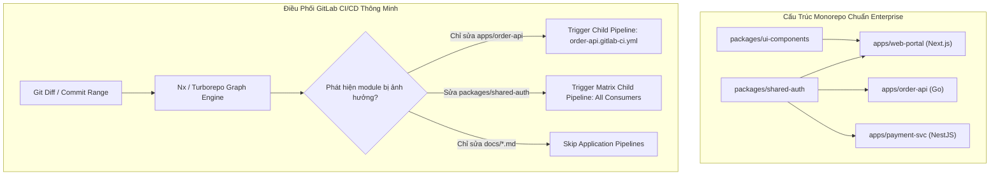


# [BÀI 22] CI/CD CHO MONOREPO: TURBOREPO, NX, BAZEL, SELECTIVE EXECUTION & CHILD PIPELINES

Trong kỷ nguyên **DevOps, DevSecOps và Cloud Native Engineering**, **GitLab CI/CD** được công nhận là một trong những nền tảng tự động hóa tích hợp liên tục và phân phối liên tục (CI/CD) hoàn chỉnh, mạnh mẽ và được tin dùng nhất trong các doanh nghiệp quy mô lớn. Không chỉ dừng lại ở các pipeline tuần tự cơ bản, việc vận hành GitLab CI/CD ở cấp độ Production đòi hỏi kỹ sư phải làm chủ kiến trúc điều phối phi tuyến tính **DAG (Directed Acyclic Graph)**, cơ chế quản trị **Autoscaling Runners**, tối ưu hóa **Caching đa tầng**, xác thực không khóa **Keyless OIDC**, bảo mật chuỗi cung ứng phần mềm **SLSA & SBOM** cùng các chính sách **Quality & Security Gates** tự động.

Bài viết chuyên sâu này sẽ đồng hành cùng bạn mổ xẻ toàn diện bức tranh kiến trúc, phân tích các đánh đổi kỹ thuật thực chiến (Engineering Trade-offs), cung cấp hướng dẫn thực hành Lab chi tiết từng bước và bộ câu hỏi phỏng vấn chuyên sâu chuẩn DevOps Lead / DevSecOps Architect.

---

## 1. Bản Chất Kiến Trúc & Cơ Chế Vận Hành Tầng Thấp

### 1.1. Luận Đề Trung Tâm: Khủng Hoảng Thời Gian Build Trong Monorepo & Giải Pháp Graph-Aware CI

Trong các tổ chức công nghệ quy mô vừa và lớn, kiến trúc **Monorepo** (tập trung toàn bộ mã nguồn của nhiều ứng dụng Web, Mobile, Microservices Backend và Shared Libraries vào một repository duy nhất) ngày càng trở nên phổ biến nhờ khả năng đồng bộ code, chia sẻ thư viện dùng chung và tái cấu trúc (refactoring) nguyên tử.

Tuy nhiên, nếu cấu hình CI/CD theo phương pháp ngây thơ (Naive CI - chạy kiểm thử và build toàn bộ mọi gói mỗi khi có commit), pipeline sẽ nhanh chóng rơi vào **Khủng hoảng thời gian build**:
1. **Thời gian chạy tăng theo cấp số cộng hoặc nhân**: Một thay đổi nhỏ ở Frontend Web cũng kích hoạt test của 10 backend microservices, kéo dài pipeline từ 5 phút lên 45 phút.
2. **Lãng phí tài nguyên tính toán (Runner Compute)**: Hàng chục runner core bị tiêu tốn để build lại các artifact không hề bị biến đổi.
3. **Hiện tượng nghẽn cổ chai Merge Request**: Các nhà phát triển phải chờ hàng giờ để MR được merge, dẫn đến xung đột code liên tục.

> **Giải pháp kiến trúc chuẩn Production là kết hợp Graph-Aware Build Tools (Turborepo, Nx, Bazel) với tính năng Dynamic Parent-Child Pipeline và Selective Execution (rules:changes) của GitLab CI/CD, biến pipeline thành một đồ thị động chỉ biên dịch những module thực sự bị ảnh hưởng.**

```
       SƠ ĐỒ ĐỒ THỊ PHỤ THUỘC & THỰC THI CHỌN LỌC (Monorepo Dependency Graph)

           ┌───────────────────────────────────────────────┐
           │           shared-ui / shared-auth             │ ◄── Core Libraries
           └───────┬───────────────────────────────┬───────┘
                   │                               │
                   ▼                               ▼
       ┌───────────────────────┐       ┌───────────────────────┐
       │   apps/web-customer   │       │     apps/web-admin    │ ◄── Applications
       └───────────────────────┘       └───────────────────────┘
                   │                               │
       (Thay đổi ở web-customer)                   │ (Không bị ảnh hưởng)
                   │                               │
                   ▼                               ▼
       [ KÍCH HOẠT CI/CD JOB ]              [ BỎ QUA - SKIPPED ]
       - Lint: web-customer                 - Không chạy Lint
       - Test: web-customer                 - Không chạy Test
       - Build: web-customer                - Không tốn Runner Core
```



### 1.2. Cơ Chế Hoạt Động Của `rules:changes` & Những Cạm Bẫy Thực Tế

GitLab CI cung cấp từ khóa `rules:changes` để kiểm tra sự thay đổi của các đường dẫn file. Tuy nhiên, trong môi trường Monorepo, kỹ sư cần phân biệt rõ hai cơ chế so khớp:
- **Trong Pipeline Merge Request**: GitLab so sánh commit hiện tại với commit cơ sở của nhánh đích (`Target Branch`, ví dụ `main`). Kết quả so khớp hoàn toàn chính xác theo toàn bộ phạm vi của MR.
- **Trong Pipeline Branch thông thường (Push Event)**: GitLab chỉ so sánh commit hiện tại với commit liền trước (`HEAD~1`). Nếu một push bao gồm nhiều commits hoặc rebase, `rules:changes` có thể bỏ sót các tệp đã sửa ở các commit trước!
- **Giải pháp**: Luôn khai báo `rules:changes:paths` kết hợp `rules:changes:compare_to` (ví dụ `compare_to: 'refs/heads/main'`) để đảm bảo tính toán diff nhất quán.

### 1.3. Phân Biệt Các Công Cụ Monorepo: Turborepo vs Nx vs Bazel

1. **Turborepo (Vercel)**:
   - Viết bằng Rust, siêu nhẹ, cấu hình đơn giản qua tệp `turbo.json`.
   - Phù hợp nhất cho hệ sinh thái JavaScript/TypeScript (Next.js, Node, React).
   - Hỗ trợ Remote Caching cực mạnh qua HTTP API hoặc AWS S3.
2. **Nx (Nrwl)**:
   - Hệ sinh thái hoàn chỉnh, hỗ trợ Polyglot (JS/TS, Python, Java, Go, Rust qua plugins).
   - Tích hợp đồ thị phụ thuộc trực quan (`nx graph`), tính toán affected (`nx affected:test`) và phân tán task (Nx Agents).
3. **Bazel (Google)**:
   - Hệ thống build đa ngôn ngữ quy mô cực lớn (Hermetic builds).
   - Độ phức tạp cấu hình rất cao (Starlark rules), yêu cầu hạ tầng build cluster riêng, phù hợp với các tập đoàn có hàng ngàn kỹ sư.

---

## 2. Bảng So Sánh Kỹ Thuật Toàn Diện (Engineering Matrix)

| Tiêu Chí Kỹ Thuật | GitLab `rules:changes` Thuần | Turborepo + GitLab CI | Nx + Dynamic Child Pipelines | Bazel + Remote Execution |
| :--- | :--- | :--- | :--- | :--- |
| **Nguyên Lý Phân Tích** | Regex so khớp đường dẫn file Git Diff | Đồ thị phụ thuộc Package.json + Hashing tệp | Graph AST Engine sâu + Affected analysis | Hermetic Action Graph + File Fingerprinting |
| **Độ Phức Tạp Cấu Hình** | Rất thấp (YAML trực tiếp) | Thấp (`turbo.json` gọn nhẹ) | Trung bình (Plugins + Generator) | Rất cao (BUILD.bazel + Starlark) |
| **Hỗ Trợ Đa Ngôn Ngữ** | Mọi ngôn ngữ (File-based) | Chủ yếu JS / TS / Go cơ bản | Polyglot (JS, Python, Go, Java, Rust) | Đa ngôn ngữ tuyệt đối (C++, Java, Go, v.v.) |
| **Cơ Chế Caching** | GitLab Runner Cache (Archive tgz) | Remote Cache (HTTP API / MinIO S3) | Nx Cloud / S3 Custom Remote Cache | Bazel Remote Build Execution (RBE) Cache |
| **Khả Năng Tách Biệt Job** | Phải cấu hình thủ công trong root YAML | 1 Job điều phối hoặc tách theo target | Tự sinh Dynamic Child Pipeline JSON/YAML | Tự động phân tán actions đến worker cluster |
| **Tốc Độ Khởi Tạo CI** | Tức thì | Rất nhanh (< 2s phân tích) | Nhanh (< 5s đồ thị) | Trung bình (Cần nạp Workspace Analysis) |
| **Chi Phí Vận Hành** | Thấp nhất | Thấp (Tự host MinIO S3) | Trung bình - Cao (Nx Enterprise) | Rất cao (Đội ngũ Tooling chuyên trách) |

---

## 3. Kiến Trúc Triển Khai Chuẩn Production (Architecture Breakdown)

### 3.1. Cấu Trúc Thư Mục Monorepo Chuẩn Enterprise

```
monorepo-enterprise/
├── .gitlab-ci.yml                   # Root Orchestrator Pipeline
├── turbo.json                       # Turborepo Task Pipeline & Cache Configuration
├── package.json                     # Workspace Root Dependencies & Scripts
├── apps/
│   ├── web-portal/                  # Next.js Frontend Application
│   │   ├── Dockerfile
│   │   ├── package.json
│   │   └── src/
│   ├── order-api/                   # NestJS Microservice
│   │   ├── Dockerfile
│   │   ├── package.json
│   │   └── src/
│   └── payment-service/             # Go Microservice
│       ├── Dockerfile
│       ├── go.mod
│       └── main.go
├── packages/
│   ├── ui-components/               # Shared React UI Component Library
│   │   ├── package.json
│   │   └── src/
│   ├── shared-types/                # Shared TypeScript & Protobuf Definitions
│   │   └── package.json
│   └── logger/                      # Shared Structured Logging Module
│       └── package.json
└── .gitlab/
    └── ci/
        ├── web-portal.gitlab-ci.yml
        ├── order-api.gitlab-ci.yml
        └── payment-service.gitlab-ci.yml
```

### 3.2. File `.gitlab-ci.yml` Gốc Điều Phối Child Pipeline Động

```yaml
stages:
  - generate_pipeline
  - trigger_apps

variables:
  TURBO_REMOTE_CACHE_SIGNATURE_KEY: $TURBO_SIGNATURE_SECRET
  TURBO_API: "https://minio-s3.corp.internal/turborepo-cache"
  TURBO_TOKEN: $TURBO_AUTH_TOKEN

generate_dynamic_pipeline:
  stage: generate_pipeline
  image: node:20-alpine
  script:
    - apk add --no-cache git bash jq
    - npm ci
    # Phân tích danh sách các ứng dụng bị ảnh hưởng qua Turborepo Dry-Run
    - npx turbo run build --dry-run=json --filter="...[origin/main]" > turbo-dry-run.json
    - node .gitlab/ci/scripts/generate-child-pipeline.js turbo-dry-run.json generated-pipeline.yml
  artifacts:
    paths:
      - generated-pipeline.yml
    expire_in: 1 day
  rules:
    - if: '$CI_PIPELINE_SOURCE == "merge_request_event"'
    - if: '$CI_COMMIT_BRANCH == "main"'

run_affected_applications:
  stage: trigger_apps
  needs:
    - job: generate_dynamic_pipeline
      artifacts: true
  trigger:
    include:
      - artifact: generated-pipeline.yml
        job: generate_dynamic_pipeline
    strategy: depend
  rules:
    - if: '$CI_PIPELINE_SOURCE == "merge_request_event"'
    - if: '$CI_COMMIT_BRANCH == "main"'
```

---

## 4. Phân Tích Cạm Bẫy Thực Chiến (5-Whys Incident Analysis)

### 4.1. Sự Cố Thực Tế: Cache Poisoning & Rò Rỉ Biến Môi Trường Giữa Các Ứng Dụng

> **Bối Cảnh**: Một công ty fintech vận hành Monorepo với 15 microservices. Sau khi bật Remote Cache cho Turborepo/Nx, service thanh toán `payment-service` bất ngờ deploy nhầm cấu hình URL sandbox của `web-portal` lên production, khiến toàn bộ giao dịch thanh toán thất bại!

```
┌─────────────────────────────────────────────────────────────────────────┐
│                    PHÂN TÍCH NGUYÊN NHÂN GỐC RỄ (5-WHYS)                 │
├─────────────────────────────────────────────────────────────────────────┤
│ 1. Tại sao payment-service dùng URL sandbox?                            │
│    -> Do binary build được lấy trực tiếp từ Remote Cache hit.           │
│                                                                         │
│ 2. Tại sao Remote Cache lại trả về artifact chứa URL sai?               │
│    -> Hash của build task trùng khớp giữa job web và payment!           │
│                                                                         │
│ 3. Tại sao Hash trùng khi mã nguồn và cấu hình hai service khác nhau?    │
│    -> Tệp turbo.json không khai báo các biến môi trường đặc thù vào env.│
│                                                                         │
│ 4. Tại sao biến môi trường không được tính vào Cache Key?               │
│    -> Turborepo mặc định chỉ băm nội dung file mã nguồn, bỏ qua các     │
│       biến ENV nội bộ nếu không liệt kê trong trường "env" của config.  │
│                                                                         │
│ 5. NGUYÊN NHÂN CỐT LÕI (Root Cause):                                   │
│    -> Thiếu chính sách cô lập Namespace Cache Key và không bật chế độ   │
│       Strict Hash Invalidation theo từng Target Application.            │
└─────────────────────────────────────────────────────────────────────────┘
```

### 4.2. Giải Pháp Khắc Phục Triệt Để

1. **Khai báo tường minh biến môi trường trong `turbo.json`**:
   ```json
   {
     "$schema": "https://turbo.build/schema.json",
     "tasks": {
       "build": {
         "dependsOn": ["^build"],
         "inputs": ["src/**", "package.json", "tsconfig.json"],
         "outputs": ["dist/**", ".next/**"],
         "env": ["NODE_ENV", "API_GATEWAY_URL", "APP_ENV", "DATABASE_URL"]
       }
     }
   }
   ```
2. **Ký số Cache Artifacts**: Sử dụng biến `TURBO_REMOTE_CACHE_SIGNATURE_KEY` với thuật toán HMAC-SHA256 để chống giả mạo hoặc ghi đè artifact từ runner kém bảo mật.

---

## 5. Hands-on Lab: Xây Dựng Monorepo CI Pipeline Hoàn Chỉnh (8 Bước Chuẩn)

### 5.1. Mục Tiêu Lab
- Thiết lập một Monorepo gồm 2 ứng dụng (`apps/web-portal`, `apps/order-api`) và 1 thư viện dùng chung (`packages/ui-components`).
- Cấu hình Turborepo với cơ chế Task Pipeline & Caching.
- Tự động sinh Child Pipeline chỉ chạy test & build cho ứng dụng bị ảnh hưởng.
- Tích hợp Remote Cache mô phỏng và xuất báo cáo kiểm thử.

```
       MÔ HÌNH THỰC HÀNH LAB MONOREPO TRÊN GITLAB RUNNER

      [ Root GitLab Repository ]
                 │
                 ├──► apps/web-portal (React/Next)
                 ├──► apps/order-api (Node/Nest)
                 └──► packages/ui-components
                             │
            ┌────────────────┴────────────────┐
            ▼                                 ▼
   [ Sửa file UI Component ]       [ Chỉ sửa file order-api ]
            │                                 │
            ▼                                 ▼
   Build lại:                      Chỉ Build lại:
   - ui-components                 - order-api
   - web-portal                    (Web-portal BỎ QUA)
   - order-api (nếu có dùng)
```

### 5.2. Các Bước Thực Hiện Chi Tiết

#### Bước 1: Khởi Tạo Cấu Trúc Monorepo Với NPM Workspaces
Tạo tệp cấu hình gốc `package.json`:
```json
{
  "name": "enterprise-monorepo",
  "private": true,
  "workspaces": [
    "apps/*",
    "packages/*"
  ],
  "scripts": {
    "build": "turbo run build",
    "test": "turbo run test",
    "lint": "turbo run lint"
  },
  "devDependencies": {
    "turbo": "^2.0.0"
  }
}
```

#### Bước 2: Cấu Hình `turbo.json` Cho Pipeline Toàn Dự Án
Tạo tệp `turbo.json` tại thư mục gốc:
```json
{
  "$schema": "https://turbo.build/schema.json",
  "tasks": {
    "build": {
      "dependsOn": ["^build"],
      "outputs": ["dist/**", ".next/**", "!dist/.cache/**"]
    },
    "test": {
      "dependsOn": ["^build"],
      "outputs": ["coverage/**"],
      "inputs": ["src/**/*.tsx", "src/**/*.ts", "test/**/*.ts"]
    },
    "lint": {
      "outputs": []
    }
  }
}
```

#### Bước 3: Tạo Thư Viện Dùng Chung `packages/ui-components`
Tạo tệp `packages/ui-components/package.json`:
```json
{
  "name": "@enterprise/ui-components",
  "version": "1.0.0",
  "main": "dist/index.js",
  "scripts": {
    "build": "tsc",
    "test": "jest --passWithNoTests",
    "lint": "eslint src/"
  }
}
```

#### Bước 4: Tạo Ứng Dụng `apps/web-portal` & Khai Báo Phụ Thuộc
Tạo tệp `apps/web-portal/package.json`:
```json
{
  "name": "web-portal",
  "version": "1.0.0",
  "dependencies": {
    "@enterprise/ui-components": "*"
  },
  "scripts": {
    "build": "next build",
    "test": "jest",
    "lint": "next lint"
  }
}
```

#### Bước 5: Viết Script Tự Động Sinh GitLab Child Pipeline
Tạo tệp `.gitlab/ci/scripts/generate-child-pipeline.js`:
```javascript
const fs = require('fs');

const dryRunPath = process.argv[2] || 'turbo-dry-run.json';
const outputPath = process.argv[3] || 'generated-pipeline.yml';

let affectedPackages = [];
try {
  const data = JSON.parse(fs.readFileSync(dryRunPath, 'utf8'));
  affectedPackages = (data.packages || []).filter(pkg => pkg !== '//' && !pkg.startsWith('@enterprise/'));
} catch (err) {
  console.warn('Fallback to full pipeline on error parsing dry-run json');
  affectedPackages = ['web-portal', 'order-api'];
}

if (affectedPackages.length === 0) {
  // Tạo job rỗng thông báo không có app nào bị ảnh hưởng
  const noopYaml = `
stages:
  - noop
no_changes_detected:
  stage: noop
  script:
    - echo "No applications affected by this commit. Skipping build."
`;
  fs.writeFileSync(outputPath, noopYaml);
  process.exit(0);
}

let pipelineYaml = `stages:
  - test
  - build

`;

affectedPackages.forEach(app => {
  pipelineYaml += `
test_${app}:
  stage: test
  image: node:20-alpine
  script:
    - npm ci
    - npx turbo run test --filter=${app}

build_${app}:
  stage: build
  image: node:20-alpine
  needs: ["test_${app}"]
  script:
    - npm ci
    - npx turbo run build --filter=${app}
  artifacts:
    paths:
      - apps/${app}/dist/
      - apps/${app}/.next/
`;
});

fs.writeFileSync(outputPath, pipelineYaml);
console.log(`Generated child pipeline for: ${affectedPackages.join(', ')}`);
```

#### Bước 6: Cấu Hình Runner Distributed Cache Cho Monorepo
Trong `.gitlab-ci.yml`, thiết lập khóa cache phân tán theo hash của lockfile:
```yaml
default:
  cache:
    key:
      files:
        - package-lock.json
    paths:
      - .turbo/
      - node_modules/.cache/
    policy: pull-push
```

#### Bước 7: Thực Hiện Git Push Thay Đổi Riêng Lẻ & Kiểm Tra
- Thực hiện commit sửa mã nguồn tại `apps/web-portal/src/index.tsx`.
- Quan sát GitLab Pipeline: Stage `generate_pipeline` chạy và tạo ra `generated-pipeline.yml` chỉ chứa job của `web-portal`.
- Quan sát `order-api` hoàn toàn không bị kích hoạt.

#### Bước 8: Kiểm Tra Chức Năng Remote Cache Hit
- Chạy lại pipeline lần 2 không thay đổi code.
- Quan sát console log của Turborepo:
  ```bash
  >>> FULL TURBO
  web-portal:build: cache hit, replaying logs 23ms [CACHED]
  Tasks:    1 successful, 1 total
  Cached:   1 cached, 1 total
  Time:     152ms >>> FULL TURBO
  ```

> [!NOTE]
> **Check-point Lab 22**: Đảm bảo pipeline hoàn thành trong dưới 30 giây khi có Cache Hit và Child Pipeline chỉ sinh đúng số lượng job của các module bị sửa đổi.

---

## 6. Bộ Câu Hỏi Vấn Đáp & Phỏng Vấn Chuyên Sâu (Self-Check Q&A)

<details class="qa-card">
  <summary class="qa-summary">
    <span class="qa-num-badge">Q01</span>
    <span>Tại sao sử dụng `rules:changes` đơn thuần trong Monorepo lớn lại không đủ tối ưu và tiềm ẩn rủi ro?</span>
  </summary>
  <div class="qa-body">
    <p><strong>Bản chất kỹ thuật:</strong></p>
    <ul>
      <li><code>rules:changes</code> chỉ thực hiện so khớp chuỗi đường dẫn tệp (Pattern Matching). Nó hoàn toàn "mù" về đồ thị phụ thuộc mã nguồn (Dependency Graph).</li>
      <li>Nếu <code>app-A</code> phụ thuộc vào <code>package-core</code>, khi một kỹ sư sửa <code>package-core</code>, cấu hình <code>rules:changes</code> của <code>app-A</code> sẽ <em>không tự động kích hoạt</em> trừ khi kỹ sư phải liệt kê thủ công đường dẫn của mọi thư viện dùng chung vào khối rules của từng app.</li>
      <li>Khi số lượng package lên tới hàng trăm, việc duy trì thủ công các quy tắc này trong YAML là bất khả thi và chắc chắn dẫn tới lỗi lọt lỗi (Regression Bugs). Do đó, cần các công cụ Graph-Aware như Turborepo/Nx để tính toán Affected Packages.</li>
    </ul>
  </div>
</details>

<details class="qa-card">
  <summary class="qa-summary">
    <span class="qa-num-badge">Q02</span>
    <span>Làm thế nào để truyền biến và artifacts giữa Parent Pipeline và Child Pipeline trong Monorepo?</span>
  </summary>
  <div class="qa-body">
    <p><strong>Giải pháp chuẩn:</strong></p>
    <ul>
      <li>Sử dụng từ khóa <code>trigger:include:artifact</code> kết hợp với <code>needs: [generate_job]</code> để nạp file YAML được sinh ra động từ stage trước.</li>
      <li>Để truyền biến môi trường từ Parent xuống Child, sử dụng thuộc tính <code>trigger:forward:pipeline_variables: true</code> hoặc định nghĩa khối <code>variables</code> ngay trong trigger job.</li>
      <li>Để Child Pipeline dùng lại artifact của Parent, khai báo <code>needs:pipeline: $CI_PIPELINE_ID</code> hoặc lưu trữ artifact chung tại shared storage / package registry.</li>
    </ul>
  </div>
</details>

<details class="qa-card">
  <summary class="qa-summary">
    <span class="qa-num-badge">Q03</span>
    <span>Cơ chế "Hermetic Build" trong Bazel là gì và tại sao nó đảm bảo tính đúng đắn 100% khi build Monorepo?</span>
  </summary>
  <div class="qa-body">
    <p><strong>Bản chất:</strong></p>
    <p>Hermetic Build (Build cách ly tuyệt đối) là cơ chế mà quá trình biên dịch diễn ra trong một Sandbox hoàn toàn kín. Quá trình này không được phép truy cập mạng Internet, không phụ thuộc vào các công cụ hay biến môi trường ngầm định của máy chủ Host. Tất cả dependencies (kể cả compiler, SDK) đều phải được khai báo tường minh kèm mã băm SHA256. Do đó, với cùng một tập input, kết quả build đảm bảo giống nhau 100% bất kể chạy trên Runner nào.</p>
  </div>
</details>

<details class="qa-card">
  <summary class="qa-summary">
    <span class="qa-num-badge">Q04</span>
    <span>Phân biệt chiến lược Versioning: Independent Versioning vs Fixed (Synchronized) Versioning trong Monorepo?</span>
  </summary>
  <div class="qa-body">
    <p><strong>Phân tích so sánh:</strong></p>
    <ul>
      <li><strong>Independent Versioning</strong>: Mỗi application/package có số phiên bản SemVer độc lập (ví dụ: <code>web-portal@2.1.0</code>, <code>order-api@1.0.4</code>). Phù hợp cho kiến trúc Microservices độc lập về chu kỳ phát hành.</li>
      <li><strong>Fixed / Synchronized Versioning</strong>: Toàn bộ packages trong repo cùng chia sẻ một số version chung (ví dụ: Angular, Babel, Jest đồng loạt lên v18.0.0). Phù hợp cho bộ thư viện framework có tính liên kết chặt chẽ.</li>
    </ul>
  </div>
</details>

<details class="qa-card">
  <summary class="qa-summary">
    <span class="qa-num-badge">Q05</span>
    <span>Làm thế nào để bảo mật Remote Cache trong Turborepo/Nx trên hệ thống GitLab Runner nội bộ?</span>
  </summary>
  <div class="qa-body">
    <p><strong>Kiến trúc bảo mật:</strong></p>
    <ol>
      <li>Triển khai máy chủ Remote Cache nội bộ (như MinIO S3 hoặc duendesoftware/turbo-cache-server) trong mạng riêng Private VPC.</li>
      <li>Cấu hình HMAC Signature Verification bằng biến <code>TURBO_REMOTE_CACHE_SIGNATURE_KEY</code> để ký số mọi cache tarball trước khi tải lên.</li>
      <li>Phân quyền: Chỉ các pipeline chạy trên protected branches (`main`, `release/*`) mới có quyền ghi (Write/Upload) vào Remote Cache; các nhánh PR/MR của developer chỉ có quyền đọc (Read-only Cache) để chống Cache Poisoning.</li>
    </ol>
  </div>
</details>

<details class="qa-card">
  <summary class="qa-summary">
    <span class="qa-num-badge">Q06</span>
    <span>Khi nào nên chọn Dynamic Child Pipeline thay vì Multi-Project Pipeline trong Monorepo?</span>
  </summary>
  <div class="qa-body">
    <p><strong>Nguyên tắc quyết định:</strong></p>
    <ul>
      <li><strong>Dynamic Child Pipeline</strong>: Phù hợp nhất cho Monorepo vì tất cả mã nguồn nằm chung 1 repository. Cho phép sinh cấu trúc pipeline động ngay trong phiên làm việc, giữ trạng thái MR trực quan trên một màn hình dashboard duy nhất.</li>
      <li><strong>Multi-Project Pipeline</strong>: Dùng khi dự án phân tách thành nhiều repository độc lập (Polyrepo) và cần kích hoạt pipeline của repo downstream sau khi repo upstream hoàn thành.</li>
    </ul>
  </div>
</details>

<details class="qa-card">
  <summary class="qa-summary">
    <span class="qa-num-badge">Q07</span>
    <span>Làm sao để xử lý xung đột `package-lock.json` hoặc `pnpm-lock.yaml` liên tục trong Monorepo có 50+ engineers?</span>
  </summary>
  <div class="qa-body">
    <p><strong>Giải pháp kỹ thuật:</strong></p>
    <ul>
      <li>Chuyển sang dùng <code>pnpm</code> với cờ <code>dedupe-peer-dependents=true</code> và cơ chế Content-addressable store.</li>
      <li>Kích hoạt GitLab Merge Trains để tự động rebase và kiểm tra tính hợp lệ của lockfile trước khi thực sự merge vào branch chính.</li>
      <li>Cấu hình git merge driver chuyên dụng cho lockfile (ví dụ: <code>npm-merge-driver</code>).</li>
    </ul>
  </div>
</details>

<details class="qa-card">
  <summary class="qa-summary">
    <span class="qa-num-badge">Q08</span>
    <span>Tại sao cần cờ `strategy: depend` khi khai báo trigger Child Pipeline trong GitLab CI?</span>
  </summary>
  <div class="qa-body">
    <p><strong>Cơ chế:</strong></p>
    <p>Mặc định, khi một trigger job kích hoạt child pipeline, nó sẽ chuyển sang trạng thái <code>success</code> ngay lập tức mà không đợi child pipeline chạy xong. Khi thêm <code>strategy: depend</code>, trigger job ở parent pipeline sẽ giữ trạng thái <code>running</code> và phản chiếu chính xác kết quả cuối cùng (passed hoặc failed) của toàn bộ child pipeline, ngăn chặn việc merge code khi các kiểm thử con bị lỗi.</p>
  </div>
</details>

<details class="qa-card">
  <summary class="qa-summary">
    <span class="qa-num-badge">Q09</span>
    <span>Làm thế nào để cấu hình Git Shallow Clone tối ưu cho Monorepo lớn có lịch sử commit nặng?</span>
  </summary>
  <div class="qa-body">
    <p><strong>Kỹ thuật tối ưu:</strong></p>
    <ul>
      <li>Thiết lập <code>variables: GIT_DEPTH: 50</code> để runner chỉ clone 50 commit gần nhất thay vì toàn bộ lịch sử gigabytes.</li>
      <li>Khi chạy lệnh tính toán affected (ví dụ: <code>nx affected</code> hoặc <code>git diff origin/main...HEAD</code>), nếu gặp lỗi thiếu commit base, thực thi lệnh <code>git fetch origin main --depth=100</code> trước khi phân tích đồ thị.</li>
    </ul>
  </div>
</details>

<details class="qa-card">
  <summary class="qa-summary">
    <span class="qa-num-badge">Q10</span>
    <span>Cơ chế "Task Pipeline" trong Turborepo giải quyết bài toán phụ thuộc thứ tự build như thế nào?</span>
  </summary>
  <div class="qa-body">
    <p><strong>Cơ chế hoạt động:</strong></p>
    <p>Ký hiệu <code>"dependsOn": ["^build"]</code> trong <code>turbo.json</code> chỉ định rằng trước khi build package hiện tại, Turborepo bắt buộc phải hoàn thành task build của tất cả các package mà nó phụ thuộc trực tiếp theo đồ thị topo. Các package độc lập ở cùng tầng sẽ được tự động thực thi song song (Parallel execution) tối đa theo số lượng CPU Cores của máy chủ.</p>
  </div>
</details>

<details class="qa-card">
  <summary class="qa-summary">
    <span class="qa-num-badge">Q11</span>
    <span>Làm cách nào để ngăn chặn hiện tượng "Phantom Dependencies" trong Monorepo JavaScript?</span>
  </summary>
  <div class="qa-body">
    <p><strong>Giải pháp:</strong></p>
    <p>Sử dụng <strong>pnpm</strong> thay vì npm/yarn v1. pnpm sử dụng cấu trúc thư mục <code>node_modules</code> dạng non-flat (symlink-based). Một ứng dụng sẽ không thể <code>import</code> một thư viện nếu thư viện đó không được khai báo tường minh trong chính tệp <code>package.json</code> của nó, loại bỏ hoàn toàn lỗi "chạy được ở local nhưng lỗi trên CI runner".</p>
  </div>
</details>

<details class="qa-card">
  <summary class="qa-summary">
    <span class="qa-num-badge">Q12</span>
    <span>Một sự cố CI/CD Monorepo: Runner báo lỗi "No space left on device" do quá nhiều node_modules và build cache. Xử lý thế nào?</span>
  </summary>
  <div class="qa-body">
    <p><strong>Chiến lược xử lý hạ tầng:</strong></p>
    <ol>
      <li>Chuyển sang sử dụng Docker Volume chuyên dụng hoặc Kubernetes EmptyDir SSD cho workspace.</li>
      <li>Cấu hình cronjob dọn dẹp Docker system: <code>docker system prune -af --volumes</code> trên các self-hosted runner nodes mỗi đêm.</li>
      <li>Thiết lập thời gian hết hạn của artifacts ngắn hạn (<code>expire_in: 2 hours</code> cho intermediate build và <code>1 day</code> cho release artifacts).</li>
      <li>Tận dụng Remote Cache bên ngoài (MinIO/S3) thay vì lưu cache cục bộ trên ổ cứng runner.</li>
    </ol>
  </div>
</details>

---

## 7. Tổng Kết & Lộ Trình Bài Học Tiếp Theo

### 7.1. Tóm Tắt Các Điểm Cốt Lõi (Architectural Key Takeaways)
- **Monorepo Scale Crisis**: Build toàn bộ mọi module trên mỗi commit là công thức dẫn đến tắc nghẽn CI/CD doanh nghiệp.
- **Graph-Aware Execution**: Bắt buộc kết hợp `rules:changes` với đồ thị phụ thuộc của Turborepo / Nx / Bazel.
- **Dynamic Parent-Child Pipeline**: Tạo ra pipeline con linh hoạt, chỉ chứa các jobs thực sự cần thiết theo danh sách `affected`.
- **Distributed Remote Caching**: Giảm 80% thời gian build thông qua cơ chế lưu đệm kết quả biên dịch có chữ ký bảo mật.

### 7.2. Sơ Đồ Tư Duy Hệ Thống Monorepo CI/CD (Mindmap)

```
                       KIẾN TRÚC MONOREPO CI/CD TOÀN DIỆN
                                       │
        ┌──────────────────────────────┼──────────────────────────────┐
        ▼                              ▼                              ▼
  [ Graph Analysis ]          [ Dynamic Execution ]          [ Distributed Cache ]
  - Turborepo / Nx AST        - Parent-Child YAML            - Remote S3 / MinIO
  - Affected Package Calc     - trigger:include:artifact     - HMAC Hash Signature
  - Topological Task Order    - strategy: depend             - Read-Only on PR/MR
```

> [!TIP]
> **Bước tiếp theo trong lộ trình**: Làm chủ quy trình đóng gói container bảo mật và không cần quyền root trong bài học [Bài 23: Build Container Image Trong CI: Kaniko, Buildah, Rootless & Docker-in-Docker](gitlab-23-23-build-image-trong-ci.html).

