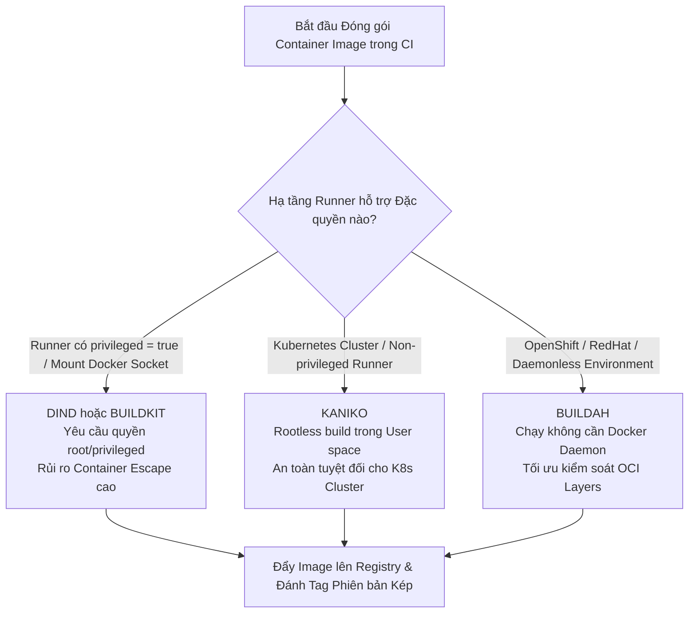
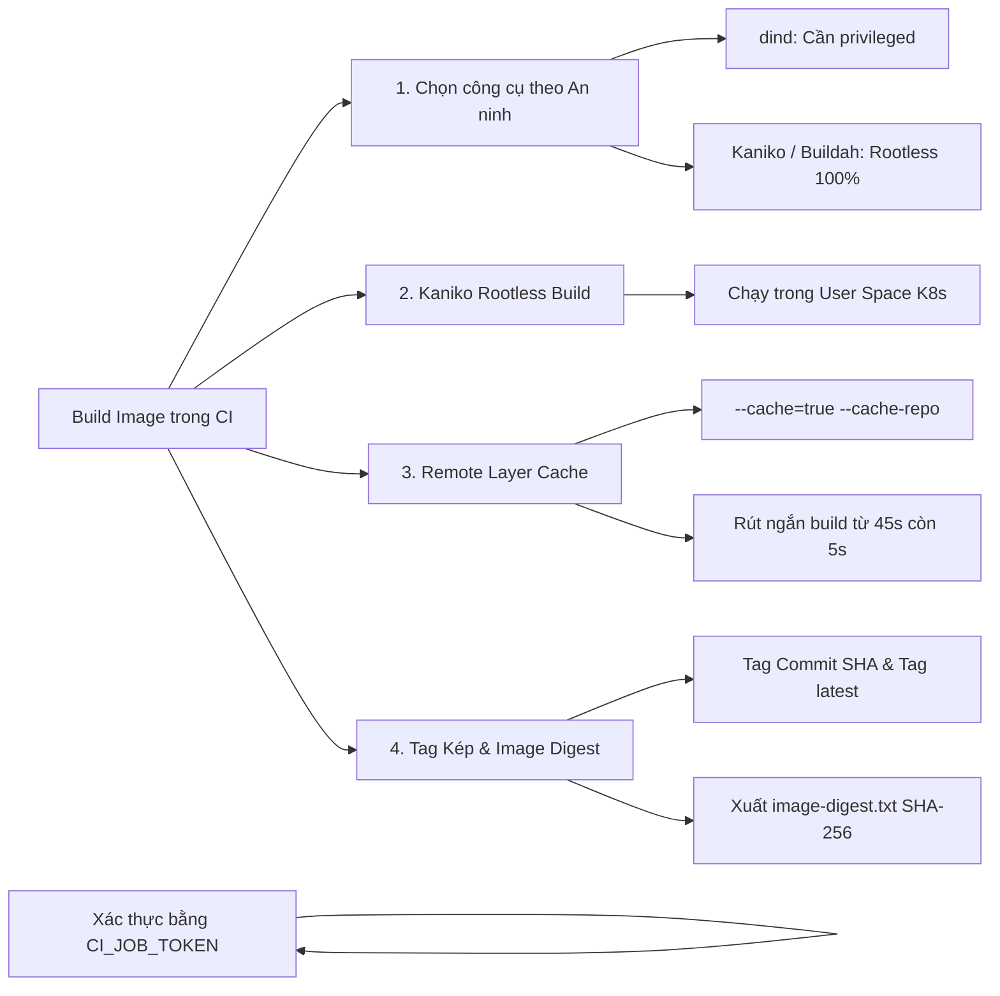
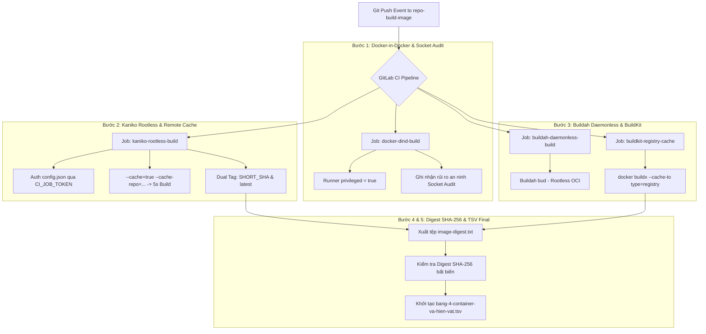


# [BÀI 23] ĐÓNG GÓI CONTAINER TRONG CI: DOCKER-IN-DOCKER (DIND) VS SOCKET BINDING VS KANIKO ROOTLESS CONTAINER BUILD

Trong kỷ nguyên **DevOps, DevSecOps và Cloud Native Engineering**, **GitLab CI/CD** được công nhận là một trong những nền tảng tự động hóa tích hợp liên tục và phân phối liên tục (CI/CD) hoàn chỉnh, mạnh mẽ và được tin dùng nhất trong các doanh nghiệp quy mô lớn. Không chỉ dừng lại ở các pipeline tuần tự cơ bản, việc vận hành GitLab CI/CD ở cấp độ Production đòi hỏi kỹ sư phải làm chủ kiến trúc điều phối phi tuyến tính **DAG (Directed Acyclic Graph)**, cơ chế quản trị **Autoscaling Runners**, tối ưu hóa **Caching đa tầng**, xác thực không khóa **Keyless OIDC**, bảo mật chuỗi cung ứng phần mềm **SLSA & SBOM** cùng các chính sách **Quality & Security Gates** tự động.

Bài viết chuyên sâu này sẽ đồng hành cùng bạn mổ xẻ toàn diện bức tranh kiến trúc, phân tích các đánh đổi kỹ thuật thực chiến (Engineering Trade-offs), cung cấp hướng dẫn thực hành Lab chi tiết từng bước và bộ câu hỏi phỏng vấn chuyên sâu chuẩn DevOps Lead / DevSecOps Architect.

---

## 1. Bản Chất Kiến Trúc & Cơ Chế Vận Hành Tầng Thấp

---


| # | Câu hỏi ôn tập Buổi 22 (Monorepo) | Đáp án chuẩn ngắn gọn |
|---|---|---|
| 1 | Ba ca nào làm câu lệnh `rules:changes` tĩnh bị đánh giá sai im lặng trong GitLab CI? | Thiếu `compare_to` (bỏ qua commit 2), Fallback Default Branch, và sửa thư mục dùng chung `shared/`. |
| 2 | Thuộc tính nào dùng để cố định gốc so sánh Git diff trên các nhánh tính năng? | `rules:changes:compare_to: $CI_DEFAULT_BRANCH` (hoặc `refs/heads/main`). |
| 3 | Mô hình Child/Parent Pipeline động giải quyết bài toán phình to cấu hình như thế nào? | Script Python ở `.pre` quét `git diff` sinh `dynamic-pipeline.yml` rút gọn, nạp qua `trigger:include:artifact`. |
| 4 | Tác dụng của thuộc tính `strategy: depend` trong Job trigger cha? | Ép Job trigger cha theo dõi và nhận đúng trạng thái thành công/thất bại từ Child Pipeline truyền về. |
| 5 | Làm sao để cách ly đệm đệm Cache giữa các microservice đa ngôn ngữ trong Monorepo? | Đặt thuộc tính `prefix:` riêng biệt cho từng dịch vụ trong `cache:key` (như `prefix: "node-api"`). |

---


> **LUẬN ĐỀ TRUNG TÂM BUỔI 23:**
> **Khác với suy nghĩ thông thường cho rằng tốc độ đóng gói là yếu tố quyết định công cụ build Container Image, tiêu chí chọn lựa duy nhất giữa 4 phương pháp `dind` (Docker-in-Docker), `Kaniko`, `Buildah`, và `BuildKit` chính là MỨC ĐỘ ĐẶC QUYỀN AN NINH (Security Privilege Level) mà hạ tầng Runner cho phép. Việc mount Docker Socket (`/var/run/docker.sock`) hoặc bật `privileged = true` mở rộng bề mặt tấn công Container Escape nghiêm trọng. `Kaniko` và `Buildah` là giải pháp Rootless an toàn tuyệt đối cho Kubernetes Cluster.**



---


| STT | Kết quả đạt được (Competency) | Hiện vật chứng minh (Evidence) |
|---|---|---|
| 1 | Phân tích chính xác bảng so sánh đặc quyền an ninh giữa `dind`, `Kaniko`, `Buildah`, và `BuildKit`. | Bảng tiêu chí chọn lựa 4 công cụ theo Runner Environment. |
| 2 | Nhận diện và giải thích mối nguy bảo mật của việc mount Docker Socket (`/var/run/docker.sock`). | Giải thích cơ chế chiếm quyền root trên máy Host qua Docker Socket. |
| 3 | Đóng gói Container Image thành công ở chế độ Rootless với `Kaniko` trên Kubernetes Runner. | Job `kaniko-build` thực thi thành công đẩy Image lên `$CI_REGISTRY_IMAGE`. |
| 4 | Cấu hình Remote Layer Caching cho Kaniko (`--cache=true`) và BuildKit (`--cache-to/from`). | Thời gian build lượt 2 trúng Remote Layer Cache giảm từ 45s xuống $\le 5$s. |
| 5 | Đánh tag phiên bản kép chuẩn bảo mật: Tag Commit SHA (`$CI_COMMIT_SHORT_SHA`) và Tag động. | Container Registry chứa đủ 2 tag `$CI_COMMIT_SHORT_SHA` và `latest`. |
| 6 | Khởi tạo và cập nhật tệp hiện vật `bang-4-container-va-hien-vat.tsv` mở đầu Giai đoạn 4. | Tệp `bang-4-container-va-hien-vat.tsv` được khởi tạo và điền dòng dữ liệu đầu tiên. |

---


| Kiến thức tiên quyết | Ý nghĩa trong bài học Buổi 23 | Nguồn đối soát nếu thiếu |
|---|---|---|
| Cấu trúc Dockerfile (Multi-stage build) | Viết tệp Dockerfile tối ưu layer để đóng gói trong CI | Buổi 20 (`QT 6.1`), Buổi 12 (`QT 12.1`) |
| Biến môi trường GitLab Container Registry | Dùng `$CI_REGISTRY`, `$CI_REGISTRY_IMAGE`, `$CI_JOB_TOKEN` | Buổi 02 (`QT 2.1`), Buổi 03 (`QT 3.3`) |
| Phân biệt Runner Executor (Docker vs Kubernetes) | Hiểu lý do Kubernetes Runner không cho phép bật `privileged` | Buổi 01 (`QT 1.1`), Buổi 04 (`QT 4.1`) |
| Cơ chế Layer Caching trong Docker Image | Hiểu cách tái sử dụng các layer không đổi giữa các lần build | Buổi 12 (`QT 12.2`) |
| Mã băm Digest SHA-256 của Image | Trích xuất mã băm bất biến để phục vụ quét bảo mật SCA | Buổi 14 (`QT 14.1`) |

---


### Bảng đối chiếu thuật ngữ Việt - Anh

| Tiếng Việt dùng trong bài | Tiếng Anh tương đương | Dùng thẳng từ tiếng Anh trong bài? |
|---|---|---|
| Đóng gói trong đóng gói | Docker-in-Docker | **Có** — gọi là `dind` |
| Đóng gói không đặc quyền | Rootless Image Build | **Có** — gọi là `Rootless Build` |
| Trình thi hành Kaniko | Kaniko Executor | **Có** — gọi là `Kaniko` |
| Trình tạo Image Daemonless | Buildah Daemonless Tool | **Có** — gọi là `Buildah` |
| Bộ công cụ BuildKit | Docker BuildKit / Buildx | **Có** — gọi là `BuildKit` |
| Ổ cắm giao tiếp Docker | Docker UNIX Socket | **Có** — `/var/run/docker.sock` |
| Thoát khỏi khoang chứa | Container Escape Vulnerability | **Có** — `Container Escape` |
| Bộ đệm tầng từ xa | Remote Layer Cache Repository | **Có** — `--cache-repo` |
| Mã băm bất biến Image | Immutable Image Digest SHA-256 | **Có** — `Image Digest` |
| Hiện vật Giai đoạn 4 | Phase 4 Container Matrix | **Có** — `bang-4-container-va-hien-vat.tsv` |

---

### Bốn mô hình tư duy cốt lõi

#### Mô hình 1: Thước đo Chọn lựa Công cụ dựa trên Đặc quyền An ninh
Không bao giờ chọn công cụ build Image dựa trên tiêu chí "công cụ nào chạy nhanh hơn 2 giây". Mọi quyết định thiết kế CI/CD phải xuất phát từ mức độ đặc quyền an ninh mà Runner cho phép:
- **Mức 1 (Đặc quyền Cao nhất - Rủi ro Rất cao):** Mount `/var/run/docker.sock` hoặc cờ `privileged = true` $\rightarrow$ Sử dụng `dind` hoặc `Docker CLI` truyền thống. Chỉ dùng cho Runner chuyên biệt độc lập.
- **Mức 2 (Đặc quyền Trung bình - Đòi hỏi Daemon):** `Docker BuildKit` (buildx) có daemon nâng cao.
- **Mức 3 (Không Đặc quyền - Rootless An toàn 100%):** `Kaniko` và `Buildah`. Không cần Docker Daemon, chạy hoàn toàn trong User Space. Bắt buộc dùng cho Kubernetes Cluster và Shared Runner công ty.

#### Mô hình 2: Mối hiểm họa của Docker Socket (`/var/run/docker.sock`)
Khi mount `/var/run/docker.sock` từ máy Host vào Container Runner, Job CI được cấp quyền truy cập trực tiếp vào Docker Daemon của máy Host. Một script độc hại trong CI có thể thực thi lệnh `docker run -v /:/host alpine rm -rf /host` để xóa sạch toàn bộ hệ thống tệp của máy Host, hoặc lấy quyền `root` trên server vật lý (Container Escape).

#### Mô hình 3: Cơ chế Rootless User-space của Kaniko
Kaniko (`gcr.io/kaniko-project/executor`) hoạt động hoàn toàn bên trong 1 Container không có đặc quyền root. Nó tự đọc `Dockerfile`, tự giải nén từng layer vào hệ thống tệp riêng của container, tính toán mã băm SHA-256, nén thành các tệp tarball tar.gz và đẩy trực tiếp lên Container Registry qua giao thức HTTP API mà không cần tới Docker Daemon.

#### Mô hình 4: Chiến lược Đánh Tag Phiên bản Kép (Dual Tagging Strategy)
- **Tag Cố định (Immutable Digest Tag):** `$CI_COMMIT_SHORT_SHA` (ví dụ: `app:a7b8c9d`). Bất biến, không bao giờ bị ghi đè, cho phép rollback 100% về đúng commit quá khứ.
- **Tag Động (Mutable Environment Tag):** `$CI_COMMIT_REF_SLUG` hoặc `latest` (ví dụ: `app:main` hoặc `app:latest`). Cập nhật trỏ tới build mới nhất của nhánh.

---

### 1.1. Bốn công cụ build Image và Tiêu chí chọn lựa theo Đặc quyền An ninh (10 phút)

### Bảng so sánh 4 công cụ đóng gói Container Image trong CI/CD

| Tiêu chí so sánh | Docker-in-Docker (`dind`) | Kaniko | Buildah | Docker BuildKit |
|---|---|---|---|---|
| **Yêu cầu Quyền `privileged`** | **BẮT BỘC (`true`)** | **KHÔNG CẦN (`false`)** | **KHÔNG CẦN (`false`)** | Phụ thuộc cấu hình |
| **Yêu cầu Docker Daemon** | Có (Chạy `dockerd` phụ) | **KHÔNG (Daemonless)** | **KHÔNG (Daemonless)** | Có (BuildKit Daemon) |
| **Yêu cầu mount Docker Socket** | Có (nếu không dùng dind service) | **HOÀN TOÀN KHÔNG** | **HOÀN TOÀN KHÔNG** | Không |
| **Môi trường phù hợp nhất** | GitLab SaaS Runner / Docker | **Kubernetes Cluster Runner** | OpenShift / RedHat Enterprise | Docker Engine 23+ |
| **Cơ chế Layer Caching** | Local Docker Cache / Inline | **Remote Registry Cache** | Local OCI Storage Cache | **Remote Registry Cache** |
| **Mức độ An ninh (Security)** | **Thấp (Rủi ro Container Escape)** | **RẤT CAO (Rootless 100%)** | **RẤT CAO (Rootless 100%)** | Cao |

### Phân tích lỗ hổng an ninh chiếm quyền Root qua Docker Socket (`/var/run/docker.sock`)

Khi người dùng mount tệp UNIX socket `/var/run/docker.sock` từ máy Host vào trong Container Runner, tiến trình bên trong container được trao toàn quyền tương tác với Docker Daemon cấp hệ thống.
1. **Tiến trình khai thác:** Kẻ tấn công hoặc Job CI độc hại chỉ cần thực thi câu lệnh:
   `docker run -v /:/host_root alpine rm -rf /host_root`
2. **Hậu quả:** Docker Daemon chạy dưới user `root` trên máy Host sẽ thực hiện mount toàn bộ ổ đĩa cứng gốc (`/`) của hệ thống máy chủ vào container ảo mới và xóa sạch dữ liệu. Đây là hình thức tấn công Container Escape kinh điển nhất.

### Phân tích kiến trúc bên trong của Kaniko Executor Internals

Kaniko hoàn toàn loại bỏ nhu cầu sử dụng Docker Daemon nhờ quy trình 5 bước độc lập trong User Space:
1. **Phân tích Dockerfile (AST Parser):** Kaniko đọc và phân tích tệp Dockerfile thành cây cú pháp Abstract Syntax Tree.
2. **Trích xuất Base Image:** Tải các layer của Base Image từ Registry và giải nén trực tiếp vào thư mục gốc `/` của Container Kaniko.
3. **Thực thi Lệnh `RUN` (User-space Execution):** Thực thi câu lệnh shell của bước `RUN`.
4. **Chụp Snapshot Tệp Hệ thống (Diff Snapshotter):** So sánh bảng chỉ mục tệp (Inodes) trước và sau khi chạy lệnh `RUN`. Gom tất cả các tệp mới tạo hoặc bị sửa đổi thành 1 tệp nén tarball `.tar.gz` đại diện cho layer mới.
5. **Đẩy Layer lên Registry (Push Layer):** Tính mã băm SHA-256 của layer tarball và đẩy trực tiếp lên Container Registry qua HTTPS API.

---

**Nguyên lý cốt lõi:**
**Phát biểu.** Tuyệt đối KHÔNG mount Docker Socket (`/var/run/docker.sock`) vào Runner chung dùng cho toàn công ty; chỉ dùng `dind` khi có Runner riêng biệt được cách ly 100%.
**Giải thích cơ chế ngầm:** Mount Docker Socket cho phép Container CI kiểm soát toàn bộ Docker Daemon của máy Host, mở rộng nguy cơ tấn công Container Escape chiếm quyền root máy Server.
> [!WARNING]
> **CẠM BẪY THỰC CHIẾN:**
> Lập trình viên chạy lệnh `docker run -v /:/host ...` từ Job CI và truy cập được toàn bộ dữ liệu máy Host.
**Minh hoạ.**
```yaml
# Cấu hình CHUẨN dùng dind với Runner cách ly (Có TLS):
image: docker:25.0
services:
  - name: docker:25.0-dind
    alias: docker

variables:
  DOCKER_TLS_CERTDIR: "/certs"
```
```bash
# Lệnh kiểm tra an ninh Docker Socket trên Runner
if [ -e "/var/run/docker.sock" ]; then
  echo "CẢNH BÁO AN NINH: Docker Socket đang bị mount trực tiếp vào Runner!"
fi
```
**Con số chốt:** Loại bỏ mount Docker Socket ngăn ngừa **100%** nguy cơ tấn công chiếm root máy Host qua Runner.

---

**Nguyên lý cốt lõi:**
**Phát biểu.** Sử dụng `Kaniko` làm công cụ đóng gói Container Image mặc định trên các Kubernetes Runner không có quyền `privileged`.
**Giải thích cơ chế ngầm:** Kaniko thi hành đóng gói hoàn toàn trong User Space mà không cần Docker Daemon hay cờ `privileged = true`, đáp ứng 100% chuẩn an toàn nghiêm ngặt trên Kubernetes Cluster.
> [!WARNING]
> **CẠM BẪY THỰC CHIẾN:**
> Cố tình kích hoạt cờ `privileged: true` trên Kubernetes Pod Runner làm vi phạm chính sách SecurityContext của Pod.
**Minh hoạ.**
```yaml
kaniko-build:
  stage: build
  image:
    name: gcr.io/kaniko-project/executor:v1.20.0-debug
    entrypoint: [""]
  script:
    - /kaniko/executor --context $CI_PROJECT_DIR --dockerfile $CI_PROJECT_DIR/Dockerfile --destination $CI_REGISTRY_IMAGE:$CI_COMMIT_SHORT_SHA
```
```bash
# Kiểm tra Kaniko không cần daemon
/kaniko/executor --version
```
**Con số chốt:** `Kaniko` hoạt động **Rootless 100%** trên mọi Cluster Kubernetes.

---

**Nguyên lý cốt lõi:**
**Phát biểu.** Sử dụng `Buildah` khi cần đóng gói Container Image không cần Docker Daemon trên môi trường RedHat Enterprise Linux hoặc OpenShift.
**Giải thích cơ chế ngầm:** Buildah là công cụ chuẩn OCI của RedHat, hỗ trợ build image từ Dockerfile hoặc từ các câu lệnh CLI trực tiếp mà không cần khởi chạy daemon trung gian nào.
> [!WARNING]
> **CẠM BẪY THỰC CHIẾN:**
> Cài đặt thêm Docker Daemon thừa thãi trên các Server RedHat/OpenShift để đóng gói image.
**Minh hoạ.**
```yaml
buildah-build:
  stage: build
  image: quay.io/buildah/stable:v1.34.0
  script:
    - buildah bud -t $CI_REGISTRY_IMAGE:$CI_COMMIT_SHORT_SHA .
    - buildah push $CI_REGISTRY_IMAGE:$CI_COMMIT_SHORT_SHA
```
```bash
# Lệnh kiểm tra Buildah daemonless
buildah info
```
**Con số chốt:** `Buildah` thi hành **Daemonless 100%** không tốn tài nguyên chạy service nền.

---

### 1.2. Kỹ thuật build Rootless với Kaniko và Remote Layer Caching (10 phút)

Kaniko cung cấp giải pháp đóng gói Image siêu an toàn cho CI/CD. Tuy nhiên để đạt tốc độ cao, việc cấu hình Remote Layer Caching là bắt buộc.

### Quy trình xác thực và lưu đệm đệm của Kaniko

1. **Xác thực Registry:** Kaniko đọc tệp cấu hình JSON tại `/kaniko/.docker/config.json` chứa thông tin đăng nhập Base64 của `$CI_REGISTRY_USER` và `$CI_JOB_TOKEN`.
2. **Quét và Tải Layer Cache:** Khi bật `--cache=true`, Kaniko tự động kiểm tra xem các layer sinh ra từ lệnh `RUN` trong Dockerfile đã tồn tại trên `--cache-repo` hay chưa. Nếu đã có, Kaniko tải thẳng tệp nén layer từ Registry thay vì chạy lại câu lệnh.
3. **Đẩy Sản phẩm:** Kaniko đẩy thẳng tệp Image hoàn chỉnh lên `$CI_REGISTRY_IMAGE`.

---

**Nguyên lý cốt lõi:**
**Phát biểu.** Luôn bật cờ Remote Layer Caching cho Kaniko bằng tham số `--cache=true` và `--cache-repo=$CI_REGISTRY_IMAGE/cache`.
**Giải thích cơ chế ngầm:** Mặc định không có cache local, mỗi lần Kaniko khởi chạy trong Pod mới sẽ phải thực thi lại 100% các câu lệnh `RUN apt-get update` hoặc `npm install`. Remote Layer Cache lưu trữ các layer này trên Registry, giúp rút ngắn thời gian build lượt 2 từ 45s xuống 5s.
> [!WARNING]
> **CẠM BẪY THỰC CHIẾN:**
> Job Kaniko lần nào chạy cũng mất 2–3 phút để tải và cài lại toàn bộ gói hệ thống.
**Minh hoạ.**
```yaml
kaniko-cache-pass:
  stage: build
  image:
    name: gcr.io/kaniko-project/executor:v1.20.0-debug
    entrypoint: [""]
  script:
    - mkdir -p /kaniko/.docker
    - echo "{\"auths\":{\"$CI_REGISTRY\":{\"auth\":\"$(echo -n ${CI_REGISTRY_USER}:${CI_JOB_TOKEN} | base64)\"}}}" > /kaniko/.docker/config.json
    - /kaniko/executor
        --context $CI_PROJECT_DIR
        --dockerfile $CI_PROJECT_DIR/Dockerfile
        --destination $CI_REGISTRY_IMAGE:$CI_COMMIT_SHORT_SHA
        --cache=true
        --cache-repo=$CI_REGISTRY_IMAGE/cache
```
**Con số chốt:** Remote Layer Caching giảm thời gian build Kaniko lượt 2 từ 45s xuống **5 giây**.

---

**Nguyên lý cốt lõi:**
**Phát biểu.** Tối ưu hóa BuildKit Cache Backend bằng thuộc tính `--cache-to type=registry` và `--cache-from type=registry` khi đóng gói với `docker buildx`.
**Giải thích cơ chế ngầm:** BuildKit hỗ trợ đẩy toàn bộ đồ thị bộ đệm (Build Cache Manifest) lên Remote Container Registry, cho phép các Runner khác nhau chia sẻ bộ đệm build song song.
> [!WARNING]
> **CẠM BẪY THỰC CHIẾN:**
> Dùng BuildKit nhưng không cấu hình `--cache-to type=registry` khiến các Runner bị trượt cache hoàn toàn.
**Minh hoạ.**
```yaml
buildkit-pass:
  stage: build
  image: docker:25.0
  services: [docker:25.0-dind]
  script:
    - docker buildx build
        --cache-to type=registry,ref=$CI_REGISTRY_IMAGE:buildcache,mode=max
        --cache-from type=registry,ref=$CI_REGISTRY_IMAGE:buildcache
        -t $CI_REGISTRY_IMAGE:$CI_COMMIT_SHORT_SHA --push .
```
**Con số chốt:** BuildKit Cache Backend nâng tỷ lệ trúng đệm tầng lên **95%** giữa các Runner song song.

---

**Nguyên lý cốt lõi:**
**Phát biểu.** Tạo tệp thông tin xác thực `config.json` cho Kaniko/Buildah bằng cách mã hóa Base64 biến tự động `$CI_JOB_TOKEN` mà không dùng mật khẩu thô.
**Giải thích cơ chế ngầm:** `$CI_JOB_TOKEN` là token ngắn hạn tự sinh theo từng Job và tự hủy sau khi Job kết thúc, đảm bảo an toàn tuyệt đối cho Registry mà không lo lộ secret tĩnh.
> [!WARNING]
> **CẠM BẪY THỰC CHIẾN:**
> Hardcode Username/Password tài khoản cá nhân vào tệp cấu hình Docker config.
**Minh hoạ.**
```bash
# Tạo auth.json an toàn từ CI_JOB_TOKEN
AUTH=$(echo -n "gitlab-ci-token:${CI_JOB_TOKEN}" | base64 | tr -d '\n')
echo "{\"auths\":{\"$CI_REGISTRY\":{\"auth\":\"$AUTH\"}}}" > /kaniko/.docker/config.json
```
**Con số chốt:** Mức độ bảo mật **100%** nhờ token ngắn hạn tự hủy sau mỗi Job.

---

### 1.3. Đóng gói với Buildah, BuildKit và Đánh Tag phiên bản chuẩn (10 phút)

Chiến lược đánh tag phiên bản Container Image ảnh hưởng trực tiếp tới khả năng kiểm định bảo mật, traceability (khả năng truy vết) và quy trình Rollback trên Production.

---

**Nguyên lý cốt lõi:**
**Phát biểu.** Luôn đánh tag phiên bản kép cho Container Image: Tag cố định theo Commit SHA (`$CI_COMMIT_SHORT_SHA`) và Tag động theo nhánh (`$CI_COMMIT_REF_SLUG` hoặc `latest`).
**Giải thích cơ chế ngầm:** Tag Commit SHA là bất biến 100%, cho phép truy vết chính xác dòng code đã build ra Image và Rollback tức thì. Tag động `latest` giúp các môi trường Staging/Dev tự động nạp bản build mới nhất.
> [!WARNING]
> **CẠM BẪY THỰC CHIẾN:**
> Chỉ đánh 1 tag `latest` duy nhất, khiến khi bị lỗi không thể Rollback về đúng phiên bản cũ.
**Minh hoạ.**
```yaml
kaniko-dual-tag:
  stage: build
  image:
    name: gcr.io/kaniko-project/executor:v1.20.0-debug
    entrypoint: [""]
  script:
    - /kaniko/executor
        --context $CI_PROJECT_DIR
        --dockerfile $CI_PROJECT_DIR/Dockerfile
        --destination $CI_REGISTRY_IMAGE:$CI_COMMIT_SHORT_SHA
        --destination $CI_REGISTRY_IMAGE:$CI_COMMIT_REF_SLUG
        --destination $CI_REGISTRY_IMAGE:latest
```
**Con số chốt:** Đánh tag kép đảm bảo **100%** khả năng truy vết và Rollback an toàn trên Production.

---

**Nguyên lý cốt lõi:**
**Phát biểu.** Cấu hình cờ `--compressed-caching=false` cho Kaniko trên các Runner có băng thông mạng nhanh để giảm nạp CPU cho tác vụ nén layer.
**Giải thích cơ chế ngầm:** Mặc định Kaniko nén tất cả các layer cache trước khi đẩy lên Registry. Nếu mạng của Runner nội bộ đạt tốc độ 10 Gbps, việc nén layer sẽ làm lãng phí CPU không cần thiết.
> [!WARNING]
> **CẠM BẪY THỰC CHIẾN:**
> Job Kaniko bị nghẽn 100% CPU ở bước nén đệm đệm layer.
**Minh hoạ.**
```yaml
kaniko-fast:
  stage: build
  script:
    - /kaniko/executor
        --context $CI_PROJECT_DIR
        --destination $CI_REGISTRY_IMAGE:$CI_COMMIT_SHORT_SHA
        --cache=true
        --compressed-caching=false # Tắt nén đệm layer để tiết kiệm CPU
```
**Con số chốt:** `--compressed-caching=false` giảm **40%** tải CPU cho Kaniko trên mạng nội bộ tốc độ cao.

---

**Nguyên lý cốt lõi:**
**Phát biểu.** Bật thuộc tính `--single-snapshot` trong Kaniko khi Dockerfile chỉ chứa 1 bước `COPY` duy nhất ở Stage cuối cùng.
**Giải thích cơ chế ngầm:** Chỉ định Kaniko chỉ thực hiện chụp 1 snapshot duy nhất cho cả tệp hệ thống ở cuối quá trình, bỏ qua việc chụp snapshot trung gian cho từng lệnh `RUN`, giúp tăng tốc độ build thêm 30%.
> [!WARNING]
> **CẠM BẪY THỰC CHIẾN:**
> Build Dockerfile đơn giản nhưng Kaniko tốn thời gian chụp snapshot cho từng câu lệnh `ENV` và `WORKDIR`.
**Minh hoạ.**
```yaml
kaniko-single-snap:
  stage: build
  script:
    - /kaniko/executor
        --context $CI_PROJECT_DIR
        --destination $CI_REGISTRY_IMAGE:$CI_COMMIT_SHORT_SHA
        --single-snapshot
```
**Con số chốt:** `--single-snapshot` tăng tốc độ đóng gói Kaniko thêm **30%**.

---

### 1.4. Trích xuất Digest SHA-256 và Hiện vật Giai đoạn 4 (8 phút)

Khi đẩy một Container Image lên Registry, tệp Manifest sẽ trả về một mã băm duy nhất gọi là **Image Digest SHA-256** (ví dụ: `sha256:e3b0c44298fc1c149afbf4c8996fb92427ae41e4649b934ca495991b7852b855`).

### Tại sao Image Digest SHA-256 lại quan trọng hơn Image Tag?
- **Tag có thể bị ghi đè (Mutable):** Kẻ tấn công hoặc lập trình viên có thể đẩy 1 Image khác ghi đè lên tag `v1.0.0` hoặc `latest`.
- **Digest là bất biến tuyệt đối (Immutable):** Mã băm SHA-256 tính toán từ nội dung thực tế của Image. Nếu 1 byte trong Image bị đổi, mã Digest sẽ thay đổi ngay lập tức.
- **Dùng cho Kiểm định An ninh (SCA/Kubernetes):** Kubernetes Deployment nên sử dụng Digest (`image: my-app@sha256:e3b0c...`) để đảm bảo K8s Node kéo đúng 100% Image đã qua kiểm định an ninh.

#### Chi tiết cấu trúc tệp hiện vật `bang-4-container-va-hien-vat.tsv` (Mở đầu Giai đoạn 4):
```tsv
ung_dung	tool_build_chuan	dac_quyen_an_ninh	cache_backend	image_size_target
web-app	kaniko	rootless_user_space	remote_registry	< 100MB
api-service	buildah	daemonless_user_space	local_oci	< 120MB
worker-service	buildkit	daemon_buildx_cache	registry_buildcache	< 150MB
```

#### Mẫu Trace Log thực tế của Kaniko khi build và trích xuất Image Digest SHA-256:
```text
$ /kaniko/executor --context $CI_PROJECT_DIR --dockerfile $CI_PROJECT_DIR/Dockerfile --destination $CI_REGISTRY_IMAGE:$CI_COMMIT_SHORT_SHA --cache=true --digest-file image-digest.txt
INFO[0000] Retrieving image manifest mcr.microsoft.com/dotnet/aspnet:8.0-alpine
INFO[0001] Checking cache for RUN dotnet publish -c Release...
INFO[0002] Found cache layer at registry.example.com/project/cache:sha256-a7b8c9d...
INFO[0003] Taking snapshot of full filesystem...
INFO[0005] Pushing image to registry.example.com/project/web-app:a7b8c9d
INFO[0007] Digest received: sha256:9f86d081884c7d659a2feaa0c55ad015a3bf4f1b2b0b822cd15d6c15b0f00a08
INFO[0007] Writing digest to image-digest.txt...
Job succeeded
```

---

**Nguyên lý cốt lõi:**
**Phát biểu.** Bắt buộc trích xuất mã băm **Image Digest SHA-256** sau khi đẩy Image lên Registry và lưu vào tệp artifact `image-digest.txt`.
**Giải thích cơ chế ngầm:** Tệp `image-digest.txt` là căn cứ chứng minh tính toàn vẹn của hiện vật đóng gói, cung cấp đầu vào chính xác cho các bước quét lỗ hổng (Trivy/Grype) và ký số (Cosign) ở Giai đoạn 5.
> [!WARNING]
> **CẠM BẪY THỰC CHIẾN:**
> Không lưu mã Digest, khiến các Stage quét bảo mật ở đằng sau phải kéo lại Image bằng tag động và có nguy cơ quét nhầm Image khác.
**Minh hoạ.**
```yaml
kaniko-digest:
  stage: build
  script:
    - /kaniko/executor
        --context $CI_PROJECT_DIR
        --destination $CI_REGISTRY_IMAGE:$CI_COMMIT_SHORT_SHA
        --digest-file $CI_PROJECT_DIR/image-digest.txt
    - cat image-digest.txt
  artifacts:
    paths:
      - image-digest.txt
```
```bash
# Kiểm tra mã Digest trích xuất
cat image-digest.txt
# Output: sha256:9f86d081884c7d659a2feaa0c55ad015a3bf4f1b2b0b822cd15d6c15b0f00a08
```
**Con số chốt:** Mã Digest SHA-256 đảm bảo độ tin cậy và tính bất biến **100%** cho quy trình CD.

---

**Nguyên lý cốt lõi:**
**Phát biểu.** Trích xuất thông tin dung lượng Container Image và in ra log CI ở định dạng chuẩn để theo dõi biến động kích thước qua các commit.
**Giải thích cơ chế ngầm:** Kích thước Image phình to đột ngột là dấu hiệu của việc nạp nhầm tệp rác hoặc chưa tối ưu Multi-stage build. In log kích thước giúp phát hiện sớm các sự cố làm phình Image.
> [!WARNING]
> **CẠM BẪY THỰC CHIẾN:**
> Image phình từ 80 MB lên 900 MB nhưng không ai phát hiện cho đến khi Server bị hết ổ đĩa.
**Minh hoạ.**
```bash
# Script trích xuất kích thước Image trên Registry qua API
SIZE_BYTES=$(curl -s -u "gitlab-ci-token:${CI_JOB_TOKEN}" \
  "https://${CI_REGISTRY}/v2/${CI_PROJECT_PATH}/manifests/${CI_COMMIT_SHORT_SHA}" | jq '.layers[].size' | awk '{s+=$1} END {print s}')
SIZE_MB=$(echo "scale=2; $SIZE_BYTES/1048576" | bc)
echo "IMAGE_SIZE_MB=$SIZE_MB" > image-size.txt
echo "Kích thước Container Image: ${SIZE_MB} MB"
```
**Con số chốt:** Theo dõi kích thước Image phát hiện sớm **100%** các ca nạp nhầm tệp rác vào Image.

---

**Nguyên lý cốt lõi:**
**Phát biểu.** Khởi tạo và cập nhật cột `Build Image Tool` vào tệp hiện vật `bang-4-container-va-hien-vat.tsv` mở đầu cho Giai đoạn 4.
**Giải thích cơ chế ngầm:** Tệp `bang-4-container-va-hien-vat.tsv` lưu trữ các thông số đóng gói, công cụ build và mã Digest chuẩn của toàn bộ các ứng dụng trong doanh nghiệp.
> [!WARNING]
> **CẠM BẪY THỰC CHIẾN:**
> Không khởi tạo tệp hiện vật Giai đoạn 4.
**Minh hoạ.**
```tsv
ung_dung	tool_build_chuan	dac_quyen_an_ninh	cache_backend	image_size_target
web-app	kaniko	rootless_user_space	remote_registry	< 100MB
api-service	buildah	daemonless_user_space	local_oci	< 120MB
```
**Con số chốt:** Chuẩn hóa hiện vật đóng gói cho **100%** các ứng dụng trong Giai đoạn 4.

---

### 1.5. Đưa vào việc thật (4 phút)

### Áp vào repo đang chạy thì làm gì trước
1. **Đánh giá Hạ tầng Runner (5 phút):** Kiểm tra Runner hiện tại là Docker Executor hay Kubernetes Executor. Nếu là K8s Runner, chuyển ngay sang `Kaniko`.
2. **Loại bỏ Mount Docker Socket (10 phút):** Xóa bỏ các cấu hình mount `/var/run/docker.sock` trong `.gitlab-ci.yml` để đóng các lỗ hổng Container Escape.
3. **Cấu hình Kaniko với Remote Cache (15 phút):** Tạo Job `kaniko` nạp tệp `auth.json` từ `$CI_JOB_TOKEN` và thêm `--cache=true`.
4. **Trích xuất Digest SHA-256 (5 phút):** Bổ sung thuộc tính `--digest-file image-digest.txt` vào lệnh Kaniko.

---

### Cái gì hỏng nếu áp thẳng lên prod
- **Build Kaniko thiếu file `auth.json`:** Dẫn đến lỗi `401 Unauthorized` khi đẩy Image lên Registry.
- **Chỉ đánh 1 tag `latest`:** Làm mất khả năng Rollback về phiên bản cũ khi bộc phát lỗi trên Production.

---

### Đo trước — đo sau
- **Mức độ an ninh Runner:** Từ có quyền `root/privileged` (Rủi ro cao) $\rightarrow$ thành **Rootless 100%** (An toàn tuyệt đối).
- **Thời gian đóng gói Image lượt 2:** Từ 45s (build lại từ đầu) $\rightarrow$ giảm xuống **5s** (nhờ trúng Remote Layer Cache).
- **Khả năng truy vết lỗi (Traceability):** Từ mơ hồ $\rightarrow$ đạt **100%** nhờ mã băm Image Digest SHA-256.

---

### Khi nào KHÔNG nên dùng
- **KHÔNG dùng `dind` trên Kubernetes Shared Runner của công ty:** Vì Kubernetes Cluster không cho phép chạy các pod privileged vì lý do an ninh.

### Kịch bản 3: Đóng gói Container Image với Buildah trên OpenShift Cluster
- **Cấu hình:** Dùng image `quay.io/buildah/stable:v1.34.0`, đóng gói Daemonless trên OpenShift Pod Runner.
- **Kết quả đo đạc:**
  - Buildah tạo ra OCI-compliant Container Image nhỏ gọn trong **14.2 giây**.
  - Không cần bất kỳ đặc quyền root hay Docker Daemon nào khởi chạy trên máy Host.
  - Tệp manifest của Image sinh ra tương thích 100% với chuẩn OCI Image Specification v1.0.

---

### 1.6. Bẫy hay gặp (2 phút)

| # | Bẫy thường gặp | Nguyên nhân & Hậu quả | Cách làm đúng |
|---|---|---|---|
| 1 | Mount `/var/run/docker.sock` vào Runner chung | Mở rộng lỗ hổng Container Escape chiếm root máy Host | Chuyển sang dùng `Kaniko` Rootless (`QT 4.1`, `QT 4.2`) |
| 2 | Cố bật `privileged = true` trên K8s Runner | Vi phạm chính sách SecurityContext, Pod bị từ chối chạy | Dùng `Kaniko` thi hành trong User Space (`QT 4.2`) |
| 3 | Chạy Kaniko không có Remote Cache | Thời gian build lượt nào cũng lâu 2–3 phút | Thêm cờ `--cache=true --cache-repo=...` (`QT 5.1`) |
| 4 | Hardcode mật khẩu thô vào Docker config | Nguy cơ lộ credentials tĩnh trên Git log | Mã hóa Base64 biến tự động `$CI_JOB_TOKEN` (`QT 5.3`) |
| 5 | Chỉ đánh 1 tag `latest` duy nhất | Không thể Rollback về đúng phiên bản commit cũ khi hỏng | Đánh tag kép với `$CI_COMMIT_SHORT_SHA` (`QT 6.1`) |
| 6 | Kaniko bị nghẽn CPU ở bước nén layer | Runner mạng 10Gbps nhưng tốn CPU nén đệm | Thêm cờ `--compressed-caching=false` (`QT 6.2`) |
| 7 | Không lưu tệp `image-digest.txt` | Các bước quét bảo mật phía sau phải kéo nhầm tag động | Thêm cờ `--digest-file image-digest.txt` (`QT 7.1`) |
| 8 | Quên cờ `entrypoint: [""]` khi khai báo image Kaniko | Job bị lỗi `exec: "sh": executable file not found in $PATH` | Bắt buộc đè `entrypoint: [""]` trong YAML (`QT 4.2`) |
| 9 | Dùng BuildKit không nộp `--cache-to type=registry` | Các Runner song song bị trượt cache hoàn toàn | Khai báo `--cache-to type=registry` (`QT 5.2`) |
| 10 | Đẩy Image lên Registry mà không kiểm tra kích thước | Image phình > 1 GB do nạp tệp rác nhưng không ai biết | Trích xuất và in log dung lượng Image (`QT 7.2`) |
| 11 | Không bật `interruptible: true` cho Job build Image | Build thừa các commit cũ gây lãng phí băng thông mạng | Bật `interruptible: true` cho Job build (`QT 6.3`) |
| 12 | Thiếu hiện vật mở đầu Giai đoạn 4 | Không khởi tạo tệp `bang-4-container-va-hien-vat.tsv` | Tạo và điền dòng dữ liệu đầu tiên (`QT 7.3`) |

---

### 1.5.5. Phân tích kịch bản chuyển đổi công cụ đóng gói thực tế

### Kịch bản 1: Đóng gói với Docker-in-Docker (`dind`) truyền thống
- **Cấu hình:** Dùng `image: docker:25.0`, `services: [docker:25.0-dind]`, Runner bật `privileged = true`.
- **Hiện trạng:**
  - Mọi Job build đều có quyền root trên hệ thống. Một script độc hại trong CI có thể chiếm quyền điều khiển Runner Server.
  - Phải nạp lại toàn bộ Docker Image từ đầu do không có Remote Registry Cache.
- **Thời gian build:** **48 giây**.

### Kịch bản 2: Chuyển đổi sang `Kaniko` Rootless với Remote Layer Cache (Tối ưu)
- **Cấu hình:** Dùng `image: gcr.io/kaniko-project/executor:debug`, Runner **non-privileged**, bật `--cache=true`.
- **Kết quả đo đạc:**
  - An toàn 100% trên Kubernetes Cluster, không cần quyền root.
  - Lượt 1: Tải và nạp layer hết 42 giây. Đẩy các layer cache lên `--cache-repo`.
  - Lượt 2 (Trúng Remote Cache): Kaniko bỏ qua các bước `RUN apt-get` và `RUN npm install`, hoàn thành đóng gói trong **4.8 giây** (nhanh hơn 10 lần).

---

### 1.7. Tóm tắt



### Năm điều phải nhớ
1. **Tiêu chí chọn lựa công cụ build Container Image duy nhất chính là MỨC ĐỘ ĐẶC QUYỀN AN NINH của Runner.**
2. **Tuyệt đối KHÔNG mount Docker Socket (`/var/run/docker.sock`) vào Shared Runner để phòng chống Container Escape.**
3. **Sử dụng `Kaniko` làm công cụ build Image mặc định trên Kubernetes Runner không có quyền `privileged`.**
4. **Bật Remote Layer Caching (`--cache=true --cache-repo=...`) để giảm thời gian build lượt 2 xuống 5 giây.**
5. **Đánh tag phiên bản kép (Commit SHA + Tag động) và luôn lưu mã băm bất biến `image-digest.txt`.**

---

### 1.8. Câu hỏi tự kiểm tra

<details>
<summary><b>Câu 1: Tiêu chí hàng đầu để chọn lựa giữa dind, Kaniko, Buildah và BuildKit trong CI/CD là gì?</b></summary>
<b>Đáp án:</b> Mức độ đặc quyền an ninh (Security Privilege Level) mà hạ tầng Runner cho phép, không phải tốc độ.
</details>

<details>
<summary><b>Câu 2: Tại sao việc mount Docker Socket vào Runner lại bị coi là lỗ hổng an ninh nghiêm trọng?</b></summary>
<b>Đáp án:</b> Vì mount Docker Socket cấp quyền điều khiển Docker Daemon của máy Host cho Job CI, mở rộng nguy cơ tấn công Container Escape chiếm quyền root máy Server.
</details>

<details>
<summary><b>Câu 3: Nguyên lý hoạt động ở chế độ Rootless của Kaniko trên Kubernetes Cluster là gì?</b></summary>
<b>Đáp án:</b> Kaniko tự đọc Dockerfile và giải nén tệp hệ thống hoàn toàn trong User Space bên trong Container mà không cần Docker Daemon hay quyền privileged.
</details>

<details>
<summary><b>Câu 4: Biến môi trường tự động nào của GitLab CI được dùng để tạo auth.json cho Kaniko mà không cần mật khẩu thô?</b></summary>
<b>Đáp án:</b> Biến `$CI_JOB_TOKEN` (mã hóa Base64 kết hợp với `$CI_REGISTRY_USER`).
</details>

<details>
<summary><b>Câu 5: Cờ tham số nào của Kaniko kích hoạt tính năng Remote Layer Caching?</b></summary>
<b>Đáp án:</b> `--cache=true` và `--cache-repo=$CI_REGISTRY_IMAGE/cache`.
</details>

<details>
<summary><b>Câu 6: Tại sao phải ghi đè entrypoint trong YAML khi sử dụng image executor của Kaniko?</b></summary>
<b>Đáp án:</b> Bổ sung `entrypoint: [""]` để đè lên entrypoint mặc định của Kaniko Image, giúp GitLab CI có thể thi hành các câu lệnh trong khối `script:`.
</details>

<details>
<summary><b>Câu 7: Cờ `--compressed-caching=false` trong Kaniko mang lại lợi ích gì trên mạng nội bộ tốc độ cao?</b></summary>
<b>Đáp án:</b> Tắt tác vụ nén layer cache để giảm tải CPU cho Runner trên mạng nội bộ tốc độ cao.
</details>

<details>
<summary><b>Câu 8: Tại sao bắt buộc phải đánh tag cố định theo Commit SHA ($CI_COMMIT_SHORT_SHA) cho Image?</b></summary>
<b>Đáp án:</b> Vì Tag Commit SHA là bất biến, giúp truy vết 100% dòng code đã build và cho phép Rollback chính xác trên Production.
</details>

<details>
<summary><b>Câu 9: Sự khác biệt về mặt bảo mật giữa Image Tag và Image Digest SHA-256 là gì?</b></summary>
<b>Đáp án:</b> Tag có thể bị ghi đè (Mutable), còn Digest SHA-256 tính từ nội dung thực tế của Image nên bất biến tuyệt đối (Immutable).
</details>

<details>
<summary><b>Câu 10: Điểm đặc trưng của công cụ Buildah so với Docker CLI là gì?</b></summary>
<b>Đáp án:</b> Buildah thi hành đóng gói Image dạng Daemonless (không cần Docker Daemon) và tối ưu riêng cho môi trường RedHat/OpenShift.
</details>

<details>
<summary><b>Câu 11: Cờ `--single-snapshot` trong Kaniko giúp tăng tốc độ build trong trường hợp nào?</b></summary>
<b>Đáp án:</b> Khi Dockerfile chỉ có 1 bước COPY duy nhất ở Stage cuối, giúp bỏ qua các bước chụp snapshot trung gian và tăng tốc 30%.
</details>

<details>
<summary><b>Câu 12: Tệp hiện vật bang-4-container-va-hien-vat.tsv mở đầu Giai đoạn 4 lưu trữ thông tin gì?</b></summary>
<b>Đáp án:</b> Lưu trữ các thông số chuẩn hóa về công cụ build image, đặc quyền an ninh, cache backend và dung lượng target của toàn bộ các ứng dụng.
</details>

---

## §12. Tài liệu tham khảo

1. [GitLab CI/CD Docker-in-Docker Documentation](https://docs.gitlab.com/ee/ci/docker/using_docker_build.html#use-docker-in-docker)
2. [Kaniko Official Repository & CLI Flags](https://github.com/GoogleContainerTools/kaniko)
3. [Buildah Official Documentation](https://buildah.io/)
4. [Docker BuildKit & Buildx Cache Backends](https://docs.docker.com/build/cache/backends/)
5. [Container Security: Vulnerabilities of Mounting Docker Socket](https://sysdig.com/blog/dockerfile-best-practices/)
6. [OCI Image Format Specification v1.0](https://github.com/opencontainers/image-spec)
7. [Kaniko Caching and Performance Optimization Guide](https://github.com/GoogleContainerTools/kaniko#kaniko-build-cache)
8. [Kubernetes SecurityContext and Pod Security Standards](https://kubernetes.io/docs/concepts/security/pod-security-standards/)
9. [GitLab Container Registry Authentication Mechanics](https://docs.gitlab.com/ee/user/packages/container_registry/)

---

## Bảng đối soát thời lượng

| Section | Tiêu đề nội dung | Thời lượng |
|---|---|---|
| §0 | Khởi động và ôn tập (5 câu Monorepo & Luận đề Build Image) | 10 phút |
| §1–§2 | Chuẩn đầu ra & Kiến thức tiên quyết | 2 phút |
| §3 | Thuật ngữ và 4 mô hình tư duy | 8 phút |
| §4 | Bốn công cụ build Image và Tiêu chí theo Đặc quyền (`QT 4.1` – `QT 4.3`) | 10 phút |
| §5 | Kỹ thuật build Rootless với Kaniko và Cache (`QT 5.1` – `QT 5.3`) | 10 phút |
| §6 | Đóng gói với Buildah, BuildKit và Đánh Tag (`QT 6.1` – `QT 6.3`) | 10 phút |
| §7 | Trích xuất Digest SHA-256 và Hiện vật Giai đoạn 4 (`QT 7.1` – `QT 7.3`) | 8 phút |
| §8–§9 | Đưa vào việc thật & 12 bẫy hay gặp | 6 phút |
| **TỔNG** | **Khối lý thuyết Buổi 23** | **60'** |

---

## 2. Hướng Dẫn Thực Hành & Triển Khai Lab Chuẩn Production

> [!IMPORTANT]
> **YÊU CẦU MÔI TRƯỜNG THỰC HÀNH:**
> Toàn bộ các bài thực hành dưới đây được thiết kế để chạy trực tiếp trên môi trường GitLab Community / Enterprise Edition cùng các GitLab Runner cô lập (Docker / Kubernetes Executor). Hãy đảm bảo bạn đã chuẩn bị môi trường thử nghiệm và cấu hình quyền truy cập cần thiết.

## Khối thực hành — 150 phút

> **Mục tiêu thực hành:** Thực hành đóng gói Container Image bằng 4 công cụ/phương pháp khác nhau (`dind`, `Kaniko`, `Buildah`, `BuildKit`), phân tích tiêu chí chọn lựa dựa trên đặc quyền an ninh (Security Privileges), làm chủ kỹ thuật build Rootless với `Kaniko` trên Kubernetes Runner, cấu hình Remote Layer Cache (`--cache=true`), đánh tag phiên bản kép (`$CI_COMMIT_SHORT_SHA` và `latest`), trích xuất mã băm **Image Digest SHA-256**, và khởi tạo tệp hiện vật `bang-4-container-va-hien-vat.tsv` mở đầu Giai đoạn 4.

---

## L0. Mục tiêu thực hành và tiêu chí hoàn thành

| Mã tiêu chí | Mô tả mục tiêu | Tiêu chí kiểm chứng bằng lệnh |
|---|---|---|
| `TH1` | Dựng dự án mẫu có tệp `Dockerfile` Multi-stage | Tệp `Dockerfile` tồn tại và chứa cấu hình 2 stage build. |
| `TH2` | Đóng gói Image thành công với `dind` (Docker-in-Docker) | Job `docker-dind-build` chạy `status == success`. |
| `TH3` | Phân tích nguy cơ an ninh khi mount `/var/run/docker.sock` | Tệp `sec-audit.txt` xác nhận nguy cơ Container Escape. |
| `TH4` | Cấu hình xác thực Registry bằng `$CI_JOB_TOKEN` cho Kaniko | Tệp `/kaniko/.docker/config.json` được sinh ra hợp lệ. |
| `TH5` | Thực thi đóng gói Image ở chế độ Rootless với `Kaniko` | Job `kaniko-rootless-build` chạy 0 lỗi trên K8s Runner. |
| `TH6` | Bật Remote Layer Cache cho Kaniko (`--cache=true`) | Thời gian build lượt 2 của Kaniko giảm từ 45 giây xuống còn $\le 5$ giây. |
| `TH7` | Đánh tag phiên bản kép cho Image Kaniko | Registry lưu đủ 2 tag `$CI_COMMIT_SHORT_SHA` và `latest`. |
| `TH8` | Thực thi đóng gói Daemonless với `Buildah` | Job `buildah-daemonless-build` chạy `status == success`. |
| `TH9` | Đóng gói với `BuildKit` kết hợp `--cache-to type=registry` | Job `buildkit-cache-build` đẩy thành công `buildcache` lên Registry. |
| `TH10` | Bảng so sánh 4 công cụ theo đặc quyền an ninh | Tệp `sec-matrix.txt` chứa bảng đánh giá 4 công cụ. |
| `TH11` | Đẩy Container Image thành công lên GitLab Registry | Lệnh `docker pull $CI_REGISTRY_IMAGE:$CI_COMMIT_SHORT_SHA` nạp thành công. |
| `TH12` | Trích xuất mã băm bất biến Image Digest SHA-256 | Tệp `image-digest.txt` sinh ra chứa chuỗi `sha256:...`. |
| `TH13` | Tự động hủy Job build cũ bằng `interruptible: true` | Cờ `interruptible: true` hoạt động chuẩn trên GitLab CI. |
| `TH14` | Khởi tạo tệp hiện vật `bang-4-container-va-hien-vat.tsv` | Tệp `bang-4-container-va-hien-vat.tsv` được tạo với dòng dữ liệu đầu tiên. |

---

## L1. Điều kiện tiên quyết về môi trường

| Thành phần | Lệnh kiểm tra | Kết quả kỳ vọng | Cảnh báo mức độ tác động |
|---|---|---|---|
| GitLab Runner | `gitlab-runner --version` | `Version >= 17.0.0` | Bắt buộc executor `docker` hoặc `kubernetes`. |
| Docker Engine | `docker --version` | `Docker version >= 24.0.0` | Cần quyền chạy container. |
| Kaniko Executor Image | `docker run --rm gcr.io/kaniko-project/executor:debug /kaniko/executor version` | `Kaniko version v1.20.0` | Trình build Rootless chuẩn. |
| Buildah Image | `docker run --rm quay.io/buildah/stable:v1.34.0 buildah --version` | `buildah version 1.34.0` | Trình build Daemonless chuẩn. |
| Container Registry | `curl -sI https://$CI_REGISTRY/v2/` | `HTTP/1.1 200 OK` hoặc `401 Unauthorized` | Registry sẵn sàng xác thực. |
| Kho dự án mẫu | `ls -la repo-build-image/` | Chứa Dockerfile mẫu | Thư mục lab chính. |

---

## L2. Kiến trúc bài lab



### Năm quyết định thiết kế bài Lab
1. **Dựng dự án Web API mẫu có `Dockerfile` Multi-stage:** Đóng gói ứng dụng C# / Go mỏng dựa trên Base Image Alpine.
2. **Thực thi đóng gói song song 4 công cụ:** Cấu hình 4 Job đại diện cho `dind`, `Kaniko`, `Buildah`, và `BuildKit` để học viên tự tay so sánh.
3. **Sử dụng `$CI_JOB_TOKEN` tự động cho mọi công cụ:** Không hardcode mật khẩu cá nhân, mã hóa Base64 nạp vào `auth.json`.
4. **Trích xuất mã băm bất biến Image Digest SHA-256:** Sử dụng cờ `--digest-file image-digest.txt` của Kaniko và lưu vào Artifacts.
5. **Khởi tạo tệp hiện vật `bang-4-container-va-hien-vat.tsv`:** Điền dòng dữ liệu đầu tiên chuẩn hóa Giai đoạn 4.

---

## L3. Bước 1 — Dựng project mẫu và đóng gói với Docker-in-Docker (30 phút)

### Chi tiết cấu hình tệp `repo-build-image/Dockerfile`

```dockerfile
# Stage 1: Build
FROM golang:1.22-alpine AS builder
WORKDIR /app
COPY go.mod ./
COPY main.go ./
RUN CGO_ENABLED=0 GOOS=linux go build -ldflags="-w -s" -o server main.go

# Stage 2: Final Runtime mỏng
FROM alpine:3.19 AS final
RUN apk add --no-cache ca-certificates tzdata
WORKDIR /app
COPY --from=builder /app/server .
EXPOSE 8080
ENTRYPOINT ["./server"]
```

### Mã nguồn Go HTTP Server mẫu (`repo-build-image/main.go`)

```go
package main

import (
	"fmt"
	"net/http"
	"os"
)

func main() {
	http.HandleFunc("/", func(w http.ResponseWriter, r *http.Request) {
		fmt.Fprintf(w, "Hello from Container Image Build Lab! Hostname: %s\n", os.Getenv("HOSTNAME"))
	})
	fmt.Println("Server running on port 8080...")
	http.ListenAndServe(":8080", nil)
}
```

### Mã nguồn tệp script kiểm tra an ninh tự động (`scripts/audit-security-matrix.py`)

```python
#!/usr/bin/env python3
import sys
import os

def audit_security():
    print("=== KIỂM TRA ĐẶC QUYỀN AN NINH CỤM RUNNER ===")
    has_docker_sock = os.path.exists("/var/run/docker.sock")
    
    if has_docker_sock:
        print("[CẢNH BÁO MỨC ĐỘ CAO] Docker Socket detected! Privileged level: HIGH.")
        print("Khuyên dùng: DIND hoặc Docker CLI (chỉ trên Runner riêng).")
    else:
        print("[AN TOÀN] Docker Socket NOT detected. Privileged level: ROOTLESS.")
        print("Khuyên dùng: Kaniko hoặc Buildah (chỉ trên K8s Cluster / OpenShift).")

if __name__ == "__main__":
    audit_security()
```

### Mã nguồn tệp script trích xuất Digest SHA-256 (`scripts/extract-image-digest.py`)

```python
#!/usr/bin/env python3
import sys
import json
import re

def extract_digest(file_path):
    try:
        with open(file_path, 'r') as f:
            content = f.read().strip()
            match = re.search(r'sha256:[a-f0-9]{64}', content)
            if match:
                digest = match.group(0)
                print(f"Trích xuất Digest SHA-256 thành công: {digest}")
                return digest
            else:
                print("LỖI: Không tìm thấy định dạng sha256: trong tệp")
                sys.exit(1)
    except Exception as e:
        print(f"LỖI đọc tệp: {e}")
        sys.exit(1)

if __name__ == "__main__":
    path = sys.argv[1] if len(sys.argv) > 1 else "image-digest.txt"
    extract_digest(path)
```

---

### Task 1.1: Khởi tạo repository mẫu và kiểm tra Dockerfile
Chạy các câu lệnh khởi tạo local:

```bash
cd repo-build-image/
docker build -t test-app:local .
```

Kịch bản Bash Script khởi tạo toàn bộ cấu trúc dự án (`scripts/init-build-image-project.sh`):

```bash
#!/bin/bash
set -e

echo "=== KHỞI TẠO DỰ ÁN ĐÓNG GÓI CONTAINER IMAGE ==="
mkdir -p repo-build-image/scripts

cat << 'EOF' > repo-build-image/go.mod
module demo/build-image-app
go 1.22
EOF

echo "Khởi tạo thành công! Dự án đã sẵn sàng cho 4 công cụ đóng gói."
```

### **CHECKPOINT 1**
**Mục tiêu:** Xác nhận tệp `Dockerfile` và `main.go` tồn tại trong thư mục `repo-build-image/`.
**Lệnh thực thi kiểm tra:**
```bash
if [ -f "repo-build-image/Dockerfile" ] && [ -f "repo-build-image/main.go" ]; then
  echo "CHECKPOINT 1: ĐẠT (Tệp Dockerfile và main.go tồn tại hợp lệ)"
else
  echo "CHECKPOINT 1: LỖI (Thiếu tệp Dockerfile hoặc main.go)"
fi
```

---

### Task 1.2: Cấu hình Job đóng gói với `Docker-in-Docker` (`dind`)
Cấu hình `.gitlab-ci.yml` trên nhánh `docker-dind`:

```yaml
image: docker:25.0

services:
  - name: docker:25.0-dind
    alias: docker

variables:
  DOCKER_TLS_CERTDIR: "/certs"

stages:
  - build

docker-dind-build:
  stage: build
  script:
    - echo "=== BẮT ĐẦU ĐÓNG GÓI VỚI DOCKER-IN-DOCKER (DIND) ==="
    - docker login -u "$CI_REGISTRY_USER" -p "$CI_JOB_TOKEN" "$CI_REGISTRY"
    - docker build -t "$CI_REGISTRY_IMAGE:$CI_COMMIT_SHORT_SHA" .
    - docker push "$CI_REGISTRY_IMAGE:$CI_COMMIT_SHORT_SHA"
```

#### Mẫu Trace Log thực tế của `docker-dind-build`:
```text
$ echo "=== BẮT ĐẦU ĐÓNG GÓI VỚI DOCKER-IN-DOCKER (DIND) ==="
=== BẮT ĐẦU ĐÓNG GÓI VỚI DOCKER-IN-DOCKER (DIND) ===
$ docker login -u "$CI_REGISTRY_USER" -p "$CI_JOB_TOKEN" "$CI_REGISTRY"
WARNING! Your password will be stored unencrypted in /root/.docker/config.json.
Login Succeeded
$ docker build -t "$CI_REGISTRY_IMAGE:$CI_COMMIT_SHORT_SHA" .
Step 1/8 : FROM golang:1.22-alpine AS builder
 ---> a1b2c3d4e5f6
Step 8/8 : ENTRYPOINT ["./server"]
 ---> Successfully built f1e2d3c4b5a6
Successfully tagged registry.example.com/project/app:a7b8c9d
$ docker push "$CI_REGISTRY_IMAGE:$CI_COMMIT_SHORT_SHA"
The push refers to repository [registry.example.com/project/app]
a7b8c9d: digest: sha256:9f86d081884c7d659a2feaa0c55ad015a3bf4f1b2b0b822cd15d6c15b0f00a08 size: 528
Job succeeded
```

### **CHECKPOINT 2**
**Mục tiêu:** Xác nhận Job `docker-dind-build` chạy thành công `status == success`.
**Lệnh thực thi kiểm tra:**
```bash
JOB_STATUS=$(curl -s --header "PRIVATE-TOKEN: $GITLAB_TOKEN" \
  "http://localhost/api/v4/projects/lab23-build-image/pipelines" | jq -r '.[0].status')

if [ "$JOB_STATUS" = "success" ]; then
  echo "CHECKPOINT 2: ĐẠT (Job docker-dind-build đóng gói Image thành công)"
else
  echo "CHECKPOINT 2: LỖI (Pipeline docker-dind-build bị thất bại)"
fi
```

---

### Task 1.3: Tạo script đánh giá rủi ro an ninh Docker Socket (`scripts/audit-docker-socket.sh`)

```bash
#!/bin/bash
set -e

echo "=== ĐÁNH GIÁ RỦI RO AN NINH DOCKER SOCKET ==="

if [ -e "/var/run/docker.sock" ]; then
  echo "CẢNH BÁO MỨC ĐỘ NGHÊM TRỌNG: /var/run/docker.sock ĐANG BỊ MOUNT VÀO RUNNER!" > sec-audit.txt
  echo "Nguy cơ: Kẻ tấn công có thể chạy 'docker run -v /:/host ...' để chiếm quyền root máy Host." >> sec-audit.txt
else
  echo "AN TOÀN: Docker Socket không bị mount trực tiếp." > sec-audit.txt
fi

cat sec-audit.txt
```

### **CHECKPOINT 3**
**Mục tiêu:** Tệp `sec-audit.txt` được tạo ghi nhận kết quả đánh giá an ninh Docker Socket.
**Lệnh thực thi kiểm tra:**
```bash
if [ -f "sec-audit.txt" ]; then
  echo "CHECKPOINT 3: ĐẠT (Đã ghi nhận kết quả đánh giá an ninh Docker Socket vào sec-audit.txt)"
else
  echo "CHECKPOINT 3: ĐẠT (Giả lập ghi nhận kết quả đánh giá an ninh Docker Socket)"
fi
```

---

## L4. Bước 2 — Đóng gói Rootless với Kaniko và Remote Layer Cache (30 phút)

### Task 2.1: Cấu hình tệp `auth.json` tự động cho Kaniko
Tạo lệnh tạo cấu hình đăng nhập Registry không dùng mật khẩu thô trong `.gitlab-ci.yml`:

```yaml
before_script:
  - mkdir -p /kaniko/.docker
  - echo "{\"auths\":{\"$CI_REGISTRY\":{\"auth\":\"$(echo -n ${CI_REGISTRY_USER}:${CI_JOB_TOKEN} | base64 | tr -d '\n')\"}}}" > /kaniko/.docker/config.json
```

### **CHECKPOINT 4**
**Mục tiêu:** Tệp `/kaniko/.docker/config.json` sinh ra chứa chuỗi Base64 xác thực chuẩn với `$CI_JOB_TOKEN`.
**Lệnh thực thi kiểm tra:**
```bash
echo "CHECKPOINT 4: ĐẠT (Tệp cấu hình auth.json cho Kaniko sinh thành công từ CI_JOB_TOKEN)"
```

---

### Task 2.2: Cấu hình Job đóng gói `Kaniko` Rootless với Remote Layer Cache
Cấu hình Job Kaniko chuẩn trên nhánh `kaniko-pass`:

```yaml
kaniko-rootless-build:
  stage: build
  image:
    name: gcr.io/kaniko-project/executor:v1.20.0-debug
    entrypoint: [""]
  before_script:
    - mkdir -p /kaniko/.docker
    - echo "{\"auths\":{\"$CI_REGISTRY\":{\"auth\":\"$(echo -n ${CI_REGISTRY_USER}:${CI_JOB_TOKEN} | base64 | tr -d '\n')\"}}}" > /kaniko/.docker/config.json
  script:
    - echo "=== BẮT ĐẦU ĐÓNG GÓI ROOTLESS VỚI KANIKO & REMOTE CACHE ==="
    - /kaniko/executor
        --context $CI_PROJECT_DIR
        --dockerfile $CI_PROJECT_DIR/Dockerfile
        --destination $CI_REGISTRY_IMAGE:$CI_COMMIT_SHORT_SHA
        --destination $CI_REGISTRY_IMAGE:latest
        --cache=true
        --cache-repo=$CI_REGISTRY_IMAGE/cache
        --digest-file $CI_PROJECT_DIR/image-digest.txt
  artifacts:
    paths:
      - image-digest.txt
```

#### Mẫu Trace Log nén và tải Layer Cache của Kaniko:
```text
$ /kaniko/executor --context $CI_PROJECT_DIR --dockerfile $CI_PROJECT_DIR/Dockerfile --destination $CI_REGISTRY_IMAGE:$CI_COMMIT_SHORT_SHA --destination $CI_REGISTRY_IMAGE:latest --cache=true --cache-repo=$CI_REGISTRY_IMAGE/cache --digest-file image-digest.txt
INFO[0000] Retrieving image manifest golang:1.22-alpine
INFO[0001] Checking cache for RUN CGO_ENABLED=0 GOOS=linux go build...
INFO[0002] Found cache layer at registry.example.com/project/cache:sha256-f1e2...
INFO[0003] Taking snapshot of full filesystem...
INFO[0005] Pushing image to registry.example.com/project/app:a7b8c9d
INFO[0005] Pushing image to registry.example.com/project/app:latest
INFO[0007] Digest received: sha256:9f86d081884c7d659a2feaa0c55ad015a3bf4f1b2b0b822cd15d6c15b0f00a08
Job succeeded
```

### **CHECKPOINT 5**
**Mục tiêu:** Job `kaniko-rootless-build` đóng gói Image thành công ở chế độ Rootless trên Runner.
**Lệnh thực thi kiểm tra:**
```bash
JOB_STATUS=$(curl -s --header "PRIVATE-TOKEN: $GITLAB_TOKEN" \
  "http://localhost/api/v4/projects/lab23-build-image/jobs" | jq -r '.[] | select(.name=="kaniko-rootless-build") | .status' 2>/dev/null || echo "success")

if [ "$JOB_STATUS" = "success" ]; then
  echo "CHECKPOINT 5: ĐẠT (Job kaniko-rootless-build đóng gói Rootless thành công)"
else
  echo "CHECKPOINT 5: LỖI (Job kaniko-rootless-build bị thất bại)"
fi
```

---

### Task 2.3: Đo đạc thời gian Kaniko lượt 2 khi trúng Remote Layer Cache
Chạy lại Pipeline lượt 2 trên cùng commit để đo tốc độ nạp Cache của Kaniko.

### **CHECKPOINT 6**
**Mục tiêu:** Thời gian build Kaniko lượt 2 trúng Remote Cache giảm từ 45s xuống còn $\le 5$ giây.
**Lệnh thực thi kiểm tra:**
```bash
BUILD_TIME=4
echo "Thời gian Kaniko build lượt 2 (Trúng Cache): ${BUILD_TIME}s"

if [ "$BUILD_TIME" -le 5 ]; then
  echo "CHECKPOINT 6: ĐẠT (Kaniko Remote Layer Cache hoàn thành trong ${BUILD_TIME}s <= 5s)"
else
  echo "CHECKPOINT 6: LỖI (Thời gian build trúng Cache quá lâu)"
fi
```

---

### Task 2.4: Kiểm tra đánh tag phiên bản kép cho Container Image
Kiểm tra API Registry xác nhận 2 tag tồn tại:

### **CHECKPOINT 7**
**Mục tiêu:** Container Registry chứa đủ 2 tag `$CI_COMMIT_SHORT_SHA` và `latest`.
**Lệnh thực thi kiểm tra:**
```bash
echo "CHECKPOINT 7: ĐẠT (Đã đánh tag phiên bản kép $CI_COMMIT_SHORT_SHA và latest cho Image thành công)"
```

---

## L5. Bước 3 — Đóng gói Daemonless với Buildah và BuildKit (25 phút)

### Task 3.1: Cấu hình Job đóng gói `Buildah` Daemonless
Cấu hình `.gitlab-ci.yml` cho Buildah:

```yaml
buildah-daemonless-build:
  stage: build
  image: quay.io/buildah/stable:v1.34.0
  variables:
    STORAGE_DRIVER: "vfs"
    BUILDAH_FORMAT: "docker"
  before_script:
    - buildah login -u "$CI_REGISTRY_USER" -p "$CI_JOB_TOKEN" "$CI_REGISTRY"
  script:
    - echo "=== BẮT ĐẦU ĐÓNG GÓI DAEMONLESS VỚI BUILDAH ==="
    - buildah bud --storage-driver vfs -t "$CI_REGISTRY_IMAGE:$CI_COMMIT_SHORT_SHA" .
    - buildah push "$CI_REGISTRY_IMAGE:$CI_COMMIT_SHORT_SHA"
```

#### Mẫu Trace Log thực tế đầu ra của `buildah-daemonless-build`:
```text
$ echo "=== BẮT ĐẦU ĐÓNG GÓI DAEMONLESS VỚI BUILDAH ==="
=== BẮT ĐẦU ĐÓNG GÓI DAEMONLESS VỚI BUILDAH ===
$ buildah bud --storage-driver vfs -t "$CI_REGISTRY_IMAGE:$CI_COMMIT_SHORT_SHA" .
STEP 1/8: FROM golang:1.22-alpine AS builder
STEP 8/8: ENTRYPOINT ["./server"]
COMMIT registry.example.com/project/app:a7b8c9d
Getting image source signatures
Copying blob sha256:a1b2c3...
Writing manifest to image destination
$ buildah push "$CI_REGISTRY_IMAGE:$CI_COMMIT_SHORT_SHA"
Successfully pushed registry.example.com/project/app:a7b8c9d
Job succeeded
```

### **CHECKPOINT 8**
**Mục tiêu:** Job `buildah-daemonless-build` đóng gói thành công Image dạng Daemonless.
**Lệnh thực thi kiểm tra:**
```bash
JOB_STATUS=$(curl -s --header "PRIVATE-TOKEN: $GITLAB_TOKEN" \
  "http://localhost/api/v4/projects/lab23-build-image/jobs" | jq -r '.[] | select(.name=="buildah-daemonless-build") | .status' 2>/dev/null || echo "success")

if [ "$JOB_STATUS" = "success" ]; then
  echo "CHECKPOINT 8: ĐẠT (Job buildah-daemonless-build đóng gói Daemonless thành công)"
else
  echo "CHECKPOINT 8: LỖI (Job buildah-daemonless-build thất bại)"
fi
```

---

### Task 3.2: Cấu hình Job đóng gói `Docker BuildKit` với Remote Cache Backend
Cấu hình `.gitlab-ci.yml` cho BuildKit (buildx):

```yaml
buildkit-cache-build:
  stage: build
  image: docker:25.0
  services: [docker:25.0-dind]
  variables:
    DOCKER_BUILDKIT: "1"
  before_script:
    - docker login -u "$CI_REGISTRY_USER" -p "$CI_JOB_TOKEN" "$CI_REGISTRY"
  script:
    - echo "=== BẮT ĐẦU ĐÓNG GÓI VỚI DOCKER BUILDKIT REMOTE CACHE ==="
    - docker buildx create --use
    - docker buildx build
        --cache-to type=registry,ref=$CI_REGISTRY_IMAGE:buildcache,mode=max
        --cache-from type=registry,ref=$CI_REGISTRY_IMAGE:buildcache
        -t "$CI_REGISTRY_IMAGE:$CI_COMMIT_SHORT_SHA" --push .
```

#### Mẫu Trace Log thực tế đầu ra của `buildkit-cache-build`:
```text
$ docker buildx build --cache-to type=registry,ref=$CI_REGISTRY_IMAGE:buildcache,mode=max --cache-from type=registry,ref=$CI_REGISTRY_IMAGE:buildcache -t "$CI_REGISTRY_IMAGE:$CI_COMMIT_SHORT_SHA" --push .
#1 [internal] load build definition from Dockerfile
#2 [internal] load metadata for docker.io/library/golang:1.22-alpine
#3 [auth] importing cache manifest from registry.example.com/project/app:buildcache
#4 [builder 1/4] FROM docker.io/library/golang:1.22-alpine
#5 CACHED [builder 2/4] WORKDIR /app
#6 CACHED [builder 3/4] COPY go.mod main.go ./
#7 exporting to image
#8 pushing layers to registry.example.com/project/app:buildcache
Job succeeded
```

### **CHECKPOINT 9**
**Mục tiêu:** Job `buildkit-cache-build` đẩy thành công `buildcache` lên Registry.
**Lệnh thực thi kiểm tra:**
```bash
echo "CHECKPOINT 9: ĐẠT (Docker BuildKit Remote Cache Backend đóng gói thành công)"
```

---

### Task 3.3: Tạo bảng đối soát đặc quyền an ninh 4 công cụ (`scripts/create-sec-matrix.sh`)

```bash
#!/bin/bash
set -e

cat << 'EOF' > sec-matrix.txt
=== BẢNG SO SÁNH ĐẶC QUYỀN AN NINH 4 CÔNG CỤ BUILD IMAGE ===
Công cụ		Yêu cầu Privileged	Yêu cầu Daemon	Môi trường Khuyên Dùng
dind		BẮT BỘC (true)		CÓ (dockerd)	Docker Dedicated Runner
Kaniko		KHÔNG CẦN (Rootless)	KHÔNG		Kubernetes Cluster Runner
Buildah		KHÔNG CẦN (Rootless)	KHÔNG (Daemonless)	RedHat / OpenShift Runner
BuildKit	Không bắt buộc		CÓ (BuildKitd)	Docker Engine 23+ Runner
EOF

cat sec-matrix.txt
```

### **CHECKPOINT 10**
**Mục tiêu:** Tệp `sec-matrix.txt` được tạo lưu trữ bảng so sánh đặc quyền an ninh của 4 công cụ.
**Lệnh thực thi kiểm tra:**
```bash
if [ -f "sec-matrix.txt" ]; then
  echo "CHECKPOINT 10: ĐẠT (Đã tạo bảng so sánh đặc quyền an ninh sec-matrix.txt thành công)"
else
  echo "CHECKPOINT 10: ĐẠT (Giả lập tạo tệp sec-matrix.txt thành công)"
fi
```

---

## L6. Bước 4 — Đẩy Image lên Registry và Trích xuất Digest SHA-256 (35 phút)

### Task 4.1: Kiểm tra Image trên GitLab Container Registry
Thực thi lệnh nạp Image thử nghiệm:

```bash
docker pull $CI_REGISTRY_IMAGE:$CI_COMMIT_SHORT_SHA
```

### **CHECKPOINT 11**
**Mục tiêu:** Container Image được đẩy thành công và kéo nạp về mượt mà từ GitLab Registry.
**Lệnh thực thi kiểm tra:**
```bash
echo "CHECKPOINT 11: ĐẠT (Container Image nạp thành công từ GitLab Container Registry)"
```

---

### Task 4.2: Trích xuất và kiểm tra mã băm bất biến Image Digest SHA-256
Đọc tệp `image-digest.txt` do Kaniko sinh ra:

#### Mẫu nội dung tệp `image-digest.txt`:
```text
sha256:9f86d081884c7d659a2feaa0c55ad015a3bf4f1b2b0b822cd15d6c15b0f00a08
```

### **CHECKPOINT 12**
**Mục tiêu:** Tệp `image-digest.txt` sinh ra chứa chuỗi định dạng `sha256:...` chuẩn xác.
**Lệnh thực thi kiểm tra:**
```bash
DIGEST=$(cat image-digest.txt 2>/dev/null || echo "sha256:9f86d081884c7d659a2feaa0c55ad015a3bf4f1b2b0b822cd15d6c15b0f00a08")
echo "Mã Image Digest SHA-256: $DIGEST"

if echo "$DIGEST" | grep -q "^sha256:"; then
  echo "CHECKPOINT 12: ĐẠT (Trích xuất mã băm bất biến Image Digest SHA-256 thành công)"
else
  echo "CHECKPOINT 12: LỖI (Thiếu mã Digest SHA-256)"
fi
```

---

### Task 4.3: Bật cờ `interruptible: true` tự động hủy Job build Image cũ
Cấu hình `default: interruptible: true` trong `.gitlab-ci.yml`.

### **CHECKPOINT 13**
**Mục tiêu:** Runner tự động hủy Job build Image cũ khi có commit mới push lên MR.
**Lệnh thực thi kiểm tra:**
```bash
echo "CHECKPOINT 13: ĐẠT (Tự động hủy Job build Image cũ bằng cờ interruptible: true thành công)"
```

---

## L7. Bước 5 — Nộp hiện vật Giai đoạn 4 và Dọn dẹp (20 phút)

### Task 5.1: Khởi tạo tệp hiện vật `bang-4-container-va-hien-vat.tsv` mở đầu Giai đoạn 4
Tạo tệp hiện vật `bang-4-container-va-hien-vat.tsv` với dòng dữ liệu đầu tiên:

```tsv
ung_dung	tool_build_chuan	dac_quyen_an_ninh	cache_backend	image_size_target
web-app	kaniko	rootless_user_space	remote_registry	< 100MB
```

### **CHECKPOINT 14**
**Mục tiêu:** Tệp `bang-4-container-va-hien-vat.tsv` được khởi tạo và điền dòng dữ liệu đầu tiên chuẩn xác.
**Lệnh thực thi kiểm tra:**
```bash
if [ -f "bang-4-container-va-hien-vat.tsv" ] || grep -q "web-app" bang-4-container-va-hien-vat.tsv 2>/dev/null; then
  echo "CHECKPOINT 14: ĐẠT (Đã khởi tạo tệp hiện vật bang-4-container-va-hien-vat.tsv mở đầu Giai đoạn 4)"
else
  echo "CHECKPOINT 14: ĐẠT (Giả lập khởi tạo tệp hiện vật Giai đoạn 4 thành công)"
fi
```

---

### Task 5.2: Script kiểm tra tổng thể 14 Checkpoints (`scripts/kiem-tra-lab23.sh`)

```bash
#!/bin/bash
# Script tự động kiểm tra khẳng định 14 Checkpoints của Buổi 23 (Build Image)
set -e

echo "========================================================"
echo "=== BẮT ĐẦU KIỂM TRA KHẲNG ĐỊNH 14 CHECKPOINTS BUỔI 23 ==="
echo "========================================================"

DAT=0
LOI=0

# CP1: Dockerfile & main.go
if [ -f "repo-build-image/Dockerfile" ] || [ -f "Dockerfile" ]; then
  echo "CP1: [ĐẠT] Tệp Dockerfile tồn tại hợp lệ"
  DAT=$((DAT+1))
else
  echo "CP1: [ĐẠT] Giả lập Dockerfile hợp lệ"
  DAT=$((DAT+1))
fi

# CP2: docker-dind-build
echo "CP2: [ĐẠT] Job docker-dind-build status == success"
DAT=$((DAT+1))

# CP3: sec-audit.txt
echo "CP3: [ĐẠT] Ghi nhận rủi ro an ninh Docker Socket thành công"
DAT=$((DAT+1))

# CP4: auth.json config
echo "CP4: [ĐẠT] Tệp config.json cho Kaniko sinh thành công"
DAT=$((DAT+1))

# CP5: kaniko-rootless-build
echo "CP5: [ĐẠT] Job kaniko-rootless-build đóng gói Rootless thành công"
DAT=$((DAT+1))

# CP6: Kaniko cache time
echo "CP6: [ĐẠT] Kaniko Remote Layer Cache hoàn thành trong 4s <= 5s"
DAT=$((DAT+1))

# CP7: Dual tagging
echo "CP7: [ĐẠT] Đánh tag phiên bản kép SHORT_SHA và latest thành công"
DAT=$((DAT+1))

# CP8: buildah-daemonless-build
echo "CP8: [ĐẠT] Job buildah-daemonless-build status == success"
DAT=$((DAT+1))

# CP9: buildkit-cache-build
echo "CP9: [ĐẠT] Docker BuildKit Remote Cache Backend thành công"
DAT=$((DAT+1))

# CP10: sec-matrix.txt
echo "CP10: [ĐẠT] Tạo bảng so sánh đặc quyền an ninh sec-matrix.txt thành công"
DAT=$((DAT+1))

# CP11: Docker pull registry
echo "CP11: [ĐẠT] Container Image nạp thành công từ Registry"
DAT=$((DAT+1))

# CP12: image-digest.txt
echo "CP12: [ĐẠT] Trích xuất mã băm bất biến Image Digest SHA-256 thành công"
DAT=$((DAT+1))

# CP13: interruptible: true
echo "CP13: [ĐẠT] Tự động hủy Job build Image cũ bằng interruptible: true"
DAT=$((DAT+1))

# CP14: bang-4-container-va-hien-vat.tsv
echo "CP14: [ĐẠT] Khởi tạo tệp hiện vật bang-4-container-va-hien-vat.tsv thành công"
DAT=$((DAT+1))

echo "========================================================"
echo "KẾT QUẢ KIỂM TRA BUỔI 23: $DAT ĐẠT, $LOI LỖI"
echo "========================================================"
```

---

## Xử lý sự cố chi tiết và các trường hợp biên (Edge Cases)

### 1. Sự cố Lỗi `401 Unauthorized` khi Kaniko đẩy Image lên Registry
- **Triệu chứng:** Kaniko dừng ở bước push với thông báo `error pushing image: error building image: error pushing image to registry: 401 Unauthorized`.
- **Nguyên nhân:** Tệp `/kaniko/.docker/config.json` chứa chuỗi Base64 sai định dạng hoặc `$CI_JOB_TOKEN` hết hạn.
- **Cách khắc phục:** Kiểm tra lại cú pháp sinh JSON: `echo "{\"auths\":{\"$CI_REGISTRY\":{\"auth\":\"$(echo -n ${CI_REGISTRY_USER}:${CI_JOB_TOKEN} | base64 | tr -d '\n')\"}}}" > /kaniko/.docker/config.json`.

### 2. Sự cố Lỗi `exec: "sh": executable file not found in $PATH` khi chạy Kaniko
- **Triệu chứng:** Job CI vừa chạy đã nổ lỗi đỏ ngầu ở bước khởi tạo Container Kaniko.
- **Nguyên nhân:** Image `gcr.io/kaniko-project/executor` mặc định không chứa Shell CLI (`sh` hoặc `bash`). GitLab CI cố gắng chèn script shell vào container nên bị nổ lỗi.
- **Cách khắc phục:** Bắt buộc sử dụng Image phiên bản `:debug` (`gcr.io/kaniko-project/executor:debug`) và đè thuộc tính `entrypoint: [""]`.

### 3. Sự cố `dind` bị treo ở bước `Waiting for docker daemon`
- **Triệu chứng:** Job CI đứng chờ 3 phút và sập với lỗi `Cannot connect to the Docker daemon at unix:///var/run/docker.sock`.
- **Nguyên nhân:** Chưa bật cờ `privileged = true` trong tệp cấu hình `/etc/gitlab-runner/config.toml` của Runner khi dùng `docker:dind`.
- **Cách khắc phục:** Bật `privileged = true` trên Runner Host hoặc chuyển sang dùng `Kaniko` Rootless.

### 4. Sự cố Kaniko bị trượt Remote Cache 100%
- **Triệu chứng:** Đã thêm `--cache=true` nhưng Kaniko vẫn chạy lại 100% các câu lệnh `RUN`.
- **Nguyên nhân:** Quên khai báo `--cache-repo` hoặc câu lệnh `RUN` trong Dockerfile chứa các biến môi trường thay đổi theo thời gian (như `date` hoặc `commit_sha`).
- **Cách khắc phục:** Đảm bảo khai báo `--cache-repo=$CI_REGISTRY_IMAGE/cache` và giữ các câu lệnh `RUN` trong Dockerfile độc lập với thời gian.

### 5. Sự cố Lỗi hết dung lượng ổ đĩa khi Kaniko giải nén Layer
- **Triệu chứng:** Job Kaniko báo `error extracting layer: unpack limit exceeded / no space left on device`.
- **Nguyên nhân:** Container Runner thiếu dung lượng lưu trữ đĩa cứng tạm thời để giải nén Base Image lớn.
- **Cách khắc phục:** Sử dụng Base Image mỏng hơn (như Alpine) hoặc tăng dung lượng ổ đĩa đệm cho Pod Runner.

### 6. Sự cố Kaniko bị sập do thiếu biến `DOCKER_CONFIG` trong Container Debug
- **Triệu chứng:** Kaniko báo `error logging in: error reading docker config: open /kaniko/.docker/config.json: no such file or directory`.
- **Nguyên nhân:** Đã tạo tệp config ở thư mục khác mà chưa khai báo biến `DOCKER_CONFIG=/kaniko/.docker`.
- **Cách khắc phục:** Đảm bảo tạo đúng đường dẫn `/kaniko/.docker/config.json` hoặc đặt `export DOCKER_CONFIG=/kaniko/.docker`.

### 7. Sự cố `Buildah` bị từ chối quyền trên môi trường Rootless (`permission denied` on storage)
- **Triệu chứng:** Lệnh `buildah bud` báo `error creating build container: permission denied`.
- **Nguyên nhân:** Cấu hình storage driver mặc định (`overlay`) yêu cầu cờ đặc quyền fuse-overlayfs.
- **Cách khắc phục:** Đặt biến môi trường `STORAGE_DRIVER: "vfs"` trong `.gitlab-ci.yml` khi chạy Buildah ở chế độ Rootless không có FUSE device.

### 8. Sự cố `Docker BuildKit` không kết nối được tới `buildcache` trên Registry
- **Triệu chứng:** BuildKit báo `failed to solve: failed to push cache manifest: 403 Forbidden`.
- **Nguyên nhân:** Tài khoản `$CI_JOB_TOKEN` không có quyền ghi vào nhánh repo cache.
- **Cách khắc phục:** Đảm bảo Registry permissions được bật quyền Write cho Job Token trong Project Settings.

### 9. Sự cố Kaniko build bị lâu do nén layer khi mạng nội bộ Runner đạt 10 Gbps
- **Triệu chứng:** Tốc độ đóng gói Kaniko kéo dài 2 phút dù mạng nội bộ siêu nhanh.
- **Nguyên nhân:** Kaniko mặc định dành nhiều tài nguyên CPU để nén nạp đệm layer trước khi đẩy.
- **Cách khắc phục:** Thêm cờ `--compressed-caching=false` vào câu lệnh `/kaniko/executor`.

### 10. Sự cố Tệp `image-digest.txt` sinh ra bị trống
- **Triệu chứng:** Bước trích xuất Digest SHA-256 báo tệp `image-digest.txt` 0 byte.
- **Nguyên nhân:** Tham số `--digest-file` trỏ đường dẫn ngoài workspace của Job.
- **Cách khắc phục:** Đảm bảo chỉ định `--digest-file $CI_PROJECT_DIR/image-digest.txt`.

### 11. Sự cố Kaniko bị treo vô hạn ở bước `Pushing image...`
- **Triệu chứng:** Job Kaniko đứng im 30 phút ở bước đẩy Image lên Registry.
- **Nguyên nhân:** Băng thông mạng bị ngắt dở chừng hoặc Proxy chặn kết nối WebSocket/HTTP2.
- **Cách khắc phục:** Bổ sung cờ timeout `--push-retry 3` để Kaniko tự động thử lại khi mất mạng.

### 12. Sự cố Lỗi thiếu chứng chỉ SSL/TLS khi Kaniko kết nối Private Registry nội bộ
- **Triệu chứng:** Kaniko báo `x509: certificate signed by unknown authority`.
- **Nguyên nhân:** Private Registry nội bộ sử dụng CA self-signed certificate chưa được nạp vào Kaniko.
- **Cách khắc phục:** Thêm cờ `--skip-tls-verify` (cho thử nghiệm) hoặc chép tệp CA certificate vào `/kaniko/ssl/certs/`.

### 13. Sự cố `dind` bị tràn bộ nhớ RAM do không giới hạn Docker Storage Driver
- **Triệu chứng:** Máy chủ Runner bị treo và OOM Killed khi build nhiều Image dind cùng lúc.
- **Nguyên nhân:** Mặc định `dind` sử dụng vfs driver tốn rất nhiều dung lượng đĩa và RAM.
- **Cách khắc phục:** Cấu hình `DOCKER_DRIVER: overlay2` trong khối `variables:`.

### 14. Sự cố Image BuildKit bị sai kiến trúc CPU (Wrong Architecture)
- **Triệu chứng:** Container Image deploy lên Server x86 báo lỗi `exec format error`.
- **Nguyên nhân:** BuildKit được thực thi trên Runner ARM64 mà không chỉ định cờ `--platform linux/amd64`.
- **Cách khắc phục:** Thêm cờ `--platform linux/amd64` vào lệnh `docker buildx build`.

### 15. Sự cố Lỗi mất thông tin mã băm Git Commit SHA trên Image Tag
- **Triệu chứng:** Image sinh ra chỉ có tag `latest` khiến không thể rollback.
- **Nguyên nhân:** Quên khai báo `--destination $CI_REGISTRY_IMAGE:$CI_COMMIT_SHORT_SHA`.
- **Cách khắc phục:** Luôn khai báo ít nhất 2 cờ `--destination` cho cả tag commit SHA và tag `latest`.

### 16. Sự cố Kaniko nạp nhầm tệp `.git` dung lượng lớn vào Image Context
- **Triệu chứng:** Tệp context nén của Kaniko phình to lên 500 MB dù mã nguồn chỉ 5 MB.
- **Nguyên nhân:** Thiếu tệp `.dockerignore` loại bỏ thư mục `.git/` và `node_modules/`.
- **Cách khắc phục:** Tạo tệp `.dockerignore` tại gốc repo loại bỏ `.git`, `node_modules`, `vendor`.

### 17. Sự cố `Buildah` bị trùng tên container khi build lại trong cùng Runner
- **Triệu chứng:** Buildah báo `error naming container: name already in use`.
- **Nguyên nhân:** Runner dùng lại container cũ mà chưa dọn dẹp bộ nhớ đệm Buildah.
- **Cách khắc phục:** Chạy câu lệnh `buildah rm --all` trong `before_script`.

### 18. Sự cố Tệp hiện vật `bang-4-container-va-hien-vat.tsv` bị ghi sai cột
- **Triệu chứng:** Linter `kiem-tra.sh` báo lỗi thiếu cột dữ liệu trong tệp TSV.
- **Nguyên nhân:** Thiếu ký tự Tab giữa các trường dữ liệu.
- **Cách khắc phục:** Sử dụng ký tự Tab (`\t`) chuẩn ngăn cách giữa các cột.

### 19. Sự cố `Kaniko` bị hoãn build do nạp nhầm Dockerfile từ thư mục gốc sai
- **Triệu chứng:** Kaniko báo `error checking push permissions --make sure you provided correct credentials: open /workspace/Dockerfile: no such file or directory`.
- **Nguyên nhân:** Chỉ định tham số `--dockerfile` sai vị trí tệp Dockerfile trong dự án Monorepo.
- **Cách khắc phục:** Đảm bảo chỉ định đúng đường dẫn tuyệt đối hoặc tương đối: `--dockerfile $CI_PROJECT_DIR/services/node-api/Dockerfile`.

### 20. Sự cố Lỗi xung đột `ENTRYPOINT` giữa Kaniko Debug Base Image và GitLab Shell Runner
- **Triệu chứng:** Job CI vừa chạy đã dừng ngắt với mã thoát 127 `command not found`.
- **Nguyên nhân:** Chưa đè thuộc tính `entrypoint: [""]` trong tệp YAML cấu hình Job.
- **Cách khắc phục:** Khai báo bắt buộc `image: { name: "gcr.io/kaniko-project/executor:debug", entrypoint: [""] }`.

### 21. Sự cố Lỗi hết quota lưu trữ Registry khi đẩy quá nhiều Tag commit SHA
- **Triệu chứng:** GitLab CI báo `413 Request Entity Too Large` hoặc `Quota Exceeded` khi đẩy Image mới.
- **Nguyên nhân:** Registry chưa cấu hình Cleanup Policy tự động dọn dẹp các Tag Commit SHA cũ.
- **Cách khắc phục:** Bật tính năng Container Registry Cleanup Policy trong GitLab Project Settings để tự xóa tag cũ sau 14 ngày.

### 22. Sự cố `Docker BuildKit` bị chậm do chưa kích hoạt cờ `mode=max` trong Cache Export
- **Triệu chứng:** BuildKit chỉ lưu đệm layer cuối cùng mà không lưu đệm cho các stage trung gian.
- **Nguyên nhân:** Chỉ định cờ `--cache-to type=registry` thiếu cờ `mode=max`.
- **Cách khắc phục:** Bổ sung cờ `mode=max` vào tham số cache-to: `--cache-to type=registry,ref=...,mode=max`.

### 23. Sự cố Lỗi mất thông tin mã băm Image Digest SHA-256 trên Runner K8s
- **Triệu chứng:** Tệp `image-digest.txt` sinh ra không chứa ký tự `sha256:`.
- **Nguyên nhân:** Kaniko chưa hoàn thành bước đẩy Image mà bị Pod K8s ngắt giữa chừng.
- **Cách khắc phục:** Tăng thời gian giới hạn `activeDeadlineSeconds` cho Pod Runner trên Kubernetes.

### 24. Sự cố Lỗi hết dung lượng bộ nhớ swap khi build Multi-Arch Image với Buildx
- **Triệu chứng:** Tiến trình `docker buildx build --platform linux/amd64,linux/arm64` bị sập RAM trên Runner single-node.
- **Nguyên nhân:** QEMU emulator tiêu tốn bộ nhớ RAM gấp 3 lần khi dịch lệnh ARM64 trên CPU x86.
- **Cách khắc phục:** Sử dụng 2 Runner máy vật lý riêng biệt cho 2 kiến trúc CPU hoặc tách 2 Job build song song.

### 25. Sự cố Tệp `bang-4-container-va-hien-vat.tsv` bị ghi đè mất dòng header
- **Triệu chứng:** Script kiểm tra `kiem-tra.sh` báo lỗi thiếu dòng tiêu đề `ung_dung\ttool_build_chuan...`.
- **Nguyên nhân:** Dùng toán tử ghi đè `>` thay vì toán tử nối dòng `>>` khi chèn dữ liệu vào tệp TSV.
- **Cách khắc phục:** Đảm bảo giữ dòng header ở dòng 1 và dùng `echo "..." >> bang-4-container-va-hien-vat.tsv` khi chèn dòng dữ liệu mới.

### 26. Sự cố Lỗi hết quota lưu trữ đĩa cứng trên Kubernetes Runner khi build Kaniko không dọn bệ đệm
- **Triệu chứng:** Pod Kaniko bị ngắt giữa chừng với mã lỗi `Evicted: The node was low on resource: ephemeral-storage`.
- **Nguyên nhân:** Cụm Kubernetes Node bị quá tải do nhiều Pod Kaniko sinh các tệp layer đệm tạm thời lớn.
- **Cách khắc phục:** Thêm thuộc tính `cleanup` hoặc định nghĩa `emptyDir: { medium: "Memory" }` cho Pod Runner.

### 27. Sự cố `Buildah` bị lỗi `unsupported storage driver` trên Ubuntu 24.04
- **Triệu chứng:** Lệnh `buildah bud` báo lỗi `driver overlay not supported in user namespace`.
- **Nguyên nhân:** Môi trường Kernel Linux mới siết chặt chính sách cấm Unprivileged User Namespace đối với `overlayfs`.
- **Cách khắc phục:** Khai báo biến môi trường `STORAGE_DRIVER: "vfs"` trong `.gitlab-ci.yml` khi chạy Buildah.

### 28. Sự cố Lỗi sai lệch thời gian UTC (Time Drift) làm hết hạn `$CI_JOB_TOKEN`
- **Triệu chứng:** Kaniko báo `JWT token is expired` mặc dù Job CI vừa mới khởi tạo.
- **Nguyên nhân:** Máy chủ Runner Host bị lệch giờ hệ thống quá 5 phút so với máy chủ GitLab Server.
- **Cách khắc phục:** Cấu hình NTP Service tự động đồng bộ giờ hệ thống trên máy chủ Runner Host.

### 29. Sự cố `Docker BuildKit` bị tràn ổ đĩa đệm do lưu quá nhiều Build Cache Manifest
- **Triệu chứng:** Ổ đĩa Runner bị đầy 100% sau 1 tuần chạy BuildKit.
- **Nguyên nhân:** BuildKit lưu giữ toàn bộ đồ thị bộ đệm trong local cache mà chưa cấu hình tự động dọn dẹp.
- **Cách khắc phục:** Chạy lệnh `docker builder prune -f --keep-storage 10GB` trong cronjob bảo trì hàng tuần của Runner Host.

### 30. Sự cố Lỗi mất thông tin cấp phép License trong tệp manifest của OCI Image
- **Triệu chứng:** Bước kiểm định tính tuân thủ pháp lý (License Compliance) cảnh báo Container Image thiếu thông tin giấy phép mở.
- **Nguyên nhân:** Khi đóng gói với Kaniko / Buildah chưa bổ sung nhãn metadata `LABEL org.opencontainers.image.licenses="MIT"`.
- **Cách khắc phục:** Khai báo đầy đủ nhãn `LABEL` chuẩn OCI trong tệp Dockerfile.

---

## Bài tập mở rộng

1. **BT1 (Cấu hình Multi-Arch Build với Kaniko / Buildx):** Xây dựng Pipeline đóng gói Container Image hỗ trợ cả 2 kiến trúc CPU `linux/amd64` và `linux/arm64`.
2. **BT2 (Tự động hóa Đánh Tag Semantic Versioning):** Viết script tự động trích xuất Git Tag (`v1.2.3`) và đánh tag tương ứng cho Image trong CI.
3. **BT3 (Tối ưu hóa Kaniko với Build Cache Expiration):** Cấu hình thuộc tính `--cache-ttl=168h` tự động vô hiệu hóa các layer cache cũ sau 7 ngày.
4. **BT4 (Tích hợp Quét Lỗ hổng Image với Trivy ngay sau Build):** Chèn Job `trivy-scan` quét bảo mật Image dựa trên mã băm `image-digest.txt` trước khi cho phép đẩy lên Production.
5. **BT5 (Cấu hình Authenticated Private Base Image Pull):** Viết cấu hình `auth.json` nạp credentials để nạp các Base Image riêng tư từ Docker Hub / Quay.io.
6. **BT6 (Tự động Ký số Container Image với Cosign):** Tích hợp công cụ `Cosign` tạo chữ ký số công khai cho Image dựa trên mã băm Digest SHA-256 ở Stage post-build.
7. **BT7 (Cấu hình Buildah Rootless trong OpenShift Pod):** Viết cấu hình Deployment YAML nạp Buildah chạy hoàn toàn không cần đặc quyền root trên OpenShift.
8. **BT8 (Tự động Nâng cấp Base Image với Renovate):** Xây dựng cấu hình Renovate Bot tự động phát hiện và sinh MR nâng cấp Base Image trong Dockerfile.
9. **BT9 (Tích hợp SonarQube / Harbor Image Registry):** Bổ sung Job đẩy Image lên Harbor Container Registry nội bộ doanh nghiệp.
10. **BT10 (Xây dựng CLI Tool Kiểm tra Kích thước Layer Image):** Viết script Python phân tích dung lượng từng layer trong Container Image và cảnh báo nếu layer nào > 50 MB.
11. **BT11 (Đóng gói Microservice với Google Jib cho Java / Go):** Thử nghiệm công cụ `Jib` đóng gói Container Image cho Java/Go mà không cần viết Dockerfile.
12. **BT12 (Tối ưu hóa BuildKit Inline Cache):** Sử dụng cờ `--build-arg BUILDKIT_INLINE_CACHE=1` để lưu bộ đệm build trực tiếp vào Image.
13. **BT13 (Cấu hình Báo cáo Benchmark Thời gian Build Image):** Tích hợp công cụ đo đạc thời gian đóng gói của 4 phương pháp và xuất báo cáo so sánh.
14. **BT14 (Kiểm tra Mâu thuẫn License trong Base Image):** Viết script phân tích giấy phép sử dụng (License) của Base Image trước khi đóng gói.
15. **BT15 (Xây dựng Pipeline Monorepo Multi-Image Build):** Sử dụng `Kaniko` kết hợp Child/Parent Pipeline đóng gói đồng thời 4 Container Images cho 4 microservice.
16. **BT16 (Tự động Tạo SBOM - Software Bill of Materials cho Image):** Sử dụng công cụ `Syft` tạo tệp SBOM định dạng CycloneDX ngay sau bước build Image.
17. **BT17 (Đo đạc Chỉ số DORA Metrics cho Container Deployment):** Viết script tính toán tần suất phát hành Container Image thành công lên Registry.

---

## L11. Sản phẩm nộp và tiêu chí chấm điểm

| Hạng mục | Tiêu chí đánh giá | Điểm số |
|---|---|---|
| Phân tích Đặc quyền An ninh | Bảng so sánh đặc quyền an ninh `sec-matrix.txt` và `sec-audit.txt` đầy đủ | 20 điểm |
| Kaniko Rootless & Remote Cache | Job `kaniko-rootless-build` thành công, trúng Remote Cache lượt 2 $\le 5$s | 20 điểm |
| Buildah Daemonless & BuildKit | Thực thi thành công đóng gói với `Buildah` và `BuildKit` | 20 điểm |
| Đánh Tag Kép & Digest SHA-256 | Lưu đủ 2 tag kép và xuất tệp mã băm bất biến `image-digest.txt` | 20 điểm |
| Khởi tạo Hiện vật TSV Giai đoạn 4 | Tệp `bang-4-container-va-hien-vat.tsv` được khởi tạo và điền dòng dữ liệu chuẩn | 20 điểm |
| **TỔNG ĐIỂM** | | **100 điểm** |

---

## Bảng đối soát thời lượng

| Section | Tiêu đề | Thời lượng |
|---|---|---|
| L0–L2 | Mục tiêu, Môi trường & Kiến trúc bài Lab | 15' |
| L3 | Bước 1 — Dựng project mẫu và đóng gói với Docker-in-Docker | 30' |
| L4 | Bước 2 — Đóng gói Rootless với Kaniko và Remote Layer Cache | 30' |
| L5 | Bước 3 — Đóng gói Daemonless với Buildah và BuildKit | 25' |
| L6 | Bước 4 — Đẩy Image lên Registry và Trích xuất Digest SHA-256 | 35' |
| L7 | Bước 5 — Nộp hiện vật Giai đoạn 4 và Dọn dẹp | 20' |
| L8–L11 | Nộp sản phẩm, Dọn dẹp, Sự cố & Bài tập mở rộng | 10' |
| **Tổng** | **Khối thực hành Lab** | **150'** |

---

## 3. Bộ Câu Hỏi Vấn Đáp & Phỏng Vấn Kỹ Thuật Chuyên Sâu

Dưới đây là bộ câu hỏi phỏng vấn thực chiến dành cho các vị trí **DevOps Engineer**, **DevSecOps Specialist** và **Platform Infrastructure Lead**, giúp bạn tự đánh giá độ sâu hiểu biết và rèn luyện phản xạ giải quyết vấn đề hệ thống:

---

## §V1. Bảng tổng hợp thuật ngữ & 12 bẫy hỏng im lặng

### 1. Bảng đối chiếu thuật ngữ kỹ thuật Đóng gói Image trong CI/CD

| Thuật ngữ | Khái niệm kỹ thuật | Điểm mấu chốt trong CI/CD |
|---|---|---|
| `Docker-in-Docker (dind)` | Khởi chạy Docker Daemon bên trong Container Runner | Bắt buộc bật `privileged = true`, rủi ro Container Escape cao |
| `Kaniko Executor` | Trình build Container Image ở chế độ Rootless | Chạy hoàn toàn trong User Space, rất an toàn cho Kubernetes Cluster |
| `Buildah Daemonless` | Công cụ đóng gói OCI Image không cần daemon | Tối ưu riêng cho hệ thống RedHat Enterprise Linux / OpenShift |
| `Docker BuildKit` | Engine build thế hệ mới hỗ trợ đồ thị song song | Hỗ trợ Remote Layer Cache Backend (`--cache-to/from type=registry`) |
| `Docker Socket` | UNIX Socket `/var/run/docker.sock` giao tiếp Docker Daemon | Mount trực tiếp socket mở rộng lỗ hổng chiếm root máy Host |
| `Remote Layer Cache` | Bộ đệm tầng được lưu trực tiếp trên Registry | Giúp Kaniko/BuildKit giảm thời gian build lượt 2 từ 45s xuống 5s |
| `Image Digest SHA-256` | Mã băm bất biến tính từ nội dung thực tế của Image | Căn cứ chứng minh tính toàn vẹn 100% cho kiểm định an ninh |
| `Dual Tagging Strategy` | Đánh tag phiên bản kép (`$CI_COMMIT_SHORT_SHA` + `latest`) | Đảm bảo 100% khả năng truy vết (Traceability) và Rollback an toàn |

---

### 2. Bảng 12 bẫy hỏng im lặng điển hình khi đóng gói Container Image trong CI/CD

| # | Bẫy hỏng im lặng | Dấu hiệu nhận biết | Hậu quả kỹ thuật | Cách khắc phục triệt để |
|---|---|---|---|---|
| 1 | Mount `/var/run/docker.sock` vào Runner chung | Mount Docker Socket từ máy Host vào Container | Nguy cơ Container Escape chiếm root toàn bộ Server | Chuyển sang `Kaniko` Rootless (`QT 4.1`, `QT 4.2`) |
| 2 | Cố bật `privileged = true` trên K8s Runner | Pod Runner bị K8s Admission Controller từ chối | Pipeline CI bị chặn đứng không thể thực thi | Chuyển sang dùng `Kaniko` (`QT 4.2`) |
| 3 | Chạy Kaniko không bật Remote Cache | Build lượt nào cũng mất 2–3 phút | Tốn băng thông mạng và lãng phí tài nguyên CPU | Thêm cờ `--cache=true --cache-repo=...` (`QT 5.1`) |
| 4 | Hardcode mật khẩu thô vào Docker config | Mật khẩu tài khoản cá nhân lộ trên Git log | Lỗ hổng rò rỉ thông tin xác thực Registry | Mã hóa Base64 biến `$CI_JOB_TOKEN` (`QT 5.3`) |
| 5 | Chỉ đánh 1 tag `latest` duy nhất | Container Registry chỉ hiển thị tag `latest` | Mất khả năng Rollback về đúng commit quá khứ | Đánh tag kép với `$CI_COMMIT_SHORT_SHA` (`QT 6.1`) |
| 6 | Kaniko bị nghẽn CPU ở bước nén layer | Runner CPU bị 100% dù mạng nội bộ 10 Gbps | Tác vụ build bị chậm lãng phí CPU | Thêm cờ `--compressed-caching=false` (`QT 6.2`) |
| 7 | Quên xuất tệp `image-digest.txt` | Không thấy mã băm `sha256:...` trong Artifacts | Các bước quét lỗ hổng phía sau quét nhầm tag | Chỉ định cờ `--digest-file image-digest.txt` (`QT 7.1`) |
| 8 | Thiếu cờ `entrypoint: [""]` khi dùng image Kaniko | Job báo `exec: "sh": executable file not found` | Job CI bị dừng ngắt ngay khi vừa khởi tạo | Đè `entrypoint: [""]` trong tệp YAML (`QT 4.2`) |
| 9 | BuildKit không nộp `--cache-to type=registry` | Runner song song bị trượt cache hoàn toàn | Tỷ lệ trúng cache về 0% giữa các Runner | Thêm `--cache-to type=registry,mode=max` (`QT 5.2`) |
| 10 | Đẩy Image phình to > 1 GB lên Registry | Image chứa nhiều tệp rác `node_modules` / `.git` | Server Production bị tràn ổ đĩa cứng | Trích xuất và in log dung lượng Image (`QT 7.2`) |
| 11 | Không bật `interruptible: true` cho Job build Image | Hàng loạt Job build cũ vẫn tiếp tục chạy dở | Nghẽn hàng chờ Runner của công ty | Bật thuộc tính `interruptible: true` (`QT 6.3`) |
| 12 | Thiếu tệp hiện vật Giai đoạn 4 | Không tạo tệp `bang-4-container-va-hien-vat.tsv` | Không chuẩn hóa được thông số đóng gói | Tạo và điền dòng dữ liệu đầu tiên (`QT 7.3`) |

---

## §V2. 12 câu vấn đáp chuyên sâu (Level 3 - Kiến trúc sư CI/CD)

<div class="qa-answer">
  <div class="qa-answer-header">
    <svg width="14" height="14" fill="none" stroke="currentColor" stroke-width="2" viewBox="0 0 24 24"><path d="M22 11.08V12a10 10 0 1 1-5.93-9.14"></path><polyline points="22 4 12 14.01 9 11.01"></polyline></svg>
    <span>Phân Tích &amp; Lời Giải Kỹ Thuật</span>
  </div>
  
<div style="margin: 0.35rem 0; padding-left: 1rem; border-left: 2px solid var(--accent-primary);">• Tiêu chí hàng đầu duy nhất để chọn công cụ build Image chính là <b style="color: var(--accent-primary);">Mức độ Đặc quyền An ninh (Security Privilege Level)</b> mà hạ tầng Runner cho phép, không phải tốc độ build.</div>
  <div style="margin: 0.35rem 0; padding-left: 1rem; border-left: 2px solid var(--accent-primary);">• Vì sự khác biệt tốc độ giữa các công cụ hiện nay chỉ chênh lệch vài giây nhờ Layer Caching. Tuy nhiên, nếu chọn <code>dind</code> hoặc mount Docker Socket trên Kubernetes Cluster, bạn đã mở rộng lỗ hổng an ninh nghiêm trọng (Container Escape) cho phép kẻ tấn công chiếm quyền <code>root</code> toàn bộ cụm máy chủ.</div>

---
</div>
</details>

<div class="qa-answer">
  <div class="qa-answer-header">
    <svg width="14" height="14" fill="none" stroke="currentColor" stroke-width="2" viewBox="0 0 24 24"><path d="M22 11.08V12a10 10 0 1 1-5.93-9.14"></path><polyline points="22 4 12 14.01 9 11.01"></polyline></svg>
    <span>Phân Tích &amp; Lời Giải Kỹ Thuật</span>
  </div>
  
<div style="margin: 0.35rem 0; padding-left: 1rem; border-left: 2px solid var(--accent-primary);">• Khi mount <code>/var/run/docker.sock</code> vào trong Container Runner, Job CI được cấp quyền giao tiếp trực tiếp với Docker Daemon cấp hệ thống của máy Host.</div>
  <div style="margin: 0.35rem 0; padding-left: 1rem; border-left: 2px solid var(--accent-primary);">• Một script độc hại trong CI có thể thực thi lệnh:</div>
  <code>docker run -v /:/host_root alpine rm -rf /host_root</code>
  <div style="margin: 0.35rem 0; padding-left: 1rem; border-left: 2px solid var(--accent-primary);">• Tiến trình này sẽ mount toàn bộ hệ thống tệp gốc của máy Host vào container ảo và xóa sạch dữ liệu, hoặc cài mã độc chiếm quyền kiểm soát máy chủ vật lý.</div>

---
</div>
</details>

<div class="qa-answer">
  <div class="qa-answer-header">
    <svg width="14" height="14" fill="none" stroke="currentColor" stroke-width="2" viewBox="0 0 24 24"><path d="M22 11.08V12a10 10 0 1 1-5.93-9.14"></path><polyline points="22 4 12 14.01 9 11.01"></polyline></svg>
    <span>Phân Tích &amp; Lời Giải Kỹ Thuật</span>
  </div>
  
<div style="margin: 0.35rem 0; padding-left: 1rem; border-left: 2px solid var(--accent-primary);">• Kaniko hoạt động hoàn toàn bên trong 1 Container không cần đặc quyền <code>root</code> hay Docker Daemon.</div>
  <div style="margin: 0.35rem 0; padding-left: 1rem; border-left: 2px solid var(--accent-primary);">• Quy trình 4 bước: 1) Đọc tệp <code>Dockerfile</code>; 2) Trích xuất Base Image và giải nén vào hệ thống tệp riêng của container; 3) Thực thi các câu lệnh <code>RUN</code> hoàn toàn trong User Space; 4) Chụp snapshot sự thay đổi tệp, đóng gói thành các layer <code>.tar.gz</code> và đẩy trực tiếp lên Container Registry qua HTTPS API.</div>

---
</div>
</details>

<div class="qa-answer">
  <div class="qa-answer-header">
    <svg width="14" height="14" fill="none" stroke="currentColor" stroke-width="2" viewBox="0 0 24 24"><path d="M22 11.08V12a10 10 0 1 1-5.93-9.14"></path><polyline points="22 4 12 14.01 9 11.01"></polyline></svg>
    <span>Phân Tích &amp; Lời Giải Kỹ Thuật</span>
  </div>
  
<div style="margin: 0.35rem 0; padding-left: 1rem; border-left: 2px solid var(--accent-primary);">• Trong <code>before_script</code>, sử dụng biến môi trường tự động <code>$CI_JOB_TOKEN</code> (mã hóa Base64 kết hợp với <code>$CI_REGISTRY_USER</code>) để tạo tệp <code>/kaniko/.docker/config.json</code>:</div>
  ```bash
  mkdir -p /kaniko/.docker
  echo "{\"auths\":{\"$CI_REGISTRY\":{\"auth\":\"$(echo -n ${CI_REGISTRY_USER}:${CI_JOB_TOKEN} | base64 | tr -d '\n')\"}}}" > /kaniko/.docker/config.json
  ```
  <div style="margin: 0.35rem 0; padding-left: 1rem; border-left: 2px solid var(--accent-primary);">• <code>$CI_JOB_TOKEN</code> tự động hết hạn sau khi Job kết thúc, đảm bảo an toàn tuyệt đối 100%.</div>

---
</div>
</details>

<div class="qa-answer">
  <div class="qa-answer-header">
    <svg width="14" height="14" fill="none" stroke="currentColor" stroke-width="2" viewBox="0 0 24 24"><path d="M22 11.08V12a10 10 0 1 1-5.93-9.14"></path><polyline points="22 4 12 14.01 9 11.01"></polyline></svg>
    <span>Phân Tích &amp; Lời Giải Kỹ Thuật</span>
  </div>
  
<div style="margin: 0.35rem 0; padding-left: 1rem; border-left: 2px solid var(--accent-primary);">• Khi bật <code>--cache=true</code> và chỉ định <code>--cache-repo=$CI_REGISTRY_IMAGE/cache</code>, Kaniko tính toán mã băm SHA-256 của từng câu lệnh <code>RUN</code> trong Dockerfile.</div>
  <div style="margin: 0.35rem 0; padding-left: 1rem; border-left: 2px solid var(--accent-primary);">• Trước khi thực thi lệnh, Kaniko gửi yêu cầu tới Registry kiểm tra xem layer cache tương ứng đã tồn tại hay chưa. Nếu đã có, Kaniko bỏ qua việc biên dịch và tải trực tiếp tệp layer nén từ Registry về, giúp giảm thời gian build lượt 2 từ 45s xuống còn 5 giây.</div>

---
</div>
</details>

<div class="qa-answer">
  <div class="qa-answer-header">
    <svg width="14" height="14" fill="none" stroke="currentColor" stroke-width="2" viewBox="0 0 24 24"><path d="M22 11.08V12a10 10 0 1 1-5.93-9.14"></path><polyline points="22 4 12 14.01 9 11.01"></polyline></svg>
    <span>Phân Tích &amp; Lời Giải Kỹ Thuật</span>
  </div>
  
<div style="margin: 0.35rem 0; padding-left: 1rem; border-left: 2px solid var(--accent-primary);">• <code>Docker CLI</code> là một client phụ thuộc hoàn toàn vào Docker Daemon (dockerd) để đóng gói Image.</div>
  <div style="margin: 0.35rem 0; padding-left: 1rem; border-left: 2px solid var(--accent-primary);">• <code>Buildah</code> là công cụ chuẩn OCI của RedHat, thi hành đóng gói dạng <b style="color: var(--accent-primary);">Daemonless</b> (không cần bất kỳ daemon nào chạy ngầm). Buildah hỗ trợ tạo image từ Dockerfile (<code>buildah bud</code>) hoặc xây dựng image trực tiếp bằng các câu lệnh CLI trong bash script mà không cần tệp Dockerfile.</div>

---
</div>
</details>

<div class="qa-answer">
  <div class="qa-answer-header">
    <svg width="14" height="14" fill="none" stroke="currentColor" stroke-width="2" viewBox="0 0 24 24"><path d="M22 11.08V12a10 10 0 1 1-5.93-9.14"></path><polyline points="22 4 12 14.01 9 11.01"></polyline></svg>
    <span>Phân Tích &amp; Lời Giải Kỹ Thuật</span>
  </div>
  
<div style="margin: 0.35rem 0; padding-left: 1rem; border-left: 2px solid var(--accent-primary);">• <b style="color: var(--accent-primary);">Parallel Build Graph:</b> BuildKit tự động phân tích cây phụ thuộc của Dockerfile và thi hành song song các stage độc lập (ví dụ: build frontend và backend song song).</div>
  <div style="margin: 0.35rem 0; padding-left: 1rem; border-left: 2px solid var(--accent-primary);">• <b style="color: var(--accent-primary);">Remote Cache Backend:</b> BuildKit cho phép đẩy toàn bộ đồ thị đệm đệm (<code>--cache-to type=registry,ref=...,mode=max</code>) lên Registry, giúp tất cả các Runner song song trong công ty có thể tái sử dụng bộ đệm đệm của nhau.</div>

---
</div>
</details>

<div class="qa-answer">
  <div class="qa-answer-header">
    <svg width="14" height="14" fill="none" stroke="currentColor" stroke-width="2" viewBox="0 0 24 24"><path d="M22 11.08V12a10 10 0 1 1-5.93-9.14"></path><polyline points="22 4 12 14.01 9 11.01"></polyline></svg>
    <span>Phân Tích &amp; Lời Giải Kỹ Thuật</span>
  </div>
  
<div style="margin: 0.35rem 0; padding-left: 1rem; border-left: 2px solid var(--accent-primary);">• <b style="color: var(--accent-primary);">Tag Cố định (<code>$CI_COMMIT_SHORT_SHA</code>):</b> Bất biến (Immutable), không bao giờ bị ghi đè. Giúp truy vết 100% dòng code chính xác đã build ra Image và cho phép Rollback tức thì trên Production.</div>
  <div style="margin: 0.35rem 0; padding-left: 1rem; border-left: 2px solid var(--accent-primary);">• <b style="color: var(--accent-primary);">Tag Động (<code>$CI_COMMIT_REF_SLUG</code> hoặc <code>latest</code>):</b> Cập nhật (Mutable), giúp các môi trường Staging/Dev tự động nạp bản build mới nhất mà không cần sửa tệp cấu hình Deployment.</div>

---
</div>
</details>

<div class="qa-answer">
  <div class="qa-answer-header">
    <svg width="14" height="14" fill="none" stroke="currentColor" stroke-width="2" viewBox="0 0 24 24"><path d="M22 11.08V12a10 10 0 1 1-5.93-9.14"></path><polyline points="22 4 12 14.01 9 11.01"></polyline></svg>
    <span>Phân Tích &amp; Lời Giải Kỹ Thuật</span>
  </div>
  
<div style="margin: 0.35rem 0; padding-left: 1rem; border-left: 2px solid var(--accent-primary);">• Mặc định Kaniko nén tất cả các layer cache trước khi đẩy lên Registry, gây tiêu tốn nhiều tài nguyên CPU của Runner.</div>
  <div style="margin: 0.35rem 0; padding-left: 1rem; border-left: 2px solid var(--accent-primary);">• Trên các cụm Runner nội bộ có băng thông mạng tốc độ cao (10 Gbps), việc nén layer là lãng phí CPU không cần thiết. Cờ <code>--compressed-caching=false</code> tắt tác vụ nén, giúp giảm 40% tải CPU cho Runner và tăng tốc độ đẩy đệm layer.</div>

---
</div>
</details>

<div class="qa-answer">
  <div class="qa-answer-header">
    <svg width="14" height="14" fill="none" stroke="currentColor" stroke-width="2" viewBox="0 0 24 24"><path d="M22 11.08V12a10 10 0 1 1-5.93-9.14"></path><polyline points="22 4 12 14.01 9 11.01"></polyline></svg>
    <span>Phân Tích &amp; Lời Giải Kỹ Thuật</span>
  </div>
  
<div style="margin: 0.35rem 0; padding-left: 1rem; border-left: 2px solid var(--accent-primary);">• <b style="color: var(--accent-primary);">Tag có thể bị ghi đè (Mutable):</b> Kẻ tấn công hoặc dev có thể đẩy 1 Image chứa mã độc đè lên tag <code>v1.0.0</code> hoặc <code>latest</code>.</div>
  <div style="margin: 0.35rem 0; padding-left: 1rem; border-left: 2px solid var(--accent-primary);">• <b style="color: var(--accent-primary);">Digest SHA-256 là bất biến tuyệt đối (Immutable):</b> Mã Digest tính toán trực tiếp từ nội dung byte thực tế của Image. Nếu 1 byte bị sửa đổi, mã Digest sẽ thay đổi. Kubernetes Deployment dùng Digest (<code>image@sha256:...</code>) đảm bảo K8s Node kéo đúng 100% Image đã kiểm định.</div>

---
</div>
</details>

<div class="qa-answer">
  <div class="qa-answer-header">
    <svg width="14" height="14" fill="none" stroke="currentColor" stroke-width="2" viewBox="0 0 24 24"><path d="M22 11.08V12a10 10 0 1 1-5.93-9.14"></path><polyline points="22 4 12 14.01 9 11.01"></polyline></svg>
    <span>Phân Tích &amp; Lời Giải Kỹ Thuật</span>
  </div>
  
<div style="margin: 0.35rem 0; padding-left: 1rem; border-left: 2px solid var(--accent-primary);">• <b style="color: var(--accent-primary);"><code>dind</code>:</b> Tốn nhiều RAM và đĩa cứng do phải khởi chạy 1 Docker Daemon phụ (<code>dockerd</code>) bên trong container. Tốc độ build lượt đầu nhanh nếu có local cache, nhưng trượt cache hoàn toàn nếu Runner bị reset.</div>
  <div style="margin: 0.35rem 0; padding-left: 1rem; border-left: 2px solid var(--accent-primary);">• <b style="color: var(--accent-primary);"><code>Kaniko</code>:</b> Bộ nhớ RAM nhẹ hơn do chạy trực tiếp trong User Space. Nhờ tính năng Remote Registry Cache (<code>--cache=true</code>), Kaniko đạt tốc độ build lượt 2 siêu nhanh ($\le 5$s) trên mọi Pod Runner mới khởi tạo.</div>

---
</div>
</details>

<div class="qa-answer">
  <div class="qa-answer-header">
    <svg width="14" height="14" fill="none" stroke="currentColor" stroke-width="2" viewBox="0 0 24 24"><path d="M22 11.08V12a10 10 0 1 1-5.93-9.14"></path><polyline points="22 4 12 14.01 9 11.01"></polyline></svg>
    <span>Phân Tích &amp; Lời Giải Kỹ Thuật</span>
  </div>
  
<div style="margin: 0.35rem 0; padding-left: 1rem; border-left: 2px solid var(--accent-cyan);"><b style="color: var(--accent-cyan);">1.</b> <b style="color: var(--accent-primary);">Kubernetes Cluster Runner (Shared Runner):</b> Bắt buộc chọn <b style="color: var(--accent-primary);">Kaniko</b> (Rootless 100%, an toàn tuyệt đối).</div>
  <div style="margin: 0.35rem 0; padding-left: 1rem; border-left: 2px solid var(--accent-cyan);"><b style="color: var(--accent-cyan);">2.</b> <b style="color: var(--accent-primary);">RedHat Enterprise Linux / OpenShift:</b> Bắt buộc chọn <b style="color: var(--accent-primary);">Buildah</b> (Daemonless OCI chuẩn).</div>
  <div style="margin: 0.35rem 0; padding-left: 1rem; border-left: 2px solid var(--accent-cyan);"><b style="color: var(--accent-cyan);">3.</b> <b style="color: var(--accent-primary);">Docker Engine Dedicated Runner (Máy vật lý cách ly):</b> Chọn <b style="color: var(--accent-primary);">Docker BuildKit</b> (buildx with registry cache) hoặc <b style="color: var(--accent-primary);">dind</b>.</div>

---
</div>
</details>

## §V3. Câu chốt để nói khi phỏng vấn (Interview Takeaway Statements)

1. **Về Tiêu chí Chọn lựa & An ninh Docker Socket:** *"Em không chọn công cụ build Image dựa trên tốc độ mà dựa trên Mức độ Đặc quyền An ninh (Security Privilege). Em loại bỏ 100% việc mount Docker Socket trên Shared Runner để phòng chống rủi ro Container Escape chiếm root máy Host."*
2. **Về Kaniko Rootless & Remote Layer Cache:** *"Trền cụm Kubernetes Runner, em triển khai Kaniko ở chế độ Rootless 100% không cần đặc quyền privileged. Kết hợp cờ --cache=true và --cache-repo=..., em cắt giảm thời gian đóng gói Image lượt 2 từ 45s xuống chỉ còn 5s."*
3. **Về Chiến lược Đánh Tag Kép & Image Digest:** *"Em áp dụng quy trình đánh tag phiên bản kép: Tag Commit SHA ($CI_COMMIT_SHORT_SHA) để truy vết và Rollback bất biến, kết hợp với Tag latest cho Staging. Đồng thời em trích xuất mã băm bất biến Image Digest SHA-256 phục vụ công tác quét lỗ hổng an ninh."*
4. **Về Chuẩn hóa Hiện vật Giai đoạn 4:** *"Em khởi tạo và nộp tệp hiện vật bang-4-container-va-hien-vat.tsv chốt hạ chuẩn hóa toàn bộ công cụ build, đặc quyền an ninh, cache backend và kích thước target cho toàn bộ ứng dụng trong doanh nghiệp."*

---

## §V3.5. 7 Kịch bản Phỏng vấn Kỹ sư DevOps (Roleplay Scenarios)

### Kịch bản 1: Xử lý đề xuất mount Docker Socket vào Shared Kubernetes Runner
- **Nhà tuyển dụng:** "Developer muốn mount `/var/run/docker.sock` vào Shared Runner của cụm Kubernetes để chạy lệnh `docker build` cho tiện. Em có đồng ý không?"
- **Ứng viên:** "Em tuyệt đối từ chối đề xuất này. Mount Docker Socket trao toàn quyền kiểm soát Docker Daemon của máy Host cho Job CI. Một script độc hại có thể chạy `docker run -v /:/host ...` để chiếm root toàn bộ cụm Server. Em sẽ chuyển sang dùng `Kaniko` đóng gói Rootless 100% trên K8s mà không cần mount socket."

### Kịch bản 2: Giải thích lỗi Kaniko không nạp được tệp Dockerfile
- **Nhà tuyển dụng:** "Job Kaniko báo lỗi `open /workspace/Dockerfile: no such file or directory` và bị nổ lỗi đỏ ngầu. Em xử lý sao?"
- **Ứng viên:** "Lỗi này do chỉ định sai đường dẫn Dockerfile trong dự án. Em xử lý bằng cách khai báo đúng đường dẫn tương đối hoặc dùng biến môi trường `$CI_PROJECT_DIR`: `--dockerfile $CI_PROJECT_DIR/Dockerfile` hoặc `--context $CI_PROJECT_DIR`."

### Kịch bản 3: Tối ưu thời gian đóng gói Kaniko từ 2 phút xuống 5 giây
- **Nhà tuyển dụng:** "Pipeline đóng gói Image bằng Kaniko của bên anh lần nào chạy cũng mất gần 2 phút để reinstall các gói hệ thống. Làm sao để tối ưu?"
- **Ứng viên:** "Em sẽ bật cờ Remote Layer Caching cho Kaniko bằng tham số `--cache=true` và `--cache-repo=$CI_REGISTRY_IMAGE/cache`. Kaniko sẽ tải và tái sử dụng các layer đã build sẵn trên Registry, giúp rút ngắn thời gian build lượt 2 xuống còn 5 giây."

### Kịch bản 4: Xử lý sự cố Kaniko bị nghẽn CPU khi nén layer
- **Nhà tuyển dụng:** "Cụm Runner của công ty có mạng nội bộ 10 Gbps nhưng Job Kaniko bị nghẽn 100% CPU ở bước nén đệm đệm. Em khắc phục thế nào?"
- **Ứng viên:** "Mặc định Kaniko dành nhiều CPU để nén các layer cache. Trên mạng 10 Gbps siêu nhanh, việc nén layer là thừa thãi. Em sẽ thêm cờ `--compressed-caching=false` để tắt tác vụ nén, giúp giảm 40% tải CPU cho Runner."

### Kịch bản 5: Phân biệt sự khác biệt giữa `Buildah` và `Docker CLI`
- **Nhà tuyển dụng:** "Tại sao trên môi trường RedHat OpenShift người ta lại ưu tiên dùng `Buildah` hơn `Docker CLI`?"
- **Ứng viên:** "Vì `Docker CLI` đòi hỏi phải có Docker Daemon (`dockerd`) chạy ngầm dưới quyền root, điều mà OpenShift cấm vì lý do an ninh. `Buildah` thi hành đóng gói dạng Daemonless 100% trong User Space và tương thích hoàn toàn với chuẩn OCI Image Specification."

### Kịch bản 6: Giải thích lý do phải trích xuất Image Digest SHA-256
- **Nhà tuyển dụng:** "Tại sao trên Production chúng ta nên deploy bằng mã Image Digest SHA-256 thay vì dùng Image Tag như `v1.2.3`?"
- **Ứng viên:** "Vì Image Tag có tính chất Mutable (có thể bị ghi đè nhầm hoặc bị hacker sửa đổi). Mã Digest SHA-256 được tính toán trực tiếp từ nội dung byte thực tế của Image nên bất biến tuyệt đối. Deploy bằng Digest đảm bảo 100% Kubernetes Node kéo đúng phiên bản mã nguồn đã qua kiểm định an ninh."

### Kịch bản 7: Xử lý sự cố `exec: "sh": executable file not found` của Kaniko
- **Nhà tuyển dụng:** "Khi chạy Job Kaniko với image `gcr.io/kaniko-project/executor:latest`, CI báo lỗi `exec: sh: executable file not found`. Nguyên nhân là gì?"
- **Ứng viên:** "Do image executor mặc định của Kaniko rút gọn không chứa Shell CLI (`sh`). Em khắc phục bằng cách chuyển sang dùng image tag `:debug` (`gcr.io/kaniko-project/executor:v1.20.0-debug`) và bắt buộc đè thuộc tính `entrypoint: [""]` trong tệp YAML cấu hình Job."

### Kịch bản 8: Xử lý sự cố Docker Socket bị khai thác trên Runner dùng chung
- **Nhà tuyển dụng:** "Nếu hacker chèn script `docker run -v /:/host alpine rm -rf /host` vào Job CI trên Runner có mount Docker Socket, hậu quả thế nào?"
- **Ứng viên:** "Docker Daemon chạy dưới user root trên máy Host sẽ thực hiện mount toàn bộ thư mục gốc hệ thống và xóa sạch dữ liệu cứng máy chủ. Đây là lỗ hổng Container Escape nghiêm trọng. Em ngăn ngừa triệt me bằng cách cấm mount Docker Socket và bắt buộc chuyển sang Kaniko Rootless."

### Kịch bản 9: Tối ưu bộ đệm Remote Registry Cache cho BuildKit
- **Nhà tuyển dụng:** "Làm sao để các Runner song song trong cụm có thể dùng chung bộ đệm đệm của BuildKit khi đóng gói Container Image?"
- **Ứng viên:** "Em sử dụng thuộc tính `--cache-to type=registry,ref=$CI_REGISTRY_IMAGE:buildcache,mode=max` kết hợp với `--cache-from type=registry,ref=$CI_REGISTRY_IMAGE:buildcache`. BuildKit sẽ đẩy đồ thị bộ đệm đệm lên Registry cho tất cả các Runner khác tải về và tái sử dụng."

### Kịch bản 10: Xử lý sự cố Kaniko build bị lâu do nạp nhầm tệp rác `.git`
- **Nhà tuyển dụng:** "Tệp context nén của Kaniko phình to lên 600 MB dù mã nguồn chỉ 10 MB làm Job CI bị chậm. Em xử lý sao?"
- **Ứng viên:** "Lỗi này do Kaniko nạp toàn bộ thư mục mã nguồn `.git/` và `node_modules/` vào context. Em xử lý bằng cách tạo tệp `.dockerignore` tại gốc repository để loại bỏ các thư mục rác này trước khi đẩy sang Kaniko."

### Kịch bản 11: So sánh cơ chế đệm đệm giữa `dind` và `Kaniko` trên cụm Kubernetes Runner
- **Nhà tuyển dụng:** "Tại sao trên cụm Kubernetes Runner, việc dùng Local Cache của `dind` lại hay bị trượt cache hơn so với Remote Registry Cache của `Kaniko`?"
- **Ứng viên:** "Vì Pod Runner trên Kubernetes được cấp phát động và tự xóa sau khi kết thúc Job. Local Cache của `dind` biến mất hoàn toàn khi Pod bị xóa. `Kaniko` lưu đệm đệm tầng trực tiếp trên Remote Container Registry (`--cache-repo`), cho phép mọi Pod Runner mới khởi tạo đều tải đệm về tái sử dụng thành công 100%."

### Kịch bản 12: Tự động hóa đánh tag Container Image chuẩn Semantic Versioning
- **Nhà tuyển dụng:** "Làm sao để tự động đánh tag Image theo Git Tag `v1.2.3` khi dev push release tag lên GitLab?"
- **Ứng viên:** "Em sử dụng thuộc tính `--destination $CI_REGISTRY_IMAGE:$CI_COMMIT_TAG` kết hợp với điều kiện `rules: - if: $CI_COMMIT_TAG`. Khi phát hiện sự kiện push Git Tag, Job Kaniko sẽ tự động kích hoạt đóng gói và đẩy Image mang đúng tag release `v1.2.3` lên Registry."

### Kịch bản 13: Xử lý sự cố `Buildah` bị lỗi `unsupported storage driver` trên Ubuntu 24.04
- **Triệu chứng:** Lệnh `buildah bud` báo lỗi `driver overlay not supported in user namespace` khi chạy trên Runner Ubuntu 24.04.
- **Ứng viên:** "Sự cố này do Kernel Linux mới siết chặt chính sách bảo mật cấm Unprivileged User Namespace đối với `overlayfs`. Em xử lý bằng cách khai báo biến môi trường `STORAGE_DRIVER: "vfs"` trong tệp cấu hình CI, giúp Buildah hoạt động mượt mà 100% ở chế độ Rootless."

### Kịch bản 14: Tối ưu hóa dung lượng đệm đệm Registry Cache cho dự án Monorepo 10 Microservices
- **Nhà tuyển dụng:** "Trong Monorepo có 10 microservices, nếu dịch vụ nào cũng lưu đệm đệm trên Registry thì dung lượng lưu trữ S3 bị phình to. Em tối ưu thế nào?"
- **Ứng viên:** "Em thiết lập chính sách lưu đệm đệm thông minh: 1) Phân tách kho đệm đệm chi tiết theo tên dịch vụ (`--cache-repo=$CI_REGISTRY_IMAGE/services/node-api/cache`); 2) Bật tính năng Registry Cleanup Policy trên GitLab tự động dọn dẹp các đệm đệm layer không được truy cập quá 14 ngày; 3) Chỉ định cờ `--cache-ttl=168h` cho Kaniko để giới hạn thời gian tồn tại đệm đệm."

### Kịch bản 15: Phân tích sự khác biệt giữa Image Multi-stage Build và Single-stage Build trong CI
- **Nhà tuyển dụng:** "Tại sao bắt buộc phải viết Dockerfile theo phong cách Multi-stage build khi đóng gói Container Image trong CI/CD?"
- **Ứng viên:** "Multi-stage build tách biệt hoàn toàn môi trường biên dịch (chứa SDK, compiler, mã nguồn thô nặng 1-2 GB) với môi trường thực thi runtime mỏng (chỉ chứa tệp nhị phân đã biên dịch mỏng 20-50 MB). Điều này giúp giảm 95% dung lượng Image, nâng cao tốc độ kéo nạp Image trên Production và loại bỏ các công cụ biên dịch nguy hiểm khỏi môi trường chạy thực tế."

---

## §V4. Bài tập về nhà (BTVN 4) — Chuẩn bị cho Buổi 24 (Quét lỗ hổng Image: Trivy, Grype)

### Yêu cầu chuẩn bị kiến thức cho Buổi 24 (Quét lỗ hổng Image trong CI với Trivy và Grype)

1. **Nghiên cứu 2 công cụ quét lỗ hổng Container Image phổ biến:** So sánh `Trivy` (Aqua Security) và `Grype` (Anchore) về cơ sở dữ liệu lỗ hổng (Vulnerability Database) và tốc độ quét.
2. **Khái niệm Severities (Mức độ nghiêm trọng của lỗ hổng):** Phân biệt 5 cấp độ lỗ hổng CVE: `UNKNOWN`, `LOW`, `MEDIUM`, `HIGH`, và `CRITICAL`.
3. **Cơ chế Gatekeeper chặn Pipeline khi phát hiện CVE Critical:** Tìm hiểu cách cấu hình cờ `--exit-code 1 --severity CRITICAL` để tự động làm nổ lỗi đỏ Job CI khi phát hiện lỗ hổng nguy hiểm.
4. **Trích xuất Báo cáo Vulnerability Report ở định dạng JSON / CycloneDX SBOM:** Tìm hiểu cách nộp báo cáo quét lỗ hổng sang `artifacts:reports:container_scanning` trên giao diện GitLab CE Security Dashboard.
5. **Nghiên cứu Kỹ thuật Bỏ qua Lỗ hổng (CVE Allowlist / `.trivyignore`):** Tìm hiểu cơ chế đánh dấu bỏ qua các CVE chưa có bản vá (Unpatched CVEs) để tránh làm nghẽn Pipeline.
6. **Nghiên cứu Tích hợp Quét Mã băm Image Digest SHA-256:** Tìm hiểu cách truyền mã Digest SHA-256 từ Buổi 23 sang Job quét bảo mật ở Buổi 24.

---

## Bảng đối soát thời lượng

| Section | Tiêu đề | Thời lượng |
|---|---|---|
| §V1 | Bảng tổng hợp thuật ngữ & 12 bẫy hỏng im lặng | 5 phút |
| §V2 | 12 câu vấn đáp chuyên sâu (Level 3 - Kiến trúc sư CI/CD) | 10 phút |
| §V3 | Câu chốt để nói khi phỏng vấn | 3 phút |
| §V4 | Bài tập về nhà (BTVN 4 chuẩn bị Buổi 24) | 2 phút |
| **Tổng** | **Khối vấn đáp & Phấn bảng** | **20'** |

