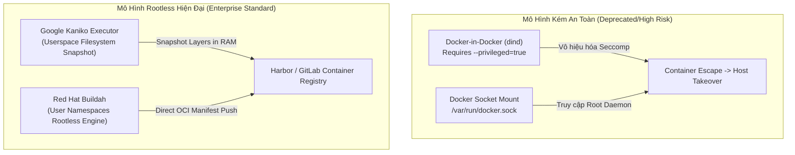
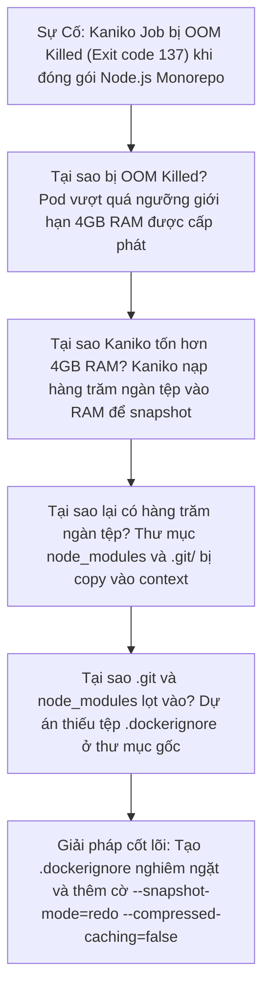


# [BÀI 23] BUILD CONTAINER IMAGE TRONG CI: KANIKO, BUILDAH, ROOTLESS & DOCKER-IN-DOCKER (DIND)

Trong kỷ nguyên **DevOps, DevSecOps và Cloud Native Engineering**, **GitLab CI/CD** được công nhận là một trong những nền tảng tự động hóa tích hợp liên tục và phân phối liên tục (CI/CD) hoàn chỉnh, mạnh mẽ và được tin dùng nhất trong các doanh nghiệp quy mô lớn. Không chỉ dừng lại ở các pipeline tuần tự cơ bản, việc vận hành GitLab CI/CD ở cấp độ Production đòi hỏi kỹ sư phải làm chủ kiến trúc điều phối phi tuyến tính **DAG (Directed Acyclic Graph)**, cơ chế quản trị **Autoscaling Runners**, tối ưu hóa **Caching đa tầng**, xác thực không khóa **Keyless OIDC**, bảo mật chuỗi cung ứng phần mềm **SLSA & SBOM** cùng các chính sách **Quality & Security Gates** tự động.

Bài viết chuyên sâu này sẽ đồng hành cùng bạn mổ xẻ toàn diện bức tranh kiến trúc, phân tích các đánh đổi kỹ thuật thực chiến (Engineering Trade-offs), cung cấp hướng dẫn thực hành Lab chi tiết từng bước và bộ câu hỏi phỏng vấn chuyên sâu chuẩn DevOps Lead / DevSecOps Architect.

---

## 1. Bản Chất Kiến Trúc & Cơ Chế Vận Hành Tầng Thấp

### 1.1. Luận Đề Trung Tâm: Cuộc Khủng Hoảng Quyền Lực Root Khi Đóng Gói Container Trong CI/CD

Đóng gói ứng dụng thành **OCI Container Images** (Docker Images) là mắt xích trung tâm của mọi pipeline hiện đại. Tuy nhiên, kiến trúc ban đầu của Docker được thiết kế phụ thuộc vào một tiến trình nền trung tâm chạy quyền quản trị tối cao (`dockerd` daemon chạy as root). Khi đưa tác vụ `docker build` vào trong môi trường CI/CD (nơi các job runner bản thân chúng cũng đang chạy trong container), các kỹ sư phải đối mặt với **Nghịch lý Container-in-Container**:

1. **Docker-in-Docker (dind)**: Yêu cầu bật cờ `--privileged = true` trên GitLab Runner. Điều này vô hiệu hóa toàn bộ cơ chế bảo vệ Linux Namespaces và Seccomp/AppArmor, cho phép container có toàn quyền kiểm soát Host Kernel. Một kẻ tấn công có thể thực hiện **Container Escape** và chiếm quyền điều khiển toàn bộ cụm máy chủ hoặc Kubernetes Node.
2. **Docker Socket Mounting (`/var/run/docker.sock`)**: Cho phép container bên trong giao tiếp trực tiếp với Docker daemon của máy Host. Bất kỳ câu lệnh `docker run -v /:/host` nào cũng có thể đọc/ghi toàn bộ hệ thống tệp của Host OS.
3. **Môi trường Kubernetes Native**: Các cụm Kubernetes hiện đại đã loại bỏ Dockershim và chuyển sang **containerd / CRI-O**, nơi daemon Docker hoàn toàn không tồn tại trên node.

> **Chuẩn mực bảo mật cấp doanh nghiệp bắt buộc phải loại bỏ hoàn toàn Docker-in-Docker và Socket Mounting, chuyển dịch sang các công cụ Rootless OCI Image Builders như Google Kaniko hoặc Red Hat Buildah, cho phép biên dịch và đẩy container image mà không cần đặc quyền root hay bất kỳ tiến trình nền daemon nào.**

```text
       SO SÁNH CƠ CHẾ VẬN HÀNH GIỮA DOCKER DAEMON VÀ ROOTLESS KANIKO

  [ Truyền Thống: Docker-in-Docker ]               [ Hiện Đại: Rootless Kaniko / Buildah ]
  ┌─────────────────────────────────────┐         ┌─────────────────────────────────────┐
  │ GitLab CI Job (User Code)           │         │ GitLab CI Job (User Code)           │
  │   │                                 │         │   │                                 │
  │   ▼                                 │         │   ▼                                 │
  │ docker CLI                          │         │ /kaniko/executor (Go Binary)        │
  │   │ (Gửi gRPC/REST)                 │         │   │                                 │
  │   ▼                                 │         │   ├─ Quét filesystem trong Userspace│
  │ dockerd Daemon (Requires ROOT/CAPS) │         │   ├─ Tạo snapshot layers trong RAM  │
  │   │                                 │         │   └─ Nén OCI Tarball & Push HTTPS   │
  │   ▼                                 │         │                                     │
  │ Host Kernel (RỦI RO CONTAINER ESCAPE)│        │   (HOÀN TOÀN KHÔNG CẦN ROOT/DAEMON) │
  └─────────────────────────────────────┘         └─────────────────────────────────────┘
```



### 1.2. Cơ Chế Snapshotting Tầng Userspace Của Kaniko

Khác với Docker daemon sử dụng OverlayFS kernel driver để ghi layer, **Kaniko** thực thi hoàn toàn trong không gian người dùng (Userspace):
1. **Nạp Base Image**: Kaniko giải nén filesystem của base image trực tiếp vào thư mục root `/` của container thực thi Kaniko.
2. **Thực thi lệnh Dockerfile (`RUN`)**: Kaniko chạy lệnh bằng shell và theo dõi các tệp bị thay đổi trên đĩa.
3. **Tạo Snapshot**: Kaniko quét toàn bộ hệ thống tệp, so sánh sự khác biệt (diff) với trạng thái trước lệnh `RUN`, nén phần khác biệt thành một `.tar.gz` layer và tính toán mã SHA256.
4. **Push trực tiếp**: Kaniko gửi OCI manifest và các tarball layer qua giao thức HTTPS trực tiếp lên Container Registry mà không cần lưu trữ cục bộ.

### 1.3. Sức Mạnh Của Buildah & Skopeo Trong Hệ Sinh Thái Red Hat

- **Buildah**: Cung cấp khả năng build image không cần daemon, hỗ trợ cả `Dockerfile` chuẩn lẫn việc build trực tiếp bằng các lệnh Bash (`buildah from`, `buildah run`, `buildah commit`). Hỗ trợ công nghệ **Linux User Namespaces** (gán UID không phải root trong host thành UID 0 bên trong container).
- **Skopeo**: Tiện ích chuyên dụng để kiểm tra, sao chép và ký số (Cosign / GPG) container image giữa các registry từ xa mà không cần tải hay giải nén toàn bộ image về máy runner.

---

## 2. Bảng So Sánh Kỹ Thuật Toàn Diện (Engineering Matrix)

| Tiêu Chí Đánh Giá | Docker-in-Docker (dind) | Docker Socket Mount | Google Kaniko | Red Hat Buildah |
| :--- | :--- | :--- | :--- | :--- |
| **Yêu Cầu Đặc Quyền** | Cực cao (`--privileged`) | Cao (Quyền rw socket root) | **Không (Rootless)** | **Không (Rootless / Userns)** |
| **Tương Thích K8s CRI** | Kém (Cần đặc quyền Pod) | Không khả dụng trên K8s | **Tối ưu tuyệt đối (Pod K8s)** | **Tối ưu tuyệt đối (OpenShift/K8s)** |
| **Phụ Thuộc Daemon** | Có (`dockerd` container) | Có (`dockerd` host) | **Không có daemon** | **Không có daemon** |
| **Tốc Độ Build Lần Đầu** | Nhanh (OverlayFS Kernel) | Nhanh nhất (Tận dụng Host) | Trung bình (Quét snapshot RAM) | Nhanh (Native VFS / Overlay) |
| **Cơ Chế Remote Caching** | Local Cache hoặc Buildx | Local Host Engine Cache | Registry Cache (`--cache=true`) | Registry Cache / OCI Blob |
| **Hỗ Trợ Multi-Stage** | Hoàn hảo | Hoàn hảo | Hoàn hảo | Hoàn hảo |
| **Mức Độ Rủi Ro An Ninh** | **Nghiêm trọng (Critical)** | **Nghiêm trọng (Critical)** | **An toàn (Zero Privilege)** | **An toàn (Zero Privilege)** |

---

## 3. Kiến Trúc Triển Khai Chuẩn Production (Architecture Breakdown)

### 3.1. Pipeline Hoàn Chỉnh: Đóng Gói Multi-Stage Bằng Kaniko Với Remote Registry Cache

```yaml
stages:
  - test
  - build_image
  - scan_image

variables:
  KANIKO_VERSION: "v1.20.0-debug"
  IMAGE_TAG: $CI_REGISTRY_IMAGE:$CI_COMMIT_SHORT_SHA
  IMAGE_CACHE: $CI_REGISTRY_IMAGE/cache:latest

test_application:
  stage: test
  image: golang:1.22-alpine
  script:
    - go test -v ./...

build_kaniko_rootless:
  stage: build_image
  image:
    name: gcr.io/kaniko-project/executor:${KANIKO_VERSION}
    entrypoint: [""]
  before_script:
    # Thiết lập file cấu hình xác thực cho Kaniko
    - mkdir -p /kaniko/.docker
    - echo "{\"auths\":{\"${CI_REGISTRY}\":{\"auth\":\"$(printf "%s:%s" "${CI_REGISTRY_USER}" "${CI_REGISTRY_PASSWORD}" | base64 | tr -d '\n')\"}}}" > /kaniko/.docker/config.json
  script:
    - >-
      /kaniko/executor
      --context "${CI_PROJECT_DIR}"
      --dockerfile "${CI_PROJECT_DIR}/Dockerfile"
      --destination "${IMAGE_TAG}"
      --destination "${CI_REGISTRY_IMAGE}:latest"
      --cache=true
      --cache-repo="${IMAGE_CACHE}"
      --cache-ttl=168h
      --compressed-caching=false
      --snapshot-mode=redo
      --verbosity=info
  rules:
    - if: '$CI_COMMIT_BRANCH == "main"'
    - if: '$CI_COMMIT_TAG'
```

### 3.2. Dockerfile Chuẩn Tối Ưu Hóa Multi-Stage Build

```dockerfile
# -------------------------------------------------------------
# Stage 1: Build Stage (Chứa đầy đủ Compiler & Toolchain)
# -------------------------------------------------------------
FROM golang:1.22-alpine AS builder

WORKDIR /app

# Caching Layer Dependencies
COPY go.mod go.sum ./
RUN go mod download

COPY . .

# Biên dịch Binary Tĩnh không phụ thuộc CGO
RUN CGO_ENABLED=0 GOOS=linux GOARCH=amd64 go build \
    -ldflags="-s -w -extldflags '-static'" \
    -o /app/bin/server ./cmd/server

# -------------------------------------------------------------
# Stage 2: Minimal Distroless / Scratch Runtime Stage
# -------------------------------------------------------------
FROM gcr.io/distroless/static-debian12:nonroot

WORKDIR /app

# Copy Binary từ Builder Stage
COPY --from=builder /app/bin/server /app/server

# Chạy với user nonroot (UID 65532)
USER nonroot:nonroot

EXPOSE 8080

ENTRYPOINT ["/app/server"]
```

---

## 4. Phân Tích Cạm Bẫy Thực Chiến (5-Whys Incident Analysis)



### Tình Huống Sự Cố Thực Tế:
<span class="badge badge--rose">🕒 06:20 AM</span> Một pipeline đóng gói ứng dụng Node.js Monorepo sử dụng Google Kaniko trên Kubernetes Runner bị sập ngắt quãng với mã lỗi `command terminated with exit code 137` (OOM - Out of Memory) khi container pod chạm ngưỡng giới hạn 4GB RAM được cấp phát trong Resource Limit.

### Hậu Quả & Log Lỗi Thực Tế:
Job build container image bị hủy đột ngột, làm gián đoạn toàn bộ luồng triển khai phát hành:

```text
$ /kaniko/executor --context "${CI_PROJECT_DIR}" --dockerfile "${CI_PROJECT_DIR}/Dockerfile" --destination "${IMAGE_TAG}"
INFO[0001] Resolved base image node:20-alpine to node:20-alpine
INFO[0003] Taking snapshot of full filesystem...
INFO[0025] Resolving paths for COPY . .
INFO[0048] Taking snapshot of files...
command terminated with exit code 137
ERROR: Job failed: command terminated with exit code 137 (OOMKilled)
```

### 5-Whys Root Cause Analysis:
1. <span class="badge badge--primary">Why 1</span> **Tại sao Job Kaniko bị thoát mã lỗi 137?** &rarr; Kubernetes OOMKiller đã tiêu diệt container pod do mức tiêu thụ bộ nhớ RAM thực tế vượt quá 4GB limit.
2. <span class="badge badge--primary">Why 2</span> **Tại sao Kaniko lại tiêu tốn lượng RAM khổng lồ như vậy?** &rarr; Trình Snapshotting của Kaniko phải quét và lưu trữ metadata/băm của hàng trăm ngàn tệp tin vào RAM ở lệnh `COPY . .`.
3. <span class="badge badge--primary">Why 3</span> **Tại sao lại có hàng trăm ngàn tệp tin cần snapshot?** &rarr; Toàn bộ thư mục lịch sử Git khổng lồ `.git/` và các thư mục phụ thuộc cục bộ `node_modules/` bị sao chép trực tiếp vào build context.
4. <span class="badge badge--primary">Why 4</span> **Tại sao `.git/` và `node_modules/` lại lọt vào context?** &rarr; Dự án không có tệp cấu hình `.dockerignore` tại thư mục gốc của repository.
5. <span class="badge badge--emerald">Root Cause Remedy</span> **Giải pháp triệt để**: Khởi tạo tệp `.dockerignore` loại bỏ `.git`, `node_modules`, `coverage`, đồng thời thêm cờ `--snapshot-mode=redo` (chỉ theo dõi mtime) và `--compressed-caching=false` để giảm áp lực bộ nhớ RAM cho Kaniko.

### 4.1. Phân Tích 5 Cạm Bẫy Phổ Biến Nhất

#### Cạm bẫy 1: Sự cố rò rỉ socket root `/var/run/docker.sock` trên Multi-tenant Runner
- **Hiện tượng**: Một job CI của developer có thể thực hiện lệnh `docker run` chiếm quyền root máy chủ host của công ty.
- **Nguyên nhân tầng sâu**: Runner sử dụng Docker executor và mount trực tiếp socket Docker của host.
- **Cách gỡ rối**: Chuyển ngay sang sử dụng Kaniko hoặc Buildah trên Kubernetes Runner không phân quyền (Non-root).

#### Cạm bẫy 2: Image Kaniko không có shell bị lỗi khi chạy `before_script`
- **Hiện tượng**: Job CI báo lỗi `exec: "/bin/sh": stat /bin/sh: no such file or directory`.
- **Nguyên nhân**: Sử dụng image `gcr.io/kaniko-project/executor:latest` (Distroless không shell).
- **Biện pháp**: Luôn sử dụng image có hậu tố `-debug` (ví dụ: `executor:v1.20.0-debug`) và khai báo `entrypoint: [""]`.

#### Cạm bẫy 3: Rò rỉ thông tin xác thực Registry trong Image History
- **Hiện tượng**: Kẻ xấu dùng lệnh `docker history` đọc được toàn bộ API token hoặc token gitlab do truyền qua `ARG`.
- **Nguyên nhân**: Sử dụng lệnh `ARG DOCKER_AUTH` trong Dockerfile.
- **Biện pháp**: Cấu hình xác thực qua tệp `/kaniko/.docker/config.json` ở Userspace thay vì truyền vào Dockerfile.

#### Cạm bẫy 4: Kích thước Image phình to hàng trăm MB do để sót Compiler
- **Hiện tượng**: Image runtime chứa cả gcc, g++, build-essential và mã nguồn thô.
- **Nguyên nhân**: Viết Dockerfile đơn tầng (Single-stage).
- **Biện pháp**: Sử dụng Multi-stage Dockerfile với Runtime Base Image là `gcr.io/distroless/static-debian12:nonroot` hoặc `alpine`.

#### Cạm bẫy 5: Không tận dụng Remote Cache khiến build image tốn 10 phút
- **Hiện tượng**: Mỗi lần chạy CI, Kaniko đều tải lại toàn bộ package và biên dịch lại từ đầu.
- **Nguyên nhân**: Không bật cờ `--cache=true` và thiếu `--cache-repo`.
- **Biện pháp**: Bổ sung `--cache=true --cache-repo=$CI_REGISTRY_IMAGE/cache --cache-ttl=168h`.

---

## 5. Hands-on Lab: Đóng Gói Rootless Container Chuẩn Enterprise (8 Bước Chuẩn)

### 5.1. Mục Tiêu Lab
- Xây dựng ứng dụng Web Go Microservice siêu nhẹ.
- Viết Multi-stage Dockerfile dựa trên Distroless Non-root Image.
- Cấu hình pipeline GitLab CI/CD chạy Kaniko Rootless build.
- Bật tính năng Remote Registry Layer Caching và kiểm tra hiệu năng.

```text
       QUY TRÌNH THỰC HÀNH LAB KANIKO TRÊN GITLAB RUNNER

      [ GitLab Runner Pod (Rootless) ]
                    │
                    ▼
     1. Khởi tạo /kaniko/executor (debug image)
                    │
                    ▼
     2. Ghi Auth Token vào /kaniko/.docker/config.json
                    │
                    ▼
     3. Tải Remote Cache từ Registry (nếu có hit)
                    │
                    ▼
     4. Build Multi-stage & Tạo Snapshot Userspace
                    │
                    ▼
     5. Push Image Manifest & Layers lên GitLab Registry
```

### 5.2. Các Bước Thực Hiện Chi Tiết

#### Bước 1: Khởi Tạo Ứng Dụng Go `main.go`
Tạo tệp `main.go`:
```go
package main

import (
	"fmt"
	"net/http"
	"os"
)

func main() {
	port := os.Getenv("PORT")
	if port == "" {
		port = "8080"
	}

	http.HandleFunc("/health", func(w http.ResponseWriter, r *http.Request) {
		w.WriteHeader(http.StatusOK)
		fmt.Fprintf(w, "OK - Service is healthy\n")
	})

	http.HandleFunc("/", func(w http.ResponseWriter, r *http.Request) {
		fmt.Fprintf(w, "Welcome to Cloud-Native Container CI/CD!\n")
	})

	fmt.Printf("Server listening on port %s...\n", port)
	if err := http.ListenAndServe(":"+port, nil); err != nil {
		panic(err)
	}
}
```

#### Bước 2: Tạo Tệp `go.mod`
```go
module gitlab.corp.internal/cloud-native/app

go 1.22
```

#### Bước 3: Tạo Tệp `.dockerignore` Loại Bỏ Rác Context
```text
.git
.gitlab-ci.yml
*.md
bin/
tmp/
```

#### Bước 4: Viết `Dockerfile` Đa Tầng (Multi-Stage)
```dockerfile
FROM golang:1.22-alpine AS builder
WORKDIR /src
COPY go.mod ./
RUN go mod download
COPY main.go ./
RUN CGO_ENABLED=0 go build -ldflags="-s -w" -o /out/app main.go

FROM gcr.io/distroless/static-debian12:nonroot
WORKDIR /app
COPY --from=builder /out/app /app/app
USER nonroot:nonroot
EXPOSE 8080
ENTRYPOINT ["/app/app"]
```

#### Bước 5: Cấu Hình Tệp `.gitlab-ci.yml` Với Kaniko
```yaml
stages:
  - build

variables:
  KANIKO_IMAGE: "gcr.io/kaniko-project/executor:v1.20.0-debug"

build_container_image:
  stage: build
  image:
    name: $KANIKO_IMAGE
    entrypoint: [""]
  before_script:
    - mkdir -p /kaniko/.docker
    - echo "{\"auths\":{\"${CI_REGISTRY}\":{\"auth\":\"$(printf "%s:%s" "${CI_REGISTRY_USER}" "${CI_REGISTRY_PASSWORD}" | base64 | tr -d '\n')\"}}}" > /kaniko/.docker/config.json
  script:
    - >-
      /kaniko/executor
      --context "${CI_PROJECT_DIR}"
      --dockerfile "${CI_PROJECT_DIR}/Dockerfile"
      --destination "${CI_REGISTRY_IMAGE}:${CI_COMMIT_SHORT_SHA}"
      --destination "${CI_REGISTRY_IMAGE}:latest"
      --cache=true
      --cache-repo="${CI_REGISTRY_IMAGE}/cache"
      --cache-ttl=72h
```

#### Bước 6: Commit Code Và Quan Sát Quá Trình Build Lần Đầu
- Đẩy commit lên branch `main`.
- Quan sát logs của Kaniko trong GitLab Job:
  - Kaniko tải base image `golang:1.22-alpine`.
  - Kaniko biên dịch binary trong Userspace.
  - Snapshot layer và đẩy lên `$CI_REGISTRY_IMAGE/cache`.
  - Đẩy image hoàn chỉnh (kích thước chỉ ~7MB!).

#### Bước 7: Thực Hiện Commit Lần Hai Kiểm Tra Remote Cache Hit
- Sửa đổi nội dung `fmt.Fprintf` trong `main.go`.
- Chạy lại pipeline.
- Quan sát log bước `COPY go.mod ./` và `RUN go mod download`:
  ```text
  INFO[0003] Found cached layer, skipping execution!
  INFO[0003] Using cache for COPY go.mod ./
  INFO[0004] Using cache for RUN go mod download
  ```

#### Bước 8: Kiểm Tra Bảo Mật Container Bằng Trivy Scanner
- Thêm job kiểm tra lỗ hổng bảo mật sau khi build:
```yaml
security_scan:
  stage: build
  needs: ["build_container_image"]
  image:
    name: aquasec/trivy:latest
    entrypoint: [""]
  script:
    - trivy image --severity HIGH,CRITICAL "${CI_REGISTRY_IMAGE}:${CI_COMMIT_SHORT_SHA}"
```

> [!NOTE]
> **Check-point Lab 23**: Image sinh ra phải có kích thước dưới 10MB, chạy bằng user non-root UID 65532 và hoàn thành build dưới 45 giây khi tận dụng Remote Cache.

---

## 6. Bộ Câu Hỏi Vấn Đáp & Phỏng Vấn Chuyên Sâu (Self-Check Q&A)

<details class="qa-card">
  <summary class="qa-summary">
    <span class="qa-num-badge">Q01</span>
    <span>Tại sao gắn socket `/var/run/docker.sock` vào CI Runner lại là một lỗ hổng bảo mật nghiêm trọng (Critical Risk)?</span>
  </summary>
  <div class="qa-answer">
    <div class="qa-answer-header">
      <svg class="qa-icon" viewBox="0 0 24 24" fill="none" stroke="currentColor" stroke-width="2" stroke-linecap="round" stroke-linejoin="round"><polyline points="20 6 9 17 4 12"></polyline></svg>
      <span>Phân Tích &amp; Lời Giải Kỹ Thuật</span>
    </div>
    <p><strong>Bản chất nguy hiểm:</strong></p>
    <p>Tiến trình <code>dockerd</code> trên máy Host chạy với đặc quyền <code>root</code> cao nhất. Khi gắn docker socket vào bên trong runner container, container đó có toàn quyền ra lệnh cho daemon host. Kẻ xấu có thể thực thi lệnh:</p>
    <div class="language-bash highlighter-rouge"><pre class="highlight"><code>docker run -v /:/host-root alpine chroot /host-root rm -rf /
</code></pre></div>
    <p>Lệnh này sẽ chiếm quyền điều khiển toàn bộ hệ điều hành Host, đọc toàn bộ biến môi trường bí mật của các job khác đang chạy chung máy chủ và phá hủy toàn bộ hạ tầng.</p>
  </div>
</details>

<details class="qa-card">
  <summary class="qa-summary">
    <span class="qa-num-badge">Q02</span>
    <span>Sự khác biệt cốt lõi giữa cơ chế Snapshot của Kaniko và cơ chế Copy-on-Write (CoW) của Docker daemon là gì?</span>
  </summary>
  <div class="qa-answer">
    <div class="qa-answer-header">
      <svg class="qa-icon" viewBox="0 0 24 24" fill="none" stroke="currentColor" stroke-width="2" stroke-linecap="round" stroke-linejoin="round"><polyline points="20 6 9 17 4 12"></polyline></svg>
      <span>Phân Tích &amp; Lời Giải Kỹ Thuật</span>
    </div>
    <p><strong>So sánh cơ chế:</strong></p>
    <ul>
      <li><strong>Docker Daemon</strong>: Sử dụng kernel driver chuyên dụng (OverlayFS) để tạo các tầng mount ảo. Mọi thao tác ghi tệp diễn ra tức thì ở tầng CoW trên cùng với hiệu năng native.</li>
      <li><strong>Kaniko</strong>: Hoạt động hoàn toàn ở Userspace. Sau mỗi câu lệnh <code>RUN</code>, Kaniko phải tự quét đĩa hoặc kiểm tra timestamp để phát hiện những tệp mới được sinh ra, sau đó chủ động nén chúng thành tarball. Cơ chế này an toàn tuyệt đối nhưng tốn CPU/RAM hơn Docker CoW.</li>
    </ul>
  </div>
</details>

<details class="qa-card">
  <summary class="qa-summary">
    <span class="qa-num-badge">Q03</span>
    <span>Tại sao hình ảnh Kaniko chính thức có hậu tố `-debug` (ví dụ: `gcr.io/kaniko-project/executor:debug`) thường được dùng trong GitLab CI?</span>
  </summary>
  <div class="qa-answer">
    <div class="qa-answer-header">
      <svg class="qa-icon" viewBox="0 0 24 24" fill="none" stroke="currentColor" stroke-width="2" stroke-linecap="round" stroke-linejoin="round"><polyline points="20 6 9 17 4 12"></polyline></svg>
      <span>Phân Tích &amp; Lời Giải Kỹ Thuật</span>
    </div>
    <p><strong>Giải thích kỹ thuật:</strong></p>
    <p>Image Kaniko tiêu chuẩn (không có nhãn debug) là một Distroless image tối giản chỉ chứa đúng binary <code>/kaniko/executor</code> và <em>không có bất kỳ shell nào</em> (không có <code>/bin/sh</code> hay <code>/bin/bash</code>). Do GitLab Runner yêu cầu một shell để thực thi các khối <code>before_script</code> và <code>script</code>, nên bắt buộc phải sử dụng phiên bản <code>-debug</code> (chứa Busybox shell).</p>
  </div>
</details>

<details class="qa-card">
  <summary class="qa-summary">
    <span class="qa-num-badge">Q04</span>
    <span>Làm thế nào để truyền cờ xác thực nhiều Container Registry cùng lúc vào Kaniko?</span>
  </summary>
  <div class="qa-answer">
    <div class="qa-answer-header">
      <svg class="qa-icon" viewBox="0 0 24 24" fill="none" stroke="currentColor" stroke-width="2" stroke-linecap="round" stroke-linejoin="round"><polyline points="20 6 9 17 4 12"></polyline></svg>
      <span>Phân Tích &amp; Lời Giải Kỹ Thuật</span>
    </div>
    <p><strong>Giải pháp:</strong></p>
    <p>Tạo cấu trúc JSON chuẩn tại tệp <code>/kaniko/.docker/config.json</code> chứa nhiều khóa trong mảng <code>auths</code>, ví dụ vừa xác thực GitLab Registry để push, vừa xác thực Docker Hub / Harbor nội bộ để pull base image:</p>
    <div class="language-json highlighter-rouge"><pre class="highlight"><code><span class="p">{</span><span class="w">
  </span><span class="nl">"auths"</span><span class="p">:</span><span class="w"> </span><span class="p">{</span><span class="w">
    </span><span class="nl">"https://index.docker.io/v1/"</span><span class="p">:</span><span class="w"> </span><span class="p">{</span><span class="w"> </span><span class="nl">"auth"</span><span class="p">:</span><span class="w"> </span><span class="s2">"&lt;base64-dockerhub-token&gt;"</span><span class="w"> </span><span class="p">},</span><span class="w">
    </span><span class="nl">"registry.gitlab.corp.internal"</span><span class="p">:</span><span class="w"> </span><span class="p">{</span><span class="w"> </span><span class="nl">"auth"</span><span class="p">:</span><span class="w"> </span><span class="s2">"&lt;base64-gitlab-token&gt;"</span><span class="w"> </span><span class="p">}</span><span class="w">
  </span><span class="p">}</span><span class="w">
</span><span class="p">}</span><span class="w">
</span></code></pre></div>
  </div>
</details>

<details class="qa-card">
  <summary class="qa-summary">
    <span class="qa-num-badge">Q05</span>
    <span>Cờ `--cache-repo` trong Kaniko có tác dụng gì và tại sao nên tách riêng cache repository?</span>
  </summary>
  <div class="qa-answer">
    <div class="qa-answer-header">
      <svg class="qa-icon" viewBox="0 0 24 24" fill="none" stroke="currentColor" stroke-width="2" stroke-linecap="round" stroke-linejoin="round"><polyline points="20 6 9 17 4 12"></polyline></svg>
      <span>Phân Tích &amp; Lời Giải Kỹ Thuật</span>
    </div>
    <p><strong>Phân tích:</strong></p>
    <p><code>--cache-repo</code> chỉ định vị trí trên Container Registry dùng để lưu trữ các intermediate layers được cache. Việc tách riêng kho cache (ví dụ: <code>my-image/cache</code>) giúp:</p>
    <ul>
      <li>Không làm rác danh sách tags phát hành của image chính.</li>
      <li>Cho phép đặt chính sách dọn dẹp riêng (Lifecycle Retention Policy) tự động xóa các layer cache sau 7 ngày mà không ảnh hưởng tới production tags.</li>
    </ul>
  </div>
</details>

<details class="qa-card">
  <summary class="qa-summary">
    <span class="qa-num-badge">Q06</span>
    <span>Khi nào nên sử dụng Buildah thay vì Kaniko trong hạ tầng CI/CD?</span>
  </summary>
  <div class="qa-answer">
    <div class="qa-answer-header">
      <svg class="qa-icon" viewBox="0 0 24 24" fill="none" stroke="currentColor" stroke-width="2" stroke-linecap="round" stroke-linejoin="round"><polyline points="20 6 9 17 4 12"></polyline></svg>
      <span>Phân Tích &amp; Lời Giải Kỹ Thuật</span>
    </div>
    <p><strong>Nguyên tắc chọn lựa:</strong></p>
    <ul>
      <li>Chọn <strong>Kaniko</strong> khi hạ tầng chạy trên Kubernetes thuần và pipeline chỉ cần build từ tệp <code>Dockerfile</code> tiêu chuẩn.</li>
      <li>Chọn <strong>Buildah</strong> khi cần linh hoạt xây dựng image qua shell script từng bước (không cần Dockerfile), cần tích hợp sâu với hệ sinh thái Red Hat OpenShift / Podman, hoặc muốn thao tác trực tiếp với OCI Storage driver.</li>
    </ul>
  </div>
</details>

<details class="qa-card">
  <summary class="qa-summary">
    <span class="qa-num-badge">Q07</span>
    <span>Tại sao cần khai báo `entrypoint: [""]` khi khai báo image Kaniko trong GitLab CI?</span>
  </summary>
  <div class="qa-answer">
    <div class="qa-answer-header">
      <svg class="qa-icon" viewBox="0 0 24 24" fill="none" stroke="currentColor" stroke-width="2" stroke-linecap="round" stroke-linejoin="round"><polyline points="20 6 9 17 4 12"></polyline></svg>
      <span>Phân Tích &amp; Lời Giải Kỹ Thuật</span>
    </div>
    <p><strong>Bản chất:</strong></p>
    <p>Mặc định image Kaniko định nghĩa Entrypoint là <code>/kaniko/executor</code>. Nếu không ghi đè bằng <code>entrypoint: [""]</code>, GitLab Runner sẽ không thể gọi <code>/bin/sh</code> để truyền các tập lệnh script của job vào container, dẫn đến lỗi job thất bại ngay khi khởi động.</p>
  </div>
</details>

<details class="qa-card">
  <summary class="qa-summary">
    <span class="qa-num-badge">Q08</span>
    <span>Làm thế nào để tối ưu hóa thứ tự các câu lệnh trong Dockerfile để đạt tỷ lệ Cache Hit cao nhất?</span>
  </summary>
  <div class="qa-answer">
    <div class="qa-answer-header">
      <svg class="qa-icon" viewBox="0 0 24 24" fill="none" stroke="currentColor" stroke-width="2" stroke-linecap="round" stroke-linejoin="round"><polyline points="20 6 9 17 4 12"></polyline></svg>
      <span>Phân Tích &amp; Lời Giải Kỹ Thuật</span>
    </div>
    <p><strong>Nguyên tắc vàng:</strong></p>
    <ol>
      <li>Đặt các lệnh ít thay đổi nhất lên đầu (Base Image, cài đặt OS packages, biến ENV).</li>
      <li>Copy các tệp định nghĩa thư viện (<code>package.json</code>, <code>go.mod</code>, <code>pom.xml</code>, <code>requirements.txt</code>) và chạy lệnh tải dependency trước.</li>
      <li>Copy toàn bộ mã nguồn ứng dụng (<code>COPY . .</code>) ở bước áp chót vì mã nguồn thay đổi liên tục trên mỗi commit.</li>
    </ol>
  </div>
</details>

<details class="qa-card">
  <summary class="qa-summary">
    <span class="qa-num-badge">Q09</span>
    <span>Distroless Image là gì và tại sao nó là tiêu chuẩn vàng cho Security trong Dockerfile?</span>
  </summary>
  <div class="qa-answer">
    <div class="qa-answer-header">
      <svg class="qa-icon" viewBox="0 0 24 24" fill="none" stroke="currentColor" stroke-width="2" stroke-linecap="round" stroke-linejoin="round"><polyline points="20 6 9 17 4 12"></polyline></svg>
      <span>Phân Tích &amp; Lời Giải Kỹ Thuật</span>
    </div>
    <p><strong>Khái niệm:</strong></p>
    <p>Distroless Images (do Google khởi xướng) chỉ chứa duy nhất ứng dụng của bạn và các runtime dependencies tối thiểu (như glibc, ca-certificates). Nó <em>không chứa package manager (apt/apk), không chứa shell (bash/sh), không chứa các tiện ích Linux phổ biến (curl/wget/netcat)</em>. Kẻ tấn công nếu khai thác được lỗi ứng dụng cũng không thể mở reverse shell hay tải payload độc hại vào container.</p>
  </div>
</details>

<details class="qa-card">
  <summary class="qa-summary">
    <span class="qa-num-badge">Q10</span>
    <span>Làm sao để build Container Image đa kiến trúc CPU (Multi-arch ARM64/AMD64) bằng Kaniko hoặc Docker Buildx?</span>
  </summary>
  <div class="qa-answer">
    <div class="qa-answer-header">
      <svg class="qa-icon" viewBox="0 0 24 24" fill="none" stroke="currentColor" stroke-width="2" stroke-linecap="round" stroke-linejoin="round"><polyline points="20 6 9 17 4 12"></polyline></svg>
      <span>Phân Tích &amp; Lời Giải Kỹ Thuật</span>
    </div>
    <p><strong>Kỹ thuật:</strong></p>
    <ul>
      <li>Với <strong>Kaniko</strong>: Chạy job song song trên 2 runner vật lý riêng biệt (1 runner x86_64 và 1 runner ARM64), sau đó dùng <code>manifest-tool</code> hoặc <code>docker manifest create</code> để gộp thành 1 OCI Multi-Arch Manifest duy nhất.</li>
      <li>Với <strong>Docker Buildx / Buildah</strong>: Sử dụng tính năng QEMU emulation với cờ <code>--platform linux/amd64,linux/arm64</code> để biên dịch chéo trên 1 node duy nhất.</li>
    </ul>
  </div>
</details>

<details class="qa-card">
  <summary class="qa-summary">
    <span class="qa-num-badge">Q11</span>
    <span>Tại sao không nên sử dụng tag `:latest` để deploy trong môi trường Production?</span>
  </summary>
  <div class="qa-answer">
    <div class="qa-answer-header">
      <svg class="qa-icon" viewBox="0 0 24 24" fill="none" stroke="currentColor" stroke-width="2" stroke-linecap="round" stroke-linejoin="round"><polyline points="20 6 9 17 4 12"></polyline></svg>
      <span>Phân Tích &amp; Lời Giải Kỹ Thuật</span>
    </div>
    <p><strong>Rủi ro:</strong></p>
    <ul>
      <li>Tag <code>:latest</code> là tag có thể bị ghi đè (Mutable tag), phá vỡ tính bất biến (Immutability) của bản phát hành.</li>
      <li>Kubernetes kubelet có thể không pull image mới nếu cấu hình <code>imagePullPolicy: IfNotPresent</code>.</li>
      <li>Gây khó khăn tuyệt đối trong việc truy vết mã nguồn (Traceability) và rollback khi xảy ra sự cố. Luôn gắn tag theo <code>Commit SHA</code> hoặc <code>SemVer Tag</code>.</li>
    </ul>
  </div>
</details>

<details class="qa-card">
  <summary class="qa-summary">
    <span class="qa-num-badge">Q12</span>
    <span>Làm cách nào để ngăn chặn rò rỉ Build Secrets (như SSH Keys, NPM Tokens) trong các layer của Container Image?</span>
  </summary>
  <div class="qa-answer">
    <div class="qa-answer-header">
      <svg class="qa-icon" viewBox="0 0 24 24" fill="none" stroke="currentColor" stroke-width="2" stroke-linecap="round" stroke-linejoin="round"><polyline points="20 6 9 17 4 12"></polyline></svg>
      <span>Phân Tích &amp; Lời Giải Kỹ Thuật</span>
    </div>
    <p><strong>Giải pháp:</strong></p>
    <ol>
      <li>Tuyệt đối không dùng <code>ARG</code> hoặc <code>ENV</code> để truyền API Keys/SSH Keys vì chúng sẽ bị lưu vĩnh viễn trong Image Metadata history.</li>
      <li>Sử dụng tính năng <strong>BuildKit Secret Mounts</strong>: <code>RUN --mount=type=secret,id=npmrc ...</code> (Secret chỉ tồn tại tạm thời trong RAM lúc chạy lệnh và không được ghi vào bất kỳ layer nào).</li>
      <li>Sử dụng Multi-Stage Build: Đọc và sử dụng Secret ở Builder Stage, chỉ copy sản phẩm đầu ra sạch sang Runtime Stage.</li>
    </ol>
  </div>
</details>

---

## 7. Tổng Kết & Lộ Trình Bài Học Tiếp Theo

### 7.1. Tóm Tắt Các Điểm Cốt Lõi (Architectural Key Takeaways)
- **Eliminate Privileged dind**: Loại bỏ hoàn toàn Docker-in-Docker và Socket Mounting khỏi hạ tầng Runner vì nguy cơ Container Escape.
- **Rootless OCI Builders**: Google Kaniko và Red Hat Buildah là giải pháp tiêu chuẩn cho môi trường Kubernetes Native.
- **Multi-Stage & Distroless**: Giảm 90% dung lượng image và triệt tiêu bề mặt tấn công bảo mật.
- **Distributed Remote Layer Cache**: Tăng tốc 5x lần thời gian đóng gói image trên CI.

### 7.2. Sơ Đồ Tư Duy Hệ Thống Container CI/CD (Mindmap)

```text
                     HỆ THỐNG CONTAINER IMAGE CI/CD TOÀN DIỆN
                                       │
        ┌──────────────────────────────┼──────────────────────────────┐
        ▼                              ▼                              ▼
  [ Rootless Engine ]         [ Optimized Packaging ]        [ Security & Cache ]
  - Google Kaniko Userspace   - Multi-Stage Dockerfile       - Remote Registry Caching
  - Red Hat Buildah Native    - Distroless Non-root Base     - Non-root UID Enforcement
  - No Host Socket Bind       - Stripped Static Binaries     - Trivy Vulnerability Scan
```

> [!TIP]
> **Bước tiếp theo trong lộ trình**: Tìm hiểu cách quản trị kho lưu trữ artifact và container registry tập trung quy mô doanh nghiệp trong [Bài 24: Quản Trị Registry & Binary Artifacts: JFrog Artifactory, Harbor, Nexus & GitLab Package Registry](gitlab-24-24-jfrog-artifactory-registry.html).

