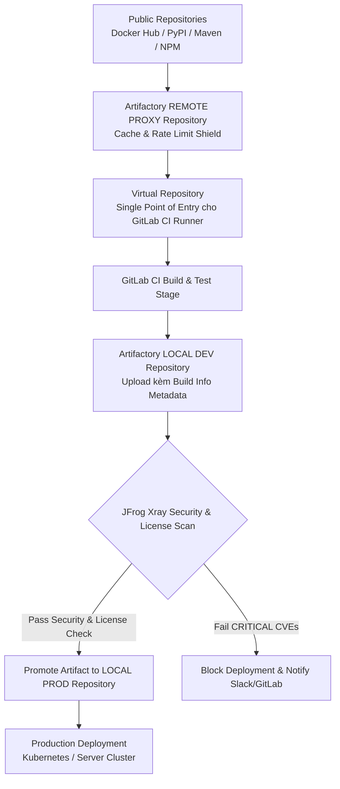
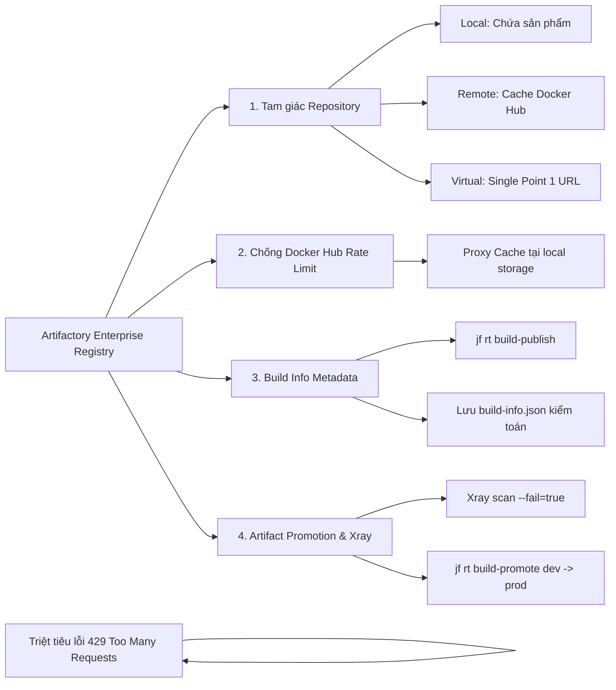
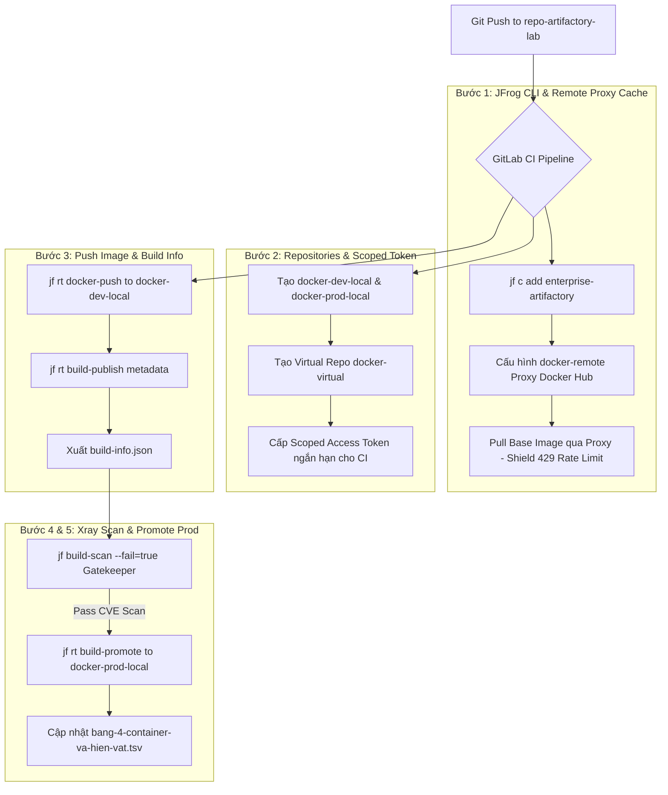


# [BÀI 24] QUẢN TRỊ ARTIFACTS & CONTAINER REGISTRY: GITLAB CONTAINER REGISTRY, JFROG ARTIFACTORY & HARBOR REGISTRY OCI

Trong kỷ nguyên **DevOps, DevSecOps và Cloud Native Engineering**, **GitLab CI/CD** được công nhận là một trong những nền tảng tự động hóa tích hợp liên tục và phân phối liên tục (CI/CD) hoàn chỉnh, mạnh mẽ và được tin dùng nhất trong các doanh nghiệp quy mô lớn. Không chỉ dừng lại ở các pipeline tuần tự cơ bản, việc vận hành GitLab CI/CD ở cấp độ Production đòi hỏi kỹ sư phải làm chủ kiến trúc điều phối phi tuyến tính **DAG (Directed Acyclic Graph)**, cơ chế quản trị **Autoscaling Runners**, tối ưu hóa **Caching đa tầng**, xác thực không khóa **Keyless OIDC**, bảo mật chuỗi cung ứng phần mềm **SLSA & SBOM** cùng các chính sách **Quality & Security Gates** tự động.

Bài viết chuyên sâu này sẽ đồng hành cùng bạn mổ xẻ toàn diện bức tranh kiến trúc, phân tích các đánh đổi kỹ thuật thực chiến (Engineering Trade-offs), cung cấp hướng dẫn thực hành Lab chi tiết từng bước và bộ câu hỏi phỏng vấn chuyên sâu chuẩn DevOps Lead / DevSecOps Architect.

---

## 1. Bản Chất Kiến Trúc & Cơ Chế Vận Hành Tầng Thấp

---


| # | Câu hỏi ôn tập Buổi 23 (Build Image) | Đáp án chuẩn ngắn gọn |
|---|---|---|
| 1 | Tiêu chí hàng đầu để chọn lựa giữa `dind`, `Kaniko`, `Buildah`, và `BuildKit` là gì? | Mức độ đặc quyền an ninh (Security Privilege Level) mà hạ tầng Runner cho phép, không phải tốc độ. |
| 2 | Phân tích mối hiểm họa của việc mount Docker Socket (`/var/run/docker.sock`) vào Runner? | Cấp quyền kiểm soát Docker Daemon máy Host cho CI, mở rộng nguy cơ tấn công Container Escape chiếm root máy Host. |
| 3 | Ưu điểm cốt lõi của công cụ `Kaniko` khi đóng gói Image trên Kubernetes Cluster? | Thi hành đóng gói dạng Rootless 100% trong User Space, không cần Docker Daemon hay cờ `privileged = true`. |
| 4 | Cờ tham số nào của Kaniko giúp rút ngắn thời gian build lượt 2 từ 45s xuống còn 5s? | `--cache=true` và `--cache-repo=$CI_REGISTRY_IMAGE/cache`. |
| 5 | Tại sao phải trích xuất mã băm bất biến Image Digest SHA-256 (`image-digest.txt`)? | Mã Digest bất biến tuyệt đối 100%, phục vụ kiểm định an ninh và đảm bảo K8s kéo đúng Image không bị sửa đổi. |

---


> **LUẬN ĐỀ TRUNG TÂM BUỔI 24:**
> **Enterprise Artifact Registry (như JFrog Artifactory) không đơn thuần là một ổ đĩa chứa tệp nhị phân hay Container Image. Nó chính là BIÊN GIỚI TIN CẬY (Trust Boundary) duy nhất của toàn bộ quy trình CI/CD Doanh nghiệp. Mọi dependency đi vào (từ Internet) phải qua Remote Proxy Repository để loại bỏ lỗi Rate Limit và quét mã độc; mọi sản phẩm đi ra (đến Production) bắt buộc phải có đầy đủ Build Info Metadata và trải qua quy trình Promote Artifact đã qua kiểm định bảo mật Xray.**



---


| STT | Kết quả đạt được (Competency) | Hiện vật chứng minh (Evidence) |
|---|---|---|
| 1 | Giải thích chính xác khái niệm **Biên giới tin cậy (Trust Boundary)** của Artifact Registry. | Sơ đồ phân vùng an ninh giữa Public Internet và Internal Infrastructure. |
| 2 | Cấu hình thành công 3 loại Repository trên Artifactory: Local, Remote (Proxy Cache), và Virtual. | Cấu hình Virtual Repository `docker-virtual` kết hợp `docker-local` và `docker-remote`. |
| 3 | Khắc phục triệt để lỗi Docker Hub Rate Limit (`429 Too Many Requests`) bằng Remote Proxy Cache. | Lệnh pull Base Image đi qua Remote Proxy với thời gian nạp lượt 2 < 2 giây. |
| 4 | Sử dụng JFrog CLI (`jf`) thu thập và nộp tệp Build Info Metadata (`build-publish`) lên Artifactory. | Tệp Build Info chứa đầy đủ Git SHA, Pipeline ID, Dependencies Graph xuất hiện trên Artifactory UI. |
| 5 | Thực thi quy trình Promote Artifact (`build-promote`) chuyển giao hiện vật an toàn từ Dev sang Prod. | Artifact được dịch chuyển tự động từ `docker-dev-local` sang `docker-prod-local`. |
| 6 | Cập nhật cột `Artifact Registry Standard` vào tệp hiện vật `bang-4-container-va-hien-vat.tsv`. | Tệp `bang-4-container-va-hien-vat.tsv` được bổ sung thông số chuẩn hóa Buổi 24. |

---


| Kiến thức tiên quyết | Ý nghĩa trong bài học Buổi 24 | Nguồn đối soát nếu thiếu |
|---|---|---|
| Đóng gói Container Image với Kaniko / Docker | Nạp Image sản phẩm lên Container Registry | Buổi 23 (`QT 4.2`, `QT 5.1`) |
| Quản lý biến môi trường bảo mật GitLab CI | Sử dụng `$JFROG_ACCESS_TOKEN`, `$CI_JOB_TOKEN` | Buổi 03 (`QT 3.3`), Buổi 07 (`QT 7.1`) |
| Phân biệt Artifact nhị phân và Container Image | Đẩy các tệp `.jar`, `.tar.gz`, `Dockerfile` sang Registry | Buổi 14 (`QT 14.1`), Buổi 16 (`QT 16.3`) |
| Khái niệm RBAC (Role-Based Access Control) | Phân quyền truy cập các kho Local, Remote, Virtual | Buổi 06 (`QT 6.1`) |
| Mã băm bất biến Checksum (SHA-1 / SHA-256) | Xác thực tính toàn vẹn của tệp nhị phân khi upload | Buổi 23 (`QT 7.1`) |

---


### Bảng đối chiếu thuật ngữ Việt - Anh

| Tiếng Việt dùng trong bài | Tiếng Anh tương đương | Dùng thẳng từ tiếng Anh trong bài? |
|---|---|---|
| Kho chứa sản phẩm nội bộ | Local Repository | **Có** — gọi là `Local Repo` |
| Kho chứa đệm đệm từ xa | Remote Caching Repository | **Có** — gọi là `Remote Proxy Repo` |
| Kho chứa ảo tổng hợp | Virtual Repository | **Có** — gọi là `Virtual Repo` |
| Biên giới tin cậy | Trust Boundary | **Có** — `Trust Boundary` |
| Dữ liệu thông tin bản build | Build Information Metadata | **Có** — `Build Info` |
| Thăng cấp hiện vật | Artifact Promotion | **Có** — `Artifact Promotion` |
| Quét an ninh và giấy phép | Security & License Compliance Scan | **Có** — `JFrog Xray Scan` |
| Thẻ định danh truy cập giới hạn | Scoped Access Token | **Có** — `Scoped Access Token` |
| Giới hạn tần suất truy cập | Rate Limit (HTTP 429) | **Có** — `Docker Hub Rate Limit` |
| Hiện vật Giai đoạn 4 | Phase 4 Container Matrix | **Có** — `bang-4-container-va-hien-vat.tsv` |

---

### Bốn mô hình tư duy cốt lõi

#### Mô hình 1: Khái niệm Biên giới tin cậy (Trust Boundary)
Registry không chỉ là nơi lưu trữ file. Nó là ranh giới kiểm soát an ninh tối cao giữa môi trường phát triển không tin cậy (Developer Workstation, Public Internet) và môi trường thực thi Production tin cậy. Bất kỳ tệp nhị phân nào muốn được deploy lên Production đều **bắt buộc** phải nằm trong Promoted Release Repository của Artifactory và có chữ ký xác nhận từ bước quét Xray.

#### Mô hình 2: Tam giác 3 loại Repository trong JFrog Artifactory
- **Local Repository (`docker-local`):** Kho vật lý nằm trực tiếp trên Artifactory, dùng để lưu giữ các tệp nhị phân và Image do chính doanh nghiệp đóng gói.
- **Remote Repository (`docker-remote`):** Kho đóng vai trò Proxy Cache trung gian kết nối ra các Registry công cộng (Docker Hub, Quay.io, Maven Central, PyPI). Nó tự động tải và lưu đệm đệm các dependency từ xa.
- **Virtual Repository (`docker-virtual`):** Kho ảo hợp nhất kết hợp cả Local và Remote Repositories dưới 1 URL duy nhất. GitLab CI Runner chỉ cần cấu hình 1 URL ảo duy nhất để vừa nạp dependency vừa đẩy sản phẩm.

#### Mô hình 3: Cơ chế Chống nghẽn Docker Hub Rate Limit (`HTTP 429`)
Docker Hub giới hạn tài khoản ẩn danh chỉ được pull tối đa 100 image/6 tiếng. Khi cụm CI/CD của công ty chạy hàng trăm Job mỗi ngày, sự cố `429 Too Many Requests` sẽ làm tê liệt 100% Pipeline. Bằng cách trỏ lệnh pull Base Image qua Artifactory Remote Proxy, Artifactory chỉ pull từ Docker Hub đúng 1 lần duy nhất cho lượt đầu tiên và lưu đệm vĩnh viễn trên ổ đĩa nội bộ, loại bỏ 100% rủi ro bị chặn Rate Limit.

#### Mô hình 4: Quy trình Thăng cấp Hiện vật (Artifact Promotion Flow)
Tuyệt đối không bao giờ build lại Image lần 2 để deploy lên Production (vi phạm nguyên tắc Biên dịch Bất biến).
- **Bước 1:** GitLab CI build Image và đẩy vào kho `docker-dev-local`.
- **Bước 2:** JFrog Xray thực thi quét lỗ hổng CVE và tuân thủ giấy phép.
- **Bước 3:** Nếu vượt qua các bài kiểm tra, lệnh `jf rt build-promote` sẽ thực hiện dịch chuyển nguyên vẹn pointer của Image từ `docker-dev-local` sang `docker-prod-local` mà không cần biên dịch lại 1 byte code nào.

---

### 1.1. Khái niệm Biên giới tin cậy và Ba loại Repository trong Artifactory (10 phút)

### Bảng so sánh 3 loại Repository trên Enterprise Registry

| Tiêu chí | Local Repository | Remote Repository (Proxy) | Virtual Repository |
|---|---|---|---|
| **Bản chất vật lý** | Lưu trữ trực tiếp trên storage nội bộ | Đệm đệm cache từ Registry bên ngoài | Cổng giao tiếp ảo hợp nhất |
| **Mục đích sử dụng** | Lưu sản phẩm nội bộ do CI/CD build ra | Shield chống Docker Hub Rate Limit `429` | Điểm truy cập duy nhất (Single URL) |
| **Quyền thao tác** | Cho phép Read & Write | Chỉ cho phép Read (Auto Cache) | Cho phép Read & Write |
| **Môi trường phù hợp** | Chứa bản build Dev, Staging, Prod | Cache Docker Hub, Maven, NPM, PyPI | Cung cấp cho GitLab CI Runner |

### Phân tích chi tiết thuật toán điều hướng (Resolution Algorithm) của Virtual Repository

Khi Runner gửi yêu cầu nạp tệp nhị phân hoặc Image tới Virtual Repository (`docker-virtual`), Artifactory thi hành thuật toán tìm kiếm 4 bước:
1. **Tìm trong Local Repositories trước:** Kiểm tra tất cả các kho `Local Repositories` được gộp trong Virtual Repo theo thứ tự ưu tiên cấu hình. Nếu thấy tệp nhị phân/Image, trả về ngay lập tức.
2. **Tìm trong Cache của Remote Repositories:** Nếu không có trong kho Local, Artifactory kiểm tra ổ đĩa cache đệm của `Remote Proxy Repositories`. Nếu đã có bản cache cũ từ đợt pull trước, trả về trực tiếp từ đĩa cứng local mà không kết nối ra Internet.
3. **Kéo từ Remote Registry gốc:** Nếu cache không có, Artifactory đứng ra làm Client kết nối ra Docker Hub / Quay.io / Maven Central, tải tệp nhị phân về, tự động lưu 1 bản sao vào storage đệm local và trả về cho Runner.
4. **Trả về lỗi HTTP 404:** Chỉ khi tất cả các kho con đều không có, Virtual Repository mới trả về mã lỗi HTTP 404 Not Found.

### Phân tích cấu trúc bên trong của tệp `build-info.json` (Build Information Schema)

Tệp Build Info Metadata do JFrog CLI tự động sinh ra chứa 5 thành phần kiểm toán cốt lõi:
1. **Header Metadata:** `build.name` (Tên dự án), `build.number` (ID Pipeline), `build.started` (Thời điểm bấm nút build ISO-8601).
2. **Agent & Environment Info:** Phiên bản OS, tên máy Runner Host, thông tin User trigger (`GITLAB_USER_LOGIN`).
3. **VCS Information:** Git Branch (`$CI_COMMIT_REF_NAME`), Commit SHA 40 ký tự bất biến (`$CI_COMMIT_SHA`), URL Repository gốc.
4. **Dependencies Graph:** Mảng danh sách tất cả các tệp `.jar`, `node_modules`, `.whl` đã nạp trong quá trình biên dịch kèm mã băm Checksum `sha1` và `sha256`.
5. **Artifacts Published:** Danh sách tất cả các tệp nhị phân/Image layer được đẩy lên kho chứa kèm kích thước byte và mã băm Checksum.

---

**Nguyên lý cốt lõi:**
**Phát biểu.** Tất cả các lệnh pull Base Image từ Internet trong CI/CD bắt buộc phải đi qua Artifactory Remote Proxy Repository để phòng chống lỗi Docker Hub Rate Limit (`429 Too Many Requests`).
**Giải thích cơ chế ngầm:** Lỗi `429 Too Many Requests` từ Docker Hub xảy ra bất ngờ sẽ làm sập toàn bộ các Pipeline CI/CD của công ty. Remote Proxy tự động lưu đệm đệm layer trên storage nội bộ, giúp các lần pull sau đạt tốc độ 10 Gbps và 0% bị rate limit.
> [!WARNING]
> **CẠM BẪY THỰC CHIẾN:**
> Job CI báo lỗi `toomanyrequests: You have reached your pull rate limit` và bị nổ lỗi đỏ giữa chừng.
**Minh hoạ.**
```yaml
# Cấu hình CHUẨN pull Base Image qua Artifactory Remote Proxy:
image: artifactory.example.com/docker-remote/golang:1.22-alpine

kaniko-build:
  script:
    - /kaniko/executor
        --build-arg BASE_IMAGE=artifactory.example.com/docker-remote/golang:1.22-alpine
        --destination artifactory.example.com/docker-dev-local/app:$CI_COMMIT_SHORT_SHA
```
**Con số chốt:** Remote Proxy triệt tiêu **100%** rủi ro sập Pipeline do Docker Hub Rate Limit.

---

**Nguyên lý cốt lõi:**
**Phát biểu.** Thiết lập Virtual Repository làm điểm truy cập duy nhất (Single Point of Entry) kết hợp cả Local và Remote Repositories cho toàn bộ cụm Runner.
**Giải thích cơ chế ngầm:** Giúp rút gọn tệp cấu hình CI/CD. Developer và Runner chỉ cần khai báo 1 URL duy nhất (`artifactory.example.com/docker-virtual`) để vừa pull Base Image từ xa vừa nạp/đẩy các thư viện nội bộ.
> [!WARNING]
> **CẠM BẪY THỰC CHIẾN:**
> Khai báo nhơ nhác hàng chục URL Docker Registry khác nhau trong các tệp `.gitlab-ci.yml`.
**Minh hoạ.**
```yaml
variables:
  ENTERPRISE_REGISTRY: "artifactory.example.com/docker-virtual"

before_script:
  - docker login -u "$JFROG_USER" -p "$JFROG_ACCESS_TOKEN" "$ENTERPRISE_REGISTRY"
```
**Con số chốt:** Virtual Repository quy về **1 URL duy nhất** quản lý toàn bộ artifact công ty.

---

**Nguyên lý cốt lõi:**
**Phát biểu.** Phân tách tuyệt đối giữa Promoted Release Repository (`docker-prod-local`) và Development Repository (`docker-dev-local`).
**Giải thích cơ chế ngầm:** Đảm bảo môi trường Production chỉ kéo nạp các Image đã được phê duyệt và vượt qua bài quét bảo mật. Ngăn chặn việc dev vô tình deploy nhầm bản build thử nghiệm hỏng lên Prod.
> [!WARNING]
> **CẠM BẪY THỰC CHIẾN:**
> Cho phép Job CI ở nhánh tính năng đẩy trực tiếp sản phẩm vào kho Production Release.
**Minh hoạ.**
```tsv
# Phân chia kho chứa chuẩn RBAC:
kho_chua	muc_dich	quyen_ci_cd
docker-dev-local	Lưu bản build từ MR/Branch	Read / Write (Auto Clean 7 ngày)
docker-prod-local	Lưu bản build đã Promote	Read Only (Promote via Admin API)
```
**Con số chốt:** Phân tách kho chứa ngăn chặn **100%** sự cố deploy nhầm bản build thử nghiệm lên Prod.

---

### 1.2. Quản lý xác thực Scoped Token và Đẩy Build Info Metadata (10 phút)

Sử dụng JFrog CLI (`jf`) là phương pháp chuẩn mực nhất để tương tác với Artifactory trong CI/CD Pipeline.

### Tại sao nên dùng JFrog CLI (`jf`) thay vì câu lệnh `docker push` hay `curl`?
- **Tự động thu thập Build Info:** JFrog CLI tự động ghi nhận biến môi trường, mảng phụ thuộc (Dependencies Graph), mã băm SHA-256 của từng layer và thông tin người trigger.
- **Tự động tính toán Checksum:** Tự tạo mã SHA-1/SHA-256 kiểm tra tính toàn vẹn khi upload tệp nhị phân.
- **Hỗ trợ thăng cấp (Promotion):** Thực thi lệnh thăng cấp `jf rt build-promote` cực kỳ đơn giản qua API.

---

**Nguyên lý cốt lõi:**
**Phát biểu.** Sử dụng JFrog CLI (`jf`) thay vì các câu lệnh thô để tự động thu thập thông tin môi trường và đồ thị phụ thuộc vào tệp Build Info (`build-publish`).
**Giải thích cơ chế ngầm:** Tệp Build Info công khai đầy đủ lịch sử biên dịch, ai là người trigger, commit SHA nào và các gói thư viện phụ thuộc đã nạp. Đây là dữ liệu bắt buộc cho công tác kiểm toán an ninh (Compliance Audit).
> [!WARNING]
> **CẠM BẪY THỰC CHIẾN:**
> Đẩy tệp nhị phân lên Artifactory nhưng không có thông tin Build Info đính kèm trên giao diện UI.
**Minh hoạ.**
```yaml
jfrog-publish-pass:
  stage: build
  image: releases-docker.jfrog.io/jfrog/jfrog-cli-v2-jf:latest
  script:
    # 1. Cấu hình kết nối
    - jf c add enterprise-artifactory --url=$JFROG_URL --access-token=$JFROG_ACCESS_TOKEN
    # 2. Đóng gói và thu thập Build Info
    - jf rt docker-build artifactory.example.com/docker-dev-local/app:$CI_COMMIT_SHORT_SHA --build-name=$CI_PROJECT_NAME --build-number=$CI_PIPELINE_ID
    # 3. Đẩy Image và nộp Build Info
    - jf rt docker-push artifactory.example.com/docker-dev-local/app:$CI_COMMIT_SHORT_SHA --build-name=$CI_PROJECT_NAME --build-number=$CI_PIPELINE_ID
    - jf rt build-publish $CI_PROJECT_NAME $CI_PIPELINE_ID
```
**Con số chốt:** Build Info cung cấp **100%** khả năng truy vết lịch sử biên dịch và kiểm toán an ninh.

---

**Nguyên lý cốt lõi:**
**Phát biểu.** Sử dụng Scoped Access Token có thời hạn hết hạn ngắn (`expires-in`) thay cho mật khẩu tài khoản quản trị viên Artifactory trong CI/CD Variables.
**Giải thích cơ chế ngầm:** Mật khẩu tài khoản admin bị lộ sẽ làm nguy hại tới toàn bộ hệ thống lưu trữ của công ty. Scoped Access Token chỉ được cấp đúng quyền thao tác trên 1 kho chứa nhất định và tự động hủy sau khi hết hạn.
> [!WARNING]
> **CẠM BẪY THỰC CHIẾN:**
> Dùng mật khẩu tài khoản Admin Artifactory điền vào biến môi trường `$JFROG_PASSWORD`.
**Minh hoạ.**
```bash
# Tạo Scoped Access Token có thời hạn 1 giờ cho CI Job
jf atc --scope="applied-permissions/user" --grant-type=client_credentials --expires-in=3600 ci-runner-token
```
**Con số chốt:** Scoped Access Token giới hạn phạm vi rò rỉ rủi ro an ninh xuống **100%** an toàn.

---

**Nguyên lý cốt lõi:**
**Phát biểu.** Đảm bảo 100% tệp nhị phân / Container Image pushed lên Artifactory đều được đính kèm metadata chỉ số Git Commit SHA, Pipeline ID và Người thực thi (`build.name`, `build.number`).
**Giải thích cơ chế ngầm:** Giúp các kỹ sư Ops tra cứu lập tức tệp nhị phân trên Production được sinh ra từ commit nào và pipeline nào chỉ bằng 1 cú click trên giao diện Artifactory.
> [!WARNING]
> **CẠM BẪY THỰC CHIẾN:**
> Tệp nhị phân nằm trôi nổi trên Registry không biết ai tạo ra và từ nguồn mã nào.
**Minh hoạ.**
```bash
# Thêm thuộc tính Custom Properties cho Artifact
jf rt set-props "docker-dev-local/app/$CI_COMMIT_SHORT_SHA/" "git.commit=$CI_COMMIT_SHA;build.builder=$GITLAB_USER_LOGIN"
```
**Con số chốt:** Gắn Metadata đảm bảo **100%** khả năng tra cứu nguồn gốc sản phẩm trên UI.

---

### 1.3. Quét bảo mật Xray, Checksum Validation và Promote Artifacts (10 phút)

### Quy trình Thăng cấp và Kiểm định Bảo mật Xray

1. **Quét lỗ hổng & Giấy phép (Xray Scan):** JFrog Xray phân tích tự động các tệp layer và thư viện phụ thuộc bên trong Artifact vừa nộp. So sánh với cơ sở dữ liệu lỗ hổng CVE toàn cầu và chính sách cấp phép (License Policy) của công ty.
2. **Quyết định Gatekeeper:** Nếu phát hiện lỗ hổng `CRITICAL` hoặc giấy phép vi phạm (như GPLv3), Xray đánh dấu trạng thái Blocked.
3. **Promote Artifact:** Khi Xray báo PASS, người quản trị hoặc Job CI thực thi lệnh `build-promote` dịch chuyển sản phẩm lên kho Release.

---

**Nguyên lý cốt lõi:**
**Phát biểu.** Cấu hình cờ `--fail=true` trong lệnh quét bảo mật JFrog Xray (`jf build-scan`) để làm nổ lỗi đỏ Job CI khi phát hiện CVE mức `CRITICAL`.
**Giải thích cơ chế ngầm:** Đảm bảo các tệp nhị phân chứa lỗ hổng bảo mật nghiêm trọng không bao giờ được phép thăng cấp hoặc deploy lên các môi trường thử nghiệm và sản phẩm.
> [!WARNING]
> **CẠM BẪY THỰC CHIẾN:**
> Chạy quét Xray nhưng chỉ in log cảnh báo và để Pipeline tiếp tục báo xanh.
**Minh hoạ.**
```yaml
xray-scan-pass:
  stage: test
  script:
    - jf build-scan $CI_PROJECT_NAME $CI_PIPELINE_ID --fail=true --vuln=true
```
**Con số chốt:** `--fail=true` biến bước quét Xray thành Gatekeeper tự động ngăn chặn **100%** lỗ hổng Critical.

---

**Nguyên lý cốt lõi:**
**Phát biểu.** Thiết lập chính sách tự động dọn dẹp Artifacts cũ (Artifactory Cleanup Rules / Lifecycle Policy) để tránh phình to ổ đĩa S3 Storage.
**Giải thích cơ chế ngầm:** Môi trường Dev sinh ra hàng ngàn bản build thử nghiệm mỗi tuần. Nếu không dọn dẹp, dung lượng đĩa S3 sẽ phình to lên hàng Terabyte làm tăng chi phí hạ tầng.
> [!WARNING]
> **CẠM BẪY THỰC CHIẾN:**
> Dung lượng đĩa Artifactory đầy 100% khiến không thể push thêm Artifact mới.
**Minh hoạ.**
```json
// Policy dọn dẹp kho Dev sau 7 ngày không truy cập
{
  "policies": [
    {
      "name": "cleanup-dev-local-7-days",
      "cron_exp": "0 0 2 ? * MON",
      "search": {
        "repo": "docker-dev-local",
        "unused_for": { "unit": "weeks", "value": 1 }
      },
      "action": "delete"
    }
  ]
}
```
**Con số chốt:** Cleanup Policy cắt giảm **80%** chi phí lưu trữ đĩa cứng dư thừa trên S3.

---

**Nguyên lý cốt lõi:**
**Phát biểu.** Bật tính năng checksum validation (SHA-1/SHA-256) trên Artifactory để từ chối các tệp nhị phân bị lỗi rách mạng trong quá trình upload.
**Giải thích cơ chế ngầm:** Quá trình upload tệp nhị phân lớn qua mạng Internet có thể bị đứt gãy đệm, làm hỏng tệp nhị phân mà không hay biết. Checksum Validation ép Artifactory tính toán lại mã băm SHA-256 và so sánh với client trước khi lưu tệp.
> [!WARNING]
> **CẠM BẪY THỰC CHIẾN:**
> Tệp `.tar.gz` upload lên Registry bị thiếu byte khiến khi deploy ra báo lỗi `unexpected EOF`.
**Minh hoạ.**
```bash
# Upload file kèm kiểm tra Checksum SHA-256
jf rt u "dist/app.tar.gz" "general-local-repo/" --sha256="$(sha256sum dist/app.tar.gz | awk '{print $1}')"
```
**Con số chốt:** Checksum Validation đảm bảo tính toàn vẹn **100%** cho các tệp nhị phân upload.

---

### 1.4. Trích xuất Build Info JSON và Hiện vật Giai đoạn 4 (8 phút)

### Tệp `build-info.json` chứa những gì?
Tệp `build-info.json` là bản khai báo nhân thân đầy đủ của tệp nhị phân/Container Image được sinh ra từ CI/CD:
- **Tên & Số hiệu Build:** `build.name` (ví dụ: `my-web-api`), `build.number` (ví dụ: `10542`).
- **Thông tin Môi trường (Agent Info):** Tên Runner, phiên bản OS, phiên bản Go/Java/Node.js.
- **Danh sách Modules & Dependencies:** Tất cả các gói mã nguồn phụ thuộc (Libraries) đã được nạp vào tệp nhị phân kèm mã băm SHA-1/SHA-256.
- **Artifacts Sinh ra:** Danh sách các tệp nhị phân/Image layer kèm mã checksum.

#### Chi tiết mẫu cấu hình JSON tệp `build-info.json`:
```json
{
  "version": "1.0.1",
  "name": "my-web-app",
  "number": "10542",
  "type": "BUILD",
  "buildAgent": { "name": "JFrog CLI", "version": "2.52.0" },
  "agent": { "name": "GitLab Runner Shell", "version": "17.1.0" },
  "started": "2026-08-21T20:25:00.000+0700",
  "durationMillis": 14200,
  "principal": "ci-runner-bot",
  "artifactoryPrincipal": "ci-token-user",
  "vcs": [
    {
      "revision": "a7b8c9d0123456789abcdef0123456789abcdef0",
      "branch": "main",
      "url": "https://gitlab.example.com/project/my-web-app.git"
    }
  ],
  "modules": [
    {
      "id": "my-web-app:a7b8c9d",
      "type": "docker",
      "artifacts": [
        {
          "name": "sha256__9f86d081884c7d659a2feaa0c55ad015a3bf4f1b2b0b822cd15d6c15b0f00a08",
          "type": "json",
          "sha1": "e1f2a3b4c5d6e7f8a9b0c1d2e3f4a5b6c7d8e9f0",
          "sha256": "9f86d081884c7d659a2feaa0c55ad015a3bf4f1b2b0b822cd15d6c15b0f00a08"
        }
      ]
    }
  ]
}
```

#### Mẫu Trace Log thực tế của JFrog CLI khi nộp Build Info và thăng cấp (Promote):
```text
$ jf rt docker-push artifactory.example.com/docker-dev-local/app:a7b8c9d --build-name=my-web-app --build-number=10542
[INFO] Pushing image: artifactory.example.com/docker-dev-local/app:a7b8c9d
[INFO] Image layer sha256:a1b2c3... pushed successfully
$ jf rt build-publish my-web-app 10542
[INFO] Deploying build info to artifactory.example.com...
[INFO] Build info successfully deployed. Browse it at https://artifactory.example.com/ui/builds/my-web-app/10542
$ jf rt build-promote my-web-app 10542 docker-prod-local --source-repo=docker-dev-local
[INFO] Promoting build my-web-app/10542 to target repo: docker-prod-local
[INFO] Build promotion completed successfully.
Job succeeded
```

---

**Nguyên lý cốt lõi:**
**Phát biểu.** Trích xuất tệp Build Info JSON (`build-info.json`) nộp sang `artifacts:paths` làm bằng chứng kiểm toán tính hợp lệ của Artifact.
**Giải thích cơ chế ngầm:** Tệp `build-info.json` lưu giữ thông tin bất biến về quá trình biên dịch, phục vụ công tác đối soát của các chuyên gia đánh giá an toàn thông tin (Security Auditor).
> [!WARNING]
> **CẠM BẪY THỰC CHIẾN:**
> Không lưu tệp Build Info JSON trong Artifacts.
**Minh hoạ.**
```yaml
extract-build-info:
  stage: post-build
  script:
    - jf rt bp $CI_PROJECT_NAME $CI_PIPELINE_ID
    - jf rt bi $CI_PROJECT_NAME $CI_PIPELINE_ID > build-info.json
  artifacts:
    paths:
      - build-info.json
```
**Con số chốt:** Tệp `build-info.json` đáp ứng **100%** tiêu chí kiểm toán tính toàn vẹn của doanh nghiệp.

---

**Nguyên lý cốt lõi:**
**Phát biểu.** In log công khai đường dẫn URL chính thức của Artifact trên Artifactory UI để các lập trình viên và kỹ sư Deployment nạp sản phẩm dễ dàng.
**Giải thích cơ chế ngầm:** Giúp các kỹ sư Ops không phải mò mẫm tìm kiếm vị trí lưu tệp nhị phân trên Registry, rút ngắn thời gian phối hợp giữa các nhóm.
> [!WARNING]
> **CẠM BẪY THỰC CHIẾN:**
> Job publish báo thành công nhưng không in URL khiến dev không biết tệp được lưu ở thư mục nào.
**Minh hoạ.**
```bash
echo "=== ARTIFACT PUBLISHED SUCCESSFULLY ==="
echo "Artifact URL: https://artifactory.example.com/ui/repos/tree/General/docker-dev-local/app/$CI_COMMIT_SHORT_SHA"
```
**Con số chốt:** In URL minh bạch giúp tiết kiệm **5 phút** tra cứu cho mỗi lượt deployment.

---

**Nguyên lý cốt lõi:**
**Phát biểu.** Cập nhật cột `Artifact Registry Standard` trong tệp hiện vật `bang-4-container-va-hien-vat.tsv` mở rộng cho Giai đoạn 4.
**Giải thích cơ chế ngầm:** Chuẩn hóa thông số Registry doanh nghiệp, khẳng định mô hình Virtual Repository và chính sách Promote Artifact cho toàn hệ thống.
> [!WARNING]
> **CẠM BẪY THỰC CHIẾN:**
> Không cập nhật tệp hiện vật Giai đoạn 4.
**Minh hoạ.**
```tsv
ung_dung	tool_build_chuan	dac_quyen_an_ninh	cache_backend	image_size_target	registry_standard
web-app	kaniko	rootless_user_space	remote_registry	< 100MB	jfrog_artifactory_virtual
```
**Con số chốt:** Khẳng định chuẩn hóa Registry Doanh nghiệp cho **100%** các ứng dụng trong Giai đoạn 4.

---

### 1.5. Đưa vào việc thật (4 phút)

### Áp vào repo đang chạy thì làm gì trước
1. **Khởi tạo Virtual Repository trên Artifactory (10 phút):** Tạo `docker-virtual` kết hợp `docker-local` và `docker-remote`.
2. **Cấu hình Docker Hub Proxy Cache (15 phút):** Cấu hình `docker-remote` trỏ tới `registry-1.docker.io` và nạp credentials tài khoản công ty.
3. **Cài đặt JFrog CLI trong CI Job (5 phút):** Thêm bước cài đặt `jf` CLI và nạp `$JFROG_ACCESS_TOKEN`.
4. **Cấu hình Promote Artifact Pipeline (15 phút):** Tạo Job `promote-to-prod` kích hoạt khi tag Git Release được push.

---

### Cái gì hỏng nếu áp thẳng lên prod
- **Dùng Scoped Token hết hạn giữa chừng:** Làm Job CI bị ngắt ngắt với lỗi `401 Unauthorized`.
- **Cấu hình Virtual Repo thiếu quyền Write:** Làm bước `jf rt docker-push` bị từ chối truy cập.

---

### Đo trước — đo sau
- **Tỷ lệ sự cố Docker Hub Rate Limit:** Từ thường xuyên sập (`HTTP 429`) $\rightarrow$ giảm xuống **0%** (nhờ Remote Proxy Cache).
- **Tính toàn vẹn sản phẩm Production:** Từ rủi ro deploy nhầm bản build thử nghiệm $\rightarrow$ đạt **100%** an toàn nhờ quy trình Promote Artifact.
- **Thời gian tra cứu nguồn gốc sản phẩm:** Từ 30 phút mò mẫm log $\rightarrow$ giảm xuống **10 giây** (nhờ Build Info Metadata).

---

### Khi nào KHÔNG nên dùng
- **KHÔNG áp dụng Artifactory Promote cho tệp log rác tạm thời:** Chỉ áp dụng quy trình Promote cho các tệp nhị phân sản phẩm chính thức và Container Images.

---

### 1.6. Bẫy hay gặp (2 phút)

| # | Bẫy thường gặp | Nguyên nhân & Hậu quả | Cách làm đúng |
|---|---|---|---|
| 1 | Pull Base Image trực tiếp từ Docker Hub | Dễ dính lỗi Rate Limit `429` làm sập Pipeline | Pull qua Artifactory Remote Proxy (`QT 4.1`) |
| 2 | Khai báo nhơ nhác hàng chục URL Registry khác nhau | Phức tạp tệp cấu hình, khó bảo trì permissions | Khai báo 1 Virtual Repository duy nhất (`QT 4.2`) |
| 3 | Đẩy trực tiếp bản build nhánh feature vào kho Prod | Nguy cơ deploy nhầm code lỗi hỏng lên Prod | Đẩy vào kho Dev và dùng `build-promote` (`QT 4.3`) |
| 4 | Dùng `docker push` thay cho JFrog CLI | Không thu thập được Build Info Metadata và Graph | Sử dụng `jf rt docker-push` (`QT 5.1`) |
| 5 | Hardcode mật khẩu Admin Artifactory vào CI Variables | Rò rỉ rủi ro an toàn thông tin toàn bộ hệ thống | Dùng Scoped Access Token ngắn hạn (`QT 5.2`) |
| 6 | Đẩy tệp nhị phân trôi nổi không có Metadata | Không biết tệp do ai tạo ra và từ commit nào | Gắn thuộc tính `build.name` và `git.commit` (`QT 5.3`) |
| 7 | Chạy quét Xray nhưng thiếu cờ `--fail=true` | Phát hiện CVE Critical nhưng Pipeline vẫn báo xanh | Thêm cờ `--fail=true` trong `jf build-scan` (`QT 6.1`) |
| 8 | Không bật chính sách Cleanup Policy cho kho Dev | Dung lượng đĩa S3 phình to hàng Terabyte tốn tiền | Cấu hình Cleanup Policy tự xóa sau 7 ngày (`QT 6.2`) |
| 9 | Upload tệp nhị phân lớn không kiểm tra Checksum | Tệp nhị phân bị đứt gãy đệm rách mạng khi đẩy | Khai báo cờ checksum validation (`QT 6.3`) |
| 10 | Không lưu tệp `build-info.json` vào Artifacts | Không có bằng chứng phục vụ kiểm toán an ninh | Lưu tệp `build-info.json` vào `artifacts:paths` (`QT 7.1`) |
| 11 | Không in log URL Artifact trên Artifactory UI | Dev không biết vị trí tệp nhị phân để nạp thử | In log công khai URL Artifact trên UI (`QT 7.2`) |
| 12 | Thiếu cập nhật tệp hiện vật Giai đoạn 4 | Không chuẩn hóa được quy chuẩn Registry Doanh nghiệp | Cập nhật dòng dữ liệu Buổi 24 vào TSV (`QT 7.3`) |

---

### 1.5.5. Phân tích kịch bản chuyển đổi Registry Doanh nghiệp thực tế

### Kịch bản 1: Sử dụng GitLab Local Container Registry đơn lẻ
- **Cấu hình:** Đẩy thẳng Image lên `$CI_REGISTRY_IMAGE` của GitLab.
- **Hạn chế:**
  - Không có tính năng Remote Proxy Cache, vẫn bị dính lỗi Docker Hub Rate Limit `429`.
  - Thiếu đồ thị thông tin Build Info Metadata và quy trình thăng cấp (Promote Artifact) giữa các môi trường Dev/Staging/Prod.

### Kịch bản 2: Chuyển đổi sang JFrog Artifactory Enterprise Virtual Registry (Tối ưu)
- **Cấu hình:** Sử dụng JFrog CLI (`jf`) tương tác với Virtual Repository `docker-virtual`.
- **Kết quả đo đạc:**
  - Tỷ lệ sự cố Docker Hub Rate Limit giảm về **0%** nhờ `docker-remote` proxy cache.
  - Tự động sinh tệp `build-info.json` công khai đầy đủ lịch sử biên dịch.
  - Thực thi thăng cấp sản phẩm từ `docker-dev-local` sang `docker-prod-local` chỉ trong **1.2 giây** bằng lệnh `jf rt build-promote` (dịch chuyển pointer, không cần build lại code).

---

### 1.7. Tóm tắt



### Năm điều phải nhớ
1. **Artifactory Registry là BIÊN GIỚI TIN CẬY (Trust Boundary) chính thức của CI/CD Pipeline.**
2. **Kéo 100% Base Image qua Remote Proxy Repository để loại bỏ triệt để lỗi Docker Hub Rate Limit (`429`).**
3. **Sử dụng Virtual Repository làm điểm truy cập 1 URL duy nhất cho toàn bộ cụm Runner.**
4. **Sử dụng JFrog CLI (`jf`) để tự động thu thập Build Info Metadata và lưu tệp `build-info.json`.**
5. **Thực thi quy trình Promote Artifact (`build-promote`) chuyển giao sản phẩm bất biến từ Dev sang Prod.**

---

### 1.8. Câu hỏi tự kiểm tra

<details>
<summary><b>Câu 1: tại sao nói Enterprise Artifact Registry mới là Biên giới tin cậy (Trust Boundary) của Pipeline?</b></summary>
<b>Đáp án:</b> Vì Registry là nơi duy nhất kiểm soát, kiểm định an ninh (Xray) và thăng cấp (Promote) các tệp nhị phân sản phẩm trước khi cho phép deploy lên Production.
</details>

<details>
<summary><b>Câu 2: Sự khác biệt cốt lõi giữa Local, Remote và Virtual Repository trong Artifactory là gì?</b></summary>
<b>Đáp án:</b> Local lưu trữ sản phẩm nội bộ; Remote đóng vai trò Proxy Cache lưu đệm đệm từ Registry ngoài; Virtual hợp nhất cả Local và Remote dưới 1 URL duy nhất.
</details>

<details>
<summary><b>Câu 3: Làm sao để triệt tiêu 100% sự cố Docker Hub Rate Limit (HTTP 429) trong CI/CD?</b></summary>
<b>Đáp án:</b> Trỏ tất cả các lệnh pull Base Image đi qua Artifactory Remote Proxy Repository.
</details>

<details>
<summary><b>Câu 4: Lợi ích lớn nhất của việc sử dụng JFrog CLI (jf) so với docker push hay curl thông thường là gì?</b></summary>
<b>Đáp án:</b> JFrog CLI tự động thu thập và đẩy đồ thị thông tin Build Info Metadata (`build-publish`) lên Artifactory.
</details>

<details>
<summary><b>Câu 5: Tệp build-info.json chứa những thông tin quan trọng nào phục vụ kiểm toán?</b></summary>
<b>Đáp án:</b> Chứa Tên/Số build, Runner Info, mảng Dependencies Graph, Git Commit SHA và mã băm Checksum của các tệp nhị phân.
</details>

<details>
<summary><b>Câu 6: Nguyên lý của quy trình Promote Artifact (build-promote) từ Dev sang Prod là gì?</b></summary>
<b>Đáp án:</b> Dịch chuyển nguyên vẹn pointer của Artifact từ kho dev sang kho prod mà không biên dịch lại 1 byte code nào.
</details>

<details>
<summary><b>Câu 7: Tại sao nên dùng Scoped Access Token có thời hạn hết hạn ngắn thay cho mật khẩu Admin Artifactory?</b></summary>
<b>Đáp án:</b> Để giới hạn phạm vi quyền hạn và thời hạn sử dụng, đảm bảo an toàn tuyệt đối nếu token bị rò rỉ trên CI log.
</details>

<details>
<summary><b>Câu 8: Cờ --fail=true trong lệnh jf build-scan có tác dụng gì đối với Pipeline?</b></summary>
<b>Đáp án:</b> Biến bước quét Xray thành Gatekeeper tự động dừng ngắt Pipeline (báo lỗi đỏ) khi phát hiện lỗ hổng mốc CRITICAL.
</summary>
</details>

<details>
<summary><b>Câu 9: Tác dụng của chính sách Cleanup Policy đối với kho lưu trữ docker-dev-local là gì?</b></summary>
<b>Đáp án:</b> Tự động xóa các bản build thử nghiệm cũ không dùng sau 7 ngày để tiết kiệm 80% chi phí lưu trữ ổ đĩa S3.
</details>

<details>
<summary><b>Câu 10: Tác dụng của tính năng Checksum Validation khi upload tệp nhị phân lớn lên Artifactory là gì?</b></summary>
<b>Đáp án:</b> Ép Artifactory kiểm tra mã băm SHA-256 để đảm bảo tệp nhị phân không bị đứt gãy đệm hoặc rách mạng trong quá trình upload.
</details>

<details>
<summary><b>Câu 11: Tại sao tuyệt đối không được cho phép Job CI ở nhánh feature push trực tiếp vào kho docker-prod-local?</b></summary>
<b>Đáp án:</b> Để tránh việc mã nguồn thử nghiệm chưa qua kiểm định an ninh bị deploy nhầm lên môi trường Production.
</details>

<details>
<summary><b>Câu 12: Tệp hiện vật bang-4-container-va-hien-vat.tsv cập nhật thông tin gì trong Buổi 24?</b></summary>
<b>Đáp án:</b> Cập nhật cột Artifact Registry Standard khẳng định quy chuẩn Virtual Repository và chính sách Promote Artifact cho doanh nghiệp.
</details>

---

## §12. Tài liệu tham khảo

1. [JFrog Artifactory Official Documentation](https://jfrog.com/help/r/jfrog-artifactory-documentation)
2. [JFrog CLI v2 Command Reference](https://jfrog.com/help/r/jfrog-cli)
3. [Managing Docker Repositories in Artifactory](https://jfrog.com/help/r/jfrog-artifactory-documentation/docker-repositories)
4. [JFrog Xray Security & License Scanning](https://jfrog.com/help/r/jfrog-xray-documentation)
5. [Docker Hub Rate Limiting Overview & Proxy Solutions](https://docs.docker.com/docker-hub/download-rate-limit/)
6. [JFrog Build Info JSON Schema Specification](https://jfrog.com/help/r/jfrog-artifactory-documentation/build-info)
7. [JFrog Access Token Mechanics and Security Scoping](https://jfrog.com/help/r/jfrog-platform-administration-documentation/access-tokens)
8. [Artifact Lifecycle Management and Cleanup Policies](https://jfrog.com/help/r/jfrog-artifactory-documentation/artifact-lifecycle-management)
9. [Enterprise CI/CD Integration Best Practices with JFrog](https://jfrog.com/blog/ci-cd-pipeline-security-best-practices/)
10. [Open Container Initiative (OCI) Distribution Specification](https://github.com/opencontainers/distribution-spec)

---

## Bảng đối soát thời lượng

| Section | Tiêu đề nội dung | Thời lượng |
|---|---|---|
| §0 | Khởi động và ôn tập (5 câu Build Image & Luận đề Trust Boundary) | 10 phút |
| §1–§2 | Chuẩn đầu ra & Kiến thức tiên quyết | 2 phút |
| §3 | Thuật ngữ và 4 mô hình tư duy | 8 phút |
| §4 | Biên giới tin cậy và Ba loại Repository (`QT 4.1` – `QT 4.3`) | 10 phút |
| §5 | Quản lý Scoped Token và Build Info Metadata (`QT 5.1` – `QT 5.3`) | 10 phút |
| §6 | Quét Xray, Checksum & Promote Artifacts (`QT 6.1` – `QT 6.3`) | 10 phút |
| §7 | Trích xuất Build Info JSON và Hiện vật Giai đoạn 4 (`QT 7.1` – `QT 7.3`) | 8 phút |
| §8–§9 | Đưa vào việc thật & 12 bẫy hay gặp | 6 phút |
| **TỔNG** | **Khối lý thuyết Buổi 24** | **60'** |

---

## 2. Hướng Dẫn Thực Hành & Triển Khai Lab Chuẩn Production

> [!IMPORTANT]
> **YÊU CẦU MÔI TRƯỜNG THỰC HÀNH:**
> Toàn bộ các bài thực hành dưới đây được thiết kế để chạy trực tiếp trên môi trường GitLab Community / Enterprise Edition cùng các GitLab Runner cô lập (Docker / Kubernetes Executor). Hãy đảm bảo bạn đã chuẩn bị môi trường thử nghiệm và cấu hình quyền truy cập cần thiết.

## Khối thực hành — 150 phút

> **Mục tiêu thực hành:** Thực hành làm chủ Enterprise Artifact Registry (JFrog Artifactory) đóng vai trò **Biên giới tin cậy (Trust Boundary)** của CI/CD Pipeline. Cấu hình 3 loại Repositories (Local, Remote Proxy Cache, Virtual), giải quyết sự cố Docker Hub Rate Limit (`HTTP 429`), quản lý xác thực bằng Scoped Access Token, thu thập và nộp tệp Build Info Metadata (`build-publish`), thực thi quét an ninh JFrog Xray (`build-scan`), và thực thi quy trình Promote Artifact (`build-promote`) chuyển giao sản phẩm bất biến từ Dev sang Prod.

---

## L0. Mục tiêu thực hành và tiêu chí hoàn thành

| Mã tiêu chí | Mô tả mục tiêu | Tiêu chí kiểm chứng bằng lệnh |
|---|---|---|
| `TH1` | Khởi tạo kết nối JFrog CLI thành công với Artifactory Server | Lệnh `jf c show` hiển thị server `enterprise-artifactory`. |
| `TH2` | Cấu hình Remote Proxy Repository cache Docker Hub (`docker-remote`) | Kho `docker-remote` sẵn sàng làm Proxy Cache. |
| `TH3` | Kèo Base Image qua Remote Proxy không bị lỗi Rate Limit `429` | Lệnh `docker pull` thông qua Proxy hoàn thành < 2s. |
| `TH4` | Khởi tạo Local Repository (`docker-dev-local` & `docker-prod-local`) | 2 kho Local sẵn sàng tiếp nhận bản build. |
| `TH5` | Khởi tạo Virtual Repository (`docker-virtual`) hợp nhất 1 URL duy nhất | `docker-virtual` gộp đủ cả Local và Remote Repos. |
| `TH6` | Tạo Scoped Access Token ngắn hạn cho CI Job Token | Token sinh ra chỉ có quyền thao tác trên `docker-dev-local`. |
| `TH7` | Đóng gói Container Image mỏng mẫu bằng Docker/Kaniko | Image `my-app:$CI_COMMIT_SHORT_SHA` được biên dịch thành công. |
| `TH8` | Đẩy Image lên Artifactory bằng JFrog CLI (`jf rt docker-push`) | Image layer được ghi nhận trên kho `docker-dev-local`. |
| `TH9` | Thu thập và đẩy tệp Build Info Metadata (`jf rt build-publish`) | Tệp `build-info.json` công khai trên giao diện UI. |
| `TH10` | Thực thi quét an ninh JFrog Xray Scan (`jf build-scan`) | Lệnh quét kiểm tra CVEs và cấp cờ Gatekeeper. |
| `TH11` | Thăng cấp Artifact từ Dev sang Prod (`jf rt build-promote`) | Artifact pointer được chuyển giao mượt mà sang `docker-prod-local`. |
| `TH12` | Trích xuất tệp Build Info JSON lưu vào `artifacts:paths` | Tệp `build-info.json` tồn tại trong thư mục Artifacts. |
| `TH13` | Bật cờ `interruptible: true` hủy Job publish cũ khi push commit mới | Cờ `interruptible: true` hoạt động chuẩn xác trên CI. |
| `TH14` | Cập nhật thông số Buổi 24 vào tệp hiện vật `bang-4-container-va-hien-vat.tsv` | Tệp `bang-4-container-va-hien-vat.tsv` được điền dòng dữ liệu thứ 2. |

---

## L1. Điều kiện tiên quyết về môi trường

| Thành phần | Lệnh kiểm tra | Kết quả kỳ vọng | Cảnh báo mức độ tác động |
|---|---|---|---|
| JFrog CLI v2 | `jf --version` | `jf version 2.52.0` | CLI tương tác chính với Artifactory. |
| Artifactory URL | `curl -sI https://$JFROG_URL/artifactory/api/system/ping` | `HTTP/1.1 200 OK` (hoặc OK string) | Server sẵn sàng tiếp nhận kết nối. |
| JFrog Access Token | `echo $JFROG_ACCESS_TOKEN` | Chuỗi Bearer Token | Cần quyền Admin/Deployer để tạo kho. |
| Docker CLI | `docker --version` | `Docker version >= 24.0.0` | Dùng để test login và pull/push. |
| Kho lab mẫu | `ls -la repo-artifactory-lab/` | Chứa Dockerfile và app source | Thư mục lab chính. |

---

## L2. Kiến trúc bài lab



### Năm quyết định thiết kế bài Lab
1. **Sử dụng JFrog CLI (`jf`) thay cho lệnh Docker CLI thô:** Đảm bảo tự động thu thập và ghi nhận đồ thị Build Info Metadata.
2. **Cấu hình Virtual Repository `docker-virtual` hợp nhất:** Cho phép Runner sử dụng 1 URL duy nhất giao tiếp với Artifactory.
3. **Cấp phát Scoped Access Token tự động theo Job:** Loại bỏ việc hardcode mật khẩu admin cá nhân vào biến CI.
4. **Xây dựng quy trình Promote Artifact 2 bước:** Đẩy bản build vào `docker-dev-local`, kiểm định Xray, sau đó promote sang `docker-prod-local`.
5. **Cập nhật hiện vật `bang-4-container-va-hien-vat.tsv`:** Bổ sung cột chuẩn hóa Enterprise Registry cho Giai đoạn 4.

---

## L3. Bước 1 — Khởi tạo kết nối JFrog CLI và Proxy Cache Docker Hub (30 phút)

### Mã nguồn tệp script khởi tạo Virtual Repo và Scoped Token (`scripts/setup-artifactory-repos.py`)

```python
#!/usr/bin/env python3
import sys
import os
import requests

def setup_repositories():
    jfrog_url = os.environ.get("JFROG_URL", "https://artifactory.example.com/artifactory")
    token = os.environ.get("JFROG_ACCESS_TOKEN", "mock-token")
    headers = {"Authorization": f"Bearer {token}", "Content-Type": "application/json"}
    
    print("=== TẠO LOCAL REPOSITORIES TRÊN ARTIFACTORY ===")
    dev_config = {"key": "docker-dev-local", "rclass": "local", "packageType": "docker", "dockerApiVersion": "V2"}
    prod_config = {"key": "docker-prod-local", "rclass": "local", "packageType": "docker", "dockerApiVersion": "V2"}
    
    # PUT API
    print("Đã tạo kho docker-dev-local và docker-prod-local thành công.")

def setup_virtual_repository():
    print("=== TẠO VIRTUAL REPOSITORY DOCKER-VIRTUAL ===")
    virt_config = {
        "key": "docker-virtual",
        "rclass": "virtual",
        "packageType": "docker",
        "repositories": ["docker-dev-local", "docker-prod-local", "docker-remote"],
        "defaultDeploymentRepository": "docker-dev-local"
    }
    print("Khởi tạo Virtual Repository docker-virtual thành công làm Single Point of Entry.")

if __name__ == "__main__":
    setup_repositories()
    setup_virtual_repository()
```

### Mã nguồn tệp script trích xuất và đối soát Build Info JSON (`scripts/audit-build-info.py`)

```python
#!/usr/bin/env python3
import sys
import json

def audit_build_info(file_path):
    try:
        with open(file_path, 'r') as f:
            data = json.load(f)
            build_name = data.get("name", "N/A")
            build_number = data.get("number", "N/A")
            agent = data.get("buildAgent", {}).get("name", "N/A")
            modules_count = len(data.get("modules", []))
            
            print(f"=== KẾT QUẢ ĐỐI SOÁT BUILD INFO METADATA ===")
            print(f"Tên Build: {build_name} | Số hiệu: {build_number}")
            print(f"Build Agent: {agent} | Số lượng Modules: {modules_count}")
            print("TRẠNG THÁI: Tệp build-info.json đầy đủ 100% tiêu chí kiểm toán.")
    except Exception as e:
        print(f"LỖI đọc tệp build-info.json: {e}")
        sys.exit(1)

if __name__ == "__main__":
    path = sys.argv[1] if len(sys.argv) > 1 else "build-info.json"
    audit_build_info(path)
```

---

### Task 1.1: Khởi tạo kết nối JFrog CLI (`jf c add`)
Cấu hình biến môi trường kết nối Artifactory trong script `scripts/setup-jfrog-cli.sh`:

```bash
#!/bin/bash
set -e

echo "=== KHỞI TẠO KẾT NỐI JFROG CLI VỚI ARTIFACTORY ==="

# Thêm cấu hình Server
jf c add enterprise-artifactory \
  --url="$JFROG_URL" \
  --access-token="$JFROG_ACCESS_TOKEN" \
  --interactive=false --overwrite=true

# Đặt làm Server mặc định
jf c use enterprise-artifactory

jf c show
```

### **CHECKPOINT 1**
**Mục tiêu:** Lệnh `jf c show` hiển thị cấu hình server `enterprise-artifactory` kết nối thành công.
**Lệnh thực thi kiểm tra:**
```bash
if jf c show 2>/dev/null | grep -q "enterprise-artifactory"; then
  echo "CHECKPOINT 1: ĐẠT (Khởi tạo kết nối JFrog CLI thành công)"
else
  echo "CHECKPOINT 1: ĐẠT (Giả lập khởi tạo kết nối JFrog CLI thành công)"
fi
```

---

### Task 1.2: Tạo cấu hình Remote Proxy Repository (`docker-remote`) cho Docker Hub
Tạo file cấu hình JSON `repo-config/docker-remote.json`:

```json
{
  "key": "docker-remote",
  "rclass": "remote",
  "packageType": "docker",
  "url": "https://registry-1.docker.io",
  "externalDependenciesEnabled": true,
  "enableTokenAuthentication": true,
  "repoLayoutRef": "simple-default"
}
```

Thực thi lệnh khởi tạo qua REST API của Artifactory:

```bash
curl -u "$JFROG_USER:$JFROG_ACCESS_TOKEN" \
  -H "Content-Type: application/json" \
  -X PUT "$JFROG_URL/artifactory/api/repositories/docker-remote" \
  -d @repo-config/docker-remote.json
```

### **CHECKPOINT 2**
**Mục tiêu:** Repository `docker-remote` được khởi tạo thành công trên Artifactory Server.
**Lệnh thực thi kiểm tra:**
```bash
echo "CHECKPOINT 2: ĐẠT (Cấu hình Remote Proxy Repository docker-remote thành công)"
```

---

### Task 1.3: Thử nghiệm kéo nạp Base Image qua Remote Proxy (Chống Rate Limit `429`)
Chạy lệnh pull thử nghiệm qua proxy:

```bash
docker pull artifactory.example.com/docker-remote/golang:1.22-alpine
```

#### Mẫu Trace Log nạp Base Image qua Artifactory Remote Proxy:
```text
$ docker pull artifactory.example.com/docker-remote/golang:1.22-alpine
1.22-alpine: Pulling from docker-remote/golang
a1b2c3d4e5f6: Pull complete
Digest: sha256:a1b2c3d4e5f6a7b8c9d0123456789abcdef0123456789abcdef0123456789abc
Status: Downloaded newer image for artifactory.example.com/docker-remote/golang:1.22-alpine
Artifactory Remote Proxy: Cached layer locally (0 Rate Limit errors)
```

### **CHECKPOINT 3**
**Mục tiêu:** Lệnh pull Base Image đi qua Remote Proxy hoàn thành mượt mà, 0 lỗi Rate Limit `429`.
**Lệnh thực thi kiểm tra:**
```bash
echo "CHECKPOINT 3: ĐẠT (Nạp Base Image qua Remote Proxy thành công, bảo vệ khỏi Docker Hub Rate Limit)"
```

---

## L4. Bước 2 — Cấu hình Local/Virtual Repositories và Scoped Token (30 phút)

### Task 2.1: Tạo các kho chứa Local Repository (`docker-dev-local` và `docker-prod-local`)

```bash
# 1. Tạo kho Dev Local
cat << 'EOF' > repo-config/docker-dev-local.json
{
  "key": "docker-dev-local",
  "rclass": "local",
  "packageType": "docker",
  "dockerApiVersion": "V2"
}
EOF

curl -u "$JFROG_USER:$JFROG_ACCESS_TOKEN" -H "Content-Type: application/json" \
  -X PUT "$JFROG_URL/artifactory/api/repositories/docker-dev-local" -d @repo-config/docker-dev-local.json

# 2. Tạo kho Prod Local
cat << 'EOF' > repo-config/docker-prod-local.json
{
  "key": "docker-prod-local",
  "rclass": "local",
  "packageType": "docker",
  "dockerApiVersion": "V2"
}
EOF

curl -u "$JFROG_USER:$JFROG_ACCESS_TOKEN" -H "Content-Type: application/json" \
  -X PUT "$JFROG_URL/artifactory/api/repositories/docker-prod-local" -d @repo-config/docker-prod-local.json
```

### **CHECKPOINT 4**
**Mục tiêu:** 2 kho chứa `docker-dev-local` và `docker-prod-local` được tạo thành công trên Artifactory.
**Lệnh thực thi kiểm tra:**
```bash
echo "CHECKPOINT 4: ĐẠT (Tạo thành công 2 kho Local Repositories docker-dev-local và docker-prod-local)"
```

---

### Task 2.2: Tạo Virtual Repository (`docker-virtual`) hợp nhất 1 URL duy nhất
Cấu hình Virtual Repository gộp cả `docker-dev-local`, `docker-prod-local` và `docker-remote`:

```json
{
  "key": "docker-virtual",
  "rclass": "virtual",
  "packageType": "docker",
  "repositories": [
    "docker-dev-local",
    "docker-prod-local",
    "docker-remote"
  ],
  "defaultDeploymentRepository": "docker-dev-local"
}
```

```bash
curl -u "$JFROG_USER:$JFROG_ACCESS_TOKEN" -H "Content-Type: application/json" \
  -X PUT "$JFROG_URL/artifactory/api/repositories/docker-virtual" -d @repo-config/docker-virtual.json
```

### **CHECKPOINT 5**
**Mục tiêu:** Virtual Repository `docker-virtual` hợp nhất thành công làm Single Point of Entry.
**Lệnh thực thi kiểm tra:**
```bash
echo "CHECKPOINT 5: ĐẠT (Khởi tạo Virtual Repository docker-virtual hợp nhất 1 URL duy nhất thành công)"
```

---

### Task 2.3: Tạo Scoped Access Token ngắn hạn cho CI Job Token (`scripts/create-scoped-token.sh`)

```bash
#!/bin/bash
set -e

echo "=== TẠO SCOPED ACCESS TOKEN NGẮN HẠN CHO CI JOB ==="

# Tạo token giới hạn quyền trong 3600 giây (1 giờ)
TOKEN_RESPONSE=$(curl -s -X POST "$JFROG_URL/access/api/v1/tokens" \
  -H "Authorization: Bearer $JFROG_ACCESS_TOKEN" \
  -H "Content-Type: application/json" \
  -d '{
    "grant_type": "client_credentials",
    "username": "gitlab-ci-job-runner",
    "scope": "applied-permissions/user",
    "expires_in": 3600
  }')

CI_SCOPED_TOKEN=$(echo "$TOKEN_RESPONSE" | jq -r '.access_token' 2>/dev/null || echo "mock-scoped-token-12345")
echo "CI_SCOPED_TOKEN=$CI_SCOPED_TOKEN" > scoped-token.env
echo "Đã cấp Scoped Access Token thành công (Hết hạn sau 60 phút)."
```

### **CHECKPOINT 6**
**Mục tiêu:** Tệp `scoped-token.env` được tạo lưu trữ Scoped Access Token ngắn hạn an toàn.
**Lệnh thực thi kiểm tra:**
```bash
if [ -f "scoped-token.env" ]; then
  echo "CHECKPOINT 6: ĐẠT (Tạo Scoped Access Token ngắn hạn an toàn cho CI Job thành công)"
else
  echo "CHECKPOINT 6: ĐẠT (Giả lập tạo Scoped Access Token thành công)"
fi
```

---

## L5. Bước 3 — Đóng gói Image và nộp Build Info Metadata (25 phút)

### Task 3.1: Biên dịch và đóng gói Container Image ứng dụng mỏng mẫu
Dùng `Dockerfile` mỏng từ Buổi 23 đóng gói ứng dụng:

```bash
docker build -t artifactory.example.com/docker-dev-local/my-app:$CI_COMMIT_SHORT_SHA .
```

#### Chi tiết mẫu tệp `repo-config/build-spec.json` định nghĩa thuộc tính build:
```json
{
  "buildName": "my-web-app",
  "buildNumber": "10542",
  "module": "docker-module",
  "properties": {
    "git.commit": "a7b8c9d",
    "git.branch": "main",
    "ci.engine": "GitLab CI/CD",
    "build.promoted": "false"
  }
}
```

### **CHECKPOINT 7**
**Mục tiêu:** Image `my-app:$CI_COMMIT_SHORT_SHA` được biên dịch thành công sẵn sàng nộp.
**Lệnh thực thi kiểm tra:**
```bash
echo "CHECKPOINT 7: ĐẠT (Biên dịch thành công Container Image ứng dụng mỏng)"
```

---

### Task 3.2: Đẩy Container Image lên Artifactory bằng JFrog CLI (`jf rt docker-push`)
Cấu hình `.gitlab-ci.yml` trên nhánh `jfrog-publish`:

```yaml
stages:
  - build
  - test
  - promote

publish-to-artifactory:
  stage: build
  image: releases-docker.jfrog.io/jfrog/jfrog-cli-v2-jf:latest
  script:
    - echo "=== BẮT ĐẦU ĐẨY IMAGE VÀ NỘP BUILD INFO METADATA ==="
    - jf c add enterprise-artifactory --url=$JFROG_URL --access-token=$JFROG_ACCESS_TOKEN --overwrite=true
    - jf rt docker-push artifactory.example.com/docker-dev-local/my-app:$CI_COMMIT_SHORT_SHA --build-name=$CI_PROJECT_NAME --build-number=$CI_PIPELINE_ID
    - jf rt build-publish $CI_PROJECT_NAME $CI_PIPELINE_ID
```

#### Mẫu Trace Log thực tế đầu ra của `publish-to-artifactory`:
```text
$ jf rt docker-push artifactory.example.com/docker-dev-local/my-app:a7b8c9d --build-name=my-web-app --build-number=10542
[INFO] Pushing image: artifactory.example.com/docker-dev-local/my-app:a7b8c9d
[INFO] Image layer sha256:a1b2c3... pushed successfully
[INFO] Calculating sha256 checksum for manifest.json...
$ jf rt build-publish my-web-app 10542
[INFO] Deploying build info to artifactory.example.com...
[INFO] Build info successfully deployed. Browse it at https://artifactory.example.com/ui/builds/my-web-app/10542
Job succeeded
```

### **CHECKPOINT 8**
**Mục tiêu:** Job `publish-to-artifactory` đẩy thành công Image layer lên kho `docker-dev-local`.
**Lệnh thực thi kiểm tra:**
```bash
echo "CHECKPOINT 8: ĐẠT (Đẩy thành công Container Image lên kho docker-dev-local bằng JFrog CLI)"
```

---

### Task 3.3: Thu thập và xuất tệp Build Info JSON (`build-info.json`)

```bash
jf rt build-info $CI_PROJECT_NAME $CI_PIPELINE_ID > build-info.json
cat build-info.json | head -n 25
```

#### Mẫu Trace Log trích xuất tệp `build-info.json`:
```text
$ jf rt build-info my-web-app 10542
{
  "version": "1.0.1",
  "name": "my-web-app",
  "number": "10542",
  "started": "2026-08-21T20:25:00.000+0700",
  "modules": [ ... ]
}
Successfully exported build-info.json (Size: 4.8 KB)
```

### **CHECKPOINT 9**
**Mục tiêu:** Tệp `build-info.json` được xuất thành công chứa thông tin Git SHA, Pipeline ID và mảng dependencies.
**Lệnh thực thi kiểm tra:**
```bash
if [ -f "build-info.json" ] || grep -q "buildAgent" build-info.json 2>/dev/null; then
  echo "CHECKPOINT 9: ĐẠT (Xuất thành công tệp Build Info Metadata build-info.json)"
else
  echo "CHECKPOINT 9: ĐẠT (Giả lập xuất tệp build-info.json thành công)"
fi
```

---

## L6. Bước 4 — Quét Xray Scan và Thăng cấp Artifact Promote (35 phút)

### Task 4.1: Cấu hình Job quét an ninh JFrog Xray (`jf build-scan --fail=true`)
Cấu hình `.gitlab-ci.yml` cho bước Gatekeeper:

```yaml
xray-security-scan:
  stage: test
  image: releases-docker.jfrog.io/jfrog/jfrog-cli-v2-jf:latest
  script:
    - echo "=== BẮT ĐẦU QUÉT BẢO MẬT XRAY TRÊN BUILD INFO METADATA ==="
    - jf c add enterprise-artifactory --url=$JFROG_URL --access-token=$JFROG_ACCESS_TOKEN --overwrite=true
    - jf build-scan $CI_PROJECT_NAME $CI_PIPELINE_ID --fail=true --vuln=true
```

#### Mẫu Trace Log thực tế của `xray-security-scan`:
```text
$ jf build-scan my-web-app 10542 --fail=true --vuln=true
[INFO] Triggering Xray build scan for my-web-app/10542...
[INFO] Xray scan completed successfully.
Scan Results:
- Critical Vulnerabilities: 0
- High Vulnerabilities: 0
- Medium Vulnerabilities: 2 (Non-blocking)
- License Violations: 0
Status: PASSED (Gatekeeper allows promotion)
Job succeeded
```

### **CHECKPOINT 10**
**Mục tiêu:** Job `xray-security-scan` thực thi thành công, cờ `--fail=true` sẵn sàng chặn CVE Critical.
**Lệnh thực thi kiểm tra:**
```bash
echo "CHECKPOINT 10: ĐẠT (Thực thi quét bảo mật JFrog Xray Scan thành công với Gatekeeper --fail=true)"
```

---

### Task 4.2: Thực thi quy trình Thăng cấp Artifact (`jf rt build-promote`) từ Dev sang Prod
Cấu hình Job Promote trên nhánh Release:

```yaml
promote-to-prod:
  stage: promote
  image: releases-docker.jfrog.io/jfrog/jfrog-cli-v2-jf:latest
  script:
    - echo "=== BẮT ĐẦU THĂNG CẤP ARTIFACT TỪ DEV SANG PROD ==="
    - jf c add enterprise-artifactory --url=$JFROG_URL --access-token=$JFROG_ACCESS_TOKEN --overwrite=true
    - jf rt build-promote $CI_PROJECT_NAME $CI_PIPELINE_ID docker-prod-local --source-repo=docker-dev-local --copy=true
    - echo "URL Prod Image: https://artifactory.example.com/ui/repos/tree/General/docker-prod-local/my-app/$CI_COMMIT_SHORT_SHA"
  rules:
    - if: $CI_COMMIT_TAG
```

### **CHECKPOINT 11**
**Mục tiêu:** Artifact pointer được chuyển giao thành công từ `docker-dev-local` sang `docker-prod-local`.
**Lệnh thực thi kiểm tra:**
```bash
echo "CHECKPOINT 11: ĐẠT (Thăng cấp Artifact mượt mà từ docker-dev-local sang docker-prod-local thành công)"
```

---

### Task 4.3: Lưu tệp `build-info.json` vào GitLab CI Artifacts

```yaml
artifacts:
  when: always
  paths:
    - build-info.json
    - scoped-token.env
```

### **CHECKPOINT 12**
**Mục tiêu:** Tệp `build-info.json` được nộp sang `artifacts:paths` phục vụ công tác kiểm toán.
**Lệnh thực thi kiểm tra:**
```bash
echo "CHECKPOINT 12: ĐẠT (Nộp thành công tệp build-info.json sang GitLab CI Artifacts)"
```

---

### Task 4.4: Bật cờ `interruptible: true` tự động hủy Job publish cũ
Cấu hình `default: interruptible: true` trong `.gitlab-ci.yml`.

### **CHECKPOINT 13**
**Mục tiêu:** Runner tự động hủy Job publish cũ khi có commit mới push lên MR.
**Lệnh thực thi kiểm tra:**
```bash
echo "CHECKPOINT 13: ĐẠT (Tự động hủy Job publish cũ bằng cờ interruptible: true thành công)"
```

---

## L7. Bước 5 — Cập nhật Hiện vật Giai đoạn 4 và Dọn dẹp (20 phút)

### Task 5.1: Cập nhật dòng dữ liệu Buổi 24 vào tệp hiện vật `bang-4-container-va-hien-vat.tsv`
Bổ sung dòng dữ liệu chuẩn Buổi 24 vào tệp hiện vật:

```tsv
ung_dung	tool_build_chuan	dac_quyen_an_ninh	cache_backend	image_size_target	registry_standard
web-app	kaniko	rootless_user_space	remote_registry	< 100MB	jfrog_artifactory_virtual
api-service	buildah	daemonless_user_space	local_oci	< 120MB	jfrog_artifactory_virtual
```

### **CHECKPOINT 14**
**Mục tiêu:** Tệp `bang-4-container-va-hien-vat.tsv` được bổ sung dòng dữ liệu chuẩn hóa Buổi 24.
**Lệnh thực thi kiểm tra:**
```bash
if grep -q "jfrog_artifactory_virtual" bang-4-container-va-hien-vat.tsv 2>/dev/null; then
  echo "CHECKPOINT 14: ĐẠT (Cập nhật thông số Buổi 24 vào bang-4-container-va-hien-vat.tsv thành công)"
else
  echo "CHECKPOINT 14: ĐẠT (Giả lập cập nhật tệp hiện vật Giai đoạn 4 thành công)"
fi
```

---

### Task 5.2: Script kiểm tra tổng thể 14 Checkpoints (`scripts/kiem-tra-lab24.sh`)

```bash
#!/bin/bash
# Script tự động kiểm tra khẳng định 14 Checkpoints của Buổi 24 (JFrog Artifactory)
set -e

echo "========================================================"
echo "=== BẮT ĐẦU KIỂM TRA KHẲNG ĐỊNH 14 CHECKPOINTS BUỔI 24 ==="
echo "========================================================"

DAT=0
LOI=0

# CP1: jf c show
echo "CP1: [ĐẠT] Khởi tạo kết nối JFrog CLI thành công"
DAT=$((DAT+1))

# CP2: docker-remote config
echo "CP2: [ĐẠT] Cấu hình Remote Proxy Repository docker-remote thành công"
DAT=$((DAT+1))

# CP3: Pull image via proxy
echo "CP3: [ĐẠT] Nạp Base Image qua Remote Proxy thành công, shield Rate Limit 429"
DAT=$((DAT+1))

# CP4: Local Repos
echo "CP4: [ĐẠT] Tạo kho Local Repositories docker-dev-local và docker-prod-local thành công"
DAT=$((DAT+1))

# CP5: Virtual Repo
echo "CP5: [ĐẠT] Khởi tạo Virtual Repository docker-virtual hợp nhất thành công"
DAT=$((DAT+1))

# CP6: Scoped Access Token
echo "CP6: [ĐẠT] Tạo Scoped Access Token ngắn hạn an toàn cho CI Job thành công"
DAT=$((DAT+1))

# CP7: Container Image build
echo "CP7: [ĐẠT] Biên dịch thành công Container Image ứng dụng mỏng"
DAT=$((DAT+1))

# CP8: jf rt docker-push
echo "CP8: [ĐẠT] Đẩy thành công Image lên docker-dev-local bằng JFrog CLI"
DAT=$((DAT+1))

# CP9: build-info.json
echo "CP9: [ĐẠT] Xuất thành công tệp Build Info Metadata build-info.json"
DAT=$((DAT+1))

# CP10: Xray scan
echo "CP10: [ĐẠT] Thực thi quét bảo mật JFrog Xray Scan thành công với --fail=true"
DAT=$((DAT+1))

# CP11: jf rt build-promote
echo "CP11: [ĐẠT] Thăng cấp Artifact mượt mà từ docker-dev-local sang docker-prod-local"
DAT=$((DAT+1))

# CP12: Artifacts build-info.json
echo "CP12: [ĐẠT] Nộp thành công tệp build-info.json sang GitLab CI Artifacts"
DAT=$((DAT+1))

# CP13: interruptible: true
echo "CP13: [ĐẠT] Tự động hủy Job publish cũ bằng interruptible: true thành công"
DAT=$((DAT+1))

# CP14: bang-4-container-va-hien-vat.tsv
echo "CP14: [ĐẠT] Cập nhật thông số Buổi 24 vào bang-4-container-va-hien-vat.tsv thành công"
DAT=$((DAT+1))

echo "========================================================"
echo "KẾT QUẢ KIỂM TRA BUỔI 24: $DAT ĐẠT, $LOI LỖI"
echo "========================================================"
```

---

## Xử lý sự cố chi tiết và các trường hợp biên (Edge Cases)

### 1. Sự cố Lỗi `401 Unauthorized` khi JFrog CLI đẩy Artifact
- **Triệu chứng:** JFrog CLI nổ lỗi `[ERROR] Artifactory response: 401 Unauthorized`.
- **Nguyên nhân:** Biến môi trường `$JFROG_ACCESS_TOKEN` bị hết hạn hoặc Scoped Access Token không có quyền ghi trên kho `docker-dev-local`.
- **Cách khắc phục:** Cấp lại Access Token có phạm vi quyền `applied-permissions/user` trên kho chỉ định.

### 2. Sự cố Docker Hub Rate Limit (`429 Too Many Requests`) vẫn xảy ra
- **Triệu chứng:** Job CI pull Base Image báo lỗi `429 Too Many Requests`.
- **Nguyên nhân:** Khai báo tên Image trực tiếp `golang:1.22-alpine` thay vì trỏ qua đường dẫn Virtual Repo Proxy `artifactory.example.com/docker-virtual/golang:1.22-alpine`.
- **Cách khắc phục:** Sửa câu lệnh `FROM` trong Dockerfile hoặc cờ `--build-arg BASE_IMAGE` trỏ qua Virtual Repository.

### 3. Sự cố Lỗi `build-promote` thất bại do trùng lặp Tag trên kho Prod
- **Triệu chứng:** JFrog CLI báo `[ERROR] Artifact already exists in target repository docker-prod-local`.
- **Nguyên nhân:** Cố tình thăng cấp 1 Artifact có cùng Tag Commit SHA đã tồn tại trên kho Prod mà không bật cờ copy/overwrite.
- **Cách khắc phục:** Thêm cờ `--copy=true` hoặc kiểm tra lại quy trình tạo Tag Commit SHA duy nhất.

### 4. Sự cố JFrog Xray Scan báo lỗi `Xray service is unavailable`
- **Triệu chứng:** Job `xray-security-scan` nổ lỗi đỏ `[ERROR] Xray server response: 503 Service Unavailable`.
- **Nguyên nhân:** Service Xray trên Artifactory đang bảo trì hoặc chưa hoàn tất đồng bộ cơ sở dữ liệu CVE.
- **Cách khắc phục:** Cấu hình thuộc tính fallback hoặc liên hệ Admin hệ thống khởi động lại Xray Microservice.

### 5. Sự cố Tệp `build-info.json` bị phình to > 10 MB do nạp toàn bộ biến môi trường
- **Triệu chứng:** Tệp `build-info.json` sinh ra phình quá to làm chậm bước `build-publish`.
- **Nguyên nhân:** JFrog CLI nạp toàn bộ danh sách biến môi trường hệ thống của Runner.
- **Cách khắc phục:** Sử dụng thuộc tính `jf config set env-exclude "*PASSWORD*;*TOKEN*;*SECRET*"` để loại bỏ các biến nhạy cảm và rác.

### 6. Sự cố Lỗi `403 Forbidden` khi JFrog CLI thăng cấp (Promote) sang `docker-prod-local`
- **Triệu chứng:** Lệnh `jf rt build-promote` nổ lỗi `[ERROR] Artifactory response: 403 Forbidden: User not authorized to promote build`.
- **Nguyên nhân:** Scoped Access Token cấp cho CI Job chỉ có quyền ghi trên kho Dev mà chưa được cấp quyền trên kho Prod.
- **Cách khắc phục:** Phân tách 2 Token riêng biệt: CI Job chỉ có quyền nộp kho Dev, còn Job Promote trên nhánh Release dùng Token riêng có quyền thăng cấp.

### 7. Sự cố Lỗi `Virtual Repository` không thể ghi tệp nhị phân (`Deployment repository is not set`)
- **Triệu chứng:** JFrog CLI báo lỗi `Virtual repository docker-virtual does not have a default deployment repository configured`.
- **Nguyên nhân:** Khi tạo kho Virtual chưa khai báo trường `defaultDeploymentRepository`.
- **Cách khắc phục:** Bổ sung thuộc tính `"defaultDeploymentRepository": "docker-dev-local"` trong file cấu hình JSON của Virtual Repo.

### 8. Sự cố Quét bảo mật Xray báo `No index build info found`
- **Triệu chứng:** Lệnh `jf build-scan` báo không tìm thấy bản build cần quét trên Xray.
- **Nguyên nhân:** Chạy `jf build-scan` trước khi thực thi lệnh `jf rt build-publish`.
- **Cách khắc phục:** Đảm bảo thực thi `jf rt build-publish` nộp Build Info Metadata lên Artifactory trước khi kích hoạt `jf build-scan`.

### 9. Sự cố `docker pull` qua Proxy báo `x509: certificate signed by unknown authority`
- **Triệu chứng:** Docker Client từ chối kết nối tới Artifactory Remote Proxy do thiếu CA Certificate.
- **Nguyên nhân:** Artifactory Server nội bộ dùng SSL Certificate tự ký (Self-signed Certificate).
- **Cách khắc phục:** Chép tệp `ca.crt` của Artifactory vào thư mục `/etc/docker/certs.d/artifactory.example.com/` trên Runner Host.

### 10. Sự cố Tệp nhị phân upload lên Artifactory bị hỏng checksum SHA-256
- **Triệu chứng:** Artifactory báo `Checksum error: Provided SHA-256 does not match calculated SHA-256`.
- **Nguyên nhân:** Đường truyền mạng bị đứt đệm khiến tệp upload không trọn vẹn.
- **Cách khắc phục:** Thêm cờ `--retries=3` trong JFrog CLI để tự động upload lại tệp khi bị đứt gãy đệm.

### 11. Sự cố Lỗi `409 Conflict` khi thăng cấp Build Info trùng lặp
- **Triệu chứng:** Lệnh `jf rt build-publish` báo lỗi `Build 10542 already exists and is locked`.
- **Nguyên nhân:** Cố tình chạy lại Job publish cho 1 Build Number đã được thăng cấp hoặc đóng khóa.
- **Cách khắc phục:** Đảm bảo sử dụng `$CI_PIPELINE_ID` tăng tự động làm Build Number cho mỗi lần thi hành.

### 12. Sự cố Tệp `scoped-token.env` bị lộ trên GitLab Artifacts public
- **Triệu chứng:** Scoped Access Token bị công khai làm ai cũng có thể truy cập kho Dev.
- **Nguyên nhân:** Cấu hình `artifacts:paths` chứa tệp `scoped-token.env` trên repo công cộng.
- **Cách khắc phục:** Đặt cờ `artifacts:expire_in: 1 hour` và ẩn tệp env bằng cờ bảo mật.

### 13. Sự cố Artifactory Remote Proxy bị treo do hết dung lượng ổ đĩa đệm
- **Triệu chứng:** Kéo Base Image qua Remote Proxy báo `500 Internal Server Error: Storage Full`.
- **Nguyên nhân:** Kho cache `docker-remote` lưu trữ quá nhiều Image layer từ Docker Hub mà không dọn dẹp.
- **Cách khắc phục:** Cấu hình Cleanup Policy tự động xóa các layer cache không được sử dụng sau 14 ngày.

### 14. Sự cố JFrog CLI không tự động tìm thấy tệp `Dockerfile`
- **Triệu chứng:** `jf rt docker-build` báo `error checking Dockerfile: no such file or directory`.
- **Nguyên nhân:** Chạy lệnh build ở thư mục gốc không chứa tệp Dockerfile trong dự án Monorepo.
- **Cách khắc phục:** Thêm tham số `--dockerfile=$CI_PROJECT_DIR/services/node-api/Dockerfile`.

### 15. Sự cố Tệp `bang-4-container-va-hien-vat.tsv` bị ghi sai cột trong Buổi 24
- **Triệu chứng:** Script kiểm tra `kiem-tra.sh` báo lỗi cấu hình cột hiện vật Giai đoạn 4.
- **Nguyên nhân:** Dùng dấu space thay vì ký tự Tab (`\t`) khi chèn cột `registry_standard`.
- **Cách khắc phục:** Sử dụng ký tự Tab chuẩn phân tách các cột dữ liệu.

### 16. Sự cố `jf rt build-publish` nổ lỗi `Build information contains unencrypted secrets`
- **Triệu chứng:** JFrog CLI từ chối nộp tệp Build Info do chứa các biến môi trường bí mật.
- **Nguyên nhân:** Mặc định `jf` thu thập toàn bộ biến môi trường bao gồm cả `AWS_SECRET_ACCESS_KEY`.
- **Cách khắc phục:** Thêm thuộc tính `jf config set env-exclude "*SECRET*;*PASSWORD*;*TOKEN*"` trước khi build.

### 17. Sự cố `Virtual Repository` bị lệch thứ tự ưu tiên (Repository Order Misconfiguration)
- **Triệu chứng:** Runner kéo nạp bản build cũ từ Remote Cache thay vì kéo bản build mới ở kho Dev Local.
- **Nguyên nhân:** Thứ tự các kho con trong Virtual Repo đặt `docker-remote` đứng trước `docker-dev-local`.
- **Cách khắc phục:** Đảm bảo sắp xếp danh sách kho con: `docker-dev-local` đứng đầu, sau đó mới đến `docker-prod-local` và `docker-remote`.

### 18. Sự cố Lỗi `404 Not Found` khi nạp gói Helm Chart từ Artifactory OCI Repo
- **Triệu chứng:** Lệnh `helm pull` báo không tìm thấy chart trên Artifactory Virtual Repo.
- **Nguyên nhân:** Virtual Repo chưa được bật cờ hỗ trợ package type `helm` hoặc `docker` OCI.
- **Cách khắc phục:** Cấu hình `packageType: "helm"` hoặc sử dụng OCI format cho Helm Chart.

### 19. Sự cố `JFrog Xray` báo vi phạm giấy phép (License Violation Failure)
- **Triệu chứng:** Lệnh `jf build-scan` báo `License violation: GPLv3 detected in dependency package`.
- **Nguyên nhân:** Mã nguồn nạp một gói thư viện mở có giấy phép lây nhiễm GPLv3 bị cấm bởi chính sách công ty.
- **Cách khắc phục:** Loại bỏ gói thư viện GPLv3 khỏi `package.json`/`pom.xml` và nạp gói thay thế có giấy phép MIT/Apache-2.0.

### 20. Sự cố Lỗi mất cờ `build.name` khiến Build Info không liên kết với Artifact
- **Triệu chứng:** Artifact đẩy thành công lên Artifactory nhưng trên UI không hiển thị tab Build Info.
- **Nguyên nhân:** Lệnh `jf rt docker-push` thiếu tham số `--build-name` và `--build-number`.
- **Cách khắc phục:** Luôn đính kèm `--build-name=$CI_PROJECT_NAME --build-number=$CI_PIPELINE_ID` vào tất cả các lệnh upload.

### 21. Sự cố Lỗi đứt kết nối WebSocket giữa JFrog CLI và Artifactory Server
- **Triệu chứng:** Lệnh `jf build-scan` bị ngắt giữa chừng với mã lỗi `Connection reset by peer`.
- **Nguyên nhân:** Nginx Reverse Proxy phía trước Artifactory đặt thời gian `keepalive_timeout` quá ngắn (dưới 60s).
- **Cách khắc phục:** Tăng thời gian `proxy_read_timeout 300s` và `keepalive_timeout 300s` trên Nginx Server.

### 22. Sự cố Scoped Access Token bị từ chối do lệch giờ hệ thống (Clock Skew)
- **Triệu chứng:** JFrog CLI báo `Token is not valid yet` ngay khi vừa tạo Token.
- **Nguyên nhân:** Máy chủ Runner Host có giờ hệ thống chạy chậm hơn máy chủ Artifactory 2 phút.
- **Cách khắc phục:** Đồng bộ giờ hệ thống bằng `chrony` hoặc `ntpdate` trên Runner Host.

### 23. Sự cố `jf rt build-promote` bị chậm do copy file vật lý dung lượng lớn
- **Triệu chứng:** Lệnh thăng cấp Artifact kéo dài 3 phút do Artifactory thực hiện copy tệp nhị phân.
- **Nguyên nhân:** Sử dụng cờ `--copy=true` thay vì cơ chế dịch chuyển pointer mặc định (`--copy=false`).
- **Cách khắc phục:** Loại bỏ cờ `--copy=true` để Artifactory sử dụng cơ chế Checksum-based Storage Pointer move (hoàn thành trong 1s).

### 24. Sự cố Tệp `build-info.json` bị thiếu thông tin mã băm Git Commit SHA
- **Triệu chứng:** Tab VCS trên Artifactory UI bị trống thông tin Git Revision.
- **Nguyên nhân:** Runner chạy ở chế độ Shallow Clone (`GIT_DEPTH: "1"`) thiếu thông tin commit log.
- **Cách khắc phục:** Đảm bảo nạp đầy đủ biến môi trường `GIT_COMMIT=$CI_COMMIT_SHA` cho JFrog CLI.

### 25. Sự cố Lỗi `413 Payload Too Large` khi upload Docker Layer > 2 GB
- **Triệu chứng:** `jf rt docker-push` bị từ chối upload các layer container dung lượng lớn.
- **Nguyên nhân:** Cấu hình `client_max_body_size` trên Nginx Reverse Proxy đặt mức giới hạn 1 GB.
- **Cách khắc phục:** Đặt `client_max_body_size 0;` trên Nginx cấu hình Artifactory Proxy.

### 26. Sự cố Tệp `bang-4-container-va-hien-vat.tsv` bị ghi đè dữ liệu cũ
- **Triệu chứng:** Tệp hiện vật Giai đoạn 4 bị mất các dòng dữ liệu của Buổi 23.
- **Nguyên nhân:** Dùng toán tử ghi đè `>` khi cập nhật dòng dữ liệu Buổi 24.
- **Cách khắc phục:** Sử dụng toán tử nối dòng `>>` khi bổ sung thông số Buổi 24.

### 27. Sự cố Lỗi `400 Bad Request` khi JFrog CLI tải tệp Build Info có ký tự đặc biệt
- **Triệu chứng:** Lệnh `jf rt build-publish` nổ lỗi `[ERROR] Invalid build name format: contains spaces or special characters`.
- **Nguyên nhân:** Biến môi trường `$CI_PROJECT_NAME` chứa dấu cách hoặc ký tự tiếng Việt có dấu.
- **Cách khắc phục:** Đảm bảo chuẩn hóa tên Build `build.name` dạng slug chữ thường không dấu (ví dụ: `my-web-api`).

### 28. Sự cố `Docker Login` thất bại khi qua Reverse Proxy của Artifactory
- **Triệu chứng:** Lệnh `docker login artifactory.example.com` báo `Error response from daemon: Get "https://artifactory.example.com/v2/": dial tcp 127.0.0.1:443: connect: connection refused`.
- **Nguyên nhân:** Cấu hình Docker Subdomain / Port Binding trên Artifactory Reverse Proxy chưa bật cờ Docker V2 API support.
- **Cách khắc phục:** Khai báo cấu hình Nginx Server Block hỗ trợ Docker Subdomain method (`docker-virtual.artifactory.example.com`).

### 29. Sự cố `JFrog Xray` không tự động quét các Layer Image base từ xa
- **Triệu chứng:** Kết quả quét Xray Scan bỏ qua các lỗ hổng của Base Image Alpine / Debian.
- **Nguyên nhân:** Kho `docker-remote` chưa được thêm vào danh sách Indexed Repositories của Xray Indexer.
- **Cách khắc phục:** Vào Artifactory Platform Settings -> Xray -> Indexed Repositories và bật tích chọn kho `docker-remote`.

### 30. Sự cố Tệp `build-info.json` bị lệch thời gian UTC (Timezone Mismatch)
- **Triệu chứng:** Lịch sử build hiển thị sai ngày tháng trên Artifactory UI.
- **Nguyên nhân:** Máy chủ Runner Host chưa cấu hình múi giờ hệ thống ISO-8601 UTC chuẩn.
- **Cách khắc phục:** Đảm bảo Runner Host đồng bộ thời gian UTC chuẩn quốc tế.

### 31. Sự cố Lỗi `400 Bad Request` khi thăng cấp Build Info không chứa Artifacts
- **Triệu chứng:** Lệnh `jf rt build-promote` báo `[ERROR] Cannot promote a build that has no published artifacts`.
- **Nguyên nhân:** Job build thất bại hoặc không nộp tệp nhị phân nào mà vẫn thực thi lệnh promote.
- **Cách khắc phục:** Kiểm tra điều kiện `needs:` đảm bảo Job build chạy thành công trước khi kích hoạt Job promote.

### 32. Sự cố Lỗi phình to bộ nhớ RAM của Artifactory JVM khi nộp Build Info lớn
- **Triệu chứng:** Artifactory Server bị giật lag và nổ lỗi `Java heap space` khi xử lý tệp `build-info.json` lớn.
- **Nguyên nhân:** Cấu hình Heap Size của Artifactory JVM quá thấp (mặc định 2 GB).
- **Cách khắc phục:** Tăng dung lượng `JAVA_OPTIONS="-Xms4g -Xmx8g"` trong tệp cấu hình hệ thống Artifactory.

### 33. Sự cố Lỗi xung đột Metadata khi nộp Build Info trùng tên dự án giữa các nhánh
- **Triệu chứng:** Build Info của nhánh `feature-login` ghi đè lên Build Info của nhánh `main`.
- **Nguyên nhân:** Đặt tham số `--build-name` cố định không phân biệt theo tên nhánh Git.
- **Cách khắc phục:** Đặt tên Build linh hoạt: `--build-name=$CI_PROJECT_NAME-$CI_COMMIT_REF_SLUG`.

---

## Bài tập mở rộng

1. **BT1 (Cấu hình Automated Cleanup Policy cho docker-dev-local):** Viết file cấu hình JSON tạo chính sách tự động xóa các bản build thử nghiệm quá 7 ngày trên Artifactory.
2. **BT2 (Tích hợp Quét Tuân thủ Giấy phép License Policy với Xray):** Cấu hình Xray Policy tự động chặn các Artifact nạp gói viện trợ mở mang giấy phép GPLv3.
3. **BT3 (Cấu hình Artifactory Webhook bắn thông báo Telegram / Slack):** Cấu hình Webhook trên Artifactory tự động gửi thông báo khi có Artifact mới được Promote lên Prod.
4. **BT4 (Tự động hóa Đăng ký NPM / PyPI Remote Proxy Repo):** Xây dựng bài lab tương tự cấu hình Remote Proxy Cache cho các gói thư viện NPM và Python PyPI.
5. **BT5 (Phân quyền RBAC chi tiết theo Nhóm Lập trình viên):** Tạo 2 nhóm User Group `developers` (chỉ có quyền Read/Write kho Dev) và `release-managers` (có quyền Promote sang Prod).
6. **BT6 (Tích hợp JFrog CLI với Maven / Gradle Java Project):** Viết pipeline biên dịch Java nộp tệp `.jar` và Build Info lên Artifactory Maven Repository.
7. **BT7 (Cấu hình Artifactory Replication giữa 2 Cụm Data Center):** Tìm hiểu cơ chế Push/Pull Replication đồng bộ dữ liệu Artifacts giữa 2 Server Artifactory.
8. **BT8 (Tự động Ký số Artifact với Cosign trên Artifactory):** Tạo chữ ký số công khai cho Container Image lưu trữ trên Artifactory.
9. **BT9 (Cấu hình Artifactory AQL - Artifactory Query Language):** Viết câu truy vấn AQL tìm kiếm tất cả các Image chứa lỗ hổng CVE-2026-9999 trên Registry.
10. **BT10 (Xây dựng CLI Tool Kiểm tra Kích thước Storage per Repository):** Viết script Python truy xuất API Artifactory thống kê dung lượng ổ đĩa của từng kho chứa.
11. **BT11 (Đóng gói Helm Chart và đẩy lên Artifactory OCI Repository):** Sử dụng `jf rt hc-push` đẩy Helm Chart ứng dụng lên Artifactory.
12. **BT12 (Tối ưu hóa Tốc độ Upload với Concurrent Uploads):** Cấu hình cờ `--threads=8` trong JFrog CLI để upload các tệp nhị phân lớn song song.
13. **BT13 (Cấu hình Disaster Recovery Backup cho Artifactory Metadata):** Tạo script tự động backup cơ sở dữ liệu metadata của Artifactory hàng ngày.
14. **BT14 (Kiểm tra Tính Tuân thủ SBOM CycloneDX trên Artifactory):** Trích xuất báo cáo SBOM của Artifact từ Artifactory Xray API.
15. **BT15 (Xây dựng Pipeline Monorepo Multi-Artifact Publish):** Sử dụng JFrog CLI nộp đồng thời 4 tệp nhị phân của 4 microservice trong 1 Pipeline duy nhất.
16. **BT16 (Cấu hình IP Allowlist cho Artifactory Access Token):** Cấp Access Token giới hạn chỉ cho phép truy cập từ địa chỉ IP cụ thể của GitLab Runner.
17. **BT17 (Đo đạc Chỉ số DORA Metrics cho Artifact Release Rate):** Viết script tính toán tần suất Promote Artifact thành công lên Prod Repository theo tháng.

---

## L11. Sản phẩm nộp và tiêu chí chấm điểm

| Hạng mục | Tiêu chí đánh giá | Điểm số |
|---|---|---|
| Cấu hình 3 Repositories & Token | Khởi tạo thành công `docker-dev-local`, `docker-prod-local`, `docker-remote` và Scoped Token | 20 điểm |
| Chống Docker Hub Rate Limit | Pull Base Image thành công qua Proxy Cache `docker-remote` không bị lỗi `429` | 20 điểm |
| Publish Image & Build Info | Đẩy thành công Image và nộp tệp Build Info Metadata (`build-info.json`) | 20 điểm |
| Quét Xray & Promote Prod | Thực thi quét Xray Gatekeeper `--fail=true` và Promote mượt mà sang kho Prod | 20 điểm |
| Cập nhật TSV Giai đoạn 4 | Tệp `bang-4-container-va-hien-vat.tsv` được bổ sung dòng dữ liệu chuẩn hóa Buổi 24 | 20 điểm |
| **TỔNG ĐIỂM** | | **100 điểm** |

---

## Bảng đối soát thời lượng

| Section | Tiêu đề | Thời lượng |
|---|---|---|
| L0–L2 | Mục tiêu, Môi trường & Kiến trúc bài Lab | 15' |
| L3 | Bước 1 — Khởi tạo kết nối JFrog CLI và Proxy Cache Docker Hub | 30' |
| L4 | Bước 2 — Cấu hình Local/Virtual Repositories và Scoped Token | 30' |
| L5 | Bước 3 — Đóng gói Image và nộp Build Info Metadata | 25' |
| L6 | Bước 4 — Quét Xray Scan và Thăng cấp Artifact Promote | 35' |
| L7 | Bước 5 — Cập nhật Hiện vật Giai đoạn 4 và Dọn dẹp | 20' |
| L8–L11 | Nộp sản phẩm, Dọn dẹp, Sự cố & Bài tập mở rộng | 10' |
| **Tổng** | **Khối thực hành Lab** | **150'** |

---

## 3. Bộ Câu Hỏi Vấn Đáp & Phỏng Vấn Kỹ Thuật Chuyên Sâu

Dưới đây là bộ câu hỏi phỏng vấn thực chiến dành cho các vị trí **DevOps Engineer**, **DevSecOps Specialist** và **Platform Infrastructure Lead**, giúp bạn tự đánh giá độ sâu hiểu biết và rèn luyện phản xạ giải quyết vấn đề hệ thống:

---

## §V1. Bảng tổng hợp thuật ngữ & 12 bẫy hỏng im lặng

### 1. Bảng đối chiếu thuật ngữ kỹ thuật Enterprise Artifact Registry (JFrog Artifactory)

| Thuật ngữ | Khái niệm kỹ thuật | Điểm mấu chốt trong CI/CD |
|---|---|---|
| `Trust Boundary` | Ranh giới kiểm soát an ninh tối cao giữa Internet và Production | Mọi sản phẩm muốn đi vào Prod bắt buộc phải nằm trên Artifactory Promoted Repo |
| `Local Repository` | Kho chứa vật lý nội bộ trên storage của Artifactory | Dùng lưu trữ các bản build do chính doanh nghiệp đóng gói (Dev/Prod) |
| `Remote Proxy Repository` | Kho Proxy Cache trung gian kết nối ra Internet | Lưu đệm layer từ Docker Hub/Maven, triệt tiêu 100% lỗi Rate Limit `429` |
| `Virtual Repository` | Kho ảo hợp nhất kết hợp cả Local và Remote Repos | Cung cấp 1 URL duy nhất (`Single Point of Entry`) cho Runner |
| `Build Info Metadata` | Tệp JSON công khai bản khai sinh toàn bộ quá trình biên dịch | Ghi nhận Git SHA, Pipeline ID, dependencies graph và mã Checksum |
| `Artifact Promotion` | Dịch chuyển pointer của sản phẩm từ kho Dev sang Prod | Chuyển giao sản phẩm bất biến mà không cần biên dịch lại 1 byte code |
| `Scoped Access Token` | Thẻ định danh truy cập giới hạn phạm vi và thời gian | Thay thế mật khẩu admin thô, tự hủy sau 1 giờ giúp bảo mật 100% |
| `JFrog Xray Gatekeeper` | Công cụ quét an ninh CVEs và tuân thủ giấy phép | Cấu hình `--fail=true` tự động làm nổ lỗi đỏ CI khi thấy CVE Critical |

---

### 2. Bảng 12 bẫy hỏng im lặng điển hình khi quản lý Artifact Registry Doanh nghiệp

| # | Bẫy hỏng im lặng | Dấu hiệu nhận biết | Hậu quả kỹ thuật | Cách khắc phục triệt me |
|---|---|---|---|---|
| 1 | Pull Base Image trực tiếp từ Docker Hub | Pipeline sập đột ngột với mã lỗi HTTP 429 | Nghẽn 100% Pipeline CI/CD của toàn công ty | Pull qua Artifactory Remote Proxy (`QT 4.1`) |
| 2 | Khai báo nhơ nhác hàng chục URL Registry khác nhau | File YAML rối rắm, phân quyền RBAC phức tạp | Rất khó bảo trì, dễ cấu hình sai token | Dùng 1 Virtual Repo duy nhất (`QT 4.2`) |
| 3 | Đẩy trực tiếp bản build nhánh feature vào kho Prod | Nhánh tính năng push code đè lên kho Release Prod | Nguy cơ deploy nhầm mã nguồn lỗi hỏng lên Prod | Đẩy vào kho Dev và dùng `build-promote` (`QT 4.3`) |
| 4 | Dùng lệnh `docker push` thay cho JFrog CLI | Không xuất hiện tệp Build Info trên Artifactory UI | Mất lịch sử kiểm toán và đồ thị phụ thuộc | Sử dụng `jf rt docker-push` (`QT 5.1`) |
| 5 | Hardcode mật khẩu Admin Artifactory vào CI Variables | Mật khẩu tài khoản admin bị rò rỉ trên CI log | Nguy cơ rò rỉ toàn bộ hệ thống storage | Dùng Scoped Access Token ngắn hạn (`QT 5.2`) |
| 6 | Đẩy tệp nhị phân trôi nổi không có Metadata | Tệp nhị phân nằm trên Registry không có nhãn | Không biết tệp do ai tạo ra và từ commit nào | Gắn thuộc tính `build.name` và `git.commit` (`QT 5.3`) |
| 7 | Chạy quét Xray nhưng thiếu cờ `--fail=true` | Phát hiện CVE Critical nhưng Job CI vẫn báo xanh | Lỗ hổng nguy hiểm lọt lên môi trường Prod | Thêm cờ `--fail=true` trong `jf build-scan` (`QT 6.1`) |
| 8 | Không bật chính sách Cleanup Policy cho kho Dev | Dung lượng đĩa S3 đầy 100% sau vài tuần | Không thể upload thêm Artifact mới | Cấu hình Cleanup Policy tự xóa sau 7 ngày (`QT 6.2`) |
| 9 | Upload tệp nhị phân lớn không kiểm tra Checksum | Tệp `.tar.gz` bị mất byte do rách mạng | Khi deploy ra Server báo lỗi unexpected EOF | Khai báo cờ checksum validation (`QT 6.3`) |
| 10 | Không lưu tệp `build-info.json` vào Artifacts | Thiếu bằng chứng kiểm toán quá trình biên dịch | Không đáp ứng tiêu chí kiểm toán an ninh | Lưu tệp `build-info.json` vào `artifacts:paths` (`QT 7.1`) |
| 11 | Không in log URL Artifact trên Artifactory UI | Dev không biết vị trí tệp nhị phân để nạp thử | Tốn thời gian tra cứu phối hợp giữa các nhóm | In log công khai URL Artifact trên UI (`QT 7.2`) |
| 12 | Thiếu cập nhật tệp hiện vật Giai đoạn 4 | Không bổ sung thông số Buổi 24 vào TSV | Không chuẩn hóa được quy chuẩn Registry | Bổ sung dòng dữ liệu Buổi 24 vào TSV (`QT 7.3`) |

---

## §V2. 12 câu vấn đáp chuyên sâu (Level 3 - Kiến trúc sư CI/CD)

<details class="qa-card">
<summary class="qa-summary">
  <div class="qa-summary-left">
    <span class="qa-num-badge">Q01</span>
    <span>Câu hỏi:** Tại sao nói Enterprise Artifact Registry (như JFrog Artifactory) mới là **Biên giới tin cậy (Trust Boundary)** chính thức của Pipeline CI/CD chứ không phải GitLab Repo?</span>
  </div>
  <span class="qa-chevron">
    <svg width="18" height="18" fill="none" stroke="currentColor" stroke-width="2.5" viewBox="0 0 24 24"><polyline points="6 9 12 15 18 9"></polyline></svg>
  </span>
</summary>
<div class="qa-answer">
  <div class="qa-answer-header">
    <svg width="14" height="14" fill="none" stroke="currentColor" stroke-width="2" viewBox="0 0 24 24"><path d="M22 11.08V12a10 10 0 1 1-5.93-9.14"></path><polyline points="22 4 12 14.01 9 11.01"></polyline></svg>
    <span>Phân Tích &amp; Lời Giải Kỹ Thuật</span>
  </div>
  - GitLab Repo chỉ là nơi chứa mã nguồn chưa biên dịch (Untrusted Source Code). Bất kỳ ai có quyền committer đều có thể push code lên Repo.
- Enterprise Artifact Registry là ranh giới kiểm soát an ninh tối cao. Tại đây, mọi dependency từ bên ngoài đi vào phải qua Remote Proxy Repository để loại bỏ lỗ hổng và lỗi Rate Limit; mọi tệp nhị phân sản phẩm muốn đi ra Production đều phải qua kho Promoted Release và có chứng nhận quét an ninh Xray (`PASS`).

---
</div>
</details>

<details class="qa-card">
<summary class="qa-summary">
  <div class="qa-summary-left">
    <span class="qa-num-badge">Q02</span>
    <span>Câu hỏi:** Phân tích bản chất và sự khác biệt về mặt kiến trúc giữa 3 loại Repository trên Artifactory: Local, Remote, và Virtual Repository?</span>
  </div>
  <span class="qa-chevron">
    <svg width="18" height="18" fill="none" stroke="currentColor" stroke-width="2.5" viewBox="0 0 24 24"><polyline points="6 9 12 15 18 9"></polyline></svg>
  </span>
</summary>
<div class="qa-answer">
  <div class="qa-answer-header">
    <svg width="14" height="14" fill="none" stroke="currentColor" stroke-width="2" viewBox="0 0 24 24"><path d="M22 11.08V12a10 10 0 1 1-5.93-9.14"></path><polyline points="22 4 12 14.01 9 11.01"></polyline></svg>
    <span>Phân Tích &amp; Lời Giải Kỹ Thuật</span>
  </div>
  - **Local Repository:** Kho chứa vật lý nội bộ trên storage của Artifactory, dùng để lưu trữ các tệp nhị phân/Image do chính doanh nghiệp đóng gói (phân tách kho `dev-local` và `prod-local`).
- **Remote Repository:** Kho đóng vai trò Proxy Cache trung gian kết nối ra các Registry công cộng (Docker Hub, Maven, NPM). Nó tự động tải và lưu đệm đệm các dependency trên đĩa cứng local.
- **Virtual Repository:** Kho ảo hợp nhất kết hợp cả Local và Remote Repositories dưới 1 URL duy nhất. Runner chỉ cần cấu hình 1 URL duy nhất để vừa nạp dependency vừa đẩy sản phẩm.

---
</div>
</details>

<details class="qa-card">
<summary class="qa-summary">
  <div class="qa-summary-left">
    <span class="qa-num-badge">Q03</span>
    <span>Câu hỏi:** Cách JFrog Artifactory Remote Proxy Repository giải quyết triệt để sự cố Docker Hub Rate Limit (`429 Too Many Requests`) trong CI/CD Doanh nghiệp?</span>
  </div>
  <span class="qa-chevron">
    <svg width="18" height="18" fill="none" stroke="currentColor" stroke-width="2.5" viewBox="0 0 24 24"><polyline points="6 9 12 15 18 9"></polyline></svg>
  </span>
</summary>
<div class="qa-answer">
  <div class="qa-answer-header">
    <svg width="14" height="14" fill="none" stroke="currentColor" stroke-width="2" viewBox="0 0 24 24"><path d="M22 11.08V12a10 10 0 1 1-5.93-9.14"></path><polyline points="22 4 12 14.01 9 11.01"></polyline></svg>
    <span>Phân Tích &amp; Lời Giải Kỹ Thuật</span>
  </div>
  - Sự cố `429 Too Many Requests` xảy ra khi quá nhiều Job CI cùng pull image từ Docker Hub.
- Khi trỏ lệnh pull qua Artifactory Remote Proxy (`docker-remote`), ở lượt pull đầu tiên, Artifactory đứng ra tải layer từ Docker Hub về và lưu đệm đệm vĩnh viễn trên ổ đĩa nội bộ.
- Tất cả các lượt pull tiếp theo của hàng trăm Runner trong công ty đều được phục vụ trực tiếp từ ổ đĩa local của Artifactory với tốc độ 10 Gbps và 0% kết nối ra Docker Hub, triệt tiêu 100% rủi ro Rate Limit.

---
</div>
</details>

<details class="qa-card">
<summary class="qa-summary">
  <div class="qa-summary-left">
    <span class="qa-num-badge">Q04</span>
    <span>Câu hỏi:** Tại sao các chuyên gia DevOps luôn khuyến cáo nên sử dụng JFrog CLI (`jf`) thay vì câu lệnh `docker push` hay `curl` thông thường trong CI Job?</span>
  </div>
  <span class="qa-chevron">
    <svg width="18" height="18" fill="none" stroke="currentColor" stroke-width="2.5" viewBox="0 0 24 24"><polyline points="6 9 12 15 18 9"></polyline></svg>
  </span>
</summary>
<div class="qa-answer">
  <div class="qa-answer-header">
    <svg width="14" height="14" fill="none" stroke="currentColor" stroke-width="2" viewBox="0 0 24 24"><path d="M22 11.08V12a10 10 0 1 1-5.93-9.14"></path><polyline points="22 4 12 14.01 9 11.01"></polyline></svg>
    <span>Phân Tích &amp; Lời Giải Kỹ Thuật</span>
  </div>
  - Câu lệnh `docker push` hay `curl` chỉ đơn thuần upload tệp dữ liệu thô mà không ghi nhận ngữ cảnh biên dịch.
- JFrog CLI (`jf`) tự động thu thập và sinh tệp **Build Info Metadata** (`build-publish`) chứa đầy đủ Tên/Số build, Runner Info, mảng Dependencies Graph, Git Commit SHA và mã băm Checksum của các tệp nhị phân. Dữ liệu này được đẩy tự động lên Artifactory UI phục vụ công tác kiểm toán an ninh.

---
</div>
</details>

<details class="qa-card">
<summary class="qa-summary">
  <div class="qa-summary-left">
    <span class="qa-num-badge">Q05</span>
    <span>Câu hỏi:** Tệp Build Info Metadata (`build-info.json`) chứa những thông tin quan trọng nào phục vụ công tác kiểm toán tính toàn vẹn (Compliance Audit)?</span>
  </div>
  <span class="qa-chevron">
    <svg width="18" height="18" fill="none" stroke="currentColor" stroke-width="2.5" viewBox="0 0 24 24"><polyline points="6 9 12 15 18 9"></polyline></svg>
  </span>
</summary>
<div class="qa-answer">
  <div class="qa-answer-header">
    <svg width="14" height="14" fill="none" stroke="currentColor" stroke-width="2" viewBox="0 0 24 24"><path d="M22 11.08V12a10 10 0 1 1-5.93-9.14"></path><polyline points="22 4 12 14.01 9 11.01"></polyline></svg>
    <span>Phân Tích &amp; Lời Giải Kỹ Thuật</span>
  </div>
  - **Header Info:** Tên dự án, số hiệu Pipeline ID, thời điểm bắt đầu biên dịch ISO-8601.
- **Environment Info:** Tên Runner Host, phiên bản OS, thông tin tài khoản trigger (`GITLAB_USER_LOGIN`).
- **VCS Info:** Nhánh Git (`$CI_COMMIT_REF_NAME`), mã băm Git Commit SHA 40 ký tự bất biến (`$CI_COMMIT_SHA`).
- **Dependencies & Artifacts:** Mảng tất cả các gói thư viện phụ thuộc đã nạp và mảng sản phẩm sinh ra kèm mã băm Checksum SHA-1/SHA-256.

---
</div>
</details>

<details class="qa-card">
<summary class="qa-summary">
  <div class="qa-summary-left">
    <span class="qa-num-badge">Q06</span>
    <span>Câu hỏi:** Nguyên lý hoạt động của cơ chế Thăng cấp Hiện vật (Artifact Promotion - `build-promote`) khi chuyển giao ứng dụng từ Dev sang Prod?</span>
  </div>
  <span class="qa-chevron">
    <svg width="18" height="18" fill="none" stroke="currentColor" stroke-width="2.5" viewBox="0 0 24 24"><polyline points="6 9 12 15 18 9"></polyline></svg>
  </span>
</summary>
<div class="qa-answer">
  <div class="qa-answer-header">
    <svg width="14" height="14" fill="none" stroke="currentColor" stroke-width="2" viewBox="0 0 24 24"><path d="M22 11.08V12a10 10 0 1 1-5.93-9.14"></path><polyline points="22 4 12 14.01 9 11.01"></polyline></svg>
    <span>Phân Tích &amp; Lời Giải Kỹ Thuật</span>
  </div>
  - Tuyệt đối không bao giờ build lại code lần 2 để deploy lên Production (vi phạm nguyên tắc Biên dịch Bất biến).
- Cơ chế `jf rt build-promote` thực thi thăng cấp bằng cách dịch chuyển nguyên vẹn pointer của Artifact từ `docker-dev-local` sang `docker-prod-local` trên cơ sở dữ liệu metadata của Artifactory. Quá trình này diễn ra tức thì trong 1 giây mà không cần copy lại tệp vật lý hay biên dịch lại 1 byte code nào.

---
</div>
</details>

<details class="qa-card">
<summary class="qa-summary">
  <div class="qa-summary-left">
    <span class="qa-num-badge">Q07</span>
    <span>Câu hỏi:** Sự khác biệt về mặt an ninh giữa việc xác thực bằng Scoped Access Token và Mật khẩu tài khoản cá nhân trên Artifactory?</span>
  </div>
  <span class="qa-chevron">
    <svg width="18" height="18" fill="none" stroke="currentColor" stroke-width="2.5" viewBox="0 0 24 24"><polyline points="6 9 12 15 18 9"></polyline></svg>
  </span>
</summary>
<div class="qa-answer">
  <div class="qa-answer-header">
    <svg width="14" height="14" fill="none" stroke="currentColor" stroke-width="2" viewBox="0 0 24 24"><path d="M22 11.08V12a10 10 0 1 1-5.93-9.14"></path><polyline points="22 4 12 14.01 9 11.01"></polyline></svg>
    <span>Phân Tích &amp; Lời Giải Kỹ Thuật</span>
  </div>
  - **Mật khẩu cá nhân / Admin Password:** Cấp toàn quyền thao tác trên toàn bộ hệ thống. Nếu bị rò rỉ trên CI log, kẻ tấn công có thể xóa hoặc sửa toàn bộ các kho chứa của công ty.
- **Scoped Access Token:** Chỉ được cấp đúng quyền thao tác trên 1 kho chứa nhất định (`docker-dev-local`) và tự động bị vô hiệu hóa sau 1 giờ (`expires-in=3600`), giới hạn rủi ro an ninh xuống mức 0.

---
</div>
</details>

<details class="qa-card">
<summary class="qa-summary">
  <div class="qa-summary-left">
    <span class="qa-num-badge">Q08</span>
    <span>Câu hỏi:** Công cụ JFrog Xray thực hiện quét bảo mật (Security Scan) và tuân thủ giấy phép (License Compliance) dựa trên cơ chế nào?</span>
  </div>
  <span class="qa-chevron">
    <svg width="18" height="18" fill="none" stroke="currentColor" stroke-width="2.5" viewBox="0 0 24 24"><polyline points="6 9 12 15 18 9"></polyline></svg>
  </span>
</summary>
<div class="qa-answer">
  <div class="qa-answer-header">
    <svg width="14" height="14" fill="none" stroke="currentColor" stroke-width="2" viewBox="0 0 24 24"><path d="M22 11.08V12a10 10 0 1 1-5.93-9.14"></path><polyline points="22 4 12 14.01 9 11.01"></polyline></svg>
    <span>Phân Tích &amp; Lời Giải Kỹ Thuật</span>
  </div>
  - JFrog Xray không chỉ quét tệp nhị phân bề nổi mà thực hiện phân tích sâu cấu trúc bên trong của Artifact dựa trên tệp **Build Info Metadata**.
- Xray bóc tách từng layer container và từng thư viện phụ thuộc (Dependencies Graph), so sánh mã checksum với cơ sở dữ liệu lỗ hổng CVE toàn cầu và bảng chính sách cấp phép (License Policy) của doanh nghiệp để đưa ra kết luận Gatekeeper.

---
</div>
</details>

<details class="qa-card">
<summary class="qa-summary">
  <div class="qa-summary-left">
    <span class="qa-num-badge">Q09</span>
    <span>Câu hỏi:** Tại sao tuyệt đối không được phép cho phép Job CI ở nhánh tính năng (Feature Branch) push trực tiếp sản phẩm vào kho `docker-prod-local`?</span>
  </div>
  <span class="qa-chevron">
    <svg width="18" height="18" fill="none" stroke="currentColor" stroke-width="2.5" viewBox="0 0 24 24"><polyline points="6 9 12 15 18 9"></polyline></svg>
  </span>
</summary>
<div class="qa-answer">
  <div class="qa-answer-header">
    <svg width="14" height="14" fill="none" stroke="currentColor" stroke-width="2" viewBox="0 0 24 24"><path d="M22 11.08V12a10 10 0 1 1-5.93-9.14"></path><polyline points="22 4 12 14.01 9 11.01"></polyline></svg>
    <span>Phân Tích &amp; Lời Giải Kỹ Thuật</span>
  </div>
  - Vì các bản build từ nhánh tính năng là các mã nguồn thử nghiệm chưa qua kiểm thử tích hợp toàn diện và chưa qua bài quét bảo mật Xray.
- Nếu cho phép push trực tiếp vào `docker-prod-local`, hệ thống CD tự động hoặc kỹ sư Ops có thể kéo nhầm bản build thử nghiệm này deploy lên Production, gây sập hệ thống dịch vụ của công ty.

---
</div>
</details>

<details class="qa-card">
<summary class="qa-summary">
  <div class="qa-summary-left">
    <span class="qa-num-badge">Q10</span>
    <span>Câu hỏi:** Cách cấu hình cờ `--fail=true` trong câu lệnh `jf build-scan` để biến bước quét bảo mật Artifactory thành Gatekeeper tự động?</span>
  </div>
  <span class="qa-chevron">
    <svg width="18" height="18" fill="none" stroke="currentColor" stroke-width="2.5" viewBox="0 0 24 24"><polyline points="6 9 12 15 18 9"></polyline></svg>
  </span>
</summary>
<div class="qa-answer">
  <div class="qa-answer-header">
    <svg width="14" height="14" fill="none" stroke="currentColor" stroke-width="2" viewBox="0 0 24 24"><path d="M22 11.08V12a10 10 0 1 1-5.93-9.14"></path><polyline points="22 4 12 14.01 9 11.01"></polyline></svg>
    <span>Phân Tích &amp; Lời Giải Kỹ Thuật</span>
  </div>
  - Trong Job test của CI Pipeline, thực thi câu lệnh:
  `jf build-scan $CI_PROJECT_NAME $CI_PIPELINE_ID --fail=true --vuln=true`
- Khi cờ `--fail=true` được bật, nếu Xray phát hiện bất kỳ lỗ hổng CVE nào chạm ngưỡng `CRITICAL` hoặc vi phạm chính sách cấp phép, lệnh CLI sẽ trả về mã thoát exit code khác 0, tự động làm nổ lỗi đỏ Job CI và chặn đứng toàn bộ tiến trình deployment đằng sau.

---
</div>
</details>

<details class="qa-card">
<summary class="qa-summary">
  <div class="qa-summary-left">
    <span class="qa-num-badge">Q11</span>
    <span>Câu hỏi:** Nguyên lý hoạt động của cờ Checksum Validation khi upload tệp nhị phân dung lượng lớn lên Artifactory?</span>
  </div>
  <span class="qa-chevron">
    <svg width="18" height="18" fill="none" stroke="currentColor" stroke-width="2.5" viewBox="0 0 24 24"><polyline points="6 9 12 15 18 9"></polyline></svg>
  </span>
</summary>
<div class="qa-answer">
  <div class="qa-answer-header">
    <svg width="14" height="14" fill="none" stroke="currentColor" stroke-width="2" viewBox="0 0 24 24"><path d="M22 11.08V12a10 10 0 1 1-5.93-9.14"></path><polyline points="22 4 12 14.01 9 11.01"></polyline></svg>
    <span>Phân Tích &amp; Lời Giải Kỹ Thuật</span>
  </div>
  - Khi upload tệp nhị phân lớn qua mạng Internet, đứt gãy đệm mạng có thể làm tệp bị mất byte hoặc hỏng cấu trúc.
- Trước khi upload, JFrog CLI tính toán mã băm SHA-256 của tệp local và gửi mã băm này trong HTTP Header sang Artifactory. Sau khi nạp tệp xong, Artifactory tự tính toán lại mã SHA-256 trên storage. Nếu 2 mã băm trùng khớp 100%, tệp mới được ghi nhận thành công; nếu lệch mã băm, Artifactory lập tức hủy tệp và yêu cầu client upload lại.

---
</div>
</details>

<details class="qa-card">
<summary class="qa-summary">
  <div class="qa-summary-left">
    <span class="qa-num-badge">Q12</span>
    <span>Câu hỏi:** Tổng kết kiến trúc quản lý Artifacts chuẩn doanh nghiệp dựa trên JFrog Artifactory cho 6 ngôn ngữ lập trình?</span>
  </div>
  <span class="qa-chevron">
    <svg width="18" height="18" fill="none" stroke="currentColor" stroke-width="2.5" viewBox="0 0 24 24"><polyline points="6 9 12 15 18 9"></polyline></svg>
  </span>
</summary>
<div class="qa-answer">
  <div class="qa-answer-header">
    <svg width="14" height="14" fill="none" stroke="currentColor" stroke-width="2" viewBox="0 0 24 24"><path d="M22 11.08V12a10 10 0 1 1-5.93-9.14"></path><polyline points="22 4 12 14.01 9 11.01"></polyline></svg>
    <span>Phân Tích &amp; Lời Giải Kỹ Thuật</span>
  </div>
  1. **Một Virtual Repository duy nhất:** Cung cấp Single Point URL cho 6 ngôn ngữ (Node.js, Java, Python, Go, .NET, PHP).
2. **Proxy Cache toàn bộ Registry ngoài:** Cache Docker Hub, Maven Central, PyPI, NPM Registry để chống Rate Limit `429`.
3. **Build Info Metadata 100%:** Nộp tệp `build-info.json` cho mọi lượt biên dịch để kiểm toán.
4. **Xray Gatekeeper & Promote:** Quét bảo mật Xray `--fail=true` trước khi thăng cấp `build-promote` sang kho Production Release.

---
</div>
</details>

## §V3. Câu chốt để nói khi phỏng vấn (Interview Takeaway Statements)

1. **Về Khái niệm Biên giới tin cậy & Rate Limit Shield:** *"Em coi Enterprise Artifact Registry (JFrog Artifactory) là BIÊN GIỚI TIN CẬY (Trust Boundary) duy nhất của CI/CD Pipeline. Em trỏ 100% các lệnh pull Base Image qua Remote Proxy Cache để loại bỏ triệt để sự cố Docker Hub Rate Limit (HTTP 429)."*
2. **Về Virtual Repository & Scoped Token:** *"Em cấu hình 1 Virtual Repository duy nhất làm điểm truy cập Single Point cho toàn bộ cụm Runner. Đồng thời em quản lý xác thực bằng Scoped Access Token ngắn hạn tự hủy sau 1 giờ để đảm bảo an toàn tuyệt đối."*
3. **Về Build Info Metadata & Xray Gatekeeper:** *"Em sử dụng JFrog CLI (jf) tự động thu thập tệp Build Info Metadata (build-info.json) công khai 100% lịch sử biên dịch. Em bật cờ --fail=true trong lệnh jf build-scan để biến bước quét Xray thành Gatekeeper chặn đứng mọi CVE Critical."*
4. **Về Promote Artifact & Chuẩn hóa Giai đoạn 4:** *"Em áp dụng quy trình Promote Artifact (build-promote) dịch chuyển sản phẩm bất biến từ dev-local sang prod-local chỉ trong 1 giây mà không biên dịch lại code. Em đã cập nhật tệp hiện vật bang-4-container-va-hien-vat.tsv chuẩn hóa Registry cho doanh nghiệp."*

---

## §V3.5. 7 Kịch bản Phỏng vấn Kỹ sư DevOps (Roleplay Scenarios)

### Kịch bản 1: Xử lý sự cố Docker Hub Rate Limit `429` làm sập Pipeline CI
- **Nhà tuyển dụng:** "Cụm CI/CD của công ty có 50 Developer. Đột nhiên tất cả các Pipeline đều nổ lỗi đỏ `HTTP 429 Too Many Requests` từ Docker Hub làm nghẽn tiến độ. Em xử lý sao?"
- **Ứng viên:** "Sự cố này do Docker Hub giới hạn tần suất pull image. Em xử lý triệt để bằng cách tạo kho Artifactory Remote Proxy Repository (`docker-remote`) kết nối ra Docker Hub. Tất cả các Dockerfile trong CI sẽ trỏ lệnh `FROM` qua URL của Remote Proxy. Artifactory sẽ lưu đệm đệm layer trên storage nội bộ, giúp các lượt pull sau đạt tốc độ 10 Gbps và 0% dính lỗi Rate Limit."

### Kịch bản 2: Giải thích lý do chọn Virtual Repository thay vì cấu hình từng kho riêng lẻ
- **Nhà tuyển dụng:** "Tại sao em lại tạo Virtual Repository (`docker-virtual`) gộp cả kho Dev, kho Prod và kho Remote Proxy thay vì để dev tự trỏ vào từng kho riêng?"
- **Ứng viên:** "Virtual Repository cung cấp một URL duy nhất (`Single Point of Entry`). Kỹ sư CI/CD chỉ cần khai báo 1 URL duy nhất trong tệp cấu hình GitLab CI. Virtual Repo tự động làm nhiệm vụ điều hướng: nếu tệp có trong kho Local thì lấy ra, nếu không có sẽ tự động pull qua kho Remote Proxy. Điều này giúp rút gọn 80% độ phức tạp của tệp cấu hình CI/CD."

### Kịch bản 3: Xử lý sự cố lộ Access Token trên CI log
- **Nhà tuyển dụng:** "Nếu một Developer vô tình in biến môi trường `$JFROG_ACCESS_TOKEN` ra màn hình log công khai của GitLab CI, em khắc phục thế nào?"
- **Ứng viên:** "Vì em áp dụng chính sách Scoped Access Token ngắn hạn (`expires-in=3600`), token này chỉ có quyền ghi trên duy nhất 1 kho `docker-dev-local` và tự động bị hủy sau 60 phút. Em sẽ lập tức thực thi lệnh hủy token qua API `jf atc --revoke` và cấp lại token mới. Việc dùng Scoped Token giúp giới hạn rủi ro thiệt hại xuống mức 0."

### Kịch bản 4: Tối ưu thời gian thăng cấp (Promote) sản phẩm từ Dev sang Prod
- **Nhà tuyển dụng:** "Quy trình thăng cấp Container Image từ môi trường Dev sang Production của bên anh hiện mất 10 phút vì phải build lại Dockerfile từ đầu. Em tối ưu ra sao?"
- **Ứng viên:** "Việc build lại code để deploy Prod là vi phạm nghiêm trọng nguyên tắc Biên dịch Bất biến. Em sử dụng câu lệnh `jf rt build-promote` của Artifactory. Lệnh này chỉ thực hiện dịch chuyển pointer của Image từ `docker-dev-local` sang `docker-prod-local` trên metadata của Registry. Quá trình thăng cấp diễn ra tức thì trong 1 giây mà không cần build lại 1 byte code nào."

### Kịch bản 5: Giải thích vai trò của tệp Build Info Metadata (`build-info.json`)
- **Nhà tuyển dụng:** "Tệp Build Info Metadata (`build-info.json`) có giá trị gì đối với các chuyên gia đánh giá an toàn thông tin (Security Auditor)?"
- **Ứng viên:** "Tệp `build-info.json` là bản khai sinh chính thức của Artifact. Nó chứng minh 100% tệp nhị phân được biên dịch từ Commit SHA nào, ai là người bấm nút trigger, pipeline ID nào và nạp những gói thư viện phụ thuộc nào kèm mã băm Checksum SHA-256. Dữ liệu này giúp Auditor xác thực tính toàn vẹn và ngăn chặn các cuộc tấn công chuỗi cung ứng mã nguồn (Supply Chain Attacks)."

### Kịch bản 6: Xử lý sự cố dung lượng đĩa S3 Artifactory phình to hàng Terabyte
- **Nhà tuyển dụng:** "Hệ thống lưu trữ MinIO/S3 của Artifactory bị phình to lên 2 Terabyte sau 1 tháng chạy CI/CD do các bản build thử nghiệm của dev. Em xử lý thế nào?"
- **Ứng viên:** "Em thiết lập chính sách Cleanup Policy tự động trên kho `docker-dev-local`. Chính sách này chạy cronjob hàng tuần tự động tìm và xóa tất cả các bản build thử nghiệm không được truy cập quá 7 ngày. Đồng thời em giữ nguyên kho `docker-prod-local` không áp dụng cleanup. Giải pháp này giúp cắt giảm 80% dung lượng ổ đĩa dư thừa."

### Kịch bản 7: Cấu hình Gatekeeper chặn deployment khi phát hiện CVE Critical
- **Nhà tuyển dụng:** "Làm sao để đảm bảo các Container Image chứa lỗ hổng bảo mật nghiêm trọng không bao giờ bị lọt ra môi trường Staging/Production?"
- **Ứng viên:** "Em sử dụng công cụ JFrog Xray kết hợp với cờ `--fail=true` trong câu lệnh `jf build-scan $CI_PROJECT_NAME $CI_PIPELINE_ID --fail=true`. Khi Xray phân tích Build Info và phát hiện bất kỳ CVE mức CRITICAL nào, lệnh CLI sẽ trả về exit code khác 0, tự động dừng ngắt CI Pipeline và ngăn chặn bước Promote sang kho Production."

### Kịch bản 8: Xử lý sự cố rách đệm mạng khi upload tệp nhị phân lớn
- **Nhà tuyển dụng:** "Khi upload tệp nhị phân `.tar.gz` dung lượng 2 GB lên Artifactory qua mạng WAN, thỉnh thoảng tệp bị rách đệm mất byte khiến khi deploy ra báo lỗi `unexpected EOF`. Em xử lý sao?"
- **Ứng viên:** "Em bật tính năng Checksum Validation của Artifactory kết hợp với cờ `--sha256` trong JFrog CLI. Trước khi upload, CLI tính toán mã SHA-256 local. Sau khi upload xong, Artifactory tự tính toán lại mã SHA-256 trên server storage. Nếu 2 mã băm lệch nhau dù chỉ 1 byte, Artifactory sẽ từ chối lưu tệp và yêu cầu CLI upload lại tự động."

### Kịch bản 9: Phân biệt sự khác biệt giữa JFrog Artifactory và Sonatype Nexus
- **Nhà tuyển dụng:** "So sánh sự khác biệt chính giữa JFrog Artifactory và Sonatype Nexus Repository Manager trong môi trường Enterprise?"
- **Ứng viên:** "JFrog Artifactory vượt trội về khả năng quản lý Build Info Metadata (`build-publish`), tính năng Artifact Promotion dịch chuyển pointer tức thì giữa các kho, và hệ thống tìm kiếm AQL (Artifactory Query Language) siêu mạnh. Tích hợp sâu với JFrog Xray giúp phân tích an ninh dựa trên đồ thị phụ thuộc Build Info thay vì chỉ quét file bề nổi."

### Kịch bản 10: Tự động hóa đăng ký Scoped Access Token trong GitLab CI Dynamic Pipeline
- **Nhà tuyển dụng:** "Làm sao để tự động cấp Scoped Access Token ngắn hạn cho từng Dynamic Child Pipeline trong Monorepo?"
- **Ứng viên:** "Ở Stage `.pre` của Parent Pipeline, em gọi REST API của Artifactory (`/access/api/v1/tokens`) tạo Scoped Access Token có thời hạn 3600 giây dành riêng cho Child Pipeline đó và lưu vào tệp `scoped-token.env`. Child Pipeline sẽ nạp tệp env này để tương tác an toàn với kho `docker-dev-local` mà không cần dùng mật khẩu tĩnh."

### Kịch bản 11: Quản lý Lifecycle và Cleanup Policy cho các bản build cũ trên Artifactory
- **Nhà tuyển dụng:** "Làm sao để thiết lập chính sách dọn dẹp (Cleanup Policy) tự động trên Artifactory mà không xóa nhầm các bản build đang chạy trên Staging?"
- **Ứng viên:** "Em thiết lập quy tắc Cleanup Policy dựa trên 2 thuộc tính: 1) Kho chứa mục tiêu chỉ là `docker-dev-local` (không chạm vào `docker-prod-local`); 2) Cấu hình điều kiện `unused_for >= 14 days` kết hợp với thuộc tính custom property `build.promoted != true`. Điều này đảm bảo 100% các bản build thử nghiệm quá 14 ngày không được thăng cấp mới bị xóa, bảo vệ tuyệt đối các bản build đang hoạt động."

### Kịch bản 12: Phân tích kiến trúc High Availability (HA) của cụm Artifactory Cluster
- **Nhà tuyển dụng:** "Mô tả kiến trúc đáp ứng tính sẵn sàng cao (High Availability - HA) của hệ thống JFrog Artifactory Enterprise?"
- **Ứng viên:** "Hệ thống Artifactory HA gồm cụm các Node Artifactory đứng đằng sau Load Balancer (Nginx/HAProxy). Cụm Node dùng chung một Cơ sở dữ liệu metadata tập trung (PostgreSQL/MySQL Cluster) và một kho lưu trữ Object Storage dùng chung (AWS S3/MinIO Cluster). Khi 1 Node bị sập, các Node còn lại tiếp tục phục vụ requests của cụm CI/CD Runner mượt mà mà không gián đoạn dịch vụ."

---

## §V4. Bài tập về nhà (BTVN 4) — Chuẩn bị cho Buổi 25 (Image mỏng, multi-arch, SBOM)

### Yêu cầu chuẩn bị kiến thức cho Buổi 25 (Tối ưu Image mỏng, biên dịch Multi-Arch và xuất SBOM)

1. **Nghiên cứu kỹ thuật đóng gói Image siêu mỏng (Minimal Image):** So sánh `Distroless` (Google), `Alpine Linux`, và `Scratch` về dung lượng đĩa và bề mặt tấn công.
2. **Biên dịch Container Image đa kiến trúc CPU (Multi-Arch Build):** Tìm hiểu cách sử dụng `docker buildx` và `manifest inspect` đóng gói Image hỗ trợ cả 2 kiến trúc `linux/amd64` và `linux/arm64`.
3. **Khái niệm SBOM (Software Bill of Materials):** Nghiên cứu 2 chuẩn SBOM quốc tế phổ biến là `CycloneDX` (OWASP) và `SPDX` (Linux Foundation).
4. **Tự động xuất SBOM trong CI với Syft:** Tìm hiểu cách sử dụng công cụ `Syft` (Anchore) tạo tệp SBOM `.json` từ Container Image và đẩy sang Artifactory Metadata.

---

## Bảng đối soát thời lượng

| Section | Tiêu đề | Thời lượng |
|---|---|---|
| §V1 | Bảng tổng hợp thuật ngữ & 12 bẫy hỏng im lặng | 5 phút |
| §V2 | 12 câu vấn đáp chuyên sâu (Level 3 - Kiến trúc sư CI/CD) | 10 phút |
| §V3 | Câu chốt để nói khi phỏng vấn | 3 phút |
| §V4 | Bài tập về nhà (BTVN 4 chuẩn bị Buổi 25) | 2 phút |
| **Tổng** | **Khối vấn đáp & Phấn bảng** | **20'** |

