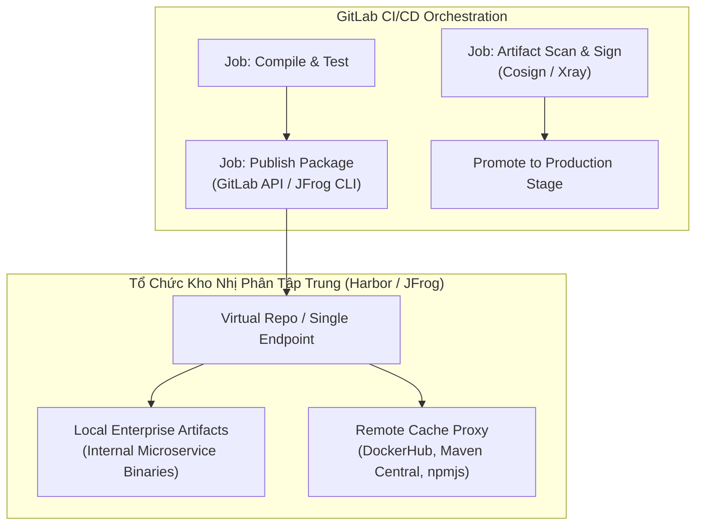
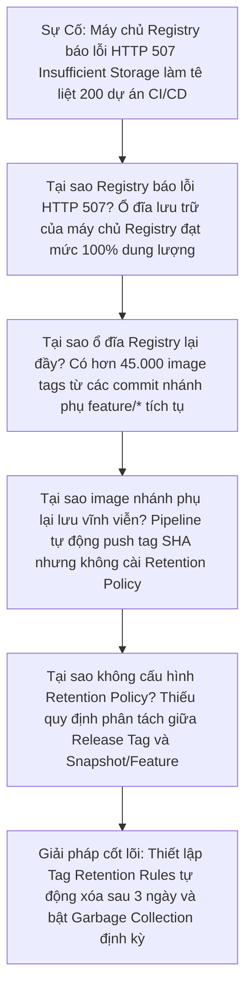


# [BÀI 24] QUẢN TRỊ REGISTRY & BINARY ARTIFACTS: JFROG ARTIFACTORY, HARBOR, NEXUS & GITLAB PACKAGE REGISTRY

Trong kỷ nguyên **DevOps, DevSecOps và Cloud Native Engineering**, **GitLab CI/CD** được công nhận là một trong những nền tảng tự động hóa tích hợp liên tục và phân phối liên tục (CI/CD) hoàn chỉnh, mạnh mẽ và được tin dùng nhất trong các doanh nghiệp quy mô lớn. Không chỉ dừng lại ở các pipeline tuần tự cơ bản, việc vận hành GitLab CI/CD ở cấp độ Production đòi hỏi kỹ sư phải làm chủ kiến trúc điều phối phi tuyến tính **DAG (Directed Acyclic Graph)**, cơ chế quản trị **Autoscaling Runners**, tối ưu hóa **Caching đa tầng**, xác thực không khóa **Keyless OIDC**, bảo mật chuỗi cung ứng phần mềm **SLSA & SBOM** cùng các chính sách **Quality & Security Gates** tự động.

Bài viết chuyên sâu này sẽ đồng hành cùng bạn mổ xẻ toàn diện bức tranh kiến trúc, phân tích các đánh đổi kỹ thuật thực chiến (Engineering Trade-offs), cung cấp hướng dẫn thực hành Lab chi tiết từng bước và bộ câu hỏi phỏng vấn chuyên sâu chuẩn DevOps Lead / DevSecOps Architect.

---

## 1. Bản Chất Kiến Trúc & Cơ Chế Vận Hành Tầng Thấp

### 1.1. Luận Đề Trung Tâm: Sự Cần Thiết Của Universal Binary Repository Trong Chuỗi Cung Ứng Phần Mềm

Trong quy trình phát triển phần mềm hiện đại, **Mã nguồn (Source Code)** chỉ chiếm chưa đầy 10-20% dung lượng của sản phẩm cuối cùng. Hơn 80% còn lại là các **Gói phụ thuộc nhị phân (Binary Dependencies)** được tải từ Internet (NPM, Maven Central, PyPI, Go Proxy, Docker Hub, NuGet).

Nếu tổ chức không có giải pháp quản trị Binary Artifacts tập trung:
1. **Rủi ro Dependency Hijacking / Left-Pad**: Khi một gói thư viện trên Internet bị gỡ bỏ hoặc bị hacker cài mã độc, toàn bộ hệ thống CI/CD sẽ ngừng hoạt động hoặc bị nhiễm độc (Supply Chain Attack).
2. **Nghẽn băng thông Internet và lãng phí chi phí Egress**: Hàng ngàn Runner liên tục tải cùng một file `.jar` 50MB từ bên ngoài Internet về mỗi ngày.
3. **Mất kiểm soát tính bất biến (Immutability)**: Không thể truy vết chính xác file `.deb`, `.rpm` hay `.tar.gz` nào đang chạy trên production thuộc về commit nào của GitLab.

> **Một hệ thống Universal Binary Repository đóng vai trò là "Single Source of Truth" duy nhất trong doanh nghiệp, quản trị toàn bộ OCI Images, Helm Charts, NPM/Maven/PyPI packages và Generic Binaries với 3 tầng cấu trúc: Local Repositories, Remote Proxy Caching Repositories, và Virtual Repositories.**

```text
       MÔ HÌNH KIẾN TRÚC UNIVERSAL REPOSITORY (Local - Remote - Virtual)

                     ┌─────────────────────────────────────────────────┐
                     │          VIRTUAL REPOSITORY (Single URL)        │
                     │          (https://artifactory.corp/all-npm)     │
                     └───────────────┬─────────────────┬───────────────┘
                                     │                 │
                ┌────────────────────┴──┐           ┌──┴────────────────────┐
                ▼                       ▼           ▼                       ▼
      [ LOCAL REPOSITORY ]     [ REMOTE PROXY REPO ] [ REGISTRY AIR-GAPPED ] [ RELEASE STORE ]
      - Nội bộ phát hành       - Proxy registry.npmjs.org - Phân phối offline    - Signed Artifacts
      - Read/Write CI Token    - Cache 30 ngày            - Whitelist packages   - Immutable Builds
```



### 1.2. Phân Tích 4 Giải Pháp Repository Phổ Biến

1. **JFrog Artifactory**: Chuẩn mực De-facto Enterprise, hỗ trợ hơn 30+ loại package (Docker, Maven, Helm, Generic, Conan, v.v.), tích hợp công cụ quét sâu JFrog Xray, hỗ trợ Multi-site replication quy mô toàn cầu.
2. **Harbor (CNCF Graduated)**: Chuyên biệt OCI Registry & Helm Chart. Hỗ trợ chính sách ký số Cosign/Notary, tích hợp máy quét Trivy, quản lý hạn ngạch (Quotas) và chính sách phân quyền RBAC cực kỳ mạnh mẽ.
3. **Sonatype Nexus Repository**: Phổ biến lâu đời trong hệ sinh thái Java/JVM, hỗ trợ đa định dạng, chi phí thấp hơn Artifactory.
4. **GitLab Package & Container Registry (Native)**: Tích hợp sẵn ngay trong GitLab, không cần cài đặt thêm server ngoài, sử dụng trực tiếp CI_JOB_TOKEN để xác thực.

---

## 2. Bảng So Sánh Kỹ Thuật Toàn Diện (Engineering Matrix)

| Tiêu Chí Kỹ Thuật | GitLab Native Registry | Harbor Registry (CNCF) | JFrog Artifactory | Sonatype Nexus OSS |
| :--- | :--- | :--- | :--- | :--- |
| **Loại Định Dạng Hỗ Trợ** | OCI + 10 Package formats | Chuyên OCI Containers + Helm | **Universal (30+ formats)** | Đa định dạng (15+ formats) |
| **Cơ Chế Xác Thực CI** | `CI_JOB_TOKEN` Native | Robot Account / OIDC | API Key / Access Token / OIDC | User Token / API Key |
| **Quét Lỗ Hổng (Vulnerability)** | Tích hợp GitLab Security | Trivy / Clair tích hợp sẵn | JFrog Xray quét sâu đa tầng | Sonatype Nexus Lifecycle |
| **Ký Số & Provenance** | Cosign / SLSA Attestation | Cosign / Notary OCI native | Cosign / JFrog Evidence | Cosign / GPG signatures |
| **Proxy Cache & Remote Repo** | Dependency Proxy (Docker/NPM) | Proxy Cache Projects | Remote Repositories hoàn chỉnh | Proxy Repositories |
| **Khả Năng Scaling & HA** | Phụ thuộc GitLab Server | Cloud-Native K8s Operator | High Availability Multi-Region | Clustering (Bản thương mại) |
| **Độ Phức Tạp Vận Hành** | Zero Setup (Có sẵn) | Thấp - Trung bình (K8s Helm) | Trung bình - Cao | Thấp - Trung bình |

---

## 3. Kiến Trúc Triển Khai Chuẩn Production (Architecture Breakdown)

### 3.1. Pipeline Phát Hành Package Lên GitLab Generic & Harbor OCI Registry

```yaml
stages:
  - build
  - package
  - release

variables:
  HARBOR_REGISTRY: "registry.corp.internal"
  GENERIC_PACKAGE_URL: "${CI_API_V4_URL}/projects/${CI_PROJECT_ID}/packages/generic/core-engine/${CI_COMMIT_TAG}"

build_binary:
  stage: build
  image: golang:1.22-alpine
  script:
    - mkdir -p bin/
    - CGO_ENABLED=0 GOOS=linux GOARCH=amd64 go build -ldflags="-s -w" -o bin/core-engine-linux-amd64 .
    - sha256sum bin/core-engine-linux-amd64 > bin/core-engine-linux-amd64.sha256
  artifacts:
    paths:
      - bin/
    expire_in: 1 day

publish_generic_package:
  stage: package
  image: curlimages/curl:latest
  needs: ["build_binary"]
  rules:
    - if: '$CI_COMMIT_TAG'
  script:
    # Đẩy file binary lên GitLab Generic Package Registry
    - >-
      curl --header "JOB-TOKEN: ${CI_JOB_TOKEN}"
      --upload-file bin/core-engine-linux-amd64
      "${GENERIC_PACKAGE_URL}/core-engine-linux-amd64"
    # Đẩy checksum SHA256 đi kèm để kiểm tra tính toàn vẹn
    - >-
      curl --header "JOB-TOKEN: ${CI_JOB_TOKEN}"
      --upload-file bin/core-engine-linux-amd64.sha256
      "${GENERIC_PACKAGE_URL}/core-engine-linux-amd64.sha256"

publish_harbor_oci:
  stage: package
  image:
    name: gcr.io/kaniko-project/executor:v1.20.0-debug
    entrypoint: [""]
  needs: ["build_binary"]
  rules:
    - if: '$CI_COMMIT_TAG'
  before_script:
    - mkdir -p /kaniko/.docker
    - echo "{\"auths\":{\"https://${HARBOR_REGISTRY}\":{\"auth\":\"$(printf "%s:%s" "${HARBOR_ROBOT_USER}" "${HARBOR_ROBOT_SECRET}" | base64 | tr -d '\n')\"}}}" > /kaniko/.docker/config.json
  script:
    - >-
      /kaniko/executor
      --context "${CI_PROJECT_DIR}"
      --dockerfile "${CI_PROJECT_DIR}/Dockerfile"
      --destination "${HARBOR_REGISTRY}/production/core-engine:${CI_COMMIT_TAG}"
      --destination "${HARBOR_REGISTRY}/production/core-engine:latest"
```

---

## 4. Phân Tích Cạm Bẫy Thực Chiến (5-Whys Incident Analysis)



### Tình Huống Sự Cố Thực Tế:
<span class="badge badge--rose">🕒 06:25 AM</span> Một công ty thương mại điện tử triển khai pipeline CI/CD tự động đóng gói và đẩy Docker Image trên mỗi commit nhánh `feature/*`. Sau 3 tháng vận hành, hệ thống Harbor/Artifactory đột ngột báo lỗi `HTTP 507 Insufficient Storage` làm tê liệt hoàn toàn hơn 200 dự án CI/CD của toàn công ty.

### Hậu Quả & Log Lỗi Thực Tế:
Hàng trăm pipeline bị chặn đứng ở stage publish, không thể phân phối mã nguồn mới:

```text
$ /kaniko/executor --destination "${HARBOR_REGISTRY}/ecom/cart-service:${CI_COMMIT_SHORT_SHA}"
INFO[0045] Pushing image to registry.corp.internal/ecom/cart-service:78a1bc4
error pushing image: failed to push to destination registry.corp.internal/ecom/cart-service:78a1bc4: 
unexpected status code 507 Insufficient Storage: {"errors":[{"code":"DENIED","message":"project quota exceeded or storage backend disk full"}]}
ERROR: Job failed: exit status 1
```

### 5-Whys Root Cause Analysis:
1. <span class="badge badge--primary">Why 1</span> **Tại sao các Job CI bị lỗi không thể đẩy Artifact/Image?** &rarr; Máy chủ Registry báo lỗi `HTTP 507 Insufficient Storage` do ổ cứng lưu trữ backend đã đầy 100%.
2. <span class="badge badge--primary">Why 2</span> **Tại sao ổ đĩa Registry lại bị đầy nhanh chóng?** &rarr; Có hơn 45.000 image tags và binary snapshot của các commit nhánh phụ `feature/*` và pull request không bao giờ được dọn dẹp.
3. <span class="badge badge--primary">Why 3</span> **Tại sao các image nhánh phụ lại được lưu trữ vĩnh viễn?** &rarr; Pipeline tự động gắn tag SHA trên mỗi commit và đẩy lên kho mà không hề có quy tắc thời gian lưu giữ (Retention Policy).
4. <span class="badge badge--primary">Why 4</span> **Tại sao cấu hình Retention Policy lại chưa được áp dụng?** &rarr; Đội ngũ kỹ thuật thiếu quy định phân tách vòng đời giữa các bản Release Tag bất biến (Protected Tags) và các bản build tạm thời (Ephemeral Builds).
5. <span class="badge badge--emerald">Root Cause Remedy</span> **Giải pháp triệt để**: Cấu hình Tag Retention Policy trên Harbor/GitLab Registry (chỉ giữ 5 tag gần nhất hoặc tự động xóa sau 3 ngày đối với nhánh feature), đồng thời thiết lập lịch chạy tự động dọn rác (Garbage Collection Cronjob) vào ban đêm.

### 4.1. Phân Tích 5 Cạm Bẫy Phổ Biến Nhất

#### Cạm bẫy 1: Sự cố rò rỉ Personal Access Token (PAT) trong CI logs
- **Hiện tượng**: Token quản trị viên có quyền ghi package bị in ra console log của GitLab Runner.
- **Nguyên nhân tầng sâu**: Sử dụng PAT cá nhân thay vì `CI_JOB_TOKEN` hoặc Robot Accounts.
- **Cách gỡ rối**: Chuyển đổi 100% sang sử dụng biến tích hợp `${CI_JOB_TOKEN}` hoặc Token ngắn hạn qua OIDC.

#### Cạm bẫy 2: Ghi đè nhầm bản phát hành Production (Tag Mutation)
- **Hiện tượng**: Lập trình viên push đè tag `v1.0.0` chứa mã nguồn lỗi lên kho Package Registry.
- **Nguyên nhân**: Không kích hoạt tính năng Tag Immutability.
- **Biện pháp**: Bật quy tắc **Tag Immutability Rules** trên Harbor/GitLab Registry để chặn tuyệt đối ghi đè tag.

#### Cạm bẫy 3: Tải package bị lỗi do thiếu Checksum Verification
- **Hiện tượng**: File binary tải về bị lỗi CRC hoặc hỏng dữ liệu trong quá trình truyền tải mạng.
- **Nguyên nhân**: Chỉ tải file binary mà không kiểm tra tệp mã băm SHA256 đi kèm.
- **Biện pháp**: Luôn phát hành kèm file `.sha256` và chạy lệnh `sha256sum -c` trước khi giải nén.

#### Cạm bẫy 4: Bị tấn công Dependency Confusion trên Private Repo
- **Hiện tượng**: Ứng dụng tải nhầm package mã độc từ public npmjs.org thay vì package nội bộ công ty.
- **Nguyên nhân**: Không cấu hình Package Scope và thứ tự ưu tiên (Priority Resolution) trong Virtual Repository.
- **Biện pháp**: Sử dụng Scoped Packages (ví dụ: `@corp-internal/payment`) và cấu hình Virtual Repo ưu tiên Local trước.

#### Cạm bẫy 5: Garbage Collection khóa Registry gây gián đoạn CI (Read-Only Lock)
- **Hiện tượng**: Toàn bộ pipeline bị lỗi 403/Read-only trong lúc máy chủ Registry đang chạy dọn rác.
- **Nguyên nhân**: Chạy Garbage Collection vào giờ cao điểm trên phiên bản Harbor cũ.
- **Biện pháp**: Lên lịch GC vào khung giờ 02:00 AM Chủ Nhật hoặc sử dụng Non-blocking GC.

---

## 5. Hands-on Lab: Triển Khai Kho Binary & OCI Bất Biến (8 Bước Chuẩn)

### 5.1. Mục Tiêu Lab
- Xây dựng ứng dụng Go CLI Utility.
- Đóng gói Binary và đẩy lên GitLab Generic Package Registry.
- Tự động tạo Release trên GitLab kèm liên kết tải trực tiếp.
- Xác thực tải về và kiểm tra Checksum SHA256 độc lập.

```text
       QUY TRÌNH PHÂN PHỐI BINARY ARTIFACT TRÊN GITLAB PACKAGE REGISTRY

   [ Mã nguồn Go CLI ] ──► [ Compile Linux/Darwin Binary ]
                                   │
                                   ├──► [ Upload: Generic Package Registry ]
                                   │      (URL: /api/v4/projects/:id/packages/generic)
                                   │
                                   └──► [ Tạo GitLab Release Event ]
                                          (Gắn Link Asset & SHA256 Checksum)
```

### 5.2. Các Bước Thực Hiện Chi Tiết

#### Bước 1: Khởi Tạo Ứng Dụng CLI `cli-tool.go`
```go
package main

import (
	"fmt"
	"os"
)

var Version = "dev"

func main() {
	if len(os.Args) > 1 && os.Args[1] == "version" {
		fmt.Printf("Enterprise CLI Tool Version: %s\n", Version)
		return
	}
	fmt.Println("Enterprise CLI Tool running successfully.")
}
```

#### Bước 2: Tạo Tệp `go.mod`
```go
module gitlab.corp.internal/platform/cli-tool

go 1.22
```

#### Bước 3: Viết Script Biên Dịch Binary Đa Hệ Điều Hành
Tạo tệp `scripts/build.sh`:
```bash
#!/bin/sh
set -e
VERSION=${1:-"v1.0.0"}
mkdir -p dist/

echo "Building for Linux AMD64..."
GOOS=linux GOARCH=amd64 go build -ldflags="-s -w -X main.Version=${VERSION}" -o dist/cli-tool-linux-amd64 .
sha256sum dist/cli-tool-linux-amd64 > dist/cli-tool-linux-amd64.sha256

echo "Building for Darwin ARM64..."
GOOS=darwin GOARCH=arm64 go build -ldflags="-s -w -X main.Version=${VERSION}" -o dist/cli-tool-darwin-arm64 .
sha256sum dist/cli-tool-darwin-arm64 > dist/cli-tool-darwin-arm64.sha256

echo "Build complete."
```

#### Bước 4: Khởi Tạo Tệp Cấu Hình `.gitlab-ci.yml`
```yaml
stages:
  - build
  - publish
  - release

variables:
  PACKAGE_NAME: "cli-tool"
  PACKAGE_VERSION: "$CI_COMMIT_TAG"
  PACKAGE_REGISTRY_URL: "${CI_API_V4_URL}/projects/${CI_PROJECT_ID}/packages/generic/${PACKAGE_NAME}/${PACKAGE_VERSION}"

compile_binaries:
  stage: build
  image: golang:1.22-alpine
  rules:
    - if: '$CI_COMMIT_TAG'
  script:
    - chmod +x scripts/build.sh
    - ./scripts/build.sh ${CI_COMMIT_TAG}
  artifacts:
    paths:
      - dist/
    expire_in: 1 day

publish_to_registry:
  stage: publish
  image: curlimages/curl:latest
  needs: ["compile_binaries"]
  rules:
    - if: '$CI_COMMIT_TAG'
  script:
    - |
      for file in dist/*; do
        filename=$(basename "$file")
        echo "Uploading $filename to Package Registry..."
        curl --header "JOB-TOKEN: ${CI_JOB_TOKEN}" \
             --upload-file "$file" \
             "${PACKAGE_REGISTRY_URL}/${filename}"
      done

create_gitlab_release:
  stage: release
  image: registry.gitlab.com/gitlab-org/release-cli:latest
  needs: ["publish_to_registry"]
  rules:
    - if: '$CI_COMMIT_TAG'
  script:
    - echo "Creating release for ${CI_COMMIT_TAG}"
  release:
    tag_name: '$CI_COMMIT_TAG'
    name: 'Release $CI_COMMIT_TAG'
    description: 'Bản phát hành chính thức ${CI_COMMIT_TAG} của Enterprise CLI Tool.'
    assets:
      links:
        - name: 'Linux AMD64 Binary'
          url: '${PACKAGE_REGISTRY_URL}/cli-tool-linux-amd64'
          link_type: 'package'
        - name: 'Darwin ARM64 Binary'
          url: '${PACKAGE_REGISTRY_URL}/cli-tool-darwin-arm64'
          link_type: 'package'
```

#### Bước 5: Tạo Git Tag Và Kích Hoạt Pipeline Phát Hành
```bash
git add .
git commit -m "feat: release binary v1.0.0"
git tag -a v1.0.0 -m "Release version 1.0.0"
git push origin v1.0.0
```

#### Bước 6: Kiểm Tra Kho Package Registry Trên GitLab
- Truy cập menu **Deploy -> Package Registry** trên giao diện GitLab.
- Xác nhận package `cli-tool` phiên bản `v1.0.0` xuất hiện với đầy đủ 4 tệp (2 binary và 2 checksum sha256).

#### Bước 7: Tải Về Và Kiểm Tra Checksum SHA256 Từ Client
```bash
# Tải binary và file checksum bằng lệnh curl
curl -sL "https://gitlab.corp.internal/api/v4/projects/1/packages/generic/cli-tool/v1.0.0/cli-tool-linux-amd64" -o cli-tool-linux-amd64
curl -sL "https://gitlab.corp.internal/api/v4/projects/1/packages/generic/cli-tool/v1.0.0/cli-tool-linux-amd64.sha256" -o cli-tool-linux-amd64.sha256

# Kiểm tra tính toàn vẹn
sha256sum -c cli-tool-linux-amd64.sha256
```

#### Bước 8: Thực Thi Binary
```bash
chmod +x cli-tool-linux-amd64
./cli-tool-linux-amd64 version
# Output: Enterprise CLI Tool Version: v1.0.0
```

> [!NOTE]
> **Check-point Lab 24**: Quá trình upload và release tự động hoàn tất, mã băm sha256 trùng khớp 100% khi xác thực từ máy khách độc lập.

---

## 6. Bộ Câu Hỏi Vấn Đáp & Phỏng Vấn Chuyên Sâu (Self-Check Q&A)

<details class="qa-card">
  <summary class="qa-summary">
    <span class="qa-num-badge">Q01</span>
    <span>Sự khác biệt cốt lõi giữa "CI Artifacts" và "Package/Binary Registry" trong GitLab là gì?</span>
  </summary>
  <div class="qa-answer">
    <div class="qa-answer-header">
      <svg class="qa-icon" viewBox="0 0 24 24" fill="none" stroke="currentColor" stroke-width="2" stroke-linecap="round" stroke-linejoin="round"><polyline points="20 6 9 17 4 12"></polyline></svg>
      <span>Phân Tích &amp; Lời Giải Kỹ Thuật</span>
    </div>
    <p><strong>Phân tích sự khác biệt:</strong></p>
    <ul>
      <li><strong>CI Job Artifacts</strong>: Là các tệp trung gian phục vụ trao đổi dữ liệu giữa các stage trong cùng một pipeline hoặc debug tạm thời (ví dụ: test reports, intermediate logs). Artifacts luôn có thời gian hết hạn (<code>expire_in</code>) và sẽ bị hệ thống tự động xóa.</li>
      <li><strong>Package Registry</strong>: Là kho lưu trữ nhị phân dài hạn, bất biến (Immutable), dùng để phát hành các bản release chính thức cho người dùng cuối hoặc cho các dự án khác tải về làm dependency.</li>
    </ul>
  </div>
</details>

<details class="qa-card">
  <summary class="qa-summary">
    <span class="qa-num-badge">Q02</span>
    <span>Tại sao nên sử dụng `CI_JOB_TOKEN` thay vì Personal Access Token (PAT) khi upload package trong CI/CD?</span>
  </summary>
  <div class="qa-answer">
    <div class="qa-answer-header">
      <svg class="qa-icon" viewBox="0 0 24 24" fill="none" stroke="currentColor" stroke-width="2" stroke-linecap="round" stroke-linejoin="round"><polyline points="20 6 9 17 4 12"></polyline></svg>
      <span>Phân Tích &amp; Lời Giải Kỹ Thuật</span>
    </div>
    <p><strong>Nguyên tắc bảo mật:</strong></p>
    <p><code>CI_JOB_TOKEN</code> là token tạm thời (Short-lived), chỉ có hiệu lực trong lúc job CI đang thực thi và tự động bị vô hiệu hóa ngay khi job kết thúc. Quyền hạn của nó bị giới hạn đúng trong phạm vi dự án hiện tại. Ngược lại, PAT là token dài hạn gắn liền với tài khoản cá nhân của kỹ sư, nếu bị rò rỉ sẽ gây nguy cơ chiếm quyền toàn bộ tài nguyên mà kỹ sư đó quản lý.</p>
  </div>
</details>

<details class="qa-card">
  <summary class="qa-summary">
    <span class="qa-num-badge">Q03</span>
    <span>Khái niệm "Virtual Repository" trong JFrog Artifactory hoạt động như thế nào?</span>
  </summary>
  <div class="qa-answer">
    <div class="qa-answer-header">
      <svg class="qa-icon" viewBox="0 0 24 24" fill="none" stroke="currentColor" stroke-width="2" stroke-linecap="round" stroke-linejoin="round"><polyline points="20 6 9 17 4 12"></polyline></svg>
      <span>Phân Tích &amp; Lời Giải Kỹ Thuật</span>
    </div>
    <p><strong>Cơ chế:</strong></p>
    <p>Virtual Repository là một thực thể trừu tượng kết hợp nhiều Local Repositories và Remote Proxy Repositories dưới một URL duy nhất. Khi ứng dụng yêu cầu tải một dependency, nó chỉ cần trỏ tới URL của Virtual Repo. Artifactory sẽ tự động tìm kiếm trong Local repo trước, nếu không có sẽ tự động kéo từ Remote repo bên ngoài về, cache lại và phục vụ ứng dụng mà không cần cấu hình nhiều endpoint phức tạp.</p>
  </div>
</details>

<details class="qa-card">
  <summary class="qa-summary">
    <span class="qa-num-badge">Q04</span>
    <span>Làm thế nào để đảm bảo tính bất biến (Immutability) của Container Image trên Harbor Registry?</span>
  </summary>
  <div class="qa-answer">
    <div class="qa-answer-header">
      <svg class="qa-icon" viewBox="0 0 24 24" fill="none" stroke="currentColor" stroke-width="2" stroke-linecap="round" stroke-linejoin="round"><polyline points="20 6 9 17 4 12"></polyline></svg>
      <span>Phân Tích &amp; Lời Giải Kỹ Thuật</span>
    </div>
    <p><strong>Giải pháp:</strong></p>
    <p>Bật tính năng <strong>Tag Immutability Rules</strong> trong cài đặt Project của Harbor. Khi được cấu hình, Harbor sẽ từ chối tất cả các yêu cầu <code>docker push</code> có tag trùng lặp với tag đã tồn tại (ví dụ: các tag theo chuẩn <code>v1.0.0</code> hoặc <code>v1.0.1</code>), ngăn chặn triệt để việc vô tình ghi đè mã nguồn đã qua kiểm thử.</p>
  </div>
</details>

<details class="qa-card">
  <summary class="qa-summary">
    <span class="qa-num-badge">Q05</span>
    <span>Cơ chế Dependency Proxy trong GitLab hoạt động như thế nào và mang lại lợi ích gì?</span>
  </summary>
  <div class="qa-answer">
    <div class="qa-answer-header">
      <svg class="qa-icon" viewBox="0 0 24 24" fill="none" stroke="currentColor" stroke-width="2" stroke-linecap="round" stroke-linejoin="round"><polyline points="20 6 9 17 4 12"></polyline></svg>
      <span>Phân Tích &amp; Lời Giải Kỹ Thuật</span>
    </div>
    <p><strong>Cơ chế:</strong></p>
    <p>GitLab Dependency Proxy đóng vai trò là một bộ nhớ đệm trung gian (Cache Proxy) cho các container base images từ Docker Hub. Khi một job yêu cầu image <code>alpine:latest</code>, nó sẽ tải qua Dependency Proxy. Lần tải đầu tiên image được lưu lại trên GitLab Storage, các lần sau runner sẽ kéo trực tiếp từ mạng nội bộ, giúp tránh giới hạn Rate Limit của Docker Hub (100 pulls/6h) và tăng tốc độ kéo image.</p>
  </div>
</details>

<details class="qa-card">
  <summary class="qa-summary">
    <span class="qa-num-badge">Q06</span>
    <span>Làm sao để triển khai quy trình "Promotion Pipeline" (Dev -> Staging -> Prod) an toàn cho Binary Artifact?</span>
  </summary>
  <div class="qa-answer">
    <div class="qa-answer-header">
      <svg class="qa-icon" viewBox="0 0 24 24" fill="none" stroke="currentColor" stroke-width="2" stroke-linecap="round" stroke-linejoin="round"><polyline points="20 6 9 17 4 12"></polyline></svg>
      <span>Phân Tích &amp; Lời Giải Kỹ Thuật</span>
    </div>
    <p><strong>Quy trình chuẩn:</strong></p>
    <ol>
      <li><strong>Build Once</strong>: Biên dịch và đóng gói binary duy nhất 1 lần tại môi trường Dev và lưu vào kho Snapshot/Release candidate.</li>
      <li><strong>Test on Candidate</strong>: Chạy integration test và security scan trên chính binary artifact đó.</li>
      <li><strong>Promote Metadata</strong>: Khi đạt chuẩn chất lượng, thực hiện "Promote" (sao chép hoặc chuyển namespace sang kho Production) mà không hề rebuild lại mã nguồn.</li>
    </ol>
  </div>
</details>

<details class="qa-card">
  <summary class="qa-summary">
    <span class="qa-num-badge">Q07</span>
    <span>Tại sao cần sinh và phát hành kèm tệp checksum SHA256 cho mọi Generic Binary Package?</span>
  </summary>
  <div class="qa-answer">
    <div class="qa-answer-header">
      <svg class="qa-icon" viewBox="0 0 24 24" fill="none" stroke="currentColor" stroke-width="2" stroke-linecap="round" stroke-linejoin="round"><polyline points="20 6 9 17 4 12"></polyline></svg>
      <span>Phân Tích &amp; Lời Giải Kỹ Thuật</span>
    </div>
    <p><strong>Mục đích:</strong></p>
    <p>Để đảm bảo <strong>Tính toàn vẹn (Integrity)</strong> của gói phần mềm. Máy khách sau khi tải tệp nhị phân có thể tính toán lại mã hash SHA256 và so sánh với file checksum công bố, giúp phát hiện ngay lập tức trường hợp tệp bị hỏng do lỗi mạng (Corrupted download) hoặc bị can thiệp chèn mã độc trên đường truyền (Man-in-the-Middle attack).</p>
  </div>
</details>

<details class="qa-card">
  <summary class="qa-summary">
    <span class="qa-num-badge">Q08</span>
    <span>Làm thế nào để cấu hình GitLab CI tự động dọn dẹp các Container Image cũ?</span>
  </summary>
  <div class="qa-answer">
    <div class="qa-answer-header">
      <svg class="qa-icon" viewBox="0 0 24 24" fill="none" stroke="currentColor" stroke-width="2" stroke-linecap="round" stroke-linejoin="round"><polyline points="20 6 9 17 4 12"></polyline></svg>
      <span>Phân Tích &amp; Lời Giải Kỹ Thuật</span>
    </div>
    <p><strong>Giải pháp:</strong></p>
    <p>Sử dụng tính năng <strong>Container Registry Cleanup Policies</strong> (trong Settings -> Packages and registries -> Cleanup policies). Thiết lập quy tắc giữ lại các tag theo biểu thức chính quy (ví dụ: giữ lại các tag SemVer <code>v.*</code>) và tự động xóa các tag không xác định sau 14 ngày.</p>
  </div>
</details>

<details class="qa-card">
  <summary class="qa-summary">
    <span class="qa-num-badge">Q09</span>
    <span>OCI Artifacts là gì và tại sao nó đang thay thế các chuẩn đóng gói riêng lẻ?</span>
  </summary>
  <div class="qa-answer">
    <div class="qa-answer-header">
      <svg class="qa-icon" viewBox="0 0 24 24" fill="none" stroke="currentColor" stroke-width="2" stroke-linecap="round" stroke-linejoin="round"><polyline points="20 6 9 17 4 12"></polyline></svg>
      <span>Phân Tích &amp; Lời Giải Kỹ Thuật</span>
    </div>
    <p><strong>Khái niệm:</strong></p>
    <p>OCI Artifacts là tiêu chuẩn mở cho phép lưu trữ bất kỳ loại tệp nào (Helm Charts, WebAssembly WASM binaries, Terraform Modules, SBOM JSON, Falco rules) bên trong Container Registry chuẩn OCI. Điều này giúp doanh nghiệp chỉ cần duy trì một hạ tầng OCI Registry duy nhất (Harbor, GitLab) thay vì phải cài đặt riêng lẻ từng server Maven, Helm, hay Module registry.</p>
  </div>
</details>

<details class="qa-card">
  <summary class="qa-summary">
    <span class="qa-num-badge">Q10</span>
    <span>Làm sao để bảo vệ kho lưu trữ trước cuộc tấn công "Dependency Confusion Attack"?</span>
  </summary>
  <div class="qa-answer">
    <div class="qa-answer-header">
      <svg class="qa-icon" viewBox="0 0 24 24" fill="none" stroke="currentColor" stroke-width="2" stroke-linecap="round" stroke-linejoin="round"><polyline points="20 6 9 17 4 12"></polyline></svg>
      <span>Phân Tích &amp; Lời Giải Kỹ Thuật</span>
    </div>
    <p><strong>Biện pháp phòng ngừa:</strong></p>
    <ul>
      <li>Đặt Scoped Package Namespace riêng cho tổ chức (ví dụ: <code>@corp-internal/payment-lib</code>) và đăng ký sở hữu namespace đó trên cả public registry (npmjs.org, pypi.org).</li>
      <li>Cấu hình Virtual Repository ưu tiên (Priority Resolution) luôn kiểm tra Local Internal Repository trước khi chuyển tiếp ra Remote Public Mirror.</li>
    </ul>
  </div>
</details>

<details class="qa-card">
  <summary class="qa-summary">
    <span class="qa-num-badge">Q11</span>
    <span>Sự cố: Quá trình Garbage Collection trên Harbor làm gián đoạn việc push image của CI Runner. Tại sao và cách khắc phục?</span>
  </summary>
  <div class="qa-answer">
    <div class="qa-answer-header">
      <svg class="qa-icon" viewBox="0 0 24 24" fill="none" stroke="currentColor" stroke-width="2" stroke-linecap="round" stroke-linejoin="round"><polyline points="20 6 9 17 4 12"></polyline></svg>
      <span>Phân Tích &amp; Lời Giải Kỹ Thuật</span>
    </div>
    <p><strong>Nguyên nhân &amp; Khắc phục:</strong></p>
    <ul>
      <li><strong>Nguyên nhân</strong>: Khi chạy Garbage Collection ở chế độ Read-Only, Harbor khóa toàn bộ quyền ghi để tránh xung đột dữ liệu giữa tệp đang tải lên và tệp đang bị xóa.</li>
      <li><strong>Khắc phục</strong>: Lên lịch chạy GC vào ban đêm (Off-peak hours), hoặc nâng cấp Harbor lên phiên bản hỗ trợ Non-blocking Garbage Collection.</li>
    </ul>
  </div>
</details>

<details class="qa-card">
  <summary class="qa-summary">
    <span class="qa-num-badge">Q12</span>
    <span>Làm thế nào để sao chép (Replicate) tự động Container Images giữa các chi nhánh đa vùng (Cross-Region Replication)?</span>
  </summary>
  <div class="qa-answer">
    <div class="qa-answer-header">
      <svg class="qa-icon" viewBox="0 0 24 24" fill="none" stroke="currentColor" stroke-width="2" stroke-linecap="round" stroke-linejoin="round"><polyline points="20 6 9 17 4 12"></polyline></svg>
      <span>Phân Tích &amp; Lời Giải Kỹ Thuật</span>
    </div>
    <p><strong>Kiến trúc:</strong></p>
    <p>Sử dụng tính năng <strong>Harbor Replication</strong> hoặc <strong>JFrog Push/Pull Replication</strong>. Thiết lập quy tắc tự động kích hoạt khi có image mới đẩy lên kho trung tâm (Event-based replication), hệ thống sẽ tự động đồng bộ sang các cụm Registry vệ tinh đặt tại các Datacenter vùng (Singapore, Tokyo, Frankfurt) giúp Runner nội bộ tải image nhanh nhất.</p>
  </div>
</details>

---

## 7. Tổng Kết & Lộ Trình Bài Học Tiếp Theo

### 7.1. Tóm Tắt Các Điểm Cốt Lõi (Architectural Key Takeaways)
- **Universal Binary Management**: Lưu trữ và quản lý tập trung toàn bộ OCI images, generic packages và dependencies.
- **Three-Tier Architecture**: Kết hợp Local Repositories, Remote Proxy Caching và Virtual Repositories.
- **Short-Lived CI Authentication**: Tận dụng `CI_JOB_TOKEN` và Robot Accounts thay thế vĩnh viễn mật khẩu tĩnh.
- **Automated Lifecycle Policy**: Dọn dẹp tự động các snapshot/feature tags tránh tràn ổ đĩa registry.

### 7.2. Sơ Đồ Tư Duy Hệ Thống Quản Trị Registry (Mindmap)

```text
                     QUẢN TRỊ REGISTRY & ARTIFACTS DOANH NGHIỆP
                                        │
        ┌───────────────────────────────┼───────────────────────────────┐
        ▼                               ▼                               ▼
  [ Package Formats ]          [ Storage Architecture ]        [ Lifecycle & Security ]
  - OCI Images & Helm          - Local / Remote / Virtual      - Tag Immutability
  - Generic Binaries & SHA256  - Dependency Proxy Cache        - Tag Retention Policies
  - Maven / NPM / PyPI Scopes  - Cross-Region Replication      - Automated Garbage Collection
```

> [!TIP]
> **Bước tiếp theo trong lộ trình**: Làm chủ kỹ thuật tối ưu hóa dung lượng image siêu mỏng, hỗ trợ đa kiến trúc CPU và sinh định danh SBOM trong [Bài 25: Tối Ưu Hóa Container: Image Siêu Mỏng, Multi-Arch (ARM/x86) & SBOM](gitlab-25-25-image-mong-multiarch-sbom.html).

