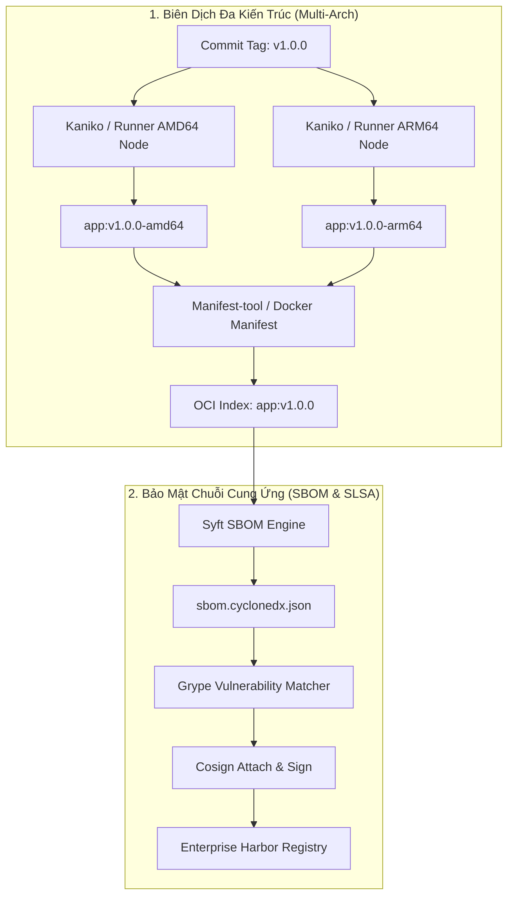
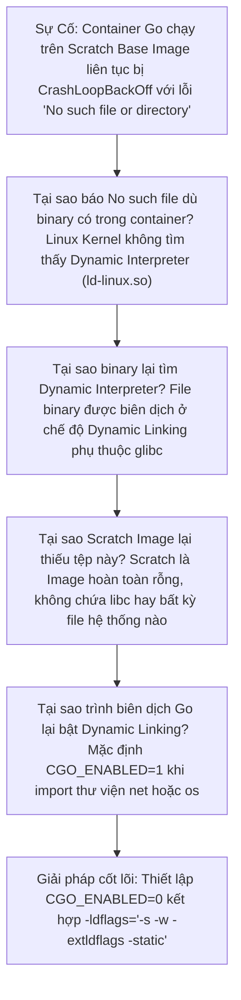


# [BÀI 25] TỐI ƯU HÓA CONTAINER: IMAGE SIÊU MỎNG, MULTI-ARCH (ARM/X86), SBOM & SLSA

Trong kỷ nguyên **DevOps, DevSecOps và Cloud Native Engineering**, **GitLab CI/CD** được công nhận là một trong những nền tảng tự động hóa tích hợp liên tục và phân phối liên tục (CI/CD) hoàn chỉnh, mạnh mẽ và được tin dùng nhất trong các doanh nghiệp quy mô lớn. Không chỉ dừng lại ở các pipeline tuần tự cơ bản, việc vận hành GitLab CI/CD ở cấp độ Production đòi hỏi kỹ sư phải làm chủ kiến trúc điều phối phi tuyến tính **DAG (Directed Acyclic Graph)**, cơ chế quản trị **Autoscaling Runners**, tối ưu hóa **Caching đa tầng**, xác thực không khóa **Keyless OIDC**, bảo mật chuỗi cung ứng phần mềm **SLSA & SBOM** cùng các chính sách **Quality & Security Gates** tự động.

Bài viết chuyên sâu này sẽ đồng hành cùng bạn mổ xẻ toàn diện bức tranh kiến trúc, phân tích các đánh đổi kỹ thuật thực chiến (Engineering Trade-offs), cung cấp hướng dẫn thực hành Lab chi tiết từng bước và bộ câu hỏi phỏng vấn chuyên sâu chuẩn DevOps Lead / DevSecOps Architect.

---

## 1. Bản Chất Kiến Trúc & Cơ Chế Vận Hành Tầng Thấp

### 1.1. Luận Đề Trung Tâm: Sự Chuyển Dịch Từ "Chạy Được" Sang "Chuẩn Mực Cloud-Native An Toàn"

Trong giai đoạn đầu của container hóa, các nhóm kỹ sư thường chọn các Base Image tiện lợi nhưng cồng kềnh như `ubuntu:latest` (80MB) hoặc `node:20` (1.1GB). Hậu quả trực tiếp trên hệ thống Production:
1. **Thời gian khởi động Pod chậm (Cold Start)**: Kubernetes Node mất 45-60 giây chỉ để pull các layer image gigabytes khi hệ thống cần Autoscaling khẩn cấp để chịu tải đột biến.
2. **Bề mặt tấn công (Attack Surface) phình to**: Image chứa hàng ngàn gói hệ điều hành không cần thiết (curl, python, apt, systemd, openssl cũ), dẫn đến hàng trăm cảnh báo CVE mỗi tuần.
3. **Mù thông tin thành phần phần mềm (Blackbox Artifacts)**: Không biết chính xác thư viện nào, phiên bản nào đang có mặt trong container đang chạy trên production.

> **Một Container Image chuẩn Enterprise hiện đại phải đạt 4 tiêu chuẩn vàng: Dung lượng siêu mỏng (dưới 30MB nhờ Scratch/Distroless), Tương thích đa kiến trúc CPU (Native ARM64 Graviton & AMD64), Kèm theo danh mục thành phần máy đọc được (SBOM), và Có chứng thực nguồn gốc xuất xứ bất biến (SLSA Provenance).**

```text
    CƠ CHẾ OCI MANIFEST LIST ĐA KIẾN TRÚC & PHÁT HÀNH SBOM ĐI KÈM

                    [ OCI Image Index / Manifest List ]
                   (registry.corp/app:v1.2.0 - SHA256)
                                   │
         ┌─────────────────────────┴─────────────────────────┐
         ▼                                                   ▼
  [ Linux / AMD64 Image ]                             [ Linux / ARM64 Image ]
  - Base: distroless:nonroot                          - Base: distroless:nonroot
  - Arch: x86_64 CPU                                  - Arch: aarch64 CPU (AWS Graviton)
  - Size: 12.4 MB                                     - Size: 11.8 MB
         │                                                   │
         └─────────────────────────┬─────────────────────────┘
                                   │
                                   ▼
                     [ Cosign Signature & SBOM Attestation ]
                     - syft: cyclonedx-json (SBOM)
                     - slsa-provenance.json (SLSA Level 2)
```



### 1.2. Chiến Lược Lựa Chọn Base Image Tối Giản

1. **`scratch`**: Base image rỗng hoàn toàn (0 Byte). Phù hợp tuyệt đối cho các ngôn ngữ biên dịch tĩnh (Go, Rust, C++) không phụ thuộc runtime thư viện C động.
2. **`gcr.io/distroless/*` (Google)**: Chứa ứng dụng và runtime tối thiểu (chỉ chứa Node.js runtime hoặc Java JRE + CA certificates + timezone data), loại bỏ hoàn toàn Shell và Package Manager.
3. **`Alpine Linux`**: Sử dụng `musl libc` và `busybox` (~5MB). Cần lưu ý sự khác biệt cơ chế cấp phát bộ nhớ giữa `musl` và `glibc` có thể làm giảm hiệu năng đa luồng của một số ứng dụng C/C++.
4. **`Ubuntu Chiseled` (Canonical)**: Tạo slice siêu mỏng từ các gói `.deb` của Ubuntu nhưng chỉ lấy binary và shared libs cần thiết, không cài đặt dpkg/apt.

### 1.3. Khái Niệm SBOM (Software Bill of Materials) & Chuẩn SLSA

- **SBOM**: Tương tự như danh sách thành phần ghi trên bao bì thực phẩm, SBOM là tệp JSON/XML đặc tả chi tiết mọi gói thư viện, phiên bản, tác giả, giấy phép (License) và mã băm SHA256 có trong container. Hai chuẩn phổ biến nhất là **CycloneDX (OWASP)** và **SPDX (Linux Foundation)**.
- **SLSA (Supply-chain Levels for Software Artifacts)**: Khung bảo mật bảo đảm mã nguồn được biên dịch trên hệ thống CI tin cậy, không bị can thiệp và có thể kiểm chứng (Auditable) từ commit ID đến binary cuối cùng.

---

## 2. Bảng So Sánh Kỹ Thuật Toàn Diện (Engineering Matrix)

| Tiêu Chí Kỹ Thuật | Scratch Base | Distroless Base | Alpine Base | Ubuntu Chiseled |
| :--- | :--- | :--- | :--- | :--- |
| **Dung Lượng Base** | **0 MB** | 2 MB - 25 MB | ~5 MB | ~10 MB - 30 MB |
| **Thư Viện C (Libc)** | Không có (Static) | `glibc` Debian | `musl libc` | `glibc` Ubuntu |
| **Có Shell (/bin/sh)** | Không | Không | **Có (Busybox)** | Không |
| **Có Package Manager** | Không | Không | **Có (apk)** | Không |
| **Người Dùng Mặc Định** | Root (cần tạo user) | **`nonroot:nonroot`** | Root (cần tạo user) | **`_daemon_` nonroot** |
| **Mức Độ An Ninh (CVEs)** | **Gần như bằng 0** | **Rất thấp (0-2 Low)** | Thấp (musl bugs) | Rất thấp |
| **Ngôn Ngữ Phù Hợp** | Go, Rust, C++ | Java, Node, Python, Go | PHP, Python, Ruby | .NET, Java, Go |

---

## 3. Kiến Trúc Triển Khai Chuẩn Production (Architecture Breakdown)

### 3.1. Pipeline Tạo Multi-Arch Image, Sinh SBOM Và Quét Bảo Mật Bằng Syft & Grype

```yaml
stages:
  - build_arch
  - create_manifest
  - generate_sbom
  - sign_attestation

variables:
  IMAGE_NAME: "${CI_REGISTRY_IMAGE}:${CI_COMMIT_REF_SLUG}"
  COSIGN_YES: "true"

# -------------------------------------------------------------
# 1. Build Từng Kiến Trúc CPU Riêng Biệt
# -------------------------------------------------------------
build_amd64:
  stage: build_arch
  tags: ["runner-amd64"]
  image:
    name: gcr.io/kaniko-project/executor:v1.20.0-debug
    entrypoint: [""]
  before_script:
    - mkdir -p /kaniko/.docker
    - echo "{\"auths\":{\"${CI_REGISTRY}\":{\"auth\":\"$(printf "%s:%s" "${CI_REGISTRY_USER}" "${CI_REGISTRY_PASSWORD}" | base64 | tr -d '\n')\"}}}" > /kaniko/.docker/config.json
  script:
    - >-
      /kaniko/executor
      --context "${CI_PROJECT_DIR}"
      --dockerfile "${CI_PROJECT_DIR}/Dockerfile"
      --destination "${IMAGE_NAME}-amd64"
      --custom-platform=linux/amd64
      --cache=true

build_arm64:
  stage: build_arch
  tags: ["runner-arm64"]
  image:
    name: gcr.io/kaniko-project/executor:v1.20.0-debug
    entrypoint: [""]
  before_script:
    - mkdir -p /kaniko/.docker
    - echo "{\"auths\":{\"${CI_REGISTRY}\":{\"auth\":\"$(printf "%s:%s" "${CI_REGISTRY_USER}" "${CI_REGISTRY_PASSWORD}" | base64 | tr -d '\n')\"}}}" > /kaniko/.docker/config.json
  script:
    - >-
      /kaniko/executor
      --context "${CI_PROJECT_DIR}"
      --dockerfile "${CI_PROJECT_DIR}/Dockerfile"
      --destination "${IMAGE_NAME}-arm64"
      --custom-platform=linux/arm64
      --cache=true

# -------------------------------------------------------------
# 2. Hợp Nhất OCI Manifest List Đa Kiến Trúc
# -------------------------------------------------------------
create_multiarch_manifest:
  stage: create_manifest
  image: curlimages/curl:latest
  needs: ["build_amd64", "build_arm64"]
  script:
    - curl -sL https://github.com/estesp/manifest-tool/releases/download/v2.1.6/binaries-manifest-tool-2.1.6.tar.gz | tar -xz
    - mv manifest-tool-linux-amd64 /usr/local/bin/manifest-tool
    - >-
      manifest-tool --username "${CI_REGISTRY_USER}" --password "${CI_REGISTRY_PASSWORD}"
      push from-args
      --platforms linux/amd64,linux/arm64
      --template "${IMAGE_NAME}-ARCH"
      --target "${IMAGE_NAME}"

# -------------------------------------------------------------
# 3. Sinh SBOM & Quét Lỗ Hổng Chuỗi Cung Ứng
# -------------------------------------------------------------
generate_and_scan_sbom:
  stage: generate_sbom
  image: anchore/syft:latest
  needs: ["create_multiarch_manifest"]
  script:
    - syft "${IMAGE_NAME}" -o cyclonedx-json > sbom.cyclonedx.json
    - syft "${IMAGE_NAME}" -o table
  artifacts:
    paths:
      - sbom.cyclonedx.json
    reports:
      cyclonedx: sbom.cyclonedx.json
    expire_in: 30 days
```

---

## 4. Phân Tích Cạm Bẫy Thực Chiến (5-Whys Incident Analysis)



### Tình Huống Sự Cố Thực Tế:
<span class="badge badge--rose">🕒 06:30 AM</span> Một kỹ sư DevOps đóng gói microservice Go bằng Scratch Image để tối ưu dung lượng (chỉ 12MB). Tuy nhiên, khi Pod deploy lên cụm Kubernetes Production, container liên tục rơi vào trạng thái `CrashLoopBackOff` với thông báo lỗi bí ẩn `exec /app/server: no such file or directory` dù file binary chắc chắn đã được copy vào `/app/server`!

### Hậu Quả & Log Lỗi Thực Tế:
Pod không thể khởi chạy, Kubernetes liên tục restart container:

```text
$ kubectl logs pod/user-auth-service-589f7b-9xk2p
standard_init_linux.go:228: exec user process caused: no such file or directory
$ docker run --rm registry.corp/user-auth:v1.2.0
docker: Error response from daemon: failed to create shim task: OCI runtime create failed: 
runc create failed: unable to start container process: exec: "/app/server": stat /app/server: no such file or directory: unknown.
```

### 5-Whys Root Cause Analysis:
1. <span class="badge badge--primary">Why 1</span> **Tại sao container bị CrashLoopBackOff báo không tìm thấy tệp?** &rarr; Trình nạp thực thi của Linux Kernel không tìm thấy tệp Dynamic Linker Interpreter (ví dụ `/lib64/ld-linux-x86-64.so.2`) được khai báo trong ELF binary.
2. <span class="badge badge--primary">Why 2</span> **Tại sao lại cần Dynamic Linker khi binary đã được copy vào?** &rarr; File binary được biên dịch ở chế độ liên kết động (Dynamic Linking), phụ thuộc vào thư viện C chuẩn `glibc` của máy host.
3. <span class="badge badge--primary">Why 3</span> **Tại sao Scratch Image lại thiếu Dynamic Linker?** &rarr; `FROM scratch` là một filesystem hoàn toàn rỗng 0 Byte, không chứa bất kỳ tệp hệ điều hành, thư viện `.so` hay dynamic linker nào.
4. <span class="badge badge--primary">Why 4</span> **Tại sao lệnh build Go lại tạo ra dynamic binary?** &rarr; Trình biên dịch Go tự động bật cờ `CGO_ENABLED=1` khi mã nguồn import các package hệ thống như `net` (để dùng resolver cgo) hoặc `os/user`.
5. <span class="badge badge--emerald">Root Cause Remedy</span> **Giải pháp triệt để**: Luôn khai báo biến môi trường `CGO_ENABLED=0` kết hợp các cờ liên kết tĩnh hoàn toàn `-ldflags="-s -w -extldflags '-static'"` khi biên dịch nhị phân cho Scratch / Distroless Base Image.

### 4.1. Phân Tích 5 Cạm Bẫy Phổ Biến Nhất

#### Cạm bẫy 1: Thiếu CA-Certificates khiến HTTPS Request trong Container bị lỗi x509
- **Hiện tượng**: Ứng dụng chạy trên Scratch báo lỗi `x509: certificate signed by unknown authority` khi gọi API thanh toán.
- **Nguyên nhân tầng sâu**: Scratch image không có kho chứng chỉ gốc Root CA.
- **Cách gỡ rối**: Chuyển sang `distroless/static:nonroot` (đã nhúng sẵn CA certs) hoặc copy `/etc/ssl/certs/ca-certificates.crt` từ builder stage sang.

#### Cạm bẫy 2: Build Multi-Arch bằng QEMU bị chậm gấp 10 lần
- **Hiện tượng**: Job build image ARM64 trên runner x86 qua QEMU mất 25 phút thay vì 2 phút.
- **Nguyên nhân**: QEMU Emulation phải dịch động từng lệnh assembly CPU.
- **Biện pháp**: Sử dụng GitLab Runner Tags gắn trực tiếp vào máy chủ vật lý ARM64 (AWS Graviton) để build Native ARM64.

#### Cạm bẫy 3: Ứng dụng Node.js/Python bị lỗi khi chạy trên Alpine do thiếu Musl C-Wheels
- **Hiện tượng**: `npm install` hoặc `pip install` bị fail vì các thư viện C-Extensions chỉ hỗ trợ `glibc`.
- **Nguyên nhân**: Alpine sử dụng `musl libc` không tương thích với các binary wheels biên dịch sẵn manylinux.
- **Biện pháp**: Sử dụng Base Image `distroless/nodejs20-debian12` hoặc `python:3.12-slim` (Debian-based glibc).

#### Cạm bẫy 4: Thiếu thông tin Timezone khiến log trong container bị sai giờ
- **Hiện tượng**: Log trong container luôn hiển thị giờ UTC, không định dạng được giờ địa phương.
- **Nguyên nhân**: Base image tối giản không chứa gói dữ liệu múi giờ `/usr/share/zoneinfo`.
- **Biện pháp**: Sử dụng `distroless` (đã kèm tzdata) hoặc copy `zoneinfo` từ builder stage.

#### Cạm bẫy 5: Lỗi không thể debug pod trên Kubernetes vì container không có shell
- **Hiện tượng**: Kỹ sư chạy `kubectl exec -it <pod> -- sh` bị báo lỗi `OCI runtime exec failed: exec: "sh": executable file not found`.
- **Nguyên nhân**: Distroless loại bỏ hoàn toàn `/bin/sh` để bảo mật.
- **Biện pháp**: Sử dụng tính năng `kubectl debug <pod> --image=busybox:latest --target=<container>` để gắn Ephemeral Container debug an toàn.

---

## 5. Hands-on Lab: Đóng Gói Image Siêu Mỏng & Sinh SBOM Tự Động (8 Bước Chuẩn)

### 5.1. Mục Tiêu Lab
- Xây dựng ứng dụng Go Microservice có gọi API HTTPS bên ngoài.
- Tối ưu Dockerfile đa tầng sử dụng `gcr.io/distroless/static-debian12:nonroot`.
- Biên dịch image siêu nhẹ dưới 15MB.
- Tự động sinh SBOM chuẩn CycloneDX bằng công cụ Syft trong GitLab CI.

```text
       QUY TRÌNH THỰC HÀNH LAB DISTROLESS IMAGE & SBOM GENERATION

    [ Go Source Code ] ──► [ Builder Stage: Compile Static CGO_ENABLED=0 ]
                                    │
                                    ▼
                 [ Runtime Stage: distroless:nonroot (12MB) ]
                                    │
                                    ├──► [ Push to GitLab Registry ]
                                    │
                                    └──► [ Syft CLI: Generate CycloneDX SBOM ]
                                           (Lưu Artifacts & Xuất Báo Cáo)
```

### 5.2. Các Bước Thực Hiện Chi Tiết

#### Bước 1: Khởi Tạo Mã Nguồn `main.go`
```go
package main

import (
	"encoding/json"
	"fmt"
	"net/http"
	"time"
)

type StatusResponse struct {
	Status    string    `json:"status"`
	Timestamp time.Time `json:"timestamp"`
	Engine    string    `json:"engine"`
}

func main() {
	http.HandleFunc("/api/v1/status", func(w http.ResponseWriter, r *http.Request) {
		w.Header().Set("Content-Type", "application/json")
		resp := StatusResponse{
			Status:    "HEALTHY",
			Timestamp: time.Now().UTC(),
			Engine:    "Cloud-Native Distroless Engine",
		}
		json.NewEncoder(w).Encode(resp)
	})

	fmt.Println("Server running on port 8080...")
	if err := http.ListenAndServe(":8080", nil); err != nil {
		panic(err)
	}
}
```

#### Bước 2: Tạo Tệp `go.mod`
```go
module gitlab.corp.internal/cloud/ultra-slim-service

go 1.22
```

#### Bước 3: Tạo Tệp `.dockerignore`
```text
.git
.gitlab-ci.yml
*.md
bin/
```

#### Bước 4: Viết `Dockerfile` Đa Tầng Tối Ưu Hóa
```dockerfile
# Stage 1: Build Tĩnh
FROM golang:1.22-alpine AS builder

WORKDIR /src
COPY go.mod ./
RUN go mod download

COPY . .

# Biên dịch Static Binary loại bỏ Debug Symbols (-s -w)
RUN CGO_ENABLED=0 GOOS=linux go build \
    -ldflags="-s -w -extldflags '-static'" \
    -o /out/server .

# Stage 2: Distroless Non-Root Runtime
FROM gcr.io/distroless/static-debian12:nonroot

WORKDIR /app
COPY --from=builder /out/server /app/server

# Chạy với Non-root UID 65532
USER nonroot:nonroot

EXPOSE 8080

ENTRYPOINT ["/app/server"]
```

#### Bước 5: Cấu Hình Tệp `.gitlab-ci.yml` Với Kaniko & Syft
```yaml
stages:
  - build
  - sbom
  - security_gate

variables:
  IMAGE_TAG: "${CI_REGISTRY_IMAGE}:${CI_COMMIT_SHORT_SHA}"

build_distroless_image:
  stage: build
  image:
    name: gcr.io/kaniko-project/executor:v1.20.0-debug
    entrypoint: [""]
  before_script:
    - mkdir -p /kaniko/.docker
    - echo "{\"auths\":{\"${CI_REGISTRY}\":{\"auth\":\"$(printf "%s:%s" "${CI_REGISTRY_USER}" "${CI_REGISTRY_PASSWORD}" | base64 | tr -d '\n')\"}}}" > /kaniko/.docker/config.json
  script:
    - >-
      /kaniko/executor
      --context "${CI_PROJECT_DIR}"
      --dockerfile "${CI_PROJECT_DIR}/Dockerfile"
      --destination "${IMAGE_TAG}"
      --cache=true

generate_sbom:
  stage: sbom
  image:
    name: anchore/syft:v1.0.0
    entrypoint: [""]
  needs: ["build_distroless_image"]
  before_script:
    - mkdir -p /root/.docker
    - echo "{\"auths\":{\"${CI_REGISTRY}\":{\"auth\":\"$(printf "%s:%s" "${CI_REGISTRY_USER}" "${CI_REGISTRY_PASSWORD}" | base64 | tr -d '\n')\"}}}" > /root/.docker/config.json
  script:
    - syft "${IMAGE_TAG}" -o cyclonedx-json > gl-sbom-report.json
    - syft "${IMAGE_TAG}" -o table
  artifacts:
    paths:
      - gl-sbom-report.json
    reports:
      cyclonedx: gl-sbom-report.json
    expire_in: 14 days

scan_vulnerabilities_grype:
  stage: security_gate
  image:
    name: anchore/grype:v0.74.0
    entrypoint: [""]
  needs: ["generate_sbom"]
  script:
    - grype sbom:gl-sbom-report.json --fail-on critical
```

#### Bước 6: Commit Và Đẩy Lên GitLab Repository
```bash
git add .
git commit -m "feat: ultra-slim distroless image with cycloneDX sbom"
git push origin main
```

#### Bước 7: Quan Sát Kết Quả Pipeline & Bảng Báo Cáo SBOM
- Xem log job `generate_sbom`: Syft quét toàn bộ các package, Go modules, OS metadata và xuất ra bảng thống kê chi tiết.
- Kiểm tra dung lượng image trên GitLab Container Registry: Chỉ xấp xỉ **11.2 MB**!

#### Bước 8: Kiểm Tra Định Dạng SBOM CycloneDX
- Tải tệp artifact `gl-sbom-report.json`.
- Mở file và kiểm tra các trường định danh chuẩn:
  ```json
  {
    "$schema": "http://cyclonedx.org/schema/bom-1.5.schema.json",
    "bomFormat": "CycloneDX",
    "specVersion": "1.5",
    "components": [
      {
        "type": "library",
        "name": "gitlab.corp.internal/cloud/ultra-slim-service",
        "version": "1.22"
      }
    ]
  }
  ```

> [!NOTE]
> **Check-point Lab 25**: Image chạy an toàn ở chế độ nonroot, không chứa bất kỳ lỗ hổng Critical nào trong báo cáo Grype, tệp SBOM CycloneDX được sinh tự động và đính kèm vào báo cáo GitLab Dependency List.

---

## 6. Bộ Câu Hỏi Vấn Đáp & Phỏng Vấn Chuyên Sâu (Self-Check Q&A)

<details class="qa-card">
  <summary class="qa-summary">
    <span class="qa-num-badge">Q01</span>
    <span>Tại sao Distroless Image lại an toàn hơn đáng kể so với Alpine Linux dù dung lượng tương đương?</span>
  </summary>
  <div class="qa-answer">
    <div class="qa-answer-header">
      <svg class="qa-icon" viewBox="0 0 24 24" fill="none" stroke="currentColor" stroke-width="2" stroke-linecap="round" stroke-linejoin="round"><polyline points="20 6 9 17 4 12"></polyline></svg>
      <span>Phân Tích &amp; Lời Giải Kỹ Thuật</span>
    </div>
    <p><strong>Phân tích bảo mật:</strong></p>
    <ul>
      <li>Alpine Linux vẫn là một bản phân phối hoàn chỉnh chứa Busybox shell (<code>/bin/sh</code>) và trình quản lý gói (<code>apk</code>). Nếu kẻ tấn công phát hiện lỗi Remote Code Execution (RCE) trong ứng dụng, chúng có thể dùng <code>/bin/sh</code> để thực thi lệnh hoặc cài thêm các công cụ độc hại (nmap, curl, netcat).</li>
      <li>Distroless Image <strong>không có shell và không có package manager</strong>. Kẻ tấn công dù có RCE cũng không thể gọi shell để tương tác, triệt tiêu gần như toàn bộ các kỹ thuật khai thác Post-Exploitation.</li>
    </ul>
  </div>
</details>

<details class="qa-card">
  <summary class="qa-summary">
    <span class="qa-num-badge">Q02</span>
    <span>Sự khác biệt giữa chuẩn SBOM SPDX và CycloneDX là gì?</span>
  </summary>
  <div class="qa-answer">
    <div class="qa-answer-header">
      <svg class="qa-icon" viewBox="0 0 24 24" fill="none" stroke="currentColor" stroke-width="2" stroke-linecap="round" stroke-linejoin="round"><polyline points="20 6 9 17 4 12"></polyline></svg>
      <span>Phân Tích &amp; Lời Giải Kỹ Thuật</span>
    </div>
    <p><strong>So sánh chuẩn:</strong></p>
    <ul>
      <li><strong>SPDX (Software Package Data Exchange)</strong>: Chuẩn của Linux Foundation, tập trung mạnh vào việc tuân thủ bản quyền phần mềm (Open Source License Compliance) và quản trị sở hữu trí tuệ (IP).</li>
      <li><strong>CycloneDX</strong>: Chuẩn của tổ chức OWASP, được thiết kế chuyên biệt cho mục tiêu DevSecOps, quản lý rủi ro chuỗi cung ứng, phân tích lỗ hổng bảo mật (Vulnerability analysis) và định danh thành phần phần mềm tự động.</li>
    </ul>
  </div>
</details>

<details class="qa-card">
  <summary class="qa-summary">
    <span class="qa-num-badge">Q03</span>
    <span>Làm thế nào để debug một container Distroless khi nó không có Shell và không thể `docker exec`?</span>
  </summary>
  <div class="qa-answer">
    <div class="qa-answer-header">
      <svg class="qa-icon" viewBox="0 0 24 24" fill="none" stroke="currentColor" stroke-width="2" stroke-linecap="round" stroke-linejoin="round"><polyline points="20 6 9 17 4 12"></polyline></svg>
      <span>Phân Tích &amp; Lời Giải Kỹ Thuật</span>
    </div>
    <p><strong>Giải pháp trong Kubernetes:</strong></p>
    <p>Sử dụng tính năng <strong>Kubernetes Ephemeral Containers</strong>: Lệnh <code>kubectl debug -it &lt;pod-name&gt; --image=busybox:latest --target=&lt;container-name&gt;</code> sẽ gắn tạm thời một container debug (chứa đầy đủ shell và công cụ mạng) vào chung Process Namespace của Pod Distroless mà không cần sửa đổi hay khởi động lại Pod.</p>
  </div>
</details>

<details class="qa-card">
  <summary class="qa-summary">
    <span class="qa-num-badge">Q04</span>
    <span>Cơ chế QEMU Emulation trong Docker Buildx hoạt động như thế nào khi build Multi-Arch?</span>
  </summary>
  <div class="qa-answer">
    <div class="qa-answer-header">
      <svg class="qa-icon" viewBox="0 0 24 24" fill="none" stroke="currentColor" stroke-width="2" stroke-linecap="round" stroke-linejoin="round"><polyline points="20 6 9 17 4 12"></polyline></svg>
      <span>Phân Tích &amp; Lời Giải Kỹ Thuật</span>
    </div>
    <p><strong>Bản chất kỹ thuật:</strong></p>
    <p>QEMU dịch động các câu lệnh CPU Assembly của kiến trúc đích (ví dụ: ARM64) sang kiến trúc của máy chủ Host (ví dụ: x86_64). Điều này cho phép một máy chủ x86 có thể build image ARM64 mà không cần chip ARM vật lý. Tuy nhiên, do phải dịch từng lệnh CPU, tốc độ build qua QEMU có thể chậm hơn từ <strong>3x đến 10x lần</strong> so với build Native.</p>
  </div>
</details>

<details class="qa-card">
  <summary class="qa-summary">
    <span class="qa-num-badge">Q05</span>
    <span>Tại sao cờ `CGO_ENABLED=0` lại bắt buộc khi build binary Go chạy trên Scratch Image?</span>
  </summary>
  <div class="qa-answer">
    <div class="qa-answer-header">
      <svg class="qa-icon" viewBox="0 0 24 24" fill="none" stroke="currentColor" stroke-width="2" stroke-linecap="round" stroke-linejoin="round"><polyline points="20 6 9 17 4 12"></polyline></svg>
      <span>Phân Tích &amp; Lời Giải Kỹ Thuật</span>
    </div>
    <p><strong>Nguyên lý:</strong></p>
    <p>Khi <code>CGO_ENABLED=1</code>, trình biên dịch Go sử dụng thư viện C tiêu chuẩn (glibc) của hệ điều hành host để xử lý một số tính năng mạng và DNS. Binary sinh ra sẽ là dạng Dynamic ELF phụ thuộc vào sự tồn tại của tệp <code>/lib64/ld-linux-x86-64.so.2</code>. Trên Scratch Image không có tệp này, dẫn đến lỗi crash ngay khi khởi động.</p>
  </div>
</details>

<details class="qa-card">
  <summary class="qa-summary">
    <span class="qa-num-badge">Q06</span>
    <span>SLSA Framework Level 3 yêu cầu những tiêu chí cốt lõi nào trong hệ thống CI/CD?</span>
  </summary>
  <div class="qa-answer">
    <div class="qa-answer-header">
      <svg class="qa-icon" viewBox="0 0 24 24" fill="none" stroke="currentColor" stroke-width="2" stroke-linecap="round" stroke-linejoin="round"><polyline points="20 6 9 17 4 12"></polyline></svg>
      <span>Phân Tích &amp; Lời Giải Kỹ Thuật</span>
    </div>
    <p><strong>Tiêu chí SLSA Level 3:</strong></p>
    <ol>
      <li><strong>Hạ tầng Build Cách Ly (Isolated Build Platform)</strong>: Môi trường build là môi trường tạm thời (Ephemeral) và được kiểm soát hoàn toàn.</li>
      <li><strong>Provenance Không Thể Giả Mạo (Non-falsifiable Provenance)</strong>: Báo cáo nguồn gốc xuất xứ phải được ký số bởi chính nền tảng CI có danh tính mật mã (Cryptographic Identity), nhà phát triển không thể tự ý sửa đổi.</li>
      <li><strong>Định Danh Bất Biến (Hermetic Build)</strong>: Mọi input và dependencies đều được ghim chính xác bằng mã băm SHA256.</li>
    </ol>
  </div>
</details>

<details class="qa-card">
  <summary class="qa-summary">
    <span class="qa-num-badge">Q07</span>
    <span>Làm sao để nhúng chứng chỉ SSL/TLS CA-Certificates vào container Scratch Image?</span>
  </summary>
  <div class="qa-answer">
    <div class="qa-answer-header">
      <svg class="qa-icon" viewBox="0 0 24 24" fill="none" stroke="currentColor" stroke-width="2" stroke-linecap="round" stroke-linejoin="round"><polyline points="20 6 9 17 4 12"></polyline></svg>
      <span>Phân Tích &amp; Lời Giải Kỹ Thuật</span>
    </div>
    <p><strong>Giải pháp:</strong></p>
    <p>Trong Multi-Stage Dockerfile, cài đặt gói <code>ca-certificates</code> ở builder stage, sau đó dùng lệnh:</p>
    <div class="language-dockerfile highlighter-rouge"><pre class="highlight"><code><span class="k">COPY</span><span class="s"> --from=builder /etc/ssl/certs/ca-certificates.crt /etc/ssl/certs/</span>
</code></pre></div>
    <p>sang Scratch runtime stage để ứng dụng có thể thực hiện các cuộc gọi HTTPS bảo mật.</p>
  </div>
</details>

<details class="qa-card">
  <summary class="qa-summary">
    <span class="qa-num-badge">Q08</span>
    <span>Cơ chế "OCI Manifest List / Image Index" giải quyết bài toán đa nền tảng như thế nào?</span>
  </summary>
  <div class="qa-answer">
    <div class="qa-answer-header">
      <svg class="qa-icon" viewBox="0 0 24 24" fill="none" stroke="currentColor" stroke-width="2" stroke-linecap="round" stroke-linejoin="round"><polyline points="20 6 9 17 4 12"></polyline></svg>
      <span>Phân Tích &amp; Lời Giải Kỹ Thuật</span>
    </div>
    <p><strong>Cơ chế:</strong></p>
    <p>OCI Image Index là một tệp JSON metadata đại diện chứa danh sách các image con kèm thông số kiến trúc (<code>os: linux, architecture: amd64</code> và <code>os: linux, architecture: arm64</code>). Khi máy khách chạy lệnh <code>docker pull my-app:latest</code>, Docker Engine tự động đọc thông tin phần cứng của máy và chỉ tải về đúng image con tương thích mà không cần người dùng phải chọn thủ công.</p>
  </div>
</details>

<details class="qa-card">
  <summary class="qa-summary">
    <span class="qa-num-badge">Q09</span>
    <span>Làm thế nào để loại bỏ Debug Symbols trong binary để giảm kích thước tối đa?</span>
  </summary>
  <div class="qa-answer">
    <div class="qa-answer-header">
      <svg class="qa-icon" viewBox="0 0 24 24" fill="none" stroke="currentColor" stroke-width="2" stroke-linecap="round" stroke-linejoin="round"><polyline points="20 6 9 17 4 12"></polyline></svg>
      <span>Phân Tích &amp; Lời Giải Kỹ Thuật</span>
    </div>
    <p><strong>Kỹ thuật:</strong></p>
    <ul>
      <li>Với Go: Thêm flags <code>-ldflags="-s -w"</code> (<code>-s</code>: bỏ bảng ký hiệu symbol table, <code>-w</code>: bỏ thông tin debug DWARF). Giúp giảm 30-40% kích thước binary.</li>
      <li>Với C/C++/Rust: Sử dụng công cụ <code>strip --strip-all &lt;binary&gt;</code> hoặc cấu hình <code>strip = true</code> trong <code>Cargo.toml</code>.</li>
    </ul>
  </div>
</details>

<details class="qa-card">
  <summary class="qa-summary">
    <span class="qa-num-badge">Q10</span>
    <span>Cosign đính kèm tệp SBOM vào Container Registry như thế nào mà không làm hỏng Image?</span>
  </summary>
  <div class="qa-answer">
    <div class="qa-answer-header">
      <svg class="qa-icon" viewBox="0 0 24 24" fill="none" stroke="currentColor" stroke-width="2" stroke-linecap="round" stroke-linejoin="round"><polyline points="20 6 9 17 4 12"></polyline></svg>
      <span>Phân Tích &amp; Lời Giải Kỹ Thuật</span>
    </div>
    <p><strong>Cơ chế:</strong></p>
    <p>Cosign sử dụng định dạng <strong>OCI Artifact Tagging</strong>. Khi chạy lệnh <code>cosign attach sbom --sbom sbom.json my-registry/my-image:v1.0</code>, Cosign sẽ đẩy SBOM dưới dạng một OCI layer đặc biệt và gắn tag dẫn xuất có định dạng <code>sha256-&lt;image-digest&gt;.sbom</code> trên cùng registry, hoàn toàn không làm thay đổi SHA digest của image gốc.</p>
  </div>
</details>

<details class="qa-card">
  <summary class="qa-summary">
    <span class="qa-num-badge">Q11</span>
    <span>Sự cố: Image build bằng Alpine bị chậm hiệu năng khi xử lý tính toán số học đa luồng. Tại sao?</span>
  </summary>
  <div class="qa-answer">
    <div class="qa-answer-header">
      <svg class="qa-icon" viewBox="0 0 24 24" fill="none" stroke="currentColor" stroke-width="2" stroke-linecap="round" stroke-linejoin="round"><polyline points="20 6 9 17 4 12"></polyline></svg>
      <span>Phân Tích &amp; Lời Giải Kỹ Thuật</span>
    </div>
    <p><strong>Nguyên nhân:</strong></p>
    <p>Alpine sử dụng <code>musl libc</code> với cơ chế cấp phát bộ nhớ mặc định đơn giản, không tối ưu cho kiến trúc đa lõi (Multi-core High Concurrency) như <code>glibc</code> hoặc các bộ cấp phát hiện đại (Jemalloc, TCMalloc). Giải pháp là chuyển sang <strong>Distroless Debian</strong> hoặc link ứng dụng tĩnh với <code>mimalloc / jemalloc</code>.</p>
  </div>
</details>

<details class="qa-card">
  <summary class="qa-summary">
    <span class="qa-num-badge">Q12</span>
    <span>Làm cách nào để ngăn chặn lập trình viên vô tình chạy container bằng user `root` trên Kubernetes?</span>
  </summary>
  <div class="qa-answer">
    <div class="qa-answer-header">
      <svg class="qa-icon" viewBox="0 0 24 24" fill="none" stroke="currentColor" stroke-width="2" stroke-linecap="round" stroke-linejoin="round"><polyline points="20 6 9 17 4 12"></polyline></svg>
      <span>Phân Tích &amp; Lời Giải Kỹ Thuật</span>
    </div>
    <p><strong>Chính sách bảo mật đa tầng:</strong></p>
    <ol>
      <li>Trong Dockerfile: Luôn khai báo <code>USER nonroot:nonroot</code> (UID 65532).</li>
      <li>Trong GitLab CI: Sử dụng Conftest / Checkov để quét Dockerfile và chặn pipeline nếu thiếu từ khóa <code>USER</code>.</li>
      <li>Trên Kubernetes: Áp dụng Pod Security Admission (PSA) ở mức <code>restricted</code> hoặc Kyverno / OPA Gatekeeper policy bắt buộc <code>runAsNonRoot: true</code>.</li>
    </ol>
  </div>
</details>

---

## 7. Tổng Kết & Lộ Trình Bài Học Tiếp Theo

### 7.1. Tóm Tắt Các Điểm Cốt Lõi (Architectural Key Takeaways)
- **Ultra-Slim Paradigm**: Distroless và Scratch giúp nén dung lượng xuống dưới 20MB và triệt tiêu bề mặt tấn công.
- **Multi-Architecture Native**: Tận dụng OCI Manifest Lists để hỗ trợ đồng thời AMD64 và AWS Graviton ARM64.
- **Automated SBOM Generation**: Sử dụng Syft để xuất danh mục CycloneDX/SPDX tích hợp vào chuỗi cung ứng.
- **Supply Chain Attestation**: Ký số và đính kèm chứng thực xuất xứ SLSA Provenance vào Container Registry.

### 7.2. Sơ Đồ Tư Duy Tối Ưu Hóa Container (Mindmap)

```text
                       TỐI ƯU HÓA CONTAINER IMAGE CHUYÊN SÂU
                                         │
        ┌────────────────────────────────┼────────────────────────────────┐
        ▼                                ▼                                ▼
  [ Base Selection ]            [ Multi-Arch OCI ]             [ Supply Chain Sec ]
  - Scratch (0MB Static)        - AMD64 + ARM64 Build          - Syft CycloneDX SBOM
  - Distroless (Non-root)       - OCI Manifest Lists           - Grype Vulnerability
  - Musl vs Glibc Benchmark     - Hardware Cross-Runner        - Cosign Signature & SLSA
```

> [!TIP]
> **Bước tiếp theo trong lộ trình**: Khám phá quy trình đóng gói và phân phối ứng dụng Kubernetes bằng Helm Chart chuẩn OCI trong [Bài 26: Đóng Gói Helm Chart, Kustomize & Phân Phối OCI Packages Trên GitLab](gitlab-26-26-helm-chart-va-oci.html).

