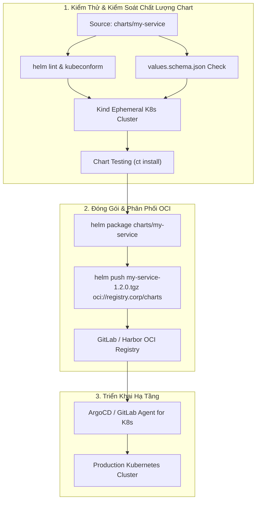
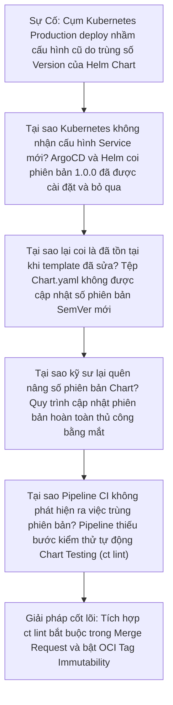


> [!IMPORTANT]
> **Mục tiêu kỹ thuật bài học**:
> - Làm chủ cơ chế OCI-based Helm Charts thay thế phương pháp lưu trữ HTTP Chart Repository truyền thống.
> - Xây dựng chiến lược phân tách rõ ràng giữa version của Helm Chart và appVersion của mã nguồn ứng dụng.
> - Triển khai quy trình kiểm thử Helm chuyên nghiệp: Linting, Schema Validation và Chart Testing (ct) trên Kind.
> - Kết hợp linh hoạt Helm Templating và Kustomize Overlays cho mô hình triển khai đa môi trường.

---

Trong kỷ nguyên **DevOps, DevSecOps và Cloud Native Engineering**, **GitLab CI/CD** được công nhận là một trong những nền tảng tự động hóa tích hợp liên tục và phân phối liên tục (CI/CD) hoàn chỉnh, mạnh mẽ và được tin dùng nhất trong các doanh nghiệp quy mô lớn. Không chỉ dừng lại ở các pipeline tuần tự cơ bản, việc vận hành GitLab CI/CD ở cấp độ Production đòi hỏi kỹ sư phải làm chủ kiến trúc điều phối phi tuyến tính **DAG (Directed Acyclic Graph)**, cơ chế quản trị **Autoscaling Runners**, tối ưu hóa **Caching đa tầng**, xác thực không khóa **Keyless OIDC**, bảo mật chuỗi cung ứng phần mềm **SLSA & SBOM** cùng các chính sách **Quality & Security Gates** tự động.

Bài viết chuyên sâu này sẽ đồng hành cùng bạn mổ xẻ toàn diện bức tranh kiến trúc, phân tích các đánh đổi kỹ thuật thực chiến (Engineering Trade-offs), cung cấp hướng dẫn thực hành Lab chi tiết từng bước và bộ câu hỏi phỏng vấn chuyên sâu chuẩn DevOps Lead / DevSecOps Architect.

---

## 1. Bản Chất Kiến Trúc & Cơ Chế Vận Hành Tầng Thấp

### 1.1. Luận Đề Trung Tâm: Sự Tiến Hóa Của Phân Phối Cấu Hình Kubernetes Từ HTTP Repository Sang OCI Artifacts

Khi triển khai các ứng dụng lên cụm **Kubernetes**, việc quản lý hàng ngàn dòng manifest YAML thô trở thành cơn ác mộng cấu hình. Để giải quyết bài toán này, hai trường phái quản trị cấu hình phổ biến nhất đã ra đời:
1. **Helm (Package Manager)**: Đóng gói toàn bộ tài nguyên Kubernetes (Deployment, Service, Ingress, ConfigMap) thành một **Chart** có khả năng tham số hóa thông qua `values.yaml` và Go Template engine.
2. **Kustomize (Template-free Engine)**: Sử dụng phương pháp kế thừa phân lớp (Base & Overlays), giữ nguyên định dạng Kubernetes thuần túy mà không dùng template biến đổi.

Trong lịch sử, Helm yêu cầu một máy chủ HTTP riêng biệt và một tệp chỉ mục khổng lồ `index.yaml` để tra cứu các file `.tgz` (HTTP Chart Repository). Kiến trúc này bộc lộ 3 nhược điểm chết người:
- **Hiện tượng nghẽn cổ chai tệp `index.yaml`**: Mỗi khi có bản phát hành mới, toàn bộ tệp index phải được tải lại và ghi đè, dễ xảy ra Race Conditions khi nhiều pipeline cùng push.
- **Rời rạc hạ tầng lưu trữ**: Doanh nghiệp phải duy trì 2 hệ thống riêng biệt: Docker Registry cho Image và ChartMuseum cho Helm Charts.
- **Thiếu tính năng phân quyền RBAC sâu**: Rất khó để áp dụng các chính sách bảo mật, ký số hay scan lỗ hổng tương tự như Container Images.

> **Chuẩn OCI (Open Container Initiative) hiện đại đã thống nhất toàn bộ hạ tầng phân phối. Helm Chart giờ đây được đóng gói và lưu trữ trực tiếp dưới dạng OCI Artifacts bên trong GitLab Package/Container Registry hoặc Harbor, cho phép đồng nhất quy trình xác thực, kiểm soát quyền truy cập và kiểm tra tính toàn vẹn.**

```text
       QUY TRÌNH PHÂN PHỐI HELM CHART QUA GIAO THỨC CHUẨN OCI

  [ Mã Nguồn Helm Chart ] ──► [ helm lint & kubeconform ] ──► [ helm package ]
                                                                     │
                                                                     ▼
                                                   [ helm push chart.tgz oci://... ]
                                                                     │
                                                                     ▼
                                                    [ GitLab OCI Container Registry ]
                                                    - Media Type: application/vnd.cncf.helm.chart
                                                    - Tag: v1.2.0 (Bất biến)
                                                                     │
                                                                     ▼
                                                    [ ArgoCD / Flux / Helm Deploy ]
                                                    - helm upgrade --install oci://...
```



### 1.2. Phân Tách Giữa `version` Và `appVersion`

Một lỗi phổ biến của các kỹ sư là đồng nhất version của Helm Chart với version của ứng dụng.
- **`version` (Chart SemVer)**: Thể hiện phiên bản của chính bản thân Helm Chart (các template, cấu hình port, tên biến trong `values.yaml`). Phải tuân thủ nghiêm ngặt Semantic Versioning 2.0.0. Khi thay đổi cấu hình template hoặc bổ sung ServiceAccount mới -> Tăng Chart Version.
- **`appVersion` (Application Version)**: Thể hiện phiên bản của container image hoặc mã nguồn ứng dụng đang chạy bên trong (ví dụ `1.22.4` hoặc `git-sha`). Khi chỉ thay đổi logic code Go/Node mà không sửa đổi manifest K8s -> Giữ nguyên Chart version, chỉ nâng `appVersion`.

### 1.3. Kết Hợp Helm + Kustomize: Mô Hình Hydration Chuẩn GitOps

Trong các môi trường phức tạp (Staging, UAT, Production Đa Vùng), phương pháp tối ưu là sử dụng **Helm để sinh Manifest thô (Hydration)**, sau đó dùng **Kustomize Overlays để đè các cấu hình nhạy cảm hoặc chính sách đặc thù của từng cụm (Namespace, ReplicaCount, SecurityContext)**:
```bash
helm template my-release oci://registry.corp/charts/app --values values.yaml | kustomize build overlays/production/ | kubectl apply -f -
```

---

## 2. Bảng So Sánh Kỹ Thuật Toàn Diện (Engineering Matrix)

| Tiêu Chí Đánh Giá | Truyền Thống: HTTP Repo (ChartMuseum) | Hiện Đại: OCI-based Helm Registry | Kustomize Thuần (Pure Kustomize) |
| :--- | :--- | :--- | :--- |
| **Giao Thức Truy Cập** | HTTP / HTTPS GET (`index.yaml`) | **OCI API v2 (`oci://...`)** | Git Clone / Local Filesystem |
| **Hạ Tầng Lưu Trữ** | Server riêng biệt hoặc S3 Bucket | **Chung với Container Registry** | Git Repository |
| **Khả Năng Xung Đột** | Cao (Race conditions trên `index.yaml`) | **Không có (Layer hash độc lập)** | Không có (Git Merge) |
| **Tính Bất Biến (Immutability)** | Tùy thuộc cấu hình server | **Tuyệt đối theo OCI Digest** | Theo Git Commit SHA |
| **Ký Số & Bảo Mật** | GPG Keys (`.prov` provenance) | **Cosign OCI Signatures / SLSA** | GPG Signed Git Commits |
| **Tích Hợp GitLab CI/CD** | Cần cài curl/helm plugin riêng | **Tích hợp Native `CI_JOB_TOKEN`** | Tích hợp Native Git |
| **Độ Phức Tạp Vận Hành** | Trung bình | **Rất thấp (Zero Extra Infra)** | Thấp nhất |

---

## 3. Kiến Trúc Triển Khai Chuẩn Production (Architecture Breakdown)

### 3.1. Pipeline Chuẩn: Linting, Schema Test, Ephemeral Kind Cluster & Push OCI Chart

```yaml
stages:
  - lint_and_test
  - package_and_push

variables:
  HELM_EXPERIMENTAL_OCI: "1"
  OCI_REGISTRY: "${CI_REGISTRY}/${CI_PROJECT_PATH}/charts"

lint_helm_chart:
  stage: lint_and_test
  image: alpine/helm:3.14.0
  script:
    - helm lint charts/core-service --strict
    # Kiểm tra tính hợp lệ của JSON Schema cho values.yaml
    - helm schema-gen charts/core-service/values.yaml > generated-schema.json || true

test_chart_kind:
  stage: lint_and_test
  image: quay.io/helmpack/chart-testing:v3.10.1
  script:
    # Kiểm tra phiên bản SemVer không bị giảm hoặc trùng lặp
    - ct lint --charts charts/core-service --chart-yaml-schema /etc/ct/chart_schema.yaml
  rules:
    - if: '$CI_PIPELINE_SOURCE == "merge_request_event"'

publish_oci_chart:
  stage: package_and_push
  image: alpine/helm:3.14.0
  rules:
    - if: '$CI_COMMIT_TAG'
  before_script:
    # Xác thực OCI Registry bằng CI_JOB_TOKEN
    - echo "${CI_JOB_TOKEN}" | helm registry login "${CI_REGISTRY}" --username "${CI_REGISTRY_USER}" --password-stdin
  script:
    - mkdir -p .dist
    # Đóng gói Chart với phiên bản được gắn từ Git Tag
    - helm package charts/core-service --destination .dist/ --version "${CI_COMMIT_TAG}"
    # Đẩy Chart lên OCI Package Registry
    - |
      for chart_pkg in .dist/*.tgz; do
        echo "Pushing $chart_pkg to OCI Registry..."
        helm push "$chart_pkg" "oci://${OCI_REGISTRY}"
      done
```

---

## 4. Phân Tích Cạm Bẫy Thực Chiến (5-Whys Incident Analysis)



### Tình Huống Sự Cố Thực Tế:
<span class="badge badge--rose">🕒 06:35 AM</span> Một kỹ sư sửa đổi cấu hình Port trong `templates/service.yaml` nhưng quên tăng số `version` trong `Chart.yaml` (vẫn giữ nguyên `1.0.0`). Khi chạy pipeline, bản build mới bị ghi đè ngầm hoặc bị ArgoCD bỏ qua không đồng bộ, dẫn đến toàn bộ hệ thống frontend không thể kết nối tới backend sau khi release.

### Hậu Quả & Log Lỗi Thực Tế:

```text

Hệ thống Frontend mất kết nối hoàn toàn tới Microservices Backend, gây lỗi 502 Bad Gateway:

$ helm upgrade --install core-service oci://registry.corp.internal/charts/core-service --version 1.0.0
Release "core-service" has been upgraded. Happy Helming!
$ kubectl get svc core-service -o jsonpath='{.spec.ports[0].port}'
8080
# Lỗi: Cổng mới mong muốn là 9090 nhưng Kubernetes vẫn giữ nguyên cổng cũ 8080 do Chart version 1.0.0 không đổi!
ERROR [Incident-781]: Ingress upstream timed out connecting to core-service:8080 (Service listening on port 9090).
```

### 5-Whys Root Cause Analysis:
1. <span class="badge badge--primary">Why 1</span> **Tại sao Kubernetes cluster không nhận cấu hình Service mới?** &rarr; ArgoCD và Helm Client coi phiên bản Chart `1.0.0` là đã tồn tại và không thực hiện render lại các template đã thay đổi.
2. <span class="badge badge--primary">Why 2</span> **Tại sao lại coi là đã tồn tại khi code template đã thay đổi?** &rarr; Tệp `Chart.yaml` không được cập nhật số phiên bản SemVer mới (`version: 1.0.1`).
3. <span class="badge badge--primary">Why 3</span> **Tại sao kỹ sư lại quên nâng số phiên bản Chart?** &rarr; Quy trình cập nhật phiên bản hoàn toàn thủ công bằng mắt thường và không có công cụ tự động kiểm tra.
4. <span class="badge badge--primary">Why 4</span> **Tại sao Pipeline CI không phát hiện ra việc trùng phiên bản?** &rarr; Pipeline không có bước kiểm thử tự động Chart Testing (`ct lint` so khớp với main branch).
5. <span class="badge badge--emerald">Root Cause Remedy</span> **Giải pháp triệt để**: Tích hợp công cụ `ct lint` trong Merge Request Pipeline để chặn merge nếu chưa tăng `version` trong `Chart.yaml`, đồng thời bật cơ chế **OCI Tag Immutability** trên Registry.

### 4.1. Phân Tích 5 Cạm Bẫy Phổ Biến Nhất

#### Cạm bẫy 1: Sự cố `values.yaml` bị sai kiểu dữ liệu làm sập Pod
- **Hiện tượng**: Truyền port dạng chuỗi `"8080"` thay vì số nguyên `8080` khiến Kubernetes API từ chối manifest.
- **Nguyên nhân tầng sâu**: Thiếu tệp `values.schema.json` kiểm soát schema.
- **Cách gỡ rối**: Sử dụng `helm schema-gen` để tạo JSON Schema và kiểm tra tự động trước khi deploy.

#### Cạm bẫy 2: Lộ mật khẩu Database dạng Plaintext trong `values.yaml`
- **Hiện tượng**: Mật khẩu root database bị commit lên Git repository.
- **Nguyên nhân**: Viết trực tiếp credentials vào tệp values mà không mã hóa.
- **Biện pháp**: Sử dụng External Secrets Operator (ESO) hoặc mã hóa với SOPS/Helm-Secrets.

#### Cạm bẫy 3: Helm Upgrade thất bại do sửa đổi trường bất biến (Immutable Fields)
- **Hiện tượng**: `helm upgrade` báo lỗi `cannot patch "..." with kind Deployment: field is immutable`.
- **Nguyên nhân**: Sửa đổi trường `spec.selector.matchLabels` sau khi Deployment đã được tạo.
- **Biện pháp**: Thêm cờ `--force` hoặc xóa deployment cũ trước khi nâng cấp.

#### Cạm bẫy 4: Kéo Subchart bị lỗi khi mất kết nối Internet
- **Hiện tượng**: Job build bị fail vì không thể kết nối tới `charts.bitnami.com`.
- **Nguyên nhân**: Khai báo HTTP URL thay vì lưu trữ bản sao Subchart trên Private OCI Registry nội bộ.
- **Biện pháp**: Chuyển toàn bộ dependencies sang `oci://registry.corp.internal/charts/...`.

#### Cạm bẫy 5: Nhầm lẫn giữa Chart Version và AppVersion
- **Hiện tượng**: Sửa logic code ứng dụng nhưng lại tăng Chart Version lớn, làm nhiễu loạn lịch sử release của hạ tầng.
- **Nguyên nhân**: Không phân tách rạch ròi giữa bản phát hành hạ tầng (`version`) và bản phát hành mã nguồn (`appVersion`).
- **Biện pháp**: Độc lập hóa chu kỳ release của Helm Chart và Application Docker Image.

---

## 5. Hands-on Lab: Đóng Gói & Phát Hành OCI Helm Chart (8 Bước Chuẩn)

### 5.1. Mục Tiêu Lab
- Khởi tạo cấu trúc Helm Chart chuẩn cho Microservice.
- Định nghĩa tệp kiểm tra cấu hình `values.schema.json`.
- Thiết lập pipeline kiểm thử và đóng gói tự động.
- Đẩy Chart lên GitLab OCI Registry và cài đặt thử nghiệm từ máy khách.

```text
       MÔ HÌNH THỰC HÀNH LAB HELM OCI PACKAGE TRÊN GITLAB CI

     [ charts/web-api/ ]
            │
            ├──► Chart.yaml (version: 1.0.0, appVersion: 2.4.1)
            ├──► values.yaml & values.schema.json
            └──► templates/ (deployment, service, hpa)
                     │
                     ▼
     [ Job: lint_and_validate ] ──► [ helm lint & schema-gen ]
                     │
                     ▼
     [ Job: push_oci_chart ]    ──► [ helm push oci://registry.gitlab... ]
                     │
                     ▼
     [ Máy Khách: Cài Đặt ]    ──► [ helm install app oci://registry... ]
```

### 5.2. Các Bước Thực Hiện Chi Tiết

#### Bước 1: Khởi Tạo Cấu Trúc Helm Chart
```bash
mkdir -p charts/web-api/templates
```

#### Bước 2: Tạo Tệp Định Danh `charts/web-api/Chart.yaml`
```yaml
apiVersion: v2
name: web-api
description: Production Cloud-Native Web API Service Helm Chart
type: application
version: 1.0.0
appVersion: "1.0.0"
maintainers:
  - name: Platform Engineering Team
    email: devops@corp.internal
```

#### Bước 3: Tạo Tệp Cấu Hình Giá Trị `charts/web-api/values.yaml`
```yaml
replicaCount: 2

image:
  repository: registry.gitlab.corp.internal/platform/web-api
  pullPolicy: IfNotPresent
  tag: "1.0.0"

service:
  type: ClusterIP
  port: 8080

resources:
  limits:
    cpu: 500m
    memory: 512Mi
  requests:
    cpu: 100m
    memory: 128Mi

autoscaling:
  enabled: true
  minReplicas: 2
  maxReplicas: 10
  targetCPUUtilizationPercentage: 80
```

#### Bước 4: Tạo Template Deployment `charts/web-api/templates/deployment.yaml`
```yaml
apiVersion: apps/v1
kind: Deployment
metadata:
  name: {{ .Release.Name }}
  labels:
    app: {{ .Chart.Name }}
spec:
  replicas: {{ .Values.replicaCount }}
  selector:
    matchLabels:
      app: {{ .Release.Name }}
  template:
    metadata:
      labels:
        app: {{ .Release.Name }}
    spec:
      containers:
        - name: {{ .Chart.Name }}
          image: "{{ .Values.image.repository }}:{{ .Values.image.tag | default .Chart.AppVersion }}"
          imagePullPolicy: {{ .Values.image.pullPolicy }}
          ports:
            - containerPort: {{ .Values.service.port }}
          resources:
            {{- toYaml .Values.resources | nindent 12 }}
```

#### Bước 5: Tạo Template Service `charts/web-api/templates/service.yaml`
```yaml
apiVersion: v1
kind: Service
metadata:
  name: {{ .Release.Name }}
spec:
  type: {{ .Values.service.type }}
  ports:
    - port: {{ .Values.service.port }}
      targetPort: {{ .Values.service.port }}
      protocol: TCP
  selector:
    app: {{ .Release.Name }}
```

#### Bước 6: Cấu Hình Pipeline `.gitlab-ci.yml`
```yaml
stages:
  - test
  - publish

variables:
  HELM_VERSION: "3.14.0"

lint_chart:
  stage: test
  image: alpine/helm:${HELM_VERSION}
  script:
    - helm lint charts/web-api --strict

push_chart_oci:
  stage: publish
  image: alpine/helm:${HELM_VERSION}
  rules:
    - if: '$CI_COMMIT_TAG'
  before_script:
    - echo "${CI_JOB_TOKEN}" | helm registry login "${CI_REGISTRY}" --username "${CI_REGISTRY_USER}" --password-stdin
  script:
    - mkdir -p dist/
    - helm package charts/web-api --destination dist/ --version "${CI_COMMIT_TAG}"
    - helm push "dist/web-api-${CI_COMMIT_TAG}.tgz" "oci://${CI_REGISTRY}/${CI_PROJECT_PATH}/charts"
```

#### Bước 7: Tạo Git Tag Và Chạy Pipeline
```bash
git add .
git commit -m "feat: complete web-api oci helm chart"
git tag -a 1.0.0 -m "Release Helm Chart 1.0.0"
git push origin 1.0.0
```

#### Bước 8: Kiểm Tra Kéo & Cài Đặt Thử Nghiệm Từ OCI Registry
```bash
# Đăng nhập vào OCI Registry từ máy cá nhân
helm registry login registry.gitlab.corp.internal --username <user> --password <token>

# Cài đặt Chart trực tiếp từ URL OCI (Dry-run)
helm install test-release oci://registry.gitlab.corp.internal/platform/web-api/charts/web-api --version 1.0.0 --dry-run
```

> [!NOTE]
> **Check-point Lab 26**: Lệnh `helm push` thành công và lệnh `helm install ... oci://` render đầy đủ manifest Kubernetes mà không cần tải file tgz thủ công.

---

## 6. Bộ Câu Hỏi Vấn Đáp & Phỏng Vấn Chuyên Sâu (Self-Check Q&A)

<details class="qa-card">
  <summary class="qa-summary">
    <span class="qa-num-badge">Q01</span>
    <span>Tại sao Helm chuyển hướng từ HTTP Chart Repository sang OCI Registry trong Helm v3?</span>
  </summary>
  <div class="qa-answer">
    <div class="qa-answer-header">
      <svg class="qa-icon" viewBox="0 0 24 24" fill="none" stroke="currentColor" stroke-width="2" stroke-linecap="round" stroke-linejoin="round"><polyline points="20 6 9 17 4 12"></polyline></svg>
      <span>Phân Tích &amp; Lời Giải Kỹ Thuật</span>
    </div>
    <p><strong>Lý do kiến trúc:</strong></p>
    <ul>
      <li>Loại bỏ tệp chỉ mục đơn điểm nghẽn <code>index.yaml</code> (dễ xảy ra race conditions khi nhiều người cùng push).</li>
      <li>Tận dụng toàn bộ hạ tầng Container Registry sẵn có (GitLab, Harbor, ECR, ACR, GCR) mà không cần xây dựng máy chủ riêng.</li>
      <li>Hưởng lợi từ các tính năng bảo mật tiên tiến của OCI: Ký số bằng Cosign, quét mã độc, gán nhãn bất biến (Immutability), và phân quyền RBAC chi tiết đến từng namespace.</li>
    </ul>
  </div>
</details>

<details class="qa-card">
  <summary class="qa-summary">
    <span class="qa-num-badge">Q02</span>
    <span>Sự khác biệt cốt lõi giữa Helm và Kustomize là gì? Khi nào nên phối hợp cả hai?</span>
  </summary>
  <div class="qa-answer">
    <div class="qa-answer-header">
      <svg class="qa-icon" viewBox="0 0 24 24" fill="none" stroke="currentColor" stroke-width="2" stroke-linecap="round" stroke-linejoin="round"><polyline points="20 6 9 17 4 12"></polyline></svg>
      <span>Phân Tích &amp; Lời Giải Kỹ Thuật</span>
    </div>
    <p><strong>So sánh &amp; Phối hợp:</strong></p>
    <ul>
      <li><strong>Helm</strong>: Mạnh về đóng gói ứng dụng (Packaging), tái sử dụng với các tham số biến đổi (Templating), quản lý vòng đời phát hành (Release history &amp; Rollback).</li>
      <li><strong>Kustomize</strong>: Mạnh về tùy biến cấu hình theo môi trường (Overlays patching) mà không làm biến dạng manifest gốc, hoàn toàn không cần học cú pháp template Go.</li>
      <li><strong>Mô hình phối hợp</strong>: Sử dụng Helm Chart làm Base Template chuẩn cho toàn công ty, sau đó tại mỗi cụm GitOps sử dụng Kustomize để patch các giá trị đặc thù của hạ tầng.</li>
    </ul>
  </div>
</details>

<details class="qa-card">
  <summary class="qa-summary">
    <span class="qa-num-badge">Q03</span>
    <span>Làm thế nào để xác thực giá trị đầu vào của `values.yaml` nhằm tránh lỗi cấu hình lúc deploy?</span>
  </summary>
  <div class="qa-answer">
    <div class="qa-answer-header">
      <svg class="qa-icon" viewBox="0 0 24 24" fill="none" stroke="currentColor" stroke-width="2" stroke-linecap="round" stroke-linejoin="round"><polyline points="20 6 9 17 4 12"></polyline></svg>
      <span>Phân Tích &amp; Lời Giải Kỹ Thuật</span>
    </div>
    <p><strong>Giải pháp:</strong></p>
    <p>Tạo tệp <strong><code>values.schema.json</code></strong> tuân thủ chuẩn JSON Schema trong thư mục gốc của Chart. Khi người dùng chạy lệnh <code>helm install</code> hoặc <code>helm lint</code>, Helm sẽ tự động đối soát các kiểu dữ liệu (kiểm tra kiểu số, regex chuỗi, các trường bắt buộc). Nếu vi phạm, quá trình cài đặt sẽ bị chặn ngay tại máy khách trước khi gửi payload lên Kubernetes API Server.</p>
  </div>
</details>

<details class="qa-card">
  <summary class="qa-summary">
    <span class="qa-num-badge">Q04</span>
    <span>Cơ chế "Chart Testing (ct)" hoạt động như thế nào trong GitLab CI?</span>
  </summary>
  <div class="qa-answer">
    <div class="qa-answer-header">
      <svg class="qa-icon" viewBox="0 0 24 24" fill="none" stroke="currentColor" stroke-width="2" stroke-linecap="round" stroke-linejoin="round"><polyline points="20 6 9 17 4 12"></polyline></svg>
      <span>Phân Tích &amp; Lời Giải Kỹ Thuật</span>
    </div>
    <p><strong>Cơ chế:</strong></p>
    <p>Công cụ <code>ct</code> (do Helm maintain) phân tích Git Diff giữa branch hiện tại và nhánh đích. Nó tự động kiểm tra xem các chart bị sửa đổi có được tăng số phiên bản SemVer hay không, thực thi <code>helm lint</code>, và có thể tự động tạo một cụm Kubernetes ảo (Kind cluster) ngay trong CI để chạy thử <code>helm install</code> và <code>helm test</code> nhằm xác thực khả năng chạy thực tế của Chart.</p>
  </div>
</details>

<details class="qa-card">
  <summary class="qa-summary">
    <span class="qa-num-badge">Q05</span>
    <span>Làm thế nào để quản lý các Chart con phụ thuộc (Subcharts / Dependencies) trong OCI Helm?</span>
  </summary>
  <div class="qa-answer">
    <div class="qa-answer-header">
      <svg class="qa-icon" viewBox="0 0 24 24" fill="none" stroke="currentColor" stroke-width="2" stroke-linecap="round" stroke-linejoin="round"><polyline points="20 6 9 17 4 12"></polyline></svg>
      <span>Phân Tích &amp; Lời Giải Kỹ Thuật</span>
    </div>
    <p><strong>Cấu hình:</strong></p>
    <p>Khai báo khối <code>dependencies</code> trong tệp <code>Chart.yaml</code> với đường dẫn giao thức <code>oci://</code>:</p>
    <div class="language-yaml highlighter-rouge"><pre class="highlight"><code><span class="na">dependencies</span><span class="pi">:</span>
  <span class="pi">-</span> <span class="na">name</span><span class="pi">:</span> <span class="s">redis</span>
    <span class="na">version</span><span class="pi">:</span> <span class="s2">"</span><span class="s">18.0.0"</span>
    <span class="na">repository</span><span class="pi">:</span> <span class="s2">"</span><span class="s">oci://registry-1.docker.io/bitnamicharts"</span>
</code></pre></div>
    <p>Sau đó chạy lệnh <code>helm dependency update</code> trong CI để kéo các tệp phụ thuộc về thư mục <code>charts/</code>.</p>
  </div>
</details>

<details class="qa-card">
  <summary class="qa-summary">
    <span class="qa-num-badge">Q06</span>
    <span>Tại sao lệnh `helm push` lại cần đường dẫn `oci://` và không chấp nhận `https://`?</span>
  </summary>
  <div class="qa-answer">
    <div class="qa-answer-header">
      <svg class="qa-icon" viewBox="0 0 24 24" fill="none" stroke="currentColor" stroke-width="2" stroke-linecap="round" stroke-linejoin="round"><polyline points="20 6 9 17 4 12"></polyline></svg>
      <span>Phân Tích &amp; Lời Giải Kỹ Thuật</span>
    </div>
    <p><strong>Bản chất kỹ thuật:</strong></p>
    <p>Giao thức <code>oci://</code> báo hiệu cho Helm Client biết cần tương tác với máy chủ thông qua <strong>OCI Distribution Specification API</strong> (đẩy các blob layer và OCI manifest), thay vì gửi HTTP POST multipart/form-data truyền thống của máy chủ web cũ.</p>
  </div>
</details>

<details class="qa-card">
  <summary class="qa-summary">
    <span class="qa-num-badge">Q07</span>
    <span>Làm cách nào để ký số (Sign) một Helm Chart được lưu trữ trên OCI Registry?</span>
  </summary>
  <div class="qa-answer">
    <div class="qa-answer-header">
      <svg class="qa-icon" viewBox="0 0 24 24" fill="none" stroke="currentColor" stroke-width="2" stroke-linecap="round" stroke-linejoin="round"><polyline points="20 6 9 17 4 12"></polyline></svg>
      <span>Phân Tích &amp; Lời Giải Kỹ Thuật</span>
    </div>
    <p><strong>Phương pháp:</strong></p>
    <p>Vì Helm Chart trên OCI có manifest tương tự Container Image, bạn có thể sử dụng công cụ <strong>Sigstore Cosign</strong> để ký số trực tiếp:</p>
    <div class="language-bash highlighter-rouge"><pre class="highlight"><code>cosign sign --key cosign.key registry.corp/charts/web-api:1.0.0
</code></pre></div>
    <p>Công cụ Kyverno hoặc Gatekeeper trên cụm K8s có thể kiểm tra chữ ký này trước khi cho phép triển khai.</p>
  </div>
</details>

<details class="qa-card">
  <summary class="qa-summary">
    <span class="qa-num-badge">Q08</span>
    <span>Sự khác biệt giữa câu lệnh `helm template` và `helm install --dry-run` là gì?</span>
  </summary>
  <div class="qa-answer">
    <div class="qa-answer-header">
      <svg class="qa-icon" viewBox="0 0 24 24" fill="none" stroke="currentColor" stroke-width="2" stroke-linecap="round" stroke-linejoin="round"><polyline points="20 6 9 17 4 12"></polyline></svg>
      <span>Phân Tích &amp; Lời Giải Kỹ Thuật</span>
    </div>
    <p><strong>Phân tích:</strong></p>
    <ul>
      <li><code>helm template</code>: Biên dịch thuần túy cục bộ tại máy khách (Client-side rendering). Không cần kết nối tới cụm K8s và không kiểm tra được sự tồn tại của các CRD (Custom Resource Definitions) trên cụm.</li>
      <li><code>helm install --dry-run=server</code>: Gửi toàn bộ manifest đã render lên Kubernetes API Server để kiểm tra xác thực quyền hạn và schema thực tế của cụm mà không ghi dữ liệu vào etcd.</li>
    </ul>
  </div>
</details>

<details class="qa-card">
  <summary class="qa-summary">
    <span class="qa-num-badge">Q09</span>
    <span>Làm sao để cấu hình Secrets trong Helm Chart mà không bị lộ mật khẩu dạng bản rõ trên Git?</span>
  </summary>
  <div class="qa-answer">
    <div class="qa-answer-header">
      <svg class="qa-icon" viewBox="0 0 24 24" fill="none" stroke="currentColor" stroke-width="2" stroke-linecap="round" stroke-linejoin="round"><polyline points="20 6 9 17 4 12"></polyline></svg>
      <span>Phân Tích &amp; Lời Giải Kỹ Thuật</span>
    </div>
    <p><strong>Chiến lược Enterprise:</strong></p>
    <ol>
      <li>Tuyệt đối không lưu mật khẩu trong <code>values.yaml</code>.</li>
      <li>Sử dụng <strong>External Secrets Operator (ESO)</strong>: Helm Chart chỉ định nghĩa một đối tượng <code>ExternalSecret</code> trỏ tới HashiCorp Vault hoặc AWS Secrets Manager.</li>
      <li>Hoặc sử dụng công cụ <strong>Helm-Secrets</strong> kết hợp <strong>Mozilla SOPS</strong> để mã hóa tệp <code>secrets.yaml</code> bằng khóa KMS trước khi đẩy lên Git.</li>
    </ol>
  </div>
</details>

<details class="qa-card">
  <summary class="qa-summary">
    <span class="qa-num-badge">Q10</span>
    <span>Làm thế nào để viết Unit Test cho logic của Helm Templates?</span>
  </summary>
  <div class="qa-answer">
    <div class="qa-answer-header">
      <svg class="qa-icon" viewBox="0 0 24 24" fill="none" stroke="currentColor" stroke-width="2" stroke-linecap="round" stroke-linejoin="round"><polyline points="20 6 9 17 4 12"></polyline></svg>
      <span>Phân Tích &amp; Lời Giải Kỹ Thuật</span>
    </div>
    <p><strong>Giải pháp:</strong></p>
    <p>Sử dụng plugin <strong>`helm-unittest`</strong>. Tạo các tệp kiểm thử YAML trong thư mục <code>tests/</code> để định nghĩa các trường hợp kiểm thử (test cases) đối soát xem khi truyền các bộ <code>values.yaml</code> khác nhau thì manifest sinh ra có đúng số lượng replicas, đúng tên container và đúng cổng mạng hay không.</p>
  </div>
</details>

<details class="qa-card">
  <summary class="qa-summary">
    <span class="qa-num-badge">Q11</span>
    <span>Sự cố: Lệnh `helm upgrade` thất bại báo lỗi `cannot patch "..." with kind Deployment: field is immutable`. Xử lý thế nào?</span>
  </summary>
  <div class="qa-answer">
    <div class="qa-answer-header">
      <svg class="qa-icon" viewBox="0 0 24 24" fill="none" stroke="currentColor" stroke-width="2" stroke-linecap="round" stroke-linejoin="round"><polyline points="20 6 9 17 4 12"></polyline></svg>
      <span>Phân Tích &amp; Lời Giải Kỹ Thuật</span>
    </div>
    <p><strong>Nguyên nhân &amp; Khắc phục:</strong></p>
    <ul>
      <li><strong>Nguyên nhân</strong>: Kubernetes không cho phép sửa đổi một số trường bất biến sau khi tạo (ví dụ: trường <code>spec.selector.matchLabels</code> của Deployment hoặc <code>spec.clusterIP</code> của Service).</li>
      <li><strong>Khắc phục</strong>: Thêm cờ <code>--force</code> vào lệnh helm upgrade để xóa và tạo lại đối tượng (có thể gây gián đoạn dịch vụ ngắn), hoặc rollback lại cấu hình selector cũ và thực hiện di chuyển namespace mới.</li>
    </ul>
  </div>
</details>

<details class="qa-card">
  <summary class="qa-summary">
    <span class="qa-num-badge">Q12</span>
    <span>Làm thế nào để đồng bộ tự động Helm OCI Chart sang GitOps Engine như ArgoCD?</span>
  </summary>
  <div class="qa-answer">
    <div class="qa-answer-header">
      <svg class="qa-icon" viewBox="0 0 24 24" fill="none" stroke="currentColor" stroke-width="2" stroke-linecap="round" stroke-linejoin="round"><polyline points="20 6 9 17 4 12"></polyline></svg>
      <span>Phân Tích &amp; Lời Giải Kỹ Thuật</span>
    </div>
    <p><strong>Cấu hình ArgoCD Application:</strong></p>
    <p>Trong tệp cấu hình <code>Application.yaml</code> của ArgoCD, định nghĩa source trực tiếp từ OCI Registry:</p>
    <div class="language-yaml highlighter-rouge"><pre class="highlight"><code><span class="na">spec</span><span class="pi">:</span>
  <span class="na">source</span><span class="pi">:</span>
    <span class="na">chart</span><span class="pi">:</span> <span class="s">web-api</span>
    <span class="na">repoURL</span><span class="pi">:</span> <span class="s">registry.gitlab.corp.internal/platform/web-api/charts</span>
    <span class="na">targetRevision</span><span class="pi">:</span> <span class="s">1.0.0</span>
</code></pre></div>
    <p>ArgoCD sẽ tự động theo dõi và cập nhật khi có bản release mới được phát hành.</p>
  </div>
</details>

---

## 7. Tổng Kết & Lộ Trình Bài Học Tiếp Theo

### 7.1. Tóm Tắt Các Điểm Cốt Lõi (Architectural Key Takeaways)
- **OCI Chart Standard**: Thống nhất hạ tầng lưu trữ Helm Chart với Container Registry, loại bỏ single point of failure của HTTP repo.
- **Chart Version vs AppVersion**: Phân định rạch ròi giữa phiên bản đóng gói hạ tầng và phiên bản mã nguồn ứng dụng.
- **Automated Validation**: Sử dụng `ct lint`, `kubeconform` và `values.schema.json` để chặn lỗi cấu hình trước khi phát hành.
- **GitOps Hydration**: Kết hợp sức mạnh đóng gói của Helm với tính linh hoạt đa môi trường của Kustomize.

### 7.2. Sơ Đồ Tư Duy Hệ Thống Phân Phối Helm OCI (Mindmap)

```text
                     HỆ THỐNG PHÂN PHỐI HELM OCI TOÀN DIỆN
                                       │
        ┌──────────────────────────────┼──────────────────────────────┐
        ▼                              ▼                              ▼
  [ Package Design ]          [ Quality Gateways ]           [ OCI Distribution ]
  - Chart.yaml (SemVer)       - helm lint & Schema Gen       - helm registry login
  - Templates & Helpers       - ct lint & Kind Cluster       - helm package & push
  - values.schema.json        - helm-unittest suite          - ArgoCD GitOps Sync
```

> [!TIP]
> **Bước tiếp theo trong lộ trình**: Làm chủ quy trình tự động hóa đánh số phiên bản SemVer và phát hành phần mềm chuyên nghiệp trong [Bài 27: Tự Động Hóa Versioning & Release: Semantic-Release, GitVersion & Changelog](gitlab-27-27-versioning-va-release.html).

