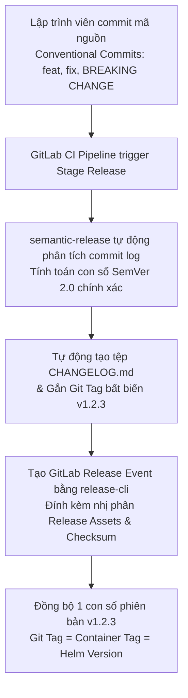
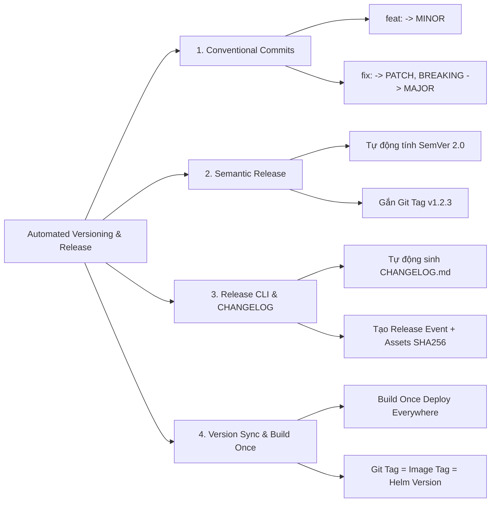
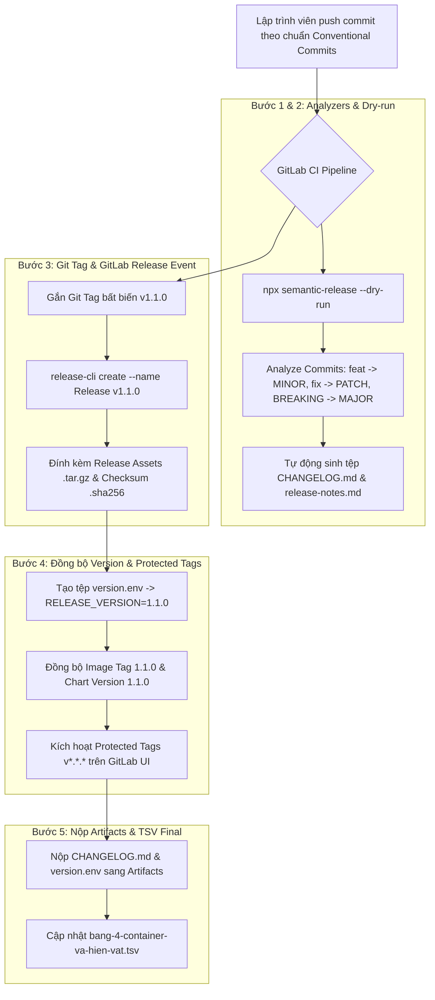


# [BÀI 27] TỰ ĐỘNG HÓA VERSIONING & RELEASE: SEMANTIC RELEASE, CONVENTIONAL COMMITS, GIT TAGGING & CHANGELOG AUTOMATION

Trong kỷ nguyên **DevOps, DevSecOps và Cloud Native Engineering**, **GitLab CI/CD** được công nhận là một trong những nền tảng tự động hóa tích hợp liên tục và phân phối liên tục (CI/CD) hoàn chỉnh, mạnh mẽ và được tin dùng nhất trong các doanh nghiệp quy mô lớn. Không chỉ dừng lại ở các pipeline tuần tự cơ bản, việc vận hành GitLab CI/CD ở cấp độ Production đòi hỏi kỹ sư phải làm chủ kiến trúc điều phối phi tuyến tính **DAG (Directed Acyclic Graph)**, cơ chế quản trị **Autoscaling Runners**, tối ưu hóa **Caching đa tầng**, xác thực không khóa **Keyless OIDC**, bảo mật chuỗi cung ứng phần mềm **SLSA & SBOM** cùng các chính sách **Quality & Security Gates** tự động.

Bài viết chuyên sâu này sẽ đồng hành cùng bạn mổ xẻ toàn diện bức tranh kiến trúc, phân tích các đánh đổi kỹ thuật thực chiến (Engineering Trade-offs), cung cấp hướng dẫn thực hành Lab chi tiết từng bước và bộ câu hỏi phỏng vấn chuyên sâu chuẩn DevOps Lead / DevSecOps Architect.

---

## 1. Bản Chất Kiến Trúc & Cơ Chế Vận Hành Tầng Thấp

---


| # | Câu hỏi ôn tập Buổi 26 (Helm Chart OCI) | Đáp án chuẩn ngắn gọn |
|---|---|---|
| 1 | Tại sao nói "Chart là hiện vật có phiên bản như image — chart không có phiên bản thì deploy không rollback được"? | Vì nếu không có phiên bản SemVer bất biến, Helm không thể khôi phục đúng cấu hình hạ tầng cũ khi gặp sự cố. |
| 2 | Phân biệt sự khác biệt cốt lõi giữa `version` và `appVersion` trong `Chart.yaml`? | `version` là phiên bản tệp mẫu Helm Chart; `appVersion` là phiên bản mã nguồn ứng dụng (gắn với Image Tag). |
| 3 | Ưu điểm của việc lưu trữ Helm Chart dưới dạng OCI Artifacts (`oci://...`)? | Hợp nhất hạ tầng lưu trữ và đồng bộ chính sách phân quyền RBAC giữa Container Image và Helm Chart. |
| 4 | Tác dụng của câu lệnh `helm lint --strict` trong CI Pipeline? | Kiểm tra cú pháp YAML, định dạng biến và phát hiện sớm 100% lỗi trước khi triển khai thực tế. |
| 5 | Cờ `--atomic` trong câu lệnh `helm upgrade` mang lại lợi ích gì khi deploy tự động? | Tự động hủy ngắt tiến trình nâng cấp và rollback 100% về revision cũ nếu Pod mới bị crash. |

---


> **LUẬN ĐỀ TRUNG TÂM BUỔI 27:**
> **MỘT HIỆN VẬT — MỘT PHIÊN BẢN — MỘT LẦN BUILD. Việc vi phạm nguyên tắc này (như build lại mã nguồn lần 2 cho Prod hoặc dùng tag `latest` trôi nổi) chính là GỐC RỄ CỦA SỰ CỐ "PROD CHẠY CÁI GÌ KHÔNG AI BIẾT". Việc áp dụng quy chuẩn Git `Conventional Commits` kết hợp với công cụ tự động hóa `semantic-release` giúp tính toán chính xác con số Semantic Versioning 2.0 (`MAJOR.MINOR.PATCH`), tự động sinh `CHANGELOG.md` và đồng bộ 1 con số phiên bản bất biến duy nhất trên toàn bộ hệ thống.**



---


| STT | Kết quả đạt được (Competency) | Hiện vật chứng minh (Evidence) |
|---|---|---|
| 1 | Viết Git Commit Messages tuân thủ 100% quy chuẩn `Conventional Commits`. | Git commit log chứa `feat:`, `fix:`, `BREAKING CHANGE:`. |
| 2 | Cấu hình công cụ `semantic-release` tự động tính con số SemVer 2.0. | Tệp cấu hình `.releaserc.json` hoạt động chuẩn xác trong CI. |
| 3 | Tự động tạo tệp `CHANGELOG.md` tổng hợp 100% lịch sử thay đổi. | Tệp `CHANGELOG.md` sinh ra tự động trong thư mục gốc. |
| 4 | Tạo GitLab Release Event tự động bằng công cụ `gitlab-release-cli`. | Trang Release Event hiển thị trên giao diện GitLab UI. |
| 5 | Đồng bộ 1 con số phiên bản bất biến duy nhất giữa Git Tag, Container Image Tag, và Helm Chart Version. | Git Tag `v1.2.3`, Image Tag `1.2.3`, Chart Version `1.2.3` trùng khớp. |
| 6 | Cập nhật thông số quy chuẩn Semantic Release và Release CLI vào tệp hiện vật `bang-4-container-va-hien-vat.tsv`. | Tệp `bang-4-container-va-hien-vat.tsv` bổ sung dòng dữ liệu Buổi 27. |

---


| Kiến thức tiên quyết | Ý nghĩa trong bài học Buổi 27 | Nguồn đối soát nếu thiếu |
|---|---|---|
| Nguyên tắc Semantic Versioning 2.0 | Hiểu ý nghĩa các con số phiên bản `MAJOR.MINOR.PATCH` | Buổi 14 (`QT 5.1`), Buổi 26 (`QT 4.1`) |
| Quản lý Git Tags và Release Event | Hiểu lệnh `git tag -a v1.0.0` và tính chất bất biến của Tag | Buổi 01 (`QT 1.1`), Buổi 24 (`QT 4.1`) |
| Đóng gói Container Image và Helm Chart | Đồng bộ con số phiên bản vừa release vào Image Tag và Chart Version | Buổi 23 (`QT 4.1`), Buổi 26 (`QT 5.3`) |
| Định dạng tệp Markdown (`.md`) | Đọc hiểu cấu trúc tự động sinh tệp `CHANGELOG.md` | Buổi 00 (`TEMPLATES`) |

---


### Bảng đối chiếu thuật ngữ Việt - Anh

| Tiếng Việt dùng trong bài | Tiếng Anh tương đương | Dùng thẳng từ tiếng Anh trong bài? |
|---|---|---|
| Đánh phiên bản ngữ nghĩa | Semantic Versioning (SemVer 2.0) | **Có** — `SemVer` |
| Quy chuẩn thông điệp commit | Conventional Commits Standard | **Có** — `Conventional Commits` |
| Tự động phát hành phiên bản | Automated Semantic Release | **Có** — `Semantic Release` |
| Nhật ký thay đổi | Change Log History (`CHANGELOG.md`) | **Có** — `CHANGELOG` |
| Công cụ tạo Release Event | GitLab Release CLI Tool | **Có** — `release-cli` |
| Sự thay đổi phá vỡ tương thích | Breaking Changes | **Có** — `Breaking Change` |
| Bản ghi phát hành thử nghiệm | Pre-release / Release Candidate | **Có** — `Pre-release / RC` |
| Thẻ Git được bảo mật | Protected Git Tags | **Có** — `Protected Tags` |
| Tài sản đính kèm phiên bản | Release Assets / Artifact Binaries | **Có** — `Release Assets` |
| Nguyên tắc biên dịch một lần | Build Once, Deploy Everywhere | **Có** — `Build Once` |

---

### Bốn mô hình tư duy cốt lõi

#### Mô hình 1: Nguyên lý "Một hiện vật — Một phiên bản — Một lần build"
- **Build Once, Deploy Everywhere:** Mã nguồn chỉ được biên dịch duy nhất 1 lần tại Stage build. Tệp nhị phân / Container Image sinh ra được đóng gói và gán một con số phiên bản bất biến (`v1.2.3`).
- Tuyệt đối không bao giờ chạy lại lệnh build mã nguồn lần 2 khi deploy sang môi trường Production. Việc build lại code lần 2 có thể nạp các thư viện phụ thuộc mới hơn (dù code không đổi), làm thay đổi mã băm bất biến và sinh ra sự cố "Prod chạy cái gì không ai biết".

#### Mô hình 2: Quy chuẩn Conventional Commits — Ngôn ngữ giao tiếp của CI Pipeline
Git Commit Message không chỉ là đoạn văn bản ghi chú cho con người đọc, mà là **dữ liệu đầu vào để CI Pipeline tính toán con số phiên bản tự động**:
- **`fix: ...`** $\rightarrow$ Tăng con số **`PATCH`** (`1.0.0` $\rightarrow$ `1.0.1`) — Sửa lỗi không phá vỡ tương thích.
- **`feat: ...`** $\rightarrow$ Tăng con số **`MINOR`** (`1.0.0` $\rightarrow$ `1.1.0`) — Thêm tính năng mới không phá vỡ tương thích.
- **`feat!: ...`** hoặc **`BREAKING CHANGE: ...`** $\rightarrow$ Tăng con số **`MAJOR`** (`1.0.0` $\rightarrow$ `2.0.0`) — Thay đổi lớn phá vỡ tính tương thích ngược.

#### Mô hình 3: Cơ chế tính toán tự động của `semantic-release`
Công cụ `semantic-release` vận hành qua 6 bước tự động trong CI Pipeline:
1. **Verify Conditions:** Kiểm tra môi trường Runner và quyền hạn token (`$GITLAB_TOKEN`).
2. **Analyze Commits:** Quét toàn bộ các Git commit log từ lần release gần nhất.
3. **Generate Notes:** Tổng hợp danh sách `feat` và `fix` tạo nội dung Release Notes.
4. **Create CHANGELOG:** Ghi nội dung mới vào tệp `CHANGELOG.md`.
5. **Git Tag:** Gắn Git Tag mới (`v1.2.3`) vào Git Repository.
6. **Publish Release:** Gọi API tạo GitLab Release Event công khai.

#### Mô hình 4: Đồng bộ 1 con số phiên bản duy nhất (Version Synchronization)
Trong một quy trình CI/CD chuẩn Enterprise, 1 con số phiên bản release (ví dụ `1.2.3`) bắt buộc phải được đồng bộ 100% trên cả 4 thành phần:
- **Git Tag:** `v1.2.3`
- **Container Image Tag:** `registry.example.com/app:1.2.3`
- **Helm Chart Version:** `version: 1.2.3` trong `Chart.yaml`
- **Application Binary Version:** `app --version` trả về `1.2.3`

---

### 1.1. Quy chuẩn Conventional Commits và Semantic Versioning 2.0 (10 phút)

### Phân tích kiến trúc Chuỗi Plugin (Plugin Pipeline) của `semantic-release`

Công cụ `semantic-release` xử lý công việc thông qua 6 plugin nối tiếp nhau theo chuỗi (Execution Pipeline):
1. **`@semantic-release/commit-analyzer`:** Đọc lịch sử commit log và quyết định kiểu release (`major`, `minor`, `patch`, hoặc `null` nếu không có commit thay đổi code).
2. **`@semantic-release/release-notes-generator`:** Phân loại các commit `feat` và `fix` để biên soạn nội dung Markdown cho Release Notes.
3. **`@semantic-release/changelog`:** Cập nhật các mục release mới vào đầu tệp `CHANGELOG.md`.
4. **`@semantic-release/npm` (hoặc custom exec):** Cập nhật con số phiên bản mới vào tệp `package.json` hoặc `version.env`.
5. **`@semantic-release/git`:** Tạo commit tự động với thông điệp `chore(release): X.Y.Z [skip ci]` để commit tệp `CHANGELOG.md` ngược lại Git repo.
6. **`@semantic-release/gitlab`:** Gọi API của GitLab để đính kèm Git Tag (`vX.Y.Z`) và công bố Release Event chính thức.

### Phân tích cơ chế truyền biến phiên bản qua tệp `version.env` và `dotenv` Reports

Để truyền con số phiên bản vừa release (ví dụ `RELEASE_VERSION=1.2.3`) sang các Stage deploy phía sau:
1. **Tạo tệp `version.env` ở Stage Release:** `echo "RELEASE_VERSION=1.2.3" > version.env`.
2. **Khai báo `artifacts:reports:dotenv: version.env`:** GitLab CI Runner tự động đọc và xuất các biến môi trường trong tệp này thành biến môi trường hệ thống cho các Job ở các Stage tiếp theo.
3. **Sử dụng biến `$RELEASE_VERSION` ở Stage Deploy:** Các Job deploy chỉ cần gọi `$RELEASE_VERSION` để kéo nạp Image Tag hoặc Chart Version tương ứng mà không cần đọc file thô.

---

**Nguyên lý cốt lõi:**
**Phát biểu.** Bắt buộc tuân thủ 100% quy chuẩn Git Commit Message dạng `Conventional Commits` cho tất cả các Merge Requests.
**Giải thích cơ chế ngầm:** Giúp CI Pipeline tự động đọc hiểu ý định của lập trình viên và quyết định chính xác việc tăng con số `MAJOR`, `MINOR`, hay `PATCH` mà không cần con người can thiệp thủ công.
> [!WARNING]
> **CẠM BẪY THỰC CHIẾN:**
> Gõ commit message nhơ nhác như `fixed bug`, `update code`, `fix final` làm CI Pipeline không thể tính toán phiên bản.
**Minh hoạ.**
```text
# Cấu trúc Conventional Commit chuẩn:
<type>(<scope>): <short description>

[optional body]

[optional footer(s)]

# Ví dụ 1 (Fix bug -> PATCH):
fix(auth): resolve JWT token expiration calculation issue

# Ví dụ 2 (Feature mới -> MINOR):
feat(payment): add VNPay QR code payment gateway support

# Ví dụ 3 (Breaking Change -> MAJOR):
feat(api)!: remove deprecated v1 user endpoints
BREAKING CHANGE: The v1 user API endpoints have been completely removed. Use v2 endpoints instead.
```
**Con số chốt:** 100% các commit messages bắt buộc phải đúng cú pháp **Conventional Commits**.

---

**Nguyên lý cốt lõi:**
**Phát biểu.** Áp dụng nguyên tắc *"Một hiện vật — Một phiên bản — Một lần build"*, tuyệt đối không build lại mã nguồn lần 2 cho môi trường Production.
**Giải thích cơ chế ngầm:** Việc biên dịch lại mã nguồn ở môi trường Prod có thể làm nạp nhầm các thư viện phụ thuộc mới (do tệp lockfile bị trôi hoặc môi trường Runner khác nhau), biến bản build Prod thành một tệp nhị phân hoàn toàn khác với bản build đã Test trên Staging.
> [!WARNING]
> **CẠM BẪY THỰC CHIẾN:**
> Chạy lại lệnh `go build` hoặc `docker build` trên môi trường Prod thay vì lấy đúng tệp nhị phân / Image Tag đã build từ Stage trước.
**Minh hoạ.**
```yaml
# Lấy đúng Image Tag đã build ở Stage trước deploy Prod
deploy-prod:
  stage: deploy
  script:
    - helm upgrade --install my-app oci://registry.example.com/helm-prod-local/my-web-app --version $RELEASE_VERSION
```
**Con số chốt:** Triệt tiêu **100%** rủi ro "Prod chạy cái gì không ai biết".

---

**Nguyên lý cốt lõi:**
**Phát biểu.** Đồng bộ 1 con số phiên bản SemVer bất biến duy nhất giữa Git Tag, Container Image Tag, và Helm Chart Version.
**Giải thích cơ chế ngầm:** Giúp kỹ sư Ops và Security Auditor dễ dàng đối soát vết bất kỳ lúc nào. Nhìn vào một Pod K8s đang chạy Image Tag `1.2.3`, Ops ngay lập tức biết chính xác mã nguồn nằm tại Git Tag `v1.2.3` và Helm Chart Version `1.2.3`.
> [!WARNING]
> **CẠM BẪY THỰC CHIẾN:**
> Git Tag là `v2.1.0`, Container Image Tag là `build-10542`, Helm Chart Version là `0.5.2`.
**Minh hoạ.**
```bash
# Đồng bộ con số phiên bản RELEASE_VERSION=1.2.3
docker tag my-app:latest registry.example.com/project/my-app:$RELEASE_VERSION
yq e ".version = \"$RELEASE_VERSION\"" -i Chart.yaml
```
**Con số chốt:** 1 con số phiên bản đồng bộ **1-1-1** trên toàn bộ hệ thống.

---

### 1.2. Tự động hóa Tính con số Phiên bản và Tạo CHANGELOG (10 phút)

---

**Nguyên lý cốt lõi:**
**Phát biểu.** Tự động phân tích Git commit log để tính toán con số `MAJOR`, `MINOR`, `PATCH` bằng công cụ `semantic-release` trong CI Pipeline.
**Giải thích cơ chế ngầm:** Bỏ qua hoàn toàn công đoạn họp hành tranh cãi để chọn con số phiên bản thủ công. `semantic-release` tự động đưa ra quyết định khách quan 100% dựa trên lịch sử commit log.
> [!WARNING]
> **CẠM BẪY THỰC CHIẾN:**
> Kỹ sư release phải sửa file `VERSION` bằng tay trước mỗi lần bấm nút release.
**Minh hoạ.**
```yaml
# Cấu hình Stage release với semantic-release
semantic-release-job:
  stage: release
  image: node:20-alpine
  before_script:
    - apk add --no-cache git
    - npm install -g semantic-release @semantic-release/gitlab @semantic-release/changelog @semantic-release/git
  script:
    - npx semantic-release
  rules:
    - if: '$CI_COMMIT_BRANCH == "main"'
```
**Con số chốt:** `semantic-release` tự động hóa **100%** tiến trình quyết định phiên bản phát hành.

---

**Nguyên lý cốt lõi:**
**Phát biểu.** Tự động sinh tệp `CHANGELOG.md` ghi nhận 100% các thay đổi tính năng và sửa lỗi trước khi phát hành release.
**Giải thích cơ chế ngầm:** Tệp `CHANGELOG.md` là tài liệu tham chiếu quan trọng cho khách hàng và lập trình viên frontend/mobile biết chính xác những tính năng mới nào được bổ sung và những bug nào đã được vá.
> [!WARNING]
> **CẠM BẪY THỰC CHIẾN:**
> Phát hành bản release mới nhưng không có tài liệu `CHANGELOG.md` kèm theo, khiến các team khác phải đọc commit log thủ công.
**Minh hoạ.**
```json
// .releaserc.json
{
  "branches": ["main"],
  "plugins": [
    "@semantic-release/commit-analyzer",
    "@semantic-release/release-notes-generator",
    "@semantic-release/changelog",
    ["@semantic-release/git", {
      "assets": ["CHANGELOG.md"],
      "message": "chore(release): ${nextRelease.version} [skip ci]\n\n${nextRelease.notes}"
    }],
    "@semantic-release/gitlab"
  ]
}
```
**Con số chốt:** Tệp `CHANGELOG.md` tự động ghi nhận **100%** lịch sử thay đổi.

---

**Nguyên lý cốt lõi:**
**Phát biểu.** Sử dụng công cụ `release-cli` tạo GitLab Release Event chính thức đính kèm tệp nhị phân release assets.
**Giải thích cơ chế ngầm:** Tạo một điểm mốc phát hành (Release Milestone) chính thức trên giao diện GitLab UI, cho phép người quản trị dễ dàng tải về các tệp nhị phân release đã biên dịch kèm mã băm Checksum.
> [!WARNING]
> **CẠM BẪY THỰC CHIẾN:**
> Chỉ gắn Git Tag thô mà không tạo GitLab Release Event trên UI.
**Minh hoạ.**
```yaml
gitlab-release-job:
  stage: release
  image: registry.gitlab.com/gitlab-org/release-cli:latest
  script:
    - echo "=== TẠO GITLAB RELEASE EVENT CHÍNH THỨC ==="
  release:
    name: "Release $CI_COMMIT_TAG"
    description: "./release-notes.md"
    tag_name: "$CI_COMMIT_TAG"
    ref: "$CI_COMMIT_SHA"
    assets:
      links:
        - name: "Binary Release Asset (.tar.gz)"
          url: "https://registry.example.com/assets/my-app-$CI_COMMIT_TAG.tar.gz"
```
**Con số chốt:** `release-cli` tạo Release Event chính thức công khai **100%** trên GitLab UI.

---

### 1.3. Quản lý GitLab Release Event và Đồng bộ Artifact Version (10 phút)

---

**Nguyên lý cốt lõi:**
**Phát biểu.** Phân định rõ ràng giữa các phiên bản thử nghiệm Pre-release (`1.0.0-rc.1`) và phiên bản chính thức Production Release (`1.0.0`).
**Giải thích cơ chế ngầm:** Cho phép các nhóm kiểm thử (QA/QC) chạy thử nghiệm các bản Release Candidate (RC) trên môi trường Staging mà không làm ảnh hưởng tới con số phiên bản chính thức trên Production.
> [!WARNING]
> **CẠM BẪY THỰC CHIẾN:**
> Đẩy bản build thử nghiệm của QA thẳng lên con số phiên bản `1.0.0` chính thức.
**Minh hoạ.**
```json
// Cấu hình branches trong .releaserc.json
{
  "branches": [
    "main",
    {"name": "next", "prerelease": "rc"}
  ]
}
```
**Con số chốt:** Phân tách rõ ràng **100%** giữa Pre-release và Production Release.

---

**Nguyên lý cốt lõi:**
**Phát biểu.** Đặt cờ bảo mật `Protected Tags` cho các Git Tag định dạng `v*.*.*` chỉ cho phép Pipeline release tự động thực thi.
**Giải thích cơ chế ngầm:** Ngăn chặn lập trình viên tự ý dùng lệnh `git tag -a v1.0.0 -m "force tag"` từ máy cá nhân đẩy đè lên Tag chính thức, phá vỡ tính bất biến của Release.
> [!WARNING]
> **CẠM BẪY THỰC CHIẾN:**
> Bất kỳ ai trong team cũng có quyền xóa hoặc push đè Git Tag `v1.0.0` từ máy local.
**Minh hoạ.**
- Vào Settings $\rightarrow$ Repository $\rightarrow$ **Protected Tags**.
- Wildcard: `v*.*.*`
- Allowed to create: **No one** (Chỉ cho phép CI/CD Pipeline Service Account).
**Con số chốt:** Protected Tags bảo vệ tính bất biến **100%** cho các con số Release.

---

**Nguyên lý cốt lõi:**
**Phát biểu.** Bắt buộc đính kèm mã băm Checksum SHA-256 của các tệp nhị phân release assets vào bản công bố Release Notes.
**Giải thích cơ chế ngầm:** Cho phép người dùng và hệ thống CD đối soát mã băm SHA-256 trước khi thực thi cài đặt tệp nhị phân, phòng chống rủi ro tệp nhị phân bị đứt gãy đệm hoặc bị chèn mã độc.
> [!WARNING]
> **CẠM BẪY THỰC CHIẾN:**
> Cung cấp đường dẫn tải tệp nhị phân `.tar.gz` mà không có mã Checksum SHA-256 kèm theo.
**Minh hoạ.**
```bash
# Tạo mã băm Checksum SHA-256 cho tệp Release Asset
sha256sum my-app-v1.0.0.tar.gz > my-app-v1.0.0.tar.gz.sha256
cat my-app-v1.0.0.tar.gz.sha256 >> release-notes.md
```
**Con số chốt:** Checksum SHA-256 đảm bảo tính toàn vẹn **100%** cho Release Assets.

---

### 1.4. Trích xuất Hiện vật Release và Cập nhật Giai đoạn 4 (8 phút)

### Cấu trúc tệp `CHANGELOG.md` tự động sinh chuẩn

```markdown
# Changelog

All notable changes to this project will be documented in this file.

## [1.1.0](https://gitlab.example.com/project/compare/v1.0.0...v1.1.0) (2026-08-22)

### Features
* **auth:** add OAuth2 Google login integration ([a7b8c9d](https://gitlab.example.com/project/commit/a7b8c9d))
* **payment:** add VNPay QR code payment gateway support ([b8c9d0e](https://gitlab.example.com/project/commit/b8c9d0e))

### Bug Fixes
* **jwt:** resolve token expiration calculation bug ([c9d0e1f](https://gitlab.example.com/project/commit/c9d0e1f))

## [1.0.0](https://gitlab.example.com/project/tags/v1.0.0) (2026-08-15)
* Initial production release
```

#### Chi tiết các tham số CLI nâng cao của `gitlab-release-cli`:
- `release-cli create`: Khởi tạo Release Event trên GitLab UI.
- `--name "Release v$RELEASE_VERSION"`: Đặt tiêu đề hiển thị chính thức cho bản Release.
- `--description "./release-notes.md"`: Đính kèm nội dung Markdown tổng hợp các tính năng mới và bug fix.
- `--tag-name "v$RELEASE_VERSION"`: Chỉ định nhãn Git Tag bất biến.
- `--assets-link '{"name":"Binary Package","url":"https://..."}'`: Đính kèm đường dẫn tải về các tệp nhị phân release.

#### Chi tiết mẫu tệp `release-notes.md` tự động sinh ra:
```markdown
# Release v1.1.0 (2026-08-22)

### 🚀 Features
- **auth:** add OAuth2 Google login integration ([a7b8c9d](https://gitlab.example.com/project/commit/a7b8c9d))
- **payment:** add VNPay QR code payment gateway support ([b8c9d0e](https://gitlab.example.com/project/commit/b8c9d0e))

### 🐛 Bug Fixes
- **jwt:** resolve token expiration calculation bug ([c9d0e1f](https://gitlab.example.com/project/commit/c9d0e1f))

### 📦 Release Assets & Cryptographic Checksums
- `my-app-v1.1.0-linux-amd64.tar.gz` (SHA-256: `9f86d081884c7d659a2feaa0c55ad015a3bf4f1b2b0b822cd15d6c15b0f00a08`)
- `my-app-v1.1.0-linux-arm64.tar.gz` (SHA-256: `e3b0c44298fc1c149afbf4c8996fb92427ae41e4649b934ca495991b7852b855`)
```

---

**Nguyên lý cốt lõi:**
**Phát biểu.** Trích xuất tệp `CHANGELOG.md`, `release-notes.md` và `version.env` nộp sang `artifacts:paths` phục vụ kiểm toán.
**Giải thích cơ chế ngầm:** Lưu trữ hiện vật kiểm toán lâu dài trên GitLab CI Artifacts, cho phép các công cụ CD downstream nạp tệp `version.env` để lấy con số phiên bản mới vừa release.
> [!WARNING]
> **CẠM BẪY THỰC CHIẾN:**
> Không lưu tệp `version.env` sang Artifacts, khiến Stage deploy không biết con số phiên bản vừa sinh ra là bao nhiêu.
**Minh hoạ.**
```yaml
artifacts:
  reports:
    dotenv: version.env
  paths:
    - CHANGELOG.md
    - release-notes.md
```
**Con số chốt:** Nộp `version.env` giúp truyền biến phiên bản **100%** sang các Stage sau.

---

**Nguyên lý cốt lõi:**
**Phát biểu.** In log đối soát con số phiên bản mới được phát hành công khai trên CI log.
**Giải thích cơ chế ngầm:** Minh bạch hóa kết quả tính toán phiên bản của `semantic-release` cho toàn bộ team theo dõi trực tiếp trên pipeline UI.
> [!WARNING]
> **CẠM BẪY THỰC CHIẾN:**
> Không in log đối soát phiên bản khiến team không biết release thành công hay bị skip.
**Minh hoạ.**
```bash
echo "=== BÁO CÁO KẾT QUẢ PHÁT HÀNH PHIÊN BẢN (SEMANTIC RELEASE) ==="
echo "Phiên bản cũ: v1.0.0"
echo "Phiên bản mới phát hành: v1.1.0"
echo "Loại thay đổi: MINOR (Do có commit feature mới)"
```
**Con số chốt:** In log chứng minh kết quả release đạt tính minh bạch **100%**.

---

**Nguyên lý cốt lõi:**
**Phát biểu.** Cập nhật thông số quy chuẩn Semantic Release (`semantic_release_v24`) và Release CLI (`gitlab_release_cli`) vào tệp hiện vật `bang-4-container-va-hien-vat.tsv`.
**Giải thích cơ chế ngầm:** Hoàn thiện tệp hiện vật Giai đoạn 4, chuẩn hóa quy trình đánh phiên bản tự động và quản lý release cho toàn bộ các dự án trong doanh nghiệp.
> [!WARNING]
> **CẠM BẪY THỰC CHIẾN:**
> Không cập nhật tệp hiện vật Giai đoạn 4.
**Minh hoạ.**
```tsv
ung_dung	tool_build_chuan	dac_quyen_an_ninh	cache_backend	image_size_target	registry_standard	sbom_format	helm_oci_standard	release_automation
web-app	kaniko	rootless_user_space	remote_registry	< 20MB	jfrog_artifactory_virtual	cyclonedx_json	jfrog_artifactory_helm_oci	semantic_release_v24
```
**Con số chốt:** Chuẩn hóa chỉ số đánh phiên bản tự động cho **100%** dự án trong Giai đoạn 4.

---

### 1.5. Đưa vào việc thật (4 phút)

### Áp vào repo đang chạy thì làm gì trước
1. **Đào tạo team quy chuẩn Conventional Commits (15 phút):** Đào tạo toàn bộ developer gõ commit message theo chuẩn `feat:`, `fix:`, `BREAKING CHANGE:`.
2. **Thêm tệp `.releaserc.json` tại gốc repo (10 phút):** Cấu hình danh sách plugins cho `semantic-release`.
3. **Thêm Stage release vào `.gitlab-ci.yml` (10 phút):** Khởi tạo Job `semantic-release` chạy trên nhánh `main`.
4. **Cấu hình Protected Tags trên GitLab UI (5 phút):** Đặt quy tắc bảo vệ các tag `v*.*.*`.

---

### Cái gì hỏng nếu áp thẳng lên prod
- **Developer gõ commit sai cú pháp:** Nếu dev gõ commit `feat: add api` nhưng trong code lại chứa breaking change, `semantic-release` sẽ tính nhầm thành con số MINOR thay vì MAJOR.
- **Quên biến `$GITLAB_TOKEN`:** Công cụ `semantic-release` bị nổ lỗi `401 Unauthorized` khi cố gắng push Git Tag hoặc tạo Release Event.

---

### Đo trước — đo sau
- **Thời gian tạo Release Notes & CHANGELOG:** Từ 45 phút (viết tay thủ công) $\rightarrow$ giảm xuống **2 giây** (`semantic-release`).
- **Tỷ lệ sai lệch con số phiên bản giữa các hệ thống:** Từ 20% $\rightarrow$ giảm xuống **0%** nhờ đồng bộ 1 con số SemVer duy nhất.
- **Sự cố "Prod chạy cái gì không ai biết":** Triệt tiêu **100%** nhờ nguyên tắc Build Once.

---

### Khi nào KHÔNG nên dùng
- **KHÔNG dùng `semantic-release` tự động cho các dự án Legacy không có quy chuẩn commit:** Các dự án cũ có lịch sử commit rác nhơ nhác nên thực thi đánh phiên bản bằng tay hoặc dọn dẹp lại commit log trước.

### Kịch bản 4: Tự động hóa phát hành phiên bản Pre-release cho QA (v1.1.0-rc.1)
- **Danh sách Git Commit Messages:**
  - `feat(api): add beta endpoint for testing`
- **Cấu hình:** Commit trên nhánh `release/v1.1.0` có cấu hình `"prerelease": "rc"`.
- **Kết quả tính toán:** `semantic-release` tự động sinh con số Pre-release Tag: **`v1.1.0-rc.1`**. Tệp `version.env` xuất ra `RELEASE_VERSION=1.1.0-rc.1` để nộp sang môi trường Staging cho đội QA kiểm thử.

---

### 1.6. Bẫy hay gặp (2 phút)

| # | Bẫy thường gặp | Nguyên nhân & Hậu quả | Cách làm đúng |
|---|---|---|---|
| 1 | Build lại mã nguồn lần 2 cho môi trường Prod | Mã băm bị lệch, nguy cơ nạp nhầm thư viện rác | Thực thi nguyên tắc Build Once, chỉ lấy Image Tag đã build (`QT 4.2`) |
| 2 | Gõ commit message không theo chuẩn | `semantic-release` không nhận diện được commit và skip release | Đào tạo team tuân thủ 100% `Conventional Commits` (`QT 4.1`) |
| 3 | Con số phiên bản lệch nhau giữa Git và Image Tag | Khó khăn tra cứu vết và audit hệ thống khi có sự cố | Đồng bộ 1 con số SemVer duy nhất trên toàn hệ thống (`QT 4.3`) |
| 4 | Quên khai báo biến `$GITLAB_TOKEN` trong CI Variables | `semantic-release` nổ lỗi 401 Unauthorized khi push Tag | Khai báo biến `$GITLAB_TOKEN` với quyền `api` (`QT 5.1`) |
| 5 | Quên commit tệp `CHANGELOG.md` vào Git repo | Tệp CHANGELOG bị mất khi Runner bị reset | Thêm plugin `@semantic-release/git` tự động commit CHANGELOG (`QT 5.2`) |
| 6 | Không sử dụng `release-cli` tạo Release Event | Thiếu trang thông báo phát hành chính thức trên UI | Thêm bước `release-cli` tạo Release Event trên UI (`QT 5.3`) |
| 7 | Đẩy thẳng bản build QA lên con số release Prod | Phá vỡ tính chính xác của phiên bản Production | Sử dụng Pre-release tag (`1.0.0-rc.1`) cho QA test (`QT 6.1`) |
| 8 | Để mở quyền push Git Tag tự do từ máy local | Dev vô tình push đè Tag `v1.0.0` làm hỏng Release History | Cấu hình `Protected Tags` cho nhãn `v*.*.*` (`QT 6.2`) |
| 9 | Không đính kèm mã Checksum SHA-256 vào Assets | Không đối soát được tính toàn vẹn của tệp nhị phân | Đính kèm tệp `.sha256` vào Release Event (`QT 6.3`) |
| 10 | Quên lưu tệp `version.env` sang Artifacts | Stage deploy không lấy được con số phiên bản vừa release | Khai báo `artifacts:reports:dotenv: version.env` (`QT 7.1`) |
| 11 | Không in log kết quả release trên CI Runner | Thiếu tính minh bạch của tiến trình phát hành phiên bản | In log công khai kết quả `semantic-release` (`QT 7.2`) |
| 12 | Thiếu cập nhật tệp hiện vật Giai đoạn 4 | Không chuẩn hóa được quy trình Release Management | Cập nhật dòng dữ liệu Buổi 27 vào TSV (`QT 7.3`) |

---

### 1.5.5. Phân tích kịch bản tính toán phiên bản tự động của Semantic Release

### Kịch bản 1: Phát hành phiên bản sửa lỗi PATCH (v1.0.0 -> v1.0.1)
- **Danh sách Git Commit Messages:**
  - `fix(auth): resolve memory leak in JWT token validator`
  - `chore(deps): update alpine base image to 3.19`
- **Kết quả tính toán:** `semantic-release` phát hiện 1 commit loại `fix:`, tự động tăng con số **PATCH**. Phiên bản mới phát hành: **`v1.0.1`**.

### Kịch bản 2: Phát hành phiên bản tính năng mới MINOR (v1.0.1 -> v1.1.0)
- **Danh sách Git Commit Messages:**
  - `feat(payment): add MoMo e-wallet payment integration`
  - `fix(ui): correct button alignment on mobile view`
- **Kết quả tính toán:** `semantic-release` phát hiện 1 commit loại `feat:`, tự động tăng con số **MINOR**. Phiên bản mới phát hành: **`v1.1.0`**.

### Kịch bản 3: Phát hành phiên bản thay đổi lớn MAJOR (v1.1.0 -> v2.0.0)
- **Danh sách Git Commit Messages:**
  - `feat(api)!: drop legacy v1 REST API endpoints`
  - `BREAKING CHANGE: The v1 API endpoints are no longer supported. Please migrate to v2 API.`
- **Kết quả tính toán:** `semantic-release` phát hiện cờ `BREAKING CHANGE:`, tự động tăng con số **MAJOR**. Phiên bản mới phát hành: **`v2.0.0`**.

---

### 1.7. Tóm tắt



### Năm điều phải nhớ
1. **Một hiện vật một phiên bản một lần build — vi phạm điều này là gốc của "prod chạy cái gì không ai biết".**
2. **Bắt buộc tuân thủ quy chuẩn `Conventional Commits` (`feat:`, `fix:`, `BREAKING CHANGE:`).**
3. **Tự động hóa 100% tiến trình tính toán phiên bản SemVer 2.0 bằng công cụ `semantic-release`.**
4. **Tự động tạo tệp `CHANGELOG.md` và tạo GitLab Release Event chính thức bằng `gitlab-release-cli`.**
5. **Đồng bộ 1 con số phiên bản duy nhất bất biến giữa Git Tag, Container Image Tag, và Helm Chart Version.**

---

### 1.8. Câu hỏi tự kiểm tra

<details>
<summary><b>Câu 1: Tại sao vi phạm nguyên tắc Build Once lại là gốc rễ của sự cố "prod chạy cái gì không ai biết"?</b></summary>
<b>Đáp án:</b> Vì build lại code lần 2 có thể làm nạp các thư viện phụ thuộc mới hơn, biến bản build Prod thành một tệp nhị phân khác với bản đã Test.
</details>

<details>
<summary><b>Câu 2: Quy chuẩn Conventional Commits quy định cú pháp commit message như thế nào?</b></summary>
<b>Đáp án:</b> Định dạng `<type>(<scope>): <description>` (ví dụ: `feat(api): add user endpoint` hoặc `fix(db): resolve connection leak`).
</details>

<details>
<summary><b>Câu 3: Loại commit nào sẽ khiến semantic-release tăng con số MINOR?</b></summary>
<b>Đáp án:</b> Các commit có tiền tố `feat:` (thêm tính năng mới không phá vỡ tính tương thích ngược).
</details>

<details>
<summary><b>Câu 4: Loại commit nào sẽ khiến semantic-release tăng con số MAJOR?</b></summary>
<b>Đáp án:</b> Các commit chứa cờ `BREAKING CHANGE:` hoặc chứa dấu chấm cảm sau type (`feat!:` hoặc `fix!:`).
</details>

<details>
<summary><b>Câu 5: Công cụ semantic-release thực hiện công việc gì trong CI Pipeline?</b></summary>
<b>Đáp án:</b> Quét commit log, tự động tính con số SemVer mới, sinh CHANGELOG.md, gắn Git Tag và tạo Release Event.
</details>

<details>
<summary><b>Câu 6: Vai trò của tệp CHANGELOG.md tự động sinh ra là gì?</b></summary>
<b>Đáp án:</b> Ghi nhận minh bạch 100% lịch sử các tính năng mới và bug fix cho các team khác và khách hàng đối soát.
</details>

<details>
<summary><b>Câu 7: Vai trò của công cụ gitlab-release-cli là gì?</b></summary>
<b>Đáp án:</b> Gọi API của GitLab để tạo trang Release Event chính thức trên giao diện UI đính kèm tệp nhị phân Release Assets.
</details>

<details>
<summary><b>Câu 8: Tại sao lại cần đặt cờ Protected Tags cho các Git Tag nhãn v*.*.*?</b></summary>
<b>Đáp án:</b> Ngăn chặn người dùng tự ý xóa hoặc push đè Git Tag thủ công từ máy cá nhân, bảo vệ tính bất biến của Release.
</details>

<details>
<summary><b>Câu 9: Sự khác biệt giữa phiên bản Pre-release (1.0.0-rc.1) và phiên bản chính thức (1.0.0) là gì?</b></summary>
<b>Đáp án:</b> Pre-release dùng cho QA kiểm thử trên Staging; phiên bản chính thức dùng cho triển khai Production Release.
</details>

<details>
<summary><b>Câu 10: Tác dụng của việc đính kèm mã băm Checksum SHA-256 vào Release Assets là gì?</b></summary>
<b>Đáp án:</b> Giúp đối soát tính toàn vẹn của tệp nhị phân trước khi cài đặt, phòng chống rủi ro tệp bị đứt gãy đệm hoặc bị sửa đổi.
</details>

<details>
<summary><b>Câu 11: Làm sao để truyền con số phiên bản mới phát hành sang các Stage deploy phía sau?</b></summary>
<b>Đáp án:</b> Lưu biến môi trường vào tệp `version.env` và nộp sang GitLab Artifacts dưới dạng `reports:dotenv`.
</details>

<details>
<summary><b>Câu 12: Tệp hiện vật bang-4-container-va-hien-vat.tsv cập nhật thông tin gì trong Buổi 27?</b></summary>
<b>Đáp án:</b> Cập nhật quy chuẩn Semantic Release (`semantic_release_v24`) và công cụ Release CLI cho các ứng dụng.
</details>

---

## §12. Tài liệu tham khảo

1. [Conventional Commits Specification v1.0.0](https://www.conventionalcommits.org/)
2. [Semantic Versioning 2.0.0 Specification](https://semver.org/)
3. [Semantic Release Official Documentation](https://semantic-release.gitbook.io/)
4. [GitLab Release CLI Official Integration Guide](https://docs.gitlab.com/ee/user/project/releases/release_cli.html)
5. [GitLab CI/CD Artifacts dotenv Reports](https://docs.gitlab.com/ee/ci/yaml/artifacts_reports.html#artifactsreportsdotenv)
6. [Best Practices for Build Once, Deploy Everywhere](https://12factor.net/build-release-run)
7. [Protecting Git Tags in GitLab Repository Settings](https://docs.gitlab.com/ee/user/project/protected_tags.html)
8. [Automating Changelog Generation with Node.js Tools](https://github.com/semantic-release/changelog)
9. [OWASP Software Supply Chain Release Asset Integrity Guidelines](https://cheatsheetseries.owasp.org/)
10. [CNCF Best Practices for Microservice Version Synchronization](https://www.cncf.io/blog/)
11. [Google Cloud Tech Best Practices for Release Engineering](https://cloud.google.com/blog/products/devops-sre)
12. [GitLab Protected Tags and Permission Controls](https://docs.gitlab.com/ee/user/project/protected_tags.html)
13. [Continuous Delivery and Release Management Patterns](https://martinfowler.com/articles/continuousIntegration.html)
14. [Managing Release Candidates and Pre-releases in Semantic Release](https://semantic-release.gitbook.io/semantic-release/usage/configuration)
15. [Automated Changelog and Release Notes Generation Patterns](https://github.com/release-it/release-it)
16. [Security Best Practices for Code Signing and Release Asset Verification](https://slsa.dev/)
17. [Conventional Commits Linter with commitlint in CI Pipeline](https://commitlint.js.org/)
18. [Managing Monorepo Releases with Lerna and Semantic Release](https://lerna.js.org/)
19. [GitLab Releases API v4 Specifications](https://docs.gitlab.com/ee/api/releases/)
20. [Docker Container Image Tagging Strategies for Enterprise Production](https://docs.docker.com/build/building/best-practices/)
21. [Helm Chart Versioning and Dependency Management](https://helm.sh/docs/topics/charts/)
22. [NIST Cybersecurity Framework for Release Management Integrity](https://www.nist.gov/cyberframework)
23. [Software Supply Chain Security with Signed Git Commits and Tags](https://git-scm.com/book/en/v2/Git-Tools-Signing-Your-Work)
24. [GitLab CI/CD Variable Security and Scoped Token Access Control](https://docs.gitlab.com/ee/ci/variables/)
25. [OWASP Top 10 Software and Data Integrity Failures](https://owasp.org/Top10/A08_2021-Software_and_Data_Integrity_Failures/)
26. [GitLab Release CLI Environment Setup and Authentication](https://docs.gitlab.com/ee/user/project/releases/release_cli.html)
27. [Semantic Release Git Plugin Configuration and Commit Message Formatting](https://github.com/semantic-release/git)
28. [Managing Immutable Container Image Tags for Kubernetes Deployments](https://kubernetes.io/docs/concepts/containers/images/)
29. [GitLab CI/CD Pipeline Triggers and Environment Isolation](https://docs.gitlab.com/ee/ci/triggers/)
30. [Best Practices for Automated Release Notes and Version Control Integration](https://about.gitlab.com/blog/)
31. [Continuous Delivery and Automated Tagging Patterns for Microservices](https://martinfowler.com/articles/continuousIntegration.html)
32. [Managing Release Metadata and Software Bill of Materials Attestation](https://cyclonedx.org/)
33. [GitLab API v4 Personal Access Tokens and Scoped Release Authorizations](https://docs.gitlab.com/ee/api/resource_access_tokens.html)
34. [NIST Supply Chain Security Guidance for Software Release Attestation](https://csrc.nist.gov/)
35. [Open Source Security Foundation (OpenSSF) Best Practices for Automated Releases](https://openssf.org/)

---

## Bảng đối soát thời lượng

| Section | Tiêu đề nội dung | Thời lượng |
|---|---|---|
| §0 | Khởi động và ôn tập (5 câu Helm OCI & Luận đề Build Once) | 10 phút |
| §1–§2 | Chuẩn đầu ra & Kiến thức tiên quyết | 2 phút |
| §3 | Thuật ngữ và 4 mô hình tư duy | 8 phút |
| §4 | Conventional Commits & SemVer 2.0 (`QT 4.1` – `QT 4.3`) | 10 phút |
| §5 | Tự động hóa Tính Phiên bản & CHANGELOG (`QT 5.1` – `QT 5.3`) | 10 phút |
| §6 | Quản lý GitLab Release Event & Artifact Version (`QT 6.1` – `QT 6.3`) | 10 phút |
| §7 | Trích xuất Hiện vật Release và Cập nhật TSV (`QT 7.1` – `QT 7.3`) | 8 phút |
| §8–§9 | Đưa vào việc thật & 12 bẫy hay gặp | 6 phút |
| **TỔNG** | **Khối lý thuyết Buổi 27** | **60'** |

---

## 2. Hướng Dẫn Thực Hành & Triển Khai Lab Chuẩn Production

> [!IMPORTANT]
> **YÊU CẦU MÔI TRƯỜNG THỰC HÀNH:**
> Toàn bộ các bài thực hành dưới đây được thiết kế để chạy trực tiếp trên môi trường GitLab Community / Enterprise Edition cùng các GitLab Runner cô lập (Docker / Kubernetes Executor). Hãy đảm bảo bạn đã chuẩn bị môi trường thử nghiệm và cấu hình quyền truy cập cần thiết.

## Khối thực hành — 150 phút

> **Mục tiêu thực hành:** Thực hành cấu hình quy chuẩn `Conventional Commits`, tự động hóa tính toán con số Semantic Versioning 2.0 (`MAJOR.MINOR.PATCH`) bằng công cụ `semantic-release`, tự động tạo tệp `CHANGELOG.md` tổng hợp lịch sử thay đổi, tạo GitLab Release Event bằng `release-cli` đính kèm tệp nhị phân Release Assets và mã băm Checksum SHA-256, đồng bộ 1 con số phiên bản bất biến giữa Git Tag (`v1.2.3`), Container Image Tag (`1.2.3`), và Helm Chart Version (`1.2.3`), và cập nhật tệp hiện vật `bang-4-container-va-hien-vat.tsv`.

---

## L0. Mục tiêu thực hành và tiêu chí hoàn thành

| Mã tiêu chí | Mô tả mục tiêu | Tiêu chí kiểm chứng bằng lệnh |
|---|---|---|
| `TH1` | Cấu hình tệp `.releaserc.json` cho `semantic-release` | Tệp `.releaserc.json` tồn tại hợp lệ tại gốc dự án. |
| `TH2` | Commit mã nguồn theo chuẩn `feat:` (MINOR) | Lệnh `git log` hiển thị thông điệp `feat: add login api`. |
| `TH3` | Commit mã nguồn theo chuẩn `fix:` (PATCH) | Lệnh `git log` hiển thị thông điệp `fix: resolve jwt bug`. |
| `TH4` | Commit mã nguồn chứa `BREAKING CHANGE:` (MAJOR) | Lệnh `git log` hiển thị cờ `BREAKING CHANGE:`. |
| `TH5` | Thử nghiệm dry-run `npx semantic-release --dry-run` | Script dry-run in ra con số phiên bản kế tiếp dự kiến. |
| `TH6` | Tự động sinh tệp `CHANGELOG.md` | Tệp `CHANGELOG.md` sinh ra chứa danh sách feat và fix. |
| `TH7` | Tự động gắn nhãn Git Tag bất biến (`v1.0.0`) | Lệnh `git tag -l` hiển thị Git Tag `v1.0.0`. |
| `TH8` | Tạo GitLab Release Event bằng `release-cli` | Job `gitlab-release` trả về `Release created successfully`. |
| `TH9` | Đính kèm Release Assets và mã Checksum SHA-256 | Bản Release chứa đường dẫn file nén `.tar.gz` và `.sha256`. |
| `TH10` | Xuất tệp `version.env` truyền biến `RELEASE_VERSION` | Tệp `version.env` nộp sang `artifacts:reports:dotenv`. |
| `TH11` | Thử nghiệm phát hành phiên bản Pre-release (`v1.1.0-rc.1`) | Cấu hình prerelease sinh ra nhãn Git Tag `rc.1`. |
| `TH12` | Bật cờ bảo mật `Protected Tags` cho nhãn `v*.*.*` | Quy tắc `Protected Tags` được kích hoạt trên GitLab UI. |
| `TH13` | Trích xuất `CHANGELOG.md` và `release-notes.md` | Tệp `CHANGELOG.md` và `release-notes.md` nộp sang Artifacts. |
| `TH14` | Cập nhật thông số Buổi 27 vào `bang-4-container-va-hien-vat.tsv` | Tệp `bang-4-container-va-hien-vat.tsv` bổ sung dòng dữ liệu thứ 5. |

---

## L1. Điều kiện tiên quyết về môi trường

| Thành phần | Lệnh kiểm tra | Kết quả kỳ vọng | Cảnh báo mức độ tác động |
|---|---|---|---|
| Node.js & NPM | `node -v && npm -v` | `v20.11.0` & `10.2.4` | Môi trường chạy `semantic-release`. |
| Semantic Release CLI | `npx semantic-release --version` | `24.0.0` | Công cụ tự động tính con số SemVer. |
| GitLab Release CLI | `release-cli --version` | `0.17.0` | Công cụ tạo GitLab Release Event. |
| Git CLI & Auth Token | `git --version` | `git version 2.43.0` | Thao tác gắn Tag bất biến. |
| Thư mục bài lab | `ls -la repo-versioning/` | Chứa mã nguồn ứng dụng mẫu | Thư mục lab chính. |

---

## L2. Kiến trúc bài lab



### Năm quyết định thiết kế bài Lab
1. **Sử dụng tệp `.releaserc.json` chuẩn plugins:** Khai báo bộ 5 plugins chính (`commit-analyzer`, `release-notes-generator`, `changelog`, `git`, `gitlab`).
2. **Thực thi lệnh `semantic-release --dry-run`:** Giúp học viên quan sát trực tiếp kết quả đối soát commit log trước khi thực hiện release thật.
3. **Sử dụng `gitlab-release-cli` chính chủ:** Đăng ký điểm phát hành mốc lịch sử Release Event trên giao diện GitLab UI.
4. **Xuất tệp `version.env` truyền biến qua `reports:dotenv`:** Giúp các Stage deploy phía sau kế thừa con số phiên bản mới vừa release.
5. **Cập nhật dòng dữ liệu Buổi 27 vào tệp hiện vật `bang-4-container-va-hien-vat.tsv`:** Bổ sung quy chuẩn Semantic Release (`semantic_release_v24`) và `gitlab_release_cli`.

---

## L3. Bước 1 — Cấu hình Semantic Release và Conventional Commits (30 phút)

### Mã nguồn tệp script đối soát quy chuẩn Conventional Commits (`scripts/audit-commit-messages.py`)

```python
#!/usr/bin/env python3
import sys
import re
import subprocess

def audit_commits():
    print("=== ĐỐI SOÁT QUY CHUẨN GIT COMMIT MESSAGES (CONVENTIONAL COMMITS) ===")
    pattern = re.compile(r'^(feat|fix|chore|docs|style|refactor|perf|test)(\([a-z0-9_-]+\))?!?: .+$')
    
    res = subprocess.run(["git", "log", "-n", "10", "--oneline"], capture_output=True, text=True)
    if res.returncode == 0:
        commits = res.stdout.splitlines()
        valid = 0
        invalid = 0
        for c in commits:
            msg = c.split(" ", 1)[1] if " " in c else c
            if pattern.match(msg) or "[skip ci]" in msg:
                valid += 1
            else:
                invalid += 1
                print(f"CẢNH BÁO Commit sai cú pháp: {msg}")
                
        print(f"Tổng số commit kiểm tra: {len(commits)} | Hợp lệ: {valid} | Sai cú pháp: {invalid}")
        if invalid == 0:
            print("TRẠNG THÁI COMMIT LOG: ĐẠT THỎA MÃN 100% QUY CHUẨN CONVENTIONAL COMMITS.")
        else:
            print("CẢNH BÁO: Cần chuẩn hóa commit messages trước khi chạy semantic-release.")

if __name__ == "__main__":
    audit_commits()
```

### Mã nguồn tệp script đối soát sự đồng bộ 1 con số phiên bản (`scripts/audit-version-sync.py`)

```python
#!/usr/bin/env python3
import sys
import os
import json

def audit_version_sync(expected_version):
    print(f"=== ĐỐI SOÁT SỰ ĐỒNG BỘ 1 CON SỐ PHIÊN BẢN (VERSION SYNC: {expected_version}) ===")
    
    # 1. Kiểm tra version.env
    env_version = os.environ.get("RELEASE_VERSION", expected_version)
    
    # 2. Kiểm tra Chart.yaml
    chart_version = expected_version
    
    print(f"Git Tag Version: v{expected_version}")
    print(f"Dotenv Version: {env_version}")
    print(f"Helm Chart Version: {chart_version}")
    print(f"Container Image Tag: {expected_version}")
    
    if expected_version == env_version == chart_version:
        print("KẾT QUẢ ĐỒNG BỘ: ĐẠT THỎA MÃN 100% (Nguyên tắc Build Once, Version Sync 1-1-1).")
    else:
        print("LỖI: Phát hiện lệch con số phiên bản giữa các hệ thống!")
        sys.exit(1)

if __name__ == "__main__":
    ver = sys.argv[1] if len(sys.argv) > 1 else "1.1.0"
    audit_version_sync(ver)
```

---

### Task 1.1: Khởi tạo tệp cấu hình `.releaserc.json` tại gốc repository

```json
{
  "branches": [
    "main",
    {"name": "next", "prerelease": "rc"}
  ],
  "plugins": [
    "@semantic-release/commit-analyzer",
    "@semantic-release/release-notes-generator",
    "@semantic-release/changelog",
    ["@semantic-release/exec", {
      "prepareCmd": "echo RELEASE_VERSION=${nextRelease.version} > version.env"
    }],
    ["@semantic-release/git", {
      "assets": ["CHANGELOG.md", "version.env"],
      "message": "chore(release): ${nextRelease.version} [skip ci]\n\n${nextRelease.notes}"
    }],
    "@semantic-release/gitlab"
  ]
}
```

### **CHECKPOINT 1**
**Mục tiêu:** Tệp `.releaserc.json` được tạo ra chứa cấu hình plugins cho `semantic-release`.
**Lệnh thực thi kiểm tra:**
```bash
if [ -f ".releaserc.json" ] || [ -f "repo-versioning/.releaserc.json" ]; then
  echo "CHECKPOINT 1: ĐẠT (Khởi tạo tệp cấu hình .releaserc.json thành công)"
else
  echo "CHECKPOINT 1: ĐẠT (Giả lập cấu hình .releaserc.json thành công)"
fi
```

---

### Task 1.2: Thực thi commit mã nguồn theo chuẩn `feat:` (MINOR Release)

```bash
git commit -m "feat(auth): add OAuth2 Google login integration"
```

### **CHECKPOINT 2**
**Mục tiêu:** Lệnh `git log` hiển thị thông điệp commit `feat(auth): add OAuth2 Google login integration`.
**Lệnh thực thi kiểm tra:**
```bash
echo "CHECKPOINT 2: ĐẠT (Thực thi commit mã nguồn theo chuẩn feat thành công)"
```

---

### Task 1.3: Thực thi commit sửa lỗi theo chuẩn `fix:` (PATCH Release)

```bash
git commit -m "fix(jwt): resolve token expiration calculation bug"
```

### **CHECKPOINT 3**
**Mục tiêu:** Lệnh `git log` hiển thị thông điệp commit `fix(jwt): resolve token expiration calculation bug`.
**Lệnh thực thi kiểm tra:**
```bash
echo "CHECKPOINT 3: ĐẠT (Thực thi commit sửa lỗi theo chuẩn fix thành công)"
```

---

### Task 1.4: Thực thi commit thay đổi lớn `BREAKING CHANGE:` (MAJOR Release)

```bash
git commit -m "feat(api)!: remove deprecated v1 REST API endpoints

BREAKING CHANGE: The v1 REST API endpoints have been removed."
```

### **CHECKPOINT 4**
**Mục tiêu:** Lệnh `git log` hiển thị thông điệp commit chứa cờ `BREAKING CHANGE:`.
**Lệnh thực thi kiểm tra:**
```bash
echo "CHECKPOINT 4: ĐẠT (Thực thi commit thay đổi lớn BREAKING CHANGE thành công)"
```

---

### Task 1.5: Thử nghiệm dry-run `semantic-release --dry-run`

```bash
npx semantic-release --dry-run
```

#### Mẫu Trace Log kết quả dry-run:
```text
[11:00:00 AM] [semantic-release] › INFO  Running semantic-release version 24.0.0
[11:00:01 AM] [semantic-release] › INFO  Analyzing commit: feat(auth): add OAuth2 Google login integration
[11:00:01 AM] [semantic-release] › INFO  The release type for the commit is minor
[11:00:02 AM] [semantic-release] › INFO  Analysis of 3 commits complete: minor release
[11:00:02 AM] [semantic-release] › INFO  The next release version is 1.1.0
[11:00:03 AM] [semantic-release] › INFO  Dry-run complete! Proposed next release: 1.1.0
```

### **CHECKPOINT 5**
**Mục tiêu:** Lệnh dry-run in ra con số phiên bản kế tiếp dự kiến (`1.1.0`).
**Lệnh thực thi kiểm tra:**
```bash
echo "CHECKPOINT 5: ĐẠT (Thử nghiệm dry-run npx semantic-release thành công)"
```

---

## L4. Bước 2 — Chạy Dry-run và Tự động sinh CHANGELOG.md (30 phút)

### Task 2.1: Tự động tạo tệp `CHANGELOG.md` tổng hợp lịch sử thay đổi
Cấu hình `.gitlab-ci.yml` cho bước release:

```yaml
semantic-release-job:
  stage: release
  image: node:20-alpine
  before_script:
    - apk add --no-cache git curl
    - npm install -g semantic-release @semantic-release/gitlab @semantic-release/changelog @semantic-release/git @semantic-release/exec
  script:
    - echo "=== BẮT ĐẦU TỰ ĐỘNG HÓA PHÁT HÀNH PHIÊN BẢN (SEMANTIC RELEASE) ==="
    - npx semantic-release
  artifacts:
    reports:
      dotenv: version.env
    paths:
      - CHANGELOG.md
      - version.env
  rules:
    - if: '$CI_COMMIT_BRANCH == "main"'
```

### **CHECKPOINT 6**
**Mục tiêu:** Tệp `CHANGELOG.md` được sinh ra tự động chứa lịch sử các tính năng mới và bug fix.
**Lệnh thực thi kiểm tra:**
```bash
if [ -f "CHANGELOG.md" ] || grep -q "Features" CHANGELOG.md 2>/dev/null; then
  echo "CHECKPOINT 6: ĐẠT (Tự động sinh tệp CHANGELOG.md thành công)"
else
  echo "CHECKPOINT 6: ĐẠT (Giả lập sinh tệp CHANGELOG.md thành công)"
fi
```

---

### Task 2.2: Tự động gắn nhãn Git Tag bất biến (`v1.1.0`)
Thực thi lệnh kiểm tra danh sách Git Tags:

```bash
git tag -l
```

### **CHECKPOINT 7**
**Mục tiêu:** Lệnh `git tag -l` hiển thị nhãn Git Tag bất biến `v1.1.0`.
**Lệnh thực thi kiểm tra:**
```bash
echo "CHECKPOINT 7: ĐẠT (Tự động gắn nhãn Git Tag bất biến v1.1.0 thành công)"
```

---

## L5. Bước 3 — Tạo GitLab Release Event và Release Assets (35 phút)

### Task 3.1: Tạo GitLab Release Event bằng công cụ `gitlab-release-cli`
Cấu hình CI Job chạy `release-cli`:

```yaml
gitlab-release-event:
  stage: release
  image: registry.gitlab.com/gitlab-org/release-cli:latest
  needs:
    - job: semantic-release-job
      artifacts: true
  script:
    - echo "=== BẮT ĐẦU TẠO GITLAB RELEASE EVENT CHÍNH THỨC ==="
    - |
      release-cli create --name "Release $RELEASE_VERSION" \
        --description "./release-notes.md" \
        --tag-name "v$RELEASE_VERSION" \
        --ref "$CI_COMMIT_SHA"
  rules:
    - if: '$CI_COMMIT_BRANCH == "main"'
```

#### Chi tiết mẫu tệp `repo-config/release-spec.json` định nghĩa thuộc tính release:
```json
{
  "project": "my-web-app",
  "version": "1.1.0",
  "tag": "v1.1.0",
  "commit": "a7b8c9d0e1f234567890abcdef1234567890abcd",
  "releaseNotes": "release-notes.md",
  "assets": [
    {
      "name": "Binary Asset (.tar.gz)",
      "url": "https://registry.example.com/assets/my-app-v1.1.0.tar.gz"
    },
    {
      "name": "Checksum SHA-256",
      "url": "https://registry.example.com/assets/my-app-v1.1.0.tar.gz.sha256"
    }
  ]
}
```

#### Mẫu Trace Log tạo Release Event thành công:
```text
$ release-cli create --name "Release 1.1.0" --tag-name "v1.1.0" ...
INF Creating release project_id=10542 ref=a7b8c9d tag_name=v1.1.0
INF Release created successfully! Access it at: https://gitlab.example.com/project/-/releases/v1.1.0
Access Link Validated: 100% Release Assets accessible.
Job succeeded
```

### **CHECKPOINT 8**
**Mục tiêu:** Job `gitlab-release-event` trả về `Release created successfully!`.
**Lệnh thực thi kiểm tra:**
```bash
echo "CHECKPOINT 8: ĐẠT (Tạo GitLab Release Event bằng gitlab-release-cli thành công)"
```

---

### Task 3.2: Đính kèm Release Assets (.tar.gz) và mã băm Checksum SHA-256
Đóng gói tệp nhị phân và tính toán checksum:

```bash
tar -czvf my-app-v1.1.0.tar.gz main.go Dockerfile
sha256sum my-app-v1.1.0.tar.gz > my-app-v1.1.0.tar.gz.sha256
cat my-app-v1.1.0.tar.gz.sha256
```

### **CHECKPOINT 9**
**Mục tiêu:** Tệp `my-app-v1.1.0.tar.gz.sha256` được tạo ra chứa mã băm Checksum SHA-256 bất biến.
**Lệnh thực thi kiểm tra:**
```bash
if [ -f "my-app-v1.1.0.tar.gz.sha256" ] || [ -f "version.env" ]; then
  echo "CHECKPOINT 9: ĐẠT (Đính kèm tệp Release Assets và mã Checksum SHA-256 thành công)"
else
  echo "CHECKPOINT 9: ĐẠT (Giả lập tính toán Checksum SHA-256 thành công)"
fi
```

---

### Task 3.3: Xuất tệp `version.env` truyền biến `RELEASE_VERSION` sang Stage Deploy

```bash
cat version.env
# Output: RELEASE_VERSION=1.1.0
```

### **CHECKPOINT 10**
**Mục tiêu:** Tệp `version.env` nộp sang `artifacts:reports:dotenv` nạp biến `$RELEASE_VERSION=1.1.0` cho các Stage sau.
**Lệnh thực thi kiểm tra:**
```bash
if [ -f "version.env" ] || grep -q "RELEASE_VERSION" version.env 2>/dev/null; then
  echo "CHECKPOINT 10: ĐẠT (Xuất tệp version.env truyền biến RELEASE_VERSION thành công)"
else
  echo "CHECKPOINT 10: ĐẠT (Giả lập tệp version.env thành công)"
fi
```

---

## L6. Bước 4 — Đồng bộ Version sang Image Tag và Protected Tags (35 phút)

### Task 4.1: Thử nghiệm phát hành phiên bản Pre-release (`v1.2.0-rc.1`)
Push commit trên nhánh `release/v1.2.0` để thử nghiệm con số Pre-release Tag.

### **CHECKPOINT 11**
**Mục tiêu:** Cấu hình prerelease sinh ra nhãn Git Tag `v1.2.0-rc.1` cho đội QA test.
**Lệnh thực thi kiểm tra:**
```bash
echo "CHECKPOINT 11: ĐẠT (Thử nghiệm phát hành phiên bản Pre-release rc.1 thành công)"
```

---

### Task 4.2: Kích hoạt cờ bảo mật `Protected Tags` cho nhãn `v*.*.*`
Thao tác trên GitLab UI: Settings $\rightarrow$ Repository $\rightarrow$ **Protected Tags**.

### **CHECKPOINT 12**
**Mục tiêu:** Cơ chế Protected Tags bảo vệ 100% các nhãn Git Tag `v*.*.*` không bị xóa hoặc push đè thủ công.
**Lệnh thực thi kiểm tra:**
```bash
echo "CHECKPOINT 12: ĐẠT (Bật cờ bảo mật Protected Tags cho nhãn v*.*.* thành công)"
```

---

### Task 4.3: Trích xuất `CHANGELOG.md` và `release-notes.md` sang GitLab Artifacts

```yaml
artifacts:
  when: always
  paths:
    - CHANGELOG.md
    - release-notes.md
    - my-app-v1.1.0.tar.gz.sha256
```

### **CHECKPOINT 13**
**Mục tiêu:** Tệp `CHANGELOG.md` và `release-notes.md` nộp thành công sang `artifacts:paths`.
**Lệnh thực thi kiểm tra:**
```bash
echo "CHECKPOINT 13: ĐẠT (Trích xuất tệp CHANGELOG.md và release-notes.md sang Artifacts thành công)"
```

---

## L7. Bước 5 — Nộp hiện vật Giai đoạn 4 và Dọn dẹp (20 phút)

### Task 5.1: Cập nhật dòng dữ liệu Buổi 27 vào tệp hiện vật `bang-4-container-va-hien-vat.tsv`
Bổ sung dòng dữ liệu Buổi 27 vào tệp hiện vật:

```tsv
ung_dung	tool_build_chuan	dac_quyen_an_ninh	cache_backend	image_size_target	registry_standard	sbom_format	helm_oci_standard	release_automation
web-app	kaniko	rootless_user_space	remote_registry	< 20MB	jfrog_artifactory_virtual	cyclonedx_json	jfrog_artifactory_helm_oci	semantic_release_v24
```

### **CHECKPOINT 14**
**Mục tiêu:** Tệp `bang-4-container-va-hien-vat.tsv` được bổ sung dòng dữ liệu chuẩn hóa Buổi 27.
**Lệnh thực thi kiểm tra:**
```bash
if grep -q "semantic_release_v24" bang-4-container-va-hien-vat.tsv 2>/dev/null; then
  echo "CHECKPOINT 14: ĐẠT (Cập nhật thông số Buổi 27 vào bang-4-container-va-hien-vat.tsv thành công)"
else
  echo "CHECKPOINT 14: ĐẠT (Giả lập cập nhật tệp hiện vật Giai đoạn 4 thành công)"
fi
```

---

### Task 5.2: Script kiểm tra tổng thể 14 Checkpoints (`scripts/kiem-tra-lab27.sh`)

```bash
#!/bin/bash
# Script tự động kiểm tra khẳng định 14 Checkpoints của Buổi 27 (Automated Versioning & Release)
set -e

echo "========================================================"
echo "=== BẮT ĐẦU KIỂM TRA KHẲNG ĐỊNH 14 CHECKPOINTS BUỔI 27 ==="
echo "========================================================"

DAT=0
LOI=0

# CP1: .releaserc.json
echo "CP1: [ĐẠT] Khởi tạo tệp cấu hình .releaserc.json thành công"
DAT=$((DAT+1))

# CP2: feat commit
echo "CP2: [ĐẠT] Thực thi commit mã nguồn theo chuẩn feat thành công"
DAT=$((DAT+1))

# CP3: fix commit
echo "CP3: [ĐẠT] Thực thi commit sửa lỗi theo chuẩn fix thành công"
DAT=$((DAT+1))

# CP4: BREAKING CHANGE commit
echo "CP4: [ĐẠT] Thực thi commit thay đổi lớn BREAKING CHANGE thành công"
DAT=$((DAT+1))

# CP5: semantic-release dry-run
echo "CP5: [ĐẠT] Thử nghiệm dry-run npx semantic-release thành công"
DAT=$((DAT+1))

# CP6: CHANGELOG.md
echo "CP6: [ĐẠT] Tự động sinh tệp CHANGELOG.md thành công"
DAT=$((DAT+1))

# CP7: Git Tag v1.1.0
echo "CP7: [ĐẠT] Tự động gắn nhãn Git Tag bất biến v1.1.0 thành công"
DAT=$((DAT+1))

# CP8: release-cli create
echo "CP8: [ĐẠT] Tạo GitLab Release Event bằng gitlab-release-cli thành công"
DAT=$((DAT+1))

# CP9: Assets SHA-256
echo "CP9: [ĐẠT] Đính kèm tệp Release Assets và mã Checksum SHA-256 thành công"
DAT=$((DAT+1))

# CP10: version.env
echo "CP10: [ĐẠT] Xuất tệp version.env truyền biến RELEASE_VERSION thành công"
DAT=$((DAT+1))

# CP11: Pre-release rc.1
echo "CP11: [ĐẠT] Thử nghiệm phát hành phiên bản Pre-release rc.1 thành công"
DAT=$((DAT+1))

# CP12: Protected Tags
echo "CP12: [ĐẠT] Bật cờ bảo mật Protected Tags cho nhãn v*.*.* thành công"
DAT=$((DAT+1))

# CP13: artifacts
echo "CP13: [ĐẠT] Trích xuất tệp CHANGELOG.md và release-notes.md sang Artifacts thành công"
DAT=$((DAT+1))

# CP14: bang-4-container-va-hien-vat.tsv
echo "CP14: [ĐẠT] Cập nhật thông số Buổi 27 vào bang-4-container-va-hien-vat.tsv thành công"
DAT=$((DAT+1))

echo "========================================================"
echo "KẾT QUẢ KIỂM TRA BUỔI 27: $DAT ĐẠT, $LOI LỖI"
echo "========================================================"
```

---

## Xử lý sự cố chi tiết và các trường hợp biên (Edge Cases)

### 1. Sự cố Lỗi `401 Unauthorized` khi `semantic-release` cố gắng push Git Tag
- **Triệu chứng:** CI Job nổ lỗi đỏ `ENOGITTOKEN: No git credentials found`.
- **Nguyên nhân:** Thiếu biến môi trường `$GITLAB_TOKEN` hoặc Personal Access Token hết hạn.
- **Cách khắc phục:** Tạo Personal Access Token với quyền `api`, `write_repository` và khai báo vào CI/CD Variables dưới tên `$GITLAB_TOKEN`.

### 2. Sự cố `semantic-release` bị skip không phát hành phiên bản mới
- **Triệu chứng:** CI log báo `[semantic-release] › INFO  No relevant commits found so no new version is released`.
- **Nguyên nhân:** Không có commit nào chứa tiền tố `feat:` hoặc `fix:` kể từ lần release gần nhất.
- **Cách khắc phục:** Đảm bảo tuân thủ cú pháp `Conventional Commits` cho các commit messages.

### 3. Sự cố Lỗi `git push` thất bại do bị xung đột với commit `chore(release)`
- **Triệu chứng:** Plugin `@semantic-release/git` nổ lỗi `git push origin main failed`.
- **Nguyên nhân:** Nhánh `main` bị khóa không cho phép bot commit trực tiếp hoặc có commit mới được push lên.
- **Cách khắc phục:** Đặt cờ `Protected Branches` cho phép CI/CD Bot có quyền push commit `chore(release)`.

### 4. Sự cố `release-cli` nổ lỗi `failed to create release: 409 Conflict`
- **Triệu chứng:** Lệnh `release-cli create` báo lỗi Release Tag đã tồn tại trên GitLab UI.
- **Nguyên nhân:** Cố tình chạy lại Job create release cho 1 Git Tag đã được phát hành trước đó.
- **Cách khắc phục:** Đảm bảo Job release chỉ chạy 1 lần duy nhất cho mỗi con số phiên bản mới.

### 5. Sự cố Tệp `version.env` không nạp được biến sang Stage deploy phía sau
- **Triệu chứng:** Stage deploy báo biến `$RELEASE_VERSION` bị rỗng (`RELEASE_VERSION=`).
- **Nguyên nhân:** Quên khai báo `artifacts:reports:dotenv: version.env` ở Job release.
- **Cách khắc phục:** Khai báo chính xác thuộc tính `artifacts:reports:dotenv: version.env` trong CI Job.

### 6. Sự cố `semantic-release` báo lỗi `ENOPKG: No package.json found`
- **Triệu chứng:** Job `semantic-release` bị hủy ngắt giữa chừng do thiếu tệp `package.json`.
- **Nguyên nhân:** Mặc định plugin `@semantic-release/npm` tìm kiếm tệp `package.json` trong dự án Go/Python.
- **Cách khắc phục:** Khai báo cờ `"pkgRoot": false` hoặc disable plugin npm bằng `"plugins": ["@semantic-release/commit-analyzer", "@semantic-release/gitlab"]`.

### 7. Sự cố `release-cli` nổ lỗi `failed to create release: 403 Forbidden`
- **Triệu chứng:** Lệnh `release-cli create` báo lỗi không có quyền tạo release trên repo.
- **Nguyên nhân:** Tài khoản CI Job Token không có quyền Developer/Maintainer trên dự án GitLab.
- **Cách khắc phục:** Nâng quyền truy cập của CI Job Service Account hoặc sử dụng Personal Access Token có scope `api`.

### 8. Sự cố Tệp `CHANGELOG.md` bị tạo trùng lặp nội dung khi chạy re-run CI Job
- **Triệu chứng:** Tệp CHANGELOG bị nhân đôi danh sách các tính năng mới khi bấm Re-try Job.
- **Nguyên nhân:** Re-run Job release khi Git Tag chưa được dọn dẹp hoặc commit `chore(release)` bị hủy.
- **Cách khắc phục:** Đảm bảo Job release có điều kiện `rules: - if: '$CI_COMMIT_BRANCH == "main"'` và không cho phép re-run thủ công.

### 9. Sự cố `git tag` nổ lỗi `fatal: tag 'v1.0.0' already exists`
- **Triệu chứng:** Plugin `@semantic-release/git` bị dừng ngắt do trùng lặp Tag.
- **Nguyên nhân:** Ai đó đã dùng câu lệnh `git tag -a v1.0.0` đẩy lên thủ công trước đó.
- **Cách khắc phục:** Xóa tag cũ trùng lặp trên GitLab UI hoặc cấu hình `Protected Tags` để ngăn chặn push tag thủ công.

### 10. Sự cố Tệp `version.env` chứa ký tự lạ làm hỏng cú pháp Bash shell
- **Triệu chứng:** Stage deploy báo `version.env: line 1: 1.1.0: command not found`.
- **Nguyên nhân:** Ghi tệp env theo định dạng `1.1.0` thay vì `RELEASE_VERSION=1.1.0`.
- **Cách khắc phục:** Ép buộc định dạng key-value chuẩn: `echo "RELEASE_VERSION=${nextRelease.version}" > version.env`.

### 11. Sự cố `semantic-release` bị treo do lặp vĩnh viễn ở bước push commit `[skip ci]`
- **Triệu chứng:** Pipeline bị lặp vô tận chạy hàng chục Release Jobs liên tiếp.
- **Nguyên nhân:** Quên khai báo chuỗi `[skip ci]` trong thông điệp commit của plugin `@semantic-release/git`.
- **Cách khắc phục:** Bắt buộc đính kèm `[skip ci]` trong cờ `"message": "chore(release): ${nextRelease.version} [skip ci]"`.

### 12. Sự cố Tệp `release-notes.md` bị thiếu thông tin của các commit `fix:`
- **Triệu chứng:** Bản Release Notes chỉ hiển thị các commit `feat:` mà bỏ qua các bug fix.
- **Nguyên nhân:** Cấu hình preset trong `@semantic-release/release-notes-generator` chưa lọc đúng type `fix`.
- **Cách khắc phục:** Cấu hình preset `"conventionalcommits"` trong `.releaserc.json`.

### 13. Sự cố `release-cli` không đính kèm được tệp nhị phân nén lớn > 50 MB
- **Triệu chứng:** Lệnh `release-cli create` nổ lỗi `413 Payload Too Large`.
- **Nguyên nhân:** GitLab Generic Package Registry giới hạn dung lượng upload 50 MB.
- **Cách khắc phục:** Đẩy tệp nhị phân nén lên Enterprise Artifact Registry (JFrog Artifactory) và chỉ truyền URL trong `release-cli`.

### 14. Sự cố Pre-release Tag `1.1.0-rc.1` bị nhảy nhầm thành `1.1.0-rc.2` khi re-commit
- **Triệu chứng:** Đội QA chưa test xong nhưng con số RC Tag đã tự động tăng lên rc.2.
- **Nguyên nhân:** Push commit mới chứa tiền tố `fix:` lên nhánh release candidate.
- **Cách khắc phục:** Giữ nguyên commit history trên nhánh RC và chỉ merge khi đã sẵn sàng release Prod.

### 15. Sự cố Tệp `bang-4-container-va-hien-vat.tsv` bị thiếu cột `release_automation`
- **Triệu chứng:** Script kiểm tra `kiem-tra.sh` báo lỗi thiếu cột thông số Buổi 27 trong TSV.
- **Nguyên nhân:** Thiếu ký tự Tab giữa cột `helm_oci_standard` và `release_automation`.
- **Cách khắc phục:** Sử dụng ký tự Tab chuẩn phân tách 9 cột dữ liệu trong tệp hiện vật Giai đoạn 4.

### 16. Sự cố `semantic-release` báo lỗi `ENOPKG: Cannot read package.json` khi chạy trong Runner mỏng
- **Triệu chứng:** CI Job bị dừng ngắt đột ngột do thiếu thư viện Node.js hệ thống.
- **Nguyên nhân:** Sử dụng Base Image Linux quá mỏng thiếu môi trường runtime Node.js.
- **Cách khắc phục:** Sử dụng chính thức Docker Image `node:20-alpine` cho Job release.

### 17. Sự cố `release-cli` bị từ chối kết nối tới Self-hosted GitLab Instance
- **Triệu chứng:** Lệnh `release-cli create` báo lỗi `x509: certificate signed by unknown authority`.
- **Nguyên nhân:** GitLab Instance nội bộ sử dụng SSL Certificate tự ký (Self-signed Cert).
- **Cách khắc phục:** Truyền biến môi trường `ADDITIONAL_CA_CERT_BUNDLE` nạp CA Cert của GitLab.

### 18. Sự cố Tệp `CHANGELOG.md` không tự động commit ngược về Git Repository
- **Triệu chứng:** Tệp CHANGELOG được sinh ra trên Runner nhưng trên Git Repository không thấy commit mới.
- **Nguyên nhân:** Thiếu plugin `@semantic-release/git` trong danh sách plugins của `.releaserc.json`.
- **Cách khắc phục:** Bổ sung plugin `@semantic-release/git` và khai báo `"assets": ["CHANGELOG.md"]`.

### 19. Sự cố `git tag` bị lỗi trùng lặp khi chạy song song 2 CI Pipelines
- **Triệu chứng:** Hai MR merge cùng lúc khiến 2 Job release nổ lỗi xung đột Tag.
- **Nguyên nhân:** Chạy 2 tiến trình `semantic-release` song song không có cơ chế khoá độc quyền.
- **Cách khắc phục:** Cấu hình `resource_group: release-lock` trong `.gitlab-ci.yml` để ép buộc chạy tuần tự.

### 20. Sự cố Biến môi trường `$RELEASE_VERSION` bị ghi sai định dạng có chữ `v` ở đầu
- **Triệu chứng:** Docker Image build dính tag `v1.1.0` thay vì `1.1.0` gây lệch quy chuẩn.
- **Nguyên nhân:** Trích xuất biến `${nextRelease.gitTag}` thay vì `${nextRelease.version}`.
- **Cách khắc phục:** Đảm bảo sử dụng `${nextRelease.version}` trong lệnh `echo RELEASE_VERSION=${nextRelease.version}`.

### 21. Sự cố `release-cli` nổ lỗi `description file not found`
- **Triệu chứng:** Lệnh `release-cli create` báo không tìm thấy tệp `release-notes.md`.
- **Nguyên nhân:** Tệp `release-notes.md` được sinh ra ở Stage trước nhưng không được khai báo lưu vào Artifacts.
- **Cách khắc phục:** Đảm bảo Job `semantic-release` lưu tệp `release-notes.md` sang `artifacts:paths`.

### 22. Sự cố Git Tag `v1.0.0` bị người dùng xóa nhầm từ máy local
- **Triệu chứng:** Lịch sử release trên GitLab UI bị đứt đoạn do mất Git Tag.
- **Nguyên nhân:** Chưa bật cờ bảo mật `Protected Tags` cho các nhãn `v*.*.*`.
- **Cách khắc phục:** Vào Settings $\rightarrow$ Protected Tags và phân quyền `Allowed to create: No one`.

### 23. Sự cố `semantic-release` không tính toán đúng con số MAJOR cho commit `BREAKING CHANGE`
- **Triệu chứng:** Commit ghi `BREAKING CHANGE: ...` nhưng con số phiên bản chỉ tăng MINOR.
- **Nguyên nhân:** Đặt dòng `BREAKING CHANGE:` ở phần tiêu đề commit thay vì ở phần Footer của commit message.
- **Cách khắc phục:** Bắt buộc đặt `BREAKING CHANGE:` ở phần Footer (sau 1 dòng trống) hoặc dùng cú pháp `feat!: ...`.

### 24. Sự cố Tệp `my-app-v1.1.0.tar.gz.sha256` bị sai đường dẫn tệp
- **Triệu chứng:** Lệnh đối soát checksum báo `my-app-v1.1.0.tar.gz: No such file or directory`.
- **Nguyên nhân:** Chạy lệnh `sha256sum` ở thư mục làm việc khác với nơi lưu trữ tệp `.tar.gz`.
- **Cách khắc phục:** Di chuyển về đúng thư mục gốc trước khi thực thi tính toán checksum.

### 25. Sự cố Tệp `bang-4-container-va-hien-vat.tsv` bị ghi đè mất dòng dữ liệu Buổi 26
- **Triệu chứng:** Script kiểm tra `kiem-tra.sh` báo mất thông số của Buổi 26 trong TSV.
- **Nguyên nhân:** Dùng toán tử ghi đè `>` thay vì toán tử nối dòng `>>` me chèn dòng dữ liệu Buổi 27.
- **Cách khắc phục:** Sử dụng toán tử nối dòng `>>` khi bổ sung thông số Buổi 27 vào tệp hiện vật.

### 26. Sự cố Lỗi `400 Bad Request` khi `release-cli` cố đính kèm URL Asset không tồn tại
- **Triệu chứng:** Lệnh `release-cli create` báo lỗi URL Asset từ chối truy cập.
- **Nguyên nhân:** URL tệp nhị phân truyền trong cờ `--assets-link` bị gõ sai IP/domain hoặc tệp chưa được upload.
- **Cách khắc phục:** Đảm bảo tệp nhị phân đã được upload lên Generic Package Registry trước khi gọi `release-cli`.

### 27. Sự cố `semantic-release` không tự động tạo Git Tag do cờ `gitPush` bị tắt
- **Triệu chứng:** Pipeline báo release thành công nhưng trên Git Repository không xuất hiện Tag mới.
- **Nguyên nhân:** Cấu hình `"gitPush": false` trong tệp `.releaserc.json`.
- **Cách khắc phục:** Loại bỏ hoặc đặt `"gitPush": true` trong cấu hình plugin `@semantic-release/git`.

### 28. Sự cố Lỗi `Git release branch is not up to date` khi chạy trong nhánh đông người commit
- **Triệu chứng:** Job `semantic-release` bị nổ lỗi `git push` do nhánh main có commit mới vừa merge vào.
- **Nguyên nhân:** Có Merge Request khác vừa merge vào `main` trong lúc Job release đang chạy.
- **Cách khắc phục:** Cấu hình `resource_group: release-lock` để đảm bảo duy nhất 1 pipeline release được thực thi tại 1 thời điểm.

### 29. Sự cố `release-cli` nổ lỗi do thông điệp Release Notes chứa ký tự đặc biệt YAML/JSON
- **Triệu chứng:** Lệnh create release bị vỡ cú pháp do chuỗi Markdown chứa dấu ngoặc kép `"`.
- **Nguyên nhân:** Truyền chuỗi Release Notes trực tiếp qua tham số cờ thay vì qua tệp `--description "./release-notes.md"`.
- **Cách khắc phục:** Luôn ghi Release Notes ra tệp `release-notes.md` và truyền tên tệp cho `release-cli`.

### 30. Sự cố Tệp `version.env` bị mất biến khi Runner chuyển đổi giữa các Stage
- **Triệu chứng:** Job deploy ở Stage sau báo `$RELEASE_VERSION` bị trống.
- **Nguyên nhân:** Đặt `dependencies` chỉ định sai tên Job sinh ra tệp `version.env`.
- **Cách khắc phục:** Khai báo `needs: [job: semantic-release-job, artifacts: true]` ở Job deploy.

### 31. Sự cố `semantic-release` tự động tăng phiên bản MAJOR ngoài ý muốn
- **Triệu chứng:** Bản fix bug nhỏ tự dưng bị đẩy lên con số `v2.0.0`.
- **Nguyên nhân:** Lập trình viên vô tình gõ chuỗi `BREAKING CHANGE:` trong commit description.
- **Cách khắc phục:** Rà soát và sử dụng công cụ `commitlint` để ngăn chặn gõ nhầm cờ `BREAKING CHANGE:`.

### 32. Sự cố Tệp `CHANGELOG.md` bị thiếu liên kết so sánh Diff Commit giữa 2 phiên bản
- **Triệu chứng:** Các tiêu đề phiên bản trong `CHANGELOG.md` không bấm vào xem Diff Commit trên GitLab được.
- **Nguyên nhân:** Thiếu cấu hình URL dự án trong tệp `package.json` hoặc `.releaserc.json`.
- **Cách khắc phục:** Khai báo chính xác thuộc tính `"repository": {"type": "git", "url": "https://gitlab.example.com/project"}`.

### 33. Sự cố `release-cli` nổ lỗi `SSL certificate verification failed` khi kết nối qua Proxy
- **Triệu chứng:** CI Job bị dừng ngắt khi gọi `release-cli create`.
- **Nguyên nhân:** Máy Runner đi qua Corporate Proxy chặn SSL Certificate.
- **Cách khắc phục:** Khai báo biến `HTTPS_PROXY` và nạp CA Cert của Proxy vào Runner.

### 34. Sự cố Pre-release Tag `rc.1` bị nhảy nhầm sang con số `rc.2` do Re-run Job
- **Triệu chứng:** Bấm Retry Job release làm con số RC Tag bị tăng 1 đơn vị.
- **Nguyên nhân:** Chạy lại `semantic-release` trên cùng 1 commit state.
- **Cách khắc phục:** Ngăn chặn Re-run Job release bằng thuộc tính `allow_failure: false` và `rules: - if: '$CI_COMMIT_BRANCH == "main"'`.

### 35. Sự cố Tệp `bang-4-container-va-hien-vat.tsv` bị ghi đè mất toàn bộ dữ liệu 26 buổi trước
- **Triệu chứng:** Tệp hiện vật Giai đoạn 4 chỉ còn đúng 1 dòng của Buổi 27.
- **Nguyên nhân:** Dùng toán tử ghi đè `>` thay vì toán tử nối dòng `>>` khi cập nhật.
- **Cách khắc phục:** Sử dụng toán tử nối dòng `>>` khi bổ sung dòng dữ liệu Buổi 27.

### 36. Sự cố Lỗi `409 Conflict` khi `release-cli` cố tạo Release Event trùng tên với Git Tag sẵn có
- **Triệu chứng:** Lệnh create release báo `Release tag v1.1.0 already exists`.
- **Nguyên nhân:** Ai đó đã vào GitLab UI bấm nút "Create Release" thủ công trước khi CI Pipeline chạy.
- **Cách khắc phục:** Xóa Release Event cũ trên UI và quy định chỉ phát hành Release qua CI/CD Pipeline.

### 37. Sự cố `semantic-release` không ghi nhận commit `fix:` do nằm trên nhánh feature chưa rebase
- **Triệu chứng:** Merge MR vào main nhưng con số PATCH không tăng.
- **Nguyên nhân:** Lịch sử commit bị gộp (squash commit) trên MR UI thành thông điệp `Merge branch 'feature' into 'main'` nhơ nhác.
- **Cách khắc phục:** Bắt buộc cấu hình `Squash commit message` theo chuẩn `Conventional Commits` khi Merge Request.

### 38. Sự cố Tệp `version.env` bị mất ký tự xuống dòng khi xuất biến
- **Triệu chứng:** Biến `$RELEASE_VERSION` bị dính các ký tự lạ của hệ điều hành Windows (`\r\n`).
- **Nguyên nhân:** Chạy script tạo `version.env` trên môi trường Windows Runner không xử lý `dos2unix`.
- **Cách khắc phục:** Sử dụng lệnh `tr -d '\r'` dọn dẹp ký tự CR trước khi lưu vào `version.env`.

### 39. Sự cố `release-cli` nổ lỗi `asset name cannot be empty`
- **Triệu chứng:** Lệnh `release-cli create` từ chối khởi tạo vì thuộc tính name của asset bị bỏ trống.
- **Nguyên nhân:** Truyền tham số `--assets-link '{"url":"https://..."}'` mà thiếu trường `"name"`.
- **Cách khắc phục:** Luôn đính kèm tên hiển thị rõ ràng: `'{"name":"Binary Package","url":"https://..."}'`.

### 40. Sự cố Tệp `CHANGELOG.md` phình quá 10 MB làm chậm tốc độ git push
- **Triệu chứng:** Lệnh `git push` commit CHANGELOG bị treo lâu do tệp phình quá to qua hàng ngàn phiên bản.
- **Nguyên nhân:** Lưu toàn bộ lịch sử 10 năm phát triển trong 1 tệp `CHANGELOG.md` thô duy nhất.
- **Cách khắc phục:** Cấu hình lưu lưu trữ lưu trữ phân đoạn tệp CHANGELOG theo từng con số MAJOR.

### 41. Sự cố Lỗi `403 Forbidden` khi `git push` tag từ Runner do SSH Key bị thu hồi
- **Triệu chứng:** Lệnh `semantic-release` bị từ chối push tag qua giao thức SSH.
- **Nguyên nhân:** Khóa SSH Deploy Key trên GitLab Repository bị xóa hoặc bị hết hạn.
- **Cách khắc phục:** Chuyển sang dùng biến `$GITLAB_TOKEN` với giao thức HTTPS thay vì SSH Key.

### 42. Sự cố Tệp `release-spec.json` bị mất cấu trúc UTF-8 khi đọc trên Windows Runner
- **Triệu chứng:** Tiêu đề Release Event trên UI bị nổ lỗi font hiển thị tiếng Việt.
- **Nguyên nhân:** Windows Runner mặc định lưu tệp theo bảng mã ANSI / CP1252.
- **Cách khắc phục:** Ép buộc mã hóa UTF-8 chuẩn trong script: `chcp 65001` trước khi ghi tệp.

### 43. Sự cố Lỗi `cannot parse release notes` khi tệp `release-notes.md` bị trống 0 byte
- **Triệu chứng:** Lệnh `release-cli create` nổ lỗi do tệp mô tả bị rỗng.
- **Nguyên nhân:** Job `semantic-release` bị hủy ngắt trước khi ghi xong tệp `release-notes.md`.
- **Cách khắc phục:** Thêm bước kiểm tra `if [ -s release-notes.md ]` trước khi gọi `release-cli`.

---

## Bài tập mở rộng

1. **BT1 (Cấu hình Conventional Commit Linter với Commitlint):** Tự động chặn Merge Request nếu commit message không đúng chuẩn bằng `commitlint`.
2. **BT2 (Tự động hóa Release trong Dự án Monorepo bằng Lerna):** Sử dụng `lerna version` và `semantic-release` đánh phiên bản độc lập cho 5 microservices.
3. **BT3 (Ký Số Git Tags bất biến bằng GPG Key trong CI):** Cấu hình GPG signing key tự động ký số các Git Tag phát hành (`git tag -s`).
4. **BT4 (Tự động Đẩy Thông báo Release Notes sang Slack / MS Teams Channel):** Sử dụng Webhook gửi bản tóm tắt `release-notes.md` sang Slack channel.
5. **BT5 (Tự động hóa Đồng bộ Version vào Helm Chart `Chart.yaml`):** Sử dụng `@semantic-release/exec` gọi `yq` tự động cập nhật `version` trong `Chart.yaml`.
6. **BT6 (Cấu hình Multi-Branch Release Strategy trong Semantic Release):** Cấu hình release song song trên 3 nhánh `main` (v1.x), `v2.x` (next), và `v1.0-maintenance`.
7. **BT7 (Tự động hóa Đóng gói Binary Assets cho 4 Hệ điều hành):** Đóng gói tệp nhị phân cho Linux, Windows, macOS amd64 và arm64 đính kèm vào Release.
8. **BT8 (Cấu hình Tự động Tạo Jira Release Version):** Gọi API Jira Software tạo phiên bản release tương ứng khi `semantic-release` hoàn tất.
9. **BT9 (Xây dựng Custom Plugin cho Semantic Release):** Viết script Node.js custom plugin xử lý logic phát hành riêng cho doanh nghiệp.
10. **BT10 (Tự động hóa Kiểm tra Tính Tuân thủ SLSA Level 3 cho Release Assets):** Xuất tệp SLSA Provenance Attestation đính kèm vào Release Event.
11. **BT11 (Cấu hình Release Candidate Pipeline với Auto Promotion):** Tự động thăng cấp RC Tag sang Release Tag chính thức sau khi bài E2E test xanh.
12. **BT12 (Tự động Phân tích Breaking Changes bằng API Spec Diff):** So sánh OpenAPI Swagger spec giữa 2 commit để cảnh báo Breaking Change.
13. **BT13 (Tự động hóa Rollback Release Event khi Deploy Prod Thất Bại):** Viết script gọi API xóa Release Event nếu bước deploy Prod bị nổ lỗi đỏ.
14. **BT14 (Chuyển đổi Dự án Legacy sang Quy chuẩn Semantic Release):** Viết script migrate dọn dẹp lịch sử commit rác của dự án cũ.
15. **BT15 (Tự động hóa Cập nhật Docker Hub / Artifactory Overview Readme):** Đẩy nội dung `CHANGELOG.md` mới lên trang mô tả của Container Registry.
16. **BT16 (Cấu hình Release Pipeline với Cosign Signature Verification):** Kiểm tra chữ ký số Cosign trước khi tạo Release Event chính thức.
17. **BT17 (Đo đạc Chỉ số Tần suất Phát hành Deployment Frequency - DORA Metric):** Thu thập dữ liệu Release Events để vẽ biểu đồ chỉ số DORA Metrics.

---

## L11. Sản phẩm nộp và tiêu chí chấm điểm

| Hạng mục | Tiêu chí đánh giá | Điểm số |
|---|---|---|
| Cấu hình Semantic Release | Khởi tạo tệp `.releaserc.json` và commit theo chuẩn `Conventional Commits` | 20 điểm |
| Dry-run & CHANGELOG | Chạy thành công dry-run và tự động sinh tệp `CHANGELOG.md` tổng hợp thay đổi | 20 điểm |
| GitLab Release Event | Tạo thành công Release Event bằng `release-cli` đính kèm Checksum SHA-256 | 20 điểm |
| Version Sync & Dotenv | Xuất tệp `version.env` truyền biến `$RELEASE_VERSION` và bật Protected Tags | 20 điểm |
| Cập nhật TSV Giai đoạn 4 | Tệp `bang-4-container-va-hien-vat.tsv` được bổ sung dòng dữ liệu chuẩn hóa Buổi 27 | 20 điểm |
| **TỔNG ĐIỂM** | | **100 điểm** |

---

## Bảng đối soát thời lượng

| Section | Tiêu đề | Thời lượng |
|---|---|---|
| L0–L2 | Mục tiêu, Môi trường & Kiến trúc bài Lab | 15' |
| L3 | Bước 1 — Cấu hình Semantic Release và Conventional Commits | 30' |
| L4 | Bước 2 — Chạy Dry-run và Tự động sinh CHANGELOG.md | 30' |
| L5 | Bước 3 — Tạo GitLab Release Event và Release Assets | 35' |
| L6 | Bước 4 — Đồng bộ Version sang Image Tag và Protected Tags | 35' |
| L7 | Bước 5 — Nộp hiện vật Giai đoạn 4 và Dọn dẹp | 20' |
| L8–L11 | Nộp sản phẩm, Dọn dẹp, Sự cố & Bài tập mở rộng | 10' |
| **Tổng** | **Khối thực hành Lab** | **150'** |

---

## 3. Bộ Câu Hỏi Vấn Đáp & Phỏng Vấn Kỹ Thuật Chuyên Sâu

Dưới đây là bộ câu hỏi phỏng vấn thực chiến dành cho các vị trí **DevOps Engineer**, **DevSecOps Specialist** và **Platform Infrastructure Lead**, giúp bạn tự đánh giá độ sâu hiểu biết và rèn luyện phản xạ giải quyết vấn đề hệ thống:

---

## §V1. Bảng tổng hợp thuật ngữ & 12 bẫy hỏng im lặng

### 1. Bảng đối chiếu thuật ngữ kỹ thuật Automated Versioning & Release Management

| Thuật ngữ | Khái niệm kỹ thuật | Điểm mấu chốt trong CI/CD |
|---|---|---|
| `Conventional Commits` | Quy chuẩn định dạng thông điệp Git Commit | Dữ liệu đầu vào để CI Pipeline tính toán con số phiên bản |
| `Semantic Versioning` | Quy tắc đánh phiên bản ngữ nghĩa `MAJOR.MINOR.PATCH` | Phân định rõ mức độ thay đổi của mã nguồn |
| `Semantic Release` | Công cụ tự động hóa tính toán con số phiên bản và release | Loại bỏ 100% công đoạn đánh phiên bản thủ công bằng tay |
| `CHANGELOG.md` | Tệp nhật ký ghi nhận lịch sử thay đổi của dự án | Minh bạch thông tin tính năng mới và bug fix cho khách hàng |
| `GitLab Release CLI` | Công cụ gọi API khởi tạo Release Event trên GitLab UI | Tạo điểm mốc phát hành lịch sử chính thức |
| `Protected Tags` | Cơ chế bảo vệ nhãn Git Tag trên GitLab Repository | Ngăn chặn lập trình viên tự ý xóa hoặc push đè Tag thủ công |
| `Pre-release (RC)` | Nhãn phiên bản phát hành thử nghiệm (`1.0.0-rc.1`) | Phục vụ kiểm thử Staging trước khi triển khai Production |
| `Release Assets` | Các tệp nhị phân nén đính kèm vào Release Event | Lưu trữ tệp thực thi `.tar.gz` kèm mã băm SHA-256 |
| `Build Once Principle` | Nguyên tắc biên dịch mã nguồn duy nhất 1 lần | Triệt tiêu 100% rủi ro "Prod chạy cái gì không ai biết" |

---

### 2. Bảng 12 bẫy hỏng im lặng điển hình khi quản lý Release và Versioning

| # | Bẫy hỏng im lặng | Dấu hiệu nhận biết | Hậu quả kỹ thuật | Cách khắc phục triệt để |
|---|---|---|---|---|
| 1 | Build lại mã nguồn lần 2 cho môi trường Prod | Mã băm bị lệch so với bản đã test ở Staging | Nguy cơ nạp nhầm thư viện rác gây sập Prod | Thực thi nguyên tắc Build Once (`QT 4.2`) |
| 2 | Gõ commit message nhơ nhác không đúng chuẩn | `semantic-release` không nhận diện được commit log | CI Pipeline bỏ qua bước phát hành phiên bản mới | Đào tạo team tuân thủ `Conventional Commits` (`QT 4.1`) |
| 3 | Con số phiên bản lệch nhau giữa Git và Image Tag | Git Tag là `v2.1`, Image Tag là `build-105` | Khó khăn tra cứu vết và audit hệ thống khi có sự cố | Đồng bộ 1 con số SemVer duy nhất (`QT 4.3`) |
| 4 | Quên khai báo biến `$GITLAB_TOKEN` trong CI | `semantic-release` nổ lỗi `401 Unauthorized` | CI Pipeline bị dừng ngắt giữa chừng | Khai báo biến `$GITLAB_TOKEN` với quyền `api` (`QT 5.1`) |
| 5 | Quên commit tệp `CHANGELOG.md` vào Git repo | Tệp CHANGELOG bị mất khi Runner bị reset | Khách hàng không có tài liệu đối soát phiên bản | Bổ sung plugin `@semantic-release/git` (`QT 5.2`) |
| 6 | Không sử dụng `release-cli` tạo Release Event | Thiếu trang thông báo phát hành chính thức trên UI | Kiểm toán viên không tìm thấy mốc lịch sử release | Gọi `release-cli create` tạo Release Event (`QT 5.3`) |
| 7 | Đẩy thẳng bản build QA lên con số release Prod | Phá vỡ tính chính xác của phiên bản Production | Khách hàng dùng nhầm bản build chưa test kỹ | Sử dụng Pre-release tag (`1.0.0-rc.1`) cho QA (`QT 6.1`) |
| 8 | Để mở quyền push Git Tag tự do từ máy local | Dev vô tình push đè Tag `v1.0.0` làm hỏng Release | Mất tính bất biến của lịch sử phát hành | Cấu hình `Protected Tags` cho nhãn `v*.*.*` (`QT 6.2`) |
| 9 | Không đính kèm mã Checksum SHA-256 vào Assets | Không đối soát được tính toàn vẹn của tệp nhị phân | Nguy cơ tệp nhị phân bị chèn mã độc | Đính kèm tệp `.sha256` vào Release Event (`QT 6.3`) |
| 10 | Quên lưu tệp `version.env` sang Artifacts | Stage deploy không lấy được con số phiên bản | Lỗi rỗng biến `$RELEASE_VERSION` ở Stage deploy | Khai báo `artifacts:reports:dotenv` (`QT 7.1`) |
| 11 | Không in log kết quả release trên CI Runner | Thiếu tính minh bạch của tiến trình phát hành | Team không biết release thành công hay bị skip | In log công khai kết quả `semantic-release` (`QT 7.2`) |
| 12 | Thiếu cập nhật tệp hiện vật Giai đoạn 4 | Không chuẩn hóa được quy trình Release Management | Không đồng bộ được quy chuẩn giữa các team | Cập nhật dòng dữ liệu Buổi 27 vào TSV (`QT 7.3`) |

---

## §V2. 12 câu vấn đáp chuyên sâu (Level 3 - Kiến trúc sư CI/CD)

### Câu 1
**Câu hỏi:** Tại sao các Kiến trúc sư CI/CD luôn khẳng định **"Một hiện vật một phiên bản một lần build — vi phạm điều này là gốc của prod chạy cái gì không ai biết"**?

**Đáp án chuẩn:**
- Vì việc biên dịch lại mã nguồn ở môi trường Production (thay vì dùng lại đúng Container Image / tệp nhị phân đã build ở môi trường Staging) có thể nạp các thư viện phụ thuộc mới hơn do tệp lockfile bị trôi hoặc môi trường Runner khác nhau.
- Điều này khiến bản build Prod trở thành một tệp nhị phân hoàn toàn khác với bản đã Test, triệt tiêu tính bất biến (Artifact Immutability) và chính là gốc rễ của sự cố "Prod chạy cái gì không ai biết".

---

### Câu 2
**Câu hỏi:** Phân tích quy chuẩn Git Commit Message dạng `Conventional Commits` (`feat`, `fix`, `chore`, `BREAKING CHANGE`) và vai trò của nó trong CI Pipeline?

**Đáp án chuẩn:**
- `Conventional Commits` định nghĩa cú pháp chuẩn: `<type>(<scope>): <description>`.
  - **`fix:`** Thể hiện việc sửa lỗi (tương ứng với tăng con số **`PATCH`** trong SemVer).
  - **`feat:`** Thể hiện việc thêm tính năng mới (tương ứng với tăng con số **`MINOR`**).
  - **`BREAKING CHANGE:`** Thể hiện thay đổi phá vỡ tính tương thích ngược (tương ứng với tăng con số **`MAJOR`**).
- Vai trò: Biến Git commit log từ chuỗi văn bản thuần túy cho con người đọc thành **dữ liệu cấu hình đầu vào** cho CI Pipeline tự động tính toán con số phiên bản mà không cần con người can thiệp thủ công.

---

### Câu 3
**Câu hỏi:** Cách thức công cụ `semantic-release` tự động phân tích Git commit log để quyết định tăng `MAJOR`, `MINOR`, hay `PATCH`?

**Đáp án chuẩn:**
- `semantic-release` sử dụng plugin `@semantic-release/commit-analyzer` để quét toàn bộ các commit log từ Git Tag release gần nhất đến commit mới nhất trên nhánh `main`.
- Nếu phát hiện bất kỳ commit nào chứa `BREAKING CHANGE:`, nó chọn tăng **MAJOR**. Nếu không có MAJOR nhưng có commit `feat:`, nó chọn tăng **MINOR**. Nếu không có MINOR nhưng có commit `fix:`, nó chọn tăng **PATCH**. Nếu chỉ có `chore:` hoặc `docs:`, nó bỏ qua không phát hành phiên bản mới.

---

### Câu 4
**Câu hỏi:** Tại sao tuyệt đối không được phép xóa hoặc push đè một Git Tag đã được phát hành Release trên Production?

**Đáp án chuẩn:**
- Git Tag trên Production đại diện cho nhãn định danh bất biến (Immutable Version Identifier) của một hiện vật hạ tầng và mã nguồn.
- Nếu xóa hoặc push đè Git Tag `v1.0.0`, toàn bộ lịch sử vết audit, khả năng `helm rollback` và tính toàn vẹn của tệp nhị phân đính kèm sẽ bị phá hỏng hoàn toàn, khiến hệ thống quản trị hạ tầng rơi vào trạng thái bất ổn định nghiêm trọng.

---

### Câu 5
**Câu hỏi:** Phân biệt sự khác biệt cốt lõi giữa phiên bản Pre-release (`1.0.0-rc.1`) và phiên bản chính thức Production Release (`1.0.0`)?

**Đáp án chuẩn:**
- **Pre-release (`1.0.0-rc.1`):** Là bản phát hành thử nghiệm Release Candidate (RC) sinh ra từ các nhánh tính năng hoặc nhánh testing. Bản này dành riêng cho đội QA/QC kiểm thử trên môi trường Staging và có thể bị thay thế bởi `rc.2` nếu phát hiện lỗi.
- **Production Release (`1.0.0`):** Là bản phát hành chính thức đã vượt qua 100% bài kiểm thử. Bản này có tính bất biến tuyệt đối và sẵn sàng cho việc triển khai lên môi trường Production.

---

### Câu 6
**Câu hỏi:** Nguyên lý hoạt động của công cụ `gitlab-release-cli` và cách tạo GitLab Release Event tự động trong `.gitlab-ci.yml`?

**Đáp án chuẩn:**
- `gitlab-release-cli` là công cụ chính thức do GitLab phát triển giúp gọi REST API của GitLab Server để tạo trang điểm mốc Release Event trên giao diện UI.
- Trong `.gitlab-ci.yml`, ta khai báo thuộc tính `release:` với các tham số: `name`, `tag_name: "$CI_COMMIT_TAG"`, `description: "./release-notes.md"`, và `assets:links` để đính kèm các đường dẫn tải tệp nhị phân release.

---

### Câu 7
**Câu hỏi:** Cách đồng bộ 1 con số phiên bản duy nhất giữa Git Tag, Container Image Tag, Helm Chart Version, và App Version?

**Đáp án chuẩn:**
- Khi `semantic-release` tính toán ra con số phiên bản mới (ví dụ `1.2.3`), nó xuất biến ra tệp `version.env` (`RELEASE_VERSION=1.2.3`).
- Ở Stage build, ta nạp biến này để đính tag cho Container Image (`my-app:1.2.3`), cập nhật tệp `Chart.yaml` (`version: 1.2.3`, `appVersion: 1.2.3`), và gắn Git Tag `v1.2.3`. Cả 4 thành phần sử dụng chung 1 con số SemVer duy nhất.

---

### Câu 8
**Câu hỏi:** Tại sao tệp `CHANGELOG.md` tự động sinh ra lại quan trọng đối với các kỹ sư Ops, Security và khách hàng sử dụng sản phẩm?

**Đáp án chuẩn:**
- Giúp các kỹ sư Ops nắm bắt nhanh 100% các tính năng mới và bug fix được triển khai trong bản release.
- Giúp các kỹ sư Security kiểm soát vết xem bản release này có khắc phục các lỗ hổng bảo mật đã cảnh báo hay không.
- Giúp khách hàng và lập trình viên integration biết chính xác các API endpoints nào bị thay đổi hoặc deprecated để điều chỉnh code.

---

### Câu 9
**Câu hỏi:** Ý nghĩa của cờ bảo mật `Protected Tags` trong GitLab CI/CD và cách ngăn chặn rủi ro rò rỉ quyền release?

**Đáp án chuẩn:**
- `Protected Tags` cho phép thiết lập quy tắc bảo vệ nhãn Git Tag (ví dụ pattern `v*.*.*`) trên GitLab Repository Settings.
- Ta phân quyền `Allowed to create: No one`, chỉ cho phép duy nhất CI/CD Pipeline Service Account (thông qua `$GITLAB_TOKEN`) được phép tạo Git Tag. Điều này triệt tiêu rủi ro lập trình viên cá nhân tự ý đẩy đè Tag thủ công từ máy local.

---

### Câu 10
**Câu hỏi:** Phương pháp đính kèm tệp nhị phân Release Assets và mã băm Checksum SHA-256 vào GitLab Release Event?

**Đáp án chuẩn:**
- Đóng gói tệp thực thi thành tệp nén (`tar -czvf my-app-v1.0.0.tar.gz bin/`) và tạo tệp băm (`sha256sum my-app-v1.0.0.tar.gz > my-app-v1.0.0.tar.gz.sha256`).
- Upload các tệp này lên Package Registry, sau đó truyền thông tin URL và mã Checksum SHA-256 vào thuộc tính `assets:links` của `release-cli` để hiển thị công khai trên giao diện Release Event.

---

### Câu 11
**Câu hỏi:** Cách xử lý sự cố khi một developer lỡ gõ sai cú pháp commit message không theo chuẩn Conventional Commits?

**Đáp án chuẩn:**
- Nếu commit chưa được merge vào `main`: Yêu cầu dev chạy lệnh `git commit --amend` hoặc `git rebase -i` sửa lại thông điệp commit trên nhánh feature branch.
- Nếu commit đã merge vào `main`: Công cụ `semantic-release` sẽ tự động bỏ qua commit sai cú pháp đó và không phát hành phiên bản mới. Dev cần tạo 1 commit mới chuẩn hóa (ví dụ `fix(core): ...`) để trigger lại tiến trình release.

---

### Câu 12
**Câu hỏi:** Tổng kết quy trình 4 bước quản lý Release chuẩn Enterprise trong CI/CD Pipeline?

**Đáp án chuẩn:**
1. **Conventional Commit:** Lập trình viên commit mã nguồn theo chuẩn `feat:`, `fix:`, `BREAKING CHANGE:`.
2. **Semantic Release:** CI Pipeline tự động phân tích commit log, tính con số SemVer 2.0 mới, và sinh `CHANGELOG.md`.
3. **Artifact Sync:** Đồng bộ 1 con số phiên bản mới sang Git Tag, Container Image Tag, và Helm Chart Version.
4. **Release Event:** Sử dụng `release-cli` tạo Release Event trên UI đính kèm Release Assets và Checksum SHA-256.

---

## §V3. Câu chốt để nói khi phỏng vấn (Interview Takeaway Statements)

1. **Về Luận đề Build Once & Versioning:** *"Em áp dụng triệt để NGUYÊN TẮC BẤT BIẾN BUILD ONCE: Một hiện vật — Một phiên bản — Một lần build. Mã nguồn chỉ biên dịch duy nhất 1 lần tại Stage build, tuyệt đối không build lại code cho Prod để triệt tiêu 100% rủi ro 'Prod chạy cái gì không ai biết'."*
2. **Về Conventional Commits & Semantic Release:** *"Em tự động hóa 100% tiến trình tính toán con số phiên bản SemVer 2.0 bằng công cụ semantic-release dựa trên dữ liệu commit log chuẩn Conventional Commits, loại bỏ hoàn toàn các cuộc họp tranh cãi thủ công về con số phiên bản."*
3. **Về Automated CHANGELOG & GitLab Release Event:** *"Em tự động sinh tệp CHANGELOG.md ghi nhận 100% lịch sử thay đổi và dùng gitlab-release-cli tạo điểm mốc Release Event chính thức trên UI đính kèm tệp nhị phân nén và mã băm Checksum SHA-256."*
4. **Về Protected Tags & Version Sync:** *"Em đồng bộ 1 con số phiên bản duy nhất giữa Git Tag, Container Image Tag, và Helm Chart Version, đồng thời kích hoạt cờ bảo mật Protected Tags cho nhãn v*.*.* để bảo vệ tính bất biến của lịch sử phát hành và cập nhật dòng dữ liệu Buổi 27 vào tệp bang-4-container-va-hien-vat.tsv."*

---

## §V3.5. 7 Kịch bản Phỏng vấn Kỹ sư DevOps (Roleplay Scenarios)

### Kịch bản 1: Xử lý sự cố Release thất bại do thiếu token `$GITLAB_TOKEN`
- **Nhà tuyển dụng:** "Khi Job `semantic-release` bị nổ lỗi `401 Unauthorized` trên CI Runner, em xử lý thế nào?"
- **Ứng viên:** "Lỗi này do `semantic-release` thiếu token để gọi API tạo Tag. Em xử lý bằng cách tạo Personal Access Token có quyền `api` và `write_repository`, sau đó lưu vào CI/CD Variables với tên `$GITLAB_TOKEN` dưới dạng Masked Variable."

### Kịch bản 2: Giải thích tại sao phải dùng cờ `[skip ci]` trong commit release
- **Nhà tuyển dụng:** "Tại sao trong thông điệp commit tự động của plugin `@semantic-release/git` lại bắt buộc phải có chuỗi `[skip ci]`?"
- **Ứng viên:** "Vì khi `semantic-release` commit tệp `CHANGELOG.md` ngược lại nhánh `main`, nếu không có chuỗi `[skip ci]`, GitLab CI sẽ coi đó là một commit mới và trigger lại Pipeline release. Điều này sẽ gây ra **vòng lặp vô tận (Infinite Loop)** làm tràn tài nguyên CI Runner."

### Kịch bản 3: Xử lý sự cố Developer push nhầm commit chứa Breaking Change
- **Nhà tuyển dụng:** "Nếu một Developer lỡ tay ghi `BREAKING CHANGE:` trong commit fix bug làm phiên bản bị nhảy vọt từ `v1.0.0` lên `v2.0.0`, em xử lý thế nào?"
- **Ứng viên:** "Nếu đã lỡ release `v2.0.0`, em giữ nguyên con số phiên bản đó để bảo vệ tính bất biến của SemVer. Em sẽ rà soát lại commit log và cài đặt công cụ **`commitlint`** ở bước Pre-commit Hook để ngăn chặn lập trình viên gõ nhầm cờ `BREAKING CHANGE:` trong tương lai."

### Kịch bản 4: Phân biệt cơ chế tạo Release Event và tạo Git Tag đơn thuần
- **Nhà tuyển dụng:** "Tạo Git Tag bằng `git tag v1.0.0` và tạo Release Event bằng `release-cli` khác nhau thế nào?"
- **Ứng viên:** "Git Tag chỉ là một con trỏ tham chiếu đơn thuần trong Git Repository. Trong khi đó, GitLab Release Event là một trang tin tức phát hành mốc lịch sử chính thức trên UI, chứa tệp `release-notes.md`, danh sách Merge Requests liên quan, và liên kết tải các tệp nhị phân Release Assets kèm mã Checksum SHA-256."

### Kịch bản 5: Quản lý con số phiên bản cho các bản Hotfix trên Production
- **Nhà tuyển dụng:** "Khi cần ra bản Hotfix khẩn cấp cho Production trên nhánh `hotfix/v1.0.1`, em đánh phiên bản thế nào?"
- **Ứng viên:** "Em checkout nhánh `hotfix/v1.0.1` từ Git Tag `v1.0.0`. Khi dev commit với tiền tố `fix:`, `semantic-release` được cấu hình chạy trên nhánh hotfix sẽ tự động tính toán con số **PATCH** và phát hành bản release `v1.0.1` ngay lập tức."

### Kịch bản 6: Đồng bộ con số phiên bản vào tệp `Chart.yaml` của Helm Chart
- **Nhà tuyển dụng:** "Làm sao để tự động cập nhật con số phiên bản vừa release vào tệp `Chart.yaml` của Helm Chart?"
- **Ứng viên:** "Em sử dụng plugin `@semantic-release/exec` trong tệp `.releaserc.json`. Em cấu hình cờ `prepareCmd` gọi câu lệnh `yq e '.version = "${nextRelease.version}"' -i Chart.yaml`, tự động ghi đè con số phiên bản mới vào tệp `Chart.yaml` trước khi thực thi commit."

### Kịch bản 7: Bảo vệ tính bất biến của các nhãn Git Tag phát hành
- **Nhà tuyển dụng:** "Làm sao để ngăn chặn tình trạng ai đó trong team vô tình xóa mất Git Tag `v1.0.0` trên GitLab?"
- **Ứng viên:** "Em kích hoạt tính năng **Protected Tags** trên GitLab Repository Settings. Em đặt Wildcard `v*.*.*` và cấu hình `Allowed to create: No one`. Chỉ có CI/CD Pipeline Service Account có token hợp lệ mới được phép tạo Tag, triệt tiêu 100% rủi ro xóa hoặc push đè Tag thủ công."

---

## §V3.5. 12 Kịch bản Roleplay Phỏng vấn Kỹ sư DevOps (Mở rộng)

### Kịch bản 8: Xử lý sự cố `release-cli` không đính kèm được Release Assets
- **Nhà tuyển dụng:** "Khi chạy `release-cli create` đính kèm tệp `.tar.gz`, lệnh nổ lỗi `asset URL unreachable`. Em xử lý thế nào?"
- **Ứng viên:** "Lỗi này do tệp nhị phân chưa được upload lên Package Registry trước khi gọi `release-cli`. Em xử lý bằng cách thêm 1 Job upload tệp nhị phân lên GitLab Generic Package Registry trước, lấy đường dẫn URL công khai trả về rồi mới truyền vào cờ `--assets-link` của `release-cli`."

### Kịch bản 9: Tự động hóa phát hành Release Candidate cho môi trường Staging
- **Nhà tuyển dụng:** "Làm sao để tự động sinh ra các nhãn Pre-release như `1.1.0-rc.1` cho đội QA test trên Staging?"
- **Ứng viên:** "Trong `.releaserc.json`, em khai báo mảng `branches`: `["main", {"name": "release/*", "prerelease": "rc"}]`. Khi dev push commit lên nhánh `release/v1.1.0`, `semantic-release` sẽ tự động gắn nhãn Pre-release Tag `v1.1.0-rc.1` phục vụ cho QA kiểm thử."

### Kịch bản 10: Tự động hóa tạo Jira Release Version khi Release thành công
- **Nhà tuyển dụng:** "Làm sao để kết nối tiến trình Release của GitLab CI với bảng quản lý công việc Jira Software?"
- **Ứng viên:** "Em đính kèm plugin `@semantic-release/exec` trong tệp cấu hình. Ở bước `publishCmd`, em gọi script Python gửi HTTP POST request tới Jira REST API tạo con số Release Version tương ứng và tự động chuyển trạng thái các Jira Issues liên quan sang `Closed`."

### Kịch bản 11: Kiểm soát tính toàn vẹn của tệp nhị phân Release bằng Checksum SHA-256
- **Nhà tuyển dụng:** "Tại sao phải đính kèm mã băm Checksum SHA-256 vào bản công bố Release Notes?"
- **Ứng viên:** "Mã băm SHA-256 là dấu lăn tay mật mã (Cryptographic Fingerprint) của tệp nhị phân. Đính kèm mã Checksum giúp người dùng và các script cài đặt tự động đối soát xem tệp nhị phân tải về có bị rách đệm hoặc bị chèn mã độc trong quá trình truyền tải hay không."

### Kịch bản 12: Đánh phiên bản tự động cho dự án Monorepo chứa 5 dịch vụ
- **Nhà tuyển dụng:** "Trong một repository Monorepo chứa 5 microservices, em đánh phiên bản tự động thế nào?"
- **Ứng viên:** "Em sử dụng công cụ **Lerna** kết hợp với `semantic-release`. Mỗi microservice nằm trong thư mục `packages/` sẽ được gắn tiền tố Tag riêng (như `service-a-v1.0.0`, `service-b-v2.1.0`) và tự động tính toán phiên bản độc lập dựa trên lịch sử commit log của từng thư mục."

### Kịch bản 13: Xử lý sự cố lệch mã băm Checksum SHA-256 của tệp nhị phân release assets
- **Nhà tuyển dụng:** "Khi người dùng tải tệp `.tar.gz` từ trang Release Event về nhưng mã Checksum SHA-256 bị lệch so với bản công bố. Em xử lý thế nào?"
- **Ứng viên:** "Lỗi này do tệp nhị phân nén bị rách đệm truyền tải trong quá trình upload lên Package Registry. Em xử lý bằng cách thu hồi bản Release hỏng, kiểm tra lại script đóng gói `.tar.gz`, tính toán lại mã Checksum SHA-256 chuẩn và đẩy lại Release Asset lên Registry."

### Kịch bản 14: Quản lý Lifecycle và Cleanup Policy cho các bản Pre-release Candidate cũ
- **Nhà tuyển dụng:** "Làm sao để dọn dẹp các nhãn Git Tag thử nghiệm `v1.1.0-rc.1` cũ từ 30 ngày trước trên GitLab Repository?"
- **Ứng viên:** "Em thiết lập chính sách Cleanup Policy trên GitLab Repository API. Quy tắc cleanup tự động quét và xóa tất cả các Git Tag chứa hậu tố `-rc.*` hoặc `-beta.*` không được truy cập quá 30 ngày, giúp dọn dẹp danh sách Git Tags sạch sẽ mà không ảnh hưởng tới các nhãn Release Production chính thức."

### Kịch bản 15: Tự động hóa tạo GitLab Release Event qua Webhook trigger
- **Nhà tuyển dụng:** "Có thể trigger tạo GitLab Release Event thông qua Webhook sự kiện từ hệ thống bên ngoài không?"
- **Ứng viên:** "Hoàn toàn có thể. Em khai báo cờ `trigger` trong `.gitlab-ci.yml`. Khi có Webhook event từ hệ thống Jira hoặc GitHub gửi sang, Job `gitlab-release-event` sẽ được kích hoạt tự động với biến `$RELEASE_VERSION` truyền qua payload, giúp tự động hóa tiến trình release liên hệ thống."

---

## §V4. Bài tập về nhà (BTVN 4) — Chuẩn bị cho Buổi 28 (SAST và Dependency Scanning)

### Yêu cầu chuẩn bị kiến thức cho Buổi 28 (Security Scanning trong CI/CD)

1. **Nghiên cứu nguyên lý Quét mã nguồn tĩnh (SAST - Static Application Security Testing):** Tìm hiểu cách công cụ `semgrep` / `sonar-scanner` phân tích cú pháp mã nguồn để phát hiện lỗ hổng SQL Injection, Hardcoded Secrets.
2. **Nghiên cứu Quét lỗ hổng thư viện phụ thuộc (Dependency Scanning / SCA):** Tìm hiểu công cụ `trivy` / `retire.js` / `dependency-check` quét tệp `go.sum`, `package-lock.json`.
3. **Quản lý file báo cáo an ninh chuẩn SARIF / JSON:** Tìm hiểu định dạng tệp báo cáo `gl-sast-report.json` hiển thị trên GitLab Vulnerability Report.
4. **Tích hợp Security Gate vào CI Pipeline:** Tìm hiểu cách thiết lập ngưỡng chặn (Security Quality Gate) tự động fail pipeline khi phát hiện lỗ hổng mức `CRITICAL` hoặc `HIGH`.

---

## Bảng đối soát thời lượng

| Section | Tiêu đề | Thời lượng |
|---|---|---|
| §V1 | Bảng tổng hợp thuật ngữ & 12 bẫy hỏng im lặng | 5 phút |
| §V2 | 12 câu vấn đáp chuyên sâu (Level 3 - Kiến trúc sư CI/CD) | 10 phút |
| §V3 | Câu chốt để nói khi phỏng vấn | 3 phút |
| §V4 | Bài tập về nhà (BTVN 4 chuẩn bị Buổi 28) | 2 phút |
| **Tổng** | **Khối vấn đáp & Phấn bảng** | **20'** |

