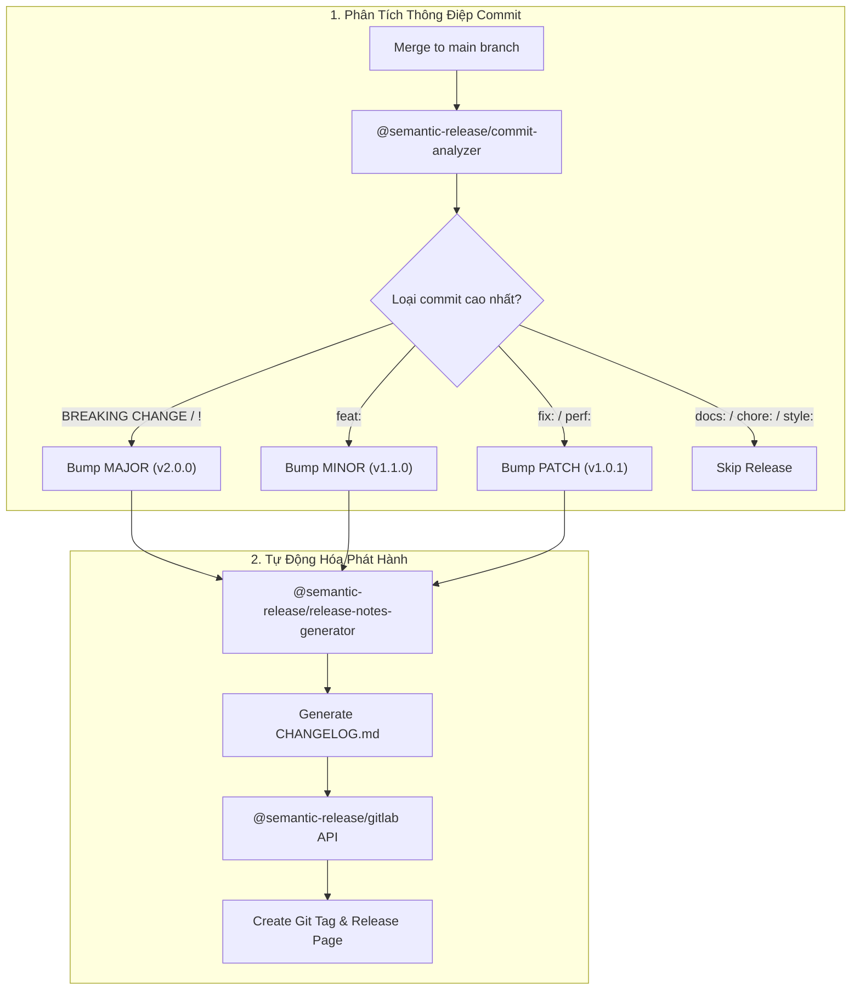


# [BÀI 27] TỰ ĐỘNG HÓA VERSIONING & RELEASE: SEMANTIC-RELEASE, GITVERSION & CHANGELOG

Trong kỷ nguyên **DevOps, DevSecOps và Cloud Native Engineering**, **GitLab CI/CD** được công nhận là một trong những nền tảng tự động hóa tích hợp liên tục và phân phối liên tục (CI/CD) hoàn chỉnh, mạnh mẽ và được tin dùng nhất trong các doanh nghiệp quy mô lớn. Không chỉ dừng lại ở các pipeline tuần tự cơ bản, việc vận hành GitLab CI/CD ở cấp độ Production đòi hỏi kỹ sư phải làm chủ kiến trúc điều phối phi tuyến tính **DAG (Directed Acyclic Graph)**, cơ chế quản trị **Autoscaling Runners**, tối ưu hóa **Caching đa tầng**, xác thực không khóa **Keyless OIDC**, bảo mật chuỗi cung ứng phần mềm **SLSA & SBOM** cùng các chính sách **Quality & Security Gates** tự động.

Bài viết chuyên sâu này sẽ đồng hành cùng bạn mổ xẻ toàn diện bức tranh kiến trúc, phân tích các đánh đổi kỹ thuật thực chiến (Engineering Trade-offs), cung cấp hướng dẫn thực hành Lab chi tiết từng bước và bộ câu hỏi phỏng vấn chuyên sâu chuẩn DevOps Lead / DevSecOps Architect.

---

## 1. Bản Chất Kiến Trúc & Cơ Chế Vận Hành Tầng Thấp

### 1.1. Luận Đề Trung Tâm: Loại Bỏ Yếu Tố Con Người Khỏi Quy Trình Đánh Số Phiên Bản & Phát Hành

Trong mô hình phát triển phần mềm thủ công truyền thống, việc phát hành một phiên bản mới thường là chuỗi các thao tác dễ gây lỗi:
1. **Tranh cãi về số phiên bản (Version Bikeshedding)**: Các kỹ sư bất đồng ý kiến về việc nên nâng Minor hay Patch, dẫn đến việc đánh số phiên bản cảm tính và thiếu nhất quán.
2. **Quên cập nhật CHANGELOG**: Tài liệu lịch sử thay đổi bị bỏ trống hoặc cập nhật cẩu thả, gây khó khăn cho đội ngũ vận hành và khách hàng khi nâng cấp.
3. **Hiện tượng "Tag Drift"**: Kỹ sư tạo Git Tag cục bộ trên máy tính cá nhân nhưng quên push lên remote, hoặc build artifact từ commit chưa được merge vào branch chính.

> **Tự động hóa phát hành (Automated Release Management) dựa trên Semantic Versioning và Conventional Commits là tiêu chuẩn vàng giúp chuyển hóa 100% commit messages của nhà phát triển thành quyết định nâng cấp phiên bản hoàn toàn tự động, sinh CHANGELOG chính xác và xuất bản GitLab Release đính kèm Artifacts bất biến.**

```text
       CHU TRÌNH TỰ ĐỘNG HÓA PHÁT HÀNH (Conventional Commits -> Semantic Release)

  [ Developer Commits ]
  - fix(auth): resolve jwt token expiration bug  ──► [ Tự động nâng PATCH: 1.0.0 -> 1.0.1 ]
  - feat(api): add new payment stripe endpoint   ──► [ Tự động nâng MINOR: 1.0.1 -> 1.1.0 ]
  - feat(db)!: drop legacy v1 tables (BREAKING)  ──► [ Tự động nâng MAJOR: 1.1.0 -> 2.0.0 ]
                                                              │
                                                              ▼
                                               [ Semantic-Release Engine ]
                                               1. Phân tích Git Commit History
                                               2. Cập nhật CHANGELOG.md & package.json
                                               3. Tạo Git Tag & Commit [skip ci]
                                               4. Đẩy Assets lên GitLab Release API
```



### 1.2. Quy Chuẩn Semantic Versioning 2.0.0 (SemVer)

Một chuỗi phiên bản chuẩn SemVer có định dạng: `MAJOR.MINOR.PATCH[-PRERELEASE][+BUILDMETADATA]`
- **MAJOR**: Tăng khi có thay đổi phá vỡ tính tương thích ngược của API (Breaking Changes).
- **MINOR**: Tăng khi bổ sung tính năng mới nhưng vẫn tương thích ngược (Backward-compatible Features).
- **PATCH**: Tăng khi sửa lỗi phần mềm và đảm bảo tương thích ngược (Backward-compatible Bug Fixes).
- **Pre-release**: Đánh dấu các bản phát hành thử nghiệm (ví dụ: `2.0.0-beta.1`, `2.0.0-rc.3`).

### 1.3. Phân Biệt Semantic-Release vs GitVersion

1. **Semantic-Release**:
   - Hoạt động dựa trên quy ước **Conventional Commits** (`feat:`, `fix:`, `perf:`).
   - Tự động tạo Git Tag, cập nhật CHANGELOG.md, push commit trở lại repository và kích hoạt GitLab Release API.
2. **GitVersion**:
   - Hoạt động dựa trên cấu trúc phân nhánh Git (GitFlow, GitHub Flow, Trunk-based) và khoảng cách commit từ tag gần nhất.
   - Không tự động push hay tạo tag, chỉ tính toán và xuất các biến môi trường version (ví dụ: `$GitVersion_SemVer`, `$GitVersion_FullSemVer`) để các stage sau sử dụng.

---

## 2. Bảng So Sánh Kỹ Thuật Toàn Diện (Engineering Matrix)

| Tiêu Chí Kỹ Thuật | Semantic-Release | GitVersion | Release-It | Thao Tác Thủ Công (Manual Tag) |
| :--- | :--- | :--- | :--- | :--- |
| **Nguyên Lý Tính Version** | Dựa trên nội dung Commit Message | Dựa trên cấu trúc nhánh & commit count | Tương tác dòng lệnh hoặc cấu hình | Do kỹ sư tự quyết định |
| **Yêu Cầu Format Commit** | **Bắt buộc Conventional Commits** | Không bắt buộc | Không bắt buộc | Tự do |
| **Tự Động Sinh CHANGELOG** | **Có (Hoàn toàn tự động)** | Không (Cần công cụ ngoài) | Có (Tự động hoặc tùy biến) | Thủ công |
| **Hệ Sinh Thái Tối Ưu** | Node.js / Polyglot CI | .NET / JVM / Native C++ | Node.js / Web | Mọi ngôn ngữ |
| **Tạo GitLab Release API** | **Tích hợp sẵn qua Plugin** | Cần viết script curl/release-cli | Cần plugin | Thủ công trên UI |
| **Rủi Ro Vòng Lặp CI** | Cần cờ `[skip ci]` | Zero (Không push commit) | Cần cấu hình skip | Không có |
| **Mức Độ Can Thiệp Của Người** | **Zero Touch (Hoàn toàn tự động)** | Tự động tính toán | Bán tự động | Thủ công 100% |

---

## 3. Kiến Trúc Triển Khai Chuẩn Production (Architecture Breakdown)

### 3.1. Cấu Hình Tệp `.releaserc.json` Chuẩn Enterprise

```json
{
  "branches": [
    "main",
    {
      "name": "beta",
      "prerelease": true
    },
    {
      "name": "next",
      "prerelease": true
    }
  ],
  "plugins": [
    [
      "@semantic-release/commit-analyzer",
      {
        "preset": "conventionalcommits",
        "releaseRules": [
          {"type": "feat", "release": "minor"},
          {"type": "fix", "release": "patch"},
          {"type": "perf", "release": "patch"},
          {"type": "revert", "release": "patch"},
          {"breaking": true, "release": "major"}
        ]
      }
    ],
    [
      "@semantic-release/release-notes-generator",
      {
        "preset": "conventionalcommits"
      }
    ],
    [
      "@semantic-release/changelog",
      {
        "changelogFile": "CHANGELOG.md"
      }
    ],
    [
      "@semantic-release/git",
      {
        "assets": ["CHANGELOG.md", "package.json"],
        "message": "chore(release): ${nextRelease.version} [skip ci]\n\n${nextRelease.notes}"
      }
    ],
    [
      "@semantic-release/gitlab",
      {
        "gitlabUrl": "https://gitlab.corp.internal",
        "assets": [
          {"path": "dist/binaries.tar.gz", "label": "Compiled Binaries"}
        ]
      }
    ]
  ]
}
```

### 3.2. Pipeline `.gitlab-ci.yml` Tự Động Hóa Phát Hành

```yaml
stages:
  - test
  - build
  - release

variables:
  GIT_DEPTH: "0" # Bắt buộc clone toàn bộ lịch sử commit để phân tích tags

run_tests:
  stage: test
  image: node:20-alpine
  script:
    - npm ci
    - npm test

build_artifacts:
  stage: build
  image: node:20-alpine
  needs: ["run_tests"]
  script:
    - npm ci
    - npm run build
    - tar -czf dist/binaries.tar.gz dist/
  artifacts:
    paths:
      - dist/binaries.tar.gz
    expire_in: 1 day

publish_semantic_release:
  stage: release
  image: node:20-alpine
  needs:
    - job: build_artifacts
      artifacts: true
  rules:
    - if: '$CI_COMMIT_BRANCH == "main"'
  before_script:
    - apk add --no-cache git
  script:
    - npm ci
    - npx semantic-release
  variables:
    GITLAB_TOKEN: $GITLAB_RELEASE_TOKEN # Project Access Token với quyền api và write_repository
```

---

## 4. Phân Tích Cạm Bẫy Thực Chiến (5-Whys Incident Analysis)

### Tình Huống Sự Cố Thực Tế:
<span class="badge badge--rose">🕒 06:15 AM</span> Nhóm kỹ sư cấu hình Semantic-Release để tự động commit tệp `CHANGELOG.md` mới lên nhánh `main`. Ngay sau khi release thành công, commit mới của bot lại kích hoạt một pipeline mới, pipeline này lại tiếp tục chạy release, sinh ra hơn 200 bản release rác trong vòng 30 phút và làm tê liệt toàn bộ Runner pool.

### Hậu Quả & Log Lỗi Thực Tế:

```text

Hàng trăm pipeline đồng thời kích hoạt làm nghẽn hàng đợi Runner, cạn kiệt tài nguyên CI/CD và tạo ra hàng loạt release rác trên GitLab Project:

[semantic-release] › ℹ  Start automated release process
[semantic-release] › ✔  Created tag v1.0.201
[semantic-release] › ℹ  Pushing changes to origin main...
[gitlab-ci-runner] › ⚡  New commit detected on branch main by release-bot!
[gitlab-ci-runner] › ⚡  Triggering pipeline #49821 for commit 8f7e2a1
[gitlab-ci-runner] › ⚡  Triggering pipeline #49822 for commit a3d9f10
[gitlab-ci-runner] › ❌  ERROR: Runner concurrency limit reached (50/50 jobs executing). Pipeline queue backlog: 182 pending.
```

### 5-Whys Root Cause Analysis:
1. <span class="badge badge--primary">Why 1</span> Tại sao có hàng trăm Pipeline liên tục tự kích hoạt?  
   &rarr; Do nhánh `main` liên tục nhận được các commit mới được đẩy lên từ tài khoản Release Bot.
2. <span class="badge badge--primary">Why 2</span> Tại sao Release Bot lại liên tục push commit mới?  
   &rarr; Do sau mỗi lần bump version, bot cần ghi đè và commit tệp `CHANGELOG.md` cùng `package.json` ngược trở lại repository.
3. <span class="badge badge--primary">Why 3</span> Tại sao GitLab CI lại kích hoạt pipeline cho commit tự động của Bot?  
   &rarr; Do GitLab CI mặc định coi mọi commit push lên branch `main` là sự kiện push hợp lệ và tự động sinh pipeline mới.
4. <span class="badge badge--primary">Why 4</span> Tại sao thông điệp commit của Bot không được hệ thống bỏ qua?  
   &rarr; Do cấu hình template commit message trong `@semantic-release/git` bị thiếu chỉ thị bỏ qua CI đặc biệt.
5. <span class="badge badge--emerald">Root Cause Remedy</span> Cấu hình `@semantic-release/git` không chèn chuỗi `[skip ci]` hoặc `[ci skip]` vào trường commit message mẫu, đồng thời thiếu quy tắc lọc `workflow:rules` chặn bot commit ở cấp độ pipeline.

### Giải Pháp Khắc Phục Triệt Để:

1. **Thêm cờ `[skip ci]` vào commit message template**:
   ```json
   {
     "message": "chore(release): ${nextRelease.version} [skip ci]\n\n${nextRelease.notes}"
   }
   ```
2. **Cấu hình biến `workflow:rules` chặt chẽ trong GitLab CI**:
   ```yaml
   workflow:
     rules:
       - if: '$CI_COMMIT_MESSAGE =~ /\[skip ci\]/'
         when: never
       - when: always
   ```

---

## 5. Hands-on Lab: Tự Động Hóa Phát Hành Với Semantic-Release (8 Bước Chuẩn)

### 5.1. Mục Tiêu Lab
- Thiết lập dự án Node.js / Polyglot có quy chuẩn Conventional Commits.
- Cấu hình Semantic-Release với các plugin Commit-Analyzer, Changelog, Git và GitLab.
- Cấp phát Project Access Token an toàn cho Release Bot.
- Thực hiện chuỗi commit `feat`, `fix`, `BREAKING CHANGE` và quan sát quy trình phát hành tự động.

```text
       QUY TRÌNH THỰC HÀNH LAB SEMANTIC-RELEASE TRÊN GITLAB CI

     [ Developer ] ──► git commit -m "feat: add user profile api"
                             │
                             ▼
     [ Push to main ] ──► [ Stage: test ] ──► [ Stage: release ]
                                                    │
                                                    ▼
                                     [ npx semantic-release ]
                                     1. Đọc commit -> Quyết định v1.1.0
                                     2. Tạo CHANGELOG.md
                                     3. Git commit [skip ci] & push tag v1.1.0
                                     4. Đăng ký GitLab Release v1.1.0
```

### 5.2. Các Bước Thực Hiện Chi Tiết

#### Bước 1: Khởi Tạo Dự Án `package.json`
```json
{
  "name": "enterprise-service",
  "version": "1.0.0",
  "private": true,
  "scripts": {
    "test": "echo \"Running automated test suite...\" && exit 0"
  },
  "devDependencies": {
    "@semantic-release/changelog": "^6.0.3",
    "@semantic-release/commit-analyzer": "^11.1.0",
    "@semantic-release/git": "^10.0.1",
    "@semantic-release/gitlab": "^13.0.3",
    "@semantic-release/release-notes-generator": "^12.1.0",
    "conventional-changelog-conventionalcommits": "^7.0.2",
    "semantic-release": "^23.0.2"
  }
}
```

#### Bước 2: Cấu Hình Tệp `.releaserc.json`
```json
{
  "branches": ["main"],
  "plugins": [
    "@semantic-release/commit-analyzer",
    "@semantic-release/release-notes-generator",
    [
      "@semantic-release/changelog",
      {
        "changelogFile": "CHANGELOG.md"
      }
    ],
    [
      "@semantic-release/git",
      {
        "assets": ["CHANGELOG.md", "package.json"],
        "message": "chore(release): ${nextRelease.version} [skip ci]\n\n${nextRelease.notes}"
      }
    ],
    "@semantic-release/gitlab"
  ]
}
```

#### Bước 3: Tạo Cấu Hình `.gitlab-ci.yml`
```yaml
stages:
  - test
  - release

variables:
  GIT_DEPTH: 0

test_job:
  stage: test
  image: node:20-alpine
  script:
    - npm test

release_job:
  stage: release
  image: node:20-alpine
  needs: ["test_job"]
  rules:
    - if: '$CI_COMMIT_BRANCH == "main"'
  before_script:
    - apk add --no-cache git
  script:
    - npm ci
    - npx semantic-release
  variables:
    GITLAB_TOKEN: $RELEASE_BOT_TOKEN
```

#### Bước 4: Tạo Project Access Token Trên GitLab
- Truy cập **Settings -> Access Tokens** trong dự án GitLab.
- Tạo token tên `release-bot` với scopes: `api`, `read_repository`, `write_repository` và vai trò `Maintainer`.
- Lưu giá trị token vào biến CI/CD **`RELEASE_BOT_TOKEN`** (Masked và Protected).

#### Bước 5: Thực Hiện Commit Tính Năng Mới (Feature Commit)
```bash
git add .
git commit -m "feat(core): implement core business logic engine"
git push origin main
```

#### Bước 6: Quan Sát Kết Quả Pipeline Phát Hành Lần Đầu
- Xem log job `release_job`: Semantic-Release phân tích commit `feat` và tự động xác định phiên bản tiếp theo là **`v1.1.0`**.
- Bot tự động tạo tệp `CHANGELOG.md`, tạo Git Tag `v1.1.0` và xuất bản GitLab Release.

#### Bước 7: Thực Hiện Commit Sửa Lỗi (Fix Commit)
```bash
git commit --allow-empty -m "fix(core): correct null pointer exception in logger"
git push origin main
```
- Quan sát pipeline: Semantic-Release tự động nâng phiên bản lên **`v1.1.1`** và bổ sung mục sửa lỗi vào CHANGELOG.

#### Bước 8: Thực Hiện Commit Thay Đổi Phá Vỡ (Breaking Change Commit)
```bash
git commit --allow-empty -m "feat(api)!: migrate all endpoints from v1 to v2 rest protocol"
git push origin main
```
- Quan sát pipeline: Semantic-Release phát hiện ký tự `!` (Breaking Change) và tự động nâng thẳng phiên bản lên **`v2.0.0`**!

> [!NOTE]
> **Check-point Lab 27**: Ba lần commit tự động nâng phiên bản chính xác theo thứ tự `v1.1.0` &rarr; `v1.1.1` &rarr; `v2.0.0`, CHANGELOG được cập nhật đầy đủ và không xảy ra hiện tượng lặp vô tận pipeline nhờ cờ `[skip ci]`.

---

## 6. Bộ Câu Hỏi Vấn Đáp & Phỏng Vấn Chuyên Sâu (Self-Check Q&A)

<details class="qa-card">
  <summary class="qa-summary">
    <span class="qa-num-badge">Q01</span>
    <span>Tại sao cần thiết lập `variables: GIT_DEPTH: 0` khi chạy Semantic-Release hoặc GitVersion trong GitLab CI?</span>
  </summary>
  <div class="qa-body">
    <div class="qa-answer">
      <div class="qa-answer-header">
        <svg class="qa-icon" viewBox="0 0 24 24" fill="none" stroke="currentColor" stroke-width="2" stroke-linecap="round" stroke-linejoin="round"><polyline points="20 6 9 17 4 12"></polyline></svg>
        <span>Phân Tích &amp; Lời Giải Kỹ Thuật</span>
      </div>
      <p><strong>Bản chất kỹ thuật:</strong></p>
      <p>Mặc định GitLab Runner sử dụng Shallow Clone (chỉ kéo về 20 hoặc 50 commits gần nhất để tiết kiệm thời gian). Các công cụ như Semantic-Release và GitVersion bắt buộc phải duyệt ngược toàn bộ cây lịch sử Git để tìm Git Tag phát hành trước đó và tính toán chính xác số lượng commit chênh lệch. Nếu không có <code>GIT_DEPTH: 0</code> (Full Clone), công cụ sẽ không tìm thấy tag cũ và có thể đánh sai phiên bản về lại <code>v1.0.0</code>.</p>
    </div>
  </div>
</details>

<details class="qa-card">
  <summary class="qa-summary">
    <span class="qa-num-badge">Q02</span>
    <span>Cú pháp Conventional Commits định nghĩa những loại commit nào và tác động của chúng tới SemVer ra sao?</span>
  </summary>
  <div class="qa-body">
    <div class="qa-answer">
      <div class="qa-answer-header">
        <svg class="qa-icon" viewBox="0 0 24 24" fill="none" stroke="currentColor" stroke-width="2" stroke-linecap="round" stroke-linejoin="round"><polyline points="20 6 9 17 4 12"></polyline></svg>
        <span>Phân Tích &amp; Lời Giải Kỹ Thuật</span>
      </div>
      <p><strong>Quy tắc ánh xạ SemVer:</strong></p>
      <ul>
        <li><code>fix:</code> hoặc <code>perf:</code> &rarr; Nâng <strong>PATCH</strong> (Sửa lỗi, tối ưu hiệu năng).</li>
        <li><code>feat:</code> &rarr; Nâng <strong>MINOR</strong> (Bổ sung tính năng mới).</li>
        <li>Bất kỳ commit nào có ký tự <code>!</code> sau type (ví dụ: <code>feat!:</code>) hoặc có dòng <code>BREAKING CHANGE:</code> trong phần body/footer &rarr; Nâng <strong>MAJOR</strong>.</li>
        <li><code>docs:</code>, <code>style:</code>, <code>refactor:</code>, <code>test:</code>, <code>chore:</code> &rarr; <strong>Không phát hành phiên bản mới</strong>.</li>
      </ul>
    </div>
  </div>
</details>

<details class="qa-card">
  <summary class="qa-summary">
    <span class="qa-num-badge">Q03</span>
    <span>Làm thế nào để Semantic-Release hỗ trợ các nhánh phát hành thử nghiệm (Beta, Alpha, Next)?</span>
  </summary>
  <div class="qa-body">
    <div class="qa-answer">
      <div class="qa-answer-header">
        <svg class="qa-icon" viewBox="0 0 24 24" fill="none" stroke="currentColor" stroke-width="2" stroke-linecap="round" stroke-linejoin="round"><polyline points="20 6 9 17 4 12"></polyline></svg>
        <span>Phân Tích &amp; Lời Giải Kỹ Thuật</span>
      </div>
      <p><strong>Cấu hình nhánh Pre-release:</strong></p>
      <p>Trong tệp <code>.releaserc.json</code>, định nghĩa mảng <code>branches</code> chứa các đối tượng có thuộc tính <code>prerelease: true</code>:</p>
      <pre><code>"branches": [
  "main",
  { "name": "beta", "prerelease": true },
  { "name": "alpha", "prerelease": true }
]</code></pre>
      <p>Khi commit vào nhánh <code>beta</code>, hệ thống sẽ sinh phiên bản có dạng <code>v2.1.0-beta.1</code>.</p>
    </div>
  </div>
</details>

<details class="qa-card">
  <summary class="qa-summary">
    <span class="qa-num-badge">Q04</span>
    <span>Sự khác biệt giữa Project Access Token và Group Access Token khi cấu hình Release Bot là gì?</span>
  </summary>
  <div class="qa-body">
    <div class="qa-answer">
      <div class="qa-answer-header">
        <svg class="qa-icon" viewBox="0 0 24 24" fill="none" stroke="currentColor" stroke-width="2" stroke-linecap="round" stroke-linejoin="round"><polyline points="20 6 9 17 4 12"></polyline></svg>
        <span>Phân Tích &amp; Lời Giải Kỹ Thuật</span>
      </div>
      <p><strong>Phân tích phạm vi:</strong></p>
      <ul>
        <li><strong>Project Access Token</strong>: Chỉ có hiệu lực duy nhất trong 1 repository cụ thể. Đảm bảo nguyên tắc đặc quyền tối thiểu (Least Privilege).</li>
        <li><strong>Group Access Token</strong>: Có quyền truy cập vào tất cả các repositories trong cùng một Group/Subgroup. Phù hợp khi muốn dùng chung 1 cấu hình CI template tập trung cho hàng trăm microservices.</li>
      </ul>
    </div>
  </div>
</details>

<details class="qa-card">
  <summary class="qa-summary">
    <span class="qa-num-badge">Q05</span>
    <span>Tại sao không nên sử dụng nhánh `master` / `main` để làm việc trực tiếp khi áp dụng Trunk-Based Development với Semantic-Release?</span>
  </summary>
  <div class="qa-body">
    <div class="qa-answer">
      <div class="qa-answer-header">
        <svg class="qa-icon" viewBox="0 0 24 24" fill="none" stroke="currentColor" stroke-width="2" stroke-linecap="round" stroke-linejoin="round"><polyline points="20 6 9 17 4 12"></polyline></svg>
        <span>Phân Tích &amp; Lời Giải Kỹ Thuật</span>
      </div>
      <p><strong>Nguyên tắc:</strong></p>
      <p>Trong Trunk-Based Development, nhánh chính (<code>main</code>) được coi là luôn sẵn sàng phát hành (Production-ready). Kỹ sư phải làm việc trên các nhánh ngắn hạn (Short-lived feature branches) và mở Merge Request. Khi MR được squash & merge vào <code>main</code> với tiêu đề chuẩn Conventional Commit, Semantic-Release mới kích hoạt trên <code>main</code> để tạo bản phát hành duy nhất và sạch sẽ.</p>
    </div>
  </div>
</details>

<details class="qa-card">
  <summary class="qa-summary">
    <span class="qa-num-badge">Q06</span>
    <span>Làm sao để đính kèm các tệp nhị phân đã biên dịch (Binary Assets) vào trang GitLab Release thông qua Semantic-Release?</span>
  </summary>
  <div class="qa-body">
    <div class="qa-answer">
      <div class="qa-answer-header">
        <svg class="qa-icon" viewBox="0 0 24 24" fill="none" stroke="currentColor" stroke-width="2" stroke-linecap="round" stroke-linejoin="round"><polyline points="20 6 9 17 4 12"></polyline></svg>
        <span>Phân Tích &amp; Lời Giải Kỹ Thuật</span>
      </div>
      <p><strong>Giải pháp:</strong></p>
      <p>Sử dụng plugin <strong><code>@semantic-release/gitlab</code></strong>. Trong cấu hình plugin, khai báo mảng <code>assets</code> chỉ định đường dẫn các tệp artifact được sinh ra từ stage build trước đó:</p>
      <pre><code>["@semantic-release/gitlab", {
  "assets": [
    { "path": "dist/app-linux-amd64", "label": "Linux AMD64 Binary" },
    { "path": "dist/app-darwin-arm64", "label": "macOS ARM64 Binary" }
  ]
}]</code></pre>
    </div>
  </div>
</details>

<details class="qa-card">
  <summary class="qa-summary">
    <span class="qa-num-badge">Q07</span>
    <span>Làm thế nào để enforce chuẩn Conventional Commits ngay từ máy của lập trình viên và trên GitLab MR?</span>
  </summary>
  <div class="qa-body">
    <div class="qa-answer">
      <div class="qa-answer-header">
        <svg class="qa-icon" viewBox="0 0 24 24" fill="none" stroke="currentColor" stroke-width="2" stroke-linecap="round" stroke-linejoin="round"><polyline points="20 6 9 17 4 12"></polyline></svg>
        <span>Phân Tích &amp; Lời Giải Kỹ Thuật</span>
      </div>
      <p><strong>Chiến lược kiểm soát hai lớp:</strong></p>
      <ol>
        <li><strong>Tại Local</strong>: Cài đặt <code>husky</code> và <code>commitlint</code> để chặn các lệnh <code>git commit</code> không đúng định dạng ngay tại Git hook <code>commit-msg</code>.</li>
        <li><strong>Trên GitLab CI</strong>: Thêm job kiểm tra trong pipeline MR sử dụng <code>commitlint --from origin/main --to HEAD</code> để chặn merge nếu có commit sai quy cách.</li>
      </ol>
    </div>
  </div>
</details>

<details class="qa-card">
  <summary class="qa-summary">
    <span class="qa-num-badge">Q08</span>
    <span>GitVersion tính toán số phiên bản động như thế nào trong mô hình GitFlow?</span>
  </summary>
  <div class="qa-body">
    <div class="qa-answer">
      <div class="qa-answer-header">
        <svg class="qa-icon" viewBox="0 0 24 24" fill="none" stroke="currentColor" stroke-width="2" stroke-linecap="round" stroke-linejoin="round"><polyline points="20 6 9 17 4 12"></polyline></svg>
        <span>Phân Tích &amp; Lời Giải Kỹ Thuật</span>
      </div>
      <p><strong>Cơ chế GitVersion:</strong></p>
      <ul>
        <li>Trên nhánh <code>develop</code>: Tự động cộng thêm 1 Minor và thêm hậu tố commit count (ví dụ: <code>1.2.0-alpha.14</code>).</li>
        <li>Trên nhánh <code>release/1.2.0</code>: Tự động gắn nhãn <code>1.2.0-beta.1</code>.</li>
        <li>Khi merge vào <code>main</code> và gắn tag: Trở thành bản chính thức <code>1.2.0</code>.</li>
      </ul>
    </div>
  </div>
</details>

<details class="qa-card">
  <summary class="qa-summary">
    <span class="qa-num-badge">Q09</span>
    <span>Tại sao cần bảo vệ nhánh (Protected Branch) và cho phép Bot Push khi sử dụng Semantic-Release?</span>
  </summary>
  <div class="qa-body">
    <div class="qa-answer">
      <div class="qa-answer-header">
        <svg class="qa-icon" viewBox="0 0 24 24" fill="none" stroke="currentColor" stroke-width="2" stroke-linecap="round" stroke-linejoin="round"><polyline points="20 6 9 17 4 12"></polyline></svg>
        <span>Phân Tích &amp; Lời Giải Kỹ Thuật</span>
      </div>
      <p><strong>Cấu hình phân quyền:</strong></p>
      <p>Mặc định các nhánh quan trọng như <code>main</code> được bật chế độ Protected (chỉ cho phép merge, cấm push trực tiếp). Khi Semantic-Release cần đẩy commit CHANGELOG và tạo Git Tag, tài khoản Bot (Project Access Token) phải được cấp quyền <code>Maintainer</code> hoặc nằm trong danh sách <em>"Allowed to push"</em> của cài đặt Protected Branch trong GitLab.</p>
    </div>
  </div>
</details>

<details class="qa-card">
  <summary class="qa-summary">
    <span class="qa-num-badge">Q10</span>
    <span>Làm thế nào để xử lý việc phát hành nhiều packages độc lập trong Monorepo bằng Semantic-Release?</span>
  </summary>
  <div class="qa-body">
    <div class="qa-answer">
      <div class="qa-answer-header">
        <svg class="qa-icon" viewBox="0 0 24 24" fill="none" stroke="currentColor" stroke-width="2" stroke-linecap="round" stroke-linejoin="round"><polyline points="20 6 9 17 4 12"></polyline></svg>
        <span>Phân Tích &amp; Lời Giải Kỹ Thuật</span>
      </div>
      <p><strong>Giải pháp:</strong></p>
      <p>Sử dụng công cụ <strong>multi-semantic-release</strong> hoặc <strong>@nx/semver</strong> / <strong>Lerna</strong>. Công cụ sẽ phân tích Git Diff của từng thư mục package riêng biệt, tạo các Git Tags có tiền tố riêng (ví dụ: <code>@enterprise/ui@1.2.0</code> và <code>@enterprise/auth@2.0.1</code>) và xuất bản các bản release độc lập mà không ảnh hưởng lẫn nhau.</p>
    </div>
  </div>
</details>

<details class="qa-card">
  <summary class="qa-summary">
    <span class="qa-num-badge">Q11</span>
    <span>Sự cố: Semantic-Release báo lỗi "Cannot push git tag: remote rejected (pre-receive hook declined)". Xử lý thế nào?</span>
  </summary>
  <div class="qa-body">
    <div class="qa-answer">
      <div class="qa-answer-header">
        <svg class="qa-icon" viewBox="0 0 24 24" fill="none" stroke="currentColor" stroke-width="2" stroke-linecap="round" stroke-linejoin="round"><polyline points="20 6 9 17 4 12"></polyline></svg>
        <span>Phân Tích &amp; Lời Giải Kỹ Thuật</span>
      </div>
      <p><strong>Nguyên nhân & Khắc phục:</strong></p>
      <ul>
        <li><strong>Nguyên nhân</strong>: GitLab Protected Tags đang chặn không cho phép Bot tạo tag mới, hoặc Project Access Token bị hết hạn / thiếu quyền <code>write_repository</code>.</li>
        <li><strong>Khắc phục</strong>: Kiểm tra thời hạn của token trong Settings -> Access Tokens, và cấu hình phần <strong>Protected Tags</strong> (cho phép vai trò Maintainer hoặc tài khoản Bot được tạo tag dạng <code>v*</code>).</li>
      </ul>
    </div>
  </div>
</details>

<details class="qa-card">
  <summary class="qa-summary">
    <span class="qa-num-badge">Q12</span>
    <span>Làm cách nào để tự động kích hoạt downstream pipeline triển khai sau khi Semantic-Release phát hành thành công?</span>
  </summary>
  <div class="qa-body">
    <div class="qa-answer">
      <div class="qa-answer-header">
        <svg class="qa-icon" viewBox="0 0 24 24" fill="none" stroke="currentColor" stroke-width="2" stroke-linecap="round" stroke-linejoin="round"><polyline points="20 6 9 17 4 12"></polyline></svg>
        <span>Phân Tích &amp; Lời Giải Kỹ Thuật</span>
      </div>
      <p><strong>Cấu hình Trigger:</strong></p>
      <p>Sử dụng từ khóa <code>trigger</code> hoặc cờ <code>needs</code> trong GitLab CI. Sau khi job <code>release</code> hoàn tất và tạo tag mới, kích hoạt downstream deployment pipeline bằng cách truyền biến <code>$CI_COMMIT_TAG</code> hoặc sử dụng GitLab Webhook lắng nghe sự kiện <code>Tag Push Event</code> để kích hoạt hệ thống CD (ArgoCD / GitLab Agent).</p>
    </div>
  </div>
</details>

---

## 7. Tổng Kết & Lộ Trình Bài Học Tiếp Theo

### 7.1. Tóm Tắt Các Điểm Cốt Lõi (Architectural Key Takeaways)
- **Zero-Touch Release**: Tự động hóa 100% quy trình đánh số phiên bản, cập nhật CHANGELOG và tạo release.
- **Conventional Commits Standard**: Nền tảng cốt lõi biến commit messages thành chỉ thị nâng cấp SemVer chính xác.
- **Loop Prevention**: Luôn chèn chỉ thị `[skip ci]` vào thông điệp commit tự động của bot để chống đệ quy pipeline.
- **Full History Awareness**: Luôn cấu hình `GIT_DEPTH: 0` trên các job phân tích phiên bản.

### 7.2. Sơ Đồ Tư Duy Tự Động Hóa Versioning & Release (Mindmap)

```text
                    TỰ ĐỘNG HÓA VERSIONING & RELEASE PHẦN MỀM
                                       │
        ┌──────────────────────────────┼──────────────────────────────┐
        ▼                              ▼                              ▼
  [ Commits Standard ]        [ Semantic Engine ]            [ Delivery Automation ]
  - Conventional Commits      - Semantic-Release             - Auto CHANGELOG.md
  - feat / fix / ! breaking   - Commit Analyzer              - GitLab Release Assets
  - Husky & Commitlint Gate   - Skip CI Loop Prevention      - Protected Tag Security
```

> [!TIP]
> **Bước tiếp theo trong lộ trình**: Chính thức bước vào **Phase 4: Toàn Diện An Ninh & DevSecOps**. Khám phá kỹ thuật tích hợp phân tích mã nguồn tĩnh và quét lỗ hổng phụ thuộc trong [Bài 28: Tích Hợp SAST & Dependency Scanning Trong GitLab CI](gitlab-28-28-sast-va-dependency-scanning.html).

