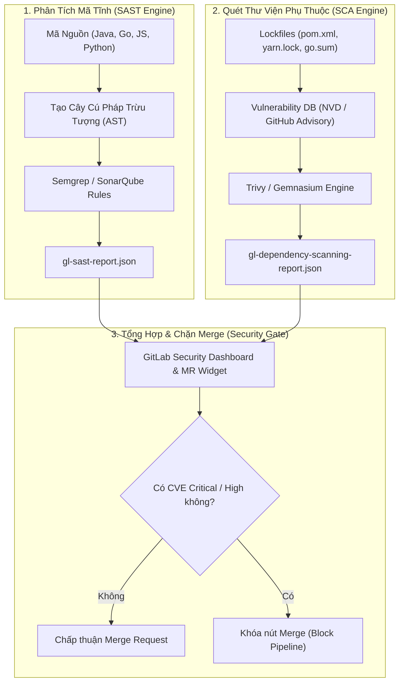


# [BÀI 28] TÍCH HỢP SAST & DEPENDENCY SCANNING TRONG GITLAB CI: SEMGREP, SONARQUBE & TRIVY

Trong kỷ nguyên **DevOps, DevSecOps và Cloud Native Engineering**, **GitLab CI/CD** được công nhận là một trong những nền tảng tự động hóa tích hợp liên tục và phân phối liên tục (CI/CD) hoàn chỉnh, mạnh mẽ và được tin dùng nhất trong các doanh nghiệp quy mô lớn. Không chỉ dừng lại ở các pipeline tuần tự cơ bản, việc vận hành GitLab CI/CD ở cấp độ Production đòi hỏi kỹ sư phải làm chủ kiến trúc điều phối phi tuyến tính **DAG (Directed Acyclic Graph)**, cơ chế quản trị **Autoscaling Runners**, tối ưu hóa **Caching đa tầng**, xác thực không khóa **Keyless OIDC**, bảo mật chuỗi cung ứng phần mềm **SLSA & SBOM** cùng các chính sách **Quality & Security Gates** tự động.

Bài viết chuyên sâu này sẽ đồng hành cùng bạn mổ xẻ toàn diện bức tranh kiến trúc, phân tích các đánh đổi kỹ thuật thực chiến (Engineering Trade-offs), cung cấp hướng dẫn thực hành Lab chi tiết từng bước và bộ câu hỏi phỏng vấn chuyên sâu chuẩn DevOps Lead / DevSecOps Architect.

---

## 1. Bản Chất Kiến Trúc & Cơ Chế Vận Hành Tầng Thấp

### 1.1. Luận Đề Trung Tâm: Triết Lý Shift-Left & Chi Phí Khắc Phục Lỗ Hổng Bảo Mật

Trong chu trình phát triển phần mềm truyền thống, kiểm tra an ninh (Security Assessment) thường là bước cuối cùng được thực hiện bởi đội ngũ Security trước ngày phát hành (Release Gate). Mô hình "gác cổng muộn" này gây ra 3 vấn đề nghiêm trọng:
1. **Chi phí sửa chữa bùng nổ theo cấp số nhân**: Một lỗ hổng SQL Injection hoặc Hardcoded Secret nếu phát hiện ở giai đoạn viết mã (Code) chỉ mất **1 giờ** để sửa; nhưng nếu phát hiện trên Production, chi phí khắc phục, điều tra sự cố và thiệt hại thương hiệu có thể tăng gấp **100x lần**.
2. **Xung đột văn hóa giữa Dev và Sec**: Đội bảo mật chặn đợt release vào phút chót, trong khi đội phát triển chịu áp lực về tiến độ giao hàng (Time-to-Market).
3. **Hiện tượng "Mù bảo mật" trong mã nguồn mở**: Hơn 80% mã nguồn ứng dụng hiện đại cấu thành từ các thư viện bên thứ ba (Third-party Open-source Dependencies) vốn ẩn chứa hàng ngàn lỗ hổng bảo mật đã công bố (CVEs).

> **Giải pháp DevSecOps chuẩn mực là "Shift-Left Security" — đưa các công cụ phân tích mã nguồn tĩnh (SAST) và quét phụ thuộc (Dependency Scanning / SCA) vào chạy tự động ngay trên mỗi commit và Merge Request của GitLab CI/CD, biến bảo mật thành phản hồi tức thì cho lập trình viên.**

```text
       MÔ HÌNH SHIFT-LEFT SECURITY TRONG GITLAB CI/CD PIPELINE

    Commit Code ──► [ Stage: security_scan ] ─────────────────────────┐
                           │                                          │
        ┌──────────────────┴──────────────────┐                       │
        ▼                                     ▼                       ▼
  [ SAST Analyzer: Semgrep ]          [ SCA: Trivy / OSV ]      [ Security Gate ]
  - Quét mã nguồn nội bộ              - Quét package.json/go.sum - Chặn Merge nếu
  - Tìm SQLi, XSS, RCE                - Tra cứu NVD / CVEs         có lỗ hổng CRITICAL
  - Phân tích cây cú pháp AST         - Kiểm tra License rủi ro  - Báo cáo MR Widget
```



### 1.2. Cơ Chế Phân Tích Cú Pháp Trừu Tượng (AST) vs Regex Matching

- **Regex Pattern Matching**: Quét mã nguồn bằng các biểu thức chính quy (ví dụ tìm chuỗi `password =`). Phương pháp này cực kỳ nông, sinh ra vô số **Cảnh báo giả (False Positives)** khi biến nằm trong chuỗi comment hoặc tên hàm vô hại.
- **AST Pattern Matching (Semgrep)**: Phân tích mã nguồn thành cây cú pháp trừu tượng có cấu trúc ngữ nghĩa (Semantic Code Analysis). Semgrep hiểu được luồng truyền dữ liệu (Dataflow Taint Tracking) — theo dõi từ điểm nhận đầu vào không an toàn của người dùng (Source) đến điểm thực thi nguy hiểm trong cơ sở dữ liệu (Sink) để phát hiện chính xác lỗ hổng Injection.

### 1.3. Phân Biệt Giữa SAST, SCA Và DAST

1. **SAST (Static Application Security Testing)**: Quét **Mã nguồn nội bộ (White-box)** không cần biên dịch hay chạy ứng dụng, tìm lỗi cú pháp bảo mật, logic lập trình sai sót (OWASP Top 10).
2. **SCA (Software Composition Analysis / Dependency Scanning)**: Phân tích **Thư viện bên thứ ba** thông qua lockfiles, đối soát với cơ sở dữ liệu CVE toàn cầu và kiểm tra bản quyền mã nguồn mở (GPL, AGPL, MIT).
3. **DAST (Dynamic Application Security Testing)**: Tấn công thử nghiệm ứng dụng khi đang chạy (Black-box testing) từ bên ngoài qua giao thức HTTP.

---

## 2. Bảng So Sánh Kỹ Thuật Toàn Diện (Engineering Matrix)

| Tiêu Chí Kỹ Thuật | Semgrep OSS | SonarQube Enterprise | GitLab SAST (Auto DevOps) | Trivy Vulnerability Scanner |
| :--- | :--- | :--- | :--- | :--- |
| **Phân Loại Công Cụ** | SAST (AST & Taint Analysis) | SAST + Code Quality Gate | SAST Orchestrator đa công cụ | SCA (Dependencies) + Container |
| **Tốc Độ Quét** | **Cực nhanh (< 30 giây)** | Trung bình (1 - 5 phút) | Nhanh - Trung bình | **Siêu tốc (< 10 giây)** |
| **Độ Chính Xác (Taint)** | **Rất cao (Semantic Graph)** | Rất cao | Phụ thuộc analyzer con | Rất cao (Checksum matching) |
| **Tùy Biến Quy Tắc (Rules)** | Rất dễ (Cú pháp YAML Semgrep) | Cần cấu hình UI / XML | Qua `.gitlab/security/ruleset` | Tra cứu database CVE |
| **Hạ Tầng Yêu Cầu** | Zero Infra (Chạy CLI/Docker) | Server SonarQube tập trung | Tích hợp sẵn trong GitLab | Zero Infra (Chạy CLI/Docker) |
| **Báo Cáo Tương Thích** | GitLab SAST JSON / SARIF | Sonar Dashboard & PR Decorator | **GitLab Native Security Widget** | GitLab Dependency JSON / SARIF |
| **Chi Phí Vận Hành** | Miễn phí Open Source | Giấy phép thương mại theo LOC | Tích hợp theo gói GitLab Ultimate | Miễn phí Open Source |

---

## 3. Kiến Trúc Triển Khai Chuẩn Production (Architecture Breakdown)

### 3.1. Pipeline Kết Hợp Semgrep SAST & Trivy SCA Xuất Chuẩn GitLab Security Reports

```yaml
stages:
  - test
  - security_sast
  - security_sca
  - quality_gate

variables:
  SECURE_LOG_LEVEL: "info"
  TRIVY_NO_PROGRESS: "true"

# -------------------------------------------------------------
# 1. Quét Phân Tích Mã Tĩnh (SAST) Với Semgrep OSS
# -------------------------------------------------------------
semgrep_sast_scan:
  stage: security_sast
  image: returntocorp/semgrep:latest
  script:
    - >-
      semgrep scan
      --config auto
      --config "p/owasp-top-ten"
      --config "p/cwe-top-25"
      --gitlab-sast
      --output gl-sast-report.json
      --error
  artifacts:
    reports:
      sast: gl-sast-report.json
    paths:
      - gl-sast-report.json
    expire_in: 14 days
  rules:
    - if: '$CI_PIPELINE_SOURCE == "merge_request_event"'
    - if: '$CI_COMMIT_BRANCH == "main"'

# -------------------------------------------------------------
# 2. Quét Lỗ Hổng Thư Viện Phụ Thuộc (SCA) Với Trivy
# -------------------------------------------------------------
trivy_dependency_scan:
  stage: security_sca
  image:
    name: aquasec/trivy:latest
    entrypoint: [""]
  script:
    # Quét toàn bộ lockfiles và mã nguồn
    - trivy fs --format template --template "@/contrib/gitlab.tpl" --output gl-dependency-scanning-report.json .
    # In báo cáo bảng trực quan trên console log
    - trivy fs --severity HIGH,CRITICAL --exit-code 0 .
  artifacts:
    reports:
      dependency_scanning: gl-dependency-scanning-report.json
    paths:
      - gl-dependency-scanning-report.json
    expire_in: 14 days
  rules:
    - if: '$CI_PIPELINE_SOURCE == "merge_request_event"'
    - if: '$CI_COMMIT_BRANCH == "main"'
```

---

## 4. Phân Tích Cạm Bẫy Thực Chiến (5-Whys Incident Analysis)

### Tình Huống Sự Cố Thực Tế:
<span class="badge badge--rose">🕒 09:20 AM</span> Một ngân hàng tích hợp công cụ SAST quét toàn bộ 50 microservices với bộ quy tắc mặc định cực kỳ nghiêm ngặt. Hàng ngày có hơn 400 cảnh báo bảo mật được sinh ra, nhưng hơn 90% là cảnh báo giả (ví dụ: cảnh báo SQL injection trong các tệp test mock hoặc chuỗi regex cố định). Lập trình viên bị quá tải, bắt đầu nhấn nút "Bỏ qua" (Dismiss) hàng loạt, dẫn đến việc lọt một lỗ hổng RCE thực sự lên môi trường Production.

### Hậu Quả & Log Lỗi Thực Tế:
Hệ thống ngập trong cảnh báo giả khiến đội ngũ kỹ sư mất khả năng nhận biết rủi ro thực tế, lọt lỗ hổng nghiêm trọng vào nhánh production:

```text
[semgrep-sast] › ⚠  WARNING: 428 findings identified across 50 repositories.
[semgrep-sast] › ℹ  Rule 'detect-sql-concat' triggered in /tests/mocks/user_mock.go:142
[semgrep-sast] › ℹ  Rule 'hardcoded-credentials' triggered in /docs/samples/auth_example.py:18
[dev-triage]   › ⚡  Action: Developer dismissed 420 findings as "False Positive" in batch.
[production]   › ❌  CRITICAL SECURITY INCIDENT: Unauthenticated RCE exploited on /api/v1/render
[production]   › ❌  Vulnerability origin: Command injection in template engine (server.js:88) merged 2 days ago without review!
```

### 5-Whys Root Cause Analysis:
1. <span class="badge badge--primary">Why 1</span> Tại sao lỗ hổng RCE nghiêm trọng bị lọt lên Production?  
   &rarr; Do kỹ sư phát triển đã bấm Dismiss hàng loạt các cảnh báo bảo mật trong Merge Request mà không đọc kỹ chi tiết từng tệp.
2. <span class="badge badge--primary">Why 2</span> Tại sao kỹ sư lại bấm Dismiss hàng loạt một cách thiếu thận trọng?  
   &rarr; Do họ bị hội chứng "Bội thực cảnh báo" (Alert Fatigue) vì mỗi lần build lại xuất hiện hơn 400 cảnh báo giả.
3. <span class="badge badge--primary">Why 3</span> Tại sao hệ thống lại sinh ra quá nhiều cảnh báo giả vô nghĩa?  
   &rarr; Do công cụ SAST quét toàn bộ thư mục `/test`, `/mocks`, `/docs` và các tệp script mẫu không chạy trên môi trường thực tế.
4. <span class="badge badge--primary">Why 4</span> Tại sao các thư mục test và mock không được loại trừ khỏi phạm vi phân tích?  
   &rarr; Do dự án chưa cấu hình tệp ignore `.semgrepignore` và thiếu quy trình Triage / Security Policy phân cấp độ tin cậy.
5. <span class="badge badge--emerald">Root Cause Remedy</span> Áp dụng bộ quy tắc SAST mặc định cứng nhắc mà không tinh chỉnh theo ngữ cảnh (Context-aware Tuning), thiếu tệp `.semgrepignore` loại trừ mã kiểm thử và thiếu cơ chế phân tách giữa cảnh báo thông tin với Security Gate chặn merge.

### Giải Pháp Khắc Phục Triệt Để:

1. **Cấu hình loại trừ thư mục kiểm thử trong `.semgrepignore`**:
   ```text
   tests/
   **/*_test.go
   **/*.spec.ts
   fixtures/
   mocks/
   ```
2. **Tùy biến Ruleset trên GitLab**: Tắt các quy tắc có độ tin cậy thấp (Low Confidence) và chỉ kích hoạt chế độ chặn Pipeline (`exit-code 1`) đối với các lỗ hổng có mức độ nghiêm trọng **CRITICAL** đã được kiểm chứng qua Taint Tracking.

---

## 5. Hands-on Lab: Triển Khai Bộ Đôi Semgrep & Trivy Scan (8 Bước Chuẩn)

### 5.1. Mục Tiêu Lab
- Xây dựng ứng dụng Node.js/Express chứa mã nguồn cố tình có lỗi bảo mật (SQL Injection dạng ghép chuỗi) và thư viện phụ thuộc có CVE.
- Cấu hình pipeline GitLab CI/CD tích hợp Semgrep SAST và Trivy SCA.
- Quan sát Semgrep phát hiện chính xác dòng mã nguồn có lỗ hổng.
- Khắc phục lỗ hổng bằng Parameterized Queries và nâng cấp dependency an toàn.

```text
       QUY TRÌNH THỰC HÀNH LAB SAST & DEPENDENCY SCANNING

   [ Vulnerable Node.js App ]
          │
          ├──► app.js (Chứa lỗi SQL Injection ghép chuỗi)
          └──► package.json (Chứa axios phiên bản cũ có CVE)
                   │
                   ▼
   [ GitLab CI/CD Security Pipeline ]
          │
          ├──► [ Job: semgrep_sast ] ──► Phát hiện SQL Injection (app.js:24)
          │                                  │
          └──► [ Job: trivy_sca ]    ──► Phát hiện CVE-2023-45857 (axios)
                                             │
                                             ▼
                               [ Sửa mã nguồn & Nâng Version ]
                                             │
                                             ▼
                               [ Pipeline Pass Tuyệt Đối 100% ]
```

### 5.2. Các Bước Thực Hiện Chi Tiết

#### Bước 1: Khởi Tạo Dự Án `package.json` Chứa Thư Viện Cũ
```json
{
  "name": "devsecops-sample-api",
  "version": "1.0.0",
  "private": true,
  "dependencies": {
    "express": "^4.18.2",
    "pg": "^8.7.1",
    "axios": "0.21.1"
  }
}
```

#### Bước 2: Viết Mã Nguồn `server.js` Chứa Lỗ Hổng SQL Injection Cố Tình
```javascript
const express = require('express');
const { Client } = require('pg');

const app = express();
app.use(express.json());

const db = new Client({
  connectionString: process.env.DATABASE_URL
});

// LỖ HỔNG BẢO MẬT: Ghép chuỗi trực tiếp từ User Input vào câu truy vấn SQL!
app.get('/api/users', async (req, res) => {
  const username = req.query.username;
  const query = "SELECT id, username, email FROM users WHERE username = '" + username + "'";
  try {
    const result = await db.query(query);
    res.json(result.rows);
  } catch (err) {
    res.status(500).json({ error: "Internal Database Error" });
  }
});

app.listen(3000, () => console.log('Server started on port 3000'));
```

#### Bước 3: Tạo Tệp Bỏ Qua `.semgrepignore`
```text
node_modules/
dist/
coverage/
*.test.js
```

#### Bước 4: Tạo Quy Tắc Tùy Chỉnh Semgrep `.semgrep/custom-rules.yml`
```yaml
rules:
  - id: detect-pg-sqli-string-concat
    patterns:
      - pattern: db.query($QUERY)
      - pattern-inside: |
          $QUERY = ... + $INPUT + ...;
          ...
    message: "Phát hiện lỗ hổng SQL Injection: Không ghép chuỗi vào truy vấn db.query()! Hãy dùng Parameterized Query."
    languages: [javascript, typescript]
    severity: ERROR
    metadata:
      cwe: "CWE-89: Improper Neutralization of Special Elements used in an SQL Command"
      owasp: "A03:2021 - Injection"
```

#### Bước 5: Cấu Hình Tệp `.gitlab-ci.yml`
```yaml
stages:
  - security

semgrep_sast:
  stage: security
  image: returntocorp/semgrep:latest
  script:
    - semgrep scan --config .semgrep/ --config "p/javascript" --gitlab-sast --output gl-sast-report.json
  artifacts:
    reports:
      sast: gl-sast-report.json
    paths:
      - gl-sast-report.json

trivy_sca:
  stage: security
  image:
    name: aquasec/trivy:latest
    entrypoint: [""]
  script:
    - trivy fs --severity MEDIUM,HIGH,CRITICAL .
```

#### Bước 6: Đẩy Mã Nguồn Lên GitLab & Quan Sát Kết Quả Báo Lỗi
- Job `semgrep_sast` phát hiện lỗi:
  ```text
  app.js:14: detect-pg-sqli-string-concat
  Phát hiện lỗ hổng SQL Injection: Không ghép chuỗi vào truy vấn db.query()!
  ```
- Job `trivy_sca` liệt kê các CVE của thư viện `axios@0.21.1`.

#### Bước 7: Sửa Mã Nguồn Chuẩn Hóa An Toàn (Remediation)
1. Cập nhật `package.json`: nâng `axios: "^1.6.0"`.
2. Sửa lại `server.js` sử dụng **Parameterized Query**:
   ```javascript
   app.get('/api/users', async (req, res) => {
     const username = req.query.username;
     // Sử dụng Placeholder $1 chống SQL Injection
     const query = "SELECT id, username, email FROM users WHERE username = $1";
     try {
       const result = await db.query(query, [username]);
       res.json(result.rows);
     } catch (err) {
       res.status(500).json({ error: "Internal Database Error" });
     }
   });
   ```

#### Bước 8: Commit Lại Và Kiểm Tra Pipeline Đạt Chuẩn Pass
```bash
git add .
git commit -m "fix(security): resolve sql injection with parameterized query and update axios"
git push origin main
```
- Quan sát pipeline: Cả hai jobs `semgrep_sast` và `trivy_sca` đều hoàn thành với trạng thái **SUCCESS** (0 lỗ hổng).

> [!NOTE]
> **Check-point Lab 28**: Báo cáo SAST và Dependency Scanning được nạp tự động vào GitLab Security Widget trên giao diện Merge Request.

---

## 6. Bộ Câu Hỏi Vấn Đáp & Phỏng Vấn Chuyên Sâu (Self-Check Q&A)

<details class="qa-card">
  <summary class="qa-summary">
    <span class="qa-num-badge">Q01</span>
    <span>Cơ chế "Dataflow Taint Tracking" trong các công cụ SAST hiện đại hoạt động như thế nào?</span>
  </summary>
  <div class="qa-body">
    <div class="qa-answer">
      <div class="qa-answer-header">
        <svg class="qa-icon" viewBox="0 0 24 24" fill="none" stroke="currentColor" stroke-width="2" stroke-linecap="round" stroke-linejoin="round"><polyline points="20 6 9 17 4 12"></polyline></svg>
        <span>Phân Tích &amp; Lời Giải Kỹ Thuật</span>
      </div>
      <p><strong>Nguyên lý hoạt động:</strong></p>
      <p>Taint Tracking mô phỏng luồng dữ liệu truyền qua ứng dụng qua 3 khái niệm:</p>
      <ul>
        <li><strong>Source</strong>: Nơi tiếp nhận dữ liệu không đáng tin cậy từ người dùng (ví dụ: <code>req.query</code>, <code>req.body</code>, headers). Dữ liệu này bị đánh dấu là "Tainted" (bị nhiễm bẩn).</li>
        <li><strong>Sanitizer</strong>: Các hàm làm sạch dữ liệu (như ép kiểu số <code>parseInt()</code>, mã hóa HTML hoặc dùng ORM Parameterization).</li>
        <li><strong>Sink</strong>: Điểm thực thi nhạy cảm trong hệ thống (như <code>db.query()</code>, <code>eval()</code>, <code>exec()</code>).</li>
      </ul>
      <p>Nếu dữ liệu từ Source đi thẳng tới Sink mà không qua bất kỳ Sanitizer nào, SAST sẽ kết luận chính xác 100% có lỗ hổng bảo mật.</p>
    </div>
  </div>
</details>

<details class="qa-card">
  <summary class="qa-summary">
    <span class="qa-num-badge">Q02</span>
    <span>Tại sao nên sử dụng báo cáo chuẩn định dạng `gl-sast-report.json` trong GitLab CI?</span>
  </summary>
  <div class="qa-body">
    <div class="qa-answer">
      <div class="qa-answer-header">
        <svg class="qa-icon" viewBox="0 0 24 24" fill="none" stroke="currentColor" stroke-width="2" stroke-linecap="round" stroke-linejoin="round"><polyline points="20 6 9 17 4 12"></polyline></svg>
        <span>Phân Tích &amp; Lời Giải Kỹ Thuật</span>
      </div>
      <p><strong>Lợi ích tích hợp:</strong></p>
      <p>Khi khai báo tệp báo cáo trong khối <code>artifacts:reports:sast: gl-sast-report.json</code>, GitLab Server sẽ tự động phân tích cú pháp JSON này và hiển thị danh sách các lỗ hổng mới trực tiếp ngay trong giao diện <strong>Merge Request Security Widget</strong>. Nhờ đó, Reviewer có thể thấy ngay lập tức commit mới thêm vào những lỗ hổng nào mà không cần tải log hay đọc file thô.</p>
    </div>
  </div>
</details>

<details class="qa-card">
  <summary class="qa-summary">
    <span class="qa-num-badge">Q03</span>
    <span>Sự khác biệt giữa lỗ hổng trực tiếp (Direct Dependency) và lỗ hổng gián tiếp (Transitive Dependency) là gì?</span>
  </summary>
  <div class="qa-body">
    <div class="qa-answer">
      <div class="qa-answer-header">
        <svg class="qa-icon" viewBox="0 0 24 24" fill="none" stroke="currentColor" stroke-width="2" stroke-linecap="round" stroke-linejoin="round"><polyline points="20 6 9 17 4 12"></polyline></svg>
        <span>Phân Tích &amp; Lời Giải Kỹ Thuật</span>
      </div>
      <p><strong>Phân tích:</strong></p>
      <ul>
        <li><strong>Direct Dependency</strong>: Là thư viện được bạn khai báo trực tiếp trong tệp cấu hình (ví dụ <code>express</code> trong <code>package.json</code>).</li>
        <li><strong>Transitive Dependency</strong>: Là thư viện mà thư viện của bạn phụ thuộc vào (ví dụ <code>express</code> phụ thuộc vào <code>body-parser</code>, <code>body-parser</code> phụ thuộc vào <code>qs</code>). Hơn 70% lỗ hổng bảo mật trong ứng dụng thực tế xuất phát từ các transitive dependencies nằm sâu 3-4 tầng.</li>
      </ul>
    </div>
  </div>
</details>

<details class="qa-card">
  <summary class="qa-summary">
    <span class="qa-num-badge">Q04</span>
    <span>Làm thế nào để xử lý một lỗ hổng trong Transitive Dependency khi tác giả của Direct Dependency chưa phát hành bản vá?</span>
  </summary>
  <div class="qa-body">
    <div class="qa-answer">
      <div class="qa-answer-header">
        <svg class="qa-icon" viewBox="0 0 24 24" fill="none" stroke="currentColor" stroke-width="2" stroke-linecap="round" stroke-linejoin="round"><polyline points="20 6 9 17 4 12"></polyline></svg>
        <span>Phân Tích &amp; Lời Giải Kỹ Thuật</span>
      </div>
      <p><strong>Chiến lược khắc phục:</strong></p>
      <ol>
        <li>Sử dụng tính năng <strong>Overrides / Resolutions</strong> trong tệp <code>package.json</code> (đối với NPM/Yarn/PNPM) để ép buộc toàn bộ cây phụ thuộc dùng phiên bản vá lỗi của transitive package.</li>
        <li>Tạm thời thay thế direct package bằng một thư viện khác tương đương.</li>
        <li>Áp dụng WAF (Web Application Firewall) hoặc Virtual Patching tại tầng Ingress để chặn mẫu khai thác trong lúc chờ bản vá chính thức.</li>
      </ol>
    </div>
  </div>
</details>

<details class="qa-card">
  <summary class="qa-summary">
    <span class="qa-num-badge">Q05</span>
    <span>Tại sao quét SAST không thể thay thế hoàn toàn việc kiểm thử DAST và Penetration Testing?</span>
  </summary>
  <div class="qa-body">
    <div class="qa-answer">
      <div class="qa-answer-header">
        <svg class="qa-icon" viewBox="0 0 24 24" fill="none" stroke="currentColor" stroke-width="2" stroke-linecap="round" stroke-linejoin="round"><polyline points="20 6 9 17 4 12"></polyline></svg>
        <span>Phân Tích &amp; Lời Giải Kỹ Thuật</span>
      </div>
      <p><strong>Giới hạn của SAST:</strong></p>
      <p>SAST chỉ nhìn thấy mã nguồn tĩnh, nó hoàn toàn "mù" đối với:</p>
      <ul>
        <li>Các cấu hình sai lệch trong môi trường triển khai thực tế (Misconfigurations ở Nginx, Kubernetes RBAC, IAM roles).</li>
        <li>Các lỗi logic kinh doanh phức tạp (Business Logic Flaws) như chuyển khoản tiền âm hoặc bypass quy trình thanh toán.</li>
        <li>Các lỗ hổng phát sinh từ tương tác động giữa nhiều microservices lúc runtime.</li>
      </ul>
    </div>
  </div>
</details>

<details class="qa-card">
  <summary class="qa-summary">
    <span class="qa-num-badge">Q06</span>
    <span>Làm sao để cấu hình SonarQube Quality Gate tự động chặn Merge Request khi không đạt tiêu chuẩn?</span>
  </summary>
  <div class="qa-body">
    <div class="qa-answer">
      <div class="qa-answer-header">
        <svg class="qa-icon" viewBox="0 0 24 24" fill="none" stroke="currentColor" stroke-width="2" stroke-linecap="round" stroke-linejoin="round"><polyline points="20 6 9 17 4 12"></polyline></svg>
        <span>Phân Tích &amp; Lời Giải Kỹ Thuật</span>
      </div>
      <p><strong>Cấu hình:</strong></p>
      <p>Sử dụng tính năng <strong>SonarQube GitLab Integration (PR Decoration)</strong>. Trong pipeline CI, thêm cờ <code>-Dsonar.qualitygate.wait=true</code> vào lệnh <code>sonar-scanner</code>. Runner sẽ giữ kết nối và chờ SonarQube Server tính toán. Nếu điểm Coverage dưới 80% hoặc có 1 lỗi bảo mật mới, SonarQube sẽ trả về mã lỗi và GitLab tự động khóa không cho merge.</p>
    </div>
  </div>
</details>

<details class="qa-card">
  <summary class="qa-summary">
    <span class="qa-num-badge">Q07</span>
    <span>Khái niệm "License Compliance Scanning" là gì và tại sao doanh nghiệp lại cực kỳ quan tâm?</span>
  </summary>
  <div class="qa-body">
    <div class="qa-answer">
      <div class="qa-answer-header">
        <svg class="qa-icon" viewBox="0 0 24 24" fill="none" stroke="currentColor" stroke-width="2" stroke-linecap="round" stroke-linejoin="round"><polyline points="20 6 9 17 4 12"></polyline></svg>
        <span>Phân Tích &amp; Lời Giải Kỹ Thuật</span>
      </div>
      <p><strong>Ý nghĩa pháp lý:</strong></p>
      <p>Một số giấy phép mã nguồn mở có tính chất "lây nhiễm" (Copyleft licenses như GPL-3.0, AGPL). Nếu lập trình viên vô tình import một thư viện GPL vào phần mềm thương mại đóng gói của công ty, về mặt pháp lý công ty có thể bị kiện buộc phải công khai toàn bộ mã nguồn độc quyền của mình. License Compliance Scanning quét phát hiện và chặn các thư viện có giấy phép không tương thích ngay trên CI.</p>
    </div>
  </div>
</details>

<details class="qa-card">
  <summary class="qa-summary">
    <span class="qa-num-badge">Q08</span>
    <span>Làm thế nào để quản lý ngoại lệ bảo mật (Security Exceptions / Vulnerability Dismissal) một cách minh bạch?</span>
  </summary>
  <div class="qa-body">
    <div class="qa-answer">
      <div class="qa-answer-header">
        <svg class="qa-icon" viewBox="0 0 24 24" fill="none" stroke="currentColor" stroke-width="2" stroke-linecap="round" stroke-linejoin="round"><polyline points="20 6 9 17 4 12"></polyline></svg>
        <span>Phân Tích &amp; Lời Giải Kỹ Thuật</span>
      </div>
      <p><strong>Quy trình Enterprise:</strong></p>
      <ul>
        <li>Không cho phép developer tự ý xóa cảnh báo.</li>
        <li>Yêu cầu tạo một bản ghi <strong>Vulnerability Exception Ticket</strong> trên hệ thống quản lý rủi ro (Jira/ServiceNow), có chữ ký phê duyệt của Security Lead.</li>
        <li>Ghi nhận lý do kỹ thuật (ví dụ: endpoint chỉ chạy trong mạng nội bộ cô lập) và đặt thời hạn hết hạn ngoại lệ (Expiry Date, ví dụ: 30 ngày) để bắt buộc xem xét lại.</li>
      </ul>
    </div>
  </div>
</details>

<details class="qa-card">
  <summary class="qa-summary">
    <span class="qa-num-badge">Q09</span>
    <span>Tại sao công cụ Semgrep lại được ưa chuộng hơn các công cụ SAST truyền thống (như Fortify, Checkmarx)?</span>
  </summary>
  <div class="qa-body">
    <div class="qa-answer">
      <div class="qa-answer-header">
        <svg class="qa-icon" viewBox="0 0 24 24" fill="none" stroke="currentColor" stroke-width="2" stroke-linecap="round" stroke-linejoin="round"><polyline points="20 6 9 17 4 12"></polyline></svg>
        <span>Phân Tích &amp; Lời Giải Kỹ Thuật</span>
      </div>
      <p><strong>Ưu điểm vượt trội:</strong></p>
      <ul>
        <li><strong>Tốc độ thực thi</strong>: Quét hàng trăm ngàn dòng code chỉ trong vài chục giây thay vì hàng giờ.</li>
        <li><strong>Cú pháp viết luật đơn giản</strong>: Viết rules bằng chính cú pháp mã nguồn thực tế kết hợp YAML, bất kỳ developer nào cũng có thể tự viết thêm luật riêng cho công ty mà không cần học ngôn ngữ đặc tả phức tạp.</li>
        <li><strong>Tích hợp CI nhẹ nhàng</strong>: Đóng gói dưới dạng 1 binary hoặc 1 Docker image siêu nhẹ.</li>
      </ul>
    </div>
  </div>
</details>

<details class="qa-card">
  <summary class="qa-summary">
    <span class="qa-num-badge">Q10</span>
    <span>Làm thế nào để tối ưu hóa thời gian quét Dependency Scanning trong các dự án Monorepo lớn?</span>
  </summary>
  <div class="qa-body">
    <div class="qa-answer">
      <div class="qa-answer-header">
        <svg class="qa-icon" viewBox="0 0 24 24" fill="none" stroke="currentColor" stroke-width="2" stroke-linecap="round" stroke-linejoin="round"><polyline points="20 6 9 17 4 12"></polyline></svg>
        <span>Phân Tích &amp; Lời Giải Kỹ Thuật</span>
      </div>
      <p><strong>Giải pháp:</strong></p>
      <ul>
        <li>Cache cơ sở dữ liệu lỗ hổng (Vulnerability Database) của Trivy giữa các lần chạy job để tránh việc tải lại 50MB dữ liệu CVE từ Internet mỗi lần.</li>
        <li>Kết hợp <code>rules:changes</code> để chỉ quét các thư mục con có tệp <code>package.json</code>, <code>pom.xml</code> hoặc <code>go.sum</code> thực sự bị thay đổi trong commit.</li>
      </ul>
    </div>
  </div>
</details>

<details class="qa-card">
  <summary class="qa-summary">
    <span class="qa-num-badge">Q11</span>
    <span>Sự cố: Job SAST báo lỗi "Out of Memory" khi quét repository có dung lượng mã nguồn lớn (> 500MB). Xử lý thế nào?</span>
  </summary>
  <div class="qa-body">
    <div class="qa-answer">
      <div class="qa-answer-header">
        <svg class="qa-icon" viewBox="0 0 24 24" fill="none" stroke="currentColor" stroke-width="2" stroke-linecap="round" stroke-linejoin="round"><polyline points="20 6 9 17 4 12"></polyline></svg>
        <span>Phân Tích &amp; Lời Giải Kỹ Thuật</span>
      </div>
      <p><strong>Khắc phục:</strong></p>
      <ol>
        <li>Thêm tệp <code>.semgrepignore</code> loại bỏ các tệp build outputs, bundle minified files (<code>*.min.js</code>), thư mục tài liệu và assets hình ảnh.</li>
        <li>Tăng giới hạn bộ nhớ của Runner Pod trong Kubernetes.</li>
        <li>Chạy Semgrep với cờ giới hạn số tiến trình song song: <code>--max-target-bytes=5000000 -j 2</code>.</li>
      </ol>
    </div>
  </div>
</details>

<details class="qa-card">
  <summary class="qa-summary">
    <span class="qa-num-badge">Q12</span>
    <span>Khái niệm "Vulnerability Exploitability eXchange (VEX)" giải quyết vấn đề gì trong DevSecOps?</span>
  </summary>
  <div class="qa-body">
    <div class="qa-answer">
      <div class="qa-answer-header">
        <svg class="qa-icon" viewBox="0 0 24 24" fill="none" stroke="currentColor" stroke-width="2" stroke-linecap="round" stroke-linejoin="round"><polyline points="20 6 9 17 4 12"></polyline></svg>
        <span>Phân Tích &amp; Lời Giải Kỹ Thuật</span>
      </div>
      <p><strong>Ý nghĩa của VEX:</strong></p>
      <p>VEX là một định dạng tài liệu đi kèm với SBOM, cho phép nhà phát triển tuyên bố chính thức rằng: Mặc dù container có chứa một thư viện dính CVE X, nhưng ứng dụng <em>hoàn toàn không bị ảnh hưởng (Not Affected)</em> vì mã nguồn không hề gọi tới hàm bị lỗi đó. Máy quét bảo mật khi đọc tệp VEX sẽ tự động bỏ qua cảnh báo này, loại bỏ triệt để cảnh báo rác.</p>
    </div>
  </div>
</details>

---

## 7. Tổng Kết & Lộ Trình Bài Học Tiếp Theo

### 7.1. Tóm Tắt Các Điểm Cốt Lõi (Architectural Key Takeaways)
- **Shift-Left Paradigm**: Phát hiện và chặn đứng lỗ hổng bảo mật ngay tại giai đoạn commit mã nguồn giúp giảm 100x chi phí khắc phục.
- **AST-Powered SAST**: Sử dụng Semgrep với cơ chế Taint Tracking để nhận diện chính xác các lỗ hổng Injection phức tạp.
- **Automated SCA**: Quét toàn diện các lỗ hổng CVEs và rủi ro pháp lý giấy phép trong cây phụ thuộc bằng Trivy.
- **Native Report Integration**: Xuất bản báo cáo chuẩn `gl-sast-report.json` hiển thị trực quan trên Merge Request Widget.

### 7.2. Sơ Đồ Tư Duy Hệ Thống SAST & SCA (Mindmap)

```text
                       BẢO MẬT MÃ NGUỒN VÀ PHỤ THUỘC (SAST & SCA)
                                           │
        ┌──────────────────────────────────┼──────────────────────────────────┐
        ▼                                  ▼                                  ▼
  [ SAST Engine ]                 [ SCA Engine ]                 [ Security Governance ]
  - Semgrep AST & Taint           - Trivy Lockfile Scanner       - gl-sast-report.json
  - OWASP Top 10 & CWE Top 25     - CVE Vulnerability DB         - MR Security Widget Gate
  - Custom Semgrep Rules          - Open Source License Check    - Alert Fatigue Tuning
```

> [!TIP]
> **Bước tiếp theo trong lộ trình**: Nâng tầm kiểm thử bảo mật động và kiểm thử độ bền ứng dụng lúc runtime trong [Bài 29: DAST & Fuzz Testing: OWASP ZAP, API Fuzzing & DAST Proxy](gitlab-29-29-dast-va-fuzz-testing.html).

