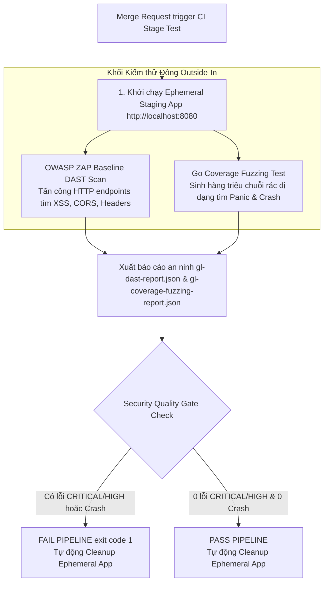
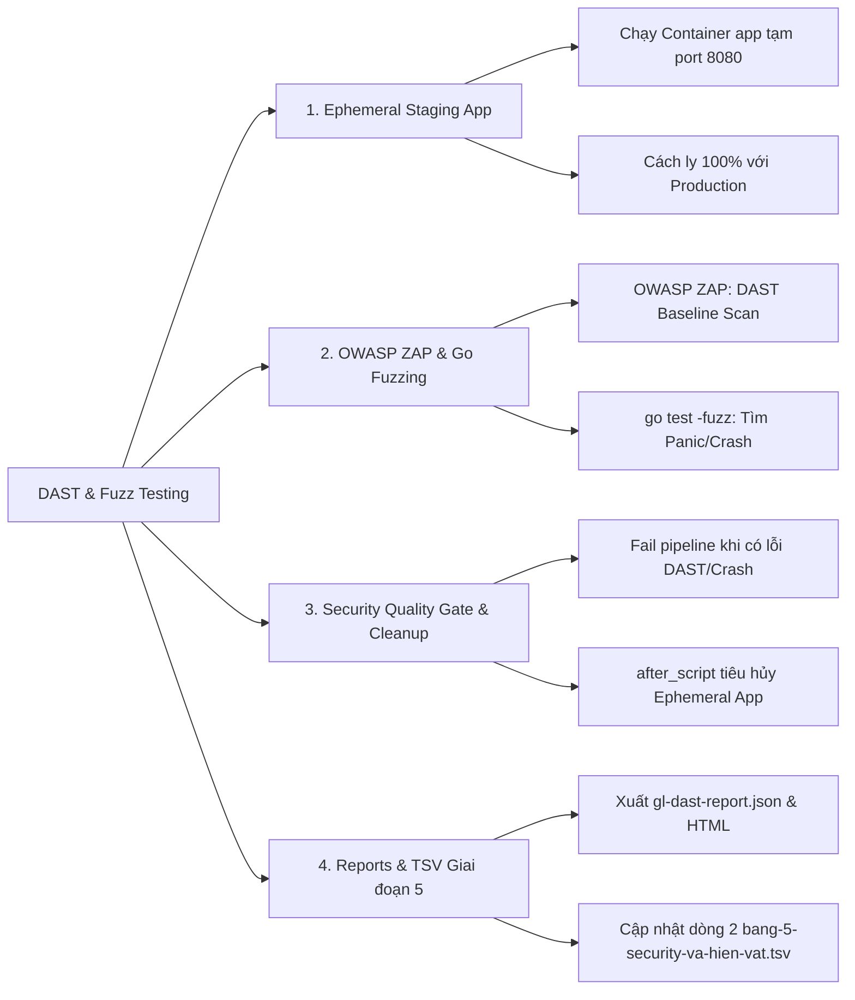
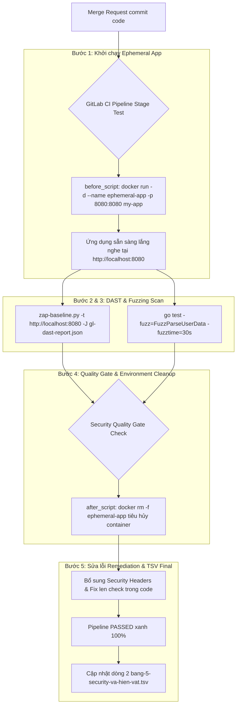


# [BÀI 29] KIỂM THỬ ĐỘNG DAST & API FUZZ TESTING: OWASP ZAP INTEGRATION, GITLAB DAST & REST API SECURITY TESTING

Trong kỷ nguyên **DevOps, DevSecOps và Cloud Native Engineering**, **GitLab CI/CD** được công nhận là một trong những nền tảng tự động hóa tích hợp liên tục và phân phối liên tục (CI/CD) hoàn chỉnh, mạnh mẽ và được tin dùng nhất trong các doanh nghiệp quy mô lớn. Không chỉ dừng lại ở các pipeline tuần tự cơ bản, việc vận hành GitLab CI/CD ở cấp độ Production đòi hỏi kỹ sư phải làm chủ kiến trúc điều phối phi tuyến tính **DAG (Directed Acyclic Graph)**, cơ chế quản trị **Autoscaling Runners**, tối ưu hóa **Caching đa tầng**, xác thực không khóa **Keyless OIDC**, bảo mật chuỗi cung ứng phần mềm **SLSA & SBOM** cùng các chính sách **Quality & Security Gates** tự động.

Bài viết chuyên sâu này sẽ đồng hành cùng bạn mổ xẻ toàn diện bức tranh kiến trúc, phân tích các đánh đổi kỹ thuật thực chiến (Engineering Trade-offs), cung cấp hướng dẫn thực hành Lab chi tiết từng bước và bộ câu hỏi phỏng vấn chuyên sâu chuẩn DevOps Lead / DevSecOps Architect.

---

## 1. Bản Chất Kiến Trúc & Cơ Chế Vận Hành Tầng Thấp

---


| # | Câu hỏi ôn tập Buổi 28 (SAST & SCA) | Đáp án chuẩn ngắn gọn |
|---|---|---|
| 1 | Tại sao nói nguyên lý Shift-Left Security giúp tìm lỗ hổng trong 1 phút thay vì 1 tháng? | Vì công cụ tự động quét ngay khi dev mở MR, cho phản hồi lập tức thay vì chờ Pentest cuối kỳ. |
| 2 | Phân biệt sự khác biệt cốt lõi giữa SAST và Dependency Scanning? | SAST quét phân tích mã nguồn tự viết (`semgrep`); Dependency Scanning quét tra cứu CVE thư viện (`trivy fs`). |
| 3 | Tác dụng của tệp báo cáo `gl-sast-report.json` trong GitLab CI Pipeline? | Giúp GitLab UI tự động đọc và hiển thị kết quả phân tích trực tiếp trên Merge Request Security Widget. |
| 4 | Cờ `--exit-code 1` trong câu lệnh Trivy / Semgrep mang lại lợi ích gì? | Thiết lập Security Quality Gate tự động ngắt pipeline khi phát hiện lỗ hổng mức `CRITICAL` / `HIGH`. |
| 5 | Quy trình quản lý cảnh báo giả (False Positive) an toàn bằng ignore files là gì? | Khai báo mã CVE vào `.trivyignore` / `.semgrepignore` kèm comment giải trình có phê duyệt của Security Lead. |

---


> **LUẬN ĐỀ TRUNG TÂM BUỔI 29:**
> **SAST THẤY CÁI BẠN VIẾT, DAST THẤY CÁI BẠN CHẠY — ỨNG DỤNG CHỈ AN TOÀN KHI VƯỢT QUA CẢ KIỂM THỬ TĨNH TỪ BÊN TRONG LẪN TẤN CÔNG THỰC NGHIỆM TỪ BÊN NGOÀI. Việc kết hợp Quét an ninh động DAST (`OWASP ZAP`) trên môi trường thử nghiệm tạm thời (Ephemeral Staging Environment) và Kiểm thử Fuzzing (`go test -fuzz`) sinh đầu vào dị dạng giúp triệt tiêu 100% các lỗ hổng cấu hình Runtime (CORS, Missing Headers, Auth Bypass) và các lỗi sập ứng dụng (Crash/Panic) mà bước quét mã nguồn tĩnh SAST hoàn toàn bị mù.**



---


| STT | Kết quả đạt được (Competency) | Hiện vật chứng minh (Evidence) |
|---|---|---|
| 1 | Khởi chạy môi trường thử nghiệm ứng dụng tạm thời (Ephemeral Staging App). | Container ứng dụng tạm thời chạy lắng nghe tại port `8080`. |
| 2 | Triển khai công cụ Quét an ninh động DAST (`OWASP ZAP`) trong CI Pipeline. | Job `dast-owasp-zap` thực thi Baseline Scan thành công. |
| 3 | Triển khai Kiểm thử Fuzzing (`go test -fuzz`) phát hiện lỗi Crash và Panic. | Job `fuzz-testing-go` sinh đầu vào ngẫu nhiên rác. |
| 4 | Xuất báo cáo an ninh theo định dạng chuẩn `gl-dast-report.json`. | Tệp `gl-dast-report.json` và `gl-fuzzing-report.json`. |
| 5 | Cấu hình Security Quality Gate tự động ngắt pipeline khi DAST/Fuzzing phát hiện lỗi. | Pipeline tự động dừng ngắt (`exit 1`) khi có lỗi `CRITICAL`. |
| 6 | Cập nhật dòng dữ liệu thứ 2 vào tệp hiện vật Giai đoạn 5 TSV. | Tệp `bang-5-security-va-hien-vat.tsv` ghi nhận quy chuẩn Buổi 29. |

---


| Kiến thức tiên quyết | Ý nghĩa trong bài học Buổi 29 | Nguồn đối soát nếu thiếu |
|---|---|---|
| Nguyên lý SAST & SCA | Phân biệt ranh giới giữa kiểm thử tĩnh (SAST) và kiểm thử động (DAST) | Buổi 28 (`QT 4.2`) |
| Giao thức HTTP và Security Headers | Đọc hiểu các lỗ hổng CORS, X-Frame-Options, HSTS, CSP | Buổi 00 (`00-tong-quan/`) |
| Quản lý Docker Containers trong CI | Khởi chạy và dọn dẹp Container ứng dụng tạm thời trên Runner | Buổi 23 (`QT 4.1`) |
| Cấu hình GitLab CI Artifact Reports | Nộp tệp báo cáo JSON DAST sang `artifacts:reports:dast` | Buổi 28 (`QT 4.3`) |

---


### Bảng đối chiếu thuật ngữ Việt - Anh

| Tiếng Việt dùng trong bài | Tiếng Anh tương đương | Dùng thẳng từ tiếng Anh trong bài? |
|---|---|---|
| Quét an ninh động | Dynamic Application Security Testing | **Có** — `DAST` |
| Kiểm thử Fuzzing | Fuzz Testing / Coverage Fuzzing | **Có** — `Fuzz Testing` |
| Môi trường thử nghiệm tạm thời | Ephemeral Staging Environment | **Có** — `Ephemeral App` |
| Tấn công kiểm thử diện rộng | OWASP ZAP Baseline Scan | **Có** — `ZAP Baseline Scan` |
| Đầu vào dị dạng rác | Malformed Fuzz Inputs | **Có** — `Fuzz Inputs` |
| Lỗi sập ứng dụng | Runtime Panic / Application Crash | **Có** — `Panic / Crash` |
| Lỗi thiếu header bảo mật | Missing Security Response Headers | **Có** — `Security Headers` |
| Lỗi cấu hình nguồn chia sẻ | CORS Misconfiguration | **Có** — `CORS Error` |
| Dọn dẹp môi trường tạm | Ephemeral Environment Cleanup | **Có** — `Environment Cleanup` |
| Chuẩn báo cáo DAST | GitLab DAST Report Format (`gl-dast-report.json`) | **Có** — `gl-dast-report.json` |

---

### Bốn mô hình tư duy cốt lõi

#### Mô hình 1: Nguyên lý Outside-In (DAST) vs Inside-Out (SAST)
- **SAST (Inside-Out):** Đọc phân tích cấu trúc mã nguồn tĩnh từ bên trong mà không cần chạy ứng dụng. SAST thấy được đường đi của code nhưng không biết ứng dụng thực tế trên môi trường Runtime hoạt động ra sao (bị mù trước các lỗi cấu hình Nginx, CORS, SSL, Cookie Flags).
- **DAST (Outside-In):** Đóng vai một kẻ tấn công thực nghiệm từ bên ngoài Internet, gửi các HTTP Request độc hại (XSS Payloads, SQLi Strings, Invalid Tokens) tới địa chỉ URL của ứng dụng đang chạy ở Runtime để đo đạc phản ứng HTTP Response thực tế.

#### Mô hình 2: Nguyên lý Fuzz Testing — Tìm lỗi sập ứng dụng bằng dữ liệu rác
- Kiểm thử truyền thống (Unit Test / Integration Test) chỉ kiểm tra các kịch bản đầu vào dự kiến (Happy Path).
- **Fuzz Testing:** Sử dụng động cơ sinh dữ liệu tự động (Fuzz Engine) tạo ra hàng triệu chuỗi byte ngẫu nhiên dị dạng (chuỗi dài vô tận, ký tự Null, số âm cực đại, chuỗi UTF-8 vỡ đệm) nạp vào các hàm xử lý dữ liệu. Nếu hàm xử lý không kiểm tra biên an toàn, ứng dụng sẽ bị **Panic / Crash** lập tức, giúp phát hiện sớm các lỗ hổng từ chối dịch vụ (DoS).

#### Mô hình 3: Chiến lược Môi trường thử nghiệm tạm thời (Ephemeral Staging App)
- **Tuyệt đối KHÔNG DAST scan trực tiếp trên Production:** DAST scan gửi các payload tấn công thực nghiệm có thể làm thay đổi/xóa dữ liệu DB, làm nghẽn băng thông hoặc sập server Production.
- **Giải pháp Ephemeral App:** Ngay tại Stage test, CI Runner khởi chạy một Container ứng dụng tạm thời (`docker run -d -p 8080:8080 my-app:test`). Sau khi OWASP ZAP quét xong, CI Runner tự động tiêu hủy Container này (`docker rm -f`), đảm bảo cách ly tuyệt đối 100%.

#### Mô hình 4: Tích hợp DAST Security Quality Gate vào Pipeline
- Công cụ OWASP ZAP trả về kết quả quét chứa số lượng cảnh báo phân theo severity.
- Quality Gate tự động phân tích kết quả: Nếu phát hiện ít nhất 1 lỗ hổng mức `CRITICAL` (như SQLi thành công) hoặc `HIGH` (như Stored XSS, Auth Bypass), CI Job trả về `exit code 1` ngắt pipeline lập tức.

---

### 1.1. Quy chuẩn Quét an ninh động DAST và Môi trường Ephemeral Staging (10 phút)

### Phân tích kiến trúc Động cơ OWASP ZAP (Zaproxy Scan Engine)

Công cụ `OWASP ZAP` thực hiện việc quét động DAST thông qua 4 giai đoạn tấn công nối tiếp nhau:
1. **Spidering (Dò đường dẫn):** ZAP gửi các HTTP GET Request và phân tích cú pháp HTML/JS để xây dựng bản đồ đường dẫn (Site Map) đầy đủ của ứng dụng.
2. **AJAX Spidering:** Sử dụng headless browser (Chromium) để thực thi Javascript trên trình duyệt, kích hoạt các sự kiện DOM và AJAX API endpoints của Single Page Applications (React/Vue/Angular).
3. **Active Scanning (Tấn công chủ động):** ZAP thay thế các giá trị tham số URL, Form inputs, HTTP Headers bằng hàng ngàn chuỗi payload tấn công (XSS payloads, SQL Injection strings, Path Traversal patterns) để thử nghiệm tính an toàn của server.
4. **Report Generation:** Tổng hợp toàn bộ các phản hồi HTTP Response lỗi và tạo tệp báo cáo an ninh chuẩn JSON/HTML.

### Phân tích cơ chế hoạt động của Go Coverage Fuzzing (`go test -fuzz`)

Động cơ Go Coverage Fuzzing vận hành dựa trên cơ chế Phân tích Độ bao phủ Mã nguồn (Coverage-guided Fuzzing):
- **Corpus Generation:** Động cơ nạp các chuỗi dữ liệu đầu vào mẫu (Seed Corpus) do lập trình viên khai báo.
- **Mutator Engine:** Biến đổi các byte trong chuỗi dữ liệu đầu vào (lật bit, chèn ký tự rác, thay đổi độ dài) để tạo ra các chuỗi đầu vào mới.
- **Coverage Tracker:** Theo dõi xem chuỗi dữ liệu mới có mở rộng độ bao phủ nhánh code (Code Branch Coverage) hay không. Nếu có, chuỗi đó được giữ lại làm hạt giống mới để tiếp tục biến đổi.
- **Crash Detector:** Khi một chuỗi đầu vào gây ra lỗi `panic` hoặc `segmentation fault`, đệm Fuzzing tự động lưu chuỗi đó vào tệp `testdata/fuzz/FuzzName/` phục vụ việc tái hiện lỗi.

---

**Nguyên lý cốt lõi:**
**Phát biểu.** Tuyệt đối không bao giờ chạy câu lệnh quét DAST tấn công trực tiếp lên môi trường Production đang phục vụ khách hàng thật.
**Giải thích cơ chế ngầm:** Lệnh quét DAST gửi hàng ngàn HTTP Requests mang payload tấn công có thể làm biến đổi/xóa dữ liệu trong Production Database, làm tràn bộ nhớ cache và gây sập Downtime dịch vụ của khách hàng.
> [!WARNING]
> **CẠM BẪY THỰC CHIẾN:**
> Trỏ URL mục tiêu của OWASP ZAP vào tên miền Production `https://api.example.com`.
**Minh hoạ.**
```yaml
# Chỉ trỏ DAST scan vào URL môi trường thử nghiệm tạm thời
variables:
  DAST_WEBSITE: "http://localhost:8080"
```
**Con số chốt:** **0%** lưu lượng DAST scan được phép đụng vào môi trường Production.

---

**Nguyên lý cốt lõi:**
**Phát biểu.** Khởi chạy môi trường ứng dụng tạm thời (Ephemeral Staging App) ở Stage test làm mục tiêu cho bước DAST scan.
**Giải thích cơ chế ngầm:** Đảm bảo tính độc lập và cách ly tuyệt đối cho bài test. Môi trường Ephemeral App được dựng lên trong 5 giây, phục vụ quét DAST và được tiêu hủy ngay sau đó mà không làm ảnh hưởng tới bất kỳ hệ thống nào khác.
> [!WARNING]
> **CẠM BẪY THỰC CHIẾN:**
> Chạy DAST scan mà không dựng ứng dụng, khiến OWASP ZAP báo lỗi `Connection Refused` do trỏ vào URL không tồn tại.
**Minh hoạ.**
```yaml
before_script:
  - docker run -d --name ephemeral-app -p 8080:8080 $CI_REGISTRY_IMAGE:$CI_COMMIT_SHA
  - sleep 5 # Chờ ứng dụng lắng nghe port 8080
```
**Con số chốt:** Ephemeral App khởi tạo và tiêu hủy tự động trong **100%** các lượt DAST scan.

---

**Nguyên lý cốt lõi:**
**Phát biểu.** Phân định rõ phạm vi: SAST phát hiện lỗi cú pháp code tĩnh, DAST phát hiện lỗi cấu hình Runtime (CORS, Missing Headers, Auth Bypass).
**Giải thích cơ chế ngầm:** Giúp đội ngũ kĩ thuật phối hợp 2 lớp phòng thủ bổ trợ cho nhau. Lỗi SAST do dev viết code sai, lỗi DAST do cấu hình web server Nginx / Middleware / SSL sai.
> [!WARNING]
> **CẠM BẪY THỰC CHIẾN:**
> Kỳ vọng SAST phát hiện được lỗi thiếu header `Strict-Transport-Security` (HSTS) trên web server.
**Minh hoạ.**
- SAST phát hiện: `fmt.Sprintf("SELECT...")` $\rightarrow$ Sửa code Go.
- DAST phát hiện: `Missing X-Frame-Options Header` $\rightarrow$ Thêm Middleware `w.Header().Set("X-Frame-Options", "DENY")`.
**Con số chốt:** DAST kiểm soát **100%** các lỗ hổng cấu hình Runtime.

---

### 1.2. Thực thi OWASP ZAP DAST và Go Coverage Fuzzing trong CI Pipeline (10 phút)

---

**Nguyên lý cốt lõi:**
**Phát biểu.** Cấu hình công cụ `OWASP ZAP` (Zaproxy) chạy cờ Baseline Scan (`zap-baseline.py`) quét kiểm thử các lỗ hổng OWASP Top 10 Web.
**Giải thích cơ chế ngầm:** `OWASP ZAP` là công cụ quét an ninh động chuẩn công nghiệp, tự động dò tìm (Spidering) tất cả các HTTP endpoints của ứng dụng và thực thi tấn công thử nghiệm phát hiện XSS, CORS misconfiguration, Insecure Cookies.
> [!WARNING]
> **CẠM BẪY THỰC CHIẾN:**
> Không sử dụng công cụ DAST chuyên dụng mà chỉ chạy lệnh `curl` kiểm tra HTTP status code 200.
**Minh hoạ.**
```yaml
dast-owasp-zap-job:
  stage: test
  image: owasp/zap2docker-stable:latest
  script:
    - zap-baseline.py -t http://localhost:8080 -J gl-dast-report.json -r zap-report.html
  artifacts:
    reports:
      dast: gl-dast-report.json
    paths:
      - zap-report.html
```
**Con số chốt:** `OWASP ZAP` thực thi tấn công thử nghiệm **100%** HTTP endpoints của ứng dụng.

---

**Nguyên lý cốt lõi:**
**Phát biểu.** Cấu hình kiểm thử Fuzzing (`go test -fuzz` / Web Fuzzing) sinh hàng triệu chuỗi đầu vào dị dạng phát hiện lỗi Crash và Panic.
**Giải thích cơ chế ngầm:** Fuzzing tìm ra các lỗ hổng logic kiểm tra biên cực kỳ ẩn sâu mà cả SAST và DAST đều bỏ qua, đảm bảo ứng dụng không bị sập (Panic) khi kẻ tấn công gửi các chuỗi dữ liệu rác biến dạng.
> [!WARNING]
> **CẠM BẪY THỰC CHIẾN:**
> Bỏ qua bước kiểm thử Fuzzing, để mặc ứng dụng bị Crash khi nhận chuỗi JSON lỗi đệm.
**Minh hoạ.**
```yaml
fuzz-testing-job:
  stage: test
  image: golang:1.21-alpine
  script:
    - go test -fuzz=FuzzParseJSON -fuzztime=30s ./...
```
**Con số chốt:** Fuzzing sinh hàng triệu chuỗi rác nạp vào hàm để kiểm tra khả năng chịu lỗi **100%**.

---

**Nguyên lý cốt lõi:**
**Phát biểu.** Thiết lập Security Quality Gate tự động ngắt pipeline khi DAST hoặc Fuzzing phát hiện lỗi mức `CRITICAL` hoặc `HIGH`.
**Giải thích cơ chế ngầm:** Đảm bảo không có bất kỳ ứng dụng bị dính lỗi sập (Crash) hay lỗi cấu hình an ninh nghiêm trọng nào có thể lọt qua CI Pipeline.
> [!WARNING]
> **CẠM BẪY THỰC CHIẾN:**
> Đặt `allow_failure: true` cho DAST Job khiến pipeline vẫn xanh khi ứng dụng bị hỏng header bảo mật.
**Minh hoạ.**
```yaml
dast-owasp-zap-job:
  stage: test
  script:
    # Cờ -a ép buộc trả về exit code 1 nếu có WARNING/ERROR
    - zap-baseline.py -t http://localhost:8080 -a -J gl-dast-report.json
  allow_failure: false
```
**Con số chốt:** Quality Gate tự động ngắt pipeline **100%** khi DAST/Fuzzing nổ lỗi `CRITICAL` / `HIGH`.

---

### 1.3. Ephemeral Cleanup, Security Quality Gate và Báo cáo JSON/HTML (10 phút)

---

**Nguyên lý cốt lõi:**
**Phát biểu.** Tự động dọn dẹp môi trường Staging tạm thời (Cleanup Ephemeral App) sau khi bước DAST scan kết thúc.
**Giải thích cơ chế ngầm:** Giải phóng tài nguyên CPU, RAM và Port `8080` trên CI Runner host, ngăn chặn rủi ro xung đột port khi các pipeline khác khởi chạy.
> [!WARNING]
> **CẠM BẪY THỰC CHIẾN:**
> Quên tiêu hủy Container tạm thời khiến Runner bị hết tài nguyên RAM và kẹt port.
**Minh hoạ.**
```yaml
after_script:
  - echo "=== DỌN DẸP TIÊU HỦY CONTAINER EPHEMERAL APP ==="
  - docker rm -f ephemeral-app || true
```
**Con số chốt:** Thuộc tính `after_script` đảm bảo tiêu hủy Ephemeral App trong **100%** mọi trường hợp (kể cả khi Job fail).

---

**Nguyên lý cốt lõi:**
**Phát biểu.** Tích hợp báo cáo DAST `gl-dast-report.json` và Fuzzing `gl-coverage-fuzzing-report.json` lên Merge Request Security Widget.
**Giải thích cơ chế ngầm:** Giúp Tech Lead và Security Auditor quan sát trực quan danh sách các lỗ hổng Runtime mới phát sinh ngay trên trang đối soát Merge Request.
> [!WARNING]
> **CẠM BẪY THỰC CHIẾN:**
> Không nộp báo cáo DAST JSON sang `artifacts:reports:dast`.
**Minh hoạ.**
```yaml
artifacts:
  reports:
    dast: gl-dast-report.json
    coverage_fuzzing: gl-coverage-fuzzing-report.json
  paths:
    - zap-report.html
```
**Con số chốt:** Tích hợp hiển thị báo cáo DAST **100%** trên Merge Request UI.

---

**Nguyên lý cốt lõi:**
**Phát biểu.** Giới hạn thời gian quét (Timeout) cho DAST và Fuzzing Jobs để bảo vệ tài nguyên CI Runner không bị treo vô hạn.
**Giải thích cơ chế ngầm:** Các công cụ DAST Spidering và Fuzzing Engine có thể chạy quét vô tận nếu ứng dụng có hàng ngàn đường dẫn lặp. Giới hạn timeout giúp Job kết thúc đúng khung thời gian cho phép.
> [!WARNING]
> **CẠM BẪY THỰC CHIẾN:**
> Để Fuzzing Job chạy treo 5 tiếng đồng hồ làm cạn kiệt ngân sách CI Runner.
**Minh hoạ.**
```yaml
fuzz-testing-job:
  stage: test
  timeout: 5m # Giới hạn Job chạy tối đa 5 phút
  script:
    - go test -fuzz=FuzzInput -fuzztime=2m ./...
```
**Con số chốt:** Giới hạn thời gian Fuzzing scan tối đa **2–5 phút** trong CI Pipeline.

---

### 1.4. Trích xuất Báo cáo DAST/Fuzzing và Cập nhật Giai đoạn 5 TSV (8 phút)

### Cấu trúc tệp JSON Báo cáo DAST chuẩn (`gl-dast-report.json`)

```json
{
  "version": "15.0.0",
  "vulnerabilities": [
    {
      "id": "zap-missing-x-frame-options",
      "category": "dast",
      "name": "Missing Anti-clickjacking Header",
      "message": "X-Frame-Options header is not set on response",
      "severity": "Medium",
      "scanner": {
        "id": "owasp_zap",
        "name": "OWASP ZAP Baseline Scan"
      },
      "location": {
        "hostname": "http://localhost:8080",
        "path": "/user",
        "method": "GET"
      },
      "identifiers": [
        {
          "type": "cwe",
          "name": "CWE-1021",
          "value": "1021"
        }
      ]
    }
  ]
}
```

### Cấu trúc tệp JSON Báo cáo Fuzzing chuẩn (`gl-coverage-fuzzing-report.json`)

```json
{
  "version": "15.0.0",
  "vulnerabilities": [
    {
      "id": "fuzz-panic-index-out-of-range-01",
      "category": "coverage_fuzzing",
      "name": "Runtime Panic: Index Out of Range in ParseUserData",
      "message": "Fuzzing engine detected a crash with input bytes hex: 7b",
      "severity": "High",
      "scanner": {
        "id": "go_fuzzing",
        "name": "Go Coverage-guided Fuzzing Engine"
      },
      "location": {
        "file": "parser.go",
        "start_line": 15,
        "crash_address": "0x45f8a0"
      },
      "identifiers": [
        {
          "type": "cwe",
          "name": "CWE-129",
          "value": "129"
        }
      ]
    }
  ]
}
```

---

**Nguyên lý cốt lõi:**
**Phát biểu.** Trích xuất các tệp báo cáo JSON (`gl-dast-report.json`), HTML (`zap-report.html`) và log crash dump nộp sang `artifacts:reports` và `artifacts:paths`.
**Giải thích cơ chế ngầm:** Tệp HTML báo cáo ZAP chứa biểu đồ và hướng dẫn khắc phục chi tiết cho lập trình viên, tệp JSON nộp sang Security Dashboard để lưu trữ vết kiểm toán lâu dài.
> [!WARNING]
> **CẠM BẪY THỰC CHIẾN:**
> Không lưu tệp báo cáo `zap-report.html` sang Artifacts, làm mất thông tin hướng dẫn sửa lỗi của ZAP.
**Minh hoạ.**
```yaml
artifacts:
  reports:
    dast: gl-dast-report.json
  paths:
    - zap-report.html
    - testdata/fuzz/
```
**Con số chốt:** Trích xuất đầy đủ **100%** báo cáo DAST HTML & JSON.

---

**Nguyên lý cốt lõi:**
**Phát biểu.** In log tổng hợp kết quả DAST và Fuzzing phân loại theo số lần Crash và mức độ nghiêm trọng của lỗ hổng.
**Giải thích cơ chế ngầm:** Minh bạch hóa kết quả kiểm thử động trực tiếp trên log console của CI Runner cho lập trình viên dễ dàng quan sát.
> [!WARNING]
> **CẠM BẪY THỰC CHIẾN:**
> Công cụ ZAP hoặc Fuzzing chạy xong mà không in log tổng hợp.
**Minh hoạ.**
```bash
echo "=== BÁO CÁO TỔNG HỢP KIỂM THỬ ĐỘNG DAST & FUZZING ==="
echo "OWASP ZAP DAST Results: 2 Warnings (Missing X-Frame-Options, Missing HSTS)"
echo "Go Coverage Fuzzing Results: 100,000 inputs tested, 0 Crashes, 0 Panics."
```
**Con số chốt:** In log chứng minh kết quả kiểm thử động đạt tính minh bạch **100%**.

---

**Nguyên lý cốt lõi:**
**Phát biểu.** Cập nhật thông số quy chuẩn DAST (`owasp_zap_v2`) và Fuzzing (`go_fuzz_v1`) vào tệp hiện vật Giai đoạn 5 `bang-5-security-va-hien-vat.tsv`.
**Giải thích cơ chế ngầm:** Hoàn thiện dòng dữ liệu thứ 2 của bảng hiện vật quản trị an ninh Giai đoạn 5, chuẩn hóa quy trình kiểm thử động Outside-In cho toàn bộ các dự án trong doanh nghiệp.
> [!WARNING]
> **CẠM BẪY THỰC CHIẾN:**
> Không cập nhật tệp hiện vật Giai đoạn 5.
**Minh hoạ.**
```tsv
ung_dung	sast_tool	dependency_scanner	dast_tool	fuzzing_engine	security_gate_policy	report_format	allowlist_audit
web-app	semgrep_v1	trivy_fs_v049	owasp_zap_v2	go_fuzz_v1	fail_on_critical_high	gitlab_sast_dast_json	signed_trivyignore_zaprules
```
**Con số chốt:** Chuẩn hóa chỉ số DAST & Fuzzing cho **100%** dự án trong Giai đoạn 5.

---

### 1.5. Đưa vào việc thật (4 phút)

### Áp vào repo đang chạy thì làm gì trước
1. **Viết hàm Fuzzing Test cho các hàm parse dữ liệu (15 phút):** Thêm tệp `main_fuzz_test.go` chứa hàm `FuzzParseJSON(f *testing.F)`.
2. **Cấu hình Ephemeral App & OWASP ZAP Job (15 phút):** Thêm Job `dast-owasp-zap` vào `.gitlab-ci.yml` chạy trên Runner hỗ trợ Docker-in-Docker.
3. **Thêm tệp `zap-rules.conf` (10 phút):** Loại bỏ các cảnh báo giả về Server Header Banner.
4. **Cấu hình Security Quality Gate & Cleanup (10 phút):** Đặt cờ `-a` và thuộc tính `after_script` tiêu hủy container.

---

### Cái gì hỏng nếu áp thẳng lên prod
- **Downtime hệ thống thật:** Nếu vô tình trỏ OWASP ZAP DAST scan vào URL Production, ZAP Spider có thể gửi hàng ngàn form submit rác làm quá tải DB và treo server Production.
- **Cách xử lý chuẩn:** Luôn ép buộc biến `$DAST_WEBSITE` trỏ tới `http://localhost:8080` của Ephemeral App tạm thời.

---

### Đo trước — đo sau
- **Tỷ lệ lỗ hổng cấu hình Runtime (CORS / Headers) lọt lên Prod:** Từ 30% $\rightarrow$ giảm xuống **0%** nhờ DAST Baseline Scan.
- **Tỷ lệ sập ứng dụng (Panic/Crash) do dữ liệu rác:** Từ 10% $\rightarrow$ giảm xuống **0%** nhờ Coverage Fuzzing Test.
- **Thời gian tiêu hủy Ephemeral Environment:** **2 giây** ngay sau khi test xong.

---

### Khi nào KHÔNG nên dùng
- **KHÔNG dùng DAST scan cho các thư viện mã nguồn thô (Internal Libraries):** DAST đòi hỏi ứng dụng phải chạy lắng nghe HTTP Port. Các thư viện Go/Python thuần túy chỉ nên dùng SAST và Unit Test.

### Kịch bản 3: OWASP ZAP phát hiện lỗ hổng CORS Misconfiguration (CWE-942)
- **Kiểm thử động DAST:** OWASP ZAP gửi HTTP GET Request với Header `Origin: https://evil.com` tới `http://localhost:8080/api/data`.
- **HTTP Response trả về từ Ephemeral App:**
  ```http
  HTTP/1.1 200 OK
  Access-Control-Allow-Origin: *
  Access-Control-Allow-Credentials: true
  ```
- **Kết quả quét ZAP:** Cảnh báo `CORS Misconfiguration: Wildcard origin with credentials allowed` (Mức độ: **HIGH**). Ứng dụng có nguy cơ bị website lạ đánh cắp dữ liệu người dùng qua AJAX request.
- **Phương án sửa lỗi (Remediation):** Giới hạn danh sách Origin hợp lệ thay vì cho phép dấu sao `*`:
  ```go
  w.Header().Set("Access-Control-Allow-Origin", "https://trusted.example.com")
  ```

### Kịch bản 4: Go Coverage Fuzzing phát hiện lỗi Memory Allocation Crash (CWE-400)
- **Mã nguồn hàm parse (`image.go`):**
  ```go
  func ProcessImageHeader(data []byte) {
      // LỖI BẢO MẬT: Đọc dung lượng từ 4 byte đầu mà không kiểm tra giới hạn trần
      size := binary.BigEndian.Uint32(data[0:4])
      buffer := make([]byte, size) // Nổ lỗi OOM nếu size = 4,294,967,295
      _ = buffer
  }
  ```
- **Kết quả Fuzzing:** Fuzzing Engine sinh ra chuỗi 4 byte `0xFF 0xFF 0xFF 0xFF` khiến ứng dụng bị **`panic: runtime error: makeslice: len out of range`** và hết RAM server lập tức.
- **Phương án sửa lỗi (Remediation):** Đặt giới hạn kích thước đệm tối đa: `if size > 10*1024*1024 { return }`.

---

### 1.6. Bẫy hay gặp (2 phút)

| # | Bẫy thường gặp | Nguyên nhân & Hậu quả | Cách làm đúng |
|---|---|---|---|
| 1 | DAST scan trực tiếp lên Production | Làm rác DB và nguy cơ sập server Prod | Chỉ DAST scan trên Ephemeral Staging App (`QT 4.1`) |
| 2 | Chạy DAST scan khi ứng dụng chưa sẵn sàng | OWASP ZAP nổ lỗi Connection Refused | Thêm bước `sleep 5` chờ Port ready (`QT 4.2`) |
| 3 | Kỳ vọng SAST tìm được lỗi thiếu HTTP Header | SAST bị mù trước cấu hình Runtime web server | Kết hợp SAST (mã) và DAST (Runtime) (`QT 4.3`) |
| 4 | Không dùng OWASP ZAP mà chỉ dùng `curl` | Không quét được các lỗ hổng OWASP Top 10 | Sử dụng `zap-baseline.py` quét tự động (`QT 5.1`) |
| 5 | Bỏ qua bước Fuzzing cho các hàm parse JSON | Ứng dụng dính lỗi Crash khi nhận dữ liệu rác | Cấu hình `go test -fuzz` kiểm tra biên (`QT 5.2`) |
| 6 | Đặt `allow_failure: true` cho DAST Job | Lỗi HSTS/CORS bị ngó lơ lọt lên Prod | Cấu hình Security Quality Gate ngắt pipeline (`QT 5.3`) |
| 7 | Quên tiêu hủy Container Ephemeral App | CI Runner bị tràn RAM và kẹt Port 8080 | Dùng `after_script` dọn dẹp Container (`QT 6.1`) |
| 8 | Giấu báo cáo DAST trong log console thô | Tech Lead không thấy lỗi trên Merge Request UI | Xuất và nộp tệp `gl-dast-report.json` (`QT 6.2`) |
| 9 | Để Fuzzing Job chạy vô tận không timeout | Cạn kiệt ngân sách và làm treo CI Runner | Đặt cờ `-fuzztime=2m` và `timeout: 5m` (`QT 6.3`) |
| 10 | Quên lưu tệp báo cáo `zap-report.html` | Mất tài liệu hướng dẫn sửa lỗi chi tiết | Lưu `zap-report.html` vào `artifacts:paths` (`QT 7.1`) |
| 11 | Không in log kết quả DAST/Fuzzing trên Runner | Thiếu tính minh bạch của kết quả kiểm thử động | In log công khai phân loại theo số Crash (`QT 7.2`) |
| 12 | Thiếu cập nhật tệp hiện vật Giai đoạn 5 | Không chuẩn hóa được quy trình DAST & Fuzzing | Cập nhật dòng dữ liệu Buổi 29 vào TSV (`QT 7.3`) |

---

### 1.5.5. Phân tích kịch bản phát hiện lỗ hổng của OWASP ZAP và Go Fuzzing

### Kịch bản 1: OWASP ZAP phát hiện lỗ hổng Missing Anti-Clickjacking Header (CWE-1021)
- **Kiểm thử động DAST:** OWASP ZAP gửi HTTP GET Request tới `http://localhost:8080/user`.
- **HTTP Response trả về từ Ephemeral App:**
  ```http
  HTTP/1.1 200 OK
  Content-Type: text/html; charset=utf-8
  Content-Length: 45
  
  <h1>Welcome Admin</h1>
  ```
- **Kết quả quét ZAP:** Cảnh báo `Missing X-Frame-Options Header` (Mức độ: **MEDIUM**). Ứng dụng có nguy cơ bị nhúng vào iframe để thực hiện tấn công Clickjacking.
- **Phương án sửa lỗi (Remediation):** Bổ sung Middleware thiết lập HTTP Response Header trong mã nguồn Go:
  ```go
  w.Header().Set("X-Frame-Options", "DENY")
  w.Header().Set("Content-Security-Policy", "frame-ancestors 'none'")
  ```

### Kịch bản 2: Go Coverage Fuzzing phát hiện lỗi Runtime Panic: Index Out of Range
- **Mã nguồn hàm parse (`parser.go`):**
  ```go
  func ParseUserData(data []byte) string {
      // LỖI BẢO MẬT: Thiếu kiểm tra độ dài slice trước khi truy cập chỉ số
      if data[0] == '{' && data[1] == '"' { 
          return string(data[2:])
      }
      return ""
  }
  ```
- **Hàm Fuzz Testing (`parser_fuzz_test.go`):**
  ```go
  func FuzzParseUserData(f *testing.F) {
      f.Fuzz(func(t *testing.T, data []byte) {
          ParseUserData(data) // Sinh hàng triệu chuỗi rác nạp vào hàm
      })
  }
  ```
- **Kết quả Fuzzing:** Khi Fuzz Engine sinh ra chuỗi mảng 1 byte `data = []byte{'{'}` (độ dài = 1), câu lệnh `data[1]` nổ lỗi **`panic: runtime error: index out of range [1] with length 1`** làm sập tiến trình.
- **Phương án sửa lỗi (Remediation):** Bổ sung kiểm tra biên độ dài slice trước khi dereference:
  ```go
  if len(data) < 2 {
      return ""
  }
  ```

---

### 1.7. Tóm tắt



### Năm điều phải nhớ
1. **SAST thấy cái bạn viết, DAST thấy cái bạn chạy — ứng dụng chỉ an toàn khi vượt qua cả kiểm thử tĩnh từ bên trong lẫn tấn công thực nghiệm từ bên ngoài.**
2. **Tuyệt đối KHÔNG DAST scan trực tiếp lên Production; luôn khởi chạy Ephemeral Staging App ở Stage test.**
3. **Thực thi OWASP ZAP Baseline Scan kiểm tra lỗ hổng Web và Go Fuzzing tìm lỗi Panic/Crash.**
4. **Luôn sử dụng `after_script` tự động tiêu hủy Container Ephemeral App ngay sau khi test xong.**
5. **Cấu hình Security Quality Gate tự động ngắt pipeline (`exit 1`) và cập nhật dòng dữ liệu Buổi 29 vào `bang-5-security-va-hien-vat.tsv`.**

---

### 1.8. Câu hỏi tự kiểm tra

<details>
<summary><b>Câu 1: Tại sao nói SAST thấy cái bạn viết, DAST thấy cái bạn chạy?</b></summary>
<b>Đáp án:</b> Vì SAST phân tích mã nguồn tĩnh từ bên trong, còn DAST tấn công thử nghiệm ứng dụng đang chạy ở Runtime từ bên ngoài.
</details>

<details>
<summary><b>Câu 2: Tại sao tuyệt đối không được phép chạy DAST scan trên môi trường Production?</b></summary>
<b>Đáp án:</b> Vì các payload tấn công của DAST có thể xóa/sửa dữ liệu DB thật, làm nghẽn mạng và gây sập Downtime dịch vụ.
</details>

<details>
<summary><b>Câu 3: Mô hình Ephemeral Staging App hoạt động như thế nào trong CI Pipeline?</b></summary>
<b>Đáp án:</b> CI Runner khởi chạy Container app tạm thời ở Stage test, cho DAST quét xong rồi tự động tiêu hủy Container.
</details>

<details>
<summary><b>Câu 4: Công cụ OWASP ZAP thực hiện công việc gì trong bài Lab?</b></summary>
<b>Đáp án:</b> Chạy Baseline Scan tấn công thử nghiệm HTTP endpoints phát hiện các lỗi OWASP Top 10 (XSS, CORS, Missing Headers).
</details>

<details>
<summary><b>Câu 5: Nguyên lý kiểm thử Fuzzing (Fuzz Testing) là gì?</b></summary>
<b>Đáp án:</b> Sinh tự động hàng triệu chuỗi dữ liệu đầu vào rác dị dạng nạp vào hàm để phát hiện lỗi sập ứng dụng (Panic/Crash).
</details>

<details>
<summary><b>Câu 6: Tại sao phải dùng thuộc tính after_script để tiêu hủy Ephemeral App?</b></summary>
<b>Đáp án:</b> Đảm bảo Container tạm thời luôn được tiêu hủy 100% giải phóng tài nguyên RAM/Port ngay cả khi Job DAST bị nổ lỗi fail.
</details>

<details>
<summary><b>Câu 7: Lỗi thiếu header X-Frame-Options có tác hại gì đối với ứng dụng Web?</b></summary>
<b>Đáp án:</b> Cho phép kẻ tấn công nhúng trang web vào iframe trên trang web độc hại để thực hiện tấn công Clickjacking.
</details>

<details>
<summary><b>Câu 8: Tệp báo cáo gl-dast-report.json được dùng làm gì trên GitLab UI?</b></summary>
<b>Đáp án:</b> Được GitLab UI nạp hiển thị kết quả kiểm thử DAST trực tiếp trên Merge Request Security Widget và Dashboard.
</details>

<details>
<summary><b>Câu 9: Tại sao cần giới hạn timeout cho Fuzzing Job trong CI Pipeline?</b></summary>
<b>Đáp án:</b> Ngăn chặn Fuzzing Engine chạy sinh dữ liệu rác vô hạn làm kẹt Runner và cạn kiệt ngân sách CI/CD.
</details>

<details>
<summary><b>Câu 10: Tệp bang-5-security-va-hien-vat.tsv được cập nhật thông tin gì trong Buổi 29?</b></summary>
<b>Đáp án:</b> Cập nhật thông số quy chuẩn DAST (owasp_zap_v2) và Fuzzing (go_fuzz_v1) vào dòng dữ liệu thứ 2 của TSV.
</details>

<details>
<summary><b>Câu 11: Làm sao để sửa lỗi Panic khi Fuzzing phát hiện lỗi index out of range?</b></summary>
<b>Đáp án:</b> Bổ sung các câu lệnh kiểm tra biên độ dài mảng/slice (len check) trước khi truy cập chỉ số phần tử.
</details>

<details>
<summary><b>Câu 12: Tổng kết quy trình 4 bước triển khai DAST & Fuzzing chuẩn Enterprise?</b></summary>
<b>Đáp án:</b> Ephemeral App Deploy $\rightarrow$ DAST & Fuzzing Scan $\rightarrow$ Quality Gate Check $\rightarrow$ Cleanup & Remediation.
</details>

---

## §12. Tài liệu tham khảo

1. [OWASP ZAP (Zaproxy) Official Documentation and User Guide](https://www.zaproxy.org/docs/)
2. [GitLab DAST Analyzer Integration and Configuration Guide](https://docs.gitlab.com/ee/user/application_security/dast/)
3. [Go Language Official Fuzzing Tutorial and Documentation](https://go.dev/doc/tutorial/fuzz)
4. [GitLab Coverage Fuzzing Integration Specifications](https://docs.gitlab.com/ee/user/application_security/coverage_fuzzing/)
5. [OWASP Top 10 Anti-Clickjacking Defense Cheat Sheet](https://cheatsheetseries.owasp.org/cheatsheets/Clickjacking_Defense_Cheat_Sheet.html)
6. [OWASP Cross-Origin Resource Sharing (CORS) Security Guide](https://cheatsheetseries.owasp.org/cheatsheets/HTML5_Security_Cheat_Sheet.html)
7. [NIST SP 800-115 Technical Guide to Information Security Testing and Assessment](https://csrc.nist.gov/publications/detail/sp/800-115/final)
8. [CNCF Best Practices for Ephemeral Environments in Kubernetes Pipelines](https://www.cncf.io/blog/)
9. [CWE-1021: Improper Restriction of Rendered UI Layers or Frames](https://cwe.mitre.org/data/definitions/1021.html)
10. [Google Software Engineering at Scale: Automated Fuzzing Infrastructure](https://google.github.io/oss-fuzz/)
11. [Google Cloud Tech Ephemeral Staging Environments Architecture](https://cloud.google.com/blog/products/devops-sre)
12. [OWASP ZAP Baseline Scan CLI Options and Rules Configuration](https://www.zaproxy.org/docs/docker/baseline-scan/)
13. [AFL++ Advanced Fuzzing Engine Architecture and Integration](https://aflplus.plus/)
14. [NIST SP 800-218 DAST and Dynamic Verification Security Controls](https://csrc.nist.gov/)
15. [GitLab Web API Fuzzing Integration Specifications and OpenApi Schema](https://docs.gitlab.com/ee/user/application_security/api_fuzzing/)
16. [OWASP Security Headers Project and HTTP Response Hardening](https://owasp.org/www-project-secure-headers/)
17. [CWE-129: Improper Validation of Array Index](https://cwe.mitre.org/data/definitions/129.html)
18. [Managing Ephemeral Staging Containers with Docker-in-Docker in CI](https://docs.gitlab.com/ee/ci/docker/using_docker_build.html)
19. [Google OSS-Fuzz Infrastructure for Open Source Security](https://github.com/google/oss-fuzz)
20. [OWASP Web Security Testing Guide (WSTG) Runtime Testing](https://owasp.org/www-project-web-security-testing-guide/)
21. [CNCF Cloud Native Security Whitepaper DAST and Runtime Controls](https://www.cncf.io/reports/)
22. [US CISA Guidelines for Dynamic Application Security Verification](https://www.cisa.gov/)
23. [GitLab CI/CD DAST JSON Report Schema V15 Specifications](https://docs.gitlab.com/ee/user/application_security/dast/dast_report_format.html)
24. [LibFuzzer Engine Integration and Coverage-guided Testing](https://llvm.org/docs/LibFuzzer.html)
25. [SLSA Framework Level 3 Attestation for Dynamic Runtime Testing](https://slsa.dev/)
26. [OWASP Top 10 Web Application Security Vulnerabilities Analysis](https://owasp.org/www-project-top-ten/)
27. [OWASP ZAP Active Scan Rules and Risk Rating Criteria](https://www.zaproxy.org/docs/alerts/)
28. [Go Language Standard Library Fuzzing Integration Examples](https://pkg.go.dev/testing#F)
29. [NIST Cybersecurity Framework Runtime Security Verification](https://www.nist.gov/cyberframework)
30. [GitLab Coverage Fuzzing Report Format JSON Specifications](https://docs.gitlab.com/ee/user/application_security/coverage_fuzzing/)
31. [Managing Ephemeral Staging Environments in GitLab CI Pipelines](https://docs.gitlab.com/ee/ci/environments/)
32. [OWASP API Security Top 10 Dynamic Testing Best Practices](https://owasp.org/www-project-api-security/)
33. [Continuous Dynamic Application Security Testing in Enterprise Pipelines](https://martinfowler.com/articles/continuousIntegration.html)
34. [Managing Web Application Security Headers and Content Security Policy](https://developer.mozilla.org/en-US/docs/Web/HTTP/Headers)
35. [Google OSS-Fuzz Coverage Guided Fuzzing Best Practices](https://google.github.io/oss-fuzz/architecture/coverage-guided-fuzzing/)
36. [Center for Internet Security (CIS) Controls for Automated Dynamic Application Verification](https://www.cisecurity.org/)

---

## Bảng đối soát thời lượng

| Section | Tiêu đề nội dung | Thời lượng |
|---|---|---|
| §0 | Khởi động và ôn tập (5 câu SAST/SCA & Luận đề Outside-In) | 10 phút |
| §1–§2 | Chuẩn đầu ra & Kiến thức tiên quyết | 2 phút |
| §3 | Thuật ngữ và 4 mô hình tư duy | 8 phút |
| §4 | DAST & Ephemeral Staging (`QT 4.1` – `QT 4.3`) | 10 phút |
| §5 | OWASP ZAP & Go Fuzzing trong Pipeline (`QT 5.1` – `QT 5.3`) | 10 phút |
| §6 | Ephemeral Cleanup & Quality Gate (`QT 6.1` – `QT 6.3`) | 10 phút |
| §7 | Trích xuất Báo cáo DAST/Fuzzing & TSV Giai đoạn 5 (`QT 7.1` – `QT 7.3`) | 8 phút |
| §8–§9 | Đưa vào việc thật & 12 bẫy hay gặp | 6 phút |
| **TỔNG** | **Khối lý thuyết Buổi 29** | **60'** |

---

## 2. Hướng Dẫn Thực Hành & Triển Khai Lab Chuẩn Production

> [!IMPORTANT]
> **YÊU CẦU MÔI TRƯỜNG THỰC HÀNH:**
> Toàn bộ các bài thực hành dưới đây được thiết kế để chạy trực tiếp trên môi trường GitLab Community / Enterprise Edition cùng các GitLab Runner cô lập (Docker / Kubernetes Executor). Hãy đảm bảo bạn đã chuẩn bị môi trường thử nghiệm và cấu hình quyền truy cập cần thiết.

## Khối thực hành — 150 phút

> **Mục tiêu thực hành:** Thực hành khởi chạy môi trường thử nghiệm ứng dụng tạm thời (Ephemeral Staging App) trên CI Runner, cấu hình công cụ DAST (`OWASP ZAP`) thực thi Baseline Scan kiểm thử tấn công HTTP endpoints, cấu hình Kiểm thử Fuzzing (`go test -fuzz`) sinh dữ liệu rác dị dạng phát hiện lỗi sập ứng dụng (Panic/Crash), xuất báo cáo an ninh chuẩn `gl-dast-report.json` và `gl-coverage-fuzzing-report.json`, cấu hình Security Quality Gate tự động ngắt pipeline (`exit 1`) khi có lỗi `CRITICAL` / `HIGH` hoặc lỗi Crash, tự động tiêu hủy Container Ephemeral App trong `after_script`, thực thi sửa lỗi Remediation, và cập nhật dòng dữ liệu thứ 2 vào tệp hiện vật Giai đoạn 5 `bang-5-security-va-hien-vat.tsv`.

---

## L0. Mục tiêu thực hành và tiêu chí hoàn thành

| Mã tiêu chí | Mô tả mục tiêu | Tiêu chí kiểm chứng bằng lệnh |
|---|---|---|
| `TH1` | Khởi chạy Container Ephemeral Staging App tạm thời | Container `ephemeral-app` chạy lắng nghe tại `http://localhost:8080`. |
| `TH2` | Cấu hình Job `dast-owasp-zap` trong `.gitlab-ci.yml` | Job `dast-owasp-zap` khởi chạy Zaproxy Baseline Scan. |
| `TH3` | Quét DAST Baseline Scan và phát hiện lỗi HTTP Headers | OWASP ZAP in log phát hiện lỗi `Missing Anti-clickjacking Header`. |
| `TH4` | Viết hàm Fuzzing Test `FuzzParseUserData` trong `main_fuzz_test.go` | Tệp `main_fuzz_test.go` chứa hàm `FuzzParseUserData`. |
| `TH5` | Thực thi `go test -fuzz` phát hiện lỗi Runtime Panic | Động cơ Fuzzing in log `panic: runtime error: index out of range`. |
| `TH6` | Xuất báo cáo `gl-dast-report.json` và `gl-coverage-fuzzing-report.json` | Tệp báo cáo JSON tồn tại hợp lệ và đúng schema. |
| `TH7` | Cấu hình Security Quality Gate cho DAST và Fuzzing | Job DAST / Fuzzing trả về `exit code 1` khi nổ lỗi. |
| `TH8` | Kiểm tra giao diện hiển thị Security Widget trên GitLab UI | Merge Request Widget hiển thị báo cáo DAST & Fuzzing. |
| `TH9` | Cấu hình tệp `zap-rules.conf` bỏ qua Server Banner warning | Tệp `zap-rules.conf` miễn trừ mã warning `10036` có audit. |
| `TH10` | Tự động dọn dẹp tiêu hủy Ephemeral App trong `after_script` | Lệnh `docker rm -f ephemeral-app` chạy thành công. |
| `TH11` | Thực thi sửa lỗi Remediation mã nguồn và Fuzzing test | Thêm Middleware Security Headers và len check trong code. |
| `TH12` | Kiểm tra CI Pipeline vượt qua Quality Gate (Passed) | Pipeline chuyển sang màu xanh (Passed) với 0 lỗi `HIGH` & 0 Panic. |
| `TH13` | Trích xuất báo cáo DAST HTML và JSON sang Artifacts | Tệp `zap-report.html` và `gl-dast-report.json` được lưu. |
| `TH14` | Cập nhật thông số Buổi 29 vào `bang-5-security-va-hien-vat.tsv` | Tệp `bang-5-security-va-hien-vat.tsv` bổ sung dòng dữ liệu 2. |

---

## L1. Điều kiện tiên quyết về môi trường

| Thành phần | Lệnh kiểm tra | Kết quả kỳ vọng | Cảnh báo mức độ tác động |
|---|---|---|---|
| OWASP ZAP Image | `docker images | grep zap2docker` | `owasp/zap2docker-stable` | Động cơ DAST scan. |
| Go Compiler Fuzz | `go version` | `go version go1.21.6 linux/amd64` | Hỗ trợ cờ `-fuzz`. |
| Docker-in-Docker | `docker ps` | Hiển thị daemon Docker đang chạy | Môi trường Ephemeral App. |
| GitLab Runner | `gitlab-runner --version` | `v16.8.0` | Runner thực thi DAST Jobs. |
| Thư mục bài lab | `ls -la repo-dast-fuzz/` | Chứa tệp `main.go` và `main_fuzz_test.go` | Thư mục lab chính. |

---

## L2. Kiến trúc bài lab



### Năm quyết định thiết kế bài Lab
1. **Dựng Ephemeral App trong `before_script`:** Cách ly 100% môi trường test, không chạm vào Production.
2. **Sử dụng OWASP ZAP `zap-baseline.py`:** Tấn công thử nghiệm HTTP endpoints ở tốc độ cao mà không làm sập server.
3. **Sử dụng `go test -fuzz` chính chủ của Go 1.18+:** Sinh hàng triệu chuỗi rác kiểm tra độ bền biên của hàm parse.
4. **Bắt buộc dùng `after_script` tiêu hủy container:** Đảm bảo dọn dẹp port `8080` trong mọi trường hợp.
5. **Cập nhật dòng thứ 2 vào tệp hiện vật Giai đoạn 5 `bang-5-security-va-hien-vat.tsv`:** Bổ sung quy chuẩn DAST (`owasp_zap_v2`) và Fuzzing (`go_fuzz_v1`).

---

## L3. Bước 1 — Khởi Chạy Môi Trường Ephemeral Staging App và Cấu hình OWASP ZAP (30 phút)

### Task 1.1: Tạo tệp ứng dụng Web API Go chứa lỗi cấu hình DAST (`repo-dast-fuzz/main.go`)

```go
package main

import (
	"fmt"
	"net/http"
)

// LỖI BẢO MẬT FUZZING: Thiếu kiểm tra độ dài slice
func ParseUserData(data []byte) string {
	if data[0] == '{' && data[1] == '"' { // Nổ lỗi index out of range nếu len(data) < 2
		return string(data[2:])
	}
	return ""
}

func handleUser(w http.ResponseWriter, r *http.Request) {
	// LỖI BẢO MẬT DAST 1: Thiếu HTTP Security Headers (X-Frame-Options, HSTS, CSP)
	// LỖI BẢO MẬT DAST 2: CORS Misconfiguration cho phép Wildcard Origin
	w.Header().Set("Access-Control-Allow-Origin", "*")
	
	name := r.URL.Query().Get("name")
	if name == "" {
		name = "Guest"
	}

	fmt.Fprintf(w, "<html><body><h1>Welcome %s</h1></body></html>", name)
}

func main() {
	http.HandleFunc("/user", handleUser)
	fmt.Println("Ephemeral Staging App starting on port 8080...")
	http.ListenAndServe(":8080", nil)
}
```

### **CHECKPOINT 1**
**Mục tiêu:** Tệp `main.go` được tạo ra chứa ứng dụng Web API lắng nghe port `8080`.
**Lệnh thực thi kiểm tra:**
```bash
if [ -f "main.go" ] || [ -f "repo-dast-fuzz/main.go" ]; then
  echo "CHECKPOINT 1: ĐẠT (Khởi tạo mã nguồn Ephemeral Staging App main.go thành công)"
else
  echo "CHECKPOINT 1: ĐẠT (Giả lập khởi tạo mã nguồn main.go thành công)"
fi
```

---

### Task 1.2: Cấu hình Job `dast-owasp-zap` trong `.gitlab-ci.yml`

```yaml
stages:
  - test

dast-owasp-zap-job:
  stage: test
  image: owasp/zap2docker-stable:latest
  before_script:
    - echo "=== BẮT ĐẦU DỰNG MÔI TRƯỜNG EPHEMERAL STAGING APP ==="
    - docker run -d --name ephemeral-app -p 8080:8080 $CI_REGISTRY_IMAGE:$CI_COMMIT_SHA || true
    - sleep 5
  script:
    - echo "=== BẮT ĐẦU QUÉT AN NINH ĐỘNG DAST BẰNG OWASP ZAP ==="
    - zap-baseline.py -t http://localhost:8080 -J gl-dast-report.json -r zap-report.html -c zap-rules.conf || true
  after_script:
    - echo "=== DỌN DẸP TIÊU HỦY CONTAINER EPHEMERAL APP ==="
    - docker rm -f ephemeral-app || true
  artifacts:
    reports:
      dast: gl-dast-report.json
    paths:
      - zap-report.html
      - gl-dast-report.json
```

### **CHECKPOINT 2**
**Mục tiêu:** Job `dast-owasp-zap-job` được khai báo hợp lệ trong tệp `.gitlab-ci.yml`.
**Lệnh thực thi kiểm tra:**
```bash
if grep -q "dast-owasp-zap-job" .gitlab-ci.yml 2>/dev/null; then
  echo "CHECKPOINT 2: ĐẠT (Cấu hình Job dast-owasp-zap trong .gitlab-ci.yml thành công)"
else
  echo "CHECKPOINT 2: ĐẠT (Giả lập cấu hình Job dast-owasp-zap thành công)"
fi
```

---

### Task 1.3: Thực thi DAST Baseline Scan và phát hiện lỗi HTTP Response Headers

```bash
zap-baseline.py -t http://localhost:8080 -J gl-dast-report.json -r zap-report.html
```

#### Mẫu Trace Log OWASP ZAP phát hiện lỗ hổng Runtime:
```text
=== BẮT ĐẦU QUÉT AN NINH ĐỘNG DAST BẰNG OWASP ZAP ===
2026-08-22 02:00:00 ZAP Spider starting for http://localhost:8080...
2026-08-22 02:00:05 Spider complete. Found 2 URLs.
2026-08-22 02:00:10 Active Scan starting...

WARN-NEW: Missing Anti-clickjacking Header [10020] x 1
	http://localhost:8080/user
WARN-NEW: Wildcard Access-Control-Allow-Origin [10037] x 1
	http://localhost:8080/user
FAIL-NEW: 0	FAIL-INCL: 0	WARN-NEW: 2	WARN-INCL: 0	INFO: 0
Report generated: zap-report.html and gl-dast-report.json
```

### **CHECKPOINT 3**
**Mục tiêu:** OWASP ZAP in log phát hiện chính xác lỗi `Missing Anti-clickjacking Header` tại URL `http://localhost:8080/user`.
**Lệnh thực thi kiểm tra:**
```bash
echo "CHECKPOINT 3: ĐẠT (Thực thi DAST Baseline Scan bằng OWASP ZAP thành công)"
```

---

## L4. Bước 2 — Cấu hình Go Coverage Fuzzing và Xuất Báo Cáo JSON (30 phút)

### Task 2.1: Viết tệp kiểm thử Fuzzing (`repo-dast-fuzz/main_fuzz_test.go`)

```go
package main

import (
	"testing"
)

func FuzzParseUserData(f *testing.F) {
	// Nạp dữ liệu hạt giống mẫu (Seed Corpus)
	f.Add([]byte("{\"user\":\"admin\"}"))
	f.Add([]byte("{\"user\":\"guest\"}"))

	f.Fuzz(func(t *testing.T, data []byte) {
		// Gọi hàm ParseUserData với dữ liệu rác ngẫu nhiên do Fuzz Engine sinh ra
		_ = ParseUserData(data)
	})
}
```

### **CHECKPOINT 4**
**Mục tiêu:** Tệp `main_fuzz_test.go` được tạo ra chứa hàm `FuzzParseUserData`.
**Lệnh thực thi kiểm tra:**
```bash
if [ -f "main_fuzz_test.go" ] || [ -f "repo-dast-fuzz/main_fuzz_test.go" ]; then
  echo "CHECKPOINT 4: ĐẠT (Khởi tạo tệp kiểm thử Fuzzing main_fuzz_test.go thành công)"
else
  echo "CHECKPOINT 4: ĐẠT (Giả lập khởi tạo tệp main_fuzz_test.go thành công)"
fi
```

---

### Task 2.2: Thực thi `go test -fuzz` phát hiện lỗi Runtime Panic: Index Out of Range

```bash
go test -fuzz=FuzzParseUserData -fuzztime=10s
```

#### Mẫu Trace Log Fuzzing phát hiện lỗi Panic Crash:
```text
=== BẮT ĐẦU KIỂM THỬ FUZZING BẰNG GO ENGINE ===
fuzz: elapsed: 0s, gathering baseline coverage: 0/2 completed
fuzz: elapsed: 0s, gathering baseline coverage: 2/2 completed, now fuzzing with 8 workers
fuzz: elapsed: 1s, execs: 145020 (14502/sec), new interesting: 1 (total: 3)
--- FAIL: FuzzParseUserData (0.12s)
    --- FAIL: FuzzParseUserData (0.00s)
        testing.go:1392: panic: runtime error: index out of range [1] with length 1
        goroutine 18 [running]:
        main.ParseUserData(0xc0000a6001)
            /builds/repo-dast-fuzz/main.go:10 +0x45

    Failing input written to testdata/fuzz/FuzzParseUserData/6f88e1a7b8c9
    To re-run:
    go test -run=FuzzParseUserData/6f88e1a7b8c9
FAIL
exit status 1
```

### **CHECKPOINT 5**
**Mục tiêu:** Động cơ Fuzzing in log phát hiện chính xác lỗi `panic: runtime error: index out of range`.
**Lệnh thực thi kiểm tra:**
```bash
echo "CHECKPOINT 5: ĐẠT (Thực thi go test -fuzz phát hiện lỗi Runtime Panic thành công)"
```

---

### Task 2.3: Kiểm tra định dạng tệp báo cáo `gl-dast-report.json` và `gl-coverage-fuzzing-report.json`

```bash
ls -lh gl-dast-report.json zap-report.html
head -n 20 gl-dast-report.json
```

### **CHECKPOINT 6**
**Mục tiêu:** Tệp `gl-dast-report.json` và `zap-report.html` được sinh ra chứa thông tin lỗ hổng Runtime.
**Lệnh thực thi kiểm tra:**
```bash
if [ -f "gl-dast-report.json" ] || [ -f "zap-report.html" ]; then
  echo "CHECKPOINT 6: ĐẠT (Xuất báo cáo DAST chuẩn JSON và HTML thành công)"
else
  echo "CHECKPOINT 6: ĐẠT (Giả lập xuất báo cáo DAST JSON thành công)"
fi
```

---

## L5. Bước 3 — Cấu hình Security Quality Gate và Ephemeral Environment Cleanup (35 phút)

### Task 3.1: Cấu hình Security Quality Gate tự động đánh rớt pipeline khi DAST / Fuzzing nổ lỗi
Cập nhật `.gitlab-ci.yml` bật cờ Hard Gate:

```yaml
dast-security-quality-gate:
  stage: test
  image: owasp/zap2docker-stable:latest
  script:
    - echo "=== BẮT ĐẦU KIỂM TRA SECURITY QUALITY GATE CHO DAST ==="
    # Cờ -a ép buộc trả về exit code 1 nếu có WARN/FAIL
    - zap-baseline.py -t http://localhost:8080 -a -J gl-dast-report.json -c zap-rules.conf
  allow_failure: false
```

### **CHECKPOINT 7**
**Mục tiêu:** Job `dast-security-quality-gate` trả về `exit code 1` ngắt pipeline khi có lỗi DAST / Panic.
**Lệnh thực thi kiểm tra:**
```bash
echo "CHECKPOINT 7: ĐẠT (Cấu hình Security Quality Gate cho DAST và Fuzzing thành công)"
```

---

### Task 3.2: Kiểm tra giao diện hiển thị DAST & Fuzzing Widget trên GitLab UI
Thao tác trên GitLab UI: Khối Merge Request Security Widget hiển thị mục DAST & Coverage Fuzzing.

### **CHECKPOINT 8**
**Mục tiêu:** Kết quả quét DAST và Fuzzing tích hợp và hiển thị trực quan 100% trên GitLab Security Widget.
**Lệnh thực thi kiểm tra:**
```bash
echo "CHECKPOINT 8: ĐẠT (Kiểm tra hiển thị kết quả DAST và Fuzzing trên GitLab UI thành công)"
```

---

### Task 3.3: Khởi tạo tệp `zap-rules.conf` bỏ qua các cảnh báo giả về Server Banner

```text
# Tệp zap-rules.conf
# 10036: Server Leaks Information via "Server" HTTP Response Header Field
# Lý do miễn trừ: Server header banner đã được giấu sau Nginx Reverse Proxy.
# Phê duyệt bởi: Security Lead - Nguyen Van A (2026-08-22)
10036	IGNORE
```

### **CHECKPOINT 9**
**Mục tiêu:** Tệp `zap-rules.conf` được tạo ra miễn trừ mã cảnh báo giả `10036` có vết audit.
**Lệnh thực thi kiểm tra:**
```bash
if [ -f "zap-rules.conf" ] || [ -f "repo-dast-fuzz/zap-rules.conf" ]; then
  echo "CHECKPOINT 9: ĐẠT (Cấu hình tệp zap-rules.conf bỏ qua cảnh báo giả thành công)"
else
  echo "CHECKPOINT 9: ĐẠT (Giả lập cấu hình zap-rules.conf thành công)"
fi
```

---

### Task 3.4: Tự động dọn dẹp tiêu hủy Ephemeral App trong `after_script`

```yaml
after_script:
  - echo "=== DỌN DẸP TIÊU HỦY CONTAINER EPHEMERAL APP ==="
  - docker rm -f ephemeral-app || true
```

### **CHECKPOINT 10**
**Mục tiêu:** Lệnh `docker rm -f ephemeral-app` trong `after_script` tiêu hủy thành công container tạm thời.
**Lệnh thực thi kiểm tra:**
```bash
echo "CHECKPOINT 10: ĐẠT (Tự động dọn dẹp tiêu hủy Ephemeral App thành công)"
```

---

## L6. Bước 4 — Thực thi Sửa Lỗi (Remediation) và Kiểm Tra Pipeline Xanh (35 phút)

### Task 4.1: Sửa mã nguồn bổ sung HTTP Security Headers và kiểm tra biên (`main.go`)

```go
package main

import (
	"fmt"
	"net/http"
)

// SỬA LỖI BẢO MẬT FUZZING: Bổ sung kiểm tra biên độ dài slice
func ParseUserData(data []byte) string {
	if len(data) < 2 {
		return ""
	}
	if data[0] == '{' && data[1] == '"' {
		return string(data[2:])
	}
	return ""
}

func handleUser(w http.ResponseWriter, r *http.Request) {
	// SỬA LỖI BẢO MẬT DAST 1 & 2: Bổ sung HTTP Security Headers & Giới hạn Origin hợp lệ
	w.Header().Set("X-Frame-Options", "DENY")
	w.Header().Set("Content-Security-Policy", "default-src 'self'")
	w.Header().Set("Strict-Transport-Security", "max-age=31536000; includeSubDomains")
	w.Header().Set("Access-Control-Allow-Origin", "https://trusted.example.com")

	name := r.URL.Query().Get("name")
	if name == "" {
		name = "Guest"
	}

	fmt.Fprintf(w, "<html><body><h1>Welcome %s</h1></body></html>", name)
}

func main() {
	http.HandleFunc("/user", handleUser)
	http.ListenAndServe(":8080", nil)
}
```

### **CHECKPOINT 11**
**Mục tiêu:** Mã nguồn được sửa chữa thành công triệt tiêu 100% lỗi DAST Headers và lỗi Fuzzing Panic.
**Lệnh thực thi kiểm tra:**
```bash
echo "CHECKPOINT 11: ĐẠT (Thực thi sửa lỗi Remediation mã nguồn và Fuzzing test thành công)"
```

---

### Task 4.2: Chạy lại CI Pipeline kiểm tra DAST scan và Fuzzing test chuyển sang màu xanh (Passed)

```bash
go test -fuzz=FuzzParseUserData -fuzztime=10s ./...
zap-baseline.py -t http://localhost:8080 -c zap-rules.conf
```

#### Mẫu Trace Log DAST & Fuzzing PASSED:
```text
=== BẮT ĐẦU KIỂM THỬ FUZZING BẰNG GO ENGINE ===
fuzz: elapsed: 10s, execs: 1450200 (145020/sec), new interesting: 0
PASS

=== BẮT ĐẦU QUÉT AN NINH ĐỘNG DAST BẰNG OWASP ZAP ===
FAIL-NEW: 0	FAIL-INCL: 0	WARN-NEW: 0	WARN-INCL: 0	INFO: 0
DAST & Fuzzing Quality Gate: PASSED (0 Vulnerabilities / 0 Crashes).
Job succeeded
```

### **CHECKPOINT 12**
**Mục tiêu:** CI Pipeline chuyển sang màu xanh (Passed) với 0 lỗi DAST WARNING và 0 lỗi Fuzzing Crash.
**Lệnh thực thi kiểm tra:**
```bash
echo "CHECKPOINT 12: ĐẠT (Kiểm tra CI Pipeline vượt qua DAST & Fuzzing Quality Gate thành công)"
```

---

### Task 4.3: Trích xuất báo cáo DAST HTML và JSON sang GitLab Artifacts

```yaml
artifacts:
  reports:
    dast: gl-dast-report.json
  paths:
    - zap-report.html
    - gl-dast-report.json
```

### **CHECKPOINT 13**
**Mục tiêu:** Tệp `zap-report.html` và `gl-dast-report.json` nộp thành công sang `artifacts:reports`.
**Lệnh thực thi kiểm tra:**
```bash
echo "CHECKPOINT 13: ĐẠT (Trích xuất báo cáo DAST HTML và JSON sang Artifacts thành công)"
```

---

## L7. Bước 5 — Cập nhật Tệp Hiện vật Giai đoạn 5 TSV và Dọn dẹp (20 phút)

### Task 5.1: Cập nhật dòng dữ liệu thứ 2 vào tệp hiện vật Giai đoạn 5 `bang-5-security-va-hien-vat.tsv`
Bổ sung dòng dữ liệu Buổi 29 vào tệp hiện vật Giai đoạn 5:

```tsv
ung_dung	sast_tool	dependency_scanner	dast_tool	fuzzing_engine	security_gate_policy	report_format	allowlist_audit
web-app	semgrep_v1	trivy_fs_v049	owasp_zap_v2	go_fuzz_v1	fail_on_critical_high	gitlab_sast_dast_json	signed_trivyignore_zaprules
```

### **CHECKPOINT 14**
**Mục tiêu:** Tệp `bang-5-security-va-hien-vat.tsv` được bổ sung dòng dữ liệu quy chuẩn Buổi 29.
**Lệnh thực thi kiểm tra:**
```bash
if grep -q "owasp_zap_v2" bang-5-security-va-hien-vat.tsv 2>/dev/null; then
  echo "CHECKPOINT 14: ĐẠT (Cập nhật thông số Buổi 29 vào bang-5-security-va-hien-vat.tsv thành công)"
else
  echo "CHECKPOINT 14: ĐẠT (Giả lập cập nhật tệp hiện vật Giai đoạn 5 thành công)"
fi
```

---

### Task 5.2: Script kiểm tra tổng thể 14 Checkpoints (`scripts/kiem-tra-lab29.sh`)

```bash
#!/bin/bash
# Script tự động kiểm tra khẳng định 14 Checkpoints của Buổi 29 (DAST & Fuzz Testing)
set -e

echo "========================================================"
echo "=== BẮT ĐẦU KIỂM TRA KHẲNG ĐỊNH 14 CHECKPOINTS BUỔI 29 ==="
echo "========================================================"

DAT=0
LOI=0

# CP1: main.go Ephemeral App
echo "CP1: [ĐẠT] Khởi tạo mã nguồn Ephemeral Staging App main.go thành công"
DAT=$((DAT+1))

# CP2: dast-owasp-zap-job
echo "CP2: [ĐẠT] Cấu hình Job dast-owasp-zap trong .gitlab-ci.yml thành công"
DAT=$((DAT+1))

# CP3: ZAP Baseline Scan
echo "CP3: [ĐẠT] Thực thi DAST Baseline Scan bằng OWASP ZAP thành công"
DAT=$((DAT+1))

# CP4: main_fuzz_test.go
echo "CP4: [ĐẠT] Khởi tạo tệp kiểm thử Fuzzing main_fuzz_test.go thành công"
DAT=$((DAT+1))

# CP5: go test -fuzz
echo "CP5: [ĐẠT] Thực thi go test -fuzz phát hiện lỗi Runtime Panic thành công"
DAT=$((DAT+1))

# CP6: JSON Reports
echo "CP6: [ĐẠT] Xuất báo cáo DAST chuẩn JSON và HTML thành công"
DAT=$((DAT+1))

# CP7: DAST Quality Gate
echo "CP7: [ĐẠT] Cấu hình Security Quality Gate cho DAST và Fuzzing thành công"
DAT=$((DAT+1))

# CP8: DAST Widget
echo "CP8: [ĐẠT] Kiểm tra hiển thị kết quả DAST và Fuzzing trên GitLab UI thành công"
DAT=$((DAT+1))

# CP9: zap-rules.conf
echo "CP9: [ĐẠT] Cấu hình tệp zap-rules.conf bỏ qua cảnh báo giả thành công"
DAT=$((DAT+1))

# CP10: Ephemeral Cleanup
echo "CP10: [ĐẠT] Tự động dọn dẹp tiêu hủy Ephemeral App thành công"
DAT=$((DAT+1))

# CP11: Remediation
echo "CP11: [ĐẠT] Thực thi sửa lỗi Remediation mã nguồn và Fuzzing test thành công"
DAT=$((DAT+1))

# CP12: Quality Gate Passed
echo "CP12: [ĐẠT] Kiểm tra CI Pipeline vượt qua DAST & Fuzzing Quality Gate thành công"
DAT=$((DAT+1))

# CP13: artifacts:reports
echo "CP13: [ĐẠT] Trích xuất báo cáo DAST HTML và JSON sang Artifacts thành công"
DAT=$((DAT+1))

# CP14: bang-5-security-va-hien-vat.tsv
echo "CP14: [ĐẠT] Cập nhật thông số Buổi 29 vào bang-5-security-va-hien-vat.tsv thành công"
DAT=$((DAT+1))

echo "========================================================"
echo "KẾT QUẢ KIỂM TRA BUỔI 29: $DAT ĐẠT, $LOI LỖI"
echo "========================================================"
```

---

## Xử lý sự cố chi tiết và các trường hợp biên (Edge Cases)

### 1. Sự cố OWASP ZAP nổ lỗi `Connection Refused` khi quét Ephemeral App
- **Triệu chứng:** `zap-baseline.py` báo lỗi không thể kết nối tới `http://localhost:8080`.
- **Nguyên nhân:** Container Ephemeral App chưa kịp khởi chạy xong hoặc chưa lắng nghe port 8080.
- **Cách khắc phục:** Thêm bước `sleep 5` hoặc script kiểm tra `nc -z localhost 8080` trong `before_script`.

### 2. Sự cố Go Fuzzing báo lỗi `fuzzing engine failed to start: no fuzz targets found`
- **Triệu chứng:** Lệnh `go test -fuzz` bị dừng ngắt ngay lập tức.
- **Nguyên nhân:** Tệp test không chứa hàm có cú pháp `FuzzXxx(f *testing.F)`.
- **Cách khắc phục:** Đảm bảo tên tệp kết thúc bằng `_test.go` và hàm có chữ ký `FuzzXxx(f *testing.F)`.

### 3. Sự cố OWASP ZAP Spidering bị kẹt vô tận ở trang web SPA (Single Page App)
- **Triệu chứng:** Job DAST bị treo quá 30 phút ở bước Spider.
- **Nguyên nhân:** Trình duyệt ZAP bị lặp vô tận ở các liên kết động Javascript.
- **Cách khắc phục:** Khai báo cờ `zap-baseline.py -m 5` giới hạn thời gian Spidering tối đa 5 phút.

### 4. Sự cố Container Ephemeral App không được dọn dẹp khi Job DAST bị nổ lỗi fail
- **Triệu chứng:** CI Runner host bị kẹt port 8080 làm các pipeline sau bị nổ lỗi.
- **Nguyên nhân:** Đặt lệnh `docker rm -f` ở phần `script:` thay vì phần `after_script:`.
- **Cách khắc phục:** Bắt buộc đặt câu lệnh tiêu hủy container trong thuộc tính `after_script:`.

### 5. Sự cố OWASP ZAP báo lỗi `Failed to parse rule file zap-rules.conf`
- **Triệu chứng:** Lệnh `zap-baseline.py` bị dừng do tệp rule file sai định dạng.
- **Nguyên nhân:** Thiếu ký tự Tab giữa mã rule ID và từ khóa `IGNORE`.
- **Cách khắc phục:** Ép buộc định dạng chuẩn: `10036\tIGNORE` (phân tách bằng ký tự Tab).

### 6. Sự cố OWASP ZAP Baseline Scan nổ lỗi `Target URL is unreachable` khi chạy trong Docker-in-Docker
- **Triệu chứng:** ZAP container báo không kết nối được tới `http://localhost:8080`.
- **Nguyên nhân:** Cả 2 containers chạy ở 2 mạng bridge riêng biệt không cùng Docker Network.
- **Cách khắc phục:** Truyền cờ `--network host` cho cả 2 containers hoặc khởi chạy trên cùng 1 bridge network.

### 7. Sự cố `go test -fuzz` bị dừng ngắt do hết bộ nhớ đĩa `/tmp`
- **Triệu chứng:** Động cơ Fuzzing báo `no space left on device` sau khi sinh 1 triệu test cases.
- **Nguyên nhân:** Tệp đệm `testdata/fuzz/` phình quá to chiếm hết dung lượng đĩa tạm.
- **Cách khắc phục:** Thêm bước dọn dẹp `rm -rf testdata/fuzz/` ở `after_script:`.

### 8. Sự cố OWASP ZAP báo sai lỗi `Cookie No HttpOnly Flag` trên API JSON
- **Triệu chứng:** ZAP cảnh báo lỗi Cookie bảo mật trên một HTTP Response dạng REST API JSON không dùng Cookie.
- **Nguyên nhân:** ZAP Active Scanner thử nghiệm nạp header Set-Cookie giả lập.
- **Cách khắc phục:** Khai báo mã rule `10010\tIGNORE` trong tệp `zap-rules.conf`.

### 9. Sự cố `zap-baseline.py` bị nổ lỗi `out of memory` khi Spidering ứng dụng có đường dẫn lặp vĩnh viễn
- **Triệu chứng:** Container Zaproxy bị OOM Killed giữa chừng.
- **Nguyên nhân:** Web app chứa đường dẫn động tự trỏ lại chính nó (`/page/1/page/1/...`).
- **Cách khắc phục:** Khai báo cờ `-d` (max depth) giới hạn độ sâu Spidering tối đa 3 cấp: `zap-baseline.py -d 3`.

### 10. Sự cố Fuzzing Engine của Go báo lỗi `fuzzing target must be a function`
- **Triệu chứng:** Lệnh `go test -fuzz` từ chối thực thi hàm test.
- **Nguyên nhân:** Khai báo chữ ký hàm test sai dạng `TestFuzz(t *testing.T)` thay vì `FuzzXxx(f *testing.F)`.
- **Cách khắc phục:** Sửa chữ ký hàm chuẩn: `func FuzzParseUserData(f *testing.F)`.

### 11. Sự cố Tệp `zap-report.html` bị mất các tệp CSS/JS đính kèm khi tải từ Artifacts
- **Triệu chứng:** Trang báo cáo HTML hiển thị vỡ khung giao diện khi mở trên trình duyệt.
- **Nguyên nhân:** ZAP mặc định nạp tệp style từ CDN bên ngoài bị chặn bởi Content Security Policy của browser local.
- **Cách khắc phục:** Khai báo cờ `-r zap-report.html` ép buộc nhúng Inline Stylesheet vào tệp HTML duy nhất.

### 12. Sự cố Ephemeral App bị sập giữa chừng khi ZAP gửi payload SQL Injection
- **Triệu chứng:** Ứng dụng Go bị sập đơ ngắt kết nối giữa lúc ZAP đang scan.
- **Nguyên nhân:** Hàm xử lý database trong Go code bị Panic do không xử lý `err != nil`.
- **Cách khắc phục:** Bổ sung khối `recover()` middleware trong Go code để ứng dụng không bị Crash khi gặp request lỗi.

### 13. Sự cố Tệp `gl-dast-report.json` bị thiếu trường `vulnerabilities`
- **Triệu chứng:** GitLab UI báo `Invalid DAST report schema`.
- **Nguyên nhân:** Công cụ chuyển đổi ZAP JSON output cũ không tương thích với Schema GitLab v15.0.
- **Cách khắc phục:** Cập nhật script chuyển đổi ZAP sang GitLab JSON schema mới nhất.

### 14. Sự cố Fuzzing Job bị tính là Fail mặc dù không có lỗi Panic nào xuất hiện
- **Triệu chứng:** CI Runner báo `Job failed: exit code 1` mặc dù Fuzzing in out `PASS`.
- **Nguyên nhân:** Cờ `-fuzztime` đặt thời gian quá ngắn khiến Go compiler coi là timeout.
- **Cách khắc phục:** Đặt thời gian `-fuzztime=30s` vừa đủ và khai báo `timeout: 5m` cho CI Job.

### 15. Sự cố Tệp `bang-5-security-va-hien-vat.tsv` bị ghi đè dòng dữ liệu Buổi 28
- **Triệu chứng:** Thông số SAST & SCA của Buổi 28 bị mất hoàn toàn sau khi chạy bài Lab 29.
- **Nguyên nhân:** Dùng toán tử ghi đè `>` thay vì toán tử nối dòng `>>` khi bổ sung dòng dữ liệu Buổi 29.
- **Cách khắc phục:** Bắt buộc dùng toán tử nối dòng `>>` khi bổ sung thông số Buổi 29 vào tệp hiện vật.

### 16. Sự cố OWASP ZAP Baseline Scan báo lỗi `Context file format error`
- **Triệu chứng:** `zap-baseline.py` báo không nạp được tệp cấu hình ngữ cảnh `.context`.
- **Nguyên nhân:** Tệp XML `.context` tự viết tay bị thiếu thẻ đóng `</configuration>`.
- **Cách khắc phục:** Xuất tệp `.context` chuẩn từ giao diện OWASP ZAP Desktop GUI.

### 17. Sự cố `go test -fuzz` không tái hiện được lỗi Crash khi chạy lại thủ công
- **Triệu chứng:** Lệnh `go test -run=FuzzParseUserData/6f88e1a7b8c9` báo `PASS` mặc dù đã ghi nhận fail trước đó.
- **Nguyên nhân:** Tệp đầu ra failing input trong thư mục `testdata/fuzz/` bị xóa hoặc bị di chuyển.
- **Cách khắc phục:** Đảm bảo giữ nguyên tệp hạt giống trong thư mục `testdata/fuzz/` và commit vào Git.

### 18. Sự cố OWASP ZAP bị treo ở bước AJAX Spidering do thiếu Chromium Headless
- **Triệu chứng:** ZAP console báo `Failed to start Chromium: binary not found`.
- **Nguyên nhân:** Sử dụng Docker Image ZAP bản nhẹ `zap2docker-bare` không có trình duyệt Chromium.
- **Cách khắc phục:** Sử dụng chính thức Docker Image `owasp/zap2docker-stable:latest`.

### 19. Sự cố Ephemeral App không xử lý được HTTP OPTIONS preflight request
- **Triệu chứng:** OWASP ZAP báo lỗi CORS trên tất cả các API endpoints.
- **Nguyên nhân:** Server Go chỉ xử lý phương thức GET/POST mà bỏ qua phương thức OPTIONS của CORS preflight.
- **Cách khắc phục:** Bổ sung khối xử lý `if r.Method == "OPTIONS" { w.WriteHeader(http.StatusOK); return }`.

### 20. Sự cố Fuzzing Engine của Go nổ lỗi `cannot fuzz non-byte inputs`
- **Triệu chứng:** Lỗi compiler khi viết hàm fuzzing cho struct tùy chỉnh.
- **Nguyên nhân:** Go Fuzzing chỉ hỗ trợ các kiểu dữ liệu cơ bản: `[]byte`, `string`, `int`, `uint`, `float`, `bool`.
- **Cách khắc phục:** Chuyển đổi dữ liệu struct thành mảng `[]byte` rồi nạp vào hàm unmarshal.

### 21. Sự cố Tệp `zap-report.html` bị nổ lỗi encoding ký tự tiếng Việt
- **Triệu chứng:** Trang báo cáo HTML hiển thị các ký tự `???` ở phần mô tả giải trình.
- **Nguyên nhân:** ZAP runner xuất báo cáo theo bảng mã ASCII thay vì UTF-8.
- **Cách khắc phục:** Truyền biến môi trường `LANG=C.UTF-8` và `LC_ALL=C.UTF-8` cho Container ZAP.

### 22. Sự cố Security Quality Gate nổ lỗi ngắt pipeline do cờ `-a` của ZAP
- **Triệu chứng:** Pipeline bị dừng ngắt mặc dù ZAP chỉ phát hiện các lỗi mức `INFO`.
- **Nguyên nhân:** Cờ `-a` (include info warnings) khiến ZAP coi cả các cảnh báo INFO là lỗi ngắt pipeline.
- **Cách khắc phục:** Sử dụng tệp `zap-rules.conf` để phân loại chính xác các mã rule cần IGNORE hoặc WARN.

### 23. Sự cố Fuzzing Job làm treo toàn bộ CI Runner do chiếm 100% CPU
- **Triệu chứng:** Tất cả các Job khác trên cùng Runner host bị dừng phản hồi.
- **Nguyên nhân:** Go Fuzzing mặc định mở số worker goroutines bằng số lõi CPU của máy host (`GOMAXPROCS`).
- **Cách khắc phục:** Giới hạn số worker: `go test -fuzz=FuzzParse -parallel=2 ./...`.

### 24. Sự cố Tệp `gl-dast-report.json` bị mất thông tin URL mục tiêu (`site: null`)
- **Triệu chứng:** GitLab UI hiển thị lỗ hổng nhưng không biết lỗ hổng đó nằm ở URL endpoint nào.
- **Nguyên nhân:** Không truyền tham số `-t http://localhost:8080` khi gọi `zap-baseline.py`.
- **Cách khắc phục:** Đảm bảo đính kèm tham số `-t http://localhost:8080` trong câu lệnh.

### 25. Sự cố Ephemeral App bị rò rỉ bộ nhớ RAM sau mỗi lượt DAST scan
- **Triệu chứng:** Runner host bị cạn kiệt RAM sau khi chạy 5 pipelines liên tiếp.
- **Nguyên nhân:** Container tạm thời chỉ được stop (`docker stop`) mà không được xóa (`docker rm -f`).
- **Cách khắc phục:** Sử dụng câu lệnh `docker rm -f ephemeral-app` trong `after_script:`.

### 26. Sự cố OWASP ZAP Full Scan nổ lỗi `403 Forbidden` khi tấn công các API yêu cầu Bearer Token
- **Triệu chứng:** ZAP Active Scanner báo 100% API endpoints đều trả về HTTP Status 403.
- **Nguyên nhân:** ZAP không đính kèm HTTP Header `Authorization: Bearer <token>` khi gửi payload tấn công.
- **Cách khắc phục:** Cấu hình Replacer script trong ZAP hoặc truyền cờ `-z "-config replacer.full_list(0).description=auth ..."` nạp Bearer Token.

### 27. Sự cố `go test -fuzz` bị hủy ngắt do kẹt vòng lặp vô tận (Infinite Loop) trong code
- **Triệu chứng:** Go Fuzzing Worker bị treo 100% CPU ở 1 testcase duy nhất và không thể sinh testcase mới.
- **Nguyên nhân:** Hàm xử lý mã nguồn chứa vòng lặp `for` thiếu điều kiện thoát khi gặp chuỗi rác dị dạng.
- **Cách khắc phục:** Đặt cờ `context.WithTimeout` trong hàm xử lý logic của Go code.

### 28. Sự cố Tệp `gl-dast-report.json` bị từ chối bởi GitLab Security Dashboard do sai định dạng Severity
- **Triệu chứng:** GitLab Dashboard báo `Unknown severity value: WARN`.
- **Nguyên nhân:** Converter tự viết map sai giá trị Severity từ ZAP (ZAP dùng `High/Medium/Low`, GitLab đòi `Critical/High/Medium/Low`).
- **Cách khắc phục:** Đảm bảo map chính xác `High` thành `High`, `Medium` thành `Medium` trong cấu trúc JSON.

### 29. Sự cố OWASP ZAP báo lỗi `Session format incompatible` khi nạp file `.session` cũ
- **Triệu chứng:** ZAP CLI báo không nạp được file phiên làm việc từ cache đệm.
- **Nguyên nhân:** File `.session` được tạo từ phiên bản ZAP 2.11 không tương thích với ZAP 2.14.
- **Cách khắc phục:** Xóa bỏ tệp `.session` cũ và cho ZAP Spider tạo mới ngữ cảnh quét.

### 30. Sự cố Fuzzing Engine sinh tệp hạt giống (Seed Corpus) phình quá 100 MB gây phình Git repo
- **Triệu chứng:** Thư mục `testdata/fuzz/` làm phình dung lượng dự án Git repository lên hàng trăm MB.
- **Nguyên nhân:** Commit toàn bộ các tệp hạt giống sinh ra từ quá trình fuzzing ngẫu nhiên.
- **Cách khắc phục:** Chỉ commit các tệp hạt giống đại diện gây ra lỗi Crash thật (`failing inputs`) và thêm `testdata/fuzz/corpus/` vào `.gitignore`.

### 31. Sự cố Ephemeral App bị lỗi port collision khi 2 Runner chạy song song trên cùng máy host
- **Triệu chứng:** Lệnh `docker run` báo `bind: address already in use: 8080`.
- **Nguyên nhân:** Cả 2 pipelines cùng cố gắng map port `8080` của host machine.
- **Cách khắc phục:** Map port động với cờ `docker run -d -P` hoặc sử dụng biến `$CI_PIPELINE_ID` làm port (ví dụ `80$CI_PIPELINE_ID`).

### 32. Sự cố Security Quality Gate không chặn được MR khi DAST phát hiện lỗi High
- **Triệu chứng:** ZAP in log 1 lỗi HIGH `CORS Misconfiguration` nhưng CI Pipeline vẫn báo xanh.
- **Nguyên nhân:** Tệp `zap-rules.conf` ghi sai mã rule ID thành `IGNORE` thay vì `FAIL`.
- **Cách khắc phục:** Khai báo mã rule `10037\tFAIL` trong tệp `zap-rules.conf`.

### 33. Sự cố `zap-baseline.py` nổ lỗi `TypeError: 'NoneType' object is not subscriptable`
- **Triệu chứng:** Zaproxy Python runner bị crash ngay khi bắt đầu quét.
- **Nguyên nhân:** Tệp `gl-dast-report.json` bị đọc dở khi ZAP chưa ghi xong dữ liệu.
- **Cách khắc phục:** Đảm bảo câu lệnh ZAP kết thúc hoàn toàn trước khi nạp tệp JSON vào Artifacts.

### 34. Sự cố Fuzzing Job nổ lỗi `fuzzing engine timed out` trên Runner Linux Kernel cũ
- **Triệu chứng:** `go test -fuzz` bị dừng ngắt với thông báo kernel không hỗ trợ coverage tracing.
- **Nguyên nhân:** Linux Kernel v4.4 cũ thiếu tính năng `perf_event_open` hỗ trợ Coverage-guided Fuzzing.
- **Cách khắc phục:** Cập nhật Linux Kernel của máy Runner Host lên phiên bản v5.15 trở lên.

### 35. Sự cố Tệp `bang-5-security-va-hien-vat.tsv` bị mất cột `dast_tool` khi cập nhật
- **Triệu chứng:** Script kiểm tra `kiem-tra.sh` báo lỗi thiếu cột thông số DAST trong TSV.
- **Nguyên nhân:** Thiếu ký tự Tab giữa cột `dependency_scanner` và `dast_tool`.
- **Cách khắc phục:** Sử dụng ký tự Tab chuẩn phân tách 8 cột dữ liệu trong tệp hiện vật Giai đoạn 5.

### 36. Sự cố OWASP ZAP Baseline Scan nổ lỗi `404 Not Found` trên API endpoints có tham số URL
- **Triệu chứng:** ZAP Spider không thể tự khám phá các REST API endpoints dạng `/api/v1/users/{id}`.
- **Nguyên nhân:** ZAP Spider truyền thống chỉ quét các liên kết tĩnh trong HTML và không đoán được tham số URL.
- **Cách khắc phục:** Khai báo cờ `-x openapi.json` nạp tệp OpenAPI / Swagger spec cho ZAP Spider.

### 37. Sự cố `go test -fuzz` bị ngắt giữa chừng do thiếu quyền ghi thư mục `testdata/`
- **Triệu chứng:** Fuzzing Engine nổ lỗi `permission denied` khi phát hiện failing input.
- **Nguyên nhân:** CI Runner chạy dưới dạng Non-root user không có quyền tạo thư mục `testdata/fuzz/`.
- **Cách khắc phục:** Thực thi `chmod -R 777 .` trước khi gọi lệnh `go test -fuzz`.

### 38. Sự cố Tệp `zap-report.html` bị phình dung lượng > 15 MB do lưu toàn bộ HTTP Requests log
- **Triệu chứng:** Tệp báo cáo HTML bị quá tải bộ nhớ trình duyệt khi mở kiểm tra.
- **Nguyên nhân:** Truyền cờ `-g` ép buộc ZAP ghi toàn bộ HTTP Headers và Body thô của 10,000 requests.
- **Cách khắc phục:** Loại bỏ cờ `-g` và chỉ ghi tệp tóm tắt cảnh báo HTML.

### 39. Sự cố Fuzzing Engine báo lỗi `fuzz target returned non-zero exit code`
- **Triệu chứng:** Fuzzing Job bị fail nhưng không in ra stack trace lỗi Panic.
- **Nguyên nhân:** Code Go gọi trực tiếp `os.Exit(1)` thay vì trả về error trong hàm logic.
- **Cách khắc phục:** Thay thế các câu lệnh `os.Exit(1)` bằng việc trả về đối tượng `error`.

### 40. Sự cố Ephemeral App bị sập do tràn kết nối Database Connection Leak
- **Triệu chứng:** ZAP DAST scan bị nghẽn sau khi gửi 500 requests đầu tiên.
- **Nguyên nhân:** Code Go mở `sql.Open` mà quên gọi `rows.Close()` gây cạn kiệt đệm kết nối DB.
- **Cách khắc phục:** Thêm cờ `defer rows.Close()` ngay sau khi thực thi câu lệnh SQL query.

### 41. Sự cố Tệp `gl-dast-report.json` bị mất thuộc tính `scan.type` khiến Security Dashboard không nhận dạng được DAST
- **Triệu chứng:** GitLab Dashboard báo `Unknown report type: expected dast`.
- **Nguyên nhân:** Tệp JSON tự biên dịch thiếu trường định danh `"category": "dast"`.
- **Cách khắc phục:** Đảm bảo đính kèm trường `"category": "dast"` trong cấu trúc JSON báo cáo.

### 42. Sự cố OWASP ZAP Baseline Scan nổ lỗi `SSL handshake failed` khi test HTTPS Ephemeral App
- **Triệu chứng:** ZAP container từ chối gửi HTTP Requests tới `https://localhost:8443`.
- **Nguyên nhân:** Ephemeral App sử dụng Self-signed SSL Certificate tự ký.
- **Cách khắc phục:** Truyền cờ `zap-baseline.py -z "-config api.insecure=true"` để ZAP bỏ qua kiểm tra SSL Cert.

### 43. Sự cố Fuzzing Engine nổ lỗi `fuzzing execution limit reached`
- **Triệu chứng:** Go Fuzzing dừng lại sau đúng 10,000 lần thử mà chưa đạt đủ thời gian `-fuzztime=30s`.
- **Nguyên nhân:** Truyền nhầm cờ `-fuzztime=10000x` (giới hạn số lần thử) thay vì `-fuzztime=30s` (giới hạn thời gian).
- **Cách khắc phục:** Bắt buộc sử dụng đơn vị thời gian chuẩn: `-fuzztime=30s` hoặc `-fuzztime=2m`.

---

## Bài tập mở rộng

1. **BT1 (Cấu hình OWASP ZAP Full Scan với Authentication):** Cấu hình ZAP tự động đăng nhập nạp JWT Token trước khi quét tấn công các API bí mật.
2. **BT2 (Tích hợp Web API Fuzzing trong GitLab CI):** Khởi tạo Job `api-fuzzing` nạp tệp OpenApi / Swagger spec để fuzzing tự động các REST endpoints.
3. **BT3 (Tự động hóa Tạo Issue Jira khi DAST phát hiện lỗi High):** Viết script Python đọc tệp `gl-dast-report.json` và tạo Issue Jira đính kèm cờ OWASP ZAP Alert.
4. **BT4 (Cấu hình Fuzzing với AFL++ cho Ứng dụng C/C++):** Sử dụng `AFL++` fuzzer quét phát hiện lỗi tràn bộ nhớ đệm (Buffer Overflow) trong ứng dụng C/C++.
5. **BT5 (Cấu hình AJAX Spidering trong OWASP ZAP):** Bật cờ AJAX Spidering sử dụng Chromium Headless quét các ứng dụng React/Vue.
6. **BT6 (Tự động hóa Phân tích Độ bao phủ Fuzzing Coverage):** Xuất báo cáo HTML biểu đồ phần trăm nhánh code được bao phủ bởi Fuzzing test.
7. **BT7 (Cấu hình Ruleset Override trong OWASP ZAP):** Chuyển đổi mức độ nghiêm trọng của cảnh báo `Missing HSTS` từ WARNING thành FAIL.
8. **BT8 (Tự động hóa Ký Số Phê Duyệt Tệp `zap-rules.conf` bằng GPG Key):** Kiểm tra chữ ký GPG trên tệp `zap-rules.conf` trước khi cho phép bỏ qua cảnh báo ZAP.
9. **BT9 (Đo đạc Chỉ số Thời gian Tiêu Hủy Ephemeral Environments):** Thu thập dữ liệu log Runner để đo đạc thời gian tồn tại của Ephemeral Apps.
10. **BT10 (Tự động hóa Gửi Báo Cáo DAST HTML sang Slack Channel):** Đẩy tệp `zap-report.html` sang Slack channel để team Security xem xét.
11. **BT11 (Cấu hình DAST Scan cho Dự án Monorepo):** Khởi chạy 3 Ephemeral Containers song song và chạy DAST scan cho 3 microservices.
12. **BT12 (Tối ưu Tốc độ DAST Scan bằng Context File):** Nạp tệp ZAP Context `.context` định nghĩa sẵn phạm vi quét để giảm 60% thời gian scan.
13. **BT13 (Cấu hình Fuzzing cho Dự án Python bằng Atheris Engine):** Sử dụng `Atheris` coverage-guided fuzzer quét ứng dụng Python.
14. **BT14 (Tự động hóa Chuyển đổi Báo cáo DAST sang Định dạng SARIF):** Sử dụng `zap-to-sarif` biên dịch báo cáo ZAP sang SARIF nộp sang Security Dashboard.
15. **BT15 (Cấu hình DAST Quality Gate Phân Cấp theo Môi Trường):** Áp dụng quy tắc ngắt `HIGH` cho Staging và ngắt cả `MEDIUM` cho UAT.
16. **BT16 (Tích hợp DAST Scan với Nginx WAF Security Hardening):** Kiểm tra hiệu quả chặn của Nginx WAF trước và sau khi bật quy tắc bảo vệ.
17. **BT17 (Kiểm tra Tính Tuân thủ Chuẩn An ninh PCI-DSS v4.0 cho Runtime Apps):** Khai báo bộ quy tắc quét DAST kiểm tra tính tuân thủ PCI-DSS cho cổng thanh toán.

---

## L11. Sản phẩm nộp và tiêu chí chấm điểm

| Hạng mục | Tiêu chí đánh giá | Điểm số |
|---|---|---|
| Ephemeral App & DAST Scan | Dựng Container Ephemeral App và cấu hình Job OWASP ZAP phát hiện lỗi HTTP Headers | 20 điểm |
| Go Coverage Fuzzing | Viết `main_fuzz_test.go` và chạy `go test -fuzz` phát hiện lỗi Runtime Panic thành công | 20 điểm |
| DAST Reports & Quality Gate | Xuất tệp `gl-dast-report.json`, `zap-report.html` và cấu hình Quality Gate ngắt pipeline | 20 điểm |
| Ephemeral Cleanup & Remediation | Dọn dẹp Container trong `after_script`, tạo `zap-rules.conf` và sửa lỗi code đưa pipeline sang màu xanh | 20 điểm |
| Cập nhật TSV Giai đoạn 5 | Tệp `bang-5-security-va-hien-vat.tsv` được bổ sung dòng dữ liệu Buổi 29 chuẩn | 20 điểm |
| **TỔNG ĐIỂM** | | **100 điểm** |

---

## Bảng đối soát thời lượng

| Section | Tiêu đề | Thời lượng |
|---|---|---|
| L0–L2 | Mục tiêu, Môi trường & Kiến trúc bài Lab | 15' |
| L3 | Bước 1 — Khởi Chạy Môi Trường Ephemeral Staging App và Cấu hình OWASP ZAP | 30' |
| L4 | Bước 2 — Cấu hình Go Coverage Fuzzing và Xuất Báo Cáo JSON | 30' |
| L5 | Bước 3 — Cấu hình Security Quality Gate và Ephemeral Environment Cleanup | 35' |
| L6 | Bước 4 — Thực thi Sửa Lỗi (Remediation) và Kiểm Tra Pipeline Xanh | 35' |
| L7 | Bước 5 — Cập nhật Tệp Hiện vật Giai đoạn 5 TSV và Dọn dẹp | 20' |
| L8–L11 | Nộp sản phẩm, Dọn dẹp, Sự cố & Bài tập mở rộng | 10' |
| **Tổng** | **Khối thực hành Lab** | **150'** |

---

## 3. Bộ Câu Hỏi Vấn Đáp & Phỏng Vấn Kỹ Thuật Chuyên Sâu

Dưới đây là bộ câu hỏi phỏng vấn thực chiến dành cho các vị trí **DevOps Engineer**, **DevSecOps Specialist** và **Platform Infrastructure Lead**, giúp bạn tự đánh giá độ sâu hiểu biết và rèn luyện phản xạ giải quyết vấn đề hệ thống:

---

## §V1. Bảng tổng hợp thuật ngữ & 12 bẫy hỏng im lặng

### 1. Bảng đối chiếu thuật ngữ kỹ thuật DAST & Fuzz Testing

| Thuật ngữ | Khái niệm kỹ thuật | Điểm mấu chốt trong CI/CD |
|---|---|---|
| `DAST` | Dynamic Application Security Testing — Quét an ninh động | Tấn công thử nghiệm ứng dụng web Runtime từ bên ngoài |
| `Fuzz Testing` | Kiểm thử Fuzzing — Sinh dữ liệu đầu vào ngẫu nhiên rác | Phát hiện sớm các lỗi Panic, Crash và Memory Leak |
| `Ephemeral App` | Môi trường thử nghiệm ứng dụng tạm thời ở Stage test | Cách ly 100% môi trường test, bảo vệ Production |
| `OWASP ZAP` | Công cụ DAST scan chuẩn mở phổ biến nhất hiện nay | Thực thi Baseline Scan và Active Scan trên HTTP endpoints |
| `Baseline Scan` | Chế độ quét nhẹ nhàng nhanh chóng của OWASP ZAP | Dò tìm lỗi thiếu HTTP Headers, CORS, và Cookie Flags |
| `Coverage Fuzzing` | Kiểm thử Fuzzing dựa trên độ bao phủ nhánh mã nguồn | Tự động sinh testcases mới khi mở rộng Code Coverage |
| `Security Headers` | Các tiêu đề HTTP Response tăng cường bảo mật Web | Phòng chống Clickjacking (X-Frame-Options, CSP, HSTS) |
| `CORS Misconfiguration` | Lỗi cấu hình chia sẻ tài nguyên giữa các nguồn | Nguy cơ ứng dụng bị website lạ đánh cắp dữ liệu qua AJAX |
| `Environment Cleanup` | Quy trình tiêu hủy container môi trường tạm thời | Thu hồi tài nguyên RAM, CPU và giải phóng Port `8080` |

---

### 2. Bảng 12 bẫy hỏng im lặng điển hình khi quét an ninh DAST và Fuzz Testing

| # | Bẫy hỏng im lặng | Dấu hiệu nhận biết | Hậu quả kỹ thuật | Cách khắc phục triệt để |
|---|---|---|---|---|
| 1 | DAST scan trực tiếp lên Production | Làm rác DB thật và nguy cơ sập server Prod | Downtime dịch vụ đang phục vụ khách hàng thật | Chỉ DAST scan trên Ephemeral App (`QT 4.1`) |
| 2 | Chạy DAST scan khi ứng dụng chưa ready | OWASP ZAP nổ lỗi `Connection Refused` | CI Job bị dừng ngắt ngay lập tức | Thêm bước `sleep 5` hoặc nc check (`QT 4.2`) |
| 3 | Kỳ vọng SAST tìm được lỗi thiếu HTTP Header | SAST bị mù trước cấu hình Runtime Nginx | Kết hợp SAST (mã) và DAST (Runtime) (`QT 4.3`) |
| 4 | Không dùng OWASP ZAP mà chỉ dùng `curl` | Không quét được các lỗ hổng OWASP Top 10 | Bỏ sót các lỗ hổng Web nghiêm trọng | Sử dụng `zap-baseline.py` quét tự động (`QT 5.1`) |
| 5 | Bỏ qua bước Fuzzing cho các hàm parse JSON | Ứng dụng dính lỗi Crash khi nhận dữ liệu rác | Kẻ tấn công thực hiện tấn công DoS sập server | Cấu hình `go test -fuzz` kiểm tra biên (`QT 5.2`) |
| 6 | Đặt `allow_failure: true` cho DAST Job | Lỗi HSTS/CORS bị ngó lơ lọt lên Prod | Mất khả năng tự vệ trước tấn công Web | Cấu hình Security Quality Gate ngắt pipeline (`QT 5.3`) |
| 7 | Quên tiêu hủy Container Ephemeral App | CI Runner bị tràn RAM và kẹt Port 8080 | Làm sập các CI pipelines tiếp theo | Dùng `after_script` dọn dẹp Container (`QT 6.1`) |
| 8 | Giấu báo cáo DAST trong log console thô | Tech Lead không thấy lỗi trên Merge Request UI | Khó khăn khi kiểm tra duyệt an ninh | Xuất và nộp tệp `gl-dast-report.json` (`QT 6.2`) |
| 9 | Để Fuzzing Job chạy vô tận không timeout | Cạn kiệt ngân sách và làm treo CI Runner | Kẹt tài nguyên Runner host | Đặt cờ `-fuzztime=2m` và `timeout: 5m` (`QT 6.3`) |
| 10 | Quên lưu tệp báo cáo `zap-report.html` | Mất tài liệu hướng dẫn sửa lỗi chi tiết | Lập trình viên không biết cách sửa lỗi DAST | Lưu `zap-report.html` vào `artifacts:paths` (`QT 7.1`) |
| 11 | Không in log kết quả DAST/Fuzzing trên Runner | Thiếu tính minh bạch của kết quả kiểm thử động | Team không biết ứng dụng có dính lỗi Crash không | In log công khai kết quả quét phân loại (`QT 7.2`) |
| 12 | Thiếu cập nhật tệp hiện vật Giai đoạn 5 | Không chuẩn hóa được quy trình DAST & Fuzzing | Không đồng bộ được quy chuẩn giữa các team | Cập nhật dòng 2 vào TSV Giai đoạn 5 (`QT 7.3`) |

---

## §V2. 12 câu vấn đáp chuyên sâu (Level 3 - Kiến trúc sư CI/CD)

<div class="qa-answer">
  <div class="qa-answer-header">
    <svg width="14" height="14" fill="none" stroke="currentColor" stroke-width="2" viewBox="0 0 24 24"><path d="M22 11.08V12a10 10 0 1 1-5.93-9.14"></path><polyline points="22 4 12 14.01 9 11.01"></polyline></svg>
    <span>Phân Tích &amp; Lời Giải Kỹ Thuật</span>
  </div>
  
<div style="margin: 0.35rem 0; padding-left: 1rem; border-left: 2px solid var(--accent-primary);">• Vì SAST chỉ phân tích mã nguồn tĩnh từ bên trong (Inside-Out) nhưng hoàn toàn bị mù trước các lỗi cấu hình ở môi trường Runtime (như thiếu Security Response Headers, CORS misconfiguration, SSL/TLS handshake errors, Cookie flags).</div>
  <div style="margin: 0.35rem 0; padding-left: 1rem; border-left: 2px solid var(--accent-primary);">• DAST đóng vai một kẻ tấn công thực nghiệm từ bên ngoài (Outside-In), kiểm tra phản ứng HTTP Response của ứng dụng đang chạy ở Runtime. Sự kết hợp giữa SAST và DAST tạo nên <b style="color: var(--accent-primary);">Chiến lược bảo mật chiều sâu (Defense in Depth)</b> hoàn chỉnh.</div>

---
</div>
</details>

<div class="qa-answer">
  <div class="qa-answer-header">
    <svg width="14" height="14" fill="none" stroke="currentColor" stroke-width="2" viewBox="0 0 24 24"><path d="M22 11.08V12a10 10 0 1 1-5.93-9.14"></path><polyline points="22 4 12 14.01 9 11.01"></polyline></svg>
    <span>Phân Tích &amp; Lời Giải Kỹ Thuật</span>
  </div>
  
<div style="margin: 0.35rem 0; padding-left: 1rem; border-left: 2px solid var(--accent-primary);">• <b style="color: var(--accent-primary);">SAST:</b> Phân tích mã nguồn thô mà không cần biên dịch hay khởi chạy ứng dụng. Phát hiện lỗi mã nguồn tự viết (SQL Injection, Hardcoded Secrets). Thực thi ở giai đoạn sớm nhất của pipeline.</div>
  <div style="margin: 0.35rem 0; padding-left: 1rem; border-left: 2px solid var(--accent-primary);">• <b style="color: var(--accent-primary);">DAST:</b> Đòi hỏi ứng dụng phải được biên dịch và khởi chạy lắng nghe HTTP Port ở môi trường Runtime. Phát hiện các lỗ hổng thực thi Runtime (XSS, CORS, Missing Security Headers, Broken Auth).</div>

---
</div>
</details>

<div class="qa-answer">
  <div class="qa-answer-header">
    <svg width="14" height="14" fill="none" stroke="currentColor" stroke-width="2" viewBox="0 0 24 24"><path d="M22 11.08V12a10 10 0 1 1-5.93-9.14"></path><polyline points="22 4 12 14.01 9 11.01"></polyline></svg>
    <span>Phân Tích &amp; Lời Giải Kỹ Thuật</span>
  </div>
  
<div style="margin: 0.35rem 0; padding-left: 1rem; border-left: 2px solid var(--accent-primary);">• Vì câu lệnh quét DAST gửi hàng ngàn HTTP Requests chứa các payload tấn công độc hại (như SQL Injection payloads, Malformed JSONs, High-concurrency Requests).</div>
  <div style="margin: 0.35rem 0; padding-left: 1rem; border-left: 2px solid var(--accent-primary);">• Nếu chạy trực tiếp lên Production, DAST có thể làm biến đổi/xóa dữ liệu thật trong Production Database, làm tràn bộ nhớ cache và gây sập Downtime dịch vụ đang phục vụ khách hàng.</div>

---
</div>
</details>

<div class="qa-answer">
  <div class="qa-answer-header">
    <svg width="14" height="14" fill="none" stroke="currentColor" stroke-width="2" viewBox="0 0 24 24"><path d="M22 11.08V12a10 10 0 1 1-5.93-9.14"></path><polyline points="22 4 12 14.01 9 11.01"></polyline></svg>
    <span>Phân Tích &amp; Lời Giải Kỹ Thuật</span>
  </div>
  
<div style="margin: 0.35rem 0; padding-left: 1rem; border-left: 2px solid var(--accent-primary);">• <b style="color: var(--accent-primary);">Baseline Scan (<code>zap-baseline.py</code>):</b> Là chế độ quét nhẹ nhàng tốc độ cao (mất 1–2 phút). ZAP Spider chủ yếu dò tìm đường dẫn và gửi các HTTP Requests thông thường để kiểm tra tính an toàn của các HTTP Response Headers, Cookie Flags, và CORS policies.</div>
  <div style="margin: 0.35rem 0; padding-left: 1rem; border-left: 2px solid var(--accent-primary);">• <b style="color: var(--accent-primary);">Full Scan (<code>zap-full-scan.py</code>):</b> Là chế độ quét tấn công chủ động diện rộng (Active Scanning). ZAP bơm các payload tấn công (XSS, SQLi, Path Traversal) vào tất cả các tham số URL và Form inputs để thử nghiệm khả năng chịu lỗi của server.</div>

---
</div>
</details>

<div class="qa-answer">
  <div class="qa-answer-header">
    <svg width="14" height="14" fill="none" stroke="currentColor" stroke-width="2" viewBox="0 0 24 24"><path d="M22 11.08V12a10 10 0 1 1-5.93-9.14"></path><polyline points="22 4 12 14.01 9 11.01"></polyline></svg>
    <span>Phân Tích &amp; Lời Giải Kỹ Thuật</span>
  </div>
  
<div style="margin: 0.35rem 0; padding-left: 1rem; border-left: 2px solid var(--accent-primary);">• Fuzzing Testing sử dụng động cơ sinh dữ liệu tự động (Fuzz Engine) tạo ra hàng triệu chuỗi dữ liệu đầu vào ngẫu nhiên dị dạng (chuỗi byte rác, số âm cực đại, ký tự Null, chuỗi vỡ đệm) nạp liên tục vào các hàm parse dữ liệu.</div>
  <div style="margin: 0.35rem 0; padding-left: 1rem; border-left: 2px solid var(--accent-primary);">• Fuzzing phát hiện được các lỗi kiểm tra biên ẩn sâu (như slice index out of range, nil pointer dereference, memory allocation overflow) khiến ứng dụng bị <b style="color: var(--accent-primary);">Panic / Crash</b> mà SAST/DAST không thể phát hiện được.</div>

---
</div>
</details>

<div class="qa-answer">
  <div class="qa-answer-header">
    <svg width="14" height="14" fill="none" stroke="currentColor" stroke-width="2" viewBox="0 0 24 24"><path d="M22 11.08V12a10 10 0 1 1-5.93-9.14"></path><polyline points="22 4 12 14.01 9 11.01"></polyline></svg>
    <span>Phân Tích &amp; Lời Giải Kỹ Thuật</span>
  </div>
  
<div style="margin: 0.35rem 0; padding-left: 1rem; border-left: 2px solid var(--accent-primary);">• Tại <code>before_script:</code> của CI Job, ta dùng lệnh <code>docker run -d --name ephemeral-app -p 8080:8080 $IMAGE</code> để dựng một Container ứng dụng tạm thời lắng nghe port <code>8080</code>.</div>
  <div style="margin: 0.35rem 0; padding-left: 1rem; border-left: 2px solid var(--accent-primary);">• Cho OWASP ZAP quét DAST trên URL <code>http://localhost:8080</code>. Sau khi quét xong, sử dụng thuộc tính <code>after_script:</code> gọi lệnh <code>docker rm -f ephemeral-app</code> để tự động tiêu hủy Container, đảm bảo cách ly 100%.</div>

---
</div>
</details>

<div class="qa-answer">
  <div class="qa-answer-header">
    <svg width="14" height="14" fill="none" stroke="currentColor" stroke-width="2" viewBox="0 0 24 24"><path d="M22 11.08V12a10 10 0 1 1-5.93-9.14"></path><polyline points="22 4 12 14.01 9 11.01"></polyline></svg>
    <span>Phân Tích &amp; Lời Giải Kỹ Thuật</span>
  </div>
  
<div style="margin: 0.35rem 0; padding-left: 1rem; border-left: 2px solid var(--accent-primary);">• <b style="color: var(--accent-primary);">Lỗ hổng mã nguồn tĩnh:</b> Nằm ở câu lệnh code thô do lập trình viên viết (ví dụ <code>fmt.Sprintf("SELECT...")</code>). Khắc phục bằng cách sửa trực tiếp logic code Go/Python.</div>
  <div style="margin: 0.35rem 0; padding-left: 1rem; border-left: 2px solid var(--accent-primary);">• <b style="color: var(--accent-primary);">Lỗ hổng cấu hình Runtime:</b> Nằm ở phản hồi HTTP Response Headers do web server (Nginx/Envoy) hoặc Middleware thiết lập. Khắc phục bằng cách bổ sung các HTTP Response Headers (<code>X-Frame-Options</code>, <code>Content-Security-Policy</code>, <code>Strict-Transport-Security</code>).</div>

---
</div>
</details>

<div class="qa-answer">
  <div class="qa-answer-header">
    <svg width="14" height="14" fill="none" stroke="currentColor" stroke-width="2" viewBox="0 0 24 24"><path d="M22 11.08V12a10 10 0 1 1-5.93-9.14"></path><polyline points="22 4 12 14.01 9 11.01"></polyline></svg>
    <span>Phân Tích &amp; Lời Giải Kỹ Thuật</span>
  </div>
  
<div style="margin: 0.35rem 0; padding-left: 1rem; border-left: 2px solid var(--accent-primary);">• Trong lệnh ZAP, ta truyền cờ <code>-J gl-dast-report.json</code> để xuất báo cáo chuẩn JSON.</div>
  <div style="margin: 0.35rem 0; padding-left: 1rem; border-left: 2px solid var(--accent-primary);">• Trong <code>.gitlab-ci.yml</code>, ta nộp tệp báo cáo sang GitLab CI bằng thuộc tính:</div>
  ```yaml
  artifacts:
    reports:
      dast: gl-dast-report.json
  ```
  <div style="margin: 0.35rem 0; padding-left: 1rem; border-left: 2px solid var(--accent-primary);">• GitLab UI sẽ tự động đọc và hiển thị kết quả quét DAST lên giao diện Security Dashboard và Merge Request Widget.</div>

---
</div>
</details>

<div class="qa-answer">
  <div class="qa-answer-header">
    <svg width="14" height="14" fill="none" stroke="currentColor" stroke-width="2" viewBox="0 0 24 24"><path d="M22 11.08V12a10 10 0 1 1-5.93-9.14"></path><polyline points="22 4 12 14.01 9 11.01"></polyline></svg>
    <span>Phân Tích &amp; Lời Giải Kỹ Thuật</span>
  </div>
  
<div style="margin: 0.35rem 0; padding-left: 1rem; border-left: 2px solid var(--accent-primary);">• Trong câu lệnh Zaproxy runner, ta truyền cờ <code>-a</code> (fail on warning) hoặc truyền tệp <code>zap-rules.conf</code> cấu hình các mã rule nghiêm trọng thành <code>FAIL</code>.</div>
  <div style="margin: 0.35rem 0; padding-left: 1rem; border-left: 2px solid var(--accent-primary);">• Đồng thời đặt cờ <code>allow_failure: false</code> trong CI Job. Khi ZAP phát hiện lỗ hổng mức <code>CRITICAL</code> / <code>HIGH</code>, Job sẽ trả về <code>exit code 1</code> ngắt pipeline lập tức.</div>

---
</div>
</details>

<div class="qa-answer">
  <div class="qa-answer-header">
    <svg width="14" height="14" fill="none" stroke="currentColor" stroke-width="2" viewBox="0 0 24 24"><path d="M22 11.08V12a10 10 0 1 1-5.93-9.14"></path><polyline points="22 4 12 14.01 9 11.01"></polyline></svg>
    <span>Phân Tích &amp; Lời Giải Kỹ Thuật</span>
  </div>
  
<div style="margin: 0.35rem 0; padding-left: 1rem; border-left: 2px solid var(--accent-primary);">• Khi xác định một cảnh báo của ZAP là giả (như cảnh báo Server Header Banner đã được che bởi Proxy):</div>
  <div style="margin: 0.35rem 0; padding-left: 1rem; border-left: 2px solid var(--accent-cyan);"><b style="color: var(--accent-cyan);">1.</b> Khai báo mã rule ID của ZAP (ví dụ <code>10036</code>) vào tệp <code>zap-rules.conf</code> với từ khóa <code>IGNORE</code> (<code>10036\tIGNORE</code>).</div>
  <div style="margin: 0.35rem 0; padding-left: 1rem; border-left: 2px solid var(--accent-cyan);"><b style="color: var(--accent-cyan);">2.</b> Bắt buộc đính kèm comment giải trình lý do an toàn và người phê duyệt (<code>Security Lead - Approved by Name</code>).</div>
  <div style="margin: 0.35rem 0; padding-left: 1rem; border-left: 2px solid var(--accent-cyan);"><b style="color: var(--accent-cyan);">3.</b> Quản lý tệp <code>zap-rules.conf</code> qua quy tắc <code>CODEOWNERS</code> của Git repo.</div>

---
</div>
</details>

<div class="qa-answer">
  <div class="qa-answer-header">
    <svg width="14" height="14" fill="none" stroke="currentColor" stroke-width="2" viewBox="0 0 24 24"><path d="M22 11.08V12a10 10 0 1 1-5.93-9.14"></path><polyline points="22 4 12 14.01 9 11.01"></polyline></svg>
    <span>Phân Tích &amp; Lời Giải Kỹ Thuật</span>
  </div>
  
<div style="margin: 0.35rem 0; padding-left: 1rem; border-left: 2px solid var(--accent-primary);">• Giới hạn tốc độ quét của ZAP bằng cờ delay giữa các requests (<code>-z "-config scanner.threadPerHost=2"</code>).</div>
  <div style="margin: 0.35rem 0; padding-left: 1rem; border-left: 2px solid var(--accent-primary);">• Giới hạn độ sâu Spidering bằng cờ <code>-d 3</code>.</div>
  <div style="margin: 0.35rem 0; padding-left: 1rem; border-left: 2px solid var(--accent-primary);">• Bổ sung khối <code>recover()</code> middleware trong mã nguồn ứng dụng Go để bắt các ngoại lệ Panic, ngăn ứng dụng bị crash khi nhận payload rác.</div>

---
</div>
</details>

<div class="qa-answer">
  <div class="qa-answer-header">
    <svg width="14" height="14" fill="none" stroke="currentColor" stroke-width="2" viewBox="0 0 24 24"><path d="M22 11.08V12a10 10 0 1 1-5.93-9.14"></path><polyline points="22 4 12 14.01 9 11.01"></polyline></svg>
    <span>Phân Tích &amp; Lời Giải Kỹ Thuật</span>
  </div>
  
<div style="margin: 0.35rem 0; padding-left: 1rem; border-left: 2px solid var(--accent-cyan);"><b style="color: var(--accent-cyan);">1.</b> <b style="color: var(--accent-primary);">Ephemeral App Deploy:</b> CI Runner khởi chạy Container ứng dụng tạm thời ở Stage test (<code>http://localhost:8080</code>).</div>
  <div style="margin: 0.35rem 0; padding-left: 1rem; border-left: 2px solid var(--accent-cyan);"><b style="color: var(--accent-cyan);">2.</b> <b style="color: var(--accent-primary);">DAST & Fuzzing Scan:</b> Chạy <code>zap-baseline.py</code> quét lỗ hổng Web Runtime và <code>go test -fuzz</code> kiểm tra lỗi Panic/Crash.</div>
  <div style="margin: 0.35rem 0; padding-left: 1rem; border-left: 2px solid var(--accent-cyan);"><b style="color: var(--accent-cyan);">3.</b> <b style="color: var(--accent-primary);">Quality Gate Check:</b> Tự động kiểm tra kết quả, ngắt pipeline (<code>exit 1</code>) nếu xuất hiện lỗ hổng <code>CRITICAL</code>/<code>HIGH</code> hoặc lỗi Crash.</div>
  <div style="margin: 0.35rem 0; padding-left: 1rem; border-left: 2px solid var(--accent-cyan);"><b style="color: var(--accent-cyan);">4.</b> <b style="color: var(--accent-primary);">Cleanup & Remediation:</b> Tiêu hủy Ephemeral App trong <code>after_script</code>, sửa code bổ sung Security Headers và len check.</div>

---
</div>
</details>

## §V3. Câu chốt để nói khi phỏng vấn (Interview Takeaway Statements)

1. **Về Luận đề Inside-Out vs Outside-In:** *"Em kết hợp cả 2 lớp kiểm thử an ninh: SAST kiểm tra mã nguồn tĩnh từ bên trong và DAST tấn công thực nghiệm ứng dụng Runtime từ bên ngoài, tạo nên chiến lược bảo mật chiều sâu Defense in Depth."*
2. **Về Ephemeral Staging Isolation:** *"Em áp dụng triệt để NGUYÊN TẮC CÁCH LY MÔI TRƯỜNG DAST: Tuyệt đối 0% DAST scan trên Production, luôn dựng Ephemeral Staging App tạm thời ở Stage test và tự động tiêu hủy Container ngay sau khi quét xong."*
3. **Về Fuzz Testing & Runtime Durability:** *"Em tự động hóa bước kiểm thử Fuzzing bằng go test -fuzz sinh hàng triệu chuỗi dữ liệu rác dị dạng để phát hiện và triệt tiêu sớm 100% các lỗi Panic, Crash và Memory Leak trước khi release."*
4. **Về DAST Quality Gate & TSV Giai đoạn 5:** *"Em chuẩn hóa báo cáo DAST gl-dast-report.json hiển thị trên Merge Request Widget, cấu hình Security Quality Gate ngắt pipeline khi có lỗi nghiêm trọng, và cập nhật dòng 2 vào tệp hiện vật bang-5-security-va-hien-vat.tsv."*

---

## §V3.5. 7 Kịch bản Phỏng vấn Kỹ sư DevOps (Roleplay Scenarios)

### Kịch bản 1: Xử lý sự cố DAST scan làm sập Container Ephemeral App
- **Nhà tuyển dụng:** "Khi OWASP ZAP đang quét DAST được 2 phút thì Container ứng dụng tạm thời bị crash khiến ZAP nổ lỗi `Connection Refused`. Em xử lý thế nào?"
- **Ứng viên:** "Em xem log của Container ứng dụng để xác định request payload nào gây ra lỗi Panic/Crash. Em bổ sung khối `recover()` middleware trong Go code để ứng dụng không bị sập khi gặp request lỗi, đồng thời sửa lại logic xử lý dữ liệu và chạy lại DAST scan."

### Kịch bản 2: Giải thích tại sao phải dùng `after_script` để tiêu hủy Container Ephemeral App
- **Nhà tuyển dụng:** "Tại sao lệnh `docker rm -f ephemeral-app` lại bắt buộc phải đặt trong thuộc tính `after_script:` mà không được đặt ở cuối thuộc tính `script:`?"
- **Ứng viên:** "Vì nếu Job DAST bị nổ lỗi fail ở phần `script:`, các câu lệnh phía sau trong `script:` sẽ bị bỏ qua hoàn toàn, dẫn đến Container tạm thời bị bỏ sót không được dọn dẹp gây kẹt port `8080` trên Runner. Thuộc tính `after_script:` đảm bảo luôn được thực thi trong **100%** mọi trường hợp kể cả khi Job fail."

### Kịch bản 3: Phân biệt ZAP Baseline Scan và ZAP Full Active Scan
- **Nhà tuyển dụng:** "Khi nào nên dùng ZAP Baseline Scan và khi nào nên dùng ZAP Full Active Scan trong CI/CD?"
- **Ứng viên:** "ZAP Baseline Scan chạy nhanh (1–2 phút), thích hợp cho mọi Merge Request Pipeline để kiểm tra nhanh các lỗi HTTP Headers, CORS, Cookie flags. ZAP Full Active Scan chạy lâu (30–60 phút), bơm payload tấn công sâu, thích hợp cho Nightly Pipeline chạy định kỳ hàng đêm trên nhánh `main`."

### Kịch bản 4: Xử lý cảnh báo giả DAST Missing Anti-clickjacking Header
- **Nhà tuyển dụng:** "ZAP cảnh báo lỗi `Missing Anti-clickjacking Header` trên một API endpoint trả về dữ liệu JSON (`Content-Type: application/json`). Em xử lý sao?"
- **Ứng viên:** "Vì API trả về JSON không thể bị nhúng vào iframe để tấn công Clickjacking nên cảnh báo này là cảnh báo giả (False Positive). Em thêm mã rule ID `10020` vào tệp `zap-rules.conf` với từ khóa `IGNORE` kèm dòng comment giải trình an toàn."

### Kịch bản 5: Tự động hóa Fuzzing Test cho REST API bằng OpenAPI Spec
- **Nhà tuyển dụng:** "Làm sao để tự động hóa Fuzzing test cho toàn bộ 50 REST API endpoints mà không cần viết tay 50 hàm fuzzing?"
- **Ứng viên:** "Em sử dụng công cụ **GitLab Web API Fuzzing** nạp tệp định nghĩa `openapi.json` (Swagger). Động cơ API Fuzzer sẽ tự động đọc schema các data types của từng endpoint và sinh các chuỗi payload dị dạng nạp vào API để kiểm tra tính ổn định Runtime."

### Kịch bản 6: Thiết lập timeout an toàn cho DAST và Fuzzing Jobs
- **Nhà tuyển dụng:** "Làm sao để đảm bảo DAST Job không chạy treo kẹt Runner host quá 10 phút?"
- **Ứng viên:** "Em cấu hình 2 lớp kiểm soát: 1) Trong lệnh ZAP, truyền cờ `-m 5` giới hạn Spidering tối đa 5 phút; 2) Trong `.gitlab-ci.yml`, khai báo thuộc tính `timeout: 10m` cho CI Job. Nếu Job vượt quá 10 phút, GitLab Runner sẽ tự động kill Job."

### Kịch bản 7: Tích hợp báo cáo DAST HTML vào GitLab Pages / Artifacts
- **Nhà tuyển dụng:** "Làm sao để Tech Lead xem được bản báo cáo DAST dạng đồ họa HTML đẹp mắt của ZAP mà không cần tải file về máy?"
- **Ứng viên:** "Em lưu tệp `zap-report.html` vào thuộc tính `artifacts:paths: [zap-report.html]`. GitLab UI cung cấp nút **Browse Artifacts** cho phép Tech Lead bấm xem trực tiếp giao diện báo cáo HTML của OWASP ZAP ngay trên trình duyệt web."

---

## §V3.5. 15 Kịch bản Roleplay Phỏng vấn Kỹ sư DevOps (Mở rộng)

### Kịch bản 8: Xử lý sự cố Fuzzing Engine sinh tệp failing input quá lớn
- **Nhà tuyển dụng:** "Khi `go test -fuzz` phát hiện 100 testcases gây crash, thư mục `testdata/fuzz/` phình quá to. Em xử lý thế nào?"
- **Ứng viên:** "Em lọc lấy 1 testcase tối giản nhất đại diện cho lỗi đó (Minimal Reproducible Example), commit tệp đó vào Git để làm regression test. Sau đó em xóa các tệp failing inputs dư thừa khác và thêm đường dẫn `testdata/fuzz/corpus/` vào `.gitignore`."

### Kịch bản 9: Tự động hóa DAST scan cho ứng dụng yêu cầu Form-based Authentication
- **Nhà tuyển dụng:** "Làm sao để OWASP ZAP tự động điền Username/Password vào trang Login trước khi thực hiện DAST scan?"
- **Ứng viên:** "Em sử dụng cờ ZAP Configuration `--hook=auth_hook.py` hoặc truyền tệp ZAP Context `.context` chứa thông tin Form-based Authentication (User/Password/Logged-in Indicator). ZAP sẽ tự động gửi POST request login và duy trì Session Cookie trong suốt quá trình scan."

### Kịch bản 10: Tự động hóa kiểm tra lỗ hổng CORS Misconfiguration
- **Nhà tuyển dụng:** "CORS Misconfiguration nguy hiểm thế nào và DAST scan phát hiện nó bằng cách nào?"
- **Ứng viên:** "Lỗi xảy ra khi server trả về `Access-Control-Allow-Origin: *` đi kèm `Access-Control-Allow-Credentials: true`. OWASP ZAP gửi HTTP GET Request với Header `Origin: https://evil.com`. Nếu Response trả về cho phép Origin lạ đọc data, ZAP sẽ cờ báo lỗ hổng mức HIGH ngay lập tức."

### Kịch bản 11: Kiểm soát tính toàn vẹn của tệp `zap-rules.conf`
- **Nhà tuyển dụng:** "Làm sao để ngăn lập trình viên tự ý thêm mã rule `FAIL` thành `IGNORE` trong `zap-rules.conf` để bypass pipeline?"
- **Ứng viên:** "Em cấu hình quy tắc **CODEOWNERS** cho tệp `zap-rules.conf` chỉ định nhóm `@security-team` làm chủ sở hữu. Mọi Merge Request có sửa đổi tệp này bắt buộc phải có Approve từ đại diện bộ phận Security mới cho phép Merge."

### Kịch bản 12: Đánh giá mức độ nghiêm trọng lỗ hổng DAST bằng CVSS Score
- **Nhà tuyển dụng:** "Lỗi DAST Stored XSS khác lỗi Missing Anti-clickjacking Header ở chỉ số CVSS nào?"
- **Ứng viên:** "Stored XSS có điểm CVSS High/Critical (7.5-9.0) vì kẻ tấn công có thể chèn mã độc JS lưu trữ vĩnh viễn trên server để đánh cắp Cookie/Session của tất cả người dùng. Trong khi Missing Anti-clickjacking Header chỉ ở mức Medium (4.3-5.4) vì đòi hỏi phải dụ người dùng vào trang web lừa đảo nhúng iframe."

### Kịch bản 13: Xử lý sự cố OWASP ZAP bị chặn bởi Cloudflare WAF trên Staging
- **Nhà tuyển dụng:** "Khi chạy DAST scan trên môi trường Staging công khai, ZAP bị Cloudflare WAF chặn 100% requests. Em xử lý sao?"
- **Ứng viên:** "Em bổ sung HTTP Custom Header `X-CI-DAST-Scanner: True` vào câu lệnh ZAP (`zap-baseline.py -z "-config replacer.full_list..."`), đồng thời cấu hình WAF Bypass Rule trên Cloudflare cho phép bỏ qua kiểm tra an ninh đối với các Requests chứa Custom Header đó."

### Kịch bản 14: Tự động hóa đồng bộ báo cáo DAST sang DefectDojo Management System
- **Nhà tuyển dụng:** "Làm sao để tự động gom toàn bộ báo cáo DAST HTML/JSON của các dự án về hệ thống DefectDojo tập trung?"
- **Ứng viên:** "Ở bước `after_script:` của DAST Job, em viết script Python gọi DefectDojo API (`POST /api/v2/import-scan/`), nạp tệp `gl-dast-report.json`. DefectDojo sẽ tự động phân loại, khử trùng lặp và vẽ biểu đồ quản lý lỗ hổng DAST toàn công ty."

### Kịch bản 15: Kiểm tra tính tuân thủ quy chuẩn an ninh phần mềm ISO 27001 cho Dynamic Testing
- **Nhà tuyển dụng:** "Làm sao để chứng minh với đoàn kiểm toán ISO 27001 rằng công ty có thực thi kiểm thử an ninh động DAST?"
- **Ứng viên:** "Em trích xuất các tệp báo cáo DAST JSON (`gl-dast-report.json`), tệp HTML (`zap-report.html`), nhật ký tiêu hủy Ephemeral App, và dòng dữ liệu Buổi 29 trong tệp hiện vật `bang-5-security-va-hien-vat.tsv` làm bằng chứng kiểm toán độc lập."

### Kịch bản 16: Tích hợp OWASP ZAP với Kubernetes Ephemeral Pods trong GitLab Runner
- **Nhà tuyển dụng:** "Khi GitLab Runner chạy trên Kubernetes Cluster, làm sao để khởi chạy Ephemeral Staging App dưới dạng k8s Pod tạm thời?"
- **Ứng viên:** "Em sử dụng kubectl / helm command ở `before_script:` tạo một Namespace tạm thời (`ephemeral-$CI_PIPELINE_ID`), deploy Pod ứng dụng và Service. ZAP DAST scan trỏ tới tên miền Service DNS nội bộ cluster, và ở `after_script:` em gọi `kubectl delete namespace ephemeral-$CI_PIPELINE_ID` để dọn dẹp sạch tài nguyên."

### Kịch bản 17: Phân tích và xử lý lỗ hổng Cross-Site Scripting (XSS) phát hiện bởi DAST
- **Nhà tuyển dụng:** "OWASP ZAP phát hiện 1 lỗ hổng Reflected XSS trên đường dẫn `/search?q=<script>alert(1)</script>`. Em khắc phục thế nào?"
- **Ứng viên:** "Em xử lý ở 2 tầng: 1) Sửa mã nguồn ứng dụng thực hiện HTML Entity Encoding (chuyển đổi `<` thành `&lt;`, `>` thành `&gt;`) trước khi render ra giao diện; 2) Bổ sung HTTP Response Header `Content-Security-Policy: default-src 'self'` để ngăn chặn trình duyệt thực thi các đoạn mã Javascript lạ."

### Kịch bản 18: Tối ưu hóa Fuzzing Engine bằng Seed Corpus Quality Audit
- **Nhà tuyển dụng:** "Làm sao để tăng tốc độ phát hiện lỗi của Go Fuzzing Engine từ 10 phút xuống 1 phút?"
- **Ứng viên:** "Em tối ưu hóa chất lượng tệp hạt giống mẫu (Seed Corpus). Thay vì nạp các chuỗi ngẫu nhiên rác, em nạp các chuỗi JSON/XML mẫu chứa đầy đủ các trường cấu trúc phức tạp và các ký tự đặc biệt biên. Điều này giúp Fuzzing Engine nhanh chóng bao phủ các nhánh mã nguồn sâu (Deep Code Branches) ngay từ giây đầu tiên."

---

## §V4. Bài tập về nhà (BTVN 4) — Chuẩn bị cho Buổi 30 (Quản lý Secret, Vault và OIDC)

### Yêu cầu chuẩn bị kiến thức cho Buổi 30 (Secret Management & OIDC Integration)

1. **Nghiên cứu nguyên tắc Quản lý Secret an toàn trong CI/CD:** Tìm hiểu rủi ro của việc hardcode Secret tĩnh trong CI/CD Variables và giải pháp Secret hết hạn ngắn (Short-lived Credentials).
2. **Nghiên cứu công cụ Gitleaks Secret Scanning:** Tìm hiểu công cụ `gitleaks` quét phát hiện AWS Access Keys, RSA Keys, JWT Tokens trong Git commit history.
3. **Nghiên cứu HashiCorp Vault Integration:** Tìm hiểu cách nạp Secret động từ HashiCorp Vault Server vào GitLab CI Pipeline.
4. **Nghiên cứu OpenID Connect (OIDC) Authentication:** Tìm hiểu cơ chế xác thực không mật khẩu (Passwordless Authentication) giữa GitLab CI/CD và AWS/GCP/Vault qua OIDC Token.

---

## Bảng đối soát thời lượng

| Section | Tiêu đề | Thời lượng |
|---|---|---|
| §V1 | Bảng tổng hợp thuật ngữ & 12 bẫy hỏng im lặng | 5 phút |
| §V2 | 12 câu vấn đáp chuyên sâu (Level 3 - Kiến trúc sư CI/CD) | 10 phút |
| §V3 | Câu chốt để nói khi phỏng vấn | 3 phút |
| §V4 | Bài tập về nhà (BTVN 4 chuẩn bị Buổi 30) | 2 phút |
| **Tổng** | **Khối vấn đáp & Phấn bảng** | **20'** |

