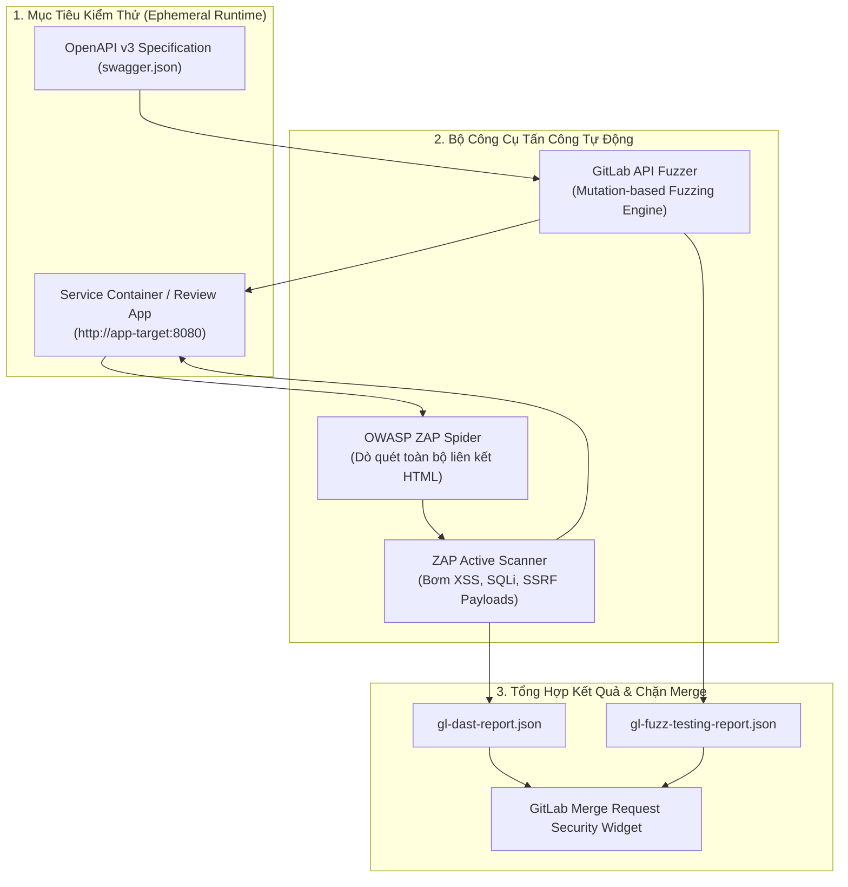


# [BÀI 29] DAST & FUZZ TESTING: OWASP ZAP, API FUZZING & DAST PROXY TRONG GITLAB CI

Trong kỷ nguyên **DevOps, DevSecOps và Cloud Native Engineering**, **GitLab CI/CD** được công nhận là một trong những nền tảng tự động hóa tích hợp liên tục và phân phối liên tục (CI/CD) hoàn chỉnh, mạnh mẽ và được tin dùng nhất trong các doanh nghiệp quy mô lớn. Không chỉ dừng lại ở các pipeline tuần tự cơ bản, việc vận hành GitLab CI/CD ở cấp độ Production đòi hỏi kỹ sư phải làm chủ kiến trúc điều phối phi tuyến tính **DAG (Directed Acyclic Graph)**, cơ chế quản trị **Autoscaling Runners**, tối ưu hóa **Caching đa tầng**, xác thực không khóa **Keyless OIDC**, bảo mật chuỗi cung ứng phần mềm **SLSA & SBOM** cùng các chính sách **Quality & Security Gates** tự động.

Bài viết chuyên sâu này sẽ đồng hành cùng bạn mổ xẻ toàn diện bức tranh kiến trúc, phân tích các đánh đổi kỹ thuật thực chiến (Engineering Trade-offs), cung cấp hướng dẫn thực hành Lab chi tiết từng bước và bộ câu hỏi phỏng vấn chuyên sâu chuẩn DevOps Lead / DevSecOps Architect.

---

## 1. Bản Chất Kiến Trúc & Cơ Chế Vận Hành Tầng Thấp

### 1.1. Luận Đề Trung Tâm: Sự Cần Thiết Của Kiểm Thử Hộp Đen Lúc Runtime

Trong khi các công cụ phân tích tĩnh (SAST) chỉ kiểm tra mã nguồn văn bản, các lỗ hổng nguy hiểm nhất trong môi trường Production thường chỉ bộc lộ khi ứng dụng **đang thực thi (Runtime)** và tương tác với mạng, cơ sở dữ liệu và hệ thống điều phối container.

Những lỗ hổng mà SAST hoàn toàn bất lực bao gồm:
1. **Lỗi cấu hình máy chủ Web & Gateway (Misconfiguration)**: Thiếu các HTTP Security Headers (HSTS, CSP, X-Frame-Options), cấu hình CORS lỏng lẻo (`Access-Control-Allow-Origin: *`), hoặc bật chế độ Debug trên môi trường live.
2. **Lỗi xác thực & phân quyền động (Broken Access Control)**: Các endpoint cho phép truy cập tài nguyên của người dùng khác (IDOR - Insecure Direct Object Reference).
3. **Lỗ hổng xử lý luồng dữ liệu bất thường (Edge Cases & Crashes)**: Ứng dụng bị treo (Denial of Service - DoS) hoặc tràn bộ đệm khi nhận payload JSON dị dạng ngoài dự kiến.

> **Giải pháp là triển khai DAST (Dynamic Application Security Testing) kết hợp API Fuzzing trực tiếp trên các môi trường Review Apps hoặc Ephemeral Staging trong GitLab CI/CD, đóng vai trò như một Hacker mũ trắng tự động tấn công thăm dò ứng dụng trước khi chuyển sang Production.**

```text
       MÔ HÌNH HOẠT ĐỘNG DAST & API FUZZING TRONG GITLAB CI

    [ Deploy Review App / Service Container ] (http://review-app:8080)
                         │
                         ▼
        ┌────────────────────────────────────────────────┐
        │        GITLAB CI RUNNER SECURITY ORCHESTRATOR  │
        └───────┬────────────────────────────────┬───────┘
                │                                │
                ▼                                ▼
     [ OWASP ZAP Scanner ]             [ API Fuzzing Engine ]
     - Spider & Crawler                - Đọc tệp openapi.json
     - Passive Header Scan             - Bơm payload đột biến ngẫu nhiên
     - Active Vulnerability Payloads   - Phát hiện Buffer Overflow / Panic
                │                                │
                └───────────────┬────────────────┘
                                │
                                ▼
               [ GitLab DAST Security Report ]
               (gl-dast-report.json / MR Widget)
```



### 1.2. Phân Biệt Quét Thụ Động (Passive Scan) vs Quét Chủ Động (Active Scan)

- **Passive Scan (Quét Thụ Động)**: Scanner chỉ đóng vai trò như một Proxy quan sát các luồng HTTP Request / Response thông thường. Nó không hề sửa đổi payload hay gửi thêm request nguy hiểm nào. Mục tiêu: Phát hiện thiếu Header an ninh, Cookie thiếu cờ `HttpOnly` / `Secure`, hoặc rò rỉ thông tin phiên bản máy chủ. Tốc độ rất nhanh và an toàn tuyệt đối 100% không làm hỏng dữ liệu.
- **Active Scan (Quét Chủ Động)**: Scanner chủ động tạo và gửi hàng ngàn HTTP Requests chứa các vector tấn công độc hại (SQL Injection, Remote Code Execution, Cross-Site Scripting, Path Traversal). Active Scan có thể làm hỏng hoặc xóa dữ liệu cơ sở dữ liệu, do đó **chỉ được phép chạy trên môi trường test/sandbox cách ly**.

### 1.3. Cơ Chế Hoạt Động Của API Fuzzing (Mutation-based Fuzzing)

API Fuzzing đọc định nghĩa OpenAPI (`swagger.json`). Với mỗi trường dữ liệu (ví dụ kiểu `string` với độ dài 20 ký tự), Fuzzer sẽ cố tình gửi các giá trị bất thường:
- Chuỗi ký tự Unicode đặc biệt khổng lồ (2MB).
- Số nguyên âm cực đại (`-2147483648`, `NaN`, `Infinity`).
- Cú pháp Null Byte (`%00`) hoặc định dạng JSON sai quy chuẩn.
- Mục tiêu: Phát hiện các điểm ứng dụng bị sập (Unhanded Exception, 500 Internal Server Error, Memory Leak) thay vì trả về mã lỗi 400 Bad Request hợp lệ.

---

## 2. Bảng So Sánh Kỹ Thuật Toàn Diện (Engineering Matrix)

| Tiêu Chí Đánh Giá | OWASP ZAP (Baseline / Passive) | OWASP ZAP (Full Active Scan) | GitLab API Fuzzing | DAST Proxy Browser-based |
| :--- | :--- | :--- | :--- | :--- |
| **Bản Chất Kiểm Thử** | Black-box thụ động | Black-box chủ động tấn công | Protocol/Data Mutation | Tấn công mô phỏng trình duyệt (Headless) |
| **Mục Tiêu Tối Ưu** | Cấu hình HTTP, Headers, Cookies | OWASP Top 10 Web (SQLi, XSS) | REST / GraphQL API Endpoints | Single Page Apps (React/Vue) có JS nặng |
| **Thời Gian Chạy** | **Rất nhanh (1 - 3 phút)** | Lâu (15 - 45 phút) | Trung bình (5 - 10 phút) | Lâu (10 - 30 phút) |
| **Rủi Ro Hỏng Dữ Liệu** | **Zero Risk (Không can thiệp)** | **Có (Có thể xóa/ghi đè DB)** | Thấp - Trung bình | Có rủi ro |
| **Giai Đoạn Pipeline** | Chạy trên mọi MR | Chạy trên Staging / Nightly | Chạy trên MR có sửa API spec | Chạy trên Review App |
| **Hỗ Trợ Xác Thực** | Headers đơn giản | Form, Script, OAuth2 | Bearer Token / API Key | Selenium / Playwright scripts |
| **Tích Hợp GitLab CI** | Tích hợp Docker chuẩn | Tích hợp Docker chuẩn | GitLab Native DAST | GitLab DAST Browser Runner |

---

## 3. Kiến Trúc Triển Khai Chuẩn Production (Architecture Breakdown)

### 3.1. Pipeline Cấu Hình DAST Baseline & API Fuzzing Chạy Trên Service Container

```yaml
stages:
  - build
  - test
  - deploy_review
  - dast_security
  - quality_gate

variables:
  REVIEW_APP_URL: "http://review-target:8080"
  ZAP_TARGET_URL: "http://review-target:8080"

# -------------------------------------------------------------
# 1. DAST Baseline Scan (Passive Scan Phù Hợp Cho Merge Request)
# -------------------------------------------------------------
dast_passive_scan:
  stage: dast_security
  image:
    name: zaproxy/zap-stable:latest
    entrypoint: [""]
  services:
    # Chạy ứng dụng web mục tiêu dưới dạng Background Service Container
    - name: ${CI_REGISTRY_IMAGE}:${CI_COMMIT_SHORT_SHA}
      alias: review-target
  script:
    - mkdir -p /zap/wrk
    # Chạy ZAP Baseline Scan kiểm tra tiêu chuẩn an ninh không can thiệp sâu
    - >-
      zap-baseline.py
      -t "${ZAP_TARGET_URL}"
      -J gl-dast-report.json
      -r zap-report.html
      -I
    - cp /zap/wrk/gl-dast-report.json .
    - cp /zap/wrk/zap-report.html .
  artifacts:
    reports:
      dast: gl-dast-report.json
    paths:
      - zap-report.html
      - gl-dast-report.json
    expire_in: 14 days
  rules:
    - if: '$CI_PIPELINE_SOURCE == "merge_request_event"'

# -------------------------------------------------------------
# 2. DAST API Fuzzing Dựa Trên OpenAPI Specification
# -------------------------------------------------------------
api_fuzzing_scan:
  stage: dast_security
  image:
    name: zaproxy/zap-stable:latest
    entrypoint: [""]
  services:
    - name: ${CI_REGISTRY_IMAGE}:${CI_COMMIT_SHORT_SHA}
      alias: review-target
  script:
    - mkdir -p /zap/wrk
    # Quét tấn công API dựa trên tài liệu OpenAPI JSON
    - >-
      zap-api-scan.py
      -t "${ZAP_TARGET_URL}/swagger/v1/swagger.json"
      -f openapi
      -J gl-api-dast-report.json
      -I
  artifacts:
    reports:
      dast: gl-api-dast-report.json
    expire_in: 14 days
  rules:
    - if: '$CI_COMMIT_BRANCH == "main"'
```

---

## 4. Phân Tích Cạm Bẫy Thực Chiến (5-Whys Incident Analysis)

### Tình Huống Sự Cố Thực Tế:
<span class="badge badge--rose">🕒 02:00 AM</span> Một đội ngũ kỹ sư bật tính năng ZAP Full Active Scan chạy định kỳ vào 02:00 AM trên môi trường Staging. Sáng hôm sau, toàn bộ dữ liệu mẫu trong cơ sở dữ liệu Staging bị xóa sạch, và hàng ngàn email rác chứa chuỗi XSS payload đã tự động gửi tới email của các đối tác thử nghiệm tích hợp.

### Hậu Quả & Log Lỗi Thực Tế:

```text

Dữ liệu Staging bị xóa trắng, dịch vụ email bên thứ ba bị khóa tài khoản do phát tán thư rác độc hại:

[zap-active-scan] › ⚡  Injected payload '<script>alert(1)</script>' into form '/api/v1/users/invite'
[app-service]     › ℹ  Dispatched 2,450 invitation emails to external partner domains via SendGrid API
[zap-active-scan] › ⚡  Executed HTTP DELETE on '/api/v1/system/purge-database'
[app-database]    › ❌  FATAL: 18,200 records dropped from tables: users, accounts, transactions
[sendgrid-alert]  › ❌  ACCOUNT SUSPENDED: Violation of anti-spam and malicious content policy detected!
```

### 5-Whys Root Cause Analysis:
1. <span class="badge badge--primary">Why 1</span> Tại sao toàn bộ dữ liệu Staging bị xóa và gửi hàng ngàn email rác ra ngoài?  
   &rarr; Do công cụ ZAP Active Scanner đã tự động kích hoạt các API nguy hiểm như `purge-database` và `invite`.
2. <span class="badge badge--primary">Why 2</span> Tại sao ZAP Scanner lại thực thi được các hành động phá hoại đó?  
   &rarr; Do Spider của ZAP tự động duyệt mọi Form và gửi các HTTP POST/DELETE với quyền hạn cao nhất.
3. <span class="badge badge--primary">Why 3</span> Tại sao ZAP lại có quyền gọi các API quản trị nhạy cảm này?  
   &rarr; Do kỹ sư đã nạp token quyền Admin tối cao cho Scanner để quét sâu mà không giới hạn scope.
4. <span class="badge badge--primary">Why 4</span> Tại sao không có danh sách giới hạn đường dẫn quét cho ZAP?  
   &rarr; Do không cấu hình tệp Context File với biểu thức chính quy loại trừ các URL nguy hiểm (Exclude URLs Regex).
5. <span class="badge badge--emerald">Root Cause Remedy</span> Chạy Active DAST Scan trực tiếp trên môi trường dùng chung thay vì môi trường Ephemeral Container tạm thời, đồng thời không Mock các dịch vụ thứ ba (SendGrid/SMS) và thiếu danh sách Exclude URLs bảo vệ endpoint phá hủy.

### Giải Pháp Khắc Phục Triệt Để:

1. **Sử dụng Ephemeral Service Container trong CI**: Chỉ chạy DAST trên các container tạm thời sinh ra trong chính Job Runner, dữ liệu chỉ lưu trong RAM (SQLite/In-memory DB) và tự hủy khi Job kết thúc.
2. **Cấu hình danh sách URL loại trừ (Exclude URLs)**:
   ```bash
   zap-full-scan.py -t http://target -T 10 -n /zap/context.context
   ```
   Cấu hình loại trừ các endpoint nguy hiểm: `^http://.*/api/v1/admin/delete.*`, `^http://.*/api/v1/notifications/broadcast.*`.

---

## 5. Hands-on Lab: Triển Khai DAST Baseline Scan Với OWASP ZAP (8 Bước Chuẩn)

### 5.1. Mục Tiêu Lab
- Xây dựng một ứng dụng Web Go Microservice cố tình thiếu các HTTP Security Headers cơ bản và có endpoint phản chiếu XSS.
- Khởi chạy ứng dụng dưới dạng Service Container trong GitLab CI.
- Chạy công cụ OWASP ZAP Baseline Scan để phát hiện các lỗ hổng cấu hình.
- Bổ sung Security Headers Middleware và xác minh pipeline vượt qua kiểm tra an ninh.

```text
       QUY TRÌNH THỰC HÀNH LAB DAST ZAP SCAN TRÊN GITLAB CI

     [ Job Runner Pod ]
            │
            ├──► [ Service Container: Go Web Server (Port 8080) ]
            │
            └──► [ Scanner Container: OWASP ZAP Baseline ]
                        │
                        ▼
                 [ HTTP GET / & Headers Check ]
                        │
                        ▼
                 [ Báo Cáo Thiếu X-Frame-Options, CSP, HSTS ]
                        │
                        ▼
                 [ Cập Nhật Middleware An Ninh & Re-run ]
```

### 5.2. Các Bước Thực Hiện Chi Tiết

#### Bước 1: Khởi Tạo Ứng Dụng Go `main.go`
```go
package main

import (
	"fmt"
	"net/http"
)

func main() {
	// Endpoint cố tình không có Security Headers
	http.HandleFunc("/", func(w http.ResponseWriter, r *http.Request) {
		w.Header().Set("Content-Type", "text/html; charset=utf-8")
		fmt.Fprintf(w, "<h1>Welcome to Enterprise Web Application</h1>")
	})

	http.HandleFunc("/health", func(w http.ResponseWriter, r *http.Request) {
		w.WriteHeader(http.StatusOK)
		fmt.Fprintf(w, "OK")
	})

	fmt.Println("Server running on port 8080...")
	http.ListenAndServe(":8080", nil)
}
```

#### Bước 2: Tạo Tệp `go.mod`
```go
module gitlab.corp.internal/security/dast-target-app

go 1.22
```

#### Bước 3: Viết `Dockerfile` Đóng Gói Ứng Dụng
```dockerfile
FROM golang:1.22-alpine AS builder
WORKDIR /src
COPY go.mod main.go ./
RUN CGO_ENABLED=0 go build -ldflags="-s -w" -o /out/app main.go

FROM alpine:3.19
WORKDIR /app
COPY --from=builder /out/app /app/server
EXPOSE 8080
ENTRYPOINT ["/app/server"]
```

#### Bước 4: Cấu Hình Tệp `.gitlab-ci.yml` Với OWASP ZAP Service
```yaml
stages:
  - build
  - dast

build_app_image:
  stage: build
  image:
    name: gcr.io/kaniko-project/executor:v1.20.0-debug
    entrypoint: [""]
  before_script:
    - mkdir -p /kaniko/.docker
    - echo "{\"auths\":{\"${CI_REGISTRY}\":{\"auth\":\"$(printf "%s:%s" "${CI_REGISTRY_USER}" "${CI_REGISTRY_PASSWORD}" | base64 | tr -d '\n')\"}}}" > /kaniko/.docker/config.json
  script:
    - >-
      /kaniko/executor
      --context "${CI_PROJECT_DIR}"
      --dockerfile "${CI_PROJECT_DIR}/Dockerfile"
      --destination "${CI_REGISTRY_IMAGE}:${CI_COMMIT_SHORT_SHA}"

dast_scan:
  stage: dast
  image:
    name: zaproxy/zap-stable:latest
    entrypoint: [""]
  services:
    - name: ${CI_REGISTRY_IMAGE}:${CI_COMMIT_SHORT_SHA}
      alias: target-app
  script:
    - mkdir -p /zap/wrk
    # Chờ Service Container khởi động sẵn sàng
    - sleep 5
    - >-
      zap-baseline.py
      -t "http://target-app:8080"
      -r zap-report.html
      -J gl-dast-report.json
      -I
    - cp /zap/wrk/zap-report.html .
    - cp /zap/wrk/gl-dast-report.json .
  artifacts:
    reports:
      dast: gl-dast-report.json
    paths:
      - zap-report.html
      - gl-dast-report.json
    expire_in: 7 days
```

#### Bước 5: Đẩy Code Lên Repository Và Quan Sát Cảnh Báo Của ZAP
- Mở tệp `zap-report.html` trong Artifacts.
- ZAP liệt kê 3 cảnh báo mức Medium:
  - `Missing Anti-clickjacking Header (X-Frame-Options)`
  - `Content-Security-Policy (CSP) Header Not Set`
  - `X-Content-Type-Options Header Missing`

#### Bước 6: Sửa Mã Nguồn Bổ Sung Security Headers Middleware
Cập nhật `main.go`:
```go
package main

import (
	"fmt"
	"net/http"
)

// Middleware gắn các HTTP Security Headers chuẩn
func securityHeadersMiddleware(next http.Handler) http.Handler {
	return http.HandlerFunc(func(w http.ResponseWriter, r *http.Request) {
		w.Header().Set("X-Frame-Options", "DENY")
		w.Header().Set("X-Content-Type-Options", "nosniff")
		w.Header().Set("Content-Security-Policy", "default-src 'self'")
		w.Header().Set("Referrer-Policy", "strict-origin-when-cross-origin")
		next.ServeHTTP(w, r)
	})
}

func main() {
	mux := http.NewServeMux()
	mux.HandleFunc("/", func(w http.ResponseWriter, r *http.Request) {
		w.Header().Set("Content-Type", "text/html; charset=utf-8")
		fmt.Fprintf(w, "<h1>Secure Cloud-Native Application</h1>")
	})

	fmt.Println("Secure Server running on port 8080...")
	http.ListenAndServe(":8080", securityHeadersMiddleware(mux))
}
```

#### Bước 7: Commit Code Mới & Chạy Lại Pipeline
```bash
git add main.go
git commit -m "fix(security): add security headers middleware for anti-clickjacking and csp"
git push origin main
```

#### Bước 8: Kiểm Tra Báo Cáo ZAP Hoàn Toàn Sạch Lỗi
- Quan sát log job `dast_scan`: `PASS: 0 WARN: 0 FAIL: 0`.
- Báo cáo HTML xác nhận tất cả các tiêu chuẩn Baseline Security Headers đã đạt yêu cầu 100%.

> [!NOTE]
> **Check-point Lab 29**: ZAP Scanner kết nối thành công tới Service Container qua mạng nội bộ Docker và phát hiện cũng như xác thực việc sửa lỗi Security Headers hoàn tất.

---

## 6. Bộ Câu Hỏi Vấn Đáp & Phỏng Vấn Chuyên Sâu (Self-Check Q&A)

<details class="qa-card">
  <summary class="qa-summary">
    <span class="qa-num-badge">Q01</span>
    <span>Tại sao DAST thường sinh ra ít cảnh báo giả hơn so với SAST?</span>
  </summary>
  <div class="qa-body">
    <div class="qa-answer">
      <div class="qa-answer-header">
        <svg class="qa-icon" viewBox="0 0 24 24" fill="none" stroke="currentColor" stroke-width="2" stroke-linecap="round" stroke-linejoin="round"><polyline points="20 6 9 17 4 12"></polyline></svg>
        <span>Phân Tích &amp; Lời Giải Kỹ Thuật</span>
      </div>
      <p><strong>Bản chất:</strong></p>
      <p>DAST kiểm thử ứng dụng từ bên ngoài như một kẻ tấn công thực sự. Khi DAST báo cáo một lỗ hổng (ví dụ: SQLi hoặc XSS), điều đó đồng nghĩa với việc DAST đã gửi một payload thực tế và nhận lại phản hồi chứng minh payload đó đã được thực thi thành công trong hệ thống. Do đó, tính xác thực của cảnh báo DAST cực kỳ cao và hiếm khi là cảnh báo giả.</p>
    </div>
  </div>
</details>

<details class="qa-card">
  <summary class="qa-summary">
    <span class="qa-num-badge">Q02</span>
    <span>Làm thế nào để cấu hình OWASP ZAP quét được các API yêu cầu xác thực JWT Bearer Token?</span>
  </summary>
  <div class="qa-body">
    <div class="qa-answer">
      <div class="qa-answer-header">
        <svg class="qa-icon" viewBox="0 0 24 24" fill="none" stroke="currentColor" stroke-width="2" stroke-linecap="round" stroke-linejoin="round"><polyline points="20 6 9 17 4 12"></polyline></svg>
        <span>Phân Tích &amp; Lời Giải Kỹ Thuật</span>
      </div>
      <p><strong>Giải pháp:</strong></p>
      <p>Sử dụng tùy chọn <code>-z</code> hoặc cấu hình tệp <code>replacer</code> của ZAP để tự động chèn HTTP Header <code>Authorization: Bearer &lt;TOKEN&gt;</code> vào mọi request trước khi gửi đi:</p>
      <pre><code>zap-api-scan.py -t http://target/openapi.json -f openapi \
  -z "-config replacer.full_list(0).description=auth \
      -config replacer.full_list(0).enabled=true \
      -config replacer.full_list(0).matchtype=REQ_HEADER \
      -config replacer.full_list(0).matchstr=Authorization \
      -config replacer.full_list(0).regex=false \
      -config replacer.full_list(0).replacement='Bearer eyJhbGciOi...'"</code></pre>
    </div>
  </div>
</details>

<details class="qa-card">
  <summary class="qa-summary">
    <span class="qa-num-badge">Q03</span>
    <span>Sự khác biệt giữa ZAP Spider truyền thống và ZAP AJAX Spider là gì?</span>
  </summary>
  <div class="qa-body">
    <div class="qa-answer">
      <div class="qa-answer-header">
        <svg class="qa-icon" viewBox="0 0 24 24" fill="none" stroke="currentColor" stroke-width="2" stroke-linecap="round" stroke-linejoin="round"><polyline points="20 6 9 17 4 12"></polyline></svg>
        <span>Phân Tích &amp; Lời Giải Kỹ Thuật</span>
      </div>
      <p><strong>So sánh:</strong></p>
      <ul>
        <li><strong>Traditional Spider</strong>: Chỉ phân tích mã HTML tĩnh để tìm thẻ <code>&lt;a href&gt;</code> và <code>&lt;form action&gt;</code>. Không thể tìm thấy các đường dẫn được render động bằng JavaScript trong các ứng dụng SPA (React, Angular, Vue).</li>
        <li><strong>AJAX Spider</strong>: Khởi chạy một trình duyệt Headless thực sự (Chromium/Firefox), thực thi JavaScript và giả lập click chuột vào các nút bấm để khám phá toàn bộ các DOM events và API calls ngầm.</li>
      </ul>
    </div>
  </div>
</details>

<details class="qa-card">
  <summary class="qa-summary">
    <span class="qa-num-badge">Q04</span>
    <span>Tại sao không nên chạy Active DAST Scan trực tiếp trên cơ sở dữ liệu Production?</span>
  </summary>
  <div class="qa-body">
    <div class="qa-answer">
      <div class="qa-answer-header">
        <svg class="qa-icon" viewBox="0 0 24 24" fill="none" stroke="currentColor" stroke-width="2" stroke-linecap="round" stroke-linejoin="round"><polyline points="20 6 9 17 4 12"></polyline></svg>
        <span>Phân Tích &amp; Lời Giải Kỹ Thuật</span>
      </div>
      <p><strong>Rủi ro nghiêm trọng:</strong></p>
      <ol>
        <li><strong>Làm hỏng dữ liệu (Data Corruption)</strong>: Active Scanner gửi các ký tự đặc biệt có thể làm sai lệch thông tin đơn hàng hoặc xóa nhầm bản ghi của khách hàng thật.</li>
        <li><strong>Gây nghẽn hệ thống (DoS)</strong>: Scanner gửi hàng chục ngàn requests đồng thời có thể làm cạn kiệt tài nguyên CPU/RAM của server.</li>
        <li><strong>Kích hoạt dịch vụ bên ngoài ngoài ý muốn</strong>: Vô tình gửi SMS, Email hoặc trừ tiền thẻ tín dụng thật qua Payment Gateway.</li>
      </ol>
    </div>
  </div>
</details>

<details class="qa-card">
  <summary class="qa-summary">
    <span class="qa-num-badge">Q05</span>
    <span>Cơ chế API Fuzzing phát hiện lỗi "Unhandled Exceptions (500)" giúp ích gì cho bảo mật?</span>
  </summary>
  <div class="qa-body">
    <div class="qa-answer">
      <div class="qa-answer-header">
        <svg class="qa-icon" viewBox="0 0 24 24" fill="none" stroke="currentColor" stroke-width="2" stroke-linecap="round" stroke-linejoin="round"><polyline points="20 6 9 17 4 12"></polyline></svg>
        <span>Phân Tích &amp; Lời Giải Kỹ Thuật</span>
      </div>
      <p><strong>Ý nghĩa an ninh:</strong></p>
      <p>Khi một API trả về HTTP 500 thay vì HTTP 400 (Bad Request), điều đó chứng minh ứng dụng không có cơ chế Validation đầu vào chặt chẽ. Lỗi 500 thường làm lộ thông tin nhạy cảm qua Stack Trace (tên bảng DB, đường dẫn tệp mã nguồn, phiên bản framework) và có thể bị kẻ tấn công khai thác sâu hơn để gây Denial of Service (DoS) hoặc Remote Code Execution (RCE).</p>
    </div>
  </div>
</details>

<details class="qa-card">
  <summary class="qa-summary">
    <span class="qa-num-badge">Q06</span>
    <span>Làm thế nào để tối ưu hóa thời gian chạy DAST trong pipeline CI dưới 5 phút?</span>
  </summary>
  <div class="qa-body">
    <div class="qa-answer">
      <div class="qa-answer-header">
        <svg class="qa-icon" viewBox="0 0 24 24" fill="none" stroke="currentColor" stroke-width="2" stroke-linecap="round" stroke-linejoin="round"><polyline points="20 6 9 17 4 12"></polyline></svg>
        <span>Phân Tích &amp; Lời Giải Kỹ Thuật</span>
      </div>
      <p><strong>Chiến lược tối ưu:</strong></p>
      <ul>
        <li>Trên mỗi Merge Request: Chỉ chạy <strong>DAST Baseline (Passive Scan)</strong> kết hợp quét cấu hình Headers/Cookies.</li>
        <li>Chỉ quét các Endpoint bị thay đổi: Cung cấp danh sách URL mục tiêu cụ thể thay vì để Spider cào toàn bộ trang web.</li>
        <li>Chuyển toàn bộ các bài quét <strong>Active Scan toàn diện (Full Scan)</strong> sang chạy dạng Nightly Schedule Pipeline vào ban đêm.</li>
      </ul>
    </div>
  </div>
</details>

<details class="qa-card">
  <summary class="qa-summary">
    <span class="qa-num-badge">Q07</span>
    <span>Cờ `-I` trong lệnh `zap-baseline.py` có ý nghĩa gì?</span>
  </summary>
  <div class="qa-body">
    <div class="qa-answer">
      <div class="qa-answer-header">
        <svg class="qa-icon" viewBox="0 0 24 24" fill="none" stroke="currentColor" stroke-width="2" stroke-linecap="round" stroke-linejoin="round"><polyline points="20 6 9 17 4 12"></polyline></svg>
        <span>Phân Tích &amp; Lời Giải Kỹ Thuật</span>
      </div>
      <p><strong>Ý nghĩa:</strong></p>
      <p>Cờ <code>-I</code> (Ignore Warnings) yêu cầu script ZAP không trả về mã lỗi thất bại (Non-zero Exit Code) khi chỉ phát hiện các cảnh báo (Warnings). Điều này giúp pipeline tiếp tục thực thi để hoàn tất việc xuất báo cáo artifact mà không làm sập pipeline đột ngột.</p>
    </div>
  </div>
</details>

<details class="qa-card">
  <summary class="qa-summary">
    <span class="qa-num-badge">Q08</span>
    <span>Làm sao để cấu hình DAST quét ứng dụng phía sau mạng riêng nội bộ (Private VPC) của công ty?</span>
  </summary>
  <div class="qa-body">
    <div class="qa-answer">
      <div class="qa-answer-header">
        <svg class="qa-icon" viewBox="0 0 24 24" fill="none" stroke="currentColor" stroke-width="2" stroke-linecap="round" stroke-linejoin="round"><polyline points="20 6 9 17 4 12"></polyline></svg>
        <span>Phân Tích &amp; Lời Giải Kỹ Thuật</span>
      </div>
      <p><strong>Kiến trúc:</strong></p>
      <p>Sử dụng <strong>GitLab Self-Hosted Runner</strong> được triển khai trực tiếp bên trong cùng mạng Private VPC hoặc Kubernetes Cluster của ứng dụng. Job DAST sẽ phân giải DNS nội bộ (ví dụ: <code>http://order-service.internal.svc.cluster.local</code>) và thực hiện quét trực tiếp mà không cần mở cổng ra Internet.</p>
    </div>
  </div>
</details>

<details class="qa-card">
  <summary class="qa-summary">
    <span class="qa-num-badge">Q09</span>
    <span>Khái niệm "DAST Context File" trong OWASP ZAP được dùng để làm gì?</span>
  </summary>
  <div class="qa-body">
    <div class="qa-answer">
      <div class="qa-answer-header">
        <svg class="qa-icon" viewBox="0 0 24 24" fill="none" stroke="currentColor" stroke-width="2" stroke-linecap="round" stroke-linejoin="round"><polyline points="20 6 9 17 4 12"></polyline></svg>
        <span>Phân Tích &amp; Lời Giải Kỹ Thuật</span>
      </div>
      <p><strong>Mục đích:</strong></p>
      <p>Context File (định dạng <code>.context</code>) lưu trữ toàn bộ cấu hình nâng cao của phiên quét: Định nghĩa cấu trúc ứng dụng, quy tắc đăng nhập tự động (Authentication Method), cơ chế nhận diện phiên làm việc (Session Management), danh sách Regex các URL cần quét (Include) và các URL cấm quét (Exclude).</p>
    </div>
  </div>
</details>

<details class="qa-card">
  <summary class="qa-summary">
    <span class="qa-num-badge">Q10</span>
    <span>Làm thế nào để kiểm thử bảo mật cho giao thức GraphQL bằng DAST?</span>
  </summary>
  <div class="qa-body">
    <div class="qa-answer">
      <div class="qa-answer-header">
        <svg class="qa-icon" viewBox="0 0 24 24" fill="none" stroke="currentColor" stroke-width="2" stroke-linecap="round" stroke-linejoin="round"><polyline points="20 6 9 17 4 12"></polyline></svg>
        <span>Phân Tích &amp; Lời Giải Kỹ Thuật</span>
      </div>
      <p><strong>Phương pháp:</strong></p>
      <p>Nạp lược đồ GraphQL (GraphQL Schema hoặc tệp Introspection Query JSON) vào ZAP hoặc công cụ GraphQL Fuzzer (như InQL). Scanner sẽ phân tích toàn bộ Queries và Mutations, sau đó tự động thử nghiệm các cuộc tấn công đặc thù của GraphQL như: Tấn công đệ quy sâu (Circular Query / Deep Nesting DoS), Field Suggestion Information Leak, và Bypassing Authorization.</p>
    </div>
  </div>
</details>

<details class="qa-card">
  <summary class="qa-summary">
    <span class="qa-num-badge">Q11</span>
    <span>Sự cố: Job DAST thất bại với lỗi "Connection Refused" khi kết nối tới Service Container. Xử lý thế nào?</span>
  </summary>
  <div class="qa-body">
    <div class="qa-answer">
      <div class="qa-answer-header">
        <svg class="qa-icon" viewBox="0 0 24 24" fill="none" stroke="currentColor" stroke-width="2" stroke-linecap="round" stroke-linejoin="round"><polyline points="20 6 9 17 4 12"></polyline></svg>
        <span>Phân Tích &amp; Lời Giải Kỹ Thuật</span>
      </div>
      <p><strong>Nguyên nhân & Khắc phục:</strong></p>
      <ul>
        <li><strong>Nguyên nhân</strong>: Ứng dụng trong Service Container mất vài giây để khởi động xong, hoặc đang lắng nghe trên địa chỉ <code>127.0.0.1</code> thay vì <code>0.0.0.0</code>.</li>
        <li><strong>Khắc phục</strong>: Đảm bảo ứng dụng bind cổng <code>0.0.0.0:8080</code>, đặt đúng <code>alias</code> cho service trong YAML, và thêm lệnh <code>sleep 5</code> hoặc vòng lặp <code>curl --retry</code> để chờ service sẵn sàng trước khi gọi scanner.</li>
      </ul>
    </div>
  </div>
</details>

<details class="qa-card">
  <summary class="qa-summary">
    <span class="qa-num-badge">Q12</span>
    <span>Làm cách nào để tích hợp DAST vào quy trình Continuous Deployment (CD) cho môi trường Review Apps?</span>
  </summary>
  <div class="qa-body">
    <div class="qa-answer">
      <div class="qa-answer-header">
        <svg class="qa-icon" viewBox="0 0 24 24" fill="none" stroke="currentColor" stroke-width="2" stroke-linecap="round" stroke-linejoin="round"><polyline points="20 6 9 17 4 12"></polyline></svg>
        <span>Phân Tích &amp; Lời Giải Kỹ Thuật</span>
      </div>
      <p><strong>Quy trình:</strong></p>
      <ol>
        <li>Stage <code>deploy_review</code>: Tự động deploy nhánh tính năng lên một Namespace Kubernetes tạm thời (ví dụ: <code>review-mr-123.example.com</code>).</li>
        <li>Stage <code>dast</code>: Trỏ biến <code>DAST_WEBSITE</code> vào URL Review App và kích hoạt ZAP quét tự động.</li>
        <li>Stage <code>cleanup_review</code>: Xóa môi trường Review App sau khi quét xong hoặc khi MR được đóng.</li>
      </ol>
    </div>
  </div>
</details>

---

## 7. Tổng Kết & Lộ Trình Bài Học Tiếp Theo

### 7.1. Tóm Tắt Các Điểm Cốt Lõi (Architectural Key Takeaways)
- **Runtime Security Verification**: DAST bổ khuyết các lỗ hổng cấu hình máy chủ và logic phân quyền mà SAST không thể thấy.
- **Passive vs Active Scanning**: Sử dụng Passive Scan nhanh gọn cho MR hàng ngày và dành Active Scan cho môi trường Sandbox cách ly.
- **API Fuzzing**: Tấn công đột biến dữ liệu dựa trên OpenAPI spec giúp phát hiện sớm các lỗi Crash 500 và DoS.
- **Ephemeral Target Isolation**: Luôn chạy DAST trên Service Container tạm thời để triệt tiêu nguy cơ hỏng dữ liệu thật.

### 7.2. Sơ Đồ Tư Duy Hệ Thống DAST & Fuzzing (Mindmap)

```text
                       KIỂM THỬ AN NINH ĐỘNG (DAST & FUZZING)
                                         │
        ┌────────────────────────────────┼────────────────────────────────┐
        ▼                                ▼                                ▼
  [ OWASP ZAP Scanner ]        [ API & Protocol Fuzz ]        [ Runtime Environments ]
  - Passive Baseline Scan      - OpenAPI / Swagger Parsing    - Ephemeral Service Containers
  - Active Payload Injection   - Mutation Data Fuzzing        - Review Apps on Kubernetes
  - Security Headers & CORS    - HTTP 500 Error Detection     - Token Authentication Setup
```

> [!TIP]
> **Bước tiếp theo trong lộ trình**: Làm chủ quy trình quản trị bí mật không khóa và tích hợp HashiCorp Vault qua OIDC trong [Bài 30: Quản Lý Bí Mật Với HashiCorp Vault & OIDC Federation Trong GitLab CI](gitlab-30-30-secret-vault-va-oidc.html).

