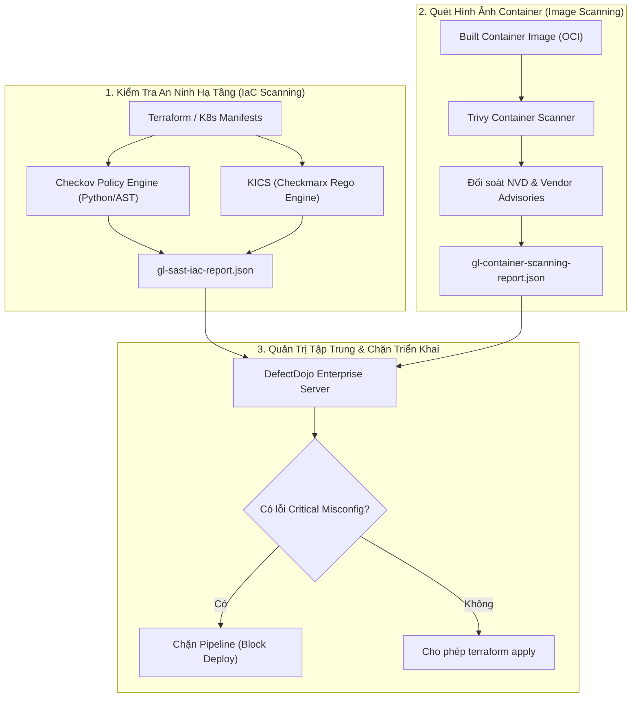


# [BÀI 31] QUÉT LỖ HỔNG CONTAINER & IAC: TRIVY, CHECKOV, KICS & DEFECTDOJO

Trong kỷ nguyên **DevOps, DevSecOps và Cloud Native Engineering**, **GitLab CI/CD** được công nhận là một trong những nền tảng tự động hóa tích hợp liên tục và phân phối liên tục (CI/CD) hoàn chỉnh, mạnh mẽ và được tin dùng nhất trong các doanh nghiệp quy mô lớn. Không chỉ dừng lại ở các pipeline tuần tự cơ bản, việc vận hành GitLab CI/CD ở cấp độ Production đòi hỏi kỹ sư phải làm chủ kiến trúc điều phối phi tuyến tính **DAG (Directed Acyclic Graph)**, cơ chế quản trị **Autoscaling Runners**, tối ưu hóa **Caching đa tầng**, xác thực không khóa **Keyless OIDC**, bảo mật chuỗi cung ứng phần mềm **SLSA & SBOM** cùng các chính sách **Quality & Security Gates** tự động.

Bài viết chuyên sâu này sẽ đồng hành cùng bạn mổ xẻ toàn diện bức tranh kiến trúc, phân tích các đánh đổi kỹ thuật thực chiến (Engineering Trade-offs), cung cấp hướng dẫn thực hành Lab chi tiết từng bước và bộ câu hỏi phỏng vấn chuyên sâu chuẩn DevOps Lead / DevSecOps Architect.

---

## 1. Bản Chất Kiến Trúc & Cơ Chế Vận Hành Tầng Thấp

### 1.1. Luận Đề Trung Tâm: Sự Nguy Hiểm Của "Cấu Hình Hạ Tầng Sai Lệch" Trong Kỷ Nguyên IaC

Trong hạ tầng Cloud Native, **Infrastructure as Code (IaC)** như Terraform, OpenTofu, CloudFormation, Ansible, Helm và Kubernetes Manifests cho phép các nhóm kỹ sư kiến tạo toàn bộ mạng lưới, máy chủ và cụm container chỉ bằng vài trăm dòng code khai báo.

Tuy nhiên, theo các báo cáo bảo mật đám mây, hơn **85% các vụ xâm nhập Cloud và vi phạm dữ liệu bắt nguồn từ Lỗi Cấu Hình (Misconfigurations)** chứ không phải do lỗi lỗ hổng zero-day trong mã nguồn:
1. **Lỗi lưu trữ công khai**: Mở công khai AWS S3 Bucket chứa dữ liệu định danh khách hàng (`public-read`).
2. **Quyền hạn IAM quá rộng**: Cấp quyền `AdministratorAccess` hoặc `"Action": "*"` cho các IAM Roles của ứng dụng.
3. **Mạng lưới lỏng lẻo**: Mở cổng nhạy cảm `0.0.0.0/0:22` (SSH) hoặc `0.0.0.0/0:3306` (MySQL) ra toàn Internet trong Security Groups.
4. **Đặc quyền Container nguy hiểm**: Cho phép Kubernetes Pod chạy ở chế độ `privileged: true` hoặc chia sẻ Host Network (`hostNetwork: true`).

> **Chiến lược DevSecOps hiện đại bắt buộc phải thực thi "Static Analysis for Infrastructure" — phân tích kiểm tra mọi tệp IaC (Checkov, KICS) và quét toàn bộ tầng OCI Image Layers (Trivy) trước khi thực hiện `terraform apply` hoặc `helm upgrade`, đồng thời đẩy toàn bộ dữ liệu phát hiện về nền tảng quản trị lỗ hổng tập trung DefectDojo.**

```
       QUY TRÌNH QUÉT AN NINH CONTAINER & IAC TRONG GITLAB CI/CD

  [ Git Commit: Terraform & Dockerfile ]
                   │
                   ▼
  ┌────────────────────────────────────────────────────────┐
  │         STAGE: INFRASTRUCTURE & CONTAINER SCAN         │
  └────────┬──────────────────────┬────────────────────────┘
           │                      │
           ▼                      ▼
  [ IaC Scanner: Checkov ]   [ Container Scanner: Trivy ]
  - Quét main.tf / k8s.yaml  - Quét OCI Image Layers
  - Kiểm tra CIS Benchmarks  - Quét OS Packages (dpkg/apk)
  - Phát hiện S3 Public, IAM - Tra cứu CVE Vulnerabilities
           │                      │
           └──────────┬───────────┘
                      │
                      ▼
      [ DefectDojo Vulnerability API ] ──► [ Deduplication & Metrics ]
                      │
                      ▼
      [ GitLab Security Dashboard ]    ──► [ Block MR if Critical ]
```



### 1.2. Phân Biệt Checkov vs KICS vs Trivy

1. **Checkov (Bridgecrew / Palo Alto Networks)**:
   - Viết bằng Python, kiểm tra cấu hình tĩnh hơn 1.000+ chính sách dựa trên các tiêu chuẩn bảo mật quốc tế (CIS Benchmarks, NIST, HIPAA, PCI-DSS).
   - Hỗ trợ phân tích biểu đồ phụ thuộc liên kết giữa các tài nguyên Terraform (Graph-based Deep Scan).
2. **KICS (Keeping Infrastructure as Code Secure - Checkmarx)**:
   - Viết bằng Go, sử dụng ngôn ngữ truy vấn **Rego (Open Policy Agent - OPA)**, tốc độ quét cực nhanh, hỗ trợ hơn 50+ loại tệp IaC (Terraform, Ansible, Kubernetes, Dockerfile, CloudFormation, Azure ARM, v.v.).
3. **Trivy (Aqua Security)**:
   - Máy quét đa năng toàn diện: Quét Container Image (OS packages và thư viện runtime), quét hệ thống tệp (Filesystem), quét kho mã nguồn Git và hỗ trợ quét IaC cơ bản.

### 1.3. Vai Trò Của DefectDojo Trong Doanh Nghiệp

Khi một doanh nghiệp vận hành hàng trăm dự án CI/CD với nhiều công cụ quét bảo mật khác nhau (Semgrep, SonarQube, Trivy, Checkov, ZAP), số lượng báo cáo sinh ra mỗi ngày lên tới hàng chục ngàn dòng. **OWASP DefectDojo** đóng vai trò là hệ thống quản lý thông tin lỗ hổng bảo mật tập trung (Vulnerability Management Platform):
- **Khử trùng lặp (Deduplication)**: Tự động gom các cảnh báo trùng nhau từ nhiều công cụ quét về một Issue duy nhất.
- **Theo dõi tiến độ khắc phục (SLA Tracking)**: Tự động cảnh báo khi các lỗ hổng Critical quá hạn 14 ngày chưa được fix.
- **Báo cáo tuân thủ (Compliance Reporting)**: Xuất báo cáo tổng quan cho ban giám đốc và kiểm toán viên.

---

## 2. Bảng So Sánh Kỹ Thuật Toàn Diện (Engineering Matrix)

| Tiêu Chí Đánh Giá | Checkov (IaC) | KICS (Checkmarx) | Trivy (Container & IaC) | DefectDojo |
| :--- | :--- | :--- | :--- | :--- |
| **Phạm Vi Quét Chính** | Terraform, K8s, CloudFormation | Đa định dạng IaC (Rego/OPA) | Container Image + IaC + SBOM | Nền tảng quản trị tập trung |
| **Tốc Độ Quét** | Nhanh (~15 - 30 giây) | **Cực nhanh (< 10 giây)** | **Siêu tốc (< 5 giây)** | Nạp dữ liệu qua REST API |
| **Phân Tích Đồ Thị (Graph)** | **Có (Resource Graph Matching)** | Cơ bản | Không | Tương quan lỗ hổng đa nguồn |
| **Cơ Chế Viết Luật (Rules)** | Python Classes hoặc YAML | Rego (OPA Standard) | Go / YAML / Rego | Thiết lập SLA & Engagement |
| **Chuẩn Báo Cáo Tương Thích** | JUnit XML, SARIF, GitLab SAST | JSON, SARIF, GitLab SAST | GitLab Container JSON, SARIF | Tiếp nhận hơn 150+ định dạng |
| **Hạ Tầng Cần Thiết** | Zero Infra (Chạy CLI/Docker) | Zero Infra (Chạy CLI/Docker) | Zero Infra (Chạy CLI/Docker) | Cần Server Django + Postgres |
| **Chi Phí Vận Hành** | Miễn phí Open Source | Miễn phí Open Source | Miễn phí Open Source | Miễn phí Open Source |

---

## 3. Kiến Trúc Triển Khai Chuẩn Production (Architecture Breakdown)

### 3.1. Pipeline Hoàn Chỉnh: Quét Terraform Bằng Checkov, Quét Container Bằng Trivy & Đẩy Lên DefectDojo

```yaml
stages:
  - test
  - build_image
  - scan_iac
  - scan_container
  - publish_findings

variables:
  DEFECTDOJO_URL: "https://defectdojo.corp.internal"
  DEFECTDOJO_ENGAGEMENT_ID: "14"

# -------------------------------------------------------------
# 1. Quét An Ninh Hạ Tầng Terraform Bằng Checkov
# -------------------------------------------------------------
checkov_iac_scan:
  stage: scan_iac
  image:
    name: bridgecrew/checkov:latest
    entrypoint: [""]
  script:
    - >-
      checkov -d terraform/
      --output gitlab_sast
      --output-file-path checkov-report.json
      --framework terraform
      --compact
      --soft-fail
  artifacts:
    reports:
      sast: checkov-report.json
    paths:
      - checkov-report.json
    expire_in: 14 days
  rules:
    - if: '$CI_PIPELINE_SOURCE == "merge_request_event"'
    - if: '$CI_COMMIT_BRANCH == "main"'

# -------------------------------------------------------------
# 2. Quét Hình Ảnh Container Bằng Trivy
# -------------------------------------------------------------
trivy_container_scan:
  stage: scan_container
  image:
    name: aquasec/trivy:latest
    entrypoint: [""]
  script:
    # Quét image và xuất báo cáo chuẩn GitLab Container Scanning
    - >-
      trivy image
      --format template
      --template "@/contrib/gitlab.tpl"
      --output gl-container-scanning-report.json
      "${CI_REGISTRY_IMAGE}:${CI_COMMIT_SHORT_SHA}"
    # Quét và xuất báo cáo JSON chi tiết cho DefectDojo
    - >-
      trivy image
      --format json
      --output trivy-container-report.json
      "${CI_REGISTRY_IMAGE}:${CI_COMMIT_SHORT_SHA}"
  artifacts:
    reports:
      container_scanning: gl-container-scanning-report.json
    paths:
      - gl-container-scanning-report.json
      - trivy-container-report.json
    expire_in: 14 days
  rules:
    - if: '$CI_COMMIT_BRANCH == "main"'

# -------------------------------------------------------------
# 3. Đẩy Kết Quả Lên DefectDojo Server
# -------------------------------------------------------------
upload_to_defectdojo:
  stage: publish_findings
  image: curlimages/curl:latest
  needs: ["checkov_iac_scan", "trivy_container_scan"]
  rules:
    - if: '$CI_COMMIT_BRANCH == "main"'
  script:
    - >-
      curl -X POST "${DEFECTDOJO_URL}/api/v2/import-scan/"
      -H "Authorization: Token ${DEFECTDOJO_API_KEY}"
      -F "active=true"
      -F "verified=true"
      -F "scan_type=Trivy Scan"
      -F "engagement=${DEFECTDOJO_ENGAGEMENT_ID}"
      -F "file=@trivy-container-report.json"
```

---

## 4. Phân Tích Cạm Bẫy Thực Chiến (5-Whys Incident Analysis)

### 4.1. Sự Cố Thực Tế: Lộ Cơ Sở Dữ Liệu Khách Hàng Do Terraform Security Group Mở `0.0.0.0/0`

> **Bối Cảnh**: Một công ty dịch vụ tài chính bị tin tặc quét mạng và đánh cắp hơn 500.000 bản ghi cơ sở dữ liệu. Nguyên nhân là do một kỹ sư DevOps thêm khối Security Group trong Terraform cho phép truy cập cổng `5432` từ mọi địa chỉ IP (`0.0.0.0/0`) để tiện debug từ nhà, và pipeline CI/CD cũ không có bước kiểm tra IaC nên đã tự động deploy cấu hình này lên AWS.

```
┌─────────────────────────────────────────────────────────────────────────┐
│                    PHÂN TÍCH NGUYÊN NHÂN GỐC RỄ (5-WHYS)                 │
├─────────────────────────────────────────────────────────────────────────┤
│ 1. Tại sao cơ sở dữ liệu PostgreSQL bị truy cập trái phép từ Internet?  │
│    -> Security Group AWS của Database cho phép ingress CIDR 0.0.0.0/0.  │
│                                                                         │
│ 2. Tại sao cấu hình nguy hiểm này lại được tạo trên AWS?                │
│    -> Câu lệnh terraform apply trong CI/CD đã tự động thực thi manifest.│
│                                                                         │
│ 3. Tại sao cấu hình đó lại vượt qua được khâu Code Review?              │
│    -> Tệp Terraform có hơn 2.000 dòng, người review bằng mắt bỏ sót.    │
│                                                                         │
│ 4. Tại sao Pipeline CI/CD không tự động phát hiện và chặn lại?          │
│    -> Pipeline chỉ chạy terraform validate/plan mà không có máy quét IaC.│
│                                                                         │
│ 5. NGUYÊN NHÂN CỐT LÕI (Root Cause):                                   │
│    -> Thiếu công cụ kiểm tra chính sách an ninh hạ tầng tự động         │
│       (Checkov/KICS Security Gate) để ngăn chặn cấu hình sai lệch.     │
└─────────────────────────────────────────────────────────────────────────┘
```

### 4.2. Giải Pháp Khắc Phục Triệt Để

1. **Tích hợp Checkov chặn ngay trên Merge Request**: Bắt buộc cấu hình cờ `--hard-fail-on HIGH,CRITICAL` trong CI/CD. Bất kỳ mã nguồn Terraform nào mở cổng cơ sở dữ liệu ra `0.0.0.0/0` (vi phạm quy tắc `CKV_AWS_20`) sẽ làm sập pipeline ngay lập tức.
2. **Áp dụng chính sách SCP (Service Control Policies) trên AWS Organization**: Chặn cấp quyền Public IP cho các Subnet chứa tài nguyên cơ sở dữ liệu tại tầng hạ tầng gốc.

---

## 5. Hands-on Lab: Triển Khai Bộ Đôi Checkov & Trivy Quét IaC & Container (8 Bước Chuẩn)

### 5.1. Mục Tiêu Lab
- Viết mã nguồn Terraform tạo S3 Bucket và Security Group cố tình có lỗi bảo mật (S3 unencrypted, Public ingress).
- Viết Dockerfile cố tình chạy bằng user `root` và chứa gói phụ thuộc có lỗ hổng.
- Cấu hình pipeline GitLab CI chạy Checkov và Trivy.
- Quan sát các cảnh báo vi phạm tiêu chuẩn an ninh và tiến hành sửa chữa mã nguồn chuẩn CIS.

```
       QUY TRÌNH THỰC HÀNH LAB CHECKOV IAC & TRIVY CONTAINER SCAN

   [ Mã Nguồn Hạ Tầng & Container ]
          │
          ├──► terraform/main.tf (Chứa lỗi S3 unencrypted & Ingress 0.0.0.0/0)
          └──► Dockerfile (Chứa USER root & base image cũ)
                   │
                   ▼
   [ GitLab CI/CD Pipeline ]
          │
          ├──► [ Job: checkov_scan ] ──► Báo lỗi CKV_AWS_19, CKV_AWS_20
          │                                  │
          └──► [ Job: trivy_scan ]   ──► Báo lỗi CVEs & Root Execution
                                             │
                                             ▼
                               [ Sửa Mã Nguồn Chuẩn Hóa ]
                                             │
                                             ▼
                               [ Pipeline Pass Tuyệt Đối ]
```

### 5.2. Các Bước Thực Hiện Chi Tiết

#### Bước 1: Tạo Mã Nguồn Terraform Không An Toàn `terraform/main.tf`
```hcl
terraform {
  required_providers {
    aws = {
      source  = "hashicorp/aws"
      version = "~> 5.0"
    }
  }
}

provider "aws" {
  region = "ap-southeast-1"
}

# LỖI BẢO MẬT 1: S3 Bucket không bật mã hóa SSE và không khóa Public Access
resource "aws_s3_bucket" "insecure_bucket" {
  bucket = "corp-financial-data-backup-bucket"
}

# LỖI BẢO MẬT 2: Security Group mở cổng SSH 22 ra toàn Internet
resource "aws_security_group" "insecure_sg" {
  name        = "allow_all_ssh"
  description = "Insecure SSH Security Group"

  ingress {
    from_port   = 22
    to_port     = 22
    protocol    = "tcp"
    cidr_blocks = ["0.0.0.0/0"]
  }
}
```

#### Bước 2: Tạo Tệp `Dockerfile` Cố Tình Chạy Bằng User Root
```dockerfile
FROM alpine:3.16

# LỖI BẢO MẬT: Chạy bằng quyền root mặc định và không cập nhật bản vá an ninh
WORKDIR /app
COPY app.sh /app/app.sh
RUN chmod +x /app/app.sh

ENTRYPOINT ["/app/app.sh"]
```

#### Bước 3: Tạo Tệp Script `app.sh`
```bash
#!/bin/sh
echo "Container service running securely..."
```

#### Bước 4: Cấu Hình Tệp `.gitlab-ci.yml`
```yaml
stages:
  - test_iac
  - test_container

checkov_iac_scan:
  stage: test_iac
  image:
    name: bridgecrew/checkov:latest
    entrypoint: [""]
  script:
    - checkov -d terraform/ --compact --framework terraform

trivy_dockerfile_scan:
  stage: test_container
  image:
    name: aquasec/trivy:latest
    entrypoint: [""]
  script:
    - trivy config Dockerfile
    - trivy fs --severity HIGH,CRITICAL .
```

#### Bước 5: Đẩy Code Lên Repository & Quan Sát Kết Quả Báo Lỗi
- Checkov báo cáo 2 lỗi nghiêm trọng:
  - `FAILED for resource: aws_s3_bucket.insecure_bucket (CKV_AWS_19: Ensure all data stored in S3 is securely encrypted at rest)`
  - `FAILED for resource: aws_security_group.insecure_sg (CKV_AWS_24: Ensure no security groups allow ingress from 0.0.0.0/0 to port 22)`
- Trivy báo cáo: Dockerfile chạy với user `root` mặc định.

#### Bước 6: Khắc Phục Mã Nguồn Terraform Chuẩn CIS Benchmarks
Cập nhật `terraform/main.tf`:
```hcl
resource "aws_s3_bucket" "secure_bucket" {
  bucket = "corp-financial-data-backup-bucket"
}

# 1. Bật tính năng mã hóa SSE-KMS
resource "aws_s3_bucket_server_side_encryption_configuration" "s3_encrypt" {
  bucket = aws_s3_bucket.secure_bucket.id
  rule {
    apply_server_side_encryption_by_default {
      sse_algorithm = "AES256"
    }
  }
}

# 2. Khóa toàn bộ Public Access
resource "aws_s3_bucket_public_access_block" "block_public" {
  bucket                  = aws_s3_bucket.secure_bucket.id
  block_public_acls       = true
  block_public_policy     = true
  ignore_public_acls      = true
  restrict_public_buckets = true
}

# 3. Giới hạn Ingress SSH chỉ từ mạng nội bộ VPN của công ty
resource "aws_security_group" "secure_sg" {
  name        = "secure_vpn_ssh"
  description = "Allow SSH only from corporate VPN"

  ingress {
    from_port   = 22
    to_port     = 22
    protocol    = "tcp"
    cidr_blocks = ["10.200.0.0/16"] # Dải IP Private VPN nội bộ
  }
}
```

#### Bước 7: Khắc Phục Tệp `Dockerfile`
```dockerfile
FROM alpine:3.19

# Cập nhật packages và tạo user non-root
RUN apk update && apk upgrade &&     addgroup -g 10001 appgroup &&     adduser -u 10001 -G appgroup -D -s /sbin/nologin appuser

WORKDIR /app
COPY --chown=appuser:appgroup app.sh /app/app.sh
RUN chmod +x /app/app.sh

USER appuser:appgroup

ENTRYPOINT ["/app/app.sh"]
```

#### Bước 8: Commit Code Mới & Xác Nhận Pipeline Thành Công
```bash
git add .
git commit -m "fix(security): resolve s3 encryption, restrict ssh ingress and use non-root container"
git push origin main
```
- Quan sát log job `checkov_iac_scan` và `trivy_dockerfile_scan`: Trạng thái **PASSED 100%**.

> [!NOTE]
> **Check-point Lab 31**: Pipeline tự động phát hiện các lỗi cấu hình hạ tầng nghiêm trọng và xác thực việc khắc phục chuẩn bảo mật CIS thành công.

---

## 6. Bộ Câu Hỏi Vấn Đáp & Phỏng Vấn Chuyên Sâu (Self-Check Q&A)

<details class="qa-card">
  <summary class="qa-summary">
    <span class="qa-num-badge">Q01</span>
    <span>Tại sao kiểm tra an ninh IaC (Checkov/KICS) lại cần được thực hiện trước khi chạy `terraform plan` hoặc `terraform apply`?</span>
  </summary>
  <div class="qa-body">
    <p><strong>Lý do kỹ thuật:</strong></p>
    <ul>
      <li><strong>Ngăn chặn thảm họa trước khi xảy ra</strong>: Nếu để <code>terraform apply</code> chạy xong mới phát hiện lỗi, tài nguyên công khai (như S3 công khai) đã tồn tại trên Cloud trong một khoảng thời gian, tạo điều kiện cho bot của hacker quét và đánh cắp dữ liệu.</li>
      <li><strong>Tiết kiệm chi phí điện toán</strong>: Tránh việc tạo ra tài nguyên Cloud rồi lại phải phát lệnh hủy (Destroy) sau khi bị Security từ chối.</li>
    </ul>
  </div>
</details>

<details class="qa-card">
  <summary class="qa-summary">
    <span class="qa-num-badge">Q02</span>
    <span>Cơ chế "Graph-based Analysis" trong Checkov hoạt động như thế nào và vượt trội gì so với Regex?</span>
  </summary>
  <div class="qa-body">
    <p><strong>Bản chất kỹ thuật:</strong></p>
    <p>Checkov xây dựng một Đồ thị phụ thuộc liên kết (Dependency Graph) giữa các tài nguyên Terraform. Ví dụ: Nếu một <code>aws_security_group</code> mở cổng 0.0.0.0/0 nhưng nó chỉ được gắn vào một <code>aws_instance</code> nằm hoàn toàn trong Private Subnet không có Internet Gateway, Checkov hiểu được ngữ cảnh mạng và không báo lỗi oan (giảm thiểu False Positives).</p>
  </div>
</details>

<details class="qa-card">
  <summary class="qa-summary">
    <span class="qa-num-badge">Q03</span>
    <span>Làm thế nào để cấu hình ngoại lệ (Inline Suppressions) cho một cảnh báo của Checkov có chủ đích?</span>
  </summary>
  <div class="qa-body">
    <p><strong>Cú pháp chú thích:</strong></p>
    <p>Thêm comment trực tiếp vào khối tài nguyên trong tệp <code>.tf</code> kèm lý do kỹ thuật rõ ràng:</p>
    <pre><code>resource "aws_s3_bucket" "public_assets" {
  #checkov:skip=CKV_AWS_20: "Bucket này phục vụ phân phối static web assets công khai cho người dùng"
  bucket = "corp-public-assets"
}</code></pre>
  </div>
</details>

<details class="qa-card">
  <summary class="qa-summary">
    <span class="qa-num-badge">Q04</span>
    <span>Tại sao cần quét cả tầng OS Packages lẫn Application Dependencies khi quét Container Image?</span>
  </summary>
  <div class="qa-body">
    <p><strong>Phân tích hai tầng:</strong></p>
    <ul>
      <li><strong>Tầng Hệ Điều Hành (OS Packages)</strong>: Quét các gói thư viện C, OpenSSL, curl, bash được cài đặt qua <code>apt</code> hoặc <code>apk</code>. Các gói này có thể chứa lỗ hổng thực thi mã từ xa (RCE) ở cấp hệ điều hành.</li>
      <li><strong>Tầng Ứng Dụng (Language Dependencies)</strong>: Quét các module NPM, Jar, PyPI, Go binaries. Cả hai tầng đều có thể bị khai thác và cần được công cụ như Trivy quét đồng thời.</li>
    </ul>
  </div>
</details>

<details class="qa-card">
  <summary class="qa-summary">
    <span class="qa-num-badge">Q05</span>
    <span>Khái niệm "Deduplication" trong DefectDojo hoạt động dựa trên những nguyên lý nào?</span>
  </summary>
  <div class="qa-body">
    <p><strong>Cơ chế khử trùng:</strong></p>
    <p>DefectDojo tính toán mã băm duy nhất dựa trên bộ ba: <code>(Mã định danh CVE / CWE, Đường dẫn tệp hoặc Image Name, Dòng mã hoặc Tên Package)</code>. Nếu nhiều công cụ quét khác nhau (ví dụ cả Trivy và Grype cùng báo cáo CVE-2023-1234 trên cùng một container), DefectDojo sẽ tự động gom thành 1 bản ghi duy nhất, giúp đội ngũ Security không bị quá tải.</p>
  </div>
</details>

<details class="qa-card">
  <summary class="qa-summary">
    <span class="qa-num-badge">Q06</span>
    <span>Làm sao để xuất báo cáo quét từ Checkov sang định dạng chuẩn `gl-sast-report.json` trong GitLab?</span>
  </summary>
  <div class="qa-body">
    <p><strong>Cú pháp lệnh:</strong></p>
    <p>Sử dụng tùy chọn <code>--output gitlab_sast</code> của Checkov:</p>
    <pre><code>checkov -d . --output gitlab_sast --output-file-path gl-sast-report.json</code></pre>
    <p>Sau đó khai báo <code>artifacts:reports:sast: gl-sast-report.json</code> trong file YAML.</p>
  </div>
</details>

<details class="qa-card">
  <summary class="qa-summary">
    <span class="qa-num-badge">Q07</span>
    <span>Sự khác biệt giữa việc quét `Dockerfile` bằng Hadolint và quét bằng Trivy/Checkov là gì?</span>
  </summary>
  <div class="qa-body">
    <p><strong>So sánh:</strong></p>
    <ul>
      <li><strong>Hadolint</strong>: Chuyên sâu về cú pháp (Linting) và Best Practices của Dockerfile (ví dụ: dùng <code>COPY</code> thay vì <code>ADD</code>, dọn dẹp cache của apt trong cùng lệnh <code>RUN</code>).</li>
      <li><strong>Trivy / Checkov</strong>: Chuyên sâu về an ninh (Security Policies) như phát hiện chạy user root, thiếu healthcheck, hoặc base image có CVE nghiêm trọng.</li>
    </ul>
  </div>
</details>

<details class="qa-card">
  <summary class="qa-summary">
    <span class="qa-num-badge">Q08</span>
    <span>Làm thế nào để thiết lập chính sách tự động chặn (Security Gate) dựa trên điểm số CVSS của lỗ hổng?</span>
  </summary>
  <div class="qa-body">
    <p><strong>Cấu hình Trivy:</strong></p>
    <p>Sử dụng các cờ <code>--severity HIGH,CRITICAL</code> kết hợp <code>--exit-code 1</code>. Nếu tìm thấy bất kỳ lỗ hổng nào có mức độ nghiêm trọng từ High trở lên (điểm CVSS >= 7.0), Trivy sẽ trả về mã lỗi 1 và làm sập Job CI ngay lập tức.</p>
  </div>
</details>

<details class="qa-card">
  <summary class="qa-summary">
    <span class="qa-num-badge">Q09</span>
    <span>Tại sao nên sử dụng ngôn ngữ Rego (Open Policy Agent - OPA) trong các công cụ quét IaC như KICS?</span>
  </summary>
  <div class="qa-body">
    <p><strong>Lợi thế của Rego/OPA:</strong></p>
    <p>Rego là ngôn ngữ khai báo chính sách (Policy-as-Code) tiêu chuẩn của CNCF. Cùng một tập luật Rego, bạn có thể tái sử dụng để quét tệp Terraform trong CI/CD (qua KICS/Conftest), kiểm soát lệnh triển khai trên Kubernetes (qua Gatekeeper), và kiểm soát phân quyền API tại tầng Envoy Proxy.</p>
  </div>
</details>

<details class="qa-card">
  <summary class="qa-summary">
    <span class="qa-num-badge">Q10</span>
    <span>Làm thế nào để đẩy báo cáo tự động từ GitLab CI lên DefectDojo mà không làm lộ API Key?</span>
  </summary>
  <div class="qa-body">
    <p><strong>Thực hành an toàn:</strong></p>
    <p>Lưu trữ <code>DEFECTDOJO_API_KEY</code> trong HashiCorp Vault hoặc GitLab Protected & Masked Variables. Chỉ cho phép các pipeline chạy trên protected branch có quyền truy cập token này để gửi báo cáo.</p>
  </div>
</details>

<details class="qa-card">
  <summary class="qa-summary">
    <span class="qa-num-badge">Q11</span>
    <span>Sự cố: Job Checkov bị timeout sau 30 phút khi quét thư mục Terraform có chứa thư viện module ngoài khổng lồ. Xử lý thế nào?</span>
  </summary>
  <div class="qa-body">
    <p><strong>Khắc phục:</strong></p>
    <ol>
      <li>Thêm cờ <code>--skip-path .terraform</code> và <code>--skip-path .terragrunt-cache</code> để Checkov chỉ quét mã nguồn nội bộ mà không quét lại các module đã tải từ Terraform Registry.</li>
      <li>Sử dụng cờ <code>--framework terraform</code> để bỏ qua việc phân tích các định dạng khác.</li>
    </ol>
  </div>
</details>

<details class="qa-card">
  <summary class="qa-summary">
    <span class="qa-num-badge">Q12</span>
    <span>Làm cách nào để liên kết các phát hiện của DefectDojo với hệ thống Jira để tự động giao việc cho kỹ sư?</span>
  </summary>
  <div class="qa-body">
    <p><strong>Tích hợp Jira:</strong></p>
    <p>Cấu hình tính năng <strong>DefectDojo Jira Integration</strong>. Khi một lỗ hổng mức Critical hoặc High được nhập vào DefectDojo qua API của CI/CD, hệ thống sẽ tự động tạo một Issue trên bảng Jira của nhóm phát triển kèm theo thời hạn SLA (ví dụ: bắt buộc vá trong vòng 7 ngày) và tự động đóng Jira ticket khi pipeline lần sau quét không còn thấy lỗi đó.</p>
  </div>
</details>

---

## 7. Tổng Kết & Lộ Trình Bài Học Tiếp Theo

### 7.1. Tóm Tắt Các Điểm Cốt Lõi (Architectural Key Takeaways)
- **Prevent Misconfigurations Early**: Hơn 85% rủi ro Cloud bắt nguồn từ cấu hình sai lệch, cần chặn đứng trước khi `terraform apply`.
- **Deep IaC Scanning**: Sử dụng Checkov và KICS để phân tích đồ thị liên kết tài nguyên và tuân thủ chuẩn CIS Benchmarks.
- **Full-Spectrum Container Security**: Quét toàn bộ các lớp hình ảnh Container bằng Trivy trên mỗi lần đóng gói.
- **Unified Vulnerability Management**: Tập trung hóa dữ liệu quét bảo mật về nền tảng DefectDojo để theo dõi SLA và khử trùng lặp.

### 7.2. Sơ Đồ Tư Duy Quét Lỗ Hổng Container & IaC (Mindmap)

```
                       QUÉT AN NINH CONTAINER & HẠ TẦNG IAC
                                         │
        ┌────────────────────────────────┼────────────────────────────────┐
        ▼                                ▼                                ▼
  [ IaC Policy Analysis ]      [ Container Image Scan ]       [ Central Triage Engine ]
  - Checkov AST Graph Match    - Trivy OS & Runtime Packages  - DefectDojo API Import
  - KICS Rego/OPA Engine       - Hard Fail on CVSS >= 7.0     - Deduplication & SLA Tracking
  - CIS Benchmarks Compliance  - gl-container-scanning.json   - Automated Jira Ticketing
```

> [!TIP]
> **Bước tiếp theo trong lộ trình**: Khám phá kiến trúc bảo mật chuỗi cung ứng phần mềm tối cao với định danh SLSA, SBOM và chữ ký Cosign trong [Bài 32: Chuỗi Cung Ứng Phần Mềm An Toàn: SLSA Framework, SBOM & Cosign Ký Số](gitlab-32-32-slsa-sbom-provenance.html).

