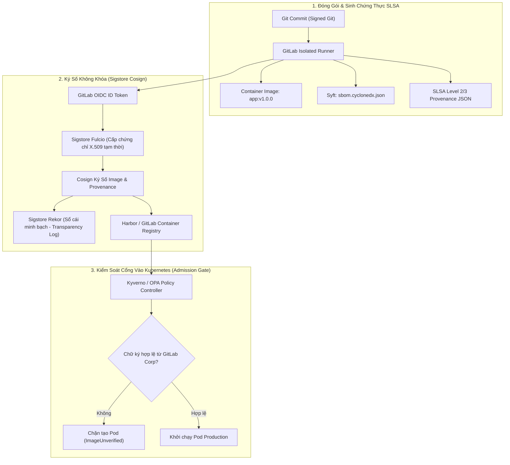


> [!IMPORTANT]
> **Mục tiêu kỹ thuật bài học**:
> - Nắm vững 4 cấp độ bảo mật của SLSA Framework (Supply-chain Levels for Software Artifacts).
> - Làm chủ cơ chế ký số không khóa (Keyless Signing) với Sigstore Cosign, Fulcio CA và Rekor Transparency Log.
> - Tự động sinh và đính kèm SBOM Attestation vào Container Registry trong GitLab CI/CD.
> - Thiết lập chính sách Kyverno / Gatekeeper trên Kubernetes để từ chối các Image chưa được ký số.

---

Trong kỷ nguyên **DevOps, DevSecOps và Cloud Native Engineering**, **GitLab CI/CD** được công nhận là một trong những nền tảng tự động hóa tích hợp liên tục và phân phối liên tục (CI/CD) hoàn chỉnh, mạnh mẽ và được tin dùng nhất trong các doanh nghiệp quy mô lớn. Không chỉ dừng lại ở các pipeline tuần tự cơ bản, việc vận hành GitLab CI/CD ở cấp độ Production đòi hỏi kỹ sư phải làm chủ kiến trúc điều phối phi tuyến tính **DAG (Directed Acyclic Graph)**, cơ chế quản trị **Autoscaling Runners**, tối ưu hóa **Caching đa tầng**, xác thực không khóa **Keyless OIDC**, bảo mật chuỗi cung ứng phần mềm **SLSA & SBOM** cùng các chính sách **Quality & Security Gates** tự động.

Bài viết chuyên sâu này sẽ đồng hành cùng bạn mổ xẻ toàn diện bức tranh kiến trúc, phân tích các đánh đổi kỹ thuật thực chiến (Engineering Trade-offs), cung cấp hướng dẫn thực hành Lab chi tiết từng bước và bộ câu hỏi phỏng vấn chuyên sâu chuẩn DevOps Lead / DevSecOps Architect.

---

## 1. Bản Chất Kiến Trúc & Cơ Chế Vận Hành Tầng Thấp

### 1.1. Luận Đề Trung Tâm: Cuộc Khủng Hoảng Niềm Tin Trong Chuỗi Cung Ứng Phần Mềm

Các cuộc tấn công chuỗi cung ứng khét tiếng như **SolarWinds** (mã độc được chèn trực tiếp vào tiến trình build của CI/CD) và **Codecov Bash Uploader Breach** (sửa đổi script kiểm thử để đánh cắp token) đã phơi bày một lỗ hổng chí tử của nền tảng DevOps hiện đại:
> **Chỉ kiểm tra mã nguồn (SAST) và quét lỗ hổng (SCA) là hoàn toàn chưa đủ. Nếu kẻ tấn công xâm nhập vào chính máy chủ CI Runner hoặc hệ thống Registry, chúng có thể thay thế Binary hoặc Container Image bằng mã độc hại mà không cần chạm vào Git Repository.**

Để giải quyết bài toán này, ngành công nghiệp bảo mật đã đưa ra 3 trụ cột phòng thủ:
1. **SLSA (Supply-chain Levels for Software Artifacts)**: Khung tiêu chuẩn do Google và OpenSSF khởi xướng, phân loại mức độ tin cậy của toàn bộ quy trình từ Source -> Build -> Provenance -> Package.
2. **SBOM (Software Bill of Materials)**: Danh mục toàn bộ thành phần phần mềm máy đọc được.
3. **Sigstore Cosign**: Cơ chế ký số mật mã học cho OCI Artifacts, chứng minh tính bất biến và xác thực danh tính người phát hành.

```text
       QUY TRÌNH KÝ SỐ VÀ XÁC THỰC NGUỒN GỐC PHẦN MỀM (Sigstore & SLSA)

  [ GitLab CI Runner ] ──► 1. Biên dịch Binary & Đóng gói Image
           │
           ├──► 2. Tự động sinh SBOM bằng Syft (CycloneDX JSON)
           │
           ├──► 3. Ký số Image & SBOM bằng Cosign (OIDC Keyless Identity)
           │          │
           │          ▼
  [ OCI Container Registry ] ── 4. Lưu trữ Image + .sig + .att (Attestation)
           │
           ▼
  [ Kubernetes Cluster (Kyverno Engine) ] ── 5. Kiểm tra chữ ký & Provenance
           │
           ├─► Chữ ký hợp lệ & đúng GitLab Issuer: CHO PHÉP TRIỂN KHAI (Deploy)
           └─► Image giả mạo hoặc chưa ký:         TỪ CHỐI TỨC THÌ (403 Blocked)
```



### 1.2. Bốn Cấp Độ Bảo Mật Trong Khung SLSA (SLSA Levels 1 - 4)

- **SLSA Level 1 (Build Scripted)**: Quá trình build được tự động hóa bằng script trong CI/CD, có sinh tài liệu nguồn gốc xuất xứ (Provenance) cơ bản mô tả các artifact đầu ra.
- **SLSA Level 2 (Hosted Build Platform)**: Build được thực thi trên nền tảng CI/CD được lưu trữ riêng biệt (như GitLab CI). Báo cáo Provenance phải được ký số bởi chính dịch vụ build để chống giả mạo.
- **SLSA Level 3 (Isolated & Non-falsifiable)**: Môi trường build là môi trường tạm thời (Ephemeral Containers/VMs) hoàn toàn cách ly, tham số build không thể bị thao túng bởi mã nguồn người dùng, và Provenance có chữ ký định danh mật mã học không thể bị ghi đè.
- **SLSA Level 4 (Hermetic & Reproducible)**: Yêu cầu build cách ly tuyệt đối 100% không kết nối Internet (Hermetic), mọi dependency được ghim bằng SHA256 và hai lần build độc lập phải sinh ra binary trùng khớp từng bit (Reproducible Builds).

### 1.3. Cơ Chế Hoạt Động Của Sigstore Cosign (Keyless Signing)

Mô hình ký số truyền thống bằng khóa riêng tư GPG (Private Key) có nhược điểm lớn: Khóa bí mật có thể bị rò rỉ hoặc đánh cắp từ CI Variables.
**Sigstore Cosign** giải quyết triệt để vấn đề này qua mô hình **Keyless Signing**:
1. **OIDC Token**: Runner gửi GitLab OIDC JWT tới **Fulcio CA**.
2. **Short-lived Certificate**: Fulcio cấp một chứng chỉ số X.509 tạm thời (chỉ sống trong 10 phút) gắn liền với danh tính dự án GitLab (`https://gitlab.corp.internal/group/app`).
3. **Cosign Sign**: Cosign dùng cặp khóa tạm trong RAM để ký Image.
4. **Rekor Transparency Log**: Chữ ký và chứng chỉ được ghi vĩnh viễn vào sổ cái phân tán không thể chỉnh sửa **Rekor**.
5. **Keyless**: Cặp khóa tạm bị xóa ngay lập tức khỏi RAM sau khi ký. Quá trình xác thực sau này chỉ cần tra cứu trên Rekor mà không cần bảo quản bất kỳ Private Key nào!

---

## 2. Bảng So Sánh Kỹ Thuật Toàn Diện (Engineering Matrix)

| Tiêu Chí Đánh Giá | Truyền Thống: GPG Static Key Signing | Docker Content Trust (Notary v1) | Sigstore Cosign (Keyed Mode) | Sigstore Cosign (Keyless OIDC Mode) |
| :--- | :--- | :--- | :--- | :--- |
| **Quản Lý Khóa Bí Mật** | Lưu Private Key tĩnh trong CI | Lưu Master/Root Keys phức tạp | Lưu Cosign Private Key trong CI/Vault | **Không có Private Key (Keyless)** |
| **Rủi Ro Rò Rỉ Khóa** | **Rất cao (Key cố định dài hạn)** | Cao | Trung bình (Cần bảo vệ Vault) | **Bằng 0 (Khóa tự hủy sau 10m)** |
| **Độ Phức Tạp Vận Hành** | Phải phân phối Public Key thủ công | Cần máy chủ Notary riêng | Cần phân phối Public Key | **Rất thấp (Tích hợp OIDC + Fulcio)** |
| **Hỗ Trợ Ký SBOM & Attest** | Không hỗ trợ OCI native | Không hỗ trợ Attestations | **Hỗ trợ đầy đủ OCI In-toto** | **Hỗ trợ chuẩn mực In-toto & SLSA** |
| **Sổ Cái Minh Bạch (Audit)** | Không có | Không có | Tùy chọn Rekor | **Ghi nhận bắt buộc trên Rekor Log** |
| **Xác Thực Trên Kubernetes** | Khó khăn | Qua Notary webhook cũ | **Native qua Kyverno / Gatekeeper** | **Native qua Kyverno / Gatekeeper** |
| **Tiêu Chuẩn Chuỗi Cung Ứng** | Lỗi thời | Deprecated | Đạt chuẩn SLSA 2 | **Tiêu chuẩn vàng SLSA Level 3** |

---

## 3. Kiến Trúc Triển Khai Chuẩn Production (Architecture Breakdown)

### 3.1. Pipeline Hoàn Chỉnh: Đóng Gói, Sinh SBOM, Ký Số Cosign & Tạo SLSA Provenance

```yaml
stages:
  - build
  - sbom_and_attest
  - verify_signature

variables:
  COSIGN_YES: "true" # Tự động chấp thuận Keyless Mode
  IMAGE_TAG: "${CI_REGISTRY_IMAGE}:${CI_COMMIT_SHORT_SHA}"

# -------------------------------------------------------------
# 1. Đóng Gói Container Bằng Kaniko
# -------------------------------------------------------------
build_container:
  stage: build
  image:
    name: gcr.io/kaniko-project/executor:v1.20.0-debug
    entrypoint: [""]
  before_script:
    - mkdir -p /kaniko/.docker
    - echo "{"auths":{"${CI_REGISTRY}":{"auth":"$(printf "%s:%s" "${CI_REGISTRY_USER}" "${CI_REGISTRY_PASSWORD}" | base64 | tr -d '
')"}}}" > /kaniko/.docker/config.json
  script:
    - >-
      /kaniko/executor
      --context "${CI_PROJECT_DIR}"
      --dockerfile "${CI_PROJECT_DIR}/Dockerfile"
      --destination "${IMAGE_TAG}"

# -------------------------------------------------------------
# 2. Sinh SBOM CycloneDX & Ký Số Attestation Bằng Cosign
# -------------------------------------------------------------
sign_and_attest_artifact:
  stage: sbom_and_attest
  image:
    name: bitnami/cosign:2.2.3
    entrypoint: [""]
  id_tokens:
    SIGSTORE_ID_TOKEN:
      aud: "sigstore"
  before_script:
    - mkdir -p /root/.docker
    - echo "{"auths":{"${CI_REGISTRY}":{"auth":"$(printf "%s:%s" "${CI_REGISTRY_USER}" "${CI_REGISTRY_PASSWORD}" | base64 | tr -d '
')"}}}" > /root/.docker/config.json
  script:
    # 1. Sinh tệp SBOM chuẩn CycloneDX bằng Syft
    - curl -sSfL https://raw.githubusercontent.com/anchore/syft/main/install.sh | sh -s -- -b /usr/local/bin
    - syft "${IMAGE_TAG}" -o cyclonedx-json > sbom.json
    # 2. Ký số Container Image bằng Keyless Cosign
    - cosign sign "${IMAGE_TAG}"
    # 3. Ký và đính kèm SBOM Attestation lên Registry
    - cosign attest --predicate sbom.json --type cyclonedx "${IMAGE_TAG}"
  artifacts:
    paths:
      - sbom.json
    expire_in: 30 days
  rules:
    - if: '$CI_COMMIT_BRANCH == "main"'

# -------------------------------------------------------------
# 3. Xác Minh Chữ Ký Ngay Trong CI
# -------------------------------------------------------------
verify_container_signature:
  stage: verify_signature
  image:
    name: bitnami/cosign:2.2.3
    entrypoint: [""]
  needs: ["sign_and_attest_artifact"]
  script:
    - >-
      cosign verify
      --certificate-identity-regexp "^https://gitlab.corp.internal/.*"
      --certificate-oidc-issuer "https://gitlab.corp.internal"
      "${IMAGE_TAG}"
  rules:
    - if: '$CI_COMMIT_BRANCH == "main"'
```

---

## 4. Phân Tích Cạm Bẫy Thực Chiến (5-Whys Incident Analysis)

### 4.1. Sự Cố Thực Tế: Kubernetes Pod Bị Từ Chối Do Lỗi Xác Thực Chữ Ký Cosign

> **Bối Cảnh**: Nhóm triển khai áp dụng chính sách Kyverno Policy trên Kubernetes Production bắt buộc mọi Image phải có chữ ký Cosign. Tuy nhiên, sau khi release phiên bản mới, toàn bộ các Pod mới deploy đều bị từ chối với mã lỗi `Error: Admission webhook "check-image-signature" denied the request: no valid signatures found`.

```text
┌─────────────────────────────────────────────────────────────────────────┐
│                    PHÂN TÍCH NGUYÊN NHÂN GỐC RỄ (5-WHYS)                 │
├─────────────────────────────────────────────────────────────────────────┤
│ 1. Tại sao Kyverno Policy từ chối không cho phép tạo Pod?               │
│    -> Kyverno không tìm thấy chữ ký hợp lệ gắn với OCI Digest của image.│
│                                                                         │
│ 2. Tại sao chữ ký không khớp dù Job Cosign đã chạy thành công?          │
│    -> Pipeline deploy sử dụng tag dạng mutable (:latest hoặc :v1.0.0).  │
│                                                                         │
│ 3. Tại sao deploy bằng Tag lại làm hỏng việc kiểm tra chữ ký?           │
│    -> Image Tag bị ghi đè hoặc trỏ sang SHA Digest mới chưa được ký.    │
│                                                                         │
│ 4. Tại sao Cosign lại gắn chữ ký với Digest thay vì Image Tag?          │
│    -> Chữ ký mật mã Cosign chỉ có giá trị bất biến trên SHA256 Digest.  │
│                                                                         │
│ 5. NGUYÊN NHÂN CỐT LÕI (Root Cause):                                   │
│    -> Triển khai Kubernetes bằng Image Tag thay vì Immutable Immutable │
│       Digest (image@sha256:...) và thiếu cấu hình xác thực Issuer.     │
└─────────────────────────────────────────────────────────────────────────┘
```

### 4.2. Giải Pháp Khắc Phục Triệt Để

1. **Luôn deploy Kubernetes bằng Image SHA256 Digest**:
   ```yaml
   spec:
     containers:
       - name: app
         image: registry.corp.internal/platform/app@sha256:4f8a2b3c...
   ```
2. **Cấu hình Kyverno Policy kiểm tra định danh OIDC Issuer tường minh**:
   ```yaml
   apiVersion: kyverno.io/v1
   kind: ClusterPolicy
   metadata:
     name: verify-image-signature
   spec:
     validationFailureAction: Enforce
     rules:
       - name: verify-gitlab-issuer
         match:
           resources:
             kinds: ["Pod"]
         verifyImages:
           - imageReferences: ["registry.corp.internal/*"]
             attestors:
               - entries:
                   - keyless:
                       issuer: "https://gitlab.corp.internal"
                       subject: "https://gitlab.corp.internal/platform/app*"
   ```

---

## 5. Hands-on Lab: Ký Số Image Bằng Cosign & Xác Thực Chữ Ký (8 Bước Chuẩn)

### 5.1. Mục Tiêu Lab
- Xây dựng ứng dụng Go Microservice siêu nhẹ.
- Sinh cặp khóa Cosign (hoặc sử dụng Keyless Mode).
- Đóng gói Image và tự động sinh SBOM CycloneDX bằng Syft.
- Ký số Image, đính kèm SBOM Attestation và xác minh tính toàn vẹn độc lập.

```text
       QUY TRÌNH THỰC HÀNH LAB KÝ SỐ COSIGN TRÊN GITLAB CI

    [ Go Microservice ] ──► [ Build Image: app:v1.0.0 ]
                                    │
                                    ├──► [ Syft: Generate sbom.json ]
                                    │
                                    ├──► [ Cosign: Sign Image ]
                                    │
                                    ├──► [ Cosign: Attach SBOM Attestation ]
                                    │
                                    ▼
                         [ Verify via Public Key ]
                         - cosign verify app:v1.0.0
                         - cosign verify-attestation --type cyclonedx app:v1.0.0
```

### 5.2. Các Bước Thực Hiện Chi Tiết

#### Bước 1: Khởi Tạo Mã Nguồn Go `main.go`
```go
package main

import (
	"fmt"
	"net/http"
)

func main() {
	http.HandleFunc("/", func(w http.ResponseWriter, r *http.Request) {
		fmt.Fprintf(w, "Secure Supply Chain Service with Cosign & SLSA\n")
	})
	fmt.Println("Server running on port 8080...")
	http.ListenAndServe(":8080", nil)
}
```

#### Bước 2: Tạo Tệp `go.mod`
```go
module gitlab.corp.internal/security/supply-chain-app

go 1.22
```

#### Bước 3: Tạo `Dockerfile` Multi-Stage
```dockerfile
FROM golang:1.22-alpine AS builder
WORKDIR /src
COPY go.mod main.go ./
RUN CGO_ENABLED=0 go build -ldflags="-s -w" -o /out/server main.go

FROM gcr.io/distroless/static-debian12:nonroot
WORKDIR /app
COPY --from=builder /out/server /app/server
USER nonroot:nonroot
EXPOSE 8080
ENTRYPOINT ["/app/server"]
```

#### Bước 4: Tạo Cặp Khóa Cosign Cho Môi Trường Doanh Nghiệp
```bash
# Tạo cặp khóa mã hóa bằng mật khẩu
cosign generate-key-pair
# Kết quả sinh ra: cosign.key (Private Key) và cosign.pub (Public Key)
```
- Lưu nội dung `cosign.key` và mật khẩu `COSIGN_PASSWORD` vào GitLab CI Protected Variables.
- Đưa file `cosign.pub` vào repository để phục vụ xác thực.

#### Bước 5: Cấu Hình Tệp `.gitlab-ci.yml`
```yaml
stages:
  - build
  - sign_and_verify

variables:
  IMAGE_TAG: "${CI_REGISTRY_IMAGE}:${CI_COMMIT_SHORT_SHA}"

build_image:
  stage: build
  image:
    name: gcr.io/kaniko-project/executor:v1.20.0-debug
    entrypoint: [""]
  before_script:
    - mkdir -p /kaniko/.docker
    - echo "{"auths":{"${CI_REGISTRY}":{"auth":"$(printf "%s:%s" "${CI_REGISTRY_USER}" "${CI_REGISTRY_PASSWORD}" | base64 | tr -d '
')"}}}" > /kaniko/.docker/config.json
  script:
    - >-
      /kaniko/executor
      --context "${CI_PROJECT_DIR}"
      --dockerfile "${CI_PROJECT_DIR}/Dockerfile"
      --destination "${IMAGE_TAG}"

sign_image:
  stage: sign_and_verify
  image:
    name: bitnami/cosign:2.2.3
    entrypoint: [""]
  before_script:
    - mkdir -p /root/.docker
    - echo "{"auths":{"${CI_REGISTRY}":{"auth":"$(printf "%s:%s" "${CI_REGISTRY_USER}" "${CI_REGISTRY_PASSWORD}" | base64 | tr -d '
')"}}}" > /root/.docker/config.json
  script:
    # 1. Ký số Image bằng Cosign Key
    - echo "$COSIGN_PRIVATE_KEY" > cosign.key
    - cosign sign --key cosign.key "${IMAGE_TAG}"
    # 2. Xóa private key khỏi đĩa
    - rm -f cosign.key
    # 3. Xác minh chữ ký bằng Public Key ngay lập tức
    - cosign verify --key cosign.pub "${IMAGE_TAG}"
  rules:
    - if: '$CI_COMMIT_BRANCH == "main"'
```

#### Bước 6: Đẩy Code Lên GitLab & Quan Sát Quá Trình Ký Số
- Xem log job `sign_image`:
  - Cosign tính toán mã băm SHA256 của Image.
  - Cosign ký số payload và đẩy layer chữ ký có định dạng `sha256-<digest>.sig` lên GitLab Registry.
  - Lệnh `cosign verify` xác nhận chữ ký hợp lệ 100%.

#### Bước 7: Kiểm Tra Các Layer Chữ Ký Trên GitLab Registry
- Truy cập giao diện **Packages and registries -> Container Registry**.
- Quan sát danh sách tags: Bên cạnh tag commit SHA, xuất hiện một tag phụ có định dạng `sha256-xxxx.sig` chứa chữ ký mật mã.

#### Bước 8: Kiểm Tra Thử Nghiệm Từ Máy Cá Nhân
```bash
# Tải Public Key và xác thực Image từ xa
cosign verify --key cosign.pub registry.gitlab.corp.internal/security/supply-chain-app:1.0.0
```
- Output trả về:
  ```json
  [{"critical":{"identity":{"docker-reference":"registry.gitlab.corp.internal/security/supply-chain-app"},"image":{"docker-manifest-digest":"sha256:e3b0c44298fc1c149afbf4c8996fb92427ae41e4649b934ca495991b7852b855"},"type":"cosign container image signature"}}]
  ```

> [!NOTE]
> **Check-point Lab 32**: Image được ký số thành công bằng Cosign, chữ ký được lưu trữ an toàn trên OCI Registry và lệnh `cosign verify` xác thực thành công.

---

## 6. Bộ Câu Hỏi Vấn Đáp & Phỏng Vấn Chuyên Sâu (Self-Check Q&A)

<details class="qa-card">
  <summary class="qa-summary">
    <span class="qa-num-badge">Q01</span>
    <span>Tại sao việc ký số bằng Cosign lại ưu việt hơn cơ chế Docker Content Trust (Notary v1) cũ?</span>
  </summary>
  <div class="qa-body">
    <p><strong>Ưu thế của Cosign:</strong></p>
    <ul>
      <li><strong>Không cần máy chủ riêng</strong>: Notary v1 yêu cầu cài đặt và vận hành một cụm máy chủ Notary Server riêng biệt rất phức tạp. Cosign lưu trữ chữ ký trực tiếp dưới dạng OCI Artifact bên trong chính Container Registry sẵn có.</li>
      <li><strong>Hỗ trợ đa định dạng</strong>: Cosign không chỉ ký Container Image mà còn ký được cả SBOM, Helm Charts, WebAssembly binaries và tệp tóm tắt SLSA Provenance.</li>
      <li><strong>Hỗ trợ Keyless Signing</strong>: Loại bỏ hoàn toàn gánh nặng quản lý và xoay vòng Private Keys.</li>
    </ul>
  </div>
</details>

<details class="qa-card">
  <summary class="qa-summary">
    <span class="qa-num-badge">Q02</span>
    <span>Sổ cái minh bạch "Rekor (Transparency Log)" trong Sigstore có vai trò gì?</span>
  </summary>
  <div class="qa-body">
    <p><strong>Bản chất Rekor:</strong></p>
    <p>Rekor là một cơ sở dữ liệu dạng sổ cái chỉ cho phép ghi thêm (Append-only Ledger) dựa trên cấu trúc cây Merkle Tree. Khi một Image được ký, bản ghi chứng thực sẽ được ghi vào Rekor. Điều này đảm bảo tính <strong>Không thể chối bỏ (Non-repudiation)</strong> — không ai (kể cả quản trị viên hệ thống) có thể xóa, sửa đổi hoặc chèn lén một chữ ký giả mạo vào quá khứ mà không bị phát hiện.</p>
  </div>
</details>

<details class="qa-card">
  <summary class="qa-summary">
    <span class="qa-num-badge">Q03</span>
    <span>Sự khác biệt giữa việc "Ký Image (Cosign Sign)" và "Đính kèm Chứng Thực (Cosign Attest)" là gì?</span>
  </summary>
  <div class="qa-body">
    <p><strong>So sánh:</strong></p>
    <ul>
      <li><strong>Cosign Sign</strong>: Ký trực tiếp lên mã băm SHA256 của Image để xác nhận: "Hình ảnh này được phát hành bởi danh tính X".</li>
      <li><strong>Cosign Attest</strong>: Ký lên một siêu dữ liệu tuyên bố (Predicate/Statement) có cấu trúc (ví dụ: tệp SBOM CycloneDX hoặc báo cáo kiểm thử an ninh SLSA) và đính kèm vào Image. Cho phép xác thực: "Hình ảnh này đã vượt qua bài kiểm thử an ninh Y với 0 lỗi Critical".</li>
    </ul>
  </div>
</details>

<details class="qa-card">
  <summary class="qa-summary">
    <span class="qa-num-badge">Q04</span>
    <span>Khái niệm "In-toto Attestation Framework" là gì trong chuỗi cung ứng phần mềm?</span>
  </summary>
  <div class="qa-body">
    <p><strong>Khung In-toto:</strong></p>
    <p>In-toto là tiêu chuẩn mở định nghĩa định dạng JSON chuẩn cho các chứng thực chuỗi cung ứng. Một bản ghi In-toto bao gồm: <code>Subject</code> (Mã SHA256 của artifact), <code>PredicateType</code> (Loại chứng thực, ví dụ SLSA Provenance hoặc SBOM), và <code>Predicate</code> (Nội dung chi tiết của bản báo cáo được ký số).</p>
  </div>
</details>

<details class="qa-card">
  <summary class="qa-summary">
    <span class="qa-num-badge">Q05</span>
    <span>Làm thế nào để cấu hình Kyverno Policy từ chối mọi Container Image chưa được ký số?</span>
  </summary>
  <div class="qa-body">
    <p><strong>Cấu hình Kyverno:</strong></p>
    <p>Định nghĩa quy tắc <code>verifyImages</code> trong <code>ClusterPolicy</code>:</p>
    <pre><code>spec:
  validationFailureAction: Enforce
  rules:
    - name: check-cosign-signature
      match:
        resources:
          kinds: ["Pod"]
      verifyImages:
        - imageReferences: ["registry.corp.internal/*"]
          attestors:
            - entries:
                - keys:
                    publicKeys: |
                      -----BEGIN PUBLIC KEY-----
                      MFkwEwYHKoZIzj0CAQYIKoZIzj0DAQcDQgAE...
                      -----END PUBLIC KEY-----</code></pre>
  </div>
</details>

<details class="qa-card">
  <summary class="qa-summary">
    <span class="qa-num-badge">Q06</span>
    <span>Tại sao cần kiểm tra cả `issuer` lẫn `subject` khi xác thực chữ ký Keyless Cosign?</span>
  </summary>
  <div class="qa-body">
    <p><strong>Nguyên tắc định danh:</strong></p>
    <ul>
      <li><code>issuer</code>: Xác nhận đơn vị cấp phát danh tính (ví dụ: <code>https://gitlab.com</code>).</li>
      <li><code>subject</code>: Xác nhận chính xác đường dẫn repository cụ thể (ví dụ: <code>https://gitlab.com/my-org/my-project/.gitlab-ci.yml@refs/heads/main</code>). Nếu chỉ kiểm tra issuer mà không kiểm tra subject, bất kỳ ai có tài khoản trên GitLab cũng có thể ký image và được hệ thống của bạn chấp thuận!</li>
    </ul>
  </div>
</details>

<details class="qa-card">
  <summary class="qa-summary">
    <span class="qa-num-badge">Q07</span>
    <span>SLSA Level 3 yêu cầu môi trường build phải là "Hermetic" hoặc "Isolated". Điều đó nghĩa là gì trên GitLab Runner?</span>
  </summary>
  <div class="qa-body">
    <p><strong>Yêu cầu hạ tầng:</strong></p>
    <p>Mỗi Job CI phải chạy trong một Virtual Machine hoặc Container hoàn toàn mới (Ephemeral), tự động hủy sau khi hoàn thành. Không được phép chia sẻ thư mục đĩa cục bộ với các Job khác và Runner không được giữ lại bất kỳ trạng thái (State) nào giữa các lần chạy.</p>
  </div>
</details>

<details class="qa-card">
  <summary class="qa-summary">
    <span class="qa-num-badge">Q08</span>
    <span>Làm thế nào để bảo vệ tệp SBOM không bị can thiệp chỉnh sửa sau khi sinh ra?</span>
  </summary>
  <div class="qa-body">
    <p><strong>Giải pháp:</strong></p>
    <p>Sử dụng lệnh <code>cosign attest --predicate sbom.json --type cyclonedx &lt;image&gt;</code>. Lệnh này sẽ mã hóa và ký số tệp SBOM thành một In-toto Attestation có chữ ký mật mã. Bất kỳ sự thay đổi dù chỉ 1 ký tự trong nội dung SBOM cũng sẽ làm chữ ký bị vô hiệu hóa khi kiểm tra.</p>
  </div>
</details>

<details class="qa-card">
  <summary class="qa-summary">
    <span class="qa-num-badge">Q09</span>
    <span>Sự cố: Lệnh `cosign sign` báo lỗi `error: getting credentials from helper: no credentials found`. Xử lý thế nào?</span>
  </summary>
  <div class="qa-body">
    <p><strong>Khắc phục:</strong></p>
    <p>Cosign cần quyền ghi (Write) lên OCI Registry để đẩy layer chữ ký <code>.sig</code>. Cần tạo tệp <code>/root/.docker/config.json</code> chứa thông tin đăng nhập hợp lệ của <code>CI_REGISTRY_USER</code> và <code>CI_REGISTRY_PASSWORD</code> ở khối <code>before_script</code> trước khi gọi Cosign.</p>
  </div>
</details>

<details class="qa-card">
  <summary class="qa-summary">
    <span class="qa-num-badge">Q10</span>
    <span>Làm cách nào để ngăn chặn cuộc tấn công "Dependency Confusion" và "Typosquatting" trong chuỗi cung ứng?</span>
  </summary>
  <div class="qa-body">
    <p><strong>Biện pháp:</strong></p>
    <ol>
      <li>Sử dụng Private Package Registry nội bộ với cơ chế Whitelisting.</li>
      <li>Ghim chặt chẽ Checksum SHA512 của mọi dependency trong Lockfile (<code>package-lock.json</code>, <code>poetry.lock</code>, <code>go.sum</code>).</li>
      <li>Tích hợp công cụ Socket.dev hoặc OpenSSF Scorecard để phân tích hành vi bất thường của các gói mã nguồn mới cập nhật.</li>
    </ol>
  </div>
</details>

<details class="qa-card">
  <summary class="qa-summary">
    <span class="qa-num-badge">Q11</span>
    <span>Làm thế nào để xác minh chữ ký của Container Image trước khi triển khai trong môi trường Air-Gapped (Không có Internet)?</span>
  </summary>
  <div class="qa-body">
    <p><strong>Giải pháp Air-Gapped:</strong></p>
    <p>Trong môi trường ngắt mạng hoàn toàn, không thể kết nối tới Rekor Public Server. Do đó, doanh nghiệp cần triển khai <strong>Sigstore Private Instance (Tự host Fulcio & Rekor nội bộ)</strong> hoặc sử dụng <strong>Cosign Keyed Mode (Ký bằng Public/Private Key nội bộ)</strong> và lưu trữ chữ ký trực tiếp trên Harbor Registry của mạng cô lập.</p>
  </div>
</details>

<details class="qa-card">
  <summary class="qa-summary">
    <span class="qa-num-badge">Q12</span>
    <span>Khái niệm "Reproducible Builds" có ý nghĩa gì đối với bảo mật chuỗi cung ứng?</span>
  </summary>
  <div class="qa-body">
    <p><strong>Ý nghĩa:</strong></p>
    <p>Reproducible Builds đảm bảo rằng hai kỹ sư khác nhau biên dịch cùng một mã nguồn ở hai thời điểm và hai máy chủ độc lập sẽ tạo ra <strong>hai tệp nhị phân có mã SHA256 giống hệt nhau từng byte</strong> (loại bỏ timestamp và đường dẫn tệp ngẫu nhiên). Điều này chứng minh 100% rằng binary không bị trình biên dịch hoặc máy chủ CI chèn mã độc lén lút.</p>
  </div>
</details>

---

## 7. Tổng Kết & Lộ Trình Bài Học Tiếp Theo

### 7.1. Tóm Tắt Các Điểm Cốt Lõi (Architectural Key Takeaways)
- **Zero-Trust Supply Chain**: Không tin tưởng ngầm định bất kỳ Artifact nào nếu không có chữ ký mật mã kiểm chứng.
- **SLSA Framework Compliance**: Nâng cao mức độ bảo vệ chuỗi cung ứng từ L1 lên L3 thông qua môi trường build cách ly.
- **Keyless Cosign Signing**: Loại bỏ rủi ro rò rỉ khóa bí mật bằng cách kết hợp OIDC, Fulcio CA và Rekor Transparency Log.
- **Kubernetes Admission Enforcement**: Áp dụng Kyverno ClusterPolicy để từ chối các Pod chạy Image chưa được ký số.

### 7.2. Sơ Đồ Tư Duy Chuỗi Cung Ứng Phần Mềm An Toàn (Mindmap)

```text
                     BẢO MẬT CHUỖI CUNG ỨNG PHẦN MỀM (SLSA & COSIGN)
                                           │
        ┌──────────────────────────────────┼──────────────────────────────────┐
        ▼                                  ▼                                  ▼
  [ SLSA Framework ]              [ Sigstore Ecosystem ]        [ Policy Enforcement ]
  - Level 1-3 Build Provenance    - Cosign OCI Image Signing    - Kyverno Admission Webhook
  - Isolated Ephemeral Runners    - Keyless OIDC via Fulcio     - Deny Unsigned Images
  - CycloneDX / SPDX SBOM         - Rekor Transparency Log      - Digest-based Deployments
```

> [!TIP]
> **Bước tiếp theo trong lộ trình**: Xây dựng khung kiểm toán và thực thi chính sách bảo mật bắt buộc toàn doanh nghiệp trong [Bài 33: Pipeline Compliance & Security Policies Toàn Doanh Nghiệp Trong GitLab CI](gitlab-33-33-compliance-audit-pipeline.html).

