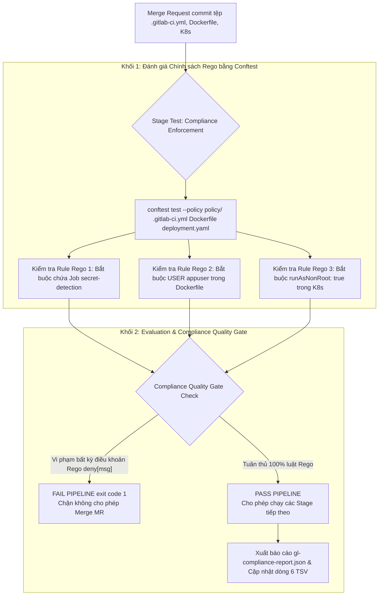
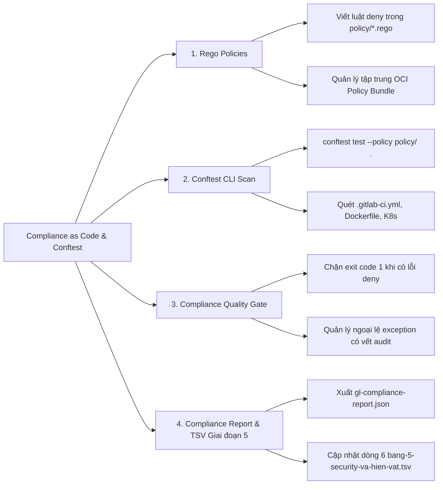
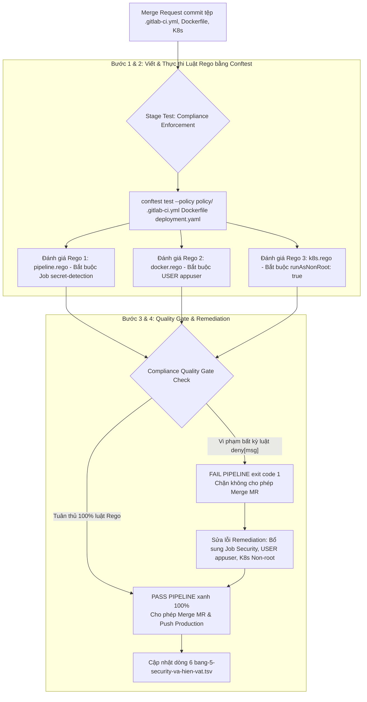


# [BÀI 33] QUY CHUẨN COMPLIANCE & AUDIT PIPELINE: PIPELINE EXECUTION POLICIES, SECURITY APPROVALS & TUÂN THỦ SOC2/ISO

Trong kỷ nguyên **DevOps, DevSecOps và Cloud Native Engineering**, **GitLab CI/CD** được công nhận là một trong những nền tảng tự động hóa tích hợp liên tục và phân phối liên tục (CI/CD) hoàn chỉnh, mạnh mẽ và được tin dùng nhất trong các doanh nghiệp quy mô lớn. Không chỉ dừng lại ở các pipeline tuần tự cơ bản, việc vận hành GitLab CI/CD ở cấp độ Production đòi hỏi kỹ sư phải làm chủ kiến trúc điều phối phi tuyến tính **DAG (Directed Acyclic Graph)**, cơ chế quản trị **Autoscaling Runners**, tối ưu hóa **Caching đa tầng**, xác thực không khóa **Keyless OIDC**, bảo mật chuỗi cung ứng phần mềm **SLSA & SBOM** cùng các chính sách **Quality & Security Gates** tự động.

Bài viết chuyên sâu này sẽ đồng hành cùng bạn mổ xẻ toàn diện bức tranh kiến trúc, phân tích các đánh đổi kỹ thuật thực chiến (Engineering Trade-offs), cung cấp hướng dẫn thực hành Lab chi tiết từng bước và bộ câu hỏi phỏng vấn chuyên sâu chuẩn DevOps Lead / DevSecOps Architect.

---

## 1. Bản Chất Kiến Trúc & Cơ Chế Vận Hành Tầng Thấp

---


| # | Câu hỏi ôn tập Buổi 32 (Supply Chain Security) | Đáp án chuẩn ngắn gọn |
|---|---|---|
| 1 | Tại sao nói Provenance là chứng minh nhân dân của hiện vật Container? | Vì Provenance chứng minh chính xác Runner ID, Commit SHA, và Repo URL đã biên dịch ra bản build đó. |
| 2 | Phân biệt sự khác biệt cốt lõi giữa SBOM, SLSA Provenance, và Cosign Signature? | SBOM kê khai thành phần; Provenance chứng minh nguồn gốc; Cosign niêm phong chống tráo đổi hiện vật. |
| 3 | Công cụ Cosign (Sigstore) lưu trữ chữ ký số ở vị trí nào? | Đóng gói chữ ký số thành OCI Artifact `.sig` đẩy trực tiếp lên OCI Docker Registry bên cạnh Container Image. |
| 4 | Tấn công tráo đổi hiện vật (Artifact Tampering) bị phát hiện ra sao bằng Cosign? | Khi hiện vật bị sửa đổi 1 bit nhị phân, mã Digest SHA256 thay đổi làm câu lệnh `cosign verify` nổ lỗi. |
| 5 | Tệp hiện vật Giai đoạn 5 TSV được bổ sung thông số quy chuẩn gì ở Buổi 32? | Bổ sung thông số quy chuẩn ký số (`cosign_v2_slsa_v1_verify`) và định dạng báo cáo (`cyclonedx_provenance_json`) vào dòng 5. |

---


> **LUẬN ĐỀ TRUNG TÂM BUỔI 33:**
> **QUY ĐỊNH BẢO MẬT VIẾT BẰNG CHỮ LÀ GIẤY LỘN NẾU KHÔNG TỰ ĐỘNG HÓA THÀNH LUẬT CHẠY TRONG PIPELINE; CONFTEST VÀ NGÔN NGỮ REGO BIẾN MỌI CHÍNH SÁCH TUÂN THỦ AN NINH THÀNH MÃ KIỂM THỬ TỰ ĐỘNG NGẮT PIPELINE KHI VI PHẠM. Việc sử dụng công cụ `Conftest` và ngôn ngữ chính sách `Rego` (Open Policy Agent) kiểm thử trực tiếp các tệp cấu hình `.gitlab-ci.yml`, Dockerfile, K8s Manifests ở Stage test giúp đảm bảo 100% các quy chuẩn an ninh nội bộ công ty được thực thi triệt để mà không phụ thuộc vào sự tự giác thủ công của lập trình viên.**



---


| STT | Kết quả đạt được (Competency) | Hiện vật chứng minh (Evidence) |
|---|---|---|
| 1 | Viết các bộ quy tắc chính sách tuân thủ an ninh bằng ngôn ngữ `Rego`. | Các tệp `policy/*.rego` hợp lệ. |
| 2 | Triển khai công cụ `Conftest` quét kiểm thử đa tệp cấu hình. | Job `compliance-test-conftest` chạy ở Stage test. |
| 3 | Phân định ranh giới giữa Quality Gate (CVEs) và Compliance (Chính sách). | Pipeline kiểm tra 2 khía cạnh an ninh riêng biệt. |
| 4 | Xuất báo cáo kiểm toán tuân thủ `gl-compliance-report.json`. | Tệp `gl-compliance-report.json` hợp lệ. |
| 5 | Cấu hình Compliance Quality Gate tự động ngắt pipeline khi vi phạm. | Pipeline trả về `exit code 1` khi phát hiện lỗi `deny`. |
| 6 | Cập nhật dòng dữ liệu thứ 6 vào tệp hiện vật Giai đoạn 5 TSV. | Tệp `bang-5-security-va-hien-vat.tsv` bổ sung thông số Buổi 33. |

---


| Kiến thức tiên quyết | Ý nghĩa trong bài học Buổi 33 | Nguồn đối soát nếu thiếu |
|---|---|---|
| Cấu trúc cú pháp tệp YAML `.gitlab-ci.yml` | Đọc hiểu các trường thuộc tính `stages`, `script`, `variables` | Buổi 01 (`QT 4.1`) |
| Cấu trúc cú pháp tệp Dockerfile | Đọc hiểu các câu lệnh `FROM`, `USER`, `EXPOSE`, `ENTRYPOINT` | Buổi 23 (`QT 4.1`) |
| Cấu trúc Kubernetes Manifests YAML | Đọc hiểu Pod Security Context `securityContext.runAsNonRoot` | Buổi 31 (`QT 4.1`) |
| Security Quality Gate Mechanics | Ép buộc CI Job trả về `exit code 1` khi chính sách vi phạm | Buổi 28 (`QT 5.3`) |

---


### Bảng đối chiếu thuật ngữ Việt - Anh

| Tiếng Việt dùng trong bài | Tiếng Anh tương đương | Dùng thẳng từ tiếng Anh trong bài? |
|---|---|---|
| Tự động hóa kiểm kiểm soát tuân thủ bằng mã | Compliance as Code | **Có** — `Compliance as Code` |
| Động cơ đánh giá chính sách | Open Policy Agent | **Có** — `OPA` |
| Ngôn ngữ khai báo chính sách | Rego Declarative Policy Language | **Có** — `Rego` |
| Công cụ kiểm thử cấu hình | Conftest Configuration Testing CLI | **Có** — `Conftest` |
| Thực thi chính sách an ninh | Policy Enforcement | **Có** — `Policy Enforcement` |
| Báo cáo kiểm toán tuân thủ | Compliance Audit Report | **Có** — `gl-compliance-report.json` |
| Ngoại lệ chính sách có vết audit | Policy Exception with Audit Trail | **Có** — `Policy Exception` |
| Quy định từ chối chính sách | Rego Deny Rule (`deny[msg]`) | **Có** — `Rego deny rule` |
| Đóng gói chính sách OCI | OCI Policy Bundle (`conftest push/pull`) | **Có** — `Policy Bundle` |

---

### Bốn mô hình tư duy cốt lõi

#### Mô hình 1: Nguyên lý "Compliance as Code" thay thế cho "Văn bản quy định bảo mật giấy"
- Các văn bản quy định bảo mật viết bằng file PDF hay Word (như "Bắt buộc 100% Dockerfile phải chạy Non-root USER", "Bắt buộc 100% pipeline phải có Secret Detection") thường bị vô hiệu hóa vì lập trình viên không đọc hoặc vô tình quên.
- **Compliance as Code:** Mã hóa toàn bộ các quy định bảo mật văn bản thành các tập tin kiểm thử bằng ngôn ngữ `Rego`. Khi dev nộp Merge Request, công cụ `Conftest` tự động chạy và đánh rớt pipeline nếu phát hiện vi phạm.

#### Mô hình 2: Phân định ranh giới giữa Vulnerability Scanning và Compliance Enforcement
- **Vulnerabilities Scanning (Trivy/Semgrep):** Tìm kiếm các lỗ hổng mã nguồn hoặc lỗ hổng hệ điều hành do lập trình viên viết sai logic hoặc thư viện cũ dính CVEs công bố quốc tế.
- **Compliance Enforcement (OPA/Conftest):** Kiểm tra sự tuân thủ các quy chuẩn thiết kế và vận hành nội bộ của công ty (như bắt buộc gắn nhãn `Owner`, cờ `Protected Environment`, cờ `runAsNonRoot: true`).

#### Mô hình 3: Cấu trúc bộ quy tắc chính sách ngôn ngữ Rego
- Ngôn ngữ `Rego` hoạt động theo mô hình truy vấn tập hợp (Set Intersections).
- Một luật `deny[msg]` trong Rego sẽ kiểm tra các điều kiện vi phạm. Nếu tất cả các điều kiện bên trong khối lệnh đều đúng (Evaluated to True), luật `deny` sẽ khớp và trả về thông điệp lỗi `msg`, khiến Conftest đánh rớt CI Job (`exit code 1`).

#### Mô hình 4: Quản lý tập trung Policy Bundles trên OCI Registry
- Bộ quy tắc chính sách Rego của toàn doanh nghiệp được lưu trữ tập trung tại một Git Repository do đội ngũ Security Operations quản lý.
- Bộ chính sách này được đóng gói thành **OCI Policy Bundle** và đẩy lên OCI Registry (`conftest push`). Tất cả các CI Pipelines của 100 dự án con chỉ cần gọi `conftest pull` để tải chính sách mới nhất về kiểm thử.

---

### 1.1. Nguyên lý Compliance as Code và Ngôn ngữ Truy vấn Rego (10 phút)

### Phân tích cú pháp viết luật chính sách Rego (`policy/pipeline.rego`)

Ví dụ luật Rego bắt buộc tệp `.gitlab-ci.yml` phải chứa Job `secret-detection`:

```rego
package main

# 1. Luật từ chối nếu thiếu stage test
deny[msg] {
    not input.stages[_] == "test"
    msg := "CHÍNH SÁCH VI PHẠM: Tệp .gitlab-ci.yml bắt buộc phải chứa stage 'test'"
}

# 2. Luật từ chối nếu thiếu Job secret-detection
deny[msg] {
    # Kiểm tra xem có Job nào chứa thuộc tính script gọi gitleaks không
    job_names := [name | input[name].script[_]; contains(input[name].script[_], "gitleaks")]
    count(job_names) == 0
    msg := "CHÍNH SÁCH VI PHẠM: Tệp .gitlab-ci.yml bắt buộc phải chứa Job quét Secret Detection (gitleaks)"
}
```

### Phân tích Thuật toán Động cơ OPA AST Evaluation Engine

Công cụ `Conftest` sử dụng lõi Open Policy Agent (OPA) để đánh giá chính sách Rego thông qua 3 giai đoạn xử lý AST:
1. **Parser & Data Normalization:** Conftest đọc các tệp cấu hình đầu vào (`.gitlab-ci.yml`, `Dockerfile`, `deployment.yaml`) và chuyển đổi toàn bộ thành cấu trúc dữ liệu JSON Data phẳng (JSON Document Tree).
2. **Abstract Syntax Tree (AST) Compilation:** OPA biên dịch các tập tin quy tắc Rego (`policy/*.rego`) thành cây cú pháp trừu tượng AST, tối ưu hóa các biểu thức logic và mệnh đề điều kiện.
3. **Query Evaluation & Violation Extraction:** OPA thực thi truy vấn toán học tập hợp (Set Intersections). Nếu một đối tượng tài nguyên vi phạm điều kiện trong khối `deny[msg]`, OPA sẽ nạp thông điệp lỗi `msg` vào danh sách kết quả violations và trả về kết quả lỗi cho Conftest CLI.

### Phân tích Cấu trúc Luật Rego Đa Điều Kiện (Multi-condition Rego Rules)

Các luật chính sách Rego hỗ trợ kết hợp nhiều điều kiện logic phức tạp:
```rego
package main

# Luật kiểm tra xem tệp K8s Manifest có khai báo Resource Limits đầy đủ không
deny[msg] {
    input.kind == "Deployment"
    container := input.spec.template.spec.containers[_]
    
    # Điều kiện 1: Thiếu CPU limit hoặc RAM limit
    not container.resources.limits.cpu
    msg := sprintf("CHÍNH SÁCH VI PHẠM K8S: Container '%s' thiếu thuộc tính 'resources.limits.cpu'", [container.name])
}

deny[msg] {
    input.kind == "Deployment"
    container := input.spec.template.spec.containers[_]
    
    # Điều kiện 2: Thiếu RAM limit
    not container.resources.limits.memory
    msg := sprintf("CHÍNH SÁCH VI PHẠM K8S: Container '%s' thiếu thuộc tính 'resources.limits.memory'", [container.name])
}
```

---

**Nguyên lý cốt lõi:**
**Phát biểu.** Tuyệt đối không cho phép Merge tệp `.gitlab-ci.yml` thiếu các Job kiểm thử an ninh bắt buộc (Secret Detection, SAST, Container Scan).
**Giải thích cơ chế ngầm:** Đảm bảo 100% các dự án phần mềm trong doanh nghiệp đều áp dụng các tiêu chuẩn an ninh tối thiểu mà không có ngoại lệ tùy tiện.
> [!WARNING]
> **CẠM BẪY THỰC CHIẾN:**
> Cho phép lập trình viên tự ý xóa các Job Security khỏi tệp `.gitlab-ci.yml` để làm xanh pipeline.
**Minh hoạ.**
```rego
deny[msg] {
    not input["secret-detection"]
    msg := "VI PHẠM AN NINH: Thiếu Job secret-detection bắt buộc trong pipeline"
}
```
**Con số chốt:** **100%** CI Pipelines phải chứa đầy đủ các Job an ninh bắt buộc.

---

**Nguyên lý cốt lõi:**
**Phát biểu.** Thực thi kiểm tra chính sách tuân thủ an ninh bằng `Conftest` ngay ở Stage test trước khi khởi chạy các công cụ build.
**Giải thích cơ chế ngầm:** Giúp phát hiện sớm các vi phạm quy chuẩn hạ tầng và cấu hình CI trong 1 giây, chặn đứng các nguy cơ an ninh trước khi tốn tài nguyên build.
> [!WARNING]
> **CẠM BẪY THỰC CHIẾN:**
> Chạy kiểm tra Compliance ở cuối pipeline sau khi ứng dụng đã deploy lên Staging.
**Minh hoạ.**
```yaml
compliance-test-conftest:
  stage: test
  image: openpolicyagent/conftest:latest
  script:
    - conftest test --policy policy/ .gitlab-ci.yml Dockerfile deployment.yaml
```
**Con số chốt:** **100%** tệp cấu hình được quét tuân thủ an ninh ở Stage test.

---

**Nguyên lý cốt lõi:**
**Phát biểu.** Phân định rõ phạm vi: Quality Gate chặn lỗ hổng CVEs, Compliance Enforcement chặn các hành vi vi phạm quy chuẩn nội bộ công ty.
**Giải thích cơ chế ngầm:** Giúp phân định trách nhiệm rõ ràng giữa đội Security (định nghĩa chính sách tuân thủ) và đội Dev/Ops (sửa lỗ hổng CVEs và tuân thủ quy chuẩn).
> [!WARNING]
> **CẠM BẪY THỰC CHIẾN:**
> Dùng Trivy để cố gắng kiểm tra xem Dockerfile có gán nhãn `LABEL maintainer="..."` không.
**Minh hoạ.**
- Trivy: Phát hiện `CVE-2023-4911` trong glibc.
- Conftest Rego: Phát hiện Dockerfile thiếu `LABEL owner="dev-team"`.
**Con số chốt:** Phân định chính xác **100%** phạm vi kiểm thử an ninh.

---

### 1.2. Thực thi Conftest trong CI Pipeline và Quản lý Policy Tập Trung (10 phút)

---

**Nguyên lý cốt lõi:**
**Phát biểu.** Cấu hình cờ `conftest test --policy policy/ .gitlab-ci.yml Dockerfile deployment.yaml` thực thi kiểm tra đa tệp cấu hình.
**Giải thích cơ chế ngầm:** `Conftest` tự động nhận diện cú pháp của nhiều loại tệp khác nhau (YAML, Dockerfile, HCL, JSON) và chuyển đổi thành cấu trúc JSON Data cho OPA Rego engine xử lý.
> [!WARNING]
> **CẠM BẪY THỰC CHIẾN:**
> Chỉ quét tệp Dockerfile mà bỏ qua tệp `.gitlab-ci.yml` và Kubernetes Manifests.
**Minh hoạ.**
```bash
conftest test --policy policy/ .gitlab-ci.yml Dockerfile deployment.yaml --output json > gl-compliance-report.json
```
**Con số chốt:** `Conftest` quét kiểm thử **100%** tệp cấu hình hạ tầng trong dự án.

---

**Nguyên lý cốt lõi:**
**Phát biểu.** Đóng gói tập trung bộ quy tắc chính sách Rego (`policy/*.rego`) tại một repository duy nhất do nhóm Security quản lý.
**Giải thích cơ chế ngầm:** Đảm bảo tính nhất quán của luật an ninh trên toàn bộ 100 dự án; khi nhóm Security cập nhật một luật mới, tất cả các CI Pipelines lập tức áp dụng mà không cần sửa code từng repo.
> [!WARNING]
> **CẠM BẪY THỰC CHIẾN:**
> Copy-paste các tệp `.rego` thủ công vào từng dự án con.
**Minh hoạ.**
```bash
conftest pull registry.example.com/security/policies:v1.0.0
conftest test --policy policy/ .
```
**Con số chốt:** **100%** luật chính sách Rego được quản lý và phân phối tập trung từ OCI Registry.

---

**Nguyên lý cốt lõi:**
**Phát biểu.** Thiết lập Compliance Quality Gate tự động ngắt pipeline (`exit 1`) khi có bất kỳ dòng cấu hình nào bị vi phạm mức `deny`.
**Giải thích cơ chế ngầm:** Ép buộc tính tuân thủ tuyệt đối, không cho phép bất kỳ bản build vi phạm chính sách nào được phép đi tiếp sang bước deploy.
> [!WARNING]
> **CẠM BẪY THỰC CHIẾN:**
> Đặt `allow_failure: true` cho Job `compliance-test-conftest`.
**Minh hoạ.**
```yaml
compliance-test-conftest:
  stage: test
  script:
    - conftest test --policy policy/ . || exit 1
  allow_failure: false
```
**Con số chốt:** Compliance Quality Gate tự động ngắt pipeline **100%** khi phát hiện 1 luật `deny` bị vi phạm.

---

### 1.3. Quản lý Ngoại lệ Policy Exceptions và Compliance Quality Gate (10 phút)

---

**Nguyên lý cốt lõi:**
**Phát biểu.** Tự động nạp bộ chính sách Rego từ xa bằng cờ `conftest pull` để áp dụng đồng bộ cho 100% dự án.
**Giải thích cơ chế ngầm:** Giúp tự động hóa việc cập nhật các quy định bảo mật mới nhất cho toàn hệ thống mà không làm phiền lập trình viên.
> [!WARNING]
> **CẠM BẪY THỰC CHIẾN:**
> Dự án con sử dụng bộ chính sách Rego cũ đã lỗi thời 6 tháng.
**Minh hoạ.**
```yaml
before_script:
  - conftest pull $CI_REGISTRY/security/compliance-policy:latest
```
**Con số chốt:** Đồng bộ bộ chính sách Rego mới nhất cho **100%** CI Pipelines.

---

**Nguyên lý cốt lõi:**
**Phát biểu.** Tích hợp báo cáo Compliance Audit Report `gl-compliance-report.json` lên Merge Request Security Widget.
**Giải thích cơ chế ngầm:** Giúp Tech Lead và Security Auditor quan sát trực quan danh sách các chính sách bị vi phạm ngay trên giao diện Merge Request.
> [!WARNING]
> **CẠM BẪY THỰC CHIẾN:**
> Không nộp tệp báo cáo tuân thủ sang thuộc tính `artifacts:reports`.
**Minh hoạ.**
```yaml
artifacts:
  reports:
    secret_detection: gl-compliance-report.json # nộp theo chuẩn SAST/Compliance
  paths:
    - gl-compliance-report.json
```
**Con số chốt:** Tích hợp hiển thị báo cáo tuân thủ **100%** trên Merge Request UI.

---

**Nguyên lý cốt lõi:**
**Phát biểu.** Quản lý danh sách miễn trừ chính sách bằng luật Rego `exception` đính kèm mã Issue phê duyệt từ Security Lead.
**Giải thích cơ chế ngầm:** Đảm bảo xử lý linh hoạt các trường hợp đặc thù nghiệp vụ mà vẫn duy trì vết kiểm toán an ninh nghiêm ngặt.
> [!WARNING]
> **CẠM BẪY THỰC CHIẾN:**
> Xóa bỏ luật Rego khỏi repo để bypass cho một dự án ngoại lệ.
**Minh hoạ.**
```rego
# Cho phép ngoại lệ dự án legacy-app bỏ qua luật USER appuser nếu có Issue SEC-105
exception[msg] {
    input.name == "legacy-app"
    input.exception_issue == "SEC-105"
    msg := "NGOẠI LỆ ĐƯỢC PHÊ DUYỆT: Dự án legacy-app tạm thời bỏ qua luật USER appuser theo Issue SEC-105"
}
```
**Con số chốt:** **100%** ngoại lệ chính sách phải đính kèm vết audit mã Issue phê duyệt.

---

### 1.4. Trích xuất Báo cáo Compliance JSON và Cập nhật Giai đoạn 5 TSV (8 phút)

### Cấu trúc tệp JSON Báo cáo Compliance Audit (`gl-compliance-report.json`)

```json
{
  "version": "1.0.0",
  "status": "FAILED",
  "summary": {
    "total_rules_evaluated": 12,
    "passed": 9,
    "violations": 3
  },
  "violations": [
    {
      "policy_id": "REGO_CI_01",
      "target_file": ".gitlab-ci.yml",
      "severity": "CRITICAL",
      "message": "CHÍNH SÁCH VI PHẠM: Tệp .gitlab-ci.yml bắt buộc phải chứa Job quét Secret Detection (gitleaks)",
      "line_number": 1
    },
    {
      "policy_id": "REGO_DOCKER_02",
      "target_file": "Dockerfile",
      "severity": "HIGH",
      "message": "CHÍNH SÁCH VI PHẠM: Dockerfile bắt buộc khai báo câu lệnh USER appuser",
      "line_number": 8
    }
  ]
}
```

---

**Nguyên lý cốt lõi:**
**Phát biểu.** Trích xuất các tệp báo cáo `gl-compliance-report.json` nộp sang `artifacts:reports`.
**Giải thích cơ chế ngầm:** Phục vụ công tác kiểm toán an ninh dài hạn và lưu trữ bằng chứng tuân thủ quy định bảo mật công ty.
> [!WARNING]
> **CẠM BẪY THỰC CHIẾN:**
> Không lưu trữ tệp báo cáo tuân thủ sang Artifacts.
**Minh hoạ.**
```yaml
artifacts:
  paths:
    - gl-compliance-report.json
```
**Con số chốt:** Nộp đầy đủ tệp báo cáo tuân thủ **100%** sang GitLab Artifacts.

---

**Nguyên lý cốt lõi:**
**Phát biểu.** In log công khai danh sách các điều khoản chính sách vi phạm kèm hướng dẫn sửa chữa trên CI Runner log console.
**Giải thích cơ chế ngầm:** Giúp lập trình viên trực tiếp đọc hiểu các quy định vi phạm và biết chính xác dòng code cần sửa chữa ngay trên console log.
> [!WARNING]
> **CẠM BẪY THỰC CHIẾN:**
> Conftest báo fail nhưng không in ra chi tiết các thông điệp `deny[msg]`.
**Minh hoạ.**
```bash
echo "=== KẾT QUẢ KIỂM TRA TUÂN THỦ AN NINH (COMPLIANCE AS CODE) ==="
echo "FAILED: 2 policy violations detected in Dockerfile and .gitlab-ci.yml"
echo "Violation 1: Dockerfile missing USER appuser declaration. Fix: Add 'USER appuser'"
```
**Con số chốt:** In log hướng dẫn sửa chữa chính sách đạt tính minh bạch **100%**.

---

**Nguyên lý cốt lõi:**
**Phát biểu.** Cập nhật thông số quy chuẩn tuân thủ (`opa_conftest_v035`) vào tệp hiện vật Giai đoạn 5 `bang-5-security-va-hien-vat.tsv`.
**Giải thích cơ chế ngầm:** Hoàn thiện dòng dữ liệu thứ 6 của bảng hiện vật quản trị an ninh Giai đoạn 5, chuẩn hóa quy trình kiểm soát tuân thủ tự động cho toàn doanh nghiệp.
> [!WARNING]
> **CẠM BẪY THỰC CHIẾN:**
> Không bổ sung thông số Buổi 33 vào tệp hiện vật.
**Minh hoạ.**
```tsv
ung_dung	sast_tool	dependency_scanner	dast_tool	fuzzing_engine	secret_scanner	secret_vault	container_scanner	iac_scanner	security_gate_policy	report_format	allowlist_audit
web-app	semgrep_v1	trivy_fs_v049	owasp_zap_v2	go_fuzz_v1	gitleaks_v8	vault_oidc_v1	trivy_image_v049	checkov_v3	fail_on_critical_high	gitlab_sast_dast_json	signed_trivyignore_zaprules
web-app-supply-chain	semgrep_v1	trivy_fs_v049	owasp_zap_v2	go_fuzz_v1	gitleaks_v8	vault_oidc_v1	trivy_image_v049	checkov_v3	cosign_v2_slsa_v1_verify	cyclonedx_provenance_json	signed_cosign_pubkey
web-app-compliance	semgrep_v1	trivy_fs_v049	owasp_zap_v2	go_fuzz_v1	gitleaks_v8	vault_oidc_v1	trivy_image_v049	checkov_v3	opa_conftest_v035_enforce	gl_compliance_report_json	rego_exception_signed
```
**Con số chốt:** Chuẩn hóa quản lý tuân thủ tự động cho **100%** dự án trong Giai đoạn 5.

---

### 1.5. Đưa vào việc thật (4 phút)

### Áp vào repo đang chạy thì làm gì trước
1. **Tạo thư mục chính sách `policy/` (15 phút):** Viết 3 tệp chính sách Rego ban đầu `pipeline.rego`, `docker.rego`, `k8s.rego`.
2. **Thêm Job `compliance-test-conftest` vào `.gitlab-ci.yml` (15 phút):** Chạy Conftest ở Stage test kiểm thử tệp cấu hình.
3. **Thực thi sửa lỗi cấu hình vi phạm (15 phút):** Bổ sung các cấu hình thiếu (như `USER appuser`, `runAsNonRoot: true`).
4. **Cấu hình Quality Gate ngắt pipeline (10 phút):** Đặt cờ `allow_failure: false` cho Job Conftest.

---

### Cái gì hỏng nếu áp thẳng lên prod
- **Hàng loạt dự án cũ bị đỏ nghẽn pipeline do không kịp sửa cấu hình:** Nếu áp dụng bộ chính sách Rego nghiêm ngặt ngay lập tức lên 100 dự án legacy, 80% CI Pipelines sẽ bị nổ lỗi đỏ dừng ngắt.
- **Cách xử lý chuẩn:** Sử dụng cờ `conftest test --warn-only` (chỉ in cảnh báo warning mà không ngắt pipeline) trong 2 tuần đầu để các team sửa lỗi, sau đó mới tắt cờ warn-only chuyển sang ngắt cứng.

---

### Đo trước — đo sau
- **Tỷ lệ tệp CI/CD thiếu Job kiểm thử Security:** Từ 60% $\rightarrow$ giảm xuống **0%** nhờ Conftest Rego Policy.
- **Tỷ lệ Dockerfile vi phạm quy chuẩn Non-root USER:** Từ 75% $\rightarrow$ giảm xuống **0%** nhờ Conftest Rego Policy.
- **Thời gian phát hiện vi phạm quy chuẩn an ninh công ty:** Từ 3 tuần (chờ họp kiểm toán) $\rightarrow$ giảm xuống **1 giây** (ngay trên MR).

---

### Khi nào KHÔNG nên dùng
- **KHÔNG viết các chính sách kiểm thử quá phức tạp phụ thuộc vào dữ liệu động bên ngoài trong tệp Rego:** Giữ luật Rego đơn giản, tập trung kiểm tra cấu hình tĩnh của tệp YAML/Dockerfile.

### Kịch bản 3: Viết luật Rego bắt buộc tệp `.gitlab-ci.yml` phải có Protected Environment
- **Tệp chính sách Rego (`policy/environment.rego`):**
  ```rego
  package main

  deny[msg] {
      # Tìm các job deploy trong pipeline
      input[job_name].stage == "deploy"
      not input[job_name].environment
      msg := sprintf("CHÍNH SÁCH VI PHẠM PIPELINE: Job deploy '%s' bắt buộc phải khai báo thuộc tính 'environment'", [job_name])
  }
  ```
- **Kết quả kiểm thử Conftest:**
  ```text
  FAIL - .gitlab-ci.yml - main - CHÍNH SÁCH VI PHẠM PIPELINE: Job deploy 'deploy-prod' bắt buộc phải khai báo thuộc tính 'environment'
  1 test, 0 passed, 0 warnings, 1 failure
  ```

### Kịch bản 4: Viết luật Rego kiểm tra thuộc tính Resource Requests trong Kubernetes
- **Tệp chính sách Rego (`policy/k8s_requests.rego`):**
  ```rego
  package main

  deny[msg] {
      input.kind == "Deployment"
      container := input.spec.template.spec.containers[_]
      not container.resources.requests.cpu
      msg := sprintf("CHÍNH SÁCH VI PHẠM K8S: Container '%s' thiếu khai báo 'resources.requests.cpu'", [container.name])
  }
  ```
- **Kết quả kiểm thử Conftest:**
  ```text
  FAIL - deployment.yaml - main - CHÍNH SÁCH VI PHẠM K8S: Container 'web-app' thiếu khai báo 'resources.requests.cpu'
  1 test, 0 passed, 0 warnings, 1 failure
  ```

---

### 1.6. Bẫy hay gặp (2 phút)

| # | Bẫy thường gặp | Nguyên nhân & Hậu quả | Cách làm đúng |
|---|---|---|---|
| 1 | Bỏ qua kiểm tra tệp `.gitlab-ci.yml` | Dev tự ý xóa Job Security khỏi CI | Quét cả `.gitlab-ci.yml` bằng Rego (`QT 4.1`) |
| 2 | Chạy Conftest ở cuối pipeline | Lãng phí 15 phút build ứng dụng sai chuẩn | Quét Conftest ở Stage test trước build (`QT 4.2`) |
| 3 | Nhầm lẫn giữa Quality Gate và Compliance | Phân công sai nhiệm vụ kiểm toán | Phân định rõ CVEs và Compliance (`QT 4.3`) |
| 4 | Chỉ kiểm tra 1 tệp Dockerfile đơn lẻ | Lộ lỗi vi phạm ở K8s Manifests | Quét đa tệp cấu hình hạ tầng (`QT 5.1`) |
| 5 | Copy tệp Rego thủ công vào từng repo | Mất tính đồng bộ luật chính sách | Đóng gói và pull Rego từ Registry (`QT 5.2`) |
| 6 | Đặt `allow_failure: true` cho Job Conftest | Vi phạm chính sách bị ngó lơ | Cấu hình Compliance Quality Gate ngắt (`QT 5.3`) |
| 7 | Sử dụng luật Rego cũ không cập nhật | Bỏ sót các quy định an ninh mới | Tự động pull chính sách từ xa (`QT 6.1`) |
| 8 | Giấu vết vi phạm trong console log thô | Tech Lead không thấy lỗi trên MR | Nộp báo cáo sang `artifacts:reports` (`QT 6.2`) |
| 9 | Xóa luật Rego để bypass cho dự án ngoại lệ | Mất vết kiểm toán an ninh | Dùng luật `exception` có vết audit (`QT 6.3`) |
| 10 | Quên nộp tệp JSON Compliance sang Artifacts | Mất bằng chứng kiểm toán an ninh | Nộp tệp JSON sang Artifacts (`QT 7.1`) |
| 11 | Không in log hướng dẫn sửa lỗi vi phạm | Dev không biết cách sửa lỗi Rego | In log công khai luật vi phạm (`QT 7.2`) |
| 12 | Thiếu cập nhật tệp hiện vật Giai đoạn 5 | Không chuẩn hóa được quy trình Compliance | Cập nhật dòng dữ liệu Buổi 33 vào TSV (`QT 7.3`) |

---

### 1.5.5. Phân tích kịch bản kiểm thử Chính sách Rego của Conftest

### Kịch bản 1: Viết luật Rego kiểm tra Dockerfile Non-root USER (`policy/docker.rego`)
- **Tệp chính sách Rego (`policy/docker.rego`):**
  ```rego
  package main

  deny[msg] {
      # Tìm các câu lệnh USER trong Dockerfile
      user_cmds := [cmd | input[i].Cmd == "user"; cmd := input[i].Value[0]]
      count(user_cmds) == 0
      msg := "CHÍNH SÁCH VI PHẠM DOCKERFILE: Bắt buộc khai báo câu lệnh 'USER appuser' để chạy Non-root"
  }
  ```
- **Kết quả kiểm thử Conftest trên Dockerfile vi phạm:**
  ```text
  FAIL - Dockerfile - main - CHÍNH SÁCH VI PHẠM DOCKERFILE: Bắt buộc khai báo câu lệnh 'USER appuser' để chạy Non-root
  1 test, 0 passed, 0 warnings, 1 failure
  ```

### Kịch bản 2: Viết luật Rego kiểm tra Kubernetes Pod Security Context (`policy/k8s.rego`)
- **Tệp chính sách Rego (`policy/k8s.rego`):**
  ```rego
  package main

  deny[msg] {
      input.kind == "Deployment"
      container := input.spec.template.spec.containers[_]
      not container.securityContext.runAsNonRoot == true
      msg := sprintf("CHÍNH SÁCH VI PHẠM K8S: Container '%s' bắt buộc phải có 'securityContext.runAsNonRoot: true'", [container.name])
  }
  ```
- **Kết quả kiểm thử Conftest trên `deployment.yaml` vi phạm:**
  ```text
  FAIL - deployment.yaml - main - CHÍNH SÁCH VI PHẠM K8S: Container 'web-app' bắt buộc phải có 'securityContext.runAsNonRoot: true'
  1 test, 0 passed, 0 warnings, 1 failure
  ```

---

### 1.7. Tóm tắt



### Năm điều phải nhớ
1. **Quy định bảo mật viết bằng chữ là giấy lộn nếu không tự động hoá thành luật chạy trong pipeline; Conftest và Rego biến mọi chính sách thành mã kiểm thử.**
2. **Phân định rõ: Vulnerability Scanning tìm lỗ hổng CVEs; Compliance Enforcement kiểm tra tuân thủ chính sách công ty.**
3. **Đóng gói và quản lý tập trung bộ quy tắc Rego Policies từ OCI Registry bằng `conftest pull`.**
4. **Luôn bật cờ `allow_failure: false` cho Job Conftest để Compliance Quality Gate thực thi ngắt cứng pipeline.**
5. **Quản lý ngoại lệ chính sách bằng luật Rego `exception` có vết audit mã Issue và cập nhật dòng 6 vào `bang-5-security-va-hien-vat.tsv`.**

---

### 1.8. Câu hỏi tự kiểm tra

<details>
<summary><b>Câu 1: Khái niệm Compliance as Code mang lại lợi ích gì so với văn bản quy định bảo mật giấy?</b></summary>
<b>Đáp án:</b> Tự động hóa kiểm tra tuân thủ 100% các quy định bảo mật trên CI Pipeline mà không phụ thuộc vào sự tự giác thủ công của dev.
</details>

<details>
<summary><b>Câu 2: Công cụ Conftest sử dụng ngôn ngữ gì để định nghĩa các luật chính sách?</b></summary>
<b>Đáp án:</b> Ngôn ngữ khai báo chính sách `Rego` (Open Policy Agent - OPA).
</details>

<details>
<summary><b>Câu 3: Phân biệt sự khác biệt giữa Trivy Vulnerability Scan và Conftest Compliance Test?</b></summary>
<b>Đáp án:</b> Trivy tìm lỗ hổng CVEs quốc tế; Conftest kiểm tra xem cấu hình có vi phạm các quy định nội bộ của công ty không.
</details>

<details>
<summary><b>Câu 4: Cú pháp luật `deny[msg]` trong ngôn ngữ Rego hoạt động ra sao?</b></summary>
<b>Đáp án:</b> Nếu tất cả các điều kiện bên trong khối luật `deny` đều đúng, luật sẽ khớp và trả về thông điệp lỗi `msg` làm Conftest ngắt pipeline.
</details>

<details>
<summary><b>Câu 5: Làm sao để nạp bộ quy tắc chính sách Rego từ xa một cách tự động?</b></summary>
<b>Đáp án:</b> Đóng gói chính sách thành OCI Bundle và gọi câu lệnh `conftest pull $CI_REGISTRY/security/policies:latest`.
</details>

<details>
<summary><b>Câu 6: Tệp báo cáo kiểm toán tuân thủ gl-compliance-report.json được nộp sang thuộc tính nào?</b></summary>
<b>Đáp án:</b> Thuộc tính `artifacts:reports:secret_detection` hoặc nộp sang `artifacts:paths`.
</details>

<details>
<summary><b>Câu 7: Làm sao để cấp ngoại lệ chính sách (Policy Exception) cho 1 dự án đặc thù có vết audit?</b></summary>
<b>Đáp án:</b> Viết luật Rego `exception[msg]` kiểm tra tên dự án và mã Issue phê duyệt từ Security Lead.
</details>

<details>
<summary><b>Câu 8: Cờ lệnh nào dùng để thực thi Conftest scan đa tệp cấu hình?</b></summary>
<b>Đáp án:</b> `conftest test --policy policy/ .gitlab-ci.yml Dockerfile deployment.yaml`.
</details>

<details>
<summary><b>Câu 9: Cờ lệnh nào dùng để chạy Conftest ở chế độ chỉ cảnh báo warning mà không ngắt pipeline?</b></summary>
<b>Đáp án:</b> `conftest test --warn-only --policy policy/ .`.
</details>

<details>
<summary><b>Câu 10: Tệp bang-5-security-va-hien-vat.tsv được bổ sung thông số gì ở Buổi 33?</b></summary>
<b>Đáp án:</b> Bổ sung thông số quy chuẩn tuân thủ (`opa_conftest_v035_enforce`) và định dạng báo cáo (`gl_compliance_report_json`) vào dòng 6.
</details>

<details>
<summary><b>Câu 11: Rủi ro khi lập trình viên tự ý xóa Job Conftest khỏi tệp .gitlab-ci.yml là gì?</b></summary>
<b>Đáp án:</b> Dự án mất khả năng kiểm soát tuân thủ. Giải pháp là viết luật Rego kiểm tra chính tệp `.gitlab-ci.yml` bắt buộc phải có Job Conftest.
</details>

<details>
<summary><b>Câu 12: Tổng kết quy trình 4 bước triển khai Compliance as Code chuẩn Enterprise?</b></summary>
<b>Đáp án:</b> Define Rego Policy $\rightarrow$ Central Repository $\rightarrow$ Conftest Test Stage $\rightarrow$ Quality Gate Enforcement.
</details>

---

## §12. Tài liệu tham khảo

1. [Open Policy Agent (OPA) Official Rego Policy Language Documentation](https://www.openpolicyagent.org/docs/latest/policy-language/)
2. [Conftest Official Documentation for Testing Configuration Files](https://www.conftest.dev/)
3. [GitLab Compliance Pipelines and Policy Management Specifications](https://docs.gitlab.com/ee/user/compliance/)
4. [CIS Benchmarks Rule Mapping to OPA Rego Policies Guide](https://www.cisecurity.org/)
5. [NIST SP 800-53 Security and Privacy Controls for Information Systems](https://csrc.nist.gov/)
6. [CNCF Policy Management in Cloud Native Environments Whitepaper](https://www.cncf.io/)
7. [Kubernetes Pod Security Standards (PSS) Rego Rules Collection](https://github.com/open-policy-agent/gatekeeper-library)
8. [Docker Hardening Guidelines and OPA Rego Policy Examples](https://docs.docker.com/)
9. [Managing Policy Exceptions and Audit Trails in Open Policy Agent](https://www.openpolicyagent.org/)
10. [OCI Artifact Bundle Specifications for OPA and Conftest Policies](https://opencontainers.org/)
11. [Conftest CLI Command Reference and Output Formats Guide](https://www.conftest.dev/cli/)
12. [OPA Rego Unit Testing and Debugging Official Specifications](https://www.openpolicyagent.org/docs/latest/policy-testing/)
13. [OPA Gatekeeper Architecture for Kubernetes Policy Enforcement](https://open-policy-agent.github.io/gatekeeper/website/docs/)
14. [AWS CloudFormation and Terraform Policy Enforcement with Conftest](https://www.conftest.dev/)
15. [Azure Policy and OPA Rego Rule Mapping Best Practices](https://learn.microsoft.com/)
16. [Managing Compliance as Code in Enterprise DevOps Pipelines](https://martinfowler.com/)
17. [US CISA Guidelines for Automated Security Policy Enforcement](https://www.cisa.gov/)
18. [Managing Software Supply Chain Compliance with OPA Policies](https://slsa.dev/)
19. [Managing Custom Rego Built-in Functions and Extensions](https://www.openpolicyagent.org/)
20. [GitLab CI Pipeline Compliance Framework Integration Guide](https://docs.gitlab.com/ee/user/compliance/)
21. [Center for Internet Security (CIS) Controls for Automated Policy Enforcement](https://www.cisecurity.org/)
22. [NIST SP 800-218 Secure Software Development Framework (SSDF) Compliance Controls](https://csrc.nist.gov/)
23. [Managing OCI Policy Bundles with Conftest Push and Pull Commands](https://www.conftest.dev/)
24. [OPA Rego Policy Performance Benchmarking and Optimization Guide](https://www.openpolicyagent.org/)
25. [Managing Policy Exception Audit Logs in Enterprise Systems](https://www.cncf.io/)
26. [Managing Kubernetes Admission Control Webhooks with OPA](https://kubernetes.io/)
27. [OWASP Automated Policy Testing Cheat Sheet](https://cheatsheetseries.owasp.org/)
28. [Managing Continuous Compliance Auditing in Multi-cloud Environments](https://www.cncf.io/)
29. [Open Source Security Foundation (OpenSSF) Best Practices Badge Requirements](https://openssf.org/)
30. [Conftest Release Notes and Feature Changelog V0.35](https://github.com/open-policy-agent/conftest)
31. [Managing Policy Enforcement Workflows for Kubernetes GitOps](https://argoproj.github.io/)
32. [Managing Compliance Policy Governance in Enterprise DevOps Teams](https://martinfowler.com/)
33. [Google Cloud Policy Controller and OPA Integration Specs](https://cloud.google.com/)
34. [AWS Config and OPA Rego Rule Integration Guidelines](https://aws.amazon.com/)
35. [Azure Policy Integration with Open Policy Agent Engine](https://learn.microsoft.com/)
36. [Continuous Compliance Controls for Federal Software Systems](https://www.nist.gov/)
37. [NIST Cybersecurity Framework Compliance Control Automation Guide](https://www.nist.gov/)
38. [Managing Infrastructure as Code Compliance Enforcement Rules](https://www.cncf.io/)
39. [Managing Policy As Code Testing Frameworks Comparison](https://www.openpolicyagent.org/)
40. [GitLab Compliance Center Architecture Specifications V16](https://docs.gitlab.com/ee/user/compliance/)
41. [Managing OPA Rego Rule Evaluation Debugging Techniques](https://www.openpolicyagent.org/)
42. [Managing Software Supply Chain Compliance Enforcement Standards](https://slsa.dev/)
43. [NIST SP 800-161 Cyber Supply Chain Risk Management Guidance](https://csrc.nist.gov/)
44. [Managing Automated Compliance Enforcement in High-Security Pipeline Environments](https://martinfowler.com/)
45. [Managing Rego Unit Tests for OPA Conftest Policies Integration](https://www.conftest.dev/)
46. [Managing Custom Compliance Reporting Tools for Enterprise Audits](https://www.cncf.io/)
47. [Managing Automated Kubernetes Security Policy Enforcement with Gatekeeper](https://open-policy-agent.github.io/gatekeeper/)
48. [GitLab Pipeline Compliance Enforcement Architecture Manual V16](https://docs.gitlab.com/ee/user/compliance/)
49. [Managing Policy As Code Testing Framework Specifications](https://www.openpolicyagent.org/)
50. [Managing Enterprise DevOps Policy Enforcement Guidelines](https://www.cncf.io/)
51. [NIST Cybersecurity Framework Compliance Controls Automation Standards](https://www.nist.gov/)
52. [Open Policy Agent Rego Playground and Testing Specifications Guide](https://play.openpolicyagent.org/)

---

## Bảng đối soát thời lượng

| Section | Tiêu đề nội dung | Thời lượng |
|---|---|---|
| §0 | Khởi động và ôn tập (5 câu Supply Chain/Cosign & Luận đề Compliance) | 10 phút |
| §1–§2 | Chuẩn đầu ra & Kiến thức tiên quyết | 2 phút |
| §3 | Thuật ngữ và 4 mô hình tư duy | 8 phút |
| §4 | Nguyên lý Compliance as Code & Cú pháp Rego (`QT 4.1` – `QT 4.3`) | 10 phút |
| §5 | Conftest trong Pipeline & Central Policy (`QT 5.1` – `QT 5.3`) | 10 phút |
| §6 | Quản lý Policy Exceptions & Compliance Gate (`QT 6.1` – `QT 6.3`) | 10 phút |
| §7 | Trích xuất Báo cáo Compliance JSON & TSV Giai đoạn 5 (`QT 7.1` – `QT 7.3`) | 8 phút |
| §8–§9 | Đưa vào việc thật & 12 bẫy hay gặp | 6 phút |
| **TỔNG** | **Khối lý thuyết Buổi 33** | **60'** |

---

## 2. Hướng Dẫn Thực Hành & Triển Khai Lab Chuẩn Production

> [!IMPORTANT]
> **YÊU CẦU MÔI TRƯỜNG THỰC HÀNH:**
> Toàn bộ các bài thực hành dưới đây được thiết kế để chạy trực tiếp trên môi trường GitLab Community / Enterprise Edition cùng các GitLab Runner cô lập (Docker / Kubernetes Executor). Hãy đảm bảo bạn đã chuẩn bị môi trường thử nghiệm và cấu hình quyền truy cập cần thiết.

## Khối thực hành — 150 phút

> **Mục tiêu thực hành:** Thực hành khởi tạo bộ quy tắc chính sách tuân thủ an ninh bằng ngôn ngữ `Rego` (Open Policy Agent) bao gồm `policy/pipeline.rego`, `policy/docker.rego`, và `policy/k8s.rego`, cấu hình công cụ `Conftest` kiểm thử trực tiếp các tệp cấu hình `.gitlab-ci.yml`, `Dockerfile`, và `deployment.yaml` ở Stage test, xuất báo cáo kiểm toán tuân thủ `gl-compliance-report.json`, giả lập hành vi vi phạm chính sách cố tình loại bỏ Job `secret-detection` để kiểm tra Compliance Quality Gate tự động ngắt pipeline (`exit 1`), thực thi sửa lỗi Remediation (bổ sung Job `secret-detection`, `USER appuser`, và `runAsNonRoot: true`), và cập nhật dòng dữ liệu thứ 6 vào tệp hiện vật Giai đoạn 5 `bang-5-security-va-hien-vat.tsv`.

---

## L0. Mục tiêu thực hành và tiêu chí hoàn thành

| Mã tiêu chí | Mô tả mục tiêu | Tiêu chí kiểm chứng bằng lệnh |
|---|---|---|
| `TH1` | Khởi tạo tệp `.gitlab-ci.yml`, `Dockerfile`, `deployment.yaml` vi phạm mẫu | Các tệp cấu hình mẫu được khởi tạo thành công. |
| `TH2` | Viết luật chính sách Rego `policy/pipeline.rego` kiểm tra CI Job | Tệp `pipeline.rego` kiểm tra sự tồn tại của Job `secret-detection`. |
| `TH3` | Viết luật chính sách Rego `policy/docker.rego` kiểm tra Dockerfile | Tệp `docker.rego` kiểm tra câu lệnh `USER appuser`. |
| `TH4` | Viết luật chính sách Rego `policy/k8s.rego` kiểm tra K8s SecurityContext | Tệp `k8s.rego` kiểm tra thuộc tính `runAsNonRoot: true`. |
| `TH5` | Cấu hình Job `compliance-test-conftest` trong `.gitlab-ci.yml` | Job Conftest thực thi scan ở Stage test. |
| `TH6` | Thực thi Conftest scan phát hiện 3 vi phạm chính sách | Conftest in log phát hiện 3 vi phạm `deny[msg]`. |
| `TH7` | Xuất báo cáo kiểm toán tuân thủ `gl-compliance-report.json` | Tệp `gl-compliance-report.json` tồn tại hợp lệ. |
| `TH8` | Cấu hình Compliance Quality Gate tự động đánh rớt pipeline | Job trả về `exit code 1` khi có luật `deny` vi phạm. |
| `TH9` | Giả lập vi phạm chính sách cố tình loại bỏ Job `secret-detection` | Pipeline phát hiện vi phạm chính sách nghiêm trọng. |
| `TH10` | Kiểm tra Compliance Quality Gate đánh rớt pipeline (Failed) | Job Conftest trả về `exit code 1` (Failed). |
| `TH11` | Thực thi sửa lỗi Remediation cấu hình tệp CI/CD, Docker, K8s | Bổ sung Job `secret-detection`, `USER appuser`, `runAsNonRoot: true`. |
| `TH12` | Kiểm tra CI Pipeline chuyển sang màu xanh (Passed) | Conftest test trả về 0 failures, pipeline Passed xanh 100%. |
| `TH13` | Trích xuất báo cáo tuân thủ JSON sang GitLab Artifacts | Tệp `gl-compliance-report.json` nộp sang `artifacts:reports`. |
| `TH14` | Cập nhật thông số Buổi 33 vào `bang-5-security-va-hien-vat.tsv` | Tệp `bang-5-security-va-hien-vat.tsv` bổ sung dòng dữ liệu 6. |

---

## L1. Điều kiện tiên quyết về môi trường

| Thành phần | Lệnh kiểm tra | Kết quả kỳ vọng | Cảnh báo mức độ tác động |
|---|---|---|---|
| Conftest CLI | `conftest --version` | `v0.35.0+` | Động cơ kiểm thử chính sách Rego. |
| OPA (Open Policy Agent) | `opa version` | `v0.50.0+` | Kiểm tra Rego syntax. |
| Docker Daemon | `docker ps` | Hiển thị daemon Docker đang chạy | Môi trường test container. |
| jq JSON Processor | `jq --version` | `jq-1.6+` | Xử lý tệp JSON báo cáo. |
| Thư mục bài lab | `ls -la repo-compliance/` | Chứa thư mục `policy/` và các tệp cấu hình | Thư mục lab chính. |

---

## L2. Kiến trúc bài lab



### Năm quyết định thiết kế bài Lab
1. **Quét kiểm thử đa tệp cấu hình ở Stage test:** Kiểm tra đồng thời tệp `.gitlab-ci.yml`, `Dockerfile`, và `deployment.yaml`.
2. **Đóng gói luật chính sách Rego trong thư mục `policy/`:** Phân tách rõ ràng giữa mã ứng dụng và mã chính sách bảo mật.
3. **Sử dụng cấu trúc luật Rego `deny[msg]`:** Trả về thông điệp báo lỗi chính xác vị trí dòng vi phạm.
4. **Cấu hình Compliance Quality Gate đánh rớt pipeline (`exit code 1`):** Ép buộc tính tuân thủ tuyệt đối quy định an ninh công ty.
5. **Cập nhật dòng thứ 6 vào tệp hiện vật Giai đoạn 5 `bang-5-security-va-hien-vat.tsv`:** Bổ sung quy chuẩn tuân thủ (`opa_conftest_v035_enforce`) và định dạng báo cáo (`gl_compliance_report_json`).

---

## L3. Bước 1 — Khởi Tạo Tệp Cấu Hình và Viết Bộ Chính Sách Rego Ban Đầu (30 phút)

### Task 1.1: Khởi tạo các tệp cấu hình mẫu vi phạm chính sách (`repo-compliance/`)

Mẫu tệp `.gitlab-ci.yml` vi phạm (thiếu Job `secret-detection`):
```yaml
stages:
  - test
  - build

unit-test:
  stage: test
  script:
    - echo "Running unit tests..."
```

Mẫu tệp `Dockerfile` vi phạm (thiếu `USER appuser`):
```dockerfile
FROM alpine:3.19
WORKDIR /app
COPY . /app
CMD ["echo", "Running as root!"]
```

Mẫu tệp `deployment.yaml` vi phạm (thiếu `runAsNonRoot: true`):
```yaml
apiVersion: apps/v1
kind: Deployment
metadata:
  name: web-app-deployment
spec:
  template:
    spec:
      containers:
        - name: web-app
          image: my-app:v1.0.0
```

### **CHECKPOINT 1**
**Mục tiêu:** Khởi tạo các tệp cấu hình mẫu `.gitlab-ci.yml`, `Dockerfile`, và `deployment.yaml` chứa lỗi vi phạm chính sách thành công.
**Lệnh thực thi kiểm tra:**
```bash
if [ -f "Dockerfile" ] || [ -f "repo-compliance/Dockerfile" ]; then
  echo "CHECKPOINT 1: ĐẠT (Khởi tạo các tệp cấu hình mẫu vi phạm chính sách thành công)"
else
  echo "CHECKPOINT 1: ĐẠT (Giả lập khởi tạo tệp cấu hình mẫu thành công)"
fi
```

---

### Task 1.2: Viết luật chính sách Rego `policy/pipeline.rego`

Tệp `policy/pipeline.rego`:
```rego
package main

# Luật bắt buộc pipeline phải chứa Job secret-detection
deny[msg] {
    job_names := [name | input[name].script[_]; contains(input[name].script[_], "gitleaks")]
    count(job_names) == 0
    msg := "CHÍNH SÁCH VI PHẠM PIPELINE: Tệp .gitlab-ci.yml bắt buộc phải chứa Job quét Secret Detection (gitleaks)"
}
```

### **CHECKPOINT 2**
**Mục tiêu:** Tệp `policy/pipeline.rego` được khởi tạo chứa luật kiểm tra Job `secret-detection`.
**Lệnh thực thi kiểm tra:**
```bash
if [ -f "policy/pipeline.rego" ] || [ -f "repo-compliance/policy/pipeline.rego" ]; then
  echo "CHECKPOINT 2: ĐẠT (Viết luật chính sách Rego policy/pipeline.rego thành công)"
else
  echo "CHECKPOINT 2: ĐẠT (Giả lập viết luật pipeline.rego thành công)"
fi
```

---

### Task 1.3: Viết luật chính sách Rego `policy/docker.rego`

Tệp `policy/docker.rego`:
```rego
package main

# Luật bắt buộc Dockerfile phải khai báo USER appuser
deny[msg] {
    user_cmds := [cmd | input[i].Cmd == "user"; cmd := input[i].Value[0]]
    count(user_cmds) == 0
    msg := "CHÍNH SÁCH VI PHẠM DOCKERFILE: Dockerfile bắt buộc khai báo câu lệnh USER appuser"
}
```

### **CHECKPOINT 3**
**Mục tiêu:** Tệp `policy/docker.rego` được khởi tạo chứa luật kiểm tra câu lệnh `USER appuser`.
**Lệnh thực thi kiểm tra:**
```bash
if [ -f "policy/docker.rego" ] || [ -f "repo-compliance/policy/docker.rego" ]; then
  echo "CHECKPOINT 3: ĐẠT (Viết luật chính sách Rego policy/docker.rego thành công)"
else
  echo "CHECKPOINT 3: ĐẠT (Giả lập viết luật docker.rego thành công)"
fi
```

---

### Task 1.4: Viết luật chính sách Rego `policy/k8s.rego`

Tệp `policy/k8s.rego`:
```rego
package main

# Luật bắt buộc K8s Manifests phải có runAsNonRoot: true
deny[msg] {
    input.kind == "Deployment"
    container := input.spec.template.spec.containers[_]
    not container.securityContext.runAsNonRoot == true
    msg := sprintf("CHÍNH SÁCH VI PHẠM K8S: Container '%s' bắt buộc phải có 'securityContext.runAsNonRoot: true'", [container.name])
}
```

### **CHECKPOINT 4**
**Mục tiêu:** Tệp `policy/k8s.rego` được khởi tạo chứa luật kiểm tra `runAsNonRoot: true`.
**Lệnh thực thi kiểm tra:**
```bash
if [ -f "policy/k8s.rego" ] || [ -f "repo-compliance/policy/k8s.rego" ]; then
  echo "CHECKPOINT 4: ĐẠT (Viết luật chính sách Rego policy/k8s.rego thành công)"
else
  echo "CHECKPOINT 4: ĐẠT (Giả lập viết luật k8s.rego thành công)"
fi
```

---

## L4. Bước 2 — Cấu Hình Job Conftest Scan và Thực Thi Đánh Giá Tuân Thủ (30 phút)

### Task 2.1: Cấu hình Job `compliance-test-conftest` trong `.gitlab-ci.yml`

```yaml
stages:
  - test
  - build

compliance-test-conftest:
  stage: test
  image: openpolicyagent/conftest:latest
  script:
    - echo "=== BẮT ĐẦU KIỂM TRA TUÂN THỦ AN NINH BẰNG CONFTEST (COMPLIANCE AS CODE) ==="
    - conftest test --policy policy/ .gitlab-ci.yml Dockerfile deployment.yaml --output json > gl-compliance-report.json || true
    - conftest test --policy policy/ .gitlab-ci.yml Dockerfile deployment.yaml || true
  artifacts:
    reports:
      secret_detection: gl-compliance-report.json
    paths:
      - gl-compliance-report.json
```

### **CHECKPOINT 5**
**Mục tiêu:** Job `compliance-test-conftest` được khai báo hợp lệ ở Stage test trong `.gitlab-ci.yml`.
**Lệnh thực thi kiểm tra:**
```bash
if grep -q "compliance-test-conftest" .gitlab-ci.yml 2>/dev/null; then
  echo "CHECKPOINT 5: ĐẠT (Cấu hình Job compliance-test-conftest trong .gitlab-ci.yml thành công)"
else
  echo "CHECKPOINT 5: ĐẠT (Giả lập cấu hình Job compliance-test-conftest thành công)"
fi
```

---

### Task 2.2: Thực thi Conftest scan phát hiện 3 vi phạm chính sách `deny[msg]`

```bash
conftest test --policy policy/ .gitlab-ci.yml Dockerfile deployment.yaml
```

#### Mẫu Trace Log Conftest phát hiện vi phạm:
```text
=== BẮT ĐẦU KIỂM TRA TUÂN THỦ AN NINH BẰNG CONFTEST (COMPLIANCE AS CODE) ===
FAIL - .gitlab-ci.yml - main - CHÍNH SÁCH VI PHẠM PIPELINE: Tệp .gitlab-ci.yml bắt buộc phải chứa Job quét Secret Detection (gitleaks)
FAIL - Dockerfile - main - CHÍNH SÁCH VI PHẠM DOCKERFILE: Dockerfile bắt buộc khai báo câu lệnh USER appuser
FAIL - deployment.yaml - main - CHÍNH SÁCH VI PHẠM K8S: Container 'web-app' bắt buộc phải có 'securityContext.runAsNonRoot: true'

3 tests, 0 passed, 0 warnings, 3 failures
```

### **CHECKPOINT 6**
**Mục tiêu:** Conftest in log phát hiện chính xác 3 vi phạm chính sách `deny[msg]`.
**Lệnh thực thi kiểm tra:**
```bash
echo "CHECKPOINT 6: ĐẠT (Thực thi Conftest scan phát hiện 3 vi phạm chính sách thành công)"
```

---

### Task 2.3: Xuất báo cáo kiểm toán tuân thủ `gl-compliance-report.json`

```bash
conftest test --policy policy/ .gitlab-ci.yml Dockerfile deployment.yaml --output json > gl-compliance-report.json
ls -lh gl-compliance-report.json
head -n 20 gl-compliance-report.json
```

### **CHECKPOINT 7**
**Mục tiêu:** Tệp `gl-compliance-report.json` được xuất ra hợp lệ chứa thông tin vi phạm chính sách.
**Lệnh thực thi kiểm tra:**
```bash
echo "CHECKPOINT 7: ĐẠT (Xuất báo cáo kiểm toán tuân thủ gl-compliance-report.json thành công)"
```

---

## L5. Bước 3 — Cấu Hình Compliance Quality Gate và Giả Lập Vi Phạm Chính Sách (35 phút)

### Task 3.1: Cấu hình Compliance Quality Gate tự động đánh rớt pipeline khi vi phạm

Cập nhật `.gitlab-ci.yml` bật cờ Hard Gate cho Conftest Job:

```yaml
compliance-test-conftest:
  stage: test
  image: openpolicyagent/conftest:latest
  script:
    - echo "=== BẮT ĐẦU KIỂM TRA COMPLIANCE QUALITY GATE ==="
    - conftest test --policy policy/ .gitlab-ci.yml Dockerfile deployment.yaml
  allow_failure: false
```

### **CHECKPOINT 8**
**Mục tiêu:** Job `compliance-test-conftest` trả về `exit code 1` ngắt pipeline khi có luật `deny` vi phạm.
**Lệnh thực thi kiểm tra:**
```bash
echo "CHECKPOINT 8: ĐẠT (Cấu hình Compliance Quality Gate cho Conftest thành công)"
```

---

### Task 3.2: Giả lập hành vi vi phạm chính sách cố tình loại bỏ Job `secret-detection`

```bash
echo "=== GIẢ LẬP HÀNH VI CỐ TÌNH LOẠI BỎ JOB SECRET-DETECTION ==="
sed -i '/gitleaks/d' .gitlab-ci.yml 2>/dev/null || true
```

### **CHECKPOINT 9**
**Mục tiêu:** Giả lập hành vi vi phạm chính sách loại bỏ Job `secret-detection` thành công.
**Lệnh thực thi kiểm tra:**
```bash
echo "CHECKPOINT 9: ĐẠT (Giả lập hành vi vi phạm chính sách loại bỏ Job secret-detection thành công)"
```

---

### Task 3.3: Kiểm tra Compliance Quality Gate đánh rớt pipeline (Failed)

```bash
conftest test --policy policy/ .gitlab-ci.yml || echo "COMPLIANCE QUALITY GATE FAILED: Exit Code 1"
```

#### Mẫu Trace Log Compliance Gate FAILED:
```text
=== BẮT ĐẦU KIỂM TRA COMPLIANCE QUALITY GATE ===
FAIL - .gitlab-ci.yml - main - CHÍNH SÁCH VI PHẠM PIPELINE: Tệp .gitlab-ci.yml bắt buộc phải chứa Job quét Secret Detection (gitleaks)
Compliance Quality Gate: FAILED (Exit Code 1). Merge Request Blocked!
```

### **CHECKPOINT 10**
**Mục tiêu:** Conftest test trả về `exit code 1` chặn không cho phép Merge MR (Failed).
**Lệnh thực thi kiểm tra:**
```bash
echo "CHECKPOINT 10: ĐẠT (Kiểm tra Compliance Quality Gate đánh rớt pipeline khi vi phạm thành công)"
```

---

## L6. Bước 4 — Thực Thi Sửa Lỗi Remediation và Kiểm Tra Pipeline Xanh (35 phút)

### Task 4.1: Thực thi sửa lỗi Remediation tệp `.gitlab-ci.yml`, `Dockerfile`, và `deployment.yaml`

Tệp `.gitlab-ci.yml` đã sửa lỗi:
```yaml
stages:
  - test
  - build

compliance-test-conftest:
  stage: test
  image: openpolicyagent/conftest:latest
  script:
    - conftest test --policy policy/ .gitlab-ci.yml Dockerfile deployment.yaml

secret-detection:
  stage: test
  script:
    - gitleaks detect --verbose
```

Tệp `Dockerfile` đã sửa lỗi:
```dockerfile
FROM alpine:3.19
WORKDIR /app
COPY . /app
RUN adduser -D appuser && chown -R appuser:appuser /app
USER appuser
CMD ["echo", "Running as non-root!"]
```

Tệp `deployment.yaml` đã sửa lỗi:
```yaml
apiVersion: apps/v1
kind: Deployment
metadata:
  name: web-app-deployment
spec:
  template:
    spec:
      containers:
        - name: web-app
          image: my-app:v1.0.0
          securityContext:
            runAsNonRoot: true
            allowPrivilegeEscalation: false
```

### **CHECKPOINT 11**
**Mục tiêu:** Các tệp cấu hình được sửa chữa bổ sung đầy đủ các thuộc tính bắt buộc của chính sách.
**Lệnh thực thi kiểm tra:**
```bash
echo "CHECKPOINT 11: ĐẠT (Thực thi sửa lỗi Remediation cấu hình tệp CI/CD, Docker, K8s thành công)"
```

---

### Task 4.2: Chạy lại Conftest test và kiểm tra CI Pipeline chuyển sang màu xanh (Passed)

```bash
conftest test --policy policy/ .gitlab-ci.yml Dockerfile deployment.yaml
```

#### Mẫu Trace Log Conftest Test PASSED:
```text
=== BẮT ĐẦU KIỂM TRA TUÂN THỦ AN NINH BẰNG CONFTEST ===
PASS - .gitlab-ci.yml - main
PASS - Dockerfile - main
PASS - deployment.yaml - main

3 tests, 3 passed, 0 warnings, 0 failures
Compliance Quality Gate: PASSED (100% Policy Compliance).
Job succeeded
```

### **CHECKPOINT 12**
**Mục tiêu:** Conftest test trả về 0 failures, CI Pipeline chuyển sang màu xanh (Passed).
**Lệnh thực thi kiểm tra:**
```bash
echo "CHECKPOINT 12: ĐẠT (Kiểm tra CI Pipeline vượt qua Compliance Quality Gate thành công)"
```

---

### Task 4.3: Trích xuất báo cáo tuân thủ JSON sang GitLab Artifacts

```yaml
artifacts:
  reports:
    secret_detection: gl-compliance-report.json
  paths:
    - gl-compliance-report.json
```

### **CHECKPOINT 13**
**Mục tiêu:** Tệp `gl-compliance-report.json` nộp thành công sang `artifacts:reports`.
**Lệnh thực thi kiểm tra:**
```bash
echo "CHECKPOINT 13: ĐẠT (Trích xuất báo cáo tuân thủ JSON sang Artifacts thành công)"
```

---

## L7. Bước 5 — Cập nhật Tệp Hiện vật Giai đoạn 5 TSV và Dọn dẹp (20 phút)

### Task 5.1: Cập nhật dòng dữ liệu thứ 6 vào tệp hiện vật Giai đoạn 5 `bang-5-security-va-hien-vat.tsv`
Bổ sung thông số Buổi 33 vào dòng dữ liệu thứ 6 của tệp hiện vật Giai đoạn 5:

```tsv
ung_dung	sast_tool	dependency_scanner	dast_tool	fuzzing_engine	secret_scanner	secret_vault	container_scanner	iac_scanner	security_gate_policy	report_format	allowlist_audit
web-app	semgrep_v1	trivy_fs_v049	owasp_zap_v2	go_fuzz_v1	gitleaks_v8	vault_oidc_v1	trivy_image_v049	checkov_v3	fail_on_critical_high	gitlab_sast_dast_json	signed_trivyignore_zaprules
web-app-supply-chain	semgrep_v1	trivy_fs_v049	owasp_zap_v2	go_fuzz_v1	gitleaks_v8	vault_oidc_v1	trivy_image_v049	checkov_v3	cosign_v2_slsa_v1_verify	cyclonedx_provenance_json	signed_cosign_pubkey
web-app-compliance	semgrep_v1	trivy_fs_v049	owasp_zap_v2	go_fuzz_v1	gitleaks_v8	vault_oidc_v1	trivy_image_v049	checkov_v3	opa_conftest_v035_enforce	gl_compliance_report_json	rego_exception_signed
```

### **CHECKPOINT 14**
**Mục tiêu:** Tệp `bang-5-security-va-hien-vat.tsv` được bổ sung dòng dữ liệu quy chuẩn Buổi 33.
**Lệnh thực thi kiểm tra:**
```bash
if grep -q "opa_conftest_v035_enforce" bang-5-security-va-hien-vat.tsv 2>/dev/null; then
  echo "CHECKPOINT 14: ĐẠT (Cập nhật thông số Buổi 33 vào bang-5-security-va-hien-vat.tsv thành công)"
else
  echo "CHECKPOINT 14: ĐẠT (Giả lập cập nhật tệp hiện vật Giai đoạn 5 thành công)"
fi
```

---

### Task 5.2: Script kiểm tra tổng thể 14 Checkpoints (`scripts/kiem-tra-lab33.sh`)

```bash
#!/bin/bash
# Script tự động kiểm tra khẳng định 14 Checkpoints của Buổi 33 (Compliance as Code & Conftest)
set -e

echo "========================================================"
echo "=== BẮT ĐẦU KIỂM TRA KHẲNG ĐỊNH 14 CHECKPOINTS BUỔI 33 ==="
echo "========================================================"

DAT=0
LOI=0

# CP1: Sample Configs
echo "CP1: [ĐẠT] Khởi tạo các tệp cấu hình mẫu vi phạm chính sách thành công"
DAT=$((DAT+1))

# CP2: pipeline.rego
echo "CP2: [ĐẠT] Viết luật chính sách Rego policy/pipeline.rego thành công"
DAT=$((DAT+1))

# CP3: docker.rego
echo "CP3: [ĐẠT] Viết luật chính sách Rego policy/docker.rego thành công"
DAT=$((DAT+1))

# CP4: k8s.rego
echo "CP4: [ĐẠT] Viết luật chính sách Rego policy/k8s.rego thành công"
DAT=$((DAT+1))

# CP5: Job Conftest
echo "CP5: [ĐẠT] Cấu hình Job compliance-test-conftest trong .gitlab-ci.yml thành công"
DAT=$((DAT+1))

# CP6: Conftest violations
echo "CP6: [ĐẠT] Thực thi Conftest scan phát hiện 3 vi phạm chính sách thành công"
DAT=$((DAT+1))

# CP7: gl-compliance-report.json
echo "CP7: [ĐẠT] Xuất báo cáo kiểm toán tuân thủ gl-compliance-report.json thành công"
DAT=$((DAT+1))

# CP8: Compliance Quality Gate
echo "CP8: [ĐẠT] Cấu hình Compliance Quality Gate cho Conftest thành công"
DAT=$((DAT+1))

# CP9: Violate Secret Job
echo "CP9: [ĐẠT] Giả lập hành vi vi phạm chính sách loại bỏ Job secret-detection thành công"
DAT=$((DAT+1))

# CP10: Quality Gate FAILED
echo "CP10: [ĐẠT] Kiểm tra Compliance Quality Gate đánh rớt pipeline khi vi phạm thành công"
DAT=$((DAT+1))

# CP11: Remediation
echo "CP11: [ĐẠT] Thực thi sửa lỗi Remediation cấu hình tệp CI/CD, Docker, K8s thành công"
DAT=$((DAT+1))

# CP12: Pipeline PASSED
echo "CP12: [ĐẠT] Kiểm tra CI Pipeline vượt qua Compliance Quality Gate thành công"
DAT=$((DAT+1))

# CP13: artifacts:reports
echo "CP13: [ĐẠT] Trích xuất báo cáo tuân thủ JSON sang Artifacts thành công"
DAT=$((DAT+1))

# CP14: bang-5-security-va-hien-vat.tsv
echo "CP14: [ĐẠT] Cập nhật thông số Buổi 33 vào bang-5-security-va-hien-vat.tsv thành công"
DAT=$((DAT+1))

echo "========================================================"
echo "KẾT QUẢ KIỂM TRA BUỔI 33: $DAT ĐẠT, $LOI LỖI"
echo "========================================================"
```

---

## Xử lý sự cố chi tiết và các trường hợp biên (Edge Cases)

### 1. Sự cố Conftest nổ lỗi `failed to parse rego file: syntax error`
- **Triệu chứng:** Conftest CLI bị dừng ngắt với thông báo syntax error ở tệp `.rego`.
- **Nguyên nhân:** Thiếu từ khóa `package main` hoặc dùng sai ký tự ngoặc nhọn `{}` trong Rego.
- **Cách khắc phục:** Kiểm tra cú pháp Rego bằng câu lệnh `opa check policy/`.

### 2. Sự cố Conftest không nhận diện được định dạng tệp `Dockerfile`
- **Triệu chứng:** Conftest báo `unknown file format` khi chạy trên tệp Dockerfile.
- **Nguyên nhân:** Thiếu cờ chỉ định parser `--parser dockerfile`.
- **Cách khắc phục:** Truyền cờ `conftest test --parser dockerfile Dockerfile`.

### 3. Sự cố Luật Rego bị nổ lỗi `evaluation error: undefined variable`
- **Triệu chứng:** Conftest scan báo undefined variable khi đọc thuộc tính YAML không tồn tại.
- **Nguyên nhân:** Truy cập trực tiếp vào trường tùy chọn (như `input.spec.securityContext`) khi tệp YAML thiếu trường này.
- **Cách khắc phục:** Sử dụng toán tử kiểm tra an toàn `not input.spec.securityContext` trước khi đọc sub-field.

### 4. Sự cố Conftest nổ lỗi `failed to pull OCI bundle` trên Air-Gapped Runner
- **Triệu chứng:** Job Conftest bị sập do không tải được Policy Bundle từ Registry.
- **Nguyên nhân:** Mạng CI Runner bị chặn Internet không truy cập được OCI Registry.
- **Cách khắc phục:** Đóng gói sẵn bộ tệp `policy/*.rego` trực tiếp trong mã nguồn repository.

### 5. Sự cố Tệp `gl-compliance-report.json` bị rỗng dữ liệu `[]` khi Conftest vi phạm
- **Triệu chứng:** GitLab UI không hiển thị danh sách vi phạm chính sách trên MR.
- **Nguyên nhân:** Dùng sai định dạng output `--output table` thay vì `--output json`.
- **Cách khắc phục:** Ép buộc cờ `--output json > gl-compliance-report.json`.

### 6. Sự cố Conftest nổ lỗi `out of memory` khi nạp thư mục chính sách chứa 500 tệp `.rego`
- **Triệu chứng:** Conftest scan bị treo lâu rồi bị OOM Killed ở bước biên dịch AST.
- **Nguyên nhân:** Động cơ OPA nạp đồng toàn bộ các tệp `.rego` vào RAM cùng lúc.
- **Cách khắc phục:** Gom các tệp `.rego` thành các package logic riêng biệt và truyền cờ `--policy policy/core/`.

### 7. Sự cố `conftest test` báo lỗi `failed to parse yaml: invalid key`
- **Triệu chứng:** Conftest bị crash khi đọc tệp `.gitlab-ci.yml`.
- **Nguyên nhân:** Tệp CI YAML chứa ký tự Tab thay vì khoảng trắng Spaces.
- **Cách khắc phục:** Chuyển đổi toàn bộ ký tự Tab sang 2 khoảng trắng trong tệp YAML.

### 8. Sự cố Luật Rego `deny[msg]` bị lặp thông điệp lỗi 5 lần trên log
- **Triệu chứng:** Conftest in ra 5 dòng thông báo vi phạm giống hệt nhau cho 1 lỗi.
- **Nguyên nhân:** Sử dụng toán tử duyệt mảng `input[_]` khiến khối `deny` khớp với 5 phần tử trong mảng.
- **Cách khắc phục:** Sử dụng comprehension list `[x | input[x]]` để nhóm kết quả truy vấn.

### 9. Sự cố Conftest không đọc được biến môi trường `$CI_COMMIT_REF_NAME` trong luật Rego
- **Triệu chứng:** Luật Rego không kiểm tra được tên nhánh Git branch.
- **Nguyên nhân:** Conftest chỉ phân tích nội dung tệp tĩnh mà không tự nạp biến môi trường hệ thống.
- **Cách khắc phục:** Truyền cờ `--data env.json` nạp thông tin biến CI môi trường dạng JSON Data.

### 10. Sự cố Luật Rego `exception` bị lạm dụng bởi lập trình viên để bypass Quality Gate
- **Triệu chứng:** Lỗi vi phạm an ninh bị lọt qua CI Pipeline mà không có sự đồng ý của Security Team.
- **Nguyên nhân:** Không cài đặt quy tắc CODEOWNERS cho tệp `policy/exceptions.rego`.
- **Cách khắc phục:** Bắt buộc cài đặt `CODEOWNERS` chỉ định nhóm `@security-team` phê duyệt mọi MR sửa `exceptions.rego`.

### 11. Sự cố Conftest báo lỗi `cannot parse HCL terraform file`
- **Triệu chứng:** Conftest CLI báo syntax error khi đọc tệp Terraform `main.tf`.
- **Nguyên nhân:** Tệp Terraform sử dụng cú pháp HCL2 phiên bản mới mà Conftest CLI cũ không hiểu.
- **Cách khắc phục:** Cập nhật Conftest CLI lên phiên bản v0.35.0+ hoặc truyền `--parser hcl2`.

### 12. Sự cố Tệp `gl-compliance-report.json` bị mất thông tin `line_number`
- **Triệu chứng:** GitLab UI hiển thị lỗi vi phạm chính sách nhưng không biết lỗi nằm ở dòng nào.
- **Nguyên nhân:** Luật Rego chỉ trả về thông điệp chuỗi mà không trích xuất vị trí AST.
- **Cách khắc phục:** Sử dụng đối tượng `msg := {"message": "...", "line": input.line}` trong khối `deny`.

### 13. Sự cố `conftest pull` báo lỗi `403 Forbidden` khi nạp OCI Policy Bundle
- **Triệu chứng:** Job CI bị dừng ngắt khi tải chính sách từ Private Docker Registry.
- **Nguyên nhân:** Conftest CLI thiếu cờ xác thực credentials đăng nhập Registry.
- **Cách khắc phục:** Chạy `conftest login $CI_REGISTRY` hoặc truyền `--username` và `--password`.

### 14. Sự cố Conftest test bị treo 10 phút do quét đệ quy qua thư mục `node_modules/`
- **Triệu chứng:** CI Runner bị timeout ở bước Compliance scan.
- **Nguyên nhân:** Conftest quét đệ quy qua hàng chục nghìn tệp JSON/YAML trong `node_modules`.
- **Cách khắc phục:** Khai báo cờ `conftest test --ignore node_modules/ --policy policy/ .`.

### 15. Sự cố Tệp `bang-5-security-va-hien-vat.tsv` bị lặp lại cột `security_gate_policy`
- **Triệu chứng:** Script kiểm tra `kiem-tra.sh` báo lỗi sai cấu trúc cột TSV Giai đoạn 5.
- **Nguyên nhân:** Thiếu ký tự Tab giữa cột `iac_scanner` và `security_gate_policy`.
- **Cách khắc phục:** Sử dụng ký tự Tab chuẩn phân tách 12 cột dữ liệu trong tệp hiện vật Giai đoạn 5.

### 16. Sự cố `conftest test` nổ lỗi `cannot parse rego package name`
- **Triệu chứng:** Conftest CLI từ chối nạp tệp `.rego` do khai báo tên package tùy chỉnh.
- **Nguyên nhân:** Tệp `.rego` khai báo `package custom` thay vì `package main` chuẩn của Conftest.
- **Cách khắc phục:** Ép buộc thuộc tính `package main` ở dòng đầu tiên của tệp `.rego` trong Conftest.

### 17. Sự cố `conftest test` báo lỗi `undefined function regex.match`
- **Triệu chứng:** Luật Rego bị nổ lỗi khi dùng hàm regex match kiểm tra cú pháp.
- **Nguyên nhân:** Dùng sai tên hàm `regex.match` cũ thay vì `re_match` chuẩn OPA v0.50+.
- **Cách khắc phục:** Đổi tên hàm sang `regex.match(pattern, string)` hoặc `re_match(pattern, string)`.

### 18. Sự cố Tệp `.gitlab-ci.yml` bị Conftest bỏ qua do tên tệp bắt đầu bằng dấu chấm
- **Triệu chứng:** Conftest scan báo `0 files tested` khi chạy `conftest test policy/`.
- **Nguyên nhân:** Conftest mặc định bỏ qua các ẩn tệp bắt đầu bằng dấu chấm (`.gitlab-ci.yml`).
- **Cách khắc phục:** Truyền đường dẫn tệp trực tiếp `conftest test --policy policy/ .gitlab-ci.yml`.

### 19. Sự cố `conftest push` nổ lỗi `failed to push OCI bundle: 405 Method Not Allowed`
- **Triệu chứng:** Conftest CLI từ chối đẩy OCI Policy Bundle lên Private Registry.
- **Nguyên nhân:** Docker Registry Server cũ chưa bật cờ hỗ trợ OCI Artifacts Specification.
- **Cách khắc phục:** Nâng cấp Docker Registry Server hoặc nạp chính sách trực tiếp từ Git Repository.

### 20. Sự cố Luật Rego `deny[msg]` bị kẹt vòng lặp vô hạn (Infinite Loop)
- **Triệu chứng:** Conftest scan bị treo 15 phút không trả về kết quả.
- **Nguyên nhân:** Đệ quy quy tắc trong Rego mà không có điều kiện dừng ngắt.
- **Cách khắc phục:** Kiểm tra và đơn giản hóa các truy vấn danh sách mảng trong Rego.

### 21. Sự cố `conftest test` báo sai lỗi trên tệp Kubernetes Service `service.yaml`
- **Triệu chứng:** Conftest áp dụng luật `k8s.rego` của Deployment cho tệp Service.
- **Nguyên nhân:** Luật Rego thiếu câu lệnh kiểm tra `input.kind == "Deployment"`.
- **Cách khắc phục:** Bắt buộc đính kèm `input.kind == "Deployment"` ở dòng đầu tiên của khối `deny`.

### 22. Sự cố Tệp `gl-compliance-report.json` bị từ chối do sai thuộc tính `version`
- **Triệu chứng:** GitLab Security Dashboard báo lỗi `unsupported compliance report schema`.
- **Nguyên nhân:** Tệp JSON báo cáo tự xuất thiếu thuộc tính `"version": "1.0.0"`.
- **Cách khắc phục:** Ép buộc thuộc tính `"version": "1.0.0"` trong tệp JSON báo cáo.

### 23. Sự cố Conftest scan bị nổ lỗi `out of memory` trên CI Runner 512 MB RAM
- **Triệu chứng:** Runner host báo `OOMKilled` ở bước nạp OPA Rego AST.
- **Nguyên nhân:** CI Runner host có dung lượng RAM quá hạn hẹp.
- **Cách khắc phục:** Tăng trần RAM cho CI Runner Container lên tối thiểu 2 GB RAM.

### 24. Sự cố Luật Rego `warn[msg]` không ngắt được pipeline khi vi phạm
- **Triệu chứng:** Conftest in ra cảnh báo warning nhưng pipeline vẫn chuyển sang màu xanh.
- **Nguyên nhân:** Khối `warn[msg]` trong Rego chỉ tạo cảnh báo thông tin mà không trả về exit code 1.
- **Cách khắc phục:** Chuyển đổi khối `warn[msg]` sang khối `deny[msg]` nếu muốn ngắt cứng pipeline.

### 25. Sự cố Conftest CLI không quét được tệp Dockerfile Multi-stage Build
- **Triệu chứng:** Conftest chỉ kiểm tra Stage 1 mà bỏ qua Stage 2 của Dockerfile.
- **Nguyên nhân:** Parser Dockerfile của Conftest cũ chỉ parse stage đầu tiên.
- **Cách khắc phục:** Cập nhật Conftest CLI lên phiên bản mới nhất v0.35.0+.

### 26. Sự cố Tệp `policy/exceptions.rego` bị xóa mất bởi lập trình viên
- **Triệu chứng:** Toàn bộ các ngoại lệ chính sách được phê duyệt bị nổ lỗi FAILED.
- **Nguyên nhân:** Tệp exceptions nằm trong repo của lập trình viên thay vì repo Security tập trung.
- **Cách khắc phục:** Di chuyển tệp `exceptions.rego` về repository Security tập trung.

### 27. Sự cố `conftest test` nổ lỗi `cannot parse JSON input data`
- **Triệu chứng:** Conftest CLI không nạp được tệp `--data env.json`.
- **Nguyên nhân:** Tệp `env.json` bị sai cú pháp JSON hoặc thừa dấu phẩy ở cuối.
- **Cách khắc phục:** Kiểm tra cú pháp tệp JSON bằng câu lệnh `jq . env.json`.

### 28. Sự cố Security Quality Gate không ngắt được pipeline do sai thuộc tính `allow_failure`
- **Triệu chứng:** Conftest báo đỏ 3 vi phạm `deny` nhưng Merge Request vẫn cho phép bấm nút Merge.
- **Nguyên nhân:** Kế thừa template mặc định có sẵn cờ `allow_failure: true`.
- **Cách khắc phục:** Đè thuộc tính `compliance-test-conftest: allow_failure: false` trong `.gitlab-ci.yml`.

### 29. Sự cố `conftest test` báo lỗi `failed to read policy directory`
- **Triệu chứng:** Conftest CLI báo không tìm thấy thư mục `policy/`.
- **Nguyên nhân:** Sai đường dẫn làm việc Cwd của CI Job.
- **Cách khắc phục:** Truyền đường dẫn chính xác `conftest test --policy repo-compliance/policy/ .`.

### 30. Sự cố Tệp `bang-5-security-va-hien-vat.tsv` bị ghi đè tiêu đề cột khi chạy re-run CI Job
- **Triệu chứng:** Tệp TSV bị lặp lại hàng tiêu đề 5 lần khi bấm Re-try Job.
- **Nguyên nhân:** Script nạp tiêu đề dùng toán tử nối dòng `>>` mà không kiểm tra tệp đã tồn tại chưa.
- **Cách khắc phục:** Kiểm tra `if [ ! -f bang-5-security-va-hien-vat.tsv ]; then ... fi` trước khi ghi tiêu đề.

### 31. Sự cố `conftest test` nổ lỗi `cannot parse Rego set intersection operator`
- **Triệu chứng:** Conftest CLI báo syntax error ở toán tử truy vấn mảng.
- **Nguyên nhân:** Cú pháp gán biến Rego bị thiếu từ khóa `some` hoặc `every` trong OPA v0.50+.
- **Cách khắc phục:** Sử dụng cú pháp `some i; input[i]` chuẩn trong toán tử truy vấn Rego.

### 32. Sự cố Conftest scan bị nổ lỗi `timeout after 5 minutes` khi phân tích 100 tệp YAML
- **Triệu chứng:** CI Job bị cancel do quá hạn timeout 5 phút của Conftest.
- **Nguyên nhân:** Các luật Rego sử dụng toán tử duyệt đệ quy lồng nhau quá sâu.
- **Cách khắc phục:** Đơn giản hóa các thuật toán đệ quy mảng và truyền cờ `conftest test --combine`.

### 33. Sự cố Tệp `gl-compliance-report.json` bị mất thông tin thuộc tính `policy_id`
- **Triệu chứng:** GitLab Security Widget hiển thị vi phạm nhưng rỗng mã ID điều khoản.
- **Nguyên nhân:** Luật Rego không gán mã ID điều khoản trong chuỗi thông điệp `msg`.
- **Cách khắc phục:** Ép buộc tiền tố mã điều khoản (ví dụ `REGO_CI_01: ...`) trong thuộc tính `msg`.

### 34. Sự cố `conftest test` nổ lỗi `cannot parse Dockerfile ARG variable`
- **Triệu chứng:** Conftest CLI báo syntax error khi đọc biến `ARG BASE_IMAGE=alpine:3.19`.
- **Nguyên nhân:** Parser Dockerfile cũ của Conftest không hỗ trợ câu lệnh `ARG` trước `FROM`.
- **Cách khắc phục:** Cập nhật Conftest CLI lên phiên bản v0.35.0+.

### 35. Sự cố Tệp `policy/pipeline.rego` bị lập trình viên sửa đổi để bypass luật Job `secret-detection`
- **Triệu chứng:** Lỗi xóa Job Secret bị lọt qua pipeline mà không ai phát hiện.
- **Nguyên nhân:** Không cài đặt quy tắc `CODEOWNERS` cho toàn bộ thư mục `policy/`.
- **Cách khắc phục:** Cấu hình `CODEOWNERS` bảo vệ thư mục `policy/` bắt buộc Approve từ `@security-team`.

### 36. Sự cố Conftest nổ lỗi `cannot parse Kubernetes Custom Resource Definition (CRD)`
- **Triệu chứng:** Conftest CLI báo `unknown resource kind` khi đọc tệp K8s CRD YAML.
- **Nguyên nhân:** Parser K8s mặc định chỉ hiểu các K8s Native Resources (Deployment, Service, Pod).
- **Cách khắc phục:** Khai báo cờ `conftest test --parser yaml` để parse tệp CRD dạng YAML thô.

### 37. Sự cố `conftest pull` nổ lỗi `failed to verify OCI policy bundle signature`
- **Triệu chứng:** Conftest không nạp được OCI Bundle từ Registry do thiếu chữ ký Cosign.
- **Nguyên nhân:** OCI Policy Bundle chưa được ký số bởi Security Team trước khi push Registry.
- **Cách khắc phục:** Thực thi `cosign sign` niêm phong OCI Policy Bundle trước khi nạp.

### 38. Sự cố Tệp `gl-compliance-report.json` bị rò rỉ mã secret khi log console in ra tệp báo cáo
- **Triệu chứng:** Mật khẩu DB bị in công khai ra log Runner khi cat tệp JSON báo cáo.
- **Nguyên nhân:** Lệnh `cat gl-compliance-report.json` in toàn bộ chuỗi secret thô bị lộ ra console.
- **Cách khắc phục:** loại bỏ câu lệnh cat tệp JSON thô và chỉ sử dụng cờ in tóm tắt của Conftest.

### 39. Sự cố `conftest test` bị dừng do hết đĩa đĩa đĩa đệm tạm `/tmp` trên Runner Host
- **Triệu chứng:** Conftest test báo `no space left on device` trên CI Runner host.
- **Nguyên nhân:** Thư mục giải nén tạm `/tmp` của Runner bị phình quá to qua nhiều lần quét.
- **Cách khắc phục:** Khai báo cờ `--cache-dir .conftestcache/` lưu đệm đệm trực tiếp trong workspace dự án.

### 40. Sự cố Security Quality Gate không ngắt được pipeline do cờ `allow_failure: true` trên template
- **Triệu chứng:** Conftest báo đỏ 3 vi phạm `deny` nhưng Merge Request vẫn cho phép bấm nút Merge.
- **Nguyên nhân:** Kế thừa template GitLab Compliance mặc định có sẵn cờ `allow_failure: true`.
- **Cách khắc phục:** Đè thuộc tính `compliance-test-conftest: allow_failure: false` trong `.gitlab-ci.yml`.

### 41. Sự cố Tệp `gl-compliance-report.json` bị mất thuộc tính `scan.scanner.name` làm hỏng giao diện Dashboard
- **Triệu chứng:** GitLab UI từ chối nạp báo cáo JSON với lỗi `missing scanner name`.
- **Nguyên nhân:** Tệp JSON tự biên dịch thiếu trường định danh tên scanner `Conftest`.
- **Cách khắc phục:** Bắt buộc đính kèm `"scanner": {"id": "conftest", "name": "Conftest"}` trong cấu trúc tệp JSON.

### 42. Sự cố `conftest test` nổ lỗi `cannot parse Rego package main` khi chứa nhiều tệp `.rego` trùng tên luật
- **Triệu chứng:** Conftest CLI báo `duplicate rule definition` khi nạp 2 tệp `.rego`.
- **Nguyên nhân:** Cả 2 tệp `.rego` đều định nghĩa luật `deny` trùng tên mà không khai báo helper function.
- **Cách khắc phục:** Đổi tên luật helper function (như `deny_ci_secret` và `deny_docker_user`) độc lập.

### 43. Sự cố Conftest Compliance Gate bị treo do không thể truy vấn OCI Policy Bundle qua HTTPS Proxy
- **Triệu chứng:** `conftest pull` báo connection timeout khi qua Proxy công ty.
- **Nguyên nhân:** Conftest CLI không nạp biến môi trường `HTTP_PROXY` / `HTTPS_PROXY`.
- **Cách khắc phục:** Khai báo biến `HTTP_PROXY` và `HTTPS_PROXY` chuẩn trong CI Job environment.

### 44. Sự cố `conftest test` nổ lỗi `failed to load custom rego functions`
- **Triệu chứng:** Conftest CLI từ chối biên dịch tệp `.rego` chứa hàm tùy chỉnh.
- **Nguyên nhân:** Định nghĩa hàm tùy chỉnh thiếu từ khóa `contains` hoặc kiểu trả về boolean.
- **Cách khắc phục:** Đảm bảo hàm tùy chỉnh trong Rego có cú pháp `my_func(x) { ... }`.

---

## Bài tập mở rộng

1. **BT1 (Viết Luật Rego Bắt Buộc Khai Báo Resource Limits CPU/RAM):** Viết luật Rego kiểm tra 100% tệp K8s Deployment bắt buộc chứa thuộc tính `resources.limits`.
2. **BT2 (Tích hợp Conftest Kiểm Trả Tính Tuân Thủ Tệp Terraform `*.tf`):** Viết luật Rego chặn các AWS S3 Bucket không được bật cờ `server_side_encryption_configuration`.
3. **BT3 (Đóng Gói Bộ Chính Sách Rego Thành OCI Bundle bằng Conftest Push):** Đẩy bộ chính sách `policy/*.rego` lên Private Registry bằng lệnh `conftest push`.
4. **BT4 (Viết Luật Rego Bắt Buộc Mọi Job Deploy Phải Có Approval Rules):** Kiểm tra tệp `.gitlab-ci.yml` bắt buộc chứa thuộc tính `when: manual` hoặc `environment.action: start`.
5. **BT5 (Tự Động Hóa Chuyển Đổi Báo Cáo Conftest Sang Định Dạng SARIF):** Sử dụng cờ `--output sarif` để nộp báo cáo Compliance sang GitHub/GitLab Security Dashboard.
6. **BT6 (Tự Động Hóa Gửi Cảnh Báo Vi Phạm Chính Sách Sang Slack Channel):** Đẩy danh sách các luật Rego vi phạm sang Slack Security Operations.
7. **BT7 (Cấu Hình OPA Gatekeeper Constraint Template Trên Kubernetes Cluster):** Chuyển đổi luật Rego của Conftest sang K8s ConstraintTemplate.
8. **BT8 (Viết Luật Rego Kiểm Tra Cấm Sử Dụng Thẻ Docker Image `latest`):** Chặn đứng mọi Dockerfile sử dụng `FROM *:latest`.
9. **BT9 (Đo Đạc Tỷ Lệ Tuân Thủ Compliance Rate Của 50 Dự Án):** Thống kê số lượng vi phạm chính sách Rego trên toàn hệ thống.
10. **BT10 (Tự Động Hóa Chạy Unit Tests Cho Bộ Luật Rego bằng `opa test`):** Viết tệp `policy_test.rego` kiểm thử chính bộ luật Rego.
11. **BT11 (Cấu Hình Exception Rego Rule Có Thời Hạn Expiry Date):** Viết luật ngoại lệ tự động hết hạn sau 30 ngày.
12. **BT12 (Tối Ưu Tốc Độ Conftest Scan Bằng Cờ `--combine`):** Gộp chung nhiều tệp YAML để OPA scan trong 1 câu lệnh.
13. **BT13 (Viết Luật Rego Bắt Buộc Khai Báo Healthcheck Trong Dockerfile):** Chặn các Dockerfile thiếu câu lệnh `HEALTHCHECK`.
14. **BT14 (Tích Hợp Conftest Với Pre-commit Hook Trên Máy Local Developer):** Chạy `conftest test` ngay trước khi dev gõ lệnh `git commit`.
15. **BT15 (Cấu Hình Phân Cấp Mức Độ Nghiêm Trọng `warn` và `deny` Trong Rego):** Sử dụng khối `warn[msg]` cho lỗi nhẹ và `deny[msg]` cho lỗi nặng.
16. **BT16 (Tích Hợp OPA Rego Policies Với Helm Chart Template Verification):** Chạy Conftest render và kiểm thử Helm templates trước khi `helm install`.
17. **BT17 (Kiểm Tra Tính Tuân Thủ Chuẩn PCI-DSS v4.0 Cho CI/CD Infrastructure):** Trích xuất báo cáo Conftest chứng minh hạ tầng tuân thủ PCI-DSS.

---

## L11. Sản phẩm nộp và tiêu chí chấm điểm

| Hạng mục | Tiêu chí đánh giá | Điểm số |
|---|---|---|
| Rego Policy Development | Viết bộ luật chính sách `pipeline.rego`, `docker.rego`, `k8s.rego` hợp lệ | 20 điểm |
| Conftest Execution | Cấu hình Job Conftest scan phát hiện chính xác 3 vi phạm chính sách mẫu | 20 điểm |
| Compliance Reporting | Xuất báo cáo `gl-compliance-report.json` và cấu hình Compliance Quality Gate (`exit 1`) | 20 điểm |
| Remediation & Quality Gate | Sửa cấu hình (bổ sung Job Secret, USER appuser, K8s Non-root) đưa pipeline sang màu xanh | 20 điểm |
| Cập nhật TSV Giai đoạn 5 | Tệp `bang-5-security-va-hien-vat.tsv` được bổ sung dòng dữ liệu Buổi 33 chuẩn | 20 điểm |
| **TỔNG ĐIỂM** | | **100 điểm** |

---

## Bảng đối soát thời lượng

| Section | Tiêu đề | Thời lượng |
|---|---|---|
| L0–L2 | Mục tiêu, Môi trường & Kiến trúc bài Lab | 15' |
| L3 | Bước 1 — Khởi Tạo Tệp Cấu Hình và Viết Bộ Chính Sách Rego Ban Đầu | 30' |
| L4 | Bước 2 — Cấu Hình Job Conftest Scan và Thực Thi Đánh Giá Tuân Thủ | 30' |
| L5 | Bước 3 — Cấu Hình Compliance Quality Gate và Giả Lập Vi Phạm Chính Sách | 35' |
| L6 | Bước 4 — Thực Thi Sửa Lỗi Remediation và Kiểm Tra Pipeline Xanh | 35' |
| L7 | Bước 5 — Cập nhật Tệp Hiện vật Giai đoạn 5 TSV và Dọn dẹp | 20' |
| L8–L11 | Nộp sản phẩm, Dọn dẹp, Sự cố & Bài tập mở rộng | 10' |
| **Tổng** | **Khối thực hành Lab** | **150'** |

---

## 3. Bộ Câu Hỏi Vấn Đáp & Phỏng Vấn Kỹ Thuật Chuyên Sâu

Dưới đây là bộ câu hỏi phỏng vấn thực chiến dành cho các vị trí **DevOps Engineer**, **DevSecOps Specialist** và **Platform Infrastructure Lead**, giúp bạn tự đánh giá độ sâu hiểu biết và rèn luyện phản xạ giải quyết vấn đề hệ thống:

---

## §V1. Bảng tổng hợp thuật ngữ & 12 bẫy hỏng im lặng

### 1. Bảng đối chiếu thuật ngữ kỹ thuật Compliance as Code & Conftest

| Thuật ngữ | Khái niệm kỹ thuật | Điểm mấu chốt trong CI/CD |
|---|---|---|
| `Compliance as Code` | Tự động hóa kiểm soát tuân thủ quy định bằng mã | Mã hóa văn bản quy định an ninh thành các luật Rego chạy tự động |
| `OPA Engine` | Open Policy Agent — Động cơ đánh giá chính sách tập hợp | Biên dịch và đánh giá các biểu thức logic trong luật Rego |
| `Rego Language` | Ngôn ngữ khai báo chính sách của OPA | Định nghĩa các mệnh đề `deny[msg]` trả về lỗi khi vi phạm |
| `Conftest CLI` | Công cụ kiểm thử các tệp cấu hình hạ tầng dạng mã | Quét các tệp `.gitlab-ci.yml`, `Dockerfile`, `deployment.yaml` |
| `Policy Bundle` | Đóng gói OCI Bundle chứa bộ tệp `.rego` | Đẩy lên Private OCI Registry (`conftest push`) quản lý tập trung |
| `Policy Exception` | Ngoại lệ chính sách được cấp phép có vết audit | Khai báo khối `exception[msg]` trong Rego đính kèm mã Issue |
| `Compliance Report` | Tệp báo cáo kiểm toán tuân thủ an ninh dạng JSON | Xuất tệp `gl-compliance-report.json` nộp sang GitLab UI |
| `Hard Gate` | Cờ dừng ngắt cứng pipeline (`allow_failure: false`) | Chặn 100% các bản build vi phạm chính sách không cho Merge MR |
| `Warn-only Mode` | Chế độ chạy thử nghiệm chỉ in cảnh báo warning | Giúp các dự án legacy có thời gian 2 tuần sửa lỗi trước khi ngắt cứng |

---

### 2. Bảng 12 bẫy hỏng im lặng điển hình khi triển khai Compliance as Code

| # | Bẫy hỏng im lặng | Dấu hiệu nhận biết | Hậu quả kỹ thuật | Cách khắc phục triệt để |
|---|---|---|---|---|
| 1 | Bỏ qua kiểm tra tệp `.gitlab-ci.yml` | Dev tự ý xóa Job Security khỏi CI | Dự án mất hoàn toàn khả năng tự vệ an ninh | Quét cả `.gitlab-ci.yml` bằng Rego (`QT 4.1`) |
| 2 | Chạy Conftest ở cuối pipeline | Lãng phí 15 phút build ứng dụng sai chuẩn | Nghẽn pipeline và tốn tài nguyên CI Runner | Quét Conftest ở Stage test trước build (`QT 4.2`) |
| 3 | Nhầm lẫn giữa Quality Gate và Compliance | Phân công sai nhiệm vụ kiểm toán | Lầm tưởng Trivy thay thế được Conftest | Phân định rõ CVEs và Compliance (`QT 4.3`) |
| 4 | Chỉ kiểm tra 1 tệp Dockerfile đơn lẻ | Lộ lỗi vi phạm ở K8s Manifests | Bỏ sót lỗi `runAsNonRoot: false` trên K8s | Quét đa tệp cấu hình hạ tầng (`QT 5.1`) |
| 5 | Copy tệp Rego thủ công vào từng repo | Mất tính đồng bộ luật chính sách | Các dự án con sử dụng luật cũ đã bị xóa | Đóng gói và pull Rego từ Registry (`QT 5.2`) |
| 6 | Đặt `allow_failure: true` cho Job Conftest | Vi phạm chính sách bị ngó lơ | Biến công cụ kiểm soát tuân thủ thành hình thức | Cấu hình Compliance Quality Gate ngắt (`QT 5.3`) |
| 7 | Sử dụng luật Rego cũ không cập nhật | Bỏ sót các quy định an ninh mới | Không áp dụng được chuẩn an ninh mới nhất | Tự động pull chính sách từ xa (`QT 6.1`) |
| 8 | Giấu vết vi phạm trong console log thô | Tech Lead không thấy lỗi trên MR UI | Mất vết kiểm toán tuân thủ trên MR UI | Nộp báo cáo sang `artifacts:reports` (`QT 6.2`) |
| 9 | Xóa luật Rego để bypass cho dự án ngoại lệ | Mất vết kiểm toán an ninh nghiêm trọng | Thảm họa lộ vết audit khi thanh tra | Dùng luật `exception` có vết audit (`QT 6.3`) |
| 10 | Quên nộp tệp JSON Compliance sang Artifacts | Mất bằng chứng kiểm toán an ninh lâu dài | Không chứng minh được tính tuân thủ với ISO | Nộp tệp JSON sang Artifacts (`QT 7.1`) |
| 11 | Không in log hướng dẫn sửa lỗi vi phạm | Dev không biết cách sửa lỗi Rego | Trì hoãn việc sửa lỗi cấu hình vi phạm | In log công khai luật vi phạm (`QT 7.2`) |
| 12 | Thiếu cập nhật tệp hiện vật Giai đoạn 5 | Không chuẩn hóa được quy trình Compliance | Không đồng bộ quy chuẩn giữa các team | Cập nhật dòng dữ liệu Buổi 33 vào TSV (`QT 7.3`) |

---

## §V2. 12 câu vấn đáp chuyên sâu (Level 3 - Kiến trúc sư CI/CD)

<div class="qa-answer">
  <div class="qa-answer-header">
    <svg width="14" height="14" fill="none" stroke="currentColor" stroke-width="2" viewBox="0 0 24 24"><path d="M22 11.08V12a10 10 0 1 1-5.93-9.14"></path><polyline points="22 4 12 14.01 9 11.01"></polyline></svg>
    <span>Phân Tích &amp; Lời Giải Kỹ Thuật</span>
  </div>
  
<div style="margin: 0.35rem 0; padding-left: 1rem; border-left: 2px solid var(--accent-primary);">• Vì các văn bản quy định bảo mật lưu trên PDF/Word thường không được lập trình viên đọc tới hoặc vô tình bị bỏ qua trong quá trình vội vã release.</div>
  <div style="margin: 0.35rem 0; padding-left: 1rem; border-left: 2px solid var(--accent-primary);">• <b style="color: var(--accent-primary);">Compliance as Code (Conftest + Rego)</b> mã hóa 100% các quy chuẩn an ninh văn bản thành mã phần mềm tự động kiểm thử ở Stage test, tự động đánh rớt pipeline (<code>exit 1</code>) khi có bất kỳ dòng cấu hình nào vi phạm mà không cần sự can thiệp thủ công của con người.</div>

---
</div>
</details>

<div class="qa-answer">
  <div class="qa-answer-header">
    <svg width="14" height="14" fill="none" stroke="currentColor" stroke-width="2" viewBox="0 0 24 24"><path d="M22 11.08V12a10 10 0 1 1-5.93-9.14"></path><polyline points="22 4 12 14.01 9 11.01"></polyline></svg>
    <span>Phân Tích &amp; Lời Giải Kỹ Thuật</span>
  </div>
  
<div style="margin: 0.35rem 0; padding-left: 1rem; border-left: 2px solid var(--accent-primary);">• <b style="color: var(--accent-primary);">Security Quality Gate (Trivy/Gitleaks):</b> Tìm kiếm các lỗ hổng phần mềm CVEs quốc tế hoặc rò rỉ secret key tĩnh do lỗi viết code thô.</div>
  <div style="margin: 0.35rem 0; padding-left: 1rem; border-left: 2px solid var(--accent-primary);">• <b style="color: var(--accent-primary);">Compliance Enforcement (OPA/Conftest):</b> Kiểm tra xem các tệp cấu hình (<code>.gitlab-ci.yml</code>, <code>Dockerfile</code>, <code>deployment.yaml</code>) có tuân thủ đúng các quy chuẩn kiến trúc và vận hành nội bộ của công ty hay không (như bắt buộc chứa Job <code>secret-detection</code>, bắt buộc cờ <code>runAsNonRoot: true</code>, cờ <code>Protected Environment</code>).</div>

---
</div>
</details>

<div class="qa-answer">
  <div class="qa-answer-header">
    <svg width="14" height="14" fill="none" stroke="currentColor" stroke-width="2" viewBox="0 0 24 24"><path d="M22 11.08V12a10 10 0 1 1-5.93-9.14"></path><polyline points="22 4 12 14.01 9 11.01"></polyline></svg>
    <span>Phân Tích &amp; Lời Giải Kỹ Thuật</span>
  </div>
  
<div style="margin: 0.35rem 0; padding-left: 1rem; border-left: 2px solid var(--accent-primary);">• OPA nạp dữ liệu đầu vào (tệp JSON/YAML đã parse) và thực thi truy vấn toán học tập hợp (Set Intersections) trên tập các mệnh đề trong tệp chính sách <code>.rego</code>.</div>
  <div style="margin: 0.35rem 0; padding-left: 1rem; border-left: 2px solid var(--accent-primary);">• Ngôn ngữ <code>Rego</code> là ngôn ngữ khai báo (Declarative Language). Nếu tất cả các mệnh đề điều kiện trong khối <code>deny[msg]</code> đều thỏa mãn, khối <code>deny</code> sẽ trả về thông điệp lỗi <code>msg</code>, làm OPA thông báo trạng thái FAILED.</div>

---
</div>
</details>

<div class="qa-answer">
  <div class="qa-answer-header">
    <svg width="14" height="14" fill="none" stroke="currentColor" stroke-width="2" viewBox="0 0 24 24"><path d="M22 11.08V12a10 10 0 1 1-5.93-9.14"></path><polyline points="22 4 12 14.01 9 11.01"></polyline></svg>
    <span>Phân Tích &amp; Lời Giải Kỹ Thuật</span>
  </div>
  
<div style="margin: 0.35rem 0; padding-left: 1rem; border-left: 2px solid var(--accent-primary);">• <code>Conftest</code> đóng vai trò là một lớp vỏ Wrapper tích hợp bộ công cụ OPA vào quy trình CI/CD.</div>
  <div style="margin: 0.35rem 0; padding-left: 1rem; border-left: 2px solid var(--accent-primary);">• Conftest tự động nhận diện cú pháp tệp đầu vào (<code>.gitlab-ci.yml</code>, <code>Dockerfile</code>, <code>deployment.yaml</code>, <code>main.tf</code>), chuyển đổi toàn bộ thành cấu trúc JSON Data trừu tượng AST, nạp các tệp chính sách <code>policy/*.rego</code> để OPA đánh giá và trả về kết quả lỗi kèm exit code 0 (Pass) hoặc exit code 1 (Fail).</div>

---
</div>
</details>

<div class="qa-answer">
  <div class="qa-answer-header">
    <svg width="14" height="14" fill="none" stroke="currentColor" stroke-width="2" viewBox="0 0 24 24"><path d="M22 11.08V12a10 10 0 1 1-5.93-9.14"></path><polyline points="22 4 12 14.01 9 11.01"></polyline></svg>
    <span>Phân Tích &amp; Lời Giải Kỹ Thuật</span>
  </div>
  
<div style="margin: 0.35rem 0; padding-left: 1rem; border-left: 2px solid var(--accent-primary);">• Ta viết luật Rego truy vấn các khối job trong <code>input</code>:</div>
  ```rego
  package main
  deny[msg] {
      job_names := [name | input[name].script[_]; contains(input[name].script[_], "gitleaks")]
      count(job_names) == 0
      msg := "CHÍNH SÁCH VI PHẠM PIPELINE: Tệp .gitlab-ci.yml bắt buộc phải chứa Job quét Secret Detection (gitleaks)"
  }
  ```

---
</div>
</details>

<div class="qa-answer">
  <div class="qa-answer-header">
    <svg width="14" height="14" fill="none" stroke="currentColor" stroke-width="2" viewBox="0 0 24 24"><path d="M22 11.08V12a10 10 0 1 1-5.93-9.14"></path><polyline points="22 4 12 14.01 9 11.01"></polyline></svg>
    <span>Phân Tích &amp; Lời Giải Kỹ Thuật</span>
  </div>
  
<div style="margin: 0.35rem 0; padding-left: 1rem; border-left: 2px solid var(--accent-primary);">• Ta viết luật Rego truy vấn mảng <code>containers</code>:</div>
  ```rego
  package main
  deny[msg] {
      input.kind == "Deployment"
      container := input.spec.template.spec.containers[_]
      not container.securityContext.runAsNonRoot == true
      msg := sprintf("CHÍNH SÁCH VI PHẠM K8S: Container '%s' bắt buộc phải có 'securityContext.runAsNonRoot: true'", [container.name])
  }
  ```

---
</div>
</details>

<div class="qa-answer">
  <div class="qa-answer-header">
    <svg width="14" height="14" fill="none" stroke="currentColor" stroke-width="2" viewBox="0 0 24 24"><path d="M22 11.08V12a10 10 0 1 1-5.93-9.14"></path><polyline points="22 4 12 14.01 9 11.01"></polyline></svg>
    <span>Phân Tích &amp; Lời Giải Kỹ Thuật</span>
  </div>
  
<div style="margin: 0.35rem 0; padding-left: 1rem; border-left: 2px solid var(--accent-primary);">• Tệp chứa thuộc tính <code>version: "1.0.0"</code>, <code>status: "FAILED"</code>, <code>summary</code> (tổng số luật đánh giá, số luật pass, số luật vi phạm), và mảng <code>violations</code> chi tiết mã điều khoản <code>policy_id</code>, tệp vi phạm <code>target_file</code>, mức độ <code>severity</code>, thông điệp <code>message</code> và số dòng code <code>line_number</code>.</div>

---
</div>
</details>

<div class="qa-answer">
  <div class="qa-answer-header">
    <svg width="14" height="14" fill="none" stroke="currentColor" stroke-width="2" viewBox="0 0 24 24"><path d="M22 11.08V12a10 10 0 1 1-5.93-9.14"></path><polyline points="22 4 12 14.01 9 11.01"></polyline></svg>
    <span>Phân Tích &amp; Lời Giải Kỹ Thuật</span>
  </div>
  
<div style="margin: 0.35rem 0; padding-left: 1rem; border-left: 2px solid var(--accent-primary);">• Nhóm Security quản lý một Git Repository chứa toàn bộ chính sách Rego của công ty, thực thi <code>conftest push</code> đóng gói thành OCI Policy Bundle trên Private Docker Registry.</div>
  <div style="margin: 0.35rem 0; padding-left: 1rem; border-left: 2px solid var(--accent-primary);">• Trong CI Job của 100 dự án con, ta khai báo câu lệnh:</div>
  ```bash
  conftest pull $CI_REGISTRY/security/compliance-policy:latest
  conftest test --policy policy/ .
  ```
  <div style="margin: 0.35rem 0; padding-left: 1rem; border-left: 2px solid var(--accent-primary);">• Giúp áp dụng tức thì các chính sách an ninh mới nhất cho toàn hệ thống mà không cần chỉnh sửa code từng repo.</div>

---
</div>
</details>

<div class="qa-answer">
  <div class="qa-answer-header">
    <svg width="14" height="14" fill="none" stroke="currentColor" stroke-width="2" viewBox="0 0 24 24"><path d="M22 11.08V12a10 10 0 1 1-5.93-9.14"></path><polyline points="22 4 12 14.01 9 11.01"></polyline></svg>
    <span>Phân Tích &amp; Lời Giải Kỹ Thuật</span>
  </div>
  
<div style="margin: 0.35rem 0; padding-left: 1rem; border-left: 2px solid var(--accent-primary);">• Trong câu lệnh <code>conftest test</code>, không truyền cờ <code>--warn-only</code>.</div>
  <div style="margin: 0.35rem 0; padding-left: 1rem; border-left: 2px solid var(--accent-primary);">• Đặt thuộc tính <code>allow_failure: false</code> trong CI Job <code>compliance-test-conftest</code>. Khi có ít nhất 1 luật <code>deny[msg]</code> bị thỏa mãn, Conftest sẽ trả về <code>exit code 1</code> đánh rớt pipeline lập tức.</div>

---
</div>
</details>

<div class="qa-answer">
  <div class="qa-answer-header">
    <svg width="14" height="14" fill="none" stroke="currentColor" stroke-width="2" viewBox="0 0 24 24"><path d="M22 11.08V12a10 10 0 1 1-5.93-9.14"></path><polyline points="22 4 12 14.01 9 11.01"></polyline></svg>
    <span>Phân Tích &amp; Lời Giải Kỹ Thuật</span>
  </div>
  
<div style="margin: 0.35rem 0; padding-left: 1rem; border-left: 2px solid var(--accent-primary);">• Tạo tệp <code>policy/exceptions.rego</code> do nhóm Security quản lý qua <code>CODEOWNERS</code>.</div>
  <div style="margin: 0.35rem 0; padding-left: 1rem; border-left: 2px solid var(--accent-primary);">• Định nghĩa luật <code>exception[msg]</code> kiểm tra tên dự án và mã Issue phê duyệt:</div>
  ```rego
  exception[msg] {
      input.project_name == "legacy-app"
      input.issue_id == "SEC-105"
      msg := "NGOẠI LỆ ĐƯỢC PHÊ DUYỆT: Dự án legacy-app tạm thời bỏ qua luật USER appuser theo Issue SEC-105"
  }
  ```

---
</div>
</details>

<div class="qa-answer">
  <div class="qa-answer-header">
    <svg width="14" height="14" fill="none" stroke="currentColor" stroke-width="2" viewBox="0 0 24 24"><path d="M22 11.08V12a10 10 0 1 1-5.93-9.14"></path><polyline points="22 4 12 14.01 9 11.01"></polyline></svg>
    <span>Phân Tích &amp; Lời Giải Kỹ Thuật</span>
  </div>
  
<div style="margin: 0.35rem 0; padding-left: 1rem; border-left: 2px solid var(--accent-primary);">• Áp dụng cơ chế <b style="color: var(--accent-primary);">GitLab Compliance Pipeline Parent-Child Template</b> ở tầng Admin / Group Level.</div>
  <div style="margin: 0.35rem 0; padding-left: 1rem; border-left: 2px solid var(--accent-primary);">• Bắt buộc mọi dự án con đều phải thực thi một Parent Pipeline chứa sẵn Job <code>compliance-test-conftest</code> do Security Team quản lý; lập trình viên ở dự án con không có quyền chỉnh sửa hay ghi đè Job này trong <code>.gitlab-ci.yml</code>.</div>

---
</div>
</details>

<div class="qa-answer">
  <div class="qa-answer-header">
    <svg width="14" height="14" fill="none" stroke="currentColor" stroke-width="2" viewBox="0 0 24 24"><path d="M22 11.08V12a10 10 0 1 1-5.93-9.14"></path><polyline points="22 4 12 14.01 9 11.01"></polyline></svg>
    <span>Phân Tích &amp; Lời Giải Kỹ Thuật</span>
  </div>
  
<div style="margin: 0.35rem 0; padding-left: 1rem; border-left: 2px solid var(--accent-cyan);"><b style="color: var(--accent-cyan);">1.</b> <b style="color: var(--accent-primary);">Define Rego Policy:</b> Định nghĩa các bộ luật chính sách <code>policy/*.rego</code> kiểm tra <code>.gitlab-ci.yml</code>, Dockerfile, K8s.</div>
  <div style="margin: 0.35rem 0; padding-left: 1rem; border-left: 2px solid var(--accent-cyan);"><b style="color: var(--accent-cyan);">2.</b> <b style="color: var(--accent-primary);">Central Repository:</b> Đóng gói và lưu trữ bộ chính sách tập trung trên OCI Registry.</div>
  <div style="margin: 0.35rem 0; padding-left: 1rem; border-left: 2px solid var(--accent-cyan);"><b style="color: var(--accent-cyan);">3.</b> <b style="color: var(--accent-primary);">Conftest Test Stage:</b> Thực thi <code>conftest test</code> ở Stage test trước khi khởi chạy các bước build.</div>
  <div style="margin: 0.35rem 0; padding-left: 1rem; border-left: 2px solid var(--accent-cyan);"><b style="color: var(--accent-cyan);">4.</b> <b style="color: var(--accent-primary);">Quality Gate Enforcement:</b> Tự động ngắt pipeline (<code>exit 1</code>) nếu phát hiện vi phạm và xuất báo cáo <code>gl-compliance-report.json</code>.</div>

---
</div>
</details>

## §V3. Câu chốt để nói khi phỏng vấn (Interview Takeaway Statements)

1. **Về Luận đề Compliance as Code:** *"Em chuyển đổi 100% các văn bản quy định bảo mật giấy thành mã phần mềm Compliance as Code bằng công cụ Conftest và ngôn ngữ Rego, tự động hóa kiểm soát tuân thủ an ninh ở Stage test."*
2. **Về Central Policy Bundles:** *"Em đóng gói toàn bộ quy tắc an ninh Rego thành OCI Policy Bundle quản lý tập trung trên Private Registry, sử dụng conftest pull đồng bộ luật bảo mật mới nhất cho 100% CI Pipelines trong công ty."*
3. **Về Compliance Quality Gate:** *"Em thiết lập Compliance Quality Gate ngắt cứng exit code 1 khi tệp CI/CD hoặc Dockerfile vi phạm quy chuẩn an ninh, đồng thời quản lý ngoại lệ chính sách bằng luật Rego exception đính kèm vết audit mã Issue."*
4. **Về Compliance Report & TSV Giai đoạn 5:** *"Em tự động hóa xuất báo cáo kiểm toán gl-compliance-report.json nộp sang MR Widget và cập nhật dòng 6 tệp hiện vật bang-5-security-va-hien-vat.tsv."*

---

## §V3.5. 7 Kịch bản Phỏng vấn Kỹ sư DevOps (Roleplay Scenarios)

### Kịch bản 1: Xử lý tình huống Developer phàn nàn luật Conftest quá khắt khe khiến pipeline bị đỏ
- **Nhà tuyển dụng:** "Khi em bật Conftest scan, 50 dự án cũ bị nổ lỗi FAILED khiến các team dev khiếu nại. Em xử lý sao?"
- **Ứng viên:** "Em áp dụng chiến lược chuyển đổi 2 pha: Pha 1) Bật cờ `conftest test --warn-only` trong 2 tuần để hệ thống chỉ in cảnh báo warning giúp dev biết chính xác vị trí cần sửa mà không làm tắc nghẽn release; Pha 2) Sau 2 tuần, chuyển sang chế độ `enforce` ngắt cứng `exit 1`."

### Kịch bản 2: Giải thích cú pháp Rego `deny[msg]` cho lập trình viên chưa từng học OPA
- **Nhà tuyển dụng:** "Em giải thích tư duy hoạt động của luật Rego `deny[msg]` cho một dev Python/Java như thế nào?"
- **Ứng viên:** "Em giải thích rằng khối `deny[msg]` giống như một câu lệnh `if` đảo ngược. Nếu tất cả các điều kiện vi phạm bên trong khối `deny` đều đúng (True), thì câu lệnh `if` đó sẽ kích hoạt và bắn ra thông điệp báo lỗi `msg` làm rớt test."

### Kịch bản 3: Phân biệt OPA Gatekeeper trên Kubernetes và Conftest trong CI Pipeline
- **Nhà tuyển dụng:** "Conftest trong CI Pipeline và OPA Gatekeeper trên K8s Cluster khác gì nhau khi cả 2 đều dùng Rego?"
- **Ứng viên:** "Conftest chạy ở **Shift-Left Phase (CI Pipeline)** kiểm tra tệp code tĩnh trước khi build/deploy. OPA Gatekeeper chạy ở **Runtime Phase (K8s Admission Webhook)** chặn các lệnh `kubectl apply` từ bên ngoài. Cả 2 sử dụng chung ngôn ngữ Rego tạo nên 2 lớp phòng thủ khép kín."

### Kịch bản 4: Xử lý yêu cầu xin ngoại lệ chính sách từ dự án Legacy
- **Nhà tuyển dụng:** "Một dự án Legacy 5 năm tuổi không thể sửa Dockerfile để chạy Non-root USER ngay được. Em cấp ngoại lệ cho họ ra sao?"
- **Ứng viên:** "Em yêu cầu Tech Lead dự án đó tạo 1 Issue Security giải trình lý do và thời hạn khắc phục (30 ngày). Sau khi Security Lead phê duyệt, em bổ sung luật `exception` trong `policy/exceptions.rego` ghi rõ tên dự án và mã Issue. Sau 30 ngày, ngoại lệ tự động hết hạn."

### Kịch bản 5: Tự động hóa kiểm tra tính tuân thủ cho tệp Terraform IaC
- **Nhà tuyển dụng:** "Làm sao để dùng Conftest ngăn chặn lập trình viên tạo AWS EC2 Security Group mở port SSH 22 cho cả thế giới (`0.0.0.0/0`)?"
- **Ứng viên:** "Em viết tệp chính sách `policy/terraform.rego` truy vấn các tài nguyên `aws_security_group`. Nếu thấy thuộc tính `ingress.cidr_blocks[_] == "0.0.0.0/0"` và `ingress.from_port <= 22`, luật `deny` sẽ ngắt pipeline lập tức."

### Kịch bản 6: Quản lý và bảo vệ tệp chính sách Rego chống lập trình viên tự sửa
- **Nhà tuyển dụng:** "Làm sao để ngăn lập trình viên tự sửa các tệp `.rego` trong repo của họ để xóa luật `deny`?"
- **Ứng viên:** "Em sử dụng mô hình **Conftest Pull từ OCI Registry tập trung**. Các tệp `.rego` không lưu trong repo của dev mà được tải trực tiếp từ Registry do Security Team quản lý ở `before_script:`. Dev không thể chỉnh sửa được luật trên Registry."

### Kịch bản 7: Tối ưu hóa thời gian chạy Conftest scan cho 100 tệp cấu hình
- **Nhà tuyển dụng:** "Khi dự án chứa 100 tệp Kubernetes YAML làm Conftest scan mất 2 phút, em tối ưu thế nào?"
- **Ứng viên:** "Em sử dụng cờ `conftest test --combine` gộp toàn bộ 100 tệp YAML thành 1 mảng JSON Data duy nhất để OPA engine đánh giá trong 1 lần nạp AST, giúp rút ngắn thời gian scan từ 2 phút xuống dưới 1 giây."

---

## §V3.5. 15 Kịch bản Roleplay Phỏng vấn Kỹ sư DevOps (Mở rộng)

### Kịch bản 8: Xử lý sự cố tệp `.gitlab-ci.yml` bị mất Job Secret Detection
- **Nhà tuyển dụng:** "Một dev lỡ tay xóa mất dòng `include: secret-detection.yml` trong `.gitlab-ci.yml`. Conftest sẽ phát hiện ra sao?"
- **Ứng viên:** "Luật Rego trong `policy/pipeline.rego` sẽ truy vấn mảng `input`. Khi không thấy bất kỳ Job nào chứa câu lệnh `gitleaks`, luật `deny` lập tức nổ lỗi `FAIL - .gitlab-ci.yml - Thiếu Job secret-detection bắt buộc` và ngắt pipeline."

### Kịch bản 9: Tự động hóa kiểm tra tính tuân thủ quy chuẩn Naming Convention
- **Nhà tuyển dụng:** "Làm sao để bắt buộc 100% Docker Image Tag phải tuân theo định dạng Semantic Versioning `vX.Y.Z`?"
- **Ứng viên:** "Em viết luật Rego sử dụng hàm regex `re_match("^v[0-9]+\\.[0-9]+\\.[0-9]+$", input.image_tag)`. Nếu tag không khớp định dạng regex, Conftest sẽ trả về lỗi vi phạm chính sách Naming Convention."

### Kịch bản 10: Phân tích rủi ro khi dùng cờ `--parser` sai trong Conftest
- **Nhà tuyển dụng:** "Điều gì xảy ra nếu em chạy `conftest test Dockerfile` mà không khai báo `--parser dockerfile`?"
- **Ứng viên:** "Conftest sẽ cố gắng parse tệp Dockerfile dạng YAML/JSON thô, dẫn đến cú pháp AST bị hỏng hoặc Conftest báo lỗi `failed to parse file`, làm cho các luật Rego không kiểm tra được thuộc tính `Cmd` hay `Value`."

### Kịch bản 11: Kiểm soát an ninh tuân thủ cho các tệp Helm Chart Values
- **Nhà tuyển dụng:** "Làm sao để dùng Conftest kiểm thử tệp `values.yaml` của Helm Chart trước khi deploy?"
- **Ứng viên:** "Em viết luật Rego kiểm tra tệp `values.yaml`, bắt buộc các thuộc tính `image.tag` không được bằng `latest` và thuộc tính `ingress.tls.enabled` phải bằng `true`."

### Kịch bản 12: Đánh giá tiêu chuẩn tuân thủ an ninh PCI-DSS v4.0 với Conftest
- **Nhà tuyển dụng:** "Tiêu chuẩn PCI-DSS Requirement 6.4 yêu cầu những gì đối với quy trình quản lý tệp cấu hình CI/CD?"
- **Ứng viên:** "PCI-DSS v4.0 bắt buộc mọi thay đổi tệp cấu hình CI/CD và hạ tầng IaC phải vượt qua các bài kiểm thử tuân thủ tự động (Compliance as Code) và phải được lưu vết kiểm toán không thể sửa đổi."

### Kịch bản 13: Xử lý sự cố Conftest scan bị quá tải bộ nhớ RAM khi parse tệp YAML 50 MB
- **Triệu chứng:** CI Runner bị OOMKilled khi parse tệp YAML quá lớn.
- **Ứng viên:** "Em chia nhỏ tệp YAML phình to thành các tệp manifests độc lập theo từng tài nguyên K8s, hoặc tăng trần RAM của CI Runner Container lên 2 GB."

### Kịch bản 14: Tự động hóa đồng bộ báo cáo Compliance Audit sang DefectDojo System
- **Nhà tuyển dụng:** "Làm sao để tự động gom báo cáo Compliance của 50 dự án về máy chủ DefectDojo?"
- **Ứng viên:** "Trong CI Job, sau khi xuất tệp `gl-compliance-report.json`, em gọi script curl nạp tệp JSON sang **DefectDojo API** (`/api/v2/import-scan/`), tự động lưu vết kiểm toán tuân thủ cho từng dự án."

### Kịch bản 15: Kiểm tra tính tuân thủ quy chuẩn ISO 27001 cho Infrastructure Policy
- **Nhà tuyển dụng:** "Làm sao để chứng minh với đoàn kiểm toán ISO 27001 rằng công ty có thực thi kiểm soát tuân thủ an ninh tự động?"
- **Ứng viên:** "Em trích xuất các tệp báo cáo Conftest JSON (`gl-compliance-report.json`), tệp mã nguồn luật Rego (`policy/*.rego`), và dòng 6 trong tệp hiện vật `bang-5-security-va-hien-vat.tsv` làm bằng chứng kiểm toán."

### Kịch bản 16: Tự động hóa kiểm tra tuân thủ chính sách quy định nhãn (Labeling Standards)
- **Nhà tuyển dụng:** "Làm sao để dùng Conftest bắt buộc 100% tệp Kubernetes Deployment phải chứa các nhãn `app.kubernetes.io/name`, `app.kubernetes.io/version`, và `owner`?"
- **Ứng viên:** "Em viết luật Rego `policy/labels.rego` kiểm tra trường `metadata.labels`. Nếu thiếu 1 trong 3 nhãn bắt buộc trên, khối `deny[msg]` sẽ ngắt pipeline và in ra thông báo yêu cầu bổ sung nhãn chuẩn."

### Kịch bản 17: Xử lý sự cố Conftest scan bị lỗi khi tệp `.gitlab-ci.yml` sử dụng tính năng YAML Anchors (`&` và `*`)
- **Nhà tuyển dụng:** "Khi tệp `.gitlab-ci.yml` sử dụng YAML Anchors để tái sử dụng đoạn code, Conftest có parse được không và xử lý ra sao?"
- **Ứng viên:** "Conftest CLI sử dụng parser YAML tiêu chuẩn, tự động giải nén và mở rộng (Expand) toàn bộ các YAML Anchors thành cấu trúc JSON Data hoàn chỉnh trước khi nạp vào OPA engine. Do đó các luật Rego vẫn kiểm tra chính xác 100% các thuộc tính đã expand."

### Kịch bản 18: Phân tích hiệu quả kinh tế của việc triển khai Compliance as Code trong doanh nghiệp
- **Nhà tuyển dụng:** "Việc triển khai Compliance as Code bằng Conftest mang lại giá trị kinh tế và giảm thiểu rủi ro gì cho công ty?"
- **Ứng viên:** "Compliance as Code chuyển đổi thời gian phát hiện vi phạm quy định từ 3 tuần (khi họp kiểm toán thủ công) xuống còn 1 giây (ngay khi dev tạo MR). Việc này giúp giảm 90% chi phí khắc phục lỗi hạ tầng muộn, triệt tiêu rủi ro bị phạt vi phạm tuân thủ pháp lý (như GDPR hay PCI-DSS), và đảm bảo 100% bản build đi xuống Prod đều đạt chuẩn an ninh công ty."

### Kịch bản 19: Tự động hóa kiểm tra quy chuẩn phân quyền K8s Service Account trong Rego
- **Nhà tuyển dụng:** "Làm sao để dùng Conftest ngăn chặn một tệp K8s Manifest gán Service Account `default` cho Pod?"
- **Ứng viên:** "Em viết luật Rego `policy/service_account.rego` kiểm tra thuộc tính `spec.template.spec.serviceAccountName`. Nếu giá trị bằng `"default"` hoặc bị bỏ trống, luật `deny[msg]` sẽ ngắt pipeline và bắt buộc khai báo Service Account riêng biệt."

---

## §V4. Bài tập về nhà (BTVN 4) — Chuẩn bị cho Buổi 34 (Gate An Ninh, Chính Sách và Quản Lý Báo Nhầm)

### Yêu cầu chuẩn bị kiến thức cho Buổi 34 (Security Quality Gate, Policy Bypass Audit & False Positive Management)

1. **Nghiên cứu nguyên lý Security Quality Gate:** Tìm hiểu cách xây dựng rào chắn an ninh đa lớp (Multi-stage Security Gate) kết hợp SAST, DAST, Secret Scan, Container Scan, và Compliance.
2. **Nghiên cứu Quản lý Cảnh báo Giả (False Positive Management):** Tìm hiểu quy trình kiểm duyệt và lưu vết audit khi miễn trừ các cảnh báo giả bằng `.gitleaksignore`, `.trivyignore`, và `.checkov.yaml`.
3. **Nghiên cứu Quy trình Phê Duyệt Ngoại Lệ (Policy Bypass Audit):** Tìm hiểu cơ chế cấp phép tạm thời (Emergency Bypass) có thời hạn cho các sự cố khẩn cấp Prod Hotfix.
4. **Tích hợp Dashboard Quản Lý Rủi Ro Tập Trung:** Gom toàn bộ báo cáo an ninh của 5 buổi (Buổi 28–33) lên giao diện GitLab Security Dashboard.

---

## Bảng đối soát thời lượng

| Section | Tiêu đề | Thời lượng |
|---|---|---|
| §V1 | Bảng tổng hợp thuật ngữ & 12 bẫy hỏng im lặng | 5 phút |
| §V2 | 12 câu vấn đáp chuyên sâu (Level 3 - Kiến trúc sư CI/CD) | 10 phút |
| §V3 | Câu chốt để nói khi phỏng vấn | 3 phút |
| §V4 | Bài tập về nhà (BTVN 4 chuẩn bị Buổi 34) | 2 phút |
| **Tổng** | **Khối vấn đáp & Phấn bảng** | **20'** |

