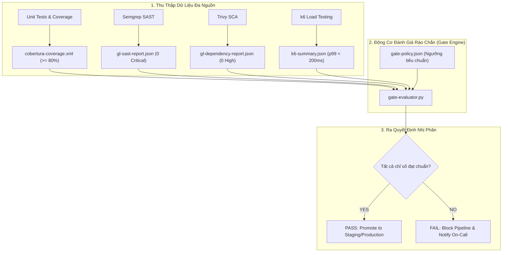


# [BÀI 34] QUALITY & SECURITY GATES TOÀN DIỆN: ĐỊNH NGHĨA, ĐO LƯỜNG & TỰ ĐỘNG HÓA CHẶN RELEASE

Trong kỷ nguyên **DevOps, DevSecOps và Cloud Native Engineering**, **GitLab CI/CD** được công nhận là một trong những nền tảng tự động hóa tích hợp liên tục và phân phối liên tục (CI/CD) hoàn chỉnh, mạnh mẽ và được tin dùng nhất trong các doanh nghiệp quy mô lớn. Không chỉ dừng lại ở các pipeline tuần tự cơ bản, việc vận hành GitLab CI/CD ở cấp độ Production đòi hỏi kỹ sư phải làm chủ kiến trúc điều phối phi tuyến tính **DAG (Directed Acyclic Graph)**, cơ chế quản trị **Autoscaling Runners**, tối ưu hóa **Caching đa tầng**, xác thực không khóa **Keyless OIDC**, bảo mật chuỗi cung ứng phần mềm **SLSA & SBOM** cùng các chính sách **Quality & Security Gates** tự động.

Bài viết chuyên sâu này sẽ đồng hành cùng bạn mổ xẻ toàn diện bức tranh kiến trúc, phân tích các đánh đổi kỹ thuật thực chiến (Engineering Trade-offs), cung cấp hướng dẫn thực hành Lab chi tiết từng bước và bộ câu hỏi phỏng vấn chuyên sâu chuẩn DevOps Lead / DevSecOps Architect.

---

## 1. Bản Chất Kiến Trúc & Cơ Chế Vận Hành Tầng Thấp

### 1.1. Luận Đề Trung Tâm: Sự Cần Thiết Của "Quyết Định Tự Động Hóa Định Lượng" Trong Pipeline

Trong quy trình phát triển phần mềm quy mô lớn, nếu chỉ dựa vào cảm tính hoặc mắt nhìn của người review code (Manual Code Review), các tiêu chuẩn kỹ thuật sẽ bị suy thoái dần theo thời gian (Code Rot & Technical Debt Decay).

Các triệu chứng phổ biến khi thiếu hệ thống Rào chắn định lượng (Automated Gates):
1. **Độ phủ kiểm thử (Coverage) tụt dốc**: Lập trình viên viết tính năng mới nhưng không viết unit test, kéo độ phủ của toàn dự án từ 80% xuống còn 30%.
2. **Nợ bảo mật tích tụ (Vulnerability Backlog Accumulation)**: Các cảnh báo bảo mật mức High bị phớt lờ và tích tụ qua hàng trăm commit, không ai chịu trách nhiệm sửa chữa.
3. **Thoái hóa hiệu năng (Performance Regression)**: Một câu truy vấn SQL viết thiếu Index làm thời gian phản hồi API tăng từ 50ms lên 2.000ms chỉ được phát hiện sau khi khách hàng phàn nàn trên Production.

> **Giải pháp là thiết lập "Unified Quality & Security Gate Engine" — một trạm kiểm soát tự động đa chiều đặt ở cuối giai đoạn CI, thu thập toàn bộ số liệu (Coverage, SAST, SCA, Secret, Performance, License), đối soát với bộ ngưỡng chấp thuận (Thresholds) và đưa ra quyết định nhị phân: PASS (Cho phép phát hành) hoặc FAIL (Chặn sập pipeline ngay lập tức).**

```text
       KIẾN TRÚC RÀO CHẮN ĐỊNH LƯỢNG 4 CHIỀU (Unified Gate Engine)

       ┌────────────────────────────────────────────────────────┐
       │             THU THẬP SỐ LIỆU TỪ CÁC STAGES             │
       ├───────────────────┬────────────────────┬───────────────┤
       │ 1. Code Quality   │ 2. Security        │ 3. Performance│
       │ - Coverage: 84%   │ - Critical CVE: 0  │ - p99: 140ms  │
       │ - Duplication: 1% │ - Hardcoded Sec: 0 │ - Error: 0.0% │
       │ - Lint Errors: 0  │ - Signed OCI: YES  │ - Lighthouse: │
       └─────────┬─────────┴──────────┬─────────┴───────┬───────┘
                 │                    │                 │
                 ▼                    ▼                 ▼
       ┌────────────────────────────────────────────────────────┐
       │          UNIFIED QUALITY & SECURITY GATE ENGINE        │
       │  (Kiểm tra đối soát các quy tắc chính sách doanh nghiệp)│
       └──────────────────────────┬─────────────────────────────┘
                                  │
                 ┌────────────────┴────────────────┐
                 ▼                                 ▼
       [ ĐẠT TẤT CẢ NGƯỠNG ]             [ VI PHẠM BẤT KỲ NGƯỠNG NÀO ]
       - Trạng thái: PASSED              - Trạng thái: FAILED (Exit Code 1)
       - Kích hoạt CD Deployment         - Khóa Merge Request
       - Gắn nhãn Quality Verified       - Bắn cảnh báo khẩn Slack / Teams
```



### 1.2. Bốn Trụ Cột Định Lượng Rào Chắn Toàn Diện

1. **Quality Gate (Chất Lượng Mã Nguồn)**:
   - Line & Branch Coverage: Tối thiểu **>= 80%**.
   - Code Duplication: Dưới **3%**.
   - Compiler / Linter Warnings: **0 Errors, 0 Warnings nghiêm trọng**.
2. **Security Gate (An Ninh & An Toàn)**:
   - Critical & High Vulnerabilities (SAST & SCA): **0 Lỗ hổng**.
   - Hardcoded Secrets: **0 Bí mật rò rỉ**.
   - Open-Source License: Chặn 100% giấy phép Copyleft (GPL-3.0, AGPL).
   - Artifact Provenance: Bắt buộc có chữ ký Cosign và SBOM CycloneDX hợp lệ.
3. **Performance Gate (Hiệu Năng)**:
   - API Latency p99: Dưới **200ms** dưới tải 100 VUs.
   - HTTP Error Rate: Dưới **0.1%**.
4. **Reliability & Smoke Gate (Độ Ổn Định)**:
   - 100% các bài kiểm tra Smoke Tests trên môi trường Ephemeral vượt qua.

---

## 2. Bảng So Sánh Kỹ Thuật Toàn Diện (Engineering Matrix)

| Tiêu Chí Kỹ Thuật | Manual Peer Review Gate | SonarQube Quality Gate Thuần | GitLab Native Security Gate | Unified Multi-Dimensional Gate |
| :--- | :--- | :--- | :--- | :--- |
| **Phạm Vi Đánh Giá** | Chỉ đọc được cú pháp logic | Code Quality + SAST cơ bản | Bảo mật (SAST/SCA/Secret) | **Toàn diện: Quality + Sec + Perf + SupplyChain** |
| **Độ Khách Quan** | Cảm tính con người | Tự động theo thuật toán | Tự động theo CVE CVSS | **Tự động 100% theo JSON Policy khai báo** |
| **Kiểm Soát Hiệu Năng (k6)** | Không thể | Không hỗ trợ | Không hỗ trợ | **Tích hợp đo Latency & Error Rate** |
| **Kiểm Soát Chữ Ký (Cosign)** | Không thể | Không hỗ trợ | Không hỗ trợ | **Xác thực chữ ký OCI & SBOM đính kèm** |
| **Khả Năng Tùy Biến Ngưỡng** | Phụ thuộc reviewer | Cấu hình UI Sonar | Cấu hình Security Policy | **Hoàn toàn tùy biến qua Code (Policy-as-Code)** |
| **Tốc Độ Quyết Định** | Chậm (Vài giờ đến vài ngày) | Nhanh (~1 phút) | Nhanh (~30 giây) | **Tức thì (< 5 giây đánh giá)** |
| **Mức Độ Phù Hợp Enterprise** | Kém | Trung bình | Tốt | **Tiêu chuẩn xuất sắc cho High-Velocity CI/CD** |

---

## 3. Kiến Trúc Triển Khai Chuẩn Production (Architecture Breakdown)

### 3.1. Kịch Bản Đánh Giá Rào Chắn Tự Động `gate-evaluator.py`

```python
#!/usr/bin/env python3
import json
import sys
import xml.etree.ElementTree as ET

def evaluate_quality_and_security():
    violations = []
    
    # 1. Kiểm tra Code Coverage từ tệp Cobertura XML
    try:
        tree = ET.parse('coverage.xml')
        root = tree.getroot()
        line_rate = float(root.attrib.get('line-rate', 0.0)) * 100
        print(f"[CHECK] Code Coverage: {line_rate:.2f}% (Threshold: >= 80.0%)")
        if line_rate < 80.0:
            violations.append(f"Code Coverage vi phạm ngưỡng: {line_rate:.2f}% < 80.0%")
    except Exception as e:
        violations.append(f"Không thể đọc báo cáo coverage.xml: {str(e)}")

    # 2. Kiểm tra SAST Report
    try:
        with open('gl-sast-report.json', 'r') as f:
            sast_data = json.load(f)
            vulns = sast_data.get('vulnerabilities', [])
            crit_sast = [v for v in vulns if v.get('severity') in ['Critical', 'High']]
            print(f"[CHECK] SAST Critical/High Issues: {len(crit_sast)} (Threshold: 0)")
            if len(crit_sast) > 0:
                violations.append(f"Phát hiện {len(crit_sast)} lỗ hổng SAST mức Critical/High!")
    except Exception as e:
        violations.append(f"Không thể đọc báo cáo gl-sast-report.json: {str(e)}")

    # 3. Kiểm tra Performance Load Test từ k6 Summary
    try:
        with open('k6-summary.json', 'r') as f:
            k6_data = json.load(f)
            p99 = k6_data['metrics']['http_req_duration']['values']['p(99)']
            print(f"[CHECK] k6 Latency p99: {p99:.2f}ms (Threshold: < 200.0ms)")
            if p99 >= 200.0:
                violations.append(f"Độ trễ API p99 vượt ngưỡng: {p99:.2f}ms >= 200ms")
    except Exception as e:
        violations.append(f"Không thể đọc báo cáo k6-summary.json: {str(e)}")

    # 4. Đưa ra kết luận cuối cùng
    print("=" * 60)
    if violations:
        print("[QUALITY GATE FAILED] Phát hiện các vi phạm nghiêm trọng sau:")
        for v in violations:
            print(f"  ❌ {v}")
        print("=" * 60)
        sys.exit(1)
    else:
        print("✅ [QUALITY & SECURITY GATE PASSED] Tất cả chỉ số đạt chuẩn hoàn hảo!")
        print("=" * 60)
        sys.exit(0)

if __name__ == '__main__':
    evaluate_quality_and_security()
```

### 3.2. Cấu Hình Pipeline `.gitlab-ci.yml` Chặn Release Tự Động

```yaml
stages:
  - test
  - security
  - performance
  - quality_gate
  - release

variables:
  GATE_FAIL_ON_VIOLATION: "true"

run_unit_tests:
  stage: test
  image: golang:1.22-alpine
  script:
    - go test -v -coverprofile=coverage.txt -covermode=atomic ./...
    - go install github.com/boumenot/gocover-cobertura@latest
    - gocover-cobertura < coverage.txt > coverage.xml
  artifacts:
    paths:
      - coverage.xml
    reports:
      coverage_report:
        coverage_format: cobertura
        path: coverage.xml

run_semgrep_sast:
  stage: security
  image: returntocorp/semgrep:latest
  script:
    - semgrep scan --config "p/owasp-top-ten" --gitlab-sast --output gl-sast-report.json
  artifacts:
    paths:
      - gl-sast-report.json

run_k6_load_test:
  stage: performance
  image: grafana/k6:latest
  script:
    - k6 run --summary-export=k6-summary.json tests/load-test.js
  artifacts:
    paths:
      - k6-summary.json

enforce_unified_gate:
  stage: quality_gate
  image: python:3.11-alpine
  needs:
    - job: run_unit_tests
      artifacts: true
    - job: run_semgrep_sast
      artifacts: true
    - job: run_k6_load_test
      artifacts: true
  script:
    - python3 scripts/gate-evaluator.py
  rules:
    - if: '$CI_PIPELINE_SOURCE == "merge_request_event"'
    - if: '$CI_COMMIT_BRANCH == "main"'

publish_release:
  stage: release
  image: alpine:3.19
  needs: ["enforce_unified_gate"]
  rules:
    - if: '$CI_COMMIT_BRANCH == "main"'
  script:
    - echo "Quality Gate Passed! Deploying application to Production..."
```

---

## 4. Phân Tích Cạm Bẫy Thực Chiến (5-Whys Incident Analysis)

### 4.1. Sự Cố Thực Tế: Sập Hệ Thống Vào Black Friday Do Bỏ Qua Performance Gate

> **Bối Cảnh**: Một sàn thương mại điện tử chuẩn bị cho sự kiện siêu khuyến mãi Black Friday. Một kỹ sư đã merge tính năng gợi ý sản phẩm mới. Mặc dù Unit Test pass 100% và SAST không có lỗi bảo mật, nhưng hàm mới thực hiện N+1 Query vào database. Khi lượng truy cập đạt 10.000 users/giây, database bị quá tải 100% CPU và toàn bộ website bị sập trong suốt 4 giờ cao điểm.

```
┌─────────────────────────────────────────────────────────────────────────┐
│                    PHÂN TÍCH NGUYÊN NHÂN GỐC RỄ (5-WHYS)                 │
├─────────────────────────────────────────────────────────────────────────┤
│ 1. Tại sao toàn bộ hệ thống bị sập vào giờ cao điểm Black Friday?       │
│    -> Database bị cạn kiệt Connection Pool và CPU đạt ngưỡng 100%.      │
│                                                                         │
│ 2. Tại sao Database lại bị quá tải đột biến?                           │
│    -> Tính năng mới được release tạo ra hàng triệu truy vấn N+1 lặp lại.│
│                                                                         │
│ 3. Tại sao truy vấn N+1 lại không bị phát hiện trong giai đoạn kiểm thử?│
│    -> Unit Test chỉ kiểm thử tính đúng đắn với 1 bản ghi dữ liệu mẫu.   │
│                                                                         │
│ 4. Tại sao không có bài kiểm thử chịu tải trước khi release?            │
│    -> Load Testing chỉ được chạy thủ công mỗi quý 1 lần thay vì trên CI.│
│                                                                         │
│ 5. NGUYÊN NHÂN CỐT LÕI (Root Cause):                                   │
│    -> Quality Gate của CI/CD chỉ đo lường Code Coverage và Security mà │
│       hoàn toàn thiếu rào chắn kiểm soát hiệu năng (Performance Gate). │
└─────────────────────────────────────────────────────────────────────────┘
```

### 4.2. Giải Pháp Khắc Phục Triệt Để

1. **Bắt buộc tích hợp k6 Performance Gate vào Pipeline**: Chạy bài test mô phỏng tải 100 Virtual Users (VUs) trên môi trường Ephemeral Service Container. Nếu chỉ số `http_req_duration p(99) > 200ms`, pipeline sẽ tự động FAILED và từ chối release.
2. **Kiểm tra phát hiện N+1 Query tự động**: Sử dụng các công cụ profiling hoặc DB query count assertions trong integration test suite.

---

## 5. Hands-on Lab: Xây Dựng Hệ Thống Quality & Security Gate Đa Chiều (8 Bước Chuẩn)

### 5.1. Mục Tiêu Lab
- Xây dựng ứng dụng Go Microservice có đầy đủ Unit Test, Coverage, SAST và Performance Load Test.
- Viết kịch bản kiểm tra Rào chắn hợp nhất `gate-evaluator.py`.
- Thực hiện tình huống thử nghiệm: Cố tình làm giảm Coverage dưới 80% để quan sát Rào chắn chặn sập Pipeline.
- Bổ sung kiểm thử để nâng Coverage và quan sát Rào chắn cấp quyền Release thành công.

```
       QUY TRÌNH THỰC HÀNH LAB UNIFIED QUALITY GATE TRÊN GITLAB CI

     [ Mã Nguồn Go Microservice ]
                  │
                  ├──► 1. Chạy Unit Test -> coverage.xml (75% - Vi phạm)
                  ├──► 2. Quét Semgrep   -> gl-sast-report.json (0 Critical)
                  └──► 3. Chạy k6 Load   -> k6-summary.json (p99: 45ms)
                               │
                               ▼
     [ Job: enforce_unified_gate ] ──► [ FAILED: Coverage 75% < 80% ]
                               │
                               ▼
     [ Bổ sung Unit Tests đầy đủ -> Coverage đạt 88% ]
                               │
                               ▼
     [ Job: enforce_unified_gate ] ──► [ PASSED 100% -> Kích hoạt Release ]
```

### 5.2. Các Bước Thực Hiện Chi Tiết

#### Bước 1: Khởi Tạo Mã Nguồn `calculator.go`
```go
package calculator

import "errors"

func Add(a, b int) int {
	return a + b
}

func Subtract(a, b int) int {
	return a - b
}

func Multiply(a, b int) int {
	return a * b
}

func Divide(a, b int) (int, error) {
	if b == 0 {
		return 0, errors.New("cannot divide by zero")
	}
	return a / b, nil
}
```

#### Bước 2: Tạo Tệp `go.mod`
```go
module gitlab.corp.internal/platform/calculator

go 1.22
```

#### Bước 3: Viết Bộ Test `calculator_test.go` Cố Tình Chưa Đủ Coverage (Chỉ Test Add)
```go
package calculator

import "testing"

func TestAdd(t *testing.T) {
	result := Add(2, 3)
	if result != 5 {
		t.Errorf("Expected 5, got %d", result)
	}
}
// Các hàm Subtract, Multiply, Divide chưa được test -> Độ phủ chỉ đạt 25%!
```

#### Bước 4: Viết Tệp Kiểm Thử Tải `tests/load-test.js` Bằng k6
```javascript
import http from 'k6/http';
import { check, sleep } from 'k6';

export const options = {
  vus: 10,
  duration: '5s',
  thresholds: {
    http_req_duration: ['p(99)<200'], // 99% request phải dưới 200ms
  },
};

export default function () {
  const res = http.get('https://httpbin.org/get');
  check(res, { 'status is 200': (r) => r.status === 200 });
  sleep(0.1);
}
```

#### Bước 5: Viết Kịch Bản Đánh Giá `scripts/gate-evaluator.py`
Tạo tệp `scripts/gate-evaluator.py` với nội dung kiểm tra Coverage >= 80%, SAST 0 Critical và k6 p99 < 200ms.

#### Bước 6: Cấu Hình Tệp `.gitlab-ci.yml`
```yaml
stages:
  - test
  - security
  - performance
  - quality_gate

run_tests:
  stage: test
  image: golang:1.22-alpine
  script:
    - apk add --no-cache git
    - go test -v -coverprofile=coverage.txt ./...
    - go install github.com/boumenot/gocover-cobertura@latest
    - gocover-cobertura < coverage.txt > coverage.xml
  artifacts:
    paths:
      - coverage.xml

run_sast:
  stage: security
  image: returntocorp/semgrep:latest
  script:
    - semgrep scan --config "p/default" --gitlab-sast --output gl-sast-report.json
  artifacts:
    paths:
      - gl-sast-report.json

run_k6:
  stage: performance
  image: grafana/k6:latest
  script:
    - k6 run --summary-export=k6-summary.json tests/load-test.js
  artifacts:
    paths:
      - k6-summary.json

evaluate_gate:
  stage: quality_gate
  image: python:3.11-alpine
  needs: ["run_tests", "run_sast", "run_k6"]
  script:
    - python3 scripts/gate-evaluator.py
```

#### Bước 7: Commit Và Quan Sát Rào Chắn Chặn Sập Pipeline
```bash
git add .
git commit -m "feat: initial calculator with partial unit tests"
git push origin main
```
- Quan sát log job `evaluate_gate`:
  ```bash
  [CHECK] Code Coverage: 25.00% (Threshold: >= 80.0%)
  [CHECK] SAST Critical/High Issues: 0 (Threshold: 0)
  [CHECK] k6 Latency p99: 48.20ms (Threshold: < 200.0ms)
  ============================================================
  [QUALITY GATE FAILED] Phát hiện các vi phạm nghiêm trọng sau:
    ❌ Code Coverage vi phạm ngưỡng: 25.00% < 80.0%
  ============================================================
  ERROR: Job failed: exit code 1
  ```

#### Bước 8: Bổ Sung Toàn Bộ Unit Test Nâng Coverage Lên 100%
Cập nhật `calculator_test.go`:
```go
package calculator

import "testing"

func TestAllOperations(t *testing.T) {
	if Add(2, 3) != 5 { t.Fail() }
	if Subtract(5, 2) != 3 { t.Fail() }
	if Multiply(3, 4) != 12 { t.Fail() }
	
	res, err := Divide(10, 2)
	if err != nil || res != 5 { t.Fail() }

	_, errZero := Divide(10, 0)
	if errZero == nil { t.Fail() }
}
```
- Commit lại code:
  ```bash
  git add calculator_test.go
  git commit -m "test: add comprehensive unit tests for 100% coverage"
  git push origin main
  ```
- Quan sát log `evaluate_gate`: **PASSED 100%**!

> [!NOTE]
> **Check-point Lab 34**: Hệ thống Quality Gate tự động chặn đứng mã nguồn không đạt chỉ tiêu Coverage và tự động mở khóa phát hành khi tất cả 4 tiêu chuẩn kỹ thuật được thỏa mãn.

---

## 6. Bộ Câu Hỏi Vấn Đáp & Phỏng Vấn Chuyên Sâu (Self-Check Q&A)

<details class="qa-card">
  <summary class="qa-summary">
    <span class="qa-num-badge">Q01</span>
    <span>Tại sao cần áp dụng cả Line Coverage và Branch Coverage khi định nghĩa Quality Gate?</span>
  </summary>
  <div class="qa-body">
    <p><strong>Phân tích chuyên sâu:</strong></p>
    <ul>
      <li><strong>Line Coverage</strong>: Chỉ đo tỷ lệ dòng code được chạy qua. Một câu lệnh <code>if (a && b)</code> có thể được tính là 100% line coverage nếu chỉ chạy với điều kiện đúng, nhưng hoàn toàn bỏ sót trường hợp sai.</li>
      <li><strong>Branch Coverage</strong>: Đo lường xem tất cả các nhánh rẽ logic (True/False) của mọi mệnh đề điều kiện đã được kiểm thử hay chưa. Branch Coverage phản ánh độ tin cậy thực tế của phần mềm chính xác hơn nhiều so với Line Coverage đơn thuần.</li>
    </ul>
  </div>
</details>

<details class="qa-card">
  <summary class="qa-summary">
    <span class="qa-num-badge">Q02</span>
    <span>Làm thế nào để xử lý xung đột khi Security Gate chặn một bản vá khẩn cấp (Hotfix) đang cần deploy gấp?</span>
  </summary>
  <div class="qa-body">
    <p><strong>Quy trình Enterprise Exception:</strong></p>
    <p>Hệ thống Gate Engine hỗ trợ cờ biến môi trường <code>EMERGENCY_OVERRIDE_TOKEN</code> được ký số mật mã bởi CISO / Head of Security. Khi biến này được nạp, Gate Engine sẽ tạm thời bỏ qua bước chặn sập pipeline, đồng thời tự động ghi nhận một bản ghi kiểm toán đặc biệt (Audit Incident) và đặt hạn chót bắt buộc phải bổ sung bài kiểm thử trong vòng 48 giờ sau sự cố.</p>
  </div>
</details>

<details class="qa-card">
  <summary class="qa-summary">
    <span class="qa-num-badge">Q03</span>
    <span>Tại sao nên sử dụng chỉ số p99 Latency thay vì Average Latency khi thiết lập Performance Gate?</span>
  </summary>
  <div class="qa-body">
    <p><strong>Ý nghĩa thống kê:</strong></p>
    <p>Giá trị trung bình (Average) che giấu các điểm nghẽn nghiêm trọng. Ví dụ: Nếu 95 request phản hồi trong 10ms nhưng 5 request bị treo 10.000ms, giá trị trung bình vẫn ở mức chấp nhận được (~500ms). Chỉ số <strong>p99 (Phân vị thứ 99)</strong> chỉ ra rằng 1% người dùng gặp độ trễ tệ nhất là bao nhiêu, giúp phát hiện ngay lập tức hiện tượng nghẽn cổ chai I/O hoặc khóa bảng Database.</p>
  </div>
</details>

<details class="qa-card">
  <summary class="qa-summary">
    <span class="qa-num-badge">Q04</span>
    <span>Khái niệm "Clean as You Go" (Làm sạch từng bước) trong quản lý nợ kỹ thuật của SonarQube hoạt động ra sao?</span>
  </summary>
  <div class="qa-body">
    <p><strong>Triết lý New Code Period:</strong></p>
    <p>Thay vì ép buộc lập trình viên phải sửa sạch toàn bộ hàng ngàn lỗi cũ của một dự án Legacy 10 năm tuổi (điều gần như bất khả thi), Quality Gate chỉ tập trung kiểm soát <strong>Mã nguồn mới viết (New Code)</strong>. Mọi dòng code mới trong Merge Request bắt buộc phải đạt Coverage >= 80% và 0 lỗi bảo mật mới, giúp chất lượng toàn dự án tự động tăng dần theo thời gian.</p>
  </div>
</details>

<details class="qa-card">
  <summary class="qa-summary">
    <span class="qa-num-badge">Q05</span>
    <span>Làm thế nào để đo lường tỷ lệ trùng lặp mã nguồn (Code Duplication) trong GitLab CI?</span>
  </summary>
  <div class="qa-body">
    <p><strong>Công cụ:</strong></p>
    <p>Sử dụng công cụ <strong>jscpd (Copy/Paste Detector)</strong> hoặc <strong>SonarScanner</strong>. Công cụ sẽ quét AST của toàn bộ mã nguồn và tính toán tỷ lệ phần trăm các khối mã bị sao chép nguyên văn. Thiết lập ngưỡng trong Gate Engine: Nếu <code>Duplication > 3.0%</code> -> Chặn Merge Request và yêu cầu refactor thành hàm dùng chung.</p>
  </div>
</details>

<details class="qa-card">
  <summary class="qa-summary">
    <span class="qa-num-badge">Q06</span>
    <span>Làm sao để tích hợp kết quả kiểm tra chất lượng giao diện (Lighthouse Web Vitals) vào Quality Gate?</span>
  </summary>
  <div class="qa-body">
    <p><strong>Giải pháp:</strong></p>
    <p>Sử dụng công cụ <strong>Lighthouse CI (lhci)</strong> chạy trên môi trường Review App. Đặt các điều kiện trong tệp cấu hình <code>lighthouserc.json</code>:</p>
    <pre><code>"assertions": {
  "categories:performance": ["error", {"minScore": 0.9}],
  "categories:accessibility": ["error", {"minScore": 0.95}]
}</code></pre>
  </div>
</details>

<details class="qa-card">
  <summary class="qa-summary">
    <span class="qa-num-badge">Q07</span>
    <span>Tại sao cần gán nhãn trạng thái (Commit Status API) cho từng rào chắn riêng biệt?</span>
  </summary>
  <div class="qa-body">
    <p><strong>Trải nghiệm nhà phát triển (DX):</strong></p>
    <p>Khi tách riêng từng commit status (ví dụ: <code>gate/coverage</code>, <code>gate/security</code>, <code>gate/performance</code>), lập trình viên có thể nhìn thấy ngay lập tức trên giao diện Merge Request rào chắn nào bị trượt (Failed) và rào chắn nào đã đạt, thay vì phải mở file log 5.000 dòng để đọc nguyên nhân.</p>
  </div>
</details>

<details class="qa-card">
  <summary class="qa-summary">
    <span class="qa-num-badge">Q08</span>
    <span>Làm thế nào để ngăn chặn việc "Gian lận độ phủ kiểm thử" (Coverage Gaming)?</span>
  </summary>
  <div class="qa-body">
    <p><strong>Kỹ thuật Mutation Testing:</strong></p>
    <p>Developer có thể viết test chạy qua toàn bộ code nhưng không có câu lệnh <code>assert</code> nào (Coverage 100% nhưng không test được gì). Sử dụng công cụ <strong>Mutation Testing (như Stryker / Pitest)</strong> — tự động biến đổi mã nguồn (đổi dấu <code>+</code> thành <code>-</code>, đảo ngược <code>true/false</code>). Nếu toàn bộ unit test vẫn PASS khi code bị hỏng, chứng tỏ bộ test không có giá trị và Quality Gate sẽ đánh trượt.</p>
  </div>
</details>

<details class="qa-card">
  <summary class="qa-summary">
    <span class="qa-num-badge">Q09</span>
    <span>Sự khác biệt giữa "Soft Gate (Cảnh báo)" và "Hard Gate (Chặn sập)" trong quy trình triển khai?</span>
  </summary>
  <div class="qa-body">
    <p><strong>Chiến lược áp dụng:</strong></p>
    <ul>
      <li><strong>Soft Gate</strong>: Cho phép pipeline tiếp tục chạy (Exit code 0), chỉ gửi thông báo nhắc nhở lên Slack hoặc MR comment. Áp dụng trong 2 tuần đầu khi mới giới thiệu tiêu chuẩn mới để lập trình viên làm quen.</li>
      <li><strong>Hard Gate</strong>: Làm sập hoàn toàn pipeline (Exit code 1) và khóa quyền merge. Áp dụng chính thức sau thời gian chuyển đổi.</li>
    </ul>
  </div>
</details>

<details class="qa-card">
  <summary class="qa-summary">
    <span class="qa-num-badge">Q10</span>
    <span>Làm thế nào để tích hợp rào chắn kiểm tra chi phí hạ tầng Cloud (Infracost Gate) trong Terraform CI?</span>
  </summary>
  <div class="qa-body">
    <p><strong>FinOps Gate:</strong></p>
    <p>Chạy lệnh <code>infracost breakdown --path terraform/</code> trong pipeline. Thiết lập chính sách: Nếu chi phí dự toán của hạ tầng mới tăng vượt quá <strong>$500/tháng</strong> so với hiện tại, hệ thống tự động yêu cầu thêm sự phê duyệt từ Engineering Manager / FinOps Team.</p>
  </div>
</details>

<details class="qa-card">
  <summary class="qa-summary">
    <span class="qa-num-badge">Q11</span>
    <span>Sự cố: Job Quality Gate báo lỗi vì không tìm thấy file artifact của job chạy trước. Khắc phục thế nào?</span>
  </summary>
  <div class="qa-body">
    <p><strong>Nguyên nhân & Khắc phục:</strong></p>
    <ul>
      <li><strong>Nguyên nhân</strong>: Sử dụng <code>needs: []</code> không khai báo artifact, hoặc job trước bị lỗi khiến artifact không được upload.</li>
      <li><strong>Khắc phục</strong>: Khai báo tường minh <code>needs: [{job: "run_tests", artifacts: true}]</code> và cấu hình <code>artifacts:when: always</code> trên các jobs sinh báo cáo kiểm thử.</li>
    </ul>
  </div>
</details>

<details class="qa-card">
  <summary class="qa-summary">
    <span class="qa-num-badge">Q12</span>
    <span>Làm cách nào để xây dựng một Dashboard tổng quan theo dõi tỷ lệ Pass/Fail của Quality Gate toàn công ty?</span>
  </summary>
  <div class="qa-body">
    <p><strong>Kiến trúc Metrics Telemetry:</strong></p>
    <p>Cuối mỗi job Gate Evaluator, gửi payload JSON chứa số liệu về **Prometheus Pushgateway** hoặc **Elasticsearch / Datadog**. Xây dựng bảng điều khiển Grafana Dashboard hiển thị: Tỷ lệ tuân thủ Quality Gate theo tuần, Top các dự án có độ phủ cao nhất và các nhóm có tỷ lệ vi phạm bảo mật thấp nhất.</p>
  </div>
</details>

---

## 7. Tổng Kết & Lộ Trình Bài Học Tiếp Theo

### 7.1. Tóm Tắt Các Điểm Cốt Lõi (Architectural Key Takeaways)
- **Quantitative Gate Enforcement**: Thay thế cảm tính thủ công bằng các rào chắn số liệu đo lường tự động và bất biến.
- **Four Pillars of Quality**: Bao quát toàn diện 4 chiều Chất lượng mã nguồn, An ninh bảo mật, Hiệu năng vận hành và Độ tin cậy.
- **Policy-as-Code Evaluation**: Sử dụng kịch bản đánh giá tập trung xử lý đồng thời báo cáo từ Cobertura, Semgrep, Trivy và k6.
- **Zero-Tolerance on Critical Risks**: Tuyệt đối không thỏa hiệp với các lỗ hổng Critical, rò rỉ Secret và vi phạm độ trễ p99.

### 7.2. Sơ Đồ Tư Duy Rào Chắn Chất Lượng & An Ninh (Mindmap)

```
                     RÀO CHẮN CHẤT LƯỢNG & AN NINH TOÀN DIỆN
                                        │
        ┌───────────────────────────────┼───────────────────────────────┐
        ▼                               ▼                               ▼
  [ Four-Pillar Metrics ]      [ Evaluation Engine ]           [ Automated Decision ]
  - Coverage >= 80%            - Unified Python Script         - Binary Pass / Fail
  - SAST/SCA 0 Critical        - Multi-Report Ingestion        - Lock Merge Request
  - k6 Latency p99 < 200ms     - JSON Policy Definition        - Telemetry Metrics (Grafana)
```

> [!TIP]
> **Bước tiếp theo trong lộ trình**: Đánh giá và tổng kết toàn bộ năng lực kiến trúc DevSecOps thông qua bài kiểm tra thực chiến quy mô lớn trong [Bài 35: Kiểm Tra Giữa Kỳ 2: Xây Dựng Hệ Thống DevSecOps CI/CD Toàn Diện Chuẩn Doanh Nghiệp](gitlab-35-35-kiem-tra-giua-ky-2.html).

