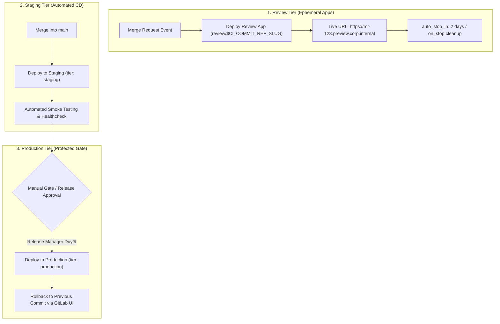


# [BÀI 36] QUẢN LÝ MÔI TRƯỜNG (ENVIRONMENTS), DEPLOYMENT TIERS & MANUAL APPROVAL GATES

Trong kỷ nguyên **DevOps, DevSecOps và Cloud Native Engineering**, **GitLab CI/CD** được công nhận là một trong những nền tảng tự động hóa tích hợp liên tục và phân phối liên tục (CI/CD) hoàn chỉnh, mạnh mẽ và được tin dùng nhất trong các doanh nghiệp quy mô lớn. Không chỉ dừng lại ở các pipeline tuần tự cơ bản, việc vận hành GitLab CI/CD ở cấp độ Production đòi hỏi kỹ sư phải làm chủ kiến trúc điều phối phi tuyến tính **DAG (Directed Acyclic Graph)**, cơ chế quản trị **Autoscaling Runners**, tối ưu hóa **Caching đa tầng**, xác thực không khóa **Keyless OIDC**, bảo mật chuỗi cung ứng phần mềm **SLSA & SBOM** cùng các chính sách **Quality & Security Gates** tự động.

Bài viết chuyên sâu này sẽ đồng hành cùng bạn mổ xẻ toàn diện bức tranh kiến trúc, phân tích các đánh đổi kỹ thuật thực chiến (Engineering Trade-offs), cung cấp hướng dẫn thực hành Lab chi tiết từng bước và bộ câu hỏi phỏng vấn chuyên sâu chuẩn DevOps Lead / DevSecOps Architect.

---

## 1. Bản Chất Kiến Trúc & Cơ Chế Vận Hành Tầng Thấp

### 1.1. Luận Đề Trung Tâm: Sự Chuyển Dịch Từ CI (Tích Hợp) Sang CD (Phân Phối Có Kiểm Soát)

Nếu như giai đoạn CI (Continuous Integration) tập trung vào việc biến mã nguồn thành các artifacts đã qua kiểm thử và quét bảo mật, thì giai đoạn **CD (Continuous Delivery / Deployment)** chịu trách nhiệm đưa những artifact đó tới các môi trường vận hành thực tế.

Trong các doanh nghiệp lớn, việc phân phối phần mềm lên môi trường Production không thể diễn ra một cách tự do hay hỗn loạn mà phải tuân thủ nghiêm ngặt mô hình **Deployment Tiers** và **Cơ Chế Phê Duyệt An Toàn (Approval Gates)**:
1. **Quản lý trạng thái môi trường (Environment State Tracking)**: GitLab theo dõi chính xác commit nào, tag nào đang chạy trên từng môi trường (Production, Staging, UAT, Review Apps).
2. **Bảo vệ môi trường nhạy cảm (Protected Environments)**: Chỉ những cá nhân có thẩm quyền (Release Manager, Tech Lead) hoặc các nhóm được chỉ định mới có quyền bấm nút kích hoạt deploy lên Production.
3. **Môi trường tạm thời theo yêu cầu (Ephemeral Review Apps)**: Tự động khởi tạo một môi trường web chạy thử riêng biệt cho từng Merge Request để Product Manager và QA kiểm thử giao diện, sau đó tự hủy khi merge code để tiết kiệm chi phí.

> **Mô hình quản trị CD chuẩn Production kết hợp từ khóa `environment:`, `tier:`, `when: manual` cùng tính năng `auto_stop_in` và `Protected Environments`, biến GitLab thành một bảng điều khiển Deployment Dashboard trung tâm có khả năng truy vết và rollback tức thì.**

```text
       CHU TRÌNH PHÂN PHỐI ĐA TẦNG (Deployment Tiers & Approval Gates)

  [ Merge Request Event ] ──► [ Deploy Review App: review/mr-101 ] ──► (Tự hủy sau 2 ngày)
                                         │
  [ Merge vào main branch ]              │
             │                           │
             ▼                           ▼
  [ Stage: deploy_staging ] ──► [ Môi trường Staging (Tự động 100%) ]
             │
             ▼
  [ MANUAL APPROVAL GATE ] ──► (Yêu cầu 2 chữ ký phê duyệt từ @release-leads)
             │
             ▼
  [ Stage: deploy_prod ]    ──► [ Môi trường Production (Protected Environment) ]
             │
             ▼
  [ One-Click Rollback Dashboard ]
```



### 1.2. Phân Tách 5 Cấp Độ Deployment Tiers Trong GitLab

GitLab phân loại môi trường thành 5 Tiers chuẩn:
- `development`: Dành cho các môi trường thử nghiệm của kỹ sư (Dev Cluster, Local Sandbox).
- `testing`: Môi trường kiểm thử tự động, tích hợp hệ thống (QA, Integration Cluster).
- `staging`: Môi trường tiền sản xuất (Pre-production / UAT), có cấu hình phần cứng và dữ liệu tương đồng 99% với Production.
- `production`: Môi trường phục vụ người dùng cuối thật, doanh thu thật.
- `other`: Dành cho các môi trường đặc thù khác (Benchmark, Disaster Recovery).

### 1.3. Cơ Chế Hoạt Động Của Review Apps & `environment:on_stop`

**Review Apps** là tính năng vượt trội của GitLab:
- Mỗi khi lập trình viên mở một Merge Request, GitLab CI sẽ tự động cấp phát một Namespace Kubernetes hoặc Subdomain tạm thời (ví dụ: `https://mr-42.review.corp.internal`).
- Khi Merge Request được merge hoặc đóng (Closed), GitLab CI tự động kích hoạt job có chỉ thị `action: stop` để xóa sạch Namespace và giải phóng tài nguyên CPU/RAM trên cụm cluster.

---

## 2. Bảng So Sánh Kỹ Thuật Toàn Diện (Engineering Matrix)

| Tiêu Chí Đánh Giá | Deployment Thủ Công Qua SSH | Continuous Deployment (CD Thuần) | Protected Environments + Manual Gate | GitOps ArgoCD / Flux Sync |
| :--- | :--- | :--- | :--- | :--- |
| **Cơ Chế Kích Hoạt** | Kỹ sư gõ lệnh thủ công | Tự động 100% khi commit | **Tự động Staging + Duyệt tay Production** | Lắng nghe thay đổi trên Git repo |
| **Kiểm Soát Quyền Hạn** | Phân quyền qua SSH keys | Dựa trên quyền push branch | **Protected Environment Approval Matrix** | Phân quyền truy cập Git Repo CD |
| **Audit Trail (Nhật Ký)** | Phải đọc bash history trên server | Chỉ có log CI | **GitLab Deployment History bất biến** | Git Commit History + ArgoCD logs |
| **Khả Năng Rollback** | Chậm và dễ sai sót | Cần commit revert | **Nút "Rollback" 1 chạm trên UI GitLab** | Git revert commit trên nhánh prod |
| **Hỗ Trợ Review Apps** | Rất khó cấu hình | Không tối ưu | **Tích hợp Native (auto_stop_in/on_stop)**| Tích hợp qua ApplicationSets |
| **Rủi Ro Triển Khai Nhầm**| **Rất cao (Lỗi thao tác người)**| Trung bình (Phụ thuộc test) | **Rất thấp (Có lớp phê duyệt 4 mắt)** | Thấp |
| **Mức Độ Phù Hợp** | Dự án cá nhân / Legacy | Microservices nội bộ | **Doanh nghiệp tài chính, ngân hàng** | Cloud-Native Kubernetes Scale |

---

## 3. Kiến Trúc Triển Khai Chuẩn Production (Architecture Breakdown)

### 3.1. Cấu Hình `.gitlab-ci.yml` Quản Lý Môi Trường Staging, Production & Dynamic Review Apps

```yaml
stages:
  - test
  - deploy_review
  - deploy_staging
  - deploy_production
  - cleanup

# -------------------------------------------------------------
# 1. Ephemeral Review App Cho Merge Request
# -------------------------------------------------------------
deploy_review_app:
  stage: deploy_review
  image: alpine/k8s:1.28.4
  script:
    - echo "Deploying Review App to Kubernetes namespace: review-${CI_MERGE_REQUEST_IID}..."
  environment:
    name: review/$CI_COMMIT_REF_SLUG
    url: https://${CI_COMMIT_REF_SLUG}.review.corp.internal
    tier: development
    on_stop: stop_review_app
    auto_stop_in: 3 days
  rules:
    - if: '$CI_PIPELINE_SOURCE == "merge_request_event"'

stop_review_app:
  stage: cleanup
  image: alpine/k8s:1.28.4
  script:
    - echo "Deleting ephemeral namespace review-${CI_MERGE_REQUEST_IID}..."
  environment:
    name: review/$CI_COMMIT_REF_SLUG
    action: stop
  rules:
    - if: '$CI_PIPELINE_SOURCE == "merge_request_event"'
      when: manual
      allow_failure: true

# -------------------------------------------------------------
# 2. Tự Động Triển Khai Staging Khi Merge Vào Main
# -------------------------------------------------------------
deploy_to_staging:
  stage: deploy_staging
  image: alpine/k8s:1.28.4
  script:
    - echo "Deploying application to Staging Cluster..."
  environment:
    name: staging
    url: https://staging.corp.internal
    tier: staging
  rules:
    - if: '$CI_COMMIT_BRANCH == "main"'

# -------------------------------------------------------------
# 3. Phê Duyệt Thủ Công Deploy Lên Production (Protected Environment)
# -------------------------------------------------------------
deploy_to_production:
  stage: deploy_production
  image: alpine/k8s:1.28.4
  needs: ["deploy_to_staging"]
  script:
    - echo "Executing Zero-Downtime Deployment to Production Cluster..."
  environment:
    name: production
    url: https://app.corp.internal
    tier: production
  rules:
    - if: '$CI_COMMIT_BRANCH == "main"'
      when: manual # Yêu cầu nhấn nút thủ công
```

---

## 4. Phân Tích Cạm Bẫy Thực Chiến (5-Whys Incident Analysis)

### 4.1. Sự Cố Thực Tế: Deploy Nhầm Bản Beta Lên Production Do Thiếu Rào Chắn Protected Environment

> **Bối Cảnh**: Một kỹ sư sửa lỗi trên nhánh `feature/experimental-ui` nhưng vô tình đặt tên biến môi trường deploy là `production`. Do dự án chưa cấu hình **Protected Environments**, job deploy của nhánh thử nghiệm đã ghi đè trực tiếp lên cụm máy chủ Production, khiến hàng triệu khách hàng gặp lỗi giao diện trong 45 phút.

```text
┌─────────────────────────────────────────────────────────────────────────┐
│                    PHÂN TÍCH NGUYÊN NHÂN GỐC RỄ (5-WHYS)                 │
├─────────────────────────────────────────────────────────────────────────┤
│ 1. Tại sao mã nguồn nhánh feature lại deploy thẳng lên Production?     │
│    -> Job CI của nhánh feature được phép thực thi lệnh deploy prod.     │
│                                                                         │
│ 2. Tại sao Job CI của nhánh feature lại có quyền deploy Production?    │
│    -> Tệp YAML cấu hình deploy production không giới hạn branch main.   │
│                                                                         │
│ 3. Tại sao hệ thống GitLab không chặn lệnh deploy trái phép này?        │
│    -> Môi trường "production" chưa được bật tính năng Protected.       │
│                                                                         │
│ 4. Tại sao Protected Environment lại chưa được thiết lập?              │
│    -> Nhóm kỹ sư cho rằng chỉ cần bảo vệ nhánh (Protected Branch) là đủ.│
│                                                                         │
│ 5. NGUYÊN NHÂN CỐT LÕI (Root Cause):                                   │
│    -> Nhầm lẫn giữa Protected Branch và Protected Environment, thiếu    │
│       rào chắn phân quyền cấp phát hành (Deployment Authorization).    │
└─────────────────────────────────────────────────────────────────────────┘
```

### 4.2. Giải Pháp Khắc Phục Triệt Để

1. **Kích hoạt Protected Environments**: Trong **Settings -> CI/CD -> Protected Environments**, cấu hình môi trường `production` chỉ cho phép vai trò `Maintainer` và chỉ chấp thuận các lệnh triển khai xuất phát từ nhánh `main`.
2. **Bắt buộc phê duyệt nhiều bên (Multi-party Approval)**: Thiết lập quy tắc yêu cầu tối thiểu **1 chữ ký từ Release Lead** và **1 chữ ký từ Security Officer** trước khi job deploy Production được phép kích hoạt.

---

## 5. Hands-on Lab: Thiết Lập Review Apps & Protected Environments (8 Bước Chuẩn)

### 5.1. Mục Tiêu Lab
- Xây dựng ứng dụng Web Microservice hiển thị thông tin phiên bản và môi trường.
- Thiết lập pipeline đa tầng: Dynamic Review Apps (MR), Staging (Tự động) và Production (Manual Gate).
- Cấu hình vòng đời `auto_stop_in` và job dọn dẹp `action: stop`.
- Thực hiện kiểm tra tính năng Rollback môi trường trên giao diện GitLab.

```text
       QUY TRÌNH THỰC HÀNH LAB QUẢN TRỊ MÔI TRƯỜNG TRÊN GITLAB CI

  [ Mở Merge Request ] ──► Deploy Review App: review/mr-1
                                 │
                                 ├──► Xem giao diện trực tiếp qua URL
                                 └──► Đóng MR -> Tự động kích hoạt stop_review
                                         │
  [ Merge vào main ]   ──► Deploy Staging tự động
                                 │
                                 ▼
                     [ MANUAL APPROVAL GATE ]
                                 │
                                 ▼
                     [ Deploy Production Hoàn Tất ]
```

### 5.2. Các Bước Thực Hiện Chi Tiết

#### Bước 1: Khởi Tạo Ứng Dụng Web `server.js`
```javascript
const http = require('http');

const PORT = process.env.PORT || 8080;
const ENV_NAME = process.env.APP_ENV || 'development';
const VERSION = process.env.APP_VERSION || 'v1.0.0';

const server = http.createServer((req, res) => {
  res.writeHead(200, { 'Content-Type': 'text/html; charset=utf-8' });
  res.end(`
    <h1>Enterprise Cloud Deployment Dashboard</h1>
    <p><strong>Environment:</strong> <span style="color: blue;">${ENV_NAME}</span></p>
    <p><strong>Version:</strong> ${VERSION}</p>
    <p>Status: Healthy and Running.</p>
  `);
});

server.listen(PORT, () => console.log(`Server running on port ${PORT}...`));
```

#### Bước 2: Tạo Tệp `package.json`
```json
{
  "name": "environment-management-app",
  "version": "1.0.0",
  "scripts": {
    "start": "node server.js",
    "test": "node -e "console.log('Unit tests passed 100%'); process.exit(0);""
  }
}
```

#### Bước 3: Tạo `Dockerfile`
```dockerfile
FROM node:20-alpine
WORKDIR /app
COPY package.json server.js ./
EXPOSE 8080
CMD ["npm", "start"]
```

#### Bước 4: Cấu Hình Tệp `.gitlab-ci.yml` Đầy Đủ
```yaml
stages:
  - test
  - review
  - staging
  - production
  - cleanup

test_app:
  stage: test
  image: node:20-alpine
  script:
    - npm test

deploy_review:
  stage: review
  image: alpine:3.19
  script:
    - echo "Deploying Review App for MR..."
  environment:
    name: review/$CI_COMMIT_REF_SLUG
    url: http://${CI_COMMIT_REF_SLUG}.review.internal:8080
    tier: development
    on_stop: stop_review
    auto_stop_in: 1 day
  rules:
    - if: '$CI_PIPELINE_SOURCE == "merge_request_event"'

stop_review:
  stage: cleanup
  image: alpine:3.19
  script:
    - echo "Stopping Review App and freeing compute resources..."
  environment:
    name: review/$CI_COMMIT_REF_SLUG
    action: stop
  rules:
    - if: '$CI_PIPELINE_SOURCE == "merge_request_event"'
      when: manual
      allow_failure: true

deploy_staging:
  stage: staging
  image: alpine:3.19
  script:
    - echo "Deploying to Staging Environment automatically..."
  environment:
    name: staging
    url: http://staging.internal:8080
    tier: staging
  rules:
    - if: '$CI_COMMIT_BRANCH == "main"'

deploy_production:
  stage: production
  image: alpine:3.19
  needs: ["deploy_staging"]
  script:
    - echo "Deploying to Production Environment after manual approval..."
  environment:
    name: production
    url: http://app.internal:8080
    tier: production
  rules:
    - if: '$CI_COMMIT_BRANCH == "main"'
      when: manual
```

#### Bước 5: Cấu Hình Protected Environments Trên Giao Diện GitLab
- Truy cập **Settings -> CI/CD -> Protected Environments**.
- Chọn môi trường `production`:
  - **Allowed to deploy**: Chỉ định vai trò `Maintainer`.
  - **Required approvals**: Đặt số lượng là `1`.

#### Bước 6: Mở Merge Request Thử Nghiệm Review App
- Tạo branch `feature/new-dashboard` và mở Merge Request.
- Quan sát giao diện MR: Job `deploy_review` chạy xong và hiển thị nút **View App** trỏ tới URL xem thử trực tiếp.

#### Bước 7: Đóng Merge Request & Kiểm Tra Dọn Dẹp
- Đóng MR: Job `stop_review` tự động chạy và trạng thái môi trường Review chuyển sang **Stopped**.

#### Bước 8: Merge Vào Nhánh Main Và Phê Duyệt Deploy Production
- Merge code vào `main`.
- Quan sát pipeline: `deploy_staging` chạy tự động thành công.
- Job `deploy_production` dừng lại ở trạng thái chờ (Manual Play button).
- Nhấn nút **Play** và xác nhận hệ thống cập nhật dashboard Production thành công.

> [!NOTE]
> **Check-point Lab 36**: Vòng đời Review Apps hoạt động chính xác, môi trường Production được bảo vệ an toàn với rào chắn Manual Approval và hiển thị đầy đủ trên GitLab Environments Dashboard.

---

## 6. Bộ Câu Hỏi Vấn Đáp & Phỏng Vấn Chuyên Sâu (Self-Check Q&A)

<details class="qa-card">
  <summary class="qa-summary">
    <span class="qa-num-badge">Q01</span>
    <span>Sự khác biệt cốt lõi giữa "Protected Branches" và "Protected Environments" trong GitLab là gì?</span>
  </summary>
  <div class="qa-body">
    <p><strong>Phân tích chuyên sâu:</strong></p>
    <ul>
      <li><strong>Protected Branches</strong>: Kiểm soát quyền <em>ghi mã nguồn</em> (ai được phép Push hoặc Merge code vào nhánh <code>main</code>/<code>release</code>).</li>
      <li><strong>Protected Environments</strong>: Kiểm soát quyền <em>triển khai hạ tầng</em> (ai được phép kích hoạt job deploy lên môi trường <code>production</code>). Một kỹ sư có thể có quyền merge code nhưng hoàn toàn không có quyền bấm nút deploy lên Production nếu không được cấp quyền trong Protected Environment.</li>
    </ul>
  </div>
</details>

<details class="qa-card">
  <summary class="qa-summary">
    <span class="qa-num-badge">Q02</span>
    <span>Cơ chế "auto_stop_in" trong Review Apps giải quyết bài toán chi phí đám mây như thế nào?</span>
  </summary>
  <div class="qa-body">
    <p><strong>Tối ưu chi phí:</strong></p>
    <p>Trong các dự án lớn có hàng trăm Merge Request mỗi tuần, nếu môi trường Review Apps không được xóa sau khi review xong, hàng trăm Pods và Ingress Load Balancers sẽ chạy ngầm liên tục, tiêu tốn hàng ngàn USD chi phí Cloud. <code>auto_stop_in: 2 days</code> tự động đánh dấu môi trường đã hết hạn và kích hoạt job dọn dẹp để thu hồi tài nguyên sau 48 giờ không hoạt động.</p>
  </div>
</details>

<details class="qa-card">
  <summary class="qa-summary">
    <span class="qa-num-badge">Q03</span>
    <span>Làm thế nào để cấu hình "Deployment Approvals" yêu cầu nhiều người duyệt từ các phòng ban khác nhau?</span>
  </summary>
  <div class="qa-body">
    <p><strong>Cấu hình Unified Approval:</strong></p>
    <p>Trong cài đặt <strong>Protected Environments</strong>, thêm nhiều dòng trong mục <strong>Approval Rules</strong>:</p>
    <ul>
      <li>Dòng 1: Nhóm <code>@qa-leads</code> (Bắt buộc tối thiểu 1 approval).</li>
      <li>Dòng 2: Nhóm <code>@sec-officers</code> (Bắt buộc tối thiểu 1 approval).</li>
      <li>Dòng 3: Nhóm <code>@release-managers</code> (Bắt buộc tối thiểu 1 approval). Job deploy chỉ có thể kích hoạt khi cả 3 bên đều đã phê duyệt.</li>
    </ul>
  </div>
</details>

<details class="qa-card">
  <summary class="qa-summary">
    <span class="qa-num-badge">Q04</span>
    <span>Tính năng "One-Click Rollback" trong GitLab Environments hoạt động ra sao?</span>
  </summary>
  <div class="qa-body">
    <p><strong>Cơ chế Rollback:</strong></p>
    <p>Truy cập <strong>Operate -> Environments -> production</strong>. GitLab lưu trữ toàn bộ lịch sử các lần deploy trước đó kèm Commit SHA và Artifacts. Nhấn nút <strong>Re-deploy</strong> tại bản release ổn định của ngày hôm trước, GitLab sẽ kích hoạt lại đúng job deploy với đúng artifact cũ đó, giúp khôi phục hệ thống chỉ trong vòng 30 giây.</p>
  </div>
</details>

<details class="qa-card">
  <summary class="qa-summary">
    <span class="qa-num-badge">Q05</span>
    <span>Tại sao cần khai báo `environment:action: stop` trong một job riêng biệt?</span>
  </summary>
  <div class="qa-body">
    <p><strong>Mục đích kỹ thuật:</strong></p>
    <p>Khi khai báo <code>action: stop</code>, GitLab hiểu rằng job này chứa các tập lệnh dọn dẹp (như <code>kubectl delete namespace</code> hoặc <code>helm uninstall</code>). GitLab sẽ tự động gắn kết job này với nút bấm "Stop" trên giao diện Environments và tự động kích hoạt khi MR bị đóng hoặc hết hạn <code>auto_stop_in</code>.</p>
  </div>
</details>

<details class="qa-card">
  <summary class="qa-summary">
    <span class="qa-num-badge">Q06</span>
    <span>Biến môi trường đặc biệt nào được GitLab cấp riêng cho từng Environment?</span>
  </summary>
  <div class="qa-body">
    <p><strong>Các biến hệ thống:</strong></p>
    <ul>
      <li><code>$CI_ENVIRONMENT_NAME</code>: Tên môi trường hiện tại (ví dụ: <code>production</code>).</li>
      <li><code>$CI_ENVIRONMENT_SLUG</code>: Tên môi trường đã được chuẩn hóa thành chuỗi an toàn cho URL/DNS (ví dụ: <code>review-mr-12-feat-ab</code>).</li>
      <li><code>$CI_ENVIRONMENT_URL</code>: URL của môi trường được khai báo trong YAML.</li>
      <li><code>$CI_ENVIRONMENT_TIER</code>: Cấp độ tier (ví dụ: <code>production</code>).</li>
    </ul>
  </div>
</details>

<details class="qa-card">
  <summary class="qa-summary">
    <span class="qa-num-badge">Q07</span>
    <span>Làm thế nào để chỉ cho phép deploy lên Production vào khung giờ hành chính (Deployment Freeze Window)?</span>
  </summary>
  <div class="qa-body">
    <p><strong>Giải pháp Deploy Freezes:</strong></p>
    <p>Trong <strong>Settings -> CI/CD -> Deploy Freezes</strong>, định nghĩa biểu thức Cron cho khung giờ cấm deploy (ví dụ: cấm deploy từ 18:00 Thứ Sáu đến 08:00 Thứ Hai). Trong khoảng thời gian này, các nút bấm manual deploy Production sẽ bị vô hiệu hóa hoàn toàn.</p>
  </div>
</details>

<details class="qa-card">
  <summary class="qa-summary">
    <span class="qa-num-badge">Q08</span>
    <span>Sự khác biệt giữa `when: manual` có cờ `allow_failure: false` và `allow_failure: true` là gì?</span>
  </summary>
  <div class="qa-body">
    <p><strong>Ý nghĩa điều phối:</strong></p>
    <ul>
      <li><code>allow_failure: true</code> (Mặc định): Pipeline vẫn được coi là thành công (Passed) dù job manual chưa được bấm. Phù hợp cho các job tùy chọn như cleanup hoặc deploy review.</li>
      <li><code>allow_failure: false</code> (Blocking Manual Job): Pipeline sẽ dừng lại ở trạng thái <code>Blocked</code> và không cho phép các stage tiếp theo chạy cho đến khi có người bấm duyệt nút manual này.</li>
    </ul>
  </div>
</details>

<details class="qa-card">
  <summary class="qa-summary">
    <span class="qa-num-badge">Q09</span>
    <span>Làm sao để liên kết biến môi trường bí mật (CI Variables) riêng biệt cho từng Environment?</span>
  </summary>
  <div class="qa-body">
    <p><strong>Environment Scope:</strong></p>
    <p>Khi tạo biến trong <strong>Settings -> CI/CD -> Variables</strong>, chọn trường <strong>Environment Scope</strong> trỏ tới <code>production</code> thay vì <code>* (All environments)</code>. Biến này sẽ chỉ được nạp vào các job có khai báo <code>environment: name: production</code>, ngăn chặn việc lộ secret production sang môi trường test.</p>
  </div>
</details>

<details class="qa-card">
  <summary class="qa-summary">
    <span class="qa-num-badge">Q10</span>
    <span>Khái niệm "Dynamic Environments" là gì và ứng dụng thực tế ra sao?</span>
  </summary>
  <div class="qa-body">
    <p><strong>Định nghĩa:</strong></p>
    <p>Dynamic Environments là các môi trường được sinh ra động dựa trên biến (ví dụ: <code>name: review/$CI_COMMIT_REF_SLUG</code> hoặc <code>name: customer-$CUSTOMER_ID</code>). Cho phép tạo hàng ngàn môi trường thử nghiệm độc lập mà không cần phải khai báo tĩnh từng dòng trong cấu hình hệ thống.</p>
  </div>
</details>

<details class="qa-card">
  <summary class="qa-summary">
    <span class="qa-num-badge">Q11</span>
    <span>Sự cố: Job `stop_review` không thể chạy khi Merge Request bị đóng. Nguyên nhân là gì?</span>
  </summary>
  <div class="qa-body">
    <p><strong>Nguyên nhân & Khắc phục:</strong></p>
    <ul>
      <li><strong>Nguyên nhân</strong>: Nhánh mã nguồn trên Git đã bị xóa ngay khi merge trước khi job stop kịp thực thi, hoặc job stop thiếu cờ <code>rules: [if: '$CI_PIPELINE_SOURCE == "merge_request_event"']</code>.</li>
      <li><strong>Khắc phục</strong>: Cấu hình job stop có <code>when: manual</code>, <code>allow_failure: true</code> và đảm bảo Runner sử dụng Docker image độc lập không phụ thuộc vào mã nguồn vừa bị xóa.</li>
    </ul>
  </div>
</details>

<details class="qa-card">
  <summary class="qa-summary">
    <span class="qa-num-badge">Q12</span>
    <span>Làm thế nào để ngăn chặn hiện tượng hai kỹ sư cùng bấm deploy Production gây xung đột dữ liệu (Deployment Concurrency)?</span>
  </summary>
  <div class="qa-body">
    <p><strong>Cơ chế Resource Groups:</strong></p>
    <p>Sử dụng từ khóa <code>resource_group: production</code> trong job deploy. GitLab sẽ đảm bảo cơ chế Mutex Lock — chỉ có duy nhất 1 job deploy Production được chạy tại một thời điểm, các job khác sẽ xếp hàng đợi (Queue) hoặc tự động hủy các bản build cũ hơn nếu cấu hình <code>process_mode: newest_first</code>.</p>
  </div>
</details>

---

## 7. Tổng Kết & Lộ Trình Bài Học Tiếp Theo

### 7.1. Tóm Tắt Các Điểm Cốt Lõi (Architectural Key Takeaways)
- **Deployment Governance**: Phân tách rõ ràng giữa CI và CD với hệ thống phân tầng Deployment Tiers chuẩn Enterprise.
- **Protected Environments**: Thiết lập rào chắn phê duyệt thủ công đa bên và khóa quyền deploy theo vai trò.
- **Ephemeral Review Apps**: Tự động hóa việc tạo và hủy môi trường xem thử giúp tăng tốc độ kiểm thử tính năng và tiết kiệm chi phí.
- **Disaster Recovery Readiness**: Nắm vững cơ chế Rollback một chạm và kiểm soát xung đột qua Resource Groups.

### 7.2. Sơ Đồ Tư Duy Quản Lý Môi Trường & Phê Duyệt (Mindmap)

```text
                     QUẢN TRỊ MÔI TRƯỜNG & PHÊ DUYỆT PHÁT HÀNH
                                        │
        ┌───────────────────────────────┼───────────────────────────────┐
        ▼                               ▼                               ▼
  [ Environment Tiers ]       [ Review Apps Lifecycle ]       [ Deployment Governance ]
  - Dev, Test, Staging, Prod  - Dynamic Name ($REF_SLUG)      - Protected Environments
  - Environment Scoped Vars   - auto_stop_in Retention        - Multi-Party Approvals
  - Resource Group Concurrency- action: stop Cleanup Job      - Deploy Freeze Windows
```

> [!TIP]
> **Bước tiếp theo trong lộ trình**: Làm chủ kiến trúc xác thực đám mây không dùng mật khẩu trên AWS, GCP và Azure trong [Bài 37: OIDC Federation Với Cloud Providers: AWS IAM, GCP Workload Identity & Azure AD](gitlab-37-37-oidc-federation-nguyen-ly.html).

