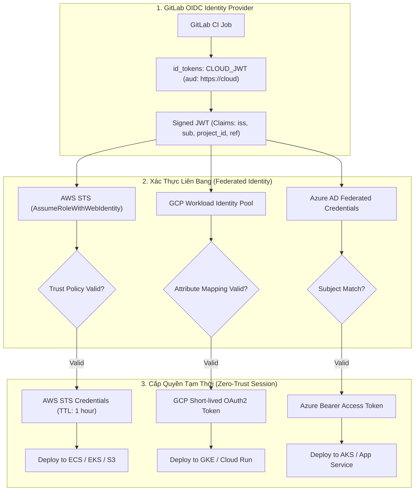


# [BÀI 37] OIDC FEDERATION VỚI CLOUD PROVIDERS: AWS IAM, GCP WORKLOAD IDENTITY & AZURE AD

Trong kỷ nguyên **DevOps, DevSecOps và Cloud Native Engineering**, **GitLab CI/CD** được công nhận là một trong những nền tảng tự động hóa tích hợp liên tục và phân phối liên tục (CI/CD) hoàn chỉnh, mạnh mẽ và được tin dùng nhất trong các doanh nghiệp quy mô lớn. Không chỉ dừng lại ở các pipeline tuần tự cơ bản, việc vận hành GitLab CI/CD ở cấp độ Production đòi hỏi kỹ sư phải làm chủ kiến trúc điều phối phi tuyến tính **DAG (Directed Acyclic Graph)**, cơ chế quản trị **Autoscaling Runners**, tối ưu hóa **Caching đa tầng**, xác thực không khóa **Keyless OIDC**, bảo mật chuỗi cung ứng phần mềm **SLSA & SBOM** cùng các chính sách **Quality & Security Gates** tự động.

Bài viết chuyên sâu này sẽ đồng hành cùng bạn mổ xẻ toàn diện bức tranh kiến trúc, phân tích các đánh đổi kỹ thuật thực chiến (Engineering Trade-offs), cung cấp hướng dẫn thực hành Lab chi tiết từng bước và bộ câu hỏi phỏng vấn chuyên sâu chuẩn DevOps Lead / DevSecOps Architect.

---

## 1. Bản Chất Kiến Trúc & Cơ Chế Vận Hành Tầng Thấp

### 1.1. Luận Đề Trung Tâm: Sự Chấm Dứt Của Kỷ Nguyên "Static Cloud Credentials" Trong CI/CD

Trong mô hình kết nối đám mây truyền thống, để cho phép GitLab CI/CD Runner thực hiện các tác vụ deploy lên **AWS (Amazon Web Services), GCP (Google Cloud Platform), hoặc Microsoft Azure**, kỹ sư buộc phải tạo các tài khoản dịch vụ (IAM User / Service Account) và sao chép các khóa bí mật dài hạn như:
- AWS: `AWS_ACCESS_KEY_ID` & `AWS_SECRET_ACCESS_KEY`.
- GCP: `gcp-service-account-key.json` (Chứa RSA Private Key).
- Azure: `AZURE_CLIENT_SECRET` (Mật khẩu Service Principal).

Cách làm này là nguyên nhân của hơn **70% các vụ rò rỉ bảo mật đám mây**:
1. **Khóa bí mật không có thời hạn hết hạn**: Nếu một lập trình viên vô tình in ra console log hoặc commit nhầm vào Git, kẻ tấn công có thể dùng khóa đó để đào tiền ảo hoặc xóa sạch hạ tầng Cloud.
2. **Không có cơ chế xoay vòng tự động**: Việc thay đổi hàng ngàn keys phân tán trên hàng trăm repositories là một cơn ác mộng vận hành.
3. **Mất dấu vết kiểm toán**: Không thể biết chính xác Job CI nào đã gọi lệnh xóa database trên Cloud.

> **Giải pháp tối thượng chuẩn Zero-Trust là "Keyless OIDC Cloud Federation": GitLab CI/CD đóng vai trò là một OIDC Identity Provider (IdP). Khi Job chạy, nó sẽ sinh một JSON Web Token (JWT) ngắn hạn được ký mật mã. Các nhà cung cấp Cloud (AWS, GCP, Azure) sẽ xác thực chữ ký này qua mạng Internet công khai và cấp phát Token truy cập tạm thời (Short-lived Session Token, TTL 15-60 phút) mà không cần lưu trữ bất kỳ mật khẩu nào trên GitLab!**

```text
       QUY TRÌNH XÁC THỰC LIÊN BANG OIDC GIỮA GITLAB CI VÀ CÁC CLOUD PROVIDERS

                 ┌──────────────────────────────────────────────┐
                 │          GitLab CI/CD Job Runner             │
                 │   (id_tokens: AWS_JWT / GCP_JWT / AZ_JWT)    │
                 └──────────────┬──────────────┬────────────────┘
                                │              │
                ┌───────────────┘              └───────────────┐
                ▼                                              ▼
     [ AWS IAM STS Endpoint ]                       [ GCP Workload Identity ]
     - Call: AssumeRoleWithWebIdentity              - Exchange JWT with STS Token
     - Verify GitLab JWKS Public Keys               - Impersonate Service Account
     - Check: sub == "project:12:ref:main"          - Cấp OAuth2 Access Token (15m)
                │                                              │
                ▼                                              ▼
     [ AWS Temporary Session Token ]                [ GCP Cloud Operations ]
     (AWS_ACCESS_KEY_ID, SECRET, SESSION_TOKEN)     (Deploy Cloud Run / GKE)
```



### 1.2. Cơ Chế AWS IAM AssumeRoleWithWebIdentity

Trên AWS, bạn tạo một **IAM OpenID Connect Identity Provider** trỏ tới `https://gitlab.com` (hoặc URL GitLab nội bộ) với Audience tương ứng.
Sau đó, bạn tạo một **IAM Role** với Trust Policy kiểm tra nghiêm ngặt JWT Claim:
```json
{
  "Version": "2012-10-17",
  "Statement": [
    {
      "Effect": "Allow",
      "Principal": {
        "Federated": "arn:aws:iam::123456789012:oidc-provider/gitlab.corp.internal"
      },
      "Action": "sts:AssumeRoleWithWebIdentity",
      "Condition": {
        "StringEquals": {
          "gitlab.corp.internal:sub": "project_path:enterprise/payment-api:ref_type:branch:ref:main"
        }
      }
    }
  ]
}
```

### 1.3. Cơ Chế GCP Workload Identity Federation & Azure Federated Credentials

- **Google Cloud (GCP)**: Sử dụng **Workload Identity Pool & Provider**. GCP tiếp nhận OIDC JWT từ GitLab, thực hiện ánh xạ thuộc tính (Attribute Mapping: `google.subject = assertion.sub`), sau đó cấp quyền cho token này đóng vai trò (Impersonate) một Google Service Account có quyền hạn cụ thể.
- **Microsoft Azure**: Sử dụng tính năng **Federated Identity Credentials** trên App Registration (Service Principal). Cấu hình Issuer là URL của GitLab và Subject Identifier là giá trị Claim `project_path:...:ref:...`.

---

## 2. Bảng So Sánh Kỹ Thuật Toàn Diện (Engineering Matrix)

| Tiêu Chí Đánh Giá | AWS IAM Keyless OIDC | GCP Workload Identity | Azure Entra ID Federated | Static Credentials Cũ |
| :--- | :--- | :--- | :--- | :--- |
| **Bản Chất Xác Thực** | `sts:AssumeRoleWithWebIdentity` | Workload Identity Pool STS | Federated Identity Credential | Mật khẩu tĩnh (Static Key) |
| **Thời Gian Tồn Tại Token**| **15 phút - 1 giờ (Tự hủy)**| **15 phút - 1 giờ (Tự hủy)** | **15 phút - 1 giờ (Tự hủy)** | **Vô hạn (Không tự hủy)** |
| **Rủi Ro Rò Rỉ Mật Khẩu** | **Bằng 0 (Không lưu key)** | **Bằng 0 (Không lưu JSON)** | **Bằng 0 (Không lưu Secret)**| **Rất cao (Lộ key là mất Cloud)**|
| **Xoay Vòng Khóa (Rotation)**| Không cần (Keyless) | Không cần (Keyless) | Không cần (Keyless) | Bắt buộc xoay thủ công 90 ngày |
| **Ràng Buộc Theo Nhánh Git**| **Khóa chặt qua `sub` claim**| **Khóa qua attribute mapping**| **Khóa qua subject claim** | Không thể (Key dùng chung) |
| **Khả Năng Audit Đám Mây** | AWS CloudTrail ghi rõ JWT Sub| GCP Cloud Audit Logs chi tiết| Azure Activity Log ghi rõ | Chỉ thấy tên IAM User chung |
| **Tiêu Chuẩn Bảo Mật** | **Zero-Trust Enterprise** | **Zero-Trust Enterprise** | **Zero-Trust Enterprise** | Không đạt chuẩn SOC 2 |

---

## 3. Kiến Trúc Triển Khai Chuẩn Production (Architecture Breakdown)

### 3.1. Cấu Hình `.gitlab-ci.yml` Triển Khai AWS Không Khóa Bằng OIDC

```yaml
stages:
  - deploy_aws

variables:
  AWS_DEFAULT_REGION: "ap-southeast-1"
  AWS_ROLE_ARN: "arn:aws:iam::123456789012:role/GitLabCI-Production-Deployer"

deploy_to_aws_s3:
  stage: deploy_aws
  image:
    name: amazon/aws-cli:latest
    entrypoint: [""]
  id_tokens:
    # 1. Yêu cầu GitLab sinh JWT Token với Audience dành riêng cho AWS
    AWS_JWT_TOKEN:
      aud: "https://aws.amazon.com"
  before_script:
    - mkdir -p ~/.aws
    # 2. Đổi JWT Token lấy Temporary STS Credentials
    - >-
      export $(printf "AWS_ACCESS_KEY_ID=%s AWS_SECRET_ACCESS_KEY=%s AWS_SESSION_TOKEN=%s"
      $(aws sts assume-role-with-web-identity
      --role-arn "${AWS_ROLE_ARN}"
      --role-session-name "GitLabCI-${CI_PIPELINE_ID}"
      --web-identity-token "${AWS_JWT_TOKEN}"
      --duration-seconds 3600
      --query "Credentials.[AccessKeyId,SecretAccessKey,SessionToken]"
      --output text))
  script:
    - echo "Successfully authenticated to AWS using Keyless OIDC!"
    - aws sts get-caller-identity
    - aws s3 sync ./dist/ s3://enterprise-production-web-assets/ --delete
  rules:
    - if: '$CI_COMMIT_BRANCH == "main"'
```

### 3.2. Cấu Hình `.gitlab-ci.yml` Triển Khai GCP Workload Identity Không Cần File JSON

```yaml
deploy_to_gcp_cloudrun:
  stage: deploy_aws
  image: google/cloud-sdk:alpine
  id_tokens:
    GCP_JWT_TOKEN:
      aud: "https://iam.googleapis.com/projects/123456789/locations/global/workloadIdentityPools/gitlab-pool/providers/gitlab-provider"
  script:
    - echo "${GCP_JWT_TOKEN}" > /tmp/web_identity_token
    # 1. Đăng nhập gcloud bằng Workload Identity Federation
    - >-
      gcloud auth login --cred-file=<(
      echo '{
        "type": "external_account",
        "audience": "//iam.googleapis.com/projects/123456789/locations/global/workloadIdentityPools/gitlab-pool/providers/gitlab-provider",
        "subject_token_type": "urn:ietf:params:oauth:token-type:jwt",
        "token_url": "https://sts.googleapis.com/v1/token",
        "credential_source": { "file": "/tmp/web_identity_token" },
        "service_account_impersonation_url": "https://iamcredentials.googleapis.com/v1/projects/-/serviceAccounts/gitlab-deployer@my-project.iam.gserviceaccount.com:generateAccessToken"
      }'
      )
    # 2. Triển khai Cloud Run
    - gcloud run deploy production-api --image=gcr.io/my-project/api:v1.0 --region=asia-southeast1
  rules:
    - if: '$CI_COMMIT_BRANCH == "main"'
```

---

## 4. Phân Tích Cạm Bẫy Thực Chiến (5-Whys Incident Analysis)

### 4.1. Sự Cố Thực Tế: Runner Thất Bại Khi AssumeRole Do Lỗi Sai Lệch Audience (`aud`)

> **Bối Cảnh**: Một công ty chuyển đổi 50 repositories từ AWS Access Key tĩnh sang OIDC. Sau khi cấu hình xong, toàn bộ các jobs CI/CD đồng loạt báo lỗi `An error occurred (InvalidIdentityToken) when calling the AssumeRoleWithWebIdentity operation: Incorrect token audience` khiến toàn bộ hoạt động release bị đình trệ.

```text
┌─────────────────────────────────────────────────────────────────────────┐
│                    PHÂN TÍCH NGUYÊN NHÂN GỐC RỄ (5-WHYS)                 │
├─────────────────────────────────────────────────────────────────────────┤
│ 1. Tại sao lệnh aws sts assume-role-with-web-identity bị từ chối?       │
│    -> AWS STS báo lỗi InvalidIdentityToken: Incorrect token audience.  │
│                                                                         │
│ 2. Tại sao giá trị Audience trong Token lại không hợp lệ?               │
│    -> Giá trị aud trong JWT Token không khớp với Client ID của AWS IdP. │
│                                                                         │
│ 3. Tại sao giá trị aud lại không khớp?                                  │
│    -> Trong .gitlab-ci.yml lập trình viên khai báo aud: "https://aws"   │
│       nhưng trong AWS IAM IdP lại tạo với Audience "https://gitlab.com".│
│                                                                         │
│ 4. Tại sao lại có sự bất đồng bộ giữa cấu hình YAML và AWS IAM?         │
│    -> Thiếu tài liệu chuẩn hóa quy ước Audience thống nhất toàn công ty.│
│                                                                         │
│ 5. NGUYÊN NHÂN CỐT LÕI (Root Cause):                                   │
│    -> Bất đồng bộ tham số Audience (aud claim) giữa OIDC Identity       │
│       Provider trên AWS IAM và cấu hình id_tokens trong GitLab CI.      │
└─────────────────────────────────────────────────────────────────────────┘
```

### 4.2. Giải Pháp Khắc Phục Triệt Để

1. **Chuẩn hóa quy ước Audience toàn doanh nghiệp**: Đặt giá trị `aud` thống nhất (ví dụ: `https://gitlab.corp.internal` hoặc `https://aws.amazon.com`) trên cả hai đầu: Trong phần Audience của AWS IAM OIDC Provider và trong khối `id_tokens: aud:` của tệp `.gitlab-ci.yml`.
2. **Kiểm tra JWT Token trực tiếp trước khi gửi**: Sử dụng script giải mã payload JWT để đối soát các trường `iss`, `aud`, `sub` trước khi gọi lệnh AssumeRole.

---

## 5. Hands-on Lab: Cấu Hình AWS OIDC Keyless Authentication (8 Bước Chuẩn)

### 5.1. Mục Tiêu Lab
- Thiết lập AWS IAM OIDC Identity Provider liên kết với GitLab.
- Tạo AWS IAM Role với Trust Policy ràng buộc chặt chẽ theo dự án và branch `main`.
- Cấu hình tệp `.gitlab-ci.yml` sử dụng `id_tokens` và AWS CLI.
- Xác thực phiên làm việc tạm thời thành công và liệt kê tài nguyên S3 mà không cần Access Key tĩnh.

```text
       QUY TRÌNH THỰC HÀNH LAB AWS OIDC FEDERATION

     [ GitLab CI Job ]
            │
            ├──► 1. Sinh id_tokens: AWS_JWT (aud: https://aws.amazon.com)
            │
            ├──► 2. Gửi lệnh aws sts assume-role-with-web-identity
            │
            ▼
     [ AWS IAM STS Service ]
            │
            ├──► 3. Xác thực chữ ký JWT với GitLab OpenID Discovery
            │
            ├──► 4. Kiểm tra Trust Policy: sub == "project_path:group/app:ref:main"
            │
            ├──► 5. Trả về Session Token tạm thời (1 giờ)
            │
            ▼
     [ GitLab CI Job ] ──► 6. aws sts get-caller-identity (Xác thực thành công)
```

### 5.2. Các Bước Thực Hiện Chi Tiết

#### Bước 1: Tạo IAM OIDC Identity Provider Trên AWS
```bash
# Tạo OIDC Provider trỏ tới GitLab
aws iam create-open-id-connect-provider     --url "https://gitlab.corp.internal"     --client-id-list "https://aws.amazon.com"     --thumbprint-list "9e99a48a9960b14926cc7f3b02e22da2b0ab7280"
```

#### Bước 2: Viết Tệp Trust Policy `trust-policy.json`
```json
{
  "Version": "2012-10-17",
  "Statement": [
    {
      "Effect": "Allow",
      "Principal": {
        "Federated": "arn:aws:iam::123456789012:oidc-provider/gitlab.corp.internal"
      },
      "Action": "sts:AssumeRoleWithWebIdentity",
      "Condition": {
        "StringEquals": {
          "gitlab.corp.internal:aud": "https://aws.amazon.com"
        },
        "StringLike": {
          "gitlab.corp.internal:sub": "project_path:cloud-platform/microservice-api:ref_type:branch:ref:main"
        }
      }
    }
  ]
}
```

#### Bước 3: Tạo AWS IAM Role Cho GitLab CI
```bash
aws iam create-role     --role-name "GitLabCI-Microservice-Deployer"     --assume-role-policy-document file://trust-policy.json
```

#### Bước 4: Gắn Quyền Hạn Tối Thiểu (Least Privilege Permission) Cho Role
```bash
aws iam attach-role-policy     --role-name "GitLabCI-Microservice-Deployer"     --policy-arn "arn:aws:iam::aws:policy/AmazonS3ReadOnlyAccess"
```

#### Bước 5: Cấu Hình Tệp `.gitlab-ci.yml`
```yaml
stages:
  - test_cloud_auth

variables:
  AWS_REGION: "ap-southeast-1"
  ROLE_ARN: "arn:aws:iam::123456789012:role/GitLabCI-Microservice-Deployer"

verify_aws_oidc:
  stage: test_cloud_auth
  image:
    name: amazon/aws-cli:latest
    entrypoint: [""]
  id_tokens:
    AWS_OIDC_TOKEN:
      aud: "https://aws.amazon.com"
  script:
    # Đổi JWT lấy Temporary Credentials
    - >-
      export $(printf "AWS_ACCESS_KEY_ID=%s AWS_SECRET_ACCESS_KEY=%s AWS_SESSION_TOKEN=%s"
      $(aws sts assume-role-with-web-identity
      --role-arn "${ROLE_ARN}"
      --role-session-name "GitLabSession-${CI_JOB_ID}"
      --web-identity-token "${AWS_OIDC_TOKEN}"
      --duration-seconds 900
      --query "Credentials.[AccessKeyId,SecretAccessKey,SessionToken]"
      --output text))
    # Kiểm tra danh tính thực tế trên AWS
    - aws sts get-caller-identity
    - aws s3 ls
  rules:
    - if: '$CI_COMMIT_BRANCH == "main"'
```

#### Bước 6: Commit Code Và Quan Sát Quá Trình Đăng Nhập
```bash
git add .gitlab-ci.yml
git commit -m "feat(ci): implement keyless oidc authentication with aws iam"
git push origin main
```

#### Bước 7: Quan Sát Kết Quả Console Log Của Job
Xem log job `verify_aws_oidc`:
```json
{
    "UserId": "AROAEXAMPLEKEY:GitLabSession-998811",
    "Account": "123456789012",
    "Arn": "arn:aws:sts::123456789012:assumed-role/GitLabCI-Microservice-Deployer/GitLabSession-998811"
}
```

#### Bước 8: Thử Nghiệm Từ Chối Truy Cập Từ Nhánh Không Hợp Lệ
- Tạo branch `feature/test-unauthorized` và push commit.
- Cố tình chạy job: AWS STS từ chối với lỗi `AccessDenied: Token subject not allowed by trust policy`.

> [!NOTE]
> **Check-point Lab 37**: Đăng nhập AWS thành công 100% không dùng bất kỳ mật khẩu tĩnh nào trong GitLab Variables và Trust Policy khóa chặt chính xác theo branch `main`.

---

## 6. Bộ Câu Hỏi Vấn Đáp & Phỏng Vấn Chuyên Sâu (Self-Check Q&A)

<details class="qa-card">
  <summary class="qa-summary">
    <span class="qa-num-badge">Q01</span>
    <span>Tại sao Keyless OIDC Authentication được coi là tiêu chuẩn an ninh vượt trội so với IAM User Access Keys?</span>
  </summary>
  <div class="qa-body">
    <p><strong>Lợi thế an ninh:</strong></p>
    <ul>
      <li><strong>Triệt tiêu rủi ro rò rỉ (Zero Secret Sprawl)</strong>: Không có khóa bí mật nào tồn tại trên đĩa cứng hay cơ sở dữ liệu của CI/CD.</li>
      <li><strong>Thời gian sống cực ngắn (Ephemeral Tokens)</strong>: Session token tự hủy sau 15-60 phút.</li>
      <li><strong>Kiểm soát theo ngữ cảnh (Fine-Grained Contextual Access)</strong>: Chỉ cấp quyền cho đúng repository ID, đúng commit branch và đúng môi trường thực thi.</li>
    </ul>
  </div>
</details>

<details class="qa-card">
  <summary class="qa-summary">
    <span class="qa-num-badge">Q02</span>
    <span>Cấu trúc của trường `sub` (Subject Claim) trong JWT do GitLab cấp có định dạng như thế nào?</span>
  </summary>
  <div class="qa-body">
    <p><strong>Định dạng chuẩn:</strong></p>
    <p><code>project_path:&lt;group&gt;/&lt;project&gt;:ref_type:&lt;branch|tag&gt;:ref:&lt;branch-name&gt;</code></p>
    <p>Ví dụ: <code>project_path:finance/payment-api:ref_type:branch:ref:main</code>. Chuỗi này là căn cứ tối thượng để Cloud Providers xác minh nguồn gốc của request.</p>
  </div>
</details>

<details class="qa-card">
  <summary class="qa-summary">
    <span class="qa-num-badge">Q03</span>
    <span>Làm thế nào để cho phép cả nhánh `main` và các Git Tags dạng `v*` cùng có quyền AssumeRole trong AWS Trust Policy?</span>
  </summary>
  <div class="qa-body">
    <p><strong>Sử dụng toán tử StringLike với ký tự đại diện (*):</strong></p>
    <pre><code>"Condition": {
  "StringLike": {
    "gitlab.corp.internal:sub": [
      "project_path:finance/payment-api:ref_type:branch:ref:main",
      "project_path:finance/payment-api:ref_type:tag:ref:v*"
    ]
  }
}</code></pre>
  </div>
</details>

<details class="qa-card">
  <summary class="qa-summary">
    <span class="qa-num-badge">Q04</span>
    <span>GCP Workload Identity Federation sử dụng cơ chế "Service Account Impersonation" như thế nào?</span>
  </summary>
  <div class="qa-body">
    <p><strong>Cơ chế 2 bước:</strong></p>
    <ol>
      <li><strong>Bước 1 (Đổi Token)</strong>: GitLab gửi OIDC JWT tới GCP Security Token Service (STS) để lấy một Federated Token tạm thời dựa trên Workload Identity Pool.</li>
      <li><strong>Bước 2 (Đóng vai)</strong>: Federated Token này gọi API <code>generateAccessToken</code> để "đóng vai" (Impersonate) một Google Service Account thực sự đã được cấp quyền trong GCP IAM, tạo ra OAuth2 Token hợp lệ để gọi API.</li>
    </ol>
  </div>
</details>

<details class="qa-card">
  <summary class="qa-summary">
    <span class="qa-num-badge">Q05</span>
    <span>Tại sao cần khai báo `duration-seconds` ngắn nhất có thể khi gọi `assume-role-with-web-identity`?</span>
  </summary>
  <div class="qa-body">
    <p><strong>Nguyên tắc Least Privilege Time:</strong></p>
    <p>Chỉ nên đặt thời lượng phiên đủ cho thời gian chạy của job deploy (ví dụ: <code>--duration-seconds 900</code> tương đương 15 phút). Nếu job deploy hoàn thành trong 3 phút, ngay cả khi kẻ tấn công có dump được biến môi trường của container thì token cũng sẽ sớm hết hạn và không thể tái sử dụng.</p>
  </div>
</details>

<details class="qa-card">
  <summary class="qa-summary">
    <span class="qa-num-badge">Q06</span>
    <span>Làm thế nào để Azure Active Directory (Entra ID) xác thực được GitLab CI qua Federated Identity Credentials?</span>
  </summary>
  <div class="qa-body">
    <p><strong>Cấu hình Azure:</strong></p>
    <p>Trong Azure Portal -> <strong>App Registrations -> Certificates & secrets -> Federated credentials</strong>, tạo một Credential mới: Chọn Issuer là URL của GitLab và điền Subject Identifier khớp với Claim <code>sub</code> của GitLab. Khi Runner chạy, Azure CLI dùng lệnh <code>az login --federated-token $AZURE_JWT_TOKEN</code> để lấy Access Token.</p>
  </div>
</details>

<details class="qa-card">
  <summary class="qa-summary">
    <span class="qa-num-badge">Q07</span>
    <span>Khái niệm "Thumbprint" trong AWS IAM OIDC Provider là gì và tại sao cần cấu hình đúng?</span>
  </summary>
  <div class="qa-body">
    <p><strong>Ý nghĩa Thumbprint:</strong></p>
    <p>Thumbprint là mã băm SHA1 của chứng chỉ SSL/TLS Root CA của máy chủ GitLab. AWS sử dụng mã này để xác thực tính hợp lệ của kênh truyền HTTPS khi tải Public Keys (JWKS) từ máy chủ GitLab về để xác minh chữ ký JWT.</p>
  </div>
</details>

<details class="qa-card">
  <summary class="qa-summary">
    <span class="qa-num-badge">Q08</span>
    <span>Làm thế nào để phân quyền nhiều môi trường (Dev, Staging, Prod) trên cùng 1 repository sử dụng OIDC?</span>
  </summary>
  <div class="qa-body">
    <p><strong>Ràng buộc theo Environment Claim:</strong></p>
    <p>GitLab OIDC JWT chứa trường <code>environment</code> (ví dụ: <code>"environment": "production"</code>). Trong AWS Trust Policy, bạn có thể kiểm tra trực tiếp điều kiện: <code>"gitlab.corp.internal:environment": "production"</code> để chỉ cấp IAM Role quyền ghi lên Production cho job chạy đúng Environment đó.</p>
  </div>
</details>

<details class="qa-card">
  <summary class="qa-summary">
    <span class="qa-num-badge">Q09</span>
    <span>Sự cố: Job CI báo lỗi `OpenIDConnect Provider not found` khi chạy lệnh AssumeRole. Xử lý thế nào?</span>
  </summary>
  <div class="qa-body">
    <p><strong>Khắc phục:</strong></p>
    <p>Kiểm tra xem URL của OIDC Provider trên AWS IAM có bị thừa hoặc thiếu dấu gạch chéo cuối cùng (<code>/</code>) hoặc giao thức <code>https://</code> so với trường <code>iss</code> trong JWT hay không. AWS IAM yêu cầu định dạng URL trong ARN không chứa <code>https://</code> (ví dụ: <code>arn:aws:iam::123:oidc-provider/gitlab.com</code>).</p>
  </div>
</details>

<details class="qa-card">
  <summary class="qa-summary">
    <span class="qa-num-badge">Q10</span>
    <span>Làm thế nào để tự động hoá việc tạo IAM OIDC Roles trên AWS bằng Terraform?</span>
  </summary>
  <div class="qa-body">
    <p><strong>Mã nguồn Terraform:</strong></p>
    <pre><code>resource "aws_iam_role" "gitlab_ci_role" {
  name = "gitlab-ci-deployer"
  assume_role_policy = jsonencode({
    Version = "2012-10-17"
    Statement = [{
      Action = "sts:AssumeRoleWithWebIdentity"
      Effect = "Allow"
      Principal = { Federated = aws_iam_openid_connect_provider.gitlab.arn }
      Condition = {
        StringEquals = {
          "gitlab.com:aud" = "https://aws.amazon.com"
          "gitlab.com:sub" = "project_path:my-group/my-app:ref_type:branch:ref:main"
        }
      }
    }]
  })
}</code></pre>
  </div>
</details>

<details class="qa-card">
  <summary class="qa-summary">
    <span class="qa-num-badge">Q11</span>
    <span>Tại sao không nên sử dụng ký tự đại diện `*` trong trường `sub` của Trust Policy Production?</span>
  </summary>
  <div class="qa-body">
    <p><strong>Lỗ hổng bảo mật:</strong></p>
    <p>Nếu bạn đặt <code>"gitlab.com:sub": "project_path:my-group/my-app:*"</code>, bất kỳ ai có quyền tạo branch thử nghiệm (ví dụ <code>feature/test</code>) cũng có thể tạo một pipeline và Assume thành công Role Production của AWS để sửa đổi dữ liệu thật. Luôn luôn khóa cứng <code>:ref:main</code> cho các Role nhạy cảm.</p>
  </div>
</details>

<details class="qa-card">
  <summary class="qa-summary">
    <span class="qa-num-badge">Q12</span>
    <span>Làm cách nào để kiểm toán xem các phiên AssumeRole OIDC trong AWS do ai kích hoạt trên GitLab?</span>
  </summary>
  <div class="qa-body">
    <p><strong>Truy vết CloudTrail:</strong></p>
    <p>Trong <strong>AWS CloudTrail Event History</strong>, tìm kiếm sự kiện <code>AssumeRoleWithWebIdentity</code>. Mở chi tiết sự kiện: Trường <code>userIdentity.principalId</code> và <code>requestParameters.webIdentityToken</code> ghi nhận chi tiết GitLab User ID, Pipeline ID và Project Path kích hoạt lệnh.</p>
  </div>
</details>

---

## 7. Tổng Kết & Lộ Trình Bài Học Tiếp Theo

### 7.1. Tóm Tắt Các Điểm Cốt Lõi (Architectural Key Takeaways)
- **Keyless Cloud Era**: Loại bỏ vĩnh viễn khóa tĩnh dài hạn khi giao tiếp với AWS, GCP và Azure.
- **Cryptographic JWT Federation**: Tận dụng `id_tokens` của GitLab làm danh tính tin cậy trao đổi Token ngắn hạn.
- **Contextual Bound Claims**: Khóa chặt quyền hạn đám mây theo `project_path`, `ref` và `environment`.
- **Full Audit Traceability**: Mọi hành động deploy trên Cloud đều được gắn liền với Pipeline ID và User kích hoạt.

### 7.2. Sơ Đồ Tư Duy Xác Thực OIDC Đa Đám Mây (Mindmap)

```text
                     XÁC THỰC LIÊN BANG ĐA ĐÁM MÂY (OIDC FEDERATION)
                                           │
        ┌──────────────────────────────────┼──────────────────────────────────┐
        ▼                                  ▼                                  ▼
  [ AWS IAM STS ]                 [ GCP Workload Identity ]      [ Azure Entra ID ]
  - AssumeRoleWithWebIdentity     - Workload Identity Pool       - Federated Identity Creds
  - Trust Policy sub checking     - Attribute Mapping (sub)      - Subject Identifier Match
  - Temporary Session (TTL 1h)    - Service Account Impersonate  - Short-lived Bearer Token
```

> [!TIP]
> **Bước tiếp theo trong lộ trình**: Áp dụng OIDC để tự động hóa quy trình phân phối ứng dụng lên các dịch vụ AWS ECS, EKS và Serverless Lambda trong [Bài 38: Triển Khai Ứng Dụng Lên AWS: ECS Fargate, EKS Cluster & Serverless Lambda](gitlab-38-38-deploy-aws.html).

