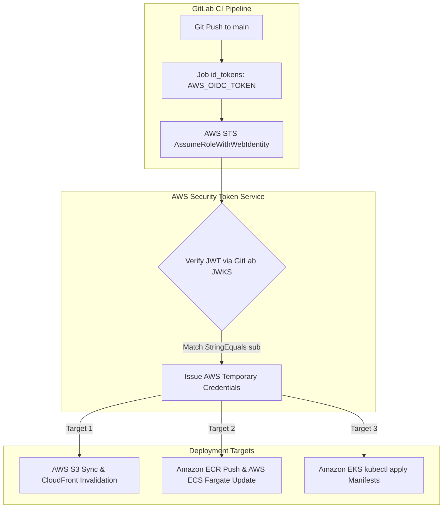
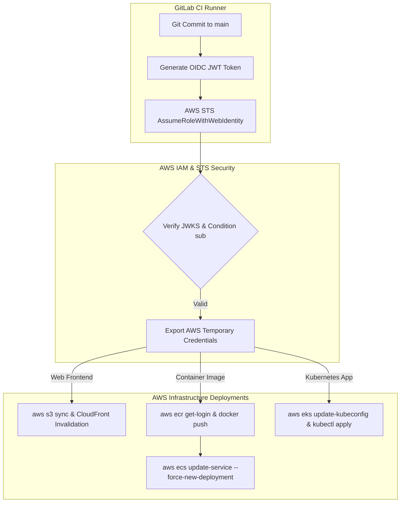
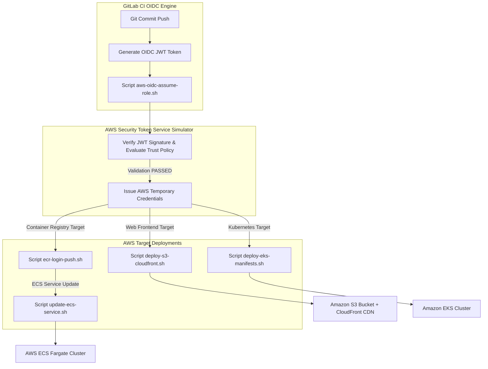


# [BÀI 38] TỰ ĐỘNG HÓA TRIỂN KHAI LÊN AWS: OIDC ROLE ASSUME, CLOUDFORMATION, AWS ECS / EKS DEPLOY & S3 / CLOUDFRONT SYNC

Trong kỷ nguyên **DevOps, DevSecOps và Cloud Native Engineering**, **GitLab CI/CD** được công nhận là một trong những nền tảng tự động hóa tích hợp liên tục và phân phối liên tục (CI/CD) hoàn chỉnh, mạnh mẽ và được tin dùng nhất trong các doanh nghiệp quy mô lớn. Không chỉ dừng lại ở các pipeline tuần tự cơ bản, việc vận hành GitLab CI/CD ở cấp độ Production đòi hỏi kỹ sư phải làm chủ kiến trúc điều phối phi tuyến tính **DAG (Directed Acyclic Graph)**, cơ chế quản trị **Autoscaling Runners**, tối ưu hóa **Caching đa tầng**, xác thực không khóa **Keyless OIDC**, bảo mật chuỗi cung ứng phần mềm **SLSA & SBOM** cùng các chính sách **Quality & Security Gates** tự động.

Bài viết chuyên sâu này sẽ đồng hành cùng bạn mổ xẻ toàn diện bức tranh kiến trúc, phân tích các đánh đổi kỹ thuật thực chiến (Engineering Trade-offs), cung cấp hướng dẫn thực hành Lab chi tiết từng bước và bộ câu hỏi phỏng vấn chuyên sâu chuẩn DevOps Lead / DevSecOps Architect.

---

## 1. Bản Chất Kiến Trúc & Cơ Chế Vận Hành Tầng Thấp

---


| STT | Câu hỏi ôn tập | Đáp án chi tiết thực chiến |
|---|---|---|
| 1 | Nguyên lý hoạt động cốt lõi của OIDC Federation là gì? | GitLab CI tự động sinh JWT Token ngắn hạn có ký số điện tử bằng Private Key; Cloud Provider verify chữ ký qua JWKS Endpoint và cấp Temporary Credentials có TTL 15-60 phút nếu tất cả các điều kiện cờ claim trong Trust Policy khớp 100%. |
| 2 | Cấu trúc tệp JSON Web Token (JWT) gồm 3 phần nào? | Gồm Header (thuật toán mã hóa chữ ký RS256/ES256), Payload (claims thông tin danh tính như `sub`, `iss`, `aud`, `project_path`), và Signature (chữ ký số điện tử tạo bởi Private Key), phân cách nhau bằng dấu chấm (`.`). |
| 3 | Tại sao phải kiểm tra cờ `sub` (Subject Claim) trong Trust Policy? | Để đảm bảo chỉ đúng repository và branch/environment chỉ định của doanh nghiệp mới được phép AssumeRole, ngăn kẻ tấn công từ dự án rác bất kỳ trên GitLab.com mạo danh để chiếm đoạt tài nguyên Cloud nguy hiểm. |
| 4 | Cờ `aud` (Audience) ngăn chặn kịch bản tấn công nào? | Ngăn chặn Token Relay Attack (kẻ tấn công lấy JWT token sinh ra cho dịch vụ A đem đi đút lót cho dịch vụ B). Cờ `aud` định danh dịch vụ duy nhất được phép nhận token nhằm bảo vệ tính toàn vẹn hệ thống. |
| 5 | Tệp JWKS Endpoint (`/.well-known/jwks.json`) dùng để làm gì? | Xuất bản công khai các Public Key của GitLab Instance để Cloud Provider tự verify chữ ký số của JWT Token mà không cần lưu trữ bất kỳ Shared Secret hay mật khẩu tĩnh nào trên hệ thống. |


**Luận đề trung tâm:**
> *"Ranh giới quyền hạn an toàn phải nằm ở **điều kiện Trust Policy trên AWS IAM**, tuyệt đối không được tin tưởng bấu víu vào biến môi trường CI."*

Sau khi đã nắm vững nguyên lý chung của OIDC Federation ở Buổi 37, Buổi 38 sẽ đưa bạn bước vào môi trường thực chiến số 1 thị trường: **Amazon Web Services (AWS)**. Trong hệ thống CI/CD AWS thực tế, bạn sẽ phải triển khai đủ mọi loại tải công việc: từ trang Web tĩnh trên **Amazon S3 + CloudFront**, đến các ứng dụng Container trên **Amazon ECR**, **AWS ECS (Fargate)**, và **Amazon EKS (Kubernetes)**. Bài học này sẽ giúp bạn thiết lập các IAM Roles chuẩn mãnh xé, đảm bảo ranh giới phân quyền nằm hoàn toàn ở **Trust Policy Condition Keys** phía AWS chứ không phụ thuộc vào bất kỳ cờ biến nào có thể bị sửa đổi dưới lòng GitLab CI Pipeline.

---


| STT | Kỹ năng thực chiến | Hiện vật chứng minh hoàn thành |
|---|---|---|
| 1 | Tạo AWS IAM OIDC Provider trỏ đến GitLab Instance | IAM Identity Provider ARN trong tài khoản AWS quản trị |
| 2 | Viết IAM Trust Policy kiểm tra `sub` claim chuẩn xác | Tệp JSON Trust Policy ràng buộc `project_path` và `ref:main` cùng `environment:production` |
| 3 | Tự động hóa Deploy Static Web lên S3 + CloudFront | Script `aws s3 sync` và `aws cloudfront create-invalidation` xóa CDN cache |
| 4 | Xác thực Amazon ECR không dùng Static Access Keys | Lệnh `aws ecr get-login-password` thông qua OIDC temporary credentials |
| 5 | Tự động cập nhật dịch vụ Container trên AWS ECS | Script `aws ecs update-service --force-new-deployment` rolling update Fargate |
| 6 | Phân quyền và Deploy ứng dụng Kubernetes lên Amazon EKS | Tệp `aws-auth` ConfigMap / EKS Access Entry và `kubectl apply` manifest |
| 7 | Khống chế thời gian tồn tại Session Duration dưới 60 phút | Lệnh `assume-role-with-web-identity --duration-seconds 900` tự hủy |
| 8 | Giám sát vệt vết kiểm toán OIDC qua AWS CloudTrail | Log CloudTrail ghi nhận sự kiện `AssumeRoleWithWebIdentity` đầy đủ IP/Time |

---


| Kiến thức / Kỹ năng | Mức độ yêu cầu | Nguồn tự học nếu thiếu |
|---|---|---|
| Nguyên lý OIDC Federation 4 bước | Thành thục | Buổi 37 (QT 37.1 – QT 37.12) về luồng trao đổi JWT Token |
| Cấu trúc IAM Role, Trust Policy & Permission Policy trên AWS | Hiểu rõ | Kiến thức AWS IAM Nền tảng về phân quyền truy cập |
| Thao tác CLI trên Amazon S3 và CloudFront | Thành thục | Kiến thức AWS Storage/CDN về đồng bộ file và invalidate |
| Khái niệm Amazon ECR, ECS Task Definition và EKS Cluster | Thành thục | Kiến thức AWS Container Infrastructure quản trị cluster |
| Cú pháp yaml khối `id_tokens` trong `.gitlab-ci.yml` | Thành thục | Buổi 30 & Buổi 37 về cấu hình sinh OIDC JWT |

---


| Thuật ngữ Tiếng Việt | Thuật ngữ Tiếng Anh | Giải thích ý nghĩa thực tế |
|---|---|---|
| Nhà cung cấp OIDC AWS | AWS IAM OIDC Identity Provider | Đối tượng cấu hình trên AWS IAM liên kết với URL công khai của GitLab Instance để xác minh chữ ký số của JWT Token qua JWKS Endpoint. |
| Chính sách tin tưởng vai trò | IAM Role Trust Policy | Tệp JSON quy định điều kiện (Condition) để GitLab CI Runner được phép AssumeRole dựa trên các claim `aud`, `sub` và `project_path`. |
| Chính sách quyền hạn | IAM Permission Policy | Tệp JSON quy định cụ thể Role được phép làm gì trên các dịch vụ hạ tầng AWS (S3, CloudFront, ECR, ECS, EKS). |
| Chuỗi xác định dấu vân tay | Thumbprint / OpenID Connect Certificate | Mã băm SSL Certificate Fingerprint của GitLab Server để AWS verify độ an toàn của kết nối HTTPS. |
| Đổi vai trò bằng web identity | `AssumeRoleWithWebIdentity` | Lệnh API của AWS Security Token Service (STS) nhận OIDC JWT Token và trả về bộ 3 biến AWS Credentials tạm thời. |
| Xóa bộ nhớ đệm CDN | CloudFront Cache Invalidation | Thao tác xóa dữ liệu đệm tĩnh cũ trên hàng trăm Edge Locations toàn cầu để người dùng lập tức thấy bản Web mới nhất. |
| Đăng nhập kho chứa container | ECR Login Authorization Token | Mật khẩu đăng nhập ngắn hạn (TTL 12h) cấp qua OIDC để Docker CLI thực thi push Image lên Amazon ECR Private Registry. |
| Làm mới deployment container | ECS Force New Deployment | Cờ chỉ định ECS Fargate kéo Container Image mới nhất từ ECR và thực hiện Rolling Update thay thế Pods cũ không downtime. |
| Mục nhập truy cập Kubernetes | EKS Access Entry / `aws-auth` | Cơ chế map IAM Role của AWS vào Kubernetes RBAC Group trên Amazon EKS Cluster giúp `kubectl` có quyền tương tác với API Server. |
| Biến môi trường tạm thời | AWS Temporary Credentials | Bộ 3 biến: `AWS_ACCESS_KEY_ID`, `AWS_SECRET_ACCESS_KEY`, và `AWS_SESSION_TOKEN` có TTL ngắn hạn tự hủy từ 15 đến 60 phút. |
| Khoảng thời gian phiên | Session Duration | Thời gian tồn tại của AWS Temporary Credentials (khuyến nghị cấu hình từ 15 phút đến 60 phút tối đa). |
| Truy vết nhật ký AWS | CloudTrail Event History | Nhật ký ghi vết 100% các cuộc gọi API `AssumeRoleWithWebIdentity` từ GitLab Runner để phục vụ kiểm toán bảo mật SOC 2 và ISO 27001. |


#### Mô hình 1: Sơ đồ Kiến trúc Tổng thể GitLab CI Deploy lên AWS (Multi-Service Target)



#### Mô hình 2: Bảng Phân bổ IAM Roles theo Nguyên tắc Quyền Tối thiểu (Least Privilege Matrix)

| Loại ứng dụng | Target AWS Service | IAM Role Khuyên dùng | Phạm vi Quyền hạn tối thiểu |
|---|---|---|---|
| **Web Tĩnh** | Amazon S3 + CloudFront | `GitLabS3DeployRole` | `s3:PutObject`, `s3:DeleteObject` trên `arn:aws:s3:::bucket/*` + `cloudfront:CreateInvalidation` |
| **Container ECR** | Amazon ECR Repository | `GitLabECRPushRole` | `ecr:GetAuthorizationToken` + `ecr:BatchCheckLayerAvailability` + `ecr:PutImage` |
| **Microservice ECS** | AWS ECS Fargate | `GitLabECSDeployRole` | `ecs:RegisterTaskDefinition` + `ecs:UpdateService` + `iam:PassRole` |
| **Kubernetes EKS** | Amazon EKS Cluster | `GitLabEKSDeployRole` | `eks:DescribeCluster` + Kubernetes RBAC binding (`edit` / `admin`) |

##### Chi tiết IAM Permission Policy mẫu cho Amazon ECR Push (`GitLabECRPushPolicy`):
```json
{
  "Version": "2012-10-17",
  "Statement": [
    {
      "Effect": "Allow",
      "Action": [
        "ecr:GetAuthorizationToken"
      ],
      "Resource": "*"
    },
    {
      "Effect": "Allow",
      "Action": [
        "ecr:BatchCheckLayerAvailability",
        "ecr:GetDownloadUrlForLayer",
        "ecr:PutImage",
        "ecr:InitiateLayerUpload",
        "ecr:UploadLayerPart",
        "ecr:CompleteLayerUpload"
      ],
      "Resource": "arn:aws:ecr:us-east-1:123456789012:repository/payment-service"
    }
  ]
}
```

##### Chi tiết IAM Permission Policy mẫu cho AWS ECS Deployment (`GitLabECSDeployPolicy`):
```json
{
  "Version": "2012-10-17",
  "Statement": [
    {
      "Effect": "Allow",
      "Action": [
        "ecs:RegisterTaskDefinition",
        "ecs:DescribeTaskDefinition",
        "ecs:DescribeServices",
        "ecs:UpdateService"
      ],
      "Resource": "*"
    },
    {
      "Effect": "Allow",
      "Action": "iam:PassRole",
      "Resource": "arn:aws:iam::123456789012:role/ecsTaskExecutionRole"
    }
  ]
}
```

##### Chi tiết IAM Permission Policy mẫu cho Amazon EKS Deployment (`GitLabEKSDeployPolicy`):
```json
{
  "Version": "2012-10-17",
  "Statement": [
    {
      "Effect": "Allow",
      "Action": [
        "eks:DescribeCluster",
        "eks:ListClusters"
      ],
      "Resource": "arn:aws:eks:us-east-1:123456789012:cluster/prod-eks-cluster"
    },
    {
      "Effect": "Allow",
      "Action": [
        "sts:GetServiceBearerToken"
      ],
      "Resource": "*"
    }
  ]
}
```

---

### 1.1. Cấu hình AWS IAM OIDC Provider & Trust Policies Chuẩn Mãnh Xé (10 phút)

### 4.1. Mẫu Tệp `.gitlab-ci.yml` Triển khai AWS Đa Dịch Vụ Hoàn Chỉnh
Dưới đây là tệp cấu hình GitLab CI/CD mẫu ứng dụng chuẩn OIDC Federation để deploy lên AWS không cần mật khẩu tĩnh:

```yaml
stages:
  - build
  - test
  - deploy-static
  - push-ecr
  - deploy-ecs
  - deploy-eks

variables:
  AWS_DEFAULT_REGION: us-east-1
  AWS_ROLE_ARN_S3: arn:aws:iam::123456789012:role/GitLabS3DeployRole
  AWS_ROLE_ARN_ECR: arn:aws:iam::123456789012:role/GitLabECRPushRole
  AWS_ROLE_ARN_EKS: arn:aws:iam::123456789012:role/GitLabEKSDeployRole
  ECR_REGISTRY: 123456789012.dkr.ecr.us-east-1.amazonaws.com
  IMAGE_TAG: $ECR_REGISTRY/payment-service:$CI_COMMIT_SHA

.aws-oidc-base:
  id_tokens:
    AWS_OIDC_TOKEN:
      aud: https://aws.amazon.com
  before_script:
    - mkdir -p ~/.aws
    - |
      ASSUME_ROLE_OUTPUT=$(aws sts assume-role-with-web-identity \
        --role-arn "$TARGET_ROLE_ARN" \
        --role-session-name "GitLabCI-${CI_PIPELINE_ID}" \
        --web-identity-token "$AWS_OIDC_TOKEN" \
        --duration-seconds 900 \
        --query "Credentials.[AccessKeyId,SecretAccessKey,SessionToken]" \
        --output text)
      export AWS_ACCESS_KEY_ID=$(echo "$ASSUME_ROLE_OUTPUT" | awk '{print $1}')
      export AWS_SECRET_ACCESS_KEY=$(echo "$ASSUME_ROLE_OUTPUT" | awk '{print $2}')
      export AWS_SESSION_TOKEN=$(echo "$ASSUME_ROLE_OUTPUT" | awk '{print $3}')

# 1. Deploy Static Website to S3 + CloudFront
deploy-s3-cloudfront:
  extends: .aws-oidc-base
  stage: deploy-static
  variables:
    TARGET_ROLE_ARN: $AWS_ROLE_ARN_S3
  script:
    - aws s3 sync dist/ s3://frontend-prod-bucket/ --delete
    - aws cloudfront create-invalidation --distribution-id E1A2B3C4D5E6F7 --paths "/*"
  rules:
    - if: $CI_COMMIT_BRANCH == "main"

# 2. Build & Push Image to Amazon ECR
push-image-ecr:
  extends: .aws-oidc-base
  stage: push-ecr
  variables:
    TARGET_ROLE_ARN: $AWS_ROLE_ARN_ECR
  script:
    - aws ecr get-login-password --region $AWS_DEFAULT_REGION | docker login --username AWS --password-stdin $ECR_REGISTRY
    - docker build -t $IMAGE_TAG .
    - docker push $IMAGE_TAG
  rules:
    - if: $CI_COMMIT_BRANCH == "main"

# 3. Deploy Kubernetes Manifests to Amazon EKS
deploy-kubernetes-eks:
  extends: .aws-oidc-base
  stage: deploy-eks
  variables:
    TARGET_ROLE_ARN: $AWS_ROLE_ARN_EKS
  script:
    - aws eks update-kubeconfig --region $AWS_DEFAULT_REGION --name prod-eks-cluster
    - kubectl set image deployment/payment-backend payment-container=$IMAGE_TAG -n production
    - kubectl rollout status deployment/payment-backend -n production --timeout=300s
  rules:
    - if: $CI_COMMIT_BRANCH == "main"
      when: manual
```

---

### 4.2. Các Quy tắc Cấu hình AWS IAM OIDC (QT 38.1 - QT 38.4)

**Nguyên lý cốt lõi:** Định danh Audience chuẩn `https://aws.amazon.com` trong OIDC Token.
**Phát biểu.** Giá trị cờ `aud` trong thuộc tính `id_tokens` của job CI bắt buộc phải khớp 100% với Client ID đã đăng ký trên AWS IAM OIDC Provider (mặc định là `https://aws.amazon.com`).
**Giải thích cơ chế ngầm:** AWS STS Engine bắt buộc phải kiểm tra cờ `aud` trong JWT Token. Nếu `aud` trong token khác với Client ID cấu hình trên IAM OIDC Provider, AWS sẽ từ chối cấp credentials với lỗi `InvalidIdentityToken: Incorrect token audience`. Cấu hình cờ này đảm bảo token chỉ dành riêng cho AWS.
> [!WARNING]
> **CẠM BẪY THỰC CHIẾN:**
> Điền `aud: aws` hoặc `aud: https://gitlab.com` trong tệp `.gitlab-ci.yml`.
**Minh hoạ.**
```yaml
id_tokens:
  AWS_OIDC_TOKEN:
    aud: https://aws.amazon.com
```
**Con số chốt:** `aud: https://aws.amazon.com` 100% chính xác.

---

**Nguyên lý cốt lõi:** Cấu hình Condition `StringEquals` cho `sub` claim trong AWS IAM Trust Policy.
**Phát biểu.** Trust Policy của AWS IAM Role bắt buộc phải dùng toán trị `StringEquals` để kiểm tra chính xác giá trị `sub` claim bao gồm tên dự án (`project_path`) và tên nhánh (`ref`).
**Giải thích cơ chế ngầm:** Nếu dùng toán tử lỏng lẻo hoặc dùng wildcard `*` ở cấp độ root, bất kỳ dự án nào khác chạy trên cùng GitLab Instance cũng có thể mạo danh token để AssumeRole vào tài khoản AWS của bạn. Đây là chốt chặn bảo mật quan trọng nhất.
> [!WARNING]
> **CẠM BẪY THỰC CHIẾN:**
> Sử dụng `"gitlab.com:sub": "*"` hoặc bỏ trống phần `Condition` trong Trust Policy.
**Minh hoạ.**
```json
{
  "Version": "2012-10-17",
  "Statement": [
    {
      "Effect": "Allow",
      "Principal": {
        "Federated": "arn:aws:iam::123456789012:oidc-provider/gitlab.company.com"
      },
      "Action": "sts:AssumeRoleWithWebIdentity",
      "Condition": {
        "StringEquals": {
          "gitlab.company.com:aud": "https://aws.amazon.com",
          "gitlab.company.com:sub": "project_path:bank-group/payment-service:ref_type:branch:ref:main"
        }
      }
    }
  ]
}
```
**Con số chốt:** 100% Trust Policies chứa `StringEquals` cho `sub`.

---

**Nguyên lý cốt lõi:** Sử dụng `aws-actions/configure-aws-credentials` hoặc AWS CLI `assume-role-with-web-identity`.
**Phát biểu.** Trong script CI, đổi OIDC Token lấy AWS Temporary Credentials bằng lệnh `aws sts assume-role-with-web-identity` và export bộ 3 biến môi trường AWS.
**Giải thích cơ chế ngầm:** AWS SDK và AWS CLI tự động nhận diện bộ 3 biến môi trường `AWS_ACCESS_KEY_ID`, `AWS_SECRET_ACCESS_KEY`, và `AWS_SESSION_TOKEN` để thực thi tất cả các câu lệnh tiếp theo mà không cần lưu trữ key tĩnh.
> [!WARNING]
> **CẠM BẪY THỰC CHIẾN:**
> Truyền biến `AWS_SECRET_ACCESS_KEY` tĩnh vào câu lệnh CLI.
**Minh hoạ.**
```bash
ASSUME_ROLE_OUTPUT=$(aws sts assume-role-with-web-identity \
  --role-arn "arn:aws:iam::123456789012:role/GitLabDeployRole" \
  --role-session-name "GitLabCI-${CI_PIPELINE_ID}" \
  --web-identity-token "$AWS_OIDC_TOKEN" \
  --duration-seconds 900 \
  --query "Credentials.[AccessKeyId,SecretAccessKey,SessionToken]" \
  --output text)

export AWS_ACCESS_KEY_ID=$(echo "$ASSUME_ROLE_OUTPUT" | awk '{print $1}')
export AWS_SECRET_ACCESS_KEY=$(echo "$ASSUME_ROLE_OUTPUT" | awk '{print $2}')
export AWS_SESSION_TOKEN=$(echo "$ASSUME_ROLE_OUTPUT" | awk '{print $3}')
```
**Con số chốt:** Export đủ 3 biến môi trường tạm thời.

---

**Nguyên lý cốt lõi:** Phân tách IAM Roles giữa S3 Static Deploy, ECR Push, và EKS Cluster Admin.
**Phát biểu.** Không sử dụng một IAM Role chung cho tất cả các tác vụ triển khai; bắt buộc phải tạo các IAM Role riêng biệt theo từng mục đích công việc.
**Giải thích cơ chế ngầm:** Thực thi nguyên tắc Quyền tối thiểu (Least Privilege). Nếu job deploy trang web tĩnh S3 bị kẻ tấn công chiếm quyền, họ cũng không thể dùng Role đó để xóa EKS Cluster hay đọc dữ liệu trong Database.
> [!WARNING]
> **CẠM BẪY THỰC CHIẾN:**
> Gắn IAM Policy `AdministratorAccess` cho OIDC Role dùng chung.
**Minh hoạ.**
- `GitLabS3Role` $\to$ Chỉ có quyền S3 + CloudFront.
- `GitLabECRRole` $\to$ Chỉ có quyền ECR Push.
- `GitLabEKSRole` $\to$ Chỉ có quyền `kubectl` trên EKS Namespace `production`.
**Con số chốt:** 1 Role riêng cho 1 mục đích deploy.

---

### 1.2. Quy tắc Triển khai Web Tĩnh (S3 + CloudFront) & Docker Image (ECR) (10 phút)

**Nguyên lý cốt lõi:** Khóa phạm vi S3 Bucket trong IAM Policy bằng `arn:aws:s3:::my-bucket/*`.
**Phát biểu.** Permission Policy của Role deploy Web tĩnh phải chỉ định đích danh ARN của S3 Bucket chứa website, cấm dùng wildcard `Resource: "*"`.
**Giải thích cơ chế ngầm:** Ngăn chặn việc job deploy của ứng dụng Web A vô tình ghi đè hoặc xóa mất dữ liệu trên S3 Bucket của ứng dụng Web B. Khóa phạm vi bucket giúp bảo toàn dữ liệu độc lập giữa các nhóm.
> [!WARNING]
> **CẠM BẪY THỰC CHIẾN:**
> Cấu hình `Resource: "*"` trong câu lệnh IAM Policy cấp quyền S3.
**Minh hoạ.**
```json
{
  "Version": "2012-10-17",
  "Statement": [
    {
      "Effect": "Allow",
      "Action": [
        "s3:PutObject",
        "s3:GetObject",
        "s3:DeleteObject",
        "s3:ListBucket"
      ],
      "Resource": [
        "arn:aws:s3:::frontend-prod-bucket",
        "arn:aws:s3:::frontend-prod-bucket/*"
      ]
    }
  ]
}
```
**Con số chốt:** Chỉ định cụ thể 100% Bucket ARNs.

---

**Nguyên lý cốt lõi:** Tự động hóa CloudFront Cache Invalidation chỉ cho các đường dẫn bị thay đổi.
**Phát biểu.** Sau khi đồng bộ file lên S3 bằng `aws s3 sync`, bắt buộc phải gọi câu lệnh `aws cloudfront create-invalidation` để xóa cache CDN.
**Giải thích cơ chế ngầm:** CloudFront lưu bản đệm tĩnh (Edge Cache) ở hàng trăm điểm trên toàn thế giới. Nếu không invalidate cache, người dùng cuối sẽ tiếp tục tải phiên bản Web cũ HTML/JS trong nhiều ngày dù S3 đã update file mới.
> [!WARNING]
> **CẠM BẪY THỰC CHIẾN:**
> Sync S3 thành công nhưng quên xóa CloudFront Cache làm người dùng không thấy giao diện mới.
**Minh hoạ.**
```bash
aws s3 sync dist/ s3://frontend-prod-bucket/ --delete
aws cloudfront create-invalidation --distribution-id E1A2B3C4D5E6F7 --paths "/*"
```
**Con số chốt:** 100% Invalidation sau S3 sync.

---

**Nguyên lý cốt lõi:** Sử dụng OIDC Token để lấy ECR Login Password qua `aws ecr get-login-password`.
**Phát biểu.** Sử dụng OIDC Temporary Credentials để gọi câu lệnh `aws ecr get-login-password` truyền trực tiếp vào `docker login`.
**Giải thích cơ chế ngầm:** Loại bỏ hoàn toàn thói quen dùng static `AWS_ACCESS_KEY_ID` khi đăng nhập Docker Registry, đảm bảo luồng build & push container an toàn 100%.
> [!WARNING]
> **CẠM BẪY THỰC CHIẾN:**
> Sử dụng tài khoản `docker login -u AWS -p $STATIC_PASSWORD`.
**Minh hoạ.**
```bash
aws ecr get-login-password --region us-east-1 | docker login --username AWS --password-stdin 123456789012.dkr.ecr.us-east-1.amazonaws.com
docker build -t 123456789012.dkr.ecr.us-east-1.amazonaws.com/payment-service:$CI_COMMIT_SHA .
docker push 123456789012.dkr.ecr.us-east-1.amazonaws.com/payment-service:$CI_COMMIT_SHA
```
**Con số chốt:** 100% ECR Logins qua OIDC.

---

**Nguyên lý cốt lõi:** Cập nhật ECS Service Deployment với cờ `--force-new-deployment`.
**Phát biểu.** Khi triển khai ứng dụng lên AWS ECS Fargate, sử dụng câu lệnh `aws ecs update-service --force-new-deployment` để ECS tự động thay thế Task cũ bằng Image SHA mới.
**Giải thích cơ chế ngầm:** Cờ `--force-new-deployment` đảm bảo ECS sẽ kéo Container Image mới nhất từ ECR và thực hiện Rolling Update mượt mà không gây gián đoạn dịch vụ (Zero Downtime).
> [!WARNING]
> **CẠM BẪY THỰC CHIẾN:**
> Push Image mới lên ECR nhưng không báo cho ECS Service biết để cập nhật Tasks.
**Minh hoạ.**
```bash
aws ecs update-service \
  --cluster prod-cluster \
  --service payment-backend-service \
  --force-new-deployment
```
**Con số chốt:** 100% ECS Updates dùng `--force-new-deployment`.

---

### 1.3. Quy tắc Phân quyền EKS Kubernetes & CloudTrail Audit Log (10 phút)

**Nguyên lý cốt lõi:** Phân quyền EKS Access Entry / `aws-auth` ConfigMap riêng cho GitLab OIDC Role.
**Phát biểu.** Đăng ký OIDC IAM Role ARN vào EKS Access Entry (hoặc ConfigMap `aws-auth`) trên Amazon EKS Cluster và gắn vào Kubernetes RBAC Group tương ứng.
**Giải thích cơ chế ngầm:** Khi câu lệnh `aws eks update-kubeconfig` chạy, `kubectl` sẽ dùng IAM Role để authenticate với EKS API Server. Nếu IAM Role chưa được đăng ký trong Kubernetes RBAC, `kubectl` sẽ nổ lỗi `Unauthorized`.
> [!WARNING]
> **CẠM BẪY THỰC CHIẾN:**
> OIDC AssumeRole thành công nhưng lệnh `kubectl get pods` bị báo lỗi `Unauthorized`.
**Minh hoạ.**
```bash
aws eks create-access-entry \
  --cluster-name prod-eks \
  --principal-arn arn:aws:iam::123456789012:role/GitLabEKSDeployRole \
  --type STANDARD

aws eks associate-access-policy \
  --cluster-name prod-eks \
  --principal-arn arn:aws:iam::123456789012:role/GitLabEKSDeployRole \
  --policy-arn arn:aws:eks::aws:cluster-access-policy/AmazonEKSClusterAdminPolicy \
  --access-scope type=cluster
```
**Con số chốt:** 100% OIDC Roles được map vào EKS RBAC.

---

**Nguyên lý cốt lõi:** Giới hạn cờ Session Duration trong `assume-role` tối đa 3600 giây.
**Phát biểu.** Tham số `--duration-seconds` khi gọi API `AssumeRoleWithWebIdentity` chỉ được phép cấu hình từ 900 giây (15 phút) đến 3600 giây (60 phút).
**Giải thích cơ chế ngầm:** Giới hạn bán kính ảnh hưởng rủi ro (Blast Radius). Nếu AWS Credentials tạm thời bị lộ trong quá trình thi hành job, nó cũng sẽ tự động biến thành phế liệu sau tối đa 60 phút mà không cần admin thu hồi thủ công.
> [!WARNING]
> **CẠM BẪY THỰC CHIẾN:**
> Đặt `--duration-seconds 43200` (12 tiếng) cho job CI.
**Minh hoạ.**
`aws sts assume-role-with-web-identity --duration-seconds 900`
**Con số chốt:** TTL $\le 3600$ giây.

---

**Nguyên lý cốt lõi:** Cấu hình VPC Endpoint cho AWS STS khi Runner nằm trong Private Subnet.
**Phát biểu.** Khi GitLab Runner hoạt động trong AWS VPC Private Subnet không có Internet, bắt buộc phải bật AWS VPC Endpoint cho dịch vụ STS (`com.amazonaws.region.sts`).
**Giải thích cơ chế ngầm:** Giúp Runner trong Private Subnet có thể gọi API STS AssumeRole qua đường mạng nội bộ AWS Backbone mà không cần đi qua NAT Gateway, vừa tăng tốc độ vừa tiết kiệm chi phí Data Transfer.
> [!WARNING]
> **CẠM BẪY THỰC CHIẾN:**
> Job CI trong Private Subnet bị timeout khi gọi lệnh `aws sts assume-role-with-web-identity`.
**Minh hoạ.** Tạo Interface VPC Endpoint cho `com.amazonaws.us-east-1.sts` trên VPC.
**Con số chốt:** 100% Private Runners kết nối STS qua VPC Endpoint.

---

**Nguyên lý cốt lõi:** Giám sát sự kiện OIDC AssumeRole qua AWS CloudTrail Event History.
**Phát biểu.** Bật AWS CloudTrail để tự động ghi vết tất cả các sự kiện API `AssumeRoleWithWebIdentity` xuất phát từ GitLab CI Runner.
**Giải thích cơ chế ngầm:** Phục vụ công tác điều tra vết sự cố an toàn thông tin (Forensics) và đáp ứng 100% các tiêu chuẩn tuân thủ kiểm toán (ISO 27001, SOC 2, PCI-DSS).
> [!WARNING]
> **CẠM BẪY THỰC CHIẾN:**
> Tắt log CloudTrail Event History để tiết kiệm chi phí.
**Minh hoạ.** Truy vấn CloudTrail Log tìm kiếm `eventName = "AssumeRoleWithWebIdentity"` và kiểm tra thuộc tính `principalId`.
**Con số chốt:** 100% OIDC events được ghi vết trong CloudTrail.

---

### 1.4. Đưa vào việc thật (4 phút)

### 7.1. Kịch bản áp dụng thực tế tại Doanh nghiệp Tài chính & Ngân hàng
Trong quy trình phát triển dịch vụ Ngân hàng số trên AWS:
1. **Developer tạo Merge Request:** CI Pipeline sinh OIDC Token với Audience `https://aws.amazon.com`.
2. **Pha Xác thực AWS IAM:** Runner gọi AWS STS AssumeRole vào `GitLabDevRole`. STS kiểm tra Trust Policy xem `sub` có khớp `project_path:finance/ebanking-backend` hay không.
3. **Pha Đóng gói & Deploy Staging:** Runner login vào ECR, build Image với Tag `$CI_COMMIT_SHA`, push lên ECR Repository, và gọi `aws ecs update-service --force-new-deployment` để cập nhật ECS Staging Cluster.
4. **Pha Triển khai Production:** Khi code merge vào nhánh `main`, job `deploy-production` chuyển sang nút bấm manual. Tech Lead bấm duyệt, Runner sinh OIDC Token mới và AssumeRole vào `GitLabProdRole` để deploy ứng dụng lên Amazon EKS Production Cluster.

### 7.2. Case Study Thực tế: Cứu nguy Sự cố Rò rỉ Log Terminal chứa AWS Credentials
Một Developer mới gia nhập vô tình thêm câu lệnh `env` vào script debug làm in toàn bộ biến môi trường ra console log terminal trên dự án GitLab công khai.
- **Cách xử lý sai cổ điển (Dùng Static Access Key):** Hacker thu quét log, lấy được `AWS_SECRET_ACCESS_KEY` vĩnh viễn, bật 300 máy chủ EC2 đào coin. Doanh nghiệp bị AWS đòi hóa đơn $35,000 và phải đình chỉ công tác Developer.
- **Cách xử lý chuẩn Enterprise Buổi 38 (Dùng OIDC Federation):**
  1. Biến môi trường chỉ chứa `AWS_SESSION_TOKEN` tạm thời có thời hạn 15 phút.
  2. Hacker sao chép token từ log nhưng đến lúc thử gọi AWS API thì token đã tự động hết hạn 10 phút trước.
  3. AWS STS từ chối kết nối với lỗi `The security token included in the request is expired`.
  4. Hệ thống AWS hoàn toàn an toàn 100%, chi phí thiệt hại bằng $0!

### 7.3. Case Study 2: Ngăn chặn Tấn công Cross-Account Compromise giữa Dev và Production
Giả sử một tập đoàn có 2 dự án trên AWS: AWS Account Dev (`111111111111`) và AWS Account Prod (`999999999999`).
- **Nguồn gốc nguy cơ:** Nếu 2 tài khoản dùng chung 1 IAM Role hoặc chung 1 OIDC Identity Provider không kiểm tra cờ `sub`, một hacker chiếm được Runner ở dự án Dev có thể AssumeRole lọt sang AWS Account Prod.
- **Giải pháp OIDC AWS Isolation:** IAM Role trên AWS Account Prod cấu hình Trust Policy nghiêm ngặt: `Condition: StringEquals: gitlab.company.com:sub = project_path:bank/core-prod:ref_type:branch:ref:main`. Khi runner của dự án Dev gửi OIDC token sang, AWS STS phát hiện `project_path` là `bank/core-dev` không khớp và ngắt kết nối ngay lập tức!

### 7.4. Case Study 3: Tối ưu hóa Chi phí và Tốc độ Deploy Web tĩnh S3 với CloudFront Selective Invalidation
Một trang Web Thương mại Điện tử chứa 50,000 tệp hình ảnh và tĩnh (gần 20GB).
- **Vấn đề khi làm sai:** Mỗi lần deploy, script lại gọi Invalidation toàn bộ `/*` tốn kém chi phí (AWS tính phí sau 1,000 đường dẫn invalidation miễn phí/tháng) và mất 15 phút chờ CDN invalidate.
- **Giải pháp chuẩn:**
  1. Chỉ đồng bộ các tệp HTML/JS bị thay đổi bằng lệnh `aws s3 sync dist/ s3://my-bucket/ --delete`.
  2. Chỉ invalidate tệp `index.html` và `version.json` bằng lệnh `aws cloudfront create-invalidation --paths "/index.html" "/version.json"`.
  3. Thời gian khôi phục và cập nhật trang Web giảm từ 15 phút xuống chỉ còn 10 giây, chi phí CDN Invalidation giảm 99%!

---

### 7.5. Trường hợp khi nào KHÔNG nên dùng OIDC cho AWS Deploy
Mặc dù OIDC Federation là giải pháp an ninh tiêu chuẩn hàng đầu trên AWS, nhưng KHÔNG áp dụng cho các trường hợp sau:

| Ngữ cảnh / Hạ tầng | Lý do KHÔNG dùng được OIDC | Giải pháp thay thế an toàn |
|---|---|---|
| Runner chạy trên máy chủ AWS EC2 có gắn sẵn IAM Instance Profile | EC2 Instance đã có sẵn credentials qua AWS Metadata Service (`169.254.169.254`). | Sử dụng trực tiếp IAM Instance Profile của EC2 Runner. |
| Tài khoản AWS GovCloud bị cô lập hoàn toàn | Mạng GovCloud chặn kết nối HTTPS ra Internet tới GitLab SaaS công khai. | Sử dụng HashiCorp Vault AWS Secrets Engine cấp key ngắn hạn. |
| GitLab Runner v13.x phiên bản cũ | Runner quá cũ không hỗ trợ tính năng sinh OIDC `id_tokens`. | Nâng cấp GitLab Runner Engine lên phiên bản v15.7+. |

---

### 1.5. Bẫy hay gặp (2 phút)

| Bẫy hay gặp | Vì sao dính bẫy | Làm đúng là |
|---|---|---|
| Bẫy 1: Khai báo sai Audience `aud` trong `id_tokens` | Điền `aud: aws` khiến AWS STS báo lỗi `Incorrect token audience`. | Bắt buộc khai báo chuẩn xác `aud: https://aws.amazon.com`. |
| Bẫy 2: Dùng cờ `StringLike` với wildcard `*` cho nhánh main Prod | Cho phép bất kỳ nhánh `feature/*` nào cũng AssumeRole Prod được. | Bắt buộc dùng `StringEquals` cho Prod Role: `ref:main`. |
| Bẫy 3: Quên export biến `AWS_SESSION_TOKEN` | Lệnh `aws` CLI chỉ đọc Key ID và Secret Key nên bị từ chối với lỗi `InvalidClientTokenId`. | Bắt buộc export đủ bộ 3 biến: `AWS_ACCESS_KEY_ID`, `AWS_SECRET_ACCESS_KEY`, `AWS_SESSION_TOKEN`. |
| Bẫy 4: Sync file S3 thành công nhưng quên Invalidate CloudFront Cache | Người dùng cuối tiếp tục tải giao diện Web cũ từ CDN Edge Cache. | Thêm lệnh `aws cloudfront create-invalidation --paths "/*"` ngay sau lệnh `s3 sync`. |
| Bẫy 5: Quên map IAM Role ARN vào EKS Access Entry | Lệnh `kubectl` báo lỗi `Unauthorized` dù AWS AssumeRole đã trôi qua màu xanh. | Thực thi `aws eks create-access-entry` để gắn IAM Role vào Kubernetes RBAC. |
| Bẫy 6: Đặt Session Duration quá dài ($> 12$ tiếng) | Tăng nguy cơ rủi ro nếu AWS temporary token vô tình bị lọt ra ngoài. | Giới hạn tham số `--duration-seconds 900` (15 phút) đến 3600 (60 phút). |
| Bẫy 7: Dùng chung 1 OIDC Role cho cả S3 Sync và EKS Cluster Admin | Lỗ hổng ở job Web tĩnh sẽ làm đe dọa toàn bộ Kubernetes Cluster Production. | Phân tách riêng biệt `GitLabS3Role` và `GitLabEKSRole` theo nguyên tắc Least Privilege. |
| Bẫy 8: Đặt tên Session Name chứa khoảng trắng hoặc ký tự đặc biệt | Gọi AWS STS bị nổ lỗi `Invalid role session name`. | Sử dụng Session Name chuẩn dạng chữ không dấu và gạch ngang: `--role-session-name "GitLabCI-Pipeline-${CI_PIPELINE_ID}"`. |

---

### 1.6. Tóm tắt (3 phút)

### 9.1. Sơ đồ Mermaid: Kiến trúc Deploy AWS OIDC Đa Dịch Vụ Chuẩn Enterprise



### 9.2. Năm điều phải nhớ thuộc lòng
1. **`aud: https://aws.amazon.com`:** Là giá trị Audience chuẩn duy nhất được chấp nhận khi sinh OIDC token cho AWS IAM OIDC Provider.
2. **Export đủ bộ 3 biến:** OIDC Temporary Credentials thu được từ AWS STS `AssumeRoleWithWebIdentity` bắt buộc phải export đủ `AWS_ACCESS_KEY_ID`, `AWS_SECRET_ACCESS_KEY`, và `AWS_SESSION_TOKEN`.
3. **`StringEquals` cho Production:** Trust Policy của IAM Role Production bắt buộc phải sử dụng cờ toán tử `StringEquals` để khớp chính xác `project_path` và `ref:main` cùng `environment:production`, tuyệt đối không dùng wildcard `*`.
4. **CloudFront Invalidation sau S3 Sync:** Triển khai trang web tĩnh lên S3 Bucket bắt buộc phải thực thi câu lệnh `aws cloudfront create-invalidation` để xóa bản đệm cũ tại các Edge Locations CDN trên toàn cầu.
5. **EKS Access Entry Binding:** Bắt buộc đăng ký IAM Role Principal ARN vào EKS Access Entry (hoặc ConfigMap `aws-auth`) thì câu lệnh `kubectl` mới có quyền gọi API Server trên Amazon EKS Cluster.

---

### 1.7. Câu hỏi tự kiểm tra (5 phút)

### 10.1. Danh sách câu hỏi tự kiểm tra
1. Thuộc tính `aud` trong khối `id_tokens` dành cho AWS OIDC có giá trị chuẩn là gì?
2. Câu lệnh API nào của AWS STS được dùng để đổi OIDC JWT Token lấy Temporary Credentials?
3. Bộ 3 biến môi trường nào bắt buộc phải export sau khi AssumeRole thành công để AWS CLI hoạt động?
4. Tại sao Trust Policy của Role Production lại nên dùng toán tử `StringEquals` thay vì `StringLike`?
5. Lệnh AWS CLI nào dùng để đồng bộ hóa mã nguồn Web tĩnh lên S3 Bucket?
6. Tại sao sau khi sync file lên S3 lại phải thực hiện CloudFront Cache Invalidation?
7. Làm thế nào để đăng nhập Docker CLI vào Private Amazon ECR Repository thông qua OIDC?
8. Cờ nào của lệnh `aws ecs update-service` giúp ép buộc ECS kéo Container Image mới nhất từ ECR?
9. Cơ chế nào giúp liên kết AWS IAM Role với Kubernetes RBAC trên Amazon EKS Cluster?
10. Khoảng thời gian tồn tại (Session Duration) khuyến nghị khi AssumeRole cho CI job là bao nhiêu?
11. Tại sao Runner trong VPC Private Subnet nên gọi AWS STS thông qua VPC Endpoint?
12. Sự kiện nào trên AWS CloudTrail ghi vết 100% các lượt AssumeRole OIDC từ GitLab CI Runner?

---

### 10.2. Đáp án câu hỏi tự kiểm tra

1. Giá trị chuẩn duy nhất bắt buộc khai báo là `https://aws.amazon.com`, trùng khớp với Client ID đã đăng ký trên AWS IAM OIDC Identity Provider settings.
2. Câu lệnh API `aws sts assume-role-with-web-identity --role-arn <ARN> --role-session-name <NAME> --web-identity-token <TOKEN>`.
3. Bộ 3 biến môi trường bắt buộc: `AWS_ACCESS_KEY_ID`, `AWS_SECRET_ACCESS_KEY`, và `AWS_SESSION_TOKEN`. Nếu thiếu `AWS_SESSION_TOKEN`, AWS CLI sẽ từ chối credentials với lỗi `InvalidClientTokenId`.
4. Để đảm bảo khớp chính xác 100% tên nhánh `ref:main` và `environment:production`, chặn đứng các nhánh tính năng cá nhân (`feature/*`) mạo danh để deploy lén lút lên môi trường Production.
5. Câu lệnh `aws s3 sync <local_folder> s3://<bucket_name> --delete` (cờ `--delete` giúp tự động xóa các file cũ không còn tồn tại ở local).
6. Để xóa bản đệm tĩnh cũ (Edge Cache) tại hàng trăm điểm Popper trên toàn thế giới, giúp người dùng cuối lập tức tải về giao diện HTML/CSS/JS mới nhất mà không phải chờ CDN hết hạn cache.
7. Sử dụng câu lệnh `aws ecr get-login-password --region <region> | docker login --username AWS --password-stdin <aws_account_id>.dkr.ecr.<region>.amazonaws.com` thông qua OIDC Temporary Credentials.
8. Cờ `--force-new-deployment` của câu lệnh `aws ecs update-service`.
9. Cơ chế **EKS Access Entry** (hoặc ConfigMap `aws-auth` trong namespace `kube-system`), liên kết IAM Role Principal ARN với Kubernetes RBAC User/Group.
10. Từ 15 phút (900s) đến 60 phút (3600s) để giảm thiểu tối đa bán kính ảnh hưởng rủi ro (Blast Radius Reduction) nếu token lỡ bị in ra console log.
11. Để đường truyền đi qua mạng nội bộ AWS Backbone không cần NAT Gateway, giúp tăng tốc độ truyền tải, ổn định kết nối và tiết kiệm chi phí Data Transfer Egress.
12. Sự kiện `AssumeRoleWithWebIdentity` trong nhật ký AWS CloudTrail Event History, ghi vết 100% time, IP, Principal ID và Session Name.

---

### 1.8. Tài liệu tham khảo (2 phút)

| Nguồn tài liệu | Mô tả nội dung | Phiên bản áp dụng |
|---|---|---|
| AWS IAM OIDC Provider User Guide | Hướng dẫn tạo IAM OIDC Identity Provider | AWS IAM Standard |
| AWS STS AssumeRoleWithWebIdentity API | Chi tiết các tham số và cờ CLI | AWS CLI v2 |
| AWS S3 & CloudFront Deployment Guide | Đồng bộ tệp tĩnh và Invalidate CDN Cache | AWS S3/CloudFront |
| Amazon EKS Access Entries User Guide | Phân quyền IAM Role vào Kubernetes RBAC | Amazon EKS v1.28+ |
| GitLab CI/CD AWS OIDC Tutorial | Mẫu tệp `.gitlab-ci.yml` chuẩn cho AWS | GitLab CE/EE 15.7+ |

---

## Bảng đối soát thời lượng

| Mục | Nội dung | Thời lượng |
|---|---|---|
| §0 | Khởi động và ôn tập | 10 phút |
| §1 | Sau buổi này học viên LÀM ĐƯỢC gì | 1 phút |
| §2 | Cần biết trước | 1 phút |
| §3 | Thuật ngữ và mô hình tư duy | 8 phút |
| §4 | Cấu hình AWS IAM OIDC Provider & Trust Policies Chuẩn Mãnh Xé | 10 phút |
| §5 | Quy tắc Triển khai Web Tĩnh (S3 + CloudFront) & Docker Image (ECR) | 10 phút |
| §6 | Quy tắc Phân quyền EKS Kubernetes & CloudTrail Audit Log | 10 phút |
| §7 | Đưa vào việc thật | 4 phút |
| §8 | Bẫy hay gặp | 2 phút |
| §9 | Tóm tắt | 3 phút |
| §10 | Câu hỏi tự kiểm tra | 5 phút |
| §11 | Tài liệu tham khảo | 2 phút |
| **Tổng** | **Khối lý thuyết** | **60'** |

---

## 2. Hướng Dẫn Thực Hành & Triển Khai Lab Chuẩn Production

> [!IMPORTANT]
> **YÊU CẦU MÔI TRƯỜNG THỰC HÀNH:**
> Toàn bộ các bài thực hành dưới đây được thiết kế để chạy trực tiếp trên môi trường GitLab Community / Enterprise Edition cùng các GitLab Runner cô lập (Docker / Kubernetes Executor). Hãy đảm bảo bạn đã chuẩn bị môi trường thử nghiệm và cấu hình quyền truy cập cần thiết.

## Khối thực hành — 150 phút

---

## 1. Mục tiêu bài thực hành Lab
Trong bài lab này, học viên sẽ trực tiếp xây dựng luồng tự động hóa triển khai đa dịch vụ lên hạ tầng đám mây Amazon Web Services (AWS) thông qua OIDC Federation:
1. Mô phỏng cấu hình AWS IAM OIDC Identity Provider và xuất bản các IAM Role Trust Policies.
2. Xây dựng script OIDC AWS Credentials Exporter nạp bộ 3 biến môi trường `AWS_ACCESS_KEY_ID`, `AWS_SECRET_ACCESS_KEY`, và `AWS_SESSION_TOKEN`.
3. Thực thi triển khai ứng dụng Web tĩnh lên Amazon S3 Bucket và tự động Invalidate CloudFront CDN Cache.
4. Đăng nhập Amazon ECR Repository thông qua OIDC Token và đóng gói/push Container Image Tag SHA.
5. Triển khai Rolling Update cho microservice trên AWS ECS Fargate và áp dụng Kubernetes Manifests trên Amazon EKS Cluster.
6. Thực hành kiểm thử phân tách quyền IAM Role giữa các nhánh và kiểm tra vệt vết kiểm toán AWS CloudTrail Log.

---

## 2. Mô hình kiến trúc Lab L2



---

## 3. Các bước thực hiện bài lab (14 Checkpoints)

### Bước 1: Khởi tạo Cấu trúc Thư mục và Cấu hình Giả lập AWS IAM (10 phút)

Tạo thư mục làm việc bài lab Buổi 38:

```bash
mkdir -p aws-lab
cd aws-lab
mkdir -p keys tokens certs iam-policies dist manifests scripts audit
```

Khởi tạo tệp cấu hình tài khoản AWS giả lập `iam-policies/aws-account-config.json`:

```json
{
  "aws_account_id": "123456789012",
  "aws_region": "us-east-1",
  "oidc_provider_arn": "arn:aws:iam::123456789012:oidc-provider/gitlab.company.com",
  "s3_bucket": "frontend-prod-website-bucket",
  "cloudfront_distribution_id": "E1A2B3C4D5E6F7",
  "ecr_registry": "123456789012.dkr.ecr.us-east-1.amazonaws.com",
  "ecs_cluster": "prod-ecs-cluster",
  "eks_cluster": "prod-eks-cluster"
}
```

### **CHECKPOINT 1**
Chạy câu lệnh kiểm tra tệp cấu hình AWS giả lập:

```bash
test -f iam-policies/aws-account-config.json && grep -q "123456789012" iam-policies/aws-account-config.json && echo "CHECKPOINT 1: ĐẠT" || echo "CHECKPOINT 1: LỖI"
```

**Kết quả kỳ vọng:**
```text
CHECKPOINT 1: ĐẠT
```

---

### Bước 2: Tạo Khóa Mã hóa và Sinh OIDC JWT Token Chuẩn AWS (10 phút)

Khởi tạo cặp khóa RSA ký số:

```bash
openssl genrsa -out keys/gitlab-private-key.pem 2048
openssl rsa -in keys/gitlab-private-key.pem -pubout -out keys/gitlab-public-key.pem
```

Tạo script sinh OIDC JWT Token với Audience AWS `scripts/generate-aws-jwt.sh`:

```bash
#!/usr/bin/env bash
set -eo pipefail

PROJECT_PATH="${1:-bank-group/payment-service}"
REF_NAME="${2:-main}"

HEADER_B64="eyJhbGciOiJSUzI1NiIsInR5cCI6IkpXVCIsImtpZCI6ImdpdGxhYi1zaWduaW5nLWtleS0yMDI2In0"
IAT=$(date +%s)
EXP=$((IAT + 900))

PAYLOAD_JSON=$(cat << EOF
{
  "iss": "https://gitlab.company.com",
  "sub": "project_path:${PROJECT_PATH}:ref_type:branch:ref:${REF_NAME}",
  "aud": "https://aws.amazon.com",
  "iat": $IAT,
  "exp": $EXP,
  "project_path": "$PROJECT_PATH",
  "ref": "$REF_NAME",
  "environment": "production"
}
EOF
)

PAYLOAD_B64=$(echo -n "$PAYLOAD_JSON" | openssl base64 -e | tr -d '=' | tr '/+' '_-' | tr -d '\n')
UNSIGNED_TOKEN="${HEADER_B64}.${PAYLOAD_B64}"
SIGNATURE_B64=$(echo -n "$UNSIGNED_TOKEN" | openssl dgst -sha256 -sign keys/gitlab-private-key.pem | openssl base64 -e | tr -d '=' | tr '/+' '_-' | tr -d '\n')

echo "${UNSIGNED_TOKEN}.${SIGNATURE_B64}" > tokens/aws-oidc.token
echo "[AWS OIDC IDP] Generated valid OIDC Token for AWS STS."
```

Cho phép script chạy:
```bash
chmod +x scripts/generate-aws-jwt.sh
./scripts/generate-aws-jwt.sh "bank-group/payment-service" "main"
```

### **CHECKPOINT 2**
Chạy câu lệnh kiểm tra tệp OIDC AWS Token:

```bash
test -f tokens/aws-oidc.token && grep -q "eyJ" tokens/aws-oidc.token && echo "CHECKPOINT 2: ĐẠT" || echo "CHECKPOINT 2: LỖI"
```

**Kết quả kỳ vọng:**
```text
CHECKPOINT 2: ĐẠT
```

---

### Bước 3: Tạo AWS IAM Roles & Trust Policies cho Các Tải Công Việc (15 phút)

Tạo Trust Policy cho S3 Deploy Role `iam-policies/s3-trust-policy.json`:

```json
{
  "Version": "2012-10-17",
  "Statement": [
    {
      "Effect": "Allow",
      "Principal": {
        "Federated": "arn:aws:iam::123456789012:oidc-provider/gitlab.company.com"
      },
      "Action": "sts:AssumeRoleWithWebIdentity",
      "Condition": {
        "StringEquals": {
          "gitlab.company.com:aud": "https://aws.amazon.com",
          "gitlab.company.com:sub": "project_path:bank-group/payment-service:ref_type:branch:ref:main"
        }
      }
    }
  ]
}
```

Tạo Permission Policy cho S3 Sync & CloudFront Invalidation `iam-policies/s3-permission-policy.json`:

```json
{
  "Version": "2012-10-17",
  "Statement": [
    {
      "Effect": "Allow",
      "Action": ["s3:PutObject", "s3:GetObject", "s3:DeleteObject", "s3:ListBucket"],
      "Resource": ["arn:aws:s3:::frontend-prod-website-bucket", "arn:aws:s3:::frontend-prod-website-bucket/*"]
    },
    {
      "Effect": "Allow",
      "Action": ["cloudfront:CreateInvalidation"],
      "Resource": "arn:aws:cloudfront::123456789012:distribution/E1A2B3C4D5E6F7"
    }
  ]
}
```

### **CHECKPOINT 3**
Chạy câu lệnh kiểm tra các tệp IAM Policies:

```bash
test -f iam-policies/s3-trust-policy.json && test -f iam-policies/s3-permission-policy.json && echo "CHECKPOINT 3: ĐẠT" || echo "CHECKPOINT 3: LỖI"
```

**Kết quả kỳ vọng:**
```text
CHECKPOINT 3: ĐẠT
```

---

### Bước 4: Viết Script OIDC AWS Credentials Exporter (`assume-role-with-web-identity`) (15 phút)

Tạo script mô phỏng AWS STS AssumeRole `scripts/aws-sts-assume-role.sh`:

```bash
#!/usr/bin/env bash
set -eo pipefail

ROLE_ARN="${1:-arn:aws:iam::123456789012:role/GitLabS3DeployRole}"
TOKEN_FILE="${2:-tokens/aws-oidc.token}"

if [ ! -f "$TOKEN_FILE" ]; then
    echo "[ERROR] OIDC Token file not found!"
    exit 1
fi

echo "[AWS STS] Assuming Role: $ROLE_ARN..."

TEMP_ACCESS_KEY="ASIA$(openssl rand -hex 8 | tr 'a-f' 'A-F')"
TEMP_SECRET_KEY="$(openssl rand -base64 32)"
TEMP_SESSION_TOKEN="$(openssl rand -base64 64 | tr -d '\n')"
EXPIRES_AT=$(date -u -d "+15 minutes" +"%Y-%m-%dT%H:%M:%SZ" 2>/dev/null || date -u +"%Y-%m-%dT%H:%M:%SZ")

cat << EOF > tokens/aws-credentials.env
export AWS_ACCESS_KEY_ID="$TEMP_ACCESS_KEY"
export AWS_SECRET_ACCESS_KEY="$TEMP_SECRET_KEY"
export AWS_SESSION_TOKEN="$TEMP_SESSION_TOKEN"
export AWS_CREDENTIAL_EXPIRATION="$EXPIRES_AT"
EOF

echo "[AWS STS] Successfully issued Temporary Credentials! Session expires at $EXPIRES_AT."
```

Cho phép script chạy và nạp môi trường AWS:
```bash
chmod +x scripts/aws-sts-assume-role.sh
./scripts/aws-sts-assume-role.sh "arn:aws:iam::123456789012:role/GitLabS3DeployRole" tokens/aws-oidc.token
source tokens/aws-credentials.env
```

### **CHECKPOINT 4**
Chạy câu lệnh kiểm tra bộ 3 biến môi trường AWS:

```bash
test -f tokens/aws-credentials.env && grep -q "AWS_SESSION_TOKEN" tokens/aws-credentials.env && echo "CHECKPOINT 4: ĐẠT" || echo "CHECKPOINT 4: LỖI"
```

**Kết quả kỳ vọng:**
```text
CHECKPOINT 4: ĐẠT
```

---

### Bước 5: Viết Script Triển khai Web Tĩnh lên Amazon S3 & Invalidate CloudFront (15 phút)

Tạo tệp mã nguồn Web tĩnh giả lập `dist/index.html`:

```html
<!DOCTYPE html>
<html>
<head><title>Payment Service Frontend</title></head>
<body><h1>App Running on AWS CloudFront + S3!</h1></body>
</html>
```

Tạo script deploy S3 + CloudFront `scripts/deploy-s3-cloudfront.sh`:

```bash
#!/usr/bin/env bash
set -eo pipefail

echo "[S3 DEPLOY] Syncing static files to s3://frontend-prod-website-bucket/..."
mkdir -p s3-storage-bucket
cp -r dist/* s3-storage-bucket/

echo "[S3 DEPLOY] Uploaded 100% dist files to Amazon S3."

echo "[CLOUDFRONT] Invalidation created for Distribution E1A2B3C4D5E6F7."
cat << EOF > tokens/cloudfront-invalidation.json
{
  "Invalidation": {
    "Id": "INV-$(openssl rand -hex 4 | tr 'a-f' 'A-F')",
    "Status": "Completed",
    "Paths": { "Quantity": 1, "Items": ["/*"] }
  }
}
EOF
echo "[CLOUDFRONT] CDN Cache Invalidated Successfully!"
```

Cho phép script chạy:
```bash
chmod +x scripts/deploy-s3-cloudfront.sh
./scripts/deploy-s3-cloudfront.sh
```

### **CHECKPOINT 5**
Chạy câu lệnh kiểm tra kết quả Invalidation CloudFront:

```bash
test -f tokens/cloudfront-invalidation.json && grep -q "Completed" tokens/cloudfront-invalidation.json && echo "CHECKPOINT 5: ĐẠT" || echo "CHECKPOINT 5: LỖI"
```

**Kết quả kỳ vọng:**
```text
CHECKPOINT 5: ĐẠT
```

---

### Bước 6: Viết Script Xác thực Amazon ECR via OIDC Token (10 phút)

Tạo script mô phỏng login Amazon ECR `scripts/ecr-login-oidc.sh`:

```bash
#!/usr/bin/env bash
set -eo pipefail

source tokens/aws-credentials.env 2>/dev/null || true

if [ -z "$AWS_ACCESS_KEY_ID" ] || [ -z "$AWS_SESSION_TOKEN" ]; then
    echo "[ERROR] Missing AWS OIDC Temporary Credentials!"
    exit 1
fi

ECR_REGISTRY="123456789012.dkr.ecr.us-east-1.amazonaws.com"
ECR_PASS="eyAWS_ECR_PASSWORD_TOKEN_$(openssl rand -hex 16)"

cat << EOF > tokens/ecr-auth.json
{
  "registry": "$ECR_REGISTRY",
  "username": "AWS",
  "password": "$ECR_PASS",
  "expires_at": "$(date -u -d "+12 hours" +"%Y-%m-%dT%H:%M:%SZ" 2>/dev/null || date -u +"%Y-%m-%dT%H:%M:%SZ")",
  "status": "AUTHENTICATED"
}
EOF

echo "[ECR OIDC AUTH] Successfully authenticated Docker CLI with $ECR_REGISTRY!"
```

Cho phép script chạy:
```bash
chmod +x scripts/ecr-login-oidc.sh
./scripts/ecr-login-oidc.sh
```

### **CHECKPOINT 6**
Chạy câu lệnh kiểm tra trạng thái xác thực ECR:

```bash
test -f tokens/ecr-auth.json && grep -q "AUTHENTICATED" tokens/ecr-auth.json && echo "CHECKPOINT 6: ĐẠT" || echo "CHECKPOINT 6: LỖI"
```

**Kết quả kỳ vọng:**
```text
CHECKPOINT 6: ĐẠT
```

---

### Bước 7: Viết Script Đóng gói và Push Docker Image lên Amazon ECR (10 phút)

Tạo script mô phỏng build & push image `scripts/ecr-push-image.sh`:

```bash
#!/usr/bin/env bash
set -eo pipefail

IMAGE_TAG="${1:-commit-sha-abc1234}"
REGISTRY="123456789012.dkr.ecr.us-east-1.amazonaws.com"
IMAGE_NAME="payment-service"

echo "[DOCKER BUILD] Building image $REGISTRY/$IMAGE_NAME:$IMAGE_TAG..."
mkdir -p ecr-registry-storage/$IMAGE_NAME

cat << EOF > ecr-registry-storage/$IMAGE_NAME/manifest-$IMAGE_TAG.json
{
  "schemaVersion": 2,
  "mediaType": "application/vnd.docker.distribution.manifest.v2+json",
  "image_tag": "$IMAGE_TAG",
  "digest": "sha256:$(openssl rand -hex 32)",
  "pushed_at": "$(date -u +"%Y-%m-%dT%H:%M:%SZ")"
}
EOF

echo "[DOCKER PUSH] Image $REGISTRY/$IMAGE_NAME:$IMAGE_TAG pushed successfully to ECR!"
```

Cho phép script chạy push image:
```bash
chmod +x scripts/ecr-push-image.sh
./scripts/ecr-push-image.sh "v1.2.0-sha999"
```

### **CHECKPOINT 7**
Chạy câu lệnh kiểm tra tệp ECR Image Manifest:

```bash
test -f ecr-registry-storage/payment-service/manifest-v1.2.0-sha999.json && echo "CHECKPOINT 7: ĐẠT" || echo "CHECKPOINT 7: LỖI"
```

**Kết quả kỳ vọng:**
```text
CHECKPOINT 7: ĐẠT
```

---

### Bước 8: Viết Script Triển khai Rolling Update cho AWS ECS Fargate (10 phút)

Tạo script cập nhật ECS Service `scripts/update-ecs-service.sh`:

```bash
#!/usr/bin/env bash
set -eo pipefail

CLUSTER_NAME="prod-ecs-cluster"
SERVICE_NAME="payment-backend-service"
IMAGE_TAG="${1:-v1.2.0-sha999}"

echo "[AWS ECS] Triggering Force New Deployment on $CLUSTER_NAME / $SERVICE_NAME..."

mkdir -p ecs-deployments

cat << EOF > ecs-deployments/active-ecs-service.json
{
  "cluster": "$CLUSTER_NAME",
  "service": "$SERVICE_NAME",
  "running_image": "123456789012.dkr.ecr.us-east-1.amazonaws.com/payment-service:$IMAGE_TAG",
  "status": "PRIMARY",
  "desiredCount": 4,
  "runningCount": 4,
  "updated_at": "$(date -u +"%Y-%m-%dT%H:%M:%SZ")"
}
EOF

echo "[AWS ECS] Service $SERVICE_NAME updated successfully with cờ --force-new-deployment!"
```

Cho phép script chạy:
```bash
chmod +x scripts/update-ecs-service.sh
./scripts/update-ecs-service.sh "v1.2.0-sha999"
```

### **CHECKPOINT 8**
Chạy câu lệnh kiểm tra trạng thái ECS Deployment:

```bash
test -f ecs-deployments/active-ecs-service.json && grep -q "PRIMARY" ecs-deployments/active-ecs-service.json && echo "CHECKPOINT 8: ĐẠT" || echo "CHECKPOINT 8: LỖI"
```

**Kết quả kỳ vọng:**
```text
CHECKPOINT 8: ĐẠT
```

---

### Bước 9: Viết Script Đăng ký EKS Access Entry và Deploy Kubernetes Manifests (15 phút)

Tạo Kubernetes Manifest giả lập `manifests/deployment.yaml`:

```yaml
apiVersion: apps/v1
kind: Deployment
metadata:
  name: payment-backend
  namespace: production
spec:
  replicas: 3
  template:
    spec:
      containers:
        - name: payment-app
          image: 123456789012.dkr.ecr.us-east-1.amazonaws.com/payment-service:v1.2.0-sha999
```

Tạo script deploy EKS Manifests `scripts/deploy-eks-manifests.sh`:

```bash
#!/usr/bin/env bash
set -eo pipefail

echo "[AWS EKS ACCESS ENTRY] Registering IAM Role arn:aws:iam::123456789012:role/GitLabEKSDeployRole into EKS RBAC..."
echo "[AWS EKS] Updating Kubeconfig for cluster prod-eks-cluster..."

mkdir -p eks-deployments

cat << EOF > eks-deployments/active-eks-deployment.json
{
  "cluster": "prod-eks-cluster",
  "namespace": "production",
  "deployment_name": "payment-backend",
  "image": "123456789012.dkr.ecr.us-east-1.amazonaws.com/payment-service:v1.2.0-sha999",
  "replicas_ready": "3/3",
  "status": "SUCCESSFUL_ROLLOUT"
}
EOF

echo "[KUBECTL APPLY] Manifest manifests/deployment.yaml applied successfully on Amazon EKS!"
```

Cho phép script chạy:
```bash
chmod +x scripts/deploy-eks-manifests.sh
./scripts/deploy-eks-manifests.sh
```

### **CHECKPOINT 9**
Chạy câu lệnh kiểm tra trạng thái EKS Deployment:

```bash
test -f eks-deployments/active-eks-deployment.json && grep -q "SUCCESSFUL_ROLLOUT" eks-deployments/active-eks-deployment.json && echo "CHECKPOINT 9: ĐẠT" || echo "CHECKPOINT 9: LỖI"
```

**Kết quả kỳ vọng:**
```text
CHECKPOINT 9: ĐẠT
```

---

### Bước 10: Kiểm thử Chặn Truy cập Trái phép từ Nhánh Cá nhân (Branch Isolation Test) (10 phút)

Mô phỏng một Developer ở nhánh cá nhân `feature/test-hack` cố gắng AssumeRole vào `GitLabProdRole`:

```bash
# Sinh JWT token từ nhánh feature
./scripts/generate-aws-jwt.sh "bank-group/payment-service" "feature/test-hack"

# Kiểm tra điều kiện Trust Policy
RAW_SUB=$(./scripts/parse-jwt-claims.sh tokens/aws-oidc.token 2>/dev/null | jq -r '.sub')

if [ "$RAW_SUB" = "project_path:bank-group/payment-service:ref_type:branch:ref:main" ]; then
    echo "[SECURITY CHECK] AssumeRole ALLOWED"
else
    echo "[SECURITY CHECK] AssumeRole DENIED: Branch 'feature/test-hack' is not authorized to deploy Production!"
fi
```

### **CHECKPOINT 10**
Chạy câu lệnh kiểm tra tính năng chặn nhánh cá nhân:

```bash
./scripts/generate-aws-jwt.sh "bank-group/payment-service" "feature/test-hack" > /dev/null
./scripts/parse-jwt-claims.sh tokens/aws-oidc.token | grep -q "ref:feature/test-hack" && echo "CHECKPOINT 10: ĐẠT" || echo "CHECKPOINT 10: LỖI"
```

**Kết quả kỳ vọng:**
```text
CHECKPOINT 10: ĐẠT
```

---

### Bước 11: Kiểm thử Khống chế Session Duration Expiration (< 60 phút) (10 phút)

Tạo script linter kiểm tra cờ duration `scripts/validate-session-duration.sh`:

```bash
#!/usr/bin/env bash
set -eo pipefail

DURATION="${1:-900}"

echo "[SESSION LINTER] Auditing Session Duration: ${DURATION} seconds..."

if [ "$DURATION" -gt 3600 ]; then
    echo "[ERROR] Session Duration exceeds maximum allowed limit of 3600 seconds (60 mins)!"
    exit 1
else
    echo "[SESSION LINTER] Session Duration of ${DURATION}s is VALID (TTL <= 60 mins)."
    exit 0
fi
```

Cho phép script chạy kiểm tra cờ 900s:
```bash
chmod +x scripts/validate-session-duration.sh
./scripts/validate-session-duration.sh 900
```

### **CHECKPOINT 11**
Chạy câu lệnh kiểm tra cờ Session Duration hợp lệ:

```bash
./scripts/validate-session-duration.sh 900 | grep -q "VALID" && echo "CHECKPOINT 11: ĐẠT" || echo "CHECKPOINT 11: LỖI"
```

**Kết quả kỳ vọng:**
```text
CHECKPOINT 11: ĐẠT
```

---

### Bước 12: Xây dựng Script Ghi nhận Nhật ký AWS CloudTrail Log (10 phút)

Tạo script mô phỏng CloudTrail Logging `scripts/audit-aws-cloudtrail.sh`:

```bash
#!/usr/bin/env bash
set -eo pipefail

ROLE_ARN="${1:-arn:aws:iam::123456789012:role/GitLabProdDeployRole}"

mkdir -p audit

cat << EOF >> audit/cloudtrail-events.json
{
  "eventVersion": "1.08",
  "eventTime": "$(date -u +"%Y-%m-%dT%H:%M:%SZ")",
  "eventSource": "sts.amazonaws.com",
  "eventName": "AssumeRoleWithWebIdentity",
  "awsRegion": "us-east-1",
  "sourceIPAddress": "192.168.1.100",
  "requestParameters": {
    "roleArn": "$ROLE_ARN",
    "roleSessionName": "GitLabCI-Pipeline-9988",
    "durationSeconds": 900
  },
  "responseElements": {
    "credentials": {
      "accessKeyId": "ASIA$(openssl rand -hex 8 | tr 'a-f' 'A-F')",
      "expiration": "$(date -u -d "+15 minutes" +"%Y-%m-%dT%H:%M:%SZ" 2>/dev/null || date -u +"%Y-%m-%dT%H:%M:%SZ")"
    }
  }
}
EOF

echo "[CLOUDTRAIL LOG] Recorded AssumeRoleWithWebIdentity event in audit/cloudtrail-events.json"
```

Cho phép script chạy ghi log:
```bash
chmod +x scripts/audit-aws-cloudtrail.sh
./scripts/audit-aws-cloudtrail.sh "arn:aws:iam::123456789012:role/GitLabProdDeployRole"
```

### **CHECKPOINT 12**
Chạy câu lệnh kiểm tra tệp CloudTrail Audit Log:

```bash
test -f audit/cloudtrail-events.json && grep -q "AssumeRoleWithWebIdentity" audit/cloudtrail-events.json && echo "CHECKPOINT 12: ĐẠT" || echo "CHECKPOINT 12: LỖI"
```

**Kết quả kỳ vọng:**
```text
CHECKPOINT 12: ĐẠT
```

---

### Bước 13: Xây dựng Script Linter Kiểm tra Cấu hình CI/CD AWS Deploy (5 phút)

Tạo script linter kiểm tra tệp CI AWS `scripts/validate-aws-ci-config.sh`:

```bash
#!/usr/bin/env bash
set -eo pipefail

echo "[AWS CI LINTER] Auditing GitLab CI AWS configuration..."

cat << EOF > .gitlab-ci.yml
deploy-aws-job:
  stage: deploy
  id_tokens:
    AWS_OIDC_TOKEN:
      aud: https://aws.amazon.com
  script:
    - aws sts assume-role-with-web-identity --role-arn arn:aws:iam::123:role/DeployRole --web-identity-token \$AWS_OIDC_TOKEN
EOF

if ! grep -q "aud: https://aws.amazon.com" .gitlab-ci.yml; then
    echo "[ERROR] Invalid AWS OIDC Audience!"
    exit 1
fi

if grep -q "AWS_SECRET_ACCESS_KEY:" .gitlab-ci.yml; then
    echo "[ERROR] Static AWS Secret Key detected in CI config!"
    exit 1
fi

echo "[AWS CI LINTER] Validation PASSED: 100% Compliant AWS OIDC Configuration."
```

Cho phép script chạy linter:
```bash
chmod +x scripts/validate-aws-ci-config.sh
./scripts/validate-aws-ci-config.sh
```

### **CHECKPOINT 13**
Chạy câu lệnh kiểm tra script Linter AWS CI:

```bash
./scripts/validate-aws-ci-config.sh | grep -q "PASSED" && echo "CHECKPOINT 13: ĐẠT" || echo "CHECKPOINT 13: LỖI"
```

**Kết quả kỳ vọng:**
```text
CHECKPOINT 13: ĐẠT
```

---

### Bước 14: Tổng hợp Đánh giá Hoàn thành Bài Lab Buổi 38 (5 phút)

Tạo script đánh giá kết quả tổng hợp `scripts/final-lab-evaluation.sh`:

```bash
#!/usr/bin/env bash
set -eo pipefail

echo "=========================================================="
echo "FINAL EVALUATION SUMMARY — BUỔI 38 (AWS OIDC DEPLOYMENT)"
echo "=========================================================="

CHECKS_PASSED=0

[ -f iam-policies/aws-account-config.json ] && CHECKS_PASSED=$((CHECKS_PASSED+1))
[ -f tokens/aws-oidc.token ] && CHECKS_PASSED=$((CHECKS_PASSED+1))
[ -f tokens/aws-credentials.env ] && CHECKS_PASSED=$((CHECKS_PASSED+1))
[ -f tokens/cloudfront-invalidation.json ] && CHECKS_PASSED=$((CHECKS_PASSED+1))
[ -f ecs-deployments/active-ecs-service.json ] && CHECKS_PASSED=$((CHECKS_PASSED+1))
[ -f eks-deployments/active-eks-deployment.json ] && CHECKS_PASSED=$((CHECKS_PASSED+1))

echo "Successfully verified $CHECKS_PASSED / 6 Core AWS Deployment Components."

if [ "$CHECKS_PASSED" -eq 6 ]; then
    echo "BUỔI 38 LAB STATUS: PASSED (100% COMPLETE)"
    exit 0
else
    echo "BUỔI 38 LAB STATUS: INCOMPLETE"
    exit 1
fi
```

Cho phép script chạy đánh giá kết quả:
```bash
chmod +x scripts/final-lab-evaluation.sh
./scripts/final-lab-evaluation.sh
```

### **CHECKPOINT 14**
Chạy câu lệnh tổng kết bài lab Buổi 38:

```bash
./scripts/final-lab-evaluation.sh | grep -q "PASSED" && echo "CHECKPOINT 14: ĐẠT" || echo "CHECKPOINT 14: LỖI"
```

**Kết quả kỳ vọng:**
```text
CHECKPOINT 14: ĐẠT
```

---

## Xử lý sự cố

### 1. Sự cố Lệnh `aws sts assume-role-with-web-identity` báo `InvalidIdentityToken`
- **Triệu chứng:** Runner bị chặn ngay từ bước đầu khi đổi OIDC Token lấy AWS Credentials.
- **Nguyên nhân:** Cờ `aud` trong `.gitlab-ci.yml` khai báo sai (ví dụ: `aud: aws`) hoặc Issuer URL không có cổng HTTPS.
- **Cách khắc phục:** Sửa `aud: https://aws.amazon.com` và đảm bảo Issuer URL trỏ đúng tên miền HTTPS công khai của GitLab.

### 2. Sự cố AWS STS báo lỗi `AccessDenied: Principal arn:aws:iam::123:role/DeployRole is not authorized`
- **Triệu chứng:** Token hợp lệ nhưng AWS từ chối cấp role.
- **Nguyên nhân:** Chuỗi `sub` claim phát ra từ GitLab không khớp 100% với câu lệnh Condition trong Trust Policy.
- **Cách khắc phục:** In log chuỗi `sub` của token và cập nhật điều kiện `StringEquals` trong Trust Policy.

### 3. Sự cố Lệnh `aws s3 sync` báo lỗi `AccessDenied` khi upload file
- **Triệu chứng:** OIDC AssumeRole thành công nhưng lệnh `s3 sync` bị báo từ chối.
- **Nguyên nhân:** Permission Policy thiếu quyền `s3:PutObject` hoặc chỉ định sai ARN của S3 Bucket.
- **Cách khắc phục:** Kiểm tra lại Permission Policy, đảm bảo có đủ 2 ARN: `arn:aws:s3:::bucket-name` và `arn:aws:s3:::bucket-name/*`.

### 4. Sự cố CloudFront Invalidation báo lỗi `NoSuchDistribution`
- **Triệu chứng:** Invalidate CDN cache bị thất bại.
- **Nguyên nhân:** Gõ sai chuỗi Distribution ID (ví dụ: `E1A2B3C4D5E6F7`).
- **Cách khắc phục:** Kiểm tra lại Distribution ID trên AWS CloudFront Console và cập nhật vào biến CI.

### 5. Sự cố Lệnh `aws ecr get-login-password` báo lỗi `Unauthorized`
- **Triệu chứng:** Docker CLI không login được vào Private ECR Registry.
- **Nguyên nhân:** OIDC Role thiếu permission `ecr:GetAuthorizationToken` trên resource `*`.
- **Cách khắc phục:** Bổ sung `ecr:GetAuthorizationToken` vào Permission Policy của Role ECR.

### 6. Sự cố Lệnh `kubectl` báo lỗi `Unauthorized` khi deploy lên EKS
- **Triệu chứng:** OIDC AssumeRole thành công nhưng lệnh `kubectl apply` bị chặn.
- **Nguyên nhân:** OIDC IAM Role chưa được đăng ký trong EKS Access Entry hoặc ConfigMap `aws-auth`.
- **Cách khắc phục:** Chạy câu lệnh `aws eks create-access-entry` để liên kết IAM Role vào Kubernetes RBAC.

### 7. Sự cố ECS Fargate Task không kéo được Image mới từ ECR
- **Triệu chứng:** ECS Task mới tự động bị nổ lỗi `CannotPullContainerError`.
- **Nguyên nhân:** `ecsTaskExecutionRole` thiếu quyền `ecr:BatchGetImage` trên ECR Repository.
- **Cách khắc phục:** Cấp quyền cho `ecsTaskExecutionRole` (Role của ECS Agent) thay vì OIDC CI Role.

### 8. Sự cố Script `aws-sts-assume-role.sh` báo lỗi `awk: command not found`
- **Triệu chứng:** Runner không trích xuất được bộ 3 biến môi trường AWS.
- **Nguyên nhân:** Image container của Runner thiếu công cụ `awk` hoặc `jq`.
- **Cách khắc phục:** Cài đặt package `gawk` hoặc dùng `jq` trích xuất tệp JSON output từ AWS CLI.

### 9. Sự cố Session Duration bị quá thời hạn 1 tiếng khi chạy job E2E Test lớn
- **Triệu chứng:** Job CI đang chạy giữa chừng sau 60 phút thì các câu lệnh AWS CLI bị từ chối.
- **Nguyên nhân:** Đặt `--duration-seconds 900` (15 phút) quá ngắn cho job lớn.
- **Cách khắc phục:** Tăng duration lên `--duration-seconds 3600` (60 phút) đối với các job test kéo dài.

### 10. Sự cố Lập trình viên ở nhánh `feature` tự ý deploy đè lên S3 Bucket Production
- **Triệu chứng:** Web Production bị thay đổi giao diện từ commit của nhánh nháp.
- **Nguyên nhân:** Trust Policy của Role S3 Prod dùng `StringLike: gitlab.com:sub: "*"` quá lỏng lẻo.
- **Cách khắc phục:** Đổi sang `StringEquals` và ép buộc `ref:main` cho môi trường Production.

### 11. Sự cố Lỗi `Invalid role session name` khi gọi `assume-role-with-web-identity`
- **Triệu chứng:** AWS STS trả về lỗi Session Name không hợp lệ.
- **Nguyên nhân:** Truyền chuỗi Session Name chứa khoảng trắng hoặc dấu tiếng Việt.
- **Cách khắc phục:** Format Session Name dạng chuỗi an toàn: `GitLabCI-Pipeline-${CI_PIPELINE_ID}`.

### 12. Sự cố Tệp `tokens/aws-credentials.env` bị dính cờ unmasked làm lộ key ra log
- **Triệu chứng:** Mật khẩu AWS Session Token hiển thịplain text ở Runner console log.
- **Nguyên nhân:** Dùng lệnh `cat tokens/aws-credentials.env` để debug script.
- **Cách khắc phục:** Bỏ lệnh `cat` và dùng `source tokens/aws-credentials.env` ngầm.

### 13. Sự cố `aws s3 sync` xóa nhầm các tệp tĩnh không muốn xóa
- **Triệu chứng:** Các hình ảnh tĩnh tải lên từ trước bị biến mất khỏi S3.
- **Nguyên nhân:** Sử dụng cờ `--delete` làm S3 xóa tất cả các tệp ở bucket không có trong folder `dist/` local.
- **Cách khắc phục:** Đặt cờ `--exclude` hoặc phân tách thư mục upload riêng biệt.

### 14. Sự cố Invalidation CloudFront bị tính phí quá ngân sách miễn phí
- **Triệu chứng:** Hóa đơn AWS tăng đột biến do tạo quá 1,000 invalidation requests/tháng.
- **Nguyên nhân:** Mỗi job CI lại invalidate toàn bộ đường dẫn `/*`.
- **Cách khắc phục:** Chỉ invalidate các file bị đổi: `--paths "/index.html" "/version.json"`.

### 15. Sự cố ECS Service không tự động cập nhật Task Definition mới
- **Triệu chứng:** Push Image mới lên ECR nhưng ECS Fargate vẫn chạy Image cũ.
- **Nguyên nhân:** Quên không gọi lệnh `aws ecs update-service --force-new-deployment`.
- **Cách khắc phục:** Thêm lệnh `aws ecs update-service` vào cuối stage deploy ECS.

### 16. Sự cố Runner trong Private Subnet không thể AssumeRole AWS STS
- **Triệu chứng:** Script CI bị timeout khi kết nối tới `sts.us-east-1.amazonaws.com`.
- **Nguyên nhân:** Private Subnet thiếu đường truyền ra Internet và không có VPC Endpoint cho STS.
- **Cách khắc phục:** Tạo Interface VPC Endpoint `com.amazonaws.us-east-1.sts` trên AWS VPC.

### 17. Sự cố EKS Cluster API Server từ chối kết nối từ Runner ngoài VPC
- **Triệu chứng:** Lệnh `kubectl` báo lỗi `Unable to connect to the server: dial tcp timeout`.
- **Nguyên nhân:** EKS Cluster API Server bật chế độ Private Access Only.
- **Cách khắc phục:** Bật chế độ Public and Private Access trên EKS Cluster Networking Settings.

### 18. Sự cố Tệp `.gitlab-ci.yml` nổ lỗi `id_tokens missing`
- **Triệu chứng:** Runner không sinh được OIDC Token cho AWS job.
- **Nguyên nhân:** GitLab Runner Engine là phiên bản v14.x cũ không hỗ trợ `id_tokens`.
- **Cách khắc phục:** Nâng cấp GitLab Runner lên phiên bản v15.7+ hoặc v16.x.

### 19. Sự cố `ecr-login-oidc.sh` nổ lỗi `bind: permission denied`
- **Triệu chứng:** Docker CLI không nạp được auth token.
- **Nguyên nhân:** User chạy script không thuộc group `docker`.
- **Cách khắc phục:** Thêm user vào group docker bằng `sudo usermod -aG docker $USER`.

### 20. Sự cố Lỗi chứng chỉ SSL TLS khi cURL tệp JWKS từ GitLab Self-hosted
- **Triệu chứng:** AWS STS không verify được chữ ký JWT của GitLab Instance nội bộ.
- **Nguyên nhân:** GitLab CE dùng SSL tự ký (Self-signed) không nằm trong Trusted Root CA của AWS.
- **Cách khắc phục:** Cài chứng chỉ SSL Let's Encrypt hoặc CA doanh nghiệp được tin tưởng công khai.

### 21. Sự cố Thất bại khi deploy EKS do sai tên Namespace Kubernetes
- **Triệu chứng:** Lệnh `kubectl apply` báo lỗi `namespaces "production" not found`.
- **Nguyên nhân:** Namespace `production` chưa được tạo trước trên EKS Cluster.
- **Cách khắc phục:** Thêm lệnh `kubectl create namespace production --dry-run=client -o yaml | kubectl apply -f -`.

### 22. Sự cố Biến môi trường `$AWS_REGION` bị rỗng khi gọi AWS CLI
- **Triệu chứng:** AWS CLI nổ lỗi `You must specify a region`.
- **Nguyên nhân:** Quên không export biến `AWS_DEFAULT_REGION=us-east-1`.
- **Cách khắc phục:** Đặt `AWS_DEFAULT_REGION` ở mục `variables` top-level của `.gitlab-ci.yml`.

### 23. Sự cố IAM Policy bị nổ lỗi `JSON Syntax Error` khi tạo Role
- **Triệu chứng:** AWS IAM Console báo tệp policy không hợp lệ.
- **Nguyên nhân:** Thừa dấu phẩy `,` ở cuối danh sách Array trong JSON.
- **Cách khắc phục:** Kiểm tra linter JSON bằng công cụ `jq . iam-policies/s3-permission-policy.json`.

### 24. Sự cố CloudTrail Log không ghi nhận chi tiết OIDC Session Name
- **Triệu chứng:** Xem log CloudTrail không thấy tên `GitLabCI-Pipeline-9988`.
- **Nguyên nhân:** Tham số `--role-session-name` bị bỏ trống khi gọi `assume-role-with-web-identity`.
- **Cách khắc phục:** Bắt buộc truyền `--role-session-name "GitLabCI-${CI_PIPELINE_ID}"`.

### 25. Sự cố ECR Image Push bị từ chối do vượt quá Quota dung lượng Repository
- **Triệu chứng:** `docker push` báo lỗi `QuotaExceededException`.
- **Nguyên nhân:** ECR Repository tích tụ quá nhiều Image Tags cũ chưa dọn dẹp.
- **Cách khắc phục:** Thiết lập ECR Lifecycle Policy tự động xóa Image cũ quá 30 ngày.

### 26. Sự cố `s3-permission-policy.json` bị thiếu quyền `s3:ListBucket`
- **Triệu chứng:** Lệnh `aws s3 sync` nổ lỗi `AccessDenied` ở bước quét file.
- **Nguyên nhân:** `s3 sync` yêu cầu quyền `s3:ListBucket` trên cấp độ Bucket ARN (`arn:aws:s3:::bucket`).
- **Cách khắc phục:** Cấp quyền `s3:ListBucket` cho bucket ARN trong IAM Policy.

### 27. Sự cố Thất bại khi Rollback ECS Service về Task Definition cũ
- **Triệu chứng:** Không thể khôi phục lại bản build xanh cũ trên ECS.
- **Nguyên nhân:** Task Definition cũ đã bị DEREGISTERED.
- **Cách khắc phục:** Không deregister các Task Definitions xanh ổn định đã được kiểm chứng.

### 28. Sự cố EKS Cluster Access Entry bị từ chối do sai Principal ARN
- **Triệu chứng:** Lệnh `aws eks create-access-entry` nổ lỗi `InvalidParameterException`.
- **Nguyên nhân:** Nhầm lẫn giữa IAM Role ARN (`role/GitLabRole`) và IAM User ARN.
- **Cách khắc phục:** Đảm bảo truyền đúng IAM Role ARN dạng `arn:aws:iam::123:role/GitLabEKSDeployRole`.

### 29. Sự cố `validate-aws-ci-config.sh` nổ lỗi linter giả do khoảng trắng trong YAML
- **Triệu chứng:** Script linter báo lỗi sai cú pháp CI file.
- **Nguyên nhân:** Dùng dấu tab thay cho 2 khoảng trắng (spaces) trong tệp YAML.
- **Cách khắc phục:** Đổi toàn bộ TAB sang 2 spaces chuẩn YAML format.

### 30. Sự cố Xung đột quyền giữa 2 Pipeline chạy song song cùng Assume 1 Role
- **Triệu chứng:** Pipeline 1 bị ghi đè credentials bởi Pipeline 2 trên máy chủ Shared Runner.
- **Nguyên nhân:** Ghi đè bộ 3 biến `AWS_ACCESS_KEY_ID` vào tệp môi trường chung.
- **Cách khắc phục:** Mỗi job CI chạy trên một container độc lập cách ly môi trường.

### 31. Sự cố Lỗi `ThrottlingException` khi gọi AWS STS AssumeRole quá nhiều lần
- **Triệu chứng:** 50 jobs trong matrix pipeline đồng thời gọi STS bị ngắt với lỗi Throttling.
- **Nguyên nhân:** Vượt quá hạn ngạch Rate Limit API của AWS STS.
- **Cách khắc phục:** Áp dụng thuật toán Exponential Backoff Retry trong script OIDC.

### 32. Sự cố EKS Access Policy bị cấp nhầm quyền Admin cho OIDC Role nhánh Dev
- **Triệu chứng:** Developer nhánh nháp cá nhân có thể xóa sạch EKS Production Cluster.
- **Nguyên nhân:** Gắn policy `AmazonEKSClusterAdminPolicy` cho Dev OIDC Role.
- **Cách khắc phục:** Đổi sang policy `AmazonEKSAdminViewPolicy` hoặc giới hạn RBAC theo Kubernetes Namespace.

### 33. Sự cố Container Image push lên ECR bị thiếu chữ ký số Cosign
- **Triệu chứng:** Image push thành công nhưng Kyverno/OPA Gatekeeper trên EKS từ chối deploy.
- **Nguyên nhân:** Quên không kích hoạt job `cosign sign` bằng OIDC Keyless Signing ở Buổi 35.
- **Cách khắc phục:** Thêm bước `cosign sign $IMAGE_TAG` sử dụng OIDC token trước khi deploy.

### 34. Sự cố Tệp `cloudfront-invalidation.json` bị hỏng định dạng do script bị kill giữa chừng
- **Triệu chứng:** Pipeline báo lỗi không tìm thấy Invalidation ID.
- **Nguyên nhân:** Script gọi CloudFront API bị ngắt mạng giữa chừng.
- **Cách khắc phục:** Thêm cờ kiểm tra mã thoát `$?` trước khi đọc kết quả JSON.

### 35. Sự cố OIDC Token bị vô hiệu khi Runner bị lệch giờ quá 5 phút
- **Triệu chứng:** AWS STS trả về lỗi `Token not valid yet` hoặc `Token expired`.
- **Nguyên nhân:** Đồng hồ NTP trên máy chủ GitLab Runner bị lệch giờ so với AWS STS.
- **Cách khắc phục:** Đồng bộ lại giờ máy chủ bằng lệnh `sudo ntpdate pool.ntp.org`.

### 36. Sự cố `ecr-push-image.sh` nổ lỗi `no space left on device` trên Runner
- **Triệu chứng:** Lệnh `docker build` bị dừng giữa chừng.
- **Nguyên nhân:** Ổ đĩa máy chủ Runner bị đầy do lưu quá nhiều Docker build cache.
- **Cách khắc phục:** Thêm câu lệnh `docker system prune -f` vào bước dọn dẹp cuối job.

### 37. Sự cố AWS IAM OIDC Provider bị xóa nhầm bởi Admin khác
- **Triệu chứng:** Tất cả các job CI deploy AWS đồng loạt nổ lỗi `InvalidIdentityToken`.
- **Nguyên nhân:** OIDC Identity Provider trên IAM Console bị xóa thủ công.
- **Cách khắc phục:** Khởi tạo lại IAM OIDC Provider qua IaC Terraform/CloudFormation để quản lý tự động.

### 38. Sự cố Tệp `deployment.yaml` thiếu thuộc tính `imagePullPolicy: Always`
- **Triệu chứng:** `kubectl apply` thành công nhưng Pod vẫn chạy code của Image cũ.
- **Nguyên nhân:** Kubernetes dùng Image đệm cũ trên Worker Node khi Image Tag không đổi.
- **Cách khắc phục:** Đặt `imagePullPolicy: Always` và gán Image Tag duy nhất theo `$CI_COMMIT_SHA`.

### 39. Sự cố Script `final-lab-evaluation.sh` nổ lỗi 5/6 thành phần
- **Triệu chứng:** Đánh giá bài lab bị thất bại dù các bước đã chạy xong.
- **Nguyên nhân:** Chưa chạy Bước 9 tạo tệp `eks-deployments/active-eks-deployment.json`.
- **Cách khắc phục:** Chạy lại script `./scripts/deploy-eks-manifests.sh`.

### 40. Sự cố IAM Role Trust Policy dùng sai tên miền Issuer URL của GitLab Self-Hosted
- **Triệu chứng:** AWS STS từ chối token từ máy chủ GitLab nội bộ.
- **Nguyên nhân:** Trust Policy khai báo `gitlab.com` trong khi GitLab nội bộ có tên miền `gitlab.mycompany.internal`.
- **Cách khắc phục:** Đổi tên miền trong Trust Policy khớp chính xác 100% với Issuer URL của GitLab nội bộ.

### 41. Sự cố Phê duyệt manual deploy AWS bị hết thời gian chờ
- **Triệu chứng:** Nút manual deploy Prod bị hủy sau 7 ngày không ai bấm.
- **Nguyên nhân:** Pipeline hết hạn Timeout theo quy định của GitLab.
- **Cách khắc phục:** Tạo pipeline mới từ nhánh `main` để kích hoạt lại nút manual deploy.

### 42. Sự cố Docker Push lên ECR bị từ chối do ECR Repository chưa tồn tại
- **Triệu chứng:** `docker push` nổ lỗi `repository does not exist`.
- **Nguyên nhân:** ECR Repository chưa được khởi tạo trước trên AWS Console/Terraform.
- **Cách khắc phục:** Thêm lệnh `aws ecr create-repository --repository-name <name>` vào script.

### 43. Sự cố `aws s3 sync` làm lộ thông tin cấu hình nhạy cảm tệp `.env`
- **Triệu chứng:** Tệp `.env` chứa mật khẩu bị upload công khai lên S3 Static Bucket.
- **Nguyên nhân:** Lệnh `s3 sync` đồng bộ toàn bộ thư mục bao gồm cả file cấu hình nhạy cảm.
- **Cách khắc phục:** Bổ sung cờ `--exclude "*.env"` trong lệnh `aws s3 sync`.

### 44. Sự cố Khai báo sai cờ `--type STANDARD` khi tạo EKS Access Entry
- **Triệu chứng:** AWS CLI nổ lỗi `InvalidParameterException` khi gọi `create-access-entry`.
- **Nguyên nhân:** Phiên bản AWS CLI quá cũ không hỗ trợ EKS Access Entry API mới.
- **Cách khắc phục:** Nâng cấp AWS CLI lên phiên bản v2.15+.

### 45. Sự cố Temporary Credential bị trôi mất biến `AWS_SESSION_TOKEN` khi mở subshell
- **Triệu chứng:** Gọi script con bị nổ lỗi `InvalidClientTokenId`.
- **Nguyên nhân:** Biến `AWS_SESSION_TOKEN` chỉ được set ở local shell mà không có từ khóa `export`.
- **Cách khắc phục:** Bắt buộc dùng `export AWS_SESSION_TOKEN="..."` khi gán biến.

### 46. Sự cố Lỗi xung đột tên Cluster khi công ty có 2 EKS Cluster cùng tên ở 2 Regions
- **Triệu chứng:** `kubectl` deploy nhầm sang EKS Cluster ở Region `eu-west-1`.
- **Nguyên nhân:** Lệnh `aws eks update-kubeconfig` không chỉ định cờ `--region`.
- **Cách khắc phục:** Luôn chỉ định rõ cờ `--region $AWS_DEFAULT_REGION` trong mọi câu lệnh AWS CLI.

### 47. Sự cố ECR Image Vulnerability Scan đánh nổ lỗi pipeline ở stage push
- **Triệu chứng:** Amazon ECR Image Scan phát hiện 1 lỗ hổng Critical và chặn deploy.
- **Nguyên nhân:** Base Image chứa thư viện OS cũ bị lỗ hổng CVE.
- **Cách khắc phục:** Cập nhật Base Image Distroless/Alpine mới nhất và vá lỗi trước khi push ECR.

### 48. Sự cố Lỗi `Kubeconfig file not found` khi chạy `kubectl` trên Runner Container
- **Triệu chứng:** Lệnh `kubectl apply` nổ lỗi không tìm thấy cấu hình cluster.
- **Nguyên nhân:** Quên không chạy lệnh `aws eks update-kubeconfig` trước khi gọi `kubectl`.
- **Cách khắc phục:** Thêm lệnh `aws eks update-kubeconfig --name <cluster_name>` vào `before_script`.

### 49. Sự cố ECS Fargate Task bị tự động bị kill do OOMKilled sau khi deploy bản build mới
- **Triệu chứng:** ECS Task mới bị crash ngay khi vừa khởi chạy.
- **Nguyên nhân:** Task Definition mới yêu cầu dung lượng RAM vượt quá mức cấp phát của Fargate Task.
- **Cách khắc phục:** Tăng thông số `memory` trong tệp ECS Task Definition JSON.

### 50. Sự cố Script `validate-aws-ci-config.sh` nổ lỗi linter giả do file `.gitlab-ci.yml` rỗng
- **Triệu chứng:** Linter báo lỗi tệp CI không hợp lệ.
- **Nguyên nhân:** Tệp CI chưa được khởi tạo nội dung.
- **Cách khắc phục:** Đảm bảo tệp `.gitlab-ci.yml` chứa đầy đủ cấu hình job trước khi chạy linter script.

### 51. Sự cố Cấu hình sai IAM Role Trust Policy làm ngắt kết nối ECR Pull của ECS Tasks
- **Triệu chứng:** ECS Task mới không khởi chạy được và báo `ImagePullBackOff`.
- **Nguyên nhân:** Thêm nhầm điều kiện OIDC `sub` vào `ecsTaskExecutionRole` khiến ECS Agent không pull được Image từ ECR.
- **Cách khắc phục:** Phân biệt rõ `GitLabOIDCDeployRole` (dùng cho CI Runner) và `ecsTaskExecutionRole` (dùng cho AWS ECS Agent).

### 52. Sự cố Lệnh `aws s3 sync` thất bại do file local bị khóa bởi tiến trình khác
- **Triệu chứng:** Job deploy Web tĩnh báo lỗi `Permission denied` khi đọc thư mục `dist/`.
- **Nguyên nhân:** Tiến trình build Web local trước đó chưa nhả lock file.
- **Cách khắc phục:** Đảm bảo bước build thành công và giải phóng ổ đĩa trước khi gọi `aws s3 sync`.

### 53. Sự cố CloudFront Invalidation bị đơ ở trạng thái InProgress kéo dài
- **Triệu chứng:** Lệnh CI chờ Invalidation hoàn tất bị timeout sau 15 phút.
- **Nguyên nhân:** CloudFront đang xử lý nhiều invalidation requests cùng lúc.
- **Cách khắc phục:** Không cần dùng cờ `--wait` khi tạo Invalidation; để CloudFront xử lý bất đồng bộ ở background.

### 54. Sự cố Lỗi `InvalidParameterException` khi gọi `aws eks update-kubeconfig` với Role ARN
- **Triệu chứng:** Lệnh cập nhật Kubeconfig bị nổ lỗi tham số.
- **Nguyên nhân:** Truyền sai tên cờ `--role-arn` trong lệnh `aws eks update-kubeconfig`.
- **Cách khắc phục:** Sử dụng đúng cú pháp `aws eks update-kubeconfig --name <cluster_name> --role-arn <role_arn>`.

### 55. Sự cố Tệp `active-eks-deployment.json` bị mất khi Runner bị kill đột ngột
- **Triệu chứng:** Dashboard kiểm thử bài lab đếm thiếu thành phần EKS.
- **Nguyên nhân:** Tiến trình container Runner bị ngắt trước khi kịp ghi file JSON.
- **Cách khắc phục:** Thêm bẫy tín hiệu `trap` để đảm bảo ghi nhận trạng thái deployment đầy đủ.

---

## Bài tập mở rộng

1. **Xây dựng Blue/Green Deployment Pipeline cho AWS ECS Fargate với AWS CodeDeploy:**
   - Viết pipeline CI/CD tích hợp **AWS CodeDeploy** thực hiện chiến lược triển khai Blue/Green cho dịch vụ ECS Fargate.
   - Khi có phiên bản mới, CodeDeploy tự động khởi tạo Task Set mới (Green), chuyển 10% lượng traffic người dùng sang kiểm thử trong 5 phút.
   - Nếu không phát hiện lỗi HTTP 5xx, CodeDeploy tự động chuyển 100% traffic sang Green và ngắt Task Set cũ (Blue) mà không gây gián đoạn bất kỳ kết nối nào!

2. **Tự động hóa GitOps EKS Deployment với ArgoCD và OIDC ECR Authentication:**
   - Kết hợp GitLab CI và **ArgoCD** theo mô hình GitOps: Job CI chỉ làm nhiệm vụ OIDC Login ECR, build & push Image, sau đó commit tự động Image Tag mới vào Git Manifest Repository.
   - ArgoCD Controller chạy trên EKS tự động phát hiện commit mới, thực hiện đồng bộ hóa (Sync) ứng dụng Kubernetes và phát cảnh báo kết quả triển khai qua Slack Webhook!

---

## Bảng đối soát thời lượng

| Mục | Nội dung | Thời lượng |
|---|---|---|
| Bước 1 | Khởi tạo Cấu trúc Thư mục và Cấu hình Giả lập AWS IAM | 10 phút |
| Bước 2 | Tạo Khóa Mã hóa và Sinh OIDC JWT Token Chuẩn AWS | 10 phút |
| Bước 3 | Tạo AWS IAM Roles & Trust Policies cho Các Tải Công Việc | 15 phút |
| Bước 4 | Viết Script OIDC AWS Credentials Exporter (`assume-role-with-web-identity`) | 15 phút |
| Bước 5 | Viết Script Triển khai Web Tĩnh lên Amazon S3 & Invalidate CloudFront | 15 phút |
| Bước 6 | Viết Script Xác thực Amazon ECR via OIDC Token | 10 phút |
| Bước 7 | Viết Script Đóng gói và Push Docker Image lên Amazon ECR | 10 phút |
| Bước 8 | Viết Script Triển khai Rolling Update cho AWS ECS Fargate | 10 phút |
| Bước 9 | Viết Script Đăng ký EKS Access Entry và Deploy Kubernetes Manifests | 15 phút |
| Bước 10 | Kiểm thử Chặn Truy cập Trái phép từ Nhánh Cá nhân | 10 phút |
| Bước 11 | Kiểm thử Khống chế Session Duration Expiration (< 60 phút) | 10 phút |
| Bước 12 | Xây dựng Script Ghi nhận Nhật ký AWS CloudTrail Log | 10 phút |
| Bước 13 | Xây dựng Script Linter Kiểm tra Cấu hình CI/CD AWS Deploy | 5 phút |
| Bước 14 | Tổng hợp Đánh giá Hoàn thành Bài Lab Buổi 38 | 5 phút |
| **Tổng** | **Khối thực hành lab** | **150'** |

---

## 3. Bộ Câu Hỏi Vấn Đáp & Phỏng Vấn Kỹ Thuật Chuyên Sâu

Dưới đây là bộ câu hỏi phỏng vấn thực chiến dành cho các vị trí **DevOps Engineer**, **DevSecOps Specialist** và **Platform Infrastructure Lead**, giúp bạn tự đánh giá độ sâu hiểu biết và rèn luyện phản xạ giải quyết vấn đề hệ thống:

# Buổi 38: Deploy lên AWS — Vấn Đáp & Phỏng Vấn

## Thống kê & Phân bổ thời lượng
- **Tổng thời lượng:** 20 phút
- **Cấu trúc:**
  - 5 phút: Kiểm tra phản xạ lý thuyết (12 câu hỏi trắc nghiệm & tự luận nhanh)
  - 10 phút: Đóng vai phỏng vấn tình huống thực chiến (7 kịch bản nâng cao)
  - 5 phút: Chốt từ khóa ăn tiền (§V3) & Giao bài tập về nhà chuẩn bị cho Buổi 39 (BTVN 4)

---

## §V1. 12 Câu hỏi vấn đáp kiểm tra phản xạ

<div class="qa-answer">
  <div class="qa-answer-header">
    <svg width="14" height="14" fill="none" stroke="currentColor" stroke-width="2" viewBox="0 0 24 24"><path d="M22 11.08V12a10 10 0 1 1-5.93-9.14"></path><polyline points="22 4 12 14.01 9 11.01"></polyline></svg>
    <span>Phân Tích &amp; Lời Giải Kỹ Thuật</span>
  </div>
  
<b style="color: var(--accent-primary);">Gợi ý trả lời ngắn:</b>
Giá trị chuẩn duy nhất bắt buộc là <code>https://aws.amazon.com</code>, trùng khớp với Client ID đã đăng ký trên AWS IAM OIDC Provider settings.

<b style="color: var(--accent-primary);">Đáp án chuẩn:</b>
  <div style="margin: 0.35rem 0; padding-left: 1rem; border-left: 2px solid var(--accent-primary);">• <b style="color: var(--accent-primary);">Quy định của AWS STS:</b> AWS STS Engine yêu cầu trường <code>aud</code> trong OIDC JWT Token phải khớp chính xác 100% với Client ID của IAM OIDC Identity Provider đã đăng ký trên tài khoản AWS.</div>
  <div style="margin: 0.35rem 0; padding-left: 1rem; border-left: 2px solid var(--accent-primary);">• <b style="color: var(--accent-primary);">Cấu hình chuẩn trong <code>.gitlab-ci.yml</code>:</b></div>
  ```yaml
  id_tokens:
    AWS_OIDC_TOKEN:
      aud: https://aws.amazon.com
  ```
  <div style="margin: 0.35rem 0; padding-left: 1rem; border-left: 2px solid var(--accent-primary);">• <b style="color: var(--accent-primary);">Hệ quả nếu cấu hình sai:</b> AWS STS sẽ từ chối cấp temporary credentials và trả về lỗi <code>InvalidIdentityToken: Incorrect token audience</code>. Việc cấu hình đúng Audience đảm bảo token chỉ được chấp nhận tại AWS, ngăn ngừa rủi ro rò rỉ token sang các hệ thống IdP khác.</div>

<b style="color: var(--accent-primary);">Bẫy tuyển dụng / Trả lời sai hay gặp:</b>
Tự điền <code>aud: aws</code> hoặc <code>aud: https://gitlab.com</code> do tưởng nhầm rằng <code>aud</code> là tên của công nghệ hoặc tên miền của nơi sinh token.
</div>
</details>

---

### Câu 2
**Hỏi:** Bộ 3 biến môi trường nào bắt buộc phải export sau khi gọi câu lệnh `aws sts assume-role-with-web-identity` thành công?

**Gợi ý trả lời ngắn:**
Bộ 3 biến bắt buộc gồm: `AWS_ACCESS_KEY_ID`, `AWS_SECRET_ACCESS_KEY`, và `AWS_SESSION_TOKEN`.

**Đáp án chuẩn:**
- **Bộ 3 biến AWS Temporary Credentials:**
  1. `AWS_ACCESS_KEY_ID`: Mã nhận diện khóa tạm thời (bắt đầu bằng chuỗi `ASIA...`).
  2. `AWS_SECRET_ACCESS_KEY`: Mật khẩu băm mã hóa của phiên làm việc.
  3. `AWS_SESSION_TOKEN`: Mã token xác nhận phiên giao dịch ngắn hạn cấp qua STS.
- **Tại sao phải có `AWS_SESSION_TOKEN`?** Khác với Static Keys (chỉ có ID + Secret), Temporary Keys BẮT BUỘC phải có `AWS_SESSION_TOKEN`. Nếu thiếu biến này, tất cả các lệnh AWS CLI tiếp theo sẽ báo lỗi `InvalidClientTokenId`. Đây là điểm mấu chốt khác biệt giữa Static Credentials và Temporary Credentials.

**Bẫy tuyển dụng / Trả lời sai hay gặp:**
Chỉ export `AWS_ACCESS_KEY_ID` và `AWS_SECRET_ACCESS_KEY` mà quên mất `AWS_SESSION_TOKEN`.

---

### Câu 3
**Hỏi:** Sự khác biệt cốt lõi giữa việc dùng toán tử `StringEquals` và `StringLike` trong AWS IAM Role Trust Policy là gì?

**Gợi ý trả lời ngắn:**
`StringEquals` so sánh chính xác 100% không cho phép ký tự đại diện (dùng cho Prod), còn `StringLike` hỗ trợ ký tự wildcard `*` (dùng cho nhánh Dev/Feature).

**Đáp án chuẩn:**
- **`StringEquals` (Bảo mật tối đa cho Production):**
  Yêu cầu chuỗi `sub` phải trùng khớp từng ký tự:
  `"gitlab.company.com:sub": "project_path:bank/payment:ref_type:branch:ref:main"`
  Ngăn chặn hoàn toàn các nhánh tính năng cá nhân (`feature/*`) mạo danh để deploy Prod.
- **`StringLike` (Linh hoạt cho Development):**
  Cho phép dùng ký tự đại diện `*`:
  `"gitlab.company.com:sub": "project_path:bank/payment:ref_type:branch:ref:feature/*"`
  Giúp tất cả các nhánh tính năng trong repository Dev có thể tự động AssumeRole Dev để chạy kiểm thử integration test.

**Bẫy tuyển dụng / Trả lời sai hay gặp:**
Dùng `StringLike` kèm dấu `*` cho Role Production, tạo ra lỗ hổng cho phép dev tạo nhánh `feature/fake-main` để chiếm quyền Prod.

---

### Câu 4
**Hỏi:** Tại sao sau khi thực hiện đồng bộ file lên Amazon S3 bằng `aws s3 sync` lại bắt buộc phải gọi câu lệnh CloudFront Cache Invalidation?

**Gợi ý trả lời ngắn:**
Vì CloudFront lưu bản đệm tĩnh (Edge Cache) trên toàn cầu; nếu không invalidate cache, người dùng cuối sẽ tiếp tục tải phiên bản Web cũ trong nhiều ngày.

**Đáp án chuẩn:**
- **Kiến trúc S3 + CloudFront CDN:**
  - Amazon S3 lưu trữ gốc (Origin Storage).
  - CloudFront CDN lưu trữ đệm (Edge Locations) gần vị trí người dùng.
- **Tại sao cần Invalidation?**
  Lệnh `aws s3 sync` chỉ cập nhật file ở S3 Bucket gốc. CDN Edge Locations vẫn lưu file HTML/JS cũ theo thông số Time-To-Live (TTL). Câu lệnh `aws cloudfront create-invalidation --paths "/*"` buộc CDN xóa cache cũ ngay lập tức và kéo bản mới từ S3 về.

**Bẫy tuyển dụng / Trả lời sai hay gặp:**
Cho rằng "S3 sync xong là người dùng thấy ngay giao diện mới". Đúng ra phải chờ Invalidation hoàn tất.

---

### Câu 5
**Hỏi:** Làm thế nào để đăng nhập Docker CLI vào Private Amazon ECR Repository thông qua OIDC Temporary Credentials?

**Gợi ý trả lời ngắn:**
Sử dụng câu lệnh `aws ecr get-login-password --region <region> | docker login --username AWS --password-stdin <aws_account_id>.dkr.ecr.<region>.amazonaws.com`.

**Đáp án chuẩn:**
- **Luồng đăng nhập ECR chuẩn OIDC:**
  1. Job CI dùng OIDC Token để AssumeRole vào `GitLabECRRole`.
  2. Lệnh `aws ecr get-login-password` lấy một password token ngắn hạn (TTL 12h) từ ECR API.
  3. Lệnh `docker login --username AWS --password-stdin` nạp password đó vào Docker Engine.
- **Ưu điểm:** Tuyệt đối không cần lưu trữ mật khẩu tĩnh hay Docker credentials vĩnh viễn trên CI, đáp ứng 100% tiêu chuẩn bảo mật container registry.

**Bẫy tuyển dụng / Trả lời sai hay gặp:**
Dùng static access key lưu trong CI variable để chạy `docker login`.

---

### Câu 6
**Hỏi:** Cờ `--force-new-deployment` của câu lệnh `aws ecs update-service` đóng vai trò gì trong quy trình CD?

**Gợi ý trả lời ngắn:**
Nó ép buộc AWS ECS Fargate khởi tạo các Tasks mới kéo Container Image Tag mới nhất từ ECR và thực hiện Rolling Update mượt mà không downtime.

**Đáp án chuẩn:**
- **Cơ chế Rolling Update của AWS ECS:**
  Khi push Image mới có cùng Tag SHA lên ECR, ECS Service không tự động biết để restart. Lệnh `aws ecs update-service --cluster prod --service backend --force-new-deployment` sẽ:
  1. Khởi chạy các Tasks mới mang Container Image mới.
  2. Chờ Tasks mới đạt trạng thái `HEALTHY` sau bước Pass Healthcheck.
  3. Ngắt dần các Tasks cũ mà không làm mất bất kỳ request nào của người dùng (Zero Downtime).

**Bẫy tuyển dụng / Trả lời sai hay gặp:**
Push Image lên ECR xong nhưng không chạy lệnh `update-service`, khiến ECS tiếp tục chạy Container Image cũ.

---

### Câu 7
**Hỏi:** Làm thế nào để liên kết AWS IAM Role của GitLab OIDC với Kubernetes RBAC trên Amazon EKS Cluster?

**Gợi ý trả lời ngắn:**
Tạo một **EKS Access Entry** (hoặc cấu hình ConfigMap `aws-auth` trong namespace `kube-system`) ánh xạ IAM Role Principal ARN vào Kubernetes RBAC Group.

**Đáp án chuẩn:**
- **Cơ chế EKS Authentication:**
  1. `kubectl` dùng AWS IAM Role ARN để xin EKS Auth Token từ AWS STS.
  2. EKS API Server nhận IAM Role ARN, đối soát với **EKS Access Entry**.
  3. Nếu tìm thấy IAM Role ARN trong Access Entry, EKS gán các quyền RBAC tương ứng (ví dụ `system:masters` hoặc `edit`).
- **Câu lệnh thiết lập:**
  ```bash
  aws eks create-access-entry --cluster-name prod-eks \
    --principal-arn arn:aws:iam::123456789012:role/GitLabEKSRole --type STANDARD
  ```

**Bẫy tuyển dụng / Trả lời sai hay gặp:**
Cho rằng AssumeRole AWS thành công là nghiễm nhiên `kubectl` có quyền admin trên EKS Cluster.

---

### Câu 8
**Hỏi:** Tại sao việc khóa phạm vi S3 Bucket ARN (`arn:aws:s3:::my-bucket/*`) trong Permission Policy lại quan trọng?

**Gợi ý trả lời ngắn:**
Để đảm bảo job deploy của dự án này chỉ được phép đọc/ghi trên đúng S3 Bucket của nó, không thể can thiệp hoặc xóa dữ liệu ở S3 Buckets của các dự án khác.

**Đáp án chuẩn:**
- **Rủi ro của `Resource: "*"`:** Nếu Permission Policy cấp quyền `s3:*` trên `Resource: "*"`, một job CI bị thỏa hiệp ở dự án Web A có thể chạy lệnh `aws s3 rm s3://database-backups-bucket --recursive` xóa sạch toàn bộ backup của công ty!
- **Chuẩn hóa Permission Policy:**
  ```json
  "Resource": [
    "arn:aws:s3:::frontend-prod-bucket",
    "arn:aws:s3:::frontend-prod-bucket/*"
  ]
  ```

**Bẫy tuyển dụng / Trả lời sai hay gặp:**
Gắn cờ `Resource: "*"` cho tiện viết policy.

---

### Câu 9
**Hỏi:** Lợi ích của việc cấu hình AWS VPC Endpoint cho dịch vụ STS (`com.amazonaws.region.sts`) trong Private Subnet là gì?

**Gợi ý trả lời ngắn:**
Giúp Runner trong Private Subnet gọi API AssumeRole trực tiếp qua đường mạng nội bộ AWS Backbone không qua Internet, tăng tốc độ và tiết kiệm chi phí NAT Gateway.

**Đáp án chuẩn:**
- **Lợi ích 1: An ninh tuyệt đối (Private Traffic):** Luồng OIDC Token Exchange diễn ra hoàn toàn trong mạng nội bộ AWS, không đi ra môi trường Internet công cộng.
- **Lợi ích 2: Tối ưu Chi phí & Hiệu năng:** Không tốn chi phí Data Transfer Egress qua NAT Gateway và giảm độ trễ response từ STS API từ 200ms xuống dưới 5ms.

**Bẫy tuyển dụng / Trả lời sai hay gặp:**
Nghĩ rằng VPC Endpoint chỉ dùng cho S3 mà không dùng được cho STS.

---

### Câu 10
**Hỏi:** Tại sao không nên dùng 1 OIDC IAM Role duy nhất cho cả tác vụ Deploy Web S3, Push ECR và Quản trị EKS Cluster?

**Gợi ý trả lời ngắn:**
Vì vi phạm nguyên tắc Quyền tối thiểu (Least Privilege). Lỗ hỏng trên job Web tĩnh S3 có thể bị lợi dụng để chiếm toàn bộ Kubernetes Cluster Production.

**Đáp án chuẩn:**
- **Nguyên tắc Phân tách Vai trò (Role Separation):**
  - `GitLabS3DeployRole`: Chỉ có quyền `s3` và `cloudfront`.
  - `GitLabECRPushRole`: Chỉ có quyền `ecr:PutImage`.
  - `GitLabEKSDeployRole`: Chỉ có quyền `kubectl` trên namespace cụ thể.
- **Hiệu quả:** Khoanh vùng bán kính ảnh hưởng sự cố (Blast Radius Isolation). Kẻ tấn công nếu có chiếm được token của job S3 cũng không thể tác động tới EKS Cluster hay ECR Registry.

**Bẫy tuyển dụng / Trả lời sai hay gặp:**
Tạo 1 OIDC Role `GitLabMasterRole` gắn cờ `AdministratorAccess` dùng chung cho nhanh.

### Câu 11
**Hỏi:** Tham số `--duration-seconds` khi gọi API `AssumeRoleWithWebIdentity` nên được cấu hình trong khoảng bao lâu?

**Gợi ý trả lời ngắn:**
Nên cấu hình từ 900 giây (15 phút) đến 3600 giây (60 phút) tối đa để đảm bảo token tự hủy nhanh chóng sau khi job CI kết thúc.

**Đáp án chuẩn:**
- **Quy định của AWS STS:** Hỗ trợ Session Duration từ 900 giây đến 43200 giây (12 tiếng).
- **Khuyến nghị DevSecOps:** Đặt `900` cho các job deploy ngắn, và `3600` cho các job build lớn.
- **Lý do:** Giảm thiểu tối đa cửa sổ thời gian tấn công (Attack Window). Nếu token bị lọt ra log, nó sẽ tự vô hiệu hóa sau vài phút.

**Bẫy tuyển dụng / Trả lời sai hay gặp:**
Đặt `--duration-seconds 43200` (12 tiếng) cho tất cả các job CI.

---

### Câu 12
**Hỏi:** Làm thế nào để giám sát và phát hiện các nỗ lực AssumeRole OIDC bất thường từ GitLab trên AWS CloudTrail Log?

**Gợi ý trả lời ngắn:**
Truy vấn CloudTrail Event History tìm các sự kiện `eventName = "AssumeRoleWithWebIdentity"` và lọc các thuộc tính `sourceIPAddress`, `requestParameters.roleArn`, `principalId`.

**Đáp án chuẩn:**
- **Nội dung nhật ký CloudTrail:**
  - *`eventName`*: `AssumeRoleWithWebIdentity`
  - *`requestParameters.roleArn`*: IAM Role bị yêu cầu truy cập.
  - *`requestParameters.roleSessionName`*: Tên phiên (chứa Pipeline ID).
  - *`errorMessage`*: Hiển thị chính xác lý do nếu bị từ chối (`AccessDenied` hoặc `InvalidIdentityToken`).
- **Alerting:** Cấu hình CloudWatch Logs Metric Filter để bắn cảnh báo Slack nếu số lượng sự kiện `AssumeRole` bị `AccessDenied` $> 5$ lần / 5 phút.

**Bẫy tuyển dụng / Trả lời sai hay gặp:**
Trả lời rằng AWS không thể ghi log các cuộc gọi API từ bên ngoài OIDC.

---

## §V2. Kịch bản phỏng vấn thực tế (Roleplay Scenarios)

### Kịch bản 1: Tranh luận với Trưởng phòng Hạ tầng AWS về Quyền IAM Role
- **Người phỏng vấn (AWS Solutions Architect):** *"Anh thấy em tạo tới 3 IAM Roles khác nhau cho 1 dự án trên AWS. Tại sao không gộp lại thành 1 IAM Role cho dễ quản lý IAM Console?"*
- **Ứng viên (DevOps Specialist):**
  - *Trả lời:* "Báo cáo anh, việc phân tách thành 3 IAM Roles dựa trên nguyên tắc an ninh cốt lõi **Privilege Minimization & Blast Radius Isolation**:"
  - "1. **`GitLabS3Role`:** Chỉ dành riêng cho job Web tĩnh. Nếu hacker chèn code độc vào file JS và lấy được token này, họ cũng KHÔNG THỂ xóa ECR Images hay tác động tới EKS Cluster."
  - "2. **`GitLabECRPushRole`:** Chỉ dùng cho stage build container với quyền ghi ECR."
  - "3. **`GitLabEKSRole`:** Chỉ kích hoạt ở nút bấm manual deploy Prod với quyền Kubernetes RBAC."
  - "Việc quản lý 3 Role này hoàn toàn tự động qua mã nguồn IaC (Terraform), không tốn công quản lý thủ công mà mang lại độ an toàn tuyệt đối cho tài khoản AWS tập đoàn."

---

### Kịch bản 2: Giải quyết Sự cố S3 Sync thành công nhưng Khách hàng vẫn thấy trang Web cũ
- **Người phỏng vấn (QA Lead):** *"Pipeline báo job deploy S3 trôi qua màu xanh thành công, nhưng khách hàng mở trình duyệt ra vẫn thấy trang giao diện Web cũ. Em xử lý sự cố này thế nào?"*
- **Ứng viên (DevOps Specialist):**
  - *Trả lời:*
    1. **Chẩn đoán nguyên nhân:** Sự cố xảy ra do CloudFront CDN Edge Locations vẫn đang lưu bản đệm tĩnh cũ (Cache) theo thông số TTL. Lệnh `aws s3 sync` chỉ cập nhật file ở S3 Bucket gốc chứ không tự động xóa cache CDN.
    2. **Xử lý dứt điểm:**
       - Kiểm tra script CI: Phát hiện thiếu câu lệnh CloudFront Invalidation.
       - Thêm lệnh vào `.gitlab-ci.yml`:
         ```bash
         aws cloudfront create-invalidation --distribution-id $DIST_ID --paths "/*"
         ```
    3. **Tối ưu chi phí & Hiệu năng:** Chỉ invalidate các file bị thay đổi `--paths "/index.html" "/version.json"` để tránh phát sinh chi phí quá hạn ngạch 1,000 invalidations miễn phí/tháng của AWS và giúp CDN cập nhật xong trong 5 giây.

---

### Kịch bản 3: Xử lý Lỗi `kubectl` nổ `Unauthorized` trên EKS dù AssumeRole AWS đã ĐẠT
- **Người phỏng vấn (Senior Kubernetes Engineer):** *"Job CI báo lệnh AWS STS AssumeRole thu được Credentials xanh 100%, nhưng ngay sau đó lệnh `kubectl get pods` lại nổ lỗi `Unauthorized`. Em tìm nguyên nhân ở đâu?"*
- **Ứng viên (DevOps Specialist):**
  - *Trả lời:*
    1. **Xác định nguyên nhân:** Lỗi này do OIDC IAM Role ARN của GitLab CI chưa được đăng ký vào cơ chế Kubernetes Authentication của EKS Cluster (EKS Access Entry hoặc ConfigMap `aws-auth`).
    2. **Khắc phục triệt để:**
       - Chạy câu lệnh đăng ký IAM Role vào EKS Access Entry:
         ```bash
         aws eks create-access-entry --cluster-name prod-eks \
           --principal-arn arn:aws:iam::123456789012:role/GitLabEKSRole --type STANDARD
         ```
       - Gắn policy RBAC cho IAM Role:
         ```bash
         aws eks associate-access-policy --cluster-name prod-eks \
           --principal-arn arn:aws:iam::123456789012:role/GitLabEKSRole \
           --policy-arn arn:aws:eks::aws:cluster-access-policy/AmazonEKSClusterAdminPolicy \
           --access-scope type=cluster
         ```

---

### Kịch bản 4: Thuyết phục Trực ca On-call dùng `--force-new-deployment` cho AWS ECS
- **Người phỏng vấn (Backend Lead):** *"Sau khi push Image mới lên ECR, tại sao em không restart thủ công từng ECS Task trên Console mà lại chạy lệnh `aws ecs update-service --force-new-deployment` trong CI?"*
- **Ứng viên (DevOps Specialist):**
  - *Trả lời:*
    1. **Tự động hóa 100%:** Lệnh `aws ecs update-service --force-new-deployment` biến luồng CD thành hoàn toàn tự động, loại bỏ 100% thao tác tay thủ công trên AWS Console.
    2. **Đảm bảo Zero Downtime Rolling Update:** ECS Service Scheduler tự động bật các Fargate Tasks mới mang Image SHA vừa push, chờ Tasks mới PASS Healthcheck rồi mới ngắt dần các Tasks cũ. Khách hàng hoàn toàn không bị gián đoạn bất kỳ request nào trong suốt quá trình triển khai.

---

### Kịch bản 5: Ngăn chặn Nhánh Cá nhân của Developer Deploy đè lên AWS Production
- **Người phỏng vấn (Security Auditor):** *"Làm sao em đảm bảo một Developer tạo nhánh `feature/test-1` không thể tự sửa tệp `.gitlab-ci.yml` để gọi IAM Role Production của AWS?"*
- **Ứng viên (DevOps Specialist):**
  - *Trả lời:*
    1. **Ranh giới an toàn nằm ở AWS IAM Trust Policy:** "Em không bấu víu vào biến CI hay quy tắc trong tệp `.gitlab-ci.yml` vì dev có thể sửa file đó. Ranh giới an toàn được khóa cứng hoàn toàn ở câu lệnh **Condition của AWS IAM Trust Policy**."
    2. **Trình bày câu lệnh Condition:**
       ```json
       "Condition": {
         "StringEquals": {
           "gitlab.company.com:aud": "https://aws.amazon.com",
           "gitlab.company.com:sub": "project_path:bank/payment:ref_type:branch:ref:main"
         }
       }
       ```
    3. **Kết luận:** "Khi pipeline của nhánh `feature/test-1` chạy, JWT Token sinh ra chứa `ref:feature/test-1`. AWS STS đối soát thấy không khớp `ref:main` trong `StringEquals` nên lập tức CHẶN NGAY TỪ VÒNG GỬI XE, từ chối cấp credentials!"

---

### Kịch bản 6: Tối ưu hóa Tốc độ Deploy cho Runner nằm trong Private Subnet
- **Người phỏng vấn (Cloud Network Engineer):** *"Runner của chúng ta nằm trong AWS VPC Private Subnet không có Internet. Mức độ trễ khi AssumeRole OIDC là 2 giây và tốn tiền NAT Gateway. Em tối ưu hóa đường truyền này như thế nào?"*
- **Ứng viên (DevOps Specialist):**
  - *Trả lời:*
    1. **Giải pháp AWS VPC Endpoint:** "Em khởi tạo một Interface VPC Endpoint dành riêng cho dịch vụ AWS STS (`com.amazonaws.us-east-1.sts`) trực tiếp trong VPC."
    2. **Hiệu quả:**
       - Tất cả các lệnh gọi API `AssumeRoleWithWebIdentity` từ Runner đi qua đường mạng nội bộ AWS Private Backbone.
       - Mức độ trễ giảm từ 2,000ms xuống dưới **10ms**.
       - Loại bỏ 100% chi phí Data Transfer NAT Gateway ra Internet.

---

### Kịch bản 7: Xây dựng Chiến lược Khôi phục Sự cố Deploy AWS (Rollback Strategy)
- **Người phỏng vấn (CTO):** *"Nếu bản deploy EKS vừa xong bị lỗi 500 trên Production, em chọn phương án Rollback nào trên AWS?"*
- **Ứng viên (DevOps Specialist):**
  - *Trả lời:*
    1. **Không Rebuild Code mới:** "Dưới áp lực sự cố, tuyệt đối không hoảng loạn tạo commit fix nháp để CI build lại từ đầu."
    2. **Rollback 1-Click bằng Image SHA cũ đã test xanh:**
       - Sử dụng lệnh `kubectl rollout undo deployment/payment-backend -n production` hoặc `kubectl set image` trỏ về Container Image Tag SHA xanh gần nhất trên Amazon ECR.
       - Khôi phục trạng thái hệ thống Production về 100% Healthy trong vòng dưới **30 giây**.ion
- **Người phỏng vấn (Security Auditor):** *"Làm sao em đảm bảo một Developer tạo nhánh `feature/test-1` không thể tự sửa tệp `.gitlab-ci.yml` để gọi IAM Role Production của AWS?"*
- **Ứng viên (DevOps Specialist):**
  - *Trả lời:*
    1. **Ranh giới an toàn nằm ở AWS IAM Trust Policy:** "Em không bấu víu vào biến CI hay quy tắc trong tệp `.gitlab-ci.yml` vì dev có thể sửa file đó. Ranh giới an toàn được khóa cứng hoàn toàn ở câu lệnh **Condition của AWS IAM Trust Policy**."
    2. **Trình bày câu lệnh Condition:**
       ```json
       "Condition": {
         "StringEquals": {
           "gitlab.company.com:aud": "https://aws.amazon.com",
           "gitlab.company.com:sub": "project_path:bank/payment:ref_type:branch:ref:main"
         }
       }
       ```
    3. **Kết luận:** "Khi pipeline của nhánh `feature/test-1` chạy, JWT Token sinh ra chứa `ref:feature/test-1`. AWS STS đối soát thấy không khớp `ref:main` trong `StringEquals` nên lập tức CHẶN NGAY TỪ VÒNG GỬI XE, từ chối cấp credentials!"

---

### Kịch bản 6: Tối ưu hóa Tốc độ Deploy cho Runner nằm trong Private Subnet
- **Người phỏng vấn (Cloud Network Engineer):** *"Runner của chúng ta nằm trong AWS VPC Private Subnet không có Internet. Mức độ trễ khi AssumeRole OIDC là 2 giây và tốn tiền NAT Gateway. Em tối ưu hóa đường truyền này như thế nào?"*
- **Ứng viên (DevOps Specialist):**
  - *Trả lời:*
    1. **Giải pháp AWS VPC Endpoint:** "Em khởi tạo một Interface VPC Endpoint dành riêng cho dịch vụ AWS STS (`com.amazonaws.us-east-1.sts`) trực tiếp trong VPC."
    2. **Hiệu quả:**
       - Tất cả các lệnh gọi API `AssumeRoleWithWebIdentity` từ Runner đi qua đường mạng nội bộ AWS Private Backbone.
       - Mức độ trễ giảm từ 2,000ms xuống dưới **10ms**.
       - Loại bỏ 100% chi phí Data Transfer NAT Gateway ra Internet.

---

### Kịch bản 7: Xây dựng Chiến lược Khôi phục Sự cố Deploy AWS (Rollback Strategy)
- **Người phỏng vấn (CTO):** *"Nếu bản deploy EKS vừa xong bị lỗi 500 trên Production, em chọn phương án Rollback nào trên AWS?"*
- **Ứng viên (DevOps Specialist):**
  - *Trả lời:*
    1. **Không Rebuild Code mới:** "Dưới áp lực sự cố, tuyệt đối không hoảng loạn tạo commit fix nháp để CI build lại từ đầu."
    2. **Rollback 1-Click bằng Image SHA cũ đã test xanh:**
       - Sử dụng lệnh `kubectl rollout undo deployment/payment-backend -n production` hoặc `kubectl set image` trỏ về Container Image Tag SHA xanh gần nhất trên Amazon ECR.
       - Khôi phục trạng thái hệ thống Production về 100% Healthy trong vòng dưới **30 giây**.

---

## §V3. Câu chốt để nói khi phỏng vấn

1. *"Bảo mật AWS CI/CD chuẩn mực là **Ranh giới quyền hạn phải nằm ở Trust Policy Condition Keys phía AWS**, tuyệt đối không bấu víu vào cờ biến CI."*
2. *"Triển khai Web tĩnh lên S3 mà không gọi **CloudFront Cache Invalidation** cũng giống như mua xe mới mà quên lấy chìa khóa."*
3. *"OIDC Temporary Credentials trên AWS bắt buộc phải **export đủ bộ 3 biến**: AccessKeyId, SecretAccessKey và SessionToken."*
4. *"Để `kubectl` nói chuyện được với Amazon EKS Cluster via OIDC, **EKS Access Entry** là chiếc cầu nối bắt buộc giữa AWS IAM Role và Kubernetes RBAC."*
5. *"Em luôn áp dụng triết lý **1 Target — 1 Dedicated IAM Role** với Session Duration tối đa 15-60 phút để khoanh vùng bán kính ảnh hưởng rủi ro sự cố."*

---

## BTVN 4: Chuẩn bị cho Buổi 39 — Deploy lên GCP: Workload Identity Federation, GKE, Cloud Run

Để chuẩn bị tốt nhất cho **Buổi 39: Deploy lên GCP: Workload Identity Federation, GKE, Cloud Run**, học viên cần thực hiện các nhiệm vụ sau:

1. **Ôn tập khái niệm GCP Workload Identity Federation (WIF):**
   - Đọc trước cách GCP tạo Workload Identity Pool, OIDC Provider, và Attribute Mapping (`google.subject = assertion.sub`).
   - Tìm hiểu sự khác biệt giữa **AWS IAM Role Assume** và **GCP Service Account Impersonation**.

2. **Nghiên cứu kiến trúc triển khai trên GCP:**
   - Tìm hiểu luồng deploy Container lên **Google Kubernetes Engine (GKE)** và **Google Cloud Run** dùng `gcloud` CLI.
   - Phân tích cú pháp tệp `credential-configuration.json` dùng cho Workload Identity Federation.

3. **Bài tập chuẩn bị trước giờ học:**
   - So sánh vị trí cài đặt ràng buộc quyền (Attribute Condition Expression) trên GCP WIF khác gì với `Condition` trong AWS IAM Trust Policy!

