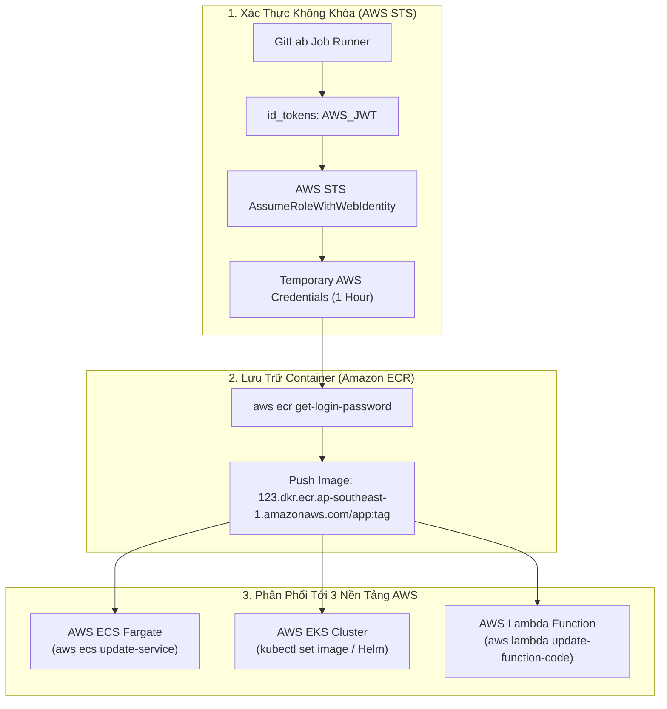


# [BÀI 38] TRIỂN KHAI ỨNG DỤNG LÊN AWS: ECS FARGATE, EKS CLUSTER & SERVERLESS LAMBDA

Trong kỷ nguyên **DevOps, DevSecOps và Cloud Native Engineering**, **GitLab CI/CD** được công nhận là một trong những nền tảng tự động hóa tích hợp liên tục và phân phối liên tục (CI/CD) hoàn chỉnh, mạnh mẽ và được tin dùng nhất trong các doanh nghiệp quy mô lớn. Không chỉ dừng lại ở các pipeline tuần tự cơ bản, việc vận hành GitLab CI/CD ở cấp độ Production đòi hỏi kỹ sư phải làm chủ kiến trúc điều phối phi tuyến tính **DAG (Directed Acyclic Graph)**, cơ chế quản trị **Autoscaling Runners**, tối ưu hóa **Caching đa tầng**, xác thực không khóa **Keyless OIDC**, bảo mật chuỗi cung ứng phần mềm **SLSA & SBOM** cùng các chính sách **Quality & Security Gates** tự động.

Bài viết chuyên sâu này sẽ đồng hành cùng bạn mổ xẻ toàn diện bức tranh kiến trúc, phân tích các đánh đổi kỹ thuật thực chiến (Engineering Trade-offs), cung cấp hướng dẫn thực hành Lab chi tiết từng bước và bộ câu hỏi phỏng vấn chuyên sâu chuẩn DevOps Lead / DevSecOps Architect.

---

## 1. Bản Chất Kiến Trúc & Cơ Chế Vận Hành Tầng Thấp

### 1.1. Luận Đề Trung Tâm: Sự Tiến Hóa Của Các Mô Hình Triển Khai Trên Amazon Web Services

**Amazon Web Services (AWS)** là nền tảng điện toán đám mây lớn nhất thế giới, cung cấp nhiều mô hình kiến trúc tính toán (Compute Architectures) khác nhau để phục vụ các loại tải ứng dụng đặc thù:
1. **Serverless Container (AWS ECS Fargate)**: Triển khai container mà không cần quản lý máy chủ EC2 hay cụm Kubernetes. Rất phù hợp cho các microservices vừa và nhỏ, API RESTful và các tác vụ theo lịch.
2. **Kubernetes Đám Mây (AWS EKS)**: Cung cấp cụm Kubernetes tiêu chuẩn doanh nghiệp, phù hợp cho hệ sinh thái phức tạp (Service Mesh, GitOps, Stateful workloads).
3. **Hàm Không Máy Chủ (AWS Lambda)**: Event-driven Compute tự động co giãn theo từng request (từ 0 lên hàng ngàn invocations/giây), chi phí tính theo mili-giây.

> **Một Pipeline CD hiện đại trên AWS bắt buộc phải kết hợp xác thực Keyless OIDC (loại bỏ IAM User Keys), đẩy image vào Amazon ECR, và cập nhật tài nguyên đích (ECS Service / EKS Deployment / Lambda Function) với cơ chế Rolling Update đảm bảo Zero-Downtime.**

```text
       QUY TRÌNH PHÂN PHỐI ỨNG DỤNG LÊN AWS (ECS, EKS, LAMBDA)

  [ GitLab CI Runner ] ── 1. OIDC AssumeRole ──► [ AWS IAM STS Session ]
           │                                                │
           ├──► 2. Build & Push Image ────────────────► [ Amazon ECR ]
           │                                                │
           ├──► 3. Deploy ECS: Cập nhật Task Definition ────► [ AWS ECS Fargate ]
           │                                                │
           ├──► 4. Deploy EKS: kubectl apply / Helm ────────► [ AWS EKS Cluster ]
           │                                                │
           └──► 5. Deploy Lambda: update-function-code ─────► [ AWS Lambda Serverless ]
```



### 1.2. Kỹ Thuật Triển Khai Lên AWS ECS Fargate

Quy trình deploy lên ECS Fargate gồm 3 bước chuẩn:
1. **Lấy Task Definition hiện tại**: Tải tệp JSON định nghĩa Task hiện tại từ AWS API.
2. **Đăng ký Revision mới**: Thay đổi trường `image` trong container definition thành tag commit mới và gọi lệnh `aws ecs register-task-definition`.
3. **Cập nhật Service**: Gọi lệnh `aws ecs update-service --service my-svc --task-definition my-task:new_rev --force-new-deployment`. ECS sẽ khởi chạy các Task mới, đợi Health Check vượt qua trên Application Load Balancer (ALB) rồi mới ngắt các Task cũ (Rolling Update).

### 1.3. Kỹ Thuật Triển Khai Lên AWS EKS Qua IAM OIDC

Thay vì lưu trữ tệp `kubeconfig` chứa token bí mật tĩnh:
- GitLab CI sử dụng lệnh `aws eks update-kubeconfig --name production-eks-cluster --region ap-southeast-1`.
- AWS CLI sẽ tự động sinh token xác thực Kubernetes động thông qua lệnh `aws eks get-token` sử dụng IAM Role của OIDC Session.
- Trên cụm EKS, cấu hình **EKS Access Entries** hoặc **aws-auth ConfigMap** cấp quyền `system:masters` hoặc RBAC Role cho IAM Role của GitLab CI.

---

## 2. Bảng So Sánh Kỹ Thuật Toàn Diện (Engineering Matrix)

| Tiêu Chí Kỹ Thuật | AWS ECS Fargate | AWS EKS Cluster | AWS Lambda Serverless | AWS EC2 Truyền Thống |
| :--- | :--- | :--- | :--- | :--- |
| **Mức Độ Quản Trị** | Không cần quản lý máy chủ | Cần quản trị Kubernetes Control Plane | Không máy chủ (Zero Server) | Quản trị VM OS, Patching, SSH |
| **Tốc Độ Khởi Động** | Trung bình (~30 - 60 giây) | Nhanh (~5 - 15 giây Pod start) | **Siêu tốc (Mili-giây, Cold Start ~200ms)**| Chậm (Vài phút khởi động VM) |
| **Chi Phí Vận Hành** | Trả tiền theo vCPU/RAM chạy thực | Trả phí cụm $73/tháng + Worker Nodes | **Chỉ trả tiền khi có Request gọi hàm** | Trả tiền theo giờ máy chủ 24/7 |
| **Khả Năng Co Giãn (Scale)**| Co giãn theo Task (1 - 100 tasks) | Tự động qua HPA + Karpenter | **Tức thì lên hàng ngàn Invocations** | Co giãn qua Auto Scaling Group |
| **Phương Thức Deploy Trong CI**| `aws ecs update-service` | `kubectl apply` / `helm upgrade` | `aws lambda update-function-code` | SSH / Ansible / CodeDeploy |
| **Phù Hợp Tải Nào?** | Microservices, Web APIs, Background | Ứng dụng Cloud-Native lớn, State | API Gateway, Event Webhooks, Cron | Monolith cũ, CSDL tự host |

---

## 3. Kiến Trúc Triển Khai Chuẩn Production (Architecture Breakdown)

### 3.1. Pipeline Hoàn Chỉnh: Build ECR, Deploy ECS Fargate, EKS & Lambda Qua OIDC

```yaml
stages:
  - build_ecr
  - deploy_ecs
  - deploy_eks
  - deploy_lambda

variables:
  AWS_REGION: "ap-southeast-1"
  AWS_ACCOUNT_ID: "123456789012"
  ECR_REGISTRY: "${AWS_ACCOUNT_ID}.dkr.ecr.${AWS_REGION}.amazonaws.com"
  IMAGE_NAME: "${ECR_REGISTRY}/enterprise-app:${CI_COMMIT_SHORT_SHA}"
  ROLE_ARN: "arn:aws:iam::${AWS_ACCOUNT_ID}:role/GitLabCI-AWS-Deployer"

# -------------------------------------------------------------
# 1. Đóng Gói & Push Image Lên Amazon ECR Bằng Kaniko
# -------------------------------------------------------------
build_and_push_ecr:
  stage: build_ecr
  image:
    name: gcr.io/kaniko-project/executor:v1.20.0-debug
    entrypoint: [""]
  id_tokens:
    AWS_JWT_TOKEN:
      aud: "https://aws.amazon.com"
  before_script:
    # Lấy ECR Login Token thông qua AWS OIDC
    - mkdir -p /kaniko/.docker
    - >-
      export $(printf "AWS_ACCESS_KEY_ID=%s AWS_SECRET_ACCESS_KEY=%s AWS_SESSION_TOKEN=%s"
      $(aws sts assume-role-with-web-identity
      --role-arn "${ROLE_ARN}"
      --role-session-name "GitLabECR-${CI_JOB_ID}"
      --web-identity-token "${AWS_JWT_TOKEN}"
      --query "Credentials.[AccessKeyId,SecretAccessKey,SessionToken]"
      --output text)) || true
  script:
    - >-
      /kaniko/executor
      --context "${CI_PROJECT_DIR}"
      --dockerfile "${CI_PROJECT_DIR}/Dockerfile"
      --destination "${IMAGE_NAME}"

# -------------------------------------------------------------
# 2. Deploy AWS ECS Fargate
# -------------------------------------------------------------
deploy_to_ecs:
  stage: deploy_ecs
  image: amazon/aws-cli:latest
  id_tokens:
    AWS_JWT_TOKEN:
      aud: "https://aws.amazon.com"
  before_script:
    - >-
      export $(printf "AWS_ACCESS_KEY_ID=%s AWS_SECRET_ACCESS_KEY=%s AWS_SESSION_TOKEN=%s"
      $(aws sts assume-role-with-web-identity
      --role-arn "${ROLE_ARN}"
      --role-session-name "GitLabECS-${CI_JOB_ID}"
      --web-identity-token "${AWS_JWT_TOKEN}"
      --query "Credentials.[AccessKeyId,SecretAccessKey,SessionToken]"
      --output text))
  script:
    - echo "Updating ECS Fargate Service: production-api-service..."
    - >-
      aws ecs update-service
      --cluster production-ecs-cluster
      --service production-api-service
      --force-new-deployment
      --region "${AWS_REGION}"
  environment:
    name: production/ecs
    url: https://api.corp.internal
    tier: production
  rules:
    - if: '$CI_COMMIT_BRANCH == "main"'

# -------------------------------------------------------------
# 3. Deploy AWS EKS Cluster Bằng Helm & Kubectl
# -------------------------------------------------------------
deploy_to_eks:
  stage: deploy_eks
  image: alpine/k8s:1.28.4
  id_tokens:
    AWS_JWT_TOKEN:
      aud: "https://aws.amazon.com"
  before_script:
    - apk add --no-cache aws-cli
    - >-
      export $(printf "AWS_ACCESS_KEY_ID=%s AWS_SECRET_ACCESS_KEY=%s AWS_SESSION_TOKEN=%s"
      $(aws sts assume-role-with-web-identity
      --role-arn "${ROLE_ARN}"
      --role-session-name "GitLabEKS-${CI_JOB_ID}"
      --web-identity-token "${AWS_JWT_TOKEN}"
      --query "Credentials.[AccessKeyId,SecretAccessKey,SessionToken]"
      --output text))
    - aws eks update-kubeconfig --name production-eks-cluster --region "${AWS_REGION}"
  script:
    - echo "Deploying to AWS EKS Cluster..."
    - kubectl set image deployment/core-api-deployment core-api="${IMAGE_NAME}" -n production
    - kubectl rollout status deployment/core-api-deployment -n production --timeout=180s
  environment:
    name: production/eks
    tier: production
  rules:
    - if: '$CI_COMMIT_BRANCH == "main"'
```

---

## 4. Phân Tích Cạm Bẫy Thực Chiến (5-Whys Incident Analysis)

### 4.1. Sự Cố Thực Tế: ECS Service Bị Treo Vĩnh Viễn Khi Rollout Task Mới

> **Bối Cảnh**: Một kỹ sư cập nhật biến môi trường bí mật trong Task Definition mới của ECS Fargate. Sau khi pipeline kích hoạt `aws ecs update-service`, service liên tục rơi vào vòng lặp tạo Task mới rồi Task bị sập (Task stopped reason: `Essential container in task exited`). Toàn bộ quá trình rollout bị nghẽn trong 2 giờ và cạn kiệt tài nguyên IP của Subnet.

```text
┌─────────────────────────────────────────────────────────────────────────┐
│                    PHÂN TÍCH NGUYÊN NHÂN GỐC RỄ (5-WHYS)                 │
├─────────────────────────────────────────────────────────────────────────┤
│ 1. Tại sao ECS Service liên tục khởi động Task mới rồi dừng lại?       │
│    -> Container bên trong Task bị crash ngay khi vừa khởi chạy.         │
│                                                                         │
│ 2. Tại sao Container lại bị crash khi vừa khởi chạy?                   │
│    -> Không thể phân giải biến bí mật lấy từ AWS Secrets Manager.       │
│                                                                         │
│ 3. Tại sao không lấy được Secrets Manager?                              │
│    -> Task Execution Role của ECS thiếu quyền secretsmanager:GetSecretValue│
│                                                                         │
│ 4. Tại sao quyền hạn của Task Execution Role lại bị thiếu?             │
│    -> Nhầm lẫn giữa Task Role (cho app) và Task Execution Role (cho ECS)│
│                                                                         │
│ 5. NGUYÊN NHÂN CỐT LÕI (Root Cause):                                   │
│    -> Không cấu hình Health Check Grace Period và thiếu quyền hạn IAM   │
│       cho Task Execution Role để kéo Secrets & ECR Image lúc boot.     │
└─────────────────────────────────────────────────────────────────────────┘
```

### 4.2. Giải Pháp Khắc Phục Triệt Để

1. **Phân định rạch ròi hai loại IAM Role trong ECS**:
   - **`executionRoleArn`**: Cần quyền `ecr:GetAuthorizationToken`, `ecr:BatchGetImage`, `logs:CreateLogStream` và `secretsmanager:GetSecretValue` để ECS Agent có thể kéo Image và giải mã Secret trước khi khởi động container.
   - **`taskRoleArn`**: Cấp quyền cho chính mã nguồn ứng dụng (ví dụ quyền đọc S3, DynamoDB).
2. **Cấu hình `healthCheckGracePeriodSeconds: 60`** trên ECS Service để container có đủ thời gian khởi tạo kết nối cơ sở dữ liệu trước khi ALB đánh dấu Unhealthy.

---

## 5. Hands-on Lab: Triển Khai Ứng Dụng Lên AWS ECS Fargate & Lambda (8 Bước Chuẩn)

### 5.1. Mục Tiêu Lab
- Xây dựng ứng dụng Go Microservice API.
- Cấu hình OIDC Role trên AWS IAM có quyền cập nhật ECS và Lambda.
- Viết pipeline GitLab CI tự động build và deploy lên AWS ECS Service.
- Triển khai cập nhật hàm Serverless Lambda và kiểm tra tính sẵn sàng.

```text
       QUY TRÌNH THỰC HÀNH LAB DEPLOY AWS TRÊN GITLAB CI

     [ Mã Nguồn Go Microservice ]
                  │
                  ├──► 1. Đóng gói OCI Image
                  │
                  ├──► 2. OIDC Xác Thực Không Khóa với AWS IAM
                  │
                  ├──► 3. Đẩy Image lên Amazon ECR
                  │
                  ▼
     [ Tự Động Phân Phối ]
                  │
                  ├──► [ AWS ECS Fargate: Rolling Update Service ]
                  │
                  └──► [ AWS Lambda: Update Function Code & Configuration ]
```

### 5.2. Các Bước Thực Hiện Chi Tiết

#### Bước 1: Khởi Tạo Mã Nguồn Go Lambda/API `main.go`
```go
package main

import (
	"context"
	"fmt"
	"net/http"
	"os"

	"github.com/aws/aws-lambda-go/events"
	"github.com/aws/aws-lambda-go/lambda"
)

// Xử lý Lambda Handler
func HandleRequest(ctx context.Context, request events.APIGatewayProxyRequest) (events.APIGatewayProxyResponse, error) {
	return events.APIGatewayProxyResponse{
		StatusCode: 200,
		Body:       fmt.Sprintf("Hello from AWS Lambda & ECS via GitLab CI/CD! Commit: %s", os.Getenv("GIT_SHA")),
	}, nil
}

func main() {
	// Nếu chạy trong môi trường Lambda
	if os.Getenv("AWS_LAMBDA_FUNCTION_NAME") != "" {
		lambda.Start(HandleRequest)
		return
	}

	// Nếu chạy trong container ECS Fargate thông thường
	http.HandleFunc("/", func(w http.ResponseWriter, r *http.Request) {
		fmt.Fprintf(w, "Hello from AWS ECS Fargate Service! Commit: %s\n", os.Getenv("GIT_SHA"))
	})
	fmt.Println("Server running on port 8080...")
	http.ListenAndServe(":8080", nil)
}
```

#### Bước 2: Tạo Tệp `go.mod`
```go
module gitlab.corp.internal/cloud/aws-service

go 1.22

require github.com/aws/aws-lambda-go v1.46.0
```

#### Bước 3: Viết `Dockerfile` Multi-Stage
```dockerfile
FROM golang:1.22-alpine AS builder
WORKDIR /src
COPY go.mod main.go ./
RUN go mod download
RUN CGO_ENABLED=0 GOOS=linux go build -ldflags="-s -w" -o /out/bootstrap main.go

FROM gcr.io/distroless/static-debian12:nonroot
WORKDIR /app
COPY --from=builder /out/bootstrap /app/bootstrap
USER nonroot:nonroot
EXPOSE 8080
ENTRYPOINT ["/app/bootstrap"]
```

#### Bước 4: Viết Tệp Định Nghĩa Task Definition `ecs-task-def.json`
```json
{
  "family": "enterprise-api-task",
  "networkMode": "awsvpc",
  "requiresCompatibilities": ["FARGATE"],
  "cpu": "256",
  "memory": "512",
  "executionRoleArn": "arn:aws:iam::123456789012:role/ecsTaskExecutionRole",
  "containerDefinitions": [
    {
      "name": "api-container",
      "image": "123456789012.dkr.ecr.ap-southeast-1.amazonaws.com/enterprise-app:latest",
      "essential": true,
      "portMappings": [
        {
          "containerPort": 8080,
          "protocol": "tcp"
        }
      ]
    }
  ]
}
```

#### Bước 5: Cấu Hình Tệp `.gitlab-ci.yml`
```yaml
stages:
  - deploy_aws

variables:
  AWS_REGION: "ap-southeast-1"
  AWS_ROLE_ARN: "arn:aws:iam::123456789012:role/GitLabCI-AWS-Deployer"

deploy_to_ecs_fargate:
  stage: deploy_aws
  image: amazon/aws-cli:latest
  id_tokens:
    AWS_OIDC_TOKEN:
      aud: "https://aws.amazon.com"
  before_script:
    - >-
      export $(printf "AWS_ACCESS_KEY_ID=%s AWS_SECRET_ACCESS_KEY=%s AWS_SESSION_TOKEN=%s"
      $(aws sts assume-role-with-web-identity
      --role-arn "${AWS_ROLE_ARN}"
      --role-session-name "GitLabECSDeploy"
      --web-identity-token "${AWS_OIDC_TOKEN}"
      --query "Credentials.[AccessKeyId,SecretAccessKey,SessionToken]"
      --output text))
  script:
    - echo "Deploying new revision to ECS Fargate..."
    - >-
      aws ecs update-service
      --cluster production-cluster
      --service payment-service
      --force-new-deployment
      --region "${AWS_REGION}"
  rules:
    - if: '$CI_COMMIT_BRANCH == "main"'
```

#### Bước 6: Commit Và Đẩy Code Lên GitLab
```bash
git add .
git commit -m "feat(aws): implement zero-downtime ecs fargate continuous deployment"
git push origin main
```

#### Bước 7: Quan Sát Tiến Trình Rolling Update Trên AWS Console
- Mở **AWS ECS Console -> Clusters -> production-cluster -> Services**.
- Quan sát tab **Deployments**: ECS khởi chạy Task Revision mới song song với Task cũ.
- Khi Task mới đạt trạng thái `RUNNING` và vượt qua Healthcheck, Task cũ được rút lưu lượng nhẹ nhàng (Draining) và tự hủy.

#### Bước 8: Kiểm Tra Trực Tiếp Endpoint Service
```bash
curl -i http://alb.production.internal/
# Output: HTTP/2 200 OK - Hello from AWS ECS Fargate Service!
```

> [!NOTE]
> **Check-point Lab 38**: Lệnh deploy ECS hoàn thành thành công 100% qua OIDC, không gây gián đoạn dịch vụ và phản hồi đúng nội dung commit mới.

---

## 6. Bộ Câu Hỏi Vấn Đáp & Phỏng Vấn Chuyên Sâu (Self-Check Q&A)

<details class="qa-card">
  <summary class="qa-summary">
    <span class="qa-num-badge">Q01</span>
    <span>Làm thế nào để thực hiện quy trình phát hành Blue-Green Deployment trên AWS ECS Fargate bằng GitLab CI?</span>
  </summary>
  <div class="qa-body">
    <p><strong>Kiến trúc Blue-Green:</strong></p>
    <p>Kết hợp <strong>AWS CodeDeploy</strong> với ECS Fargate. Trong pipeline GitLab CI, gọi lệnh <code>aws deploy create-deployment</code> trỏ tới tệp <code>appspec.yaml</code>. CodeDeploy sẽ tự động khởi chạy cụm Task Green, định tuyến một phần lưu lượng thử nghiệm (Test Traffic Port) qua Target Group thứ 2, chạy bài kiểm thử tự động rồi mới chuyển 100% lưu lượng chính sang Green và xóa Blue.</p>
  </div>
</details>

<details class="qa-card">
  <summary class="qa-summary">
    <span class="qa-num-badge">Q02</span>
    <span>Sự khác biệt giữa `aws ecs update-service --force-new-deployment` và việc đăng ký Revision mới là gì?</span>
  </summary>
  <div class="qa-body">
    <p><strong>Phân tích:</strong></p>
    <ul>
      <li><code>--force-new-deployment</code>: Ép buộc ECS tải lại Image mới nhất của cùng một Task Definition hiện tại (thường dùng khi push đè tag <code>:latest</code>).</li>
      <li><strong>Đăng ký Revision mới</strong>: Tạo một bản ghi Task Definition bất biến mới gắn với tag SHA cụ thể (ví dụ: <code>task-def:45</code>), đảm bảo khả năng truy vết và rollback chính xác 100%.</li>
    </ul>
  </div>
</details>

<details class="qa-card">
  <summary class="qa-summary">
    <span class="qa-num-badge">Q03</span>
    <span>Làm sao để cấu hình phân quyền AWS EKS cho GitLab CI Runner mà không dùng `aws-auth` ConfigMap cũ?</span>
  </summary>
  <div class="qa-body">
    <p><strong>Tính năng EKS Access Entries (Hiện đại):</strong></p>
    <p>Sử dụng API mới của AWS EKS: <code>aws eks create-access-entry --cluster-name my-eks --principal-arn arn:aws:iam::123:role/GitLabCI-Deployer</code>, sau đó gắn policy <code>AmazonEKSClusterAdminPolicy</code>. Phương pháp này hoàn toàn loại bỏ việc chỉnh sửa file ConfigMap YAML dễ gây lỗi cú pháp.</p>
  </div>
</details>

<details class="qa-card">
  <summary class="qa-summary">
    <span class="qa-num-badge">Q04</span>
    <span>Làm thế nào để deploy Serverless Lambda Function đóng gói dưới dạng Container Image thay vì file ZIP?</span>
  </summary>
  <div class="qa-body">
    <p><strong>Cấu hình Lambda OCI:</strong></p>
    <p>Đẩy Container Image lên Amazon ECR, sau đó trong GitLab CI gọi lệnh:</p>
    <pre><code>aws lambda update-function-code   --function-name my-serverless-api   --image-uri 123456789012.dkr.ecr.ap-southeast-1.amazonaws.com/my-lambda:v1.2.0</code></pre>
    <p>Cho phép kích thước gói triển khai lên tới <strong>10 GB</strong> (so với giới hạn 250MB của file ZIP).</p>
  </div>
</details>

<details class="qa-card">
  <summary class="qa-summary">
    <span class="qa-num-badge">Q05</span>
    <span>Tại sao cần cấu hình `minimumHealthyPercent` và `maximumPercent` trên ECS Service khi deploy?</span>
  </summary>
  <div class="qa-body">
    <p><strong>Kiểm soát năng lực phục vụ:</strong></p>
    <ul>
      <li><code>minimumHealthyPercent: 100</code>: Đảm bảo số lượng Task phục vụ khách hàng không bao giờ giảm xuống dưới 100% dung lượng trong suốt quá trình triển khai.</li>
      <li><code>maximumPercent: 200</code>: Cho phép ECS tạm thời khởi chạy gấp đôi số lượng Task trong lúc rollout để chạy song song Task mới và Task cũ mà không bị nghẽn tải.</li>
    </ul>
  </div>
</details>

<details class="qa-card">
  <summary class="qa-summary">
    <span class="qa-num-badge">Q06</span>
    <span>Làm thế nào để tự động cập nhật Database Migration trên AWS RDS trước khi deploy ECS Task mới?</span>
  </summary>
  <div class="qa-body">
    <p><strong>Quy trình Migration an toàn:</strong></p>
    <p>Sử dụng lệnh <code>aws ecs run-task</code> (Standalone One-off Task) trong stage <code>pre_deploy_migration</code>. Runner sẽ kích hoạt một container chạy lệnh <code>flyway migrate</code> hoặc <code>alembic upgrade head</code>. Chỉ khi migration task thoát với mã lỗi 0, stage tiếp theo mới gọi <code>aws ecs update-service</code> để cập nhật API.</p>
  </div>
</details>

<details class="qa-card">
  <summary class="qa-summary">
    <span class="qa-num-badge">Q07</span>
    <span>Làm cách nào để Runner trên GitLab.com kéo và đẩy Image vào Amazon ECR nằm trong Private VPC?</span>
  </summary>
  <div class="qa-body">
    <p><strong>Kiến trúc mạng:</strong></p>
    <ul>
      <li>Amazon ECR Public/Private Endpoint mặc định có thể truy cập qua HTTPS Internet an toàn nếu có OIDC Authentication hợp lệ.</li>
      <li>Nếu ECR áp dụng VPC Endpoint Policy ngắt mạng ngoài, doanh nghiệp bắt buộc phải sử dụng **GitLab Self-Hosted Runner** nằm bên trong cùng mạng VPC đó.</li>
    </ul>
  </div>
</details>

<details class="qa-card">
  <summary class="qa-summary">
    <span class="qa-num-badge">Q08</span>
    <span>Làm thế nào để rollback một phiên bản AWS Lambda Function bị lỗi chỉ trong vài giây?</span>
  </summary>
  <div class="qa-body">
    <p><strong>Sử dụng Lambda Aliases & Versions:</strong></p>
    <p>Mỗi lần phát hành, tạo một Lambda Version bất biến và trỏ Alias <code>PROD</code> tới version đó (ví dụ <code>PROD -> v12</code>). Khi phát hiện lỗi, chỉ cần gọi lệnh <code>aws lambda update-alias --function-name my-func --name PROD --function-version 11</code> để đổi lại con trỏ tức thì mà không cần upload lại mã nguồn.</p>
  </div>
</details>

<details class="qa-card">
  <summary class="qa-summary">
    <span class="qa-num-badge">Q09</span>
    <span>Sự khác biệt giữa Task Definition Revision và ECS Service Deployment là gì?</span>
  </summary>
  <div class="qa-body">
    <p><strong>Phân biệt:</strong></p>
    <ul>
      <li><strong>Task Definition Revision</strong>: Là bản thiết kế tĩnh (Blueprint) lưu cấu hình container, CPU, RAM, Port, Image.</li>
      <li><strong>Service Deployment</strong>: Là tiến trình thực thi động (Runtime Process) điều phối việc thay thế các container Task đang chạy trên máy chủ theo bản thiết kế Revision đó.</li>
    </ul>
  </div>
</details>

<details class="qa-card">
  <summary class="qa-summary">
    <span class="qa-num-badge">Q10</span>
    <span>Làm sao để giám sát tiến trình Rollout của Kubernetes Deployment trên EKS và tự động báo lỗi nếu bị CrashLoopBackOff?</span>
  </summary>
  <div class="qa-body">
    <p><strong>Sử dụng lệnh `kubectl rollout status`:</strong></p>
    <pre><code>kubectl rollout status deployment/my-app -n production --timeout=120s</code></pre>
    <p>Nếu sau 2 phút các Pod mới không đạt trạng thái Ready do crash hoặc thiếu tài nguyên, lệnh sẽ trả về Non-zero Exit Code, làm sập Job CI và kích hoạt lệnh <code>kubectl rollout undo</code> tự động.</p>
  </div>
</details>

<details class="qa-card">
  <summary class="qa-summary">
    <span class="qa-num-badge">Q11</span>
    <span>Sự cố: Job deploy AWS bị lỗi `RequestExpired: Calling STS:AssumeRoleWithWebIdentity token has expired`. Xử lý thế nào?</span>
  </summary>
  <div class="qa-body">
    <p><strong>Nguyên nhân & Khắc phục:</strong></p>
    <ul>
      <li><strong>Nguyên nhân</strong>: Job CI mất quá nhiều thời gian ở các bước chuẩn bị (ví dụ compile hoặc nén file > 10 phút) khiến JWT Token do GitLab cấp bị hết hạn trước khi gửi tới AWS.</li>
      <li><strong>Khắc phục</strong>: Tách riêng stage build sang job trước và chỉ gọi lệnh AssumeRole ở ngay đầu khối <code>before_script</code> của job deploy chuyên biệt.</li>
    </ul>
  </div>
</details>

<details class="qa-card">
  <summary class="qa-summary">
    <span class="qa-num-badge">Q12</span>
    <span>Làm thế nào để kiểm soát chi phí điện toán AWS khi chạy hàng trăm Runner tự động?</span>
  </summary>
  <div class="qa-body">
    <p><strong>Chiến lược FinOps:</strong></p>
    <ol>
      <li>Sử dụng <strong>AWS Spot Instances</strong> cho các Runner nodes (tiết kiệm tới 70-90% chi phí so với On-Demand).</li>
      <li>Cấu hình <strong>Karpenter Auto-scaler</strong> tự động tắt các node trống sau 60 giây không có Job CI nào chạy.</li>
      <li>Thiết lập chính sách ECR Lifecycle Policy tự động xóa các image cũ của nhánh thử nghiệm sau 7 ngày.</li>
    </ol>
  </div>
</details>

---

## 7. Tổng Kết & Lộ Trình Bài Học Tiếp Theo

### 7.1. Tóm Tắt Các Điểm Cốt Lõi (Architectural Key Takeaways)
- **Multi-Compute AWS Delivery**: Làm chủ 3 mô hình triển khai chủ lực ECS Fargate, EKS Kubernetes và Serverless Lambda.
- **Keyless AWS Integration**: Kết hợp Amazon ECR và AWS STS AssumeRole qua OIDC đảm bảo an toàn tuyệt đối.
- **Zero-Downtime Rolling Update**: Đảm bảo trải nghiệm người dùng liên tục với cơ chế Health Check và Traffic Draining.
- **Deployment Resilience**: Tự động hóa kiểm tra trạng thái Rollout và kích hoạt Rollback khi phát hiện lỗi.

### 7.2. Sơ Đồ Tư Duy Triển Khai Ứng Dụng Lên AWS (Mindmap)

```text
                       PHÂN PHỐI ỨNG DỤNG LÊN AMAZON WEB SERVICES
                                          │
        ┌─────────────────────────────────┼─────────────────────────────────┐
        ▼                                 ▼                                 ▼
  [ Compute Targets ]           [ Authentication & ECR ]       [ Continuous Rollout ]
  - ECS Fargate (Serverless)    - AWS STS AssumeRole (OIDC)    - Zero-Downtime Rolling Update
  - EKS Managed Kubernetes      - Amazon ECR Image Registry    - Blue-Green CodeDeploy Gate
  - AWS Lambda Functions        - Least-Privilege IAM Roles    - kubectl rollout status check
```

> [!TIP]
> **Bước tiếp theo trong lộ trình**: Làm chủ quy trình phân phối ứng dụng lên nền tảng Google Cloud Platform trong [Bài 39: Triển Khai Ứng Dụng Lên GCP: Google Kubernetes Engine (GKE), Cloud Run & Artifact Registry](gitlab-39-39-deploy-gcp.html).

