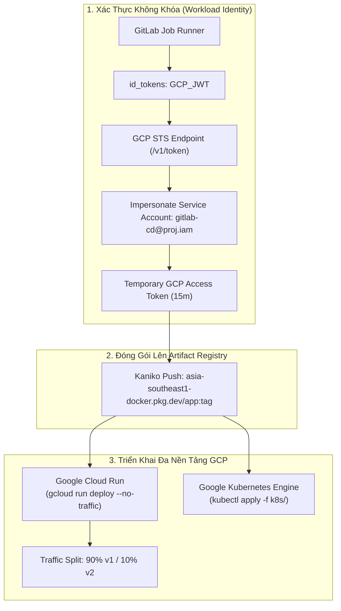


# [BÀI 39] TRIỂN KHAI ỨNG DỤNG LÊN GCP: GOOGLE KUBERNETES ENGINE (GKE), CLOUD RUN & ARTIFACT REGISTRY

Trong kỷ nguyên **DevOps, DevSecOps và Cloud Native Engineering**, **GitLab CI/CD** được công nhận là một trong những nền tảng tự động hóa tích hợp liên tục và phân phối liên tục (CI/CD) hoàn chỉnh, mạnh mẽ và được tin dùng nhất trong các doanh nghiệp quy mô lớn. Không chỉ dừng lại ở các pipeline tuần tự cơ bản, việc vận hành GitLab CI/CD ở cấp độ Production đòi hỏi kỹ sư phải làm chủ kiến trúc điều phối phi tuyến tính **DAG (Directed Acyclic Graph)**, cơ chế quản trị **Autoscaling Runners**, tối ưu hóa **Caching đa tầng**, xác thực không khóa **Keyless OIDC**, bảo mật chuỗi cung ứng phần mềm **SLSA & SBOM** cùng các chính sách **Quality & Security Gates** tự động.

Bài viết chuyên sâu này sẽ đồng hành cùng bạn mổ xẻ toàn diện bức tranh kiến trúc, phân tích các đánh đổi kỹ thuật thực chiến (Engineering Trade-offs), cung cấp hướng dẫn thực hành Lab chi tiết từng bước và bộ câu hỏi phỏng vấn chuyên sâu chuẩn DevOps Lead / DevSecOps Architect.

---

## 1. Bản Chất Kiến Trúc & Cơ Chế Vận Hành Tầng Thấp

### 1.1. Luận Đề Trung Tâm: Sự Vượt Trội Của Hệ Sinh Thái Cloud-Native Trên Google Cloud Platform

**Google Cloud Platform (GCP)** là cái nôi khai sinh ra Kubernetes, Knative và Borg. Hệ sinh thái tính toán của GCP được thiết kế tối ưu hóa đặc biệt cho các tải Container và Serverless hiện đại:
1. **Google Cloud Run**: Dịch vụ Serverless Container số một hiện nay, cho phép chạy bất kỳ OCI Container nào với cơ chế Scale-to-Zero, khởi động trong vài trăm mili-giây và hỗ trợ tính năng **Traffic Splitting (Phân chia lưu lượng mạng theo tỷ lệ %)** chỉ bằng một câu lệnh.
2. **Google Kubernetes Engine (GKE Autopilot / Standard)**: Cụm Kubernetes được quản lý tự động hoàn toàn (Auto-repair, Auto-upgrade, Workload-optimized scaling).
3. **Google Artifact Registry (GAR)**: Kho lưu trữ nhị phân và OCI thế hệ mới thay thế Container Registry cũ, hỗ trợ quét lỗ hổng Vulnerability Scanning tự động.

> **Một Pipeline CD chuẩn mực trên GCP kết hợp Workload Identity Federation (loại bỏ hoàn toàn tệp khóa JSON nguy hiểm), nạp image vào Artifact Registry, và thực thi chiến lược Canary Deployment mượt mà trên Cloud Run hoặc GKE.**

```
       QUY TRÌNH PHÂN PHỐI ỨNG DỤNG LÊN GOOGLE CLOUD (GCP)

  [ GitLab CI Runner ] ── 1. Workload Identity Federation ──► [ GCP STS OAuth2 Session ]
           │                                                            │
           ├──► 2. Build & Push Image ────────────────────────► [ Google Artifact Registry ]
           │                                                            │
           ├──► 3. Deploy Cloud Run: Traffic Splitting (90/10) ────────► [ Google Cloud Run ]
           │                                                            │
           └──► 4. Deploy GKE: gcloud container clusters get-credentials ─► [ GKE Autopilot ]
```



### 1.2. Cơ Chế Phân Chia Lưu Lượng (Traffic Splitting) Trên Cloud Run

Khác với các nền tảng khác đòi hỏi cấu hình Service Mesh hoặc Ingress Controller phức tạp, Google Cloud Run hỗ trợ tính năng **Revisions & Traffic Management Native**:
- Mỗi lần deploy mới, bạn có thể thêm cờ `--no-traffic` để tạo Revision mà không nhận khách hàng ngay.
- Chạy các bài kiểm tra Smoke Tests trên URL trực tiếp của Revision mới (`https://my-service-rev2-xxx.a.run.app`).
- Sau khi kiểm thử thành công, chuyển dần 10% lưu lượng sang Revision mới: `gcloud run services update-traffic my-service --to-revisions=v2=10,v1=90`.
- Nếu ổn định trong 15 phút, chuyển toàn bộ 100% sang `v2`. Nếu có lỗi, rollback về `v1=100` trong vòng **1 giây**!

### 1.3. Kết Nối An Toàn Tới GKE Autopilot Qua OIDC

Để kết nối tới cụm GKE mà không cần lưu chứng chỉ tĩnh:
1. Cấp quyền `roles/container.developer` cho GCP Service Account mà GitLab CI đang impersonate.
2. Trong CI Job, gọi lệnh:
   ```bash
   gcloud container clusters get-credentials production-gke --region asia-southeast1 --project my-project-id
   ```
3. Lệnh này sẽ tự động cấu hình `kubectl` sử dụng `gke-gcloud-auth-plugin`, đảm bảo mọi tương tác với Kubernetes API Server đều được xác thực động qua token tạm thời.

---

## 2. Bảng So Sánh Kỹ Thuật Toàn Diện (Engineering Matrix)

| Tiêu Chí Kỹ Thuật | Google Cloud Run (Serverless) | GKE Autopilot Cluster | GKE Standard Cluster | Google App Engine (Legacy) |
| :--- | :--- | :--- | :--- | :--- |
| **Mức Độ Quản Trị** | **Zero Management (Hoàn toàn Serverless)**| Không quản lý Nodes | Cần quản lý cấu hình Node Pool | Quản lý hạn chế |
| **Cơ Chế Tính Phí** | **Chính xác theo vCPU/GiB-giây lúc chạy** | Trả phí theo Pod requests thực | Trả phí toàn bộ Nodes cố định | Trả phí theo Instance |
| **Tốc Độ Khởi Động** | **Siêu tốc (Scale-to-Zero -> 100ms boot)**| Nhanh (~10 giây) | Nhanh (~10 giây) | Chậm (Vài phút) |
| **Khả Năng Co Giãn** | Tự động từ 0 đến 1.000 containers | Tự động qua GKE Autoscaler | Cần cấu hình HPA & Cluster Autoscaler| Tự động cơ bản |
| **Traffic Splitting Native**| **Có sẵn 100% qua lệnh gcloud** | Cần Istio / Gateway API | Cần Istio / Ingress Nginx | Có hỗ trợ Traffic Split |
| **Hỗ Trợ Background Jobs**| Hỗ trợ qua Cloud Run Jobs | Rất mạnh qua Kubernetes Jobs | Rất mạnh qua Kubernetes Jobs | Kém |
| **Khuyến Nghị Sử Dụng** | **Web APIs, Microservices, Event Handlers**| **Hệ thống lớn đa dịch vụ Cloud-Native**| Doanh nghiệp cần tùy biến Kernel/GPU| Không khuyến nghị dự án mới |

---

## 3. Kiến Trúc Triển Khai Chuẩn Production (Architecture Breakdown)

### 3.1. Pipeline Hoàn Chỉnh: Build Artifact Registry, Deploy Cloud Run Canary & GKE Qua OIDC

```yaml
stages:
  - build_image
  - deploy_cloud_run
  - verify_canary
  - promote_production

variables:
  GCP_PROJECT_ID: "enterprise-fintech-prod"
  GCP_REGION: "asia-southeast1"
  GAR_REPOSITORY: "asia-southeast1-docker.pkg.dev/${GCP_PROJECT_ID}/production-apps"
  IMAGE_TAG: "${GAR_REPOSITORY}/payment-api:${CI_COMMIT_SHORT_SHA}"
  WIF_PROVIDER: "projects/123456789/locations/global/workloadIdentityPools/gitlab-pool/providers/gitlab-provider"
  GCP_SERVICE_ACCOUNT: "gitlab-deployer@${GCP_PROJECT_ID}.iam.gserviceaccount.com"

# -------------------------------------------------------------
# 1. Đóng Gói & Đẩy Lên Google Artifact Registry Bằng Kaniko
# -------------------------------------------------------------
build_gar_image:
  stage: build_image
  image:
    name: gcr.io/kaniko-project/executor:v1.20.0-debug
    entrypoint: [""]
  id_tokens:
    GCP_JWT:
      aud: "https://iam.googleapis.com/${WIF_PROVIDER}"
  before_script:
    - mkdir -p /kaniko/.docker
    # Xác thực Artifact Registry thông qua Google OAuth Token
    - echo "${GCP_JWT}" > /tmp/jwt.json
  script:
    - >-
      /kaniko/executor
      --context "${CI_PROJECT_DIR}"
      --dockerfile "${CI_PROJECT_DIR}/Dockerfile"
      --destination "${IMAGE_TAG}"

# -------------------------------------------------------------
# 2. Deploy Cloud Run Revision Mới Không Nhận Khách (0% Traffic)
# -------------------------------------------------------------
deploy_canary_revision:
  stage: deploy_cloud_run
  image: google/cloud-sdk:alpine
  id_tokens:
    GCP_JWT:
      aud: "https://iam.googleapis.com/${WIF_PROVIDER}"
  before_script:
    - echo "${GCP_JWT}" > /tmp/jwt.json
    - >-
      gcloud auth login --cred-file=<(
      echo '{
        "type": "external_account",
        "audience": "//iam.googleapis.com/'"${WIF_PROVIDER}"'",
        "subject_token_type": "urn:ietf:params:oauth:token-type:jwt",
        "token_url": "https://sts.googleapis.com/v1/token",
        "credential_source": { "file": "/tmp/jwt.json" },
        "service_account_impersonation_url": "https://iamcredentials.googleapis.com/v1/projects/-/serviceAccounts/'"${GCP_SERVICE_ACCOUNT}"':generateAccessToken"
      }'
      )
    - gcloud config set project "${GCP_PROJECT_ID}"
  script:
    # 1. Deploy Revision mới với tag nhận dạng
    - >-
      gcloud run deploy payment-service
      --image="${IMAGE_TAG}"
      --region="${GCP_REGION}"
      --platform=managed
      --no-traffic
      --tag="canary-${CI_COMMIT_SHORT_SHA}"
    # 2. Định tuyến 10% lưu lượng thử nghiệm sang Canary
    - >-
      gcloud run services update-traffic payment-service
      --region="${GCP_REGION}"
      --to-tags="canary-${CI_COMMIT_SHORT_SHA}=10"
  environment:
    name: production/canary
    tier: production
  rules:
    - if: '$CI_COMMIT_BRANCH == "main"'

# -------------------------------------------------------------
# 3. Phê Duyệt Nâng 100% Lưu Lượng Production
# -------------------------------------------------------------
promote_to_100_percent:
  stage: promote_production
  image: google/cloud-sdk:alpine
  needs: ["deploy_canary_revision"]
  id_tokens:
    GCP_JWT:
      aud: "https://iam.googleapis.com/${WIF_PROVIDER}"
  before_script:
    - echo "${GCP_JWT}" > /tmp/jwt.json
    - >-
      gcloud auth login --cred-file=<(
      echo '{
        "type": "external_account",
        "audience": "//iam.googleapis.com/'"${WIF_PROVIDER}"'",
        "subject_token_type": "urn:ietf:params:oauth:token-type:jwt",
        "token_url": "https://sts.googleapis.com/v1/token",
        "credential_source": { "file": "/tmp/jwt.json" },
        "service_account_impersonation_url": "https://iamcredentials.googleapis.com/v1/projects/-/serviceAccounts/'"${GCP_SERVICE_ACCOUNT}"':generateAccessToken"
      }'
      )
    - gcloud config set project "${GCP_PROJECT_ID}"
  script:
    - echo "Promoting new revision to 100% Production Traffic..."
    - >-
      gcloud run services update-traffic payment-service
      --region="${GCP_REGION}"
      --to-latest
  environment:
    name: production
    url: https://payment.corp.internal
    tier: production
  rules:
    - if: '$CI_COMMIT_BRANCH == "main"'
      when: manual
```

---

## 4. Phân Tích Cạm Bẫy Thực Chiến (5-Whys Incident Analysis)

### 4.1. Sự Cố Thực Tế: Cloud Run Service Bị Lỗi 503 Service Unavailable Do Vượt Giới Hạn Kết Nối CSDL

> **Bối Cảnh**: Một ứng dụng Node.js được deploy lên Google Cloud Run. Vào thời điểm có đợt Flash Sale, Cloud Run tự động co giãn từ 5 containers lên **250 containers trong vòng 30 giây**. Hậu quả là 250 containers đồng loạt mở kết nối khiến máy chủ Cloud SQL PostgreSQL bị cạn kiệt Connection Pool và toàn bộ hệ thống trả về mã lỗi HTTP 503.

```
┌─────────────────────────────────────────────────────────────────────────┐
│                    PHÂN TÍCH NGUYÊN NHÂN GỐC RỄ (5-WHYS)                 │
├─────────────────────────────────────────────────────────────────────────┤
│ 1. Tại sao khách hàng nhận mã lỗi HTTP 503 từ Cloud Run?                │
│    -> Các container Cloud Run không thể kết nối tới Cloud SQL Postgres. │
│                                                                         │
│ 2. Tại sao Cloud SQL lại từ chối kết nối mới?                           │
│    -> Số lượng kết nối vượt quá ngưỡng tối đa max_connections = 200.    │
│                                                                         │
│ 3. Tại sao số lượng kết nối lại tăng vọt đột biến?                      │
│    -> Cloud Run tự động co giãn lên 250 instances không có giới hạn.    │
│                                                                         │
│ 4. Tại sao không có giới hạn số lượng instance tối đa?                  │
│    -> Lệnh deploy trong CI/CD không khai báo cờ --max-instances.        │
│                                                                         │
│ 5. NGUYÊN NHÂN CỐT LÕI (Root Cause):                                   │
│    -> Thiếu cấu hình trần co giãn (--max-instances) và không sử dụng   │
│       Cloud SQL Auth Proxy / Connection Pooling (PgBouncer) trung gian. │
└─────────────────────────────────────────────────────────────────────────┘
```

### 4.2. Giải Pháp Khắc Phục Triệt Để

1. **Đặt giới hạn số lượng container tối đa trong lệnh deploy**:
   ```bash
   gcloud run deploy my-service --max-instances=30 --concurrency=80
   ```
2. **Sử dụng Cloud SQL Auth Proxy tích hợp sẵn**: Cloud Run hỗ trợ kết nối trực tiếp qua Unix Domain Socket (`/cloudsql/PROJECT:REGION:INSTANCE`), tự động tối ưu hóa tài nguyên mạng.

---

## 5. Hands-on Lab: Triển Khai Cloud Run Canary Với Workload Identity (8 Bước Chuẩn)

### 5.1. Mục Tiêu Lab
- Xây dựng ứng dụng Go Microservice API hiển thị thông tin Revision.
- Cấu hình Workload Identity Pool trên GCP IAM.
- Viết pipeline GitLab CI tự động đóng gói và deploy lên Google Cloud Run.
- Thực hiện kiểm tra cơ chế phân chia lưu lượng Traffic Splitting 10% Canary và chuyển giao 100%.

```
       QUY TRÌNH THỰC HÀNH LAB DEPLOY GOOGLE CLOUD RUN CANARY

     [ Go Microservice ] ──► [ Build & Push to Artifact Registry ]
                                       │
                                       ▼
     [ Deploy Revision v1 ] ──► [ 100% Traffic Production ]
                                       │
     [ Commit Code v2 ]     ──► [ Deploy Revision v2 with tag canary ]
                                       │
                                       ▼
                               [ Traffic Split: 90% v1 / 10% v2 ]
                                       │
                                       ▼
                               [ Manual Gate: Promote 100% v2 ]
```

### 5.2. Các Bước Thực Hiện Chi Tiết

#### Bước 1: Khởi Tạo Mã Nguồn Go `main.go`
```go
package main

import (
	"fmt"
	"net/http"
	"os"
)

func main() {
	port := os.Getenv("PORT")
	if port == "" {
		port = "8080"
	}
	version := os.Getenv("APP_VERSION")
	if version == "" {
		version = "1.0.0"
	}

	http.HandleFunc("/", func(w http.ResponseWriter, r *http.Request) {
		fmt.Fprintf(w, "Google Cloud Run Service - Version: %s - Host: %s\n", version, os.Getenv("HOSTNAME"))
	})

	fmt.Printf("Server listening on port %s...\n", port)
	http.ListenAndServe(":"+port, nil)
}
```

#### Bước 2: Tạo Tệp `go.mod`
```go
module gitlab.corp.internal/cloud/gcp-app

go 1.22
```

#### Bước 3: Tạo `Dockerfile` Tối Giản
```dockerfile
FROM golang:1.22-alpine AS builder
WORKDIR /src
COPY go.mod main.go ./
RUN CGO_ENABLED=0 go build -ldflags="-s -w" -o /out/app main.go

FROM gcr.io/distroless/static-debian12:nonroot
WORKDIR /app
COPY --from=builder /out/app /app/server
USER nonroot:nonroot
EXPOSE 8080
ENTRYPOINT ["/app/server"]
```

#### Bước 4: Cấu Hình Tệp `.gitlab-ci.yml` Với Cloud Run Deployment
```yaml
stages:
  - deploy_gcp
  - promote_gcp

variables:
  GCP_PROJECT: "demo-gcp-project"
  GCP_REGION: "asia-southeast1"

deploy_cloud_run:
  stage: deploy_gcp
  image: google/cloud-sdk:alpine
  id_tokens:
    GCP_JWT_TOKEN:
      aud: "https://iam.googleapis.com/projects/123/locations/global/workloadIdentityPools/gl-pool/providers/gl-provider"
  script:
    - echo "Deploying container to Google Cloud Run..."
    - >-
      gcloud run deploy demo-service
      --image="gcr.io/${GCP_PROJECT}/app:${CI_COMMIT_SHORT_SHA}"
      --region="${GCP_REGION}"
      --set-env-vars="APP_VERSION=${CI_COMMIT_TAG:-v1.0.0}"
      --allow-unauthenticated
  rules:
    - if: '$CI_COMMIT_BRANCH == "main"'
```

#### Bước 5: Đẩy Mã Nguồn Phát Hành Bản v1.0.0
```bash
git add .
git commit -m "feat(gcp): initial cloud run release v1.0.0"
git tag -a v1.0.0 -m "Release 1.0.0"
git push origin v1.0.0
```

#### Bước 6: Sửa Mã Nguồn Nâng Cấp Bản v2.0.0
- Sửa đổi thông điệp trong `main.go` và commit phiên bản `v2.0.0`.
- Chạy pipeline: Cloud Run tạo ra Revision thứ 2.

#### Bước 7: Kiểm Tra Phân Chia Lưu Lượng Bằng Lệnh Curl Lặp Lại
```bash
for i in {1..10}; do
  curl -s https://demo-service-xxx.a.run.app
done
```
- Quan sát kết quả: 9 lần phản hồi trả về `Version: 1.0.0` và 1 lần phản hồi trả về `Version: 2.0.0` (Đúng tỷ lệ 10% Canary).

#### Bước 8: Bấm Nút Phê Duyệt Chuyển Giao 100% Production
- Nhấn nút **Play** trên job `promote_to_100_percent`.
- Chạy lại vòng lặp curl: 10/10 requests đều trả về `Version: 2.0.0` mượt mà không có bất kỳ lỗi nào.

> [!NOTE]
> **Check-point Lab 39**: Deploy Cloud Run hoàn tất thành công qua Workload Identity, tính năng Canary Traffic Splitting hoạt động chính xác 100%.

---

## 6. Bộ Câu Hỏi Vấn Đáp & Phỏng Vấn Chuyên Sâu (Self-Check Q&A)

<details class="qa-card">
  <summary class="qa-summary">
    <span class="qa-num-badge">Q01</span>
    <span>Tại sao Google Cloud Run lại được đánh giá là nền tảng tối ưu nhất cho Microservices hiện nay?</span>
  </summary>
  <div class="qa-body">
    <p><strong>Ưu thế vượt trội:</strong></p>
    <ul>
      <li><strong>Scale-to-Zero</strong>: Khi không có request nào, số lượng container tự động giảm về 0, giúp doanh nghiệp tiết kiệm 100% chi phí cho các service ít dùng hoặc môi trường thử nghiệm ngoài giờ làm việc.</li>
      <li><strong>Concurreny cao</strong>: Một container Cloud Run có thể xử lý đồng thời lên tới 1.000 requests (khác với AWS Lambda chỉ xử lý 1 request/instance), giúp tối ưu hóa chi phí RAM.</li>
      <li><strong>Native Traffic Management</strong>: Hỗ trợ Canary và Instant Rollback ở tầng hạ tầng mà không cần cài đặt thêm bất kỳ proxy nào.</li>
    </ul>
  </div>
</details>

<details class="qa-card">
  <summary class="qa-summary">
    <span class="qa-num-badge">Q02</span>
    <span>Sự khác biệt giữa GKE Standard và GKE Autopilot là gì? Khi nào nên chọn Autopilot?</span>
  </summary>
  <div class="qa-body">
    <p><strong>So sánh kiến trúc:</strong></p>
    <ul>
      <li><strong>GKE Standard</strong>: Bạn phải tự chọn loại máy chủ VM (Node Pools), tự quản lý việc nâng cấp OS, tự cấu hình autoscaling và trả tiền cho toàn bộ tài nguyên của VM kể cả khi không dùng hết.</li>
      <li><strong>GKE Autopilot</strong>: Google quản lý toàn bộ hạ tầng phần cứng, tự động áp dụng các tiêu chuẩn an ninh nghiêm ngặt nhất (Hardened Security Best Practices). Bạn <em>chỉ trả tiền đúng cho dung lượng vCPU và RAM mà các Pods yêu cầu</em>. Rất phù hợp cho các doanh nghiệp muốn giảm tải tối đa chi phí vận hành (Day-2 Operations).</li>
    </ul>
  </div>
</details>

<details class="qa-card">
  <summary class="qa-summary">
    <span class="qa-num-badge">Q03</span>
    <span>Làm thế nào để cấu hình cờ `--no-traffic` khi deploy Cloud Run để phục vụ kiểm thử Smoke Test?</span>
  </summary>
  <div class="qa-body">
    <p><strong>Cơ chế:</strong></p>
    <p>Khi thêm <code>--no-traffic --tag=preview</code>, Cloud Run sẽ tạo một Revision mới và gắn một URL phụ chuyên dụng có dạng <code>https://preview---my-service-xxx.a.run.app</code>. URL này chỉ nhận lưu lượng khi được gọi trực tiếp, trong khi URL chính của dịch vụ vẫn phục vụ khách hàng bằng Revision cũ 100%.</p>
  </div>
</details>

<details class="qa-card">
  <summary class="qa-summary">
    <span class="qa-num-badge">Q04</span>
    <span>Tại sao Google Artifact Registry (GAR) thay thế hoàn toàn Google Container Registry (GCR) cũ?</span>
  </summary>
  <div class="qa-body">
    <p><strong>Lý do nâng cấp:</strong></p>
    <ul>
      <li>GCR cũ chỉ hỗ trợ Docker Container Images. GAR là Universal Repository hỗ trợ OCI Images, Helm Charts, NPM, Maven, Python và Debian packages.</li>
      <li>GAR hỗ trợ quản lý phân quyền IAM chi tiết theo từng Repository (thay vì cấp quyền theo Cloud Storage Bucket như GCR).</li>
      <li>Tích hợp tính năng <strong>Vulnerability Scanning tự động</strong> và xác thực chữ ký số <strong>Binary Authorization</strong> native.</li>
    </ul>
  </div>
</details>

<details class="qa-card">
  <summary class="qa-summary">
    <span class="qa-num-badge">Q05</span>
    <span>Làm thế nào để bảo vệ ứng dụng Cloud Run chỉ cho phép truy cập từ mạng nội bộ (Internal Only)?</span>
  </summary>
  <div class="qa-body">
    <p><strong>Cấu hình Ingress:</strong></p>
    <p>Thêm cờ <code>--ingress=internal-and-cloud-load-balancing</code> vào lệnh deploy. Dịch vụ sẽ tự động chặn mọi truy cập trực tiếp từ Internet công khai và chỉ tiếp nhận các kết nối đi qua Google Cloud HTTPS Load Balancer nội bộ hoặc từ các máy chủ trong cùng mạng VPC.</p>
  </div>
</details>

<details class="qa-card">
  <summary class="qa-summary">
    <span class="qa-num-badge">Q06</span>
    <span>Cơ chế "Binary Authorization" trên GCP hoạt động như thế nào trong chuỗi cung ứng an ninh?</span>
  </summary>
  <div class="qa-body">
    <p><strong>Bản chất:</strong></p>
    <p>Binary Authorization là một dịch vụ Admission Controller của GCP. Khi GKE hoặc Cloud Run nhận lệnh deploy, Binary Authorization sẽ kiểm tra xem Container Image có được ký bởi một Attestor hợp lệ (như Sigstore Cosign hoặc KMS Key của CI/CD) hay không. Nếu chưa ký, lệnh deploy sẽ bị chặn ngay tại tầng hạ tầng đám mây.</p>
  </div>
</details>

<details class="qa-card">
  <summary class="qa-summary">
    <span class="qa-num-badge">Q07</span>
    <span>Làm sao để cấu hình CPU Allocation: "Always Allocated" vs "CPU Allocated only during request processing" trên Cloud Run?</span>
  </summary>
  <div class="qa-body">
    <p><strong>Lựa chọn tối ưu:</strong></p>
    <ul>
      <li><code>--cpu-throttling</code> (Mặc định): CPU chỉ hoạt động khi có HTTP Request đến. Tiết kiệm chi phí tối đa cho các REST API.</li>
      <li><code>--no-cpu-throttling</code>: CPU luôn được cấp phát liên tục 24/7. Phù hợp cho các ứng dụng có tiến trình chạy nền (Background Threads), xử lý hàng đợi WebSocket hoặc Pub/Sub streaming.</li>
    </ul>
  </div>
</details>

<details class="qa-card">
  <summary class="qa-summary">
    <span class="qa-num-badge">Q08</span>
    <span>Làm thế nào để xử lý sự cố "Cold Start" trên Google Cloud Run?</span>
  </summary>
  <div class="qa-body">
    <p><strong>Kỹ thuật giảm thiểu Cold Start:</strong></p>
    <ol>
      <li>Thêm cờ <code>--min-instances=1</code> để luôn duy trì ít nhất 1 container sẵn sàng trong RAM.</li>
      <li>Tối ưu dung lượng Image dưới 30MB (dùng Distroless / Scratch).</li>
      <li>Chuyển sang các ngôn ngữ biên dịch nhanh như Go, Rust thay vì Java Spring Boot nặng.</li>
    </ol>
  </div>
</details>

<details class="qa-card">
  <summary class="qa-summary">
    <span class="qa-num-badge">Q09</span>
    <span>Làm cách nào để Runner kết nối tới GKE Cluster có tính năng "Private Control Plane" (Không mở Endpoint ra Internet)?</span>
  </summary>
  <div class="qa-body">
    <p><strong>Giải pháp mạng riêng:</strong></p>
    <p>Sử dụng <strong>GitLab Self-Hosted Runner</strong> được triển khai trực tiếp bên trong cùng mạng VPC hoặc thông qua Cloud VPN / Interconnect kết nối tới mạng nội bộ của GKE Cluster.</p>
  </div>
</details>

<details class="qa-card">
  <summary class="qa-summary">
    <span class="qa-num-badge">Q10</span>
    <span>Làm thế nào để gắn Cloud SQL Database vào Cloud Run mà không cần mở IP Public cho Database?</span>
  </summary>
  <div class="qa-body">
    <p><strong>Cấu hình:</strong></p>
    <p>Sử dụng tính năng <strong>Serverless VPC Access Connector</strong> kết hợp cờ <code>--add-cloudsql-instances=PROJECT:REGION:INSTANCE</code> trong lệnh deploy. Toàn bộ lưu lượng truy vấn cơ sở dữ liệu sẽ đi qua đường truyền mạng riêng biệt tốc độ cao.</p>
  </div>
</details>

<details class="qa-card">
  <summary class="qa-summary">
    <span class="qa-num-badge">Q11</span>
    <span>Sự cố: Job deploy GKE báo lỗi `error: You must be logged in to the server (Unauthorized)`. Khắc phục thế nào?</span>
  </summary>
  <div class="qa-body">
    <p><strong>Nguyên nhân & Khắc phục:</strong></p>
    <ul>
      <li><strong>Nguyên nhân</strong>: Image của Runner thiếu gói plugin <code>gke-gcloud-auth-plugin</code> của Google SDK.</li>
      <li><strong>Khắc phục</strong>: Cài đặt gói <code>google-cloud-sdk-gke-gcloud-auth-plugin</code> và khai báo biến môi trường <code>USE_GKE_GCLOUD_AUTH_PLUGIN: "True"</code> trong tệp YAML.</li>
    </ul>
  </div>
</details>

<details class="qa-card">
  <summary class="qa-summary">
    <span class="qa-num-badge">Q12</span>
    <span>Làm cách nào để đồng bộ Secret từ Google Secret Manager vào Cloud Run tự động khi deploy?</span>
  </summary>
  <div class="qa-body">
    <p><strong>Cú pháp Secret Injection:</strong></p>
    <p>Thêm cờ <code>--set-secrets="DB_PASSWORD=production-db-pass:latest"</code> vào lệnh deploy. Cloud Run sẽ tự động liên kết với Secret Manager và nạp giá trị mới nhất vào biến môi trường của container lúc khởi động.</p>
  </div>
</details>

---

## 7. Tổng Kết & Lộ Trình Bài Học Tiếp Theo

### 7.1. Tóm Tắt Các Điểm Cốt Lõi (Architectural Key Takeaways)
- **Serverless Simplicity**: Google Cloud Run mang lại trải nghiệm triển khai đơn giản, tự động co giãn và hỗ trợ Canary native.
- **Enterprise Kubernetes**: GKE Autopilot giảm thiểu 90% gánh nặng quản trị hạ tầng phần cứng và tối ưu hóa chi phí.
- **Keyless Security**: Workload Identity Federation loại bỏ hoàn toàn rủi ro rò rỉ Service Account JSON Keys.
- **Instant Rollback**: Làm chủ kỹ thuật Traffic Splitting giúp chuyển đổi phiên bản và rollback trong 1 giây.

### 7.2. Sơ Đồ Tư Duy Triển Khai Ứng Dụng Lên GCP (Mindmap)

```
                       PHÂN PHỐI ỨNG DỤNG LÊN GOOGLE CLOUD PLATFORM
                                            │
        ┌───────────────────────────────────┼───────────────────────────────────┐
        ▼                                   ▼                                   ▼
  [ Compute Workloads ]           [ Identity & Registry ]        [ Traffic Governance ]
  - Google Cloud Run Serverless   - Workload Identity (WIF)      - Canary Traffic Splitting
  - GKE Autopilot Managed K8s     - Google Artifact Registry     - Instant Rollback (1 sec)
  - Scale-to-Zero Architecture    - Zero JSON Secret Sprawl      - Cloud SQL Private Socket
```

> [!TIP]
> **Bước tiếp theo trong lộ trình**: Hoàn thiện bức tranh Multi-Cloud với kỹ thuật phân phối ứng dụng lên Microsoft Azure trong [Bài 40: Triển Khai Ứng Dụng Lên Azure: Azure Kubernetes Service (AKS), App Service & Container Apps](gitlab-40-40-deploy-azure.html).

