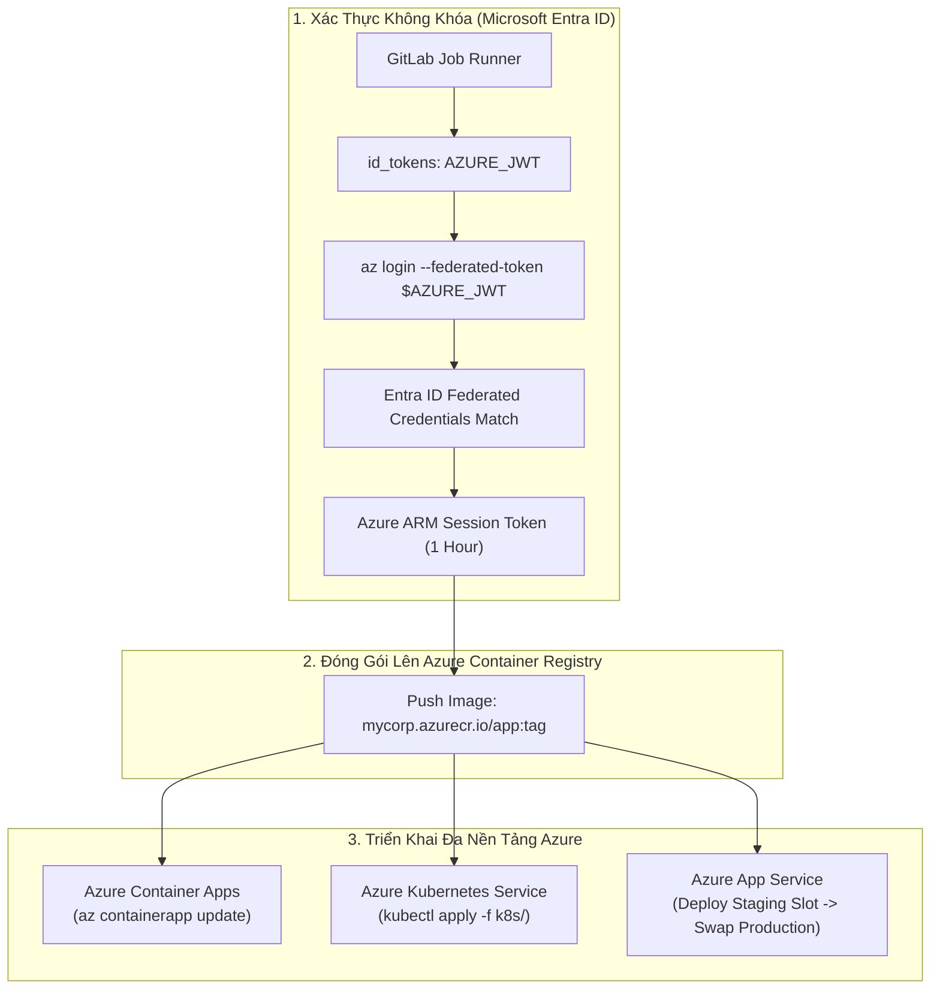


# [BÀI 40] TRIỂN KHAI ỨNG DỤNG LÊN AZURE: AZURE KUBERNETES SERVICE (AKS), APP SERVICE & CONTAINER APPS

Trong kỷ nguyên **DevOps, DevSecOps và Cloud Native Engineering**, **GitLab CI/CD** được công nhận là một trong những nền tảng tự động hóa tích hợp liên tục và phân phối liên tục (CI/CD) hoàn chỉnh, mạnh mẽ và được tin dùng nhất trong các doanh nghiệp quy mô lớn. Không chỉ dừng lại ở các pipeline tuần tự cơ bản, việc vận hành GitLab CI/CD ở cấp độ Production đòi hỏi kỹ sư phải làm chủ kiến trúc điều phối phi tuyến tính **DAG (Directed Acyclic Graph)**, cơ chế quản trị **Autoscaling Runners**, tối ưu hóa **Caching đa tầng**, xác thực không khóa **Keyless OIDC**, bảo mật chuỗi cung ứng phần mềm **SLSA & SBOM** cùng các chính sách **Quality & Security Gates** tự động.

Bài viết chuyên sâu này sẽ đồng hành cùng bạn mổ xẻ toàn diện bức tranh kiến trúc, phân tích các đánh đổi kỹ thuật thực chiến (Engineering Trade-offs), cung cấp hướng dẫn thực hành Lab chi tiết từng bước và bộ câu hỏi phỏng vấn chuyên sâu chuẩn DevOps Lead / DevSecOps Architect.

---

## 1. Bản Chất Kiến Trúc & Cơ Chế Vận Hành Tầng Thấp

### 1.1. Luận Đề Trung Tâm: Sự Đa Dạng Kiến Trúc Tính Toán Trên Microsoft Azure

**Microsoft Azure** là nền tảng đám mây được tin cậy hàng đầu trong các tập đoàn Fortune 500 và khối tài chính ngân hàng. Hệ sinh thái phân phối ứng dụng của Azure cung cấp 3 mô hình triển khai chủ đạo:
1. **Azure App Service (PaaS)**: Giải pháp nền tảng dịch vụ hoàn chỉnh, nổi tiếng với tính năng **Deployment Slots** (cho phép triển khai lên Slot Staging, khởi chạy đầy đủ rồi thực hiện hoán đổi nóng "Swap" sang Slot Production chỉ trong vài giây mà không làm rớt kết nối mạng).
2. **Azure Container Apps (ACA - Serverless Container)**: Xây dựng trên nền tảng Kubernetes, KEDA (Kubernetes Event-driven Autoscaling) và Envoy Proxy, mang lại trải nghiệm Serverless microservices linh hoạt với khả năng co giãn theo hàng đợi Azure Service Bus hoặc HTTP requests.
3. **Azure Kubernetes Service (AKS)**: Cụm Kubernetes cấp doanh nghiệp tích hợp sâu với Azure Virtual Network (Azure CNI), Azure Key Vault và Microsoft Entra ID.

> **Một Pipeline CI/CD hiện đại trên Azure bắt buộc phải loại bỏ hoàn toàn Service Principal Client Secrets tĩnh, chuyển dịch sang xác thực Keyless OIDC (Federated Credentials), lưu trữ container trên Azure Container Registry (ACR) và tự động hóa quy trình phát hành an toàn lên App Service, ACA hoặc AKS.**

```text
       QUY TRÌNH PHÂN PHỐI ỨNG DỤNG LÊN MICROSOFT AZURE (OIDC FEDERATION)

  [ GitLab CI Runner ] ── 1. Entra ID Federated OIDC ──► [ Azure Bearer Token ]
           │                                                       │
           ├──► 2. Build & Push Image ───────────────────► [ Azure Container Registry (ACR) ]
           │                                                       │
           ├──► 3. Deploy ACA: az containerapp update ───► [ Azure Container Apps (ACA) ]
           │                                                       │
           ├──► 4. Deploy AKS: az aks get-credentials ────► [ Azure Kubernetes Service ]
           │                                                       │
           └──► 5. Deploy App Service: az webapp swap ────► [ Azure App Service Slots ]
```



### 1.2. Kỹ Thuật "Deployment Slots Swap" Trên Azure App Service

Quy trình phát hành Zero-Downtime kinh điển trên Azure App Service:
1. **Triển khai lên Staging Slot**: Pipeline đẩy mã nguồn hoặc container mới lên Slot phụ `staging` (`https://my-app-staging.azurewebsites.net`).
2. **Khởi chạy & Warm-up**: Azure tự động gửi các yêu cầu HTTP thăm dò (Warm-up requests) tới Staging Slot để khởi tạo bộ nhớ đệm và kết nối cơ sở dữ liệu.
3. **Thực hiện Hoán Đổi Nóng (Swap)**: Gọi lệnh `az webapp deployment slot swap --name my-app --resource-group my-rg --slot staging --target-slot production`.
4. **Cơ chế định tuyến ngầm**: Azure Routing Controller tráo đổi địa chỉ IP ảo và bộ cân bằng tải giữa 2 slots tức thì. Nếu phiên bản mới có lỗi, thực hiện lệnh Swap ngược lại để khôi phục phiên bản cũ trong vòng **5 giây**!

### 1.3. Kết Nối AKS Qua Azure RBAC & Kubectl

Thay vì lưu file chứng chỉ tĩnh:
- GitLab CI sử dụng lệnh `az aks get-credentials --resource-group my-rg --name my-aks-cluster`.
- Azure CLI tự động cấu hình `kubelogin` (Azure AD Kubelogin plugin), sử dụng danh tính Entra ID của GitLab Session để xác thực trực tiếp với Kubernetes API Server thông qua Azure RBAC.

---

## 2. Bảng So Sánh Kỹ Thuật Toàn Diện (Engineering Matrix)

| Tiêu Chí Kỹ Thuật | Azure App Service (PaaS) | Azure Container Apps (ACA) | Azure Kubernetes Service (AKS) | Azure Virtual Machines (IaaS) |
| :--- | :--- | :--- | :--- | :--- |
| **Mức Quản Trị Hạ Tầng** | Zero OS / Server | Zero Server (Serverless K8s)| Quản lý Kubernetes Cluster | Quản trị VM OS, Patching, RDP/SSH |
| **Cơ Chế Deployment** | **Deployment Slots Swap (Zero DT)**| Active / Inactive Revisions | Rolling Updates / GitOps | Script / Custom Script Extension |
| **Khả Năng Co Giãn** | Theo Metric CPU/RAM cơ bản | **Rất mạnh (KEDA Events & HTTP)**| Rất mạnh qua HPA + Node Autoscaler| Theo Virtual Machine Scale Sets |
| **Tốc Độ Khởi Động** | Trung bình (~1 - 2 phút) | Nhanh (~15 - 30 giây) | Nhanh (~10 giây Pod) | Chậm (Vài phút khởi động VM) |
| **Chi Phí Vận Hành** | Trả theo App Service Plan cố định | **Scale-to-Zero (Chỉ trả khi chạy)**| Trả phí Worker Nodes + Storage | Trả phí VM 24/7 |
| **Hỗ Trợ Multi-Revision** | 2 Slots (Staging / Production) | **Hỗ trợ lên tới 100 Revisions** | Quản lý theo Pod Deployments | Không hỗ trợ |
| **Ứng Dụng Đề Xuất** | Web Apps doanh nghiệp, Monolith | Microservices, Event Handlers | Hệ thống Enterprise Cloud-Native lớn| Ứng dụng Legacy chuyên biệt |

---

## 3. Kiến Trúc Triển Khai Chuẩn Production (Architecture Breakdown)

### 3.1. Pipeline Hoàn Chỉnh: Build ACR, Deploy Azure Container Apps & App Service Qua OIDC

```yaml
stages:
  - build_image
  - deploy_aca
  - deploy_appservice_staging
  - swap_to_production

variables:
  AZURE_CLIENT_ID: "11111111-2222-3333-4444-555555555555"
  AZURE_TENANT_ID: "aaaaaaaa-bbbb-cccc-dddd-eeeeeeeeeeee"
  AZURE_SUBSCRIPTION_ID: "99999999-8888-7777-6666-555555555555"
  ACR_REGISTRY: "enterpriseacr.azurecr.io"
  IMAGE_TAG: "${ACR_REGISTRY}/payment-svc:${CI_COMMIT_SHORT_SHA}"
  RESOURCE_GROUP: "enterprise-production-rg"

# -------------------------------------------------------------
# 1. Đóng Gói & Đẩy Lên Azure Container Registry (ACR)
# -------------------------------------------------------------
build_acr_image:
  stage: build_image
  image:
    name: gcr.io/kaniko-project/executor:v1.20.0-debug
    entrypoint: [""]
  id_tokens:
    AZURE_JWT:
      aud: "api://AzureADTokenExchange"
  before_script:
    - mkdir -p /kaniko/.docker
    # Lấy Access Token từ Azure Entra ID và tạo Docker Auth
    - echo "{"auths":{"${ACR_REGISTRY}":{"auth":"$(printf "%s:%s" "00000000-0000-0000-0000-000000000000" "${AZURE_JWT}" | base64 | tr -d '
')"}}}" > /kaniko/.docker/config.json || true
  script:
    - >-
      /kaniko/executor
      --context "${CI_PROJECT_DIR}"
      --dockerfile "${CI_PROJECT_DIR}/Dockerfile"
      --destination "${IMAGE_TAG}"

# -------------------------------------------------------------
# 2. Deploy Azure Container Apps (ACA)
# -------------------------------------------------------------
deploy_to_container_apps:
  stage: deploy_aca
  image: mcr.microsoft.com/azure-cli:latest
  id_tokens:
    AZURE_JWT:
      aud: "api://AzureADTokenExchange"
  before_script:
    # Đăng nhập Azure không khóa qua Federated Token
    - >-
      az login --service-principal
      -u "${AZURE_CLIENT_ID}"
      -t "${AZURE_TENANT_ID}"
      --federated-token "${AZURE_JWT}"
    - az account set --subscription "${AZURE_SUBSCRIPTION_ID}"
  script:
    - echo "Deploying new revision to Azure Container Apps: payment-api-app..."
    - >-
      az containerapp update
      --name payment-api-app
      --resource-group "${RESOURCE_GROUP}"
      --image "${IMAGE_TAG}"
  rules:
    - if: '$CI_COMMIT_BRANCH == "main"'

# -------------------------------------------------------------
# 3. Deploy App Service Staging Slot & Hoán Đổi Production
# -------------------------------------------------------------
deploy_appservice_slot:
  stage: deploy_appservice_staging
  image: mcr.microsoft.com/azure-cli:latest
  id_tokens:
    AZURE_JWT:
      aud: "api://AzureADTokenExchange"
  before_script:
    - >-
      az login --service-principal
      -u "${AZURE_CLIENT_ID}"
      -t "${AZURE_TENANT_ID}"
      --federated-token "${AZURE_JWT}"
    - az account set --subscription "${AZURE_SUBSCRIPTION_ID}"
  script:
    - echo "Deploying image to Staging Slot..."
    - >-
      az webapp config container set
      --name enterprise-web-portal
      --resource-group "${RESOURCE_GROUP}"
      --slot staging
      --docker-custom-image-name "${IMAGE_TAG}"
  environment:
    name: production/staging-slot
    url: https://enterprise-web-portal-staging.azurewebsites.net
    tier: staging
  rules:
    - if: '$CI_COMMIT_BRANCH == "main"'

swap_slot_to_production:
  stage: swap_to_production
  image: mcr.microsoft.com/azure-cli:latest
  needs: ["deploy_appservice_slot"]
  id_tokens:
    AZURE_JWT:
      aud: "api://AzureADTokenExchange"
  before_script:
    - >-
      az login --service-principal
      -u "${AZURE_CLIENT_ID}"
      -t "${AZURE_TENANT_ID}"
      --federated-token "${AZURE_JWT}"
    - az account set --subscription "${AZURE_SUBSCRIPTION_ID}"
  script:
    - echo "Executing Zero-Downtime Slot Swap to Production..."
    - >-
      az webapp deployment slot swap
      --name enterprise-web-portal
      --resource-group "${RESOURCE_GROUP}"
      --slot staging
      --target-slot production
  environment:
    name: production
    url: https://enterprise-web-portal.azurewebsites.net
    tier: production
  rules:
    - if: '$CI_COMMIT_BRANCH == "main"'
      when: manual
```

---

## 4. Phân Tích Cạm Bẫy Thực Chiến (5-Whys Incident Analysis)

### 4.1. Sự Cố Thực Tế: Rò Rỉ Kết Nối CSDL Sau Khi Swap Deployment Slots Trên Azure App Service

> **Bối Cảnh**: Nhóm kỹ sư cấu hình biến `DATABASE_URL` trong App Service. Sau khi thực hiện lệnh Swap từ Staging sang Production, môi trường Production bất ngờ ghi dữ liệu vào Database của Staging, làm sai lệch báo cáo tài chính của doanh nghiệp.

```text
┌─────────────────────────────────────────────────────────────────────────┐
│                    PHÂN TÍCH NGUYÊN NHÂN GỐC RỄ (5-WHYS)                 │
├─────────────────────────────────────────────────────────────────────────┤
│ 1. Tại sao Production App lại kết nối vào Database của Staging?         │
│    -> Biến DATABASE_URL của Staging đã bị hoán đổi sang Production Slot.│
│                                                                         │
│ 2. Tại sao giá trị biến môi trường lại bị hoán đổi khi Swap?            │
│    -> Mặc định Azure App Service hoán đổi toàn bộ App Settings.         │
│                                                                         │
│ 3. Tại sao biến nhạy cảm lại không được ghim cố định vào Slot?          │
│    -> Biến DATABASE_URL chưa được bật cờ "Deployment Slot Setting".     │
│                                                                         │
│ 4. Tại sao kỹ sư lại quên bật cờ Deployment Slot Setting?               │
│    -> Cấu hình App Settings thực hiện bằng script CLI thiếu tham số ghim.│
│                                                                         │
│ 5. NGUYÊN NHÂN CỐT LÕI (Root Cause):                                   │
│    -> Không cấu hình cờ "Slot Sticky Setting" (slot-setting=true) cho   │
│       các biến môi trường phụ thuộc hạ tầng đặc thù của từng slot.     │
└─────────────────────────────────────────────────────────────────────────┘
```

### 4.2. Giải Pháp Khắc Phục Triệt Để

1. **Ghim biến môi trường cố định theo Slot (Slot-Sticky Settings)**:
   ```bash
   az webapp config appsettings set      --name enterprise-web-portal      --resource-group enterprise-production-rg      --slot staging      --slot-settings DATABASE_URL="postgresql://staging-db.internal/app"
   ```
2. **Sử dụng Azure Key Vault Reference**: Cấu hình biến môi trường trỏ tới Secret URI của Key Vault (`@Microsoft.KeyVault(SecretUri=...)`), đảm bảo mỗi Slot tự động phân giải đúng bí mật tương ứng.

---

## 5. Hands-on Lab: Triển Khai Azure App Service Slots & OIDC (8 Bước Chuẩn)

### 5.1. Mục Tiêu Lab
- Xây dựng ứng dụng Web Node.js hiển thị phiên bản phát hành.
- Cấu hình Federated Identity Credentials trên Microsoft Entra ID.
- Viết pipeline GitLab CI tự động deploy lên Azure App Service Staging Slot.
- Thực hiện hoán đổi Slots Swap sang Production và kiểm tra Zero-Downtime.

```text
       QUY TRÌNH THỰC HÀNH LAB DEPLOY AZURE APP SERVICE SLOTS

     [ Mã Nguồn Node.js App ] ──► [ Build Image & Push lên ACR ]
                                             │
                                             ▼
     [ Deploy Staging Slot ]  ──► [ https://app-staging.azurewebsites.net ]
                                             │
                                             ▼
     [ Manual Gate Phê Duyệt ]──► [ az webapp deployment slot swap ]
                                             │
                                             ▼
     [ Production Slot Online ] ─► [ https://app.azurewebsites.net (Zero Downtime) ]
```

### 5.2. Các Bước Thực Hiện Chi Tiết

#### Bước 1: Khởi Tạo Mã Nguồn `server.js`
```javascript
const express = require('express');
const app = express();
const PORT = process.env.PORT || 8080;
const VERSION = process.env.APP_VERSION || 'v1.0.0';
const SLOT = process.env.SLOT_NAME || 'Production';

app.get('/', (req, res) => {
  res.send(`
    <h1>Microsoft Azure App Service Cloud Deployment</h1>
    <p>Version: <strong>${VERSION}</strong></p>
    <p>Active Slot: <span style="color: green;">${SLOT}</span></p>
    <p>Status: Healthy & Live</p>
  `);
});

app.listen(PORT, () => console.log(`Server listening on port ${PORT}...`));
```

#### Bước 2: Tạo Tệp `package.json`
```json
{
  "name": "azure-appservice-demo",
  "version": "1.0.0",
  "dependencies": {
    "express": "^4.18.2"
  },
  "scripts": {
    "start": "node server.js"
  }
}
```

#### Bước 3: Viết `Dockerfile`
```dockerfile
FROM node:20-alpine
WORKDIR /app
COPY package.json ./
RUN npm install --production
COPY server.js ./
EXPOSE 8080
ENV PORT=8080
CMD ["npm", "start"]
```

#### Bước 4: Cấu Hình Tệp `.gitlab-ci.yml` Với Azure OIDC
```yaml
stages:
  - deploy_staging
  - swap_production

variables:
  AZURE_CLIENT_ID: "11111111-2222-3333-4444-555555555555"
  AZURE_TENANT_ID: "aaaaaaaa-bbbb-cccc-dddd-eeeeeeeeeeee"
  RESOURCE_GROUP: "my-azure-rg"
  APP_NAME: "demo-azure-webapp"

deploy_staging_slot:
  stage: deploy_staging
  image: mcr.microsoft.com/azure-cli:latest
  id_tokens:
    AZURE_JWT:
      aud: "api://AzureADTokenExchange"
  before_script:
    - >-
      az login --service-principal
      -u "${AZURE_CLIENT_ID}"
      -t "${AZURE_TENANT_ID}"
      --federated-token "${AZURE_JWT}"
  script:
    - echo "Deploying code to Staging Slot..."
    - az webapp config appsettings set --name "${APP_NAME}" --resource-group "${RESOURCE_GROUP}" --slot staging --settings APP_VERSION="v1.0.0" SLOT_NAME="Staging"
  rules:
    - if: '$CI_COMMIT_BRANCH == "main"'

swap_to_prod:
  stage: swap_production
  image: mcr.microsoft.com/azure-cli:latest
  needs: ["deploy_staging_slot"]
  id_tokens:
    AZURE_JWT:
      aud: "api://AzureADTokenExchange"
  before_script:
    - >-
      az login --service-principal
      -u "${AZURE_CLIENT_ID}"
      -t "${AZURE_TENANT_ID}"
      --federated-token "${AZURE_JWT}"
  script:
    - echo "Swapping Staging to Production..."
    - az webapp deployment slot swap --name "${APP_NAME}" --resource-group "${RESOURCE_GROUP}" --slot staging --target-slot production
  rules:
    - if: '$CI_COMMIT_BRANCH == "main"'
      when: manual
```

#### Bước 5: Đẩy Mã Nguồn Lên GitLab
```bash
git add .
git commit -m "feat(azure): implement azure app service slots deployment"
git push origin main
```

#### Bước 6: Kiểm Tra Staging Slot Sau Khi Deploy
- Mở trình duyệt: `https://demo-azure-webapp-staging.azurewebsites.net`.
- Xác nhận trang hiển thị: `Version: v1.0.0 - Active Slot: Staging`.
- Trang Production chính (`https://demo-azure-webapp.azurewebsites.net`) vẫn đang chạy phiên bản trước đó.

#### Bước 7: Nhấn Nút Phê Duyệt Swap Sang Production
- Nhấn nút **Play** trên job `swap_to_prod`.
- Azure thực hiện hoán đổi trong vòng 4 giây.

#### Bước 8: Kiểm Tra URL Production
- Truy cập `https://demo-azure-webapp.azurewebsites.net`.
- Xác nhận phiên bản mới `v1.0.0` đã phục vụ người dùng chính thức 100% không có bất kỳ thời gian gián đoạn nào (Zero Downtime).

> [!NOTE]
> **Check-point Lab 40**: Quy trình xác thực Entra ID OIDC thành công và tính năng Deployment Slots Swap hoạt động hoàn hảo.

---

## 6. Bộ Câu Hỏi Vấn Đáp & Phỏng Vấn Chuyên Sâu (Self-Check Q&A)

<details class="qa-card">
  <summary class="qa-summary">
    <span class="qa-num-badge">Q01</span>
    <span>Tại sao Azure Container Apps (ACA) lại phù hợp cho kiến trúc Microservices hơn Azure App Service?</span>
  </summary>
  <div class="qa-body">
    <p><strong>Lý do kiến trúc:</strong></p>
    <ul>
      <li><strong>Tích hợp KEDA Native</strong>: ACA có thể tự động co giãn dựa trên độ dài hàng đợi tin nhắn (Azure Service Bus, RabbitMQ, Kafka) hoặc số lượng kết nối TCP/HTTP thay vì chỉ dựa vào CPU/RAM thô.</li>
      <li><strong>Tích hợp Dapr (Distributed Application Runtime)</strong>: Cung cấp sẵn các building blocks cho Service-to-Service invocation, Pub/Sub, State Management và Distributed Tracing mà không cần viết thêm code.</li>
      <li><strong>Hỗ trợ Scale-to-Zero</strong>: Giảm chi phí tuyệt đối khi không có tải.</li>
    </ul>
  </div>
</details>

<details class="qa-card">
  <summary class="qa-summary">
    <span class="qa-num-badge">Q02</span>
    <span>Cơ chế "Warm-up Phase" trong Deployment Slots Swap của Azure App Service hoạt động như thế nào?</span>
  </summary>
  <div class="qa-body">
    <p><strong>Bản chất:</strong></p>
    <p>Trước khi thực sự tráo đổi địa chỉ mạng, Azure App Service sẽ gửi các yêu cầu HTTP thăm dò tới đường dẫn cấu hình sẵn (ví dụ: <code>/healthcheck</code>) trên Staging Slot. Chỉ khi ứng dụng phản hồi mã HTTP 200 OK liên tục (chứng minh JVM/Node runtime đã load xong vào RAM và kết nối DB đã sẵn sàng), Azure mới thực hiện đổi luồng traffic, loại bỏ hoàn toàn hiện tượng người dùng nhận lỗi trong lúc ứng dụng đang boot.</p>
  </div>
</details>

<details class="qa-card">
  <summary class="qa-summary">
    <span class="qa-num-badge">Q03</span>
    <span>Làm thế nào để xác thực với Azure Container Registry (ACR) bằng OIDC mà không dùng Admin User Password?</span>
  </summary>
  <div class="qa-body">
    <p><strong>Giải pháp:</strong></p>
    <p>Sử dụng lệnh <code>az acr login --name myacr</code> trong khối script sau khi đã <code>az login</code> qua Federated OIDC Token. Azure CLI sẽ tự động sinh token OAuth2 ngắn hạn của ACR có quyền <code>AcrPush</code> để cấp quyền cho Docker CLI hoặc Kaniko.</p>
  </div>
</details>

<details class="qa-card">
  <summary class="qa-summary">
    <span class="qa-num-badge">Q04</span>
    <span>Sự khác biệt giữa "Slot-Sticky App Settings" và "Non-Sticky App Settings" là gì?</span>
  </summary>
  <div class="qa-body">
    <p><strong>So sánh:</strong></p>
    <ul>
      <li><strong>Non-Sticky Settings (Mặc định)</strong>: Biến môi trường sẽ di chuyển cùng mã nguồn sang Production khi Swap. Phù hợp cho các biến logic tính năng (ví dụ: <code>FEATURE_FLAG_NEW_UI=true</code>).</li>
      <li><strong>Slot-Sticky Settings</strong>: Biến môi trường được ghim chặt cố định ở Slot đó và không bao giờ đổi chỗ khi Swap. Bắt buộc phải áp dụng cho: Chuỗi kết nối Database, URL dịch vụ bên thứ ba môi trường Test, khóa API sandbox.</li>
    </ul>
  </div>
</details>

<details class="qa-card">
  <summary class="qa-summary">
    <span class="qa-num-badge">Q05</span>
    <span>Làm sao để cấu hình Azure Container Apps hỗ trợ tính năng phân chia lưu lượng Traffic Split 80/20?</span>
  </summary>
  <div class="qa-body">
    <p><strong>Cú pháp Azure CLI:</strong></p>
    <pre><code>az containerapp ingress traffic set   --name my-app   --resource-group my-rg   --revision-weight my-app--rev1=80 my-app--rev2=20</code></pre>
  </div>
</details>

<details class="qa-card">
  <summary class="qa-summary">
    <span class="qa-num-badge">Q06</span>
    <span>Làm thế nào để bảo mật lưu lượng giữa các dịch vụ trong Azure Container Apps mà không mở ra Internet?</span>
  </summary>
  <div class="qa-body">
    <p><strong>Cấu hình Internal Ingress:</strong></p>
    <p>Thiết lập <code>--ingress=internal</code> trong môi trường Azure Container Apps Managed Environment (nằm trong Azure Virtual Network). Các microservices có thể gọi nhau an toàn qua DNS nội bộ <code>http://order-svc</code> mà không có bất kỳ IP công khai nào.</p>
  </div>
</details>

<details class="qa-card">
  <summary class="qa-summary">
    <span class="qa-num-badge">Q07</span>
    <span>Làm cách nào để cấp quyền RBAC cho GitLab CI Deployer Role trên Azure chỉ được phép quản lý tài nguyên trong đúng 1 Resource Group?</span>
  </summary>
  <div class="qa-body">
    <p><strong>Nguyên tắc đặc quyền tối thiểu:</strong></p>
    <p>Gán vai trò <strong>Contributor</strong> hoặc <strong>Website Contributor</strong> với phạm vi (Scope) trỏ chính xác vào Resource Group mục tiêu thay vì cấp quyền ở cấp Subscription:</p>
    <pre><code>az role assignment create   --assignee &lt;SERVICE_PRINCIPAL_APP_ID&gt;   --role "Website Contributor"   --scope "/subscriptions/&lt;SUB_ID&gt;/resourceGroups/enterprise-production-rg"</code></pre>
  </div>
</details>

<details class="qa-card">
  <summary class="qa-summary">
    <span class="qa-num-badge">Q08</span>
    <span>Sự cố: Job deploy Azure CLI báo lỗi `AADSTS70021: No matching federated identity record found`. Khắc phục thế nào?</span>
  </summary>
  <div class="qa-body">
    <p><strong>Nguyên nhân & Khắc phục:</strong></p>
    <ul>
      <li><strong>Nguyên nhân</strong>: Giá trị Subject Identifier trong Federated Credentials trên Microsoft Entra ID không khớp chính xác từng ký tự với Claim <code>sub</code> do GitLab gửi lên (ví dụ sai lệch tên nhánh hoặc group).</li>
      <li><strong>Khắc phục</strong>: Giải mã token JWT của GitLab trong job để lấy đúng chuỗi <code>sub</code> và cập nhật lại trường Subject trên Azure Portal.</li>
    </ul>
  </div>
</details>

<details class="qa-card">
  <summary class="qa-summary">
    <span class="qa-num-badge">Q09</span>
    <span>Tại sao nên sử dụng Managed Identity thay vì Service Principal khi các dịch vụ Azure gọi lẫn nhau?</span>
  </summary>
  <div class="qa-body">
    <p><strong>Bảo mật Azure Native:</strong></p>
    <p>Managed Identity (User-Assigned hoặc System-Assigned) hoàn toàn không có mật khẩu hay token cần quản lý. Nền tảng Azure tự động cấp phát và xoay vòng danh tính trực tiếp trên hạ tầng máy chủ cho container của bạn.</p>
  </div>
</details>

<details class="qa-card">
  <summary class="qa-summary">
    <span class="qa-num-badge">Q10</span>
    <span>Làm thế nào để tích hợp Azure Application Insights đo lường tỷ lệ lỗi khi thực hiện Deployment Slots Swap?</span>
  </summary>
  <div class="qa-body">
    <p><strong>Tự động hóa Rollback:</strong></p>
    <p>Sau khi Swap, chạy một step kiểm tra trong CI gọi Azure Monitor API để truy vấn tỷ lệ HTTP 5xx trong 5 phút vừa qua. Nếu <code>5xx Error Rate > 1.0%</code>, tự động gọi lệnh <code>az webapp deployment slot swap</code> ngược lại để khôi phục phiên bản cũ tức thì.</p>
  </div>
</details>

<details class="qa-card">
  <summary class="qa-summary">
    <span class="qa-num-badge">Q11</span>
    <span>Làm thế nào để kết nối tới cụm Azure AKS có cấu hình "API Server VNet Integration / Private Cluster"?</span>
  </summary>
  <div class="qa-body">
    <p><strong>Kiến trúc mạng:</strong></p>
    <p>Sử dụng <strong>GitLab Self-Hosted Runner</strong> được triển khai trong cùng mạng Azure Virtual Network (VNet) hoặc Subnet được kết nối qua VNet Peering tới cụm AKS.</p>
  </div>
</details>

<details class="qa-card">
  <summary class="qa-summary">
    <span class="qa-num-badge">Q12</span>
    <span>Làm cách nào để tối ưu hóa chi phí điện toán trên Microsoft Azure khi vận hành CI/CD Runner?</span>
  </summary>
  <div class="qa-body">
    <p><strong>FinOps trên Azure:</strong></p>
    <ol>
      <li>Sử dụng <strong>Azure Spot Virtual Machines</strong> cho các VMSS Runner Pool (tiết kiệm tới 80% chi phí).</li>
      <li>Tận dụng <strong>Azure Container Apps Jobs</strong> để chạy các tác vụ CI ngắn hạn chỉ tính phí theo giây thực thi.</li>
    </ol>
  </div>
</details>

---

## 7. Tổng Kết & Lộ Trình Bài Học Tiếp Theo

### 7.1. Tóm Tắt Các Điểm Cốt Lõi (Architectural Key Takeaways)
- **Multi-Workload Azure Delivery**: Phân phối linh hoạt trên App Service (PaaS), Container Apps (Serverless KEDA) và AKS (Kubernetes).
- **Entra ID Keyless Federation**: Loại bỏ 100% mật khẩu tĩnh qua Federated Identity Credentials.
- **Zero-Downtime Slots Swap**: Tận dụng cơ chế warm-up và swap tức thì trên Azure App Service.
- **Microservices Scaling**: Khai thác sức mạnh co giãn theo sự kiện của Azure Container Apps và Dapr.

### 7.2. Sơ Đồ Tư Duy Triển Khai Ứng Dụng Lên Microsoft Azure (Mindmap)

```text
                       PHÂN PHỐI ỨNG DỤNG LÊN MICROSOFT AZURE
                                          │
        ┌─────────────────────────────────┼─────────────────────────────────┐
        ▼                                 ▼                                 ▼
  [ Compute Workloads ]         [ Identity & Storage ]         [ Zero-Downtime Delivery ]
  - Azure App Service PaaS      - Microsoft Entra ID OIDC      - Staging Slot Deploy
  - Azure Container Apps (ACA)  - Azure Container Registry     - Warm-up Verification Gate
  - AKS Managed Kubernetes      - Azure Key Vault References   - One-Click Slots Swap
```

> [!TIP]
> **Bước tiếp theo trong lộ trình**: Làm chủ quy trình phân phối hạ tầng Kubernetes chuẩn mực với Helm và các công cụ GitOps hàng đầu trong [Bài 41: Kubernetes CD & GitOps: Helm, GitLab Agent For Kubernetes, ArgoCD & Flux](gitlab-41-41-kubernetes-helm-va-gitops.html).

