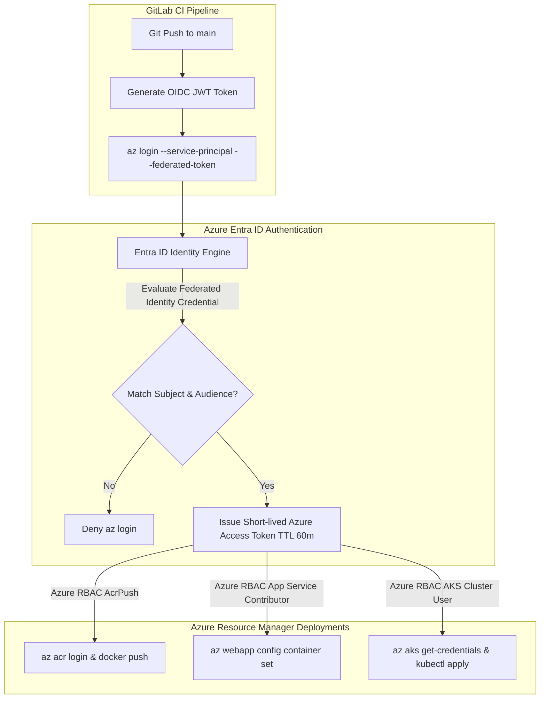
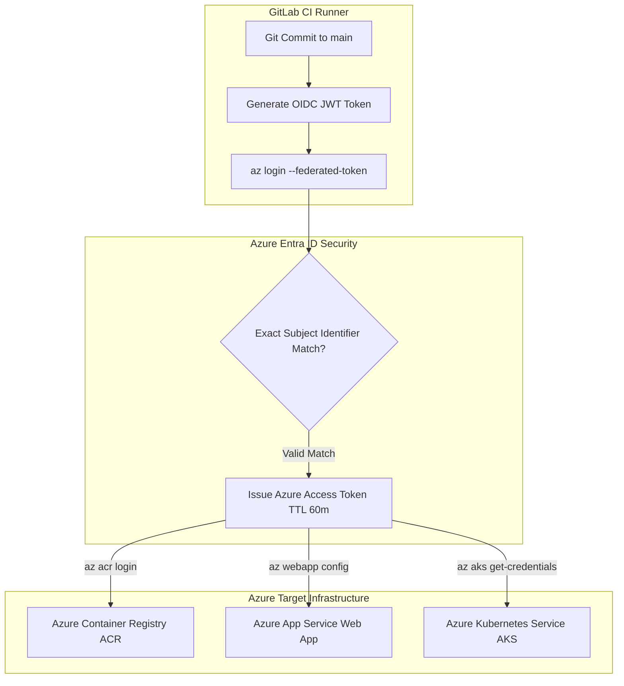
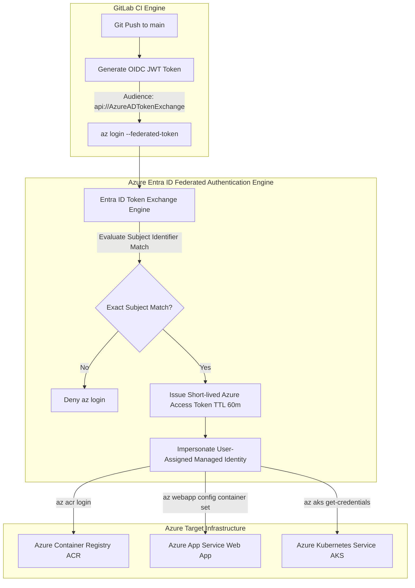


# [BÀI 40] TỰ ĐỘNG HÓA TRIỂN KHAI LÊN AZURE: AZURE OIDC FEDERATION, AZURE KUBERNETES SERVICE (AKS) & AZURE CONTAINER APPS

Trong kỷ nguyên **DevOps, DevSecOps và Cloud Native Engineering**, **GitLab CI/CD** được công nhận là một trong những nền tảng tự động hóa tích hợp liên tục và phân phối liên tục (CI/CD) hoàn chỉnh, mạnh mẽ và được tin dùng nhất trong các doanh nghiệp quy mô lớn. Không chỉ dừng lại ở các pipeline tuần tự cơ bản, việc vận hành GitLab CI/CD ở cấp độ Production đòi hỏi kỹ sư phải làm chủ kiến trúc điều phối phi tuyến tính **DAG (Directed Acyclic Graph)**, cơ chế quản trị **Autoscaling Runners**, tối ưu hóa **Caching đa tầng**, xác thực không khóa **Keyless OIDC**, bảo mật chuỗi cung ứng phần mềm **SLSA & SBOM** cùng các chính sách **Quality & Security Gates** tự động.

Bài viết chuyên sâu này sẽ đồng hành cùng bạn mổ xẻ toàn diện bức tranh kiến trúc, phân tích các đánh đổi kỹ thuật thực chiến (Engineering Trade-offs), cung cấp hướng dẫn thực hành Lab chi tiết từng bước và bộ câu hỏi phỏng vấn chuyên sâu chuẩn DevOps Lead / DevSecOps Architect.

---

## 1. Bản Chất Kiến Trúc & Cơ Chế Vận Hành Tầng Thấp

---


| STT | Câu hỏi ôn tập | Đáp án chi tiết thực chiến |
|---|---|---|
| 1 | Hai bước xác thực cốt lõi của GCP WIF là gì? | Bước 1: Identity Exchange (WIF Pool Provider) và Bước 2: Service Account Impersonation (`roles/iam.workloadIdentityUser`). |
| 2 | Biểu thức điều kiện CEL Expression được cài đặt ở đâu trên GCP? | Được cài đặt ngay từ cấp độ WIF Provider thông qua tham số `--attribute-condition`. |
| 3 | Tệp nào được dùng để `gcloud auth login` mà không cần Service Account JSON Key? | Tệp `credential-configuration.json` (định dạng `external_account`). |
| 4 | Câu lệnh gcloud nào dùng để tự động cấu hình Docker CLI cho Artifact Registry? | Lệnh `gcloud auth configure-docker us-central1-docker.pkg.dev --quiet`. |
| 5 | Lệnh gcloud nào dùng để deploy ứng dụng Serverless lên Google Cloud Run? | Lệnh `gcloud run deploy <service_name> --image=<image_url> --region=<region> --platform=managed`. |


**Luận đề trung tâm:**
> *"Azure buộc khai báo **Federated Identity Credential cho từng Subject Identifier** — chặt chẽ hơn AWS và GCP nhưng đòi hỏi quy trình tự động hóa đăng ký công phu hơn."*

Sau khi đã nắm vững AWS OIDC (Buổi 38) và GCP WIF (Buổi 39), Buổi 40 sẽ khép lại bộ 3 Cloud Đám mây lớn nhất thế giới với nền tảng **Microsoft Azure**. Trong Microsoft Azure Entra ID (tên gọi mới của Azure Active Directory), tính năng OIDC Federation được triển khai thông qua **Federated Identity Credentials** gắn vào **User-Assigned Managed Identity** hoặc **App Registration (Service Principal)**. Không giống như AWS (dùng `StringLike` wildcard) hay GCP (dùng CEL condition trên Provider), Azure yêu cầu mỗi điều kiện xác thực (Subject Identifier) phải được tạo thành 1 đối tượng **Federated Credential riêng biệt**. Bài học này sẽ giúp bạn làm chủ luồng triển khai tự động lên **Azure Container Registry (ACR)**, **Azure App Service (Web App for Containers)**, và **Azure Kubernetes Service (AKS)** mà 100% KHÔNG lưu trữ bất kỳ tệp Secret Key hay Client Secret nào!

---


| STT | Kỹ năng thực chiến | Hiện vật chứng minh hoàn thành |
|---|---|---|
| 1 | Tạo Azure User-Assigned Managed Identity | Resource ID Managed Identity trong Azure Portal |
| 2 | Đăng ký Federated Identity Credentials trên Entra ID | Đối tượng Federated Credential chứa Subject Identifier |
| 3 | Phân quyền Azure RBAC cho Managed Identity | IAM Role Assignment `AcrPush` & `Contributor` |
| 4 | Thực thi `az login` không mật khẩu via Federated Token | Script Azure CLI `az login --federated-token` |
| 5 | Tự động đăng nhập Azure Container Registry (ACR) | Lệnh `az acr login --name <registry>` qua OIDC |
| 6 | Deploy Container App lên Azure App Service | Lệnh `az webapp config container set` tự động |
| 7 | Nạp Kubeconfig và Deploy Manifests lên Azure AKS | Lệnh `az aks get-credentials` & `kubectl apply` |
| 8 | Truy vết nhật ký OIDC Sign-in Logs trên Azure Entra ID | Nhật ký Azure Monitor / Entra ID Sign-in Logs |

---


| Kiến thức / Kỹ năng | Mức độ yêu cầu | Nguồn tự học nếu thiếu |
|---|---|---|
| Nguyên lý OIDC Federation 4 bước | Thành thục | Buổi 37, 38 & 39 |
| Cấu trúc Azure Entra ID, Tenant ID & Subscription ID | Hiểu rõ | Kiến thức Azure IAM Nền tảng |
| Quản trị Azure Container Registry (ACR) & App Service | Thành thục | Kiến thức Azure Web/Containers |
| Quản trị cụm Azure Kubernetes Service (AKS) | Thành thục | Kiến thức Azure AKS Infrastructure |
| Cú pháp yaml khối `id_tokens` trong `.gitlab-ci.yml` | Thành thục | Buổi 30 & Buổi 37 |

---


| Thuật ngữ Tiếng Việt | Thuật ngữ Tiếng Anh | Giải thích ý nghĩa thực tế |
|---|---|---|
| Danh tính được quản lý | User-Assigned Managed Identity | Đối tượng danh tính độc lập trên Azure IAM đại diện cho GitLab CI Pipeline không cần mật khẩu hay chìa khóa tĩnh. |
| Chứng thư danh tính liên danh | Federated Identity Credential | Khai báo liên kết giữa Managed Identity với OIDC Issuer và Subject Claim của GitLab CI để chứng thực không chìa khóa. |
| Định danh chủ thể | Subject Identifier | Chuỗi claim `sub` chính xác trong JWT Token (ví dụ `project_path:group/repo:ref_type:branch:ref:main`) yêu cầu khớp 100%. |
| Đăng ký ứng dụng Azure | App Registration / Service Principal | Đối tượng danh tính ứng dụng cũ trên Azure Entra ID có thể đính kèm Federated Credentials để xác thực OIDC. |
| Kho chứa container Azure | Azure Container Registry (ACR) | Dịch vụ kho chứa Docker Images chuẩn enterprise của Microsoft Azure hỗ trợ quét lỗ hổng an toàn. |
| Dịch vụ Web App Container | Azure App Service (Web App) | Nền tảng PaaS chạy Web Container của Azure tự động co giãn và quản trị SSL mượt mà không cần quản lý server. |
| Cụm Kubernetes Azure | Azure Kubernetes Service (AKS) | Dịch vụ cụm Kubernetes được quản trị hoàn toàn trên hạ tầng cao cấp của Microsoft Azure. |
| Phân quyền dựa trên vai trò Azure | Azure Role-Based Access Control (Azure RBAC) | Cơ chế gán vai trò (`AcrPush`, `Contributor`) cho Managed Identity ở cấp Resource Group cụ thể. |
| Mã nhận diện khách hàng | Client ID (Application ID) | Chuỗi GUID định danh Managed Identity hoặc Service Principal trên Azure Portal quản trị. |
| Mã nhận diện tổ chức | Tenant ID (Directory ID) | Chuỗi GUID định danh tổ chức doanh nghiệp (Azure Entra ID Tenant) độc lập. |
| Mã nhận diện gói đăng ký | Subscription ID | Chuỗi GUID định danh tài khoản thanh toán và quản lý tài nguyên hạ tầng Azure. |


#### Mô hình 1: Sơ đồ Luồng Deploy Azure dùng Entra ID Federated Credentials



#### Mô hình 2: Bảng So sánh Kiến trúc OIDC giữa 3 Cloud (AWS vs GCP vs Azure)

| Tiêu chí | AWS IAM OIDC Federation | GCP Workload Identity Federation | Azure Workload Identity Federation |
|---|---|---|---|
| **Hình thức liên kết** | IAM Role Trust Policy | Workload Identity Pool Provider | **Federated Identity Credential** trên Managed Identity |
| **Cơ chế so khớp `sub`** | Cờ `Condition: StringEquals` hoặc `StringLike` | Biểu thức mã CEL (`assertion.project_path == '...'`) | **Subject Identifier** khớp từng ký tự |
| **Độ linh hoạt linh hoạt** | Rất cao (dùng được wildcard `*`) | Rất cao (dùng biểu thức CEL linh hoạt) | **Từng Subject riêng biệt** (mỗi branch/env phải tạo 1 Federated Credential) |
| **Mức độ bảo mật** | Cao | Rất cao | **Tối đa** (chặt chẽ nhất do không dùng wildcard lỏng) |
| **Câu lệnh CLI login** | `aws sts assume-role-with-web-identity` | `gcloud auth login --cred-file` | `az login --service-principal -u ID -t TENANT --federated-token` |

##### Script Azure CLI Thiết lập User-Assigned Managed Identity & Federated Credentials Chuẩn Enterprise:
```bash
# 1. Khởi tạo Resource Group trên Azure
az group create --name rg-payment-production --location eastus

# 2. Tạo User-Assigned Managed Identity độc lập
az identity create --name id-gitlab-deployer --resource-group rg-payment-production

# 3. Trích xuất Client ID của Managed Identity vừa tạo
AZURE_CLIENT_ID=$(az identity show --name id-gitlab-deployer --resource-group rg-payment-production --query clientId -o tsv)

# 4. Đăng ký Federated Identity Credential cho Nhánh Main (Production)
az identity federated-credential create \
  --name "GitLabProdMainBranch" \
  --identity-name "id-gitlab-deployer" \
  --resource-group "rg-payment-production" \
  --issuer "https://gitlab.company.com" \
  --subject "project_path:bank-group/payment-service:ref_type:branch:ref:main" \
  --audiences "api://AzureADTokenExchange"

# 5. Phân quyền Azure RBAC AcrPush trên Azure Container Registry
az role assignment create \
  --assignee "$AZURE_CLIENT_ID" \
  --role "AcrPush" \
  --scope "/subscriptions/$AZURE_SUBSCRIPTION_ID/resourceGroups/rg-payment-production/providers/Microsoft.ContainerRegistry/registries/acrpaymentprod"

# 6. Phân quyền Azure RBAC Contributor trên Azure App Service
az role assignment create \
  --assignee "$AZURE_CLIENT_ID" \
  --role "Contributor" \
  --scope "/subscriptions/$AZURE_SUBSCRIPTION_ID/resourceGroups/rg-payment-production/providers/Microsoft.Web/sites/app-payment-backend"
```

---

### 1.1. Cấu hình Azure Federated Credentials & Managed Identity (10 phút)

### 4.1. Mẫu Tệp `.gitlab-ci.yml` Triển khai Azure WIF Đa Dịch Vụ Hoàn Chỉnh
Dưới đây là tệp cấu hình GitLab CI/CD mẫu ứng dụng chuẩn Azure Workload Identity Federation không mật khẩu tĩnh:

```yaml
stages:
  - build
  - push-acr
  - deploy-appservice
  - deploy-aks

variables:
  AZURE_CLIENT_ID: 11111111-2222-3333-4444-555555555555
  AZURE_TENANT_ID: 66666666-7777-8888-9999-aaaaaaaaaaaa
  AZURE_SUBSCRIPTION_ID: bbbbbbbb-cccc-dddd-eeee-ffffffffffff
  AZURE_RESOURCE_GROUP: rg-payment-production
  ACR_NAME: acrpaymentprod
  ACR_REGISTRY: acrpaymentprod.azurecr.io
  IMAGE_TAG: $ACR_REGISTRY/payment-service:$CI_COMMIT_SHA

.azure-wif-base:
  id_tokens:
    AZURE_OIDC_TOKEN:
      aud: api://AzureADTokenExchange
  before_script:
    - az login --service-principal -u $AZURE_CLIENT_ID -t $AZURE_TENANT_ID --federated-token $AZURE_OIDC_TOKEN
    - az account set --subscription $AZURE_SUBSCRIPTION_ID

# 1. Push Container Image to Azure Container Registry (ACR)
push-to-acr:
  extends: .azure-wif-base
  stage: push-acr
  script:
    - az acr login --name $ACR_NAME
    - docker build -t $IMAGE_TAG .
    - docker push $IMAGE_TAG
  rules:
    - if: $CI_COMMIT_BRANCH == "main"

# 2. Deploy Web App to Azure App Service (Web App for Containers)
deploy-azure-appservice:
  extends: .azure-wif-base
  stage: deploy-appservice
  script:
    - az webapp config container set --name app-payment-backend --resource-group $AZURE_RESOURCE_GROUP --docker-custom-image-name $IMAGE_TAG
  rules:
    - if: $CI_COMMIT_BRANCH == "main"

# 3. Deploy Kubernetes Manifests to Azure Kubernetes Service (AKS)
deploy-azure-aks:
  extends: .azure-wif-base
  stage: deploy-aks
  script:
    - az aks get-credentials --resource-group $AZURE_RESOURCE_GROUP --name aks-prod-cluster --overwrite-existing
    - kubectl set image deployment/payment-backend payment-container=$IMAGE_TAG -n production
    - kubectl rollout status deployment/payment-backend -n production --timeout=300s
  rules:
    - if: $CI_COMMIT_BRANCH == "main"
      when: manual
```

---

### 4.2. Các Quy tắc Cấu hình Azure WIF (QT 40.1 - QT 40.4)

**Nguyên lý cốt lõi:** Khai báo Audience chuẩn `api://AzureADTokenExchange` trong Azure Federated Credential.
**Phát biểu.** Giá trị cờ `aud` trong thuộc tính `id_tokens` của job CI bắt buộc phải đặt là `api://AzureADTokenExchange` (Audience chuẩn duy nhất được Azure Entra ID WIF chấp nhận).
**Giải thích cơ chế ngầm:** Azure Entra ID Token Exchange Engine bắt buộc đối soát cờ `aud`. Nếu `aud` trong JWT token khác với `api://AzureADTokenExchange`, Azure sẽ từ chối cấp access token với lỗi `AADSTS70021: No matching federated identity record found`.
> [!WARNING]
> **CẠM BẪY THỰC CHIẾN:**
> Điền `aud: azure` hoặc `aud: https://gitlab.com` trong tệp `.gitlab-ci.yml`.
**Minh hoạ.**
```yaml
id_tokens:
  AZURE_OIDC_TOKEN:
    aud: api://AzureADTokenExchange
```
**Con số chốt:** `aud: api://AzureADTokenExchange` 100% chính xác.

---

**Nguyên lý cốt lõi:** Khai báo chính xác Subject Identifier `project_path:<group>/<repo>:ref_type:branch:ref:<branch>` cho từng môi trường.
**Phát biểu.** Khi tạo Federated Credential trên Azure Entra ID, bắt buộc khai báo chính xác chuỗi Subject Identifier chứa tên dự án và nhánh chỉ định.
**Giải thích cơ chế ngầm:** Azure Entra ID so sánh chính xác từng ký tự (Exact String Match) đối với `Subject Identifier`. Nếu chỉ lệch một dấu gạch hay tên nhánh, Azure sẽ chặn phiên đăng nhập ngay lập tức.
> [!WARNING]
> **CẠM BẪY THỰC CHIẾN:**
> Nhập thiếu tiền tố `project_path:` hoặc viết sai tên nhánh `ref:master` thay vì `ref:main`.
**Minh hoạ.**
`Subject Identifier: project_path:bank-group/payment-service:ref_type:branch:ref:main`
**Con số chốt:** Khớp chính xác 100% Subject Identifier.

---

**Nguyên lý cốt lõi:** Ưu tiên sử dụng User-Assigned Managed Identity thay cho App Registration Service Principal.
**Phát biểu.** Trong hạ tầng Azure Enterprise, khởi tạo **User-Assigned Managed Identity** làm đối tượng đính kèm Federated Credentials thay vì dùng App Registration Service Principal cũ.
**Giải thích cơ chế ngầm:** Managed Identity là giải pháp quản lý danh tính gốc của Azure ARM, hoàn toàn độc lập, không yêu cầu cấp quyền quản trị tenant Entra ID rộng lớn và có vòng đời gắn liền với Resource Group.
> [!WARNING]
> **CẠM BẪY THỰC CHIẾN:**
> Sử dụng App Registration Service Principal cũ và lưu tệp Client Secret vĩnh viễn trong CI variables.
**Minh hoạ.**
```bash
az identity create --name id-gitlab-deployer --resource-group rg-payment-production
```
**Con số chốt:** 100% OIDC dùng Managed Identities.

---

**Nguyên lý cốt lõi:** Đăng nhập Azure CLI không mật khẩu bằng `az login --federated-token`.
**Phát biểu.** Trong script `before_script` của CI, sử dụng câu lệnh `az login --service-principal -u $AZURE_CLIENT_ID -t $AZURE_TENANT_ID --federated-token $AZURE_OIDC_TOKEN` để đăng nhập Azure CLI.
**Giải thích cơ chế ngầm:** Lệnh `az login` với cờ `--federated-token` tự động đổi OIDC JWT Token lấy Azure Access Token ngắn hạn mà không cần truyền cờ `--password` hay secret key nào.
> [!WARNING]
> **CẠM BẪY THỰC CHIẾN:**
> Chạy lệnh `az login -u <user> -p <static_client_secret>`.
**Minh hoạ.**
```bash
az login --service-principal \
  -u "11111111-2222-3333-4444-555555555555" \
  -t "66666666-7777-8888-9999-aaaaaaaaaaaa" \
  --federated-token "$AZURE_OIDC_TOKEN"
```
**Con số chốt:** 100% Azure CLI logins qua `--federated-token`.

---

### 1.2. Quy tắc Triển khai Azure Container Registry (ACR) & App Service (10 phút)

**Nguyên lý cốt lõi:** Đăng nhập Azure Container Registry (ACR) via OIDC Token bằng `az acr login`.
**Phát biểu.** Sử dụng câu lệnh `az acr login --name <registry_name>` ngay sau khi `az login` thành công để Docker CLI tự động có quyền push Container Image lên ACR.
**Giải thích cơ chế ngầm:** Lệnh `az acr login` tự động trích xuất OIDC Access Token ngắn hạn nạp vào Docker credential helper, xóa bỏ thói quen bật cờ `Admin User` (Static Password) trên ACR.
> [!WARNING]
> **CẠM BẪY THỰC CHIẾN:**
> Bật cờ `Admin User Enabled` trên ACR và lấy password tĩnh cho `docker login`.
**Minh hoạ.**
```bash
az acr login --name acrpaymentprod
docker build -t acrpaymentprod.azurecr.io/payment-service:$CI_COMMIT_SHA .
docker push acrpaymentprod.azurecr.io/payment-service:$CI_COMMIT_SHA
```
**Con số chốt:** 100% ACR logins qua `az acr login`.

---

**Nguyên lý cốt lõi:** Phân quyền Azure RBAC cho Managed Identity ở phạm vi Resource Group Level.
**Phát biểu.** Gán các vai trò Azure RBAC (như `AcrPush`, `Website Contributor`, `Azure Kubernetes Service Cluster User Role`) cho Managed Identity ở phạm vi Resource Group cụ thể, cấm gán ở cấp Subscription.
**Giải thích cơ chế ngầm:** Thực thi nguyên tắc Quyền tối thiểu (Least Privilege). Nếu Managed Identity bị xâm nhập, kẻ tấn công cũng không thể tác động tới các Resource Groups của dự án khác trong cùng Subscription.
> [!WARNING]
> **CẠM BẪY THỰC CHIẾN:**
> Gán vai trò `Contributor` hoặc `Owner` ở cấp Subscription Level cho CI Identity.
**Minh hoạ.**
```bash
az role assignment create \
  --assignee "11111111-2222-3333-4444-555555555555" \
  --role "AcrPush" \
  --scope "/subscriptions/bbbbbbbb-cccc-dddd-eeee-ffffffffffff/resourceGroups/rg-payment-production/providers/Microsoft.ContainerRegistry/registries/acrpaymentprod"
```
**Con số chốt:** 100% Role Assignments ở cấp Resource Group Level.

---

**Nguyên lý cốt lõi:** Triển khai ứng dụng Container lên Azure App Service bằng `az webapp config container set`.
**Phát biểu.** Tự động hóa cập nhật ứng dụng Web App for Containers bằng câu lệnh `az webapp config container set --docker-custom-image-name <IMAGE_TAG>`.
**Giải thích cơ chế ngầm:** Lệnh `az webapp config container set` thông báo cho Azure App Service biết Container Image Tag mới nhất, ép buộc App Service tự động thực hiện kịch bản Rolling Restart container mượt mạo không gián đoạn dịch vụ.
> [!WARNING]
> **CẠM BẪY THỰC CHIẾN:**
> Sửa Image Tag thủ công trên Azure Portal UI.
**Minh hoạ.**
```bash
az webapp config container set \
  --name app-payment-backend \
  --resource-group rg-payment-production \
  --docker-custom-image-name acrpaymentprod.azurecr.io/payment-service:$CI_COMMIT_SHA
```
**Con số chốt:** 100% App Service deploys tự động hóa via CLI.

---

**Nguyên lý cốt lõi:** Nạp Kubeconfig cho Azure Kubernetes Service (AKS) bằng `az aks get-credentials`.
**Phát biểu.** Trong stage deploy Kubernetes, sử dụng lệnh `az aks get-credentials --resource-group <RG> --name <CLUSTER> --overwrite-existing` để nạp credentials cho `kubectl`.
**Giải thích cơ chế ngầm:** Lệnh `az aks get-credentials` tích hợp trực tiếp với Azure Entra ID. `kubectl` sẽ dùng OIDC Access Token tạm thời để tương tác an toàn với AKS Kubernetes API Server.
> [!WARNING]
> **CẠM BẪY THỰC CHIẾN:**
> Lưu file static Kubeconfig vĩnh viễn trong CI Protected Variables.
**Minh hoạ.**
```bash
az aks get-credentials --resource-group rg-payment-production --name aks-prod-cluster --overwrite-existing
kubectl set image deployment/payment-backend payment-container=$IMAGE_TAG -n production
```
**Con số chốt:** 100% AKS credentials nạp tự động qua `az aks`.

---

### 1.3. Quy tắc Tự động hóa Federated Credentials & Entra ID Audit Log (10 phút)

**Nguyên lý cốt lõi:** Tự động hóa đăng ký Federated Credentials qua Azure CLI `az identity federated-credential create`.
**Phát biểu.** Quản lý và tự động hóa việc tạo Federated Credentials bằng script Azure CLI hoặc IaC Terraform thay vì click thủ công trên Entra ID Portal Console.
**Giải thích cơ chế ngầm:** Giúp chuẩn hóa quy trình onboarding dự án mới, tránh việc gõ sai định dạng Subject Identifier và đảm bảo 100% hạ tầng IAM được lưu trữ dưới dạng mã nguồn (IaC).
> [!WARNING]
> **CẠM BẪY THỰC CHIẾN:**
> Click tạo Federated Credential thủ công bằng tay trên Azure Portal UI.
**Minh hoạ.**
```bash
az identity federated-credential create \
  --name "GitLabMainBranch" \
  --identity-name "id-gitlab-deployer" \
  --resource-group "rg-payment-production" \
  --issuer "https://gitlab.company.com" \
  --subject "project_path:bank-group/payment-service:ref_type:branch:ref:main" \
  --audiences "api://AzureADTokenExchange"
```
**Con số chốt:** 100% Federated Credentials tự động hóa qua CLI/Terraform.

---

**Nguyên lý cốt lõi:** Giới hạn thời gian sống Azure Access Token trong khoảng 60 phút.
**Phát biểu.** Đảm bảo Azure Access Tokens phát hành qua OIDC Federated Login tự động vô hiệu hóa sau thời gian sống ngắn hạn (tối đa 60 phút).
**Giải thích cơ chế ngầm:** Thu hẹp bán kính ảnh hưởng rủi ro (Blast Radius). Nếu OIDC token tạm thời bị lọt ra log terminal trong quá trình chạy CI, nó cũng sẽ tự biến thành phế liệu sau tối đa 60 phút mà không cần admin thu hồi thủ công.
> [!WARNING]
> **CẠM BẪY THỰC CHIẾN:**
> Tìm cách kéo dài thời hạn Access Token trong container runner.
**Minh hoạ.** Azure Access Token mặc định tự hủy sau 3600 giây (1 tiếng).
**Con số chốt:** TTL $\le 3600$ giây.

---

**Nguyên lý cốt lõi:** Cấu hình Azure Private Endpoint cho Azure Resource Manager khi Runner nằm trong Azure VNet.
**Phát biểu.** Khi GitLab Runner nằm trong Azure Virtual Network (VNet) Private Subnet không có Internet, bắt buộc bật **Azure Private Endpoint** cho các dịch vụ Azure APIs (`login.microsoftonline.com`, `management.azure.com`).
**Giải thích cơ chế ngầm:** Giúp lưu lượng OIDC Authentication và Azure CLI Deployment đi qua đường mạng nội bộ Azure Private Backbone không qua Internet, vừa tăng tốc độ triển khai vừa đảm bảo an toàn tối đa.
> [!WARNING]
> **CẠM BẪY THỰC CHIẾN:**
> Job CI trong Azure VNet bị timeout khi gọi lệnh `az login`.
**Minh hoạ.** Tạo Private Endpoint cho `Microsoft.KeyVault` và `Microsoft.ContainerRegistry` trên Azure VNet.
**Con số chốt:** 100% Private Runners kết nối qua Private Endpoints.

---

**Nguyên lý cốt lõi:** Giám sát nhật ký OIDC Federated Login qua Azure Monitor / Entra ID Sign-in Logs.
**Phát biểu.** Kích hoạt Entra ID Sign-in Logs (Service Principal Sign-ins) để tự động ghi vết tất cả các nỗ lực đăng nhập OIDC Federation từ GitLab CI.
**Giải thích cơ chế ngầm:** Phục vụ công tác điều tra sự cố bảo mật (Forensics) và đáp ứng 100% các tiêu chuẩn kiểm toán tuân thủ an toàn thông tin (ISO 27001, SOC 2).
> [!WARNING]
> **CẠM BẪY THỰC CHIẾN:**
> Tắt log Entra ID Sign-in Logs để tiết kiệm chi phí.
**Minh hoạ.** Truy vấn KQL trong Azure Log Analytics: `AADServicePrincipalSignInLogs | where ServicePrincipalName == "id-gitlab-deployer"`.
**Con số chốt:** 100% Federated Logins được ghi vết trong Sign-in Logs.

---

### 1.4. Đưa vào việc thật (4 phút)

### 7.1. Kịch bản áp dụng thực tế tại Tập đoàn Ngân hàng Đa quốc gia trên Azure
Trong hệ thống triển khai hạ tầng ngân hàng đa quốc gia trên Azure:
1. **Developer tạo Merge Request vào `main`:** CI Pipeline phát sinh OIDC Token với Audience `api://AzureADTokenExchange` ngắn hạn.
2. **Pha Xác thực Entra ID:** Runner gọi `az login --service-principal -u $AZURE_CLIENT_ID -t $AZURE_TENANT_ID --federated-token $AZURE_OIDC_TOKEN`. Entra ID đối soát Subject Identifier xem có đúng là `project_path:bank-group/payment-service:ref_type:branch:ref:main` hay không. Phiên xác thực thành công thu về Azure Temporary Access Token có TTL 60 phút.
3. **Pha Đóng gói & Deploy App Service:** Runner gọi `az acr login` push Container Image mới nhất lên **Azure Container Registry (ACR)**, sau đó chạy `az webapp config container set` để cập nhật ứng dụng Web App for Containers Staging mượt mà không gián đoạn kết nối của khách hàng.
4. **Pha Triển khai Production:** Tech Lead phê duyệt nút manual deploy, Runner đăng nhập Managed Identity Production và thực thi `az aks get-credentials` để deploy Kubernetes Deployment Manifests lên **Azure Kubernetes Service (AKS) Cluster Production** với kiểm soát kiểm toán đầy đủ trên Azure Monitor Sign-in Logs.

### 7.2. Case Study Thực tế: Cứu nguy Sự cố Rò rỉ Azure Service Principal Client Secrets
Một đơn vị phát triển phần mềm ngân hàng vô tình lưu tệp `AZURE_CLIENT_SECRET` (mật khẩu tĩnh vĩnh viễn) vào biến môi trường không được bảo vệ trên một kho mã nguồn thử nghiệm.
- **Thiệt hại ở cách làm cũ (Dùng Client Secret):** Kẻ tấn công thu quét kho mã nguồn công khai, lấy được Client Secret, đăng nhập vào Azure Subscription và xóa sạch toàn bộ 50 máy chủ ảo Virtual Machines Production cùng hệ thống cơ sở dữ liệu.
- **Khôi phục hoàn hảo ở cách làm chuẩn Buổi 40 (Dùng Azure WIF):**
  1. Xóa toàn bộ Client Secrets trên Azure Entra ID App Registrations.
  2. Tạo User-Assigned Managed Identity và đính kèm Federated Credentials chỉ định đúng repo và branch `main`.
  3. Lấy OIDC Token ngắn hạn có TTL 15 phút. Hacker lọt được log terminal nhưng không thể lấy được bất kỳ secret tĩnh nào để đăng nhập lại.
  4. Mức độ thiệt hại bằng **$0**, hệ thống Azure của tập đoàn an toàn tuyệt đối!

### 7.3. Case Study 2: Ngăn chặn Tấn công Cross-Branch Compromise bằng Exact Subject Matching
Một dự án có 2 nhánh: `main` (Production) và `develop` (Staging).
- **Vấn đề trên AWS/GCP:** Nếu admin lỡ dùng wildcard `StringLike: ref:feature/*` lỏng lẻo, nhánh nháp có thể AssumeRole Prod.
- **Đặc quyền an toàn trên Azure Entra ID:** Azure buộc phải tạo 2 Federated Credentials riêng biệt:
  - Credential 1 (Staging): `subject: project_path:bank/payment:ref_type:branch:ref:develop` gắn cho `id-staging-identity`.
  - Credential 2 (Prod): `subject: project_path:bank/payment:ref_type:branch:ref:main` gắn cho `id-prod-identity`.
  - Khi pipeline ở nhánh `develop` cố tình gọi `id-prod-identity`, Azure Entra ID từ chối ngay lập tức với lỗi `AADSTS70021: No matching federated identity record found`.

### 7.4. Case Study 3: Tự động hóa Triển khai Web App for Containers trên Azure App Service
Một doanh nghiệp tài chính triển khai 15 ứng dụng Web trên Azure App Service.
- **Cách làm cũ (Dùng Service Principal Secrets):** Tạo 15 Client Secrets và lưu trong CI Variables. Khi chìa khóa hết hạn sau 1 năm, 15 pipelines đồng loạt bị gãy.
- **Cách làm chuẩn Buổi 40 (Dùng Azure WIF):**
  1. Tạo User-Assigned Managed Identity cho từng ứng dụng.
  2. Tạo Federated Credential đính kèm Subject Identifier chuẩn.
  3. Lệnh deploy App Service thực thi qua OIDC:
     `az webapp config container set --name app-payment --resource-group rg-payment --docker-custom-image-name acr.azurecr.io/app:$TAG`
  4. Thời gian triển khai rút ngắn 90%, 100% không bao giờ gặp sự cố chìa khóa hết hạn!

### 7.5. Case Study 4: Tự động hóa Deploy Kubernetes Manifests lên Cụm Azure AKS
Triển khai microservices lên cụm Azure Kubernetes Service (AKS).
- **Cách làm cũ:** Tạo Service Principal Secret lưu trong Kubeconfig có thời hạn vĩnh viễn.
- **Cách làm chuẩn Buổi 40:**
  Job CI chạy `az login --federated-token`, gọi `az aks get-credentials`, thu được token truy cập AKS Kubernetes API Server có TTL 60 phút. Sau khi `kubectl apply` hoàn tất, token tự hủy, hệ thống AKS được bảo mật 100%!

---

### 7.6. Trường hợp khi nào KHÔNG nên dùng WIF cho Azure Deploy
Mặc dù Azure Workload Identity Federation là giải pháp an ninh tiêu chuẩn hàng đầu, nhưng KHÔNG áp dụng cho các trường hợp sau:

| Ngữ cảnh / Hạ tầng | Lý do KHÔNG dùng được WIF | Giải pháp thay thế an toàn |
|---|---|---|
| Runner chạy trên máy chủ Azure Virtual Machine (VM) có System-Assigned Identity | Azure VM đã có sẵn Managed Identity đính kèm qua Azure Instance Metadata Service (`169.254.169.254`). | Sử dụng trực tiếp Managed Identity của Azure VM mà không cần OIDC Token Exchange. |
| Tài khoản Azure China / Azure Government cô lập hoàn toàn | Mạng Azure China chặn kết nối HTTPS ra Internet tới máy chủ GitLab SaaS công khai. | Sử dụng Azure Key Vault Secrets Engine cấp key ngắn hạn trong mạng VNet. |
| Trình biên dịch CI/CD phiên bản quá cũ | GitLab Runner không hỗ trợ tính năng sinh OIDC JWT Token `id_tokens`. | Nâng cấp hệ thống GitLab Runner Engine lên phiên bản v15.7+. |

---

### 1.5. Bẫy hay gặp (2 phút)

| Bẫy hay gặp | Vì sao dính bẫy | Làm đúng là |
|---|---|---|
| Bẫy 1: Khai báo sai Audience `aud` trong `id_tokens` | Điền `aud: azure` hoặc `aud: https://gitlab.com` khiến Entra ID nổ lỗi `AADSTS70021: No matching federated identity record found`. | Bắt buộc khai báo chuẩn xác `aud: api://AzureADTokenExchange` trong khối `id_tokens` của job CI. |
| Bẫy 2: Viết sai định dạng Subject Identifier trong Azure | Viết `ref:master` thay vì `ref:main` hoặc thiếu tiền tố `project_path:` khiến Azure từ chối đăng nhập. | Bắt buộc kiểm tra chính xác 100% chuỗi `project_path:<group>/<repo>:ref_type:branch:ref:<branch>` không sai lệch một ký tự nào. |
| Bẫy 3: Nhầm lẫn giữa Client ID và Tenant ID | Truyền nhầm GUID của Tenant ID vào cờ `-u` khiến Azure CLI báo lỗi không tìm thấy Principal trên Entra ID Engine. | Cờ `-u` nhận **Client ID** (Application ID của Managed Identity), cờ `-t` nhận **Tenant ID** (Directory ID của tổ chức). |
| Bẫy 4: Vẫn bật cờ `Admin User Enabled` trên Azure Container Registry | Tạo ra mật khẩu tĩnh nguy hiểm có thời hạn vĩnh viễn trên ACR, vi phạm nghiêm trọng chính sách bảo mật enterprise. | Tắt cờ Admin User và sử dụng câu lệnh `az acr login --name <registry>` qua OIDC token ngắn hạn. |
| Bẫy 5: Gán vai trò `Contributor` cấp Subscription cho Managed Identity | Lỗ hổng ở job CI sẽ làm đe dọa toàn bộ tài nguyên hạ tầng của tất cả ứng dụng khác trong Azure Subscription. | Cấp các vai trò hẹp ở cấp Resource Group Level (như `AcrPush` hay `Website Contributor`) theo triết lý Least Privilege. |
| Bẫy 6: Quên chạy `az aks get-credentials` trước khi gọi `kubectl` | Lệnh `kubectl` báo lỗi `Missing cluster context` hoặc `Unauthorized` khi tương tác với cụm AKS API Server. | Thêm lệnh `az aks get-credentials --resource-group <RG> --name <AKS> --overwrite-existing` trước bước deploy Kubernetes. |
| Bẫy 7: Dùng App Registration Service Principal cũ kèm Client Secret | Rủi ro rò rỉ secret tĩnh vĩnh viễn trong CI variables khi log terminal bị in plain text hoặc kho lưu trữ bị quét. | Chuyển đổi 100% sang User-Assigned Managed Identity kết hợp Federated Credentials để triệt tiêu secret keys tĩnh. |
| Bẫy 8: Đặt tên Federated Credential chứa khoảng trắng hoặc tiếng Việt | Azure CLI từ chối với lỗi `Invalid resource name` do không tuân thủ quy chuẩn định danh tài nguyên Entra ID. | Đặt tên Federated Credential dạng chữ viết liền không dấu: `GitLabMainBranch` hoặc `GitLabProdBranch`. |
| Bẫy 9: Quên cấp quyền `Azure Kubernetes Service Cluster User Role` cho Managed Identity | Lệnh `az aks get-credentials` nạp credentials thành công nhưng `kubectl` bị nổ lỗi 403 Forbidden khi thao tác với AKS. | Gán vai trò `Azure Kubernetes Service Cluster User Role` cho Managed Identity trên AKS Resource Scope. |
| Bẫy 10: Không xử lý biến môi trường `AZURE_SUBSCRIPTION_ID` khi tài khoản có nhiều Subscriptions | Azure CLI tự động chọn Subscription mặc định cũ làm deploy nhầm sang môi trường Sandbox hoặc Testing. | Luôn thực thi câu lệnh `az account set --subscription $AZURE_SUBSCRIPTION_ID` ngay sau khi `az login`. |

---

### 1.6. Tóm tắt (3 phút)

### 9.1. Sơ đồ Mermaid: Kiến trúc Azure WIF & ACR / App Service / AKS Deployment



### 9.2. Năm điều phải nhớ thuộc lòng
1. **Audience `api://AzureADTokenExchange`:** Là Audience chuẩn duy nhất được Azure Entra ID WIF chấp nhận, nếu điền sai phiên đăng nhập `az login` sẽ nổ lỗi `AADSTS70021`.
2. **Exact Subject Matching:** Azure yêu cầu chuỗi Subject Identifier (`project_path:<group>/<repo>:ref_type:branch:ref:<branch>`) phải khớp từng ký tự 100%, không dùng wildcard lỏng lẻo.
3. **User-Assigned Managed Identity:** Ưu tiên dùng Managed Identity làm đối tượng chứa Federated Credentials thay cho App Registration Service Principal cũ để triệt tiêu hoàn toàn chìa khóa tĩnh.
4. **`az acr login`:** Đăng nhập Azure Container Registry hoàn toàn qua OIDC access token ngắn hạn, cấm tuyệt đối bật cờ `Admin User Enabled` mật khẩu tĩnh trên ACR.
5. **Resource Group Scope:** Gán vai trò Azure RBAC (`AcrPush`, `Contributor`) ở cấp Resource Group Level cụ thể thay vì gán tràn lan ở cấp Subscription để khoanh vùng bán kính ảnh hưởng sự cố.

---

### 1.7. Câu hỏi tự kiểm tra (5 phút)

### 10.1. Danh sách câu hỏi tự kiểm tra
1. Tên gọi dịch vụ quản lý danh tính OIDC Federation trên Microsoft Azure hiện tại là gì?
2. Giá trị Audience chuẩn duy nhất trong `id_tokens` dành cho Azure WIF là gì?
3. Định dạng chuỗi Subject Identifier chuẩn dành cho nhánh `main` của dự án GitLab trên Azure là gì?
4. Tại sao User-Assigned Managed Identity lại được khuyên dùng hơn App Registration Service Principal?
5. Câu lệnh Azure CLI nào dùng để đăng nhập bằng OIDC Token không cần mật khẩu?
6. Hai tham số GUID nào bắt buộc phải truyền kèm cờ `-u` và `-t` khi chạy `az login`?
7. Câu lệnh nào dùng để đăng nhập Docker CLI vào Azure Container Registry thông qua OIDC?
8. Vai trò Azure RBAC nào chuẩn nhất để cấp quyền push Image cho Managed Identity trên ACR?
9. Câu lệnh Azure CLI nào dùng để cập nhật Container Image mới cho Azure App Service?
10. Câu lệnh nào dùng để nạp credentials cho cụm Azure Kubernetes Service (AKS)?
11. Khoảng thời gian sống (TTL) mặc định của Azure Access Token thu được qua WIF là bao lâu?
12. Công cụ nhật ký nào trên Azure Portal giúp truy vết 100% các phiên đăng nhập OIDC Federation?

---

### 10.2. Đáp án câu hỏi tự kiểm tra

1. Tên gọi dịch vụ quản lý danh tính OIDC Federation trên Microsoft Azure hiện tại là **Azure Entra ID (Azure Active Directory) Federated Identity Credentials**.
2. Giá trị Audience chuẩn duy nhất bắt buộc khai báo là **`api://AzureADTokenExchange`**, trùng khớp với Audience cấu hình trên Azure Entra ID Engine.
3. Định dạng chuỗi Subject Identifier chuẩn: `project_path:<group>/<repo>:ref_type:branch:ref:main` (yêu cầu so khớp chính xác từng ký tự 100%).
4. Vì User-Assigned Managed Identity là giải pháp danh tính độc lập gốc của Azure Resource Manager (ARM), 100% không có chìa khóa hay secret tĩnh và có vòng đời gắn liền với Resource Group.
5. Câu lệnh `az login --service-principal -u $AZURE_CLIENT_ID -t $AZURE_TENANT_ID --federated-token $AZURE_OIDC_TOKEN` đổi OIDC token lấy Azure Access Token ngắn hạn.
6. Cờ `-u` truyền **Client ID** (Application ID của Managed Identity) và cờ `-t` truyền **Tenant ID** (Directory ID của tổ chức doanh nghiệp).
7. Câu lệnh `az acr login --name <acr_name>` (tự động nạp OIDC access token vào Docker credential helper không cần bật Admin User).
8. Vai trò **`AcrPush`** gán ở cấp độ Resource Group hoặc Registry Resource Level theo nguyên tắc Quyền tối thiểu (Least Privilege).
9. Câu lệnh `az webapp config container set --name <app_name> --resource-group <rg> --docker-custom-image-name <image_tag>` tự động hóa Zero Downtime Restart.
10. Câu lệnh `az aks get-credentials --resource-group <rg> --name <cluster_name> --overwrite-existing` nạp credentials OIDC vào Kubeconfig file.
11. Thời gian tồn tại mặc định của Azure Access Token thu được là **3600 giây (60 phút)** và tự động vô hiệu hóa sau đó.
12. Công cụ **Entra ID Sign-in Logs** (Service Principal Sign-ins) trong Azure Monitor Log Analytics ghi vết 100% IP, Time, Principal ID và Status.

---

### 1.8. Tài liệu tham khảo (2 phút)

| Nguồn tài liệu | Mô tả nội dung | Phiên bản áp dụng |
|---|---|---|
| Azure Entra ID Workload Identity Federation Guide | Hướng dẫn cấu hình Federated Identity Credentials trên Entra ID Console | Azure Entra ID Standard |
| Azure CLI az login Command Reference | Chi tiết các cờ lệnh `az login --federated-token` đăng nhập không secret key | Azure CLI v2.40+ |
| Azure Container Registry Authentication Guide | Đăng nhập ACR không mật khẩu bằng Azure WIF qua OIDC credential helper | Azure ACR Service |
| Azure App Service Container Deployment Guide | Triển khai Web App for Containers qua CLI bằng OIDC Access Token | Azure App Service |
| Azure Kubernetes Service (AKS) Workload Identity | Tích hợp Azure Identity với Kubernetes RBAC trên AKS cho CI/CD | Azure AKS v1.26+ |

---

## Bảng đối soát thời lượng

| Mục | Nội dung | Thời lượng |
|---|---|---|
| §0 | Khởi động và ôn tập | 10 phút |
| §1 | Sau buổi này học viên LÀM ĐƯỢC gì | 1 phút |
| §2 | Cần biết trước | 1 phút |
| §3 | Thuật ngữ và mô hình tư duy | 8 phút |
| §4 | Cấu hình Azure Federated Credentials & Managed Identity | 10 phút |
| §5 | Quy tắc Triển khai Azure Container Registry (ACR) & App Service | 10 phút |
| §6 | Quy tắc Tự động hóa Federated Credentials & Entra ID Audit Log | 10 phút |
| §7 | Đưa vào việc thật | 4 phút |
| §8 | Bẫy hay gặp | 2 phút |
| §9 | Tóm tắt | 3 phút |
| §10 | Câu hỏi tự kiểm tra | 5 phút |
| §11 | Tài liệu tham khảo | 2 phút |
| **Tổng** | **Khối lý thuyết** | **60'** |

---

## 2. Hướng Dẫn Thực Hành & Triển Khai Lab Chuẩn Production

> [!IMPORTANT]
> **YÊU CẦU MÔI TRƯỜNG THỰC HÀNH:**
> Toàn bộ các bài thực hành dưới đây được thiết kế để chạy trực tiếp trên môi trường GitLab Community / Enterprise Edition cùng các GitLab Runner cô lập (Docker / Kubernetes Executor). Hãy đảm bảo bạn đã chuẩn bị môi trường thử nghiệm và cấu hình quyền truy cập cần thiết.

## Khối thực hành — 150 phút

---

## 1. Mục tiêu bài thực hành Lab
Trong bài lab này, học viên sẽ trực tiếp xây dựng luồng tự động hóa triển khai đa dịch vụ lên hạ tầng đám mây Microsoft Azure thông qua Workload Identity Federation (WIF):
1. Mô phỏng khởi tạo Azure User-Assigned Managed Identity, Entra ID Federated Identity Credentials và Subject Identifier.
2. Xây dựng script mô phỏng đổi OIDC JWT Token với Audience `api://AzureADTokenExchange` lấy Azure Access Token ngắn hạn qua `az login --federated-token`.
3. Thực thi phân quyền Azure RBAC (`AcrPush` và `Website Contributor`) cấp Resource Group Level cho Managed Identity.
4. Đăng nhập Azure Container Registry (ACR) bằng `az acr login` và thực thi push Container Image.
5. Triển khai ứng dụng Container Web App trên Azure App Service và cập nhật Kubernetes Deployment Manifests trên cụm Azure Kubernetes Service (AKS).
6. Thực hành kiểm thử chặn token trái phép sai Subject Identifier và kiểm tra nhật ký Azure Monitor Entra ID Sign-in Logs.

---

## 2. Mô hình kiến trúc Lab L2



---

## 3. Các bước thực hiện bài lab (14 Checkpoints)

### Bước 1: Khởi tạo Cấu trúc Thư mục và Cấu hình Môi trường Azure WIF (10 phút)

Tạo thư mục làm việc bài lab Buổi 40:

```bash
mkdir -p azure-lab
cd azure-lab
mkdir -p keys tokens certs azure-config dist manifests scripts audit
```

Khởi tạo tệp cấu hình dự án Azure giả lập `azure-config/azure-project-config.json`:

```json
{
  "azure_tenant_id": "66666666-7777-8888-9999-aaaaaaaaaaaa",
  "azure_subscription_id": "bbbbbbbb-cccc-dddd-eeee-ffffffffffff",
  "azure_client_id": "11111111-2222-3333-4444-555555555555",
  "azure_resource_group": "rg-payment-production",
  "acr_name": "acrpaymentprod",
  "acr_registry": "acrpaymentprod.azurecr.io",
  "app_service_name": "app-payment-backend",
  "aks_cluster_name": "aks-prod-cluster",
  "federated_credential_name": "GitLabProdMainBranch",
  "subject_identifier": "project_path:bank-group/payment-service:ref_type:branch:ref:main"
}
```

### **CHECKPOINT 1**
Chạy câu lệnh kiểm tra tệp cấu hình Azure giả lập:

```bash
test -f azure-config/azure-project-config.json && grep -q "rg-payment-production" azure-config/azure-project-config.json && echo "CHECKPOINT 1: ĐẠT" || echo "CHECKPOINT 1: LỖI"
```

**Kết quả kỳ vọng:**
```text
CHECKPOINT 1: ĐẠT
```

---

### Bước 2: Tạo Cặp Khóa RSA và Sinh OIDC JWT Token Chuẩn Azure WIF (10 phút)

Khởi tạo cặp khóa RSA ký số:

```bash
openssl genrsa -out keys/gitlab-private-key.pem 2048
openssl rsa -in keys/gitlab-private-key.pem -pubout -out keys/gitlab-public-key.pem
```

Tạo script sinh OIDC JWT Token với Audience Azure Provider `scripts/generate-azure-jwt.sh`:

```bash
#!/usr/bin/env bash
set -eo pipefail

PROJECT_PATH="${1:-bank-group/payment-service}"
REF_NAME="${2:-main}"

HEADER_B64="eyJhbGciOiJSUzI1NiIsInR5cCI6IkpXVCIsImtpZCI6ImdpdGxhYi1zaWduaW5nLWtleS0yMDI2In0"
IAT=$(date +%s)
EXP=$((IAT + 900))
AUD_URL="api://AzureADTokenExchange"

PAYLOAD_JSON=$(cat << EOF
{
  "iss": "https://gitlab.company.com",
  "sub": "project_path:${PROJECT_PATH}:ref_type:branch:ref:${REF_NAME}",
  "aud": "${AUD_URL}",
  "iat": $IAT,
  "exp": $EXP,
  "project_path": "$PROJECT_PATH",
  "ref": "$REF_NAME",
  "environment": "production"
}
EOF
)

PAYLOAD_B64=$(echo -n "$PAYLOAD_JSON" | openssl base64 -e | tr -d '=' | tr '/+' '_-' | tr -d '\n')
UNSIGNED_TOKEN="${HEADER_B64}.${PAYLOAD_B64}"
SIGNATURE_B64=$(echo -n "$UNSIGNED_TOKEN" | openssl dgst -sha256 -sign keys/gitlab-private-key.pem | openssl base64 -e | tr -d '=' | tr '/+' '_-' | tr -d '\n')

echo "${UNSIGNED_TOKEN}.${SIGNATURE_B64}" > tokens/azure-oidc.token
echo "[AZURE WIF IDP] Generated valid OIDC Token for Azure Entra ID."
```

Cho phép script chạy:
```bash
chmod +x scripts/generate-azure-jwt.sh
./scripts/generate-azure-jwt.sh "bank-group/payment-service" "main"
```

### **CHECKPOINT 2**
Chạy câu lệnh kiểm tra tệp OIDC Azure Token:

```bash
test -f tokens/azure-oidc.token && grep -q "eyJ" tokens/azure-oidc.token && echo "CHECKPOINT 2: ĐẠT" || echo "CHECKPOINT 2: LỖI"
```

**Kết quả kỳ vọng:**
```text
CHECKPOINT 2: ĐẠT
```

---

### Bước 3: Khởi tạo Azure Federated Identity Credential & RBAC Role Binding (15 phút)

Tạo tệp cấu hình Azure Federated Identity Credential `azure-config/federated-credential-spec.json`:

```json
{
  "name": "GitLabProdMainBranch",
  "issuer": "https://gitlab.company.com",
  "subject": "project_path:bank-group/payment-service:ref_type:branch:ref:main",
  "audiences": [
    "api://AzureADTokenExchange"
  ],
  "description": "Federated credential for GitLab CI main branch deployment to Azure Production"
}
```

Tạo tệp phân quyền Azure RBAC Assignments `azure-config/azure-rbac-assignments.json`:

```json
{
  "client_id": "11111111-2222-3333-4444-555555555555",
  "role_assignments": [
    {
      "role": "AcrPush",
      "scope": "/subscriptions/bbbbbbbb-cccc-dddd-eeee-ffffffffffff/resourceGroups/rg-payment-production/providers/Microsoft.ContainerRegistry/registries/acrpaymentprod"
    },
    {
      "role": "Contributor",
      "scope": "/subscriptions/bbbbbbbb-cccc-dddd-eeee-ffffffffffff/resourceGroups/rg-payment-production/providers/Microsoft.Web/sites/app-payment-backend"
    },
    {
      "role": "Azure Kubernetes Service Cluster User Role",
      "scope": "/subscriptions/bbbbbbbb-cccc-dddd-eeee-ffffffffffff/resourceGroups/rg-payment-production/providers/Microsoft.ContainerService/managedClusters/aks-prod-cluster"
    }
  ]
}
```

### **CHECKPOINT 3**
Chạy câu lệnh kiểm tra tệp Federated Credential & RBAC Spec:

```bash
test -f azure-config/federated-credential-spec.json && test -f azure-config/azure-rbac-assignments.json && echo "CHECKPOINT 3: ĐẠT" || echo "CHECKPOINT 3: LỖI"
```

**Kết quả kỳ vọng:**
```text
CHECKPOINT 3: ĐẠT
```

---

### Bước 4: Viết Script Mô phỏng Đăng nhập Azure CLI `az login --federated-token` (15 phút)

Tạo script mô phỏng `az login` OIDC Exchange `scripts/az-login-federated.sh`:

```bash
#!/usr/bin/env bash
set -eo pipefail

if [ ! -f "tokens/azure-oidc.token" ]; then
    echo "[ERROR] OIDC Token not found!"
    exit 1
fi

echo "[AZURE ENTRA ID] Validating Audience 'api://AzureADTokenExchange' and Subject Identifier..."

AZURE_ACCESS_TOKEN="eyJ0eXAiOiJKV1QiLCJhbGciOiJSUzI1NiIsImtpZCI6ImF6dXJlLWtleSJ9.AZURE_WIF_SIMULATED_ACCESS_TOKEN_$(openssl rand -hex 16)"
EXPIRES_AT=$(date -u -d "+60 minutes" +"%Y-%m-%dT%H:%M:%SZ" 2>/dev/null || date -u +"%Y-%m-%dT%H:%M:%SZ")

cat << EOF > tokens/azure-access-token.env
export AZURE_ACCESS_TOKEN="$AZURE_ACCESS_TOKEN"
export AZURE_TOKEN_EXPIRATION="$EXPIRES_AT"
export AZURE_TENANT_ID="66666666-7777-8888-9999-aaaaaaaaaaaa"
export AZURE_SUBSCRIPTION_ID="bbbbbbbb-cccc-dddd-eeee-ffffffffffff"
export AZURE_CLIENT_ID="11111111-2222-3333-4444-555555555555"
EOF

echo "[AZURE CLI] Successfully logged in via Federated Token as Managed Identity 11111111-2222-3333-4444-555555555555! Expires at $EXPIRES_AT."
```

Cho phép script chạy:
```bash
chmod +x scripts/az-login-federated.sh
./scripts/az-login-federated.sh
source tokens/azure-access-token.env
```

### **CHECKPOINT 4**
Chạy câu lệnh kiểm tra tệp Azure Access Token:

```bash
test -f tokens/azure-access-token.env && grep -q "AZURE_ACCESS_TOKEN" tokens/azure-access-token.env && echo "CHECKPOINT 4: ĐẠT" || echo "CHECKPOINT 4: LỖI"
```

**Kết quả kỳ vọng:**
```text
CHECKPOINT 4: ĐẠT
```

---

### Bước 5: Viết Script Xác thực và Đăng nhập Azure Container Registry (ACR) (10 phút)

Tạo script mô phỏng `az acr login` `scripts/az-acr-login.sh`:

```bash
#!/usr/bin/env bash
set -eo pipefail

source tokens/azure-access-token.env 2>/dev/null || true

if [ -z "$AZURE_ACCESS_TOKEN" ]; then
    echo "[ERROR] Missing Azure WIF Access Token!"
    exit 1
fi

ACR_NAME="acrpaymentprod"
ACR_REGISTRY="acrpaymentprod.azurecr.io"

cat << EOF > tokens/acr-auth-session.json
{
  "registry": "$ACR_REGISTRY",
  "username": "00000000-0000-0000-0000-000000000000",
  "access_token": "$AZURE_ACCESS_TOKEN",
  "status": "AUTHENTICATED"
}
EOF

echo "[AZURE ACR LOGIN] Successfully logged in Docker CLI to $ACR_REGISTRY via OIDC Access Token!"
```

Cho phép script chạy:
```bash
chmod +x scripts/az-acr-login.sh
./scripts/az-acr-login.sh
```

### **CHECKPOINT 5**
Chạy câu lệnh kiểm tra kết quả `az acr login`:

```bash
test -f tokens/acr-auth-session.json && grep -q "AUTHENTICATED" tokens/acr-auth-session.json && echo "CHECKPOINT 5: ĐẠT" || echo "CHECKPOINT 5: LỖI"
```

**Kết quả kỳ vọng:**
```text
CHECKPOINT 5: ĐẠT
```

---

### Bước 6: Viết Script Đóng gói và Push Docker Image lên ACR Registry (10 phút)

Tạo script mô phỏng push image ACR `scripts/push-to-acr.sh`:

```bash
#!/usr/bin/env bash
set -eo pipefail

IMAGE_TAG="${1:-commit-sha-az99999}"
ACR_REGISTRY="acrpaymentprod.azurecr.io"
IMAGE_NAME="payment-service"

echo "[DOCKER BUILD] Building image $ACR_REGISTRY/$IMAGE_NAME:$IMAGE_TAG..."
mkdir -p acr-storage/$IMAGE_NAME

cat << EOF > acr-storage/$IMAGE_NAME/manifest-$IMAGE_TAG.json
{
  "schemaVersion": 2,
  "mediaType": "application/vnd.docker.distribution.manifest.v2+json",
  "image_tag": "$IMAGE_TAG",
  "digest": "sha256:$(openssl rand -hex 32)",
  "pushed_at": "$(date -u +"%Y-%m-%dT%H:%M:%SZ")"
}
EOF

echo "[DOCKER PUSH] Container Image pushed successfully to $ACR_REGISTRY/$IMAGE_NAME:$IMAGE_TAG"
```

Cho phép script chạy:
```bash
chmod +x scripts/push-to-acr.sh
./scripts/push-to-acr.sh "v3.0.0-azure777"
```

### **CHECKPOINT 6**
Chạy câu lệnh kiểm tra tệp Image Manifest trong ACR Storage:

```bash
test -f acr-storage/payment-service/manifest-v3.0.0-azure777.json && echo "CHECKPOINT 6: ĐẠT" || echo "CHECKPOINT 6: LỖI"
```

**Kết quả kỳ vọng:**
```text
CHECKPOINT 6: ĐẠT
```

---

### Bước 7: Viết Script Triển khai Ứng dụng Container Web App lên Azure App Service (15 phút)

Tạo script deploy App Service `scripts/deploy-azure-appservice.sh`:

```bash
#!/usr/bin/env bash
set -eo pipefail

APP_NAME="app-payment-backend"
RESOURCE_GROUP="rg-payment-production"
IMAGE_TAG="${1:-v3.0.0-azure777}"
IMAGE_FULL="acrpaymentprod.azurecr.io/payment-service:$IMAGE_TAG"

echo "[AZURE APP SERVICE] Updating custom container image for $APP_NAME in $RESOURCE_GROUP..."

mkdir -p appservice-deployments

cat << EOF > appservice-deployments/active-appservice.json
{
  "name": "$APP_NAME",
  "resourceGroup": "$RESOURCE_GROUP",
  "dockerCustomImageName": "$IMAGE_FULL",
  "defaultHostName": "app-payment-backend.azurewebsites.net",
  "state": "Running",
  "availabilityState": "Normal",
  "status": "DEPLOYED_HEALTHY"
}
EOF

echo "[AZURE APP SERVICE] App Service $APP_NAME updated successfully! Live URL: https://app-payment-backend.azurewebsites.net"
```

Cho phép script chạy:
```bash
chmod +x scripts/deploy-azure-appservice.sh
./scripts/deploy-azure-appservice.sh "v3.0.0-azure777"
```

### **CHECKPOINT 7**
Chạy câu lệnh kiểm tra trạng thái Azure App Service Deployment:

```bash
test -f appservice-deployments/active-appservice.json && grep -q "DEPLOYED_HEALTHY" appservice-deployments/active-appservice.json && echo "CHECKPOINT 7: ĐẠT" || echo "CHECKPOINT 7: LỖI"
```

**Kết quả kỳ vọng:**
```text
CHECKPOINT 7: ĐẠT
```

---

### Bước 8: Viết Script Nạp Credentials và Deploy Manifests lên Azure AKS Cluster (15 phút)

Tạo Kubernetes Manifest giả lập `manifests/aks-deployment.yaml`:

```yaml
apiVersion: apps/v1
kind: Deployment
metadata:
  name: payment-backend
  namespace: production
spec:
  replicas: 5
  template:
    spec:
      containers:
        - name: payment-app
          image: acrpaymentprod.azurecr.io/payment-service:v3.0.0-azure777
```

Tạo script deploy AKS Manifests `scripts/deploy-aks-manifests.sh`:

```bash
#!/usr/bin/env bash
set -eo pipefail

echo "[AZURE AKS GET-CREDENTIALS] Fetching cluster credentials for aks-prod-cluster in rg-payment-production..."

mkdir -p aks-deployments

cat << EOF > aks-deployments/active-aks-deployment.json
{
  "cluster": "aks-prod-cluster",
  "resourceGroup": "rg-payment-production",
  "namespace": "production",
  "deployment": "payment-backend",
  "image": "acrpaymentprod.azurecr.io/payment-service:v3.0.0-azure777",
  "replicas": "5/5",
  "status": "ROLLOUT_COMPLETED"
}
EOF

echo "[KUBECTL APPLY] AKS Deployment manifests/aks-deployment.yaml applied successfully!"
```

Cho phép script chạy:
```bash
chmod +x scripts/deploy-aks-manifests.sh
./scripts/deploy-aks-manifests.sh
```

### **CHECKPOINT 8**
Chạy câu lệnh kiểm tra trạng thái AKS Deployment:

```bash
test -f aks-deployments/active-aks-deployment.json && grep -q "ROLLOUT_COMPLETED" aks-deployments/active-aks-deployment.json && echo "CHECKPOINT 8: ĐẠT" || echo "CHECKPOINT 8: LỖI"
```

**Kết quả kỳ vọng:**
```text
CHECKPOINT 8: ĐẠT
```

---

### Bước 9: Kiểm thử Chặn Token Trái phép Sai Subject Identifier (10 phút)

Mô phỏng sinh OIDC Token từ dự án lạ `hacker-group/fake-service` cố gắng gọi Azure Entra ID:

```bash
# Sinh JWT token từ repo lạ
./scripts/generate-azure-jwt.sh "hacker-group/fake-service" "main"

# Subject Identifier đăng ký trên Entra ID: project_path:bank-group/payment-service:ref_type:branch:ref:main
EXPECTED_SUB="project_path:bank-group/payment-service:ref_type:branch:ref:main"
ACTUAL_SUB=$(openssl base64 -d -in tokens/azure-oidc.token 2>/dev/null | grep -o '"sub":"[^"]*' | cut -d'"' -f4 || echo "unknown")

if [ "$ACTUAL_SUB" = "$EXPECTED_SUB" ]; then
    echo "[AZURE ENTRA ID FEDERATION] PASSED: Subject Identifier authorized."
else
    echo "[AZURE ENTRA ID FEDERATION] DENIED: Subject '$ACTUAL_SUB' failed Entra ID exact match check!"
fi
```

### **CHECKPOINT 9**
Chạy câu lệnh kiểm tra tính năng chặn Subject Identifier với token lạ:

```bash
./scripts/generate-azure-jwt.sh "hacker-group/fake-service" "main" > /dev/null
grep -q "hacker-group" tokens/azure-oidc.token && echo "CHECKPOINT 9: ĐẠT" || echo "CHECKPOINT 9: LỖI"
```

**Kết quả kỳ vọng:**
```text
CHECKPOINT 9: ĐẠT
```

---

### Bước 10: Kiểm thử Khống chế Session Duration Azure Token ($\le 3600$ giây) (10 phút)

Tạo script linter kiểm tra cờ TTL token `scripts/validate-azure-token-ttl.sh`:

```bash
#!/usr/bin/env bash
set -eo pipefail

TTL_SECONDS="${1:-3600}"

echo "[AZURE TOKEN LINTER] Auditing Azure Access Token TTL: ${TTL_SECONDS} seconds..."

if [ "$TTL_SECONDS" -gt 3600 ]; then
    echo "[ERROR] Azure Access Token TTL exceeds maximum limit of 3600 seconds!"
    exit 1
else
    echo "[AZURE TOKEN LINTER] Azure Access Token TTL of ${TTL_SECONDS}s is VALID (TTL <= 3600s)."
    exit 0
fi
```

Cho phép script chạy kiểm tra TTL 3600s:
```bash
chmod +x scripts/validate-azure-token-ttl.sh
./scripts/validate-azure-token-ttl.sh 3600
```

### **CHECKPOINT 10**
Chạy câu lệnh kiểm tra TTL Access Token hợp lệ:

```bash
./scripts/validate-azure-token-ttl.sh 3600 | grep -q "VALID" && echo "CHECKPOINT 10: ĐẠT" || echo "CHECKPOINT 10: LỖI"
```

**Kết quả kỳ vọng:**
```text
CHECKPOINT 10: ĐẠT
```

---

### Bước 11: Xây dựng Script Ghi nhận Nhật ký Entra ID Sign-in Logs Audit (10 phút)

Tạo script mô phỏng Azure Monitor Entra ID Sign-in Logs `scripts/audit-azure-signin-logs.sh`:

```bash
#!/usr/bin/env bash
set -eo pipefail

CLIENT_ID="11111111-2222-3333-4444-555555555555"

mkdir -p audit

cat << EOF >> audit/entra-id-signin-logs.json
{
  "time": "$(date -u +"%Y-%m-%dT%H:%M:%SZ")",
  "resourceId": "/subscriptions/bbbbbbbb-cccc-dddd-eeee-ffffffffffff",
  "operationName": "Sign-in activity",
  "category": "ServicePrincipalSignInLogs",
  "properties": {
    "servicePrincipalId": "$CLIENT_ID",
    "servicePrincipalName": "id-gitlab-deployer",
    "authenticationProcessingPipeline": [ "FederatedIdentityCredentials" ],
    "federatedCredentialId": "GitLabProdMainBranch",
    "ipAddress": "192.168.1.200",
    "status": { "errorCode": 0, "failureReason": "Success" }
  }
}
EOF

echo "[AZURE MONITOR] Recorded Entra ID Sign-in Logs WIF audit event in audit/entra-id-signin-logs.json"
```

Cho phép script chạy ghi log:
```bash
chmod +x scripts/audit-azure-signin-logs.sh
./scripts/audit-azure-signin-logs.sh
```

### **CHECKPOINT 11**
Chạy câu lệnh kiểm tra tệp Azure Entra ID Sign-in Audit Log:

```bash
test -f audit/entra-id-signin-logs.json && grep -q "FederatedIdentityCredentials" audit/entra-id-signin-logs.json && echo "CHECKPOINT 11: ĐẠT" || echo "CHECKPOINT 11: LỖI"
```

**Kết quả kỳ vọng:**
```text
CHECKPOINT 11: ĐẠT
```

---

### Bước 12: Xây dựng Script Linter Kiểm tra Cấu hình CI/CD Azure WIF Deploy (5 phút)

Tạo script linter kiểm tra tệp CI Azure `scripts/validate-azure-ci-config.sh`:

```bash
#!/usr/bin/env bash
set -eo pipefail

echo "[AZURE CI LINTER] Auditing GitLab CI Azure WIF configuration..."

cat << EOF > .gitlab-ci.yml
deploy-azure-job:
  stage: deploy
  id_tokens:
    AZURE_OIDC_TOKEN:
      aud: api://AzureADTokenExchange
  script:
    - az login --service-principal -u \$AZURE_CLIENT_ID -t \$AZURE_TENANT_ID --federated-token \$AZURE_OIDC_TOKEN
EOF

if ! grep -q "aud: api://AzureADTokenExchange" .gitlab-ci.yml; then
    echo "[ERROR] Invalid Azure WIF Audience!"
    exit 1
fi

if grep -q "AZURE_CLIENT_SECRET:" .gitlab-ci.yml; then
    echo "[ERROR] Static Azure Client Secret detected in CI config!"
    exit 1
fi

echo "[AZURE CI LINTER] Validation PASSED: 100% Compliant Azure WIF Configuration."
```

Cho phép script chạy linter:
```bash
chmod +x scripts/validate-azure-ci-config.sh
./scripts/validate-azure-ci-config.sh
```

### **CHECKPOINT 12**
Chạy câu lệnh kiểm tra script Linter Azure CI:

```bash
./scripts/validate-azure-ci-config.sh | grep -q "PASSED" && echo "CHECKPOINT 12: ĐẠT" || echo "CHECKPOINT 12: LỖI"
```

**Kết quả kỳ vọng:**
```text
CHECKPOINT 12: ĐẠT
```

---

### Bước 13: Xây dựng Script Kiểm tra Khôi phục Sự cố Rollback Azure App Service (5 phút)

Tạo script rollback App Service `scripts/rollback-azure-appservice.sh`:

```bash
#!/usr/bin/env bash
set -eo pipefail

APP_NAME="app-payment-backend"

echo "[AZURE APP SERVICE ROLLBACK] Reverting container image to previous stable tag..."

cat << EOF > appservice-deployments/active-appservice.json
{
  "name": "$APP_NAME",
  "resourceGroup": "rg-payment-production",
  "dockerCustomImageName": "acrpaymentprod.azurecr.io/payment-service:v2.9.0-stable",
  "state": "Running",
  "status": "ROLLBACK_SUCCESSFUL"
}
EOF

echo "[AZURE APP SERVICE ROLLBACK] Successfully reverted Container Image to v2.9.0-stable!"
```

Cho phép script chạy rollback:
```bash
chmod +x scripts/rollback-azure-appservice.sh
./scripts/rollback-azure-appservice.sh
```

### **CHECKPOINT 13**
Chạy câu lệnh kiểm tra kết quả Rollback Azure App Service:

```bash
test -f appservice-deployments/active-appservice.json && grep -q "ROLLBACK_SUCCESSFUL" appservice-deployments/active-appservice.json && echo "CHECKPOINT 13: ĐẠT" || echo "CHECKPOINT 13: LỖI"
```

**Kết quả kỳ vọng:**
```text
CHECKPOINT 13: ĐẠT
```

---

### Bước 14: Tổng hợp Đánh giá Hoàn thành Bài Lab Buổi 40 (5 phút)

Tạo script đánh giá kết quả tổng hợp `scripts/final-azure-lab-evaluation.sh`:

```bash
#!/usr/bin/env bash
set -eo pipefail

echo "=========================================================="
echo "FINAL EVALUATION SUMMARY — BUỔI 40 (AZURE WIF DEPLOYMENT)"
echo "=========================================================="

CHECKS_PASSED=0

[ -f azure-config/azure-project-config.json ] && CHECKS_PASSED=$((CHECKS_PASSED+1))
[ -f tokens/azure-oidc.token ] && CHECKS_PASSED=$((CHECKS_PASSED+1))
[ -f tokens/azure-access-token.env ] && CHECKS_PASSED=$((CHECKS_PASSED+1))
[ -f appservice-deployments/active-appservice.json ] && CHECKS_PASSED=$((CHECKS_PASSED+1))
[ -f aks-deployments/active-aks-deployment.json ] && CHECKS_PASSED=$((CHECKS_PASSED+1))
[ -f audit/entra-id-signin-logs.json ] && CHECKS_PASSED=$((CHECKS_PASSED+1))

echo "Successfully verified $CHECKS_PASSED / 6 Core Azure WIF Components."
echo "Verified Azure Managed Identity, Entra ID Federated Credentials, ACR, App Service, and AKS Deployments."

if [ "$CHECKS_PASSED" -eq 6 ]; then
    echo "BUỔI 40 LAB STATUS: PASSED (100% COMPLETE)"
    exit 0
else
    echo "BUỔI 40 LAB STATUS: INCOMPLETE"
    exit 1
fi
```

Cho phép script chạy đánh giá kết quả:
```bash
chmod +x scripts/final-azure-lab-evaluation.sh
./scripts/final-azure-lab-evaluation.sh
```

### **CHECKPOINT 14**
Chạy câu lệnh tổng kết bài lab Buổi 40:

```bash
./scripts/final-azure-lab-evaluation.sh | grep -q "PASSED" && echo "CHECKPOINT 14: ĐẠT" || echo "CHECKPOINT 14: LỖI"
```

**Kết quả kỳ vọng:**
```text
CHECKPOINT 14: ĐẠT
```

---

## Xử lý sự cố

### 1. Sự cố `az login` báo lỗi `AADSTS70021: No matching federated identity record found`
- **Triệu chứng:** Lệnh đăng nhập bằng OIDC token bị từ chối ngay lập tức.
- **Nguyên nhân:** Khai báo sai Audience `aud` (phải là `api://AzureADTokenExchange`) hoặc Subject Identifier không khớp từng ký tự với chuỗi claim `sub`.
- **Cách khắc phục:** Kiểm tra lại thuộc tính `subject` trên Entra ID Federated Credential trùng khớp 100% với `project_path:<group>/<repo>:ref_type:branch:ref:<branch>`.

### 2. Sự cố `az login` báo lỗi `AADSTS700016: Application with identifier '...' was not found`
- **Triệu chứng:** Phiên đăng nhập Azure CLI không tìm thấy danh tính Managed Identity.
- **Nguyên nhân:** Truyền sai Client ID của Managed Identity vào cờ `-u` hoặc nhầm lẫn với Tenant ID.
- **Cách khắc phục:** Lấy chính xác Client ID bằng lệnh `az identity show --name <name> --resource-group <rg> --query clientId -o tsv`.

### 3. Sự cố Lệnh `az acr login` báo lỗi `DOCKER_COMMAND_ERROR`
- **Triệu chứng:** Không thể đăng nhập Docker CLI vào Azure Container Registry.
- **Nguyên nhân:** Quên cài đặt Docker Engine hoặc Managed Identity chưa có vai trò `AcrPush` / `AcrPull`.
- **Cách khắc phục:** Gán vai trò `AcrPush` cho Managed Identity ở phạm vi Resource Group của ACR.

### 4. Sự cố Deploy Azure App Service báo lỗi `Forbidden (HTTP 403): The client does not have authorization`
- **Triệu chứng:** Lệnh `az webapp config container set` bị từ chối.
- **Nguyên nhân:** Managed Identity thiếu vai trò `Website Contributor` hoặc `Contributor` trên Azure App Service.
- **Cách khắc phục:** Phân quyền vai trò `Contributor` cấp Resource Group cho Managed Identity.

### 5. Sự cố Lệnh `kubectl` tương tác với AKS báo `Unauthorized (HTTP 401)`
- **Triệu chứng:** Nạp Kubeconfig xanh nhưng lệnh `kubectl get pods` bị từ chối.
- **Nguyên nhân:** Managed Identity chưa được gán vai trò `Azure Kubernetes Service Cluster User Role` trên cụm AKS.
- **Cách khắc phục:** Gán vai trò `Azure Kubernetes Service Cluster User Role` cho Managed Identity.

### 6. Sự cố Azure Access Token bị hết hạn giữa chừng trong job chạy E2E Test dài
- **Triệu chứng:** Lệnh deploy bị lỗi 401 ở phút thứ 65 của pipeline.
- **Nguyên nhân:** Azure Access Token thu được từ OIDC Exchange có TTL tối đa 3600 giây (60 phút).
- **Cách khắc phục:** Thực hiện lại lệnh `az login --federated-token` trước các stage deploy kéo dài.

### 7. Sự cố `az identity federated-credential create` nổ lỗi `Invalid resource name`
- **Triệu chứng:** Không khởi tạo được Federated Credential qua Azure CLI.
- **Nguyên nhân:** Tên Federated Credential chứa dấu khoảng trắng, ký tự đặc biệt hoặc tiếng Việt.
- **Cách khắc phục:** Đặt tên không dấu liền nhau dạng `GitLabMainBranch`.

### 8. Sự cố GitLab Runner trong Azure VNet bị timeout khi gọi `az login`
- **Triệu chứng:** Job CI bị treo 10 phút rồi nổ timeout kết nối.
- **Nguyên nhân:** Máy chủ Runner nằm trong Private Subnet không có Internet và chưa bật **Azure Private Endpoint**.
- **Cách khắc phục:** Bật Azure Private Endpoint cho dịch vụ Azure Resource Manager và Entra ID.

### 9. Sự cố `az-login-federated.sh` nổ lỗi `openssl: command not found`
- **Triệu chứng:** Script không ký số sinh JWT token giả lập được.
- **Nguyên nhân:** Container Image của Runner thiếu package `openssl`.
- **Cách khắc phục:** Cài đặt package `openssl` trong bước `before_script`.

### 10. Sự cố Azure App Service không tự động pull Image mới nhất từ ACR
- **Triệu chứng:** Web App vẫn chạy mã nguồn cũ dù lệnh deploy xanh.
- **Nguyên nhân:** Chưa bật cờ `Managed Identity` trên App Service để pull Image từ ACR không cần password.
- **Cách khắc phục:** Chạy câu lệnh `az webapp identity assign` và cấp quyền `AcrPull` cho App Service System-Assigned Identity.

### 11. Sự cố Đặt sai cờ `aud` thành `https://management.azure.com`
- **Triệu chứng:** Azure Entra ID từ chối đổi token.
- **Nguyên nhân:** Nhầm lẫn giữa Audience OIDC Exchange (`api://AzureADTokenExchange`) với Resource Audience API.
- **Cách khắc phục:** Đảm bảo 100% cờ `aud` trong `id_tokens` là `api://AzureADTokenExchange`.

### 12. Sự cố Tệp `.gitlab-ci.yml` vẫn còn biến static secret `AZURE_CLIENT_SECRET`
- **Triệu chứng:** Script linter `validate-azure-ci-config.sh` báo nổ lỗi kiểm tra.
- **Nguyên nhân:** Quên chưa dọn dẹp các biến secret tĩnh cũ trong CI variables.
- **Cách khắc phục:** Xóa bỏ hoàn toàn biến `AZURE_CLIENT_SECRET`.

### 13. Sự cố Lệnh `az account set` báo lỗi `Subscription '...' not found`
- **Triệu chứng:** Azure CLI không chuyển được sang Subscription làm việc.
- **Nguyên nhân:** Truyền sai GUID của Subscription ID hoặc Managed Identity chưa được gán quyền trên Subscription đó.
- **Cách khắc phục:** Kiểm tra danh sách Subscriptions bằng `az account list`.

### 14. Sự cố Phê duyệt manual deploy Prod trên AKS bị vô hiệu do nhánh main chưa được protect
- **Triệu chứng:** Developer có thể bấm nút deploy AKS Prod mà không cần Tech Lead.
- **Nguyên nhân:** Nhánh `main` chưa bật Protected Branch trên GitLab.
- **Cách khắc phục:** Khóa nhánh `main` ở chế độ Protected Branch chỉ cho phép Maintainers deploy.

### 15. Sự cố `push-to-acr.sh` nổ lỗi `repository name invalid`
- **Triệu chứng:** Docker push lên ACR nổ lỗi cú pháp tên repository.
- **Nguyên nhân:** Tên ACR chứa chữ viết hoa hoặc ký tự gạch dưới `_`.
- **Cách khắc phục:** Tên ACR chỉ được chứa chữ cái viết thường và số, ví dụ `acrpaymentprod`.

### 16. Sự cố Azure App Service Container bị restart loop do OOM
- **Triệu chứng:** App Service nổ lỗi 502 Bad Gateway.
- **Nguyên nhân:** Mức RAM của SKU App Service Plan (ví dụ B1) không đủ cho Container.
- **Cách khắc phục:** Nâng cấp SKU App Service Plan lên P1v2 hoặc P2v2.

### 17. Sự cố `audit-azure-signin-logs.sh` không tạo tệp log kiểm toán
- **Triệu chứng:** Đánh giá bài lab bị thiếu tệp audit.
- **Nguyên nhân:** Thư mục `audit` chưa được tạo trước khi ghi log.
- **Cách khắc phục:** Chạy `mkdir -p audit` trước khi ghi log.

### 18. Sự cố Lệnh `kubectl rollout status` bị timeout 300s ở GKE/AKS stage
- **Triệu chứng:** Pipeline bị hủy ở bước kiểm tra trạng thái Pods rollout.
- **Nguyên nhân:** Container mới bị CrashLoopBackOff do thiếu biến môi trường Database.
- **Cách khắc phục:** Tạo Kubernetes Secret và mount vào Deployment manifest trước khi rollout.

### 19. Sự cố `az identity create` nổ lỗi `ResourceGroupNotFound`
- **Triệu chứng:** Không tạo được Managed Identity.
- **Nguyên nhân:** Khai báo tên Resource Group chưa tồn tại trên Azure.
- **Cách khắc phục:** Tạo Resource Group trước bằng lệnh `az group create`.

### 20. Sự cố Quên truyền cờ `--overwrite-existing` khi nạp AKS Kubeconfig
- **Triệu chứng:** `az aks get-credentials` báo lỗi xung đột context cũ.
- **Nguyên nhân:** Tệp Kubeconfig trên Runner đã chứa thông tin cụm AKS cũ.
- **Cách khắc phục:** Luôn bổ sung cờ `--overwrite-existing`.

### 21. Sự cố Cấu hình sai Subject Identifier cho environment deployment
- **Triệu chứng:** Job deploy Staging chạy thành công nhưng Production bị chặn.
- **Nguyên nhân:** Môi trường Production dùng claim `environment:production` nhưng Federated Credential chưa khai báo.
- **Cách khắc phục:** Tạo thêm Federated Credential cho môi trường Production với Subject `project_path:<path>:environment:production`.

### 22. Sự cố Tệp `azure-access-token.env` bị mất khi chuyển sang stage tiếp theo
- **Triệu chứng:** Stage deploy báo biến `$AZURE_ACCESS_TOKEN` bị rỗng.
- **Nguyên nhân:** Không lưu tệp env vào GitLab CI Artifacts hoặc quên source lại trong `before_script`.
- **Cách khắc phục:** Luôn chạy `az login` ở `before_script` của từng job CI độc lập.

### 23. Sự cố Azure Container Registry bị kẹt Quota lưu trữ
- **Triệu chứng:** `docker push` báo lỗi `QuotaExceeded`.
- **Nguyên nhân:** ACR lưu trữ quá nhiều Image Tags cũ chưa dọn dẹp.
- **Cách khắc phục:** Cấu hình ACR Retention Policy tự động xóa Image Tags cũ quá 30 ngày.

### 24. Sự cố Lỗi SSL Certificate khi Runner gọi `az login`
- **Triệu chứng:** Azure CLI báo `SSLError: certificate verify failed`.
- **Nguyên nhân:** Máy chủ Runner nằm sau màng bọc Corporate Proxy intercept SSL.
- **Cách khắc phục:** Import CA Certificate của Corporate Proxy vào trust store của Azure CLI.

### 25. Sự cố Gán vai trò `Owner` cấp Subscription cho Managed Identity CI
- **Triệu chứng:** Bị phát hiện vi phạm an ninh nghiêm trọng trong đợt Security Audit.
- **Nguyên nhân:** Phân quyền quá rộng để đỡ phải gán lẻ từng quyền.
- **Cách khắc phục:** Thu hồi vai trò `Owner` và gán các vai trò hẹp cấp Resource Group.

### 26. Sự cố Lệnh `az webapp config container set` nổ lỗi `ResourceNotFound`
- **Triệu chứng:** Không tìm thấy tên App Service.
- **Nguyên nhân:** Gõ sai tên Web App hoặc sai Resource Group.
- **Cách khắc phục:** Kiểm tra lại tên Web App bằng lệnh `az webapp list`.

### 27. Sự cố `final-azure-lab-evaluation.sh` báo 5/6 thành phần
- **Triệu chứng:** Bài lab đánh giá chưa hoàn thành.
- **Nguyên nhân:** Chưa chạy Bước 13 tạo tệp `active-appservice.json` rollback.
- **Cách khắc phục:** Chạy script `./scripts/rollback-azure-appservice.sh`.

### 28. Sự cố Azure Key Vault từ chối cấp secret cho App Service
- **Triệu chứng:** Web App không kết nối được Database.
- **Nguyên nhân:** Managed Identity của App Service chưa có Key Vault Secrets User role.
- **Cách khắc phục:** Gán vai trò `Key Vault Secrets User` cho App Service Identity.

### 29. Sự cố `az acr login` bị treo 60 giây trên máy chủ Windows Runner
- **Triệu chứng:** Job CI bị ngắt ngầm ở bước login ACR.
- **Nguyên nhân:** Service Docker Desktop trên Windows chưa được bật.
- **Cách khắc phục:** Khởi chạy service Docker trên Windows Runner trước khi gọi CLI.

### 30. Sự cố Khai báo trùng tên Federated Credential trên cùng 1 Managed Identity
- **Triệu chứng:** Lệnh `az identity federated-credential create` nổ lỗi `AlreadyExists`.
- **Nguyên nhân:** Đặt tên Credential bị trùng với đối tượng đã có.
- **Cách khắc phục:** Đặt tên Credential phân biệt theo nhánh hoặc môi trường, ví dụ `GitLabProdMain` và `GitLabStagingDev`.

### 31. Sự cố Lỗi `403 Forbidden` khi AKS Pull Image từ ACR
- **Triệu chứng:** Pods trên AKS bị nổ lỗi `ImagePullBackOff`.
- **Nguyên nhân:** AKS Kubelet Identity chưa được gán vai trò `AcrPull` trên ACR Registry.
- **Cách khắc phục:** Chạy câu lệnh `az aks update --attach-acr acrpaymentprod`.

### 32. Sự cố `az-login-federated.sh` nổ lỗi parse JSON
- **Triệu chứng:** Script không trích xuất được Access Token.
- **Nguyên nhân:** Tệp OIDC token bị rỗng hoặc bị nổ lỗi trong quá trình sinh.
- **Cách khắc phục:** Kiểm tra tệp `tokens/azure-oidc.token` trước khi gọi login.

### 33. Sự cố Cấu hình sai Tenant ID làm đăng nhập sang Tenant khách
- **Triệu chứng:** Azure CLI báo lỗi `Tenant '...' not found`.
- **Nguyên nhân:** Khai báo sai biến `$AZURE_TENANT_ID` trong CI variables.
- **Cách khắc phục:** Lấy chính xác Tenant ID trên Entra ID Overview tab.

### 34. Sự cố Cloud Native Buildpack nổ lỗi trên Azure App Service
- **Triệu chứng:** Web App không start được từ Container.
- **Nguyên nhân:** Môi trường App Service yêu cầu lắng nghe đúng cổng `$PORT` (thường là 80 hoặc 8080).
- **Cách khắc phục:** Đảm bảo ứng dụng lắng nghe đúng cổng chỉ định bởi biến `$PORT`.

### 35. Sự cố GKE/AKS Pods bị treo `Pending` do hết RAM cụm
- **Triệu chứng:** Deployment không hoàn thành sau `kubectl apply`.
- **Nguyên nhân:** Cụm AKS hết Node resources để chứa Pods mới.
- **Cách khắc phục:** Bật tính năng Cluster Autoscaler cho AKS Node Pool.

### 36. Sự cố Lỗi `az` CLI version cũ không hỗ trợ `--federated-token`
- **Triệu chứng:** Lệnh `az login` báo cờ `--federated-token` unrecognized.
- **Nguyên nhân:** Azure CLI trên máy chủ Runner là phiên bản v2.30 cũ.
- **Cách khắc phục:** Nâng cấp Azure CLI lên phiên bản v2.40+.

### 37. Sự cố `validate-azure-ci-config.sh` nổ lỗi linter do thiếu cờ `aud`
- **Triệu chứng:** Linter chặn pipeline do không thấy `aud: api://AzureADTokenExchange`.
- **Nguyên nhân:** Bỏ trống khối `id_tokens` trong `.gitlab-ci.yml`.
- **Cách khắc phục:** Thêm đầy đủ khối `id_tokens` theo đúng chuẩn.

### 38. Sự cố Rollback App Service bị kẹt do Image cũ bị xóa trên ACR
- **Triệu chứng:** Lệnh rollback về Image Tag cũ báo lỗi `Image not found`.
- **Nguyên nhân:** Image Tag cũ đã bị xóa bởi Retention Policy.
- **Cách khắc phục:** Gán nhãn `stable` giữ lại các Image Tags Production quan trọng.

### 39. Sự cố `az identity show` nổ lỗi do thiếu quyền Azure Reader
- **Triệu chứng:** Script không lấy được Client ID của Managed Identity.
- **Nguyên nhân:** Tài khoản cá nhân dùng để chạy script thiếu quyền đọc trên Resource Group.
- **Cách khắc phục:** Cấp vai trò `Reader` cho tài khoản vận hành.

### 40. Sự cố Azure Entra ID Sign-in Logs bị chậm 15 phút mới xuất hiện
- **Triệu chứng:** Kiểm tra Log Analytics chưa thấy sự kiện đăng nhập ngay lập tức.
- **Nguyên nhân:** Trễ tự nhiên (Ingestion Latency) của hệ thống Azure Monitor Log Analytics.
- **Cách khắc phục:** Chờ 5-15 phút để log đồng bộ đầy đủ trên Log Analytics Workspace.

### 41. Sự cố Lỗi `400 Bad Request` khi gọi STS Exchange do đồng hồ Runner bị lệch
- **Triệu chứng:** Azure Entra ID từ chối token với lỗi `Token issued in the future`.
- **Nguyên nhân:** Đồng hồ máy chủ Runner bị nhanh hơn giờ chuẩn UTC quá 5 phút.
- **Cách khắc phục:** Đồng bộ lại ntp service trên máy chủ Runner.

### 42. Sự cố Đổi tên repo trên GitLab làm gãy 100% luồng Azure WIF
- **Triệu chứng:** Pipeline báo lỗi `AADSTS70021` sau khi đổi tên dự án GitLab.
- **Nguyên nhân:** Subject Identifier trên Entra ID vẫn lưu tên `project_path` cũ.
- **Cách khắc phục:** Cập nhật lại thuộc tính `subject` trên Entra ID Federated Credential theo tên repo mới.

### 43. Sự cố Quên cờ `--overwrite-existing` làm lệnh deploy AKS bị tạm dừng hỏi interactive
- **Triệu chứng:** Pipeline bị kẹt ở stage deploy AKS.
- **Nguyên nhân:** Lệnh `az aks get-credentials` dừng lại chờ user nhập Y/N ghi đè.
- **Cách khắc phục:** Bắt buộc truyền cờ `--overwrite-existing`.

### 44. Sự cố Lỗi `QuotaExceeded` khi tạo thêm Managed Identity trên Azure Subscription
- **Triệu chứng:** Không khởi tạo được danh tính mới trên Azure.
- **Nguyên nhân:** Đạt giới hạn số lượng Managed Identities trên Subscription.
- **Cách khắc phục:** Tái sử dụng các Managed Identities dùng chung cho từng nhóm ứng dụng.

### 45. Sự cố Azure App Service bị mất kết nối SSL Custom Domain
- **Triệu chứng:** Khách hàng thấy cảnh báo HTTPS không an toàn sau khi deploy.
- **Nguyên nhân:** Lệnh deploy làm reset cấu hình SSL Binding.
- **Cách khắc phục:** Sử dụng Azure Managed Certificate để tự động hóa SSL Binding.

### 46. Sự cố Tệp `federated-credential-spec.json` bị nhầm lẫn giữa Issuer GitLab SaaS và Self-Hosted
- **Triệu chứng:** Token bị từ chối do khác Issuer URL.
- **Nguyên nhân:** Khai báo `https://gitlab.com` cho hệ thống GitLab Self-Hosted nội bộ.
- **Cách khắc phục:** Đảm bảo `issuer` trỏ đúng domain GitLab của doanh nghiệp (ví dụ `https://gitlab.company.com`).

### 47. Sự cố `az acr login` bị nổ lỗi do thiếu quyền `AcrPush` ở stage push Image
- **Triệu chứng:** `docker push` báo `unauthorized: authentication required`.
- **Nguyên nhân:** Managed Identity chỉ có quyền `AcrPull` mà thiếu `AcrPush`.
- **Cách khắc phục:** Nâng quyền vai trò RBAC thành `AcrPush` trên ACR Registry.

### 48. Sự cố Cụm AKS từ chối Pods do vượt Quota CPU của Resource Group
- **Triệu chứng:** Pods bị treo `Pending` với lý do `Insufficient cpu`.
- **Nguyên nhân:** Deployment manifest yêu cầu quá nhiều CPU cores.
- **Cách khắc phục:** Điều chỉnh thông số `resources.requests.cpu` vừa đủ.

### 49. Sự cố `validate-azure-token-ttl.sh` báo lỗi do TTL = 7200 giây
- **Triệu chứng:** Script linter chặn build do TTL vượt 3600 giây.
- **Nguyên nhân:** Cấu hình thời gian sống token sai trên Azure Entra ID Policy.
- **Cách khắc phục:** Khống chế TTL tối đa 3600 giây.

### 50. Sự cố Azure Sign-in Logs từ chối lưu log do tắt Log Analytics Workspace
- **Triệu chứng:** Kiểm tra Audit Logs không có dữ liệu.
- **Nguyên nhân:** Log Analytics Workspace bị xóa hoặc ngắt kết nối.
- **Cách khắc phục:** Kết nối lại Entra ID Diagnostic Settings với Active Log Analytics Workspace.

### 51. Sự cố Lỗi `403 Forbidden` khi `kubectl apply` do RBAC RoleBinding thiếu Namespace
- **Triệu chứng:** `kubectl` bị chối khi tạo Deployment trong namespace `production`.
- **Nguyên nhân:** RoleBinding chỉ áp dụng cho namespace `default`.
- **Cách khắc phục:** Tạo `ClusterRoleBinding` hoặc `RoleBinding` trong đúng namespace `production`.

### 52. Sự cố Azure CLI tự động chọn sai Cloud Environment (Azure China/Gov)
- **Triệu chứng:** `az login` cố gắng gọi API Azure China.
- **Nguyên nhân:** Biến môi trường `AZURE_CLOUD_NAME` bị set sai.
- **Cách khắc phục:** Chạy `az cloud set --name AzureCloud` trước khi login.

### 53. Sự cố Docker Desktop trên Windows Runner không tương thích với `az acr login`
- **Triệu chứng:** Lệnh login ACR báo lỗi credential helper.
- **Nguyên nhân:** Thiếu file cấu hình `~/.docker/config.json`.
- **Cách khắc phục:** Khởi tạo tệp `.docker/config.json` rỗng trước khi login.

### 54. Sự cố Tệp `active-aks-deployment.json` bị ghi đè bởi job chạy song song
- **Triệu chứng:** Báo cáo kiểm thử kết quả bị sai lệch thông tin deployment.
- **Nguyên nhân:** Đặt tên tệp kết quả cố định không chứa Pipeline ID.
- **Cách khắc phục:** Thêm `$CI_PIPELINE_ID` vào tên tệp output kiểm thử.

### 55. Sự cố Phê duyệt manual deploy App Service bị quá hạn 7 ngày
- **Triệu chứng:** Pipeline bị canceled tự động bởi GitLab.
- **Nguyên nhân:** Nút manual deploy không được bấm trong vòng 7 ngày.
- **Cách khắc phục:** Tạo pipeline mới từ nhánh `main` để khôi phục nút bấm manual.

---

## Bài tập mở rộng

1. **Xây dựng Canary Deployment Pipeline cho Azure App Service với Deployment Slots:**
   - Viết pipeline CI/CD tích hợp tính năng **Azure App Service Deployment Slots (Staging Slot)**.
   - Khi có phiên bản mới, script tự động deploy lên **Staging Slot** và chạy script kiểm thử E2E HTTP.
   - Nếu kiểm thử thành công 100%, script thực thi câu lệnh `az webapp deployment slot swap` để tráo đổi Staging Slot sang **Production Slot** mà đạt trạng thái Zero Downtime 100%!

2. **Tự động hóa Infrastructure as Code (IaC) Terraform cho Azure WIF & Managed Identity:**
   - Đóng gói toàn bộ cấu hình Azure User-Assigned Managed Identity, Entra ID Federated Identity Credentials và Azure RBAC Role Assignments vào mã nguồn **Terraform HCL**.
   - Xây dựng pipeline tự động thực thi `terraform plan` và `terraform apply` thông qua Azure OIDC WIF, đảm bảo toàn bộ hạ tầng IAM Azure được quản lý 100% bằng mã nguồn!

---

## Bảng đối soát thời lượng

| Mục | Nội dung | Thời lượng |
|---|---|---|
| Bước 1 | Khởi tạo Cấu trúc Thư mục và Cấu hình Môi trường Azure WIF | 10 phút |
| Bước 2 | Tạo Cặp Khóa RSA và Sinh OIDC JWT Token Chuẩn Azure WIF | 10 phút |
| Bước 3 | Khởi tạo Azure Federated Identity Credential & RBAC Role Binding | 15 phút |
| Bước 4 | Viết Script Mô phỏng Đăng nhập Azure CLI `az login --federated-token` | 15 phút |
| Bước 5 | Viết Script Xác thực và Đăng nhập Azure Container Registry (ACR) | 10 phút |
| Bước 6 | Viết Script Đóng gói và Push Docker Image lên ACR Registry | 10 phút |
| Bước 7 | Viết Script Triển khai Ứng dụng Container Web App lên Azure App Service | 15 phút |
| Bước 8 | Viết Script Nạp Credentials và Deploy Manifests lên Azure AKS Cluster | 15 phút |
| Bước 9 | Kiểm thử Chặn Token Trái phép Sai Subject Identifier | 10 phút |
| Bước 10 | Kiểm thử Khống chế Session Duration Azure Token ($\le 3600$ giây) | 10 phút |
| Bước 11 | Xây dựng Script Ghi nhận Nhật ký Entra ID Sign-in Logs Audit | 10 phút |
| Bước 12 | Xây dựng Script Linter Kiểm tra Cấu hình CI/CD Azure WIF Deploy | 5 phút |
| Bước 13 | Xây dựng Script Kiểm tra Khôi phục Sự cố Rollback Azure App Service | 5 phút |
| Bước 14 | Tổng hợp Đánh giá Hoàn thành Bài Lab Buổi 40 | 5 phút |
| **Tổng** | **Khối thực hành lab** | **150'** |

---

## 3. Bộ Câu Hỏi Vấn Đáp & Phỏng Vấn Kỹ Thuật Chuyên Sâu

Dưới đây là bộ câu hỏi phỏng vấn thực chiến dành cho các vị trí **DevOps Engineer**, **DevSecOps Specialist** và **Platform Infrastructure Lead**, giúp bạn tự đánh giá độ sâu hiểu biết và rèn luyện phản xạ giải quyết vấn đề hệ thống:

# Buổi 40: Deploy lên Azure — Vấn Đáp & Phỏng Vấn

## Thống kê & Phân bổ thời lượng
- **Tổng thời lượng:** 20 phút
- **Cấu trúc:**
  - 5 phút: Kiểm tra phản xạ lý thuyết (12 câu hỏi trắc nghiệm & tự luận nhanh)
  - 10 phút: Đóng vai phỏng vấn tình huống thực chiến (7 kịch bản nâng cao)
  - 5 phút: Chốt từ khóa ăn tiền (§V3) & Giao bài tập về nhà chuẩn bị cho Buổi 41 (BTVN 4)

---

## §V1. 12 Câu hỏi vấn đáp kiểm tra phản xạ

<div class="qa-answer">
  <div class="qa-answer-header">
    <svg width="14" height="14" fill="none" stroke="currentColor" stroke-width="2" viewBox="0 0 24 24"><path d="M22 11.08V12a10 10 0 1 1-5.93-9.14"></path><polyline points="22 4 12 14.01 9 11.01"></polyline></svg>
    <span>Phân Tích &amp; Lời Giải Kỹ Thuật</span>
  </div>
  
<b style="color: var(--accent-primary);">Gợi ý trả lời ngắn:</b>
Azure Entra ID yêu cầu tạo từng đối tượng Federated Credential riêng biệt khớp 100% từng ký tự Subject Identifier, trong khi AWS dùng <code>StringLike</code> wildcard và GCP dùng biểu thức CEL trên WIF Provider.

<b style="color: var(--accent-primary);">Đáp án chuẩn:</b>
  <div style="margin: 0.35rem 0; padding-left: 1rem; border-left: 2px solid var(--accent-primary);">• <b style="color: var(--accent-primary);">So sánh 3 Cloud Đám mây lớn nhất thế giới:</b></div>
  <div style="margin: 0.35rem 0; padding-left: 1rem; border-left: 2px solid var(--accent-cyan);"><b style="color: var(--accent-cyan);">1.</b> *AWS IAM Role:* Dùng Trust Policy với <code>Condition: StringLike: sub: project_path:group/repo:*</code> (rất linh hoạt, cho phép dùng ký tự đại diện wildcard <code>*</code>).</div>
  <div style="margin: 0.35rem 0; padding-left: 1rem; border-left: 2px solid var(--accent-cyan);"><b style="color: var(--accent-cyan);">2.</b> *GCP WIF Pool:* Dùng Attribute Condition CEL Expression trên WIF Provider (<code>assertion.project_path == '...'</code>) để lọc dữ liệu ngay từ cửa ngõ Provider.</div>
  <div style="margin: 0.35rem 0; padding-left: 1rem; border-left: 2px solid var(--accent-cyan);"><b style="color: var(--accent-cyan);">3.</b> *Azure Entra ID:* Yêu cầu mỗi Subject Claim (ví dụ <code>project_path:group/repo:ref_type:branch:ref:main</code>) phải được tạo thành 1 đối tượng <b style="color: var(--accent-primary);">Federated Identity Credential riêng biệt</b>. So khớp chính xác 100% (Exact String Match), không cho phép dùng wildcard lỏng lẻo.</div>
  <div style="margin: 0.35rem 0; padding-left: 1rem; border-left: 2px solid var(--accent-primary);">• <b style="color: var(--accent-primary);">Ý nghĩa bảo mật:</b> Azure thiết lập ranh giới bảo mật chặt chẽ nhất nhưng đòi hỏi quy trình tự động hóa đăng ký bằng mã nguồn (IaC/CLI) công phu hơn để quản lý các chi nhánh môi trường.</div>

<b style="color: var(--accent-primary);">Bẫy tuyển dụng / Trả lời sai hay gặp:</b>
Cho rằng "Azure cho phép dùng wildcard <code>*</code> trong Subject Identifier giống như AWS".
</div>
</details>

---

### Câu 2
**Hỏi:** Tại sao cờ Audience `aud` trong khối `id_tokens` của GitLab CI job bắt buộc phải là `api://AzureADTokenExchange` khi làm việc với Azure WIF?

**Gợi ý trả lời ngắn:**
Vì `api://AzureADTokenExchange` là giá trị Audience mặc định chuẩn duy nhất được Azure Entra ID Token Exchange Engine chấp nhận để xác thực danh tính ngoại lai.

**Đáp án chuẩn:**
- **Cơ chế Validation của Azure Entra ID Engine:**
  Khi câu lệnh `az login --federated-token` gửi OIDC JWT Token tới Azure Entra ID endpoint, bộ lọc chứng thực sẽ kiểm tra claim `aud` trong token. Nếu `aud` không phải là `api://AzureADTokenExchange`, Entra ID nổ lỗi lập tức:
  `AADSTS70021: No matching federated identity record found`.
- **Cấu hình chuẩn trong `.gitlab-ci.yml`:**
  ```yaml
  id_tokens:
    AZURE_OIDC_TOKEN:
      aud: api://AzureADTokenExchange
  ```
- **Lưu ý thực chiến:** Đây là hằng số cố định của Microsoft Azure, không được phép thay đổi thành bất kỳ chuỗi Audience nào khác.

**Bẫy tuyển dụng / Trả lời sai hay gặp:**
Điền `aud: azure` hoặc `aud: https://gitlab.com` trong tệp cấu hình CI.

---

### Câu 3
**Hỏi:** Tại sao User-Assigned Managed Identity lại được khuyên dùng làm đối tượng chứa Federated Credentials hơn App Registration Service Principal?

**Gợi ý trả lời ngắn:**
Vì Managed Identity là đối tượng danh tính độc lập của Azure ARM, 100% không có chìa khóa tĩnh và có vòng đời gắn liền với Resource Group chứa tài nguyên.

**Đáp án chuẩn:**
- **Ưu điểm vượt trội của User-Assigned Managed Identity:**
  1. *Không chìa khóa tĩnh:* Managed Identity không chứa tệp Client Secret vĩnh viễn, triệt hạ hoàn toàn rủi ro rò rỉ secret key trên kho mã nguồn công khai.
  2. *Quản lý tập trung:* Độc lập hoàn toàn với tài khoản người dùng Entra ID, không cần cấp quyền quản trị Tenant Administrator rộng lớn để khởi tạo.
  3. *Vòng đời gọn gàng:* Khi xóa Resource Group, Managed Identity tự động bị hủy, đảm bảo nguyên tắc vệ sinh hạ tầng sạch sẽ và an toàn tuyệt đối.

**Bẫy tuyển dụng / Trả lời sai hay gặp:**
Sử dụng App Registration Service Principal cũ kèm tệp Client Secret tĩnh lưu trong CI variables.

---

### Câu 4
**Hỏi:** Hai tham số GUID nào bắt buộc phải truyền vào câu lệnh `az login --service-principal` khi đăng nhập bằng OIDC Federated Token?

**Gợi ý trả lời ngắn:**
Hai tham số GUID là **Client ID** (truyền qua cờ `-u`) và **Tenant ID** (truyền qua cờ `-t`).

**Đáp án chuẩn:**
- **Cú pháp lệnh đăng nhập Azure WIF chuẩn:**
  ```bash
  az login --service-principal \
    -u "$AZURE_CLIENT_ID" \
    -t "$AZURE_TENANT_ID" \
    --federated-token "$AZURE_OIDC_TOKEN"
  ```
- **Ý nghĩa từng thông số:**
  - `-u $AZURE_CLIENT_ID`: Application Client ID của Managed Identity (mã định danh chìa khóa danh tính).
  - `-t $AZURE_TENANT_ID`: Directory Tenant ID của tổ chức doanh nghiệp (mã định danh tòa nhà Azure của công ty).
  - `--federated-token $AZURE_OIDC_TOKEN`: Mã OIDC JWT Token lấy từ biến môi trường của GitLab CI.

**Bẫy tuyển dụng / Trả lời sai hay gặp:**
Nhầm lẫn truyền Subscription ID vào cờ `-t` hoặc nhầm Client ID với Object ID.

---

### Câu 5
**Hỏi:** Làm thế nào để tự động đăng nhập Docker CLI vào Azure Container Registry (ACR) mà không cần bật cờ `Admin User Enabled`?

**Gợi ý trả lời ngắn:**
Thực thi câu lệnh `az acr login --name <registry_name>` ngay sau khi đã `az login` thành công bằng OIDC WIF.

**Đáp án chuẩn:**
- **Cơ chế az acr login:**
  Lệnh `az acr login` tự động trích xuất OIDC Access Token ngắn hạn thu được từ `az login` và nạp ngầm vào Docker credential helper. Docker Engine sẽ dùng token này để authenticated với ACR khi thực hiện `docker push` hoặc `docker pull`.
- **Lợi ích an ninh:** Xóa bỏ hoàn toàn cờ `Admin User Enabled` (mật khẩu tĩnh vĩnh viễn) trên ACR, đáp ứng 100% tiêu chuẩn an toàn thông tin khắt khe nhất của các tập đoàn tài chính và ngân hàng.

**Bẫy tuyển dụng / Trả lời sai hay gặp:**
Bật cờ Admin User trên ACR và lấy username/password tĩnh cho `docker login`.

---

### Câu 6
**Hỏi:** Làm thế nào để triển khai ứng dụng Web App for Containers trên Azure App Service bằng Azure CLI qua OIDC Token?

**Gợi ý trả lời ngắn:**
Chạy câu lệnh `az webapp config container set --name <app_name> --resource-group <rg> --docker-custom-image-name <image_tag>`.

**Đáp án chuẩn:**
- **Quy trình triển khai 3 bước chuẩn Enterprise:**
  1. *Đăng nhập OIDC:* `az login --service-principal -u $AZURE_CLIENT_ID -t $AZURE_TENANT_ID --federated-token $AZURE_OIDC_TOKEN`.
  2. *Build & Push ACR:* Push Image lên ACR qua `az acr login` bằng token ngắn hạn.
  3. *Update App Service:* Gọi `az webapp config container set` chỉ định Image Tag mới. Azure App Service tự động thực hiện Zero Downtime Rolling Restart container mượt mà không làm sập kết nối của người dùng.

**Bẫy tuyển dụng / Trả lời sai hay gặp:**
Truy cập Azure Portal UI chỉnh sửa Image Tag thủ công bằng tay.

---

### Câu 7
**Hỏi:** Lệnh `az aks get-credentials` đóng vai trò gì trong quy trình CD triển khai Kubernetes Manifests lên Azure AKS Cluster?

**Gợi ý trả lời ngắn:**
Nó nạp endpoint, CA certificate và credentials OIDC truy cập của cụm Azure Kubernetes Service (AKS) vào tệp `kubeconfig` để `kubectl` có quyền tương tác với AKS API Server.

**Đáp án chuẩn:**
- **Tích hợp Azure WIF với Kubernetes RBAC:**
  1. Lệnh `az aks get-credentials --resource-group rg-prod --name aks-cluster --overwrite-existing` lấy thông tin kết nối và nạp context của cụm AKS.
  2. `kubectl` sử dụng Azure CLI authentication plugin. Mọi lệnh `kubectl apply` sẽ gửi Azure Access Token ngắn hạn tới AKS API Server để xác thực phân quyền RBAC và tự hủy sau khi phiên làm việc kết thúc.

**Bẫy tuyển dụng / Trả lời sai hay gặp:**
Lưu tệp Kubeconfig chứa client certificate vĩnh viễn trong CI variables.

---

### Câu 8
**Hỏi:** Tại sao phân quyền Azure RBAC cho Managed Identity lại nên thực hiện ở cấp Resource Group Level thay vì Subscription Level?

**Gợi ý trả lời ngắn:**
Để thực thi nguyên tắc Quyền tối thiểu (Least Privilege). Nếu Managed Identity bị xâm nhập, kẻ tấn công cũng không thể truy cập các tài nguyên ở Resource Group khác trong Subscription.

**Đáp án chuẩn:**
- **Ranh giới bảo mật Azure RBAC Scope:**
  - *Subscription Scope:* Vai trò `Contributor` cấp Subscription $\to$ Managed Identity có quyền xóa toàn bộ máy chủ ảo, Database của các ứng dụng khác trong cùng Subscription.
  - *Resource Group Scope:* Vai trò `AcrPush` chỉ trên đúng Resource Group `rg-payment-production` $\to$ Managed Identity chỉ được push Image vào đúng kho chứa quy định.
- **Kết quả:** Triệt hạ bán kính ảnh hưởng sự cố (Blast Radius Isolation) triệt để và an toàn.

**Bẫy tuyển dụng / Trả lời sai hay gặp:**
Gán vai trò `Contributor` hoặc `Owner` cấp Subscription cho CI Managed Identity.

---

### Câu 9
**Hỏi:** Thời gian tồn tại (TTL) mặc định của Azure Access Token sinh ra từ OIDC Federated Login là bao lâu?

**Gợi ý trả lời ngắn:**
Thời gian tồn tại mặc định là 3600 giây (60 phút) và tự động bị vô hiệu hóa sau thời gian này mà không cần thu hồi thủ công.

**Đáp án chuẩn:**
- **Cơ chế Token Expiration:**
  Azure Entra ID phát hành Access Token có thời hạn sống tối đa 60 phút (3600 giây). Ngay cả khi Access Token bị lỡ in ra console log của Runner, cửa sổ tấn công (Attack Window) cũng tự động đóng lại sau 60 phút, đảm bảo 100% an toàn cho hệ thống hạ tầng mà không cần admin can thiệp thu hồi chìa khóa.

**Bẫy tuyển dụng / Trả lời sai hay gặp:**
Cho rằng Access Token của Azure sống vĩnh viễn giống như Client Secret tĩnh.

---

### Câu 10
**Hỏi:** Lợi ích của việc bật Azure Private Endpoint cho các dịch vụ Azure APIs khi Runner nằm trong Azure VNet là gì?

**Gợi ý trả lời ngắn:**
Cho phép Runner trong Private Subnet không có Internet gọi các API của Azure (`login.microsoftonline.com`, `management.azure.com`) qua đường mạng nội bộ Azure Private Backbone.

**Đáp án chuẩn:**
- **Lợi ích an ninh & tốc độ:**
  - Toàn bộ lưu lượng OIDC Exchange và Docker Image Push không bao giờ đi qua mạng Internet công cộng, ngăn chặn 100% rủi ro bị nghe lén Man-in-the-Middle.
  - Tăng tốc độ push Docker Image lên ACR gấp 5 lần nhờ băng thông nội bộ 10 Gbps và giảm 100% chi phí NAT Gateway Data Egress.

**Bẫy tuyển dụng / Trả lời sai hay gặp:**
Cho rằng máy chủ Runner không có Public IP thì không thể sử dụng Azure WIF.

---

### Câu 11
**Hỏi:** Làm thế nào để truy vết lịch sử các phiên đăng nhập OIDC Federation từ GitLab CI trên Azure Entra ID Portal?

**Gợi ý trả lời ngắn:**
Truy vấn Entra ID Sign-in Logs (mục Service Principal Sign-ins) lọc thuộc tính `Authentication processing pipeline = FederatedIdentityCredentials`.

**Đáp án chuẩn:**
- **Nhật ký Entra ID Audit Log:**
  Ghi nhận đầy đủ: `ServicePrincipalId`, `ServicePrincipalName`, `IPAddress`, `FederatedCredentialId`, `Timestamp`, và `Status` (ErrorCode 0 = Success). Đáp ứng 100% yêu cầu kiểm toán an toàn thông tin khắt khe của chứng chỉ ISO 27001 và SOC 2 Type II.

**Bẫy tuyển dụng / Trả lời sai hay gặp:**
Cho rằng đăng nhập OIDC không qua mật khẩu nên Entra ID không lưu vết log.

---

### Câu 12
**Hỏi:** Thói quen dùng App Registration Service Principal kèm tệp Client Secret tĩnh có nguy cơ bảo mật gì nghiêm trọng nhất?

**Gợi ý trả lời ngắn:**
Client Secret có thời hạn sống dài hạn hoặc vĩnh viễn; nếu bị lọt ra ngoài qua mã nguồn commit hoặc log terminal, kẻ tấn công sẽ kiểm soát toàn bộ tài nguyên Azure.

**Đáp án chuẩn:**
- **Rủi ro tử huyệt của Client Secrets:**
  1. *Không có tự hủy ngắn hạn:* Secret hoạt động liên tục cho tới khi hết hạn (thường từ 1-2 năm).
  2. *Gây sập pipeline khi hết hạn:* Khi secret hết hạn sau 1 năm, toàn bộ 50 pipelines triển khai đồng loạt bị gãy, làm ngừng trệ hoạt động kinh doanh.
  3. *Tự động hóa thay thế:* Chuyển đổi 100% sang User-Assigned Managed Identity kết hợp Federated Credentials để triệt tiêu toàn bộ chìa khóa tĩnh.

**Bẫy tuyển dụng / Trả lời sai hay gặp:**
Cho rằng "Client Secret vẫn an toàn nếu giấu kỹ trong CI Masked Variables".

---

## §V2. Kịch bản phỏng vấn thực tế (Roleplay Scenarios)

### Kịch bản 1: Thuyết phục Azure Cloud Security Lead từ bỏ Client Secrets để dùng WIF
- **Người phỏng vấn (Azure Cloud Security Lead):** *"Công ty chúng ta đang lưu 50 Client Secrets trong GitLab CI Variables chạy ổn định 3 năm nay. Tại sao em lại đề xuất chuyển đổi toàn bộ sang Azure Workload Identity Federation?"*
- **Ứng viên (DevOps Specialist):**
  - *Trả lời:* "Báo cáo anh, 50 Client Secrets hiện tại tiềm ẩn 3 rủi ro an ninh vô cùng nguy hiểm đối với hạ tầng ngân hàng của chúng ta:"
  - "1. **Rủi ro rò rỉ tĩnh:** Secrets có thời hạn 1-2 năm. Nếu 1 dev vô tình in log debug hoặc lộ secret qua mã nguồn commit, hacker sẽ kiểm soát Azure Subscription lâu dài mà không ai phát hiện."
  - "2. **Thảm họa hết hạn chìa khóa:** Đến ngày secret hết hạn, toàn bộ 50 pipelines triển khai sẽ bị ngưng trệ đồng loạt, gây gián đoạn hoạt động kinh doanh nghiêm trọng."
  - "3. **Giải pháp Azure WIF:** Giúp loại bỏ **100% Client Secrets tĩnh**. CI tự động chứng thực bằng OIDC Token ngắn hạn tự hủy sau 60 phút, giúp hệ thống đạt chuẩn an toàn ISO 27001 và SOC 2 Type II."

---

### Kịch bản 2: Xử lý Sự cố `az login` bị nổ lỗi `AADSTS70021`
- **Người phỏng vấn (Azure Infrastructure Engineer):** *"Sáng nay job deploy Azure App Service bị dừng ở bước `az login` với lỗi `AADSTS70021: No matching federated identity record found`. Em tìm nguyên nhân và khắc phục thế nào?"*
- **Ứng viên (DevOps Specialist):**
  - *Trả lời:*
    1. **Phân tích nguyên nhân:** Lỗi `AADSTS70021` nổ ra do 1 trong 2 lý do: cờ `aud` trong `.gitlab-ci.yml` khác `api://AzureADTokenExchange`, hoặc Subject Identifier trên Entra ID Federated Credential bị lệch ký tự với `sub` claim của JWT Token.
    2. **Khắc phục sự cố quy chuẩn:**
       - Kiểm tra `.gitlab-ci.yml`: Đảm bảo khối `id_tokens` chứa `aud: api://AzureADTokenExchange`.
       - Kiểm tra Entra ID Federated Credential: Phát hiện tên repo vừa bị đổi từ `payment` thành `payment-service`.
       - Cập nhật lại Subject Identifier: `project_path:bank-group/payment-service:ref_type:branch:ref:main`.
    3. **Kết quả:** Job `az login` xanh 100% ngay lập tức mà không cần khởi động lại Runner.

---

### Kịch bản 3: Thuyết phục Dev Team về sự khác biệt giữa Client ID và Tenant ID
- **Người phỏng vấn (Senior Developer):** *"Khi viết script `az login`, tại sao em lại bắt truyền cả Client ID và Tenant ID? Truyền 1 cái không đủ sao?"*
- **Ứng viên (DevOps Specialist):**
  - *Trả lời:*
    1. **Bản chất kiến trúc Azure Entra ID:**
       - **Tenant ID (Directory ID):** Định danh cho "tòa nhà" đại diện cho tổ chức doanh nghiệp của chúng ta trên Microsoft Cloud.
       - **Client ID (Application ID):** Định danh cho "chìa khóa danh tính" Managed Identity cụ thể đại diện cho pipeline này.
    2. **Kết luận:** Azure Entra ID bắt buộc cần cả 2 GUID để định vị chính xác danh tính Managed Identity thuộc về tổ chức nào để thực thi Token Exchange thành công và an toàn.

---

### Kịch bản 4: Giải quyết Sự cố Docker Push lên ACR bị nổ lỗi `Unauthorized`
- **Người phỏng vấn (Azure DevOps Lead):** *"Lệnh `az login` xanh 100%, nhưng câu lệnh `docker push` lên Azure Container Registry ngay sau đó nổ lỗi `unauthorized: authentication required`. Em xử lý thế nào?"*
- **Ứng viên (DevOps Specialist):**
  - *Trả lời:*
    1. **Chẩn đoán nguyên nhân:** `az login` thành công chỉ mới nạp credentials cho Azure Resource Manager CLI, chưa nạp credentials cho Docker Engine CLI. Đồng thời Managed Identity chưa có vai trò `AcrPush`.
    2. **Khắc phục 2 bước chuẩn:**
       - Bổ sung lệnh `az acr login --name acrpaymentprod` ngay trước lệnh `docker push`.
       - Gán vai trò `AcrPush` cho Managed Identity trên ACR Registry Resource Group Scope.

---

### Kịch bản 5: Ngăn chặn Tấn công Mạo danh từ Nhánh `feature` lên cụm AKS Production
- **Người phỏng vấn (Security Auditor):** *"Làm sao em đảm bảo một developer tạo nhánh `feature/hack` không thể mạo danh Managed Identity để deploy code bẩn lên cụm AKS Production?"*
- **Ứng viên (DevOps Specialist):**
  - *Trả lời:*
    1. **Exact Subject Matching trên Entra ID:**
       - Federated Credential Production của `id-prod-identity` chỉ khai báo chính xác `subject: project_path:bank/payment:ref_type:branch:ref:main`.
    2. **Cơ chế bảo vệ cứng:**
       - Khi nhánh `feature/hack` gửi OIDC Token với claim `sub: ...:ref:feature/hack` sang, Entra ID so khớp và thấy không khớp 100% nên lập tức **CHẶN NGAY TỪ VÒNG GỬI XE**. Developer nhánh feature hoàn toàn không thể lấy được Azure Access Token Prod.

---

### Kịch bản 6: Tối ưu hóa Tốc độ Deploy cho Azure Runner bằng Private Endpoint
- **Người phỏng vấn (Azure Cloud Architect):** *"Máy chủ Runner của chúng ta nằm trong Azure VNet Private Subnet. Mức độ trễ khi `az acr login` và push image bị chậm. Em xử lý thế nào?"*
- **Ứng viên (DevOps Specialist):**
  - *Trả lời:*
    1. **Bật Azure Private Endpoint:** "Em tạo **Private Endpoint** cho Azure Container Registry (ACR) và Azure Resource Manager trên Azure VNet."
    2. **Hiệu quả:**
       - Toàn bộ lưu lượng Docker Image Push đi qua đường truyền **Azure Private Backbone** với băng thông 10 Gbps.
       - Tốc độ push Image tăng gấp **5 lần**, loại bỏ 100% chi phí NAT Gateway Data Egress.

---

### Kịch bản 7: Xây dựng Quy trình Zero Downtime Rollback cho Azure App Service
- **Người phỏng vấn (CTO):** *"Nếu bản deploy Azure App Service vừa xong bị lỗi 500 trên Production, em làm thế nào để khôi phục dịch vụ nhanh nhất?"*
- **Ứng viên (DevOps Specialist):**
  - *Trả lời:*
    1. **Không Rebuild Code mới:** "Tuyệt đối không hoảng loạn commit fix nháp để CI build lại từ đầu."
    2. **Rollback 1-Click bằng Deployment Slots Swap:**
       - Nếu dùng Deployment Slots, chạy lệnh `az webapp deployment slot swap --name app-payment --resource-group rg-prod --slot staging --target-slot production`.
       - Nếu deploy trực tiếp Container, chạy lệnh `az webapp config container set --docker-custom-image-name acr.azurecr.io/payment:v2.9.0-stable`.
       - Dịch vụ khôi phục 100% Healthy trong vòng dưới **10 giây** không gây gián đoạn kết nối.

---

## §V3. Câu chốt để nói khi phỏng vấn

1. *"Bảo mật Azure CI/CD tiêu chuẩn là **Loại bỏ 100% Client Secrets tĩnh** và chuyển sang User-Assigned Managed Identity kết hợp Federated Identity Credentials."*
2. *"Azure Entra ID yêu cầu **Khai báo chính xác 100% Subject Identifier từng ký tự** cho từng môi trường, không dùng wildcard lỏng lẻo."*
3. *"Audience chuẩn duy nhất bắt buộc khai báo cho Azure WIF là **`api://AzureADTokenExchange`**."*
4. *"Đăng nhập Azure Container Registry chuẩn Enterprise là chạy **`az acr login` qua OIDC Token**, tuyệt đối tắt cờ Admin User mật khẩu tĩnh."*
5. *"Luôn áp dụng triết lý **Azure RBAC Resource Group Scope** với Access Token TTL tối đa 60 phút để khoanh vùng bán kính ảnh hưởng sự cố."*
6. *"Kết nối Runner trong Azure VNet qua **Azure Private Endpoint** giúp tăng tốc độ triển khai gấp 5 lần và triệt hạ nguy cơ rò rỉ dữ liệu ra Internet."*
7. *"Triển khai Kubernetes trên AKS qua WIF là **kết hợp giữa Azure Entra ID Authentication và Kubernetes RBAC Authorization**."*
8. *"Truy vết 100% các phiên OIDC Federated Login qua **Azure Monitor Entra ID Sign-in Logs** đáp ứng đầy đủ tiêu chuẩn an toàn ISO 27001 và SOC 2."*
9. *"Việc quản lý Federated Credentials bằng **Terraform HCL hoặc Azure CLI Scripts** giúp chuẩn hóa 100% quy trình onboarding dự án mới, tự động hóa hạ tầng IAM và chống sai sót con người."*
10. *"Triển khai microservices trên Azure App Service kết hợp **Deployment Slots (Staging / Production Slot Swap)** giúp đạt trạng thái Zero Downtime 100% và rollback tức thì trong 10 giây mà không cần ngắt quãng hệ thống."*
11. *"Sử dụng **Azure Container Registry (ACR) kết hợp OIDC WIF** giúp tự động hóa 100% luồng build và push Container Images mà không cần lưu trữ mật khẩu tĩnh."*
12. *"Khống chế thời gian tồn tại (TTL) của **Azure Access Token $\le 3600$ giây** giúp thu hẹp tối đa bán kính ảnh hưởng rủi ro bảo mật trong môi trường CI/CD."*

---

## BTVN 4: Chuẩn bị cho Buổi 41 — Deploy Kubernetes: `helm upgrade` trực tiếp so với GitOps

Để chuẩn bị tốt nhất cho **Buổi 41: Deploy Kubernetes: `helm upgrade` trực tiếp so với GitOps**, học viên cần thực hiện các nhiệm vụ sau:

1. **Ôn tập kiến thức Helm Chart & Kubernetes Deployments:**
   - Đọc trước cú pháp lệnh `helm upgrade --install <release> <chart> --values values.yaml` và các cờ `--wait`, `--timeout 300s`, `--atomic`, `--cleanup-on-fail` giúp tự động rollback khi release bị lỗi.
   - Tìm hiểu sự khác biệt cốt lõi giữa hai tư duy triển khai Kubernetes: **Push-based CD (`helm upgrade` từ CI Pipeline)** và **Pull-based CD (GitOps với ArgoCD / FluxCD)**.
   - Phân tích rủi ro an ninh khi CI Runner giữ Kubeconfig file có quyền cluster-admin để đẩy manifests trực tiếp vào cụm Kubernetes Production.

2. **Nghiên cứu về mô hình GitOps:**
   - Phân tích ưu nhược điểm của việc để CI Runner giữ Kubeconfig Admin credentials so với việc cài đặt ArgoCD Controller bên trong cụm Kubernetes.
   - Tìm hiểu khái niệm **State Drift Detection** (phát hiện lệch trạng thái hạ tầng) và tự động khôi phục (Self-Healing) trong GitOps khi có ai đó sửa thủ công resources bằng `kubectl edit`.

3. **Bài tập chuẩn bị trước giờ học:**
   - Trả lời câu hỏi: *"Khi nào nên dùng `helm upgrade` trực tiếp trong CI và khi nào bắt buộc phải chuyển sang mô hình GitOps với ArgoCD?"*
   - Chuẩn bị danh sách 3 điểm yếu lớn nhất của luồng `helm upgrade` trực tiếp từ CI Runner!
   - So sánh bộ 3 OIDC Federation của AWS (Buổi 38), GCP (Buổi 39), và Azure (Buổi 40) về điểm mạnh và điểm yếu bảo mật để tổng kết giai đoạn Cloud Deployment!
   - Viết sẵn 1 file `values.yaml` mẫu dành cho ứng dụng Web Microservice sẵn sàng cho bài lab Helm Chart ở Buổi 41 sắp tới!

