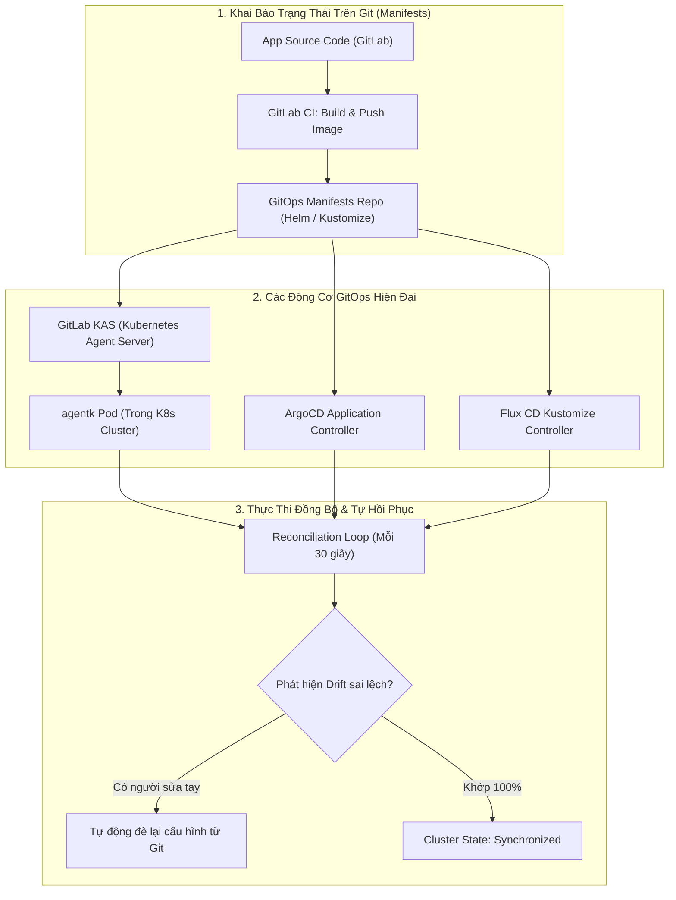


# [BÀI 41] KUBERNETES CD & GITOPS: HELM, GITLAB AGENT FOR KUBERNETES, ARGOCD & FLUX

Trong kỷ nguyên **DevOps, DevSecOps và Cloud Native Engineering**, **GitLab CI/CD** được công nhận là một trong những nền tảng tự động hóa tích hợp liên tục và phân phối liên tục (CI/CD) hoàn chỉnh, mạnh mẽ và được tin dùng nhất trong các doanh nghiệp quy mô lớn. Không chỉ dừng lại ở các pipeline tuần tự cơ bản, việc vận hành GitLab CI/CD ở cấp độ Production đòi hỏi kỹ sư phải làm chủ kiến trúc điều phối phi tuyến tính **DAG (Directed Acyclic Graph)**, cơ chế quản trị **Autoscaling Runners**, tối ưu hóa **Caching đa tầng**, xác thực không khóa **Keyless OIDC**, bảo mật chuỗi cung ứng phần mềm **SLSA & SBOM** cùng các chính sách **Quality & Security Gates** tự động.

Bài viết chuyên sâu này sẽ đồng hành cùng bạn mổ xẻ toàn diện bức tranh kiến trúc, phân tích các đánh đổi kỹ thuật thực chiến (Engineering Trade-offs), cung cấp hướng dẫn thực hành Lab chi tiết từng bước và bộ câu hỏi phỏng vấn chuyên sâu chuẩn DevOps Lead / DevSecOps Architect.

---

## 1. Bản Chất Kiến Trúc & Cơ Chế Vận Hành Tầng Thấp

### 1.1. Luận Đề Trung Tâm: Sự Chuyển Dịch Từ Push-Based Sang Pull-Based GitOps

Trong mô hình phân phối truyền thống (**Push-based CD**), GitLab CI Runner nắm giữ thông tin chứng chỉ quản trị tối cao (`kubeconfig` quyền cluster-admin) và chủ động "đẩy" lệnh `kubectl apply` từ bên ngoài vào cụm Kubernetes.

Kiến trúc này bộc lộ 3 nhược điểm lớn trong môi trường Enterprise:
1. **Lỗ hổng bảo mật cổng Inbound**: Bắt buộc phải mở cổng Kubernetes API Server ra mạng Internet công khai hoặc thiết lập VPN phức tạp để Runner bên ngoài có thể kết nối vào.
2. **Nguy cơ rò rỉ quyền quản trị cụm (Cluster Credentials Sprawl)**: Lưu trữ file `kubeconfig` trên CI runner khiến hacker nếu chiếm quyền job có thể kiểm soát toàn bộ cluster.
3. **Hiện tượng sai lệch cấu hình ngầm (Configuration Drift)**: Nếu một kỹ sư truy cập trực tiếp bằng `kubectl edit` để sửa tạm thời trên cluster, hệ thống Git hoàn toàn không biết và không thể tự động khôi phục.

> **Giải pháp là kiến trúc "Pull-based GitOps": Mã nguồn khai báo trên Git là "Single Source of Truth" duy nhất. Một Agent nội bộ (GitLab Agent for Kubernetes / ArgoCD / Flux) chạy bên trong cụm cluster sẽ liên tục lắng nghe thay đổi trên Git và "kéo" (Pull) trạng thái mong muốn về, tự động đồng bộ và triệt tiêu mọi sai lệch cấu hình.**

```text
       SO SÁNH MÔ HÌNH PUSH-BASED VÀ PULL-BASED GITOPS

  [ MÔ HÌNH TRUYỀN THỐNG: PUSH-BASED ]
  GitLab CI Runner ── (Cần mở cổng Inbound + Kubeconfig Admin) ──► [ Kubernetes API Server ]

  [ MÔ HÌNH HIỆN ĐẠI: PULL-BASED GITOPS ]
  GitLab Repository (Single Source of Truth)
         ▲
         │ (Kết nối Outbound gRPC bảo mật)
         ▼
  [ GitLab Agent for Kubernetes (agentk) / ArgoCD Controller ] (Chạy bên trong Cluster)
         │
         ▼ (Tự động Reconciliation & Self-Healing)
  [ Kubernetes Cluster State ]
```



### 1.2. Cơ Chế Hoạt Động Của GitLab Agent For Kubernetes (KAS & Agentk)

- **GitLab KAS (Kubernetes Agent Server)**: Thành phần máy chủ tích hợp sẵn trên GitLab.
- **`agentk` (Agent Pod)**: Một Pod siêu nhẹ chạy bên trong cụm Kubernetes của bạn.
- **Kết nối đảo chiều (Reverse gRPC Tunnel)**: `agentk` chủ động mở kết nối an toàn một chiều (Outbound HTTPS/gRPC) tới KAS. Bạn **không cần mở bất kỳ cổng Inbound nào trên tường lửa cụm Kubernetes**.
- **Tính năng CI/CD Tunnel**: Cho phép các job trong `.gitlab-ci.yml` sử dụng trực tiếp context của Agent (`kubectl config use-context group/project:agent-name`) mà không cần lưu token tĩnh.

### 1.3. Phân Biệt GitLab Agent vs ArgoCD vs Flux CD

1. **GitLab Agent for Kubernetes**: Tích hợp sâu nhất với giao diện GitLab, hỗ trợ cả Pull-based GitOps lẫn CI/CD Tunneling cho các job truyền thống.
2. **ArgoCD (CNCF Graduated)**: Giao diện Web UI trực quan số một thế giới, hỗ trợ quản lý hàng trăm cụm cluster tập trung, phân quyền SSO mạnh mẽ.
3. **Flux CD (CNCF Graduated)**: Thiết kế thuần Kubernetes Controller (Không có Web UI riêng), siêu nhẹ, quản lý hoàn toàn bằng Custom Resource Definitions (CRDs).

---

## 2. Bảng So Sánh Kỹ Thuật Toàn Diện (Engineering Matrix)

| Tiêu Chí Kỹ Thuật | GitLab CI Push (`kubectl`) | GitLab Agent for K8s (KAS) | ArgoCD GitOps Engine | Flux CD Engine |
| :--- | :--- | :--- | :--- | :--- |
| **Kiến Trúc Điều Phối** | Push-based từ ngoài vào | **Pull-based + CI Tunnel** | **Pull-based GitOps thuần** | **Pull-based GitOps thuần** |
| **Yêu Cầu Mở Cổng K8s** | **Bắt buộc mở Inbound API** | **Zero Inbound (Outbound gRPC)**| **Zero Inbound (Outbound)** | **Zero Inbound (Outbound)** |
| **Quản Lý Kubeconfig** | Lưu token tĩnh trong CI | **Xác thực động qua KAS** | Không cần kubeconfig ngoài | Không cần kubeconfig ngoài |
| **Tự Động Hồi Phục (Healing)**| Không hỗ trợ | Hỗ trợ qua GitOps Sync | **Rất mạnh (Auto Self-Heal)** | **Rất mạnh (Auto Self-Heal)** |
| **Giao Diện Trực Quan** | Xem qua GitLab Pipeline Log | Tích hợp GitLab Dashboard | **ArgoCD Web Dashboard đỉnh cao**| CLI / Weave GitOps UI |
| **Quản Trị Đa Cụm (Multi-Cluster)**| Khó khăn | Đăng ký nhiều Agent | **Cực mạnh (Multi-Cluster Hub)**| Phân tán qua Git Repos |
| **Độ Phức Tạp Cài Đặt** | Thấp nhất | **Rất thấp (1 lệnh Helm)** | Trung bình (Cần cài đặt cụm) | Thấp (Helm / CLI) |

---

## 3. Kiến Trúc Triển Khai Chuẩn Production (Architecture Breakdown)

### 3.1. Cấu Hình Tệp Định Nghĩa Agent `.gitlab/agents/production-agent/config.yaml`

```yaml
# Cấu hình GitOps Đồng Bộ Tự Động Từ Repository
gitops:
  manifest_projects:
    - id: "enterprise/kubernetes-manifests"
      default_namespace: "production"
      paths:
        - glob: "apps/**/*.yaml"
        - glob: "infrastructure/**/*.yaml"
      reconcile_timeout: 300s
      prune: true # Tự động xóa tài nguyên K8s nếu file YAML bị xóa trên Git

# Cấp quyền CI/CD Tunnel cho các dự án con
ci_access:
  projects:
    - id: "enterprise/payment-service"
      default_namespace: "production"
  groups:
    - id: "enterprise/core-apps"
```

### 3.2. Cấu Hình Pipeline `.gitlab-ci.yml` Sử Dụng GitLab Agent CI/CD Tunnel

```yaml
stages:
  - test
  - deploy_k8s

variables:
  AGENT_CONTEXT: "enterprise/k8s-connection-project:production-agent"

deploy_to_kubernetes:
  stage: deploy_k8s
  image:
    name: bitnami/kubectl:latest
    entrypoint: [""]
  script:
    # 1. Chuyển context sang GitLab Agent mà không cần bất kỳ file kubeconfig nào
    - kubectl config use-context "${AGENT_CONTEXT}"
    # 2. Thực thi triển khai an toàn qua kết nối gRPC nội bộ
    - kubectl get nodes
    - kubectl apply -f k8s/deployment.yaml -n production
    - kubectl rollout status deployment/payment-api-deployment -n production --timeout=120s
  environment:
    name: production
    url: https://payment.corp.internal
    tier: production
  rules:
    - if: '$CI_COMMIT_BRANCH == "main"'
```

---

## 4. Phân Tích Cạm Bẫy Thực Chiến (5-Whys Incident Analysis)

### 4.1. Sự Cố Thực Tế: Xung Đột Đồng Bộ Giữa Kỹ Sư Sửa Nóng Trên Cụm Và GitOps Engine

> **Bối Cảnh**: Trong một sự cố nghẽn mạng vào nửa đêm, kỹ sư On-call đã dùng lệnh `kubectl scale deployment payment-api --replicas=20` trực tiếp trên cluster để cứu vãn tình thế. Tuy nhiên, chỉ 30 giây sau, số lượng replicas bị tự động giảm tụt lùi về lại `3` khiến hệ thống tiếp tục sập, do ArgoCD/GitLab Agent phát hiện sai lệch và tự động đè lại giá trị `replicas: 3` đang ghi trên Git.

```text
┌─────────────────────────────────────────────────────────────────────────┐
│                    PHÂN TÍCH NGUYÊN NHÂN GỐC RỄ (5-WHYS)                 │
├─────────────────────────────────────────────────────────────────────────┤
│ 1. Tại sao số lượng replicas bị giảm đột ngột từ 20 về 3?               │
│    -> GitOps Engine (ArgoCD/Agentk) đã phát lệnh tự động Self-Healing.  │
│                                                                         │
│ 2. Tại sao GitOps Engine lại giảm về 3?                                │
│    -> Tệp YAML trên Git Repository vẫn đang khai báo replicas: 3.       │
│                                                                         │
│ 3. Tại sao kỹ sư lại sửa trực tiếp trên cụm mà không sửa trên Git?      │
│    -> Thao tác sửa trên Git rồi chờ CI/CD mất 3 phút, kỹ sư muốn sửa gấp│
│                                                                         │
│ 4. Tại sao GitOps Engine không bỏ qua trường replicas?                 │
│    -> Cấu hình không sử dụng HPA và thiếu tính năng Ignore Differences. │
│                                                                         │
│ 5. NGUYÊN NHÂN CỐT LÕI (Root Cause):                                   │
│    -> Vi phạm nguyên lý GitOps (Manual Cluster Tampering) và không sử  │
│       dụng HorizontalPodAutoscaler (HPA) để co giãn tự động.           │
└─────────────────────────────────────────────────────────────────────────┘
```

### 4.2. Giải Pháp Khắc Phục Triệt Để

1. **Sử dụng HorizontalPodAutoscaler (HPA)**: Khai báo đối tượng HPA trong Git, loại bỏ trường `replicas` cố định trong file `deployment.yaml`.
2. **Cấu hình `ignoreDifferences` trong ArgoCD**:
   ```yaml
   spec:
     ignoreDifferences:
       - group: apps
         kind: Deployment
         jsonPointers:
           - /spec/replicas
   ```

---

## 5. Hands-on Lab: Cài Đặt GitLab Agent For Kubernetes & Deploy Ứng Dụng (8 Bước Chuẩn)

### 5.1. Mục Tiêu Lab
- Đăng ký một GitLab Agent for Kubernetes mới trên dự án.
- Cài đặt `agentk` Pod vào cụm Kubernetes (Kind/Minikube/EKS) bằng Helm.
- Xác thực kết nối gRPC thành công hai chiều.
- Viết pipeline GitLab CI sử dụng CI/CD Tunnel để deploy ứng dụng và kiểm tra tính sẵn sàng.

```text
       QUY TRÌNH THỰC HÀNH LAB GITLAB AGENT FOR KUBERNETES

     [ 1. GitLab UI: Đăng ký Agent ] ──► Nhận Agent Token
                     │
                     ▼
     [ 2. Máy Khách / Cụm K8s ]     ──► helm install gitlab-agent --set token=...
                     │
                     ▼
     [ 3. agentk Pod kết nối KAS ]  ──► Trạng thái Connected (gRPC Active)
                     │
                     ▼
     [ 4. GitLab CI Job Deploy ]    ──► kubectl config use-context ...
                                              │
                                              ▼
                                    [ Deploy Pod thành công ]
```

### 5.2. Các Bước Thực Hiện Chi Tiết

#### Bước 1: Khởi Tạo Tệp Cấu Hình Agent Trong Repository
Tạo tệp `.gitlab/agents/k8s-cluster-agent/config.yaml`:
```yaml
ci_access:
  projects:
    - id: "demo-group/gitops-app"
```

#### Bước 2: Đăng Ký Agent Trên Giao Diện GitLab
- Truy cập **Operate -> Kubernetes clusters -> Connect a cluster**.
- Chọn `k8s-cluster-agent` và nhấn **Register**.
- Sao chép lệnh Helm và **Agent Token** được cấp.

#### Bước 3: Cài Đặt `agentk` Vào Cụm Kubernetes Bằng Helm
```bash
helm repo add gitlab https://charts.gitlab.io
helm repo update
helm upgrade --install k8s-cluster-agent gitlab/gitlab-agent     --namespace gitlab-agent     --create-namespace     --set image.tag="v16.9.0"     --set config.token="glagent-xxxxxxxxxxxxxxxxxxxx"     --set config.kasAddress="wss://kas.gitlab.corp.internal"
```

#### Bước 4: Kiểm Tra Trạng Thái Pod Của Agent Trong Kubernetes
```bash
kubectl get pods -n gitlab-agent
# Output: k8s-cluster-agent-xxxxxxxx-yyyyy   1/1     Running   0   30s
```

#### Bước 5: Kiểm Tra Trạng Thái Kết Nối Trên Giao Diện GitLab
- Mở trang **Operate -> Kubernetes clusters**: Trạng thái hiển thị **Connected** kèm thời gian kết nối gần nhất.

#### Bước 6: Tạo Manifest Ứng Dụng `k8s/app-deployment.yaml`
```yaml
apiVersion: apps/v1
kind: Deployment
metadata:
  name: cloud-gitops-service
  labels:
    app: cloud-gitops-service
spec:
  replicas: 2
  selector:
    matchLabels:
      app: cloud-gitops-service
  template:
    metadata:
      labels:
        app: cloud-gitops-service
    spec:
      containers:
        - name: app
          image: nginxdemos/hello:plain-text
          ports:
            - containerPort: 80
---
apiVersion: v1
kind: Service
metadata:
  name: cloud-gitops-service
spec:
  type: ClusterIP
  ports:
    - port: 80
      targetPort: 80
  selector:
    app: cloud-gitops-service
```

#### Bước 7: Cấu Hình Tệp `.gitlab-ci.yml` Sử Dụng Agent Tunnel
```yaml
stages:
  - deploy

deploy_gitops_workload:
  stage: deploy
  image:
    name: bitnami/kubectl:latest
    entrypoint: [""]
  script:
    - kubectl config use-context demo-group/gitops-app:k8s-cluster-agent
    - kubectl apply -f k8s/app-deployment.yaml
    - kubectl get pods -l app=cloud-gitops-service
  rules:
    - if: '$CI_COMMIT_BRANCH == "main"'
```

#### Bước 8: Commit Code Và Quan Sát Pipeline Thực Thi
```bash
git add .
git commit -m "feat(gitops): deploy application via gitlab agent tunnel"
git push origin main
```
- Quan sát log job `deploy_gitops_workload`:
  ```bash
  $ kubectl config use-context demo-group/gitops-app:k8s-cluster-agent
  Switched to context "demo-group/gitops-app:k8s-cluster-agent".
  $ kubectl apply -f k8s/app-deployment.yaml
  deployment.apps/cloud-gitops-service created
  service/cloud-gitops-service created
  ```

> [!NOTE]
> **Check-point Lab 41**: Triển khai Kubernetes thành công hoàn toàn qua kết nối an toàn của GitLab Agent mà không cần mở bất kỳ cổng kết nối Inbound nào trên Cluster.

---

## 6. Bộ Câu Hỏi Vấn Đáp & Phỏng Vấn Chuyên Sâu (Self-Check Q&A)

<details class="qa-card">
  <summary class="qa-summary">
    <span class="qa-num-badge">Q01</span>
    <span>Tại sao kết nối "Bi-directional gRPC Streaming Tunnel" của GitLab Agent lại an toàn hơn cơ chế Certificate Kubeconfig cũ?</span>
  </summary>
  <div class="qa-body">
    <p><strong>Ưu thế an ninh:</strong></p>
    <ul>
      <li><strong>Không mở cổng Inbound</strong>: Cụm Kubernetes có thể đặt hoàn toàn trong mạng Private Subnet/VPC kín. Agent chủ động gọi ra ngoài (Outbound) tới GitLab KAS.</li>
      <li><strong>Không có Static Credentials</strong>: Không có chứng chỉ TLS tĩnh hay ServiceAccount token nào được lưu trong GitLab Variables, loại bỏ nguy cơ rò rỉ token quản trị cụm.</li>
    </ul>
  </div>
</details>

<details class="qa-card">
  <summary class="qa-summary">
    <span class="qa-num-badge">Q02</span>
    <span>Cơ chế "Pruning" trong GitOps hoạt động như thế nào và tại sao cần hết sức cẩn trọng?</span>
  </summary>
  <div class="qa-body">
    <p><strong>Cơ chế Prune:</strong></p>
    <p>Khi bật <code>prune: true</code>, nếu một tệp manifest (ví dụ: <code>service.yaml</code>) bị xóa khỏi Git Repository, GitOps Engine sẽ <strong>tự động xóa đối tượng Service đó trên cụm Kubernetes</strong> để đảm bảo cluster phản chiếu chính xác 100% những gì có trên Git. Cần cẩn trọng vì nếu vô tình xóa nhầm thư mục manifest trên Git, toàn bộ dịch vụ trên cluster sẽ bị hủy ngay lập tức.</p>
  </div>
</details>

<details class="qa-card">
  <summary class="qa-summary">
    <span class="qa-num-badge">Q03</span>
    <span>Làm thế nào để kết hợp GitLab CI với ArgoCD Image Updater để tự động deploy Image mới?</span>
  </summary>
  <div class="qa-body">
    <p><strong>Mô hình tích hợp:</strong></p>
    <ol>
      <li>GitLab CI chỉ làm nhiệm vụ: Build, Test, Scan và đẩy Image mới lên Container Registry kèm Tag SemVer hoặc Git SHA.</li>
      <li><strong>ArgoCD Image Updater</strong> (chạy trong K8s) liên tục theo dõi Container Registry. Khi phát hiện tag mới hơn thỏa mãn điều kiện, nó sẽ tự động tạo commit sửa tệp <code>values.yaml</code> trên Git Manifest Repo.</li>
      <li>ArgoCD phát hiện commit mới trên Git và tự động đồng bộ xuống cluster.</li>
    </ol>
  </div>
</details>

<details class="qa-card">
  <summary class="qa-summary">
    <span class="qa-num-badge">Q04</span>
    <span>Sự khác biệt giữa "Reconciliation Loop" trong GitOps và việc chạy script định kỳ là gì?</span>
  </summary>
  <div class="qa-body">
    <p><strong>Nguyên lý Kubernetes Controller:</strong></p>
    <p>Reconciliation Loop là một tiến trình chạy ngầm liên tục so sánh: <code>Desired State (Git) vs Actual State (Kubernetes etcd)</code>. Nó không chỉ chạy khi có sự kiện Push code mà liên tục kiểm tra 24/7. Nếu ai đó can thiệp sửa trực tiếp trên cluster, Controller sẽ phát hiện ngay trong vòng vài chục giây và tự động khôi phục về trạng thái chuẩn trên Git.</p>
  </div>
</details>

<details class="qa-card">
  <summary class="qa-summary">
    <summary class="qa-summary">
    <span class="qa-num-badge">Q05</span>
    <span>Làm sao để cấu hình phân quyền RBAC chi tiết cho từng dự án khi dùng chung một GitLab Agent?</span>
  </summary>
  <div class="qa-body">
    <p><strong>Cấu hình ci_access:</strong></p>
    <p>Trong <code>config.yaml</code> của Agent, sử dụng khối <code>access_as</code> để giới hạn quyền:</p>
    <pre><code>ci_access:
  projects:
    - id: "demo-group/app-a"
      access_as:
        ci_job: {} # Chạy bằng quyền của User kích hoạt Job qua Kubernetes RBAC
      default_namespace: "app-a-ns"</code></pre>
  </div>
</details>

<details class="qa-card">
  <summary class="qa-summary">
    <span class="qa-num-badge">Q06</span>
    <span>Tại sao nên tách riêng "Repository Mã Nguồn Ứng Dụng" và "Repository Cấu Hình GitOps Manifests"?</span>
  </summary>
  <div class="qa-body">
    <p><strong>Nguyên tắc Best Practice:</strong></p>
    <ul>
      <li>Tránh vòng lặp vô tận (Infinite CI Loops) khi bot tự động cập nhật image tag vào Git.</li>
      <li>Tách biệt quyền hạn (Separation of Concerns): Lập trình viên chỉ có quyền sửa App Repo; Đội ngũ Vận hành / Release Manager quản lý Manifest Repo.</li>
      <li>Giúp Manifest Repo sạch sẽ, chỉ chứa lịch sử các phiên bản phát hành.</li>
    </ul>
  </div>
</details>

<details class="qa-card">
  <summary class="qa-summary">
    <span class="qa-num-badge">Q07</span>
    <span>Làm thế nào để mã hóa Secrets trong GitOps Repository mà không bị lộ mật khẩu dạng bản rõ?</span>
  </summary>
  <div class="qa-body">
    <p><strong>Các giải pháp GitOps Secrets:</strong></p>
    <ol>
      <li><strong>Sealed Secrets (Bitnami)</strong>: Mã hóa asymmetric public key, chỉ có thể giải mã bởi Controller chạy trong cụm.</li>
      <li><strong>External Secrets Operator (ESO)</strong>: Git chỉ chứa định nghĩa trỏ tới HashiCorp Vault / AWS Secrets Manager.</li>
      <li><strong>Mozilla SOPS + Kustomize-SOPS</strong>: Mã hóa file YAML bằng khóa KMS (AWS KMS, GCP KMS, Azure Key Vault).</li>
    </ol>
  </div>
</details>

<details class="qa-card">
  <summary class="qa-summary">
    <span class="qa-num-badge">Q08</span>
    <span>Flux CD quản trị việc đồng bộ Helm Charts qua Custom Resources nào?</span>
  </summary>
  <div class="qa-body">
    <p><strong>Các CRD cốt lõi của Flux:</strong></p>
    <ul>
      <li><code>HelmRepository</code>: Khai báo nguồn kho Chart (HTTP repo hoặc OCI Registry).</li>
      <li><code>HelmRelease</code>: Khai báo phiên bản Chart cần cài đặt và các giá trị cấu hình tùy biến <code>values</code>. Flux Helm Controller sẽ tự động chạy <code>helm upgrade --install</code> theo chu kỳ.</li>
    </ul>
  </div>
</details>

<details class="qa-card">
  <summary class="qa-summary">
    <span class="qa-num-badge">Q09</span>
    <span>Sự cố: `agentk` Pod báo lỗi `Failed to connect to KAS: x509: certificate signed by unknown authority`. Xử lý thế nào?</span>
  </summary>
  <div class="qa-body">
    <p><strong>Khắc phục:</strong></p>
    <p>Nếu GitLab Server sử dụng chứng chỉ SSL tự ký (Self-signed CA), bạn cần truyền chứng chỉ CA nội bộ vào Helm chart khi cài đặt Agent thông qua cờ: <code>--set-file config.caCert=/path/to/my-ca.crt</code>.</p>
  </div>
</details>

<details class="qa-card">
  <summary class="qa-summary">
    <span class="qa-num-badge">Q10</span>
    <span>Làm thế nào để triển khai chiến lược Canary Deployment bằng ArgoCD Rollouts?</span>
  </summary>
  <div class="qa-body">
    <p><strong>Argo Rollouts:</strong></p>
    <p>Thay thế đối tượng chuẩn <code>Deployment</code> bằng Custom Resource <code>Rollout</code>. Định nghĩa khối <code>strategy: canary: steps: [{setWeight: 20}, {pause: {duration: 10m}}, {setWeight: 100}]</code>. Argo Rollouts kết hợp với Ingress/Service Mesh để tự động điều tiết lưu lượng.</p>
  </div>
</details>

<details class="qa-card">
  <summary class="qa-summary">
    <span class="qa-num-badge">Q11</span>
    <span>Làm sao để giám sát sức khỏe của toàn bộ các Agent kết nối tới GitLab KAS trong doanh nghiệp?</span>
  </summary>
  <div class="qa-body">
    <p><strong>Metrics & Alerting:</strong></p>
    <p>GitLab KAS xuất ra các chỉ số Prometheus tại endpoint <code>/metrics</code> (ví dụ: <code>kas_connected_agents_count</code>, <code>kas_rpc_requests_total</code>). Thiết lập cảnh báo Grafana Alert khi số lượng agent bị mất kết nối quá 5 phút.</p>
  </div>
</details>

<details class="qa-card">
  <summary class="qa-summary">
    <span class="qa-num-badge">Q12</span>
    <span>Tại sao GitOps được coi là mô hình hoàn hảo cho tính năng Disaster Recovery (Khắc phục thảm họa)?</span>
  </summary>
  <div class="qa-body">
    <p><strong>Khả năng khôi phục tức thì:</strong></p>
    <p>Nếu toàn bộ cụm Kubernetes Production gặp sự cố phần cứng và bị phá hủy hoàn toàn, bạn chỉ cần tạo một cụm Kubernetes trống mới, cài đặt GitOps Agent và trỏ tới Git Manifest Repo. Trong vòng 5 phút, toàn bộ hàng trăm Deployments, Services, ConfigMaps, Ingresses sẽ được tự động tái lập nguyên vẹn 100%.</p>
  </div>
</details>

---

## 7. Tổng Kết & Lộ Trình Bài Học Tiếp Theo

### 7.1. Tóm Tắt Các Điểm Cốt Lõi (Architectural Key Takeaways)
- **Pull-Based Paradigm**: Chuyển đổi từ Push-based sang Pull-based GitOps giúp triệt tiêu rủi ro lộ quyền quản trị cụm.
- **GitLab Agent Integration**: Tận dụng kết nối gRPC bảo mật không cần mở cổng Inbound cho cả GitOps và CI Tunnel.
- **Drift Detection & Self-Healing**: Duy trì tính toàn vẹn 100% của hạ tầng Kubernetes theo khai báo trên Git.
- **Enterprise GitOps Ecosystem**: Phối hợp linh hoạt giữa GitLab Agent, ArgoCD và Flux CD.

### 7.2. Sơ Đồ Tư Duy Kubernetes CD & GitOps (Mindmap)

```text
                       KUBERNETES CD & GITOPS ENTERPRISE
                                       │
        ┌──────────────────────────────┼──────────────────────────────┐
        ▼                              ▼                              ▼
  [ Architecture Paradigm ]   [ GitLab Agent for K8s ]       [ GitOps Ecosystem ]
  - Pull-based vs Push-based  - KAS & agentk Pod             - ArgoCD Application Sync
  - Git as Single Source      - Bi-directional gRPC          - Flux CD Helm Controller
  - Self-Healing Automation   - CI/CD Tunneling              - Sealed Secrets / SOPS
```

> [!TIP]
> **Bước tiếp theo trong lộ trình**: Làm chủ quy trình tự động hóa quản trị hạ tầng dưới dạng mã với Terraform và OpenTofu trong [Bài 42: Tự Động Hóa Quản Lý Hạ Tầng Với Terraform & OpenTofu Trong GitLab CI](gitlab-42-42-terraform-trong-ci.html).

