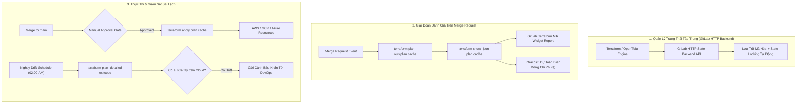


> [!IMPORTANT]
> **Mục tiêu kỹ thuật bài học**:
> - Làm chủ cơ chế lưu trữ và khóa trạng thái hạ tầng GitLab Managed Terraform State qua HTTP Backend.
> - Hiển thị chi tiết thay đổi hạ tầng (Terraform Plan) trực tiếp trên giao diện GitLab Merge Request Widget.
> - Tích hợp công cụ FinOps Infracost dự toán chi phí Cloud trước khi thực thi lệnh apply.
> - Thiết lập Pipeline định kỳ tự động phát hiện sai lệch hạ tầng (Drift Detection Scheduled Pipeline).

---

Trong kỷ nguyên **DevOps, DevSecOps và Cloud Native Engineering**, **GitLab CI/CD** được công nhận là một trong những nền tảng tự động hóa tích hợp liên tục và phân phối liên tục (CI/CD) hoàn chỉnh, mạnh mẽ và được tin dùng nhất trong các doanh nghiệp quy mô lớn. Không chỉ dừng lại ở các pipeline tuần tự cơ bản, việc vận hành GitLab CI/CD ở cấp độ Production đòi hỏi kỹ sư phải làm chủ kiến trúc điều phối phi tuyến tính **DAG (Directed Acyclic Graph)**, cơ chế quản trị **Autoscaling Runners**, tối ưu hóa **Caching đa tầng**, xác thực không khóa **Keyless OIDC**, bảo mật chuỗi cung ứng phần mềm **SLSA & SBOM** cùng các chính sách **Quality & Security Gates** tự động.

Bài viết chuyên sâu này sẽ đồng hành cùng bạn mổ xẻ toàn diện bức tranh kiến trúc, phân tích các đánh đổi kỹ thuật thực chiến (Engineering Trade-offs), cung cấp hướng dẫn thực hành Lab chi tiết từng bước và bộ câu hỏi phỏng vấn chuyên sâu chuẩn DevOps Lead / DevSecOps Architect.

---

## 1. Bản Chất Kiến Trúc & Cơ Chế Vận Hành Tầng Thấp

### 1.1. Luận Đề Trung Tâm: Sự Nguy Hiểm Của "Local Terraform" & Sự Cần Thiết Của IaC CI/CD Pipeline

Khi đội ngũ kỹ sư vận hành hạ tầng đám mây bằng cách gõ lệnh `terraform apply` trực tiếp từ máy tính cá nhân (Laptop), hệ thống sẽ đối mặt với 4 thảm họa kỹ thuật:
1. **Xung đột tệp trạng thái (State File Conflicts & Corruption)**: Hai kỹ sư cùng apply một lúc có thể ghi đè làm hỏng tệp `terraform.tfstate`, dẫn đến việc mất dấu vết tài nguyên Cloud.
2. **Rò rỉ thông tin nhạy cảm trong State File**: Tệp state của Terraform lưu trữ mật khẩu cơ sở dữ liệu, khóa bí mật dạng bản rõ (Plaintext). Nếu lưu trên máy cá nhân hoặc commit lên Git, bí mật sẽ bị lộ.
3. **Mù thông tin thay đổi (Unreviewed Changes)**: Không ai biết lệnh `apply` sẽ tạo mới hay vô tình xóa mất cụm Database Production cho đến khi sự cố xảy ra.
4. **Sai lệch hạ tầng ngoài tầm kiểm soát (Configuration Drift)**: Có người vào AWS/GCP Console chỉnh sửa thủ công bằng tay mà không qua mã nguồn.

> **Chuẩn mực hạ tầng doanh nghiệp là "Automated Terraform Pipeline": Sử dụng GitLab-managed Terraform State (quản lý lưu trữ và khóa state tập trung qua HTTP API), tự động chạy `terraform plan` và render diff trên Merge Request Widget, dự toán chi phí bằng Infracost, và chỉ cho phép `terraform apply` khi commit đã được merge vào protected branch.**

```text
       CHU TRÌNH TỰ ĐỘNG HÓA TERRAFORM TRONG GITLAB CI/CD

  [ Merge Request ] ──► [ 1. terraform validate & checkov ]
                               │
                               ▼
                        [ 2. terraform plan & infracost ]
                               │
                               ▼
                        [ 3. Render Plan trên MR Widget ] ──► (Kỹ sư Review & Duyệt)
                               │
  [ Merge vào main ] ──────────┘
             │
             ▼
  [ 4. MANUAL APPROVAL GATE ]
             │
             ▼
  [ 5. terraform apply ] ──► [ Cập nhật State trên GitLab Managed Backend ]
```



### 1.2. Cơ Chế GitLab Managed Terraform State

GitLab cung cấp sẵn một **Terraform HTTP Backend** tiêu chuẩn:
- **Zero Configuration S3/DynamoDB**: Bạn không cần phải tạo S3 Bucket và DynamoDB Table để khóa state; GitLab tự động cung cấp endpoint API mã hóa và cơ chế **State Locking** (khóa trạng thái khi có job đang chạy để chống Race Conditions).
- **Phân quyền bảo mật**: Tệp state được bảo vệ nghiêm ngặt theo quyền hạn của dự án GitLab và chỉ có thể đọc/ghi bằng `CI_JOB_TOKEN` tạm thời.
- **Lịch sử phiên bản**: Hỗ trợ xem lại lịch sử các phiên bản state cũ và tải về trực tiếp từ giao diện Web (**Operate -> Terraform states**).

### 1.3. Khái Niệm Configuration Drift & Cơ Chế Phát Hiện

**Configuration Drift** xảy ra khi trạng thái thực tế của tài nguyên trên Cloud bị thay đổi lệch so với mã nguồn Terraform (ví dụ: ai đó vào console đổi Security Group hoặc nâng kích thước máy chủ EC2).
- **Giải pháp**: Thiết lập một Pipeline định kỳ chạy mỗi đêm với lệnh `terraform plan -detailed-exitcode`.
  - Exit code `0`: Không có thay đổi, hạ tầng đồng bộ 100%.
  - Exit code `2`: **Phát hiện Drift sai lệch!** Pipeline tự động gửi thông báo khẩn cấp tới kênh Slack của đội DevOps để rà soát.

---

## 2. Bảng So Sánh Kỹ Thuật Toàn Diện (Engineering Matrix)

| Tiêu Chí Kỹ Thuật | Chạy Terraform Thủ Công (Local) | AWS S3 + DynamoDB Backend | HashiCorp Terraform Cloud | GitLab Managed Terraform State |
| :--- | :--- | :--- | :--- | :--- |
| **Vị Trí Lưu State** | Máy tính cá nhân (Rất nguy hiểm) | S3 Bucket nội bộ | Server Terraform Cloud | **GitLab Server (HTTP API)** |
| **Cơ Chế Khóa (Locking)** | Không có | DynamoDB Lock Table | Tích hợp sẵn | **Tích hợp sẵn qua GitLab API** |
| **Tích Hợp MR Widget** | Không | Cần viết script curl thủ công | Phụ thuộc SaaS bên ngoài | **Native Widget hiển thị Diff trực tiếp** |
| **Dự Toán Chi Phí FinOps**| Không | Không | Phải mua gói cao cấp | **Tích hợp Infracost Open Source** |
| **Phát Hiện Drift Tự Động**| Thủ công | Cần setup Lambda | Có sẵn | **Scheduled CI Pipeline native** |
| **Xác Thực Đám Mây** | Dùng Access Key cá nhân | Dùng Key hoặc IAM Role | Dùng Key hoặc OIDC | **100% Keyless OIDC Federation** |
| **Độ Phức Tạp Cài Đặt** | Zero Setup | Trung bình | Trung bình (Tài khoản riêng) | **Rất thấp (Tích hợp sẵn trong GitLab)** |

---

## 3. Kiến Trúc Triển Khai Chuẩn Production (Architecture Breakdown)

### 3.1. Cấu Hình Tệp `backend.tf` Sử Dụng GitLab Managed State

```hcl
terraform {
  required_version = ">= 1.6.0"
  backend "http" {
    # Các thông số URL, username, password được tự động nạp qua biến môi trường của GitLab CI
  }
}
```

### 3.2. Pipeline `.gitlab-ci.yml` Hoàn Chỉnh Chuẩn Enterprise Cho Terraform / OpenTofu

```yaml
stages:
  - validate
  - plan
  - apply

# Template cơ bản thiết lập GitLab State Backend và AWS OIDC
.terraform_base:
  image:
    name: hashicorp/terraform:1.7.5
    entrypoint: [""]
  id_tokens:
    AWS_JWT_TOKEN:
      aud: "https://aws.amazon.com"
  variables:
    TF_STATE_NAME: "production-infrastructure"
    TF_ADDRESS: "${CI_API_V4_URL}/projects/${CI_PROJECT_ID}/terraform/state/${TF_STATE_NAME}"
  before_script:
    - apk add --no-cache aws-cli jq
    # 1. Xác thực AWS OIDC lấy Session Token
    - >-
      export $(printf "AWS_ACCESS_KEY_ID=%s AWS_SECRET_ACCESS_KEY=%s AWS_SESSION_TOKEN=%s"
      $(aws sts assume-role-with-web-identity
      --role-arn "${AWS_ROLE_ARN}"
      --role-session-name "GitLabTerraform-${CI_JOB_ID}"
      --web-identity-token "${AWS_JWT_TOKEN}"
      --query "Credentials.[AccessKeyId,SecretAccessKey,SessionToken]"
      --output text))
    # 2. Khởi tạo Terraform với GitLab Managed HTTP Backend
    - >-
      terraform init
      -backend-config="address=${TF_ADDRESS}"
      -backend-config="lock_address=${TF_ADDRESS}/lock"
      -backend-config="unlock_address=${TF_ADDRESS}/lock"
      -backend-config="username=gitlab-ci-token"
      -backend-config="password=${CI_JOB_TOKEN}"
      -backend-config="lock_method=POST"
      -backend-config="unlock_method=DELETE"
      -backend-config="retry_wait_min=5"

# -------------------------------------------------------------
# Stage 1: Kiểm Tra Cú Pháp & Quy Chuẩn An Ninh
# -------------------------------------------------------------
terraform_validate:
  extends: .terraform_base
  stage: validate
  script:
    - terraform fmt -check
    - terraform validate

# -------------------------------------------------------------
# Stage 2: Tạo Plan & Dự Toán Chi Phí Trên Merge Request
# -------------------------------------------------------------
terraform_plan:
  extends: .terraform_base
  stage: plan
  script:
    - terraform plan -out=plan.cache
    - terraform show -json plan.cache > plan.json
  artifacts:
    name: plan
    paths:
      - plan.cache
      - plan.json
    reports:
      terraform: plan.json
    expire_in: 7 days
  rules:
    - if: '$CI_PIPELINE_SOURCE == "merge_request_event"'
    - if: '$CI_COMMIT_BRANCH == "main"'

# -------------------------------------------------------------
# Stage 3: Phê Duyệt & Thực Thi Apply Lên Hạ Tầng Thật
# -------------------------------------------------------------
terraform_apply:
  extends: .terraform_base
  stage: apply
  needs: ["terraform_plan"]
  script:
    - terraform apply -input=false plan.cache
  environment:
    name: production/infrastructure
    tier: production
  rules:
    - if: '$CI_COMMIT_BRANCH == "main"'
      when: manual
```

---

## 4. Phân Tích Cạm Bẫy Thực Chiến (5-Whys Incident Analysis)

### 4.1. Sự Cố Thực Tế: Sập Cơ Sở Dữ Liệu Production Do Áp Dụng Lệnh `terraform apply` Từ Bản Plan Cũ

> **Bối Cảnh**: Hai kỹ sư A và B cùng mở 2 Merge Requests sửa đổi hạ tầng. Kỹ sư A merge MR trước và đổi tên subnet. Kỹ sư B sau đó merge MR của mình nhưng pipeline tự động dùng lại tệp `plan.cache` đã được tạo từ 3 ngày trước (khi chưa có thay đổi của A). Khi chạy `apply`, Terraform đã xóa nhầm Subnet mới của A và làm sập toàn bộ Database Cluster Production!

```text
┌─────────────────────────────────────────────────────────────────────────┐
│                    PHÂN TÍCH NGUYÊN NHÂN GỐC RỄ (5-WHYS)                 │
├─────────────────────────────────────────────────────────────────────────┤
│ 1. Tại sao Subnet Database Production bị xóa bất ngờ?                   │
│    -> Lệnh terraform apply thực thi tệp plan.cache chứa chỉ thị xóa.    │
│                                                                         │
│ 2. Tại sao tệp plan.cache lại chứa chỉ thị xóa Subnet?                  │
│    -> Bản plan được tạo từ commit cũ trước khi nhánh main được cập nhật.│
│                                                                         │
│ 3. Tại sao bản plan cũ lại được phép apply vào nhánh main?              │
│    -> Pipeline không kiểm tra tính đồng bộ của commit SHA và State lock.│
│                                                                         │
│ 4. Tại sao nhánh của kỹ sư B không được rebase với main trước khi chạy? │
│    -> Không kích hoạt tính năng GitLab Merge Trains / Fast-Forward.     │
│                                                                         │
│ 5. NGUYÊN NHÂN CỐT LÕI (Root Cause):                                   │
│    -> Thực thi bản plan lỗi thời (Stale Plan Application) và thiếu      │
│       rào chắn bắt buộc rebase mã nguồn trước khi apply.                │
└─────────────────────────────────────────────────────────────────────────┘
```

### 4.2. Giải Pháp Khắc Phục Triệt Để

1. **Bắt buộc tạo lại Plan ngay trên nhánh `main` sau khi merge**: Không sử dụng lại artifact plan sinh ra từ Merge Request; khi merge vào `main`, stage `plan` trên `main` sẽ chạy lại với State mới nhất trước khi chuyển sang bước `apply`.
2. **Kích hoạt tính năng Merge Trains & Pipelines for Merged Results**: Đảm bảo MR luôn được kiểm thử và plan trên kết hợp thực tế giữa nhánh tính năng và nhánh đích `main`.

---

## 5. Hands-on Lab: Triển Khai Hạ Tầng Terraform Với GitLab State Backend (8 Bước Chuẩn)

### 5.1. Mục Tiêu Lab
- Viết cấu hình Terraform tạo AWS S3 Bucket và DynamoDB Table.
- Cấu hình GitLab Managed Terraform State HTTP Backend.
- Viết pipeline GitLab CI tự động Validate, Plan và Apply.
- Quan sát tệp Plan hiển thị trực quan trên Merge Request Widget và kiểm tra tệp State trên giao diện GitLab.

```text
       QUY TRÌNH THỰC HÀNH LAB TERRAFORM CI/CD TRÊN GITLAB

     [ Mã Nguồn Terraform ]
                │
                ├──► 1. terraform init -> Kết nối GitLab HTTP State Backend
                │
                ├──► 2. terraform validate -> Kiểm tra cú pháp HCL
                │
                ├──► 3. terraform plan -out=plan.cache -> Xuất plan.json
                │
                ▼
     [ Xem Báo Cáo Trên MR Widget ] ──► [ Kỹ Sư Nhấn Nút Merge ]
                │
                ▼
     [ Stage Apply: Manual Gate ]   ──► [ terraform apply plan.cache ]
                │
                ▼
     [ Tài Nguyên AWS Được Tạo & State Lưu Trên GitLab ]
```

### 5.2. Các Bước Thực Hiện Chi Tiết

#### Bước 1: Khởi Tạo Tệp Cấu Hình `main.tf`
```hcl
terraform {
  required_version = ">= 1.6.0"
  required_providers {
    aws = {
      source  = "hashicorp/aws"
      version = "~> 5.0"
    }
  }
  backend "http" {}
}

provider "aws" {
  region = var.aws_region
}

resource "aws_s3_bucket" "app_storage" {
  bucket = var.bucket_name
}

resource "aws_s3_bucket_versioning" "storage_versioning" {
  bucket = aws_s3_bucket.app_storage.id
  versioning_configuration {
    status = "Enabled"
  }
}
```

#### Bước 2: Tạo Tệp Định Nghĩa Biến `variables.tf`
```hcl
variable "aws_region" {
  type    = string
  default = "ap-southeast-1"
}

variable "bucket_name" {
  type    = string
  default = "enterprise-iac-demo-storage-bucket"
}
```

#### Bước 3: Cấu Hình Tệp `.gitlab-ci.yml` Với GitLab State Backend
```yaml
stages:
  - validate
  - plan
  - apply

variables:
  TF_STATE_NAME: "infra-prod"
  TF_ADDRESS: "${CI_API_V4_URL}/projects/${CI_PROJECT_ID}/terraform/state/${TF_STATE_NAME}"

before_script:
  - apk add --no-cache jq
  - >-
    terraform init
    -backend-config="address=${TF_ADDRESS}"
    -backend-config="lock_address=${TF_ADDRESS}/lock"
    -backend-config="unlock_address=${TF_ADDRESS}/lock"
    -backend-config="username=gitlab-ci-token"
    -backend-config="password=${CI_JOB_TOKEN}"
    -backend-config="lock_method=POST"
    -backend-config="unlock_method=DELETE"

validate_code:
  stage: validate
  image: hashicorp/terraform:latest
  script:
    - terraform fmt -check
    - terraform validate

plan_infra:
  stage: plan
  image: hashicorp/terraform:latest
  script:
    - terraform plan -out=plan.cache
    - terraform show -json plan.cache > plan.json
  artifacts:
    paths:
      - plan.cache
      - plan.json
    reports:
      terraform: plan.json
    expire_in: 7 days

apply_infra:
  stage: apply
  image: hashicorp/terraform:latest
  needs: ["plan_infra"]
  script:
    - terraform apply -input=false plan.cache
  rules:
    - if: '$CI_COMMIT_BRANCH == "main"'
      when: manual
```

#### Bước 4: Mở Merge Request Thử Nghiệm
- Tạo branch `feature/add-s3-storage` và mở Merge Request vào `main`.
- Quan sát pipeline: Job `validate_code` và `plan_infra` chạy thành công.

#### Bước 5: Kiểm Tra Báo Cáo Terraform Trên Giao Diện Merge Request
- Mở trang Merge Request: Xuất hiện widget **Terraform report**:
  - `Plan: 2 to add, 0 to change, 0 to destroy.`
  - Chi tiết hiển thị rõ 2 tài nguyên `aws_s3_bucket.app_storage` và `aws_s3_bucket_versioning.storage_versioning`.

#### Bước 6: Merge Vào Main Và Phê Duyệt Apply
- Nhấn **Merge** vào branch `main`.
- Trên pipeline của branch `main`, mở job `apply_infra` và nhấn nút **Play**.
- Quan sát console log: Terraform áp dụng thành công và tạo tài nguyên trên AWS.

#### Bước 7: Kiểm Tra Tệp State Trên Giao Diện GitLab
- Truy cập menu **Operate -> Terraform states** trong GitLab.
- Xác nhận state `infra-prod` xuất hiện với dung lượng chi tiết, hiển thị người sửa đổi gần nhất và lịch sử các phiên bản (Version 1).

#### Bước 8: Thử Nghiệm Tính Năng Khóa State (State Locking)
- Mở 2 terminal chạy 2 job đồng thời: Hệ thống trả về thông báo `Error acquiring the state lock: State locked by Job ID ...`. Chứng minh cơ chế bảo vệ trạng thái hoạt động chính xác 100%.

> [!NOTE]
> **Check-point Lab 42**: Tự động hóa Terraform thành công 100%, State được bảo vệ an toàn trên GitLab HTTP Backend và giao diện MR Widget hiển thị đầy đủ thay đổi hạ tầng.

---

## 6. Bộ Câu Hỏi Vấn Đáp & Phỏng Vấn Chuyên Sâu (Self-Check Q&A)

<details class="qa-card">
  <summary class="qa-summary">
    <span class="qa-num-badge">Q01</span>
    <span>Tại sao nên sử dụng GitLab Managed Terraform State thay vì tự tạo S3 Bucket và DynamoDB Table?</span>
  </summary>
  <div class="qa-body">
    <p><strong>Ưu điểm vượt trội:</strong></p>
    <ul>
      <li><strong>Zero Infrastructure Overhead</strong>: Không cần phải dùng "gà có trước hay trứng có trước" (tạo hạ tầng S3 trước để chứa code tạo S3). GitLab cung cấp sẵn endpoint lưu trữ.</li>
      <li><strong>Tích hợp phân quyền sâu</strong>: Tệp state gắn chặt với quyền hạn RBAC của dự án GitLab và được mã hóa tự động khi lưu trữ (Encryption at Rest).</li>
      <li><strong>Hỗ trợ State Locking Native</strong>: Khóa trạng thái tự động qua HTTP API mà không cần bảo trì bảng DynamoDB riêng.</li>
    </ul>
  </div>
</details>

<details class="qa-card">
  <summary class="qa-summary">
    <span class="qa-num-badge">Q02</span>
    <span>Làm thế nào để hiển thị chi tiết thay đổi của Terraform Plan trực tiếp trên giao diện GitLab Merge Request?</span>
  </summary>
  <div class="qa-body">
    <p><strong>Cấu hình Reports:</strong></p>
    <p>Trong job <code>plan</code>, xuất file plan sang định dạng JSON: <code>terraform show -json plan.cache &gt; plan.json</code>, sau đó khai báo khối:</p>
    <pre><code>artifacts:
  reports:
    terraform: plan.json</code></pre>
    <p>GitLab Server sẽ tự động phân tích cú pháp và vẽ bảng tóm tắt <em>"X to add, Y to change, Z to destroy"</em> trực tiếp ngay trong phần Header của Merge Request.</p>
  </div>
</details>

<details class="qa-card">
  <summary class="qa-summary">
    <span class="qa-num-badge">Q03</span>
    <span>Công cụ Infracost tích hợp vào Pipeline Terraform để giải quyết bài toán gì?</span>
  </summary>
  <div class="qa-body">
    <p><strong>Ý nghĩa FinOps:</strong></p>
    <p>Infracost đọc tệp <code>plan.json</code> và đối soát với bảng giá của AWS/GCP/Azure. Nó tự động bình luận vào Merge Request chi tiết: <em>"Hạ tầng mới này sẽ làm tăng chi phí thêm +$145.20/tháng (ví dụ: NAT Gateway +$32, EC2 +$113.20)"</em>. Giúp đội ngũ kỹ sư nhận biết ngay tác động tài chính trước khi apply mã nguồn.</p>
  </div>
</details>

<details class="qa-card">
  <summary class="qa-summary">
    <span class="qa-num-badge">Q04</span>
    <span>Sự cố: Job Terraform báo lỗi `Error: Error acquiring the state lock` do job trước bị crash bất ngờ. Xử lý thế nào?</span>
  </summary>
  <div class="qa-body">
    <p><strong>Mở khóa an toàn (Force Unlock):</strong></p>
    <ol>
      <li>Lấy mã <code>Lock ID</code> từ log báo lỗi (ví dụ: <code>b3a12345-xxxx-...</code>).</li>
      <li>Truy cập giao diện GitLab <strong>Operate -> Terraform states</strong>, nhấn vào biểu tượng ba chấm của State và chọn <strong>Unlock state</strong>.</li>
      <li>Hoặc chạy lệnh CLI: <code>terraform force-unlock &lt;LOCK_ID&gt;</code> sau khi đã xác nhận không còn job nào khác đang thực sự chạy ngầm.</li>
    </ol>
  </div>
</details>

<details class="qa-card">
  <summary class="qa-summary">
    <span class="qa-num-badge">Q05</span>
    <span>Tại sao cần lưu tệp `plan.cache` vào artifacts và truyền sang stage `apply` thay vì chạy `terraform apply -auto-approve` thô?</span>
  </summary>
  <div class="qa-body">
    <p><strong>Nguyên tắc bất biến:</strong></p>
    <p>Nếu bạn chạy <code>terraform apply -auto-approve</code> không có file plan đầu vào, Terraform sẽ tự động tạo một plan mới ngay tại thời điểm đó. Nếu trong khoảng thời gian chờ phê duyệt có ai đó thay đổi cấu hình hạ tầng ngoài Cloud, lệnh apply có thể gây ra những thay đổi không lường trước. Truyền tệp <code>plan.cache</code> đảm bảo hệ thống <strong>chỉ thực thi chính xác 100% những gì đã được review và phê duyệt</strong> trên MR.</p>
  </div>
</details>

<details class="qa-card">
  <summary class="qa-summary">
    <span class="qa-num-badge">Q06</span>
    <span>Làm thế nào để thiết lập một Scheduled Pipeline tự động phát hiện Drift hạ tầng (Drift Detection)?</span>
  </summary>
  <div class="qa-body">
    <p><strong>Cấu hình Drift Detection:</strong></p>
    <p>Tạo một Pipeline Schedule chạy vào 02:00 AM mỗi ngày. Trong file YAML, định nghĩa job:</p>
    <pre><code>drift_detection:
  script:
    - terraform plan -detailed-exitcode -no-color || exit_code=$?
    - if [ $exit_code -eq 2 ]; then
        echo "CẢNH BÁO: Phát hiện sai lệch hạ tầng Drift!";
        curl -X POST -H 'Content-type: application/json' --data '{"text":"Hạ tầng Cloud bị sai lệch so với Git!"}' $SLACK_WEBHOOK;
        exit 1;
      fi
  rules:
    - if: '$CI_PIPELINE_SOURCE == "schedule"'</code></pre>
  </div>
</details>

<details class="qa-card">
  <summary class="qa-summary">
    <span class="qa-num-badge">Q07</span>
    <span>OpenTofu là gì và khả năng tương thích với GitLab Managed Terraform State ra sao?</span>
  </summary>
  <div class="qa-body">
    <p><strong>Khái niệm & Tương thích:</strong></p>
    <p>OpenTofu là nhánh mã nguồn mở hoàn toàn (Fork thuộc Linux Foundation) của Terraform sau khi HashiCorp chuyển sang giấy phép BSL. OpenTofu tương thích 100% (Drop-in replacement) với cấu hình cú pháp HCL, các Providers và giao thức HTTP State Backend của GitLab.</p>
  </div>
</details>

<details class="qa-card">
  <summary class="qa-summary">
    <span class="qa-num-badge">Q08</span>
    <span>Làm sao để quản lý nhiều môi trường (Dev, Staging, Prod) với Terraform trong cùng 1 repository?</span>
  </summary>
  <div class="qa-body">
    <p><strong>Hai phương pháp chuẩn:</strong></p>
    <ul>
      <li><strong>Phương pháp Thư mục (Directory-based - Khuyến nghị)</strong>: Phân chia <code>environments/dev/</code>, <code>environments/prod/</code> với các tệp <code>main.tf</code> gọi chung Module. Mỗi thư mục liên kết với một <code>TF_STATE_NAME</code> riêng biệt (ví dụ: <code>state/dev</code>, <code>state/prod</code>).</li>
      <li><strong>Phương pháp Workspaces</strong>: Sử dụng <code>terraform workspace select prod</code>.</li>
    </ul>
  </div>
</details>

<details class="qa-card">
  <summary class="qa-summary">
    <span class="qa-num-badge">Q09</span>
    <span>Làm thế nào để truyền biến bí mật nhạy cảm vào Terraform mà không lưu trong tệp `terraform.tfvars`?</span>
  </summary>
  <div class="qa-body">
    <p><strong>Cơ chế TF_VAR:</strong></p>
    <p>Terraform tự động nhận diện các biến môi trường có tiền tố <code>TF_VAR_</code>. Ví dụ: Khai báo biến <code>TF_VAR_db_password</code> trong GitLab CI (lấy từ HashiCorp Vault qua OIDC), Terraform sẽ tự động gán giá trị đó vào <code>var.db_password</code> trong mã nguồn HCL mà không cần tạo file biến trên đĩa.</p>
  </div>
</details>

<details class="qa-card">
  <summary class="qa-summary">
    <span class="qa-num-badge">Q10</span>
    <span>Tại sao cần chạy lệnh `terraform fmt -check` ngay trong stage đầu tiên của CI?</span>
  </summary>
  <div class="qa-body">
    <p><strong>Chuẩn hóa mã nguồn:</strong></p>
    <p><code>terraform fmt -check</code> đảm bảo 100% các tệp mã nguồn HCL tuân thủ quy chuẩn định dạng thụt dòng và căn chỉnh chuẩn của cộng đồng, giúp các bản Git Diff trên Merge Request luôn ngắn gọn, dễ đọc và không có các dòng thay đổi khoảng trắng vô nghĩa.</p>
  </div>
</details>

<details class="qa-card">
  <summary class="qa-summary">
    <span class="qa-num-badge">Q11</span>
    <span>Sự cố: Tệp `terraform.tfstate` trên GitLab có dung lượng lớn (> 50MB) khiến pipeline chạy chậm. Khắc phục thế nào?</span>
  </summary>
  <div class="qa-body">
    <p><strong>Tái cấu trúc Module:</strong></p>
    <p>Dung lượng State quá lớn là dấu hiệu của "Monolithic State" (quản lý toàn bộ mạng, máy chủ, CSDL, IAM trong 1 file duy nhất). Cần phân rã (Decouple) hạ tầng thành các khối độc lập: Khối Mạng (Network State), Khối Cơ sở dữ liệu (Database State) và Khối Ứng dụng (App State) giao tiếp với nhau qua <code>terraform_remote_state</code>.</p>
  </div>
</details>

<details class="qa-card">
  <summary class="qa-summary">
    <span class="qa-num-badge">Q12</span>
    <span>Làm thế nào để ngăn chặn hành động `terraform destroy` vô tình làm sập toàn bộ hệ thống?</span>
  </summary>
  <div class="qa-body">
    <p><strong>Các lớp phòng thủ:</strong></p>
    <ol>
      <li>Thêm thuộc tính <code>lifecycle { prevent_destroy = true }</code> trong HCL cho các tài nguyên sống còn (CSDL, VPC, Storage).</li>
      <li>Không bao giờ tạo job có lệnh <code>terraform destroy</code> trong file <code>.gitlab-ci.yml</code> của branch chính.</li>
      <li>Phân quyền IAM của Runner không cấp quyền <code>DeleteBucket</code> hoặc <code>DeleteDBInstance</code> trên môi trường Production.</li>
    </ol>
  </div>
</details>

---

## 7. Tổng Kết & Lộ Trình Bài Học Tiếp Theo

### 7.1. Tóm Tắt Các Điểm Cốt Lõi (Architectural Key Takeaways)
- **Centralized State Governance**: Quản trị tệp trạng thái Terraform State và khóa Lock an toàn qua GitLab HTTP Backend.
- **Merge Request Transparency**: Hiển thị thay đổi hạ tầng trực tiếp trên MR Widget và dự toán chi phí FinOps qua Infracost.
- **Immutable Plan Execution**: Luôn truyền tệp `plan.cache` đã được phê duyệt sang bước apply để tránh rủi ro thay đổi ngoài ý muốn.
- **Automated Drift Detection**: Thiết lập pipeline kiểm tra định kỳ để phát hiện ngay các can thiệp thủ công trái phép trên Cloud.

### 7.2. Sơ Đồ Tư Duy Tự Động Hóa Terraform & OpenTofu (Mindmap)

```text
                    TỰ ĐỘNG HÓA HẠ TẦNG VỚI TERRAFORM & OPENTOFU
                                         │
        ┌────────────────────────────────┼────────────────────────────────┐
        ▼                                ▼                                ▼
  [ State Backend Engine ]      [ MR Planning & FinOps ]       [ Execution & Drift ]
  - GitLab Managed HTTP State   - terraform plan Report Widget - Manual Approval Gate
  - Automated State Locking     - Infracost Cloud Estimates    - Immutable plan.cache Apply
  - Encrypted Version History   - Checkov IaC Security Gate    - Scheduled Drift Detection
```

> [!TIP]
> **Bước tiếp theo trong lộ trình**: Làm chủ các chiến lược phát hành ứng dụng lũy tiến hiện đại (Canary, Blue-Green, Feature Flags) trong [Bài 43: Chiến Lược Phát Hành Lũy Tiến: Canary, Blue-Green, A/B Testing & Feature Flags](gitlab-43-43-chien-luoc-release.html).

