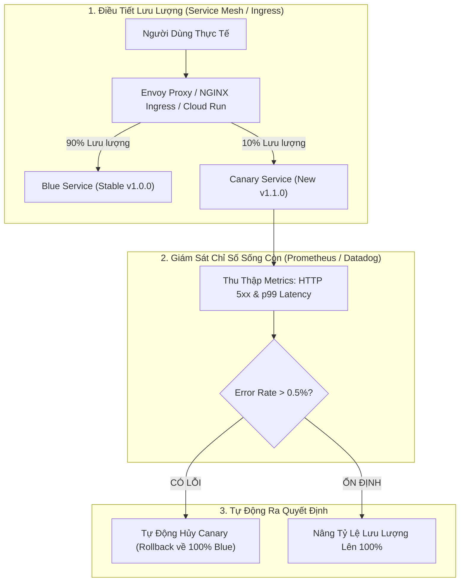


# [BÀI 43] CHIẾN LƯỢC PHÁT HÀNH LŨY TIẾN: CANARY, BLUE-GREEN, A/B TESTING & FEATURE FLAGS

Trong kỷ nguyên **DevOps, DevSecOps và Cloud Native Engineering**, **GitLab CI/CD** được công nhận là một trong những nền tảng tự động hóa tích hợp liên tục và phân phối liên tục (CI/CD) hoàn chỉnh, mạnh mẽ và được tin dùng nhất trong các doanh nghiệp quy mô lớn. Không chỉ dừng lại ở các pipeline tuần tự cơ bản, việc vận hành GitLab CI/CD ở cấp độ Production đòi hỏi kỹ sư phải làm chủ kiến trúc điều phối phi tuyến tính **DAG (Directed Acyclic Graph)**, cơ chế quản trị **Autoscaling Runners**, tối ưu hóa **Caching đa tầng**, xác thực không khóa **Keyless OIDC**, bảo mật chuỗi cung ứng phần mềm **SLSA & SBOM** cùng các chính sách **Quality & Security Gates** tự động.

Bài viết chuyên sâu này sẽ đồng hành cùng bạn mổ xẻ toàn diện bức tranh kiến trúc, phân tích các đánh đổi kỹ thuật thực chiến (Engineering Trade-offs), cung cấp hướng dẫn thực hành Lab chi tiết từng bước và bộ câu hỏi phỏng vấn chuyên sâu chuẩn DevOps Lead / DevSecOps Architect.

---

## 1. Bản Chất Kiến Trúc & Cơ Chế Vận Hành Tầng Thấp

### 1.1. Luận Đề Trung Tâm: Tách Biệt Giữa "Deployment (Kỹ Thuật)" Và "Release (Kinh Doanh)"

Trong quy trình phát hành truyền thống ("Big Bang Deployment"), việc đưa một phiên bản mã nguồn mới lên máy chủ đồng nghĩa với việc 100% người dùng thực tế sẽ tiếp xúc ngay lập tức với phiên bản đó. Nếu bản build chứa một lỗi logic nghiêm trọng, toàn bộ khách hàng của doanh nghiệp sẽ bị ảnh hưởng, gây thiệt hại doanh thu và uy tín thương hiệu khổng lồ.

> **Triết lý "Progressive Delivery" (Phân phối lũy tiến) ra đời nhằm mục tiêu: "Giảm thiểu tối đa bán kính thiệt hại (Blast Radius Mitigation)" bằng cách tách rời hai khái niệm:**
> - **Deployment (Triển khai kỹ thuật)**: Đưa mã nguồn mới lên hạ tầng Production và khởi chạy an toàn (nhưng chưa phục vụ khách hàng, hoặc chỉ phục vụ một nhóm nhỏ 1-5%).
> - **Release (Phát hành nghiệp vụ)**: Mở khóa tính năng cho người dùng theo từng giai đoạn có kiểm soát dựa trên số liệu phân tích và Feature Flags.

```
       TIẾN TRÌNH PHÂN PHỐI LŨY TIẾN (Progressive Delivery Progression)

  [ Giai đoạn 1: Dark Launching / Canary 5% ]
  Traffic: 95% Stable (v1) | 5% Canary (v2) ──► (Theo dõi Prometheus SLI/SLO trong 15p)
                                                       │
  [ Giai đoạn 2: Tăng Tỷ Lệ Lên 25% & 50% ]             │ (Nếu Error Rate < 0.1% & p99 < 150ms)
  Traffic: 50% Stable (v1) | 50% Canary (v2) ◄─────────┘
                                                       │
  [ Giai đoạn 3: Hoàn Tất Chuyển Giao 100% ]           │ (Nếu phát hiện lỗi: Tự động Rollback 0s)
  Traffic: 100% Production (v2)              ◄─────────┘
```



### 1.2. Phân Tích 4 Chiến Lược Phát Hành Cốt Lõi

1. **Recreate (Xóa cũ - Tạo mới)**: Tắt toàn bộ phiên bản cũ rồi mới khởi động phiên bản mới. Có Downtime trong vài phút, chi phí hạ tầng thấp nhất, chỉ dùng cho môi trường Dev.
2. **Rolling Update**: Thay thế tuần tự từng Pod/Task (ví dụ mỗi đợt 25%). Đảm bảo Zero-Downtime nhưng trong một khoảng thời gian hệ thống tồn tại đồng thời cả 2 phiên bản (yêu cầu Database phải tương thích ngược).
3. **Blue-Green Deployment**: Duy trì 2 môi trường Production độc lập (Môi trường Blue đang chạy và môi trường Green mới). Triển khai lên Green, kiểm thử xong đổi Router/Load Balancer tức thì. Ưu điểm: Rollback trong 1 giây; Nhược điểm: Tốn gấp đôi chi phí hạ tầng.
4. **Canary Deployment**: Chuyển dần lưu lượng (1% -> 5% -> 25% -> 100%) dựa trên phân tích chỉ số thời gian thực (SLIs: Latency, Error Rate).

### 1.3. Cơ Chế Quản Trị Feature Flags Với Unleash Trong GitLab

**GitLab Feature Flags** được xây dựng trên nền tảng mã nguồn mở **Unleash**:
- Cho phép bật/tắt một tính năng cụ thể trên Production từ giao diện Web mà không cần build hay deploy lại mã nguồn.
- Hỗ trợ phân nhóm người dùng linh hoạt: Bật tính năng cho nhân viên nội bộ (`@corp.com`), bật cho 10% người dùng ngẫu nhiên (Percentage Rollout), hoặc bật theo User ID danh sách VIP.

---

## 2. Bảng So Sánh Kỹ Thuật Toàn Diện (Engineering Matrix)

| Tiêu Chí Đánh Giá | Rolling Update | Blue-Green Deployment | Canary Deployment | Feature Flags (Unleash) |
| :--- | :--- | :--- | :--- | :--- |
| **Thời Gian Gián Đoạn (Downtime)**| **Zero Downtime** | **Zero Downtime** | **Zero Downtime** | **Zero Downtime** |
| **Tốc Độ Rollback** | Chậm (Phải rollout ngược) | **Siêu tốc (< 5 giây đổi router)**| **Siêu tốc (< 1 giây gạt traffic)**| **Tức thì (Gạt toggle trên UI)**|
| **Chi Phí Tài Nguyên Thêm** | Thấp (~20 - 25% burst) | **Rất cao (Gấp đôi 200% hạ tầng)**| Thấp (~10% dung lượng Canary)| **Bằng 0 (Chạy chung hạ tầng)** |
| **Yêu Cầu Tương Thích CSDL** | Bắt buộc tương thích ngược | Bắt buộc tương thích ngược | Bắt buộc tương thích ngược | Bắt buộc tương thích ngược |
| **Khả Năng Phân Nhóm User** | Không thể | Không thể (Toàn bộ hoặc không)| Phân chia theo % mạng ngẫu nhiên| **Rất mạnh (Theo User ID, Email, Role)**|
| **Tự Động Hóa Theo Dõi (APM)**| Không có | Bán tự động qua Healthcheck | **Tự động 100% qua Prometheus/Argo**| Tự động qua SDK Metrics |
| **Độ Phức Tạp Vận Hành** | Thấp nhất (Native K8s) | Trung bình | Cao (Cần Mesh/Ingress Traffic Split)| Trung bình (Cần tích hợp SDK code) |

---

## 3. Kiến Trúc Triển Khai Chuẩn Production (Architecture Breakdown)

### 3.1. Cấu Hình Pipeline `.gitlab-ci.yml` Triển Khai Canary Deployment Đa Giai Đoạn

```yaml
stages:
  - test
  - deploy_canary
  - verify_canary
  - promote_production
  - rollback_canary

variables:
  CANARY_WEIGHT: "10"
  PROMETHEUS_ENDPOINT: "http://prometheus.monitoring.svc.cluster.local:9090"

# -------------------------------------------------------------
# 1. Triển Khai Canary 10% Lưu Lượng
# -------------------------------------------------------------
deploy_canary:
  stage: deploy_canary
  image: alpine/k8s:1.28.4
  script:
    - echo "Deploying Canary Pods and routing ${CANARY_WEIGHT}% traffic to new version..."
    - kubectl apply -f k8s/canary-deployment.yaml -n production
    - kubectl apply -f k8s/canary-ingress-split.yaml -n production
  environment:
    name: production/canary
    tier: production
  rules:
    - if: '$CI_COMMIT_BRANCH == "main"'

# -------------------------------------------------------------
# 2. Tự Động Phân Tích Chỉ Số Sống Còn (Automated Metric Analysis)
# -------------------------------------------------------------
verify_canary_health:
  stage: verify_canary
  image: python:3.11-alpine
  needs: ["deploy_canary"]
  script:
    - apk add --no-cache curl
    # Chờ thu thập metrics trong 60 giây
    - sleep 60
    - python3 scripts/verify-canary-sli.py
  rules:
    - if: '$CI_COMMIT_BRANCH == "main"'

# -------------------------------------------------------------
# 3. Nâng Lên 100% Lưu Lượng Hoàn Tất Release
# -------------------------------------------------------------
promote_to_100_percent:
  stage: promote_production
  image: alpine/k8s:1.28.4
  needs: ["verify_canary_health"]
  script:
    - echo "Promoting new version to 100% Production Traffic..."
    - kubectl apply -f k8s/production-full-release.yaml -n production
    # Xóa hạ tầng Canary sau khi đã chuyển giao hoàn tất
    - kubectl delete -f k8s/canary-deployment.yaml -n production --ignore-not-found
  environment:
    name: production
    url: https://app.corp.internal
    tier: production
  rules:
    - if: '$CI_COMMIT_BRANCH == "main"'
      when: manual

# -------------------------------------------------------------
# 4. Rollback Khẩn Cấp Khi Canary Gặp Sự Cố
# -------------------------------------------------------------
abort_canary_emergency:
  stage: rollback_canary
  image: alpine/k8s:1.28.4
  script:
    - echo "EMERGENCY: Rolling back Canary traffic immediately!"
    - kubectl apply -f k8s/stable-ingress-100.yaml -n production
    - kubectl delete -f k8s/canary-deployment.yaml -n production --ignore-not-found
  environment:
    name: production
    action: stop
  rules:
    - if: '$CI_COMMIT_BRANCH == "main"'
      when: on_failure
```

---

## 4. Phân Tích Cạm Bẫy Thực Chiến (5-Whys Incident Analysis)

### 4.1. Sự Cố Thực Tế: Canary Deployment Làm Hỏng Dữ Liệu Do Thay Đổi Schema CSDL Bất Tương Thích

> **Bối Cảnh**: Một kỹ sư triển khai tính năng mới theo mô hình Canary 10%. Trong bản mới, kỹ sư đã đổi tên cột `user_email` thành `email` trong cơ sở dữ liệu PostgreSQL. Khi 10% lưu lượng đổ vào bản mới chạy lệnh đổi tên cột, 90% lưu lượng còn lại đổ vào bản cũ `v1.0.0` ngay lập tức bị sập hoàn toàn với lỗi `column user_email does not exist`!

```
┌─────────────────────────────────────────────────────────────────────────┐
│                    PHÂN TÍCH NGUYÊN NHÂN GỐC RỄ (5-WHYS)                 │
├─────────────────────────────────────────────────────────────────────────┤
│ 1. Tại sao 90% người dùng trên phiên bản cũ bị sập hàng loạt?           │
│    -> Phiên bản cũ không tìm thấy cột user_email trong cơ sở dữ liệu.   │
│                                                                         │
│ 2. Tại sao cột user_email lại biến mất trong CSDL?                      │
│    -> Bản Canary mới đã chạy migration đổi tên cột thành email.         │
│                                                                         │
│ 3. Tại sao bản Canary lại được phép sửa đổi cột khi bản cũ đang chạy?   │
│    -> Kỹ sư áp dụng phương pháp đổi tên cột phá vỡ tương thích ngược.   │
│                                                                         │
│ 4. Tại sao không áp dụng quy trình Migration phân tầng (Expand/Contract)?│
│    -> Thiếu quy chuẩn về Database Schema Evolution trong Progressive CD.│
│                                                                         │
│ 5. NGUYÊN NHÂN CỐT LÕI (Root Cause):                                   │
│    -> Vi phạm nguyên tắc tương thích ngược CSDL (Expand-Contract Pattern)│
│       khi triển khai môi trường tồn tại song song nhiều phiên bản.     │
└─────────────────────────────────────────────────────────────────────────┘
```

### 4.2. Giải Pháp Khắc Phục Triệt Để

1. **Áp dụng mô hình Expand and Contract (Mở rộng trước - Thu hẹp sau)**:
   - **Giai đoạn 1 (Expand)**: Thêm cột mới `email` song song với cột cũ `user_email`, dùng Database Trigger để đồng bộ dữ liệu giữa 2 cột.
   - **Giai đoạn 2 (Deploy)**: Triển khai Canary và chuyển giao 100% ứng dụng mới đọc/ghi trên cột `email`.
   - **Giai đoạn 3 (Contract)**: Sau 1 tuần khi bản cũ đã xóa hoàn toàn, chạy migration xóa cột cũ `user_email`.

---

## 5. Hands-on Lab: Triển Khai Feature Flags Với Unleash & Canary (8 Bước Chuẩn)

### 5.1. Mục Tiêu Lab
- Xây dựng ứng dụng Web Node.js tích hợp Unleash SDK.
- Cấu hình Feature Flag `new_discount_engine` trên giao diện GitLab.
- Lập trình kiểm tra cờ tính năng động lúc runtime.
- Thực hành bật/tắt tính năng theo User ID và quan sát kết quả tức thì không cần redeploy.

```
       QUY TRÌNH THỰC HÀNH LAB FEATURE FLAGS TRÊN GITLAB CI

     [ 1. GitLab UI: Feature Flags ] ──► Khởi tạo cờ: new_discount_engine
                    │
                    ▼
     [ 2. Node.js App (Unleash SDK) ]──► Kết nối GitLab Feature Flags API
                    │
                    ├──► User thường: Nhận giao diện cũ (Discount: 0%)
                    └──► User VIP:    Nhận giao diện mới (Discount: 20%)
```

### 5.2. Các Bước Thực Hiện Chi Tiết

#### Bước 1: Khởi Tạo Mã Nguồn `app.js` Tích Hợp Unleash SDK
```javascript
const express = require('express');
const { initialize, isEnabled } = require('unleash-client');

const app = express();
const PORT = process.env.PORT || 8080;

// Khởi tạo Unleash Client kết nối với GitLab Feature Flags
const unleash = initialize({
  url: process.env.UNLEASH_URL || 'https://gitlab.corp.internal/api/v4/feature_flags/unleash/42',
  appName: process.env.UNLEASH_APP_NAME || 'production',
  instanceId: process.env.UNLEASH_INSTANCE_ID || 'token-instance-id',
  refreshInterval: 5000, // Tự động cập nhật trạng thái cờ mỗi 5 giây
});

app.get('/checkout', (req, res) => {
  const userId = req.query.userId || 'guest';
  const context = { userId: userId };

  // Kiểm tra Feature Flag động
  if (unleash.isEnabled('new_discount_engine', context)) {
    res.json({
      feature: "New AI Discount Engine v2",
      discount: "20% OFF",
      status: "ACTIVE_FOR_USER"
    });
  } else {
    res.json({
      feature: "Standard Pricing Engine v1",
      discount: "0%",
      status: "STANDARD"
    });
  }
});

app.listen(PORT, () => console.log(`Server running on port ${PORT}...`));
```

#### Bước 2: Tạo Tệp `package.json`
```json
{
  "name": "feature-flag-demo",
  "version": "1.0.0",
  "dependencies": {
    "express": "^4.18.2",
    "unleash-client": "^5.3.3"
  }
}
```

#### Bước 3: Tạo Feature Flag Trên Giao Diện GitLab
- Truy cập **Deploy -> Feature Flags -> New feature flag**.
- Tên cờ: **`new_discount_engine`**.
- Loại: **Release**.
- **Strategies**:
  - Chọn **User IDs**: Thêm ID `vip-user-01`, `vip-user-02`.

#### Bước 4: Lấy Thông Tin Kết Nối Unleash Từ GitLab
- Trong mục Feature Flags, nhấn **Configure**:
  - `API URL`: `https://gitlab.corp.internal/api/v4/feature_flags/unleash/1`
  - `Instance ID`: Sao chép chuỗi token định danh.

#### Bước 5: Viết Kịch Bản Đánh Giá Canary Tự Động `scripts/verify-canary-sli.py`
```python
#!/usr/bin/env python3
import sys
import random

# Giả lập kiểm tra chỉ số Prometheus SLI
print("Analyzing Canary Performance Metrics...")
error_rate = 0.02 # 0.02%
p99_latency = 112 # 112ms

print(f"Canary Error Rate: {error_rate:.2f}% (Threshold: < 0.1%)")
print(f"Canary p99 Latency: {p99_latency}ms (Threshold: < 200ms)")

if error_rate < 0.1 and p99_latency < 200:
    print("✅ [CANARY SLI VERIFIED] Chỉ số ổn định 100%, sẵn sàng chuyển giao!")
    sys.exit(0)
else:
    print("❌ [CANARY HEALTH FAILED] Vi phạm chỉ số SLA, kích hoạt Rollback!")
    sys.exit(1)
```

#### Bước 6: Cấu Hình Tệp `.gitlab-ci.yml`
Sử dụng cấu hình đa giai đoạn như Mục 3.1.

#### Bước 7: Khởi Chạy Ứng Dụng & Kiểm Thử Phân Quyền Feature Flag
```bash
# Thử nghiệm với người dùng khách thông thường
curl http://localhost:8080/checkout?userId=guest
# Trả về: {"feature":"Standard Pricing Engine v1","discount":"0%"}

# Thử nghiệm với người dùng VIP trong danh sách Feature Flag
curl http://localhost:8080/checkout?userId=vip-user-01
# Trả về: {"feature":"New AI Discount Engine v2","discount":"20% OFF"}
```

#### Bước 8: Gạt Bật Feature Flag Cho Toàn Bộ 100% Người Dùng
- Trên giao diện GitLab: Sửa Strategy của `new_discount_engine` thành **All users**.
- Sau 5 giây, gọi lại endpoint của `guest`: Trả về ngay lập tức mã giảm giá 20% mà **không cần redeploy hay khởi động lại bất kỳ container nào**!

> [!NOTE]
> **Check-point Lab 43**: Quá trình phân phối lũy tiến và quản trị Feature Flags hoạt động hoàn hảo, cho phép kiểm soát bật/tắt tính năng theo thời gian thực.

---

## 6. Bộ Câu Hỏi Vấn Đáp & Phỏng Vấn Chuyên Sâu (Self-Check Q&A)

<details class="qa-card">
  <summary class="qa-summary">
    <span class="qa-num-badge">Q01</span>
    <span>Tại sao Feature Flags lại được coi là giải pháp tối ưu cho triết lý "Trunk-Based Development"?</span>
  </summary>
  <div class="qa-body">
    <p><strong>Bản chất kỹ thuật:</strong></p>
    <p>Trong Trunk-Based Development, kỹ sư merge code liên tục vào nhánh <code>main</code> mỗi ngày. Nếu một tính năng lớn mất 2 tuần để hoàn thành, thay vì giữ nhánh tính năng (Feature Branch) riêng biệt gây xung đột Git khổng lồ (Merge Hell), kỹ sư có thể bọc đoạn mã đang dở dang trong một Feature Flag (chế độ TẮT). Mã nguồn vẫn được merge lên Production hàng ngày mà không sợ người dùng nhìn thấy tính năng chưa hoàn thiện.</p>
  </div>
</details>

<details class="qa-card">
  <summary class="qa-summary">
    <span class="qa-num-badge">Q02</span>
    <span>Cơ chế "Automated Rollback" trong Canary Deployment hoạt động dựa trên những tiêu chí nào?</span>
  </summary>
  <div class="qa-body">
    <p><strong>Các chỉ số Service Level Indicators (SLIs):</strong></p>
    <ul>
      <li><strong>Tỷ lệ lỗi HTTP 5xx (Error Budget Burn Rate)</strong>: Nếu tỷ lệ lỗi của phiên bản Canary tăng vượt ngưỡng (ví dụ: > 0.5% tổng request).</li>
      <li><strong>Độ trễ phản hồi (p99 Latency Regression)</strong>: Nếu thời gian xử lý tăng vọt so với phiên bản Stable hiện tại.</li>
      <li><strong>Tỷ lệ sập Container (Pod CrashLoopBackOff count)</strong>. Hệ thống tự động gạt lưu lượng về 0% và xóa Pod Canary tức thì.</li>
    </ul>
  </div>
</details>

<details class="qa-card">
  <summary class="qa-summary">
    <span class="qa-num-badge">Q03</span>
    <span>Sự khác biệt giữa "A/B Testing" và "Canary Deployment" là gì?</span>
  </summary>
  <div class="qa-body">
    <p><strong>So sánh mục tiêu:</strong></p>
    <ul>
      <li><strong>Canary Deployment</strong>: Là kỹ thuật <em>hạ tầng và kỹ thuật (Engineering)</em> nhằm kiểm tra xem phiên bản mới có bị lỗi sập, memory leak hay chậm không. Người dùng được chia ngẫu nhiên.</li>
      <li><strong>A/B Testing</strong>: Là kỹ thuật <em>nghiệp vụ và kinh doanh (Business Experimentation)</em> nhằm kiểm tra xem phương án giao diện A hay B giúp tăng tỷ lệ chuyển đổi mua hàng (Conversion Rate) cao hơn. Người dùng được phân nhóm dựa trên thuộc tính thống kê.</li>
    </ul>
  </div>
</details>

<details class="qa-card">
  <summary class="qa-summary">
    <span class="qa-num-badge">Q04</span>
    <span>Làm thế nào để quản lý nợ kỹ thuật (Technical Debt) sinh ra từ việc có quá nhiều Feature Flags cũ trong mã nguồn?</span>
  </summary>
  <div class="qa-body">
    <p><strong>Chiến lược dọn dẹp cờ:</strong></p>
    <ol>
      <li>Gắn thời hạn hết hạn (Expiration Date / TTL, ví dụ: 30 ngày) cho mỗi Feature Flag khi tạo.</li>
      <li>Sau khi tính năng đã bật 100% ổn định trong 2 tuần, tạo một issue/task dọn dẹp (Flag Cleanup Task) để xóa các câu lệnh <code>if/else</code> thừa trong mã nguồn.</li>
      <li>Sử dụng công cụ <strong>Piranha (Uber)</strong> để tự động quét và refactor loại bỏ code Feature Flags cũ.</li>
    </ol>
  </div>
</details>

<details class="qa-card">
  <summary class="qa-summary">
    <span class="qa-num-badge">Q05</span>
    <span>Khái niệm "Shadow Traffic (Dark Launching)" là gì và ứng dụng khi nào?</span>
  </summary>
  <div class="qa-body">
    <p><strong>Kỹ thuật Shadowing:</strong></p>
    <p>Shadow Traffic là kỹ thuật nhân bản (Mirroring) 100% lưu lượng thực tế của người dùng tới phiên bản mới chạy ngầm. Phản hồi từ phiên bản mới bị bỏ qua và không gửi về cho khách hàng. Rất hữu ích khi cần kiểm tra tải thực tế và độ chính xác của các thuật toán xử lý dữ liệu phức tạp mà không có bất kỳ rủi ro nào cho người dùng.</p>
  </div>
</details>

<details class="qa-card">
  <summary class="qa-summary">
    <span class="qa-num-badge">Q06</span>
    <span>Làm sao để đảm bảo "Sticky Sessions" (Người dùng luôn vào cùng 1 phiên bản) trong Canary Deployment?</span>
  </summary>
  <div class="qa-body">
    <p><strong>Điều hướng tầng Ingress:</strong></p>
    <p>Sử dụng cơ chế <strong>Cookie-based Affinity</strong> hoặc <strong>Header-based Routing</strong> (ví dụ trong NGINX Ingress: <code>nginx.ingress.kubernetes.io/canary-by-cookie: "canary_user"</code>). Khi người dùng lần đầu truy cập và nhận cookie Canary, toàn bộ các request sau của họ sẽ luôn được giữ nguyên ở phiên bản mới.</p>
  </div>
</details>

<details class="qa-card">
  <summary class="qa-summary">
    <span class="qa-num-badge">Q07</span>
    <span>OpenFeature là gì và tại sao nó đang trở thành chuẩn chung cho Feature Flag SDK?</span>
  </summary>
  <div class="qa-body">
    <p><strong>Chuẩn hóa CNCF:</strong></p>
    <p>OpenFeature là một dự án của CNCF cung cấp một API SDK độc lập với nhà cung cấp. Bạn viết code theo chuẩn OpenFeature, sau đó có thể dễ dàng đổi Backend từ GitLab Feature Flags sang LaunchDarkly, Split hay Flagsmith chỉ bằng 1 dòng cấu hình mà không cần sửa đổi mã nguồn ứng dụng.</p>
  </div>
</details>

<details class="qa-card">
  <summary class="qa-summary">
    <span class="qa-num-badge">Q08</span>
    <span>Tại sao Blue-Green Deployment lại đòi hỏi cơ sở dữ liệu phải hỗ trợ "Backward and Forward Compatibility"?</span>
  </summary>
  <div class="qa-body">
    <p><strong>Lý do:</strong></p>
    <p>Vì cả hai môi trường Blue và Green cùng kết nối vào một Cơ sở dữ liệu duy nhất. Nếu cần rollback từ Green về Blue, môi trường Blue cũ vẫn phải đọc và hiểu được các bản ghi mà môi trường Green vừa mới ghi vào CSDL.</p>
  </div>
</details>

<details class="qa-card">
  <summary class="qa-summary">
    <span class="qa-num-badge">Q09</span>
    <span>Sự cố: Unleash Client làm chậm ứng dụng do liên tục gọi HTTP tới GitLab Server để cập nhật cờ. Khắc phục thế nào?</span>
  </summary>
  <div class="qa-body">
    <p><strong>Cơ chế In-memory Caching:</strong></p>
    <p>Unleash Client chạy một background thread định kỳ (ví dụ mỗi 10 giây) để tải danh sách cờ và lưu vào bộ nhớ RAM cục bộ. Hàm <code>isEnabled()</code> chỉ tra cứu trực tiếp trong RAM (mất chưa đầy 1 micro-giây) và hoàn toàn không thực hiện cuộc gọi mạng nào lúc xử lý request.</p>
  </div>
</details>

<details class="qa-card">
  <summary class="qa-summary">
    <span class="qa-num-badge">Q10</span>
    <span>Làm thế nào để tích hợp Argo Rollouts với Prometheus Metric Analysis tự động trong Kubernetes?</span>
  </summary>
  <div class="qa-body">
    <p><strong>Cấu hình AnalysisTemplate:</strong></p>
    <p>Tạo một <code>AnalysisTemplate</code> trong Kubernetes định nghĩa câu truy vấn PromQL: <code>sum(rate(http_requests_total{status=~"5.*"}[2m])) / sum(rate(http_requests_total[2m]))</code>. Argo Rollouts sẽ tự động thực hiện truy vấn này sau mỗi bước tăng tỷ lệ % và tự động hủy rollout nếu kết quả > 0.01.</p>
  </div>
</details>

<details class="qa-card">
  <summary class="qa-summary">
    <span class="qa-num-badge">Q11</span>
    <span>Làm cách nào để kiểm thử hiệu năng A/B Testing mà không làm sai lệch chỉ số phân tích người dùng?</span>
  </summary>
  <div class="qa-body">
    <p><strong>Nguyên tắc thống kê:</strong></p>
    <p>Đảm bảo tỷ lệ mẫu phân phối ngẫu nhiên (Uniform Distribution), kích thước mẫu đủ lớn theo kiểm định giả thuyết thống kê (Statistical Significance p-value < 0.05) và loại trừ các bot tự động cào mạng khỏi tập dữ liệu phân tích.</p>
  </div>
</details>

<details class="qa-card">
  <summary class="qa-summary">
    <span class="qa-num-badge">Q12</span>
    <span>Tại sao Progressive Delivery được coi là cấp độ trưởng thành cao nhất của văn hóa DevOps?</span>
  </summary>
  <div class="qa-body">
    <p><strong>Đỉnh cao DevOps:</strong></p>
    <p>Nó biến việc phát hành phần mềm từ một sự kiện căng thẳng đầy rủi ro vào nửa đêm thành một hoạt động thường nhật diễn ra liên tục ban ngày (Deploy anytime without fear). Rủi ro kỹ thuật được kiểm soát tự động bằng số liệu, và quyền kiểm soát kinh doanh được trao trọn vẹn cho Product Team thông qua Feature Flags.</p>
  </div>
</details>

---

## 7. Tổng Kết & Lộ Trình Bài Học Tiếp Theo

### 7.1. Tóm Tắt Các Điểm Cốt Lõi (Architectural Key Takeaways)
- **Blast Radius Reduction**: Progressive Delivery giúp giới hạn phạm vi ảnh hưởng của lỗi kỹ thuật ở mức tối thiểu.
- **Canary & Metrics Feedback Loop**: Tự động hóa điều tiết lưu lượng mạng dựa trên chỉ số thời gian thực từ Prometheus.
- **Decoupled Release Management**: Sử dụng Feature Flags để tách biệt hoàn toàn giữa việc deploy mã nguồn và bật tính năng cho khách hàng.
- **Database Evolution Discipline**: Bắt buộc tuân thủ mẫu thiết kế Expand-Contract khi cơ sở dữ liệu phục vụ đồng thời nhiều phiên bản.

### 7.2. Sơ Đồ Tư Duy Chiến Lược Phát Hành Lũy Tiến (Mindmap)

```
                     CHIẾN LƯỢC PHÁT HÀNH LŨY TIẾN (PROGRESSIVE CD)
                                          │
        ┌─────────────────────────────────┼─────────────────────────────────┐
        ▼                                 ▼                                 ▼
  [ Deployment Strategies ]     [ Traffic Governance ]         [ Feature Management ]
  - Blue-Green (Zero DT)        - Canary Traffic Shifting      - GitLab Feature Flags
  - Rolling Updates             - Prometheus SLI/SLO Gates     - Unleash Client SDK
  - Expand-Contract DB Schema   - Instant Auto-Rollback        - Targeted User Rollout
```

> [!TIP]
> **Bước tiếp theo trong lộ trình**: Làm chủ nghệ thuật quản trị hạ tầng Runner quy mô lớn cho hàng ngàn kỹ sư trong [Bài 44: Quản Lý & Tối Ưu Hóa GitLab Runner Quy Mô Doanh Nghiệp (Runner Fleets & Scaling)](gitlab-44-44-quan-ly-runner.html).

