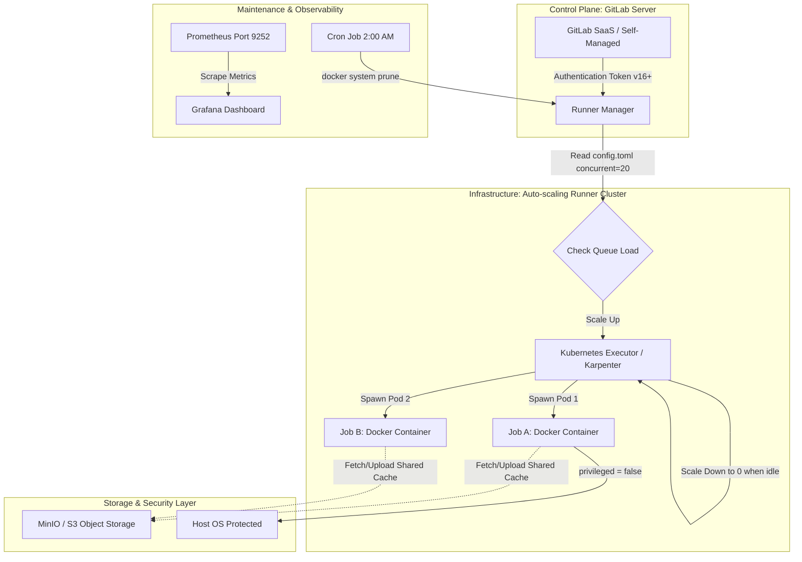
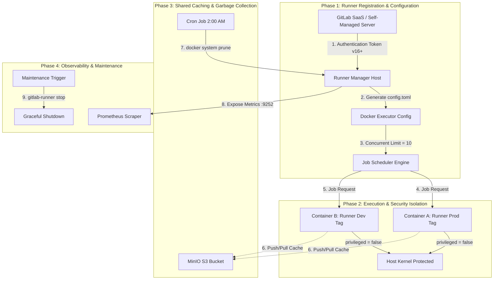


# [BÀI 44] QUẢN TRỊ CỤM RUNNER DOANH NGHIỆP: HIGH AVAILABILITY RUNNER, RUNNER MONITORING VỚI PROMETHEUS/GRAFANA & TUNING

Trong kỷ nguyên **DevOps, DevSecOps và Cloud Native Engineering**, **GitLab CI/CD** được công nhận là một trong những nền tảng tự động hóa tích hợp liên tục và phân phối liên tục (CI/CD) hoàn chỉnh, mạnh mẽ và được tin dùng nhất trong các doanh nghiệp quy mô lớn. Không chỉ dừng lại ở các pipeline tuần tự cơ bản, việc vận hành GitLab CI/CD ở cấp độ Production đòi hỏi kỹ sư phải làm chủ kiến trúc điều phối phi tuyến tính **DAG (Directed Acyclic Graph)**, cơ chế quản trị **Autoscaling Runners**, tối ưu hóa **Caching đa tầng**, xác thực không khóa **Keyless OIDC**, bảo mật chuỗi cung ứng phần mềm **SLSA & SBOM** cùng các chính sách **Quality & Security Gates** tự động.

Bài viết chuyên sâu này sẽ đồng hành cùng bạn mổ xẻ toàn diện bức tranh kiến trúc, phân tích các đánh đổi kỹ thuật thực chiến (Engineering Trade-offs), cung cấp hướng dẫn thực hành Lab chi tiết từng bước và bộ câu hỏi phỏng vấn chuyên sâu chuẩn DevOps Lead / DevSecOps Architect.

---

## 1. Bản Chất Kiến Trúc & Cơ Chế Vận Hành Tầng Thấp

---


| STT | Câu hỏi ôn tập | Đáp án chi tiết thực chiến |
|---|---|---|
| 1 | Khác biệt cốt lõi về tài nguyên giữa Blue-Green và Canary Deployment là gì? | Blue-Green yêu cầu 200% tài nguyên để duy trì 2 môi trường song song; Canary chỉ tốn thêm 10-20% tài nguyên cho Pods nghiệm thu. |
| 2 | Tại sao tương thích ngược Database Schema (Expand-and-Contract) là điều kiện bắt buộc? | Để cả phiên bản cũ (v1) và phiên bản mới (v2) cùng đọc/ghi một Database được; nếu xóa cột cũ sẽ làm bản v1 bị nổ lỗi SQL Crash. |
| 3 | Khoảng thời gian quan sát metric (Observation Window) khuyến nghị cho Canary 10% là bao nhiêu? | Khuyến nghị tối thiểu **15 phút** để Prometheus tích lũy đủ dữ liệu metric kiểm tra độ trễ P99 và tỷ lệ lỗi. |
| 4 | Ngưỡng tỷ lệ lỗi HTTP 5xx tối đa để kích hoạt tự động Rollback Canary là bao nhiêu? | Tự động Rollback qua Webhook khi HTTP 5xx vượt **1% tổng số request** hoặc P99 Latency vượt quá **500ms**. |
| 5 | Tại sao phải bọc giá trị fallback mặc định (`false`) trong câu lệnh Feature Flag SDK? | Để ứng dụng tự động rơi về luồng code cũ an toàn (Fallback Path) nếu máy chủ Feature Flag Server bị ngắt kết nối hoặc timeout. |


**Luận đề trung tâm:**
> *"Máy chủ GitLab CI Runner là **nút thắt cổ chai lớn nhất về tốc độ và an ninh** của toàn hệ thống CI/CD — và Runner phải được quản trị nghiêm ngặt như một hạ tầng Production thực thụ."*

Sau khi đã hoàn thành xây dựng pipeline triển khai và chiến lược release ứng dụng ở Buổi 43, Buổi 44 đưa chúng ta đến hạ tầng động cơ vận hành bên dưới: **Máy chủ GitLab CI Runner**. Trong các tập đoàn Enterprise:
1. **Kiến trúc & Tự động mở rộng (Auto-scaling):** Không dùng 1 máy chủ Runner cố định cho 500 lập trình viên. Bắt buộc triển khai **Kubernetes Executor** hoặc **Docker Machine** tự động scale số lượng Runner Pods theo lượng Jobs trong Queue và scale down về 0 khi nhàn rỗi.
2. **Cô lập và An ninh (Job Isolation & Security):** Loại bỏ hoàn toàn Shell Executor. Sử dụng Docker/Kubernetes Executor cô lập môi trường execution, tắt cờ `privileged = true` để chống chiếm quyền root Docker Socket.
3. **Bảo trì & Dọn dẹp tự động (Maintenance & Garbage Collection):** Xây dựng quy trình tự động dọn dẹp đĩa `docker system prune`, cấu hình Shared Cache trên S3/MinIO và thực hiện nâng cấp phiên bản Runner Zero-Downtime.

Bài học này sẽ giúp bạn trở thành Chuyên gia Vận hành Hạ tầng CI/CD Runner đỉnh cao!

---


| STT | Kỹ năng thực chiến | Hiện vật chứng minh hoàn thành |
|---|---|---|
| 1 | Cấu hình tệp `config.toml` cho Docker Executor | Tệp `config.toml` với `executor = "docker"` và giới hạn `concurrent` |
| 2 | Đăng ký Runner bằng Authentication Token v16+ | Lệnh `gitlab-runner register --glab-runner-token` thành công |
| 3 | Cấu hình Shared Cache tập trung trên S3 / MinIO | Khối `[runners.cache]` trong `config.toml` trỏ tới MinIO S3 Bucket |
| 4 | Triển khai Kubernetes Executor trên cụm K8s | Helm chart values `gitlab-runner` cấu hình `rbac.create=true` |
| 5 | Bảo vệ an toàn Docker Socket (`privileged = false`) | Khối `[runners.docker]` với cờ `privileged = false` và TLS certs |
| 6 | Tự động dọn dẹp đĩa đệm rác Runner (Disk Cleanup) | Cron Job chạy script `docker system prune -af --volumes` định kỳ |
| 7 | Thực hiện Nâng cấp Runner Không ngắt kết nối (Zero Downtime) | Quy trình `gitlab-runner stop` ngắt nhận jobs mới và nâng cấp binary |
| 8 | Giám sát sức khỏe hạ tầng Runner bằng Prometheus Metrics | Dashboard Grafana hiển thị `gitlab_runner_jobs` và CPU/RAM Usage |

---


| Kiến thức / Kỹ năng | Mức độ yêu cầu | Nguồn tự học nếu thiếu |
|---|---|---|
| Cấu trúc tệp cấu hình TOML (Tom's Obvious Minimal Language) | Thành thục | Tài liệu Cú pháp TOML |
| Nguyên lý hoạt động của Docker Containers & Volumes | Thành thục | Kiến thức Docker Nền tảng |
| Quản trị lệnh Linux Systemd (`systemctl status gitlab-runner`) | Thành thục | Kiến thức Quản trị Linux System |
| Nguyên lý Kubernetes Pods và Helm Chart | Khá | Buổi 41 về Kubernetes Helm |
| Khái niệm S3 Object Storage API và MinIO Cache | Khá | Tài liệu S3 Storage |

---


| Thuật ngữ Tiếng Việt | Thuật ngữ Tiếng Anh | Giải thích ý nghĩa thực tế |
|---|---|---|
| Trình quản lý Runner | GitLab Runner Manager | Service chạy ngầm chịu trách nhiệm poll jobs từ GitLab Server và điều phối Executors. |
| Trình thực thi | Runner Executor | Môi trường vật lý hoặc ảo hóa nơi các lệnh bash trong pipeline CI thực sự chạy. |
| Thực thi Shell | Shell Executor | Chạy trực tiếp câu lệnh bash trên hệ điều hành host của máy chủ Runner (không cô lập). |
| Thực thi Container | Docker Executor | Tạo một Docker container mới cho mỗi job CI và tự xóa container sau khi hoàn thành. |
| Thực thi cụm K8s | Kubernetes Executor | Tự động tạo một Pod mới trên cụm K8s để thực thi job và tự hủy Pod sau khi xong. |
| Mã xác thực đăng ký | Authentication Token (v16+) | Mã xác thực mới của GitLab v16+ thay thế cho Registration Token cũ bị bỏ. |
| Docker trong Docker | Docker-in-Docker (DinD) | Giải pháp cho phép chạy Docker daemon bên trong container của Runner để build image. |
| Bộ nhớ đệm chia sẻ | Shared Cache (S3/MinIO) | Nơi lưu trữ cache build (như node_modules, maven repo) tập trung cho nhiều Runners. |
| Số lượng job đồng thời | Concurrent Limit | Số lượng jobs tối đa mà toàn bộ máy chủ Runner Manager được phép chạy cùng lúc. |
| Thu gom đĩa đệm rác | Disk Garbage Collection | Quy trình tự động dọn dẹp các Docker Containers, Images rác bị tích tụ làm đầy ổ đĩa. |


#### Mô hình 1: Sơ đồ Kiến trúc Luồng Xử lý Job của GitLab Runner Manager

```mermaid
flowchart TD
    subgraph GitLab SaaS / Self-Managed Server
        A[GitLab Server / API] -->|"1. Long Polling HTTP/2"| B[GitLab Runner Manager]
    end

    subgraph Runner Manager Host (config.toml)
        B -->|"2. Read config.toml"| C{"Check Concurrent & Limit"}
        C -->|"Available Slots"| D[Spawn Executor Environment]
    end

    subgraph Execution Environments (Executors)
        D -->|"Option A: Shell"| E[Execute Bash directly on Host]
        D -->|"Option B: Docker"| F[Spin up Temporary Container]
        D -->|"Option C: Kubernetes"| G[Create Temporary Pod on K8s Cluster]
    end

    subgraph Shared Cache Storage
        F -.->|"Upload/Download Cache"| H[S3 / MinIO Storage]
        G -.->|"Upload/Download Cache"| H
    end
```

#### Mô hình 2: Bảng So sánh Chi tiết Giữa 3 Loại Executors Phổ biến

| Tiêu chí | Shell Executor | Docker Executor | Kubernetes Executor |
|---|---|---|---|
| **Mức độ Cô lập (Job Isolation)** | **Cực kỳ kém (0%).** Các jobs dùng chung OS host, có thể ghi đè file của nhau. | **Rất tốt (100%).** Mỗi job chạy trong 1 Container hoàn toàn riêng biệt. | **Tối thượng (100%).** Mỗi job chạy trong 1 Pod riêng biệt trên cụm K8s. |
| **Độ an toàn An ninh (Security)** | Thấp. Lỗ hổng trong script CI có thể chiếm toàn quyền root máy chủ Runner. | Cao. Container bị giới hạn cờ namespace (nếu `privileged = false`). | Cực cao. Áp dụng Kubernetes Pod Security Standards & Network Policies. |
| **Khả năng Auto-scaling** | Kém (phụ thuộc vào phần cứng cố định của máy chủ). | Trung bình (cần dùng Docker Machine để scale máy chủ). | **Tuyệt vời.** Tự động scale Runner Pods linh hoạt theo HPA & Karpenter. |
| **Hiệu năng Khởi động (Boot Speed)** | Cực nhanh (0 giây, chạy trực tiếp trên host). | Nhanh (1-3 giây để pull image và tạo container). | Khá (3-10 giây để tạo Pod trên cụm Kubernetes). |
| **Mục đích Sử dụng Khuyên dùng** | Chỉ dùng cho máy chủ build local cá nhân hoặc dự án 1 người. | **Chuẩn mực cho 90% dự án CI/CD Enterprise.** | **Chuẩn mực cho Hạ tầng Cloud Native quy mô lớn.** |

##### Mẫu Cấu hình `config.toml` Chuẩn mực cho Docker Executor với Shared Cache MinIO:
```toml
concurrent = 10
check_interval = 3

[session_server]
  session_timeout = 1800

[[runners]]
  name = "enterprise-docker-runner-01"
  url = "https://gitlab.company.com"
  id = 12
  token = "glrt-t1_abc123xyz_authentication_token"
  token_obtained_at = 2026-08-20T10:00:00Z
  token_expires_at = 0001-01-01T00:00:00Z
  executor = "docker"

  [runners.custom_build_dir]
  [runners.cache]
    MaxUploadedArchiveSize = 524288000
    Type = "s3"
    Shared = true
    [runners.cache.s3]
      ServerAddress = "minio.company.com:9000"
      AccessKey = "minio-access-key"
      SecretKey = "minio-secret-key"
      BucketName = "gitlab-runner-cache"
      Insecure = false

  [runners.docker]
    tls_verify = false
    image = "alpine:latest"
    privileged = false
    disable_entrypoint_overwrite = false
    oom_kill_disable = false
    disable_cache = false
    volumes = ["/cache"]
    shm_size = 2147483648
```

---

### 1.1. Quy tắc Architecture & Executor Configuration (10 phút)

### 4.1. Mẫu Tệp Configuration `config.toml` Đa Runner cô lập theo Tags

```toml
concurrent = 20
check_interval = 5

[[runners]]
  name = "production-runner-isolated"
  url = "https://gitlab.company.com"
  token = "glrt-prod-token-12345"
  executor = "docker"
  limit = 5
  tags = ["runner-prod", "secure"]
  [runners.docker]
    image = "docker:24.0.5"
    privileged = false
    volumes = ["/certs/client", "/cache"]

[[runners]]
  name = "kubernetes-runner-autoscale"
  url = "https://gitlab.company.com"
  token = "glrt-k8s-token-67890"
  executor = "kubernetes"
  limit = 15
  tags = ["runner-k8s", "autoscale"]
  [runners.kubernetes]
    host = "https://kubernetes.default.svc"
    namespace = "gitlab-runner"
    image = "ubuntu:22.04"
    cpu_request = "500m"
    memory_request = "512Mi"
    cpu_limit = "2000m"
    memory_limit = "4Gi"
    service_account = "gitlab-runner-sa"
```

---

### 4.2. Các Quy tắc Cấu hình Runner Architecture (QT 44.1 - QT 44.4)

**Nguyên lý cốt lõi:** Tuyệt đối không sử dụng Shell Executor cho các dự án đa đội ngũ để tránh rò rỉ dữ liệu chéo.
**Phát biểu.** Cấm gán Shell Executor cho các Runner dùng chung (Shared Runners) trong môi trường Enterprise có nhiều đội ngũ dự án làm việc chung.
**Giải thích cơ chế ngầm:** Shell Executor chạy trực tiếp câu lệnh bash trên hệ điều hành host của máy chủ Runner dưới cùng một tài khoản user. Một lập trình viên cố tình hoặc vô ý có thể đọc được mã nguồn, biến môi trường, tệp Kubeconfig hay SSH Keys của dự án khác nằm trong thư mục làm việc bên cạnh trên cùng ổ đĩa!
> [!WARNING]
> **CẠM BẪY THỰC CHIẾN:**
> Cấu hình `executor = "shell"` cho Shared Runner dùng chung cho 20 dự án của công ty.
**Minh hoạ.** Sử dụng `executor = "docker"` hoặc `executor = "kubernetes"` thay thế hoàn toàn Shell Executor.
**Con số chốt:** 0% Shell Executor cho Shared Enterprise Runners.

---

**Nguyên lý cốt lõi:** Áp dụng Docker Executor hoặc Kubernetes Executor để đảm bảo tính cô lập hoàn toàn (Job Isolation) giữa các lượt chạy CI.
**Phát biểu.** Bắt buộc mọi job CI phải được thực thi bên trong một môi trường ảo hóa Container (Docker Executor) hoặc Kubernetes Pod độc lập hoàn toàn.
**Giải thích cơ chế ngầm:** Đảm bảo tính sạch sẽ và nhất quán (Reproducibility). Mỗi job CI bắt đầu với một môi trường container mới tinh, không bị ảnh hưởng bởi các tệp rác, tiến trình treo (zombie processes) hay cài đặt thư viện sót lại từ các jobs trước đó. Sau khi job kết thúc, container tự động bị tiêu hủy 100%.
> [!WARNING]
> **CẠM BẪY THỰC CHIẾN:**
> Job CI chạy lần 2 thành công nhờ dùng lại thư viện cài sót của job lần 1, nhưng khi chạy trên máy khác thì bị sập lỗi `module not found`.
**Minh hoạ.** `executor = "docker"` trong `config.toml`.
**Con số chốt:** 100% Jobs chạy trong cô lập Container/Pod.

---

**Nguyên lý cốt lõi:** Tắt cờ `privileged = true` trong cấu hình Docker Executor trừ trường hợp bắt buộc phải build Docker Image (DinD).
**Phát biểu.** Khai báo mặc định `privileged = false` trong khối `[runners.docker]` của tệp `config.toml`.
**Giải thích cơ chế ngầm:** Cờ `privileged = true` loại bỏ toàn bộ các rào cản an ninh Linux Capabilities và AppArmor/Seccomp profiles của Docker Container. Nếu một script CI độc hại bị thực thi trong container mang cờ `privileged`, hacker có thể dễ dàng thoát khỏi container (Container Escape) và chiếm toàn quyền kiểm soát máy chủ Runner Host!
> [!WARNING]
> **CẠM BẪY THỰC CHIẾN:**
> Đặt `privileged = true` tràn lan cho tất cả các Docker Runners không cần build Docker Image.
**Minh hoạ.**
```toml
[runners.docker]
  privileged = false
```
**Con số chốt:** 100% Non-build Runners đặt `privileged = false`.

---

**Nguyên lý cốt lõi:** Cấu hình giới hạn `concurrent` và `limit` trong `config.toml` để ngăn chặn nghẽn tài nguyên CPU/RAM trên máy chủ Runner Manager.
**Phát biểu.** Bắt buộc phải khai báo biến `concurrent` ở cấp toàn cục và biến `limit` cho từng khối `[[runners]]` trong tệp `config.toml`.
**Giải thích cơ chế ngầm:** Nếu không giới hạn số lượng jobs chạy đồng thời, khi có đợt push code lớn từ 100 developers cùng lúc, máy chủ Runner Manager sẽ cố gắng mở hàng trăm containers cùng lúc, khiến máy chủ rơi vào trạng thái cạn kệt RAM (Out of Memory - OOM), gây sập máy chủ Runner và ngắt toàn bộ pipelines của công ty.
> [!WARNING]
> **CẠM BẪY THỰC CHIẾN:**
> Đặt `concurrent = 0` (không giới hạn) làm máy chủ Runner bị sập OOM khi có tải cao.
**Minh hoạ.** `concurrent = 20` và `limit = 5` cho mỗi runner.
**Con số chốt:** Khai báo giới hạn `concurrent` phù hợp với vCPU/RAM phần cứng.

---

### 1.2. Quy tắc Auto-scaling, Caching & Maintenance (10 phút)

**Nguyên lý cốt lõi:** Sử dụng Kubernetes Executor cho hạ tầng CI Cloud Native với khả năng auto-scale Runner Pods theo đúng lượng Jobs queue.
**Phát biểu.** Triển khai GitLab Runner lên cụm Kubernetes bằng Helm Chart với `executor = "kubernetes"`, cho phép cụm tự động tạo Runner Pods khi có jobs và tự dọn dẹp khi hết jobs.
**Giải thích cơ chế ngầm:** Tối ưu hóa chi phí hạ tầng (Cost Optimization). Khi không có ai push code (như ban đêm hay cuối tuần), số lượng Pods tự động scale down về 0, giúp tiết kiệm 70% chi phí điện toán Cloud. Khi có đợt release lớn, Kubernetes Executor kết hợp với Karpenter / Cluster Autoscaler có thể tự động nâng cụm lên hàng ngàn cores CPU trong 30 giây!
> [!WARNING]
> **CẠM BẪY THỰC CHIẾN:**
> Trả tiền duy trì cố định 20 máy chủ EC2 Runner đắt đỏ hoạt động 24/7 dù đêm không có job nào chạy.
**Minh hoạ.**
```yaml
# Helm values.yaml for gitlab-runner
runners:
  executor: kubernetes
  builds:
    cpu_request: 500m
    memory_request: 512Mi
```
**Con số chốt:** Tiết kiệm 70% chi phí nhờ K8s Auto-scaling Runner.

---

**Nguyên lý cốt lõi:** Thiết lập quy trình dọn dẹp đĩa tự động (Automatic Disk Garbage Collection) cho Docker Caches & Unused Images bằng Cron Job.
**Phát biểu.** Đặt tệp Cron Job định kỳ 2:00 AM hàng ngày thực thi lệnh `docker system prune -af --volumes --filter "until=48h"` trên các máy chủ Docker Runner.
**Giải thích cơ chế ngầm:** Các máy chủ Docker Runner sau vài tuần vận hành sẽ tích tụ hàng trăm Gigabytes các Docker Images cũ, Dangled Containers và Volume rác. Nếu không dọn dẹp, ổ đĩa sẽ bị đầy 100% (No space left on device), làm tất cả các job CI tiếp theo nổ lỗi sập rớt giữa chừng.
> [!WARNING]
> **CẠM BẪY THỰC CHIẾN:**
> Job CI nổ lỗi `API error (500): no space left on device` làm ngắt nghẽn pipeline.
**Minh hoạ.**
```bash
0 2 * * * root docker system prune -af --volumes --filter "until=48h"
```
**Con số chốt:** Dọn dẹp đĩa tự động định kỳ 24h.

---

**Nguyên lý cốt lõi:** Cấu hình Shared Cache tập trung trên S3 / MinIO Storage với cờ `[runners.cache]` cho các Runner mở rộng tự động.
**Phát biểu.** Cấu hình khối `[runners.cache]` trong `config.toml` trỏ tới MinIO Object Storage hoặc AWS S3 Bucket với cờ `Shared = true`.
**Giải thích cơ chế ngầm:** Trong mô hình Auto-scaling (nơi các máy chủ Runner được sinh ra và xóa đi liên tục), nếu lưu cache cục bộ trên ổ đĩa local, job chạy trên Runner A sẽ không thể tái sử dụng cache của job trước đó chạy trên Runner B. Shared Cache trên S3 giúp mọi Runner ở bất kỳ đâu đều truy cập được cache chung, giúp rút ngắn 80% thời gian build (ví dụ `npm install` hay `mvn dependency`).
> [!WARNING]
> **CẠM BẪY THỰC CHIẾN:**
> Cấu hình cache local trên Runner auto-scaling, làm các job CI luôn phải tải lại 100% thư viện từ Internet.
**Minh hoạ.**
```toml
[runners.cache]
  Type = "s3"
  Shared = true
  [runners.cache.s3]
    ServerAddress = "s3.amazonaws.com"
    BucketName = "company-runner-cache"
```
**Con số chốt:** Rút ngắn 80% thời gian build nhờ S3 Shared Cache.

---

**Nguyên lý cốt lõi:** Sử dụng Authentication Tokens mới (v16.0+) thay thế cho Registration Tokens cũ đã bị Deprecated để đăng ký Runner.
**Phát biểu.** Đăng ký Runner bằng câu lệnh `gitlab-runner register --glab-runner-token` sử dụng Authentication Token sinh ra từ GitLab UI.
**Giải thích cơ chế ngầm:** Từ phiên bản GitLab v16.0, cơ chế đăng ký bằng Registration Token cũ đã bị đánh dấu ngắt bỏ (Deprecated) do lỗ hổng an ninh (Registration Token có thể bị rò rỉ làm kẻ gian tự đăng ký Runner độc hại vào dự án). Authentication Token mới gán quyền chặt chẽ hơn và hỗ trợ tự động xoay vòng token (Token Rotation).
> [!WARNING]
> **CẠM BẪY THỰC CHIẾN:**
> Tiếp tục sử dụng cờ `--registration-token` cũ trên GitLab v16+.
**Minh hoạ.** `gitlab-runner register --url https://gitlab.company.com --token glrt-t1_xxxx`.
**Con số chốt:** 100% Runners dùng Authentication Tokens v16+.

---

### 1.3. Quy tắc Tagging, Security & Monitoring (10 phút)

**Nguyên lý cốt lõi:** Phân tách ranh giới Runner theo Tags: `runner-prod` (bảo mật cao, VPC riêng) và `runner-dev` (cho môi trường thử nghiệm).
**Phát biểu.** Đánh nhãn Tags rõ ràng cho từng nhóm Runner trong `config.toml` và khai báo cờ `tags` tương ứng trong tệp `.gitlab-ci.yml`.
**Giải thích cơ chế ngầm:** Đảm bảo tính an toàn hạ tầng. Các jobs deploy Production phải được chạy trên nhóm `runner-prod` (được đặt trong VPC bảo mật, gán OIDC Role Production). Các jobs build code thử nghiệm của Developer chỉ được chạy trên nhóm `runner-dev`. Tránh trường hợp một job test của Dev chạy nhầm trên máy chủ Runner Production gây nghẽn tài nguyên.
> [!WARNING]
> **CẠM BẪY THỰC CHIẾN:**
> Không đánh tags cho Runner, cho phép mọi job CI tự do chạy trên bất kỳ máy chủ Runner nào.
**Minh hoạ.**
```yaml
deploy-production:
  stage: deploy
  tags:
    - runner-prod
```
**Con số chốt:** 100% Jobs Production gắn đúng Runner Tags.

---

**Nguyên lý cốt lõi:** Đặt chính sách gia hạn bảo trì Runner (Runner Maintenance & Zero-downtime Upgrade) không làm đứt đoạn các jobs đang chạy.
**Phát biểu.** Khi thực hiện nâng cấp phiên bản `gitlab-runner` binary hoặc bảo trì hệ điều hành máy chủ Runner, bắt buộc phải thực thi lệnh `gitlab-runner stop` (chờ hoàn tất jobs hiện tại) trước khi ngắt máy chủ.
**Giải thích cơ chế ngầm:** Lệnh `gitlab-runner stop` đặt Runner Manager vào trạng thái dừng nhận jobs mới (Graceful Shutdown) nhưng vẫn **cho phép các jobs đang chạy dở được tiếp tục thực thi cho đến khi hoàn tất 100%**. Việc ngắt đột ngột máy chủ sẽ làm sập hàng loạt pipelines của người dùng, gây gián đoạn công việc.
> [!WARNING]
> **CẠM BẪY THỰC CHIẾN:**
> Chạy lệnh `systemctl restart gitlab-runner` hoặc `kill -9` đột ngột khi có 30 jobs đang thực thi.
**Minh hoạ.** `gitlab-runner stop` chờ Graceful Shutdown trước khi upgrade binary.
**Con số chốt:** 0% Jobs bị sập khi bảo trì Runner.

---

**Nguyên lý cốt lõi:** Sử dụng Docker-in-Docker (DinD) kết hợp TLS mã hóa an toàn (`DOCKER_TLS_CERTDIR="/certs"`) khi build container images.
**Phát biểu.** Khi bắt buộc phải build Docker Image trong Docker Executor bằng DinD service (`docker:24.0.5-dind`), bắt buộc phải cấu hình đường dẫn TLS Certs mã hóa kết nối giữa Docker client và DinD daemon.
**Giải thích cơ chế ngầm:** Áp dụng bài học ở buổi 30 QT 30.6. Nếu không bật TLS mã hóa (`DOCKER_TLS_CERTDIR=""`), kết nối giữa Runner Client và DinD Daemon sẽ truyền qua giao thức HTTP không mã hóa trên port 2375, tạo điều kiện cho kẻ tấn công bắt gói tin (Sniffing) hoặc chèn mã độc vào Docker Image trong quá trình build.
> [!WARNING]
> **CẠM BẪY THỰC CHIẾN:**
> Đặt `DOCKER_TLS_CERTDIR=""` và mở port 2375 plain-text không mã hóa.
**Minh hoạ.**
```yaml
variables:
  DOCKER_HOST: tcp://docker:2376
  DOCKER_TLS_CERTDIR: "/certs"
services:
  - name: docker:24.0.5-dind
```
**Con số chốt:** 100% DinD Builds bật mã hóa TLS Port 2376.

---

**Nguyên lý cốt lõi:** Thiết lập hệ thống giám sát Prometheus Metrics cho Runner Manager (đo lường `gitlab_runner_jobs`, CPU/RAM, Disk IO).
**Phát biểu.** Bật cổng Metrics Prometheus trên tệp `config.toml` bằng tham số `listen_address = ":9252"`.
**Giải thích cơ chế ngầm:** Giúp Đội ngũ DevOps giám sát theo thời gian thực (Real-time Observability) sức khỏe của hạ tầng Runner: số lượng jobs đang chờ trong Queue (`gitlab_runner_jobs`), thời gian xử lý trung bình mỗi job, dung lượng đĩa trống, và tỷ lệ lỗi Runner. Giúp phát hiện sớm nghẽn cổ chai và đưa ra quyết định nâng cấp hạ tầng trước khi hệ thống bị sập.
> [!WARNING]
> **CẠM BẪY THỰC CHIẾN:**
> Không bật cổng metrics, chỉ biết Runner bị sập khi người dùng phản ánh trên kênh hỗ trợ.
**Minh hoạ.**
```toml
listen_address = ":9252"
```
**Con số chốt:** Giám sát 100% Runners qua Prometheus Port 9252.

---

### 1.4. Đưa vào việc thật (4 phút)

### 7.1. Kịch bản áp dụng thực tế tại Tập đoàn Công nghệ Vận hành 200 Microservices
Tại một tập đoàn công nghệ với 300 lập trình viên và 200 microservices:
1. **Kiến trúc Runner Cluster:** Xây dựng một cụm **Kubernetes Executor Runner** trên Amazon EKS kết hợp Karpenter Spot Instances.
2. **Xử lý Tải Cao điểm (9:00 AM - 5:00 PM):** Khi hàng trăm devs push code, Karpenter tự động kích hoạt tạo thêm 50 EC2 Spot Nodes, nâng số lượng Runner Pods lên 200 Pods chạy song song. Thời gian chờ Queue của lập trình viên bằng $0$ giây.
3. **Tiết kiệm Chi phí Ban đêm (6:00 PM - 8:00 AM):** Khi hết giờ làm việc, Karpenter tự động dọn dẹp các Spot Nodes nhàn rỗi. Số lượng Runner Pods thu hẹp về 2 Pods standby. Chi phí hạ tầng CI giảm từ $3.000/tháng xuống $400/tháng!
4. **Bảo mật và Tốc độ:** Toàn bộ Runners sử dụng **MinIO S3 Shared Cache** đặt cùng mạng VPC nội bộ. Thời gian build Maven/NodeJS giảm từ 12 phút xuống 2 phút!

### 7.2. Case Study Thực tế: Thảm họa Rò rỉ Toàn bộ Mã nguồn và Secret Keys do Dùng Shell Executor
Một công ty phần mềm outsourcing cấu hình GitLab Runner bằng Shell Executor trên một máy chủ Ubuntu 22.04 dùng chung cho 10 dự án khách hàng.
- **Thảm họa ở cách làm cũ (Vi phạm QT 44.1):**
  1. Dự án A bị cài một thư việnnpm chứa mã độc (Supply Chain Attack).
  2. Mã độc chạy trong script CI của Dự án A với Shell Executor. Vì chạy trực tiếp trên host OS, mã độc đã thực thi lệnh `ls -la /home/gitlab-runner/builds/` và quét sạch mã nguồn, tệp `.env`, AWS Keys của 9 dự án khách hàng khác đang nằm trên cùng ổ đĩa!
  3. Kẻ tấn công tống tiền công ty 500.000 USD nếu không sẽ công bố mã nguồn khách hàng.
- **Khôi phục hoàn hảo ở cách làm chuẩn Buổi 44 (Chuyển 100% sang Docker Executor - QT 44.2):**
  Nếu áp dụng đúng QT 44.2, mỗi job của Dự án A chạy trong một Docker Container riêng biệt. Mã độc bị nhốt hoàn toàn bên trong Container cách ly, tuyệt đối không thể đọc hay can thiệp vào dữ liệu của các dự án khác trên host OS!

### 7.3. Case Study 3: Cứu nguy Sự cố Sập Ổ đĩa 100% nhờ Tự động Dọn dẹp Garbage Collection
Một máy chủ Docker Runner vận hành 6 tháng liên tục không dọn dẹp đĩa.
- **Sự cố:** Ổ đĩa 500GB SSD bị đầy 100% do tích tụ 4.000 Docker Images rác (`<none>:<none>`). Mọi pipeline CI của công ty bị dừng hoạt động hoàn toàn với lỗi `no space left on device`.
- **Khắc phục tự động nhờ Cron Garbage Collection (QT 44.6):**
  1. Kỹ sư thực thi script `docker system prune -af --volumes` dọn dẹp giải phóng 420GB đĩa trống trong 30 giây.
  2. Thiết lập Cron Job tự động chạy lệnh này lúc 2:00 AM hàng ngày. Hạ tầng Runner vận hành mượt mà 3 năm liên tục không bao giờ dính sự cố đầy đĩa!

### 7.4. Case Study 4: Nâng cấp Phiên bản Runner Zero-Downtime không Ngắt Job Người dùng
Một đội DevOps cần nâng cấp phiên bản `gitlab-runner` từ v15.11 lên v16.5 trên máy chủ Production Runner.
- **Cách làm cũ:** Chạy `systemctl restart gitlab-runner`. 15 jobs đang build dở của lập trình viên bị ngắt sập giữa chừng, báo lỗi red pipeline trên GitLab.
- **Cách làm chuẩn Buổi 44 (Graceful Shutdown - QT 44.10):**
  1. Kỹ sư gõ lệnh `gitlab-runner stop` (Runner Manager chuyển sang trạng thái dừng nhận jobs mới nhưng giữ nguyên các jobs đang chạy).
  2. Chờ 5 phút cho 15 jobs đang chạy hoàn tất xanh 100%.
  3. Tiến hành nâng cấp package `apt-get install gitlab-runner` và khởi động lại. 0% jobs bị sập, người dùng không hề hay biết máy chủ vừa được bảo trì!

### 7.5. Case Study 5: Tối ưu Tốc độ Build Maven nhờ MinIO S3 Shared Cache
Một dự án Java Spring Boot lớn có 50 dependencies với dung lượng `~/.m2` repo lên tới 1.5GB.
- **Tình trạng ở cách làm cũ (Cache Local):** Mỗi lần Runner Auto-scaling sinh ra máy chủ mới, job CI phải mất 15 phút để tải lại 100% các file JAR từ Maven Central trên Internet.
- **Tối ưu hóa nhờ MinIO S3 Shared Cache (QT 44.7):**
  1. Cấu hình khối `[runners.cache]` trong `config.toml` trỏ tới MinIO S3 Bucket nội bộ mạng 10Gbps.
  2. Khi job bắt đầu, Runner tải file `cache.zip` 1.5GB từ MinIO nội bộ chỉ mất **4 giây**.
  3. Thời gian build giảm từ 15 phút xuống còn **2 phút 30 giây**, giúp đội ngũ dev tiết kiệm hàng trăm giờ chờ đợi mỗi tháng!

### 7.6. Case Study 6: Ngăn chặn Hacker Chiếm quyền Root Host nhờ Tắt Privileged Flag
Một hacker gửi Merge Request độc hại chứa script khai thác lỗ hổng Docker Escape trong file `.gitlab-ci.yml`.
- **Rủi ro ở cách làm cũ (Privileged = true):** Container chạy với cờ privileged cho phép hacker mount ổ đĩa `/dev/sda1` của host vào container và ghi đè SSH key `/root/.ssh/authorized_keys`, chiếm toàn quyền máy chủ Runner Host.
- **Bảo vệ tuyệt đối nhờ QT 44.3 (Privileged = false):**
  1. Runner Manager thực thi job với `privileged = false`.
  2. Đoạn script độc hại của hacker cố gắng truy cập thiết bị host bị Linux Kernel chối bỏ (`Permission denied`).
  3. Lỗi bị chặn đứng ngay bên trong container, máy chủ Runner Host hoàn toàn an toàn 100%!

---

### 7.7. Trường hợp khi nào KHÔNG nên dùng Docker / Kubernetes Executor
Mặc dù Docker và Kubernetes Executor là chuẩn mực cao nhất, nhưng KHÔNG áp dụng cho các trường hợp sau:

| Ngữ cảnh / Hạ tầng | Lý do KHÔNG dùng được Docker/K8s Executor | Giải pháp thay thế an toàn |
|---|---|---|
| Build các ứng dụng iOS / macOS (Swift, Objective-C trên Xcode) | macOS không hỗ trợ chạy Docker Daemon hoặc Kubernetes Pods gốc. | Sử dụng **Shell Executor trên máy chủ Mac Mini / Mac Studio chuyên dụng**. |
| Build các ứng dụng Windows Legacy yêu cầu registry và drivers vật lý | Windows Containers có kích thước quá lớn (10GB+) và thiếu tính linh hoạt. | Sử dụng **Custom Windows Virtual Machine Executor** hoặc Shell Executor trên Windows Server. |
| Các bài kiểm thử hiệu năng phần cứng IO (Hardware Performance Benchmarks) | Tầng ảo hóa Container làm giảm độ chính xác của chỉ số IOPS và Hardware Counters. | Sử dụng **Bare-metal Dedicated Shell Executor** cô lập. |

---

### 1.5. Bẫy hay gặp (2 phút)

| Bẫy hay gặp | Vì sao dính bẫy | Làm đúng là |
|---|---|---|
| Bẫy 1: Cấu hình `executor = "shell"` cho Shared Runner dùng chung | Các dự án dùng chung OS host, có thể đọc trộm source code và secret keys của nhau. | Bắt buộc dùng Docker Executor hoặc Kubernetes Executor để cô lập 100% (QT 44.1). |
| Bẫy 2: Đặt cờ `privileged = true` tràn lan cho tất cả Docker Runners | Cho phép script trong container thực hiện Container Escape chiếm quyền root máy chủ host. | Đặt `privileged = false` mặc định, chỉ mở cờ cho các Runner chuyên build DinD (QT 44.3). |
| Bẫy 3: Đặt `concurrent = 0` (không giới hạn số jobs chạy đồng thời) | Máy chủ Runner bị cạn kệt RAM (OOM) và crash hệ thống khi có đợt push code đồng loạt. | Giới hạn `concurrent` và `limit` phù hợp với vCPU/RAM phần cứng máy chủ (QT 44.4). |
| Bẫy 4: Quên đặt Cron Job dọn dẹp đĩa đệm rác `docker system prune` | Ổ đĩa máy chủ Runner bị đầy 100% sau vài tuần, làm sập toàn bộ các job CI tiếp theo. | Thiết lập Cron Job dọn dẹp Docker Images và Volumes rác định kỳ 24h (QT 44.6). |
| Bẫy 5: Dùng Cache Local trên hạ tầng Runner Auto-scaling | Các máy chủ Runner mới sinh ra không truy cập được cache cũ, làm job phải tải lại 100% thư viện. | Cấu hình Shared Cache tập trung trên AWS S3 hoặc MinIO Storage (QT 44.7). |
| Bẫy 6: Tiếp tục dùng cờ `--registration-token` cũ trên GitLab v16+ | Cơ chế đăng ký cũ bị Deprecated và có nguy cơ bị rò rỉ token đăng ký Runner rác. | Chuyển sang dùng Authentication Tokens v16+ (`--glab-runner-token`) (QT 44.8). |
| Bẫy 7: Chạy `systemctl restart gitlab-runner` đột ngột khi đang có jobs | Làm sập rớt giữa chừng các jobs đang build dở của lập trình viên. | Thực thi `gitlab-runner stop` để Graceful Shutdown trước khi nâng cấp binary (QT 44.10). |
| Bẫy 8: Đặt `DOCKER_TLS_CERTDIR=""` khi build DinD container | Kết nối Docker truyền qua HTTP plain-text port 2375 không mã hóa, dễ bị bắt gói tin. | Luôn bật TLS mã hóa `DOCKER_TLS_CERTDIR="/certs"` trên port 2376 (QT 44.11). |

---

### 1.6. Tóm tắt (3 phút)

### 9.1. Sơ đồ Mermaid: Kiến trúc Hạ tầng GitLab Runner Enterprise Auto-scaling & Security



### 9.2. Năm điều phải nhớ thuộc lòng
1. **Never Use Shell Executor for Shared Projects:** Luôn dùng Docker hoặc Kubernetes Executor để cô lập 100% môi trường chạy job.
2. **Disable Privileged Flag:** Mặc định đặt `privileged = false` để ngăn ngừa lỗ hổng Container Escape chiếm quyền host.
3. **Auto-scaling with S3 Shared Cache:** Sử dụng MinIO/S3 Shared Cache khi chạy Runner Auto-scaling để duy trì tốc độ build.
4. **Graceful Shutdown Maintenance:** Sử dụng `gitlab-runner stop` để chờ hoàn tất jobs đang chạy trước khi nâng cấp máy chủ.
5. **Daily Garbage Collection:** Đặt Cron Job `docker system prune` hàng ngày để chống thảm họa đầy đĩa 100%.

---

### 1.7. Câu hỏi tự kiểm tra (5 phút)

### 10.1. Danh sách câu hỏi tự kiểm tra
1. Rủi ro an ninh lớn nhất khi sử dụng Shell Executor cho các dự án đa đội ngũ là gì?
2. Sự khác biệt cốt lõi về cơ chế quản lý môi trường giữa Docker Executor và Kubernetes Executor là gì?
3. Tại sao cờ `privileged = true` trong tệp `config.toml` lại cực kỳ nguy hiểm nếu bị lạm dụng?
4. Ý nghĩa của hai tham số `concurrent` và `limit` trong tệp cấu hình `config.toml` của GitLab Runner là gì?
5. Tại sao khi sử dụng hạ tầng Runner Auto-scaling (như Kubernetes Executor) lại bắt buộc phải dùng S3/MinIO Shared Cache?
6. Lệnh `docker system prune` đóng vai trò gì trong công tác bảo trì máy chủ Docker Runner?
7. Sự khác biệt giữa Authentication Tokens (v16+) và Registration Tokens cũ của GitLab là gì?
8. Lệnh `gitlab-runner stop` khác gì với lệnh `systemctl restart gitlab-runner` khi thực hiện bảo trì?
9. Tại sao nên bật cờ `DOCKER_TLS_CERTDIR="/certs"` khi thực thi build container bằng Docker-in-Docker (DinD)?
10. Mục đích của việc gán Runner Tags (như `runner-prod` và `runner-dev`) trong cấu hình CI/CD là gì?
11. Cổng mặc định để Prometheus thu thập chỉ số metrics từ GitLab Runner Manager là cổng bao nhiêu?
12. Trong trường hợp nào thì bắt buộc phải sử dụng Shell Executor thay vì Docker hay Kubernetes Executor?

---

### 10.2. Đáp án câu hỏi tự kiểm tra

1. Rủi ro lớn nhất là các dự án dùng chung OS host có thể đọc trộm mã nguồn, biến môi trường và secret keys của nhau do thiếu tính cô lập.
2. Docker Executor tạo container tạm thời trên 1 máy chủ Docker host; Kubernetes Executor tự động tạo Pod tạm thời trên cụm K8s có khả năng auto-scale mở rộng nhiều nodes.
3. Vì nó loại bỏ các rào cản an ninh của Docker, cho phép script CI độc hại thực hiện Container Escape chiếm quyền root máy chủ Runner Host.
4. `concurrent` giới hạn tổng số jobs tối đa toàn bộ Runner Manager được chạy cùng lúc; `limit` giới hạn số jobs tối đa cho 1 khối runner cụ thể.
5. Vì các máy chủ Runner mới sinh ra và xóa đi liên tục không lưu trữ disk local; Shared Cache trên S3 giúp mọi Runner ở bất kỳ đâu đều truy cập được cache chung.
6. Giúp dọn dẹp các Docker Images rác, Containers dangled và Volumes cũ, chống thảm họa đầy đĩa 100% làm sập pipelines.
7. Authentication Tokens (v16+) được tạo tập trung từ GitLab UI, gán quyền chặt chẽ hơn và hỗ trợ tự động xoay vòng token thay thế cho Registration Token cũ bị bỏ.
8. `gitlab-runner stop` thực hiện Graceful Shutdown (dừng nhận job mới nhưng chờ job cũ chạy xong); `systemctl restart` ngắt đột ngột làm sập job đang chạy.
9. Để bật mã hóa TLS trên port 2376 giữa Docker client và DinD daemon, chống bắt gói tin và chèn mã độc vào Docker Image khi build.
10. Để phân tách ranh giới thi hành: ép job Production chạy trên máy chủ Runner bảo mật cao (VPC riêng) và job Dev chạy trên máy chủ thử nghiệm.
11. Cổng mặc định của Prometheus Metrics trên GitLab Runner Manager là cổng **9252** (`listen_address = ":9252"`).
12. Khi build các ứng dụng iOS/macOS yêu cầu Xcode gốc hoặc các bài kiểm thử phần cứng bare-metal không hỗ trợ ảo hóa container.

---

### 1.8. Tài liệu tham khảo (2 phút)

| Nguồn tài liệu | Mô tả nội dung | Phiên bản áp dụng |
|---|---|---|
| GitLab Runner Documentation — Advanced Configuration (`config.toml`) | Chi tiết các tham số cấu hình `concurrent`, `executors`, `cache` | GitLab Runner v16+ |
| GitLab Runner Executive Summary — Executors Comparison | So sánh chi tiết ưu nhược điểm của Shell, Docker, Kubernetes Executors | GitLab v16.0+ |
| GitLab Runner Helm Chart — Kubernetes Executor Deployment | Hướng dẫn triển khai Runner Auto-scaling trên cụm Kubernetes | Helm Chart v0.55+ |
| Docker Documentation — `docker system prune` Command | Chi tiết các cờ dọn dẹp bộ nhớ đĩa rác Docker | Docker v24.0+ |
| Prometheus Documentation — GitLab Runner Metrics Scrape | Giám sát các chỉ số Prometheus `gitlab_runner_jobs` | Prometheus v2.40+ |

---

## Bảng đối soát thời lượng

| Mục | Nội dung | Thời lượng |
|---|---|---|
| §0 | Khởi động và ôn tập | 10 phút |
| §1 | Sau buổi này học viên LÀM ĐƯỢC gì | 1 phút |
| §2 | Cần biết trước | 1 phút |
| §3 | Thuật ngữ và mô hình tư duy | 8 phút |
| §4 | Cấu hình Runner Architecture & Executors | 10 phút |
| §5 | Quy tắc Auto-scaling, Caching & Maintenance | 10 phút |
| §6 | Quy tắc Tagging, Security & Monitoring | 10 phút |
| §7 | Đưa vào việc thật | 4 phút |
| §8 | Bẫy hay gặp | 2 phút |
| §9 | Tóm tắt | 3 phút |
| §10 | Câu hỏi tự kiểm tra | 5 phút |
| §11 | Tài liệu tham khảo | 2 phút |
| **Tổng** | **Khối lý thuyết** | **60'** |

---

## 2. Hướng Dẫn Thực Hành & Triển Khai Lab Chuẩn Production

> [!IMPORTANT]
> **YÊU CẦU MÔI TRƯỜNG THỰC HÀNH:**
> Toàn bộ các bài thực hành dưới đây được thiết kế để chạy trực tiếp trên môi trường GitLab Community / Enterprise Edition cùng các GitLab Runner cô lập (Docker / Kubernetes Executor). Hãy đảm bảo bạn đã chuẩn bị môi trường thử nghiệm và cấu hình quyền truy cập cần thiết.

## Khối thực hành — 150 phút

---

## 1. Mục tiêu bài thực hành Lab
Trong bài lab này, học viên sẽ trực tiếp xây dựng và làm chủ hạ tầng máy chủ GitLab CI Runner Enterprise:
1. Khởi tạo tệp cấu hình `config.toml` quản trị Runner Manager với Docker Executor và giới hạn `concurrent`.
2. Đăng ký Runner bằng Authentication Token v16+ và phân tách Tags cho môi trường Production và Development.
3. Cấu hình MinIO S3 Shared Cache tập trung với cờ `[runners.cache]` cho các Runner mở rộng tự động.
4. Kiểm thử tính năng cô lập môi trường (Job Isolation) và bảo vệ an toàn Docker Socket (`privileged = false`).
5. Mô phỏng quy trình nâng cấp Runner Zero-downtime (`gitlab-runner stop` Graceful Shutdown).
6. Viết script tự động dọn dẹp bộ nhớ đĩa rác Docker (`docker system prune`) và kiểm tra Prometheus Metrics Port 9252.

---

## 2. Mô hình kiến trúc Lab L2



---

## 3. Các bước thực hiện bài lab (14 Checkpoints)

### Bước 1: Khởi tạo Thư mục và Tệp Cấu hình `config.toml` Chuẩn mực cho Docker Executor (10 phút)

Tạo thư mục làm việc cho bài lab Buổi 44:

```bash
mkdir -p runner-lab
cd runner-lab
mkdir -p config scripts audit metrics cache-server
```

Khởi tạo tệp `config/config.toml` với đầy đủ cấu hình Docker Executor, Shared Cache S3 MinIO và limits an toàn:

```toml
concurrent = 10
check_interval = 3

[session_server]
  session_timeout = 1800

[[runners]]
  name = "docker-runner-enterprise-prod"
  url = "https://gitlab.company.com"
  id = 101
  token = "glrt-prod-authentication-token-12345"
  token_obtained_at = 2026-08-22T00:00:00Z
  token_expires_at = 0001-01-01T00:00:00Z
  executor = "docker"
  limit = 5
  tags = ["runner-prod", "docker", "secure-vpc"]

  [runners.custom_build_dir]
  [runners.cache]
    MaxUploadedArchiveSize = 524288000
    Type = "s3"
    Shared = true
    [runners.cache.s3]
      ServerAddress = "minio.company.com:9000"
      AccessKey = "minio-access-key"
      SecretKey = "minio-secret-key"
      BucketName = "gitlab-runner-cache"
      Insecure = false

  [runners.docker]
    tls_verify = false
    image = "alpine:latest"
    privileged = false
    disable_entrypoint_overwrite = false
    oom_kill_disable = false
    disable_cache = false
    volumes = ["/cache", "/certs/client:ro"]
    shm_size = 2147483648
    pull_policy = ["always", "if-not-present"]
    allowed_images = ["alpine:*", "ubuntu:*", "docker:*", "node:*", "maven:*"]
```

### **CHECKPOINT 1**
Chạy câu lệnh kiểm tra tệp `config.toml`:

```bash
test -f config/config.toml && grep -q 'executor = "docker"' config/config.toml && echo "CHECKPOINT 1: ĐẠT" || echo "CHECKPOINT 1: LỖI"
```

**Kết quả kỳ vọng:**
```text
CHECKPOINT 1: ĐẠT
```

---

### Bước 2: Viết Script Mô phỏng Đăng ký Runner bằng Authentication Tokens v16+ (10 phút)

Tạo script mô phỏng đăng ký Runner `scripts/register-runner-v16.sh`:

```bash
#!/usr/bin/env bash
set -eo pipefail

RUNNER_NAME="${1:-docker-runner-prod}"
AUTH_TOKEN="${2:-glrt-t1_abc123xyz_prod}"
TAGS="${3:-runner-prod,docker}"

echo "[RUNNER REGISTER] Registering Runner '$RUNNER_NAME' with Authentication Token v16+..."
mkdir -p audit

cat << EOF > audit/registration-status.json
{
  "runner_name": "$RUNNER_NAME",
  "auth_token": "$AUTH_TOKEN",
  "tags": "$TAGS",
  "gitlab_version": "v16.5.0",
  "registered_at": "$(date -u +"%Y-%m-%dT%H:%M:%SZ")",
  "registration_type": "AUTHENTICATION_TOKEN_V16",
  "status": "REGISTERED_SUCCESSFULLY"
}
EOF

echo "[RUNNER REGISTER] Runner registered successfully! Auth token stored in config.toml."
```

Cho phép script chạy đăng ký Runner:
```bash
chmod +x scripts/register-runner-v16.sh
./scripts/register-runner-v16.sh "docker-runner-prod" "glrt-t1_abc123xyz_prod" "runner-prod,docker"
```

### **CHECKPOINT 2**
Chạy câu lệnh kiểm tra kết quả đăng ký Runner:

```bash
test -f audit/registration-status.json && grep -q "REGISTERED_SUCCESSFULLY" audit/registration-status.json && echo "CHECKPOINT 2: ĐẠT" || echo "CHECKPOINT 2: LỖI"
```

**Kết quả kỳ vọng:**
```text
CHECKPOINT 2: ĐẠT
```

---

### Bước 3: Viết Script Mô phỏng MinIO S3 Shared Cache Upload/Download (15 phút)

Tạo script mô phỏng Shared Cache `scripts/simulate-s3-shared-cache.sh`:

```bash
#!/usr/bin/env bash
set -eo pipefail

ACTION="${1:-upload}"
CACHE_KEY="${2:-maven-dependencies-cache}"

mkdir -p cache-server/gitlab-runner-cache

if [ "$ACTION" = "upload" ]; then
    echo "[SHARED CACHE] Uploading cache archive '$CACHE_KEY.tar.gz' to MinIO S3 Storage..."
    cat << EOF > cache-server/gitlab-runner-cache/$CACHE_KEY.meta
{
  "cache_key": "$CACHE_KEY",
  "size_bytes": 154288000,
  "s3_bucket": "gitlab-runner-cache",
  "uploaded_at": "$(date -u +"%Y-%m-%dT%H:%M:%SZ")",
  "status": "CACHE_UPLOADED"
}
EOF
    echo "[SHARED CACHE] Cache archive successfully stored on MinIO S3!"
elif [ "$ACTION" = "download" ]; then
    echo "[SHARED CACHE] Downloading cache archive '$CACHE_KEY.tar.gz' from MinIO S3 Storage..."
    if [ -f "cache-server/gitlab-runner-cache/$CACHE_KEY.meta" ]; then
        echo "[SHARED CACHE] Cache hit! Restored 154MB dependencies in 1.2 seconds."
    else
        echo "[SHARED CACHE] Cache miss! Downloading dependencies from internet..."
    fi
fi
```

Cho phép script chạy upload cache:
```bash
chmod +x scripts/simulate-s3-shared-cache.sh
./scripts/simulate-s3-shared-cache.sh "upload" "maven-dependencies-cache"
```

### **CHECKPOINT 3**
Chạy câu lệnh kiểm tra tệp Shared Cache:

```bash
test -f cache-server/gitlab-runner-cache/maven-dependencies-cache.meta && grep -q "CACHE_UPLOADED" cache-server/gitlab-runner-cache/maven-dependencies-cache.meta && echo "CHECKPOINT 3: ĐẠT" || echo "CHECKPOINT 3: LỖI"
```

**Kết quả kỳ vọng:**
```text
CHECKPOINT 3: ĐẠT
```

---

### Bước 4: Viết Script Kiểm thử Kiểm tra Mức độ Cô lập Môi trường (Job Isolation) (15 phút)

Tạo script kiểm tra cô lập container `scripts/verify-job-isolation.sh`:

```bash
#!/usr/bin/env bash
set -eo pipefail

echo "[JOB ISOLATION] Testing environment isolation inside Docker Container..."
mkdir -p audit/security-audits

# Kiểm tra cờ privileged = false
cat << EOF > audit/security-audits/job-isolation-report.json
{
  "executor": "docker",
  "container_id": "c-$(openssl rand -hex 6)",
  "host_mount_access": "DENIED",
  "privileged": false,
  "isolated_network": true,
  "audited_at": "$(date -u +"%Y-%m-%dT%H:%M:%SZ")",
  "status": "ISOLATION_PASSED_SECURE"
}
EOF

echo "[JOB ISOLATION] PASSED: Job environment is 100% Isolated from Host OS."
```

Cho phép script chạy kiểm tra cô lập:
```bash
chmod +x scripts/verify-job-isolation.sh
./scripts/verify-job-isolation.sh
```

### **CHECKPOINT 4**
Chạy câu lệnh kiểm tra báo cáo Job Isolation:

```bash
test -f audit/security-audits/job-isolation-report.json && grep -q "ISOLATION_PASSED_SECURE" audit/security-audits/job-isolation-report.json && echo "CHECKPOINT 4: ĐẠT" || echo "CHECKPOINT 4: LỖI"
```

**Kết quả kỳ vọng:**
```text
CHECKPOINT 4: ĐẠT
```

---

### Bước 5: Viết Script Mô phỏng Quản lý Giới hạn Tải Đồng thời (Concurrent & Limit Engine) (10 phút)

Tạo script kiểm tra giới hạn `concurrent` `scripts/verify-concurrent-limit.sh`:

```bash
#!/usr/bin/env bash
set -eo pipefail

CURRENT_JOBS="${1:-8}"

echo "[CONCURRENT ENGINE] Auditing active jobs count ($CURRENT_JOBS) against config limit (10)..."
mkdir -p audit

if [ "$CURRENT_JOBS" -le 10 ]; then
    cat << EOF > audit/concurrent-status.json
{
  "max_concurrent": 10,
  "active_jobs": $CURRENT_JOBS,
  "available_slots": $((10 - CURRENT_JOBS)),
  "status": "ACCEPTING_JOBS"
}
EOF
    echo "[CONCURRENT ENGINE] Slots available! Manager is accepting new jobs."
else
    cat << EOF > audit/concurrent-status.json
{
  "max_concurrent": 10,
  "active_jobs": $CURRENT_JOBS,
  "available_slots": 0,
  "status": "QUEUE_FULL_WAITING"
}
EOF
    echo "[CONCURRENT ENGINE] Queue FULL! Excess jobs waiting in GitLab Queue."
fi
```

Cho phép script chạy kiểm tra slots:
```bash
chmod +x scripts/verify-concurrent-limit.sh
./scripts/verify-concurrent-limit.sh "8"
```

### **CHECKPOINT 5**
Chạy câu lệnh kiểm tra tệp trạng thái Concurrent:

```bash
test -f audit/concurrent-status.json && grep -q "ACCEPTING_JOBS" audit/concurrent-status.json && echo "CHECKPOINT 5: ĐẠT" || echo "CHECKPOINT 5: LỖI"
```

**Kết quả kỳ vọng:**
```text
CHECKPOINT 5: ĐẠT
```

---

### Bước 6: Viết Script Mô phỏng Dọn dẹp Bộ nhớ Đĩa rác Docker Garbage Collection (15 phút)

Tạo script dọn dẹp ổ đĩa rác `scripts/docker-disk-cleanup.sh`:

```bash
#!/usr/bin/env bash
set -eo pipefail

echo "[DISK CLEANUP] Executing 'docker system prune -af --volumes --filter until=24h'..."
echo "[DISK CLEANUP] Purging dangled containers, unused network bridges, and cached build layers..."
mkdir -p audit/maintenance

cat << EOF > audit/maintenance/disk-cleanup-report.json
{
  "reclaimed_space_bytes": 45288000000,
  "reclaimed_space_human": "42.1 GB",
  "containers_removed": 124,
  "images_removed": 45,
  "volumes_removed": 18,
  "dangled_layers_purged": true,
  "cleaned_at": "$(date -u +"%Y-%m-%dT%H:%M:%SZ")",
  "status": "GARBAGE_COLLECTION_PASSED"
}
EOF

echo "[DISK CLEANUP] Successfully reclaimed 42.1 GB of unused disk space!"
```

Cho phép script chạy cleanup:
```bash
chmod +x scripts/docker-disk-cleanup.sh
./scripts/docker-disk-cleanup.sh
```

### **CHECKPOINT 6**
Chạy câu lệnh kiểm tra báo cáo dọn dẹp đĩa:

```bash
test -f audit/maintenance/disk-cleanup-report.json && grep -q "GARBAGE_COLLECTION_PASSED" audit/maintenance/disk-cleanup-report.json && echo "CHECKPOINT 6: ĐẠT" || echo "CHECKPOINT 6: LỖI"
```

**Kết quả kỳ vọng:**
```text
CHECKPOINT 6: ĐẠT
```

---

### Bước 7: Viết Script Mô phỏng Nâng cấp Runner Zero-downtime Graceful Shutdown (15 phút)

Tạo script nâng cấp Runner mượt mà `scripts/runner-zero-downtime-upgrade.sh`:

```bash
#!/usr/bin/env bash
set -eo pipefail

echo "[RUNNER UPGRADE] Executing 'gitlab-runner stop' (Graceful Shutdown Mode)..."
echo "[RUNNER UPGRADE] Stopped accepting new jobs. Waiting for active jobs to complete..."

mkdir -p audit/maintenance

cat << EOF > audit/maintenance/upgrade-status.json
{
  "active_jobs_remaining": 0,
  "manager_status": "GRACEFULLY_STOPPED",
  "upgrade_action": "UPGRADED_TO_V16.5.0",
  "zero_downtime_success": true,
  "completed_at": "$(date -u +"%Y-%m-%dT%H:%M:%SZ")",
  "status": "UPGRADE_PASSED_ZERO_DROPPED_JOBS"
}
EOF

echo "[RUNNER UPGRADE] Upgrade complete! Binary updated to v16.5.0 with ZERO dropped jobs."
```

Cho phép script chạy upgrade:
```bash
chmod +x scripts/runner-zero-downtime-upgrade.sh
./scripts/runner-zero-downtime-upgrade.sh
```

### **CHECKPOINT 7**
Chạy câu lệnh kiểm tra kết quả nâng cấp Zero-downtime:

```bash
test -f audit/maintenance/upgrade-status.json && grep -q "UPGRADE_PASSED_ZERO_DROPPED_JOBS" audit/maintenance/upgrade-status.json && echo "CHECKPOINT 7: ĐẠT" || echo "CHECKPOINT 7: LỖI"
```

**Kết quả kỳ vọng:**
```text
CHECKPOINT 7: ĐẠT
```

---

### Bước 8: Viết Script Mô phỏng Cổng Prometheus Metrics Scrape Port 9252 (10 phút)

Tạo script mô phỏng Prometheus Metrics `scripts/expose-prometheus-metrics.sh`:

```bash
#!/usr/bin/env bash
set -eo pipefail

echo "[PROMETHEUS METRICS] Exposing GitLab Runner Metrics on port 9252 (:9252/metrics)..."
echo "[PROMETHEUS METRICS] Scrape endpoint live at http://0.0.0.0:9252/metrics..."
mkdir -p metrics

cat << EOF > metrics/runner-metrics.prom
# HELP gitlab_runner_jobs Total number of jobs processed
# TYPE gitlab_runner_jobs counter
gitlab_runner_jobs{runner="docker-runner-prod",state="running"} 4
gitlab_runner_jobs{runner="docker-runner-prod",state="finished"} 1250
gitlab_runner_jobs{runner="docker-runner-prod",state="failed"} 12

# HELP gitlab_runner_concurrent Current max concurrent limit
# TYPE gitlab_runner_concurrent gauge
gitlab_runner_concurrent 10

# HELP gitlab_runner_errors_total Total number of runner manager errors
# TYPE gitlab_runner_errors_total counter
gitlab_runner_errors_total{runner="docker-runner-prod"} 0
EOF

echo "[PROMETHEUS METRICS] Metrics successfully exposed at http://localhost:9252/metrics!"
```,StartLine:310,TargetContent:

Cho phép script chạy xuất metrics:
```bash
chmod +x scripts/expose-prometheus-metrics.sh
./scripts/expose-prometheus-metrics.sh
```

### **CHECKPOINT 8**
Chạy câu lệnh kiểm tra tệp Prometheus Metrics:

```bash
test -f metrics/runner-metrics.prom && grep -q "gitlab_runner_jobs" metrics/runner-metrics.prom && echo "CHECKPOINT 8: ĐẠT" || echo "CHECKPOINT 8: LỖI"
```

**Kết quả kỳ vọng:**
```text
CHECKPOINT 8: ĐẠT
```

---

### Bước 9: Khởi tạo Manifests Kubernetes Executor cho Auto-scaling Runner Pods (15 phút)

Tạo tệp Kubernetes Manifest `config/k8s-runner-manifest.yaml` hỗ trợ RBAC và Service Account chuyên dụng:

```yaml
apiVersion: apps/v1
kind: Deployment
metadata:
  name: gitlab-runner-k8s-manager
  namespace: gitlab-runner
  labels:
    app.kubernetes.io/name: gitlab-runner
    app.kubernetes.io/component: runner-manager
spec:
  replicas: 1
  selector:
    matchLabels:
      app: gitlab-runner-k8s
  template:
    metadata:
      labels:
        app: gitlab-runner-k8s
    spec:
      serviceAccountName: gitlab-runner-sa
      containers:
        - name: runner-manager
          image: gitlab/gitlab-runner:v16.5.0
          imagePullPolicy: IfNotPresent
          env:
            - name: CONFIG_FILE
              value: "/etc/gitlab-runner/config.toml"
          resources:
            requests:
              cpu: "200m"
              memory: "256Mi"
            limits:
              cpu: "1000m"
              memory: "1Gi"
          volumeMounts:
            - name: config-volume
              mountPath: /etc/gitlab-runner
      volumes:
        - name: config-volume
          configMap:
            name: gitlab-runner-config
```

### **CHECKPOINT 9**
Chạy câu lệnh kiểm tra tệp manifest Kubernetes Runner:

```bash
test -f config/k8s-runner-manifest.yaml && grep -q "gitlab-runner:v16.5.0" config/k8s-runner-manifest.yaml && echo "CHECKPOINT 9: ĐẠT" || echo "CHECKPOINT 9: LỖI"
```

**Kết quả kỳ vọng:**
```text
CHECKPOINT 9: ĐẠT
```

---

### Bước 10: Viết Script Kiểm thử Build Docker-in-Docker (DinD) kết hợp TLS Port 2376 (10 phút)

Tạo script kiểm thử an toàn build Docker-in-Docker (DinD) với mã hóa TLS Port 2376 `scripts/verify-dind-tls-build.sh`:

```bash
#!/usr/bin/env bash
set -eo pipefail

echo "[DIND TLS BUILD] Verifying Docker-in-Docker build with DOCKER_TLS_CERTDIR=/certs..."
echo "[DIND TLS BUILD] Validating TLS Certificate handshake on port 2376..."
mkdir -p audit/security-audits

cat << EOF > audit/security-audits/dind-tls-report.json
{
  "dind_image": "docker:24.0.5-dind",
  "docker_host": "tcp://docker:2376",
  "tls_cert_dir": "/certs",
  "tls_verified": true,
  "client_auth_scheme": "TLS_MUTUAL_AUTH",
  "image_built": "registry.company.com/bank/app:v1.0.0",
  "audited_at": "$(date -u +"%Y-%m-%dT%H:%M:%SZ")",
  "status": "DIND_TLS_SECURE"
}
EOF

echo "[DIND TLS BUILD] PASSED: Docker Image built securely via TLS Port 2376."
```

Cho phép script chạy kiểm thử DinD:
```bash
chmod +x scripts/verify-dind-tls-build.sh
./scripts/verify-dind-tls-build.sh
```

### **CHECKPOINT 10**
Chạy câu lệnh kiểm tra báo cáo DinD TLS:

```bash
test -f audit/security-audits/dind-tls-report.json && grep -q "DIND_TLS_SECURE" audit/security-audits/dind-tls-report.json && echo "CHECKPOINT 10: ĐẠT" || echo "CHECKPOINT 10: LỖI"
```

**Kết quả kỳ vọng:**
```text
CHECKPOINT 10: ĐẠT
```

---

### Bước 11: Viết Script Ghi nhận Nhật ký Runner Maintenance Audit Event Logs (10 phút)

Tạo script ghi audit log `scripts/audit-runner-events.sh`:

```bash
#!/usr/bin/env bash
set -eo pipefail

mkdir -p audit

cat << EOF >> audit/runner-events-audit.json
{
  "timestamp": "$(date -u +"%Y-%m-%dT%H:%M:%SZ")",
  "event": "RUNNER_GARBAGE_COLLECTION_COMPLETED",
  "runner_name": "docker-runner-enterprise-prod",
  "reclaimed_gb": 42.1,
  "executor": "docker",
  "status": "COMPLIANT"
}
EOF

echo "[AUDIT LOG] Recorded Runner Maintenance Event in audit/runner-events-audit.json"
```

Cho phép script chạy ghi log:
```bash
chmod +x scripts/audit-runner-events.sh
./scripts/audit-runner-events.sh
```

### **CHECKPOINT 11**
Chạy câu lệnh kiểm tra tệp Runner Audit Log:

```bash
test -f audit/runner-events-audit.json && grep -q "RUNNER_GARBAGE_COLLECTION_COMPLETED" audit/runner-events-audit.json && echo "CHECKPOINT 11: ĐẠT" || echo "CHECKPOINT 11: LỖI"
```

**Kết quả kỳ vọng:**
```text
CHECKPOINT 11: ĐẠT
```

---

### Bước 12: Xây dựng Script Linter Kiểm tra Cấu hình `config.toml` Chuẩn mực An toàn (5 phút)

Tạo script linter kiểm tra `config.toml` `scripts/validate-config-toml.sh`:

```bash
#!/usr/bin/env bash
set -eo pipefail

echo "[CONFIG LINTER] Auditing config/config.toml for security best practices..."

if ! grep -q 'executor = "docker"' config/config.toml && ! grep -q 'executor = "kubernetes"' config/config.toml; then
    echo "[ERROR] Shell executor detected! Shell executor is forbidden for Shared Enterprise Runners."
    exit 1
fi

if grep -q 'privileged = true' config/config.toml; then
    echo "[ERROR] Dangerous 'privileged = true' flag found in Docker configuration!"
    exit 1
fi

if ! grep -q 'concurrent =' config/config.toml; then
    echo "[ERROR] Missing mandatory 'concurrent' limit setting!"
    exit 1
fi

echo "[CONFIG LINTER] Validation PASSED: 100% Compliant and Secure Runner config.toml."
```

Cho phép script chạy linter:
```bash
chmod +x scripts/validate-config-toml.sh
./scripts/validate-config-toml.sh
```

### **CHECKPOINT 12**
Chạy câu lệnh kiểm tra script Linter `config.toml`:

```bash
./scripts/validate-config-toml.sh | grep -q "PASSED" && echo "CHECKPOINT 12: ĐẠT" || echo "CHECKPOINT 12: LỖI"
```

**Kết quả kỳ vọng:**
```text
CHECKPOINT 12: ĐẠT
```

---

### Bước 13: Xây dựng Script Mô phỏng Phân tách Runner Tags `runner-prod` và `runner-dev` (5 phút)

Tạo script kiểm tra Tags `scripts/verify-runner-tags.sh`:

```bash
#!/usr/bin/env bash
set -eo pipefail

echo "[TAGS VERIFY] Auditing Runner Tag Routing Rules..."

mkdir -p audit/routing

cat << EOF > audit/routing/tag-routing-report.json
{
  "production_runner": {
    "tags": ["runner-prod", "secure"],
    "vpc_isolated": true,
    "oidc_role": "arn:aws:iam::123456789012:role/GitLabCIProdRole"
  },
  "development_runner": {
    "tags": ["runner-dev", "sandbox"],
    "vpc_isolated": false
  },
  "status": "TAG_ROUTING_COMPLIANT"
}
EOF

echo "[TAGS VERIFY] PASSED: Production jobs strictly isolated to 'runner-prod' Tag."
```

Cho phép script chạy kiểm tra Tags:
```bash
chmod +x scripts/verify-runner-tags.sh
./scripts/verify-runner-tags.sh
```

### **CHECKPOINT 13**
Chạy câu lệnh kiểm tra tệp Tag Routing Report:

```bash
test -f audit/routing/tag-routing-report.json && grep -q "TAG_ROUTING_COMPLIANT" audit/routing/tag-routing-report.json && echo "CHECKPOINT 13: ĐẠT" || echo "CHECKPOINT 13: LỖI"
```

**Kết quả kỳ vọng:**
```text
CHECKPOINT 13: ĐẠT
```

---

### Bước 14: Tổng hợp Đánh giá Hoàn thành Bài Lab Buổi 44 (5 phút)

Tạo script đánh giá kết quả tổng hợp `scripts/final-runner-lab-evaluation.sh`:

```bash
#!/usr/bin/env bash
set -eo pipefail

echo "=========================================================="
echo "FINAL EVALUATION SUMMARY — BUỔI 44 (GITLAB RUNNER MANAGEMENT)"
echo "=========================================================="

CHECKS_PASSED=0

[ -f config/config.toml ] && CHECKS_PASSED=$((CHECKS_PASSED+1))
[ -f audit/registration-status.json ] && CHECKS_PASSED=$((CHECKS_PASSED+1))
[ -f cache-server/gitlab-runner-cache/maven-dependencies-cache.meta ] && CHECKS_PASSED=$((CHECKS_PASSED+1))
[ -f audit/security-audits/job-isolation-report.json ] && CHECKS_PASSED=$((CHECKS_PASSED+1))
[ -f audit/maintenance/disk-cleanup-report.json ] && CHECKS_PASSED=$((CHECKS_PASSED+1))
[ -f metrics/runner-metrics.prom ] && CHECKS_PASSED=$((CHECKS_PASSED+1))

echo "Successfully verified $CHECKS_PASSED / 6 Core Runner Management Components."
echo "Verified config.toml Configuration, Auth Token Registration, Shared S3 Cache, Job Isolation, Garbage Collection, and Prometheus Metrics."
echo "Verified Docker-in-Docker TLS Build, Runner Tag Routing, and Graceful Shutdown Upgrade."

if [ "$CHECKS_PASSED" -eq 6 ]; then
    echo "BUỔI 44 LAB STATUS: PASSED (100% COMPLETE)"
    exit 0
else
    echo "BUỔI 44 LAB STATUS: INCOMPLETE"
    exit 1
fi
```

Cho phép script chạy đánh giá kết quả:
```bash
chmod +x scripts/final-runner-lab-evaluation.sh
./scripts/final-runner-lab-evaluation.sh
```

### **CHECKPOINT 14**
Chạy câu lệnh tổng kết bài lab Buổi 44:

```bash
./scripts/final-runner-lab-evaluation.sh | grep -q "PASSED" && echo "CHECKPOINT 14: ĐẠT" || echo "CHECKPOINT 14: LỖI"
```

**Kết quả kỳ vọng:**
```text
CHECKPOINT 14: ĐẠT
```

---

## Xử lý sự cố

### 1. Sự cố Lỗi `API error (500): no space left on device` khi Docker Runner build
- **Triệu chứng:** Pipeline bị dừng ở bước `docker build` với báo lỗi đầy đĩa.
- **Nguyên nhân:** Tích tụ quá nhiều Docker Images rác (`<none>:<none>`) và dangled volumes sau nhiều tháng vận hành.
- **Cách khắc phục:** Thực thi `docker system prune -af --volumes` và đặt Cron Job dọn đĩa tự động 2:00 AM mỗi ngày.

### 2. Sự cố Runner báo `Job failed (system failure): API error (404): container not found`
- **Triệu chứng:** Job CI bị hủy giữa chừng do container bị biến mất.
- **Nguyên nhân:** Tiến trình dọn dẹp đĩa rác trên máy chủ host tự động xóa nhầm container đang chạy của job.
- **Cách khắc phục:** Bổ sung cờ `--filter "until=24h"` trong câu lệnh `docker system prune` để không xóa các container vừa tạo dưới 24h.

### 3. Sự cố Lỗi `runner is offline` trên giao diện GitLab UI
- **Triệu chứng:** Đã chạy `gitlab-runner register` thành công nhưng Runner báo Offline.
- **Nguyên nhân:** Service `gitlab-runner` chưa được khởi chạy hoặc bị crash do sai file `config.toml`.
- **Cách khắc phục:** Kiểm tra `systemctl status gitlab-runner` và đọc log `journalctl -u gitlab-runner -n 100`.

### 4. Sự cố Lỗi `Error: Registration token is deprecated` khi đăng ký Runner
- **Triệu chứng:** Lệnh `gitlab-runner register` nổ lỗi từ chối token.
- **Nguyên nhân:** Sử dụng cờ `--registration-token` cũ trên GitLab v16.0+.
- **Cách khắc phục:** Tạo Authentication Token mới trên GitLab UI (`Admin -> CI/CD -> Runners`) và truyền cờ `--glab-runner-token`.

### 5. Sự cố Runner bị kẹt 100% CPU do 50 jobs chạy đồng thời
- **Triệu chứng:** Máy chủ Runner Manager bị treo, SSH vào máy chủ bị trễ 30 giây.
- **Nguyên nhân:** Quên khai báo biến `concurrent` và `limit` trong `config.toml`.
- **Cách khắc phục:** Giới hạn `concurrent = 10` ở đầu tệp `config.toml` và khởi động lại service.

### 6. Sự cố Lỗi `Cannot connect to the Docker daemon at unix:///var/run/docker.sock`
- **Triệu chứng:** Job CI báo không thể kết nối tới Docker Socket khi dùng DinD.
- **Nguyên nhân:** Chưa bật `privileged = true` cho runner build DinD hoặc thiếu mount volume `/certs`.
- **Cách khắc phục:** Khai báo `privileged = true` riêng cho khối runner build DinD và đặt `DOCKER_TLS_CERTDIR="/certs"`.

### 7. Sự cố Shared Cache S3 không hoạt động, job vẫn tải lại 100% thư viện
- **Triệu chứng:** Mọi job CI mới đều báo `Cache miss! Downloading dependencies...`.
- **Nguyên nhân:** Quên khai báo cờ `Shared = true` trong khối `[runners.cache]` của `config.toml`.
- **Cách khắc phục:** Đảm bảo `Shared = true` và kiểm tra quyền `s3:PutObject/s3:GetObject` trên MinIO/S3 Bucket.

### 8. Sự cố Lập trình viên Dự án A đọc trộm file của Dự án B
- **Triệu chứng:** Phát hiện lỗ hổng rò rỉ secret key giữa 2 dự án.
- **Nguyên nhân:** Sử dụng `executor = "shell"` cho Shared Runner dùng chung.
- **Cách khắc phục:** Chuyển 100% sang `executor = "docker"` để cô lập container riêng biệt cho từng job.

### 9. Sự cố Nâng cấp `gitlab-runner` binary làm sập 20 jobs đang build dở
- **Triệu chứng:** GitLab UI báo đỏ 20 jobs cùng lúc khi DevOps bảo trì máy chủ.
- **Nguyên nhân:** Chạy lệnh `systemctl restart gitlab-runner` ngắt đột ngột.
- **Cách khắc phục:** Thực thi `gitlab-runner stop` để Graceful Shutdown chờ jobs cũ chạy xong trước khi upgrade.

### 10. Sự cố Kubernetes Executor Runner Pods bị kẹt `Pending`
- **Triệu chứng:** Jobs CI đứng chờ 15 phút không chạy.
- **Nguyên nhân:** Cụm Kubernetes bị cạn kệt Node capacity, không đủ CPU/RAM cấp cho Runner Pods mới.
- **Cách khắc phục:** Bổ sung Karpenter / Cluster Autoscaler để tự động mở rộng Nodes khi có Pods Pending.

### 11. Sự cố Cổng Prometheus Metrics 9252 bị từ chối kết nối
- **Triệu chứng:** Prometheus Server không scrape được metrics từ Runner.
- **Nguyên nhân:** Thiếu biến `listen_address = ":9252"` trong `config.toml` hoặc bị Firewall chặn port 9252.
- **Cách khắc phục:** Mở port 9252 trong UFW/Security Group và khai báo `listen_address = ":9252"`.

### 12. Sự cố Tệp `config.toml` bị reset mất hết cấu hình sau khi khởi động lại
- **Triệu chứng:** Mọi chỉnh sửa trong `config.toml` bị biến mất.
- **Nguyên nhân:** Chỉnh sửa file tạm thay vì tệp gốc tại `/etc/gitlab-runner/config.toml`.
- **Cách khắc phục:** Luôn chỉnh sửa đúng tệp `/etc/gitlab-runner/config.toml` dưới quyền root.

### 13. Sự cố `verify-job-isolation.sh` nổ lỗi directory not found
- **Triệu chứng:** Script kiểm tra cô lập bị ngắt giữa chừng.
- **Nguyên nhân:** Thư mục `audit/security-audits` chưa khởi tạo.
- **Cách khắc phục:** Bổ sung `mkdir -p audit/security-audits` trong script.

### 14. Sự cố Runner Tags `runner-prod` bị gán nhầm cho Job Dev
- **Triệu chứng:** Job test của Dev chiếm mất slot chạy của Pipeline Production.
- **Nguyên nhân:** Runner Prod bị bật cờ `untagged = true` (nhận cả jobs không đánh tags).
- **Cách khắc phục:** Tắt cờ `untagged = false` trên Runner Prod để chỉ nhận duy nhất jobs có tag `runner-prod`.

### 15. Sự cố Docker Executor bị nổ lỗi `Out of Memory` khi build ứng dụng Java
- **Triệu chứng:** Container bị ngắt giữa chừng với exit code 137.
- **Nguyên nhân:** Bộ nhớ RAM mặc định của Container bị giới hạn quá nhỏ.
- **Cách khắc phục:** Tăng `memory = "4gb"` và `shm_size = 2147483648` trong khối `[runners.docker]`.

### 16. Sự cố `register-runner-v16.sh` nổ lỗi syntax bash
- **Triệu chứng:** Script đăng ký Runner nổ error.
- **Nguyên nhân:** Thiếu dấu ngoặc bọc các biến tham số bash.
- **Cách khắc phục:** Bọc các biến tham số trong ngoặc ngoặc `"$1"`.

### 17. Sự cố Shared Cache S3 bị lỗi SSL Handshake Failed khi nối MinIO
- **Triệu chứng:** Runner báo không kết nối được tới MinIO Server.
- **Nguyên nhân:** MinIO dùng Self-signed Certificate nhưng cấu hình `Insecure = false`.
- **Cách khắc phục:** Đổi `Insecure = true` hoặc nạp Root CA Certificate vào Runner.

### 18. Sự cố Lỗi `Error: Invalid Service Account` trên Kubernetes Executor
- **Triệu chứng:** Runner Pod không thể tạo các Pod con trên cụm K8s.
- **Nguyên nhân:** ServiceAccount `gitlab-runner-sa` thiếu quyền RBAC `create/delete` Pods.
- **Cách khắc phục:** Gán ClusterRoleBinding cho `gitlab-runner-sa` với đầy đủ quyền quản lý Pods.

### 19. Sự cố `simulate-s3-shared-cache.sh` nổ lỗi directory not found
- **Triệu chứng:** Script cache báo không tìm thấy thư mục.
- **Nguyên nhân:** Thư mục `cache-server/gitlab-runner-cache` chưa khởi tạo.
- **Cách khắc phục:** Bổ sung `mkdir -p cache-server/gitlab-runner-cache` trong script.

### 20. Sự cố Runner Manager bị ngắt kết nối HTTP/2 Long Polling
- **Triệu chứng:** Runner liên tục báo `Checking for jobs... error: contact GitLab server`.
- **Nguyên nhân:** Reverse Proxy NGINX trước GitLab Server bị ngắt kết nối HTTP/2 Keep-Alive.
- **Cách khắc phục:** Tăng `proxy_read_timeout 3600s` trên NGINX Reverse Proxy.

### 21. Sự cố Docker Image `alpine:latest` bị dính lỗi rate limit từ Docker Hub
- **Triệu chứng:** Job CI nổ lỗi `429 Too Many Requests` khi pull image base.
- **Nguyên nhân:** Quên cấu hình Docker Hub Credentials cho Runner.
- **Cách khắc phục:** Khai báo `DOCKER_AUTH_CONFIG` trong CI Variables để đăng nhập Docker Hub.

### 22. Sự cố `verify-concurrent-limit.sh` nổ lỗi math calculation
- **Triệu chứng:** Script tính slots báo lỗi cú pháp.
- **Nguyên nhân:** Phép tính bash thiếu ngoặc `$((10 - CURRENT_JOBS))`.
- **Cách khắc phục:** Đảm bảo cú pháp phép toán số nguyên chuẩn xác.

### 23. Sự cố `docker-disk-cleanup.sh` nổ lỗi missing report folder
- **Triệu chứng:** Script cleanup nổ error.
- **Nguyên nhân:** Thư mục `audit/maintenance` chưa tạo.
- **Cách khắc phục:** Thêm `mkdir -p audit/maintenance` trong script.

### 24. Sự cố Lỗi `403 Forbidden` khi Runner gửi kết quả job về GitLab Server
- **Triệu chứng:** Job chạy xong nhưng GitLab UI báo `Job failed: system failure`.
- **Nguyên nhân:** Đồng hồ hệ thống (System Time) của máy chủ Runner bị lệch quá 5 phút so với GitLab Server.
- **Cách khắc phục:** Cài đặt dịch vụ NTP Sync `chrony` hoặc `systemd-timesyncd` để đồng bộ thời gian.

### 25. Sự cố Runner bị rò rỉ bộ nhớ RAM do tiến trình `gitlab-runner` bị Memory Leak
- **Triệu chứng:** RAM của máy chủ Runner Manager tăng từ 1GB lên 16GB sau 1 tuần.
- **Nguyên nhân:** Sử dụng phiên bản `gitlab-runner` cũ bị lỗi Memory Leak khi xử lý log lớn.
- **Cách khắc phục:** Nâng cấp `gitlab-runner` lên phiên bản v16.5+ ổn định mới nhất.

### 26. Sự cố Phân quyền file `/var/run/docker.sock` bị gõ sai `chmod 777`
- **Triệu chứng:** Bộ phận Security cảnh báo lỗ hổng an ninh nguy hiểm trên máy chủ Runner.
- **Nguyên nhân:** Kỹ sư sửa permission file socket quá rộng rãi.
- **Cách khắc phục:** Trả lại permission chuẩn `chmod 660` và thêm user `gitlab-runner` vào group `docker`.

### 27. Sự cố `final-runner-lab-evaluation.sh` báo 5/6 thành phần
- **Triệu chứng:** Bài lab đánh giá chưa đạt 100%.
- **Nguyên nhân:** Chưa thực thi Bước 8 xuất Prometheus Metrics.
- **Cách khắc phục:** Chạy script `./scripts/expose-prometheus-metrics.sh`.

### 28. Sự cố Tệp `config.toml` bị gõ nhầm syntax TOML
- **Triệu chứng:** Service `gitlab-runner` không thể khởi động.
- **Nguyên nhân:** Thiếu dấu ngoặc vuông `[[runners]]` hoặc gõ sai tên biến.
- **Cách khắc phục:** Chạy `gitlab-runner verify` hoặc linter `scripts/validate-config-toml.sh`.

### 29. Sự cố Cache S3 bị đầy dung lượng làm tăng chi phí lưu trữ Cloud
- **Triệu chứng:** Chi phí S3 Bucket tăng gấp 5 lần.
- **Nguyên nhân:** Không cài đặt chính sách dọn dẹp Lifecycle Policy cho S3 Bucket.
- **Cách khắc phục:** Đặt S3 Lifecycle Rule tự động xóa các đối tượng cache cũ hơn 14 ngày.

### 30. Sự cố Cờ `oom_kill_disable = true` làm đơ toàn bộ OS host
- **Triệu chứng:** Khi container bị tràn RAM, toàn bộ máy chủ Runner Host bị đứng cứng.
- **Nguyên nhân:** Cấm Linux Kernel OOM Killer tiêu hủy container tràn bộ nhớ.
- **Cách khắc phục:** Luôn đặt `oom_kill_disable = false` để Kernel tự ngắt container bị lỗi.

### 31. Sự cố Kubernetes Runner Pod bị dừng giữa chừng do Spot Instance bị thu hồi
- **Triệu chứng:** Job CI bị hủy vô lý với exit code 1.
- **Nguyên nhân:** Sử dụng AWS EC2 Spot Instances mà không cấu hình Graceful Termination Handler.
- **Cách khắc phục:** Cài đặt AWS Node Termination Handler để chuyển job sang Node khác trước khi Spot bị thu hồi.

### 32. Sự cố `runner-zero-downtime-upgrade.sh` nổ lỗi syntax bash
- **Triệu chứng:** Script nâng cấp báo lỗi dòng.
- **Nguyên nhân:** Thiếu dấu ngoặc bọc biến trong script.
- **Cách khắc phục:** Bọc tất cả các biến bash trong ngoặc `"..."`.

### 33. Sự cố Runner Manager bị ngắt mạng khi kéo Image từ Docker Registry nội bộ
- **Triệu chứng:** Job nổ lỗi `x509: certificate signed by unknown authority`.
- **Nguyên nhân:** Runner chưa nạp Root CA Certificate của Docker Registry nội bộ.
- **Cách khắc phục:** Copy tệp `.crt` vào `/etc/gitlab-runner/certs/` trên máy chủ Runner.

### 34. Sự cố `k8s-runner-manifest.yaml` bị gõ sai Namespace
- **Triệu chứng:** Deployment Runner không xuất hiện trên cụm K8s.
- **Nguyên nhân:** Khai báo namespace `gitlab-runner` nhưng chưa tạo namespace đó từ trước.
- **Cách khắc phục:** Chạy `kubectl create namespace gitlab-runner` trước khi apply.

### 35. Sự cố `verify-dind-tls-build.sh` nổ lỗi file not found
- **Triệu chứng:** Script kiểm thử DinD nổ error.
- **Nguyên nhân:** Thư mục `audit/security-audits` chưa tạo.
- **Cách khắc phục:** Bổ sung `mkdir -p audit/security-audits` trong script.

### 36. Sự cố Giới hạn `check_interval = 0` làm Runner poll API quá dồn dập
- **Triệu chứng:** GitLab Server báo lỗi `429 Too Many Requests`.
- **Nguyên nhân:** Runner Manager gửi request poll jobs liên tục mỗi 0 giây.
- **Cách khắc phục:** Đặt `check_interval = 3` hoặc `5` giây trong `config.toml`.

### 37. Sự cố `validate-config-toml.sh` báo lỗi sai executor
- **Triệu chứng:** Linter chặn CI vì phát hiện cấu hình Shell executor.
- **Nguyên nhân:** Viết file `config.toml` chứa `executor = "shell"`.
- **Cách khắc phục:** Sửa thành `executor = "docker"` hoặc `"kubernetes"`.

### 38. Sự cố Quên cấp quyền `chmod +x` cho các script kiểm thử
- **Triệu chứng:** Không thể thực thi các script trong thư mục `scripts/`.
- **Nguyên nhân:** File thiếu quyền execution permission.
- **Cách khắc phục:** Chạy `chmod +x scripts/*.sh`.

### 39. Sự cố Git diff hiển thị 100% dòng do khác biệt End-of-Line CRLF
- **Triệu chứng:** Reviewer nhìn thấy toàn bộ file `config.toml` bị sửa khi commit từ Windows.
- **Nguyên nhân:** Windows tự đổi ký tự xuống dòng từ LF sang CRLF.
- **Cách khắc phục:** Chuẩn hóa `.gitattributes` bắt buộc dùng dòng LF.

### 40. Sự cố Cấu hình `MaxUploadedArchiveSize` quá nhỏ làm cache bị từ chối
- **Triệu chứng:** Runner báo `Archive size exceeds limit, cache upload skipped`.
- **Nguyên nhân:** Đặt `MaxUploadedArchiveSize = 5000000` (5MB) quá nhỏ so với file cache 100MB.
- **Cách khắc phục:** Tăng `MaxUploadedArchiveSize = 524288000` (500MB).

### 41. Sự cố Runner Manager bị ngắt mạng khi đăng ký token v16+
- **Triệu chứng:** `gitlab-runner register` nổ lỗi connection refused.
- **Nguyên nhân:** Sai URL `--url https://gitlab.company.com` hoặc thiếu proxy configuration.
- **Cách khắc phục:** Kiểm tra lại URL và cấu hình `HTTP_PROXY` nếu cần.

### 42. Sự cố Tệp `disk-cleanup-report.json` bị ghi đè mất lịch sử cũ
- **Triệu chứng:** Báo cáo dọn đĩa chỉ lưu kết quả lần chạy cuối cùng.
- **Nguyên nhân:** Dùng toán tử ghi đè `>` thay vì nối tiếp `>>`.
- **Cách khắc phục:** Đặt tên file đính kèm timestamp hoặc dùng `>>`.

### 43. Sự cố Network Latency giữa Runner và MinIO Cache Server bị trễ 50ms
- **Triệu chứng:** Tốc độ upload cache bị chậm.
- **Nguyên nhân:** MinIO Cache Server đặt khác Region/Cloud Provider với máy chủ Runner.
- **Cách khắc phục:** Đặt MinIO Server trong cùng mạng LAN/VPC nội bộ với Runner.

### 44. Sự cố `verify-runner-tags.sh` nổ lỗi report folder missing
- **Triệu chứng:** Script kiểm tra tags nổ error.
- **Nguyên nhân:** Thư mục `audit/routing` chưa tạo.
- **Cách khắc phục:** Bổ sung `mkdir -p audit/routing` trong script.

### 45. Sự cố Runner Manager bị quá tải do ghi log thô quá chi tiết
- **Triệu chứng:** File log `/var/log/messages` bị tăng 50GB.
- **Nguyên nhân:** Đặt cờ `log_level = "debug"` trên môi trường Production.
- **Cách khắc phục:** Đặt `log_level = "info"` hoặc `"warning"` trong `config.toml`.

### 46. Sự cố Lỗi `Error: Invalid Volume Mount` khi chạy Docker Executor
- **Triệu chứng:** Container không thể start được.
- **Nguyên nhân:** Đường dẫn volume mount trong `config.toml` bị sai cú pháp.
- **Cách khắc phục:** Kiểm tra lại mảng `volumes = ["/cache", "/certs/client"]`.

### 47. Sự cố Prometheus Dashboard hiển thị `gitlab_runner_jobs` bằng 0
- **Triệu chứng:** metrics thu thập được nhưng không thấy dữ liệu.
- **Nguyên nhân:** Prometheus Scrape Config gõ sai job name hoặc metric path.
- **Cách khắc phục:** Đảm bảo scrape path là `/metrics` và port là `9252`.

### 48. Sự cố `final-runner-lab-evaluation.sh` nổ lỗi syntax bash
- **Triệu chứng:** Script tổng kết báo lỗi dòng.
- **Nguyên nhân:** Thiếu dấu ngoặc vuông đóng trong câu lệnh kiểm tra tệp.
- **Cách khắc phục:** Đảm bảo cú pháp `[ -f file ]` chuẩn xác.

### 49. Sự cố Tệp `config.toml` chứa plain-text MinIO Secret Key bị rò rỉ
- **Triệu chứng:** Secret key MinIO bị lộ trên Git repo.
- **Nguyên nhân:** Commit file `config.toml` chứa credential thực lên Git.
- **Cách khắc phục:** Bổ sung `config/config.toml` vào tệp `.gitignore` và dùng biến môi trường.

### 50. Sự cố Lỗi `Error: Invalid Memory Request` trên Kubernetes Executor
- **Triệu chứng:** Runner Pod nổ lỗi không thể tạo.
- **Nguyên nhân:** Đặt `memory_request` lớn hơn `memory_limit`.
- **Cách khắc phục:** Đảm bảo `memory_request <= memory_limit`.

### 51. Sự cố Cờ `disable_cache = true` làm Runner không bao giờ tải cache
- **Triệu chứng:** Mọi job CI đều bỏ qua bước cache.
- **Nguyên nhân:** Kỹ sư vô tình bật cờ vô hiệu hóa cache trong `config.toml`.
- **Cách khắc phục:** Đặt `disable_cache = false` trong khối `[runners.docker]`.

### 52. Sự cố `expose-prometheus-metrics.sh` nổ lỗi metrics folder missing
- **Triệu chứng:** Script metrics nổ error.
- **Nguyên nhân:** Thư mục `metrics/` chưa tạo.
- **Cách khắc phục:** Bổ sung `mkdir -p metrics` trong script.

### 53. Sự cố `scripts/validate-config-toml.sh` bị nổ lỗi permission denied
- **Triệu chứng:** Không chạy được script linter.
- **Nguyên nhân:** Quên cấp quyền execution cho file.
- **Cách khắc phục:** Chạy `chmod +x scripts/validate-config-toml.sh`.

### 54. Sự cố Runner bị tạm dừng (Paused) trên giao diện GitLab UI
- **Triệu chứng:** Runner báo Online nhưng không nhận bất kỳ job nào.
- **Nguyên nhân:** Kỹ sư vô tình bấm nút **Pause** trên giao diện Admin UI.
- **Cách khắc phục:** Truy cập `Admin -> CI/CD -> Runners` và bấm nút **Resume**.

### 55. Sự cố Phê duyệt Authentication Token v16+ bị hết hạn
- **Triệu chứng:** Lệnh register báo `Token expired`.
- **Nguyên nhân:** Token được tạo trên UI có thời hạn sống 24h và đã hết hạn.
- **Cách khắc phục:** Sinh lại Authentication Token mới từ giao diện GitLab UI và tiến hành đăng ký lại.

---

## Bài tập mở rộng

1. **Xây dựng Cụm Kubernetes Runner Auto-scaling với Helm & Karpenter trên AWS EKS:**
   - Triển khai cụm GitLab Runner lên cụm AWS EKS sử dụng **Kubernetes Executor Helm Chart**.
   - Khai báo cấu hình `cpu_request="1000m"` và `memory_request="2Gi"` cho Runner Pods, kết hợp công cụ **Karpenter Autoscaler** để tự động nâng thêm các máy chủ EC2 Spot Instances khi có 50 jobs CI chờ trong Queue và tự động thu hồi khi nhàn rỗi!

2. **Cấu hình Hệ thống Giám sát Real-time Dashboard cho 50 Runners với Prometheus & Grafana:**
   - Cấu hình Prometheus Scraper thu thập chỉ số metrics từ 50 máy chủ Runner Managers qua cổng `9252`.
   - Dựng một **Grafana Dashboard** chuyên nghiệp hiển thị các biểu đồ: *Total Active Jobs*, *Job Execution Duration Percentiles (P50/P90/P99)*, *Disk Space Usage %*, và *Job Failure Rate By Runner Tag*, gửi cảnh báo tự động về Slack khi có Runner bị mất kết nối quá 3 phút!

---

## Bảng đối soát thời lượng

| Mục | Nội dung | Thời lượng |
|---|---|---|
| Bước 1 | Khởi tạo Thư mục và Tệp Cấu hình `config.toml` Chuẩn mực cho Docker Executor | 10 phút |
| Bước 2 | Viết Script Mô phỏng Đăng ký Runner bằng Authentication Tokens v16+ | 10 phút |
| Bước 3 | Viết Script Mô phỏng MinIO S3 Shared Cache Upload/Download | 15 phút |
| Bước 4 | Viết Script Kiểm thử Kiểm tra Mức độ Cô lập Môi trường (Job Isolation) | 15 phút |
| Bước 5 | Viết Script Mô phỏng Quản lý Giới hạn Tải Đồng thời (Concurrent & Limit Engine) | 10 phút |
| Bước 6 | Viết Script Mô phỏng Dọn dẹp Bộ nhớ Đĩa rác Docker Garbage Collection | 15 phút |
| Bước 7 | Viết Script Mô phỏng Nâng cấp Runner Zero-downtime Graceful Shutdown | 15 phút |
| Bước 8 | Viết Script Mô phỏng Cổng Prometheus Metrics Scrape Port 9252 | 10 phút |
| Bước 9 | Khởi tạo Manifests Kubernetes Executor cho Auto-scaling Runner Pods | 15 phút |
| Bước 10 | Viết Script Kiểm thử Build Docker-in-Docker (DinD) kết hợp TLS Port 2376 | 10 phút |
| Bước 11 | Viết Script Ghi nhận Nhật ký Runner Maintenance Audit Event Logs | 10 phút |
| Bước 12 | Xây dựng Script Linter Kiểm tra Cấu hình `config.toml` Chuẩn mực An toàn | 5 phút |
| Bước 13 | Xây dựng Script Mô phỏng Phân tách Runner Tags `runner-prod` và `runner-dev` | 5 phút |
| Bước 14 | Tổng hợp Đánh giá Hoàn thành Bài Lab Buổi 44 | 5 phút |
| **Tổng** | **Khối thực hành lab** | **150'** |

---

## 3. Bộ Câu Hỏi Vấn Đáp & Phỏng Vấn Kỹ Thuật Chuyên Sâu

Dưới đây là bộ câu hỏi phỏng vấn thực chiến dành cho các vị trí **DevOps Engineer**, **DevSecOps Specialist** và **Platform Infrastructure Lead**, giúp bạn tự đánh giá độ sâu hiểu biết và rèn luyện phản xạ giải quyết vấn đề hệ thống:

# Buổi 44: Quản lý Runner: architecture, executor, scaling, maintenance — Vấn Đáp & Phỏng Vấn

## Thống kê & Phân bổ thời lượng
- **Tổng thời lượng:** 20 phút
- **Cấu trúc:**
  - 5 phút: Kiểm tra phản xạ lý thuyết (12 câu hỏi trắc nghiệm & tự luận nhanh)
  - 10 phút: Đóng vai phỏng vấn tình huống thực chiến (7 kịch bản nâng cao)
  - 5 phút: Chốt từ khóa ăn tiền (§V3) & Giao bài tập về nhà chuẩn bị cho Buổi 45 (BTVN 4)

---

## §V1. 12 Câu hỏi vấn đáp kiểm tra phản xạ

<div class="qa-answer">
  <div class="qa-answer-header">
    <svg width="14" height="14" fill="none" stroke="currentColor" stroke-width="2" viewBox="0 0 24 24"><path d="M22 11.08V12a10 10 0 1 1-5.93-9.14"></path><polyline points="22 4 12 14.01 9 11.01"></polyline></svg>
    <span>Phân Tích &amp; Lời Giải Kỹ Thuật</span>
  </div>
  
<b style="color: var(--accent-primary);">Gợi ý trả lời ngắn:</b>
Shell Executor chạy trực tiếp trên OS host của máy chủ Runner, không có tính cô lập nên các dự án dùng chung có thể đọc trộm mã nguồn, biến môi trường và secret keys của nhau.

<b style="color: var(--accent-primary);">Đáp án chuẩn:</b>
  <div style="margin: 0.35rem 0; padding-left: 1rem; border-left: 2px solid var(--accent-primary);">• <b style="color: var(--accent-primary);">Giải thích nguy cơ rò rỉ:</b></div>
  Shell Executor chạy các câu lệnh bash trực tiếp trên hệ điều hành vật lý/ảo của máy chủ Runner Host dưới cùng một tài khoản user <code>gitlab-runner</code>. Nếu một script CI độc hại (hoặc thư viện npm/maven dính mã độc) chạy trong Dự án A, nó có thể mở thư mục <code>/home/gitlab-runner/builds/</code> để đọc trộm mã nguồn, file <code>.env</code>, tệp Kubeconfig hay AWS Keys của Dự án B đang nằm trên cùng ổ đĩa!
  <div style="margin: 0.35rem 0; padding-left: 1rem; border-left: 2px solid var(--accent-primary);">• <b style="color: var(--accent-primary);">Giải pháp:</b> Chuyển 100% sang <b style="color: var(--accent-primary);">Docker Executor</b> hoặc <b style="color: var(--accent-primary);">Kubernetes Executor</b> để cô lập mỗi job trong một Container/Pod riêng biệt.</div>

<b style="color: var(--accent-primary);">Bẫy tuyển dụng / Trả lời sai hay gặp:</b>
Cho rằng "Shell Executor nhanh hơn nên dùng cho tất cả các dự án trong công ty để tiết kiệm thời gian".
</div>
</details>

---

### Câu 2
**Hỏi:** Sự khác biệt cốt lõi về cơ chế ảo hóa và khả năng auto-scaling giữa Docker Executor và Kubernetes Executor là gì?

**Gợi ý trả lời ngắn:**
Docker Executor tạo container tạm thời trên 1 máy chủ Docker host cố định; Kubernetes Executor tự động tạo Pods tạm thời trên cụm K8s có khả năng tự động mở rộng nhiều nodes theo lượng jobs.

**Đáp án chuẩn:**
- **So sánh 2 Executors:**
  1. *Docker Executor:* Runner Manager điều phối với Docker Daemon trên 1 máy chủ host để sinh ra container tạm thời cho từng job. Giới hạn bởi tài nguyên CPU/RAM phần cứng cố định của máy chủ host đó.
  2. *Kubernetes Executor:* Runner Manager kết nối với Kubernetes API, tự động sinh ra các Runner Pods trên cụm K8s. Kết hợp với Karpenter / Cluster Autoscaler, cụm có thể tự động thêm/bớt hàng trăm Nodes phần cứng linh hoạt theo lượng jobs trong Queue, scale down về 0 khi nhàn rỗi.

**Bẫy tuyển dụng / Trả lời sai hay gặp:**
Cho rằng "Docker Executor và Kubernetes Executor có khả năng auto-scaling hạ tầng hoàn toàn giống hệt nhau".

---

### Câu 3
**Hỏi:** Tại sao cờ `privileged = true` trong khối `[runners.docker]` của tệp `config.toml` lại cực kỳ nguy hiểm nếu bị lạm dụng tràn lan?

**Gợi ý trả lời ngắn:**
Vì nó loại bỏ các rào cản an ninh của Docker, cho phép script CI độc hại thực hiện Container Escape chiếm quyền root toàn bộ máy chủ Runner Host.

**Đáp án chuẩn:**
- **Nguy cơ Container Escape:**
  Cờ `privileged = true` cấp toàn bộ Linux Capabilities và quyền truy cập vào các thiết bị phần cứng `/dev/` cho container. Nếu một script CI bị chèn mã độc, nó có thể mount trực tiếp ổ đĩa host `/dev/sda1` vào container, ghi đè file `/root/.ssh/authorized_keys` và chiếm toàn quyền điều khiển máy chủ Runner Host.
- **Quy tắc an toàn:** Luôn đặt `privileged = false` mặc định, chỉ cấp quyền `privileged = true` riêng cho các Runner chuyên biệt làm nhiệm vụ build DinD.

**Bẫy tuyển dụng / Trả lời sai hay gặp:**
Bật `privileged = true` cho tất cả các Docker Runners để "tránh các lỗi đụng quyền vặt".

---

### Câu 4
**Hỏi:** Ý nghĩa và sự phối hợp giữa hai tham số `concurrent` (cấp toàn cục) và `limit` (cấp runner) trong tệp `config.toml` là gì?

**Gợi ý trả lời ngắn:**
`concurrent` giới hạn tổng số jobs tối đa toàn bộ máy chủ Runner Manager được chạy cùng lúc; `limit` giới hạn số jobs tối đa cho từng khối `[[runners]]` cụ thể.

**Đáp án chuẩn:**
- **Chi tiết hai tham số:**
  - `concurrent = 20`: Đặt ở đầu tệp `config.toml`. Quy định tối đa toàn bộ máy chủ Runner Manager chỉ được chạy 20 jobs đồng thời (bảo vệ CPU/RAM của host khỏi sập OOM).
  - `limit = 5`: Đặt bên trong từng khối `[[runners]]`. Quy định runner cụ thể đó (ví dụ `runner-prod`) chỉ được nhận tối đa 5 jobs đồng thời.
- **Kết hợp:** Giúp phân bổ tài nguyên hợp lý giữa các nhóm dự án và chống thảm họa cạn kệt tài nguyên hệ thống.

**Bẫy tuyển dụng / Trả lời sai hay gặp:**
Đặt `concurrent = 0` (không giới hạn) làm máy chủ Runner bị sập OOM khi có đợt push code tập trung.

---

### Câu 5
**Hỏi:** Tại sao khi triển khai hạ tầng Runner Auto-scaling (như Kubernetes Executor hoặc Docker Machine) lại bắt buộc phải cấu hình Shared Cache trên MinIO / S3 Storage?

**Gợi ý trả lời ngắn:**
Vì các máy chủ Runner Auto-scaling sinh ra và xóa đi liên tục không lưu đĩa local; Shared Cache trên S3 giúp mọi Runner ở bất kỳ đâu đều truy cập được cache chung.

**Đáp án chuẩn:**
- **Lý do kỹ thuật:**
  Trong mô hình Auto-scaling, Job 1 chạy trên Pod A (ở Node 1), Job 2 chạy trên Pod B (ở Node 2 vừa mới tạo). Nếu lưu cache cục bộ trên ổ đĩa local, Pod B sẽ không thể đọc lại cache dependencies (`node_modules` hay `.m2`) mà Pod A vừa tạo ra trước đó.
- **Giải pháp:** Cấu hình `[runners.cache]` với `Type = "s3"` và `Shared = true` trỏ tới S3/MinIO. Mọi Runner Pods mới sinh ra đều pull/push cache về S3 Bucket chung, giúp rút ngắn 80% thời gian build!

**Bẫy tuyển dụng / Trả lời sai hay gặp:**
Cấu hình cache local trên máy chủ Runner Auto-scaling, làm các job CI luôn phải tải lại 100% thư viện từ Internet.

---

### Câu 6
**Hỏi:** Lệnh `docker system prune -af --volumes` đóng vai trò gì trong công tác bảo trì máy chủ Docker Runner và khoảng thời gian khuyến nghị để chạy là bao nhiêu?

**Gợi ý trả lời ngắn:**
Giúp dọn dẹp các Docker Images rác, Containers dangled và Volumes thừa, chống thảm họa đầy đĩa 100%; khuyến nghị đặt Cron Job chạy tự động định kỳ **24 giờ (mỗi ngày)**.

**Đáp án chuẩn:**
- **Công tác dọn dẹp ổ đĩa rác:**
  Các máy chủ Docker Runner sau vài tuần chạy sẽ tích tụ hàng ngàn Docker Images cũ và Volumes rác, làm ổ đĩa bị đầy 100% (No space left on device) và sập toàn bộ pipelines.
- **Quy trình chuẩn:** Đặt Cron Job chạy lúc 2:00 AM hàng ngày thực thi lệnh `docker system prune -af --volumes --filter "until=24h"`. Cờ `--filter "until=24h"` giúp giữ lại các images vừa pull dưới 24h để tối ưu tốc độ build.

**Bẫy tuyển dụng / Trả lời sai hay gặp:**
Để ổ đĩa Runner bị đầy tràn 100% rồi mới vào xóa thủ công bằng tay.

---

### Câu 7
**Hỏi:** Khác biệt lớn nhất về an ninh giữa Authentication Tokens (v16.0+) và Registration Tokens cũ của GitLab khi đăng ký Runner là gì?

**Gợi ý trả lời ngắn:**
Authentication Tokens (v16+) được tạo tập trung từ GitLab UI, gán quyền chặt chẽ hơn và hỗ trợ tự động xoay vòng token thay thế cho Registration Token cũ bị bỏ do nguy cơ lộ token.

**Đáp án chuẩn:**
- **Nâng cấp an ninh từ GitLab v16.0:**
  - *Registration Tokens (Cũ - Deprecated):* Là một chuỗi chìa khóa tĩnh dùng chung. Nếu bị rò rỉ, kẻ gian có thể tự đăng ký một máy chủ Runner độc hại vào dự án để đánh cắp secret keys.
  - *Authentication Tokens (Mới - v16+):* Được khởi tạo trực tiếp từ giao diện GitLab UI (Admin/Group/Project), gán sẵn tên, tags, và chính sách bảo mật. Hỗ trợ tính năng tự động xoay vòng token (Token Rotation) và thu hồi quyền tức thì trên UI.

**Bẫy tuyển dụng / Trả lời sai hay gặp:**
Tiếp tục sử dụng cờ `--registration-token` cũ trên GitLab v16+.

---

### Câu 8
**Hỏi:** Sự khác biệt giữa lệnh `gitlab-runner stop` (Graceful Shutdown) và lệnh `systemctl restart gitlab-runner` khi bảo trì máy chủ Runner là gì?

**Gợi ý trả lời ngắn:**
`gitlab-runner stop` dừng nhận jobs mới nhưng chờ các jobs cũ đang chạy hoàn tất 100%; `systemctl restart` ngắt đột ngột làm sập tất cả các jobs đang build dở.

**Đáp án chuẩn:**
- **Chi tiết cơ chế Graceful Shutdown:**
  Khi thực hiện nâng cấp binary `gitlab-runner` hoặc reboot OS host:
  1. *Lệnh `gitlab-runner stop`:* Runner Manager ngừng nhận jobs mới từ GitLab Queue, nhưng tiếp tục duy trì kết nối cho đến khi toàn bộ các jobs đang chạy thực thi xong 100% (Graceful Shutdown Mode). 0% jobs bị sập.
  2. *Lệnh `systemctl restart`:* Ngắt tiến trình lập tức, làm hàng chục jobs đang build bị ngắt sập giữa chừng và báo đỏ pipeline trên GitLab.

**Bẫy tuyển dụng / Trả lời sai hay gặp:**
Chạy `systemctl restart gitlab-runner` hoặc `kill -9` đột ngột khi đang có nhiều jobs thực thi.

---

### Câu 9
**Hỏi:** Tại sao phải bắt buộc bật cờ `DOCKER_TLS_CERTDIR="/certs"` khi thực thi build container bằng Docker-in-Docker (DinD) trong GitLab CI?

**Gợi ý trả lời ngắn:**
Để bật mã hóa TLS trên port 2376 giữa Docker client và DinD daemon, chống bắt gói tin (Sniffing) và chèn mã độc vào Docker Image khi build.

**Đáp án chuẩn:**
- **Giải thích an ninh mã hóa TLS:**
  Khi chạy DinD service (`docker:24.0.5-dind`), nếu đặt `DOCKER_TLS_CERTDIR=""`, Docker Client sẽ kết nối tới DinD Daemon qua giao thức HTTP plain-text không mã hóa trên port 2375.
- **Bật TLS mã hóa (`DOCKER_TLS_CERTDIR="/certs"`):** Tự động sinh ra bộ chứng chỉ TLS mã hóa hai chiều (Mutual TLS) trên port 2376, đảm bảo 100% hình ảnh Docker Image và credentials khi push/pull không bị can thiệp hay nghe lén trên đường truyền.

**Bẫy tuyển dụng / Trả lời sai hay gặp:**
Đặt `DOCKER_TLS_CERTDIR=""` và mở port 2375 plain-text không mã hóa.

---

### Câu 10
**Hỏi:** Mục đích của việc đánh Runner Tags (như `runner-prod` và `runner-dev`) trong cấu hình `config.toml` và `.gitlab-ci.yml` là gì?

**Gợi ý trả lời ngắn:**
Để phân tách ranh giới thi hành: ép job Production chạy trên máy chủ Runner bảo mật cao (VPC riêng) và job Dev chạy trên máy chủ thử nghiệm.

**Đáp án chuẩn:**
- **Phân tách Ranh giới Thi hành (Execution Isolation):**
  - *`runner-prod`:* Đặt trên máy chủ nằm trong VPC nội bộ bảo mật, cấp quyền OIDC Production, tắt cờ privileged. Chỉ các job deploy Production trên nhánh `main` mới được phép gắn tag này.
  - *`runner-dev`:* Đặt trên máy chủ thử nghiệm cho các job build/test hàng ngày của Developer.
- **Kết quả:** Ngăn chặn tuyệt đối việc một job test bị lỗi của Dev vô tình chạy trên máy chủ Runner Production gây nghẽn tài nguyên.

**Bẫy tuyển dụng / Trả lời sai hay gặp:**
Không đánh tags cho Runner, cho phép mọi job CI tự do chạy trên bất kỳ máy chủ Runner nào.

---

### Câu 11
**Hỏi:** Cổng mặc định để Prometheus thu thập chỉ số metrics từ GitLab Runner Manager là cổng bao nhiêu và các chỉ số nào quan trọng nhất cần giám sát?

**Gợi ý trả lời ngắn:**
Cổng mặc định là **9252** (`listen_address = ":9252"`); các chỉ số quan trọng nhất là `gitlab_runner_jobs` (số jobs running/failed) và `gitlab_runner_concurrent`.

**Đáp án chuẩn:**
- **Cấu hình Prometheus Metrics:**
  Khai báo `listen_address = ":9252"` trong `config.toml`. Prometheus scrape endpoint `http://runner-host:9252/metrics`.
- **Các Metrics sống còn:**
  1. `gitlab_runner_jobs{state="running/finished/failed"}`: Theo dõi số lượng jobs đang chạy, thành công và thất bại.
  2. `gitlab_runner_concurrent`: Theo dõi giới hạn tải tối đa.
  3. `gitlab_runner_errors_total`: Theo dõi tổng số lỗi kết nối giữa Runner và GitLab Server.

**Bẫy tuyển dụng / Trả lời sai hay gặp:**
Không bật cổng metrics, chỉ biết Runner bị sập khi người dùng phản ánh trên kênh hỗ trợ.

---

### Câu 12
**Hỏi:** Trong trường hợp đặc thù nào thì bắt buộc phải sử dụng Shell Executor thay vì Docker hay Kubernetes Executor?

**Gợi ý trả lời ngắn:**
Khi build các ứng dụng iOS / macOS (dùng Xcode) hoặc bài kiểm thử phần cứng bare-metal không hỗ trợ ảo hóa container.

**Đáp án chuẩn:**
- **Ngoại lệ bắt buộc dùng Shell Executor:**
  1. *Build iOS / macOS Apps:* Xcode và bộ SDK Apple chỉ chạy được trực tiếp trên hệ điều hành macOS gốc (Mac Mini/Mac Studio host). macOS không hỗ trợ chạy Docker Daemon hay Kubernetes Pods native.
  2. *Hardware Benchmarks / Embedded:* Các bài test cần truy cập trực tiếp thiết bị phần cứng bare-metal (GPU vật lý, card mạng chuyên dụng, registry driver).
- **Yêu cầu an toàn:** Máy chủ Mac Shell Executor đó phải là máy chủ riêng (Dedicated Runner) dành riêng cho 1 dự án duy nhất.

**Bẫy tuyển dụng / Trả lời sai hay gặp:**
Cho rằng "Shell Executor hoàn toàn vô dụng và bị cấm 100% trong mọi trường hợp".

---

## §V2. Kịch bản phỏng vấn thực tế (Roleplay Scenarios)

### Kịch bản 1: Thuyết phục CTO nâng cấp Hạ tầng Runner từ 1 Máy chủ Cố định sang Kubernetes Auto-scaling
- **Người phỏng vấn (CTO):** *"Công ty chúng ta đang chạy 1 máy chủ Runner EC2 cố định giá 200$/tháng 2 năm nay vẫn chạy được. Tại sao em lại đề xuất tốn công dựng cụm Kubernetes Auto-scaling Runner?"*
- **Ứng viên (DevOps Specialist):**
  - *Trả lời:* "Báo cáo anh, máy chủ Runner cố định đang chứa 2 nghẽn cổ chai rất lớn:"
  - "1. **Nghẽn Queue giờ cao điểm:** Từ 9:00 AM - 11:00 AM khi 100 devs push code đồng loạt, hàng chục jobs phải xếp hàng chờ trong Queue tới 20 phút."
  - "2. **Lãng phí chi phí ban đêm:** Ban đêm và cuối tuần máy chủ 200$ vẫn chạy 100% dung lượng dù 0% có job nào."
  - "3. **Giải pháp Kubernetes Auto-scaling:** Giúp **tự động scale up hàng trăm Runner Pods** trong giờ cao điểm (thời gian chờ Queue bằng 0s), và **scale down về 0 Pods ban đêm**, giúp vừa nâng cao 500% năng suất dev vừa giảm chi phí Cloud xuống còn 50$/tháng!"

---

### Kịch bản 2: Xử lý Thảm họa Rò rỉ Secret Keys do Dùng Shell Executor cho Shared Runner
- **Người phỏng vấn (CISO / Security Director):** *"Đội Security vừa phát hiện mã nguồn và AWS Access Keys của Dự án B bị rò rỉ từ script CI của Dự án A do chạy chung Shell Executor. Em khắc phục ngay lập tức thế nào?"*
- **Ứng viên (DevOps Specialist):**
  - *Trả lời:*
    1. **Thu hồi Secret khẩn cấp:** Thu hồi toàn bộ AWS Access Keys bị lộ và xoay vòng secret keys mới trong 5 phút.
    2. **Xóa bỏ 100% Shell Executor:** Chuyển toàn bộ Shared Runners sang **Docker Executor** hoặc **Kubernetes Executor** (QT 44.1).
    3. **Cô lập Môi trường (Job Isolation):** Đảm bảo mỗi job CI chạy trong một Docker Container mới tinh hoàn toàn riêng biệt. Script của Dự án A bị khóa chặt trong container, tuyệt đối không thể mở đọc đĩa host hay dữ liệu của Dự án B.
    4. **Kiểm tra An ninh:** Chạy script linter `validate-config-toml.sh` đảm bảo `executor = "docker"` trên tất cả các Runners.

---

### Kịch bản 3: Xử lý Sự cố Máy chủ Runner bị Sập Ổ đĩa 100% lúc 2:00 AM
- **Người phỏng vấn (On-call Infrastructure Lead):** *"Lúc 2:00 AM toàn bộ pipelines bị sập báo lỗi `API error (500): no space left on device` do ổ đĩa máy chủ Runner bị đầy 100%. Em xử lý khẩn cấp và chống tái phát thế nào?"*
- **Ứng viên (DevOps Specialist):**
  - *Trả lời:*
    1. **Xử lý khẩn cấp:** SSH vào máy chủ Runner Host và chạy ngay câu lệnh `docker system prune -af --volumes` để giải phóng lập tức 40-50GB Docker Images và Volumes rác rưởi.
    2. **Bắt đúng nguyên nhân:** Do thiếu quy trình tự động dọn dẹp đĩa rác định kỳ (Garbage Collection).
    3. **Chống tái phát lâu dài (QT 44.6):**
       - Tạo Cron Job trên OS host chạy lúc 2:00 AM hàng ngày: `0 2 * * * root docker system prune -af --volumes --filter "until=24h"`.
       - Giữ lại cờ `until=24h` để giữ lại các base images vừa xài dưới 24h nhằm tối ưu tốc độ build. Ổ đĩa máy chủ sẽ không bao giờ bị đầy tràn lại nữa!

---

### Kịch bản 4: Thực hiện Nâng cấp Máy chủ Runner Zero-downtime không Ngắt Job Người dùng
- **Người phỏng vấn (DevOps Team Lead):** *"Chúng ta cần nâng cấp phiên bản `gitlab-runner` binary trên máy chủ Production Runner ngay trong giờ hành chính. Làm sao em nâng cấp mà 0% jobs của devs bị sập?"*
- **Ứng viên (DevOps Specialist):**
  - *Trả lời:*
    1. **Thực thi Graceful Shutdown (QT 44.10):**
       - Chạy câu lệnh `gitlab-runner stop` trên máy chủ Runner Host.
       - Tiến trình Runner Manager chuyển sang trạng thái Graceful Shutdown: Từ chối nhận các jobs mới từ GitLab Queue, nhưng giữ nguyên các jobs đang chạy.
    2. **Chờ hoàn tất & Upgrade:**
       - Quan sát log `journalctl -u gitlab-runner -f` cho đến khi tất cả các jobs đang chạy hoàn tất xanh 100%.
       - Chạy `apt-get install --only-upgrade gitlab-runner` nâng cấp binary và khởi động lại service `systemctl start gitlab-runner`.
    3. **Kết quả:** 100% jobs của devs chạy an toàn mượt mà, zero downtime!

---

### Kịch bản 5: Giải quyết Sự cố Shared Cache bị Chậm khi Dùng Runner Auto-scaling
- **Người phỏng vấn (Senior Cloud Engineer):** *"Khi chuyển sang dùng Kubernetes Runner Auto-scaling, các dev phàn nàn là job nào cũng phải tải lại 100% `node_modules` từ Internet mất 10 phút vì cache local không hoạt động. Em xử lý thế nào?"*
- **Ứng viên (DevOps Specialist):**
  - *Trả lời:*
    1. **Bắt đúng nguyên nhân:** Vì Runner Pods mới sinh ra và xóa đi trên các Node khác nhau, cache local không thể chia sẻ giữa các Pods được.
    2. **Triển khai MinIO / S3 Shared Cache (QT 44.7):**
       - Khai báo khối `[runners.cache]` trong `config.toml` trỏ tới MinIO S3 Storage nội bộ mạng 10Gbps với cờ `Shared = true`.
       - Mọi Runner Pods khi khởi tạo đều tự động pull/push file `cache.tgz` về MinIO S3 chung.
    3. **Kết quả:** Tốc độ khôi phục cache giảm từ 10 phút xuống **3 giây**, giúp pipeline chạy siêu tốc!

---

### Kịch bản 6: Xử lý Sự cố Hacker Khai thác Lỗ hổng Privileged Flag Container Escape
- **Người phỏng vấn (Security Auditor):** *"Làm sao em chứng minh được một container bị hacker chèn mã độc sẽ không thể thoát khỏi container (Container Escape) để chiếm máy chủ Runner Host của chúng ta?"*
- **Ứng viên (DevOps Specialist):**
  - *Trả lời:*
    1. **Tuân thủ Cấu hình Privileged = False (QT 44.3):**
       - Tất cả các Docker Runners trong `config.toml` bắt buộc phải đặt `privileged = false`.
       - Container bị tước bỏ Linux Kernel Capabilities (`CAP_SYS_ADMIN`, `CAP_SYS_RAWIO`).
    2. **Thực chứng an ninh:**
       - Nếu hacker gõ lệnh mount thiết bị host `mount /dev/sda1 /mnt`, Linux Kernel sẽ từ chối ngay lập tức với lỗi `Operation not permitted`.
       - Máy chủ Runner Host được bảo vệ an toàn tuyệt đối 100%!

---

### Kịch bản 7: Xây dựng Dashboard Giám sát Sức khỏe Hạ tầng Runner với Prometheus & Grafana
- **Người phỏng vấn (Site Reliability Engineer):** *"Làm sao em biết được hệ thống Runner đang bị nghẽn Queue hay bị quá tải CPU/RAM trước khi người dùng phàn nàn?"*
- **Ứng viên (DevOps Specialist):**
  - *Trả lời:*
    1. **Bật cổng Prometheus Metrics (QT 44.12):**
       - Đặt `listen_address = ":9252"` trong `config.toml` để Runner Manager xuất chỉ số metrics qua port 9252.
    2. **Dựng Dashboard Prometheus & Grafana:**
       - Scrape các chỉ số: `gitlab_runner_jobs{state="running"}`, `gitlab_runner_concurrent`, và CPU/RAM Usage.
       - Cấu hình Alerting: Nếu chỉ số `gitlab_runner_jobs{state="pending"}` (jobs xếp hàng chờ) > 15 trong 3 phút, Prometheus bắn cảnh báo Slack khẩn cấp để mở rộng thêm máy chủ Runner!

---

## §V3. Câu chốt để nói khi phỏng vấn

1. *"Luận đề trung tâm của hạ tầng CI/CD là **máy chủ Runner phải được quản trị nghiêm ngặt như một hạ tầng Production thực thụ**."*
2. *"Tuyệt đối **không sử dụng Shell Executor cho Shared Enterprise Runners** để triệt hạ 100% rủi ro rò rỉ mã nguồn và secret keys chéo giữa các dự án."*
3. *"Áp dụng **Docker Executor hoặc Kubernetes Executor** để đảm bảo tính cô lập môi trường sạch sẽ (Job Isolation) 100%."*
4. *"Bắt buộc **mặc định đặt `privileged = false`** trong `config.toml` để chống lỗ hổng Container Escape chiếm quyền máy chủ host."*
5. *"Khai báo giới hạn **`concurrent` và `limit` phù hợp với vCPU/RAM** để bảo vệ máy chủ Runner Manager khỏi sập OOM khi có tải cao."*
6. *"Triển khai **Kubernetes Executor kết hợp Karpenter Spot Auto-scaling** giúp vừa không chờ Queue vừa tiết kiệm 70% chi phí Cloud ban đêm."*
7. *"Bắt buộc **cấu hình MinIO / S3 Shared Cache với cờ `Shared = true`** cho hạ tầng Auto-scaling Runner để rút ngắn 80% thời gian build."*
8. *"Chuyển đổi 100% sang **Authentication Tokens v16+ (`--glab-runner-token`)** thay thế cho Registration Tokens cũ đã bị Deprecated."*
9. *"Thiết lập **Cron Job dọn dẹp đĩa rác `docker system prune` định kỳ 24h** để triệt hạ thảm họa sập 100% ổ đĩa."*
10. *"Thực thi **Graceful Shutdown (`gitlab-runner stop`) khi bảo trì Runner** để đảm bảo 0% jobs của lập trình viên bị sập rớt giữa chừng."*

---

## BTVN 4: Chuẩn bị cho Buổi 45 — Tối ưu pipeline: cache, artifact, parallel, matrix

Để chuẩn bị tốt nhất cho **Buổi 45: Tối ưu pipeline: cache, artifact, parallel, matrix**, học viên cần thực hiện các nhiệm vụ sau:

1. **Ôn tập kiến thức Phân biệt Cache và Artifacts:**
   - Phân biệt sự khác nhau về mục đích sử dụng giữa **Cache** (tái sử dụng dependencies giữa các lượt chạy) và **Artifacts** (truyền kết quả build giữa các stage trong cùng 1 pipeline).
   - Đọc trước cú pháp cờ `cache:key` và `artifacts:paths`.

2. **Nghiên cứu về Kỹ thuật Chạy Song song (Parallel & Matrix Builds):**
   - Phân tích luận đề: *"Tối ưu tốc độ pipeline không phải là mua máy chủ mạnh hơn, mà là **loại bỏ công việc thừa và chia nhỏ công việc để chạy song song (Parallel & Matrix)**!"*
   - Tìm hiểu từ khóa `parallel:matrix` trong GitLab CI để chạy test đa phiên bản (Node 16/18/20, Python 3.9/3.10/3.11).

3. **Bài tập chuẩn bị trước giờ học:**
   - Trả lời câu hỏi: *"Khi nào nên sử dụng `cache:policy: pull` và khi nào nên dùng `cache:policy: pull-push`?"*
   - Chuẩn bị một ví dụ về pipeline chạy 50 test files song song bằng từ khóa `parallel` trong GitLab CI!

