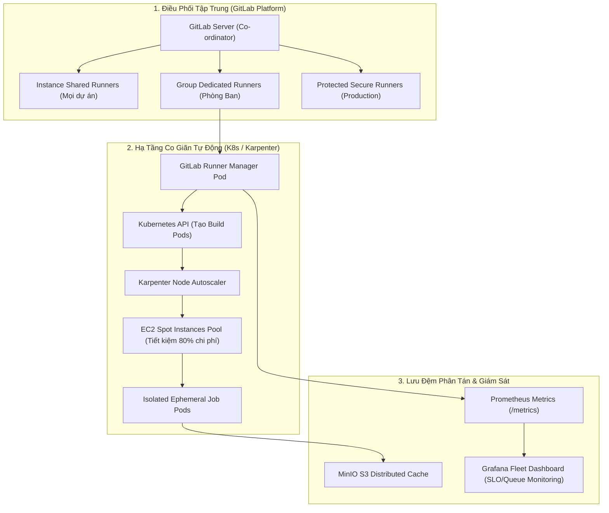


# [BÀI 44] QUẢN LÝ & TỐI ƯU HÓA GITLAB RUNNER QUY MÔ DOANH NGHIỆP (RUNNER FLEETS & SCALING)

Trong kỷ nguyên **DevOps, DevSecOps và Cloud Native Engineering**, **GitLab CI/CD** được công nhận là một trong những nền tảng tự động hóa tích hợp liên tục và phân phối liên tục (CI/CD) hoàn chỉnh, mạnh mẽ và được tin dùng nhất trong các doanh nghiệp quy mô lớn. Không chỉ dừng lại ở các pipeline tuần tự cơ bản, việc vận hành GitLab CI/CD ở cấp độ Production đòi hỏi kỹ sư phải làm chủ kiến trúc điều phối phi tuyến tính **DAG (Directed Acyclic Graph)**, cơ chế quản trị **Autoscaling Runners**, tối ưu hóa **Caching đa tầng**, xác thực không khóa **Keyless OIDC**, bảo mật chuỗi cung ứng phần mềm **SLSA & SBOM** cùng các chính sách **Quality & Security Gates** tự động.

Bài viết chuyên sâu này sẽ đồng hành cùng bạn mổ xẻ toàn diện bức tranh kiến trúc, phân tích các đánh đổi kỹ thuật thực chiến (Engineering Trade-offs), cung cấp hướng dẫn thực hành Lab chi tiết từng bước và bộ câu hỏi phỏng vấn chuyên sâu chuẩn DevOps Lead / DevSecOps Architect.

---

## 1. Bản Chất Kiến Trúc & Cơ Chế Vận Hành Tầng Thấp

### 1.1. Luận Đề Trung Tâm: Khủng Hoảng Hạ Tầng CI/CD Khi Mở Rộng Quy Mô Lên Hàng Ngàn Kỹ Sư

Khi một tổ chức công nghệ phát triển từ 20 kỹ sư lên 500 hay 2.000 kỹ sư, số lượng Jobs CI/CD được kích hoạt mỗi ngày có thể tăng vọt từ vài trăm lên tới hơn **50.000 jobs/ngày**.

Nếu hạ tầng GitLab Runner không được thiết kế kiến trúc chuẩn quy mô lớn:
1. **Hiện tượng nghẽn hàng đợi nghiêm trọng (Queue Congestion)**: Các jobs phải xếp hàng chờ từ 15 đến 45 phút mới có máy chủ Runner tiếp nhận, làm tê liệt toàn bộ năng suất của đội ngũ phát triển.
2. **Lãng phí chi phí điện toán đám mây khổng lồ**: Duy trì hàng trăm máy chủ VM On-Demand chạy cố định 24/7 kể cả ban đêm và cuối tuần.
3. **Nhiễm bẩn môi trường thực thi (Noisy Neighbor & State Leakage)**: Các job chạy chung máy chủ ghi đè tệp tin tạm của nhau hoặc tiêu tốn hết dung lượng ổ đĩa.
4. **Mù thông tin vận hành**: Không có chỉ số đo lường xem nhóm nào đang chiếm dụng tài nguyên và thời gian chờ trung bình là bao nhiêu.

> **Kiến trúc quản trị Runner quy mô Enterprise bắt buộc phải chuyển dịch sang mô hình "Autoscaling Cloud-Native Runner Fleets": Sử dụng GitLab Runner Kubernetes Executor kết hợp với Just-in-Time Node Autoscaling (Karpenter), phân vùng Runner theo Group/Tags, và lưu trữ bộ nhớ đệm phân tán trên cụm MinIO S3 nội bộ.**

```text
       KIẾN TRÚC RUNNER FLEET CO GIÃN TỰ ĐỘNG (Kubernetes & Karpenter)

  [ 1.000+ Jobs Kích Hoạt Đồng Thời Từ GitLab Server ]
                          │
                          ▼ (Nhận tín hiệu qua gRPC/HTTPS)
  ┌────────────────────────────────────────────────────────┐
  │         GITLAB RUNNER MANAGER (K8s Control Pod)        │
  └───────────────────────┬────────────────────────────────┘
                          │
       (Yêu cầu Pod mới)  │ (Tự động cấp phát Node tức thì)
                          ▼
  ┌────────────────────────────────────────────────────────┐
  │         KUBERNETES WORKER CLUSTER (AWS EKS / GKE)      │
  │  ┌──────────────────────────────────────────────────┐  │
  │  │ AWS Karpenter / GKE Cluster Autoscaler           │  │
  │  │ - Bật 50 Spot Instance Nodes trong 45 giây       │  │
  │  │ - Cấp phát 500 Build Pods chạy song song cách ly │  │
  │  │ - Thu hồi 100% Nodes về 0 khi hàng đợi rỗng      │  │
  │  └──────────────────────────────────────────────────┘  │
  └───────────────────────┬────────────────────────────────┘
                          │
                          ▼ (Tải / Lưu Cache siêu tốc qua mạng 10Gbps)
  [ Cụm Lưu Trữ Distributed Cache: MinIO S3 Enterprise ]
```



### 1.2. Phân Tầng Runner Fleets Trong Doanh Nghiệp

1. **Instance Runners (Shared Runners)**: Phục vụ toàn công ty cho các tác vụ kiểm thử nhẹ (Linting, Unit tests cơ bản). Có cấu hình giới hạn thời gian (Timeout 30 phút).
2. **Group Runners**: Gắn riêng cho từng Khối Công Nghệ (ví dụ: Khối Ngân Hàng Số, Khối AI/Data). Runner có phần cứng chuyên biệt (GPU Runners, RAM khủng).
3. **Protected / Dedicated Project Runners**: Chỉ tiếp nhận các jobs chạy trên Protected Branches và Protected Environments (Deploy Production, Ký số Cosign). Đảm bảo cách ly tuyệt đối về an ninh.

### 1.3. Cơ Chế Co Giãn Với Karpenter & MinIO S3 Caching

- **Karpenter (AWS)**: Bỏ qua Node Groups truyền thống, trực tiếp lắng nghe yêu cầu tài nguyên từ các Pod của GitLab Runner và cấp phát chính xác loại máy chủ EC2 phù hợp nhất (loại instance tối ưu giá) chỉ trong vòng **30 đến 45 giây**.
- **MinIO Distributed Cache**: Cung cấp giải pháp lưu trữ S3 tương thích cao đặt ngay bên trong cụm mạng nội bộ (LAN 10-25 Gbps). Giúp thời gian tải và nén tệp cache 2GB giảm từ 2 phút xuống chỉ còn **6 giây**!

---

## 2. Bảng So Sánh Kỹ Thuật Toàn Diện (Engineering Matrix)

| Tiêu Chí Đánh Giá | Shell Executor Trên VM Cố Định | Docker Executor (Single VM) | Docker Autoscaler (Fleeting) | Kubernetes Autoscaling Executor |
| :--- | :--- | :--- | :--- | :--- |
| **Mức Độ Cách Ly** | **Rất kém (Chung OS, dễ nhiễm)**| Trung bình (Container) | **Cao (Mỗi job 1 VM riêng)** | **Cao nhất (Mỗi job 1 Pod riêng)** |
| **Khả Năng Co Giãn** | Không thể (Cố định CPU) | Không thể | Co giãn theo VM Instances | **Co giãn tức thì từ 0 đến 1.000 Pods** |
| **Chi Phí Nhàn Rỗi (Idle)**| 100% chi phí 24/7 | 100% chi phí 24/7 | Rất thấp (Tự tắt VM sau khi dùng)| **Gần bằng 0 (Tự thu hồi node Spot)** |
| **Tốc Độ Khởi Tạo Job**| Tức thì (< 1s) | Tức thì (< 2s) | Chậm (~1 - 2 phút bật VM) | **Nhanh (~5 - 15 giây Pod start)** |
| **Quản Trị Phân Phối Cache**| Local Path đĩa cứng | Local Docker Volume | Phải dùng S3 ngoài | **MinIO S3 Nội Bộ Tốc Độ Cao** |
| **Hỗ Trợ GPU / ARM64** | Cần máy chủ vật lý riêng | Cần máy chủ riêng | Co giãn theo VM Template | **Tự động gắn Node Selector & Taints** |
| **Khuyến Nghị Sử Dụng** | Chỉ dùng cho máy Build iOS/Mac | Dự án cá nhân | Build Docker cần VM cách ly | **Tiêu chuẩn vàng cho Enterprise CI/CD**|

---

## 3. Kiến Trúc Triển Khai Chuẩn Production (Architecture Breakdown)

### 3.1. Cấu Hình Tệp `config.toml` Cho Kubernetes Executor Quy Mô Lớn

```toml
concurrent = 200 # Cho phép chạy tối đa 200 jobs đồng thời trên cụm
check_interval = 3 # Kiểm tra hàng đợi GitLab Server mỗi 3 giây

[session_server]
  session_timeout = 1800

[[runners]]
  name = "enterprise-k8s-autoscale-runner"
  url = "https://gitlab.corp.internal"
  id = 123
  token = "glrt-xxxxxxxxxxxxxxxxxxxx"
  token_obtained_at = 2026-09-12T00:00:00Z
  token_expires_at = 0001-01-01T00:00:00Z
  executor = "kubernetes"

  [runners.custom_build_dir]
  [runners.cache]
    MaxUploadedArchiveSize = 5368709120 # Giới hạn 5GB
    Type = "s3"
    Shared = true
    [runners.cache.s3]
      ServerAddress = "minio.storage.svc.cluster.local:9000"
      AccessKey = "minio-enterprise-access-key"
      SecretKey = "minio-enterprise-secret-key"
      BucketName = "gitlab-runner-distributed-cache"
      Insecure = true

  [runners.kubernetes]
    host = ""
    bearer_token_overwrite_allowed = false
    image = "alpine:3.19"
    namespace = "gitlab-runners"
    privileged = false # Tuyệt đối không bật Privileged
    poll_interval = 3
    poll_timeout = 600
    service_account = "gitlab-runner-worker-sa"
    
    # Cấu hình giới hạn tài nguyên mặc định cho Build Pod
    cpu_request = "500m"
    cpu_limit = "4"
    memory_request = "1Gi"
    memory_limit = "8Gi"
    
    # Sử dụng RAM Disk cho thư mục làm việc để tăng tốc I/O
    [runners.kubernetes.volumes]
      [[runners.kubernetes.volumes.empty_dir]]
        name = "build-tmp"
        mount_path = "/tmp"
        medium = "Memory"
```

### 3.2. Cấu Hình Prometheus Exporter Giám Sát Sức Khỏe Runner Fleet

```yaml
# ServiceMonitor cho Prometheus Operator
apiVersion: monitoring.coreos.com/v1
kind: ServiceMonitor
metadata:
  name: gitlab-runner-metrics
  namespace: gitlab-runners
spec:
  selector:
    matchLabels:
      app: gitlab-runner
  endpoints:
    - port: metrics
      interval: 15s
      path: /metrics
```

---

## 4. Phân Tích Cạm Bẫy Thực Chiến (5-Whys Incident Analysis)

### 4.1. Sự Cố Thực Tế: Hàng Ngàn Job Bị Kẹt Do Lỗi Cạn Kiệt IP Trong Subnet Của Kubernetes Runner

> **Bối Cảnh**: Vào giờ cao điểm buổi sáng, hơn 300 jobs CI/CD đồng loạt kích hoạt. Các Pod mới tạo liên tục rơi vào trạng thái `Pending` và không thể chạy được. Hàng loạt pipeline bị timeout sau 1 giờ chờ đợi. Điều tra cho thấy mạng AWS VPC Subnet dành cho cụm Runner đã bị cạn kiệt 100% địa chỉ IP khả dụng.

```text
┌─────────────────────────────────────────────────────────────────────────┐
│                    PHÂN TÍCH NGUYÊN NHÂN GỐC RỄ (5-WHYS)                 │
├─────────────────────────────────────────────────────────────────────────┤
│ 1. Tại sao hàng trăm Runner Pods bị kẹt ở trạng thái Pending?          │
│    -> Kubernetes không thể cấp phát mạng cho Pod mới.                   │
│                                                                         │
│ 2. Tại sao lại không cấp phát được mạng cho Pod?                        │
│    -> AWS CNI thông báo lỗi "No available IP addresses in subnet".      │
│                                                                         │
│ 3. Tại sao toàn bộ dải IP lại bị cạn kiệt?                              │
│    -> Subnet chỉ có dải CIDR /24 (251 IP) trong khi mỗi node ngốn 30 IP.│
│                                                                         │
│ 4. Tại sao lại cấp phát Subnet nhỏ cho cụm Runner co giãn lớn?          │
│    -> Ban đầu hạ tầng được thiết kế cho quy mô nhỏ 20 kỹ sư.            │
│                                                                         │
│ 5. NGUYÊN NHÂN CỐT LÕI (Root Cause):                                   │
│    -> Thiếu thiết kế quy hoạch mạng chuyên biệt (Dedicated Large CIDR)  │
│       cho cụm Autoscaling Runner và không cấu hình WARM_IP_TARGET tối ưu│
└─────────────────────────────────────────────────────────────────────────┘
```

### 4.2. Giải Pháp Khắc Phục Triệt Để

1. **Quy hoạch mạng chuyên biệt cho Runner Fleet**: Cấp phát một dải CIDR riêng biệt có kích thước lớn tối thiểu **`/20` (4.096 IPs)** hoặc **`/19` (8.192 IPs)** dành riêng cho các Node và Pod của GitLab Runner.
2. **Tối ưu hóa AWS VPC CNI Settings**:
   - `WARM_IP_TARGET: 5` (Chỉ giữ lại 5 IP đệm thay vì chiếm dụng trước cả khối).
   - `MINIMUM_IP_TARGET: 10`.

---

## 5. Hands-on Lab: Triển Khai Cụm Runner Autoscaling Với MinIO Cache (8 Bước Chuẩn)

### 5.1. Mục Tiêu Lab
- Cài đặt cụm lưu trữ MinIO S3 trong Kubernetes để làm Distributed Cache Server.
- Cài đặt GitLab Runner Kubernetes Executor bằng Helm Chart chính thức.
- Cấu hình liên kết Cache S3 và kiểm tra tải/lưu cache tự động.
- Quan sát Prometheus Metrics xuất ra từ Runner Manager.

```text
       QUY TRÌNH THỰC HÀNH LAB RUNNER AUTOSCALING & MINIO CACHE

     [ 1. Cài đặt MinIO S3 ] ──► Khởi tạo Bucket: runner-cache
                  │
                  ▼
     [ 2. Cài đặt GitLab Runner Helm ] ──► Cấu hình config.toml S3 Cache
                  │
                  ▼
     [ 3. Chạy Job CI Test ] ──► Runner Pod tự sinh trên K8s
                  │
                  ├──► Lưu Cache tgz lên MinIO S3 qua mạng nội bộ
                  └──► Xuất Metrics tại cổng :9252 cho Prometheus
```

### 5.2. Các Bước Thực Hiện Chi Tiết

#### Bước 1: Khởi Tạo Namespace `gitlab-runners`
```bash
kubectl create namespace gitlab-runners
```

#### Bước 2: Cài Đặt Máy Chủ Lưu Trữ MinIO S3 Bằng Helm
```bash
helm repo add bitnami https://charts.bitnami.com/bitnami
helm repo update
helm upgrade --install minio-cache bitnami/minio     --namespace gitlab-runners     --set auth.rootUser="minioadmin"     --set auth.rootPassword="miniopassword123"     --set defaultBuckets="runner-cache"
```

#### Bước 3: Lấy Runner Authentication Token Từ GitLab
- Truy cập **Admin Area -> CI/CD -> Runners** (hoặc Group Settings -> Runners).
- Nhấn **New instance runner** và sao chép mã Token `glrt-...`.

#### Bước 4: Tạo Tệp Giá Trị Helm `runner-values.yaml`
```yaml
gitlabUrl: "https://gitlab.corp.internal"
runnerToken: "glrt-xxxxxxxxxxxxxxxxxxxx"

concurrent: 50
checkInterval: 5

metrics:
  enabled: true
  port: 9252

rbac:
  create: true

runners:
  executor: kubernetes
  image: alpine:3.19
  tags: "k8s-autoscale,enterprise"
  
  cache:
    secretName: s3access
    type: s3
    shared: true
    s3ServerAddress: "minio-cache.gitlab-runners.svc.cluster.local:9000"
    s3BucketName: "runner-cache"
    s3Insecure: true
```

#### Bước 5: Tạo Kubernetes Secret Chứa Khóa Truy Cập MinIO
```bash
kubectl create secret generic s3access     --namespace gitlab-runners     --from-literal=accesskey="minioadmin"     --from-literal=secretkey="miniopassword123"
```

#### Bước 6: Cài Đặt GitLab Runner Bằng Helm Chart Chính Thức
```bash
helm repo add gitlab https://charts.gitlab.io
helm repo update
helm upgrade --install enterprise-runner gitlab/gitlab-runner     --namespace gitlab-runners     -f runner-values.yaml
```

#### Bước 7: Viết Tệp `.gitlab-ci.yml` Kiểm Tra Distributed Cache
```yaml
stages:
  - test_cache

test_distributed_caching:
  stage: test_cache
  tags: ["k8s-autoscale"]
  image: alpine:3.19
  cache:
    key: "lab-cache-key"
    paths:
      - cache-data/
  script:
    - mkdir -p cache-data
    - echo "Cache generated at $(date)" >> cache-data/log.txt
    - ls -la cache-data/
```

#### Bước 8: Kiểm Tra Metrics Prometheus Của Runner
```bash
kubectl port-forward svc/enterprise-runner-gitlab-runner 9252:9252 -n gitlab-runners &
curl -s http://localhost:9252/metrics | grep gitlab_runner_jobs_total
# Output: gitlab_runner_jobs_total{executor="kubernetes",state="success"} 1
```

> [!NOTE]
> **Check-point Lab 44**: Runner Pods được khởi tạo động trên Kubernetes, lưu đệm thành công vào cụm MinIO S3 nội bộ và xuất số liệu giám sát Prometheus chính xác.

---

## 6. Bộ Câu Hỏi Vấn Đáp & Phỏng Vấn Chuyên Sâu (Self-Check Q&A)

<details class="qa-card">
  <summary class="qa-summary">
    <span class="qa-num-badge">Q01</span>
    <span>Tại sao Kubernetes Executor lại là giải pháp tối ưu nhất cho hạ tầng Runner doanh nghiệp lớn?</span>
  </summary>
  <div class="qa-body">
    <p><strong>Ưu điểm kỹ thuật:</strong></p>
    <ul>
      <li><strong>Cách ly hoàn hảo (Hermetic Isolation)</strong>: Mỗi job chạy trong một Pod mới tinh, tự động hủy khi hoàn thành, không có rủi ro nhiễm bẩn trạng thái giữa các jobs.</li>
      <li><strong>Tận dụng tối đa phần cứng</strong>: Kubernetes tự động xếp các Pod vào các node còn trống (Bin Packing), tối ưu hóa tỷ lệ sử dụng CPU/RAM.</li>
      <li><strong>Tích hợp Auto-scaling Native</strong>: Tự động co giãn theo số lượng job thực tế.</li>
    </ul>
  </div>
</details>

<details class="qa-card">
  <summary class="qa-summary">
    <span class="qa-num-badge">Q02</span>
    <span>Sự khác biệt giữa tham số `concurrent` và `limit` trong cấu hình `config.toml` của GitLab Runner là gì?</span>
  </summary>
  <div class="qa-body">
    <p><strong>Phân tích:</strong></p>
    <ul>
      <li><code>concurrent</code>: Là số lượng job <strong>tối đa toàn cục</strong> mà tiến trình Runner Manager đó được phép thực thi đồng thời trên tất cả các khối <code>[[runners]]</code>.</li>
      <li><code>limit</code>: Là số lượng job tối đa cho <strong>riêng một khối `[[runners]]` cụ thể</strong>. Ví dụ: Bạn có thể cấu hình <code>concurrent = 100</code>, nhưng giới hạn riêng <code>limit = 10</code> cho runner chuyên chạy các tác vụ nặng ngốn RAM.</li>
    </ul>
  </div>
</details>

<details class="qa-card">
  <summary class="qa-summary">
    <span class="qa-num-badge">Q03</span>
    <span>Làm thế nào để Runner co giãn hiệu quả trên các máy chủ Spot Instances mà không bị lỗi đứt gãy job?</span>
  </summary>
  <div class="qa-body">
    <p><strong>Chiến lược Spot Resilience:</strong></p>
    <ol>
      <li>Cài đặt <strong>AWS Node Termination Handler</strong> hoặc sử dụng <strong>Karpenter</strong>. Khi nhận tín hiệu cảnh báo thu hồi Spot (trước 2 phút), hệ thống lập tức phát lệnh Cordon & Drain node đó.</li>
      <li>Cấu hình thuộc tính <code>retry: { max: 2, when: [runner_system_failure] }</code> trong tệp <code>.gitlab-ci.yml</code> để GitLab tự động kích hoạt lại job trên một node Spot mới khác nếu node cũ bị thu hồi đột ngột.</li>
    </ol>
  </div>
</details>

<details class="qa-card">
  <summary class="qa-summary">
    <span class="qa-num-badge">Q04</span>
    <span>Tại sao nên sử dụng Distributed Cache (S3/MinIO) thay vì Local Disk Cache trên Runner Cluster?</span>
  </summary>
  <div class="qa-body">
    <p><strong>Lý do kiến trúc:</strong></p>
    <p>Trong cụm Autoscaling, mỗi job có thể được lập lịch chạy trên một máy chủ Node hoàn toàn khác nhau. Nếu dùng Local Disk Cache, Job A lưu cache trên Node 1 nhưng Job B chạy trên Node 2 sẽ bị <strong>Cache Miss 100%</strong>. Sử dụng S3/MinIO tập trung đảm bảo mọi Node và Pod ở bất kỳ đâu đều truy cập chung một kho lưu trữ đệm bất biến.</p>
  </div>
</details>

<details class="qa-card">
  <summary class="qa-summary">
    <span class="qa-num-badge">Q05</span>
    <span>Khái niệm "Runner Tags" đóng vai trò gì trong việc định tuyến khối lượng công việc (Workload Routing)?</span>
  </summary>
  <div class="qa-body">
    <p><strong>Cơ chế:</strong></p>
    <p>Tags là các nhãn định danh gắn với Runner (ví dụ: <code>gpu</code>, <code>high-memory</code>, <code>arm64</code>, <code>production-secure</code>). Job CI khai báo từ khóa <code>tags: ["gpu"]</code> sẽ chỉ được định tuyến tới các Runner có gắn nhãn tương ứng, đảm bảo các job cần phần cứng đặc biệt luôn chạy đúng môi trường tối ưu.</p>
  </div>
</details>

<details class="qa-card">
  <summary class="qa-summary">
    <span class="qa-num-badge">Q06</span>
    <span>Làm thế nào để ngăn chặn các Job rác làm cạn kiệt tài nguyên của cụm Shared Runner?</span>
  </summary>
  <div class="qa-body">
    <p><strong>Các biện pháp giới hạn:</strong></p>
    <ul>
      <li>Đặt <strong>Job Timeout</strong> tối đa (ví dụ: tối đa 60 phút) trong cấu hình Runner.</li>
      <li>Áp dụng <strong>Kubernetes ResourceQuota và LimitRanges</strong> trên namespace <code>gitlab-runners</code> để giới hạn tổng số CPU/RAM mà các Pod có thể chiếm dụng.</li>
      <li>Cấu hình <code>cpu_limit</code> và <code>memory_limit</code> nghiêm ngặt cho từng Pod.</li>
    </ul>
  </div>
</details>

<details class="qa-card">
  <summary class="qa-summary">
    <span class="qa-num-badge">Q07</span>
    <span>Chỉ số Prometheus nào quan trọng nhất để phát hiện hiện tượng nghẽn hàng đợi CI/CD?</span>
  </summary>
  <div class="qa-body">
    <p><strong>Chỉ số then chốt:</strong></p>
    <p><code>gitlab_runner_job_queue_duration_seconds</code> (Đo lường thời gian từ lúc Job được kích hoạt cho đến khi thực sự bắt đầu chạy). Nếu giá trị p95 của chỉ số này vượt quá <strong>30 giây</strong>, đó là tín hiệu cảnh báo cụm Runner đang bị thiếu dung lượng và cần tăng ngưỡng autoscaling.</p>
  </div>
</details>

<details class="qa-card">
  <summary class="qa-summary">
    <span class="qa-num-badge">Q08</span>
    <span>Docker Autoscaler với Fleeting Plugin là gì và khi nào nên sử dụng thay cho Kubernetes?</span>
  </summary>
  <div class="qa-body">
    <p><strong>Cơ chế Fleeting:</strong></p>
    <p>Fleeting là kiến trúc Autoscaling thế hệ mới của GitLab (thay thế Docker Machine cũ). Nó trực tiếp quản lý các nhóm máy ảo (AWS ASG, GCP MIG) và khởi chạy 1 Virtual Machine tạm thời cho mỗi job. Phù hợp nhất cho các tổ chức chưa triển khai Kubernetes hoặc các tác vụ build đặc thù đòi hỏi quyền Root VM tuyệt đối (như build Windows Containers hoặc máy ảo MacOS).</p>
  </div>
</details>

<details class="qa-card">
  <summary class="qa-summary">
    <span class="qa-num-badge">Q09</span>
    <span>Sự cố: Runner báo lỗi `API rate limit exceeded` khi kéo Docker Images từ Docker Hub. Xử lý thế nào?</span>
  </summary>
  <div class="qa-body">
    <p><strong>Giải pháp:</strong></p>
    <ol>
      <li>Sử dụng tính năng <strong>GitLab Dependency Proxy</strong> để cache các image từ Docker Hub trên máy chủ GitLab nội bộ.</li>
      <li>Hoặc cấu hình xác thực tài khoản Docker Hub trả phí trong <code>config.toml</code> của Runner.</li>
    </ol>
  </div>
</details>

<details class="qa-card">
  <summary class="qa-summary">
    <span class="qa-num-badge">Q10</span>
    <span>Làm thế nào để sử dụng RAM Disk (`medium: Memory`) tăng tốc độ I/O cho Kubernetes Runner?</span>
  </summary>
  <div class="qa-body">
    <p><strong>Tối ưu hóa I/O:</strong></p>
    <p>Trong <code>config.toml</code>, cấu hình <code>[[runners.kubernetes.volumes.empty_dir]]</code> với <code>medium = "Memory"</code> gắn vào thư mục <code>/tmp</code> hoặc workspace. Mọi thao tác đọc ghi tệp tạm thời diễn ra trực tiếp trên RAM với tốc độ hàng chục GB/s thay vì đọc ghi qua ổ cứng SSD.</p>
  </div>
</details>

<details class="qa-card">
  <summary class="qa-summary">
    <span class="qa-num-badge">Q11</span>
    <span>Tại sao cần xoay vòng Runner Authentication Tokens định kỳ?</span>
  </summary>
  <div class="qa-body">
    <p><strong>Bảo mật Token:</strong></p>
    <p>Runner Registration Tokens kiểu cũ tồn tại vĩnh viễn và có thể bị lạm dụng để đăng ký các Runner giả mạo nhằm đánh cắp mã nguồn. GitLab hiện đại sử dụng <strong>Runner Authentication Tokens (`glrt-...`)</strong> có hỗ trợ tính năng tự động hết hạn và xoay vòng định kỳ (Token Expiration & Rotation Policy).</p>
  </div>
</details>

<details class="qa-card">
  <summary class="qa-summary">
    <span class="qa-num-badge">Q12</span>
    <span>Làm cách nào để đo lường tổng chi phí (TCO) của hạ tầng Runner Fleet trong doanh nghiệp?</span>
  </summary>
  <div class="qa-body">
    <p><strong>Tính toán FinOps:</strong></p>
    <p>Kết hợp công cụ <strong>Kubecost / OpenCost</strong> trên cụm Kubernetes. Gắn nhãn chi phí theo từng dự án/nhóm (Cost Allocation Tags: <code>project_id</code>, <code>team_name</code>) để xuất báo cáo chính xác mỗi phòng ban tiêu tốn bao nhiêu USD tiền CPU/RAM cho hoạt động CI/CD mỗi tháng.</p>
  </div>
</details>

---

## 7. Tổng Kết & Lộ Trình Bài Học Tiếp Theo

### 7.1. Tóm Tắt Các Điểm Cốt Lõi (Architectural Key Takeaways)
- **Autoscaling Fleet Architecture**: Kubernetes Executor kết hợp Karpenter giúp co giãn linh hoạt từ 0 đến hàng trăm máy chủ.
- **Cost Optimization via Spot**: Tiết kiệm tới 80% chi phí hạ tầng điện toán đám mây bằng cách tận dụng Spot Instances có cơ chế retry an toàn.
- **High-Speed Distributed Cache**: Tối ưu hóa I/O và tốc độ tải cache qua cụm MinIO S3 nội bộ tốc độ cao.
- **Full-Spectrum Observability**: Giám sát độ trễ hàng đợi và hiệu năng toàn bộ Runner Fleet qua Prometheus & Grafana.

### 7.2. Sơ Đồ Tư Duy Quản Lý Runner Quy Mô Doanh Nghiệp (Mindmap)

```text
                     QUẢN LÝ RUNNER FLEET DOANH NGHIỆP TOÀN DIỆN
                                         │
        ┌────────────────────────────────┼────────────────────────────────┐
        ▼                                ▼                                ▼
  [ Compute Orchestration ]    [ Storage & Caching ]          [ Monitoring & FinOps ]
  - Kubernetes Executor        - MinIO S3 Distributed Cache   - Prometheus Queue Metrics
  - Karpenter Node Autoscaling - RAM Disk (/tmp Memory)       - Grafana Fleet Dashboard
  - Spot Instance Resilience   - 10Gbps LAN Cache Transfer    - Kubecost Resource Tracking
```

> [!TIP]
> **Bước tiếp theo trong lộ trình**: Làm chủ quy trình phân quyền chi tiết, quản trị kiểm toán và thiết lập chính sách bảo mật đa cấp trong [Bài 45: Quản Trị Compliance, Audit & Phân Quyền Chi Tiết Trong GitLab](gitlab-45-45-compliance-audit-phan-quyen.html).

