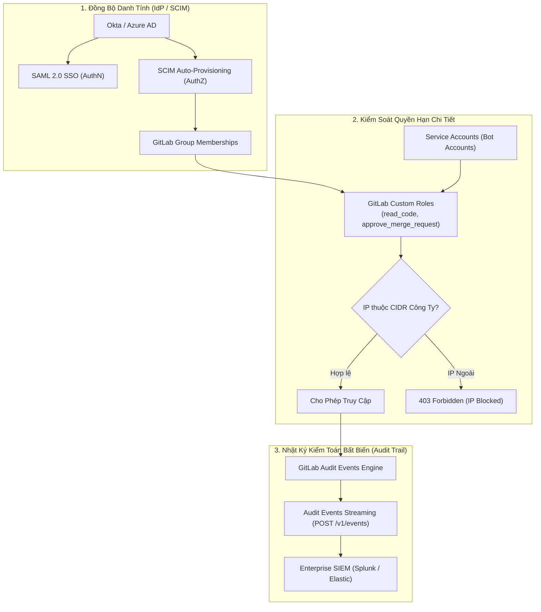


# [BÀI 45] QUẢN TRỊ COMPLIANCE, AUDIT & PHÂN QUYỀN CHI TIẾT TRONG GITLAB

Trong kỷ nguyên **DevOps, DevSecOps và Cloud Native Engineering**, **GitLab CI/CD** được công nhận là một trong những nền tảng tự động hóa tích hợp liên tục và phân phối liên tục (CI/CD) hoàn chỉnh, mạnh mẽ và được tin dùng nhất trong các doanh nghiệp quy mô lớn. Không chỉ dừng lại ở các pipeline tuần tự cơ bản, việc vận hành GitLab CI/CD ở cấp độ Production đòi hỏi kỹ sư phải làm chủ kiến trúc điều phối phi tuyến tính **DAG (Directed Acyclic Graph)**, cơ chế quản trị **Autoscaling Runners**, tối ưu hóa **Caching đa tầng**, xác thực không khóa **Keyless OIDC**, bảo mật chuỗi cung ứng phần mềm **SLSA & SBOM** cùng các chính sách **Quality & Security Gates** tự động.

Bài viết chuyên sâu này sẽ đồng hành cùng bạn mổ xẻ toàn diện bức tranh kiến trúc, phân tích các đánh đổi kỹ thuật thực chiến (Engineering Trade-offs), cung cấp hướng dẫn thực hành Lab chi tiết từng bước và bộ câu hỏi phỏng vấn chuyên sâu chuẩn DevOps Lead / DevSecOps Architect.

---

## 1. Bản Chất Kiến Trúc & Cơ Chế Vận Hành Tầng Thấp

### 1.1. Luận Đề Trung Tâm: Sự Chuyển Dịch Từ Phân Quyền Thô Sang Quản Trị Danh Tính & Tuân Thủ Đa Tầng

Trong một tổ chức quy mô lớn, việc sử dụng 5 vai trò mặc định truyền thống của GitLab (Guest, Reporter, Developer, Maintainer, Owner) thường bộc lộ những điểm bất cập về an ninh:
1. **Thừa quyền nghiêm trọng (Over-privileged Access)**: Một kỹ sư chỉ cần quyền đọc biến CI hoặc duyệt Merge Request nhưng lại buộc phải gán quyền `Maintainer`, cho phép họ vô tình có cả quyền xóa repository hoặc thay đổi cấu hình Runner.
2. **Tài khoản cá nhân dùng chung cho tự động hóa (Shared Personal Accounts)**: Các script tự động sử dụng Personal Access Token của một kỹ sư cụ thể, khi người đó nghỉ việc thì toàn bộ hệ thống CI/CD bị sập.
3. **Mất kiểm soát địa điểm truy cập**: Tài khoản bị lộ mật khẩu có thể đăng nhập từ bất kỳ IP lạ nào trên thế giới mà không có rào chắn mạng.

> **Mô hình quản trị doanh nghiệp hiện đại kết hợp: Custom Roles (phân quyền mịn theo từng chức năng), Service Accounts (tài khoản bot độc lập không gắn với con người), SAML SSO/SCIM Sync (tự động thu hồi quyền khi nhân sự nghỉ việc), IP Allowlisting và Audit Events Streaming thời gian thực sang hệ thống SIEM tập trung.**

```text
       HỆ THỐNG QUẢN TRỊ DANH TÍNH & KIỂM TOÁN DOANH NGHIỆP

  [ Enterprise IdP: Okta / Entra ID ]
                 │
                 ├──► SAML 2.0 SSO (Xác thực đăng nhập tập trung)
                 └──► SCIM API Sync (Tự động cấp phát/thu hồi tài khoản)
                             │
                             ▼
  ┌────────────────────────────────────────────────────────┐
  │         GITLAB ENTERPRISE GOVERNANCE ENGINE            │
  ├────────────────────────────┬───────────────────────────┤
  │ 1. Granular Custom Roles   │ 2. Network Security       │
  │ - Read-only Variables Role │ - Group IP Allowlisting   │
  │ - Security Approver Role   │ - Mandatory 2FA / WebAuthn│
  └────────────────────────────┴───────────────────────────┘
                             │
                             ▼ (Streaming JSON Events qua HTTPS/Webhooks)
  [ Hệ Thống SIEM Kiểm Toán Tập Trung: Splunk / Datadog / Elastic ]
```



### 1.2. Tính Năng Custom Roles (Phân Quyền Mịn)

**GitLab Custom Roles** cho phép tạo các vai trò mới dựa trên một Base Role (ví dụ: Developer) và bổ sung chính xác các đặc quyền mong muốn:
- `read_code`: Chỉ xem mã nguồn.
- `manage_merge_requests`: Quản lý Merge Requests.
- `admin_vulnerabilities`: Xử lý các phát hiện bảo mật trên Vulnerability Report.
- `read_runners`: Xem danh sách Runners mà không có quyền sửa cấu hình.

### 1.3. Cơ Chế Service Accounts & Audit Events Streaming

- **Service Accounts**: Tài khoản chuyên dụng cho hệ thống máy móc/CI bots. Không cần địa chỉ email thật, không chiếm giấy phép người dùng (User License) và không thể đăng nhập qua giao diện Web (chỉ dùng API Tokens).
- **Audit Events Streaming**: Cơ chế truyền phát toàn bộ bản ghi kiểm toán (ai tạo branch, ai xóa biến, ai phê duyệt MR) theo thời gian thực (Real-time Webhook Stream) tới các máy chủ bảo mật bên ngoài, đảm bảo tính toàn vẹn và không thể bị sửa đổi.

---

## 2. Bảng So Sánh Kỹ Thuật Toàn Diện (Engineering Matrix)

| Tiêu Chí Đánh Giá | Quản Trị Người Dùng Thủ Công | 5 Vai Trò Mặc Định GitLab | GitLab Enterprise Custom Roles | Enterprise Governance Hoàn Chỉnh |
| :--- | :--- | :--- | :--- | :--- |
| **Cấp Quyền / Thu Hồi** | Nhập email thủ công từng repo | Thêm vào Group con | Thêm vào Group con | **Tự động 100% qua SCIM / SAML** |
| **Độ Mịn Của Quyền (Granularity)**| Rất thô (Admin / Member) | Thô (Developer / Maintainer) | **Rất mịn (Tùy biến từng API Action)**| **Rất mịn (RBAC + ABAC Policy)** |
| **Tài Khoản Tự Động (Bots)** | Dùng chung tài khoản kỹ sư | Personal Access Token | Deploy Tokens | **GitLab Service Accounts chuyên dụng**|
| **Kiểm Soát Mạng (IP Restriction)**| Không có | Không có | Cấu hình cấp Group | **Group & Subgroup IP Allowlisting** |
| **Lưu Trữ Nhật Ký (Audit Trail)**| Xem trên UI (giới hạn 30 ngày) | Xem trên UI | Xuất file CSV thủ công | **Streaming bất biến sang SIEM 24/7** |
| **Xác Thực 2 Lớp (2FA)** | Tự nguyện | Bật theo người dùng | Tự nguyện | **Ép buộc toàn bộ Group (Enforced 2FA)**|
| **Chứng Chỉ Tuân Thủ** | Không đạt chuẩn | Không đạt chuẩn | Đạt một phần | **Tuân thủ tuyệt đối SOC 2 / ISO 27001**|

---

## 3. Kiến Trúc Triển Khai Chuẩn Production (Architecture Breakdown)

### 3.1. Cấu Hình Custom Role & Service Account Qua GitLab REST API

```bash
# 1. Tạo Custom Role "Security Reviewer" dựa trên Base Role Reporter
curl --request POST --header "PRIVATE-TOKEN: ${ADMIN_TOKEN}"      --header "Content-Type: application/json"      --data '{
       "name": "Security Reviewer",
       "base_access_level": 20,
       "permissions": ["admin_vulnerabilities", "read_code", "approve_merge_request"]
     }'      "https://gitlab.corp.internal/api/v4/groups/12/custom_roles"

# 2. Tạo Service Account chuyên dụng cho Release Bot
curl --request POST --header "PRIVATE-TOKEN: ${ADMIN_TOKEN}"      --header "Content-Type: application/json"      --data '{
       "name": "Release Automation Bot",
       "username": "sa-release-bot"
     }'      "https://gitlab.corp.internal/api/v4/groups/12/service_accounts"

# 3. Tạo Personal Access Token cho Service Account
curl --request POST --header "PRIVATE-TOKEN: ${ADMIN_TOKEN}"      --header "Content-Type: application/json"      --data '{
       "name": "bot-token",
       "scopes": ["api", "write_repository"],
       "expires_at": "2027-01-01"
     }'      "https://gitlab.corp.internal/api/v4/groups/12/service_accounts/45/personal_access_tokens"
```

### 3.2. Cấu Hình Audit Events Streaming Tới Splunk / Datadog

```bash
# Thiết lập endpoint Streaming Audit Events cấp Group
curl --request POST --header "PRIVATE-TOKEN: ${ADMIN_TOKEN}"      --header "Content-Type: application/json"      --data '{
       "destination_url": "https://siem-collector.corp.internal/v1/gitlab-events",
       "name": "Enterprise Splunk Stream",
       "header_key": "X-Custom-Auth",
       "header_value": "Bearer-Secret-Token-12345"
     }'      "https://gitlab.corp.internal/api/v4/groups/12/audit_events/streaming_destinations"
```

---

## 4. Phân Tích Cạm Bẫy Thực Chiến (5-Whys Incident Analysis)

### 4.1. Sự Cố Thực Tế: Rò Rỉ Mã Nguồn Do Kỹ Sư Cũ Vẫn Giữ Quyền Truy Cập Sau Khi Nghỉ Việc

> **Bối Cảnh**: Một cựu kỹ sư cao cấp đã rời công ty 2 tháng nhưng vẫn dùng tài khoản cá nhân đăng nhập vào GitLab từ mạng gia đình và sao chép toàn bộ mã nguồn của dự án cốt lõi. Nguyên nhân là do dự án quản trị tài khoản thủ công và quản trị viên đã quên xóa tài khoản của kỹ sư này khỏi các Subgroups.

```text
┌─────────────────────────────────────────────────────────────────────────┐
│                    PHÂN TÍCH NGUYÊN NHÂN GỐC RỄ (5-WHYS)                 │
├─────────────────────────────────────────────────────────────────────────┤
│ 1. Tại sao cựu kỹ sư vẫn truy cập và tải được mã nguồn?                │
│    -> Tài khoản GitLab của kỹ sư vẫn ở trạng thái Active và có quyền.  │
│                                                                         │
│ 2. Tại sao tài khoản không bị khóa khi nhân sự nghỉ việc?              │
│    -> Đội ngũ IT chỉ khóa tài khoản Google Workspace/Email công ty.     │
│                                                                         │
│ 3. Tại sao khóa email lại không tự động khóa tài khoản GitLab?          │
│    -> GitLab sử dụng tài khoản đăng ký nội bộ riêng không qua SSO/SCIM. │
│                                                                         │
│ 4. Tại sao không cấu hình đồng bộ danh tính SAML SSO / SCIM?            │
│    -> Do dự án được dựng nhanh trong giai đoạn đầu và chưa chuẩn hóa.   │
│                                                                         │
│ 5. NGUYÊN NHÂN CỐT LÕI (Root Cause):                                   │
│    -> Thiếu hệ thống quản trị danh tính tập trung (Centralized IdP/SCIM)│
│       và không áp dụng chính sách IP Allowlisting cho môi trường mạng.  │
└─────────────────────────────────────────────────────────────────────────┘
```

### 4.2. Giải Pháp Khắc Phục Triệt Để

1. **Bắt buộc đăng nhập qua SAML 2.0 SSO & Bật SCIM**: Khi phòng Nhân sự vô hiệu hóa tài khoản trên Okta/Entra ID, hệ thống SCIM sẽ tự động thu hồi phiên làm việc và xóa toàn bộ quyền truy cập của người đó trên GitLab chỉ trong vòng **10 giây**.
2. **Kích hoạt Group IP Allowlisting**: Giới hạn toàn bộ quyền truy cập Git và Web UI chỉ khả dụng từ dải IP VPN nội bộ của công ty (`10.200.0.0/16`), ngăn chặn triệt để việc đăng nhập từ máy tính gia đình ngoài mạng doanh nghiệp.

---

## 5. Hands-on Lab: Thiết Lập Quản Trị Phân Quyền & Audit Streaming (8 Bước Chuẩn)

### 5.1. Mục Tiêu Lab
- Khởi tạo Group doanh nghiệp và cấu hình các chính sách an ninh bắt buộc (Enforce 2FA).
- Tạo Custom Role phân quyền mịn cho vai trò Security Auditor.
- Tạo một Service Account tự động cho CI bot.
- Cấu hình Audit Events Streaming và kiểm tra dữ liệu JSON sự kiện gửi về máy chủ nhận.

```text
       QUY TRÌNH THỰC HÀNH LAB QUẢN TRỊ PHÂN QUYỀN & AUDIT STREAMING

  [ 1. Cấu hình Group Security Settings ] ──► Bật Enforce 2FA & IP Allowlist
                   │
                   ▼
  [ 2. Tạo Custom Role: Security Auditor ] ──► Cấp quyền admin_vulnerabilities
                   │
                   ▼
  [ 3. Tạo Service Account: release-bot ]  ──► Cấp Token tự động hóa
                   │
                   ▼
  [ 4. Kích hoạt Audit Events Streaming ]  ──► Bắt sự kiện Real-time JSON
```

### 5.2. Các Bước Thực Hiện Chi Tiết

#### Bước 1: Khởi Tạo Group Doanh Nghiệp `enterprise-governance-lab`
Tạo một Group mới tại thanh điều hướng GitLab.

#### Bước 2: Bắt Buộc Xác Thực 2 Yếu Tố (Enforce 2FA) Cho Toàn Bộ Thành Viên
- Truy cập **Settings -> General -> Permissions and group features**.
- Tích chọn: **Require all users in this group to have two-factor authentication enabled**.
- Đặt thời gian ân hạn (Grace period) là `24 hours`.

#### Bước 3: Cấu Hình Dải IP Cho Phép (IP Allowlisting)
- Trong phần **IP access restrictions**, thêm dải IP tĩnh của văn phòng công ty (ví dụ: `203.0.113.0/24`).

#### Bước 4: Tạo Custom Role Bằng GitLab API
```bash
curl --request POST --header "PRIVATE-TOKEN: ${GITLAB_ADMIN_TOKEN}"      --header "Content-Type: application/json"      --data '{
       "name": "Security Auditor Role",
       "base_access_level": 20,
       "permissions": ["admin_vulnerabilities", "read_code"]
     }'      "https://gitlab.corp.internal/api/v4/groups/1/custom_roles"
```

#### Bước 5: Tạo Service Account Bot Cho Pipeline CI/CD
```bash
curl --request POST --header "PRIVATE-TOKEN: ${GITLAB_ADMIN_TOKEN}"      --header "Content-Type: application/json"      --data '{
       "name": "Automated Pipeline Bot",
       "username": "sa-pipeline-bot"
     }'      "https://gitlab.corp.internal/api/v4/groups/1/service_accounts"
```

#### Bước 6: Khởi Chạy Máy Chủ Thu Thập Audit Log Mẫu Bằng Node.js
Tạo tệp `audit-receiver.js` trên máy chủ kiểm toán:
```javascript
const http = require('http');

const server = http.createServer((req, res) => {
  if (req.method === 'POST') {
    let body = '';
    req.on('data', chunk => body += chunk);
    req.on('end', () => {
      console.log('--- [AUDIT EVENT RECEIVED] ---');
      console.log(JSON.stringify(JSON.parse(body), null, 2));
      res.writeHead(200, { 'Content-Type': 'application/json' });
      res.end('{"status":"OK"}');
    });
  }
});

server.listen(8088, () => console.log('Audit Stream Collector listening on port 8088...'));
```

#### Bước 7: Cấu Hình Streaming Audit Events Trỏ Tới Máy Chủ Thu Thập
- Truy cập **Secure -> Audit events -> Streams**.
- Thêm URL: `http://audit-collector.internal:8088`.
- Thêm Custom Header: `X-Audit-Token: secret-audit-123`.

#### Bước 8: Thực Hiện Thao Tác Thay Đổi Quyền Và Quan Sát Log Sự Kiện
- Thêm một thành viên mới vào Group với Custom Role vừa tạo.
- Quan sát console log của `audit-receiver.js`:
  ```json
  {
    "event_type": "member_created",
    "author_id": 1,
    "entity_id": 1,
    "entity_type": "Group",
    "details": {
      "add": "user_access",
      "as": "Security Auditor Role",
      "target_user": "john_doe"
    }
  }
  ```

> [!NOTE]
> **Check-point Lab 45**: Quản trị phân quyền mịn hoạt động chính xác, chính sách 2FA được thực thi nghiêm ngặt và toàn bộ nhật ký sự kiện kiểm toán được truyền phát thời gian thực không thất thoát.

---

## 6. Bộ Câu Hỏi Vấn Đáp & Phỏng Vấn Chuyên Sâu (Self-Check Q&A)

<details class="qa-card">
  <summary class="qa-summary">
    <span class="qa-num-badge">Q01</span>
    <span>Tại sao các doanh nghiệp đạt chuẩn SOC 2 Type II bắt buộc phải sử dụng Service Accounts thay vì Personal Access Tokens?</span>
  </summary>
  <div class="qa-body">
    <p><strong>Yêu cầu kiểm toán:</strong></p>
    <ul>
      <li><strong>Nguyên tắc sở hữu độc lập</strong>: Service Accounts thuộc quyền sở hữu của tổ chức/Group, không gắn liền với bất kỳ danh tính cá nhân của nhân viên nào.</li>
      <li><strong>Không làm gián đoạn sản xuất (Business Continuity)</strong>: Tránh rủi ro khi một kỹ sư nghỉ việc (Offboarding) và tài khoản của họ bị khóa làm chết toàn bộ các job tự động hóa đang dùng token của họ.</li>
      <li><strong>Kiểm soát quyền tối thiểu (Least Privilege)</strong>: Có thể gán các Custom Roles cực kỳ hạn chế cho từng Service Account.</li>
    </ul>
  </div>
</details>

<details class="qa-card">
  <summary class="qa-summary">
    <span class="qa-num-badge">Q02</span>
    <span>Cơ chế "Group Inheritance" trong cấu hình phân quyền của GitLab hoạt động như thế nào?</span>
  </summary>
  <div class="qa-body">
    <p><strong>Quy tắc kế thừa:</strong></p>
    <p>Khi một người dùng được cấp quyền tại Group cha (Parent Group), họ sẽ <strong>tự động thừa kế quyền hạn đó trên tất cả các Subgroups và Projects con</strong> bên trong. Bạn chỉ có thể nâng quyền của họ lên cao hơn ở cấp con chứ không thể giảm quyền xuống thấp hơn quyền đã được cấp ở cấp cha.</p>
  </div>
</details>

<details class="qa-card">
  <summary class="qa-summary">
    <span class="qa-num-badge">Q03</span>
    <span>Sự khác biệt giữa SAML Single Sign-On (SSO) và SCIM User Provisioning là gì?</span>
  </summary>
  <div class="qa-body">
    <p><strong>Phân tích hai giao thức:</strong></p>
    <ul>
      <li><strong>SAML 2.0 (Authentication - AuthN)</strong>: Xử lý quá trình đăng nhập và xác thực danh tính. Khi người dùng click đăng nhập, GitLab chuyển hướng sang Okta/Azure AD để nhập mật khẩu/MFA.</li>
      <li><strong>SCIM (System for Cross-domain Identity Management - Provisioning)</strong>: Xử lý vòng đời tài khoản. Khi Admin thêm người dùng vào nhóm trên Okta, SCIM sẽ tự động gọi API GitLab để tạo tài khoản, gán nhóm và tự động vô hiệu hóa tài khoản khi bị xóa trên Okta.</li>
    </ul>
  </div>
</details>

<details class="qa-card">
  <summary class="qa-summary">
    <span class="qa-num-badge">Q04</span>
    <span>Tính năng "IP Allowlisting" ở cấp Group có chặn các kết nối Git SSH từ bên ngoài không?</span>
  </summary>
  <div class="qa-body">
    <p><strong>Phạm vi bảo vệ:</strong></p>
    <p>Có. Khi bật IP Allowlisting, GitLab sẽ chặn tất cả các yêu cầu truy cập giao diện Web UI, GitLab REST/GraphQL API và <strong>cả các thao tác Git qua HTTPS và Git qua SSH</strong> nếu địa chỉ IP nguồn của máy khách không nằm trong danh sách CIDR được phê duyệt.</p>
  </div>
</details>

<details class="qa-card">
  <summary class="qa-summary">
    <span class="qa-num-badge">Q05</span>
    <span>Làm thế nào để bảo vệ tính bất biến của nhật ký kiểm toán (Audit Events) khi truyền sang hệ thống SIEM?</span>
  </summary>
  <div class="qa-body">
    <p><strong>Bảo mật đường truyền:</strong></p>
    <ol>
      <li>Bắt buộc sử dụng giao thức <strong>HTTPS TLS 1.3</strong> với Mutual TLS (mTLS) hoặc Bearer Authentication Token.</li>
      <li>Hệ thống SIEM đích (Splunk/Elasticsearch) lưu trữ log trong vùng lưu trữ WORM (Write Once, Read Many) có chữ ký số mã hóa, đảm bảo không thể chỉnh sửa hay xóa bản ghi quá khứ.</li>
    </ol>
  </div>
</details>

<details class="qa-card">
  <summary class="qa-summary">
    <span class="qa-num-badge">Q06</span>
    <span>Khái niệm "Credential Inventory" trong GitLab Enterprise cung cấp những thông tin gì?</span>
  </summary>
  <div class="qa-body">
    <p><strong>Kiểm soát thông tin đăng nhập:</strong></p>
    <p>Credential Inventory là bảng thống kê tập trung cho quản trị viên toàn bộ: Danh sách Personal Access Tokens, SSH Keys, GPG Keys, Deploy Keys, Deploy Tokens đang tồn tại trong hệ thống; hiển thị rõ ai là chủ sở hữu, ngày tạo, ngày hết hạn và lần sử dụng gần nhất để phát hiện các khóa cũ không còn dùng.</p>
  </div>
</details>

<details class="qa-card">
  <summary class="qa-summary">
    <span class="qa-num-badge">Q07</span>
    <span>Làm sao để ngăn chặn việc thành viên trong Group tự ý Fork mã nguồn sang tài khoản cá nhân ngoài công ty?</span>
  </summary>
  <div class="qa-body">
    <p><strong>Cấu hình chống rò rỉ dữ liệu:</strong></p>
    <p>Trong <strong>Settings -> General -> Permissions</strong> của Group, bỏ tích chọn <strong>Allow forking of projects</strong> hoặc chọn chỉ cho phép Fork nội bộ bên trong cùng một Group cha (Internal forking only).</p>
  </div>
</details>

<details class="qa-card">
  <summary class="qa-summary">
    <span class="qa-num-badge">Q08</span>
    <span>Tại sao cần gán thời hạn hết hạn bắt buộc (Expiration Policy) cho mọi Access Token trong doanh nghiệp?</span>
  </summary>
  <div class="qa-body">
    <p><strong>Nguyên tắc hạn chế rủi ro:</strong></p>
    <p>Nếu một token không có thời hạn hết hạn (Never Expire), khi nó bị rò rỉ (ví dụ nằm trong ổ cứng máy tính bị mất trộm), kẻ xấu có thể sử dụng token đó vĩnh viễn. Cấu hình chính sách <strong>Maximum token lifetime (ví dụ: tối đa 30 hoặc 90 ngày)</strong> buộc kỹ sư phải xoay vòng khóa thường xuyên.</p>
  </div>
</details>

<details class="qa-card">
  <summary class="qa-summary">
    <span class="qa-num-badge">Q09</span>
    <span>Sự cố: Lập trình viên bị khóa không thể truy cập GitLab sau khi công ty bật tính năng bắt buộc 2FA. Xử lý thế nào?</span>
  </summary>
  <div class="qa-body">
    <p><strong>Quy trình hỗ trợ:</strong></p>
    <ul>
      <li>Người dùng có thể sử dụng các mã <strong>Recovery Codes</strong> đã lưu khi thiết lập 2FA để đăng nhập và cài đặt lại ứng dụng Authenticator.</li>
      <li>Nếu mất cả Recovery Codes, Quản trị viên Group có thể tạo một mã mở khóa tạm thời (Temporary 2FA bypass) thông qua API hoặc yêu cầu người dùng xác thực danh tính trực tiếp trước khi reset 2FA.</li>
    </ul>
  </div>
</details>

<details class="qa-card">
  <summary class="qa-summary">
    <span class="qa-num-badge">Q10</span>
    <span>Làm thế nào để kiểm soát các ứng dụng OAuth bên thứ ba không được tự ý đọc mã nguồn của Group?</span>
  </summary>
  <div class="qa-body">
    <p><strong>Chính sách hạn chế OAuth:</strong></p>
    <p>Bật tính năng <strong>OAuth application restrictions</strong>. Mặc định cấm tất cả các ứng dụng bên thứ ba truy cập vào dữ liệu của Group trừ khi ứng dụng đó nằm trong danh sách trắng (Whitelisted Applications) được Security Team phê duyệt chính thức.</p>
  </div>
</details>

<details class="qa-card">
  <summary class="qa-summary">
    <span class="qa-num-badge">Q11</span>
    <span>Làm cách nào để xuất báo cáo kiểm toán tổng thể chứng minh việc tuân thủ Separation of Duties (SoD)?</span>
  </summary>
  <div class="qa-body">
    <p><strong>Trích xuất báo cáo:</strong></p>
    <p>Truy cập <strong>Compliance Center -> Merge request violations</strong>. Báo cáo sẽ liệt kê tất cả các Merge Requests được merge trong năm qua kèm bằng chứng người viết code và người phê duyệt là 2 cá nhân hoàn toàn khác nhau, chứng minh 100% tuân thủ quy tắc 4 mắt (Two-Person Rule).</p>
  </div>
</details>

<details class="qa-card">
  <summary class="qa-summary">
    <span class="qa-num-badge">Q12</span>
    <span>Tại sao cần áp dụng nguyên tắc Zero-Trust Access kết hợp với Context-Aware Security trong quản trị GitLab?</span>
  </summary>
  <div class="qa-body">
    <p><strong>Tư duy an ninh hiện đại:</strong></p>
    <p>Zero-Trust coi rằng mạng nội bộ cũng có thể bị xâm nhập. Do đó, việc xác thực không chỉ dựa vào việc người dùng có mật khẩu đúng, mà phải kiểm tra đồng thời: Thiết bị có hợp lệ không (MDM Certificate), vị trí mạng có đúng dải IP cho phép không, tài khoản có bật 2FA không và quyền hạn có đúng theo nguyên tắc tối thiểu hay không.</p>
  </div>
</details>

---

## 7. Tổng Kết & Lộ Trình Bài Học Tiếp Theo

### 7.1. Tóm Tắt Các Điểm Cốt Lõi (Architectural Key Takeaways)
- **Granular RBAC**: Khai thác sức mạnh của Custom Roles để phân quyền chính xác theo từng chức năng nghiệp vụ.
- **Enterprise Identity Synchronization**: Đồng bộ danh tính và tự động cấp phát tài nguyên qua SAML 2.0 SSO và SCIM.
- **Service Account Isolation**: Chuyển đổi toàn bộ bot tự động hóa sang Service Accounts chuyên dụng.
- **Real-Time Audit Streaming**: Phát trực tiếp mọi sự kiện kiểm toán sang SIEM đảm bảo tính bất biến chuẩn SOC 2.

### 7.2. Sơ Đồ Tư Duy Quản Trị Compliance & Phân Quyền (Mindmap)

```text
                     QUẢN TRỊ COMPLIANCE & PHÂN QUYỀN DOANH NGHIỆP
                                           │
        ┌──────────────────────────────────┼──────────────────────────────────┐
        ▼                                  ▼                                  ▼
  [ Identity & Access ]          [ Network & Security ]         [ Audit & Governance ]
  - SAML 2.0 SSO & SCIM          - Group IP Allowlisting        - Real-Time Audit Streaming
  - Custom Roles (Fine-Grained)  - Enforced 2FA / WebAuthn      - Compliance Center Reports
  - Dedicated Service Accounts   - Credential Inventory         - Separation of Duties (SoD)
```

> [!TIP]
> **Bước tiếp theo trong lộ trình**: Đo lường hiệu quả vận hành DevOps và tối ưu hóa chi phí điện toán đám mây trong [Bài 46: Đo Lường & Tối Ưu Hiệu Suất Pipeline: DORA Metrics, Analytics & Quản Lý Chi Phí](gitlab-46-46-dora-va-chi-phi.html).

