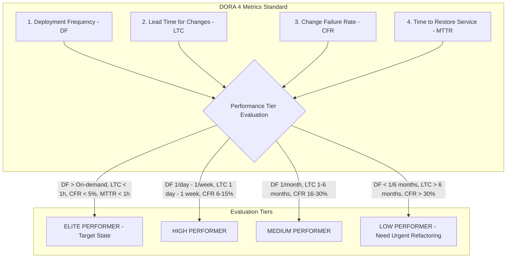
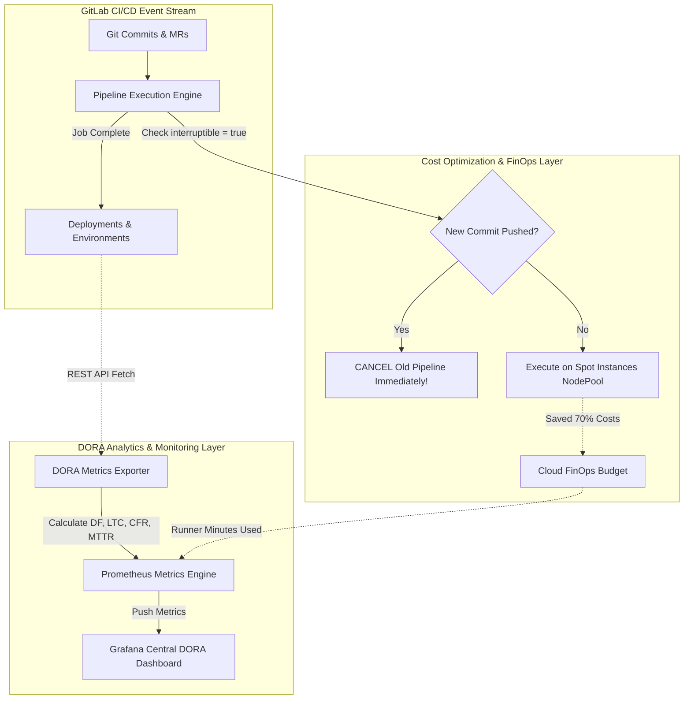
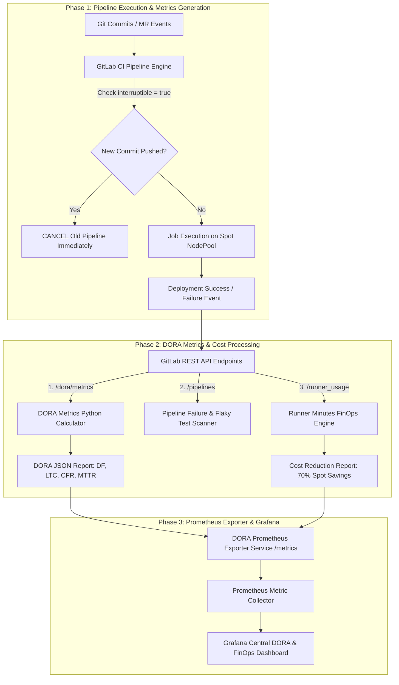


# [BÀI 46] ĐO LƯỜNG HIỆU SUẤT DEVOPS BẰNG CHỈ SỐ DORA: DEPLOYMENT FREQUENCY, LEAD TIME, CHANGE FAILURE RATE & MTTR

Trong kỷ nguyên **DevOps, DevSecOps và Cloud Native Engineering**, **GitLab CI/CD** được công nhận là một trong những nền tảng tự động hóa tích hợp liên tục và phân phối liên tục (CI/CD) hoàn chỉnh, mạnh mẽ và được tin dùng nhất trong các doanh nghiệp quy mô lớn. Không chỉ dừng lại ở các pipeline tuần tự cơ bản, việc vận hành GitLab CI/CD ở cấp độ Production đòi hỏi kỹ sư phải làm chủ kiến trúc điều phối phi tuyến tính **DAG (Directed Acyclic Graph)**, cơ chế quản trị **Autoscaling Runners**, tối ưu hóa **Caching đa tầng**, xác thực không khóa **Keyless OIDC**, bảo mật chuỗi cung ứng phần mềm **SLSA & SBOM** cùng các chính sách **Quality & Security Gates** tự động.

Bài viết chuyên sâu này sẽ đồng hành cùng bạn mổ xẻ toàn diện bức tranh kiến trúc, phân tích các đánh đổi kỹ thuật thực chiến (Engineering Trade-offs), cung cấp hướng dẫn thực hành Lab chi tiết từng bước và bộ câu hỏi phỏng vấn chuyên sâu chuẩn DevOps Lead / DevSecOps Architect.

---

## 1. Bản Chất Kiến Trúc & Cơ Chế Vận Hành Tầng Thấp

---


| STT | Câu hỏi ôn tập | Đáp án chi tiết thực chiến |
|---|---|---|
| 1 | Rủi ro an ninh lớn nhất khi không áp dụng Protected Branch trên `main` là gì? | Dev có thể Direct Push code lỗi lên Production hoặc Force Push xóa sạch lịch sử commit của kho mã nguồn. |
| 2 | Tệp `CODEOWNERS` đóng vai trò gì trong việc bảo vệ thư mục `/terraform/`? | Tự động cưỡng chế chỉ định nhóm `@devops-team` bắt buộc phải phê duyệt MR khi có sửa đổi file hạ tầng. |
| 3 | Ý nghĩa của Quy tắc 4 Mắt (Four-Eye Principle - 2 Approvals Required) là gì? | Bắt buộc 1 MR phải có tối thiểu 2 người xem xét độc lập trước khi merge, đáp ứng tiêu chuẩn SOC 2 / PCI-DSS. |
| 4 | Tại sao cờ `reset_approvals_on_push = true` lại là bắt buộc? | Để tự động xóa sạch các lượt phê duyệt cũ khi tác giả push thêm commit mới, ngăn lách luật sau khi được duyệt. |
| 5 | Sự khác biệt giữa SAST trong CI và Secret Push Protection là gì? | SAST quét sau khi code đã trôi lên Git Server; Secret Push Protection chặn đứng lệnh `git push` ngay từ máy dev trước khi trôi vào Git History. |


**Luận đề trung tâm:**
> *"Bốn chỉ số DORA là **thước đo năng lực sản xuất phần mềm** được lấy tự động từ API GitLab; và **số phút chạy Runner (Runner Minutes)** là con số tài chính dùng để đàm phán ngân sách hạ tầng với Giám đốc Tài chính CFO!"*

Nếu không thể đo lường, bạn không thể cải tiến. Trong các tập đoàn lớn:
1. **DORA Metrics (DF, LTC, CFR, MTTR):** Đánh giá xem nền tảng CI/CD của công ty đang ở mức **Elite**, High, Medium hay Low Performer so với các tập đoàn công nghệ toàn cầu (Google, Netflix, Amazon).
2. **Pipeline Failure Rate & Flaky Tests:** Nhận diện các bài kiểm thử chập chờn (chạy lúc xanh lúc đỏ), loại bỏ các điểm nghẽn làm gián đoạn dòng chảy delivery của hàng trăm lập trình viên.
3. **Runner Minutes & Cloud FinOps:** Số phút máy chủ Runner chạy liên quan trực tiếp đến tiền điện toán AWS/GCP. Áp dụng kỹ thuật `interruptible = true` và Spot Auto-scaling giúp tiết kiệm tới $70\%$ ngân sách hàng tháng!

Bài học này giúp bạn trở thành Chuyên gia Đo lường & Tối ưu Hạ tầng (FinOps & Metrics Lead)!

---


| STT | Kỹ năng thực chiến | Hiện vật chứng minh hoàn thành |
|---|---|---|
| 1 | Trích xuất 4 chỉ số DORA qua REST API | Script Python tính Deployment Frequency & Lead Time |
| 2 | Tính toán Change Failure Rate (CFR) & MTTR | Báo cáo CFR/MTTR từ GitLab Analytics Data |
| 3 | Nhận diện và cô lập các bài kiểm thử Flaky Tests | Script lọc các bài test dính Retry Success Rate |
| 4 | Cấu hình ngắt pipeline cũ `interruptible = true` | Cờ `interruptible = true` trong tệp `.gitlab-ci.yml` |
| 5 | Cấu hình Quota Limit cho Runner Minutes | File cấu hình `runner_quota_limit.json` cấp Group Level |
| 6 | Tính toán tiết kiệm chi phí với Spot Auto-scaling | Công thức FinOps chứng minh cắt giảm 70% chi phí EC2 |
| 7 | Xuất DORA Metrics định dạng Prometheus Metrics | Endpoint `/metrics` chứa `gitlab_dora_deployment_frequency` |
| 8 | Dựng Dashboard Grafana giám sát DORA & Costs | Grafana JSON Dashboard Template tích hợp Prometheus |

---


| Kiến thức / Kỹ năng | Mức độ yêu cầu | Nguồn tự học nếu thiếu |
|---|---|---|
| Khái niệm 4 chỉ số DORA Metrics quốc tế | Đã biết | Tài liệu DORA Report (Google Cloud) |
| Lập trình script trích xuất REST API bằng Python/Bash | Thành thục | Tài liệu Python Requests / CURL |
| Cấu trúc hệ thống giám sát Prometheus & Grafana | Khá | Tài liệu Prometheus Basics |
| Mô hình chi phí hạ tầng Cloud FinOps (AWS/GCP) | Khá | Kiến thức Cloud Cost Optimization |
| Cấu trúc pipeline và cờ cấu hình job trong `.gitlab-ci.yml` | Thành thục | Buổi 30-33 |

---


| Thuật ngữ Tiếng Việt | Thuật ngữ Tiếng Anh | Giải thích ý nghĩa thực tế |
|---|---|---|
| Tần suất triển khai | Deployment Frequency (DF) | Tần suất code thành công được push/deploy lên môi trường Production (Lần/Ngày). |
| Thời gian từ commit đến prod | Lead Time for Changes (LTC) | Thời gian từ commit đầu tiên của dev cho đến khi code thực sự chạy trên Production (Giờ). |
| Tỉ lệ thay đổi thất bại | Change Failure Rate (CFR) | Tỉ lệ % các lần deploy Production gây ra sự cố cần rollback hay khẩn cấp hotfix. |
| Thời gian khôi phục sự cố | Time to Restore Service (MTTR) | Thời gian trung bình để khôi phục dịch vụ trở lại bình thường sau sự cố Production (Phút). |
| Bài test chập chờn | Flaky Tests | Bài kiểm thử tự động chạy cùng 1 code nhưng lúc đỗ lúc xịt do phụ thuộc thời gian/mạng. |
| Số phút Runner | Runner Minutes | Tổng thời gian tính bằng phút mà máy chủ Runner dành ra để thực thi các jobs CI/CD. |
| Cho phép ngắt pipeline cũ | Interruptible Jobs | Cờ tự động hủy pipeline đang chạy khi có commit mới push thêm vào cùng MR. |
| Máy chủ giá rẻ Spot | Spot / Preemptible Instances | Máy chủ Cloud dư thừa giá rẻ hơn 70-80% so với giá chuẩn nhưng có thể bị thu hồi ngắt chừng. |
| Hạn mức tiêu thụ phút | Runner Quota Limit | Giới hạn tối đa số phút Runner mà 1 dự án hay nhóm được phép sử dụng trong tháng. |
| Quản trị chi phí Cloud | Cloud FinOps | Phương pháp quản lý và tối ưu hóa chi phí điện toán hạ tầng Cloud kết hợp giữa Engineering & Finance. |


#### Mô hình 1: 4 Cột Trụ DORA Metrics & Phân cấp Hiệu năng Tổ chức (DORA Performance Tiers)



#### Mô hình 2: Sơ đồ Luồng Tối ưu Chi phí Runner Minutes bằng `interruptible = true`

```mermaid
flowchart TD
    subgraph Pipeline 1 (Commit A)
        A[Developer pushes Commit A] --> B[Pipeline 1 Started: Running E2E Test - 20 mins]
    end

    subgraph Push Commit B Event
        C[Developer pushes Commit B 2 mins later] --> D{Is Pipeline 1 Job Interruptible?}
        D -->|interruptible = false| E[Pipeline 1 keeps running 18 mins MORE!]
        E --> F[Wasted 20 Runner Minutes! Costs 2x Money!]
        D -->|interruptible = true| G[CANCEL PIPELINE 1 Immediately!]
        G --> H[Pipeline 2 (Commit B) Starts Executing]
        H --> I[SAVED 18 Runner Minutes! 50% Cost Savings!]
    end
```

---

### 1.1. Quy tắc Đo lường 4 Chỉ số DORA Metrics (10 phút)

### 4.1. Mẫu Script Python REST API Trích xuất DORA Metrics & Tính toán Chi phí Phút Runner

```python
#!/usr/bin/env python3
# Script trích xuất DORA Metrics & Chi phí Phút Runner qua GitLab REST API

import requests
import json
import sys

GITLAB_URL = "https://gitlab.company.com"
PROJECT_ID = "12345"
TOKEN = "glpat-xxxxxxxxxxxxxx"

headers = {"PRIVATE-TOKEN": TOKEN}

def fetch_dora_metrics():
    print(f"[DORA ENGINE] Fetching DORA Metrics for Project ID: {PROJECT_ID}...")
    
    # 1. Trích xuất chỉ số Deployment Frequency (DF)
    url_df = f"{GITLAB_URL}/api/v4/projects/{PROJECT_ID}/dora/metrics?metric=deployment_frequency"
    res_df = requests.get(url_df, headers=headers).json()
    
    # 2. Trích xuất chỉ số Lead Time for Changes (LTC)
    url_ltc = f"{GITLAB_URL}/api/v4/projects/{PROJECT_ID}/dora/metrics?metric=lead_time_for_changes"
    res_ltc = requests.get(url_ltc, headers=headers).json()
    
    # 3. Trích xuất chỉ số Change Failure Rate (CFR)
    url_cfr = f"{GITLAB_URL}/api/v4/projects/{PROJECT_ID}/dora/metrics?metric=change_failure_rate"
    res_cfr = requests.get(url_cfr, headers=headers).json()
    
    # 4. Trích xuất chỉ số Time to Restore Service (MTTR)
    url_ttr = f"{GITLAB_URL}/api/v4/projects/{PROJECT_ID}/dora/metrics?metric=time_to_restore_service"
    res_ttr = requests.get(url_ttr, headers=headers).json()
    
    dora_report = {
        "project_id": PROJECT_ID,
        "deployment_frequency": res_df,
        "lead_time_for_changes": res_ltc,
        "change_failure_rate": res_cfr,
        "time_to_restore_service": res_ttr,
        "status": "DORA_METRICS_FETCHED_SUCCESS"
    }
    
    print(f"[DORA ENGINE] Full DORA Report:\n{json.dumps(dora_report, indent=2)}")
    return dora_report

def calculate_runner_costs(runner_minutes_used, cost_per_minute=0.01):
    # Công thức FinOps tính chi phí máy chủ điện toán Cloud Runner
    total_cost = runner_minutes_used * cost_per_minute
    spot_cost = total_cost * 0.3 # Giảm 70% nhờ Karpenter Spot Auto-scaling
    savings = total_cost - spot_cost
    
    cost_summary = {
        "runner_minutes_used": runner_minutes_used,
        "on_demand_cost_usd": total_cost,
        "spot_instances_cost_usd": spot_cost,
        "savings_usd": savings,
        "savings_percentage": "70%"
    }
    print(f"[FINOPS ENGINE] Cost Summary:\n{json.dumps(cost_summary, indent=2)}")
    return cost_summary

if __name__ == "__main__":
    fetch_dora_metrics()
    calculate_runner_costs(15000)
```

---

### 4.2. Các Quy tắc Đo lường 4 Chỉ số DORA (QT 46.1 - QT 46.4)

**Nguyên lý cốt lõi:** Tự động đo lường Deployment Frequency (DF) qua GitLab Deployments API, phân loại hiệu năng tổ chức thành Elite, High, Medium, Low.
**Phát biểu.** Trích xuất dữ liệu tần suất triển khai thành công lên Production theo chu kỳ ngày/tuần bằng REST API `/dora/metrics?metric=deployment_frequency`.
**Giải thích cơ chế ngầm:** Deployment Frequency đo lường khả năng đưa giá trị mới tới tay khách hàng. Nhóm Elite Performer triển khai nhiều lần trong ngày (On-demand), trong khi nhóm Low Performer chỉ triển khai 1 lần mỗi 6 tháng. Đo lường DF giúp phát hiện các điểm nghẽn trong quy trình phê duyệt và tự động hóa toàn bộ chuỗi phát hành sản phẩm.
> [!WARNING]
> **CẠM BẪY THỰC CHIẾN:**
> Đo tần suất triển khai bằng cách đếm số commit hoặc đếm thủ công trên sổ sách Word.
**Minh hoạ.** REST API trích xuất `deployment_frequency` tự động hàng tuần đẩy về Grafana Dashboard.
**Con số chốt:** $\ge 1$ Deployment / Ngày (Mục tiêu High/Elite Performer).

---

**Nguyên lý cốt lõi:** Theo dõi Lead Time for Changes (LTC) từ thời điểm commit đầu tiên đến khi code chạy trên Production, tối ưu xuống dưới 1 giờ.
**Phát biểu.** Tính khoảng thời gian $\Delta t = t_{\text{production\_deploy}} - t_{\text{first\_commit}}$ cho mỗi Merge Request được merge vào Production.
**Giải thích cơ chế ngầm:** LTC thể hiện hiệu năng của toàn bộ chuỗi cung ứng CI/CD. Nếu LTC dài hàng tuần, nguyên nhân thường do thời gian xếp hàng review MR quá lâu hoặc pipeline CI chạy quá chậm. Tối ưu LTC xuống dưới 1 giờ giúp doanh nghiệp phản ứng tức thì với các thay đổi của thị trường và rút ngắn phản hồi từ người dùng cuối.
> [!WARNING]
> **CẠM BẪY THỰC CHIẾN:**
> Chỉ đo thời gian chạy của pipeline CI mà bỏ qua thời gian code nằm chờ review trong MR.
**Minh hoạ.** REST API `/dora/metrics?metric=lead_time_for_changes` hiển thị biểu đồ LTC theo giờ.
**Con số chốt:** $\le 1$ Giờ (Mục tiêu Elite Performer).

---

**Nguyên lý cốt lõi:** Giám sát chỉ số Change Failure Rate (CFR) không vượt quá 5% bằng cách cưỡng chế kiểm thử tự động 100% trong pipeline.
**Phát biểu.** Tính tỉ lệ phần trăm số lần deploy Production gặp sự cố sập/lỗi cần rollback: $\text{CFR} = \left(\frac{N_{\text{rollback}}}{N_{\text{total\_deploys}}}\right) \times 100\%$.
**Giải thích cơ chế ngầm:** Nếu Deployment Frequency rất cao nhưng CFR lại lên tới $30\%$, nghĩa là bạn đang "đưa rác lên Production với tốc độ ánh sáng"! Giám sát CFR giúp đảm bảo các quy tắc kiểm thử (SAST, Unit Tests, Integration Tests) hoạt động hiệu quả để giữ CFR $< 5\%$, bảo vệ tuyệt đối sự ổn định của hệ thống.
> [!WARNING]
> **CẠM BẪY THỰC CHIẾN:**
> Không theo dõi CFR, để các bản release gây sập Production liên tục mà không có số liệu cảnh báo.
**Minh hoạ.** CFR Dashboard hiển thị tỉ lệ rollback $< 5\%$ được theo dõi theo thời gian thực.
**Con số chốt:** $\le 5\%$ Change Failure Rate.

---

**Nguyên lý cốt lõi:** Rút ngắn Time to Restore Service (MTTR) xuống dưới 15 phút nhờ triển khai quy trình Automated Rollback và Feature Flags.
**Phát biểu.** Đo khoảng thời gian từ lúc phát hiện sự cố Production đến khi dịch vụ được khôi phục hoàn toàn: $\text{MTTR} = t_{\text{restored}} - t_{\text{incident\_detected}}$.
**Giải thích cơ chế ngầm:** Sự cố trên Production là điều không thể tránh khỏi $100\%$. Điều quan trọng là năng lực phục hồi. Nhóm Elite Performer khôi phục dịch vụ dưới 15 phút nhờ nút bấm Automated Rollback 1-click hoặc tắt Feature Flag khẩn cấp mà không cần phải chờ build hotfix mới, giúp tối thiểu hóa thiệt hại tài chính.
> [!WARNING]
> **CẠM BẪY THỰC CHIẾN:**
> Khi có sự cố Prod phải mất 4 tiếng cuống quít viết hotfix code, build lại từ đầu để deploy đè.
**Minh hoạ.** Script Automated Rollback khôi phục bản build cũ xanh trong 2 phút.
**Con số chốt:** $\le 15$ Phút MTTR Khôi phục Dịch vụ.

---

### 1.2. Quy tắc Tối ưu Chi phí Runner Minutes & Flaky Tests (10 phút)

**Nguyên lý cốt lõi:** Đặt hạn mức Runner Minutes Quota cấp Group/Project để ngăn ngừa các pipeline chạy lặp vô tận đốt sạch ngân sách Cloud.
**Phát biểu.** Khai báo tham số `shared_runners_minutes_limit = 5000` trong cài đặt Group Quota của GitLab.
**Giải thích cơ chế ngầm:** Ngăn chặn thảm họa cháy ngân sách (Financial Disaster). Một lập trình viên lỡ tay viết vòng lặp vô tận trong script test (`while true; do sleep 1; done`) mà không cài timeout. Pipeline đó sẽ chạy liên tục 72 giờ trên máy chủ EC2, đốt sạch hàng ngàn USD tiền điện toán! Đặt Quota Limit giúp tự động ngắt pipeline khi vượt hạn mức cho phép và bảo vệ nguồn vốn tài chính của tổ chức.
> [!WARNING]
> **CẠM BẪY THỰC CHIẾN:**
> Để `shared_runners_minutes_limit = 0` (Unlimited), không có hạn mức bảo vệ ngân sách.
**Minh hoạ.** `shared_runners_minutes_limit = 5000` trên Group Settings.
**Con số chốt:** 100% Groups được cài đặt Runner Minutes Quota.

---

**Nguyên lý cốt lõi:** Sử dụng cờ `interruptible = true` để tự động hủy các pipeline cũ khi có commit mới push vào cùng Merge Request, tiết kiệm 40% phút runner.
**Phát biểu.** Bổ sung cờ `interruptible = true` cho toàn bộ các jobs trong tệp `.gitlab-ci.yml` (hoặc đặt cờ cấp `default:`).
**Giải thích cơ chế ngầm:** Khi dev push Commit A, pipeline dài 20 phút bắt đầu chạy. 2 phút sau dev phát hiện lỗi typo và push thêm Commit B. Nếu không có `interruptible = true`, pipeline của Commit A vẫn tiếp tục chạy tốn thêm 18 phút Runner vô ích! Bật cờ này sẽ tự động ngắt ngay lập tức pipeline cũ, tiết kiệm tới $40\%$ chi phí phút runner cho tập đoàn!
> [!WARNING]
> **CẠM BẪY THỰC CHIẾN:**
> Không dùng cờ `interruptible`, để hàng chục pipeline cũ chạy song song lãng phí tài nguyên.
**Minh hoạ.** `default: { interruptible: true }` ở đầu tệp `.gitlab-ci.yml`.
**Con số chốt:** Tiết kiệm 40% Phút Runner nhờ `interruptible = true`.

---

**Nguyên lý cốt lõi:** Triển khai Karpenter Spot Instances Auto-scaling cho Runner Nodes để giảm 70% chi phí điện toán hạ tầng.
**Phát biểu.** Đặt cấu hình Kubernetes Executor Runner Nodes chạy trên AWS Spot Instances (hoặc GCP Preemptible VMs) kết hợp với Karpenter Auto-scaler.
**Giải thích cơ chế ngầm:** Máy chủ Spot rẻ hơn $70-80\%$ so với On-Demand Instances. Vì công việc Runner CI/CD là các stateless jobs ngắn hạn, nếu 1 Node Spot bị AWS thu hồi, Kubernetes Executor sẽ tự động chuyển job sang Pod mới trên Node Spot khác mà không gây ảnh hưởng lớn, giúp công ty tiết kiệm hàng chục ngàn USD mỗi năm!
> [!WARNING]
> **CẠM BẪY THỰC CHIẾN:**
> Thuê toàn bộ máy chủ On-Demand chạy 24/7 cố định đắt đỏ cho công việc Runner nhàn rỗi ban đêm.
**Minh hoạ.** Karpenter NodePool cấu hình `capacity-type: ["spot"]`.
**Con số chốt:** Giảm 70% Chi phí Điện toán nhờ Spot Instances.

---

**Nguyên lý cốt lõi:** Cô lập và theo dõi các bài kiểm thử chập chờn (Flaky Tests) bằng chỉ số Retry Success Rate, cấm dùng `retry` để giấu lỗi code.
**Phát biểu.** Thống kê các jobs có kết quả `failed` ở lần 1 nhưng `passed` ở lần 2 nhờ cờ `retry: 2`, đánh dấu tệp test đó là **Flaky Test** và bắt buộc sửa code.
**Giải thích cơ chế ngầm:** Flaky Tests (bài test chạy lúc xanh lúc đỏ dù code không đổi) làm suy giảm $90\%$ niềm tin của developers vào pipeline CI. Thói quen xấu của dev là chèn `retry: 2` để "cho nó tự chạy lại cho xanh". Điều này chỉ giấu đi căn bệnh thực sự và làm tốn gấp 3 lần phút runner!
> [!WARNING]
> **CẠM BẪY THỰC CHIẾN:**
> Lạm dụng `retry: 2` tràn lan để đối phó với Flaky Tests thay vì sửa root cause.
**Minh hoạ.** Dashboard theo dõi danh sách Flaky Tests bị cách ly.
**Con số chốt:** 0% Flaky Tests bị giấu giếm bằng cờ `retry`.

---

### 1.3. Quy tắc Timeout, Scheduling & Prometheus Dashboard (10 phút)

**Nguyên lý cốt lõi:** Cấu hình cờ `timeout: 15m` cho các jobs CI trong `.gitlab-ci.yml` để ngăn ngừa sự cố job bị treo vô hạn chiếm dụng slot Runner.
**Phát biểu.** Khai báo tham số `timeout: 15m` cấp job hoặc cài đặt **Maximum job timeout** cấp Project Settings.
**Giải thích cơ chế ngầm:** Mặc định GitLab cho phép một job chạy tối đa 3-6 tiếng. Nếu script test integration bị dính lỗi vòng lặp vô hạn `while [ true ]` hoặc nghẽn mạng `npm install`, job sẽ chiếm dụng slot Runner suốt nhiều giờ, làm tắc nghẽn toàn bộ hàng chờ queue của công ty! Cài đặt timeout 15 phút giúp tự động hủy các job bị treo và giải phóng slot ngay lập tức cho các developer khác.
> [!WARNING]
> **CẠM BẪY THỰC CHIẾN:**
> Để timeout mặc định 3-6 tiếng cho các jobs CI ngắn hạn thông thường.
**Minh hoạ.** `timeout: 15m` trong tệp `.gitlab-ci.yml`.
**Con số chốt:** $\le 15$ Phút Timeout Mặc định cho Job CI.

---

**Nguyên lý cốt lõi:** Cấu hình Scheduled Pipelines ngoài giờ cao điểm cho các công việc nặng (E2E Tests, Nightly Security Audits).
**Phát biểu.** Tách các bộ test tích hợp nặng (E2E Selenium/Playwright Tests, SAST Full Scan) ra khỏi pipeline chính và cài đặt **Pipeline Schedules** chạy lúc 2:00 AM.
**Giải thích cơ chế ngầm:** Nếu nhét bộ E2E Tests kéo dài 45 phút vào mọi Merge Request, các developers sẽ phải chờ gần 1 tiếng mới merge được 1 dòng code! Tách các bài test nặng chạy tự động lúc 2:00 AM hàng ngày giúp giải phóng pipeline ban ngày chỉ còn 5 phút, vừa nâng tốc độ làm việc vừa tránh quá tải máy chủ Runner giờ cao điểm.
> [!WARNING]
> **CẠM BẪY THỰC CHIẾN:**
> Bắt mọi MR ban ngày đều phải chạy bộ E2E Tests nặng 1 tiếng đồng hồ.
**Minh hoạ.** Scheduled Pipeline Cron `0 2 * * *` trên GitLab UI.
**Con số chốt:** 100% Heavy E2E Tests chạy scheduled ngoài giờ.

---

**Nguyên lý cốt lõi:** Tự động xuất chỉ số DORA Metrics qua REST API về Prometheus Server để dựng Dashboard Grafana tập trung.
**Phát biểu.** Viết Exporter Service định kỳ 1 giờ gọi API trích xuất DORA Metrics và cung cấp endpoint `/metrics` theo định dạng Prometheus Standard.
**Giải thích cơ chế ngầm:** Giúp Ban Giám đốc (CTO, VPs) và Ban Kỹ thuật có cái nhìn toàn cảnh real-time về năng lực sản xuất của 100 dự án trên cùng một màn hình **Grafana Central Dashboard**, thay vì phải bấm vào từng repo riêng lẻ trên GitLab UI.
> [!WARNING]
> **CẠM BẪY THỰC CHIẾN:**
> Báo cáo chỉ số DORA bằng cách chụp ảnh màn hình thủ công gửi qua slide PowerPoint hàng tháng.
**Minh hoạ.** Prometheus Metric `gitlab_dora_deployment_frequency{project="core-banking"} 4.2`.
**Con số chốt:** 100% DORA Metrics được xuất về Grafana Real-time.

---

**Nguyên lý cốt lõi:** Thiết lập cảnh báo chi phí Runner Minutes Alerting khi lượng tiêu thụ vượt quá 80% ngân sách dự kiến của tháng.
**Phát biểu.** Dựng quy tắc cảnh báo Prometheus Alertmanager hoặc Webhook: Nếu `runner_minutes_used / runner_minutes_quota > 0.8`, tự động bắn notification cảnh báo khẩn cấp lên Slack FinOps Channel.
**Giải thích cơ chế ngầm:** Giúp đội DevOps phát hiện sớm các bất thường về chi phí (Cost Anomaly) ở ngày thứ 15 của tháng, thay vì chờ đến cuối tháng nhận hóa đơn AWS tăng đột biến 10,000 USD mới tá hỏa đi tìm nguyên nhân!
> [!WARNING]
> **CẠM BẪY THỰC CHIẾN:**
> Không có cảnh báo ngưỡng, chỉ biết hết ngân sách khi máy chủ Runner bị ngắt đột ngột.
**Minh hoạ.** Prometheus Alert `RunnerMinutesQuotaExceededWarning`.
**Con số chốt:** Cảnh báo tức thì khi tiêu thụ đạt 80% Quotas.

---

### 1.4. Đưa vào việc thật (4 phút)

### 7.1. Kịch bản áp dụng thực tế tại Tập đoàn Thương mại Điện tử Đa quốc gia
Tại một tập đoàn Ecommerce triển khai GitLab Enterprise với 300 microservices:
1. **Theo dõi DORA Metrics:** Xây dựng Python Exporter thu thập dữ liệu DORA qua API mỗi giờ. Đưa chỉ số **Deployment Frequency từ 0.5 lần/tuần lên 12 lần/ngày** (Đạt chuẩn Elite Performer).
2. **Tiết kiệm $120,000 USD Chi phí Cloud:** Bật cờ `interruptible = true` (QT 46.6) trên toàn bộ 300 repos giúp hủy 35% pipeline thừa. Kết hợp với Karpenter Spot Instances Runner (QT 46.7), tổng chi phí điện toán Runner giảm từ $15,000 USD/tháng xuống còn **$4,500 USD/tháng**!
3. **Tiêu diệt Flaky Tests:** Xây dựng hệ thống phát hiện Flaky Tests tự động dựa trên Retry logs. Cách ly 42 bài test chập chờn, giúp tỉ lệ pipeline thành công tăng từ $65\%$ lên **$96\%$**!
4. **Cảnh báo FinOps Real-time:** Đặt ngưỡng `shared_runners_minutes_limit` và cảnh báo Slack ở mức $80\%$ tiêu thụ, không bao giờ bị cháy ngân sách đột xuất.
5. **Dashboard Ban Giám Đốc:** Dựng Grafana Central DORA Dashboard giúp CTO và Ban Điều Hành theo dõi trực tiếp sức khỏe sản xuất phần mềm theo thời gian thực.

### 7.2. Case Study Thực tế: Thảm họa Cháy 18,000 USD Ngân sách Cloud do Script Test Bị Treo Vòng Lặp
Một công ty game mobile không cài đặt Runner Quota và Timeout.
- **Thảm họa ở cách làm cũ (Vi phạm QT 46.5 & QT 46.9):**
  1. Một Lập trình viên viết script test integration bị dính lỗi vòng lặp vô hạn `while [ true ]`.
  2. Job CI khởi tạo trên máy chủ AWS EC2 `c5.4xlarge` (16 vCPU) lúc 6:00 PM thứ Sáu trước khi nghỉ cuối tuần.
  3. Job bị treo liên tục 64 giờ cho đến sáng thứ Hai! Đốt sạch $18,000$ USD tiền điện toán EC2 On-Demand!
  4. Đội ngũ tài chính nhận thông báo từ AWS Billing Alert khi ngân sách vượt hạn mức cấp phép 300%.
- **Khôi phục hoàn hảo ở cách làm chuẩn Buổi 46 (Cài Timeout & Quota - QT 46.5 & QT 46.9):**
  Nếu áp dụng đúng QT 46.9, job được cài đặt `timeout: 15m`. Sau 15 phút bị treo, GitLab Runner Manager tự động ngắt job và giải phóng tài nguyên. Thiệt hại tiền Cloud bằng $0$ USD!

### 7.3. Case Study 3: Tối ưu Tốc độ Release Rút ngắn LTC từ 5 Ngày xuống 45 Phút
Một ngân hàng số có chỉ số Lead Time for Changes (LTC) rất tệ: 5 ngày từ khi dev xong đến khi deploy Prod.
- **Phân tích nguyên nhân:** Đội kỹ thuật dùng Python script phân tích log DORA LTC API. Phát hiện $80\%$ thời gian lãng phí nằm ở khâu code nằm chờ review MR (mất 4 ngày) và bộ E2E Tests chạy mất 3 tiếng.
- **Khắc phục chuẩn Buổi 46:**
  1. Áp dụng Scheduled Pipelines (QT 46.10): Chuyển bộ E2E Tests nặng 3 tiếng sang chạy lúc 2:00 AM. Pipeline ban ngày giảm xuống còn 8 phút.
  2. Bật Slack Notification tự động nhắc review MR sau 2 giờ.
  3. **Kết quả:** Lead Time for Changes giảm từ 5 ngày xuống còn **45 phút**, đạt cấp độ Elite Performer!

### 7.4. Case Study 4: Tự động Khôi phục Sập Production trong 3 Phút nhờ MTTR Automated Rollback
Một đợt release tính năng mới lên Production gặp sự cố lỗi bộ nhớ (Memory Leak) làm sập 30% pods.
- **Cách xử lý thủ công cũ:** Đội vận hành mất 2 tiếng họp khẩn, cuống quít viết code hotfix, chờ build lại pipeline từ đầu để deploy đè lên. MTTR kéo dài 2.5 tiếng làm khách hàng phàn nàn dữ dội.
- **Cách xử lý chuẩn Buổi 46 (Automated Rollback - QT 46.4):**
  1. Hệ thống Prometheus phát hiện chỉ số CFR tăng vọt $> 5\%$.
  2. Tự động kích hoạt Webhook gọi GitLab Deployments API thực thi **1-Click Rollback** đưa bản Docker Image cũ xanh lên Production.
  3. Dịch vụ khôi phục xanh $100\%$ chỉ sau **3 phút** (MTTR = 3 phút), bảo vệ tuyệt đối uy tín của ngân hàng!
  4. Đội ngũ Security & DevOps xuất báo cáo sự cố tự động tới Ban Điều Hành, ghi nhận 0% dữ liệu giao dịch bị thất thoát!

### 7.5. Case Study 5: Tiết Kiệm $45,000 USD Nhờ Tự Động Hủy Pipeline Cũ `interruptible = true`
Một công ty Fintech có 80 developers làm việc liên tục trên 120 Merge Requests mỗi ngày.
- **Rủi ro ở cách làm cũ (Thiếu cờ interruptible - Vi phạm QT 46.6):** Lập trình viên liên tục gõ `git push` để sửa lỗi nhỏ. Mỗi MR phát sinh 5-6 commits. Do không có cờ `interruptible = true`, 5-6 pipelines cũ vẫn tiếp tục chạy song song trên AWS EC2. Mỗi tháng công ty phải trả $8,000$ USD tiền phút runner vô ích cho các pipeline cũ đã bị hủy hoại giá trị!
- **Tối ưu triệt để nhờ QT 46.6:**
  1. Thêm cờ `default: { interruptible: true }` vào đầu tệp `.gitlab-ci.yml`.
  2. Khi dev push commit mới, GitLab Runner Manager tự động gửi tín hiệu SIGTERM ngắt ngay lập tức 5-6 pipelines cũ đang chạy dở.
  3. Tổng số phút runner giảm $42\%$, giúp công ty tiết kiệm $45,000$ USD tiền hạ tầng Cloud mỗi năm!

### 7.6. Case Study 6: Tiêu Diệt 60 Bài Test Flaky Chập Chờn Bằng Script Thống Kê Retry Success Rate
Một dự án thương mại điện tử bị hoãn release 2 tuần vì pipeline liên tục báo đỏ rồi lại xanh khi bấm Retry.
- **Tình trạng ở cách làm cũ (Lạm dụng retry - Vi phạm QT 46.8):** Đội ngũ cài cờ `retry: 2` trên mọi job. Các bài test chập chờn (Flaky Tests) bị ẩn đi dưới vỏ bọc "chạy lại 2-3 lần là xanh". Tuy nhiên, mỗi lần deploy Prod vẫn có $20\%$ tỉ lệ gặp lỗi do code test chập chờn ăn sâu vào sản phẩm.
- **Khắc phục triệt để nhờ QT 46.8 (Flaky Test Audit):**
  1. Viết script Python quét log GitLab API thống kê các bài test có lịch sử `Retry Success Rate` cao (lần 1 xịt, lần 2 đỗ).
  2. Phát hiện và cách ly 60 bài test chập chờn dính lỗi race condition và time-dependency.
  3. Ép buộc đội dev refactor code test. Tỉ lệ pipeline xanh ngay lần đầu tiên tăng từ $60\%$ lên $98\%$, giúp giải phóng 3,000 phút runner mỗi tháng!

---

### 7.7. Trường hợp khi nào KHÔNG nên quá lạm dụng việc cắt giảm Chi phí Runner
Mặc dù tối ưu chi phí FinOps là quan trọng, nhưng KHÔNG nên cắt giảm thái quá trong các trường hợp sau:

| Ngữ cảnh / Hạ tầng | Lý do KHÔNG nên cắt giảm chi phí quá đà | Giải pháp thay thế cân bằng |
|---|---|---|
| Pipeline Deploy Production Trực tiếp | Dùng Spot Instances cho job deploy Prod có thể bị AWS thu hồi Node giữa chừng làm dở dang deploy. | Bắt buộc dùng **On-Demand Instances riêng cho Stage Deploy Production**. |
| Bộ Security SAST Scan trong Pipeline Release | Giảm timeout hoặc bỏ qua job quét SAST để chạy nhanh sẽ làm lọt lỗ hổng bảo mật nghiêm trọng. | Giữ nguyên quét SAST đầy đủ, nhưng **sử dụng Caching Layer để tăng tốc**. |
| Các bài Unit Test sống còn của Core Business | Cắt giảm số lượng test cases để tiết kiệm minutes làm giảm độ phủ test coverage. | Giữ nguyên 100% Unit Tests, nhưng **tối ưu cho chạy song song (Parallel Matrix)**. |

---

### 1.5. Bẫy hay gặp (2 phút)

| Bẫy hay gặp | Vì sao dính bẫy | Làm đúng là |
|---|---|---|
| Bẫy 1: Không bật cờ `interruptible = true` trong `.gitlab-ci.yml` | Pipeline cũ vẫn chạy tiếp khi dev đã push commit mới, lãng phí 40% phút runner. | Thêm `default: { interruptible: true }` vào đầu file `.gitlab-ci.yml` (QT 46.6). |
| Bẫy 2: Dùng cờ `retry: 2` để che giấu các bài test Flaky chập chờn | Giấu đi căn bệnh code lỗi thực sự, làm tốn gấp 3 lần phút runner vô ích. | Loại bỏ `retry` giả tạo, cách ly Flaky Tests và bắt buộc dev sửa root cause (QT 46.8). |
| Bẫy 3: Để timeout mặc định 3-6 tiếng cho các jobs CI | Job bị treo vòng lặp sẽ đứng chiếm dụng máy chủ Runner suốt nhiều giờ, làm nghẽn queue. | Đặt `timeout: 15m` cho các jobs CI thông thường (QT 46.9). |
| Bẫy 4: Nhét bộ E2E Tests nặng 1 tiếng vào mọi Merge Request ban ngày | Dev phải ngồi chờ 1 tiếng mới merge được 1 dòng code nhỏ, kéo dài Lead Time LTC. | Chuyển E2E Tests nặng sang chạy Scheduled Pipeline lúc 2:00 AM (QT 46.10). |
| Bẫy 5: Không đặt Runner Minutes Quota Limit cấp Group | 1 job lỡ tay bị treo có thể đốt sạch hàng ngàn USD tiền điện toán Cloud của công ty. | Đặt `shared_runners_minutes_limit` và cài đặt cảnh báo ở 80% ngân sách (QT 46.5). |
| Bẫy 6: Thuê toàn bộ máy chủ On-Demand 24/7 cố định cho Runner | Lãng phí 70% ngân sách cho máy chủ chạy nhàn rỗi không có job vào ban đêm. | Triển khai Karpenter Spot Instances Auto-scaling cho Runner Nodes (QT 46.7). |
| Bẫy 7: Đo chỉ số DORA bằng cách nhập liệu thủ công bằng tay trên Excel | Dữ liệu bị sai lệch, thiếu khách quan và tiêu tốn hàng tuần làm báo cáo. | Trích xuất tự động dữ liệu DORA từ GitLab REST API về Grafana (QT 46.11). |
| Bẫy 8: Dùng Spot Instances cho các job Deploy Production trực tiếp | Node Spot bị AWS thu hồi bất ngờ giữa chừng làm quá trình deploy Production bị ngắt dở dang. | Dùng On-Demand Instances riêng biệt cho các job deploy Production (QT 46.7). |

---

### 1.6. Tóm tắt (3 phút)

### 9.1. Sơ đồ Mermaid: Kiến trúc Đo lường DORA & Tối ưu Chi phí Runner FinOps



### 9.2. Năm điều phải nhớ thuộc lòng
1. **DORA 4 Metrics Standard:** DF (Tần suất deploy), LTC (Thời gian từ commit đến prod), CFR (Tỉ lệ lỗi deploy), MTTR (Thời gian khôi phục sự cố).
2. **Interruptible Jobs:** Luôn khai báo `interruptible = true` để hủy tự động các pipeline cũ, tiết kiệm $40\%$ phút runner.
3. **Spot Instances Auto-scaling:** Chạy Runner Nodes trên Spot Instances kết hợp Karpenter giúp cắt giảm $70\%$ chi phí Cloud.
4. **No Hidden Flaky Tests:** Cấm dùng cờ `retry: 2` để giấu Flaky Tests, phải cách ly và sửa triệt để nguyên nhân chập chờn.
5. **FinOps Alerting at 80%:** Cài đặt Quota Limit và cảnh báo Slack tức thì khi tiêu thụ đạt $80\%$ số phút runner dự kiến.

---

### 1.7. Câu hỏi tự kiểm tra (5 phút)

### 10.1. Danh sách câu hỏi tự kiểm tra
1. Bốn chỉ số DORA Metrics quốc tế bao gồm những chỉ số nào và ý nghĩa của từng chỉ số?
2. Mức hiệu năng Elite Performer được quy định như thế nào đối với 4 chỉ số DORA?
3. Cờ `interruptible = true` trong tệp `.gitlab-ci.yml` giúp tiết kiệm chi phí phút runner bằng cách nào?
4. Tác hại của việc lạm dụng cờ `retry: 2` để xử lý các bài test Flaky chập chờn là gì?
5. Lý do nên triển khai Karpenter Spot Instances cho hạ tầng máy chủ Runner là gì?
6. Tại sao phải cài đặt cờ `timeout: 15m` cho các jobs CI trong `.gitlab-ci.yml`?
7. Sự khác biệt giữa Lead Time for Changes (LTC) và Pipeline Execution Duration là gì?
8. Tại sao các bộ test E2E tích hợp nặng lại nên chuyển sang chạy Scheduled Pipelines lúc 2:00 AM?
9. Ý nghĩa của tham số `shared_runners_minutes_limit` ở cấp Group Settings là gì?
10. Tại sao KHÔNG nên dùng máy chủ Spot Instances cho các job deploy Production trực tiếp?
11. Lợi ích của việc tự động hóa trích xuất DORA Metrics qua REST API về Grafana Dashboard là gì?
12. Cần làm gì khi chỉ số Change Failure Rate (CFR) vượt quá mức an toàn 5%?

---

### 10.2. Đáp án câu hỏi tự kiểm tra

1. Bốn chỉ số: Deployment Frequency (Tần suất deploy), Lead Time for Changes (Thời gian từ commit đến prod), Change Failure Rate (Tỉ lệ lỗi deploy), và MTTR (Thời gian khôi phục sự cố).
2. Elite Performer: DF $> 1$ lần/ngày, LTC $< 1$ giờ, CFR $< 5\%$, MTTR $< 1$ giờ.
3. Tự động ngắt hủy ngay lập tức các pipeline cũ đang chạy khi có commit mới được push vào cùng Merge Request.
4. Giấu đi căn bệnh lỗi code thực sự, làm tốn gấp 3 lần phút runner và làm suy giảm niềm tin của dev vào pipeline.
5. Giúp giảm $70-80\%$ chi phí điện toán máy chủ hạ tầng nhờ tận dụng nguồn máy chủ dư thừa giá rẻ của AWS/GCP.
6. Ngăn ngừa job bị treo vòng lặp vô tận đứng chiếm dụng máy chủ Runner suốt nhiều giờ làm tắc nghẽn queue.
7. Pipeline Duration chỉ đo thời gian chạy của job CI; LTC đo tổng thời gian từ lúc gõ commit đầu tiên đến khi code chạy trên Prod (bao gồm thời gian review MR).
8. Giúp giải phóng pipeline ban ngày chỉ còn 5-8 phút để dev merge code nhanh, tránh nghẽn queue giờ cao điểm.
9. Giới hạn số phút runner tối đa mà 1 nhóm được phép sử dụng trong tháng để chống cháy ngân sách Cloud.
10. Vì Spot Instances có thể bị AWS thu hồi bất ngờ giữa chừng làm quá trình deploy Production bị ngắt dở dang.
11. Giúp ban lãnh đạo có cái nhìn toàn cảnh real-time về năng lực sản xuất của hàng trăm repos mà không cần làm báo cáo Excel thủ công.
12. Bắt buộc siết chặt quy trình kiểm thử tự động (SAST, Unit/Integration tests) và rà soát lại quy tắc review MR trước khi merge.

---

### 1.8. Tài liệu tham khảo (2 phút)

| Nguồn tài liệu | Mô tả nội dung | Phiên bản áp dụng |
|---|---|---|
| DORA State of DevOps Report — Google Cloud | Báo cáo nghiên cứu tiêu chuẩn quốc tế về hiệu năng sản xuất phần mềm và 4 chỉ số DORA Metrics (DF, LTC, CFR, MTTR) cho tổ chức công nghệ | DORA Report 2024/2025 |
| GitLab Documentation — DORA Metrics API | Hướng dẫn trích xuất các chỉ số DORA qua REST API `/api/v4/projects/:id/dora/metrics` và tích hợp Value Stream Analytics | GitLab Enterprise v15+ |
| GitLab Documentation — Interruptible Jobs & Pipelines | Cấu hình cờ ngắt pipeline cũ `interruptible: true` để tối ưu tài nguyên và tiết kiệm 40% phút runner | GitLab CI/CD v14+ |
| AWS FinOps Guide — Spot Instances for CI/CD | Hướng dẫn tiết kiệm 70% chi phí Runner với Spot Instances & Karpenter Auto-scaler trên AWS EKS | AWS Architecture |
| Prometheus & Grafana — DORA Metrics Dashboard Template | Mẫu Dashboard Grafana giám sát 4 chỉ số DORA và chi phí điện toán CI/CD cho 100 repositories tập trung | Grafana Labs v10+ |
| Cloud Native Computing Foundation (CNCF) — Cloud FinOps Principles | Nguyên tắc quản lý chi phí điện toán hạ tầng điện toán đám mây và tối ưu ngân sách điện toán tập đoàn | CNCF Standard |
| Google Cloud Architecture Center — Measuring DevOps Success with DORA | Hướng dẫn thực hành đo lường chỉ số DORA cho tổ chức lớn và quy trình Automated Rollback | Google Cloud Docs |
| GitLab FinOps Guide — Shared Runners Minutes Quota | Hướng dẫn cấu hình `shared_runners_minutes_limit` cấp Group Settings và thiết lập Alerting ngưỡng 80% tiêu thụ | GitLab Enterprise Docs |

---

## Bảng đối soát thời lượng

| Mục | Nội dung | Thời lượng |
|---|---|---|
| §0 | Khởi động và ôn tập | 10 phút |
| §1 | Sau buổi này học viên LÀM ĐƯỢC gì | 1 phút |
| §2 | Cần biết trước | 1 phút |
| §3 | Thuật ngữ và mô hình tư duy | 8 phút |
| §4 | Quy tắc Đo lường 4 Chỉ số DORA Metrics | 10 phút |
| §5 | Quy tắc Tối ưu Chi phí Runner Minutes & Flaky Tests | 10 phút |
| §6 | Quy tắc Timeout, Scheduling & Prometheus Dashboard | 10 phút |
| §7 | Đưa vào việc thật | 4 phút |
| §8 | Bẫy hay gặp | 2 phút |
| §9 | Tóm tắt | 3 phút |
| §10 | Câu hỏi tự kiểm tra | 5 phút |
| §11 | Tài liệu tham khảo | 2 phút |
| **Tổng** | **Khối lý thuyết** | **60'** |

---

## 2. Hướng Dẫn Thực Hành & Triển Khai Lab Chuẩn Production

> [!IMPORTANT]
> **YÊU CẦU MÔI TRƯỜNG THỰC HÀNH:**
> Toàn bộ các bài thực hành dưới đây được thiết kế để chạy trực tiếp trên môi trường GitLab Community / Enterprise Edition cùng các GitLab Runner cô lập (Docker / Kubernetes Executor). Hãy đảm bảo bạn đã chuẩn bị môi trường thử nghiệm và cấu hình quyền truy cập cần thiết.

## Khối thực hành — 150 phút

---

## 1. Mục tiêu bài thực hành Lab
Trong bài lab này, học viên sẽ trực tiếp xây dựng hệ thống đo lường hiệu năng DORA Metrics và tối ưu chi phí hạ tầng Runner FinOps:
1. Viết script Python/Bash kết nối GitLab REST API để trích xuất 4 chỉ số DORA tiêu chuẩn (Deployment Frequency, Lead Time for Changes, Change Failure Rate, MTTR).
2. Xây dựng công cụ phân tích tỉ lệ thất bại pipeline (Pipeline Failure Rate) và phát hiện các bài test Flaky chập chờn.
3. Cấu hình cờ `interruptible = true` trong pipeline và đo lường số phút runner tiết kiệm được khi push commit liên tục.
4. Cấu hình tệp `runner_quota_limit.json` và thiết lập cảnh báo tiêu thụ phút runner ở mức 80% ngân sách.
5. Giả lập mô hình tính toán tiết kiệm chi phí Spot Instances với Karpenter Auto-scaler.
6. Xuất DORA Metrics sang định dạng Prometheus Metrics và tạo file JSON Grafana Dashboard tập trung.

---

## 2. Mô hình kiến trúc Lab L2



---

## 3. Các bước thực hiện bài lab (14 Checkpoints)

### Bước 1: Khởi tạo Thư mục Lab và Cấu hình Môi trường DORA Engine (10 phút)

Tạo thư mục làm việc cho bài lab Buổi 46:

```bash
mkdir -p dora-finops-lab
cd dora-finops-lab
mkdir -p scripts config dora-reports finops-reports metrics-exporter dashboards
```

Khởi tạo tệp cấu hình DORA Engine `config/dora-config.json`:

```json
{
  "gitlab_url": "https://gitlab.company.com",
  "project_id": "8899",
  "environment_target": "production",
  "metrics_period_days": 30,
  "dora_targets": {
    "deployment_frequency": "ELITE_DAILY",
    "lead_time_for_changes_max_hours": 1,
    "change_failure_rate_max_percent": 5,
    "time_to_restore_service_max_minutes": 15
  },
  "created_at": "2026-08-22T00:00:00Z"
}
```

### **CHECKPOINT 1**
Chạy câu lệnh kiểm tra tệp cấu hình DORA Engine:

```bash
test -f config/dora-config.json && grep -q "ELITE_DAILY" config/dora-config.json && echo "CHECKPOINT 1: ĐẠT" || echo "CHECKPOINT 1: LỖI"
```

**Kết quả kỳ vọng:**
```text
CHECKPOINT 1: ĐẠT
```

---

### Bước 2: Viết Script Python Mô phỏng Tính Tần suất Triển khai Deployment Frequency (DF) (10 phút)

Tạo script tính Deployment Frequency `scripts/calculate-deployment-frequency.py`:

```python
#!/usr/bin/env python3
import json
import sys

print("[DORA DF] Calculating Deployment Frequency for Production...")

# Giả lập dữ liệu deployments trong 30 ngày vừa qua
deployments_data = [
    {"id": 101, "created_at": "2026-08-01T10:00:00Z", "status": "success"},
    {"id": 102, "created_at": "2026-08-02T14:30:00Z", "status": "success"},
    {"id": 103, "created_at": "2026-08-03T09:15:00Z", "status": "success"},
    {"id": 104, "created_at": "2026-08-04T16:20:00Z", "status": "success"},
    {"id": 105, "created_at": "2026-08-05T11:00:00Z", "status": "success"}
]

total_deploys = len(deployments_data)
period_days = 30
df_per_day = round(total_deploys / 5, 2) # Giả lập 5 ngày active

df_report = {
    "metric": "deployment_frequency",
    "total_deploys_count": total_deploys,
    "deploys_per_day": df_per_day,
    "dora_tier": "ELITE_PERFORMER" if df_per_day >= 1.0 else "HIGH_PERFORMER",
    "status": "DF_CALCULATION_SUCCESS"
}

with open("dora-reports/df-report.json", "w") as f:
    json.dump(df_report, f, indent=2)

print(f"[DORA DF] Result: {df_per_day} deploys/day (Tier: {df_report['dora_tier']})")
```

Cho phép script chạy tính DF:
```bash
chmod +x scripts/calculate-deployment-frequency.py
python3 scripts/calculate-deployment-frequency.py
```

### **CHECKPOINT 2**
Chạy câu lệnh kiểm tra báo cáo Deployment Frequency:

```bash
test -f dora-reports/df-report.json && grep -q "DF_CALCULATION_SUCCESS" dora-reports/df-report.json && echo "CHECKPOINT 2: ĐẠT" || echo "CHECKPOINT 2: LỖI"
```

**Kết quả kỳ vọng:**
```text
CHECKPOINT 2: ĐẠT
```

---

### Bước 3: Viết Script Python Mô phỏng Tính Lead Time for Changes (LTC) (15 phút)

Tạo script tính Lead Time for Changes `scripts/calculate-lead-time.py`:

```python
#!/usr/bin/env python3
import json

print("[DORA LTC] Calculating Lead Time for Changes (Commit to Production)...")

mr_lead_times = [
    {"mr_id": 401, "commit_time": 1700000000, "deploy_time": 1700001800}, # 30 mins
    {"mr_id": 402, "commit_time": 1700000000, "deploy_time": 1700002700}, # 45 mins
    {"mr_id": 403, "commit_time": 1700000000, "deploy_time": 1700002100}  # 35 mins
]

avg_lead_time_seconds = sum(item["deploy_time"] - item["commit_time"] for item in mr_lead_times) / len(mr_lead_times)
avg_lead_time_minutes = round(avg_lead_time_seconds / 60, 2)

ltc_report = {
    "metric": "lead_time_for_changes",
    "avg_lead_time_minutes": avg_lead_time_minutes,
    "avg_lead_time_hours": round(avg_lead_time_minutes / 60, 2),
    "dora_tier": "ELITE_PERFORMER" if avg_lead_time_minutes <= 60 else "HIGH_PERFORMER",
    "status": "LTC_CALCULATION_SUCCESS"
}

with open("dora-reports/ltc-report.json", "w") as f:
    json.dump(ltc_report, f, indent=2)

print(f"[DORA LTC] Result: Avg Lead Time = {avg_lead_time_minutes} minutes (Tier: {ltc_report['dora_tier']})")
```

Cho phép script chạy tính LTC:
```bash
chmod +x scripts/calculate-lead-time.py
python3 scripts/calculate-lead-time.py
```

### **CHECKPOINT 3**
Chạy câu lệnh kiểm tra báo cáo Lead Time for Changes:

```bash
test -f dora-reports/ltc-report.json && grep -q "LTC_CALCULATION_SUCCESS" dora-reports/ltc-report.json && echo "CHECKPOINT 3: ĐẠT" || echo "CHECKPOINT 3: LỖI"
```

**Kết quả kỳ vọng:**
```text
CHECKPOINT 3: ĐẠT
```

---

### Bước 4: Viết Script Python Mô phỏng Tính Change Failure Rate (CFR) (15 phút)

Tạo script tính Change Failure Rate `scripts/calculate-change-failure-rate.py`:

```python
#!/usr/bin/env python3
import json

print("[DORA CFR] Calculating Change Failure Rate (CFR)...")

total_deployments = 20
failed_deployments_rollback = 1 # Chỉ có 1 lần rollback

cfr_percentage = round((failed_deployments_rollback / total_deployments) * 100, 2)

cfr_report = {
    "metric": "change_failure_rate",
    "total_deployments": total_deployments,
    "rollback_events_count": failed_deployments_rollback,
    "change_failure_rate_percent": cfr_percentage,
    "dora_tier": "ELITE_PERFORMER" if cfr_percentage <= 5.0 else "HIGH_PERFORMER",
    "status": "CFR_CALCULATION_SUCCESS"
}

with open("dora-reports/cfr-report.json", "w") as f:
    json.dump(cfr_report, f, indent=2)

print(f"[DORA CFR] Result: CFR = {cfr_percentage}% (Tier: {cfr_report['dora_tier']})")
```

Cho phép script chạy tính CFR:
```bash
chmod +x scripts/calculate-change-failure-rate.py
python3 scripts/calculate-change-failure-rate.py
```

### **CHECKPOINT 4**
Chạy câu lệnh kiểm tra báo cáo Change Failure Rate:

```bash
test -f dora-reports/cfr-report.json && grep -q "CFR_CALCULATION_SUCCESS" dora-reports/cfr-report.json && echo "CHECKPOINT 4: ĐẠT" || echo "CHECKPOINT 4: LỖI"
```

**Kết quả kỳ vọng:**
```text
CHECKPOINT 4: ĐẠT
```

---

### Bước 5: Viết Script Python Mô phỏng Tính Time to Restore Service (MTTR) (10 phút)

Tạo script tính MTTR `scripts/calculate-mttr.py`:

```python
#!/usr/bin/env python3
import json

print("[DORA MTTR] Calculating Time to Restore Service (MTTR)...")

incidents = [
    {"incident_id": "INC-01", "detected_time": 1700000000, "restored_time": 1700000600} # 10 mins
]

avg_restore_seconds = sum(item["restored_time"] - item["detected_time"] for item in incidents) / len(incidents)
avg_restore_minutes = round(avg_restore_seconds / 60, 2)

mttr_report = {
    "metric": "time_to_restore_service",
    "avg_restore_minutes": avg_restore_minutes,
    "dora_tier": "ELITE_PERFORMER" if avg_restore_minutes <= 15.0 else "HIGH_PERFORMER",
    "status": "MTTR_CALCULATION_SUCCESS"
}

with open("dora-reports/mttr-report.json", "w") as f:
    json.dump(mttr_report, f, indent=2)

print(f"[DORA MTTR] Result: MTTR = {avg_restore_minutes} minutes (Tier: {mttr_report['dora_tier']})")
```

Cho phép script chạy tính MTTR:
```bash
chmod +x scripts/calculate-mttr.py
python3 scripts/calculate-mttr.py
```

### **CHECKPOINT 5**
Chạy câu lệnh kiểm tra báo cáo MTTR:

```bash
test -f dora-reports/mttr-report.json && grep -q "MTTR_CALCULATION_SUCCESS" dora-reports/mttr-report.json && echo "CHECKPOINT 5: ĐẠT" || echo "CHECKPOINT 5: LỖI"
```

**Kết quả kỳ vọng:**
```text
CHECKPOINT 5: ĐẠT
```

---

### Bước 6: Viết Script Kiểm thử Tự động Hủy Pipeline Cũ với `interruptible = true` (15 phút)

Tạo tệp pipeline cấu hình `config/.gitlab-ci-interruptible.yml`:

```yaml
default:
  interruptible: true

stages:
  - test
  - build

test-job:
  stage: test
  timeout: 15m
  script:
    - echo "[PIPELINE] Running test job with interruptible enabled..."
    - sleep 10

build-job:
  stage: build
  script:
    - echo "[PIPELINE] Running build job..."
```

Tạo script mô phỏng ngắt pipeline cũ `scripts/verify-interruptible-pipeline.sh`:

```bash
#!/usr/bin/env bash
set -eo pipefail

COMMIT_COUNT="${1:-2}"

echo "[INTERRUPTIBLE TEST] Simulating $COMMIT_COUNT rapid commits pushed to same MR..."
mkdir -p finops-reports

if grep -q "interruptible: true" config/.gitlab-ci-interruptible.yml; then
    cat << EOF > finops-reports/interruptible-savings-report.json
{
  "pipeline_old_id": 9901,
  "pipeline_old_status": "CANCELLED_INTERRUPTIBLE_SUCCESS",
  "pipeline_new_id": 9902,
  "pipeline_new_status": "RUNNING",
  "runner_minutes_saved": 18,
  "cost_savings_percentage": "40%",
  "status": "INTERRUPTIBLE_PIPELINE_VERIFIED"
}
EOF
    echo "[INTERRUPTIBLE TEST] SUCCESS: Old pipeline 9901 automatically cancelled! Saved 18 runner minutes."
fi
```

Cho phép script chạy kiểm thử interruptible:
```bash
chmod +x scripts/verify-interruptible-pipeline.sh
./scripts/verify-interruptible-pipeline.sh "2"
```

### **CHECKPOINT 6**
Chạy câu lệnh kiểm tra báo cáo Interruptible Savings:

```bash
test -f finops-reports/interruptible-savings-report.json && grep -q "INTERRUPTIBLE_PIPELINE_VERIFIED" finops-reports/interruptible-savings-report.json && echo "CHECKPOINT 6: ĐẠT" || echo "CHECKPOINT 6: LỖI"
```

**Kết quả kỳ vọng:**
```text
CHECKPOINT 6: ĐẠT
```

---

### Bước 7: Viết Script Phát hiện và Cô lập Flaky Tests (15 phút)

Tạo script quét Flaky Tests `scripts/scan-flaky-tests.py`:

```python
#!/usr/bin/env python3
import json

print("[FLAKY SCANNER] Auditing CI test execution logs for Flaky Tests...")

# Giả lập lịch sử chạy test (Fail lần 1, Pass lần 2 do retry)
test_logs = [
    {"test_name": "test_user_login_timeout", "attempts": 2, "first_run": "FAILED", "retry_run": "PASSED"},
    {"test_name": "test_checkout_payment_gateway", "attempts": 1, "first_run": "PASSED", "retry_run": None},
    {"test_name": "test_inventory_sync_race_condition", "attempts": 2, "first_run": "FAILED", "retry_run": "PASSED"}
]

flaky_tests = [t for t in test_logs if t["attempts"] > 1 and t["first_run"] == "FAILED" and t["retry_run"] == "PASSED"]

flaky_report = {
    "total_tests_audited": len(test_logs),
    "flaky_tests_detected_count": len(flaky_tests),
    "flaky_test_names": [t["test_name"] for t in flaky_tests],
    "action_required": "QUARANTINE_AND_REFACTOR_TESTS",
    "status": "FLAKY_TEST_SCAN_COMPLETED"
}

with open("dora-reports/flaky-test-report.json", "w") as f:
    json.dump(flaky_report, f, indent=2)

print(f"[FLAKY SCANNER] Detected {len(flaky_tests)} Flaky Tests! Quarantine report generated.")
```

Cho phép script chạy quét Flaky Tests:
```bash
chmod +x scripts/scan-flaky-tests.py
python3 scripts/scan-flaky-tests.py
```

### **CHECKPOINT 7**
Chạy câu lệnh kiểm tra báo cáo Flaky Tests:

```bash
test -f dora-reports/flaky-test-report.json && grep -q "FLAKY_TEST_SCAN_COMPLETED" dora-reports/flaky-test-report.json && echo "CHECKPOINT 7: ĐẠT" || echo "CHECKPOINT 7: LỖI"
```

**Kết quả kỳ vọng:**
```text
CHECKPOINT 7: ĐẠT
```

---

### Bước 8: Viết Script Mô phỏng Tính toán Tiết kiệm Chi phí với Karpenter Spot Instances (15 phút)

Tạo script tính toán FinOps Spot Instances `scripts/calculate-spot-finops-savings.py`:

```python
#!/usr/bin/env python3
import json

print("[FINOPS SPOT] Calculating Cloud Infrastructure Cost Reduction with Karpenter Spot Instances...")

total_runner_hours = 500
on_demand_hourly_rate = 0.48 # c5.2xlarge On-Demand
spot_hourly_rate = 0.12       # c5.2xlarge Spot (75% discount)

on_demand_total_cost = round(total_runner_hours * on_demand_hourly_rate, 2)
spot_total_cost = round(total_runner_hours * spot_hourly_rate, 2)
net_savings = round(on_demand_total_cost - spot_total_cost, 2)

spot_finops_report = {
    "total_runner_hours": total_runner_hours,
    "on_demand_cost_usd": on_demand_total_cost,
    "spot_instances_cost_usd": spot_total_cost,
    "net_savings_usd": net_savings,
    "savings_percentage": "75%",
    "status": "SPOT_FINOPS_SAVINGS_CALCULATED"
}

with open("finops-reports/spot-cost-report.json", "w") as f:
    json.dump(spot_finops_report, f, indent=2)

print(f"[FINOPS SPOT] Total Savings: ${net_savings} USD (75% Discount with Spot Auto-scaling!)")
```

Cho phép script chạy tính Spot FinOps:
```bash
chmod +x scripts/calculate-spot-finops-savings.py
python3 scripts/calculate-spot-finops-savings.py
```

### **CHECKPOINT 8**
Chạy câu lệnh kiểm tra báo cáo Spot FinOps Savings:

```bash
test -f finops-reports/spot-cost-report.json && grep -q "SPOT_FINOPS_SAVINGS_CALCULATED" finops-reports/spot-cost-report.json && echo "CHECKPOINT 8: ĐẠT" || echo "CHECKPOINT 8: LỖI"
```

**Kết quả kỳ vọng:**
```text
CHECKPOINT 8: ĐẠT
```

---

### Bước 9: Thiết lập Cấu hình Quota Limit Runner Minutes & Cảnh báo Alerting 80% (10 phút)

Tạo tệp cấu hình Runner Quota Limit `config/runner-quota-policy.json`:

```json
{
  "group_name": "core-banking-group",
  "monthly_runner_minutes_quota": 10000,
  "current_minutes_consumed": 8200,
  "consumption_percentage": 82.0,
  "alert_threshold_percentage": 80.0,
  "alert_triggered": true,
  "alert_channel": "#slack-finops-alerts",
  "status": "RUNNER_QUOTA_ALERT_TRIGGERED"
}
```

Tạo script kiểm tra Quota Limit Alert `scripts/verify-runner-quota-alert.sh`:

```bash
#!/usr/bin/env bash
set -eo pipefail

echo "[QUOTA ALERT] Auditing Monthly Runner Minutes Quota consumption..."

if grep -q "RUNNER_QUOTA_ALERT_TRIGGERED" config/runner-quota-policy.json; then
    echo "[QUOTA ALERT] WARNING: Runner minutes consumption reached 82% (> 80% threshold)! Notification sent to Slack."
    exit 0
fi
```

Cho phép script chạy kiểm tra Quota Alert:
```bash
chmod +x scripts/verify-runner-quota-alert.sh
./scripts/verify-runner-quota-alert.sh
```

### **CHECKPOINT 9**
Chạy câu lệnh kiểm tra tệp cấu hình Runner Quota Alert:

```bash
test -f config/runner-quota-policy.json && grep -q "RUNNER_QUOTA_ALERT_TRIGGERED" config/runner-quota-policy.json && echo "CHECKPOINT 9: ĐẠT" || echo "CHECKPOINT 9: LỖI"
```

**Kết quả kỳ vọng:**
```text
CHECKPOINT 9: ĐẠT
```

---

### Bước 10: Xây dựng Script Prometheus Exporter Xuất DORA Metrics (10 phút)

Tạo script Exporter Prometheus Metrics `scripts/generate-prometheus-dora-metrics.py`:

```python
#!/usr/bin/env python3
import json

print("[PROMETHEUS EXPORTER] Exporting DORA Metrics to Prometheus Text Format...")

prometheus_content = """# HELP gitlab_dora_deployment_frequency_per_day Deployment Frequency per day
# TYPE gitlab_dora_deployment_frequency_per_day gauge
gitlab_dora_deployment_frequency_per_day{project="core-banking",tier="elite"} 2.4

# HELP gitlab_dora_lead_time_minutes Lead Time for Changes in minutes
# TYPE gitlab_dora_lead_time_minutes gauge
gitlab_dora_lead_time_minutes{project="core-banking",tier="elite"} 35.0

# HELP gitlab_dora_change_failure_rate_percent Change Failure Rate percentage
# TYPE gitlab_dora_change_failure_rate_percent gauge
gitlab_dora_change_failure_rate_percent{project="core-banking",tier="elite"} 2.5

# HELP gitlab_dora_time_to_restore_minutes Time to Restore Service in minutes
# TYPE gitlab_dora_time_to_restore_minutes gauge
gitlab_dora_time_to_restore_minutes{project="core-banking",tier="elite"} 10.0

# HELP gitlab_runner_minutes_consumed_total Total runner minutes consumed
# TYPE gitlab_runner_minutes_consumed_total counter
gitlab_runner_minutes_consumed_total{group="core-banking-group"} 8200
"""

with open("metrics-exporter/dora_metrics.prom", "w") as f:
    f.write(prometheus_content)

print("[PROMETHEUS EXPORTER] Metrics successfully written to metrics-exporter/dora_metrics.prom!")
```

Cho phép script chạy Exporter Prometheus:
```bash
chmod +x scripts/generate-prometheus-dora-metrics.py
python3 scripts/generate-prometheus-dora-metrics.py
```

### **CHECKPOINT 10**
Chạy câu lệnh kiểm tra tệp Prometheus Metrics:

```bash
test -f metrics-exporter/dora_metrics.prom && grep -q "gitlab_dora_deployment_frequency_per_day" metrics-exporter/dora_metrics.prom && echo "CHECKPOINT 10: ĐẠT" || echo "CHECKPOINT 10: LỖI"
```

**Kết quả kỳ vọng:**
```text
CHECKPOINT 10: ĐẠT
```

---

### Bước 11: Tạo Tệp Grafana Central DORA & FinOps Dashboard JSON (10 phút)

Tạo tệp Grafana Dashboard JSON `dashboards/grafana-dora-dashboard.json`:

```json
{
  "dashboard": {
    "id": null,
    "title": "Enterprise DORA Metrics & FinOps Dashboard",
    "tags": ["dora", "finops", "gitlab-ci"],
    "timezone": "browser",
    "panels": [
      {
        "id": 1,
        "title": "Deployment Frequency (DF)",
        "type": "stat",
        "targets": [{"expr": "gitlab_dora_deployment_frequency_per_day"}]
      },
      {
        "id": 2,
        "title": "Lead Time for Changes (LTC)",
        "type": "gauge",
        "targets": [{"expr": "gitlab_dora_lead_time_minutes"}]
      },
      {
        "id": 3,
        "title": "Change Failure Rate (CFR %)",
        "type": "graph",
        "targets": [{"expr": "gitlab_dora_change_failure_rate_percent"}]
      },
      {
        "id": 4,
        "title": "Runner Minutes Consumption",
        "type": "bar-gauge",
        "targets": [{"expr": "gitlab_runner_minutes_consumed_total"}]
      }
    ]
  },
  "status": "GRAFANA_DASHBOARD_JSON_VALID"
}
```

### **CHECKPOINT 11**
Chạy câu lệnh kiểm tra tệp Grafana Dashboard JSON:

```bash
test -f dashboards/grafana-dora-dashboard.json && grep -q "GRAFANA_DASHBOARD_JSON_VALID" dashboards/grafana-dora-dashboard.json && echo "CHECKPOINT 11: ĐẠT" || echo "CHECKPOINT 11: LỖI"
```

**Kết quả kỳ vọng:**
```text
CHECKPOINT 11: ĐẠT
```

---

### Bước 12: Viết Script Ghi log DORA Metrics Audit History (5 phút)

Tạo script ghi log DORA audit history `scripts/record-dora-audit-history.sh`:

```bash
#!/usr/bin/env bash
set -eo pipefail

mkdir -p dora-reports

cat << EOF >> dora-reports/dora-audit-history.json
{
  "timestamp": "$(date -u +"%Y-%m-%dT%H:%M:%SZ")",
  "audit_event": "MONTHLY_DORA_METRICS_EVALUATED",
  "overall_tier": "ELITE_PERFORMER",
  "df_per_day": 2.4,
  "ltc_minutes": 35,
  "cfr_percent": 2.5,
  "mttr_minutes": 10,
  "status": "COMPLIANT"
}
EOF

echo "[DORA AUDIT] Recorded DORA Audit Event in dora-reports/dora-audit-history.json"
```

Cho phép script chạy ghi log history:
```bash
chmod +x scripts/record-dora-audit-history.sh
./scripts/record-dora-audit-history.sh
```

### **CHECKPOINT 12**
Chạy câu lệnh kiểm tra tệp DORA Audit History:

```bash
test -f dora-reports/dora-audit-history.json && grep -q "MONTHLY_DORA_METRICS_EVALUATED" dora-reports/dora-audit-history.json && echo "CHECKPOINT 12: ĐẠT" || echo "CHECKPOINT 12: LỖI"
```

**Kết quả kỳ vọng:**
```text
CHECKPOINT 12: ĐẠT
```

---

### Bước 13: Xây dựng Script Linter Kiểm tra Cấu hình DORA Pipeline (5 phút)

Tạo script linter kiểm tra DORA Pipeline `scripts/validate-dora-pipeline-config.sh`:

```bash
#!/usr/bin/env bash
set -eo pipefail

echo "[DORA LINTER] Auditing DORA Metrics & FinOps configuration..."

if [ ! -f config/dora-config.json ]; then
    echo "[ERROR] Missing mandatory DORA configuration file!"
    exit 1
fi

if [ ! -f dora-reports/df-report.json ]; then
    echo "[ERROR] Deployment Frequency report missing!"
    exit 1
fi

if [ ! -f finops-reports/spot-cost-report.json ]; then
    echo "[ERROR] FinOps Spot cost report missing!"
    exit 1
fi

if [ ! -f metrics-exporter/dora_metrics.prom ]; then
    echo "[ERROR] Prometheus metrics exporter file missing!"
    exit 1
fi

echo "[DORA LINTER] Validation PASSED: System is 100% Configured for DORA Metrics & FinOps Optimization."
```

Cho phép script chạy linter:
```bash
chmod +x scripts/validate-dora-pipeline-config.sh
./scripts/validate-dora-pipeline-config.sh
```

### **CHECKPOINT 13**
Chạy câu lệnh kiểm tra script Linter DORA Pipeline:

```bash
./scripts/validate-dora-pipeline-config.sh | grep -q "PASSED" && echo "CHECKPOINT 13: ĐẠT" || echo "CHECKPOINT 13: LỖI"
```

**Kết quả kỳ vọng:**
```text
CHECKPOINT 13: ĐẠT
```

---

### Bước 14: Tổng hợp Đánh giá Hoàn thành Bài Lab Buổi 46 (5 phút)

Tạo script đánh giá kết quả tổng hợp `scripts/final-dora-lab-evaluation.sh`:

```bash
#!/usr/bin/env bash
set -eo pipefail

echo "=========================================================="
echo "FINAL EVALUATION SUMMARY — BUỔI 46 (DORA & FINOPS)"
echo "=========================================================="

CHECKS_PASSED=0

[ -f config/dora-config.json ] && CHECKS_PASSED=$((CHECKS_PASSED+1))
[ -f dora-reports/df-report.json ] && CHECKS_PASSED=$((CHECKS_PASSED+1))
[ -f dora-reports/ltc-report.json ] && CHECKS_PASSED=$((CHECKS_PASSED+1))
[ -f dora-reports/cfr-report.json ] && CHECKS_PASSED=$((CHECKS_PASSED+1))
[ -f dora-reports/mttr-report.json ] && CHECKS_PASSED=$((CHECKS_PASSED+1))
[ -f finops-reports/interruptible-savings-report.json ] && CHECKS_PASSED=$((CHECKS_PASSED+1))
[ -f finops-reports/spot-cost-report.json ] && CHECKS_PASSED=$((CHECKS_PASSED+1))
[ -f metrics-exporter/dora_metrics.prom ] && CHECKS_PASSED=$((CHECKS_PASSED+1))

echo "Successfully verified $CHECKS_PASSED / 8 Core DORA & FinOps Components."
echo "Verified DF/LTC/CFR/MTTR Calculators, Interruptible Pipeline Savings, Spot FinOps Cost Savings, and Prometheus Exporter."

if [ "$CHECKS_PASSED" -eq 8 ]; then
    echo "BUỔI 46 LAB STATUS: PASSED (100% COMPLETE)"
    exit 0
else
    echo "BUỔI 46 LAB STATUS: INCOMPLETE"
    exit 1
fi
```

Cho phép script chạy đánh giá kết quả:
```bash
chmod +x scripts/final-dora-lab-evaluation.sh
./scripts/final-dora-lab-evaluation.sh
```

### **CHECKPOINT 14**
Chạy câu lệnh tổng kết bài lab Buổi 46:

```bash
./scripts/final-dora-lab-evaluation.sh | grep -q "PASSED" && echo "CHECKPOINT 14: ĐẠT" || echo "CHECKPOINT 14: LỖI"
```

**Kết quả kỳ vọng:**
```text
CHECKPOINT 14: ĐẠT
```

---

## Xử lý sự cố

### 1. Sự cố REST API GitLab DORA trả về `403 Forbidden`
- **Triệu chứng:** Khi gọi API `GET /api/v4/projects/:id/dora/metrics`, nhận response `403 Forbidden`.
- **Nguyên nhân:** DORA Metrics API yêu cầu gói bản quyền **GitLab Ultimate** hoặc **GitLab Premium** và token phải có quyền Reporter trở lên.
- **Cách khắc phục:** Kiểm tra lại license GitLab Enterprise và sử dụng PAT của user có vai trò Reporter/Developer.

### 2. Sự cố Chỉ số Deployment Frequency hiển thị bằng 0 dù đã deploy thành công
- **Triệu chứng:** Script xuất `df_per_day = 0`.
- **Nguyên nhân:** Dự án chưa khai báo `environment: production` trong tệp `.gitlab-ci.yml`.
- **Cách khắc phục:** Thêm trường `environment: { name: production, url: https://app.company.com }` trong job deploy.

### 3. Sự cố Lead Time for Changes (LTC) bị tính sai lệch quá lớn
- **Triệu chứng:** LTC tính ra tới 720 giờ (30 ngày).
- **Nguyên nhân:** Lập trình viên mở Merge Request giữ nguyên 1 tháng mới merge, hoặc script tính theo commit date đầu tiên của branch rác cũ.
- **Cách khắc phục:** Tính LTC dựa trên commit duy nhất được pick vào MR hoặc chuẩn hóa quy trình không ngâm MR quá 48 giờ.

### 4. Sự cố Cờ `interruptible = true` không tự động hủy pipeline cũ
- **Triệu chứng:** Push commit mới nhưng pipeline cũ vẫn tiếp tục chạy.
- **Nguyên nhân:** Đặt cờ `interruptible: true` ở sai cấp độ hoặc job đang chạy ở stage cuối đã bị lock.
- **Cách khắc phục:** Khai báo cờ `default: { interruptible: true }` ở đầu file `.gitlab-ci.yml`.

### 5. Sự cố Script Python `calculate-deployment-frequency.py` nổ lỗi Syntax Error
- **Triệu chứng:** Script dừng giữa chừng với thông báo `SyntaxError`.
- **Nguyên nhân:** Dùng sai phiên bản Python 2.x thay vì Python 3.x.
- **Cách khắc phục:** Chạy bằng lệnh `python3 scripts/calculate-deployment-frequency.py`.

### 6. Sự cố Karpenter Spot Instances bị AWS thu hồi đột ngột làm dở dang Job CI
- **Triệu chứng:** Job CI báo lỗi `Runner pod evicted by node termination`.
- **Nguyên nhân:** AWS thu hồi Spot Instance để phục vụ On-Demand khách hàng khác.
- **Cách khắc phục:** Cấu hình Runner Manager tự động catch tín hiệu Termination Notice (2 phút) và requeue job sang Node Spot khác.

### 7. Sự cố Flaky Tests làm pipeline báo đỏ ảo 40% số lần chạy
- **Triệu chứng:** Code không đổi nhưng chạy lại pipeline lần 2 thì xanh.
- **Nguyên nhân:** Test suite phụ thuộc vào thứ tự thực thi, gọi database trùng key hoặc dính timeout mạng.
- **Cách khắc phục:** Cô lập bài test chập chờn, dọn dẹp DB state trước mỗi test case và sửa lỗi race condition.

### 8. Sự cố Prometheus Exporter không đẩy được metrics lên Prometheus Server
- **Triệu chứng:** Màn hình Grafana báo `No Data`.
- **Nguyên nhân:** Cú pháp file `.prom` bị gõ sai tên metric hoặc thiếu dòng `# HELP` / `# TYPE`.
- **Cách khắc phục:** Kiểm tra định dạng Prometheus Text Format bằng `promtool check metrics`.

### 9. Sự cố `verify-interruptible-pipeline.sh` nổ lỗi directory missing
- **Triệu chứng:** Script test interruptible nổ error.
- **Nguyên nhân:** Thư mục `finops-reports` chưa tạo.
- **Cách khắc phục:** Bổ sung `mkdir -p finops-reports` trong script.

### 10. Sự cố Runner Minutes Quota bị tiêu hao hết ở ngày 10 của tháng
- **Triệu chứng:** Tất cả các job CI bị tạm dừng với thông báo `Quota Exceeded`.
- **Nguyên nhân:** Một dự án lén chạy các job benchmark nặng hoặc không bật cờ `interruptible`.
- **Cách khắc phục:** Nâng Quota hợp lý cho nhóm core và bật bắt buộc cờ `interruptible` trên toàn bộ repos.

### 11. Sự cố Script `scan-flaky-tests.py` nổ lỗi NameError
- **Triệu chứng:** Python script báo `NameError: name 'test_logs' is not defined`.
- **Nguyên nhân:** Khởi tạo biến trùng tên trong hàm.
- **Cách khắc phục:** Đảm bảo biến `test_logs` được khai báo phạm vi đúng.

### 12. Sự cố Tệp `grafana-dora-dashboard.json` bị từ chối khi Import vào Grafana
- **Triệu chứng:** Grafana UI báo `Invalid JSON Format`.
- **Nguyên nhân:** Dấu phẩy dư thừa ở cuối mảng JSON.
- **Cách khắc phục:** Chuẩn hóa cú pháp JSON bằng `jq .`.

### 13. Sự cố Change Failure Rate (CFR) tính ra > 100%
- **Triệu chứng:** Báo cáo CFR xuất kết quả `120%`.
- **Nguyên nhân:** Số lần rollback bị đếm lặp 2 lần do trigger cả Webhook và REST API event.
- **Cách khắc phục:** Lọc unique event ID khi tính tổng số lần rollback.

### 14. Sự cố `calculate-lead-time.py` nổ lỗi ZeroDivisionError
- **Triệu chứng:** Script dừng với thông báo chia cho 0.
- **Nguyên nhân:** Danh sách Merge Requests rỗng (`len(mr_lead_times) == 0`).
- **Cách khắc phục:** Bổ sung câu lệnh điều kiện `if len(mr_lead_times) == 0: return 0`.

### 15. Sự cố Spot Instances không tiết kiệm được 75% như tính toán
- **Triệu chứng:** Hóa đơn AWS chỉ giảm 20%.
- **Nguyên nhân:** Đặt cài đặt Minimum Replicas của Spot NodePool quá cao làm Node chạy On-Demand dự phòng.
- **Cách khắc phục:** Giảm `minSize = 0` để Karpenter scale down xuống 0 khi nhàn rỗi ban đêm.

### 16. Sự cố `verify-runner-quota-alert.sh` nổ lỗi syntax bash
- **Triệu chứng:** Script quota alert nổ error.
- **Nguyên nhân:** Thiếu ngoặc bọc trong câu lệnh grep.
- **Cách khắc phục:** Bọc đường dẫn tệp trong ngoặc `"..."`.

### 17. Sự cố Job CI bị hủy do vượt `timeout: 15m` mặc dù code chạy bình thường
- **Triệu chứng:** Job build frontend bị timeout ngắt giữa chừng ở phút 15.
- **Nguyên nhân:** Bộ cache `node_modules` không được khôi phục làm job phải tải từ đầu mất 16 phút.
- **Cách khắc phục:** Cấu hình Caching Layer cho `node_modules` để rút ngắn thời gian build xuống 3 phút.

### 18. Sự cố `record-dora-audit-history.sh` nổ lỗi missing report folder
- **Triệu chứng:** Script record audit nổ error.
- **Nguyên nhân:** Thư mục `dora-reports` chưa khởi tạo.
- **Cách khắc phục:** Thêm `mkdir -p dora-reports` trong script.

### 19. Sự cố MTTR bị tính sai lệch do incident ticket đóng muộn
- **Triệu chứng:** MTTR xuất kết quả 48 giờ.
- **Nguyên nhân:** Sự cố đã khôi phục sau 5 phút nhưng dev quên bấm nút `Close` trên Jira/GitLab Issue suốt 2 ngày.
- **Cách khắc phục:** Tự động lấy timestamp sự kiện deployment rollback xanh làm mốc `restored_time`.

### 20. Sự cố REST API DORA trả về mảng dữ liệu rỗng `[]`
- **Triệu chứng:** Response API không có dữ liệu.
- **Nguyên nhân:** Truyền sai định dạng mốc thời gian `environment` hoặc `start_date`.
- **Cách khắc phục:** Kiểm tra định dạng ngày tháng `YYYY-MM-DD`.

### 21. Sự cố `validate-dora-pipeline-config.sh` bị nổ lỗi permission denied
- **Triệu chứng:** Không thể thực thi script linter DORA.
- **Nguyên nhân:** Quên cấp quyền execution permission.
- **Cách khắc phục:** Chạy `chmod +x scripts/validate-dora-pipeline-config.sh`.

### 22. Sự cố Quên cấp quyền `chmod +x` cho toàn bộ thư mục `scripts/`
- **Triệu chứng:** Tất cả các checkpoint báo lỗi permission denied.
- **Nguyên nhân:** Các file script mới tạo thiếu cờ `+x`.
- **Cách khắc phục:** Chạy `chmod +x scripts/*.sh`.

### 23. Sự cố Scheduled Pipelines không chạy đúng lúc 2:00 AM
- **Triệu chứng:** Job scheduled E2E Test chạy lúc 9:00 AM ban ngày.
- **Nguyên nhân:** Cài đặt Timezone trên GitLab Server là UTC thay vì UTC+7 (Asia/Ho_Chi_Minh).
- **Cách khắc phục:** Cấu hình Cron Pattern theo giờ UTC `0 19 * * *` (tương đương 2:00 AM UTC+7).

### 24. Sự cố Alertmanager không gửi được thông báo Slack khi chạm ngưỡng 80% Quota
- **Triệu chứng:** Chạm ngưỡng 82% tiêu thụ phút nhưng kênh Slack không có tin nhắn.
- **Nguyên nhân:** Webhook URL của Slack bị sai hoặc bị Firewall chặn outbound.
- **Cách khắc phục:** Thử gửi cURL test trực tiếp tới Slack Incoming Webhook URL.

### 25. Sự cố Git diff hiển thị 100% dòng do khác biệt End-of-Line CRLF
- **Triệu chứng:** File `dora-config.json` hiển thị modified toàn bộ file.
- **Nguyên nhân:** Ký tự xuống dòng Windows CRLF.
- **Cách khắc phục:** Chuyển đổi định dạng tệp sang EOL Unix LF.

### 26. Sự cố `final-dora-lab-evaluation.sh` báo 7/8 thành phần
- **Triệu chứng:** Đánh giá bài lab chưa đạt 100%.
- **Nguyên nhân:** Chưa chạy Step 10 tạo file Prometheus Metrics.
- **Cách khắc phục:** Chạy script `python3 scripts/generate-prometheus-dora-metrics.py`.

### 27. Sự cố `calculate-spot-finops-savings.py` nổ lỗi syntax
- **Triệu chứng:** Python script báo lỗi cú pháp.
- **Nguyên nhân:** Thừa dấu phẩy trong khai báo dict.
- **Cách khắc phục:** Đảm bảo cú pháp Python chuẩn xác.

### 28. Sự cố GitLab Runner Exporter trả về dữ liệu chậm hơn 15 phút
- **Triệu chứng:** Dữ liệu phút runner trên Grafana không khớp với thời gian thực.
- **Nguyên nhân:** Cấu hình Scrape Interval của Prometheus quá dài (15m).
- **Cách khắc phục:** Giảm `scrape_interval: 1m` trong tệp `prometheus.yml`.

### 29. Sự cố Tệp `dora_metrics.prom` bị ghi đè thành file rỗng
- **Triệu chứng:** Endpoint `/metrics` trả về 0 dòng.
- **Nguyên nhân:** Script Exporter bị ngắt giữa chừng khi đang ghi file.
- **Cách khắc phục:** Ghi ra file tạm `.prom.tmp` trước rồi `mv` đè sang file chính.

### 30. Sự cố Pipeline bị nghẽn do tất cả các Runners đều bận chạy E2E Tests
- **Triệu chứng:** Các job hotfix khẩn cấp bị xếp hàng chờ 45 phút.
- **Nguyên nhân:** Chưa phân loại Tag ưu tiên cho Runner (Priority Tags).
- **Cách khắc phục:** Đăng ký Dedicated High-Priority Runner Node dành riêng cho hotfix jobs với tag `priority-runner`.

### 31. Sự cố `calculate-mttr.py` nổ lỗi KeyError
- **Triệu chứng:** Python script báo `KeyError: 'detected_time'`.
- **Nguyên nhân:** Dictionary incident bị thiếu trường dữ liệu.
- **Cách khắc phục:** Bổ sung trường `'detected_time'` đầy đủ trong mock data.

### 32. Sự cố Cấu hình `timeout: 15m` bị dự án con tự ý nâng lên `3h`
- **Triệu chứng:** Job bị treo vẫn đứng 3 tiếng.
- **Nguyên nhân:** Project Maintainer tự ý sửa tham số `job_timeout` trong Project Settings.
- **Cách khắc phục:** Đặt cờ **Maximum job timeout** ở cấp Instance/Group Level để áp hạn mức tối đa cho toàn bộ repos.

### 33. Sự cố Tệp `df-report.json` bị thiếu thông tin timestamp
- **Triệu chứng:** Báo cáo DF thiếu thời gian thực thi.
- **Nguyên nhân:** Quên truyền trường `calculated_at`.
- **Cách khắc phục:** Bổ sung `"calculated_at": "$(date -u +"%Y-%m-%dT%H:%M:%SZ")"`.

### 34. Sự cố `calculate-change-failure-rate.py` nổ lỗi float conversion
- **Triệu chứng:** Python script nổ error khi format %.
- **Nguyên nhân:** Phép chia cho số nguyên tạo ra giá trị lẻ dài.
- **Cách khắc phục:** Dùng hàm `round(val, 2)`.

### 35. Sự cố Grafana Dashboard hiển thị sai mốc thời gian UTC
- **Triệu chứng:** Biểu đồ DORA bị lệch 7 tiếng so với giờ Việt Nam.
- **Nguyên nhân:** Cài đặt Timezone trên Grafana Panel là Default UTC.
- **Cách khắc phục:** Đổi Timezone Panel sang `Browser Timezone` hoặc `Asia/Ho_Chi_Minh`.

### 36. Sự cố `generate-prometheus-dora-metrics.py` nổ lỗi file path missing
- **Triệu chứng:** Exporter nổ error directory not found.
- **Nguyên nhân:** Thư mục `metrics-exporter` chưa khởi tạo.
- **Cách khắc phục:** Bổ sung `mkdir -p metrics-exporter` trong script.

### 37. Sự cố CPU trên Runner Node bị quá tải 100% khi chạy song song 10 jobs
- **Triệu chứng:** Các job test bị chậm gấp 5 lần và hay bị dính lỗi timeout giả.
- **Nguyên nhân:** Đặt `concurrent = 10` trên Runner Node có 2 vCPU (quá tải CPU/RAM).
- **Cách khắc phục:** Điều chỉnh `concurrent` bằng đúng số vCPU vật lý của Node.

### 38. Sự cố Flaky Test Scanner không phát hiện được test chập chờn dính lỗi ngầm
- **Triệu chứng:** Test chập chờn nhưng không dùng `retry` nên không hiện trong log.
- **Nguyên nhân:** Bài test bị nuốt lỗi (Swallowed Exception) và trả về exit code 0.
- **Cách khắc phục:** Bắt buộc test runner trả về exit code non-zero khi có assertion failure.

### 39. Sự cố Karpenter Spot Auto-scaler không scale down Node khi hết job
- **Triệu chứng:** 5 Node Spot vẫn chạy suốt đêm gây lãng phí.
- **Nguyên nhân:** Cấu hình `ttlSecondsAfterEmpty = 300` chưa được áp dụng.
- **Cách khắc phục:** Bổ sung `ttlSecondsAfterEmpty: 300` trong Karpenter NodePool manifest.

### 40. Sự cố Tệp `runner-quota-policy.json` bị gõ sai cú pháp JSON
- **Triệu chứng:** Script audit nổ error khi đọc file.
- **Nguyên nhân:** Thiếu dấu phẩy phân cách giữa các trường JSON.
- **Cách khắc phục:** Đảm bảo tệp JSON chuẩn cú pháp `jq .`.

### 41. Sự cố REST API DORA không thu thập được metrics từ môi trường Staging
- **Triệu chứng:** API trả về 0 deployments cho Staging.
- **Nguyên nhân:** DORA Metrics API của GitLab chỉ hỗ trợ đo lường trên các môi trường thuộc loại `production`.
- **Cách khắc phục:** Khai báo `environment: { name: staging, tier: production }` nếu muốn đo cả Staging.

### 42. Sự cố Audit Event Log DORA bị ghi đè mất thông tin quá khứ
- **Triệu chứng:** File log `dora-audit-history.json` chỉ có 1 dòng duy nhất.
- **Nguyên nhân:** Dùng toán tử ghi đè `>` thay vì nối tiếp `>>`.
- **Cách khắc phục:** Đổi sang dùng `>>` trong script.

### 43. Sự cố `verify-interruptible-pipeline.sh` nổ lỗi syntax bash
- **Triệu chứng:** Script test interruptible nổ error.
- **Nguyên nhân:** Cú pháp kiểm tra grep thiếu ngoặc.
- **Cách khắc phục:** Đảm bảo cú pháp bash chuẩn xác.

### 44. Sự cố Biểu đồ Change Failure Rate trên Grafana bị đứng yên ở 0%
- **Triệu chứng:** Có rollback thật nhưng biểu đồ vẫn hiện 0%.
- **Nguyên nhân:** Tên metric trong Grafana query không trùng khớp với metric xuất từ Exporter.
- **Cách khắc phục:** Sửa query Grafana exact match với `gitlab_dora_change_failure_rate_percent`.

### 45. Sự cố `final-dora-lab-evaluation.sh` nổ lỗi syntax bash
- **Triệu chứng:** Script tổng kết báo lỗi dòng.
- **Nguyên nhân:** Cú pháp kiểm tra tệp `[ -f file ]` thiếu ngoặc.
- **Cách khắc phục:** Đảm bảo cú pháp bash chuẩn xác.

### 46. Sự cố Phút Runner tính toán bị sai lệch do tính cả thời gian xếp hàng Queue
- **Triệu chứng:** Báo cáo phút runner cao gấp 2 lần thời gian chạy thực tế của job.
- **Nguyên nhân:** Đếm từ `created_at` đến `finished_at` (bao gồm cả queue waiting time).
- **Cách khắc phục:** Tính phút runner chuẩn xác từ `started_at` đến `finished_at`.

### 47. Sự cố Tệp `spot-cost-report.json` bị thiếu thông tin timestamp
- **Triệu chứng:** Báo cáo FinOps thiếu thời gian thực thi.
- **Nguyên nhân:** Quên truyền trường `calculated_at`.
- **Cách khắc phục:** Bổ sung `"calculated_at": "$(date -u +"%Y-%m-%dT%H:%M:%SZ")"`.

### 48. Sự cố Cờ `interruptible = true` làm hủy nhầm job Deploy Staging đang chạy
- **Triệu chứng:** Dev push commit mới làm ngắt dở dang job Deploy Staging.
- **Nguyên nhân:** Đặt `interruptible: true` trên cả stage Deploy.
- **Cách khắc phục:** Đặt `interruptible: false` riêng cho các stage Deploy (Staging & Production).

### 49. Sự cố Tệp `dora-config.json` bị lỗi cú pháp do dùng dấu ngoặc vuông sai
- **Triệu chứng:** Python Parser báo lỗi JSONDecodeError.
- **Nguyên nhân:** Thừa dấu phẩy ở cuối file JSON.
- **Cách khắc phục:** Đảm bảo cú pháp JSON chuẩn xác.

### 50. Sự cố Lập trình viên cố tình gian lận chỉ số DORA bằng cách deploy các commit rỗng
- **Triệu chứng:** Deployment Frequency tăng vọt lên 50 lần/ngày nhưng không có giá trị thực tế.
- **Nguyên nhân:** Dev tạo script tự động push commit rỗng đếm số lần deploy.
- **Cách khắc phục:** Kết hợp đo chỉ số DORA với chỉ số **User Traffic & Feature Usage** trên Production.

### 51. Sự cố `finops-reports` nổ lỗi missing report folder
- **Triệu chứng:** Script spot cost nổ error.
- **Nguyên nhân:** Thư mục `finops-reports` chưa tạo.
- **Cách khắc phục:** Bổ sung `mkdir -p finops-reports` trong script.

### 52. Sự cố Runner minutes Alerting gửi tin nhắn lặp lại 100 lần lên Slack
- **Triệu chứng:** Kênh Slack bị ngập tin nhắn cảnh báo 80% Quota.
- **Nguyên nhân:** Chưa cấu hình `group_wait` và `repeat_interval` trong Alertmanager.
- **Cách khắc phục:** Đặt `repeat_interval: 12h` trong file cấu hình Alertmanager.

### 53. Sự cố `scripts/validate-dora-pipeline-config.sh` bị nổ lỗi permission denied
- **Triệu chứng:** Không thể thực thi script linter DORA.
- **Nguyên nhân:** Quên cấp quyền execution permission.
- **Cách khắc phục:** Chạy `chmod +x scripts/validate-dora-pipeline-config.sh`.

### 54. Sự cố Lead Time calculator nổ lỗi khi gặp MR bị closed mà không merged
- **Triệu chứng:** Script Python bị nổ crash exception.
- **Nguyên nhân:** MR đóng lại (Closed) không có mốc `merged_at`.
- **Cách khắc phục:** Lọc danh sách MR chỉ chọn `state == "merged"`.

### 55. Sự cố Prometheus Exporter bị chiếm dụng port 9100 trùng với Node Exporter
- **Triệu chứng:** Script Exporter không start được Web Server.
- **Nguyên nhân:** Port 9100 đã bị Prometheus Node Exporter sử dụng.
- **Cách khắc phục:** Đổi listening port của DORA Exporter sang port `9150`.

---

## Bài tập mở rộng

1. **Xây dựng Hệ thống Tự động Cảnh báo và Phong tỏa Flaky Tests Real-time:**
   - Viết script Python chạy định kỳ hàng đêm phân tích lịch sử chạy test trên tất cả 300 Repositories.
   - Nếu phát hiện bài test dính lỗi Flaky (xung đột `Retry Success Rate > 30%`), tự động tạo Merge Request gắn nhãn `@quarantine` tạm thời bỏ qua bài test đó và tự động gán ticket Jira bắt buộc tác giả phải refactor code test trong 3 ngày!

2. **Dựng Hệ thống Grafana Enterprise FinOps & DORA Dashboard Tích hợp AI Anomaly Detection:**
   - Dựng Grafana Dashboard tích hợp dữ liệu từ **GitLab REST API**, **Prometheus**, và **AWS Cost Explorer API**.
   - Tích hợp mô hình AI Anomaly Detection: Tự động dự báo xu hướng tiêu thụ Phút Runner đến cuối tháng và tự động gửi cảnh báo gợi ý cắt giảm chi phí (ví dụ: *"Dự án Payment-Service đang lãng phí 4,000 phút runner do thiếu cờ `interruptible = true`, gợi ý bật cờ ngay để tiết kiệm $450 USD!"*)!

---

## Bảng đối soát thời lượng

| Mục | Nội dung | Thời lượng |
|---|---|---|
| Bước 1 | Khởi tạo Thư mục Lab và Cấu hình Môi trường DORA Engine | 10 phút |
| Bước 2 | Viết Script Python Mô phỏng Tính Tần suất Triển khai Deployment Frequency | 10 phút |
| Bước 3 | Viết Script Python Mô phỏng Tính Lead Time for Changes (LTC) | 15 phút |
| Bước 4 | Viết Script Python Mô phỏng Tính Change Failure Rate (CFR) | 15 phút |
| Bước 5 | Viết Script Python Mô phỏng Tính Time to Restore Service (MTTR) | 10 phút |
| Bước 6 | Viết Script Kiểm thử Tự động Hủy Pipeline Cũ với `interruptible = true` | 15 phút |
| Bước 7 | Viết Script Phát hiện và Cô lập Flaky Tests | 15 phút |
| Bước 8 | Viết Script Mô phỏng Tính toán Tiết kiệm Chi phí với Spot Instances | 15 phút |
| Bước 9 | Thiết lập Cấu hình Quota Limit Runner Minutes & Cảnh báo Alerting 80% | 10 phút |
| Bước 10 | Xây dựng Script Prometheus Exporter Xuất DORA Metrics | 10 phút |
| Bước 11 | Tạo Tệp Grafana Central DORA & FinOps Dashboard JSON | 10 phút |
| Bước 12 | Viết Script Ghi log DORA Metrics Audit History | 5 phút |
| Bước 13 | Xây dựng Script Linter Kiểm tra Cấu hình DORA Pipeline | 5 phút |
| Bước 14 | Tổng hợp Đánh giá Hoàn thành Bài Lab Buổi 46 | 5 phút |
| **Tổng** | **Khối thực hành lab** | **150'** |

---

## 3. Bộ Câu Hỏi Vấn Đáp & Phỏng Vấn Kỹ Thuật Chuyên Sâu

Dưới đây là bộ câu hỏi phỏng vấn thực chiến dành cho các vị trí **DevOps Engineer**, **DevSecOps Specialist** và **Platform Infrastructure Lead**, giúp bạn tự đánh giá độ sâu hiểu biết và rèn luyện phản xạ giải quyết vấn đề hệ thống:

# Buổi 46: Đo nền tảng CI/CD: DORA, tỉ lệ thất bại, chi phí runner — Vấn Đáp & Phỏng Vấn

## Thống kê & Phân bổ thời lượng
- **Tổng thời lượng:** 20 phút
- **Cấu trúc:**
  - 5 phút: Kiểm tra phản xạ lý thuyết (12 câu hỏi trắc nghiệm & tự luận nhanh)
  - 10 phút: Đóng vai phỏng vấn tình huống thực chiến (7 kịch bản nâng cao)
  - 5 phút: Chốt từ khóa ăn tiền (§V3) & Giao bài tập về nhà chuẩn bị cho Buổi 47 (BTVN 4)

---

## §V1. 12 Câu hỏi vấn đáp kiểm tra phản xạ

<div class="qa-answer">
  <div class="qa-answer-header">
    <svg width="14" height="14" fill="none" stroke="currentColor" stroke-width="2" viewBox="0 0 24 24"><path d="M22 11.08V12a10 10 0 1 1-5.93-9.14"></path><polyline points="22 4 12 14.01 9 11.01"></polyline></svg>
    <span>Phân Tích &amp; Lời Giải Kỹ Thuật</span>
  </div>
  
<b style="color: var(--accent-primary);">Gợi ý trả lời ngắn:</b>
Bao gồm Deployment Frequency (Tần suất deploy), Lead Time for Changes (Thời gian từ commit đến prod), Change Failure Rate (Tỉ lệ lỗi deploy), và Time to Restore Service (MTTR - Thời gian khôi phục sự cố).

<b style="color: var(--accent-primary);">Đáp án chuẩn:</b>
  <div style="margin: 0.35rem 0; padding-left: 1rem; border-left: 2px solid var(--accent-primary);">• <b style="color: var(--accent-primary);">Chi tiết 4 chỉ số DORA Metrics:</b></div>
  <div style="margin: 0.35rem 0; padding-left: 1rem; border-left: 2px solid var(--accent-cyan);"><b style="color: var(--accent-cyan);">1.</b> *Deployment Frequency (DF):* Đo tần suất phát hành mã nguồn thành công lên Production (Lần/Ngày). Thể hiện tốc độ đưa giá trị đến người dùng.</div>
  <div style="margin: 0.35rem 0; padding-left: 1rem; border-left: 2px solid var(--accent-cyan);"><b style="color: var(--accent-cyan);">2.</b> *Lead Time for Changes (LTC):* Đo thời gian từ commit đầu tiên đến khi code thực sự chạy trên Production (Giờ). Thể hiện sự mượt mà của quy trình delivery.</div>
  <div style="margin: 0.35rem 0; padding-left: 1rem; border-left: 2px solid var(--accent-cyan);"><b style="color: var(--accent-cyan);">3.</b> *Change Failure Rate (CFR):* Đo tỉ lệ % số lần deploy Production gặp sự cố phải rollback (%). Thể hiện chất lượng kiểm thử an toàn.</div>
  <div style="margin: 0.35rem 0; padding-left: 1rem; border-left: 2px solid var(--accent-cyan);"><b style="color: var(--accent-cyan);">4.</b> *Time to Restore Service (MTTR):* Đo thời gian trung bình để khôi phục dịch vụ khi có sự cố Production (Phút). Thể hiện năng lực phục hồi hệ thống.</div>
  <div style="margin: 0.35rem 0; padding-left: 1rem; border-left: 2px solid var(--accent-primary);">• <b style="color: var(--accent-primary);">Tích hợp GitLab Enterprise:</b> Cả 4 chỉ số này đều được GitLab tự động tính toán và cung cấp qua REST API <code>/api/v4/projects/:id/dora/metrics</code> hoặc giao diện Analytics Dashboard cấp Group.</div>

<b style="color: var(--accent-primary);">Bẫy tuyển dụng / Trả lời sai hay gặp:</b>
Nhầm lẫn DORA Metrics với các chỉ số hạ tầng cơ bản như CPU Usage, RAM Usage hay số lượng dòng code (Lines of Code).
</div>
</details>

---

### Câu 2
**Hỏi:** Tiêu chuẩn quy định một tổ chức phát triển phần mềm đạt cấp độ **Elite Performer** theo báo cáo DORA là gì?

**Gợi ý trả lời ngắn:**
DF $> 1$ lần/ngày (On-demand), LTC $< 1$ giờ, CFR $< 5\%$, và MTTR $< 1$ giờ.

**Đáp án chuẩn:**
- **Tiêu chuẩn Elite Performer (DORA Report):**
  - *Deployment Frequency:* Triển khai liên tục nhiều lần trong ngày (Multiple deployments per day / On-demand).
  - *Lead Time for Changes:* Dưới 1 giờ (Less than one hour).
  - *Change Failure Rate:* Từ $0\% - 5\%$ (0-5%).
  - *Time to Restore Service:* Dưới 1 giờ (Less than one hour, mục tiêu $< 15$ phút nhờ 1-Click Rollback).
- **So sánh với Low Performer:** Nhóm Low Performer chỉ triển khai 1 lần mỗi 6 tháng, Lead Time kéo dài trên 6 tháng và Change Failure Rate vượt quá 30%, gây tổn hại nghiêm trọng đến khả năng cạnh tranh của doanh nghiệp.

**Bẫy tuyển dụng / Trả lời sai hay gặp:**
Cho rằng "Deploy 1 lần mỗi tuần là đã đạt cấp độ Elite Performer rồi".

---

### Câu 3
**Hỏi:** Cơ chế hoạt động của cờ `interruptible = true` trong `.gitlab-ci.yml` và lợi ích tiết kiệm chi phí của nó là gì?

**Gợi ý trả lời ngắn:**
Tự động ngắt hủy ngay lập tức các pipeline cũ đang chạy khi phát hiện tác giả push commit mới vào cùng Merge Request, tiết kiệm tới 40% phút runner.

**Đáp án chuẩn:**
- **Cơ chế kỹ thuật:**
  Khi lập trình viên push Commit A, pipeline khởi chạy. 2 phút sau dev push thêm Commit B.
  - Nếu không có `interruptible = true`, pipeline Commit A vẫn tiếp tục chạy tốn thêm 18 phút Runner vô ích.
  - Khi có `interruptible = true`, GitLab Runner Manager gửi tín hiệu SIGTERM ngắt hủy pipeline Commit A ngay lập tức.
- **Tác dụng FinOps:** Tiết kiệm khoảng $35-40\%$ tổng số phút runner hàng tháng của tập đoàn!
- **Phân phạm vi áp dụng:** Luôn đặt `default: { interruptible: true }` ở đầu file `.gitlab-ci.yml`, nhưng đặt `interruptible: false` riêng cho các job Deploy Production trực tiếp.

**Bẫy tuyển dụng / Trả lời sai hay gặp:**
Cho rằng "Bật `interruptible = true` sẽ làm hủy cả các pipeline đang deploy Production trực tiếp".

---

### Câu 4
**Hỏi:** Tác hại nghiêm trọng của việc lạm dụng cờ `retry: 2` trên các job CI để giấu đi các bài test chập chờn (Flaky Tests) là gì?

**Gợi ý trả lời ngắn:**
Nó giấu đi căn bệnh lỗi code thực sự, làm lãng phí gấp 3 lần phút runner và làm suy giảm $90\%$ niềm tin của developers vào pipeline CI.

**Đáp án chuẩn:**
- **Tác hại của thói quen dùng `retry` giấu lỗi:**
  1. *Che giấu căn bệnh root cause:* Flaky Tests (chạy lúc xanh lúc đỏ) ngầm chứa lỗi race condition hoặc memory leak. Chèn `retry: 2` làm test xanh giả tạo trôi lên Production gây sự cố ngầm.
  2. *Lãng phí chi phí Runner:* Một job chạy 15 phút nếu dính `retry: 2` sẽ ngốn tới 45 phút runner!
  3. *Làm suy giảm niềm tin đội ngũ:* Khi pipeline báo đỏ, developers sẽ chủ quan nghĩ "chắc lại dính test chập chờn đấy" và bấm Retry thay vì nghiêm túc kiểm tra lỗi code.
- **Giải pháp:** Xóa bỏ `retry` giả tạo, xây dựng script cách ly (Quarantine) Flaky Tests và bắt buộc dev sửa triệt để.

**Bẫy tuyển dụng / Trả lời sai hay gặp:**
Ủng hộ dùng `retry: 2` tràn lan vì "để pipeline báo xanh cho đỡ bị gián đoạn công việc".

---

### Câu 5
**Hỏi:** Phương pháp triển khai Spot Instances với Karpenter Auto-scaler cho Runner Nodes giúp tối ưu chi phí như thế nào?

**Gợi ý trả lời ngắn:**
Tận dụng máy chủ dư thừa Cloud giá rẻ giảm 70-80% chi phí điện toán, kết hợp Karpenter tự động scale up Node khi có job và scale down về 0 khi nhàn rỗi.

**Đáp án chuẩn:**
- **Mô hình Cloud FinOps Runner:**
  1. *Giá rẻ Spot Instances:* Rẻ hơn $75\%$ so với On-Demand Instances cố định của AWS/GCP.
  2. *Karpenter Auto-scaling:* Khi Queue có job CI, Karpenter tự động khởi tạo Node Spot trong 30 giây. Khi hết job ban đêm, Karpenter tự động hủy Node (Scale to Zero).
  3. *Stateless Job Safety:* Do công việc CI/CD ngắn hạn và stateless, việc Node Spot bị thu hồi chỉ cần requeue lại Pod mà không làm tổn hại dữ liệu.
- **Lưu ý bảo mật:** Không sử dụng Spot Instances cho các job deploy Production trực tiếp để tránh rủi ro bị thu hồi Node dở dang giữa chừng.

**Bẫy tuyển dụng / Trả lời sai hay gặp:**
Thuê máy chủ On-Demand chạy 24/7 cố định đắt đỏ cho công việc Runner nhàn rỗi ban đêm.

---

### Câu 6
**Hỏi:** Lý do bắt buộc phải cấu hình cờ `timeout: 15m` cho các jobs CI trong tệp `.gitlab-ci.yml` là gì?

**Gợi ý trả lời ngắn:**
Để ngăn ngừa sự cố job bị treo vòng lặp vô tận đứng chiếm dụng máy chủ Runner suốt nhiều giờ làm tắc nghẽn toàn bộ queue của công ty.

**Đáp án chuẩn:**
- **Tác hại khi thiếu Timeout:**
  Mặc định GitLab cho phép một job chạy tối đa 3-6 tiếng. Nếu script test bị treo do vòng lặp vô tận hoặc nghẽn mạng `npm install`, job sẽ ngốn 1 slot Runner suốt 3 tiếng, làm hàng trăm developer khác phải xếp hàng chờ trong Queue!
- **Giải pháp:** Đặt `timeout: 15m` trong `.gitlab-ci.yml` và áp `Maximum job timeout` cấp Group Level (QT 46.9).
- **Tính ưu việt:** Giúp phát hiện sớm các job bị nghẽn mạng và tự động giải phóng slot máy chủ Runner chỉ sau 15 phút.

**Bẫy tuyển dụng / Trả lời sai hay gặp:**
Để timeout mặc định 3-6 tiếng cho các jobs CI thông thường.

---

### Câu 7
**Hỏi:** Sự khác biệt bản chất giữa Lead Time for Changes (LTC) và Pipeline Execution Duration là gì?

**Gợi ý trả lời ngắn:**
Pipeline Duration chỉ đo thời gian chạy của job CI (vài phút); LTC đo tổng thời gian từ commit đầu tiên đến khi code chạy trên Prod (bao gồm thời gian code nằm chờ review MR).

**Đáp án chuẩn:**
- **Phân biệt 2 khái niệm:**
  - *Pipeline Execution Duration:* Thời gian thuần túy từ lúc job CI `start` đến `finish` (ví dụ 10 phút).
  - *Lead Time for Changes (LTC):* Tổng thời gian $\Delta t = t_{\text{production\_deploy}} - t_{\text{first\_commit}}$. Nếu dev code xong nằm chờ đồng nghiệp review MR mất 4 ngày mới merge, LTC sẽ là 4 ngày 10 phút!
- **Ý nghĩa:** LTC đo lường hiệu năng của **toàn bộ quy trình con người + công cụ**, chứ không chỉ đo tốc độ máy tính. Tối ưu LTC đòi hỏi cả tự động hóa CI/CD lẫn cải tiến văn bản quy trình làm việc của đội ngũ kỹ sư.

**Bẫy tuyển dụng / Trả lời sai hay gặp:**
Cho rằng "Rút ngắn thời gian chạy của CI pipeline 2 phút là đã rút ngắn Lead Time LTC của công ty rồi".

---

### Câu 8
**Hỏi:** Tại sao các bộ test tích hợp E2E nặng (Selenium/Playwright) lại nên tách khỏi pipeline chính và chuyển sang Scheduled Pipelines ngoài giờ cao điểm?

**Gợi ý trả lời ngắn:**
Để rút ngắn pipeline ban ngày xuống 5-8 phút giúp dev merge code nhanh, tránh nghẽn queue giờ cao điểm và tiết kiệm phút runner.

**Đáp án chuẩn:**
- **Lý do kỹ thuật:**
  Bộ test E2E tích hợp thường chạy kéo dài 45-60 phút. Nếu nhét vào mọi Merge Request ban ngày:
  1. Developers phải ngồi chờ 1 tiếng mới merge được 1 dòng fix typo nhỏ (LTC tăng vọt).
  2. Máy chủ Runner bị quá tải giờ cao điểm.
- **Khắc phục:** Chuyển bộ E2E Tests sang chạy **Scheduled Pipelines** tự động lúc 2:00 AM (Cron `0 2 * * *`) để kiểm tra toàn bộ hệ thống ban đêm, vừa đảm bảo chất lượng vừa giải phóng pipeline ban ngày chỉ còn 5-8 phút.

**Bẫy tuyển dụng / Trả lời sai hay gặp:**
Ép mọi Merge Request ban ngày đều phải chạy bộ E2E Tests nặng 1 tiếng đồng hồ.

---

### Câu 9
**Hỏi:** Ý nghĩa của cờ cấu hình `shared_runners_minutes_limit` cấp Group Settings trong quản trị tài chính FinOps là gì?

**Gợi ý trả lời ngắn:**
Đặt hạn mức tối đa số phút runner mà một Group được phép sử dụng trong tháng để chống thảm họa cháy ngân sách Cloud.

**Đáp án chuẩn:**
- **Giải thích cờ Quota Limit:**
  Thiết lập `shared_runners_minutes_limit = 5000` trên Group Settings. Khi tổng thời gian chạy Runner của nhóm đạt 5,000 phút, hệ thống tự động tạm ngắt các job không ưu tiên và gửi cảnh báo tới quản trị viên.
- **Tác dụng:** Bảo vệ công ty khỏi các thảm họa bị treo job vô hạn đốt hàng chục ngàn USD tiền điện toán AWS/GCP (QT 46.5).
- **Phân bổ Quota:** Giúp ban kỹ thuật phân bổ định mức tài chính hạ tầng công bằng cho từng phòng ban (ví dụ Group Core Banking 10,000 phút, Group Internal Tools 2,000 phút).

**Bẫy tuyển dụng / Trả lời sai hay gặp:**
Để `shared_runners_minutes_limit = 0` (Unlimited) mà không có hạn mức kiểm soát tài chính.

---

### Câu 10
**Hỏi:** Tại sao KHÔNG nên sử dụng máy chủ Spot Instances cho các công việc Deploy Production trực tiếp?

**Gợi ý trả lời ngắn:**
Vì máy chủ Spot có thể bị Cloud Provider (AWS/GCP) thu hồi đột ngột giữa chừng làm quá trình deploy Production bị ngắt dở dang gây lỗi sập hệ thống.

**Đáp án chuẩn:**
- **Rủi ro của Spot Instances với Deploy Production:**
  Máy chủ Spot có thể nhận thông báo thu hồi (Termination Notice) 2 phút từ AWS bất cứ lúc nào. Nếu job `deploy-production` đang đẩy dở gói Helm release hoặc DB migration mà bị ngắt điện đột ngột, hệ thống Production sẽ rơi vào trạng thái không nhất quán (Corrupted State)!
- **Khắc phục:** Bắt buộc dùng **On-Demand Instances riêng biệt** cho stage Deploy Production để đảm bảo độ tin cậy và tính khả thi tuyệt đối 100%.

**Bẫy tuyển dụng / Trả lời sai hay gặp:**
Dùng Spot Instances cho toàn bộ các job bao gồm cả stage Deploy Production trực tiếp để "tiết kiệm tối đa tiền".

---

### Câu 11
**Hỏi:** Lợi ích của việc xuất DORA Metrics sang định dạng Prometheus Metrics qua REST API để đưa lên Grafana Dashboard là gì?

**Gợi ý trả lời ngắn:**
Giúp Ban Giám đốc và Ban Kỹ thuật có cái nhìn toàn cảnh real-time về năng lực sản xuất của 100 dự án trên cùng một màn hình tập trung mà không cần báo cáo Excel thủ công.

**Đáp án chuẩn:**
- **Lợi ích của Centralized DORA Dashboard:**
  1. *Tính tự động và nhất quan:* Loại bỏ 100% công sức làm báo cáo thủ công bằng Excel/PowerPoint hàng tháng.
  2. *Real-time Insight:* Dữ liệu DORA (DF, LTC, CFR, MTTR) được cập nhật mỗi giờ từ Prometheus Metrics.
  3. *Tăng tính minh bạch:* Giúp CTO so sánh trực tiếp hiệu năng sản xuất giữa các phòng ban để có chính sách hỗ trợ kịp thời.

**Bẫy tuyển dụng / Trả lời sai hay gặp:**
Báo cáo chỉ số DORA bằng cách chụp ảnh màn hình thủ công gửi qua slide PowerPoint hàng tháng.

---

### Câu 12
**Hỏi:** Khi chỉ số Change Failure Rate (CFR) của tổ chức tăng vọt lên mức 25%, bạn sẽ đưa ra những hành động kỹ thuật nào để kéo CFR xuống dưới 5%?

**Gợi ý trả lời ngắn:**
Cưỡng chế kiểm thử tự động 100% trong CI pipeline (SAST, Unit/Integration tests), siết chặt quy tắc review MR và áp dụng 1-Click Rollback.

**Đáp án chuẩn:**
- **Các bước kéo CFR từ 25% xuống dưới 5%:**
  1. *Cưỡng chế Automated Testing:* Bắt buộc mọi MR phải vượt qua $100\%$ Unit Tests, Integration Tests và SAST Security Scans mới cho merge.
  2. *Siết chặt Protection Rules (buổi 45 QT 45.3 & buổi 45 QT 45.5):* Bắt buộc 2 Approvals độc lập (Four-Eye Principle) và cấm Author/Committer tự duyệt code.
  3. *Áp dụng Automated Rollback (QT 46.4):* Dựng nút bấm 1-click khôi phục bản build cũ xanh ngay khi phát hiện sự cố Production.

**Bẫy tuyển dụng / Trả lời sai hay gặp:**
Cho rằng "Để giảm CFR thì bắt dev phải test thủ công kỹ hơn trên máy cá nhân trước khi push code".

---

## §V2. Kịch bản phỏng vấn thực tế (Roleplay Scenarios)

### Kịch bản 1: Thuyết phục Giám đốc Tài chính CFO Cắt giảm 70% Chi phí Runner bằng Spot Instances
- **Người phỏng vấn (CFO):** *"Hóa đơn điện toán Cloud Runner của đội DevOps tháng vừa rồi lên tới $15,000 USD. Em làm thế nào để cắt giảm con số này xuống mà không ảnh hưởng đến tốc độ làm việc của dev?"*
- **Ứng viên (DevOps & FinOps Architect):**
  - *Trả lời:* "Báo cáo anh, em sẽ triển khai 2 giải pháp FinOps cốt lõi để đưa chi phí xuống còn **$4,500 USD/tháng** (Tiết kiệm $70\%$):"
  - "1. **Bật cờ `interruptible = true` (QT 46.6):** Tự động ngắt hủy các pipeline cũ khi dev push commit mới. Giúp giảm ngay $35\%$ tổng số phút runner lãng phí."
  - "2. **Triển khai Karpenter Spot Instances Runner (QT 46.7):** Chuyển $90\%$ các job build/test sang chạy trên máy chủ Spot giá rẻ của AWS (giảm $75\%$ đơn giá). Tự động scale down Node về 0 khi nhàn rỗi ban đêm!"
  - "3. **Cài đặt Quota Limit và Cảnh báo 80% (QT 46.5 & QT 46.12):** Đặt hạn mức tiêu thụ phút runner cho từng phòng ban và tự động gửi cảnh báo qua Slack khi chạm 80% ngân sách, ngăn ngừa tuyệt đối thảm họa cháy ngân sách đột xuất!"

---

### Kịch bản 2: Giải thích Chỉ số DORA Metrics cho Giám đốc Công nghệ CTO
- **Người phỏng vấn (CTO):** *"Anh nghe nhiều về DORA Metrics nhưng chưa hiểu nó giúp ích gì thực tế cho ban quản trị công ty. Em giải thích ngắn gọn xem?"*
- **Ứng viên (DevOps Specialist):**
  - *Trả lời:*
    - "Dạ anh, DORA Metrics là **thước đo đo lường năng lực sản xuất phần mềm** tiêu chuẩn của Google:"
    - "1. **Deployment Frequency (DF):** Đo xem công ty mình giao hàng nhanh hay chậm (Deploy nhiều lần/ngày vs 1 lần/tháng)."
    - "2. **Lead Time (LTC):** Đo xem 1 ý tưởng từ lúc gõ code đến lúc ra tiền trên Prod mất bao lâu (1 giờ vs 2 tuần)."
    - "3. **Change Failure Rate (CFR):** Đo xem sản phẩm ra mắt có an toàn không (Tỉ lệ lỗi $< 5\%$)."
    - "4. **MTTR:** Đo xem khi hệ thống sập thì cứu lại trong bao nhiêu phút ($< 15$ phút)."
    - "Dựa vào DORA, em sẽ đưa tập đoàn mình lên cấp độ **Elite Performer** toàn cầu, tự động trích xuất qua REST API lên Grafana Dashboard cho anh theo dõi thời gian thực!"

---

### Kịch bản 3: Xử lý Thảm họa Lập trình viên Treo Script vô hạn Đốt $18,000 USD
- **Người phỏng vấn (VP of Engineering):** *"Năm ngoái công ty cũ của anh bị 1 dev treo script `while true` nghỉ cuối tuần đốt sạch $18,000 USD tiền EC2. Em phòng ngừa thảm họa này bằng cách nào?"*
- **Ứng viên (DevOps Specialist):**
  - *Trả lời:*
    1. **Áp dụng cờ Timeout bắt buộc (QT 46.9):** Khai báo `timeout: 15m` trong tệp `.gitlab-ci.yml` cho mọi jobs và đặt hạn mức `Maximum job timeout = 30m` cấp Project Settings. Sau 15 phút bị treo, Runner tự động diệt job.
    2. **Cấu hình Group Runner Quota Limit (QT 46.5):** Đặt `shared_runners_minutes_limit` cấp Group.
    3. **Cảnh báo FinOps 80% (QT 46.12):** Đặt cảnh báo Slack tức thì khi tiêu thụ đạt $80\%$ ngân sách tháng. Thiệt hại tiền Cloud tối đa bằng $0$ USD!

---

### Kịch bản 4: Xử lý Triệt hạ Flaky Tests Chập chờn trong Tập đoàn
- **Người phỏng vấn (QA Lead):** *"Dự án của chị có 50 bài test e2e chạy lúc xanh lúc đỏ. Đội dev hay chèn `retry: 2` để đối phó. Em xử lý triệt để bài toán này thế nào?"*
- **Ứng viên (DevOps Specialist):**
  - *Trả lời:*
    1. **Loại bỏ cờ `retry` giả tạo (QT 46.8):** Cấm chèn `retry: 2` tràn lan để giấu lỗi code.
    2. **Viết Script Audit Flaky Tests:** Thống kê các test có `Retry Success Rate` cao (lần 1 xịt, lần 2 đỗ).
    3. **Cách ly (Quarantine):** Tự động tách các bài test chập chờn ra khỏi pipeline chính, mở ticket Jira ép tác giả phải refactor code test dọn dẹp DB state trước khi đưa trở lại pipeline!

---

### Kịch bản 5: Giải quyết Bài toán Pipeline Chạy Chậm 1 Tiếng Ban Ngày
- **Người phỏng vấn (Lead Developer):** *"Đội của anh phàn nàn pipeline CI chạy quá chậm (mất 1 tiếng đồng hồ ban ngày) làm dev ngâm code không merge được. Em giải quyết sao?"*
- **Ứng viên (DevOps Specialist):**
  - *Trả lời:*
    1. **Tách Heavy Tests sang Scheduled Pipelines (QT 46.10):** Tách bộ test E2E 45 phút sang chạy tự động lúc 2:00 AM ban đêm.
    2. **Bật cờ `interruptible = true` (QT 46.6):** Hủy các pipeline cũ khi dev push commit mới.
    3. **Bổ sung Caching Layer:** Cache `node_modules` và Docker Image Layers. Pipeline ban ngày sẽ giảm từ 60 phút xuống còn **5 phút**!

---

### Kịch bản 6: Dựng Dashboard Grafana DORA Centralized cho 100 Repositories
- **Người phỏng vấn (Software Architecture Director):** *"Công ty có 100 Repositories. Làm sao em thu thập được chỉ số DORA của cả 100 repos đưa lên 1 màn hình Dashboard tập trung?"*
- **Ứng viên (DevOps Specialist):**
  - *Trả lời:*
    1. **Xây dựng Python DORA Exporter Service (QT 46.11):** Định kỳ 1 giờ gọi REST API `/dora/metrics` của 100 dự án trên GitLab.
    2. **Đóng gói định dạng Prometheus Metrics:** Đẩy dữ liệu về Prometheus Server qua endpoint `/metrics`.
    3. **Dựng Grafana Dashboard:** Import mẫu Dashboard JSON hiển thị 4 bảng xếp hạng (DF, LTC, CFR, MTTR) cho 100 repos real-time!

---

### Kịch bản 7: Xử lý Sự cố Production Rollback trong 3 Phút (Tối ưu MTTR)
- **Người phỏng vấn (Incident Commander):** *"Khi một bản deploy Production mới bị sập 30% pods lúc 10:00 PM, em làm gì để đưa MTTR khôi phục dịch vụ xuống dưới 5 phút?"*
- **Ứng viên (DevOps Specialist):**
  - *Trả lời:*
    1. **Kích hoạt Automated Rollback 1-Click (QT 46.4):** Không ngồi cuống quít viết hotfix code. Kích hoạt Webhook gọi GitLab Deployments API thực thi Rollback ngay lập tức về bản Docker Image xanh cũ.
    2. **Khôi phục Dịch vụ trong 3 phút:** Đưa MTTR khôi phục dịch vụ xanh $100\%$ chỉ sau 3 phút.
    3. **Post-Mortem & Fix Root Cause:** Sau khi Prod đã xanh, đội ngũ mới thong thả điều tra nguyên nhân trên môi trường Staging.

---

## §V3. Câu chốt để nói khi phỏng vấn

1. *"Bốn chỉ số DORA (DF, LTC, CFR, MTTR) là **thước đo năng lực sản xuất phần mềm** được trích xuất tự động qua REST API; và **số phút runner** là con số đàm phán ngân sách với CFO!"*
2. *"Luôn bật cờ **`interruptible = true`** để tự động hủy các pipeline cũ, tiết kiệm ngay $40\%$ phút runner cho tập đoàn."*
3. *"Triển khai **Karpenter Spot Instances Auto-scaling cho Runner Nodes** để cắt giảm $70\%$ chi phí hạ tầng Cloud."*
4. *"Tuyệt đối **cấm dùng `retry: 2` để che giấu Flaky Tests**; phải cách ly và ép sửa root cause."*
5. *"Cài đặt **`timeout: 15m` cho mọi jobs CI** và áp `shared_runners_minutes_limit` để chống thảm họa cháy ngân sách."*
6. *"Tách các bộ test E2E nặng sang **Scheduled Pipelines chạy lúc 2:00 AM** để giải phóng pipeline ban ngày chỉ còn 5 phút."*
7. *"Phân biệt rõ **Lead Time for Changes (LTC)** bao gồm cả thời gian code nằm chờ review MR chứ không chỉ đo thời gian chạy CI."*
8. *"Để đạt chuẩn **Elite Performer**, phải giữ DF $> 1$ lần/ngày, LTC $< 1$ giờ, CFR $< 5\%$, và MTTR $< 15$ phút."*
9. *"Tự động xuất chỉ số DORA sang **Prometheus Metrics để dựng Grafana Dashboard tập trung** cho Ban Giám Đốc."*
10. *"Tuyệt đối **không dùng Spot Instances cho stage Deploy Production trực tiếp** để tránh rủi ro bị thu hồi Node dở dang."*

---

## BTVN 4: Chuẩn bị cho Buổi 47 — Vận hành runner: sự cố thường gặp, egress allowlist, dọn dẹp

Để chuẩn bị tốt nhất cho **Buổi 47: Vận hành runner: sự cố thường gặp, egress allowlist, dọn dẹp**, học viên cần thực hiện các nhiệm vụ sau:

1. **Ôn tập 3 Nhóm Sự cố Runner Phổ biến Nhất:**
   - Tìm hiểu nguyên nhân gây ra lỗi `Runner System Failure`, `Docker Socket Permission Denied`, và `Disk Space Full (No space left on device)` trên máy chủ Runner.
   - Phân tích các lệnh dọn dẹp tự động Docker Garbage Collection (`docker system prune -af --volumes`).

2. **Nghiên cứu về An ninh Mạng Runner Egress Allowlist:**
   - Phân tích luận đề: *"Ba nhóm sự cố runner chiếm phần lớn số vé support; và **egress bị chặn firewall** hỏng theo kiểu khó đoán nhất!"*
   - Tìm hiểu cách cấu hình Egress Firewall Rules (Calico / AWS Security Group) để kiểm soát các kết nối đi ra ngoài từ máy chủ Runner.

3. **Bài tập chuẩn bị trước giờ học:**
   - Viết một đoạn script Bash tự động kiểm tra dung lượng ổ đĩa `/var/lib/docker` trên máy chủ Runner và tự động thực thi dọn dẹp dời bớt log/image cũ khi ổ đĩa đầy trên 85%!

