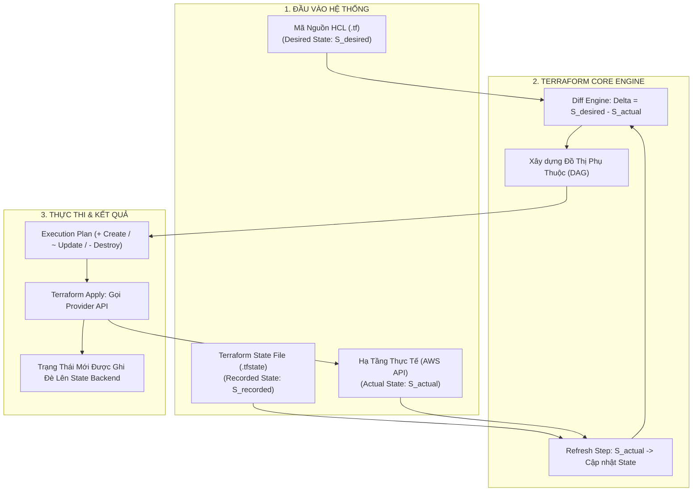
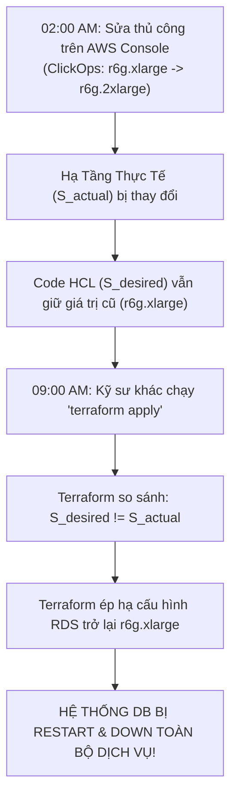

# Tư Duy Declarative IaC & So Sánh Thực Chiến: Terraform vs Ansible vs Pulumi vs CloudFormation

Khi hạ tầng đám mây (Cloud Infrastructure) mở rộng từ vài chục lên hàng ngàn máy chủ ảo, cụm Kubernetes, mạng VPC đa vùng và cơ sở dữ liệu phân tán, việc cấu hình thủ công qua giao diện web (**ClickOps**) hoặc các script Shell/Python tuần tự trở thành nguyên nhân số 1 gây ra hiện tượng **Configuration Drift** (lệch cấu hình ngầm) và những thảm họa sập hệ thống do sai sót con người.

Để giải quyết triệt để bài toán này, **Infrastructure as Code (IaC)** ra đời như một tiêu chuẩn bắt buộc cho mọi kỹ sư Cloud Native, DevOps và Platform SRE hiện đại. Tuy nhiên, việc nắm vững tư duy cốt lõi **Declarative (Khai báo trạng thái mong muốn)** thay vì **Imperative (Chỉ định từng bước thực thi)** là ranh giới sống còn giữa một hệ thống tự phục hồi vững chắc và một đống mã nguồn bảo trì đầy rủi ro.

Bài viết mở đầu này sẽ đưa bạn khám phá bản chất toán học của chu trình điều hòa (Reconcile Loop), phân tích sâu ưu nhược điểm thực chiến của 4 công cụ hàng đầu (**Terraform**, **Ansible**, **Pulumi**, **CloudFormation**), mổ xẻ mã nguồn HCL 1.7+ chuẩn Production và phân tích các cạm bẫy thực tế khi triển khai hạ tầng quy mô lớn.

---

## 1. Tư Duy Cốt Lõi: Declarative vs Imperative trong Quản Trị Hạ Tầng

### 1.1. Bản Chất của Phương Pháp Imperative (Mệnh Lệnh)
Trong mô hình Imperative (điển hình như Bash Script, Python SDK Boto3, hoặc Ansible khi không thiết kế chặt chẽ tính Idempotency), kỹ sư phải mô tả **từng bước tuần tự** để đạt được kết quả:
- **Bước 1:** Gửi API kiểm tra xem S3 Bucket `showtech-prod-data` đã tồn tại trên AWS hay chưa.
- **Bước 2:** Nếu chưa có, gửi API tạo Bucket với region `ap-southeast-1`.
- **Bước 3:** Nếu đã có, kiểm tra cấu hình Encryption và gán KMS Key.
- **Bước 4:** Nếu quá trình tạo bị lỗi giữa chừng, lập trình viên phải tự viết hàm Rollback thủ công để xóa tài nguyên rác.

> [!WARNING]
> **RỦI RO LỚN NHẤT CỦA IMPERATIVE:**
> Script mệnh lệnh không có bộ nhớ trạng thái hệ thống. Nếu script bị gián đoạn giữa chừng do đứt kết nối mạng (Network Timeout) hoặc hết bộ nhớ (OOM), hạ tầng sẽ rơi vào trạng thái dở dang (Partial State). Khi chạy lại script lần 2, hệ thống thường báo lỗi xung đột `ResourceAlreadyExists` hoặc sinh ra các tài nguyên rác mồ côi (Orphaned Resources) làm tăng vọt chi phí hàng tháng.

### 1.2. Tư Duy Declarative của Terraform (Khai Báo Trạng Thái Mong Muốn)
Với mô hình Declarative của Terraform, kỹ sư **chỉ cần mô tả trạng thái cuối cùng mong muốn ($S_{desired}$)** trong các tệp mã nguồn HCL.

Terraform Engine sẽ tự động thực hiện phép so sánh 3 ngôi giữa:
1. **$S_{desired}$ (Desired State):** Trạng thái khai báo trong code `.tf`.
2. **$S_{recorded}$ (Last Known State):** Trạng thái được lưu trong tệp `terraform.tfstate`.
3. **$S_{actual}$ (Actual State):** Trạng thái thực tế đang chạy trên Cloud API (AWS/GCP/Azure).



### 1.3. Mô Hình Toán Học Của Chu Trình Điều Hòa (Reconcile Loop)
Chu trình tính toán của Terraform tuân theo công thức tập hợp:

$$\Delta = S_{desired} \setminus S_{actual}$$

- Nếu một thuộc tính $x \in S_{desired}$ nhưng $x \notin S_{actual} \rightarrow$ **Hành động: CREATE (+)**.
- Nếu một thuộc tính $x \in S_{desired}$ và $x \in S_{actual}$ nhưng $Value_{desired}(x) \neq Value_{actual}(x) \rightarrow$ **Hành động: UPDATE (~)**.
- Nếu một thuộc tính $x \in S_{actual}$ nhưng $x \notin S_{desired}$ (với tài nguyên được Terraform quản lý) $\rightarrow$ **Hành động: DESTROY (-)**.

---

## 2. Bảng So Sánh Kỹ Thuật Toàn Diện (Engineering Matrix)

Dưới đây là ma trận so sánh chi tiết giữa 4 giải pháp quản trị hạ tầng phổ biến nhất hiện nay dựa trên 10 tiêu chí kiểm định thực tế tại các môi trường chịu tải cao:

| Tiêu Chí Kỹ Thuật | HashiCorp Terraform | Ansible (Red Hat) | Pulumi | AWS CloudFormation |
| :--- | :--- | :--- | :--- | :--- |
| **Triết Lý Thiết Kế** | Declarative IaC (Thuần Hạ Tầng) | Config Management (Cấu Hình OS) | Declarative (General Programming) | Declarative (Hạ Tầng AWS Native) |
| **Ngôn Ngữ Định Nghĩa** | HCL (HashiCorp Configuration Lang) | YAML (Playbooks & Tasks) | TypeScript, Python, Go, C#, Java | JSON / YAML Templates |
| **Quản Lý Trạng Thái (State)** | Explicit State File (S3, GCS, HCP) | Không có State File (Stateless) | Pulumi SaaS Backend / S3 Backend | Engine nội bộ AWS quản lý ngầm |
| **Phát Hiện Lệch Cấu Hình (Drift)** | Cực mạnh (`plan -refresh-only`) | Hạn chế (Dựa trên check mode) | Rất mạnh (`pulumi refresh`) | Hỗ trợ qua AWS Drift Detection |
| **Tính Độc Lập Nền Tảng (Multi-Cloud)** | Tuyệt đối (Hơn 3.500+ Providers) | Rất tốt (OS, Docker, K8s, Cloud) | Rất tốt (Nền tảng Pulumi Packages) | Khóa chặt vào hệ sinh thái AWS |
| **Khả Năng Xem Trước Kế Hoạch (Preview)** | Trực quan, chính xác 100% (`plan`) | Tương đối (`--check` mode dễ sai sót) | Trực quan, chi tiết (`pulumi preview`) | Xem trước qua Change Sets |
| **Kiểm Soát Vòng Đời Tài Nguyên** | Lifecycle hooks (`create_before_destroy`) | Quản lý theo Task tuần tự | Quản lý qua Custom Resource Options | Quản lý qua DeletionPolicy/UpdateReplace |
| **Hệ Sinh Thái Module & Registry** | 15.000+ Modules chuẩn trên Registry | Ansible Galaxy Roles | Pulumi Registry & NPM/PyPI | AWS Serverless Application Repo |
| **Tính Khả Dụng Khi Có Sự Cố Mạng** | Khóa State an toàn (State Locking) | Dễ gây trạng thái dở dang nếu đứt mạng | Quản lý qua State Lock của Backend | Rollback tự động cấp độ CloudFormation Stack |
| **Trường Hợp Ứng Dụng Lý Tưởng** | Khởi tạo VPC, EKS, RDS, IAM Đa Nền Tảng | Cài đặt Package, Nginx, Patching OS | Đội ngũ Dev thuần thục TypeScript/Go | Dự án thuần AWS không dùng Multi-Cloud |

> [!IMPORTANT]
> **QUY TẮC PHỐI HỢP VÀNG TRONG DOANH NGHIỆP:**
> Không có công cụ "vạn năng". Kiến trúc hiện đại thường sử dụng **Terraform** để khởi tạo hạ tầng nền móng (VPC, Subnet, EKS Cluster, RDS Database, IAM Roles), sau đó bàn giao thông tin cho **Ansible** để cấu hình phần mềm máy chủ hoặc **Argo CD** để triển khai các ứng dụng GitOps lên Kubernetes.

---

## 3. Kiến Trúc Triển Khai Chuẩn Production (HCL 1.7+ Breakdown)

Dưới đây là một bộ mã nguồn HCL hoàn chỉnh tuân thủ tiêu chuẩn bảo mật doanh nghiệp: Khởi tạo S3 Secure Bucket với mã hóa KMS tùy chỉnh, chặn hoàn toàn truy cập công khai và bật tính năng Object Locking chống xóa nhầm:

```hcl
# versions.tf - Định nghĩa phiên bản Terraform và Provider
terraform {
  required_version = ">= 1.7.0"

  required_providers {
    aws = {
      source  = "hashicorp/aws"
      version = "~> 5.45.0"
    }
    random = {
      source  = "hashicorp/random"
      version = "~> 3.6.0"
    }
  }

  backend "s3" {
    bucket         = "showtech-prod-tfstate-ap-southeast-1"
    key            = "core/storage/s3-secure.tfstate"
    region         = "ap-southeast-1"
    dynamodb_table = "showtech-prod-tflocks"
    encrypt        = true
  }
}

provider "aws" {
  region = var.aws_region

  default_tags {
    tags = {
      Environment = var.environment
      ManagedBy   = "Terraform"
      Project     = "ShowTech-Enterprise"
      CostCenter  = "Infrastructure-Core"
    }
  }
}
```

```hcl
# main.tf - Tài nguyên S3 Bucket được bảo vệ nghiêm ngặt
resource "random_string" "suffix" {
  length  = 8
  special = false
  upper   = false
}

# 1. Khởi tạo Khóa Mã Hóa AWS KMS Customer Managed Key (CMK)
resource "aws_kms_key" "s3_encryption_key" {
  description             = "KMS Key ma hoa du lieu cho S3 Bucket Enterprise"
  deletion_window_in_days = 30
  enable_key_rotation     = true

  tags = {
    Name = "s3-kms-key-${var.environment}"
  }
}

# 2. Khởi tạo S3 Bucket cốt lõi
resource "aws_s3_bucket" "secure_storage" {
  bucket        = "showtech-enterprise-data-${var.environment}-${random_string.suffix.result}"
  force_destroy = false # Ngăn chặn việc xóa nhầm bucket khi còn chứa dữ liệu

  lifecycle {
    prevent_destroy = true # Rào chắn an ninh cấp HCL cấm lệnh destroy
  }
}

# 3. Kích hoạt Versioning để lưu vết lịch sử tệp tin
resource "aws_s3_bucket_versioning" "versioning" {
  bucket = aws_s3_bucket.secure_storage.id

  versioning_configuration {
    status = "Enabled"
  }
}

# 4. Ép buộc mã hóa Server-Side Encryption với KMS Key vừa tạo
resource "aws_s3_bucket_server_side_encryption_configuration" "kms_encryption" {
  bucket = aws_s3_bucket.secure_storage.id

  rule {
    apply_server_side_encryption_by_default {
      kms_master_key_id = aws_kms_key.s3_encryption_key.arn
      sse_algorithm     = "aws:kms"
    }
    bucket_key_enabled = true # Tiết kiệm tới 99% chi phí KMS API calls
  }
}

# 5. Chặn toàn bộ mọi hình thức Public Access (Bảo mật tuyệt đối)
resource "aws_s3_bucket_public_access_block" "block_public" {
  bucket = aws_s3_bucket.secure_storage.id

  block_public_acls       = true
  block_public_policy     = true
  ignore_public_acls      = true
  restrict_public_buckets = true
}
```

```hcl
# variables.tf - Khai báo biến đầu vào có kiểm định
variable "aws_region" {
  type        = string
  default     = "ap-southeast-1"
  description = "Khu vực AWS triển khai tài nguyên"
}

variable "environment" {
  type        = string
  default     = "production"
  description = "Môi trường triển khai (production, staging, development)"

  validation {
    condition     = contains(["production", "staging", "development"], var.environment)
    error_message = "Môi trường chỉ được phép là production, staging, hoặc development."
  }
}

# outputs.tf - Xuất các giá trị quan trọng
output "bucket_id" {
  value       = aws_s3_bucket.secure_storage.id
  description = "Tên định danh duy nhất của S3 Bucket"
}

output "bucket_arn" {
  value       = aws_s3_bucket.secure_storage.arn
  description = "ARN của S3 Bucket phục vụ phân quyền IAM"
}

output "kms_key_arn" {
  value       = aws_kms_key.s3_encryption_key.arn
  description = "ARN của KMS Key dùng để mã hóa dữ liệu"
}
```

### Phân Tích Kỹ Thuật Từng Dòng (Line-by-Line Breakdown):
1. **`prevent_destroy = true`**: Đây là rào chắn sinh tử trong khối `lifecycle`. Khi một kỹ sư vô tình chạy `terraform destroy`, Terraform sẽ lập tức dừng thực thi và báo lỗi, bảo vệ an toàn cho dữ liệu Production.
2. **`bucket_key_enabled = true`**: Giảm số lượng request gửi tới dịch vụ AWS KMS bằng cách sử dụng Bucket Key ở cấp độ S3, giúp tiết kiệm hàng ngàn USD chi phí vận hành cho các bucket có hàng triệu lượt đọc/ghi mỗi ngày.
3. **`default_tags`**: Tự động gắn tag đồng bộ cho 100% tài nguyên được sinh ra từ AWS Provider, phục vụ việc phân bổ chi phí (Cost Allocation) và kiểm toán tuân thủ (Audit Compliance).

---

## 4. Phân Tích Cạm Bẫy Thực Chiến: Thảm Họa "ClickOps Drift" & Mất Dữ Liệu

### Tình Huống Sự Cố Thực Tế Tại Doanh Nghiệp:
Vào lúc 02:00 sáng, trong một đợt khắc phục sự cố khẩn cấp, một kỹ sư vận hành đã đăng nhập vào AWS Management Console và trực tiếp sửa tham số `Instance Type` của một máy chủ cơ sở dữ liệu RDS từ `db.r6g.xlarge` lên `db.r6g.2xlarge`.

Sáng hôm sau, một kỹ sư DevOps khác thực hiện việc cập nhật mã nguồn Terraform (thêm một tag giám sát) và chạy lệnh:
```bash
terraform apply -auto-approve
```

### Hậu Quả & Log Lỗi Thực Tế:
```log
# Trích đoạn log thực thi từ Terraform CLI
aws_db_instance.primary: Refreshing state... [id=rds-prod-postgres]

Terraform will perform the following actions:

  # aws_db_instance.primary will be updated in-place
  ~ resource "aws_db_instance" "primary" {
        id                   = "rds-prod-postgres"
      ~ instance_class       = "db.r6g.2xlarge" -> "db.r6g.xlarge"
      ~ tags                 = {
          + "CostCenter"     = "DataPlatform"
            # (4 unchanged elements hidden)
        }
        # (28 unchanged attributes hidden)
    }

Plan: 0 to add, 1 to change, 0 to destroy.

aws_db_instance.primary: Modifying... [id=rds-prod-postgres]
aws_db_instance.primary: Still modifying... [id=rds-prod-postgres, 10s elapsed]
aws_db_instance.primary: Still modifying... [id=rds-prod-postgres, 20s elapsed]
...
# Cơ sở dữ liệu bị Restart để hạ cấu hình, làm gián đoạn toàn bộ hệ thống thanh toán trong 15 phút!
```



### 5-Whys Root Cause Analysis:
1. **Tại sao cơ sở dữ liệu bị hạ cấu hình và restart?** $\rightarrow$ Vì Terraform thực thi kế hoạch đưa `instance_class` từ `db.r6g.2xlarge` về lại `db.r6g.xlarge`.
2. **Tại sao Terraform lại đưa về giá trị cũ?** $\rightarrow$ Vì trong tệp HCL, biến `instance_class` vẫn đang khai báo là `db.r6g.xlarge` (chưa được cập nhật sau sự cố đêm qua).
3. **Tại sao kỹ sư không nhìn thấy cảnh báo này trước khi apply?** $\rightarrow$ Vì lệnh áp dụng được chạy kèm cờ nguy hiểm `-auto-approve` trong pipeline mà không qua bước kiểm duyệt Execution Plan.
4. **Tại sao có sự sai lệch giữa Cloud và HCL?** $\rightarrow$ Do quy trình quản trị cho phép kỹ sư chỉnh sửa trực tiếp trên AWS Console (ClickOps) mà không đồng bộ ngược lại vào Git.
5. **Biện pháp khắc phục tận gốc (Root Cause Remedy):**
   - **Cấm hoàn toàn quyền ghi trực tiếp trên AWS Console (Enforce IaC-Only):** Thu hồi quyền chỉnh sửa thủ công của kỹ sư trên môi trường Staging/Production, chỉ cho phép thực thi thông qua CI/CD Pipeline.
   - **Chạy định kỳ kiểm tra Drift:** Sử dụng lệnh `terraform plan -refresh-only` trên pipeline tự động mỗi 30 phút để phát hiện sớm các thay đổi trái phép.
   - **Loại bỏ cờ `-auto-approve` trên Production:** Bắt buộc phải có bước kiểm duyệt Plan Review từ Tech Lead trước khi Apply.

---

## 5. Hands-on Lab: Khởi Tạo & Vận Hành Hạ Tầng Chuẩn SRE (8 Bước)

### Bước 1: Quản lý phiên bản Terraform linh hoạt với `tfswitch`
```bash
# Cài đặt và kích hoạt chính xác phiên bản Terraform 1.7.5
tfswitch 1.7.5

# Kiểm tra phiên bản đang hoạt động
terraform version
```

### Bước 2: Thiết lập cấu hình biến môi trường AWS
```bash
export AWS_REGION="ap-southeast-1"
export AWS_PROFILE="showtech-enterprise-prod"

# Kiểm tra kết nối IAM Identity tới Cloud
aws sts get-caller-identity
```

### Bước 3: Khởi tạo thư mục làm việc (Initialization)
```bash
# Khởi tạo providers và kết nối tới remote backend
terraform init
```

### Bước 4: Định dạng và kiểm tra cú pháp chuẩn hóa (Linting)
```bash
# Tự động căn chỉnh mã nguồn HCL theo chuẩn canonical
terraform fmt -recursive

# Kiểm tra tính hợp lệ của cấu hình và biến
terraform validate
```

### Bước 5: Tạo và lưu trữ Execution Plan độc lập
```bash
# Tạo kế hoạch thay đổi và xuất ra tệp binary an toàn
terraform plan -out=tfplan.binary
```

### Bước 6: Phân tích tệp Plan dưới định dạng JSON
```bash
# Chuyển đổi plan sang JSON để kiểm tra an ninh tự động
terraform show -json tfplan.binary | jq '.resource_changes[] | {type: .type, change: .change.actions}'
```

### Bước 7: Thực thi áp dụng kế hoạch chính xác (Targeted Apply)
```bash
# Áp dụng chính xác tệp plan đã được kiểm duyệt (không sợ drift phát sinh giữa chừng)
terraform apply tfplan.binary
```

### Bước 8: Kiểm tra trạng thái và truy xuất Output
```bash
# Liệt kê toàn bộ tài nguyên vừa được khởi tạo trong State
terraform state list

# Xem chi tiết giá trị đầu ra
terraform output
```

---

## 6. 10 Câu Hỏi Tự Kiểm Tra Chuyên Sâu (Self-Check Q&A)

### Câu 1: Bản chất khác biệt lớn nhất giữa Declarative IaC (Terraform) và Imperative IaC (Ansible/Bash) là gì?
<details>
<summary><b>Xem lời giải chi tiết</b></summary>
Declarative tập trung vào <b>"Cái gì" (Desired State)</b> — người dùng chỉ khai báo trạng thái mong muốn cuối cùng và engine tự tính toán hành động để đạt được trạng thái đó. Trong khi Imperative tập trung vào <b>"Làm như thế nào" (Step-by-Step)</b> — người dùng phải tự lập trình từng bước tuần tự và tự xử lý các trường hợp lỗi hoặc điều kiện rẽ nhánh.
</details>

### Câu 2: Trạng thái (State) trong Terraform đóng vai trò gì trong chu trình Reconcile Loop?
<details>
<summary><b>Xem lời giải chi tiết</b></summary>
State file đóng vai trò là <b>"Bản đồ ánh xạ" (Mapping Metadata)</b> giữa các tài nguyên được khai báo trong code HCL với các tài nguyên thực tế trên Cloud (Resource ID, ARN, Attributes). Không có State, Terraform không thể biết tài nguyên nào đã được tạo trước đó để thực hiện update hay destroy, dẫn đến việc tạo trùng lặp.
</details>

### Câu 3: Vì sao việc chạy `terraform apply -auto-approve` trên môi trường Production bị coi là phản mẫu (Anti-Pattern)?
<details>
<summary><b>Xem lời giải chi tiết</b></summary>
Cờ <code>-auto-approve</code> bỏ qua bước xem xét Execution Plan của con người. Nếu trên hạ tầng thực tế đã có ai đó sửa đổi thủ công (Drift) hoặc việc đổi tên resource làm kích hoạt hành vi <b>Destroy and Recreate</b>, lệnh apply tự động có thể xóa sạch cơ sở dữ liệu hoặc cụm máy chủ quan trọng mà không có cơ hội ngăn chặn.
</details>

### Câu 4: Tham số `prevent_destroy = true` trong khối `lifecycle` hoạt động như thế nào?
<details>
<summary><b>Xem lời giải chi tiết</b></summary>
Đây là một cơ chế an toàn cấp độ engine. Nếu một kế hoạch thực thi (Plan) dẫn tới việc xóa tài nguyên có khai báo <code>prevent_destroy = true</code> (dù là do lệnh <code>terraform destroy</code> trực tiếp hay do thay đổi một thuộc tính bắt buộc phải Re-create), Terraform sẽ lập tức dừng lại và báo lỗi, từ chối tạo Plan.
</details>

### Câu 5: Lệnh `terraform plan -refresh-only` khác gì so với `terraform plan` thông thường?
<details>
<summary><b>Xem lời giải chi tiết</b></summary>
<code>terraform plan -refresh-only</code> chỉ thực hiện việc truy vấn Cloud API để cập nhật trạng thái thực tế vào State mà <b>không đề xuất bất kỳ thay đổi nào lên hạ tầng thực tế</b>. Lệnh này được dùng chuyên biệt để phát hiện và đồng bộ Drift do ClickOps gây ra.
</details>

### Câu 6: Thuộc tính `bucket_key_enabled = true` trong cấu hình mã hóa S3 mang lại lợi ích gì?
<details>
<summary><b>Xem lời giải chi tiết</b></summary>
Thuộc tính này giảm tần suất gọi API tới AWS KMS bằng cách sử dụng một khóa cấp bucket ngắn hạn thay vì gọi KMS cho từng đối tượng riêng lẻ. Điều này giúp giảm chi phí dịch vụ KMS tới <b>99%</b> đối với các hệ thống có khối lượng đọc/ghi tệp lớn.
</details>

### Câu 7: Khi nào nên sử dụng Pulumi thay vì Terraform trong các dự án Cloud Native?
<details>
<summary><b>Xem lời giải chi tiết</b></summary>
Nên cân nhắc Pulumi khi hạ tầng đòi hỏi các thuật toán điều kiện phức tạp, xử lý chuỗi dữ liệu động nâng cao, tích hợp sâu vào mã nguồn ứng dụng (viết bằng TypeScript/Python/Go), hoặc khi đội ngũ kỹ sư phần mềm muốn sử dụng chung ngôn ngữ và bộ công cụ kiểm thử đơn vị (Unit Test) của ngôn ngữ lập trình đa năng.
</details>

### Câu 8: Hiện tượng "Index Shifting" trong Terraform là gì và công cụ nào giải quyết triệt để?
<details>
<summary><b>Xem lời giải chi tiết</b></summary>
Index Shifting xảy ra khi sử dụng <code>count</code> để tạo danh sách tài nguyên dựa trên chỉ số mảng <code>[0, 1, 2]</code>. Khi xóa một phần tử ở giữa danh sách, toàn bộ các phần tử phía sau bị dịch chuyển index, khiến Terraform hiểu nhầm là phải destroy và recreate lại hàng loạt tài nguyên. Giải pháp là chuyển sang dùng <code>for_each</code> với cấu trúc Map/Set.
</details>

### Câu 9: Lệnh `terraform validate` kiểm tra những gì và nó có gọi tới Cloud API hay không?
<details>
<summary><b>Xem lời giải chi tiết</b></summary>
<code>terraform validate</code> chỉ kiểm tra tính hợp lệ về mặt cú pháp HCL, tính nhất quán của các khối khai báo, các kiểu dữ liệu biến và tham số nội bộ. Lệnh này <b>hoàn toàn không gọi tới Cloud API</b> và không kiểm tra xem tài nguyên thực tế có tồn tại hay không.
</details>

### Câu 10: State Locking (Khóa trạng thái) hoạt động như thế nào khi nhiều kỹ sư cùng chạy Terraform?
<details>
<summary><b>Xem lời giải chi tiết</b></summary>
Khi một kỹ sư phát lệnh <code>plan</code> hoặc <code>apply</code>, Terraform sẽ tạo một bản ghi khóa (Lock Record) trên cơ chế khóa của Backend (ví dụ DynamoDB Lock Table hoặc GCS Lock). Mọi lệnh khác chạy đồng thời sẽ bị chặn lại với thông báo <code>Error acquiring the state lock</code> cho đến khi tiến trình đầu tiên hoàn tất và nhả khóa, ngăn chặn nguy cơ làm hỏng (Corrupt) State File.
</details>

---

## 7. Tổng Kết & Lộ Trình Bài Học Tiếp Theo

Tư duy **Declarative Desired State** là nền móng tư tưởng quan trọng nhất giúp bạn làm chủ toàn bộ hệ sinh thái Terraform. Hiểu rõ chu trình Reconcile Loop và mối liên hệ giữa Code HCL, State File và Cloud Actual State sẽ giúp bạn luôn tự tin trước mọi thay đổi hạ tầng phức tạp.

Trong **[Bài 02: Giải Mã Workflow Init, Plan, Apply - Cơ Chế Two-Phase Execution & Đồ Thị DAG Chuyên Sâu](02-giai-ma-workflow-init-plan-apply-two-phase-execution-dag.md)**, chúng ta sẽ mở nắp "cỗ máy bên trong" của Terraform Core: Khám phá cách đồ thị có hướng không chu trình (**Directed Acyclic Graph - DAG**) được xây dựng, cơ chế Provider Plugin RPC qua gRPC và cách tối ưu hóa hiệu năng song song với tham số `-parallelism`.
