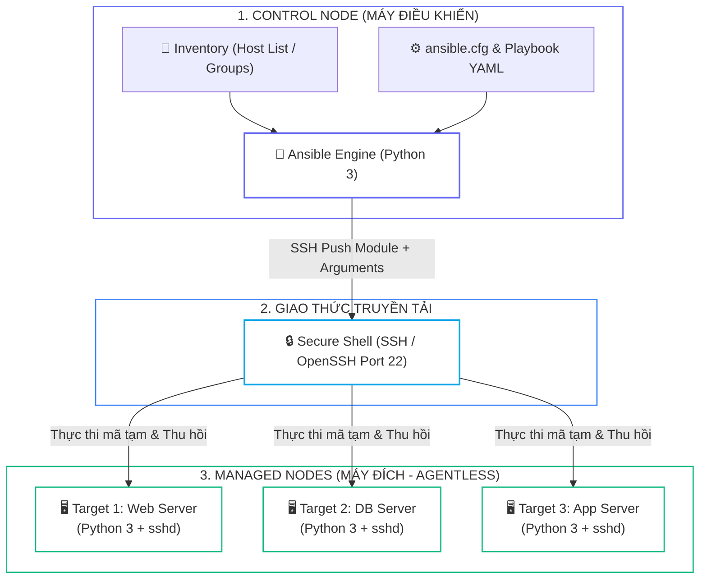
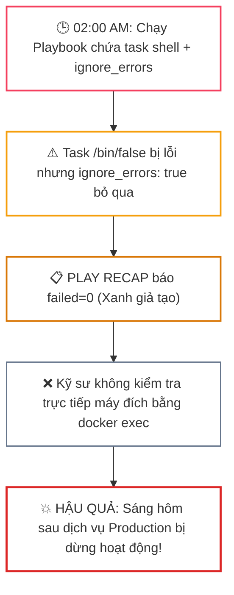


# [BÀI 01] TƯ DUY CONFIGURATION MANAGEMENT & TRIẾT LÝ AGENTLESS CỦA ANSIBLE: PUSH-BASED VS PULL-BASED & IDEMPOTENCY

Trong kỷ nguyên **Infrastructure as Code (IaC)** và tự động hóa vận hành hạ tầng đám mây (Cloud Infrastructure Automation), **Ansible** khẳng định vị thế dẫn đầu nhờ triết lý **Agentless** (không cần cài đặt agent nền trên máy đích), giao thức điều khiển an toàn qua **SSH / WinRM**, định dạng khai báo **YAML** trực quan và nguyên lý bất biến **Idempotency** mạnh mẽ. Việc làm chủ Ansible không chỉ dừng lại ở các câu lệnh Ad-hoc đơn giản, mà đòi hỏi kỹ sư phải nắm vững kiến trúc Module tầng thấp, Variable Precedence 22 tầng, Jinja2 Templates, tối ưu hóa Forks & Pipelining cho tới thiết kế Roles / Collections và tích hợp CI/CD tự động hóa chuẩn Doanh nghiệp.

Bài viết chuyên sâu này sẽ đồng hành cùng bạn mổ xẻ toàn diện bức tranh kiến trúc, phân tích các đánh đổi kỹ thuật thực chiến (Engineering Trade-offs), cung cấp hướng dẫn thực hành Lab chi tiết từng bước và bộ câu hỏi phỏng vấn chuyên sâu chuẩn DevOps / SRE Lead.

---

## 1. Bản Chất Kiến Trúc & Cơ Chế Vận Hành Tầng Thấp

Ansible là công cụ quản trị cấu hình (**Configuration Management**) và tự động hóa hạ tầng hoạt động theo triết lý **Push-Based**, **Agentless**, và **Idempotent**. Bạn chỉ cần khai báo trạng thái mong muốn cuối cùng (*Desired State*), Ansible Engine sẽ chủ động đẩy cấu hình qua giao thức SSH tới các máy đích phân tán và tự động hội tụ trạng thái mà không để lại tiến trình ngầm (Daemon).



### 1.1. Ba Tính Chất Cốt Lõi: Push-Based, Agentless & Idempotency

* **Mô hình Push-Based (Chủ động đẩy):** Control node chủ động khởi tạo phiên SSH đẩy module + tham số tới từng target node tại thời điểm chạy. Không cần cài đặt agent thường trú, dễ dàng kiểm soát thời điểm và kiểm toán bảo mật.
* **Mô hình Agentless (Không agent):** Máy đích chỉ cần môi trường **Python 3 + sshd**. Ansible Engine đẩy đoạn mã Python ngắn hạn lên thư mục tạm `~/.ansible/tmp/`, thực thi tác vụ, thu thập kết quả JSON và tự động xóa sạch file tạm.
* **Nguyên lý Bất biến Idempotency:** Chạy Playbook lần đầu tiên sẽ đưa hệ thống về trạng thái mong muốn (`changed=X`). Khi chạy lại lần hai trên hệ thống đã chuẩn, Ansible đọc trạng thái thực tế và không thực hiện bất kỳ thay đổi nào, cam kết kết quả **`changed=0` tuyệt đối**.

---

### 1.2. Thuật Ngữ Cốt Lõi Trong Hệ Sinh Thái Ansible

| Thuật Ngữ Tiếng Việt | Thuật Ngữ Kỹ Thuật (FQCN) | Định Nghĩa & Phạm Vi Sử Dụng |
|---|---|---|
| **Quản lý cấu hình** | `Configuration Management` | Tự động hóa thiết lập phần mềm và duy trì trạng thái máy chủ |
| **Đẩy cấu hình** | `Push-based` | Control node chủ động gửi lệnh qua SSH |
| **Không cần agent** | `Agentless` | Managed node chỉ cần Python 3 và OpenSSH |
| **Bất biến** | `Idempotent / Idempotency` | Chạy lại nhiều lần không làm thay đổi trạng thái đã chuẩn |
| **Máy điều khiển** | `Control Node` | Máy tính Linux cài đặt Ansible CLI và lưu trữ Playbooks |
| **Máy bị quản** | `Managed Node (Target)` | Máy chủ nhận cấu hình, không cần cài Ansible Engine |
| **Danh sách máy** | `Inventory` | Tệp INI / YAML định nghĩa danh sách IP, host và nhóm máy |
| **Lệnh tức thì** | `Ad-hoc Command` | Thực thi một module đơn lẻ trên CLI không cần playbook |
| **Kịch bản tự động hóa** | `Playbook` | Tệp YAML chứa danh sách các Play và Tasks tuần tự |
| **Mô-đun chức năng** | `Module (FQCN)` | Đơn vị thực thi độc lập (ví dụ: `ansible.builtin.package`) |
| **Dữ liệu thực tế** | `Facts` | Thông tin phần cứng, OS do `setup` module thu thập |
| **Báo cáo tổng kết** | `PLAY RECAP` | Bản ghi trạng thái `ok`, `changed`, `unreachable`, `failed` |

---

## 2. Bảng So Sánh Kỹ Thuật Toàn Diện (Engineering Matrix)

Dưới đây là ma trận so sánh chi tiết giữa **Ansible**, **Puppet**, **Chef** và **Terraform** dựa trên 10 tiêu chí kiến trúc:

| Tiêu Chí Kỹ Thuật | Ansible (Red Hat) | Puppet | Chef | HashiCorp Terraform |
| :--- | :--- | :--- | :--- | :--- |
| **Mô Hình Giao Tiếp** | **Push-Based** (Qua SSH/WinRM) | Pull-Based (Agent kéo định kỳ) | Pull-Based (Chef-Client daemon) | Push-Based (Gọi Cloud APIs) |
| **Yêu Cầu Cài Đặt Target** | **Agentless** (Chỉ cần Python + SSH) | Cần Puppet Agent | Cần Chef Client / Ruby | Agentless (Gọi Cloud API Endpoint) |
| **Ngôn Ngữ Khai Báo** | **YAML** (Human Readable) | Puppet DSL / Ruby | Ruby DSL | **HCL** (HashiCorp Config Lang) |
| **Quản Trị Trạng Thái (State)**| **Stateless** (Không có file State) | Central Master Catalog | Chef Server Node Object | **Explicit State File** (`.tfstate`) |
| **Thời Điểm Hội Tụ** | Chạy theo nhu cầu (On-demand / CI-CD) | Tự động sau mỗi 30 phút | Tự động sau mỗi 30 phút | Chạy theo nhu cầu (`terraform apply`) |
| **Cơ Chế Drift Detection** | Báo cáo qua `--check --diff` | Master tự phát hiện và phục hồi | Client tự kiểm tra và sửa | `terraform plan -refresh-only` |
| **Độ Phức Tạp Triển Khai** | **Rất thấp** (Cài đặt trong 2 phút) | Cao (Cần Puppet Master & PKI) | Cao (Cần Chef Automate Server) | **Rất thấp** (1 file binary duy nhất) |
| **Bảo Trì & Vá Lỗ Hổng** | Không tốn công bảo trì agent | Phải nâng cấp agent định kỳ | Phải vá lỗi Chef Client định kỳ | Không có agent |
| **Khả Năng Mở Rộng** | Forks song song + AWX Cluster | Rất tốt cho Fleet hàng ngàn node | Rất tốt cho Fleet lớn | Rất tốt cho quản trị hạ tầng Cloud |
| **Mục Tiêu Tối Thượng** | **Cấu hình OS & Cài Đặt App** | Quản lý cấu hình máy chủ lớn | Quản lý cấu hình hạ tầng | **Khởi tạo tài nguyên Hạ Tầng (IaC)** |

> [!IMPORTANT]
> **QUY TẮC PHỐI HỢP VÀNG TRONG DOANH NGHIỆP:**
> Không có công cụ "vạn năng". Kiến trúc hiện đại sử dụng **Terraform** để khởi tạo hạ tầng nền móng (VPC, Subnet, VMs, Kubernetes Cluster, Database), sau đó bàn giao IP cho **Ansible** để tự động cấu hình bên trong hệ điều hành (User, SSH, Firewalld, Nginx, Systemd services).

---

## 3. Kiến Trúc Triển Khai Chuẩn Production (Playbook Breakdown)

Dưới đây là kịch bản Playbook khởi tạo Web Server chuẩn hóa với module FQCN, hỗ trợ phân nhánh đa hệ điều hành và đảm bảo tính Idempotency 100%:

```ini
# ==============================================================================
# File: inventory.ini - Quản trị danh sách máy đích và biến kết nối
# ==============================================================================
[web]
target1 ansible_host=172.20.0.2 ansible_user=ansible
target2 ansible_host=172.20.0.3 ansible_user=ansible

[all:vars]
ansible_python_interpreter=/usr/bin/python3
```

```yaml
# ==============================================================================
# File: site.yml - Playbook chuẩn hóa Idempotency cài đặt Web Server
# ==============================================================================
- name: Buổi 01 — Triển khai Web Server tối giản chuẩn Idempotency
  hosts: web
  become: true
  gather_facts: true

  tasks:
    - name: 1. Cài đặt gói máy chủ Web tương thích đa nền tảng
      ansible.builtin.package:
        name: "{{ 'httpd' if ansible_os_family == 'RedHat' else 'apache2' }}"
        state: present

    - name: 2. Kích hoạt và bật dịch vụ khởi động cùng hệ thống
      ansible.builtin.service:
        name: "{{ 'httpd' if ansible_os_family == 'RedHat' else 'apache2' }}"
        state: started
        enabled: true

    - name: 3. Khởi tạo trang chủ mặc định chuẩn kiểm toán
      ansible.builtin.copy:
        content: "ntkansible buoi 01 - Automation Verified\n"
        dest: /var/www/html/index.html
        owner: root
        group: root
        mode: '0644'
```

### Phân Tích Kỹ Thuật Từng Dòng (Line-by-Line Breakdown):
* <span class="badge badge--primary"><code>hosts: web</code></span>: Chỉ định Playbook chỉ thực thi trên nhóm máy chủ `web` được khai báo trong inventory.
* <span class="badge badge--amber"><code>become: true</code></span>: Kích hoạt cơ chế leo quyền quản trị (Privilege Escalation) qua `sudo` để thực thi các tác vụ cài đặt gói hệ thống.
* <span class="badge badge--emerald"><code>ansible.builtin.package</code></span>: Module đa nền tảng tự động nhận diện `apt` trên Ubuntu/Debian hoặc `dnf`/`yum` trên RHEL/Rocky Linux.
* <span class="badge badge--cyan"><code>state: present</code></span>: Định nghĩa trạng thái mong muốn (Desired State) — chỉ cài đặt nếu gói chưa tồn tại, bỏ qua nếu đã có sẵn.

---

## 4. Phân Tích Cạm Bẫy Thực Chiến: "PLAY RECAP Xanh" & Task Không Idempotent

### Tình Huống Sự Cố Thực Tế Tại Doanh Nghiệp:
Vào lúc <span class="badge badge--rose">🕒 02:00 AM</span>, trong phiên bảo trì hệ thống, một kỹ sư tự động hóa đã thực thi một Playbook có chứa task dùng module `ansible.builtin.shell: mkdir -p /opt/app` kết hợp cờ `ignore_errors: true`. 

Màn hình console hiển thị `PLAY RECAP` với toàn bộ màu xanh (`failed=0`). Kỹ sư an tâm báo cáo hoàn thành phiên bảo trì. Tuy nhiên, sáng hôm sau dịch vụ thanh toán chính không hoạt động do một lệnh cấu hình trước đó bị lỗi nhưng bị `ignore_errors` che giấu.

### Hậu Quả & Log Lỗi Thực Tế:

```diff
PLAY [Buổi 01 — Cấu hình hệ thống] *************************************************

TASK [Tạo thư mục ứng dụng bằng shell] **********************************************
+ changed: [target1]

TASK [Cố ý lỗi nhưng bị ẩn] *********************************************************
! fatal: [target1]: FAILED! => {"changed": true, "cmd": "/bin/false", "msg": "non-zero return code"}
...ignoring

PLAY RECAP *************************************************************************
target1   : ok=3   changed=1   unreachable=0   failed=0   skipped=0   rescued=0   ignored=1
! [CRITICAL OUTAGE] Dịch vụ không chạy thật trên target1 dù PLAY RECAP báo failed=0!
```



### 5-Whys Root Cause Analysis:
1. <span class="badge badge--primary">Why 1</span> **Tại sao dịch vụ thanh toán không hoạt động?** $\rightarrow$ Vì tệp cấu hình quan trọng chưa được ghi đĩa do task trước đó bị dừng.
2. <span class="badge badge--primary">Why 2</span> **Tại sao kỹ sư không biết task bị lỗi?** $\rightarrow$ Vì trong Playbook cấu hình thuộc tính `ignore_errors: true` khiến task lỗi vẫn tiếp tục.
3. <span class="badge badge--primary">Why 3</span> **Tại sao bảng tổng kết vẫn hiển thị màu xanh?** $\rightarrow$ Vì `PLAY RECAP` chỉ đếm `failed` đối với các tác vụ không được gắn cờ ignore.
4. <span class="badge badge--primary">Why 4</span> **Tại sao không phát hiện lỗi trong quá trình kiểm thử?** $\rightarrow$ Do kỹ sư chỉ tin vào kết quả Play Recap mà không kiểm tra trạng thái thực tế bằng `systemctl is-active`.
5. <span class="badge badge--emerald">Root Cause Remedy</span> **Biện pháp khắc phục chuẩn SRE:**
   * <span class="badge badge--rose">Cấm Lạm Dụng ignore_errors</span> **Loại bỏ `ignore_errors: true` vô căn cứ:** Chỉ dùng khi có chủ đích và bắt buộc xử lý ngoại lệ ở task sau.
   * <span class="badge badge--emerald">Idempotency Lần 2</span> **Bắt buộc chạy lần 2:** Mọi kịch bản phải đạt `changed=0` ở lượt chạy thứ 2.
   * <span class="badge badge--cyan">Kiểm Tra Máy Đích</span> **Đối soát sự thật thực tế:** Luôn kiểm tra trực tiếp trên máy đích qua lệnh `docker exec target systemctl is-active <service>`.

---

## 5. Hands-on Lab: Khởi Tạo & Vận Hành Ansible Automation (8 Bước)

| Bước | Lệnh CLI | Mục Đích Thực Thi |
| :---: | :--- | :--- |
| <span class="badge badge--primary">01</span> | `ansible --version && ansible-inventory -i inventory.ini --graph` | Kiểm tra phiên bản Ansible và cấu trúc phân nhóm Inventory |
| <span class="badge badge--cyan">02</span> | `ansible -i inventory.ini all -m ansible.builtin.ping` | Kiểm tra thông suốt kết nối SSH và môi trường Python trên các node |
| <span class="badge badge--indigo">03</span> | `ansible -i inventory.ini all -m ansible.builtin.package -a "name=htop state=present" --become` | Thực thi lệnh Ad-hoc cài đặt gói phần mềm |
| <span class="badge badge--amber">04</span> | `ansible -i inventory.ini web --list-hosts` | Xác thực danh sách máy đích khớp với pattern trước khi chạy |
| <span class="badge badge--emerald">05</span> | `ansible-playbook -i inventory.ini site.yml` | Thực thi Playbook lượt 1 để cấu hình Web Server |
| <span class="badge badge--primary">06</span> | `docker exec ntkansible-target1 systemctl is-active httpd \|\| apache2` | Đối soát trực tiếp trạng thái dịch vụ trên máy đích |
| <span class="badge badge--rose">07</span> | `ansible-playbook -i inventory.ini site.yml` | Chạy Playbook lượt 2 chứng minh tính Idempotency (changed=0) |
| <span class="badge badge--emerald">08</span> | `ansible-playbook -i inventory.ini site.yml --check --diff` | Kiểm tra chế độ Dry-run và đối soát khác biệt cấu hình |

```bash
# 1. Kiểm tra cấu hình và kết nối SSH ad-hoc ping
ansible-inventory -i inventory.ini --graph
ansible -i inventory.ini all -m ansible.builtin.ping

# 2. Cài đặt gói thử nghiệm bằng lệnh ad-hoc
ansible -i inventory.ini all -m ansible.builtin.package -a "name=htop state=present" --become

# 3. Chạy Playbook lượt 1
ansible-playbook -i inventory.ini site.yml

# 4. Đối soát trạng thái thực tế trên máy đích (không chỉ tin Play Recap)
docker exec ntkansible-target1 systemctl is-active httpd || docker exec ntkansible-target1 systemctl is-active apache2
docker exec ntkansible-target1 cat /var/www/html/index.html

# 5. Chạy Playbook lượt 2 để chứng minh Idempotency (bắt buộc changed=0)
ansible-playbook -i inventory.ini site.yml
```

---

## 6. Bộ Câu Hỏi Vấn Đáp & Phỏng Vấn Chuyên Sâu (Self-Check Q&A)

<details class="qa-card">
  <summary class="qa-summary">
    <span class="qa-num-badge">Q01</span>
    <span class="qa-question-text">Push-based và agentless nghĩa là gì? Managed Node cần cài đặt những gì?</span>
  </summary>
  <div class="qa-answer">
    <div class="qa-answer-header">
      <svg width="14" height="14" fill="none" stroke="currentColor" stroke-width="2" viewBox="0 0 24 24"><path d="M22 11.08V12a10 10 0 1 1-5.93-9.14"></path><polyline points="22 4 12 14.01 9 11.01"></polyline></svg>
      <span>Phân Tích &amp; Lời Giải Kỹ Thuật</span>
    </div>
    Push: control node chủ động đẩy module qua SSH khi ta chạy. Agentless: máy đích <b style="color: var(--accent-primary);">không</b> cần agent Ansible, chỉ cần <b style="color: var(--accent-primary);">Python + sshd</b>. Kết nối do control node khởi tạo, chạy xong đóng.
    <div style="margin-top: 0.5rem;"><b style="color: var(--accent-cyan);">&bull; Tiêu chí chấm:</b> 0 sai &bull; 1 nói "không cần agent" mà không rõ &bull; 2 đúng push+agentless &bull; 3 kèm "máy đích chỉ cần Python+sshd" và ví dụ <code>ping</code>.</div>
    <div><b style="color: var(--accent-rose);">&bull; Câu hỏi đào sâu:</b> So với Puppet cổ điển? <i>(Puppet pull+agent, tự kéo theo chu kỳ.)</i></div>
  </div>
</details>

<details class="qa-card">
  <summary class="qa-summary">
    <span class="qa-num-badge">Q02</span>
    <span class="qa-question-text">Idempotency là gì trong Ansible và bằng chứng kỹ thuật cụ thể là gì?</span>
  </summary>
  <div class="qa-answer">
    <div class="qa-answer-header">
      <svg width="14" height="14" fill="none" stroke="currentColor" stroke-width="2" viewBox="0 0 24 24"><path d="M22 11.08V12a10 10 0 1 1-5.93-9.14"></path><polyline points="22 4 12 14.01 9 11.01"></polyline></svg>
      <span>Phân Tích &amp; Lời Giải Kỹ Thuật</span>
    </div>
    Chạy playbook lần hai trên máy đã đúng trạng thái <b style="color: var(--accent-primary);">không đổi gì</b>. Bằng chứng: <code>changed=0</code> ở PLAY RECAP lần hai. Mô tả <i>trạng thái muốn</i>, không phải <i>lệnh cần chạy</i>.
    <div style="margin-top: 0.5rem;"><b style="color: var(--accent-cyan);">&bull; Tiêu chí chấm:</b> 0 không biết &bull; 1 "chạy lại vẫn được" &bull; 2 nêu <code>changed=0</code> &bull; 3 kèm cách chứng minh (chạy hai lần) và vì sao nó là linh hồn CM.</div>
    <div><b style="color: var(--accent-rose);">&bull; Câu hỏi đào sâu:</b> Lần hai vẫn <code>changed</code> mà không ai đổi máy &mdash; nghi gì? <i>(Task <code>command</code>/<code>shell</code> không idempotent.)</i></div>
  </div>
</details>

<details class="qa-card">
  <summary class="qa-summary">
    <span class="qa-num-badge">Q03</span>
    <span class="qa-question-text">Vì sao các module command/shell không đảm bảo tính Idempotent và cách khắc phục?</span>
  </summary>
  <div class="qa-answer">
    <div class="qa-answer-header">
      <svg width="14" height="14" fill="none" stroke="currentColor" stroke-width="2" viewBox="0 0 24 24"><path d="M22 11.08V12a10 10 0 1 1-5.93-9.14"></path><polyline points="22 4 12 14.01 9 11.01"></polyline></svg>
      <span>Phân Tích &amp; Lời Giải Kỹ Thuật</span>
    </div>
    Chúng không có khái niệm trạng thái, chỉ chạy lệnh &rarr; luôn <code>changed</code>. Sửa: dùng module chuyên (idempotent), hoặc thêm <code>creates</code>/<code>removes</code>/<code>changed_when</code> để chặn chạy lại/định nghĩa "đổi".
    <div style="margin-top: 0.5rem;"><b style="color: var(--accent-cyan);">&bull; Tiêu chí chấm:</b> 0 không biết &bull; 1 "shell xấu" chung chung &bull; 2 đúng lý do &bull; 3 kèm <code>creates</code>/<code>changed_when</code> và ví dụ module chuyên thay thế.</div>
    <div><b style="color: var(--accent-rose);">&bull; Câu hỏi đào sâu:</b> Khi nào buộc phải dùng <code>shell</code>? <i>(Khi không có module chuyên; khi đó thêm creates/changed_when.)</i></div>
  </div>
</details>

<details class="qa-card">
  <summary class="qa-summary">
    <span class="qa-num-badge">Q04</span>
    <span class="qa-question-text">PLAY RECAP báo trạng thái xanh (ok/changed=0) có đảm bảo hệ thống đích đúng cấu hình không?</span>
  </summary>
  <div class="qa-answer">
    <div class="qa-answer-header">
      <svg width="14" height="14" fill="none" stroke="currentColor" stroke-width="2" viewBox="0 0 24 24"><path d="M22 11.08V12a10 10 0 1 1-5.93-9.14"></path><polyline points="22 4 12 14.01 9 11.01"></polyline></svg>
      <span>Phân Tích &amp; Lời Giải Kỹ Thuật</span>
    </div>
    Không. Recap chỉ tổng hợp cái <b style="color: var(--accent-primary);">module báo cáo</b> cho controller. <code>ignore_errors</code> giấu lỗi, <code>changed_when: false</code> che thay đổi, nhầm inventory chạy sai host &mdash; recap vẫn xanh. Kiểm máy đích: <code>docker exec ... systemctl is-active</code>.
    <div style="margin-top: 0.5rem;"><b style="color: var(--accent-cyan);">&bull; Tiêu chí chấm:</b> 0 "recap xanh là xong" (trần 1) &bull; 1 mơ hồ &bull; 2 nói recap không đủ &bull; 3 kèm &ge;2 ca xanh-mà-sai và lệnh kiểm máy đích.</div>
    <div><b style="color: var(--accent-rose);">&bull; Câu hỏi đào sâu:</b> Kiểm dịch vụ chạy thật bằng lệnh gì? <i>(<code>docker exec &lt;target&gt; systemctl is-active &lt;svc&gt;</code>.)</i></div>
  </div>
</details>

<details class="qa-card">
  <summary class="qa-summary">
    <span class="qa-num-badge">Q05</span>
    <span class="qa-question-text">Ba trường hợp điển hình khiến PLAY RECAP "xanh mà sai" trong thực tế là gì?</span>
  </summary>
  <div class="qa-answer">
    <div class="qa-answer-header">
      <svg width="14" height="14" fill="none" stroke="currentColor" stroke-width="2" viewBox="0 0 24 24"><path d="M22 11.08V12a10 10 0 1 1-5.93-9.14"></path><polyline points="22 4 12 14.01 9 11.01"></polyline></svg>
      <span>Phân Tích &amp; Lời Giải Kỹ Thuật</span>
    </div>
    <code>ignore_errors: true</code> (biến task đỏ thành tiếp tục), <code>changed_when: false</code> (ép luôn <code>ok</code>), nhầm inventory pattern (chạy đúng nhưng trên host khác cái ta tưởng).
    <div style="margin-top: 0.5rem;"><b style="color: var(--accent-cyan);">&bull; Tiêu chí chấm:</b> 0 không biết &bull; 1 một cách &bull; 2 hai cách &bull; 3 ba cách + hệ quả từng cái.</div>
    <div><b style="color: var(--accent-rose);">&bull; Câu hỏi đào sâu:</b> <code>ignore_errors</code> có bao giờ hợp lý không? <i>(Có &mdash; khi lỗi dự kiến và xử ở task sau; phải có chủ đích.)</i></div>
  </div>
</details>

<details class="qa-card">
  <summary class="qa-summary">
    <span class="qa-num-badge">Q06</span>
    <span class="qa-question-text">Inventory đóng vai trò gì và lệnh nào giúp kiểm tra danh sách máy đích trước khi chạy Playbook?</span>
  </summary>
  <div class="qa-answer">
    <div class="qa-answer-header">
      <svg width="14" height="14" fill="none" stroke="currentColor" stroke-width="2" viewBox="0 0 24 24"><path d="M22 11.08V12a10 10 0 1 1-5.93-9.14"></path><polyline points="22 4 12 14.01 9 11.01"></polyline></svg>
      <span>Phân Tích &amp; Lời Giải Kỹ Thuật</span>
    </div>
    Danh sách máy bị quản + nhóm + biến kết nối (host, user). Pattern (<code>all</code>, tên nhóm, <code>web:!db</code>) chọn tập host mỗi lần chạy. Kiểm: <code>ansible-inventory --graph</code>, <code>ansible &lt;pattern&gt; --list-hosts</code>.
    <div style="margin-top: 0.5rem;"><b style="color: var(--accent-cyan);">&bull; Tiêu chí chấm:</b> 0 không biết &bull; 1 "danh sách máy" &bull; 2 đủ + pattern &bull; 3 kèm lệnh kiểm và vì sao kiểm trước khi chạy task đổi trạng thái.</div>
    <div><b style="color: var(--accent-rose);">&bull; Câu hỏi đào sâu:</b> Vì sao kiểm <code>--list-hosts</code> trước? <i>(Tránh chạy nhầm máy &mdash; recap xanh trên sai host.)</i></div>
  </div>
</details>

<details class="qa-card">
  <summary class="qa-summary">
    <span class="qa-num-badge">Q07</span>
    <span class="qa-question-text">Lệnh Ad-hoc khác gì so với Playbook và khi nào nên sử dụng từng loại?</span>
  </summary>
  <div class="qa-answer">
    <div class="qa-answer-header">
      <svg width="14" height="14" fill="none" stroke="currentColor" stroke-width="2" viewBox="0 0 24 24"><path d="M22 11.08V12a10 10 0 1 1-5.93-9.14"></path><polyline points="22 4 12 14.01 9 11.01"></polyline></svg>
      <span>Phân Tích &amp; Lời Giải Kỹ Thuật</span>
    </div>
    Ad-hoc: một module một lần (<code>ansible &lt;pat&gt; -m &lt;mod&gt; -a "..."</code>), nhanh, không lưu, không version. Playbook: nhiều task, lặp lại được, đưa vào git. Việc &gt;1 lần hoặc cần review &rarr; playbook.
    <div style="margin-top: 0.5rem;"><b style="color: var(--accent-cyan);">&bull; Tiêu chí chấm:</b> 0 không biết &bull; 1 nêu tên &bull; 2 đúng khác biệt &bull; 3 kèm tiêu chí chọn và "mất vết" khi ad-hoc prod.</div>
    <div><b style="color: var(--accent-rose);">&bull; Câu hỏi đào sâu:</b> Ad-hoc có idempotent không? <i>(Có nếu dùng module idempotent &mdash; cùng module với playbook.)</i></div>
  </div>
</details>

<details class="qa-card">
  <summary class="qa-summary">
    <span class="qa-num-badge">Q08</span>
    <span class="qa-question-text">Ansible khác biệt như thế nào so với các công cụ Configuration Management như Puppet/Chef?</span>
  </summary>
  <div class="qa-answer">
    <div class="qa-answer-header">
      <svg width="14" height="14" fill="none" stroke="currentColor" stroke-width="2" viewBox="0 0 24 24"><path d="M22 11.08V12a10 10 0 1 1-5.93-9.14"></path><polyline points="22 4 12 14.01 9 11.01"></polyline></svg>
      <span>Phân Tích &amp; Lời Giải Kỹ Thuật</span>
    </div>
    Ansible push + agentless (chạy khi gọi, không agent); Puppet/Chef cổ điển pull + agent (tự kéo theo chu kỳ). Push: đơn giản, nhanh triển khai, kiểm soát thời điểm. Pull: hội tụ liên tục, tự sửa drift, mở rộng hạm đội lớn tốt hơn.
    <div style="margin-top: 0.5rem;"><b style="color: var(--accent-cyan);">&bull; Tiêu chí chấm:</b> 0 "giống nhau" &bull; 1 nói khác mà không rõ &bull; 2 đúng push/pull &bull; 3 kèm đánh đổi hai chiều.</div>
    <div><b style="color: var(--accent-rose);">&bull; Câu hỏi đào sâu:</b> Muốn Ansible hội tụ định kỳ thì sao? <i>(Lên lịch cron/AWX &mdash; Ansible không tự chạy nền.)</i></div>
  </div>
</details>

<details class="qa-card">
  <summary class="qa-summary">
    <span class="qa-num-badge">Q09</span>
    <span class="qa-question-text">Phân biệt vai trò của Ansible và Terraform trong quy trình triển khai hạ tầng chuẩn IaC?</span>
  </summary>
  <div class="qa-answer">
    <div class="qa-answer-header">
      <svg width="14" height="14" fill="none" stroke="currentColor" stroke-width="2" viewBox="0 0 24 24"><path d="M22 11.08V12a10 10 0 1 1-5.93-9.14"></path><polyline points="22 4 12 14.01 9 11.01"></polyline></svg>
      <span>Phân Tích &amp; Lời Giải Kỹ Thuật</span>
    </div>
    Ansible = configuration management (cấu hình bên trong máy đã có, không state tập trung); Terraform = provisioning (tạo/huỷ hạ tầng, có state, plan/diff). Ghép: Terraform dựng VM &rarr; xuất IP &rarr; Ansible dùng IP làm inventory cài phần mềm.
    <div style="margin-top: 0.5rem;"><b style="color: var(--accent-cyan);">&bull; Tiêu chí chấm:</b> 0 "giống nhau" &bull; 1 khác mà không rõ &bull; 2 đúng phân vai &bull; 3 kèm mẫu ghép cụ thể.</div>
    <div><b style="color: var(--accent-rose);">&bull; Câu hỏi đào sâu:</b> Dùng Terraform <code>provisioner</code> cài phần mềm có nên không? <i>(Không &mdash; chống thiết kế, không idempotent; dùng Ansible.)</i></div>
  </div>
</details>

<details class="qa-card">
  <summary class="qa-summary">
    <span class="qa-num-badge">Q10</span>
    <span class="qa-question-text">Lỗi UNREACHABLE trong Ansible xuất phát từ nguyên nhân nào và các bước chẩn đoán?</span>
  </summary>
  <div class="qa-answer">
    <div class="qa-answer-header">
      <svg width="14" height="14" fill="none" stroke="currentColor" stroke-width="2" viewBox="0 0 24 24"><path d="M22 11.08V12a10 10 0 1 1-5.93-9.14"></path><polyline points="22 4 12 14.01 9 11.01"></polyline></svg>
      <span>Phân Tích &amp; Lời Giải Kỹ Thuật</span>
    </div>
    Do <b style="color: var(--accent-primary);">SSH/inventory</b>: chưa trao key, sai <code>ansible_host</code>/user, host không tới được. KHÔNG phải do module hay logic playbook &mdash; module còn chưa chạy được vì chưa kết nối. Kiểm <code>ssh ansible@&lt;ip&gt; true</code>.
    <div style="margin-top: 0.5rem;"><b style="color: var(--accent-cyan);">&bull; Tiêu chí chấm:</b> 0 đổ lỗi module &bull; 1 "lỗi kết nối" &bull; 2 chỉ ra SSH/inventory &bull; 3 kèm bước chẩn đoán (<code>ssh ... true</code>, <code>--list-hosts</code>).</div>
    <div><b style="color: var(--accent-rose);">&bull; Câu hỏi đào sâu:</b> Khác <code>FAILED</code> chỗ nào? <i>(UNREACHABLE = không kết nối được; FAILED = kết nối được nhưng task lỗi.)</i></div>
  </div>
</details>

<details class="qa-card">
  <summary class="qa-summary">
    <span class="qa-num-badge">Q11</span>
    <span class="qa-question-text">Vì sao luôn khuyến nghị sử dụng tên đầy đủ FQCN (Fully Qualified Collection Name)?</span>
  </summary>
  <div class="qa-answer">
    <div class="qa-answer-header">
      <svg width="14" height="14" fill="none" stroke="currentColor" stroke-width="2" viewBox="0 0 24 24"><path d="M22 11.08V12a10 10 0 1 1-5.93-9.14"></path><polyline points="22 4 12 14.01 9 11.01"></polyline></svg>
      <span>Phân Tích &amp; Lời Giải Kỹ Thuật</span>
    </div>
    Nêu rõ module thuộc collection nào, tránh nhầm khi tên trùng giữa các collection, và ổn định khi bản đổi (nhiều module đã rời <code>ansible.builtin</code> sang collection riêng). Rõ ràng, dễ bảo trì.
    <div style="margin-top: 0.5rem;"><b style="color: var(--accent-cyan);">&bull; Tiêu chí chấm:</b> 0 không biết &bull; 1 "tên đầy đủ" &bull; 2 đúng lý do &bull; 3 kèm ví dụ nhầm tên và bối cảnh module rời collection.</div>
    <div><b style="color: var(--accent-rose);">&bull; Câu hỏi đào sâu:</b> <code>ansible-doc -l</code> dùng làm gì? <i>(Liệt kê module có sẵn để tra FQCN đúng.)</i></div>
  </div>
</details>

<details class="qa-card">
  <summary class="qa-summary">
    <span class="qa-num-badge">Q12</span>
    <span class="qa-question-text">Tóm tắt quy trình kiểm thử nghiệm thu 3 tầng để đảm bảo tính Idempotency và trạng thái thực tế?</span>
  </summary>
  <div class="qa-answer">
    <div class="qa-answer-header">
      <svg width="14" height="14" fill="none" stroke="currentColor" stroke-width="2" viewBox="0 0 24 24"><path d="M22 11.08V12a10 10 0 1 1-5.93-9.14"></path><polyline points="22 4 12 14.01 9 11.01"></polyline></svg>
      <span>Phân Tích &amp; Lời Giải Kỹ Thuật</span>
    </div>
    Dựng inventory &rarr; <code>ping</code> (SUCCESS) &rarr; viết <code>site.yml</code> module chuyên &rarr; chạy (recap <code>failed=0</code>) &rarr; <b style="color: var(--accent-primary);">kiểm thật</b> <code>docker exec systemctl is-active</code> &rarr; chạy <b style="color: var(--accent-primary);">lần hai</b> (<code>changed=0</code>, idempotent) &rarr; (bẫy) thấy <code>shell</code> không idempotent &rarr; sửa bằng <code>creates</code> &rarr; thấy <code>ignore_errors</code> giấu lỗi. Ba chỗ kiểm thật: sau chạy lần một, sau lần hai, và sau khi sửa task shell.
    <div style="margin-top: 0.5rem;"><b style="color: var(--accent-cyan);">&bull; Tiêu chí chấm:</b> 0 kể thiếu &bull; 1 chỉ chạy một lần &bull; 2 đủ vòng đời &bull; 3 đủ + ba điểm kiểm thật + bài học ignore_errors.</div>
    <div><b style="color: var(--accent-rose);">&bull; Câu hỏi đào sâu:</b> Nếu recap <code>failed=0</code> mà dịch vụ inactive thì kết luận gì? <i>(Không tin recap; có thể <code>ignore_errors</code>/nhầm host &mdash; kiểm máy đích.)</i></div>
  </div>
</details>

---

## 7. Tổng Kết & Lộ Trình Bài Học Tiếp Theo

Tư duy **Configuration Management** theo mô hình **Push-Based**, **Agentless** và nguyên lý **Idempotency** là nền tảng cốt lõi xuyên suốt toàn bộ chương trình đào tạo Ansible Automation. Nắm vững kỹ năng đối soát thực tế trên máy đích và không phụ thuộc vào `PLAY RECAP` sẽ giúp bạn luôn làm chủ hệ thống trong mọi kịch bản vận hành thực chiến.

> [!TIP]
> **BÀI HỌC TIẾP THEO:**
> Trong **[[Bài 02] Cài Đặt Ansible, Cấu Hình Control Node & Lệnh Ad-Hoc Nâng Cao](ansible-02-02-cai-dat-kien-truc-ad-hoc.html)**, chúng ta sẽ đi sâu vào cấu trúc 4 tầng ưu tiên của `ansible.cfg`, thiết lập SSH Key Authentication bảo mật cao, và làm chủ toàn bộ hệ thống lệnh Ad-hoc thực chiến.


