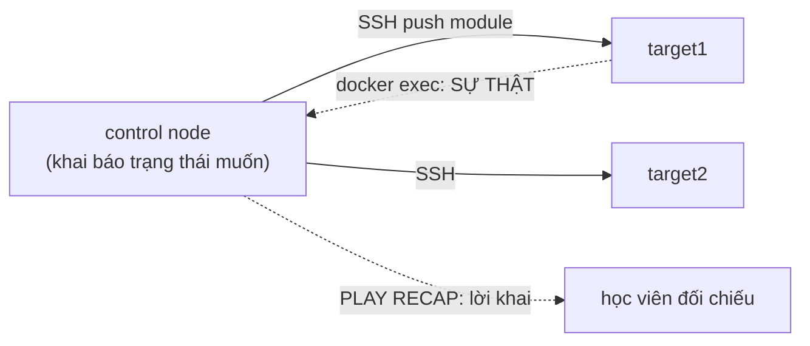
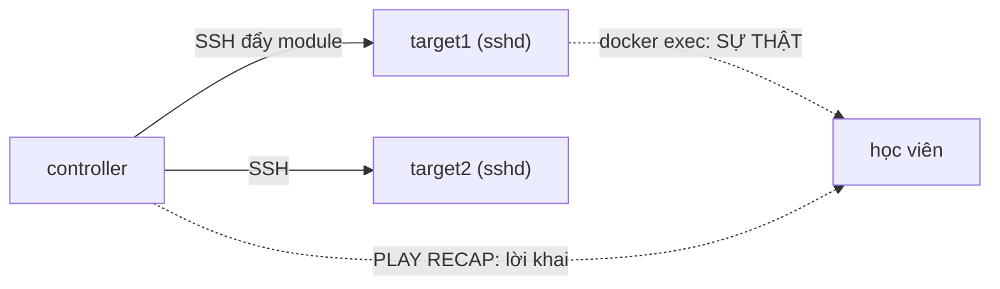


# [BÀI 01] TƯ DUY CONFIGURATION MANAGEMENT & TRIẾT LÝ AGENTLESS CỦA ANSIBLE: PUSH-BASED VS PULL-BASED & IDEMPOTENCY

Trong kỷ nguyên **Infrastructure as Code (IaC)** và tự động hóa vận hành hạ tầng đám mây (Cloud Infrastructure Automation), **Ansible** khẳng định vị thế dẫn đầu nhờ triết lý **Agentless** (không cần cài đặt agent nền trên máy đích), giao thức điều khiển an toàn qua **SSH / WinRM**, định dạng khai báo **YAML** trực quan và nguyên lý bất biến **Idempotency** mạnh mẽ. Việc làm chủ Ansible không chỉ dừng lại ở các câu lệnh Ad-hoc đơn giản, mà đòi hỏi kỹ sư phải nắm vững kiến trúc Module tầng thấp, Variable Precedence 22 tầng, Jinja2 Templates, tối ưu hóa Forks & Pipelining cho tới thiết kế Roles / Collections và tích hợp CI/CD tự động hóa chuẩn Doanh nghiệp.

Bài viết chuyên sâu này sẽ đồng hành cùng bạn mổ xẻ toàn diện bức tranh kiến trúc, phân tích các đánh đổi kỹ thuật thực chiến (Engineering Trade-offs), cung cấp hướng dẫn thực hành Lab chi tiết từng bước và bộ câu hỏi phỏng vấn chuyên sâu chuẩn DevOps / SRE Lead.

---

## 1. Bản Chất Kiến Trúc & Cơ Chế Vận Hành Tầng Thấp

> **Ansible là push-based, agentless, và idempotent: ta khai báo trạng thái muốn có, Ansible đẩy qua SSH
> lên nhiều máy cùng lúc — và chạy lại phải không đổi gì.**

Chủ đề xuyên khoá (I-10), gieo hạt từ buổi này:

> **`PLAY RECAP` báo `ok`/`changed=0` KHÔNG đảm bảo máy đích đúng trạng thái. Một playbook chạy lần hai
> vẫn `changed` thì KHÔNG phải config management thật.** Buổi này ta chạy playbook **hai lần** và kiểm
> **trên máy đích** bằng `docker exec`, không tin recap.


| Tiếng Việt | Tiếng Anh / từ khoá + FQCN (giữ nguyên) |
|---|---|
| Quản lý cấu hình | configuration management |
| Đẩy (điều khiển từ trung tâm) | push-based |
| Kéo (agent tự lấy) | pull-based |
| Không cần agent | agentless |
| Bất biến (chạy lại không đổi) | idempotent / idempotency |
| Máy điều khiển | control node |
| Máy bị quản | managed node |
| Danh sách máy | `inventory` |
| Lệnh chạy nhanh một lần | ad-hoc command |
| Kịch bản khai báo | `playbook` |
| Vở diễn (một nhóm task cho một nhóm host) | `play` |
| Việc (một module + tham số) | `task` |
| Mô-đun | `module` (ví dụ `ansible.builtin.package`) |
| Sự việc thu từ máy đích | `facts` |
| Báo cáo cuối lượt chạy | `PLAY RECAP` |
| Leo quyền | `become` |
| Tên đầy đủ của module | FQCN (fully qualified collection name) |


**Mô hình 1 — "Người quản đốc gọi điện, không cài tai nghe vào từng thợ".** Push + agentless: control node
mở SSH tới từng máy, đẩy lệnh, đóng kết nối. Máy đích **không** cần cài phần mềm Ansible (chỉ cần Python +
sshd). Trái ngược Puppet/Chef truyền thống: máy đích chạy agent tự kéo cấu hình về (pull).

**Mô hình 2 — "Chạy lần hai là bài kiểm tra thật".** Idempotency là linh hồn của config management: mô tả
trạng thái muốn (gói `nginx` phải *có*), Ansible chỉ thay khi khác. Lần một có thể `changed`; **lần hai
phải `changed=0`**. Nếu lần hai vẫn `changed`, hoặc dùng `command`/`shell` không idempotent, hoặc có lỗi
thiết kế. "Chạy lần hai" là phép thử nhanh nhất để biết playbook đúng.

**Mô hình 3 — "Recap là lời khai của Ansible, không phải sự thật của máy".** `PLAY RECAP` chỉ tổng hợp
điều **module báo cáo**. `ignore_errors` giấu lỗi, `changed_when: false` che thay đổi, nhầm inventory
chạy sai host — recap vẫn xanh. Muốn biết máy đúng chưa, hỏi **máy đích**: `docker exec ... systemctl
is-active`, `cat` file cấu hình.

### 1.1. Ba tính chất cốt lõi của Ansible

**Nguyên lý cốt lõi:** Ansible **push-based**: control node chủ động đẩy cấu hình tới managed node qua SSH tại thời
điểm ta chạy — không có tiến trình nền trên máy đích chờ kéo về.

**Giải thích cơ chế ngầm:** Kết nối do control node khởi tạo; nó gom module + tham số, chuyển lên máy đích qua SSH, chạy,
lấy kết quả, rồi đóng. Ưu điểm: kiểm soát thời điểm chính xác (chạy khi ta muốn), dễ audit. Đánh đổi: máy
đích phải bật SSH và với tới được từ control node.

> [!WARNING]
> **CẠM BẪY THỰC CHIẾN:**
> Nếu control node không SSH tới được máy đích, `ansible all -m ansible.builtin.ping`
in `UNREACHABLE! => ... Failed to connect to the host via ssh`. Đây là lỗi số một buổi đầu — kiểm SSH key
và inventory trước khi đổ lỗi cho Ansible.

**Minh hoạ.**
```bash
ansible -i inventory.ini all -m ansible.builtin.ping
# target1 | SUCCESS => { "ping": "pong" }   <- control node đẩy module ping qua SSH, chạy, trả kết quả
```

**Nguyên lý cốt lõi:** Ansible **agentless**: managed node chỉ cần **Python + sshd**, không cài phần mềm Ansible —
nên triển khai nhanh và không có agent để bảo trì/vá.

**Giải thích cơ chế ngầm:** Ansible chuyển module (mã Python) lên máy đích qua SSH, chạy bằng Python có sẵn, rồi xoá. Không
daemon thường trú. So với mô hình agent (Puppet/Chef cổ điển): không phải cài/nâng cấp/canh agent trên
hàng trăm máy — giảm bề mặt vận hành và bảo mật.

> [!WARNING]
> **CẠM BẪY THỰC CHIẾN:**
> Máy đích thiếu Python: task báo lỗi kiểu `/usr/bin/python: not found` hoặc
`The module failed to execute correctly`. Sửa bằng cách chỉ `ansible_python_interpreter=/usr/bin/python3`
trong inventory.

**Minh hoạ.**
```ini
# inventory.ini — không cần cài gì trên target ngoài python3 + sshd
[web]
target1 ansible_host=172.20.0.2 ansible_user=ansible
[all:vars]
ansible_python_interpreter=/usr/bin/python3
```

**Nguyên lý cốt lõi:** **Idempotency** là tính chất định nghĩa config management: chạy playbook lần hai trên máy đã
đúng trạng thái phải in **`changed=0`** — mô tả *trạng thái muốn*, không phải *lệnh cần chạy*.

**Giải thích cơ chế ngầm:** Module chuyên (package/service/copy/lineinfile) đọc trạng thái hiện tại rồi chỉ thay khi lệch
mong muốn. Nhờ đó chạy lại an toàn: không cài lại gói đã có, không ghi đè file đã đúng. Đây là điều làm
Ansible khác một script bash chạy mù.

> [!WARNING]
> **CẠM BẪY THỰC CHIẾN:**
> `ansible-playbook site.yml` lần hai in `changed=0` ở dòng recap là ĐẠT. Nếu một
task vẫn `changed` mỗi lần dù không ai đổi máy → task đó không idempotent (thường là `command`/`shell`),
cần sửa (QT 5.1).

**Minh hoạ.**
```bash
ansible-playbook site.yml            # lần 1: ok=3 changed=2
ansible-playbook site.yml            # lần 2 PHẢI: ok=3 changed=0   <- idempotent
```

### 1.2. Module, recap, và chủ đề "trông có vẻ xong"

**Nguyên lý cốt lõi:** Module `ansible.builtin.command`/`shell` **không có khái niệm trạng thái** nên **luôn báo
`changed`** — ưu tiên module chuyên (tự idempotent); nếu buộc dùng shell, thêm `creates`/`removes`/
`changed_when`.

**Giải thích cơ chế ngầm:** `command` chỉ chạy lệnh và không biết "đã đúng chưa", nên mỗi lần đều `changed`. Module chuyên
như `package` đọc danh sách gói rồi chỉ cài khi thiếu. Một playbook đầy `shell` là một script bash trá
hình — mất idempotency, mất giá trị Ansible.

> [!WARNING]
> **CẠM BẪY THỰC CHIẾN:**
> Chạy lần hai, `PLAY RECAP` vẫn `changed=1` ở task `shell` dù máy không cần đổi.
`ansible-playbook --check` cũng báo `changed` mỗi lần với `shell` không có `changed_when`.

**Minh hoạ.**
```yaml
- name: Tạo thư mục (idempotent nhờ module file, KHÔNG dùng shell mkdir)
  ansible.builtin.file:
    path: /opt/app
    state: directory
# Nếu buộc dùng command, chặn chạy lại bằng creates:
- name: Chạy khởi tạo một lần
  ansible.builtin.command: /opt/app/init.sh
  args: { creates: /opt/app/.initialized }
```

**Nguyên lý cốt lõi:** `PLAY RECAP` là **lời khai của Ansible**, không phải sự thật của máy: `ignore_errors`,
`changed_when: false`, hay nhầm inventory pattern đều làm recap "xanh mà sai" — phải kiểm **trên máy đích**.

**Giải thích cơ chế ngầm:** Recap tổng hợp cái module *báo cáo* cho controller. `ignore_errors: true` biến task đỏ thành
"tiếp tục", `changed_when: false` ép một task luôn `ok`, và nếu pattern chọn sai host thì recap xanh trên
host **khác** cái ta tưởng. Sự thật nằm ở máy đích.

> [!WARNING]
> **CẠM BẪY THỰC CHIẾN:**
> Recap `ok=5 changed=0 failed=0` trông đẹp, nhưng `docker exec target1 systemctl
is-active httpd` in `inactive` — dịch vụ chưa chạy. Đối chiếu recap với máy đích luôn.

**Minh hoạ.**
```bash
ansible-playbook site.yml            # recap: ok=5 changed=2 failed=0  (Ansible NÓI vậy)
docker exec ntkansible-target1 systemctl is-active httpd    # active  <- SỰ THẬT trên máy đích
```

### 1.3. Inventory và lệnh ad-hoc

**Nguyên lý cốt lõi:** **Inventory** định nghĩa *máy nào bị quản và thuộc nhóm nào*; pattern (`all`, tên nhóm, `web:!db`)
chọn tập host cho mỗi lần chạy — chọn sai pattern là chạy nhầm máy.

**Giải thích cơ chế ngầm:** Ansible không tự biết máy đích; inventory (INI/YAML) liệt kê host + biến kết nối (host, user).
Nhóm cho phép áp cấu hình theo vai trò. Pattern trên dòng lệnh/playbook quyết định host nào nhận task.

> [!WARNING]
> **CẠM BẪY THỰC CHIẾN:**
> `ansible-inventory -i inventory.ini --graph` in cây host/nhóm — nếu một host
không xuất hiện, nó không bị quản. `ansible web --list-hosts` cho biết pattern `web` khớp đúng máy nào
trước khi chạy thật.

**Minh hoạ.**
```bash
ansible-inventory -i inventory.ini --graph
# @all:
#   |--@web:
#   |  |--target1
#   |  |--target2
ansible web -i inventory.ini --list-hosts     # kiểm pattern TRƯỚC khi chạy task đổi trạng thái
```

**Nguyên lý cốt lõi:** **Ad-hoc command** chạy một module một lần không cần playbook — hợp cho việc nhanh (kiểm tra,
cài một gói); playbook hợp cho việc lặp lại, có version.

**Giải thích cơ chế ngầm:** Ad-hoc: `ansible <pattern> -m <module> -a "<args>"`. Nhanh nhưng không lưu lại, không version.
Việc gì làm hơn một lần hoặc cần review thì đưa vào playbook (đưa vào git). Cả hai dùng cùng module và cùng
tính idempotent.

> [!WARNING]
> **CẠM BẪY THỰC CHIẾN:**
> Gõ ad-hoc để đổi cấu hình prod rồi không ai biết đã làm gì — mất vết. Việc lặp
lại mà vẫn ad-hoc là dấu hiệu nên chuyển sang playbook.

**Minh hoạ.**
```bash
ansible all -i inventory.ini -m ansible.builtin.package -a "name=htop state=present" --become
ansible all -i inventory.ini -m ansible.builtin.service -a "name=chronyd state=started" --become
```

### 1.4. Ansible so với Puppet/Chef/Terraform

**Nguyên lý cốt lõi:** Ansible khác **Puppet/Chef** ở mô hình đẩy/agent: Ansible push + agentless (điều khiển từ
trung tâm, không agent); Puppet/Chef cổ điển pull + agent (máy đích chạy agent tự kéo cấu hình theo chu kỳ).

**Giải thích cơ chế ngầm:** Push cho kiểm soát thời điểm và triển khai nhanh (không cài agent). Pull cho hội tụ liên tục
(agent tự sửa drift theo chu kỳ) và mở rộng tới rất nhiều máy tốt hơn. Chọn theo bối cảnh: đội nhỏ/vừa,
cần đơn giản → Ansible; hạm đội lớn cần hội tụ liên tục → mô hình agent có lợi thế.

> [!WARNING]
> **CẠM BẪY THỰC CHIẾN:**
> Kỳ vọng Ansible tự sửa drift 24/7 như agent Puppet — sai. Ansible chỉ chạy khi
ta gọi (hoặc qua AWX/scheduler). Muốn hội tụ định kỳ, phải lên lịch (cron/AWX), không tự có.

**Minh hoạ.**
```text
Ansible : push, agentless, chạy khi gọi        -> đơn giản, nhanh triển khai
Puppet  : pull, agent, hội tụ theo chu kỳ      -> hạm đội lớn, tự sửa drift định kỳ
```

**Nguyên lý cốt lõi:** Ansible khác **Terraform** ở mục đích: Ansible = **configuration management** (cấu hình bên
trong máy đã có); Terraform = **provisioning** (tạo/huỷ hạ tầng, có state). Chúng bổ trợ, thường ghép.

**Giải thích cơ chế ngầm:** Terraform giữ state, tính diff để tạo/huỷ tài nguyên cloud. Ansible không giữ state tập trung;
mỗi lần đánh giá lại trạng thái máy qua module idempotent để cấu hình. Mẫu ghép chuẩn: Terraform dựng
VM/network → xuất IP → Ansible dùng IP làm inventory cài phần mềm.

> [!WARNING]
> **CẠM BẪY THỰC CHIẾN:**
> Dùng Ansible để "tạo và quản vòng đời" 500 tài nguyên cloud (thay Terraform) —
được nhưng đau, vì Ansible không có state/diff/plan. Dùng Terraform `provisioner` để cấu hình phần mềm
(thay Ansible) — chống thiết kế, không idempotent.

**Minh hoạ.**
```text
Terraform: aws_instance (tạo VM, có state, destroy được)
Ansible:   ansible.builtin.package / service / template (cấu hình BÊN TRONG VM)
Ghép:      terraform output -json | tạo inventory -> ansible-playbook cài phần mềm
```

### 1.5. Đưa vào việc thật (4 phút)

| Phần | Nội dung |
|---|---|
| **Áp vào hạ tầng đang có làm gì trước** | Chưa đổi máy prod. Việc làm ngay: dựng lab controller+target, `ping`, viết playbook cài một gói vô hại, tập chạy lần hai. Với máy thật, luôn `--check --diff` trên một host trước. |
| **Cái gì hỏng nếu chạy thẳng lên prod** | Task không idempotent chạy lại gây hại (restart lặp, ghi đè); nhầm inventory pattern đổi sai máy. Cách an toàn: `--limit <host>`, `--check`, chạy `serial` từng đợt. |
| **Đo trước — đo sau** | Ghi 3 số: số host `changed` lần một; số host `changed` lần hai (phải 0); số task không idempotent phát hiện được. |
| **Khi nào KHÔNG nên dùng** | Không dùng Ansible thay Terraform để quản vòng đời hàng trăm tài nguyên cloud; không dùng `shell` khi có module chuyên. |

### 1.6. Bẫy hay gặp (2 phút)

| Bẫy | Vì sao dính | Làm đúng là |
|---|---|---|
| Tin `PLAY RECAP` xanh là xong | Chỉ nhìn recap | Chạy lần hai + `docker exec` kiểm máy đích |
| Không chạy lần hai | Nghĩ một lần là đủ | Idempotency chỉ chứng minh khi chạy lần hai |
| Lạm dụng `command`/`shell` | Quen tư duy bash | Module chuyên; shell thì thêm `creates`/`changed_when` |
| `UNREACHABLE` đổ lỗi Ansible | Thực ra là SSH/inventory | Kiểm SSH key, `--list-hosts`, `ansible_host` |
| Nhầm inventory pattern | Không kiểm trước | `--list-hosts`/`--graph` trước khi chạy |
| `ignore_errors: true` khắp nơi | Cho "qua bài" | Chỉ dùng có chủ đích; đọc lỗi thật |
| Quên `--become` khi cần root | Task cài gói fail quyền | Thêm `become: true`/`--become` |
| Không FQCN, module mơ hồ | Quen tên ngắn | Dùng `ansible.builtin.copy` rõ ràng |
| Máy đích thiếu Python | Ảnh base tối giản | Chỉ `ansible_python_interpreter` |
| Tab trong YAML | Copy nhầm | Chỉ dùng dấu cách để thụt lề |
| Kỳ vọng Ansible tự sửa drift 24/7 | Nhầm với agent | Lên lịch chạy (cron/AWX) nếu cần định kỳ |
| Đổi cấu hình prod bằng ad-hoc, mất vết | Tiện tay | Việc lặp lại → playbook vào git |

### 1.7. Tóm tắt (3 phút)



**Năm điều phải nhớ:**
1. Ansible = push + agentless: control node đẩy module qua SSH, máy đích chỉ cần Python+sshd.
2. Idempotency là linh hồn: **chạy lần hai phải `changed=0`**.
3. Module chuyên idempotent; `command`/`shell` thì không — thêm `creates`/`changed_when`.
4. **`PLAY RECAP` là lời khai, không phải sự thật** — kiểm máy đích bằng `docker exec` (I-10).
5. Ansible = configuration; Terraform = provisioning; Puppet/Chef = pull+agent. Ghép, không thay thế.

### 1.8. Câu hỏi tự kiểm tra

1. Push-based và agentless nghĩa là gì? Máy đích cần cài gì?
2. Idempotency là gì? Bằng chứng cụ thể là gì?
3. Vì sao `command`/`shell` không idempotent? Sửa thế nào?
4. `PLAY RECAP` xanh có đảm bảo máy đúng không? Vì sao?
5. Ba cách làm recap "xanh mà sai"?
6. Inventory là gì? Lệnh nào kiểm pattern trước khi chạy?
7. Ad-hoc khác playbook ở đâu, khi nào dùng cái nào?
8. Ansible khác Puppet/Chef ở mô hình nào?
9. Ansible khác Terraform ở mục đích nào? Ghép thế nào?
10. `UNREACHABLE` thường do đâu, không phải do đâu?
11. Vì sao nên dùng FQCN (`ansible.builtin.copy`)?
12. Muốn kiểm dịch vụ chạy thật trên target, gõ lệnh gì?

### Đáp án

1. Push: control node chủ động đẩy cấu hình qua SSH khi ta chạy. Agentless: máy đích không cần agent Ansible, chỉ cần Python + sshd.
2. Chạy lại trên máy đã đúng không đổi gì; bằng chứng: `changed=0` ở PLAY RECAP lần hai.
3. Vì không có khái niệm trạng thái, chỉ chạy lệnh → luôn `changed`. Sửa: dùng module chuyên, hoặc thêm `creates`/`removes`/`changed_when`.
4. Không. Recap chỉ tổng hợp cái module báo cáo; `ignore_errors`/`changed_when`/nhầm host làm nó xanh mà máy sai.
5. `ignore_errors: true`, `changed_when: false`, nhầm inventory pattern chạy sai host.
6. Danh sách máy + nhóm + biến kết nối. Kiểm: `ansible-inventory --graph`, `ansible <pattern> --list-hosts`.
7. Ad-hoc chạy một module một lần, không lưu; playbook cho việc lặp lại/có version. Việc >1 lần hoặc cần review → playbook.
8. Ansible push+agentless (chạy khi gọi); Puppet/Chef pull+agent (tự kéo theo chu kỳ).
9. Ansible = configuration (cấu hình trong máy); Terraform = provisioning (tạo/huỷ hạ tầng, có state). Ghép: Terraform tạo máy → IP → Ansible cài phần mềm.
10. Do SSH/key/inventory (`ansible_host`, user, kết nối); KHÔNG phải do module hay logic playbook.
11. Rõ ràng module thuộc collection nào, tránh nhầm khi tên module trùng giữa các collection; ổn định khi bản đổi.
12. `docker exec <target> systemctl is-active <service>` (kiểm máy đích, không tin recap).

## §12. Tài liệu tham khảo

- Ansible docs — *Getting started / Intro to playbooks / Modules*, đo trên `ansible-core` bản chốt ở
  `labs/versions.env` (`ANSIBLE_CORE_VER`) và collection tương ứng.
- *Ansible vs. other tools* (so sánh push/pull, agent).

## Bảng đối soát thời lượng

| Mục | Nội dung | Thời lượng |
|---|---|---|
| §0 | Khởi động, ôn tập, luận đề | 10' |
| §1–§3 | Làm được gì, cần biết, thuật ngữ | 10' |
| §4 | Ba tính chất cốt lõi (QT 4.1–4.3) | 9' |
| §5 | Module, recap (QT 5.1–5.2) | 9' |
| §6 | Inventory, ad-hoc (QT 6.1–6.2) | 9' |
| §7 | So công cụ (QT 7.1–7.2) | 7' |
| §8–§9 | Đưa vào việc thật, bẫy | 4' |
| §10–§12 | Tóm tắt, tự kiểm, tài liệu | 2' |
| **Tổng** | | **60'** |

---

## 2. Hướng Dẫn Thực Hành & Triển Khai Lab Chuẩn Production

> [!IMPORTANT]
> **YÊU CẦU MÔI TRƯỜNG THỰC HÀNH:**
> Toàn bộ các bài thực hành dưới đây được thiết kế để chạy trực tiếp trên môi trường máy chủ Linux / Docker containers phân tán. Hãy đảm bảo bạn đã chuẩn bị Control Node cài đặt Ansible Core 2.15+ cùng các Managed Nodes đã cấu hình SSH Key Authentication.

## Khối thực hành — 150 phút

> Lab chạy trên **controller + target container SSH** (docker-compose), không tốn tiền. Nguyên tắc buổi
> này: **không tin PLAY RECAP** — chạy playbook **hai lần** (idempotency) và kiểm **trên máy đích** bằng
> `docker exec` (I-10).

## L0. Mục tiêu thực hành và tiêu chí hoàn thành

| # | Mục tiêu | Tiêu chí (kiểm bằng lệnh) |
|---|---|---|
| TH1 | Dựng lab + inventory | `ansible all -m ping` mọi target SUCCESS |
| TH2 | Chạy lệnh ad-hoc | `ansible all -m package -a "name=htop state=present"` OK |
| TH3 | Viết playbook đầu tiên | `ansible-playbook site.yml` recap `failed=0` |
| TH4 | Kiểm trạng thái **thật** máy đích | `docker exec target systemctl is-active` → `active` |
| TH5 | Chứng minh idempotency | Chạy lần hai `changed=0` |
| TH6 | Thấy `command`/`shell` không idempotent | Task shell vẫn `changed` lần hai → sửa bằng `creates` |
| TH7 | Thấy "recap xanh mà sai" | `ignore_errors` giấu lỗi; máy đích sai dù recap xanh |
| TH8 | Kiểm pattern inventory | `--list-hosts` khớp đúng máy |

## L1. Điều kiện tiên quyết về môi trường

| Kiểm tra | LỆNH | Kết quả kỳ vọng |
|---|---|---|
| ansible có | `ansible --version` | bản khớp `versions.env` |
| docker có | `docker compose ps` | target1..N `Up` |
| kết nối được | `ansible all -m ansible.builtin.ping` | mọi host `SUCCESS`/`pong` |
| inventory đúng | `ansible-inventory --graph` | đúng group/host |
| SSH key đã trao | `ssh ansible@<ip> true` | không hỏi mật khẩu |
| jq có | `jq --version` | in phiên bản |
| Python trên target | `ansible all -m ansible.builtin.setup -a 'filter=ansible_python_version'` | in bản Python |
| Thư mục làm việc | `pwd` | thư mục lab buổi 01 |

Chưa có target: `cd labs && make up && make key && make inventory && make ping`.

## L2. Kiến trúc bài lab



**Ba quyết định thiết kế:**
1. **Target là container sshd** — nhẹ, dựng nhanh, đủ để dạy push/agentless và idempotency.
2. **Kiểm bằng `docker exec`, không bằng recap** — tách "Ansible nói" khỏi "máy đích thật" (I-10).
3. **Có bước cố ý tạo task không idempotent và bước `ignore_errors`** — hai cách trực quan nhất cho thấy
   recap không đáng tin một mình.

## L3. Bước 1 — Inventory và ad-hoc (25 phút)

Tạo thư mục và inventory (hoặc dùng `make inventory` sinh sẵn):

```bash
mkdir -p ~/lab-ansible-01 && cd ~/lab-ansible-01
cp ../ntkansible/labs/inventory.ini .   # đã sinh bởi make inventory
ansible-inventory -i inventory.ini --graph
```

**CHECKPOINT 1 — `ping` tới mọi target SUCCESS.**
```bash
ansible -i inventory.ini all -m ansible.builtin.ping 2>&1 | tee ping-recap.txt | grep -q 'UNREACHABLE' \
  && echo "LỖI (có host UNREACHABLE)" || echo ĐẠT
```

**CHECKPOINT 2 — ad-hoc cài gói (idempotent) chạy được.**
```bash
ansible -i inventory.ini all -m ansible.builtin.package -a "name=htop state=present" --become >/dev/null 2>&1 \
  && echo ĐẠT || echo LỖI
```

**CHECKPOINT 3 — kiểm pattern inventory khớp đúng máy.**
```bash
ansible -i inventory.ini web --list-hosts | grep -q 'target1' && echo ĐẠT || echo LỖI
```

## L4. Bước 2 — Playbook đầu tiên (30 phút)

`site.yml` — cài và bật một dịch vụ, dùng **module chuyên** (idempotent):

```yaml
- name: Buổi 01 — cấu hình web tối giản
  hosts: web
  become: true
  tasks:
    - name: Cài gói web server
      ansible.builtin.package:
        name: "{{ 'httpd' if ansible_os_family == 'RedHat' else 'apache2' }}"
        state: present
    - name: Bật và khởi động dịch vụ
      ansible.builtin.service:
        name: "{{ 'httpd' if ansible_os_family == 'RedHat' else 'apache2' }}"
        state: started
        enabled: true
    - name: Đặt trang chủ
      ansible.builtin.copy:
        content: "ntkansible buoi 01\n"
        dest: /var/www/html/index.html
```

```bash
ansible-playbook -i inventory.ini site.yml | tee run1.txt
```

**CHECKPOINT 4 — playbook chạy không lỗi.**
```bash
grep -qE 'failed=0' run1.txt && echo ĐẠT || echo "LỖI (có task failed)"
```

## L5. Bước 3 — Kiểm trạng thái THẬT, không tin recap (20 phút)

```bash
SVC=$(docker exec ntkansible-target1 sh -c '. /etc/os-release; [ "$ID_LIKE" = fedora -o "$ID" = rocky ] && echo httpd || echo apache2')
docker exec ntkansible-target1 systemctl is-active "$SVC" | tee kiem-may-dich.txt
docker exec ntkansible-target1 cat /var/www/html/index.html
```

**CHECKPOINT 5 — dịch vụ chạy THẬT trên target (không chỉ tin PLAY RECAP).**
```bash
grep -qx 'active' kiem-may-dich.txt && echo ĐẠT || echo "LỖI (recap xanh nhưng dịch vụ không chạy?)"
```

## L6. Bước 4 — Idempotency: chạy lần hai (20 phút)

```bash
ansible-playbook -i inventory.ini site.yml | tee run2.txt
grep -E 'PLAY RECAP' -A3 run1.txt run2.txt > idempotency.txt
```

**CHECKPOINT 6 — idempotent: lần hai `changed=0`.**
```bash
tail -1 run2.txt; grep -qE 'changed=0.*failed=0' run2.txt && echo "ĐẠT (idempotent)" || echo "LỖI (chưa idempotent)"
```

## L7. Bước 5 — THỬ THÁCH: không idempotent và "recap xanh mà sai" (25 phút)

**Phần A — `shell` không idempotent.** Thêm vào `site.yml` một task shell "xấu":

```yaml
    - name: (XẤU) tạo thư mục bằng shell — luôn changed
      ansible.builtin.shell: mkdir -p /opt/app
```
```bash
ansible-playbook -i inventory.ini site.yml | tee run3.txt
```

**CHECKPOINT 7 — chứng minh task `shell` KHÔNG idempotent (vẫn `changed`), rồi sửa bằng `creates`.**
```bash
grep -qE 'changed=[1-9]' run3.txt && echo "Thấy không idempotent (đúng như dự đoán)"
# Sửa: thay bằng module file, hoặc thêm creates cho command
sed -i 's#ansible.builtin.shell: mkdir -p /opt/app#ansible.builtin.file: { path: /opt/app, state: directory }#' site.yml
ansible-playbook -i inventory.ini site.yml >/dev/null
ansible-playbook -i inventory.ini site.yml | grep -qE 'changed=0' && echo "ĐẠT (đã idempotent sau khi sửa)" || echo LỖI
```

**Phần B — `ignore_errors` giấu lỗi (recap xanh mà máy sai).** Thêm task cố ý hỏng:

```yaml
    - name: (BẪY) task hỏng bị ignore_errors giấu
      ansible.builtin.command: /bin/false
      ignore_errors: true
```
```bash
ansible-playbook -i inventory.ini site.yml | tee run4.txt
```

**CHECKPOINT 8 — recap `failed=0` NHƯNG task thực sự hỏng (bài học I-10).**
```bash
grep -qE 'failed=0' run4.txt && grep -qiE 'ignoring|fatal.*false' run4.txt \
  && echo "ĐẠT (recap failed=0 mà có lỗi bị giấu — không tin recap một mình)" || echo "LỖI"
```

> Bài học: `failed=0` không nghĩa "mọi thứ ổn" nếu có `ignore_errors`. Chỉ dùng `ignore_errors` có chủ
> đích và luôn kiểm máy đích. Gỡ hai task bẫy trước khi nộp.

## L8. Nộp sản phẩm và dọn dẹp (10 phút)

```bash
# Gỡ task bẫy, giữ site.yml sạch
cp site.yml site.yml.final
# (tuỳ chọn) đưa target về sạch cho buổi sau:
ansible -i inventory.ini all -m ansible.builtin.package -a "name=htop state=absent" --become >/dev/null 2>&1 || true
```

## L9. Xử lý sự cố thường gặp trong lab

| Triệu chứng | Nguyên nhân | Cách khắc phục |
|---|---|---|
| `UNREACHABLE ... via ssh` | Chưa trao SSH key / sai `ansible_host` | `make key`; kiểm `ssh ansible@<ip> true` |
| `/usr/bin/python: not found` | Target thiếu Python | Đặt `ansible_python_interpreter=/usr/bin/python3` |
| `Missing sudo password` | Cần become mà user không NOPASSWD | Ảnh target cấu hình sudo NOPASSWD, hoặc `--ask-become-pass` |
| Task `package` fail | Sai tên gói theo distro | Rẽ theo `ansible_os_family` (httpd vs apache2) |
| Lần hai vẫn `changed` | Task `shell`/`command` không idempotent | Module chuyên hoặc `creates`/`changed_when` |
| `FQCN` không tìm thấy | Collection chưa cài | `ansible-galaxy collection install ...` (buổi 16) |
| Tab trong YAML | Copy nhầm | Dùng dấu cách; `yamllint site.yml` |
| Nhầm host, recap xanh sai máy | Pattern sai | `--list-hosts` trước khi chạy |
| `service` không start trong container | systemd trong container hạn chế | Dùng ảnh target hỗ trợ systemd, hoặc kiểm bằng process |
| `ignore_errors` giấu lỗi thật | Đặt bừa | Bỏ; đọc lỗi; chỉ ignore có chủ đích |
| `become` thiếu ở ad-hoc | Quên `--become` | Thêm `--become` |
| `changed_when: false` che thay đổi | Copy từ mạng | Hiểu rõ trước khi dùng |
| Recap đẹp nhưng dịch vụ inactive | Tin recap | `docker exec ... systemctl is-active` |
| `docker exec` không thấy container | Sai tên | `docker ps` lấy đúng tên `ntkansible-target1` |

## L10. Bài tập mở rộng

- **BT1.** Thêm nhóm `db` vào inventory với một target; chạy task chỉ trên `web`, chứng minh `db` không đổi.
- **BT2.** Viết ad-hoc thu facts: `ansible all -m setup -a 'filter=ansible_distribution*'`; đọc distro từng target.
- **BT3.** Đổi `site.yml` dùng biến cho tên gói/dịch vụ (thay `if/else`), chạy lại, vẫn idempotent.
- **BT4.** Cố ý tạo một task `command` không idempotent rồi làm nó idempotent bằng `creates`; nộp recap hai lần chạy.
- **BT5.** Thêm `ignore_errors: true` cho một task hỏng; giải thích hai câu vì sao recap `failed=0` là nguy hiểm.
- **BT6.** Dùng `--check --diff` chạy `site.yml`; giải thích check mode làm gì và giới hạn của nó.
- **BT7.** Đo: thời gian chạy lần một vs lần hai (`time ansible-playbook ...`); giải thích.
- **BT8.** Viết `so-sanh.md`: Ansible vs Puppet vs Terraform theo 3 trục (mô hình, agent, mục đích).

## L11. Sản phẩm nộp và tiêu chí chấm điểm

| Sản phẩm | Điểm | Tiêu chí |
|---|---|---|
| `inventory.ini` + `ping-recap.txt` | 15 | Mọi target SUCCESS |
| `site.yml` (module chuyên, idempotent) | 25 | Không lỗi; dùng module chuyên; có become |
| `idempotency.txt` (recap 2 lần) | 20 | Lần hai `changed=0` |
| `kiem-may-dich.txt` (`docker exec`) | 20 | Dịch vụ `active` **thật** trên target |
| 8 CHECKPOINT in ĐẠT | 20 | Tự chạy, dán ĐẠT (gồm ca không idempotent + ignore_errors) |

**Điểm trừ:** dùng "PLAY RECAP xanh" làm bằng chứng thay vì chạy lần hai + `docker exec` → **trần điểm 1**.
Nộp playbook không idempotent (lần hai vẫn `changed` không lý do) → **trần điểm 1**.

## Bảng đối soát thời lượng

| Bước | Nội dung | Thời lượng |
|---|---|---|
| L1 | Kiểm môi trường | 10' |
| L3 | Inventory + ad-hoc | 25' |
| L4 | Playbook đầu tiên | 30' |
| L5 | Kiểm máy đích thật | 20' |
| L6 | Idempotency lần hai | 20' |
| L7 | Thử thách: không idempotent + ignore_errors | 25' |
| L2/L9/L10 | Kiến trúc, sự cố, bài tập (đan xen) | 10' |
| L8 | Nộp + dọn | 10' |
| **Tổng** | | **150'** |

---

## 3. Bộ Câu Hỏi Vấn Đáp & Phỏng Vấn Kỹ Thuật Chuyên Sâu

Dưới đây là bộ câu hỏi phỏng vấn thực chiến dành cho các vị trí **DevOps Engineer**, **Site Reliability Engineer (SRE)** và **Cloud Automation Architect**, giúp bạn tự đánh giá độ sâu hiểu biết và rèn luyện phản xạ xử lý sự cố hệ thống:

Gọi ngẫu nhiên, học viên đứng trả lời. Chấm ngay thang **0–3**: `0` không trả lời · `1` nhớ từ khoá sai
cơ chế · `2` đúng cơ chế · `3` đúng cơ chế **và** nêu lệnh/con số chứng minh. Câu 🔥 là câu tủ (≥2 phải
đạt); câu ★★★ phân loại mạnh.

**Hai lỗi làm trần điểm là 1:**
- Dùng **"PLAY RECAP xanh"** làm bằng chứng thay vì chạy lần hai + `docker exec` kiểm máy đích.
- Nộp/khẳng định một playbook **không idempotent** (chạy lần hai vẫn `changed` không lý do) là "đã xong".

## V2. Bộ câu hỏi — ĐÚNG 12 câu


<div class="qa-answer">
  <div class="qa-answer-header">
    <svg width="14" height="14" fill="none" stroke="currentColor" stroke-width="2" viewBox="0 0 24 24"><path d="M22 11.08V12a10 10 0 1 1-5.93-9.14"></path><polyline points="22 4 12 14.01 9 11.01"></polyline></svg>
    <span>Phân Tích &amp; Lời Giải Kỹ Thuật</span>
  </div>
  
Push: control node chủ động đẩy module qua SSH khi ta chạy. Agentless: máy đích <b style="color: var(--accent-primary);">không</b>
cần agent Ansible, chỉ cần <b style="color: var(--accent-primary);">Python + sshd</b>. Kết nối do control node khởi tạo, chạy xong đóng.
<b style="color: var(--accent-primary);">Tiêu chí chấm:</b> 0 sai · 1 nói "không cần agent" mà không rõ · 2 đúng push+agentless · 3 kèm "máy đích chỉ cần Python+sshd" và ví dụ <code>ping</code>.
<b style="color: var(--accent-primary);">Câu hỏi đào sâu:</b> So với Puppet cổ điển? *(Puppet pull+agent, tự kéo theo chu kỳ.)*
</div>
</details>

<div class="qa-answer">
  <div class="qa-answer-header">
    <svg width="14" height="14" fill="none" stroke="currentColor" stroke-width="2" viewBox="0 0 24 24"><path d="M22 11.08V12a10 10 0 1 1-5.93-9.14"></path><polyline points="22 4 12 14.01 9 11.01"></polyline></svg>
    <span>Phân Tích &amp; Lời Giải Kỹ Thuật</span>
  </div>
  
Chạy playbook lần hai trên máy đã đúng trạng thái <b style="color: var(--accent-primary);">không đổi gì</b>. Bằng chứng:
<code>changed=0</code> ở PLAY RECAP lần hai. Mô tả *trạng thái muốn*, không phải *lệnh cần chạy*.
<b style="color: var(--accent-primary);">Tiêu chí chấm:</b> 0 không biết · 1 "chạy lại vẫn được" · 2 nêu <code>changed=0</code> · 3 kèm cách chứng minh (chạy hai lần) và vì sao nó là linh hồn CM.
<b style="color: var(--accent-primary);">Câu hỏi đào sâu:</b> Lần hai vẫn <code>changed</code> mà không ai đổi máy — nghi gì? *(Task <code>command</code>/<code>shell</code> không idempotent.)*
</div>
</details>

<div class="qa-answer">
  <div class="qa-answer-header">
    <svg width="14" height="14" fill="none" stroke="currentColor" stroke-width="2" viewBox="0 0 24 24"><path d="M22 11.08V12a10 10 0 1 1-5.93-9.14"></path><polyline points="22 4 12 14.01 9 11.01"></polyline></svg>
    <span>Phân Tích &amp; Lời Giải Kỹ Thuật</span>
  </div>
  
Chúng không có khái niệm trạng thái, chỉ chạy lệnh → luôn <code>changed</code>. Sửa: dùng module
chuyên (idempotent), hoặc thêm <code>creates</code>/<code>removes</code>/<code>changed_when</code> để chặn chạy lại/định nghĩa "đổi".
<b style="color: var(--accent-primary);">Tiêu chí chấm:</b> 0 không biết · 1 "shell xấu" chung chung · 2 đúng lý do · 3 kèm <code>creates</code>/<code>changed_when</code> và ví dụ module chuyên thay thế.
<b style="color: var(--accent-primary);">Câu hỏi đào sâu:</b> Khi nào buộc phải dùng <code>shell</code>? *(Khi không có module chuyên; khi đó thêm creates/changed_when.)*
</div>
</details>

<div class="qa-answer">
  <div class="qa-answer-header">
    <svg width="14" height="14" fill="none" stroke="currentColor" stroke-width="2" viewBox="0 0 24 24"><path d="M22 11.08V12a10 10 0 1 1-5.93-9.14"></path><polyline points="22 4 12 14.01 9 11.01"></polyline></svg>
    <span>Phân Tích &amp; Lời Giải Kỹ Thuật</span>
  </div>
  
Không. Recap chỉ tổng hợp cái <b style="color: var(--accent-primary);">module báo cáo</b> cho controller. <code>ignore_errors</code> giấu
lỗi, <code>changed_when: false</code> che thay đổi, nhầm inventory chạy sai host — recap vẫn xanh. Kiểm máy đích:
<code>docker exec ... systemctl is-active</code>.
<b style="color: var(--accent-primary);">Tiêu chí chấm:</b> 0 "recap xanh là xong" (trần 1) · 1 mơ hồ · 2 nói recap không đủ · 3 kèm ≥2 ca xanh-mà-sai và lệnh kiểm máy đích.
<b style="color: var(--accent-primary);">Câu hỏi đào sâu:</b> Kiểm dịch vụ chạy thật bằng lệnh gì? *(<code>docker exec <target> systemctl is-active <svc></code>.)*
</div>
</details>

<div class="qa-answer">
  <div class="qa-answer-header">
    <svg width="14" height="14" fill="none" stroke="currentColor" stroke-width="2" viewBox="0 0 24 24"><path d="M22 11.08V12a10 10 0 1 1-5.93-9.14"></path><polyline points="22 4 12 14.01 9 11.01"></polyline></svg>
    <span>Phân Tích &amp; Lời Giải Kỹ Thuật</span>
  </div>
  
<code>ignore_errors: true</code> (biến task đỏ thành tiếp tục), <code>changed_when: false</code> (ép luôn <code>ok</code>),
nhầm inventory pattern (chạy đúng nhưng trên host khác cái ta tưởng).
<b style="color: var(--accent-primary);">Tiêu chí chấm:</b> 0 không biết · 1 một cách · 2 hai cách · 3 ba cách + hệ quả từng cái.
<b style="color: var(--accent-primary);">Câu hỏi đào sâu:</b> <code>ignore_errors</code> có bao giờ hợp lý không? *(Có — khi lỗi dự kiến và xử ở task sau; phải có chủ đích.)*
</div>
</details>

<div class="qa-answer">
  <div class="qa-answer-header">
    <svg width="14" height="14" fill="none" stroke="currentColor" stroke-width="2" viewBox="0 0 24 24"><path d="M22 11.08V12a10 10 0 1 1-5.93-9.14"></path><polyline points="22 4 12 14.01 9 11.01"></polyline></svg>
    <span>Phân Tích &amp; Lời Giải Kỹ Thuật</span>
  </div>
  
Danh sách máy bị quản + nhóm + biến kết nối (host, user). Pattern (<code>all</code>, tên nhóm,
<code>web:!db</code>) chọn tập host mỗi lần chạy. Kiểm: <code>ansible-inventory --graph</code>, <code>ansible <pattern> --list-hosts</code>.
<b style="color: var(--accent-primary);">Tiêu chí chấm:</b> 0 không biết · 1 "danh sách máy" · 2 đủ + pattern · 3 kèm lệnh kiểm và vì sao kiểm trước khi chạy task đổi trạng thái.
<b style="color: var(--accent-primary);">Câu hỏi đào sâu:</b> Vì sao kiểm <code>--list-hosts</code> trước? *(Tránh chạy nhầm máy — recap xanh trên sai host.)*
</div>
</details>

<div class="qa-answer">
  <div class="qa-answer-header">
    <svg width="14" height="14" fill="none" stroke="currentColor" stroke-width="2" viewBox="0 0 24 24"><path d="M22 11.08V12a10 10 0 1 1-5.93-9.14"></path><polyline points="22 4 12 14.01 9 11.01"></polyline></svg>
    <span>Phân Tích &amp; Lời Giải Kỹ Thuật</span>
  </div>
  
Ad-hoc: một module một lần (<code>ansible <pat> -m <mod> -a "..."</code>), nhanh, không lưu, không
version. Playbook: nhiều task, lặp lại được, đưa vào git. Việc >1 lần hoặc cần review → playbook.
<b style="color: var(--accent-primary);">Tiêu chí chấm:</b> 0 không biết · 1 nêu tên · 2 đúng khác biệt · 3 kèm tiêu chí chọn và "mất vết" khi ad-hoc prod.
<b style="color: var(--accent-primary);">Câu hỏi đào sâu:</b> Ad-hoc có idempotent không? *(Có nếu dùng module idempotent — cùng module với playbook.)*
</div>
</details>

<div class="qa-answer">
  <div class="qa-answer-header">
    <svg width="14" height="14" fill="none" stroke="currentColor" stroke-width="2" viewBox="0 0 24 24"><path d="M22 11.08V12a10 10 0 1 1-5.93-9.14"></path><polyline points="22 4 12 14.01 9 11.01"></polyline></svg>
    <span>Phân Tích &amp; Lời Giải Kỹ Thuật</span>
  </div>
  
Ansible push + agentless (chạy khi gọi, không agent); Puppet/Chef cổ điển pull + agent
(tự kéo theo chu kỳ). Push: đơn giản, nhanh triển khai, kiểm soát thời điểm. Pull: hội tụ liên tục, tự
sửa drift, mở rộng hạm đội lớn tốt hơn.
<b style="color: var(--accent-primary);">Tiêu chí chấm:</b> 0 "giống nhau" · 1 nói khác mà không rõ · 2 đúng push/pull · 3 kèm đánh đổi hai chiều.
<b style="color: var(--accent-primary);">Câu hỏi đào sâu:</b> Muốn Ansible hội tụ định kỳ thì sao? *(Lên lịch cron/AWX — Ansible không tự chạy nền.)*
</div>
</details>

<div class="qa-answer">
  <div class="qa-answer-header">
    <svg width="14" height="14" fill="none" stroke="currentColor" stroke-width="2" viewBox="0 0 24 24"><path d="M22 11.08V12a10 10 0 1 1-5.93-9.14"></path><polyline points="22 4 12 14.01 9 11.01"></polyline></svg>
    <span>Phân Tích &amp; Lời Giải Kỹ Thuật</span>
  </div>
  
Ansible = configuration management (cấu hình bên trong máy đã có, không state tập trung);
Terraform = provisioning (tạo/huỷ hạ tầng, có state, plan/diff). Ghép: Terraform dựng VM → xuất IP →
Ansible dùng IP làm inventory cài phần mềm.
<b style="color: var(--accent-primary);">Tiêu chí chấm:</b> 0 "giống nhau" · 1 khác mà không rõ · 2 đúng phân vai · 3 kèm mẫu ghép cụ thể.
<b style="color: var(--accent-primary);">Câu hỏi đào sâu:</b> Dùng Terraform <code>provisioner</code> cài phần mềm có nên không? *(Không — chống thiết kế, không idempotent; dùng Ansible.)*
</div>
</details>

<div class="qa-answer">
  <div class="qa-answer-header">
    <svg width="14" height="14" fill="none" stroke="currentColor" stroke-width="2" viewBox="0 0 24 24"><path d="M22 11.08V12a10 10 0 1 1-5.93-9.14"></path><polyline points="22 4 12 14.01 9 11.01"></polyline></svg>
    <span>Phân Tích &amp; Lời Giải Kỹ Thuật</span>
  </div>
  
Do <b style="color: var(--accent-primary);">SSH/inventory</b>: chưa trao key, sai <code>ansible_host</code>/user, host không tới được. KHÔNG
phải do module hay logic playbook — module còn chưa chạy được vì chưa kết nối. Kiểm <code>ssh ansible@<ip> true</code>.
<b style="color: var(--accent-primary);">Tiêu chí chấm:</b> 0 đổ lỗi module · 1 "lỗi kết nối" · 2 chỉ ra SSH/inventory · 3 kèm bước chẩn đoán (<code>ssh ... true</code>, <code>--list-hosts</code>).
<b style="color: var(--accent-primary);">Câu hỏi đào sâu:</b> Khác <code>FAILED</code> chỗ nào? *(UNREACHABLE = không kết nối được; FAILED = kết nối được nhưng task lỗi.)*
</div>
</details>

<div class="qa-answer">
  <div class="qa-answer-header">
    <svg width="14" height="14" fill="none" stroke="currentColor" stroke-width="2" viewBox="0 0 24 24"><path d="M22 11.08V12a10 10 0 1 1-5.93-9.14"></path><polyline points="22 4 12 14.01 9 11.01"></polyline></svg>
    <span>Phân Tích &amp; Lời Giải Kỹ Thuật</span>
  </div>
  
Nêu rõ module thuộc collection nào, tránh nhầm khi tên trùng giữa các collection, và ổn
định khi bản đổi (nhiều module đã rời <code>ansible.builtin</code> sang collection riêng). Rõ ràng, dễ bảo trì.
<b style="color: var(--accent-primary);">Tiêu chí chấm:</b> 0 không biết · 1 "tên đầy đủ" · 2 đúng lý do · 3 kèm ví dụ nhầm tên và bối cảnh module rời collection.
<b style="color: var(--accent-primary);">Câu hỏi đào sâu:</b> <code>ansible-doc -l</code> dùng làm gì? *(Liệt kê module có sẵn để tra FQCN đúng.)*
</div>
</details>

<div class="qa-answer">
  <div class="qa-answer-header">
    <svg width="14" height="14" fill="none" stroke="currentColor" stroke-width="2" viewBox="0 0 24 24"><path d="M22 11.08V12a10 10 0 1 1-5.93-9.14"></path><polyline points="22 4 12 14.01 9 11.01"></polyline></svg>
    <span>Phân Tích &amp; Lời Giải Kỹ Thuật</span>
  </div>
  
Dựng inventory → <code>ping</code> (SUCCESS) → viết <code>site.yml</code> module chuyên → chạy (recap
<code>failed=0</code>) → <b style="color: var(--accent-primary);">kiểm thật</b> <code>docker exec systemctl is-active</code> → chạy <b style="color: var(--accent-primary);">lần hai</b> (<code>changed=0</code>, idempotent)
→ (bẫy) thấy <code>shell</code> không idempotent → sửa bằng <code>creates</code> → thấy <code>ignore_errors</code> giấu lỗi. Ba chỗ kiểm
thật: sau chạy lần một, sau lần hai, và sau khi sửa task shell.
<b style="color: var(--accent-primary);">Tiêu chí chấm:</b> 0 kể thiếu · 1 chỉ chạy một lần · 2 đủ vòng đời · 3 đủ + ba điểm kiểm thật + bài học ignore_errors.
<b style="color: var(--accent-primary);">Câu hỏi đào sâu:</b> Nếu recap <code>failed=0</code> mà dịch vụ inactive thì kết luận gì? *(Không tin recap; có thể <code>ignore_errors</code>/nhầm host — kiểm máy đích.)*
</div>
</details>

## V3. Câu chốt để nói khi phỏng vấn

1. *"Ansible push + agentless: control node đẩy module qua SSH, máy đích chỉ cần Python và sshd — nên
   triển khai không phải cài agent trên hàng trăm máy."*
2. *"Bài kiểm tra thật của một playbook là chạy lần hai: phải `changed=0`. Nếu không, tôi tìm task
   `command`/`shell` và làm nó idempotent bằng `creates` hoặc module chuyên."*
3. *"Tôi không tin PLAY RECAP một mình — `ignore_errors` và `changed_when:false` làm nó xanh mà máy sai;
   tôi kiểm trên máy đích bằng `systemctl is-active` hoặc đọc file cấu hình."*
4. *"Ansible lo configuration, Terraform lo provisioning; tôi ghép: Terraform dựng VM rồi Ansible cài phần
   mềm — không lạm dụng `provisioner`."*

## V4. Bảng ghi điểm

| Câu | Chủ đề | Điểm 0–3 |
|---|---|---|
| 1 | Push, agentless | |
| 2 | Idempotency | |
| 3 | command/shell không idempotent | |
| 4 | PLAY RECAP không phải sự thật | |
| 5 | Ba cách xanh-mà-sai | |
| 6 | Inventory, pattern | |
| 7 | Ad-hoc vs playbook | |
| 8 | Ansible vs Puppet/Chef | |
| 9 | Ansible vs Terraform | |
| 10 | UNREACHABLE | |
| 11 | FQCN | |
| 12 | Tổng hợp | |
| **Tổng /36** | | |

Quy đổi: ≥ 30 giỏi · 24–29 khá · 18–23 đạt · < 18 chưa đạt (học lại §4–§6).

**Lỗi làm trần điểm là 1:** dùng "PLAY RECAP xanh" làm bằng chứng · khẳng định playbook không idempotent là "xong".

## V5. Bài tập về nhà

- **BTVN 1.** Viết `so-sanh.md`: Ansible vs Puppet vs Terraform (3 trục: mô hình push/pull, agent, mục đích).
- **BTVN 2.** Tự dựng lại vòng đời ở nhà, nộp recap hai lần chạy (lần hai `changed=0`) + `docker exec` kiểm dịch vụ.
- **BTVN 3.** Lấy một task `shell` bất kỳ, làm nó idempotent hai cách (module chuyên và `creates`); so sánh.
- **BTVN 4 — Chuẩn bị cho buổi 02 (đúng 3 câu):**
  1. Control node cần gì để chạy Ansible, và vì sao managed node chỉ cần Python + sshd? *(dẫn vào cài đặt + kiến trúc buổi 02)*
  2. `ansible.cfg` là gì, ba thiết lập hay dùng nhất là gì? *(dẫn vào cấu hình control node)*
  3. Lệnh ad-hoc `ansible all -m setup` trả về gì, dùng làm gì? *(dẫn vào facts, và ad-hoc sâu hơn buổi 02)*

Ba câu này dẫn vào buổi 02 — *Cài đặt, kiến trúc, lệnh ad-hoc*: control node, `ansible.cfg`, SSH,
module setup/facts, và các module ad-hoc thường dùng.

