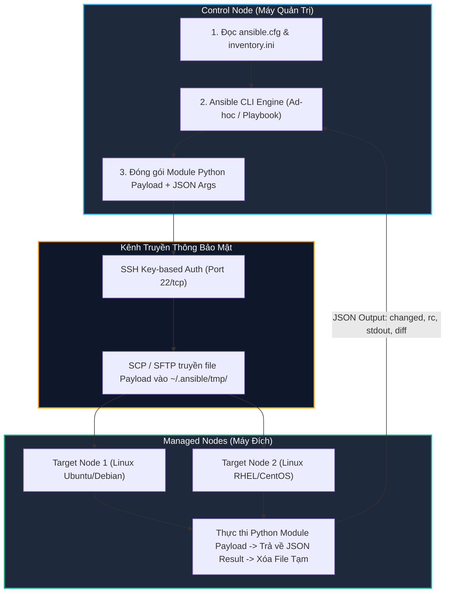
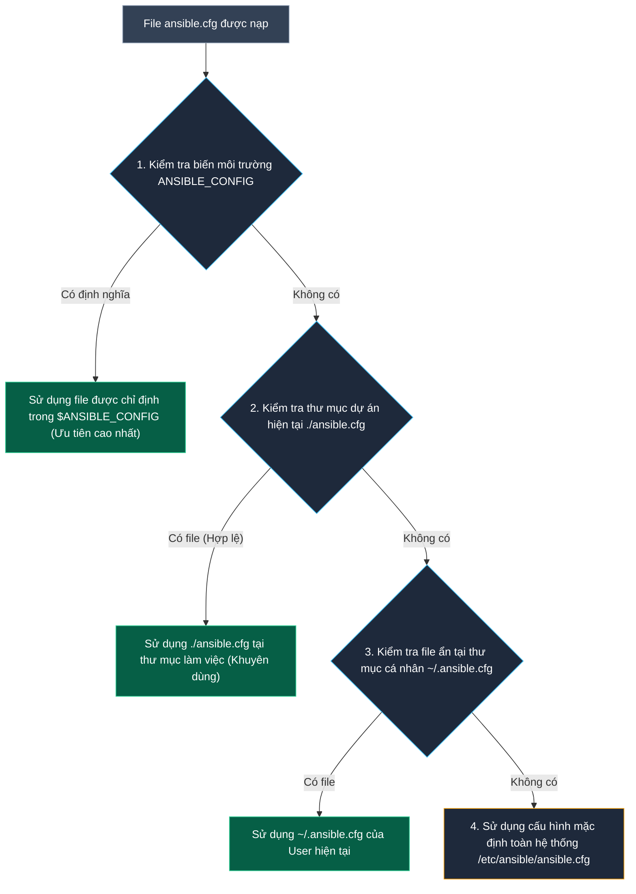
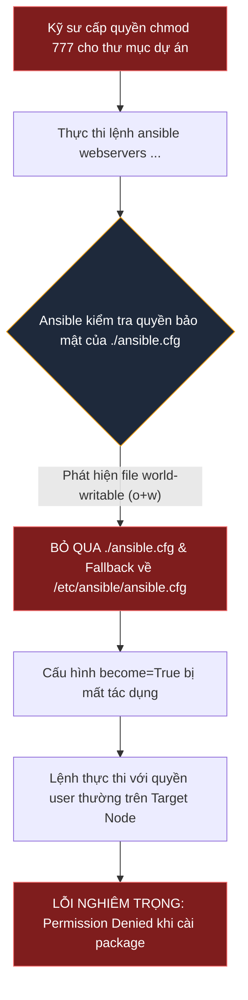
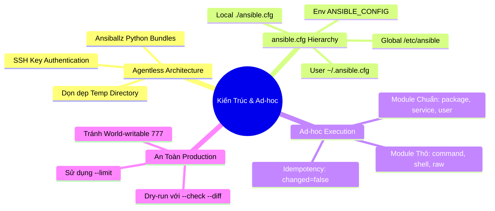


# [BÀI 02] KIẾN TRÚC ANSIBLE & LỆNH AD-HOC: CONTROL NODE, MANAGED NODES, SSH AUTHENTICATION & THỰC THI MODULE TỨC THÌ
Trong kỷ nguyên **Infrastructure as Code (IaC)** và tự động hóa vận hành hạ tầng đám mây (Cloud Infrastructure Automation), **Ansible** khẳng định vị thế dẫn đầu nhờ triết lý **Agentless** (không cần cài đặt agent nền trên máy đích), giao thức điều khiển an toàn qua **SSH / WinRM**, định dạng khai báo **YAML** trực quan và nguyên lý bất biến **Idempotency** mạnh mẽ. Việc làm chủ Ansible không chỉ dừng lại ở các câu lệnh Ad-hoc đơn giản, mà đòi hỏi kỹ sư phải nắm vững kiến trúc Module tầng thấp, Variable Precedence 22 tầng, Jinja2 Templates, tối ưu hóa Forks & Pipelining cho tới thiết kế Roles / Collections và tích hợp CI/CD tự động hóa chuẩn Doanh nghiệp.

Bài viết chuyên sâu này sẽ đồng hành cùng bạn mổ xẻ toàn diện bức tranh kiến trúc, phân tích các đánh đổi kỹ thuật thực chiến (Engineering Trade-offs), cung cấp hướng dẫn thực hành Lab chi tiết từng bước và bộ câu hỏi phỏng vấn chuyên sâu chuẩn DevOps / SRE Lead.

---

## 1. Bản Chất Kiến Trúc & Cơ Chế Vận Hành Tầng Thấp

Ansible vận hành dựa trên triết lý **Agentless Push-based Architecture**: Khác với các hệ thống quản trị cấu hình truyền thống như Puppet, Chef hay SaltStack vốn yêu cầu cài đặt và duy trì một tiến trình daemon (Agent) chạy ngầm trên từng máy đích, Ansible không cài bất kỳ phần mềm nền nào lên các node bị quản lý (Managed Nodes). 

Mọi tác vụ điều khiển từ nút quản trị (**Control Node**) đều được thực thi thông qua giao thức truyền tải bảo mật tiêu chuẩn (mặc định là **SSH** trên Linux/Unix hoặc **WinRM / PowerShell Remoting** trên Windows).



### 1.1. Kiến Trúc Agentless & Quy Trình Khởi Tạo Kết Nối SSH

Khi một lệnh Ansible Ad-hoc hoặc Task trong Playbook được kích hoạt:
1. **Khởi tạo kết nối & Xác thực (SSH Handshake):** Control Node mở phiên SSH tới Managed Node sử dụng cặp SSH Key (`id_rsa` hoặc `id_ed25519`) của tài khoản `remote_user`. Nếu cờ `host_key_checking = False` được bật, Ansible sẽ bỏ qua bước xác nhận Fingerprint thủ công.
2. **Đóng gói Payload (Ansiballz Framework):** Ansible đóng gói mã nguồn Python của module tương ứng (ví dụ: `ansible.builtin.package` hay `ansible.builtin.service`) cùng toàn bộ tham số truyền vào thành một tệp Python nén (Ansiballz bundle).
3. **Chuyển phát & Thực thi (SFTP & Remote Python):** Ansible sử dụng SFTP/SCP đẩy gói payload vào thư mục tạm `~/.ansible/tmp/ansible-tmp-xxxx/` trên máy đích. Sau đó, nó gọi trình thông dịch Python (`ansible_python_interpreter`) để thực thi payload độc lập.
4. **Thu hồi & Dọn dẹp (Cleanup & JSON Stream):** Sau khi hoàn tất, kết quả được xuất ra dạng chuỗi chuẩn JSON qua stdout/stderr (chứa các cờ `changed: true/false`, `rc`, `stdout`, `failed`), đồng thời Ansible tự động xóa sạch thư mục tạm trên máy đích để đảm bảo an toàn.

### 1.2. Thứ Tự Ưu Tiên 4 Tầng Của File Cấu Hình ansible.cfg

Ansible sử dụng cơ chế tìm kiếm cấu hình phân cấp 4 tầng để xác định các thông số vận hành (đường dẫn inventory, remote user, privilege escalation, SSH timeouts). Thứ tự ưu tiên giảm dần được định nghĩa nghiêm ngặt như sau:



> [!WARNING]
> **CẠM BẪY BẢO MẬT: WORLD-WRITABLE PERMISSIONS**
> Nếu file `./ansible.cfg` trong thư mục dự án có quyền ghi cho người dùng khác (`chmod 777` hoặc `chmod o+w`), Ansible sẽ **bỏ qua file này** vì lý do an toàn bảo mật (ngăn ngừa mã độc chèn cấu hình nâng quyền) và tự động lùi về tầng thấp hơn (`~/.ansible.cfg` hoặc `/etc/ansible/ansible.cfg`).

### 1.3. Phân Biệt Cơ Chế Module Thô (command / shell / raw) vs Module Chuẩn (package / service / user)

Trong các lệnh Ad-hoc, việc lựa chọn đúng module quyết định trực tiếp tới tính ổn định và tính bất biến (**Idempotency**) của hệ thống:
- **`ansible.builtin.command`:** Thực thi file binary trực tiếp thông qua kernel mà không nạp qua shell môi trường. Rất an toàn, nhưng không hỗ trợ ký tự ống dẫn (`|`), chuyển hướng (`>`), hay biến môi trường shell (`$VAR`).
- **`ansible.builtin.shell`:** Thực thi câu lệnh thông qua `/bin/sh -c`. Hỗ trợ đầy đủ pipe, redirect, nhưng tiềm ẩn nguy cơ **Shell Injection** và luôn đánh dấu `changed: true`.
- **`ansible.builtin.raw`:** Bỏ qua hệ thống module framework Ansiballz, đẩy trực tiếp lệnh SSH thô sang máy đích. Dùng duy nhất khi máy đích chưa cài đặt môi trường Python (Bootstraping Python).
- **Idempotent Standard Modules (`package`, `service`, `user`, `copy`, `template`):** Kiểm tra trạng thái thực tế của hệ thống trước khi ra quyết định thay đổi. Nếu tài nguyên đã ở trạng thái khai báo (`state=present`, `state=started`), module sẽ trả về `changed: false` và không làm biến đổi hệ sinh thái máy đích.

---

## 2. Bảng So Sánh Kỹ Thuật Toàn Diện (Engineering Matrix)

| Tiêu chí So Sánh | `ansible.builtin.command` | `ansible.builtin.shell` | `ansible.builtin.raw` | Module Chuẩn Idempotent (`package`/`service`/`user`) |
|---|---|---|---|---|
| **Cơ chế thực thi** | Gọi trực tiếp qua Python `subprocess` | Khởi chạy qua subshell `/bin/sh -c` | Gửi lệnh SSH thô trực tiếp | Đóng gói mã Python nghiệp vụ chuyên sâu |
| **Yêu cầu Python máy đích** | Bắt buộc (Python 3.6+) | Bắt buộc (Python 3.6+) | **Không cần Python** | Bắt buộc (Python 3.6+) |
| **Hỗ trợ Shell Pipes / Redirect** | Không hỗ trợ (`|`, `>`, `<`) | Hỗ trợ đầy đủ (`|`, `&&`, `>`, `$VAR`) | Hỗ trợ đầy đủ cú pháp shell máy đích | Xử lý nội bộ qua Logic Python |
| **Tính Bất Biến (Idempotency)** | Không (Luôn báo `changed=true`) | Không (Luôn báo `changed=true`) | Không (Luôn báo `changed=true`) | **Đạt chuẩn 100%** (Chạy lại `changed=false`) |
| **Nguy cơ An Ninh & Lỗ Hổng** | Thấp (Không bị Shell Injection) | Cao (Rủi ro nếu biến đầu vào chưa sanitize) | Cao (Lệnh thô khó kiểm soát) | Rất an toàn (Được kiểm định từ cộng đồng) |
| **Trường hợp sử dụng chuẩn** | Chạy binary độc lập một lần (`df -h`, `uptime`) | Xử lý chuỗi lệnh phức tạp có regex/pipe | Bootstrap cài đặt Python trên máy đích mới | Quản trị hạ tầng sản xuất chuẩn Enterprise |

> [!IMPORTANT]
> **TIÊU CHUẨN SẢN XUẤT CHO LỆNH AD-HOC:**
> Tuyệt đối không sử dụng lệnh ad-hoc chứa module `shell` hoặc `command` để cấu hình hệ thống máy chủ Production. Mọi thao tác cấu hình phải sử dụng các module định danh chuẩn FQCN (`ansible.builtin.package`, `ansible.builtin.systemd`, `ansible.builtin.copy`) để đảm bảo không tạo ra rủi ro thay đổi ngoài ý muốn khi chạy lại nhiều lần.

---

## 3. Kiến Trúc Triển Khai Chuẩn Production (Configuration Breakdown)

Dưới đây là kiến trúc tệp cấu hình trung tâm `ansible.cfg` và tệp định danh hạ tầng `inventory.ini` chuẩn hóa cho dự án tự động hóa doanh nghiệp:

```ini
# ==============================================================================
# FILE: ./ansible.cfg (Cấu hình trọng tâm dự án Ansible)
# ==============================================================================
[defaults]
# 1. Đường dẫn tệp Inventory mặc định của dự án
inventory               = ./inventory.ini

# 2. Tài khoản người dùng thiết lập kết nối SSH ban đầu
remote_user             = ansible

# 3. Tệp khóa SSH Private Key xác thực
private_key_file        = ~/.ssh/id_ed25519

# 4. Tắt xác thực Fingerprint SSH lần đầu (Khuyên dùng cho Lab/CI/CD)
host_key_checking       = False

# 5. Số luồng xử lý song song đồng thời (Mặc định 5, Production nâng lên 20-50)
forks                   = 10

# 6. Thời gian timeout tối đa cho kết nối SSH (giây)
timeout                 = 30

# 7. Vô hiệu hóa việc tạo file retry khi Playbook thất bại
retry_files_enabled     = False

# 8. Kích hoạt hiển thị thời gian thực thi từng task
callbacks_enabled       = ansible.posix.profile_tasks

[privilege_escalation]
# Kích hoạt leo quyền quản trị sudo tự động
become                  = True
become_method           = sudo
become_user             = root
become_ask_pass         = False

[ssh_connection]
# Tối ưu hóa hiệu năng SSH bằng cách truyền trực tiếp lệnh qua kết nối mở sẵn
pipelining              = True
ssh_args                = -o ControlMaster=auto -o ControlPersist=60s
```

```ini
# ==============================================================================
# FILE: ./inventory.ini (Khai báo nhóm máy chủ & biến kết nối)
# ==============================================================================
[webservers]
web-node-01 ansible_host=192.168.1.101 ansible_port=22
web-node-02 ansible_host=192.168.1.102 ansible_port=22

[dbservers]
db-node-01  ansible_host=192.168.1.201 ansible_port=22

[all:vars]
# Khai báo tường minh trình thông dịch Python trên các Target Nodes
ansible_python_interpreter = /usr/bin/python3
```

### Phân Tích Kỹ Thuật Từng Dòng (Line-by-Line Breakdown):

- <span style="color:#38bdf8;font-weight:bold;">[defaults] &bull; inventory = ./inventory.ini</span>: Thiết lập đường dẫn tương đối trỏ trực tiếp vào inventory của dự án, giải phóng kỹ sư khỏi việc phải truyền cờ `-i inventory.ini` trong mỗi câu lệnh Ad-hoc.
- <span style="color:#38bdf8;font-weight:bold;">host_key_checking = False</span>: Vô hiệu hóa việc SSH tương tác chờ người dùng nhập `yes` khi máy đích có Fingerprint mới, đảm bảo pipeline tự động hóa không bị treo vô hạn.
- <span style="color:#f59e0b;font-weight:bold;">[privilege_escalation] &bull; become = True</span>: Tự động chèn cờ `sudo` trước mọi lệnh thực thi trên máy đích, cho phép tài khoản không đặc quyền (`ansible`) thực hiện các tác vụ quản trị hệ thống mức `root`.
- <span style="color:#10b981;font-weight:bold;">pipelining = True</span>: Kỹ thuật tối ưu hóa giảm thiểu số lần mở phiên SSH bằng cách pipe trực tiếp code Python vào stdin của SSH process thay vì phải SCP file tạm, giúp tốc độ thực thi lệnh Ad-hoc tăng gấp 2–4 lần.

---

## 4. Phân Tích Cạm Bẫy Thực Chiến: Quyền Ghi World-Writable & Lạm Dụng Shell Thô

### Tình Huống Sự Cố Thực Tế Tại Doanh Nghiệp:
Một đội ngũ DevOps cấu hình một tệp `ansible.cfg` trong repository chứa mã nguồn dự án để chuẩn hóa các tham số `become = True` và `remote_user = deployer`. Để tiện cho các thành viên trong nhóm sửa đổi trên máy chủ CI/CD chung, một kỹ sư đã vô tình thực hiện lệnh `chmod 777 -R .`. 

Khi thực thi pipeline deploy ứng dụng, lệnh Ad-hoc nâng cấp gói phần mềm `ansible webservers -m ansible.builtin.package -a "name=nginx state=latest"` bị thất bại với lỗi `Permission denied: Need root access`. 



### Hậu Quả & Log Lỗi Thực Tế:
Ansible bỏ qua file cấu hình cục bộ mà không dừng tiến trình, dẫn tới việc hệ thống fallback về cấu hình mặc định không có `become = True`:

```diff
- [WARNING]: Ansible is being run in a world writable directory (/home/devops/deploy), ignoring config file: /home/devops/deploy/ansible.cfg
web-node-01 | FAILED! => {
    "ansible_facts": {
        "discovered_interpreter_python": "/usr/bin/python3"
    },
    "changed": false,
-   "msg": "This command has to be run under the root user.",
    "results": []
}
```

### 5-Whys Root Cause Analysis:

1. **Tại sao lệnh cài package bị từ chối quyền?** Vì tiến trình chạy trên máy đích dưới danh nghĩa user `deployer` mà không được nâng quyền `sudo root`.
2. **Tại sao quyền sudo không được kích hoạt dù đã cấu hình `become = True` trong file `ansible.cfg`?** Vì Ansible đã hoàn toàn bỏ qua file `./ansible.cfg` tại thư mục hiện tại.
3. **Tại sao Ansible lại bỏ qua file cấu hình của dự án?** Vì tệp `ansible.cfg` đang có quyền ghi cho người dùng khác (`world-writable`).
4. **Tại sao Ansible có cơ chế từ chối file cấu hình world-writable?** Để ngăn chặn lỗ hổng bảo mật leo thang đặc quyền, khi một người dùng bất kỳ trên máy chủ có thể chỉnh sửa `ansible.cfg` để chèn script độc hại khi quản trị viên chạy lệnh.
5. **<span style="color:#10b981;font-weight:bold;">Root Cause Remedy:</span>** Thiết lập lại phân quyền chặt chẽ cho tệp cấu hình bằng lệnh `chmod 644 ./ansible.cfg` và quản lý phân quyền thư mục dự án tối đa ở mức `755`.

---

## 5. Hands-on Lab: Khởi Tạo Control Node & Vận Hành Lệnh Ad-Hoc (8 Bước)

| Bước | Lệnh CLI | Mục Đích Thực Thi |
|---|---|---|
| **Bước 1** | `mkdir -p ~/lab-ansible-02 && cd ~/lab-ansible-02` | Khởi tạo không gian làm việc cho dự án quản trị Ad-hoc |
| **Bước 2** | `cat << 'EOF' > ansible.cfg ...` | Thiết lập file cấu hình `ansible.cfg` với cơ chế `become` và `host_key_checking` |
| **Bước 3** | `chmod 644 ansible.cfg` | Khóa phân quyền file cấu hình ngăn chặn bẫy world-writable |
| **Bước 4** | `ansible --version` | Xác minh Ansible nạp đúng file `./ansible.cfg` của dự án |
| **Bước 5** | `ansible all -m ansible.builtin.ping` | Kiểm tra kết nối SSH và môi trường Python trên toàn bộ hạ tầng |
| **Bước 6** | `ansible all -m ansible.builtin.setup -a "filter=ansible_distribution*"` | Thu thập thông tin thực tế hệ điều hành bằng module Facts |
| **Bước 7** | `ansible all -m ansible.builtin.package -a "name=curl state=present"` | Cài đặt phần mềm và kiểm tra tính Idempotency khi chạy lại lần 2 |
| **Bước 8** | `ansible all -m ansible.builtin.service -a "name=sshd state=started enabled=yes"` | Quản trị dịch vụ hệ thống và xác thực trạng thái qua Ad-hoc |

```bash
# ------------------------------------------------------------------------------
# BƯỚC 1: Khởi tạo thư mục dự án và tệp Inventory
# ------------------------------------------------------------------------------
mkdir -p ~/lab-ansible-02 && cd ~/lab-ansible-02

cat << 'EOF' > inventory.ini
[webservers]
target1 ansible_host=127.0.0.1 ansible_port=2221

[dbservers]
target2 ansible_host=127.0.0.1 ansible_port=2222

[all:vars]
ansible_python_interpreter=/usr/bin/python3
EOF

# ------------------------------------------------------------------------------
# BƯỚC 2 & 3: Tạo file cấu hình ansible.cfg chuẩn và phân quyền
# ------------------------------------------------------------------------------
cat << 'EOF' > ansible.cfg
[defaults]
inventory = ./inventory.ini
remote_user = ansible
host_key_checking = False
private_key_file = ~/.ssh/id_ed25519

[privilege_escalation]
become = True
become_method = sudo
become_user = root
become_ask_pass = False
EOF

chmod 644 ansible.cfg

# ------------------------------------------------------------------------------
# BƯỚC 4: Xác thực file cấu hình đang được nạp
# ------------------------------------------------------------------------------
ansible --version | grep "config file"
# Kết quả kỳ vọng: config file = /home/.../lab-ansible-02/ansible.cfg

# ------------------------------------------------------------------------------
# BƯỚC 5: Kiểm tra kết nối Ad-hoc Ping
# ------------------------------------------------------------------------------
ansible all -m ansible.builtin.ping

# ------------------------------------------------------------------------------
# BƯỚC 6: Thu thập thông tin phần cứng/hệ điều hành
# ------------------------------------------------------------------------------
ansible all -m ansible.builtin.setup -a "filter=ansible_distribution*"

# ------------------------------------------------------------------------------
# BƯỚC 7: Cài đặt gói curl và chứng minh tính Idempotency
# ------------------------------------------------------------------------------
# Chạy lần 1 (Áp đặt thay đổi -> Báo SUCCESS kèm "changed": true)
ansible all -m ansible.builtin.package -a "name=curl state=present"

# Chạy lần 2 (Đã tồn tại -> Báo SUCCESS kèm "changed": false)
ansible all -m ansible.builtin.package -a "name=curl state=present"

# ------------------------------------------------------------------------------
# BƯỚC 8: Khởi chạy và kích hoạt dịch vụ tự khởi động cùng hệ thống
# ------------------------------------------------------------------------------
ansible webservers -m ansible.builtin.service -a "name=sshd state=started enabled=yes"
```

---

## 6. Bộ Câu Hỏi Vấn Đáp & Phỏng Vấn Chuyên Sâu (Self-Check Q&A)

<details class="qa-card">
  <summary class="qa-summary">
    <span class="qa-num-badge">Q01</span>
    <span class="qa-question-text">Trình bày chi tiết thứ tự ưu tiên 4 tầng khi Ansible tìm kiếm file cấu hình ansible.cfg. Làm sao biết hệ thống đang dùng file nào?</span>
  </summary>
  <div class="qa-answer">
    <div class="qa-answer-header">
      <svg width="14" height="14" fill="none" stroke="currentColor" stroke-width="2" viewBox="0 0 24 24"><path d="M22 11.08V12a10 10 0 1 1-5.93-9.14"></path><polyline points="22 4 12 14.01 9 11.01"></polyline></svg>
      <span>Phân Tích &amp; Lời Giải Kỹ Thuật</span>
    </div>
    Ansible tìm kiếm theo thứ tự ưu tiên giảm dần: (1) Biến môi trường <code>ANSIBLE_CONFIG</code>, (2) File <code>./ansible.cfg</code> tại thư mục hiện tại, (3) File ẩn <code>~/.ansible.cfg</code> tại thư mục cá nhân người dùng, (4) File cấu hình mặc định hệ thống <code>/etc/ansible/ansible.cfg</code>. Để biết chính xác file đang được áp dụng, chạy lệnh <code>ansible --version</code> và quan sát dòng <code>config file = ...</code>.
    <div style="margin-top: 0.5rem;"><b style="color: var(--accent-cyan);">&bull; Tiêu chí chấm:</b> 0 không nêu được &bull; 1 nhớ 2-3 tầng sai thứ tự &bull; 2 đúng 4 tầng &bull; 3 đúng 4 tầng + nêu lệnh <code>ansible --version</code> và bẫy <code>chmod 777</code>.</div>
    <div><b style="color: var(--accent-rose);">&bull; Câu hỏi đào sâu:</b> Nếu file <code>./ansible.cfg</code> bị gán quyền <code>chmod 777</code>, Ansible sẽ xử lý thế nào? <i>(Bỏ qua file đó vì lý do an toàn bảo mật và tự động lùi về dùng file tầng thấp hơn.)</i></div>
  </div>
</details>

<details class="qa-card">
  <summary class="qa-summary">
    <span class="qa-num-badge">Q02</span>
    <span class="qa-question-text">Tại sao Ansible không cần cài agent trên máy đích nhưng vẫn quản trị được? Việc gán host_key_checking = False có tác dụng gì?</span>
  </summary>
  <div class="qa-answer">
    <div class="qa-answer-header">
      <svg width="14" height="14" fill="none" stroke="currentColor" stroke-width="2" viewBox="0 0 24 24"><path d="M22 11.08V12a10 10 0 1 1-5.93-9.14"></path><polyline points="22 4 12 14.01 9 11.01"></polyline></svg>
      <span>Phân Tích &amp; Lời Giải Kỹ Thuật</span>
    </div>
    Ansible là công cụ agentless, sử dụng giao thức SSH tiêu chuẩn để kết nối và tự động đẩy các module Python ngắn hạn lên máy đích thực thi, sau đó dọn dẹp file tạm. Máy đích chỉ cần dịch vụ <code>sshd</code> và môi trường Python 3. Cờ <code>host_key_checking = False</code> trong <code>ansible.cfg</code> giúp bỏ qua bước xác nhận Fingerprint SSH thủ công (gõ <code>yes</code>), giúp các kịch bản tự động hóa hoặc kịch bản thử nghiệm lab chạy mượt mà không bị treo vô hạn.
    <div style="margin-top: 0.5rem;"><b style="color: var(--accent-cyan);">&bull; Tiêu chí chấm:</b> 0 trả lời có agent ngầm &bull; 1 nêu SSH nhưng thiếu Python &bull; 2 đủ SSH + Python + host_key_checking &bull; 3 đủ + phân tích rủi ro bảo mật trên production.</div>
    <div><b style="color: var(--accent-rose);">&bull; Câu hỏi đào sâu:</b> Nếu máy đích là Linux minimal thiếu Python 3, lệnh ad-hoc <code>ping</code> có chạy được không? <i>(Không, phải dùng module <code>ansible.builtin.raw</code> để cài Python 3 trước.)</i></div>
  </div>
</details>

<details class="qa-card">
  <summary class="qa-summary">
    <span class="qa-num-badge">Q03</span>
    <span class="qa-question-text">Cơ chế become trong Ansible hoạt động thế nào? Sự khác biệt giữa remote_user và become_user là gì?</span>
  </summary>
  <div class="qa-answer">
    <div class="qa-answer-header">
      <svg width="14" height="14" fill="none" stroke="currentColor" stroke-width="2" viewBox="0 0 24 24"><path d="M22 11.08V12a10 10 0 1 1-5.93-9.14"></path><polyline points="22 4 12 14.01 9 11.01"></polyline></svg>
      <span>Phân Tích &amp; Lời Giải Kỹ Thuật</span>
    </div>
    Cơ chế <code>become</code> cho phép Ansible thực hiện privilege escalation (nâng quyền) trên target node, mặc định sử dụng công cụ <code>sudo</code>. <code>remote_user</code> là tài khoản dùng để thiết lập kết nối SSH ban đầu từ Control node sang Target node (ví dụ: <code>ansible</code>), còn <code>become_user</code> là tài khoản mà lệnh đó sẽ leo quyền tới trên máy đích để thực thi tác vụ (mặc định là <code>root</code>).
    <div style="margin-top: 0.5rem;"><b style="color: var(--accent-cyan);">&bull; Tiêu chí chấm:</b> 0 nhầm become là SSH password &bull; 1 biết là sudo nhưng không phân biệt user &bull; 2 phân biệt đúng &bull; 3 nêu đủ + cấu hình ansible.cfg và sudoers.</div>
    <div><b style="color: var(--accent-rose);">&bull; Câu hỏi đào sâu:</b> Muốn chạy lệnh ad-hoc leo quyền root không bị hỏi password sudo thì cần cấu hình gì? <i>(Cấu hình <code>NOPASSWD: ALL</code> trong <code>/etc/sudoers.d/ansible</code>.)</i></div>
  </div>
</details>

<details class="qa-card">
  <summary class="qa-summary">
    <span class="qa-num-badge">Q04</span>
    <span class="qa-question-text">Phân tích cú pháp tiêu chuẩn của một lệnh ad-hoc Ansible. Khi nào nên dùng lệnh ad-hoc thay vì viết Playbook?</span>
  </summary>
  <div class="qa-answer">
    <div class="qa-answer-header">
      <svg width="14" height="14" fill="none" stroke="currentColor" stroke-width="2" viewBox="0 0 24 24"><path d="M22 11.08V12a10 10 0 1 1-5.93-9.14"></path><polyline points="22 4 12 14.01 9 11.01"></polyline></svg>
      <span>Phân Tích &amp; Lời Giải Kỹ Thuật</span>
    </div>
    Cú pháp tiêu chuẩn: <code>ansible &lt;pattern&gt; -m &lt;module&gt; -a "&lt;arguments&gt;" [options]</code>. Lệnh ad-hoc nên được sử dụng cho các công việc quản trị một lần (one-off tasks), nhanh chóng, mang tính kiểm tra/truy vấn (ví dụ: reboot nhóm máy, kiểm tra dung lượng đĩa, cập nhật bản vá khẩn cấp). Khi công việc gồm chuỗi nhiều bước phức tạp có phụ thuộc lẫn nhau, bắt buộc phải dùng Playbook.
    <div style="margin-top: 0.5rem;"><b style="color: var(--accent-cyan);">&bull; Tiêu chí chấm:</b> 0 sai cú pháp &bull; 1 đúng cú pháp thiếu ngữ cảnh &bull; 2 so sánh chuẩn &bull; 3 nêu đúng + ví dụ thực tế.</div>
    <div><b style="color: var(--accent-rose);">&bull; Câu hỏi đào sâu:</b> Nếu không truyền tham số <code>-m</code>, Ansible sử dụng module mặc định nào? <i>(Module <code>ansible.builtin.command</code>.)</i></div>
  </div>
</details>

<details class="qa-card">
  <summary class="qa-summary">
    <span class="qa-num-badge">Q05</span>
    <span class="qa-num-badge">Q05</span>
    <span class="qa-question-text">Module ansible.builtin.ping khác gì với câu lệnh ping truyền thống của hệ điều hành?</span>
  </summary>
  <div class="qa-answer">
    <div class="qa-answer-header">
      <svg width="14" height="14" fill="none" stroke="currentColor" stroke-width="2" viewBox="0 0 24 24"><path d="M22 11.08V12a10 10 0 1 1-5.93-9.14"></path><polyline points="22 4 12 14.01 9 11.01"></polyline></svg>
      <span>Phân Tích &amp; Lời Giải Kỹ Thuật</span>
    </div>
    Lệnh <code>ping</code> của hệ điều hành sử dụng giao thức ICMP để kiểm tra thông mạng ở tầng network. Module <code>ansible.builtin.ping</code> của Ansible thực hiện một chuỗi thao tác thực tế: mở kết nối SSH, xác thực tài khoản, đẩy một đoạn mã Python nhỏ lên máy đích, thực thi mã Python đó và nhận phản hồi <code>pong</code>. Do đó, <code>ansible ping</code> thành công chứng minh toàn bộ chuỗi SSH + Python + Quyền thi hành đã sẵn sàng.
    <div style="margin-top: 0.5rem;"><b style="color: var(--accent-cyan);">&bull; Tiêu chí chấm:</b> 0 coi hai lệnh là một &bull; 1 biết dùng SSH thiếu Python &bull; 2 phân biệt chuẩn &bull; 3 phân biệt chuẩn + tình huống ICMP thông nhưng Ansible ping lỗi.</div>
    <div><b style="color: var(--accent-rose);">&bull; Câu hỏi đào sâu:</b> Nếu target host chặn hoàn toàn giao thức ICMP, lệnh <code>ansible all -m ping</code> có chạy thành công không? <i>(Vẫn thành công bình thường vì Ansible dùng SSH port 22 chứ không dùng ICMP.)</i></div>
  </div>
</details>

<details class="qa-card">
  <summary class="qa-summary">
    <span class="qa-num-badge">Q06</span>
    <span class="qa-question-text">So sánh bản chất và trường hợp sử dụng của 3 module: command, shell, và raw.</span>
  </summary>
  <div class="qa-answer">
    <div class="qa-answer-header">
      <svg width="14" height="14" fill="none" stroke="currentColor" stroke-width="2" viewBox="0 0 24 24"><path d="M22 11.08V12a10 10 0 1 1-5.93-9.14"></path><polyline points="22 4 12 14.01 9 11.01"></polyline></svg>
      <span>Phân Tích &amp; Lời Giải Kỹ Thuật</span>
    </div>
    <code>command</code> chạy trực tiếp file thực thi không qua shell (an toàn, không hỗ trợ pipe <code>|</code>, redirect <code>&gt;</code>). <code>shell</code> thực thi câu lệnh thông qua <code>/bin/sh</code> trên máy đích (hỗ trợ đầy đủ pipe, redirect, biến môi trường shell). <code>raw</code> gửi câu lệnh SSH thô trực tiếp mà không cần sự tồn tại của Python trên máy đích (dùng bootstrap cài Python). Cả 3 module này đều luôn báo <code>CHANGED</code> và không idempotent tự nhiên.
    <div style="margin-top: 0.5rem;"><b style="color: var(--accent-cyan);">&bull; Tiêu chí chấm:</b> 0 không phân biệt được &bull; 1 nêu được pipe &bull; 2 phân biệt đúng 3 module &bull; 3 giải thích rủi ro Shell Injection &amp; tính Idempotency.</div>
    <div><b style="color: var(--accent-rose);">&bull; Câu hỏi đào sâu:</b> Tại sao Ansible khuyến cáo nên hạn chế tối đa việc dùng <code>shell</code> trong tự động hóa? <i>(Vì không có tính bất biến, dễ gây side-effects khi chạy lại và có rủi ro Shell Injection.)</i></div>
  </div>
</details>

<details class="qa-card">
  <summary class="qa-summary">
    <span class="qa-num-badge">Q07</span>
    <span class="qa-question-text">Tại sao nên dùng module ansible.builtin.package thay vì gọi lệnh apt hay dnf qua ad-hoc shell?</span>
  </summary>
  <div class="qa-answer">
    <div class="qa-answer-header">
      <svg width="14" height="14" fill="none" stroke="currentColor" stroke-width="2" viewBox="0 0 24 24"><path d="M22 11.08V12a10 10 0 1 1-5.93-9.14"></path><polyline points="22 4 12 14.01 9 11.01"></polyline></svg>
      <span>Phân Tích &amp; Lời Giải Kỹ Thuật</span>
    </div>
    Module <code>package</code> là module trừu tượng hóa (abstraction module). Nó tự động phát hiện trình quản lý gói của hệ điều hành đích (RHEL dùng <code>dnf</code>, Ubuntu dùng <code>apt</code>). Quan trọng nhất, <code>package</code> kiểm tra trạng thái gói trước khi thực hiện. Nếu gói đã được cài đúng <code>state=present</code>, module sẽ giữ nguyên và báo <code>changed=false</code> (idempotent), trong khi gọi lệnh shell <code>apt-get install</code> sẽ luôn làm thay đổi hệ thống và báo <code>CHANGED</code>.
    <div style="margin-top: 0.5rem;"><b style="color: var(--accent-cyan);">&bull; Tiêu chí chấm:</b> 0 coi như nhau &bull; 1 nêu tính đa nền tảng thiếu Idempotency &bull; 2 nêu đủ cả hai &bull; 3 nêu đủ + minh họa output changed=false lần 2.</div>
    <div><b style="color: var(--accent-rose);">&bull; Câu hỏi đào sâu:</b> Tham số <code>state=latest</code> khác <code>state=present</code> ở điểm nào? <i>(<code>present</code> chỉ cần gói đã cài là dừng, <code>latest</code> sẽ nâng cấp gói lên bản mới nhất nếu có.)</i></div>
  </div>
</details>

<details class="qa-card">
  <summary class="qa-summary">
    <span class="qa-num-badge">Q08</span>
    <span class="qa-question-text">Khi dùng ad-hoc module ansible.builtin.service, làm sao để đảm bảo dịch vụ vừa được khởi chạy vừa tự động bật khi reboot máy?</span>
  </summary>
  <div class="qa-answer">
    <div class="qa-answer-header">
      <svg width="14" height="14" fill="none" stroke="currentColor" stroke-width="2" viewBox="0 0 24 24"><path d="M22 11.08V12a10 10 0 1 1-5.93-9.14"></path><polyline points="22 4 12 14.01 9 11.01"></polyline></svg>
      <span>Phân Tích &amp; Lời Giải Kỹ Thuật</span>
    </div>
    Truyền đồng thời hai tham số trong thuộc tính <code>-a</code>: <code>state=started</code> (để đảm bảo dịch vụ đang chạy ở thời điểm hiện tại) và <code>enabled=yes</code> (để cấu hình init system/systemd tự động kích hoạt dịch vụ cùng hệ thống khi khởi động).
    <div style="margin-top: 0.5rem;"><b style="color: var(--accent-cyan);">&bull; Tiêu chí chấm:</b> 0 không biết tham số &bull; 1 nhớ state=started quên enabled &bull; 2 nêu đúng cả hai &bull; 3 nêu đúng + lệnh đối soát docker exec.</div>
    <div><b style="color: var(--accent-rose);">&bull; Câu hỏi đào sâu:</b> Nếu dịch vụ đã chạy và đã <code>enabled=yes</code>, khi gõ lại lệnh ad-hoc đó Ansible trả về kết quả gì? <i>(Trả về <code>SUCCESS</code> với <code>changed=false</code> do đã đạt đúng trạng thái.)</i></div>
  </div>
</details>

<details class="qa-card">
  <summary class="qa-summary">
    <span class="qa-num-badge">Q09</span>
    <span class="qa-question-text">Làm thế nào để tạo một tài khoản người dùng appuser kèm file cấu hình riêng bằng ad-hoc module mà không làm đứt gãy hệ thống khi chạy lại?</span>
  </summary>
  <div class="qa-answer">
    <div class="qa-answer-header">
      <svg width="14" height="14" fill="none" stroke="currentColor" stroke-width="2" viewBox="0 0 24 24"><path d="M22 11.08V12a10 10 0 1 1-5.93-9.14"></path><polyline points="22 4 12 14.01 9 11.01"></polyline></svg>
      <span>Phân Tích &amp; Lời Giải Kỹ Thuật</span>
    </div>
    Sử dụng module <code>ansible.builtin.user</code> với tham số <code>name=appuser state=present</code> để tạo user, sau đó dùng module <code>ansible.builtin.copy</code> với <code>content='...' dest=/etc/app.conf mode='0644'</code>. Cả hai module này đều tự động kiểm tra dữ liệu cũ trên máy đích, nếu thông tin đã trùng khớp sẽ không tạo lại hay ghi đè lãng phí, đảm bảo tính Idempotency.
    <div style="margin-top: 0.5rem;"><b style="color: var(--accent-cyan);">&bull; Tiêu chí chấm:</b> 0 trả lời dùng useradd qua shell &bull; 1 biết module thiếu mode &bull; 2 nêu đúng &bull; 3 nêu đúng + cơ chế so sánh md5 hash của copy.</div>
    <div><b style="color: var(--accent-rose);">&bull; Câu hỏi đào sâu:</b> Nếu file <code>/etc/app.conf</code> đã tồn tại với nội dung giống hệt, Ansible sẽ làm gì? <i>(Ansible so sánh hash mã hóa, thấy trùng khớp nên bỏ qua không ghi đè và báo <code>changed=false</code>.)</i></div>
  </div>
</details>

<details class="qa-card">
  <summary class="qa-summary">
    <span class="qa-num-badge">Q10</span>
    <span class="qa-question-text">Làm sao để chứng minh một tác vụ ad-hoc đạt chuẩn Idempotency và máy đích đang ở đúng trạng thái mong muốn?</span>
  </summary>
  <div class="qa-answer">
    <div class="qa-answer-header">
      <svg width="14" height="14" fill="none" stroke="currentColor" stroke-width="2" viewBox="0 0 24 24"><path d="M22 11.08V12a10 10 0 1 1-5.93-9.14"></path><polyline points="22 4 12 14.01 9 11.01"></polyline></svg>
      <span>Phân Tích &amp; Lời Giải Kỹ Thuật</span>
    </div>
    (1) Thực hiện chạy câu lệnh ad-hoc lần thứ nhất để áp đặt thay đổi (<code>changed=true</code>). (2) Thực hiện chạy chính xác câu lệnh ad-hoc đó lần thứ hai: nếu kết quả trả về <code>changed=false</code> thì tác vụ đạt tính Idempotency. (3) Dùng lệnh kiểm tra độc lập trực tiếp trên máy đích (truy vấn qua SSH hoặc <code>docker exec target1 systemctl is-active &lt;service&gt;</code> / <code>dpkg -l &lt;package&gt;</code>) để xác minh sự thật khách quan, tuyệt đối không phụ thuộc duy nhất vào báo cáo terminal của Control node.
    <div style="margin-top: 0.5rem;"><b style="color: var(--accent-cyan);">&bull; Tiêu chí chấm:</b> 0 chỉ nhìn màu xanh terminal (trần 1) &bull; 1 chạy lần 2 quên kiểm máy đích &bull; 2 đủ 2 bước &bull; 3 xuất sắc cả 3 bước kèm lệnh đối soát.</div>
    <div><b style="color: var(--accent-rose);">&bull; Câu hỏi đào sâu:</b> Tại sao báo cáo SUCCESS trên Control node đôi khi lại nói dối? <i>(Do <code>ignore_errors</code>, <code>changed_when: false</code>, hoặc nhầm host pattern trong inventory.)</i></div>
  </div>
</details>

<details class="qa-card">
  <summary class="qa-summary">
    <span class="qa-num-badge">Q11</span>
    <span class="qa-question-text">Cờ --check và --diff trong lệnh ad-hoc Ansible có vai trò gì trong quy trình vận hành an toàn trên Production?</span>
  </summary>
  <div class="qa-answer">
    <div class="qa-answer-header">
      <svg width="14" height="14" fill="none" stroke="currentColor" stroke-width="2" viewBox="0 0 24 24"><path d="M22 11.08V12a10 10 0 1 1-5.93-9.14"></path><polyline points="22 4 12 14.01 9 11.01"></polyline></svg>
      <span>Phân Tích &amp; Lời Giải Kỹ Thuật</span>
    </div>
    Cờ <code>--check</code> kích hoạt chế độ Dry-run (chạy thử nghiệm), Ansible sẽ mô phỏng quá trình thực thi lệnh ad-hoc và dự báo những thay đổi sẽ xảy ra mà không thực sự áp đặt bất kỳ thay đổi nào lên máy đích. Cờ <code>--diff</code> hiển thị chi tiết sự khác biệt dòng-theo-dòng (line-by-line diff) giữa cấu hình cũ và cấu hình mới. Kết hợp <code>--check --diff</code> giúp quản trị viên rà soát rủi ro trước khi áp dụng thật lên Production.
    <div style="margin-top: 0.5rem;"><b style="color: var(--accent-cyan);">&bull; Tiêu chí chấm:</b> 0 không biết &bull; 1 biết check thiếu diff &bull; 2 nêu đúng cả hai &bull; 3 nêu đúng + lưu ý module custom không hỗ trợ check mode.</div>
    <div><b style="color: var(--accent-rose);">&bull; Câu hỏi đào sâu:</b> Nếu chạy ad-hoc với cờ <code>--check</code> lên một gói chưa cài, Ansible báo gì? <i>(Báo <code>CHANGED</code> để dự báo gói SẼ được cài, nhưng thực tế đĩa cứng chưa bị ghi.)</i></div>
  </div>
</details>

<details class="qa-card">
  <summary class="qa-summary">
    <span class="qa-num-badge">Q12</span>
    <span class="qa-question-text">Trong một kịch bản ad-hoc tác động đến hạ tầng hàng ngàn máy chủ, làm thế nào để bó hẹp phạm vi thực thi thử nghiệm trên duy nhất 1 máy chủ trước khi nhân rộng?</span>
  </summary>
  <div class="qa-answer">
    <div class="qa-answer-header">
      <svg width="14" height="14" fill="none" stroke="currentColor" stroke-width="2" viewBox="0 0 24 24"><path d="M22 11.08V12a10 10 0 1 1-5.93-9.14"></path><polyline points="22 4 12 14.01 9 11.01"></polyline></svg>
      <span>Phân Tích &amp; Lời Giải Kỹ Thuật</span>
    </div>
    Sử dụng cờ <code>--limit &lt;host_pattern&gt;</code> trong câu lệnh ad-hoc (ví dụ: <code>ansible web --limit target1 -m package -a "name=curl state=present"</code>). Cờ <code>--limit</code> sẽ lọc danh sách máy đích rút gọn từ inventory gốc, đảm bảo lệnh ad-hoc chỉ tác động duy nhất lên <code>target1</code>.
    <div style="margin-top: 0.5rem;"><b style="color: var(--accent-cyan);">&bull; Tiêu chí chấm:</b> 0 tạo inventory mới &bull; 1 nhớ limit sai cú pháp &bull; 2 nêu đúng &bull; 3 nêu đúng + các pattern lọc nâng cao (<code>web:!db</code>, <code>all[0]</code>).</div>
    <div><b style="color: var(--accent-rose);">&bull; Câu hỏi đào sâu:</b> Pattern <code>web:!db</code> có ý nghĩa gì? <i>(Thực thi trên tất cả máy thuộc nhóm <code>web</code> ngoại trừ các máy đồng thời nằm trong nhóm <code>db</code>.)</i></div>
  </div>
</details>

---

## 7. Tổng Kết & Lộ Trình Bài Học Tiếp Theo

### Tóm Tắt Các Điểm Cốt Lõi:
1. **Kiến trúc Agentless:** Không cài daemon ngầm trên máy đích; mọi tác vụ điều khiển sử dụng SSH bảo mật và Python execution ngắn hạn.
2. **Thứ tự ưu tiên `ansible.cfg`:** Luôn kiểm soát chặt chẽ file cấu hình tại thư mục dự án và tuyệt đối tránh cấp quyền `world-writable` (`chmod 777`).
3. **Ưu tiên Module Chuẩn Idempotent:** Hạn chế tối đa lệnh shell thô; luôn dùng các module chuyên dụng (`package`, `service`, `user`, `copy`) để đảm bảo tính bất biến.
4. **Quy tắc Kiểm tra Thực tế:** Luôn chạy thử với `--check --diff` và thực hiện xác minh sự thật khách quan trên máy đích sau khi thực thi.



---

> [!TIP]
> **BÀI HỌC TIẾP THEO:** [Bài 03: Thiết Kế & Quản Trị Inventory Chuẩn Enterprise: Static, Group, Host/Group Vars & Patterns](ansible-03-03-inventory.html) - Khám phá các chiến lược tổ chức kho máy chủ quy mô lớn, phân bổ biến đa tầng và kỹ thuật lọc Host Pattern nâng cao trong Ansible.


