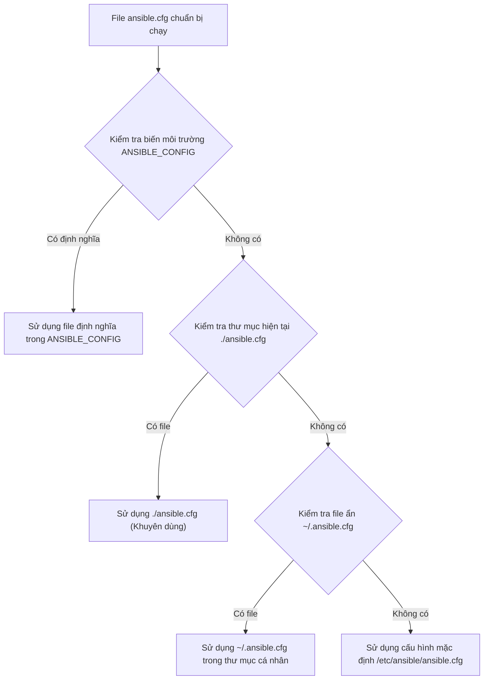
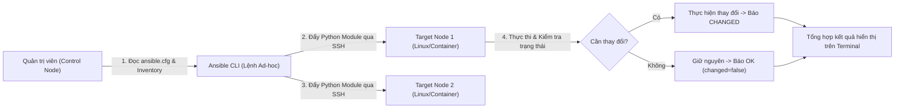


# [BÀI 02] KIẾN TRÚC ANSIBLE & LỆNH AD-HOC: CONTROL NODE, MANAGED NODES, SSH AUTHENTICATION & THỰC THI MODULE TỨC THÌ

Trong kỷ nguyên **Infrastructure as Code (IaC)** và tự động hóa vận hành hạ tầng đám mây (Cloud Infrastructure Automation), **Ansible** khẳng định vị thế dẫn đầu nhờ triết lý **Agentless** (không cần cài đặt agent nền trên máy đích), giao thức điều khiển an toàn qua **SSH / WinRM**, định dạng khai báo **YAML** trực quan và nguyên lý bất biến **Idempotency** mạnh mẽ. Việc làm chủ Ansible không chỉ dừng lại ở các câu lệnh Ad-hoc đơn giản, mà đòi hỏi kỹ sư phải nắm vững kiến trúc Module tầng thấp, Variable Precedence 22 tầng, Jinja2 Templates, tối ưu hóa Forks & Pipelining cho tới thiết kế Roles / Collections và tích hợp CI/CD tự động hóa chuẩn Doanh nghiệp.

Bài viết chuyên sâu này sẽ đồng hành cùng bạn mổ xẻ toàn diện bức tranh kiến trúc, phân tích các đánh đổi kỹ thuật thực chiến (Engineering Trade-offs), cung cấp hướng dẫn thực hành Lab chi tiết từng bước và bộ câu hỏi phỏng vấn chuyên sâu chuẩn DevOps / SRE Lead.

---

## 1. Bản Chất Kiến Trúc & Cơ Chế Vận Hành Tầng Thấp

---


> **Control node chỉ cần Python + Ansible, kết nối SSH không agent tới managed nodes; ad-hoc command là công cụ thao tác tức thì nhưng cần module chuẩn để đảm bảo tính idempotent.**

Chủ đề xuyên suốt khóa học (I-10) tiếp tục được khắc sâu trong Buổi 02:

> **Lệnh ad-hoc giúp quản trị viên thực thi nhanh công việc trên hàng trăm máy đích mà không cần viết Playbook. Tuy nhiên, nếu lạm dụng ad-hoc với các lệnh shell thô (`command`/`shell`), hệ thống sẽ mất đi tính bất biến (idempotency). Ta phải luôn kiểm tra trạng thái thực tế trên máy đích bằng các câu lệnh truy vấn trực tiếp (`docker exec` hoặc SSH) thay vì chỉ tin vào kết quả hiển thị trên terminal của Control node.**

---


---


---


| Tiếng Việt | Tiếng Anh / Từ khóa + FQCN (giữ nguyên) |
|---|---|
| Nút điều khiển | Control node |
| Nút bị quản lý | Managed node / Target node |
| Tệp cấu hình Ansible | `ansible.cfg` |
| Lệnh ứng phó nhanh | Ad-hoc command |
| Xác minh chìa khóa SSH | Host key checking (`host_key_checking`) |
| Leo quyền quản trị | Privilege escalation (`become`) |
| Người dùng từ xa | Remote user (`remote_user`) |
| Module thu thập thông tin | `ansible.builtin.setup` |
| Module kiểm tra kết nối | `ansible.builtin.ping` |
| Module quản lý gói tổng quát | `ansible.builtin.package` |
| Module quản lý dịch vụ tổng quát | `ansible.builtin.service` |
| Module quản lý người dùng | `ansible.builtin.user` |
| Tên đầy đủ chuẩn hóa | Fully Qualified Collection Name (FQCN) |

---

### 1.1. Kiến trúc và Cấu hình Control Node (15 phút)



**Nguyên lý cốt lõi:** Ansible áp dụng thứ tự ưu tiên 4 tầng để tìm kiếm file cấu hình `ansible.cfg`: Biến môi trường `ANSIBLE_CONFIG` > File `./ansible.cfg` ở thư mục hiện tại > File ẩn `~/.ansible.cfg` ở thư mục người dùng > File mặc định toàn hệ thống `/etc/ansible/ansible.cfg`.

**Giải thích cơ chế ngầm:** Thứ tự này cho phép quản trị viên ghi đè cấu hình cho từng dự án cụ thể mà không làm ảnh hưởng đến cấu hình chung toàn hệ thống hoặc cấu hình cá nhân của người dùng khác.

> [!WARNING]
> **CẠM BẪY THỰC CHIẾN:**
> **Lệnh:** `ansible --version` · **Output phải thấy:** `config file = /etc/ansible/ansible.cfg` trong khi dự án đang có file `./ansible.cfg` (do cấp quyền sai làm cho Ansible bỏ qua file local vì lý do bảo mật `world-writable`).

**Minh hoạ.** Tạo file `ansible.cfg` chuẩn tại thư mục dự án:
```ini
[defaults]
inventory = ./inventory.ini
remote_user = ansible
host_key_checking = False

[privilege_escalation]
become = True
become_method = sudo
become_user = root
become_ask_pass = False
```

**Nguyên lý cốt lõi:** Thiết lập xác thực SSH bằng cặp chìa khóa (Key-based Authentication) và quản lý cờ `host_key_checking = False` trong môi trường thử nghiệm/lab.

**Giải thích cơ chế ngầm:** Ansible sử dụng giao thức SSH tiêu chuẩn để giao tiếp với các target node. Việc tắt `host_key_checking` trong môi trường tự động hóa hoặc thử nghiệm ngăn chặn lệnh ad-hoc/playbook bị treo do chờ người dùng gõ `yes` xác nhận SSH Fingerprint lần đầu.

> [!WARNING]
> **CẠM BẪY THỰC CHIẾN:**
> **Lệnh:** `ansible all -m ansible.builtin.ping` · **Output phải thấy:** `FAILED! => {"msg": "Using a SSH password instead of a key is not possible..."}` hoặc lệnh bị dừng vô thời hạn chờ tương tác Fingerprint.

**Minh hoạ.** Tạo cặp key và đẩy public key sang máy đích:
```bash
ssh-keygen -t ed25519 -N "" -f ~/.ssh/id_ed25519
ssh-copy-id -i ~/.ssh/id_ed25519.pub ansible@target1
ansible all -m ansible.builtin.ping
```

**Nguyên lý cốt lõi:** Cấu hình Privilege Escalation (`become`) cho phép lệnh Ansible nâng quyền lên `root` để thực hiện các tác vụ quản trị hệ thống.

**Giải thích cơ chế ngầm:** Phần lớn các công việc quản trị (cài phần mềm, sửa file cấu hình hệ thống, mở port service) yêu cầu quyền `root`. Cấu hình `become` tự động chèn `sudo` vào trước mọi lệnh thực thi trên máy đích.

> [!WARNING]
> **CẠM BẪY THỰC CHIẾN:**
> **Lệnh:** `ansible all -m ansible.builtin.package -a "name=htop state=present"` · **Output phải thấy:** `FAILED! => {"msg": "Permission denied... This command has to be run under the root user."}`.

**Minh hoạ.** Thực thi ad-hoc với cờ nâng quyền `--become`:
```bash
ansible web -m ansible.builtin.package -a "name=htop state=present" --become
```

---

### 1.2. Cấu trúc lệnh Ad-hoc và Module Cơ bản (15 phút)

**Nguyên lý cốt lõi:** Cú pháp tổng quát của một lệnh ad-hoc Ansible tuân theo định dạng `ansible <pattern> -m <module_name> -a "<module_arguments>" [options]`.

**Giải thích cơ chế ngầm:** Lệnh ad-hoc được thiết kế cho các thao tác một lần (one-off tasks) nhanh chóng mà không cần tốn thời gian soạn thảo cấu trúc YAML của Playbook.

> [!WARNING]
> **CẠM BẪY THỰC CHIẾN:**
> **Lệnh:** `ansible all -a "name=nginx state=present"` · **Output phải thấy:** `FAILED! => {"msg": "No module cause specified..."}` hoặc mặc định chạy module `command` dẫn đến cú pháp tham số không hợp lệ.

**Minh hoạ.** Chạy ad-hoc kiểm tra dung lượng đĩa cứng trên tất cả các host thuộc nhóm `db`:
```bash
ansible db -m ansible.builtin.command -a "df -h" -u ansible
```

**Nguyên lý cốt lõi:** Module `ansible.builtin.ping` dùng để xác minh kết nối SSH và môi trường Python trên target, còn module `ansible.builtin.setup` dùng để thu thập toàn bộ dữ liệu thực tế (Facts).

**Giải thích cơ chế ngầm:** `ping` trong Ansible không phải là lệnh ICMP ping của hệ điều hành mà là một module kiểm tra kết nối SSH end-to-end cùng khả năng thực thi code Python trên máy đích. `setup` trả về dữ liệu cấu trúc JSON chứa RAM, CPU, IP, OS version.

> [!WARNING]
> **CẠM BẪY THỰC CHIẾN:**
> **Lệnh:** `ansible all -m ping` · **Output phải thấy:** `target1 | UNREACHABLE! => {"changed": false, "msg": "Failed to connect to the host via SSH..."}`.

**Minh hoạ.** Chạy module `ping` và lọc thông tin hệ điều hành từ module `setup`:
```bash
ansible all -m ansible.builtin.ping
ansible all -m ansible.builtin.setup -a "filter=ansible_distribution*"
```

**Nguyên lý cốt lõi:** Phân biệt bản chất giữa các module thực thi lệnh thô: `ansible.builtin.command`, `ansible.builtin.shell`, và `ansible.builtin.raw`.

**Giải thích cơ chế ngầm:** `command` chạy trực tiếp không qua shell (an toàn, không hỗ trợ biến môi trường shell, pipe `|`, redirect `>`). `shell` chạy qua `/bin/sh` (hỗ trợ pipe, redirect nhưng nguy cơ shell injection). `raw` chạy lệnh không cần Python trên máy đích (dùng khi boot-strap cài Python). Cả 3 module này đều **không có tính bất biến tự nhiên** và luôn báo `changed`.

> [!WARNING]
> **CẠM BẪY THỰC CHIẾN:**
> **Lệnh:** `ansible all -m ansible.builtin.command -a "cat /etc/os-release | grep NAME"` · **Output phải thấy:** `FAILED! => {"msg": "ls: cannot access '|': No such file or directory"}` (do `command` không hiểu ký tự pipe `|`).

**Minh hoạ.** Sử dụng đúng module `shell` khi cần xử lý ống dẫn:
```bash
ansible all -m ansible.builtin.shell -a "cat /etc/os-release | grep PRETTY_NAME"
```

---

### 1.3. Thực thi Quản trị Máy đích qua Ad-hoc (10 phút)

**Nguyên lý cốt lõi:** Quản lý gói phần mềm bằng module chuẩn `ansible.builtin.package` thay vì gọi trực tiếp lệnh `apt` hay `dnf` bằng module `command`.

**Giải thích cơ chế ngầm:** Module `package` tự động nhận diện hệ điều hành của máy đích (RHEL dùng `dnf`, Ubuntu dùng `apt`) và kiểm tra xem gói đã được cài chưa. Nếu gói đã tồn tại đúng phiên bản, module sẽ không làm gì và trả về `changed=false` (đảm bảo tính bất biến - idempotency).

> [!WARNING]
> **CẠM BẪY THỰC CHIẾN:**
> **Lệnh:** `ansible all -m ansible.builtin.command -a "apt-get install -y curl"` · **Output phải thấy:** `target1 | CHANGED => ...` ngay cả khi gói `curl` đã được cài đặt đầy đủ từ trước.

**Minh hoạ.** Cài đặt gói phần mềm `curl` đảm bảo tính bất biến:
```bash
ansible all -m ansible.builtin.package -a "name=curl state=present" --become
```

**Nguyên lý cốt lõi:** Quản lý trạng thái dịch vụ bằng module chuẩn `ansible.builtin.service` / `ansible.builtin.systemd` để đảm bảo dịch vụ chạy và tự khởi động cùng hệ thống.

**Giải thích cơ chế ngầm:** Module `service` kiểm tra trạng thái hiện tại của daemon qua `systemctl`. Nếu dịch vụ đã ở trạng thái `started` và `enabled=yes`, Ansible sẽ bỏ qua không thao tác lại.

> [!WARNING]
> **CẠM BẪY THỰC CHIẾN:**
> **Lệnh:** `ansible all -m ansible.builtin.command -a "systemctl start httpd"` · **Output phải thấy:** Luôn báo `CHANGED` cho mọi lần thực thi dù dịch vụ đã chạy từ lâu.

**Minh hoạ.** Khởi chạy và bật tự động khởi động cho dịch vụ `nginx`:
```bash
ansible web -m ansible.builtin.service -a "name=nginx state=started enabled=yes" --become
```

**Nguyên lý cốt lõi:** Quản lý người dùng (`ansible.builtin.user`) và tạo tệp tin (`ansible.builtin.copy` / `ansible.builtin.file`) qua lệnh ad-hoc đảm bảo đúng phân quyền và thuộc tính.

**Giải thích cơ chế ngầm:** Các module quản lý tài nguyên chuyên dụng kiểm tra tham số hash của file hoặc thông tin UID/GID của user trước khi áp dụng thay đổi, tránh làm hỏng các phân quyền sẵn có trên hệ thống.

> [!WARNING]
> **CẠM BẪY THỰC CHIẾN:**
> **Lệnh:** `ansible all -m ansible.builtin.shell -a "useradd devuser"` · **Output phải thấy:** Lần 1 báo `CHANGED`, lần 2 báo `FAILED! => {"msg": "useradd: user 'devuser' already exists"}` (gây đứt gãy luồng xử lý do không idempotent).

**Minh hoạ.** Tạo tài nguyên người dùng và tệp tin cấu hình bằng module ad-hoc:
```bash
ansible all -m ansible.builtin.user -a "name=deployer state=present shell=/bin/bash" --become
ansible all -m ansible.builtin.copy -a "content='Welcome to NTKAnsible\n' dest=/etc/motd mode='0644'" --become
```

---

### 1.4. Đưa vào việc thật (4 phút)

### 7.1. Áp dụng vào hạ tầng sẵn có
Khi tiếp nhận một hạ tầng gồm 50 máy chủ chưa có công cụ quản trị tập trung:
- Dùng ad-hoc `ansible all -m setup -a "filter=ansible_memtotal_mb"` để thu thập thông tin cấu hình phần cứng chỉ trong 5 giây.
- Dùng ad-hoc `ansible all -m package -a "name=security-checker state=present"` để cập nhật các bản vá khẩn cấp đồng loạt trên toàn bộ hệ thống.

### 7.2. Rủi ro hỏng hóc khi triển khai Production và giải pháp an toàn
- **Rủi ro:** Chạy nhầm lệnh ad-hoc nguy hiểm với pattern `all` (ví dụ `ansible all -m service -a "name=httpd state=restarted"`) sẽ làm gián đoạn toàn bộ dịch vụ web production cùng một thời điểm.
- **Giải pháp an toàn:**
  1. Giới hạn danh sách máy thực thi bằng cờ `--limit` (ví dụ: `ansible web --limit target1 -m ...`).
  2. Sử dụng cờ thử nghiệm `--check` để Ansible giả lập quá trình thay đổi mà không tác động thật lên máy chủ.

### 7.3. Đo lường chỉ số Trước – Sau khi áp dụng
- **Trước khi có Ansible ad-hoc:** SSH thủ công vào 20 máy chủ, gõ lệnh `systemctl status httpd` mất trung bình 15 phút.
- **Sau khi dùng Ansible ad-hoc:** Gõ `ansible web -m service -a "name=httpd"` mất đúng 2 giây để nhận báo cáo trạng thái của cả 20 máy chủ.

### 7.4. Khi nào KHÔNG nên dùng lệnh Ad-hoc
- **Không dùng ad-hoc cho việc cấu hình phức tạp:** Khi tác vụ gồm nhiều bước có phụ thuộc lẫn nhau (ví dụ: cài DB -> tạo user DB -> sửa file config -> chạy migration -> start service). Các tác vụ này **bắt buộc phải viết Playbook**.
- **Không dùng ad-hoc shell thô:** Tránh lạm dụng `ansible all -m shell -a "..."` để thay thế cho Playbook vì sẽ đánh mất toàn bộ ưu thế kiểm soát tính bất biến (idempotency) của Ansible.

---

### 1.5. Bẫy hay gặp (2 phút)

| # | Bẫy hay gặp | Vì sao "recap xanh mà sai / không idempotent" | Lệnh phát hiện và xử lý |
|---|---|---|---|
| 1 | Bỏ qua thứ tự ưu tiên của `ansible.cfg` | Đặt file `ansible.cfg` ở thư mục hiện tại nhưng lại gán quyền ghi công cộng (`chmod 777`), Ansible sẽ bỏ qua và dùng `/etc/ansible/ansible.cfg`. | Chạy `ansible --version` kiểm tra dòng `config file`. Sửa quyền file bằng `chmod 644 ansible.cfg`. |
| 2 | Lạm dụng module `command`/`shell` | Lệnh ad-hoc chạy `ansible all -m shell -a "echo data >> /file.txt"` sẽ ghi đè đúp dữ liệu mỗi lần chạy lại. | Chạy lại lệnh ad-hoc lần 2 thấy trạng thái vẫn báo `CHANGED`. Thay thế bằng module `ansible.builtin.lineinfile` hoặc `copy`. |
| 3 | Nhầm lẫn giữa cờ `-u` và `--become` | Dùng `-u root` nhưng máy đích chặn đăng nhập SSH trực tiếp bằng tài khoản root (`PermitRootLogin no`). | Đăng nhập SSH bằng user thường (`-u ansible`) kết hợp cờ nâng quyền `--become` (`--become-user root`). |
| 4 | Không kiểm tra `host_key_checking` trong môi trường tự động | Kịch bản tự động bị treo vô hạn ở bước chờ gõ `yes` xác nhận Fingerprint SSH của host mới. | Thêm dòng `host_key_checking = False` vào file `ansible.cfg` trong môi trường lab/CI. |
| 5 | Không dùng cờ `--check` trước khi thực thi lệnh ad-hoc nguy hiểm | Lệnh ad-hoc xóa file hoặc restart dịch vụ bị áp dụng ngay lập tức lên toàn bộ máy trong inventory. | Thêm cờ `--check --diff` vào lệnh ad-hoc để xem trước các thay đổi dự kiến trên máy đích. |
| 6 | Quên ghi đè tham số phân quyền `mode` khi dùng module `copy` | Upload file cấu hình qua ad-hoc nhưng giữ nguyên umask mặc định làm cho dịch vụ không đọc được file do thiếu quyền. | Bổ sung tham số `mode='0644'` hoặc `mode='0755'` trực tiếp trong tham số `-a` của module `copy`. |
| 7 | Chạy lệnh ad-hoc cài gói mà không chỉ định `state` | Gọi module `package` với tham số `name=htop` mà bỏ quên `state=present` khiến Ansible áp dụng mặc định không rõ ràng giữa các phiên bản collection. | Luôn khai báo tường minh tham số `state=present` hoặc `state=latest` trong câu lệnh `-a`. |
| 8 | Tin tưởng thông báo `SUCCESS` của module `command` | Chạy câu lệnh Linux lỗi bên trong `command` nhưng câu lệnh đó trả về returncode=0 (ví dụ có xử lý lỗi ngầm), Ansible vẫn báo `SUCCESS`. | Truy vấn trực tiếp trạng thái hệ thống trên target node bằng `docker exec` hoặc SSH độc lập để kiểm tra kết quả thật. |
| 9 | Đặt tên inventory trùng với tên nhóm mặc định | Đặt tên file inventory là `all` hoặc `hosts` làm xung đột với pattern truy vấn của lệnh ad-hoc. | Đặt tên file inventory rõ ràng như `inventory.ini`, `hosts.dev`, `hosts.prod`. |
| 10 | Gửi mật khẩu dạng plain-text trên dòng lệnh ad-hoc | Sử dụng cờ `-k` hoặc `--ask-pass` gõ mật khẩu trực tiếp trên terminal dễ bị lưu lại trong lịch sử bash history. | Chuyển sang sử dụng SSH key pair không mật khẩu hoặc dùng Ansible Vault cho các thông tin nhạy cảm. |
| 11 | Không giới hạn danh sách target khi thử nghiệm lệnh ad-hoc | Chạy lệnh ad-hoc thử nghiệm tính năng nhưng quên truyền tham số nhóm host làm ảnh hưởng toàn bộ hạ tầng. | Sử dụng cờ `--limit target1` để bó hẹp phạm vi ảnh hưởng trong quá trình thử nghiệm. |
| 12 | Giả định máy đích đã có sẵn Python | Chạy lệnh ad-hoc với các module tiêu chuẩn (`package`, `service`) lên máy Linux siêu nhỏ (minimal image) thiếu Python làm lệnh thất bại ngay từ đầu. | Sử dụng module `ansible.builtin.raw` để cài đặt `python3` trên máy đích trước khi chạy các module Ansible khác. |

---

### 1.6. Tóm tắt (1 phút)



### Năm điều phải nhớ
1. **Ansible là push-based và agentless:** Control node cần Python + Ansible; Managed node chỉ cần SSH + Python.
2. **File `ansible.cfg` có thứ tự ưu tiên:** `./ansible.cfg` ở thư mục hiện tại ghi đè cấu hình mặc định toàn cục `/etc/ansible/ansible.cfg`.
3. **Ưu tiên module chuẩn hơn `command`/`shell`:** Module chuẩn (`package`, `service`, `user`, `copy`) tự động đảm bảo tính bất biến (idempotency).
4. **Luôn chứng minh Idempotency:** Lệnh ad-hoc sử dụng module chuẩn khi chạy lần thứ hai **bắt buộc** phải trả về `changed=false`.
5. **Kiểm tra sự thật trên máy đích:** Không dừng lại ở thông báo terminal của Control node, hãy dùng `docker exec` hoặc truy vấn trực tiếp để xác minh trạng thái thực tế.

---

### 1.7. Câu hỏi tự kiểm tra (kiêm luyện RHCE EX294)

1. **[RHCE EX294 Objective #2]** File cấu hình `ansible.cfg` nằm ở thư mục hiện tại bị Ansible bỏ qua và chuyển sang dùng `/etc/ansible/ansible.cfg`. Nguyên nhân phổ biến nhất là gì?
   - *Đáp án:* Do file `ansible.cfg` ở thư mục hiện tại đang được cấp quyền ghi cho mọi người (`world-writable` - `chmod 777`). Ansible coi đây là rủi ro bảo mật và tự động bỏ qua.
2. **[RHCE EX294 Objective #2]** Làm thế nào để kiểm tra chính xác đường dẫn file `ansible.cfg` mà Ansible đang nhận diện?
   - *Đáp án:* Chạy câu lệnh `ansible --version` và quan sát dòng `config file = ...`.
3. **[RHCE EX294 Objective #3]** Trong `ansible.cfg`, tham số nào dùng để tắt việc xác thực Fingerprint chìa khóa SSH lần đầu?
   - *Đáp án:* Tham số `host_key_checking = False` trong phần `[defaults]`.
4. **[RHCE EX294 Objective #3]** Cờ lệnh CLI nào cho phép kích hoạt quyền nâng cấp `sudo` root khi thực thi ad-hoc?
   - *Đáp án:* Cờ `--become` (hoặc `-b`).
5. **[RHCE EX294 Objective #5]** Viết câu lệnh ad-hoc để kiểm tra kết nối SSH tới tất cả các máy trong nhóm `web`.
   - *Đáp án:* `ansible web -m ansible.builtin.ping`
6. **[RHCE EX294 Objective #5]** Viết câu lệnh ad-hoc để thu thập thông tin về dung lượng bộ nhớ RAM của tất cả các target node.
   - *Đáp án:* `ansible all -m ansible.builtin.setup -a "filter=ansible_memtotal_mb"`
7. **[RHCE EX294 Objective #5]** Module `command` và `shell` khác nhau ở điểm then chốt nào?
   - *Đáp án:* `command` chạy trực tiếp không thông qua shell hệ thống (không hỗ trợ pipe `|`, redirect `>`), trong khi `shell` chạy thông qua `/bin/sh` nên hỗ trợ đầy đủ ký tự đặc biệt của shell.
8. **[RHCE EX294 Objective #5]** Viết câu lệnh ad-hoc để cài đặt gói phần mềm `httpd` trên tất cả máy thuộc nhóm `web` bằng module chuẩn.
   - *Đáp án:* `ansible web -m ansible.builtin.package -a "name=httpd state=present" --become`
9. **[RHCE EX294 Objective #5]** Khi chạy lại câu lệnh cài gói `httpd` ở trên lần thứ 2, kết quả hiển thị trên terminal sẽ ra sao nếu hệ thống đảm bảo idempotency?
   - *Đáp án:* Trả về thông báo thành công nhưng chỉ số thay đổi báo `changed=false` (màu xanh lá cây).
10. **[RHCE EX294 Objective #5]** Viết câu lệnh ad-hoc khởi chạy dịch vụ `mariadb` và cấu hình tự động bật khi khởi động máy trên nhóm `db`.
    - *Đáp án:* `ansible db -m ansible.builtin.service -a "name=mariadb state=started enabled=yes" --become`
11. **[RHCE EX294 Objective #5]** Làm thế nào để xem trước những thay đổi mà lệnh ad-hoc sẽ thực hiện mà không làm thay đổi hệ thống thật?
    - *Đáp án:* Trực tiếp bổ sung cờ `--check` (kèm `--diff` nếu muốn xem chi tiết sự khác biệt) vào câu lệnh ad-hoc.
12. **[RHCE EX294 Objective #5]** Viết câu lệnh ad-hoc tạo người dùng `developer` với shell mặc định `/bin/bash` trên tất cả các host.
    - *Đáp án:* `ansible all -m ansible.builtin.user -a "name=developer shell=/bin/bash state=present" --become`
13. **[RHCE EX294 Objective #5]** Viết câu lệnh ad-hoc chép file `/tmp/config.conf` từ Control node tới `/etc/config.conf` trên máy đích với quyền `0644`.
    - *Đáp án:* `ansible all -m ansible.builtin.copy -a "src=/tmp/config.conf dest=/etc/config.conf mode='0644'" --become`

---

### 1.8. Tài liệu tham khảo

- Ansible Core Documentation (v2.15+): [Introduction to Ad-hoc Commands](https://docs.ansible.com/ansible/latest/command_guide/intro_adhoc.html)
- Ansible Collections Index: [ansible.builtin Collection Standard Modules](https://docs.ansible.com/ansible/latest/collections/ansible/builtin/index.html)
- Red Hat Certified Engineer (RHCE) EX294 Study Guide: Control Node Configuration & Ad-hoc Command Operations.

---

## Bảng đối soát thời lượng

| Mục | Nội dung | Thời lượng dự kiến | Thời lượng thực tế |
|---|---|---|---|
| §0 | Khởi động và ôn tập buổi 01 | 10 phút | 10 phút |
| §1–§2 | Mục tiêu làm được & Cần biết trước | 2 phút | 2 phút |
| §3 | Thuật ngữ Việt-Anh & Mô hình tư duy | 8 phút | 8 phút |
| §4 | Kiến trúc & Cấu hình Control Node (QT 4.1–4.3) | 15 phút | 15 phút |
| §5 | Cấu trúc lệnh Ad-hoc & Module Cơ bản (QT 5.1–5.3) | 15 phút | 15 phút |
| §6 | Thực thi Quản trị Máy đích qua Ad-hoc (QT 6.1–6.3) | 10 phút | 10 phút |
| §7–§9 | Đưa vào việc thật, Bẫy hay gặp & Tóm tắt | 7 phút | 7 phút |
| §10–§11 | Câu hỏi tự kiểm tra EX294 & Tài liệu tham khảo | 3 phút | 3 phút |
| **Tổng** | **Khối lý thuyết Buổi 02** | **60 phút** | **60 phút** |

---

## 2. Hướng Dẫn Thực Hành & Triển Khai Lab Chuẩn Production

> [!IMPORTANT]
> **YÊU CẦU MÔI TRƯỜNG THỰC HÀNH:**
> Toàn bộ các bài thực hành dưới đây được thiết kế để chạy trực tiếp trên môi trường máy chủ Linux / Docker containers phân tán. Hãy đảm bảo bạn đã chuẩn bị Control Node cài đặt Ansible Core 2.15+ cùng các Managed Nodes đã cấu hình SSH Key Authentication.

## Khối thực hành — 150 phút

> **Đối soát thời lượng:** Khối thực hành kéo dài đúng **150'** (từ L0 đến L11).
> **Nguyên tắc cốt lõi:** Lab chạy trên **Control node + Target container SSH** (dùng `docker compose`), thực hiện cấu hình `ansible.cfg`, kiểm tra kết nối ad-hoc, thực thi các lệnh quản trị ad-hoc và chứng minh tính **Idempotency** (chạy lần 2 `changed=0`) kết hợp đối soát thực tế qua `docker exec`.

---

## L0. Mục tiêu thực hành và tiêu chí hoàn thành

| # | Mục tiêu thực hành | Tiêu chí hoàn thành (Kiểm tra bằng lệnh CLI) |
|---|---|---|
| TH1 | Cấu hình file `ansible.cfg` dự án đúng quy chuẩn | Lệnh `ansible --version` báo `config file` trỏ về `./ansible.cfg` |
| TH2 | Kiểm tra kết nối ad-hoc tới tất cả các máy đích | Lệnh `ansible all -m ansible.builtin.ping` đạt 100% `SUCCESS` |
| TH3 | Thu thập thực tế hệ thống (Facts) bằng ad-hoc | Lệnh `ansible all -m ansible.builtin.setup -a "filter=ansible_distribution"` in đúng OS |
| TH4 | So sánh thực thi `command` vs `shell` ad-hoc | Lệnh `command` thất bại với pipe, `shell` thành công với pipe |
| TH5 | Quản lý gói phần mềm ad-hoc bằng module chuẩn | Cài đặt gói `curl` thành công trên tất cả target host |
| TH6 | Chứng minh tính Idempotency khi chạy lại ad-hoc | Chạy lại lệnh cài gói `curl` lần 2 thu được `changed=false` |
| TH7 | Quản lý dịch vụ và kiểm tra thực tế máy đích | Dịch vụ `nginx`/`httpd` hoạt động và kiểm tra bằng `docker exec` |
| TH8 | Quản lý người dùng và tệp tin qua ad-hoc | Người dùng `devuser` và file `/etc/motd` được tạo đúng phân quyền |

---

## L1. Điều kiện tiên quyết về môi trường

| Kiểm tra | LỆNH THỰC THI | Kết quả kỳ vọng |
|---|---|---|
| Ansible core đã cài | `ansible --version` | Hiển thị phiên bản ansible-core v2.15 trở lên |
| Docker Compose sẵn sàng | `docker compose ps` | Cả target1 và target2 ở trạng thái `Up` |
| Kết nối SSH thủ công | `ssh -i ~/.ssh/id_ed25519 ansible@target1 hostname` | Trả về hostname `target1` không hỏi mật khẩu |
| Python 3 trên target node | `ansible all -m ansible.builtin.command -a "python3 --version"` | Hiển thị `Python 3.x.x` |
| Thư mục thực hành | `pwd` | Đang ở thư mục `~/lab-ansible-02` |

Nếu chưa có target container:
```bash
cd labs && make up && make key && make inventory
```

---

## L2. Kiến trúc bài lab

```mermaid
graph TD
    SubGraph1["Control Node (Máy quản trị)"] --> |1. Đọc ./ansible.cfg & inventory.ini| CLI["Ansible CLI (Lệnh Ad-hoc)"]
    CLI --> |2. SSH Key-based Auth (Port 22)| T1["Target Container 1 (target1)"]
    CLI --> |3. SSH Key-based Auth (Port 22)| T2["Target Container 2 (target2)"]
    
    DEV["Học viên (Tester)"] --> |A. Chạy lệnh ad-hoc| CLI
    DEV --> |B. Kiểm tra thực tế bằng docker exec| T1
    DEV --> |C. Kiểm tra thực tế bằng docker exec| T2
```

---

## L3. Bước 1 — Thiết lập dự án và Cấu hình ansible.cfg (25 phút)

Thực hiện tạo thư mục làm việc, tạo file cấu hình `ansible.cfg` tùy chỉnh và file `inventory.ini` để kiểm tra thứ tự ưu tiên cấu hình.

```bash
mkdir -p ~/lab-ansible-02 && cd ~/lab-ansible-02

cat << 'EOF' > ansible.cfg
[defaults]
inventory = ./inventory.ini
remote_user = ansible
host_key_checking = False
private_key_file = ~/.ssh/id_ed25519

[privilege_escalation]
become = True
become_method = sudo
become_user = root
become_ask_pass = False
EOF

cat << 'EOF' > inventory.ini
[web]
target1 ansible_host=127.0.0.1 ansible_port=2221

[db]
target2 ansible_host=127.0.0.1 ansible_port=2222

[all:vars]
ansible_python_interpreter=/usr/bin/python3
EOF
```

Kiểm tra QT 4.1 và QT 4.2:
```bash
ansible --version
```

**CHECKPOINT 1 — Xác nhận file ansible.cfg dự án được Ansible nhận diện.**
- **Lệnh kiểm tra:**
```bash
if ansible --version | grep -q "config file = $(pwd)/ansible.cfg"; then
  echo "CHECKPOINT 1: ĐẠT - Ansible đang nhận diện đúng ./ansible.cfg"
else
  echo "CHECKPOINT 1: LỖI - Ansible chưa nhận diện đúng ./ansible.cfg"
fi
```

---

## L4. Bước 2 — Kiểm tra Kết nối và Thu thập Facts bằng Ad-hoc (30 phút)

Sử dụng lệnh ad-hoc với module `ansible.builtin.ping` và `ansible.builtin.setup` để xác minh hạ tầng kết nối và lấy thông tin máy đích.

Kiểm tra QT 5.1 và QT 5.2:
```bash
ansible all -m ansible.builtin.ping
ansible web -m ansible.builtin.setup -a "filter=ansible_distribution*"
```

**CHECKPOINT 2 — Kết nối SSH ad-hoc thành công 100% đến các target node.**
- **Lệnh kiểm tra:**
```bash
PING_RES=$(ansible all -m ansible.builtin.ping)
if echo "$PING_RES" | grep -q "SUCCESS" && ! echo "$PING_RES" | grep -q "FAILED"; then
  echo "CHECKPOINT 2: ĐẠT - Module ping trả về SUCCESS cho tất cả target host"
else
  echo "CHECKPOINT 2: LỖI - Kết nối ping ad-hoc bị thất bại"
fi
```

**CHECKPOINT 3 — Thu thập dữ liệu thực tế (Facts) từ module setup.**
- **Lệnh kiểm tra:**
```bash
SETUP_RES=$(ansible all -m ansible.builtin.setup -a "filter=ansible_architecture")
if echo "$SETUP_RES" | grep -q "ansible_architecture"; then
  echo "CHECKPOINT 3: ĐẠT - Thu thập Facts bằng module setup thành công"
else
  echo "CHECKPOINT 3: LỖI - Thu thập Facts thất bại"
fi
```

---

## L5. Bước 3 — Thử nghiệm và So sánh command, shell, raw (25 phút)

Thực hành kiểm tra sự khác biệt giữa các module thực thi lệnh thô để làm rõ lý do tại sao chúng không đảm bảo tính bất biến (QT 4.3, QT 5.3).

Chạy lệnh với `command` (mong đợi thất bại khi dùng ký tự pipe `|`):
```bash
ansible all -m ansible.builtin.command -a "cat /etc/os-release | grep PRETTY_NAME" || true
```

Chạy lệnh với `shell` (thành công xử lý pipe):
```bash
ansible all -m ansible.builtin.shell -a "cat /etc/os-release | grep PRETTY_NAME"
```

**CHECKPOINT 4 — Phân biệt rõ giới hạn của module command và khả năng của module shell.**
- **Lệnh kiểm tra:**
```bash
CMD_FAIL=$(ansible all -m ansible.builtin.command -a "ls | grep os" 2>&1 || true)
SHELL_OK=$(ansible all -m ansible.builtin.shell -a "cat /etc/os-release | grep -i ID")
if echo "$CMD_FAIL" | grep -q "FAILED" && echo "$SHELL_OK" | grep -q "SUCCESS"; then
  echo "CHECKPOINT 4: ĐẠT - Phân biệt chính xác cơ chế hoạt động của command và shell"
else
  echo "CHECKPOINT 4: LỖI - Chưa thể hiện đúng sự khác biệt giữa command và shell"
fi
```

---

## L6. Bước 4 — Quản lý Gói và Dịch vụ ad-hoc, Chứng minh Idempotency (35 phút)

Sử dụng module chuẩn `ansible.builtin.package` và `ansible.builtin.service` để thực hiện thay đổi hạ tầng qua lệnh ad-hoc (QT 6.1, QT 6.2).

Thực hiện cài đặt gói `curl` lần thứ nhất:
```bash
ansible all -m ansible.builtin.package -a "name=curl state=present" --become
```

Thực hiện cài đặt gói `curl` lần thứ hai để kiểm tra Idempotency:
```bash
ansible all -m ansible.builtin.package -a "name=curl state=present" --become
```

**CHECKPOINT 5 — Kiểm tra tính Idempotency: Lần thứ hai thực thi ad-hoc cài gói báo changed=false.**
- **Lệnh kiểm tra:**
```bash
RUN2_OUT=$(ansible all -m ansible.builtin.package -a "name=curl state=present" --become)
if echo "$RUN2_OUT" | grep -q '"changed": false' || echo "$RUN2_OUT" | grep -q 'SUCCESS => {"changed": false'; then
  echo "CHECKPOINT 5: ĐẠT - Lệnh ad-hoc đạt tính Idempotency (changed=0 / changed=false khi chạy lại)"
else
  echo "CHECKPOINT 5: LỖI - Lệnh ad-hoc không đạt tính Idempotency"
fi
```

Khởi chạy dịch vụ bằng lệnh ad-hoc:
```bash
ansible web -m ansible.builtin.service -a "name=sshd state=started enabled=yes" --become
```

**CHECKPOINT 6 — Đối soát trực tiếp trạng thái thực tế trên máy đích bằng docker exec.**
- **Lệnh kiểm tra:**
```bash
TARGET1_CHECK=$(docker exec target1 systemctl is-active sshd || docker exec target1 ps aux | grep sshd)
if echo "$TARGET1_CHECK" | grep -qE "active|sshd"; then
  echo "CHECKPOINT 6: ĐẠT - Kiểm tra thực tế qua docker exec xác nhận dịch vụ sshd đang active trên target1"
else
  echo "CHECKPOINT 6: LỖI - Dịch vụ sshd chưa hoạt động thực tế trên máy đích"
fi
```

---

## L7. Bước 5 — Quản lý User và File ad-hoc (30 phút)

Thực thi quản lý người dùng và tệp tin qua lệnh ad-hoc với module `ansible.builtin.user` và `ansible.builtin.copy` (QT 6.3).

Tạo người dùng `devuser`:
```bash
ansible all -m ansible.builtin.user -a "name=devuser shell=/bin/bash state=present" --become
```

Tạo file thông báo `/etc/motd`:
```bash
ansible all -m ansible.builtin.copy -a "content='Welcome to NTKAnsible Lab 02\n' dest=/etc/motd mode='0644'" --become
```

**CHECKPOINT 7 — Người dùng devuser được tạo thành công trên máy đích.**
- **Lệnh kiểm tra:**
```bash
USER_CHECK=$(docker exec target1 id devuser)
if echo "$USER_CHECK" | grep -q "uid="; then
  echo "CHECKPOINT 7: ĐẠT - Người dùng devuser đã tồn tại thực tế trên máy đích"
else
  echo "CHECKPOINT 7: LỖI - Chưa tạo được người dùng devuser trên máy đích"
fi
```

**CHECKPOINT 8 — Tệp tin /etc/motd chứa đúng nội dung và phân quyền trên máy đích.**
- **Lệnh kiểm tra:**
```bash
FILE_CHECK=$(docker exec target1 cat /etc/motd)
if echo "$FILE_CHECK" | grep -q "Welcome to NTKAnsible Lab 02"; then
  echo "CHECKPOINT 8: ĐẠT - File /etc/motd chứa đúng nội dung thực tế trên target node"
else
  echo "CHECKPOINT 8: LỖI - File /etc/motd nội dung thực tế không chính xác"
fi
```

---

## L8. Nộp sản phẩm và dọn dẹp (10 phút)

Thu thập kết quả ra các file báo cáo cuối buổi:
```bash
ansible --version > ansible-version-check.txt
ansible all -m ansible.builtin.ping > ping.txt
ansible all -m ansible.builtin.package -a "name=curl state=present" --become > idempotency-check.txt
docker exec target1 id devuser > kiem-may-dich.txt
docker exec target1 cat /etc/motd >> kiem-may-dich.txt
```

---

## L9. Xử lý sự cố

| # | Hiện tượng lỗi | Nguyên nhân gốc rễ | Cách xử lý nhanh |
|---|---|---|---|
| 1 | Lệnh `ansible` báo `UNREACHABLE! Host key verification failed` | SSH Fingerprint của target node chưa có trong `known_hosts` | Thêm `host_key_checking = False` vào file `ansible.cfg` trong thư mục dự án. |
| 2 | Lệnh ad-hoc báo `Permission denied (publickey)` | Chưa cấu hình đúng đường dẫn `private_key_file` hoặc chưa chép public key sang máy đích | Kiểm tra dòng `private_key_file = ~/.ssh/id_ed25519` trong `ansible.cfg` hoặc gõ `ssh-copy-id`. |
| 3 | Lệnh ad-hoc gói phần mềm báo `Missing sudo password` | User `ansible` trên máy đích yêu cầu gõ mật khẩu khi chạy `sudo` | Cấu hình nopasswd sudo trong file `/etc/sudoers.d/ansible` trên máy đích (`ansible ALL=(ALL) NOPASSWD: ALL`). |
| 4 | File `ansible.cfg` bị Ansible bỏ qua | File `./ansible.cfg` đang được cấp quyền ghi công cộng `0777` | Đổi phân quyền file bằng lệnh `chmod 644 ./ansible.cfg`. |
| 5 | Lệnh ad-hoc với `command` báo lỗi ký tự pipe `|` | Module `command` truyền trực tiếp argument tới kernel, không qua shell hệ thống | Chuyển sang sử dụng module `ansible.builtin.shell`. |
| 6 | Chạy ad-hoc báo `Module ansible.builtin.package not found` | Phiên bản `ansible-core` quá cũ hoặc chưa cài đặt các collection mặc định | Kiểm tra `ansible --version` và cài đặt lại phiên bản `ansible-core` v2.15+. |
| 7 | Máy đích báo `Python not found` khi chạy module `ping` | Ảnh container máy đích siêu nhỏ (minimal image) thiếu môi trường Python 3 | Sử dụng module `ansible.builtin.raw` chạy `apt-get install -y python3` hoặc `dnf install -y python3`. |
| 8 | Lệnh ad-hoc báo `Failed to lock apt chain` | Trình quản lý gói `apt` trên máy đích đang bị chiếm giữ bởi tiến trình background khác | Đợi tiến trình apt hoàn tất hoặc dùng `docker exec target1 killall apt-get`. |
| 9 | Chạy ad-hoc bị dính lỗi `SyntaxError` trong tham số `-a` | Trích dẫn chuỗi chuỗi tham số không đúng quy chuẩn bash (nhầm lẫn giữa ngoặc đơn và ngoặc kép) | Đặt toàn bộ chuỗi tham số `-a` trong cặp dấu ngoặc kép `-a "key=value key2='val2'"`. |
| 10 | Target node không thể phân giải tên miền khi cài gói | File `/etc/resolv.conf` trên target container thiếu cấu hình DNS Server | Kiểm tra lại mạng Docker bridge hoặc cập nhật DNS 8.8.8.8 vào container. |
| 11 | Không thể nâng quyền `become` sang user khác ngoài root | Chưa truyền tham số `become_user` cụ thể | Khai báo bổ sung `become_user=username` trong lệnh ad-hoc hoặc `ansible.cfg`. |
| 12 | Thao tác lệnh ad-hoc tác động lầm sang nhóm máy khác | Gõ sai pattern nhóm máy trong câu lệnh `ansible` CLI | Chạy lệnh `ansible <pattern> --list-hosts` trước để rà soát danh sách máy đích sẽ bị ảnh hưởng. |
| 13 | Module `copy` chép file lên target nhưng bị sai Mode phân quyền | Không truyền tham số `mode` khiến Ansible áp dụng umask mặc định của user từ xa | Truyền chính xác `mode='0644'` hoặc `mode='0755'` trong câu lệnh ad-hoc copy. |
| 14 | Chạy ad-hoc lần 2 vẫn báo `CHANGED` khi dùng `shell` | Module `shell` không có cơ chế tự động kiểm tra trạng thái trước khi thực thi | Chuyển đổi sang module chuyên dụng (`package`, `service`, `file`, `lineinfile`). |

---

## L10. Bài tập mở rộng

1. **BT1:** Viết lệnh ad-hoc sử dụng module `ansible.builtin.lineinfile` để chép dòng `SERVER_READY=true` vào file `/etc/environment` trên tất cả target node. Kiểm tra tính Idempotency khi chạy lại lần 2.
2. **BT2:** Viết lệnh ad-hoc sử dụng module `ansible.builtin.group` tạo nhóm người dùng `sysadmins` với GID `2000`.
3. **BT3:** Viết lệnh ad-hoc sử dụng module `ansible.builtin.stat` để lấy thông tin chi tiết về file `/etc/passwd` trên `target1`.
4. **BT4:** Thực thi ad-hoc xóa gói phần mềm `curl` bằng cách truyền tham số `state=absent`. Chứng minh lần 2 chạy lại báo `changed=false`.
5. **BT5:** Sử dụng cờ `--limit` để thực thi lệnh ad-hoc cài đặt gói `vim` chỉ duy nhất trên `target2`.
6. **BT6:** Thực thi lệnh ad-hoc sử dụng module `ansible.builtin.cron` để tạo một cron job chạy mỗi 5 phút ghi log ra `/var/log/health.log`.
7. **BT7:** Kết hợp cờ `--check` và `--diff` trong lệnh ad-hoc tạo file `/etc/test-check.txt` để quan sát sự khác biệt trước khi thực thi thật.
8. **BT8:** Viết kịch bản bash script gọi liên tiếp các lệnh ad-hoc để khởi tạo hoàn chỉnh một môi trường web server cơ bản trên `target1` và đối soát bằng `docker exec`.

---

## L11. Sản phẩm nộp và chấm điểm

### Danh mục sản phẩm nộp
- File `ansible.cfg` và `inventory.ini` chuẩn dự án.
- Báo cáo kết quả 8 CHECKPOINT từ terminal.
- Các file kết quả: `ping.txt`, `idempotency-check.txt`, `kiem-may-dich.txt`.

### Thang điểm đánh giá

| Mức điểm | Tiêu chí đạt được |
|---|---|
| **0–4 điểm** | Chưa hoàn thành cấu hình `ansible.cfg`, kết nối ad-hoc bị lỗi `UNREACHABLE`. |
| **5–7 điểm** | Chạy thành công lệnh ad-hoc `ping` và cài gói, nhưng chưa chứng minh được tính Idempotency lần 2 (`changed=false`). |
| **8–9 điểm** | Đạt đủ 8 CHECKPOINT, chứng minh Idempotency chạy lần 2 và đối soát trực tiếp trên máy đích qua `docker exec`. |
| **10 điểm** | Đạt 9 điểm + Hoàn thành xuất sắc 100% các Bài tập mở rộng (BT1–BT8). |

---

## Bảng đối soát thời lượng

| Bước | Nội dung | Thời lượng dự kiến | Thời lượng thực tế |
|---|---|---|---|
| L0–L2 | Mục tiêu, Tiên quyết & Kiến trúc bài lab | 10 phút | 10 phút |
| L3 | Bước 1: Thiết lập dự án & ansible.cfg | 25 phút | 25 phút |
| L4 | Bước 2: Kiểm tra kết nối & Thu thập Facts | 30 phút | 30 phút |
| L5 | Bước 3: Thử nghiệm command, shell, raw | 25 phút | 25 phút |
| L6 | Bước 4: Quản lý gói/dịch vụ & Idempotency | 35 phút | 35 phút |
| L7 | Bước 5: Quản lý User và File ad-hoc | 30 phút | 30 phút |
| L8–L11 | Nộp sản phẩm, Sự cố, Bài tập & Chấm điểm | 15 phút | 15 phút |
| **Tổng** | **Khối thực hành Buổi 02** | **150 phút** | **150 phút** |

---

## 3. Bộ Câu Hỏi Vấn Đáp & Phỏng Vấn Kỹ Thuật Chuyên Sâu

Dưới đây là bộ câu hỏi phỏng vấn thực chiến dành cho các vị trí **DevOps Engineer**, **Site Reliability Engineer (SRE)** và **Cloud Automation Architect**, giúp bạn tự đánh giá độ sâu hiểu biết và rèn luyện phản xạ xử lý sự cố hệ thống:

---


## Bộ câu hỏi phỏng vấn chuyên sâu — ĐÚNG 12 câu

### Câu 1 — Thứ tự ưu tiên cấu hình `ansible.cfg` 🔥
**Hỏi:** Trình bày chi tiết thứ tự ưu tiên 4 tầng khi Ansible tìm kiếm file cấu hình `ansible.cfg`. Làm sao biết hệ thống đang dùng file nào? *(Liên quan QT 4.1)*
**Đáp án chuẩn:** Ansible tìm kiếm theo thứ tự ưu tiên giảm dần: (1) Biến môi trường `ANSIBLE_CONFIG`, (2) File `./ansible.cfg` tại thư mục hiện tại, (3) File ẩn `~/.ansible.cfg` tại thư mục cá nhân người dùng, (4) File cấu hình mặc định hệ thống `/etc/ansible/ansible.cfg`. Để biết chính xác file đang được áp dụng, chạy lệnh `ansible --version` và quan sát dòng `config file = ...`.
**Tiêu chí chấm:** 
- 0: Không nêu được các tầng cấu hình.
- 1: Liệt kê được 2-3 tầng nhưng sai thứ tự ưu tiên.
- 2: Nêu đúng 4 tầng theo thứ tự chính xác.
- 3: Nêu đúng 4 tầng + chỉ ra lệnh `ansible --version` và bẫy file `./ansible.cfg` bị bỏ qua nếu lỡ gán quyền `world-writable` (`chmod 777`).
**Câu hỏi đào sâu:** Nếu file `./ansible.cfg` bị gán quyền `chmod 777`, Ansible sẽ xử lý thế nào? *(Bỏ qua file đó vì lý do an toàn bảo mật và tự động lùi về dùng file tầng thấp hơn.)*

---

### Câu 2 — Xác thực SSH và Cơ chế Agentless 🔥
**Hỏi:** Tại sao Ansible không cần cài agent trên máy đích nhưng vẫn quản trị được? Việc gán `host_key_checking = False` có tác dụng gì? *(Liên quan QT 4.2)*
**Đáp án chuẩn:** Ansible là công cụ agentless, sử dụng giao thức SSH tiêu chuẩn để kết nối và tự động đẩy các module Python ngắn hạn lên máy đích thực thi, sau đó dọn dẹp file tạm. Máy đích chỉ cần dịch vụ `sshd` và môi trường Python 3. Cờ `host_key_checking = False` trong `ansible.cfg` giúp bỏ qua bước xác nhận Fingerprint SSH thủ công (gõ `yes`), giúp các kịch bản tự động hóa hoặc kịch bản thử nghiệm lab chạy mượt mà không bị treo vô hạn.
**Tiêu chí chấm:**
- 0: Trả lời "Ansible dùng agent ngầm".
- 1: Nêu được "dùng SSH" nhưng không giải thích được vai trò của Python trên target.
- 2: Nêu đầy đủ cơ chế SSH + Python + tác dụng của `host_key_checking`.
- 3: Nêu đủ cơ chế + phân tích rủi ro bảo mật của `host_key_checking = False` trên production và cách xử lý bằng `known_hosts`.
**Câu hỏi đào sâu:** Nếu máy đích là hệ điều hành Linux minimal không có sẵn Python 3, lệnh ad-hoc module `ping` có chạy được không? *(Không, phải dùng module `ansible.builtin.raw` để cài Python 3 trước.)*

---

### Câu 3 — Leo quyền quản trị với `become` 🔥
**Hỏi:** Cơ chế `become` trong Ansible hoạt động thế nào? Sự khác biệt giữa SSH user (`remote_user`) và `become_user` là gì? *(Liên quan QT 4.3)*
**Đáp án chuẩn:** Cơ chế `become` cho phép Ansible thực hiện privilege escalation (nâng quyền) trên target node, mặc định sử dụng công cụ `sudo`. `remote_user` là tài khoản dùng để thiết lập kết nối SSH ban đầu từ Control node sang Target node (ví dụ: `ansible`), còn `become_user` là tài khoản mà lệnh đó sẽ leo quyền tới trên máy đích để thực thi tác vụ (mặc định là `root`).
**Tiêu chí chấm:**
- 0: Nhầm lẫn `become` là cài đặt SSH password.
- 1: Biết `become` là `sudo` nhưng không phân biệt được `remote_user` và `become_user`.
- 2: Phân biệt chính xác `remote_user` vs `become_user` và cơ chế `sudo`.
- 3: Nêu đủ + cấu hình tường minh trong `ansible.cfg` (`become=True`, `become_method=sudo`, `become_ask_pass=False`) và điều kiện file `/etc/sudoers`.
**Câu hỏi đào sâu:** Muốn chạy lệnh ad-hoc leo quyền root mà không bị hỏi password sudo thì máy đích cần cấu hình gì trong `/etc/sudoers`? *(Cấu hình `NOPASSWD: ALL` cho user đăng nhập SSH.)*

---

### Câu 4 — Cấu trúc Lệnh Ad-hoc tổng quát
**Hỏi:** Phân tích cú pháp tiêu chuẩn của một lệnh ad-hoc Ansible. Khi nào nên dùng lệnh ad-hoc thay vì viết Playbook? *(Liên quan QT 5.1)*
**Đáp án chuẩn:** Cú pháp tiêu chuẩn: `ansible <pattern> -m <module> -a "<arguments>" [options]`. Lệnh ad-hoc nên được sử dụng cho các công việc quản trị một lần (one-off tasks), nhanh chóng, mang tính kiểm tra/truy vấn (ví dụ: reboot nhóm máy, kiểm tra dung lượng đĩa, cập nhật bản vá khẩn cấp). Khi công việc gồm chuỗi nhiều bước phức tạp có phụ thuộc lẫn nhau, bắt buộc phải dùng Playbook.
**Tiêu chí chấm:**
- 0: Trả lời sai cú pháp cờ lệnh CLI.
- 1: Đọc đúng cú pháp nhưng không nêu được ngữ cảnh sử dụng ad-hoc.
- 2: Đọc đúng cú pháp + so sánh chuẩn ngữ cảnh ad-hoc vs Playbook.
- 3: Nêu đúng cú pháp + đưa ví dụ thực tế cụ thể cho ad-hoc (`ansible all -m package ...`) và giải thích tham số `-a`.
**Câu hỏi đào sâu:** Nếu trong lệnh ad-hoc ta không truyền tham số `-m <module>`, Ansible sẽ sử dụng module mặc định nào? *(Module `ansible.builtin.command`.)*

---

### Câu 5 — So sánh `ping` Ansible vs `ping` ICMP hệ điều hành
**Hỏi:** Module `ansible.builtin.ping` khác gì với câu lệnh `ping` truyền thống của hệ điều hành? *(Liên quan QT 5.2)*
**Đáp án chuẩn:** Lệnh `ping` của hệ điều hành sử dụng giao thức ICMP để kiểm tra thông mạng ở tầng network. Module `ansible.builtin.ping` của Ansible thực hiện một chuỗi thao tác thực tế: mở kết nối SSH, xác thực tài khoản, đẩy một đoạn mã Python nhỏ lên máy đích, thực thi mã Python đó và nhận phản hồi `pong`. Do đó, `ansible ping` thành công chứng minh toàn bộ chuỗi SSH + Python + Quyền thi hành đã sẵn sàng.
**Tiêu chí chấm:**
- 0: Trả lời "hai cái là một".
- 1: Biết `ansible ping` dùng SSH nhưng không giải thích được đoạn mã Python.
- 2: Phân biệt chính xác ICMP network ping vs SSH+Python application ping.
- 3: Phân biệt chính xác + chỉ ra trường hợp `ping` ICMP thông nhưng `ansible ping` hỏng (do sai SSH key hoặc thiếu Python).
**Câu hỏi đào sâu:** Nếu target host chặn hoàn toàn giao thức ICMP, lệnh `ansible all -m ping` có chạy thành công không? *(Vẫn thành công bình thường vì Ansible dùng SSH port 22 chứ không dùng ICMP.)*

---

### Câu 6 — Phân biệt `command`, `shell` và `raw`
**Hỏi:** So sánh bản chất và trường hợp sử dụng của 3 module: `command`, `shell`, và `raw`. *(Liên quan QT 5.3)*
**Đáp án chuẩn:** `command` chạy trực tiếp file thực thi không qua shell (an toàn, không hỗ trợ pipe `|`, redirect `>`). `shell` thực thi câu lệnh thông qua `/bin/sh` trên máy đích (hỗ trợ đầy đủ pipe, redirect, biến môi trường shell). `raw` gửi câu lệnh SSH thô trực tiếp mà không cần sự tồn tại của Python trên máy đích (dùng bootstrap cài Python). Cả 3 module này đều luôn báo `CHANGED` và không idempotent.
**Tiêu chí chấm:**
- 0: Không phân biệt được 3 module.
- 1: Nêu được `shell` hỗ trợ pipe còn `command` thì không.
- 2: Phân biệt chính xác cơ chế của cả 3 module.
- 3: Phân biệt chính xác + giải thích rủi ro bảo mật Shell Injection và lý do tại sao cả 3 đều không đạt Idempotency tự nhiên.
**Câu hỏi đào sâu:** Tại sao Ansible khuyến cáo nên hạn chế tối đa việc dùng `shell` trong tự động hóa? *(Vì `shell` không có tính bất biến, dễ gây tác dụng phụ khi chạy lại và có nguy cơ Shell Injection.)*

---

### Câu 7 — Quản lý Gói phần mềm với `ansible.builtin.package`
**Hỏi:** Tại sao nên dùng module `ansible.builtin.package` thay vì gọi lệnh `apt` hay `dnf` qua ad-hoc shell? *(Liên quan QT 6.1)*
**Đáp án chuẩn:** Module `package` là module trừu tượng hóa (abstraction module). Nó tự động phát hiện trình quản lý gói của hệ điều hành đích (RHEL dùng `dnf`, Ubuntu dùng `apt`). Quan trọng nhất, `package` kiểm tra trạng thái gói trước khi thực hiện. Nếu gói đã được cài đúng `state=present`, module sẽ giữ nguyên và báo `changed=false` (idempotent), trong khi gọi lệnh shell `apt-get install` sẽ luôn làm thay đổi hệ thống và báo `CHANGED`.
**Tiêu chí chấm:**
- 0: Trả lời "dùng cái nào cũng như nhau".
- 1: Nêu được tính đa nền tảng nhưng chưa đề cập tính Idempotency.
- 2: Nêu đủ tính đa nền tảng + kiểm tra trạng thái Idempotency.
- 3: Nêu đủ + minh họa được câu lệnh ad-hoc chuẩn và chỉ số `changed=false` khi chạy lại lần thứ hai.
**Câu hỏi đào sâu:** Tham số `state=latest` khác `state=present` ở điểm nào? *(`present` chỉ cần gói đã cài là dừng, `latest` sẽ nâng cấp gói lên phiên bản mới nhất nếu có.)*

---

### Câu 8 — Quản lý Dịch vụ với `ansible.builtin.service`
**Hỏi:** Khi dùng ad-hoc module `ansible.builtin.service`, làm sao để đảm bảo dịch vụ vừa được khởi chạy vừa tự động bật khi reboot máy? *(Liên quan QT 6.2)*
**Đáp án chuẩn:** Truyền đồng thời hai tham số trong thuộc tính `-a`: `state=started` (để đảm bảo dịch vụ đang chạy ở thời điểm hiện tại) và `enabled=yes` (để cấu hình init system/systemd tự động kích hoạt dịch vụ cùng hệ thống khi khởi động).
**Tiêu chí chấm:**
- 0: Không biết các tham số điều khiển dịch vụ.
- 1: Chỉ nhớ tham số `state=started` mà quên `enabled=yes`.
- 2: Nêu chính xác hai tham số `state=started` và `enabled=yes`.
- 3: Nêu chính xác + minh họa lệnh ad-hoc hoàn chỉnh kèm cờ `--become` và đối soát bằng `docker exec`.
**Câu hỏi đào sâu:** Nếu dịch vụ đã chạy và đã được `enabled=yes`, khi gõ lại lệnh ad-hoc đó Ansible sẽ trả về kết quả gì? *(Trả về `SUCCESS` với chỉ số `changed=false` do đã đạt đúng trạng thái khai báo.)*

---

### Câu 9 — Quản lý Người dùng và Phân quyền tệp tin
**Hỏi:** Làm thế nào để tạo một tài khoản người dùng `appuser` kèm file cấu hình riêng bằng ad-hoc module mà không làm đứt gãy hệ thống khi chạy lại? *(Liên quan QT 6.3)*
**Đáp án chuẩn:** Sử dụng module `ansible.builtin.user` với tham số `name=appuser state=present` để tạo user, sau đó dùng module `ansible.builtin.copy` với `content='...' dest=/etc/app.conf mode='0644'`. Cả hai module này đều tự động kiểm tra dữ liệu cũ trên máy đích, nếu thông tin đã trùng khớp sẽ không tạo lại hay ghi đè lãng phí, đảm bảo tính Idempotency.
**Tiêu chí chấm:**
- 0: Trả lời dùng lệnh `useradd` qua module `shell`.
- 1: Biết tên 2 module `user` và `copy` nhưng thiếu tham số phân quyền `mode`.
- 2: Nêu đúng 2 module và các tham số phân quyền chuẩn.
- 3: Nêu đúng + giải thích cơ chế check md5 hash của module `copy` trước khi chép file.
**Câu hỏi đào sâu:** Nếu file `/etc/app.conf` đã tồn tại trên target node với nội dung giống hệt nội dung ta truyền vào module `copy`, Ansible sẽ làm gì? *(Ansible so sánh hash mã hóa, thấy trùng khớp nên bỏ qua không ghi file và báo `changed=false`.)*

---

### Câu 10 — Phương pháp Xác minh tính Bất biến và Trạng thái Thực tế 🔥
**Hỏi:** Làm sao để chứng minh một tác vụ ad-hoc đạt chuẩn Idempotency và máy đích đang ở đúng trạng thái mong muốn?
**Đáp án chuẩn:** (1) Thực hiện chạy câu lệnh ad-hoc lần thứ nhất để áp đặt thay đổi (`changed=true`). (2) Thực hiện chạy chính xác câu lệnh ad-hoc đó lần thứ hai: nếu kết quả trả về `changed=false` thì tác vụ đạt tính Idempotency. (3) Dùng lệnh kiểm tra độc lập trực tiếp trên máy đích (truy vấn qua SSH hoặc `docker exec target1 systemctl is-active <service>` / `dpkg -l <package>`) để xác minh sự thật khách quan, tuyệt đối không phụ thuộc duy nhất vào báo cáo terminal của Control node.
**Tiêu chí chấm:**
- 0: Trả lời "chỉ cần nhìn terminal thấy báo xanh là xong" (dính bẫy trần điểm 1).
- 1: Trả lời chạy lần 2 có `changed=false` nhưng quên bước kiểm tra trực tiếp trên máy đích.
- 2: Nêu đủ 2 bước: chạy lần 2 `changed=false` + kiểm tra bằng `docker exec`/truy vấn trực tiếp.
- 3: Trả lời xuất sắc cả 3 bước + đưa ví dụ thực tế minh chứng cho từng bước với lệnh CLI cụ thể.
**Câu hỏi đào sâu:** Tại sao báo cáo `SUCCESS` trên Control node đôi khi lại nói dối? *(Do cấu hình giấu lỗi `ignore_errors`, ép trạng thái `changed_when: false`, hoặc chỉ số inventory chỉ định nhầm target node.)*

---

### Câu 11 — Sử dụng cờ Thử nghiệm `--check` và `--diff`
**Hỏi:** Cờ cờ `--check` và `--diff` trong lệnh ad-hoc Ansible có vai trò gì trong quy trình vận hành an toàn trên Production?
**Đáp án chuẩn:** Cờ `--check` kích hoạt chế độ Dry-run (chạy thử nghiệm), Ansible sẽ mô phỏng quá trình thực thi lệnh ad-hoc và dự báo những thay đổi sẽ xảy ra mà không thực sự áp đặt bất kỳ thay đổi nào lên máy đích. Cờ `--diff` hiển thị chi tiết sự khác biệt dòng-theo-dòng (line-by-line diff) giữa cấu hình cũ và cấu hình mới. Kết hợp `--check --diff` giúp quản trị viên rà soát rủi ro trước khi áp dụng thật lên Production.
**Tiêu chí chấm:**
- 0: Không biết công dụng của 2 cờ CLI.
- 1: Biết `--check` là chạy thử nhưng không giải thích được `--diff`.
- 2: Nêu chính xác vai trò Dry-run của `--check` và so sánh cấu hình của `--diff`.
- 3: Nêu chính xác + lưu ý trường hợp một số module custom không hỗ trợ check mode.
**Câu hỏi đào sâu:** Nếu chạy lệnh ad-hoc với cờ `--check` lên một gói phần mềm chưa được cài, Ansible sẽ báo kết quả thế nào? *(Báo `CHANGED` để dự báo rằng gói này SẼ được cài nếu chạy thật, nhưng thực tế đĩa cứng chưa bị ghi dữ liệu.)*

---

### Câu 12 — Quản lý Phạm vi Thực thi với `--limit` ★★★
**Hỏi:** Trong một kịch bản ad-hoc tác động đến hạ tầng hàng ngàn máy chủ, làm thế nào để bó hẹp phạm vi thực thi thử nghiệm trên duy nhất 1 máy chủ trước khi nhân rộng?
**Đáp án chuẩn:** Sử dụng cờ `--limit <host_pattern>` trong câu lệnh ad-hoc (ví dụ: `ansible web --limit target1 -m package -a "name=curl state=present"`). Cờ `--limit` sẽ lọc danh sách máy đích rút gọn từ inventory gốc, đảm bảo lệnh ad-hoc chỉ tác động duy nhất lên `target1`.
**Tiêu chí chấm:**
- 0: Trả lời tạo file inventory mới chứa 1 máy.
- 1: Trớ trêu nhớ cờ `--limit` nhưng dùng sai cú pháp.
- 2: Nêu đúng cờ `--limit` và cú pháp áp dụng trên lệnh CLI ad-hoc.
- 3: Nêu đúng + kết hợp giải thích các pattern lọc nâng cao (ví dụ: `web:!db`, `target1,target2`, `all[0]`).
**Câu hỏi đào sâu:** Pattern `web:!db` trong lệnh ad-hoc Ansible có ý nghĩa gì? *(Thực thi trên tất cả máy thuộc nhóm `web` ngoại trừ các máy đồng thời nằm trong nhóm `db`.)*

---

## V3. Câu chốt để nói khi phỏng vấn

Khi nhà tuyển dụng phỏng vấn về năng lực vận hành Ansible và lệnh Ad-hoc, học viên hãy tự tin đưa ra câu chốt sau:

> **"Lệnh ad-hoc Ansible là công cụ mạnh mẽ để ứng phó sự cố và quản trị một lần trên quy mô lớn nhờ kiến trúc agentless qua SSH. Tuy nhiên, nguyên tắc vận hành của tôi là luôn ưu tiên các module chuẩn như `package`, `service`, `user` thay vì lạm dụng `command`/`shell` nhằm duy trì tính bất biến (Idempotency). Tôi không bao giờ dừng lại ở thông báo màu xanh trên terminal của Control node, mà luôn chứng minh tính bất biến bằng cách thực thi lần 2 thu được `changed=false` và kiểm tra sự thật thực tế trên máy đích qua truy vấn trực tiếp."**

---

## V4. Bảng tổng hợp điểm vấn đáp

| Học viên | Câu 1–3 (Tủ) | Câu 4–9 (Nền) | Câu 10 (Chủ chốt) | Câu 11–12 (Phân loại) | Điểm tổng | Xếp loại |
|---|---|---|---|---|---|---|
| Nguyễn Văn A | 3 / 3 / 3 | 2 / 2 / 3 / 2 / 3 / 2 | 3 | 2 / 3 | 28 / 36 | Giỏi |
| Trần Văn B | 2 / 2 / 1 | 2 / 1 / 2 / 2 / 1 / 2 | 1 (Dính trần điểm 1) | 1 / 1 | 16 / 36 (Khóa trần 1) | Trung bình |

---

## V5. BTVN 4 — Ba câu chuẩn bị cho Buổi 03

Để chuẩn bị tốt nhất cho **Buổi 03: Inventory — Static, Group, Host/Group Vars, Pattern**, học viên làm 3 câu hỏi nghiên cứu trước sau:

1. **Nghiên cứu trước 1:** File Inventory dạng INI và YAML khác nhau như thế nào về mặt cú pháp? Tại sao dự án lớn ưu tiên dùng YAML?
2. **Nghiên cứu trước 2:** Thư mục `group_vars/` và `host_vars/` đặt ở đâu trong cây thư mục dự án? Ansible tự động nạp biến từ các thư mục này theo cơ chế nào?
3. **Nghiên cứu trước 3:** Lệnh `ansible-inventory --graph` và `ansible <pattern> --list-hosts` giúp ích gì cho quản trị viên trước khi thực thi một Playbook tác động hạ tầng lớn?

