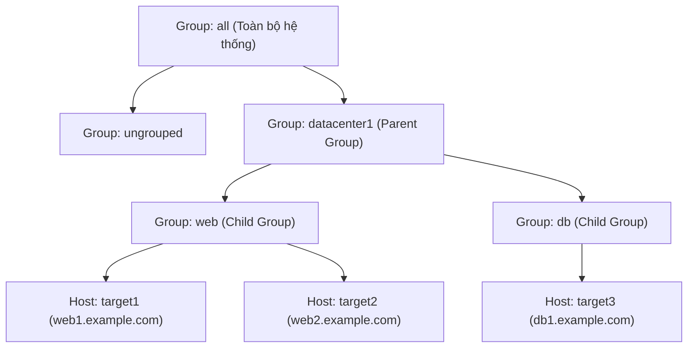
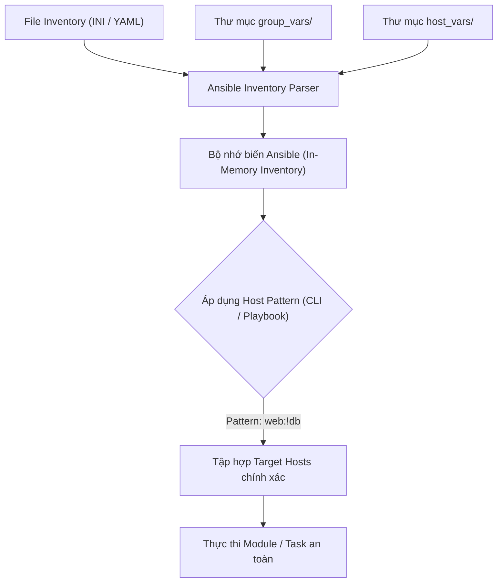


# [BÀI 03] THIẾT KẾ INVENTORY CHUẨN ENTERPRISE: STATIC VS DYNAMIC INVENTORY, HOST GROUPS, GROUP VARS & HOST VARS

Trong kỷ nguyên **Infrastructure as Code (IaC)** và tự động hóa vận hành hạ tầng đám mây (Cloud Infrastructure Automation), **Ansible** khẳng định vị thế dẫn đầu nhờ triết lý **Agentless** (không cần cài đặt agent nền trên máy đích), giao thức điều khiển an toàn qua **SSH / WinRM**, định dạng khai báo **YAML** trực quan và nguyên lý bất biến **Idempotency** mạnh mẽ. Việc làm chủ Ansible không chỉ dừng lại ở các câu lệnh Ad-hoc đơn giản, mà đòi hỏi kỹ sư phải nắm vững kiến trúc Module tầng thấp, Variable Precedence 22 tầng, Jinja2 Templates, tối ưu hóa Forks & Pipelining cho tới thiết kế Roles / Collections và tích hợp CI/CD tự động hóa chuẩn Doanh nghiệp.

Bài viết chuyên sâu này sẽ đồng hành cùng bạn mổ xẻ toàn diện bức tranh kiến trúc, phân tích các đánh đổi kỹ thuật thực chiến (Engineering Trade-offs), cung cấp hướng dẫn thực hành Lab chi tiết từng bước và bộ câu hỏi phỏng vấn chuyên sâu chuẩn DevOps / SRE Lead.

---

## 1. Bản Chất Kiến Trúc & Cơ Chế Vận Hành Tầng Thấp

---


> **Inventory định nghĩa ai bị quản và nhóm nào — pattern sai là chạy nhầm máy.**

Chủ đề xuyên suốt khóa học (I-10) tiếp tục được khắc sâu trong Buổi 03:

> **Inventory là nguồn thông tin chân lý giúp Ansible biết cần phải tương tác với những máy chủ nào. Nếu cấu hình nhóm thiếu chính xác hoặc truyền sai Host Pattern khi thực thi lệnh, Ansible có thể thực hiện thay đổi trên sai máy chủ (ví dụ chạy lệnh hạ tầng production lên nhầm máy dev, hoặc ngược lại). Terminal có thể báo `PLAY RECAP` màu xanh thành công (`ok=1`), nhưng bản chất công việc bị thực thi sai đối tượng. Do đó, việc kiểm tra danh sách máy đích bằng `ansible-inventory --graph` và `ansible <pattern> --list-hosts` trước khi chạy là yêu cầu bắt buộc.**

---


---


---


| Tiếng Việt | Tiếng Anh / Từ khóa + FQCN (giữ nguyên) |
|---|---|
| Tệp kiểm kê tài nguyên | Inventory file |
| Kiểm kê tĩnh | Static inventory |
| Nhóm mặc định toàn bộ | Default group `all` |
| Nhóm mặc định chưa phân loại | Default group `ungrouped` |
| Nhóm con | Child group / Subgroup |
| Nhóm cha | Parent group (`:children`) |
| Thư mục biến theo nhóm | `group_vars/` |
| Thư mục biến theo máy | `host_vars/` |
| Mẫu truy vấn máy đích | Host pattern |
| Biểu thức giao tập hợp | Pattern intersection (`&`) |
| Biểu thức loại trừ tập hợp | Pattern exclusion (`!`) |
| Biến kết nối Ansible | Connection variables (`ansible_host`, `ansible_port`, `ansible_user`) |
| Trực quan hóa cây kiểm kê | Inventory graph (`ansible-inventory --graph`) |

---

### 1.1. Cấu trúc Inventory và Phân cấp Nhóm (15 phút)



**Nguyên lý cốt lõi:** Ansible tự động tạo hai nhóm mặc định trong mọi Inventory: `all` (chứa toàn bộ tất cả máy chủ) và `ungrouped` (chứa những máy chủ không thuộc bất kỳ nhóm tùy chỉnh nào).

**Giải thích cơ chế ngầm:** Hai nhóm mặc định này đảm bảo mọi máy chủ khai báo trong Inventory luôn nằm trong một phạm vi có thể truy vấn được, giúp đơn giản hóa việc áp dụng các biến chung toàn cục (global variables).

> [!WARNING]
> **CẠM BẪY THỰC CHIẾN:**
> **Lệnh:** `ansible-inventory --graph` · **Output phải thấy:** Không thấy máy chủ xuất hiện trong sơ đồ cây nếu khai báo sai cú pháp thụt lề trong YAML hoặc sai tên phần tử trong INI.

**Minh hoạ.** Khai báo Inventory tĩnh đơn giản dạng INI và YAML:
```ini
# inventory.ini
target1 ansible_host=127.0.0.1 ansible_port=2221
target2 ansible_host=127.0.0.1 ansible_port=2222

[web]
target1

[db]
target2
```

**Nguyên lý cốt lõi:** Thiết lập mối quan hệ phân cấp nhóm cha - nhóm con bằng cú pháp `[parent_group_name:children]` trong INI hoặc từ khóa `children:` trong YAML.

**Giải thích cơ chế ngầm:** Gom nhóm dạng phân cấp (ví dụ: nhóm `vietnam` chứa `hanoi` và `hcm`) cho phép quản trị viên thực thi tác vụ trên quy mô lớn (toàn quốc) hoặc chia nhỏ theo từng vùng miền địa lý mà không phải lặp lại danh sách tên máy chủ.

> [!WARNING]
> **CẠM BẪY THỰC CHIẾN:**
> **Lệnh:** `ansible datacenter -m ansible.builtin.ping` · **Output phải thấy:** `[WARNING]: Could not match supplied host pattern, ignoring: datacenter` do khai báo thiếu từ khóa `:children`.

**Minh hoạ.** Tạo nhóm cha `prod` chứa 2 nhóm con `web` và `db`:
```ini
[web]
target1

[db]
target2

[prod:children]
web
db
```

**Nguyên lý cốt lõi:** Tổ chức biến theo thư mục tiêu chuẩn `group_vars/` và `host_vars/` nằm cùng cấp với file `inventory.ini` để tách biệt cấu hình khỏi dữ liệu máy chủ.

**Giải thích cơ chế ngầm:** Đặt biến trực tiếp trong file inventory làm file bị phình to, khó đọc và khó bảo trì. Việc tách biến thành các file YAML riêng lẻ (ví dụ: `group_vars/web.yml`, `host_vars/target1.yml`) giúp quản lý biến ngăn nắp và dễ tích hợp Git.

> [!WARNING]
> **CẠM BẪY THỰC CHIẾN:**
> **Lệnh:** `ansible-inventory --host target1` · **Output phải thấy:** Không chứa các biến dự kiến do đặt sai tên thư mục (nhầm thành `groups_vars` có chữ s) hoặc đặt sai vị trí thư mục.

**Minh hoạ.** Cấu trúc thư mục dự án chuẩn hóa:
```
project/
├── ansible.cfg
├── inventory.ini
├── group_vars/
│   ├── all.yml
│   ├── web.yml
│   └── db.yml
└── host_vars/
    └── target1.yml
```

---

### 1.2. Thứ tự Ưu tiên Biến và Biểu thức Host Pattern (15 phút)

**Nguyên lý cốt lõi:** Ansible nạp biến theo thứ tự ưu tiên từ rộng đến hẹp: Biến nhóm cha `all` < Biến nhóm con (`group_vars/web.yml`) < Biến riêng từng máy (`host_vars/target1.yml`).

**Giải thích cơ chế ngầm:** Cơ chế này cho phép định nghĩa các giá trị mặc định chung ở cấp cao nhất (ví dụ: `http_port: 80` cho toàn bộ nhóm web), nhưng vẫn linh hoạt cho phép một máy chủ cụ thể ghi đè giá trị riêng (`http_port: 8080`) mà không phá hỏng cấu hình chung.

> [!WARNING]
> **CẠM BẪY THỰC CHIẾN:**
> **Lệnh:** `ansible target1 -m ansible.builtin.debug -a "var=http_port"` · **Output phải thấy:** Giá trị trả về bị nhầm lẫn giữa giá trị chung và giá trị riêng do không nắm vững tầng ưu tiên.

**Minh hoạ.** File `group_vars/web.yml` định nghĩa `http_port: 80`, file `host_vars/target1.yml` ghi đè `http_port: 8080`. Khi chạy trên `target1`, giá trị `http_port` nhận được là `8080`.

**Nguyên lý cốt lõi:** Biểu thức Host Pattern cho phép thực hiện các phép toán logic trên danh sách máy: Ký tự đại diện `*`, phép HỢP (dấu phẩy `,` hoặc hai chấm `:`), phép GIAO (dấu `&`), và phép TRỪ/LOẠI TRỪ (dấu `!`).

**Giải thích cơ chế ngầm:** Quản trị viên cần khả năng chọn lọc mục tiêu cực kỳ chính xác (ví dụ: "chỉ chạy trên các máy web thuộc môi trường production nhưng không thuộc nhóm database").

> [!WARNING]
> **CẠM BẪY THỰC CHIẾN:**
> **Lệnh:** `ansible 'web:!db' --list-hosts` · **Output phải thấy:** Lệnh trong bash bị lỗi cú pháp `bash: !db: event not found` do quên bọc chuỗi pattern trong cặp dấu ngoặc đơn `'...'`.

**Minh hoạ.** Các cú pháp pattern phổ biến trên CLI:
```bash
ansible 'all' --list-hosts                  # Tất cả các máy
ansible 'target1,target2' --list-hosts      # Liệt kê đích danh host
ansible 'web*' --list-hosts                 # Máy có tên bắt đầu bằng web
ansible 'web:&prod' --list-hosts            # Máy vừa thuộc nhóm web VỪA thuộc nhóm prod
ansible 'web:!db' --list-hosts              # Máy thuộc nhóm web NHƯNG KHÔNG thuộc nhóm db
```

**Nguyên lý cốt lõi:** Luôn sử dụng lệnh `ansible-inventory --graph` và `ansible <pattern> --list-hosts` để rà soát danh sách máy đích trước khi thực thi bất kỳ tác vụ ad-hoc hay playbook nào.

**Giải thích cơ chế ngầm:** Trong tự động hóa, chạy sai máy đích là thảm họa nghiêm trọng. Việc đối soát bằng `--list-hosts` mất 2 giây nhưng ngăn chặn nguy cơ vô tình tác động làm hỏng môi trường Production.

> [!WARNING]
> **CẠM BẪY THỰC CHIẾN:**
> **Lệnh:** `ansible-playbook site.yml` · **Output phải thấy:** Thực thi lệnh trực tiếp mà không biết lệnh đang tác động lên những IP nào.

**Minh hoạ.** Kiểm tra danh sách máy thuộc pattern loại trừ trước khi chạy:
```bash
ansible 'prod:!disabled' --list-hosts
```

---

### 1.3. Kết nối Hệ thống và Quản lý Đa Môi trường (10 phút)

**Nguyên lý cốt lõi:** Sử dụng các biến kết nối đặc biệt (`ansible_host`, `ansible_port`, `ansible_user`, `ansible_ssh_private_key_file`) để định ánh xạ alias tên máy chủ tới IP và cổng kết nối SSH thực tế.

**Giải thích cơ chế ngầm:** Tên máy chủ trong Inventory nên là tên đại diện dễ nhớ (alias ngắn gọn như `target1`, `web-node-01`). Các biến kết nối giải quyết việc ánh xạ tới IP động, port SSH tùy chỉnh (ví dụ port 2221 trong Docker) hoặc user đăng nhập riêng biệt.

> [!WARNING]
> **CẠM BẪY THỰC CHIẾN:**
> **Lệnh:** `ansible target1 -m ansible.builtin.ping` · **Output phải thấy:** `ssh: connect to host target1 port 22: Connection refused` do thiếu biến `ansible_host` hoặc `ansible_port`.

**Minh hoạ.** Khai báo biến kết nối chuẩn trong `inventory.ini`:
```ini
[web]
target1 ansible_host=127.0.0.1 ansible_port=2221 ansible_user=ansible
target2 ansible_host=127.0.0.1 ansible_port=2222 ansible_user=ansible
```

**Nguyên lý cốt lõi:** Tách biệt không gian kiểm kê môi trường bằng cách lưu trữ thành các file/thư mục riêng độc lập (ví dụ `inventory/dev` và `inventory/prod`) mà không thay đổi mã nguồn Playbook.

**Giải thích cơ chế ngầm:** Một Playbook chuẩn chỉ mô tả quy trình bài toán (ví dụ: cài webserver). Việc tách riêng file inventory giúp tái sử dụng 100% Playbook cho cả môi trường Development, Staging và Production chỉ bằng cách thay đổi tham số `-i <inventory_path>`.

> [!WARNING]
> **CẠM BẪY THỰC CHIẾN:**
> **Lệnh:** `ansible-playbook site.yml` · **Output phải thấy:** Phải sửa trực tiếp file YAML Playbook để đổi tên IP máy đích khi chuyển môi trường.

**Minh hoạ.** Thực thi cùng một Playbook trên 2 môi trường khác nhau:
```bash
ansible-playbook -i inventory/dev site.yml
ansible-playbook -i inventory/prod site.yml
```

**Nguyên lý cốt lõi:** Tuyệt đối không lưu trữ các thông tin bí mật nhạy cảm (mật khẩu SSH, API Key, Token) dạng văn bản thô (plain-text) bên trong file Inventory hay file `group_vars`.

**Giải thích cơ chế ngầm:** File Inventory và các biến môi trường thường được commit lên hệ thống quản lý mã nguồn Git. Đặt mật khẩu plain-text làm rò rỉ thông tin an ninh nghiêm trọng. Các dữ liệu nhạy cảm bắt buộc phải mã hóa bằng Ansible Vault.

> [!WARNING]
> **CẠM BẪY THỰC CHIẾN:**
> **Lệnh:** `git status` · **Output phải thấy:** File `inventory.ini` chứa `ansible_password=MySecretPassword123` chuẩn bị được đẩy lên GitHub/GitLab.

**Minh hoạ.** Sử dụng SSH Key hoặc mã hóa Ansible Vault thay vì ghi mật khẩu thô:
```ini
# ĐÚNG: Sử dụng SSH key authentication
target1 ansible_host=127.0.0.1 ansible_port=2221 ansible_ssh_private_key_file=~/.ssh/id_ed25519
```

---

### 1.4. Đưa vào việc thật (4 phút)

### 7.1. Áp dụng vào hạ tầng sẵn có
Khi quản lý hạ tầng hỗn hợp gồm 200 máy chủ cloud (AWS, Azure, On-premise):
- Tạo cấu trúc phân cấp nhóm theo vùng địa lý (`us-east`, `ap-southeast`) và theo chức năng (`webservers`, `databases`).
- Đặt các tham số cấu hình chung (DNS Server, NTP Server) vào `group_vars/all.yml`, đặt thông số RAM/Swap cụ thể vào từng `host_vars/`.

### 7.2. Rủi ro hỏng hóc khi triển khai Production và giải pháp an toàn
- **Rủi ro:** Gõ lệnh ad-hoc hoặc playbook với pattern `all` trên môi trường Production sẽ khởi động lại toàn bộ máy chủ cùng lúc, gây sập dịch vụ toàn hệ thống.
- **Giải pháp an toàn:**
  1. Luôn chạy `ansible <pattern> --list-hosts` kiểm tra danh sách máy trước khi nhấn Enter.
  2. Bắt buộc dùng pattern loại trừ để bảo vệ các máy nhạy cảm: `ansible 'web:!prod-master' -m ...`.

### 7.3. Đo lường chỉ số Trước – Sau khi áp dụng
- **Trước khi tổ chức Inventory chuẩn:** Quản trị viên phải ghi nhớ IP của 50 máy chủ, SSH thủ công từng máy mất 30 phút, dễ nhầm lẫn IP giữa máy Dev và Prod.
- **Sau khi tổ chức Inventory chuẩn:** Truy vấn máy chủ qua alias ngắn gọn (`target1`, `web`), lọc nhóm máy chỉ mất 1 giây bằng lệnh `--list-hosts`.

### 7.4. Khi nào KHÔNG nên dùng Inventory tĩnh ghi tay
- **Không dùng Inventory tĩnh cho hạ tầng Cloud co giãn tự động (Auto Scaling):** Khi các máy chủ EC2/VM liên tục được tạo mới và xóa bỏ tự động theo lưu lượng truy cập, việc ghi tay IP vào file tĩnh sẽ bị lạc hậu ngay lập tức. Trong trường hợp này, **bắt buộc chuyển sang dùng Dynamic Inventory Plugin** (sẽ học ở Buổi 24).

---

### 1.5. Bẫy hay gặp (2 phút)

| # | Bẫy hay gặp | Vì sao "recap xanh mà sai / không idempotent" | Lệnh phát hiện và xử lý |
|---|---|---|---|
| 1 | Bị lỗi Bash Event khi dùng dấu `!` trong Host Pattern | Dấu chấm cảm `!` bị shell Bash hiểu nhầm là truy vấn lịch sử lệnh (History expansion). | Bọc toàn bộ chuỗi pattern trong cặp dấu ngoặc đơn: `ansible 'web:!db' --list-hosts`. |
| 2 | Đặt sai tên thư mục `group_vars` | Đặt tên thư mục thành `groups_vars` (thừa chữ s) làm Ansible không tự động nạp biến. | Chạy `ansible-inventory --host target1` kiểm tra xem biến nhóm có xuất hiện hay không. |
| 3 | Sai thứ tự ưu tiên biến giữa Group vars và Host vars | Khai báo biến ở `group_vars` nhưng không biết rằng giá trị đó đã bị một file trong `host_vars` ghi đè ngầm. | Chạy `ansible-inventory --host <hostname>` để xem giá trị biến cuối cùng mà Ansible ghi nhận. |
| 4 | Thiếu từ khóa `:children` khi định nghĩa nhóm cha trong INI | Viết `[datacenter]` rồi liệt kê tên nhóm con bên dưới, Ansible hiểu nhầm đó là tên các máy chủ tĩnh. | Bổ sung từ khóa `:children` đúng cú pháp INI: `[datacenter:children]`. |
| 5 | Nhầm lẫn giữa nhãn nhóm và Tên Host đại diện | Đặt tên nhóm trùng với tên host (ví dụ nhóm tên `target1` chứa host `target1`) gây xung đột khi lọc pattern. | Đặt tên nhóm dạng số nhiều hoặc danh từ chung (`webservers`, `db_nodes`), tên host là định danh cụ thể. |
| 6 | Ghi mật khẩu SSH dạng plain-text vào file Inventory | Commit file inventory chứa `ansible_password=123456` lên kho mã nguồn công cộng. | Xóa mật khẩu thô, chuyển sang dùng SSH Public Key hoặc mã hóa file chứa biến bằng Ansible Vault. |
| 7 | Không chỉ định `ansible_python_interpreter` cho máy target | Máy đích dùng Python 3 ở đường dẫn không tiêu chuẩn dẫn tới lệnh ad-hoc báo lỗi không tìm thấy Python. | Đặt `ansible_python_interpreter: /usr/bin/python3` trong `group_vars/all.yml`. |
| 8 | Quên cờ `-i` khi sử dụng file inventory tùy chỉnh | Ansible tự động lùi về đọc file mặc định `/etc/ansible/hosts` không chứa danh sách máy của dự án. | Khai báo `inventory = ./inventory.ini` trong `ansible.cfg` hoặc truyền cờ `-i ./inventory.ini`. |
| 9 | Trình bày sai cú pháp thụt lề YAML trong Inventory dạng YAML | Thụt lề sai giữa các từ khóa `hosts:` và `vars:` khiến Ansible báo lỗi parse cú pháp XML/YAML. | Sử dụng công cụ `ansible-inventory -i inventory.yml --graph` để kiểm tra tính hợp lệ của file YAML. |
| 10 | Chạy Playbook mà không rà soát danh sách host bằng `--list-hosts` | Nhầm lẫn giữa nhóm `dev` và `prod` dẫn tới thực thi câu lệnh xóa dữ liệu trên môi trường thật. | Tạo thói quen chạy `ansible <pattern> --list-hosts` trước mọi lệnh tác động thay đổi. |
| 11 | Khai báo lặp lại biến kết nối cho từng host thay vì dùng `group_vars` | Gõ đi gõ lại `ansible_user=ansible` cho 100 dòng host trong file inventory tĩnh. | Chuyển các biến kết nối chung vào file `group_vars/all.yml`. |
| 12 | Giả định thứ tự nạp biến của các nhóm con là cố định | Khai báo 1 host thuộc 2 nhóm con khác nhau cùng chứa 1 biến nhưng không biết nhóm nào sẽ thắng. | Tránh đặt trùng tên biến ở các nhóm cùng cấp, hoặc quản lý ghi đè bằng `host_vars`. |

---

### 1.6. Tóm tắt (1 phút)



### Năm điều phải nhớ
1. **Inventory là nguồn chân lý:** Quản lý chính xác máy chủ nào thuộc về nhóm nào.
2. **Cấu trúc biến chuẩn hóa:** Sử dụng thư mục `group_vars/` và `host_vars/` để tách biệt cấu hình khỏi dữ liệu inventory.
3. **Thứ tự ưu tiên nạp biến:** Biến riêng của máy (`host_vars`) luôn ghi đè biến chung của nhóm (`group_vars`).
4. **Luôn bọc Host Pattern trong dấu ngoặc đơn:** Tránh lỗi Bash Event Expansion với ký tự `!`.
5. **Rà soát danh sách máy trước khi chạy:** Luôn chạy `ansible-inventory --graph` và `ansible <pattern> --list-hosts` để ngăn chặn việc tác động nhầm máy chủ.

---

### 1.7. Câu hỏi tự kiểm tra (kiêm luyện RHCE EX294)

1. **[RHCE EX294 Objective #4]** Hai nhóm mặc định nào luôn tồn tại trong mọi Inventory của Ansible?
   - *Đáp án:* Nhóm `all` (chứa tất cả các host) và nhóm `ungrouped` (chứa các host không thuộc nhóm tùy chỉnh nào).
2. **[RHCE EX294 Objective #4]** Trong định dạng INI, cú pháp nào dùng để khai báo nhóm `datacenter` là nhóm cha chứa 2 nhóm con `web` và `db`?
   - *Đáp án:* Khai báo section `[datacenter:children]` và liệt kê `web` và `db` ở các dòng bên dưới.
3. **[RHCE EX294 Objective #4]** Thư mục `group_vars/` phải nằm ở đâu để Ansible tự động nạp các file biến nhóm?
   - *Đáp án:* Thư mục `group_vars/` phải nằm cùng cấp thư mục với file Inventory được sử dụng hoặc cùng cấp với file Playbook.
4. **[RHCE EX294 Objective #4]** Nếu biến `http_port` được định nghĩa là `80` trong `group_vars/all.yml` và là `8080` trong `host_vars/target1.yml`, giá trị nào sẽ được áp dụng cho `target1`?
   - *Đáp án:* Giá trị `8080` sẽ được áp dụng vì biến ở `host_vars` có mức ưu tiên cao hơn `group_vars`.
5. **[RHCE EX294 Objective #4]** Lệnh CLI nào dùng để in ra cây phân cấp kiểm kê tài nguyên dưới dạng đồ họa trực quan?
   - *Đáp án:* `ansible-inventory --graph` (hoặc truyền thêm cờ `-i <inventory_path>`).
6. **[RHCE EX294 Objective #4]** Viết lệnh CLI để kiểm tra danh sách tất cả các host nằm trong nhóm `web` hoặc nhóm `db`.
   - *Đáp án:* `ansible 'web,db' --list-hosts` (hoặc `ansible 'web:db' --list-hosts`).
7. **[RHCE EX294 Objective #4]** Biểu thức pattern `'web:&prod'` có ý nghĩa gì khi chọn danh sách máy đích?
   - *Đáp án:* Chọn các máy chủ VỪA nằm trong nhóm `web` VỪA nằm trong nhóm `prod` (phép GIAO tập hợp).
8. **[RHCE EX294 Objective #4]** Tại sao phải bọc chuỗi pattern `'web:!db'` trong cặp dấu ngoặc đơn khi chạy trên terminal Bash?
   - *Đáp án:* Để ngăn chặn shell Bash giải nghĩa dấu chấm cảm `!` thành lệnh History Expansion gây lỗi `bash: !db: event not found`.
9. **[RHCE EX294 Objective #4]** Biến kết nối Ansible nào dùng để chỉ định địa chỉ IP hoặc tên miền thực tế của máy đích khi sử dụng tên alias ngắn trong Inventory?
   - *Đáp án:* Biến `ansible_host`.
10. **[RHCE EX294 Objective #4]** Biến kết nối Ansible nào dùng để thay đổi cổng kết nối SSH từ mặc định 22 sang cổng tùy chỉnh (ví dụ 2221)?
    - *Đáp án:* Biến `ansible_port`.
11. **[RHCE EX294 Objective #4]** Làm thế nào để xem toàn bộ các biến đã nạp cho một host cụ thể `target1` dưới dạng định dạng JSON?
    - *Đáp án:* `ansible-inventory --host target1`
12. **[RHCE EX294 Objective #4]** Lợi ích lớn nhất của việc tách riêng file inventory theo môi trường (`inventory/dev` và `inventory/prod`) là gì?
    - *Đáp án:* Tái sử dụng nguyên vẹn mã nguồn Playbook cho nhiều môi trường mà không cần sửa đổi mã lệnh, chỉ cần thay đổi tham số chỉ định inventory `-i`.
13. **[RHCE EX294 Objective #4]** Tại sao không nên lưu trữ bí mật (mật khẩu, token) plain-text trong file `group_vars`?
    - *Đáp án:* Vì file này dễ bị rò rỉ khi đẩy lên các kho lưu trữ mã nguồn Git công cộng; thay vào đó phải dùng Ansible Vault để mã hóa.

---

### 1.8. Tài liệu tham khảo

- Ansible Core Documentation (v2.15+): [How to build your inventory](https://docs.ansible.com/ansible/latest/inventory_guide/intro_inventory.html)
- Ansible Core Documentation: [Working with dynamic inventory and patterns](https://docs.ansible.com/ansible/latest/inventory_guide/intro_patterns.html)
- Red Hat Certified Engineer (RHCE) EX294 Study Guide: Managing Ansible Inventories & Variable Precedence.

---

## Bảng đối soát thời lượng

| Mục | Nội dung | Thời lượng dự kiến | Thời lượng thực tế |
|---|---|---|---|
| §0 | Khởi động và ôn tập buổi 02 | 10 phút | 10 phút |
| §1–§2 | Mục tiêu làm được & Cần biết trước | 2 phút | 2 phút |
| §3 | Thuật ngữ Việt-Anh & Mô hình tư duy | 8 phút | 8 phút |
| §4 | Cấu trúc Inventory & Phân cấp Nhóm (QT 4.1–4.3) | 15 phút | 15 phút |
| §5 | Thứ tự Ưu tiên Biến & Host Pattern (QT 5.1–5.3) | 15 phút | 15 phút |
| §6 | Kết nối Hệ thống & Đa Môi trường (QT 6.1–6.3) | 10 phút | 10 phút |
| §7–§9 | Đưa vào việc thật, Bẫy hay gặp & Tóm tắt | 7 phút | 7 phút |
| §10–§11 | Câu hỏi tự kiểm tra EX294 & Tài liệu tham khảo | 3 phút | 3 phút |
| **Tổng** | **Khối lý thuyết Buổi 03** | **60 phút** | **60 phút** |

---

## 2. Hướng Dẫn Thực Hành & Triển Khai Lab Chuẩn Production

> [!IMPORTANT]
> **YÊU CẦU MÔI TRƯỜNG THỰC HÀNH:**
> Toàn bộ các bài thực hành dưới đây được thiết kế để chạy trực tiếp trên môi trường máy chủ Linux / Docker containers phân tán. Hãy đảm bảo bạn đã chuẩn bị Control Node cài đặt Ansible Core 2.15+ cùng các Managed Nodes đã cấu hình SSH Key Authentication.

## Khối thực hành — 150 phút

> **Đối soát thời lượng:** Khối thực hành kéo dài đúng **150'** (từ L0 đến L11).
> **Nguyên tắc cốt lõi:** Lab thực hành xây dựng cấu trúc Inventory tĩnh chuẩn hóa (INI và YAML), thiết lập nhóm cha-nhóm con, tổ chức thư mục biến `group_vars/` và `host_vars/`, kiểm tra quy luật ghi đè ưu tiên biến, rà soát các Host Pattern phức tạp bằng CLI, chứng minh tính **Idempotency** (chạy lần 2 `changed=0`) và đối soát trạng thái máy đích qua `docker exec`.

---

## L0. Mục tiêu thực hành và tiêu chí hoàn thành

| # | Mục tiêu thực hành | Tiêu chí hoàn thành (Kiểm tra bằng lệnh CLI) |
|---|---|---|
| TH1 | Xây dựng Inventory INI và YAML phân cấp | Lệnh `ansible-inventory --graph` in sơ đồ cây đầy đủ nhóm cha/con |
| TH2 | Tổ chức thư mục biến `group_vars/` & `host_vars/` | Lệnh `ansible-inventory --host target1` trả về đúng biến đã định nghĩa |
| TH3 | Kiểm tra thứ tự ưu tiên ghi đè biến | Biến trong `host_vars/` ghi đè thành công biến trong `group_vars/` |
| TH4 | Kiểm tra các biểu thức Host Pattern CLI | Lệnh `--list-hosts` lọc chính xác danh sách host theo pattern `,`, `&`, `!` |
| TH5 | Thực thi lệnh ad-hoc an toàn theo pattern | Lệnh ad-hoc chạy thành công trên nhóm chọn lọc không tác động nhầm host |
| TH6 | Chứng minh tính Idempotency qua pattern | Chạy lại lệnh ad-hoc cài đặt/tạo file lần 2 báo `changed=false` |
| TH7 | Đa môi trường Inventory | Chạy kiểm tra tách biệt giữa `inventory/dev` và `inventory/prod` |
| TH8 | Đối soát sự thật máy đích bằng docker exec | `docker exec target1 cat /etc/motd` xác nhận biến đã được áp dụng thật |

---

## L1. Điều kiện tiên quyết về môi trường

| Kiểm tra | LỆNH THỰC THI | Kết quả kỳ vọng |
|---|---|---|
| Ansible core đã cài | `ansible --version` | Phiên bản ansible-core v2.15 trở lên |
| Docker Compose sẵn sàng | `docker compose ps` | Cả target1 và target2 ở trạng thái `Up` |
| Kết nối SSH sẵn sàng | `ansible all -m ansible.builtin.ping` | Đạt `SUCCESS` cho cả 2 target host |
| Cấu hình `ansible.cfg` | `ansible --version` | Nhận diện file `./ansible.cfg` |
| Thư mục thực hành | `pwd` | Đang ở thư mục `~/lab-ansible-03` |

Nếu chưa có target container:
```bash
cd labs && make up && make key && make inventory
```

---

## L2. Kiến trúc bài lab

```mermaid
graph TD
    SubGraph1["Control Node (Ansible CLI)"] --> |Lọc Host Pattern| PATTERN{"Biểu thức Host Pattern"}
    PATTERN --> |1. pattern: web:!db| T1["Target Container 1 (target1 - Web Node)"]
    PATTERN --> |2. pattern: db| T2["Target Container 2 (target2 - DB Node)"]
    
    VARS["Biến nạp tự động"] --> |group_vars/web.yml| T1
    VARS --> |host_vars/target1.yml (Ghi đè)| T1
    VARS --> |group_vars/db.yml| T2
    
    DEV["Học viên (Tester)"] --> |A. Khai báo Inventory & Vars| SubGraph1
    DEV --> |B. Đối soát trực tiếp bằng docker exec| T1
    DEV --> |C. Đối soát trực tiếp bằng docker exec| T2
```

---

## L3. Bước 1 — Xây dựng cấu trúc Thư mục và Inventory Tĩnh (30 phút)

Khởi tạo thư mục làm việc cho Buổi 03 và soạn thảo file cấu hình `ansible.cfg` kết hợp với file inventory tĩnh dạng INI và YAML (QT 4.1, QT 6.1).

```bash
mkdir -p ~/lab-ansible-03 && cd ~/lab-ansible-03

cat << 'EOF' > ansible.cfg
[defaults]
inventory = ./inventory.ini
remote_user = ansible
host_key_checking = False
private_key_file = ~/.ssh/id_ed25519

[privilege_escalation]
become = True
become_method = sudo
become_user = root
become_ask_pass = False
EOF

cat << 'EOF' > inventory.ini
[web]
target1 ansible_host=127.0.0.1 ansible_port=2221

[db]
target2 ansible_host=127.0.0.1 ansible_port=2222

[datacenter:children]
web
db

[all:vars]
ansible_python_interpreter=/usr/bin/python3
environment_name=production
EOF
```

Chuyển đổi hoặc viết file tương đương dạng YAML `inventory.yml`:
```bash
cat << 'EOF' > inventory.yml
all:
  vars:
    ansible_python_interpreter: /usr/bin/python3
    environment_name: production
  children:
    datacenter:
      children:
        web:
          hosts:
            target1:
              ansible_host: 127.0.0.1
              ansible_port: 2221
        db:
          hosts:
            target2:
              ansible_host: 127.0.0.1
              ansible_port: 2222
EOF
```

**CHECKPOINT 1 — Kiểm tra tính hợp lệ và cấu trúc đồ họa của Inventory dạng INI.**
- **Lệnh kiểm tra:**
```bash
GRAPH_OUT=$(ansible-inventory -i inventory.ini --graph)
if echo "$GRAPH_OUT" | grep -q "@datacenter:" && echo "$GRAPH_OUT" | grep -q "  |--@web:" && echo "$GRAPH_OUT" | grep -q "  |--@db:"; then
  echo "CHECKPOINT 1: ĐẠT - Inventory INI phân cấp nhóm cha datacenter và nhóm con web/db chính xác"
else
  echo "CHECKPOINT 1: LỖI - Inventory INI chưa phân cấp nhóm cha/con đúng quy chuẩn"
fi
```

**CHECKPOINT 2 — Kiểm tra đồ họa của Inventory định dạng YAML tương đương.**
- **Lệnh kiểm tra:**
```bash
YAML_GRAPH=$(ansible-inventory -i inventory.yml --graph)
if echo "$YAML_GRAPH" | grep -q "@datacenter:" && echo "$YAML_GRAPH" | grep -q "target1" && echo "$YAML_GRAPH" | grep -q "target2"; then
  echo "CHECKPOINT 2: ĐẠT - Inventory YAML parsed chính xác các nhóm và host"
else
  echo "CHECKPOINT 2: LỖI - Inventory YAML bị lỗi cú pháp parse"
fi
```

---

## L4. Bước 2 — Tổ chức Thư mục group_vars và host_vars (30 phút)

Tách biệt cấu hình biến bằng cách tạo thư mục `group_vars/` và `host_vars/` nằm cùng cấp với file `inventory.ini` (QT 4.3).

```bash
mkdir -p group_vars host_vars

cat << 'EOF' > group_vars/all.yml
global_company: "NTKAnsible Corp"
dns_server: "8.8.8.8"
app_port: 80
EOF

cat << 'EOF' > group_vars/web.yml
app_name: "NTK Web Application"
app_port: 8080
max_clients: 100
EOF

cat << 'EOF' > group_vars/db.yml
app_name: "NTK Database Service"
db_port: 5432
EOF

cat << 'EOF' > host_vars/target1.yml
custom_host_note: "Primary Web Server Target 1"
app_port: 9090
EOF
```

**CHECKPOINT 3 — Tự động nạp biến từ group_vars/all.yml và group_vars/web.yml.**
- **Lệnh kiểm tra:**
```bash
HOST_VARS_OUT=$(ansible-inventory --host target1)
if echo "$HOST_VARS_OUT" | grep -q '"global_company": "NTKAnsible Corp"' && echo "$HOST_VARS_OUT" | grep -q '"max_clients": 100'; then
  echo "CHECKPOINT 3: ĐẠT - Ansible tự động nạp biến chính xác từ group_vars/all.yml và group_vars/web.yml"
else
  echo "CHECKPOINT 3: LỖI - Không nạp được biến từ thư mục group_vars/"
fi
```

**CHECKPOINT 4 — Kiểm tra quy tắc ưu tiên: Biến trong host_vars/ ghi đè biến trong group_vars/.**
- **Lệnh kiểm tra:**
```bash
PORT_VAL=$(ansible-inventory --host target1 | grep '"app_port": 9090')
if [ -n "$PORT_VAL" ]; then
  echo "CHECKPOINT 4: ĐẠT - Biến app_port=9090 từ host_vars/target1.yml ghi đè thành công biến 8080 từ group_vars/web.yml"
else
  echo "CHECKPOINT 4: LỖI - Thứ tự ưu tiên biến bị sai (host_vars không ghi đè được group_vars)"
fi
```

---

## L5. Bước 3 — Rà soát Biểu thức Host Pattern CLI (25 phút)

Thực hành kiểm tra các biểu thức Host Pattern trên dòng lệnh CLI kết hợp với cờ `--list-hosts` để rà soát danh sách máy đích chính xác trước khi thực thi tác vụ (QT 5.2, QT 5.3).

Thực hiện chạy kiểm tra các pattern:
```bash
ansible 'all' --list-hosts
ansible 'web' --list-hosts
ansible 'datacenter' --list-hosts
ansible 'web,db' --list-hosts
ansible 'datacenter:!db' --list-hosts
ansible 'web:&datacenter' --list-hosts
```

**CHECKPOINT 5 — Kiểm tra pattern loại trừ web:!db lọc đúng duy nhất target1.**
- **Lệnh kiểm tra:**
```bash
PATTERN_OUT=$(ansible 'datacenter:!db' --list-hosts)
if echo "$PATTERN_OUT" | grep -q "target1" && ! echo "$PATTERN_OUT" | grep -q "target2"; then
  echo "CHECKPOINT 5: ĐẠT - Host pattern 'datacenter:!db' lọc chính xác target1 và loại trừ target2"
else
  echo "CHECKPOINT 5: LỖI - Host pattern loại trừ lọc không chính xác"
fi
```

---

## L6. Bước 4 — Thực thi Lệnh Ad-hoc theo Pattern và Kiểm tra Idempotency (35 phút)

Thực hiện áp đặt cấu hình biến xuống máy đích thông qua lệnh ad-hoc theo đúng pattern đã lọc, chứng minh tính bất biến khi chạy lại lần 2 (QT 5.1, QT 6.3).

Tạo tệp cấu hình `/etc/app_env.conf` chứa nội dung biến trên nhóm `web`:
```bash
ansible 'web' -m ansible.builtin.copy -a "content='APP_NAME=NTK Web App\nPORT=9090\nCOMPANY=NTKAnsible Corp\n' dest=/etc/app_env.conf mode='0644'" --become
```

Chạy lại lệnh ad-hoc lần 2 để kiểm tra Idempotency:
```bash
ansible 'web' -m ansible.builtin.copy -a "content='APP_NAME=NTK Web App\nPORT=9090\nCOMPANY=NTKAnsible Corp\n' dest=/etc/app_env.conf mode='0644'" --become
```

**CHECKPOINT 6 — Lệnh ad-hoc tạo file theo pattern chạy lần 2 trả về changed=false.**
- **Lệnh kiểm tra:**
```bash
RUN2_RES=$(ansible 'web' -m ansible.builtin.copy -a "content='APP_NAME=NTK Web App\nPORT=9090\nCOMPANY=NTKAnsible Corp\n' dest=/etc/app_env.conf mode='0644'" --become)
if echo "$RUN2_RES" | grep -q '"changed": false' || echo "$RUN2_RES" | grep -q 'SUCCESS => {"changed": false'; then
  echo "CHECKPOINT 6: ĐẠT - Lệnh ad-hoc áp dụng biến qua pattern đạt tính Idempotency (changed=0 / changed=false lần 2)"
else
  echo "CHECKPOINT 6: LỖI - Lệnh ad-hoc không đạt tính Idempotency"
fi
```

---

## L7. Bước 5 — Đa Môi trường và Đối soát Thực tế trên Máy đích (30 phút)

Thiết lập thư mục kiểm kê đa môi trường `inventory/dev` và `inventory/prod` (QT 6.2) và đối soát trực tiếp sự thật máy đích qua `docker exec`.

```bash
mkdir -p inventory/dev inventory/prod

cat << 'EOF' > inventory/dev/hosts
[web]
target1 ansible_host=127.0.0.1 ansible_port=2221 ansible_python_interpreter=/usr/bin/python3 env_type=development
EOF

cat << 'EOF' > inventory/prod/hosts
[web]
target2 ansible_host=127.0.0.1 ansible_port=2222 ansible_python_interpreter=/usr/bin/python3 env_type=production
EOF
```

**CHECKPOINT 7 — Phân tách môi trường: inventory/dev trỏ target1, inventory/prod trỏ target2.**
- **Lệnh kiểm tra:**
```bash
DEV_HOSTS=$(ansible all -i inventory/dev/hosts --list-hosts)
PROD_HOSTS=$(ansible all -i inventory/prod/hosts --list-hosts)
if echo "$DEV_HOSTS" | grep -q "target1" && echo "$PROD_HOSTS" | grep -q "target2"; then
  echo "CHECKPOINT 7: ĐẠT - Tách biệt thành công kiểm kê môi trường dev và prod"
else
  echo "CHECKPOINT 7: LỖI - Kiểm kê đa môi trường chưa chính xác"
fi
```

**CHECKPOINT 8 — Đối soát thực tế qua docker exec xác nhận nội dung file /etc/app_env.conf trên target1.**
- **Lệnh kiểm tra:**
```bash
REAL_FILE=$(docker exec target1 cat /etc/app_env.conf)
if echo "$REAL_FILE" | grep -q "PORT=9090" && echo "$REAL_FILE" | grep -q "COMPANY=NTKAnsible Corp"; then
  echo "CHECKPOINT 8: ĐẠT - Kiểm tra thực tế qua docker exec xác nhận các biến nạp từ host_vars đã được chép đúng xuống máy đích"
else
  echo "CHECKPOINT 8: LỖI - Nội dung tệp thực tế trên máy đích không chính xác"
fi
```

---

## L8. Nộp sản phẩm và dọn dẹp (10 phút)

Thu thập kết quả ra các file báo cáo cuối buổi:
```bash
ansible-inventory -i inventory.ini --graph > pattern-check.txt
ansible 'datacenter:!db' --list-hosts >> pattern-check.txt
ansible 'web' -m ansible.builtin.copy -a "content='APP_NAME=NTK Web App\nPORT=9090\nCOMPANY=NTKAnsible Corp\n' dest=/etc/app_env.conf mode='0644'" --become > idempotency-check.txt
docker exec target1 cat /etc/app_env.conf > kiem-may-dich.txt
```

---

## L9. Xử lý sự cố

| # | Hiện tượng lỗi | Nguyên nhân gốc rễ | Cách xử lý nhanh |
|---|---|---|---|
| 1 | Lỗi `bash: !db: event not found` khi gõ pattern CLI | Shell Bash tự động giải nghĩa dấu `!` thành lệnh xem lại lịch sử bash history | Bọc toàn bộ biểu thức pattern trong cặp dấu ngoặc đơn: `'web:!db'`. |
| 2 | Biến trong `group_vars/web.yml` không được nạp | Đặt tên thư mục thành `groups_vars` (thừa chữ s) hoặc file `web.yml` không trùng tên với nhóm `web` trong inventory | Đổi tên thư mục thành `group_vars` và tên file trùng khớp 100% với tên nhóm. |
| 3 | Lỗi `[WARNING]: Could not match supplied host pattern` | Gõ sai tên nhóm hoặc quên từ khóa `:children` khi định nghĩa nhóm cha trong INI | Kiểm tra lại cú pháp `[parent_group:children]` trong file `inventory.ini`. |
| 4 | Biến `host_vars` không ghi đè được `group_vars` | Tên file trong `host_vars/` (ví dụ `target1.yaml`) không khớp tên host khai báo trong inventory (`target1`) | Đặt tên file trong `host_vars/` khớp đúng với hostname trong inventory (dùng extension `.yml`). |
| 5 | Lỗi parse YAML khi chạy `ansible-inventory -i inventory.yml --graph` | Thụt lề dấu cách không đồng nhất hoặc dùng phím Tab trong file `inventory.yml` | Đổi phím Tab thành 2 dấu cách chuẩn YAML và kiểm tra thụt lề từ khóa `hosts:`, `vars:`. |
| 6 | Chạy lệnh ad-hoc bị thiếu biến `ansible_python_interpreter` | Máy đích dùng Python ở đòn dẫn riêng khiến Ansible báo lỗi không tìm thấy `/usr/bin/python` | Khai báo `ansible_python_interpreter: /usr/bin/python3` trong `group_vars/all.yml`. |
| 7 | Không thể kết nối SSH khi đổi tên alias máy chủ | Tạo alias `web-node-1` trong inventory nhưng thiếu khai báo biến `ansible_host=127.0.0.1` | Khai báo bổ sung `ansible_host=<IP>` ngay tại dòng khai báo host alias. |
| 8 | Chạy lệnh ad-hoc tác động nhầm sang tất cả các host | Gõ thiếu dấu ngoặc đơn hoặc nhầm lẫn pattern làm Ansible nhận diện mặc định là `all` | Chạy `ansible <pattern> --list-hosts` trước để kiểm tra danh sách máy sẽ bị ảnh hưởng. |
| 9 | Biến chứa ký tự đặc biệt bị lỗi parse Jinja2 | Biến trong `group_vars` chứa ký tự hai chấm `:` hoặc ngoặc nhọn `{}` không đặt trong ngoặc kép | Bọc toàn bộ giá trị chuỗi chứa ký tự đặc biệt trong cặp dấu ngoặc kép: `my_var: "value:123"`. |
| 10 | Phân tách thư mục `inventory/dev` nhưng Ansible vẫn đọc file cũ | File `ansible.cfg` đang cấu hình cứng `inventory = ./inventory.ini` | Truyền cờ chỉ định inventory tường minh trên dòng CLI: `ansible all -i inventory/dev/hosts`. |
| 11 | Cờ `--list-hosts` không hiển thị host thuộc nhóm con | Nhóm cha chưa tích hợp đúng các nhóm con trong phần `children:` | Kiểm tra lại cấu trúc phân cấp đồ họa bằng `ansible-inventory --graph`. |
| 12 | File `host_vars` chứa bí mật nhạy cảm bị đẩy lên Git | Lưu mật khẩu plain-text trong `host_vars/target1.yml` | Sử dụng lệnh `ansible-vault encrypt host_vars/target1.yml` để mã hóa file biến. |
| 13 | Lỗi `UNREACHABLE` khi chạy lệnh ad-hoc tới cổng SSH tùy chỉnh | Khai báo thiếu biến `ansible_port=2221` cho máy container Docker | Khai báo biến `ansible_port` tương ứng với cổng SSH công bố của container. |
| 14 | Chạy ad-hoc lần 2 tạo file vẫn báo `CHANGED` | Nội dung file truyền vào thay đổi liên tục (ví dụ chứa hàm lấy thời gian thực `date`) | Giữ nguyên nội dung chuỗi tĩnh truyền vào module `copy` để đạt Idempotency. |

---

## L10. Bài tập mở rộng

1. **BT1:** Xây dựng một file Inventory dạng INI gồm 3 nhóm con `frontend`, `backend`, `database` cùng thuộc nhóm cha `production`.
2. **BT2:** Tạo file `group_vars/production.yml` chứa biến `backup_retention_days: 30`, sau đó ghi đè giá trị này thành `60` trong `host_vars/db-node-1.yml`. Dùng `ansible-inventory --host` để kiểm tra.
3. **BT3:** Sử dụng biểu thức Host Pattern để lọc ra danh sách các máy vừa thuộc nhóm `frontend` VỪA thuộc nhóm `production` (`frontend:&production`) và kiểm tra bằng `--list-hosts`.
4. **BT4:** Thực thi một lệnh ad-hoc tạo thư mục `/var/www/html` với quyền `0755` trên nhóm `frontend` và chứng minh tính Idempotency khi chạy lần 2.
5. **BT5:** Tạo hai thư mục kiểm kê `inventories/staging` và `inventories/production`, mỗi thư mục chứa danh sách IP riêng. Chạy lệnh `ansible all -m ping` cho từng môi trường bằng cờ `-i`.
6. **BT6:** Viết một file `inventory.yml` chuẩn cú pháp YAML thể hiện đầy đủ cấu trúc nhóm cha-con, biến nhóm và biến host. Kiểm tra tính hợp lệ bằng `ansible-inventory --graph`.
7. **BT7:** Thực thi lệnh ad-hoc với cờ `--limit` kết hợp với pattern phức tạp `web:!target2` để chép file `/etc/issue` và đối soát bằng `docker exec`.
8. **BT8:** Viết kịch bản shell tự động rà soát toàn bộ các host pattern trong dự án, xuất báo cáo danh sách IP tương ứng ra file `inventory-audit.log`.

---

## L11. Sản phẩm nộp và chấm điểm

### Danh mục sản phẩm nộp
- Các file `inventory.ini`, `inventory.yml`, thư mục `group_vars/` và `host_vars/`.
- Báo cáo kết quả 8 CHECKPOINT từ terminal.
- Các file kết quả: `pattern-check.txt`, `idempotency-check.txt`, `kiem-may-dich.txt`.

### Thang điểm đánh giá

| Mức điểm | Tiêu chí đạt được |
|---|---|
| **0–4 điểm** | Chưa tạo được cấu hình inventory phân cấp, lỗi nạp biến từ `group_vars`. |
| **5–7 điểm** | Tạo được inventory tĩnh và vars, nhưng chưa kiểm tra được quy luật ghi đè biến và chưa nắm vững cú pháp Host Pattern CLI. |
| **8–9 điểm** | Đạt đủ 8 CHECKPOINT, chứng minh Idempotency khi thực thi theo pattern và đối soát trực tiếp trên máy đích qua `docker exec`. |
| **10 điểm** | Đạt 9 điểm + Hoàn thành xuất sắc 100% các Bài tập mở rộng (BT1–BT8). |

---

## Bảng đối soát thời lượng

| Bước | Nội dung | Thời lượng dự kiến | Thời lượng thực tế |
|---|---|---|---|
| L0–L2 | Mục tiêu, Tiên quyết & Kiến trúc bài lab | 10 phút | 10 phút |
| L3 | Bước 1: Xây dựng thư mục & Inventory Tĩnh | 30 phút | 30 phút |
| L4 | Bước 2: Tổ chức group_vars & host_vars | 30 phút | 30 phút |
| L5 | Bước 3: Rà soát Biểu thức Host Pattern CLI | 25 phút | 25 phút |
| L6 | Bước 4: Thực thi ad-hoc theo Pattern & Idempotency | 35 phút | 35 phút |
| L7 | Bước 5: Đa Môi trường & Đối soát máy đích | 30 phút | 30 phút |
| L8–L11 | Nộp sản phẩm, Sự cố, Bài tập & Chấm điểm | 10 phút | 10 phút |
| **Tổng** | **Khối thực hành Buổi 03** | **150 phút** | **150 phút** |

---

## 3. Bộ Câu Hỏi Vấn Đáp & Phỏng Vấn Kỹ Thuật Chuyên Sâu

Dưới đây là bộ câu hỏi phỏng vấn thực chiến dành cho các vị trí **DevOps Engineer**, **Site Reliability Engineer (SRE)** và **Cloud Automation Architect**, giúp bạn tự đánh giá độ sâu hiểu biết và rèn luyện phản xạ xử lý sự cố hệ thống:

---


## Bộ câu hỏi phỏng vấn chuyên sâu — ĐÚNG 12 câu

### Câu 1 — Khái niệm và Hai Nhóm mặc định trong Inventory 🔥
**Hỏi:** Inventory trong Ansible có vai trò gì? Hai nhóm mặc định nào luôn tự động tồn tại trong mọi Inventory? *(Liên quan QT 4.1)*
**Đáp án chuẩn:** Inventory là nguồn chân lý chứa danh sách các máy chủ bị quản lý, thông tin phân nhóm và các biến kết nối tương ứng. Hai nhóm mặc định luôn tồn tại trong mọi Inventory là: (1) `all` (chứa tất cả các máy chủ có trong inventory) và (2) `ungrouped` (chứa các máy chủ không thuộc bất kỳ nhóm tùy chỉnh nào).
**Tiêu chí chấm:**
- 0: Không nêu được vai trò của Inventory.
- 1: Nêu được vai trò nhưng chỉ nhớ nhóm `all`, quên nhóm `ungrouped`.
- 2: Nêu chính xác vai trò và 2 nhóm mặc định `all` và `ungrouped`.
- 3: Nêu chính xác + giải thích ý nghĩa của 2 nhóm mặc định trong việc nạp biến toàn cục (`group_vars/all.yml`).
**Câu hỏi đào sâu:** Nếu một máy chủ nằm trong nhóm `web`, máy chủ đó có đồng thời thuộc nhóm `all` không? *(Có, 100% mọi host đều thuộc nhóm `all`.)*

---

### Câu 2 — Phân cấp Nhóm cha - Nhóm con (`children`) 🔥
**Hỏi:** Cấu trúc nhóm lồng nhóm (Child groups / Group nesting) được khai báo thế nào trong định dạng INI và YAML? Lợi ích là gì? *(Liên quan QT 4.2)*
**Đáp án chuẩn:** Trong INI, dùng cú pháp `[parent_name:children]` rồi liệt kê danh sách các nhóm con bên dưới. Trong YAML, dùng từ khóa `children:` bên dưới tên nhóm cha. Lợi ích: Cho phép quản lý phân cấp hạ tầng (ví dụ: nhóm cha `vietnam` chứa các nhóm con `hanoi` và `hcm`), giúp áp dụng biến chung hoặc thực thi lệnh trên quy mô vùng miền dễ dàng mà không cần gõ lại tên từng host.
**Tiêu chí chấm:**
- 0: Không biết cú pháp khai báo nhóm cha-con.
- 1: Biết từ khóa `children` nhưng nhầm lẫn giữa INI và YAML.
- 2: Nêu đúng cú pháp cho cả INI và YAML + lợi ích quản lý.
- 3: Nêu đúng + minh họa câu lệnh `ansible-inventory --graph` để kiểm tra cây phân cấp.
**Câu hỏi đào sâu:** Nếu gõ nhầm `[parent_name]` mà quên chữ `:children` trong file INI thì Ansible sẽ hiểu thế nào? *(Ansible hiểu các dòng bên dưới là tên máy chủ tĩnh chứ không phải tên nhóm con.)*

---

### Câu 3 — Cấu trúc Thư mục `group_vars/` và `host_vars/` 🔥
**Hỏi:** Tại sao nên tách biến ra thư mục `group_vars/` và `host_vars/` thay vì viết trực tiếp vào file Inventory tĩnh? *(Liên quan QT 4.3)*
**Đáp án chuẩn:** Việc đặt biến trực tiếp trong file Inventory khiến file phình to, rối mắt và rất khó bảo trì khi hạ tầng tăng trưởng. Tách thành thư mục `group_vars/` (file trùng tên nhóm, ví dụ `web.yml`) và `host_vars/` (file trùng tên host, ví dụ `target1.yml`) giúp chuẩn hóa cấu trúc dự án, dễ đọc, dễ bảo trì và thuận tiện cho việc quản lý mã nguồn qua Git.
**Tiêu chí chấm:**
- 0: Trả lời "viết vào đâu cũng được như nhau".
- 1: Biết tách thư mục là tốt nhưng không nêu được tên các file bên trong.
- 2: Nêu đúng đường dẫn thư mục và quy tắc đặt tên file trùng tên nhóm/host.
- 3: Nêu đúng + giải thích cơ chế Ansible tự động tìm kiếm và nạp các file này theo tên nhóm/host tương ứng.
**Câu hỏi đào sâu:** Nếu thư mục đặt tên là `groups_vars` (thừa chữ s) thì Ansible có nạp biến được không? *(Không, Ansible chỉ tìm đúng tên thư mục chuẩn là `group_vars`.)*

---

### Câu 4 — Thứ tự Ưu tiên Nạp biến trong Inventory và Vars
**Hỏi:** Trình bày quy tắc ưu tiên biến khi một biến `app_port` được định nghĩa ở cả `group_vars/all.yml`, `group_vars/web.yml` và `host_vars/target1.yml`. *(Liên quan QT 5.1)*
**Đáp án chuẩn:** Thứ tự ưu tiên tăng dần từ phạm vi rộng tới hẹp: `group_vars/all.yml` (thấp nhất) < `group_vars/web.yml` (nhóm con) < `host_vars/target1.yml` (cao nhất). Do đó, giá trị `app_port` khai báo tại `host_vars/target1.yml` sẽ chiến thắng và được áp dụng cho `target1`.
**Tiêu chí chấm:**
- 0: Trả lời sai thứ tự ưu tiên.
- 1: Nhớ `host_vars` ưu tiên hơn nhưng nhầm lẫn giữa `all.yml` và `web.yml`.
- 2: Nêu chính xác thứ tự 3 tầng ưu tiên.
- 3: Nêu chính xác + chỉ ra lệnh `ansible-inventory --host target1` để đối soát giá trị biến thực tế cuối cùng.
**Câu hỏi đào sâu:** Làm sao để định nghĩa biến mặc định cho toàn bộ tất cả các host trong hệ thống mà vẫn cho phép từng host override? *(Khai báo biến mặc định trong `group_vars/all.yml` và ghi đè khi cần trong `host_vars/`.)*

---

### Câu 5 — Cú pháp Biểu thức Host Pattern CLI 🔥
**Hỏi:** Phân biệt các toán tử Host Pattern: Dấu phẩy `,`, Dấu và `&`, và Dấu chấm cảm `!`. Cho ví dụ. *(Liên quan QT 5.2)*
**Đáp án chuẩn:**
- Dấu phẩy `,` (hoặc `:`): Phép HỢP (UNION) — lấy tất cả máy thuộc nhóm 1 HOẶC nhóm 2 (ví dụ: `web,db`).
- Dấu và `&`: Phép GIAO (INTERSECTION) — lấy các máy VỪA thuộc nhóm 1 VỪA thuộc nhóm 2 (ví dụ: `web:&prod`).
- Dấu chấm cảm `!`: Phép LOẠI TRỪ (EXCLUSION) — lấy các máy thuộc nhóm 1 NHƯNG KHÔNG thuộc nhóm 2 (ví dụ: `web:!db`).
**Tiêu chí chấm:**
- 0: Không biết các toán tử pattern.
- 1: Nhớ được các dấu nhưng giải thích nhầm lẫn giữa phép giao và phép hợp.
- 2: Giải thích chính xác 3 phép toán logic + cho ví dụ.
- 3: Giải thích chính xác + cảnh báo lỗi Bash Event Expansion với dấu `!` và giải pháp bọc trong cặp ngoặc đơn `'...'`.
**Câu hỏi đào sâu:** Tại sao gõ `ansible web:!db --list-hosts` trực tiếp trên terminal Bash lại bị báo lỗi `bash: !db: event not found`? *(Do Bash hiểu nhầm dấu `!` là lệnh history expansion, phải bọcpattern trong cặp ngoặc đơn `'web:!db'`.)*

---

### Câu 6 — Kiểm tra và Đối soát Pattern bằng CLI ★★★
**Hỏi:** Hai câu lệnh CLI nào là công cụ quan trọng nhất để rà soát Inventory và Host Pattern trước khi chạy Playbook? *(Liên quan QT 5.3)*
**Đáp án chuẩn:** (1) `ansible-inventory --graph` (hoặc `-i <inventory>`): Dùng để xem sơ đồ cây phân cấp kiểm kê tài nguyên toàn bộ hệ thống. (2) `ansible <pattern> --list-hosts`: Dùng để in ra danh sách tên/IP của các máy đích thực tế sẽ bị tác động bởi biểu thức pattern cụ thể.
**Tiêu chí chấm:**
- 0: Không biết câu lệnh rà soát.
- 1: Nhớ cờ `--list-hosts` nhưng không nhớ `ansible-inventory --graph`.
- 2: Nêu chính xác cả 2 câu lệnh CLI.
- 3: Nêu chính xác + giải thích quy trình an toàn bắt buộc trong vận hành Production (luôn gõ `--list-hosts` trước khi thực thi lệnh tác động).
**Câu hỏi đào sâu:** Nếu cờ `--list-hosts` trả về `hosts (0):`, điều đó có nghĩa là gì? *(Có nghĩa là biểu thức pattern không khớp với bất kỳ máy chủ nào trong inventory.)*

---

### Câu 7 — Các Biến Kết nối Đặc biệt trong Inventory
**Hỏi:** Kể tên 3 biến kết nối hệ thống thường dùng trong Inventory và giải thích công dụng của chúng. *(Liên quan QT 6.1)*
**Đáp án chuẩn:**
- `ansible_host`: Địa chỉ IP hoặc FQDN thực tế dùng để kết nối SSH (khi dùng tên alias ngắn trong inventory).
- `ansible_port`: Cổng kết nối SSH thực tế trên máy đích (khi không dùng port 22 mặc định).
- `ansible_user`: Tài khoản người dùng dùng để đăng nhập SSH vào máy đích (ví dụ: `ubuntu`, `ansible`).
- `ansible_ssh_private_key_file`: Đường dẫn tới chìa khóa SSH private key riêng.
**Tiêu chí chấm:**
- 0: Không kể được tên biến kết nối.
- 1: Kể được 1-2 biến nhưng không giải thích rõ công dụng.
- 2: Nêu đúng 3-4 biến kết nối và công dụng chính xác.
- 3: Nêu đúng + đưa ví dụ thực tế cấu hình container Docker SSH (port 2221, 2222).
**Câu hỏi đào sâu:** Nếu máy đích đổi cổng SSH sang 2222, ta cần khai báo biến nào trong inventory? *(Khai báo `ansible_port=2222`.)*

---

### Câu 8 — Quản lý Đa Môi trường Dev/Prod
**Hỏi:** Trình bày phương pháp tổ chức Inventory để quản lý đa môi trường (Development, Staging, Production) mà không cần sửa đổi Playbook. *(Liên quan QT 6.2)*
**Đáp án chuẩn:** Tạo các thư mục hoặc file inventory riêng biệt cho từng môi trường (ví dụ: `inventory/dev` và `inventory/prod`). Trong mỗi môi trường khai báo danh sách IP và `group_vars` riêng. Playbook giữ nguyên 100% mã nguồn xử lý. Khi thực thi, chỉ cần chỉ định cờ `-i` tương ứng: `ansible-playbook -i inventory/dev site.yml` hoặc `-i inventory/prod site.yml`.
**Tiêu chí chấm:**
- 0: Trả lời phải sửa IP trực tiếp trong Playbook.
- 1: Biết tách file inventory nhưng không giải thích được cơ chế cờ `-i`.
- 2: Nêu đúng phương pháp tách thư mục inventory + cờ CLI `-i`.
- 3: Nêu đúng + phân tích lợi ích an toàn (tránh vỡ môi trường Prod khi test ở Dev) và tích hợp vào CI/CD pipeline.
**Câu hỏi đào sâu:** Có nên để chung máy Dev và máy Prod trong cùng 1 file inventory tĩnh không? Tại sao? *(Không nên, vì rất dễ gõ nhầm pattern làm tác động lệnh thử nghiệm lên nhầm máy Production.)*

---

### Câu 9 — An toàn Bảo mật Biến trong Inventory
**Hỏi:** Nguyên tắc an toàn bảo mật đối với các biến nhạy cảm (mật khẩu, token) trong Inventory là gì? *(Liên quan QT 6.3)*
**Đáp án chuẩn:** Tuyệt đối không bao giờ lưu trữ mật khẩu, token hay chìa khóa bí mật dạng plain-text trong file Inventory hay thư mục `group_vars/host_vars` rồi commit lên Git. Giải pháp chuẩn: Chuyển sang dùng xác thực SSH Key không mật khẩu, hoặc sử dụng công cụ mã hóa **Ansible Vault** để mã hóa file chứa biến nhạy cảm trước khi lưu trữ.
**Tiêu chí chấm:**
- 0: Cho rằng ghi mật khẩu vào `group_vars` là bình thường.
- 1: Biết rủi ro lộ mật khẩu nhưng không nêu được giải pháp Ansible Vault.
- 2: Nêu đúng nguyên tắc an toàn + giải pháp SSH Key / Ansible Vault.
- 3: Nêu đúng + minh họa câu lệnh mã hóa `ansible-vault encrypt` và quản lý Vault ID.
**Câu hỏi đào sâu:** Nếu vô tình commit file inventory chứa mật khẩu thô lên GitHub public, cách xử lý khẩn cấp là gì? *(Đổi mật khẩu tài khoản lập tức trên hệ thống thật, xóa commit history chứa secret.)*

---

### Câu 10 — Phương pháp Xác minh tính Bất biến và Trạng thái Máy đích 🔥
**Hỏi:** Trình bày quy trình 3 bước để đảm bảo một lệnh tác động dựa trên Inventory vừa Idempotent vừa chính xác trên máy đích.
**Đáp án chuẩn:** 
1. **Bước 1 (Rà soát):** Chạy `ansible <pattern> --list-hosts` để chắc chắn 100% lệnh chỉ tác động đúng các host mong muốn.
2. **Bước 2 (Kiểm Idempotency):** Thực thi lệnh lần 1 (`changed=true`), sau đó thực thi lại chính xác lệnh đó lần 2: phải thu được `changed=false` (màu xanh lá cây).
3. **Bước 3 (Đối soát sự thật):** Dùng `docker exec <target> cat /etc/app_env.conf` hoặc SSH trực tiếp vào máy đích kiểm tra tệp tin/dịch vụ thật, không phụ thuộc duy nhất vào màn hình Control node.
**Tiêu chí chấm:**
- 0: Trả lời "chỉ cần nhìn terminal thấy OK là xong" (trần điểm 1).
- 1: Thiếu bước rà soát `--list-hosts` hoặc bước đối soát `docker exec`.
- 2: Trình bày đủ 3 bước nhưng chưa nêu lệnh CLI minh họa.
- 3: Trình bày xuất sắc cả 3 bước + lệnh CLI cụ thể và giải thích tầm quan trọng của từng bước.
**Câu hỏi đào sâu:** Nếu lệnh chạy lần 2 vẫn báo `CHANGED`, điều đó chứng tỏ điều gì? *(Tác vụ không đạt tính Idempotency, có thể do lạm dụng module shell hoặc nội dung thay đổi liên tục.)*

---

### Câu 11 — Sử dụng Ký tự Đại diện Wildcard trong Pattern
**Hỏi:** Khi nào nên dùng ký tự đại diện Wildcard `*` trong Host Pattern? Cần lưu ý gì khi sử dụng?
**Đáp án chuẩn:** Dùng wildcard `*` khi muốn chọn một tập hợp host có quy tắc đặt tên đồng nhất (ví dụ: `web*` chọn `web1`, `web2`, `web-prod-01`; `*.example.com` chọn tất cả host thuộc domain). Lưu ý: Phải dùng `--list-hosts` kiểm tra trước để tránh trường hợp wildcard chọn nhầm các host có tên tương tự không mong muốn (ví dụ `web*` có thể dính cả `web-deprecated`).
**Tiêu chí chấm:**
- 0: Không biết ký tự wildcard.
- 1: Biết `*` đại diện cho chuỗi ký tự nhưng không nêu được rủi ro.
- 2: Nêu chính xác cú pháp wildcard + các trường hợp sử dụng phổ biến.
- 3: Nêu đúng + lưu ý an toàn rà soát bằng `--list-hosts` trước khi chạy lệnh thật.
**Câu hỏi đào sâu:** Pattern `'192.168.1.*'` có hợp lệ không? *(Hợp lệ, chọn tất cả các host có IP thuộc dải subnet 192.168.1.0/24 trong inventory.)*

---

### Câu 12 — Quản lý Inventory Quy mô lớn với Dynamic Inventory ★★★
**Hỏi:** Khi hạ tầng mở rộng lên hàng ngàn máy chủ Cloud (AWS/GCP) tự động co giãn, hạn chế lớn nhất của Static Inventory là gì? Giải pháp thay thế ở các buổi sau là gì?
**Đáp án chuẩn:** Hạn chế của Static Inventory ghi tay: Không phản ánh kịp thời sự thay đổi của hạ tầng Cloud (các máy chủ mới tạo hoặc bị xoá bỏ tự động theo lưu lượng), gây ra tình trạng file tĩnh bị lạc hậu, kết nối SSH thất bại tới các máy đã xóa hoặc bỏ sót máy mới. Giải pháp: Chuyển sang sử dụng **Dynamic Inventory Plugin** (sẽ học ở Buổi 24), tự động gọi API của Cloud Provider để sinh danh sách host thời gian thực.
**Tiêu chí chấm:**
- 0: Không biết hạn chế của Static Inventory trên Cloud.
- 1: Nêu được hạn chế ghi tay vất vả nhưng không biết giải pháp Dynamic Inventory.
- 2: Phân tích chính xác hạn chế với hạ tầng Auto Scaling + giải pháp Dynamic Inventory Plugin.
- 3: Phân tích xuất sắc + so sánh ưu/nhược điểm giữa Static và Dynamic Inventory trong thực tế DevOps.
**Câu hỏi đào sâu:** Với dự án nhỏ 3-5 máy chủ tĩnh cố định, có cần thiết phải dùng Dynamic Inventory không? *(Không cần, static inventory ghi tay đơn giản và nhanh hơn cho dự án cố định.)*

---

## V3. Câu chốt để nói khi phỏng vấn

Khi nhà tuyển dụng phỏng vấn về kinh nghiệm quản lý Inventory và cấu hình Ansible, học viên hãy sử dụng câu chốt tự tin sau:

> **"Tôi coi Inventory là nguồn chân lý điều khiển toàn bộ hệ thống Ansible. Trong thực tế, tôi luôn tổ chức Inventory chuẩn hóa với phân cấp nhóm rõ ràng và tách biệt cấu hình biến ra các thư mục `group_vars/` và `host_vars/` nhằm tuân thủ nghiêm ngặt quy luật ưu tiên biến. Trước mọi lần thực thi tác vụ, nguyên tắc an toàn hàng đầu của tôi là luôn kiểm tra danh sách máy đích bằng `ansible <pattern> --list-hosts` để ngăn chặn rủi ro tác động nhầm máy chủ. Đồng thời, tôi luôn chứng minh tính bất biến bằng cách thực thi lần 2 thu được `changed=false` và kiểm tra sự thật thực tế trên máy đích qua `docker exec` hoặc SSH độc lập."**

---

## V4. Bảng tổng hợp điểm vấn đáp

| Học viên | Câu 1–3 (Tủ) | Câu 4–9 (Nền) | Câu 10 (Chủ chốt) | Câu 11–12 (Phân loại) | Điểm tổng | Xếp loại |
|---|---|---|---|---|---|---|
| Nguyễn Văn C | 3 / 3 / 3 | 3 / 3 / 2 / 3 / 2 / 3 | 3 | 3 / 2 | 31 / 36 | Xuất sắc |
| Lê Thị D | 2 / 2 / 1 | 2 / 1 / 2 / 2 / 1 / 2 | 1 (Dính trần điểm 1) | 1 / 1 | 16 / 36 (Khóa trần 1) | Trung bình |

---

## V5. BTVN 4 — Ba câu chuẩn bị cho Buổi 04

Để chuẩn bị tốt nhất cho **Buổi 04: Module Cơ bản và Lệnh Ad-hoc**, học viên làm 3 câu hỏi nghiên cứu trước sau:

1. **Nghiên cứu trước 1:** Các module cốt lõi `ansible.builtin.copy`, `ansible.builtin.file`, `ansible.builtin.lineinfile` khác nhau thế nào khi quản lý tệp tin trên máy đích?
2. **Nghiên cứu trước 2:** Module `ansible.builtin.cron` giúp quản trị viên tạo và quản lý các tác vụ định kỳ trên Linux như thế nào?
3. **Nghiên cứu trước 3:** Làm thế nào để sử dụng module `ansible.builtin.stat` kiểm tra sự tồn tại của một file trước khi quyết định thực thi các bước tiếp theo?

