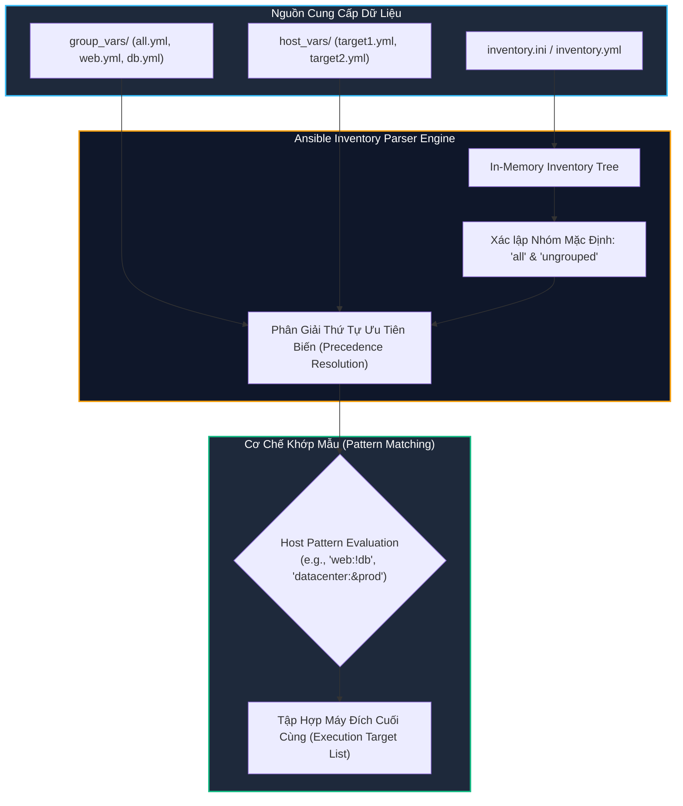
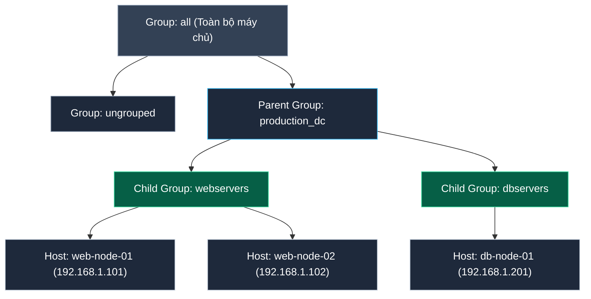
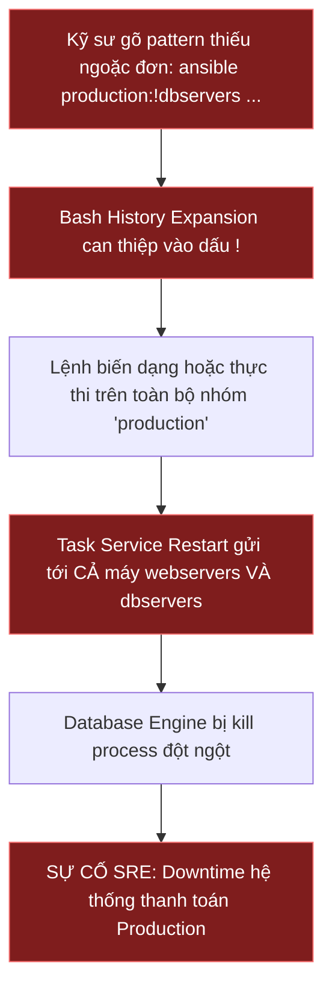
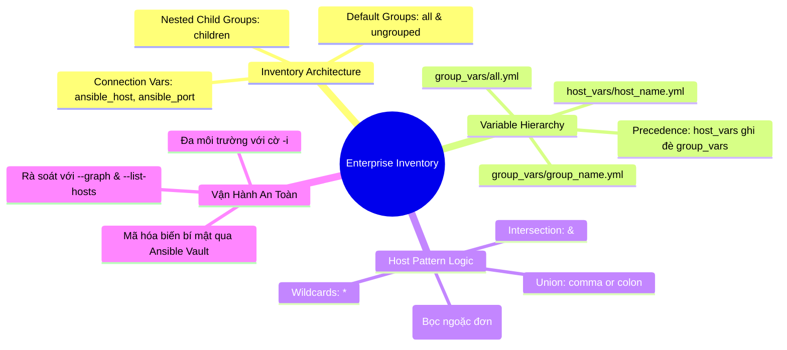


# [BÀI 03] THIẾT KẾ INVENTORY CHUẨN ENTERPRISE: STATIC VS DYNAMIC INVENTORY, HOST GROUPS, GROUP VARS & HOST VARS
Trong kỷ nguyên **Infrastructure as Code (IaC)** và tự động hóa vận hành hạ tầng đám mây (Cloud Infrastructure Automation), **Ansible** khẳng định vị thế dẫn đầu nhờ triết lý **Agentless** (không cần cài đặt agent nền trên máy đích), giao thức điều khiển an toàn qua **SSH / WinRM**, định dạng khai báo **YAML** trực quan và nguyên lý bất biến **Idempotency** mạnh mẽ. Việc làm chủ Ansible không chỉ dừng lại ở các câu lệnh Ad-hoc đơn giản, mà đòi hỏi kỹ sư phải nắm vững kiến trúc Module tầng thấp, Variable Precedence 22 tầng, Jinja2 Templates, tối ưu hóa Forks & Pipelining cho tới thiết kế Roles / Collections và tích hợp CI/CD tự động hóa chuẩn Doanh nghiệp.

Bài viết chuyên sâu này sẽ đồng hành cùng bạn mổ xẻ toàn diện bức tranh kiến trúc, phân tích các đánh đổi kỹ thuật thực chiến (Engineering Trade-offs), cung cấp hướng dẫn thực hành Lab chi tiết từng bước và bộ câu hỏi phỏng vấn chuyên sâu chuẩn DevOps / SRE Lead.

---

## 1. Bản Chất Kiến Trúc & Cơ Chế Vận Hành Tầng Thấp

Trong hệ sinh thái Ansible, **Inventory** đóng vai trò là "Nguồn Chân Lý" (**Single Source of Truth**) định nghĩa toàn bộ danh sách các máy chủ bị quản lý, sơ đồ phân nhóm logic, cùng các thông số kết nối và biến cấu hình tương ứng.

Ansible Engine xử lý Inventory thông qua cơ chế phân giải bộ nhớ tạm (**In-Memory Inventory Parsing**), tự động nạp các nhóm mặc định, phân giải cây quan hệ cha-con (Parent-Child Hierarchy) và áp dụng cơ chế kế thừa biến nhiều tầng trước khi phân phối tác vụ.



### 1.1. Cấu Trúc Phân Cấp Inventory (all, ungrouped & nested groups)

Bất kể định dạng file (INI hay YAML), Ansible luôn tự động khởi tạo hai nhóm hệ thống đặc biệt:
- **`all`:** Nhóm tối cao chứa 100% tất cả các máy chủ được định nghĩa trong toàn bộ Inventory.
- **`ungrouped`:** Nhóm chứa tất cả các máy chủ không được gán vào bất kỳ nhóm tùy chỉnh nào (ngoại trừ nhóm `all`).



Khi hạ tầng mở rộng, mô hình nhóm lồng nhau (**Group Nesting / Child Groups**) cho phép nhóm các cụm tài nguyên theo vị trí địa lý (`datacenter_hn`, `datacenter_sg`), môi trường (`production`, `staging`), hoặc vai trò nghiệp vụ (`webservers`, `redis_cluster`) mà không phải lặp lại khai báo tên máy.

### 1.2. Cơ Chế Nạp Biến Phân Tầng: group_vars vs host_vars & Variable Precedence

Để tách biệt tuyệt đối giữa danh sách máy chủ và dữ liệu cấu hình, kiến trúc chuẩn của Ansible yêu cầu tổ chức biến thành các thư mục chuyên biệt nằm cùng cấp với Inventory hoặc Playbook:
- **`group_vars/all.yml`:** Chứa các biến toàn cục áp dụng cho toàn bộ hạ tầng (ví dụ: DNS servers, NTP pools, proxy).
- **`group_vars/<group_name>.yml`:** Chứa các biến chuyên biệt cho từng nhóm logic (ví dụ: `group_vars/webservers.yml` định nghĩa `nginx_port: 8080`).
- **`host_vars/<host_name>.yml`:** Chứa các biến độc nhất dành riêng cho một máy cụ thể (ví dụ: `host_vars/web-node-01.yml` định nghĩa `server_id: 1`).

**Quy tắc ưu tiên ghi đè biến tầng thấp:**
$$\text{group\_vars/all.yml (Thấp nhất)} < \text{group\_vars/<parent\_group>.yml} < \text{group\_vars/<child\_group>.yml} < \text{host\_vars/<host\_name>.yml (Cao nhất)}$$

### 1.3. Cú Pháp Host Pattern Nâng Cao (Intersection, Exclusion & Wildcards)

Host Pattern là biểu thức logic cho phép quản trị viên nhắm mục tiêu chính xác tới một tập con máy chủ trên dòng lệnh CLI hoặc trong Playbook:
- **Ký tự đại diện Wildcard (`*`):** Lọc theo tiền tố/hậu tố (ví dụ: `web*`, `*.internal.net`).
- **Phép Hợp / OR (dấu phẩy `,` hoặc hai chấm `:`):** `webservers,dbservers` (Chọn tất cả các máy thuộc nhóm web HOẶC nhóm db).
- **Phép Giao / AND (dấu `&`):** `webservers:&production` (Chỉ chọn các máy VỪA thuộc nhóm web VỪA thuộc nhóm production).
- **Phép Loại trừ / NOT (dấu `!`):** `'production:!dbservers'` (Chọn tất cả các máy thuộc production NHƯNG LOẠI TRỪ máy thuộc nhóm db).

> [!WARNING]
> **CẠM BẪY BASH HISTORY EXPANSION VỚI DẤU `!`:**
> Khi gõ biểu thức loại trừ trên terminal Bash, dấu `!` bị shell hiểu nhầm là lệnh History Expansion (`bash: !dbservers: event not found`). Kỹ sư **bắt buộc phải bọc toàn bộ chuỗi pattern trong cặp dấu ngoặc đơn**: `'production:!dbservers'`.

---

## 2. Bảng So Sánh Kỹ Thuật Toàn Diện (Engineering Matrix)

| Tiêu chí So Sánh | Static Inventory (INI) | Static Inventory (YAML) | Dynamic Inventory Plugin | In-Memory Inventory (`add_host`) |
|---|---|---|---|---|
| **Cú pháp định dạng** | Dạng INI phẳng truyền thống | Cấu trúc phân cấp thụt lề YAML | Script Python hoặc YAML config gọi Cloud API | Khởi tạo động trong lúc Playbook đang chạy |
| **Độ phức tạp duy trì** | Thấp với hệ thống nhỏ (< 30 nodes) | Trung bình, rất trực quan cho nhóm lồng nhau | Đòi hỏi cấu hình IAM/API credentials | Phức tạp, chỉ tồn tại trong vòng đời Play run |
| **Hỗ trợ Group Nesting** | Cú pháp `[group:children]` | Cấu trúc `children:` phân cấp tự nhiên | Tự động phân nhóm theo AWS Tags/Labels | Gán runtime qua tham số `groups` |
| **Tốc độ thực thi (Performance)** | Siêu nhanh (Không tốn network call) | Rất nhanh (Native YAML parser) | Phụ thuộc latency API Cloud (Cần cache) | Tức thì trong RAM |
| **Khả năng co giãn (Auto Scaling)** | Kém (Phải cập nhật thủ công khi scale) | Kém (Phải sửa file tĩnh) | **Tối ưu tuyệt đối** (Tự động quét Real-time) | Phù hợp workflow Provisioning rồi Config ngay |
| **Môi trường khuyến nghị** | Lab, On-premise tĩnh quy mô nhỏ | Hạ tầng On-premise / Bare-metal Enterprise | AWS EC2, GCP Compute, Azure VM, K8s Nodes | CI/CD ephemeral testing, dynamic spin-up |

> [!IMPORTANT]
> **QUY TẮC BẢO MẬT INVENTORY ENTERPRISE:**
> Tuyệt đối không lưu trữ thông tin mật khẩu SSH (`ansible_password`), khóa riêng (`ansible_ssh_private_key_file` dạng raw text) hay token API bên trong file Inventory được lưu trữ trên Git. Toàn bộ các thông tin nhạy cảm phải được bảo vệ bằng **Ansible Vault** hoặc nạp qua SSH Agent / HashiCorp Vault.

---

## 3. Kiến Trúc Triển Khai Chuẩn Production (Inventory Architecture Breakdown)

Cấu trúc cây thư mục dự án chuẩn hóa theo khuyến nghị của Red Hat và Ansible Best Practices:

```text
ansible-enterprise-project/
├── ansible.cfg
├── inventory/
│   ├── production/
│   │   ├── hosts.yml
│   │   └── group_vars/
│   │       ├── all.yml
│   │       ├── webservers.yml
│   │       └── dbservers.yml
│   └── staging/
│       ├── hosts.yml
│       └── group_vars/
│           └── all.yml
└── host_vars/
    ├── prod-web-01.yml
    └── prod-db-01.yml
```

```yaml
# ==============================================================================
# FILE: ./inventory/production/hosts.yml (Khai báo nhóm phân cấp dạng YAML)
# ==============================================================================
all:
  children:
    production_dc:
      children:
        webservers:
          hosts:
            prod-web-01:
              ansible_host: 192.168.10.11
              ansible_port: 22
            prod-web-02:
              ansible_host: 192.168.10.12
              ansible_port: 22
        dbservers:
          hosts:
            prod-db-01:
              ansible_host: 192.168.10.21
              ansible_port: 2222
  vars:
    ansible_python_interpreter: /usr/bin/python3
    environment_tier: production
```

```yaml
# ==============================================================================
# FILE: ./inventory/production/group_vars/webservers.yml
# ==============================================================================
http_port: 80
max_connections: 5000
app_name: "enterprise-portal"
```

```yaml
# ==============================================================================
# FILE: ./host_vars/prod-web-01.yml (Ghi đè cấu hình riêng cho máy cụ thể)
# ==============================================================================
# Ghi đè biến http_port riêng cho máy node 01
http_port: 8080
is_master_node: true
```

### Phân Tích Kỹ Thuật Từng Dòng (Line-by-Line Breakdown):

- <span style="color:#38bdf8;font-weight:bold;">all &bull; children &bull; production_dc</span>: Khởi tạo nhóm cha `production_dc` nằm trực thuộc nhóm gốc `all`.
- <span style="color:#38bdf8;font-weight:bold;">production_dc &bull; children &bull; webservers / dbservers</span>: Khai báo 2 nhóm con chuyên biệt. Mọi biến gán cho `production_dc` sẽ tự động kế thừa xuống cả máy web và máy db.
- <span style="color:#f59e0b;font-weight:bold;">ansible_host &bull; ansible_port</span>: Ánh xạ định danh logic (`prod-web-01`) sang địa chỉ mạng và cổng SSH thực tế, cho phép tái cấu trúc hạ tầng mạng mà không thay đổi tên máy trong Playbook.
- <span style="color:#10b981;font-weight:bold;">http_port: 8080 (trong host_vars/prod-web-01.yml)</span>: Ghi đè giá trị `http_port: 80` từ file `group_vars/webservers.yml` chỉ riêng cho `prod-web-01` theo đúng quy tắc Precedence.

---

## 4. Phân Tích Cạm Bẫy Thực Chiến: Chạy Sai Máy Chủ Do Host Pattern & Variable Shadowing

### Tình Huống Sự Cố Thực Tế Tại Doanh Nghiệp:
Trong một đợt bảo trì khẩn cấp, kỹ sư SRE cần khởi động lại toàn bộ cụm máy chủ web đang hoạt động nhưng phải loại trừ máy chủ Master Database (`prod-db-01`). Kỹ sư gõ lệnh Ad-hoc trên terminal:

```bash
ansible production:!dbservers -m ansible.builtin.service -a "name=nginx state=restarted"
```

Do shell Bash kích hoạt cơ chế **History Expansion** đối với dấu chấm cảm `!`, lệnh bị biến dạng và thực thi sai cú pháp, hoặc kỹ sư gõ nhầm pattern `production` (chứa cả web lẫn database) khiến dịch vụ cơ sở dữ liệu trên toàn bộ môi trường Production bị restart ngoài ý muốn, làm gián đoạn thanh toán khách hàng trong 15 phút.



### Hậu Quả & Log Lỗi Thực Tế:
Bash báo lỗi history expansion hoặc gửi nhầm target làm máy DB bị tác động:

```diff
- bash: !dbservers: event not found
# Hoặc nếu chạy không có cờ kiểm tra danh sách:
- prod-db-01 | CHANGED => {
-     "name": "postgresql",
-     "state": "restarted",
-     "status": "Service interrupted during active transactions"
- }
```

### 5-Whys Root Cause Analysis:

1. **Tại sao cụm cơ sở dữ liệu Production bị khởi động lại?** Vì Ansible đã gửi lệnh restart tới tất cả các host nằm trong nhóm `production`.
2. **Tại sao máy chủ DB lại nằm trong danh sách thực thi dù kỹ sư có ý định loại trừ?** Vì biểu thức loại trừ `!dbservers` bị lỗi cú pháp shell hoặc bị giải nghĩa sai.
3. **Tại sao kỹ sư không phát hiện danh sách máy trước khi chạy lệnh thật?** Vì kỹ sư bỏ qua bước rà soát danh sách máy bằng cờ an toàn `--list-hosts`.
4. **Tại sao biểu thức pattern chứa dấu `!` bị lỗi trên terminal Linux?** Vì shell Bash mặc định bật tính năng lịch sử lệnh với tiền tố `!`.
5. **<span style="color:#10b981;font-weight:bold;">Root Cause Remedy:</span>** Thiết lập quy chuẩn bắt buộc: Luôn bọc Host Pattern trong cặp ngoặc đơn `'...'` và chạy kiểm tra trước với lệnh `ansible <pattern> --list-hosts` trước mọi thao tác quản trị.

---

## 5. Hands-on Lab: Thiết Kế & Vận Hành Enterprise Inventory (8 Bước)

| Bước | Lệnh CLI | Mục Đích Thực Thi |
|---|---|---|
| **Bước 1** | `mkdir -p ~/lab-ansible-03/inventory/{dev,prod} ...` | Thiết lập cây thư mục đa môi trường và group_vars |
| **Bước 2** | `cat << 'EOF' > inventory/prod/hosts.yml ...` | Soạn thảo Inventory dạng YAML phân cấp nhóm cha-con |
| **Bước 3** | `cat << 'EOF' > group_vars/webservers.yml ...` | Định nghĩa biến nhóm chuẩn hóa |
| **Bước 4** | `cat << 'EOF' > host_vars/target1.yml ...` | Định nghĩa biến riêng ghi đè theo host |
| **Bước 5** | `ansible-inventory --graph` | Rà soát cấu trúc phân cấp đồ họa của toàn bộ hệ thống |
| **Bước 6** | `ansible-inventory --host target1` | Kiểm tra thứ tự ưu tiên ghi đè biến thực tế |
| **Bước 7** | `ansible 'datacenter:!db' --list-hosts` | Rà soát biểu thức Host Pattern lọc chính xác máy đích |
| **Bước 8** | `ansible 'web' -m ansible.builtin.copy ...` | Thực thi Ad-hoc áp dụng biến và kiểm tra Idempotency lần 2 |

```bash
# ------------------------------------------------------------------------------
# BƯỚC 1: Khởi tạo thư mục dự án và cấu trúc biến
# ------------------------------------------------------------------------------
mkdir -p ~/lab-ansible-03 && cd ~/lab-ansible-03
mkdir -p group_vars host_vars

cat << 'EOF' > ansible.cfg
[defaults]
inventory = ./inventory.ini
remote_user = ansible
host_key_checking = False
private_key_file = ~/.ssh/id_ed25519

[privilege_escalation]
become = True
become_method = sudo
become_user = root
become_ask_pass = False
EOF

# ------------------------------------------------------------------------------
# BƯỚC 2: Tạo file inventory.ini phân cấp nhóm cha - con
# ------------------------------------------------------------------------------
cat << 'EOF' > inventory.ini
[web]
target1 ansible_host=127.0.0.1 ansible_port=2221

[db]
target2 ansible_host=127.0.0.1 ansible_port=2222

[datacenter:children]
web
db

[all:vars]
ansible_python_interpreter=/usr/bin/python3
EOF

# ------------------------------------------------------------------------------
# BƯỚC 3 & 4: Tạo file group_vars và host_vars để kiểm tra Precedence
# ------------------------------------------------------------------------------
cat << 'EOF' > group_vars/all.yml
global_company: "NTKAnsible Corp"
app_port: 80
EOF

cat << 'EOF' > group_vars/web.yml
app_name: "NTK Web Application"
app_port: 8080
max_clients: 100
EOF

cat << 'EOF' > host_vars/target1.yml
app_port: 9090
custom_note: "Primary Edge Node"
EOF

# ------------------------------------------------------------------------------
# BƯỚC 5: Trực quan hóa cây phân cấp kiểm kê tài nguyên
# ------------------------------------------------------------------------------
ansible-inventory --graph

# ------------------------------------------------------------------------------
# BƯỚC 6: Đối soát giá trị biến cuối cùng của target1 (Kỳ vọng: app_port = 9090)
# ------------------------------------------------------------------------------
ansible-inventory --host target1 | grep "app_port"

# ------------------------------------------------------------------------------
# BƯỚC 7: Rà soát danh sách máy đích với Host Pattern an toàn
# ------------------------------------------------------------------------------
ansible 'datacenter:!db' --list-hosts

# ------------------------------------------------------------------------------
# BƯỚC 8: Áp dụng cấu hình và chứng minh Idempotency
# ------------------------------------------------------------------------------
# Chạy lần 1 (Tạo file -> CHANGED)
ansible 'web' -m ansible.builtin.copy -a "content='APP_PORT=9090\nCOMPANY=NTKAnsible Corp\n' dest=/etc/app_env.conf mode='0644'"

# Chạy lần 2 (Đã chuẩn -> SUCCESS kèm changed=false)
ansible 'web' -m ansible.builtin.copy -a "content='APP_PORT=9090\nCOMPANY=NTKAnsible Corp\n' dest=/etc/app_env.conf mode='0644'"
```

---

## 6. Bộ Câu Hỏi Vấn Đáp & Phỏng Vấn Chuyên Sâu (Self-Check Q&A)

<details class="qa-card">
  <summary class="qa-summary">
    <span class="qa-num-badge">Q01</span>
    <span class="qa-question-text">Inventory trong Ansible có vai trò gì? Hai nhóm mặc định nào luôn tự động tồn tại trong mọi Inventory?</span>
  </summary>
  <div class="qa-answer">
    <div class="qa-answer-header">
      <svg width="14" height="14" fill="none" stroke="currentColor" stroke-width="2" viewBox="0 0 24 24"><path d="M22 11.08V12a10 10 0 1 1-5.93-9.14"></path><polyline points="22 4 12 14.01 9 11.01"></polyline></svg>
      <span>Phân Tích &amp; Lời Giải Kỹ Thuật</span>
    </div>
    Inventory là nguồn chân lý chứa danh sách các máy chủ bị quản lý, thông tin phân nhóm và các biến kết nối tương ứng. Hai nhóm mặc định luôn tồn tại trong mọi Inventory là: (1) <code>all</code>: chứa tất cả các máy chủ có trong inventory; (2) <code>ungrouped</code>: chứa các máy chủ không thuộc bất kỳ nhóm tùy chỉnh nào.
    <div style="margin-top: 0.5rem;"><b style="color: var(--accent-cyan);">&bull; Tiêu chí chấm:</b> 0 không nêu được &bull; 1 nhớ all quên ungrouped &bull; 2 nêu đúng cả hai &bull; 3 nêu đúng + vai trò trong nạp biến toàn cục <code>group_vars/all.yml</code>.</div>
    <div><b style="color: var(--accent-rose);">&bull; Câu hỏi đào sâu:</b> Nếu một máy chủ nằm trong nhóm <code>web</code>, máy chủ đó có đồng thời thuộc nhóm <code>all</code> không? <i>(Có, 100% mọi host đều thuộc nhóm <code>all</code>.)</i></div>
  </div>
</details>

<details class="qa-card">
  <summary class="qa-summary">
    <span class="qa-num-badge">Q02</span>
    <span class="qa-question-text">Cấu trúc nhóm lồng nhóm (Child groups / Group nesting) được khai báo thế nào trong định dạng INI và YAML? Lợi ích là gì?</span>
  </summary>
  <div class="qa-answer">
    <div class="qa-answer-header">
      <svg width="14" height="14" fill="none" stroke="currentColor" stroke-width="2" viewBox="0 0 24 24"><path d="M22 11.08V12a10 10 0 1 1-5.93-9.14"></path><polyline points="22 4 12 14.01 9 11.01"></polyline></svg>
      <span>Phân Tích &amp; Lời Giải Kỹ Thuật</span>
    </div>
    Trong INI, dùng cú pháp <code>[parent_name:children]</code> rồi liệt kê danh sách các nhóm con bên dưới. Trong YAML, dùng từ khóa <code>children:</code> bên dưới tên nhóm cha. Lợi ích: Cho phép quản lý phân cấp hạ tầng (ví dụ: nhóm cha <code>vietnam</code> chứa các nhóm con <code>hanoi</code> và <code>hcm</code>), giúp áp dụng biến chung hoặc thực thi lệnh trên quy mô vùng miền dễ dàng mà không cần gõ lại tên từng host.
    <div style="margin-top: 0.5rem;"><b style="color: var(--accent-cyan);">&bull; Tiêu chí chấm:</b> 0 không biết &bull; 1 nhớ children nhầm INI/YAML &bull; 2 nêu đúng cả hai &bull; 3 nêu đúng + minh họa lệnh <code>ansible-inventory --graph</code>.</div>
    <div><b style="color: var(--accent-rose);">&bull; Câu hỏi đào sâu:</b> Nếu gõ nhầm <code>[parent_name]</code> mà quên chữ <code>:children</code> trong file INI thì Ansible sẽ hiểu thế nào? <i>(Ansible hiểu các dòng bên dưới là tên máy chủ tĩnh chứ không phải tên nhóm con.)</i></div>
  </div>
</details>

<details class="qa-card">
  <summary class="qa-summary">
    <span class="qa-num-badge">Q03</span>
    <span class="qa-question-text">Tại sao nên tách biến ra thư mục group_vars/ và host_vars/ thay vì viết trực tiếp vào file Inventory tĩnh?</span>
  </summary>
  <div class="qa-answer">
    <div class="qa-answer-header">
      <svg width="14" height="14" fill="none" stroke="currentColor" stroke-width="2" viewBox="0 0 24 24"><path d="M22 11.08V12a10 10 0 1 1-5.93-9.14"></path><polyline points="22 4 12 14.01 9 11.01"></polyline></svg>
      <span>Phân Tích &amp; Lời Giải Kỹ Thuật</span>
    </div>
    Việc đặt biến trực tiếp trong file Inventory khiến file phình to, rối mắt và rất khó bảo trì khi hạ tầng tăng trưởng. Tách thành thư mục <code>group_vars/</code> (file trùng tên nhóm, ví dụ <code>web.yml</code>) và <code>host_vars/</code> (file trùng tên host, ví dụ <code>target1.yml</code>) giúp chuẩn hóa cấu trúc dự án, dễ đọc, dễ bảo trì và thuận tiện cho việc quản lý mã nguồn qua Git.
    <div style="margin-top: 0.5rem;"><b style="color: var(--accent-cyan);">&bull; Tiêu chí chấm:</b> 0 cho rằng như nhau &bull; 1 biết tách tốt thiếu tên file &bull; 2 nêu đúng thư mục và quy tắc đặt tên &bull; 3 nêu đúng + cơ chế auto-load của Ansible.</div>
    <div><b style="color: var(--accent-rose);">&bull; Câu hỏi đào sâu:</b> Nếu thư mục đặt tên là <code>groups_vars</code> (thừa chữ s) thì Ansible có nạp biến được không? <i>(Không, Ansible chỉ tìm đúng tên thư mục chuẩn là <code>group_vars</code>.)</i></div>
  </div>
</details>

<details class="qa-card">
  <summary class="qa-summary">
    <span class="qa-num-badge">Q04</span>
    <span class="qa-question-text">Trình bày quy tắc ưu tiên biến khi một biến app_port được định nghĩa ở cả group_vars/all.yml, group_vars/web.yml và host_vars/target1.yml.</span>
  </summary>
  <div class="qa-answer">
    <div class="qa-answer-header">
      <svg width="14" height="14" fill="none" stroke="currentColor" stroke-width="2" viewBox="0 0 24 24"><path d="M22 11.08V12a10 10 0 1 1-5.93-9.14"></path><polyline points="22 4 12 14.01 9 11.01"></polyline></svg>
      <span>Phân Tích &amp; Lời Giải Kỹ Thuật</span>
    </div>
    Thứ tự ưu tiên tăng dần từ phạm vi rộng tới hẹp: <code>group_vars/all.yml</code> (thấp nhất) &lt; <code>group_vars/web.yml</code> (nhóm con) &lt; <code>host_vars/target1.yml</code> (cao nhất). Do đó, giá trị <code>app_port</code> khai báo tại <code>host_vars/target1.yml</code> sẽ chiến thắng và được áp dụng cho <code>target1</code>.
    <div style="margin-top: 0.5rem;"><b style="color: var(--accent-cyan);">&bull; Tiêu chí chấm:</b> 0 sai thứ tự &bull; 1 nhầm lẫn all và web &bull; 2 nêu đúng 3 tầng &bull; 3 nêu đúng + lệnh <code>ansible-inventory --host target1</code>.</div>
    <div><b style="color: var(--accent-rose);">&bull; Câu hỏi đào sâu:</b> Làm sao để định nghĩa biến mặc định cho toàn bộ tất cả các host trong hệ thống mà vẫn cho phép từng host override? <i>(Khai báo biến mặc định trong <code>group_vars/all.yml</code> và ghi đè khi cần trong <code>host_vars/</code>.)</i></div>
  </div>
</details>

<details class="qa-card">
  <summary class="qa-summary">
    <span class="qa-num-badge">Q05</span>
    <span class="qa-question-text">Phân biệt các toán tử Host Pattern: Dấu phẩy ',', Dấu và '&amp;', và Dấu chấm cảm '!'. Cho ví dụ.</span>
  </summary>
  <div class="qa-answer">
    <div class="qa-answer-header">
      <svg width="14" height="14" fill="none" stroke="currentColor" stroke-width="2" viewBox="0 0 24 24"><path d="M22 11.08V12a10 10 0 1 1-5.93-9.14"></path><polyline points="22 4 12 14.01 9 11.01"></polyline></svg>
      <span>Phân Tích &amp; Lời Giải Kỹ Thuật</span>
    </div>
    • Dấu phẩy <code>,</code> (hoặc <code>:</code>): Phép HỢP (UNION) — lấy tất cả máy thuộc nhóm 1 HOẶC nhóm 2 (ví dụ: <code>web,db</code>).<br>
    • Dấu và <code>&amp;</code>: Phép GIAO (INTERSECTION) — lấy các máy VỪA thuộc nhóm 1 VỪA thuộc nhóm 2 (ví dụ: <code>web:&amp;prod</code>).<br>
    • Dấu chấm cảm <code>!</code>: Phép LOẠI TRỪ (EXCLUSION) — lấy các máy thuộc nhóm 1 NHƯNG KHÔNG thuộc nhóm 2 (ví dụ: <code>web:!db</code>).
    <div style="margin-top: 0.5rem;"><b style="color: var(--accent-cyan);">&bull; Tiêu chí chấm:</b> 0 không biết &bull; 1 nhớ dấu nhầm phép toán &bull; 2 giải thích đúng cả 3 &bull; 3 giải thích đúng + cảnh báo bẫy Bash History Expansion.</div>
    <div><b style="color: var(--accent-rose);">&bull; Câu hỏi đào sâu:</b> Tại sao gõ <code>ansible web:!db --list-hosts</code> trực tiếp trên terminal Bash lại bị báo lỗi <code>bash: !db: event not found</code>? <i>(Do Bash hiểu nhầm dấu <code>!</code> là lệnh history expansion, phải bọc pattern trong cặp ngoặc đơn <code>'web:!db'</code>.)</i></div>
  </div>
</details>

<details class="qa-card">
  <summary class="qa-summary">
    <span class="qa-num-badge">Q06</span>
    <span class="qa-question-text">Hai câu lệnh CLI nào là công cụ quan trọng nhất để rà soát Inventory và Host Pattern trước khi chạy Playbook?</span>
  </summary>
  <div class="qa-answer">
    <div class="qa-answer-header">
      <svg width="14" height="14" fill="none" stroke="currentColor" stroke-width="2" viewBox="0 0 24 24"><path d="M22 11.08V12a10 10 0 1 1-5.93-9.14"></path><polyline points="22 4 12 14.01 9 11.01"></polyline></svg>
      <span>Phân Tích &amp; Lời Giải Kỹ Thuật</span>
    </div>
    1. <code>ansible-inventory --graph</code>: Dùng để xem sơ đồ cây phân cấp kiểm kê tài nguyên toàn bộ hệ thống.<br>
    2. <code>ansible &lt;pattern&gt; --list-hosts</code>: Dùng để in ra danh sách tên/IP của các máy đích thực tế sẽ bị tác động bởi biểu thức pattern cụ thể.
    <div style="margin-top: 0.5rem;"><b style="color: var(--accent-cyan);">&bull; Tiêu chí chấm:</b> 0 không biết &bull; 1 nhớ 1 lệnh &bull; 2 nêu đúng cả 2 lệnh &bull; 3 nêu đúng + quy trình an toàn trên Production.</div>
    <div><b style="color: var(--accent-rose);">&bull; Câu hỏi đào sâu:</b> Nếu cờ <code>--list-hosts</code> trả về <code>hosts (0):</code>, điều đó có nghĩa là gì? <i>(Có nghĩa là biểu thức pattern không khớp với bất kỳ máy chủ nào trong inventory.)</i></div>
  </div>
</details>

<details class="qa-card">
  <summary class="qa-summary">
    <span class="qa-num-badge">Q07</span>
    <span class="qa-question-text">Kể tên các biến kết nối hệ thống thường dùng trong Inventory và giải thích công dụng của chúng.</span>
  </summary>
  <div class="qa-answer">
    <div class="qa-answer-header">
      <svg width="14" height="14" fill="none" stroke="currentColor" stroke-width="2" viewBox="0 0 24 24"><path d="M22 11.08V12a10 10 0 1 1-5.93-9.14"></path><polyline points="22 4 12 14.01 9 11.01"></polyline></svg>
      <span>Phân Tích &amp; Lời Giải Kỹ Thuật</span>
    </div>
    • <code>ansible_host</code>: Địa chỉ IP hoặc FQDN thực tế dùng để kết nối SSH.<br>
    • <code>ansible_port</code>: Cổng kết nối SSH thực tế trên máy đích (khi không dùng port 22 mặc định).<br>
    • <code>ansible_user</code>: Tài khoản người dùng dùng để đăng nhập SSH vào máy đích.<br>
    • <code>ansible_ssh_private_key_file</code>: Đường dẫn tới chìa khóa SSH private key riêng.
    <div style="margin-top: 0.5rem;"><b style="color: var(--accent-cyan);">&bull; Tiêu chí chấm:</b> 0 không kể được &bull; 1 kể 1-2 biến &bull; 2 nêu đúng 3-4 biến &bull; 3 nêu đúng + ví dụ cấu hình container port 2221/2222.</div>
    <div><b style="color: var(--accent-rose);">&bull; Câu hỏi đào sâu:</b> Nếu máy đích đổi cổng SSH sang 2222, ta cần khai báo biến nào trong inventory? <i>(Khai báo <code>ansible_port=2222</code>.)</i></div>
  </div>
</details>

<details class="qa-card">
  <summary class="qa-summary">
    <span class="qa-num-badge">Q08</span>
    <span class="qa-question-text">Trình bày phương pháp tổ chức Inventory để quản lý đa môi trường (Development, Staging, Production) mà không cần sửa đổi Playbook.</span>
  </summary>
  <div class="qa-answer">
    <div class="qa-answer-header">
      <svg width="14" height="14" fill="none" stroke="currentColor" stroke-width="2" viewBox="0 0 24 24"><path d="M22 11.08V12a10 10 0 1 1-5.93-9.14"></path><polyline points="22 4 12 14.01 9 11.01"></polyline></svg>
      <span>Phân Tích &amp; Lời Giải Kỹ Thuật</span>
    </div>
    Tạo các thư mục hoặc file inventory riêng biệt cho từng môi trường (ví dụ: <code>inventory/dev</code> và <code>inventory/prod</code>). Trong mỗi môi trường khai báo danh sách IP và <code>group_vars</code> riêng. Playbook giữ nguyên 100% mã nguồn xử lý. Khi thực thi, chỉ cần chỉ định cờ <code>-i</code> tương ứng: <code>ansible-playbook -i inventory/dev site.yml</code> hoặc <code>-i inventory/prod site.yml</code>.
    <div style="margin-top: 0.5rem;"><b style="color: var(--accent-cyan);">&bull; Tiêu chí chấm:</b> 0 sửa IP thẳng vào Playbook &bull; 1 biết tách file thiếu cờ -i &bull; 2 nêu đúng phương pháp &bull; 3 nêu đúng + phân tích bảo mật CI/CD.</div>
    <div><b style="color: var(--accent-rose);">&bull; Câu hỏi đào sâu:</b> Có nên để chung máy Dev và máy Prod trong cùng 1 file inventory tĩnh không? Tại sao? <i>(Không nên, vì rất dễ gõ nhầm pattern làm tác động lệnh thử nghiệm lên nhầm máy Production.)</i></div>
  </div>
</details>

<details class="qa-card">
  <summary class="qa-summary">
    <span class="qa-num-badge">Q09</span>
    <span class="qa-question-text">Nguyên tắc an toàn bảo mật đối với các biến nhạy cảm (mật khẩu, token) trong Inventory là gì?</span>
  </summary>
  <div class="qa-answer">
    <div class="qa-answer-header">
      <svg width="14" height="14" fill="none" stroke="currentColor" stroke-width="2" viewBox="0 0 24 24"><path d="M22 11.08V12a10 10 0 1 1-5.93-9.14"></path><polyline points="22 4 12 14.01 9 11.01"></polyline></svg>
      <span>Phân Tích &amp; Lời Giải Kỹ Thuật</span>
    </div>
    Tuyệt đối không bao giờ lưu trữ mật khẩu, token hay chìa khóa bí mật dạng plain-text trong file Inventory hay thư mục <code>group_vars/host_vars</code> rồi commit lên Git. Giải pháp chuẩn: Chuyển sang dùng xác thực SSH Key không mật khẩu, hoặc sử dụng công cụ mã hóa <b>Ansible Vault</b> để mã hóa file chứa biến nhạy cảm trước khi lưu trữ.
    <div style="margin-top: 0.5rem;"><b style="color: var(--accent-cyan);">&bull; Tiêu chí chấm:</b> 0 coi plain-text là bình thường &bull; 1 biết rủi ro thiếu Vault &bull; 2 nêu đúng nguyên tắc + SSH Key/Vault &bull; 3 nêu đúng + cú pháp <code>ansible-vault encrypt</code>.</div>
    <div><b style="color: var(--accent-rose);">&bull; Câu hỏi đào sâu:</b> Nếu vô tình commit file inventory chứa mật khẩu thô lên GitHub public, cách xử lý khẩn cấp là gì? <i>(Đổi mật khẩu tài khoản lập tức trên hệ thống thật, xóa commit history chứa secret.)</i></div>
  </div>
</details>

<details class="qa-card">
  <summary class="qa-summary">
    <span class="qa-num-badge">Q10</span>
    <span class="qa-question-text">Trình bày quy trình 3 bước để đảm bảo một lệnh tác động dựa trên Inventory vừa Idempotent vừa chính xác trên máy đích.</span>
  </summary>
  <div class="qa-answer">
    <div class="qa-answer-header">
      <svg width="14" height="14" fill="none" stroke="currentColor" stroke-width="2" viewBox="0 0 24 24"><path d="M22 11.08V12a10 10 0 1 1-5.93-9.14"></path><polyline points="22 4 12 14.01 9 11.01"></polyline></svg>
      <span>Phân Tích &amp; Lời Giải Kỹ Thuật</span>
    </div>
    1. <b>Bước 1 (Rà soát):</b> Chạy <code>ansible &lt;pattern&gt; --list-hosts</code> để chắc chắn 100% lệnh chỉ tác động đúng các host mong muốn.<br>
    2. <b>Bước 2 (Kiểm Idempotency):</b> Thực thi lệnh lần 1 (<code>changed=true</code>), sau đó thực thi lại chính xác lệnh đó lần 2: phải thu được <code>changed=false</code>.<br>
    3. <b>Bước 3 (Đối soát sự thật):</b> Dùng <code>docker exec &lt;target&gt; cat /etc/...</code> hoặc SSH trực tiếp vào máy đích kiểm tra tệp tin/dịch vụ thật, không phụ thuộc duy nhất vào màn hình Control node.
    <div style="margin-top: 0.5rem;"><b style="color: var(--accent-cyan);">&bull; Tiêu chí chấm:</b> 0 chỉ nhìn terminal (trần 1) &bull; 1 thiếu rà soát hoặc đối soát &bull; 2 đủ 3 bước &bull; 3 xuất sắc 3 bước + lệnh CLI minh họa.</div>
    <div><b style="color: var(--accent-rose);">&bull; Câu hỏi đào sâu:</b> Nếu lệnh chạy lần 2 vẫn báo <code>CHANGED</code>, điều đó chứng tỏ điều gì? <i>(Tác vụ không đạt tính Idempotency, có thể do lạm dụng module shell hoặc nội dung thay đổi liên tục.)</i></div>
  </div>
</details>

<details class="qa-card">
  <summary class="qa-summary">
    <span class="qa-num-badge">Q11</span>
    <span class="qa-question-text">Khi nào nên dùng ký tự đại diện Wildcard '*' trong Host Pattern? Cần lưu ý gì khi sử dụng?</span>
  </summary>
  <div class="qa-answer">
    <div class="qa-answer-header">
      <svg width="14" height="14" fill="none" stroke="currentColor" stroke-width="2" viewBox="0 0 24 24"><path d="M22 11.08V12a10 10 0 1 1-5.93-9.14"></path><polyline points="22 4 12 14.01 9 11.01"></polyline></svg>
      <span>Phân Tích &amp; Lời Giải Kỹ Thuật</span>
    </div>
    Dùng wildcard <code>*</code> khi muốn chọn một tập hợp host có quy tắc đặt tên đồng nhất (ví dụ: <code>web*</code> chọn <code>web1</code>, <code>web2</code>; <code>*.internal.net</code> chọn tất cả host thuộc domain). Lưu ý: Phải dùng <code>--list-hosts</code> kiểm tra trước để tránh trường hợp wildcard chọn nhầm các host có tên tương tự không mong muốn (ví dụ <code>web*</code> có thể dính cả <code>web-deprecated</code>).
    <div style="margin-top: 0.5rem;"><b style="color: var(--accent-cyan);">&bull; Tiêu chí chấm:</b> 0 không biết &bull; 1 biết wildcard thiếu rủi ro &bull; 2 nêu đúng cú pháp và use case &bull; 3 nêu đúng + lưu ý an toàn với <code>--list-hosts</code>.</div>
    <div><b style="color: var(--accent-rose);">&bull; Câu hỏi đào sâu:</b> Pattern <code>'192.168.1.*'</code> có hợp lệ không? <i>(Hợp lệ, chọn tất cả các host có IP thuộc dải subnet 192.168.1.0/24 trong inventory.)</i></div>
  </div>
</details>

<details class="qa-card">
  <summary class="qa-summary">
    <span class="qa-num-badge">Q12</span>
    <span class="qa-question-text">Khi hạ tầng mở rộng lên hàng ngàn máy chủ Cloud (AWS/GCP) tự động co giãn, hạn chế lớn nhất của Static Inventory là gì? Giải pháp thay thế là gì?</span>
  </summary>
  <div class="qa-answer">
    <div class="qa-answer-header">
      <svg width="14" height="14" fill="none" stroke="currentColor" stroke-width="2" viewBox="0 0 24 24"><path d="M22 11.08V12a10 10 0 1 1-5.93-9.14"></path><polyline points="22 4 12 14.01 9 11.01"></polyline></svg>
      <span>Phân Tích &amp; Lời Giải Kỹ Thuật</span>
    </div>
    Hạn chế của Static Inventory ghi tay: Không phản ánh kịp thời sự thay đổi của hạ tầng Cloud (các máy chủ mới tạo hoặc bị xoá bỏ tự động theo lưu lượng), gây ra tình trạng file tĩnh bị lạc hậu. Giải pháp: Chuyển sang sử dụng <b>Dynamic Inventory Plugin</b> (sẽ học ở Buổi 24), tự động gọi API của Cloud Provider để sinh danh sách host thời gian thực.
    <div style="margin-top: 0.5rem;"><b style="color: var(--accent-cyan);">&bull; Tiêu chí chấm:</b> 0 không biết &bull; 1 biết ghi tay vất vả thiếu Dynamic &bull; 2 phân tích đúng hạn chế Auto Scaling + giải pháp Dynamic Inventory &bull; 3 phân tích xuất sắc so sánh Static vs Dynamic.</div>
    <div><b style="color: var(--accent-rose);">&bull; Câu hỏi đào sâu:</b> Với dự án nhỏ 3-5 máy chủ tĩnh cố định, có cần thiết phải dùng Dynamic Inventory không? <i>(Không cần, static inventory ghi tay đơn giản và nhanh hơn cho dự án cố định.)</i></div>
  </div>
</details>

---

## 7. Tổng Kết & Lộ Trình Bài Học Tiếp Theo

### Tóm Tắt Các Điểm Cốt Lõi:
1. **Inventory là Single Source of Truth:** Quản lý chính xác máy chủ nào thuộc về nhóm nào trong toàn bộ vòng đời tự động hóa.
2. **Cấu trúc Biến Chuẩn Hóa:** Tách biệt triệt để biến ra các thư mục `group_vars/` và `host_vars/`, tuân thủ thứ tự ưu tiên biến.
3. **Quy tắc An Toàn Host Pattern:** Luôn bọc pattern trong cặp ngoặc đơn `'...'` và rà soát bằng `ansible <pattern> --list-hosts` trước khi nhấn Enter.
4. **Mô hình Đa Môi Trường:** Tách biệt thư mục inventory theo môi trường (`dev/`, `prod/`) để tái sử dụng 100% mã nguồn Playbook.



---

> [!TIP]
> **BÀI HỌC TIẾP THEO:** [Bài 04: Bộ Module Quản Trị Hệ Thống Cốt Lõi & Vận Hành Lệnh Ad-Hoc](ansible-04-04-module-co-ban.html) - Làm chủ toàn diện các module quản lý tệp tin, phân quyền, người dùng, gói dịch vụ và cron job trong thực tế DevOps.


