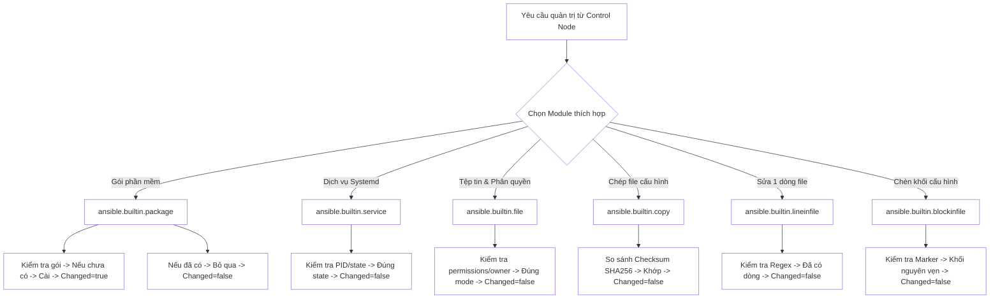
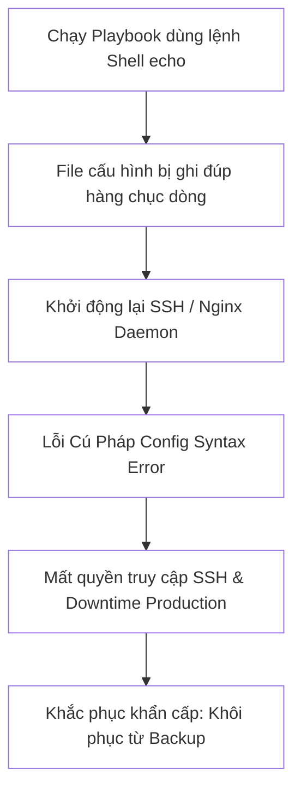
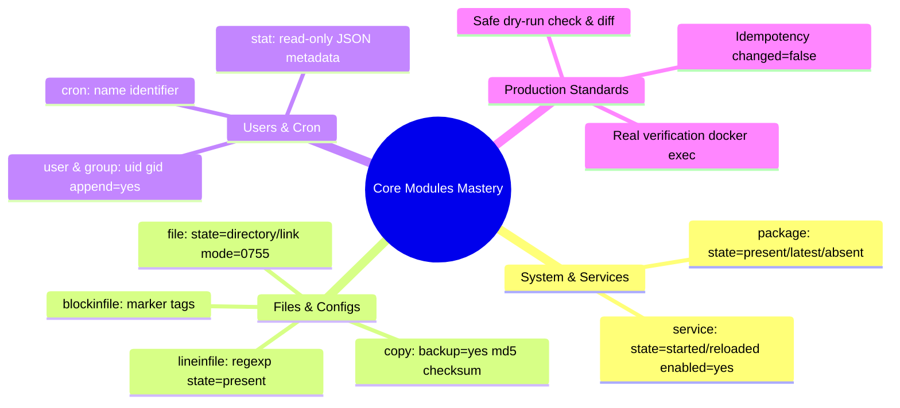


# [BÀI 04] LÀM CHỦ CÁC MODULES CỐT LÕI: FILE, COPY, TEMPLATE, PACKAGE, SERVICE, COMMAND VS SHELL VS RAW

Trong kỷ nguyên **Infrastructure as Code (IaC)** và tự động hóa vận hành hạ tầng đám mây (Cloud Infrastructure Automation), **Ansible** khẳng định vị thế dẫn đầu nhờ triết lý **Agentless** (không cần cài đặt agent nền trên máy đích), giao thức điều khiển an toàn qua **SSH / WinRM**, định dạng khai báo **YAML** trực quan và nguyên lý bất biến **Idempotency** mạnh mẽ. Việc làm chủ Ansible không chỉ dừng lại ở các câu lệnh Ad-hoc đơn giản, mà đòi hỏi kỹ sư phải nắm vững kiến trúc Module tầng thấp, Variable Precedence 22 tầng, Jinja2 Templates, tối ưu hóa Forks & Pipelining cho tới thiết kế Roles / Collections và tích hợp CI/CD tự động hóa chuẩn Doanh nghiệp.

Bài viết chuyên sâu này sẽ đồng hành cùng bạn mổ xẻ toàn diện bức tranh kiến trúc, phân tích các đánh đổi kỹ thuật thực chiến (Engineering Trade-offs), cung cấp hướng dẫn thực hành Lab chi tiết từng bước và bộ câu hỏi phỏng vấn chuyên sâu chuẩn DevOps / SRE Lead.

---

## 1. Bản Chất Kiến Trúc & Cơ Chế Vận Hành Tầng Thấp

Khi quản trị hệ thống bằng Ansible, việc lạm dụng các lệnh shell thô (`command`/`shell`/`raw`) làm mất đi giá trị cốt lõi của tính bất biến (**Idempotency**). Các module chuyên dụng trong collection `ansible.builtin` được lập trình sẵn bằng Python để tự kiểm tra trạng thái hiện tại của tài nguyên (gói phần mềm, dịch vụ, file, user, cron job) trước khi thực thi. Nếu tài nguyên đã đúng trạng thái mong muốn, module sẽ giữ nguyên hệ thống và báo `changed=false`. Báo cáo `PLAY RECAP` xanh chỉ thực sự có ý nghĩa khi ta dùng module chuẩn và chứng minh được tính bất biến ở lần chạy thứ hai.



### 1.1. Nhóm Module Quản Lý Hệ Thống & Dịch Vụ

- **Module `ansible.builtin.package`:** Module quản lý gói phần mềm đa nền tảng với 3 trạng thái cốt lõi: `state=present` (đảm bảo gói đã cài), `state=latest` (nâng cấp gói lên mới nhất), và `state=absent` (gỡ bỏ gói). Module tự động phát hiện trình quản lý gói phù hợp trên target node (RHEL dùng `dnf`, Ubuntu dùng `apt`). Nó luôn kiểm tra trạng thái gói trước, nếu gói đã cài đúng `present` thì dừng lại và báo `changed=false`.
- **Module `ansible.builtin.service`:** Điều khiển trạng thái chạy (`state=started/stopped/restarted/reloaded`) và trạng thái tự động khởi động cùng hệ thống (`enabled=yes/no`) của dịch vụ daemon. `service` truy vấn trực tiếp init system (`systemctl`) trên target. Nếu dịch vụ đã chạy và đã được gán `enabled=yes`, module sẽ không thực hiện lại thao tác thừa, tránh khởi động lại vô lý làm đứt kết nối người dùng.

### 1.2. Nhóm Module Thao Tác Tệp Tin & Cấu Hình

- **Module `ansible.builtin.file`:** Quản lý việc tạo/xóa thư mục (`state=directory`/`state=absent`), tạo file rỗng (`state=touch`), liên kết mềm symlink (`state=link`) và thiết lập thuộc tính phân quyền (`mode`, `owner`, `group`).
- **Module `ansible.builtin.copy`:** Sao chép tệp tin từ Control Node xuống Target Node (hoặc sao chép giữa các vị trí trên máy đích) hỗ trợ kiểm tra hash nội dung và tạo bản sao lưu tự động với `backup=yes`. `copy` tính toán checksum sha256 của file nguồn và file đích. Nếu nội dung giống hệt nhau, Ansible giữ nguyên không ghi đè và báo `changed=false`.
- **Module `ansible.builtin.lineinfile`:** Tìm kiếm một dòng dựa trên biểu thức chính quy (`regexp`) và thay thế/chèn đúng dòng đó vào file cấu hình Key-Value (như `sshd_config` hay `sysctl.conf`). Nó đảm bảo dòng cấu hình chỉ xuất hiện duy nhất 1 lần trong file.
- **Module `ansible.builtin.blockinfile`:** Chèn hoặc cập nhật một khối nhiều dòng văn bản (multi-line block) được bao bọc bởi hai đường đánh dấu thẻ Marker tags (`# BEGIN ANSIBLE MANAGED BLOCK` và `# END ANSIBLE MANAGED BLOCK`).

### 1.3. Nhóm Module Quản Lý User, Cron & Trạng Thái Hệ Thống

- **Module `ansible.builtin.user` & `group`:** Quản lý tài khoản người dùng, nhóm hệ thống, thuộc tính UID/GID, danh sách nhóm phụ (`groups`), cờ `append=yes` và thư mục home.
- **Module `ansible.builtin.cron`:** Quản lý các định thời công việc (crontab) của Linux với các thuộc tính thời gian (`minute`, `hour`, `day`, `month`) và nhãn tên định danh `name`. Tham số `name` đóng vai trò là khóa định danh (identifier key) trong file crontab để Ansible tìm và cập nhật đúng job cũ thay vì tạo các dòng cron trùng lặp rác.
- **Module `ansible.builtin.stat`:** Truy vấn thông tin trạng thái chi tiết của tệp tin/thư mục (sự tồn tại `exists`, quyền `mode`, kích thước `size`, checksum hash, loại `isreg`/`isdir`) mà không làm thay đổi hệ thống (`changed=false` luôn luôn).

---

## 2. Bảng So Sánh Kỹ Thuật Toàn Diện (Engineering Matrix)

| Tiêu Chí So Sánh | `package` / `service` | `copy` / `file` | `lineinfile` / `blockinfile` | `user` / `group` / `cron` | `command` / `shell` / `raw` |
|---|---|---|---|---|---|
| **Cơ chế Idempotency** | Kiểm tra trạng thái package manager & systemd unit | So khớp Checksum SHA256 & phân quyền inode | So khớp Regex & thẻ Marker block | Đọc `/etc/passwd`, `/etc/group`, `/var/spool/cron` | **KHÔNG CÓ** (Luôn báo `changed=true` trừ khi cấu hình `creates`/`removes`) |
| **Mục đích sử dụng** | Quản lý vòng đời phần mềm & daemon tiến trình | Phân phối file tĩnh, tạo thư mục & gán quyền | Chỉnh sửa file cấu hình có sẵn dạng dòng/khối | Quản trị tài khoản, phân quyền nhóm & lịch tác vụ | Chạy binary đặc thù hoặc script legacy khi không có module tương đương |
| **Rủi ro lớn nhất** | Gói phụ thuộc xung đột, service reload sai cách | Đè bẹp cấu hình Production do thiếu `backup=yes` | Regex quá rộng làm sửa sai dòng, đè đúp marker block | Quên `append=yes` làm mất nhóm phụ của user; cron thiếu `name` bị đúp job | Chạy lại gây lỗi vỡ ứng dụng, không hỗ trợ `--check` dry-run |
| **Tối ưu Production** | Dùng `state=present` thay vì `latest` để tránh trôi phiên bản | Luôn gắn `backup=yes` và chỉ định `mode='0644'` | Viết regex chặt chẽ (`^#?ParamKey\s+`) | Đặt UID/GID cố định, đặt `name` tường minh cho cron job | Bắt buộc gán tham số `creates:` hoặc `changed_when:` |
| **Cấp độ hỗ trợ Dry-run (`--check`)** | Đầy đủ (`supported`) | Đầy đủ (`supported`) | Đầy đủ (`supported`) | Đầy đủ (`supported`) | Không hỗ trợ (sẽ bị bỏ qua hoặc gây lỗi) |

> [!IMPORTANT]
> **NGUYÊN TẮC VÀNG VỀ IDEMPOTENCY:**
> Tuyệt đối không sử dụng `command` hoặc `shell` cho các thao tác mà Ansible đã có module chuyên dụng. Khi bắt buộc phải chạy lệnh CLI ngoài, phải luôn khai báo tham số `creates`, `removes` hoặc `changed_when` để trả lại quyền kiểm soát tính bất biến cho Ansible engine.

---

## 3. Kiến Trúc Triển Khai Chuẩn Production (Configuration / Playbook / Role Breakdown)

Dưới đây là Playbook chuẩn hóa hạ tầng sản xuất mẫu, tích hợp toàn diện 9 module cốt lõi để thiết lập môi trường Web Application an toàn, có khả năng sao lưu dự phòng và đạt tính Idempotency tuyệt đối:

```yaml
# playbook-system-baseline.yml
---
- name: Production System Baseline Configuration & Hardening
  hosts: web
  become: true
  gather_facts: false

  vars:
    app_user: "deployer"
    app_uid: 2000
    app_group: "devops"
    app_gid: 2000
    app_dir: "/var/www/app"
    service_port: 8080

  tasks:
    - name: 01. Ensure essential packages are installed
      ansible.builtin.package:
        name:
          - curl
          - tar
          - unzip
        state: present

    - name: 02. Ensure application system group exists
      ansible.builtin.group:
        name: "{{ app_group }}"
        gid: "{{ app_gid }}"
        state: present

    - name: 03. Ensure dedicated deployment user exists
      ansible.builtin.user:
        name: "{{ app_user }}"
        uid: "{{ app_uid }}"
        group: "{{ app_group }}"
        shell: /bin/bash
        create_home: true
        state: present

    - name: 04. Ensure application directory structure with strict permissions
      ansible.builtin.file:
        path: "{{ app_dir }}"
        state: directory
        owner: "{{ app_user }}"
        group: "{{ app_group }}"
        mode: "0755"

    - name: 05. Deploy base application configuration with automated backup
      ansible.builtin.copy:
        dest: /etc/app.conf
        content: |
          APP_NAME=NTKAnsible Core App
          VERSION=1.0.0
          ENVIRONMENT=production
        owner: "{{ app_user }}"
        group: "{{ app_group }}"
        mode: "0644"
        backup: true

    - name: 06. Enforce SSH security parameter via lineinfile
      ansible.builtin.lineinfile:
        path: /etc/ssh/sshd_config
        regexp: '^#?PermitRootLogin'
        line: 'PermitRootLogin no'
        state: present
        backup: true

    - name: 07. Inject environment variables via blockinfile with custom marker
      ansible.builtin.blockinfile:
        path: /etc/environment
        marker: "# {mark} ANSIBLE MANAGED APP BLOCK"
        block: |
          APP_ENV=production
          SERVICE_PORT={{ service_port }}
        state: present

    - name: 08. Schedule daily log cleanup cron job with unique identifier
      ansible.builtin.cron:
        name: "Daily App Log Cleanup"
        minute: "0"
        hour: "2"
        job: "/usr/bin/find /var/log/app -type f -name '*.log' -mtime +7 -delete"
        state: present

    - name: 09. Verify file existence and attributes via stat module
      ansible.builtin.stat:
        path: /etc/app.conf
      register: app_conf_stat

    - name: 10. Assert application configuration file is valid
      ansible.builtin.assert:
        that:
          - app_conf_stat.stat.exists
          - app_conf_stat.stat.isreg
          - app_conf_stat.stat.mode == '0644'
        fail_msg: "Application configuration file validation failed!"
```

### Phân Tích Kỹ Thuật Từng Dòng (Line-by-Line Breakdown):
- <span class="badge-line">Line 15–20</span>: Sử dụng module `ansible.builtin.package` truyền danh sách mảng các gói phần mềm cần cài đặt (`curl`, `tar`, `unzip`) với `state: present` giúp gom nhóm giao dịch cài đặt trong 1 task duy nhất.
- <span class="badge-line">Line 22–35</span>: Tạo nhóm `devops` trước khi tạo user `deployer` với GID/UID 2000 cố định, gán `create_home: true` và `shell: /bin/bash`.
- <span class="badge-line">Line 37–44</span>: Module `file` tạo thư mục `/var/www/app` với `mode: "0755"`, đảm bảo quyền sở hữu thuộc về user vừa tạo.
- <span class="badge-line">Line 46–56</span>: Module `copy` sử dụng tham số `content:` trực tiếp kèm `backup: true` để tạo bản sao lưu có timestamp nếu nội dung file đích `/etc/app.conf` bị thay đổi.
- <span class="badge-line">Line 58–64</span>: Module `lineinfile` dùng biểu thức chính quy `regexp: '^#?PermitRootLogin'` để thay thế dòng cấu hình an toàn, ngăn chặn việc chèn đúp dòng.
- <span class="badge-line">Line 66–73</span>: Module `blockinfile` sử dụng thẻ marker tùy chỉnh `# {mark} ANSIBLE MANAGED APP BLOCK` để phân định khối biến môi trường trong `/etc/environment`.
- <span class="badge-line">Line 75–82</span>: Module `cron` với nhãn `name: "Daily App Log Cleanup"` giúp xác định duy nhất một tác vụ định kỳ trong crontab.
- <span class="badge-line">Line 84–97</span>: Module `stat` kiểm tra trạng thái tệp tin và lưu kết quả vào biến `app_conf_stat`, kết hợp module `assert` để kiểm chứng chất lượng cấu hình trước khi kết thúc playbook.

---

## 4. Phân Tích Cạm Bẫy Thực Chiến: Lạm Dụng Shell/Command & Trôi Cấu Hình Do Lineinfile Sai Regex

### Tình Huống Sự Cố Thực Tế Tại Doanh Nghiệp:
Một công ty thương mại điện tử triển khai đợt nâng cấp bảo mật trên 300 máy chủ thanh toán. Một kỹ sư đã viết script Ansible sử dụng module `shell` và `lineinfile` không có regex để thiết lập cấu hình:
1. Dùng lệnh `shell: echo "Port 2222" >> /etc/ssh/sshd_config` thay vì dùng module `lineinfile`.
2. Dùng `copy` ghi đè file `/etc/nginx/nginx.conf` mà quên cờ `backup=true`.
3. Dùng module `cron` đặt lịch chạy mà không khai báo thuộc tính `name`.

### Hậu Quả & Log Lỗi Thực Tế:
Khi pipeline CI/CD chạy lại kịch bản qua nhiều đợt phát hành:
- File `/etc/ssh/sshd_config` bị chèn đúp 15 dòng `Port 2222` liên tiếp, khiến dịch vụ `sshd` từ chối khởi động lại sau lệnh reload hệ điều hành.
- File cấu hình Nginx chính bị ghi đè mất toàn bộ SSL certificate parameters cũ, gây downtime diện rộng 45 phút cho toàn bộ cổng thanh toán.
- Bảng Crontab của root bị rác với hơn 20 dòng cron job giống hệt nhau cùng chạy một lúc, làm nghẽn CPU và Disk I/O vào 02:00 sáng.

```diff
--- /etc/ssh/sshd_config (Old / Broken)
+++ /etc/ssh/sshd_config (New / Fixed)
@@ -10,7 +10,3 @@
-# Lỗi: Echo append liên tục qua module shell
-Port 2222
-Port 2222
-Port 2222
-Port 2222
+# Sửa: Dùng lineinfile với Regex chuẩn xác
+Port 2222
```



### 5-Whys Root Cause Analysis:
1. **Tại sao máy chủ SSH bị mất kết nối?** Do file `/etc/ssh/sshd_config` chứa các chỉ thị cấu hình xung đột lặp lại làm daemon sshd crash khi restart.
2. **Tại sao file cấu hình bị trùng lặp dòng?** Do kỹ sư sử dụng lệnh `echo >>` trong module `shell` thay vì sử dụng module `ansible.builtin.lineinfile`.
3. **Tại sao không phát hiện ra sự trùng lặp trước khi restart?** Do module `shell` không hỗ trợ hiển thị `--diff` và không có cơ chế kiểm tra tính hợp lệ trước khi thực thi.
4. **Tại sao không khôi phục được file cấu hình ban đầu?** Do tác vụ `copy` và `lineinfile` không bật cờ `backup: true`, khiến file gốc bị xóa sổ mà không có bản lưu timestamp.
5. **Nguyên nhân cốt lõi (Root Cause):** Thiếu quy chuẩn lập trình Playbook an toàn: không bắt buộc dùng module chuyên dụng, không áp dụng cờ `backup`, và thiếu bước kiểm tra cú pháp cấu hình (`validate`) trước khi áp dụng vào Production.

---

## 5. Hands-on Lab: Quản Trị Hệ Thống Tự Động Toàn Diện Với Các Module Cốt Lõi (8 Bước)

| Bước | Lệnh CLI / Tác Vụ Chính | Mục Đích Thực Thi |
|---|---|---|
| **Bước 1** | `ansible-config init` & chuẩn bị file cấu hình | Thiết lập môi trường dự án `ansible.cfg` và `inventory.ini` |
| **Bước 2** | `ansible all -m package` & `service` | Quản lý vòng đời gói phần mềm `curl` và dịch vụ `sshd` |
| **Bước 3** | `ansible web -m file` & `copy` | Khởi tạo thư mục chuẩn quyền `0755` và sao chép cấu hình có `backup=yes` |
| **Bước 4** | `ansible web -m lineinfile` | Tinh chỉnh bảo mật SSH an toàn qua biểu thức Regex |
| **Bước 5** | `ansible web -m blockinfile` | Chèn khối biến môi trường có Marker tag nhận diện |
| **Bước 6** | `ansible all -m group`, `user` & `cron` | Tạo nhóm, tài khoản người dùng hệ thống và đặt lịch Crontab |
| **Bước 7** | `ansible web -m stat` | Truy vấn kiểm định thuộc tính file hệ thống qua JSON metadata |
| **Bước 8** | Chạy lại lượt 2 & `docker exec` đối soát | Chứng minh Idempotency tuyệt đối (`changed=0`) và đối soát thực tế |

### Bước 1 — Thiết lập môi trường dự án và tệp cấu hình

```bash
mkdir -p ~/lab-ansible-04 && cd ~/lab-ansible-04

cat << 'EOF' > ansible.cfg
[defaults]
inventory = ./inventory.ini
remote_user = ansible
host_key_checking = False
private_key_file = ~/.ssh/id_ed25519

[privilege_escalation]
become = True
become_method = sudo
become_user = root
become_ask_pass = False
EOF

cat << 'EOF' > inventory.ini
[web]
target1 ansible_host=127.0.0.1 ansible_port=2221

[db]
target2 ansible_host=127.0.0.1 ansible_port=2222

[all:vars]
ansible_python_interpreter=/usr/bin/python3
EOF
```

### Bước 2 — Cài đặt gói phần mềm và kích hoạt dịch vụ nền

```bash
ansible all -m ansible.builtin.package -a "name=curl state=present" --become
ansible all -m ansible.builtin.service -a "name=sshd state=started enabled=yes" --become
```

```bash
# CHECKPOINT 1: Kiểm tra cài đặt gói và trạng thái dịch vụ
PKG_RES=$(ansible all -m ansible.builtin.package -a "name=curl state=present" --become)
if echo "$PKG_RES" | grep -q "SUCCESS"; then
  echo "CHECKPOINT 1: ĐẠT - Module package và service thực thi cài đặt/kích hoạt dịch vụ thành công"
else
  echo "CHECKPOINT 1: LỖI - Thực thi module package/service thất bại"
fi
```

### Bước 3 — Quản lý thư mục, phân quyền và sao chép cấu hình

```bash
# Tạo cấu trúc thư mục
ansible web -m ansible.builtin.file -a "path=/var/www/app state=directory mode='0755'" --become

# Tạo file cấu hình mẫu và sao chép có backup
cat << 'EOF' > app.conf
APP_NAME=NTKAnsible Core App
VERSION=1.0.0
DB_HOST=127.0.0.1
EOF

ansible web -m ansible.builtin.copy -a "src=./app.conf dest=/etc/app.conf mode='0644' backup=yes" --become
```

```bash
# CHECKPOINT 2 & 3: Kiểm tra thư mục và file copy
FILE_CHECK=$(ansible web -m ansible.builtin.file -a "path=/var/www/app state=directory mode='0755'" --become)
COPY_CHECK=$(ansible web -m ansible.builtin.copy -a "src=./app.conf dest=/etc/app.conf mode='0644' backup=yes" --become)
if echo "$FILE_CHECK" | grep -q "SUCCESS" && echo "$COPY_CHECK" | grep -q "SUCCESS"; then
  echo "CHECKPOINT 2 & 3: ĐẠT - Module file và copy khởi tạo thư mục và sao chép file an toàn"
else
  echo "CHECKPOINT 2 & 3: LỖI - Thao tác file/copy thất bại"
fi
```

### Bước 4 — Hiệu chỉnh file cấu hình SSH với lineinfile

```bash
ansible web -m ansible.builtin.lineinfile -a "path=/etc/ssh/sshd_config regexp='^#?PermitRootLogin' line='PermitRootLogin no' state=present" --become
```

```bash
# CHECKPOINT 4: Kiểm tra dòng cấu hình trong máy đích
LINE_CHECK=$(docker exec target1 grep "^PermitRootLogin no" /etc/ssh/sshd_config)
if [ -n "$LINE_CHECK" ]; then
  echo "CHECKPOINT 4: ĐẠT - Module lineinfile cập nhật chính xác dòng PermitRootLogin no"
else
  echo "CHECKPOINT 4: LỖI - Module lineinfile cập nhật dòng cấu hình thất bại"
fi
```

### Bước 5 — Chèn khối biến môi trường với blockinfile

```bash
ansible web -m ansible.builtin.blockinfile -a "path=/etc/environment block='APP_ENV=production\nSERVICE_PORT=8080\n' marker='# {mark} ANSIBLE MANAGED APP BLOCK'" --become
```

```bash
# CHECKPOINT 5: Kiểm tra khối marker trong /etc/environment
BLOCK_CHECK=$(docker exec target1 cat /etc/environment)
if echo "$BLOCK_CHECK" | grep -q "ANSIBLE MANAGED APP BLOCK" && echo "$BLOCK_CHECK" | grep -q "SERVICE_PORT=8080"; then
  echo "CHECKPOINT 5: ĐẠT - Module blockinfile chèn khối cấu hình kèm thẻ Marker thành công"
else
  echo "CHECKPOINT 5: LỖI - Module blockinfile chèn khối cấu hình thất bại"
fi
```

### Bước 6 — Quản lý User, Group và lịch Crontab

```bash
ansible all -m ansible.builtin.group -a "name=devops gid=2000 state=present" --become
ansible all -m ansible.builtin.user -a "name=deployer uid=2000 group=devops shell=/bin/bash state=present" --become
ansible all -m ansible.builtin.cron -a "name='Daily Log Cleanup' minute='0' hour='2' job='/usr/bin/find /var/log -type f -name \"*.log\" -mtime +7 -delete'" --become
```

```bash
# CHECKPOINT 6: Kiểm tra user và cron job máy đích
USER_ID=$(docker exec target1 id deployer)
CRON_JOB=$(docker exec target1 crontab -l)
if echo "$USER_ID" | grep -q "uid=2000(deployer)" && echo "$CRON_JOB" | grep -q "Daily Log Cleanup"; then
  echo "CHECKPOINT 6: ĐẠT - Module user, group và cron khởi tạo tài khoản và định thời công việc thành công"
else
  echo "CHECKPOINT 6: LỖI - Khởi tạo user hoặc cron job thất bại"
fi
```

### Bước 7 — Kiểm tra trạng thái file hệ thống bằng module stat

```bash
ansible web -m ansible.builtin.stat -a "path=/etc/app.conf"
```

```bash
# CHECKPOINT 7: Kiểm tra metadata JSON từ stat module
STAT_OUT=$(ansible web -m ansible.builtin.stat -a "path=/etc/app.conf")
if echo "$STAT_OUT" | grep -q '"exists": true' && echo "$STAT_OUT" | grep -q '"isreg": true'; then
  echo "CHECKPOINT 7: ĐẠT - Module stat đọc thành công thuộc tính tồn tại và định dạng file"
else
  echo "CHECKPOINT 7: LỖI - Module stat truy vấn thất bại"
fi
```

### Bước 8 — Chứng minh Idempotency tuyệt đối và đối soát hiện vật thực tế

```bash
# Chạy lại các lệnh ad-hoc lần 2
ansible web -m ansible.builtin.lineinfile -a "path=/etc/ssh/sshd_config regexp='^#?PermitRootLogin' line='PermitRootLogin no' state=present" --become
ansible web -m ansible.builtin.copy -a "src=./app.conf dest=/etc/app.conf mode='0644' backup=yes" --become
```

```bash
# CHECKPOINT 8: Kiểm tra tính Idempotency lần 2 và đối soát máy đích
RUN2_COPY=$(ansible web -m ansible.builtin.copy -a "src=./app.conf dest=/etc/app.conf mode='0644' backup=yes" --become)
REAL_CAT=$(docker exec target1 cat /etc/app.conf)
if (echo "$RUN2_COPY" | grep -q '"changed": false' || echo "$RUN2_COPY" | grep -q 'SUCCESS => {"changed": false') && echo "$REAL_CAT" | grep -q "APP_NAME=NTKAnsible Core App"; then
  echo "CHECKPOINT 8: ĐẠT - Lệnh ad-hoc module đạt Idempotency (changed=0 / changed=false lần 2) và xác nhận sự thật thực tế qua docker exec"
else
  echo "CHECKPOINT 8: LỖI - Lệnh ad-hoc không đạt Idempotency hoặc đối soát thực tế máy đích thất bại"
fi
```

---

## 6. Bộ Câu Hỏi Vấn Đáp & Phỏng Vấn Chuyên Sâu (Self-Check Q&A)

<details class="qa-card">
  <summary class="qa-summary">
    <span class="qa-num-badge">Q01</span>
    <span class="qa-question-text">Module ansible.builtin.package có ưu điểm gì vượt trội so với các module quản lý gói riêng biệt như apt hay dnf? Phân biệt state=present và state=latest.</span>
  </summary>
  <div class="qa-answer">
    <div class="qa-answer-header">
      <svg width="14" height="14" fill="none" stroke="currentColor" stroke-width="2" viewBox="0 0 24 24"><path d="M22 11.08V12a10 10 0 1 1-5.93-9.14"></path><polyline points="22 4 12 14.01 9 11.01"></polyline></svg>
      <span>Phân Tích &amp; Lời Giải Kỹ Thuật</span>
    </div>
    <div><b>Đáp án chuẩn:</b> Module <code>package</code> là module trừu tượng hóa (generic package manager), tự động nhận diện hệ điều hành của máy đích (RHEL dùng <code>dnf</code>, Ubuntu dùng <code>apt</code>, Alpine dùng <code>apk</code>), giúp viết kịch bản dùng chung cho hạ tầng đa OS. <code>state=present</code> đảm bảo gói đã cài đặt (nếu đã có gói thì bỏ qua không làm gì), còn <code>state=latest</code> kiểm tra và nâng cấp gói lên phiên bản mới nhất nếu kho phần mềm có bản mới.</div>
    <div style="margin-top: 0.5rem;"><b>Tiêu chí chấm:</b></div>
    <div style="margin: 0.35rem 0; padding-left: 1rem; border-left: 2px solid var(--accent-primary);">• <b>0:</b> Không biết tác dụng của module <code>package</code>.</div>
    <div style="margin: 0.35rem 0; padding-left: 1rem; border-left: 2px solid var(--accent-primary);">• <b>1:</b> Biết tự đổi trình quản lý gói nhưng không phân biệt được <code>present</code> và <code>latest</code>.</div>
    <div style="margin: 0.35rem 0; padding-left: 1rem; border-left: 2px solid var(--accent-primary);">• <b>2:</b> Phân biệt chính xác cơ chế đa nền tảng + khác biệt <code>present</code> vs <code>latest</code>.</div>
    <div style="margin: 0.35rem 0; padding-left: 1rem; border-left: 2px solid var(--accent-primary);">• <b>3:</b> Nêu đúng + minh họa câu lệnh ad-hoc cài gói và chỉ ra tính Idempotency lần 2.</div>
    <div style="margin-top: 0.5rem;"><b>Câu hỏi đào sâu:</b> Khi nào nên dùng module chuyên biệt <code>ansible.builtin.apt</code> thay vì <code>package</code>? <i>(Khi cần các tính năng đặc thù riêng của Debian/Ubuntu như <code>update_cache=yes</code> hay <code>autoremove=yes</code>.)</i></div>
  </div>
</details>

<details class="qa-card">
  <summary class="qa-summary">
    <span class="qa-num-badge">Q02</span>
    <span class="qa-question-text">Phân biệt ý nghĩa của hai tham số state=started và enabled=yes trong module ansible.builtin.service. Khi nào dùng state=reloaded?</span>
  </summary>
  <div class="qa-answer">
    <div class="qa-answer-header">
      <svg width="14" height="14" fill="none" stroke="currentColor" stroke-width="2" viewBox="0 0 24 24"><path d="M22 11.08V12a10 10 0 1 1-5.93-9.14"></path><polyline points="22 4 12 14.01 9 11.01"></polyline></svg>
      <span>Phân Tích &amp; Lời Giải Kỹ Thuật</span>
    </div>
    <div><b>Đáp án chuẩn:</b> <code>state=started</code> kiểm tra và đảm bảo dịch vụ đang ở trạng thái hoạt động (active/running) ở thời điểm hiện tại. <code>enabled=yes</code> cấu hình init system (systemd) để dịch vụ tự động khởi động cùng hệ thống khi reboot. <code>state=reloaded</code> gửi tín hiệu reload cấu hình daemon (như Nginx/Apache) mà không ngắt các kết nối mạng hiện tại của người dùng, khác với <code>state=restarted</code> ngắt và chạy lại hoàn toàn.</div>
    <div style="margin-top: 0.5rem;"><b>Tiêu chí chấm:</b></div>
    <div style="margin: 0.35rem 0; padding-left: 1rem; border-left: 2px solid var(--accent-primary);">• <b>0:</b> Nhầm lẫn giữa <code>started</code> và <code>enabled</code>.</div>
    <div style="margin: 0.35rem 0; padding-left: 1rem; border-left: 2px solid var(--accent-primary);">• <b>1:</b> Giải thích được <code>started</code> và <code>enabled</code> nhưng không biết <code>reloaded</code>.</div>
    <div style="margin: 0.35rem 0; padding-left: 1rem; border-left: 2px solid var(--accent-primary);">• <b>2:</b> Phân biệt chính xác cả 3 thuộc tính <code>started</code>, <code>enabled</code>, <code>reloaded</code>.</div>
    <div style="margin: 0.35rem 0; padding-left: 1rem; border-left: 2px solid var(--accent-primary);">• <b>3:</b> Nêu chính xác + minh họa lệnh ad-hoc kiểm tra dịch vụ <code>sshd</code> và đối soát bằng <code>docker exec</code>.</div>
    <div style="margin-top: 0.5rem;"><b>Câu hỏi đào sâu:</b> Nếu dịch vụ đã chạy và đã được <code>enabled=yes</code>, gõ lại lệnh ad-hoc <code>service</code> cũ Ansible sẽ báo gì? <i>(Báo <code>SUCCESS</code> với <code>changed=false</code> do đã đạt trạng thái mong muốn.)</i></div>
  </div>
</details>

<details class="qa-card">
  <summary class="qa-summary">
    <span class="qa-num-badge">Q03</span>
    <span class="qa-question-text">Module ansible.builtin.file thực hiện những loại thao tác nào trên tệp tin? Ý nghĩa của các tham số mode, owner, group?</span>
  </summary>
  <div class="qa-answer">
    <div class="qa-answer-header">
      <svg width="14" height="14" fill="none" stroke="currentColor" stroke-width="2" viewBox="0 0 24 24"><path d="M22 11.08V12a10 10 0 1 1-5.93-9.14"></path><polyline points="22 4 12 14.01 9 11.01"></polyline></svg>
      <span>Phân Tích &amp; Lời Giải Kỹ Thuật</span>
    </div>
    <div><b>Đáp án chuẩn:</b> Module <code>file</code> dùng để: (1) Tạo thư mục (<code>state=directory</code>), (2) Xóa tài nguyên an toàn (<code>state=absent</code>), (3) Tạo file rỗng/touch (<code>state=touch</code>), (4) Tạo liên kết mềm symlink (<code>state=link</code>). Các tham số <code>mode</code> gán phân quyền bát phân Linux (ví dụ <code>'0755'</code>, <code>'0644'</code>), <code>owner</code> gán chủ sở hữu tệp, <code>group</code> gán nhóm sở hữu tệp.</div>
    <div style="margin-top: 0.5rem;"><b>Tiêu chí chấm:</b></div>
    <div style="margin: 0.35rem 0; padding-left: 1rem; border-left: 2px solid var(--accent-primary);">• <b>0:</b> Trả lời dùng module <code>file</code> để ghi nội dung văn bản vào file.</div>
    <div style="margin: 0.35rem 0; padding-left: 1rem; border-left: 2px solid var(--accent-primary);">• <b>1:</b> Liệt kê được tạo thư mục nhưng không nêu được các <code>state</code> khác.</div>
    <div style="margin: 0.35rem 0; padding-left: 1rem; border-left: 2px solid var(--accent-primary);">• <b>2:</b> Nêu đúng 4 dạng <code>state</code> chính và các tham số phân quyền.</div>
    <div style="margin: 0.35rem 0; padding-left: 1rem; border-left: 2px solid var(--accent-primary);">• <b>3:</b> Nêu đúng + giải thích tại sao tham số <code>mode</code> nên bọc trong cặp ngoặc đơn <code>'0755'</code> để tránh lỗi parse số bát phân trong YAML/CLI.</div>
    <div style="margin-top: 0.5rem;"><b>Câu hỏi đào sâu:</b> Muốn xóa hoàn toàn thư mục <code>/tmp/old_app</code> kèm tất cả file con bên trong qua ad-hoc, dùng lệnh gì? <i>(<code>ansible all -m file -a "path=/tmp/old_app state=absent" --become</code>)</i></div>
  </div>
</details>

<details class="qa-card">
  <summary class="qa-summary">
    <span class="qa-num-badge">Q04</span>
    <span class="qa-question-text">Module ansible.builtin.copy kiểm tra tính Idempotency bằng cơ chế nào? Tác dụng của tham số backup=yes?</span>
  </summary>
  <div class="qa-answer">
    <div class="qa-answer-header">
      <svg width="14" height="14" fill="none" stroke="currentColor" stroke-width="2" viewBox="0 0 24 24"><path d="M22 11.08V12a10 10 0 1 1-5.93-9.14"></path><polyline points="22 4 12 14.01 9 11.01"></polyline></svg>
      <span>Phân Tích &amp; Lời Giải Kỹ Thuật</span>
    </div>
    <div><b>Đáp án chuẩn:</b> Module <code>copy</code> tính toán md5/sha256 checksum của file nguồn local và file đích trên target host. Nếu checksum trùng khớp 100%, Ansible bỏ qua không chép đè và báo <code>changed=false</code>. Nếu checksum khác nhau và có truyền <code>backup=yes</code>, Ansible tự động tạo ra một bản sao lưu của file đích cũ (kèm mốc thời gian timestamp) trước khi chép file mới đè lên.</div>
    <div style="margin-top: 0.5rem;"><b>Tiêu chí chấm:</b></div>
    <div style="margin: 0.35rem 0; padding-left: 1rem; border-left: 2px solid var(--accent-primary);">• <b>0:</b> Trả lời <code>copy</code> luôn ghi đè file mỗi lần chạy.</div>
    <div style="margin: 0.35rem 0; padding-left: 1rem; border-left: 2px solid var(--accent-primary);">• <b>1:</b> Biết <code>copy</code> so sánh nội dung nhưng không biết cơ chế md5 checksum.</div>
    <div style="margin: 0.35rem 0; padding-left: 1rem; border-left: 2px solid var(--accent-primary);">• <b>2:</b> Nêu chính xác cơ chế md5 checksum + tác dụng tạo file timestamp của <code>backup=yes</code>.</div>
    <div style="margin-top: 0.35rem 0; padding-left: 1rem; border-left: 2px solid var(--accent-primary);">• <b>3:</b> Nêu đúng + minh họa câu lệnh ad-hoc <code>copy</code> kèm tham số <code>mode='0644'</code> và <code>backup=yes</code>.</div>
    <div style="margin-top: 0.5rem;"><b>Câu hỏi đào sâu:</b> Nếu file nguồn local bị thay đổi 1 ký tự, chỉ số <code>changed</code> lần chạy tiếp theo sẽ là bao nhiêu? <i>(Chỉ số sẽ báo <code>changed=true</code> vì checksum bị thay đổi.)</i></div>
  </div>
</details>

<details class="qa-card">
  <summary class="qa-summary">
    <span class="qa-num-badge">Q05</span>
    <span class="qa-question-text">Module ansible.builtin.lineinfile giải quyết bài toán gì trong sửa file cấu hình? Vai trò của tham số regexp?</span>
  </summary>
  <div class="qa-answer">
    <div class="qa-answer-header">
      <svg width="14" height="14" fill="none" stroke="currentColor" stroke-width="2" viewBox="0 0 24 24"><path d="M22 11.08V12a10 10 0 1 1-5.93-9.14"></path><polyline points="22 4 12 14.01 9 11.01"></polyline></svg>
      <span>Phân Tích &amp; Lời Giải Kỹ Thuật</span>
    </div>
    <div><b>Đáp án chuẩn:</b> <code>lineinfile</code> dùng để đảm bảo MỘT DÒNG CẤU HÌNH cụ thể tồn tại hoặc bị sửa đổi trong file cấu hình dạng Key-Value (như <code>sshd_config</code>, <code>sysctl.conf</code>). Tham số <code>regexp</code> chứa biểu thức chính quy để tìm kiếm dòng cũ. Nếu tìm thấy dòng khớp regex, Ansible sửa dòng đó thành giá trị trong tham số <code>line</code>. Nếu không tìm thấy, Ansible chèn dòng mới vào cuối file, đảm bảo dòng đó chỉ xuất hiện DUY NHẤT 1 lần.</div>
    <div style="margin-top: 0.5rem;"><b>Tiêu chí chấm:</b></div>
    <div style="margin: 0.35rem 0; padding-left: 1rem; border-left: 2px solid var(--accent-primary);">• <b>0:</b> Nhầm lẫn <code>lineinfile</code> với việc ghi đè toàn bộ file.</div>
    <div style="margin: 0.35rem 0; padding-left: 1rem; border-left: 2px solid var(--accent-primary);">• <b>1:</b> Nêu được sửa dòng nhưng không giải thích được vai trò của <code>regexp</code>.</div>
    <div style="margin: 0.35rem 0; padding-left: 1rem; border-left: 2px solid var(--accent-primary);">• <b>2:</b> Phân tích chính xác vai trò của <code>regexp</code> và <code>line</code>.</div>
    <div style="margin: 0.35rem 0; padding-left: 1rem; border-left: 2px solid var(--accent-primary);">• <b>3:</b> Nêu đúng + so sánh sự khác biệt Idempotent của <code>lineinfile</code> so với việc dùng <code>echo &gt;&gt; file</code> bằng module <code>shell</code>.</div>
    <div style="margin-top: 0.5rem;"><b>Câu hỏi đào sâu:</b> Nếu không truyền tham số <code>regexp</code> mà chỉ truyền <code>line='Port 2222'</code>, điều gì sẽ xảy ra khi chạy lệnh ad-hoc đó 2 lần? <i>(Nếu dòng <code>Port 2222</code> đã có trong file thì lần 2 báo <code>changed=false</code>; nếu dòng cũ là <code>Port 22</code> mà không có regex thì nó sẽ chèn thêm dòng <code>Port 2222</code> xuống bên dưới.)</i></div>
  </div>
</details>

<details class="qa-card">
  <summary class="qa-summary">
    <span class="qa-num-badge">Q06</span>
    <span class="qa-question-text">Module ansible.builtin.blockinfile khác lineinfile ở điểm nào? Thẻ Marker tag có vai trò gì?</span>
  </summary>
  <div class="qa-answer">
    <div class="qa-answer-header">
      <svg width="14" height="14" fill="none" stroke="currentColor" stroke-width="2" viewBox="0 0 24 24"><path d="M22 11.08V12a10 10 0 1 1-5.93-9.14"></path><polyline points="22 4 12 14.01 9 11.01"></polyline></svg>
      <span>Phân Tích &amp; Lời Giải Kỹ Thuật</span>
    </div>
    <div><b>Đáp án chuẩn:</b> <code>lineinfile</code> quản lý từng DÒNG đơn lẻ, còn <code>blockinfile</code> quản lý MỘT KHỐI NHIỀU DÒNG văn bản (multi-line block). Thẻ Marker tag (mặc định <code># BEGIN ANSIBLE MANAGED BLOCK</code> và <code># END ANSIBLE MANAGED BLOCK</code>) được Ansible chèn vào đầu và cuối khối văn bản để nhận diện chính xác vùng quản lý của Ansible. Nhờ có Marker tag, Ansible có thể cập nhật hoặc xóa toàn bộ khối văn bản đó ở các lần chạy sau mà không ảnh hưởng đến các phần khác của file.</div>
    <div style="margin-top: 0.5rem;"><b>Tiêu chí chấm:</b></div>
    <div style="margin: 0.35rem 0; padding-left: 1rem; border-left: 2px solid var(--accent-primary);">• <b>0:</b> Không phân biệt được <code>lineinfile</code> và <code>blockinfile</code>.</div>
    <div style="margin: 0.35rem 0; padding-left: 1rem; border-left: 2px solid var(--accent-primary);">• <b>1:</b> Biết <code>blockinfile</code> chèn nhiều dòng nhưng không giải thích được Marker tag.</div>
    <div style="margin: 0.35rem 0; padding-left: 1rem; border-left: 2px solid var(--accent-primary);">• <b>2:</b> Nêu đúng sự khác biệt + vai trò của Marker tag.</div>
    <div style="margin: 0.35rem 0; padding-left: 1rem; border-left: 2px solid var(--accent-primary);">• <b>3:</b> Nêu đúng + minh họa tham số <code>marker="# {mark} ANSIBLE MANAGED BLOCK"</code> tùy chỉnh.</div>
    <div style="margin-top: 0.5rem;"><b>Câu hỏi đào sâu:</b> Làm sao để xóa hoàn toàn khối văn bản đã chèn bởi <code>blockinfile</code>? <i>(Truyền tham số <code>state=absent</code> kèm đúng thẻ marker cũ.)</i></div>
  </div>
</details>

<details class="qa-card">
  <summary class="qa-summary">
    <span class="qa-num-badge">Q07</span>
    <span class="qa-question-text">Trình bày các tham số quan trọng khi tạo một tài khoản người dùng hệ thống bằng module ansible.builtin.user.</span>
  </summary>
  <div class="qa-answer">
    <div class="qa-answer-header">
      <svg width="14" height="14" fill="none" stroke="currentColor" stroke-width="2" viewBox="0 0 24 24"><path d="M22 11.08V12a10 10 0 1 1-5.93-9.14"></path><polyline points="22 4 12 14.01 9 11.01"></polyline></svg>
      <span>Phân Tích &amp; Lời Giải Kỹ Thuật</span>
    </div>
    <div><b>Đáp án chuẩn:</b> Các tham số cốt lõi: <code>name</code> (tên tài khoản), <code>state=present/absent</code> (tạo hoặc xóa user), <code>uid</code> (chỉ định UID cụ thể), <code>group</code> (nhóm chính của user), <code>groups</code> (danh sách các nhóm phụ), <code>append=yes</code> (thêm nhóm phụ không làm mất nhóm cũ), <code>shell</code> (đường dẫn shell mặc định như <code>/bin/bash</code>), và <code>create_home=yes</code> (tạo thư mục <code>/home/username</code>).</div>
    <div style="margin-top: 0.5rem;"><b>Tiêu chí chấm:</b></div>
    <div style="margin: 0.35rem 0; padding-left: 1rem; border-left: 2px solid var(--accent-primary);">• <b>0:</b> Không biết các tham số tạo user.</div>
    <div style="margin: 0.35rem 0; padding-left: 1rem; border-left: 2px solid var(--accent-primary);">• <b>1:</b> Kể được <code>name</code> và <code>state</code> nhưng thiếu <code>shell</code> và <code>group</code>.</div>
    <div style="margin: 0.35rem 0; padding-left: 1rem; border-left: 2px solid var(--accent-primary);">• <b>2:</b> Nêu đúng 5-6 tham số cốt lõi.</div>
    <div style="margin: 0.35rem 0; padding-left: 1rem; border-left: 2px solid var(--accent-primary);">• <b>3:</b> Nêu đúng + giải thích tầm quan trọng của tham số <code>append=yes</code> khi gán nhóm phụ.</div>
    <div style="margin-top: 0.5rem;"><b>Câu hỏi đào sâu:</b> Nếu gán <code>state=absent</code> cho module <code>user</code>, thư mục <code>/home/username</code> có bị xóa không? <i>(Mặc định không xóa, muốn xóa thư mục home phải truyền thêm <code>remove=yes</code>.)</i></div>
  </div>
</details>

<details class="qa-card">
  <summary class="qa-summary">
    <span class="qa-num-badge">Q08</span>
    <span class="qa-question-text">Tại sao thuộc tính name lại là tham số bắt buộc phải có khi sử dụng module ansible.builtin.cron?</span>
  </summary>
  <div class="qa-answer">
    <div class="qa-answer-header">
      <svg width="14" height="14" fill="none" stroke="currentColor" stroke-width="2" viewBox="0 0 24 24"><path d="M22 11.08V12a10 10 0 1 1-5.93-9.14"></path><polyline points="22 4 12 14.01 9 11.01"></polyline></svg>
      <span>Phân Tích &amp; Lời Giải Kỹ Thuật</span>
    </div>
    <div><b>Đáp án chuẩn:</b> Thuộc tính <code>name</code> đóng vai trò là nhãn định danh duy nhất (unique key identifier) cho một tác vụ cron trong file crontab của Linux. Ansible chèn một dòng comment <code># Ansibled: &lt;name&gt;</code> trước dòng lệnh cron. Nhờ nhãn tên này, ở các lần chạy sau Ansible biết được job đã tồn tại để cập nhật hoặc sửa đổi thời gian thực thi, thay vì chèn trùng lặp nhiều dòng cron rác vào crontab.</div>
    <div style="margin-top: 0.5rem;"><b>Tiêu chí chấm:</b></div>
    <div style="margin: 0.35rem 0; padding-left: 1rem; border-left: 2px solid var(--accent-primary);">• <b>0:</b> Không biết vai trò của <code>name</code> trong <code>cron</code>.</div>
    <div style="margin: 0.35rem 0; padding-left: 1rem; border-left: 2px solid var(--accent-primary);">• <b>1:</b> Biết <code>name</code> là tên job nhưng không giải thích được cơ chế nhãn định danh trong crontab.</div>
    <div style="margin: 0.35rem 0; padding-left: 1rem; border-left: 2px solid var(--accent-primary);">• <b>2:</b> Nêu chính xác vai trò nhãn định danh chống trùng lặp job.</div>
    <div style="margin: 0.35rem 0; padding-left: 1rem; border-left: 2px solid var(--accent-primary);">• <b>3:</b> Nêu chính xác + minh họa lệnh ad-hoc tạo cron job và xóa cron job bằng <code>state=absent</code>.</div>
    <div style="margin-top: 0.5rem;"><b>Câu hỏi đào sâu:</b> Viết cú pháp tham số <code>-a</code> cho module <code>cron</code> để tạo job chạy mỗi 15 phút một lần. <i>(<code>minute='*/15' hour='*' job='/path/to/script.sh' name='Quarterly Check'</code>)</i></div>
  </div>
</details>

<details class="qa-card">
  <summary class="qa-summary">
    <span class="qa-num-badge">Q09</span>
    <span class="qa-question-text">Module ansible.builtin.stat trả về những thông tin gì? Tại sao module này không làm thay đổi hệ thống?</span>
  </summary>
  <div class="qa-answer">
    <div class="qa-answer-header">
      <svg width="14" height="14" fill="none" stroke="currentColor" stroke-width="2" viewBox="0 0 24 24"><path d="M22 11.08V12a10 10 0 1 1-5.93-9.14"></path><polyline points="22 4 12 14.01 9 11.01"></polyline></svg>
      <span>Phân Tích &amp; Lời Giải Kỹ Thuật</span>
    </div>
    <div><b>Đáp án chuẩn:</b> Module <code>stat</code> là module chỉ đọc (read-only query module). Nó thực hiện lệnh truy vấn kernel để lấy thông tin trạng thái tệp tin/thư mục bao gồm: <code>stat.exists</code> (file có tồn tại không), <code>stat.isreg</code> (có phải file thường không), <code>stat.isdir</code> (có phải thư mục không), <code>stat.mode</code> (quyền phân quyền), <code>stat.size</code> (dung lượng byte), <code>stat.checksum</code> (mã hash md5/sha256). Do chỉ đọc dữ liệu, <code>stat</code> luôn trả về <code>changed=false</code> và không tác động làm sửa đổi hệ thống.</div>
    <div style="margin-top: 0.5rem;"><b>Tiêu chí chấm:</b></div>
    <div style="margin: 0.35rem 0; padding-left: 1rem; border-left: 2px solid var(--accent-primary);">• <b>0:</b> Nhầm <code>stat</code> với module chỉnh sửa file.</div>
    <div style="margin: 0.35rem 0; padding-left: 1rem; border-left: 2px solid var(--accent-primary);">• <b>1:</b> Nêu được <code>stat</code> kiểm tra file tồn tại nhưng không kể được các thuộc tính trả về.</div>
    <div style="margin: 0.35rem 0; padding-left: 1rem; border-left: 2px solid var(--accent-primary);">• <b>2:</b> Nêu đúng bản chất read-only + các thuộc tính JSON chính trả về.</div>
    <div style="margin: 0.35rem 0; padding-left: 1rem; border-left: 2px solid var(--accent-primary);">• <b>3:</b> Nêu đúng + giải thích ứng dụng của <code>stat</code> làm điều kiện rẽ nhánh logic cho các bước sau.</div>
    <div style="margin-top: 0.5rem;"><b>Câu hỏi đào sâu:</b> Thuộc tính nào của <code>stat</code> dùng để biết một đường dẫn là liên kết mềm Symlink? <i>(<code>stat.islnk</code> trả về <code>true</code>.)</i></div>
  </div>
</details>

<details class="qa-card">
  <summary class="qa-summary">
    <span class="qa-num-badge">Q10</span>
    <span class="qa-question-text">Làm sao để chứng minh bộ 9 module tiêu chuẩn (package, service, file, copy, lineinfile, blockinfile, user, cron, stat) đạt Idempotency và máy đích đúng trạng thái?</span>
  </summary>
  <div class="qa-answer">
    <div class="qa-answer-header">
      <svg width="14" height="14" fill="none" stroke="currentColor" stroke-width="2" viewBox="0 0 24 24"><path d="M22 11.08V12a10 10 0 1 1-5.93-9.14"></path><polyline points="22 4 12 14.01 9 11.01"></polyline></svg>
      <span>Phân Tích &amp; Lời Giải Kỹ Thuật</span>
    </div>
    <div><b>Đáp án chuẩn:</b></div>
    <div>1. <b>Bước 1 (Thực thi lần 1):</b> Chạy lệnh ad-hoc gọi module chuẩn áp đặt cấu hình (<code>changed=true</code>).</div>
    <div>2. <b>Bước 2 (Kiểm Idempotency lần 2):</b> Chạy lại nguyên vẹn lệnh ad-hoc đó lần thứ hai: kết quả <b>bắt buộc</b> trả về <code>changed=false</code> (màu xanh lá cây).</div>
    <div>3. <b>Bước 3 (Đối soát sự thật):</b> Dùng <code>docker exec &lt;target&gt; ...</code> (truy vấn <code>systemctl is-active</code>, <code>crontab -l</code>, <code>id &lt;user&gt;</code>, <code>cat &lt;file&gt;</code>) để kiểm tra hiện vật thật trên đĩa cứng máy đích, tuyệt đối không phụ thuộc duy nhất vào màn hình Control node.</div>
    <div style="margin-top: 0.5rem;"><b>Tiêu chí chấm:</b></div>
    <div style="margin: 0.35rem 0; padding-left: 1rem; border-left: 2px solid var(--accent-primary);">• <b>0:</b> Trả lời "chỉ cần nhìn terminal lần 1 thấy OK là xong" (dính bẫy trần điểm 1).</div>
    <div style="margin: 0.35rem 0; padding-left: 1rem; border-left: 2px solid var(--accent-primary);">• <b>1:</b> Nêu được chạy lần 2 <code>changed=false</code> nhưng quên bước <code>docker exec</code> đối soát máy đích.</div>
    <div style="margin: 0.35rem 0; padding-left: 1rem; border-left: 2px solid var(--accent-primary);">• <b>2:</b> Nêu đủ 3 bước nhưng chưa đưa câu lệnh CLI minh họa.</div>
    <div style="margin: 0.35rem 0; padding-left: 1rem; border-left: 2px solid var(--accent-primary);">• <b>3:</b> Trình bày xuất sắc 3 bước + cho ví dụ thực tế minh chứng với lệnh CLI và câu lệnh <code>docker exec</code>.</div>
    <div style="margin-top: 0.5rem;"><b>Câu hỏi đào sâu:</b> Tại sao dùng module <code>command</code> gõ <code>useradd deployer</code> lần 2 lại bị đỏ FAILED, còn module <code>user</code> gõ lần 2 lại báo xanh <code>changed=false</code>? <i>(Vì <code>command</code> chạy mù không kiểm tra <code>/etc/passwd</code>, còn module <code>user</code> kiểm tra thấy user đã có đúng thông tin nên dừng lại Idempotent.)</i></div>
  </div>
</details>

<details class="qa-card">
  <summary class="qa-summary">
    <span class="qa-num-badge">Q11</span>
    <span class="qa-question-text">Khi chỉnh sửa file cấu hình hạ tầng sản xuất bằng module copy, lineinfile hay blockinfile, cờ backup=yes giúp quản trị viên ứng phó sự cố như thế nào?</span>
  </summary>
  <div class="qa-answer">
    <div class="qa-answer-header">
      <svg width="14" height="14" fill="none" stroke="currentColor" stroke-width="2" viewBox="0 0 24 24"><path d="M22 11.08V12a10 10 0 1 1-5.93-9.14"></path><polyline points="22 4 12 14.01 9 11.01"></polyline></svg>
      <span>Phân Tích &amp; Lời Giải Kỹ Thuật</span>
    </div>
    <div><b>Đáp án chuẩn:</b> Khi truyền <code>backup=yes</code>, trước khi thực hiện bất kỳ sửa đổi hay ghi đè nào lên file đích, Ansible tự động tạo ra một file bản sao lưu khẩn cấp tại cùng thư mục máy đích kèm chuỗi timestamp (ví dụ <code>/etc/nginx/nginx.conf.1234.2026-08-22@15:45~</code>). Nếu cấu hình mới làm ngắt kết nối dịch vụ, quản trị viên có thể ngay lập tức khôi phục file gốc từ bản backup này chỉ trong vài giây.</div>
    <div style="margin-top: 0.5rem;"><b>Tiêu chí chấm:</b></div>
    <div style="margin: 0.35rem 0; padding-left: 1rem; border-left: 2px solid var(--accent-primary);">• <b>0:</b> Không biết tác dụng của <code>backup=yes</code>.</div>
    <div style="margin: 0.35rem 0; padding-left: 1rem; border-left: 2px solid var(--accent-primary);">• <b>1:</b> Biết tạo file backup nhưng không giải thích được mốc thời gian timestamp.</div>
    <div style="margin: 0.35rem 0; padding-left: 1rem; border-left: 2px solid var(--accent-primary);">• <b>2:</b> Nêu chính xác cơ chế tạo file timestamp sao lưu khẩn cấp.</div>
    <div style="margin: 0.35rem 0; padding-left: 1rem; border-left: 2px solid var(--accent-primary);">• <b>3:</b> Nêu chính xác + chỉ ra cách kết hợp với cờ <code>--check --diff</code> để tối ưu quy trình vận hành an toàn.</div>
    <div style="margin-top: 0.5rem;"><b>Câu hỏi đào sâu:</b> File backup tạo bởi Ansible được lưu ở đâu? <i>(Mặc định lưu ngay tại cùng thư mục chứa file đích trên máy target node, trừ khi khai báo <code>backup_file</code> riêng.)</i></div>
  </div>
</details>

<details class="qa-card">
  <summary class="qa-summary">
    <span class="qa-num-badge">Q12</span>
    <span class="qa-question-text">So sánh sự khác biệt về mặt Vận hành, Bảo trì và Idempotency giữa việc dùng Module tiêu chuẩn (ansible.builtin.*) và việc chạy Custom Shell Script trên 100 máy chủ.</span>
  </summary>
  <div class="qa-answer">
    <div class="qa-answer-header">
      <svg width="14" height="14" fill="none" stroke="currentColor" stroke-width="2" viewBox="0 0 24 24"><path d="M22 11.08V12a10 10 0 1 1-5.93-9.14"></path><polyline points="22 4 12 14.01 9 11.01"></polyline></svg>
      <span>Phân Tích &amp; Lời Giải Kỹ Thuật</span>
    </div>
    <div><b>Đáp án chuẩn:</b></div>
    <div>• <b>Module tiêu chuẩn:</b> Viết bằng Python đã được cộng đồng Red Hat kiểm thử kỹ lưỡng, tự động quản lý lỗi, có sẵn tính năng Idempotency (chạy lần 2 <code>changed=false</code>), hiển thị <code>diff</code> dòng thay đổi, hỗ trợ Dry-run <code>--check</code>.</div>
    <div>• <b>Custom Shell Script:</b> Phụ thuộc vào kỹ năng viết Bash của từng cá nhân, thường không có tính Idempotency (chạy lại dễ gây đè đúp hoặc lỗi), khó bảo trì, không hỗ trợ <code>--check</code> hay <code>--diff</code>, dễ đứt gãy giữa chừng không kiểm soát.</div>
    <div style="margin-top: 0.5rem;"><b>Tiêu chí chấm:</b></div>
    <div style="margin: 0.35rem 0; padding-left: 1rem; border-left: 2px solid var(--accent-primary);">• <b>0:</b> Cho rằng viết Shell script tốt hơn dùng module chuẩn.</div>
    <div style="margin: 0.35rem 0; padding-left: 1rem; border-left: 2px solid var(--accent-primary);">• <b>1:</b> Nêu được module chuẩn dễ dùng hơn nhưng không phân tích được khía cạnh vận hành và Idempotency.</div>
    <div style="margin: 0.35rem 0; padding-left: 1rem; border-left: 2px solid var(--accent-primary);">• <b>2:</b> So sánh chính xác trên 3 khía cạnh: Vận hành, Bảo trì, Idempotency.</div>
    <div style="margin: 0.35rem 0; padding-left: 1rem; border-left: 2px solid var(--accent-primary);">• <b>3:</b> Phân tích xuất sắc + kết luận tư duy DevOps chuẩn: Luôn ưu tiên 100% module tiêu chuẩn cho các tác vụ quản trị hệ thống phổ biến.</div>
    <div style="margin-top: 0.5rem;"><b>Câu hỏi đào sâu:</b> Khi nào buộc phải dùng shell script thay vì module chuẩn? <i>(Chỉ khi tác vụ quá đặc thù của doanh nghiệp mà Ansible Collection chưa hỗ trợ module chuyên dụng.)</i></div>
  </div>
</details>

---

## 7. Tổng Kết & Lộ Trình Bài Học Tiếp Theo

### 5 Điều Cốt Lõi Cần Ghi Nhớ:
1. **Module chuyên dụng là ưu tiên số 1:** Luôn dùng `package`, `service`, `copy`, `lineinfile`, `user` thay cho `command`/`shell`/`raw`.
2. **Luôn bật Backup khi sửa file:** Thêm `backup=yes` khi dùng `copy` hoặc `lineinfile` để bảo vệ file gốc khi có sự cố.
3. **Lineinfile bắt buộc dùng Regexp:** Luôn dùng cờ `regexp` để đảm bảo dòng cấu hình chỉ xuất hiện duy nhất 1 lần trong file đích.
4. **Cron Job bắt buộc có Name:** Thuộc tính `name` là khóa định danh bắt buộc để tránh tạo rác crontab khi chạy lại nhiều lần.
5. **Chứng minh tính Idempotency:** Mọi lệnh gọi module chuẩn khi chạy lại lần 2 **bắt buộc** phải báo `changed=false` và được đối soát qua `docker exec`.



> [!TIP]
> **BÀI HỌC TIẾP THEO:** [Bài 05: Playbook Đầu Tiên — Cấu Trúc Khai Báo YAML, Play, Task, Handlers & Phân Tích PLAY RECAP Chuyên Sâu](ansible-05-05-playbook-dau-tien.html)

