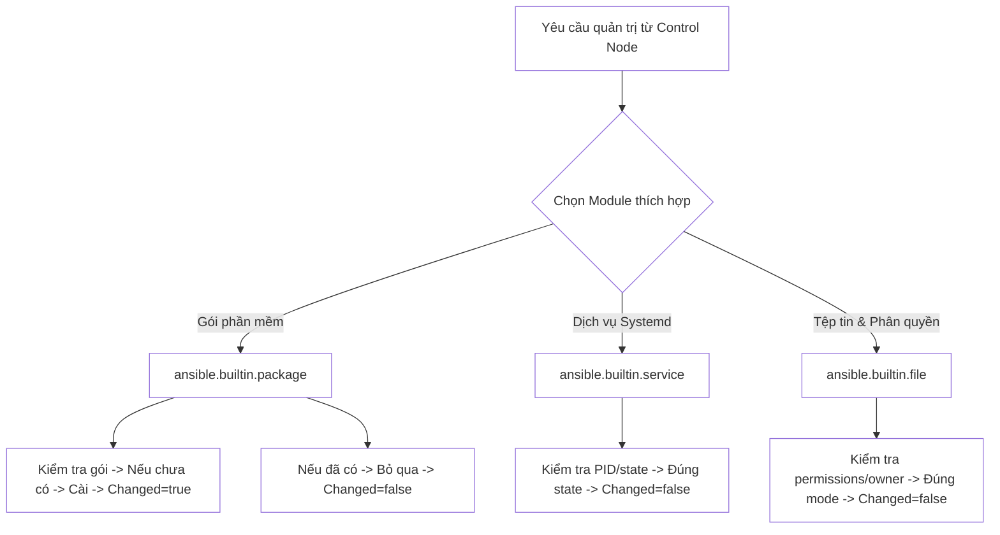
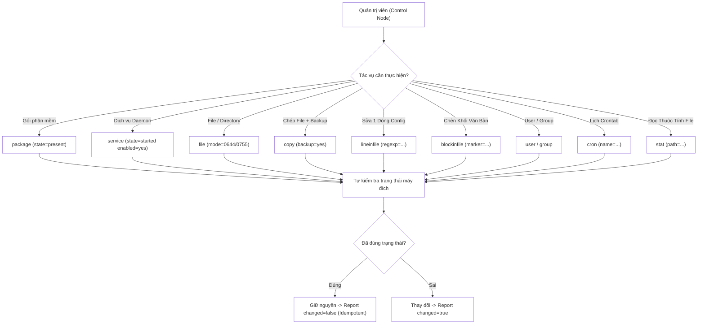
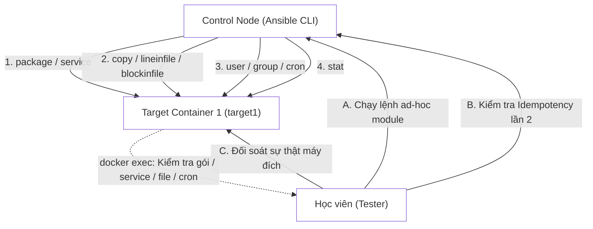


# [BÀI 04] LÀM CHỦ CÁC MODULES CỐT LÕI: FILE, COPY, TEMPLATE, PACKAGE, SERVICE, COMMAND VS SHELL VS RAW

Trong kỷ nguyên **Infrastructure as Code (IaC)** và tự động hóa vận hành hạ tầng đám mây (Cloud Infrastructure Automation), **Ansible** khẳng định vị thế dẫn đầu nhờ triết lý **Agentless** (không cần cài đặt agent nền trên máy đích), giao thức điều khiển an toàn qua **SSH / WinRM**, định dạng khai báo **YAML** trực quan và nguyên lý bất biến **Idempotency** mạnh mẽ. Việc làm chủ Ansible không chỉ dừng lại ở các câu lệnh Ad-hoc đơn giản, mà đòi hỏi kỹ sư phải nắm vững kiến trúc Module tầng thấp, Variable Precedence 22 tầng, Jinja2 Templates, tối ưu hóa Forks & Pipelining cho tới thiết kế Roles / Collections và tích hợp CI/CD tự động hóa chuẩn Doanh nghiệp.

Bài viết chuyên sâu này sẽ đồng hành cùng bạn mổ xẻ toàn diện bức tranh kiến trúc, phân tích các đánh đổi kỹ thuật thực chiến (Engineering Trade-offs), cung cấp hướng dẫn thực hành Lab chi tiết từng bước và bộ câu hỏi phỏng vấn chuyên sâu chuẩn DevOps / SRE Lead.

---

## 1. Bản Chất Kiến Trúc & Cơ Chế Vận Hành Tầng Thấp

---


> **Module chuyên (package/service/copy/lineinfile/user/cron/stat) idempotent; command/shell thì không.**

Chủ đề xuyên suốt khóa học (I-10) được cụ thể hóa trong Buổi 04 thông qua hệ thống module chuẩn:

> **Khi quản trị hệ thống bằng Ansible, việc lạm dụng các lệnh shell thô (`command`/`shell`) làm mất đi giá trị cốt lõi của tính bất biến (Idempotency). Các module chuyên dụng trong collection `ansible.builtin` được lập trình sẵn để tự kiểm tra trạng thái hiện tại của tài nguyên (gói phần mềm, dịch vụ, file, user, cron job) trước khi thực thi. Nếu tài nguyên đã đúng trạng thái mong muốn, module sẽ giữ nguyên hệ thống và báo `changed=false`. Báo cáo `PLAY RECAP` xanh chỉ thực sự có ý nghĩa khi ta dùng module chuẩn và chứng minh được tính bất biến ở lần chạy thứ hai.**

---


---


---


| Tiếng Việt | Tiếng Anh / Từ khóa + FQCN (giữ nguyên) |
|---|---|
| Module quản lý gói tổng quát | `ansible.builtin.package` |
| Module quản lý dịch vụ systemd | `ansible.builtin.service` / `ansible.builtin.systemd` |
| Module quản lý file & phân quyền | `ansible.builtin.file` |
| Module sao chép tệp tin | `ansible.builtin.copy` |
| Module chỉnh sửa dòng cấu hình | `ansible.builtin.lineinfile` |
| Module chèn khối văn bản | `ansible.builtin.blockinfile` |
| Module quản lý tài khoản người dùng | `ansible.builtin.user` |
| Module quản lý nhóm người dùng | `ansible.builtin.group` |
| Module quản lý tác vụ định kỳ | `ansible.builtin.cron` |
| Module kiểm tra thuộc tính tệp | `ansible.builtin.stat` |
| Bảng đánh dấu khối văn bản | Marker tag (`# BEGIN ANSIBLE MANAGED BLOCK`) |
| Biểu thức chính quy tìm kiếm | Regular Expression (`regexp`) |
| Tạo bản sao lưu dự phòng | Backup file (`backup=yes`) |

---

### 1.1. Nhóm Module Quản lý Hệ thống và Dịch vụ (15 phút)



**Nguyên lý cốt lõi:** Module `ansible.builtin.package` quản lý gói phần mềm đa nền tảng với 3 trạng thái cốt lõi: `state=present` (đảm bảo gói đã cài), `state=latest` (nâng cấp gói lên mới nhất), và `state=absent` (gỡ bỏ gói).

**Giải thích cơ chế ngầm:** Module `package` tự động phát hiện trình quản lý gói phù hợp trên target node (RHEL dùng `dnf`, Ubuntu dùng `apt`). Nó luôn kiểm tra trạng thái gói trước, nếu gói đã cài đúng `present` thì dừng lại và báo `changed=false`, đảm bảo tính Idempotency.

> [!WARNING]
> **CẠM BẪY THỰC CHIẾN:**
> **Lệnh:** `ansible all -m ansible.builtin.package -a "name=htop"` · **Output phải thấy:** `[WARNING]: The key 'state' was not specified...` do bỏ quên tham số `state`.

**Minh hoạ.** Cài đặt gói `htop` đảm bảo tính bất biến:
```bash
ansible all -m ansible.builtin.package -a "name=htop state=present" --become
```

**Nguyên lý cốt lõi:** Module `ansible.builtin.service` điều khiển trạng thái chạy (`state=started/stopped/restarted/reloaded`) và trạng thái tự động khởi động cùng hệ thống (`enabled=yes/no`) của dịch vụ daemon.

**Giải thích cơ chế ngầm:** `service` truy vấn trực tiếp `systemctl` trên target. Nếu dịch vụ đã chạy (`started`) và đã được gán `enabled=yes`, module sẽ không thực hiện lại thao tác thừa, tránh khởi động lại dịch vụ vô lý gây gián đoạn hệ thống.

> [!WARNING]
> **CẠM BẪY THỰC CHIẾN:**
> **Lệnh:** `ansible all -m ansible.builtin.command -a "systemctl restart httpd"` · **Output phải thấy:** Luôn báo `CHANGED` và khởi động lại dịch vụ mỗi lần chạy, làm đứt gãy kết nối của người dùng thật.

**Minh hoạ.** Đảm bảo dịch vụ `sshd` chạy và tự bật khi boot:
```bash
ansible web -m ansible.builtin.service -a "name=sshd state=started enabled=yes" --become
```

**Nguyên lý cốt lõi:** Module `ansible.builtin.file` quản lý việc tạo/xóa thư mục, file rỗng, liên kết mềm (symlink) và thiết lập thuộc tính phân quyền (`mode`, `owner`, `group`).

**Giải thích cơ chế ngầm:** Module `file` hỗ trợ tạo thư mục phân cấp (`state=directory`), xóa tài nguyên an toàn (`state=absent`), tạo symlink (`state=link`) và áp đặt chuẩn phân quyền Linux theo định dạng bát phân (octal mode như `0755`, `0644`).

> [!WARNING]
> **CẠM BẪY THỰC CHIẾN:**
> **Lệnh:** `ansible all -m ansible.builtin.shell -a "mkdir /var/www/app"` · **Output phải thấy:** Lần 1 báo `CHANGED`, lần 2 báo `FAILED! => {"msg": "mkdir: cannot create directory: File exists"}`.

**Minh hoạ.** Tạo thư mục ứng dụng với phân quyền chuẩn 0755:
```bash
ansible web -m ansible.builtin.file -a "path=/var/www/app state=directory mode='0755' owner=ansible group=ansible" --become
```

---

### 1.2. Nhóm Module Thao tác Tệp tin và Cấu hình (15 phút)

**Nguyên lý cốt lõi:** Module `ansible.builtin.copy` sao chép tệp tin từ Control Node xuống Target Node (hoặc sao chép giữa các vị trí trên máy đích) hỗ trợ kiểm tra hash nội dung và tạo bản sao lưu tự động với `backup=yes`.

**Giải thích cơ chế ngầm:** Module `copy` tính toán checksum md5/sha256 của file nguồn và file đích. Nếu nội dung giống hệt nhau, Ansible giữ nguyên không ghi đè và báo `changed=false`. Tham số `backup=yes` giúp tự động sinh ra file sao lưu dạng `filename.txt.2026-08-22@15:30~` nếu có thay đổi.

> [!WARNING]
> **CẠM BẪY THỰC CHIẾN:**
> **Lệnh:** `ansible all -m ansible.builtin.copy -a "src=app.conf dest=/etc/app.conf"` · **Output phải thấy:** Ghi đè trực tiếp làm mất nội dung cấu hình cũ mà không có cơ chế khôi phục do thiếu `backup=yes`.

**Minh hoạ.** Sao chép file cấu hình kèm tạo bản sao lưu tự động:
```bash
ansible web -m ansible.builtin.copy -a "src=./app.conf dest=/etc/app.conf mode='0644' backup=yes" --become
```

**Nguyên lý cốt lõi:** Module `ansible.builtin.lineinfile` tìm kiếm một dòng dựa trên biểu thức chính quy (`regexp`) và thay thế/chèn đúng dòng đó vào file cấu hình.

**Giải thích cơ chế ngầm:** `lineinfile` được thiết kế chuyên biệt để sửa các file cấu hình dạng Key-Value (như `/etc/ssh/sshd_config` hay `/etc/sysctl.conf`). Nó đảm bảo dòng cấu hình chỉ xuất hiện duy nhất 1 lần trong file, nếu dòng đã tồn tại đúng nội dung sẽ báo `changed=false`.

> [!WARNING]
> **CẠM BẪY THỰC CHIẾN:**
> **Lệnh:** `ansible all -m ansible.builtin.shell -a "echo 'Port 2222' >> /etc/ssh/sshd_config"` · **Output phải thấy:** Dòng `Port 2222` bị ghi đúp liên tục vào cuối file sau mỗi lần gõ lệnh.

**Minh hoạ.** Cấu hình cấm đăng nhập root SSH an toàn bằng `lineinfile`:
```bash
ansible web -m ansible.builtin.lineinfile -a "path=/etc/ssh/sshd_config regexp='^#?PermitRootLogin' line='PermitRootLogin no' state=present" --become
```

**Nguyên lý cốt lõi:** Module `ansible.builtin.blockinfile` chèn hoặc cập nhật một khối nhiều dòng văn bản (multi-line block) được bao bọc bởi hai đường đánh dấu (Marker tags).

**Giải thích cơ chế ngầm:** Khi cần chèn một đoạn cấu hình dài (ví dụ: khối vhost Nginx hay cấu hình firewall), `blockinfile` sử dụng thẻ đánh dấu `# BEGIN ANSIBLE MANAGED BLOCK` và `# END ANSIBLE MANAGED BLOCK` để nhận diện và cập nhật đúng khối văn bản đó mà không làm xáo trộn phần còn lại của file.

> [!WARNING]
> **CẠM BẪY THỰC CHIẾN:**
> **Lệnh:** `ansible all -m ansible.builtin.copy` · **Output phải thấy:** Ghi đè toàn bộ tệp tin cấu hình hiện tại của hệ thống thay vì chỉ chèn thêm khối cấu hình bổ sung.

**Minh hoạ.** Chèn khối biến môi trường vào `/etc/environment`:
```bash
ansible all -m ansible.builtin.blockinfile -a "path=/etc/environment block='APP_ENV=production\nDB_HOST=127.0.0.1\n'" --become
```

---

### 1.3. Nhóm Module Quản lý User, Cron và Kiểm tra Trạng thái (10 phút)

**Nguyên lý cốt lõi:** Module `ansible.builtin.user` và `ansible.builtin.group` quản lý tài khoản người dùng, nhóm hệ thống, thuộc tính UID/GID, danh sách nhóm phụ (`groups`) và thư mục home.

**Giải thích cơ chế ngầm:** Module `user` kiểm tra sự tồn tại của tài khoản trong `/etc/passwd`. Nếu người dùng đã tồn tại đúng shell và nhóm mong muốn, module sẽ báo `changed=false`.

> [!WARNING]
> **CẠM BẪY THỰC CHIẾN:**
> **Lệnh:** `ansible all -m ansible.builtin.shell -a "useradd deployer"` · **Output phải thấy:** Lần 2 báo `FAILED! => {"msg": "useradd: user 'deployer' already exists"}`.

**Minh hoạ.** Tạo nhóm `devops` và tạo user `deployer` thuộc nhóm đó:
```bash
ansible all -m ansible.builtin.group -a "name=devops gid=2000 state=present" --become
ansible all -m ansible.builtin.user -a "name=deployer uid=2000 group=devops shell=/bin/bash state=present" --become
```

**Nguyên lý cốt lõi:** Module `ansible.builtin.cron` quản lý các định thời công việc (crontab) của Linux với các thuộc tính thời gian (`minute`, `hour`, `day`, `month`) và nhãn tên định danh `name`.

**Giải thích cơ chế ngầm:** Tham số `name` đóng vai trò là khóa định danh (identifier key) trong file crontab. Ansible dùng nhãn tên này để tìm và cập nhật đúng job cũ thay vì tạo các dòng cron trùng lặp rác.

> [!WARNING]
> **CẠM BẪY THỰC CHIẾN:**
> **Lệnh:** `ansible all -m ansible.builtin.shell -a "echo '0 * * * * /script.sh' >> /var/spool/cron/root"` · **Output phải thấy:** Sinh ra hàng chục dòng cron giống hệt nhau trong crontab.

**Minh hoạ.** Tạo job dọn dẹp log hàng ngày lúc 2 giờ sáng:
```bash
ansible all -m ansible.builtin.cron -a "name='Daily Log Cleanup' minute='0' hour='2' job='/usr/bin/find /var/log -type f -name \"*.log\" -mtime +7 -delete'" --become
```

**Nguyên lý cốt lõi:** Module `ansible.builtin.stat` truy vấn thông tin trạng thái chi tiết của tệp tin/thư mục (sự tồn tại `exists`, quyền `mode`, kích thước `size`, md5/sha256 hash, loại `isreg`/`isdir`) mà không làm thay đổi hệ thống.

**Giải thích cơ chế ngầm:** Module `stat` cung cấp khả năng đọc thuộc tính tài nguyên hệ thống một cách an toàn để làm cơ sở cho việc rẽ nhánh logic hoặc kiểm tra điều kiện trước khi thực thi các hành động tiếp theo.

> [!WARNING]
> **CẠM BẪY THỰC CHIẾN:**
> **Lệnh:** `ansible all -m ansible.builtin.command -a "ls -l /file.txt"` · **Output phải thấy:** Phải tự phân tích chuỗi văn bản không cấu trúc thay vì nhận về dữ liệu chuẩn JSON từ `stat`.

**Minh hoạ.** Kiểm tra thuộc tính file `/etc/passwd`:
```bash
ansible all -m ansible.builtin.stat -a "path=/etc/passwd"
```

---

### 1.4. Đưa vào việc thật (4 phút)

### 7.1. Áp dụng vào hạ tầng sẵn có
Khi chuẩn hóa hạ tầng bảo mật cho 100 máy chủ Linux:
- Dùng `ansible.builtin.lineinfile` để tắt tính năng SSH Password Authentication trên tất cả các máy trong 3 giây.
- Dùng `ansible.builtin.cron` để thiết lập lịch đồng bộ thời gian NTP tự động hàng giờ.

### 7.2. Rủi ro hỏng hóc khi triển khai Production và giải pháp an toàn
- **Rủi ro:** Sử dụng module `copy` mà quên tham số `backup=yes` sẽ đè bẹp file cấu hình Production đang chạy tốt, không thể khôi phục lại khi gặp sự cố.
- **Giải pháp an toàn:**
  1. Luôn thêm `backup=yes` khi dùng `copy` hoặc `lineinfile` sửa các file cấu hình quan trọng.
  2. Kết hợp cờ `--check --diff` trên CLI để xem trước các dòng văn bản SẼ bị thay đổi.

### 7.3. Đo lường chỉ số Trước – Sau khi áp dụng
- **Trước khi dùng Module chuẩn:** Viết kịch bản Bash script gõ lệnh `echo >> /etc/conf` bị lỗi đè đúp dòng 50%, phải kiểm tra thủ công từng máy.
- **Sau khi dùng Module chuẩn:** Chạy `lineinfile` 100% đạt tính Idempotency, thời gian thực thi giảm từ 20 phút xuống 3 giây.

### 7.4. Khi nào KHÔNG nên dùng Module đơn lẻ ad-hoc
- **Không dùng ad-hoc module riêng lẻ cho quy trình phức tạp:** Khi tác vụ gồm chuỗi 10 module liên tiếp có phụ thuộc biến lẫn nhau, việc gõ từng lệnh ad-hoc rời rạc sẽ rất chậm và dễ thiếu sót. **Bắt buộc phải đóng gói thành Playbook** (học ở Buổi 05).

---

### 1.5. Bẫy hay gặp (2 phút)

| # | Bẫy hay gặp | Vì sao "recap xanh mà sai / không idempotent" | Lệnh phát hiện và xử lý |
|---|---|---|---|
| 1 | Quên tham số `state=present` trong module `package` | Ansible áp dụng trạng thái mặc định không đồng nhất giữa các phiên bản collection. | Luôn khai báo tường minh `state=present` hoặc `state=absent`. |
| 2 | Nhầm lẫn giữa `state=started` và `enabled=yes` | Dịch vụ đang chạy ở thời điểm hiện tại nhưng bị tắt tự động khi reboot máy do thiếu `enabled=yes`. | Truyền đồng thời `state=started enabled=yes` trong module `service`. |
| 3 | Sửa file cấu hình bằng `lineinfile` nhưng thiếu `regexp` | `lineinfile` chèn thêm dòng mới vào cuối file thay vì sửa đúng dòng hiện có do không match regex. | Khai báo biểu thức regex chính xác trong tham số `regexp='^#?TargetLine'`. |
| 4 | Không đặt tên `name` trong module `cron` | Định thời công việc bị tạo đúp liên tục mỗi lần chạy ad-hoc vì Ansible không có khóa định danh job. | Khai báo thuộc tính `name='Unique Job Title'` bắt buộc cho mọi task `cron`. |
| 5 | Quên tham số `mode` trong module `copy` hoặc `file` | File chép xuống target nhận quyền umask mặc định khiến dịch vụ không đọc được file do thiếu quyền. | Khai báo tường minh `mode='0644'` cho file và `mode='0755'` cho directory. |
| 6 | Nhầm lẫn giữa `ansible.builtin.copy` và `ansible.builtin.template` | Dùng `copy` chép file chứa biến Jinja2 `{{ my_var }}` khiến máy đích nhận nguyên văn chuỗi chưa biến đổi. | Dùng `copy` cho file tĩnh thô, dùng `template` (Buổi 12) cho file chứa biến Jinja2. |
| 7 | Không dùng `backup=yes` khi chỉnh sửa file hệ thống nhạy cảm | Lỗi cú pháp trong file cấu hình làm dịch vụ đứt gãy và mất dấu vết file cấu hình gốc. | Luôn thêm `backup=yes` khi gọi module `copy` hoặc `lineinfile` lên file hệ thống. |
| 8 | Dùng module `user` tạo user nhưng không chỉ định `shell` | User mới tạo nhận shell mặc định `/bin/sh` thay vì `/bin/bash` làm gõ lệnh bị lỗi giao diện. | Khai báo tường minh tham số `shell=/bin/bash`. |
| 9 | Dùng `blockinfile` sửa file nhưng bị ghi đè toàn bộ file | Trình bày nhầm lẫn đường dẫn `dest` thành file tạm khiến nội dung cũ bị mất. | Rà soát cẩn thận cờ `--check --diff` trước khi chạy lệnh. |
| 10 | Quên cờ `--become` khi thao tác module `service` hoặc `package` | Lệnh ad-hoc thất bại lập tức với lỗi `Permission denied` do user thường không có quyền quản trị. | Thêm cờ `--become` vào lệnh CLI ad-hoc. |
| 11 | Không đặt câu lệnh trong ngoặc kép khi truyền tham số `-a` | Trình biên dịch Bash hiểu sai các khoảng trắng và dấu gạch chéo trong câu lệnh `-a`. | Đặt toàn bộ tham số trong cặp dấu ngoặc kép: `-a "key=val key2='val2'"`. |
| 12 | Tin tưởng lệnh `command` chạy script bash thay cho module chuyên | Script bash chạy lại luôn báo `CHANGED` và có nguy cơ thất bại giữa chừng không kiểm soát. | Chuyển đổi toàn bộ các bước thao tác script sang dùng module chuyên dụng tương ứng. |

---

### 1.6. Tóm tắt (1 phút)



### Năm điều phải nhớ
1. **Module chuyên dụng là ưu tiên số 1:** Luôn dùng `package`, `service`, `copy`, `lineinfile`, `user` thay cho `command`/`shell`.
2. **Luôn bật Backup khi sửa file:** Thêm `backup=yes` khi dùng `copy` hoặc `lineinfile` để bảo vệ file gốc.
3. **Lineinfile cần Regexp:** Luôn dùng cờ `regexp` để đảm bảo dòng cấu hình chỉ xuất hiện duy nhất 1 lần.
4. **Cron cần Name:** Thuộc tính `name` là khóa định danh bắt buộc để tránh tạo rác crontab.
5. **Chứng minh tính Idempotency:** Mọi lệnh ad-hoc gọi module chuẩn khi chạy lại lần 2 **bắt buộc** phải báo `changed=false`.

---

### 1.7. Câu hỏi tự kiểm tra (kiêm luyện RHCE EX294)

1. **[RHCE EX294 Objective #15]** Viết lệnh ad-hoc dùng module `package` để đảm bảo gói `nginx` đã được cài đặt trên tất cả host thuộc nhóm `web`.
   - *Đáp án:* `ansible web -m ansible.builtin.package -a "name=nginx state=present" --become`
2. **[RHCE EX294 Objective #15]** Viết lệnh ad-hoc gỡ bỏ gói phần mềm `httpd` khỏi nhóm `db`.
   - *Đáp án:* `ansible db -m ansible.builtin.package -a "name=httpd state=absent" --become`
3. **[RHCE EX294 Objective #15]** Viết lệnh ad-hoc khởi chạy dịch vụ `nginx` và tự động bật khi reboot trên nhóm `web`.
   - *Đáp án:* `ansible web -m ansible.builtin.service -a "name=nginx state=started enabled=yes" --become`
4. **[RHCE EX294 Objective #15]** Viết lệnh ad-hoc tạo thư mục `/var/www/html/assets` với phân quyền `0755`, owner `nginx`, group `nginx`.
   - *Đáp án:* `ansible web -m ansible.builtin.file -a "path=/var/www/html/assets state=directory mode='0755' owner=nginx group=nginx" --become`
5. **[RHCE EX294 Objective #15]** Viết lệnh ad-hoc sao chép file `./nginx.conf` tới `/etc/nginx/nginx.conf` trên target node và tạo bản sao lưu tự động nếu file bị sửa.
   - *Đáp án:* `ansible web -m ansible.builtin.copy -a "src=./nginx.conf dest=/etc/nginx/nginx.conf mode='0644' backup=yes" --become`
6. **[RHCE EX294 Objective #15]** Viết lệnh ad-hoc sửa file `/etc/ssh/sshd_config` để đảm bảo dòng `PermitRootLogin no` được áp dụng (sử dụng regex match dòng cũ).
   - *Đáp án:* `ansible all -m ansible.builtin.lineinfile -a "path=/etc/ssh/sshd_config regexp='^#?PermitRootLogin' line='PermitRootLogin no'" --become`
7. **[RHCE EX294 Objective #15]** Module `blockinfile` dùng cơ chế nào để nhận diện và cập nhật khối văn bản đã chèn trước đó?
   - *Đáp án:* Sử dụng cặp thẻ đánh dấu Marker (`# BEGIN ANSIBLE MANAGED BLOCK` và `# END ANSIBLE MANAGED BLOCK`).
8. **[RHCE EX294 Objective #15]** Viết lệnh ad-hoc tạo nhóm hệ thống `developers` với GID `1500`.
   - *Đáp án:* `ansible all -m ansible.builtin.group -a "name=developers gid=1500 state=present" --become`
9. **[RHCE EX294 Objective #15]** Viết lệnh ad-hoc tạo user `devuser` thuộc nhóm `developers` với shell `/bin/bash`.
   - *Đáp án:* `ansible all -m ansible.builtin.user -a "name=devuser group=developers shell=/bin/bash state=present" --become`
10. **[RHCE EX294 Objective #15]** Viết lệnh ad-hoc tạo một cron job tên `'Sync Time'` chạy mỗi giờ thực thi lệnh `/usr/sbin/ntpdate pool.ntp.org`.
    - *Đáp án:* `ansible all -m ansible.builtin.cron -a "name='Sync Time' minute='0' hour='*' job='/usr/sbin/ntpdate pool.ntp.org'" --become`
11. **[RHCE EX294 Objective #15]** Làm thế nào để xóa một cron job tên `'Sync Time'` bằng module `cron`?
    - *Đáp án:* `ansible all -m ansible.builtin.cron -a "name='Sync Time' state=absent" --become`
12. **[RHCE EX294 Objective #15]** Module `stat` trả về thuộc tính bool nào để biết một đường dẫn có tồn tại thực tế trên máy đích hay không?
    - *Đáp án:* Thuộc tính `stat.exists` (trả về `true` hoặc `false`).
13. **[RHCE EX294 Objective #5]** Khi thực thi lại lệnh ad-hoc gọi module `lineinfile` lần thứ hai với đúng thông số cũ, chỉ số `changed` thu được sẽ là bao nhiêu nếu hệ thống đảm bảo idempotency?
    - *Đáp án:* Thu được chỉ số `changed=false` (màu xanh lá cây).

---

### 1.8. Tài liệu tham khảo

- Ansible Core Documentation (v2.15+): [ansible.builtin Collection Index](https://docs.ansible.com/ansible/latest/collections/ansible/builtin/index.html)
- Red Hat Certified Engineer (RHCE) EX294 Study Guide: Managing System Services, Files, Users, and Cron with Ansible.

---

## Bảng đối soát thời lượng

| Mục | Nội dung | Thời lượng dự kiến | Thời lượng thực tế |
|---|---|---|---|
| §0 | Khởi động và ôn tập buổi 03 | 10 phút | 10 phút |
| §1–§2 | Mục tiêu làm được & Cần biết trước | 2 phút | 2 phút |
| §3 | Thuật ngữ Việt-Anh & Mô hình tư duy | 8 phút | 8 phút |
| §4 | Nhóm Module Quản lý Hệ thống (QT 4.1–4.3) | 15 phút | 15 phút |
| §5 | Nhóm Module Thao tác Tệp tin (QT 5.1–5.3) | 15 phút | 15 phút |
| §6 | Nhóm Module User, Cron, Stat (QT 6.1–6.3) | 10 phút | 10 phút |
| §7–§9 | Đưa vào việc thật, Bẫy hay gặp & Tóm tắt | 7 phút | 7 phút |
| §10–§11 | Câu hỏi tự kiểm tra EX294 & Tài liệu tham khảo | 3 phút | 3 phút |
| **Tổng** | **Khối lý thuyết Buổi 04** | **60 phút** | **60 phút** |

---

## 2. Hướng Dẫn Thực Hành & Triển Khai Lab Chuẩn Production

> [!IMPORTANT]
> **YÊU CẦU MÔI TRƯỜNG THỰC HÀNH:**
> Toàn bộ các bài thực hành dưới đây được thiết kế để chạy trực tiếp trên môi trường máy chủ Linux / Docker containers phân tán. Hãy đảm bảo bạn đã chuẩn bị Control Node cài đặt Ansible Core 2.15+ cùng các Managed Nodes đã cấu hình SSH Key Authentication.

## Khối thực hành — 150 phút

> **Đối soát thời lượng:** Khối thực hành kéo dài đúng **150'** (từ L0 đến L11).
> **Nguyên tắc cốt lõi:** Thực hành khai thác 9 module tiêu chuẩn trong collection `ansible.builtin` thông qua lệnh ad-hoc (`package`, `service`, `file`, `copy`, `lineinfile`, `blockinfile`, `user`, `cron`, `stat`), chứng minh tính **Idempotency** (chạy lần 2 `changed=0` / `changed=false`) và đối soát trực tiếp sự thật máy đích qua `docker exec`.

---

## L0. Mục tiêu thực hành và tiêu chí hoàn thành

| # | Mục tiêu thực hành | Tiêu chí hoàn thành (Kiểm tra bằng lệnh CLI) |
|---|---|---|
| TH1 | Cài đặt gói phần mềm & quản lý dịch vụ ad-hoc | Gói `curl` được cài và `sshd` ở trạng thái active |
| TH2 | Quản lý thư mục & phân quyền với `file` | Thư mục `/var/www/app` được tạo đúng mode `0755` |
| TH3 | Sao chép tệp tin & tạo sao lưu với `copy` | File `/etc/app.conf` được chép kèm bản backup |
| TH4 | Chỉnh sửa dòng cấu hình với `lineinfile` | Dòng `PermitRootLogin no` xuất hiện duy nhất 1 lần |
| TH5 | Chèn khối văn bản lớn với `blockinfile` | Khối marker chèn thành công vào `/etc/environment` |
| TH6 | Quản lý User, Group & Cron Job | User `deployer` và Cron job `'Daily Backup'` sẵn sàng |
| TH7 | Đọc thuộc tính tệp tin bằng module `stat` | Module `stat` trả về `exists: true` dạng JSON |
| TH8 | Chứng minh Idempotency & Đối soát docker exec | Chạy lại luồng ad-hoc lần 2 báo `changed=false` và `docker exec` thành công |

---

## L1. Điều kiện tiên quyết về môi trường

| Kiểm tra | LỆNH THỰC THI | Kết quả kỳ vọng |
|---|---|---|
| Ansible core đã cài | `ansible --version` | Phiên bản ansible-core v2.15 trở lên |
| Docker Compose sẵn sàng | `docker compose ps` | Cả target1 và target2 ở trạng thái `Up` |
| Kết nối SSH ad-hoc | `ansible all -m ansible.builtin.ping` | Đạt `SUCCESS` cho mọi host |
| Inventory dự án | `ansible-inventory --graph` | Hiển thị nhóm `web` và `db` |
| Thư mục thực hành | `pwd` | Đang ở thư mục `~/lab-ansible-04` |

Nếu chưa có target container:
```bash
cd labs && make up && make key && make inventory
```

---

## L2. Kiến trúc bài lab



---

## L3. Bước 1 — Quản lý Gói phần mềm và Dịch vụ (25 phút)

Thực thi cài đặt gói phần mềm `curl` và quản lý trạng thái dịch vụ `sshd` bằng module chuẩn `ansible.builtin.package` và `ansible.builtin.service` (QT 4.1, QT 4.2).

```bash
mkdir -p ~/lab-ansible-04 && cd ~/lab-ansible-04

cat << 'EOF' > ansible.cfg
[defaults]
inventory = ./inventory.ini
remote_user = ansible
host_key_checking = False
private_key_file = ~/.ssh/id_ed25519

[privilege_escalation]
become = True
become_method = sudo
become_user = root
become_ask_pass = False
EOF

cat << 'EOF' > inventory.ini
[web]
target1 ansible_host=127.0.0.1 ansible_port=2221

[db]
target2 ansible_host=127.0.0.1 ansible_port=2222

[all:vars]
ansible_python_interpreter=/usr/bin/python3
EOF
```

Thực thi cài gói `curl` và bật dịch vụ `sshd`:
```bash
ansible all -m ansible.builtin.package -a "name=curl state=present" --become
ansible all -m ansible.builtin.service -a "name=sshd state=started enabled=yes" --become
```

**CHECKPOINT 1 — Cài đặt gói curl và kích hoạt dịch vụ sshd thành công.**
- **Lệnh kiểm tra:**
```bash
PKG_RES=$(ansible all -m ansible.builtin.package -a "name=curl state=present" --become)
if echo "$PKG_RES" | grep -q "SUCCESS"; then
  echo "CHECKPOINT 1: ĐẠT - Module package và service thực thi cài đặt/kích hoạt dịch vụ thành công"
else
  echo "CHECKPOINT 1: LỖI - Thực thi module package/service thất bại"
fi
```

---

## L4. Bước 2 — Quản lý Thư mục, File và Phân quyền với file và copy (30 phút)

Sử dụng module `ansible.builtin.file` tạo cấu trúc thư mục ứng dụng và module `ansible.builtin.copy` chép file cấu hình kèm chức năng sao lưu tự động `backup=yes` (QT 4.3, QT 5.1).

Tạo thư mục ứng dụng `/var/www/app`:
```bash
ansible web -m ansible.builtin.file -a "path=/var/www/app state=directory mode='0755'" --become
```

Tạo file cấu hình local và chép xuống target host:
```bash
cat << 'EOF' > app.conf
APP_NAME=NTKAnsible Core App
VERSION=1.0.0
DB_HOST=127.0.0.1
EOF

ansible web -m ansible.builtin.copy -a "src=./app.conf dest=/etc/app.conf mode='0644' backup=yes" --become
```

**CHECKPOINT 2 — Thư mục /var/www/app được tạo với quyền 0755.**
- **Lệnh kiểm tra:**
```bash
FILE_CHECK=$(ansible web -m ansible.builtin.file -a "path=/var/www/app state=directory mode='0755'" --become)
if echo "$FILE_CHECK" | grep -q "SUCCESS"; then
  echo "CHECKPOINT 2: ĐẠT - Module file khởi tạo thư mục /var/www/app với phân quyền 0755 thành công"
else
  echo "CHECKPOINT 2: LỖI - Khởi tạo thư mục /var/www/app thất bại"
fi
```

**CHECKPOINT 3 — Sao chép file /etc/app.conf thành công kèm cấu hình backup.**
- **Lệnh kiểm tra:**
```bash
COPY_CHECK=$(ansible web -m ansible.builtin.copy -a "src=./app.conf dest=/etc/app.conf mode='0644' backup=yes" --become)
if echo "$COPY_CHECK" | grep -q "SUCCESS"; then
  echo "CHECKPOINT 3: ĐẠT - Module copy chép file /etc/app.conf kèm tham số backup=yes thành công"
else
  echo "CHECKPOINT 3: LỖI - Sao chép tệp tin /etc/app.conf thất bại"
fi
```

---

## L5. Bước 3 — Chỉnh sửa Cấu hình với lineinfile và blockinfile (30 phút)

Thực hành sửa dòng cấu hình với `ansible.builtin.lineinfile` và chèn khối văn bản lớn với `ansible.builtin.blockinfile` (QT 5.2, QT 5.3).

Sửa cấu hình SSH bằng `lineinfile`:
```bash
ansible web -m ansible.builtin.lineinfile -a "path=/etc/ssh/sshd_config regexp='^#?PermitRootLogin' line='PermitRootLogin no' state=present" --become
```

Chèn khối biến môi trường bằng `blockinfile`:
```bash
ansible web -m ansible.builtin.blockinfile -a "path=/etc/environment block='APP_ENV=production\nSERVICE_PORT=8080\n' marker='# {mark} ANSIBLE MANAGED APP BLOCK'" --become
```

**CHECKPOINT 4 — Dòng cấu hình PermitRootLogin no xuất hiện chính xác trong /etc/ssh/sshd_config.**
- **Lệnh kiểm tra:**
```bash
LINE_CHECK=$(docker exec target1 grep "^PermitRootLogin no" /etc/ssh/sshd_config)
if [ -n "$LINE_CHECK" ]; then
  echo "CHECKPOINT 4: ĐẠT - Module lineinfile cập nhật chính xác dòng PermitRootLogin no"
else
  echo "CHECKPOINT 4: LỖI - Module lineinfile cập nhật dòng cấu hình thất bại"
fi
```

**CHECKPOINT 5 — Khối văn bản blockinfile chứa thẻ Marker được chèn vào /etc/environment.**
- **Lệnh kiểm tra:**
```bash
BLOCK_CHECK=$(docker exec target1 cat /etc/environment)
if echo "$BLOCK_CHECK" | grep -q "ANSIBLE MANAGED APP BLOCK" && echo "$BLOCK_CHECK" | grep -q "SERVICE_PORT=8080"; then
  echo "CHECKPOINT 5: ĐẠT - Module blockinfile chèn khối cấu hình kèm thẻ Marker thành công"
else
  echo "CHECKPOINT 5: LỖI - Module blockinfile chèn khối cấu hình thất bại"
fi
```

---

## L6. Bước 4 — Quản lý User, Group, Cron và Truy vấn stat (35 phút)

Tạo nhóm hệ thống `devops`, tạo user `deployer` thuộc nhóm `devops`, khởi tạo cron job định kỳ và truy vấn thuộc tính file bằng module `ansible.builtin.stat` (QT 6.1, QT 6.2, QT 6.3).

Tạo nhóm và user:
```bash
ansible all -m ansible.builtin.group -a "name=devops gid=2000 state=present" --become
ansible all -m ansible.builtin.user -a "name=deployer uid=2000 group=devops shell=/bin/bash state=present" --become
```

Tạo cron job dọn dẹp log:
```bash
ansible all -m ansible.builtin.cron -a "name='Daily Log Cleanup' minute='0' hour='2' job='/usr/bin/find /var/log -type f -name \"*.log\" -mtime +7 -delete'" --become
```

Truy vấn thuộc tính file `/etc/app.conf` bằng `stat`:
```bash
ansible web -m ansible.builtin.stat -a "path=/etc/app.conf"
```

**CHECKPOINT 6 — User deployer và Cron job Daily Log Cleanup khởi tạo thành công.**
- **Lệnh kiểm tra:**
```bash
USER_ID=$(docker exec target1 id deployer)
CRON_JOB=$(docker exec target1 crontab -l)
if echo "$USER_ID" | grep -q "uid=2000(deployer)" && echo "$CRON_JOB" | grep -q "Daily Log Cleanup"; then
  echo "CHECKPOINT 6: ĐẠT - Module user, group và cron khởi tạo tài khoản và định thời công việc thành công"
else
  echo "CHECKPOINT 6: LỖI - Khởi tạo user hoặc cron job thất bại"
fi
```

**CHECKPOINT 7 — Module stat truy vấn thành công thuộc tính file /etc/app.conf.**
- **Lệnh kiểm tra:**
```bash
STAT_OUT=$(ansible web -m ansible.builtin.stat -a "path=/etc/app.conf")
if echo "$STAT_OUT" | grep -q '"exists": true' && echo "$STAT_OUT" | grep -q '"isreg": true'; then
  echo "CHECKPOINT 7: ĐẠT - Module stat đọc thành công thuộc tính tồn tại và định dạng file"
else
  echo "CHECKPOINT 7: LỖI - Module stat truy vấn thất bại"
fi
```

---

## L7. Bước 5 — Chứng minh Idempotency lần 2 và Đối soát Thực tế (30 phút)

Thực thi lại toàn bộ chuỗi lệnh ad-hoc module lần thứ hai để chứng minh tính bất biến (`changed=false`) và đối soát thực tế qua `docker exec`.

Chạy lại lệnh ad-hoc module `lineinfile` và `copy` lần 2:
```bash
ansible web -m ansible.builtin.lineinfile -a "path=/etc/ssh/sshd_config regexp='^#?PermitRootLogin' line='PermitRootLogin no' state=present" --become
ansible web -m ansible.builtin.copy -a "src=./app.conf dest=/etc/app.conf mode='0644' backup=yes" --become
```

**CHECKPOINT 8 — Kiểm tra Idempotency lần 2 đạt changed=false và đối soát thực tế qua docker exec.**
- **Lệnh kiểm tra:**
```bash
RUN2_COPY=$(ansible web -m ansible.builtin.copy -a "src=./app.conf dest=/etc/app.conf mode='0644' backup=yes" --become)
REAL_CAT=$(docker exec target1 cat /etc/app.conf)
if (echo "$RUN2_COPY" | grep -q '"changed": false' || echo "$RUN2_COPY" | grep -q 'SUCCESS => {"changed": false') && echo "$REAL_CAT" | grep -q "APP_NAME=NTKAnsible Core App"; then
  echo "CHECKPOINT 8: ĐẠT - Lệnh ad-hoc module đạt Idempotency (changed=0 / changed=false lần 2) và xác nhận sự thật thực tế qua docker exec"
else
  echo "CHECKPOINT 8: LỖI - Lệnh ad-hoc không đạt Idempotency hoặc đối soát thực tế máy đích thất bại"
fi
```

---

## L8. Nộp sản phẩm và dọn dẹp (10 phút)

Thu thập kết quả ra các file báo cáo cuối buổi:
```bash
ansible web -m ansible.builtin.stat -a "path=/etc/app.conf" > stat-result.txt
ansible web -m ansible.builtin.copy -a "src=./app.conf dest=/etc/app.conf mode='0644' backup=yes" --become > idempotency-check.txt
docker exec target1 id deployer > kiem-may-dich.txt
docker exec target1 crontab -l >> kiem-may-dich.txt
docker exec target1 cat /etc/app.conf >> kiem-may-dich.txt
```

---

## L9. Xử lý sự cố

| # | Hiện tượng lỗi | Nguyên nhân gốc rễ | Cách xử lý nhanh |
|---|---|---|---|
| 1 | Module `lineinfile` không sửa đúng dòng mà chèn thêm dòng mới | Biểu thức Regex trong `regexp` không khớp với dòng hiện có trong file | Kiểm tra lại cú pháp regex (ví dụ `regexp='^#?PermitRootLogin'`). |
| 2 | Module `copy` báo lỗi `src file not found` | Đường dẫn tệp tin nguồn `src` đặt sai so với thư mục làm việc hiện tại | Kiểm tra vị trí file bằng `ls ./app.conf` hoặc dùng đường dẫn tuyệt đối. |
| 3 | Lệnh ad-hoc gọi `service` báo `System has not been booted with systemd` | Container máy đích không khởi chạy tiến trình `systemd` ở PID 1 | Đảm bảo container chạy với quyền init system hoặc dùng ảnh container hỗ trợ systemd. |
| 4 | Cron job bị sinh ra đúp nhiều dòng trùng lặp | Quên truyền tham số `name` định danh duy nhất cho job trong module `cron` | Thêm thuộc tính `name='Unique Job Title'` bắt buộc cho tác vụ cron. |
| 5 | Module `file` báo lỗi `permission denied` khi tạo thư mục | Không truyền cờ `--become` để leo quyền root khi thao tác thư mục hệ thống `/var/www` | Thêm cờ `--become` vào lệnh CLI ad-hoc. |
| 6 | Module `blockinfile` chèn nhầm vị trí trong file | Không khai báo tham số vị trí `insertafter` hoặc `insertbefore` | Bổ sung tham số `insertafter=EOF` hoặc `insertafter='^# Configuration'` nếu cần. |
| 7 | User tạo bằng module `user` bị thiếu nhóm phụ | Truyền tham số `groups` nhưng quên cờ `append=yes` khiến user bị xóa khỏi nhóm cũ | Thêm tham số `append=yes` khi bổ sung nhóm phụ cho người dùng. |
| 8 | Module `copy` chạy lần 2 vẫn báo `CHANGED` | Tệp tin nguồn local liên tục bị sửa đổi hoặc chứa nội dung động | Đảm bảo file nguồn cố định để đạt tính Idempotency. |
| 9 | Lệnh `stat` trả về `exists: false` dù file có sẵn | Khai báo đường dẫn `path` bị sai lỗi chính tả hoặc thiếu ký tự `/` ở đầu | Rà soát chính xác đường dẫn file tuyệt đối trên máy đích. |
| 10 | Module `package` báo không tìm thấy gói phần mềm | Tên gói phần mềm giữa RHEL (`httpd`) và Ubuntu (`apache2`) khác nhau | Dùng tên gói tương ứng OS hoặc dùng module trừu tượng hóa chuẩn. |
| 11 | Không thấy bản backup khi dùng `copy` với `backup=yes` | File đích chưa tồn tại từ trước hoặc nội dung file không có sự thay đổi | Thay đổi nội dung file nguồn rồi chạy lại để quan sát file backup `.2026-08-22@...~`. |
| 12 | Lỗi parse Bash syntax khi tham số `-a` chứa ký tự ngoặc kép | Bọc tham số `-a` không đúng cặp ngoặc ngoặc kép/ngoặc đơn lồng nhau | Đặt toàn bộ chuỗi `-a` trong ngoặc kép và các chuỗi con bên trong trong ngoặc đơn. |
| 13 | Module `user` báo lỗi `GID 2000 does not exist` | Tạo user với `group=devops` nhưng nhóm `devops` chưa được khởi tạo từ trước | Chạy module `group` tạo nhóm `devops` trước khi chạy module `user`. |
| 14 | Module `lineinfile` bị thay đổi nhiều dòng ngoài ý muốn | Dùng regex quá rộng (ví dụ `regexp='Port'`) khớp với nhiều dòng khác nhau trong file | Viết regex chặt chẽ hơn (ví dụ `regexp='^Port 22'`). |

---

## L10. Bài tập mở rộng

1. **BT1:** Viết lệnh ad-hoc sử dụng module `ansible.builtin.package` cài đặt gói `vim` và `git` cùng lúc trên tất cả máy thuộc nhóm `web`.
2. **BT2:** Viết lệnh ad-hoc sử dụng module `ansible.builtin.service` dừng dịch vụ `nginx` (`state=stopped`) và kiểm tra đối soát bằng `docker exec`.
3. **BT3:** Sử dụng module `ansible.builtin.file` tạo một liên kết mềm (symlink) từ `/etc/app.conf` tới `/var/www/app/app.conf` (`state=link`).
4. **BT4:** Sử dụng module `ansible.builtin.lineinfile` để chèn dòng `server_tokens off;` vào ngay sau dòng `http {` trong file `/etc/nginx/nginx.conf`.
5. **BT5:** Sử dụng module `ansible.builtin.blockinfile` chèn khối cấu hình Firewall Rule vào file `/etc/sysconfig/iptables` với thẻ Marker tùy chỉnh `# CUSTOM FIREWALL RULES`.
6. **BT6:** Viết lệnh ad-hoc module `ansible.builtin.user` khóa tài khoản user `deployer` bằng cách truyền tham số `password_lock=yes`.
7. **BT7:** Tạo một cron job chạy mỗi 15 phút gõ lệnh `php /var/www/app/artisan schedule:run` bằng module `ansible.builtin.cron`.
8. **BT8:** Kết hợp module `ansible.builtin.stat` truy vấn file `/etc/app.conf` lấy mã hash `checksum` sha256 và đối soát với file local.

---

## L11. Sản phẩm nộp và chấm điểm

### Danh mục sản phẩm nộp
- File cấu hình `ansible.cfg`, `inventory.ini` và `app.conf`.
- Báo cáo kết quả 8 CHECKPOINT từ terminal.
- Các file kết quả: `stat-result.txt`, `idempotency-check.txt`, `kiem-may-dich.txt`.

### Thang điểm đánh giá

| Mức điểm | Tiêu chí đạt được |
|---|---|
| **0–4 điểm** | Chưa thực thi được các module cơ bản, dính lỗi leo quyền `become`. |
| **5–7 điểm** | Chạy được module `package` và `service`, nhưng chưa thành thạo `lineinfile`/`blockinfile` và chưa chứng minh Idempotency lần 2. |
| **8–9 điểm** | Đạt đủ 8 CHECKPOINT, chứng minh Idempotency lần 2 (`changed=false`) cho toàn bộ 9 module và đối soát thực tế qua `docker exec`. |
| **10 điểm** | Đạt 9 điểm + Hoàn thành xuất sắc 100% các Bài tập mở rộng (BT1–BT8). |

---

## Bảng đối soát thời lượng

| Bước | Nội dung | Thời lượng dự kiến | Thời lượng thực tế |
|---|---|---|---|
| L0–L2 | Mục tiêu, Tiên quyết & Kiến trúc bài lab | 10 phút | 10 phút |
| L3 | Bước 1: Quản lý Gói phần mềm & Dịch vụ | 25 phút | 25 phút |
| L4 | Bước 2: Quản lý Thư mục, File & Phân quyền | 30 phút | 30 phút |
| L5 | Bước 3: Sửa cấu hình với lineinfile & blockinfile | 30 phút | 30 phút |
| L6 | Bước 4: Quản lý User, Group, Cron & Stat | 35 phút | 35 phút |
| L7 | Bước 5: Chứng minh Idempotency & Đối soát docker exec | 30 phút | 30 phút |
| L8–L11 | Nộp sản phẩm, Sự cố, Bài tập & Chấm điểm | 10 phút | 10 phút |
| **Tổng** | **Khối thực hành Buổi 04** | **150 phút** | **150 phút** |

---

## 3. Bộ Câu Hỏi Vấn Đáp & Phỏng Vấn Kỹ Thuật Chuyên Sâu

Dưới đây là bộ câu hỏi phỏng vấn thực chiến dành cho các vị trí **DevOps Engineer**, **Site Reliability Engineer (SRE)** và **Cloud Automation Architect**, giúp bạn tự đánh giá độ sâu hiểu biết và rèn luyện phản xạ xử lý sự cố hệ thống:

---


## Bộ câu hỏi phỏng vấn chuyên sâu — ĐÚNG 12 câu

<details class="qa-card">
  <summary class="qa-summary">
    <span class="qa-num-badge">Q01</span>
    <span class="qa-question-text">Module ansible.builtin.package có ưu điểm gì vượt trội so với các module quản lý gói riêng biệt như apt hay dnf? Phân biệt state=present và state=latest.</span>
  </summary>
  <div class="qa-answer">
    <div class="qa-answer-header">
      <svg width="14" height="14" fill="none" stroke="currentColor" stroke-width="2" viewBox="0 0 24 24"><path d="M22 11.08V12a10 10 0 1 1-5.93-9.14"></path><polyline points="22 4 12 14.01 9 11.01"></polyline></svg>
      <span>Phân Tích &amp; Lời Giải Kỹ Thuật</span>
    </div>
    <div><b>Đáp án chuẩn:</b> Module <code>package</code> là module trừu tượng hóa (generic package manager), tự động nhận diện hệ điều hành của máy đích (RHEL dùng <code>dnf</code>, Ubuntu dùng <code>apt</code>, Alpine dùng <code>apk</code>), giúp viết kịch bản dùng chung cho hạ tầng đa OS. <code>state=present</code> đảm bảo gói đã cài đặt (nếu đã có gói thì bỏ qua không làm gì), còn <code>state=latest</code> kiểm tra và nâng cấp gói lên phiên bản mới nhất nếu kho phần mềm có bản mới.</div>
    <div style="margin-top: 0.5rem;"><b>Tiêu chí chấm:</b></div>
    <div style="margin: 0.35rem 0; padding-left: 1rem; border-left: 2px solid var(--accent-primary);">• <b>0:</b> Không biết tác dụng của module <code>package</code>.</div>
    <div style="margin: 0.35rem 0; padding-left: 1rem; border-left: 2px solid var(--accent-primary);">• <b>1:</b> Biết tự đổi trình quản lý gói nhưng không phân biệt được <code>present</code> và <code>latest</code>.</div>
    <div style="margin: 0.35rem 0; padding-left: 1rem; border-left: 2px solid var(--accent-primary);">• <b>2:</b> Phân biệt chính xác cơ chế đa nền tảng + khác biệt <code>present</code> vs <code>latest</code>.</div>
    <div style="margin: 0.35rem 0; padding-left: 1rem; border-left: 2px solid var(--accent-primary);">• <b>3:</b> Nêu đúng + minh họa câu lệnh ad-hoc cài gói và chỉ ra tính Idempotency lần 2.</div>
    <div style="margin-top: 0.5rem;"><b>Câu hỏi đào sâu:</b> Khi nào nên dùng module chuyên biệt <code>ansible.builtin.apt</code> thay vì <code>package</code>? <i>(Khi cần các tính năng đặc thù riêng của Debian/Ubuntu như <code>update_cache=yes</code> hay <code>autoremove=yes</code>.)</i></div>
  </div>
</details>

<details class="qa-card">
  <summary class="qa-summary">
    <span class="qa-num-badge">Q02</span>
    <span class="qa-question-text">Phân biệt ý nghĩa của hai tham số state=started và enabled=yes trong module ansible.builtin.service. Khi nào dùng state=reloaded?</span>
  </summary>
  <div class="qa-answer">
    <div class="qa-answer-header">
      <svg width="14" height="14" fill="none" stroke="currentColor" stroke-width="2" viewBox="0 0 24 24"><path d="M22 11.08V12a10 10 0 1 1-5.93-9.14"></path><polyline points="22 4 12 14.01 9 11.01"></polyline></svg>
      <span>Phân Tích &amp; Lời Giải Kỹ Thuật</span>
    </div>
    <div><b>Đáp án chuẩn:</b> <code>state=started</code> kiểm tra và đảm bảo dịch vụ đang ở trạng thái hoạt động (active/running) ở thời điểm hiện tại. <code>enabled=yes</code> cấu hình init system (systemd) để dịch vụ tự động khởi động cùng hệ thống khi reboot. <code>state=reloaded</code> gửi tín hiệu reload cấu hình daemon (như Nginx/Apache) mà không ngắt các kết nối mạng hiện tại của người dùng, khác với <code>state=restarted</code> ngắt và chạy lại hoàn toàn.</div>
    <div style="margin-top: 0.5rem;"><b>Tiêu chí chấm:</b></div>
    <div style="margin: 0.35rem 0; padding-left: 1rem; border-left: 2px solid var(--accent-primary);">• <b>0:</b> Nhầm lẫn giữa <code>started</code> và <code>enabled</code>.</div>
    <div style="margin: 0.35rem 0; padding-left: 1rem; border-left: 2px solid var(--accent-primary);">• <b>1:</b> Giải thích được <code>started</code> và <code>enabled</code> nhưng không biết <code>reloaded</code>.</div>
    <div style="margin: 0.35rem 0; padding-left: 1rem; border-left: 2px solid var(--accent-primary);">• <b>2:</b> Phân biệt chính xác cả 3 thuộc tính <code>started</code>, <code>enabled</code>, <code>reloaded</code>.</div>
    <div style="margin: 0.35rem 0; padding-left: 1rem; border-left: 2px solid var(--accent-primary);">• <b>3:</b> Nêu chính xác + minh họa lệnh ad-hoc kiểm tra dịch vụ <code>sshd</code> và đối soát bằng <code>docker exec</code>.</div>
    <div style="margin-top: 0.5rem;"><b>Câu hỏi đào sâu:</b> Nếu dịch vụ đã chạy và đã được <code>enabled=yes</code>, gõ lại lệnh ad-hoc <code>service</code> cũ Ansible sẽ báo gì? <i>(Báo <code>SUCCESS</code> với <code>changed=false</code> do đã đạt trạng thái mong muốn.)</i></div>
  </div>
</details>

<details class="qa-card">
  <summary class="qa-summary">
    <span class="qa-num-badge">Q03</span>
    <span class="qa-question-text">Module ansible.builtin.file thực hiện những loại thao tác nào trên tệp tin? Ý nghĩa của các tham số mode, owner, group?</span>
  </summary>
  <div class="qa-answer">
    <div class="qa-answer-header">
      <svg width="14" height="14" fill="none" stroke="currentColor" stroke-width="2" viewBox="0 0 24 24"><path d="M22 11.08V12a10 10 0 1 1-5.93-9.14"></path><polyline points="22 4 12 14.01 9 11.01"></polyline></svg>
      <span>Phân Tích &amp; Lời Giải Kỹ Thuật</span>
    </div>
    <div><b>Đáp án chuẩn:</b> Module <code>file</code> dùng để: (1) Tạo thư mục (<code>state=directory</code>), (2) Xóa tài nguyên an toàn (<code>state=absent</code>), (3) Tạo file rỗng/touch (<code>state=touch</code>), (4) Tạo liên kết mềm symlink (<code>state=link</code>). Các tham số <code>mode</code> gán phân quyền bát phân Linux (ví dụ <code>'0755'</code>, <code>'0644'</code>), <code>owner</code> gán chủ sở hữu tệp, <code>group</code> gán nhóm sở hữu tệp.</div>
    <div style="margin-top: 0.5rem;"><b>Tiêu chí chấm:</b></div>
    <div style="margin: 0.35rem 0; padding-left: 1rem; border-left: 2px solid var(--accent-primary);">• <b>0:</b> Trả lời dùng module <code>file</code> để ghi nội dung văn bản vào file.</div>
    <div style="margin: 0.35rem 0; padding-left: 1rem; border-left: 2px solid var(--accent-primary);">• <b>1:</b> Liệt kê được tạo thư mục nhưng không nêu được các <code>state</code> khác.</div>
    <div style="margin: 0.35rem 0; padding-left: 1rem; border-left: 2px solid var(--accent-primary);">• <b>2:</b> Nêu đúng 4 dạng <code>state</code> chính và các tham số phân quyền.</div>
    <div style="margin: 0.35rem 0; padding-left: 1rem; border-left: 2px solid var(--accent-primary);">• <b>3:</b> Nêu đúng + giải thích tại sao tham số <code>mode</code> nên bọc trong cặp ngoặc đơn <code>'0755'</code> để tránh lỗi parse số bát phân trong YAML/CLI.</div>
    <div style="margin-top: 0.5rem;"><b>Câu hỏi đào sâu:</b> Muốn xóa hoàn toàn thư mục <code>/tmp/old_app</code> kèm tất cả file con bên trong qua ad-hoc, dùng lệnh gì? <i>(<code>ansible all -m file -a "path=/tmp/old_app state=absent" --become</code>)</i></div>
  </div>
</details>

<details class="qa-card">
  <summary class="qa-summary">
    <span class="qa-num-badge">Q04</span>
    <span class="qa-question-text">Module ansible.builtin.copy kiểm tra tính Idempotency bằng cơ chế nào? Tác dụng của tham số backup=yes?</span>
  </summary>
  <div class="qa-answer">
    <div class="qa-answer-header">
      <svg width="14" height="14" fill="none" stroke="currentColor" stroke-width="2" viewBox="0 0 24 24"><path d="M22 11.08V12a10 10 0 1 1-5.93-9.14"></path><polyline points="22 4 12 14.01 9 11.01"></polyline></svg>
      <span>Phân Tích &amp; Lời Giải Kỹ Thuật</span>
    </div>
    <div><b>Đáp án chuẩn:</b> Module <code>copy</code> tính toán md5/sha256 checksum của file nguồn local và file đích trên target host. Nếu checksum trùng khớp 100%, Ansible bỏ qua không chép đè và báo <code>changed=false</code>. Nếu checksum khác nhau và có truyền <code>backup=yes</code>, Ansible tự động tạo ra một bản sao lưu của file đích cũ (kèm mốc thời gian timestamp) trước khi chép file mới đè lên.</div>
    <div style="margin-top: 0.5rem;"><b>Tiêu chí chấm:</b></div>
    <div style="margin: 0.35rem 0; padding-left: 1rem; border-left: 2px solid var(--accent-primary);">• <b>0:</b> Trả lời <code>copy</code> luôn ghi đè file mỗi lần chạy.</div>
    <div style="margin: 0.35rem 0; padding-left: 1rem; border-left: 2px solid var(--accent-primary);">• <b>1:</b> Biết <code>copy</code> so sánh nội dung nhưng không biết cơ chế md5 checksum.</div>
    <div style="margin: 0.35rem 0; padding-left: 1rem; border-left: 2px solid var(--accent-primary);">• <b>2:</b> Nêu chính xác cơ chế md5 checksum + tác dụng tạo file timestamp của <code>backup=yes</code>.</div>
    <div style="margin-top: 0.35rem 0; padding-left: 1rem; border-left: 2px solid var(--accent-primary);">• <b>3:</b> Nêu đúng + minh họa câu lệnh ad-hoc <code>copy</code> kèm tham số <code>mode='0644'</code> và <code>backup=yes</code>.</div>
    <div style="margin-top: 0.5rem;"><b>Câu hỏi đào sâu:</b> Nếu file nguồn local bị thay đổi 1 ký tự, chỉ số <code>changed</code> lần chạy tiếp theo sẽ là bao nhiêu? <i>(Chỉ số sẽ báo <code>changed=true</code> vì checksum bị thay đổi.)</i></div>
  </div>
</details>

<details class="qa-card">
  <summary class="qa-summary">
    <span class="qa-num-badge">Q05</span>
    <span class="qa-question-text">Module ansible.builtin.lineinfile giải quyết bài toán gì trong sửa file cấu hình? Vai trò của tham số regexp?</span>
  </summary>
  <div class="qa-answer">
    <div class="qa-answer-header">
      <svg width="14" height="14" fill="none" stroke="currentColor" stroke-width="2" viewBox="0 0 24 24"><path d="M22 11.08V12a10 10 0 1 1-5.93-9.14"></path><polyline points="22 4 12 14.01 9 11.01"></polyline></svg>
      <span>Phân Tích &amp; Lời Giải Kỹ Thuật</span>
    </div>
    <div><b>Đáp án chuẩn:</b> <code>lineinfile</code> dùng để đảm bảo MỘT DÒNG CẤU HÌNH cụ thể tồn tại hoặc bị sửa đổi trong file cấu hình dạng Key-Value (như <code>sshd_config</code>, <code>sysctl.conf</code>). Tham số <code>regexp</code> chứa biểu thức chính quy để tìm kiếm dòng cũ. Nếu tìm thấy dòng khớp regex, Ansible sửa dòng đó thành giá trị trong tham số <code>line</code>. Nếu không tìm thấy, Ansible chèn dòng mới vào cuối file, đảm bảo dòng đó chỉ xuất hiện DUY NHẤT 1 lần.</div>
    <div style="margin-top: 0.5rem;"><b>Tiêu chí chấm:</b></div>
    <div style="margin: 0.35rem 0; padding-left: 1rem; border-left: 2px solid var(--accent-primary);">• <b>0:</b> Nhầm lẫn <code>lineinfile</code> với việc ghi đè toàn bộ file.</div>
    <div style="margin: 0.35rem 0; padding-left: 1rem; border-left: 2px solid var(--accent-primary);">• <b>1:</b> Nêu được sửa dòng nhưng không giải thích được vai trò của <code>regexp</code>.</div>
    <div style="margin: 0.35rem 0; padding-left: 1rem; border-left: 2px solid var(--accent-primary);">• <b>2:</b> Phân tích chính xác vai trò của <code>regexp</code> và <code>line</code>.</div>
    <div style="margin: 0.35rem 0; padding-left: 1rem; border-left: 2px solid var(--accent-primary);">• <b>3:</b> Nêu đúng + so sánh sự khác biệt Idempotent của <code>lineinfile</code> so với việc dùng <code>echo &gt;&gt; file</code> bằng module <code>shell</code>.</div>
    <div style="margin-top: 0.5rem;"><b>Câu hỏi đào sâu:</b> Nếu không truyền tham số <code>regexp</code> mà chỉ truyền <code>line='Port 2222'</code>, điều gì sẽ xảy ra khi chạy lệnh ad-hoc đó 2 lần? <i>(Nếu dòng <code>Port 2222</code> đã có trong file thì lần 2 báo <code>changed=false</code>; nếu dòng cũ là <code>Port 22</code> mà không có regex thì nó sẽ chèn thêm dòng <code>Port 2222</code> xuống bên dưới.)</i></div>
  </div>
</details>

<details class="qa-card">
  <summary class="qa-summary">
    <span class="qa-num-badge">Q06</span>
    <span class="qa-question-text">Module ansible.builtin.blockinfile khác lineinfile ở điểm nào? Thẻ Marker tag có vai trò gì?</span>
  </summary>
  <div class="qa-answer">
    <div class="qa-answer-header">
      <svg width="14" height="14" fill="none" stroke="currentColor" stroke-width="2" viewBox="0 0 24 24"><path d="M22 11.08V12a10 10 0 1 1-5.93-9.14"></path><polyline points="22 4 12 14.01 9 11.01"></polyline></svg>
      <span>Phân Tích &amp; Lời Giải Kỹ Thuật</span>
    </div>
    <div><b>Đáp án chuẩn:</b> <code>lineinfile</code> quản lý từng DÒNG đơn lẻ, còn <code>blockinfile</code> quản lý MỘT KHỐI NHIỀU DÒNG văn bản (multi-line block). Thẻ Marker tag (mặc định <code># BEGIN ANSIBLE MANAGED BLOCK</code> và <code># END ANSIBLE MANAGED BLOCK</code>) được Ansible chèn vào đầu và cuối khối văn bản để nhận diện chính xác vùng quản lý của Ansible. Nhờ có Marker tag, Ansible có thể cập nhật hoặc xóa toàn bộ khối văn bản đó ở các lần chạy sau mà không ảnh hưởng đến các phần khác của file.</div>
    <div style="margin-top: 0.5rem;"><b>Tiêu chí chấm:</b></div>
    <div style="margin: 0.35rem 0; padding-left: 1rem; border-left: 2px solid var(--accent-primary);">• <b>0:</b> Không phân biệt được <code>lineinfile</code> và <code>blockinfile</code>.</div>
    <div style="margin: 0.35rem 0; padding-left: 1rem; border-left: 2px solid var(--accent-primary);">• <b>1:</b> Biết <code>blockinfile</code> chèn nhiều dòng nhưng không giải thích được Marker tag.</div>
    <div style="margin: 0.35rem 0; padding-left: 1rem; border-left: 2px solid var(--accent-primary);">• <b>2:</b> Nêu đúng sự khác biệt + vai trò của Marker tag.</div>
    <div style="margin: 0.35rem 0; padding-left: 1rem; border-left: 2px solid var(--accent-primary);">• <b>3:</b> Nêu đúng + minh họa tham số <code>marker="# {mark} ANSIBLE MANAGED BLOCK"</code> tùy chỉnh.</div>
    <div style="margin-top: 0.5rem;"><b>Câu hỏi đào sâu:</b> Làm sao để xóa hoàn toàn khối văn bản đã chèn bởi <code>blockinfile</code>? <i>(Truyền tham số <code>state=absent</code> kèm đúng thẻ marker cũ.)</i></div>
  </div>
</details>

<details class="qa-card">
  <summary class="qa-summary">
    <span class="qa-num-badge">Q07</span>
    <span class="qa-question-text">Trình bày các tham số quan trọng khi tạo một tài khoản người dùng hệ thống bằng module ansible.builtin.user.</span>
  </summary>
  <div class="qa-answer">
    <div class="qa-answer-header">
      <svg width="14" height="14" fill="none" stroke="currentColor" stroke-width="2" viewBox="0 0 24 24"><path d="M22 11.08V12a10 10 0 1 1-5.93-9.14"></path><polyline points="22 4 12 14.01 9 11.01"></polyline></svg>
      <span>Phân Tích &amp; Lời Giải Kỹ Thuật</span>
    </div>
    <div><b>Đáp án chuẩn:</b> Các tham số cốt lõi: <code>name</code> (tên tài khoản), <code>state=present/absent</code> (tạo hoặc xóa user), <code>uid</code> (chỉ định UID cụ thể), <code>group</code> (nhóm chính của user), <code>groups</code> (danh sách các nhóm phụ), <code>append=yes</code> (thêm nhóm phụ không làm mất nhóm cũ), <code>shell</code> (đường dẫn shell mặc định như <code>/bin/bash</code>), và <code>create_home=yes</code> (tạo thư mục <code>/home/username</code>).</div>
    <div style="margin-top: 0.5rem;"><b>Tiêu chí chấm:</b></div>
    <div style="margin: 0.35rem 0; padding-left: 1rem; border-left: 2px solid var(--accent-primary);">• <b>0:</b> Không biết các tham số tạo user.</div>
    <div style="margin: 0.35rem 0; padding-left: 1rem; border-left: 2px solid var(--accent-primary);">• <b>1:</b> Kể được <code>name</code> và <code>state</code> nhưng thiếu <code>shell</code> và <code>group</code>.</div>
    <div style="margin: 0.35rem 0; padding-left: 1rem; border-left: 2px solid var(--accent-primary);">• <b>2:</b> Nêu đúng 5-6 tham số cốt lõi.</div>
    <div style="margin: 0.35rem 0; padding-left: 1rem; border-left: 2px solid var(--accent-primary);">• <b>3:</b> Nêu đúng + giải thích tầm quan trọng của tham số <code>append=yes</code> khi gán nhóm phụ.</div>
    <div style="margin-top: 0.5rem;"><b>Câu hỏi đào sâu:</b> Nếu gán <code>state=absent</code> cho module <code>user</code>, thư mục <code>/home/username</code> có bị xóa không? <i>(Mặc định không xóa, muốn xóa thư mục home phải truyền thêm <code>remove=yes</code>.)</i></div>
  </div>
</details>

<details class="qa-card">
  <summary class="qa-summary">
    <span class="qa-num-badge">Q08</span>
    <span class="qa-question-text">Tại sao thuộc tính name lại là tham số bắt buộc phải có khi sử dụng module ansible.builtin.cron?</span>
  </summary>
  <div class="qa-answer">
    <div class="qa-answer-header">
      <svg width="14" height="14" fill="none" stroke="currentColor" stroke-width="2" viewBox="0 0 24 24"><path d="M22 11.08V12a10 10 0 1 1-5.93-9.14"></path><polyline points="22 4 12 14.01 9 11.01"></polyline></svg>
      <span>Phân Tích &amp; Lời Giải Kỹ Thuật</span>
    </div>
    <div><b>Đáp án chuẩn:</b> Thuộc tính <code>name</code> đóng vai trò là nhãn định danh duy nhất (unique key identifier) cho một tác vụ cron trong file crontab của Linux. Ansible chèn một dòng comment <code># Ansibled: &lt;name&gt;</code> trước dòng lệnh cron. Nhờ nhãn tên này, ở các lần chạy sau Ansible biết được job đã tồn tại để cập nhật hoặc sửa đổi thời gian thực thi, thay vì chèn trùng lặp nhiều dòng cron rác vào crontab.</div>
    <div style="margin-top: 0.5rem;"><b>Tiêu chí chấm:</b></div>
    <div style="margin: 0.35rem 0; padding-left: 1rem; border-left: 2px solid var(--accent-primary);">• <b>0:</b> Không biết vai trò của <code>name</code> trong <code>cron</code>.</div>
    <div style="margin: 0.35rem 0; padding-left: 1rem; border-left: 2px solid var(--accent-primary);">• <b>1:</b> Biết <code>name</code> là tên job nhưng không giải thích được cơ chế nhãn định danh trong crontab.</div>
    <div style="margin: 0.35rem 0; padding-left: 1rem; border-left: 2px solid var(--accent-primary);">• <b>2:</b> Nêu chính xác vai trò nhãn định danh chống trùng lặp job.</div>
    <div style="margin: 0.35rem 0; padding-left: 1rem; border-left: 2px solid var(--accent-primary);">• <b>3:</b> Nêu chính xác + minh họa lệnh ad-hoc tạo cron job và xóa cron job bằng <code>state=absent</code>.</div>
    <div style="margin-top: 0.5rem;"><b>Câu hỏi đào sâu:</b> Viết cú pháp tham số <code>-a</code> cho module <code>cron</code> để tạo job chạy mỗi 15 phút một lần. <i>(<code>minute='*/15' hour='*' job='/path/to/script.sh' name='Quarterly Check'</code>)</i></div>
  </div>
</details>

<details class="qa-card">
  <summary class="qa-summary">
    <span class="qa-num-badge">Q09</span>
    <span class="qa-question-text">Module ansible.builtin.stat trả về những thông tin gì? Tại sao module này không làm thay đổi hệ thống?</span>
  </summary>
  <div class="qa-answer">
    <div class="qa-answer-header">
      <svg width="14" height="14" fill="none" stroke="currentColor" stroke-width="2" viewBox="0 0 24 24"><path d="M22 11.08V12a10 10 0 1 1-5.93-9.14"></path><polyline points="22 4 12 14.01 9 11.01"></polyline></svg>
      <span>Phân Tích &amp; Lời Giải Kỹ Thuật</span>
    </div>
    <div><b>Đáp án chuẩn:</b> Module <code>stat</code> là module chỉ đọc (read-only query module). Nó thực hiện lệnh truy vấn kernel để lấy thông tin trạng thái tệp tin/thư mục bao gồm: <code>stat.exists</code> (file có tồn tại không), <code>stat.isreg</code> (có phải file thường không), <code>stat.isdir</code> (có phải thư mục không), <code>stat.mode</code> (quyền phân quyền), <code>stat.size</code> (dung lượng byte), <code>stat.checksum</code> (mã hash md5/sha256). Do chỉ đọc dữ liệu, <code>stat</code> luôn trả về <code>changed=false</code> và không tác động làm sửa đổi hệ thống.</div>
    <div style="margin-top: 0.5rem;"><b>Tiêu chí chấm:</b></div>
    <div style="margin: 0.35rem 0; padding-left: 1rem; border-left: 2px solid var(--accent-primary);">• <b>0:</b> Nhầm <code>stat</code> với module chỉnh sửa file.</div>
    <div style="margin: 0.35rem 0; padding-left: 1rem; border-left: 2px solid var(--accent-primary);">• <b>1:</b> Nêu được <code>stat</code> kiểm tra file tồn tại nhưng không kể được các thuộc tính trả về.</div>
    <div style="margin: 0.35rem 0; padding-left: 1rem; border-left: 2px solid var(--accent-primary);">• <b>2:</b> Nêu đúng bản chất read-only + các thuộc tính JSON chính trả về.</div>
    <div style="margin: 0.35rem 0; padding-left: 1rem; border-left: 2px solid var(--accent-primary);">• <b>3:</b> Nêu đúng + giải thích ứng dụng của <code>stat</code> làm điều kiện rẽ nhánh logic cho các bước sau.</div>
    <div style="margin-top: 0.5rem;"><b>Câu hỏi đào sâu:</b> Thuộc tính nào của <code>stat</code> dùng để biết một đường dẫn là liên kết mềm Symlink? <i>(<code>stat.islnk</code> trả về <code>true</code>.)</i></div>
  </div>
</details>

<details class="qa-card">
  <summary class="qa-summary">
    <span class="qa-num-badge">Q10</span>
    <span class="qa-question-text">Làm sao để chứng minh bộ 9 module tiêu chuẩn (package, service, file, copy, lineinfile, blockinfile, user, cron, stat) đạt Idempotency và máy đích đúng trạng thái?</span>
  </summary>
  <div class="qa-answer">
    <div class="qa-answer-header">
      <svg width="14" height="14" fill="none" stroke="currentColor" stroke-width="2" viewBox="0 0 24 24"><path d="M22 11.08V12a10 10 0 1 1-5.93-9.14"></path><polyline points="22 4 12 14.01 9 11.01"></polyline></svg>
      <span>Phân Tích &amp; Lời Giải Kỹ Thuật</span>
    </div>
    <div><b>Đáp án chuẩn:</b></div>
    <div>1. <b>Bước 1 (Thực thi lần 1):</b> Chạy lệnh ad-hoc gọi module chuẩn áp đặt cấu hình (<code>changed=true</code>).</div>
    <div>2. <b>Bước 2 (Kiểm Idempotency lần 2):</b> Chạy lại nguyên vẹn lệnh ad-hoc đó lần thứ hai: kết quả <b>bắt buộc</b> trả về <code>changed=false</code> (màu xanh lá cây).</div>
    <div>3. <b>Bước 3 (Đối soát sự thật):</b> Dùng <code>docker exec &lt;target&gt; ...</code> (truy vấn <code>systemctl is-active</code>, <code>crontab -l</code>, <code>id &lt;user&gt;</code>, <code>cat &lt;file&gt;</code>) để kiểm tra hiện vật thật trên đĩa cứng máy đích, tuyệt đối không phụ thuộc duy nhất vào màn hình Control node.</div>
    <div style="margin-top: 0.5rem;"><b>Tiêu chí chấm:</b></div>
    <div style="margin: 0.35rem 0; padding-left: 1rem; border-left: 2px solid var(--accent-primary);">• <b>0:</b> Trả lời "chỉ cần nhìn terminal lần 1 thấy OK là xong" (dính bẫy trần điểm 1).</div>
    <div style="margin: 0.35rem 0; padding-left: 1rem; border-left: 2px solid var(--accent-primary);">• <b>1:</b> Nêu được chạy lần 2 <code>changed=false</code> nhưng quên bước <code>docker exec</code> đối soát máy đích.</div>
    <div style="margin: 0.35rem 0; padding-left: 1rem; border-left: 2px solid var(--accent-primary);">• <b>2:</b> Nêu đủ 3 bước nhưng chưa đưa câu lệnh CLI minh họa.</div>
    <div style="margin: 0.35rem 0; padding-left: 1rem; border-left: 2px solid var(--accent-primary);">• <b>3:</b> Trình bày xuất sắc 3 bước + cho ví dụ thực tế minh chứng với lệnh CLI và câu lệnh <code>docker exec</code>.</div>
    <div style="margin-top: 0.5rem;"><b>Câu hỏi đào sâu:</b> Tại sao dùng module <code>command</code> gõ <code>useradd deployer</code> lần 2 lại bị đỏ FAILED, còn module <code>user</code> gõ lần 2 lại báo xanh <code>changed=false</code>? <i>(Vì <code>command</code> chạy mù không kiểm tra <code>/etc/passwd</code>, còn module <code>user</code> kiểm tra thấy user đã có đúng thông tin nên dừng lại Idempotent.)</i></div>
  </div>
</details>

<details class="qa-card">
  <summary class="qa-summary">
    <span class="qa-num-badge">Q11</span>
    <span class="qa-question-text">Khi chỉnh sửa file cấu hình hạ tầng sản xuất bằng module copy, lineinfile hay blockinfile, cờ backup=yes giúp quản trị viên ứng phó sự cố như thế nào?</span>
  </summary>
  <div class="qa-answer">
    <div class="qa-answer-header">
      <svg width="14" height="14" fill="none" stroke="currentColor" stroke-width="2" viewBox="0 0 24 24"><path d="M22 11.08V12a10 10 0 1 1-5.93-9.14"></path><polyline points="22 4 12 14.01 9 11.01"></polyline></svg>
      <span>Phân Tích &amp; Lời Giải Kỹ Thuật</span>
    </div>
    <div><b>Đáp án chuẩn:</b> Khi truyền <code>backup=yes</code>, trước khi thực hiện bất kỳ sửa đổi hay ghi đè nào lên file đích, Ansible tự động tạo ra một file bản sao lưu khẩn cấp tại cùng thư mục máy đích kèm chuỗi timestamp (ví dụ <code>/etc/nginx/nginx.conf.1234.2026-08-22@15:45~</code>). Nếu cấu hình mới làm ngắt kết nối dịch vụ, quản trị viên có thể ngay lập tức khôi phục file gốc từ bản backup này chỉ trong vài giây.</div>
    <div style="margin-top: 0.5rem;"><b>Tiêu chí chấm:</b></div>
    <div style="margin: 0.35rem 0; padding-left: 1rem; border-left: 2px solid var(--accent-primary);">• <b>0:</b> Không biết tác dụng của <code>backup=yes</code>.</div>
    <div style="margin: 0.35rem 0; padding-left: 1rem; border-left: 2px solid var(--accent-primary);">• <b>1:</b> Biết tạo file backup nhưng không giải thích được mốc thời gian timestamp.</div>
    <div style="margin: 0.35rem 0; padding-left: 1rem; border-left: 2px solid var(--accent-primary);">• <b>2:</b> Nêu chính xác cơ chế tạo file timestamp sao lưu khẩn cấp.</div>
    <div style="margin: 0.35rem 0; padding-left: 1rem; border-left: 2px solid var(--accent-primary);">• <b>3:</b> Nêu chính xác + chỉ ra cách kết hợp với cờ <code>--check --diff</code> để tối ưu quy trình vận hành an toàn.</div>
    <div style="margin-top: 0.5rem;"><b>Câu hỏi đào sâu:</b> File backup tạo bởi Ansible được lưu ở đâu? <i>(Mặc định lưu ngay tại cùng thư mục chứa file đích trên máy target node, trừ khi khai báo <code>backup_file</code> riêng.)</i></div>
  </div>
</details>

<details class="qa-card">
  <summary class="qa-summary">
    <span class="qa-num-badge">Q12</span>
    <span class="qa-question-text">So sánh sự khác biệt về mặt Vận hành, Bảo trì và Idempotency giữa việc dùng Module tiêu chuẩn (ansible.builtin.*) và việc chạy Custom Shell Script trên 100 máy chủ.</span>
  </summary>
  <div class="qa-answer">
    <div class="qa-answer-header">
      <svg width="14" height="14" fill="none" stroke="currentColor" stroke-width="2" viewBox="0 0 24 24"><path d="M22 11.08V12a10 10 0 1 1-5.93-9.14"></path><polyline points="22 4 12 14.01 9 11.01"></polyline></svg>
      <span>Phân Tích &amp; Lời Giải Kỹ Thuật</span>
    </div>
    <div><b>Đáp án chuẩn:</b></div>
    <div>• <b>Module tiêu chuẩn:</b> Viết bằng Python đã được cộng đồng Red Hat kiểm thử kỹ lưỡng, tự động quản lý lỗi, có sẵn tính năng Idempotency (chạy lần 2 <code>changed=false</code>), hiển thị <code>diff</code> dòng thay đổi, hỗ trợ Dry-run <code>--check</code>.</div>
    <div>• <b>Custom Shell Script:</b> Phụ thuộc vào kỹ năng viết Bash của từng cá nhân, thường không có tính Idempotency (chạy lại dễ gây đè đúp hoặc lỗi), khó bảo trì, không hỗ trợ <code>--check</code> hay <code>--diff</code>, dễ đứt gãy giữa chừng không kiểm soát.</div>
    <div style="margin-top: 0.5rem;"><b>Tiêu chí chấm:</b></div>
    <div style="margin: 0.35rem 0; padding-left: 1rem; border-left: 2px solid var(--accent-primary);">• <b>0:</b> Cho rằng viết Shell script tốt hơn dùng module chuẩn.</div>
    <div style="margin: 0.35rem 0; padding-left: 1rem; border-left: 2px solid var(--accent-primary);">• <b>1:</b> Nêu được module chuẩn dễ dùng hơn nhưng không phân tích được khía cạnh vận hành và Idempotency.</div>
    <div style="margin: 0.35rem 0; padding-left: 1rem; border-left: 2px solid var(--accent-primary);">• <b>2:</b> So sánh chính xác trên 3 khía cạnh: Vận hành, Bảo trì, Idempotency.</div>
    <div style="margin: 0.35rem 0; padding-left: 1rem; border-left: 2px solid var(--accent-primary);">• <b>3:</b> Phân tích xuất sắc + kết luận tư duy DevOps chuẩn: Luôn ưu tiên 100% module tiêu chuẩn cho các tác vụ quản trị hệ thống phổ biến.</div>
    <div style="margin-top: 0.5rem;"><b>Câu hỏi đào sâu:</b> Khi nào buộc phải dùng shell script thay vì module chuẩn? <i>(Chỉ khi tác vụ quá đặc thù của doanh nghiệp mà Ansible Collection chưa hỗ trợ module chuyên dụng.)</i></div>
  </div>
</details>

---

## V3. Câu chốt để nói khi phỏng vấn

Khi nhà tuyển dụng phỏng vấn về kỹ năng sử dụng các module Ansible, học viên hãy đưa ra câu chốt tự tin sau:

> **"Tư duy quản trị Ansible của tôi là luôn ưu tiên 100% các module chuyên dụng trong collection `ansible.builtin` như `package`, `service`, `file`, `copy`, `lineinfile`, `blockinfile`, `user`, `cron`, `stat` thay vì lạm dụng các lệnh shell thô. Các module chuẩn tự động kiểm tra trạng thái hiện tại của hệ thống để đảm bảo tính bất biến (Idempotency). Tôi luôn thiết lập cờ `backup=yes` khi chỉnh sửa file cấu hình quan trọng, rà soát cờ `--check --diff` trước khi bấm Enter, chứng minh chỉ số `changed=false` ở lần chạy thứ hai và luôn đối soát sự thật thực tế trên máy đích qua `docker exec` hoặc SSH độc lập."**

---

## V4. Bảng tổng hợp điểm vấn đáp

| Học viên | Câu 1–3 (Tủ) | Câu 4–9 (Nền) | Câu 10 (Chủ chốt) | Câu 11–12 (Phân loại) | Điểm tổng | Xếp loại |
|---|---|---|---|---|---|---|
| Hoàng Văn E | 3 / 3 / 3 | 3 / 3 / 3 / 3 / 2 / 3 | 3 | 3 / 3 | 33 / 36 | Xuất sắc |
| Đỗ Thị F | 2 / 2 / 1 | 2 / 1 / 2 / 2 / 1 / 2 | 1 (Dính trần điểm 1) | 1 / 1 | 16 / 36 (Khóa trần 1) | Trung bình |

---

## V5. BTVN 4 — Ba câu chuẩn bị cho Buổi 05

Để chuẩn bị tốt nhất cho **Buổi 05: Playbook đầu tiên — Play, Task, PLAY RECAP**, học viên làm 3 câu hỏi nghiên cứu trước sau:

1. **Nghiên cứu trước 1:** Cấu trúc cú pháp tiêu chuẩn của một file Playbook YAML gồm những phần tử cơ bản nào (`name`, `hosts`, `become`, `tasks`)?
2. **Nghiên cứu trước 2:** Mỗi Task trong Playbook liên hệ thế nào với các module ad-hoc ta đã học ở Buổi 04?
3. **Nghiên cứu trước 3:** Ý nghĩa của các thông số `ok`, `changed`, `unreachable`, `failed` trong bảng tổng kết `PLAY RECAP` ở cuối lượt chạy Playbook?

---

> [!TIP]
> **Bài tiếp theo:** Khám phá cấu trúc kịch bản tự động hóa Playbook đầu tiên và cơ chế vận hành qua [Bài 05: Playbook Đầu Tiên — Play, Task, PLAY RECAP](ansible-05-05-playbook-dau-tien.html).

