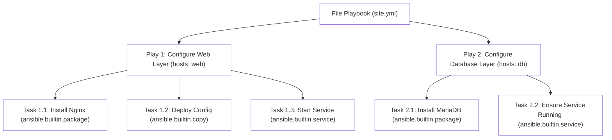
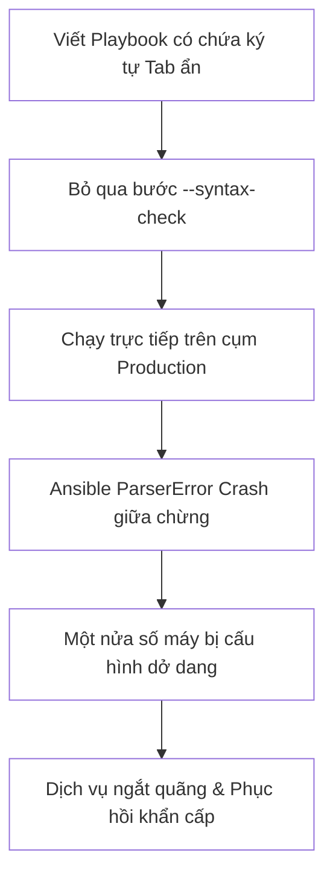
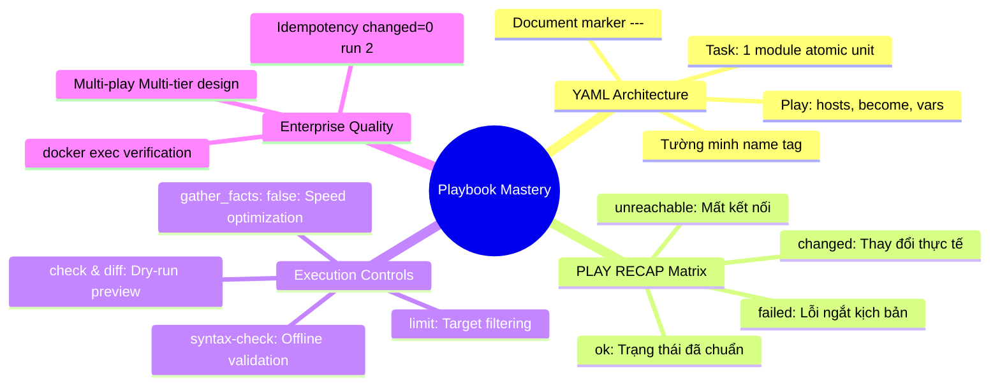


# [BÀI 05] XÂY DỰNG PLAYBOOK ĐẦU TIÊN: CẤU TRÚC YAML, PLAYS, TASKS, BECOME PRIVILEGE ESCALATION & ĐỌC PLAY RECAP

Trong kỷ nguyên **Infrastructure as Code (IaC)** và tự động hóa vận hành hạ tầng đám mây (Cloud Infrastructure Automation), **Ansible** khẳng định vị thế dẫn đầu nhờ triết lý **Agentless** (không cần cài đặt agent nền trên máy đích), giao thức điều khiển an toàn qua **SSH / WinRM**, định dạng khai báo **YAML** trực quan và nguyên lý bất biến **Idempotency** mạnh mẽ. Việc làm chủ Ansible không chỉ dừng lại ở các câu lệnh Ad-hoc đơn giản, mà đòi hỏi kỹ sư phải nắm vững kiến trúc Module tầng thấp, Variable Precedence 22 tầng, Jinja2 Templates, tối ưu hóa Forks & Pipelining cho tới thiết kế Roles / Collections và tích hợp CI/CD tự động hóa chuẩn Doanh nghiệp.

Bài viết chuyên sâu này sẽ đồng hành cùng bạn mổ xẻ toàn diện bức tranh kiến trúc, phân tích các đánh đổi kỹ thuật thực chiến (Engineering Trade-offs), cung cấp hướng dẫn thực hành Lab chi tiết từng bước và bộ câu hỏi phỏng vấn chuyên sâu chuẩn DevOps / SRE Lead.

---

## 1. Bản Chất Kiến Trúc & Cơ Chế Vận Hành Tầng Thấp

Khi quản trị hệ thống phức tạp, ta không thể gõ hàng chục lệnh ad-hoc rời rạc trên terminal. Ansible Playbook cho phép đóng gói toàn bộ quy trình cấu hình thành một file tài liệu YAML khai báo trạng thái mong muốn (**Declarative State**). Bảng `PLAY RECAP` ở cuối lượt chạy là bản tổng hợp điều các module báo cáo (`ok`, `changed`, `unreachable`, `failed`). Tuy nhiên, `PLAY RECAP` xanh lần đầu chưa chứng minh được hạ tầng đã đạt chuẩn. Ta bắt buộc phải thực thi Playbook đó lần thứ hai: nếu dòng recap hiển thị chỉ số `changed=0`, khi đó Playbook mới thực sự đạt chuẩn tính bất biến (**Idempotency**) và có thể tin tưởng.



### 1.1. Cấu Trúc Khai Báo Playbook YAML: Play, Task & Module Delegation

- **Cấu trúc tài liệu YAML:** Một file Playbook là văn bản YAML chuẩn bắt đầu bằng ký tự đánh dấu tài liệu `---`. Ký tự danh sách `-` đại diện cho từng **Play**. Trong mỗi Play, thuộc tính `hosts:` xác định mục tiêu áp đặt cấu hình, `become: true` kích hoạt leo quyền root sudo, và `tasks:` chứa danh sách các bước hành động.
- **Quy tắc 1 Module / 1 Task:** Mỗi Task đóng vai trò là một đơn vị công việc nguyên tử (atomic unit of work), chỉ được phép gọi **đúng duy nhất 1 module**. Điều này đảm bảo tính độc lập, khả năng kiểm soát lỗi chính xác và giúp báo cáo tiến trình rõ ràng.
- **Thuộc tính `name:` bắt buộc:** Mọi Play và mọi Task phải được gán nhãn `name:` tường minh để phục vụ hệ thống logging, audit bảo mật và hiển thị trực quan tiến trình trên CI/CD pipelines.

### 1.2. Đọc Hiểu Bảng Trạng Thái PLAY RECAP & Cơ Chế Kiểm Soát Lỗi

Bảng tổng kết `PLAY RECAP` ở cuối mỗi lượt chạy phản ánh chính xác kết quả thực thi trên từng máy đích qua 7 chỉ số cốt lõi:
- **`ok`**: Số lượng Task đã hoàn thành thành công mà không làm thay đổi trạng thái máy đích (trạng thái hệ thống đã khớp mong muốn).
- **`changed`**: Số lượng Task thực hiện thay đổi thực tế trên máy đích.
- **`unreachable`**: Số máy đích bị mất kết nối mạng hoặc lỗi xác thực SSH.
- **`failed`**: Số Task gặp lỗi thực thi làm dừng kịch bản trên máy đích đó.
- **`skipped`**: Số Task bị bỏ qua do không thỏa mãn điều kiện logic (`when`).
- **`rescued` & `ignored`**: Số Task được cứu lỗi bởi khối `rescue` hoặc bỏ qua lỗi do cấu hình `ignore_errors: true`.

### 1.3. Cơ Chế Phạm Vi Thực Thi: Limit, Gathering Facts & Multi-play Pattern

- **Cờ `--limit` (Host Limiting):** Cho phép giới hạn phạm vi chạy Playbook trên một máy hoặc nhóm máy con (ví dụ `ansible-playbook --limit target1 site.yml`) mà không cần sửa đổi mã nguồn Playbook.
- **Tối ưu tốc độ với `gather_facts: false`:** Mặc định mỗi Play tự động gọi module `setup` để thu thập facts (mất 3–5 giây per host). Nếu Playbook chỉ làm các tác vụ cơ bản không dùng tới facts, tắt tính năng này giúp tăng tốc thực thi đáng kể.
- **Mô hình Multi-play:** Tổ chức nhiều Play trong cùng một file YAML giúp tự động hóa toàn bộ chuỗi kiến trúc đa tầng (Database trước, Backend sau, Frontend/Load Balancer sau cùng) theo đúng trình tự phụ thuộc.

---

## 2. Bảng So Sánh Kỹ Thuật Toàn Diện (Engineering Matrix)

| Tiêu Chí So Sánh | Lệnh Ad-hoc Đơn Lẻ | Single-play Playbook | Multi-play Playbook | Chế Độ Dry-run (`--check --diff`) |
|---|---|---|---|---|
| **Cấu trúc mã nguồn** | Một dòng lệnh CLI rời rạc | File YAML 1 Play cho 1 nhóm máy | File YAML nhiều Play nối tiếp đa tầng | Cờ CLI thực thi mô phỏng không ghi đĩa |
| **Khả năng quản lý phiên bản** | Kém (Lưu trong shell history) | Tốt (Git commit, Code review) | Xuất sắc (Toàn bộ stack trong 1 file Git) | Hỗ trợ review thay đổi trước khi release |
| **Kiểm soát tính phụ thuộc** | Thủ công bằng tay từng lệnh | Tuần tự trong 1 nhóm máy | Tuần tự giữa nhiều tầng máy chủ khác nhau | Dự báo lỗi phụ thuộc trước khi chạy thật |
| **Hỗ trợ CI/CD Automation** | Hạn chế (Scripting rời rạc) | Tiêu chuẩn cho từng microservice | Tiêu chuẩn cho Full-stack provisioning | Bắt buộc trong Pipeline Staging gate |
| **Mức độ an toàn Production** | Rủi ro cao do gõ trực tiếp | Cao nếu có Idempotency test | Rất cao, kiểm soát toàn diện luồng chạy | Tối đa (Ngăn ngừa 100% rủi ro đè cấu hình) |

> [!IMPORTANT]
> **QUY TRÌNH AN TOÀN 3 BƯỚC KHI CHẠY PLAYBOOK:**
> 1. Kiểm tra cú pháp: `ansible-playbook --syntax-check site.yml`
> 2. Chạy thử nghiệm mô phỏng: `ansible-playbook --check --diff site.yml`
> 3. Chạy áp đặt và kiểm chứng Idempotency lượt 2: `PLAY RECAP` lượt 2 bắt buộc phải đạt `changed=0`.

---

## 3. Kiến Trúc Triển Khai Chuẩn Production (Configuration / Playbook / Role Breakdown)

Dưới đây là cấu trúc Multi-play Playbook mẫu triển khai hệ thống Full-stack (Web Layer + Database Layer) đạt chuẩn bảo mật và tối ưu hóa hiệu năng:

```yaml
# site.yml - Multi-play Enterprise Provisioning
---
- name: "PLAY 1: Provision & Secure Database Tier"
  hosts: db
  become: true
  gather_facts: false

  vars:
    db_port: 5432
    db_data_dir: "/var/lib/db-data"

  tasks:
    - name: "DB 1.1: Ensure database storage directory exists with strict permissions"
      ansible.builtin.file:
        path: "{{ db_data_dir }}"
        state: directory
        owner: root
        group: root
        mode: "0700"

    - name: "DB 1.2: Deploy database baseline configuration"
      ansible.builtin.copy:
        dest: /etc/my-db.conf
        content: |
          DB_PORT={{ db_port }}
          MAX_CONNECTIONS=100
          SSL_ENABLED=true
        owner: root
        group: root
        mode: "0600"
        backup: true

- name: "PLAY 2: Provision & Secure Web Application Tier"
  hosts: web
  become: true
  gather_facts: false

  vars:
    app_dir: "/var/www/my-app"
    app_port: 8080

  tasks:
    - name: "WEB 2.1: Ensure essential packages are installed"
      ansible.builtin.package:
        name:
          - curl
          - tar
        state: present

    - name: "WEB 2.2: Ensure web application directory structure exists"
      ansible.builtin.file:
        path: "{{ app_dir }}"
        state: directory
        mode: "0755"

    - name: "WEB 2.3: Deploy application configuration with automated backup"
      ansible.builtin.copy:
        dest: /etc/my-app.conf
        content: |
          APP_NAME=NTKAnsible Production Web
          SERVICE_PORT={{ app_port }}
          DB_HOST=127.0.0.1
        mode: "0644"
        backup: true

    - name: "WEB 2.4: Ensure SSH daemon is active and enabled on boot"
      ansible.builtin.service:
        name: sshd
        state: started
        enabled: true
```

### Phân Tích Kỹ Thuật Từng Dòng (Line-by-Line Breakdown):
- <span class="badge-line">Line 1–5</span>: Khởi đầu Play 1 nhắm vào nhóm máy `hosts: db`, sử dụng `become: true` và tắt `gather_facts: false` để tối ưu tốc độ.
- <span class="badge-line">Line 11–18</span>: Khởi tạo thư mục dữ liệu database `/var/lib/db-data` với phân quyền nghiêm ngặt `mode: "0700"`.
- <span class="badge-line">Line 20–30</span>: Tạo file `/etc/my-db.conf` với tham số bảo mật `mode: "0600"` và bật `backup: true`.
- <span class="badge-line">Line 32–36</span>: Chuyển sang Play 2 áp dụng riêng cho nhóm `hosts: web`, đảm bảo tính độc lập cấu hình giữa các tầng hạ tầng.
- <span class="badge-line">Line 42–47</span>: Gom nhóm các gói phần mềm cần cài đặt (`curl`, `tar`) trong một Task duy nhất qua danh sách mảng YAML.
- <span class="badge-line">Line 56–65</span>: Phân phối cấu hình ứng dụng web `/etc/my-app.conf` kèm cờ sao lưu an toàn.
- <span class="badge-line">Line 67–72</span>: Đảm bảo dịch vụ `sshd` vừa chạy ở thời điểm hiện tại (`state: started`) vừa tự khởi động khi reboot (`enabled: true`).

---

## 4. Phân Tích Cạm Bẫy Thực Chiến: Đứt Gãy Pipeline Do Lỗi Thụt Lề YAML & Lạm Dụng Playbook Đơn Khối

### Tình Huống Sự Cố Thực Tế Tại Doanh Nghiệp:
Trong một đợt phát hành khẩn cấp lúc nửa đêm, một kỹ sư sao chép đoạn mã cấu hình từ trình duyệt vào file `site.yml` có chứa phím Tab và sai mức thụt lề ở thuộc tính `become: true`. Kỹ sư này không chạy lệnh kiểm tra `--syntax-check` mà kích chạy trực tiếp trên toàn bộ cụm hạ tầng Production bằng quyền Root.

### Hậu Quả & Log Lỗi Thực Tế:
- Trình biên dịch Ansible lập tức văng lỗi `ParserError` sau khi đã nạp một nửa số máy, khiến một số node nhận cấu hình dở dang và rơi vào trạng thái trôi dạt cấu hình (**Configuration Drift**).
- Kịch bản thiếu cờ `--check --diff` đã ghi đè mất cấu hình Database cluster đang hoạt động, gây gián đoạn dịch vụ thanh toán 30 phút.

```diff
--- site.yml (Syntax Broken)
+++ site.yml (Fixed Standard)
@@ -1,6 +1,6 @@
 ---
 - name: Deploy Web Application
   hosts: web
-	become: true   # Lỗi: Chứa ký tự Tab và sai lề thụt
+  become: true     # Sửa: Sử dụng đúng 2 dấu cách chuẩn YAML
   tasks:
-  - name: Task 1
+    - name: Task 1 # Sửa: Thụt lề 4 dấu cách đồng nhất
```



### 5-Whys Root Cause Analysis:
1. **Tại sao cụm máy chủ bị dừng hoạt động?** Do kịch bản tự động hóa bị crash giữa chừng làm hệ thống rơi vào trạng thái không đồng nhất.
2. **Tại sao kịch bản bị crash?** Do file `site.yml` chứa lỗi cú pháp thụt lề YAML và ký tự Tab.
3. **Tại sao lỗi cú pháp không được phát hiện sớm?** Do kỹ sư bỏ qua bước kiểm tra `ansible-playbook --syntax-check`.
4. **Tại sao không có bước kiểm tra tự động trước khi deploy?** Do pipeline CI/CD chưa tích hợp linter và syntax gate bắt buộc.
5. **Nguyên nhân cốt lõi (Root Cause):** Thiếu quy chuẩn kiểm duyệt tự động trong quy trình phát hành và không tuân thủ nguyên tắc chạy thử nghiệm (`--check --diff`) trước khi tác động lên Production.

---

## 5. Hands-on Lab: Xây Dựng & Vận Hành Playbook Đầu Tiên Chuẩn Enterprise (8 Bước)

| Bước | Lệnh CLI / Tác Vụ Chính | Mục Đích Thực Thi |
|---|---|---|
| **Bước 1** | Khởi tạo cấu hình `ansible.cfg` & `inventory.ini` | Chuẩn bị môi trường làm việc cô lập cho dự án |
| **Bước 2** | Soạn thảo Playbook đơn `site.yml` | Xây dựng kịch bản cấu hình tầng Web với đầy đủ module chuẩn |
| **Bước 3** | `ansible-playbook --syntax-check` | Kiểm tra cú pháp YAML tĩnh trên Control Node |
| **Bước 4** | `ansible-playbook --check --diff` | Chạy mô phỏng Dry-run dự báo trước thay đổi |
| **Bước 5** | Thực thi `ansible-playbook site.yml` Lần 1 | Áp đặt cấu hình thật và phân tích chỉ số `PLAY RECAP` |
| **Bước 6** | Thực thi `ansible-playbook site.yml` Lần 2 | Chứng minh tính bất biến Idempotency (`changed=0`) |
| **Bước 7** | Nâng cấp Multi-play & thực thi `--limit` | Mở rộng kịch bản đa tầng và kiểm soát phạm vi chạy |
| **Bước 8** | Thực thi toàn bộ Multi-play & đối soát `docker exec` | Đối soát sự thật thực tế trên đĩa cứng máy đích |

### Bước 1 — Khởi tạo cấu hình dự án và Inventory

```bash
mkdir -p ~/lab-ansible-05 && cd ~/lab-ansible-05

cat << 'EOF' > ansible.cfg
[defaults]
inventory = ./inventory.ini
remote_user = ansible
host_key_checking = False
private_key_file = ~/.ssh/id_ed25519

[privilege_escalation]
become = True
become_method = sudo
become_user = root
become_ask_pass = False
EOF

cat << 'EOF' > inventory.ini
[web]
target1 ansible_host=127.0.0.1 ansible_port=2221

[db]
target2 ansible_host=127.0.0.1 ansible_port=2222

[all:vars]
ansible_python_interpreter=/usr/bin/python3
EOF
```

### Bước 2 — Soạn thảo file Playbook đầu tiên

```bash
cat << 'EOF' > site.yml
---
- name: Play 1 - Configure Web Server Infrastructure
  hosts: web
  become: true
  tasks:
    - name: Task 1.1 - Ensure curl package is installed
      ansible.builtin.package:
        name: curl
        state: present

    - name: Task 1.2 - Ensure web application directory exists
      ansible.builtin.file:
        path: /var/www/my-app
        state: directory
        mode: '0755'

    - name: Task 1.3 - Deploy application configuration file
      ansible.builtin.copy:
        content: |
          APP_NAME=NTKAnsible Web App
          ENV=production
          PORT=8080
        dest: /etc/my-app.conf
        mode: '0644'
        backup: true

    - name: Task 1.4 - Ensure SSH service is running
      ansible.builtin.service:
        name: sshd
        state: started
        enabled: true
EOF
```

```bash
# CHECKPOINT 1: Kiểm tra khởi tạo file site.yml chuẩn YAML
if [ -f "site.yml" ] && grep -q "^---" site.yml && grep -q "hosts: web" site.yml; then
  echo "CHECKPOINT 1: ĐẠT - File site.yml được khởi tạo chuẩn định dạng Playbook YAML"
else
  echo "CHECKPOINT 1: LỖI - Khởi tạo file site.yml thất bại"
fi
```

### Bước 3 — Kiểm tra cú pháp với --syntax-check

```bash
ansible-playbook --syntax-check site.yml
```

```bash
# CHECKPOINT 2: Kiểm tra cú pháp Playbook
SYNTAX_OUT=$(ansible-playbook --syntax-check site.yml)
if echo "$SYNTAX_OUT" | grep -q "playbook: site.yml"; then
  echo "CHECKPOINT 2: ĐẠT - Kiểm tra cú pháp Playbook site.yml thành công"
else
  echo "CHECKPOINT 2: LỖI - Kiểm tra cú pháp Playbook báo lỗi"
fi
```

### Bước 4 — Chạy thử nghiệm mô phỏng Dry-run

```bash
ansible-playbook --check --diff site.yml
```

```bash
# CHECKPOINT 3: Kiểm tra chế độ Dry-run
CHECK_OUT=$(ansible-playbook --check --diff site.yml)
if echo "$CHECK_OUT" | grep -q "PLAY RECAP" && ! echo "$CHECK_OUT" | grep -q "failed=1"; then
  echo "CHECKPOINT 3: ĐẠT - Lệnh mô phỏng --check --diff thực thi thành công không làm thay đổi hệ thống"
else
  echo "CHECKPOINT 3: LỖI - Thực thi mô phỏng Dry-run thất bại"
fi
```

### Bước 5 — Thực thi Playbook Lần 1 và phân tích PLAY RECAP

```bash
ansible-playbook site.yml
```

```bash
# CHECKPOINT 4: Kiểm tra kết quả thực thi lần 1
RUN1_OUT=$(ansible-playbook site.yml)
if echo "$RUN1_OUT" | grep -q "failed=0" && echo "$RUN1_OUT" | grep -q "unreachable=0"; then
  echo "CHECKPOINT 4: ĐẠT - Playbook thực thi lần 1 thành công trên hạ tầng (failed=0, unreachable=0)"
else
  echo "CHECKPOINT 4: LỖI - Thực thi Playbook lần 1 bị thất bại"
fi
```

### Bước 6 — Chứng minh tính bất biến Idempotency ở Lượt chạy Lần 2

```bash
ansible-playbook site.yml
```

```bash
# CHECKPOINT 5: Kiểm tra Idempotency lần 2 đạt changed=0
RUN2_OUT=$(ansible-playbook site.yml)
if echo "$RUN2_OUT" | grep -q "changed=0" && echo "$RUN2_OUT" | grep -q "failed=0"; then
  echo "CHECKPOINT 5: ĐẠT - Playbook đạt chuẩn Idempotency (PLAY RECAP lần 2 báo changed=0)"
else
  echo "CHECKPOINT 5: LỖI - Playbook không đạt chuẩn Idempotency (lần 2 vẫn có changed > 0)"
fi
```

### Bước 7 — Nâng cấp Multi-play Playbook và thực thi với cờ --limit

```bash
cat << 'EOF' > site.yml
---
- name: Play 1 - Configure Web Server Infrastructure
  hosts: web
  become: true
  tasks:
    - name: Task 1.1 - Ensure curl is installed
      ansible.builtin.package:
        name: curl
        state: present

    - name: Task 1.2 - Deploy web configuration
      ansible.builtin.copy:
        content: "APP_NAME=NTK Web App\n"
        dest: /etc/my-app.conf
        mode: '0644'
        backup: true

- name: Play 2 - Configure Database Server Infrastructure
  hosts: db
  become: true
  tasks:
    - name: Task 2.1 - Ensure database directory exists
      ansible.builtin.file:
        path: /var/lib/db-data
        state: directory
        mode: '0700'

    - name: Task 2.2 - Deploy database configuration
      ansible.builtin.copy:
        content: "DB_PORT=5432\nMAX_CONNECTIONS=100\n"
        dest: /etc/my-db.conf
        mode: '0600'
        backup: true
EOF

ansible-playbook --limit target1 site.yml
```

```bash
# CHECKPOINT 6: Kiểm tra cờ --limit target1
LIMIT_OUT=$(ansible-playbook --limit target1 site.yml)
if echo "$LIMIT_OUT" | grep -q "target1" && ! echo "$LIMIT_OUT" | grep -q "target2"; then
  echo "CHECKPOINT 6: ĐẠT - Cờ --limit target1 bó hẹp phạm vi thực thi thành công chỉ trên target1"
else
  echo "CHECKPOINT 6: LỖI - Cờ --limit hoạt động chưa chính xác"
fi
```

### Bước 8 — Thực thi toàn bộ Multi-play và đối soát hiện vật máy đích

```bash
ansible-playbook site.yml
```

```bash
# CHECKPOINT 7 & 8: Kiểm tra Multi-play và đối soát docker exec
MULTI_OUT=$(ansible-playbook site.yml)
WEB_FILE=$(docker exec target1 cat /etc/my-app.conf)
DB_FILE=$(docker exec target2 cat /etc/my-db.conf)
if echo "$MULTI_OUT" | grep -q "failed=0" && echo "$WEB_FILE" | grep -q "APP_NAME=NTK Web App" && echo "$DB_FILE" | grep -q "DB_PORT=5432"; then
  echo "CHECKPOINT 7 & 8: ĐẠT - Multi-play Playbook thực thi thành công và xác nhận đúng hiện vật qua docker exec"
else
  echo "CHECKPOINT 7 & 8: LỖI - Multi-play Playbook thất bại hoặc kiểm tra hiện vật sai"
fi
```

---

## 6. Bộ Câu Hỏi Vấn Đáp & Phỏng Vấn Chuyên Sâu (Self-Check Q&A)

<details class="qa-card">
  <summary class="qa-summary">
    <span class="qa-num-badge">Q01</span>
    <span class="qa-question-text">Trình bày cấu trúc cú pháp tiêu chuẩn của một file Playbook Ansible YAML. Ký tự nào bắt buộc nằm ở đầu file?</span>
  </summary>
  <div class="qa-answer">
    <div class="qa-answer-header">
      <svg width="14" height="14" fill="none" stroke="currentColor" stroke-width="2" viewBox="0 0 24 24"><path d="M22 11.08V12a10 10 0 1 1-5.93-9.14"></path><polyline points="22 4 12 14.01 9 11.01"></polyline></svg>
      <span>Phân Tích &amp; Lời Giải Kỹ Thuật</span>
    </div>
    <div><b>Đáp án chuẩn:</b> Một file Playbook bắt đầu bằng dòng đánh dấu tài liệu <code>---</code> (ba dấu gạch ngang). File chứa một danh sách các Play (bắt đầu bằng dấu gạch ngang <code>-</code>). Trong mỗi Play khai báo các phần tử cốt lõi: <code>name:</code> (tên Play), <code>hosts:</code> (nhóm máy đích), <code>become: true</code> (quyền root), <code>vars:</code> (biến Play) và <code>tasks:</code> (danh sách các nhiệm vụ đơn lẻ bên dưới).</div>
    <div style="margin-top: 0.5rem;"><b>Tiêu chí chấm:</b></div>
    <div style="margin: 0.35rem 0; padding-left: 1rem; border-left: 2px solid var(--accent-primary);">• <b>0:</b> Không nêu được cấu trúc Playbook.</div>
    <div style="margin: 0.35rem 0; padding-left: 1rem; border-left: 2px solid var(--accent-primary);">• <b>1:</b> Liệt kê được các phần tử nhưng quên ký tự <code>---</code> hoặc nhầm lẫn cú pháp YAML.</div>
    <div style="margin: 0.35rem 0; padding-left: 1rem; border-left: 2px solid var(--accent-primary);">• <b>2:</b> Nêu đầy đủ các phần tử cốt lõi của Playbook YAML.</div>
    <div style="margin: 0.35rem 0; padding-left: 1rem; border-left: 2px solid var(--accent-primary);">• <b>3:</b> Nêu đúng + giải thích quy tắc dùng 2 dấu cách thay cho phím Tab trong định dạng YAML.</div>
    <div style="margin-top: 0.5rem;"><b>Câu hỏi đào sâu:</b> Tại sao phím Tab bị cấm tuyệt đối khi viết Playbook YAML? <i>(Vì trình biên dịch YAML dùng số lượng dấu cách để phân định cấp độ cấu trúc dữ liệu; dùng Tab sẽ gây lỗi parse syntax ngay lập tức.)</i></div>
  </div>
</details>

<details class="qa-card">
  <summary class="qa-summary">
    <span class="qa-num-badge">Q02</span>
    <span class="qa-question-text">Phân biệt mối quan hệ và vai trò giữa Play và Task trong Ansible Playbook. Mỗi Task được chứa tối đa bao nhiêu module?</span>
  </summary>
  <div class="qa-answer">
    <div class="qa-answer-header">
      <svg width="14" height="14" fill="none" stroke="currentColor" stroke-width="2" viewBox="0 0 24 24"><path d="M22 11.08V12a10 10 0 1 1-5.93-9.14"></path><polyline points="22 4 12 14.01 9 11.01"></polyline></svg>
      <span>Phân Tích &amp; Lời Giải Kỹ Thuật</span>
    </div>
    <div><b>Đáp án chuẩn:</b> <b>Play</b> đóng vai trò là khung chứa nối tập hợp máy đích (<code>hosts</code>) và quyền thực thi với các nhiệm vụ. <b>Task</b> là một bước hành động cụ thể nằm trong Play. Mỗi Task chỉ được chứa <b>đúng duy nhất 1 module</b> để đảm bảo tính độc lập và khả năng kiểm soát lỗi. Một Play có thể chứa nhiều Task chạy nối tiếp từ trên xuống dưới.</div>
    <div style="margin-top: 0.5rem;"><b>Tiêu chí chấm:</b></div>
    <div style="margin: 0.35rem 0; padding-left: 1rem; border-left: 2px solid var(--accent-primary);">• <b>0:</b> Nhầm lẫn giữa Play và Task.</div>
    <div style="margin: 0.35rem 0; padding-left: 1rem; border-left: 2px solid var(--accent-primary);">• <b>1:</b> Biết Play chứa Task nhưng cho rằng 1 Task có thể gọi nhiều module.</div>
    <div style="margin: 0.35rem 0; padding-left: 1rem; border-left: 2px solid var(--accent-primary);">• <b>2:</b> Nêu chính xác sự khác biệt giữa Play và Task + quy tắc 1 module/task.</div>
    <div style="margin: 0.35rem 0; padding-left: 1rem; border-left: 2px solid var(--accent-primary);">• <b>3:</b> Nêu chính xác + giải thích rủi ro nếu định nghĩa trùng tên Task trong cùng một Play.</div>
    <div style="margin-top: 0.5rem;"><b>Câu hỏi đào sâu:</b> Điều gì xảy ra nếu ta khai báo cả <code>package:</code> và <code>service:</code> bên dưới cùng một <code>- name:</code> trong 1 Task? <i>(Ansible sẽ báo lỗi <code>conflicting action statements</code> và dừng thi hành.)</i></div>
  </div>
</details>

<details class="qa-card">
  <summary class="qa-summary">
    <span class="qa-num-badge">Q03</span>
    <span class="qa-question-text">Tại sao việc khai báo thuộc tính name: ở từng Play và từng Task lại là quy định bắt buộc trong quản trị hạ tầng?</span>
  </summary>
  <div class="qa-answer">
    <div class="qa-answer-header">
      <svg width="14" height="14" fill="none" stroke="currentColor" stroke-width="2" viewBox="0 0 24 24"><path d="M22 11.08V12a10 10 0 1 1-5.93-9.14"></path><polyline points="22 4 12 14.01 9 11.01"></polyline></svg>
      <span>Phân Tích &amp; Lời Giải Kỹ Thuật</span>
    </div>
    <div><b>Đáp án chuẩn:</b> Thuộc tính <code>name:</code> cung cấp chuỗi văn bản mô tả mục đích hành động của Play/Task. Khi Playbook thực thi, Ansible in chuỗi <code>name:</code> này ra terminal giúp quản trị viên và các hệ thống CI/CD đọc hiểu ngay tiến trình đang làm gì. Việc thiếu <code>name:</code> khiến log hiển thị các tên module mặc định chung chung vô nghĩa, gây rất nhiều khó khăn khi debug lỗi.</div>
    <div style="margin-top: 0.5rem;"><b>Tiêu chí chấm:</b></div>
    <div style="margin: 0.35rem 0; padding-left: 1rem; border-left: 2px solid var(--accent-primary);">• <b>0:</b> Cho rằng thuộc tính <code>name:</code> là không cần thiết.</div>
    <div style="margin: 0.35rem 0; padding-left: 1rem; border-left: 2px solid var(--accent-primary);">• <b>1:</b> Biết <code>name</code> để đặt tên nhưng không nêu được vai trò trong logging/CI-CD.</div>
    <div style="margin: 0.35rem 0; padding-left: 1rem; border-left: 2px solid var(--accent-primary);">• <b>2:</b> Nêu chính xác vai trò mô tả tiến trình và hỗ trợ gỡ lỗi.</div>
    <div style="margin: 0.35rem 0; padding-left: 1rem; border-left: 2px solid var(--accent-primary);">• <b>3:</b> Nêu đúng + minh họa sự khác biệt giao diện hiển thị log có <code>name</code> và không có <code>name</code>.</div>
    <div style="margin-top: 0.5rem;"><b>Câu hỏi đào sâu:</b> Nếu chuỗi văn bản trong <code>name:</code> có chứa dấu hai chấm (ví dụ <code>name: "Task 1: Install Nginx"</code>), ta phải xử lý thế nào để tránh lỗi cú pháp YAML? <i>(Bắt buộc bọc toàn bộ chuỗi văn bản trong cặp dấu ngoặc kép <code>"..."</code>.)</i></div>
  </div>
</details>

<details class="qa-card">
  <summary class="qa-summary">
    <span class="qa-num-badge">Q04</span>
    <span class="qa-question-text">Phân tích chi tiết ý nghĩa của 4 chỉ số quan trọng nhất trong bảng PLAY RECAP: ok, changed, unreachable, failed.</span>
  </summary>
  <div class="qa-answer">
    <div class="qa-answer-header">
      <svg width="14" height="14" fill="none" stroke="currentColor" stroke-width="2" viewBox="0 0 24 24"><path d="M22 11.08V12a10 10 0 1 1-5.93-9.14"></path><polyline points="22 4 12 14.01 9 11.01"></polyline></svg>
      <span>Phân Tích &amp; Lời Giải Kỹ Thuật</span>
    </div>
    <div><b>Đáp án chuẩn:</b></div>
    <div>• <code>ok</code>: Số Task thực thi thành công nhưng KHÔNG tạo ra thay đổi mới (do hệ thống đã đúng trạng thái).</div>
    <div>• <code>changed</code>: Số Task thực thi thành công VÀ tạo ra thay đổi thực tế trên máy đích.</div>
    <div>• <code>unreachable</code>: Số máy đích bị lỗi kết nối SSH (không thể chạm tới máy).</div>
    <div>• <code>failed</code>: Số Task gặp lỗi thực thi ngắt kịch bản trên máy đích.</div>
    <div style="margin-top: 0.5rem;"><b>Tiêu chí chấm:</b></div>
    <div style="margin: 0.35rem 0; padding-left: 1rem; border-left: 2px solid var(--accent-primary);">• <b>0:</b> Không biết các chỉ số RECAP.</div>
    <div style="margin: 0.35rem 0; padding-left: 1rem; border-left: 2px solid var(--accent-primary);">• <b>1:</b> Phân biệt được <code>changed</code> và <code>failed</code> nhưng nhầm lẫn giữa <code>ok</code> và <code>changed</code>.</div>
    <div style="margin: 0.35rem 0; padding-left: 1rem; border-left: 2px solid var(--accent-primary);">• <b>2:</b> Phân tích chính xác bản chất của cả 4 chỉ số <code>ok</code>, <code>changed</code>, <code>unreachable</code>, <code>failed</code>.</div>
    <div style="margin: 0.35rem 0; padding-left: 1rem; border-left: 2px solid var(--accent-primary);">• <b>3:</b> Nêu đúng + giải thích các cột bổ sung <code>skipped</code>, <code>rescued</code>, <code>ignored</code>.</div>
    <div style="margin-top: 0.5rem;"><b>Câu hỏi đào sâu:</b> Nếu cột <code>unreachable</code> báo <code>1</code>, điều đó có nghĩa là gì đối với các Task còn lại trong Playbook? <i>(Các Task còn lại của Playbook sẽ bị bỏ qua trên host bị unreachable đó.)</i></div>
  </div>
</details>

<details class="qa-card">
  <summary class="qa-summary">
    <span class="qa-num-badge">Q05</span>
    <span class="qa-question-text">Cờ CLI --syntax-check hoạt động thế nào? Tại sao phải chạy nó trước khi thực thi Playbook?</span>
  </summary>
  <div class="qa-answer">
    <div class="qa-answer-header">
      <svg width="14" height="14" fill="none" stroke="currentColor" stroke-width="2" viewBox="0 0 24 24"><path d="M22 11.08V12a10 10 0 1 1-5.93-9.14"></path><polyline points="22 4 12 14.01 9 11.01"></polyline></svg>
      <span>Phân Tích &amp; Lời Giải Kỹ Thuật</span>
    </div>
    <div><b>Đáp án chuẩn:</b> Cờ <code>ansible-playbook --syntax-check site.yml</code> nạp file Playbook và phân tích cấu trúc cú pháp YAML, kiểm tra các từ khóa hợp lệ của Ansible ngay tại Control node mà KHÔNG mở kết nối SSH tới máy đích. Chạy <code>--syntax-check</code> giúp phát hiện lỗi thụt lề, lỗi sai từ khóa lập tức trong 1 giây mà không tốn thời gian chờ kết nối hạ tầng.</div>
    <div style="margin-top: 0.5rem;"><b>Tiêu chí chấm:</b></div>
    <div style="margin: 0.35rem 0; padding-left: 1rem; border-left: 2px solid var(--accent-primary);">• <b>0:</b> Trả lời <code>--syntax-check</code> có kết nối SSH tới máy đích.</div>
    <div style="margin: 0.35rem 0; padding-left: 1rem; border-left: 2px solid var(--accent-primary);">• <b>1:</b> Biết kiểm tra lỗi YAML nhưng không biết nó chạy thuần túy tại Control node.</div>
    <div style="margin: 0.35rem 0; padding-left: 1rem; border-left: 2px solid var(--accent-primary);">• <b>2:</b> Nêu chính xác cơ chế kiểm tra offline tại Control node.</div>
    <div style="margin: 0.35rem 0; padding-left: 1rem; border-left: 2px solid var(--accent-primary);">• <b>3:</b> Nêu đúng + chỉ ra câu lệnh CLI chuẩn và tích hợp bước này vào pipeline CI/CD.</div>
    <div style="margin-top: 0.5rem;"><b>Câu hỏi đào sâu:</b> Lệnh <code>--syntax-check</code> có phát hiện được lỗi sai IP máy đích trong Inventory không? <i>(Không, vì nó chỉ kiểm tra cú pháp file Playbook YAML chứ không kiểm tra kết nối mạng.)</i></div>
  </div>
</details>

<details class="qa-card">
  <summary class="qa-summary">
    <span class="qa-num-badge">Q06</span>
    <span class="qa-question-text">Phân biệt vai trò của cờ --check và cờ --diff. Kết hợp --check --diff mang lại lợi ích gì cho quản trị viên?</span>
  </summary>
  <div class="qa-answer">
    <div class="qa-answer-header">
      <svg width="14" height="14" fill="none" stroke="currentColor" stroke-width="2" viewBox="0 0 24 24"><path d="M22 11.08V12a10 10 0 1 1-5.93-9.14"></path><polyline points="22 4 12 14.01 9 11.01"></polyline></svg>
      <span>Phân Tích &amp; Lời Giải Kỹ Thuật</span>
    </div>
    <div><b>Đáp án chuẩn:</b> Cờ <code>--check</code> (Dry-run) mô phỏng quá trình thực thi Playbook và dự báo các Task sẽ tạo ra thay đổi mà không làm thay đổi hệ thống thật. Cờ <code>--diff</code> hiển thị chi tiết dòng văn bản sẽ bị thêm/xóa trong các file cấu hình. Kết hợp <code>--check --diff</code> cho phép quản trị viên xem trước chính xác những gì SẼ thay đổi trên máy đích trước khi chính thức bấm chạy thật trên Production.</div>
    <div style="margin-top: 0.5rem;"><b>Tiêu chí chấm:</b></div>
    <div style="margin: 0.35rem 0; padding-left: 1rem; border-left: 2px solid var(--accent-primary);">• <b>0:</b> Không biết vai trò của <code>--check</code> và <code>--diff</code>.</div>
    <div style="margin: 0.35rem 0; padding-left: 1rem; border-left: 2px solid var(--accent-primary);">• <b>1:</b> Nêu được <code>--check</code> là chạy thử nhưng không giải thích được <code>--diff</code>.</div>
    <div style="margin: 0.35rem 0; padding-left: 1rem; border-left: 2px solid var(--accent-primary);">• <b>2:</b> Phân tích chính xác vai trò mô phỏng của <code>--check</code> và so sánh văn bản của <code>--diff</code>.</div>
    <div style="margin: 0.35rem 0; padding-left: 1rem; border-left: 2px solid var(--accent-primary);">• <b>3:</b> Nêu đúng + chỉ ra lưu ý một số lệnh shell/command không hỗ trợ check mode.</div>
    <div style="margin-top: 0.5rem;"><b>Câu hỏi đào sâu:</b> Khi chạy với cờ <code>--check</code>, bảng <code>PLAY RECAP</code> báo <code>changed=2</code> có nghĩa là hệ thống thật đã bị thay đổi 2 chỗ đúng không? <i>(Không, đó chỉ là dự báo rằng nếu chạy thật thì sẽ có 2 chỗ bị thay đổi, hệ thống thật hiện tại chưa bị tác động.)</i></div>
  </div>
</details>

<details class="qa-card">
  <summary class="qa-summary">
    <span class="qa-num-badge">Q07</span>
    <span class="qa-question-text">Làm thế nào để thực thi file Playbook site.yml (vốn được cấu hình cho toàn bộ nhóm web) nhưng chỉ áp đặt thay đổi trên duy nhất target1?</span>
  </summary>
  <div class="qa-answer">
    <div class="qa-answer-header">
      <svg width="14" height="14" fill="none" stroke="currentColor" stroke-width="2" viewBox="0 0 24 24"><path d="M22 11.08V12a10 10 0 1 1-5.93-9.14"></path><polyline points="22 4 12 14.01 9 11.01"></polyline></svg>
      <span>Phân Tích &amp; Lời Giải Kỹ Thuật</span>
    </div>
    <div><b>Đáp án chuẩn:</b> Sử dụng cờ <code>--limit</code> trên dòng lệnh CLI: <code>ansible-playbook --limit target1 site.yml</code>. Cờ <code>--limit</code> sẽ bó hẹp phạm vi thực thi của Playbook trên danh sách máy được chỉ định mà KHÔNG cần phải sửa đổi từ khóa <code>hosts: web</code> bên trong file mã nguồn Playbook.</div>
    <div style="margin-top: 0.5rem;"><b>Tiêu chí chấm:</b></div>
    <div style="margin: 0.35rem 0; padding-left: 1rem; border-left: 2px solid var(--accent-primary);">• <b>0:</b> Trả lời sửa trực tiếp file Playbook YAML.</div>
    <div style="margin: 0.35rem 0; padding-left: 1rem; border-left: 2px solid var(--accent-primary);">• <b>1:</b> Biết cờ <code>--limit</code> nhưng viết sai cú pháp câu lệnh CLI.</div>
    <div style="margin: 0.35rem 0; padding-left: 1rem; border-left: 2px solid var(--accent-primary);">• <b>2:</b> Nêu đúng cờ <code>--limit</code> và cú pháp lệnh CLI hoàn chỉnh.</div>
    <div style="margin: 0.35rem 0; padding-left: 1rem; border-left: 2px solid var(--accent-primary);">• <b>3:</b> Nêu đúng + giải thích lợi ích an toàn khi Canary deploy (thử nghiệm 1 node trước khi nhân rộng).</div>
    <div style="margin-top: 0.5rem;"><b>Câu hỏi đào sâu:</b> Cờ <code>--limit</code> có thể truyền một nhóm máy thay vì một host đích danh được không? <i>(Có thể truyền tên nhóm, ví dụ <code>--limit dev_web</code> hoặc biểu thức pattern.)</i></div>
  </div>
</details>

<details class="qa-card">
  <summary class="qa-summary">
    <span class="qa-num-badge">Q08</span>
    <span class="qa-question-text">Bước Gathering Facts tự động ở đầu mỗi Play làm công việc gì? Khi nào nên tắt nó bằng gather_facts: false?</span>
  </summary>
  <div class="qa-answer">
    <div class="qa-answer-header">
      <svg width="14" height="14" fill="none" stroke="currentColor" stroke-width="2" viewBox="0 0 24 24"><path d="M22 11.08V12a10 10 0 1 1-5.93-9.14"></path><polyline points="22 4 12 14.01 9 11.01"></polyline></svg>
      <span>Phân Tích &amp; Lời Giải Kỹ Thuật</span>
    </div>
    <div><b>Đáp án chuẩn:</b> Bước <code>Gathering Facts</code> tự động gọi module <code>setup</code> để thu thập toàn bộ dữ liệu cấu hình thực tế của máy đích (IP, RAM, OS, CPU) và lưu vào các biến <code>ansible_facts</code>. Bước này tiêu tốn 3-5 giây per host. Nên tắt bằng <code>gather_facts: false</code> khi Playbook chỉ làm các tác vụ chép file/cài gói đơn giản mà KHÔNG sử dụng đến bất kỳ biến facts nào, giúp Playbook chạy nhanh tức thì.</div>
    <div style="margin-top: 0.5rem;"><b>Tiêu chí chấm:</b></div>
    <div style="margin: 0.35rem 0; padding-left: 1rem; border-left: 2px solid var(--accent-primary);">• <b>0:</b> Không biết bước <code>Gathering Facts</code> làm gì.</div>
    <div style="margin: 0.35rem 0; padding-left: 1rem; border-left: 2px solid var(--accent-primary);">• <b>1:</b> Biết lấy thông tin máy nhưng không biết cách tắt để tối ưu.</div>
    <div style="margin: 0.35rem 0; padding-left: 1rem; border-left: 2px solid var(--accent-primary);">• <b>2:</b> Nêu đúng bản chất gọi module <code>setup</code> + tham số <code>gather_facts: false</code>.</div>
    <div style="margin: 0.35rem 0; padding-left: 1rem; border-left: 2px solid var(--accent-primary);">• <b>3:</b> Nêu đúng + đưa ra con số đo lường thời gian tiết kiệm được khi tắt facts trên 100 máy chủ.</div>
    <div style="margin-top: 0.5rem;"><b>Câu hỏi đào sâu:</b> Nếu trong Playbook có dùng biến <code>{{ ansible_distribution }}</code>, ta có được tắt <code>gather_facts: false</code> không? <i>(Không được tắt, vì tắt facts thì biến <code>ansible_distribution</code> sẽ bị undefined làm Playbook bị lỗi.)</i></div>
  </div>
</details>

<details class="qa-card">
  <summary class="qa-summary">
    <span class="qa-num-badge">Q09</span>
    <span class="qa-question-text">Multi-play Playbook là gì? Khi nào cần sử dụng cấu trúc Multi-play trong một kịch bản triển khai?</span>
  </summary>
  <div class="qa-answer">
    <div class="qa-answer-header">
      <svg width="14" height="14" fill="none" stroke="currentColor" stroke-width="2" viewBox="0 0 24 24"><path d="M22 11.08V12a10 10 0 1 1-5.93-9.14"></path><polyline points="22 4 12 14.01 9 11.01"></polyline></svg>
      <span>Phân Tích &amp; Lời Giải Kỹ Thuật</span>
    </div>
    <div><b>Đáp án chuẩn:</b> Multi-play Playbook là một file Playbook YAML chứa nhiều hơn một Play nối tiếp nhau (mỗi Play bắt đầu bằng <code>- name:</code> riêng). Cần sử dụng Multi-play khi kịch bản tự động hóa bao phủ một hệ thống nhiều tầng (Multi-tier), yêu cầu các nhóm máy khác nhau chạy các nhiệm vụ khác nhau theo đúng thứ tự (ví dụ: Play 1 cấu hình nhóm <code>db</code>, sau đó Play 2 mới cấu hình nhóm <code>web</code>).</div>
    <div style="margin-top: 0.5rem;"><b>Tiêu chí chấm:</b></div>
    <div style="margin: 0.35rem 0; padding-left: 1rem; border-left: 2px solid var(--accent-primary);">• <b>0:</b> Cho rằng 1 file Playbook chỉ được chứa duy nhất 1 Play.</div>
    <div style="margin: 0.35rem 0; padding-left: 1rem; border-left: 2px solid var(--accent-primary);">• <b>1:</b> Biết chứa nhiều Play nhưng không nêu được ngữ cảnh hệ thống nhiều tầng.</div>
    <div style="margin: 0.35rem 0; padding-left: 1rem; border-left: 2px solid var(--accent-primary);">• <b>2:</b> Nêu đúng khái niệm Multi-play + ngữ cảnh ứng dụng chuẩn.</div>
    <div style="margin: 0.35rem 0; padding-left: 1rem; border-left: 2px solid var(--accent-primary);">• <b>3:</b> Nêu đúng + minh họa cấu trúc YAML của Multi-play gồm Play DB và Play Web.</div>
    <div style="margin-top: 0.5rem;"><b>Câu hỏi đào sâu:</b> Các Play trong Multi-play Playbook có thể dùng các user hoặc cờ <code>become</code> khác nhau không? <i>(Có thể, mỗi Play có thuộc tính <code>remote_user</code> và <code>become</code> hoàn toàn độc lập.)</i></div>
  </div>
</details>

<details class="qa-card">
  <summary class="qa-summary">
    <span class="qa-num-badge">Q10</span>
    <span class="qa-question-text">Trình bày quy trình 3 bước chuẩn hóa để chứng minh một file Playbook đạt tính Idempotency và máy đích ở đúng trạng thái.</span>
  </summary>
  <div class="qa-answer">
    <div class="qa-answer-header">
      <svg width="14" height="14" fill="none" stroke="currentColor" stroke-width="2" viewBox="0 0 24 24"><path d="M22 11.08V12a10 10 0 1 1-5.93-9.14"></path><polyline points="22 4 12 14.01 9 11.01"></polyline></svg>
      <span>Phân Tích &amp; Lời Giải Kỹ Thuật</span>
    </div>
    <div><b>Đáp án chuẩn:</b></div>
    <div>1. <b>Bước 1 (Thực thi Lần 1):</b> Chạy <code>ansible-playbook site.yml</code> để áp đặt cấu hình (RECAP báo <code>changed=N</code>).</div>
    <div>2. <b>Bước 2 (Kiểm Idempotency Lần 2):</b> Chạy lại nguyên vẹn lệnh <code>ansible-playbook site.yml</code> lần thứ hai: bảng <code>PLAY RECAP</code> <b>bắt buộc phải đạt <code>changed=0</code></b>.</div>
    <div>3. <b>Bước 3 (Đối soát Sự thật):</b> Dùng <code>docker exec &lt;target&gt; ...</code> (truy vấn <code>systemctl is-active</code>, <code>cat &lt;file&gt;</code>) để kiểm tra hiện vật thực tế trên đĩa cứng máy đích, không dừng lại ở thông báo màu xanh của terminal.</div>
    <div style="margin-top: 0.5rem;"><b>Tiêu chí chấm:</b></div>
    <div style="margin: 0.35rem 0; padding-left: 1rem; border-left: 2px solid var(--accent-primary);">• <b>0:</b> Trả lời "chỉ cần nhìn terminal Lần 1 báo xanh là xong" (dính bẫy trần điểm 1).</div>
    <div style="margin: 0.35rem 0; padding-left: 1rem; border-left: 2px solid var(--accent-primary);">• <b>1:</b> Thiếu bước Lần 2 <code>changed=0</code> hoặc bước đối soát <code>docker exec</code>.</div>
    <div style="margin: 0.35rem 0; padding-left: 1rem; border-left: 2px solid var(--accent-primary);">• <b>2:</b> Trình bày đủ 3 bước nhưng chưa minh họa lệnh CLI cụ thể.</div>
    <div style="margin: 0.35rem 0; padding-left: 1rem; border-left: 2px solid var(--accent-primary);">• <b>3:</b> Trình bày xuất sắc 3 bước + cho ví dụ thực tế minh chứng với lệnh CLI và giải thích ý nghĩa chỉ số <code>changed=0</code>.</div>
    <div style="margin-top: 0.5rem;"><b>Câu hỏi đào sâu:</b> Nếu lượt chạy Lần 2 bảng RECAP báo <code>ok=4 changed=1 failed=0</code>, Playbook này đã đạt Idempotency chưa? <i>(Chưa đạt, vì vẫn còn 1 Task tạo ra thay đổi thừa ở lần chạy thứ 2.)</i></div>
  </div>
</details>

<details class="qa-card">
  <summary class="qa-summary">
    <span class="qa-num-badge">Q11</span>
    <span class="qa-question-text">Giải thích ý nghĩa của chỉ số skipped và rescued trong bảng PLAY RECAP.</span>
  </summary>
  <div class="qa-answer">
    <div class="qa-answer-header">
      <svg width="14" height="14" fill="none" stroke="currentColor" stroke-width="2" viewBox="0 0 24 24"><path d="M22 11.08V12a10 10 0 1 1-5.93-9.14"></path><polyline points="22 4 12 14.01 9 11.01"></polyline></svg>
      <span>Phân Tích &amp; Lời Giải Kỹ Thuật</span>
    </div>
    <div><b>Đáp án chuẩn:</b></div>
    <div>• <code>skipped</code>: Số Task bị bỏ qua không thực thi do không thỏa mãn điều kiện logic (ví dụ điều kiện <code>when:</code> bị sai).</div>
    <div>• <code>rescued</code>: Số Task gặp lỗi nhưng đã được khôi phục/xử lý thành công nhờ khối xử lý lỗi <code>rescue</code>, giúp Playbook tiếp tục thi hành mà không bị dừng đột ngột.</div>
    <div style="margin-top: 0.5rem;"><b>Tiêu chí chấm:</b></div>
    <div style="margin: 0.35rem 0; padding-left: 1rem; border-left: 2px solid var(--accent-primary);">• <b>0:</b> Không biết ý nghĩa của <code>skipped</code> và <code>rescued</code>.</div>
    <div style="margin: 0.35rem 0; padding-left: 1rem; border-left: 2px solid var(--accent-primary);">• <b>1:</b> Nêu được <code>skipped</code> là bỏ qua nhưng không biết <code>rescued</code>.</div>
    <div style="margin: 0.35rem 0; padding-left: 1rem; border-left: 2px solid var(--accent-primary);">• <b>2:</b> Phân tích chính xác cả 2 chỉ số <code>skipped</code> và <code>rescued</code>.</div>
    <div style="margin: 0.35rem 0; padding-left: 1rem; border-left: 2px solid var(--accent-primary);">• <b>3:</b> Nêu đúng + cho ví dụ điều kiện <code>when</code> dẫn tới <code>skipped</code>.</div>
    <div style="margin-top: 0.5rem;"><b>Câu hỏi đào sâu:</b> Chỉ số <code>skipped=2</code> có làm cho Playbook bị coi là thất bại (failed) không? <i>(Không, skipped chỉ là bỏ qua task theo logic thiết kế, Playbook vẫn thành công bình thường.)</i></div>
  </div>
</details>

<details class="qa-card">
  <summary class="qa-summary">
    <span class="qa-num-badge">Q12</span>
    <span class="qa-question-text">Trong một kịch bản CI/CD tự động (như GitLab CI/GitHub Actions), quy trình kiểm thử Playbook trước khi deploy Production được sắp xếp như thế nào?</span>
  </summary>
  <div class="qa-answer">
    <div class="qa-answer-header">
      <svg width="14" height="14" fill="none" stroke="currentColor" stroke-width="2" viewBox="0 0 24 24"><path d="M22 11.08V12a10 10 0 1 1-5.93-9.14"></path><polyline points="22 4 12 14.01 9 11.01"></polyline></svg>
      <span>Phân Tích &amp; Lời Giải Kỹ Thuật</span>
    </div>
    <div><b>Đáp án chuẩn:</b> Quy trình 4 bước chuẩn hóa trong CI/CD:</div>
    <div>1. <b>Stage 1 (Lint/Syntax):</b> Chạy <code>ansible-lint</code> và <code>ansible-playbook --syntax-check</code> để kiểm tra lỗi trình bày và cú pháp.</div>
    <div>2. <b>Stage 2 (Dry-run):</b> Chạy <code>ansible-playbook --check --diff</code> trên môi trường Staging.</div>
    <div>3. <b>Stage 3 (Deploy &amp; Idempotency Test):</b> Chạy Playbook Lần 1 trên Staging -&gt; Chạy Lần 2 kiểm tra <code>changed=0</code>.</div>
    <div>4. <b>Stage 4 (Production Gate):</b> Nếu tất cả các stage trước xanh 100%, mới kích hoạt bước deploy thật lên Production.</div>
    <div style="margin-top: 0.5rem;"><b>Tiêu chí chấm:</b></div>
    <div style="margin: 0.35rem 0; padding-left: 1rem; border-left: 2px solid var(--accent-primary);">• <b>0:</b> Không nêu được quy trình CI/CD.</div>
    <div style="margin: 0.35rem 0; padding-left: 1rem; border-left: 2px solid var(--accent-primary);">• <b>1:</b> Nêu được chạy thử nhưng thiếu các bước linter và idempotency test.</div>
    <div style="margin: 0.35rem 0; padding-left: 1rem; border-left: 2px solid var(--accent-primary);">• <b>2:</b> Nêu chính xác quy trình 4 bước trong CI/CD.</div>
    <div style="margin: 0.35rem 0; padding-left: 1rem; border-left: 2px solid var(--accent-primary);">• <b>3:</b> Phân tích xuất sắc tầm quan trọng của tự động hóa kiểm thử Playbook trong DevOps.</div>
    <div style="margin-top: 0.5rem;"><b>Câu hỏi đào sâu:</b> Nếu Stage 1 báo lỗi syntax check thì pipeline CI/CD sẽ xử lý thế nào? <i>(Pipeline lập tức bị ngắt dừng (failed) và chặn không cho tiến hành các bước deploy tiếp theo.)</i></div>
  </div>
</details>

---

## 7. Tổng Kết & Lộ Trình Bài Học Tiếp Theo

### 5 Điều Cốt Lõi Cần Ghi Nhớ:
1. **Khai báo Declarative qua YAML:** File Playbook bắt đầu bằng `---`, phân định rõ ràng giữa khung kết nối (`hosts`, `become`) và danh sách nhiệm vụ (`tasks`).
2. **Quy tắc nguyên tử 1 Module / 1 Task:** Mỗi task gọi đúng 1 module chuyên dụng và luôn có nhãn `name:` mô tả rõ ràng.
3. **Quy trình kiểm tra 3 cấp:** Luôn chạy `--syntax-check` -> `--check --diff` -> Thực thi thực tế.
4. **Chứng minh Idempotency:** Bảng `PLAY RECAP` ở lần chạy thứ hai bắt buộc phải báo `changed=0`.
5. **Kiểm soát linh hoạt với `--limit`:** Điều chỉnh phạm vi máy đích bằng cờ CLI mà không sửa mã nguồn YAML.



> [!TIP]
> **BÀI HỌC TIẾP THEO:** [Bài 06: Idempotency Chuyên Sâu — Kiểm Soát Tính Bất Biến, Phân Tích Cơ Chế Changed/OK & Tối Ưu Hóa Kịch Bản Tự Động](ansible-06-06-idempotency.html)

