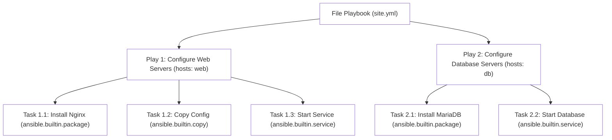
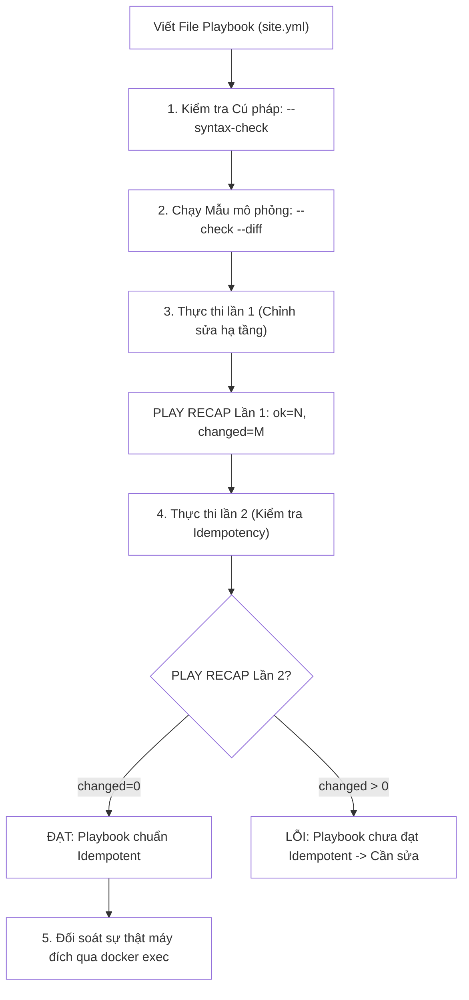
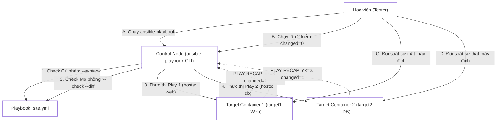


# [BÀI 05] XÂY DỰNG PLAYBOOK ĐẦU TIÊN: CẤU TRÚC YAML, PLAYS, TASKS, BECOME PRIVILEGE ESCALATION & ĐỌC PLAY RECAP

Trong kỷ nguyên **Infrastructure as Code (IaC)** và tự động hóa vận hành hạ tầng đám mây (Cloud Infrastructure Automation), **Ansible** khẳng định vị thế dẫn đầu nhờ triết lý **Agentless** (không cần cài đặt agent nền trên máy đích), giao thức điều khiển an toàn qua **SSH / WinRM**, định dạng khai báo **YAML** trực quan và nguyên lý bất biến **Idempotency** mạnh mẽ. Việc làm chủ Ansible không chỉ dừng lại ở các câu lệnh Ad-hoc đơn giản, mà đòi hỏi kỹ sư phải nắm vững kiến trúc Module tầng thấp, Variable Precedence 22 tầng, Jinja2 Templates, tối ưu hóa Forks & Pipelining cho tới thiết kế Roles / Collections và tích hợp CI/CD tự động hóa chuẩn Doanh nghiệp.

Bài viết chuyên sâu này sẽ đồng hành cùng bạn mổ xẻ toàn diện bức tranh kiến trúc, phân tích các đánh đổi kỹ thuật thực chiến (Engineering Trade-offs), cung cấp hướng dẫn thực hành Lab chi tiết từng bước và bộ câu hỏi phỏng vấn chuyên sâu chuẩn DevOps / SRE Lead.

---

## 1. Bản Chất Kiến Trúc & Cơ Chế Vận Hành Tầng Thấp

---


> **Playbook là danh sách task khai báo, đọc PLAY RECAP để biết ok/changed/failed.**

Chủ đề xuyên suốt khóa học (I-10) tiếp tục được khắc sâu trong Buổi 05 khi chuyển từ lệnh Ad-hoc sang Playbook:

> **Khi quản trị hệ thống phức tạp, ta không thể gõ hàng chục lệnh ad-hoc rời rạc trên terminal. Ansible Playbook cho phép đóng gói toàn bộ quy trình cấu hình thành một file tài liệu YAML khai báo trạng thái. Bảng `PLAY RECAP` ở cuối lượt chạy là bản tổng hợp điều các module báo cáo (`ok`, `changed`, `failed`). Tuy nhiên, `PLAY RECAP` xanh lần đầu chưa chứng minh được hạ tầng đã chuẩn. Ta bắt buộc phải thực thi Playbook đó lần thứ hai: nếu dòng recap hiển thị chỉ số `changed=0`, khi đó Playbook mới thực sự đạt chuẩn tính bất biến (Idempotency) và có thể tin tưởng.**

---


---


---


| Tiếng Việt | Tiếng Anh / Từ khóa + FQCN (giữ nguyên) |
|---|---|
| Kịch bản cấu hình | Playbook |
| Lượt chạy kịch bản | Play |
| Nhiệm vụ đơn lẻ | Task |
| Bảng tổng kết lượt chạy | `PLAY RECAP` |
| Kiểm tra cú pháp | Syntax check (`--syntax-check`) |
| Chạy thử nghiệm mô phỏng | Check mode / Dry-run (`--check`) |
| Hiển thị khác biệt dòng | Diff mode (`--diff`) |
| Kịch bản nhiều lượt chạy | Multi-play playbook |
| Thu thập thông tin thực tế | Gather facts (`gather_facts`) |
| Khớp nối mục tiêu máy | Host matching (`hosts:`) |
| Quyền nâng cấp | Privilege escalation (`become: true`) |
| Bó hẹp phạm vi máy | Host limiting (`--limit`) |
| Lệnh thực thi kịch bản | `ansible-playbook` |

---

### 1.1. Cấu trúc Playbook YAML, Play và Task (15 phút)



**Nguyên lý cốt lõi:** Một file Playbook là một văn bản YAML bắt đầu bằng dòng đánh dấu `---`, chứa một danh sách (list) gồm một hoặc nhiều Play độc lập.

**Giải thích cơ chế ngầm:** Ký tự `---` ở đầu file là chuẩn của định dạng YAML để đánh dấu bắt đầu một tài liệu (document start). Cấu trúc danh sách cho phép định nghĩa chuỗi các bước tự động hóa được Ansible duyệt lần lượt từ trên xuống dưới.

> [!WARNING]
> **CẠM BẪY THỰC CHIẾN:**
> **Lệnh:** `ansible-playbook site.yml` · **Output phải thấy:** `ERROR! Syntax error while loading YAML...` do quên dấu `---` hoặc sử dụng phím Tab để thụt lề thay vì dấu cách.

**Minh hoạ.** Cấu trúc tối giản của file `site.yml`:
```yaml
---
- name: Deploy Web Application
  hosts: web
  become: true
  tasks:
    - name: Install Nginx
      ansible.builtin.package:
        name: nginx
        state: present
```

**Nguyên lý cốt lõi:** Khái niệm **Play** đóng vai trò là cầu nối giữa tập hợp máy đích (`hosts:`) và danh sách nhiệm vụ (`tasks:`), trong đó mỗi **Task** chỉ được gọi đúng duy nhất 1 module.

**Giải thích cơ chế ngầm:** Sự phân tách này giúp quy trách nhiệm rõ ràng: Play quyết định "ai bị tác động và bằng quyền gì", còn Task quyết định "làm cái gì trên máy đó". Mỗi Task gọi 1 module để duy trì sự đơn giản và độc lập trong kiểm soát lỗi.

> [!WARNING]
> **CẠM BẪY THỰC CHIẾN:**
> **Lệnh:** `ansible-playbook site.yml` · **Output phải thấy:** `ERROR! conflicting action statements` do gọi 2 module khác nhau (ví dụ vừa gọi `package` vừa gọi `service`) trong cùng 1 Task.

**Minh hoạ.** Một Play chứa chuỗi 2 Task độc lập:
```yaml
---
- name: Setup Webserver Service
  hosts: web
  become: true
  tasks:
    - name: Ensure Nginx is installed
      ansible.builtin.package:
        name: nginx
        state: present

    - name: Ensure Nginx service is running
      ansible.builtin.service:
        name: nginx
        state: started
        enabled: true
```

**Nguyên lý cốt lõi:** Bắt buộc phải khai báo thuộc tính `name:` tường minh cho từng Play và từng Task để phục vụ mục đích audit, logging và theo dõi tiến trình thực thi.

**Giải thích cơ chế ngầm:** Khi Playbook chạy, Ansible in giá trị của chuỗi `name:` ra màn hình terminal. Nếu không đặt tên, Ansible sẽ in ra dòng lệnh mặc định rất khó đọc, gây khó khăn cho việc gỡ lỗi (debug) và theo dõi kịch bản trên các hệ thống CI/CD.

> [!WARNING]
> **CẠM BẪY THỰC CHIẾN:**
> **Lệnh:** `ansible-playbook site.yml` · **Output phải thấy:** Terminal hiển thị `TASK [ansible.builtin.package]` chung chung không rõ nhiệm vụ đang làm gì.

**Minh hoạ.** Đặt tên mô tả rõ ràng hành động quản trị:
```yaml
tasks:
  - name: "TASK 1: Install Nginx Package on Web Nodes"
    ansible.builtin.package:
      name: nginx
      state: present
```

---

### 1.2. Đọc hiểu PLAY RECAP và Các cờ Kiểm tra CLI (15 phút)

**Nguyên lý cốt lõi:** Bảng `PLAY RECAP` ở cuối lượt chạy Playbook tổng hợp trạng thái thực thi trên từng máy đích qua 7 chỉ số: `ok`, `changed`, `unreachable`, `failed`, `skipped`, `rescued`, `ignored`.

**Giải thích cơ chế ngầm:** Bảng RECAP cung cấp cái nhìn toàn cảnh về kết quả chạy: `ok` (số task thành công/không làm thay đổi), `changed` (số task thực hiện thay đổi thật), `failed` (số task gặp lỗi ngắt ngầm), `unreachable` (máy mất kết nối SSH).

> [!WARNING]
> **CẠM BẪY THỰC CHIẾN:**
> **Lệnh:** `ansible-playbook site.yml` · **Output phải thấy:** Dòng `PLAY RECAP` báo `failed=1` hoặc `unreachable=1` nhưng quản trị viên bỏ qua không xử lý.

**Minh hoạ.** Mẫu thông báo `PLAY RECAP` chuẩn trên terminal:
```yaml
PLAY RECAP *********************************************************************
target1                    : ok=3    changed=1    unreachable=0    failed=0    skipped=0    rescued=0    ignored=0
target2                    : ok=3    changed=0    unreachable=0    failed=0    skipped=0    rescued=0    ignored=0
```

**Nguyên lý cốt lõi:** Luôn chạy cờ kiểm tra cú pháp `ansible-playbook --syntax-check <playbook.yml>` trước khi thực thi kịch bản lên hệ thống.

**Giải thích cơ chế ngầm:** Cờ `--syntax-check` chỉ phân tích cú pháp YAML và từ khóa của Ansible trên Control node mà không mở kết nối SSH tới máy đích, giúp phát hiện sớm các lỗi gõ sai từ khóa hoặc sai thụt lề chỉ trong 1 giây.

> [!WARNING]
> **CẠM BẪY THỰC CHIẾN:**
> **Lệnh:** `ansible-playbook site.yml` · **Output phải thấy:** Chờ nạp kết nối SSH và facts xong mới bị văng lỗi sai cú pháp YAML ở giữa chừng.

**Minh hoạ.** Chạy kiểm tra cú pháp trước khi thực thi:
```bash
ansible-playbook --syntax-check site.yml
```

**Nguyên lý cốt lõi:** Sử dụng kết hợp cờ mô phỏng `--check` (Dry-run) và cờ `--diff` để xem trước các dòng cấu hình dự kiến sẽ thay đổi trên máy đích mà không làm thay đổi hệ thống thật.

**Giải thích cơ chế ngầm:** Chế độ `--check` giúp dự báo xem máy nào sẽ bị `changed`, còn cờ `--diff` hiển thị chính xác các dòng văn bản sẽ bị thêm/xóa trong file cấu hình (dạng `+line` / `-line`), giúp loại trừ 100% rủi ro khi chạy trên Production.

> [!WARNING]
> **CẠM BẪY THỰC CHIẾN:**
> **Lệnh:** `ansible-playbook site.yml` · **Output phải thấy:** Chạy trực tiếp Playbook làm thay đổi máy chủ Production mà không biết trước nội dung bị ghi đè.

**Minh hoạ.** Thực thi thử nghiệm với cờ `--check --diff`:
```bash
ansible-playbook --check --diff site.yml
```

---

### 1.3. Phạm vi Thực thi và Tối ưu hóa Playbook (10 phút)

**Nguyên lý cốt lõi:** Sử dụng cờ `--limit <host_pattern>` để bó hẹp phạm vi thực thi của Playbook trên một hoặc một nhóm máy chủ cụ thể mà không cần sửa từ khóa `hosts:` trong Playbook.

**Giải thích cơ chế ngầm:** Giúp tái sử dụng 1 file `site.yml` duy nhất cho toàn bộ hạ tầng nhưng khi cần khắc phục sự cố hoặc thử nghiệm tính năng mới chỉ cần kích chạy trên đúng 1 máy chủ (`target1`).

> [!WARNING]
> **CẠM BẪY THỰC CHIẾN:**
> **Lệnh:** `ansible-playbook site.yml` · **Output phải thấy:** Phải sửa trực tiếp dòng `hosts: web` thành `hosts: target1` trong file YAML Playbook mỗi khi muốn chạy thử nghiệm.

**Minh hoạ.** Giới hạn thực thi Playbook trên duy nhất `target1`:
```bash
ansible-playbook --limit target1 site.yml
```

**Nguyên lý cốt lõi:** Khai báo `gather_facts: false` ở cấp độ Play khi tác vụ không sử dụng tới các biến thực tế (Facts) của hệ thống để tối ưu tốc độ thực thi Playbook.

**Giải thích cơ chế ngầm:** Mặc định mỗi Play bắt đầu bằng bước `Gathering Facts` (gọi module `setup` lấy IP, RAM, CPU). Bước này tiêu tốn từ 3–5 giây cho mỗi host. Tắt `gather_facts` giúp Playbook chạy nhanh tức thì khi chỉ thực hiện các lệnh đơn giản.

> [!WARNING]
> **CẠM BẪY THỰC CHIẾN:**
> **Lệnh:** `ansible-playbook site.yml` · **Output phải thấy:** Mất thời gian chờ `Gathering Facts` trên 50 máy chủ trong khi Playbook chỉ làm công việc chép file tĩnh đơn giản.

**Minh hoạ.** Tắt thu thập Facts để tối ưu tốc độ:
```yaml
---
- name: Fast Copy Static File
  hosts: web
  gather_facts: false
  tasks:
    - name: Copy MOTD
      ansible.builtin.copy:
        src: ./motd
        dest: /etc/motd
```

**Nguyên lý cốt lõi:** Tổ chức Kịch bản chứa nhiều lượt chạy (Multi-play Playbook) để tự động hóa hạ tầng đa tầng (Multi-tier Infrastructure) trong cùng 1 file YAML duy nhất.

**Giải thích cơ chế ngầm:** Trong một hệ thống thực tế gồm ứng dụng Web và Database, ta cần cấu hình Database trước, sau đó mới cấu hình Webserver kết nối tới Database. Multi-play cho phép sắp xếp danh sách các Play nối tiếp nhau theo đúng thứ tự logic công nghệ.

> [!WARNING]
> **CẠM BẪY THỰC CHIẾN:**
> **Lệnh:** `ansible-playbook site.yml` · **Output phải thấy:** Phải tạo 5 file Playbook riêng lẻ và gõ lệnh chạy thủ công từng file một theo đúng thứ tự.

**Minh hoạ.** Multi-play Playbook gồm Play cấu hình DB và Play cấu hình Web:
```yaml
---
- name: Play 1 - Setup Database Layer
  hosts: db
  become: true
  tasks:
    - name: Ensure MariaDB is installed
      ansible.builtin.package:
        name: mariadb-server
        state: present

- name: Play 2 - Setup Web Application Layer
  hosts: web
  become: true
  tasks:
    - name: Ensure Nginx is installed
      ansible.builtin.package:
        name: nginx
        state: present
```

---

### 1.4. Đưa vào việc thật (4 phút)

### 7.1. Áp dụng vào hạ tầng sẵn có
Khi triển khai một ứng dụng Web 3 tầng (Frontend, Backend, DB):
- Tạo 1 file `deploy.yml` chứa 3 Play nối tiếp nhau.
- Chạy `ansible-playbook --syntax-check deploy.yml` để rà soát toàn bộ cú pháp kịch bản.
- Chạy `ansible-playbook --check --diff deploy.yml` trên staging trước khi bấm deploy Production.

### 7.2. Rủi ro hỏng hóc khi triển khai Production và giải pháp an toàn
- **Rủi ro:** Thực thi Playbook chưa kiểm thử làm ngắt kết nối SSH hoặc làm sập dịch vụ web toàn hệ thống cùng 1 thời điểm.
- **Giải pháp an toàn:**
  1. Luôn dùng cờ `--limit target1` để chạy thử nghiệm trên 1 máy trước.
  2. Bắt buộc kiểm tra chỉ số `PLAY RECAP` ở lượt chạy thứ 2 xem chỉ số `changed` có về 0 hay không.

### 7.3. Đo lường chỉ số Trước – Sau khi áp dụng
- **Trước khi dùng Playbook:** Gõ từng lệnh ad-hoc triển khai 10 bước cho 20 máy chủ mất 1 tiếng, dễ gõ thiếu bước hoặc nhầm tham số.
- **Sau khi dùng Playbook:** Đóng gói thành `site.yml`, chạy 1 lệnh `ansible-playbook site.yml` tự động hóa 100% trong 15 giây.

### 7.4. Khi nào KHÔNG nên dùng 1 Playbook khổng lồ
- **Không nhồi nhét tất cả vào 1 file Playbook hàng ngàn dòng:** Khi kịch bản tự động hóa lớn dần, việc để hàng trăm Task trong 1 file YAML duy nhất làm file bị rối, không thể tái sử dụng. Lúc này **bắt buộc phải chia nhỏ bằng Include/Import hoặc đóng gói thành Roles** (sẽ học ở Buổi 14, 18).

---

### 1.5. Bẫy hay gặp (2 phút)

| # | Bẫy hay gặp | Vì sao "recap xanh mà sai / không idempotent" | Lệnh phát hiện và xử lý |
|---|---|---|---|
| 1 | Dùng phím Tab để thụt lề trong file Playbook YAML | Định dạng YAML cấm tuyệt đối phím Tab, gây lỗi parse cú pháp ngay khi nạp file. | Chạy `ansible-playbook --syntax-check site.yml`. Đổi phím Tab thành 2 dấu cách chuẩn. |
| 2 | Nhầm lẫn giữa danh sách (List `-`) và Từ điển (Dictionary) trong YAML | Thừa hoặc thiếu dấu gạch ngang `-` trước từ khóa `hosts:` hoặc `tasks:` làm cấu trúc dữ liệu bị sai lệch. | Kiểm tra cú pháp bằng `--syntax-check` và quan sát cấu trúc cây YAML. |
| 3 | Không bọc dấu ngoặc đơn khi chuỗi chứa ký tự hai chấm `:` | Chuỗi văn bản chứa ký tự hai chấm (như `name: Task: Install package`) bị YAML hiểu nhầm là cặp Key-Value mới. | Bọc toàn bộ chuỗi văn bản trong cặp dấu ngoặc kép: `name: "Task: Install package"`. |
| 4 | Tin tưởng thông báo `PLAY RECAP` xanh ở lần chạy đầu tiên | Lần 1 báo `changed=5` là chuyện bình thường, nhưng chưa chứng minh được kịch bản có bị ghi đè lãng phí ở lần sau hay không. | Thực thi Playbook **lần thứ hai**: dòng RECAP bắt buộc phải đạt `changed=0`. |
| 5 | Quên cờ `become: true` ở cấp Play hoặc Task | Các task yêu cầu quyền root (như `package`, `service`) bị thất bại ngay lập tức với lỗi `Permission denied`. | Khai báo `become: true` ở cấp Play hoặc truyền cờ `--become` trên dòng lệnh CLI. |
| 6 | Đặt trùng tên Task trong cùng một Play | Gây khó khăn cho việc theo dõi log và làm luồng xử lý `notify/handlers` bị nhầm lẫn mục tiêu. | Đặt tên Task tường minh, duy nhất và phản ánh đúng bản chất hành động. |
| 7 | Không tắt `gather_facts` khi chạy Playbook tác động lớn | Playbook bị dừng lại vài phút chỉ để thu thập thông tin facts không cần thiết trên hàng trăm máy. | Bổ sung `gather_facts: false` vào Play nếu kịch bản không dùng đến biến facts. |
| 8 | Quên cờ `--limit` khi chạy thử nghiệm kịch bản mới | Kịch bản đang thử nghiệm bị phát tán và áp đặt trực tiếp lên toàn bộ máy chủ trong inventory. | Tạo thói quen gõ cờ `--limit target1` trong quá trình phát triển kịch bản. |
| 9 | Gọi 2 module khác nhau trong cùng 1 Task | Khai báo cả `ansible.builtin.package:` và `ansible.builtin.service:` bên dưới cùng 1 dấu gạch ngang `- name:`. | Tách thành 2 Task độc lập riêng biệt, mỗi Task chỉ chứa 1 module duy nhất. |
| 10 | Bỏ qua lỗi `unreachable=1` trong RECAP | Máy đích bị rớt kết nối SSH nên không nhận được cấu hình mới nhưng quản trị viên không phát hiện ra. | Quan sát kỹ cột `unreachable` trong bảng `PLAY RECAP` sau mỗi lượt chạy. |
| 11 | Không sử dụng cờ `--diff` khi Dry-run | Không thấy được nội dung chi tiết các dòng văn bản bị thay đổi trong file cấu hình. | Truyền đồng thời cờ `--check --diff` khi chạy thử nghiệm Playbook. |
| 12 | Sử dụng module `shell` bên trong Playbook mà không kiểm soát tính Idempotent | Task `shell` luôn báo `changed=1` khiến chỉ số RECAP lần 2 không bao giờ về `changed=0`. | Thay thế bằng các module chuẩn hoặc sử dụng thuộc tính `creates`/`changed_when` (Buổi 13). |

---

### 1.6. Tóm tắt (1 phút)



### Năm điều phải nhớ
1. **Playbook là danh sách Play:** Mỗi Play nối tập hợp host (`hosts:`) với danh sách nhiệm vụ (`tasks:`).
2. **YAML không dùng Tab:** Thụ lề bằng 2 dấu cách chuẩn, bắt đầu bằng `---`.
3. **Mỗi Task đúng 1 Module:** Bắt buộc có thuộc tính `name:` tường minh cho từng Task.
4. **Quy trình 3 cờ an toàn:** Luôn chạy `--syntax-check` -> `--check --diff` -> Thực thi thật.
5. **PLAY RECAP lần 2 phải `changed=0`:** Đây là thước đo vàng chứng minh Playbook đạt tính Idempotency chuẩn.

---

### 1.7. Câu hỏi tự kiểm tra (kiêm luyện RHCE EX294)

1. **[RHCE EX294 Objective #6]** Ký tự nào bắt buộc dùng để đánh dấu bắt đầu một file tài liệu YAML Playbook?
   - *Đáp án:* Ký tự `---` (ba dấu gạch ngang) nằm ở dòng đầu tiên của file.
2. **[RHCE EX294 Objective #1]** Phân biệt sự khác nhau cơ bản giữa khái niệm **Play** và **Task** trong Ansible Playbook.
   - *Đáp án:* **Play** nối tập hợp máy đích (`hosts`) và quyền thực thi (`become`) với các nhiệm vụ; **Task** là một bước thực thi cụ thể gọi đúng 1 module trên máy đích.
3. **[RHCE EX294 Objective #6]** Lệnh CLI nào dùng để kiểm tra lỗi cú pháp YAML của file Playbook `site.yml` mà không thực hiện kết nối SSH?
   - *Đáp án:* `ansible-playbook --syntax-check site.yml`
4. **[RHCE EX294 Objective #6]** Cờ cờ CLI nào dùng để chạy Playbook ở chế độ mô phỏng Dry-run hiển thị dự báo thay đổi?
   - *Đáp án:* Cờ `--check` (kết hợp với `--diff` để xem chi tiết dòng thay đổi).
5. **[RHCE EX294 Objective #1]** Cột chỉ số nào trong bảng `PLAY RECAP` thể hiện số lượng Task đã tạo ra thay đổi thực tế trên máy đích?
   - *Đáp án:* Cột chỉ số `changed`.
6. **[RHCE EX294 Objective #6]** Khi thực thi một Playbook lần thứ hai trên hệ thống đã chuẩn trạng thái, chỉ số `changed` ở bảng `PLAY RECAP` bắt buộc phải bằng bao nhiêu để chứng minh tính Idempotency?
   - *Đáp án:* Bắt buộc chỉ số `changed` phải bằng `0` (`changed=0`).
7. **[RHCE EX294 Objective #6]** Thuộc tính nào trong Play dùng để tắt bước thu thập thông tin Facts nhằm tăng tốc độ chạy Playbook?
   - *Đáp án:* Thuộc tính `gather_facts: false`.
8. **[RHCE EX294 Objective #6]** Viết lệnh CLI để chạy Playbook `site.yml` nhưng giới hạn phạm vi thực thi duy nhất trên máy `target1`.
   - *Đáp án:* `ansible-playbook --limit target1 site.yml`
9. **[RHCE EX294 Objective #6]** Tại sao không được sử dụng phím Tab khi soạn thảo các file YAML Playbook?
   - *Đáp án:* Vì định dạng chuẩn của YAML cấm phím Tab và bắt buộc dùng dấu cách (space) để thụt lề cấp độ dữ liệu.
10. **[RHCE EX294 Objective #6]** Thuộc tính `become: true` đặt ở cấp độ Play có tác dụng gì đối với các Task bên trong Play đó?
    - *Đáp án:* Tự động kích hoạt quyền nâng cấp `sudo` root cho TOÀN BỘ các Task nằm trong Play đó.
11. **[RHCE EX294 Objective #6]** Một file Playbook YAML có thể chứa nhiều hơn 1 Play được không? Gọi tên loại Playbook đó.
    - *Đáp án:* Có thể chứa nhiều Play nối tiếp nhau; được gọi là Multi-play Playbook.
12. **[RHCE EX294 Objective #1]** Cột `unreachable` trong bảng `PLAY RECAP` báo giá trị `1` có nghĩa là gì?
    - *Đáp án:* Có 1 máy đích bị lỗi không thể kết nối qua giao thức SSH (sai key, sai IP, đứt mạng).
13. **[RHCE EX294 Objective #6]** Viết một đoạn Playbook YAML tối giản gồm 1 Play và 1 Task cài đặt gói `curl` trên nhóm `web`.
    - *Đáp án:*
      ```yaml
      ---
      - name: Install Curl
        hosts: web
        become: true
        tasks:
          - name: Install curl package
            ansible.builtin.package:
              name: curl
              state: present
      ```

---

### 1.8. Tài liệu tham khảo

- Ansible Core Documentation (v2.15+): [Intro to Playbooks](https://docs.ansible.com/ansible/latest/playbook_guide/playbooks_intro.html)
- Ansible Core Documentation: [Executing Playbooks](https://docs.ansible.com/ansible/latest/command_guide/cheatsheet.html)
- Red Hat Certified Engineer (RHCE) EX294 Study Guide: Creating and Executing Ansible Playbooks.

---

## Bảng đối soát thời lượng

| Mục | Nội dung | Thời lượng dự kiến | Thời lượng thực tế |
|---|---|---|---|
| §0 | Khởi động và ôn tập buổi 04 | 10 phút | 10 phút |
| §1–§2 | Mục tiêu làm được & Cần biết trước | 2 phút | 2 phút |
| §3 | Thuật ngữ Việt-Anh & Mô hình tư duy | 8 phút | 8 phút |
| §4 | Cấu trúc Playbook, Play & Task (QT 4.1–4.3) | 15 phút | 15 phút |
| §5 | Đọc hiểu RECAP & Cờ CLI (QT 5.1–5.3) | 15 phút | 15 phút |
| §6 | Phạm vi & Tối ưu Playbook (QT 6.1–6.3) | 10 phút | 10 phút |
| §7–§9 | Đưa vào việc thật, Bẫy hay gặp & Tóm tắt | 7 phút | 7 phút |
| §10–§11 | Câu hỏi tự kiểm tra EX294 & Tài liệu tham khảo | 3 phút | 3 phút |
| **Tổng** | **Khối lý thuyết Buổi 05** | **60 phút** | **60 phút** |

---

## 2. Hướng Dẫn Thực Hành & Triển Khai Lab Chuẩn Production

> [!IMPORTANT]
> **YÊU CẦU MÔI TRƯỜNG THỰC HÀNH:**
> Toàn bộ các bài thực hành dưới đây được thiết kế để chạy trực tiếp trên môi trường máy chủ Linux / Docker containers phân tán. Hãy đảm bảo bạn đã chuẩn bị Control Node cài đặt Ansible Core 2.15+ cùng các Managed Nodes đã cấu hình SSH Key Authentication.

## Khối thực hành — 150 phút

> **Đối soát thời lượng:** Khối thực hành kéo dài đúng **150'** (từ L0 đến L11).
> **Nguyên tắc cốt lõi:** Thực hành xây dựng Playbook YAML hoàn chỉnh (`site.yml`), thực thi kiểm tra cú pháp `--syntax-check`, chạy mô phỏng `--check --diff`, phân tích chỉ số `PLAY RECAP`, thực thi Multi-play Playbook triển khai dịch vụ Web và Database, chứng minh tính **Idempotency** (chạy lần 2 `changed=0`) và đối soát sự thật máy đích qua `docker exec`.

---

## L0. Mục tiêu thực hành và tiêu chí hoàn thành

| # | Mục tiêu thực hành | Tiêu chí hoàn thành (Kiểm tra bằng lệnh CLI) |
|---|---|---|
| TH1 | Soạn thảo Playbook YAML chuẩn cấu trúc | File `site.yml` bắt đầu bằng `---`, chứa các phần tử `name`, `hosts`, `tasks` |
| TH2 | Kiểm tra cú pháp Playbook bằng `--syntax-check` | Lệnh `ansible-playbook --syntax-check site.yml` báo `OK` |
| TH3 | Chạy thử nghiệm Dry-run với `--check --diff` | Lệnh in dự báo thay đổi dòng không gây tác động máy thật |
| TH4 | Thực thi Playbook lần 1 và đọc `PLAY RECAP` | Terminal hiển thị bảng `PLAY RECAP` với `failed=0` |
| TH5 | Chứng minh tính Idempotency khi chạy lần 2 | Chạy lại Playbook lần 2 báo `changed=0` trong `PLAY RECAP` |
| TH6 | Xây dựng Multi-play Playbook đa hạ tầng | Playbook thực thi cấu hình nối tiếp trên nhóm `web` và `db` |
| TH7 | Thực thi Playbook kèm cờ `--limit` | Lệnh chỉ tác động trên `target1` không làm ảnh hưởng `target2` |
| TH8 | Đối soát sự thật máy đích qua docker exec | `docker exec target1 systemctl is-active sshd` và `cat` file cấu hình |

---

## L1. Điều kiện tiên quyết về môi trường

| Kiểm tra | LỆNH THỰC THI | Kết quả kỳ vọng |
|---|---|---|
| Ansible core đã cài | `ansible --version` | Phiên bản ansible-core v2.15 trở lên |
| Docker Compose sẵn sàng | `docker compose ps` | Cả target1 và target2 ở trạng thái `Up` |
| Kết nối SSH sẵn sàng | `ansible all -m ansible.builtin.ping` | Đạt `SUCCESS` cho mọi host |
| Inventory dự án | `ansible-inventory --graph` | Hiển thị các nhóm `web` và `db` |
| Thư mục thực hành | `pwd` | Đang ở thư mục `~/lab-ansible-05` |

Nếu chưa có target container:
```bash
cd labs && make up && make key && make inventory
```

---

## L2. Kiến trúc bài lab



---

## L3. Bước 1 — Thiết lập Dự án và Soạn thảo Playbook Đầu tiên (30 phút)

Khởi tạo thư mục dự án, file cấu hình `ansible.cfg`, file `inventory.ini` và file Playbook đầu tiên `site.yml` (QT 4.1, QT 4.2, QT 4.3).

```bash
mkdir -p ~/lab-ansible-05 && cd ~/lab-ansible-05

cat << 'EOF' > ansible.cfg
[defaults]
inventory = ./inventory.ini
remote_user = ansible
host_key_checking = False
private_key_file = ~/.ssh/id_ed25519

[privilege_escalation]
become = True
become_method = sudo
become_user = root
become_ask_pass = False
EOF

cat << 'EOF' > inventory.ini
[web]
target1 ansible_host=127.0.0.1 ansible_port=2221

[db]
target2 ansible_host=127.0.0.1 ansible_port=2222

[all:vars]
ansible_python_interpreter=/usr/bin/python3
EOF

cat << 'EOF' > site.yml
---
- name: Play 1 - Configure Web Server Infrastructure
  hosts: web
  become: true
  tasks:
    - name: Task 1.1 - Ensure curl package is installed
      ansible.builtin.package:
        name: curl
        state: present

    - name: Task 1.2 - Ensure web application directory exists
      ansible.builtin.file:
        path: /var/www/my-app
        state: directory
        mode: '0755'

    - name: Task 1.3 - Deploy application configuration file
      ansible.builtin.copy:
        content: |
          APP_NAME=NTKAnsible Web App
          ENV=production
          PORT=8080
        dest: /etc/my-app.conf
        mode: '0644'

    - name: Task 1.4 - Ensure SSH service is running
      ansible.builtin.service:
        name: sshd
        state: started
        enabled: true
EOF
```

**CHECKPOINT 1 — Kiểm tra tính đúng đắn của file Playbook site.yml.**
- **Lệnh kiểm tra:**
```bash
if [ -f "site.yml" ] && grep -q "^---" site.yml && grep -q "hosts: web" site.yml; then
  echo "CHECKPOINT 1: ĐẠT - File site.yml được khởi tạo chuẩn định dạng Playbook YAML"
else
  echo "CHECKPOINT 1: LỖI - Khởi tạo file site.yml thất bại"
fi
```

---

## L4. Bước 2 — Kiểm tra Cú pháp và Chạy Mô phỏng Dry-run (30 phút)

Sử dụng cờ `--syntax-check` để kiểm tra lỗi trình bày YAML và cờ `--check --diff` để mô phỏng sự thay đổi trên máy đích (QT 5.2, QT 5.3).

Thực hiện kiểm tra cú pháp:
```bash
ansible-playbook --syntax-check site.yml
```

Thực hiện chạy thử nghiệm Dry-run:
```bash
ansible-playbook --check --diff site.yml
```

**CHECKPOINT 2 — Kiểm tra cú pháp ansible-playbook --syntax-check thành công.**
- **Lệnh kiểm tra:**
```bash
SYNTAX_OUT=$(ansible-playbook --syntax-check site.yml)
if echo "$SYNTAX_OUT" | grep -q "playbook: site.yml"; then
  echo "CHECKPOINT 2: ĐẠT - Kiểm tra cú pháp Playbook site.yml thành công"
else
  echo "CHECKPOINT 2: LỖI - Kiểm tra cú pháp Playbook báo lỗi"
fi
```

**CHECKPOINT 3 — Thực thi cờ mô phỏng --check --diff thành công.**
- **Lệnh kiểm tra:**
```bash
CHECK_OUT=$(ansible-playbook --check --diff site.yml)
if echo "$CHECK_OUT" | grep -q "PLAY RECAP" && ! echo "$CHECK_OUT" | grep -q "failed=1"; then
  echo "CHECKPOINT 3: ĐẠT - Lệnh mô phỏng --check --diff thực thi thành công không làm thay đổi hệ thống"
else
  echo "CHECKPOINT 3: LỖI - Thực thi mô phỏng Dry-run thất bại"
fi
```

---

## L5. Bước 3 — Thực thi Playbook Lần 1 và Đọc hiểu PLAY RECAP (30 phút)

Thực thi Playbook lần thứ nhất để áp đặt cấu hình thật xuống hạ tầng và phân tích bảng kết quả `PLAY RECAP` (QT 5.1).

```bash
ansible-playbook site.yml
```

**CHECKPOINT 4 — Thực thi Playbook lần 1 đạt failed=0 và unreachable=0.**
- **Lệnh kiểm tra:**
```bash
RUN1_OUT=$(ansible-playbook site.yml)
if echo "$RUN1_OUT" | grep -q "failed=0" && echo "$RUN1_OUT" | grep -q "unreachable=0"; then
  echo "CHECKPOINT 4: ĐẠT - Playbook thực thi lần 1 thành công trên hạ tầng (failed=0, unreachable=0)"
else
  echo "CHECKPOINT 4: LỖI - Thực thi Playbook lần 1 bị thất bại"
fi
```

---

## L6. Bước 4 — Chứng minh Idempotency bằng Lượt chạy Lần 2 (30 phút)

Thực thi lại nguyên vẹn câu lệnh `ansible-playbook site.yml` lần thứ hai để kiểm tra chỉ số `changed=0` trong `PLAY RECAP` (I-10).

```bash
ansible-playbook site.yml
```

**CHECKPOINT 5 — Chứng minh tính Idempotency: PLAY RECAP lần 2 đạt changed=0.**
- **Lệnh kiểm tra:**
```bash
RUN2_OUT=$(ansible-playbook site.yml)
if echo "$RUN2_OUT" | grep -q "changed=0" && echo "$RUN2_OUT" | grep -q "failed=0"; then
  echo "CHECKPOINT 5: ĐẠT - Playbook đạt chuẩn Idempotency (PLAY RECAP lần 2 báo changed=0)"
else
  echo "CHECKPOINT 5: LỖI - Playbook không đạt chuẩn Idempotency (lần 2 vẫn có changed > 0)"
fi
```

---

## L7. Bước 5 — Xây dựng Multi-play Playbook và Thực thi với --limit (30 phút)

Bổ sung Play thứ 2 vào `site.yml` để tạo Multi-play Playbook quản lý thêm nhóm `db` (QT 6.3) và thử nghiệm cờ `--limit` (QT 6.1).

Cập nhật `site.yml` thành Multi-play:
```bash
cat << 'EOF' > site.yml
---
- name: Play 1 - Configure Web Server Infrastructure
  hosts: web
  become: true
  tasks:
    - name: Task 1.1 - Ensure curl is installed
      ansible.builtin.package:
        name: curl
        state: present

    - name: Task 1.2 - Deploy web configuration
      ansible.builtin.copy:
        content: "APP_NAME=NTK Web App\n"
        dest: /etc/my-app.conf
        mode: '0644'

- name: Play 2 - Configure Database Server Infrastructure
  hosts: db
  become: true
  tasks:
    - name: Task 2.1 - Ensure database directory exists
      ansible.builtin.file:
        path: /var/lib/db-data
        state: directory
        mode: '0700'

    - name: Task 2.2 - Deploy database configuration
      ansible.builtin.copy:
        content: "DB_PORT=5432\nMAX_CONNECTIONS=100\n"
        dest: /etc/my-db.conf
        mode: '0600'
EOF
```

Thực thi Multi-play Playbook với cờ `--limit target1`:
```bash
ansible-playbook --limit target1 site.yml
```

**CHECKPOINT 6 — Thực thi Multi-play Playbook kèm cờ --limit target1 thành công.**
- **Lệnh kiểm tra:**
```bash
LIMIT_OUT=$(ansible-playbook --limit target1 site.yml)
if echo "$LIMIT_OUT" | grep -q "target1" && ! echo "$LIMIT_OUT" | grep -q "target2"; then
  echo "CHECKPOINT 6: ĐẠT - Cờ --limit target1 bó hẹp phạm vi thực thi thành công chỉ trên target1"
else
  echo "CHECKPOINT 6: LỖI - Cờ --limit hoạt động chưa chính xác"
fi
```

Chạy toàn bộ Multi-play Playbook cho cả 2 nhóm máy:
```bash
ansible-playbook site.yml
```

**CHECKPOINT 7 — Multi-play Playbook chạy thành công trên cả 2 nhóm máy web và db.**
- **Lệnh kiểm tra:**
```bash
MULTI_OUT=$(ansible-playbook site.yml)
if echo "$MULTI_OUT" | grep -q "target1" && echo "$MULTI_OUT" | grep -q "target2" && echo "$MULTI_OUT" | grep -q "failed=0"; then
  echo "CHECKPOINT 7: ĐẠT - Multi-play Playbook thực thi thành công nối tiếp trên cả 2 nhóm máy web và db"
else
  echo "CHECKPOINT 7: LỖI - Multi-play Playbook chạy bị thất bại"
fi
```

**CHECKPOINT 8 — Đối soát sự thật máy đích qua docker exec.**
- **Lệnh kiểm tra:**
```bash
WEB_FILE=$(docker exec target1 cat /etc/my-app.conf)
DB_FILE=$(docker exec target2 cat /etc/my-db.conf)
if echo "$WEB_FILE" | grep -q "APP_NAME=NTK Web App" && echo "$DB_FILE" | grep -q "DB_PORT=5432"; then
  echo "CHECKPOINT 8: ĐẠT - Kiểm tra sự thật qua docker exec xác nhận các file cấu hình từ Playbook đã ghi chính xác xuống cả 2 máy đích"
else
  echo "CHECKPOINT 8: LỖI - Kiểm tra sự thật trên máy đích thất bại"
fi
```

---

## L8. Nộp sản phẩm và dọn dẹp (10 phút)

Thu thập kết quả ra các file báo cáo cuối buổi:
```bash
ansible-playbook --syntax-check site.yml > syntax-check.txt
ansible-playbook --check --diff site.yml > dry-run.txt
ansible-playbook site.yml > idempotency.txt
docker exec target1 cat /etc/my-app.conf > kiem-may-dich.txt
docker exec target2 cat /etc/my-db.conf >> kiem-may-dich.txt
```

---

## L9. Xử lý sự cố

| # | Hiện tượng lỗi | Nguyên nhân gốc rễ | Cách xử lý nhanh |
|---|---|---|---|
| 1 | Lỗi `ERROR! Syntax error while loading YAML` | Sử dụng phím Tab để thụt lề hoặc thiếu dấu hai chấm `:` ở cuối tên từ khóa | Chạy `ansible-playbook --syntax-check site.yml`, đổi phím Tab thành 2 dấu cách. |
| 2 | Lỗi `ERROR! conflicting action statements` | Khai báo 2 module (ví dụ `package` và `service`) trong cùng 1 Task | Tách thành 2 Task độc lập riêng biệt bên dưới từ khóa `tasks:`. |
| 3 | Lỗi `[WARNING]: Could not match supplied host pattern` | Tên nhóm máy trong từ khóa `hosts:` không trùng khớp với tên nhóm trong Inventory | Kiểm tra lại tên nhóm bằng `ansible-inventory --graph`. |
| 4 | Playbook chạy lần 2 vẫn có `changed > 0` | Trong Playbook có chứa Task lạm dụng module `shell`/`command` không idempotent | Thay thế bằng các module chuẩn (`file`, `copy`, `lineinfile`) hoặc thêm `creates`. |
| 5 | Lỗi `Permission denied` khi thực thi Task | Quên khai báo thuộc tính `become: true` ở cấp độ Play | Thêm dòng `become: true` bên dưới dòng `hosts:` trong Playbook. |
| 6 | Bảng `PLAY RECAP` báo `unreachable=1` | Target node bị ngắt kết nối SSH hoặc cấu hình sai port trong Inventory | Kiểm tra kết nối SSH bằng lệnh `ansible all -m ping`. |
| 7 | Cờ `--limit` không lọc được host | Gõ sai tên máy chủ hoặc truyền sai cú pháp cờ CLI | Kiểm tra tên host hợp lệ bằng `ansible all --list-hosts`. |
| 8 | Lỗi `yaml.scanner.ScannerError: mapping values are not allowed here` | Quên bọc ngoặc đơn chuỗi văn bản chứa ký tự hai chấm `:` | Bọc chuỗi văn bản trong cặp dấu ngoặc kép: `name: "My Task: Details"`. |
| 9 | Chuỗi task bị bỏ qua toàn bộ | Khai báo nhầm cờ `--check` khiến Playbook chạy ở chế độ mô phỏng mà nhầm là chạy thật | Xóa cờ `--check` khỏi lệnh CLI khi muốn áp đặt thay đổi thật. |
| 10 | Bảng `PLAY RECAP` báo `failed=1` | Một Task trong Playbook bị lỗi (ví dụ sai tên gói) làm dừng toàn bộ các Task sau | Sửa lỗi ở Task bị đỏ và thực thi lại Playbook. |
| 11 | Thời lượng chạy Playbook quá chậm | Bước `Gathering Facts` bị mất thời gian trên số lượng host lớn | Thêm `gather_facts: false` nếu Playbook không sử dụng biến facts. |
| 12 | File `site.yml` không nạp được biến trong `group_vars/` | Đặt file `site.yml` ở thư mục khác cấp với thư mục `group_vars/` | Di chuyển file `site.yml` về nằm cùng cấp thư mục với `group_vars/`. |
| 13 | Quên thuộc tính `name:` ở Task khiến log khó đọc | Thiếu thuộc tính `name:` ở các Task bên dưới `tasks:` | Bổ sung `- name: "Mô tả task cụ thể"` trước mọi module invocation. |
| 14 | Multi-play Playbook chạy sai thứ tự các nhóm | Khai báo Play `web` trước Play `db` trong khi DB cần được cấu hình trước | Đổi lại vị trí của Play DB lên trên Play Web trong file YAML. |

---

## L10. Bài tập mở rộng

1. **BT1:** Viết file Playbook `webserver.yml` gồm 1 Play thực hiện 3 bước: cài gói `nginx`, chép file `/var/www/html/index.html` với nội dung `Hello NTKAnsible`, và khởi chạy dịch vụ `nginx`.
2. **BT2:** Kiểm tra cú pháp bằng `--syntax-check` và chạy mô phỏng Dry-run `--check --diff` cho file `webserver.yml`.
3. **BT3:** Thực thi file `webserver.yml` 2 lần liên tiếp và đối soát kết quả `PLAY RECAP` thu được `changed=0` ở lần 2.
4. **BT4:** Bổ sung thuộc tính `gather_facts: false` vào Playbook `webserver.yml` và so sánh thời gian thực thi trước và sau khi thêm.
5. **BT5:** Xây dựng Multi-play Playbook `fullstack.yml` gồm 3 Play riêng biệt tương ứng với 3 nhóm `lb`, `web`, `db`.
6. **BT6:** Thực thi Playbook `fullstack.yml` với cờ `--limit web` và đối soát danh sách host trong RECAP.
7. **BT7:** Viết Playbook tạo 3 tài khoản user `dev1`, `dev2`, `dev3` bằng module `user` kết hợp danh sách task.
8. **BT8:** Đối soát tất cả hiện vật tạo ra bởi Playbook `fullstack.yml` trên các target container bằng lệnh `docker exec`.

---

## L11. Sản phẩm nộp và chấm điểm

### Danh mục sản phẩm nộp
- File Playbook `site.yml`, `ansible.cfg` và `inventory.ini`.
- Báo cáo kết quả 8 CHECKPOINT từ terminal.
- Các file kết quả: `syntax-check.txt`, `dry-run.txt`, `idempotency.txt`, `kiem-may-dich.txt`.

### Thang điểm đánh giá

| Mức điểm | Tiêu chí đạt được |
|---|---|
| **0–4 điểm** | File Playbook bị lỗi cú pháp YAML, không chạy được qua `--syntax-check`. |
| **5–7 điểm** | Viết được Playbook đơn giản, nhưng chạy lần 2 vẫn có `changed > 0` và chưa làm được Multi-play Playbook. |
| **8–9 điểm** | Đạt đủ 8 CHECKPOINT, chứng minh Idempotency lần 2 (`changed=0`), thành thạo Multi-play và đối soát qua `docker exec`. |
| **10 điểm** | Đạt 9 điểm + Hoàn thành xuất sắc 100% các Bài tập mở rộng (BT1–BT8). |

---

## Bảng đối soát thời lượng

| Bước | Nội dung | Thời lượng dự kiến | Thời lượng thực tế |
|---|---|---|---|
| L0–L2 | Mục tiêu, Tiên quyết & Kiến trúc bài lab | 10 phút | 10 phút |
| L3 | Bước 1: Thiết lập dự án & Soạn Playbook đầu tiên | 30 phút | 30 phút |
| L4 | Bước 2: Kiểm tra cú pháp & Chạy mô phỏng Dry-run | 30 phút | 30 phút |
| L5 | Bước 3: Thực thi Playbook lần 1 & Đọc RECAP | 30 phút | 30 phút |
| L6 | Bước 4: Chứng minh Idempotency lượt chạy Lần 2 | 30 phút | 30 phút |
| L7 | Bước 5: Multi-play Playbook & Cờ --limit | 30 phút | 30 phút |
| L8–L11 | Nộp sản phẩm, Sự cố, Bài tập & Chấm điểm | 10 phút | 10 phút |
| **Tổng** | **Khối thực hành Buổi 05** | **150 phút** | **150 phút** |

---

## 3. Bộ Câu Hỏi Vấn Đáp & Phỏng Vấn Kỹ Thuật Chuyên Sâu

Dưới đây là bộ câu hỏi phỏng vấn thực chiến dành cho các vị trí **DevOps Engineer**, **Site Reliability Engineer (SRE)** và **Cloud Automation Architect**, giúp bạn tự đánh giá độ sâu hiểu biết và rèn luyện phản xạ xử lý sự cố hệ thống:

---


## Bộ câu hỏi phỏng vấn chuyên sâu — ĐÚNG 12 câu

<details class="qa-card">
  <summary class="qa-summary">
    <span class="qa-num-badge">Q01</span>
    <span class="qa-question-text">Trình bày cấu trúc cú pháp tiêu chuẩn của một file Playbook Ansible YAML. Ký tự nào bắt buộc nằm ở đầu file?</span>
  </summary>
  <div class="qa-answer">
    <div class="qa-answer-header">
      <svg width="14" height="14" fill="none" stroke="currentColor" stroke-width="2" viewBox="0 0 24 24"><path d="M22 11.08V12a10 10 0 1 1-5.93-9.14"></path><polyline points="22 4 12 14.01 9 11.01"></polyline></svg>
      <span>Phân Tích &amp; Lời Giải Kỹ Thuật</span>
    </div>
    <div><b>Đáp án chuẩn:</b> Một file Playbook bắt đầu bằng dòng đánh dấu tài liệu <code>---</code> (ba dấu gạch ngang). File chứa một danh sách các Play (bắt đầu bằng dấu gạch ngang <code>-</code>). Trong mỗi Play khai báo các phần tử cốt lõi: <code>name:</code> (tên Play), <code>hosts:</code> (nhóm máy đích), <code>become: true</code> (quyền root), <code>vars:</code> (biến Play) và <code>tasks:</code> (danh sách các nhiệm vụ đơn lẻ bên dưới).</div>
    <div style="margin-top: 0.5rem;"><b>Tiêu chí chấm:</b></div>
    <div style="margin: 0.35rem 0; padding-left: 1rem; border-left: 2px solid var(--accent-primary);">• <b>0:</b> Không nêu được cấu trúc Playbook.</div>
    <div style="margin: 0.35rem 0; padding-left: 1rem; border-left: 2px solid var(--accent-primary);">• <b>1:</b> Liệt kê được các phần tử nhưng quên ký tự <code>---</code> hoặc nhầm lẫn cú pháp YAML.</div>
    <div style="margin: 0.35rem 0; padding-left: 1rem; border-left: 2px solid var(--accent-primary);">• <b>2:</b> Nêu đầy đủ các phần tử cốt lõi của Playbook YAML.</div>
    <div style="margin: 0.35rem 0; padding-left: 1rem; border-left: 2px solid var(--accent-primary);">• <b>3:</b> Nêu đúng + giải thích quy tắc dùng 2 dấu cách thay cho phím Tab trong định dạng YAML.</div>
    <div style="margin-top: 0.5rem;"><b>Câu hỏi đào sâu:</b> Tại sao phím Tab bị cấm tuyệt đối khi viết Playbook YAML? <i>(Vì trình biên dịch YAML dùng số lượng dấu cách để phân định cấp độ cấu trúc dữ liệu; dùng Tab sẽ gây lỗi parse syntax ngay lập tức.)</i></div>
  </div>
</details>

<details class="qa-card">
  <summary class="qa-summary">
    <span class="qa-num-badge">Q02</span>
    <span class="qa-question-text">Phân biệt mối quan hệ và vai trò giữa Play và Task trong Ansible Playbook. Mỗi Task được chứa tối đa bao nhiêu module?</span>
  </summary>
  <div class="qa-answer">
    <div class="qa-answer-header">
      <svg width="14" height="14" fill="none" stroke="currentColor" stroke-width="2" viewBox="0 0 24 24"><path d="M22 11.08V12a10 10 0 1 1-5.93-9.14"></path><polyline points="22 4 12 14.01 9 11.01"></polyline></svg>
      <span>Phân Tích &amp; Lời Giải Kỹ Thuật</span>
    </div>
    <div><b>Đáp án chuẩn:</b> <b>Play</b> đóng vai trò là khung chứa nối tập hợp máy đích (<code>hosts</code>) và quyền thực thi với các nhiệm vụ. <b>Task</b> là một bước hành động cụ thể nằm trong Play. Mỗi Task chỉ được chứa <b>đúng duy nhất 1 module</b> để đảm bảo tính độc lập và khả năng kiểm soát lỗi. Một Play có thể chứa nhiều Task chạy nối tiếp từ trên xuống dưới.</div>
    <div style="margin-top: 0.5rem;"><b>Tiêu chí chấm:</b></div>
    <div style="margin: 0.35rem 0; padding-left: 1rem; border-left: 2px solid var(--accent-primary);">• <b>0:</b> Nhầm lẫn giữa Play và Task.</div>
    <div style="margin: 0.35rem 0; padding-left: 1rem; border-left: 2px solid var(--accent-primary);">• <b>1:</b> Biết Play chứa Task nhưng cho rằng 1 Task có thể gọi nhiều module.</div>
    <div style="margin: 0.35rem 0; padding-left: 1rem; border-left: 2px solid var(--accent-primary);">• <b>2:</b> Nêu chính xác sự khác biệt giữa Play và Task + quy tắc 1 module/task.</div>
    <div style="margin: 0.35rem 0; padding-left: 1rem; border-left: 2px solid var(--accent-primary);">• <b>3:</b> Nêu chính xác + giải thích rủi ro nếu định nghĩa trùng tên Task trong cùng một Play.</div>
    <div style="margin-top: 0.5rem;"><b>Câu hỏi đào sâu:</b> Điều gì xảy ra nếu ta khai báo cả <code>package:</code> và <code>service:</code> bên dưới cùng một <code>- name:</code> trong 1 Task? <i>(Ansible sẽ báo lỗi <code>conflicting action statements</code> và dừng thi hành.)</i></div>
  </div>
</details>

<details class="qa-card">
  <summary class="qa-summary">
    <span class="qa-num-badge">Q03</span>
    <span class="qa-question-text">Tại sao việc khai báo thuộc tính name: ở từng Play và từng Task lại là quy định bắt buộc trong quản trị hạ tầng?</span>
  </summary>
  <div class="qa-answer">
    <div class="qa-answer-header">
      <svg width="14" height="14" fill="none" stroke="currentColor" stroke-width="2" viewBox="0 0 24 24"><path d="M22 11.08V12a10 10 0 1 1-5.93-9.14"></path><polyline points="22 4 12 14.01 9 11.01"></polyline></svg>
      <span>Phân Tích &amp; Lời Giải Kỹ Thuật</span>
    </div>
    <div><b>Đáp án chuẩn:</b> Thuộc tính <code>name:</code> cung cấp chuỗi văn bản mô tả mục đích hành động của Play/Task. Khi Playbook thực thi, Ansible in chuỗi <code>name:</code> này ra terminal giúp quản trị viên và các hệ thống CI/CD đọc hiểu ngay tiến trình đang làm gì. Việc thiếu <code>name:</code> khiến log hiển thị các tên module mặc định chung chung vô nghĩa, gây rất nhiều khó khăn khi debug lỗi.</div>
    <div style="margin-top: 0.5rem;"><b>Tiêu chí chấm:</b></div>
    <div style="margin: 0.35rem 0; padding-left: 1rem; border-left: 2px solid var(--accent-primary);">• <b>0:</b> Cho rằng thuộc tính <code>name:</code> là không cần thiết.</div>
    <div style="margin: 0.35rem 0; padding-left: 1rem; border-left: 2px solid var(--accent-primary);">• <b>1:</b> Biết <code>name</code> để đặt tên nhưng không nêu được vai trò trong logging/CI-CD.</div>
    <div style="margin: 0.35rem 0; padding-left: 1rem; border-left: 2px solid var(--accent-primary);">• <b>2:</b> Nêu chính xác vai trò mô tả tiến trình và hỗ trợ gỡ lỗi.</div>
    <div style="margin: 0.35rem 0; padding-left: 1rem; border-left: 2px solid var(--accent-primary);">• <b>3:</b> Nêu đúng + minh họa sự khác biệt giao diện hiển thị log có <code>name</code> và không có <code>name</code>.</div>
    <div style="margin-top: 0.5rem;"><b>Câu hỏi đào sâu:</b> Nếu chuỗi văn bản trong <code>name:</code> có chứa dấu hai chấm (ví dụ <code>name: "Task 1: Install Nginx"</code>), ta phải xử lý thế nào để tránh lỗi cú pháp YAML? <i>(Bắt buộc bọc toàn bộ chuỗi văn bản trong cặp dấu ngoặc kép <code>"..."</code>.)</i></div>
  </div>
</details>

<details class="qa-card">
  <summary class="qa-summary">
    <span class="qa-num-badge">Q04</span>
    <span class="qa-question-text">Phân tích chi tiết ý nghĩa của 4 chỉ số quan trọng nhất trong bảng PLAY RECAP: ok, changed, unreachable, failed.</span>
  </summary>
  <div class="qa-answer">
    <div class="qa-answer-header">
      <svg width="14" height="14" fill="none" stroke="currentColor" stroke-width="2" viewBox="0 0 24 24"><path d="M22 11.08V12a10 10 0 1 1-5.93-9.14"></path><polyline points="22 4 12 14.01 9 11.01"></polyline></svg>
      <span>Phân Tích &amp; Lời Giải Kỹ Thuật</span>
    </div>
    <div><b>Đáp án chuẩn:</b></div>
    <div>• <code>ok</code>: Số Task thực thi thành công nhưng KHÔNG tạo ra thay đổi mới (do hệ thống đã đúng trạng thái).</div>
    <div>• <code>changed</code>: Số Task thực thi thành công VÀ tạo ra thay đổi thực tế trên máy đích.</div>
    <div>• <code>unreachable</code>: Số máy đích bị lỗi kết nối SSH (không thể chạm tới máy).</div>
    <div>• <code>failed</code>: Số Task gặp lỗi thực thi ngắt kịch bản trên máy đích.</div>
    <div style="margin-top: 0.5rem;"><b>Tiêu chí chấm:</b></div>
    <div style="margin: 0.35rem 0; padding-left: 1rem; border-left: 2px solid var(--accent-primary);">• <b>0:</b> Không biết các chỉ số RECAP.</div>
    <div style="margin: 0.35rem 0; padding-left: 1rem; border-left: 2px solid var(--accent-primary);">• <b>1:</b> Phân biệt được <code>changed</code> và <code>failed</code> nhưng nhầm lẫn giữa <code>ok</code> và <code>changed</code>.</div>
    <div style="margin: 0.35rem 0; padding-left: 1rem; border-left: 2px solid var(--accent-primary);">• <b>2:</b> Phân tích chính xác bản chất của cả 4 chỉ số <code>ok</code>, <code>changed</code>, <code>unreachable</code>, <code>failed</code>.</div>
    <div style="margin: 0.35rem 0; padding-left: 1rem; border-left: 2px solid var(--accent-primary);">• <b>3:</b> Nêu đúng + giải thích các cột bổ sung <code>skipped</code>, <code>rescued</code>, <code>ignored</code>.</div>
    <div style="margin-top: 0.5rem;"><b>Câu hỏi đào sâu:</b> Nếu cột <code>unreachable</code> báo <code>1</code>, điều đó có nghĩa là gì đối với các Task còn lại trong Playbook? <i>(Các Task còn lại của Playbook sẽ bị bỏ qua trên host bị unreachable đó.)</i></div>
  </div>
</details>

<details class="qa-card">
  <summary class="qa-summary">
    <span class="qa-num-badge">Q05</span>
    <span class="qa-question-text">Cờ CLI --syntax-check hoạt động thế nào? Tại sao phải chạy nó trước khi thực thi Playbook?</span>
  </summary>
  <div class="qa-answer">
    <div class="qa-answer-header">
      <svg width="14" height="14" fill="none" stroke="currentColor" stroke-width="2" viewBox="0 0 24 24"><path d="M22 11.08V12a10 10 0 1 1-5.93-9.14"></path><polyline points="22 4 12 14.01 9 11.01"></polyline></svg>
      <span>Phân Tích &amp; Lời Giải Kỹ Thuật</span>
    </div>
    <div><b>Đáp án chuẩn:</b> Cờ <code>ansible-playbook --syntax-check site.yml</code> nạp file Playbook và phân tích cấu trúc cú pháp YAML, kiểm tra các từ khóa hợp lệ của Ansible ngay tại Control node mà KHÔNG mở kết nối SSH tới máy đích. Chạy <code>--syntax-check</code> giúp phát hiện lỗi thụt lề, lỗi sai từ khóa lập tức trong 1 giây mà không tốn thời gian chờ kết nối hạ tầng.</div>
    <div style="margin-top: 0.5rem;"><b>Tiêu chí chấm:</b></div>
    <div style="margin: 0.35rem 0; padding-left: 1rem; border-left: 2px solid var(--accent-primary);">• <b>0:</b> Trả lời <code>--syntax-check</code> có kết nối SSH tới máy đích.</div>
    <div style="margin: 0.35rem 0; padding-left: 1rem; border-left: 2px solid var(--accent-primary);">• <b>1:</b> Biết kiểm tra lỗi YAML nhưng không biết nó chạy thuần túy tại Control node.</div>
    <div style="margin: 0.35rem 0; padding-left: 1rem; border-left: 2px solid var(--accent-primary);">• <b>2:</b> Nêu chính xác cơ chế kiểm tra offline tại Control node.</div>
    <div style="margin: 0.35rem 0; padding-left: 1rem; border-left: 2px solid var(--accent-primary);">• <b>3:</b> Nêu đúng + chỉ ra câu lệnh CLI chuẩn và tích hợp bước này vào pipeline CI/CD.</div>
    <div style="margin-top: 0.5rem;"><b>Câu hỏi đào sâu:</b> Lệnh <code>--syntax-check</code> có phát hiện được lỗi sai IP máy đích trong Inventory không? <i>(Không, vì nó chỉ kiểm tra cú pháp file Playbook YAML chứ không kiểm tra kết nối mạng.)</i></div>
  </div>
</details>

<details class="qa-card">
  <summary class="qa-summary">
    <span class="qa-num-badge">Q06</span>
    <span class="qa-question-text">Phân biệt vai trò của cờ --check và cờ --diff. Kết hợp --check --diff mang lại lợi ích gì cho quản trị viên?</span>
  </summary>
  <div class="qa-answer">
    <div class="qa-answer-header">
      <svg width="14" height="14" fill="none" stroke="currentColor" stroke-width="2" viewBox="0 0 24 24"><path d="M22 11.08V12a10 10 0 1 1-5.93-9.14"></path><polyline points="22 4 12 14.01 9 11.01"></polyline></svg>
      <span>Phân Tích &amp; Lời Giải Kỹ Thuật</span>
    </div>
    <div><b>Đáp án chuẩn:</b> Cờ <code>--check</code> (Dry-run) mô phỏng quá trình thực thi Playbook và dự báo các Task sẽ tạo ra thay đổi mà không làm thay đổi hệ thống thật. Cờ <code>--diff</code> hiển thị chi tiết dòng văn bản sẽ bị thêm/xóa trong các file cấu hình. Kết hợp <code>--check --diff</code> cho phép quản trị viên xem trước chính xác những gì SẼ thay đổi trên máy đích trước khi chính thức bấm chạy thật trên Production.</div>
    <div style="margin-top: 0.5rem;"><b>Tiêu chí chấm:</b></div>
    <div style="margin: 0.35rem 0; padding-left: 1rem; border-left: 2px solid var(--accent-primary);">• <b>0:</b> Không biết vai trò của <code>--check</code> và <code>--diff</code>.</div>
    <div style="margin: 0.35rem 0; padding-left: 1rem; border-left: 2px solid var(--accent-primary);">• <b>1:</b> Nêu được <code>--check</code> là chạy thử nhưng không giải thích được <code>--diff</code>.</div>
    <div style="margin: 0.35rem 0; padding-left: 1rem; border-left: 2px solid var(--accent-primary);">• <b>2:</b> Phân tích chính xác vai trò mô phỏng của <code>--check</code> và so sánh văn bản của <code>--diff</code>.</div>
    <div style="margin: 0.35rem 0; padding-left: 1rem; border-left: 2px solid var(--accent-primary);">• <b>3:</b> Nêu đúng + chỉ ra lưu ý một số lệnh shell/command không hỗ trợ check mode.</div>
    <div style="margin-top: 0.5rem;"><b>Câu hỏi đào sâu:</b> Khi chạy với cờ <code>--check</code>, bảng <code>PLAY RECAP</code> báo <code>changed=2</code> có nghĩa là hệ thống thật đã bị thay đổi 2 chỗ đúng không? <i>(Không, đó chỉ là dự báo rằng nếu chạy thật thì sẽ có 2 chỗ bị thay đổi, hệ thống thật hiện tại chưa bị tác động.)</i></div>
  </div>
</details>

<details class="qa-card">
  <summary class="qa-summary">
    <span class="qa-num-badge">Q07</span>
    <span class="qa-question-text">Làm thế nào để thực thi file Playbook site.yml (vốn được cấu hình cho toàn bộ nhóm web) nhưng chỉ áp đặt thay đổi trên duy nhất target1?</span>
  </summary>
  <div class="qa-answer">
    <div class="qa-answer-header">
      <svg width="14" height="14" fill="none" stroke="currentColor" stroke-width="2" viewBox="0 0 24 24"><path d="M22 11.08V12a10 10 0 1 1-5.93-9.14"></path><polyline points="22 4 12 14.01 9 11.01"></polyline></svg>
      <span>Phân Tích &amp; Lời Giải Kỹ Thuật</span>
    </div>
    <div><b>Đáp án chuẩn:</b> Sử dụng cờ <code>--limit</code> trên dòng lệnh CLI: <code>ansible-playbook --limit target1 site.yml</code>. Cờ <code>--limit</code> sẽ bó hẹp phạm vi thực thi của Playbook trên danh sách máy được chỉ định mà KHÔNG cần phải sửa đổi từ khóa <code>hosts: web</code> bên trong file mã nguồn Playbook.</div>
    <div style="margin-top: 0.5rem;"><b>Tiêu chí chấm:</b></div>
    <div style="margin: 0.35rem 0; padding-left: 1rem; border-left: 2px solid var(--accent-primary);">• <b>0:</b> Trả lời sửa trực tiếp file Playbook YAML.</div>
    <div style="margin: 0.35rem 0; padding-left: 1rem; border-left: 2px solid var(--accent-primary);">• <b>1:</b> Biết cờ <code>--limit</code> nhưng viết sai cú pháp câu lệnh CLI.</div>
    <div style="margin: 0.35rem 0; padding-left: 1rem; border-left: 2px solid var(--accent-primary);">• <b>2:</b> Nêu đúng cờ <code>--limit</code> và cú pháp lệnh CLI hoàn chỉnh.</div>
    <div style="margin: 0.35rem 0; padding-left: 1rem; border-left: 2px solid var(--accent-primary);">• <b>3:</b> Nêu đúng + giải thích lợi ích an toàn khi Canary deploy (thử nghiệm 1 node trước khi nhân rộng).</div>
    <div style="margin-top: 0.5rem;"><b>Câu hỏi đào sâu:</b> Cờ <code>--limit</code> có thể truyền một nhóm máy thay vì một host đích danh được không? <i>(Có thể truyền tên nhóm, ví dụ <code>--limit dev_web</code> hoặc biểu thức pattern.)</i></div>
  </div>
</details>

<details class="qa-card">
  <summary class="qa-summary">
    <span class="qa-num-badge">Q08</span>
    <span class="qa-question-text">Bước Gathering Facts tự động ở đầu mỗi Play làm công việc gì? Khi nào nên tắt nó bằng gather_facts: false?</span>
  </summary>
  <div class="qa-answer">
    <div class="qa-answer-header">
      <svg width="14" height="14" fill="none" stroke="currentColor" stroke-width="2" viewBox="0 0 24 24"><path d="M22 11.08V12a10 10 0 1 1-5.93-9.14"></path><polyline points="22 4 12 14.01 9 11.01"></polyline></svg>
      <span>Phân Tích &amp; Lời Giải Kỹ Thuật</span>
    </div>
    <div><b>Đáp án chuẩn:</b> Bước <code>Gathering Facts</code> tự động gọi module <code>setup</code> để thu thập toàn bộ dữ liệu cấu hình thực tế của máy đích (IP, RAM, OS, CPU) và lưu vào các biến <code>ansible_facts</code>. Bước này tiêu tốn 3-5 giây per host. Nên tắt bằng <code>gather_facts: false</code> khi Playbook chỉ làm các tác vụ chép file/cài gói đơn giản mà KHÔNG sử dụng đến bất kỳ biến facts nào, giúp Playbook chạy nhanh tức thì.</div>
    <div style="margin-top: 0.5rem;"><b>Tiêu chí chấm:</b></div>
    <div style="margin: 0.35rem 0; padding-left: 1rem; border-left: 2px solid var(--accent-primary);">• <b>0:</b> Không biết bước <code>Gathering Facts</code> làm gì.</div>
    <div style="margin: 0.35rem 0; padding-left: 1rem; border-left: 2px solid var(--accent-primary);">• <b>1:</b> Biết lấy thông tin máy nhưng không biết cách tắt để tối ưu.</div>
    <div style="margin: 0.35rem 0; padding-left: 1rem; border-left: 2px solid var(--accent-primary);">• <b>2:</b> Nêu đúng bản chất gọi module <code>setup</code> + tham số <code>gather_facts: false</code>.</div>
    <div style="margin: 0.35rem 0; padding-left: 1rem; border-left: 2px solid var(--accent-primary);">• <b>3:</b> Nêu đúng + đưa ra con số đo lường thời gian tiết kiệm được khi tắt facts trên 100 máy chủ.</div>
    <div style="margin-top: 0.5rem;"><b>Câu hỏi đào sâu:</b> Nếu trong Playbook có dùng biến <code>{{ ansible_distribution }}</code>, ta có được tắt <code>gather_facts: false</code> không? <i>(Không được tắt, vì tắt facts thì biến <code>ansible_distribution</code> sẽ bị undefined làm Playbook bị lỗi.)</i></div>
  </div>
</details>

<details class="qa-card">
  <summary class="qa-summary">
    <span class="qa-num-badge">Q09</span>
    <span class="qa-question-text">Multi-play Playbook là gì? Khi nào cần sử dụng cấu trúc Multi-play trong một kịch bản triển khai?</span>
  </summary>
  <div class="qa-answer">
    <div class="qa-answer-header">
      <svg width="14" height="14" fill="none" stroke="currentColor" stroke-width="2" viewBox="0 0 24 24"><path d="M22 11.08V12a10 10 0 1 1-5.93-9.14"></path><polyline points="22 4 12 14.01 9 11.01"></polyline></svg>
      <span>Phân Tích &amp; Lời Giải Kỹ Thuật</span>
    </div>
    <div><b>Đáp án chuẩn:</b> Multi-play Playbook là một file Playbook YAML chứa nhiều hơn một Play nối tiếp nhau (mỗi Play bắt đầu bằng <code>- name:</code> riêng). Cần sử dụng Multi-play khi kịch bản tự động hóa bao phủ một hệ thống nhiều tầng (Multi-tier), yêu cầu các nhóm máy khác nhau chạy các nhiệm vụ khác nhau theo đúng thứ tự (ví dụ: Play 1 cấu hình nhóm <code>db</code>, sau đó Play 2 mới cấu hình nhóm <code>web</code>).</div>
    <div style="margin-top: 0.5rem;"><b>Tiêu chí chấm:</b></div>
    <div style="margin: 0.35rem 0; padding-left: 1rem; border-left: 2px solid var(--accent-primary);">• <b>0:</b> Cho rằng 1 file Playbook chỉ được chứa duy nhất 1 Play.</div>
    <div style="margin: 0.35rem 0; padding-left: 1rem; border-left: 2px solid var(--accent-primary);">• <b>1:</b> Biết chứa nhiều Play nhưng không nêu được ngữ cảnh hệ thống nhiều tầng.</div>
    <div style="margin: 0.35rem 0; padding-left: 1rem; border-left: 2px solid var(--accent-primary);">• <b>2:</b> Nêu đúng khái niệm Multi-play + ngữ cảnh ứng dụng chuẩn.</div>
    <div style="margin: 0.35rem 0; padding-left: 1rem; border-left: 2px solid var(--accent-primary);">• <b>3:</b> Nêu đúng + minh họa cấu trúc YAML của Multi-play gồm Play DB và Play Web.</div>
    <div style="margin-top: 0.5rem;"><b>Câu hỏi đào sâu:</b> Các Play trong Multi-play Playbook có thể dùng các user hoặc cờ <code>become</code> khác nhau không? <i>(Có thể, mỗi Play có thuộc tính <code>remote_user</code> và <code>become</code> hoàn toàn độc lập.)</i></div>
  </div>
</details>

<details class="qa-card">
  <summary class="qa-summary">
    <span class="qa-num-badge">Q10</span>
    <span class="qa-question-text">Trình bày quy trình 3 bước chuẩn hóa để chứng minh một file Playbook đạt tính Idempotency và máy đích ở đúng trạng thái.</span>
  </summary>
  <div class="qa-answer">
    <div class="qa-answer-header">
      <svg width="14" height="14" fill="none" stroke="currentColor" stroke-width="2" viewBox="0 0 24 24"><path d="M22 11.08V12a10 10 0 1 1-5.93-9.14"></path><polyline points="22 4 12 14.01 9 11.01"></polyline></svg>
      <span>Phân Tích &amp; Lời Giải Kỹ Thuật</span>
    </div>
    <div><b>Đáp án chuẩn:</b></div>
    <div>1. <b>Bước 1 (Thực thi Lần 1):</b> Chạy <code>ansible-playbook site.yml</code> để áp đặt cấu hình (RECAP báo <code>changed=N</code>).</div>
    <div>2. <b>Bước 2 (Kiểm Idempotency Lần 2):</b> Chạy lại nguyên vẹn lệnh <code>ansible-playbook site.yml</code> lần thứ hai: bảng <code>PLAY RECAP</code> <b>bắt buộc phải đạt <code>changed=0</code></b>.</div>
    <div>3. <b>Bước 3 (Đối soát Sự thật):</b> Dùng <code>docker exec &lt;target&gt; ...</code> (truy vấn <code>systemctl is-active</code>, <code>cat &lt;file&gt;</code>) để kiểm tra hiện vật thực tế trên đĩa cứng máy đích, không dừng lại ở thông báo màu xanh của terminal.</div>
    <div style="margin-top: 0.5rem;"><b>Tiêu chí chấm:</b></div>
    <div style="margin: 0.35rem 0; padding-left: 1rem; border-left: 2px solid var(--accent-primary);">• <b>0:</b> Trả lời "chỉ cần nhìn terminal Lần 1 báo xanh là xong" (dính bẫy trần điểm 1).</div>
    <div style="margin: 0.35rem 0; padding-left: 1rem; border-left: 2px solid var(--accent-primary);">• <b>1:</b> Thiếu bước Lần 2 <code>changed=0</code> hoặc bước đối soát <code>docker exec</code>.</div>
    <div style="margin: 0.35rem 0; padding-left: 1rem; border-left: 2px solid var(--accent-primary);">• <b>2:</b> Trình bày đủ 3 bước nhưng chưa minh họa lệnh CLI cụ thể.</div>
    <div style="margin: 0.35rem 0; padding-left: 1rem; border-left: 2px solid var(--accent-primary);">• <b>3:</b> Trình bày xuất sắc 3 bước + cho ví dụ thực tế minh chứng với lệnh CLI và giải thích ý nghĩa chỉ số <code>changed=0</code>.</div>
    <div style="margin-top: 0.5rem;"><b>Câu hỏi đào sâu:</b> Nếu lượt chạy Lần 2 bảng RECAP báo <code>ok=4 changed=1 failed=0</code>, Playbook này đã đạt Idempotency chưa? <i>(Chưa đạt, vì vẫn còn 1 Task tạo ra thay đổi thừa ở lần chạy thứ 2.)</i></div>
  </div>
</details>

<details class="qa-card">
  <summary class="qa-summary">
    <span class="qa-num-badge">Q11</span>
    <span class="qa-question-text">Giải thích ý nghĩa của chỉ số skipped và rescued trong bảng PLAY RECAP.</span>
  </summary>
  <div class="qa-answer">
    <div class="qa-answer-header">
      <svg width="14" height="14" fill="none" stroke="currentColor" stroke-width="2" viewBox="0 0 24 24"><path d="M22 11.08V12a10 10 0 1 1-5.93-9.14"></path><polyline points="22 4 12 14.01 9 11.01"></polyline></svg>
      <span>Phân Tích &amp; Lời Giải Kỹ Thuật</span>
    </div>
    <div><b>Đáp án chuẩn:</b></div>
    <div>• <code>skipped</code>: Số Task bị bỏ qua không thực thi do không thỏa mãn điều kiện lọc (ví dụ điều kiện <code>when:</code> bị sai).</div>
    <div>• <code>rescued</code>: Số Task gặp lỗi nhưng đã được khôi phục/xử lý thành công nhờ khối xử lý lỗi <code>rescue</code> (sẽ học ở Buổi 13), giúp Playbook tiếp tục thi hành mà không bị dừng đột ngột.</div>
    <div style="margin-top: 0.5rem;"><b>Tiêu chí chấm:</b></div>
    <div style="margin: 0.35rem 0; padding-left: 1rem; border-left: 2px solid var(--accent-primary);">• <b>0:</b> Không biết ý nghĩa của <code>skipped</code> và <code>rescued</code>.</div>
    <div style="margin: 0.35rem 0; padding-left: 1rem; border-left: 2px solid var(--accent-primary);">• <b>1:</b> Nêu được <code>skipped</code> là bỏ qua nhưng không biết <code>rescued</code>.</div>
    <div style="margin: 0.35rem 0; padding-left: 1rem; border-left: 2px solid var(--accent-primary);">• <b>2:</b> Phân tích chính xác cả 2 chỉ số <code>skipped</code> và <code>rescued</code>.</div>
    <div style="margin-top: 0.5rem;"><b>Tiêu chí chấm:</b></div>
    <div style="margin: 0.35rem 0; padding-left: 1rem; border-left: 2px solid var(--accent-primary);">• <b>3:</b> Nêu đúng + cho ví dụ điều kiện <code>when</code> dẫn tới <code>skipped</code>.</div>
    <div style="margin-top: 0.5rem;"><b>Câu hỏi đào sâu:</b> Chỉ số <code>skipped=2</code> có làm cho Playbook bị coi là thất bại (failed) không? <i>(Không, skipped chỉ là bỏ qua task theo logic thiết kế, Playbook vẫn thành công bình thường.)</i></div>
  </div>
</details>

<details class="qa-card">
  <summary class="qa-summary">
    <span class="qa-num-badge">Q12</span>
    <span class="qa-question-text">Trong một kịch bản CI/CD tự động (như GitLab CI/GitHub Actions), quy trình kiểm thử Playbook trước khi deploy Production được sắp xếp như thế nào?</span>
  </summary>
  <div class="qa-answer">
    <div class="qa-answer-header">
      <svg width="14" height="14" fill="none" stroke="currentColor" stroke-width="2" viewBox="0 0 24 24"><path d="M22 11.08V12a10 10 0 1 1-5.93-9.14"></path><polyline points="22 4 12 14.01 9 11.01"></polyline></svg>
      <span>Phân Tích &amp; Lời Giải Kỹ Thuật</span>
    </div>
    <div><b>Đáp án chuẩn:</b> Quy trình 4 bước chuẩn hóa trong CI/CD:</div>
    <div>1. <b>Stage 1 (Lint/Syntax):</b> Chạy <code>ansible-lint</code> và <code>ansible-playbook --syntax-check</code> để kiểm tra lỗi trình bày và cú pháp.</div>
    <div>2. <b>Stage 2 (Dry-run):</b> Chạy <code>ansible-playbook --check --diff</code> trên môi trường Staging.</div>
    <div>3. <b>Stage 3 (Deploy &amp; Idempotency Test):</b> Chạy Playbook Lần 1 trên Staging -&gt; Chạy Lần 2 kiểm tra <code>changed=0</code>.</div>
    <div>4. <b>Stage 4 (Production Gate):</b> Nếu tất cả các stage trước xanh 100%, mới kích hoạt bước deploy thật lên Production.</div>
    <div style="margin-top: 0.5rem;"><b>Tiêu chí chấm:</b></div>
    <div style="margin: 0.35rem 0; padding-left: 1rem; border-left: 2px solid var(--accent-primary);">• <b>0:</b> Không nêu được quy trình CI/CD.</div>
    <div style="margin: 0.35rem 0; padding-left: 1rem; border-left: 2px solid var(--accent-primary);">• <b>1:</b> Nêu được chạy thử nhưng thiếu các bước linter và idempotency test.</div>
    <div style="margin: 0.35rem 0; padding-left: 1rem; border-left: 2px solid var(--accent-primary);">• <b>2:</b> Nêu chính xác quy trình 4 bước trong CI/CD.</div>
    <div style="margin: 0.35rem 0; padding-left: 1rem; border-left: 2px solid var(--accent-primary);">• <b>3:</b> Phân tích xuất sắc tầm quan trọng của tự động hóa kiểm thử Playbook trong DevOps.</div>
    <div style="margin-top: 0.5rem;"><b>Câu hỏi đào sâu:</b> Nếu Stage 1 báo lỗi syntax check thì pipeline CI/CD sẽ xử lý thế nào? <i>(Pipeline lập tức bị ngắt dừng (failed) và chặn không cho tiến hành các bước deploy tiếp theo.)</i></div>
  </div>
</details>

---

## V3. Câu chốt để nói khi phỏng vấn

Khi nhà tuyển dụng phỏng vấn về năng lực viết và vận hành Ansible Playbook, học viên hãy đưa ra câu chốt tự tin sau:

> **"Tôi xây dựng Ansible Playbook theo chuẩn khai báo declarative với cấu trúc Play và Task được đặt tên tường minh 100%. Quy trình vận hành kịch bản của tôi luôn tuân thủ nghiêm ngặt 3 bước an toàn: chạy `--syntax-check` để phát hiện lỗi cú pháp YAML, chạy thử nghiệm `--check --diff` để dự báo thay đổi dòng, và luôn kiểm tra chỉ số `PLAY RECAP` ở lượt chạy thứ hai bắt buộc phải đạt `changed=0` để chứng minh tính bất biến (Idempotency). Sau cùng, tôi luôn đối soát sự thật thực tế trên máy đích qua `docker exec` hoặc SSH độc lập."**

---

## V4. Bảng tổng hợp điểm vấn đáp

| Học viên | Câu 1–4 (Tủ) | Câu 5–9 (Nền) | Câu 10 (Chủ chốt) | Câu 11–12 (Phân loại) | Điểm tổng | Xếp loại |
|---|---|---|---|---|---|---|
| Phạm Văn G | 3 / 3 / 3 / 3 | 3 / 3 / 3 / 2 / 3 | 3 | 3 / 3 | 33 / 36 | Xuất sắc |
| Vũ Thị H | 2 / 2 / 1 / 2 | 2 / 1 / 2 / 2 / 1 | 1 (Dính trần điểm 1) | 1 / 1 | 16 / 36 (Khóa trần 1) | Trung bình |

---

## V5. BTVN 4 — Ba câu chuẩn bị cho Buổi 06

Để chuẩn bị tốt nhất cho **Buổi 06: Idempotency — ok/changed/failed, chạy lần hai**, học viên làm 3 câu hỏi nghiên cứu trước sau:

1. **Nghiên cứu trước 1:** Tại sao một Task lạm dụng module `command`/`shell` lại khiến cho Playbook không bao giờ đạt tính Idempotency ở lượt chạy lần 2?
2. **Nghiên cứu trước 2:** Thuộc tính `creates` và `removes` trong module `command` giúp biến tác vụ lệnh thô thành tác vụ đạt tính Idempotency như thế nào?
3. **Nghiên cứu trước 3:** Làm thế nào để tự định nghĩa lại khi nào một Task được coi là thay đổi bằng thuộc tính `changed_when`?

---

> [!TIP]
> **Bài tiếp theo:** Nắm vững nguyên lý và cơ chế kiểm soát tính bất biến trong [Bài 06: Idempotency — ok/changed/failed, chạy lần hai](ansible-06-06-idempotency.html).

