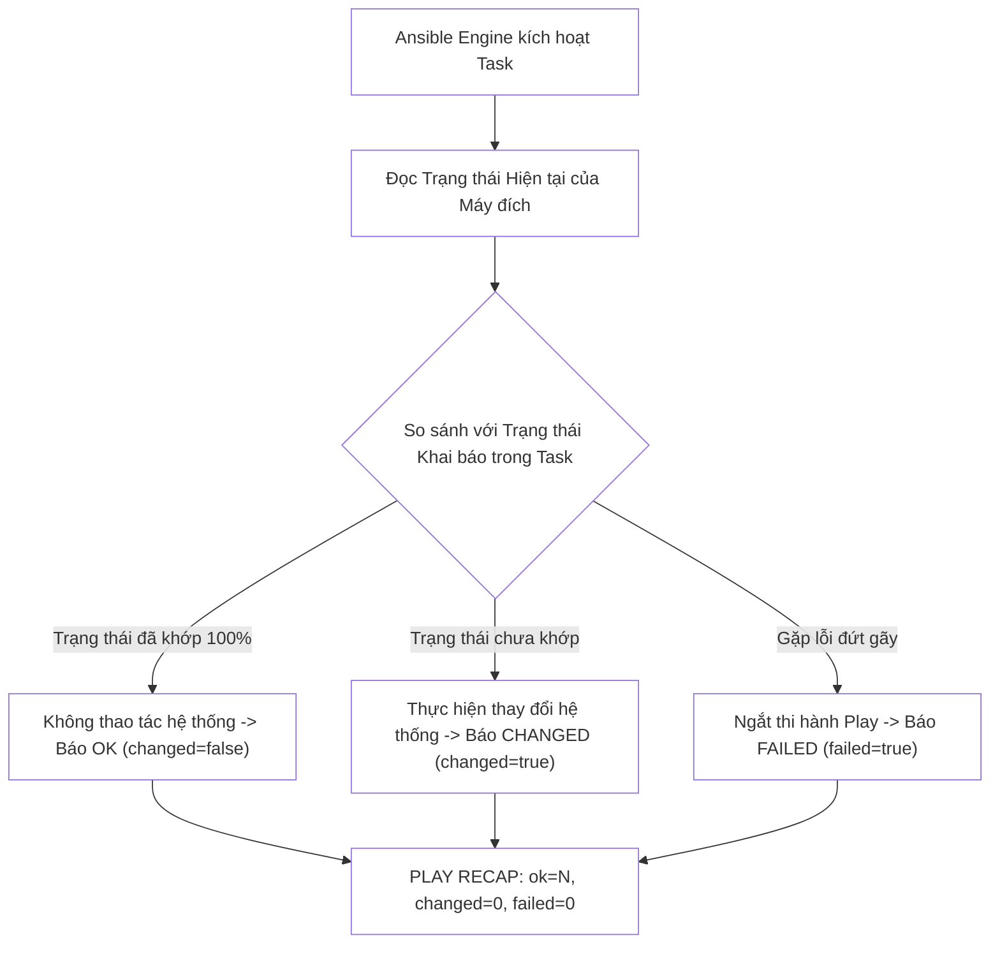
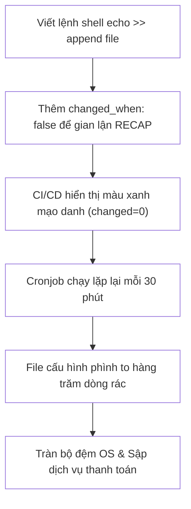


# [BÀI 06] LÀM CHỦ TÍNH IDEMPOTENCY: BẢN CHẤT OK / CHANGED / FAILED, PHÉP THỬ LẦN 2 & TỐI ƯU CHANGED_WHEN

Trong kỷ nguyên **Infrastructure as Code (IaC)** và tự động hóa vận hành hạ tầng đám mây (Cloud Infrastructure Automation), **Ansible** khẳng định vị thế dẫn đầu nhờ triết lý **Agentless** (không cần cài đặt agent nền trên máy đích), giao thức điều khiển an toàn qua **SSH / WinRM**, định dạng khai báo **YAML** trực quan và nguyên lý bất biến **Idempotency** mạnh mẽ. Việc làm chủ Ansible không chỉ dừng lại ở các câu lệnh Ad-hoc đơn giản, mà đòi hỏi kỹ sư phải nắm vững kiến trúc Module tầng thấp, Variable Precedence 22 tầng, Jinja2 Templates, tối ưu hóa Forks & Pipelining cho tới thiết kế Roles / Collections và tích hợp CI/CD tự động hóa chuẩn Doanh nghiệp.

Bài viết chuyên sâu này sẽ đồng hành cùng bạn mổ xẻ toàn diện bức tranh kiến trúc, phân tích các đánh đổi kỹ thuật thực chiến (Engineering Trade-offs), cung cấp hướng dẫn thực hành Lab chi tiết từng bước và bộ câu hỏi phỏng vấn chuyên sâu chuẩn DevOps / SRE Lead.

---

## 1. Bản Chất Kiến Trúc & Cơ Chế Vận Hành Tầng Thấp

Tính bất biến (**Idempotency**) là hòn đá tảng phân định ranh giới giữa một kịch bản Shell Script thủ công truyền thống và một hệ thống Infrastructure as Code đạt chuẩn Enterprise. Về mặt bản chất toán học và khoa học máy tính, một hàm số hoặc một tác vụ tự động hóa được gọi là Idempotent khi và chỉ khi: áp dụng tác vụ đó $f(x)$ một lần hay $n$ lần liên tiếp ($f(f(...f(x)...))$) thì trạng thái cuối cùng của hệ thống vẫn hoàn toàn đồng nhất và không sinh ra bất kỳ hiệu ứng phụ ngoài mong muốn nào (**No Side Effects**).



### 1.1. Triết Lý Idempotency & Trạng Thái Nguyên Tử (OK vs CHANGED vs FAILED)

- **Mô hình Khai báo Trạng thái (Declarative State Model):** Thay vì ra lệnh theo tư duy mệnh lệnh (Imperative - "Hãy gõ lệnh `apt install nginx`"), kỹ sư mô tả trạng thái mong muốn của hệ thống ("Gói `nginx` phải ở trạng thái `present`"). Ansible tự động kiểm tra trạng thái hiện hành, chỉ can thiệp khi có sai lệch.
- **Trạng thái `OK`:** Hệ thống đã đạt đúng trạng thái mong muốn từ trước. Ansible giữ nguyên trạng thái đĩa cứng và báo `changed=false`.
- **Trạng thái `CHANGED`:** Hệ thống chưa đạt chuẩn, Ansible tiến hành can thiệp (chép file, cài gói, bật service) và báo `changed=true`.
- **Trạng thái `FAILED`:** Tác vụ gặp sự cố (sai cú pháp, thiếu quyền, mất kết nối) và lập tức ngắt chuỗi thực thi để bảo vệ an toàn hệ thống.

### 1.2. Kỹ Thuật Chế Ngự Lệnh Thô Với Creates, Removes & Changed_when

- **Thuộc tính `creates` và `removes`:** Khi bắt buộc phải chạy module `command` hoặc `shell` để thực thi các tệp binary bên ngoài (ví dụ giải nén `tar -xzf`), thuộc tính `creates: /path/to/extracted_file` thông báo cho Ansible: "Nếu file này đã tồn tại, hãy bỏ qua task và báo `OK`". Ngược lại, `removes:` sẽ bỏ qua task nếu file đã biến mất.
- **Tối ưu hóa với `changed_when: false`:** Áp dụng cho các tác vụ thuần túy chỉ đọc dữ liệu (`uname -a`, `uptime`, `cat /etc/issue`) để ngăn chặn việc tăng chỉ số `changed` giả mạo trong RECAP.
- **Tùy biến điều kiện `changed_when: "<expression>"`:** Cho phép lập trình viên định nghĩa điều kiện báo changed dựa trên kết quả trả về của biến đăng ký `register` (ví dụ: `changed_when: "'MIGRATION_SUCCESS' in migration_res.stdout"`).

### 1.3. Phép Thử Lượt Chạy Lần Hai (Second-run Test) & Tích Hợp CI/CD Pipeline

Phép thử Lượt chạy Lần hai (**Second-run Execution Test**) là tiêu chuẩn vàng để nghiệm thu mọi kịch bản tự động hóa:
1. **Lượt chạy Lần 1 (Provisioning Stage):** Áp đặt cấu hình mới, chuyển dịch hệ thống từ trạng thái cũ sang trạng thái mong muốn (`changed=N`).
2. **Lượt chạy Lần 2 (Verification Stage):** Chạy lại nguyên vẹn kịch bản cũ, bảng `PLAY RECAP` **bắt buộc phải đạt `changed=0`**.
3. **Cảnh báo "Ép trạng thái mạo danh":** Tuyệt đối không lạm dụng `changed_when: false` để che giấu một tác vụ có làm thay đổi dữ liệu thật (như `echo >> file`). Việc đối soát hiện vật thực tế qua `docker exec` hoặc SSH độc lập là bước kiểm chứng cuối cùng không thể bỏ qua.

---

## 2. Bảng So Sánh Kỹ Thuật Toàn Diện (Engineering Matrix)

| Tiêu Chí Kỹ Thuật | Module Tiêu Chuẩn (`builtin.*`) | Module Lệnh Thô (`command`/`shell`) | Lệnh Thô + `creates` / `removes` | Lệnh Thô + `changed_when` | Ép Trạng Thái Mạo Danh (`changed_when: false`) |
|---|---|---|---|---|---|
| **Cơ chế Idempotency** | Tự động (Built-in Python State Check) | **Không có** (Luôn báo `changed=true`) | Dựa trên sự tồn tại của Inode/File trên đĩa | Dựa trên logic điều kiện chuỗi stdout/rc | **Giả tạo** (Ép cờ mà không kiểm soát thực tế) |
| **Hành vi Lượt chạy Lần 2** | `changed=0` (Chuẩn mực) | `changed > 0` (Vi phạm) | `changed=0` nếu file đã tồn tại | `changed=0` nếu điều kiện không thỏa | `changed=0` (Nhưng thực tế đĩa cứng bị sửa) |
| **Độ an toàn Production** | Rất cao | Rất thấp (Rủi ro đè đúp dữ liệu) | Cao | Cao | **Cực kỳ nguy hiểm** (Ẩn giấu lỗi) |
| **Hỗ trợ Chế độ Dry-run (`--check`)** | Đầy đủ | Không hỗ trợ | Bỏ qua an toàn | Hỗ trợ có điều kiện | Gây sai lệch kết quả mô phỏng |
| **Trường hợp áp dụng chuẩn** | 95% tác vụ quản trị hệ thống phổ biến | Tuyệt đối tránh trong Playbook chuẩn | Chạy bộ cài installer, giải nén tar/zip | Chạy script database migration, CLI custom | Cấm tuyệt đối trên Production |

> [!IMPORTANT]
> **NGUYÊN TẮC BẤT BIẾN:**
> Một Playbook chỉ được coi là đạt tiêu chuẩn bàn giao Production khi vượt qua Phép thử Lượt chạy Lần 2 với `changed=0` trên 100% các máy chủ đích mà không sử dụng bất kỳ hành vi ép trạng thái mạo danh nào.

---

## 3. Kiến Trúc Triển Khai Chuẩn Production (Configuration / Playbook / Role Breakdown)

Dưới đây là file Playbook mẫu chuẩn hóa việc xử lý Idempotency cho các tình huống từ module chuẩn tới các lệnh thực thi nhị phân phức tạp:

```yaml
# playbook-idempotency-mastery.yml
---
- name: Production Idempotent Application Provisioning
  hosts: web
  become: true
  gather_facts: false

  vars:
    app_version: "2.4.1"
    install_dir: "/opt/custom-app"
    archive_url: "https://internal.repo/app-{{ app_version }}.tar.gz"

  tasks:
    - name: 01. Ensure target installation directory exists
      ansible.builtin.file:
        path: "{{ install_dir }}"
        state: directory
        mode: "0755"

    - name: 02. Read-only system check (Pure Idempotent Task)
      ansible.builtin.command: uname -m
      register: arch_check
      changed_when: false

    - name: 03. Extract application binary safely using creates parameter
      ansible.builtin.command: >
        tar -xzf /tmp/app-{{ app_version }}.tar.gz -C {{ install_dir }}
      args:
        creates: "{{ install_dir }}/bin/app-executable"

    - name: 04. Run custom database schema migration with precise changed_when
      ansible.builtin.command: "{{ install_dir }}/bin/migrate-db --check-and-apply"
      register: db_migration
      changed_when: "'APPLIED_NEW_MIGRATIONS' in db_migration.stdout"
      failed_when: "db_migration.rc != 0 and 'SCHEMA_LOCKED' not in db_migration.stderr"

    - name: 05. Enforce baseline environment configuration via lineinfile
      ansible.builtin.lineinfile:
        path: /etc/environment
        regexp: '^APP_VERSION='
        line: 'APP_VERSION="{{ app_version }}"'
        state: present
        backup: true

    - name: 06. Ensure background worker daemon is active and enabled
      ansible.builtin.service:
        name: sshd
        state: started
        enabled: true
```

### Phân Tích Kỹ Thuật Từng Dòng (Line-by-Line Breakdown):
- <span class="badge-line">Line 14–18</span>: Module `file` chuẩn kiểm tra inode thư mục, chỉ tạo nếu chưa tồn tại (`changed=false` ở lần 2).
- <span class="badge-line">Line 20–23</span>: Tác vụ đọc kiến trúc máy `uname -m` được gán tường minh `changed_when: false` để giữ nguyên trạng thái `ok`.
- <span class="badge-line">Line 25–30</span>: Sử dụng module `command` để giải nén nhưng kèm thuộc tính điều kiện `args: creates: ...` ngăn chặn việc giải nén đè dữ liệu ở các lần chạy sau.
- <span class="badge-line">Line 32–36</span>: Tự định nghĩa điều kiện báo changed cho kịch bản migration cơ sở dữ liệu: chỉ báo `changed=true` khi có dòng chữ `APPLIED_NEW_MIGRATIONS` trong `stdout`.
- <span class="badge-line">Line 38–44</span>: Sử dụng module `lineinfile` kèm `regexp` và `backup: true` để đảm bảo dòng biến môi trường chỉ xuất hiện duy nhất một lần.
- <span class="badge-line">Line 46–50</span>: Đảm bảo dịch vụ chạy và tự bật khi khởi động hệ thống mà không khởi động lại daemon vô lý.

---

## 4. Phân Tích Cạm Bẫy Thực Chiến: Đè Đúp Dữ Liệu & "Ép Trạng Thái Mạo Danh" Trên Production

### Tình Huống Sự Cố Thực Tế Tại Doanh Nghiệp:
Tại một tập đoàn Fintech, nhóm vận hành sử dụng một Playbook chạy định kỳ mỗi 30 phút qua cron để đồng bộ cấu hình hệ thống. Trong kịch bản có một task sử dụng lệnh shell: `echo "api.gateway.internal" >> /etc/hosts`. 
Để qua mặt hệ thống kiểm duyệt CI/CD yêu cầu `changed=0`, kỹ sư phụ trách đã thêm chỉ thị `changed_when: false` vào task này.

### Hậu Quả & Log Lỗi Thực Tế:

```diff
--- /etc/hosts (Corrupted by Non-Idempotent Shell)
+++ /etc/hosts (Clean State with lineinfile)
@@ -1,8 +1,2 @@
 127.0.0.1   localhost
-10.0.0.15   api.gateway.internal
-10.0.0.15   api.gateway.internal
-10.0.0.15   api.gateway.internal
-10.0.0.15   api.gateway.internal
-10.0.0.15   api.gateway.internal
+# Sửa: Dùng lineinfile với regexp='^.*api\.gateway\.internal'
+10.0.0.15   api.gateway.internal
```

- Bảng `PLAY RECAP` của CI/CD luôn hiển thị màu xanh hoàn hảo: `ok=12 changed=0 failed=0`.
- Tuy nhiên trên thực tế, sau 1 tuần hoạt động, file `/etc/hosts` của máy chủ thanh toán bị phình to lên hơn **336 dòng trùng lặp**, khiến trình phân giải DNS nội bộ của Linux bị crash do tràn bộ đệm đọc file, làm sập toàn bộ cổng thanh toán API Gateway trong 2 giờ.




### 5-Whys Root Cause Analysis:
1. **Tại sao cổng thanh toán bị mất kết nối?** Do trình phân giải tên miền hệ thống không thể đọc file `/etc/hosts` vì kích thước vượt ngưỡng phân tích.
2. **Tại sao file `/etc/hosts` bị phình to bất thường?** Do kịch bản tự động hóa ghi đúp dòng cấu hình sau mỗi chu kỳ chạy cron 30 phút.
3. **Tại sao kịch bản ghi đúp dòng?** Do sử dụng lệnh `echo >>` trong module `shell` thay vì dùng module `lineinfile`.
4. **Tại sao hệ thống giám sát không cảnh báo thay đổi?** Do kỹ sư đã ép `changed_when: false` khiến Ansible không thể ghi nhận trạng thái thay đổi thật.
5. **Nguyên nhân cốt lõi (Root Cause):** Thiếu văn hóa kỹ thuật chuẩn xác về tính Idempotency: gian lận trạng thái xanh giả tạo và thiếu bước đối soát sự thật khách quan trên máy đích.

---

## 5. Hands-on Lab: Triệt Tiêu Lỗi Non-Idempotent & Thiết Lập Tính Bất Biến Tuyệt Đối (8 Bước)

| Bước | Lệnh CLI / Tác Vụ Chính | Mục Đích Thực Thi |
|---|---|---|
| **Bước 1** | Chuẩn bị môi trường `lab-ansible-06` | Khởi tạo cấu hình dự án cô lập |
| **Bước 2** | Viết Playbook lỗi `broken-site.yml` | Mô phỏng hiện tượng Non-idempotent với module lệnh thô |
| **Bước 3** | Chạy Lần 1 và Lần 2 file lỗi | Nhận diện lỗi `changed > 0` ở lượt chạy thứ hai |
| **Bước 4** | Khắc phục lệnh thô bằng `creates` | Ngăn chặn việc thực thi lại lệnh không cần thiết |
| **Bước 5** | Điều khiển cờ trạng thái với `changed_when` | Kiểm soát chính xác chỉ số `ok` và `changed` |
| **Bước 6** | Chuyển đổi toàn diện sang Module chuẩn | Chuẩn hóa kịch bản với `package`, `file`, `lineinfile` |
| **Bước 7** | Thực thi Phép thử Lần 2 hoàn chỉnh | Đạt chứng nhận Idempotency `changed=0` trên RECAP |
| **Bước 8** | Đối soát sự thật máy đích qua `docker exec` | Xác nhận tính toàn vẹn của hiện vật trên đĩa cứng |

### Bước 1 — Thiết lập môi trường thực hành

```bash
mkdir -p ~/lab-ansible-06 && cd ~/lab-ansible-06

cat << 'EOF' > ansible.cfg
[defaults]
inventory = ./inventory.ini
remote_user = ansible
host_key_checking = False
private_key_file = ~/.ssh/id_ed25519

[privilege_escalation]
become = True
become_method = sudo
become_user = root
become_ask_pass = False
EOF

cat << 'EOF' > inventory.ini
[web]
target1 ansible_host=127.0.0.1 ansible_port=2221

[db]
target2 ansible_host=127.0.0.1 ansible_port=2222

[all:vars]
ansible_python_interpreter=/usr/bin/python3
EOF
```

### Bước 2 — Soạn thảo Playbook chứa lỗi Non-Idempotent để phân tích

```bash
cat << 'EOF' > broken-site.yml
---
- name: Demonstrate Non-Idempotent Behavior
  hosts: web
  become: true
  tasks:
    - name: Non-idempotent raw shell command
      ansible.builtin.shell: echo "export APP_ENV=staging" >> /etc/profile
EOF
```

```bash
# CHECKPOINT 1: Kiểm tra tạo file broken-site.yml
if [ -f "broken-site.yml" ] && grep -q "export APP_ENV" broken-site.yml; then
  echo "CHECKPOINT 1: ĐẠT - Tạo file Playbook mô phỏng lỗi Non-idempotent thành công"
else
  echo "CHECKPOINT 1: LỖI - Tạo file mô phỏng thất bại"
fi
```

### Bước 3 — Thực thi 2 lần và quan sát lỗi Non-Idempotent

```bash
ansible-playbook broken-site.yml
ansible-playbook broken-site.yml
```

```bash
# CHECKPOINT 2: Phát hiện vi phạm Idempotency ở lượt chạy thứ 2
RUN2_BROKEN=$(ansible-playbook broken-site.yml)
if echo "$RUN2_BROKEN" | grep -q "changed=1"; then
  echo "CHECKPOINT 2: ĐẠT - Xác nhận Playbook lỗi vi phạm Idempotency (lần 2 vẫn báo changed=1)"
else
  echo "CHECKPOINT 2: LỖI - Không quan sát được lỗi mong đợi"
fi
```

### Bước 4 — Khắc phục tác vụ lệnh thô bằng thuộc tính creates

```bash
cat << 'EOF' > fix-creates.yml
---
- name: Fix Non-Idempotent using creates parameter
  hosts: web
  become: true
  tasks:
    - name: Create flag file safely with shell
      ansible.builtin.shell: touch /var/log/custom-init.lock
      args:
        creates: /var/log/custom-init.lock
EOF

ansible-playbook fix-creates.yml
ansible-playbook fix-creates.yml
```

```bash
# CHECKPOINT 3 & 4: Kiểm tra creates đạt changed=0 ở lần 2
RUN2_CREATES=$(ansible-playbook fix-creates.yml)
if echo "$RUN2_CREATES" | grep -q "changed=0"; then
  echo "CHECKPOINT 3 & 4: ĐẠT - Thuộc tính creates giúp lệnh thô đạt Idempotency (changed=0 lần 2)"
else
  echo "CHECKPOINT 3 & 4: LỖI - Thuộc tính creates chưa hoạt động đúng"
fi
```

### Bước 5 — Tối ưu hóa tác vụ kiểm tra với changed_when: false

```bash
cat << 'EOF' > fix-changed-when.yml
---
- name: Control Task Status via changed_when
  hosts: web
  become: true
  tasks:
    - name: Read kernel architecture (Read-only query)
      ansible.builtin.command: uname -m
      register: host_arch
      changed_when: false

    - name: Check system uptime
      ansible.builtin.command: uptime
      changed_when: false
EOF

ansible-playbook fix-changed-when.yml
```

```bash
# CHECKPOINT 5: Kiểm tra changed_when: false đạt ok và không tăng changed
CW_OUT=$(ansible-playbook fix-changed-when.yml)
if echo "$CW_OUT" | grep -q "changed=0" && echo "$CW_OUT" | grep -q "ok=2"; then
  echo "CHECKPOINT 5: ĐẠT - Tác vụ đọc dữ liệu với changed_when: false đạt chuẩn ok và changed=0"
else
  echo "CHECKPOINT 5: LỖI - Cấu hình changed_when thất bại"
fi
```

### Bước 6 — Chuẩn hóa toàn diện Playbook với các Module tiêu chuẩn

```bash
cat << 'EOF' > site.yml
---
- name: Enterprise Production Idempotent Baseline
  hosts: web
  become: true
  gather_facts: false

  tasks:
    - name: 01. Ensure curl package is installed
      ansible.builtin.package:
        name: curl
        state: present

    - name: 02. Ensure application base directory exists
      ansible.builtin.file:
        path: /var/www/app
        state: directory
        mode: "0755"

    - name: 03. Ensure environment parameter is uniquely configured
      ansible.builtin.lineinfile:
        path: /etc/environment
        regexp: '^APP_ENV='
        line: 'APP_ENV="production"'
        state: present
        backup: true

    - name: 04. Ensure SSH daemon service is started and enabled
      ansible.builtin.service:
        name: sshd
        state: started
        enabled: true
EOF
```

```bash
# CHECKPOINT 6: Kiểm tra cú pháp Playbook chuẩn hóa
ansible-playbook --syntax-check site.yml
```

### Bước 7 — Thực thi Phép thử Lần 2 trên Playbook chuẩn hóa

```bash
ansible-playbook site.yml
ansible-playbook site.yml
```

```bash
# CHECKPOINT 7: Chứng minh tính Idempotency tuyệt đối ở Lần 2
RUN2_FINAL=$(ansible-playbook site.yml)
if echo "$RUN2_FINAL" | grep -q "changed=0" && echo "$RUN2_FINAL" | grep -q "failed=0"; then
  echo "CHECKPOINT 7: ĐẠT - Playbook chuẩn hóa đạt Idempotency tuyệt đối (PLAY RECAP lần 2 báo changed=0)"
else
  echo "CHECKPOINT 7: LỖI - Playbook chưa đạt tính Idempotency chuẩn"
fi
```

### Bước 8 — Đối soát sự thật khách quan trên máy đích

```bash
docker exec target1 cat /etc/environment | grep "APP_ENV"
docker exec target1 ls -ld /var/www/app
```

```bash
# CHECKPOINT 8: Kiểm tra hiện vật thực tế qua docker exec
REAL_ENV=$(docker exec target1 cat /etc/environment)
REAL_DIR=$(docker exec target1 ls -ld /var/www/app)
if echo "$REAL_ENV" | grep -q 'APP_ENV="production"' && echo "$REAL_DIR" | grep -q "drwxr-xr-x"; then
  echo "CHECKPOINT 8: ĐẠT - Đối soát thực tế xác nhận máy đích đạt đúng trạng thái mong muốn và không bị trùng lặp"
else
  echo "CHECKPOINT 8: LỖI - Hiện vật trên máy đích không khớp cấu hình"
fi
```

---

## 6. Bộ Câu Hỏi Vấn Đáp & Phỏng Vấn Chuyên Sâu (Self-Check Q&A)

<details class="qa-card">
  <summary class="qa-summary">
    <span class="qa-num-badge">Q01</span>
    <span class="qa-question-text">Trình bày định nghĩa và bản chất của tính Idempotency trong tự động hóa cấu hình hạ tầng. Tại sao Ansible tự hào là công cụ đạt chuẩn Idempotent?</span>
  </summary>
  <div class="qa-answer">
    <div class="qa-answer-header">
      <svg width="14" height="14" fill="none" stroke="currentColor" stroke-width="2" viewBox="0 0 24 24"><path d="M22 11.08V12a10 10 0 1 1-5.93-9.14"></path><polyline points="22 4 12 14.01 9 11.01"></polyline></svg>
      <span>Phân Tích &amp; Lời Giải Kỹ Thuật</span>
    </div>
    <div><b>Đáp án chuẩn:</b> Idempotency là tính chất mà khi một tác vụ được thực thi một lần hay nhiều lần liên tiếp, kết quả cuối cùng trên hệ thống vẫn hoàn toàn đồng nhất và không gây ra bất kỳ tác dụng phụ (side-effect) nào. Ansible đạt chuẩn Idempotent nhờ mô hình khai báo trạng thái (Declarative State Model): các module chuẩn trong <code>ansible.builtin</code> luôn kiểm tra trạng thái hiện tại của hệ thống trước khi quyết định có can thiệp hay không.</div>
    <div style="margin-top: 0.5rem;"><b>Tiêu chí chấm:</b></div>
    <div style="margin: 0.35rem 0; padding-left: 1rem; border-left: 2px solid var(--accent-primary);">• <b>0:</b> Không nêu được định nghĩa Idempotency.</div>
    <div style="margin: 0.35rem 0; padding-left: 1rem; border-left: 2px solid var(--accent-primary);">• <b>1:</b> Nêu được khái niệm chạy lại không đổi nhưng không giải thích được cơ chế kiểm tra trạng thái của module.</div>
    <div style="margin: 0.35rem 0; padding-left: 1rem; border-left: 2px solid var(--accent-primary);">• <b>2:</b> Nêu chính xác định nghĩa + cơ chế Declarative của Ansible.</div>
    <div style="margin: 0.35rem 0; padding-left: 1rem; border-left: 2px solid var(--accent-primary);">• <b>3:</b> Phân tích xuất sắc bản chất toán học $f(f(x)) = f(x)$ và liên hệ trực tiếp với bảng <code>PLAY RECAP</code>.</div>
    <div style="margin-top: 0.5rem;"><b>Câu hỏi đào sâu:</b> Lệnh <code>mkdir /tmp/test</code> có phải là lệnh idempotent không? <i>(Không, vì chạy lần 2 lệnh này sẽ báo lỗi <code>File exists</code> và trả về exit code khác 0.)</i></div>
  </div>
</details>

<details class="qa-card">
  <summary class="qa-summary">
    <span class="qa-num-badge">Q02</span>
    <span class="qa-question-text">Phân biệt sự khác biệt bản chất giữa ba trạng thái thực thi của Task: OK, CHANGED và FAILED.</span>
  </summary>
  <div class="qa-answer">
    <div class="qa-answer-header">
      <svg width="14" height="14" fill="none" stroke="currentColor" stroke-width="2" viewBox="0 0 24 24"><path d="M22 11.08V12a10 10 0 1 1-5.93-9.14"></path><polyline points="22 4 12 14.01 9 11.01"></polyline></svg>
      <span>Phân Tích &amp; Lời Giải Kỹ Thuật</span>
    </div>
    <div><b>Đáp án chuẩn:</b></div>
    <div>• <b>OK (Xanh lá):</b> Task chạy thành công nhưng KHÔNG làm thay đổi hệ thống đích (do hệ thống đã đúng trạng thái mong muốn từ trước).</div>
    <div>• <b>CHANGED (Vàng/Cam):</b> Task chạy thành công VÀ có thực hiện thay đổi dữ liệu hoặc trạng thái trên máy đích.</div>
    <div>• <b>FAILED (Đỏ):</b> Task gặp lỗi thực thi (sai cú pháp, lỗi quyền, exit code != 0) và lập tức dừng kịch bản Playbook.</div>
    <div style="margin-top: 0.5rem;"><b>Tiêu chí chấm:</b></div>
    <div style="margin: 0.35rem 0; padding-left: 1rem; border-left: 2px solid var(--accent-primary);">• <b>0:</b> Nhầm lẫn giữa OK và CHANGED.</div>
    <div style="margin: 0.35rem 0; padding-left: 1rem; border-left: 2px solid var(--accent-primary);">• <b>1:</b> Nêu được FAILED nhưng chưa phân biệt rạch ròi giữa OK và CHANGED.</div>
    <div style="margin: 0.35rem 0; padding-left: 1rem; border-left: 2px solid var(--accent-primary);">• <b>2:</b> Phân biệt chính xác cả 3 trạng thái.</div>
    <div style="margin: 0.35rem 0; padding-left: 1rem; border-left: 2px solid var(--accent-primary);">• <b>3:</b> Nêu đúng + giải thích tại sao ở lần chạy 2, số lượng task OK phải tăng lên và CHANGED phải về 0.</div>
    <div style="margin-top: 0.5rem;"><b>Câu hỏi đào sâu:</b> Khi chạy ở chế độ <code>--check</code> (Dry-run), một Task báo <code>CHANGED</code> có nghĩa là máy đích đã bị thay đổi chưa? <i>(Chưa, đó chỉ là dự báo rằng nếu chạy thật thì task này sẽ tạo ra thay đổi.)</i></div>
  </div>
</details>

<details class="qa-card">
  <summary class="qa-summary">
    <span class="qa-num-badge">Q03</span>
    <span class="qa-question-text">Tại sao các module command và shell mặc định luôn trả về trạng thái CHANGED trong mỗi lần thực thi?</span>
  </summary>
  <div class="qa-answer">
    <div class="qa-answer-header">
      <svg width="14" height="14" fill="none" stroke="currentColor" stroke-width="2" viewBox="0 0 24 24"><path d="M22 11.08V12a10 10 0 1 1-5.93-9.14"></path><polyline points="22 4 12 14.01 9 11.01"></polyline></svg>
      <span>Phân Tích &amp; Lời Giải Kỹ Thuật</span>
    </div>
    <div><b>Đáp án chuẩn:</b> Ansible Engine coi các câu lệnh shell thô là "hộp đen" (black-box). Ansible không thể phân tích ngữ nghĩa bên trong câu lệnh shell để biết nó có làm sửa đổi file, tạo tiến trình hay chỉ đọc dữ liệu. Để đảm bảo an toàn và kích hoạt đúng các Handler phụ thuộc, Ansible mặc định gán trạng thái <code>changed=true</code> cho mọi task <code>command</code>/<code>shell</code> trừ khi có cấu hình bổ sung.</div>
    <div style="margin-top: 0.5rem;"><b>Tiêu chí chấm:</b></div>
    <div style="margin: 0.35rem 0; padding-left: 1rem; border-left: 2px solid var(--accent-primary);">• <b>0:</b> Không giải thích được lý do.</div>
    <div style="margin: 0.35rem 0; padding-left: 1rem; border-left: 2px solid var(--accent-primary);">• <b>1:</b> Trả lời chung chung là do lệnh shell không an toàn.</div>
    <div style="margin: 0.35rem 0; padding-left: 1rem; border-left: 2px solid var(--accent-primary);">• <b>2:</b> Nêu chính xác khái niệm black-box và cơ chế mặc định an toàn của Ansible.</div>
    <div style="margin: 0.35rem 0; padding-left: 1rem; border-left: 2px solid var(--accent-primary);">• <b>3:</b> Nêu đúng + chỉ ra tác động dây chuyền tới các Handlers (notify) khi task shell luôn báo changed.</div>
    <div style="margin-top: 0.5rem;"><b>Câu hỏi đào sâu:</b> Làm thế nào để một task <code>command</code> chạy lệnh <code>ls -l</code> không bị báo trạng thái <code>CHANGED</code>? <i>(Thêm tham số <code>changed_when: false</code> vào task.)</i></div>
  </div>
</details>

<details class="qa-card">
  <summary class="qa-summary">
    <span class="qa-num-badge">Q04</span>
    <span class="qa-question-text">Thuộc tính creates và removes trong module command/shell hoạt động như thế nào để mang lại tính Idempotency?</span>
  </summary>
  <div class="qa-answer">
    <div class="qa-answer-header">
      <svg width="14" height="14" fill="none" stroke="currentColor" stroke-width="2" viewBox="0 0 24 24"><path d="M22 11.08V12a10 10 0 1 1-5.93-9.14"></path><polyline points="22 4 12 14.01 9 11.01"></polyline></svg>
      <span>Phân Tích &amp; Lời Giải Kỹ Thuật</span>
    </div>
    <div><b>Đáp án chuẩn:</b></div>
    <div>• <code>creates: /path/to/file</code>: Kiểm tra trước trên máy đích. Nếu file đã tồn tại, Ansible sẽ BỎ QUA không thực thi lệnh và báo trạng thái <code>OK</code> (<code>changed=false</code>). Lệnh chỉ chạy khi file chưa tồn tại.</div>
    <div>• <code>removes: /path/to/file</code>: Ngược lại, nếu file đã bị xóa (không tồn tại), Ansible sẽ bỏ qua lệnh. Lệnh chỉ chạy khi file vẫn còn tồn tại.</div>
    <div style="margin-top: 0.5rem;"><b>Tiêu chí chấm:</b></div>
    <div style="margin: 0.35rem 0; padding-left: 1rem; border-left: 2px solid var(--accent-primary);">• <b>0:</b> Không biết vai trò của <code>creates</code> và <code>removes</code>.</div>
    <div style="margin: 0.35rem 0; padding-left: 1rem; border-left: 2px solid var(--accent-primary);">• <b>1:</b> Hiểu <code>creates</code> là lệnh tạo file mới.</div>
    <div style="margin: 0.35rem 0; padding-left: 1rem; border-left: 2px solid var(--accent-primary);">• <b>2:</b> Giải thích chính xác cơ chế điều kiện ngắt của cả 2 tham số.</div>
    <div style="margin: 0.35rem 0; padding-left: 1rem; border-left: 2px solid var(--accent-primary);">• <b>3:</b> Nêu đúng + minh họa ví dụ giải nén file tar.gz an toàn bằng <code>creates</code>.</div>
    <div style="margin-top: 0.5rem;"><b>Câu hỏi đào sâu:</b> Đường dẫn khai báo trong <code>creates</code> có thể là một thư mục (directory) thay vì một file thường được không? <i>(Được, Ansible kiểm tra sự tồn tại của inode đường dẫn bất kể là file hay directory.)</i></div>
  </div>
</details>

<details class="qa-card">
  <summary class="qa-summary">
    <span class="qa-num-badge">Q05</span>
    <span class="qa-question-text">Khi nào ta nên sử dụng changed_when: false? Cho 3 ví dụ thực tế trong quản trị hạ tầng.</span>
  </summary>
  <div class="qa-answer">
    <div class="qa-answer-header">
      <svg width="14" height="14" fill="none" stroke="currentColor" stroke-width="2" viewBox="0 0 24 24"><path d="M22 11.08V12a10 10 0 1 1-5.93-9.14"></path><polyline points="22 4 12 14.01 9 11.01"></polyline></svg>
      <span>Phân Tích &amp; Lời Giải Kỹ Thuật</span>
    </div>
    <div><b>Đáp án chuẩn:</b> Sử dụng <code>changed_when: false</code> khi một Task chạy lệnh bên ngoài nhưng mục đích duy nhất là ĐỌC DỮ LIỆU hoặc KIỂM TRA TRẠNG THÁI mà không thay đổi bất kỳ byte nào trên hệ thống đích. Ba ví dụ thực tế:</div>
    <div>1. Chạy lệnh truy vấn thông tin máy chủ: <code>uname -r</code> hoặc <code>lscpu</code>.</div>
    <div>2. Chạy lệnh kiểm tra dung lượng ổ đĩa: <code>df -h /var</code>.</div>
    <div>3. Chạy lệnh đọc danh sách tài nguyên hiện hữu: <code>docker ps --format "{{.Names}}"</code>.</div>
    <div style="margin-top: 0.5rem;"><b>Tiêu chí chấm:</b></div>
    <div style="margin: 0.35rem 0; padding-left: 1rem; border-left: 2px solid var(--accent-primary);">• <b>0:</b> Không hiểu mục đích của <code>changed_when: false</code>.</div>
    <div style="margin: 0.35rem 0; padding-left: 1rem; border-left: 2px solid var(--accent-primary);">• <b>1:</b> Nêu được định nghĩa nhưng không đưa ra được ví dụ phù hợp.</div>
    <div style="margin: 0.35rem 0; padding-left: 1rem; border-left: 2px solid var(--accent-primary);">• <b>2:</b> Nêu đúng định nghĩa + 2-3 ví dụ chính xác.</div>
    <div style="margin: 0.35rem 0; padding-left: 1rem; border-left: 2px solid var(--accent-primary);">• <b>3:</b> Phân tích xuất sắc lý do tại sao các lệnh chỉ đọc bắt buộc phải có <code>changed_when: false</code> để giữ sạch bảng RECAP.</div>
    <div style="margin-top: 0.5rem;"><b>Câu hỏi đào sâu:</b> Nếu ta dùng <code>changed_when: false</code> cho một lệnh <code>rm -rf /data</code>, điều gì sẽ xảy ra trên máy đích và bảng RECAP? <i>(Máy đích vẫn bị xóa dữ liệu, nhưng bảng RECAP báo xanh <code>changed=0</code> giả mạo, gây sai lệch thông tin audit.)</i></div>
  </div>
</details>

<details class="qa-card">
  <summary class="qa-summary">
    <span class="qa-num-badge">Q06</span>
    <span class="qa-question-text">Trình bày cách sử dụng changed_when với biểu thức điều kiện logic phức tạp kết hợp biến đăng ký register.</span>
  </summary>
  <div class="qa-answer">
    <div class="qa-answer-header">
      <svg width="14" height="14" fill="none" stroke="currentColor" stroke-width="2" viewBox="0 0 24 24"><path d="M22 11.08V12a10 10 0 1 1-5.93-9.14"></path><polyline points="22 4 12 14.01 9 11.01"></polyline></svg>
      <span>Phân Tích &amp; Lời Giải Kỹ Thuật</span>
    </div>
    <div><b>Đáp án chuẩn:</b> Ta lưu kết quả đầu ra của câu lệnh vào biến bằng từ khóa <code>register: &lt;var_name&gt;</code>, sau đó thiết lập biểu thức so khớp chuỗi trong <code>changed_when:</code> dựa trên <code>var_name.stdout</code>, <code>var_name.rc</code> hoặc <code>var_name.stderr</code>. Ví dụ: khi chạy script cập nhật database, chỉ báo changed khi output chứa chữ "MIGRATED": <code>changed_when: "'MIGRATED' in db_res.stdout"</code>.</div>
    <div style="margin-top: 0.5rem;"><b>Tiêu chí chấm:</b></div>
    <div style="margin: 0.35rem 0; padding-left: 1rem; border-left: 2px solid var(--accent-primary);">• <b>0:</b> Không biết kết hợp <code>register</code> và <code>changed_when</code>.</div>
    <div style="margin: 0.35rem 0; padding-left: 1rem; border-left: 2px solid var(--accent-primary);">• <b>1:</b> Biết dùng <code>register</code> nhưng viết sai cú pháp trong <code>changed_when</code>.</div>
    <div style="margin: 0.35rem 0; padding-left: 1rem; border-left: 2px solid var(--accent-primary);">• <b>2:</b> Trình bày đúng cấu trúc YAML và cú pháp điều kiện.</div>
    <div style="margin: 0.35rem 0; padding-left: 1rem; border-left: 2px solid var(--accent-primary);">• <b>3:</b> Nêu đúng + kết hợp cả <code>changed_when</code> và <code>failed_when</code> để kiểm soát toàn diện luồng chạy.</div>
    <div style="margin-top: 0.5rem;"><b>Câu hỏi đào sâu:</b> Cú pháp nào kiểm tra lệnh có exit code khác 0 nhưng không coi đó là lỗi nếu chuỗi stderr chứa "WARNING"? <i>(<code>failed_when: "res.rc != 0 and 'WARNING' not in res.stderr"</code>)</i></div>
  </div>
</details>

<details class="qa-card">
  <summary class="qa-summary">
    <span class="qa-num-badge">Q07</span>
    <span class="qa-question-text">Trình bày quy trình "Phép thử Lượt chạy Lần hai" (Second-run Test). Tại sao chỉ số changed=0 ở lần 2 mới là tiêu chuẩn nghiệm thu cuối cùng?</span>
  </summary>
  <div class="qa-answer">
    <div class="qa-answer-header">
      <svg width="14" height="14" fill="none" stroke="currentColor" stroke-width="2" viewBox="0 0 24 24"><path d="M22 11.08V12a10 10 0 1 1-5.93-9.14"></path><polyline points="22 4 12 14.01 9 11.01"></polyline></svg>
      <span>Phân Tích &amp; Lời Giải Kỹ Thuật</span>
    </div>
    <div><b>Đáp án chuẩn:</b> Quy trình thực thi gồm 2 lượt: Lần 1 cấu hình hạ tầng từ trạng thái A sang B (`changed=N`), sau đó chạy lại Lần 2 nguyên vẹn kịch bản đó. Ở Lần 2, hệ thống đã ở trạng thái B, nên toàn bộ các task phải phát hiện ra trạng thái đã đúng và báo <code>changed=0</code>. Nếu Lần 2 vẫn có <code>changed &gt; 0</code>, điều đó chứng minh kịch bản có chứa tác vụ trôi dạt cấu hình hoặc lệnh thô nguy hiểm.</div>
    <div style="margin-top: 0.5rem;"><b>Tiêu chí chấm:</b></div>
    <div style="margin: 0.35rem 0; padding-left: 1rem; border-left: 2px solid var(--accent-primary);">• <b>0:</b> Cho rằng chỉ cần chạy 1 lần thấy xanh là đạt.</div>
    <div style="margin: 0.35rem 0; padding-left: 1rem; border-left: 2px solid var(--accent-primary);">• <b>1:</b> Biết chạy lần 2 nhưng không giải thích được vì sao bắt buộc phải <code>changed=0</code>.</div>
    <div style="margin: 0.35rem 0; padding-left: 1rem; border-left: 2px solid var(--accent-primary);">• <b>2:</b> Nêu chính xác quy trình 2 lượt và ý nghĩa của <code>changed=0</code>.</div>
    <div style="margin: 0.35rem 0; padding-left: 1rem; border-left: 2px solid var(--accent-primary);">• <b>3:</b> Phân tích xuất sắc tầm quan trọng của phép thử này trong các hệ thống chạy định kỳ (scheduled cron automation).</div>
    <div style="margin-top: 0.5rem;"><b>Câu hỏi đào sâu:</b> Nếu lượt chạy lần 2 báo <code>ok=5 changed=1 failed=0</code>, ta cần xử lý như thế nào? <i>(Tìm task duy nhất báo trạng thái vàng CHANGED trên terminal và thay thế nó bằng module chuẩn hoặc thêm <code>creates</code>/<code>changed_when</code>.)</i></div>
  </div>
</details>

<details class="qa-card">
  <summary class="qa-summary">
    <span class="qa-num-badge">Q08</span>
    <span class="qa-question-text">Hành vi "Ép trạng thái mạo danh" (Fake Idempotency) là gì? Tác hại khôn lường của nó đối với môi trường Production?</span>
  </summary>
  <div class="qa-answer">
    <div class="qa-answer-header">
      <svg width="14" height="14" fill="none" stroke="currentColor" stroke-width="2" viewBox="0 0 24 24"><path d="M22 11.08V12a10 10 0 1 1-5.93-9.14"></path><polyline points="22 4 12 14.01 9 11.01"></polyline></svg>
      <span>Phân Tích &amp; Lời Giải Kỹ Thuật</span>
    </div>
    <div><b>Đáp án chuẩn:</b> "Ép trạng thái mạo danh" là hành vi gắn <code>changed_when: false</code> vào một Task thực tế có thực hiện ghi đè hoặc sửa đổi hệ thống (ví dụ lệnh <code>echo >></code> hoặc lệnh patch cấu hình) để qua mặt bộ lọc kiểm tra của CI/CD. Tác hại: làm mù hệ thống audit, che giấu lỗi trôi dạt cấu hình, gây phình to file rác hoặc ghi đè dữ liệu mỗi chu kỳ chạy, dẫn tới downtime bất ngờ.</div>
    <div style="margin-top: 0.5rem;"><b>Tiêu chí chấm:</b></div>
    <div style="margin: 0.35rem 0; padding-left: 1rem; border-left: 2px solid var(--accent-primary);">• <b>0:</b> Không hiểu khái niệm ép trạng thái mạo danh.</div>
    <div style="margin: 0.35rem 0; padding-left: 1rem; border-left: 2px solid var(--accent-primary);">• <b>1:</b> Biết là xấu nhưng không nêu được tác hại thực tế trên Production.</div>
    <div style="margin: 0.35rem 0; padding-left: 1rem; border-left: 2px solid var(--accent-primary);">• <b>2:</b> Nêu đúng định nghĩa và các nguy cơ hỏng hóc hệ thống.</div>
    <div style="margin: 0.35rem 0; padding-left: 1rem; border-left: 2px solid var(--accent-primary);">• <b>3:</b> Nêu đúng + đề xuất phương pháp đối soát máy đích bằng kiểm thử hiện vật thực tế để triệt tiêu hành vi này.</div>
    <div style="margin-top: 0.5rem;"><b>Câu hỏi đào sâu:</b> Làm sao Tech Lead phát hiện được kỹ sư cấp dưới có hành vi ép trạng thái mạo danh trong Git Pull Request? <i>(Bật quy tắc linter kiểm tra mọi khai báo <code>changed_when: false</code> và yêu cầu kèm kiểm thử đối soát hiện vật máy đích.)</i></div>
  </div>
</details>

<details class="qa-card">
  <summary class="qa-summary">
    <span class="qa-num-badge">Q09</span>
    <span class="qa-question-text">Tại sao việc đối soát sự thật bằng docker exec hoặc SSH độc lập lại là bước bắt buộc để chứng minh tính Idempotency?</span>
  </summary>
  <div class="qa-answer">
    <div class="qa-answer-header">
      <svg width="14" height="14" fill="none" stroke="currentColor" stroke-width="2" viewBox="0 0 24 24"><path d="M22 11.08V12a10 10 0 1 1-5.93-9.14"></path><polyline points="22 4 12 14.01 9 11.01"></polyline></svg>
      <span>Phân Tích &amp; Lời Giải Kỹ Thuật</span>
    </div>
    <div><b>Đáp án chuẩn:</b> Màn hình terminal của Control Node chỉ hiển thị các chuỗi thông báo do module hoặc playbook trả về. Nếu playbook chứa lỗi logic hoặc task ép trạng thái, màn hình RECAP có thể báo xanh hoàn hảo nhưng trên thực tế đĩa cứng máy đích bị hỏng hoặc thiếu cấu hình. Đối soát độc lập qua <code>docker exec</code> (kiểm tra <code>cat file</code>, <code>grep</code>, <code>id user</code>, <code>systemctl status</code>) giúp xác thực hiện vật thật sự trên đĩa cứng.</div>
    <div style="margin-top: 0.5rem;"><b>Tiêu chí chấm:</b></div>
    <div style="margin: 0.35rem 0; padding-left: 1rem; border-left: 2px solid var(--accent-primary);">• <b>0:</b> Cho rằng chỉ cần nhìn màn hình terminal là đủ.</div>
    <div style="margin: 0.35rem 0; padding-left: 1rem; border-left: 2px solid var(--accent-primary);">• <b>1:</b> Biết kiểm tra máy đích nhưng không giải thích được lý do độc lập với Control Node.</div>
    <div style="margin: 0.35rem 0; padding-left: 1rem; border-left: 2px solid var(--accent-primary);">• <b>2:</b> Phân tích chính xác nguyên lý "Source of Truth" trên đĩa cứng máy đích.</div>
    <div style="margin: 0.35rem 0; padding-left: 1rem; border-left: 2px solid var(--accent-primary);">• <b>3:</b> Trình bày xuất sắc tư duy kiểm thử tự động hóa trong testing framework (như Testinfra / Molecule).</div>
    <div style="margin-top: 0.5rem;"><b>Câu hỏi đào sâu:</b> Khi đối soát file cấu hình <code>/etc/environment</code> qua <code>docker exec</code>, ta cần kiểm tra những gì? <i>(Kiểm tra nội dung file có đúng giá trị mong muốn và chỉ xuất hiện duy nhất 1 lần, không bị đè đúp nhiều dòng.)</i></div>
  </div>
</details>

<details class="qa-card">
  <summary class="qa-summary">
    <span class="qa-num-badge">Q10</span>
    <span class="qa-question-text">So sánh hiệu quả và độ an toàn giữa việc sửa cấu hình bằng echo >> (qua shell module) và bằng module lineinfile.</span>
  </summary>
  <div class="qa-answer">
    <div class="qa-answer-header">
      <svg width="14" height="14" fill="none" stroke="currentColor" stroke-width="2" viewBox="0 0 24 24"><path d="M22 11.08V12a10 10 0 1 1-5.93-9.14"></path><polyline points="22 4 12 14.01 9 11.01"></polyline></svg>
      <span>Phân Tích &amp; Lời Giải Kỹ Thuật</span>
    </div>
    <div><b>Đáp án chuẩn:</b></div>
    <div>• <b>`echo >>` (Shell module):</b> Không có kiểm tra trạng thái cũ, mỗi lần chạy đều nối thêm 1 dòng vào cuối file -> Làm file bị phình to, trùng lặp cấu hình, luôn báo <code>changed=true</code> (Non-idempotent).</div>
    <div>• <b>`lineinfile` (Module chuẩn):</b> Sử dụng biểu thức chính quy (<code>regexp</code>) để tìm dòng cũ. Nếu tìm thấy dòng khớp regex, nó sửa dòng đó; nếu dòng đã đúng nội dung, nó giữ nguyên và báo <code>changed=false</code> (Idempotent 100%), hỗ trợ <code>backup=yes</code> và <code>--diff</code>.</div>
    <div style="margin-top: 0.5rem;"><b>Tiêu chí chấm:</b></div>
    <div style="margin: 0.35rem 0; padding-left: 1rem; border-left: 2px solid var(--accent-primary);">• <b>0:</b> Cho rằng hai cách làm là tương đương nhau.</div>
    <div style="margin: 0.35rem 0; padding-left: 1rem; border-left: 2px solid var(--accent-primary);">• <b>1:</b> Biết <code>lineinfile</code> tốt hơn nhưng không giải thích được cơ chế regex.</div>
    <div style="margin: 0.35rem 0; padding-left: 1rem; border-left: 2px solid var(--accent-primary);">• <b>2:</b> So sánh chính xác trên 3 khía cạnh: Cơ chế thực thi, Idempotency, Khả năng sao lưu.</div>
    <div style="margin: 0.35rem 0; padding-left: 1rem; border-left: 2px solid var(--accent-primary);">• <b>3:</b> Trình bày xuất sắc ví dụ minh họa và kết luận chuẩn mực DevOps.</div>
    <div style="margin-top: 0.5rem;"><b>Câu hỏi đào sâu:</b> Nếu trong file có 3 dòng giống nhau sẵn từ trước, <code>lineinfile</code> với <code>regexp</code> sẽ xử lý thế nào? <i>(Mặc định <code>lineinfile</code> sẽ sửa dòng cuối cùng khớp regex, các dòng trên giữ nguyên trừ khi kết hợp regex toàn cục.)</i></div>
  </div>
</details>

<details class="qa-card">
  <summary class="qa-summary">
    <span class="qa-num-badge">Q11</span>
    <span class="qa-question-text">Trong mô hình CI/CD Pipeline (GitLab CI/GitHub Actions), bước Idempotency Test được tự động hóa bằng công cụ nào và cấu hình ra sao?</span>
  </summary>
  <div class="qa-answer">
    <div class="qa-answer-header">
      <svg width="14" height="14" fill="none" stroke="currentColor" stroke-width="2" viewBox="0 0 24 24"><path d="M22 11.08V12a10 10 0 1 1-5.93-9.14"></path><polyline points="22 4 12 14.01 9 11.01"></polyline></svg>
      <span>Phân Tích &amp; Lời Giải Kỹ Thuật</span>
    </div>
    <div><b>Đáp án chuẩn:</b> Trong CI/CD, bước kiểm thử tính bất biến thường được thực hiện qua công cụ <b>Molecule</b> (với Test scenario mặc định có bước `idempotence`) hoặc viết bash script trong CI stage: chạy <code>ansible-playbook site.yml</code> lần 1, sau đó chạy lại lần 2 và pipe output vào <code>grep -q "changed=0.*failed=0"</code>. Nếu không tìm thấy chuỗi này, script trả về exit code 1 làm fail pipeline ngay lập tức.</div>
    <div style="margin-top: 0.5rem;"><b>Tiêu chí chấm:</b></div>
    <div style="margin: 0.35rem 0; padding-left: 1rem; border-left: 2px solid var(--accent-primary);">• <b>0:</b> Không biết cách tự động hóa kiểm thử Idempotency trong CI/CD.</div>
    <div style="margin: 0.35rem 0; padding-left: 1rem; border-left: 2px solid var(--accent-primary);">• <b>1:</b> Nêu được chạy script bash nhưng không rõ logic kiểm tra regex.</div>
    <div style="margin: 0.35rem 0; padding-left: 1rem; border-left: 2px solid var(--accent-primary);">• <b>2:</b> Nêu đúng quy trình kiểm thử bash script hoặc nêu tên framework Molecule.</div>
    <div style="margin: 0.35rem 0; padding-left: 1rem; border-left: 2px solid var(--accent-primary);">• <b>3:</b> Phân tích xuất sắc cả 2 phương án: bash automation script và Molecule test matrix.</div>
    <div style="margin-top: 0.5rem;"><b>Câu hỏi đào sâu:</b> Tại sao Molecule lại là tiêu chuẩn kiểm thử hàng đầu cho Ansible Roles? <i>(Vì Molecule tự động dựng container/VM cô lập, áp playbook, kiểm tra idempotence, chạy unit test Testinfra rồi tự hủy container sau khi xong.)</i></div>
  </div>
</details>

<details class="qa-card">
  <summary class="qa-summary">
    <span class="qa-num-badge">Q12</span>
    <span class="qa-question-text">Có trường hợp nào trong thực tế mà một Task bắt buộc phải Non-idempotent không? Nếu có, hãy nêu ví dụ và cách quản trị an toàn.</span>
  </summary>
  <div class="qa-answer">
    <div class="qa-answer-header">
      <svg width="14" height="14" fill="none" stroke="currentColor" stroke-width="2" viewBox="0 0 24 24"><path d="M22 11.08V12a10 10 0 1 1-5.93-9.14"></path><polyline points="22 4 12 14.01 9 11.01"></polyline></svg>
      <span>Phân Tích &amp; Lời Giải Kỹ Thuật</span>
    </div>
    <div><b>Đáp án chuẩn:</b> Có. Một số tác vụ đặc thù mang tính thời điểm bắt buộc phải non-idempotent: (1) Tác vụ tạo bản sao lưu snapshot cơ sở dữ liệu trước khi nâng cấp (mỗi lần chạy đều phải sinh file backup mới có timestamp), (2) Tác vụ gửi thông báo tin nhắn Webhook tới Slack/Telegram khi deploy. Quản trị an toàn: tách các task này ra thành Playbook riêng biệt chuyên dụng (Ad-hoc Maintenance Playbook) hoặc gắn thẻ <code>tags: [never, backup]</code> để không bị kích hoạt tự động trong luồng cấu hình định kỳ.</div>
    <div style="margin-top: 0.5rem;"><b>Tiêu chí chấm:</b></div>
    <div style="margin: 0.35rem 0; padding-left: 1rem; border-left: 2px solid var(--accent-primary);">• <b>0:</b> Cho rằng 100% mọi tác vụ trên đời đều phải Idempotent mà không thấy các ngoại lệ.</div>
    <div style="margin: 0.35rem 0; padding-left: 1rem; border-left: 2px solid var(--accent-primary);">• <b>1:</b> Nêu được ví dụ backup nhưng không đưa ra được giải pháp quản trị an toàn.</div>
    <div style="margin: 0.35rem 0; padding-left: 1rem; border-left: 2px solid var(--accent-primary);">• <b>2:</b> Nêu đúng 2 ví dụ thực tế + giải pháp tách playbook/dùng tags.</div>
    <div style="margin: 0.35rem 0; padding-left: 1rem; border-left: 2px solid var(--accent-primary);">• <b>3:</b> Phân tích tư duy kiến trúc sâu sắc về phân tách giữa State Management (Bất biến) và Event-driven Actions (Theo sự kiện).</div>
    <div style="margin-top: 0.5rem;"><b>Câu hỏi đào sâu:</b> Cấu hình <code>tags: ['never', 'notify']</code> có ý nghĩa gì trong Ansible? <i>(Task này sẽ không bao giờ được chạy khi thực thi Playbook thông thường, chỉ chạy khi người dùng chỉ định rõ <code>--tags notify</code> trên CLI.)</i></div>
  </div>
</details>

## Tổng Kết & Lộ Trình Bài Học Tiếp Theo

Kiến thức trong bài viết này đóng vai trò then chốt trong việc xây dựng hệ sinh thái tự động hóa hạ tầng ổn định, an toàn và tối ưu hiệu năng. Nắm vững cả lý thuyết kiến trúc và kỹ năng thực hành là chìa khóa để vận hành hệ thống ở quy mô lớn.

> [!TIP]
> **BÀI TIẾP THEO TRONG CHUỖI BÀI HỌC:**
> Tiếp tục nâng cao kỹ năng tự động hóa với bài học tiếp theo: [[Bài 07] Làm Chủ Biến & Thứ Tự Ưu Tiên: Variable Precedence 22 Tầng, Scope, Jinja2 Syntax & Debug](ansible-07-07-variables-precedence.html).


