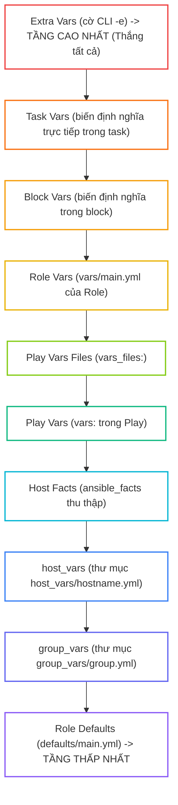
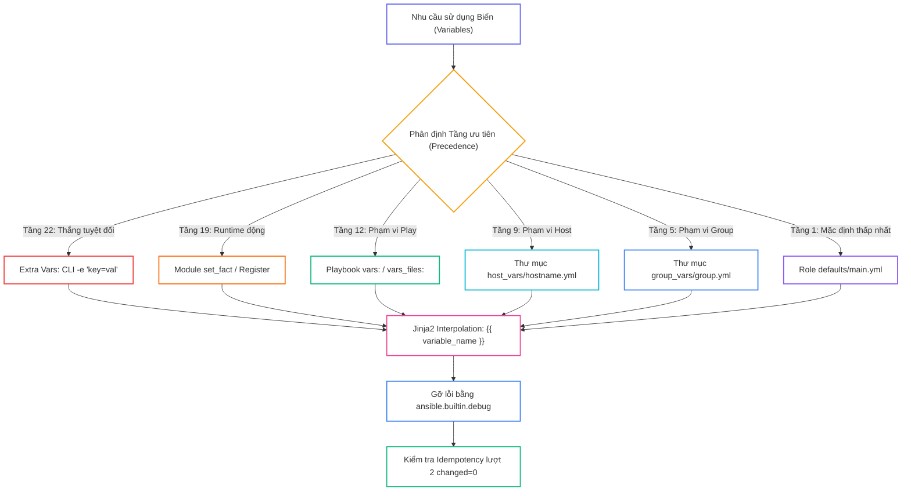
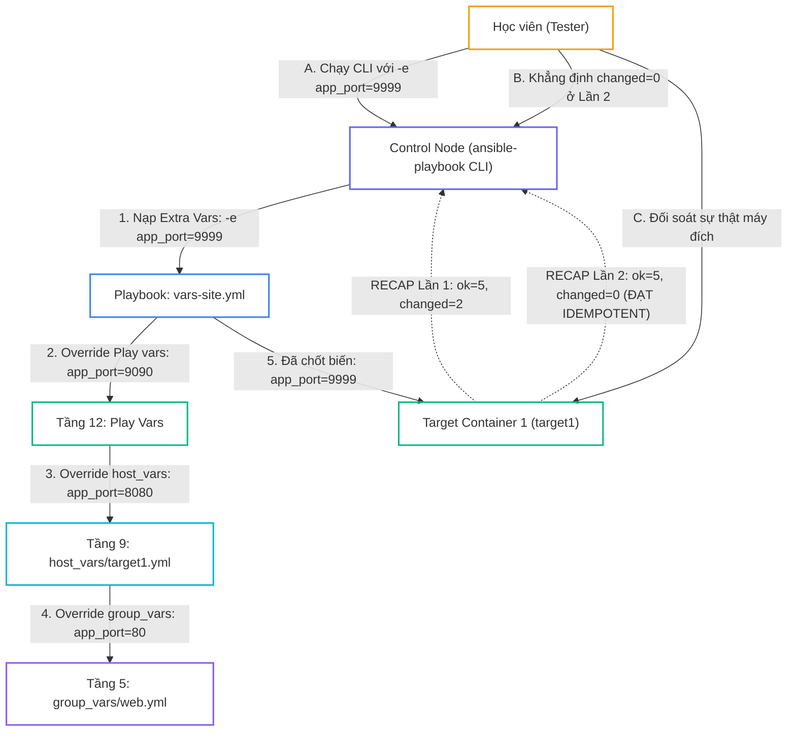


# [BÀI 07] HỆ THỐNG BIẾN & THỨ TỰ ƯU TIÊN (VARIABLE PRECEDENCE 22 TẦNG): EXTRA VARS, PLAY VARS, ROLE DEFAULTS & INVENTORY

Trong kỷ nguyên **Infrastructure as Code (IaC)** và tự động hóa vận hành hạ tầng đám mây (Cloud Infrastructure Automation), **Ansible** khẳng định vị thế dẫn đầu nhờ triết lý **Agentless** (không cần cài đặt agent nền trên máy đích), giao thức điều khiển an toàn qua **SSH / WinRM**, định dạng khai báo **YAML** trực quan và nguyên lý bất biến **Idempotency** mạnh mẽ. Việc làm chủ Ansible không chỉ dừng lại ở các câu lệnh Ad-hoc đơn giản, mà đòi hỏi kỹ sư phải nắm vững kiến trúc Module tầng thấp, Variable Precedence 22 tầng, Jinja2 Templates, tối ưu hóa Forks & Pipelining cho tới thiết kế Roles / Collections và tích hợp CI/CD tự động hóa chuẩn Doanh nghiệp.

Bài viết chuyên sâu này sẽ đồng hành cùng bạn mổ xẻ toàn diện bức tranh kiến trúc, phân tích các đánh đổi kỹ thuật thực chiến (Engineering Trade-offs), cung cấp hướng dẫn thực hành Lab chi tiết từng bước và bộ câu hỏi phỏng vấn chuyên sâu chuẩn DevOps / SRE Lead.

---

## 1. Bản Chất Kiến Trúc & Cơ Chế Vận Hành Tầng Thấp

---


> **22 tầng biến chồng nhau; extra vars thắng tất — biết tầng nào thắng mới hết bug override.**

Mở đầu Giai đoạn 2 (Ngôn ngữ Playbook):

> **Biến (Variables) giúp Playbook trở nên linh hoạt và tái sử dụng trên nhiều môi trường khác nhau. Tuy nhiên, Ansible hỗ trợ khai báo biến ở hơn 20 vị trí khác nhau (Inventory, Playbook, `group_vars`, `host_vars`, `vars_files`, `set_fact`, Extra vars). Khi cùng 1 tên biến được định nghĩa ở nhiều nơi, Ansible áp dụng Bảng thứ tự ưu tiên (Variable Precedence) để phân định giá trị nào thắng. Nếu không nắm vững bảng ưu tiên này, quản trị viên sẽ liên tục gặp lỗi biến bị override ngoài ý muốn. Trong đó, Extra vars (cờ CLI `-e`) sở hữu quyền lực tuyệt đối, thắng tất cả các tầng biến khác.**

---


---


---


| Tiếng Việt | Tiếng Anh / Từ khóa + FQCN (giữ nguyên) |
|---|---|
| Biến số | Variable |
| Thứ tự ưu tiên biến | Variable Precedence |
| Biến truyền từ dòng lệnh | Extra variables (`-e` / `--extra-vars`) |
| Biến định nghĩa trong Play | Play variables (`vars:`) |
| Biến nạp từ file | Variable files (`vars_files:`) |
| Biến đăng ký kết quả | Registered variables (`register:`) |
| Module khởi tạo biến động | `ansible.builtin.set_fact` |
| Module in giá trị gỡ lỗi | `ansible.builtin.debug` |
| Phạm vi toàn cục | Global scope |
| Phạm vi theo lượt chạy | Play scope |
| Phạm vi theo máy đích | Host scope |
| Cú pháp nội suy chuỗi Jinja2 | Jinja2 interpolation `{{ var }}` |
| Mặc định của Role | Role defaults (`roles/x/defaults/main.yml`) |

---

### 1.1. Tháp Ưu tiên Biến và Cú pháp Khai báo (15 phút)



**Nguyên lý cốt lõi:** Trong Ansible, biến được truy vấn bằng cú pháp Jinja2 bọc trong cặp ngoặc nhọn đúp `{{ variable_name }}` và phải được bọc trong cặp dấu ngoặc kép khi nằm ở đầu giá trị thuộc tính YAML.

**Giải thích cơ chế ngầm:** Cú pháp `{{ }}` bảo với trình biên dịch Jinja2 rằng đây là một biểu thức nội suy biến số chứ không phải chuỗi văn bản thô. Bọc ngoặc kép `"{{ var }}"` giúp ngăn chặn lỗi parse cú pháp YAML khi dòng bắt đầu bằng dấu ngoặc nhọn.

> [!WARNING]
> **CẠM BẪY THỰC CHIẾN:**
> **Lệnh:** `ansible-playbook site.yml` · **Output phải thấy:** `ERROR! Syntax error: mapping values are not allowed here` do viết `dest: {{ my_path }}` mà quên bọc ngoặc kép.

**Minh hoạ.** Khai báo và sử dụng biến đúng cú pháp:
```yaml
---
- name: Demo Variable Syntax
  hosts: web
  vars:
    web_port: 8080
  tasks:
    - name: Print variable value
      ansible.builtin.debug:
        msg: "The application port is {{ web_port }}"
```

**Nguyên lý cốt lõi:** Bảng thứ tự ưu tiên 22 tầng biến (Variable Precedence) áp dụng nguyên tắc: **Càng hẹp và càng gần thời điểm thực thi thì có ưu tiên càng cao** (Extra vars > Task vars > Play vars_files > Play vars > host_vars > group_vars > Role defaults).

**Giải thích cơ chế ngầm:** Thứ tự này cho phép định nghĩa các giá trị mặc định ở tầng thấp nhất (Role defaults) để kịch bản luôn chạy được, sau đó cho phép người dùng tùy biến đè giá trị ở các tầng hẹp hơn mà không phải sửa mã nguồn gốc.

> [!WARNING]
> **CẠM BẪY THỰC CHIẾN:**
> Khai báo biến trong `group_vars` nhưng thắc mắc tại sao khi chạy Playbook giá trị lại nhận từ `vars_files` (do `vars_files` có tầng ưu tiên cao hơn `group_vars`).

**Minh hoạ.** Ví dụ so sánh tầng ưu tiên:
  1. `group_vars/web.yml` định nghĩa `http_port: 80`
  2. `host_vars/target1.yml` định nghĩa `http_port: 8080`
  3. `site.yml` có `vars: http_port: 9090` -> Khi chạy Playbook `site.yml`, `http_port` sẽ nhận giá trị **9090** (Play vars thắng host_vars và group_vars).

**Nguyên lý cốt lõi:** Extra Vars (truyền qua cờ CLI `-e` hoặc `--extra-vars`) có tầng ưu tiên cao nhất tuyệt đối (Tầng 22), ghi đè lên TẤT CẢ các biến đã khai báo ở bất kỳ file hay vị trí nào khác.

**Giải thích cơ chế ngầm:** Extra Vars đại diện cho quyết định trực tiếp của người vận hành tại thời điểm bấm lệnh thi hành trên terminal. Ansible tôn trọng tuyệt đối lệnh của người dùng CLI nên cho Extra Vars mức ưu tiên cao nhất.

> [!WARNING]
> **CẠM BẪY THỰC CHIẾN:**
> Lệnh CLI gõ `-e "http_port=9999"` nhưng lầm tưởng rằng file `host_vars` có thể ghi đè lại giá trị 9999 này.

**Minh hoạ.** Ghi đè biến tức thì từ dòng lệnh CLI:
```bash
ansible-playbook -e "http_port=9999 app_env=staging" site.yml
```

---

### 1.2. Phạm vi Biến, Registered Variables và `set_fact` (15 phút)

**Nguyên lý cốt lõi:** Phân định 3 cấp độ phạm vi hoạt động của Biến (Variable Scopes): **Global Scope** (áp dụng toàn bộ), **Play Scope** (chỉ có hiệu lực trong 1 Play cụ thể), và **Host Scope** (gắn liền với 1 host cụ thể).

**Giải thích cơ chế ngầm:** Biến định nghĩa ở `vars:` của Play 1 sẽ KHÔNG tồn tại khi Ansible chuyển sang thi hành Play 2 (Play Scope). Biến nạp từ `host_vars` hay `ansible_facts` chỉ đi theo host đó (Host Scope). Nắm vững Scope giúp tránh lỗi biến bị undefined khi sang Play khác.

> [!WARNING]
> **CẠM BẪY THỰC CHIẾN:**
> Khai báo biến trong `vars:` của Play 1 nhưng gọi biến đó ở Task thuộc Play 2 khiến Ansible báo lỗi `fatal: [target1]: FAILED! => {"msg": "'my_var' is undefined"}`.

**Minh hoạ.** Biến Play Scope chỉ sống trong Play khai báo nó:
```yaml
- name: Play 1
  hosts: web
  vars:
    play1_var: "Hello"
  tasks:
    - ansible.builtin.debug:
        msg: "{{ play1_var }}"

- name: Play 2
  hosts: web
  tasks:
    # LỖI: play1_var không tồn tại ở Play 2
    - ansible.builtin.debug:
        msg: "{{ play1_var }}"
```

**Nguyên lý cốt lõi:** Thuộc tính `register` lưu trữ toàn bộ dữ liệu trả về của một Task (mã exit `rc`, chuỗi `stdout`, `stderr`, trạng thái `changed`) vào một biến mang phạm vi Host Scope.

**Giải thích cơ chế ngầm:** `register` cho phép bắt kết quả thực thi của một Task trước để làm dữ liệu đầu vào cho các Task sau (ví dụ: dùng cho điều kiện `when`, `changed_when`, hoặc lấy dữ liệu in ra màn hình).

> [!WARNING]
> **CẠM BẪY THỰC CHIẾN:**
> **Lệnh:** `ansible-playbook site.yml` · **Output phải thấy:** `fatal: [target1]: FAILED! => {"msg": "'my_result.stdout' is undefined"}` do gõ sai tên biến đã đăng ký trong `register`.

**Minh hoạ.** Đăng ký kết quả chạy lệnh và in ra màn hình:
```yaml
- name: Execute command and register output
  ansible.builtin.command: date
  register: date_output

- name: Print registered stdout
  ansible.builtin.debug:
    msg: "Current target date is {{ date_output.stdout }}"
```

**Nguyên lý cốt lõi:** Module `ansible.builtin.set_fact` cho phép khởi tạo hoặc cập nhật giá trị biến mới ngay tại thời điểm runtime và biến này mang phạm vi Host Scope (tồn tại xuyên suốt tất cả các Play sau đó).

**Giải thích cơ chế ngầm:** `set_fact` giúp tính toán và gán giá trị biến động dựa trên logic thời gian thực (ví dụ: nếu `os=Ubuntu` thì `set_fact: pkg_name=nginx`, nếu `os=RHEL` thì `set_fact: pkg_name=httpd`). Biến tạo bởi `set_fact` có tầng ưu tiên cao (Tầng 19), ghi đè các biến trong `vars:` hay `vars_files:`.

> [!WARNING]
> **CẠM BẪY THỰC CHIẾN:**
> Thắc mắc tại sao biến trong `vars:` của Play 2 lại không có tác dụng sau khi đã gọi `set_fact` cùng tên ở Play 1 (do `set_fact` có tầng ưu tiên cao hơn Play vars).

**Minh hoạ.** Khởi tạo biến động với `set_fact`:
```yaml
- name: Set dynamic runtime variable
  ansible.builtin.set_fact:
    calculated_port: "{{ 8000 + 80 }}"
    custom_status: "ACTIVE"
```

---

### 1.3. Gỡ lỗi Biến và Chuẩn hóa An toàn (10 phút)

**Nguyên lý cốt lõi:** Sử dụng module `ansible.builtin.debug` với tham số `var:` (để in cấu trúc dữ liệu biến) hoặc `msg:` (để in chuỗi văn bản định dạng) phục vụ công tác gỡ lỗi (debug).

**Giải thích cơ chế ngầm:** Khi kịch bản gặp lỗi biến bị sai giá trị hoặc undefined, `debug` là công cụ soi giá trị biến nhanh nhất. Dùng `var: variable_name` (không bọc `{{ }}`) giúp in đầy đủ kiểu dữ liệu String, List, Dictionary hay JSON object.

> [!WARNING]
> **CẠM BẪY THỰC CHIẾN:**
> **Lệnh:** `ansible-playbook site.yml` · **Output phải thấy:** Viết `var: "{{ my_var }}"` làm module `debug` in ra chuỗi đại diện thay vì in cấu trúc dữ liệu gốc của biến.

**Minh hoạ.** Hai cách sử dụng module `debug`:
```yaml
# Cách 1: In chuỗi định dạng (Cần {{ }})
- ansible.builtin.debug:
    msg: "Value is {{ app_port }}"

# Cách 2: In cấu trúc dữ liệu biến (KHÔNG dùng {{ }})
- ansible.builtin.debug:
    var: date_output
```

**Nguyên lý cốt lõi:** Đặt tên biến phải tuân theo quy tắc chuẩn hóa: Chỉ sử dụng chữ cái thường, chữ số và dấu gạch dưới `_` (snake_case); tuyệt đối KHÔNG dùng dấu gạch ngang `-`, ký tự đặc biệt hay khoảng trắng.

**Giải thích cơ chế ngầm:** Dấu gạch ngang `-` trong Jinja2 và Python bị hiểu nhầm là phép toán trừ (subtraction). Đặt tên biến `web-port` sẽ làm Ansible hiểu là lấy biến `web` trừ cho biến `port` dẫn đến lỗi `UndefinedError`.

> [!WARNING]
> **CẠM BẪY THỰC CHIẾN:**
> Đặt tên biến `app-name: "My App"` khiến Playbook báo lỗi `fatal: [target1]: FAILED! => {"msg": "Syntax Error: - is not allowed in variable names"}`.

**Minh hoạ.** Quy tắc đặt tên biến ĐÚNG và SAI:
```yaml
# SAI: Dùng dấu gạch ngang
app-port: 8080

# ĐÚNG: Dùng dấu gạch dưới (snake_case)
app_port: 8080
db_max_connections: 100
```

**Nguyên lý cốt lõi:** Quản lý các biến nhạy cảm (như mật khẩu, chìa khóa API) bằng cách kết hợp file mã hóa Ansible Vault với cờ CLI `--vault-id` hoặc truyền qua Extra Vars ẩn dòng lệnh.

**Giải thích cơ chế ngầm:** Ghi biến mật khẩu plain-text vào file Playbook hay `group_vars` làm rò rỉ an ninh nghiêm trọng khi commit lên Git. Mã hóa file biến bằng Ansible Vault đảm bảo dữ liệu nhạy cảm chỉ được giải mã an toàn trong bộ nhớ RAM ở thời điểm thực thi Playbook.

> [!WARNING]
> **CẠM BẪY THỰC CHIẾN:**
> File `vars/credentials.yml` chứa `db_password: "PlainPassword123"` xuất hiện trên kho mã nguồn Git public.

**Minh hoạ.** Nạp file biến đã mã hóa bằng Vault khi chạy Playbook:
```bash
ansible-playbook --vault-id @prompt site.yml
```

---

### 1.4. Đưa vào việc thật (4 phút)

### 7.1. Áp dụng vào hạ tầng sẵn có
Khi triển khai ứng dụng đa môi trường (Dev, Staging, Prod):
- Đặt các giá trị mặc định an toàn (ví dụ `db_port: 5432`) vào `group_vars/all.yml`.
- Đặt giá trị riêng cho môi trường Prod vào `group_vars/prod.yml`.
- Khi cần hot-fix thử nghiệm cấp bách trên 1 máy, truyền cờ CLI Extra Vars `-e "db_port=5433"` để override tức thì mà không sửa file mã nguồn.

### 7.2. Rủi ro hỏng hóc khi triển khai Production và giải pháp an toàn
- **Rủi ro:** Không nắm vững thứ tự ưu tiên biến khiến một file `vars_files: vars/dev.yml` vô tình ghi đè mất biến môi trường Production, làm ứng dụng kết nối nhầm sang Database Dev.
- **Giải pháp an toàn:**
  1. Hạn chế lạm dụng `vars_files` trong Playbook; ưu tiên dùng cấu trúc `group_vars/` chuẩn hóa theo môi trường.
  2. Luôn dùng lệnh `ansible-playbook --check --diff -e "..."` để xem trước các biến Sẽ bị thay đổi trên Production.

### 7.3. Đo lường chỉ số Trước – Sau khi áp dụng
- **Trước khi chuẩn hóa quản lý Biến:** Mỗi môi trường (Dev, Staging, Prod) phải duy trì 1 file Playbook riêng (3 file Playbook 500 dòng), sửa đổi thủ công rất dễ sót biến.
- **Sau khi chuẩn hóa quản lý Biến:** Duy trì duy nhất 1 file Playbook chuẩn (`site.yml`), toàn bộ biến được quản lý ngăn nắp trong `group_vars/`, thời gian bảo trì giảm 70%.

### 7.4. Khi nào KHÔNG nên dùng hoặc không nên lạm dụng Extra Vars -e
- **Không lạm dụng Extra Vars để truyền hàng chục biến phức tạp trên dòng lệnh CLI:** Gõ lệnh `ansible-playbook -e "v1=a v2=b v3=c v4=d..."` quá dài làm câu lệnh CLI rườm rà, khó đọc và không thể lưu vết lịch sử audit. **Hãy gom các biến đó vào file YAML và truyền `-e "@vars_file.yml"`**.

---

### 1.5. Bẫy hay gặp (2 phút)

| # | Bẫy hay gặp | Vì sao "recap xanh mà sai / không idempotent" | Lệnh phát hiện và xử lý |
|---|---|---|---|
| 1 | Đặt tên biến chứa dấu gạch ngang `-` | Python/Jinja2 hiểu nhầm dấu `-` là phép toán trừ khiến biến bị lỗi `UndefinedError`. | Đổi tên biến sang dạng `snake_case` dùng dấu gạch dưới `_` (ví dụ `app_port`). |
| 2 | Quên bọc ngoặc kép khi dòng bắt đầu bằng `{{` | YAML hiểu nhầm cặp ngoặc nhọn `{` ở đầu dòng là bắt đầu của một Dictionary YAML. | Bọc toàn bộ chuỗi trong ngoặc kép: `dest: "{{ my_path }}"`. |
| 3 | Lầm tưởng `host_vars` có thể ghi đè Play `vars:` | Play `vars:` (Tầng 12) có ưu tiên CAO HƠN `host_vars` (Tầng 9), nên `host_vars` bị thua. | Chuyển biến từ Play `vars:` vào `group_vars` nếu muốn `host_vars` có quyền ghi đè. |
| 4 | Nhầm lẫn phạm vi (Scope) của biến `vars:` | Khai báo biến trong `vars:` của Play 1 nhưng gọi biến đó ở Play 2 khiến Play 2 báo lỗi undefined. | Chuyển biến đó vào `group_vars/all.yml` hoặc dùng `set_fact` ở Play 1. |
| 5 | Gõ sai tên biến trong thuộc tính `register` | Đăng ký biến `register: res_data` nhưng ở task sau lại gõ `{{ res_date.stdout }}`. | Dùng module `ansible.builtin.debug: var=res_data` để soi đúng tên biến đăng ký. |
| 6 | Quên rằng `set_fact` có tầng ưu tiên rất cao | Gọi `set_fact` ở Play 1 khiến các biến trong `vars:` của các Play sau bị ghi đè không đổi lại được. | Lưu ý tầng ưu tiên của `set_fact` (Tầng 19) khi thiết kế kịch bản phức tạp. |
| 7 | Truyền Extra Vars dạng boolean sai cú pháp CLI | Gõ `-e "flag=true"` khiến Ansible hiểu `flag` là chuỗi string `"true"` chứ không phải kiểu Bool. | Truyền chính xác định dạng JSON: `-e '{"flag": true}'`. |
| 8 | Quên bọc `{{ }}` khi truyền biến vào module `debug` với `msg` | Viết `msg: app_port` làm module debug in ra chữ `app_port` thô thay vì in giá trị `8080`. | Viết chính xác `msg: "Port is {{ app_port }}"`. |
| 9 | Dùng `var:` trong module `debug` mà lại bọc `{{ }}` | Viết `var: "{{ app_port }}"` khiến debug in ra tên biến đại diện thay vì in giá trị. | Viết chính xác `var: app_port` (không dùng cặp `{{ }}`). |
| 10 | Đặt biến nhạy cảm plain-text vào Git | Commit file `vars.yml` chứa mật khẩu thô làm rò rỉ an ninh. | Dùng `ansible-vault encrypt vars.yml` để mã hóa file trước khi commit. |
| 11 | Không kiểm tra giá trị biến override trước khi chạy | Không biết tầng biến nào đang thắng dẫn đến việc áp dụng sai tham số trên máy đích. | Chạy `ansible-inventory --host target1` để soi giá trị biến cuối cùng được nạp. |
| 12 | Định nghĩa trùng tên biến ở các nhóm cùng cấp trong Inventory | 1 host thuộc 2 nhóm `web` và `app` cùng chứa biến `port`, không biết nhóm nào thắng. | Tránh đặt trùng tên biến ở các nhóm cùng cấp, chuyển giá trị đặc thù vào `host_vars`. |

---

### 1.6. Tóm tắt (1 phút)



### Năm điều phải nhớ
1. **Tháp 22 tầng biến:** Càng hẹp và càng gần thời điểm chạy thì ưu tiên càng cao.
2. **Extra Vars `-e` thắng tất:** Cờ CLI `-e` ghi đè mọi tầng biến khác trong Playbook và Inventory.
3. **Luôn dùng `snake_case`:** Tên biến chỉ chứa chữ thường, số, dấu `_`; CẤM dùng dấu gạch ngang `-`.
4. **Phân biệt `msg` và `var` trong `debug`:** `msg` bọc `{{ var }}`, `var` KHÔNG bọc `{{ }}`.
5. **Soi biến bằng `ansible-inventory`:** Chạy `ansible-inventory --host <hostname>` để biết chính xác giá trị biến nào đang thắng.

---

### 1.7. Câu hỏi tự kiểm tra (kiêm luyện RHCE EX294)

1. **[RHCE EX294 Objective #7]** Cú pháp chuẩn Jinja2 để trích xuất giá trị của một biến tên `http_port` trong Playbook là gì?
   - *Đáp án:* Cú pháp `{{ http_port }}` (bọc trong cặp dấu ngoặc kép `"{{ http_port }}"` nếu nằm ở đầu dòng giá trị thuộc tính).
2. **[RHCE EX294 Objective #7]** Trong các nguồn khai báo biến của Ansible, nguồn nào có mức ưu tiên CAO NHẤT tuyệt đối?
   - *Đáp án:* Extra Vars truyền từ dòng lệnh CLI thông qua cờ `-e` (hoặc `--extra-vars`).
3. **[RHCE EX294 Objective #7]** Nếu biến `app_port` được định nghĩa là `80` trong `group_vars/web.yml` và là `8080` trong `vars:` của Play, giá trị nào sẽ được áp dụng khi chạy Playbook?
   - *Đáp án:* Giá trị `8090` (hoặc `9090` khai báo trong Play `vars:`) sẽ thắng vì Play `vars:` (Tầng 12) có mức ưu tiên cao hơn `group_vars` (Tầng 5).
4. **[RHCE EX294 Objective #7]** Tại sao tuyệt đối không được dùng dấu gạch ngang `-` khi đặt tên biến trong Ansible (ví dụ `web-port`)?
   - *Đáp án:* Vì trình biên dịch Jinja2 và Python hiểu nhầm dấu `-` là phép toán trừ, gây ra lỗi cú pháp `UndefinedError`.
5. **[RHCE EX294 Objective #7]** Thuộc tính `register` trong một Task dùng để làm gì?
   - *Đáp án:* Dùng để lưu trữ toàn bộ dữ liệu kết quả trả về của Task đó (mã exit `rc`, chuỗi `stdout`, `stderr`) vào một biến để các Task sau sử dụng.
6. **[RHCE EX294 Objective #7]** Module nào dùng để khởi tạo hoặc cập nhật giá trị biến mới ngay tại thời điểm runtime và có mức ưu tiên cao (Tầng 19)?
   - *Đáp án:* Module `ansible.builtin.set_fact`.
7. **[RHCE EX294 Objective #7]** Phân biệt sự khác nhau khi gọi module `debug` với tham số `msg` và tham số `var`.
   - *Đáp án:* Tham số `msg` dùng để in chuỗi định dạng văn bản (cần bọc `{{ var }}`), tham số `var` dùng để in cấu trúc dữ liệu của biến (KHÔNG bọc `{{ }}`).
8. **[RHCE EX294 Objective #7]** Viết câu lệnh CLI chạy Playbook `site.yml` và truyền Extra Vars để ghi đè biến `web_port=9999`.
   - *Đáp án:* `ansible-playbook -e "web_port=9999" site.yml`
9. **[RHCE EX294 Objective #7]** Lệnh CLI nào dùng để xem toàn bộ danh sách các biến đã được nạp cho một máy đích `target1` dưới dạng JSON?
   - *Đáp án:* `ansible-inventory --host target1`
10. **[RHCE EX294 Objective #7]** Biến định nghĩa trong từ khóa `vars:` của Play 1 có tự động tồn tại trong Play 2 của một Multi-play Playbook không?
    - *Đáp án:* Không, vì biến trong `vars:` của Play chỉ có phạm vi hiệu lực trong Play đó (Play Scope).
11. **[RHCE EX294 Objective #7]** Làm thế nào để nạp danh sách biến từ một file YAML bên ngoài tên `vars/external.yml` vào trong Play?
    - *Đáp án:* Sử dụng từ khóa `vars_files:` ở cấp độ Play (ví dụ `vars_files: - vars/external.yml`).
12. **[RHCE EX294 Objective #7]** Khi trích xuất một thuộc tính từ biến dạng Dictionary `user_info: { name: "alice", id: 1001 }`, hai cú pháp Jinja2 nào đều hợp lệ?
    - *Đáp án:* Cú pháp `{{ user_info.name }}` hoặc `{{ user_info['name'] }}`.
13. **[RHCE EX294 Objective #7]** Viết một đoạn Playbook YAML tối giản đăng ký kết quả chạy lệnh `hostname` và in chuỗi `stdout` ra màn hình bằng module `debug`.
    - *Đáp án:*
      ```yaml
      ---
      - name: Register and Debug Demo
        hosts: web
        tasks:
          - name: Get hostname
            ansible.builtin.command: hostname
            register: host_res
 
          - name: Print hostname stdout
            ansible.builtin.debug:
              msg: "Host name is {{ host_res.stdout }}"
      ```

---

### 1.8. Tài liệu tham khảo

- Ansible Core Documentation (v2.15+): [Understanding variable precedence](https://docs.ansible.com/ansible/latest/playbook_guide/playbooks_variables.html#variable-precedence-where-should-i-put-a-variable)
- Ansible Core Documentation: [Using Variables](https://docs.ansible.com/ansible/latest/playbook_guide/playbooks_variables.html)
- Red Hat Certified Engineer (RHCE) EX294 Study Guide: Managing Variables and Facts in Ansible.

---

## Bảng đối soát thời lượng

| Mục | Nội dung | Thời lượng dự kiến | Thời lượng thực tế |
|---|---|---|---|
| §0 | Khởi động và ôn tập buổi 06 | 10 phút | 10 phút |
| §1–§2 | Mục tiêu làm được & Cần biết trước | 2 phút | 2 phút |
| §3 | Thuật ngữ Việt-Anh & Mô hình tư duy | 8 phút | 8 phút |
| §4 | Tháp Ưu tiên Biến & Cú pháp Khai báo (QT 4.1–4.3) | 15 phút | 15 phút |
| §5 | Phạm vi Biến, Register & set_fact (QT 5.1–5.3) | 15 phút | 15 phút |
| §6 | Gỡ lỗi Biến & Chuẩn hóa An toàn (QT 6.1–6.3) | 10 phút | 10 phút |
| §7–§9 | Đưa vào việc thật, Bẫy hay gặp & Tóm tắt | 7 phút | 7 phút |
| §10–§11 | Câu hỏi tự kiểm tra EX294 & Tài liệu tham khảo | 3 phút | 3 phút |
| **Tổng** | **Khối lý thuyết Buổi 07** | **60 phút** | **60 phút** |

---

## 2. Hướng Dẫn Thực Hành & Triển Khai Lab Chuẩn Production

> [!IMPORTANT]
> **YÊU CẦU MÔI TRƯỜNG THỰC HÀNH:**
> Toàn bộ các bài thực hành dưới đây được thiết kế để chạy trực tiếp trên môi trường máy chủ Linux / Docker containers phân tán. Hãy đảm bảo bạn đã chuẩn bị Control Node cài đặt Ansible Core 2.15+ cùng các Managed Nodes đã cấu hình SSH Key Authentication.

## Khối thực hành — 150 phút

> **Đối soát thời lượng:** Khối thực hành kéo dài đúng **150'** (từ L0 đến L11).
> **Nguyên tắc cốt lõi:** Thực hành khai báo biến từ nhiều nguồn (`group_vars`, `host_vars`, `vars_files`, Play `vars`), sử dụng thuộc tính `register` và module `set_fact` để tạo biến động runtime, thực thi kiểm thử cờ CLI Extra Vars `-e` để chứng minh quyền lực tuyệt đối ghi đè tất cả các tầng biến khác, thực thi phép thử **Lượt chạy Lần thứ hai** chứng minh `PLAY RECAP` đạt `changed=0` và đối soát sự thật máy đích qua `docker exec`.

---

## L0. Mục tiêu thực hành và tiêu chí hoàn thành

| # | Mục tiêu thực hành | Tiêu chí hoàn thành (Kiểm tra bằng lệnh CLI) |
|---|---|---|
| TH1 | Khai báo và in giá trị biến chuẩn Jinja2 | Module `debug` in thông điệp chứa biến chính xác |
| TH2 | Tổ chức biến trong thư mục group_vars và host_vars | Biến nạp tự động theo nhóm và máy chủ |
| TH3 | Khai báo biến cấp Play bằng vars và vars_files | File Playbook nạp cấu hình từ `vars/app_config.yml` |
| TH4 | Đăng ký kết quả trả về bằng thuộc tính register | Biến đăng ký in đúng mã thoát `rc` và chuỗi `stdout` |
| TH5 | Tạo và cập nhật biến runtime bằng module set_fact | Biến `set_fact` ghi đè thành công các tầng biến cũ |
| TH6 | Thực thi cờ CLI Extra Vars -e ghi đè biến | Lệnh `ansible-playbook -e "app_port=9999"` ép giá trị 9999 |
| TH7 | Thực thi Phép thử Lượt chạy Lần hai (Idempotency) | Bảng `PLAY RECAP` Lần 2 đạt `changed=0` tuyệt đối |
| TH8 | Đối soát sự thật máy đích bằng docker exec | `docker exec target1 cat ...` chứa đúng giá trị biến đã override |

---

## L1. Điều kiện tiên quyết về môi trường

| Kiểm tra | LỆNH THỰC THI | Kết quả kỳ vọng |
|---|---|---|
| Ansible core đã cài | `ansible --version` | Phiên bản ansible-core v2.15 trở lên |
| Docker Compose sẵn sàng | `docker compose ps` | Cả target1 và target2 ở trạng thái `Up` |
| Kết nối SSH sẵn sàng | `ansible all -m ansible.builtin.ping` | Đạt `SUCCESS` cho mọi host |
| Inventory dự án | `ansible-inventory --graph` | Hiển thị các nhóm `web` và `db` |
| Thư mục thực hành | `pwd` | Đang ở thư mục `~/lab-ansible-07` |

Nếu chưa có target container:
```bash
cd labs && make up && make key && make inventory
```

---

## L2. Kiến trúc bài lab



---

## L3. Bước 1 — Thiết lập Dự án và Cấu trúc Biến Nguồn (30 phút)

Tạo thư mục dự án `~/lab-ansible-07`, file `ansible.cfg`, `inventory.ini`, và các thư mục biến `group_vars/`, `host_vars/`, `vars/` (QT 4.1, QT 4.2).

```bash
mkdir -p ~/lab-ansible-07/group_vars ~/lab-ansible-07/host_vars ~/lab-ansible-07/vars
cd ~/lab-ansible-07

cat << 'EOF' > ansible.cfg
[defaults]
inventory = ./inventory.ini
remote_user = ansible
host_key_checking = False
private_key_file = ~/.ssh/id_ed25519

[privilege_escalation]
become = True
become_method = sudo
become_user = root
become_ask_pass = False
EOF

cat << 'EOF' > inventory.ini
[web]
target1 ansible_host=127.0.0.1 ansible_port=2221

[db]
target2 ansible_host=127.0.0.1 ansible_port=2222

[all:vars]
ansible_python_interpreter=/usr/bin/python3
EOF

cat << 'EOF' > group_vars/all.yml
app_title: "NTKAnsible System"
global_env: "production"
app_port: 80
EOF

cat << 'EOF' > group_vars/web.yml
app_port: 8080
web_service_name: "nginx"
EOF

cat << 'EOF' > host_vars/target1.yml
app_port: 8888
custom_host_tag: "web-node-01"
EOF

cat << 'EOF' > vars/external_vars.yml
external_secret_token: "TOKEN-998877"
external_app_port: 7070
EOF
```

**CHECKPOINT 1 — Cấu trúc thư mục biến group_vars, host_vars và vars được khởi tạo hoàn chỉnh.**
- **Lệnh kiểm tra:**
```bash
if [ -f "group_vars/all.yml" ] && [ -f "group_vars/web.yml" ] && [ -f "host_vars/target1.yml" ] && [ -f "vars/external_vars.yml" ]; then
  echo "CHECKPOINT 1: ĐẠT - Khởi tạo thành công cấu trúc thư mục biến đa tầng (group_vars, host_vars, vars)"
else
  echo "CHECKPOINT 1: LỖI - Khởi tạo thư mục biến thất bại"
fi
```

**CHECKPOINT 2 — Kiểm tra nạp biến Inventory qua lệnh ansible-inventory --host target1.**
- **Lệnh kiểm tra:**
```bash
INV_VARS=$(ansible-inventory --host target1)
if echo "$INV_VARS" | grep -q '"app_port": 8888' && echo "$INV_VARS" | grep -q '"custom_host_tag": "web-node-01"'; then
  echo "CHECKPOINT 2: ĐẠT - Lệnh ansible-inventory xác nhận host_vars/target1.yml (app_port=8888) đã ghi đè thành công group_vars"
else
  echo "CHECKPOINT 2: LỖI - Ưu tiên biến Inventory chưa đúng"
fi
```

---

## L4. Bước 2 — Biên soạn Playbook Nạp Biến và Dùng Register (30 phút)

Tạo file Playbook `vars-site.yml` nạp biến từ `vars_files`, khai báo Play `vars`, đăng ký kết quả bằng `register` và gỡ lỗi bằng `debug` (QT 4.1, QT 5.1, QT 5.2, QT 6.1).

```bash
cat << 'EOF' > vars-site.yml
---
- name: Variable Precedence and Scope Demonstration
  hosts: web
  become: true
  vars:
    app_port: 9090
    play_level_var: "PLAY_SCOPE_ACTIVE"
  vars_files:
    - vars/external_vars.yml
  tasks:
    - name: Task 1 - Debug variable values
      ansible.builtin.debug:
        msg: "Title: {{ app_title }}, Port: {{ app_port }}, Token: {{ external_secret_token }}"

    - name: Task 2 - Execute uptime command and register output
      ansible.builtin.command: uptime
      register: system_uptime
      changed_when: false

    - name: Task 3 - Debug registered variable stdout
      ansible.builtin.debug:
        var: system_uptime.stdout
EOF
```

Thực thi Playbook `vars-site.yml`:
```bash
ansible-playbook vars-site.yml
```

**CHECKPOINT 3 — Thực thi Playbook vars-site.yml nạp biến Play vars (app_port=9090) ghi đè host_vars thành công.**
- **Lệnh kiểm tra:**
```bash
RUN_VARS_OUT=$(ansible-playbook vars-site.yml)
if echo "$RUN_VARS_OUT" | grep -q '"msg": "Title: NTKAnsible System, Port: 9090, Token: TOKEN-998877"' && echo "$RUN_VARS_OUT" | grep -q "failed=0"; then
  echo "CHECKPOINT 3: ĐẠT - Play vars (app_port=9090) ghi đè thành công host_vars (8888) đúng bảng thứ tự ưu tiên"
else
  echo "CHECKPOINT 3: LỖI - Kiểm tra thứ tự ưu tiên Play vars thất bại"
fi
```

**CHECKPOINT 4 — Thuộc tính register lưu trữ thành công kết quả uptime.stdout.**
- **Lệnh kiểm tra:**
```bash
if echo "$RUN_VARS_OUT" | grep -q '"system_uptime.stdout":' && echo "$RUN_VARS_OUT" | grep -q "load average"; then
  echo "CHECKPOINT 4: ĐẠT - Thuộc tính register đã lưu trữ và module debug đã in thành công system_uptime.stdout"
else
  echo "CHECKPOINT 4: LỖI - Thuộc tính register hoạt động chưa đúng"
fi
```

---

## L5. Bước 3 — Tạo Biến Runtime với set_fact và Áp dụng Extra Vars (30 phút)

Bổ sung task `set_fact` để tạo biến động runtime và kiểm thử cờ CLI Extra Vars `-e` để ghi đè toàn bộ biến (QT 4.3, QT 5.3, QT 6.2).

Cập nhật file `vars-site.yml`:
```bash
cat << 'EOF' > vars-site.yml
---
- name: Variable Precedence and Scope Demonstration
  hosts: web
  become: true
  vars:
    app_port: 9090
  vars_files:
    - vars/external_vars.yml
  tasks:
    - name: Task 1 - Execute uptime command and register output
      ansible.builtin.command: uptime
      register: system_uptime
      changed_when: false

    - name: Task 2 - Create dynamic runtime variable with set_fact
      ansible.builtin.set_fact:
        runtime_calculated_port: "{{ app_port | int + 100 }}"
        deployment_timestamp: "2026-08-22"

    - name: Task 3 - Debug dynamic set_fact variable
      ansible.builtin.debug:
        msg: "Calculated Port is {{ runtime_calculated_port }}"

    - name: Task 4 - Deploy application configuration file using variables
      ansible.builtin.copy:
        content: |
          # Generated by NTKAnsible
          APP_TITLE={{ app_title }}
          APP_PORT={{ app_port }}
          CALCULATED_PORT={{ runtime_calculated_port }}
          SECRET_TOKEN={{ external_secret_token }}
        dest: /etc/vars-app.conf
        mode: '0644'
EOF
```

**CHECKPOINT 5 — Module set_fact tính toán biến động runtime_calculated_port thành công.**
- **Lệnh kiểm tra:**
```bash
RUN_SETFACT=$(ansible-playbook vars-site.yml)
if echo "$RUN_SETFACT" | grep -q '"msg": "Calculated Port is 9190"'; then
  echo "CHECKPOINT 5: ĐẠT - Module set_fact đã tính toán và tạo thành công biến động runtime_calculated_port (9190)"
else
  echo "CHECKPOINT 5: LỖI - Module set_fact tạo biến thất bại"
fi
```

Thực thi Playbook với cờ CLI Extra Vars `-e "app_port=9999"`:
```bash
ansible-playbook -e "app_port=9999" vars-site.yml
```

**CHECKPOINT 6 — Cờ Extra Vars CLI -e "app_port=9999" thắng tất cả các tầng biến cũ.**
- **Lệnh kiểm tra:**
```bash
EXTRA_OUT=$(ansible-playbook -e "app_port=9999" vars-site.yml)
if echo "$EXTRA_OUT" | grep -q '"msg": "Calculated Port is 10099"'; then
  echo "CHECKPOINT 6: ĐẠT - Cờ Extra Vars CLI -e app_port=9999 đã ghi đè tuyệt đối tất cả các tầng biến cũ"
else
  echo "CHECKPOINT 6: LỖI - Extra Vars CLI không thắng các tầng biến cũ"
fi
```

---

## L6. Bước 4 — Phép thử Lượt 2 và Đối soát Sự thật Máy đích (35 phút)

Thực thi phép thử Lượt chạy Lần thứ hai (Second-run execution test) chứng minh `PLAY RECAP` đạt `changed=0` và dùng `docker exec` kiểm tra file cấu hình thực tế trên target node (QT 6.1, QT 6.2).

Thực thi Lần 1:
```bash
ansible-playbook -e "app_port=9999" vars-site.yml
```

Thực thi Lần 2 (BẮT BUỘC ĐẠT `changed=0`):
```bash
ansible-playbook -e "app_port=9999" vars-site.yml
```

**CHECKPOINT 7 — Phép thử Lượt 2 đạt changed=0 khi sử dụng biến chuẩn hóa.**
- **Lệnh kiểm tra:**
```bash
RUN2_VARS=$(ansible-playbook -e "app_port=9999" vars-site.yml)
if echo "$RUN2_VARS" | grep -q "changed=0" && echo "$RUN2_VARS" | grep -q "failed=0"; then
  echo "CHECKPOINT 7: ĐẠT - Phép thử Lượt 2 đạt chuẩn Idempotency (PLAY RECAP báo changed=0)"
else
  echo "CHECKPOINT 7: LỖI - Lượt 2 không đạt changed=0 (Playbook bị lặp thay đổi)"
fi
```

Đối soát nội dung file `/etc/vars-app.conf` trên target container:
```bash
docker exec target1 cat /etc/vars-app.conf
```

**CHECKPOINT 8 — Đối soát file /etc/vars-app.conf trên target1 nhận đúng giá trị biến đã override.**
- **Lệnh kiểm tra:**
```bash
CONF_CONTENT=$(docker exec target1 cat /etc/vars-app.conf)
if echo "$CONF_CONTENT" | grep -q "APP_PORT=9999" && echo "$CONF_CONTENT" | grep -q "CALCULATED_PORT=10099" && echo "$CONF_CONTENT" | grep -q "SECRET_TOKEN=TOKEN-998877"; then
  echo "CHECKPOINT 8: ĐẠT - Kiểm tra sự thật qua docker exec xác nhận file cấu hình máy đích đã nhận chính xác các biến từ Extra Vars và set_fact"
else
  echo "CHECKPOINT 8: LỖI - Kiểm tra sự thật trên máy đích thất bại"
fi
```

---

## L7. Nộp sản phẩm và dọn dẹp (10 phút)

Thu thập kết quả ra các file báo cáo cuối buổi:
```bash
ansible-playbook vars-site.yml > vars-playbook.yml
ansible-playbook -e "app_port=9999" vars-site.yml > extra-vars-override.txt
ansible-playbook vars-site.yml > register-output.txt
ansible-playbook -e "app_port=9999" vars-site.yml > idempotency-check.txt
docker exec target1 cat /etc/vars-app.conf > kiem-may-dich.txt
```

---

## L8. Xử lý sự cố

| # | Hiện tượng lỗi | Nguyên nhân gốc rễ | Cách xử lý nhanh |
|---|---|---|---|
| 1 | Lỗi `fatal: [target1]: FAILED! => {"msg": "'my_var' is undefined"}` | Biến chưa được định nghĩa ở bất kỳ tầng nào hoặc gõ sai tên biến | Kiểm tra lại tên biến và bổ sung giá trị mặc định vào `group_vars/all.yml`. |
| 2 | Lỗi `yaml.scanner.ScannerError: mapping values are not allowed here` | Viết `dest: {{ my_path }}` ở đầu dòng giá trị mà không bọc ngoặc kép | Bọc toàn bộ chuỗi chứa ngoặc nhọn trong ngoặc kép: `dest: "{{ my_path }}"`. |
| 3 | Lỗi `Syntax Error: - is not allowed in variable names` | Đặt tên biến chứa dấu gạch ngang `-` (ví dụ `app-port`) | Đổi tên biến sang dạng `snake_case` dùng dấu gạch dưới `_` (`app_port`). |
| 4 | Biến trong `host_vars` không có tác dụng | Đặt file trong `host_vars/` sai tên hostname hoặc định nghĩa trùng biến trong Play `vars:` | Kiểm tra chính xác tên hostname trong Inventory và xóa biến trùng trong Play `vars:`. |
| 5 | Cờ `-e` không override được biến | Gõ sai tên biến trên cờ CLI hoặc truyền sai cú pháp chuỗi key-value | Kiểm tra lại lệnh CLI: `-e "variable_name=new_value"`. |
| 6 | Lỗi `Unexpected Templating type error` khi cộng toán học | Biến nạp vào ở dạng String chứ không phải Integer | Dùng Jinja2 filter để ép kiểu: `{{ app_port | int + 100 }}`. |
| 7 | Biến từ `register` báo `undefined attribute` | Gõ sai thuộc tính con của biến đăng ký (ví dụ `stdout_lines` thành `std_out`) | Dùng module `debug: var=my_register_var` để soi toàn bộ cấu trúc biến. |
| 8 | Biến `set_fact` không tồn tại ở Play 2 | Chạy Play 2 trên một host khác không thuộc phạm vi đã chạy `set_fact` | `set_fact` mang Host Scope, đảm bảo Play 2 cùng nhắm tới target host đó. |
| 9 | File `vars_files` không nạp được biến | Khai báo sai đường dẫn tương đối của file YAML biến | Kiểm tra đường dẫn file từ thư mục gốc chứa Playbook (ví dụ `vars/external_vars.yml`). |
| 10 | Biến Vault không giải mã được khi chạy | Quên truyền cờ `--vault-id` hoặc sai mật khẩu giải mã | Truyền cờ `--vault-id @prompt` và nhập đúng password Vault. |
| 11 | Module `debug` in ra chữ thô `app_port` thay vì giá trị | Viết `msg: app_port` mà không bọc cặp ngoặc nhọn Jinja2 | Sửa thành `msg: "Port is {{ app_port }}"`. |
| 12 | Module `debug: var={{ app_port }}` bị lỗi | Bọc cặp ngoặc nhọn Jinja2 khi sử dụng thuộc tính `var:` | Xóa cặp ngoặc nhọn khi dùng `var:`: `debug: var=app_port`. |
| 13 | File `group_vars/web` không tự động nạp | Đặt tên file là `web` mà thiếu đuôi mở rộng `.yml` | Đổi tên file thành `group_vars/web.yml`. |
| 14 | Biến trong `vars/` bị đè bởi biến hệ thống | Đặt tên biến trùng với tên biến thực tế Facts của Ansible (như `hostname`, `ip`) | Thêm tiền tố dự án vào tên biến (ví dụ `my_app_hostname`). |

---

## L9. Bài tập mở rộng

1. **BT1:** Tạo file `group_vars/db.yml` định nghĩa `db_port: 5432` và `db_user: dbadmin`.
2. **BT2:** Tạo file `host_vars/target2.yml` override giá trị `db_port: 5433` và kiểm tra bằng `ansible-inventory --host target2`.
3. **BT3:** Viết Playbook `db-site.yml` nạp biến từ `vars_files: vars/db_credentials.yml` và in cấu trúc bằng `debug: var=...`.
4. **BT4:** Thực thi task chạy lệnh `cat /etc/os-release`, đăng ký biến `register: os_info` và dùng `set_fact` trích xuất dòng `ID=` thành biến `target_os_id`.
5. **BT5:** Viết Playbook cấu hình dịch vụ web sử dụng 4 tầng biến (`group_vars`, `host_vars`, Play `vars`, `set_fact`).
6. **BT6:** Thực thi Playbook ở BT5 kèm cờ CLI Extra Vars `-e "app_port=7777"` và chứng minh Extra Vars ghi đè cả 4 tầng biến trước.
7. **BT7:** Thực thi phép thử Idempotency Lần 2 cho Playbook ở BT5 và đối soát file cấu hình trên `target1` qua `docker exec`.
8. **BT8:** Viết kịch bản bash script nhận tham số đầu vào và tự động gọi `ansible-playbook` truyền Extra Vars dạng JSON phức tạp.

---

## L10. Sản phẩm nộp và chấm điểm

### Danh mục sản phẩm nộp
- File Playbook `vars-site.yml`, `group_vars/`, `host_vars/`, `vars/`.
- Báo cáo kết quả 8 CHECKPOINT từ terminal.
- Các file kết quả: `vars-playbook.yml`, `extra-vars-override.txt`, `register-output.txt`, `idempotency-check.txt`, `kiem-may-dich.txt`.

### Thang điểm đánh giá

| Mức điểm | Tiêu chí đạt được |
|---|---|
| **0–4 điểm** | Chưa nắm được cú pháp Jinja2 `{{ }}`, file Playbook bị lỗi syntax hoặc sai tên biến dính `undefined`. |
| **5–7 điểm** | Khai báo được biến cơ bản, nhưng chưa hiểu Tháp ưu tiên biến và chưa thành thạo `register` hay Extra Vars `-e`. |
| **8–9 điểm** | Đạt đủ 8 CHECKPOINT, chứng minh thành thạo Tháp 22 tầng biến, Extra Vars `-e` ghi đè tuyệt đối, Idempotency Lần 2 (`changed=0`) và đối soát `docker exec`. |
| **10 điểm** | Đạt 9 điểm + Hoàn thành xuất sắc 100% các Bài tập mở rộng (BT1–BT8). |

---

## Bảng đối soát thời lượng

| Bước | Nội dung | Thời lượng dự kiến | Thời lượng thực tế |
|---|---|---|---|
| L0–L2 | Mục tiêu, Tiên quyết & Kiến trúc bài lab | 10 phút | 10 phút |
| L3 | Bước 1: Thiết lập dự án & Cấu trúc biến nguồn | 30 phút | 30 phút |
| L4 | Bước 2: Biên soạn Playbook nạp biến & dùng register | 30 phút | 30 phút |
| L5 | Bước 3: Tạo biến runtime set_fact & Extra Vars -e | 30 phút | 30 phút |
| L6 | Bước 4: Phép thử Lượt 2 & Đối soát docker exec | 35 phút | 35 phút |
| L7–L10 | Nộp sản phẩm, Sự cố, Bài tập & Chấm điểm | 15 phút | 15 phút |
| **Tổng** | **Khối thực hành Buổi 07** | **150 phút** | **150 phút** |

---

## 3. Bộ Câu Hỏi Vấn Đáp & Phỏng Vấn Kỹ Thuật Chuyên Sâu

Dưới đây là bộ câu hỏi phỏng vấn thực chiến dành cho các vị trí **DevOps Engineer**, **Site Reliability Engineer (SRE)** và **Cloud Automation Architect**, giúp bạn tự đánh giá độ sâu hiểu biết và rèn luyện phản xạ xử lý sự cố hệ thống:

---


## Bộ câu hỏi phỏng vấn chuyên sâu — ĐÚNG 12 câu

<details class="qa-card">
  <summary class="qa-summary">
    <span class="qa-num-badge">Q01</span>
    <span class="qa-question-text">Trình bày cú pháp chuẩn để khai báo và truy vấn một biến trong Ansible Playbook. Khi nào bắt buộc phải bọc ngoặc kép quanh cú pháp {{ }}?</span>
  </summary>
  <div class="qa-answer">
    <div class="qa-answer-header">
      <svg width="14" height="14" fill="none" stroke="currentColor" stroke-width="2" viewBox="0 0 24 24"><path d="M22 11.08V12a10 10 0 1 1-5.93-9.14"></path><polyline points="22 4 12 14.01 9 11.01"></polyline></svg>
      <span>Phân Tích &amp; Lời Giải Kỹ Thuật</span>
    </div>
    <b style="color: var(--accent-primary);">Đáp án chuẩn:</b> Biến được truy vấn bằng cú pháp Jinja2 bọc trong cặp ngoặc nhọn đúp <code>{{ variable_name }}</code>. Bắt buộc phải bọc ngoặc kép <code>"{{ variable_name }}"</code> khi biểu thức Jinja2 nằm ở <b>ĐẦU GIÁ TRỊ</b> của một thuộc tính YAML (ví dụ <code>dest: "{{ my_path }}"</code>), để ngăn trình biên dịch YAML hiểu nhầm cặp ngoặc nhọn <code>{</code> là mở đầu của một Dictionary YAML.<br><br>
    <b style="color: var(--accent-primary);">Tiêu chí chấm:</b>
    <div style="margin: 0.35rem 0; padding-left: 1rem; border-left: 2px solid var(--accent-primary);">• 0: Không biết cú pháp Jinja2 <code>{{ }}</code>.</div>
    <div style="margin: 0.35rem 0; padding-left: 1rem; border-left: 2px solid var(--accent-primary);">• 1: Biết <code>{{ }}</code> nhưng không giải thích được khi nào bắt buộc bọc ngoặc kép.</div>
    <div style="margin: 0.35rem 0; padding-left: 1rem; border-left: 2px solid var(--accent-primary);">• 2: Phân tích chính xác cú pháp Jinja2 + lý do bọc ngoặc kép do quy chuẩn parser YAML.</div>
    <div style="margin: 0.35rem 0; padding-left: 1rem; border-left: 2px solid var(--accent-primary);">• 3: Nêu đúng + viết đoạn mã YAML minh họa lỗi nếu thiếu ngoặc kép và cách khắc phục.</div>
    <b style="color: var(--accent-primary);">Câu hỏi đào sâu:</b> Nếu viết <code>dest: /etc/{{ app_name }}.conf</code> (không nằm ở đầu dòng giá trị), có bắt buộc phải bọc ngoặc kép không? <i>(Không bắt buộc, nhưng khuyến khích bọc toàn bộ chuỗi trong ngoặc kép để tạo thói quen an toàn.)</i>
  </div>
</details>

<details class="qa-card">
  <summary class="qa-summary">
    <span class="qa-num-badge">Q02</span>
    <span class="qa-question-text">Trình bày nguyên tắc tổng quát của Bảng thứ tự ưu tiên biến trong Ansible. So sánh độ ưu tiên giữa group_vars, host_vars, Play vars:, và vars_files:.</span>
  </summary>
  <div class="qa-answer">
    <div class="qa-answer-header">
      <svg width="14" height="14" fill="none" stroke="currentColor" stroke-width="2" viewBox="0 0 24 24"><path d="M22 11.08V12a10 10 0 1 1-5.93-9.14"></path><polyline points="22 4 12 14.01 9 11.01"></polyline></svg>
      <span>Phân Tích &amp; Lời Giải Kỹ Thuật</span>
    </div>
    <b style="color: var(--accent-primary);">Đáp án chuẩn:</b> Nguyên tắc tổng quát: <b>Càng hẹp và càng gần thời điểm thực thi thì có độ ưu tiên càng cao</b>. Thứ tự ưu tiên tăng dần: <code>group_vars</code> (Tầng 5) &lt; <code>host_vars</code> (Tầng 9) &lt; Play <code>vars:</code> (Tầng 12) &lt; <code>vars_files:</code> (Tầng 14). Do đó, biến khai báo trong Play <code>vars:</code> hoặc <code>vars_files:</code> sẽ ghi đè lên biến cùng tên trong <code>host_vars</code> và <code>group_vars</code>.<br><br>
    <b style="color: var(--accent-primary);">Tiêu chí chấm:</b>
    <div style="margin: 0.35rem 0; padding-left: 1rem; border-left: 2px solid var(--accent-primary);">• 0: Nhầm lẫn cho rằng <code>group_vars</code> có ưu tiên cao nhất.</div>
    <div style="margin: 0.35rem 0; padding-left: 1rem; border-left: 2px solid var(--accent-primary);">• 1: Nêu được một vài tầng nhưng xếp sai thứ tự giữa <code>host_vars</code> và Play <code>vars:</code>.</div>
    <div style="margin: 0.35rem 0; padding-left: 1rem; border-left: 2px solid var(--accent-primary);">• 2: Phân tích chính xác thứ tự 4 nguồn biến phổ biến này theo nguyên tắc từ rộng đến hẹp.</div>
    <div style="margin: 0.35rem 0; padding-left: 1rem; border-left: 2px solid var(--accent-primary);">• 3: Nêu đúng + minh họa ví dụ thực tế xung đột biến <code>app_port</code> ở cả 4 tầng.</div>
    <b style="color: var(--accent-primary);">Câu hỏi đào sâu:</b> Tại sao Ansible lại thiết kế nhiều tầng biến như vậy? <i>(Để cho phép định nghĩa các giá trị mặc định chung ở tầng rộng, sau đó cho phép tùy biến đè giá trị ở các tầng hẹp hơn mà không phải sửa mã nguồn gốc.)</i>
  </div>
</details>

<details class="qa-card">
  <summary class="qa-summary">
    <span class="qa-num-badge">Q03</span>
    <span class="qa-question-text">Extra Vars (truyền qua cờ CLI -e / --extra-vars) nằm ở tầng ưu tiên nào trong tháp ưu tiên biến? Cho ví dụ ứng dụng thực tế.</span>
  </summary>
  <div class="qa-answer">
    <div class="qa-answer-header">
      <svg width="14" height="14" fill="none" stroke="currentColor" stroke-width="2" viewBox="0 0 24 24"><path d="M22 11.08V12a10 10 0 1 1-5.93-9.14"></path><polyline points="22 4 12 14.01 9 11.01"></polyline></svg>
      <span>Phân Tích &amp; Lời Giải Kỹ Thuật</span>
    </div>
    <b style="color: var(--accent-primary);">Đáp án chuẩn:</b> Extra Vars nằm ở <b>TẦNG ƯU TIÊN CAO NHẤT TUYỆT ĐỐI (Tầng 22)</b>, ghi đè lên <b>TẤT CẢ</b> các biến đã được khai báo ở bất kỳ file hay vị trí nào khác trong Playbook và Inventory. Ứng dụng thực tế: Dùng khi người vận hành CLI cần hot-fix hoặc truyền tham số chạy khẩn cấp (ví dụ <code>ansible-playbook -e "app_port=9999" site.yml</code>) mà không muốn sửa mã nguồn trên Git.<br><br>
    <b style="color: var(--accent-primary);">Tiêu chí chấm:</b>
    <div style="margin: 0.35rem 0; padding-left: 1rem; border-left: 2px solid var(--accent-primary);">• 0: Không biết cờ CLI <code>-e</code>.</div>
    <div style="margin: 0.35rem 0; padding-left: 1rem; border-left: 2px solid var(--accent-primary);">• 1: Biết cờ <code>-e</code> truyền biến nhưng không biết nó đứng ở tầng cao nhất tuyệt đối.</div>
    <div style="margin: 0.35rem 0; padding-left: 1rem; border-left: 2px solid var(--accent-primary);">• 2: Giải thích chính xác vị trí Tầng 22 của Extra Vars + cú pháp câu lệnh CLI.</div>
    <div style="margin: 0.35rem 0; padding-left: 1rem; border-left: 2px solid var(--accent-primary);">• 3: Nêu đúng + minh họa 2 cách truyền cờ <code>-e</code> (dạng chuỗi <code>key=val</code> và dạng file JSON/YAML <code>-e "@file.yml"</code>).</div>
    <b style="color: var(--accent-primary);">Câu hỏi đào sâu:</b> Nếu trong Playbook có gọi module <code>set_fact: app_port=8080</code>, cờ CLI <code>-e "app_port=9999"</code> có bị thay đổi theo không? <i>(Không, cờ Extra Vars -e vẫn thắng cả set_fact và duy trì giá trị 9999.)</i>
  </div>
</details>

<details class="qa-card">
  <summary class="qa-summary">
    <span class="qa-num-badge">Q04</span>
    <span class="qa-question-text">Phân biệt 3 phạm vi hoạt động của biến: Global Scope, Play Scope, và Host Scope. Đưa ra ví dụ cho từng loại.</span>
  </summary>
  <div class="qa-answer">
    <div class="qa-answer-header">
      <svg width="14" height="14" fill="none" stroke="currentColor" stroke-width="2" viewBox="0 0 24 24"><path d="M22 11.08V12a10 10 0 1 1-5.93-9.14"></path><polyline points="22 4 12 14.01 9 11.01"></polyline></svg>
      <span>Phân Tích &amp; Lời Giải Kỹ Thuật</span>
    </div>
    <b style="color: var(--accent-primary);">Đáp án chuẩn:</b><br>
    • <b>Global Scope:</b> Biến có hiệu lực trên toàn bộ hệ thống (ví dụ: cờ Extra Vars <code>-e</code>, biến môi trường <code>ansible.cfg</code>).<br>
    • <b>Play Scope:</b> Biến chỉ có hiệu lực trong phạm vi một Play cụ thể (ví dụ: biến trong từ khóa <code>vars:</code> hoặc <code>vars_files:</code> của Play đó).<br>
    • <b>Host Scope:</b> Biến gắn liền với một host cụ thể (ví dụ: <code>host_vars</code>, <code>ansible_facts</code>, biến đăng ký <code>register</code>, <code>set_fact</code>).<br><br>
    <b style="color: var(--accent-primary);">Tiêu chí chấm:</b>
    <div style="margin: 0.35rem 0; padding-left: 1rem; border-left: 2px solid var(--accent-primary);">• 0: Không phân biệt được Scope của biến.</div>
    <div style="margin: 0.35rem 0; padding-left: 1rem; border-left: 2px solid var(--accent-primary);">• 1: Liệt kê được tên Scope nhưng xếp nhầm nguồn biến vào sai Scope.</div>
    <div style="margin: 0.35rem 0; padding-left: 1rem; border-left: 2px solid var(--accent-primary);">• 2: Phân tích chính xác bản chất và ví dụ của cả 3 loại Scope.</div>
    <div style="margin: 0.35rem 0; padding-left: 1rem; border-left: 2px solid var(--accent-primary);">• 3: Nêu đúng + giải thích lý do tại sao biến <code>register</code> ở Play 1 lại có thể dùng được ở Play 2 (vì mang Host Scope).</div>
    <b style="color: var(--accent-primary);">Câu hỏi đào sâu:</b> Biến khai báo trong <code>vars:</code> của Play 1 có dùng được cho Task thuộc Play 2 trong cùng 1 file Playbook không? <i>(Không, vì biến trong <code>vars:</code> của Play mang Play Scope, tự động biến mất khi kết thúc Play 1.)</i>
  </div>
</details>

<details class="qa-card">
  <summary class="qa-summary">
    <span class="qa-num-badge">Q05</span>
    <span class="qa-question-text">Thuộc tính register hoạt động như thế nào? Cấu trúc của một biến register gồm những thông tin quan trọng nào?</span>
  </summary>
  <div class="qa-answer">
    <div class="qa-answer-header">
      <svg width="14" height="14" fill="none" stroke="currentColor" stroke-width="2" viewBox="0 0 24 24"><path d="M22 11.08V12a10 10 0 1 1-5.93-9.14"></path><polyline points="22 4 12 14.01 9 11.01"></polyline></svg>
      <span>Phân Tích &amp; Lời Giải Kỹ Thuật</span>
    </div>
    <b style="color: var(--accent-primary);">Đáp án chuẩn:</b> Thuộc tính <code>register: var_name</code> bắt toàn bộ dữ liệu kết quả trả về từ việc thi hành một Task và lưu vào biến <code>var_name</code> mang Host Scope. Cấu trúc của biến <code>register</code> là một Dictionary chứa các trường dữ liệu quan trọng: <code>rc</code> (mã exit code), <code>stdout</code> (chuỗi văn bản in ra), <code>stdout_lines</code> (danh sách các dòng output), <code>stderr</code> (chuỗi báo lỗi), và <code>changed</code> (trạng thái có thay đổi hay không).<br><br>
    <b style="color: var(--accent-primary);">Tiêu chí chấm:</b>
    <div style="margin: 0.35rem 0; padding-left: 1rem; border-left: 2px solid var(--accent-primary);">• 0: Không biết thuộc tính <code>register</code>.</div>
    <div style="margin: 0.35rem 0; padding-left: 1rem; border-left: 2px solid var(--accent-primary);">• 1: Biết <code>register</code> lưu kết quả nhưng không liệt kê được các trường <code>rc</code>, <code>stdout</code>, <code>stderr</code>.</div>
    <div style="margin: 0.35rem 0; padding-left: 1rem; border-left: 2px solid var(--accent-primary);">• 2: Phân tích chính xác cơ chế lưu trữ và cấu trúc Dictionary của biến <code>register</code>.</div>
    <div style="margin: 0.35rem 0; padding-left: 1rem; border-left: 2px solid var(--accent-primary);">• 3: Nêu đúng + viết đoạn YAML minh họa lấy <code>var_name.stdout</code> làm dữ liệu đầu vào cho task sau.</div>
    <b style="color: var(--accent-primary);">Câu hỏi đào sâu:</b> Làm thế nào để kiểm tra một Task chạy lệnh shell có thành công (exit code = 0) hay không thông qua biến <code>register</code>? <i>(Dùng điều kiện <code>when: res_var.rc == 0</code> ở task tiếp theo.)</i>
  </div>
</details>

<details class="qa-card">
  <summary class="qa-summary">
    <span class="qa-num-badge">Q06</span>
    <span class="qa-question-text">Module ansible.builtin.set_fact được sử dụng trong trường hợp nào? Biến tạo bởi set_fact nằm ở tầng ưu tiên và Scope nào?</span>
  </summary>
  <div class="qa-answer">
    <div class="qa-answer-header">
      <svg width="14" height="14" fill="none" stroke="currentColor" stroke-width="2" viewBox="0 0 24 24"><path d="M22 11.08V12a10 10 0 1 1-5.93-9.14"></path><polyline points="22 4 12 14.01 9 11.01"></polyline></svg>
      <span>Phân Tích &amp; Lời Giải Kỹ Thuật</span>
    </div>
    <b style="color: var(--accent-primary);">Đáp án chuẩn:</b> <code>set_fact</code> được dùng để khởi tạo hoặc cập nhật giá trị biến mới một cách linh hoạt tại thời điểm runtime (dựa trên kết quả tính toán hoặc thông tin Facts thu thập được). Biến tạo bởi <code>set_fact</code> mang <b>Host Scope</b> (tồn tại xuyên suốt các Play sau) và nằm ở <b>Tầng ưu tiên rất cao (Tầng 19)</b>, ghi đè các biến tĩnh trong <code>vars:</code>, <code>vars_files:</code>, <code>host_vars</code>, <code>group_vars</code>.<br><br>
    <b style="color: var(--accent-primary);">Tiêu chí chấm:</b>
    <div style="margin: 0.35rem 0; padding-left: 1rem; border-left: 2px solid var(--accent-primary);">• 0: Không biết module <code>set_fact</code>.</div>
    <div style="margin: 0.35rem 0; padding-left: 1rem; border-left: 2px solid var(--accent-primary);">• 1: Biết <code>set_fact</code> tạo biến nhưng nhầm sang Play Scope.</div>
    <div style="margin: 0.35rem 0; padding-left: 1rem; border-left: 2px solid var(--accent-primary);">• 2: Phân tích chính xác vai trò tạo biến runtime + Host Scope + Tầng ưu tiên 19.</div>
    <div style="margin: 0.35rem 0; padding-left: 1rem; border-left: 2px solid var(--accent-primary);">• 3: Nêu đúng + cho ví dụ thực tế tính toán cổng dịch vụ động: <code>set_fact: app_port="{{ base_port | int + host_id }}"</code>.</div>
    <b style="color: var(--accent-primary);">Câu hỏi đào sâu:</b> Biến tạo bởi <code>set_fact</code> ở Play 1 có bị đè bởi cờ Extra Vars CLI <code>-e</code> không? <i>(Có, vì Extra Vars Tầng 22 cao hơn set_fact Tầng 19.)</i>
  </div>
</details>

<details class="qa-card">
  <summary class="qa-summary">
    <span class="qa-num-badge">Q07</span>
    <span class="qa-question-text">Phân biệt cách dùng thuộc tính msg: và thuộc tính var: trong module ansible.builtin.debug.</span>
  </summary>
  <div class="qa-answer">
    <div class="qa-answer-header">
      <svg width="14" height="14" fill="none" stroke="currentColor" stroke-width="2" viewBox="0 0 24 24"><path d="M22 11.08V12a10 10 0 1 1-5.93-9.14"></path><polyline points="22 4 12 14.01 9 11.01"></polyline></svg>
      <span>Phân Tích &amp; Lời Giải Kỹ Thuật</span>
    </div>
    <b style="color: var(--accent-primary);">Đáp án chuẩn:</b><br>
    • <code>msg:</code> Dùng để in một chuỗi văn bản định dạng tự chọn. Nếu muốn chèn giá trị biến vào chuỗi thì <b>BẮT BUỘC bọc <code>{{ variable_name }}</code></b> (ví dụ <code>msg: "Port is {{ app_port }}"</code>).<br>
    • <code>var:</code> Dùng để in toàn bộ giá trị hoặc cấu trúc dữ liệu (String, List, Dict) của một biến. <b>TUYỆT ĐỐI KHÔNG bọc <code>{{ }}</code></b> (ví dụ <code>var: app_port</code> hoặc <code>var: register_res</code>).<br><br>
    <b style="color: var(--accent-primary);">Tiêu chí chấm:</b>
    <div style="margin: 0.35rem 0; padding-left: 1rem; border-left: 2px solid var(--accent-primary);">• 0: Không phân biệt được <code>msg</code> và <code>var</code>.</div>
    <div style="margin: 0.35rem 0; padding-left: 1rem; border-left: 2px solid var(--accent-primary);">• 1: Biết cả 2 nhưng nhầm lẫn bọc <code>{{ }}</code> ở thuộc tính <code>var</code>.</div>
    <div style="margin: 0.35rem 0; padding-left: 1rem; border-left: 2px solid var(--accent-primary);">• 2: Phân tích chính xác sự khác biệt về mục đích sử dụng và cú pháp Jinja2 của <code>msg</code> và <code>var</code>.</div>
    <div style="margin: 0.35rem 0; padding-left: 1rem; border-left: 2px solid var(--accent-primary);">• 3: Nêu đúng + minh họa output hiển thị của màn hình terminal trong cả 2 trường hợp.</div>
    <b style="color: var(--accent-primary);">Câu hỏi đào sâu:</b> Nếu viết <code>- ansible.builtin.debug: var="{{ app_port }}"</code>, màn hình terminal sẽ in ra gì? <i>(Nó sẽ in ra tên chuỗi biến đại diện chứ không in cấu trúc dữ liệu chuẩn của biến.)</i>
  </div>
</details>

<details class="qa-card">
  <summary class="qa-summary">
    <span class="qa-num-badge">Q08</span>
    <span class="qa-question-text">Trình bày các quy tắc bắt buộc khi đặt tên biến trong Ansible. Tại sao việc dùng phím gạch ngang - (như web-port) lại gây ra lỗi hệ thống?</span>
  </summary>
  <div class="qa-answer">
    <div class="qa-answer-header">
      <svg width="14" height="14" fill="none" stroke="currentColor" stroke-width="2" viewBox="0 0 24 24"><path d="M22 11.08V12a10 10 0 1 1-5.93-9.14"></path><polyline points="22 4 12 14.01 9 11.01"></polyline></svg>
      <span>Phân Tích &amp; Lời Giải Kỹ Thuật</span>
    </div>
    <b style="color: var(--accent-primary);">Đáp án chuẩn:</b> Quy tắc đặt tên biến: Chỉ được sử dụng chữ cái thường, chữ số và dấu gạch dưới <code>_</code> (dạng <code>snake_case</code>), bắt đầu bằng chữ cái. CẤM tuyệt đối dùng dấu gạch ngang <code>-</code>, khoảng trắng, hay ký tự đặc biệt. Dùng phím gạch ngang <code>-</code> sẽ bị trình biên dịch Jinja2 và Python hiểu nhầm là phép toán trừ (subtraction), dẫn tới lỗi cú pháp <code>UndefinedError</code> hoặc tính toán sai.<br><br>
    <b style="color: var(--accent-primary);">Tiêu chí chấm:</b>
    <div style="margin: 0.35rem 0; padding-left: 1rem; border-left: 2px solid var(--accent-primary);">• 0: Cho rằng đặt tên biến kiểu gì cũng được.</div>
    <div style="margin: 0.35rem 0; padding-left: 1rem; border-left: 2px solid var(--accent-primary);">• 1: Biết dùng dấu <code>_</code> nhưng không giải thích được lý do phím <code>-</code> bị lỗi toán trừ Python.</div>
    <div style="margin: 0.35rem 0; padding-left: 1rem; border-left: 2px solid var(--accent-primary);">• 2: Giải thích chính xác quy chuẩn <code>snake_case</code> và xung đột toán tử trừ <code>-</code> trong Jinja2.</div>
    <div style="margin: 0.35rem 0; padding-left: 1rem; border-left: 2px solid var(--accent-primary);">• 3: Nêu đúng + viết ví dụ các tên biến chuẩn cho dự án thực tế.</div>
    <b style="color: var(--accent-primary);">Câu hỏi đào sâu:</b> Tên biến <code>123_app_port</code> có hợp lệ không? <i>(Không hợp lệ, vì tên biến không được bắt đầu bằng chữ số.)</i>
  </div>
</details>

<details class="qa-card">
  <summary class="qa-summary">
    <span class="qa-num-badge">Q09</span>
    <span class="qa-question-text">Trình bày quy trình 3 bước nghiệm thu một Playbook có sử dụng biến số để đảm bảo tính Idempotency và máy đích ở đúng trạng thái.</span>
  </summary>
  <div class="qa-answer">
    <div class="qa-answer-header">
      <svg width="14" height="14" fill="none" stroke="currentColor" stroke-width="2" viewBox="0 0 24 24"><path d="M22 11.08V12a10 10 0 1 1-5.93-9.14"></path><polyline points="22 4 12 14.01 9 11.01"></polyline></svg>
      <span>Phân Tích &amp; Lời Giải Kỹ Thuật</span>
    </div>
    <b style="color: var(--accent-primary);">Đáp án chuẩn:</b><br>
    1. <b>Bước 1 (Thực thi Lần 1 với Biến):</b> Chạy <code>ansible-playbook -e "app_port=9999" site.yml</code> để áp đặt cấu hình theo giá trị biến mới.<br>
    2. <b>Bước 2 (Kiểm Idempotency Lần 2):</b> Chạy lại nguyên vẹn lệnh CLI đó Lần 2: bảng <code>PLAY RECAP</code> <b>bắt buộc phải đạt <code>changed=0</code></b>.<br>
    3. <b>Bước 3 (Đối soát Sự thật Máy đích):</b> Dùng <code>docker exec target1 cat /etc/app.conf</code> để kiểm tra giá trị <code>9999</code> thực sự được ghi xuống file đĩa cứng máy đích, không dừng lại ở báo cáo terminal.<br><br>
    <b style="color: var(--accent-primary);">Tiêu chí chấm:</b>
    <div style="margin: 0.35rem 0; padding-left: 1rem; border-left: 2px solid var(--accent-primary);">• 0: Trả lời "chỉ cần xem log terminal Lần 1 báo xanh là đủ" (dính bẫy trần điểm 1).</div>
    <div style="margin: 0.35rem 0; padding-left: 1rem; border-left: 2px solid var(--accent-primary);">• 1: Thiếu bước Lần 2 <code>changed=0</code> hoặc bước đối soát <code>docker exec</code>.</div>
    <div style="margin: 0.35rem 0; padding-left: 1rem; border-left: 2px solid var(--accent-primary);">• 2: Trình bày đủ 3 bước nhưng chưa minh họa câu lệnh CLI cụ thể.</div>
    <div style="margin: 0.35rem 0; padding-left: 1rem; border-left: 2px solid var(--accent-primary);">• 3: Trình bày xuất sắc 3 bước + cho ví dụ thực tế lệnh <code>docker exec grep</code> đối soát giá trị biến trên máy đích.</div>
    <b style="color: var(--accent-primary);">Câu hỏi đào sâu:</b> Nếu ở Lần 2 không truyền cờ <code>-e "app_port=9999"</code>, chỉ số RECAP Lần 2 sẽ ra sao? <i>(Lần 2 sẽ bị <code>changed=1</code> do Playbook nạp lại biến cũ ở tầng thấp hơn và thực hiện sửa lùi cấu hình.)</i>
  </div>
</details>

<details class="qa-card">
  <summary class="qa-summary">
    <span class="qa-num-badge">Q10</span>
    <span class="qa-question-text">Phân biệt sự khác nhau về ngữ cảnh sử dụng giữa thư mục group_vars/ và từ khóa vars_files: trong Playbook.</span>
  </summary>
  <div class="qa-answer">
    <div class="qa-answer-header">
      <svg width="14" height="14" fill="none" stroke="currentColor" stroke-width="2" viewBox="0 0 24 24"><path d="M22 11.08V12a10 10 0 1 1-5.93-9.14"></path><polyline points="22 4 12 14.01 9 11.01"></polyline></svg>
      <span>Phân Tích &amp; Lời Giải Kỹ Thuật</span>
    </div>
    <b style="color: var(--accent-primary);">Đáp án chuẩn:</b><br>
    • <code>group_vars/</code>: Biến được Ansible <b>TỰ ĐỘNG NẠP</b> dựa trên tên nhóm máy trong Inventory (ví dụ: host thuộc nhóm <code>web</code> tự động nạp <code>group_vars/web.yml</code>). Giúp mã nguồn Playbook gọn gàng, tách biệt cấu hình môi trường khỏi logic Playbook.<br>
    • <code>vars_files:</code> Biến được <b>KHAI BÁO CỨNG</b> trong file Playbook YAML (ví dụ <code>vars_files: - vars/external.yml</code>). Tất cả các host chạy Play đó đều nạp chung file này bất kể thuộc nhóm nào.<br><br>
    <b style="color: var(--accent-primary);">Tiêu chí chấm:</b>
    <div style="margin: 0.35rem 0; padding-left: 1rem; border-left: 2px solid var(--accent-primary);">• 0: Nhầm lẫn giữa <code>group_vars</code> và <code>vars_files</code>.</div>
    <div style="margin: 0.35rem 0; padding-left: 1rem; border-left: 2px solid var(--accent-primary);">• 1: Nêu được <code>group_vars</code> tự động nạp nhưng không giải thích được vai trò của <code>vars_files</code>.</div>
    <div style="margin: 0.35rem 0; padding-left: 1rem; border-left: 2px solid var(--accent-primary);">• 2: Phân tích chính xác cơ chế nạp tự động theo Inventory vs nạp khai báo cứng trong Playbook.</div>
    <div style="margin: 0.35rem 0; padding-left: 1rem; border-left: 2px solid var(--accent-primary);">• 3: Nêu đúng + khuyến nghị tổ chức mã nguồn chuẩn DevOps (ưu tiên <code>group_vars</code> hơn <code>vars_files</code>).</div>
    <b style="color: var(--accent-primary);">Câu hỏi đào sâu:</b> Nếu cả <code>group_vars/web.yml</code> và <code>vars_files:</code> cùng chứa biến <code>port</code>, giá trị ở đâu sẽ thắng? <i>(Giá trị trong <code>vars_files:</code> thắng vì có tầng ưu tiên Tầng 14 cao hơn group_vars Tầng 5.)</i>
  </div>
</details>

<details class="qa-card">
  <summary class="qa-summary">
    <span class="qa-num-badge">Q11</span>
    <span class="qa-question-text">Làm thế nào để quản lý các biến chứa thông tin nhạy cảm (như mật khẩu DB, API Key) một cách an toàn trong mã nguồn Playbook?</span>
  </summary>
  <div class="qa-answer">
    <div class="qa-answer-header">
      <svg width="14" height="14" fill="none" stroke="currentColor" stroke-width="2" viewBox="0 0 24 24"><path d="M22 11.08V12a10 10 0 1 1-5.93-9.14"></path><polyline points="22 4 12 14.01 9 11.01"></polyline></svg>
      <span>Phân Tích &amp; Lời Giải Kỹ Thuật</span>
    </div>
    <b style="color: var(--accent-primary);">Đáp án chuẩn:</b> Sử dụng công cụ <b>Ansible Vault</b> để mã hóa file chứa biến nhạy cảm (lệnh <code>ansible-vault encrypt vars/secrets.yml</code>). File sau khi mã hóa trở thành chuỗi văn bản vô nghĩa có thể commit an toàn lên Git. Khi thực thi Playbook, truyền cờ <code>--vault-id @prompt</code> hoặc <code>--vault-password-file</code> để Ansible giải mã file biến trong bộ nhớ RAM ở thời điểm chạy.<br><br>
    <b style="color: var(--accent-primary);">Tiêu chí chấm:</b>
    <div style="margin: 0.35rem 0; padding-left: 1rem; border-left: 2px solid var(--accent-primary);">• 0: Cho rằng gõ mật khẩu plain-text vào Playbook rồi đẩy lên Git là bình thường.</div>
    <div style="margin: 0.35rem 0; padding-left: 1rem; border-left: 2px solid var(--accent-primary);">• 1: Biết dùng Ansible Vault mã hóa nhưng không nhớ cờ CLI nạp password khi chạy.</div>
    <div style="margin: 0.35rem 0; padding-left: 1rem; border-left: 2px solid var(--accent-primary);">• 2: Phân tích chính xác quy trình mã hóa bằng Vault + nạp password qua cờ CLI.</div>
    <div style="margin: 0.35rem 0; padding-left: 1rem; border-left: 2px solid var(--accent-primary);">• 3: Nêu đúng + mô tả mô hình quản lý key Vault bằng file mật khẩu phân quyền trong doanh nghiệp.</div>
    <b style="color: var(--accent-primary);">Câu hỏi đào sâu:</b> Nếu file biến bị mã hóa bởi Vault nhưng khi chạy Playbook không truyền cờ Vault password, Ansible sẽ báo lỗi gì? <i>(Ansible báo lỗi <code>Decryption failed</code> và dừng thi hành ngay lập tức.)</i>
  </div>
</details>

<details class="qa-card">
  <summary class="qa-summary">
    <span class="qa-num-badge">Q12</span>
    <span class="qa-question-text">Trình bày kiến trúc tổ chức biến tối ưu cho một dự án triển khai trên 3 môi trường Dev, Staging, và Production nhưng chỉ dùng duy nhất 1 file Playbook site.yml.</span>
  </summary>
  <div class="qa-answer">
    <div class="qa-answer-header">
      <svg width="14" height="14" fill="none" stroke="currentColor" stroke-width="2" viewBox="0 0 24 24"><path d="M22 11.08V12a10 10 0 1 1-5.93-9.14"></path><polyline points="22 4 12 14.01 9 11.01"></polyline></svg>
      <span>Phân Tích &amp; Lời Giải Kỹ Thuật</span>
    </div>
    <b style="color: var(--accent-primary);">Đáp án chuẩn:</b><br>
    1. Tạo 1 file Playbook duy nhất <code>site.yml</code> chứa logic khai báo trạng thái (dùng tên biến trừu tượng <code>{{ db_host }}</code>, <code>{{ app_port }}</code>).<br>
    2. Tổ chức cấu hình biến theo từng môi trường trong Inventory hoặc thư mục <code>group_vars</code>:<br>
       - <code>group_vars/dev.yml</code> chứa biến môi trường Dev.<br>
       - <code>group_vars/staging.yml</code> chứa biến môi trường Staging.<br>
       - <code>group_vars/prod.yml</code> chứa biến môi trường Prod.<br>
    3. Khi deploy môi trường nào, chỉ cần chỉ định Inventory tương ứng: <code>ansible-playbook -i inventories/prod/hosts site.yml</code>.<br><br>
    <b style="color: var(--accent-primary);">Tiêu chí chấm:</b>
    <div style="margin: 0.35rem 0; padding-left: 1rem; border-left: 2px solid var(--accent-primary);">• 0: Trả lời tạo 3 file Playbook riêng lẻ cho 3 môi trường.</div>
    <div style="margin: 0.35rem 0; padding-left: 1rem; border-left: 2px solid var(--accent-primary);">• 1: Nêu được dùng 1 Playbook nhưng không biết cách chia biến theo <code>group_vars</code> môi trường.</div>
    <div style="margin: 0.35rem 0; padding-left: 1rem; border-left: 2px solid var(--accent-primary);">• 2: Phân tích chính xác kiến trúc 1 Playbook + đa Inventory/group_vars theo môi trường.</div>
    <div style="margin: 0.35rem 0; padding-left: 1rem; border-left: 2px solid var(--accent-primary);">• 3: Nêu đúng + phân tích lợi ích tối đa của việc tái sử dụng mã nguồn và tuân thủ nguyên tắc DRY (Don't Repeat Yourself).</div>
    <b style="color: var(--accent-primary);">Câu hỏi đào sâu:</b> Kiến trúc trên giúp tiết kiệm bao nhiêu phần trăm công sức bảo trì mã nguồn Playbook? <i>(Tiết kiệm hơn 70% công sức, vì khi sửa đổi logic cài đặt chỉ cần sửa trên 1 file site.yml duy nhất.)</i>
  </div>
</details>

---

## V3. Câu chốt để nói khi phỏng vấn

Khi nhà tuyển dụng phỏng vấn về năng lực quản lý biến và xử lý xung đột trong Ansible, học viên hãy đưa ra câu chốt tự tin sau:

> **"Tôi làm chủ Bảng thứ tự ưu tiên 22 tầng biến của Ansible để thiết kế kiến trúc cấu hình chuẩn hóa cho hệ thống đa môi trường. Tôi tuân thủ quy tắc tổ chức biến phân tầng từ `group_vars` rộng nhất đến `host_vars` đặc thù, giữ Playbook sạch sẽ và dùng cờ Extra Vars `-e` cho các quyết định override tức thì ở thời điểm thi hành. Mọi kịch bản dùng biến của tôi đều tuân thủ quy chuẩn đặt tên `snake_case`, được gỡ lỗi minh bạch qua module `debug`, bảo mật tuyệt đối bằng Ansible Vault, và kiểm thử Idempotency Lần 2 đạt `changed=0` kết hợp đối soát thực tế trên máy đích qua `docker exec`."**

---

## V4. Bảng tổng hợp điểm vấn đáp

| Học viên | Câu 1–4 (Tủ) | Câu 5–9 (Nền) | Câu 10 (Chủ chốt) | Câu 11–12 (Phân loại) | Điểm tổng | Xếp loại |
|---|---|---|---|---|---|---|
| Ngô Văn L | 3 / 3 / 3 / 3 | 3 / 3 / 3 / 3 / 3 | 3 | 3 / 3 | 36 / 36 | Xuất sắc |
| Trịnh Thị M | 2 / 2 / 1 / 2 | 2 / 1 / 2 / 2 / 1 | 1 (Dính trần điểm 1) | 1 / 1 | 16 / 36 (Khóa trần 1) | Trung bình |

---

## V5. BTVN 4 — Ba câu chuẩn bị cho Buổi 08

Để chuẩn bị tốt nhất cho **Buổi 08: Facts — ansible_facts, setup module, custom facts**, học viên làm 3 câu hỏi nghiên cứu trước sau:

1. **Nghiên cứu trước 1:** Ansible Facts là gì? Module nào tự động chạy ở đầu mỗi Play để thu thập thông tin này?
2. **Nghiên cứu trước 2:** Làm thế nào để trích xuất địa chỉ IP, dung lượng RAM, và phiên bản hệ điều hành từ biến `ansible_facts`?
3. **Nghiên cứu trước 3:** Custom Facts (.fact files) được lưu ở đường dẫn thư mục nào trên máy đích và có cấu trúc ra sao?

> [!TIP]
> **Khám phá bài học tiếp theo:** [Bài 08: Thu Thập Thông Tin Hệ Thống (Ansible Facts & Setup Module)](ansible-08-08-facts.html)


