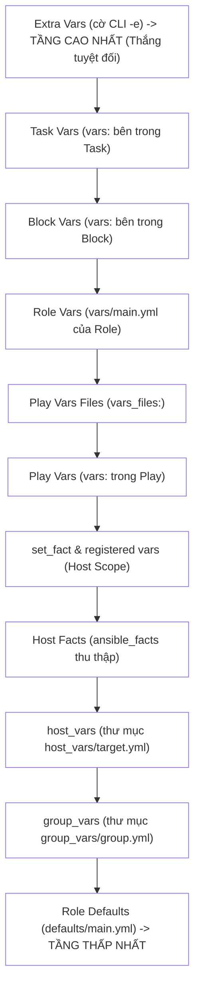
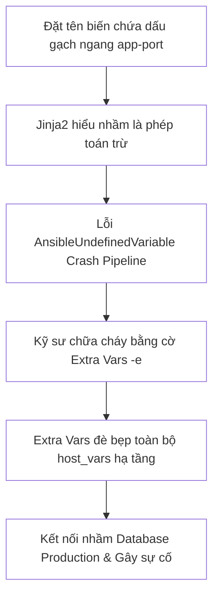


# [BÀI 07] LÀM CHỦ BIẾN & THỨ TỰ ƯU TIÊN: VARIABLE PRECEDENCE 22 TẦNG, SCOPE, JINJA2 SYNTAX & DEBUG

Trong kỷ nguyên **Infrastructure as Code (IaC)** và tự động hóa vận hành hạ tầng đám mây (Cloud Infrastructure Automation), **Ansible** khẳng định vị thế dẫn đầu nhờ triết lý **Agentless** (không cần cài đặt agent nền trên máy đích), giao thức điều khiển an toàn qua **SSH / WinRM**, định dạng khai báo **YAML** trực quan và nguyên lý bất biến **Idempotency** mạnh mẽ. Việc làm chủ Ansible không chỉ dừng lại ở các câu lệnh Ad-hoc đơn giản, mà đòi hỏi kỹ sư phải nắm vững kiến trúc Module tầng thấp, Variable Precedence 22 tầng, Jinja2 Templates, tối ưu hóa Forks & Pipelining cho tới thiết kế Roles / Collections và tích hợp CI/CD tự động hóa chuẩn Doanh nghiệp.

Bài viết chuyên sâu này sẽ đồng hành cùng bạn mổ xẻ toàn diện bức tranh kiến trúc, phân tích các đánh đổi kỹ thuật thực chiến (Engineering Trade-offs), cung cấp hướng dẫn thực hành Lab chi tiết từng bước và bộ câu hỏi phỏng vấn chuyên sâu chuẩn DevOps / SRE Lead.

---

## 1. Bản Chất Kiến Trúc & Cơ Chế Vận Hành Tầng Thấp

Hệ thống quản trị cấu hình quy mô lớn đòi hỏi tính tùy biến và tái sử dụng cao. Thay vì viết cứng (hard-code) các tham số như cổng dịch vụ, tên người dùng hay đường dẫn thư mục, **Ansible Variables** cung cấp cơ chế trừu tượng hóa tham số hóa hạ tầng. Tuy nhiên, do biến có thể được khai báo ở hàng chục vị trí khác nhau (từ Role defaults, Inventory group/host vars, Play vars, vars_files, Task vars cho tới Extra vars từ CLI), Ansible thiết lập một ma trận ưu tiên nghiêm ngặt gồm **22 tầng ưu tiên (Variable Precedence)** theo nguyên lý: *Nguồn khai báo nào càng hẹp, càng cụ thể và càng gần thời điểm thực thi thì nguồn đó sẽ giành quyền ưu tiên cao nhất.*



### 1.1. Tháp Ưu Tiên Biến (Variable Precedence 22 Tầng) & Cú Pháp Jinja2

- **Cú pháp nội suy Jinja2:** Biến trong Ansible được truy vấn thông qua cặp ngoặc nhọn đúp `{{ variable_name }}`. Khi biến nằm ở đầu giá trị của một thuộc tính YAML, bắt buộc phải bọc toàn bộ chuỗi trong cặp dấu ngoặc kép (ví dụ: `dest: "{{ my_dest_path }}"`) để tránh lỗi parse syntax YAML.
- **Thứ tự ưu tiên cốt lõi:**
  1. **Role Defaults (`defaults/main.yml`):** Tầng thấp nhất, dùng để định nghĩa giá trị mặc định có thể dễ dàng bị ghi đè.
  2. **Inventory Group Vars (`group_vars/`):** Áp dụng cho tập hợp các máy thuộc cùng nhóm logic.
  3. **Inventory Host Vars (`host_vars/`):** Tùy biến tham số riêng biệt cho từng máy đích danh.
  4. **Play Vars (`vars:`, `vars_files:`):** Tham số áp đặt cho toàn bộ một lượt chạy Play.
  5. **Extra Vars (`-e` qua CLI):** Tầng 22 (cao nhất), ghi đè lên toàn bộ các giá trị đã định nghĩa ở các tầng bên dưới.

### 1.2. Phân Định Phạm Vi Biến (Variable Scopes), Registered Vars & set_fact

- **Phạm vi hoạt động của Biến (Scopes):**
  - **Global Scope:** Áp dụng toàn bộ hệ thống (Extra vars `-e`, cấu hình `ansible.cfg`).
  - **Play Scope:** Chỉ tồn tại và có hiệu lực trong phạm vi của 1 Play (`vars:`, `vars_files:`). Khi chuyển sang Play 2, các biến này sẽ biến mất.
  - **Host Scope:** Gắn liền với từng máy đích (`host_vars`, `ansible_facts`, biến tạo bởi `set_fact` hoặc `register`).
- **Biến Đăng ký (`register`):** Bắt toàn bộ dữ liệu đầu ra JSON của một Task (gồm `rc`, `stdout`, `stderr`, `changed`) để dùng làm điều kiện rẽ nhánh logic hoặc in log ở các Task sau.
- **Biến Động Runtime (`set_fact`):** Cho phép tính toán và khởi tạo biến mới ngay trong quá trình chạy. Biến tạo bởi `set_fact` mang phạm vi Host Scope và tồn tại xuyên suốt qua các Play tiếp theo.

### 1.3. Kỹ Thuật Gỡ Lỗi (Debug Module) & Quy Chuẩn Đặt Tên Biến An Toàn

- **Module `ansible.builtin.debug`:** Công cụ kiểm định giá trị biến số 1:
  - Dùng `msg: "Port is {{ app_port }}"` để in chuỗi văn bản định dạng.
  - Dùng `var: register_output` (không bọc `{{ }}`) để in toàn bộ cấu trúc dữ liệu kiểu String, List, Dictionary hay JSON object.
- **Quy chuẩn đặt tên Snake_case:** Tên biến chỉ được dùng chữ thường, số và dấu gạch dưới `_` (ví dụ `app_web_port`). Tuyệt đối **CẤM** sử dụng dấu gạch ngang `-` (như `app-web-port`) vì Jinja2 sẽ hiểu nhầm thành phép toán trừ (subtraction), gây lỗi cú pháp nghiêm trọng.

---

## 2. Bảng So Sánh Kỹ Thuật Toàn Diện (Engineering Matrix)

| Vị Trí Khai Báo Biến | Cấp Độ Ưu Tiên | Phạm Vi (Scope) | Khả Năng Ghi Đè | Trường Hợp Sử Dụng Chuẩn Production |
|---|---|---|---|---|
| **Role Defaults (`defaults/main.yml`)** | Tầng 1 (Thấp nhất) | Role Scope | Rất dễ ghi đè | Cung cấp giá trị fallback an toàn để Role không crash |
| **Inventory `group_vars/`** | Tầng 3–4 | Group Host Scope | Ghi đè được bởi host_vars | Cấu hình chung cho môi trường (`staging.yml`, `prod.yml`) |
| **Inventory `host_vars/`** | Tầng 5–6 | Host Scope | Ghi đè được bởi Play vars | Cấu hình IP tĩnh, ID phân mảnh, hostname từng máy |
| **Play `vars:` / `vars_files:`** | Tầng 12–14 | Play Scope | Ghi đè được bởi Task & Extra vars | Tham số cố định của kịch bản triển khai |
| **Runtime `set_fact` / `register`** | Tầng 19 | Host Scope (Persistent) | Ghi đè được bởi Extra vars | Biến động tính toán theo kết quả lệnh hoặc Fact hệ điều hành |
| **Extra Vars (`-e` từ CLI)** | **Tầng 22 (Cao nhất)** | Global Scope | **KHÔNG THỂ GHI ĐÈ** | Override khẩn cấp, truyền tham số động từ CI/CD pipeline |

> [!IMPORTANT]
> **QUY TẮC THIẾT KẾ BIẾN SẠCH (CLEAN VARIABLES DESIGN):**
> Luôn đặt giá trị mặc định an toàn trong `defaults/main.yml`, cấu hình môi trường trong `group_vars/`, và chỉ sử dụng Extra Vars (`-e`) cho các tham số nhạy cảm hoặc tham số động sinh ra từ Pipeline CI/CD (như Commit SHA, Build Number).

---

## 3. Kiến Trúc Triển Khai Chuẩn Production (Configuration / Playbook / Role Breakdown)

Dưới đây là kiến trúc phân cấp biến chuẩn Production tích hợp đầy đủ `group_vars`, `host_vars`, `vars_files`, `register`, `set_fact` và `debug`:

```text
lab-ansible-07/
├── ansible.cfg
├── inventory.ini
├── group_vars/
│   └── web.yml          # Biến chung cho nhóm web
├── host_vars/
│   └── target1.yml      # Biến tùy biến riêng cho target1
└── site.yml             # Playbook điều phối chính
```

```yaml
# site.yml - Production Variable Architecture
---
- name: "PLAY 1: Demonstrate Variable Hierarchy & Dynamic Fact Setting"
  hosts: web
  become: true
  gather_facts: false

  vars:
    play_level_var: "Defined in Playbook vars"
    base_app_port: 8000

  tasks:
    - name: 01. Print baseline variables from group_vars and Play
      ansible.builtin.debug:
        msg: "App Name: {{ app_name }} | Env: {{ app_env }} | Play Var: {{ play_level_var }}"

    - name: 02. Execute date command to capture runtime timestamp
      ansible.builtin.command: date "+%Y-%m-%d %H:%M:%S"
      register: current_time
      changed_when: false

    - name: 03. Calculate and set dynamic runtime variables via set_fact
      ansible.builtin.set_fact:
        computed_port: "{{ base_app_port + 80 }}"
        deployment_timestamp: "{{ current_time.stdout }}"

    - name: 04. Deploy application configuration using layered variables
      ansible.builtin.copy:
        dest: /etc/app_runtime.conf
        content: |
          APP_NAME={{ app_name }}
          ENVIRONMENT={{ app_env }}
          SERVICE_PORT={{ computed_port }}
          DEPLOY_HOST={{ inventory_hostname }}
          DEPLOYED_AT={{ deployment_timestamp }}
        mode: "0644"
        backup: true

    - name: 05. Debug full registered variable data structure
      ansible.builtin.debug:
        var: current_time
```

### Phân Tích Kỹ Thuật Từng Dòng (Line-by-Line Breakdown):
- <span class="badge-line">Line 8–10</span>: Khai báo biến `base_app_port: 8000` ở cấp Play Scope (`vars:`).
- <span class="badge-line">Line 12–15</span>: Module `debug` truy vấn biến `app_name` và `app_env` được tự động nạp từ `group_vars/web.yml`.
- <span class="badge-line">Line 17–20</span>: Thực thi lệnh `date`, lưu toàn bộ output JSON vào biến Host Scope `current_time` bằng từ khóa `register`, đồng thời gắn `changed_when: false` để giữ tính Idempotent.
- <span class="badge-line">Line 22–26</span>: Module `set_fact` tính toán biểu thức `base_app_port + 80` và gán giá trị thời gian thực `deployment_timestamp`.
- <span class="badge-line">Line 28–39</span>: Module `copy` kết hợp biến Jinja2 từ nhiều tầng (`group_vars`, `host_vars`, `set_fact`) để xuất ra file cấu hình hoàn chỉnh.
- <span class="badge-line">Line 41–43</span>: Sử dụng cú pháp `var: current_time` trong module `debug` để in cấu trúc dữ liệu JSON chi tiết của biến đăng ký.

---

## 4. Phân Tích Cạm Bẫy Thực Chiến: Đứt Gãy Biến Do Tên Chứa Dấu Gạch Ngang & Lạm Dụng Extra Vars

### Tình Huống Sự Cố Thực Tế Tại Doanh Nghiệp:
Một đội ngũ DevOps di chuyển hệ thống sang hạ tầng mới. Trong quá trình cấu hình, một kỹ sư đặt tên biến chứa dấu gạch ngang: `database-port: 3306` và `app-secret-key: "xyz"`. 
Để sửa nhanh khi chạy thực tế, một kỹ sư khác đã lạm dụng cờ `-e "database_port=5432"` trên lệnh CLI triển khai định kỳ của Jenkins.

### Hậu Quả & Log Lỗi Thực Tế:

```diff
--- group_vars/all.yml (Broken Variable Name)
+++ group_vars/all.yml (Standard Snake_case)
@@ -1,3 +1,3 @@
-# Lỗi: Dấu gạch ngang bị Jinja2 hiểu thành phép trừ
-database-port: 3306
-app-secret-key: "xyz"
+# Sửa: Dùng chuẩn snake_case hợp lệ
+database_port: 3306
+app_secret_key: "xyz"
```

- Trình phân giải Jinja2 hiểu nhầm `{{ database-port }}` là phép trừ `database` trừ `port`, khiến Playbook văng lỗi `AnsibleUndefinedVariable: 'database' is undefined` làm dừng pipeline phát hành.
- Việc lạm dụng Extra Vars `-e` đè bẹp toàn bộ file `host_vars` chuyên biệt của môi trường Disaster Recovery, dẫn tới việc cụm máy chủ dự phòng kết nối nhầm vào Database chính, gây xung đột và khóa bảng dữ liệu giao dịch trong 40 phút.




### 5-Whys Root Cause Analysis:
1. **Tại sao cụm máy chủ kết nối sai Database?** Do tham số kết nối bị ghi đè ngoài ý muốn bởi cờ Extra Vars `-e`.
2. **Tại sao kỹ sư phải dùng cờ `-e`?** Do biến định nghĩa trong file Playbook bị lỗi không nạp được nên phải truyền nóng từ dòng lệnh.
3. **Tại sao biến trong file bị lỗi?** Do đặt tên biến chứa ký tự dấu gạch ngang `-` vi phạm quy chuẩn Jinja2/Python.
4. **Tại sao lỗi đặt tên biến không được phát hiện sớm?** Do thiếu bước kiểm tra linter (`ansible-lint`) trong quy trình Merge code.
5. **Nguyên nhân cốt lõi (Root Cause):** Không tuân thủ quy chuẩn đặt tên biến `snake_case` và thiếu hiểu biết sâu sắc về mức độ nguy hiểm của tầng ưu tiên tuyệt đối của Extra Vars trong Variable Precedence.

---

## 5. Hands-on Lab: Quản Trị & Gỡ Lỗi Hệ Thống Biến Đa Tầng Chuẩn Production (8 Bước)

| Bước | Lệnh CLI / Tác Vụ Chính | Mục Đích Thực Thi |
|---|---|---|
| **Bước 1** | Chuẩn bị môi trường `lab-ansible-07` | Khởi tạo cấu hình dự án cô lập |
| **Bước 2** | Xây dựng thư mục `group_vars` & `host_vars` | Định nghĩa biến theo cấp độ nhóm và từng máy đích danh |
| **Bước 3** | Viết Playbook `site.yml` nạp biến đa tầng | Kết hợp Play vars, group_vars và host_vars |
| **Bước 4** | Sử dụng `register` & module `debug` | Bắt dữ liệu thời gian thực và in log kiểm định |
| **Bước 5** | Tạo biến runtime với `set_fact` | Tính toán biến động theo logic thời gian thực |
| **Bước 6** | Thực thi thử nghiệm ghi đè bằng Extra Vars `-e` | Kiểm chứng quyền ưu tiên tuyệt đối của Tầng 22 |
| **Bước 7** | Thực thi Phép thử Lần 2 chứng minh Idempotency | Đạt chỉ số `changed=0` trên bảng `PLAY RECAP` |
| **Bước 8** | Đối soát nội dung file trên máy đích qua `docker exec` | Xác nhận tính chính xác của file cấu hình sinh ra |

### Bước 1 — Thiết lập môi trường dự án

```bash
mkdir -p ~/lab-ansible-07/{group_vars,host_vars} && cd ~/lab-ansible-07

cat << 'EOF' > ansible.cfg
[defaults]
inventory = ./inventory.ini
remote_user = ansible
host_key_checking = False
private_key_file = ~/.ssh/id_ed25519

[privilege_escalation]
become = True
become_method = sudo
become_user = root
become_ask_pass = False
EOF

cat << 'EOF' > inventory.ini
[web]
target1 ansible_host=127.0.0.1 ansible_port=2221

[db]
target2 ansible_host=127.0.0.1 ansible_port=2222

[all:vars]
ansible_python_interpreter=/usr/bin/python3
EOF
```

### Bước 2 — Khởi tạo các file group_vars và host_vars

```bash
cat << 'EOF' > group_vars/web.yml
app_name: "NTK Core Service"
app_env: "production"
http_port: 80
EOF

cat << 'EOF' > host_vars/target1.yml
custom_node_id: "NODE-TARGET-01"
max_workers: 4
EOF
```

```bash
# CHECKPOINT 1: Kiểm tra khởi tạo cấu trúc biến nguồn
if [ -f "group_vars/web.yml" ] && [ -f "host_vars/target1.yml" ]; then
  echo "CHECKPOINT 1: ĐẠT - Khởi tạo thành công thư mục và file group_vars, host_vars"
else
  echo "CHECKPOINT 1: LỖI - Khởi tạo biến nguồn thất bại"
fi
```

### Bước 3 — Soạn thảo Playbook kết hợp biến đa tầng

```bash
cat << 'EOF' > site.yml
---
- name: Variable Precedence & Scope Lab
  hosts: web
  become: true
  gather_facts: false

  vars:
    play_var: "Defined at Play Level"
    base_port: 8000

  tasks:
    - name: Task 1 - Print initial variables
      ansible.builtin.debug:
        msg: "Node ID: {{ custom_node_id }} | App: {{ app_name }} | Play: {{ play_var }}"

    - name: Task 2 - Capture target timestamp with register
      ansible.builtin.command: date "+%Y-%m-%d %H:%M:%S"
      register: date_res
      changed_when: false

    - name: Task 3 - Compute runtime fact
      ansible.builtin.set_fact:
        computed_service_port: "{{ base_port + 80 }}"
        deployed_time: "{{ date_res.stdout }}"

    - name: Task 4 - Deploy runtime configuration file
      ansible.builtin.copy:
        dest: /etc/app_vars.conf
        content: |
          APP_NAME={{ app_name }}
          ENVIRONMENT={{ app_env }}
          NODE_ID={{ custom_node_id }}
          PORT={{ computed_service_port }}
          DEPLOYED_AT={{ deployed_time }}
        mode: "0644"
        backup: true
EOF
```

```bash
# CHECKPOINT 2: Kiểm tra cú pháp Playbook
ansible-playbook --syntax-check site.yml
```

### Bước 4 — Thực thi Playbook Lần 1 và gỡ lỗi biến

```bash
ansible-playbook site.yml
```

```bash
# CHECKPOINT 3: Kiểm tra kết quả thực thi lần 1
RUN1_OUT=$(ansible-playbook site.yml)
if echo "$RUN1_OUT" | grep -q "failed=0" && echo "$RUN1_OUT" | grep -q "unreachable=0"; then
  echo "CHECKPOINT 3: ĐẠT - Playbook nạp biến và thực thi thành công lần 1"
else
  echo "CHECKPOINT 3: LỖI - Thực thi Playbook lần 1 thất bại"
fi
```

### Bước 5 — Thực thi kiểm chứng ghi đè với Extra Vars -e

```bash
ansible-playbook -e "app_env=staging app_name='Override App'" site.yml
```

```bash
# CHECKPOINT 4 & 5: Kiểm tra Extra Vars ghi đè thành công
EXTRA_CHECK=$(docker exec target1 cat /etc/app_vars.conf)
if echo "$EXTRA_CHECK" | grep -q "APP_NAME=Override App" && echo "$EXTRA_CHECK" | grep -q "ENVIRONMENT=staging"; then
  echo "CHECKPOINT 4 & 5: ĐẠT - Cờ Extra Vars -e ghi đè biến thành công tuyệt đối"
else
  echo "CHECKPOINT 4 & 5: LỖI - Ghi đè Extra Vars thất bại"
fi
```

### Bước 6 — Chạy lại kịch bản chuẩn hóa (không cờ -e)

```bash
ansible-playbook site.yml
```

### Bước 7 — Thực thi Phép thử Lần 2 chứng minh Idempotency

```bash
ansible-playbook site.yml
```

```bash
# CHECKPOINT 6 & 7: Chứng minh tính Idempotency đạt changed=0
RUN2_FINAL=$(ansible-playbook site.yml)
if echo "$RUN2_FINAL" | grep -q "changed=0" && echo "$RUN2_FINAL" | grep -q "failed=0"; then
  echo "CHECKPOINT 6 & 7: ĐẠT - Kịch bản nạp biến đạt tính Idempotency tuyệt đối (changed=0 ở lần 2)"
else
  echo "CHECKPOINT 6 & 7: LỖI - Kịch bản chưa đạt chuẩn Idempotency"
fi
```

### Bước 8 — Đối soát sự thật máy đích bằng docker exec

```bash
docker exec target1 cat /etc/app_vars.conf
```

```bash
# CHECKPOINT 8: Kiểm tra hiện vật thực tế trên máy đích
FINAL_CONF=$(docker exec target1 cat /etc/app_vars.conf)
if echo "$FINAL_CONF" | grep -q "APP_NAME=NTK Core Service" && echo "$FINAL_CONF" | grep -q "PORT=8080" && echo "$FINAL_CONF" | grep -q "NODE_ID=NODE-TARGET-01"; then
  echo "CHECKPOINT 8: ĐẠT - Đối soát hiện vật máy đích thành công, dữ liệu biến đa tầng chính xác 100%"
else
  echo "CHECKPOINT 8: LỖI - Đối soát hiện vật thất bại"
fi
```

---

## 6. Bộ Câu Hỏi Vấn Đáp & Phỏng Vấn Chuyên Sâu (Self-Check Q&A)

<details class="qa-card">
  <summary class="qa-summary">
    <span class="qa-num-badge">Q01</span>
    <span class="qa-question-text">Trình bày nguyên lý cốt lõi của tháp ưu tiên biến (Variable Precedence 22 tầng) trong Ansible. Nguồn khai báo nào có ưu tiên thấp nhất và cao nhất?</span>
  </summary>
  <div class="qa-answer">
    <div class="qa-answer-header">
      <svg width="14" height="14" fill="none" stroke="currentColor" stroke-width="2" viewBox="0 0 24 24"><path d="M22 11.08V12a10 10 0 1 1-5.93-9.14"></path><polyline points="22 4 12 14.01 9 11.01"></polyline></svg>
      <span>Phân Tích &amp; Lời Giải Kỹ Thuật</span>
    </div>
    <div><b>Đáp án chuẩn:</b> Nguyên lý: *Nguồn khai báo nào càng hẹp, càng cụ thể và càng gần thời điểm thực thi thì nguồn đó có độ ưu tiên càng cao.* Nguồn có ưu tiên THẤP NHẤT là <code>defaults/main.yml</code> của Role (Tầng 1 - Role Defaults). Nguồn có ưu tiên CAO NHẤT TUYỆT ĐỐI là <code>Extra Vars</code> truyền qua cờ CLI <code>-e</code> (Tầng 22), có khả năng ghi đè lên tất cả các biến đã khai báo ở bất kỳ đâu.</div>
    <div style="margin-top: 0.5rem;"><b>Tiêu chí chấm:</b></div>
    <div style="margin: 0.35rem 0; padding-left: 1rem; border-left: 2px solid var(--accent-primary);">• <b>0:</b> Không nêu được nguyên lý ưu tiên biến.</div>
    <div style="margin: 0.35rem 0; padding-left: 1rem; border-left: 2px solid var(--accent-primary);">• <b>1:</b> Biết Extra Vars cao nhất nhưng không nêu được Role Defaults thấp nhất.</div>
    <div style="margin: 0.35rem 0; padding-left: 1rem; border-left: 2px solid var(--accent-primary);">• <b>2:</b> Nêu chính xác nguyên lý + tầng thấp nhất (Role defaults) và cao nhất (Extra vars).</div>
    <div style="margin: 0.35rem 0; padding-left: 1rem; border-left: 2px solid var(--accent-primary);">• <b>3:</b> Phân tích xuất sắc toàn bộ luồng ưu tiên từ Role defaults -> group_vars -> host_vars -> Play vars -> set_fact -> Extra vars.</div>
    <div style="margin-top: 0.5rem;"><b>Câu hỏi đào sâu:</b> Giữa biến trong <code>group_vars/</code> và <code>host_vars/</code>, biến ở đâu có độ ưu tiên cao hơn? <i>(Biến trong <code>host_vars/</code> ưu tiên cao hơn vì nó áp dụng cụ thể cho từng host đích danh.)</i></div>
  </div>
</details>

<details class="qa-card">
  <summary class="qa-summary">
    <span class="qa-num-badge">Q02</span>
    <span class="qa-question-text">Tại sao khi sử dụng biến Jinja2 ở đầu một thuộc tính YAML bắt buộc phải bọc trong cặp ngoặc kép "{{ var }}"?</span>
  </summary>
  <div class="qa-answer">
    <div class="qa-answer-header">
      <svg width="14" height="14" fill="none" stroke="currentColor" stroke-width="2" viewBox="0 0 24 24"><path d="M22 11.08V12a10 10 0 1 1-5.93-9.14"></path><polyline points="22 4 12 14.01 9 11.01"></polyline></svg>
      <span>Phân Tích &amp; Lời Giải Kỹ Thuật</span>
    </div>
    <div><b>Đáp án chuẩn:</b> Trong định dạng YAML, ký tự mở ngoặc nhọn <code>{</code> ở đầu giá trị được hiểu là điểm bắt đầu của một Dictionary/Inline Mapping (ví dụ <code>{key: val}</code>). Nếu viết <code>dest: {{ my_path }}</code>, trình phân tích cú pháp YAML sẽ bị nhầm lẫn cú pháp và báo lỗi <code>mapping values are not allowed here</code>. Bọc cặp ngoặc kép <code>dest: "{{ my_path }}"</code> ép YAML hiểu đây là một chuỗi văn bản (String) để trình biên dịch Jinja2 xử lý sau.</div>
    <div style="margin-top: 0.5rem;"><b>Tiêu chí chấm:</b></div>
    <div style="margin: 0.35rem 0; padding-left: 1rem; border-left: 2px solid var(--accent-primary);">• <b>0:</b> Không giải thích được lý do kỹ thuật của YAML parser.</div>
    <div style="margin: 0.35rem 0; padding-left: 1rem; border-left: 2px solid var(--accent-primary);">• <b>1:</b> Chỉ biết là quy tắc phải làm nhưng không hiểu cơ chế Inline Mapping của YAML.</div>
    <div style="margin: 0.35rem 0; padding-left: 1rem; border-left: 2px solid var(--accent-primary);">• <b>2:</b> Giải thích chính xác xung đột cú pháp Inline Mapping giữa YAML và Jinja2.</div>
    <div style="margin: 0.35rem 0; padding-left: 1rem; border-left: 2px solid var(--accent-primary);">• <b>3:</b> Nêu đúng + chỉ ra các trường hợp không cần bọc ngoặc kép (khi biến nằm ở giữa chuỗi <code>dest: /var/{{ my_path }}</code>).</div>
    <div style="margin-top: 0.5rem;"><b>Câu hỏi đào sâu:</b> Câu lệnh <code>debug: var=my_var</code> có cần bọc dấu ngoặc nhọn <code>{{ }}</code> không? <i>(Không, tham số <code>var</code> của module debug nhận trực tiếp tên biến dưới dạng chuỗi thô.)</i></div>
  </div>
</details>

<details class="qa-card">
  <summary class="qa-summary">
    <span class="qa-num-badge">Q03</span>
    <span class="qa-question-text">Phân biệt 3 cấp độ phạm vi của biến trong Ansible: Global Scope, Play Scope và Host Scope.</span>
  </summary>
  <div class="qa-answer">
    <div class="qa-answer-header">
      <svg width="14" height="14" fill="none" stroke="currentColor" stroke-width="2" viewBox="0 0 24 24"><path d="M22 11.08V12a10 10 0 1 1-5.93-9.14"></path><polyline points="22 4 12 14.01 9 11.01"></polyline></svg>
      <span>Phân Tích &amp; Lời Giải Kỹ Thuật</span>
    </div>
    <div><b>Đáp án chuẩn:</b></div>
    <div>• <b>Global Scope:</b> Có hiệu lực trên toàn bộ kịch bản, mọi Play và mọi Host (ví dụ: Extra vars <code>-e</code>, các biến cấu hình từ <code>ansible.cfg</code>).</div>
    <div>• <b>Play Scope:</b> Chỉ có hiệu lực trong phạm vi của 1 Play khai báo nó (ví dụ: <code>vars:</code>, <code>vars_files:</code> trong Play). Khi kịch bản kết thúc Play 1 sang Play 2, biến này sẽ bị hủy.</div>
    <div>• <b>Host Scope:</b> Gắn liền với từng máy đích cụ thể và đi theo máy đó xuyên suốt các Play (ví dụ: <code>host_vars</code>, <code>ansible_facts</code>, biến tạo bởi <code>set_fact</code> và <code>register</code>).</div>
    <div style="margin-top: 0.5rem;"><b>Tiêu chí chấm:</b></div>
    <div style="margin: 0.35rem 0; padding-left: 1rem; border-left: 2px solid var(--accent-primary);">• <b>0:</b> Nhầm lẫn giữa Play Scope và Host Scope.</div>
    <div style="margin: 0.35rem 0; padding-left: 1rem; border-left: 2px solid var(--accent-primary);">• <b>1:</b> Nêu được định nghĩa nhưng không đưa ra được ví dụ tương ứng cho từng Scope.</div>
    <div style="margin: 0.35rem 0; padding-left: 1rem; border-left: 2px solid var(--accent-primary);">• <b>2:</b> Phân tích chính xác cả 3 cấp độ Scope + ví dụ nguồn khai báo.</div>
    <div style="margin: 0.35rem 0; padding-left: 1rem; border-left: 2px solid var(--accent-primary);">• <b>3:</b> Nêu đúng + giải thích cơ chế chia sẻ biến giữa các host thông qua <code>hostvars['other_host']['var_name']</code>.</div>
    <div style="margin-top: 0.5rem;"><b>Câu hỏi đào sâu:</b> Một biến tạo bởi <code>set_fact</code> trên <code>target1</code> ở Play 1 có thể đọc được trên <code>target1</code> ở Play 2 không? <i>(Có, vì biến <code>set_fact</code> mang phạm vi Host Scope gắn liền với <code>target1</code>.)</i></div>
  </div>
</details>

<details class="qa-card">
  <summary class="qa-summary">
    <span class="qa-num-badge">Q04</span>
    <span class="qa-question-text">Biến đăng ký register lưu trữ những thông tin gì? Phạm vi hoạt động của biến register là gì?</span>
  </summary>
  <div class="qa-answer">
    <div class="qa-answer-header">
      <svg width="14" height="14" fill="none" stroke="currentColor" stroke-width="2" viewBox="0 0 24 24"><path d="M22 11.08V12a10 10 0 1 1-5.93-9.14"></path><polyline points="22 4 12 14.01 9 11.01"></polyline></svg>
      <span>Phân Tích &amp; Lời Giải Kỹ Thuật</span>
    </div>
    <div><b>Đáp án chuẩn:</b> Từ khóa <code>register</code> lưu trữ toàn bộ dữ liệu trả về của Task dưới dạng một Dictionary JSON, bao gồm: mã thoát lệnh <code>rc</code> (Return Code), luồng xuất chuẩn <code>stdout</code>, danh sách dòng xuất <code>stdout_lines</code>, luồng lỗi <code>stderr</code>, và cờ trạng thái <code>changed</code>, <code>failed</code>. Biến đăng ký mang phạm vi <b>Host Scope</b>, nghĩa là mỗi máy đích lưu giữ một giá trị kết quả độc lập tương ứng với lần chạy trên máy đó.</div>
    <div style="margin-top: 0.5rem;"><b>Tiêu chí chấm:</b></div>
    <div style="margin: 0.35rem 0; padding-left: 1rem; border-left: 2px solid var(--accent-primary);">• <b>0:</b> Chỉ nghĩ rằng <code>register</code> lưu chuỗi text đơn thuần.</div>
    <div style="margin: 0.35rem 0; padding-left: 1rem; border-left: 2px solid var(--accent-primary);">• <b>1:</b> Kể được <code>stdout</code> nhưng thiếu <code>rc</code> và phạm vi Scope.</div>
    <div style="margin: 0.35rem 0; padding-left: 1rem; border-left: 2px solid var(--accent-primary);">• <b>2:</b> Nêu chính xác cấu trúc Dictionary JSON của biến + phạm vi Host Scope.</div>
    <div style="margin: 0.35rem 0; padding-left: 1rem; border-left: 2px solid var(--accent-primary);">• <b>3:</b> Nêu đúng + minh họa cách truy xuất phần tử con như <code>res.stdout</code> và <code>res.rc</code> trong điều kiện <code>when</code>.</div>
    <div style="margin-top: 0.5rem;"><b>Câu hỏi đào sâu:</b> Nếu một Task bị <code>skipped</code>, biến <code>register</code> của task đó có tồn tại không? <i>(Có tồn tại, nhưng nó sẽ chứa thuộc tính <code>"skipped": true</code> và không có <code>stdout</code>.)</i></div>
  </div>
</details>

<details class="qa-card">
  <summary class="qa-summary">
    <span class="qa-num-badge">Q05</span>
    <span class="qa-question-text">Module set_fact khác gì so với việc khai báo biến trong vars: của Playbook?</span>
  </summary>
  <div class="qa-answer">
    <div class="qa-answer-header">
      <svg width="14" height="14" fill="none" stroke="currentColor" stroke-width="2" viewBox="0 0 24 24"><path d="M22 11.08V12a10 10 0 1 1-5.93-9.14"></path><polyline points="22 4 12 14.01 9 11.01"></polyline></svg>
      <span>Phân Tích &amp; Lời Giải Kỹ Thuật</span>
    </div>
    <div><b>Đáp án chuẩn:</b></div>
    <div>• <code>vars:</code> trong Playbook là biến tĩnh được nạp ngay khi bắt đầu Play, mang phạm vi <b>Play Scope</b> (hết Play là mất) và có mức ưu tiên ở Tầng 12.</div>
    <div>• <code>set_fact</code> là một Module thực thi tại thời điểm runtime (động), cho phép tính toán giá trị biến dựa trên kết quả của các bước trước. Biến tạo bởi <code>set_fact</code> mang phạm vi <b>Host Scope</b> (tồn tại xuyên suốt các Play tiếp theo) và có mức ưu tiên rất cao (Tầng 19), có thể ghi đè lên các biến khai báo ở <code>vars:</code>.</div>
    <div style="margin-top: 0.5rem;"><b>Tiêu chí chấm:</b></div>
    <div style="margin: 0.35rem 0; padding-left: 1rem; border-left: 2px solid var(--accent-primary);">• <b>0:</b> Cho rằng hai cách tạo biến hoàn toàn giống nhau.</div>
    <div style="margin: 0.35rem 0; padding-left: 1rem; border-left: 2px solid var(--accent-primary);">• <b>1:</b> Nêu được <code>set_fact</code> tạo biến động nhưng không giải thích được sự khác nhau về Scope và Precedence.</div>
    <div style="margin: 0.35rem 0; padding-left: 1rem; border-left: 2px solid var(--accent-primary);">• <b>2:</b> Phân tích chính xác trên cả 3 khía cạnh: Thời điểm nạp (Runtime vs Static), Scope (Host vs Play), Tầng ưu tiên.</div>
    <div style="margin: 0.35rem 0; padding-left: 1rem; border-left: 2px solid var(--accent-primary);">• <b>3:</b> Trình bày xuất sắc ví dụ thực tế sử dụng <code>set_fact</code> để chuẩn hóa tên gói phần mềm theo hệ điều hành.</div>
    <div style="margin-top: 0.5rem;"><b>Câu hỏi đào sâu:</b> Làm thế nào để biến tạo bởi <code>set_fact</code> có thể lưu cache lại cho các lần chạy sau? <i>(Sử dụng tham số <code>cacheable: true</code> trong module <code>set_fact</code> kết hợp Fact Caching.)</i></div>
  </div>
</details>

<details class="qa-card">
  <summary class="qa-summary">
    <span class="qa-num-badge">Q06</span>
    <span class="qa-question-text">Phân biệt cách sử dụng msg và var trong module ansible.builtin.debug. Khi nào dùng cú pháp {{ }}?</span>
  </summary>
  <div class="qa-answer">
    <div class="qa-answer-header">
      <svg width="14" height="14" fill="none" stroke="currentColor" stroke-width="2" viewBox="0 0 24 24"><path d="M22 11.08V12a10 10 0 1 1-5.93-9.14"></path><polyline points="22 4 12 14.01 9 11.01"></polyline></svg>
      <span>Phân Tích &amp; Lời Giải Kỹ Thuật</span>
    </div>
    <div><b>Đáp án chuẩn:</b></div>
    <div>• <code>msg: "Chuỗi văn bản {{ var_name }}"</code>: Dùng để in ra một chuỗi văn bản tùy biến có ghép biến nội suy. <b>BẮT BUỘC</b> phải dùng <code>{{ }}</code> khi muốn chèn biến vào chuỗi.</div>
    <div>• <code>var: var_name</code>: Dùng để in ra toàn bộ cấu trúc dữ liệu nguyên bản của biến (Dictionary, List, Boolean, JSON). <b>TUYỆT ĐỐI KHÔNG</b> dùng <code>{{ }}</code>, chỉ truyền tên biến thuần túy.</div>
    <div style="margin-top: 0.5rem;"><b>Tiêu chí chấm:</b></div>
    <div style="margin: 0.35rem 0; padding-left: 1rem; border-left: 2px solid var(--accent-primary);">• <b>0:</b> Dùng <code>var: "{{ var_name }}"</code> mà không biết là sai bản chất.</div>
    <div style="margin: 0.35rem 0; padding-left: 1rem; border-left: 2px solid var(--accent-primary);">• <b>1:</b> Biết <code>msg</code> in chuỗi nhưng không giải thích được lý do <code>var</code> không dùng <code>{{ }}</code>.</div>
    <div style="margin: 0.35rem 0; padding-left: 1rem; border-left: 2px solid var(--accent-primary);">• <b>2:</b> Phân biệt chính xác cú pháp và mục đích sử dụng của cả 2 tham số.</div>
    <div style="margin: 0.35rem 0; padding-left: 1rem; border-left: 2px solid var(--accent-primary);">• <b>3:</b> Nêu đúng + chỉ ra hiện tượng khi viết <code>var: "{{ var_name }}"</code> sẽ in ra chuỗi đại diện thay vì cấu trúc đối tượng.</div>
    <div style="margin-top: 0.5rem;"><b>Câu hỏi đào sâu:</b> Có thể khai báo đồng thời cả <code>msg:</code> và <code>var:</code> trong cùng một task <code>debug</code> không? <i>(Không được, <code>msg</code> và <code>var</code> là hai tham số loại trừ lẫn nhau trong module debug.)</i></div>
  </div>
</details>

<details class="qa-card">
  <summary class="qa-summary">
    <span class="qa-num-badge">Q07</span>
    <span class="qa-question-text">Tại sao việc đặt tên biến chứa dấu gạch ngang (kebab-case) bị coi là cấm kỵ trong Ansible? Chuẩn đặt tên biến chuẩn là gì?</span>
  </summary>
  <div class="qa-answer">
    <div class="qa-answer-header">
      <svg width="14" height="14" fill="none" stroke="currentColor" stroke-width="2" viewBox="0 0 24 24"><path d="M22 11.08V12a10 10 0 1 1-5.93-9.14"></path><polyline points="22 4 12 14.01 9 11.01"></polyline></svg>
      <span>Phân Tích &amp; Lời Giải Kỹ Thuật</span>
    </div>
    <div><b>Đáp án chuẩn:</b> Trong Jinja2 và Python, ký tự dấu gạch ngang <code>-</code> là toán tử toán học trừ (subtraction operator). Khi viết <code>{{ app-port }}</code>, Jinja2 sẽ phân tích cú pháp thành biểu thức: lấy giá trị của biến <code>app</code> trừ cho giá trị của biến <code>port</code>. Do đó kịch bản sẽ báo lỗi <code>UndefinedError</code> vì không tìm thấy biến <code>app</code>. Chuẩn đặt tên biến bắt buộc trong Ansible là <b>snake_case</b>: chỉ dùng chữ cái thường, số và dấu gạch dưới <code>_</code> (ví dụ: <code>app_port</code>).</div>
    <div style="margin-top: 0.5rem;"><b>Tiêu chí chấm:</b></div>
    <div style="margin: 0.35rem 0; padding-left: 1rem; border-left: 2px solid var(--accent-primary);">• <b>0:</b> Cho rằng đặt tên biến bằng dấu gạch ngang là hợp lệ.</div>
    <div style="margin: 0.35rem 0; padding-left: 1rem; border-left: 2px solid var(--accent-primary);">• <b>1:</b> Biết lỗi nhưng không giải thích được lý do toán tử trừ trong Jinja2.</div>
    <div style="margin: 0.35rem 0; padding-left: 1rem; border-left: 2px solid var(--accent-primary);">• <b>2:</b> Giải thích chính xác cơ chế toán tử toán học của Jinja2 + chuẩn snake_case.</div>
    <div style="margin-top: 0.5rem;"><b>Tiêu chí chấm:</b></div>
    <div style="margin: 0.35rem 0; padding-left: 1rem; border-left: 2px solid var(--accent-primary);">• <b>3:</b> Nêu đúng + chỉ ra cách cấu hình linter để tự động chặn các tên biến không đạt chuẩn snake_case.</div>
    <div style="margin-top: 0.5rem;"><b>Câu hỏi đào sâu:</b> Tên biến trong Ansible có được bắt đầu bằng chữ số không (ví dụ <code>1st_server</code>)? <i>(Không được, tên biến phải bắt đầu bằng chữ cái hoặc dấu gạch dưới.)</i></div>
  </div>
</details>

<details class="qa-card">
  <summary class="qa-summary">
    <span class="qa-num-badge">Q08</span>
    <span class="qa-question-text">Thư mục group_vars và host_vars được Ansible tự động nạp theo quy tắc cấu trúc thư mục như thế nào?</span>
  </summary>
  <div class="qa-answer">
    <div class="qa-answer-header">
      <svg width="14" height="14" fill="none" stroke="currentColor" stroke-width="2" viewBox="0 0 24 24"><path d="M22 11.08V12a10 10 0 1 1-5.93-9.14"></path><polyline points="22 4 12 14.01 9 11.01"></polyline></svg>
      <span>Phân Tích &amp; Lời Giải Kỹ Thuật</span>
    </div>
    <div><b>Đáp án chuẩn:</b> Ansible tự động tìm kiếm thư mục <code>group_vars/</code> và <code>host_vars/</code> nằm cùng cấp với file Inventory hoặc nằm cùng cấp với file Playbook chính. Tên file YAML bên trong phải trùng khớp chính xác với tên nhóm hoặc tên host trong Inventory:</div>
    <div>• <code>group_vars/web.yml</code>: Nạp tự động cho tất cả các máy thuộc nhóm <code>[web]</code>.</div>
    <div>• <code>group_vars/all.yml</code>: Nạp tự động cho tất cả mọi máy trong toàn bộ hạ tầng.</div>
    <div>• <code>host_vars/target1.yml</code>: Nạp tự động riêng cho máy có tên <code>target1</code>.</div>
    <div style="margin-top: 0.5rem;"><b>Tiêu chí chấm:</b></div>
    <div style="margin: 0.35rem 0; padding-left: 1rem; border-left: 2px solid var(--accent-primary);">• <b>0:</b> Không biết quy tắc tự động nạp của <code>group_vars</code>.</div>
    <div style="margin: 0.35rem 0; padding-left: 1rem; border-left: 2px solid var(--accent-primary);">• <b>1:</b> Biết tên file trùng tên nhóm nhưng không rõ vị trí đặt thư mục hợp lệ.</div>
    <div style="margin: 0.35rem 0; padding-left: 1rem; border-left: 2px solid var(--accent-primary);">• <b>2:</b> Nêu chính xác vị trí đặt thư mục + quy tắc đặt tên file <code>all.yml</code>, <code><group>.yml</code>, <code><host>.yml</code>.</div>
    <div style="margin: 0.35rem 0; padding-left: 1rem; border-left: 2px solid var(--accent-primary);">• <b>3:</b> Nêu đúng + giải thích khả năng tạo thư mục con bên trong <code>group_vars/web/db.yml</code> để chia nhỏ cấu hình.</div>
    <div style="margin-top: 0.5rem;"><b>Câu hỏi đào sâu:</b> Nếu đặt thư mục <code>group_vars</code> bên trong thư mục con <code>playbooks/</code>, khi chạy <code>ansible-playbook -i inventories/prod playbooks/site.yml</code> thì Ansible nạp <code>group_vars</code> ở đâu? <i>(Ansible nạp ở cả hai nơi: cạnh inventory và cạnh playbook, trong đó biến cạnh playbook có ưu tiên cao hơn.)</i></div>
  </div>
</details>

<details class="qa-card">
  <summary class="qa-summary">
    <span class="qa-num-badge">Q09</span>
    <span class="qa-question-text">Làm thế nào để truy cập biến của một Host khác trong cùng một Playbook? Cú pháp Magic Variable hostvars hoạt động ra sao?</span>
  </summary>
  <div class="qa-answer">
    <div class="qa-answer-header">
      <svg width="14" height="14" fill="none" stroke="currentColor" stroke-width="2" viewBox="0 0 24 24"><path d="M22 11.08V12a10 10 0 1 1-5.93-9.14"></path><polyline points="22 4 12 14.01 9 11.01"></polyline></svg>
      <span>Phân Tích &amp; Lời Giải Kỹ Thuật</span>
    </div>
    <div><b>Đáp án chuẩn:</b> Sử dụng biến ma thuật (Magic Variable) <code>hostvars</code>. Cú pháp: <code>{{ hostvars['target2']['ansible_host'] }}</code> hoặc <code>{{ hostvars['target2']['db_port'] }}</code>. Biến <code>hostvars</code> là một Dictionary toàn cục chứa toàn bộ Facts và biến của tất cả các host trong Inventory, cho phép các host thuộc nhóm Web có thể truy vấn địa chỉ IP nội bộ của máy Database để tự động điền vào file cấu hình.</div>
    <div style="margin-top: 0.5rem;"><b>Tiêu chí chấm:</b></div>
    <div style="margin: 0.35rem 0; padding-left: 1rem; border-left: 2px solid var(--accent-primary);">• <b>0:</b> Không biết cách truy cập biến của host khác.</div>
    <div style="margin: 0.35rem 0; padding-left: 1rem; border-left: 2px solid var(--accent-primary);">• <b>1:</b> Nhớ mang máng từ khóa <code>hostvars</code> nhưng viết sai cú pháp truy vấn dictionary.</div>
    <div style="margin: 0.35rem 0; padding-left: 1rem; border-left: 2px solid var(--accent-primary);">• <b>2:</b> Viết chính xác cú pháp <code>hostvars['hostname']['var_name']</code>.</div>
    <div style="margin: 0.35rem 0; padding-left: 1rem; border-left: 2px solid var(--accent-primary);">• <b>3:</b> Nêu đúng + kết hợp với <code>groups['db'][0]</code> để lấy động IP của master node.</div>
    <div style="margin-top: 0.5rem;"><b>Câu hỏi đào sâu:</b> Để <code>hostvars['target2']['ansible_facts']</code> có dữ liệu, điều kiện tiên quyết là gì? <i>(<code>target2</code> phải được thực thi bước Gathering Facts từ trước đó trong kịch bản.)</i></div>
  </div>
</details>

<details class="qa-card">
  <summary class="qa-summary">
    <span class="qa-num-badge">Q10</span>
    <span class="qa-question-text">Tại sao việc lạm dụng cờ Extra Vars (-e) lại bị coi là Bad Practice trong kiến trúc tự động hóa Doanh nghiệp?</span>
  </summary>
  <div class="qa-answer">
    <div class="qa-answer-header">
      <svg width="14" height="14" fill="none" stroke="currentColor" stroke-width="2" viewBox="0 0 24 24"><path d="M22 11.08V12a10 10 0 1 1-5.93-9.14"></path><polyline points="22 4 12 14.01 9 11.01"></polyline></svg>
      <span>Phân Tích &amp; Lời Giải Kỹ Thuật</span>
    </div>
    <div><b>Đáp án chuẩn:</b> Vì Extra Vars có mức ưu tiên Tầng 22 (tuyệt đối), nó sẽ "bắn hạ" (đè bẹp) toàn bộ cấu trúc biến được thiết kế cẩn thận trong <code>group_vars</code>, <code>host_vars</code>, và <code>vars_files</code>. Lạm dụng <code>-e</code> biến kịch bản Declarative thành kịch bản phụ thuộc vào câu lệnh CLI thủ công của từng người, làm mất tính đồng nhất của hạ tầng, không thể audit qua Git commit và dễ gây nhầm lẫn giữa môi trường Staging và Production.</div>
    <div style="margin-top: 0.5rem;"><b>Tiêu chí chấm:</b></div>
    <div style="margin: 0.35rem 0; padding-left: 1rem; border-left: 2px solid var(--accent-primary);">• <b>0:</b> Cho rằng dùng cờ <code>-e</code> càng nhiều càng tiện lợi.</div>
    <div style="margin: 0.35rem 0; padding-left: 1rem; border-left: 2px solid var(--accent-primary);">• <b>1:</b> Biết <code>-e</code> ưu tiên cao nhưng không phân tích được rủi ro vận hành và GitOps.</div>
    <div style="margin: 0.35rem 0; padding-left: 1rem; border-left: 2px solid var(--accent-primary);">• <b>2:</b> Phân tích chính xác tác hại phá vỡ kiến trúc biến phân tầng và mất dấu vết Git.</div>
    <div style="margin-top: 0.5rem;"><b>Tiêu chí chấm:</b></div>
    <div style="margin: 0.35rem 0; padding-left: 1rem; border-left: 2px solid var(--accent-primary);">• <b>3:</b> Trình bày xuất sắc giải pháp chuẩn mực: Quản lý 100% biến trong Git repository, chỉ dùng <code>-e</code> cho tham số Build Number/Git SHA từ CI/CD.</div>
    <div style="margin-top: 0.5rem;"><b>Câu hỏi đào sâu:</b> Cú pháp nào cho phép truyền file JSON/YAML vào cờ <code>-e</code> thay vì viết từng chuỗi key=val? <i>(Dùng cú pháp <code>ansible-playbook -e "@vars_file.json" site.yml</code>.)</i></div>
  </div>
</details>

<details class="qa-card">
  <summary class="qa-summary">
    <span class="qa-num-badge">Q11</span>
    <span class="qa-question-text">Trình bày kỹ thuật cung cấp giá trị mặc định cho biến bằng Jinja2 Filter default để ngăn ngừa lỗi UndefinedError.</span>
  </summary>
  <div class="qa-answer">
    <div class="qa-answer-header">
      <svg width="14" height="14" fill="none" stroke="currentColor" stroke-width="2" viewBox="0 0 24 24"><path d="M22 11.08V12a10 10 0 1 1-5.93-9.14"></path><polyline points="22 4 12 14.01 9 11.01"></polyline></svg>
      <span>Phân Tích &amp; Lời Giải Kỹ Thuật</span>
    </div>
    <div><b>Đáp án chuẩn:</b> Sử dụng Jinja2 filter <code>default</code> (hoặc viết tắt <code>d</code>). Cú pháp: <code>{{ http_port | default(80) }}</code> hoặc <code>{{ optional_user | default('nobody', true) }}</code>. Nếu biến <code>http_port</code> chưa được định nghĩa ở bất kỳ tầng nào trong 22 tầng ưu tiên, Ansible sẽ tự động lấy giá trị fallback là <code>80</code> thay vì ngắt kịch bản và văng lỗi <code>is undefined</code>.</div>
    <div style="margin-top: 0.5rem;"><b>Tiêu chí chấm:</b></div>
    <div style="margin: 0.35rem 0; padding-left: 1rem; border-left: 2px solid var(--accent-primary);">• <b>0:</b> Không biết Jinja2 filter <code>default</code>.</div>
    <div style="margin: 0.35rem 0; padding-left: 1rem; border-left: 2px solid var(--accent-primary);">• <b>1:</b> Nhớ từ khóa <code>default</code> nhưng viết sai cú pháp pipeline <code>|</code>.</div>
    <div style="margin: 0.35rem 0; padding-left: 1rem; border-left: 2px solid var(--accent-primary);">• <b>2:</b> Viết chính xác cú pháp <code>{{ var | default('fallback') }}</code>.</div>
    <div style="margin-top: 0.5rem;"><b>Tiêu chí chấm:</b></div>
    <div style="margin: 0.35rem 0; padding-left: 1rem; border-left: 2px solid var(--accent-primary);">• <b>3:</b> Nêu đúng + giải thích ý nghĩa tham số boolean thứ 2 <code>default(val, true)</code> để xử lý cả trường hợp biến rỗng <code>""</code>.</div>
    <div style="margin-top: 0.5rem;"><b>Câu hỏi đào sâu:</b> Sự khác biệt giữa <code>{{ var | default('val') }}</code> và <code>{{ var | default('val', true) }}</code> là gì? <i>(Nếu không có <code>true</code>, biến mang giá trị rỗng <code>""</code> vẫn được chấp nhận; nếu có <code>true</code>, chuỗi rỗng sẽ bị coi là falsy và lấy giá trị fallback.)</i></div>
  </div>
</details>

<details class="qa-card">
  <summary class="qa-summary">
    <span class="qa-num-badge">Q12</span>
    <span class="qa-question-text">Trình bày quy trình chuẩn để kiểm thử và đối soát tính toàn vẹn của hệ thống biến đa tầng trước khi đưa vào Production.</span>
  </summary>
  <div class="qa-answer">
    <div class="qa-answer-header">
      <svg width="14" height="14" fill="none" stroke="currentColor" stroke-width="2" viewBox="0 0 24 24"><path d="M22 11.08V12a10 10 0 1 1-5.93-9.14"></path><polyline points="22 4 12 14.01 9 11.01"></polyline></svg>
      <span>Phân Tích &amp; Lời Giải Kỹ Thuật</span>
    </div>
    <div><b>Đáp án chuẩn:</b> Quy trình 4 bước chuẩn mực:</div>
    <div>1. <b>Syntax &amp; Lint Gate:</b> Chạy <code>ansible-lint</code> để đảm bảo toàn bộ tên biến tuân thủ <code>snake_case</code> và không có biến hard-code.</div>
    <div>2. <b>Dry-run Diff Preview:</b> Chạy <code>ansible-playbook --check --diff site.yml</code> để soi các dòng giá trị biến sẽ được điền vào file cấu hình.</div>
    <div>3. <b>Debug Inspection:</b> Sử dụng module <code>debug</code> (kết hợp cờ <code>-v</code> / <code>-vv</code>) để kiểm tra giá trị thực tế sau khi tính toán ưu tiên.</div>
    <div>4. <b>Target Verification &amp; Idempotency:</b> Thực thi Lần 1 -> Thực thi Lần 2 (đạt <code>changed=0</code>) -> Dùng <code>docker exec</code> đối soát trực tiếp nội dung các biến đã ghi xuống đĩa cứng máy đích.</div>
    <div style="margin-top: 0.5rem;"><b>Tiêu chí chấm:</b></div>
    <div style="margin: 0.35rem 0; padding-left: 1rem; border-left: 2px solid var(--accent-primary);">• <b>0:</b> Không nêu được quy trình kiểm thử biến.</div>
    <div style="margin: 0.35rem 0; padding-left: 1rem; border-left: 2px solid var(--accent-primary);">• <b>1:</b> Chỉ nêu được việc chạy thử nhưng thiếu các bước linter và đối soát máy đích.</div>
    <div style="margin: 0.35rem 0; padding-left: 1rem; border-left: 2px solid var(--accent-primary);">• <b>2:</b> Trình bày chính xác quy trình 4 bước kiểm định.</div>
    <div style="margin: 0.35rem 0; padding-left: 1rem; border-left: 2px solid var(--accent-primary);">• <b>3:</b> Phân tích xuất sắc tư duy Enterprise: Tự động hóa toàn bộ quy trình kiểm thử này trong pipeline CI/CD trước khi release.</div>
    <div style="margin-top: 0.5rem;"><b>Câu hỏi đào sâu:</b> Lệnh CLI nào cho phép in ra toàn bộ cây biến đã giải quyết (resolved inventory variables) của một host cụ thể? <i>(<code>ansible-inventory --host <hostname></code>)</i></div>
  </div>
</details>

## Tổng Kết & Lộ Trình Bài Học Tiếp Theo

Kiến thức trong bài viết này đóng vai trò then chốt trong việc xây dựng hệ sinh thái tự động hóa hạ tầng ổn định, an toàn và tối ưu hiệu năng. Nắm vững cả lý thuyết kiến trúc và kỹ năng thực hành là chìa khóa để vận hành hệ thống ở quy mô lớn.

> [!TIP]
> **BÀI TIẾP THEO TRONG CHUỖI BÀI HỌC:**
> Tiếp tục nâng cao kỹ năng tự động hóa với bài học tiếp theo: [[Bài 08] Làm Chủ Ansible Facts & Custom Facts: Khai Thác Setup Module, Local Facts & Fact Caching](ansible-08-08-facts.html).


