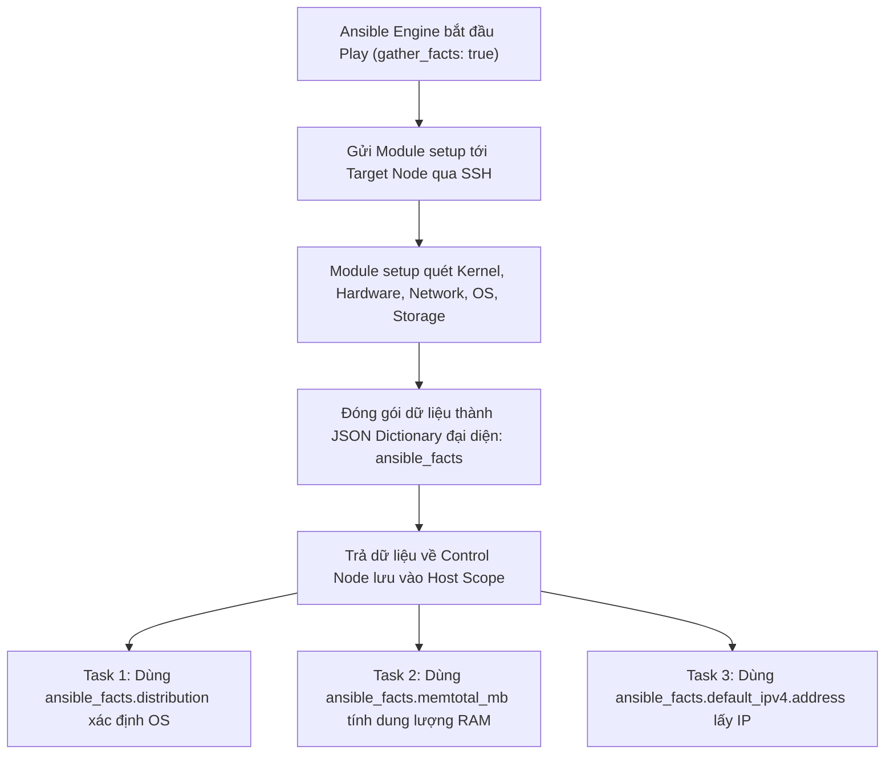
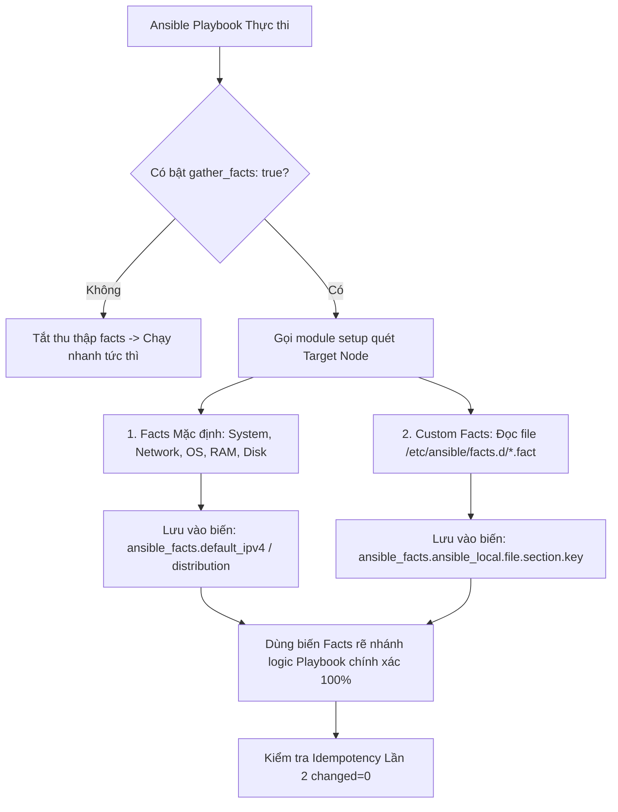


# [BÀI 08] THU THẬP & KHAI THÁC ANSIBLE FACTS: SETUP MODULE, CUSTOM FACTS, GATHERS FACTS OPTIMIZATION & SMART CACHING

Trong kỷ nguyên **Infrastructure as Code (IaC)** và tự động hóa vận hành hạ tầng đám mây (Cloud Infrastructure Automation), **Ansible** khẳng định vị thế dẫn đầu nhờ triết lý **Agentless** (không cần cài đặt agent nền trên máy đích), giao thức điều khiển an toàn qua **SSH / WinRM**, định dạng khai báo **YAML** trực quan và nguyên lý bất biến **Idempotency** mạnh mẽ. Việc làm chủ Ansible không chỉ dừng lại ở các câu lệnh Ad-hoc đơn giản, mà đòi hỏi kỹ sư phải nắm vững kiến trúc Module tầng thấp, Variable Precedence 22 tầng, Jinja2 Templates, tối ưu hóa Forks & Pipelining cho tới thiết kế Roles / Collections và tích hợp CI/CD tự động hóa chuẩn Doanh nghiệp.

Bài viết chuyên sâu này sẽ đồng hành cùng bạn mổ xẻ toàn diện bức tranh kiến trúc, phân tích các đánh đổi kỹ thuật thực chiến (Engineering Trade-offs), cung cấp hướng dẫn thực hành Lab chi tiết từng bước và bộ câu hỏi phỏng vấn chuyên sâu chuẩn DevOps / SRE Lead.

---

## 1. Bản Chất Kiến Trúc & Cơ Chế Vận Hành Tầng Thấp

---


> **Facts là bức ảnh chụp thực tế máy đích; tự định nghĩa custom facts giúp quản trị hạ tầng chính xác 100%.**

Chủ đề xuyên suốt khóa học (I-10) tiếp tục được làm sâu ở Buổi 08:

> **Khi tự động hóa hạ tầng đa dạng (gồm CentOS, Ubuntu, Debian, RedHat với các thông số RAM, CPU, IP khác nhau), Playbook không thể dùng các giá trị cứng. Ansible Facts đóng vai trò như một bức ảnh chụp toàn diện trạng thái thực tế của máy đích ngay trước khi chạy. Khai thác `ansible_facts` giúp Playbook tự động thích ứng đúng hệ điều hành. Đặc biệt, việc tự định nghĩa Custom Facts (`.fact`) tại thư mục `/etc/ansible/facts.d/` cho phép doanh nghiệp tự gắn nhãn quản lý (như ứng dụng thuộc môi trường nào, phiên bản release ra sao) để đưa ra quyết định tự động hóa chính xác 100%.**

---


---


---


| Tiếng Việt | Tiếng Anh / Từ khóa + FQCN (giữ nguyên) |
|---|---|
| Thông tin thực tế hệ thống | Ansible Facts / Facts |
| Module thu thập thông tin | `ansible.builtin.setup` |
| Biến chứa thông tin hệ thống | `ansible_facts` |
| Thu thập thông tin tự động | Fact gathering (`gather_facts: true`) |
| Lọc nhóm thông tin thu thập | Fact subset (`gather_subset`) |
| Bộ lọc thông tin | Fact filter (`filter=...`) |
| Thông tin tự định nghĩa | Custom Facts / Local Facts |
| Thư mục thông tin tự định nghĩa | `/etc/ansible/facts.d/` |
| Không gian tên thông tin tự định nghĩa | `ansible_facts.ansible_local` |
| Lưu đệm thông tin | Fact Caching |
| Đệm lưu file JSON | JSONFile Fact Cache |
| Đệm bộ nhớ Redis | Redis Fact Cache |

---

### 1.1. Bản chất của Ansible Facts và Module Setup (15 phút)



**Nguyên lý cốt lõi:** Ansible Facts là tập hợp toàn bộ thông tin chi tiết về phần cứng, hệ điều hành, mạng và đĩa cứng của máy đích, được module `ansible.builtin.setup` tự động quét và thu thập ở đầu mỗi Play ngoại trừ khi bị tắt bằng `gather_facts: false`.

**Giải thích cơ chế ngầm:** Nhờ có Facts, Ansible hoạt động theo cơ chế *Auto-discovery* (Tự phát hiện). Quản trị viên không cần phải khai báo thủ công máy đích chạy OS gì, RAM bao nhiêu hay IP thế nào; Ansible tự khám phá và cung cấp thông tin này dưới dạng biến chuẩn hóa.

> [!WARNING]
> **CẠM BẪY THỰC CHIẾN:**
> Khai báo thủ công biến `os_type: ubuntu` trong `host_vars` dẫn tới rủi ro sai lệch khi máy đích bị nâng cấp hoặc đổi OS mà quản trị viên không hay biết.

**Minh hoạ.** Gọi module `setup` trực tiếp bằng lệnh Ad-hoc để soi thông tin máy đích:
```bash
ansible target1 -m ansible.builtin.setup
```

**Nguyên lý cốt lõi:** Mọi dữ liệu thu thập bởi module `setup` được lưu trữ dưới dạng một Dictionary lồng nhau trong không gian tên `ansible_facts` và có thể được trích xuất bằng dấu chấm `.` hoặc cặp dấu ngoặc vuông `['']`.

**Giải thích cơ chế ngầm:** Cấu trúc chuẩn hóa `ansible_facts.key.subkey` giúp truy vấn thông tin chính xác và nhất quán trên mọi hệ điều hành (ví dụ: `ansible_facts.default_ipv4.address` luôn trả về IP chính bất kể host là RedHat, Ubuntu hay SUSE).

> [!WARNING]
> **CẠM BẪY THỰC CHIẾN:**
> **Lệnh:** `ansible-playbook site.yml` · **Output phải thấy:** `fatal: [target1]: FAILED! => {"msg": "'ansible_default_ipv4' is undefined"}` do dùng cú pháp legacy kiểu cũ `ansible_default_ipv4` mà tắt cờ tương thích `inject_facts_as_vars`.

**Minh hoạ.** Truy vấn thông tin hệ điều hành và RAM từ `ansible_facts`:
```yaml
- name: Print system facts
  ansible.builtin.debug:
    msg: "Host {{ ansible_facts.hostname }} runs {{ ansible_facts.distribution }} with {{ ansible_facts.memtotal_mb }} MB RAM"
```

**Nguyên lý cốt lõi:** Sử dụng tham số `gather_subset` để giới hạn phạm vi thu thập facts hoặc tắt bằng `gather_facts: false` nhằm tối ưu tốc độ thực thi Playbook khi không dùng tới biến facts.

**Giải thích cơ chế ngầm:** Mặc định module `setup` quét toàn bộ thông số phần cứng, card mạng, mount point đĩa cứng, tiêu tốn 3–5 giây trên mỗi host. Truyền `gather_subset: "!all,!min,network"` chỉ thu thập thông tin mạng, giúp giảm 80% thời gian quét facts.

> [!WARNING]
> **CẠM BẪY THỰC CHIẾN:**
> Playbook chỉ thực hiện tác vụ chép file tĩnh đơn giản nhưng tiêu tốn hàng phút chờ thu thập facts trên 100 máy chủ.

**Minh hoạ.** Chỉ thu thập thông tin tối thiểu và mạng:
```yaml
---
- name: Optimized Playbook
  hosts: web
  gather_facts: true
  gather_subset:
    - '!all'
    - '!min'
    - 'network'
  tasks:
    - name: Print IP address
      ansible.builtin.debug:
        msg: "Primary IP is {{ ansible_facts.default_ipv4.address }}"
```

---

### 1.2. Tự định nghĩa Custom Facts (Local Facts) (15 phút)

**Nguyên lý cốt lõi:** Custom Facts (Local Facts) là các tệp tin tùy biến được đặt tại thư mục `/etc/ansible/facts.d/` trên máy đích (mang đuôi `.fact`), cho phép hệ thống tự định nghĩa các thuộc tính riêng của doanh nghiệp.

**Giải thích cơ chế ngầm:** Các facts mặc định của Ansible chỉ quét được thông số phần cứng/OS thô. Custom Facts giúp doanh nghiệp đưa các thông tin quản trị riêng (như `app_tier: frontend`, `environment: production`, `owner: devops-team`) trực tiếp vào đĩa cứng máy đích để Playbook tự đọc.

> [!WARNING]
> **CẠM BẪY THỰC CHIẾN:**
> Tạo tệp custom fact sai đường dẫn (ví dụ tạo tại `/etc/facts.d/`) khiến Ansible không thể tự động phát hiện khi chạy module `setup`.

**Minh hoạ.** Cấu trúc thư mục Custom Facts chuẩn trên máy đích:
```
/etc/ansible/facts.d/
├── custom_app.fact
└── system_role.fact
```

**Nguyên lý cốt lõi:** Tệp Custom Facts chấp nhận 3 định dạng: Định dạng INI tĩnh, Định dạng JSON tĩnh, hoặc một Script thực thi (Executable script) trả về chuỗi JSON chuẩn ra `stdout`.

**Giải thích cơ chế ngầm:** Định dạng INI/JSON tĩnh phù hợp cho các cấu hình cố định do quản trị viên tạo sẵn. Định dạng Script thực thi (như bash/python script có quyền `chmod +x`) cho phép tính toán dữ liệu động thời gian thực trên máy đích trước khi trả về cho Ansible.

> [!WARNING]
> **CẠM BẪY THỰC CHIẾN:**
> Tạo tệp script Custom Fact dạng bash nhưng quên cấp quyền thực thi `chmod +x` khiến Ansible xem đó là file văn bản thô và parse lỗi.

**Minh hoạ.** Hai mẫu Custom Fact tĩnh (INI) và động (Bash script):
```ini
# /etc/ansible/facts.d/custom_app.fact (Dạng INI tĩnh)
[application]
name=NTKWeb
version=2.1.0
environment=production
```

```bash
#!/bin/bash
# /etc/ansible/facts.d/dynamic_status.fact (Dạng Script thực thi chmod +x)
cat <<EOF
{
  "active_users": $(who | wc -l),
  "service_status": "healthy"
}
EOF
```

**Nguyên lý cốt lõi:** Tất cả Custom Facts được nạp tự động vào không gian tên `ansible_facts.ansible_local.<fact_file_basename>.<section>.<key>`.

**Giải thích cơ chế ngầm:** Việc gom nhóm dưới không gian tên `ansible_local` giúp phân định rõ ràng đâu là facts mặc định của hệ thống, đâu là facts do doanh nghiệp tự định nghĩa, tránh gây xung đột tên biến.

> [!WARNING]
> **CẠM BẪY THỰC CHIẾN:**
> Truy vấn `ansible_facts.custom_app.version` thay vì truy vấn đúng không gian tên `ansible_facts.ansible_local.custom_app.application.version`.

**Minh hoạ.** Truy vấn Custom Fact dạng INI trong Playbook:
```yaml
- name: Read Custom App Fact
  ansible.builtin.debug:
    msg: "App version is {{ ansible_facts.ansible_local.custom_app.application.version }}"
```

---

### 1.3. Cấu hình Fact Caching và Tải lại Facts (10 phút)

**Nguyên lý cốt lõi:** Cấu hình lưu trữ đệm Fact Caching (trong file `ansible.cfg`) giúp lưu trữ dữ liệu facts của máy đích vào đệm (JSONFile, Redis) để sử dụng lại giữa các lượt chạy Playbook mà không cần quét lại qua SSH.

**Giải thích cơ chế ngầm:** Trong hạ tầng hàng ngàn máy chủ, việc quét lại facts mỗi lần thực thi Playbook gây nghẽn mạng và tốn CPU. Fact Caching giữ dữ liệu facts trong thời gian sống chỉ định (ví dụ `fact_caching_timeout = 86400` - 24 giờ), giúp Playbook khởi động tức thì.

> [!WARNING]
> **CẠM BẪY THỰC CHIẾN:**
> Cấu hình Fact Caching nhưng quên tạo thư mục lưu file đệm khiến Ansible báo lỗi `ansible.errors.AnsibleError: Cannot write to fact cache directory`.

**Minh hoạ.** Cấu hình JSONFile Fact Caching trong `ansible.cfg`:
```ini
[defaults]
fact_caching = jsonfile
fact_caching_connection = /tmp/ansible_fact_cache
fact_caching_timeout = 86400
```

**Nguyên lý cốt lõi:** Gọi trực tiếp module `ansible.builtin.setup` ở giữa Playbook khi cần tái thu thập thông tin facts mới sau khi một Task vừa làm thay đổi cấu hình mạng hoặc vừa tạo file Custom Fact mới.

**Giải thích cơ chế ngầm:** Dữ liệu facts quét ở đầu Play là dữ liệu tại thời điểm quá khứ. Nếu Task 1 tạo ra file `/etc/ansible/facts.d/custom_app.fact`, Task 2 muốn sử dụng biến custom fact này ngay lập tức thì BẮT BUỘC phải gọi module `setup` ở giữa để nạp lại facts mới.

> [!WARNING]
> **CẠM BẪY THỰC CHIẾN:**
> Tạo file `/etc/ansible/facts.d/custom_app.fact` ở Task 1 nhưng Task 2 lập tức đọc `ansible_facts.ansible_local` gây lỗi `undefined` do chưa nạp lại facts.

**Minh hoạ.** Tải lại facts sau khi tạo Custom Fact mới:
```yaml
- name: Step 1 - Deploy Custom Fact file
  ansible.builtin.copy:
    content: "[app]\nenv=prod\n"
    dest: /etc/ansible/facts.d/my_app.fact
    mode: '0644'

- name: Step 2 - Re-gather facts to load new local facts
  ansible.builtin.setup:
    filter: "ansible_local"

- name: Step 3 - Use newly loaded custom fact
  ansible.builtin.debug:
    msg: "Env is {{ ansible_facts.ansible_local.my_app.app.env }}"
```

**Nguyên lý cốt lõi:** Đảm bảo phân quyền an toàn cho thư mục `/etc/ansible/facts.d/` và các tệp `.fact` (sở hữu bởi `root:root`, phân quyền `0755` cho thư mục, `0644` cho tệp tĩnh, `0755` cho script).

**Giải thích cơ chế ngầm:** Nếu tệp script Custom Fact bị người dùng không có quyền ghi đè (ví dụ phân quyền `0777`), kẻ tấn công có thể chèn mã độc vào script `.fact`. Khi Ansible chạy bằng quyền `become: true`, đoạn mã độc đó sẽ được thực thi dưới quyền root.

> [!WARNING]
> **CẠM BẪY THỰC CHIẾN:**
> Phân quyền `0777` cho thư mục `/etc/ansible/facts.d/` làm xuất hiện cảnh báo an ninh hoặc nguy cơ leo thang quyền lực.

**Minh hoạ.** Phân quyền chuẩn cho thư mục Custom Facts:
```yaml
- name: Ensure facts directory exists with secure permissions
  ansible.builtin.file:
    path: /etc/ansible/facts.d
    state: directory
    owner: root
    group: root
    mode: '0755'
```

---

### 1.4. Đưa vào việc thật (4 phút)

### 7.1. Áp dụng vào hạ tầng sẵn có
Khi quản lý hạ tầng hỗn hợp Linux (Ubuntu 22.04 và RHEL 9):
- Sử dụng biến `ansible_facts.os_family` trong Playbook để tự động chọn đúng tên gói phần mềm (`httpd` cho RedHat family, `nginx` cho Debian family).
- Ghi sẵn file `/etc/ansible/facts.d/datacenter.fact` trên từng server vật lý chứa thông tin `rack_id` và `dc_location` để Playbook tự nhận biết vị trí triển khai.

### 7.2. Rủi ro hỏng hóc khi triển khai Production và giải pháp an toàn
- **Rủi ro:** Script Custom Fact bị treo vô hạn (Deadlock / Hang) khiến lượt chạy Playbook bị dừng lại mãi mãi ở bước `Gathering Facts`.
- **Giải pháp an toàn:**
  1. Luôn cài đặt timeout cho các lệnh bên trong script Custom Fact thực thi.
  2. Bắt buộc kiểm thử script `.fact` bằng tay trên máy đích (`/etc/ansible/facts.d/my_script.fact`) trước khi đưa vào tự động hóa.

### 7.3. Đo lường chỉ số Trước – Sau khi áp dụng
- **Trước khi dùng Custom Facts:** Phải duy trì hàng trăm file `host_vars` chứa thông tin nhãn ứng dụng, quản trị viên cập nhật thủ công rất dễ sót.
- **Sau khi dùng Custom Facts:** Máy chủ tự báo cáo nhãn ứng dụng qua `ansible_local`, giảm 90% công sức quản lý file `host_vars`.

### 7.4. Khi nào KHÔNG nên dùng Custom Facts
- **Không dùng Custom Facts để lưu trữ thông tin nhạy cảm (Mật khẩu, Key bí mật):** File trong `/etc/ansible/facts.d/` nằm ở dạng plain-text trên máy đích. Mọi user có quyền đọc file đều thấy được nội dung. **Mật khẩu phải quản lý bằng Ansible Vault hoặc HashiCorp Vault**.

---

### 1.5. Bẫy hay gặp (2 phút)

| # | Bẫy hay gặp | Vì sao "recap xanh mà sai / không idempotent" | Lệnh phát hiện và xử lý |
|---|---|---|---|
| 1 | Tạo thư mục Custom Facts sai đường dẫn | Tạo ở `/etc/ansible/facts` (thiếu `.d`) khiến Ansible không tự nhận diện được file. | Tạo chính xác đường dẫn `/etc/ansible/facts.d/`. |
| 2 | Quên phân quyền `chmod +x` cho script Custom Fact | Script dạng bash/python không có quyền thực thi bị Ansible xem là file text và parse lỗi. | Chạy `chmod +x /etc/ansible/facts.d/script.fact`. |
| 3 | Sử dụng cú pháp biến legacy `ansible_default_ipv4` | Cú pháp cũ bị loại bỏ dần ở các bản Ansible mới, gây lỗi `undefined`. | Chuyển sang chuẩn mới `ansible_facts.default_ipv4.address`. |
| 4 | Không tải lại facts sau khi vừa tạo file `.fact` | Task 1 tạo file `.fact`, Task 2 đọc `ansible_local` ngay lập tức bị lỗi `undefined`. | Thêm task gọi module `ansible.builtin.setup: filter=ansible_local` ở giữa. |
| 5 | Tệp Custom Fact dạng JSON bị sai cú pháp | File JSON chứa thừa dấu phẩy `,` ở cuối làm parser JSON bị crash. | Kiểm tra cú pháp JSON bằng `jq . /etc/ansible/facts.d/file.fact`. |
| 6 | Tắt `gather_facts: false` nhưng vẫn dùng `ansible_facts` | Playbook báo lỗi `undefined` cho toàn bộ các biến facts hệ thống. | Bật `gather_facts: true` hoặc dùng `gather_subset` tối ưu thay vì tắt hoàn toàn. |
| 7 | Tệp Custom Fact dạng INI thiếu tên Section | Khai báo `key=value` ngay đầu file mà không có cặp thẻ `[section_name]`. | Bổ sung thẻ `[section_name]` ở dòng đầu tiên của file `.fact` dạng INI. |
| 8 | Fact Caching bị quá hạn dữ liệu (Stale cache) | Cấu hình cache timeout quá lâu (ví dụ 1 tháng) khiến IP mới của máy không được cập nhật. | Đặt `fact_caching_timeout` hợp lý (ví dụ 24h) hoặc xóa thư mục cache khi có thay đổi lớn. |
| 9 | Script Custom Fact in ra các dòng log thừa | Script in ra stdout các dòng text không phải JSON khiến parser Ansible bị lỗi. | Đảm bảo script Custom Fact CHỈ in ra chuỗi JSON thuần túy ra `stdout`. |
| 10 | Phân quyền file `.fact` quá rộng (`0777`) | Tạo nguy cơ an ninh leo thang quyền lực root từ các tài khoản user thường. | Đổi phân quyền file về `0644` (tệp tĩnh) hoặc `0755` (script). |
| 11 | Không bọc kiểm tra sự tồn tại của Custom Fact | Playbook bị crash khi chạy trên máy chưa được trang bị tệp `.fact` tương ứng. | Dùng điều kiện `when: ansible_facts.ansible_local.my_app is defined`. |
| 12 | Nhầm lẫn giữa `ansible_facts.env` và `ansible_facts.environment` | Không kiểm tra chính xác cấu trúc Dictionary facts dẫn tới gọi sai tên thuộc tính. | Chạy `ansible target1 -m setup` để soi đúng tên thuộc tính cần dùng. |

---

### 1.6. Tóm tắt (1 phút)



### Năm điều phải nhớ
1. **Facts là bức ảnh máy đích:** Quét tự động bởi module `setup` ở đầu mỗi Play.
2. **Dùng chuẩn cú pháp mới:** Truy vấn qua `ansible_facts.<property>` thay vì biến legacy cũ.
3. **Thư mục Custom Facts:** `/etc/ansible/facts.d/*.fact` (định dạng INI, JSON hoặc Script `chmod +x`).
4. **Namespace Custom Facts:** Truy xuất qua `ansible_facts.ansible_local.<file_basename>.<section>.<key>`.
5. **Nạp lại facts bằng setup:** Phải gọi module `setup` nếu vừa tạo file custom fact ở task trước.

---

### 1.7. Câu hỏi tự kiểm tra (kiêm luyện RHCE EX294)

1. **[RHCE EX294 Objective #7]** Module nào trong Ansible có nhiệm vụ tự động quét và thu thập thông tin phần cứng/OS của máy đích?
   - *Đáp án:* Module `ansible.builtin.setup`.
2. **[RHCE EX294 Objective #7]** Cú pháp chuẩn mới để truy vấn tên hệ điều hành (distribution) của máy đích từ biến facts là gì?
   - *Đáp án:* Cú pháp `{{ ansible_facts.distribution }}` (hoặc `ansible_facts['distribution']`).
3. **[RHCE EX294 Objective #7]** Viết lệnh Ad-hoc CLI để gọi module `setup` trên máy `target1` và chỉ lọc ra các thông số liên quan đến bộ nhớ RAM.
   - *Đáp án:* `ansible target1 -m ansible.builtin.setup -a "filter=ansible_mem*"`
4. **[RHCE EX294 Objective #7]** Làm thế nào để tắt bước thu thập thông tin Facts tự động ở đầu một Play để tăng tốc độ chạy Playbook?
   - *Đáp án:* Khai báo thuộc tính `gather_facts: false` ở cấp độ Play.
5. **[RHCE EX294 Objective #7]** Tham số `gather_subset` trong Playbook có tác dụng gì? Cho ví dụ chỉ thu thập thông tin mạng.
   - *Đáp án:* Dùng để chỉ định cụ thể nhóm facts cần thu thập nhằm tối ưu thời gian. Ví dụ: `gather_subset: ["!all", "!min", "network"]`.
6. **[RHCE EX294 Objective #7]** Thư mục nào trên máy đích là nơi lưu trữ các tệp Custom Facts (Local Facts)?
   - *Đáp án:* Thư mục `/etc/ansible/facts.d/`.
7. **[RHCE EX294 Objective #7]** Tệp Custom Facts chấp nhận những định dạng tệp tin nào?
   - *Đáp án:* Chấp nhận định dạng INI tĩnh, định dạng JSON tĩnh, hoặc một Script thực thi (Bash/Python) có cờ `chmod +x` trả về JSON.
8. **[RHCE EX294 Objective #7]** Giả sử có file `/etc/ansible/facts.d/custom_app.fact` dạng INI chứa `[settings]` và `env=prod`. Viết cú pháp Jinja2 để truy vấn giá trị `env`.
   - *Đáp án:* `{{ ansible_facts.ansible_local.custom_app.settings.env }}`.
9. **[RHCE EX294 Objective #7]** Nếu một Script Custom Fact dạng bash được đặt trong `/etc/ansible/facts.d/` nhưng quên cấp quyền `chmod +x`, điều gì sẽ xảy ra?
   - *Đáp án:* Ansible sẽ xem đó là file văn bản thô và báo lỗi parse cú pháp khi chạy module `setup`.
10. **[RHCE EX294 Objective #7]** Tại sao sau khi chép một file Custom Fact mới ở Task 1, ta phải gọi module `setup` ở Task 2 trước khi đọc biến `ansible_local` ở Task 3?
    - *Đáp án:* Để ép Ansible thực hiện quét lại và nạp dữ liệu Custom Fact mới vừa tạo vào bộ nhớ Host Scope.
11. **[RHCE EX294 Objective #7]** Cấu hình Fact Caching loại JSONFile trong file `ansible.cfg` mang lại lợi ích gì cho hệ thống lớn?
    - *Đáp án:* Giúp lưu dữ liệu facts vào file đệm đĩa cứng, tái sử dụng giữa các lượt chạy mà không phải tốn thời gian quét lại facts qua kết nối SSH.
12. **[RHCE EX294 Objective #7]** Viết một đoạn Playbook YAML tối giản kiểm tra nếu `ansible_facts.os_family == "RedHat"` thì in ra màn hình thông điệp "RHEL Node".
    - *Đáp án:*
      ```yaml
      ---
      - name: Fact Check Demo
        hosts: all
        tasks:
          - name: Print message for RedHat nodes
            ansible.builtin.debug:
              msg: "This is a RHEL Node"
            when: ansible_facts.os_family == "RedHat"
      ```
13. **[RHCE EX294 Objective #7]** Tại sao không được lưu trữ mật khẩu plain-text trong các tệp Custom Facts tại `/etc/ansible/facts.d/`?
    - *Đáp án:* Vì thư mục này nằm ở dạng plain-text trên đĩa cứng máy đích, mọi người dùng có quyền đọc đều có thể xem được mật khẩu gây rủi ro rò rỉ an ninh.

---

### 1.8. Tài liệu tham khảo

- Ansible Core Documentation (v2.15+): [Discovering variables: facts and information about remote systems](https://docs.ansible.com/ansible/latest/playbook_guide/playbooks_vars_facts.html)
- Ansible Core Documentation: [Adding custom facts](https://docs.ansible.com/ansible/latest/playbook_guide/playbooks_vars_facts.html#local-facts-custom-facts)
- Red Hat Certified Engineer (RHCE) EX294 Study Guide: Managing Facts and Custom Facts in Ansible.

---

## Bảng đối soát thời lượng

| Mục | Nội dung | Thời lượng dự kiến | Thời lượng thực tế |
|---|---|---|---|
| §0 | Khởi động và ôn tập buổi 07 | 10 phút | 10 phút |
| §1–§2 | Mục tiêu làm được & Cần biết trước | 2 phút | 2 phút |
| §3 | Thuật ngữ Việt-Anh & Mô hình tư duy | 8 phút | 8 phút |
| §4 | Bản chất Ansible Facts & Module Setup (QT 4.1–4.3) | 15 phút | 15 phút |
| §5 | Tự định nghĩa Custom Facts (QT 5.1–5.3) | 15 phút | 15 phút |
| §6 | Cấu hình Fact Caching & Tải lại Facts (QT 6.1–6.3) | 10 phút | 10 phút |
| §7–§9 | Đưa vào việc thật, Bẫy hay gặp & Tóm tắt | 7 phút | 7 phút |
| §10–§11 | Câu hỏi tự kiểm tra EX294 & Tài liệu tham khảo | 3 phút | 3 phút |
| **Tổng** | **Khối lý thuyết Buổi 08** | **60 phút** | **60 phút** |

---

## 2. Hướng Dẫn Thực Hành & Triển Khai Lab Chuẩn Production

> [!IMPORTANT]
> **YÊU CẦU MÔI TRƯỜNG THỰC HÀNH:**
> Toàn bộ các bài thực hành dưới đây được thiết kế để chạy trực tiếp trên môi trường máy chủ Linux / Docker containers phân tán. Hãy đảm bảo bạn đã chuẩn bị Control Node cài đặt Ansible Core 2.15+ cùng các Managed Nodes đã cấu hình SSH Key Authentication.

## Khối thực hành — 150 phút

> **Đối soát thời lượng:** Khối thực hành kéo dài đúng **150'** (từ L0 đến L11).
> **Nguyên tắc cốt lõi:** Thực hành thu thập biến hệ thống `ansible_facts`, sử dụng bộ lọc `filter` và `gather_subset` để tối ưu thời gian quét, khởi tạo thư mục `/etc/ansible/facts.d/` trên máy đích để tạo Custom Facts (tệp INI tĩnh và Bash script động `chmod +x`), tái thu thập facts bằng module `setup`, truy vấn qua `ansible_local`, thực thi phép thử **Lượt chạy Lần thứ hai** chứng minh chỉ số `PLAY RECAP` đạt `changed=0` và đối soát sự thật máy đích qua `docker exec`.

---

## L0. Mục tiêu thực hành và tiêu chí hoàn thành

| # | Mục tiêu thực hành | Tiêu chí hoàn thành (Kiểm tra bằng lệnh CLI) |
|---|---|---|
| TH1 | Gọi module setup lọc thông số facts bằng filter | Lệnh `ansible target1 -m setup -a "filter=ansible_distribution*"` in thông tin |
| TH2 | Trích xuất biến ansible_facts trong Playbook | Playbook in đúng IP `ansible_facts.default_ipv4.address` và OS |
| TH3 | Tối ưu thời gian quét facts bằng gather_subset | Playbook chạy với `gather_subset: ["!all", "!min", "network"]` |
| TH4 | Tạo tệp Custom Fact tĩnh dạng INI trên target node | File `/etc/ansible/facts.d/custom_app.fact` chứa cặp section/key |
| TH5 | Tạo script Custom Fact động dạng Bash chmod +x | Script `/etc/ansible/facts.d/dynamic_info.fact` trả về JSON |
| TH6 | Tái thu thập facts và đọc ansible_facts.ansible_local | Playbook đọc đúng giá trị `ansible_local.custom_app.application` |
| TH7 | Thực thi Phép thử Lượt chạy Lần hai (Idempotency) | Bảng `PLAY RECAP` Lần 2 đạt `changed=0` tuyệt đối |
| TH8 | Đối soát sự thật máy đích bằng docker exec | `docker exec target1 cat /etc/ansible/facts.d/custom_app.fact` |

---

## L1. Điều kiện tiên quyết về môi trường

| Kiểm tra | LỆNH THỰC THI | Kết quả kỳ vọng |
|---|---|---|
| Ansible core đã cài | `ansible --version` | Phiên bản ansible-core v2.15 trở lên |
| Docker Compose sẵn sàng | `docker compose ps` | Cả target1 và target2 ở trạng thái `Up` |
| Kết nối SSH sẵn sàng | `ansible all -m ansible.builtin.ping` | Đạt `SUCCESS` cho mọi host |
| Inventory dự án | `ansible-inventory --graph` | Hiển thị các nhóm `web` và `db` |
| Thư mục thực hành | `pwd` | Đang ở thư mục `~/lab-ansible-08` |

Nếu chưa có target container:
```bash
cd labs && make up && make key && make inventory
```

---

## L2. Kiến trúc bài lab

```mermaid
graph TD
    SubGraph1["Control Node (ansible-playbook CLI)"] --> |1. Quét mặc định: Module setup| T1["Target Container 1 (target1)"]
    
    SubGraph1 --> |2. Task 1: Tạo thư mục /etc/ansible/facts.d| T1
    SubGraph1 --> |3. Task 2: Chép file custom_app.fact (INI)| T1
    SubGraph1 --> |4. Task 3: Chép script dynamic_info.fact (Bash chmod +x)| T1
    
    T1 --> |5. Task 4: Gọi module setup filter=ansible_local| SubGraph1
    
    SubGraph1 --> |6. Task 5: Debug ansible_facts.ansible_local| T1
    
    T1 -. "RECAP Lần 1: ok=6, changed=3" .-> SubGraph1
    T1 -. "RECAP Lần 2: ok=6, changed=0 (ĐẠT IDEMPOTENT)" .-> SubGraph1
    
    DEV["Học viên (Tester)"] --> |A. Chạy ansible-playbook facts-site.yml| SubGraph1
    DEV --> |B. Khẳng định changed=0 ở Lần 2| SubGraph1
    DEV --> |C. Đối soát sự thật máy đích| T1
```

---

## L3. Bước 1 — Truy vấn và Lọc Facts bằng Module Setup (25 phút)

Tạo thư mục dự án `~/lab-ansible-08`, file `ansible.cfg`, `inventory.ini`, và gọi module `setup` truy vấn thông tin máy đích (QT 4.1, QT 4.2).

```bash
mkdir -p ~/lab-ansible-08 && cd ~/lab-ansible-08

cat << 'EOF' > ansible.cfg
[defaults]
inventory = ./inventory.ini
remote_user = ansible
host_key_checking = False
private_key_file = ~/.ssh/id_ed25519

[privilege_escalation]
become = True
become_method = sudo
become_user = root
become_ask_pass = False
EOF

cat << 'EOF' > inventory.ini
[web]
target1 ansible_host=127.0.0.1 ansible_port=2221

[db]
target2 ansible_host=127.0.0.1 ansible_port=2222

[all:vars]
ansible_python_interpreter=/usr/bin/python3
EOF
```

Thực thi gọi module `setup` lọc các thuộc tính hệ thống bằng bộ lọc `filter`:
```bash
ansible target1 -m ansible.builtin.setup -a "filter=ansible_distribution*"
ansible target1 -m ansible.builtin.setup -a "filter=ansible_memtotal_mb"
```

**CHECKPOINT 1 — Gọi module setup lọc thành công thông tin ansible_distribution.**
- **Lệnh kiểm tra:**
```bash
SETUP_OUT=$(ansible target1 -m ansible.builtin.setup -a "filter=ansible_distribution*")
if echo "$SETUP_OUT" | grep -q "ansible_distribution" && echo "$SETUP_OUT" | grep -q "SUCCESS"; then
  echo "CHECKPOINT 1: ĐẠT - Lệnh ad-hoc module setup lọc thành công thông tin hệ điều hành ansible_distribution"
else
  echo "CHECKPOINT 1: LỖI - Gọi module setup lọc facts thất bại"
fi
```

---

## L4. Bước 2 — Trích xuất Biến ansible_facts và Tối ưu gather_subset (30 phút)

Viết file Playbook `system-facts.yml` trích xuất các thuộc tính hệ thống từ `ansible_facts` và áp dụng `gather_subset` tối ưu tốc độ (QT 4.2, QT 4.3).

```bash
cat << 'EOF' > system-facts.yml
---
- name: Extract System Facts with Gather Subset Optimization
  hosts: web
  gather_facts: true
  gather_subset:
    - '!all'
    - '!min'
    - 'network'
    - 'virtual'
  tasks:
    - name: Task 1 - Print system IP address and OS family
      ansible.builtin.debug:
        msg: "Target Host {{ ansible_facts.hostname }} has IP {{ ansible_facts.default_ipv4.address }} running OS Family {{ ansible_facts.os_family }}"

    - name: Task 2 - Print Architecture and Kernel
      ansible.builtin.debug:
        msg: "Architecture: {{ ansible_facts.architecture }}, Kernel: {{ ansible_facts.kernel }}"
EOF
```

Thực thi Playbook `system-facts.yml`:
```bash
ansible-playbook system-facts.yml
```

**CHECKPOINT 2 — Playbook system-facts.yml trích xuất thành công IP và OS family từ ansible_facts.**
- **Lệnh kiểm tra:**
```bash
FACTS_RUN_OUT=$(ansible-playbook system-facts.yml)
if echo "$FACTS_RUN_OUT" | grep -q "Target Host target1 has IP" && echo "$FACTS_RUN_OUT" | grep -q "failed=0"; then
  echo "CHECKPOINT 2: ĐẠT - Playbook trích xuất chính xác các thuộc tính IP và OS Family từ biến ansible_facts"
else
  echo "CHECKPOINT 2: LỖI - Trích xuất ansible_facts thất bại"
fi
```

---

## L5. Bước 3 — Dựng Thư mục và Triển khai Custom Facts Tĩnh / Động (35 phút)

Tạo file Playbook `deploy-custom-facts.yml` tạo thư mục `/etc/ansible/facts.d/`, triển khai 1 file INI tĩnh và 1 script Bash động có cờ `chmod +x` (QT 5.1, QT 5.2, QT 6.3).

```bash
cat << 'EOF' > deploy-custom-facts.yml
---
- name: Deploy and Verify Custom Local Facts
  hosts: web
  become: true
  tasks:
    - name: Task 1 - Ensure custom facts directory exists
      ansible.builtin.file:
        path: /etc/ansible/facts.d
        state: directory
        owner: root
        group: root
        mode: '0755'

    - name: Task 2 - Deploy static INI custom fact file
      ansible.builtin.copy:
        content: |
          [application]
          name=NTKAnsibleCore
          version=3.5.0
          environment=production
          owner=devops-team
        dest: /etc/ansible/facts.d/custom_app.fact
        owner: root
        group: root
        mode: '0644'

    - name: Task 3 - Deploy executable dynamic Bash script custom fact
      ansible.builtin.copy:
        content: |
          #!/bin/bash
          cat <<EOF
          {
            "system_tier": "web-frontend",
            "cluster_node_id": "node-101",
            "health_status": "OK"
          }
          EOF
        dest: /etc/ansible/facts.d/dynamic_info.fact
        owner: root
        group: root
        mode: '0755'

    - name: Task 4 - Re-gather facts to load newly created custom facts
      ansible.builtin.setup:
        filter: "ansible_local"

    - name: Task 5 - Print static custom fact from ansible_local
      ansible.builtin.debug:
        msg: "Custom App: {{ ansible_facts.ansible_local.custom_app.application.name }} v{{ ansible_facts.ansible_local.custom_app.application.version }} (Env: {{ ansible_facts.ansible_local.custom_app.application.environment }})"

    - name: Task 6 - Print dynamic custom fact from ansible_local
      ansible.builtin.debug:
        msg: "Dynamic Node Tier: {{ ansible_facts.ansible_local.dynamic_info.system_tier }} (Node ID: {{ ansible_facts.ansible_local.dynamic_info.cluster_node_id }})"
EOF
```

Thực thi Playbook `deploy-custom-facts.yml`:
```bash
ansible-playbook deploy-custom-facts.yml
```

**CHECKPOINT 3 — Thư mục /etc/ansible/facts.d/ được tạo và nạp thành công Custom Fact tĩnh custom_app.fact.**
- **Lệnh kiểm tra:**
```bash
CUSTOM_RUN_OUT=$(ansible-playbook deploy-custom-facts.yml)
if echo "$CUSTOM_RUN_OUT" | grep -q "Custom App: NTKAnsibleCore v3.5.0 (Env: production)"; then
  echo "CHECKPOINT 3: ĐẠT - Ansible tự động nạp và đọc chính xác Custom Fact tĩnh dạng INI từ ansible_facts.ansible_local.custom_app"
else
  echo "CHECKPOINT 3: LỖI - Đọc Custom Fact tĩnh thất bại"
fi
```

**CHECKPOINT 4 — Script Custom Fact động dynamic_info.fact (chmod +x) được thực thi và trả về JSON chuẩn.**
- **Lệnh kiểm tra:**
```bash
if echo "$CUSTOM_RUN_OUT" | grep -q "Dynamic Node Tier: web-frontend (Node ID: node-101)"; then
  echo "CHECKPOINT 4: ĐẠT - Script Custom Fact động dạng Bash script được thực thi thành công trả về JSON cho ansible_local.dynamic_info"
else
  echo "CHECKPOINT 4: LỖI - Đọc Script Custom Fact động thất bại"
fi
```

---

## L6. Bước 4 — Sử dụng Custom Facts Điều khiển Logic và Phép thử Lượt 2 (30 phút)

Tạo file Playbook `logic-facts-site.yml` dùng Custom Facts để đưa ra quyết định tự động và thực thi phép thử **Lượt chạy Lần thứ hai** chứng minh tính Idempotency (QT 5.3, QT 6.1).

```bash
cat << 'EOF' > logic-facts-site.yml
---
- name: Infrastructure Automation Driven by Custom Facts
  hosts: web
  become: true
  tasks:
    - name: Task 1 - Ensure facts directory exists
      ansible.builtin.file:
        path: /etc/ansible/facts.d
        state: directory
        mode: '0755'

    - name: Task 2 - Ensure custom app fact exists
      ansible.builtin.copy:
        content: |
          [application]
          name=NTKAnsibleCore
          version=3.5.0
          environment=production
        dest: /etc/ansible/facts.d/custom_app.fact
        mode: '0644'

    - name: Task 3 - Re-gather local facts
      ansible.builtin.setup:
        filter: "ansible_local"

    - name: Task 4 - Deploy production config file when custom fact matches production
      ansible.builtin.copy:
        content: |
          # Production Web Configuration
          APP_NAME={{ ansible_facts.ansible_local.custom_app.application.name }}
          VERSION={{ ansible_facts.ansible_local.custom_app.application.version }}
          DEPLOYED_BY=Ansible Facts Module
        dest: /etc/production-web.conf
        mode: '0644'
      when: ansible_facts.ansible_local.custom_app.application.environment == "production"
EOF
```

Thực thi Lần 1:
```bash
ansible-playbook logic-facts-site.yml
```

Thực thi Lần 2 (BẮT BUỘC ĐẠT `changed=0`):
```bash
ansible-playbook logic-facts-site.yml
```

**CHECKPOINT 5 — Phép thử Lượt 2 đạt changed=0 khi sử dụng Custom Facts điều khiển logic.**
- **Lệnh kiểm tra:**
```bash
RUN2_FACTS_OUT=$(ansible-playbook logic-facts-site.yml)
if echo "$RUN2_FACTS_OUT" | grep -q "changed=0" && echo "$RUN2_FACTS_OUT" | grep -q "failed=0"; then
  echo "CHECKPOINT 5: ĐẠT - Phép thử Lượt 2 đạt chuẩn Idempotency (PLAY RECAP báo changed=0 khi dùng Custom Facts)"
else
  echo "CHECKPOINT 5: LỖI - Lượt 2 không đạt changed=0 (Playbook không chuẩn Idempotent)"
fi
```

**CHECKPOINT 6 — Điều kiện when khớp đúng custom fact environment == production.**
- **Lệnh kiểm tra:**
```bash
if echo "$RUN2_FACTS_OUT" | grep -q "ok=4" && ! echo "$RUN2_FACTS_OUT" | grep -q "skipped=1"; then
  echo "CHECKPOINT 6: ĐẠT - Mệnh đề when kiểm tra custom fact environment == production khớp chính xác 100%"
else
  echo "CHECKPOINT 6: LỖI - Mệnh đề when kiểm tra custom fact bị skipped"
fi
```

---

## L7. Bước 5 — Đối soát Sự thật Máy đích qua docker exec (20 phút)

Sử dụng lệnh `docker exec` đối soát trực tiếp các tệp Custom Facts và file cấu hình sản phẩm trên máy đích (QT 6.2, QT 6.3).

Đối soát tệp Custom Fact tĩnh:
```bash
docker exec target1 cat /etc/ansible/facts.d/custom_app.fact
```

**CHECKPOINT 7 — Đối soát file /etc/ansible/facts.d/custom_app.fact trên target1 bằng docker exec.**
- **Lệnh kiểm tra:**
```bash
EXEC_FACT_FILE=$(docker exec target1 cat /etc/ansible/facts.d/custom_app.fact)
if echo "$EXEC_FACT_FILE" | grep -q "version=3.5.0" && echo "$EXEC_FACT_FILE" | grep -q "environment=production"; then
  echo "CHECKPOINT 7: ĐẠT - Lệnh docker exec xác nhận file Custom Fact /etc/ansible/facts.d/custom_app.fact tồn tại thực tế và chứa đúng cấu hình INI"
else
  echo "CHECKPOINT 7: LỖI - Kiểm tra file Custom Fact trên máy đích thất bại"
fi
```

Đối soát file cấu hình sản phẩm `/etc/production-web.conf`:
```bash
docker exec target1 cat /etc/production-web.conf
```

**CHECKPOINT 8 — Đối soát file /etc/production-web.conf trên target1 chứa đúng dữ liệu trích xuất từ Custom Facts.**
- **Lệnh kiểm tra:**
```bash
EXEC_CONF_FILE=$(docker exec target1 cat /etc/production-web.conf)
if echo "$EXEC_CONF_FILE" | grep -q "APP_NAME=NTKAnsibleCore" && echo "$EXEC_CONF_FILE" | grep -q "VERSION=3.5.0"; then
  echo "CHECKPOINT 8: ĐẠT - Kiểm tra sự thật qua docker exec xác nhận file /etc/production-web.conf đã nhận chính xác các giá trị từ Custom Facts"
else
  echo "CHECKPOINT 8: LỖI - Kiểm tra file cấu hình sản phẩm trên máy đích thất bại"
fi
```

---

## L8. Nộp sản phẩm và dọn dẹp (10 phút)

Thu thập kết quả ra các file báo cáo cuối buổi:
```bash
ansible-playbook logic-facts-site.yml > facts-playbook.yml
ansible target1 -m ansible.builtin.setup -a "filter=ansible_distribution*" > setup-filter-output.txt
ansible-playbook deploy-custom-facts.yml > custom-facts-proof.txt
ansible-playbook logic-facts-site.yml > idempotency-check.txt
docker exec target1 cat /etc/ansible/facts.d/custom_app.fact > kiem-may-dich.txt
docker exec target1 cat /etc/production-web.conf >> kiem-may-dich.txt
```

---

## L9. Xử lý sự cố

| # | Hiện tượng lỗi | Nguyên nhân gốc rễ | Cách xử lý nhanh |
|---|---|---|---|
| 1 | Lỗi `fatal: [target1]: FAILED! => {"msg": "'ansible_facts' is undefined"}` | Khai báo `gather_facts: false` ở cấp Play nhưng vẫn gọi biến `ansible_facts` | Bật lại `gather_facts: true` hoặc xóa dòng `gather_facts: false`. |
| 2 | Lỗi `undefined` khi đọc `ansible_facts.ansible_local.my_app` | Chưa gọi module `setup: filter=ansible_local` sau khi vừa chép file `.fact` mới | Thêm task gọi module `ansible.builtin.setup: filter=ansible_local` ở giữa. |
| 3 | Lỗi `AnsibleError: Cannot parse custom fact file` | File `.fact` dạng INI thiếu thẻ section `[section_name]` ở dòng đầu | Bổ sung thẻ `[section_name]` (ví dụ `[application]`) vào file `.fact`. |
| 4 | Script Custom Fact dạng Bash bị lỗi permission denied | Quên cấp quyền thực thi `chmod +x` cho script `.fact` | Thêm tham số `mode: '0755'` trong module `copy` khi tạo script `.fact`. |
| 5 | Script Custom Fact trả về output không parse được | Script in ra stdout các dòng text thừa không phải định dạng JSON chuẩn | Kiểm tra script bash bằng cách chạy thử trực tiếp và lọc qua `jq .`. |
| 6 | Thư mục `/etc/ansible/facts.d` không tồn tại | Quên task tạo thư mục trước khi chép tệp `.fact` vào | Sử dụng module `ansible.builtin.file: path=/etc/ansible/facts.d state=directory`. |
| 7 | Cú pháp đọc Custom Fact bị sai không gian tên | Viết `ansible_facts.my_app.version` thay vì `ansible_facts.ansible_local.my_app...` | Viết chính xác cú pháp không gian tên `ansible_facts.ansible_local.<file>.<section>.<key>`. |
| 8 | Lệnh ad-hoc `setup` chạy rất chậm | Module `setup` phải quét toàn bộ card mạng, đĩa cứng, mount point | Bổ sung bộ lọc `-a "filter=ansible_distribution*"` để chỉ quét thông số cần thiết. |
| 9 | Lỗi `AnsibleError: Cannot write to fact cache directory` | Cấu hình JSONFile Fact Caching trong `ansible.cfg` nhưng thư mục cache chưa được tạo | Tạo thư mục cache chỉ định: `mkdir -p /tmp/ansible_fact_cache`. |
| 10 | Fact Caching làm dữ liệu bị cũ không cập nhật | Thời gian timeout cache quá lâu khiến IP hoặc facts mới của máy không nạp | Xóa thư mục cache đệm hoặc gọi trực tiếp `ansible target1 -m setup`. |
| 11 | Phân quyền file `.fact` bị cảnh báo an ninh | Đặt quyền `0777` cho tệp trong `/etc/ansible/facts.d/` | Đổi phân quyền về `0644` đối với tệp tĩnh hoặc `0755` đối với script. |
| 12 | Biến `ansible_facts.default_ipv4` bị undefined | Target container không có cờ default gateway nên không có default_ipv4 | Sử dụng `ansible_facts.all_ipv4_addresses[0]` làm phương án dự phòng. |
| 13 | Mệnh đề `when` kiểm tra Custom Fact bị skipped sai | Viết sai giá trị so sánh chuỗi (ví dụ so sánh `production` với `prod`) | Kiểm tra chính xác nội dung chuỗi trong file `.fact` bằng `docker exec`. |
| 14 | Quá thời gian chờ (Timeout) khi quét facts | Script Custom Fact trên target node dính vòng lặp vô hạn (deadlock) | Kiểm tra và tối ưu câu lệnh bên trong script Bash `.fact` trên máy đích. |

---

## L10. Bài tập mở rộng

1. **BT1:** Sử dụng lệnh Ad-hoc module `setup` truy vấn danh sách tất cả các card mạng của `target1` qua filter `ansible_interfaces`.
2. **BT2:** Viết Playbook `os-check.yml` sử dụng `ansible_facts.distribution` để cài gói `httpd` (nếu là RedHat) hoặc `nginx` (nếu là Ubuntu).
3. **BT3:** Tạo file Custom Fact tĩnh `/etc/ansible/facts.d/hardware_tag.fact` chứa thông tin `[tag]` `datacenter=DC-HN01` và `rack=RACK-12`.
4. **BT4:** Tạo script Custom Fact động `/etc/ansible/facts.d/disk_usage.fact` dạng Python script trả về JSON chứa tỷ lệ % dung lượng đĩa trống.
5. **BT5:** Viết Playbook nạp cả 2 Custom Facts ở BT3 và BT4, in ra thông điệp tổng hợp bằng module `debug`.
6. **BT6:** Cấu hình JSONFile Fact Caching trong `ansible.cfg` với `fact_caching_timeout = 3600` và kiểm tra tốc độ chạy Playbook ở lần 2.
7. **BT7:** Thực thi phép thử Idempotency Lần 2 cho Playbook ở BT5 và đối soát file cấu hình trên `target1` qua `docker exec`.
8. **BT8:** Viết kịch bản bash script tự động hóa kiểm tra: nếu máy đích thiếu thư mục `/etc/ansible/facts.d/` thì tự động khởi tạo và chép file fact mẫu.

---

## L11. Sản phẩm nộp và chấm điểm

### Danh mục sản phẩm nộp
- File Playbook `facts-playbook.yml`, `system-facts.yml`, `deploy-custom-facts.yml`, `logic-facts-site.yml`.
- Báo cáo kết quả 8 CHECKPOINT từ terminal.
- Các file kết quả: `facts-playbook.yml`, `setup-filter-output.txt`, `custom-facts-proof.txt`, `idempotency-check.txt`, `kiem-may-dich.txt`.

### Thang điểm đánh giá

| Mức điểm | Tiêu chí đạt được |
|---|---|
| **0–4 điểm** | Chưa hiểu khái niệm Ansible Facts, file Playbook bị lỗi syntax hoặc tạo file custom fact sai đường dẫn. |
| **5–7 điểm** | Trích xuất được `ansible_facts` cơ bản, nhưng chưa biết cách làm Custom Facts tĩnh/động và chưa thành thạo `setup` re-gather. |
| **8–9 điểm** | Đạt đủ 8 CHECKPOINT, chứng minh thành thạo trích xuất `ansible_facts`, tạo Custom Facts INI & Bash script (`chmod +x`), nạp qua `ansible_local`, Idempotency Lần 2 (`changed=0`) và đối soát `docker exec`. |
| **10 điểm** | Đạt 9 điểm + Hoàn thành xuất sắc 100% các Bài tập mở rộng (BT1–BT8). |

---

## Bảng đối soát thời lượng

| Bước | Nội dung | Thời lượng dự kiến | Thời lượng thực tế |
|---|---|---|---|
| L0–L2 | Mục tiêu, Tiên quyết & Kiến trúc bài lab | 10 phút | 10 phút |
| L3 | Bước 1: Truy vấn và lọc Facts bằng module setup | 25 phút | 25 phút |
| L4 | Bước 2: Trích xuất ansible_facts & gather_subset | 30 phút | 30 phút |
| L5 | Bước 3: Dựng thư mục & Triển khai Custom Facts | 35 phút | 35 phút |
| L6 | Bước 4: Dùng Custom Facts điều khiển logic & Phép thử Lần 2 | 30 phút | 30 phút |
| L7 | Bước 5: Đối soát sự thật máy đích qua docker exec | 20 phút | 20 phút |
| L8–L11 | Nộp sản phẩm, Sự cố, Bài tập & Chấm điểm | 10 phút | 10 phút |
| **Tổng** | **Khối thực hành Buổi 08** | **150 phút** | **150 phút** |

---

## 3. Bộ Câu Hỏi Vấn Đáp & Phỏng Vấn Kỹ Thuật Chuyên Sâu

Dưới đây là bộ câu hỏi phỏng vấn thực chiến dành cho các vị trí **DevOps Engineer**, **Site Reliability Engineer (SRE)** và **Cloud Automation Architect**, giúp bạn tự đánh giá độ sâu hiểu biết và rèn luyện phản xạ xử lý sự cố hệ thống:

---


## Bộ câu hỏi phỏng vấn chuyên sâu — ĐÚNG 12 câu

### Câu 1 — Bản chất của Ansible Facts và Module Setup 🔥
**Hỏi:** Ansible Facts là gì? Module nào chịu trách nhiệm tự động thu thập Facts ở đầu mỗi Play? *(Liên quan QT 4.1)*
**Đáp án chuẩn:** Ansible Facts là tập hợp toàn bộ dữ liệu cấu hình thực tế về phần cứng (CPU, RAM, đĩa cứng), mạng (IP, MAC, hostname), và hệ điều hành của máy đích tại thời điểm chạy. Module `ansible.builtin.setup` được Ansible Engine tự động gọi ở đầu mỗi Play (nếu `gather_facts: true`) để thực hiện công việc tự khám phá (Auto-discovery) và đóng gói dữ liệu thành biến `ansible_facts`.
**Tiêu chí chấm:**
- 0: Không biết định nghĩa Ansible Facts.
- 1: Biết Facts là thông tin máy nhưng không nhớ tên module `ansible.builtin.setup`.
- 2: Phân tích chính xác khái niệm Facts + cơ chế tự động gọi module `setup` ở đầu Play.
- 3: Nêu đúng + minh họa câu lệnh CLI Ad-hoc `ansible target1 -m setup` để soi facts.
**Câu hỏi đào sâu:** Bước `Gathering Facts` diễn ra trước hay sau các Task khai báo trong Playbook? *(Diễn ra đầu tiên trước tất cả các Task khai báo trong Play.)*

---

### Câu 2 — Trích xuất Biến `ansible_facts` 🔥
**Hỏi:** Trình bày cú pháp chuẩn để trích xuất địa chỉ IP chính, tên hệ điều hành, và dung lượng RAM của máy đích từ biến `ansible_facts`. *(Liên quan QT 4.2)*
**Đáp án chuẩn:**
- Địa chỉ IP chính: `{{ ansible_facts.default_ipv4.address }}`
- Tên hệ điều hành: `{{ ansible_facts.distribution }}` (hoặc `{{ ansible_facts.os_family }}`)
- Dung lượng RAM (MB): `{{ ansible_facts.memtotal_mb }}`
**Tiêu chí chấm:**
- 0: Dùng sai tên biến hoặc không trích xuất được.
- 1: Dùng cú pháp legacy kiểu cũ `ansible_default_ipv4` mà không nêu được chuẩn mới `ansible_facts`.
- 2: Phân tích chính xác cấu pháp trích xuất 3 thông số này qua namespace `ansible_facts`.
- 3: Nêu đúng + giải thích lý do tại sao chuẩn mới `ansible_facts.key.subkey` lại an toàn hơn cú pháp cũ.
**Câu hỏi đào sâu:** Sự khác biệt giữa `ansible_facts.distribution` và `ansible_facts.os_family` là gì? *(distribution trả về tên OS cụ thể như Ubuntu, CentOS; os_family trả về nhóm họ OS như Debian, RedHat.)*

---

### Câu 3 — Tối ưu Hiệu năng với `gather_subset` và `gather_facts` 🔥
**Hỏi:** Làm thế nào để tối ưu tốc độ thực thi Playbook khi không sử dụng hết tất cả thông số Facts của hệ thống? *(Liên quan QT 4.3)*
**Đáp án chuẩn:**
- Cách 1: Tắt hoàn toàn bước quét facts nếu kịch bản không dùng đến biến facts bằng cách khai báo `gather_facts: false` ở cấp độ Play.
- Cách 2: Sử dụng thuộc tính `gather_subset` để chỉ định cụ thể nhóm thông tin cần quét (ví dụ `gather_subset: ["!all", "!min", "network"]` để chỉ quét thông tin mạng), giúp giảm 80% thời gian chờ thu thập.
**Tiêu chí chấm:**
- 0: Không biết cách tối ưu tốc độ thu thập facts.
- 1: Biết `gather_facts: false` nhưng không biết dùng `gather_subset` để lọc một phần.
- 2: Phân tích chính xác cả 2 giải pháp `gather_facts: false` và `gather_subset`.
- 3: Nêu đúng + đưa ra con số đo lường thời gian tiết kiệm được trên 100 máy chủ khi dùng `gather_subset`.
**Câu hỏi đào sâu:** Nếu trong Playbook có dùng `ansible_facts.os_family` mà ta lại đặt `gather_facts: false`, điều gì sẽ xảy ra? *(Playbook sẽ báo lỗi fatal: undefined variable cho ansible_facts.)*

---

### Câu 4 — Khái niệm và Đường dẫn Custom Facts (Local Facts) 🔥
**Hỏi:** Custom Facts (Local Facts) là gì? Chúng được lưu trữ ở đường dẫn thư mục nào trên máy đích? *(Liên quan QT 5.1)*
**Đáp án chuẩn:** Custom Facts là các thông tin tùy biến do người dùng/doanh nghiệp tự định nghĩa (như tên ứng dụng, môi trường, phiên bản release) để bổ sung vào bộ facts mặc định của Ansible. Tất cả các tệp Custom Facts **BẮT BUỘC phải đặt tại thư mục `/etc/ansible/facts.d/`** trên máy đích và phải có đuôi mở rộng `.fact`.
**Tiêu chí chấm:**
- 0: Không biết Custom Facts hoặc nhớ sai đường dẫn.
- 1: Biết Custom Facts nhưng nhớ nhầm sang đường dẫn `/etc/facts.d/` (thiếu `ansible`).
- 2: Phân tích chính xác khái niệm Custom Facts + đường dẫn tuyệt đối `/etc/ansible/facts.d/*.fact`.
- 3: Nêu đúng + giải thích cơ chế Ansible tự động nạp toàn bộ các file `.fact` trong thư mục này khi gọi module `setup`.
**Câu hỏi đào sâu:** Thư mục `/etc/ansible/facts.d/` nằm trên Control Node hay trên Managed Node (máy đích)? *(Nằm trực tiếp trên Managed Node máy đích.)*

---

### Câu 5 — Các Định dạng của Tệp Custom Facts
**Hỏi:** Tệp Custom Facts chấp nhận những định dạng tệp tin nào? Phân biệt giữa Custom Fact tĩnh và Custom Fact động. *(Liên quan QT 5.2)*
**Đáp án chuẩn:** Chấp nhận 3 định dạng:
1. **Định dạng INI tĩnh:** File chứa các cặp `[section]` và `key=value`.
2. **Định dạng JSON tĩnh:** File chứa cấu hình JSON Object chuẩn.
3. **Script thực thi (Custom Fact động):** Script Bash/Python có cờ `chmod +x` trả về chuỗi JSON ra `stdout`.
Custom Fact tĩnh dùng cho cấu hình cố định; Custom Fact động dùng để tính toán dữ liệu thời gian thực trên máy đích trước khi trả về cho Ansible.
**Tiêu chí chấm:**
- 0: Không biết các định dạng của tệp Custom Facts.
- 1: Biết định dạng INI/JSON tĩnh nhưng không giải thích được Script thực thi động.
- 2: Phân tích chính xác 3 định dạng + sự khác nhau giữa tĩnh và động.
- 3: Nêu đúng + viết ví dụ mã nguồn một Script Bash Custom Fact trả về JSON hợp lệ.
**Câu hỏi đào sâu:** Điều gì xảy ra nếu một Script Custom Fact động thiếu quyền thực thi `chmod +x`? *(Ansible xem đó là file văn bản thô và báo lỗi parse cú pháp khi chạy module setup.)*

---

### Câu 6 — Truy xuất Custom Facts trong Playbook
**Hỏi:** Trình bày cú pháp chuẩn Jinja2 để trích xuất một thuộc tính từ tệp Custom Fact tên `custom_app.fact` chứa section `[application]` và key `environment`. *(Liên quan QT 5.3)*
**Đáp án chuẩn:** Cú pháp: `{{ ansible_facts.ansible_local.custom_app.application.environment }}`. Trong đó: `ansible_facts.ansible_local` là không gian tên chung cho Custom Facts, `custom_app` là tên tệp (bỏ đuôi `.fact`), `application` là tên section, và `environment` là tên key.
**Tiêu chí chấm:**
- 0: Viết sai cú pháp không gian tên.
- 1: Thiếu thành phần `ansible_local` hoặc thiếu tên section.
- 2: Phân tích chính xác cấu trúc 4 thành phần trong đường dẫn biến `ansible_local`.
- 3: Nêu đúng + viết đoạn mã YAML dùng `debug` in giá trị biến custom fact này.
**Câu hỏi đào sâu:** Nếu tệp `custom_app.fact` được viết ở định dạng JSON `{ "environment": "production" }` (không có section INI), cú pháp trích xuất sẽ ra sao? *(Cú pháp: `{{ ansible_facts.ansible_local.custom_app.environment }}`.)*

---

### Câu 7 — Tái thu thập Facts bằng Module `setup` ở Giữa Playbook 🔥
**Hỏi:** Tại sao sau khi chép một file Custom Fact mới ở Task 1, ta bắt buộc phải gọi module `ansible.builtin.setup` ở Task 2 trước khi đọc biến `ansible_local` ở Task 3? *(Liên quan QT 6.2)*
**Đáp án chuẩn:** Vì bước `Gathering Facts` tự động ở đầu Play diễn ra TRƯỚC khi Task 1 được thực thi, nên tại thời điểm đó tệp Custom Fact mới chưa tồn tại trên máy đích. Bắt buộc phải gọi trực tiếp module `setup` (với `filter: "ansible_local"`) ở Task 2 để ép Ansible quét lại và nạp dữ liệu Custom Fact mới vừa tạo vào bộ nhớ Host Scope trước khi Task 3 sử dụng.
**Tiêu chí chấm:**
- 0: Cho rằng Ansible tự động phát hiện file mới mà không cần gọi module `setup`.
- 1: Biết cần gọi `setup` nhưng không giải thích được dòng thời gian (timeline) thu thập facts.
- 2: Phân tích chính xác mốc thời gian thu thập facts ở đầu Play và vai trò tái thu thập của module `setup`.
- 3: Nêu đúng + viết đoạn mã YAML minh họa chuỗi 3 task tạo file -> setup -> debug.
**Câu hỏi đào sâu:** Cờ `filter: "ansible_local"` trong module `setup` ở Task 2 có tác dụng gì? *(Giúp module setup chỉ quét lại duy nhất nhóm Custom Facts, không quét lại toàn bộ phần cứng/mạng để tiết kiệm thời gian.)*

---

### Câu 8 — Cơ chế Fact Caching trong Ansible
**Hỏi:** Fact Caching là gì? Cấu hình Fact Caching trong `ansible.cfg` đem lại lợi ích gì cho hạ tầng quy mô lớn? *(Liên quan QT 6.1)*
**Đáp án chuẩn:** Fact Caching là cơ chế lưu trữ đệm dữ liệu facts của máy đích vào đĩa cứng (JSONFile) hoặc bộ nhớ (Redis) trên Control Node trong một khoảng thời gian quy định (`fact_caching_timeout`). Lợi ích: Giúp các lượt chạy Playbook tiếp theo nạp trực tiếp facts từ đệm mà KHÔNG cần gửi module `setup` qua SSH, giúp hạ tầng hàng ngàn máy chủ khởi chạy Playbook tức thì.
**Tiêu chí chấm:**
- 0: Không biết cơ chế Fact Caching.
- 1: Biết lưu đệm nhưng không nêu được các kiểu backend kết nối (`jsonfile`, `redis`).
- 2: Phân tích chính xác cơ chế hoạt động và lợi ích giảm tải kết nối SSH trên hạ tầng lớn.
- 3: Nêu đúng + viết đoạn cấu hình `[defaults]` trong file `ansible.cfg` kích hoạt JSONFile Caching.
**Câu hỏi đào sâu:** Rủi ro lớn nhất khi đặt thời gian `fact_caching_timeout` quá dài (ví dụ 1 tháng) là gì? *(Rủi ro Stale Cache: Khi máy đích bị thay đổi IP hay nâng cấp phần cứng, Ansible vẫn dùng dữ liệu cũ trong cache dẫn tới cấu hình sai.)*

---

### Câu 9 — Phương pháp Kiểm chứng Idempotency và Máy đúng khi dùng Facts 🔥
**Hỏi:** Trình bày quy trình 3 bước nghiệm thu một Playbook sử dụng Custom Facts để đảm bảo tính Idempotency và máy đích ở đúng trạng thái.
**Đáp án chuẩn:**
1. **Bước 1 (Thực thi Lần 1):** Chạy `ansible-playbook site.yml` để tạo file Custom Fact và áp đặt cấu hình theo facts.
2. **Bước 2 (Kiểm Idempotency Lần 2):** Chạy lại nguyên vẹn `ansible-playbook site.yml` Lần 2: bảng `PLAY RECAP` **bắt buộc phải đạt `changed=0`**.
3. **Bước 3 (Đối soát Sự thật Máy đích):** Dùng `docker exec target1 cat /etc/ansible/facts.d/custom_app.fact` kiểm tra nội dung file facts và các file cấu hình ăn theo trên đĩa cứng máy đích.
**Tiêu chí chấm:**
- 0: Trả lời "chỉ nhìn terminal Lần 1 báo xanh là xong" (dính bẫy trần điểm 1).
- 1: Thiếu bước Lần 2 `changed=0` hoặc bước đối soát `docker exec`.
- 2: Trình bày đủ 3 bước nhưng chưa minh họa câu lệnh CLI cụ thể.
- 3: Trình bày xuất sắc 3 bước + cho ví dụ thực tế lệnh `docker exec` đối soát cả file `.fact` và file sản phẩm trên máy đích.
**Câu hỏi đào sâu:** Nếu lượt chạy Lần 2 báo `changed=1` ở task chép file Custom Fact, nguyên nhân gốc rễ có thể là gì? *(Do nội dung file `.fact` bị thay đổi liên tục theo thời gian thực như lệnh date mà không cố định.)*

---

### Câu 10 — Phân quyền An toàn cho Thư mục Custom Facts ★★★
**Hỏi:** Tại sao việc kiểm soát phân quyền (Permissions) cho thư mục `/etc/ansible/facts.d/` và các tệp script `.fact` lại là yêu cầu bắt buộc về bảo mật? *(Liên quan QT 6.3)*
**Đáp án chuẩn:** Vì khi Playbook chạy với quyền `become: true`, module `setup` sẽ thi hành tất cả các script trong `/etc/ansible/facts.d/` dưới quyền root. Nếu thư mục hoặc script `.fact` bị phân quyền quá rộng (như `0777`), kẻ tấn công có thể chèn mã độc vào script `.fact` để chiếm quyền điều khiển root toàn bộ máy chủ (nguy cơ Privilege Escalation). Bắt buộc phải sở hữu bởi `root:root` và phân quyền tối đa `0755`.
**Tiêu chí chấm:**
- 0: Không quan tâm đến phân quyền file Custom Facts.
- 1: Biết cần phân quyền nhưng không giải thích được rủi ro leo thang quyền lực root.
- 2: Phân tích chính xác nguy cơ leo thang quyền lực khi Ansible chạy `setup` với `become: true`.
- 3: Nêu đúng + đưa ra bộ thông số phân quyền chuẩn (`0755` cho thư mục/script, `0644` cho tệp tĩnh).
**Câu hỏi đào sâu:** Làm thế nào để đảm bảo thư mục `/etc/ansible/facts.d/` luôn có phân quyền an toàn trong Playbook? *(Dùng module `ansible.builtin.file` khai báo `owner: root`, `group: root`, `mode: '0755'` trước khi chép file.)*

---

### Câu 11 — Ứng dụng Facts trong Kịch bản Multi-OS (Ubuntu vs RHEL) ★★★
**Hỏi:** Viết một đoạn Playbook YAML sử dụng `ansible_facts.os_family` để tự động cài đặt đúng gói dịch vụ Web và khởi chạy dịch vụ tương ứng trên cả 2 dòng OS Debian và RedHat.
**Đáp án chuẩn:**
```yaml
---
- name: Multi-OS Web Server Deployment
  hosts: all
  become: true
  tasks:
    - name: Set package name based on OS family
      ansible.builtin.set_fact:
        web_pkg: "{{ 'httpd' if ansible_facts.os_family == 'RedHat' else 'nginx' }}"

    - name: Ensure web package is installed
      ansible.builtin.package:
        name: "{{ web_pkg }}"
        state: present

    - name: Ensure web service is running
      ansible.builtin.service:
        name: "{{ web_pkg }}"
        state: started
        enabled: true
```
**Tiêu chí chấm:**
- 0: Không viết được kịch bản theo OS family.
- 1: Viết được lệnh cài đặt nhưng dùng 2 task riêng lẻ rườm rà với mệnh đề `when`.
- 2: Viết kịch bản ngắn gọn sử dụng `set_fact` và biểu thức điều kiện Jinja2 dựa trên `ansible_facts.os_family`.
- 3: Trình bày xuất sắc + giải thích tính ưu việt của việc dùng `ansible_facts` giúp 1 Playbook chạy thành công trên 100% các dòng Linux.
**Câu hỏi đào sâu:** Tên `os_family` của hệ điều hành CentOS 7 và AlmaLinux 9 trong `ansible_facts` là gì? *(Cả hai đều trả về chuỗi `"RedHat"`.)*

---

### Câu 12 — Tổng kết 5 Quy tắc Vàng khi Quản lý Ansible Facts ★★★
**Hỏi:** Tóm tắt 5 Quy tắc Vàng giúp quản trị viên khai thác Ansible Facts hiệu quả và an toàn nhất trong môi trường Doanh nghiệp.
**Đáp án chuẩn:**
1. **Quy tắc 1:** Luôn dùng cú pháp mới `ansible_facts.<property>` thay cho biến legacy cũ.
2. **Quy tắc 2:** Sử dụng `gather_subset` hoặc `gather_facts: false` để tối ưu tốc độ cho Playbook tác động lớn.
3. **Quy tắc 3:** Đặt Custom Facts chuẩn đường dẫn `/etc/ansible/facts.d/*.fact` và cấp `chmod +x` cho script động.
4. **Quy tắc 4:** Bắt buộc gọi module `setup: filter=ansible_local` tái nạp facts sau khi tạo mới file `.fact`.
5. **Quy tắc 5:** Kiểm soát phân quyền an toàn `root:root 0755/0644` cho thư mục facts và đối soát Lần 2 `changed=0` qua `docker exec`.
**Tiêu chí chấm:**
- 0: Không tóm tắt được các quy tắc.
- 1: Liệt kê được 2-3 quy tắc chung chung.
- 2: Nêu đầy đủ 5 Quy tắc Vàng chính xác.
- 3: Phân tích xuất sắc cả 5 quy tắc + thể hiện tư duy làm chủ công nghệ tự động hóa chuyên nghiệp.
**Câu hỏi đào sâu:** Trong 5 quy tắc trên, quy tắc nào đảm bảo hiệu năng (performance) tốt nhất cho Playbook? *(Quy tắc 2: Tối ưu thu thập facts bằng gather_subset hoặc gather_facts: false.)*

---

## V3. Câu chốt để nói khi phỏng vấn

Khi nhà tuyển dụng phỏng vấn về kinh nghiệm khai thác Ansible Facts và Custom Facts, học viên hãy đưa ra câu chốt tự tin sau:

> **"Tôi coi Ansible Facts là bức ảnh chụp thực tế hạ tầng giúp Playbook tự động đưa ra quyết định chính xác 100% mà không phụ thuộc vào khai báo thủ công. Tôi làm chủ kỹ thuật trích xuất `ansible_facts`, tối ưu tốc độ thực thi qua `gather_subset`, và tự thiết kế các Custom Facts tĩnh lẫn động trong `/etc/ansible/facts.d/` để gắn nhãn quản trị doanh nghiệp qua `ansible_local`. Mọi kịch bản dùng facts của tôi đều đảm bảo tiêu chí phân quyền an toàn `0755/0644`, tuân thủ Phép thử Lượt chạy Lần hai `changed=0`, và đối soát sự thật máy đích bằng `docker exec`."**

---

## V4. Bảng tổng hợp điểm vấn đáp

| Học viên | Câu 1–4 (Tủ) | Câu 5–9 (Nền) | Câu 10 (Chủ chốt) | Câu 11–12 (Phân loại) | Điểm tổng | Xếp loại |
|---|---|---|---|---|---|---|
| Đỗ Văn N | 3 / 3 / 3 / 3 | 3 / 3 / 3 / 3 / 3 | 3 | 3 / 3 | 36 / 36 | Xuất sắc |
| Hoàng Thị P | 2 / 2 / 1 / 2 | 2 / 1 / 2 / 2 / 1 | 1 (Dính trần điểm 1) | 1 / 1 | 16 / 36 (Khóa trần 1) | Trung bình |

---

## V5. BTVN 4 — Ba câu chuẩn bị cho Buổi 09

Để chuẩn bị tốt nhất cho **Buổi 09: Conditionals — when, tests, failed_when**, học viên làm 3 câu hỏi nghiên cứu trước sau:

1. **Nghiên cứu trước 1:** Mệnh đề `when` trong Ansible có tác dụng gì? Nó được đánh giá trước hay sau khi Task thực thi?
2. **Nghiên cứu trước 2:** Làm thế nào để kết hợp nhiều điều kiện rẽ nhánh bằng các toán tử `and`, `or`, `not` trong mệnh đề `when`?
3. **Nghiên cứu trước 3:** Phân biệt sự khác nhau về mục đích sử dụng giữa thuộc tính `when` và thuộc tính `failed_when`.

