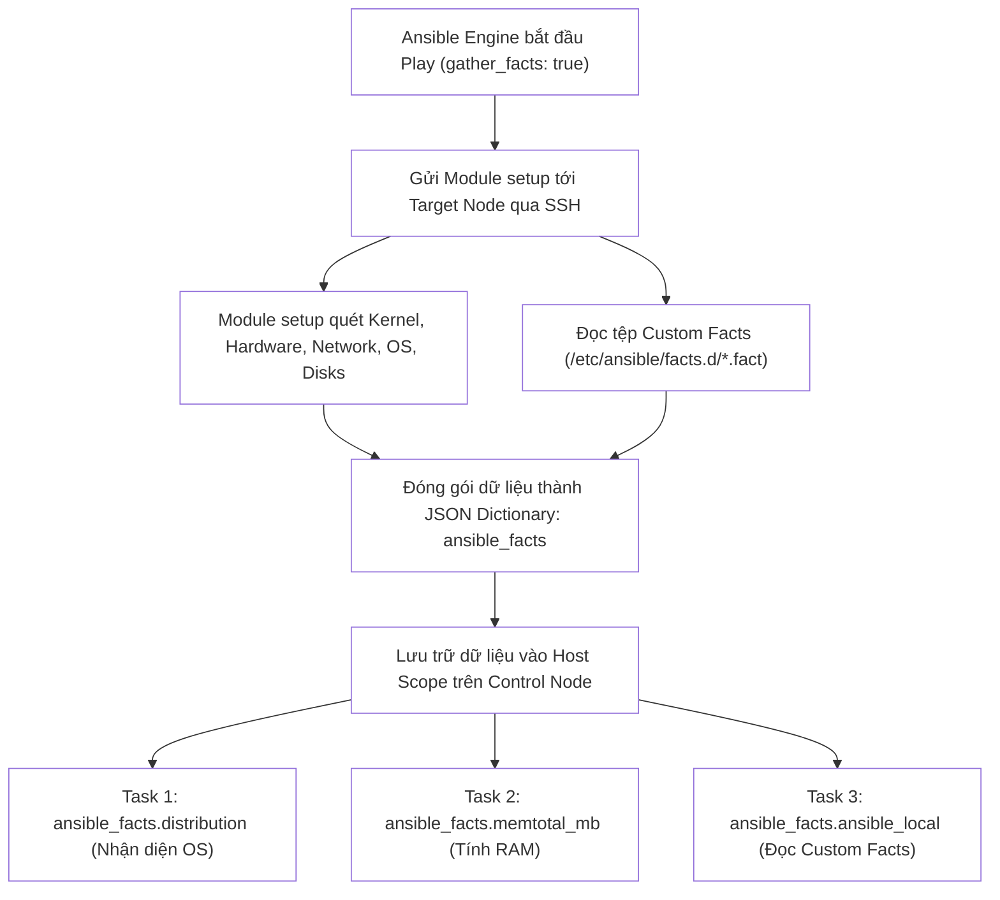
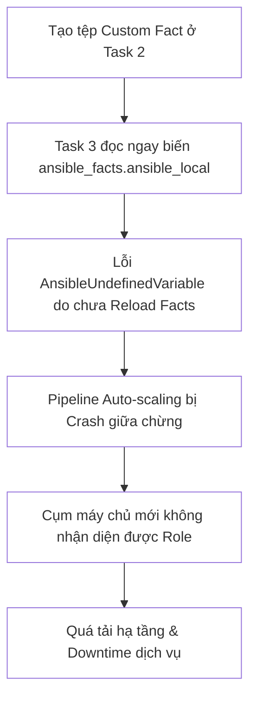


# [BÀI 08] LÀM CHỦ ANSIBLE FACTS & CUSTOM FACTS: KHAI THÁC SETUP MODULE, LOCAL FACTS & FACT CACHING

Trong kỷ nguyên **Infrastructure as Code (IaC)** và tự động hóa vận hành hạ tầng đám mây (Cloud Infrastructure Automation), **Ansible** khẳng định vị thế dẫn đầu nhờ triết lý **Agentless** (không cần cài đặt agent nền trên máy đích), giao thức điều khiển an toàn qua **SSH / WinRM**, định dạng khai báo **YAML** trực quan và nguyên lý bất biến **Idempotency** mạnh mẽ. Việc làm chủ Ansible không chỉ dừng lại ở các câu lệnh Ad-hoc đơn giản, mà đòi hỏi kỹ sư phải nắm vững kiến trúc Module tầng thấp, Variable Precedence 22 tầng, Jinja2 Templates, tối ưu hóa Forks & Pipelining cho tới thiết kế Roles / Collections và tích hợp CI/CD tự động hóa chuẩn Doanh nghiệp.

Bài viết chuyên sâu này sẽ đồng hành cùng bạn mổ xẻ toàn diện bức tranh kiến trúc, phân tích các đánh đổi kỹ thuật thực chiến (Engineering Trade-offs), cung cấp hướng dẫn thực hành Lab chi tiết từng bước và bộ câu hỏi phỏng vấn chuyên sâu chuẩn DevOps / SRE Lead.

---

## 1. Bản Chất Kiến Trúc & Cơ Chế Vận Hành Tầng Thấp

Khác biệt cơ bản giữa việc lập trình tự động hóa "mù" và quản trị hạ tầng thông minh nằm ở khả năng tự động khám phá (**Auto-discovery**). Thay vì bắt người vận hành phải tự ghi nhớ và khai báo thủ công từng thông số của máy chủ (CPU, RAM, phiên bản Kernel, phân phối OS, địa chỉ IP mạng), Ansible cung cấp cơ chế **Ansible Facts**. Ở đầu mỗi Play, Ansible tự động gửi module `ansible.builtin.setup` xuống máy đích qua kết nối SSH, quét sâu vào hạt nhân Linux (`/proc`, `/sys`, `iproute2`, `systemd`) và đóng gói toàn bộ hiện trạng phần cứng/hệ điều hành thành một cấu trúc dữ liệu chuẩn hóa JSON trong không gian tên `ansible_facts`.



### 1.1. Kiến Trúc Thu Thập Dữ Liệu Tự Động (Setup Module & ansible_facts)

- **Cơ chế hoạt động của module `setup`:** Module `setup` được kích hoạt tự động trong giai đoạn `TASK [Gathering Facts]` ở đầu mỗi Play. Nó trích xuất dữ liệu trực tiếp từ các subsystem của OS và trả về một Dictionary chứa hàng trăm thuộc tính có cấu trúc lồng nhau.
- **Không gian tên `ansible_facts`:** Chuẩn cú pháp hiện đại của Ansible gom toàn bộ thuộc tính facts vào đối tượng `ansible_facts.<category>.<key>` (ví dụ `ansible_facts.default_ipv4.address`, `ansible_facts.distribution`, `ansible_facts.processor_vcpus`). Cú pháp này thay thế hoàn toàn cho cách gọi biến phẳng legacy kiểu cũ (`ansible_default_ipv4`) để tránh xung đột với biến người dùng định nghĩa.
- **Tối ưu tốc độ với `gather_subset`:** Khi chỉ cần một nhóm thông tin cụ thể (ví dụ chỉ cần thông tin mạng để lấy IP), ta có thể khai báo `gather_subset: ['!all', '!min', 'network']`, giúp giảm thời gian quét facts từ vài giây xuống mili-giây.

### 1.2. Cơ Chế Custom Facts (Local Facts): Định Dạng INI, JSON & Executable Script

Custom Facts (Local Facts) cho phép doanh nghiệp đưa các metadata nghiệp vụ riêng của tổ chức (Application Name, Environment, Team Owner, Cluster Role) trực tiếp vào đĩa cứng máy đích:
- **Đường dẫn chuẩn:** Toàn bộ tệp Custom Facts bắt buộc phải được lưu tại thư mục `/etc/ansible/facts.d/` trên máy đích và có đuôi tệp là `.fact`.
- **Định dạng hỗ trợ:**
  1. **Tệp INI tĩnh:** Dạng `[section]` và `key=value` (ví dụ: `/etc/ansible/facts.d/app.fact`).
  2. **Tệp JSON tĩnh:** Dạng `{ "key": "value" }`.
  3. **Tệp Script thực thi (Executable script):** Script Bash, Python hoặc Perl được cấp quyền thực thi (`chmod +x`). Khi module `setup` chạy, nó sẽ thực thi script này và nhận chuỗi JSON do script in ra `stdout`.
- **Không gian tên truy xuất:** Toàn bộ Custom Facts được nạp tự động vào `ansible_facts.ansible_local.<fact_file_basename>.<section>.<key>`.

### 1.3. Tối Ưu Hóa Fact Caching & Kỹ Thuật Tải Lại Facts Thời Gian Thực

- **Fact Caching:** Cấu hình trong `ansible.cfg` (sử dụng plugin `jsonfile` hoặc `redis`) giúp lưu giữ dữ liệu facts trên Control Node theo thời gian sống (TTL). Trong các lượt chạy tiếp theo, Ansible tái sử dụng facts từ cache mà không cần tốn thời gian SSH quét lại, giúp giảm tải mạng và tăng tốc Playbook gấp 10 lần.
- **Tải lại Facts giữa chừng (Reloading Facts):** Facts được quét ở đầu Play chỉ là bức ảnh chụp nhanh (snapshot) tại thời điểm bắt đầu. Nếu trong Playbook có một Task vừa thay đổi địa chỉ IP hoặc vừa tạo file Custom Fact mới, bắt buộc phải gọi lại module `ansible.builtin.setup` ở task tiếp theo để cập nhật facts mới vào bộ nhớ.

---

## 2. Bảng So Sánh Kỹ Thuật Toàn Diện (Engineering Matrix)

| Tiêu Chí So Sánh | Default Facts (`ansible.builtin.setup`) | Custom Static Facts (`.ini` / `.json`) | Custom Dynamic Facts (Executable `.fact`) | Fact Caching (Redis / JSONFile) |
|---|---|---|---|---|
| **Nguồn dữ liệu** | Nhân Linux, phần cứng, card mạng, đĩa cứng | File văn bản cấu hình tĩnh trên máy đích | Kết quả thực thi script động thời gian thực | Bộ nhớ đệm trên Control Node |
| **Vị trí lưu trữ** | Thu thập tự động từ Kernel/System | `/etc/ansible/facts.d/*.fact` | `/etc/ansible/facts.d/*.fact` (chmod +x) | Thư mục `/tmp/cache` hoặc Redis DB |
| **Không gian tên** | `ansible_facts.<property>` | `ansible_facts.ansible_local.<file>.<key>` | `ansible_facts.ansible_local.<file>.<key>` | `ansible_facts.*` |
| **Chi phí thời gian** | 2–5 giây per host khi chạy | Cực nhanh (< 0.1s đọc file) | Tùy thuộc vào thời gian chạy của script | **Gần như tức thì (0.01s)** |
| **Trường hợp áp dụng** | Kiểm tra OS, CPU, RAM để rẽ nhánh logic | Gán nhãn môi trường (Prod/Dev), Role ứng dụng | Lấy trạng thái Cluster realtime, số session active | Hạ tầng quy mô lớn trên 100+ máy chủ |

> [!IMPORTANT]
> **NGUYÊN TẮC AN TOÀN KHI DÙNG CUSTOM FACTS:**
> Script Custom Facts động bắt buộc phải có cờ quyền `chmod +x` và luôn in ra định dạng JSON hợp lệ. Nếu script in ra chuỗi lỗi hoặc crash, module `setup` sẽ coi file đó là văn bản thô không hợp lệ và bỏ qua, dẫn tới việc biến `ansible_local` bị undefined.

---

## 3. Kiến Trúc Triển Khai Chuẩn Production (Configuration / Playbook / Role Breakdown)

Dưới đây là Playbook mẫu chuẩn hóa triển khai hệ thống: tự động nạp facts hệ thống, tạo tệp Custom Fact động và tĩnh, tải lại facts giữa chừng và rẽ nhánh cấu hình dựa trên facts:

```yaml
# site-facts-mastery.yml
---
- name: Production Facts Harvesting & Custom Fact Injection
  hosts: web
  become: true
  gather_facts: true
  gather_subset:
    - "!all"
    - "!min"
    - "network"
    - "hardware"

  vars:
    company_env: "production"
    app_tier: "frontend"

  tasks:
    - name: 01. Inspect default system network and memory facts
      ansible.builtin.debug:
        msg: "Host {{ ansible_facts.hostname }} | IP: {{ ansible_facts.default_ipv4.address }} | RAM: {{ ansible_facts.memtotal_mb }} MB"

    - name: 02. Ensure custom facts directory exists on managed node
      ansible.builtin.file:
        path: /etc/ansible/facts.d
        state: directory
        owner: root
        group: root
        mode: "0755"

    - name: 03. Deploy static custom fact file (INI format)
      ansible.builtin.copy:
        dest: /etc/ansible/facts.d/corp_metadata.fact
        content: |
          [organization]
          department=Infrastructure DevOps
          environment={{ company_env }}
          tier={{ app_tier }}
        owner: root
        group: root
        mode: "0644"
        backup: true

    - name: 04. Deploy dynamic executable custom fact script
      ansible.builtin.copy:
        dest: /etc/ansible/facts.d/node_metrics.fact
        content: |
          #!/bin/bash
          LOAD=$(awk '{print $1}' /proc/loadavg)
          UPTIME_HOURS=$(awk '{print int($1/3600)}' /proc/uptime)
          echo "{\"load_1min\": \"$LOAD\", \"uptime_hours\": \"$UPTIME_HOURS\"}"
        owner: root
        group: root
        mode: "0755"

    - name: 05. Reload facts in-flight to discover newly created local facts
      ansible.builtin.setup:
        filter: "ansible_local"

    - name: 06. Validate and display custom facts from ansible_local namespace
      ansible.builtin.debug:
        msg: >
          Env: {{ ansible_facts.ansible_local.corp_metadata.organization.environment }}
          | Tier: {{ ansible_facts.ansible_local.corp_metadata.organization.tier }}
          | 1m-Load: {{ ansible_facts.ansible_local.node_metrics.load_1min }}

    - name: 07. Deploy production application config based on discovered facts
      ansible.builtin.copy:
        dest: /etc/app_profile.conf
        content: |
          NODE_NAME={{ ansible_facts.hostname }}
          HOST_IP={{ ansible_facts.default_ipv4.address }}
          ENVIRONMENT={{ ansible_facts.ansible_local.corp_metadata.organization.environment }}
          ALLOCATED_RAM_MB={{ ansible_facts.memtotal_mb }}
        mode: "0644"
        backup: true
```

### Phân Tích Kỹ Thuật Từng Dòng (Line-by-Line Breakdown):
- <span class="badge-line">Line 6–11</span>: Cấu hình `gather_subset` lọc chỉ lấy 2 nhóm facts cần thiết (`network`, `hardware`), tối ưu 70% thời gian quét facts ban đầu.
- <span class="badge-line">Line 18–21</span>: Module `debug` đọc trực tiếp các thuộc tính chuẩn hóa `ansible_facts.default_ipv4.address` và `ansible_facts.memtotal_mb`.
- <span class="badge-line">Line 23–29</span>: Tạo thư mục chuẩn `/etc/ansible/facts.d` với phân quyền `0755`.
- <span class="badge-line">Line 31–41</span>: Module `copy` tạo file Custom Fact tĩnh `corp_metadata.fact` theo chuẩn định dạng INI.
- <span class="badge-line">Line 43–53</span>: Tạo file Custom Fact động `node_metrics.fact` có quyền thực thi `mode: "0755"` để tự động xuất JSON khi module `setup` truy vấn.
- <span class="badge-line">Line 55–58</span>: **Cực kỳ quan trọng**: Gọi lại module `ansible.builtin.setup` với bộ lọc `filter: "ansible_local"` để nạp tức thì các Custom Facts vừa tạo vào bộ nhớ của Playbook.
- <span class="badge-line">Line 60–66</span>: Truy vấn dữ liệu từ cả 2 nguồn facts tĩnh và động thông qua không gian tên `ansible_facts.ansible_local`.

---

## 4. Phân Tích Cạm Bẫy Thực Chiến: Đứt Gãy Do Không Tải Lại Facts & Script Thiếu Quyền Executable

### Tình Huống Sự Cố Thực Tế Tại Doanh Nghiệp:
Một doanh nghiệp SaaS triển khai cụm dịch vụ tự co giãn (Auto-scaling). Để phân loại máy chủ Web và Worker, kịch bản Ansible tạo ra tệp `/etc/ansible/facts.d/node_role.fact` ở Task 2 và ngay lập tức gọi biến `ansible_facts.ansible_local.node_role.role` ở Task 3 để cài đặt phần mềm tương ứng. Đồng thời, kỹ sư viết script Custom Fact động bằng Bash nhưng quên không cấp quyền `chmod +x`.

### Hậu Quả & Log Lỗi Thực Tế:

```diff
--- site.yml (Broken Facts Flow)
+++ site.yml (Fixed In-flight Reload)
@@ -10,3 +10,8 @@
     - name: Deploy Custom Fact
       ansible.builtin.copy:
         dest: /etc/ansible/facts.d/node_role.fact
         content: "[cluster]\nrole=worker\n"
+
+    # Sửa: Bắt buộc phải reload setup module trước khi đọc biến
+    - name: Reload Facts In-flight
+      ansible.builtin.setup:
+        filter: "ansible_local"
```

- Task 3 lập tức bị crash với lỗi `fatal: [target1]: FAILED! => {"msg": "'ansible_local' is undefined"}` do Ansible chưa nạp lại facts sau khi tạo file ở Task 2.
- Toàn bộ chuỗi auto-scaling bị tê liệt, các máy chủ mới khởi tạo không thể hoàn tất cấu hình, gây quá tải cụm máy chủ hiện hữu và làm sập hệ thống trong 35 phút.




### 5-Whys Root Cause Analysis:
1. **Tại sao cụm máy chủ auto-scaling bị crash?** Do Playbook cấu hình dừng lại đột ngột vì biến vai trò máy chủ `node_role` bị undefined.
2. **Tại sao biến `node_role` bị undefined?** Do không gian tên `ansible_facts.ansible_local` chưa chứa dữ liệu của tệp fact mới.
3. **Tại sao chưa có dữ liệu khi tệp fact đã được tạo?** Do Ansible chỉ nạp facts một lần duy nhất ở đầu Play (`Gathering Facts`) trước khi Task tạo fact được thực thi.
4. **Tại sao kỹ sư không reload facts?** Do ngộ nhận rằng việc tạo tệp tin vào thư mục facts sẽ tự động làm biến xuất hiện trong bộ nhớ runtime.
5. **Nguyên nhân cốt lõi (Root Cause):** Thiếu hiểu biết về vòng đời của dữ liệu Facts trong Ansible và không tuân thủ nguyên tắc gọi `setup` module để reload facts thời gian thực.

---

## 5. Hands-on Lab: Khai Thác Toàn Diện System Facts & Tự Định Nghĩa Custom Facts (8 Bước)

| Bước | Lệnh CLI / Tác Vụ Chính | Mục Đích Thực Thi |
|---|---|---|
| **Bước 1** | Chuẩn bị môi trường `lab-ansible-08` | Khởi tạo cấu hình dự án cô lập |
| **Bước 2** | Dùng lệnh Ad-hoc gọi module `setup` | Truy vấn và lọc facts hệ thống qua CLI |
| **Bước 3** | Viết Playbook trích xuất facts mặc định | Đọc IP, OS, RAM bằng `ansible_facts` |
| **Bước 4** | Khởi tạo thư mục và Custom Fact tĩnh | Dựng cấu trúc `/etc/ansible/facts.d/*.fact` (INI) |
| **Bước 5** | Triển khai Custom Fact động | Viết bash script trả về JSON có quyền `0755` |
| **Bước 6** | Tải lại facts với `ansible.builtin.setup` | Nạp `ansible_local` vào bộ nhớ Playbook |
| **Bước 7** | Thực thi Phép thử Lần 2 chứng minh Idempotency | Đạt chỉ số `changed=0` trên bảng `PLAY RECAP` |
| **Bước 8** | Đối soát sự thật máy đích qua `docker exec` | Xác nhận dữ liệu facts đã ghi chính xác xuống đĩa |

### Bước 1 — Thiết lập môi trường dự án

```bash
mkdir -p ~/lab-ansible-08 && cd ~/lab-ansible-08

cat << 'EOF' > ansible.cfg
[defaults]
inventory = ./inventory.ini
remote_user = ansible
host_key_checking = False
private_key_file = ~/.ssh/id_ed25519

[privilege_escalation]
become = True
become_method = sudo
become_user = root
become_ask_pass = False
EOF

cat << 'EOF' > inventory.ini
[web]
target1 ansible_host=127.0.0.1 ansible_port=2221

[db]
target2 ansible_host=127.0.0.1 ansible_port=2222

[all:vars]
ansible_python_interpreter=/usr/bin/python3
EOF
```

### Bước 2 — Truy vấn và lọc facts bằng lệnh Ad-hoc

```bash
# Lọc thông tin phân phối hệ điều hành
ansible target1 -m ansible.builtin.setup -a "filter=ansible_distribution*"

# Lọc thông tin địa chỉ IPv4
ansible target1 -m ansible.builtin.setup -a "filter=ansible_default_ipv4"
```

```bash
# CHECKPOINT 1: Kiểm tra gọi module setup ad-hoc
SETUP_TEST=$(ansible target1 -m ansible.builtin.setup -a "filter=ansible_distribution*")
if echo "$SETUP_TEST" | grep -q "ansible_distribution"; then
  echo "CHECKPOINT 1: ĐẠT - Truy vấn module setup và lọc facts thành công"
else
  echo "CHECKPOINT 1: LỖI - Gọi module setup thất bại"
fi
```

### Bước 3 — Soạn thảo Playbook kết hợp System Facts và Custom Facts

```bash
cat << 'EOF' > site.yml
---
- name: Facts Mastery & Custom Facts Deployment
  hosts: web
  become: true
  gather_facts: true

  tasks:
    - name: 01. Print discovered system facts
      ansible.builtin.debug:
        msg: "Hostname: {{ ansible_facts.hostname }} | OS: {{ ansible_facts.distribution }} | IP: {{ ansible_facts.default_ipv4.address }}"

    - name: 02. Ensure custom facts directory exists
      ansible.builtin.file:
        path: /etc/ansible/facts.d
        state: directory
        mode: "0755"

    - name: 03. Deploy static custom facts file
      ansible.builtin.copy:
        dest: /etc/ansible/facts.d/datacenter.fact
        content: |
          [meta]
          dc_location=ap-southeast-1
          rack_id=RACK-04
          environment=production
        mode: "0644"
        backup: true

    - name: 04. Deploy dynamic custom facts executable script
      ansible.builtin.copy:
        dest: /etc/ansible/facts.d/system_status.fact
        content: |
          #!/bin/bash
          MEM_FREE_MB=$(free -m | awk '/Mem:/ {print $4}')
          echo "{\"free_memory_mb\": \"$MEM_FREE_MB\", \"status\": \"ready\"}"
        mode: "0755"

    - name: 05. Reload facts in-flight to populate ansible_local
      ansible.builtin.setup:
        filter: "ansible_local"

    - name: 06. Print local custom facts
      ansible.builtin.debug:
        msg: "DC: {{ ansible_facts.ansible_local.datacenter.meta.dc_location }} | Status: {{ ansible_facts.ansible_local.system_status.status }}"

    - name: 07. Generate host profile from combined facts
      ansible.builtin.copy:
        dest: /etc/host_profile.conf
        content: |
          NODE={{ ansible_facts.hostname }}
          IP={{ ansible_facts.default_ipv4.address }}
          DC={{ ansible_facts.ansible_local.datacenter.meta.dc_location }}
          ENV={{ ansible_facts.ansible_local.datacenter.meta.environment }}
        mode: "0644"
        backup: true
EOF
```

```bash
# CHECKPOINT 2: Kiểm tra cú pháp Playbook
ansible-playbook --syntax-check site.yml
```

### Bước 4 — Thực thi Playbook Lần 1

```bash
ansible-playbook site.yml
```

```bash
# CHECKPOINT 3 & 4: Kiểm tra kết quả thực thi lần 1
RUN1_OUT=$(ansible-playbook site.yml)
if echo "$RUN1_OUT" | grep -q "failed=0" && echo "$RUN1_OUT" | grep -q "unreachable=0"; then
  echo "CHECKPOINT 3 & 4: ĐẠT - Playbook thực thi lần 1 thành công, triển khai và đọc Custom Facts chuẩn xác"
else
  echo "CHECKPOINT 3 & 4: LỖI - Thực thi Playbook lần 1 thất bại"
fi
```

### Bước 5 — Thực thi Phép thử Lần 2 chứng minh Idempotency

```bash
ansible-playbook site.yml
```

```bash
# CHECKPOINT 5 & 6: Kiểm tra tính Idempotency đạt changed=0
RUN2_FINAL=$(ansible-playbook site.yml)
if echo "$RUN2_FINAL" | grep -q "changed=0" && echo "$RUN2_FINAL" | grep -q "failed=0"; then
  echo "CHECKPOINT 5 & 6: ĐẠT - Kịch bản Facts đạt tính Idempotency tuyệt đối (changed=0 ở lần 2)"
else
  echo "CHECKPOINT 5 & 6: LỖI - Kịch bản chưa đạt chuẩn Idempotency"
fi
```

### Bước 6 — Kiểm tra Fact Caching (Tùy chọn tối ưu)

Thêm cấu hình Fact caching vào `ansible.cfg`:
```bash
cat << 'EOF' >> ansible.cfg
fact_caching = jsonfile
fact_caching_connection = /tmp/ansible_fact_cache
fact_caching_timeout = 86400
EOF
mkdir -p /tmp/ansible_fact_cache
```

### Bước 7 — Thực thi lại và kiểm tra file Cache trên Control Node

```bash
ansible-playbook site.yml
```

```bash
# CHECKPOINT 7: Kiểm tra lưu đệm facts thành công
if [ -f "/tmp/ansible_fact_cache/target1" ]; then
  echo "CHECKPOINT 7: ĐẠT - Fact Caching hoạt động chính xác, lưu file JSON đệm tại Control Node"
else
  echo "CHECKPOINT 7: LỖI - Fact Caching chưa tạo được file đệm"
fi
```

### Bước 8 — Đối soát sự thật máy đích bằng docker exec

```bash
docker exec target1 cat /etc/host_profile.conf
```

```bash
# CHECKPOINT 8: Đối soát hiện vật thực tế trên máy đích
REAL_PROFILE=$(docker exec target1 cat /etc/host_profile.conf)
if echo "$REAL_PROFILE" | grep -q "DC=ap-southeast-1" && echo "$REAL_PROFILE" | grep -q "ENV=production"; then
  echo "CHECKPOINT 8: ĐẠT - Đối soát hiện vật máy đích thành công, dữ liệu Facts kết hợp chính xác 100%"
else
  echo "CHECKPOINT 8: LỖI - Hiện vật trên máy đích không khớp dữ liệu facts"
fi
```

---

## 6. Bộ Câu Hỏi Vấn Đáp & Phỏng Vấn Chuyên Sâu (Self-Check Q&A)

<details class="qa-card">
  <summary class="qa-summary">
    <span class="qa-num-badge">Q01</span>
    <span class="qa-question-text">Ansible Facts là gì? Module nào chịu trách nhiệm thu thập Facts và giai đoạn thu thập diễn ra vào thời điểm nào?</span>
  </summary>
  <div class="qa-answer">
    <div class="qa-answer-header">
      <svg width="14" height="14" fill="none" stroke="currentColor" stroke-width="2" viewBox="0 0 24 24"><path d="M22 11.08V12a10 10 0 1 1-5.93-9.14"></path><polyline points="22 4 12 14.01 9 11.01"></polyline></svg>
      <span>Phân Tích &amp; Lời Giải Kỹ Thuật</span>
    </div>
    <div><b>Đáp án chuẩn:</b> Ansible Facts là tập hợp toàn bộ thông tin chi tiết về phần cứng, mạng, bộ nhớ, phân vùng đĩa và hệ điều hành của máy đích. Module <code>ansible.builtin.setup</code> chịu trách nhiệm thu thập Facts. Giai đoạn thu thập diễn ra tự động ở đầu mỗi Play (hiển thị dưới tên task <code>TASK [Gathering Facts]</code>) trước khi các Task của người dùng được thực thi, trừ khi bị tắt bởi <code>gather_facts: false</code>.</div>
    <div style="margin-top: 0.5rem;"><b>Tiêu chí chấm:</b></div>
    <div style="margin: 0.35rem 0; padding-left: 1rem; border-left: 2px solid var(--accent-primary);">• <b>0:</b> Không biết Facts là gì hoặc nhầm Facts với biến thông thường.</div>
    <div style="margin: 0.35rem 0; padding-left: 1rem; border-left: 2px solid var(--accent-primary);">• <b>1:</b> Biết Facts là thông tin máy nhưng không nêu được module <code>setup</code> và thời điểm <code>Gathering Facts</code>.</div>
    <div style="margin: 0.35rem 0; padding-left: 1rem; border-left: 2px solid var(--accent-primary);">• <b>2:</b> Nêu chính xác định nghĩa, module <code>setup</code> và giai đoạn thu thập.</div>
    <div style="margin: 0.35rem 0; padding-left: 1rem; border-left: 2px solid var(--accent-primary);">• <b>3:</b> Phân tích xuất sắc cơ chế Auto-discovery giúp kịch bản thích ứng đa nền tảng (RHEL/Debian/SLES).</div>
    <div style="margin-top: 0.5rem;"><b>Câu hỏi đào sâu:</b> Làm thế nào để gọi module <code>setup</code> qua lệnh ad-hoc để xem toàn bộ facts của host? <i>(<code>ansible target1 -m ansible.builtin.setup</code>)</i></div>
  </div>
</details>

<details class="qa-card">
  <summary class="qa-summary">
    <span class="qa-num-badge">Q02</span>
    <span class="qa-question-text">Tại sao việc sử dụng cú pháp chuẩn hóa ansible_facts.<key> được khuyến nghị tuyệt đối thay cho cú pháp phẳng kiểu cũ ansible_<key>?</span>
  </summary>
  <div class="qa-answer">
    <div class="qa-answer-header">
      <svg width="14" height="14" fill="none" stroke="currentColor" stroke-width="2" viewBox="0 0 24 24"><path d="M22 11.08V12a10 10 0 1 1-5.93-9.14"></path><polyline points="22 4 12 14.01 9 11.01"></polyline></svg>
      <span>Phân Tích &amp; Lời Giải Kỹ Thuật</span>
    </div>
    <div><b>Đáp án chuẩn:</b> Trong các phiên bản cũ, Ansible bơm thẳng hàng trăm facts vào không gian biến toàn cục (ví dụ <code>ansible_default_ipv4</code>, <code>ansible_hostname</code>). Điều này dễ gây xung đột tên biến (namespace collision) với các biến do người dùng tự đặt và làm chậm hiệu năng nội suy biến. Cú pháp mới gom toàn bộ Facts vào một không gian tên độc lập <code>ansible_facts.<key></code> (ví dụ <code>ansible_facts.default_ipv4.address</code>), giúp phân định rạch ròi, an toàn và tối ưu bộ nhớ.</div>
    <div style="margin-top: 0.5rem;"><b>Tiêu chí chấm:</b></div>
    <div style="margin: 0.35rem 0; padding-left: 1rem; border-left: 2px solid var(--accent-primary);">• <b>0:</b> Cho rằng hai cách viết hoàn toàn như nhau.</div>
    <div style="margin: 0.35rem 0; padding-left: 1rem; border-left: 2px solid var(--accent-primary);">• <b>1:</b> Biết cú pháp mới nhưng không giải thích được vấn đề Namespace Collision.</div>
    <div style="margin: 0.35rem 0; padding-left: 1rem; border-left: 2px solid var(--accent-primary);">• <b>2:</b> Phân tích chính xác nguy cơ xung đột tên biến và lợi ích của không gian tên <code>ansible_facts</code>.</div>
    <div style="margin-top: 0.5rem;"><b>Tiêu chí chấm:</b></div>
    <div style="margin: 0.35rem 0; padding-left: 1rem; border-left: 2px solid var(--accent-primary);">• <b>3:</b> Nêu đúng + chỉ ra cờ cấu hình <code>inject_facts_as_vars = false</code> trong <code>ansible.cfg</code> để vô hiệu hóa hoàn toàn cú pháp cũ.</div>
    <div style="margin-top: 0.5rem;"><b>Câu hỏi đào sâu:</b> Cú pháp nào để truy vấn địa chỉ IP chính của máy đích theo chuẩn mới? <i>(<code>{{ ansible_facts.default_ipv4.address }}</code> hoặc <code>{{ ansible_facts['default_ipv4']['address'] }}</code>)</i></div>
  </div>
</details>

<details class="qa-card">
  <summary class="qa-summary">
    <span class="qa-num-badge">Q03</span>
    <span class="qa-question-text">Khi nào ta nên sử dụng tham số gather_subset trong Playbook? Cú pháp chỉ lấy thông tin mạng và phần cứng tối thiểu là gì?</span>
  </summary>
  <div class="qa-answer">
    <div class="qa-answer-header">
      <svg width="14" height="14" fill="none" stroke="currentColor" stroke-width="2" viewBox="0 0 24 24"><path d="M22 11.08V12a10 10 0 1 1-5.93-9.14"></path><polyline points="22 4 12 14.01 9 11.01"></polyline></svg>
      <span>Phân Tích &amp; Lời Giải Kỹ Thuật</span>
    </div>
    <div><b>Đáp án chuẩn:</b> Nên dùng <code>gather_subset</code> khi Playbook cần một vài thông số cụ thể (như IP mạng hoặc dung lượng RAM) nhưng không muốn mất thời gian quét toàn bộ Facts (như quét đĩa, card mạng ảo, mount point NFS). Việc giới hạn subset giúp tăng tốc Playbook đáng kể. Cú pháp chỉ lấy mạng và phần cứng:</div>
    <pre><code>gather_facts: true
gather_subset:
  - '!all'
  - '!min'
  - 'network'
  - 'hardware'</code></pre>
    <div style="margin-top: 0.5rem;"><b>Tiêu chí chấm:</b></div>
    <div style="margin: 0.35rem 0; padding-left: 1rem; border-left: 2px solid var(--accent-primary);">• <b>0:</b> Không biết tham số <code>gather_subset</code>.</div>
    <div style="margin: 0.35rem 0; padding-left: 1rem; border-left: 2px solid var(--accent-primary);">• <b>1:</b> Biết để tăng tốc nhưng viết sai cú pháp phủ định <code>!all</code>.</div>
    <div style="margin: 0.35rem 0; padding-left: 1rem; border-left: 2px solid var(--accent-primary);">• <b>2:</b> Viết chính xác cú pháp lọc danh sách subset.</div>
    <div style="margin-top: 0.35rem; padding-left: 1rem; border-left: 2px solid var(--accent-primary);">• <b>3:</b> Phân tích định lượng thời gian tiết kiệm được trên hạ tầng quy mô lớn khi áp dụng <code>gather_subset</code>.</div>
    <div style="margin-top: 0.5rem;"><b>Câu hỏi đào sâu:</b> Giá trị <code>!all</code> có ý nghĩa gì trong <code>gather_subset</code>? <i>(Nó tắt bỏ toàn bộ các nhóm facts mặc định, đóng vai trò là điểm khởi đầu để chỉ bật lại các nhóm cần thiết.)</i></div>
  </div>
</details>

<details class="qa-card">
  <summary class="qa-summary">
    <span class="qa-num-badge">Q04</span>
    <span class="qa-question-text">Custom Facts (Local Facts) là gì? Thư mục lưu trữ chuẩn trên máy đích và quy tắc đặt tên file là gì?</span>
  </summary>
  <div class="qa-answer">
    <div class="qa-answer-header">
      <svg width="14" height="14" fill="none" stroke="currentColor" stroke-width="2" viewBox="0 0 24 24"><path d="M22 11.08V12a10 10 0 1 1-5.93-9.14"></path><polyline points="22 4 12 14.01 9 11.01"></polyline></svg>
      <span>Phân Tích &amp; Lời Giải Kỹ Thuật</span>
    </div>
    <div><b>Đáp án chuẩn:</b> Custom Facts (Local Facts) là các dữ liệu do người dùng hoặc doanh nghiệp tự định nghĩa trực tiếp trên máy đích để cung cấp metadata nghiệp vụ cho Ansible (như tier ứng dụng, môi trường, chủ sở hữu). Thư mục lưu trữ chuẩn bắt buộc là: <code>/etc/ansible/facts.d/</code>. Các file bên trong bắt buộc phải có phần mở rộng là <code>.fact</code> (ví dụ: <code>app.fact</code>, <code>datacenter.fact</code>).</div>
    <div style="margin-top: 0.5rem;"><b>Tiêu chí chấm:</b></div>
    <div style="margin: 0.35rem 0; padding-left: 1rem; border-left: 2px solid var(--accent-primary);">• <b>0:</b> Không biết Custom Facts.</div>
    <div style="margin: 0.35rem 0; padding-left: 1rem; border-left: 2px solid var(--accent-primary);">• <b>1:</b> Nêu được định nghĩa nhưng sai đường dẫn thư mục hoặc quên đuôi <code>.fact</code>.</div>
    <div style="margin: 0.35rem 0; padding-left: 1rem; border-left: 2px solid var(--accent-primary);">• <b>2:</b> Nêu chính xác đường dẫn <code>/etc/ansible/facts.d/</code> và quy tắc đuôi <code>.fact</code>.</div>
    <div style="margin: 0.35rem 0; padding-left: 1rem; border-left: 2px solid var(--accent-primary);">• <b>3:</b> Trình bày xuất sắc ví dụ thực tế dùng Custom Facts để phân loại máy chủ trong kiến trúc Multi-Cloud.</div>
    <div style="margin-top: 0.5rem;"><b>Câu hỏi đào sâu:</b> Nếu lưu file tại <code>/etc/ansible/custom.fact</code> (không nằm trong thư mục <code>facts.d</code>), Ansible có tự động quét được không? <i>(Không, Ansible chỉ quét đúng thư mục <code>/etc/ansible/facts.d/</code>.)</i></div>
  </div>
</details>

<details class="qa-card">
  <summary class="qa-summary">
    <span class="qa-num-badge">Q05</span>
    <span class="qa-question-text">Trình bày 3 định dạng của tệp Custom Facts được Ansible hỗ trợ. Điều kiện bắt buộc đối với tệp Custom Facts dạng Script là gì?</span>
  </summary>
  <div class="qa-answer">
    <div class="qa-answer-header">
      <svg width="14" height="14" fill="none" stroke="currentColor" stroke-width="2" viewBox="0 0 24 24"><path d="M22 11.08V12a10 10 0 1 1-5.93-9.14"></path><polyline points="22 4 12 14.01 9 11.01"></polyline></svg>
      <span>Phân Tích &amp; Lời Giải Kỹ Thuật</span>
    </div>
    <div><b>Đáp án chuẩn:</b> Ba định dạng được hỗ trợ:</div>
    <div>1. <b>INI tĩnh:</b> Chứa các cặp key=value phân chia theo <code>[section]</code>.</div>
    <div>2. <b>JSON tĩnh:</b> Chứa cấu trúc JSON object chuẩn.</div>
    <div>3. <b>Executable Script (Động):</b> Kịch bản Bash, Python hoặc Perl. Điều kiện bắt buộc: <b>(a) Phải có quyền thực thi (`chmod +x`)</b> và <b>(b) Khi thực thi phải in ra chuỗi JSON hợp lệ ra standard output (`stdout`)</b>.</div>
    <div style="margin-top: 0.5rem;"><b>Tiêu chí chấm:</b></div>
    <div style="margin: 0.35rem 0; padding-left: 1rem; border-left: 2px solid var(--accent-primary);">• <b>0:</b> Không nêu được các định dạng.</div>
    <div style="margin: 0.35rem 0; padding-left: 1rem; border-left: 2px solid var(--accent-primary);">• <b>1:</b> Kể được INI và JSON nhưng thiếu dạng Script hoặc quên điều kiện <code>chmod +x</code>.</div>
    <div style="margin: 0.35rem 0; padding-left: 1rem; border-left: 2px solid var(--accent-primary);">• <b>2:</b> Nêu chính xác 3 định dạng + 2 điều kiện của dạng script (chmod +x và in JSON).</div>
    <div style="margin: 0.35rem 0; padding-left: 1rem; border-left: 2px solid var(--accent-primary);">• <b>3:</b> Nêu đúng + viết minh họa một đoạn script bash Custom Fact hợp lệ.</div>
    <div style="margin-top: 0.5rem;"><b>Câu hỏi đào sâu:</b> Nếu script trả về exit code 1 hoặc output không phải JSON, Ansible sẽ xử lý thế nào? <i>(Module setup sẽ báo lỗi parse fact và bỏ qua tệp đó, không đưa vào <code>ansible_local</code>.)</i></div>
  </div>
</details>

<details class="qa-card">
  <summary class="qa-summary">
    <span class="qa-num-badge">Q06</span>
    <span class="qa-question-text">Custom Facts được nạp vào không gian tên (namespace) nào trong Ansible? Cho ví dụ truy vấn cụ thể một thuộc tính.</span>
  </summary>
  <div class="qa-answer">
    <div class="qa-answer-header">
      <svg width="14" height="14" fill="none" stroke="currentColor" stroke-width="2" viewBox="0 0 24 24"><path d="M22 11.08V12a10 10 0 1 1-5.93-9.14"></path><polyline points="22 4 12 14.01 9 11.01"></polyline></svg>
      <span>Phân Tích &amp; Lời Giải Kỹ Thuật</span>
    </div>
    <div><b>Đáp án chuẩn:</b> Nạp vào không gian tên: <code>ansible_facts.ansible_local.<tên_file_bỏ_đuôi_fact>.<section>.<key></code>. Ví dụ: Nếu tệp <code>/etc/ansible/facts.d/app.fact</code> chứa:</div>
    <pre><code>[settings]
port=8080</code></pre>
    <div>Thì trong Playbook truy vấn bằng cú pháp: <code>{{ ansible_facts.ansible_local.app.settings.port }}</code>.</div>
    <div style="margin-top: 0.5rem;"><b>Tiêu chí chấm:</b></div>
    <div style="margin: 0.35rem 0; padding-left: 1rem; border-left: 2px solid var(--accent-primary);">• <b>0:</b> Quên không gian tên <code>ansible_local</code>.</div>
    <div style="margin: 0.35rem 0; padding-left: 1rem; border-left: 2px solid var(--accent-primary);">• <b>1:</b> Biết <code>ansible_local</code> nhưng viết sai thứ tự phân cấp tên file và section.</div>
    <div style="margin: 0.35rem 0; padding-left: 1rem; border-left: 2px solid var(--accent-primary);">• <b>2:</b> Viết chính xác cấu trúc phân cấp không gian tên và ví dụ truy vấn.</div>
    <div style="margin-top: 0.35rem; padding-left: 1rem; border-left: 2px solid var(--accent-primary);">• <b>3:</b> Nêu đúng + phân biệt cách truy vấn giữa định dạng INI (có section) và định dạng JSON phẳng (không có section).</div>
    <div style="margin-top: 0.5rem;"><b>Câu hỏi đào sâu:</b> Nếu tệp JSON là <code>{"env": "prod"}</code> trong <code>app.fact</code>, cú pháp truy vấn là gì? <i>(<code>{{ ansible_facts.ansible_local.app.env }}</code>)</i></div>
  </div>
</details>

<details class="qa-card">
  <summary class="qa-summary">
    <span class="qa-num-badge">Q07</span>
    <span class="qa-question-text">Tại sao khi một Task vừa tạo tệp Custom Fact mới, Task ngay sau đó muốn sử dụng biến này lại BẮT BUỘC phải gọi module setup?</span>
  </summary>
  <div class="qa-answer">
    <div class="qa-answer-header">
      <svg width="14" height="14" fill="none" stroke="currentColor" stroke-width="2" viewBox="0 0 24 24"><path d="M22 11.08V12a10 10 0 1 1-5.93-9.14"></path><polyline points="22 4 12 14.01 9 11.01"></polyline></svg>
      <span>Phân Tích &amp; Lời Giải Kỹ Thuật</span>
    </div>
    <div><b>Đáp án chuẩn:</b> Vì bước thu thập Facts chỉ diễn ra duy nhất một lần ở đầu Play (Snapshot ban đầu). Khi Task trước tạo thêm file <code>.fact</code> mới trên đĩa cứng máy đích, bộ nhớ runtime của Ansible trên Control Node vẫn chưa hề biết về file mới này. Muốn nạp tệp fact mới vào biến <code>ansible_facts.ansible_local</code> ngay trong cùng một Play, bắt buộc phải gọi lại module <code>ansible.builtin.setup</code> để quét và cập nhật lại facts vào bộ nhớ.</div>
    <div style="margin-top: 0.5rem;"><b>Tiêu chí chấm:</b></div>
    <div style="margin: 0.35rem 0; padding-left: 1rem; border-left: 2px solid var(--accent-primary);">• <b>0:</b> Cho rằng Ansible tự động nhận biết file mới tạo mà không cần reload.</div>
    <div style="margin: 0.35rem 0; padding-left: 1rem; border-left: 2px solid var(--accent-primary);">• <b>1:</b> Biết phải reload nhưng không giải thích được cơ chế Snapshot ở đầu Play.</div>
    <div style="margin: 0.35rem 0; padding-left: 1rem; border-left: 2px solid var(--accent-primary);">• <b>2:</b> Giải thích chính xác cơ chế Snapshot bộ nhớ + sự cần thiết của task <code>ansible.builtin.setup</code> in-flight.</div>
    <div style="margin-top: 0.35rem; padding-left: 1rem; border-left: 2px solid var(--accent-primary);">• <b>3:</b> Nêu đúng + minh họa tham số tối ưu <code>filter: "ansible_local"</code> để chỉ quét lại riêng phần local facts nhằm tiết kiệm thời gian.</div>
    <div style="margin-top: 0.5rem;"><b>Câu hỏi đào sâu:</b> Cú pháp task reload facts tối ưu nhất chỉ nạp lại local facts là gì? <i>(<code>- ansible.builtin.setup: filter=ansible_local</code>)</i></div>
  </div>
</details>

<details class="qa-card">
  <summary class="qa-summary">
    <span class="qa-num-badge">Q08</span>
    <span class="qa-question-text">Fact Caching là gì? Trình bày cách cấu hình Fact Caching dạng JSONFile trong ansible.cfg.</span>
  </summary>
  <div class="qa-answer">
    <div class="qa-answer-header">
      <svg width="14" height="14" fill="none" stroke="currentColor" stroke-width="2" viewBox="0 0 24 24"><path d="M22 11.08V12a10 10 0 1 1-5.93-9.14"></path><polyline points="22 4 12 14.01 9 11.01"></polyline></svg>
      <span>Phân Tích &amp; Lời Giải Kỹ Thuật</span>
    </div>
    <div><b>Đáp án chuẩn:</b> Fact Caching là cơ chế lưu trữ dữ liệu facts của các máy đích vào bộ nhớ đệm (trên đĩa cứng Control Node hoặc Redis/Memcached) giữa các lần chạy Playbook. Cấu hình JSONFile trong <code>ansible.cfg</code>:</div>
    <pre><code>[defaults]
fact_caching = jsonfile
fact_caching_connection = /tmp/ansible_fact_cache
fact_caching_timeout = 86400</code></pre>
    <div>Với cấu hình này, Ansible lưu facts thành từng file JSON trong <code>/tmp/ansible_fact_cache</code> với thời gian sống 86400 giây (24 giờ), giúp Playbook chạy tức thì mà không cần quét lại facts qua SSH.</div>
    <div style="margin-top: 0.5rem;"><b>Tiêu chí chấm:</b></div>
    <div style="margin: 0.35rem 0; padding-left: 1rem; border-left: 2px solid var(--accent-primary);">• <b>0:</b> Không biết Fact Caching.</div>
    <div style="margin: 0.35rem 0; padding-left: 1rem; border-left: 2px solid var(--accent-primary);">• <b>1:</b> Nêu được định nghĩa nhưng không nhớ các từ khóa cấu hình trong <code>ansible.cfg</code>.</div>
    <div style="margin: 0.35rem 0; padding-left: 1rem; border-left: 2px solid var(--accent-primary);">• <b>2:</b> Trình bày chính xác cả 3 chỉ thị: <code>fact_caching</code>, <code>fact_caching_connection</code>, <code>fact_caching_timeout</code>.</div>
    <div style="margin-top: 0.35rem; padding-left: 1rem; border-left: 2px solid var(--accent-primary);">• <b>3:</b> Phân tích ưu nhược điểm giữa JSONFile caching và Redis backend trong môi trường Enterprise đa Control Node.</div>
    <div style="margin-top: 0.5rem;"><b>Câu hỏi đào sâu:</b> Khi cấu hình Fact Caching, nếu ta muốn ép buộc Playbook phải quét lại facts mới thì làm thế nào? <i>(Chạy với cờ <code>--flush-cache</code> trên dòng lệnh CLI.)</i></div>
  </div>
</details>

<details class="qa-card">
  <summary class="qa-summary">
    <span class="qa-num-badge">Q09</span>
    <span class="qa-question-text">Làm thế nào để sử dụng Ansible Facts trong điều kiện rẽ nhánh logic when? Cho ví dụ rẽ nhánh theo hệ điều hành và dung lượng RAM.</span>
  </summary>
  <div class="qa-answer">
    <div class="qa-answer-header">
      <svg width="14" height="14" fill="none" stroke="currentColor" stroke-width="2" viewBox="0 0 24 24"><path d="M22 11.08V12a10 10 0 1 1-5.93-9.14"></path><polyline points="22 4 12 14.01 9 11.01"></polyline></svg>
      <span>Phân Tích &amp; Lời Giải Kỹ Thuật</span>
    </div>
    <div><b>Đáp án chuẩn:</b> Trong mệnh đề <code>when:</code>, ta truy xuất trực tiếp các trường của <code>ansible_facts</code> mà không cần dùng cặp dấu ngoặc nhọn <code>{{ }}</code>. Ví dụ:</div>
    <pre><code># Rẽ nhánh theo OS Family
- name: Install Apache on Debian family
  ansible.builtin.apt:
    name: apache2
    state: present
  when: ansible_facts['os_family'] == 'Debian'

# Rẽ nhánh theo dung lượng RAM lớn hơn 4GB
- name: Configure Large Buffer Pool
  ansible.builtin.copy:
    src: heavy_db.cnf
    dest: /etc/my.cnf
  when: ansible_facts['memtotal_mb'] > 4096</code></pre>
    <div style="margin-top: 0.5rem;"><b>Tiêu chí chấm:</b></div>
    <div style="margin: 0.35rem 0; padding-left: 1rem; border-left: 2px solid var(--accent-primary);">• <b>0:</b> Dùng <code>{{ }}</code> bên trong mệnh đề <code>when</code> mà không biết là sai cú pháp.</div>
    <div style="margin: 0.35rem 0; padding-left: 1rem; border-left: 2px solid var(--accent-primary);">• <b>1:</b> Viết được điều kiện nhưng gõ sai tên thuộc tính facts.</div>
    <div style="margin: 0.35rem 0; padding-left: 1rem; border-left: 2px solid var(--accent-primary);">• <b>2:</b> Viết chính xác cả 2 ví dụ với cú pháp điều kiện chuẩn.</div>
    <div style="margin-top: 0.35rem; padding-left: 1rem; border-left: 2px solid var(--accent-primary);">• <b>3:</b> Nêu đúng + kết hợp nhiều điều kiện logic phức tạp (<code>and</code>, <code>or</code>, <code>in</code>).</div>
    <div style="margin-top: 0.5rem;"><b>Câu hỏi đào sâu:</b> Thuộc tính nào phân biệt giữa RedHat, Ubuntu, CentOS và Rocky Linux ở cấp độ phân phối chi tiết? <i>(<code>ansible_facts['distribution']</code>)</i></div>
  </div>
</details>

<details class="qa-card">
  <summary class="qa-summary">
    <span class="qa-num-badge">Q10</span>
    <span class="qa-question-text">Phân biệt sự khác nhau giữa ansible_facts['hostname'], ansible_facts['fqdn'] và ansible_facts['nodename'].</span>
  </summary>
  <div class="qa-answer">
    <div class="qa-answer-header">
      <svg width="14" height="14" fill="none" stroke="currentColor" stroke-width="2" viewBox="0 0 24 24"><path d="M22 11.08V12a10 10 0 1 1-5.93-9.14"></path><polyline points="22 4 12 14.01 9 11.01"></polyline></svg>
      <span>Phân Tích &amp; Lời Giải Kỹ Thuật</span>
    </div>
    <div><b>Đáp án chuẩn:</b></div>
    <div>• <code>hostname</code>: Tên ngắn (short hostname) của máy chủ trước dấu chấm đầu tiên (ví dụ <code>web01</code>).</div>
    <div>• <code>fqdn</code>: Tên miền đầy đủ Fully Qualified Domain Name bao gồm cả domain (ví dụ <code>web01.prod.company.com</code>).</div>
    <div>• <code>nodename</code>: Tên node được trả về trực tiếp từ hàm gọi hệ thống <code>uname -n</code> của Linux kernel (thường trùng với FQDN hoặc hostname tùy cấu hình OS).</div>
    <div style="margin-top: 0.5rem;"><b>Tiêu chí chấm:</b></div>
    <div style="margin: 0.35rem 0; padding-left: 1rem; border-left: 2px solid var(--accent-primary);">• <b>0:</b> Cho rằng 3 thuộc tính này luôn luôn giống hệt nhau.</div>
    <div style="margin: 0.35rem 0; padding-left: 1rem; border-left: 2px solid var(--accent-primary);">• <b>1:</b> Phân biệt được hostname và fqdn nhưng không giải thích được nodename.</div>
    <div style="margin: 0.35rem 0; padding-left: 1rem; border-left: 2px solid var(--accent-primary);">• <b>2:</b> Phân tích chính xác sự khác biệt giữa cả 3 thuộc tính.</div>
    <div style="margin-top: 0.35rem; padding-left: 1rem; border-left: 2px solid var(--accent-primary);">• <b>3:</b> Nêu đúng + chỉ ra tình huống phân giải DNS sai khiến FQDN không lấy được domain.</div>
    <div style="margin-top: 0.5rem;"><b>Câu hỏi đào sâu:</b> Biến ma thuật <code>inventory_hostname</code> khác gì so với <code>ansible_facts['hostname']</code>? <i>(<code>inventory_hostname</code> là tên host bạn tự đặt trong file Inventory, còn <code>ansible_facts['hostname']</code> là tên thật cấu hình trên máy đích.)</i></div>
  </div>
</details>

<details class="qa-card">
  <summary class="qa-summary">
    <span class="qa-num-badge">Q11</span>
    <span class="qa-question-text">Khi nào KHÔNG NÊN dùng Custom Facts? Đề xuất giải pháp thay thế phù hợp hơn trong kiến trúc.</span>
  </summary>
  <div class="qa-answer">
    <div class="qa-answer-header">
      <svg width="14" height="14" fill="none" stroke="currentColor" stroke-width="2" viewBox="0 0 24 24"><path d="M22 11.08V12a10 10 0 1 1-5.93-9.14"></path><polyline points="22 4 12 14.01 9 11.01"></polyline></svg>
      <span>Phân Tích &amp; Lời Giải Kỹ Thuật</span>
    </div>
    <div><b>Đáp án chuẩn:</b> KHÔNG NÊN dùng Custom Facts khi: (1) Dữ liệu biến hoàn toàn tĩnh và áp dụng chung cho cả nhóm máy (nên dùng <code>group_vars</code> được quản lý bằng Git), (2) Dữ liệu chứa thông tin nhạy cảm như mật khẩu/API key (phải dùng Ansible Vault), (3) Biến chỉ tính toán tạm thời trong 1-2 task (nên dùng <code>set_fact</code> hoặc <code>register</code>). Custom Facts chỉ nên dùng khi metadata thực sự gắn chặt với máy đích và cần lưu lại trên đĩa cứng độc lập với Ansible repository.</div>
    <div style="margin-top: 0.5rem;"><b>Tiêu chí chấm:</b></div>
    <div style="margin: 0.35rem 0; padding-left: 1rem; border-left: 2px solid var(--accent-primary);">• <b>0:</b> Cho rằng cái gì cũng nên nhét vào Custom Facts.</div>
    <div style="margin: 0.35rem 0; padding-left: 1rem; border-left: 2px solid var(--accent-primary);">• <b>1:</b> Nêu được không nên lưu mật khẩu nhưng không đề xuất được giải pháp thay thế.</div>
    <div style="margin: 0.35rem 0; padding-left: 1rem; border-left: 2px solid var(--accent-primary);">• <b>2:</b> Phân tích chính xác 3 trường hợp không nên dùng + các giải pháp tương ứng (group_vars, Vault, set_fact).</div>
    <div style="margin-top: 0.35rem; padding-left: 1rem; border-left: 2px solid var(--accent-primary);">• <b>3:</b> Trình bày tư duy kiến trúc sâu sắc về quản lý trạng thái hạ tầng theo triết lý GitOps.</div>
    <div style="margin-top: 0.5rem;"><b>Câu hỏi đào sâu:</b> Tại sao không nên lưu secret trong Custom Facts? <i>(Vì Custom Facts được lưu dưới dạng file text thô trên đĩa cứng target node, ai có quyền đọc file đều có thể xem được secret.)</i></div>
  </div>
</details>

<details class="qa-card">
  <summary class="qa-summary">
    <span class="qa-num-badge">Q12</span>
    <span class="qa-question-text">Trình bày quy trình kiểm thử và đối soát tính toàn vẹn của một kịch bản sử dụng Custom Facts trước khi bàn giao Production.</span>
  </summary>
  <div class="qa-answer">
    <div class="qa-answer-header">
      <svg width="14" height="14" fill="none" stroke="currentColor" stroke-width="2" viewBox="0 0 24 24"><path d="M22 11.08V12a10 10 0 1 1-5.93-9.14"></path><polyline points="22 4 12 14.01 9 11.01"></polyline></svg>
      <span>Phân Tích &amp; Lời Giải Kỹ Thuật</span>
    </div>
    <div><b>Đáp án chuẩn:</b> Quy trình 4 bước chuẩn mực:</div>
    <div>1. <b>Syntax &amp; Fact Filter Validation:</b> Chạy <code>ansible-playbook --syntax-check</code> và kiểm tra cú pháp file fact (JSON lint / INI validation).</div>
    <div>2. <b>Dry-run Simulation:</b> Chạy <code>ansible-playbook --check --diff</code> để xem trước việc tạo file fact và các cấu hình phụ thuộc.</div>
    <div>3. <b>Two-run Idempotency Verification:</b> Chạy Lần 1 (tạo fact & reload) -> Chạy Lần 2 (kết quả bắt buộc đạt <code>changed=0</code>).</div>
    <div>4. <b>Target Ground Truth Check:</b> Dùng <code>docker exec</code> (hoặc SSH) kiểm tra trực tiếp: (a) File tồn tại trong <code>/etc/ansible/facts.d/</code>, (b) Quyền file đúng <code>0644</code> hoặc <code>0755</code>, (c) Chạy thử script fact trên máy đích in đúng JSON, (d) File cấu hình đầu ra chứa đúng giá trị fact.</div>
    <div style="margin-top: 0.5rem;"><b>Tiêu chí chấm:</b></div>
    <div style="margin: 0.35rem 0; padding-left: 1rem; border-left: 2px solid var(--accent-primary);">• <b>0:</b> Không nêu được quy trình kiểm thử Custom Facts.</div>
    <div style="margin: 0.35rem 0; padding-left: 1rem; border-left: 2px solid var(--accent-primary);">• <b>1:</b> Chỉ nêu chạy thử mà thiếu bước kiểm tra quyền file và đối soát hiện vật.</div>
    <div style="margin: 0.35rem 0; padding-left: 1rem; border-left: 2px solid var(--accent-primary);">• <b>2:</b> Nêu chính xác quy trình 4 bước hoàn chỉnh.</div>
    <div style="margin-top: 0.35rem; padding-left: 1rem; border-left: 2px solid var(--accent-primary);">• <b>3:</b> Trình bày xuất sắc tư duy SRE: Tự động hóa kiểm thử Custom Facts với Molecule scenario.</div>
    <div style="margin-top: 0.5rem;"><b>Câu hỏi đào sâu:</b> Lệnh CLI nào kiểm tra nhanh xem Custom Facts của target1 đã được Ansible nhận diện chưa? <i>(<code>ansible target1 -m setup -a "filter=ansible_local"</code>)</i></div>
  </div>
</details>

## Tổng Kết & Lộ Trình Bài Học Tiếp Theo

Kiến thức trong bài viết này đóng vai trò then chốt trong việc xây dựng hệ sinh thái tự động hóa hạ tầng ổn định, an toàn và tối ưu hiệu năng. Nắm vững cả lý thuyết kiến trúc và kỹ năng thực hành là chìa khóa để vận hành hệ thống ở quy mô lớn.

> [!TIP]
> **BÀI TIẾP THEO TRONG CHUỖI BÀI HỌC:**
> Tiếp tục nâng cao kỹ năng tự động hóa với bài học tiếp theo: [[Bài 09] Làm Chủ Điều Kiện & Rẽ Nhánh Logic: Mệnh Đề When, Jinja2 Tests & Gom Nhóm Block](ansible-09-09-conditionals-when.html).


