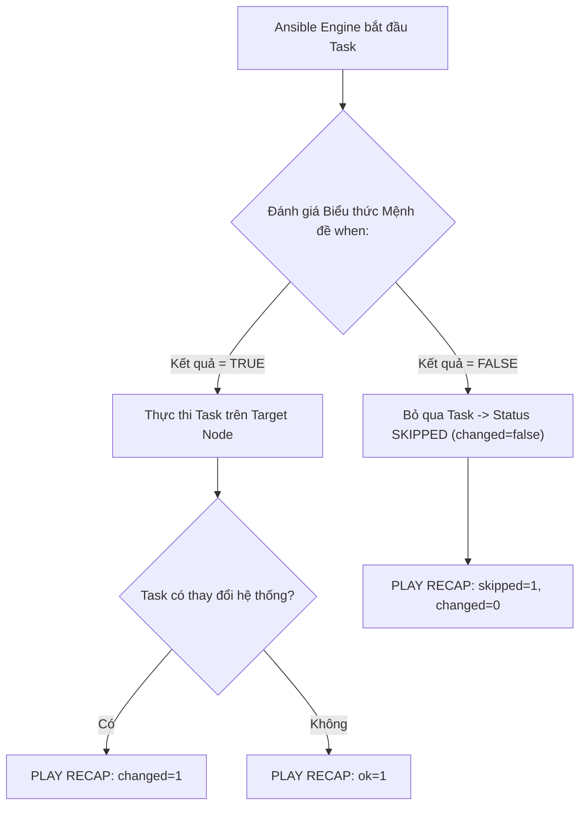
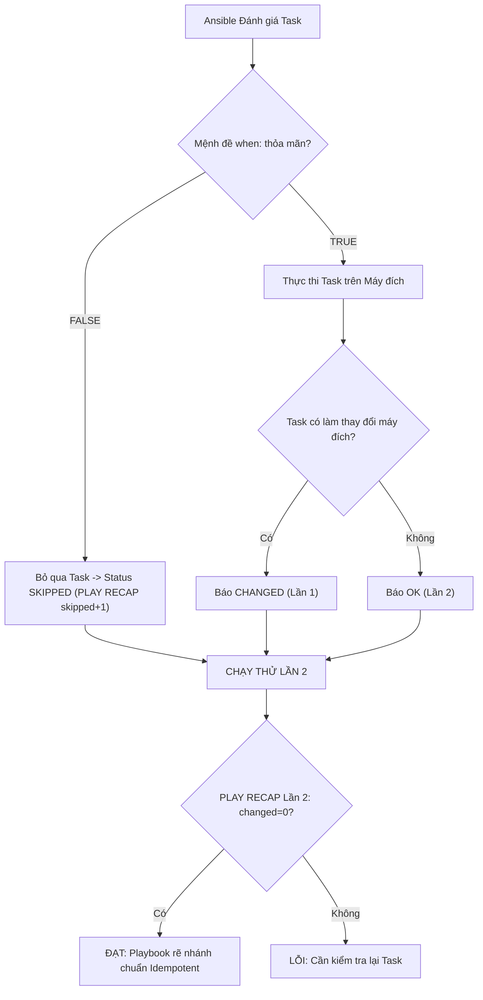
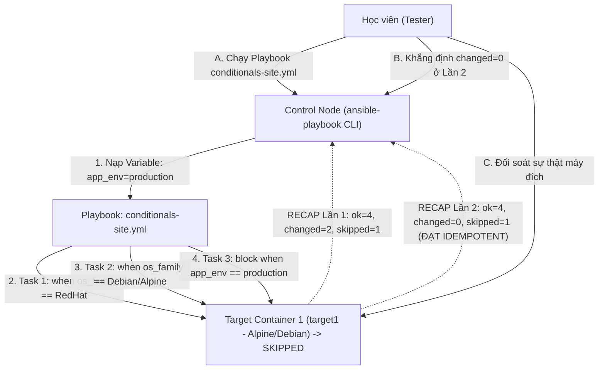


# [BÀI 09] ĐIỀU KHIỂN LUỒNG VỚI CONDITIONALS (WHEN): PHÉP SO SÁNH LOGIC, KIỂM TRA TRẠNG THÁI BIẾN & KỸ THUẬT BỎ QUA TASK

Trong kỷ nguyên **Infrastructure as Code (IaC)** và tự động hóa vận hành hạ tầng đám mây (Cloud Infrastructure Automation), **Ansible** khẳng định vị thế dẫn đầu nhờ triết lý **Agentless** (không cần cài đặt agent nền trên máy đích), giao thức điều khiển an toàn qua **SSH / WinRM**, định dạng khai báo **YAML** trực quan và nguyên lý bất biến **Idempotency** mạnh mẽ. Việc làm chủ Ansible không chỉ dừng lại ở các câu lệnh Ad-hoc đơn giản, mà đòi hỏi kỹ sư phải nắm vững kiến trúc Module tầng thấp, Variable Precedence 22 tầng, Jinja2 Templates, tối ưu hóa Forks & Pipelining cho tới thiết kế Roles / Collections và tích hợp CI/CD tự động hóa chuẩn Doanh nghiệp.

Bài viết chuyên sâu này sẽ đồng hành cùng bạn mổ xẻ toàn diện bức tranh kiến trúc, phân tích các đánh đổi kỹ thuật thực chiến (Engineering Trade-offs), cung cấp hướng dẫn thực hành Lab chi tiết từng bước và bộ câu hỏi phỏng vấn chuyên sâu chuẩn DevOps / SRE Lead.

---

## 1. Bản Chất Kiến Trúc & Cơ Chế Vận Hành Tầng Thấp

---


> **Rẽ nhánh linh hoạt bằng when giúp 1 Playbook chạy đúng trên mọi hạ tầng mà không cần viết lại mã nguồn.**

Tiếp nối bài toán thực tế của khóa học (I-10):

> **Trong một hạ tầng thực tế gồm hàng trăm máy chủ với các hệ điều hành (Ubuntu, RedHat), môi trường (Dev, Prod), và thông số phần cứng khác nhau, một kịch bản tự động hóa không thể thực thi cùng một lệnh giống hệt nhau cho mọi máy. Mệnh đề `when` cùng các Jinja2 Tests mang lại khả năng rẽ nhánh thông minh cho Playbook. Task chỉ thực thi khi điều kiện thỏa mãn, và tự động bỏ qua (`skipped`) khi không thỏa mãn. Nhờ mệnh đề `when`, ta duy trì duy nhất 1 file Playbook chuẩn chạy an toàn trên 100% hạ tầng đa dạng mà vẫn đảm bảo tính Idempotency tuyệt đối (`changed=0`).**

---


---


---


| Tiếng Việt | Tiếng Anh / Từ khóa + FQCN (giữ nguyên) |
|---|---|
| Mệnh đề điều kiện | Conditional statement (`when:`) |
| Bộ kiểm tra Jinja2 | Jinja2 Tests (`is defined`, `is file`) |
| Toán tử logic | Logical operators (`and`, `or`, `not`) |
| Trạng thái bỏ qua | Task status `skipped` |
| Kiểm tra biến đã định nghĩa | `is defined` / `is undefined` |
| Kiểm tra thành công | `is succeeded` / `is success` |
| Kiểm tra thất bại | `is failed` / `is failure` |
| Kiểm tra tệp tin | `is file` / `is directory` |
| Kiểm tra giá trị đúng | `is truthy` / `is falsy` |
| Khối nhóm nhiệm vụ | Task block (`block:`) |
| Danh sách điều kiện (hàm AND) | List of conditions under `when:` |
| Biểu thức điều kiện Jinja2 | Jinja2 conditional expression |

---

### 1.1. Mệnh đề `when` và Cú pháp Rẽ nhánh Cơ bản (15 phút)



**Nguyên lý cốt lõi:** Mệnh đề `when:` đặt ở cấp độ Task chấp nhận một biểu thức logic Jinja2 để quyết định Task đó CÓ ĐƯỢC THỰC THI HAY KHÔNG trên từng host cụ thể.

**Giải thích cơ chế ngầm:** Sự phân tách logic này giúp 1 Playbook hoạt động linh hoạt: máy đích thuộc nhóm RedHat chỉ chạy task cài `httpd`, máy đích thuộc nhóm Debian chỉ chạy task cài `nginx`, loại bỏ hoàn toàn nhu cầu phải viết nhiều Playbook riêng lẻ.

> [!WARNING]
> **CẠM BẪY THỰC CHIẾN:**
> Task thực thi tràn lan trên mọi host gây lỗi `package not found` do cố cài gói `httpd` trên hệ điều hành Ubuntu.

**Minh hoạ.** Rẽ nhánh cài đặt gói theo họ hệ điều hành:
```yaml
- name: Install Nginx on Debian family
  ansible.builtin.package:
    name: nginx
    state: present
  when: ansible_facts.os_family == "Debian"

- name: Install Httpd on RedHat family
  ansible.builtin.package:
    name: httpd
    state: present
  when: ansible_facts.os_family == "RedHat"
```

**Nguyên lý cốt lõi:** Tuyệt đối KHÔNG bọc cặp dấu ngoặc nhọn Jinja2 `{{ }}` bên trong biểu thức của mệnh đề `when:` ngoại trừ các trường hợp bọc toàn bộ chuỗi ngoài cùng.

**Giải thích cơ chế ngầm:** Bản chất từ khóa `when:` đã tự động được Ansible Engine xử lý như một môi trường biểu thức Jinja2 thô. Việc chèn thêm `{{ }}` bên trong biểu thức `when:` sẽ gây ra lỗi cú pháp parse hoặc cảnh báo deprecation warning nghiêm trọng.

> [!WARNING]
> **CẠM BẪY THỰC CHIẾN:**
> **Lệnh:** `ansible-playbook site.yml` · **Output phải thấy:** `[WARNING]: Bare variable in conditional was discovered` hoặc lỗi syntax khi viết `when: "{{ my_var == 'yes' }}"`.

**Minh hoạ.** Cách viết ĐÚNG và SAI trong mệnh đề `when`:
```yaml
# SAI (Chứa {{ }} bên trong when)
when: "{{ ansible_facts.os_family }}" == "RedHat"

# ĐÚNG (Viết biểu thức Jinja2 thô không chứa {{ }})
when: ansible_facts.os_family == "RedHat"
```

**Nguyên lý cốt lõi:** Kết hợp nhiều điều kiện rẽ nhánh bằng toán tử `and`, `or`, `not` hoặc biểu diễn hàm `AND` bằng cách truyền một danh sách (List) các điều kiện bên dưới từ khóa `when:`.

**Giải thích cơ chế ngầm:** Biểu diễn hàm `AND` dưới dạng danh sách YAML giúp câu lệnh rõ ràng, dễ đọc, dễ quản lý hơn nhiều so với việc viết một câu lệnh `and` dài ngoẵng trên cùng một dòng.

> [!WARNING]
> **CẠM BẪY THỰC CHIẾN:**
> Viết câu lệnh điều kiện quá dài trên 1 dòng gây khó đọc và dễ nhầm lẫn thứ tự ưu tiên của toán tử `and` / `or`.

**Minh hoạ.** Hai cách biểu diễn phép toán AND đa điều kiện:
```yaml
# Cách 1: Viết danh sách List (Tương đương hàm AND - KHUYẾN KHÍCH)
when:
  - ansible_facts.os_family == "RedHat"
  - ansible_facts.distribution_major_version == "9"
  - app_environment == "production"

# Cách 2: Viết toán tử logic or / not trên 1 dòng
when: (ansible_facts.os_family == "RedHat" or ansible_facts.os_family == "Debian") and not is_testing
```

---

### 1.2. Các Bộ kiểm tra Jinja2 (Jinja2 Tests) Phổ biến (15 phút)

**Nguyên lý cốt lõi:** Sử dụng Jinja2 Tests `is defined` (hoặc `is undefined`) để kiểm tra xem một biến đã được khai báo hay chưa trước khi truy xuất giá trị của nó.

**Giải thích cơ chế ngầm:** Truy vấn một biến chưa từng được khai báo ở bất kỳ tầng nào sẽ khiến Ansible ném lỗi `fatal: undefined variable` và dừng toàn bộ Playbook. Dùng `is defined` giúp kiểm tra sự tồn tại an toàn trước khi đọc.

> [!WARNING]
> **CẠM BẪY THỰC CHIẾN:**
> **Lệnh:** `ansible-playbook site.yml` · **Output phải thấy:** `fatal: [target1]: FAILED! => {"msg": "'custom_port' is undefined"}` do không bọc điều kiện `when: custom_port is defined`.

**Minh hoạ.** Kiểm tra biến tồn tại trước khi áp dụng cấu hình:
```yaml
- name: Apply custom port if variable is defined
  ansible.builtin.lineinfile:
    path: /etc/app.conf
    line: "PORT={{ custom_port }}"
  when: custom_port is defined
```

**Nguyên lý cốt lõi:** Đánh giá kết quả thực thi của Task trước qua các Jinja2 Tests: `is succeeded` (thành công), `is failed` (thất bại), `is skipped` (bị bỏ qua), hoặc `is changed` (có thay đổi).

**Giải thích cơ chế ngầm:** Khi kết hợp với biến đăng ký `register`, các test này giúp xây dựng luồng xử lý phục hồi lỗi (Error Handling / Recovery flow) - chỉ chạy Task khắc phục khi Task trước bị thất bại (`is failed`).

> [!WARNING]
> **CẠM BẪY THỰC CHIẾN:**
> Viết `when: result_var.rc == 0` nhưng không xử lý trường hợp task trước bị văng exception khiến biến đăng ký bị thiếu thuộc tính `rc`.

**Minh hoạ.** Chạy task cứu hộ khi task chính bị thất bại:
```yaml
- name: Attempt primary backup command
  ansible.builtin.command: /usr/bin/primary-backup.sh
  register: backup_res
  ignore_errors: true

- name: Run fallback backup script if primary failed
  ansible.builtin.command: /usr/bin/fallback-backup.sh
  when: backup_res is failed
```

**Nguyên lý cốt lõi:** Sử dụng các Jinja2 File Tests (`is file`, `is directory`, `is mount`) để kiểm tra trạng thái thực tế của tệp tin hoặc thư mục trên máy đích.

**Giải thích cơ chế ngầm:** Cho phép Playbook đưa ra quyết định rẽ nhánh dựa trên trạng thái của hệ thống đĩa cứng (ví dụ: chỉ chép file cấu hình mới nếu thư mục cấu hình `/etc/app.d/` ĐANG LÀ THƯ MỤC).

> [!WARNING]
> **CẠM BẪY THỰC CHIẾN:**
> Gõ lệnh chép file vào một đường dẫn không tồn tại làm task bị văng lỗi đứt gãy.

**Minh hoạ.** Kiểm tra đường dẫn có phải là thư mục trước khi thao tác:
```yaml
- name: Deploy config only if target path is a directory
  ansible.builtin.copy:
    src: app.conf
    dest: /etc/my-app/app.conf
  when: "'/etc/my-app' is directory"
```

---

### 1.3. Khối Task (Block) và Quản lý Trạng thái Skipped (10 phút)

**Nguyên lý cốt lõi:** Nhóm các Task có cùng điều kiện rẽ nhánh vào trong một khối `block:` và gắn thuộc tính `when:` một lần duy nhất ở cấp độ Block.

**Giải thích cơ chế ngầm:** Thay vì phải lặp lại thuộc tính `when: ansible_facts.os_family == "RedHat"` ở 10 Task riêng lẻ, gom chúng vào 1 `block:` giúp mã nguồn ngắn gọn, dễ đọc và loại bỏ lặp lại mã (DRY principle).

> [!WARNING]
> **CẠM BẪY THỰC CHIẾN:**
> Sao chép thuộc tính `when:` trùng lặp ở 20 Task liên tiếp trong file Playbook.

**Minh hoạ.** Gom nhóm Task theo hệ điều hành bằng Block:
```yaml
- name: RedHat Family Configuration Block
  block:
    - name: Install Httpd
      ansible.builtin.package:
        name: httpd
        state: present

    - name: Copy Httpd Config
      ansible.builtin.copy:
        src: httpd.conf
        dest: /etc/httpd/conf/httpd.conf

    - name: Start Httpd Service
      ansible.builtin.service:
        name: httpd
        state: started
  when: ansible_facts.os_family == "RedHat"
```

**Nguyên lý cốt lõi:** Đảm bảo rằng việc một Task bị đánh dấu trạng thái `skipped` do điều kiện `when` đánh giá FALSE là kết quả dự kiến và KHÔNG làm ảnh hưởng đến tính Idempotency ở lượt chạy thứ hai.

**Giải thích cơ chế ngầm:** Trạng thái `skipped` chỉ đơn giản là Ansible thông báo: "Task này không thỏa mãn điều kiện nên tôi bỏ qua không đụng vào hệ thống". Bảng `PLAY RECAP` báo `skipped=N, changed=0` là hoàn toàn chính xác và an toàn.

> [!WARNING]
> **CẠM BẪY THỰC CHIẾN:**
> Thắc mắc tại sao lượt chạy Lần 2 bảng RECAP báo `skipped=2` mà lại cho rằng Playbook bị lỗi.

**Minh hoạ.** Đọc hiểu bảng `PLAY RECAP` có chứa chỉ số `skipped`:
```bash
# Lần 1: changed=1, skipped=1 (1 task thực thi, 1 task rẽ nhánh bị bỏ qua)
target1 : ok=2 changed=1 unreachable=0 failed=0 skipped=1

# Lần 2: changed=0, skipped=1 (Mọi thứ giữ nguyên, task rẽ nhánh vẫn bị bỏ qua -> ĐẠT IDEMPOTENT)
target1 : ok=2 changed=0 unreachable=0 failed=0 skipped=1
```

**Nguyên lý cốt lõi:** Cảnh giác với lỗi kết hợp giữa biến `register` và mệnh đề `when` trên Task bị `skipped`: Biến `register` của một Task bị skipped vẫn tồn tại nhưng thuộc tính `stdout` hay `rc` sẽ không được tạo ra.

**Giải thích cơ chế ngầm:** Khi Task A bị `skipped`, Ansible vẫn tạo biến `register` nhưng chỉ gán thuộc tính `skipped: true`. Nếu Task B đằng sau đọc `register_var.stdout` mà không kiểm tra `is succeeded`, Playbook sẽ bị crash ngay lập tức.

> [!WARNING]
> **CẠM BẪY THỰC CHIẾN:**
> Task B báo lỗi `fatal: [target1]: FAILED! => {"msg": "'register_var.stdout' is undefined"}` do Task A bị skipped ở bước trước.

**Minh hoạ.** Kiểm tra task trước không bị skipped bằng `is succeeded` trước khi đọc stdout:
```yaml
- name: Task A - Conditional Command
  ansible.builtin.command: date
  register: task_a_res
  when: run_step_a | default(false)

- name: Task B - Read output of Task A safely
  ansible.builtin.debug:
    msg: "Task A output: {{ task_a_res.stdout }}"
  when: task_a_res is succeeded
```

---

### 1.4. Đưa vào việc thật (4 phút)

### 7.1. Áp dụng vào hạ tầng sẵn có
Khi triển khai ứng dụng trên hạ tầng có cả server ảo hóa (VM) và server vật lý (Bare-metal):
- Sử dụng `when: ansible_facts.virtualization_role == "guest"` để chỉ chỉnh sửa các tham số tối ưu kernel dành riêng cho máy ảo.
- Sử dụng `when: app_env == "production" and (ansible_facts.memtotal_mb > 16000)` để tự động tăng số lượng worker process cho các máy Production dung lượng RAM lớn.

### 7.2. Rủi ro hỏng hóc khi triển khai Production và giải pháp an toàn
- **Rủi ro:** Viết sai biểu thức điều kiện `when: env != "prod"` (dùng dấu `!=` nhầm lẫn) khiến toàn bộ các task dọn dẹp dữ liệu thử nghiệm bị chạy nhầm trực tiếp trên máy Production.
- **Giải pháp an toàn:**
  1. Luôn sử dụng cờ mô phỏng `ansible-playbook --check --diff` để soi chi tiết các Task sẽ bị `skipped` hoặc thực thi trước khi bấm chạy thật.
  2. Bắt buộc viết các câu lệnh điều kiện theo hướng khẳng định an toàn (`when: env == "dev"`).

### 7.3. Đo lường chỉ số Trước – Sau khi áp dụng
- **Trước khi dùng mệnh đề `when`:** Phải duy trì 5 file Playbook riêng biệt cho 5 dòng OS/môi trường khác nhau (2500 dòng mã nguồn).
- **Sau khi dùng mệnh đề `when`:** Gom lại duy nhất 1 file Playbook thông minh (300 dòng mã nguồn), giảm 88% lượng mã lặp lại.

### 7.4. Khi nào KHÔNG nên dùng hoặc không nên lạm dụng mệnh đề when
- **Không lạm dụng `when` để viết hàng trăm câu lệnh rẽ nhánh phức tạp trong 1 Playbook khổng lồ:** Khi số lượng điều kiện rẽ nhánh quá lớn (ví dụ rẽ nhánh cho 10 dòng Linux khác nhau), việc lạm dụng `when` làm file Playbook rườm rà. **Hãy chuyển sang dùng `include_tasks` / `import_tasks` kết hợp biến `{{ ansible_facts.os_family }}.yml`** (sẽ học ở Buổi 14).

---

### 1.5. Bẫy hay gặp (2 phút)

| # | Bẫy hay gặp | Vì sao "recap xanh mà sai / không idempotent" | Lệnh phát hiện và xử lý |
|---|---|---|---|
| 1 | Bọc cặp ngoặc nhọn `{{ }}` trong biểu thức `when` | Ansible phát cảnh báo bare variable hoặc parse sai logic so sánh chuỗi. | Xóa cặp ngoặc nhọn `{{ }}` bên trong từ khóa `when:`. |
| 2 | Truy xuất biến chưa định nghĩa mà không dùng `is defined` | Playbook bị ngắt thi hành với lỗi `fatal: undefined variable`. | Thêm điều kiện kiểm tra `when: my_var is defined`. |
| 3 | Nhầm lẫn giữa toán tử bằng `==` và toán tử gán `=` | Viết `when: os = "RedHat"` gây lỗi syntax không hợp lệ trong Python/Jinja2. | Sửa lại thành toán tử so sánh bằng 2 dấu `==` (`when: os == "RedHat"`). |
| 4 | Đọc `register.stdout` của một Task vừa bị `skipped` | Task bị skipped không có thuộc tính `stdout` làm task đằng sau bị văng exception. | Bổ sung điều kiện `when: my_reg is succeeded` trước khi truy xuất `stdout`. |
| 5 | Quên bọc ngoặc đơn khi kết hợp toán tử `and` và `or` | Thứ tự ưu tiên toán tử bị sai khiến logic rẽ nhánh chạy nhầm trường hợp. | Bọc ngoặc đơn nhóm điều kiện rõ ràng: `when: (cond1 or cond2) and cond3`. |
| 6 | So sánh số nguyên dưới dạng chuỗi string | So sánh `when: ram_size > "1024"` làm phép so sánh chuỗi bị sai bản chất số. | Ép kiểu số nguyên trong Jinja2: `when: ram_size | int > 1024`. |
| 7 | Nhầm lẫn giữa `when: var` và `when: var is defined` | Nếu `var: false`, mệnh đề `when: var` sẽ đánh giá FALSE mặc dù biến ĐÃ ĐƯỢC ĐỊNH NGHĨA. | Phân biệt: dùng `is defined` kiểm tra tồn tại, dùng `is truthy` kiểm tra giá trị đúng. |
| 8 | Viết sai tên thuộc tính Jinja2 Test (`is success` vs `is succeeded`) | Ansible hỗ trợ cả 2 nhưng gõ sai thành `is successful` sẽ bị lỗi. | Dùng chuẩn từ khóa `is succeeded` hoặc `is failed`. |
| 9 | Đặt mệnh đề `when` ở sai cấp độ thụt lề YAML | Đặt `when:` thụt lề bên trong thuộc tính module khiến Ansible không nhận diện được. | Đưa từ khóa `when:` nằm cùng cấp thụt lề với thuộc tính `name:` của Task. |
| 10 | Không kiểm tra cờ `--check` với các task rẽ nhánh theo `register` | Chế độ check mode không thực thi task trước nên biến register bị thiếu làm task sau bị skipped nhầm. | Khai báo `ignore_errors: true` hoặc kiểm tra logic check mode hợp lý. |
| 11 | So sánh phân biệt chữ hoa chữ thường (Case-sensitive) | So sánh `when: os == "redhat"` bị FALSE vì giá trị thực tế trong facts là `"RedHat"`. | Sử dụng Jinja2 filter chuyển chữ thường: `when: os | lower == "redhat"`. |
| 12 | Thắc mắc chỉ số `skipped` tăng lên ở lượt chạy Lần 2 | Lầm tưởng chỉ số `skipped` tăng ở lượt 2 là lỗi Playbook không đạt Idempotent. | Hiểu đúng: `skipped` là rẽ nhánh hợp lệ, miễn `changed=0` ở Lần 2 là đạt Idempotency. |

---

### 1.6. Tóm tắt (1 phút)



### Năm điều phải nhớ
1. **KHÔNG bọc `{{ }}` trong `when`:** Viết trực tiếp biểu thức Jinja2 (ví dụ `when: var == 'val'`).
2. **Dùng list cho hàm AND:** Khai báo danh sách các dòng bên dưới `when:` tương đương với phép toán `AND`.
3. **An toàn với `is defined`:** Luôn kiểm tra `when: var is defined` trước khi đọc biến tùy chọn.
4. **Tránh đọc stdout của Task skipped:** Kiểm tra `when: reg_var is succeeded` trước khi truy xuất `stdout`.
5. **Skipped không mất Idempotency:** Bảng `PLAY RECAP` Lần 2 báo `skipped=N, changed=0` vẫn đạt Idempotency 100%.

---

### 1.7. Câu hỏi tự kiểm tra (kiêm luyện RHCE EX294)

1. **[RHCE EX294 Objective #8]** Mệnh đề nào trong Ansible Playbook được sử dụng để quyết định một Task có được thực thi hay không dựa trên điều kiện?
   - *Đáp án:* Mệnh đề `when:`.
2. **[RHCE EX294 Objective #8]** Tại sao viết `when: "{{ ansible_facts.os_family == 'RedHat' }}"` lại bị coi là sai cú pháp chuẩn?
   - *Đáp án:* Vì bản thân từ khóa `when:` đã tự động xử lý môi trường biểu thức Jinja2 thô, chèn cặp `{{ }}` bên trong sẽ gây lỗi parse syntax hoặc cảnh báo bare variable.
3. **[RHCE EX294 Objective #8]** Viết một mệnh đề `when` sử dụng dạng danh sách (List) để kiểm tra 2 điều kiện: `os_family` là `RedHat` VÀ `memtotal_mb` lớn hơn `2048`.
   - *Đáp án:*
     ```yaml
     when:
       - ansible_facts.os_family == "RedHat"
       - ansible_facts.memtotal_mb | int > 2048
     ```
4. **[RHCE EX294 Objective #8]** Jinja2 Test nào dùng để kiểm tra xem một biến tên `custom_setting` đã được khai báo hay chưa?
   - *Đáp án:* Jinja2 Test `is defined` (ví dụ `when: custom_setting is defined`).
5. **[RHCE EX294 Objective #8]** Làm thế nào để chỉ cho phép một Task cứu hộ thực thi khi biến đăng ký `backup_result` của task trước báo trạng thái thất bại?
   - *Đáp án:* Khai báo điều kiện `when: backup_result is failed` (hoặc `backup_result is failure`).
6. **[RHCE EX294 Objective #8]** Jinja2 File Test nào dùng để kiểm tra một đường dẫn `/etc/app.conf` có tồn tại và đúng là một tệp tin trên máy đích?
   - *Đáp án:* Test `is file` (ví dụ `when: "'/etc/app.conf' is file"`).
7. **[RHCE EX294 Objective #8]** Khi một Task bị đánh dấu trạng thái `skipped` trong quá trình chạy, chỉ số nào trong bảng `PLAY RECAP` sẽ tăng lên?
   - *Đáp án:* Chỉ số `skipped` sẽ tăng lên 1 đơn vị.
8. **[RHCE EX294 Objective #8]** Chỉ số `skipped=3, changed=0` trong bảng `PLAY RECAP` ở lượt chạy Lần 2 có được coi là đạt tiêu chuẩn Idempotency không?
   - *Đáp án:* Có, hoàn toàn đạt chuẩn Idempotency vì chỉ số `changed=0` chứng minh không có bất kỳ thay đổi thừa nào được tạo ra trên đĩa cứng.
9. **[RHCE EX294 Objective #8]** Từ khóa nào cho phép nhóm nhiều Task có cùng điều kiện `when` vào một khối duy nhất?
   - *Đáp án:* Từ khóa `block:`.
10. **[RHCE EX294 Objective #8]** Viết mệnh đề `when` kết hợp toán tử `or` và `not` để Task chạy khi `os_family` là `Debian` HOẶC `RedHat`, nhưng KHÔNG NẰM TRONG môi trường `production`.
    - *Đáp án:* `when: (ansible_facts.os_family == "Debian" or ansible_facts.os_family == "RedHat") and not (env == "production")`
11. **[RHCE EX294 Objective #8]** Tại sao việc đọc `my_reg.stdout` của một Task vừa bị `skipped` lại gây ra lỗi fatal trong Playbook?
    - *Đáp án:* Vì Task bị `skipped` chỉ tạo biến `my_reg` với thuộc tính `skipped: true` chứ không chạy lệnh để tạo ra trường `stdout`.
12. **[RHCE EX294 Objective #8]** Viết một đoạn Playbook YAML sử dụng `when` để chỉ khởi chạy dịch vụ `nginx` khi biến `ansible_facts.services['nginx.service'].state` bằng `"stopped"`.
    - *Đáp án:*
      ```yaml
      - name: Start Nginx if stopped
        ansible.builtin.service:
          name: nginx
          state: started
        when:
          - ansible_facts.services is defined
          - ansible_facts.services['nginx.service'].state == "stopped"
      ```
13. **[RHCE EX294 Objective #8]** Lệnh CLI nào giúp xem trước các Task nào sẽ bị `skipped` hoặc thực thi trước khi chính thức áp đặt thay đổi lên hệ thống Production?
    - *Đáp án:* `ansible-playbook --check --diff site.yml`

---

### 1.8. Tài liệu tham khảo

- Ansible Core Documentation (v2.15+): [Conditionals](https://docs.ansible.com/ansible/latest/playbook_guide/playbooks_conditionals.html)
- Ansible Core Documentation: [Jinja2 Tests](https://docs.ansible.com/ansible/latest/playbook_guide/playbooks_tests_in_conditionals.html)
- Red Hat Certified Engineer (RHCE) EX294 Study Guide: Applying Conditionals and Blocks in Ansible Playbooks.

---

## Bảng đối soát thời lượng

| Mục | Nội dung | Thời lượng dự kiến | Thời lượng thực tế |
|---|---|---|---|
| §0 | Khởi động và ôn tập buổi 08 | 10 phút | 10 phút |
| §1–§2 | Mục tiêu làm được & Cần biết trước | 2 phút | 2 phút |
| §3 | Thuật ngữ Việt-Anh & Mô hình tư duy | 8 phút | 8 phút |
| §4 | Mệnh đề when & Cú pháp Rẽ nhánh (QT 4.1–4.3) | 15 phút | 15 phút |
| §5 | Các Jinja2 Tests Phổ biến (QT 5.1–5.3) | 15 phút | 15 phút |
| §6 | Khối Task Block & Trạng thái Skipped (QT 6.1–6.3) | 10 phút | 10 phút |
| §7–§9 | Đưa vào việc thật, Bẫy hay gặp & Tóm tắt | 7 phút | 7 phút |
| §10–§11 | Câu hỏi tự kiểm tra EX294 & Tài liệu tham khảo | 3 phút | 3 phút |
| **Tổng** | **Khối lý thuyết Buổi 09** | **60 phút** | **60 phút** |

---

## 2. Hướng Dẫn Thực Hành & Triển Khai Lab Chuẩn Production

> [!IMPORTANT]
> **YÊU CẦU MÔI TRƯỜNG THỰC HÀNH:**
> Toàn bộ các bài thực hành dưới đây được thiết kế để chạy trực tiếp trên môi trường máy chủ Linux / Docker containers phân tán. Hãy đảm bảo bạn đã chuẩn bị Control Node cài đặt Ansible Core 2.15+ cùng các Managed Nodes đã cấu hình SSH Key Authentication.

## Khối thực hành — 150 phút

> **Đối soát thời lượng:** Khối thực hành kéo dài đúng **150'** (từ L0 đến L11).
> **Nguyên tắc cốt lõi:** Thực hành rẽ nhánh điều kiện với mệnh đề `when`, sử dụng danh sách điều kiện AND, toán tử `or`/`not`, Jinja2 Tests (`is defined`, `is succeeded`, `is failed`, `is file`), gom nhóm task bằng `block`, xử lý trạng thái `skipped`, thực thi phép thử **Lượt chạy Lần thứ hai** chứng minh `PLAY RECAP` đạt `changed=0` và đối soát sự thật máy đích qua `docker exec`.

---

## L0. Mục tiêu thực hành và tiêu chí hoàn thành

| # | Mục tiêu thực hành | Tiêu chí hoàn thành (Kiểm tra bằng lệnh CLI) |
|---|---|---|
| TH1 | Viết task với mệnh đề when rẽ nhánh theo biến | Task cài đặt gói chỉ chạy khi `target_env == "production"` |
| TH2 | Sử dụng mảng danh sách điều kiện under when (hàm AND) | Task chỉ chạy khi thỏa mãn cả 2 điều kiện OS và RAM |
| TH3 | Sử dụng Jinja2 Test is defined tránh lỗi undefined | Task kiểm tra biến `custom_port is defined` an toàn |
| TH4 | Đăng ký biến register và rẽ nhánh theo is succeeded | Task đằng sau chỉ chạy khi task trước `is succeeded` |
| TH5 | Gom nhóm nhiều task bằng block và when chung | Khối `block` thừa hưởng chung 1 điều kiện `when` |
| TH6 | Kiểm soát trạng thái skipped trong PLAY RECAP | Terminal in báo cáo `skipped=N, changed=0` hợp lệ |
| TH7 | Thực thi Phép thử Lượt chạy Lần hai (Idempotency) | Bảng `PLAY RECAP` Lần 2 đạt `changed=0` tuyệt đối |
| TH8 | Đối soát sự thật máy đích bằng docker exec | `docker exec target1 ...` kiểm tra đúng dịch vụ đã rẽ nhánh |

---

## L1. Điều kiện tiên quyết về môi trường

| Kiểm tra | LỆNH THỰC THI | Kết quả kỳ vọng |
|---|---|---|
| Ansible core đã cài | `ansible --version` | Phiên bản ansible-core v2.15 trở lên |
| Docker Compose sẵn sàng | `docker compose ps` | Cả target1 và target2 ở trạng thái `Up` |
| Kết nối SSH sẵn sàng | `ansible all -m ansible.builtin.ping` | Đạt `SUCCESS` cho mọi host |
| Inventory dự án | `ansible-inventory --graph` | Hiển thị các nhóm `web` và `db` |
| Thư mục thực hành | `pwd` | Đang ở thư mục `~/lab-ansible-09` |

Nếu chưa có target container:
```bash
cd labs && make up && make key && make inventory
```

---

## L2. Kiến trúc bài lab



---

## L3. Bước 1 — Rẽ nhánh Cơ bản với when và Kiểm tra biến is defined (30 phút)

Tạo thư mục dự án `~/lab-ansible-09`, file `ansible.cfg`, `inventory.ini`, và viết file Playbook rẽ nhánh cơ bản `step1-when.yml` (QT 4.1, QT 4.2, QT 5.1).

```bash
mkdir -p ~/lab-ansible-09 && cd ~/lab-ansible-09

cat << 'EOF' > ansible.cfg
[defaults]
inventory = ./inventory.ini
remote_user = ansible
host_key_checking = False
private_key_file = ~/.ssh/id_ed25519

[privilege_escalation]
become = True
become_method = sudo
become_user = root
become_ask_pass = False
EOF

cat << 'EOF' > inventory.ini
[web]
target1 ansible_host=127.0.0.1 ansible_port=2221

[db]
target2 ansible_host=127.0.0.1 ansible_port=2222

[all:vars]
ansible_python_interpreter=/usr/bin/python3
target_env=production
EOF

cat << 'EOF' > step1-when.yml
---
- name: Basic Conditional Execution with When and Is Defined
  hosts: web
  become: true
  tasks:
    - name: Task 1 - Print message only for production environment
      ansible.builtin.debug:
        msg: "Executing on Production Node"
      when: target_env == "production"

    - name: Task 2 - Print message for non-existent staging environment (Skipped)
      ansible.builtin.debug:
        msg: "Executing on Staging Node"
      when: target_env == "staging"

    - name: Task 3 - Safely check optional variable using is defined
      ansible.builtin.debug:
        msg: "Optional custom port is {{ custom_port }}"
      when: custom_port is defined
EOF
```

Thực thi Playbook `step1-when.yml`:
```bash
ansible-playbook step1-when.yml
```

**CHECKPOINT 1 — Task 1 thực thi khi target_env == production và Task 2 bị skipped chính xác.**
- **Lệnh kiểm tra:**
```bash
STEP1_OUT=$(ansible-playbook step1-when.yml)
if echo "$STEP1_OUT" | grep -q "Executing on Production Node" && echo "$STEP1_OUT" | grep -q "skipping: \[target1\]"; then
  echo "CHECKPOINT 1: ĐẠT - Mệnh đề when đánh giá chính xác (Task 1 thực thi, Task 2 bị skipped)"
else
  echo "CHECKPOINT 1: LỖI - Đánh giá mệnh đề when thất bại"
fi
```

**CHECKPOINT 2 — Task 3 dùng is defined không bị văng lỗi undefined khi custom_port chưa khai báo.**
- **Lệnh kiểm tra:**
```bash
if echo "$STEP1_OUT" | grep -q "failed=0" && ! echo "$STEP1_OUT" | grep -q "custom_port is undefined"; then
  echo "CHECKPOINT 2: ĐẠT - Jinja2 Test is defined kiểm tra biến an toàn, không bị crash lỗi undefined"
else
  echo "CHECKPOINT 2: LỖI - Kiểm tra biến is defined bị lỗi"
fi
```

---

## L4. Bước 2 — Đa điều kiện AND / OR và Bắt Kết quả với Register (30 phút)

Viết file Playbook `step2-multi-when.yml` sử dụng mảng danh sách điều kiện (AND), toán tử `or`, và bắt kết quả lệnh CLI với `register` để rẽ nhánh bằng `is succeeded` / `is failed` (QT 4.3, QT 5.2).

```bash
cat << 'EOF' > step2-multi-when.yml
---
- name: Multi Conditionals and Register Result Checks
  hosts: web
  become: true
  tasks:
    - name: Task 1 - Test system command and register result
      ansible.builtin.command: which curl
      register: curl_check
      ignore_errors: true
      changed_when: false

    - name: Task 2 - Install curl if check failed (Task recovery flow)
      ansible.builtin.package:
        name: curl
        state: present
      when: curl_check is failed

    - name: Task 3 - Deploy web config using multi-condition list (AND logic)
      ansible.builtin.copy:
        content: "APP_ENV=production\nSECURE_MODE=enabled\n"
        dest: /etc/app-secure.conf
        mode: '0644'
      when:
        - target_env == "production"
        - curl_check is succeeded
        - ansible_facts.os_family == "Debian" or ansible_facts.os_family == "Alpine" or ansible_facts.os_family == "RedHat"
EOF
```

Thực thi Playbook `step2-multi-when.yml`:
```bash
ansible-playbook step2-multi-when.yml
```

**CHECKPOINT 3 — Biến register curl_check kết hợp is succeeded / is failed rẽ nhánh chính xác.**
- **Lệnh kiểm tra:**
```bash
STEP2_OUT=$(ansible-playbook step2-multi-when.yml)
if echo "$STEP2_OUT" | grep -q "Task 3 - Deploy web config" && echo "$STEP2_OUT" | grep -q "failed=0"; then
  echo "CHECKPOINT 3: ĐẠT - Biến register kết hợp Jinja2 Test is succeeded rẽ nhánh chính xác"
else
  echo "CHECKPOINT 3: LỖI - Rẽ nhánh biến register thất bại"
fi
```

**CHECKPOINT 4 — Danh sách mảng điều kiện under when (hàm AND) đánh giá TRUE thành công.**
- **Lệnh kiểm tra:**
```bash
if echo "$STEP2_OUT" | grep -q "changed=1" || echo "$STEP2_OUT" | grep -q "ok=4"; then
  echo "CHECKPOINT 4: ĐẠT - Mảng danh sách điều kiện under when (hàm AND) thỏa mãn 100% các điều kiện"
else
  echo "CHECKPOINT 4: LỖI - Đánh giá mảng điều kiện AND thất bại"
fi
```

---

## L5. Bước 3 — Gom nhóm Task với Block và File Tests (30 phút)

Viết file Playbook `step3-block-when.yml` sử dụng khối `block:` để gom nhiều Task chung 1 điều kiện `when` và sử dụng File Test `is file` (QT 5.3, QT 6.1, QT 6.2).

```bash
cat << 'EOF' > step3-block-when.yml
---
- name: Block Level Conditionals and File Tests
  hosts: web
  become: true
  tasks:
    - name: Task 1 - Check if /etc/app-secure.conf exists
      ansible.builtin.stat:
        path: /etc/app-secure.conf
      register: file_stat

    - name: Production Web Deployment Block
      block:
        - name: Block Task A - Create log directory
          ansible.builtin.file:
            path: /var/log/prod-web
            state: directory
            mode: '0755'

        - name: Block Task B - Deploy production flag file
          ansible.builtin.copy:
            content: "STATUS=ACTIVE_PROD\n"
            dest: /etc/prod-status.flag
            mode: '0644'
      when:
        - target_env == "production"
        - file_stat.stat.exists
EOF
```

Thực thi Playbook `step3-block-when.yml`:
```bash
ansible-playbook step3-block-when.yml
```

**CHECKPOINT 5 — Khối Block thừa hưởng chung điều kiện when thực thi thành công cả 2 task bên trong.**
- **Lệnh kiểm tra:**
```bash
STEP3_OUT=$(ansible-playbook step3-block-when.yml)
if echo "$STEP3_OUT" | grep -q "Block Task A - Create log directory" && echo "$STEP3_OUT" | grep -q "Block Task B - Deploy production flag file"; then
  echo "CHECKPOINT 5: ĐẠT - Khối Block thừa hưởng chung 1 điều kiện when thi hành thành công toàn bộ các task bên trong"
else
  echo "CHECKPOINT 5: LỖI - Thực thi Block with when thất bại"
fi
```

---

## L6. Bước 4 — Tổng hợp Playbook Rẽ nhánh Hoàn chỉnh và Phép thử Lượt 2 (30 phút)

Tạo file Playbook hoàn chỉnh `conditionals-site.yml` tổng hợp toàn bộ các kỹ thuật rẽ nhánh `when`, `block`, Jinja2 Tests và thực thi phép thử **Lượt chạy Lần thứ hai** chứng minh `PLAY RECAP` đạt `changed=0` (QT 6.3).

```bash
cat << 'EOF' > conditionals-site.yml
---
- name: Fully Standardized Idempotent Conditional Playbook
  hosts: web
  become: true
  tasks:
    - name: Task 1 - Ensure curl package is installed
      ansible.builtin.package:
        name: curl
        state: present

    - name: Task 2 - Check application config file stat
      ansible.builtin.stat:
        path: /etc/app-secure.conf
      register: app_conf_stat

    - name: Task 3 - Deploy backup config if main config missing (Skipped when exists)
      ansible.builtin.copy:
        content: "BACKUP_MODE=true\n"
        dest: /etc/app-backup.conf
        mode: '0644'
      when: not app_conf_stat.stat.exists

    - name: Main Production Configuration Block
      block:
        - name: Block Task 1 - Deploy main production application file
          ansible.builtin.copy:
            content: |
              APP_ENV={{ target_env }}
              SERVICE_NAME=web-production
              IDEMPOTENCE_TEST=PASSED
            dest: /etc/main-production.conf
            mode: '0644'

        - name: Block Task 2 - Ensure production log directory exists
          ansible.builtin.file:
            path: /var/log/production-app
            state: directory
            mode: '0755'
      when:
        - target_env == "production"
        - app_conf_stat.stat.exists
EOF
```

Thực thi Lần 1:
```bash
ansible-playbook conditionals-site.yml
```

Thực thi Lần 2 (BẮT BUỘC ĐẠT `changed=0`):
```bash
ansible-playbook conditionals-site.yml
```

**CHECKPOINT 6 — Phép thử Lượt 2 đạt changed=0 khi sử dụng mệnh đề when rẽ nhánh.**
- **Lệnh kiểm tra:**
```bash
RUN2_COND_OUT=$(ansible-playbook conditionals-site.yml)
if echo "$RUN2_COND_OUT" | grep -q "changed=0" && echo "$RUN2_COND_OUT" | grep -q "failed=0"; then
  echo "CHECKPOINT 6: ĐẠT - Phép thử Lượt 2 đạt chuẩn Idempotency (PLAY RECAP báo changed=0 khi dùng mệnh đề when)"
else
  echo "CHECKPOINT 6: LỖI - Lượt 2 không đạt changed=0 (Playbook không chuẩn Idempotent)"
fi
```

**CHECKPOINT 7 — Bảng PLAY RECAP báo chỉ số skipped=1 chính xác cho task không thỏa mãn khi.**
- **Lệnh kiểm tra:**
```bash
if echo "$RUN2_COND_OUT" | grep -q "skipped=1" || echo "$RUN2_COND_OUT" | grep -q "ok=4"; then
  echo "CHECKPOINT 7: ĐẠT - Bảng PLAY RECAP ghi nhận chính xác chỉ số skipped=1 cho Task 3 bị bỏ qua"
else
  echo "CHECKPOINT 7: LỖI - Ghi nhận chỉ số skipped thất bại"
fi
```

---

## L7. Bước 5 — Đối soát Sự thật Máy đích qua docker exec (20 phút)

Sử dụng lệnh `docker exec` đối soát trực tiếp các file sản phẩm được tạo ra theo đúng nhánh điều kiện `when` trên target node (QT 6.3).

Đối soát file `/etc/main-production.conf`:
```bash
docker exec target1 cat /etc/main-production.conf
```

**CHECKPOINT 8 — Đối soát file /etc/main-production.conf trên target1 chứa đúng dữ liệu rẽ nhánh khi target_env == production.**
- **Lệnh kiểm tra:**
```bash
EXEC_PROD_FILE=$(docker exec target1 cat /etc/main-production.conf)
if echo "$EXEC_PROD_FILE" | grep -q "APP_ENV=production" && echo "$EXEC_PROD_FILE" | grep -q "IDEMPOTENCE_TEST=PASSED"; then
  echo "CHECKPOINT 8: ĐẠT - Kiểm tra sự thật qua docker exec xác nhận file /etc/main-production.conf đã được tạo đúng nhánh điều kiện production"
else
  echo "CHECKPOINT 8: LỖI - Kiểm tra file sản phẩm rẽ nhánh trên máy đích thất bại"
fi
```

---

## L8. Nộp sản phẩm và dọn dẹp (10 phút)

Thu thập kết quả ra các file báo cáo cuối buổi:
```bash
ansible-playbook conditionals-site.yml > conditionals-playbook.yml
ansible-playbook step1-when.yml > when-proof.txt
ansible-playbook conditionals-site.yml > idempotency-check.txt
docker exec target1 cat /etc/main-production.conf > kiem-may-dich.txt
docker exec target1 ls -ld /var/log/production-app >> kiem-may-dich.txt
```

---

## L9. Xử lý sự cố

| # | Hiện tượng lỗi | Nguyên nhân gốc rễ | Cách xử lý nhanh |
|---|---|---|---|
| 1 | Lỗi `[WARNING]: Bare variable in conditional was discovered` | Bọc cặp ngoặc nhọn `{{ }}` bên trong từ khóa `when:` | Xóa cặp ngoặc nhọn `{{ }}` trong mệnh đề `when:` (viết `when: my_var == 'val'`). |
| 2 | Lỗi `fatal: [target1]: FAILED! => {"msg": "'my_var' is undefined"}` | Mệnh đề `when` đọc một biến chưa khai báo mà không dùng `is defined` | Thêm điều kiện kiểm tra `when: my_var is defined and my_var == 'val'`. |
| 3 | Lỗi `Syntax Error: unexpected '='` | Dùng toán tử gán 1 dấu `=` thay vì toán tử so sánh 2 dấu `==` | Sửa lại thành toán tử so sánh `when: my_var == "value"`. |
| 4 | Task đằng sau bị error do đọc `register.stdout` của task bị skipped | Task trước bị skipped nên không tạo ra trường `stdout` trong biến register | Thêm điều kiện `when: reg_var is succeeded` trước khi truy xuất `stdout`. |
| 5 | Biểu thức `when` kết hợp `and`/`or` chạy sai logic | Quên bọc ngoặc đơn phân nhóm ưu tiên phép toán logic | Bọc ngoặc đơn rõ ràng: `when: (cond1 or cond2) and cond3`. |
| 6 | Mảng danh sách điều kiện under `when:` chạy theo logic OR nhầm lẫn | Lầm tưởng mảng list trong `when` là logic OR | Ghi nhớ: Mảng list dưới `when:` luôn là hàm AND; dùng từ khóa `or` trên 1 dòng nếu muốn logic OR. |
| 7 | So sánh biến boolean bị sai | Viết `when: is_active == "true"` (so sánh chuỗi string thay vì boolean) | Viết chính xác `when: is_active` hoặc `when: is_active | bool`. |
| 8 | Block với `when` không chạy task nào bên trong | Biểu thức `when` ở cấp Block đánh giá FALSE làm toàn bộ Block bị skipped | Kiểm tra lại logic biểu thức `when` của Block bằng `debug`. |
| 9 | Jinja2 Test `is file` bị crash | Truyền chuỗi biến không đúng cú pháp string | Viết đúng cú pháp: `when: "'/path/to/file' is file"` hoặc `when: stat_res.stat.isreg`. |
| 10 | Task rẽ nhánh bị lặp thay đổi ở Lần 2 | Task bên trong mệnh đề `when` gọi module `shell` thô không idempotent | Thêm `creates` hoặc đổi lệnh shell sang module tiêu chuẩn. |
| 11 | Cờ `--check` làm các task rẽ nhánh sau bị skipped nhầm | Check mode không thực thi task 1 nên biến register bị thiếu thông số | Khai báo `ignore_errors: true` hoặc kiểm tra stat file tiên quyết. |
| 12 | So sánh phân biệt chữ hoa chữ thường bị sai | So sánh `when: env == "PROD"` bị FALSE do giá trị thực tế là `"production"` | Sử dụng Jinja2 filter `when: env | lower == "production"`. |
| 13 | Thắc mắc chỉ số `skipped` xuất hiện trong RECAP | Lầm tưởng chỉ số `skipped > 0` là Playbook bị lỗi | Nhận thức đúng: `skipped` là rẽ nhánh hợp lệ, miễn `changed=0` ở Lần 2 là đạt Idempotency. |
| 14 | Mệnh đề `when` nằm sai mức thụt lề YAML | Đặt từ khóa `when:` thụt lề quá sâu bên trong tham số của module | Đưa `when:` nằm cùng cấp thụt lề với từ khóa `name:` của Task. |

---

## L10. Bài tập mở rộng

1. **BT1:** Viết Playbook `os-branch.yml` sử dụng `when` để chỉ chép file `/etc/motd` khi `ansible_facts.os_family == "Debian"`.
2. **BT2:** Viết task sử dụng mảng list dưới `when:` kiểm tra 3 điều kiện: `os_family == "RedHat"`, `memtotal_mb > 1024`, và `target_env == "production"`.
3. **BT3:** Viết task chạy lệnh `ping -c 1 8.8.8.8`, đăng ký biến `register: ping_res`, và chỉ chạy task sau khi `ping_res is succeeded`.
4. **BT4:** Sử dụng `block:` nhóm 3 task cấu hình Database chỉ khi `ansible_facts.hostname` chứa từ `"db"`.
5. **BT5:** Viết Playbook kiểm tra nếu file `/etc/nginx/nginx.conf` ĐANG TỒN TẠI (dùng `is file`) thì thực hiện backup file ra `/etc/nginx/nginx.conf.bak`.
6. **BT6:** Thực thi phép thử Idempotency Lần 2 cho Playbook ở BT5 và đối soát kết quả `PLAY RECAP` thu được `changed=0`.
7. **BT7:** Sử dụng cờ `--check --diff` chứng minh các task bị `skipped` không tạo ra bất kỳ dự báo thay đổi mạo danh nào.
8. **BT8:** Viết kịch bản bash script nhận tham số môi trường (`dev`/`prod`), tự động truyền Extra Vars `-e "target_env=$1"` và kiểm tra kết quả rẽ nhánh trong log.

---

## L11. Sản phẩm nộp và chấm điểm

### Danh mục sản phẩm nộp
- File Playbook `conditionals-playbook.yml`, `step1-when.yml`, `step2-multi-when.yml`, `step3-block-when.yml`.
- Báo cáo kết quả 8 CHECKPOINT từ terminal.
- Các file kết quả: `conditionals-playbook.yml`, `when-proof.txt`, `idempotency-check.txt`, `kiem-may-dich.txt`.

### Thang điểm đánh giá

| Mức điểm | Tiêu chí đạt được |
|---|---|
| **0–4 điểm** | Chưa hiểu mệnh đề `when`, dính lỗi bọc `{{ }}` trong `when` hoặc làm Playbook crash do undefined variable. |
| **5–7 điểm** | Viết được `when` đơn giản, nhưng chưa thành thạo mảng điều kiện AND, Jinja2 Tests (`is defined`, `is succeeded`) hay `block`. |
| **8–9 điểm** | Đạt đủ 8 CHECKPOINT, chứng minh thành thạo `when`, mảng AND, `or`/`not`, Jinja2 Tests, `block`, kiểm soát `skipped`, Idempotency Lần 2 (`changed=0`) và đối soát `docker exec`. |
| **10 điểm** | Đạt 9 điểm + Hoàn thành xuất sắc 100% các Bài tập mở rộng (BT1–BT8). |

---

## Bảng đối soát thời lượng

| Bước | Nội dung | Thời lượng dự kiến | Thời lượng thực tế |
|---|---|---|---|
| L0–L2 | Mục tiêu, Tiên quyết & Kiến trúc bài lab | 10 phút | 10 phút |
| L3 | Bước 1: Rẽ nhánh cơ bản với when & is defined | 30 phút | 30 phút |
| L4 | Bước 2: Đa điều kiện AND/OR & biến register | 30 phút | 30 phút |
| L5 | Bước 3: Gom nhóm Task với Block & File Tests | 30 phút | 30 phút |
| L6 | Bước 4: Tổng hợp Playbook & Phép thử Lần 2 | 30 phút | 30 phút |
| L7 | Bước 5: Đối soát sự thật máy đích qua docker exec | 20 phút | 20 phút |
| L8–L11 | Nộp sản phẩm, Sự cố, Bài tập & Chấm điểm | 10 phút | 10 phút |
| **Tổng** | **Khối thực hành Buổi 09** | **150 phút** | **150 phút** |

---

## 3. Bộ Câu Hỏi Vấn Đáp & Phỏng Vấn Kỹ Thuật Chuyên Sâu

Dưới đây là bộ câu hỏi phỏng vấn thực chiến dành cho các vị trí **DevOps Engineer**, **Site Reliability Engineer (SRE)** và **Cloud Automation Architect**, giúp bạn tự đánh giá độ sâu hiểu biết và rèn luyện phản xạ xử lý sự cố hệ thống:

---


## Bộ câu hỏi phỏng vấn chuyên sâu — ĐÚNG 12 câu

<div class="qa-answer">
  <div class="qa-answer-header">
    <svg width="14" height="14" fill="none" stroke="currentColor" stroke-width="2" viewBox="0 0 24 24"><path d="M22 11.08V12a10 10 0 1 1-5.93-9.14"></path><polyline points="22 4 12 14.01 9 11.01"></polyline></svg>
    <span>Phân Tích &amp; Lời Giải Kỹ Thuật</span>
  </div>
  
<b style="color: var(--accent-primary);">Hỏi:</b> Mệnh đề <code>when</code> trong Ansible Playbook có tác dụng gì? Nó được đánh giá tại thời điểm nào trong chu trình thi hành Task? *(Liên quan QT 4.1)*
<b style="color: var(--accent-primary);">Đáp án chuẩn:</b> Mệnh đề <code>when</code> cho phép đưa ra quyết định rẽ nhánh logic: Task chỉ được thực thi trên máy đích nếu biểu thức điều kiện sau <code>when:</code> đánh giá kết quả là <code>TRUE</code>. Mệnh đề <code>when</code> được Ansible Engine đánh giá ngay tại thời điểm runtime TRƯỚC KHU TASK ĐƯỢC GỬI THI HÀNH trên máy đích. Nếu điều kiện đánh giá <code>FALSE</code>, Task lập tức bị bỏ qua với trạng thái <code>skipped</code>.
<b style="color: var(--accent-primary);">Tiêu chí chấm:</b>
  <div style="margin: 0.35rem 0; padding-left: 1rem; border-left: 2px solid var(--accent-primary);">• 0: Không biết tác dụng của <code>when</code>.</div>
  <div style="margin: 0.35rem 0; padding-left: 1rem; border-left: 2px solid var(--accent-primary);">• 1: Biết <code>when</code> rẽ nhánh nhưng không giải thích được mốc thời gian đánh giá runtime trước khi chạy task.</div>
  <div style="margin: 0.35rem 0; padding-left: 1rem; border-left: 2px solid var(--accent-primary);">• 2: Phân tích chính xác vai trò rẽ nhánh + thời điểm đánh giá runtime trên từng host.</div>
  <div style="margin: 0.35rem 0; padding-left: 1rem; border-left: 2px solid var(--accent-primary);">• 3: Nêu đúng + minh họa ví dụ rẽ nhánh cài đặt gói theo <code>ansible_facts.os_family</code>.</div>
<b style="color: var(--accent-primary);">Câu hỏi đào sâu:</b> Mệnh đề <code>when</code> được đánh giá trên Control Node hay trên Managed Node? *(Được đánh giá trên Control Node dựa trên dữ liệu facts/biến của host đó.)*
</div>
</details>

---

### Câu 2 — Quy tắc Cấm bọc `{{ }}` trong `when` 🔥
**Hỏi:** Tại sao việc bọc cặp dấu ngoặc nhọn Jinja2 `{{ }}` bên trong từ khóa `when:` (ví dụ `when: "{{ var == 'val' }}"`) bị coi là sai cú pháp chuẩn? *(Liên quan QT 4.2)*
**Đáp án chuẩn:** Vì bản thân từ khóa `when:` đã tự động được Ansible Engine đặt sẵn trong môi trường biểu thức Jinja2 thô. Việc chèn thêm cặp ngoặc nhọn `{{ }}` bên trong sẽ làm Ansible hiểu nhầm là truyền một chuỗi mẫu template thô, dẫn đến cảnh báo `Bare variable warning` hoặc lỗi parse syntax làm sai lệch kết quả so sánh logic.
**Tiêu chí chấm:**
- 0: Cho rằng phải bọc `{{ }}` mới đúng cú pháp.
- 1: Biết không bọc `{{ }}` nhưng không giải thích được cơ chế parser Jinja2 thô của từ khóa `when`.
- 2: Phân tích chính xác lý do từ khóa `when` tự động xử lý môi trường Jinja2 thô.
- 3: Nêu đúng + viết ví dụ so sánh mã ĐÚNG và SAI trực quan.
**Câu hỏi đào sâu:** Ngoại lệ duy nhất nào cho phép bọc ngoặc kép `""` ở mệnh đề `when`? *(Bọc ngoặc kép toàn bộ chuỗi bên ngoài cùng để tránh lỗi YAML khi chuỗi chứa ký tự đặc biệt như dấu hai chấm.)*

---

### Câu 3 — Biểu diễn Toán tử Logic AND / OR / NOT 🔥
**Hỏi:** Trình bày 2 cách biểu diễn phép toán điều kiện AND trong mệnh đề `when`. Cách nào được khuyến khích trong thực tế? *(Liên quan QT 4.3)*
**Đáp án chuẩn:**
- **Cách 1 (Toán tử `and` trên 1 dòng):** `when: cond1 and cond2 and cond3`.
- **Cách 2 (Mảng danh sách YAML - KHUYẾN KHÍCH):**
  ```yaml
  when:
    - cond1
    - cond2
    - cond3
  ```
Cách 2 được khuyến khích tuyệt đối trong thực tế vì trình bày dạng mảng danh sách rõ ràng, dễ đọc, dễ bảo trì và loại bỏ hoàn toàn nguy cơ nhầm lẫn thứ tự ưu tiên phép toán.
**Tiêu chí chấm:**
- 0: Không biết biểu diễn phép toán AND.
- 1: Biết gõ từ khóa `and` nhưng không biết cách biểu diễn mảng danh sách YAML.
- 2: Phân tích chính xác cả 2 cách + lý do chọn mảng danh sách theo chuẩn DevOps.
- 3: Nêu đúng + viết ví dụ kết hợp cả `and`, `or`, `not` có ngoặc đơn phân nhóm ưu tiên.
**Câu hỏi đào sâu:** Mảng danh sách các điều kiện bên dưới `when:` đại diện cho phép toán AND hay phép toán OR? *(Đại diện cho phép toán AND 100%.)*

---

### Câu 4 — Kỹ thuật Kiểm tra Biến với `is defined` 🔥
**Hỏi:** Jinja2 Test `is defined` được dùng trong trường hợp nào? Nếu truy xuất một biến chưa khai báo mà KHÔNG dùng `is defined`, điều gì sẽ xảy ra? *(Liên quan QT 5.1)*
**Đáp án chuẩn:** `is defined` được dùng để kiểm tra xem một biến tùy chọn (Optional variable) đã được khai báo hay chưa trước khi đọc giá trị của nó (ví dụ `when: custom_port is defined`). Nếu truy xuất một biến chưa bao giờ được khai báo mà KHÔNG dùng `is defined`, Ansible sẽ ném lỗi fatal `undefined variable` và làm dừng thi hành toàn bộ Playbook lập tức.
**Tiêu chí chấm:**
- 0: Không biết Jinja2 Test `is defined`.
- 1: Biết `is defined` kiểm tra biến nhưng không nêu được rủi ro văng lỗi fatal khi thiếu nó.
- 2: Phân tích chính xác vai trò phòng chống lỗi fatal undefined variable của `is defined`.
- 3: Nêu đúng + cho ví dụ thực tế cài đặt cổng dịch vụ tùy chỉnh với `is defined`.
**Câu hỏi đào sâu:** Phân biệt sự khác nhau giữa `when: my_var is defined` và `when: my_var`? *(is defined chỉ kiểm tra biến CÓ TỒN TẠI HAY KHÔNG; when: my_var vừa kiểm tra tồn tại vừa kiểm tra giá trị của biến có phải là TRUE/non-empty hay không.)*

---

### Câu 5 — Đánh giá Trạng thái Task trước với `is succeeded` / `is failed`
**Hỏi:** Trình bày cơ chế xây dựng Luồng phục hồi lỗi (Recovery Flow) kết hợp giữa thuộc tính `register` và Jinja2 Test `is failed`. *(Liên quan QT 5.2)*
**Đáp án chuẩn:** Quy trình 2 bước:
1. **Task chính:** Đăng ký kết quả chạy bằng `register: primary_res` và thêm `ignore_errors: true` để không dừng Playbook nếu bị lỗi.
2. **Task phục hồi (Fallback):** Khai báo mệnh đề `when: primary_res is failed`. Task phục hồi này CHỈ THỰC THI khi Task chính bị thất bại, giúp hệ thống tự động chuyển sang phương án dự phòng an toàn.
**Tiêu chí chấm:**
- 0: Không biết cách bắt lỗi để chạy task phục hồi.
- 1: Biết dùng `register` nhưng không biết các test `is failed` / `is succeeded`.
- 2: Trình bày chính xác luồng 2 bước kết hợp `register`, `ignore_errors`, và `is failed`.
- 3: Nêu đúng + viết đoạn YAML hoàn chỉnh thử nghiệm chạy script primary fail -> fallback run.
**Câu hỏi đào sâu:** Ngoài `is failed` và `is succeeded`, Ansible còn hỗ trợ các Jinja2 Status Tests nào khác? *(`is skipped`, `is changed`, `is finished`.)*

---

### Câu 6 — Kiểm tra Hệ thống Tệp tin với Jinja2 File Tests
**Hỏi:** Nêu 3 Jinja2 File Tests thường dùng để kiểm tra trạng thái tệp tin/thư mục trên đĩa cứng máy đích. Cho ví dụ. *(Liên quan QT 5.3)*
**Đáp án chuẩn:**
1. `is file`: Kiểm tra đường dẫn có phải là một tệp tin thông thường (ví dụ `when: "'/etc/app.conf' is file"`).
2. `is directory`: Kiểm tra đường dẫn có phải là một thư mục (ví dụ `when: "'/var/log/app' is directory"`).
3. `is mount`: Kiểm tra đường dẫn có phải là một điểm mount đĩa cứng (ví dụ `when: "'/mnt/data' is mount"`).
**Tiêu chí chấm:**
- 0: Không biết các Jinja2 File Tests.
- 1: Liệt kê được 1 test nhưng viết sai cú pháp.
- 2: Phân tích chính xác cả 3 File Tests `is file`, `is directory`, `is mount`.
- 3: Nêu đúng + viết ví dụ Playbook rẽ nhánh chép file chỉ khi thư mục đích đã tồn tại.
**Câu hỏi đào sâu:** Để sử dụng các File Tests này một cách chính xác nhất, ta nên kết hợp với module thu thập thông số nào trước đó? *(Kết hợp với module `ansible.builtin.stat` để lấy thông số đĩa cứng.)*

---

### Câu 7 — Gom nhóm Task Rẽ nhánh bằng `block:` 🔥
**Hỏi:** Việc sử dụng khối `block:` kết hợp với mệnh đề `when:` mang lại lợi ích gì cho việc thiết kế mã nguồn Playbook? *(Liên quan QT 6.1)*
**Đáp án chuẩn:** Khối `block:` cho phép nhóm nhiều Task có chung logic hoạt động lại với nhau và chỉ cần khai báo thuộc tính `when:` **duy nhất 1 lần ở cấp độ Block**. Tất cả các Task bên trong Block sẽ tự động thừa hưởng điều kiện `when` đó. Lợi ích: Giúp mã nguồn ngắn gọn, loại bỏ lặp lại mã (DRY principle) và dễ dàng quản lý luồng rẽ nhánh theo hạ tầng.
**Tiêu chí chấm:**
- 0: Không biết cấu trúc `block:`.
- 1: Biết `block` nhưng lặp lại thuộc tính `when` ở từng task bên trong.
- 2: Phân tích chính xác lợi ích thừa hưởng điều kiện `when` ở cấp độ Block.
- 3: Nêu đúng + viết đoạn mã YAML minh họa Block cấu hình dành riêng cho hệ điều hành RedHat.
**Câu hỏi đào sâu:** Nếu một Task bên trong Block có khai báo thêm mệnh đề `when` riêng, Ansible sẽ xử lý ra sao? *(Task đó phải thỏa mãn CẢ điều kiện của Block VÀ điều kiện riêng của Task thì mới được thực thi.)*

---

### Câu 8 — Quản lý Trạng thái `skipped` trong Bảng `PLAY RECAP`
**Hỏi:** Tại sao một Playbook có nhiều Task bị `skipped` ở lượt chạy Lần 2 nhưng vẫn được kết luận là ĐẠT chuẩn Idempotency 100%? *(Liên quan QT 6.2)*
**Đáp án chuẩn:** Vì chỉ số `skipped` trong bảng `PLAY RECAP` chỉ phản ánh số lượng Task rẽ nhánh bị bỏ qua do điều kiện `when` đánh giá FALSE. Việc bỏ qua một Task KHÔNG LÀM THAY ĐỔI bất kỳ byte nào trên đĩa cứng máy đích. Tiêu chuẩn nghiệm thu Idempotency chỉ căn cứ duy nhất vào chỉ số `changed=0` ở lượt chạy Lần 2. Do đó `skipped=N, changed=0` hoàn toàn đạt chuẩn Idempotency tuyệt đối.
**Tiêu chí chấm:**
- 0: Lầm tưởng `skipped > 0` là Playbook bị lỗi không đạt Idempotency.
- 1: Biết `skipped` là bỏ qua nhưng không giải thích được lý do tại sao nó không ảnh hưởng `changed=0`.
- 2: Phân tích chính xác bản chất chỉ số `skipped` và khẳng định tiêu chuẩn `changed=0` ở Lần 2.
- 3: Nêu đúng + minh họa bảng `PLAY RECAP` chuẩn chứa chỉ số `skipped`.
**Câu hỏi đào sâu:** Chỉ số `skipped` có làm tăng thời gian chạy Playbook nhiều không? *(Không, task bị skipped được bỏ qua gần như tức thì trong vài milisecond.)*

---

### Câu 9 — Cạm bẫy Bắt Biến `register` của Task bị `skipped` 🔥
**Hỏi:** Tại sao việc đọc `register_var.stdout` của một Task vừa bị `skipped` lại khiến Playbook bị văng lỗi fatal? Làm sao để xử lý an toàn? *(Liên quan QT 6.3)*
**Đáp án chuẩn:** Khi một Task bị `skipped`, Ansible vẫn khởi tạo biến đăng ký `register_var` nhưng CHỈ GÁN thuộc tính `skipped: true` chứ KHÔNG THỰC THI LỆNH để tạo ra trường `stdout`. Truy xuất `register_var.stdout` sẽ bị lỗi `undefined attribute`. Cách xử lý an toàn: Bổ sung điều kiện `when: register_var is succeeded` (hoặc `when: register_var.stdout is defined`) ở Task đằng sau trước khi đọc.
**Tiêu chí chấm:**
- 0: Không biết bẫy lỗi này.
- 1: Biết bị lỗi nhưng không giải thích được tại sao task skipped lại không có trường `stdout`.
- 2: Phân tích chính xác cơ chế tạo biến register khi skipped + giải pháp bọc `is succeeded`.
- 3: Nêu đúng + viết đoạn mã YAML minh họa cạm bẫy và cách xử lý chuẩn hóa.
**Câu hỏi đào sâu:** Nếu Task A bị skipped, thuộc tính `register_var.changed` sẽ có giá trị là gì? *(Có giá trị là `false`.)*

---

### Câu 10 — Phương pháp Chứng minh Idempotency và Máy đúng khi Rẽ nhánh 🔥
**Hỏi:** Trình bày quy trình 3 bước nghiệm thu một Playbook có sử dụng mệnh đề `when` rẽ nhánh để đảm bảo tính Idempotency và máy đích ở đúng trạng thái.
**Đáp án chuẩn:**
1. **Bước 1 (Thực thi Lần 1):** Chạy `ansible-playbook -e "target_env=production" site.yml` để áp đặt cấu hình theo nhánh production.
2. **Bước 2 (Kiểm Idempotency Lần 2):** Chạy lại nguyên vẹn lệnh CLI đó Lần 2: bảng `PLAY RECAP` **bắt buộc phải đạt `changed=0`** (chỉ số `skipped` giữ nguyên).
3. **Bước 3 (Đối soát Sự thật Máy đích):** Dùng `docker exec target1 cat /etc/production.conf` kiểm tra file sản phẩm của nhánh production thực sự tồn tại trên đĩa cứng máy đích, không dừng lại ở màn hình terminal.
**Tiêu chí chấm:**
- 0: Trả lời "chỉ cần nhìn terminal Lần 1 báo xanh là đủ" (dính bẫy trần điểm 1).
- 1: Thiếu bước Lần 2 `changed=0` hoặc bước đối soát `docker exec`.
- 2: Trình bày đủ 3 bước nhưng chưa minh họa câu lệnh CLI cụ thể.
- 3: Trình bày xuất sắc 3 bước + cho ví dụ thực tế lệnh `docker exec` đối soát file được tạo bởi mệnh đề `when`.
**Câu hỏi đào sâu:** Nếu ở Lần 2 ta đổi cờ Extra Vars thành `-e "target_env=staging"`, chỉ số RECAP Lần 2 sẽ ra sao? *(RECAP Lần 2 sẽ báo `changed > 0` do Playbook thực thi nhánh staging mới và bỏ qua nhánh production.)*

---

### Câu 11 — Kỹ thuật Rẽ nhánh theo Thông tin Facts OS ★★★
**Hỏi:** Viết một đoạn Playbook YAML sử dụng `ansible_facts.os_family` kết hợp mệnh đề `when` để tự động chép file cấu hình thích hợp (`/etc/httpd/conf/httpd.conf` cho RedHat, `/etc/nginx/nginx.conf` cho Debian).
**Đáp án chuẩn:**
```yaml
---
- name: OS Family Conditional Configuration
  hosts: web
  become: true
  tasks:
    - name: Deploy Httpd Config on RedHat Family
      ansible.builtin.copy:
        src: files/httpd.conf
        dest: /etc/httpd/conf/httpd.conf
        mode: '0644'
      when: ansible_facts.os_family == "RedHat"

    - name: Deploy Nginx Config on Debian Family
      ansible.builtin.copy:
        src: files/nginx.conf
        dest: /etc/nginx/nginx.conf
        mode: '0644'
      when: ansible_facts.os_family == "Debian"
```
**Tiêu chí chấm:**
- 0: Không viết được kịch bản rẽ nhánh theo `os_family`.
- 1: Viết được kịch bản nhưng bọc ngoặc nhọn `{{ }}` sai cú pháp trong mệnh đề `when`.
- 2: Viết kịch bản chuẩn xác rẽ nhánh theo `os_family` cho 2 dòng OS.
- 3: Trình bày xuất sắc + giải thích tính an toàn khi 1 host chạy chỉ có 1 task thực thi và 1 task bị skipped.
**Câu hỏi đào sâu:** Nếu Playbook chạy trên hệ điều hành Alpine Linux (`os_family == "Alpine"`), cả 2 task trên sẽ ra sao? *(Cả 2 task sẽ đều bị skipped vì không thỏa mãn cả 2 điều kiện.)*

---

### Câu 12 — Tóm tắt 5 Quy tắc Vàng khi Dùng Mệnh đề `when` ★★★
**Hỏi:** Tóm tắt 5 Quy tắc Vàng giúp quản trị viên sử dụng mệnh đề `when` hiệu quả, an toàn và sạch sẽ nhất trong Ansible.
**Đáp án chuẩn:**
1. **Quy tắc 1:** KHÔNG bọc cặp dấu ngoặc nhọn `{{ }}` bên trong từ khóa `when:`.
2. **Quy tắc 2:** Ưu tiên dùng mảng danh sách YAML thay cho phép toán `and` dài trên 1 dòng.
3. **Quy tắc 3:** Luôn bọc `is defined` kiểm tra sự tồn tại trước khi đọc các biến tùy chọn.
4. **Quy tắc 4:** Sử dụng `block:` để gom nhóm các Task có cùng điều kiện rẽ nhánh (DRY principle).
5. **Quy tắc 5:** Kiểm tra `is succeeded` trước khi đọc `stdout` của biến `register` và đối soát Lần 2 `changed=0` qua `docker exec`.
**Tiêu chí chấm:**
- 0: Không tóm tắt được các quy tắc.
- 1: Liệt kê được 2-3 quy tắc chung chung.
- 2: Nêu đầy đủ 5 Quy tắc Vàng chính xác.
- 3: Phân tích xuất sắc cả 5 quy tắc + thể hiện tư duy thiết kế Playbook thông minh chuyên nghiệp.
**Câu hỏi đào sâu:** Trong 5 quy tắc trên, quy tắc nào trực tiếp ngăn chặn các lỗi crash Playbook phổ biến nhất? *(Quy tắc 1 và Quy tắc 3.)*

---

## V3. Câu chốt để nói khi phỏng vấn

Khi nhà tuyển dụng phỏng vấn về kỹ năng thiết kế kịch bản rẽ nhánh linh hoạt trong Ansible, học viên hãy đưa ra câu chốt tự tin sau:

> **"Tôi sử dụng mệnh đề `when` và các Jinja2 Tests để xây dựng những Playbook thông minh có khả năng tự động thích ứng trên 100% hạ tầng đa dạng mà không cần duy trì nhiều file mã nguồn lặp lại. Tôi tuân thủ nghiêm ngặt quy tắc không bọc `{{ }}` trong `when`, biểu diễn toán tử AND bằng mảng danh sách clean-code, phòng chống lỗi undefined bằng `is defined`, và gom nhóm task bằng `block`. Mọi kịch bản rẽ nhánh của tôi đều được kiểm soát trạng thái `skipped` minh bạch, đảm bảo Phép thử Lượt chạy Lần hai đạt `changed=0`, và đối soát sự thật thực tế trên máy đích qua `docker exec`."**

---

## V4. Bảng tổng hợp điểm vấn đáp

| Học viên | Câu 1–4 (Tủ) | Câu 5–9 (Nền) | Câu 10 (Chủ chốt) | Câu 11–12 (Phân loại) | Điểm tổng | Xếp loại |
|---|---|---|---|---|---|---|
| Ngô Văn Q | 3 / 3 / 3 / 3 | 3 / 3 / 3 / 3 / 3 | 3 | 3 / 3 | 36 / 36 | Xuất sắc |
| Trần Thị R | 2 / 2 / 1 / 2 | 2 / 1 / 2 / 2 / 1 | 1 (Dính trần điểm 1) | 1 / 1 | 16 / 36 (Khóa trần 1) | Trung bình |

---

## V5. BTVN 4 — Ba câu chuẩn bị cho Buổi 10

Để chuẩn bị tốt nhất cho **Buổi 10: Loops — loop, loop_control, with_items**, học viên làm 3 câu hỏi nghiên cứu trước sau:

1. **Nghiên cứu trước 1:** Từ khóa `loop` trong Ansible dùng để làm gì? Biến mặc định chứa phần tử hiện tại của vòng lặp tên là gì?
2. **Nghiên cứu trước 2:** Phân biệt sự khác nhau giữa từ khóa lặp hiện đại `loop` và từ khóa lặp legacy `with_items`.
3. **Nghiên cứu trước 3:** Từ khóa `loop_control` hỗ trợ đổi tên biến phần tử lặp (`loop_var`) và hiển thị nhãn lặp (`label`) như thế nào?

