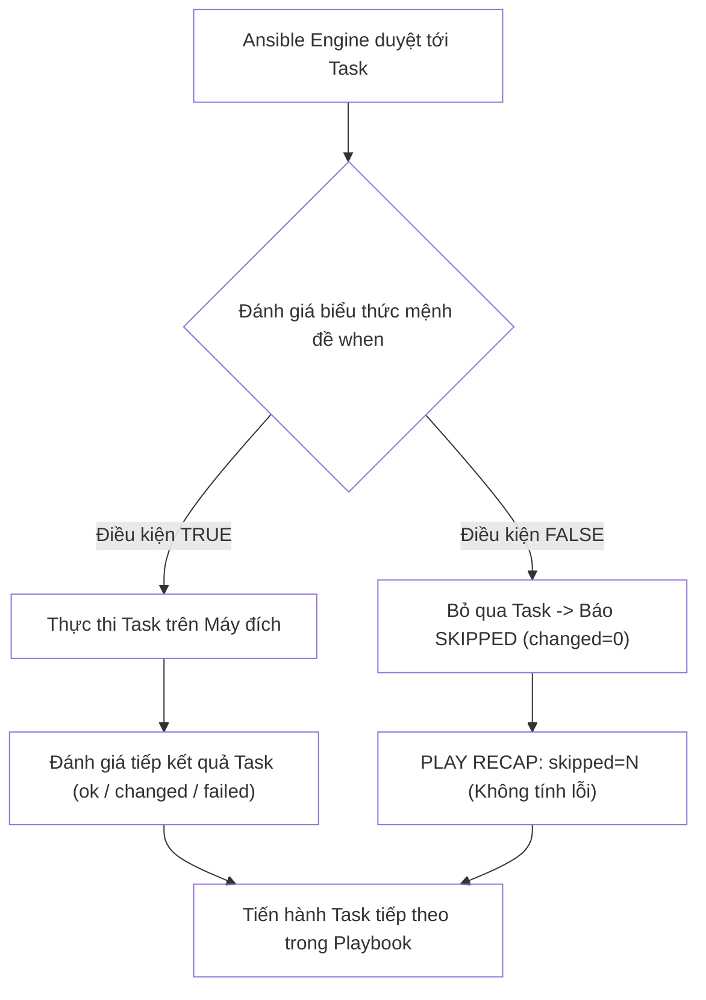
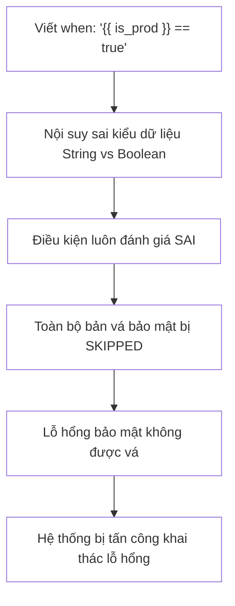


# [BÀI 09] LÀM CHỦ ĐIỀU KIỆN & RẼ NHÁNH LOGIC: MỆNH ĐỀ WHEN, JINJA2 TESTS & GOM NHÓM BLOCK

Trong kỷ nguyên **Infrastructure as Code (IaC)** và tự động hóa vận hành hạ tầng đám mây (Cloud Infrastructure Automation), **Ansible** khẳng định vị thế dẫn đầu nhờ triết lý **Agentless** (không cần cài đặt agent nền trên máy đích), giao thức điều khiển an toàn qua **SSH / WinRM**, định dạng khai báo **YAML** trực quan và nguyên lý bất biến **Idempotency** mạnh mẽ. Việc làm chủ Ansible không chỉ dừng lại ở các câu lệnh Ad-hoc đơn giản, mà đòi hỏi kỹ sư phải nắm vững kiến trúc Module tầng thấp, Variable Precedence 22 tầng, Jinja2 Templates, tối ưu hóa Forks & Pipelining cho tới thiết kế Roles / Collections và tích hợp CI/CD tự động hóa chuẩn Doanh nghiệp.

Bài viết chuyên sâu này sẽ đồng hành cùng bạn mổ xẻ toàn diện bức tranh kiến trúc, phân tích các đánh đổi kỹ thuật thực chiến (Engineering Trade-offs), cung cấp hướng dẫn thực hành Lab chi tiết từng bước và bộ câu hỏi phỏng vấn chuyên sâu chuẩn DevOps / SRE Lead.

---

## 1. Bản Chất Kiến Trúc & Cơ Chế Vận Hành Tầng Thấp

Một hệ thống hạ tầng sản xuất thực tế luôn chứa các máy chủ không đồng nhất (**Heterogeneous Infrastructure**): sự pha trộn giữa Red Hat Enterprise Linux, Ubuntu, Debian hay Alpine; sự chênh lệch cấu hình phần cứng giữa các node 4GB RAM và 64GB RAM; sự khác biệt giữa môi trường Dev, Staging và Production. Để viết một kịch bản tự động hóa duy nhất có khả năng thích ứng linh hoạt và an toàn trên toàn bộ hạ tầng này, **Ansible Conditionals (`when`)** đóng vai trò là động cơ rẽ nhánh logic thời gian thực.



### 1.1. Mệnh Đề When & Biểu Thức Đánh Giá Jinja2 Không Dùng Ngoặc Nhọn

- **Bản chất biểu thức Jinja2 nguyên thủy:** Mệnh đề `when:` mặc định được đặt bên trong một môi trường đánh giá biểu thức Jinja2 thô. Do đó, khi gọi tên biến bên trong `when:`, **TUYỆT ĐỐI KHÔNG ĐƯỢC DÙNG CẶP NGOẶC NHỌN `{{ }}`** (ví dụ viết đúng: `when: ansible_facts.os_family == "RedHat"`). Việc đặt `{{ }}` bên trong `when` là lỗi cú pháp nghiêm trọng và bị trình biên dịch Ansible cảnh báo hoặc văng lỗi.
- **Biểu thức chuỗi, số và luận lý (Boolean):** Mệnh đề `when` hỗ trợ đầy đủ các toán tử so sánh (`==`, `!=`, `>`, `<`, `>=`, `<=`), toán tử logic (`and`, `or`, `not`), toán tử thành viên (`in`, `not in`).

### 1.2. Hệ Thống Jinja2 Tests & Các Toán Tử Logic (AND / OR / NOT)

Ansible cung cấp bộ kiểm tra **Jinja2 Tests** mạnh mẽ thông qua từ khóa `is` / `is not`:
- **Kiểm tra tồn tại biến:** `when: my_var is defined` hoặc `when: my_var is not defined` (ngăn ngừa 100% lỗi crash kịch bản do biến chưa khai báo).
- **Kiểm tra kiểu dữ liệu & giá trị rỗng:** `when: my_list is iterable`, `when: app_path is directory`, `when: env_var is none`.
- **Kiểm tra kết quả Task trước (`register`):** `when: task_result is failed`, `when: task_result is success`, `when: task_result is changed`.
- **Biểu thức Đa điều kiện dạng Danh sách (Implicit AND):** Khi truyền danh sách mảng YAML cho `when:`, Ansible tự động áp dụng toán tử logic `AND` cho tất cả các phần tử. Toàn bộ điều kiện phải đúng thì task mới được chạy:
  ```yaml
  when:
    - ansible_facts.os_family == "Debian"
    - ansible_facts.memtotal_mb >= 2048
    - app_env is defined
  ```

### 1.3. Gom Nhóm Rẽ Nhánh Khối Block & Đọc Hiểu Trạng Thái Skipped

- **Gom nhóm khối với `block`:** Khi cần áp dụng cùng một điều kiện `when:` cho một chuỗi 5-10 Task liên tiếp, thay vì lặp lại dòng `when:` ở từng task, ta gom các task đó vào một thẻ `block:`. Mệnh đề `when` khai báo ở cấp độ `block:` sẽ tự động kế thừa và áp đặt xuống toàn bộ các task con bên trong.
- **Trạng thái `SKIPPED` trong PLAY RECAP:** Khi điều kiện `when` đánh giá là `false`, Ansible ghi nhận task ở trạng thái `skipping: [host]` và tăng chỉ số `skipped` trong bảng `PLAY RECAP`. Trạng thái `skipped` là một hành vi hoàn toàn bình thường theo thiết kế logic, **không bị coi là lỗi** và không làm gián đoạn Playbook.

---

## 2. Bảng So Sánh Kỹ Thuật Toàn Diện (Engineering Matrix)

| Kỹ Thuật Rẽ Nhánh | Cú Pháp Khai Báo | Hành Vi Logic | Tối Ưu Hiệu Năng | Trường Hợp Sử Dụng Chuẩn Production |
|---|---|---|---|---|
| **Điều Kiện Đơn Lẻ** | `when: var_name == "value"` | So sánh biểu thức đơn | Rất nhanh | Kiểm tra OS distribution, môi trường `prod`/`dev` |
| **Danh Sách Mảng (AND)** | `when:` danh sách YAML `- cond1` `- cond2` | **Toàn bộ** điều kiện phải đúng | Tối ưu, dễ đọc | Kết hợp kiểm tra OS + Đủ RAM + Biến tồn tại |
| **Toán Tử `or`** | `when: cond1 or cond2` | **Chỉ cần một** điều kiện đúng | Nhanh | Áp dụng cấu hình cho cả Ubuntu hoặc Debian |
| **Jinja2 Test `is defined`** | `when: custom_var is defined` | Kiểm tra biến có tồn tại không | Rất nhanh, an toàn | Bảo vệ các Task sử dụng biến tùy chọn (optional vars) |
| **Khối `block` + `when`** | `block: [...] when: condition` | Áp dụng chung cho cả chuỗi task | Giảm lặp code, rõ ràng | Cài đặt toàn bộ một ứng dụng theo OS tương ứng |

> [!IMPORTANT]
> **NGUYÊN TẮC VÀNG VỀ BIẾN TRONG WHEN:**
> Luôn sử dụng bộ kiểm tra `is defined` trước khi truy vấn các thuộc tính con của một biến tùy chọn (ví dụ: `when: app_config is defined and app_config.port == 8080`) để loại trừ hoàn toàn nguy cơ sập Playbook do lỗi `UndefinedVariableError`.

---

## 3. Kiến Trúc Triển Khai Chuẩn Production (Configuration / Playbook / Role Breakdown)

Dưới đây là Playbook mẫu triển khai phần mềm tối ưu cho hạ tầng đa hệ điều hành (Ubuntu/Debian vs RHEL/CentOS) kết hợp rẽ nhánh theo dung lượng RAM và kiểm tra biến đăng ký:

```yaml
# site-conditionals-mastery.yml
---
- name: Cross-Platform Heterogeneous Provisioning
  hosts: web
  become: true
  gather_facts: true

  vars:
    required_min_ram_mb: 1024
    custom_app_enabled: true

  tasks:
    - name: 01. Assert target node meets minimum hardware requirements
      ansible.builtin.assert:
        that:
          - ansible_facts.memtotal_mb >= required_min_ram_mb
        fail_msg: "Node {{ inventory_hostname }} has insufficient RAM ({{ ansible_facts.memtotal_mb }} MB)!"

    - name: 02. Provision Debian/Ubuntu web tier components
      when: ansible_facts.os_family == "Debian"
      block:
        - name: Debian - Install Nginx package
          ansible.builtin.package:
            name: nginx
            state: present

        - name: Debian - Ensure web configuration exists
          ansible.builtin.copy:
            dest: /etc/nginx/sites-available/default
            content: "server { listen 80; server_name localhost; }\n"
            mode: "0644"
            backup: true

    - name: 03. Provision RedHat/CentOS web tier components
      when: ansible_facts.os_family == "RedHat"
      block:
        - name: RedHat - Install Apache HTTPD package
          ansible.builtin.package:
            name: httpd
            state: present

        - name: RedHat - Ensure web configuration exists
          ansible.builtin.copy:
            dest: /etc/httpd/conf.d/vhost.conf
            content: "Listen 80\n<VirtualHost *:80></VirtualHost>\n"
            mode: "0644"
            backup: true

    - name: 04. Check disk free space on root filesystem
      ansible.builtin.command: df -h /
      register: disk_info
      changed_when: false

    - name: 05. Deploy optional high-memory tuning profile
      ansible.builtin.copy:
        dest: /etc/tuning_profile.conf
        content: |
          TUNING_PROFILE=HIGH_PERFORMANCE
          MEM_TOTAL={{ ansible_facts.memtotal_mb }}
        mode: "0644"
        backup: true
      when:
        - ansible_facts.memtotal_mb > 2048
        - custom_app_enabled is defined
        - custom_app_enabled | bool
```

### Phân Tích Kỹ Thuật Từng Dòng (Line-by-Line Breakdown):
- <span class="badge-line">Line 12–17</span>: Sử dụng module `assert` với mệnh đề `that:` để kiểm định điều kiện tiên quyết về phần cứng, lập tức dừng kịch bản nếu máy đích không đủ RAM tối thiểu.
- <span class="badge-line">Line 19–32</span>: Gom nhóm các task cấu hình Debian/Ubuntu vào khối `block:` duy nhất có gắn `when: ansible_facts.os_family == "Debian"`. Các máy thuộc họ RedHat sẽ tự động bỏ qua toàn bộ khối này (`skipped`).
- <span class="badge-line">Line 34–47</span>: Khối `block:` tương ứng dành riêng cho họ `RedHat`, đảm bảo tính độc lập và sạch sẽ trong tổ chức mã nguồn.
- <span class="badge-line">Line 49–52</span>: Module `command` đọc dung lượng đĩa và gán kết quả vào biến Host Scope `disk_info` với `changed_when: false`.
- <span class="badge-line">Line 54–66</span>: Áp dụng đa điều kiện `AND` dạng danh sách cho task chép file tối ưu: vừa yêu cầu RAM > 2GB, vừa yêu cầu biến `custom_app_enabled` tồn tại và mang giá trị `true` (dùng filter `| bool`).

---

## 4. Phân Tích Cạm Bẫy Thực Chiến: Sử Dụng Nhầm Cặp Dấu Ngoặc Nhọn Trong When & Bỏ Qua Biến Undefined

### Tình Huống Sự Cố Thực Tế Tại Doanh Nghiệp:
Trong một kịch bản cập nhật hệ điều hành tự động cho 500 máy chủ, một kỹ sư viết điều kiện: `when: "{{ is_production }} == true"`. Đồng thời ở một task khác, kỹ sư truy vấn `when: app_config.ssl_enabled == true` nhưng không kiểm tra biến `app_config is defined`.

### Hậu Quả & Log Lỗi Thực Tế:

```diff
--- site.yml (Broken Conditionals)
+++ site.yml (Standard Safe Conditionals)
@@ -1,6 +1,6 @@
-- name: Deploy Security Patch
-  when: "{{ is_production }} == true" # Lỗi: Dùng dấu ngoặc nhọn trong when
+- name: Deploy Security Patch
+  when: is_production | bool          # Sửa: Truyền biến trực tiếp kèm filter bool

-- name: Enable SSL VirtualHost
-  when: app_config.ssl_enabled == true # Lỗi: Không kiểm tra biến tồn tại
+- name: Enable SSL VirtualHost
+  when: app_config is defined and app_config.ssl_enabled | default(false) # Sửa: An toàn
```

- Trình phân giải Jinja2 nội suy chuỗi `{{ is_production }}` thành chuỗi `"true" == true` (so sánh chuỗi với boolean), làm cho điều kiện luôn đánh giá SAI trên môi trường Production, khiến toàn bộ các bản vá bảo mật khẩn cấp bị `skipped` mà không ai biết.
- Trên các máy chủ mới chưa có cấu hình `app_config`, task bị crash với lỗi nghiêm trọng: `fatal: [target1]: FAILED! => {"msg": "'app_config' is undefined"}` làm dừng toàn bộ đợt cập nhật giữa chừng.



### 5-Whys Root Cause Analysis:
1. **Tại sao máy chủ Production không được vá bảo mật?** Do Task cài đặt bản vá bị bỏ qua (`skipped`) trong quá trình chạy.
2. **Tại sao Task bị skipped trên Production?** Do mệnh đề `when` đánh giá ra kết quả `false`.
3. **Tại sao biểu thức when đánh giá ra false?** Do kỹ sư dùng cặp ngoặc nhọn `{{ }}` khiến Jinja2 ép kiểu thành chuỗi văn bản `"true"` thay vì boolean nguyên thủy `true`.
4. **Tại sao lỗi logic không được phát hiện trước?** Do kịch bản chỉ kiểm tra cú pháp YAML tĩnh (`--syntax-check`) mà không có bước kiểm thử bảng rẽ nhánh logic trên Staging.
5. **Nguyên nhân cốt lõi (Root Cause):** Vi phạm quy chuẩn lập trình Ansible (dùng `{{ }}` trong `when`) và thiếu bộ kiểm tra `is defined` bảo vệ biến.

---

## 5. Hands-on Lab: Xây Dựng Kịch Bản Rẽ Nhánh Logic Đa Nền Tảng Chuẩn Enterprise (8 Bước)

| Bước | Lệnh CLI / Tác Vụ Chính | Mục Đích Thực Thi |
|---|---|---|
| **Bước 1** | Chuẩn bị môi trường `lab-ansible-09` | Khởi tạo cấu hình dự án cô lập |
| **Bước 2** | Viết kịch bản rẽ nhánh đơn giản | Thử nghiệm rẽ nhánh theo biến boolean và Jinja2 `is defined` |
| **Bước 3** | Rẽ nhánh đa điều kiện (AND / OR) | Kết hợp thông số Facts hệ điều hành và biến người dùng |
| **Bước 4** | Rẽ nhánh theo kết quả lệnh với `register` | Bắt exit code và chuỗi stdout để quyết định task sau |
| **Bước 5** | Gom nhóm logic bằng khối `block` | Tái cấu trúc kịch bản phân nhánh theo OS Family |
| **Bước 6** | Soạn thảo Playbook tổng hợp hoàn chỉnh | Xây dựng kịch bản chuẩn Enterprise |
| **Bước 7** | Thực thi Phép thử Lần 2 chứng minh Idempotency | Đạt chỉ số `changed=0` trên bảng `PLAY RECAP` |
| **Bước 8** | Đối soát hiện vật thực tế qua `docker exec` | Xác nhận các file cấu hình được tạo đúng theo nhánh logic |

### Bước 1 — Thiết lập môi trường dự án

```bash
mkdir -p ~/lab-ansible-09 && cd ~/lab-ansible-09

cat << 'EOF' > ansible.cfg
[defaults]
inventory = ./inventory.ini
remote_user = ansible
host_key_checking = False
private_key_file = ~/.ssh/id_ed25519

[privilege_escalation]
become = True
become_method = sudo
become_user = root
become_ask_pass = False
EOF

cat << 'EOF' > inventory.ini
[web]
target1 ansible_host=127.0.0.1 ansible_port=2221

[db]
target2 ansible_host=127.0.0.1 ansible_port=2222

[all:vars]
ansible_python_interpreter=/usr/bin/python3
EOF
```

### Bước 2 — Soạn thảo kịch bản thử nghiệm rẽ nhánh logic

```bash
cat << 'EOF' > test-when.yml
---
- name: Test Basic Conditionals
  hosts: web
  become: true
  gather_facts: true

  vars:
    feature_toggle: true
    optional_flag: "ENABLED"

  tasks:
    - name: Task 1 - Run only if feature is enabled
      ansible.builtin.debug:
        msg: "Feature toggle is active"
      when: feature_toggle | bool

    - name: Task 2 - Run only if optional variable is defined
      ansible.builtin.debug:
        msg: "Optional flag value is {{ optional_flag }}"
      when: optional_flag is defined

    - name: Task 3 - This task should be skipped
      ansible.builtin.debug:
        msg: "This should not be printed"
      when: feature_toggle is not defined or not feature_toggle | bool
EOF

ansible-playbook test-when.yml
```

```bash
# CHECKPOINT 1: Kiểm tra rẽ nhánh logic cơ bản
TEST_OUT=$(ansible-playbook test-when.yml)
if echo "$TEST_OUT" | grep -q "skipping:" && echo "$TEST_OUT" | grep -q "Feature toggle is active"; then
  echo "CHECKPOINT 1: ĐẠT - Mệnh đề when thực thi đúng logic (task 1 chạy, task 3 skipped)"
else
  echo "CHECKPOINT 1: LỖI - Rẽ nhánh logic cơ bản thất bại"
fi
```

### Bước 3 — Soạn thảo Playbook tổng hợp chuẩn Enterprise

```bash
cat << 'EOF' > site.yml
---
- name: Enterprise Cross-Platform Logic Mastery
  hosts: all
  become: true
  gather_facts: true

  vars:
    enable_app_monitoring: true
    min_ram_threshold: 512

  tasks:
    - name: 01. Execute kernel query
      ansible.builtin.command: uname -s
      register: kernel_type
      changed_when: false

    - name: 02. Deploy Linux specific baseline
      when: kernel_type.stdout == "Linux"
      block:
        - name: Linux - Create app runtime directory
          ansible.builtin.file:
            path: /var/log/app_monitor
            state: directory
            mode: "0755"

        - name: Linux - Deploy monitoring config
          ansible.builtin.copy:
            dest: /etc/app_monitor.conf
            content: |
              NODE={{ inventory_hostname }}
              OS_FAMILY={{ ansible_facts.os_family }}
              MONITORING_ENABLED={{ enable_app_monitoring }}
            mode: "0644"
            backup: true
          when:
            - enable_app_monitoring is defined
            - enable_app_monitoring | bool
            - ansible_facts.memtotal_mb >= min_ram_threshold

    - name: 03. Target-specific configuration for target1 only
      ansible.builtin.copy:
        dest: /etc/target1_exclusive.conf
        content: "NODE_ROLE=PRIMARY_WEB\n"
        mode: "0644"
        backup: true
      when: inventory_hostname == "target1"
EOF
```

```bash
# CHECKPOINT 2: Kiểm tra cú pháp Playbook
ansible-playbook --syntax-check site.yml
```

### Bước 4 — Chạy mô phỏng Dry-run

```bash
ansible-playbook --check --diff site.yml
```

```bash
# CHECKPOINT 3: Kiểm tra chế độ Dry-run
CHECK_OUT=$(ansible-playbook --check --diff site.yml)
if echo "$CHECK_OUT" | grep -q "PLAY RECAP" && ! echo "$CHECK_OUT" | grep -q "failed=1"; then
  echo "CHECKPOINT 3: ĐẠT - Chạy mô phỏng Dry-run thành công"
else
  echo "CHECKPOINT 3: LỖI - Chạy mô phỏng thất bại"
fi
```

### Bước 5 — Thực thi Playbook Lần 1

```bash
ansible-playbook site.yml
```

```bash
# CHECKPOINT 4: Kiểm tra kết quả thực thi lần 1
RUN1_OUT=$(ansible-playbook site.yml)
if echo "$RUN1_OUT" | grep -q "failed=0" && echo "$RUN1_OUT" | grep -q "unreachable=0"; then
  echo "CHECKPOINT 4: ĐẠT - Playbook thực thi lần 1 thành công trên toàn bộ hạ tầng"
else
  echo "CHECKPOINT 4: LỖI - Thực thi Playbook lần 1 thất bại"
fi
```

### Bước 6 — Thực thi Phép thử Lần 2 chứng minh Idempotency

```bash
ansible-playbook site.yml
```

```bash
# CHECKPOINT 5 & 6: Kiểm tra tính Idempotency đạt changed=0
RUN2_FINAL=$(ansible-playbook site.yml)
if echo "$RUN2_FINAL" | grep -q "changed=0" && echo "$RUN2_FINAL" | grep -q "failed=0"; then
  echo "CHECKPOINT 5 & 6: ĐẠT - Kịch bản rẽ nhánh logic đạt Idempotency tuyệt đối (changed=0 ở lần 2)"
else
  echo "CHECKPOINT 5 & 6: LỖI - Kịch bản chưa đạt chuẩn Idempotency"
fi
```

### Bước 7 — Đối soát hiện vật trên target1 (Nhánh True)

```bash
docker exec target1 cat /etc/app_monitor.conf
docker exec target1 cat /etc/target1_exclusive.conf
```

```bash
# CHECKPOINT 7: Đối soát target1 chứa đúng file
T1_MON=$(docker exec target1 cat /etc/app_monitor.conf)
T1_EXC=$(docker exec target1 cat /etc/target1_exclusive.conf)
if echo "$T1_MON" | grep -q "MONITORING_ENABLED=True" && echo "$T1_EXC" | grep -q "PRIMARY_WEB"; then
  echo "CHECKPOINT 7: ĐẠT - Target1 nhận đầy đủ cấu hình theo đúng nhánh logic"
else
  echo "CHECKPOINT 7: LỖI - Đối soát target1 thất bại"
fi
```

### Bước 8 — Đối soát hiện vật trên target2 (Nhánh False - Skipped)

```bash
# File target1_exclusive.conf BẮT BUỘC KHÔNG ĐƯỢC TỒN TẠI trên target2
docker exec target2 ls /etc/target1_exclusive.conf 2>&1 || true
```

```bash
# CHECKPOINT 8: Đối soát target2 đã bỏ qua task đúng như thiết kế
if docker exec target2 ls /etc/target1_exclusive.conf 2>&1 | grep -q "No such file"; then
  echo "CHECKPOINT 8: ĐẠT - Target2 bỏ qua file độc quyền của target1 chính xác 100%"
else
  echo "CHECKPOINT 8: LỖI - Target2 bị ghi đè file không mong muốn"
fi
```

---

## 6. Bộ Câu Hỏi Vấn Đáp & Phỏng Vấn Chuyên Sâu (Self-Check Q&A)

<details class="qa-card">
  <summary class="qa-summary">
    <span class="qa-num-badge">Q01</span>
    <span class="qa-question-text">Tại sao khi viết biểu thức điều kiện trong mệnh đề when TUYỆT ĐỐI KHÔNG ĐƯỢC dùng cặp dấu ngoặc nhọn {{ }}?</span>
  </summary>
  <div class="qa-answer">
    <div class="qa-answer-header">
      <svg width="14" height="14" fill="none" stroke="currentColor" stroke-width="2" viewBox="0 0 24 24"><path d="M22 11.08V12a10 10 0 1 1-5.93-9.14"></path><polyline points="22 4 12 14.01 9 11.01"></polyline></svg>
      <span>Phân Tích &amp; Lời Giải Kỹ Thuật</span>
    </div>
    <div><b>Đáp án chuẩn:</b> Mệnh đề <code>when:</code> bản thân nó đã được thiết kế sẵn như một biểu thức Jinja2 thô. Trình biên dịch Ansible tự động đánh giá biểu thức bên trong như một câu lệnh Python. Nếu đặt thêm cặp ngoặc nhọn <code>when: "{{ my_var }}" == "prod"</code>, Jinja2 sẽ nội suy chuỗi này trước khi đưa vào bộ đánh giá điều kiện, gây lỗi xung đột kiểu dữ liệu (ví dụ biến boolean bị biến thành chuỗi), làm sai lệch kết quả logic hoặc phát sinh cảnh báo cú pháp nghiêm trọng.</div>
    <div style="margin-top: 0.5rem;"><b>Tiêu chí chấm:</b></div>
    <div style="margin: 0.35rem 0; padding-left: 1rem; border-left: 2px solid var(--accent-primary);">• <b>0:</b> Cho rằng dùng <code>{{ }}</code> trong <code>when</code> là bình thường.</div>
    <div style="margin: 0.35rem 0; padding-left: 1rem; border-left: 2px solid var(--accent-primary);">• <b>1:</b> Biết không nên dùng nhưng không giải thích được cơ chế Raw Jinja2 Evaluation.</div>
    <div style="margin: 0.35rem 0; padding-left: 1rem; border-left: 2px solid var(--accent-primary);">• <b>2:</b> Giải thích chính xác cơ chế Raw Jinja2 Context của <code>when</code>.</div>
    <div style="margin: 0.35rem 0; padding-left: 1rem; border-left: 2px solid var(--accent-primary);">• <b>3:</b> Phân tích xuất sắc lỗi sai lệch kiểu dữ liệu khi so sánh Boolean vs String do <code>{{ }}</code> gây ra.</div>
    <div style="margin-top: 0.5rem;"><b>Câu hỏi đào sâu:</b> Cú pháp viết đúng để kiểm tra biến boolean <code>is_active</code> là gì? <i>(<code>when: is_active | bool</code> hoặc <code>when: is_active</code>)</i></div>
  </div>
</details>

<details class="qa-card">
  <summary class="qa-summary">
    <span class="qa-num-badge">Q02</span>
    <span class="qa-question-text">Trình bày cách biểu diễn điều kiện logic AND và OR trong mệnh đề when của Ansible.</span>
  </summary>
  <div class="qa-answer">
    <div class="qa-answer-header">
      <svg width="14" height="14" fill="none" stroke="currentColor" stroke-width="2" viewBox="0 0 24 24"><path d="M22 11.08V12a10 10 0 1 1-5.93-9.14"></path><polyline points="22 4 12 14.01 9 11.01"></polyline></svg>
      <span>Phân Tích &amp; Lời Giải Kỹ Thuật</span>
    </div>
    <div><b>Đáp án chuẩn:</b></div>
    <div>• <b>Toán tử AND:</b> Có 2 cách: (1) Dùng từ khóa <code>and</code> trên cùng 1 dòng: <code>when: cond1 and cond2</code>, hoặc (2) <b>Cách chuẩn mực YAML:</b> Truyền danh sách mảng nhiều phần tử bên dưới <code>when:</code> (mỗi dòng là một dấu gạch ngang <code>-</code>):</div>
    <pre><code>when:
  - cond1
  - cond2</code></pre>
    <div>• <b>Toán tử OR:</b> Dùng từ khóa <code>or</code> trực tiếp trong biểu thức: <code>when: cond1 or cond2</code>.</div>
    <div style="margin-top: 0.5rem;"><b>Tiêu chí chấm:</b></div>
    <div style="margin: 0.35rem 0; padding-left: 1rem; border-left: 2px solid var(--accent-primary);">• <b>0:</b> Dùng ký hiệu <code>&&</code> hoặc <code>||</code> kiểu C/Bash (sai cú pháp trong Jinja2).</div>
    <div style="margin-top: 0.5rem;"><b>Tiêu chí chấm:</b></div>
    <div style="margin: 0.35rem 0; padding-left: 1rem; border-left: 2px solid var(--accent-primary);">• <b>1:</b> Biết <code>and</code>/<code>or</code> nhưng không biết dạng danh sách YAML cho phép gom nhóm AND sạch đẹp.</div>
    <div style="margin: 0.35rem 0; padding-left: 1rem; border-left: 2px solid var(--accent-primary);">• <b>2:</b> Trình bày chính xác cả 2 dạng cú pháp AND và cú pháp OR.</div>
    <div style="margin: 0.35rem 0; padding-left: 1rem; border-left: 2px solid var(--accent-primary);">• <b>3:</b> Nêu đúng + kết hợp cặp dấu ngoặc tròn <code>(cond1 or cond2) and cond3</code> để kiểm soát thứ tự ưu tiên logic.</div>
    <div style="margin-top: 0.5rem;"><b>Câu hỏi đào sâu:</b> Tại sao trong Ansible nên ưu tiên viết AND dạng danh sách mảng thay vì viết một dòng dài với từ khóa <code>and</code>? <i>(Dạng danh sách mảng dễ đọc, dễ comment từng dòng, và dễ review diff trên Git.)</i></div>
  </div>
</details>

<details class="qa-card">
  <summary class="qa-summary">
    <span class="qa-num-badge">Q03</span>
    <span class="qa-question-text">Jinja2 Tests is defined và is not defined giải quyết bài toán gì? Tại sao chúng là chốt chặn an toàn quan trọng nhất?</span>
  </summary>
  <div class="qa-answer">
    <div class="qa-answer-header">
      <svg width="14" height="14" fill="none" stroke="currentColor" stroke-width="2" viewBox="0 0 24 24"><path d="M22 11.08V12a10 10 0 1 1-5.93-9.14"></path><polyline points="22 4 12 14.01 9 11.01"></polyline></svg>
      <span>Phân Tích &amp; Lời Giải Kỹ Thuật</span>
    </div>
    <div><b>Đáp án chuẩn:</b> Khi Playbook cố gắng truy vấn một biến chưa từng được khai báo, Ansible sẽ lập tức dừng kịch bản và văng lỗi <code>AnsibleUndefinedVariable</code>. Bộ kiểm tra <code>is defined</code> giúp kiểm tra sự tồn tại của biến trước khi sử dụng. Nếu biến chưa được định nghĩa, biểu thức trả về <code>false</code> và task bị bỏ qua an toàn thay vì làm sập cả Playbook. Đây là chốt chặn an toàn sống còn cho các biến tùy chọn (Optional parameters).</div>
    <div style="margin-top: 0.5rem;"><b>Tiêu chí chấm:</b></div>
    <div style="margin: 0.35rem 0; padding-left: 1rem; border-left: 2px solid var(--accent-primary);">• <b>0:</b> Không biết mục đích của <code>is defined</code>.</div>
    <div style="margin: 0.35rem 0; padding-left: 1rem; border-left: 2px solid var(--accent-primary);">• <b>1:</b> Biết kiểm tra biến nhưng không giải thích được cơ chế ngăn chặn crash kịch bản.</div>
    <div style="margin: 0.35rem 0; padding-left: 1rem; border-left: 2px solid var(--accent-primary);">• <b>2:</b> Phân tích chính xác cơ chế phòng vệ lỗi UndefinedVariable.</div>
    <div style="margin: 0.35rem 0; padding-left: 1rem; border-left: 2px solid var(--accent-primary);">• <b>3:</b> Nêu đúng + viết biểu thức ngắn mạch (short-circuit evaluation): <code>when: config is defined and config.enabled</code>.</div>
    <div style="margin-top: 0.5rem;"><b>Câu hỏi đào sâu:</b> Nếu viết <code>when: config.enabled and config is defined</code> (đảo ngược vị trí), điều gì sẽ xảy ra nếu <code>config</code> chưa tồn tại? <i>(Vẫn bị crash, vì Jinja2 đánh giá từ trái qua phải, gặp <code>config.enabled</code> trước khi kiểm tra <code>config is defined</code>.)</i></div>
  </div>
</details>

<details class="qa-card">
  <summary class="qa-summary">
    <span class="qa-num-badge">Q04</span>
    <span class="qa-question-text">Trình bày cách sử dụng kết quả của một Task trước (thông qua register) làm điều kiện trong mệnh đề when của Task sau.</span>
  </summary>
  <div class="qa-answer">
    <div class="qa-answer-header">
      <svg width="14" height="14" fill="none" stroke="currentColor" stroke-width="2" viewBox="0 0 24 24"><path d="M22 11.08V12a10 10 0 1 1-5.93-9.14"></path><polyline points="22 4 12 14.01 9 11.01"></polyline></svg>
      <span>Phân Tích &amp; Lời Giải Kỹ Thuật</span>
    </div>
    <div><b>Đáp án chuẩn:</b> Ta lưu kết quả Task trước bằng <code>register: task_res</code>, sau đó ở Task tiếp theo sử dụng các thuộc tính của biến này trong mệnh đề <code>when:</code>. Ví dụ:</div>
    <div>• Kiểm tra exit code: <code>when: task_res.rc == 0</code></div>
    <div>• Kiểm tra chuỗi đầu ra: <code>when: "'SUCCESS' in task_res.stdout"</code></div>
    <div>• Kiểm tra trạng thái thay đổi: <code>when: task_res is changed</code> hoặc <code>when: task_res is failed</code>.</div>
    <div style="margin-top: 0.5rem;"><b>Tiêu chí chấm:</b></div>
    <div style="margin: 0.35rem 0; padding-left: 1rem; border-left: 2px solid var(--accent-primary);">• <b>0:</b> Không biết kết hợp <code>register</code> với <code>when</code>.</div>
    <div style="margin: 0.35rem 0; padding-left: 1rem; border-left: 2px solid var(--accent-primary);">• <b>1:</b> Biết dùng <code>rc</code> nhưng không biết các Jinja2 tests như <code>is changed</code> hay <code>in stdout</code>.</div>
    <div style="margin: 0.35rem 0; padding-left: 1rem; border-left: 2px solid var(--accent-primary);">• <b>2:</b> Trình bày đúng cấu trúc và cú pháp điều kiện phong phú.</div>
    <div style="margin: 0.35rem 0; padding-left: 1rem; border-left: 2px solid var(--accent-primary);">• <b>3:</b> Nêu đúng + lưu ý trường hợp task trước bị skipped thì biến register sẽ có cấu trúc ra sao.</div>
    <div style="margin-top: 0.5rem;"><b>Câu hỏi đào sâu:</b> Nếu Task trước bị <code>skipped</code>, điều kiện <code>when: task_res.rc == 0</code> ở task sau có chạy được không? <i>(Sẽ bị lỗi undefined vì khi task bị skipped, <code>task_res</code> không chứa thuộc tính <code>rc</code>; phải viết <code>when: task_res.rc is defined and task_res.rc == 0</code>.)</i></div>
  </div>
</details>

<details class="qa-card">
  <summary class="qa-summary">
    <span class="qa-num-badge">Q05</span>
    <span class="qa-question-text">Khối Task (block) giúp tối ưu hóa việc sử dụng mệnh đề when như thế nào?</span>
  </summary>
  <div class="qa-answer">
    <div class="qa-answer-header">
      <svg width="14" height="14" fill="none" stroke="currentColor" stroke-width="2" viewBox="0 0 24 24"><path d="M22 11.08V12a10 10 0 1 1-5.93-9.14"></path><polyline points="22 4 12 14.01 9 11.01"></polyline></svg>
      <span>Phân Tích &amp; Lời Giải Kỹ Thuật</span>
    </div>
    <div><b>Đáp án chuẩn:</b> Khối <code>block</code> cho phép gom nhóm một danh sách nhiều Task liên quan logic lại với nhau và gắn duy nhất một mệnh đề <code>when:</code> ở cấp độ khối. Toàn bộ các Task bên trong <code>block</code> sẽ tự động kế thừa điều kiện này. Lợi ích: loại bỏ việc lặp lại dòng <code>when</code> ở từng task (nguyên lý DRY), mã nguồn ngắn gọn, trực quan và dễ bảo trì khi cần sửa đổi logic rẽ nhánh.</div>
    <div style="margin-top: 0.5rem;"><b>Tiêu chí chấm:</b></div>
    <div style="margin: 0.35rem 0; padding-left: 1rem; border-left: 2px solid var(--accent-primary);">• <b>0:</b> Không biết cấu trúc <code>block</code>.</div>
    <div style="margin: 0.35rem 0; padding-left: 1rem; border-left: 2px solid var(--accent-primary);">• <b>1:</b> Biết <code>block</code> gom task nhưng không giải thích được cơ chế kế thừa điều kiện <code>when</code>.</div>
    <div style="margin: 0.35rem 0; padding-left: 1rem; border-left: 2px solid var(--accent-primary);">• <b>2:</b> Phân tích chính xác cơ chế kế thừa điều kiện + lợi ích DRY.</div>
    <div style="margin: 0.35rem 0; padding-left: 1rem; border-left: 2px solid var(--accent-primary);">• <b>3:</b> Nêu đúng + minh họa ví dụ phân tách 2 block cài đặt riêng cho Ubuntu và CentOS.</div>
    <div style="margin-top: 0.5rem;"><b>Câu hỏi đào sâu:</b> Một Task bên trong <code>block</code> có thể có thêm một mệnh đề <code>when</code> riêng của nó nữa không? <i>(Được, khi đó task con phải thỏa mãn CẢ điều kiện của block VÀ điều kiện riêng của task thì mới được chạy.)</i></div>
  </div>
</details>

<details class="qa-card">
  <summary class="qa-summary">
    <span class="qa-num-badge">Q06</span>
    <span class="qa-question-text">Chỉ số skipped trong bảng PLAY RECAP có bị coi là lỗi không? Khi nào trạng thái skipped là bình thường và khi nào là bất thường?</span>
  </summary>
  <div class="qa-answer">
    <div class="qa-answer-header">
      <svg width="14" height="14" fill="none" stroke="currentColor" stroke-width="2" viewBox="0 0 24 24"><path d="M22 11.08V12a10 10 0 1 1-5.93-9.14"></path><polyline points="22 4 12 14.01 9 11.01"></polyline></svg>
      <span>Phân Tích &amp; Lời Giải Kỹ Thuật</span>
    </div>
    <div><b>Đáp án chuẩn:</b> Chỉ số <code>skipped</code> <b>KHÔNG PHẢI LÀ LỖI</b>. Đó là hành vi thiết kế đúng khi một Task không thỏa mãn điều kiện <code>when</code> nên được bỏ qua an toàn. <b>Bình thường:</b> Khi ta cấu hình hạ tầng đa OS, các task của Ubuntu bị skipped trên máy RedHat là hoàn toàn chuẩn mực. <b>Bất thường:</b> Khi điều kiện <code>when</code> bị viết sai logic (ví dụ gõ nhầm tên biến hoặc so sánh sai kiểu dữ liệu), khiến cho task quan trọng lẽ ra phải chạy lại bị skipped mất.</div>
    <div style="margin-top: 0.5rem;"><b>Tiêu chí chấm:</b></div>
    <div style="margin: 0.35rem 0; padding-left: 1rem; border-left: 2px solid var(--accent-primary);">• <b>0:</b> Cho rằng <code>skipped > 0</code> là Playbook bị lỗi.</div>
    <div style="margin: 0.35rem 0; padding-left: 1rem; border-left: 2px solid var(--accent-primary);">• <b>1:</b> Biết skipped không phải lỗi nhưng không phân biệt được trường hợp bất thường do sai logic.</div>
    <div style="margin: 0.35rem 0; padding-left: 1rem; border-left: 2px solid var(--accent-primary);">• <b>2:</b> Phân tích chính xác bản chất của chỉ số <code>skipped</code> trong cả 2 trường hợp.</div>
    <div style="margin: 0.35rem 0; padding-left: 1rem; border-left: 2px solid var(--accent-primary);">• <b>3:</b> Trình bày xuất sắc phương pháp dùng cờ <code>-v</code> để xem lý do tại sao task bị skipped (`skipping: [host] => ...`).</div>
    <div style="margin-top: 0.5rem;"><b>Câu hỏi đào sâu:</b> Lệnh CLI nào giúp hiển thị chi tiết nguyên nhân một task bị skipped trên màn hình terminal? <i>(Thêm cờ verbose <code>-v</code> hoặc <code>-vv</code> khi chạy <code>ansible-playbook</code>.)</i></div>
  </div>
</details>

<details class="qa-card">
  <summary class="qa-summary">
    <span class="qa-num-badge">Q07</span>
    <span class="qa-question-text">Trình bày cách sử dụng toán tử in và not in trong mệnh đề when để kiểm tra chuỗi hoặc phần tử mảng.</span>
  </summary>
  <div class="qa-answer">
    <div class="qa-answer-header">
      <svg width="14" height="14" fill="none" stroke="currentColor" stroke-width="2" viewBox="0 0 24 24"><path d="M22 11.08V12a10 10 0 1 1-5.93-9.14"></path><polyline points="22 4 12 14.01 9 11.01"></polyline></svg>
      <span>Phân Tích &amp; Lời Giải Kỹ Thuật</span>
    </div>
    <div><b>Đáp án chuẩn:</b> Toán tử <code>in</code> và <code>not in</code> kiểm tra sự tồn tại của một phần tử trong danh sách (List) hoặc một chuỗi con trong chuỗi văn bản (String). Ví dụ:</div>
    <div>• Kiểm tra trong danh sách: <code>when: inventory_hostname in groups['web_production']</code></div>
    <div>• Kiểm tra chuỗi phân phối OS: <code>when: ansible_facts.distribution in ['Ubuntu', 'Debian', 'Kali']</code></div>
    <div>• Kiểm tra không thuộc nhóm: <code>when: inventory_hostname not in groups['db_nodes']</code>.</div>
    <div style="margin-top: 0.5rem;"><b>Tiêu chí chấm:</b></div>
    <div style="margin: 0.35rem 0; padding-left: 1rem; border-left: 2px solid var(--accent-primary);">• <b>0:</b> Không biết toán tử <code>in</code> trong Jinja2.</div>
    <div style="margin: 0.35rem 0; padding-left: 1rem; border-left: 2px solid var(--accent-primary);">• <b>1:</b> Biết dùng nhưng viết sai cú pháp mảng Python.</div>
    <div style="margin: 0.35rem 0; padding-left: 1rem; border-left: 2px solid var(--accent-primary);">• <b>2:</b> Viết chính xác cú pháp cho cả String substring và List membership.</div>
    <div style="margin: 0.35rem 0; padding-left: 1rem; border-left: 2px solid var(--accent-primary);">• <b>3:</b> Nêu đúng + kết hợp kiểm tra host thuộc nhóm Inventory thông qua biến ma thuật <code>group_names</code>.</div>
    <div style="margin-top: 0.5rem;"><b>Câu hỏi đào sâu:</b> Cú pháp nào kiểm tra xem máy hiện tại có nằm trong nhóm Inventory tên là <code>loadbalancers</code> không? <i>(<code>when: "'loadbalancers' in group_names"</code>)</i></div>
  </div>
</details>

<details class="qa-card">
  <summary class="qa-summary">
    <span class="qa-num-badge">Q08</span>
    <span class="qa-question-text">Tại sao việc lạm dụng mệnh đề when quá nhiều trong một Playbook đơn khối lại bị coi là dấu hiệu của Code Smell?</span>
  </summary>
  <div class="qa-answer">
    <div class="qa-answer-header">
      <svg width="14" height="14" fill="none" stroke="currentColor" stroke-width="2" viewBox="0 0 24 24"><path d="M22 11.08V12a10 10 0 1 1-5.93-9.14"></path><polyline points="22 4 12 14.01 9 11.01"></polyline></svg>
      <span>Phân Tích &amp; Lời Giải Kỹ Thuật</span>
    </div>
    <div><b>Đáp án chuẩn:</b> Khi một file Playbook chứa hàng chục task mà task nào cũng gắn các điều kiện <code>when</code> chằng chịt, file sẽ trở nên vô cùng phức tạp, khó đọc, khó debug và vi phạm nguyên lý phân tách trách nhiệm (Separation of Concerns). Đây là dấu hiệu của Code Smell. Giải pháp chuẩn mực: tách kịch bản thành nhiều Playbook riêng biệt cho từng nhóm máy, sử dụng <b>Multi-play Playbook</b> (Buổi 05) hoặc tổ chức thành các <b>Ansible Roles</b> chuyên biệt (Buổi 14).</div>
    <div style="margin-top: 0.5rem;"><b>Tiêu chí chấm:</b></div>
    <div style="margin: 0.35rem 0; padding-left: 1rem; border-left: 2px solid var(--accent-primary);">• <b>0:</b> Cho rằng nhồi nhét <code>when</code> vào 1 file duy nhất là thiết kế tốt.</div>
    <div style="margin: 0.35rem 0; padding-left: 1rem; border-left: 2px solid var(--accent-primary);">• <b>1:</b> Thấy khó đọc nhưng không đề xuất được giải pháp tái cấu trúc.</div>
    <div style="margin: 0.35rem 0; padding-left: 1rem; border-left: 2px solid var(--accent-primary);">• <b>2:</b> Phân tích chính xác tác hại khó bảo trì + giải pháp Roles/Multi-play.</div>
    <div style="margin: 0.35rem 0; padding-left: 1rem; border-left: 2px solid var(--accent-primary);">• <b>3:</b> Trình bày xuất sắc tư duy kiến trúc: Sử dụng Dynamic Includes (`include_tasks` theo OS) để thay thế chuỗi dài các mệnh đề <code>when</code>.</div>
    <div style="margin-top: 0.5rem;"><b>Câu hỏi đào sâu:</b> Giải pháp nào cho phép nạp file task tương ứng theo biến OS mà không cần dùng nhiều <code>when</code>? <i>(Dùng <code>include_tasks: "{{ ansible_facts.os_family }}.yml"</code>.)</i></div>
  </div>
</details>

<details class="qa-card">
  <summary class="qa-summary">
    <span class="qa-num-badge">Q09</span>
    <span class="qa-question-text">Làm thế nào để ép kiểu dữ liệu chuỗi thành Boolean khi đánh giá điều kiện trong when? Tại sao filter | bool lại cần thiết?</span>
  </summary>
  <div class="qa-answer">
    <div class="qa-answer-header">
      <svg width="14" height="14" fill="none" stroke="currentColor" stroke-width="2" viewBox="0 0 24 24"><path d="M22 11.08V12a10 10 0 1 1-5.93-9.14"></path><polyline points="22 4 12 14.01 9 11.01"></polyline></svg>
      <span>Phân Tích &amp; Lời Giải Kỹ Thuật</span>
    </div>
    <div><b>Đáp án chuẩn:</b> Sử dụng Jinja2 filter <code>| bool</code>: <code>when: enable_ssl | bool</code>. Filter này rất cần thiết vì các biến được truyền từ cờ Extra Vars (<code>-e "enable_ssl=false"</code>) hoặc đọc từ tệp INI thường bị parse dưới dạng chuỗi văn bản (String). Trong Python, chuỗi ký tự <code>"false"</code> không rỗng vẫn được coi là Truthy! Dùng filter <code>| bool</code> sẽ chuyển đổi chính xác các chuỗi <code>"true"</code>, <code>"yes"</code>, <code>"1"</code> thành boolean <code>True</code> và <code>"false"</code>, <code>"no"</code>, <code>"0"</code> thành boolean <code>False</code>.</div>
    <div style="margin-top: 0.5rem;"><b>Tiêu chí chấm:</b></div>
    <div style="margin: 0.35rem 0; padding-left: 1rem; border-left: 2px solid var(--accent-primary);">• <b>0:</b> Không biết filter <code>| bool</code>.</div>
    <div style="margin: 0.35rem 0; padding-left: 1rem; border-left: 2px solid var(--accent-primary);">• <b>1:</b> Biết dùng nhưng không giải thích được vấn đề chuỗi <code>"false"</code> là Truthy trong Python.</div>
    <div style="margin: 0.35rem 0; padding-left: 1rem; border-left: 2px solid var(--accent-primary);">• <b>2:</b> Phân tích chính xác cơ chế ép kiểu an toàn của <code>| bool</code> cho các giá trị chuỗi.</div>
    <div style="margin: 0.35rem 0; padding-left: 1rem; border-left: 2px solid var(--accent-primary);">• <b>3:</b> Liệt kê đầy đủ các giá trị chuỗi mà filter <code>| bool</code> nhận diện được (yes/no, true/false, 1/0).</div>
    <div style="margin-top: 0.5rem;"><b>Câu hỏi đào sâu:</b> Biểu thức <code>"no" | bool</code> trả về giá trị gì trong Ansible? <i>(Trả về giá trị boolean <code>False</code>.)</i></div>
  </div>
</details>

<details class="qa-card">
  <summary class="qa-summary">
    <span class="qa-num-badge">Q10</span>
    <span class="qa-question-text">Phân biệt sự khác nhau giữa mệnh đề when và module ansible.builtin.assert. Khi nào dùng assert thay vì when?</span>
  </summary>
  <div class="qa-answer">
    <div class="qa-answer-header">
      <svg width="14" height="14" fill="none" stroke="currentColor" stroke-width="2" viewBox="0 0 24 24"><path d="M22 11.08V12a10 10 0 1 1-5.93-9.14"></path><polyline points="22 4 12 14.01 9 11.01"></polyline></svg>
      <span>Phân Tích &amp; Lời Giải Kỹ Thuật</span>
    </div>
    <div><b>Đáp án chuẩn:</b></div>
    <div>• <code>when:</code> dùng để <b>RẼ NHÁNH</b> (Bỏ qua task an toàn nếu điều kiện sai, Playbook vẫn tiếp tục chạy bình thường sang task tiếp theo).</div>
    <div>• <code>ansible.builtin.assert:</code> dùng để <b>KIỂM ĐỊNH BẮT BUỘC</b> (Nếu điều kiện sai, kịch bản lập tức bị dừng lại và báo FAILED đỏ kèm thông báo lỗi tùy biến <code>fail_msg</code>).</div>
    <div>Dùng <code>assert</code> cho các điều kiện tiên quyết bắt buộc (Pre-requisites) như: máy phải đủ RAM, OS phải đúng chuẩn hỗ trợ, biến bí mật phải được khai báo; nếu không đủ thì cấm chạy tiếp.</div>
    <div style="margin-top: 0.5rem;"><b>Tiêu chí chấm:</b></div>
    <div style="margin: 0.35rem 0; padding-left: 1rem; border-left: 2px solid var(--accent-primary);">• <b>0:</b> Nhầm lẫn công dụng giữa <code>when</code> và <code>assert</code>.</div>
    <div style="margin: 0.35rem 0; padding-left: 1rem; border-left: 2px solid var(--accent-primary);">• <b>1:</b> Biết <code>assert</code> làm dừng kịch bản nhưng không nêu được ngữ cảnh Pre-requisites.</div>
    <div style="margin: 0.35rem 0; padding-left: 1rem; border-left: 2px solid var(--accent-primary);">• <b>2:</b> Phân tích chính xác sự khác nhau về mục đích (Rẽ nhánh vs Kiểm định ngắt kịch bản).</div>
    <div style="margin: 0.35rem 0; padding-left: 1rem; border-left: 2px solid var(--accent-primary);">• <b>3:</b> Nêu đúng + viết cú pháp hoàn chỉnh của một task <code>assert</code> kèm <code>that:</code>, <code>fail_msg:</code> và <code>success_msg:</code>.</div>
    <div style="margin-top: 0.5rem;"><b>Câu hỏi đào sâu:</b> Cú pháp nào của module <code>assert</code> kiểm tra máy đích có ít nhất 4 CPU cores? <i>(<code>that: ansible_facts.processor_vcpus >= 4</code>)</i></div>
  </div>
</details>

<details class="qa-card">
  <summary class="qa-summary">
    <span class="qa-num-badge">Q11</span>
    <span class="qa-question-text">Trình bày kỹ thuật kiểm tra đường dẫn là file hay thư mục trong when kết hợp module stat.</span>
  </summary>
  <div class="qa-answer">
    <div class="qa-answer-header">
      <svg width="14" height="14" fill="none" stroke="currentColor" stroke-width="2" viewBox="0 0 24 24"><path d="M22 11.08V12a10 10 0 1 1-5.93-9.14"></path><polyline points="22 4 12 14.01 9 11.01"></polyline></svg>
      <span>Phân Tích &amp; Lời Giải Kỹ Thuật</span>
    </div>
    <div><b>Đáp án chuẩn:</b> Ta dùng module <code>ansible.builtin.stat</code> để quét đường dẫn trước và lưu vào biến <code>register: p_stat</code>. Sau đó trong mệnh đề <code>when:</code> của task sau ta kiểm tra:</div>
    <div>• File có tồn tại không: <code>when: p_stat.stat.exists</code></div>
    <div>• Có phải file thường không: <code>when: p_stat.stat.isreg is defined and p_stat.stat.isreg</code></div>
    <div>• Có phải thư mục không: <code>when: p_stat.stat.isdir is defined and p_stat.stat.isdir</code>.</div>
    <div style="margin-top: 0.5rem;"><b>Tiêu chí chấm:</b></div>
    <div style="margin: 0.35rem 0; padding-left: 1rem; border-left: 2px solid var(--accent-primary);">• <b>0:</b> Dùng lệnh <code>test -f</code> qua module shell thay vì dùng <code>stat</code>.</div>
    <div style="margin: 0.35rem 0; padding-left: 1rem; border-left: 2px solid var(--accent-primary);">• <b>1:</b> Biết dùng <code>stat</code> nhưng quên kiểm tra <code>exists</code> dẫn tới lỗi khi file không tồn tại.</div>
    <div style="margin: 0.35rem 0; padding-left: 1rem; border-left: 2px solid var(--accent-primary);">• <b>2:</b> Viết chính xác chuỗi kết hợp <code>stat</code> và <code>when: stat_var.stat.exists and stat_var.stat.isreg</code>.</div>
    <div style="margin: 0.35rem 0; padding-left: 1rem; border-left: 2px solid var(--accent-primary);">• <b>3:</b> Nêu đúng + phân tích tại sao cách này đạt chuẩn Idempotency và an toàn hơn việc chạy script shell thô.</div>
    <div style="margin-top: 0.5rem;"><b>Câu hỏi đào sâu:</b> Nếu file không tồn tại, thuộc tính <code>p_stat.stat.isreg</code> có tồn tại trong Dictionary không? <i>(Không, khi file không tồn tại thì Dictionary <code>stat</code> chỉ chứa <code>{"exists": false}</code>; do đó phải kiểm tra <code>exists</code> trước.)</i></div>
  </div>
</details>

<details class="qa-card">
  <summary class="qa-summary">
    <span class="qa-num-badge">Q12</span>
    <span class="qa-question-text">Trình bày quy trình kiểm thử và đối soát toàn diện một Playbook có cấu trúc rẽ nhánh logic phức tạp.</span>
  </summary>
  <div class="qa-answer">
    <div class="qa-answer-header">
      <svg width="14" height="14" fill="none" stroke="currentColor" stroke-width="2" viewBox="0 0 24 24"><path d="M22 11.08V12a10 10 0 1 1-5.93-9.14"></path><polyline points="22 4 12 14.01 9 11.01"></polyline></svg>
      <span>Phân Tích &amp; Lời Giải Kỹ Thuật</span>
    </div>
    <div><b>Đáp án chuẩn:</b> Quy trình 4 bước chuẩn mực:</div>
    <div>1. <b>Syntax &amp; Linter Gate:</b> Chạy <code>ansible-lint</code> để bắt các lỗi dùng <code>{{ }}</code> bên trong mệnh đề <code>when</code>.</div>
    <div>2. <b>Matrix Simulation (--check --diff):</b> Chạy thử nghiệm trên ma trận các nhóm máy để xác nhận: máy nhóm nào thì task tương ứng SẼ chạy, máy nhóm khác SẼ bị skipped.</div>
    <div>3. <b>Two-run Idempotency Verification:</b> Chạy Lần 1 -> Chạy Lần 2 (kết quả bắt buộc đạt <code>changed=0</code>, số lượng task skipped ở 2 lần phải bằng nhau).</div>
    <div>4. <b>Target Verification (Both Branches):</b> Dùng <code>docker exec</code> kiểm tra CẢ HAI NHÁNH: (a) Xác nhận hiện vật ĐÃ XUẤT HIỆN trên máy thỏa điều kiện, và (b) Xác nhận hiện vật <b>TUYỆT ĐỐI KHÔNG XUẤT HIỆN</b> trên máy bị skipped.</div>
    <div style="margin-top: 0.5rem;"><b>Tiêu chí chấm:</b></div>
    <div style="margin: 0.35rem 0; padding-left: 1rem; border-left: 2px solid var(--accent-primary);">• <b>0:</b> Không nêu được quy trình kiểm thử rẽ nhánh.</div>
    <div style="margin: 0.35rem 0; padding-left: 1rem; border-left: 2px solid var(--accent-primary);">• <b>1:</b> Chỉ kiểm tra nhánh thỏa điều kiện mà quên đối soát nhánh bị skipped.</div>
    <div style="margin: 0.35rem 0; padding-left: 1rem; border-left: 2px solid var(--accent-primary);">• <b>2:</b> Nêu chính xác quy trình 4 bước + đối soát cả 2 nhánh (True và False).</div>
    <div style="margin: 0.35rem 0; padding-left: 1rem; border-left: 2px solid var(--accent-primary);">• <b>3:</b> Trình bày xuất sắc tư duy Enterprise: Tự động hóa ma trận kiểm thử đa OS (Debian + RHEL containers) trong CI/CD.</div>
    <div style="margin-top: 0.5rem;"><b>Câu hỏi đào sâu:</b> Tại sao bước đối soát nhánh False (nhánh skipped) lại quan trọng không kém nhánh True? <i>(Để đảm bảo các cấu hình riêng biệt không bị rò rỉ hoặc ghi đè nhầm sang các cụm máy chủ khác.)</i></div>
  </div>
</details>

## Tổng Kết & Lộ Trình Bài Học Tiếp Theo

Kiến thức trong bài viết này đóng vai trò then chốt trong việc xây dựng hệ sinh thái tự động hóa hạ tầng ổn định, an toàn và tối ưu hiệu năng. Nắm vững cả lý thuyết kiến trúc và kỹ năng thực hành là chìa khóa để vận hành hệ thống ở quy mô lớn.

> [!TIP]
> **BÀI TIẾP THEO TRONG CHUỖI BÀI HỌC:**
> Tiếp tục nâng cao kỹ năng tự động hóa với bài học tiếp theo: [[Bài 10] Làm Chủ Vòng Lặp & Xử Lý Danh Sách: Loop, Loop_control, List of Hashes & Retry Logic](ansible-10-10-loops.html).


